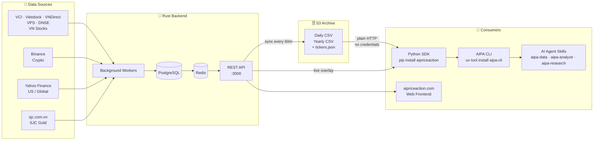

# AIPriceAction

**Financial data platform with AI-powered analysis for Vietnamese stocks, crypto, and global markets.**

[](https://pypi.org/project/aipriceaction/)
[](https://pypi.org/project/aipa-cli/)
[](https://hub.docker.com/r/quanhua92/aipriceaction)
[](LICENSE)

[Tiếng Việt](README.vn.md)

---

## Get started in 30 seconds

```bash
npx skills add quanhua92/aipriceaction
```

Then ask any AI agent:

> "Analyze VIC with volume profile and price action"

> "Show me today's top performers by trading value"

> "Get the volume profile for VIC — where is the POC?"

> "Compare FPT and TCB technical analysis"

> "Research the banking sector"

Three skills are installed: **aipa-data** (raw OHLCV), **aipa-analyze** (AI-powered analysis), and **aipa-research** (multi-agent deep research). Works with Claude Code, Gemini CLI, and Codex.

---

## Install

| I want to... | Install | One-liner |
|---|---|---|
| Add AI agent skills | `npx skills add quanhua92/aipriceaction` | No Python needed |
| Use the CLI / TUI | `uv tool install aipa-cli` | Terminal analysis |
| Build with Python | `pip install aipriceaction` | Pandas DataFrames |

---

## Featured capabilities

### Volume Profile

POC, value area, and volume-by-price histogram from 1-minute data.

```bash
aipa volume-profile VCB
aipa volume-profile BTCUSDT --source crypto --bins 30
aipa volume-profile FPT --start-date 2026-05-05 --end-date 2026-05-09
```

### Top Performers

Rank tickers by price change, volume, MA scores, money flow, or sector.

```bash
aipa performers --sort-by value --limit 5
aipa performers --sort-by ma50_score --group NGAN_HANG
aipa performers --sort-by total_money_changed --source crypto
```

### AI Analysis

Wyckoff, VPA, and smart money signals with structured context.

```bash
aipa analyze VCB --interval 1D
aipa analyze VCB FPT VIC --interval 1h
aipa deep-research --run
```

---

## Architecture



---

## Data sources

| Market | Provider | Ticker examples | Intervals |
|---|---|---|---|
| Vietnamese stocks | VCI / Vietstock / VNDirect / VPS | VCB, FPT, VNINDEX | 1m, 1h, 1D |
| US / intl. stocks | Yahoo Finance | AAPL, GOOGL, GC=F | 1m, 1h, 1D |
| Cryptocurrency | Binance | BTCUSDT, ETHUSDT | 1m, 1h, 1D |
| SJC gold | sjc.com.vn | SJC-GOLD | 1D |

Aggregated intervals (5m, 15m, 30m, 4h, 1W, 2W, 1M) are computed on-demand from base 1m/1D data.

---

## Components

### AI Agent Skills

Three skills for Claude Code, Gemini CLI, and Codex: **aipa-data** fetches raw OHLCV data, **aipa-analyze** runs AI-powered single/multi-ticker analysis with Wyckoff and VPA patterns, **aipa-research** runs a multi-agent supervisor/worker/reviewer pipeline for sector-wide deep research. See [skills/README.md](skills/README.md).

### AIPA Terminal

Textual-based TUI with streaming chat, thinking/reasoning display, autocomplete, and slash commands. Also ships CLI subcommands for non-interactive analysis, volume profile, performers, live data, and deep research. See [aipriceaction-terminal/README.md](aipriceaction-terminal/README.md).

### Python SDK

Reads OHLCV data from a public S3 archive via plain HTTP — no credentials needed. Returns pandas DataFrames with optional MA indicators and scores. Includes an AI Context Builder for LLM-powered analysis, LangChain/LangGraph agent integration, and live data overlay. See [sdk/aipriceaction-python/README.md](sdk/aipriceaction-python/README.md).

### Rust Backend

Axum REST API with background workers that sync OHLCV data from multiple providers into PostgreSQL, served through a Redis edge cache. Deploys as a single Docker container. See [aipriceaction/README.md](aipriceaction/README.md).

### Frontend

Human-facing web UI at [aipriceaction.com](https://aipriceaction.com). Source at [aipriceaction-web](https://github.com/quanhua92/aipriceaction-web).

---

## Self-host

```bash
cd aipriceaction
cp .env.example .env
docker compose up -d
```

See [aipriceaction/README.md](aipriceaction/README.md) for the full setup guide, build-from-source instructions, and production deployment with HAProxy.

---

## Repository structure

```
aipriceaction/              Rust backend -- API server, background workers, PostgreSQL + Redis
sdk/
  aipriceaction-python/     Python SDK -- reads from S3 archive, no credentials needed
aipriceaction-terminal/     Python TUI and CLI for AI-powered ticker analysis
skills/                     Claude Code skills for market analysis workflows
```

---

## Deep dives

| Document | What it covers |
|---|---|
| [DATA_FLOW.md](DATA_FLOW.md) | S3 archive, live API, cache freshness, and the merge pipeline |
| [VOLUME_PROFILE.md](VOLUME_PROFILE.md) | Volume-by-price algorithm: POC, value area, and why uniform distribution |
| [PERFORMERS.md](PERFORMERS.md) | Top/worst market rankings: metrics, MA scores, money flow |
| [MULTI_AGENTS_ANALYSIS.md](MULTI_AGENTS_ANALYSIS.md) | AI agent architecture: single-agent analyze vs multi-agent deep-research pipeline |

## Development

See [CLAUDE.md](CLAUDE.md) for development guidelines, architecture details, and contributor instructions.

## License

MIT
