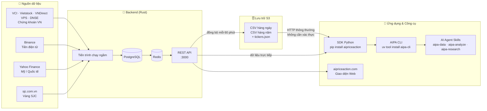

# AIPriceAction

**Nền tảng dữ liệu tài chính tích hợp phân tích AI cho chứng khoán Việt Nam, tiền điện tử và thị trường quốc tế.**

[](https://pypi.org/project/aipriceaction/)
[](https://pypi.org/project/aipa-cli/)
[](https://hub.docker.com/r/quanhua92/aipriceaction)
[](LICENSE)

[English](README.md)

---

## Bắt đầu sau 30 giây

```bash
npx skills add quanhua92/aipriceaction
```

Sau đó hỏi bất kỳ AI agent nào:

> "So sánh VCB, TCB, MBB, CTG trên khung 1h và 1D — ngân hàng nào xu hướng mạnh nhất?"

> "Phân tích VIC với volume profile và price action"

> "So sánh giá vàng SJC với giá vàng thế giới"

> "Volume profile của BTCUSDT — POC và value area nằm ở đâu?"

> "Phân tích Wyckoff cho FPT, VNM, HPG"

> "Cho tôi xem các mã dẫn đầu xếp hạng theo giá trị giao dịch"

> "Nghiên cứu chuyên sâu: nhóm ngành nào đang dẫn dắt thị trường VN?"

Ba skill được cài đặt: **aipa-data** (truy xuất dữ liệu OHLCV thô), **aipa-analyze** (phân tích bằng AI) và **aipa-research** (nghiên cứu chuyên sâu đa tác vụ - multi-agent). Hoạt động mượt mà với Claude Code, Gemini CLI và Codex.

### Dùng ngay không cần cài skill

Chỉ cần tải [AGENTS.md](AGENTS.md) bỏ vào project. Gemini CLI tự nhận diện, còn Claude Code thì copy hoặc tạo symlink:

```bash
# Cách 1: Symlink (tự cập nhật khi AGENTS.md thay đổi)
ln -s AGENTS.md CLAUDE.md

# Cách 2: Copy (cần cập nhật thủ công)
cp AGENTS.md CLAUDE.md
```

Xong — AI agent đã có sẵn đầy đủ hướng dẫn dùng `aipa-cli`. Yêu cầu máy có Python — AI sẽ tự cài `aipa-cli` lần đầu chạy. Các agent chỉ chạy trên web (VD: Claude.ai web) sẽ không hoạt động. Lưu ý: với copy, AGENTS.md khi có bản mới phải tải lại thủ công, còn skill cập nhật dễ dàng qua `npx skills update`.

---

## Cài đặt

| Tôi muốn... | Cách cài đặt | Lệnh cài đặt nhanh |
|---|---|---|
| Dùng AI agent — không cần cài skill | Tải [AGENTS.md](AGENTS.md) | Tự động cài aipa-cli |
| Thêm skill cho AI agent | `npx skills add quanhua92/aipriceaction` | Tự động cài aipa-cli |
| Sử dụng CLI / TUI | `uv tool install aipa-cli` | Phân tích ngay trên terminal |
| Xây dựng với Python | `pip install aipriceaction` | Xử lý dữ liệu qua Pandas |

---

## Tính năng nổi bật

### Volume Profile (Hồ sơ khối lượng)

POC, vùng giá trị (value area) và biểu đồ khối lượng theo mức giá (volume-by-price histogram) dựa trên dữ liệu 1 phút.

```bash
aipa volume-profile VCB
aipa volume-profile BTCUSDT --source crypto --bins 30
aipa volume-profile FPT --start-date 2026-05-05 --end-date 2026-05-09
```

### Các mã dẫn đầu (Top Performers)

Xếp hạng mã theo biến động giá, khối lượng, điểm số MA, dòng tiền hoặc nhóm ngành.

```bash
aipa performers --sort-by value --limit 5
aipa performers --sort-by ma50_score --group NGAN_HANG
aipa performers --sort-by total_money_changed --source crypto
```

### Phân tích AI chuyên sâu

Tín hiệu Wyckoff, VPA và dòng tiền thông minh (smart money) với ngữ cảnh dữ liệu được cấu trúc chặt chẽ.

```bash
aipa analyze VCB --interval 1D
aipa analyze VCB FPT VIC --interval 1h
aipa deep-research --run
```

---

## Kiến trúc



---

## Nguồn dữ liệu

| Thị trường | Nhà cung cấp | Ví dụ mã | Khung thời gian |
|---|---|---|---|
| Chứng khoán Việt Nam | VCI / Vietstock / VNDirect / VPS | VCB, FPT, VNINDEX | 1m, 1h, 1D |
| Chứng khoán Mỹ / quốc tế | Yahoo Finance | AAPL, GOOGL, GC=F | 1m, 1h, 1D |
| Tiền điện tử | Binance | BTCUSDT, ETHUSDT | 1m, 1h, 1D |
| Vàng SJC | sjc.com.vn | SJC-GOLD | 1D |

Các khung thời gian tổng hợp (5m, 15m, 30m, 4h, 1W, 2W, 1M) được tính toán theo yêu cầu từ dữ liệu gốc 1m/1D.

---

## Thành phần

### Skill cho AI Agent

Ba skill dành cho Claude Code, Gemini CLI và Codex: **aipa-data** truy xuất dữ liệu OHLCV thô, **aipa-analyze** thực hiện phân tích một hoặc nhiều mã bằng AI với các mẫu hình Wyckoff và VPA, **aipa-research** vận hành quy trình đa tác vụ (supervisor/worker/reviewer) để nghiên cứu sâu toàn ngành. Xem thêm tại [skills/README.md](skills/README.md).

### AIPA Terminal

Giao diện TUI dựa trên Textual với trò chuyện dạng luồng (streaming), hiển thị quá trình tư duy, tự động hoàn thành và các lệnh gạch chéo (slash commands). Đồng thời đi kèm các lệnh CLI để phân tích không tương tác, volume profile, xếp hạng mã dẫn đầu, dữ liệu trực tiếp và nghiên cứu sâu. Xem thêm tại [aipriceaction-terminal/README.md](aipriceaction-terminal/README.md).

### SDK Python

Đọc dữ liệu OHLCV từ kho lưu trữ S3 công khai qua HTTP thông thường — không cần xác thực (credentials). Trả về Pandas DataFrame với các chỉ báo MA và điểm số tùy chọn. Bao gồm AI Context Builder để phân tích bằng LLM, tích hợp agent LangChain/LangGraph và cập nhật dữ liệu trực tiếp. Xem thêm tại [sdk/aipriceaction-python/README.md](sdk/aipriceaction-python/README.md).

### Backend (Rust)

Axum REST API với các tiến trình chạy ngầm (background workers) đồng bộ dữ liệu OHLCV từ nhiều nguồn vào PostgreSQL, phục vụ qua bộ nhớ đệm Redis. Triển khai tinh gọn dưới dạng một container Docker duy nhất. Xem thêm tại [aipriceaction/README.md](aipriceaction/README.md).

### Frontend

Giao diện web dành cho người dùng tại [aipriceaction.com](https://aipriceaction.com). Mã nguồn tại [aipriceaction-web](https://github.com/quanhua92/aipriceaction-web).

---

## Tự triển khai (Self-host)

```bash
cd aipriceaction
cp .env.example .env
docker compose up -d
```

Xem [aipriceaction/README.md](aipriceaction/README.md) để biết hướng dẫn thiết lập đầy đủ, cách xây dựng từ mã nguồn và triển khai thực tế với HAProxy.

---

## Cấu trúc kho lưu trữ

```
aipriceaction/              Backend bằng Rust -- API server, background workers, PostgreSQL + Redis
sdk/
  aipriceaction-python/     SDK Python -- đọc từ kho lưu trữ S3, không cần thông tin đăng nhập
aipriceaction-terminal/     TUI và CLI bằng Python để phân tích mã chứng khoán bằng AI
skills/                     Skill cho Claude Code phục vụ quy trình phân tích thị trường
```

---

## Tài liệu chuyên sâu

| Tài liệu | Nội dung |
|---|---|
| [DATA_FLOW.md](DATA_FLOW.md) | Lưu trữ S3, API trực tiếp, bộ nhớ đệm và quy trình hợp nhất dữ liệu |
| [VOLUME_PROFILE.md](VOLUME_PROFILE.md) | Thuật toán khối lượng theo giá: POC, vùng giá trị và phương pháp phân phối đều |
| [PERFORMERS.md](PERFORMERS.md) | Xếp hạng mã dẫn đầu/kém nhất: chỉ số, điểm MA, dòng tiền |
| [MULTI_AGENTS_ANALYSIS.md](MULTI_AGENTS_ANALYSIS.md) | Kiến trúc AI agent: phân tích đơn tác vụ vs quy trình đa tác vụ nghiên cứu chuyên sâu |

## Phát triển

Xem [CLAUDE.md](CLAUDE.md) để biết hướng dẫn phát triển, chi tiết kiến trúc và hướng dẫn cho người đóng góp.

## Giấy phép

MIT
