# AIPriceAction Market Report
*Report generated for data from **2025-01-02** to **2025-09-27**.*
*Last updated: 2025-09-27 09:34:10*

---

## 🎯 View the Trading Plan

**➡️ [Click here to view the trading plan](PLAN.md)**

**🎢 [Click here to view the latest market leaders](LEADER.md)**

---

<h3 id="vpa-signal-summary">VPA Signal Summary (from Latest Analysis)</h3>

| Signal | Tickers |
|:---|:---|
| Effort to Fall | [REE](#ree), [VOS](#vos) |
| Effort to Rise | [BVH](#bvh), [CEO](#ceo), [CTI](#cti), [GDT](#gdt), [KDH](#kdh), [NCT](#nct), [NTL](#ntl), [TSC](#tsc) |
| No Demand | [ACL](#acl), [ANV](#anv), [APG](#apg), [BCG](#bcg), [BFC](#bfc), [BTN](#btn), [BWE](#bwe), [C4G](#c4g), [CIG](#cig), [CMX](#cmx), [CNG](#cng), [CSC](#csc), [CST](#cst), [CSV](#csv), [CTD](#ctd), [CTR](#ctr), [DAH](#dah), [DCM](#dcm), [DGC](#dgc), [DIG](#dig), [DL1](#dl1), [DPG](#dpg), [DRI](#dri), [DSN](#dsn), [FPT](#fpt), [FRT](#frt), [G36](#g36), [GEG](#geg), [HLD](#hld), [HOM](#hom), [HT1](#ht1), [HVN](#hvn), [IDC](#idc), [IPA](#ipa), [ITC](#itc), [L18](#l18), [LDG](#ldg), [MBB](#mbb), [MIG](#mig), [MST](#mst), [MWG](#mwg), [NAF](#naf), [NRC](#nrc), [NTP](#ntp), [OCB](#ocb), [PHR](#phr), [PPC](#ppc), [PVD](#pvd), [QTP](#qtp), [SAB](#sab), [SBS](#sbs), [SCI](#sci), [SCS](#scs), [SIP](#sip), [SSH](#ssh), [STB](#stb), [TCI](#tci), [TCL](#tcl), [TDM](#tdm), [TIG](#tig), [TIP](#tip), [TLH](#tlh), [TVB](#tvb), [VC2](#vc2), [VC7](#vc7), [VCB](#vcb), [VCS](#vcs), [VEA](#vea), [VGS](#vgs), [VGT](#vgt), [VHM](#vhm), [VIG](#vig), [VIX](#vix), [VLB](#vlb), [VLC](#vlc), [VNA](#vna), [VNE](#vne), [VNINDEX](#vnindex), [VNM](#vnm), [VTK](#vtk), [VTO](#vto), [VTP](#vtp) |
| No Supply | [AGG](#agg), [APS](#aps), [BCE](#bce), [DBC](#dbc), [DDV](#ddv), [DHC](#dhc), [DST](#dst), [EVE](#eve), [FID](#fid), [GAS](#gas), [HID](#hid), [MCM](#mcm), [NHA](#nha), [PPH](#pph), [PTB](#ptb), [PVP](#pvp), [STK](#stk), [TLD](#tld), [TNH](#tnh), [TNT](#tnt), [TTN](#ttn), [VHC](#vhc), [VIB](#vib), [VPG](#vpg), [VRG](#vrg) |
| Sign of Strength | [AAA](#aaa), [APH](#aph), [ASM](#asm), [BCC](#bcc), [BCM](#bcm), [BIC](#bic), [BMC](#bmc), [BMI](#bmi), [BSR](#bsr), [CII](#cii), [CTG](#ctg), [CTS](#cts), [DCL](#dcl), [DSC](#dsc), [DTD](#dtd), [DVN](#dvn), [DXG](#dxg), [EVF](#evf), [FCN](#fcn), [FIT](#fit), [FMC](#fmc), [HAG](#hag), [HAH](#hah), [HAP](#hap), [HCD](#hcd), [HDC](#hdc), [HDG](#hdg), [HHS](#hhs), [HHV](#hhv), [HSG](#hsg), [IDI](#idi), [IDJ](#idj), [IJC](#ijc), [KBC](#kbc), [KDC](#kdc), [KSV](#ksv), [LPB](#lpb), [LSS](#lss), [MCH](#mch), [MHC](#mhc), [MSB](#msb), [MSR](#msr), [NBC](#nbc), [NDN](#ndn), [NHH](#nhh), [NNC](#nnc), [NT2](#nt2), [PC1](#pc1), [PET](#pet), [PHC](#phc), [PHP](#php), [PLC](#plc), [PVI](#pvi), [PVT](#pvt), [PXI](#pxi), [SAS](#sas), [SCR](#scr), [SGT](#sgt), [TDC](#tdc), [VCG](#vcg), [VIC](#vic), [VSC](#vsc), [YEG](#yeg) |
| Sign of Weakness | [ACG](#acg), [ACV](#acv), [BMP](#bmp), [BSI](#bsi), [BVS](#bvs), [C47](#c47), [C69](#c69), [CLX](#clx), [CMG](#cmg), [D2D](#d2d), [DGW](#dgw), [DPM](#dpm), [DPR](#dpr), [DVP](#dvp), [DXP](#dxp), [EIB](#eib), [EVG](#evg), [FOX](#fox), [FTS](#fts), [GDA](#gda), [HBC](#hbc), [HCM](#hcm), [HDB](#hdb), [HPG](#hpg), [HQC](#hqc), [KSB](#ksb), [LCG](#lcg), [LTG](#ltg), [MFS](#mfs), [NVL](#nvl), [OIL](#oil), [ORS](#ors), [PAN](#pan), [PNJ](#pnj), [POW](#pow), [PVC](#pvc), [PVS](#pvs), [S99](#s99), [SHS](#shs), [SLS](#sls), [TCD](#tcd), [TCM](#tcm), [TPB](#tpb), [TTF](#ttf), [TV2](#tv2), [TVN](#tvn), [TVS](#tvs), [VCI](#vci), [VDS](#vds), [VJC](#vjc), [VND](#vnd) |
| Test for Supply | [ACB](#acb), [AGR](#agr), [NKG](#nkg), [NTC](#ntc), [VPB](#vpb), [VPH](#vph) |
| Others | [ADS](#ads), [BAF](#baf), [BID](#bid), [BMS](#bms), [BTS](#bts), [CKG](#ckg), [DHA](#dha), [DHG](#dhg), [DHT](#dht), [DRC](#drc), [DRG](#drg), [ELC](#elc), [EVS](#evs), [GEX](#gex), [GIL](#gil), [GMD](#gmd), [GVR](#gvr), [HAX](#hax), [HTN](#htn), [HUT](#hut), [IDV](#idv), [IMP](#imp), [JVC](#jvc), [KHG](#khg), [LAS](#las), [LHG](#lhg), [LIG](#lig), [MBS](#mbs), [MPC](#mpc), [MSH](#msh), [MSN](#msn), [NLG](#nlg), [PDR](#pdr), [PLX](#plx), [QNS](#qns), [SBT](#sbt), [SGN](#sgn), [SGR](#sgr), [SHB](#shb), [SKG](#skg), [SMC](#smc), [SSI](#ssi), [SZC](#szc), [TCB](#tcb), [TCH](#tch), [TNG](#tng), [VGC](#vgc), [VGI](#vgi), [VIF](#vif), [VIP](#vip), [VRE](#vre) |

---

## Groups
<h3 id="ban-le">BAN_LE</h3>

[DGW](#dgw), [FRT](#frt), [HAX](#hax)

<h3 id="bao-hiem">BAO_HIEM</h3>

[BIC](#bic), [BMI](#bmi), [BVH](#bvh)

<h3 id="bat-dong-san">BAT_DONG_SAN</h3>

[AGG](#agg), [CEO](#ceo), [DIG](#dig), [DXG](#dxg), [HDC](#hdc), [HLD](#hld), [HQC](#hqc)

<h3 id="bat-dong-san-kcn">BAT_DONG_SAN_KCN</h3>

[BCM](#bcm), [D2D](#d2d), [DTD](#dtd)

<h3 id="cao-su">CAO_SU</h3>

[DPR](#dpr), [DRC](#drc), [DRG](#drg), [DRI](#dri), [GVR](#gvr)

<h3 id="chung-khoan">CHUNG_KHOAN</h3>

[AGR](#agr), [APG](#apg), [APS](#aps), [BMS](#bms), [BSI](#bsi), [BVS](#bvs), [CTS](#cts), [DSC](#dsc), [EVS](#evs), [FTS](#fts), [HCM](#hcm)

<h3 id="cong-nghe">CONG_NGHE</h3>

[CMG](#cmg), [ELC](#elc), [FOX](#fox), [FPT](#fpt)

<h3 id="dau-khi">DAU_KHI</h3>

[BSR](#bsr), [CNG](#cng), [GAS](#gas)

<h3 id="dau-tu-cong">DAU_TU_CONG</h3>

[C4G](#c4g), [FCN](#fcn), [G36](#g36), [HHV](#hhv)

<h3 id="det-may">DET_MAY</h3>

[ADS](#ads), [EVE](#eve), [GIL](#gil)

<h3 id="hang-khong">HANG_KHONG</h3>

[ACV](#acv)

<h3 id="hoa-chat">HOA_CHAT</h3>

[BFC](#bfc), [CSV](#csv), [DCM](#dcm), [DDV](#ddv), [DGC](#dgc), [DPM](#dpm)

<h3 id="khai-khoang">KHAI_KHOANG</h3>

[BMC](#bmc), [CST](#cst)

<h3 id="nang-luong">NANG_LUONG</h3>

[GEG](#geg), [HDG](#hdg)

<h3 id="ngan-hang">NGAN_HANG</h3>

[ACB](#acb), [BID](#bid), [CTG](#ctg), [EIB](#eib), [EVF](#evf), [HDB](#hdb)

<h3 id="nhua">NHUA</h3>

[AAA](#aaa), [APH](#aph), [BMP](#bmp), [HCD](#hcd)

<h3 id="nong-nghiep">NONG_NGHIEP</h3>

[BAF](#baf), [DBC](#dbc), [HAG](#hag)

<h3 id="others">OTHERS</h3>

[ACG](#acg), [BWE](#bwe), [DHC](#dhc), [DSN](#dsn), [GDT](#gdt), [GEX](#gex), [HHS](#hhs)

<h3 id="penny">PENNY</h3>

[CIG](#cig), [CSC](#csc), [DAH](#dah), [DL1](#dl1), [DST](#dst), [EVG](#evg), [FIT](#fit), [HAP](#hap), [HID](#hid)

<h3 id="suc-khoe">SUC_KHOE</h3>

[DCL](#dcl), [DHG](#dhg), [DHT](#dht), [DVN](#dvn)

<h3 id="thep">THEP</h3>

[ACG](#acg), [GDA](#gda), [HPG](#hpg)

<h3 id="thuc-pham">THUC_PHAM</h3>

[CLX](#clx)

<h3 id="thuy-san">THUY_SAN</h3>

[ACL](#acl), [ANV](#anv), [ASM](#asm), [CMX](#cmx), [FMC](#fmc)

<h3 id="van-tai">VAN_TAI</h3>

[DVP](#dvp), [DXP](#dxp), [GMD](#gmd), [HAH](#hah)

<h3 id="vlxd">VLXD</h3>

[BCC](#bcc), [BTN](#btn), [BTS](#bts), [CTI](#cti), [DHA](#dha), [HOM](#hom)

<h3 id="xay-dung">XAY_DUNG</h3>

[BCE](#bce), [BCG](#bcg), [C47](#c47), [C69](#c69), [CII](#cii), [CKG](#ckg), [CTD](#ctd), [DPG](#dpg), [FID](#fid), [HBC](#hbc)

<h3 id="xay-lap-dien">XAY_LAP_DIEN</h3>

[CTR](#ctr)

---

## Table of Contents
| Ticker | Actions |
|:-------|:--------|
| **[VNINDEX](#vnindex)** | [[Download CSV](market_data/VNINDEX_2025-01-02_to_2025-09-27.csv)] |
| **[AAA](#aaa)** | [[Download CSV](market_data/AAA_2025-01-02_to_2025-09-27.csv)] |
| **[ACB](#acb)** | [[Download CSV](market_data/ACB_2025-01-02_to_2025-09-27.csv)] |
| **[ACG](#acg)** | [[Download CSV](market_data/ACG_2025-01-02_to_2025-09-27.csv)] |
| **[ACL](#acl)** | [[Download CSV](market_data/ACL_2025-01-02_to_2025-09-27.csv)] |
| **[ACV](#acv)** | [[Download CSV](market_data/ACV_2025-01-02_to_2025-09-27.csv)] |
| **[ADS](#ads)** | [[Download CSV](market_data/ADS_2025-01-02_to_2025-09-27.csv)] |
| **[AGG](#agg)** | [[Download CSV](market_data/AGG_2025-01-02_to_2025-09-27.csv)] |
| **[AGR](#agr)** | [[Download CSV](market_data/AGR_2025-01-02_to_2025-09-27.csv)] |
| **[ANV](#anv)** | [[Download CSV](market_data/ANV_2025-01-02_to_2025-09-27.csv)] |
| **[APG](#apg)** | [[Download CSV](market_data/APG_2025-01-02_to_2025-09-27.csv)] |
| **[APH](#aph)** | [[Download CSV](market_data/APH_2025-01-02_to_2025-09-27.csv)] |
| **[APS](#aps)** | [[Download CSV](market_data/APS_2025-01-02_to_2025-09-27.csv)] |
| **[ASM](#asm)** | [[Download CSV](market_data/ASM_2025-01-02_to_2025-09-27.csv)] |
| **[BAF](#baf)** | [[Download CSV](market_data/BAF_2025-01-02_to_2025-09-27.csv)] |
| **[BCC](#bcc)** | [[Download CSV](market_data/BCC_2025-01-02_to_2025-09-27.csv)] |
| **[BCE](#bce)** | [[Download CSV](market_data/BCE_2025-01-02_to_2025-09-27.csv)] |
| **[BCG](#bcg)** | [[Download CSV](market_data/BCG_2025-01-02_to_2025-09-27.csv)] |
| **[BCM](#bcm)** | [[Download CSV](market_data/BCM_2025-01-02_to_2025-09-27.csv)] |
| **[BFC](#bfc)** | [[Download CSV](market_data/BFC_2025-01-02_to_2025-09-27.csv)] |
| **[BIC](#bic)** | [[Download CSV](market_data/BIC_2025-01-02_to_2025-09-27.csv)] |
| **[BID](#bid)** | [[Download CSV](market_data/BID_2025-01-02_to_2025-09-27.csv)] |
| **[BMC](#bmc)** | [[Download CSV](market_data/BMC_2025-01-02_to_2025-09-27.csv)] |
| **[BMI](#bmi)** | [[Download CSV](market_data/BMI_2025-01-02_to_2025-09-27.csv)] |
| **[BMP](#bmp)** | [[Download CSV](market_data/BMP_2025-01-02_to_2025-09-27.csv)] |
| **[BMS](#bms)** | [[Download CSV](market_data/BMS_2025-01-02_to_2025-09-27.csv)] |
| **[BSI](#bsi)** | [[Download CSV](market_data/BSI_2025-01-02_to_2025-09-27.csv)] |
| **[BSR](#bsr)** | [[Download CSV](market_data/BSR_2025-01-02_to_2025-09-27.csv)] |
| **[BTN](#btn)** | [[Download CSV](market_data/BTN_2025-01-02_to_2025-09-27.csv)] |
| **[BTS](#bts)** | [[Download CSV](market_data/BTS_2025-01-02_to_2025-09-27.csv)] |
| **[BVH](#bvh)** | [[Download CSV](market_data/BVH_2025-01-02_to_2025-09-27.csv)] |
| **[BVS](#bvs)** | [[Download CSV](market_data/BVS_2025-01-02_to_2025-09-27.csv)] |
| **[BWE](#bwe)** | [[Download CSV](market_data/BWE_2025-01-02_to_2025-09-27.csv)] |
| **[C47](#c47)** | [[Download CSV](market_data/C47_2025-01-02_to_2025-09-27.csv)] |
| **[C4G](#c4g)** | [[Download CSV](market_data/C4G_2025-01-02_to_2025-09-27.csv)] |
| **[C69](#c69)** | [[Download CSV](market_data/C69_2025-01-02_to_2025-09-27.csv)] |
| **[CEO](#ceo)** | [[Download CSV](market_data/CEO_2025-01-02_to_2025-09-27.csv)] |
| **[CIG](#cig)** | [[Download CSV](market_data/CIG_2025-01-02_to_2025-09-27.csv)] |
| **[CII](#cii)** | [[Download CSV](market_data/CII_2025-01-02_to_2025-09-27.csv)] |
| **[CKG](#ckg)** | [[Download CSV](market_data/CKG_2025-01-02_to_2025-09-27.csv)] |
| **[CLX](#clx)** | [[Download CSV](market_data/CLX_2025-01-02_to_2025-09-27.csv)] |
| **[CMG](#cmg)** | [[Download CSV](market_data/CMG_2025-01-02_to_2025-09-27.csv)] |
| **[CMX](#cmx)** | [[Download CSV](market_data/CMX_2025-01-02_to_2025-09-27.csv)] |
| **[CNG](#cng)** | [[Download CSV](market_data/CNG_2025-01-02_to_2025-09-27.csv)] |
| **[CSC](#csc)** | [[Download CSV](market_data/CSC_2025-01-02_to_2025-09-27.csv)] |
| **[CST](#cst)** | [[Download CSV](market_data/CST_2025-01-02_to_2025-09-27.csv)] |
| **[CSV](#csv)** | [[Download CSV](market_data/CSV_2025-01-02_to_2025-09-27.csv)] |
| **[CTD](#ctd)** | [[Download CSV](market_data/CTD_2025-01-02_to_2025-09-27.csv)] |
| **[CTG](#ctg)** | [[Download CSV](market_data/CTG_2025-01-02_to_2025-09-27.csv)] |
| **[CTI](#cti)** | [[Download CSV](market_data/CTI_2025-01-02_to_2025-09-27.csv)] |
| **[CTR](#ctr)** | [[Download CSV](market_data/CTR_2025-01-02_to_2025-09-27.csv)] |
| **[CTS](#cts)** | [[Download CSV](market_data/CTS_2025-01-02_to_2025-09-27.csv)] |
| **[D2D](#d2d)** | [[Download CSV](market_data/D2D_2025-01-02_to_2025-09-27.csv)] |
| **[DAH](#dah)** | [[Download CSV](market_data/DAH_2025-01-02_to_2025-09-27.csv)] |
| **[DBC](#dbc)** | [[Download CSV](market_data/DBC_2025-01-02_to_2025-09-27.csv)] |
| **[DCL](#dcl)** | [[Download CSV](market_data/DCL_2025-01-02_to_2025-09-27.csv)] |
| **[DCM](#dcm)** | [[Download CSV](market_data/DCM_2025-01-02_to_2025-09-27.csv)] |
| **[DDV](#ddv)** | [[Download CSV](market_data/DDV_2025-01-02_to_2025-09-27.csv)] |
| **[DGC](#dgc)** | [[Download CSV](market_data/DGC_2025-01-02_to_2025-09-27.csv)] |
| **[DGW](#dgw)** | [[Download CSV](market_data/DGW_2025-01-02_to_2025-09-27.csv)] |
| **[DHA](#dha)** | [[Download CSV](market_data/DHA_2025-01-02_to_2025-09-27.csv)] |
| **[DHC](#dhc)** | [[Download CSV](market_data/DHC_2025-01-02_to_2025-09-27.csv)] |
| **[DHG](#dhg)** | [[Download CSV](market_data/DHG_2025-01-02_to_2025-09-27.csv)] |
| **[DHT](#dht)** | [[Download CSV](market_data/DHT_2025-01-02_to_2025-09-27.csv)] |
| **[DIG](#dig)** | [[Download CSV](market_data/DIG_2025-01-02_to_2025-09-27.csv)] |
| **[DL1](#dl1)** | [[Download CSV](market_data/DL1_2025-01-02_to_2025-09-27.csv)] |
| **[DPG](#dpg)** | [[Download CSV](market_data/DPG_2025-01-02_to_2025-09-27.csv)] |
| **[DPM](#dpm)** | [[Download CSV](market_data/DPM_2025-01-02_to_2025-09-27.csv)] |
| **[DPR](#dpr)** | [[Download CSV](market_data/DPR_2025-01-02_to_2025-09-27.csv)] |
| **[DRC](#drc)** | [[Download CSV](market_data/DRC_2025-01-02_to_2025-09-27.csv)] |
| **[DRG](#drg)** | [[Download CSV](market_data/DRG_2025-01-02_to_2025-09-27.csv)] |
| **[DRI](#dri)** | [[Download CSV](market_data/DRI_2025-01-02_to_2025-09-27.csv)] |
| **[DSC](#dsc)** | [[Download CSV](market_data/DSC_2025-01-02_to_2025-09-27.csv)] |
| **[DSN](#dsn)** | [[Download CSV](market_data/DSN_2025-01-02_to_2025-09-27.csv)] |
| **[DST](#dst)** | [[Download CSV](market_data/DST_2025-01-02_to_2025-09-27.csv)] |
| **[DTD](#dtd)** | [[Download CSV](market_data/DTD_2025-01-02_to_2025-09-27.csv)] |
| **[DVN](#dvn)** | [[Download CSV](market_data/DVN_2025-01-02_to_2025-09-27.csv)] |
| **[DVP](#dvp)** | [[Download CSV](market_data/DVP_2025-01-02_to_2025-09-27.csv)] |
| **[DXG](#dxg)** | [[Download CSV](market_data/DXG_2025-01-02_to_2025-09-27.csv)] |
| **[DXP](#dxp)** | [[Download CSV](market_data/DXP_2025-01-02_to_2025-09-27.csv)] |
| **[EIB](#eib)** | [[Download CSV](market_data/EIB_2025-01-02_to_2025-09-27.csv)] |
| **[ELC](#elc)** | [[Download CSV](market_data/ELC_2025-01-02_to_2025-09-27.csv)] |
| **[EVE](#eve)** | [[Download CSV](market_data/EVE_2025-01-02_to_2025-09-27.csv)] |
| **[EVF](#evf)** | [[Download CSV](market_data/EVF_2025-01-02_to_2025-09-27.csv)] |
| **[EVG](#evg)** | [[Download CSV](market_data/EVG_2025-01-02_to_2025-09-27.csv)] |
| **[EVS](#evs)** | [[Download CSV](market_data/EVS_2025-01-02_to_2025-09-27.csv)] |
| **[FCN](#fcn)** | [[Download CSV](market_data/FCN_2025-01-02_to_2025-09-27.csv)] |
| **[FID](#fid)** | [[Download CSV](market_data/FID_2025-01-02_to_2025-09-27.csv)] |
| **[FIT](#fit)** | [[Download CSV](market_data/FIT_2025-01-02_to_2025-09-27.csv)] |
| **[FMC](#fmc)** | [[Download CSV](market_data/FMC_2025-01-02_to_2025-09-27.csv)] |
| **[FOX](#fox)** | [[Download CSV](market_data/FOX_2025-01-02_to_2025-09-27.csv)] |
| **[FPT](#fpt)** | [[Download CSV](market_data/FPT_2025-01-02_to_2025-09-27.csv)] |
| **[FRT](#frt)** | [[Download CSV](market_data/FRT_2025-01-02_to_2025-09-27.csv)] |
| **[FTS](#fts)** | [[Download CSV](market_data/FTS_2025-01-02_to_2025-09-27.csv)] |
| **[G36](#g36)** | [[Download CSV](market_data/G36_2025-01-02_to_2025-09-27.csv)] |
| **[GAS](#gas)** | [[Download CSV](market_data/GAS_2025-01-02_to_2025-09-27.csv)] |
| **[GDA](#gda)** | [[Download CSV](market_data/GDA_2025-01-02_to_2025-09-27.csv)] |
| **[GDT](#gdt)** | [[Download CSV](market_data/GDT_2025-01-02_to_2025-09-27.csv)] |
| **[GEG](#geg)** | [[Download CSV](market_data/GEG_2025-01-02_to_2025-09-27.csv)] |
| **[GEX](#gex)** | [[Download CSV](market_data/GEX_2025-01-02_to_2025-09-27.csv)] |
| **[GIL](#gil)** | [[Download CSV](market_data/GIL_2025-01-02_to_2025-09-27.csv)] |
| **[GMD](#gmd)** | [[Download CSV](market_data/GMD_2025-01-02_to_2025-09-27.csv)] |
| **[GVR](#gvr)** | [[Download CSV](market_data/GVR_2025-01-02_to_2025-09-27.csv)] |
| **[HAG](#hag)** | [[Download CSV](market_data/HAG_2025-01-02_to_2025-09-27.csv)] |
| **[HAH](#hah)** | [[Download CSV](market_data/HAH_2025-01-02_to_2025-09-27.csv)] |
| **[HAP](#hap)** | [[Download CSV](market_data/HAP_2025-01-02_to_2025-09-27.csv)] |
| **[HAX](#hax)** | [[Download CSV](market_data/HAX_2025-01-02_to_2025-09-27.csv)] |
| **[HBC](#hbc)** | [[Download CSV](market_data/HBC_2025-01-02_to_2025-09-27.csv)] |
| **[HCD](#hcd)** | [[Download CSV](market_data/HCD_2025-01-02_to_2025-09-27.csv)] |
| **[HCM](#hcm)** | [[Download CSV](market_data/HCM_2025-01-02_to_2025-09-27.csv)] |
| **[HDB](#hdb)** | [[Download CSV](market_data/HDB_2025-01-02_to_2025-09-27.csv)] |
| **[HDC](#hdc)** | [[Download CSV](market_data/HDC_2025-01-02_to_2025-09-27.csv)] |
| **[HDG](#hdg)** | [[Download CSV](market_data/HDG_2025-01-02_to_2025-09-27.csv)] |
| **[HHS](#hhs)** | [[Download CSV](market_data/HHS_2025-01-02_to_2025-09-27.csv)] |
| **[HHV](#hhv)** | [[Download CSV](market_data/HHV_2025-01-02_to_2025-09-27.csv)] |
| **[HID](#hid)** | [[Download CSV](market_data/HID_2025-01-02_to_2025-09-27.csv)] |
| **[HLD](#hld)** | [[Download CSV](market_data/HLD_2025-01-02_to_2025-09-27.csv)] |
| **[HOM](#hom)** | [[Download CSV](market_data/HOM_2025-01-02_to_2025-09-27.csv)] |
| **[HPG](#hpg)** | [[Download CSV](market_data/HPG_2025-01-02_to_2025-09-27.csv)] |
| **[HQC](#hqc)** | [[Download CSV](market_data/HQC_2025-01-02_to_2025-09-27.csv)] |

---

## Ticker Performance Summary
| Ticker | Period High | Period Low | Latest Close | Change % | Total Volume |
|:-------|------------:|-----------:|-------------:|---------:|-------------:|
| **VNINDEX** | 1,711.49 | 1,073.61 | **1,660.7** | 30.87% 📈 | 175,617,978,394 |
| **AAA** | 8.93 | 6.15 | **8.59** | 2.51% 📈 | 450,719,911 |
| **ACB** | 29.5 | 17.34 | **25.65** | 19.92% 📈 | 2,320,565,965 |
| **ACG** | 41.88 | 31.97 | **35.95** | -12.10% 📉 | 2,393,116 |
| **ACL** | 14.15 | 8.37 | **13.45** | 13.50% 📈 | 7,414,300 |
| **ACV** | 78.32 | 45.27 | **57.9** | -24.07% 📉 | 98,567,705 |
| **ADS** | 10.1 | 6.63 | **8.91** | 8.66% 📈 | 34,424,085 |
| **AGG** | 22.1 | 14.15 | **20.2** | 29.07% 📈 | 150,319,900 |
| **AGR** | 20.8 | 12.78 | **17.45** | 9.13% 📈 | 247,958,337 |
| **ANV** | 29.85 | 12.4 | **27.65** | 39.29% 📈 | 520,837,400 |
| **APG** | 13.45 | 5.75 | **11.6** | 73.13% 📈 | 150,585,300 |
| **APH** | 7.6 | 5.71 | **6.71** | -4.55% 📉 | 95,189,000 |
| **APS** | 14.2 | 4.4 | **9.9** | 52.31% 📈 | 221,559,900 |
| **ASM** | 9.38 | 5.89 | **9.33** | 9.00% 📈 | 227,222,900 |
| **BAF** | 38.8 | 26.0 | **34.9** | 24.20% 📈 | 722,517,700 |
| **BCC** | 9.9 | 5.8 | **9.0** | 25.00% 📈 | 31,753,800 |
| **BCE** | 12.3 | 8.2 | **11.35** | 33.53% 📈 | 28,473,800 |
| **BCG** | 6.37 | 2.79 | **3.34** | -47.40% 📉 | 1,894,143,500 |
| **BCM** | 82.4 | 49.8 | **67.7** | -3.29% 📉 | 99,632,800 |
| **BFC** | 51.1 | 30.86 | **42.2** | 10.50% 📈 | 145,451,159 |
| **BIC** | 32.83 | 16.61 | **28.0** | 47.52% 📈 | 22,323,210 |
| **BID** | 45.1 | 31.2 | **40.55** | 6.15% 📈 | 980,660,955 |
| **BMC** | 31.26 | 16.3 | **18.55** | -8.08% 📉 | 33,005,929 |
| **BMI** | 24.55 | 16.86 | **22.1** | 7.70% 📈 | 49,592,911 |
| **BMP** | 155.0 | 95.93 | **143.5** | 14.24% 📈 | 36,012,691 |
| **BMS** | 15.9 | 8.47 | **13.4** | 58.21% 📈 | 73,066,145 |
| **BSI** | 58.3 | 37.95 | **46.35** | 5.01% 📈 | 241,529,516 |
| **BSR** | 31.45 | 14.55 | **27.5** | 20.61% 📈 | 1,158,978,600 |
| **BTN** | 3.6 | 2.4 | **3.0** | 11.11% 📈 | 970,300 |
| **BTS** | 5.8 | 4.5 | **5.4** | 8.00% 📈 | 5,011,400 |
| **BVH** | 65.5 | 39.1 | **56.5** | 10.35% 📈 | 122,014,300 |
| **BVS** | 45.0 | 26.5 | **37.6** | 1.62% 📈 | 146,396,100 |
| **BWE** | 54.3 | 38.0 | **48.8** | 5.22% 📈 | 42,072,399 |
| **C47** | 13.25 | 5.57 | **10.95** | 79.51% 📈 | 20,935,800 |
| **C4G** | 10.9 | 5.6 | **9.5** | 20.25% 📈 | 269,726,700 |
| **C69** | 14.8 | 5.5 | **12.9** | 95.45% 📈 | 86,904,200 |
| **CEO** | 28.8 | 9.81 | **26.8** | 118.06% 📈 | 2,639,881,068 |
| **CIG** | 10.35 | 6.86 | **8.96** | 9.80% 📈 | 53,128,000 |
| **CII** | 27.45 | 9.02 | **26.85** | 123.38% 📈 | 3,377,890,043 |
| **CKG** | 17.71 | 10.74 | **13.8** | -22.08% 📉 | 25,146,740 |
| **CLX** | 19.94 | 12.08 | **16.1** | -0.62% 📉 | 42,700,717 |
| **CMG** | 50.4 | 28.85 | **39.5** | -20.20% 📉 | 230,278,823 |
| **CMX** | 8.55 | 6.03 | **7.11** | -10.00% 📉 | 58,001,700 |
| **CNG** | 31.54 | 23.73 | **27.3** | -7.55% 📉 | 22,392,065 |
| **CSC** | 26.9 | 15.55 | **21.1** | -14.68% 📉 | 10,961,130 |
| **CST** | 23.61 | 14.4 | **14.5** | -37.07% 📉 | 11,009,059 |
| **CSV** | 46.21 | 27.63 | **32.85** | -26.59% 📉 | 294,301,013 |
| **CTD** | 97.8 | 64.3 | **82.0** | 19.19% 📈 | 227,922,122 |
| **CTG** | 53.4 | 33.8 | **50.7** | 33.42% 📈 | 1,569,484,200 |
| **CTI** | 28.95 | 17.2 | **25.85** | 33.94% 📈 | 295,583,000 |
| **CTR** | 136.3 | 73.9 | **90.0** | -27.77% 📉 | 125,461,200 |
| **CTS** | 46.85 | 20.77 | **40.35** | 62.05% 📈 | 381,323,448 |
| **D2D** | 40.0 | 24.9 | **36.4** | 41.52% 📈 | 27,989,453 |
| **DAH** | 4.46 | 2.66 | **4.0** | 14.94% 📈 | 57,150,400 |
| **DBC** | 32.35 | 19.09 | **27.2** | 11.29% 📈 | 1,514,683,131 |
| **DCL** | 30.5 | 19.0 | **28.5** | 6.54% 📈 | 107,111,400 |
| **DCM** | 43.85 | 23.38 | **37.5** | 11.54% 📈 | 643,742,300 |
| **DDV** | 35.3 | 12.2 | **32.2** | 67.97% 📈 | 351,839,100 |
| **DGC** | 117.3 | 73.1 | **95.4** | -18.18% 📉 | 366,956,400 |
| **DGW** | 49.5 | 28.32 | **41.5** | 4.17% 📈 | 390,703,195 |
| **DHA** | 54.5 | 32.23 | **50.8** | 25.80% 📈 | 13,960,681 |
| **DHC** | 37.95 | 19.87 | **34.7** | 13.70% 📈 | 60,858,446 |
| **DHG** | 104.47 | 82.1 | **101.8** | 3.92% 📈 | 3,871,440 |
| **DHT** | 97.5 | 79.0 | **84.0** | -11.58% 📉 | 4,878,700 |
| **DIG** | 27.0 | 12.88 | **25.15** | 40.66% 📈 | 3,217,943,353 |
| **DL1** | 10.0 | 4.8 | **6.5** | 27.45% 📈 | 286,399,800 |
| **DPG** | 51.5 | 25.98 | **46.0** | 62.43% 📈 | 270,578,273 |
| **DPM** | 29.9 | 15.19 | **26.25** | 35.17% 📈 | 648,141,597 |
| **DPR** | 50.56 | 32.32 | **38.5** | 3.94% 📈 | 163,538,674 |
| **DRC** | 22.12 | 13.23 | **16.7** | -21.60% 📉 | 126,258,584 |
| **DRG** | 14.36 | 6.7 | **9.0** | 18.11% 📈 | 2,893,550 |
| **DRI** | 16.39 | 7.81 | **11.8** | -3.67% 📉 | 242,829,592 |
| **DSC** | 23.75 | 13.65 | **21.05** | 25.30% 📈 | 26,303,700 |
| **DSN** | 53.03 | 43.55 | **44.95** | -15.24% 📉 | 2,060,305 |
| **DST** | 9.6 | 4.0 | **8.8** | 57.14% 📈 | 41,832,300 |
| **DTD** | 23.7 | 11.64 | **22.3** | -4.21% 📉 | 131,239,048 |
| **DVN** | 29.35 | 16.83 | **21.8** | -9.17% 📉 | 21,408,952 |
| **DVP** | 82.71 | 62.97 | **72.1** | -4.22% 📉 | 3,150,391 |
| **DXG** | 24.5 | 10.51 | **22.75** | 77.87% 📈 | 3,212,008,342 |
| **DXP** | 12.2 | 7.5 | **11.1** | 0.82% 📈 | 48,503,694 |
| **EIB** | 31.65 | 15.6 | **25.7** | 33.51% 📈 | 2,306,307,600 |
| **ELC** | 27.55 | 18.3 | **23.0** | -3.16% 📉 | 152,455,320 |
| **EVE** | 12.1 | 7.88 | **10.9** | 11.22% 📈 | 10,950,915 |
| **EVF** | 16.5 | 7.94 | **13.3** | 45.83% 📈 | 2,481,849,000 |
| **EVG** | 12.15 | 4.86 | **10.2** | 61.90% 📈 | 355,246,000 |
| **EVS** | 9.3 | 4.5 | **7.2** | 26.32% 📈 | 72,237,400 |
| **FCN** | 20.6 | 11.05 | **18.8** | 30.10% 📈 | 418,105,500 |
| **FID** | 2.4 | 1.3 | **1.6** | 6.67% 📈 | 32,513,400 |
| **FIT** | 5.59 | 3.84 | **4.91** | 16.35% 📈 | 279,493,600 |
| **FMC** | 47.56 | 30.7 | **37.2** | -16.46% 📉 | 20,074,708 |
| **FOX** | 80.5 | 47.08 | **64.4** | 5.14% 📈 | 25,069,140 |
| **FPT** | 134.5 | 84.32 | **97.5** | -25.85% 📉 | 1,343,055,499 |
| **FRT** | 167.52 | 96.88 | **130.0** | -12.45% 📉 | 95,695,148 |
| **FTS** | 46.85 | 31.41 | **36.55** | -3.71% 📉 | 728,038,371 |
| **G36** | 12.7 | 4.6 | **11.2** | 69.70% 📈 | 132,103,900 |
| **GAS** | 69.28 | 47.82 | **61.5** | -4.34% 📉 | 177,371,853 |
| **GDA** | 20.07 | 11.53 | **18.1** | -8.82% 📉 | 28,079,543 |
| **GDT** | 25.9 | 16.74 | **21.0** | -18.76% 📉 | 8,363,737 |
| **GEG** | 18.45 | 11.15 | **16.3** | 36.40% 📈 | 317,620,900 |
| **GEX** | 60.74 | 16.42 | **53.0** | 201.65% 📈 | 2,103,456,016 |
| **GIL** | 21.75 | 13.25 | **18.4** | -11.54% 📉 | 142,019,500 |
| **GMD** | 74.5 | 40.84 | **70.0** | 11.11% 📈 | 451,128,700 |
| **GVR** | 35.6 | 21.7 | **28.5** | -6.56% 📉 | 734,995,300 |
| **HAG** | 17.5 | 9.54 | **15.9** | 30.86% 📈 | 1,850,941,900 |
| **HAH** | 68.32 | 34.2 | **55.0** | 46.35% 📈 | 490,345,719 |
| **HAP** | 7.07 | 4.19 | **6.83** | 51.78% 📈 | 48,893,800 |
| **HAX** | 18.2 | 11.75 | **12.5** | -21.43% 📉 | 284,644,567 |
| **HBC** | 8.9 | 5.0 | **7.7** | 22.22% 📈 | 463,481,900 |
| **HCD** | 8.93 | 6.15 | **8.28** | -6.33% 📉 | 14,679,300 |
| **HCM** | 30.4 | 17.84 | **26.3** | 15.40% 📈 | 2,323,437,913 |
| **HDB** | 33.95 | 18.0 | **30.15** | 18.47% 📈 | 2,582,381,000 |
| **HDC** | 39.35 | 20.7 | **37.05** | 47.61% 📈 | 859,856,000 |
| **HDG** | 35.05 | 17.91 | **34.0** | 30.52% 📈 | 765,137,557 |
| **HHS** | 19.5 | 6.95 | **18.05** | 142.93% 📈 | 1,080,683,500 |
| **HHV** | 17.35 | 9.26 | **16.6** | 49.55% 📈 | 1,950,249,943 |
| **HID** | 3.3 | 2.33 | **3.15** | 19.77% 📈 | 24,650,900 |
| **HLD** | 20.0 | 9.74 | **18.3** | 29.42% 📈 | 8,465,644 |
| **HOM** | 5.9 | 3.5 | **4.8** | 29.73% 📈 | 6,941,000 |
| **HPG** | 30.85 | 17.75 | **28.55** | 28.31% 📈 | 7,456,076,181 |
| **HQC** | 4.29 | 2.54 | **3.78** | 19.62% 📈 | 1,308,563,600 |

---

## Individual Ticker Analysis
### VNINDEX

#### [VPA Analysis (2025-05-08 - 2025-09-26)](./VPA.md#vnindex)
> **Ngày 2025-09-22:** VNINDEX giảm từ 1658.62 điểm xuống 1634.45 điểm với biên độ rộng từ 1616.02 đến 1659.13 điểm và đóng cửa gần mức thấp nhất phiên. Khối lượng giao dịch đạt 1212.48 triệu cổ phiếu, cao hơn đáng kể so với phiên trước (927.99 triệu cổ phiếu). Sự giảm điểm mạnh với khối lượng lớn cho thấy áp lực bán gia tăng và lực cầu yếu, xác nhận xu hướng suy yếu tiếp diễn. **Phân tích VPA/Wyckoff:** Weakness (SW) - Áp lực bán mạnh mẽ với khối lượng gia tăng xác nhận xu hướng giảm.
> **Ngày 2025-09-23:** VNINDEX tăng nhẹ từ 1634.45 điểm lên 1635.26 điểm với biên độ hẹp từ 1626.65 đến 1643.59 điểm và đóng cửa gần giữa phiên. Khối lượng giao dịch đạt 797.23 triệu cổ phiếu, giảm đáng kể so với phiên trước (1212.48 triệu cổ phiếu). Sự tăng điểm nhẹ với biên độ hẹp và khối lượng thấp cho thấy áp lực bán đã giảm bớt nhưng lực cầu vẫn còn yếu, chưa đủ mạnh để đảo chiều xu hướng giảm đã thiết lập. **Phân tích VPA/Wyckoff:** No Demand (ND) - Lực cầu yếu với khối lượng thấp sau giai đoạn suy yếu.
> **Ngày 2025-09-24:** VNINDEX tăng từ 1635.26 điểm lên 1657.46 điểm với biên độ rộng từ 1619.09 đến 1657.46 điểm và đóng cửa ở mức cao nhất phiên. Khối lượng giao dịch đạt 998.07 triệu cổ phiếu, cao hơn đáng kể so với phiên trước (797.23 triệu cổ phiếu). Sự tăng điểm mạnh với biên độ rộng và khối lượng gia tăng cho thấy lực cầu đã quay trở lại và áp đảo lực cung, xác nhận sự thay đổi trong hành vi thị trường sau giai đoạn suy yếu. **Phân tích VPA/Wyckoff:** Sign of Strength (SOS) - Lực cầu mạnh mẽ với khối lượng gia tăng xác nhận xu hướng tăng.
> **Ngày 2025-09-25:** VNINDEX tăng nhẹ từ 1657.46 điểm lên 1657.9 điểm với biên độ hẹp từ 1654.47 đến 1661.35 điểm và đóng cửa gần mức cao nhất phiên. Khối lượng giao dịch đạt 539.62 triệu cổ phiếu, giảm mạnh so với phiên trước (998.07 triệu cổ phiếu). Sự tăng điểm nhẹ với biên độ hẹp và khối lượng thấp sau phiên tăng mạnh (SOS) cho thấy lực cầu đã suy yếu và không có sự tiếp nối đà tăng. **Phân tích VPA/Wyckoff:** No Demand (ND) - Lực cầu yếu với khối lượng thấp sau phiên tăng mạnh.
> **Ngày 2025-09-26:** VNINDEX giảm từ 1666.09 điểm xuống 1660.7 điểm với biên độ rộng từ 1657.94 đến 1671.43 điểm và đóng cửa ở giữa biên độ. Khối lượng giao dịch đạt 963.93 triệu cổ phiếu, thấp hơn so với phiên trước (995.62 triệu cổ phiếu). Sau phiên "No Demand" ngày 2025-09-25, phiên hôm nay cho thấy áp lực bán gia tăng, với việc giá giảm trong biên độ rộng, mặc dù khối lượng có phần giảm nhẹ. Điều này cho thấy lực cung đang chiếm ưu thế và có thể là dấu hiệu của sự suy yếu tiếp diễn. **Phân tích VPA/Wyckoff:** Weakness (W) - Lực cung xuất hiện và áp đảo lực cầu, xác nhận sự suy yếu.

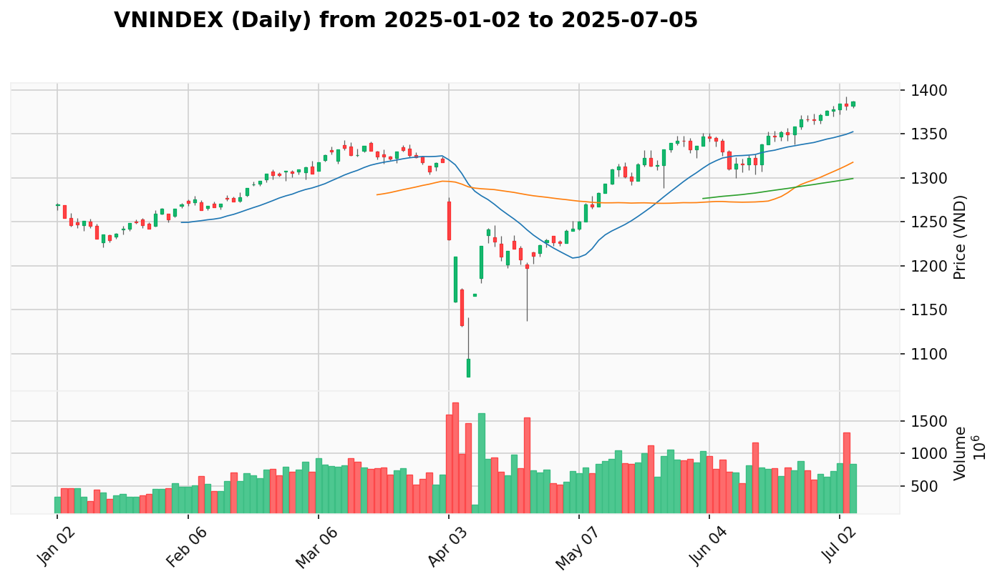

<a href="#vpa-signal-summary">↑ Back to Top</a>

#### Key Statistics
| Metric | Value |
|:---|---:|
| Date Range | 2025-01-02 to 2025-09-26 |
| **Latest Close** | **1,660.7** |
| Period Open | 1,268.96 |
| Period High | 1,711.49 |
| Period Low | 1,073.61 |
| Period Change % | 30.87% |

**[Download VNINDEX Data (.csv)](market_data/VNINDEX_2025-01-02_to_2025-09-27.csv)**

---

### AAA

#### [VPA Analysis (2025-06-27 - 2025-09-26)](./VPA.md#aaa)
> **Ngày 2025-09-22:** AAA giảm từ 8.13 VND xuống 8.03 VND. Cây nến giảm có biên độ hẹp (từ 8.0 đến 8.18), mở cửa tại 8.13 và đóng cửa gần mức thấp nhất phiên là 8.03. Khối lượng giao dịch đạt 2.1633 triệu cổ phiếu, tăng đáng kể so với phiên trước đó. Sau hai phiên yếu kém liên tiếp, giá tiếp tục điều chỉnh giảm với khối lượng gia tăng, cho thấy áp lực bán đang mạnh lên và lực cầu vẫn không đủ để hấp thụ. Việc giá đóng cửa gần mức thấp nhất phiên với khối lượng tăng xác nhận sự yếu kém tiếp diễn của thị trường và có thể báo hiệu một đợt giảm giá sâu hơn. **Phân tích VPA/Wyckoff:** Weakness (Yếu kém) - Giá giảm với khối lượng tăng và đóng cửa gần mức thấp nhất, cho thấy áp lực bán mạnh mẽ và thiếu cầu.
> **Ngày 2025-09-23:** AAA tăng từ 8.03 VND lên 8.09 VND. Cây nến tăng có biên độ hẹp (từ 8.04 đến 8.1), mở cửa tại 8.04 và đóng cửa gần mức cao nhất phiên là 8.09. Khối lượng giao dịch đạt 0.5759 triệu cổ phiếu, giảm mạnh so với phiên trước đó (2.1633 triệu cổ phiếu). Sau các phiên yếu kém liên tiếp với áp lực bán gia tăng, giá có sự phục hồi nhẹ nhưng với khối lượng rất thấp, cho thấy lực cầu yếu và thiếu sự tham gia của dòng tiền lớn. Điều này xác nhận sự yếu kém tiếp diễn của thị trường và có thể là một "No Demand" bar, báo hiệu khả năng tiếp tục giảm giá. **Phân tích VPA/Wyckoff:** Weakness (Yếu kém) / No Demand - Giá tăng với khối lượng rất thấp sau chuỗi ngày giảm, cho thấy thiếu cầu và khả năng tiếp diễn xu hướng giảm.
> **Ngày 2025-09-24:** AAA tăng từ 8.09 VND lên 8.11 VND. Cây nến tăng có biên độ hẹp (từ 8.04 đến 8.13), mở cửa tại 8.1 và đóng cửa gần mức cao nhất phiên là 8.11. Khối lượng giao dịch đạt 1.1612 triệu cổ phiếu, tăng so với phiên trước đó (0.5759 triệu cổ phiếu). Sau hai phiên yếu kém liên tiếp với áp lực bán gia tăng và thiếu cầu, giá có sự phục hồi nhẹ với khối lượng tăng trở lại, cho thấy lực cầu đã xuất hiện trở lại nhưng chưa thực sự mạnh mẽ để tạo ra một xu hướng tăng rõ rệt. Việc giá đóng cửa gần mức cao nhất phiên với khối lượng tăng nhẹ có thể là một dấu hiệu tích cực ban đầu, nhưng cần theo dõi thêm để xác nhận sự thay đổi trong cung cầu. **Phân tích VPA/Wyckoff:** Sign of Strength (SOS) - Dấu hiệu sức mạnh ban đầu
> **Ngày 2025-09-25:** AAA tăng từ 8.11 VND lên 8.22 VND. Cây nến tăng có biên độ hẹp đến trung bình (từ 8.11 đến 8.27), mở cửa tại 8.15 và đóng cửa gần mức cao nhất phiên là 8.22. Khối lượng giao dịch đạt 0.9938 triệu cổ phiếu, giảm so với phiên trước đó (1.1612 triệu cổ phiếu). Sau dấu hiệu sức mạnh ban đầu (SOS) vào phiên trước, giá tiếp tục tăng nhưng với khối lượng giảm, cho thấy lực cầu không được duy trì và thiếu sự tham gia mạnh mẽ của dòng tiền. Điều này có thể báo hiệu sự yếu kém tiếp diễn hoặc một "No Demand" bar, cho thấy khả năng giá khó có thể tăng bền vững. **Phân tích VPA/Wyckoff:** Weakness (Yếu kém) / No Demand - Giá tăng với khối lượng giảm sau một dấu hiệu sức mạnh yếu, cho thấy thiếu cầu và khả năng tiếp diễn xu hướng giảm.
> **Ngày 2025-09-26:** AAA tăng từ 8.21 VND lên 8.59 VND. Cây nến tăng có biên độ rộng (từ 8.11 đến 8.69), mở cửa tại 8.2 và đóng cửa gần mức cao nhất phiên là 8.59. Khối lượng giao dịch đạt 10.3284 triệu cổ phiếu, tăng đột biến so với phiên trước đó (1.6611 triệu cổ phiếu). Sau phiên "No Demand" yếu kém, sự tăng giá mạnh mẽ với khối lượng bùng nổ cho thấy lực cầu đã quay trở lại rất mạnh mẽ, hấp thụ toàn bộ áp lực bán và đẩy giá lên cao. Đây là một dấu hiệu tích cực cho thấy sự thay đổi trong cung cầu và khả năng bắt đầu một xu hướng tăng mới. **Phân tích VPA/Wyckoff:** Sign of Strength (SOS) - Lực cầu mạnh mẽ và quyết liệt, xác nhận sự thay đổi trong xu hướng.

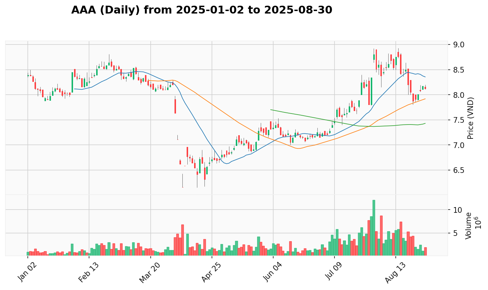

<a href="#nhua">↑ Back to group NHUA</a>  |  <a href="#vpa-signal-summary">↑ Back to Top</a>

#### Key Statistics
| Metric | Value |
|:---|---:|
| Date Range | 2025-01-02 to 2025-09-26 |
| **Latest Close** | **8.59** |
| Period Open | 8.38 |
| Period High | 8.93 |
| Period Low | 6.15 |
| Period Change % | 2.51% |

**[Download AAA Data (.csv)](market_data/AAA_2025-01-02_to_2025-09-27.csv)**

---

### ACB

#### [VPA Analysis (2025-06-16 - 2025-09-26)](./VPA.md#acb)
> **Ngày 2025-09-22:** ACB giảm từ 25.35 VND xuống 25.15 VND với khối lượng giao dịch đạt 19.40 triệu cổ phiếu, tăng so với phiên trước. Giá mở cửa tại 25.45 VND, cao nhất phiên đạt 25.45 VND và thấp nhất 25.05 VND. Cây nến giảm có biên độ hẹp và đóng cửa gần mức thấp nhất phiên, cho thấy áp lực bán vẫn còn mạnh mẽ. Sau phiên "No Demand" ngày hôm qua, việc giá tiếp tục giảm với khối lượng gia tăng xác nhận rằng cung vẫn đang chiếm ưu thế và thị trường đang trong giai đoạn yếu kém. **Phân tích VPA/Wyckoff:** Dấu hiệu yếu kém (Sign of Weakness - SOW)
> **Ngày 2025-09-23:** ACB tăng từ 25.15 VND lên 25.35 VND với khối lượng giao dịch đạt 9.39 triệu cổ phiếu, giảm đáng kể so với phiên trước (19.40 triệu cổ phiếu). Giá mở cửa tại 25.15 VND, cao nhất phiên đạt 25.7 VND và thấp nhất 25.15 VND. Cây nến có biên độ tương đối rộng nhưng đóng cửa ở mức giữa. Sau phiên "Dấu hiệu yếu kém" ngày hôm qua, việc giá tăng nhẹ với khối lượng thấp cho thấy lực cầu yếu và không đủ sức đẩy giá lên cao. Thị trường vẫn đang trong giai đoạn yếu kém và cần có dấu hiệu tích cực hơn để đảo chiều. **Phân tích VPA/Wyckoff:** No Demand (ND) - Thiếu cầu
> **Ngày 2025-09-24:** ACB tăng từ 25.35 VND lên 26.0 VND với khối lượng giao dịch đạt 10.85 triệu cổ phiếu, tăng so với phiên trước. Giá mở cửa tại 25.5 VND, cao nhất phiên đạt 26.0 VND và thấp nhất 25.25 VND. Cây nến tăng có biên độ tương đối rộng và đóng cửa ở mức cao nhất phiên, cho thấy lực cầu đã quay trở lại và hấp thụ lực cung. Sau phiên "No Demand" ngày hôm qua, việc giá tăng với khối lượng gia tăng cho thấy thị trường đang có dấu hiệu phục hồi. **Phân tích VPA/Wyckoff:** Sign of Strength (SOS) - Dấu hiệu sức mạnh.
> **Ngày 2025-09-25:** ACB giảm từ 26.0 VND xuống 25.75 VND với khối lượng giao dịch đạt 4.98 triệu cổ phiếu, giảm đáng kể so với phiên trước (10.85 triệu cổ phiếu). Giá mở cửa tại 26.15 VND, cao nhất phiên đạt 26.15 VND và thấp nhất 25.7 VND. Cây nến giảm có biên độ vừa phải và đóng cửa gần mức thấp nhất phiên. Sau phiên "Sign of Strength" ngày hôm qua, việc giá giảm nhẹ với khối lượng thấp cho thấy lực cung yếu và có thể là một đợt điều chỉnh tự nhiên. Thị trường đang kiểm tra lại mức hỗ trợ sau đợt tăng. **Phân tích VPA/Wyckoff:** No Supply (NS) - Thiếu cung
> **Ngày 2025-09-26:** ACB giữ nguyên mức giá đóng cửa 25.65 VND so với phiên trước, với khối lượng giao dịch đạt 8.97 triệu cổ phiếu, tăng nhẹ so với phiên ngày 2025-09-25 (8.16 triệu cổ phiếu). Giá mở cửa tại 25.65 VND, cao nhất phiên đạt 25.75 VND và thấp nhất 25.45 VND. Cây nến có biên độ hẹp và đóng cửa ở mức giá mở cửa, cho thấy sự lưỡng lự của thị trường. Sau phiên "Thiếu cung" ngày hôm qua, việc giá đi ngang với khối lượng tăng nhẹ cho thấy thị trường đang kiểm tra lại nguồn cung. Lực cầu chưa đủ mạnh để đẩy giá lên rõ rệt, nhưng lực cung cũng không áp đảo, cho thấy khả năng tích lũy. **Phân tích VPA/Wyckoff:** Test for Supply (TS) - Kiểm tra nguồn cung

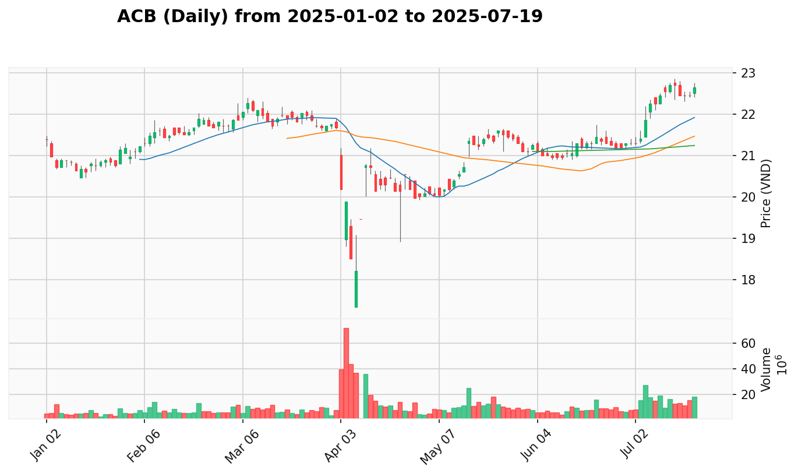

<a href="#ngan-hang">↑ Back to group NGAN_HANG</a>  |  <a href="#vpa-signal-summary">↑ Back to Top</a>

#### Key Statistics
| Metric | Value |
|:---|---:|
| Date Range | 2025-01-02 to 2025-09-26 |
| **Latest Close** | **25.65** |
| Period Open | 21.39 |
| Period High | 29.5 |
| Period Low | 17.34 |
| Period Change % | 19.92% |

**[Download ACB Data (.csv)](market_data/ACB_2025-01-02_to_2025-09-27.csv)**

---

### ACG

#### [VPA Analysis (2025-08-14 - 2025-09-26)](./VPA.md#acg)
> **Ngày 2025-09-22:** ACG mở cửa tại 36.1 VND, dao động trong biên độ từ 35.8 VND đến 36.1 VND và đóng cửa tại 35.8 VND, giảm nhẹ so với phiên trước. Khối lượng giao dịch đạt 0.0041 triệu cổ phiếu, giảm mạnh so với phiên 2025-09-19 (0.0281 triệu cổ phiếu) và là mức rất thấp. Sau phiên "Nỗ lực tăng giá" với khối lượng cao, phiên hôm nay cho thấy giá giảm nhẹ với khối lượng cực thấp, xác nhận sự thiếu vắng lực cầu và sự lưỡng lự của thị trường, cho thấy nỗ lực tăng giá trước đó không được duy trì. **Phân tích VPA/Wyckoff:** No Demand (Không có cầu)
> **Ngày 2025-09-23:** ACG mở cửa tại 35.8 VND, tăng lên mức cao nhất 36.3 VND và đóng cửa tại 36.3 VND. Giá tăng mạnh từ 35.8 VND lên 36.3 VND với biên độ rộng và đóng cửa ở mức cao nhất phiên. Khối lượng giao dịch đạt 0.0097 triệu cổ phiếu, tăng đáng kể so với phiên "No Demand" trước đó (0.0041 triệu cổ phiếu). Sự tăng giá dứt khoát với khối lượng gia tăng sau phiên giảm giá với khối lượng thấp cho thấy lực cầu đã quay trở lại và hấp thụ tốt áp lực cung, mặc dù khối lượng chưa bằng phiên "Effort to Rise" ngày 2025-09-19. **Phân tích VPA/Wyckoff:** Sign of Strength (SOS) - Dấu hiệu sức mạnh.
> **Ngày 2025-09-24:** ACG mở cửa tại 36.4 VND, dao động trong biên độ từ 36.2 VND đến 37.2 VND và đóng cửa tại 36.4 VND. Giá tăng nhẹ so với phiên trước nhưng không giữ được mức cao nhất trong phiên. Khối lượng giao dịch đạt 0.0139 triệu cổ phiếu, tăng so với phiên trước (0.0097 triệu cổ phiếu). Sau phiên "Sign of Strength" với giá tăng mạnh và khối lượng gia tăng, phiên hôm nay cho thấy giá mở cửa cao hơn, đạt đỉnh mới trong ngắn hạn nhưng không thể duy trì đà tăng và đóng cửa ở mức thấp hơn đáng kể so với đỉnh, gần với giá mở cửa. Điều này cho thấy có lực cung xuất hiện ở vùng giá cao, hấp thụ một phần lực cầu. Mặc dù khối lượng tăng, nhưng sự thiếu quyết đoán trong hành động giá cho thấy sự lưỡng lự của thị trường hoặc áp lực bán tiềm ẩn. **Phân tích VPA/Wyckoff:** Nỗ lực tăng giá không thành công.
> **Ngày 2025-09-25:** ACG mở cửa tại 36.8 VND, tăng lên mức cao nhất 36.8 VND và đóng cửa tại 36.5 VND. Giá tăng nhẹ 0.1 VND so với phiên trước nhưng không giữ được mức cao nhất phiên và đóng cửa thấp hơn giá mở cửa. Khối lượng giao dịch chỉ đạt 0.0013 triệu cổ phiếu, giảm mạnh so với phiên trước (0.0139 triệu cổ phiếu). Sau phiên "Nỗ lực tăng giá không thành công" với khối lượng tăng, phiên hôm nay cho thấy giá không thể duy trì đà tăng và đóng cửa ở mức giữa thân nến với khối lượng cực thấp. Điều này cho thấy sự thiếu vắng lực cầu mạnh mẽ để đẩy giá lên cao hơn, xác nhận sự yếu kém của thị trường. **Phân tích VPA/Wyckoff:** No Demand (Không có cầu) - Thiếu vắng lực cầu.
> **Ngày 2025-09-26:** ACG mở cửa tại 36.2 VND, dao động trong biên độ từ 35.95 VND đến 36.9 VND và đóng cửa tại 35.95 VND. Giá giảm mạnh 0.55 VND so với phiên trước và đóng cửa ở mức thấp nhất trong phiên. Khối lượng giao dịch đạt 0.0099 triệu cổ phiếu, tăng đáng kể so với phiên trước (0.0019 triệu cổ phiếu). Sau phiên "No Demand", phiên hôm nay cho thấy lực cung đã áp đảo hoàn toàn lực cầu, đẩy giá xuống với biên độ rộng và đóng cửa ở mức thấp nhất phiên trên khối lượng gia tăng. **Phân tích VPA/Wyckoff:** Sign of Weakness (SOW) - Lực cung mạnh mẽ.

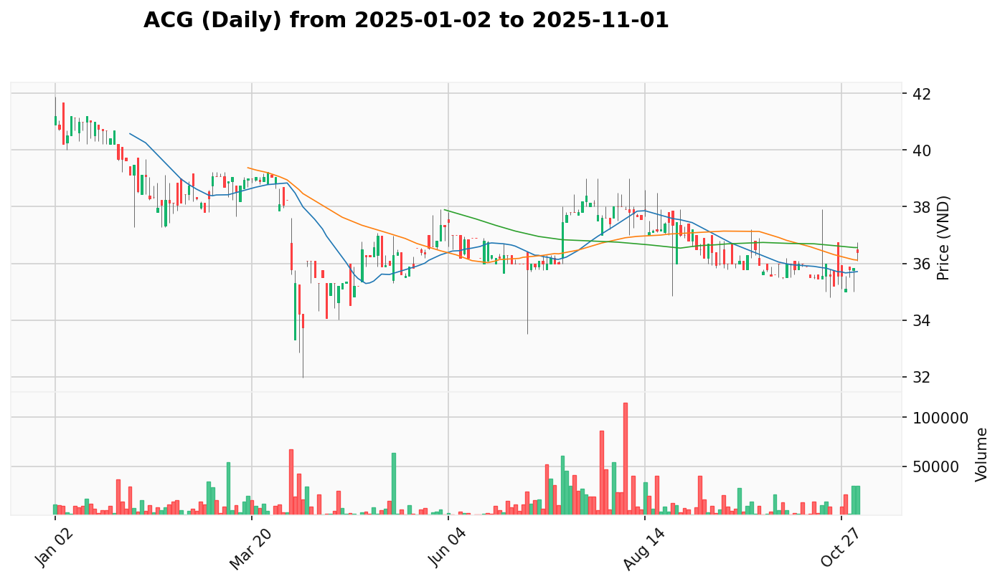

<a href="#thep">↑ Back to group THEP</a>  |  <a href="#vpa-signal-summary">↑ Back to Top</a>

#### Key Statistics
| Metric | Value |
|:---|---:|
| Date Range | 2025-01-02 to 2025-09-26 |
| **Latest Close** | **35.95** |
| Period Open | 40.9 |
| Period High | 41.88 |
| Period Low | 31.97 |
| Period Change % | -12.10% |

**[Download ACG Data (.csv)](market_data/ACG_2025-01-02_to_2025-09-27.csv)**

---

### ACL

#### [VPA Analysis (2025-08-14 - 2025-09-26)](./VPA.md#acl)
> **Ngày 2025-09-22:** ACL giảm mạnh từ 13.8 VND xuống 12.85 VND với khối lượng giao dịch đạt 0.023 triệu cổ phiếu. Khối lượng này thấp hơn đáng kể so với phiên trước (0.0404 triệu cổ phiếu) và rất thấp so với phiên SOS (0.1723 triệu cổ phiếu). Cây nến giảm có biên độ rộng và đóng cửa ở mức thấp nhất phiên, cho thấy áp lực bán mạnh mẽ và lực cầu gần như không tồn tại. Sau tín hiệu "No Demand" vào ngày 2025-09-19, việc giá tiếp tục giảm sâu với khối lượng thấp xác nhận sự suy yếu của thị trường và thiếu hụt nhu cầu mua. **Phân tích VPA/Wyckoff:** Sign of Weakness (SOW) - Thiếu hụt nhu cầu và áp lực bán gia tăng.
> **Ngày 2025-09-23:** ACL tăng từ 12.85 VND lên 13.25 VND với khối lượng giao dịch đạt 0.082 triệu cổ phiếu. Khối lượng này tăng mạnh so với phiên trước (0.023 triệu cổ phiếu) và cao hơn đáng kể so với các phiên gần đây. Cây nến tăng có biên độ rộng, mở cửa ở mức thấp nhất phiên và đóng cửa ở mức cao nhất phiên, cho thấy lực mua chủ động và mạnh mẽ. Sau hai phiên có tín hiệu "No Demand" và "Sign of Weakness", sự phục hồi của giá đi kèm với khối lượng tăng mạnh cho thấy lực cầu đã quay trở lại thị trường. **Phân tích VPA/Wyckoff:** Demand Coming In (Lực cầu quay trở lại)
> **Ngày 2025-09-24:** ACL tăng nhẹ từ 13.25 VND lên 13.3 VND với khối lượng giao dịch đạt 0.0374 triệu cổ phiếu. Khối lượng này thấp hơn đáng kể so với phiên trước (0.082 triệu cổ phiếu). Cây nến tăng có biên độ hẹp và đóng cửa ở mức cao nhất phiên, cho thấy lực cầu không còn mạnh mẽ như phiên trước. Sau phiên "Demand Coming In" vào ngày 2025-09-23, việc giá tiếp tục tăng nhẹ với khối lượng giảm mạnh cho thấy sự thiếu hụt nhu cầu mua tiếp diễn. **Phân tích VPA/Wyckoff:** No Demand (Thiếu hụt nhu cầu)
> **Ngày 2025-09-25:** ACL giảm từ 13.3 VND xuống 13.0 VND với khối lượng giao dịch đạt 0.0065 triệu cổ phiếu. Khối lượng này cực kỳ thấp, giảm mạnh so với phiên trước (0.0374 triệu cổ phiếu) và là mức thấp nhất trong các phiên gần đây. Cây nến giảm có biên độ hẹp, đóng cửa ở mức thấp nhất phiên, cho thấy áp lực bán nhẹ và sự thiếu vắng hoàn toàn của lực cầu. Sau phiên "No Demand" vào ngày 2025-09-24, việc giá tiếp tục giảm với khối lượng cực thấp và đóng cửa ở mức thấp nhất phiên xác nhận sự thiếu hụt nhu cầu mua và không có sự hỗ trợ từ người mua. **Phân tích VPA/Wyckoff:** No Demand (Thiếu hụt nhu cầu)
> **Ngày 2025-09-26:** ACL tăng từ 13.25 VND lên 13.45 VND với khối lượng giao dịch đạt 0.023 triệu cổ phiếu. Khối lượng này thấp hơn đáng kể so với phiên trước (0.030 triệu cổ phiếu) và là một trong những mức thấp nhất gần đây. Cây nến tăng có biên độ hẹp và đóng cửa ở mức cao nhất phiên. Mặc dù giá tăng và đóng cửa ở mức cao nhất, khối lượng giảm mạnh cho thấy lực cầu yếu và không có sự hỗ trợ đáng kể từ người mua, tiếp tục xác nhận tình trạng thiếu hụt nhu cầu. **Phân tích VPA/Wyckoff:** No Demand (Thiếu hụt nhu cầu)

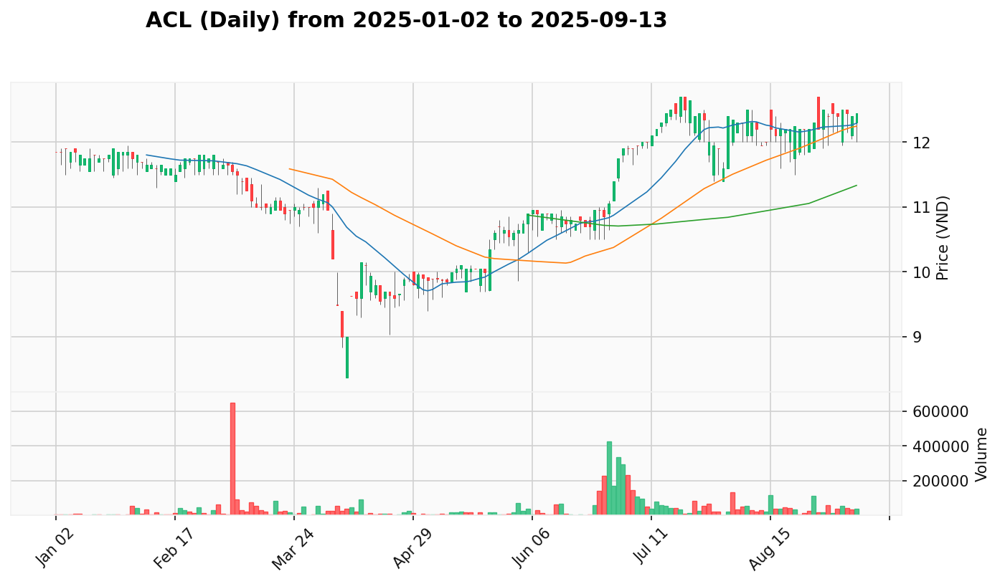

<a href="#thuy-san">↑ Back to group THUY_SAN</a>  |  <a href="#vpa-signal-summary">↑ Back to Top</a>

#### Key Statistics
| Metric | Value |
|:---|---:|
| Date Range | 2025-01-02 to 2025-09-26 |
| **Latest Close** | **13.45** |
| Period Open | 11.85 |
| Period High | 14.15 |
| Period Low | 8.37 |
| Period Change % | 13.50% |

**[Download ACL Data (.csv)](market_data/ACL_2025-01-02_to_2025-09-27.csv)**

---

### ACV

#### [VPA Analysis (2025-06-11 - 2025-09-26)](./VPA.md#acv)
> **Ngày 2025-09-22:** ACV giảm từ 58.6 xuống 57.6 với biên độ dao động từ 57.5 đến 59.2. Cây nến giảm có biên độ rộng và đóng cửa gần mức thấp nhất phiên, cho thấy áp lực bán mạnh mẽ. Khối lượng giao dịch đạt 0.7155 triệu cổ phiếu, cao hơn đáng kể so với phiên trước (0.5559 triệu cổ phiếu), xác nhận lực cung đang chiếm ưu thế và tiếp tục đẩy giá xuống. **Phân tích VPA/Wyckoff:** Điểm yếu (Weakness)
> **Ngày 2025-09-23:** ACV tăng từ 57.6 lên 57.8 với biên độ dao động từ 57.2 đến 58.3. Cây nến tăng nhẹ với thân nhỏ, đóng cửa trên giá mở cửa nhưng vẫn dưới mức đóng cửa của phiên trước. Khối lượng giao dịch đạt 0.2901 triệu cổ phiếu, thấp hơn đáng kể so với phiên trước (0.7155 triệu cổ phiếu) và mức trung bình. Điều này cho thấy sự thiếu hụt lực cầu và không có sự hỗ trợ mạnh mẽ cho đà tăng giá, đặc biệt sau phiên giảm mạnh với khối lượng lớn trước đó. **Phân tích VPA/Wyckoff:** Thiếu cầu (No Demand)
> **Ngày 2025-09-24:** ACV tăng nhẹ từ 57.8 lên 57.9 với biên độ dao động từ 57.0 đến 58.1. Cây nến tăng với thân nhỏ, đóng cửa trên giá mở cửa nhưng vẫn nằm trong vùng giá thấp của các phiên gần đây. Khối lượng giao dịch đạt 0.2409 triệu cổ phiếu, tiếp tục giảm so với phiên trước (0.2901 triệu cổ phiếu) và rất thấp so với mức trung bình. Điều này cho thấy lực cầu vẫn rất yếu và không có sự hỗ trợ đáng kể nào để đẩy giá lên sau các phiên giảm giá trước đó. **Phân tích VPA/Wyckoff:** Thiếu cầu (No Demand)
> **Ngày 2025-09-25:** ACV tăng từ 57.9 lên 58.0 với biên độ dao động từ 57.9 đến 58.2. Cây nến tăng nhẹ với thân nhỏ, đóng cửa trên giá mở cửa. Khối lượng giao dịch đạt 0.1966 triệu cổ phiếu, tiếp tục giảm so với phiên trước (0.2409 triệu cổ phiếu) và rất thấp so với mức trung bình. Điều này cho thấy lực cầu vẫn cực kỳ yếu và không có sự hỗ trợ đáng kể nào để đẩy giá lên, tiếp tục xác nhận tình trạng thiếu cầu sau các phiên giảm giá trước đó. **Phân tích VPA/Wyckoff:** Thiếu cầu (No Demand)
> **Ngày 2025-09-26:** ACV giảm nhẹ từ 58.0 xuống 57.9 với biên độ dao động từ 57.9 đến 59.7. Cây nến có thân nhỏ, đóng cửa ở mức thấp nhất phiên, cho cho thấy áp lực bán. Khối lượng giao dịch đạt 0.5459 triệu cổ phiếu, tăng đáng kể so với phiên trước (0.1966 triệu cổ phiếu) và cao hơn nhiều so với mức trung bình. Điều này cho thấy nguồn cung đã quay trở lại thị trường và áp đảo lực cầu, đặc biệt khi giá không thể duy trì ở mức cao trong phiên. **Phân tích VPA/Wyckoff:** Sign of Weakness (SOW) - Nguồn cung gia tăng

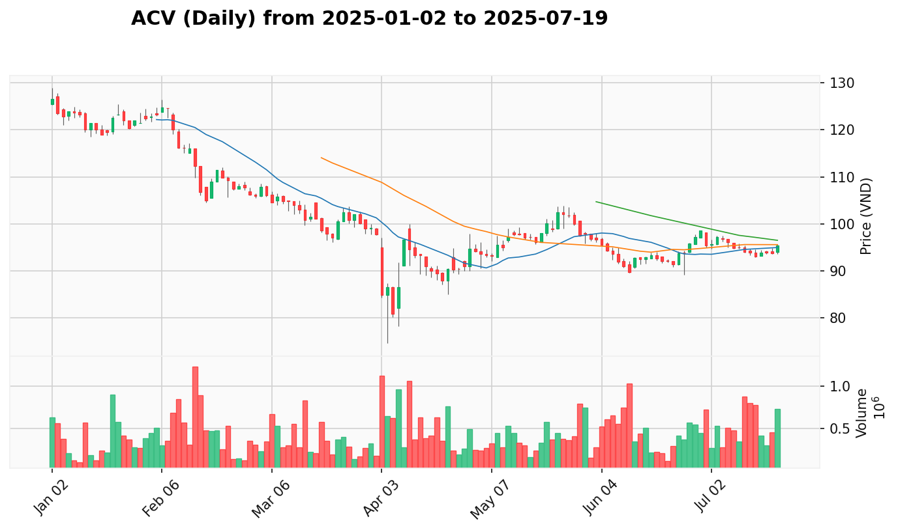

<a href="#hang-khong">↑ Back to group HANG_KHONG</a>  |  <a href="#vpa-signal-summary">↑ Back to Top</a>

#### Key Statistics
| Metric | Value |
|:---|---:|
| Date Range | 2025-01-02 to 2025-09-26 |
| **Latest Close** | **57.9** |
| Period Open | 76.25 |
| Period High | 78.32 |
| Period Low | 45.27 |
| Period Change % | -24.07% |

**[Download ACV Data (.csv)](market_data/ACV_2025-01-02_to_2025-09-27.csv)**

---

### ADS

#### [VPA Analysis (2025-08-04 - 2025-09-26)](./VPA.md#ads)
> **Ngày 2025-09-22:** ADS giảm từ 8.92 VND xuống 8.86 VND với khối lượng giao dịch đạt 0.0715 triệu cổ phiếu. Cây nến giảm có biên độ rộng hơn so với phiên trước và đóng cửa gần mức thấp nhất phiên. Khối lượng giao dịch tăng đáng kể so với phiên trước, cho thấy áp lực bán gia tăng và nguồn cung vẫn đang chiếm ưu thế, tiếp tục xác nhận sự yếu kém của thị trường. **Phân tích VPA/Wyckoff:** Áp lực bán (Selling Pressure) - Giá giảm với khối lượng tăng, xác nhận nguồn cung đang chiếm ưu thế.
> **Ngày 2025-09-23:** ADS giảm từ 8.86 VND xuống 8.73 VND với khối lượng giao dịch đạt 0.0318 triệu cổ phiếu. Cây nến giảm có biên độ rộng, đóng cửa gần mức thấp nhất phiên. Khối lượng giao dịch thấp hơn đáng kể so với phiên trước, cho thấy áp lực bán đã giảm nhưng lực cầu vẫn rất yếu, không đủ để hấp thụ lượng cung nhỏ, dẫn đến giá tiếp tục giảm sâu. Điều này xác nhận sự yếu kém của thị trường. **Phân tích VPA/Wyckoff:** Yếu kém (Weakness) - Giá giảm mạnh với khối lượng thấp, cho thấy thiếu vắng lực cầu và thị trường vẫn đang rất yếu.
> **Ngày 2025-09-24:** ADS giữ nguyên mức giá 8.73 VND sau khi mở cửa ở 8.73 VND và chạm mức thấp nhất 8.6 VND, với khối lượng giao dịch đạt 0.0873 triệu cổ phiếu. Cây nến có biên độ hẹp, cho thấy sự giằng co giữa cung và cầu. Mặc dù khối lượng giao dịch tăng đáng kể so với phiên trước, giá không thể tăng lên mà chỉ giữ nguyên mức đóng cửa, điều này cho thấy áp lực bán vẫn còn hiện hữu và lực cầu chưa đủ mạnh để đẩy giá lên cao hơn, tiếp tục xác nhận sự yếu kém của thị trường. **Phân tích VPA/Wyckoff:** Nỗ lực không mang lại kết quả (Effort without Result) - Khối lượng tăng nhưng giá không tăng, cho thấy nguồn cung vẫn đang chiếm ưu thế và thiếu vắng lực cầu mạnh mẽ.
> **Ngày 2025-09-25:** ADS tăng từ 8.73 VND lên 8.86 VND với khối lượng giao dịch đạt 0.0504 triệu cổ phiếu. Cây nến tăng có biên độ tương đối rộng, đóng cửa gần mức cao nhất phiên. Tuy nhiên, khối lượng giao dịch thấp hơn đáng kể so với phiên trước, cho thấy lực cầu yếu và không đủ mạnh để đẩy giá lên cao hơn một cách bền vững, xác nhận sự yếu kém của thị trường vẫn còn tiếp diễn. **Phân tích VPA/Wyckoff:** Thiếu cầu (No Demand) - Giá tăng với khối lượng thấp, cho thấy lực cầu yếu và khả năng đảo chiều giảm giá.
> **Ngày 2025-09-26:** ADS tăng nhẹ từ 8.88 VND lên 8.91 VND với khối lượng giao dịch đạt 0.2621 triệu cổ phiếu. Cây nến tăng có biên độ hẹp, đóng cửa gần giữa. Mặc dù khối lượng giao dịch tăng đột biến so với các phiên trước, giá chỉ tăng rất nhẹ, cho thấy áp lực bán mạnh mẽ đang hấp thụ lực cầu. Điều này xác nhận sự yếu kém của thị trường và khả năng giá sẽ khó tăng bền vững. **Phân tích VPA/Wyckoff:** Nỗ lực không mang lại kết quả (Effort without Result) - Khối lượng tăng mạnh nhưng giá không tăng tương xứng, cho thấy nguồn cung đang chiếm ưu thế.

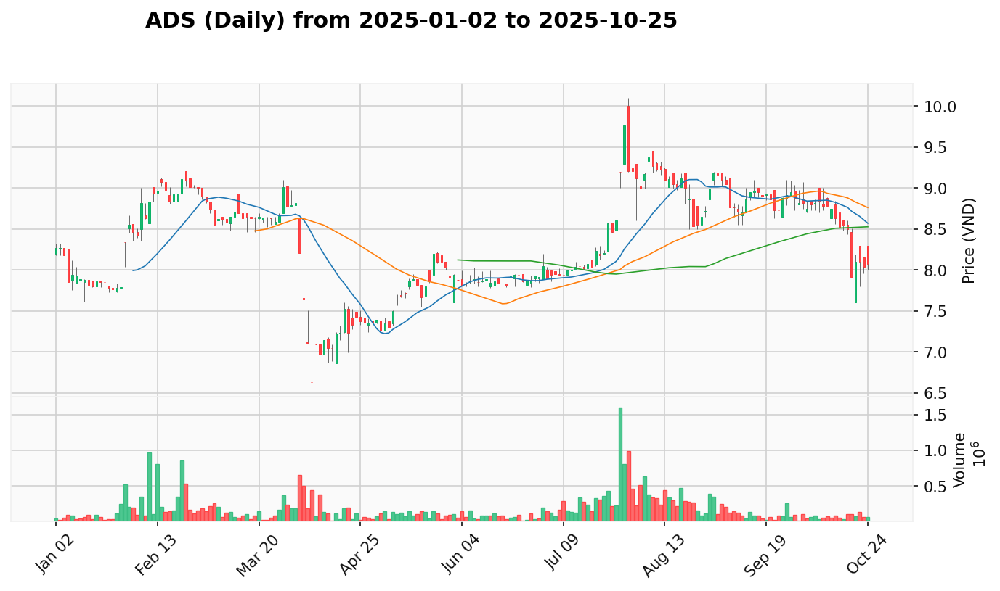

<a href="#det-may">↑ Back to group DET_MAY</a>  |  <a href="#vpa-signal-summary">↑ Back to Top</a>

#### Key Statistics
| Metric | Value |
|:---|---:|
| Date Range | 2025-01-02 to 2025-09-26 |
| **Latest Close** | **8.91** |
| Period Open | 8.2 |
| Period High | 10.1 |
| Period Low | 6.63 |
| Period Change % | 8.66% |

**[Download ADS Data (.csv)](market_data/ADS_2025-01-02_to_2025-09-27.csv)**

---

### AGG

#### [VPA Analysis (2025-08-04 - 2025-09-26)](./VPA.md#agg)
> **Ngày 2025-09-22:** AGG giảm từ 19.95 VND xuống 19.85 VND so với phiên trước, mở cửa ở 19.95 VND và đóng cửa ở 19.85 VND, với khối lượng giao dịch tăng đáng kể, đạt 0.559 triệu cổ phiếu. Cây nến giảm có biên độ tương đối rộng, cho thấy áp lực bán đã gia tăng sau phiên thiếu cầu. Mặc dù giá đóng cửa không ở mức thấp nhất phiên, nhưng sự sụt giảm với khối lượng tăng cho thấy lực cung đang chiếm ưu thế. Điều này xác nhận sự yếu kém của thị trường sau tín hiệu thiếu cầu trước đó. **Phân tích VPA/Wyckoff:** Lực cung gia tăng
> **Ngày 2025-09-23:** AGG giảm từ 19.85 VND xuống 19.8 VND so với phiên trước, mở cửa ở 20.0 VND và đóng cửa ở 19.8 VND, với khối lượng giao dịch giảm đáng kể, chỉ đạt 0.3343 triệu cổ phiếu. Cây nến giảm có biên độ hẹp và đóng cửa thấp hơn giá mở cửa, cho thấy áp lực bán đã suy yếu rõ rệt sau phiên lực cung gia tăng trước đó. Sự sụt giảm giá nhẹ với khối lượng thấp cho thấy thiếu vắng lực cung tiếp diễn, tạo điều kiện cho khả năng phục hồi nếu lực cầu xuất hiện. **Phân tích VPA/Wyckoff:** No Supply (NS) - Thiếu cung
> **Ngày 2025-09-24:** AGG tăng từ 19.8 VND lên 20.25 VND so với phiên trước, mở cửa ở 19.8 VND và đóng cửa ở 20.25 VND, với khối lượng giao dịch tăng mạnh, đạt 0.8402 triệu cổ phiếu. Cây nến tăng có biên độ rộng và đóng cửa ở mức cao nhất phiên, cho thấy lực cầu đã quay trở lại mạnh mẽ sau phiên thiếu cung trước đó. Điều này xác nhận sự xuất hiện của lực mua chủ động và khả năng tiếp diễn xu hướng tăng. **Phân tích VPA/Wyckoff:** Sign of Strength (SOS) - Lực cầu mạnh mẽ.
> **Ngày 2025-09-25:** AGG tăng từ 20.25 VND lên 20.35 VND so với phiên trước, mở cửa ở 20.6 VND và đóng cửa ở 20.35 VND, với khối lượng giao dịch giảm đáng kể, chỉ đạt 0.4724 triệu cổ phiếu. Cây nến tăng có biên độ hẹp và đóng cửa không ở mức cao nhất phiên, cho thấy lực cầu đã suy yếu sau phiên tăng mạnh trước đó. Sự tăng giá nhẹ với khối lượng thấp cho thấy thiếu vắng lực mua tiếp diễn, có thể là dấu hiệu của sự chững lại trong đà tăng. **Phân tích VPA/Wyckoff:** No Demand (ND) - Thiếu cầu.
> **Ngày 2025-09-26:** AGG giữ vững mức giá 20.2 VND so với phiên trước, mở cửa ở 20.05 VND và đóng cửa ở 20.2 VND, với khối lượng giao dịch giảm đáng kể, chỉ đạt 0.5217 triệu cổ phiếu. Cây nến tăng có biên độ tương đối và đóng cửa ở mức giá tương đương phiên trước, cho thấy lực bán đã suy yếu sau phiên giảm giá với khối lượng cao trước đó. Sự ổn định giá với khối lượng thấp cho thấy thị trường đang kiểm tra nguồn cung và hiện tại không có áp lực bán mạnh. **Phân tích VPA/Wyckoff:** No Supply (NS) - Thiếu cung.

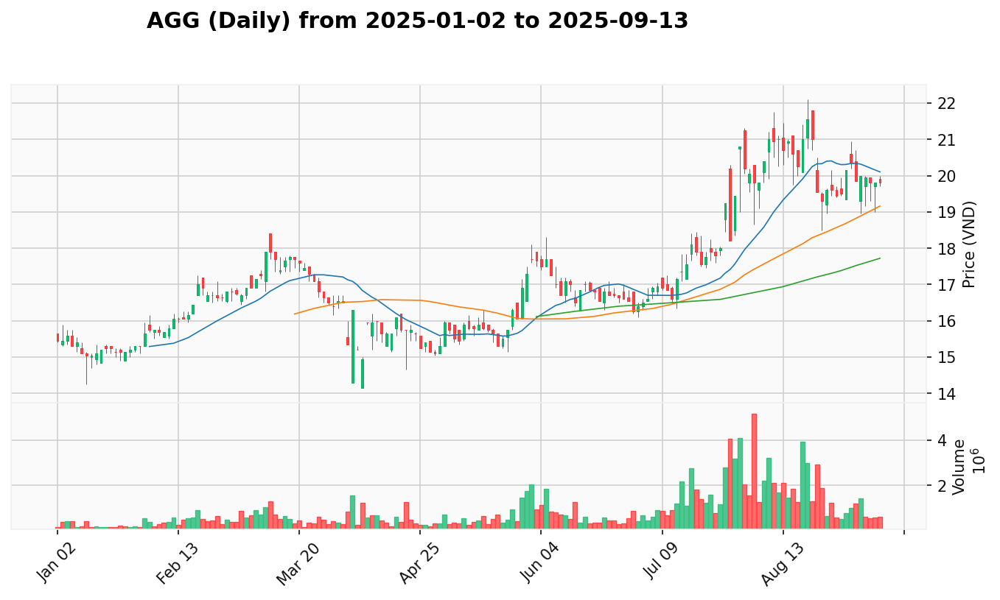

<a href="#bat-dong-san">↑ Back to group BAT_DONG_SAN</a>  |  <a href="#vpa-signal-summary">↑ Back to Top</a>

#### Key Statistics
| Metric | Value |
|:---|---:|
| Date Range | 2025-01-02 to 2025-09-26 |
| **Latest Close** | **20.2** |
| Period Open | 15.65 |
| Period High | 22.1 |
| Period Low | 14.15 |
| Period Change % | 29.07% |

**[Download AGG Data (.csv)](market_data/AGG_2025-01-02_to_2025-09-27.csv)**

---

### AGR

#### [VPA Analysis (2025-08-04 - 2025-09-26)](./VPA.md#agr)
> **Ngày 2025-09-22:** AGR giảm từ 17.9 VND xuống 17.35 VND. Giá mở cửa 17.75 VND, đạt mức cao nhất 17.8 VND và mức thấp nhất 17.05 VND. Giá đóng cửa 17.35 VND, nằm gần mức thấp nhất phiên, cho thấy áp lực bán mạnh mẽ. Khối lượng giao dịch đạt 1.2907 triệu cổ phiếu, tăng đáng kể so với 0.6285 triệu cổ phiếu của ngày hôm trước. Sau tín hiệu "No Supply" ngày 2025-09-19, sự giảm giá mạnh với khối lượng gia tăng cho thấy lực cung đã quay trở lại và đang kiểm soát thị trường. Điều này xác nhận sự yếu kém của lực cầu và khả năng tiếp diễn xu hướng giảm. **Phân tích VPA/Wyckoff:** Sign of Weakness (SOW) - Lực cung mạnh mẽ.
> **Ngày 2025-09-23:** AGR giữ nguyên mức giá 17.35 VND. Giá mở cửa 17.35 VND, đạt mức cao nhất 17.6 VND và mức thấp nhất 17.3 VND. Giá đóng cửa 17.35 VND, nằm ở mức mở cửa và gần mức thấp nhất phiên, cho thấy sự lưỡng lự và thiếu động lực. Khối lượng giao dịch đạt 0.5692 triệu cổ phiếu, giảm mạnh so với 1.2907 triệu cổ phiếu của ngày hôm trước và là mức thấp nhất trong 10 phiên gần đây. Sau tín hiệu "Sign of Weakness" (SOW) với khối lượng gia tăng vào ngày hôm trước, việc giá giữ nguyên trong biên độ hẹp với khối lượng cực thấp cho thấy lực cung đã tạm thời cạn kiệt, nhưng đồng thời lực cầu cũng chưa xuất hiện để đẩy giá lên. Điều này có thể là một dấu hiệu của sự thiếu vắng nhu cầu, cho thấy thị trường đang chờ đợi một động lực mới. **Phân tích VPA/Wyckoff:** No Demand (ND) - Cạn kiệt lực cầu.
> **Ngày 2025-09-24:** AGR tăng từ 17.35 VND lên 17.9 VND. Giá mở cửa 17.5 VND, đạt mức cao nhất 17.9 VND và mức thấp nhất 17.2 VND. Giá đóng cửa 17.9 VND, nằm ở mức cao nhất phiên, cho thấy lực cầu đã quay trở lại và kiểm soát thị trường. Khối lượng giao dịch đạt 0.6847 triệu cổ phiếu, tăng so với 0.5692 triệu cổ phiếu của ngày hôm trước. Sau tín hiệu "No Demand" (ND) với khối lượng cực thấp vào ngày 2025-09-23, sự tăng giá với khối lượng gia tăng cho thấy lực cầu đang dần xuất hiện, đẩy giá lên và có khả năng đảo chiều xu hướng giảm ngắn hạn. **Phân tích VPA/Wyckoff:** Sign of Strength (SOS) - Lực cầu xuất hiện.
> **Ngày 2025-09-25:** AGR tăng nhẹ từ 17.9 VND lên 17.95 VND. Giá mở cửa 18.0 VND, đạt mức cao nhất 18.05 VND và mức thấp nhất 17.8 VND. Giá đóng cửa 17.95 VND, nằm gần mức cao nhất phiên nhưng với biên độ hẹp. Khối lượng giao dịch đạt 0.4481 triệu cổ phiếu, giảm mạnh so với 0.6847 triệu cổ phiếu của ngày hôm trước và là mức thấp nhất trong 10 phiên gần đây. Sau tín hiệu "Sign of Strength" (SOS) vào ngày 2025-09-24, việc giá tiếp tục tăng nhẹ trong biên độ hẹp với khối lượng cực thấp cho thấy lực cầu chưa thực sự mạnh mẽ để đẩy giá lên cao hơn, đồng thời cũng không có áp lực cung lớn. Điều này có thể là một giai đoạn kiểm tra cung, cho thấy nguồn cung đã cạn kiệt tạm thời nhưng lực cầu cũng chưa đủ mạnh để tạo ra một đợt tăng giá bền vững. **Phân tích VPA/Wyckoff:** Test for Supply (TS) - Kiểm tra cung với khối lượng thấp.
> **Ngày 2025-09-26:** AGR giảm từ 17.85 VND xuống 17.45 VND. Giá mở cửa 17.85 VND, đạt mức cao nhất 17.9 VND và mức thấp nhất 17.45 VND. Giá đóng cửa 17.45 VND, nằm ở mức thấp nhất phiên, cho thấy áp lực bán mạnh mẽ đã chiếm ưu thế hoàn toàn trong phiên giao dịch. Khối lượng giao dịch đạt 0.8989 triệu cổ phiếu, giảm nhẹ so với 0.9535 triệu cổ phiếu của ngày hôm trước. Sau tín hiệu "Test for Supply" (TS) vào ngày 2025-09-25 với giá tăng nhẹ và khối lượng thấp, việc giá giảm mạnh và đóng cửa ở mức thấp nhất phiên, dù khối lượng có giảm nhẹ, cho thấy lực cung đã quay trở lại hoặc lực cầu đã suy yếu đáng kể, không đủ sức giữ giá. Điều này có thể là một dấu hiệu của sự yếu kém (Weakness) sau giai đoạn kiểm tra cung. **Phân tích VPA/Wyckoff:** Weakness (W) - Lực cung xuất hiện/Lực cầu suy yếu.

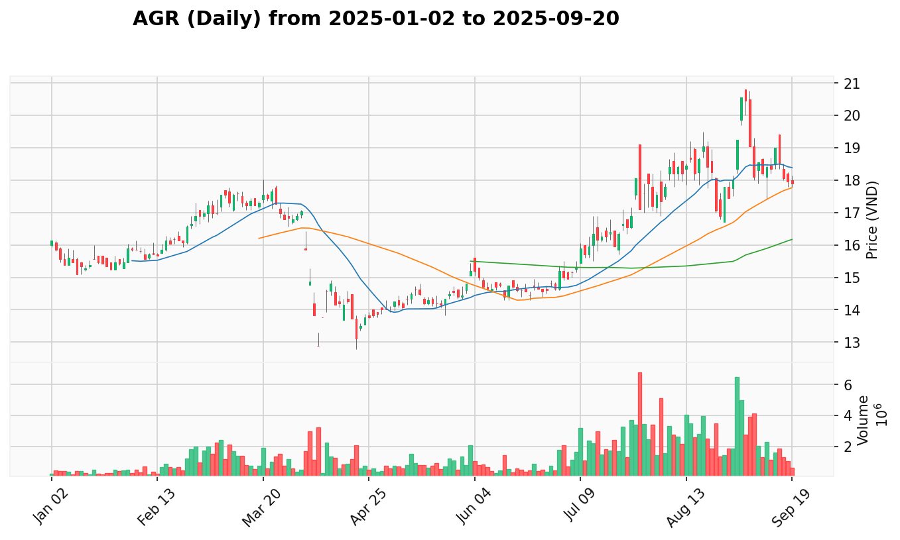

<a href="#chung-khoan">↑ Back to group CHUNG_KHOAN</a>  |  <a href="#vpa-signal-summary">↑ Back to Top</a>

#### Key Statistics
| Metric | Value |
|:---|---:|
| Date Range | 2025-01-02 to 2025-09-26 |
| **Latest Close** | **17.45** |
| Period Open | 15.99 |
| Period High | 20.8 |
| Period Low | 12.78 |
| Period Change % | 9.13% |

**[Download AGR Data (.csv)](market_data/AGR_2025-01-02_to_2025-09-27.csv)**

---

### ANV

#### [VPA Analysis (2025-06-16 - 2025-09-26)](./VPA.md#anv)
> **Ngày 2025-09-22:** ANV giảm từ 27.5 xuống 26.15, giảm 1.35 điểm (-4.91%) so với phiên trước. Cây nến giảm có biên độ rộng và đóng cửa ở mức thấp nhất phiên. Khối lượng giao dịch đạt 4.0136 triệu cổ phiếu, cao hơn đáng kể so với phiên trước (1.4104 triệu cổ phiếu) và cao hơn mức trung bình gần đây. Sau tín hiệu "No Supply" vào phiên trước, sự sụt giảm mạnh của giá với khối lượng lớn cho thấy áp lực bán đã quay trở lại mạnh mẽ, xác nhận sự yếu kém của thị trường và khả năng tiếp diễn xu hướng giảm. **Phân tích VPA/Wyckoff:** Sign of Weakness (SOW)
> **Ngày 2025-09-23:** ANV tăng từ 26.15 lên 27.7, tăng 1.55 điểm (5.93%) so với phiên trước. Cây nến tăng có biên độ rộng và đóng cửa ở mức cao nhất phiên. Khối lượng giao dịch đạt 1.9365 triệu cổ phiếu, thấp hơn đáng kể so với phiên trước (4.0136 triệu cổ phiếu) và thấp hơn mức trung bình gần đây. Sau tín hiệu "Sign of Weakness" (SOW) mạnh mẽ vào phiên trước, việc giá tăng trở lại với biên độ rộng nhưng khối lượng thấp cho thấy lực cầu chưa thực sự mạnh mẽ và bền vững. Đây có thể là một nhịp hồi phục kỹ thuật hoặc một đợt kiểm tra nguồn cung (Test for Supply) mà không có sự tham gia tích cực của dòng tiền lớn, cho thấy xu hướng giảm giá vẫn có thể tiếp diễn. **Phân tích VPA/Wyckoff:** Test for Supply (TS)
> **Ngày 2025-09-24:** ANV tăng từ 27.7 lên 28.15, tăng 0.45 điểm (1.62%) so với phiên trước. Cây nến tăng có biên độ khá và đóng cửa gần mức cao nhất phiên. Khối lượng giao dịch đạt 1.6795 triệu cổ phiếu, thấp hơn đáng kể so với phiên trước (1.9365 triệu cổ phiếu) và thấp hơn mức trung bình gần đây. Sau tín hiệu "Test for Supply" (TS) vào phiên trước, việc giá tiếp tục tăng nhưng với khối lượng thấp cho thấy lực cầu yếu và thiếu sự xác nhận từ dòng tiền lớn, báo hiệu một nhịp hồi phục không bền vững. **Phân tích VPA/Wyckoff:** No Demand (ND)
> **Ngày 2025-09-25:** ANV tăng từ 28.15 lên 28.3, tăng 0.15 điểm (0.53%) so với phiên trước. Cây nến tăng có biên độ hẹp và đóng cửa gần mức cao nhất phiên. Khối lượng giao dịch đạt 0.6996 triệu cổ phiếu, cực kỳ thấp so với các phiên trước và thấp hơn rất nhiều so với mức trung bình gần đây. Sau các tín hiệu "Test for Supply" và "No Demand" trước đó, việc giá tiếp tục tăng nhẹ với khối lượng cực thấp cho thấy lực cầu hoàn toàn vắng bóng và không có sự tham gia của dòng tiền lớn. Điều này xác nhận sự yếu kém của xu hướng hồi phục và báo hiệu khả năng giá sẽ tiếp tục giảm. **Phân tích VPA/Wyckoff:** No Demand (ND)
> **Ngày 2025-09-26:** ANV giảm từ 28.15 xuống 27.65, giảm 0.5 điểm (-1.77%) so với phiên trước. Cây nến giảm có biên độ khá rộng và đóng cửa gần mức thấp nhất phiên. Khối lượng giao dịch đạt 1.8764 triệu cổ phiếu, cao hơn một chút so với phiên trước nhưng vẫn ở mức thấp so với mức trung bình gần đây. Sau các tín hiệu "No Demand" liên tiếp, việc giá giảm mạnh với khối lượng tăng nhẹ cho thấy áp lực bán đang gia tăng và lực cầu vẫn yếu, xác nhận xu hướng giảm giá có thể tiếp diễn. **Phân tích VPA/Wyckoff:** Supply Coming In (SCI)

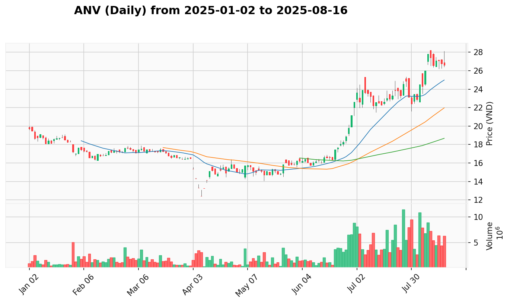

<a href="#thuy-san">↑ Back to group THUY_SAN</a>  |  <a href="#vpa-signal-summary">↑ Back to Top</a>

#### Key Statistics
| Metric | Value |
|:---|---:|
| Date Range | 2025-01-02 to 2025-09-26 |
| **Latest Close** | **27.65** |
| Period Open | 19.85 |
| Period High | 29.85 |
| Period Low | 12.4 |
| Period Change % | 39.29% |

**[Download ANV Data (.csv)](market_data/ANV_2025-01-02_to_2025-09-27.csv)**

---

### APG

#### [VPA Analysis (2025-08-04 - 2025-09-26)](./VPA.md#apg)
> **Ngày 2025-09-22:** APG giữ nguyên mức giá 11.65 VND với khối lượng giao dịch 0.5077 triệu cổ phiếu, cao hơn đáng kể so với các phiên "No Supply" trước đó. Biên độ giá mở rộng (từ 11.3 lên 11.7) và giá đóng cửa nằm gần mức cao nhất phiên. Sau các phiên xác nhận cạn kiệt nguồn cung, phiên này cho thấy lực cung đã xuất hiện trở lại nhưng đã được hấp thụ tốt bởi lực cầu, ngăn giá giảm sâu và đóng cửa gần mức cao. Điều này xác nhận quá trình tích lũy vẫn đang diễn ra. **Phân tích VPA/Wyckoff:** Test for Supply (Cung được kiểm tra và hấp thụ)
> **Ngày 2025-09-23:** APG giữ nguyên mức giá 11.65 VND với khối lượng giao dịch cực thấp, chỉ 0.2536 triệu cổ phiếu, thấp hơn đáng kể so với phiên trước và tương đương với phiên "No Supply" ngày 2025-09-19. Biên độ giá hẹp và giá đóng cửa nằm gần mức cao nhất phiên. Sau phiên "Test for Supply" ngày 2025-09-22, phiên này xác nhận nguồn cung đã cạn kiệt hoàn toàn, cho thấy không có áp lực bán đáng kể nào. Cổ phiếu vẫn đang trong giai đoạn tích lũy chặt chẽ, chờ đợi lực cầu mạnh mẽ hơn để bứt phá. **Phân tích VPA/Wyckoff:** No Supply (Xác nhận cạn kiệt nguồn cung)
> **Ngày 2025-09-24:** APG tăng từ 11.65 lên 11.7 VND với khối lượng giao dịch 0.4352 triệu cổ phiếu, cao hơn đáng kể so với phiên trước. Biên độ giá mở rộng (từ 11.3 lên 11.7) và giá đóng cửa nằm ở mức cao nhất phiên. Sau phiên "No Supply" ngày 2025-09-23, phiên này cho thấy lực cầu đã quay trở lại và hấp thụ tốt lượng cung, đẩy giá lên cao, xác nhận quá trình tích lũy đang tiếp diễn. **Phân tích VPA/Wyckoff:** Sign of Strength (SOS) - Lực cầu gia tăng sau cạn kiệt nguồn cung
> **Ngày 2025-09-25:** APG giảm từ 11.7 xuống 11.6 VND với khối lượng giao dịch cực thấp, chỉ 0.0594 triệu cổ phiếu, thấp hơn đáng kể so với phiên trước và các phiên "No Supply" gần đây. Biên độ giá hẹp và giá đóng cửa nằm ở mức thấp nhất phiên. Sau phiên "Sign of Strength" ngày 2025-09-24, phiên này cho thấy lực cầu tạm thời suy yếu, không đủ để duy trì đà tăng, nhưng khối lượng cực thấp xác nhận không có áp lực bán đáng kể. Cổ phiếu vẫn đang trong giai đoạn tích lũy. **Phân tích VPA/Wyckoff:** No Demand (Thiếu cầu)
> **Ngày 2025-09-26:** APG giảm nhẹ từ 11.65 xuống 11.6 VND với khối lượng giao dịch đạt 0.3041 triệu cổ phiếu, cao hơn đáng kể so với phiên trước. Biên độ giá từ 11.3 đến 11.6 VND và giá đóng cửa nằm ở mức cao nhất phiên. Sau phiên "No Demand" ngày 2025-09-25, phiên này cho thấy mặc dù giá giảm nhẹ nhưng lực cầu đã hấp thụ tốt lượng cung, đẩy giá lên đóng cửa ở mức cao nhất phiên với khối lượng gia tăng. Điều này xác nhận quá trình tích lũy vẫn đang tiếp diễn và có thể là một phiên kiểm tra nguồn cung. **Phân tích VPA/Wyckoff:** Test (Kiểm tra nguồn cung)

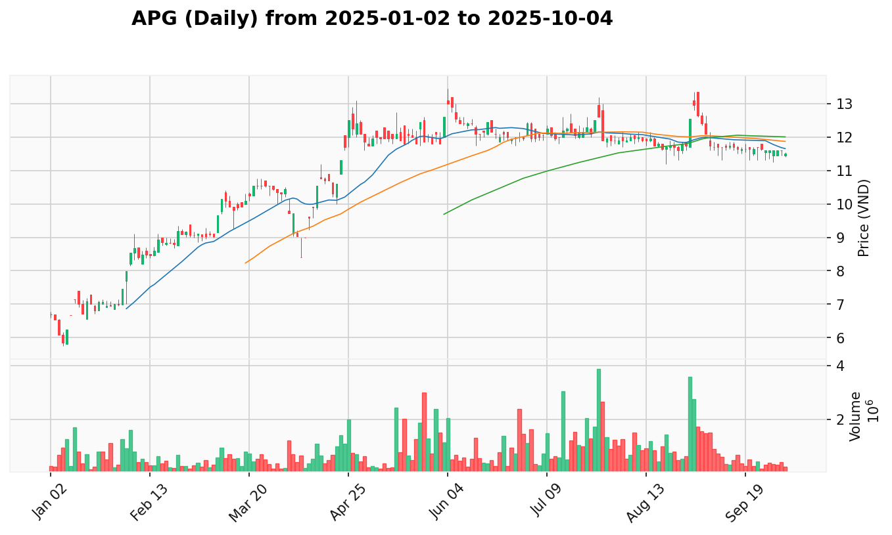

<a href="#chung-khoan">↑ Back to group CHUNG_KHOAN</a>  |  <a href="#vpa-signal-summary">↑ Back to Top</a>

#### Key Statistics
| Metric | Value |
|:---|---:|
| Date Range | 2025-01-02 to 2025-09-26 |
| **Latest Close** | **11.6** |
| Period Open | 6.7 |
| Period High | 13.45 |
| Period Low | 5.75 |
| Period Change % | 73.13% |

**[Download APG Data (.csv)](market_data/APG_2025-01-02_to_2025-09-27.csv)**

---

### APH

#### [VPA Analysis (2025-08-04 - 2025-09-26)](./VPA.md#aph)
> **Ngày 2025-09-22:** APH đóng cửa tại 6.55 VND, giảm từ 6.65 VND của phiên trước. Khối lượng giao dịch đạt 0.3968 triệu cổ phiếu, tăng đáng kể so với 0.1344 triệu cổ phiếu của phiên trước. Cây nến giảm có biên độ hẹp và đóng cửa ở mức giữa/thấp hơn của biên độ, cho thấy áp lực bán gia tăng. Sự sụt giảm giá đi kèm với khối lượng tăng mạnh sau giai đoạn thiếu cầu xác nhận nguồn cung đang chiếm ưu thế và xu hướng giảm tiếp diễn. **Phân tích VPA/Wyckoff:** Weakness (Yếu kém) - Nguồn cung gia tăng với giá giảm xác nhận áp lực bán.
> **Ngày 2025-09-23:** APH đóng cửa tại 6.6 VND, tăng nhẹ từ 6.55 VND của phiên trước. Khối lượng giao dịch đạt 0.1419 triệu cổ phiếu, giảm mạnh so với 0.3968 triệu cổ phiếu của phiên trước. Cây nến tăng có biên độ hẹp và đóng cửa ở mức cao nhất phiên, cho thấy một nỗ lực tăng giá yếu ớt. Tuy nhiên, việc giá tăng với khối lượng thấp sau các phiên "Yếu kém" và "Thiếu cầu" cho thấy lực cầu vẫn chưa thực sự quay trở lại và xu hướng giảm trước đó vẫn có thể tiếp diễn. **Phân tích VPA/Wyckoff:** No Demand (Thiếu cầu) - Giá tăng nhẹ với khối lượng thấp xác nhận sự thiếu hụt lực mua.
> **Ngày 2025-09-24:** APH đóng cửa tại 6.58 VND, giảm nhẹ từ 6.6 VND của phiên trước. Khối lượng giao dịch đạt 0.1281 triệu cổ phiếu, tiếp tục giảm so với 0.1419 triệu cổ phiếu của phiên trước. Cây nến giảm có biên độ hẹp và đóng cửa ở mức giữa của biên độ, cho thấy sự thiếu quyết đoán của thị trường. Việc giá giảm nhẹ với khối lượng thấp sau các phiên "Yếu kém" và "Thiếu cầu" xác nhận rằng lực cầu vẫn chưa quay trở lại và áp lực bán vẫn còn tiềm ẩn, hoặc thị trường đang trong giai đoạn tích lũy với sự thờ ơ của cả bên mua và bên bán. **Phân tích VPA/Wyckoff:** No Demand (Thiếu cầu) - Giá giảm nhẹ với khối lượng thấp cho thấy sự thiếu hụt lực mua và sự thờ ơ của thị trường.
> **Ngày 2025-09-25:** APH đóng cửa tại 6.62 VND, tăng nhẹ từ 6.58 VND của phiên trước. Khối lượng giao dịch đạt 0.069 triệu cổ phiếu, giảm mạnh so với 0.1281 triệu cổ phiếu của phiên trước và là mức rất thấp. Cây nến tăng có biên độ hẹp và đóng cửa gần mức cao nhất phiên, cho thấy một nỗ lực tăng giá yếu ớt. Việc giá tăng với khối lượng cực thấp sau chuỗi các phiên "Thiếu cầu" cho thấy lực cầu vẫn hoàn toàn vắng bóng và xu hướng giảm hoặc đi ngang tích lũy/phân phối vẫn tiếp diễn. Thị trường vẫn đang thờ ơ. **Phân tích VPA/Wyckoff:** No Demand (Thiếu cầu) - Giá tăng nhẹ với khối lượng cực thấp xác nhận sự thiếu hụt lực mua và sự thờ ơ của thị trường.
> **Ngày 2025-09-26:** APH đóng cửa tại 6.71 VND, tăng từ 6.6 VND của phiên trước. Khối lượng giao dịch đạt 0.5778 triệu cổ phiếu, tăng mạnh so với 0.1292 triệu cổ phiếu của phiên trước. Cây nến tăng có biên độ khá rộng và đóng cửa gần mức cao nhất phiên, cho thấy lực cầu đã quay trở lại và hấp thụ tốt lượng cung. Sự tăng giá mạnh mẽ đi kèm với khối lượng gia tăng đáng kể sau hai phiên "Thiếu cầu" trước đó cho thấy tín hiệu tích cực, có thể là sự khởi đầu của một đợt tăng giá hoặc kiểm tra lại các mức kháng cự cao hơn. **Phân tích VPA/Wyckoff:** Sign of Strength (SOS) - Lực cầu mạnh mẽ với khối lượng gia tăng xác nhận xu hướng tăng.

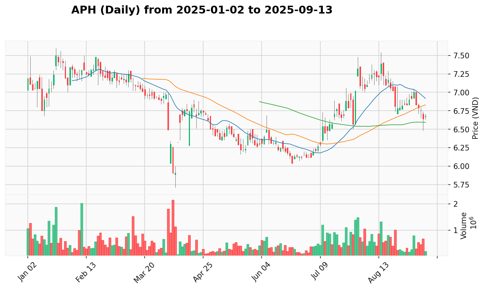

<a href="#nhua">↑ Back to group NHUA</a>  |  <a href="#vpa-signal-summary">↑ Back to Top</a>

#### Key Statistics
| Metric | Value |
|:---|---:|
| Date Range | 2025-01-02 to 2025-09-26 |
| **Latest Close** | **6.71** |
| Period Open | 7.03 |
| Period High | 7.6 |
| Period Low | 5.71 |
| Period Change % | -4.55% |

**[Download APH Data (.csv)](market_data/APH_2025-01-02_to_2025-09-27.csv)**

---

### APS

#### [VPA Analysis (2025-08-04 - 2025-09-26)](./VPA.md#aps)
> **Ngày 2025-09-22:** APS giảm từ 10.1 VND xuống 9.6 VND với biên độ nến rộng và đóng cửa gần mức thấp nhất phiên. Khối lượng giao dịch đạt 1.6044 triệu cổ phiếu, cao hơn đáng kể so với phiên trước (0.6443 triệu cổ phiếu) và vượt trội so với mức trung bình. Sự sụt giảm mạnh về giá đi kèm với khối lượng giao dịch tăng vọt cho thấy áp lực bán tháo rất lớn từ thị trường, xác nhận xu hướng suy yếu đã được thiết lập từ các phiên trước. **Phân tích VPA/Wyckoff:** Selling Climax - Áp lực bán tháo cực lớn với khối lượng tăng vọt, xác nhận xu hướng suy yếu.
> **Ngày 2025-09-23:** APS giảm từ 9.6 VND xuống 8.7 VND rồi hồi phục đóng cửa ở mức 9.6 VND với biên độ nến rộng và có bóng nến dưới dài. Khối lượng giao dịch đạt 0.7172 triệu cổ phiếu, thấp hơn đáng kể so với phiên trước (1.6044 triệu cổ phiếu). Sau phiên bán tháo mạnh (Selling Climax) ngày 2025-09-22, việc giá giảm sâu trong phiên nhưng hồi phục trở lại với khối lượng giảm cho thấy áp lực bán đã suy yếu và có lực cầu bắt đáy xuất hiện, tuy nhiên chưa đủ mạnh để đẩy giá lên cao hơn. Đây có thể là một phiên kiểm tra cung sau Selling Climax. **Phân tích VPA/Wyckoff:** Test in a Selling Climax
> **Ngày 2025-09-24:** APS tăng từ 9.6 VND lên 9.9 VND với biên độ nến hẹp và đóng cửa ở mức cao nhất phiên. Khối lượng giao dịch đạt 0.5602 triệu cổ phiếu, thấp hơn đáng kể so với phiên trước (0.7172 triệu cổ phiếu) và rất thấp so với phiên bán tháo (1.6044 triệu cổ phiếu). Sau phiên bán tháo mạnh và phiên kiểm tra cung, việc giá tăng trở lại với khối lượng thấp cho thấy áp lực bán đã cạn kiệt và lực cầu đang chiếm ưu thế mà không gặp nhiều kháng cự. Đây là dấu hiệu tích cực cho thấy khả năng đảo chiều xu hướng. **Phân tích VPA/Wyckoff:** No Supply (NS) - Lực bán cạn kiệt, giá tăng với khối lượng thấp, cho thấy khả năng đảo chiều.
> **Ngày 2025-09-25:** APS mở cửa ở 10.0 VND, dao động trong biên độ hẹp từ 9.8 VND đến 10.0 VND và đóng cửa ở mức 9.9 VND, bằng với giá đóng cửa phiên trước. Khối lượng giao dịch đạt 0.3834 triệu cổ phiếu, tiếp tục giảm mạnh so với phiên trước (0.5602 triệu cổ phiếu) và rất thấp so với các phiên bán tháo trước đó. Sau phiên "No Supply" ngày 2025-09-24, việc giá đi ngang với biên độ hẹp và khối lượng cực thấp cho thấy áp lực bán đã hoàn toàn cạn kiệt và thị trường đang trong giai đoạn tích lũy hoặc kiểm tra cung lần cuối trước khi có thể bắt đầu một xu hướng tăng mới. Đây là dấu hiệu tích cực, xác nhận sự suy yếu của phe bán. **Phân tích VPA/Wyckoff:** Test for Supply - Giá đi ngang với khối lượng cực thấp, xác nhận cạn kiệt nguồn cung.
> **Ngày 2025-09-26:** APS mở cửa ở 9.9 VND, dao động trong biên độ hẹp từ 9.8 VND đến 10.1 VND và đóng cửa ở mức 9.9 VND, bằng với giá đóng cửa phiên trước. Khối lượng giao dịch đạt 0.7591 triệu cổ phiếu, tăng đáng kể so với phiên trước (0.3834 triệu cổ phiếu). Sau hai phiên "No Supply" và "Test for Supply" cho thấy nguồn cung cạn kiệt, việc giá đi ngang với khối lượng tăng cao cho thấy lực cầu đang được đáp ứng bởi một lượng cung nhất định, ngăn cản giá tăng. Điều này có thể là một dấu hiệu của sự hấp thụ cung hoặc thiếu hụt lực cầu mạnh mẽ để đẩy giá lên. **Phân tích VPA/Wyckoff:** Supply Absorption / Lack of Demand - Giá đi ngang với khối lượng tăng, cho thấy cung đang được hấp thụ hoặc thiếu lực cầu mạnh.

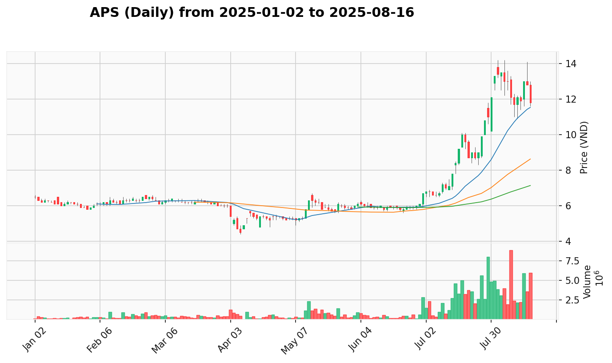

<a href="#chung-khoan">↑ Back to group CHUNG_KHOAN</a>  |  <a href="#vpa-signal-summary">↑ Back to Top</a>

#### Key Statistics
| Metric | Value |
|:---|---:|
| Date Range | 2025-01-02 to 2025-09-26 |
| **Latest Close** | **9.9** |
| Period Open | 6.5 |
| Period High | 14.2 |
| Period Low | 4.4 |
| Period Change % | 52.31% |

**[Download APS Data (.csv)](market_data/APS_2025-01-02_to_2025-09-27.csv)**

---

### ASM

#### [VPA Analysis (2025-08-14 - 2025-09-26)](./VPA.md#asm)
> **Ngày 2025-09-22:** ASM tăng từ 8.46 lên 8.57 VND với khối lượng giao dịch đạt 2.5172 triệu cổ phiếu, cao hơn đáng kể so với phiên trước (0.9158 triệu cổ phiếu). Cây nến tăng có biên độ rộng và đóng cửa ở giữa thân nến. Sau phiên "No Supply" trước đó, sự tăng giá với khối lượng lớn cho thấy lực cầu đã quay trở lại và hấp thụ tốt áp lực bán, đẩy giá lên. **Phân tích VPA/Wyckoff:** Demand (Lực cầu)
> **Ngày 2025-09-23:** ASM tăng từ 8.57 lên 8.63 VND với khối lượng giao dịch đạt 1.3478 triệu cổ phiếu, thấp hơn đáng kể so với phiên trước (2.5172 triệu cổ phiếu). Cây nến tăng có biên độ hẹp, đóng cửa gần mức thấp nhất phiên và có bóng nến trên dài. Sau phiên tăng giá với lực cầu mạnh mẽ, sự tăng giá yếu ớt với khối lượng giảm cho thấy lực cầu không được duy trì và áp lực bán có thể đang xuất hiện trở lại ở vùng giá cao hơn. Đây là dấu hiệu của sự thiếu hụt cầu. **Phân tích VPA/Wyckoff:** No Demand (Thiếu hụt cầu)
> **Ngày 2025-09-24:** ASM tăng từ 8.63 lên 8.77 VND với khối lượng giao dịch đạt 1.9071 triệu cổ phiếu, cao hơn so với phiên trước (1.3478 triệu cổ phiếu). Cây nến tăng có biên độ rộng và đóng cửa gần mức cao nhất phiên. Sau phiên "No Demand" trước đó, sự tăng giá trở lại với khối lượng gia tăng cho thấy lực cầu đã quay trở lại và đẩy giá lên mạnh mẽ. **Phân tích VPA/Wyckoff:** Demand (Lực cầu)
> **Ngày 2025-09-25:** ASM tăng từ 8.77 lên 8.95 VND với khối lượng giao dịch đạt 2.2456 triệu cổ phiếu, cao hơn so với phiên trước (1.9071 triệu cổ phiếu). Cây nến tăng có biên độ rộng và đóng cửa gần mức cao nhất phiên. Sau phiên "Demand" trước đó, sự tăng giá tiếp tục với khối lượng gia tăng cho thấy lực cầu vẫn đang mạnh mẽ và đẩy giá lên, xác nhận xu hướng tăng. **Phân tích VPA/Wyckoff:** Sign of Strength (SOS)
> **Ngày 2025-09-26:** ASM tăng từ 9.0 lên 9.33 VND với khối lượng giao dịch đạt 3.649 triệu cổ phiếu, cao hơn so với phiên trước (3.5631 triệu cổ phiếu) và là mức cao nhất trong 10 phiên gần đây. Cây nến tăng có biên độ rộng và đóng cửa gần mức cao nhất phiên. Sau các phiên "Demand" và "Sign of Strength" trước đó, sự tăng giá tiếp tục với khối lượng gia tăng mạnh mẽ cho thấy lực cầu vẫn đang rất mạnh và đẩy giá lên, xác nhận xu hướng tăng bền vững. **Phân tích VPA/Wyckoff:** Sign of Strength (SOS)

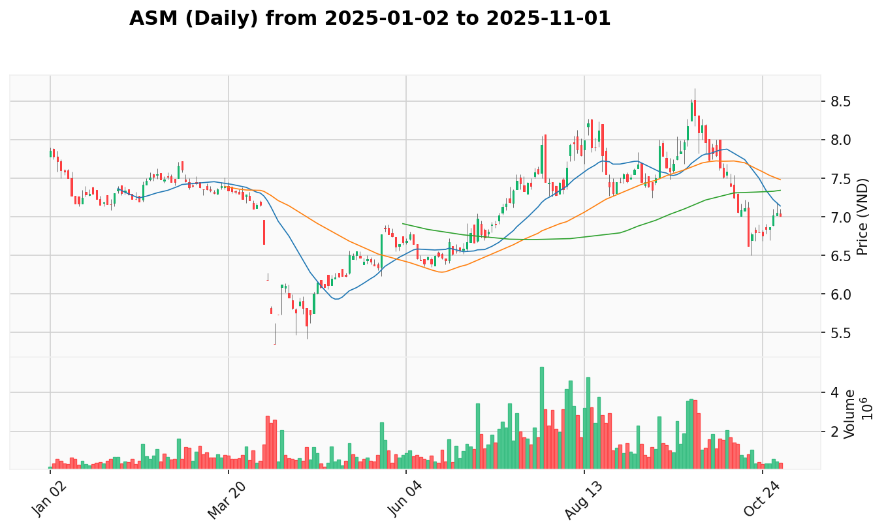

<a href="#thuy-san">↑ Back to group THUY_SAN</a>  |  <a href="#vpa-signal-summary">↑ Back to Top</a>

#### Key Statistics
| Metric | Value |
|:---|---:|
| Date Range | 2025-01-02 to 2025-09-26 |
| **Latest Close** | **9.33** |
| Period Open | 8.56 |
| Period High | 9.38 |
| Period Low | 5.89 |
| Period Change % | 9.00% |

**[Download ASM Data (.csv)](market_data/ASM_2025-01-02_to_2025-09-27.csv)**

---

### BAF

#### [VPA Analysis (2025-08-04 - 2025-09-26)](./VPA.md#baf)
> **Ngày 2025-09-22:** BAF giữ nguyên mức giá đóng cửa 33.9 VND so với phiên trước, với giá mở cửa 33.8 VND, cao nhất 34.05 VND và thấp nhất 33.6 VND. Khối lượng giao dịch tăng lên 2.2658 triệu cổ phiếu. Việc giá đi ngang với khối lượng gia tăng sau các phiên thiếu cầu cho thấy lực cung vẫn đang được hấp thụ nhưng lực cầu chưa đủ mạnh để tạo đà tăng giá. **Phân tích VPA/Wyckoff:** Thiếu cầu (ND) - Lực cầu vẫn yếu.
> **Ngày 2025-09-23:** BAF tăng từ 33.9 VND lên 34.4 VND, đi kèm khối lượng giao dịch tăng mạnh lên 3.5651 triệu cổ phiếu. Nến tăng có biên độ rộng và đóng cửa ở mức cao nhất phiên. Sau các phiên thiếu cầu trước đó, động thái này cho thấy lực cầu đã quay trở lại mạnh mẽ và hấp thụ hoàn toàn áp lực cung. **Phân tích VPA/Wyckoff:** Sign of Strength (SOS) - Lực cầu mạnh mẽ xác nhận xu hướng tăng.
> **Ngày 2025-09-24:** BAF tiếp tục tăng từ 34.4 VND lên 34.65 VND, với giá mở cửa 34.35 VND, cao nhất 34.65 VND và thấp nhất 34.0 VND. Khối lượng giao dịch giảm xuống 1.9782 triệu cổ phiếu so với phiên trước. Mặc dù khối lượng giảm, giá vẫn tăng và đóng cửa ở mức cao nhất phiên, cho thấy lực cầu vẫn đang kiểm soát và hấp thụ tốt lượng cung còn lại sau phiên tăng mạnh trước đó. Đây là dấu hiệu tích cực cho thấy xu hướng tăng giá có thể tiếp diễn. **Phân tích VPA/Wyckoff:** Test (Kiểm tra) - Lực cầu tiếp tục đẩy giá lên cao với khối lượng giảm, cho thấy nguồn cung đã được hấp thụ tốt.
> **Ngày 2025-09-25:** BAF mở cửa ở mức 34.8 VND, đạt mức cao nhất 34.8 VND và thấp nhất 34.5 VND, đóng cửa ở mức 34.65 VND, giữ nguyên mức giá đóng cửa của phiên trước. Khối lượng giao dịch giảm mạnh xuống 0.4482 triệu cổ phiếu, cho thấy sự thiếu hụt đáng kể của cả lực mua và lực bán sau hai phiên tăng giá. Biên độ giá hẹp và khối lượng thấp cho thấy thị trường đang tạm dừng để củng cố sau đợt tăng giá. **Phân tích VPA/Wyckoff:** No Supply (NS) - Nguồn cung cạn kiệt với khối lượng giao dịch rất thấp, cho thấy áp lực bán đã giảm đáng kể.
> **Ngày 2025-09-26:** BAF mở cửa ở mức 35.1 VND, đạt mức cao nhất 35.15 VND nhưng sau đó giảm và đóng cửa ở mức 34.9 VND, thấp hơn một chút so với mức đóng cửa 34.95 VND của phiên trước. Khối lượng giao dịch đạt 1.8347 triệu cổ phiếu, giảm nhẹ so với phiên trước. Mặc dù giá mở cửa cao, nhưng việc không giữ được đà tăng và đóng cửa dưới mức mở cửa cho thấy áp lực bán đã xuất hiện, có thể là do chốt lời sau chuỗi ngày tăng giá. Tuy nhiên, khối lượng giảm nhẹ cho thấy áp lực bán chưa quá mạnh. **Phân tích VPA/Wyckoff:** Supply Coming In (Nguồn cung xuất hiện) - Giá không giữ được đà tăng và đóng cửa thấp hơn với khối lượng giảm nhẹ, cho thấy nguồn cung đã bắt đầu xuất hiện và hấp thụ một phần lực cầu.

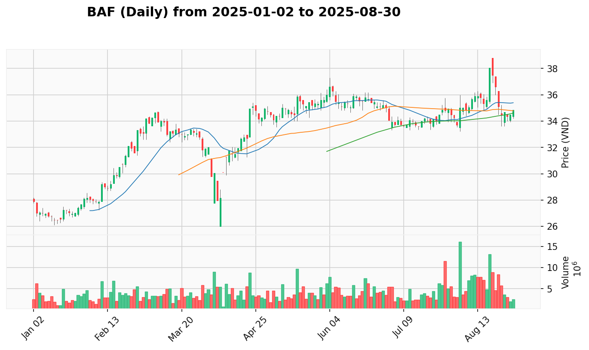

<a href="#nong-nghiep">↑ Back to group NONG_NGHIEP</a>  |  <a href="#vpa-signal-summary">↑ Back to Top</a>

#### Key Statistics
| Metric | Value |
|:---|---:|
| Date Range | 2025-01-02 to 2025-09-26 |
| **Latest Close** | **34.9** |
| Period Open | 28.1 |
| Period High | 38.8 |
| Period Low | 26.0 |
| Period Change % | 24.20% |

**[Download BAF Data (.csv)](market_data/BAF_2025-01-02_to_2025-09-27.csv)**

---

### BCC

#### [VPA Analysis (2025-08-14 - 2025-09-26)](./VPA.md#bcc)
> **Ngày 2025-09-22:** BCC giảm từ 8.9 VND xuống 8.7 VND với khối lượng giao dịch đạt 0.1172 triệu cổ phiếu. Cây nến giảm có biên độ hẹp và đóng cửa gần mức thấp nhất phiên. Khối lượng giao dịch tăng đáng kể so với phiên trước (0.0449 triệu cổ phiếu), cho thấy áp lực bán đã gia tăng sau phiên "No Demand". Việc giá giảm với khối lượng tăng xác nhận rằng nguồn cung vẫn đang chiếm ưu thế trên thị trường. **Phân tích VPA/Wyckoff:** Sign of Weakness (SOW) - Giá giảm với khối lượng tăng, xác nhận nguồn cung đang áp đảo.
> **Ngày 2025-09-23:** BCC giảm từ 8.7 VND xuống 8.6 VND với khối lượng giao dịch đạt 0.0616 triệu cổ phiếu. Cây nến giảm có biên độ hẹp và đóng cửa ở mức thấp nhất phiên. Khối lượng giao dịch thấp hơn đáng kể so với phiên trước (0.1172 triệu cổ phiếu), cho thấy áp lực bán đã giảm nhưng lực cầu vẫn hoàn toàn vắng mặt, xác nhận sự yếu kém tiếp diễn của thị trường. **Phân tích VPA/Wyckoff:** No Demand (ND) - Giá giảm với biên độ hẹp và khối lượng thấp, đóng cửa ở mức thấp nhất phiên, xác nhận thiếu vắng lực cầu.
> **Ngày 2025-09-24:** BCC tăng từ 8.6 VND lên 8.7 VND với khối lượng giao dịch đạt 0.1317 triệu cổ phiếu. Cây nến có biên độ hẹp và đóng cửa ở mức cao nhất phiên. Khối lượng giao dịch tăng đáng kể so với phiên trước (0.0616 triệu cổ phiếu), cho thấy lực cầu đã xuất hiện trở lại sau hai phiên giảm giá liên tiếp (SOW và No Demand). Tuy nhiên, biên độ tăng giá hẹp cho thấy áp lực cung vẫn còn, ngăn cản đà tăng mạnh. **Phân tích VPA/Wyckoff:** Test for Supply (Kiểm tra cung) - Giá tăng nhẹ với khối lượng tăng mạnh, cho thấy nỗ lực kiểm tra cung nhưng vẫn gặp phải áp lực bán.
> **Ngày 2025-09-25:** BCC giữ nguyên mức giá 8.7 VND với khối lượng giao dịch đạt 0.0293 triệu cổ phiếu. Cây nến có biên độ hẹp, giá mở cửa và đóng cửa bằng nhau, đồng thời đóng cửa ở mức thấp nhất phiên. Khối lượng giao dịch cực kỳ thấp, giảm mạnh so với phiên trước (0.1317 triệu cổ phiếu) và thậm chí thấp hơn cả phiên "No Demand" ngày 23-09. Điều này cho thấy sự thiếu vắng hoàn toàn của lực cầu sau phiên kiểm tra cung, xác nhận thị trường vẫn đang rất yếu và không có động lực tăng giá. **Phân tích VPA/Wyckoff:** No Demand (ND) - Giá đi ngang với khối lượng cực thấp và đóng cửa ở mức thấp nhất phiên, xác nhận thiếu vắng lực cầu nghiêm trọng.
> **Ngày 2025-09-26:** BCC tăng từ 8.8 VND lên 9.0 VND với khối lượng giao dịch đạt 0.2543 triệu cổ phiếu. Cây nến tăng có biên độ rộng và đóng cửa ở mức cao nhất phiên. Khối lượng giao dịch tăng mạnh so với phiên trước (0.0814 triệu cổ phiếu), cho thấy lực cầu đã quay trở lại sau phiên "No Demand" và "Test for Supply", hấp thụ tốt áp lực cung. **Phân tích VPA/Wyckoff:** Sign of Strength (SOS) - Lực cầu mạnh mẽ với khối lượng gia tăng, xác nhận khả năng đảo chiều tăng giá.

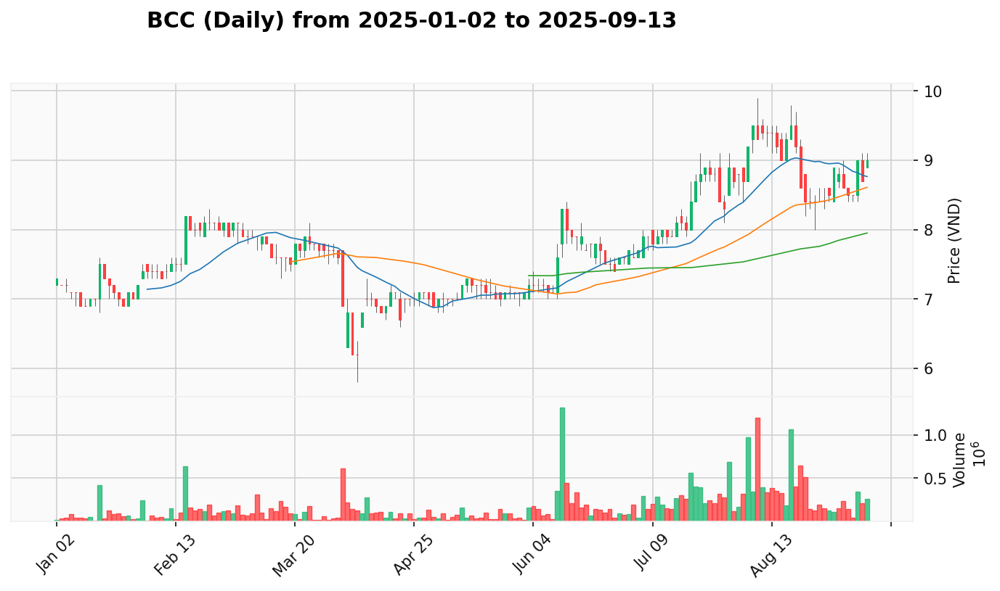

<a href="#vlxd">↑ Back to group VLXD</a>  |  <a href="#vpa-signal-summary">↑ Back to Top</a>

#### Key Statistics
| Metric | Value |
|:---|---:|
| Date Range | 2025-01-02 to 2025-09-26 |
| **Latest Close** | **9.0** |
| Period Open | 7.2 |
| Period High | 9.9 |
| Period Low | 5.8 |
| Period Change % | 25.00% |

**[Download BCC Data (.csv)](market_data/BCC_2025-01-02_to_2025-09-27.csv)**

---

### BCE

#### [VPA Analysis (2025-08-14 - 2025-09-26)](./VPA.md#bce)
> **Ngày 2025-09-22:** BCE tăng từ 11.25 VND lên 11.3 VND với khối lượng giao dịch đạt 0.0944 triệu cổ phiếu. Cây nến tăng có thân nhỏ, đóng cửa ở mức cao nhất phiên, cho thấy lực cầu đã hấp thụ được áp lực bán trong ngày. Khối lượng giao dịch tiếp tục tăng so với phiên trước, xác nhận sự trở lại của lực mua sau giai đoạn kiểm tra nguồn cung. Tuy nhiên, biên độ tăng giá còn hẹp, cho thấy thị trường vẫn đang trong quá trình tích lũy và cần thêm động lực để bứt phá. **Phân tích VPA/Wyckoff:** Lực cầu xuất hiện
> **Ngày 2025-09-23:** BCE tăng từ 11.3 VND lên 11.5 VND với khối lượng giao dịch đạt 0.0965 triệu cổ phiếu. Cây nến tăng có thân nến đặc, đóng cửa ở mức cao nhất phiên, cho thấy lực cầu mạnh mẽ và đã hấp thụ hoàn toàn áp lực bán trong ngày. Khối lượng giao dịch tiếp tục tăng nhẹ so với phiên trước, xác nhận sự hiện diện của lực mua và khả năng tiếp tục xu hướng tăng sau giai đoạn kiểm tra nguồn cung và lực cầu xuất hiện. **Phân tích VPA/Wyckoff:** Sign of Strength (SOS)
> **Ngày 2025-09-24:** BCE giảm nhẹ từ 11.5 VND xuống 11.45 VND với khối lượng giao dịch đạt 0.0996 triệu cổ phiếu. Cây nến có thân nhỏ, đóng cửa ở giữa thân nến, cho thấy sự lưỡng lự của thị trường. Mặc dù khối lượng tăng nhẹ so với phiên trước, giá lại giảm, cho thấy áp lực bán đã xuất hiện sau hai phiên tăng giá liên tiếp. Đây có thể là một phiên kiểm tra cung hoặc chốt lời ngắn hạn. **Phân tích VPA/Wyckoff:** Lực bán xuất hiện
> **Ngày 2025-09-25:** BCE tăng nhẹ từ 11.35 VND lên 11.45 VND với khối lượng giao dịch chỉ đạt 0.0051 triệu cổ phiếu. Cây nến có thân nhỏ, đóng cửa gần mức cao nhất phiên, cho thấy sự thiếu vắng áp lực bán sau phiên xuất hiện lực bán ngày 2025-09-24. Khối lượng cực thấp xác nhận nguồn cung đã cạn kiệt, cho thấy khả năng giá sẽ tiếp tục tăng trong các phiên tới. **Phân tích VPA/Wyckoff:** No Supply (Không có nguồn cung)
> **Ngày 2025-09-26:** BCE giữ nguyên mức giá 11.35 VND với khối lượng giao dịch đạt 0.041 triệu cổ phiếu. Cây nến có thân rất nhỏ, đóng cửa ở mức thấp nhất phiên, cho thấy sự lưỡng lự và áp lực bán nhẹ. Mặc dù khối lượng tăng nhẹ so với phiên 'No Supply' trước đó nhưng vẫn ở mức thấp, và giá không thể tăng, cho thấy lực cầu yếu hoặc cung vẫn còn hiện diện. **Phân tích VPA/Wyckoff:** Thiếu cầu

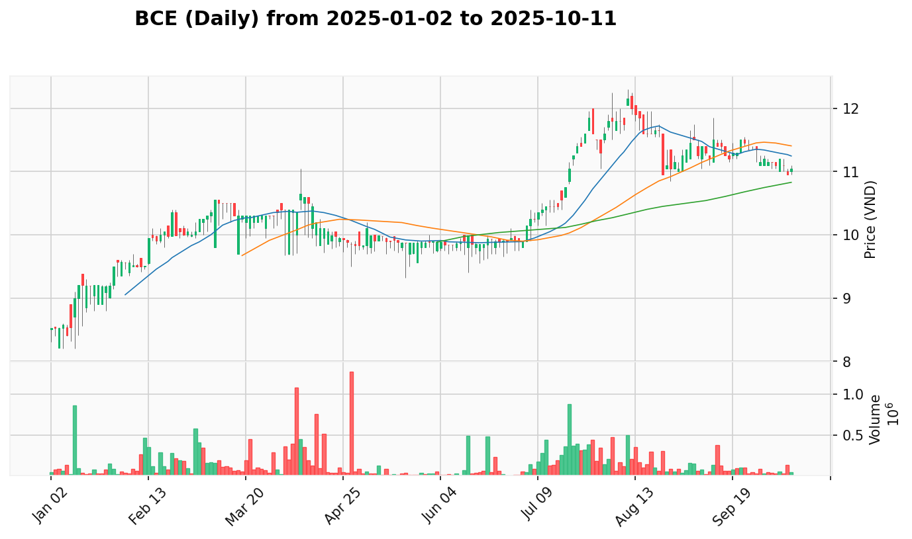

<a href="#xay-dung">↑ Back to group XAY_DUNG</a>  |  <a href="#vpa-signal-summary">↑ Back to Top</a>

#### Key Statistics
| Metric | Value |
|:---|---:|
| Date Range | 2025-01-02 to 2025-09-26 |
| **Latest Close** | **11.35** |
| Period Open | 8.5 |
| Period High | 12.3 |
| Period Low | 8.2 |
| Period Change % | 33.53% |

**[Download BCE Data (.csv)](market_data/BCE_2025-01-02_to_2025-09-27.csv)**

---

### BCG

#### [VPA Analysis (2025-08-14 - 2025-09-26)](./VPA.md#bcg)
> **Ngày 2025-09-22:** BCG giảm từ 3.3 VND xuống 3.22 VND với khối lượng giao dịch đạt 7.9469 triệu cổ phiếu. Cây nến giảm có biên độ rộng và đóng cửa ở mức thấp nhất phiên. Khối lượng giao dịch tăng đáng kể so với phiên trước (4.8357 triệu cổ phiếu), cho thấy áp lực bán mạnh mẽ và người bán đang kiểm soát hoàn toàn thị trường. Đây là sự tiếp diễn của dấu hiệu suy yếu. **Phân tích VPA/Wyckoff:** Sign of Weakness (SOW) - Dấu hiệu suy yếu tiếp diễn
> **Ngày 2025-09-23:** BCG tăng từ 3.22 VND lên 3.44 VND với khối lượng giao dịch đạt 2.9651 triệu cổ phiếu. Cây nến tăng có biên độ rộng và đóng cửa ở mức cao nhất phiên. Khối lượng giao dịch giảm đáng kể so với phiên trước (7.9469 triệu cổ phiếu), cho thấy lực cầu yếu và thiếu sự xác nhận cho đà tăng. Sau dấu hiệu suy yếu mạnh mẽ (SOW) ở phiên trước, đà tăng này với khối lượng thấp cho thấy sự thiếu vắng của lực mua chủ động. **Phân tích VPA/Wyckoff:** Lack of Demand (Thiếu cầu)
> **Ngày 2025-09-24:** BCG giảm từ 3.5 VND xuống 3.42 VND với khối lượng giao dịch đạt 3.775 triệu cổ phiếu. Cây nến giảm có biên độ hẹp và đóng cửa gần mức thấp nhất phiên. Khối lượng giao dịch tăng so với phiên trước (2.9651 triệu cổ phiếu), cho thấy áp lực bán gia tăng. Sau phiên thiếu cầu, sự giảm giá với khối lượng tăng này xác nhận sự tiếp diễn của áp lực bán. **Phân tích VPA/Wyckoff:** Effort to Fall (Nỗ lực giảm giá)
> **Ngày 2025-09-25:** BCG giảm từ 3.42 VND xuống 3.37 VND với khối lượng giao dịch đạt 3.9226 triệu cổ phiếu. Cây nến có biên độ hẹp, mở cửa ở 3.3 VND và đóng cửa ở 3.37 VND. Khối lượng giao dịch tăng nhẹ so với phiên trước (3.775 triệu cổ phiếu), cho thấy áp lực bán vẫn tiếp diễn và hấp thụ lực cầu. Sau hai phiên liên tiếp cho thấy sự thiếu cầu và nỗ lực giảm giá, phiên này tiếp tục xác nhận sự suy yếu của thị trường. **Phân tích VPA/Wyckoff:** Suy yếu
> **Ngày 2025-09-26:** BCG tiếp tục giảm từ 3.36 VND xuống 3.34 VND với khối lượng giao dịch đạt 2.5959 triệu cổ phiếu. Cây nến giảm có biên độ hẹp và đóng cửa ở mức thấp nhất phiên. Khối lượng giao dịch giảm đáng kể so với phiên trước (6.0601 triệu cổ phiếu), cho thấy áp lực bán đã suy yếu nhưng lực cầu vẫn chưa xuất hiện. Sau các phiên giảm giá với khối lượng cao, phiên này cho thấy sự cạn kiệt của cả cung và cầu, xác nhận sự thiếu vắng lực mua. **Phân tích VPA/Wyckoff:** No Demand (Không có cầu)

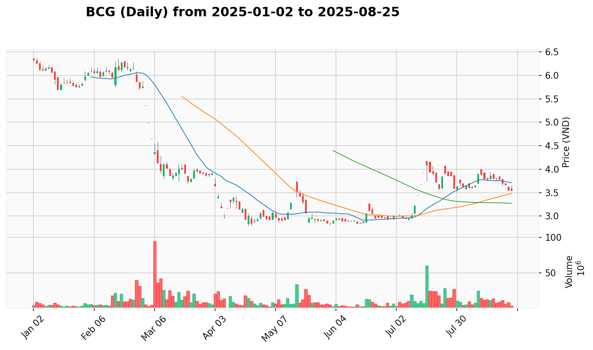

<a href="#xay-dung">↑ Back to group XAY_DUNG</a>  |  <a href="#vpa-signal-summary">↑ Back to Top</a>

#### Key Statistics
| Metric | Value |
|:---|---:|
| Date Range | 2025-01-02 to 2025-09-26 |
| **Latest Close** | **3.34** |
| Period Open | 6.35 |
| Period High | 6.37 |
| Period Low | 2.79 |
| Period Change % | -47.40% |

**[Download BCG Data (.csv)](market_data/BCG_2025-01-02_to_2025-09-27.csv)**

---

### BCM

#### [VPA Analysis (2025-06-13 - 2025-09-26)](./VPA.md#bcm)
> **Ngày 2025-09-22:** BCM giảm từ 68.9 VND xuống 67.7 VND, giảm 1.2 VND (khoảng 1.74%) trên khối lượng giao dịch 0.3786 triệu cổ phiếu, cao hơn đáng kể so với phiên trước. Cây nến có biên độ rộng và đóng cửa gần mức thấp nhất phiên, cho thấy áp lực bán gia tăng và sự suy yếu của lực cầu. Điều này xác nhận xu hướng điều chỉnh sau các phiên giảm giá trước đó. **Phân tích VPA/Wyckoff:** Sign of Weakness (SOW)
> **Ngày 2025-09-23:** BCM giảm từ 67.7 VND xuống 66.7 VND, giảm 1.0 VND (khoảng 1.48%) trên khối lượng giao dịch 0.1058 triệu cổ phiếu, thấp hơn đáng kể so với phiên trước. Cây nến có biên độ hẹp, đóng cửa gần mức thấp nhất phiên, cho thấy lực bán đã giảm nhưng lực cầu vẫn yếu. Khối lượng thấp xác nhận sự thiếu vắng cả cung và cầu mạnh mẽ sau phiên giảm mạnh trước đó, tiếp tục xu hướng suy yếu. **Phân tích VPA/Wyckoff:** No Demand (Không có cầu)
> **Ngày 2025-09-24:** BCM tăng từ 66.7 VND lên 67.3 VND, tăng 0.6 VND (khoảng 0.9%) trên khối lượng giao dịch 0.1489 triệu cổ phiếu, cao hơn so với phiên trước. Cây nến có biên độ tương đối rộng và đóng cửa ở mức cao nhất phiên, cho thấy lực cầu đã xuất hiện trở lại sau hai phiên giảm giá. Mặc dù khối lượng chưa thực sự đột biến, nhưng sự gia tăng về giá và khối lượng cùng với việc đóng cửa ở mức cao nhất phiên là một dấu hiệu tích cực. **Phân tích VPA/Wyckoff:** Nỗ lực tăng giá (Effort to Rise)
> **Ngày 2025-09-25:** BCM giảm từ 67.3 VND xuống 67.1 VND, giảm 0.2 VND (khoảng 0.3%) trên khối lượng giao dịch 0.0471 triệu cổ phiếu, thấp hơn đáng kể so với phiên trước và là mức thấp nhất trong 10 phiên gần đây. Cây nến có biên độ hẹp, đóng cửa gần mức thấp nhất phiên, cho thấy lực bán yếu nhưng lực cầu cũng không xuất hiện. Khối lượng cực thấp sau phiên "Nỗ lực tăng giá" trước đó cho thấy sự thiếu vắng của cả cung và cầu, xác nhận rằng nỗ lực tăng giá không được duy trì. **Phân tích VPA/Wyckoff:** No Demand (Không có cầu)
> **Ngày 2025-09-26:** BCM tăng từ 67.4 VND lên 67.7 VND, tăng 0.3 VND (khoảng 0.45%) trên khối lượng giao dịch 0.2153 triệu cổ phiếu, cao hơn đáng kể so với phiên trước. Cây nến có biên độ tương đối rộng và đóng cửa gần mức cao nhất phiên, cho thấy lực cầu đã quay trở lại và hấp thụ lực cung yếu ớt của phiên trước. Sự gia tăng về giá và khối lượng cùng với việc đóng cửa ở mức cao cho thấy sự trở lại của dòng tiền, xác nhận nỗ lực tăng giá. **Phân tích VPA/Wyckoff:** Sign of Strength (SOS)

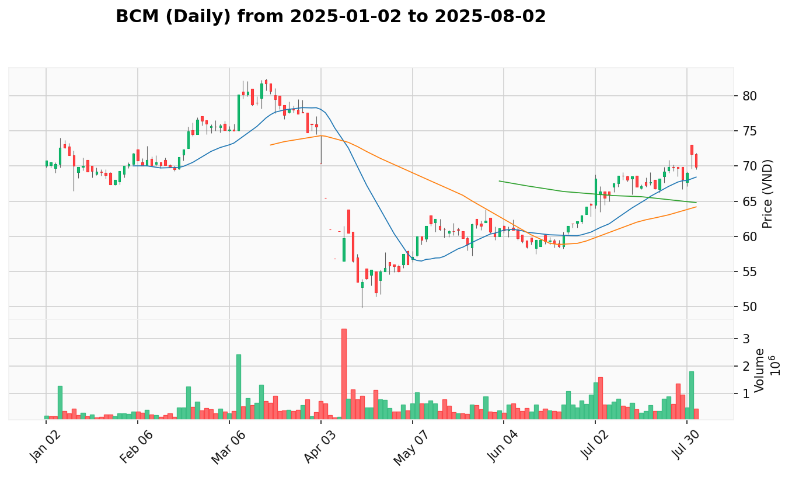

<a href="#bat-dong-san-kcn">↑ Back to group BAT_DONG_SAN_KCN</a>  |  <a href="#vpa-signal-summary">↑ Back to Top</a>

#### Key Statistics
| Metric | Value |
|:---|---:|
| Date Range | 2025-01-02 to 2025-09-26 |
| **Latest Close** | **67.7** |
| Period Open | 70.0 |
| Period High | 82.4 |
| Period Low | 49.8 |
| Period Change % | -3.29% |

**[Download BCM Data (.csv)](market_data/BCM_2025-01-02_to_2025-09-27.csv)**

---

### BFC

#### [VPA Analysis (2025-08-05 - 2025-09-26)](./VPA.md#bfc)
> **Ngày 2025-09-22:** BFC giảm từ 43.4 VND xuống 41.95 VND với khối lượng giao dịch đạt 0.5625 triệu cổ phiếu. Cây nến giảm có biên độ rộng (từ 41.7 VND đến 43.5 VND) và đóng cửa gần mức thấp nhất phiên. Khối lượng giao dịch tăng mạnh so với phiên trước (0.0938 triệu cổ phiếu), cho thấy áp lực bán gia tăng đáng kể và nguồn cung áp đảo lực cầu. Giá đóng cửa thấp nhất phiên xác nhận sự yếu kém của cổ phiếu. **Phân tích VPA/Wyckoff:** Sign of Weakness (SOW) - Giá giảm mạnh với khối lượng tăng cao, xác nhận áp lực bán lớn và sự yếu kém của cổ phiếu.
> **Ngày 2025-09-23:** BFC tăng từ 41.95 VND lên 42.25 VND với khối lượng giao dịch đạt 0.0313 triệu cổ phiếu. Cây nến tăng có biên độ hẹp (từ 41.95 VND đến 42.4 VND) và đóng cửa gần giữa phiên. Khối lượng giao dịch giảm mạnh so với phiên trước (0.5625 triệu cổ phiếu), cho thấy thiếu vắng lực cầu mạnh mẽ sau phiên giảm điểm với khối lượng lớn. Điều này xác nhận sự yếu kém của thị trường và khả năng tiếp tục giảm giá. **Phân tích VPA/Wyckoff:** No Demand (ND) - Giá tăng nhẹ với khối lượng rất thấp sau một đợt giảm mạnh, cho thấy không có lực cầu đáng kể.
> **Ngày 2025-09-24:** BFC tăng từ 42.25 VND lên 43.2 VND với khối lượng giao dịch đạt 0.1154 triệu cổ phiếu. Cây nến tăng có biên độ rộng (từ 41.6 VND đến 43.2 VND) và đóng cửa ở mức cao nhất phiên, cho thấy lực mua mạnh mẽ. Khối lượng giao dịch tăng đáng kể so với phiên trước (0.0313 triệu cổ phiếu), xác nhận sự trở lại của lực cầu sau phiên "No Demand". Tuy nhiên, khối lượng này vẫn thấp hơn đáng kể so với phiên giảm mạnh "Sign of Weakness" vào ngày 2025-09-22 (0.5625 triệu cổ phiếu), cho thấy cần thêm xác nhận về sức mạnh của xu hướng tăng. **Phân tích VPA/Wyckoff:** Effort to Rise (ER) - Giá tăng mạnh với khối lượng tăng, cho thấy nỗ lực đẩy giá lên cao.
> **Ngày 2025-09-25:** BFC giảm từ 43.0 VND xuống 42.75 VND với khối lượng giao dịch đạt 0.016 triệu cổ phiếu. Cây nến giảm có biên độ hẹp (từ 42.65 VND đến 43.0 VND) và đóng cửa gần mức thấp nhất phiên. Khối lượng giao dịch cực kỳ thấp, giảm mạnh so với phiên trước (0.1154 triệu cổ phiếu), cho thấy thiếu vắng lực cầu sau phiên tăng giá "Effort to Rise" và thị trường đang kiểm tra nguồn cung. Điều này xác nhận sự yếu kém của thị trường và khả năng tiếp tục giảm giá nếu không có lực cầu mạnh mẽ xuất hiện. **Phân tích VPA/Wyckoff:** No Demand (ND) - Giá giảm nhẹ với khối lượng rất thấp, cho thấy không có lực cầu đáng kể.
> **Ngày 2025-09-26:** BFC giảm từ 42.9 VND xuống 42.2 VND với khối lượng giao dịch đạt 0.0799 triệu cổ phiếu. Cây nến giảm có biên độ rộng (từ 41.95 VND đến 43.2 VND) và đóng cửa gần mức thấp nhất phiên, cho thấy áp lực bán mạnh mẽ. Khối lượng giao dịch tăng so với phiên "No Demand" trước đó (0.0329 triệu cổ phiếu), xác nhận sự xuất hiện của lực cung. Điều này cho thấy thị trường đang kiểm tra lại mức hỗ trợ và có khả năng tiếp tục xu hướng giảm nếu không có lực cầu mạnh mẽ xuất hiện. **Phân tích VPA/Wyckoff:** Supply Coming In (SCI) - Giá giảm với khối lượng tăng, cho thấy lực cung đang chiếm ưu thế.

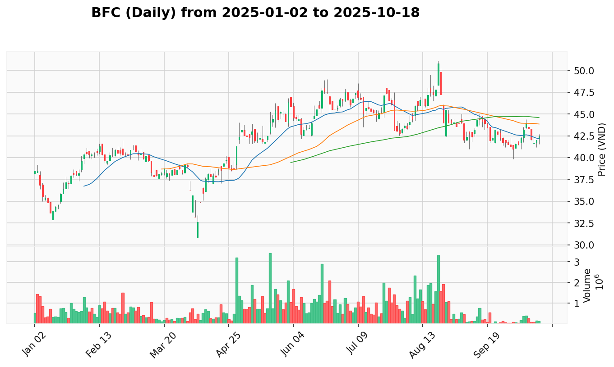

<a href="#hoa-chat">↑ Back to group HOA_CHAT</a>  |  <a href="#vpa-signal-summary">↑ Back to Top</a>

#### Key Statistics
| Metric | Value |
|:---|---:|
| Date Range | 2025-01-02 to 2025-09-26 |
| **Latest Close** | **42.2** |
| Period Open | 38.19 |
| Period High | 51.1 |
| Period Low | 30.86 |
| Period Change % | 10.50% |

**[Download BFC Data (.csv)](market_data/BFC_2025-01-02_to_2025-09-27.csv)**

---

### BIC

#### [VPA Analysis (2025-06-27 - 2025-09-26)](./VPA.md#bic)
> **Ngày 2025-09-22:** BIC tăng nhẹ từ 26.25 VND lên 26.4 VND. Cây nến có biên độ rộng, mở cửa tại 26.4 VND, đạt mức cao nhất 27.0 VND và mức thấp nhất 25.55 VND, đóng cửa tại 26.4 VND. Khối lượng giao dịch đạt 0.2375 triệu cổ phiếu, cao hơn đáng kể so với phiên trước (0.112938 triệu cổ phiếu). Giá đã giảm xuống dưới các mức thấp trước đó (25.8 VND và 26.0 VND) nhưng sau đó phục hồi và đóng cửa ở mức 26.4 VND, cho thấy sự hấp thụ nguồn cung ở mức giá thấp. Khối lượng cao xác nhận sự tham gia của dòng tiền lớn. **Phân tích VPA/Wyckoff:** Spring - Giá giảm xuống dưới hỗ trợ và nhanh chóng phục hồi trên khối lượng cao, cho thấy sự rũ bỏ các nhà đầu tư yếu và hấp thụ nguồn cung.
> **Ngày 2025-09-23:** BIC tăng nhẹ từ 26.4 VND lên 26.45 VND. Cây nến có biên độ hẹp, mở cửa tại 27.0 VND, đạt mức cao nhất 27.0 VND và mức thấp nhất 26.4 VND, đóng cửa tại 26.45 VND. Khối lượng giao dịch đạt 0.0396 triệu cổ phiếu, rất thấp so với phiên trước (0.2375 triệu cổ phiếu) và mức trung bình. Sau phiên Spring với khối lượng cao vào ngày 2025-09-22, việc giá tăng nhẹ trên khối lượng rất thấp cho thấy thị trường đang kiểm tra lại nguồn cung sau khi rũ bỏ. Khối lượng thấp xác nhận rằng áp lực bán đã giảm đáng kể và nguồn cung đã được hấp thụ. **Phân tích VPA/Wyckoff:** Test (kiểm tra nguồn cung)
> **Ngày 2025-09-24:** BIC giữ nguyên mức giá 26.45 VND. Cây nến có biên độ hẹp, mở cửa tại 26.45 VND, đạt mức cao nhất 26.45 VND và mức thấp nhất 25.95 VND, đóng cửa tại 26.45 VND. Khối lượng giao dịch đạt 0.1158 triệu cổ phiếu, cao hơn đáng kể so với phiên trước (0.0396 triệu cổ phiếu). Sau phiên Test với khối lượng rất thấp vào ngày 2025-09-23, việc giá không tăng trên khối lượng gia tăng cho thấy lực cầu chưa đủ mạnh để đẩy giá lên cao hơn, hoặc vẫn còn nguồn cung được hấp thụ ở mức giá này. Mặc dù giá đã phục hồi từ mức thấp nhất trong phiên, nhưng việc đóng cửa không thay đổi so với phiên trước trên khối lượng tăng cho thấy sự thiếu quyết đoán của thị trường và lực cầu chưa chiếm ưu thế. **Phân tích VPA/Wyckoff:** No Demand (Thiếu cầu) - Giá không thể tăng trên khối lượng gia tăng sau một phiên kiểm tra, cho thấy lực cầu yếu hoặc nguồn cung vẫn còn.
> **Ngày 2025-09-25:** BIC giảm nhẹ từ 26.45 VND xuống 26.25 VND. Cây nến có biên độ hẹp, mở cửa tại 26.5 VND, đạt mức cao nhất 26.5 VND và mức thấp nhất 26.25 VND, đóng cửa tại 26.25 VND. Khối lượng giao dịch đạt 0.0329 triệu cổ phiếu, rất thấp so với phiên trước (0.1158 triệu cổ phiếu) và mức trung bình. Sau phiên "No Demand" vào ngày 2025-09-24, việc giá giảm nhẹ trên khối lượng rất thấp cho thấy áp lực bán đã cạn kiệt và nguồn cung không còn đáng kể. Thị trường đang thiếu cả lực mua và lực bán, nhưng sự cạn kiệt nguồn cung là một dấu hiệu tích cực cho khả năng tăng giá nếu lực cầu xuất hiện. **Phân tích VPA/Wyckoff:** No Supply (Không có nguồn cung)
> **Ngày 2025-09-26:** BIC tăng mạnh từ 26.2 VND lên 28.0 VND. Cây nến có biên độ rộng, mở cửa tại 26.2 VND, đạt mức cao nhất 28.0 VND và mức thấp nhất 26.0 VND, đóng cửa tại 28.0 VND. Khối lượng giao dịch đạt 0.3435 triệu cổ phiếu, cao hơn đáng kể so với phiên trước (0.1009 triệu cổ phiếu) và mức trung bình. Sau phiên "No Supply" vào ngày 2025-09-25, sự tăng giá mạnh mẽ trên khối lượng lớn cho thấy lực cầu đã quay trở lại và áp đảo hoàn toàn lực cung. Điều này xác nhận sự cạn kiệt nguồn cung trước đó và báo hiệu khả năng tiếp tục xu hướng tăng. **Phân tích VPA/Wyckoff:** Sign of Strength (SOS) - Lực cầu mạnh mẽ với khối lượng gia tăng xác nhận xu hướng tăng.

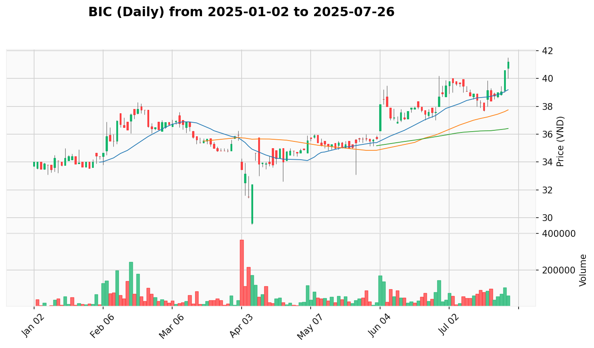

<a href="#bao-hiem">↑ Back to group BAO_HIEM</a>  |  <a href="#vpa-signal-summary">↑ Back to Top</a>

#### Key Statistics
| Metric | Value |
|:---|---:|
| Date Range | 2025-01-02 to 2025-09-26 |
| **Latest Close** | **28.0** |
| Period Open | 18.98 |
| Period High | 32.83 |
| Period Low | 16.61 |
| Period Change % | 47.52% |

**[Download BIC Data (.csv)](market_data/BIC_2025-01-02_to_2025-09-27.csv)**

---

### BID

#### [VPA Analysis (2025-06-13 - 2025-09-26)](./VPA.md#bid)
> **Ngày 2025-09-22:** BID tăng từ 39.8 VND lên 41.0 VND, với biên độ dao động từ 39.6 VND đến 41.0 VND. Giá đóng cửa ở mức cao nhất phiên. Khối lượng giao dịch đạt 7.9943 triệu cổ phiếu, tăng đáng kể so với phiên trước (6.1614 triệu cổ phiếu). Sau hai phiên giảm giá liên tiếp với dấu hiệu suy yếu và lực cung mạnh mẽ, phiên này giá đã tăng trở lại và đóng cửa ở mức cao nhất, đi kèm với khối lượng giao dịch gia tăng. Điều này cho thấy lực cầu đã quay trở lại và hấp thụ tốt lực cung, đẩy giá lên với nỗ lực lớn. **Phân tích VPA/Wyckoff:** Dấu hiệu sức mạnh (Sign of Strength) - Lực cầu mạnh mẽ với nỗ lực gia tăng.
> **Ngày 2025-09-23:** BID giảm nhẹ từ 41.0 VND xuống 40.85 VND, với biên độ dao động từ 40.5 VND đến 40.9 VND. Giá đóng cửa ở mức giữa thân nến. Khối lượng giao dịch đạt 3.4665 triệu cổ phiếu, giảm đáng kể so với phiên trước (7.9943 triệu cổ phiếu). Sau phiên tăng giá mạnh với dấu hiệu sức mạnh, phiên này giá điều chỉnh nhẹ với khối lượng giao dịch sụt giảm mạnh. Điều này cho thấy lực cầu đã chững lại và không có sự tiếp diễn mạnh mẽ, đồng thời lực cung cũng không quá áp đảo. **Phân tích VPA/Wyckoff:** Thiếu cầu (No Demand) - Lực cầu chững lại với khối lượng thấp.
> **Ngày 2025-09-24:** BID tăng từ 40.85 VND lên 41.2 VND, với biên độ dao động từ 40.2 VND đến 41.2 VND và đóng cửa ở mức cao nhất phiên. Khối lượng giao dịch đạt 4.6695 triệu cổ phiếu, tăng so với phiên trước (3.4665 triệu cổ phiếu), cho thấy lực cầu đã quay trở lại và hấp thụ tốt lực cung sau phiên thiếu cầu. **Phân tích VPA/Wyckoff:** Dấu hiệu sức mạnh (Sign of Strength) - Lực cầu trở lại với nỗ lực tăng giá.
> **Ngày 2025-09-25:** BID giảm từ 41.2 VND xuống 40.85 VND, với biên độ dao động hẹp từ 40.8 VND đến 41.15 VND và đóng cửa gần mức thấp nhất phiên. Khối lượng giao dịch đạt 1.1064 triệu cổ phiếu, giảm mạnh so với phiên trước (4.6695 triệu cổ phiếu). Sau phiên tăng giá với dấu hiệu sức mạnh, phiên này giá điều chỉnh giảm với khối lượng sụt giảm mạnh, cho thấy lực cầu đã chững lại và không có sự tiếp diễn. **Phân tích VPA/Wyckoff:** Thiếu cầu (No Demand) - Lực cầu yếu với khối lượng thấp.
> **Ngày 2025-09-26:** BID giảm từ 40.8 VND xuống 40.55 VND, với biên độ dao động từ 40.55 VND đến 41.15 VND và đóng cửa ở mức thấp nhất phiên. Khối lượng giao dịch đạt 2.2951 triệu cổ phiếu, tăng đáng kể so với phiên trước (1.1064 triệu cổ phiếu). Sau phiên thiếu cầu, giá tiếp tục giảm với khối lượng gia tăng và đóng cửa ở mức thấp nhất, cho thấy áp lực bán mạnh mẽ và sự yếu kém của lực cầu. **Phân tích VPA/Wyckoff:** Yếu kém (Weakness)

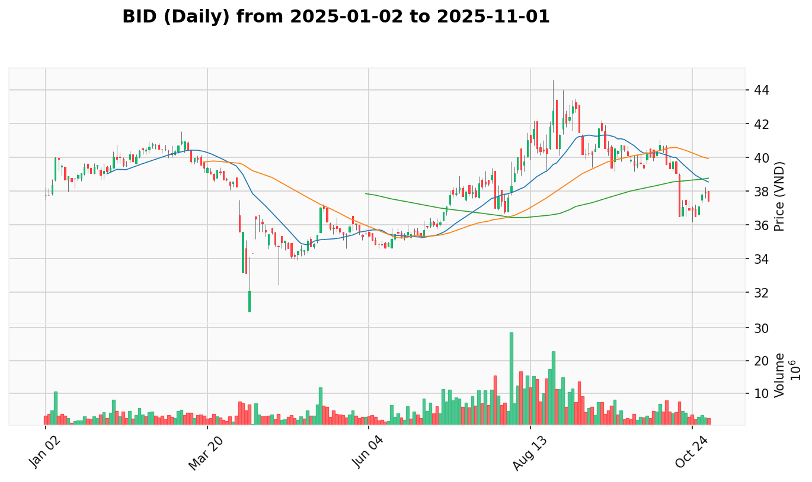

<a href="#ngan-hang">↑ Back to group NGAN_HANG</a>  |  <a href="#vpa-signal-summary">↑ Back to Top</a>

#### Key Statistics
| Metric | Value |
|:---|---:|
| Date Range | 2025-01-02 to 2025-09-26 |
| **Latest Close** | **40.55** |
| Period Open | 38.2 |
| Period High | 45.1 |
| Period Low | 31.2 |
| Period Change % | 6.15% |

**[Download BID Data (.csv)](market_data/BID_2025-01-02_to_2025-09-27.csv)**

---

### BMC

#### [VPA Analysis (2025-08-04 - 2025-09-26)](./VPA.md#bmc)
> **Ngày 2025-09-22:** BMC giảm từ 17.4 VND xuống 17.15 VND, với biên độ giá hẹp (17.4 VND - 17.0 VND) và đóng cửa gần mức thấp nhất phiên. Khối lượng giao dịch đạt 0.0316 triệu cổ phiếu, giảm đáng kể so với phiên trước (0.0619 triệu cổ phiếu). Sau phiên giảm giá với áp lực cung gia tăng (SOW), việc giá tiếp tục giảm nhẹ với khối lượng rất thấp cho thấy áp lực bán đã suy yếu đáng kể, nhưng lực cầu vẫn hoàn toàn vắng bóng. Điều này xác nhận sự yếu kém của thị trường và cho thấy không có sự quan tâm từ bên mua. **Phân tích VPA/Wyckoff:** No Demand (Thiếu cầu)
> **Ngày 2025-09-23:** BMC mở cửa tại 17.0 VND và đóng cửa tại 17.15 VND, bằng với giá đóng cửa phiên trước, nhưng đã phục hồi mạnh mẽ từ mức thấp nhất 16.3 VND và đóng cửa ở mức cao nhất phiên. Biên độ giá trong phiên rộng (17.15 VND - 16.3 VND). Khối lượng giao dịch đạt 0.0546 triệu cổ phiếu, tăng đáng kể so với phiên trước (0.0316 triệu cổ phiếu). Sau các phiên giảm giá và thiếu cầu, việc giá phục hồi từ mức thấp nhất trong phiên với khối lượng gia tăng cho thấy lực cầu đã bắt đầu tham gia hấp thụ lượng cung, ngăn chặn đà giảm sâu hơn. Điều này có thể là dấu hiệu của sự thay đổi trong cán cân cung cầu. **Phân tích VPA/Wyckoff:** Effort to Rise (Nỗ lực tăng giá) - Lực cầu xuất hiện và hấp thụ cung.
> **Ngày 2025-09-24:** BMC tăng nhẹ từ 17.15 VND lên 17.3 VND, với biên độ giá hẹp (17.35 VND - 17.15 VND) và đóng cửa gần mức cao nhất phiên. Khối lượng giao dịch đạt 0.0343 triệu cổ phiếu, giảm đáng kể so với phiên trước (0.0546 triệu cổ phiếu). Sau phiên nỗ lực tăng giá (Effort to Rise) vào ngày 2025-09-23, việc giá tiếp tục tăng nhẹ với khối lượng thấp cho thấy lực cầu không được duy trì mạnh mẽ, thiếu sự xác nhận cho đà tăng. Điều này cho thấy sự thiếu hụt về nhu cầu mua vào. **Phân tích VPA/Wyckoff:** No Demand (Thiếu cầu)
> **Ngày 2025-09-25:** BMC tăng nhẹ từ 17.3 VND lên 17.45 VND, với biên độ giá hẹp (17.55 VND - 17.35 VND) và đóng cửa ở giữa thân nến. Khối lượng giao dịch đạt 0.0106 triệu cổ phiếu, giảm mạnh so với phiên trước (0.0343 triệu cổ phiếu) và rất thấp so với mức trung bình. Sau phiên "Thiếu cầu" ngày 2025-09-24, việc giá tiếp tục tăng nhẹ nhưng với khối lượng cực kỳ thấp cho thấy lực cầu không chỉ không được duy trì mà còn suy yếu nghiêm trọng, không có sự xác nhận cho bất kỳ đà tăng nào. Điều này cho thấy sự thờ ơ của thị trường và thiếu hụt nhu cầu mua vào. **Phân tích VPA/Wyckoff:** No Demand (Thiếu cầu) - Lực cầu suy yếu nghiêm trọng, không có sự xác nhận cho đà tăng.
> **Ngày 2025-09-26:** BMC tăng mạnh từ 17.35 VND lên 18.55 VND, với biên độ giá rộng (18.55 VND - 17.35 VND) và đóng cửa ở mức cao nhất phiên. Khối lượng giao dịch đạt 0.4006 triệu cổ phiếu, tăng đột biến so với phiên trước (0.0301 triệu cổ phiếu) và cao hơn nhiều so với mức trung bình. Sau hai phiên liên tiếp cho tín hiệu "Thiếu cầu", sự tăng giá mạnh mẽ đi kèm với khối lượng lớn cho thấy lực cầu đã quay trở lại mạnh mẽ, hấp thụ toàn bộ lực cung và xác nhận xu hướng tăng. **Phân tích VPA/Wyckoff:** Sign of Strength (SOS) - Lực cầu mạnh mẽ.

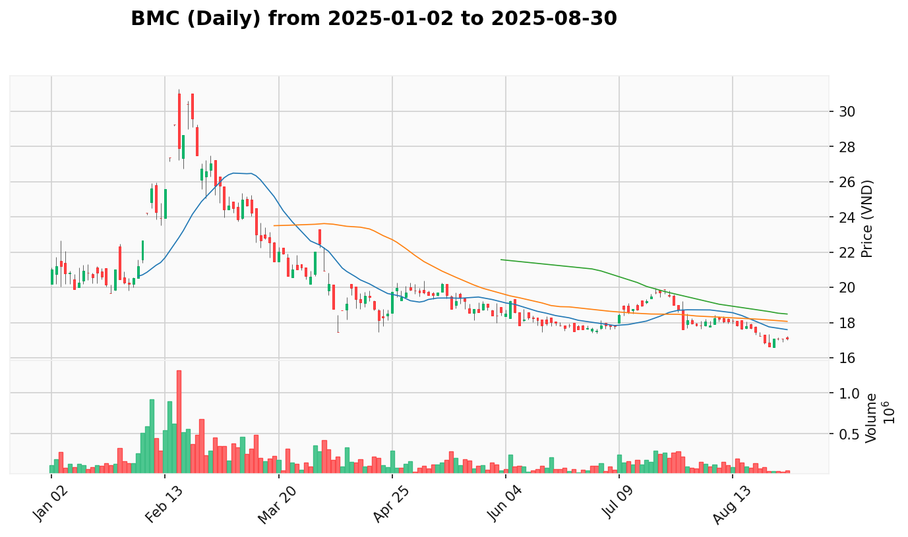

<a href="#khai-khoang">↑ Back to group KHAI_KHOANG</a>  |  <a href="#vpa-signal-summary">↑ Back to Top</a>

#### Key Statistics
| Metric | Value |
|:---|---:|
| Date Range | 2025-01-02 to 2025-09-26 |
| **Latest Close** | **18.55** |
| Period Open | 20.18 |
| Period High | 31.26 |
| Period Low | 16.3 |
| Period Change % | -8.08% |

**[Download BMC Data (.csv)](market_data/BMC_2025-01-02_to_2025-09-27.csv)**

---

### BMI

#### [VPA Analysis (2025-08-04 - 2025-09-26)](./VPA.md#bmi)
> **Ngày 2025-09-22:** BMI giảm từ 21.65 VND xuống 21.4 VND, tạo thành cây nến giảm giá với biên độ vừa phải và đóng cửa gần mức thấp nhất phiên. Khối lượng giao dịch đạt 0.4527 triệu cổ phiếu, giảm đáng kể so với 0.6022 triệu cổ phiếu của phiên trước. Sau các phiên "Thiếu vắng nhu cầu", việc giá tiếp tục giảm nhưng với khối lượng thấp hơn cho thấy áp lực bán đang suy yếu nhưng lực cầu vẫn chưa xuất hiện để hỗ trợ giá. Điều này xác nhận sự yếu kém của thị trường và khả năng tiếp diễn xu hướng giảm. **Phân tích VPA/Wyckoff:** Thiếu vắng nhu cầu tiếp diễn
> **Ngày 2025-09-23:** BMI giảm từ 21.65 VND xuống 21.45 VND, tạo thành cây nến giảm giá với biên độ hẹp và đóng cửa ở mức 21.45 VND, cao hơn nhẹ so với mức đóng cửa của phiên trước (21.4 VND). Khối lượng giao dịch đạt 0.3901 triệu cổ phiếu, giảm đáng kể so với 0.4527 triệu cổ phiếu của phiên trước và thấp hơn nhiều so với mức trung bình. Sau các phiên "Thiếu vắng nhu cầu tiếp diễn", việc giá giảm với biên độ hẹp và khối lượng rất thấp cho thấy áp lực bán đã cạn kiệt, nhưng lực cầu vẫn chưa đủ mạnh để đẩy giá lên. Điều này cho thấy sự thiếu vắng nguồn cung trên thị trường. **Phân tích VPA/Wyckoff:** No Supply (Thiếu vắng nguồn cung)
> **Ngày 2025-09-24:** BMI tăng từ 21.45 VND lên 21.6 VND, tạo thành cây nến tăng giá với biên độ vừa phải và đóng cửa ở mức cao nhất phiên. Khối lượng giao dịch đạt 0.5564 triệu cổ phiếu, tăng đáng kể so với phiên trước (0.3901 triệu cổ phiếu). Sau phiên "No Supply" (Thiếu vắng nguồn cung) trước đó, sự tăng giá với khối lượng gia tăng cho thấy lực cầu đã bắt đầu quay trở lại thị trường, hấp thụ nguồn cung còn lại và đẩy giá lên. Điều này có thể là dấu hiệu của sự thay đổi trong cán cân cung cầu. **Phân tích VPA/Wyckoff:** Sign of Strength (SOS)
> **Ngày 2025-09-25:** BMI tăng từ 21.6 VND lên 21.7 VND, tạo thành cây nến tăng giá với biên độ hẹp và đóng cửa ở mức cao nhất phiên. Khối lượng giao dịch đạt 0.0639 triệu cổ phiếu, giảm mạnh so với phiên trước (0.5564 triệu cổ phiếu) và rất thấp so với mức trung bình. Sau phiên "Sign of Strength" (SOS) trước đó, việc giá tiếp tục tăng nhẹ với khối lượng cực thấp cho thấy áp lực bán đã cạn kiệt và thị trường đang kiểm tra nguồn cung. Điều này có thể là dấu hiệu của một đợt kiểm tra thành công trước khi giá tiếp tục xu hướng tăng. **Phân tích VPA/Wyckoff:** Test for Supply (Kiểm tra nguồn cung)
> **Ngày 2025-09-26:** BMI tăng từ 21.7 VND lên 22.1 VND, tạo thành cây nến tăng giá mạnh với biên độ rộng và đóng cửa gần mức cao nhất phiên. Khối lượng giao dịch đạt 1.1444 triệu cổ phiếu, tăng đột biến so với phiên trước (0.1397 triệu cổ phiếu). Sau phiên kiểm tra nguồn cung thành công, lực cầu mạnh mẽ đã xuất hiện, đẩy giá lên cao với khối lượng lớn, xác nhận xu hướng tăng. **Phân tích VPA/Wyckoff:** Sign of Strength (SOS)

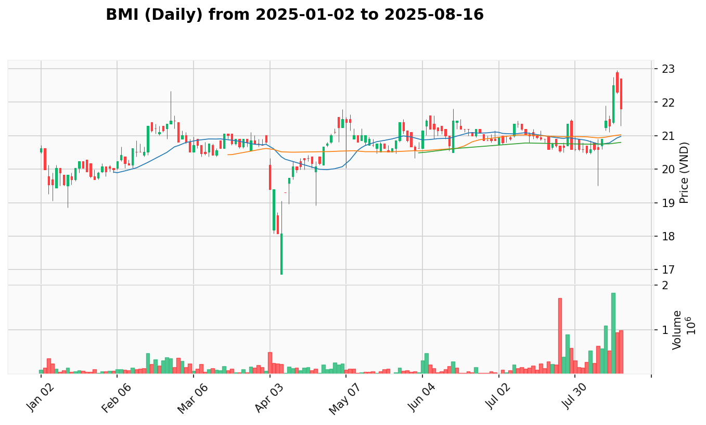

<a href="#bao-hiem">↑ Back to group BAO_HIEM</a>  |  <a href="#vpa-signal-summary">↑ Back to Top</a>

#### Key Statistics
| Metric | Value |
|:---|---:|
| Date Range | 2025-01-02 to 2025-09-26 |
| **Latest Close** | **22.1** |
| Period Open | 20.52 |
| Period High | 24.55 |
| Period Low | 16.86 |
| Period Change % | 7.70% |

**[Download BMI Data (.csv)](market_data/BMI_2025-01-02_to_2025-09-27.csv)**

---

### BMP

#### [VPA Analysis (2025-06-27 - 2025-09-26)](./VPA.md#bmp)
> **Ngày 2025-09-22:** BMP tăng từ 149.2 VND lên 151.6 VND với khối lượng giao dịch đạt 0.1183 triệu cổ phiếu, cao hơn đáng kể so với phiên trước (0.0273 triệu cổ phiếu). Cây nến tăng có biên độ rộng, giá đóng cửa gần mức cao nhất phiên, cho thấy lực cầu mạnh mẽ đã xuất hiện và hấp thụ áp lực bán. Sau hai phiên giảm giá với tín hiệu suy yếu, sự tăng giá này với khối lượng lớn xác nhận sự thay đổi trong động lực thị trường. **Phân tích VPA/Wyckoff:** Sign of Strength (SOS) - Dấu hiệu sức mạnh.
> **Ngày 2025-09-23:** BMP tăng nhẹ từ 151.6 VND lên 152.0 VND với khối lượng giao dịch đạt 0.0433 triệu cổ phiếu, thấp hơn đáng kể so với phiên trước (0.1183 triệu cổ phiếu). Cây nến tăng có biên độ hẹp và đóng cửa gần mức cao nhất phiên, cho thấy lực cầu yếu ớt và không có sự tham gia mạnh mẽ của thị trường sau phiên tăng mạnh 'Sign of Strength'. **Phân tích VPA/Wyckoff:** No Demand - Không có cầu.
> **Ngày 2025-09-24:** BMP giảm từ 152.0 VND xuống 145.3 VND với khối lượng giao dịch đạt 0.2522 triệu cổ phiếu, cao hơn đáng kể so với phiên trước (0.0433 triệu cổ phiếu) và các phiên gần đây. Cây nến giảm có biên độ rộng, giá đóng cửa gần mức thấp nhất phiên, cho thấy áp lực bán mạnh mẽ và sự phân phối. Sau phiên 'No Demand' ngày 2025-09-23, sự sụt giảm mạnh với khối lượng lớn này xác nhận sự suy yếu của thị trường. **Phân tích VPA/Wyckoff:** Sign of Weakness (SOW) - Dấu hiệu suy yếu.
> **Ngày 2025-09-25:** BMP tăng nhẹ từ 145.3 VND lên 147.3 VND với khối lượng giao dịch đạt 0.0144 triệu cổ phiếu, thấp hơn đáng kể so với phiên trước (0.2522 triệu cổ phiếu) và các phiên gần đây. Cây nến tăng có biên độ hẹp và đóng cửa ở mức cao nhất phiên, nhưng khối lượng cực kỳ thấp cho thấy lực cầu yếu ớt và không có sự tham gia mạnh mẽ của thị trường sau phiên giảm mạnh 'Sign of Weakness'. Điều này xác nhận sự thiếu vắng của lực mua và khả năng tiếp tục xu hướng giảm. **Phân tích VPA/Wyckoff:** No Demand - Không có cầu.
> **Ngày 2025-09-26:** BMP giảm từ 148.0 VND xuống 143.5 VND với khối lượng giao dịch đạt 0.1084 triệu cổ phiếu, cao hơn đáng kể so với phiên trước (0.0394 triệu cổ phiếu). Cây nến giảm có biên độ rộng, giá đóng cửa ở mức thấp nhất phiên, cho thấy áp lực bán mạnh mẽ và sự tiếp diễn của xu hướng giảm sau phiên 'No Demand' và 'Sign of Weakness' trước đó. Khối lượng tăng trong khi giá giảm mạnh xác nhận sự phân phối và thiếu vắng lực cầu. **Phân tích VPA/Wyckoff:** Sign of Weakness (SOW) - Dấu hiệu suy yếu.

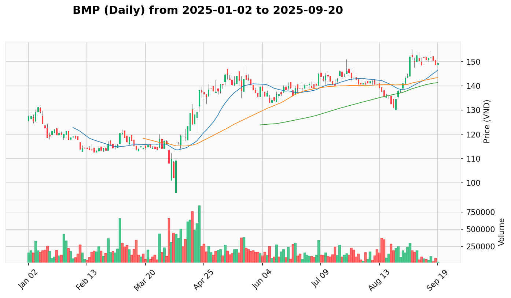

<a href="#nhua">↑ Back to group NHUA</a>  |  <a href="#vpa-signal-summary">↑ Back to Top</a>

#### Key Statistics
| Metric | Value |
|:---|---:|
| Date Range | 2025-01-02 to 2025-09-26 |
| **Latest Close** | **143.5** |
| Period Open | 125.61 |
| Period High | 155.0 |
| Period Low | 95.93 |
| Period Change % | 14.24% |

**[Download BMP Data (.csv)](market_data/BMP_2025-01-02_to_2025-09-27.csv)**

---

### BMS

#### [VPA Analysis (2025-08-04 - 2025-09-26)](./VPA.md#bms)
> **Ngày 2025-09-22:** BMS giữ nguyên mức giá 13.4 VND với khối lượng giao dịch đạt 0.2257 triệu cổ phiếu. Cây nến có thân nhỏ, cho thấy sự lưỡng lự của thị trường. Mặc dù khối lượng giao dịch có tăng nhẹ so với phiên trước (0.2156 triệu cổ phiếu), nhưng vẫn ở mức thấp và không đủ để tạo ra sự thay đổi đáng kể về giá. Điều này tiếp tục củng cố tín hiệu thiếu cầu và sự yếu kém của lực mua, cho thấy thị trường vẫn đang trong giai đoạn tích lũy hoặc tiếp tục suy yếu. **Phân tích VPA/Wyckoff:** No Demand - Thiếu cầu.
> **Ngày 2025-09-23:** BMS giảm từ 13.4 VND xuống 13.2 VND với khối lượng giao dịch đạt 0.2171 triệu cổ phiếu. Cây nến giảm có biên độ hẹp, đóng cửa ở mức thấp nhất phiên, cho thấy áp lực bán vẫn duy trì và lực cầu yếu. Khối lượng giao dịch giảm nhẹ so với phiên trước (0.2257 triệu cổ phiếu), xác nhận sự thiếu hụt lực mua và sự suy yếu của thị trường. Điều này củng cố tín hiệu thiếu cầu từ các phiên trước và cho thấy khả năng giá tiếp tục giảm. **Phân tích VPA/Wyckoff:** No Demand - Thiếu cầu.
> **Ngày 2025-09-24: BMS tăng từ 13.2 VND lên 13.7 VND với khối lượng giao dịch đạt 0.302 triệu cổ phiếu. Cây nến tăng có biên độ rộng, đóng cửa ở mức cao nhất phiên, cho thấy lực mua mạnh mẽ. Khối lượng giao dịch tăng đáng kể so với phiên trước (0.2171 triệu cổ phiếu), xác nhận sự trở lại của cầu sau hai phiên thiếu cầu. Điều này cho thấy sự thay đổi trong tâm lý thị trường và khả năng giá sẽ tiếp tục tăng. **Phân tích VPA/Wyckoff:** Sign of Strength (SOS) - Lực cầu mạnh mẽ.
> **Ngày 2025-09-25:** BMS giảm nhẹ từ 13.7 VND (giá đóng cửa phiên trước) xuống 13.5 VND với khối lượng giao dịch đạt 0.1443 triệu cổ phiếu. Cây nến có thân nhỏ, cho thấy sự lưỡng lự và thiếu động lực sau phiên tăng mạnh. Khối lượng giao dịch giảm đáng kể so với phiên trước (0.302 triệu cổ phiếu), xác nhận sự chững lại của lực cầu và thị trường đang kiểm tra nguồn cung. Điều này cho thấy sự thiếu hụt lực mua tiếp diễn sau phiên tăng giá mạnh. **Phân tích VPA/Wyckoff:** No Demand - Thiếu cầu.
> **Ngày 2025-09-26:** BMS giảm từ 13.5 VND xuống 13.4 VND với khối lượng giao dịch đạt 0.1965 triệu cổ phiếu. Cây nến giảm có biên độ hẹp, đóng cửa ở mức thấp nhất phiên, cho thấy áp lực bán duy trì. Khối lượng giao dịch tăng so với phiên trước (0.1443 triệu cổ phiếu), xác nhận sự xuất hiện của nguồn cung. Điều này cho thấy thị trường đang kiểm tra lại mức hỗ trợ và có thể tiếp tục giảm giá. **Phân tích VPA/Wyckoff:** Supply Coming In - Nguồn cung xuất hiện.

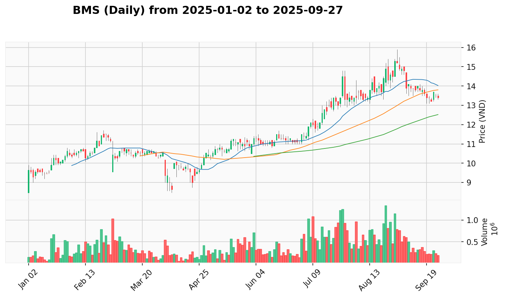

<a href="#chung-khoan">↑ Back to group CHUNG_KHOAN</a>  |  <a href="#vpa-signal-summary">↑ Back to Top</a>

#### Key Statistics
| Metric | Value |
|:---|---:|
| Date Range | 2025-01-02 to 2025-09-26 |
| **Latest Close** | **13.4** |
| Period Open | 8.47 |
| Period High | 15.9 |
| Period Low | 8.47 |
| Period Change % | 58.21% |

**[Download BMS Data (.csv)](market_data/BMS_2025-01-02_to_2025-09-27.csv)**

---

### BSI

#### [VPA Analysis (2025-06-27 - 2025-09-26)](./VPA.md#bsi)
> **Ngày 2025-09-22:** BSI giảm mạnh từ 47.75 VND xuống 46.5 VND, tương đương mức giảm 1.25 điểm (2.61%). Cây nến giảm có biên độ rộng, mở cửa ở mức 47.95 VND và đóng cửa tại mức thấp nhất phiên là 46.5 VND. Khối lượng giao dịch đạt 0.8496 triệu cổ phiếu, cao hơn đáng kể so với phiên trước đó (0.7738 triệu cổ phiếu) và cao hơn mức trung bình gần đây. Điều này cho thấy áp lực bán mạnh mẽ đã quay trở lại thị trường, với lực cung áp đảo hoàn toàn lực cầu, xác nhận xu hướng giảm tiếp diễn. **Phân tích VPA/Wyckoff:** Sign of Weakness (SOW) - Lực cung gia tăng mạnh mẽ với giá giảm sâu và biên độ rộng, xác nhận sự yếu kém của thị trường và khả năng tiếp tục giảm giá.
> **Ngày 2025-09-23:** BSI tiếp tục giảm từ 46.5 VND xuống 46.4 VND, tương đương mức giảm 0.1 điểm (0.22%). Cây nến giảm có biên độ hẹp, mở cửa ở mức 47.0 VND và đóng cửa tại mức thấp nhất phiên là 46.4 VND. Khối lượng giao dịch đạt 0.4614 triệu cổ phiếu, thấp hơn đáng kể so với phiên trước đó (0.8496 triệu cổ phiếu) và ở mức rất thấp so với trung bình. Điều này cho thấy áp lực bán vẫn còn nhưng không quá mạnh, đồng thời lực cầu mua vào cũng rất yếu, không có sự hỗ trợ nào đáng kể sau phiên "Sign of Weakness" trước đó. Thị trường đang thiếu vắng cả cung và cầu, nhưng xu hướng giảm vẫn tiếp diễn do không có lực đỡ. **Phân tích VPA/Wyckoff:** No Demand (ND) - Giá giảm nhẹ với khối lượng rất thấp, cho thấy thiếu vắng lực cầu và khả năng tiếp tục xu hướng giảm.
> **Ngày 2025-09-24:** BSI tăng từ 46.4 VND lên 47.2 VND, tương đương mức tăng 0.8 điểm (1.72%). Cây nến tăng có biên độ tương đối rộng, mở cửa ở mức 46.7 VND và đóng cửa tại mức cao nhất phiên là 47.2 VND. Khối lượng giao dịch đạt 0.4869 triệu cổ phiếu, cao hơn nhẹ so với phiên trước đó (0.4614 triệu cổ phiếu) nhưng vẫn ở mức thấp so với mức trung bình gần đây. Sau hai phiên giảm giá mạnh và thiếu cầu, phiên này cho thấy một nỗ lực phục hồi nhỏ với lực cầu xuất hiện trở lại, đẩy giá lên và đóng cửa ở mức cao nhất. Tuy nhiên, khối lượng giao dịch chưa đủ thuyết phục để xác nhận một sự đảo chiều mạnh mẽ, cho thấy thị trường vẫn còn thận trọng và có thể đang kiểm tra lại lực cung. **Phân tích VPA/Wyckoff:** Test for Supply (Kiểm tra cung) - Giá tăng nhẹ với khối lượng thấp sau giai đoạn giảm, cho thấy lực cung có thể đã giảm nhưng lực cầu chưa đủ mạnh để tạo xu hướng tăng bền vững.
> **Ngày 2025-09-25:** BSI giữ nguyên mức giá 47.2 VND, không thay đổi so với phiên trước. Giá mở cửa ở mức cao hơn là 47.7 VND nhưng không duy trì được đà tăng và đóng cửa ở mức thấp hơn, bằng với giá đóng cửa phiên trước. Biên độ dao động trong phiên hẹp. Khối lượng giao dịch đạt 0.2442 triệu cổ phiếu, giảm mạnh so với phiên trước (0.4869 triệu cổ phiếu) và ở mức rất thấp so với trung bình. Điều này cho thấy nỗ lực tăng giá vào đầu phiên đã thất bại và không có lực cầu đủ mạnh để đẩy giá lên. Khối lượng cực thấp xác nhận sự thiếu vắng của cả người mua và người bán, nhưng quan trọng hơn là không có sự hỗ trợ nào cho giá sau phiên "Kiểm tra cung" không mấy thuyết phục. **Phân tích VPA/Wyckoff:** No Demand (ND) - Giá không tăng được và đóng cửa ngang bằng với phiên trước với khối lượng cực thấp, cho thấy lực cầu yếu ớt và khả năng tiếp tục xu hướng giảm hoặc đi ngang.
> **Ngày 2025-09-26:** BSI giảm từ 47.2 VND xuống 46.35 VND, tương đương mức giảm 0.85 điểm (1.80%). Cây nến giảm có biên độ tương đối rộng, mở cửa ở mức 47.5 VND và đóng cửa tại mức gần thấp nhất phiên là 46.35 VND. Khối lượng giao dịch đạt 0.5578 triệu cổ phiếu, cao hơn nhẹ so với phiên trước (0.4897 triệu cổ phiếu) nhưng vẫn ở mức thấp so với mức trung bình gần đây. Sau phiên "Không có cầu" (No Demand) ngày hôm trước, lực bán đã xuất hiện trở lại và đẩy giá xuống, cho thấy sự yếu kém tiếp tục của thị trường. Mặc dù khối lượng chưa thực sự đột biến, nhưng việc giá giảm mạnh với khối lượng tăng nhẹ xác nhận rằng lực cung vẫn đang chiếm ưu thế. **Phân tích VPA/Wyckoff:** Sign of Weakness (SOW) - Giá giảm với khối lượng tăng nhẹ sau giai đoạn thiếu cầu, xác nhận sự tiếp diễn của xu hướng giảm.

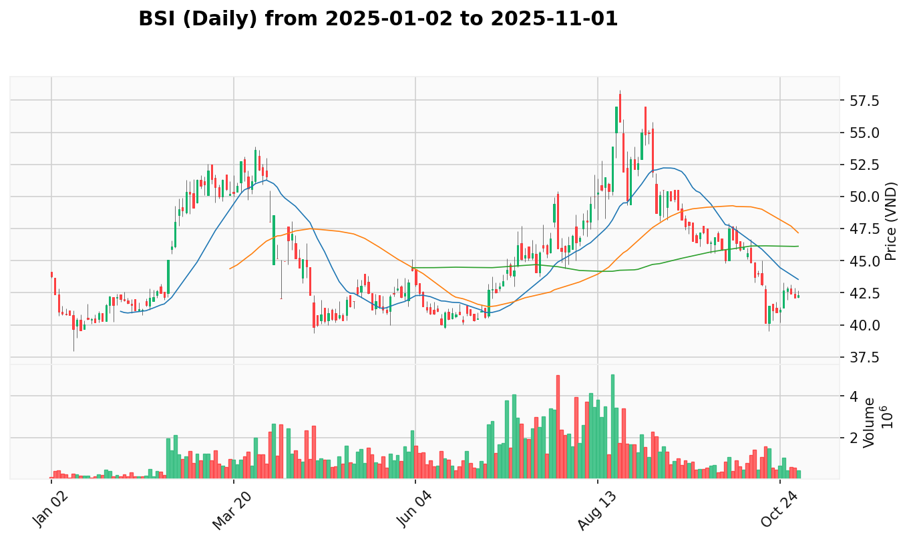

<a href="#chung-khoan">↑ Back to group CHUNG_KHOAN</a>  |  <a href="#vpa-signal-summary">↑ Back to Top</a>

#### Key Statistics
| Metric | Value |
|:---|---:|
| Date Range | 2025-01-02 to 2025-09-26 |
| **Latest Close** | **46.35** |
| Period Open | 44.14 |
| Period High | 58.3 |
| Period Low | 37.95 |
| Period Change % | 5.01% |

**[Download BSI Data (.csv)](market_data/BSI_2025-01-02_to_2025-09-27.csv)**

---

### BSR

#### [VPA Analysis (2025-06-13 - 2025-09-26)](./VPA.md#bsr)
> **Ngày 2025-09-22:** BSR mở cửa ở mức 26.2 VND, đạt đỉnh 26.8 VND và đáy 25.55 VND, đóng cửa tại 26.8 VND. So với phiên trước (2025-09-19), giá tăng từ 26.0 VND lên 26.8 VND (+3.08%). Cây nến tăng có biên độ rộng và đóng cửa ở mức cao nhất phiên, cho thấy lực mua mạnh mẽ. Khối lượng giao dịch đạt 9.617 triệu cổ phiếu, tăng đáng kể so với phiên trước (5.917 triệu cổ phiếu) và cao hơn mức trung bình. Điều này cho thấy lực cầu đã quay trở lại và áp đảo phe bán sau hai phiên "No Demand". **Phân tích VPA/Wyckoff:** Sign of Strength (SOS) - Giá tăng mạnh với khối lượng gia tăng, xác nhận sự xuất hiện của lực cầu và khả năng đảo chiều xu hướng.
> **Ngày 2025-09-23:** BSR mở cửa ở mức 26.6 VND, đạt đỉnh 26.9 VND và đáy 26.3 VND, đóng cửa tại 26.9 VND. So với phiên trước (2025-09-22), giá tăng nhẹ từ 26.8 VND lên 26.9 VND (+0.37%). Cây nến tăng có biên độ hẹp và đóng cửa ở mức cao nhất phiên. Khối lượng giao dịch đạt 4.46 triệu cổ phiếu, giảm đáng kể so với phiên trước (9.62 triệu cổ phiếu) và thấp hơn mức trung bình. Điều này cho thấy lực cầu suy yếu sau phiên tăng mạnh trước đó, và sự tăng giá không được hỗ trợ bởi khối lượng giao dịch đủ lớn. **Phân tích VPA/Wyckoff:** Lack of Demand (Thiếu cầu) - Giá tăng nhẹ với khối lượng thấp, cho thấy lực mua không còn mạnh mẽ và có thể báo hiệu sự chững lại của đà tăng.
> **Ngày 2025-09-24:** BSR mở cửa ở mức 26.8 VND, đạt đỉnh 27.0 VND và đáy 26.45 VND, đóng cửa tại 27.0 VND. So với phiên trước (2025-09-23), giá tăng nhẹ từ 26.9 VND lên 27.0 VND (+0.37%). Cây nến tăng có biên độ hẹp và đóng cửa ở mức cao nhất phiên, cho thấy lực mua vẫn hiện diện nhưng không mạnh mẽ. Khối lượng giao dịch đạt 3.943 triệu cổ phiếu, tiếp tục giảm so với phiên trước (4.457 triệu cổ phiếu) và thấp hơn đáng kể so với mức trung bình. Điều này cho thấy lực cầu đang suy yếu dần và sự tăng giá không được hỗ trợ bởi khối lượng đủ lớn, xác nhận tình trạng thiếu cầu từ phiên trước. **Phân tích VPA/Wyckoff:** Lack of Demand (Thiếu cầu)
> **Ngày 2025-09-25:** BSR mở cửa ở mức 27.25 VND, đạt đỉnh 28.3 VND và đáy 27.1 VND, đóng cửa tại 27.8 VND. So với phiên trước (2025-09-24), giá tăng mạnh từ 27.0 VND lên 27.8 VND (+2.96%). Cây nến tăng có biên độ rộng và đóng cửa gần mức cao nhất phiên, cho thấy lực mua chủ động và mạnh mẽ. Khối lượng giao dịch đạt 10.005 triệu cổ phiếu, tăng đột biến so với phiên trước (3.943 triệu cổ phiếu) và cao hơn đáng kể so với mức trung bình. Điều này cho thấy lực cầu đã quay trở lại mạnh mẽ, phá vỡ tình trạng thiếu cầu của hai phiên trước và xác nhận sự quan tâm của nhà đầu tư. **Phân tích VPA/Wyckoff:** Sign of Strength (SOS) - Lực cầu mạnh mẽ với khối lượng gia tăng xác nhận xu hướng tăng.
> **Ngày 2025-09-26:** BSR mở cửa ở mức 28.0 VND, đạt đỉnh 28.8 VND và đáy 27.5 VND, đóng cửa tại 27.5 VND. So với phiên trước (2025-09-25), giá giảm từ 27.95 VND xuống 27.5 VND (-1.61%). Cây nến giảm có biên độ rộng và đóng cửa ở mức thấp hơn giá mở cửa, cho thấy áp lực bán mạnh mẽ đã xuất hiện sau phiên tăng giá mạnh. Khối lượng giao dịch đạt 10.7 triệu cổ phiếu, giảm so với phiên trước (14.5858 triệu cổ phiếu) nhưng vẫn ở mức cao, xác nhận rằng nguồn cung đã bắt đầu xuất hiện và vượt qua lực cầu ở các mức giá cao hơn. **Phân tích VPA/Wyckoff:** Sign of Weakness (SOW) - Áp lực bán xuất hiện mạnh mẽ sau phiên SOS, cho thấy nguồn cung đang gia tăng.

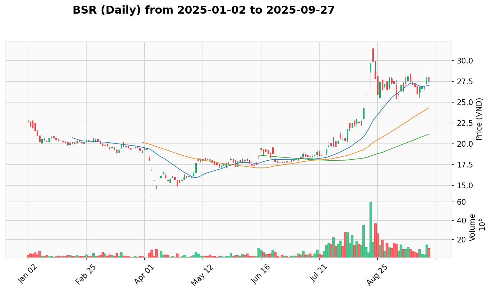

<a href="#dau-khi">↑ Back to group DAU_KHI</a>  |  <a href="#vpa-signal-summary">↑ Back to Top</a>

#### Key Statistics
| Metric | Value |
|:---|---:|
| Date Range | 2025-01-02 to 2025-09-26 |
| **Latest Close** | **27.5** |
| Period Open | 22.8 |
| Period High | 31.45 |
| Period Low | 14.55 |
| Period Change % | 20.61% |

**[Download BSR Data (.csv)](market_data/BSR_2025-01-02_to_2025-09-27.csv)**

---

### BTN

#### [VPA Analysis (2025-08-13 - 2025-09-26)](./VPA.md#btn)
> **Ngày 2025-09-19:** Cổ phiếu BTN tăng từ 2.9 VND lên 3.1 VND, đóng cửa ở mức 3.1 VND với biên độ nến rộng và khối lượng giao dịch đạt 0.0212 triệu cổ phiếu. Khối lượng này tuy cao hơn phiên trước nhưng vẫn ở mức rất thấp. Sau phiên hấp thụ lực cung (Absorption) vào ngày 2025-09-17, phiên này cho thấy một nỗ lực kiểm tra lực cung ở vùng giá cao hơn. Việc giá đóng cửa không ở mức cao nhất phiên (3.3 VND) cho thấy vẫn còn một lượng cung nhất định xuất hiện, nhưng lực cầu đã đủ để đẩy giá lên một chút. Đây là một dấu hiệu của việc thị trường đang thăm dò lực cung sau giai đoạn hấp thụ. **Phân tích VPA/Wyckoff:** Test for Supply (TS) - Kiểm tra lực cung.
> **Ngày 2025-09-22:** Cổ phiếu BTN giảm từ 3.1 VND xuống 3.0 VND, đóng cửa ở mức thấp nhất phiên với khối lượng giao dịch đạt 0.0071 triệu cổ phiếu. Khối lượng này thấp hơn đáng kể so với phiên trước (0.0212 triệu cổ phiếu). Sau phiên kiểm tra lực cung (Test for Supply) vào ngày 2025-09-19, việc giá giảm nhẹ với khối lượng rất thấp cho thấy lực cầu yếu và không có sự quan tâm đáng kể từ thị trường. Điều này báo hiệu sự thiếu vắng nhu cầu, có thể dẫn đến xu hướng giảm tiếp hoặc tích lũy kéo dài. **Phân tích VPA/Wyckoff:** No Demand (ND) - Thiếu vắng nhu cầu.
> **Ngày 2025-09-23:** Cổ phiếu BTN giữ nguyên mức giá 2.9 VND, đóng cửa ở mức 2.9 VND với biên độ nến cực hẹp (giá mở cửa, cao nhất, thấp nhất và đóng cửa đều ở 2.9 VND) và khối lượng giao dịch chỉ đạt 0.0001 triệu cổ phiếu. Khối lượng này cực kỳ thấp, cho thấy gần như không có hoạt động giao dịch nào diễn ra. Sau phiên "No Demand" vào ngày 2025-09-22, phiên này tiếp tục xác nhận sự thiếu vắng hoàn toàn của cả lực mua và lực bán, cho thấy thị trường không có bất kỳ sự quan tâm nào đối với cổ phiếu BTN. Điều này báo hiệu một giai đoạn tích lũy kéo dài hoặc khả năng tiếp tục giảm giá do không có cầu. **Phân tích VPA/Wyckoff:** No Demand (ND) - Thiếu vắng nhu cầu.
> **Ngày 2025-09-25:** Cổ phiếu BTN giữ nguyên mức giá 2.9 VND, đóng cửa ở mức 2.9 VND với biên độ nến cực hẹp (giá mở cửa, cao nhất, thấp nhất và đóng cửa đều ở 2.9 VND). Khối lượng giao dịch đạt 0.0002 triệu cổ phiếu, tăng nhẹ so với phiên trước (0.0001 triệu cổ phiếu) nhưng vẫn ở mức cực kỳ thấp. Sau hai phiên liên tiếp cho thấy sự thiếu vắng nhu cầu, phiên này tiếp tục xác nhận tình trạng không có sự quan tâm đáng kể từ thị trường. Mặc dù khối lượng có tăng nhẹ, nhưng vẫn không đủ để tạo ra bất kỳ biến động giá nào, cho thấy lực cung và cầu đều rất yếu, báo hiệu một giai đoạn tích lũy kéo dài hoặc khả năng tiếp tục giảm giá. **Phân tích VPA/Wyckoff:** No Demand (ND) - Thiếu vắng nhu cầu
> **Ngày 2025-09-26:** Cổ phiếu BTN tăng từ 2.9 VND lên 3.0 VND, đóng cửa ở mức 3.0 VND. Cây nến có biên độ cực hẹp (giá mở cửa, cao nhất, thấp nhất và đóng cửa đều ở 3.0 VND). Khối lượng giao dịch đạt 0.0002 triệu cổ phiếu, duy trì ở mức cực kỳ thấp và không có sự cải thiện đáng kể so với các phiên trước. Mặc dù giá có sự tăng nhẹ, nhưng với khối lượng giao dịch yếu ớt như vậy, đây không phải là dấu hiệu của lực cầu mạnh mẽ mà chỉ phản ánh sự thiếu vắng cả cung và cầu ở mức giá này. Tình trạng "No Demand" vẫn tiếp diễn, cho thấy thị trường vẫn chưa có sự quan tâm đáng kể đối với cổ phiếu BTN. **Phân tích VPA/Wyckoff:** No Demand (ND) - Thiếu vắng nhu cầu

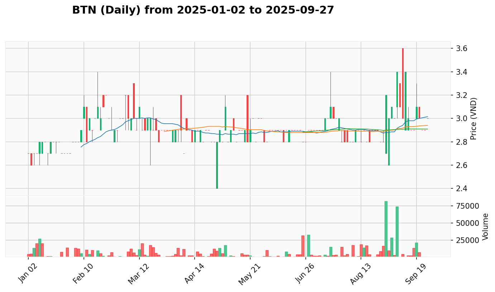

<a href="#vlxd">↑ Back to group VLXD</a>  |  <a href="#vpa-signal-summary">↑ Back to Top</a>

#### Key Statistics
| Metric | Value |
|:---|---:|
| Date Range | 2025-01-02 to 2025-09-26 |
| **Latest Close** | **3.0** |
| Period Open | 2.7 |
| Period High | 3.6 |
| Period Low | 2.4 |
| Period Change % | 11.11% |

**[Download BTN Data (.csv)](market_data/BTN_2025-01-02_to_2025-09-27.csv)**

---

### BTS

#### [VPA Analysis (2025-08-14 - 2025-09-26)](./VPA.md#bts)
> **Ngày 2025-09-22:** BTS giữ giá 5.5 VND với khối lượng giao dịch đạt 0.0046 triệu cổ phiếu. Cây nến có biên độ hẹp và đóng cửa ở mức cao nhất phiên, cho thấy lực cầu vẫn duy trì. Khối lượng giao dịch tiếp tục giảm mạnh so với phiên trước (0.0053 triệu cổ phiếu), xác nhận sự cạn kiệt của áp lực cung. Điều này củng cố tín hiệu không có cung từ các phiên trước. **Phân tích VPA/Wyckoff:** No Supply (Không có cung)
> **Ngày 2025-09-23:** BTS giữ giá 5.5 VND với khối lượng giao dịch đạt 0.0033 triệu cổ phiếu. Cây nến có biên độ hẹp và đóng cửa ở mức cao nhất phiên, cho thấy lực cầu vẫn duy trì. Khối lượng giao dịch tiếp tục giảm mạnh so với phiên trước (0.0046 triệu cổ phiếu), xác nhận sự cạn kiệt của áp lực cung. Điều này củng cố tín hiệu không có cung từ các phiên trước. **Phân tích VPA/Wyckoff:** No Supply (Không có cung)
> **Ngày 2025-09-24:** BTS giữ giá 5.5 VND với khối lượng giao dịch đạt 0.0621 triệu cổ phiếu. Cây nến có biên độ hẹp và đóng cửa ở mức cao nhất phiên, cho thấy lực cầu mạnh mẽ. Khối lượng giao dịch tăng đột biến so với các phiên trước, đặc biệt sau giai đoạn cạn kiệt nguồn cung, xác nhận sự xuất hiện của lực cầu. **Phân tích VPA/Wyckoff:** Sign of Strength (SOS)
> **Ngày 2025-09-25:** BTS giữ giá 5.5 VND với khối lượng giao dịch đạt 0.0404 triệu cổ phiếu. Cây nến có biên độ hẹp và đóng cửa ở mức cao nhất phiên, cho thấy lực cầu vẫn kiểm soát. Khối lượng giao dịch giảm so với phiên SOS trước đó (0.0621 triệu cổ phiếu) nhưng vẫn cao hơn đáng kể so với giai đoạn cạn kiệt nguồn cung, cho thấy thị trường đang kiểm tra lại nguồn cung sau tín hiệu sức mạnh. **Phân tích VPA/Wyckoff:** Test (Kiểm tra cung)
> **Ngày 2025-09-26:** BTS giữ giá 5.4 VND với khối lượng giao dịch đạt 0.0576 triệu cổ phiếu. Cây nến có biên độ hẹp và đóng cửa ở mức giữa, cho thấy lực cầu đang hấp thụ nguồn cung. Khối lượng giao dịch tăng so với phiên trước (0.0466 triệu cổ phiếu) nhưng giá không tăng, cho thấy thị trường đang tiếp tục kiểm tra nguồn cung sau tín hiệu sức mạnh. **Phân tích VPA/Wyckoff:** Test (Kiểm tra cung)

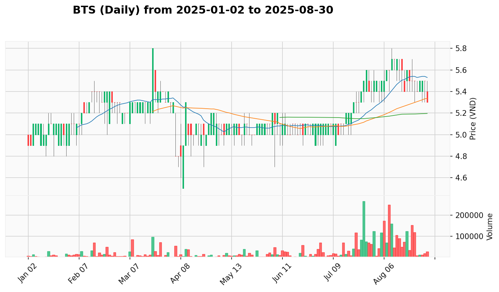

<a href="#vlxd">↑ Back to group VLXD</a>  |  <a href="#vpa-signal-summary">↑ Back to Top</a>

#### Key Statistics
| Metric | Value |
|:---|---:|
| Date Range | 2025-01-02 to 2025-09-26 |
| **Latest Close** | **5.4** |
| Period Open | 5.0 |
| Period High | 5.8 |
| Period Low | 4.5 |
| Period Change % | 8.00% |

**[Download BTS Data (.csv)](market_data/BTS_2025-01-02_to_2025-09-27.csv)**

---

### BVH

#### [VPA Analysis (2025-06-13 - 2025-09-26)](./VPA.md#bvh)
> **Ngày 2025-09-22:** BVH mở cửa tại 57.5 VND, giảm xuống mức thấp 56.2 VND và đóng cửa tại 56.5 VND, giảm 1.4 VND so với phiên trước. Biên độ dao động trong phiên là 1.5 VND, hẹp. Khối lượng giao dịch đạt 0.3511 triệu cổ phiếu, giảm so với phiên trước. Sau phiên "Weakness" ngày 2025-09-19, giá tiếp tục giảm với biên độ hẹp và đóng cửa gần mức thấp nhất phiên, trong khi khối lượng giao dịch sụt giảm. Điều này cho thấy lực cầu vẫn yếu và không có sự hấp thụ đáng kể từ phía người mua, xác nhận xu hướng giảm giá. **Phân tích VPA/Wyckoff:** No Demand (ND) - Lực cầu yếu.
> **Ngày 2025-09-23:** BVH mở cửa tại 56.5 VND, giảm xuống mức thấp 56.0 VND và đóng cửa tại 56.0 VND, giảm 0.5 VND so với phiên trước. Biên độ dao động trong phiên là 0.9 VND, hẹp. Khối lượng giao dịch đạt 0.1675 triệu cổ phiếu, giảm mạnh so với phiên trước (0.3511 triệu cổ phiếu). Giá tiếp tục giảm và đóng cửa ở mức thấp nhất phiên với biên độ hẹp và khối lượng sụt giảm mạnh, cho thấy lực cầu hoàn toàn vắng bóng và không có sự hấp thụ nào từ phía người mua, xác nhận xu hướng giảm giá tiếp diễn. **Phân tích VPA/Wyckoff:** No Demand (ND) - Lực cầu yếu và vắng bóng.
> **Ngày 2025-09-24:** BVH mở cửa tại 56.0 VND, giảm xuống mức thấp 55.0 VND và đóng cửa tại 56.5 VND, tăng 0.5 VND so với phiên trước. Biên độ dao động trong phiên là 1.7 VND, rộng hơn so với phiên trước. Khối lượng giao dịch đạt 0.3197 triệu cổ phiếu, tăng đáng kể so với phiên trước (0.1675 triệu cổ phiếu). Sau hai phiên "No Demand" liên tiếp, giá đã tăng trở lại với khối lượng gia tăng, đóng cửa ở nửa trên của thanh giá. Điều này cho thấy lực cầu đã quay trở lại và hấp thụ lực cung, có thể là dấu hiệu của một nỗ lực tăng giá sau giai đoạn suy yếu. **Phân tích VPA/Wyckoff:** Effort to Rise (ER) - Nỗ lực tăng giá.
> **Ngày 2025-09-25:** BVH mở cửa tại 56.6 VND, giảm xuống mức thấp 56.4 VND và đóng cửa tại 56.4 VND, giảm 0.1 VND so với phiên trước. Biên độ dao động trong phiên là 0.6 VND, hẹp. Khối lượng giao dịch đạt 0.0634 triệu cổ phiếu, giảm mạnh so với phiên trước (0.3197 triệu cổ phiếu). Sau nỗ lực tăng giá (Effort to Rise) ở phiên trước, giá đã giảm nhẹ và đóng cửa ở mức thấp nhất phiên với biên độ hẹp và khối lượng sụt giảm đáng kể. Điều này cho thấy lực cầu đã không duy trì được đà tăng và hoàn toàn vắng bóng, xác nhận sự yếu kém của thị trường. **Phân tích VPA/Wyckoff:** No Demand (ND) - Lực cầu yếu và vắng bóng.
> **Ngày 2025-09-26:** BVH mở cửa tại 56.5 VND, tăng lên mức cao 57.2 VND, giảm xuống mức thấp 56.3 VND và đóng cửa tại 56.5 VND, không đổi so với phiên trước. Biên độ dao động trong phiên là 0.9 VND, tương đương phiên trước. Khối lượng giao dịch đạt 0.263 triệu cổ phiếu, tăng so với phiên trước (0.156 triệu cổ phiếu). Sau phiên "No Demand", giá không đổi với khối lượng gia tăng và đóng cửa ở giữa thanh giá. Điều này cho thấy nỗ lực tăng giá bị chững lại do lực cung vẫn còn mạnh, hấp thụ lực cầu và ngăn cản giá đi lên. **Phân tích VPA/Wyckoff:** Stalled Effort to Rise (Nỗ lực tăng giá bị chững lại).

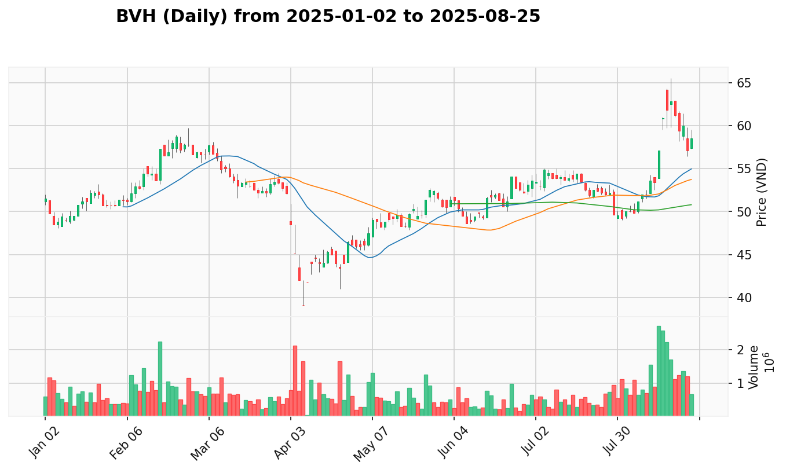

<a href="#bao-hiem">↑ Back to group BAO_HIEM</a>  |  <a href="#vpa-signal-summary">↑ Back to Top</a>

#### Key Statistics
| Metric | Value |
|:---|---:|
| Date Range | 2025-01-02 to 2025-09-26 |
| **Latest Close** | **56.5** |
| Period Open | 51.2 |
| Period High | 65.5 |
| Period Low | 39.1 |
| Period Change % | 10.35% |

**[Download BVH Data (.csv)](market_data/BVH_2025-01-02_to_2025-09-27.csv)**

---

### BVS

#### [VPA Analysis (2025-08-04 - 2025-09-26)](./VPA.md#bvs)
> **Ngày 2025-09-22:** BVS mở cửa tại 37.8 VND và đóng cửa tại 36.9 VND, giảm từ 37.7 VND của phiên trước xuống 36.9 VND với biên độ giá rộng và đóng cửa gần mức thấp nhất phiên. Khối lượng giao dịch đạt 0.327 triệu cổ phiếu, cao hơn đáng kể so với phiên trước (0.2105 triệu cổ phiếu). Điều này cho thấy áp lực bán gia tăng mạnh mẽ và lực cầu yếu, xác nhận xu hướng giảm giá. **Phân tích VPA/Wyckoff:** Sign of Weakness (SOW)
> **Ngày 2025-09-23:** BVS mở cửa tại 36.5 VND và đóng cửa tại 36.8 VND, giảm từ 36.9 VND của phiên trước xuống 36.8 VND với biên độ giá hẹp và đóng cửa gần giữa phiên. Khối lượng giao dịch đạt 0.2082 triệu cổ phiếu, giảm đáng kể so với phiên trước (0.327 triệu cổ phiếu) và ở mức rất thấp. Điều này cho thấy áp lực bán đã giảm bớt nhưng lực cầu vẫn yếu, xác nhận sự thiếu vắng của bên mua sau phiên giảm mạnh trước đó. **Phân tích VPA/Wyckoff:** No Demand (ND)
> **Ngày 2025-09-24:** BVS mở cửa tại 36.3 VND và đóng cửa tại 37.4 VND, tăng từ 36.8 VND của phiên trước lên 37.4 VND với biên độ giá rộng và đóng cửa tại mức cao nhất phiên. Khối lượng giao dịch đạt 0.3987 triệu cổ phiếu, cao hơn đáng kể so với phiên trước (0.2082 triệu cổ phiếu). Điều này cho thấy lực cầu đã quay trở lại mạnh mẽ sau hai phiên giảm giá và không có cầu, xác nhận xu hướng tăng giá. **Phân tích VPA/Wyckoff:** Sign of Strength (SOS)
> **Ngày 2025-09-25:** BVS mở cửa tại 37.7 VND và đóng cửa tại 37.9 VND, tăng từ 37.4 VND của phiên trước lên 37.9 VND với biên độ giá hẹp và đóng cửa tại mức cao nhất phiên. Khối lượng giao dịch đạt 0.0793 triệu cổ phiếu, giảm đáng kể so với phiên trước (0.3987 triệu cổ phiếu) và ở mức rất thấp. Điều này cho thấy lực cung đã cạn kiệt sau phiên tăng mạnh với SOS, xác nhận sự vắng mặt của bên bán và khả năng giá tiếp tục tăng. **Phân tích VPA/Wyckoff:** No Supply (NS)
> **Ngày 2025-09-26:** BVS mở cửa tại 38.0 VND và đóng cửa tại 37.6 VND, giảm từ 38.0 VND của phiên trước xuống 37.6 VND với biên độ giá rộng và đóng cửa gần mức thấp nhất phiên. Khối lượng giao dịch đạt 0.2916 triệu cổ phiếu, thấp hơn so với phiên trước (0.3107 triệu cổ phiếu). Điều này cho thấy lực cung đã xuất hiện trở lại sau phiên No Supply, đẩy giá xuống với biên độ rộng. **Phân tích VPA/Wyckoff:** Sign of Weakness (SOW)

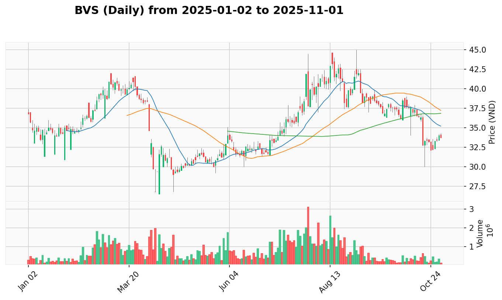

<a href="#chung-khoan">↑ Back to group CHUNG_KHOAN</a>  |  <a href="#vpa-signal-summary">↑ Back to Top</a>

#### Key Statistics
| Metric | Value |
|:---|---:|
| Date Range | 2025-01-02 to 2025-09-26 |
| **Latest Close** | **37.6** |
| Period Open | 37.0 |
| Period High | 45.0 |
| Period Low | 26.5 |
| Period Change % | 1.62% |

**[Download BVS Data (.csv)](market_data/BVS_2025-01-02_to_2025-09-27.csv)**

---

### BWE

#### [VPA Analysis (2025-08-14 - 2025-09-26)](./VPA.md#bwe)
> **Ngày 2025-09-22:** BWE mở cửa tại 48.6 VND và đóng cửa ở mức 48.45 VND, giảm nhẹ 0.05 VND so với phiên trước (48.5 VND). Giá cao nhất trong ngày là 48.75 VND và giá thấp nhất là 48.15 VND. Khối lượng giao dịch đạt 0.4647 triệu cổ phiếu, tăng mạnh so với phiên trước (0.1523 triệu cổ phiếu). Mặc dù khối lượng giao dịch tăng vọt, giá lại giảm nhẹ và đóng cửa ở giữa thân nến, cho thấy lực cung vẫn đang hiện diện và được hấp thụ. Sau phiên "No Demand" ngày 2025-09-19, sự xuất hiện của khối lượng lớn mà giá không thể tăng cho thấy thị trường đang kiểm tra nguồn cung. **Phân tích VPA/Wyckoff:** Testing Supply (Kiểm tra nguồn cung)
> **Ngày 2025-09-23:** BWE mở cửa tại 48.45 VND và đóng cửa ở mức 48.45 VND, giữ nguyên so với phiên trước. Giá cao nhất trong ngày là 48.6 VND và giá thấp nhất là 48.1 VND. Khối lượng giao dịch đạt 0.4473 triệu cổ phiếu, giảm nhẹ so với phiên trước (0.4647 triệu cổ phiếu). Sau phiên "Testing Supply" ngày 2025-09-22 với khối lượng lớn kiểm tra nguồn cung, giá BWE hôm nay giữ vững ở mức đóng cửa của phiên trước, đi kèm với khối lượng giao dịch sụt giảm. Điều này cho thấy nguồn cung đã được hấp thụ và áp lực bán đã giảm đi đáng kể. Thị trường đang cho thấy sự cạn kiệt của lực bán. **Phân tích VPA/Wyckoff:** No Supply (NS) - Cạn cung.
> **Ngày 2025-09-24:** BWE mở cửa tại 48.6 VND và đóng cửa ở mức 50.2 VND, tăng mạnh 1.75 VND so với phiên trước (48.45 VND). Giá cao nhất trong ngày là 50.2 VND và giá thấp nhất là 48.5 VND. Cây nến tăng có biên độ rộng và đóng cửa ở mức cao nhất phiên. Khối lượng giao dịch đạt 0.5391 triệu cổ phiếu, tăng so với phiên trước (0.4473 triệu cổ phiếu). Sau phiên "No Supply" ngày 2025-09-23 cho thấy cạn cung, sự xuất hiện của lực cầu mạnh mẽ với khối lượng gia tăng xác nhận xu hướng tăng. **Phân tích VPA/Wyckoff:** Sign of Strength (SOS) - Lực cầu mạnh mẽ.
> **Ngày 2025-09-25:** BWE mở cửa tại 50.5 VND và đóng cửa ở mức 49.75 VND, giảm 0.45 VND so với phiên trước (50.2 VND). Giá cao nhất trong ngày là 50.6 VND và giá thấp nhất là 49.6 VND. Cây nến giảm với biên độ hẹp. Khối lượng giao dịch đạt 0.0702 triệu cổ phiếu, giảm mạnh so với phiên trước (0.5391 triệu cổ phiếu) và là mức rất thấp. Sau phiên "Sign of Strength" mạnh mẽ ngày 2025-09-24 xác nhận xu hướng tăng, phiên hôm nay giá điều chỉnh nhẹ với khối lượng cực thấp cho thấy không có áp lực bán đáng kể. Điều này củng cố nhận định rằng lực cầu vẫn đang kiểm soát và sự điều chỉnh này chỉ là tạm thời. **Phân tích VPA/Wyckoff:** No Demand (ND) - Không có lực bán.
> **Ngày 2025-09-26:** BWE mở cửa tại 49.5 VND và đóng cửa ở mức 48.8 VND, giảm 0.4 VND so với phiên trước (49.2 VND). Giá cao nhất trong ngày là 49.75 VND và giá thấp nhất là 48.7 VND. Cây nến giảm có biên độ tương đối rộng và đóng cửa gần mức thấp nhất phiên. Khối lượng giao dịch đạt 0.1073 triệu cổ phiếu, thấp hơn so với phiên trước (0.1114 triệu cổ phiếu) và tiếp tục ở mức rất thấp. Sau phiên "No Demand" ngày 2025-09-25, giá tiếp tục điều chỉnh giảm với khối lượng thấp cho thấy áp lực bán không đáng kể. Đây có thể là một đợt kiểm tra cung (Test for Supply) để xác định lượng cung còn lại trên thị trường sau các phiên tăng giá trước đó. **Phân tích VPA/Wyckoff:** Test for Supply (TS) - Kiểm tra cung.

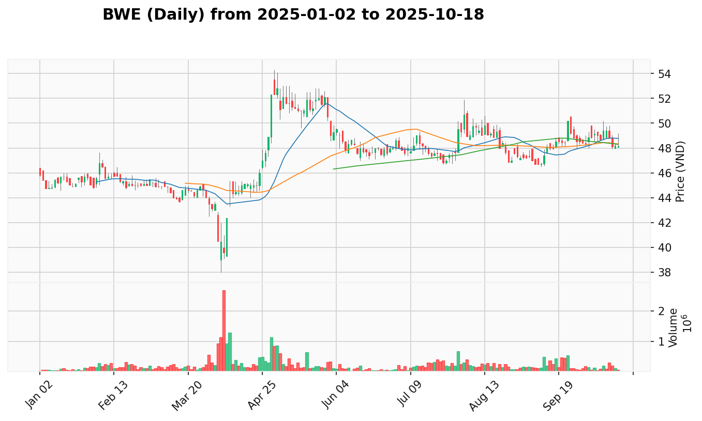

<a href="#others">↑ Back to group OTHERS</a>  |  <a href="#vpa-signal-summary">↑ Back to Top</a>

#### Key Statistics
| Metric | Value |
|:---|---:|
| Date Range | 2025-01-02 to 2025-09-26 |
| **Latest Close** | **48.8** |
| Period Open | 46.38 |
| Period High | 54.3 |
| Period Low | 38.0 |
| Period Change % | 5.22% |

**[Download BWE Data (.csv)](market_data/BWE_2025-01-02_to_2025-09-27.csv)**

---

### C47

#### [VPA Analysis (2025-08-13 - 2025-09-26)](./VPA.md#c47)
> **Ngày 2025-09-22:** C47 giảm từ 11.85 VND xuống 11.5 VND với khối lượng giao dịch đạt 0.1129 triệu cổ phiếu. Cây nến giảm có biên độ hẹp, cho thấy áp lực bán không mạnh. Khối lượng giao dịch giảm đáng kể so với phiên trước đó (0.2454 triệu cổ phiếu), xác nhận rằng lực cung đã suy yếu sau dấu hiệu sức mạnh (SOS) vào ngày 2025-09-19. Đây là một nhịp điều chỉnh tự nhiên hoặc kiểm tra lại vùng hỗ trợ với khối lượng thấp, cho thấy khả năng tiếp tục xu hướng tăng giá. **Phân tích VPA/Wyckoff:** Test (T) - Kiểm tra cung.
> **Ngày 2025-09-23:** C47 giữ nguyên mức giá 11.5 VND với khối lượng giao dịch đạt 0.1467 triệu cổ phiếu. Cây nến có thân nhỏ, cho thấy sự lưỡng lự của thị trường. Khối lượng giao dịch tăng nhẹ so với phiên kiểm tra cung trước đó (0.1129 triệu cổ phiếu), nhưng giá không thể bứt phá lên cao hơn, thậm chí đóng cửa bằng mức giá đóng cửa của phiên trước. Điều này cho thấy lực cầu chưa đủ mạnh để hấp thụ hết nguồn cung hoặc đẩy giá lên cao hơn sau giai đoạn kiểm tra cung. **Phân tích VPA/Wyckoff:** No Demand (ND) - Không có cầu.
> **Ngày 2025-09-24:** C47 giảm từ 11.5 VND xuống 11.45 VND với khối lượng giao dịch đạt 0.1704 triệu cổ phiếu. Cây nến giảm có biên độ hẹp, đóng cửa thấp hơn giá đóng cửa phiên trước. Khối lượng giao dịch tăng nhẹ so với phiên trước đó (0.1467 triệu cổ phiếu), cho thấy lực cung đã xuất hiện trở lại và áp đảo lực cầu yếu ớt. Điều này tiếp tục xác nhận sự thiếu động lực tăng giá sau giai đoạn kiểm tra cung và không có cầu. **Phân tích VPA/Wyckoff:** Dấu hiệu yếu ớt (SOW) - Cung xuất hiện.
> **Ngày 2025-09-25:** C47 giảm từ 11.45 VND xuống 11.4 VND với khối lượng giao dịch đạt 0.0392 triệu cổ phiếu. Cây nến giảm có biên độ tương đối, đóng cửa ở mức thấp nhất phiên. Khối lượng giao dịch cực kỳ thấp, giảm mạnh so với phiên trước đó (0.1704 triệu cổ phiếu), cho thấy sự thiếu vắng cả lực mua và lực bán. Mặc dù giá giảm và đóng cửa ở mức thấp nhất, nhưng với khối lượng cạn kiệt, điều này xác nhận rằng không có nhu cầu mua vào để hỗ trợ giá sau các phiên yếu ớt trước đó. **Phân tích VPA/Wyckoff:** No Demand (ND) - Không có cầu.
> **Ngày 2025-09-26:** C47 giảm từ 11.4 VND xuống 10.95 VND với khối lượng giao dịch đạt 0.3879 triệu cổ phiếu. Cây nến giảm có biên độ rộng, đóng cửa gần mức thấp nhất phiên. Khối lượng giao dịch tăng mạnh so với phiên trước (0.0825 triệu cổ phiếu), cho thấy áp lực bán rất mạnh và cung đã áp đảo hoàn toàn cầu. Điều này xác nhận sự yếu ớt của cổ phiếu sau các phiên không có cầu và cung xuất hiện. **Phân tích VPA/Wyckoff:** Dấu hiệu yếu ớt (SOW) - Cung áp đảo.

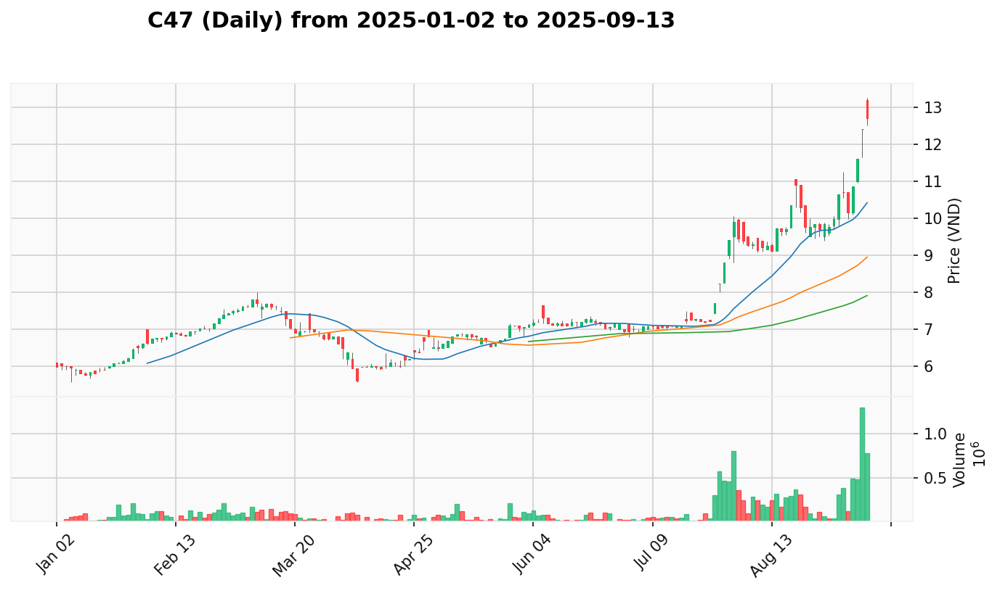

<a href="#xay-dung">↑ Back to group XAY_DUNG</a>  |  <a href="#vpa-signal-summary">↑ Back to Top</a>

#### Key Statistics
| Metric | Value |
|:---|---:|
| Date Range | 2025-01-02 to 2025-09-26 |
| **Latest Close** | **10.95** |
| Period Open | 6.1 |
| Period High | 13.25 |
| Period Low | 5.57 |
| Period Change % | 79.51% |

**[Download C47 Data (.csv)](market_data/C47_2025-01-02_to_2025-09-27.csv)**

---

### C4G

#### [VPA Analysis (2025-07-16 - 2025-09-26)](./VPA.md#c4g)
> **Ngày 2025-09-22:** C4G giảm từ 9.3 VND xuống 9.2 VND. Cây nến có biên độ hẹp, mở cửa ở mức 9.2 VND và đóng cửa ở mức 9.2 VND, gần với giá thấp nhất phiên. Khối lượng giao dịch đạt 1.6727 triệu cổ phiếu, tăng đáng kể so với phiên trước (0.6557 triệu cổ phiếu). Sau phiên "No Demand" vào ngày 2025-09-19, giá tiếp tục giảm với khối lượng gia tăng, cho thấy áp lực bán đang mạnh lên và lực cầu vẫn yếu. Điều này xác nhận sự suy yếu của thị trường và khả năng giá tiếp tục giảm. **Phân tích VPA/Wyckoff:** Sign of Weakness (SOW) - Giá giảm với khối lượng gia tăng, xác nhận áp lực bán mạnh mẽ.
> **Ngày 2025-09-23:** C4G giảm nhẹ từ 9.3 VND xuống 9.2 VND. Cây nến có biên độ cực hẹp, mở cửa ở mức 9.3 VND và đóng cửa ở mức 9.2 VND, gần với giá thấp nhất phiên. Khối lượng giao dịch đạt 0.5573 triệu cổ phiếu, giảm mạnh so với phiên trước (1.6727 triệu cổ phiếu) và là mức thấp nhất trong 10 phiên gần đây. Sau phiên "Sign of Weakness" vào ngày 2025-09-22, giá tiếp tục giảm nhẹ với khối lượng cực kỳ cạn kiệt, cho thấy lực cung đã tạm thời cạn kiệt nhưng lực cầu vẫn hoàn toàn vắng bóng. Điều này xác nhận sự thiếu quan tâm của thị trường và sự yếu kém chung, không có dấu hiệu phục hồi. **Phân tích VPA/Wyckoff:** No Demand (Thiếu cầu) - Giá giảm nhẹ với khối lượng cực thấp, xác nhận sự thiếu vắng lực cầu và thị trường yếu.
> **Ngày 2025-09-24:** C4G tăng từ 9.2 VND lên 9.3 VND. Cây nến có biên độ hẹp, mở cửa ở mức 9.2 VND và đóng cửa ở mức 9.3 VND, gần với giá cao nhất phiên. Khối lượng giao dịch đạt 0.8574 triệu cổ phiếu, tăng so với phiên trước (0.5573 triệu cổ phiếu). Sau phiên "No Demand" vào ngày 2025-09-23, giá đã tăng nhẹ trở lại với khối lượng gia tăng vừa phải, cho thấy lực cầu đã bắt đầu xuất hiện trở lại, tuy nhiên chưa thực sự mạnh mẽ. Điều này có thể là một phiên kiểm tra cung để xem liệu áp lực bán còn lớn hay không sau giai đoạn suy yếu. **Phân tích VPA/Wyckoff:** Test for Supply (Kiểm tra cung) - Giá tăng nhẹ với khối lượng gia tăng vừa phải sau giai đoạn thiếu cầu, cho thấy thị trường đang kiểm tra lượng cung còn lại.
> **Ngày 2025-09-25:** C4G tăng từ 9.3 VND lên 9.4 VND. Cây nến có biên độ hẹp, mở cửa ở mức 9.3 VND và đóng cửa ở mức 9.4 VND, gần với giá cao nhất phiên là 9.6 VND. Khối lượng giao dịch đạt 1.3336 triệu cổ phiếu, tăng đáng kể so với phiên trước (0.8574 triệu cổ phiếu). Sau phiên "Kiểm tra cung" vào ngày 2025-09-24, giá tiếp tục tăng với khối lượng gia tăng, cho thấy lực cầu đã quay trở lại và hấp thụ được lượng cung. Tuy nhiên, bóng nến trên cho thấy vẫn còn một chút áp lực bán ở vùng giá cao. **Phân tích VPA/Wyckoff:** Lực cầu xuất hiện (Demand Coming In) - Giá tăng với khối lượng gia tăng sau giai đoạn kiểm tra cung, cho thấy lực cầu đã quay trở lại thị trường.
> **Ngày 2025-09-26:** C4G mở cửa ở mức 9.5 VND và đóng cửa ở mức 9.5 VND, không thay đổi so với giá đóng cửa phiên trước. Cây nến có biên độ hẹp, với giá cao nhất là 9.7 VND và giá thấp nhất là 9.4 VND. Khối lượng giao dịch đạt 1.9152 triệu cổ phiếu, giảm so với phiên trước (2.3524 triệu cổ phiếu). Sau hai phiên tăng giá nhẹ với khối lượng gia tăng, phiên này cho thấy giá đi ngang với khối lượng giảm, cho thấy lực cầu đang chững lại. Bóng nến trên cho thấy vẫn có áp lực bán ở vùng giá cao. **Phân tích VPA/Wyckoff:** No Demand (Không có cầu) - Giá đi ngang với khối lượng giảm sau giai đoạn tăng, cho thấy lực cầu không còn mạnh mẽ.

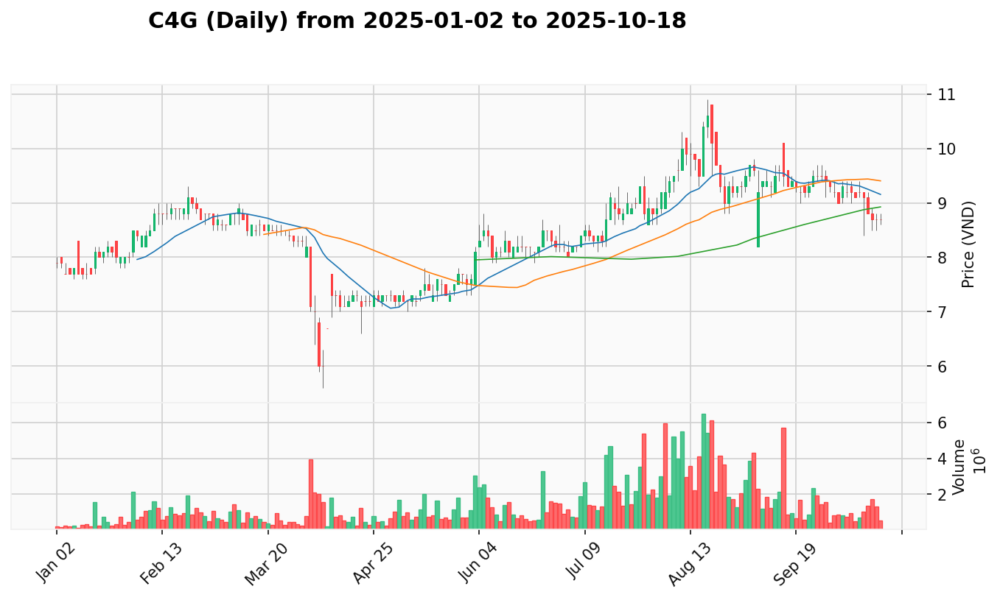

<a href="#dau-tu-cong">↑ Back to group DAU_TU_CONG</a>  |  <a href="#vpa-signal-summary">↑ Back to Top</a>

#### Key Statistics
| Metric | Value |
|:---|---:|
| Date Range | 2025-01-02 to 2025-09-26 |
| **Latest Close** | **9.5** |
| Period Open | 7.9 |
| Period High | 10.9 |
| Period Low | 5.6 |
| Period Change % | 20.25% |

**[Download C4G Data (.csv)](market_data/C4G_2025-01-02_to_2025-09-27.csv)**

---

### C69

#### [VPA Analysis (2025-08-13 - 2025-09-26)](./VPA.md#c69)
> **Ngày 2025-09-22:** C69 giữ nguyên mức đóng cửa ở 12.3 VND so với ngày hôm trước, nhưng với khối lượng giao dịch tăng đáng kể lên 0.7315 triệu cổ phiếu, gần gấp đôi so với ngày 2025-09-19. Mặc dù giá không tăng, việc khối lượng tăng mạnh sau các phiên thiếu hụt lực cầu cho thấy có sự hấp thụ nguồn cung hoặc kiểm tra lực cầu. Giá đóng cửa ở mức cao nhất phiên (12.3 VND), cho thấy áp lực bán đã được hấp thụ tốt. Đây là một dấu hiệu tích cực sau giai đoạn yếu kém. **Phân tích VPA/Wyckoff:** Test for Supply (Kiểm tra nguồn cung) - Giá đi ngang trên khối lượng tăng cho thấy nguồn cung đang được hấp thụ.
> **Ngày 2025-09-23:** C69 tăng mạnh từ 12.3 VND lên 13.0 VND, với biên độ nến rộng và đóng cửa gần mức cao nhất phiên là 13.5 VND. Khối lượng giao dịch đạt 1.3124 triệu cổ phiếu, tăng đáng kể so với 0.7315 triệu cổ phiếu của ngày hôm trước. Sự tăng giá mạnh mẽ đi kèm với khối lượng gia tăng xác nhận lực cầu đang chiếm ưu thế và hấp thụ tốt nguồn cung, tiếp nối tín hiệu tích cực từ phiên kiểm tra nguồn cung trước đó. Điều này cho thấy thị trường đang có dấu hiệu mạnh mẽ. **Phân tích VPA/Wyckoff:** Sign of Strength (SOS) - Lực cầu mạnh mẽ với khối lượng gia tăng xác nhận xu hướng tăng.
> **Ngày 2025-09-24:** C69 tiếp tục đà tăng từ 13.0 VND lên 13.5 VND, đóng cửa ở mức cao nhất phiên. Biên độ nến hẹp hơn so với phiên trước, cho thấy sự ổn định sau đợt tăng mạnh. Khối lượng giao dịch đạt 0.8215 triệu cổ phiếu, thấp hơn đáng kể so với 1.3124 triệu cổ phiếu của ngày hôm trước. Mặc dù khối lượng giảm, việc giá vẫn duy trì đà tăng và đóng cửa ở mức cao nhất cho thấy lực cầu vẫn đang kiểm soát và nguồn cung đã được hấp thụ tốt sau phiên SOS mạnh mẽ. Đây là dấu hiệu của sự tiếp diễn xu hướng tăng, với áp lực bán yếu. **Phân tích VPA/Wyckoff:** Continuation of Strength (Tiếp diễn sức mạnh) - Giá tiếp tục tăng với khối lượng giảm cho thấy nguồn cung cạn kiệt và lực cầu vẫn chiếm ưu thế.
> **Ngày 2025-09-25:** C69 mở cửa tại 13.5 VND, đạt mức cao nhất 14.8 VND nhưng sau đó giảm mạnh và đóng cửa ở mức thấp nhất phiên là 13.0 VND, thấp hơn mức đóng cửa của ngày hôm trước (13.5 VND). Khối lượng giao dịch đạt 0.4496 triệu cổ phiếu, giảm đáng kể so với 0.8215 triệu cổ phiếu của ngày 2025-09-24 và 1.3124 triệu cổ phiếu của ngày 2025-09-23. Mặc dù giá đã cố gắng tăng lên mức cao mới trong phiên, nhưng áp lực bán đã xuất hiện mạnh mẽ, đẩy giá xuống và đóng cửa ở mức thấp nhất, cho thấy lực cung đang chiếm ưu thế và lực cầu đã suy yếu sau hai phiên tăng giá mạnh. Đây là dấu hiệu cảnh báo về sự suy yếu của xu hướng tăng. **Phân tích VPA/Wyckoff:** Sign of Weakness (SOW) - Lực cung xuất hiện mạnh mẽ, đẩy giá đóng cửa ở mức thấp nhất phiên với khối lượng thấp, cho thấy lực cầu suy yếu.
> **Ngày 2025-09-26:** C69 mở cửa tại 12.4 VND, sau đó tăng nhẹ và đóng cửa ở mức 12.9 VND, cao hơn mức đóng cửa của ngày hôm trước (12.5 VND). Biên độ nến hẹp, cho thấy sự phục hồi nhẹ sau phiên giảm mạnh. Tuy nhiên, khối lượng giao dịch chỉ đạt 0.5382 triệu cổ phiếu, thấp hơn đáng kể so với 1.1356 triệu cổ phiếu của ngày 2025-09-25. Việc giá tăng trở lại với khối lượng thấp sau một phiên giảm mạnh (SOW) cho thấy lực cầu chưa thực sự mạnh mẽ và có thể chỉ là một nhịp hồi kỹ thuật. Áp lực bán có thể đã tạm lắng, nhưng chưa có dấu hiệu rõ ràng của sự quay trở lại của lực mua chủ động. **Phân tích VPA/Wyckoff:** No Demand (Không có cầu) - Giá tăng với khối lượng thấp sau một phiên giảm mạnh, cho thấy lực cầu yếu và khả năng cao là một nhịp hồi tạm thời.

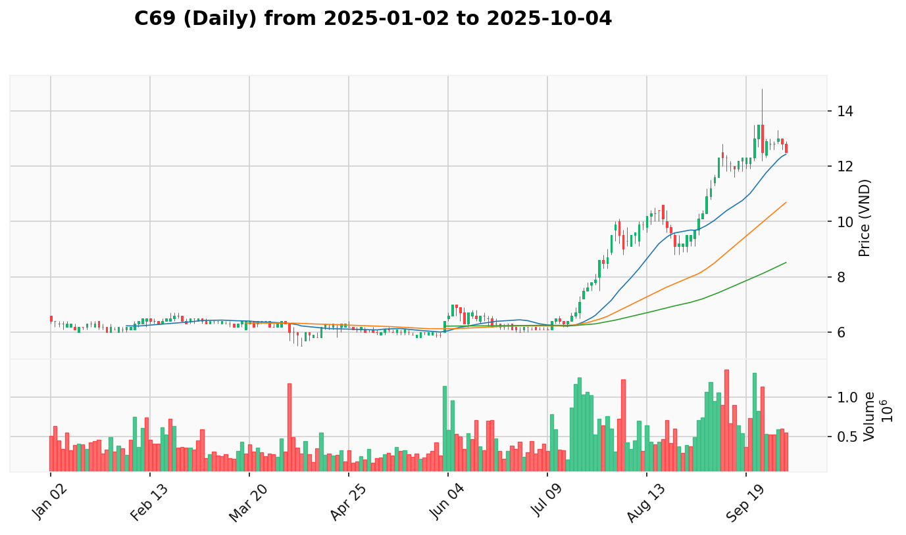

<a href="#xay-dung">↑ Back to group XAY_DUNG</a>  |  <a href="#vpa-signal-summary">↑ Back to Top</a>

#### Key Statistics
| Metric | Value |
|:---|---:|
| Date Range | 2025-01-02 to 2025-09-26 |
| **Latest Close** | **12.9** |
| Period Open | 6.6 |
| Period High | 14.8 |
| Period Low | 5.5 |
| Period Change % | 95.45% |

**[Download C69 Data (.csv)](market_data/C69_2025-01-02_to_2025-09-27.csv)**

---

### CEO

#### [VPA Analysis (2025-08-04 - 2025-09-26)](./VPA.md#ceo)
> **Ngày 2025-09-22:** CEO tăng từ 24.5 VND lên 25.3 VND với khối lượng giao dịch đạt 29.6665 triệu cổ phiếu. Nến giá có biên độ rộng, đóng cửa gần mức cao nhất phiên, cho thấy lực cầu tiếp tục mạnh mẽ và áp đảo hoàn toàn bên bán. Khối lượng giao dịch tăng đáng kể so với phiên trước (16.3887 triệu cổ phiếu), xác nhận sự đồng thuận của thị trường cho đà tăng và tiếp diễn xu hướng tích lũy. **Phân tích VPA/Wyckoff:** Sign of Strength (SOS) - Lực cầu mạnh mẽ
> **Ngày 2025-09-23:** CEO mở cửa ở mức 25.5 VND, sau đó giảm và đóng cửa tại 24.9 VND với khối lượng giao dịch đạt 10.4769 triệu cổ phiếu. Nến giá có biên độ tương đối rộng, cho thấy sự biến động trong phiên, nhưng việc đóng cửa dưới giá mở cửa và thấp hơn giá đóng cửa phiên trước (25.3 VND) cùng với khối lượng giảm mạnh (so với 29.6665 triệu cổ phiếu của phiên trước) cho thấy lực cầu đã suy yếu đáng kể và áp lực bán đã xuất hiện sau hai phiên tăng mạnh. **Phân tích VPA/Wyckoff:** Lack of Demand - Thiếu hụt lực cầu.
> **Ngày 2025-09-24:** CEO tăng từ 24.9 VND lên 27.0 VND với khối lượng giao dịch đạt 34.9748 triệu cổ phiếu. Nến giá có biên độ rất rộng, đóng cửa tại mức cao nhất phiên, cho thấy lực cầu áp đảo hoàn toàn bên bán. Khối lượng giao dịch tăng đột biến so với phiên trước (10.4769 triệu cổ phiếu), xác nhận sự trở lại mạnh mẽ của dòng tiền lớn và hấp thụ lực cung sau phiên thiếu hụt lực cầu. **Phân tích VPA/Wyckoff:** Sign of Strength (SOS) - Lực cầu mạnh mẽ
> **Ngày 2025-09-25:** CEO mở cửa ở mức 27.5 VND, sau đó biến động trong biên độ hẹp từ 27.0 VND đến 27.8 VND và đóng cửa tại 27.5 VND, cao hơn giá đóng cửa phiên trước (27.0 VND). Khối lượng giao dịch đạt 13.113 triệu cổ phiếu, giảm mạnh so với phiên trước (34.9748 triệu cổ phiếu). Mặc dù giá giữ được mức tăng và đóng cửa cao hơn sau phiên SOS mạnh mẽ, khối lượng giảm cho thấy sự tạm lắng của nguồn cung sau khi lực cầu đã hấp thụ lượng lớn cổ phiếu. **Phân tích VPA/Wyckoff:** No Supply (NS) - Thiếu hụt nguồn cung.
> **Ngày 2025-09-26:** CEO mở cửa ở mức 26.7 VND, tăng lên 27.6 VND nhưng sau đó giảm và đóng cửa tại 26.8 VND. Biên độ nến rộng với giá đóng cửa nằm ở nửa dưới, cho thấy lực cung xuất hiện mạnh mẽ sau khi giá đạt đỉnh trong phiên. Khối lượng giao dịch đạt 27.9798 triệu cổ phiếu, cao hơn đáng kể so với phiên trước (22.5831 triệu cổ phiếu), xác nhận sự gia tăng của hoạt động bán ra. Điều này cho thấy nỗ lực tăng giá gặp phải sự kháng cự từ nguồn cung. **Phân tích VPA/Wyckoff:** Effort to Rise but No Result (Nỗ lực tăng giá nhưng không đạt kết quả)

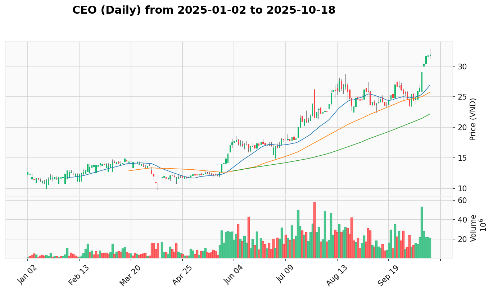

<a href="#bat-dong-san">↑ Back to group BAT_DONG_SAN</a>  |  <a href="#vpa-signal-summary">↑ Back to Top</a>

#### Key Statistics
| Metric | Value |
|:---|---:|
| Date Range | 2025-01-02 to 2025-09-26 |
| **Latest Close** | **26.8** |
| Period Open | 12.29 |
| Period High | 28.8 |
| Period Low | 9.81 |
| Period Change % | 118.06% |

**[Download CEO Data (.csv)](market_data/CEO_2025-01-02_to_2025-09-27.csv)**

---

### CIG

#### [VPA Analysis (2025-08-14 - 2025-09-26)](./VPA.md#cig)
> **Ngày 2025-09-22:** CIG giảm từ 8.9 VND xuống 8.85 VND, với khối lượng giao dịch tăng nhẹ lên 0.0349 triệu cổ phiếu. Nến giá có biên độ hẹp và đóng cửa gần mức thấp nhất phiên, cho thấy áp lực bán vẫn hiện hữu nhưng không mạnh mẽ. Khối lượng giao dịch vẫn ở mức rất thấp, cho thấy sự thiếu hụt cả lực mua và lực bán đáng kể. Sau hai phiên "No Demand" trước đó, diễn biến này tiếp tục củng cố cho thấy thị trường vẫn đang trong giai đoạn yếu và thiếu động lực. **Phân tích VPA/Wyckoff:** No Demand - Lực cầu yếu.
> **Ngày 2025-09-23:** CIG tăng nhẹ từ 8.85 VND lên 8.86 VND, nhưng đóng cửa thấp hơn giá mở cửa 8.9 VND, với biên độ nến hẹp. Khối lượng giao dịch giảm mạnh xuống 0.0175 triệu cổ phiếu, mức rất thấp. Sự tăng giá nhẹ này không được hỗ trợ bởi khối lượng, và việc đóng cửa dưới giá mở cửa cho thấy lực bán vẫn hiện diện. Khối lượng cạn kiệt tiếp tục xác nhận sự thiếu vắng lực cầu và sự thờ ơ của thị trường. Tiếp nối các phiên "No Demand" trước đó, phiên này củng cố thêm nhận định thị trường vẫn đang yếu và thiếu động lực. **Phân tích VPA/Wyckoff:** No Demand - Lực cầu yếu.
> **Ngày 2025-09-24:** CIG giảm từ 8.86 VND xuống 8.78 VND, với khối lượng giao dịch tăng lên 0.0304 triệu cổ phiếu. Nến giá có biên độ tương đối rộng và đóng cửa gần mức thấp nhất phiên, cho thấy áp lực bán gia tăng. Mặc dù khối lượng vẫn ở mức thấp so với các phiên có biến động mạnh trước đó, nhưng sự gia tăng khối lượng khi giá giảm sau các phiên "No Demand" cho thấy nguồn cung đang xuất hiện trở lại và thị trường vẫn đang trong giai đoạn yếu. **Phân tích VPA/Wyckoff:** Supply Coming In - Nguồn cung xuất hiện.
> **Ngày 2025-09-25:** CIG tăng từ 8.78 VND lên 8.9 VND, với khối lượng giao dịch đạt 0.043 triệu cổ phiếu, cao hơn phiên trước. Tuy nhiên, nến giá có biên độ rộng và đóng cửa thấp hơn giá mở cửa 8.99 VND, cho thấy lực bán mạnh mẽ đã xuất hiện ngay từ đầu phiên. Sự tăng giá này không bền vững khi gặp phải nguồn cung lớn, thể hiện qua việc giá không thể giữ được mức cao nhất trong phiên và đóng cửa dưới giá mở cửa. Điều này cho thấy thị trường vẫn đang yếu và nguồn cung vẫn đang hiện diện. **Phân tích VPA/Wyckoff:** Nỗ lực tăng giá gặp nguồn cung.
> **Ngày 2025-09-26:** CIG tăng từ 8.86 VND lên 8.96 VND, với khối lượng giao dịch giảm mạnh xuống 0.0259 triệu cổ phiếu. Nến giá có biên độ hẹp và đóng cửa trên giá mở cửa, nhưng sự tăng giá này diễn ra với khối lượng rất thấp, đặc biệt sau các phiên có dấu hiệu nguồn cung xuất hiện. Điều này cho thấy lực cầu yếu và không đủ sức đẩy giá lên cao một cách bền vững. Thị trường vẫn đang trong giai đoạn tích lũy hoặc phân phối với sự thiếu vắng của lực cầu mạnh mẽ. **Phân tích VPA/Wyckoff:** No Demand - Không có lực cầu.

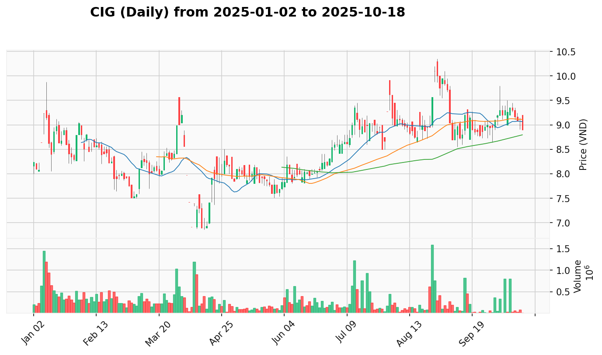

<a href="#penny">↑ Back to group PENNY</a>  |  <a href="#vpa-signal-summary">↑ Back to Top</a>

#### Key Statistics
| Metric | Value |
|:---|---:|
| Date Range | 2025-01-02 to 2025-09-26 |
| **Latest Close** | **8.96** |
| Period Open | 8.16 |
| Period High | 10.35 |
| Period Low | 6.86 |
| Period Change % | 9.80% |

**[Download CIG Data (.csv)](market_data/CIG_2025-01-02_to_2025-09-27.csv)**

---

### CII

#### [VPA Analysis (2025-06-27 - 2025-09-26)](./VPA.md#cii)
> **Ngày 2025-09-22:** CII tăng từ 23.45 lên 23.6 với khối lượng giao dịch đạt 30.04 triệu cổ phiếu. Giá mở cửa 23.6 và đóng cửa 23.6, tạo nến doji thể hiện sự lưỡng lự. Khối lượng tăng nhưng giá không có nhiều tiến triển, cho thấy lực cung đã xuất hiện và hấp thụ lực cầu ở vùng giá cao hơn. **Phân tích VPA/Wyckoff:** Kiểm tra cung (Test for Supply)
> **Ngày 2025-09-23:** CII giảm từ 23.6 xuống 22.85 với khối lượng giao dịch đạt 15.10 triệu cổ phiếu. Giá mở cửa 23.6 và đóng cửa 22.85, tạo nến giảm với thân nến lớn và đóng cửa ở mức thấp của phiên. Khối lượng giao dịch giảm mạnh so với phiên trước, cho thấy lực cầu yếu đi rõ rệt sau phiên kiểm tra cung. Việc giá giảm mạnh với khối lượng thấp sau khi có dấu hiệu cung xuất hiện cho thấy sự thiếu vắng của lực cầu hỗ trợ giá và khả năng tiếp diễn xu hướng giảm. **Phân tích VPA/Wyckoff:** Dấu hiệu suy yếu (Sign of Weakness)
> **Ngày 2025-09-24:** CII tăng từ 22.85 lên 24.4 với khối lượng giao dịch đạt 51.35 triệu cổ phiếu. Giá mở cửa 22.85 và đóng cửa 24.4, tạo nến tăng mạnh với biên độ rộng và đóng cửa ở mức cao nhất phiên. Khối lượng giao dịch tăng đột biến so với phiên trước (15.11 triệu cổ phiếu) và cao hơn nhiều so với mức trung bình. Sự kết hợp giữa giá tăng mạnh và khối lượng lớn cho thấy lực cầu đã trở lại áp đảo, hấp thụ toàn bộ lực cung và xác nhận xu hướng tăng giá. Điều này đảo ngược tín hiệu suy yếu của phiên trước và cho thấy sự tham gia mạnh mẽ của dòng tiền lớn. **Phân tích VPA/Wyckoff:** Dấu hiệu sức mạnh (Sign of Strength - SOS)
> **Ngày 2025-09-25:** CII tăng từ 24.4 lên 26.1 với khối lượng giao dịch đạt 21.81 triệu cổ phiếu. Giá mở cửa 25.15 và đóng cửa 26.1, tạo nến tăng mạnh với biên độ rộng và đóng cửa ở mức cao nhất phiên. Khối lượng giao dịch giảm so với phiên trước (51.42 triệu cổ phiếu) nhưng vẫn ở mức đáng kể. Sự tiếp diễn đà tăng giá mạnh mẽ với đóng cửa ở mức cao nhất phiên, sau một phiên Dấu hiệu sức mạnh (SOS) trước đó, cho thấy lực cầu vẫn đang kiểm soát và hấp thụ tốt lượng cung. Điều này xác nhận xu hướng tăng giá tiếp diễn. **Phân tích VPA/Wyckoff:** Dấu hiệu sức mạnh (Sign of Strength - SOS)
> **Ngày 2025-09-26:** CII tăng từ 26.1 lên 26.85 với khối lượng giao dịch đạt 46.19 triệu cổ phiếu. Giá mở cửa 26.95 và đóng cửa 26.85, tạo nến tăng có bóng trên dài, cho thấy áp lực bán ở vùng giá cao. Khối lượng tăng mạnh so với phiên trước (23.68 triệu cổ phiếu) và ở mức rất cao, xác nhận lực cầu vẫn chiếm ưu thế nhưng có sự hấp thụ nguồn cung. **Phân tích VPA/Wyckoff:** Dấu hiệu sức mạnh (Sign of Strength - SOS) - Lực cầu tiếp diễn, hấp thụ nguồn cung.

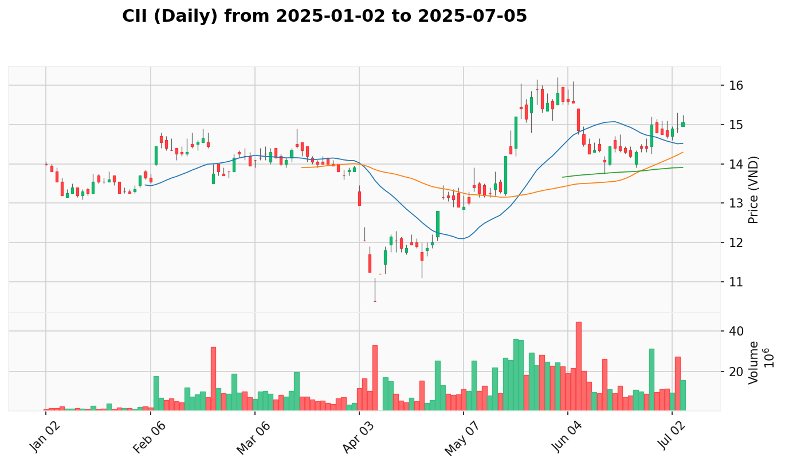

<a href="#xay-dung">↑ Back to group XAY_DUNG</a>  |  <a href="#vpa-signal-summary">↑ Back to Top</a>

#### Key Statistics
| Metric | Value |
|:---|---:|
| Date Range | 2025-01-02 to 2025-09-26 |
| **Latest Close** | **26.85** |
| Period Open | 12.02 |
| Period High | 27.45 |
| Period Low | 9.02 |
| Period Change % | 123.38% |

**[Download CII Data (.csv)](market_data/CII_2025-01-02_to_2025-09-27.csv)**

---

### CKG

#### [VPA Analysis (2025-08-08 - 2025-09-26)](./VPA.md#ckg)
> **Ngày 2025-09-22:** CKG giảm từ 13.9 VND (giá đóng cửa phiên trước) xuống 13.7 VND (giá đóng cửa) với biên độ dao động hẹp và đóng cửa tại mức giá mở cửa, gần mức thấp nhất phiên. Khối lượng giao dịch đạt 0.0435 triệu cổ phiếu, giảm đáng kể so với phiên trước (0.0633 triệu cổ phiếu). Sự giảm giá với khối lượng thấp cho thấy áp lực bán không mạnh, nhưng đồng thời cũng thiếu vắng lực cầu hỗ trợ, cho thấy sự lưỡng lự của thị trường sau phiên tăng điểm trước đó. **Phân tích VPA/Wyckoff:** No Demand (Không có cầu)
> **Ngày 2025-09-23:** CKG tăng từ 13.7 VND (giá đóng cửa phiên trước) lên 13.85 VND (giá đóng cửa) với biên độ dao động rộng và đóng cửa tại mức cao nhất phiên. Khối lượng giao dịch đạt 0.0331 triệu cổ phiếu, giảm đáng kể so với phiên trước (0.0435 triệu cổ phiếu). Sự tăng giá với khối lượng thấp cho thấy lực cầu yếu, không đủ mạnh để xác nhận xu hướng tăng bền vững, có thể là một nỗ lực tăng giá trong bối cảnh thiếu sự tham gia của thị trường. **Phân tích VPA/Wyckoff:** Effort to Rise but Low Volume (Nỗ lực tăng giá nhưng khối lượng thấp)
> **Ngày 2025-09-24:** CKG giảm từ 13.85 VND (giá đóng cửa phiên trước) xuống 13.7 VND (giá đóng cửa) với biên độ dao động hẹp và đóng cửa gần mức thấp nhất phiên. Khối lượng giao dịch đạt 0.0716 triệu cổ phiếu, tăng đáng kể so với phiên trước (0.0331 triệu cổ phiếu). Sự giảm giá với khối lượng tăng cho thấy áp lực bán đang gia tăng, đặc biệt sau nỗ lực tăng giá không thành công ở phiên trước đó. **Phân tích VPA/Wyckoff:** Sign of Weakness (SOW) - Áp lực bán gia tăng
> **Ngày 2025-09-25:** CKG tăng từ 13.7 VND (giá đóng cửa phiên trước) lên 13.8 VND (giá đóng cửa) với biên độ dao động rộng và đóng cửa ở giữa thân nến. Khối lượng giao dịch đạt 0.0488 triệu cổ phiếu, giảm đáng kể so với phiên trước (0.0716 triệu cổ phiếu). Sự tăng giá với khối lượng thấp cho thấy lực cầu yếu, không đủ mạnh để xác nhận xu hướng tăng, có thể là một nỗ lực phục hồi yếu ớt sau áp lực bán của phiên trước. **Phân tích VPA/Wyckoff:** Lack of Demand (Thiếu cầu)
> **Ngày 2025-09-26:** CKG giảm từ 13.95 VND (giá đóng cửa phiên trước) xuống 13.8 VND (giá đóng cửa) với biên độ dao động rộng và đóng cửa ở giữa thân nến. Khối lượng giao dịch đạt 0.1259 triệu cổ phiếu, tăng nhẹ so với phiên trước (0.1214 triệu cổ phiếu). Sự giảm giá với khối lượng tăng nhẹ sau một phiên tăng giá mạnh cho thấy áp lực bán đã xuất hiện trở lại và đang hấp thụ lực cầu, cho thấy sự yếu đi của xu hướng tăng. **Phân tích VPA/Wyckoff:** Cung xuất hiện

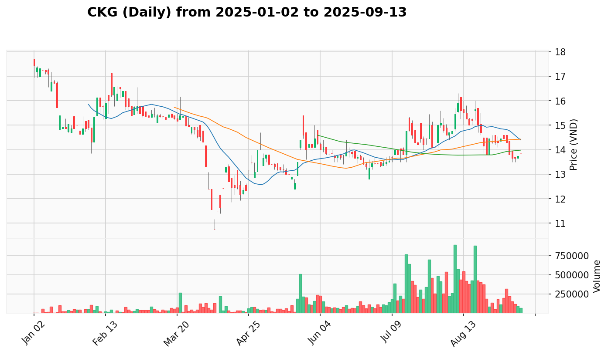

<a href="#xay-dung">↑ Back to group XAY_DUNG</a>  |  <a href="#vpa-signal-summary">↑ Back to Top</a>

#### Key Statistics
| Metric | Value |
|:---|---:|
| Date Range | 2025-01-02 to 2025-09-26 |
| **Latest Close** | **13.8** |
| Period Open | 17.71 |
| Period High | 17.71 |
| Period Low | 10.74 |
| Period Change % | -22.08% |

**[Download CKG Data (.csv)](market_data/CKG_2025-01-02_to_2025-09-27.csv)**

---

### CLX

#### [VPA Analysis (2025-08-14 - 2025-09-26)](./VPA.md#clx)
> **Ngày 2025-09-22:** CLX giảm từ 16.3 VND xuống 16.2 VND, với biên độ giao động hẹp (16.1-16.3 VND) và đóng cửa ở mức thấp nhất phiên. Khối lượng giao dịch đạt 0.1595 triệu cổ phiếu, tăng đáng kể so với phiên trước (0.0774 triệu cổ phiếu). Sau phiên "Không có cầu" ngày 2025-09-19, việc giá giảm với khối lượng tăng cho thấy áp lực bán đang gia tăng và lực cung đang chiếm ưu thế. Điều này xác nhận sự yếu ớt của lực cầu và khả năng giá sẽ tiếp tục giảm. **Phân tích VPA/Wyckoff:** Cung xuất hiện (Supply Coming In)
> **Ngày 2025-09-23:** CLX giữ nguyên mức giá 16.2 VND, với biên độ giao động cực hẹp (16.1-16.2 VND) và đóng cửa ở mức giữa phiên. Khối lượng giao dịch đạt 0.0244 triệu cổ phiếu, giảm mạnh so với phiên trước (0.1595 triệu cổ phiếu). Sau phiên "Cung xuất hiện" ngày 2025-09-22, việc giá đi ngang với khối lượng cực thấp cho thấy áp lực bán đã tạm thời lắng xuống nhưng lực cầu vẫn yếu ớt, không đủ để đẩy giá lên. Điều này xác nhận sự thiếu hụt cầu trên thị trường. **Phân tích VPA/Wyckoff:** Không có cầu (No Demand)
> **Ngày 2025-09-24:** CLX tăng từ 16.2 VND lên 16.3 VND, với biên độ giao động hẹp (16.0-16.3 VND) và đóng cửa ở mức cao nhất phiên. Khối lượng giao dịch đạt 0.0322 triệu cổ phiếu, tăng nhẹ so với phiên trước (0.0244 triệu cổ phiếu). Sau phiên "Không có cầu" ngày 2025-09-23, việc giá tăng nhẹ với khối lượng tăng cho thấy lực cầu đã xuất hiện trở lại nhưng còn yếu, đồng thời kiểm tra xem áp lực cung còn lớn hay không. Điều này cho thấy thị trường đang thăm dò. **Phân tích VPA/Wyckoff:** Kiểm tra cung (Test for Supply)
> **Ngày 2025-09-25:** CLX giữ nguyên mức giá 16.3 VND, với biên độ giao động cực hẹp (16.3-16.4 VND) và đóng cửa ở mức thấp nhất phiên. Khối lượng giao dịch đạt 0.0144 triệu cổ phiếu, giảm mạnh so với phiên trước (0.0322 triệu cổ phiếu) và thấp hơn cả phiên "Không có cầu" ngày 2025-09-23. Sau phiên "Kiểm tra cung" ngày 2025-09-24, việc giá đi ngang với khối lượng cực thấp cho thấy lực cầu tiếp tục vắng bóng và thị trường vẫn đang thiếu động lực tăng giá. **Phân tích VPA/Wyckoff:** Không có cầu (No Demand)
> **Ngày 2025-09-26:** CLX giảm từ 16.2 VND xuống 16.1 VND, với biên độ giao động hẹp (16.1-16.3 VND) và đóng cửa ở mức thấp nhất phiên. Khối lượng giao dịch đạt 0.0942 triệu cổ phiếu, tăng đáng kể so với phiên trước (0.0348 triệu cổ phiếu). Sau phiên "Không có cầu" ngày 2025-09-25, việc giá giảm với khối lượng tăng mạnh cho thấy áp lực cung đã quay trở lại và đang chiếm ưu thế, xác nhận sự yếu kém của thị trường. **Phân tích VPA/Wyckoff:** Dấu hiệu yếu kém (Sign of Weakness)

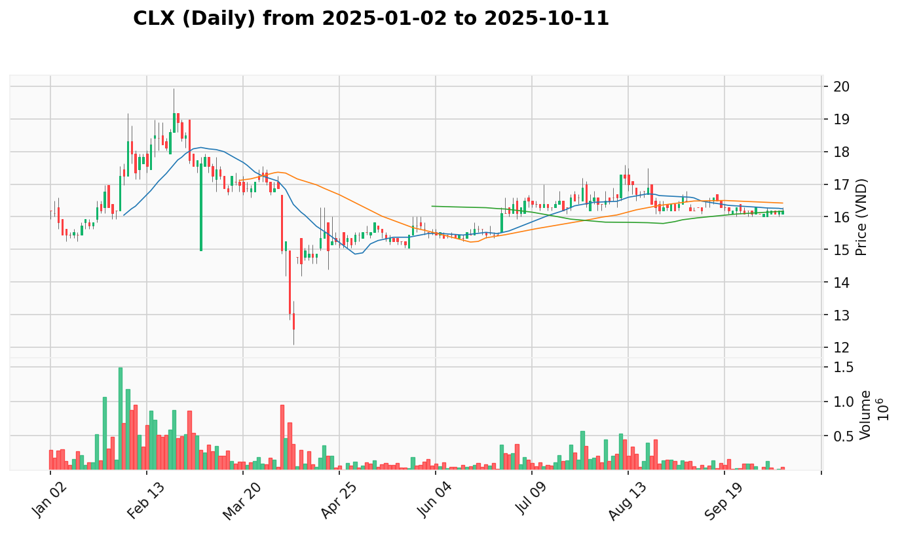

<a href="#thuc-pham">↑ Back to group THUC_PHAM</a>  |  <a href="#vpa-signal-summary">↑ Back to Top</a>

#### Key Statistics
| Metric | Value |
|:---|---:|
| Date Range | 2025-01-02 to 2025-09-26 |
| **Latest Close** | **16.1** |
| Period Open | 16.2 |
| Period High | 19.94 |
| Period Low | 12.08 |
| Period Change % | -0.62% |

**[Download CLX Data (.csv)](market_data/CLX_2025-01-02_to_2025-09-27.csv)**

---

### CMG

#### [VPA Analysis (2025-06-11 - 2025-09-26)](./VPA.md#cmg)
> **Ngày 2025-09-22:** CMG giảm từ 40.75 VND (giá đóng cửa phiên trước) xuống 39.5 VND, mở cửa ở 40.4 VND và đóng cửa ở mức thấp nhất phiên. Biên độ nến rộng (1.55 VND). Khối lượng giao dịch đạt 1.1311 triệu cổ phiếu, cao hơn đáng kể so với phiên trước (0.6303 triệu cổ phiếu). Sự sụt giảm mạnh về giá với biên độ rộng và đóng cửa ở mức thấp nhất phiên, đi kèm với khối lượng giao dịch tăng vọt, cho thấy áp lực bán mạnh mẽ và nguồn cung đang chiếm ưu thế hoàn toàn. Điều này xác nhận sự suy yếu của xu hướng tăng giá trước đó và báo hiệu khả năng giảm giá tiếp theo. **Phân tích VPA/Wyckoff:** Dấu hiệu suy yếu (Sign of Weakness - SOW)
> **Ngày 2025-09-23:** CMG tăng nhẹ từ 39.5 VND lên 39.7 VND, mở cửa ở 39.65 VND và đóng cửa ở 39.7 VND. Biên độ nến nhỏ (0.7 VND) và giá đóng cửa nằm ở giữa thân nến. Khối lượng giao dịch đạt 0.3669 triệu cổ phiếu, thấp hơn đáng kể so với phiên trước (1.1311 triệu cổ phiếu). Sau phiên giảm mạnh với khối lượng lớn (SOW) vào ngày 2025-09-22, phiên hôm nay giá tăng nhẹ nhưng với khối lượng rất thấp cho thấy lực cầu yếu ớt và không đủ sức đẩy giá lên bền vững. Điều này xác nhận sự thiếu vắng nhu cầu mua và có thể là một đợt hồi phục yếu trong xu hướng giảm giá. **Phân tích VPA/Wyckoff:** No Demand
> **Ngày 2025-09-24:** CMG tăng từ 39.7 VND (giá đóng cửa phiên trước) lên 40.2 VND, mở cửa ở 40.25 VND và đóng cửa gần mức cao nhất phiên (40.2 VND). Biên độ nến nhỏ (0.85 VND). Khối lượng giao dịch đạt 0.2675 triệu cổ phiếu, thấp hơn đáng kể so với phiên trước (0.3669 triệu cổ phiếu). Sau phiên "No Demand" ngày 2025-09-23, phiên hôm nay giá tiếp tục tăng nhẹ nhưng với khối lượng cực kỳ thấp, cho thấy lực cầu vẫn rất yếu ớt và không có sự tham gia của dòng tiền lớn. Điều này xác nhận sự thiếu vắng nhu cầu mua và khả năng thị trường vẫn đang trong giai đoạn suy yếu. **Phân tích VPA/Wyckoff:** No Demand
> **Ngày 2025-09-25:** CMG giảm từ 40.2 VND xuống 39.9 VND, mở cửa ở 40.55 VND và đóng cửa gần mức thấp nhất phiên. Biên độ nến nhỏ (0.75 VND). Khối lượng giao dịch đạt 0.1941 triệu cổ phiếu, thấp hơn đáng kể so với phiên trước (0.2675 triệu cổ phiếu) và là mức thấp nhất trong 10 phiên gần đây. Sau hai phiên "No Demand" liên tiếp, phiên hôm nay giá giảm với khối lượng cực kỳ thấp cho thấy lực bán không mạnh nhưng lực cầu hoàn toàn vắng bóng. Điều này xác nhận sự thiếu vắng nhu cầu mua và thị trường vẫn đang trong giai đoạn suy yếu. **Phân tích VPA/Wyckoff:** No Demand
> **Ngày 2025-09-26:** CMG giảm từ 39.9 VND (giá đóng cửa phiên trước) xuống 39.5 VND, mở cửa ở 39.9 VND và đóng cửa ở mức thấp nhất phiên (39.5 VND). Biên độ nến nhỏ (0.8 VND). Khối lượng giao dịch đạt 0.4259 triệu cổ phiếu, cao hơn so với phiên trước (0.3562 triệu cổ phiếu) nhưng vẫn ở mức thấp so với các phiên có khối lượng cao hơn trong 10 ngày qua. Sau hai phiên "No Demand" liên tiếp, phiên hôm nay giá tiếp tục giảm và đóng cửa ở mức thấp nhất phiên với khối lượng tăng nhẹ. Điều này cho thấy áp lực bán vẫn hiện hữu và lực cầu vẫn yếu, xác nhận xu hướng suy yếu của thị trường. **Phân tích VPA/Wyckoff:** Sign of Weakness (SOW) - Áp lực bán tiếp diễn

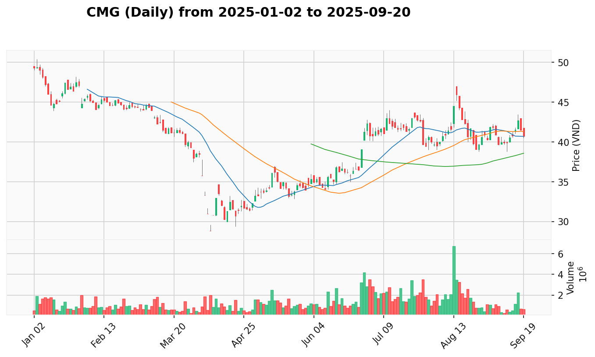

<a href="#cong-nghe">↑ Back to group CONG_NGHE</a>  |  <a href="#vpa-signal-summary">↑ Back to Top</a>

#### Key Statistics
| Metric | Value |
|:---|---:|
| Date Range | 2025-01-02 to 2025-09-26 |
| **Latest Close** | **39.5** |
| Period Open | 49.5 |
| Period High | 50.4 |
| Period Low | 28.85 |
| Period Change % | -20.20% |

**[Download CMG Data (.csv)](market_data/CMG_2025-01-02_to_2025-09-27.csv)**

---

### CMX

#### [VPA Analysis (2025-08-15 - 2025-09-26)](./VPA.md#cmx)
> **Ngày 2025-09-22:** CMX giảm từ 7.15 VND xuống 7.05 VND với khối lượng giao dịch tăng mạnh, đạt 0.2128 triệu cổ phiếu so với 0.1208 triệu của phiên trước. Cây nến giảm có biên độ tương đối và đóng cửa gần mức thấp nhất phiên. Sau nhiều phiên Thiếu cầu (No Demand), việc giá giảm với khối lượng gia tăng cho thấy áp lực bán đang mạnh lên, xác nhận sự xuất hiện của nguồn cung. **Phân tích VPA/Wyckoff:** Weakness (Yếu kém)
> **Ngày 2025-09-23:** CMX tăng từ 7.05 VND lên 7.09 VND với khối lượng giao dịch giảm mạnh, đạt 0.0556 triệu cổ phiếu so với 0.2128 triệu của phiên trước. Cây nến tăng có biên độ hẹp và đóng cửa gần mức cao nhất phiên. Sau phiên giảm mạnh với khối lượng gia tăng (Weakness), việc giá tăng nhẹ với khối lượng rất thấp cho thấy lực cầu vẫn còn yếu, không đủ để đẩy giá lên cao hơn một cách bền vững. Điều này có thể là một dấu hiệu của sự thiếu hụt nhu cầu sau áp lực bán. **Phân tích VPA/Wyckoff:** No Demand (Thiếu cầu)
> **Ngày 2025-09-24:** CMX tăng từ 7.09 VND lên 7.1 VND với khối lượng giao dịch tăng mạnh, đạt 0.1239 triệu cổ phiếu so với 0.0556 triệu của phiên trước. Cây nến tăng có biên độ hẹp và đóng cửa gần mức cao nhất phiên. Sau phiên Thiếu cầu (No Demand), việc giá tăng nhẹ với khối lượng gia tăng cho thấy có lực cầu xuất hiện nhưng kết quả tăng giá không đáng kể, ngụ ý rằng vẫn còn nguồn cung đang hấp thụ lực mua. **Phân tích VPA/Wyckoff:** Effort to Rise (Limited Result)
> **Ngày 2025-09-25:** CMX tăng từ 7.1 VND lên 7.13 VND với khối lượng giao dịch giảm, đạt 0.0952 triệu cổ phiếu so với 0.1239 triệu của phiên trước. Cây nến tăng có biên độ hẹp và đóng cửa gần mức cao nhất phiên. Sau phiên nỗ lực tăng giá nhưng kết quả hạn chế (Effort to Rise (Limited Result)), việc giá tiếp tục tăng nhẹ với khối lượng giảm cho thấy lực cầu đang yếu dần và không có sự ủng hộ mạnh mẽ để đẩy giá lên cao hơn. Điều này có thể là dấu hiệu của sự thiếu hụt nhu cầu sau một giai đoạn nỗ lực tăng giá không thành công. **Phân tích VPA/Wyckoff:** No Demand (Thiếu cầu)
> **Ngày 2025-09-26:** CMX tăng từ 7.08 VND lên 7.11 VND với khối lượng giao dịch giảm, đạt 0.1832 triệu cổ phiếu so với 0.2114 triệu của phiên trước. Cây nến tăng có biên độ tương đối và đóng cửa ở giữa thân nến. Sau phiên Thiếu cầu (No Demand) trước đó, việc giá tiếp tục tăng nhẹ nhưng với khối lượng giảm cho thấy lực cầu vẫn còn yếu và không có sự ủng hộ mạnh mẽ để đẩy giá lên cao hơn, xác nhận sự thiếu hụt nhu cầu. **Phân tích VPA/Wyckoff:** No Demand (Thiếu cầu)

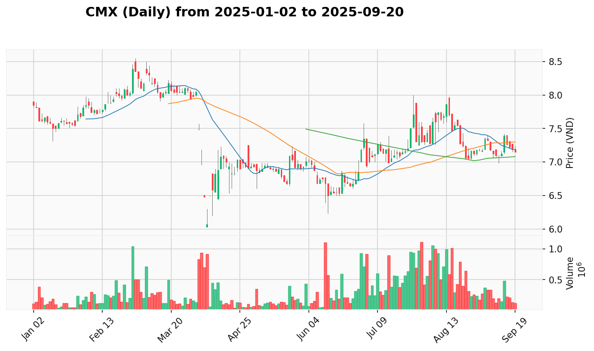

<a href="#thuy-san">↑ Back to group THUY_SAN</a>  |  <a href="#vpa-signal-summary">↑ Back to Top</a>

#### Key Statistics
| Metric | Value |
|:---|---:|
| Date Range | 2025-01-02 to 2025-09-26 |
| **Latest Close** | **7.11** |
| Period Open | 7.9 |
| Period High | 8.55 |
| Period Low | 6.03 |
| Period Change % | -10.00% |

**[Download CMX Data (.csv)](market_data/CMX_2025-01-02_to_2025-09-27.csv)**

---

### CNG

#### [VPA Analysis (2025-08-04 - 2025-09-26)](./VPA.md#cng)
> **Ngày 2025-09-22:** CNG giảm từ 27.7 VND xuống 27.6 VND với khối lượng giao dịch đạt 0.0387 triệu cổ phiếu, tăng so với phiên trước. Cây nến có biên độ hẹp, giá đóng cửa cao hơn giá mở cửa nhưng vẫn thấp hơn giá đóng cửa phiên trước. Khối lượng giao dịch tăng nhẹ sau hai phiên khối lượng rất thấp, cho thấy có sự gia tăng hoạt động nhưng lực cầu vẫn chưa đủ mạnh để đẩy giá lên. Điều này xác nhận sự tiếp diễn của yếu tố suy yếu. **Phân tích VPA/Wyckoff:** Yếu tố suy yếu - Thiếu vắng nhu cầu.
> **Ngày 2025-09-23:** CNG giữ giá 27.6 VND với khối lượng giao dịch đạt 0.0564 triệu cổ phiếu. Cây nến có biên độ hẹp và đóng cửa tại mức cao nhất phiên. Khối lượng giao dịch tăng đáng kể so với hai phiên khối lượng rất thấp trước đó, cho thấy lực cầu đã xuất hiện và hấp thụ lượng cung, ngăn chặn đà giảm tiếp diễn sau các phiên suy yếu. **Phân tích VPA/Wyckoff:** Sign of Strength (SOS) - Lực cầu hấp thụ cung.
> **Ngày 2025-09-24:** CNG giảm từ 27.6 VND xuống 27.5 VND với khối lượng giao dịch đạt 0.0356 triệu cổ phiếu, giảm đáng kể so với phiên trước. Cây nến có biên độ tương đối rộng, giá đóng cửa thấp hơn giá đóng cửa phiên trước nhưng cao hơn giá mở cửa. Khối lượng giao dịch thấp cho thấy lực bán không mạnh nhưng lực cầu cũng không xuất hiện để đẩy giá lên sau phiên SOS trước đó. Điều này cho thấy sự thiếu vắng nhu cầu. **Phân tích VPA/Wyckoff:** Yếu tố suy yếu - Thiếu vắng nhu cầu.
> **Ngày 2025-09-25:** CNG giữ giá 27.5 VND với khối lượng giao dịch cực kỳ thấp, chỉ đạt 0.0018 triệu cổ phiếu. Giá mở cửa, cao nhất, thấp nhất và đóng cửa đều ở mức 27.5 VND, cho thấy sự thiếu vắng hoàn toàn của biến động giá trong phiên. Khối lượng giao dịch giảm mạnh so với phiên trước (0.0356 triệu cổ phiếu), cho thấy cả lực mua và lực bán đều không tham gia đáng kể. Sau phiên giảm giá với khối lượng thấp (thiếu vắng nhu cầu), việc giá đi ngang với khối lượng cực thấp này cho thấy nguồn cung đã cạn kiệt tạm thời và không có áp lực bán đáng kể ở mức giá này. **Phân tích VPA/Wyckoff:** Test cung (Test for Supply) với khối lượng cực thấp.
> **Ngày 2025-09-26:** CNG giảm từ 27.4 VND xuống 27.3 VND với khối lượng giao dịch đạt 0.0318 triệu cổ phiếu. So với phiên trước, giá tiếp tục giảm nhẹ và khối lượng giao dịch giảm mạnh từ 0.140809 triệu cổ phiếu, cho thấy áp lực bán đã suy yếu đáng kể nhưng lực cầu vẫn chưa xuất hiện. Cây nến giảm với biên độ hẹp và khối lượng thấp cho thấy sự thiếu quyết đoán của thị trường và khả năng nguồn cung đang cạn kiệt tạm thời. **Phân tích VPA/Wyckoff:** No Demand (Thiếu vắng nhu cầu)

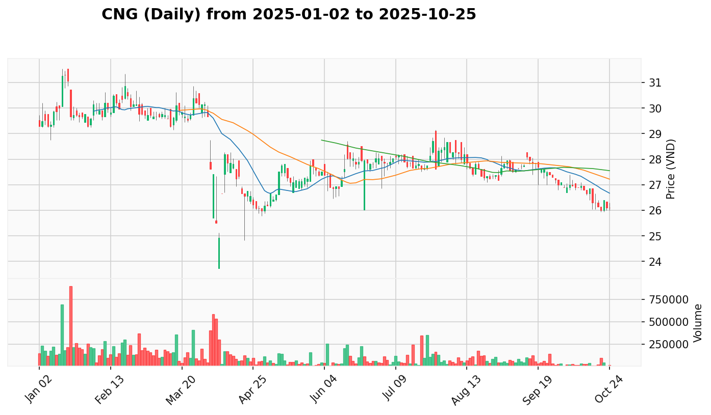

<a href="#dau-khi">↑ Back to group DAU_KHI</a>  |  <a href="#vpa-signal-summary">↑ Back to Top</a>

#### Key Statistics
| Metric | Value |
|:---|---:|
| Date Range | 2025-01-02 to 2025-09-26 |
| **Latest Close** | **27.3** |
| Period Open | 29.53 |
| Period High | 31.54 |
| Period Low | 23.73 |
| Period Change % | -7.55% |

**[Download CNG Data (.csv)](market_data/CNG_2025-01-02_to_2025-09-27.csv)**

---

### CSC

#### [VPA Analysis (2025-06-27 - 2025-09-26)](./VPA.md#csc)
> **Ngày 2025-09-22:** CSC giảm từ 21.1 VND xuống 20.8 VND với biên độ dao động từ 20.8 VND đến 21.2 VND. Giá đóng cửa ở mức thấp nhất phiên, cho thấy áp lực bán mạnh. Khối lượng giao dịch đạt 0.0318 triệu cổ phiếu, tăng đáng kể so với phiên trước và cao hơn mức trung bình gần đây, xác nhận lực cung đang chiếm ưu thế. Điều này tiếp nối các tín hiệu yếu kém từ các phiên "No Demand" trước đó. **Phân tích VPA/Wyckoff:** Weakness (Lực cung chiếm ưu thế)
> **Ngày 2025-09-23:** CSC tăng nhẹ từ 20.8 VND lên 21.0 VND, đóng cửa ở mức cao nhất phiên nhưng với biên độ dao động hẹp từ 20.5 VND đến 21.0 VND. Khối lượng giao dịch đạt 0.0275 triệu cổ phiếu, thấp hơn đáng kể so với phiên trước và dưới mức trung bình gần đây. Sau phiên "Weakness" với lực cung chiếm ưu thế, sự tăng giá nhẹ với khối lượng thấp này cho thấy lực cầu vẫn còn yếu và thiếu sự tham gia mạnh mẽ từ thị trường, tiếp tục xác nhận tình trạng thiếu cầu. **Phân tích VPA/Wyckoff:** No Demand
> **Ngày 2025-09-24:** CSC tăng từ 21.0 VND lên 21.2 VND với biên độ dao động từ 20.7 VND đến 21.3 VND. Giá đóng cửa gần mức cao nhất phiên. Tuy nhiên, khối lượng giao dịch chỉ đạt 0.011 triệu cổ phiếu, thấp hơn đáng kể so với phiên trước (0.0275 triệu cổ phiếu) và dưới mức trung bình gần đây. Sau các phiên "Weakness" và "No Demand", sự tăng giá nhẹ với khối lượng cực thấp này cho thấy lực cầu vẫn còn rất yếu và thiếu sự tham gia mạnh mẽ từ thị trường, xác nhận tình trạng thiếu cầu tiếp diễn. **Phân tích VPA/Wyckoff:** No Demand
> **Ngày 2025-09-25:** CSC tăng từ 21.2 VND lên 21.5 VND, đóng cửa gần mức cao nhất phiên với biên độ dao động từ 21.2 VND đến 21.7 VND. Khối lượng giao dịch đạt 0.0139 triệu cổ phiếu, cao hơn một chút so với phiên trước nhưng vẫn ở mức rất thấp. Sau các phiên 'No Demand' liên tiếp, sự tăng giá nhẹ với khối lượng thấp này cho thấy lực cầu vẫn còn yếu và thiếu sự xác nhận, tiếp tục tình trạng thiếu cầu. **Phân tích VPA/Wyckoff:** No Demand
> **Ngày 2025-09-26:** CSC giảm từ 21.5 VND xuống 21.1 VND với biên độ dao động từ 21.0 VND đến 21.5 VND. Giá đóng cửa gần mức thấp nhất phiên. Khối lượng giao dịch đạt 0.0264 triệu cổ phiếu, thấp hơn so với phiên trước (0.0273 triệu cổ phiếu) và tiếp tục ở mức rất thấp. Sau các phiên "No Demand" liên tiếp, sự giảm giá này với khối lượng thấp cho thấy lực cầu vẫn yếu và thiếu sự hỗ trợ, xác nhận tình trạng thiếu cầu tiếp diễn và sự yếu kém của thị trường. **Phân tích VPA/Wyckoff:** Weakness

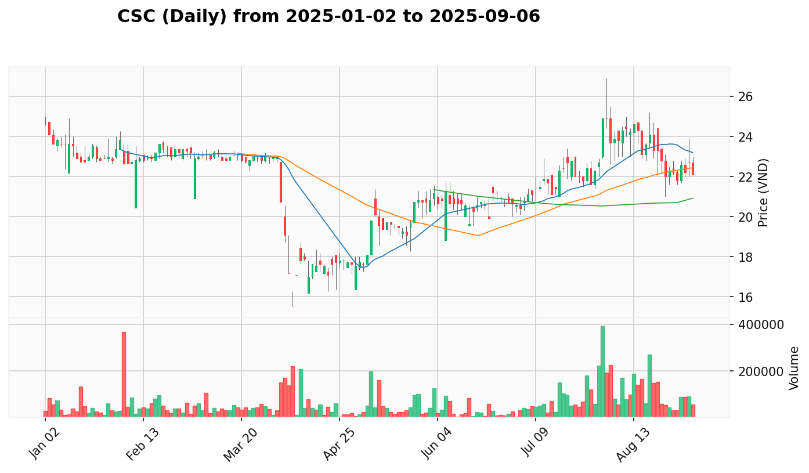

<a href="#penny">↑ Back to group PENNY</a>  |  <a href="#vpa-signal-summary">↑ Back to Top</a>

#### Key Statistics
| Metric | Value |
|:---|---:|
| Date Range | 2025-01-02 to 2025-09-26 |
| **Latest Close** | **21.1** |
| Period Open | 24.73 |
| Period High | 26.9 |
| Period Low | 15.55 |
| Period Change % | -14.68% |

**[Download CSC Data (.csv)](market_data/CSC_2025-01-02_to_2025-09-27.csv)**

---

### CST

#### [VPA Analysis (2025-06-27 - 2025-09-26)](./VPA.md#cst)
> **Ngày 2025-09-22:** CST giữ nguyên mức giá 14.6 VND. Cây nến có biên độ hẹp từ 14.5 đến 14.7 VND, đóng cửa ở mức giữa phiên. Khối lượng giao dịch đạt 0.0246 triệu cổ phiếu, cao hơn một chút so với phiên trước (0.021 triệu cổ phiếu). Mặc dù khối lượng có tăng nhẹ nhưng giá không thể tăng, cho thấy lực cầu vẫn yếu và không đủ sức đẩy giá lên. Điều này tiếp tục xác nhận sự thiếu vắng của lực mua mạnh mẽ sau các phiên giảm giá trước đó. **Phân tích VPA/Wyckoff:** No Demand.
> **Ngày 2025-09-23:** CST giảm từ 14.6 VND xuống 14.5 VND. Cây nến có biên độ tương đối rộng từ 14.5 đến 14.9 VND, đóng cửa ở mức thấp nhất phiên. Khối lượng giao dịch đạt 0.0391 triệu cổ phiếu, tăng đáng kể so với phiên trước (0.0246 triệu cổ phiếu). Sự sụt giảm giá với biên độ rộng và đóng cửa ở mức thấp nhất phiên, đi kèm với khối lượng giao dịch tăng mạnh, cho thấy áp lực bán rất lớn và nguồn cung đang chiếm ưu thế hoàn toàn. Điều này xác nhận sự yếu kém của lực cầu và khả năng giá sẽ tiếp tục giảm. **Phân tích VPA/Wyckoff:** Selling Pressure
> **Ngày 2025-09-24:** CST giữ nguyên mức giá 14.5 VND. Cây nến có biên độ hẹp từ 14.5 đến 14.7 VND, đóng cửa ở mức thấp nhất phiên. Khối lượng giao dịch đạt 0.0088 triệu cổ phiếu, giảm mạnh so với phiên trước (0.0391 triệu cổ phiếu). Sau phiên giảm giá mạnh với áp lực bán lớn, việc giá không giảm thêm nhưng với khối lượng cực thấp cho thấy lực bán đã tạm thời cạn kiệt. Tuy nhiên, sự vắng bóng của lực cầu mạnh mẽ khiến giá không thể phục hồi, xác nhận thị trường vẫn đang yếu và thiếu động lực tăng giá. **Phân tích VPA/Wyckoff:** No Demand
> **Ngày 2025-09-25:** CST giữ nguyên mức giá 14.5 VND. Cây nến có biên độ cực hẹp, chỉ ở mức 14.5 VND. Khối lượng giao dịch đạt 0.0062 triệu cổ phiếu, tiếp tục giảm mạnh so với phiên trước (0.0088 triệu cổ phiếu) và rất thấp. Sau các phiên giảm giá và không có cầu, việc giá đi ngang với khối lượng cực thấp cho thấy sự thiếu vắng hoàn toàn của cả lực mua và lực bán, xác nhận thị trường đang trong trạng thái thờ ơ và không có động lực rõ ràng. **Phân tích VPA/Wyckoff:** No Demand
> **Ngày 2025-09-26:** CST giữ nguyên mức giá 14.5 VND. Cây nến có biên độ cực hẹp từ 14.4 đến 14.5 VND, đóng cửa ở mức 14.5 VND. Khối lượng giao dịch đạt 0.0387 triệu cổ phiếu, tăng đáng kể so với phiên trước (0.0249 triệu cổ phiếu). Sau các phiên "No Demand" với khối lượng thấp, việc giá đi ngang với khối lượng gia tăng cho thấy nỗ lực mua vào không đủ mạnh để vượt qua áp lực cung, xác nhận thị trường vẫn đang yếu và thiếu động lực tăng giá. **Phân tích VPA/Wyckoff:** Effort without Result (Nỗ lực không thành công)

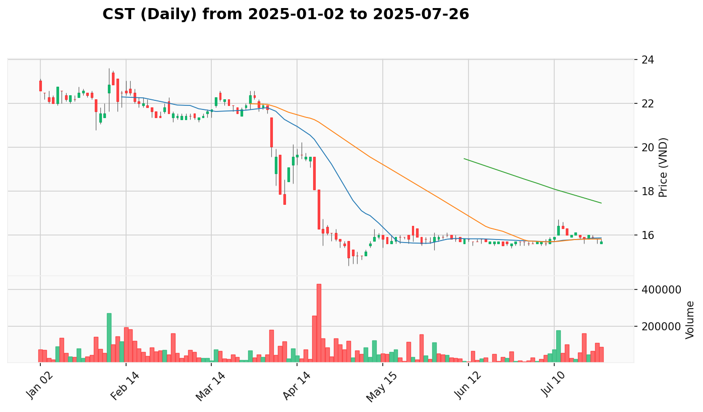

<a href="#khai-khoang">↑ Back to group KHAI_KHOANG</a>  |  <a href="#vpa-signal-summary">↑ Back to Top</a>

#### Key Statistics
| Metric | Value |
|:---|---:|
| Date Range | 2025-01-02 to 2025-09-26 |
| **Latest Close** | **14.5** |
| Period Open | 23.04 |
| Period High | 23.61 |
| Period Low | 14.4 |
| Period Change % | -37.07% |

**[Download CST Data (.csv)](market_data/CST_2025-01-02_to_2025-09-27.csv)**

---

### CSV

#### [VPA Analysis (2025-08-04 - 2025-09-26)](./VPA.md#csv)
> **Ngày 2025-09-22:** Cổ phiếu giảm từ 33.7 VND xuống 32.75 VND với khối lượng giao dịch đạt 0.8103 triệu cổ phiếu, tăng mạnh so với phiên trước đó (0.4498 triệu cổ phiếu). Biên độ nến rộng và đóng cửa gần mức thấp nhất phiên cho thấy áp lực bán gia tăng đáng kể sau các phiên kiểm tra cung. Điều này có thể là một dấu hiệu của sự suy yếu. **Phân tích VPA/Wyckoff:** Sign of Weakness (SOW) - Áp lực bán gia tăng với khối lượng lớn.
> **Ngày 2025-09-23:** Cổ phiếu giảm từ 32.75 VND xuống 32.7 VND với khối lượng giao dịch đạt 0.283 triệu cổ phiếu, giảm đáng kể so với phiên trước đó (0.8103 triệu cổ phiếu). Biên độ nến hẹp và đóng cửa ở mức thấp nhất phiên cho thấy áp lực bán vẫn còn nhưng với sự tham gia của khối lượng rất thấp, xác nhận sự thiếu vắng lực cầu sau phiên SOW trước đó. **Phân tích VPA/Wyckoff:** No Demand (Thiếu cầu)
> **Ngày 2025-09-24:** Cổ phiếu tăng từ 32.75 VND lên 32.9 VND với khối lượng giao dịch đạt 0.2617 triệu cổ phiếu, giảm so với phiên trước đó (0.283 triệu cổ phiếu). Biên độ nến hẹp và đóng cửa ở mức cao nhất phiên cho thấy có sự phục hồi nhẹ nhưng với khối lượng rất thấp, xác nhận sự thiếu vắng lực cầu mạnh mẽ sau các phiên giảm giá và thiếu cầu. Điều này cho thấy thị trường vẫn đang trong giai đoạn yếu và không có sự tham gia của người mua lớn. **Phân tích VPA/Wyckoff:** No Demand (Thiếu cầu)
> **Ngày 2025-09-25:** Cổ phiếu tăng từ 32.9 VND lên 33.05 VND với khối lượng giao dịch đạt 0.1671 triệu cổ phiếu, giảm đáng kể so với phiên trước đó (0.2617 triệu cổ phiếu) và là mức rất thấp trong 10 phiên gần nhất. Biên độ nến hẹp và đóng cửa ở mức giữa nến cho thấy sự lưỡng lự. Sự tăng giá nhẹ với khối lượng cực thấp sau các phiên "Thiếu cầu" trước đó xác nhận rằng lực cầu vẫn còn yếu và không có sự tham gia của dòng tiền lớn. Thị trường vẫn đang trong giai đoạn tích lũy hoặc suy yếu. **Phân tích VPA/Wyckoff:** No Demand (Thiếu cầu)
> **Ngày 2025-09-26:** Cổ phiếu giảm từ 33.1 VND xuống 32.85 VND với khối lượng giao dịch đạt 0.2987 triệu cổ phiếu, thấp hơn so với phiên trước đó (0.3642 triệu cổ phiếu). Biên độ nến hẹp, giá mở cửa là mức cao nhất phiên và đóng cửa gần mức thấp nhất phiên, cho thấy áp lực bán chiếm ưu thế và thiếu lực cầu. Khối lượng thấp trong phiên giảm giá này, tiếp nối các phiên "Thiếu cầu" trước đó, xác nhận sự yếu kém của thị trường và không có sự tham gia của dòng tiền lớn. **Phân tích VPA/Wyckoff:** No Demand (Thiếu cầu)

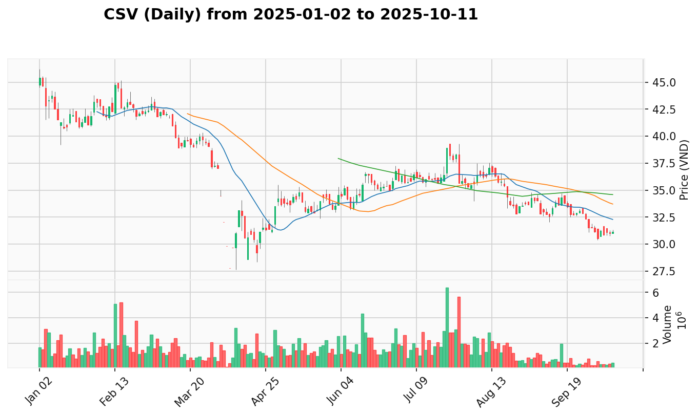

<a href="#hoa-chat">↑ Back to group HOA_CHAT</a>  |  <a href="#vpa-signal-summary">↑ Back to Top</a>

#### Key Statistics
| Metric | Value |
|:---|---:|
| Date Range | 2025-01-02 to 2025-09-26 |
| **Latest Close** | **32.85** |
| Period Open | 44.75 |
| Period High | 46.21 |
| Period Low | 27.63 |
| Period Change % | -26.59% |

**[Download CSV Data (.csv)](market_data/CSV_2025-01-02_to_2025-09-27.csv)**

---

### CTD

#### [VPA Analysis (2025-06-16 - 2025-09-26)](./VPA.md#ctd)
> **Ngày 2025-09-22:** CTD giảm từ 81.8 VND xuống 80.3 VND. Cây nến có biên độ rộng, mở cửa ở mức cao và đóng cửa gần mức thấp nhất phiên, cho thấy áp lực bán mạnh. Khối lượng giao dịch đạt 0.8323 triệu cổ phiếu, cao hơn đáng kể so với phiên trước (0.598 triệu cổ phiếu). Sau hai phiên "Thiếu lực cầu", phiên hôm nay giá giảm mạnh với khối lượng gia tăng, xác nhận sự xuất hiện của lực cung và áp lực bán. **Phân tích VPA/Wyckoff:** Sign of Weakness (SOW) - Lực cung xuất hiện.
> **Ngày 2025-09-23:** CTD tăng từ 80.3 VND lên 81.3 VND. Cây nến có biên độ hẹp hơn so với phiên trước và đóng cửa ở giữa biên độ. Khối lượng giao dịch đạt 0.6146 triệu cổ phiếu, thấp hơn đáng kể so với phiên "Lực cung xuất hiện" trước đó (0.8323 triệu cổ phiếu). Sau phiên giảm mạnh với khối lượng cao, việc giá tăng nhẹ với khối lượng thấp cho thấy lực cầu chưa thực sự mạnh mẽ để đẩy giá lên cao hơn một cách bền vững. Điều này có thể là một nỗ lực tăng giá nhưng không có kết quả rõ rệt, hoặc chỉ là một nhịp hồi kỹ thuật trong bối cảnh lực cung vẫn còn tiềm ẩn. **Phân tích VPA/Wyckoff:** No Demand - Thiếu lực cầu.
> **Ngày 2025-09-24:** CTD tăng từ 81.3 VND lên 81.9 VND. Cây nến có biên độ hẹp, mở cửa ở mức 81.2 VND và đóng cửa ở mức cao nhất phiên 81.9 VND. Khối lượng giao dịch đạt 0.4403 triệu cổ phiếu, thấp hơn đáng kể so với phiên trước (0.6146 triệu cổ phiếu). Sau hai phiên "Lực cung xuất hiện" và "Thiếu lực cầu", việc giá tăng nhẹ với khối lượng tiếp tục sụt giảm cho thấy lực cầu vẫn còn yếu và chưa đủ mạnh để đẩy giá lên một cách bền vững. Đây có thể là một nỗ lực tăng giá nhưng không có sự ủng hộ của khối lượng, hoặc chỉ là một nhịp hồi kỹ thuật trong xu hướng giảm. **Phân tích VPA/Wyckoff:** No Demand - Thiếu lực cầu.
> **Ngày 2025-09-25:** CTD tăng từ 81.9 VND lên 82.6 VND. Cây nến có biên độ hẹp và đóng cửa ở nửa trên của biên độ. Khối lượng giao dịch đạt 0.5456 triệu cổ phiếu, cao hơn so với phiên trước (0.4403 triệu cổ phiếu) nhưng vẫn ở mức trung bình. Sau hai phiên "Thiếu lực cầu", việc giá tăng nhẹ với khối lượng gia tăng cho thấy lực cầu đã bắt đầu quay trở lại, tuy nhiên chưa đủ mạnh để tạo ra một xu hướng tăng bền vững. Đây có thể là một nỗ lực tăng giá với kết quả tích cực nhưng cần thêm xác nhận. **Phân tích VPA/Wyckoff:** Effort to Rise - Nỗ lực tăng giá.
> **Ngày 2025-09-26:** CTD giảm từ 82.7 VND xuống 82.0 VND. Cây nến có biên độ tương đối rộng, mở cửa ở mức 82.8 VND và đóng cửa ở nửa dưới của biên độ. Khối lượng giao dịch đạt 0.4387 triệu cổ phiếu, thấp hơn đáng kể so với phiên trước (1.0187 triệu cổ phiếu). Sau phiên "Nỗ lực tăng giá" không có sự xác nhận mạnh mẽ, việc giá giảm với khối lượng thấp cho thấy lực cầu vẫn còn yếu và không đủ sức giữ giá. Đây là dấu hiệu của sự thiếu vắng nhu cầu mua, cho thấy thị trường vẫn đang trong giai đoạn điều chỉnh hoặc tích lũy yếu. **Phân tích VPA/Wyckoff:** No Demand - Thiếu lực cầu.

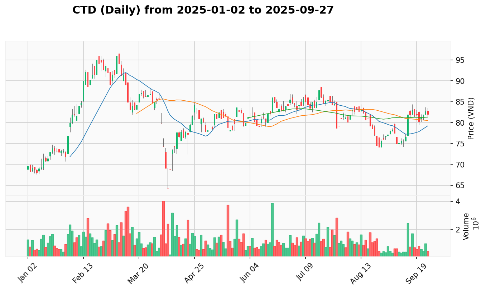

<a href="#xay-dung">↑ Back to group XAY_DUNG</a>  |  <a href="#vpa-signal-summary">↑ Back to Top</a>

#### Key Statistics
| Metric | Value |
|:---|---:|
| Date Range | 2025-01-02 to 2025-09-26 |
| **Latest Close** | **82.0** |
| Period Open | 68.8 |
| Period High | 97.8 |
| Period Low | 64.3 |
| Period Change % | 19.19% |

**[Download CTD Data (.csv)](market_data/CTD_2025-01-02_to_2025-09-27.csv)**

---

### CTG

#### [VPA Analysis (2025-06-27 - 2025-09-26)](./VPA.md#ctg)
> **Ngày 2025-09-22:** CTG giảm mạnh từ 51.2 xuống 49.3. Cây nến giảm có biên độ rộng với mức mở cửa 50.7 và dao động trong khoảng 49.05-50.9, đóng cửa ở mức 49.3, nằm ở gần mức thấp nhất phiên. Khối lượng giao dịch đạt 11.67 triệu cổ phiếu, tăng đáng kể so với phiên trước (8.13 triệu cổ phiếu). Sau phiên "No Demand (ND)" trước đó, việc giá giảm mạnh với khối lượng gia tăng cho thấy lực cung áp đảo hoàn toàn lực cầu, xác nhận xu hướng suy yếu và khả năng tiếp diễn đà giảm. **Phân tích VPA/Wyckoff:** Sign of Weakness (SOW)
> **Ngày 2025-09-23:** CTG tăng nhẹ từ 49.3 lên 50.0. Cây nến có biên độ hẹp, mở cửa tại 49.5, dao động trong khoảng 49.4-50.0 và đóng cửa tại 50.0, gần mức cao nhất phiên. Khối lượng giao dịch đạt 4.30 triệu cổ phiếu, giảm đáng kể so với phiên trước (11.67 triệu cổ phiếu). Sau phiên "Sign of Weakness (SOW)" trước đó, việc giá tăng nhẹ với khối lượng thấp cho thấy lực cầu yếu và không đủ sức đẩy giá lên bền vững, xác nhận sự thiếu vắng của nhu cầu mua mạnh mẽ. **Phân tích VPA/Wyckoff:** No Demand (ND)
> **Ngày 2025-09-24:** CTG tăng từ 50.0 lên 50.5. Cây nến tăng có biên độ rộng, mở cửa tại 49.7, dao động trong khoảng 49.3-50.5 và đóng cửa tại 50.5, nằm ở mức cao nhất phiên. Khối lượng giao dịch đạt 5.15 triệu cổ phiếu, tăng so với phiên trước (4.30 triệu cổ phiếu). Sau phiên "No Demand (ND)" trước đó, việc giá tăng với biên độ rộng và đóng cửa ở mức cao nhất phiên, kèm theo khối lượng giao dịch gia tăng, cho thấy lực cầu đã quay trở lại và áp đảo lực cung, xác nhận khả năng đảo chiều xu hướng giảm. **Phân tích VPA/Wyckoff:** Sign of Strength (SOS)
> **Ngày 2025-09-25:** CTG giảm nhẹ từ 50.5 VND xuống 50.3 VND. Cây nến có biên độ hẹp, mở cửa tại 50.5 VND, dao động trong khoảng 50.2-50.8 VND và đóng cửa tại 50.3 VND. Khối lượng giao dịch đạt 1.80 triệu cổ phiếu, giảm đáng kể so với phiên trước (5.15 triệu cổ phiếu). Sau phiên "Sign of Strength (SOS)" trước đó, việc giá giảm nhẹ với khối lượng rất thấp cho thấy lực cung yếu và không có áp lực bán đáng kể. Đây có thể là một phiên kiểm tra lại lực cầu hoặc một sự điều chỉnh tự nhiên sau đà tăng, cho thấy thị trường đang chờ đợi thêm tín hiệu. **Phân tích VPA/Wyckoff:** No Supply (NS)
> **Ngày 2025-09-26:** CTG tăng từ 50.3 VND lên 50.7 VND. Cây nến tăng có biên độ rộng, mở cửa tại 50.3 VND, dao động trong khoảng 49.95-51.6 VND và đóng cửa tại 50.7 VND, nằm ở mức cao. Khối lượng giao dịch đạt 10.29 triệu cổ phiếu, tăng mạnh so với phiên trước (1.80 triệu cổ phiếu). Sau phiên "No Supply (NS)" cho thấy lực cung yếu, việc giá tăng trở lại với biên độ rộng, đóng cửa ở mức cao và khối lượng giao dịch gia tăng mạnh mẽ cho thấy lực cầu đã quay trở lại và áp đảo hoàn toàn lực cung, xác nhận xu hướng tăng giá. **Phân tích VPA/Wyckoff:** Sign of Strength (SOS)

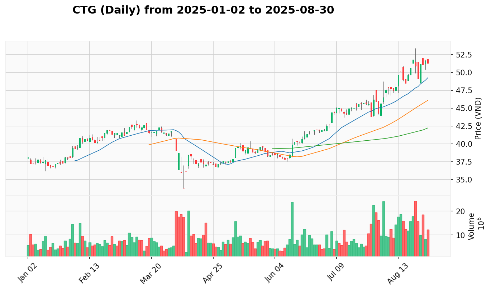

<a href="#ngan-hang">↑ Back to group NGAN_HANG</a>  |  <a href="#vpa-signal-summary">↑ Back to Top</a>

#### Key Statistics
| Metric | Value |
|:---|---:|
| Date Range | 2025-01-02 to 2025-09-26 |
| **Latest Close** | **50.7** |
| Period Open | 38.0 |
| Period High | 53.4 |
| Period Low | 33.8 |
| Period Change % | 33.42% |

**[Download CTG Data (.csv)](market_data/CTG_2025-01-02_to_2025-09-27.csv)**

---

### CTI

#### [VPA Analysis (2025-08-13 - 2025-09-26)](./VPA.md#cti)
> **Ngày 2025-09-22:** CTI mở cửa tại 25.2 VND, giảm xuống mức thấp nhất 24.55 VND và đóng cửa tại 24.7 VND. So với ngày 2025-09-19, giá đóng cửa giảm từ 25.15 VND xuống 24.7 VND. Khối lượng giao dịch đạt 0.9333 triệu cổ phiếu, tăng đáng kể so với ngày hôm trước (0.5858 triệu cổ phiếu). Cây nến ngày cho thấy một nến giảm với biên độ tương đối rộng, đóng cửa gần mức thấp nhất phiên, trên khối lượng gia tăng. Điều này cho thấy áp lực bán đã quay trở lại và đang chiếm ưu thế, xác nhận sự yếu kém của thị trường sau các phiên No Demand trước đó. **Phân tích VPA/Wyckoff:** Sign of Weakness (SOW) - Áp lực bán gia tăng trên khối lượng lớn, xác nhận xu hướng giảm.
> **Ngày 2025-09-23:** CTI mở cửa tại 24.95 VND, giảm xuống mức thấp nhất 24.45 VND và đóng cửa tại 24.45 VND. So với ngày 2025-09-22, giá đóng cửa giảm từ 24.7 VND xuống 24.45 VND. Khối lượng giao dịch đạt 0.3542 triệu cổ phiếu, giảm mạnh so với ngày hôm trước (0.9333 triệu cổ phiếu) và ở mức rất thấp. Cây nến ngày cho thấy một nến giảm với biên độ hẹp, đóng cửa tại mức thấp nhất phiên, trên khối lượng rất thấp. Điều này cho thấy áp lực bán đã giảm đáng kể nhưng lực cầu vẫn hoàn toàn vắng mặt, xác nhận sự yếu kém tiếp diễn của thị trường. **Phân tích VPA/Wyckoff:** No Demand (ND) - Lực cầu tiếp tục vắng mặt trên khối lượng rất thấp, xác nhận sự yếu kém.
> **Ngày 2025-09-24:** CTI mở cửa tại 24.45 VND, tăng lên mức cao nhất 25.45 VND và đóng cửa tại 25.45 VND. So với ngày 2025-09-23, giá đóng cửa tăng từ 24.45 VND lên 25.45 VND. Khối lượng giao dịch đạt 0.4475 triệu cổ phiếu, tăng so với ngày hôm trước (0.3542 triệu cổ phiếu). Cây nến ngày cho thấy một nến tăng mạnh với biên độ rộng, đóng cửa tại mức cao nhất phiên, trên khối lượng gia tăng. Điều này cho thấy lực cầu đã quay trở lại và đang chiếm ưu thế, hấp thụ áp lực bán sau các phiên giảm giá trước đó. **Phân tích VPA/Wyckoff:** Test for Supply - Lực cầu xuất hiện trên khối lượng gia tăng, cho thấy sự hấp thụ nguồn cung.
> **Ngày 2025-09-25:** CTI mở cửa tại 25.4 VND, tăng lên mức cao nhất 25.8 VND và đóng cửa tại 25.55 VND. So với ngày 2025-09-24, giá đóng cửa tăng nhẹ từ 25.45 VND lên 25.55 VND. Khối lượng giao dịch đạt 0.4162 triệu cổ phiếu, giảm nhẹ so với ngày hôm trước (0.4475 triệu cổ phiếu) và tiếp tục ở mức rất thấp. Cây nến ngày cho thấy một nến tăng nhỏ với biên độ hẹp, đóng cửa gần mức cao nhất phiên, trên khối lượng giảm. Điều này cho thấy lực cầu không đủ mạnh để đẩy giá lên cao hơn đáng kể, và thị trường vẫn đang thiếu sự tham gia tích cực. **Phân tích VPA/Wyckoff:** No Demand (ND) - Giá tăng nhẹ trên khối lượng giảm và rất thấp, cho thấy lực cầu yếu và thiếu sự quan tâm của thị trường.
> **Ngày 2025-09-26:** CTI mở cửa tại 25.8 VND, tăng lên mức cao nhất 26.4 VND và đóng cửa tại 25.85 VND. So với ngày 2025-09-25, giá đóng cửa tăng từ 25.7 VND lên 25.85 VND. Khối lượng giao dịch đạt 1.6125 triệu cổ phiếu, tăng so với ngày hôm trước (1.0654 triệu cổ phiếu). Cây nến ngày là một nến tăng với biên độ trung bình, nhưng giá đóng cửa nằm gần mức thấp nhất của phiên. Điều này cho thấy lực cầu đã cố gắng đẩy giá lên cao nhưng đã gặp phải áp lực bán đáng kể, khiến giá không thể duy trì ở mức cao nhất. Khối lượng gia tăng xác nhận sự hiện diện của cả lực mua và lực bán. **Phân tích VPA/Wyckoff:** Nỗ lực tăng giá nhưng không đạt kết quả (Effort to Rise but No Result) - Lực cầu gặp phải lực cung mạnh mẽ, giá đóng cửa yếu trên khối lượng gia tăng.

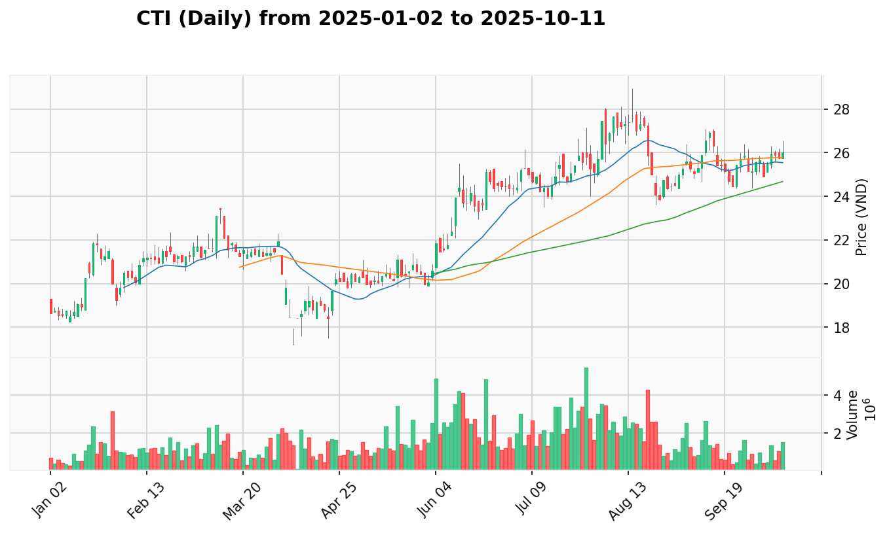

<a href="#vlxd">↑ Back to group VLXD</a>  |  <a href="#vpa-signal-summary">↑ Back to Top</a>

#### Key Statistics
| Metric | Value |
|:---|---:|
| Date Range | 2025-01-02 to 2025-09-26 |
| **Latest Close** | **25.85** |
| Period Open | 19.3 |
| Period High | 28.95 |
| Period Low | 17.2 |
| Period Change % | 33.94% |

**[Download CTI Data (.csv)](market_data/CTI_2025-01-02_to_2025-09-27.csv)**

---

### CTR

#### [VPA Analysis (2025-06-16 - 2025-09-26)](./VPA.md#ctr)
> **Ngày 2025-09-22:** CTR giảm từ 90.3 xuống 89.3. Cây nến có biên độ rộng, mở cửa tại 91.3 và đóng cửa tại 89.3, gần mức thấp nhất phiên. Khối lượng giao dịch đạt 0.2663 triệu cổ phiếu, giảm so với phiên trước (0.2888 triệu cổ phiếu). Sau các phiên giảm giá và áp lực bán, giá tiếp tục giảm mạnh với biên độ rộng nhưng khối lượng lại giảm, cho thấy lực cầu vẫn rất yếu và không có sự hỗ trợ giá đáng kể. Điều này xác nhận sự thiếu vắng của lực mua. **Phân tích VPA/Wyckoff:** No Demand (Không có cầu)
> **Ngày 2025-09-23:** CTR giảm nhẹ từ 89.4 xuống 89.3. Cây nến có biên độ hẹp (từ 89.0 đến 90.0) và đóng cửa tại mức thấp nhất phiên. Khối lượng giao dịch đạt 0.220 triệu cổ phiếu, giảm so với phiên trước (0.2663 triệu cổ phiếu). Sau các phiên giảm giá và tín hiệu không có cầu, giá tiếp tục duy trì ở mức thấp với biên độ hẹp và khối lượng giảm, cho thấy lực cầu vẫn rất yếu và không có sự hỗ trợ giá đáng kể. Điều này xác nhận sự thiếu vắng của lực mua và thị trường vẫn đang trong trạng thái yếu. **Phân tích VPA/Wyckoff:** No Demand (Không có cầu)
> **Ngày 2025-09-24:** CTR tăng nhẹ từ 89.3 lên 89.4. Cây nến có biên độ hẹp, mở cửa tại 89.4 và đóng cửa tại 89.4, gần mức cao nhất phiên. Khối lượng giao dịch đạt 0.2002 triệu cổ phiếu, tiếp tục giảm so với phiên trước (0.220 triệu cổ phiếu). Sau các phiên giảm giá và tín hiệu không có cầu, giá có một phiên tăng nhẹ nhưng với biên độ rất hẹp và khối lượng tiếp tục suy giảm, cho thấy lực cầu vẫn rất yếu và không có sự hỗ trợ giá đáng kể. Điều này xác nhận sự thiếu vắng của lực mua và thị trường vẫn đang trong trạng thái yếu. **Phân tích VPA/Wyckoff:** No Demand (Không có cầu)
> **Ngày 2025-09-25:** CTR tăng từ 89.4 lên 90.6. Cây nến có biên độ tương đối rộng (từ 89.4 đến 90.8) và đóng cửa gần mức cao nhất phiên. Khối lượng giao dịch đạt 0.1206 triệu cổ phiếu, giảm đáng kể so với phiên trước (0.2002 triệu cổ phiếu) và là mức thấp nhất trong 10 phiên gần đây. Mặc dù giá có sự phục hồi với biên độ nến rộng hơn, nhưng khối lượng giao dịch cực kỳ thấp cho thấy lực cầu yếu và không có sự hỗ trợ mạnh mẽ từ dòng tiền lớn. Điều này xác nhận sự thiếu vắng của lực mua và thị trường vẫn đang trong trạng thái yếu, có thể là một đợt kiểm tra cung không thành công hoặc một đợt tăng giá yếu. **Phân tích VPA/Wyckoff:** No Demand (Không có cầu)
> **Ngày 2025-09-26:** CTR giảm từ 90.5 VND xuống 90.0 VND. Cây nến có biên độ hẹp, mở cửa tại 90.8 VND và đóng cửa tại 90.0 VND, gần mức thấp nhất phiên. Khối lượng giao dịch đạt 0.2493 triệu cổ phiếu, tăng so với phiên trước (0.2082 triệu cổ phiếu). Sau các phiên "No Demand" với khối lượng thấp, phiên này giá giảm với khối lượng tăng, cho thấy áp lực bán vẫn còn hoặc đang gia tăng. Điều này xác nhận sự yếu kém của thị trường và khả năng tiếp tục giảm giá. **Phân tích VPA/Wyckoff:** Selling Pressure (Áp lực bán)

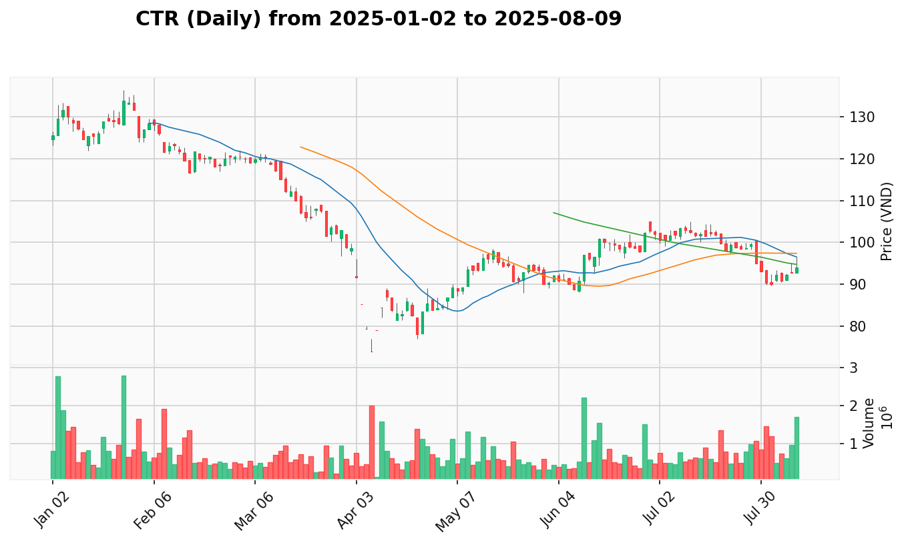

<a href="#xay-lap-dien">↑ Back to group XAY_LAP_DIEN</a>  |  <a href="#vpa-signal-summary">↑ Back to Top</a>

#### Key Statistics
| Metric | Value |
|:---|---:|
| Date Range | 2025-01-02 to 2025-09-26 |
| **Latest Close** | **90.0** |
| Period Open | 124.6 |
| Period High | 136.3 |
| Period Low | 73.9 |
| Period Change % | -27.77% |

**[Download CTR Data (.csv)](market_data/CTR_2025-01-02_to_2025-09-27.csv)**

---

### CTS

#### [VPA Analysis (2025-07-17 - 2025-09-26)](./VPA.md#cts)
> **Ngày 2025-09-22:** CTS giảm từ 39.35 xuống 38.2 (-2.92%), giảm 1.15 điểm so với phiên trước. Cây nến đỏ có biên độ rộng (từ 37.75 đến 39.4), đóng cửa gần mức thấp nhất phiên. Khối lượng giao dịch đạt 1.4683 triệu cổ phiếu, tăng đáng kể so với phiên trước (0.5347 triệu cổ phiếu). Sau phiên "No Demand" với khối lượng cực thấp, CTS đã có một phiên giảm mạnh với khối lượng gia tăng, cho thấy áp lực bán mạnh mẽ và nguồn cung đang chiếm ưu thế trên thị trường. Điều này xác nhận sự yếu kém của lực cầu và sự xuất hiện của lực cung. **Phân tích VPA/Wyckoff:** Sign of Weakness (SOW) - Lực cung chiếm ưu thế
> **Ngày 2025-09-23:** CTS tăng từ 38.2 lên 38.6 (+1.05%), tăng 0.4 điểm so với phiên trước. Cây nến xanh có biên độ 0.75 điểm (từ 38.2 đến 38.95), đóng cửa ở giữa thân nến. Khối lượng giao dịch đạt 0.7475 triệu cổ phiếu, giảm mạnh so với phiên trước (1.4683 triệu cổ phiếu). Sau phiên "Sign of Weakness" với khối lượng gia tăng, CTS có một phiên hồi phục nhẹ nhưng với khối lượng thấp. Điều này cho thấy lực cầu yếu và không đủ mạnh để đẩy giá lên cao một cách bền vững, xác nhận sự thiếu vắng nhu cầu thực sự trên thị trường. **Phân tích VPA/Wyckoff:** No Demand (Không có cầu)
> **Ngày 2025-09-24:** CTS tăng từ 38.6 lên 39.7 (+2.85%), tăng 1.1 điểm so với phiên trước. Cây nến xanh có biên độ rộng (từ 38.1 đến 39.7), đóng cửa ở mức cao nhất phiên. Khối lượng giao dịch đạt 0.9262 triệu cổ phiếu, tăng so với phiên trước (0.7475 triệu cổ phiếu). Sau phiên "No Demand" với khối lượng thấp, CTS đã có một phiên tăng mạnh với khối lượng gia tăng, cho thấy lực cầu đang chiếm ưu thế và sẵn sàng đẩy giá lên cao. Điều này xác nhận sự trở lại của nhu cầu trên thị trường. **Phân tích VPA/Wyckoff:** Sign of Strength (SOS) - Lực cầu mạnh mẽ.
> **Ngày 2025-09-25:** CTS tăng từ 39.7 lên 40.15 (+1.13%), tăng 0.45 điểm so với phiên trước. Cây nến xanh có biên độ 0.6 điểm (từ 39.8 đến 40.4), đóng cửa gần mức cao nhất phiên. Khối lượng giao dịch đạt 1.0673 triệu cổ phiếu, tăng so với phiên trước (0.9262 triệu cổ phiếu). Sau phiên "Sign of Strength" với khối lượng gia tăng, CTS tiếp tục tăng giá với khối lượng tiếp tục tăng, cho thấy lực cầu vẫn đang chiếm ưu thế và đẩy giá lên cao. Điều này xác nhận sự tiếp diễn của nhu cầu trên thị trường. **Phân tích VPA/Wyckoff:** Sign of Strength (SOS) - Lực cầu tiếp diễn.
> **Ngày 2025-09-26:** CTS giảm từ 41.2 xuống 40.35 (-2.06%), giảm 0.85 điểm so với phiên trước. Cây nến đỏ có biên độ hẹp (từ 40.1 đến 41.35), đóng cửa gần mức thấp nhất phiên. Khối lượng giao dịch đạt 1.7611 triệu cổ phiếu, giảm đáng kể so với phiên trước (3.4484 triệu cổ phiếu). Sau hai phiên "Sign of Strength" với khối lượng gia tăng, CTS có một phiên giảm giá với khối lượng thấp hơn. Điều này cho thấy lực cầu đã suy yếu và có thể là dấu hiệu của việc chốt lời hoặc thiếu sự tiếp diễn của lực mua. Mặc dù giá giảm, khối lượng thấp cho thấy áp lực bán chưa quá mạnh, nhưng sự thiếu hụt lực cầu là đáng chú ý. **Phân tích VPA/Wyckoff:** Weakness (SOW) - Lực cầu suy yếu.

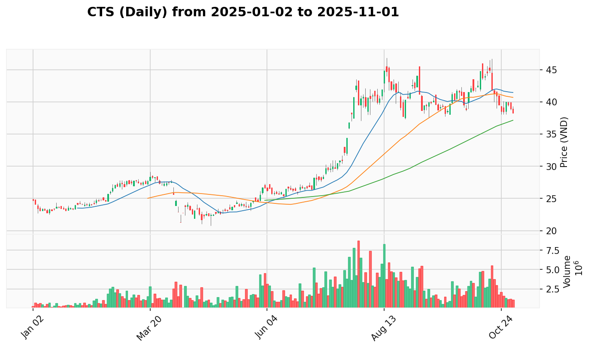

<a href="#chung-khoan">↑ Back to group CHUNG_KHOAN</a>  |  <a href="#vpa-signal-summary">↑ Back to Top</a>

#### Key Statistics
| Metric | Value |
|:---|---:|
| Date Range | 2025-01-02 to 2025-09-26 |
| **Latest Close** | **40.35** |
| Period Open | 24.9 |
| Period High | 46.85 |
| Period Low | 20.77 |
| Period Change % | 62.05% |

**[Download CTS Data (.csv)](market_data/CTS_2025-01-02_to_2025-09-27.csv)**

---

### D2D

#### [VPA Analysis (2025-08-04 - 2025-09-26)](./VPA.md#d2d)
> **Ngày 2025-09-22:** D2D giảm từ 36.6 VND xuống 36.4 VND với khối lượng giao dịch đạt 0.0803 triệu cổ phiếu. So với phiên trước (khối lượng 0.0625 triệu cổ phiếu), khối lượng tăng. Giá giảm với biên độ hẹp và đóng cửa gần mức thấp nhất phiên, cho thấy áp lực bán vẫn tiếp diễn và có phần gia tăng, tiếp nối tín hiệu suy yếu từ các phiên trước. **Phân tích VPA/Wyckoff:** Yếu tố suy yếu
> **Ngày 2025-09-23:** D2D tăng từ 36.4 VND lên 36.55 VND với khối lượng giao dịch đạt 0.0402 triệu cổ phiếu. So với phiên trước (khối lượng 0.0803 triệu cổ phiếu), khối lượng giảm mạnh. Giá tăng nhẹ với biên độ hẹp và đóng cửa gần mức cao nhất phiên, nhưng khối lượng thấp cho thấy lực cầu yếu và không đủ sức đẩy giá lên bền vững, tiếp nối tín hiệu suy yếu từ các phiên trước. **Phân tích VPA/Wyckoff:** Yếu tố suy yếu
> **Ngày 2025-09-24:** D2D giảm từ 36.55 VND xuống 36.25 VND với khối lượng giao dịch đạt 0.0748 triệu cổ phiếu. So với phiên trước (khối lượng 0.0402 triệu cổ phiếu), khối lượng tăng. Giá giảm với biên độ hẹp và đóng cửa gần mức thấp nhất phiên, cho thấy áp lực bán tiếp tục gia tăng và chiếm ưu thế, xác nhận tín hiệu suy yếu từ các phiên trước. **Phân tích VPA/Wyckoff:** Yếu tố suy yếu
> **Ngày 2025-09-25:** D2D tăng từ 36.25 VND lên 36.45 VND với khối lượng giao dịch đạt 0.0207 triệu cổ phiếu. So với phiên trước (khối lượng 0.0748 triệu cổ phiếu), khối lượng giảm mạnh. Giá tăng nhẹ với biên độ hẹp và đóng cửa ở giữa thân nến, cho thấy lực cầu rất yếu và không đủ sức đẩy giá lên bền vững, tiếp tục xác nhận tín hiệu suy yếu từ các phiên trước. **Phân tích VPA/Wyckoff:** Yếu tố suy yếu (No Demand)
> **Ngày 2025-09-26:** D2D giảm từ 36.55 VND xuống 36.4 VND với khối lượng giao dịch đạt 0.1044 triệu cổ phiếu. So với phiên trước (khối lượng 0.0595 triệu cổ phiếu), khối lượng tăng mạnh. Giá giảm với biên độ tương đối rộng và đóng cửa gần mức thấp nhất phiên, cho thấy áp lực bán mạnh mẽ và chiếm ưu thế, xác nhận xu hướng suy yếu. **Phân tích VPA/Wyckoff:** Yếu tố suy yếu (Sign of Weakness)

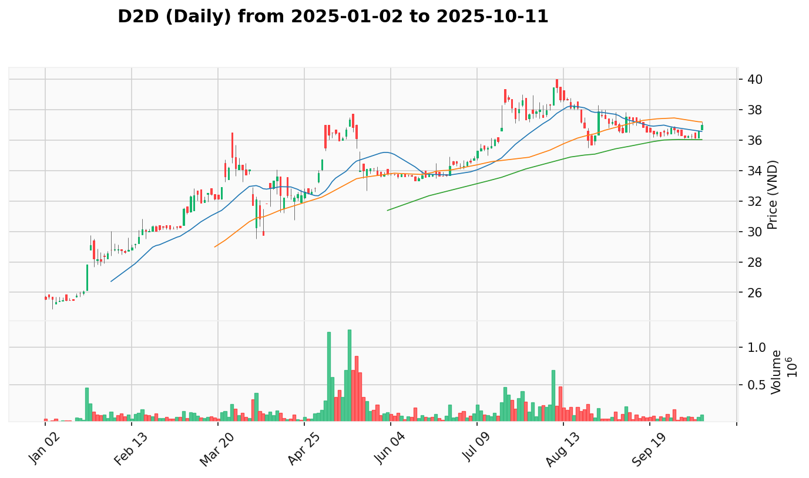

<a href="#bat-dong-san-kcn">↑ Back to group BAT_DONG_SAN_KCN</a>  |  <a href="#vpa-signal-summary">↑ Back to Top</a>

#### Key Statistics
| Metric | Value |
|:---|---:|
| Date Range | 2025-01-02 to 2025-09-26 |
| **Latest Close** | **36.4** |
| Period Open | 25.72 |
| Period High | 40.0 |
| Period Low | 24.9 |
| Period Change % | 41.52% |

**[Download D2D Data (.csv)](market_data/D2D_2025-01-02_to_2025-09-27.csv)**

---

### DAH

#### [VPA Analysis (2025-08-14 - 2025-09-26)](./VPA.md#dah)
> **Ngày 2025-09-22:** DAH giảm nhẹ từ 4.0 VND xuống 3.99 VND với khối lượng giao dịch đạt 0.31 triệu cổ phiếu, thấp hơn đáng kể so với phiên trước. Cây nến có biên độ hẹp và đóng cửa gần mức mở cửa, cho thấy sự lưỡng lự của thị trường. Khối lượng giao dịch cực thấp sau hai phiên giảm giá mạnh (SOW và No Demand) cho thấy lực bán đã tạm thời cạn kiệt nhưng lực cầu vẫn chưa xuất hiện để đẩy giá lên. Điều này xác nhận sự thiếu vắng của người mua và cho thấy thị trường vẫn đang trong giai đoạn suy yếu. **Phân tích VPA/Wyckoff:** No Demand - Giá giảm nhẹ với khối lượng cực thấp, xác nhận thiếu hụt lực cầu.
> **Ngày 2025-09-23:** DAH giảm từ 3.99 VND xuống 3.97 VND với khối lượng giao dịch đạt 0.2272 triệu cổ phiếu, tiếp tục giảm mạnh so với các phiên trước. Cây nến giảm có biên độ hẹp và đóng cửa gần mức thấp nhất trong ngày. Khối lượng cực thấp trong khi giá tiếp tục giảm nhẹ sau các phiên No Demand trước đó cho thấy lực cung đã cạn kiệt nhưng lực cầu vẫn chưa xuất hiện. Điều này xác nhận sự thiếu vắng của người mua và thị trường vẫn đang trong giai đoạn tích lũy hoặc suy yếu. **Phân tích VPA/Wyckoff:** No Demand - Giá giảm nhẹ với khối lượng cực thấp, xác nhận thiếu hụt lực cầu và lực bán đã cạn kiệt.
> **Ngày 2025-09-24:** DAH giữ nguyên mức giá 3.97 VND với khối lượng giao dịch đạt 0.3485 triệu cổ phiếu, cao hơn so với phiên trước. Cây nến có biên độ rộng hơn nhưng đóng cửa ở mức mở cửa và bằng với giá đóng cửa phiên trước. Sau hai phiên "No Demand", khối lượng giao dịch tăng nhưng giá không thể bứt phá, cho thấy lực cầu vẫn còn yếu và chưa đủ sức đẩy giá lên cao hơn. Điều này xác nhận sự thiếu vắng của người mua mạnh mẽ và thị trường vẫn đang trong giai đoạn tích lũy hoặc suy yếu. **Phân tích VPA/Wyckoff:** Nỗ lực không thành công - Khối lượng tăng nhưng giá không đổi, cho thấy lực cung vẫn mạnh hơn lực cầu.
> **Ngày 2025-09-25:** DAH giảm từ 3.97 VND xuống 3.96 VND với khối lượng giao dịch đạt 0.1297 triệu cổ phiếu, cực kỳ thấp, thấp hơn đáng kể so với các phiên trước. Cây nến giảm có biên độ hẹp và đóng cửa gần mức thấp nhất trong ngày. Sau hai phiên "No Demand" và "Nỗ lực không thành công", khối lượng tiếp tục giảm mạnh trong khi giá giảm nhẹ cho thấy lực cung đã cạn kiệt hoàn toàn nhưng lực cầu vẫn chưa xuất hiện. Điều này xác nhận sự thiếu vắng của người mua và thị trường vẫn đang trong giai đoạn tích lũy hoặc suy yếu, có thể là một đợt rũ bỏ cuối cùng trước khi có sự thay đổi. **Phân tích VPA/Wyckoff:** No Demand (tiếp diễn) - Giá giảm nhẹ với khối lượng cực thấp, xác nhận lực cung đã cạn kiệt nhưng lực cầu vẫn chưa xuất hiện.
> **Ngày 2025-09-26:** DAH tăng từ 3.95 VND lên 4.0 VND với khối lượng giao dịch đạt 0.181 triệu cổ phiếu, thấp hơn đáng kể so với phiên trước. Cây nến tăng có biên độ rộng hơn nhưng khối lượng rất thấp, cho thấy lực cầu yếu và không đủ sức đẩy giá lên bền vững. Sau phiên "No Demand" trước đó, sự tăng giá với khối lượng thấp này xác nhận rằng thị trường vẫn thiếu vắng người mua mạnh mẽ và có thể là một đợt kiểm tra cung trước khi tiếp tục xu hướng giảm hoặc tích lũy. **Phân tích VPA/Wyckoff:** No Demand (tiếp diễn) - Giá tăng nhẹ với khối lượng cực thấp, xác nhận lực cầu vẫn chưa xuất hiện.

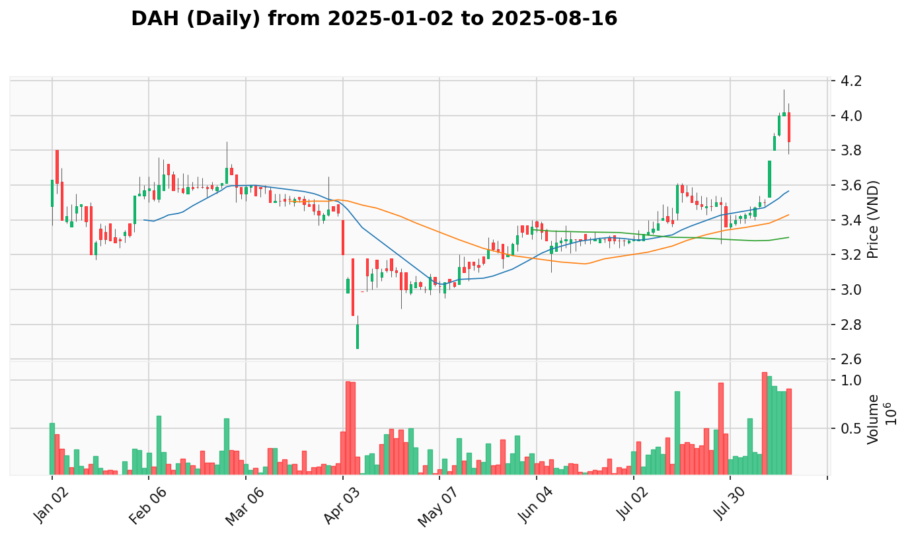

<a href="#penny">↑ Back to group PENNY</a>  |  <a href="#vpa-signal-summary">↑ Back to Top</a>

#### Key Statistics
| Metric | Value |
|:---|---:|
| Date Range | 2025-01-02 to 2025-09-26 |
| **Latest Close** | **4.0** |
| Period Open | 3.48 |
| Period High | 4.46 |
| Period Low | 2.66 |
| Period Change % | 14.94% |

**[Download DAH Data (.csv)](market_data/DAH_2025-01-02_to_2025-09-27.csv)**

---

### DBC

#### [VPA Analysis (2025-06-16 - 2025-09-26)](./VPA.md#dbc)
> **Ngày 2025-09-22:** DBC giảm từ 27.85 xuống 27.2 VND. Cây nến giảm có biên độ tương đối rộng, đóng cửa ở mức thấp gần nhất phiên. Khối lượng giao dịch đạt 7.2879 triệu cổ phiếu, tăng đáng kể so với phiên trước (4.0211 triệu cổ phiếu). Sự sụt giảm giá với biên độ rộng và khối lượng tăng cho thấy áp lực bán mạnh mẽ đang chiếm ưu thế, xác nhận sự yếu kém của thị trường và khả năng tiếp diễn xu hướng giảm. **Phân tích VPA/Wyckoff:** Weakness (SOW) - Dấu hiệu yếu kém
> **Ngày 2025-09-23:** DBC giảm từ 27.25 VND xuống 27.2 VND. Cây nến giảm có biên độ hẹp, đóng cửa ở mức thấp nhất phiên. Khối lượng giao dịch đạt 2.8845 triệu cổ phiếu, giảm mạnh so với phiên trước (7.2879 triệu cổ phiếu) và thấp hơn nhiều so với mức trung bình gần đây. Sau phiên giảm mạnh với khối lượng lớn ngày 2025-09-22, phiên này cho thấy áp lực bán đã tạm thời suy yếu, nhưng lực cầu vẫn chưa xuất hiện để hỗ trợ giá. Điều này xác nhận sự thiếu quan tâm của thị trường và khả năng tiếp diễn xu hướng giảm nếu không có lực cầu mạnh mẽ trở lại. **Phân tích VPA/Wyckoff:** No Demand (Không có lực cầu)
> **Ngày 2025-09-24:** DBC tăng từ 27.2 VND lên 27.55 VND. Cây nến tăng có biên độ tương đối rộng, đóng cửa ở mức cao nhất phiên. Khối lượng giao dịch đạt 3.8793 triệu cổ phiếu, tăng so với phiên trước (2.8845 triệu cổ phiếu) nhưng vẫn ở mức trung bình thấp so với các phiên giảm mạnh trước đó. Sau hai phiên giảm giá với áp lực bán mạnh và không có lực cầu, phiên này cho thấy sự xuất hiện của lực mua, đẩy giá lên và đóng cửa ở mức cao nhất. Tuy nhiên, khối lượng chưa thực sự đột biến để xác nhận một xu hướng tăng mạnh mẽ, cho thấy thị trường vẫn đang trong giai đoạn thăm dò và kiểm tra nguồn cung. **Phân tích VPA/Wyckoff:** Test for Supply (Kiểm tra nguồn cung)
> **Ngày 2025-09-25:** DBC mở cửa ở 27.65 VND và đóng cửa ở 27.55 VND, giữ nguyên mức giá đóng cửa so với phiên trước. Cây nến có biên độ hẹp từ 27.5 VND đến 27.75 VND, cho thấy sự thiếu quyết đoán. Khối lượng giao dịch chỉ đạt 1.6997 triệu cổ phiếu, giảm mạnh so với phiên trước (3.8793 triệu cổ phiếu) và là mức thấp nhất trong nhiều phiên gần đây. Sau phiên kiểm tra nguồn cung ngày 2025-09-24, phiên này cho thấy nguồn cung đã cạn kiệt ở mức giá hiện tại, nhưng lực cầu cũng chưa đủ mạnh để đẩy giá lên. Sự sụt giảm mạnh về khối lượng trong khi giá không giảm sâu cho thấy áp lực bán đã giảm đáng kể, tạo tiền đề cho một giai đoạn tích lũy hoặc tăng giá nếu có lực cầu xuất hiện. **Phân tích VPA/Wyckoff:** No Supply (Không có nguồn cung)
> **Ngày 2025-09-26:** DBC giảm từ 27.7 VND xuống 27.2 VND. Cây nến giảm có biên độ rộng, đóng cửa ở mức thấp nhất phiên. Khối lượng giao dịch đạt 3.8931 triệu cổ phiếu, tăng nhẹ so với phiên trước (3.8696 triệu cổ phiếu). Sau phiên "No Supply" ngày 2025-09-25, phiên này cho thấy áp lực bán đã quay trở lại, đẩy giá xuống thấp nhất phiên với khối lượng tăng nhẹ, cho thấy nguồn cung vẫn còn hiện hữu và đang chiếm ưu thế. **Phân tích VPA/Wyckoff:** Supply Coming In (Nguồn cung xuất hiện)

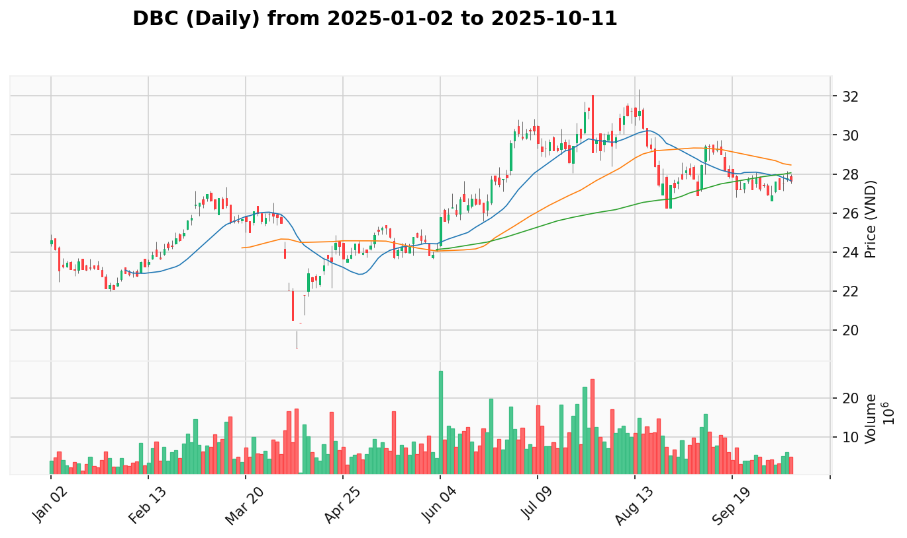

<a href="#nong-nghiep">↑ Back to group NONG_NGHIEP</a>  |  <a href="#vpa-signal-summary">↑ Back to Top</a>

#### Key Statistics
| Metric | Value |
|:---|---:|
| Date Range | 2025-01-02 to 2025-09-26 |
| **Latest Close** | **27.2** |
| Period Open | 24.44 |
| Period High | 32.35 |
| Period Low | 19.09 |
| Period Change % | 11.29% |

**[Download DBC Data (.csv)](market_data/DBC_2025-01-02_to_2025-09-27.csv)**

---

### DCL

#### [VPA Analysis (2025-08-14 - 2025-09-26)](./VPA.md#dcl)
> **Ngày 2025-09-22:** DCL mở cửa tại 29.0, đạt mức cao nhất 29.0 và thấp nhất 28.0, đóng cửa tại 29.0. Giá tiếp tục tăng nhẹ từ 28.8 lên 29.0, đóng cửa ở mức cao nhất phiên, cho thấy lực cầu vẫn duy trì và kiểm soát. Khối lượng giao dịch đạt 0.7909 triệu cổ phiếu, giảm đáng kể so với phiên SOS trước đó (1.5494 triệu cổ phiếu). Điều này cho thấy sự tiếp diễn của xu hướng tăng với ít nguồn cung hơn trên thị trường, hoặc lực cầu không cần nhiều nỗ lực để đẩy giá lên. **Phân tích VPA/Wyckoff:** Thiếu hụt nguồn cung (Lack of Supply) - Tiếp diễn xu hướng tăng.
> **Ngày 2025-09-23:** DCL mở cửa tại 28.9, đạt mức cao nhất 28.9 và thấp nhất 28.1, đóng cửa tại 28.5. Giá giảm từ 29.0 xuống 28.5 với biên độ trung bình và đóng cửa ở nửa dưới của thân nến. Khối lượng giao dịch đạt 0.575 triệu cổ phiếu, giảm đáng kể so với phiên trước (0.7909 triệu cổ phiếu) và phiên SOS (1.5494 triệu cổ phiếu). Sự giảm giá đi kèm với khối lượng thấp cho thấy lực cung không mạnh mẽ, có thể là một nhịp điều chỉnh tự nhiên hoặc kiểm tra lực cầu sau chuỗi tăng giá gần đây. **Phân tích VPA/Wyckoff:** Test for Supply (Kiểm tra lực cung) - Giá giảm với khối lượng thấp, cho thấy lực cung yếu và có thể là nhịp điều chỉnh lành mạnh trong xu hướng tăng.
> **Ngày 2025-09-24:** DCL mở cửa tại 28.5, đạt mức cao nhất 29.0 và thấp nhất 28.1, đóng cửa tại 28.9. Giá tăng từ 28.5 lên 28.9 với biên độ trung bình và đóng cửa gần mức cao nhất phiên, cho thấy lực cầu đang quay trở lại và kiểm soát sau phiên kiểm tra cung. Khối lượng giao dịch đạt 0.7015 triệu cổ phiếu, tăng so với phiên trước (0.575 triệu cổ phiếu), xác nhận rằng lực cung đã yếu đi và lực cầu đang dần chiếm ưu thế, tiếp tục xu hướng tăng. **Phân tích VPA/Wyckoff:** Sign of Strength (SOS) - Lực cầu quay trở lại và đẩy giá lên sau phiên kiểm tra cung thành công.
> **Ngày 2025-09-25:** DCL mở cửa tại 28.8, đạt mức cao nhất 28.8 và thấp nhất 28.6, đóng cửa tại 28.65. Giá giảm từ 28.9 xuống 28.65 với biên độ hẹp và đóng cửa ở nửa dưới của thân nến. Khối lượng giao dịch đạt 0.2573 triệu cổ phiếu, giảm mạnh so với phiên trước (0.7015 triệu cổ phiếu). Sự giảm giá nhẹ đi kèm với khối lượng rất thấp cho thấy lực cung không đáng kể và có thể là một nhịp điều chỉnh tự nhiên hoặc kiểm tra lại lực cầu sau phiên SOS trước đó. **Phân tích VPA/Wyckoff:** Test for Supply (Kiểm tra lực cung) - Giá giảm với khối lượng rất thấp, cho thấy lực cung yếu và có thể là nhịp điều chỉnh lành mạnh trong xu hướng tăng.
> **Ngày 2025-09-26:** DCL mở cửa tại 28.8, đạt mức cao nhất 28.8 và thấp nhất 28.0, đóng cửa tại 28.5. Giá giảm từ 28.9 xuống 28.5 với biên độ rộng và đóng cửa gần mức thấp nhất phiên, cho thấy áp lực bán mạnh mẽ. Khối lượng giao dịch đạt 0.6765 triệu cổ phiếu, tăng đáng kể so với phiên trước (0.2573 triệu cổ phiếu), xác nhận rằng lực cung đã quay trở lại và đang chiếm ưu thế. Điều này cho thấy sự suy yếu sau phiên kiểm tra cung thành công và SOS trước đó. **Phân tích VPA/Wyckoff:** Sign of Weakness (SOW) - Lực cung mạnh mẽ xuất hiện, đẩy giá xuống với khối lượng tăng, cho thấy sự suy yếu của lực cầu.

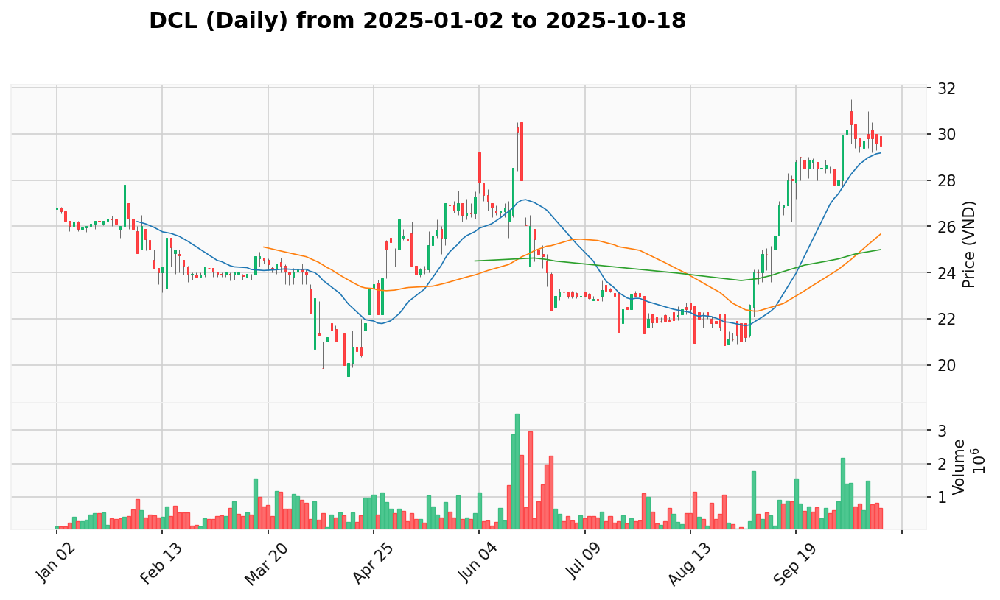

<a href="#suc-khoe">↑ Back to group SUC_KHOE</a>  |  <a href="#vpa-signal-summary">↑ Back to Top</a>

#### Key Statistics
| Metric | Value |
|:---|---:|
| Date Range | 2025-01-02 to 2025-09-26 |
| **Latest Close** | **28.5** |
| Period Open | 26.75 |
| Period High | 30.5 |
| Period Low | 19.0 |
| Period Change % | 6.54% |

**[Download DCL Data (.csv)](market_data/DCL_2025-01-02_to_2025-09-27.csv)**

---

### DCM

#### [VPA Analysis (2025-06-16 - 2025-09-26)](./VPA.md#dcm)
> **Ngày 2025-09-22:** DCM giảm từ 37.7 VND xuống 36.6 VND (-2.92%). Cây nến giảm có biên độ rộng (spread 1.45 VND), mở cửa ở 37.75 VND và đóng cửa ở 36.6 VND, nằm ở mức thấp nhất của cây nến. Khối lượng giao dịch đạt 3.2837 triệu cổ phiếu, tăng đáng kể so với phiên trước (2.2994 triệu cổ phiếu). Sau phiên 'Sign of Weakness' ngày 2025-09-19 với khối lượng gia tăng, phiên hôm nay DCM tiếp tục giảm mạnh với biên độ rộng và đóng cửa ở mức thấp nhất, đi kèm với khối lượng tiếp tục gia tăng. Điều này cho thấy lực cung vẫn đang áp đảo mạnh mẽ lực cầu và có thể đang tăng cường, xác nhận sự yếu kém và khả năng tiếp diễn xu hướng giảm. **Phân tích VPA/Wyckoff:** Sign of Weakness (SOW) - Lực cung mạnh mẽ tiếp tục gia tăng, giá giảm sâu với biên độ rộng và đóng cửa ở mức thấp nhất, xác nhận sự yếu kém và khả năng tiếp diễn xu hướng giảm.
> **Ngày 2025-09-23:** DCM tăng nhẹ từ 36.6 VND lên 36.9 VND (+0.82%). Cây nến giảm có biên độ hẹp (spread 0.5 VND), mở cửa ở 37.05 VND và đóng cửa ở 36.9 VND, nằm ở giữa cây nến. Khối lượng giao dịch đạt 2.0163 triệu cổ phiếu, giảm đáng kể so với phiên trước (3.2837 triệu cổ phiếu). Sau hai phiên 'Sign of Weakness' với khối lượng gia tăng và biên độ rộng, phiên hôm nay DCM có sự phục hồi nhẹ về giá đóng cửa nhưng với biên độ hẹp và khối lượng giảm mạnh. Điều này cho thấy lực bán đã tạm thời chững lại, nhưng lực cầu cũng không đủ mạnh để đẩy giá lên cao. Đây có thể là một dấu hiệu của 'No Demand' hoặc một giai đoạn kiểm tra lại lực cầu sau đợt giảm mạnh. Nếu lực cầu không xuất hiện, xu hướng giảm có thể tiếp diễn. **Phân tích VPA/Wyckoff:** No Demand (ND) - Lực cầu yếu, giá tăng nhẹ với biên độ hẹp và khối lượng thấp sau giai đoạn giảm mạnh, cho thấy thiếu sự quan tâm mua vào.
> **Ngày 2025-09-24:** DCM tăng từ 36.9 VND lên 37.5 VND (+1.63%). Cây nến tăng có biên độ rộng (spread 0.85 VND), mở cửa ở 36.9 VND và đóng cửa ở 37.5 VND, nằm ở mức cao nhất của cây nến. Khối lượng giao dịch đạt 1.077 triệu cổ phiếu, giảm đáng kể so với phiên trước (2.0163 triệu cổ phiếu). Sau phiên 'No Demand' ngày 2025-09-23 với khối lượng thấp, phiên hôm nay DCM tiếp tục tăng giá với biên độ rộng và đóng cửa ở mức cao nhất, nhưng đi kèm với khối lượng tiếp tục giảm mạnh. Điều này cho thấy mặc dù giá có sự phục hồi tích cực, nhưng thiếu sự xác nhận từ khối lượng, cho thấy lực cầu không đủ mạnh để duy trì đà tăng bền vững. Đây có thể là một dấu hiệu của sự thiếu hụt cầu thực sự, hoặc một đợt kiểm tra cung cầu yếu ớt sau giai đoạn giảm giá. Nếu lực cầu không sớm xuất hiện mạnh mẽ, xu hướng giảm có thể tiếp diễn. **Phân tích VPA/Wyckoff:** No Demand (ND) - Giá tăng với biên độ rộng và đóng cửa ở mức cao nhất, nhưng khối lượng thấp cho thấy thiếu sự quan tâm mua vào thực sự, đặc biệt sau giai đoạn yếu kém trước đó.
> **Ngày 2025-09-25:** DCM tăng nhẹ từ 37.5 VND lên 37.55 VND (+0.13%). Cây nến có biên độ rất hẹp (spread 0.35 VND), mở cửa ở 37.55 VND và đóng cửa ở 37.55 VND, nằm ở giữa cây nến. Khối lượng giao dịch đạt 0.697 triệu cổ phiếu, giảm mạnh so với phiên trước (1.077 triệu cổ phiếu) và là mức thấp nhất trong 10 phiên gần đây. Sau hai phiên 'No Demand' liên tiếp, phiên hôm nay DCM tiếp tục cho thấy sự thiếu vắng lực cầu rõ rệt. Giá gần như đi ngang với biên độ cực hẹp và khối lượng giao dịch cực kỳ thấp, xác nhận không có sự quan tâm mua vào đáng kể. Điều này củng cố tín hiệu 'No Demand' và cho thấy thị trường đang kiểm tra lại mức giá này mà không có sự hỗ trợ từ lực cầu, có thể dẫn đến xu hướng giảm tiếp diễn. **Phân tích VPA/Wyckoff:** No Demand (ND) - Giá đi ngang với biên độ cực hẹp và khối lượng cực thấp, xác nhận thiếu hụt lực cầu sau các phiên giảm giá.
> **Ngày 2025-09-26:** DCM giảm từ 37.7 VND xuống 37.5 VND (-0.53%). Cây nến giảm có biên độ hẹp (spread 0.4 VND), mở cửa ở 37.65 VND và đóng cửa ở 37.5 VND, nằm gần mức thấp nhất của cây nến. Khối lượng giao dịch đạt 1.6188 triệu cổ phiếu, tăng so với phiên trước (1.260 triệu cổ phiếu). Sau hai phiên 'No Demand' liên tiếp với giá tăng nhưng khối lượng thấp, phiên hôm nay DCM giảm giá với biên độ hẹp và đóng cửa gần mức thấp nhất, đi kèm với khối lượng gia tăng. Điều này cho thấy lực cung đã xuất hiện và áp đảo lực cầu, xác nhận sự yếu kém của thị trường sau giai đoạn thiếu hụt cầu. Đây là dấu hiệu của sự tiếp diễn xu hướng giảm. **Phân tích VPA/Wyckoff:** Supply Coming In (SCI) - Giá giảm với biên độ hẹp và đóng cửa gần mức thấp nhất, đi kèm khối lượng gia tăng, cho thấy lực cung đang chiếm ưu thế.

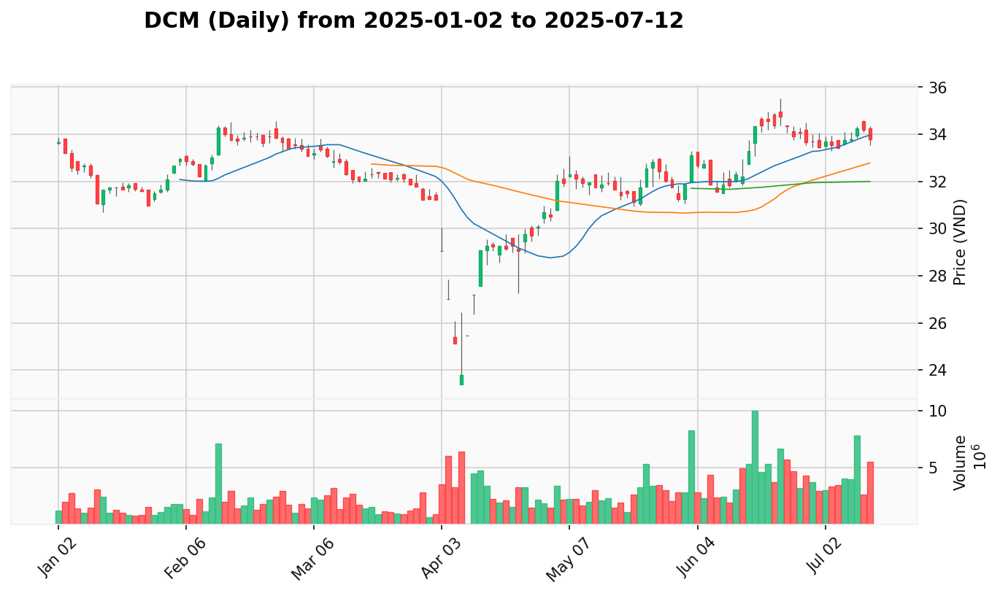

<a href="#hoa-chat">↑ Back to group HOA_CHAT</a>  |  <a href="#vpa-signal-summary">↑ Back to Top</a>

#### Key Statistics
| Metric | Value |
|:---|---:|
| Date Range | 2025-01-02 to 2025-09-26 |
| **Latest Close** | **37.5** |
| Period Open | 33.62 |
| Period High | 43.85 |
| Period Low | 23.38 |
| Period Change % | 11.54% |

**[Download DCM Data (.csv)](market_data/DCM_2025-01-02_to_2025-09-27.csv)**

---

### DDV

#### [VPA Analysis (2025-08-04 - 2025-09-26)](./VPA.md#ddv)
> **Ngày 2025-09-22:** DDV giảm từ 31.7 VND xuống 30.6 VND với khối lượng giao dịch đạt 0.6497 triệu cổ phiếu, tăng đáng kể so với phiên trước. Cây nến giảm có biên độ rộng và đóng cửa gần mức thấp nhất phiên, cho thấy áp lực bán mạnh mẽ đang chiếm ưu thế. Khối lượng tăng xác nhận sự tiếp diễn của lực cung. **Phân tích VPA/Wyckoff:** Sign of Weakness (SOW)
> **Ngày 2025-09-23:** DDV tăng nhẹ từ 30.6 VND lên 30.8 VND với khối lượng giao dịch đạt 0.2368 triệu cổ phiếu, giảm mạnh so với phiên trước. Cây nến tăng nhẹ có biên độ hẹp và đóng cửa ở giữa thân nến. Điều này cho thấy lực cầu yếu và không đủ sức đẩy giá lên cao sau hai phiên giảm mạnh. Khối lượng giảm mạnh xác nhận sự thiếu vắng của cả lực mua và lực bán, nhưng trong bối cảnh giảm giá trước đó, đây là dấu hiệu của sự yếu kém tiếp diễn. **Phân tích VPA/Wyckoff:** No Demand (Không có cầu)
> **Ngày 2025-09-24:** DDV tăng từ 30.8 VND lên 31.5 VND với khối lượng giao dịch đạt 0.3669 triệu cổ phiếu, tăng đáng kể so với phiên trước. Cây nến tăng có biên độ rộng và đóng cửa gần mức cao nhất phiên, cho thấy lực cầu đã quay trở lại và đang chiếm ưu thế sau hai phiên giảm giá và không có cầu. Khối lượng tăng xác nhận sự xuất hiện của lực mua. **Phân tích VPA/Wyckoff:** Sign of Strength (SOS)
> **Ngày 2025-09-25:** DDV tăng nhẹ từ 31.5 VND lên 31.6 VND với khối lượng giao dịch đạt 0.2154 triệu cổ phiếu, giảm mạnh so với phiên trước. Cây nến tăng nhẹ có biên độ hẹp và đóng cửa ở giữa thân nến. Điều này cho thấy lực cầu yếu và không có sự tiếp diễn sau phiên tăng mạnh trước đó. Khối lượng giảm mạnh xác nhận sự thiếu vắng của lực mua, cho thấy thị trường đang thiếu động lực tăng giá. **Phân tích VPA/Wyckoff:** No Demand (Không có cầu)
> **Ngày 2025-09-26:** DDV giảm nhẹ từ 32.3 VND xuống 32.2 VND với khối lượng giao dịch đạt 0.6173 triệu cổ phiếu, giảm đáng kể so với phiên trước. Cây nến giảm có biên độ hẹp và đóng cửa gần giữa thân nến. Điều này cho thấy lực bán không mạnh và nguồn cung đã cạn kiệt sau phiên tăng giá mạnh. Khối lượng giảm xác nhận sự thiếu vắng của áp lực bán. **Phân tích VPA/Wyckoff:** No Supply (Không có cung)

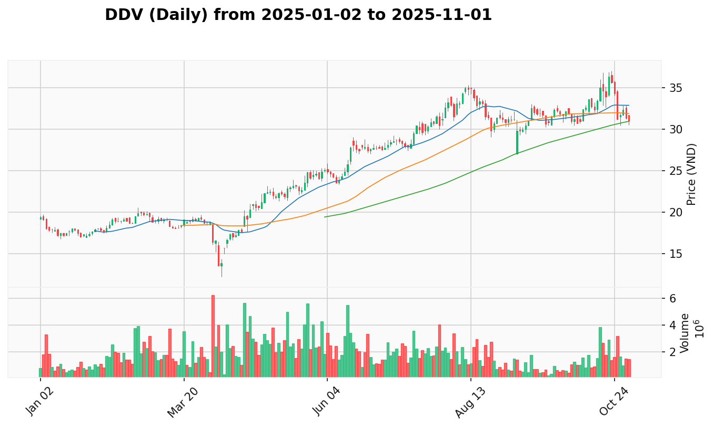

<a href="#hoa-chat">↑ Back to group HOA_CHAT</a>  |  <a href="#vpa-signal-summary">↑ Back to Top</a>

#### Key Statistics
| Metric | Value |
|:---|---:|
| Date Range | 2025-01-02 to 2025-09-26 |
| **Latest Close** | **32.2** |
| Period Open | 19.17 |
| Period High | 35.3 |
| Period Low | 12.2 |
| Period Change % | 67.97% |

**[Download DDV Data (.csv)](market_data/DDV_2025-01-02_to_2025-09-27.csv)**

---

### DGC

#### [VPA Analysis (2025-06-16 - 2025-09-26)](./VPA.md#dgc)
> **Ngày 2025-09-22:** DGC giảm từ 96.7 VND xuống 96.0 VND. Cây nến giảm có biên độ tương đối rộng, mở cửa ở 96.9 VND, dao động trong khoảng 95.3-97.4 VND và đóng cửa ở 96.0 VND, gần mức thấp nhất phiên. Khối lượng giao dịch đạt 2.09 triệu cổ phiếu, cao hơn một chút so với phiên trước (2.01 triệu cổ phiếu). Sau tín hiệu suy yếu (SOW) vào ngày 19/09, phiên này giá tiếp tục giảm với khối lượng gia tăng nhẹ, cho thấy áp lực bán vẫn duy trì và phe bán đang kiểm soát. Việc giá đóng cửa gần mức thấp nhất phiên xác nhận sự yếu kém của lực cầu. **Phân tích VPA/Wyckoff:** Continuation of Weakness (CoW) - Áp lực bán tiếp diễn.
> **Ngày 2025-09-23:** DGC giảm nhẹ từ 96.1 VND xuống 96.0 VND. Cây nến giảm có biên độ hẹp, mở cửa ở 96.1 VND, dao động trong khoảng 95.5-96.7 VND và đóng cửa ở 96.0 VND, gần mức thấp nhất phiên. Khối lượng giao dịch đạt 0.98 triệu cổ phiếu, thấp hơn đáng kể so với phiên trước (2.09 triệu cổ phiếu). Sau hai phiên giảm mạnh với khối lượng cao (SOW và CoW), phiên này giá tiếp tục giảm nhẹ nhưng với khối lượng rất thấp. Điều này cho thấy áp lực bán đã giảm đi đáng kể, nhưng đồng thời cũng không có lực cầu đủ mạnh để đẩy giá lên. Việc giá đóng cửa gần mức thấp nhất phiên, dù với khối lượng thấp, vẫn thể hiện sự yếu kém của thị trường. **Phân tích VPA/Wyckoff:** No Demand (ND) - Lực bán suy yếu nhưng lực cầu vẫn vắng mặt.
> **Ngày 2025-09-24:** DGC tăng từ 96.0 VND lên 97.0 VND. Cây nến tăng có biên độ tương đối rộng, mở cửa ở 96.1 VND, dao động trong khoảng 95.0-97.0 VND và đóng cửa ở 97.0 VND, tại mức cao nhất phiên. Khối lượng giao dịch đạt 0.91 triệu cổ phiếu, thấp hơn đáng kể so với phiên trước (0.98 triệu cổ phiếu) và là mức thấp nhất trong 10 phiên gần đây. Sau tín hiệu "No Demand" vào ngày 23/09, phiên này giá tăng nhưng với khối lượng tiếp tục giảm mạnh, cho thấy lực cầu vẫn rất yếu và không có sự tham gia của dòng tiền lớn để hỗ trợ đà tăng. Việc giá đóng cửa tại mức cao nhất phiên nhưng với khối lượng thấp cho thấy đây có thể là một đợt tăng giá không bền vững hoặc một nỗ lực kiểm tra nguồn cung. **Phân tích VPA/Wyckoff:** No Demand (ND) - Lực cầu yếu.
> **Ngày 2025-09-25:** DGC giảm từ 97.0 VND xuống 96.0 VND. Cây nến giảm có biên độ hẹp, mở cửa ở 96.6 VND, dao động trong khoảng 96.0-96.9 VND và đóng cửa ở 96.0 VND, tại mức thấp nhất phiên. Khối lượng giao dịch đạt 0.64 triệu cổ phiếu, tiếp tục giảm mạnh so với phiên trước (0.91 triệu cổ phiếu) và là mức thấp nhất trong 10 phiên gần đây. Sau hai phiên "No Demand" liên tiếp, phiên này giá tiếp tục giảm với khối lượng cực thấp, cho thấy lực cầu hoàn toàn vắng mặt và thị trường vẫn đang rất yếu. Việc giá đóng cửa tại mức thấp nhất phiên, dù với khối lượng thấp, xác nhận sự thiếu hụt lực mua và áp lực giảm giá vẫn còn. **Phân tích VPA/Wyckoff:** No Demand (ND) - Lực cầu hoàn toàn vắng mặt.
> **Ngày 2025-09-26:** DGC giảm từ 96.5 VND xuống 95.4 VND. Cây nến giảm có biên độ tương đối hẹp, mở cửa ở 96.5 VND, dao động trong khoảng 95.4-96.5 VND và đóng cửa ở 95.4 VND, tại mức thấp nhất phiên. Khối lượng giao dịch đạt 0.96 triệu cổ phiếu, tiếp tục giảm so với phiên trước (0.99 triệu cổ phiếu) và duy trì ở mức rất thấp trong những phiên gần đây. Sau hai phiên "No Demand" liên tiếp, phiên này giá tiếp tục giảm với khối lượng thấp, cho thấy lực cầu vẫn vắng mặt và áp lực bán nhẹ đang chiếm ưu thế. Việc giá đóng cửa tại mức thấp nhất phiên với khối lượng thấp xác nhận sự yếu kém của thị trường và thiếu hụt lực mua. **Phân tích VPA/Wyckoff:** No Demand (ND) - Lực cầu tiếp tục vắng mặt.

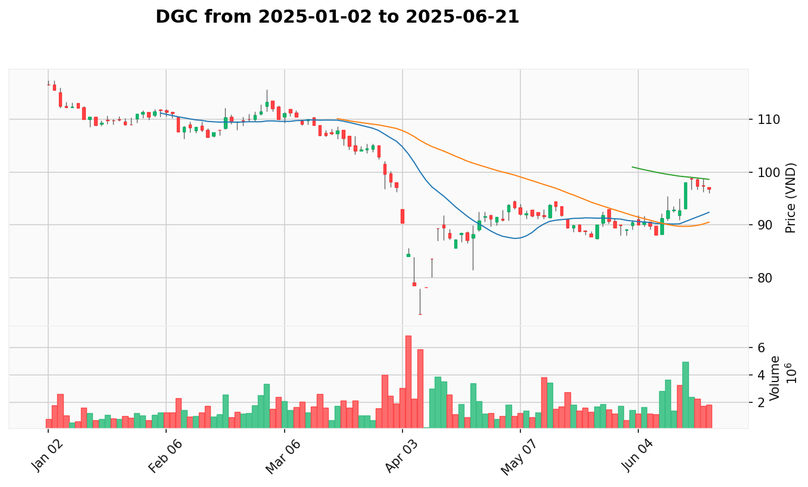

<a href="#hoa-chat">↑ Back to group HOA_CHAT</a>  |  <a href="#vpa-signal-summary">↑ Back to Top</a>

#### Key Statistics
| Metric | Value |
|:---|---:|
| Date Range | 2025-01-02 to 2025-09-26 |
| **Latest Close** | **95.4** |
| Period Open | 116.6 |
| Period High | 117.3 |
| Period Low | 73.1 |
| Period Change % | -18.18% |

**[Download DGC Data (.csv)](market_data/DGC_2025-01-02_to_2025-09-27.csv)**

---

### DGW

#### [VPA Analysis (2025-06-26 - 2025-09-26)](./VPA.md#dgw)
> **Ngày 2025-09-22:** DGW giảm từ 43.2 xuống 41.75 với khối lượng giao dịch đạt 2.5932 triệu cổ phiếu, giảm 3.36% so với phiên trước. Cây nến giảm giá có biên độ rộng và đóng cửa ở mức thấp nhất phiên, cho thấy áp lực bán mạnh mẽ và nguồn cung vẫn đang chiếm ưu thế. Khối lượng giao dịch tăng mạnh hơn gấp đôi so với phiên trước, xác nhận sự tiếp diễn của xu hướng giảm giá và sự hiện diện của lực bán chủ động. **Phân tích VPA/Wyckoff:** Sign of Weakness (SOW) - Áp lực bán mạnh mẽ với khối lượng gia tăng.
> **Ngày 2025-09-23:** DGW tăng từ 41.75 lên 41.9 với khối lượng giao dịch đạt 0.7786 triệu cổ phiếu, giảm mạnh so với phiên trước (2.5932 triệu cổ phiếu). Cây nến tăng giá có biên độ hẹp và khối lượng thấp cho thấy lực cầu yếu, không đủ để đảo chiều xu hướng giảm giá đã thiết lập. Đây là dấu hiệu của sự thiếu cầu sau áp lực bán mạnh mẽ của các phiên trước. **Phân tích VPA/Wyckoff:** Sign of Weakness (SOW) - Thiếu cầu (No Demand) sau áp lực bán mạnh.
> **Ngày 2025-09-24:** DGW tăng từ 41.9 lên 42.95 với khối lượng giao dịch đạt 1.3766 triệu cổ phiếu. Cây nến tăng giá có biên độ rộng và đóng cửa gần mức cao nhất phiên, cho thấy lực cầu đã xuất hiện trở lại sau hai phiên giảm điểm và thiếu cầu. Khối lượng giao dịch tăng so với phiên trước nhưng vẫn ở mức trung bình, cho thấy sự kiểm tra nguồn cung và có thể là một nhịp hồi phục kỹ thuật. **Phân tích VPA/Wyckoff:** Sign of Strength (SOS) - Lực cầu xuất hiện trở lại, kiểm tra nguồn cung.
> **Ngày 2025-09-25:** DGW giảm từ 42.95 xuống 42.45 với khối lượng giao dịch đạt 0.4845 triệu cổ phiếu, giảm mạnh so với phiên trước (1.3766 triệu cổ phiếu). Cây nến giảm giá có biên độ hẹp và đóng cửa gần mức thấp nhất phiên, cho thấy lực cầu yếu và không duy trì được đà tăng của phiên trước. Khối lượng giao dịch cực thấp trong phiên giảm giá này xác nhận sự thiếu vắng của lực cầu, đồng thời cũng cho thấy áp lực bán không quá mạnh nhưng không có bên mua đỡ giá. **Phân tích VPA/Wyckoff:** Sign of Weakness (SOW) - Thiếu cầu (No Demand).
> **Ngày 2025-09-26:** DGW giảm từ 42.4 xuống 41.5 với khối lượng giao dịch đạt 1.9573 triệu cổ phiếu. Cây nến giảm giá có biên độ rộng và đóng cửa gần mức thấp nhất phiên, cho thấy áp lực bán gia tăng đáng kể sau phiên thiếu cầu trước đó. Khối lượng giao dịch tăng mạnh so với phiên trước, xác nhận sự xuất hiện của lực cung mạnh mẽ. Điều này cho thấy xu hướng giảm giá có thể tiếp diễn. **Phân tích VPA/Wyckoff:** Sign of Weakness (SOW) - Lực cung mạnh mẽ.

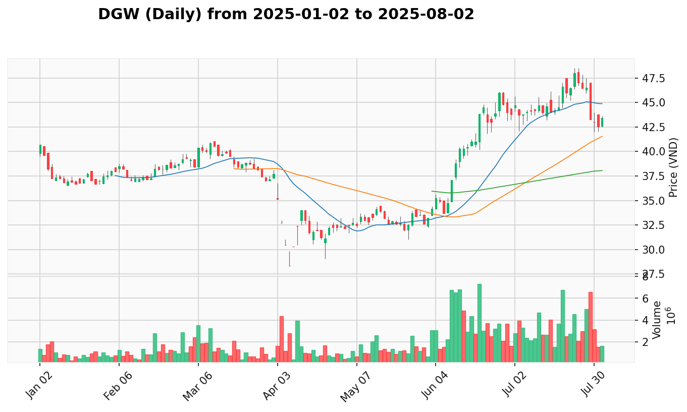

<a href="#ban-le">↑ Back to group BAN_LE</a>  |  <a href="#vpa-signal-summary">↑ Back to Top</a>

#### Key Statistics
| Metric | Value |
|:---|---:|
| Date Range | 2025-01-02 to 2025-09-26 |
| **Latest Close** | **41.5** |
| Period Open | 39.84 |
| Period High | 49.5 |
| Period Low | 28.32 |
| Period Change % | 4.17% |

**[Download DGW Data (.csv)](market_data/DGW_2025-01-02_to_2025-09-27.csv)**

---

### DHA

#### [VPA Analysis (2025-08-13 - 2025-09-26)](./VPA.md#dha)
> **Ngày 2025-09-22:** DHA tăng từ 51.7 VND lên 52.4 VND, đóng cửa cao hơn phiên trước. Biên độ giao dịch rộng và giá đóng cửa ở giữa đến trên của thân nến. Khối lượng giao dịch đạt 0.185 triệu cổ phiếu, cao hơn đáng kể so với phiên trước (0.068 triệu cổ phiếu). Sau phiên No Demand ngày 2025-09-19, lực cầu đã trở lại mạnh mẽ, đẩy giá tăng với khối lượng gia tăng, cho thấy sự phục hồi và sức mạnh. **Phân tích VPA/Wyckoff:** Sign of Strength (SOS) - Lực cầu mạnh mẽ trở lại.
> **Ngày 2025-09-23:** DHA giảm từ 52.4 VND xuống 52.0 VND. Biên độ giao dịch hẹp và giá đóng cửa ở giữa thân nến. Khối lượng giao dịch đạt 0.0427 triệu cổ phiếu, thấp hơn đáng kể so với phiên trước (0.185 triệu cổ phiếu). Sau phiên SOS ngày 2025-09-22, việc giá giảm nhẹ với khối lượng thấp cho thấy lực cung yếu và thị trường đang kiểm tra lại nguồn cung. Điều này có thể là dấu hiệu của sự thiếu hụt nguồn cung sau một phiên tăng giá mạnh. **Phân tích VPA/Wyckoff:** No Supply (NS) - Lực cung yếu.
> **Ngày 2025-09-24:** DHA giảm từ 52.0 VND xuống 51.0 VND. Biên độ giao dịch hẹp và giá đóng cửa ở gần mức thấp nhất phiên. Khối lượng giao dịch đạt 0.0749 triệu cổ phiếu, cao hơn so với phiên trước (0.0427 triệu cổ phiếu). Sau phiên No Supply ngày 2025-09-23, việc giá giảm với khối lượng gia tăng cho thấy lực cung đã xuất hiện trở lại. **Phân tích VPA/Wyckoff:** Supply Coming In (SCI) - Lực cung xuất hiện.
> **Ngày 2025-09-25:** DHA giữ nguyên mức giá đóng cửa 51.0 VND so với phiên trước. Biên độ giao dịch hẹp từ 50.7 VND đến 51.9 VND và giá đóng cửa ở mức mở cửa, gần mức thấp nhất phiên. Khối lượng giao dịch đạt 0.0386 triệu cổ phiếu, giảm đáng kể so với phiên trước (0.075152 triệu cổ phiếu). Sau phiên Lực cung xuất hiện (SCI) ngày 2025-09-24, việc giá đi ngang với khối lượng rất thấp cho thấy lực cung đã tạm thời cạn kiệt nhưng lực cầu cũng không đủ mạnh để đẩy giá lên. Điều này có thể là dấu hiệu của sự thiếu vắng nhu cầu mua. **Phân tích VPA/Wyckoff:** No Demand (ND) - Lực cầu yếu.
> **Ngày 2025-09-26:** DHA giảm từ 51.0 VND xuống 50.8 VND. Biên độ giao dịch hẹp và giá đóng cửa ở gần mức thấp nhất phiên. Khối lượng giao dịch đạt 0.119 triệu cổ phiếu, cao hơn đáng kể so với phiên trước (0.097962 triệu cổ phiếu). Sau phiên Lực cầu yếu (ND) ngày 2025-09-25, việc giá giảm với khối lượng gia tăng cho thấy lực cung đã xuất hiện trở lại và đang chiếm ưu thế. **Phân tích VPA/Wyckoff:** Supply Coming In (SCI) - Lực cung xuất hiện.

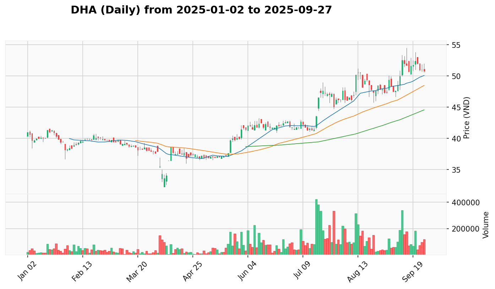

<a href="#vlxd">↑ Back to group VLXD</a>  |  <a href="#vpa-signal-summary">↑ Back to Top</a>

#### Key Statistics
| Metric | Value |
|:---|---:|
| Date Range | 2025-01-02 to 2025-09-26 |
| **Latest Close** | **50.8** |
| Period Open | 40.38 |
| Period High | 54.5 |
| Period Low | 32.23 |
| Period Change % | 25.80% |

**[Download DHA Data (.csv)](market_data/DHA_2025-01-02_to_2025-09-27.csv)**

---

### DHC

#### [VPA Analysis (2025-08-14 - 2025-09-26)](./VPA.md#dhc)
> **Ngày 2025-09-22:** DHC giảm từ 37.85 VND xuống 36.55 VND với khối lượng giao dịch đạt 0.5908 triệu cổ phiếu, thấp hơn so với các phiên tăng mạnh trước đó. Cây nến giảm có biên độ rộng và đóng cửa gần mức thấp nhất phiên, cho thấy áp lực bán xuất hiện và hấp thụ lực cầu, đảo ngược tín hiệu sức mạnh từ các phiên trước. **Phân tích VPA/Wyckoff:** Sign of Weakness (SOW)
> **Ngày 2025-09-23:** DHC giảm từ 36.1 VND xuống 35.8 VND với khối lượng giao dịch đạt 0.3737 triệu cổ phiếu, thấp hơn đáng kể so với phiên trước. Cây nến giảm có biên độ hẹp và đóng cửa gần mức thấp nhất phiên, cho thấy áp lực bán đã giảm nhưng lực cầu vẫn yếu, không có sự hấp thụ đáng kể. **Phân tích VPA/Wyckoff:** No Demand (ND)
> **Ngày 2025-09-24:** DHC tăng từ 35.35 VND lên 35.9 VND với khối lượng giao dịch đạt 0.643 triệu cổ phiếu, cao hơn đáng kể so với phiên trước. Cây nến tăng có biên độ tương đối rộng và đóng cửa gần mức cao nhất phiên, cho thấy lực cầu đã xuất hiện và hấp thụ một phần áp lực bán sau hai phiên giảm giá, đảo ngược tín hiệu yếu từ các phiên trước. **Phân tích VPA/Wyckoff:** Sign of Strength (SOS)
> **Ngày 2025-09-25:** DHC giảm từ 36.5 VND xuống 35.0 VND với khối lượng giao dịch đạt 0.1769 triệu cổ phiếu, rất thấp so với phiên trước. Cây nến giảm có biên độ tương đối rộng và đóng cửa gần mức thấp nhất phiên, cho thấy lực bán đã xuất hiện nhưng không mạnh, đồng thời lực cầu cũng rất yếu, không có sự hấp thụ đáng kể sau phiên SOS trước đó. **Phân tích VPA/Wyckoff:** No Demand (ND)
> **Ngày 2025-09-26:** DHC giảm từ 35.05 VND xuống 34.7 VND với khối lượng giao dịch đạt 0.1501 triệu cổ phiếu, rất thấp so với phiên trước. Cây nến giảm có biên độ hẹp và đóng cửa ở mức thấp nhất phiên, cho thấy áp lực bán đã cạn kiệt nhưng lực cầu vẫn chưa xuất hiện. Sau tín hiệu 'No Demand' của phiên trước, việc giá tiếp tục giảm với khối lượng cực thấp cho thấy thị trường đang kiểm tra mức hỗ trợ và không tìm thấy nhiều nguồn cung, tuy nhiên, việc đóng cửa ở mức thấp nhất phiên cho thấy sự yếu kém tạm thời. **Phân tích VPA/Wyckoff:** No Supply (NS)

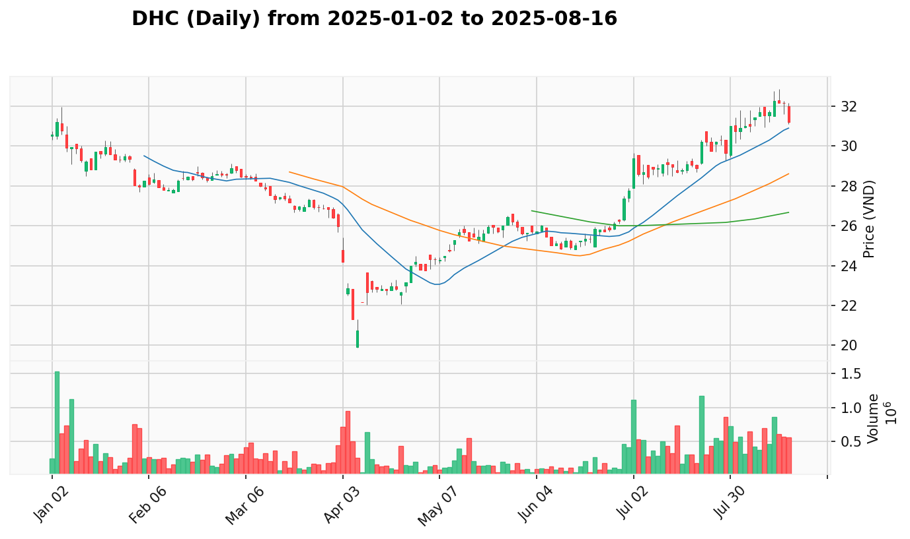

<a href="#others">↑ Back to group OTHERS</a>  |  <a href="#vpa-signal-summary">↑ Back to Top</a>

#### Key Statistics
| Metric | Value |
|:---|---:|
| Date Range | 2025-01-02 to 2025-09-26 |
| **Latest Close** | **34.7** |
| Period Open | 30.52 |
| Period High | 37.95 |
| Period Low | 19.87 |
| Period Change % | 13.70% |

**[Download DHC Data (.csv)](market_data/DHC_2025-01-02_to_2025-09-27.csv)**

---

### DHG

#### [VPA Analysis (2025-06-16 - 2025-09-26)](./VPA.md#dhg)
> **Ngày 2025-09-22:** DHG giữ giá 102.0 VND. Cây nến có biên độ hẹp (từ 101.7 VND đến 102.0 VND) và đóng cửa bằng giá mở cửa. Khối lượng giao dịch đạt 0.0113 triệu cổ phiếu, giảm so với phiên trước (0.0132 triệu cổ phiếu). Sau phiên SOW ngày 2025-09-19, giá đi ngang với khối lượng thấp cho thấy áp lực bán đã giảm nhưng lực cầu vẫn chưa xuất hiện. Điều này cho thấy sự thiếu vắng lực cầu tiếp diễn. **Phân tích VPA/Wyckoff:** No Demand (Thiếu cầu)
> **Ngày 2025-09-23:** DHG tăng từ 102.0 VND lên 102.2 VND. Cây nến tăng có biên độ tương đối rộng nhưng đóng cửa ở giữa thân nến, cho thấy lực mua không mạnh. Khối lượng giao dịch đạt 0.008 triệu cổ phiếu, giảm so với phiên trước (0.0113 triệu cổ phiếu). Sau phiên Thiếu cầu ngày 2025-09-22, giá tăng nhẹ với khối lượng thấp cho thấy lực cầu vẫn yếu và thị trường vẫn đang thiếu động lực tăng giá. **Phân tích VPA/Wyckoff:** No Demand (Thiếu cầu)
> **Ngày 2025-09-24:** DHG giảm từ 102.2 VND xuống 101.9 VND. Cây nến có biên độ tương đối hẹp (từ 101.2 VND đến 102.0 VND) và đóng cửa thấp hơn phiên trước. Khối lượng giao dịch đạt 0.0097 triệu cổ phiếu, tăng so với phiên trước (0.008 triệu cổ phiếu). Sau hai phiên Thiếu cầu liên tiếp, sự giảm giá với khối lượng tăng cho thấy áp lực bán đang gia tăng trên thị trường. **Phân tích VPA/Wyckoff:** Dấu hiệu suy yếu (SOW)
> **Ngày 2025-09-25:** DHG tăng từ 101.9 VND lên 102.0 VND. Cây nến tăng có biên độ hẹp và đóng cửa gần mức cao nhất phiên. Khối lượng giao dịch đạt 0.0037 triệu cổ phiếu, giảm mạnh so với phiên trước (0.0097 triệu cổ phiếu). Sau dấu hiệu suy yếu (SOW) ngày 2025-09-24, việc giá tăng nhẹ với khối lượng rất thấp cho thấy lực cầu yếu và thị trường vẫn đang thiếu động lực tăng giá. **Phân tích VPA/Wyckoff:** No Demand (Thiếu cầu)
> **Ngày 2025-09-26:** DHG giảm từ 101.9 VND xuống 101.8 VND. Cây nến có biên độ hẹp (từ 101.6 VND đến 101.9 VND) và đóng cửa gần mức thấp nhất phiên. Khối lượng giao dịch đạt 0.0043 triệu cổ phiếu, giảm nhẹ so với phiên trước (0.0045 triệu cổ phiếu). Sau phiên Thiếu cầu ngày 2025-09-25, việc giá giảm nhẹ với khối lượng tiếp tục thấp cho thấy lực cầu vẫn yếu và thị trường chưa có động lực tăng giá rõ ràng. **Phân tích VPA/Wyckoff:** Thiếu cầu tiếp diễn

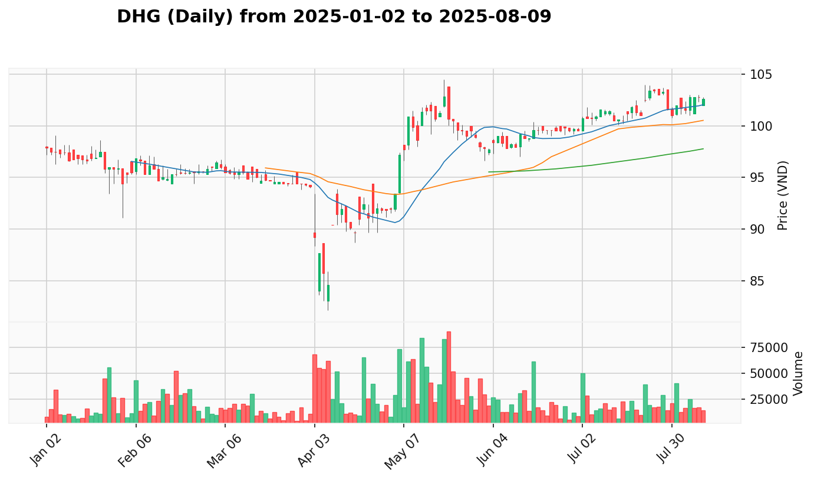

<a href="#suc-khoe">↑ Back to group SUC_KHOE</a>  |  <a href="#vpa-signal-summary">↑ Back to Top</a>

#### Key Statistics
| Metric | Value |
|:---|---:|
| Date Range | 2025-01-02 to 2025-09-26 |
| **Latest Close** | **101.8** |
| Period Open | 97.96 |
| Period High | 104.47 |
| Period Low | 82.1 |
| Period Change % | 3.92% |

**[Download DHG Data (.csv)](market_data/DHG_2025-01-02_to_2025-09-27.csv)**

---

### DHT

#### [VPA Analysis (2025-08-14 - 2025-09-26)](./VPA.md#dht)
> **Ngày 2025-09-22:** DHT mở cửa ở mức 86.5 VND và đóng cửa ở mức 85.0 VND, không thay đổi so với giá đóng cửa phiên trước. Nến giảm có biên độ tương đối rộng, giá mở cửa bằng giá cao nhất phiên, cho thấy áp lực bán xuất hiện ngay từ đầu phiên. Khối lượng giao dịch đạt 0.0044 triệu cổ phiếu, cao hơn đáng kể so với phiên trước (0.0027 triệu cổ phiếu) và phiên kiểm tra nguồn cung (0.0031 triệu cổ phiếu). Việc giá không thể giữ được mức tăng ban đầu và giảm trở lại với khối lượng gia tăng sau phiên "Không có cầu" xác nhận nguồn cung vẫn đang chiếm ưu thế và lực cầu yếu. Điều này cho thấy thị trường vẫn đang trong giai đoạn yếu. **Phân tích VPA/Wyckoff:** Yếu (Weakness)
> **Ngày 2025-09-23:** DHT giảm từ 85.0 VND xuống 84.8 VND. Nến giảm có biên độ hẹp, giá mở cửa bằng giá cao nhất phiên, cho thấy áp lực bán nhẹ. Khối lượng giao dịch đạt 0.0015 triệu cổ phiếu, cực kỳ thấp, thấp hơn đáng kể so với phiên trước (0.0044 triệu cổ phiếu) và là mức thấp nhất trong 10 phiên gần đây. Điều này xác nhận sự thiếu vắng lực cầu và sự thờ ơ của thị trường sau các phiên "Yếu" và "Không có cầu" trước đó. Giá giảm với khối lượng cực thấp cho thấy không có lực mua đáng kể để hỗ trợ giá, và thị trường vẫn đang trong giai đoạn yếu. **Phân tích VPA/Wyckoff:** No Demand (Không có cầu)
> **Ngày 2025-09-24:** DHT tăng từ 84.8 VND lên 84.9 VND. Nến tăng có biên độ tương đối rộng, đóng cửa gần mức cao nhất phiên, cho thấy lực mua đã xuất hiện. Khối lượng giao dịch đạt 0.0048 triệu cổ phiếu, cao hơn đáng kể so với phiên trước (0.0015 triệu cổ phiếu) và phiên 2025-09-22 (0.0044 triệu cổ phiếu). Sau các phiên "Yếu" và "Không có cầu", sự gia tăng về giá và khối lượng này cho thấy nỗ lực đẩy giá lên của phe mua, tuy nhiên vẫn cần thêm xác nhận về sức mạnh của lực cầu. **Phân tích VPA/Wyckoff:** Effort to Rise (Nỗ lực tăng giá)
> **Ngày 2025-09-25:** DHT tăng từ 84.9 VND lên 85.9 VND. Nến tăng có biên độ rộng, đóng cửa ở mức cao nhất phiên, cho thấy lực mua chiếm ưu thế. Tuy nhiên, khối lượng giao dịch chỉ đạt 0.0003 triệu cổ phiếu, cực kỳ thấp, thấp hơn đáng kể so với phiên trước (0.0048 triệu cổ phiếu) và là mức thấp nhất trong 10 phiên gần đây. Sự tăng giá mạnh mẽ với khối lượng cực thấp này cho thấy thiếu sự tham gia của thị trường và không có lực cầu thực sự mạnh mẽ để hỗ trợ đà tăng. Điều này có thể là một dấu hiệu của sự yếu kém tiềm ẩn sau nỗ lực tăng giá của phiên trước. **Phân tích VPA/Wyckoff:** Lack of Demand (Thiếu cầu)
> **Ngày 2025-09-26:** DHT mở cửa ở mức 85.8 VND, cao hơn giá đóng cửa phiên trước, nhưng sau đó giảm xuống và đóng cửa ở mức 84.0 VND, bằng với giá đóng cửa phiên trước. Nến giảm có biên độ tương đối rộng, cho thấy áp lực bán đã xuất hiện mạnh mẽ trong phiên. Khối lượng giao dịch đạt 0.0032 triệu cổ phiếu, cao hơn đáng kể so với phiên trước (0.0008 triệu cổ phiếu). Sự thất bại trong việc duy trì mức giá mở cửa cao hơn cùng với khối lượng gia tăng cho thấy cung đang chiếm ưu thế và lực cầu yếu. **Phân tích VPA/Wyckoff:** Supply Coming In (Cung xuất hiện)

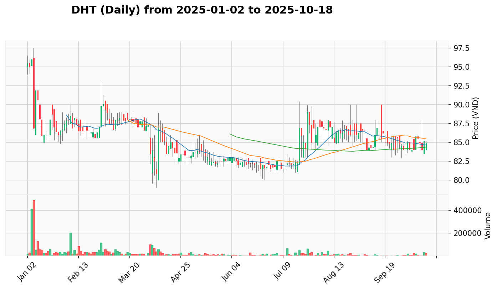

<a href="#suc-khoe">↑ Back to group SUC_KHOE</a>  |  <a href="#vpa-signal-summary">↑ Back to Top</a>

#### Key Statistics
| Metric | Value |
|:---|---:|
| Date Range | 2025-01-02 to 2025-09-26 |
| **Latest Close** | **84.0** |
| Period Open | 95.0 |
| Period High | 97.5 |
| Period Low | 79.0 |
| Period Change % | -11.58% |

**[Download DHT Data (.csv)](market_data/DHT_2025-01-02_to_2025-09-27.csv)**

---

### DIG

#### [VPA Analysis (2025-08-04 - 2025-09-26)](./VPA.md#dig)
> **Ngày 2025-09-22:** DIG tăng từ 24.5 lên 24.8 với khối lượng giao dịch đạt 30.0586 triệu cổ phiếu, cao hơn đáng kể so với phiên trước. Nến ngày tăng điểm với biên độ vừa phải, đóng cửa trên mức mở cửa, cho thấy lực cầu tiếp tục gia tăng và chiếm ưu thế. Mặc dù có áp lực bán ở vùng giá cao (25.4), nhưng sự tăng giá với khối lượng lớn xác nhận sự hiện diện của dòng tiền. Cổ phiếu đang cho thấy những dấu hiệu tích cực hơn sau giai đoạn suy yếu. **Phân tích VPA/Wyckoff:** Nỗ lực tăng giá
> **Ngày 2025-09-23:** DIG giảm từ 24.8 xuống 24.2 với khối lượng giao dịch đạt 11.6808 triệu cổ phiếu, thấp hơn đáng kể so với phiên trước. Nến ngày giảm điểm với biên độ vừa phải, đóng cửa gần mức thấp nhất phiên, cho thấy lực cung đã xuất hiện và lực cầu suy yếu rõ rệt sau những nỗ lực tăng giá trước đó. Khối lượng thấp trong phiên giảm cho thấy áp lực bán không quá mạnh, nhưng đồng thời cũng thể hiện sự thiếu vắng của lực cầu hỗ trợ giá. Cổ phiếu cần thêm thời gian để xác định xu hướng tiếp theo, đặc biệt là cần sự trở lại của dòng tiền để duy trì đà tăng. **Phân tích VPA/Wyckoff:** Thiếu cầu (No Demand)
> **Ngày 2025-09-24:** DIG tăng từ 24.2 lên 25.5 với khối lượng giao dịch đạt 28.2525 triệu cổ phiếu, cao hơn đáng kể so với phiên trước. Nến ngày tăng điểm mạnh với biên độ rộng, đóng cửa ở mức cao nhất phiên, cho thấy lực cầu áp đảo và sự trở lại mạnh mẽ của dòng tiền, phủ nhận tín hiệu thiếu cầu của phiên trước. **Phân tích VPA/Wyckoff:** Sign of Strength (SOS)
> **Ngày 2025-09-25:** DIG tăng từ 25.5 lên 25.9 với khối lượng giao dịch đạt 16.4964 triệu cổ phiếu, thấp hơn đáng kể so với phiên trước. Nến ngày tăng điểm với biên độ vừa phải, đóng cửa ở nửa trên của thân nến, cho thấy lực cầu đã suy yếu sau phiên tăng mạnh trước đó và không đủ sức đẩy giá lên cao hơn với khối lượng lớn. Điều này có thể báo hiệu một sự tạm dừng hoặc kiểm tra lại nguồn cung. **Phân tích VPA/Wyckoff:** Thiếu cầu
> **Ngày 2025-09-26:** DIG giảm từ 25.3 VND xuống 25.15 VND với khối lượng giao dịch đạt 21.6954 triệu cổ phiếu, thấp hơn đáng kể so với phiên trước. Nến ngày giảm điểm với biên độ hẹp, đóng cửa ở giữa thân nến, cho thấy lực cung không quá mạnh và có thể là một phiên điều chỉnh tự nhiên sau tín hiệu thiếu cầu của phiên trước. **Phân tích VPA/Wyckoff:** No Demand (ND)

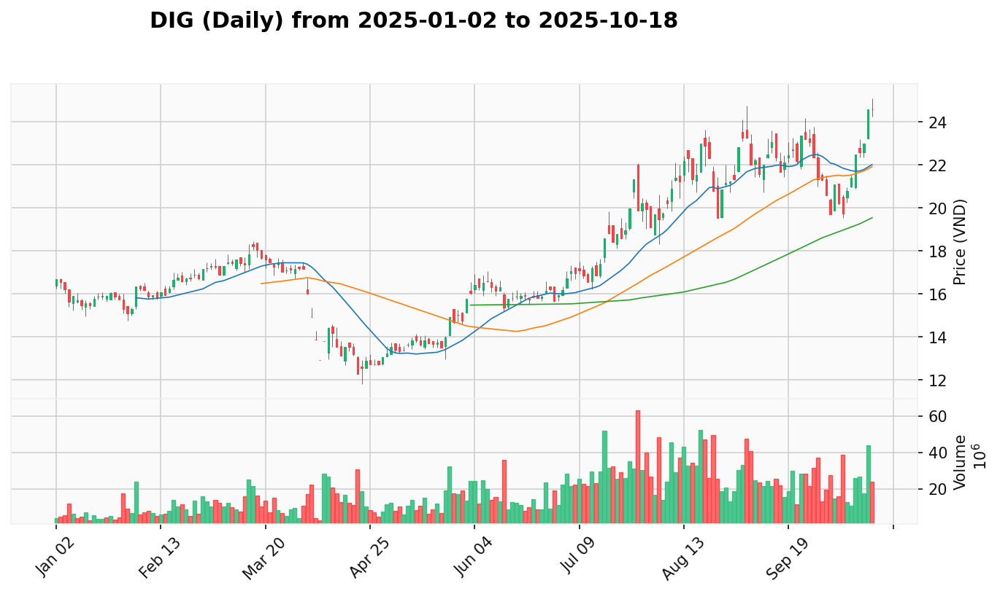

<a href="#bat-dong-san">↑ Back to group BAT_DONG_SAN</a>  |  <a href="#vpa-signal-summary">↑ Back to Top</a>

#### Key Statistics
| Metric | Value |
|:---|---:|
| Date Range | 2025-01-02 to 2025-09-26 |
| **Latest Close** | **25.15** |
| Period Open | 17.88 |
| Period High | 27.0 |
| Period Low | 12.88 |
| Period Change % | 40.66% |

**[Download DIG Data (.csv)](market_data/DIG_2025-01-02_to_2025-09-27.csv)**

---

### DL1

#### [VPA Analysis (2025-08-14 - 2025-09-26)](./VPA.md#dl1)
> **Ngày 2025-09-22:** DL1 giữ nguyên ở mức 6.5 VND, với khối lượng giao dịch tăng lên 0.5928 triệu cổ phiếu. Cây nến có biên độ hẹp và đóng cửa ngang giá mở cửa, cho thấy sự lưỡng lự. Sau hai phiên "Không có cầu" liên tiếp, phiên hôm nay khối lượng tăng nhưng giá không thể bứt phá lên, cho thấy lực cầu vẫn chưa đủ mạnh để hấp thụ hết lực cung hoặc thị trường vẫn đang trong giai đoạn tích lũy/phân phối yếu. Điều này củng cố thêm nhận định về sự thiếu động lực tăng giá. **Phân tích VPA/Wyckoff:** No Demand (Không có cầu)
> **Ngày 2025-09-23:** DL1 giữ nguyên ở mức 6.5 VND, với khối lượng giao dịch giảm mạnh xuống 0.3208 triệu cổ phiếu. Cây nến có biên độ hẹp và đóng cửa ở mức 6.5 VND, tương đương giá đóng cửa phiên trước. Khối lượng giao dịch cực thấp cho thấy sự thờ ơ của cả bên mua và bên bán, củng cố thêm nhận định về việc thiếu vắng lực cầu sau hai phiên "Không có cầu" liên tiếp. Giá vẫn đang duy trì quanh vùng 6.5 VND nhưng không có động lực tăng giá rõ ràng. **Phân tích VPA/Wyckoff:** No Demand (Không có cầu)
> **Ngày 2025-09-24:** DL1 tăng nhẹ từ 6.5 VND lên 6.6 VND, với khối lượng giao dịch rất thấp, chỉ đạt 0.2315 triệu cổ phiếu. Cây nến có biên độ hẹp và đóng cửa ở mức 6.6 VND. Khối lượng này thấp hơn đáng kể so với phiên trước (0.3208 triệu cổ phiếu) và các phiên "Không có cầu" gần đây. Điều này cho thấy dù giá có sự tăng nhẹ nhưng không được hỗ trợ bởi lực cầu mạnh mẽ, phản ánh sự thờ ơ tiếp tục của thị trường và thiếu động lực tăng giá. **Phân tích VPA/Wyckoff:** No Demand (Không có cầu)
> **Ngày 2025-09-25:** DL1 giữ nguyên ở mức 6.6 VND, với khối lượng giao dịch tiếp tục giảm mạnh xuống chỉ còn 0.1594 triệu cổ phiếu. Cây nến có biên độ hẹp và đóng cửa ở mức 6.6 VND, tương đương giá đóng cửa phiên trước. Khối lượng giao dịch cực kỳ thấp, là mức thấp nhất trong 10 phiên gần đây, cho thấy sự thờ ơ tột độ của thị trường và thiếu vắng hoàn toàn lực cầu. Giá vẫn đang duy trì quanh vùng 6.5-6.6 VND nhưng không có bất kỳ động lực tăng giá nào. **Phân tích VPA/Wyckoff:** No Demand (Không có cầu)
> **Ngày 2025-09-26:** DL1 giảm từ 6.6 VND xuống 6.5 VND, với khối lượng giao dịch thấp, đạt 0.2401 triệu cổ phiếu. Cây nến có biên độ hẹp và đóng cửa ở mức thấp nhất phiên. Khối lượng này thấp hơn so với phiên trước và cho thấy sự tiếp diễn của tình trạng thiếu cầu. Mặc dù giá giảm, nhưng khối lượng không tăng đột biến, cho thấy áp lực bán chưa quá mạnh nhưng lực cầu vẫn vắng bóng. **Phân tích VPA/Wyckoff:** No Demand (Không có cầu)

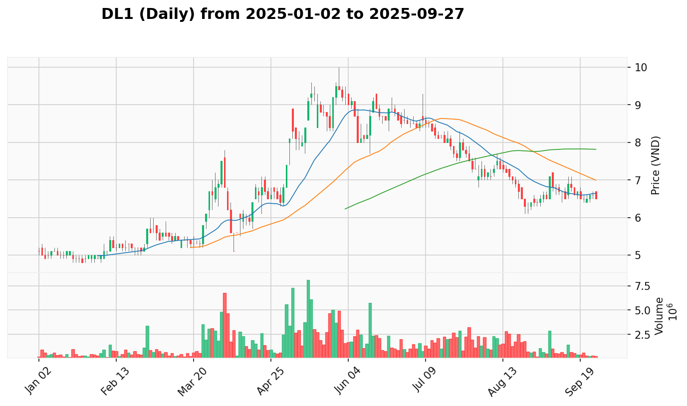

<a href="#penny">↑ Back to group PENNY</a>  |  <a href="#vpa-signal-summary">↑ Back to Top</a>

#### Key Statistics
| Metric | Value |
|:---|---:|
| Date Range | 2025-01-02 to 2025-09-26 |
| **Latest Close** | **6.5** |
| Period Open | 5.1 |
| Period High | 10.0 |
| Period Low | 4.8 |
| Period Change % | 27.45% |

**[Download DL1 Data (.csv)](market_data/DL1_2025-01-02_to_2025-09-27.csv)**

---

### DPG

#### [VPA Analysis (2025-08-14 - 2025-09-26)](./VPA.md#dpg)
> **Ngày 2025-09-22:** DPG mở cửa ở mức 46.0 VND và đóng cửa ở mức 44.85 VND, giảm so với mức đóng cửa 45.6 VND của phiên trước. Cây nến có biên độ rộng (từ 44.0 VND đến 46.3 VND) và đóng cửa gần mức thấp nhất phiên, cho thấy áp lực bán. Khối lượng giao dịch đạt 1.3835 triệu cổ phiếu, thấp hơn so với 1.5646 triệu cổ phiếu của phiên trước. Sau phiên 'Sign of Strength' ngày 2025-09-19, việc giá giảm với khối lượng thấp và đóng cửa yếu cho thấy lực cầu không đủ mạnh để duy trì đà tăng, hoặc nguồn cung đã xuất hiện trở lại và không có lực cầu hấp thụ. **Phân tích VPA/Wyckoff:** No Demand (Thiếu cầu)
> **Ngày 2025-09-23:** DPG mở cửa ở mức 45.4 VND và đóng cửa ở mức 45.5 VND, tăng nhẹ so với mức đóng cửa 44.85 VND của phiên trước. Cây nến tăng có biên độ hẹp và đóng cửa gần mức cao nhất phiên. Khối lượng giao dịch đạt 0.9437 triệu cổ phiếu, giảm đáng kể so với 1.3835 triệu cổ phiếu của phiên trước và thấp hơn nhiều so với mức trung bình. Sau phiên 'No Demand' ngày 2025-09-22, sự tăng giá nhẹ với khối lượng rất thấp cho thấy lực cầu vẫn còn yếu và chưa có sự tham gia mạnh mẽ của dòng tiền. Điều này xác nhận rằng thị trường vẫn đang trong giai đoạn thiếu cầu hoặc kiểm tra nguồn cung. **Phân tích VPA/Wyckoff:** No Demand (Thiếu cầu)
> **Ngày 2025-09-24:** DPG mở cửa ở mức 45.7 VND và đóng cửa ở mức 46.35 VND, tăng mạnh so với mức đóng cửa 45.5 VND của phiên trước. Cây nến tăng có biên độ rộng (từ 45.5 VND đến 46.75 VND) và đóng cửa gần mức cao nhất phiên, cho thấy lực mua chủ động. Khối lượng giao dịch đạt 2.0015 triệu cổ phiếu, tăng đáng kể so với 0.9437 triệu cổ phiếu của phiên trước và cao hơn mức trung bình gần đây. Sau hai phiên 'No Demand' liên tiếp, sự tăng giá mạnh mẽ đi kèm với khối lượng lớn cho thấy lực cầu đã quay trở lại và hấp thụ nguồn cung. **Phân tích VPA/Wyckoff:** Sign of Strength (SOS) - Lực cầu mạnh mẽ đã xuất hiện, xác nhận sự thay đổi trong hành vi giá.
> **Ngày 2025-09-25:** DPG mở cửa ở mức 46.35 VND và đóng cửa ở mức 46.8 VND, tiếp tục tăng nhẹ so với mức đóng cửa 46.35 VND của phiên trước. Cây nến tăng có biên độ tương đối rộng (từ 46.35 VND đến 47.5 VND) và đóng cửa gần mức cao nhất phiên, cho thấy lực mua vẫn duy trì. Khối lượng giao dịch đạt 1.1735 triệu cổ phiếu, giảm đáng kể so với 2.0015 triệu cổ phiếu của phiên trước. Sau phiên 'Sign of Strength' (SOS) mạnh mẽ ngày 2025-09-24, sự tăng giá tiếp diễn với khối lượng giảm cho thấy thị trường đang kiểm tra nguồn cung. Việc giá vẫn tăng dù khối lượng thấp hơn cho thấy nguồn cung đã được hấp thụ tốt và lực bán không còn mạnh. **Phân tích VPA/Wyckoff:** Test for Supply (Kiểm tra nguồn cung)
> **Ngày 2025-09-26:** DPG mở cửa ở mức 47.3 VND và đóng cửa ở mức 46.0 VND, giảm so với mức đóng cửa 47.3 VND của phiên trước. Cây nến giảm có biên độ tương đối rộng (từ 46.0 VND đến 47.3 VND) và đóng cửa ở mức thấp nhất phiên, cho thấy áp lực bán chiếm ưu thế. Khối lượng giao dịch đạt 1.6563 triệu cổ phiếu, giảm đáng kể so với 3.1894 triệu cổ phiếu của phiên trước và thấp hơn mức trung bình gần đây. Sau phiên 'Test for Supply' ngày 2025-09-25, sự giảm giá với khối lượng thấp cho thấy lực cầu đã suy yếu và không có sự hỗ trợ giá. Điều này có thể báo hiệu sự thiếu vắng của người mua và khả năng giá tiếp tục điều chỉnh. **Phân tích VPA/Wyckoff:** No Demand (Không có cầu) - Lực cầu suy yếu, giá giảm với khối lượng thấp cho thấy thiếu sự hỗ trợ từ người mua.

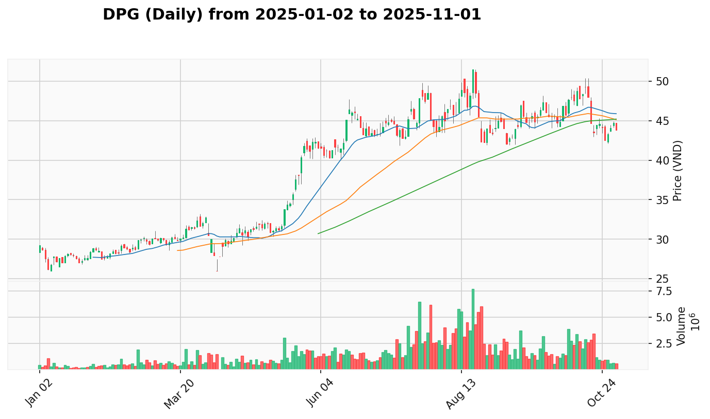

<a href="#xay-dung">↑ Back to group XAY_DUNG</a>  |  <a href="#vpa-signal-summary">↑ Back to Top</a>

#### Key Statistics
| Metric | Value |
|:---|---:|
| Date Range | 2025-01-02 to 2025-09-26 |
| **Latest Close** | **46.0** |
| Period Open | 28.32 |
| Period High | 51.5 |
| Period Low | 25.98 |
| Period Change % | 62.43% |

**[Download DPG Data (.csv)](market_data/DPG_2025-01-02_to_2025-09-27.csv)**

---

### DPM

#### [VPA Analysis (2025-06-16 - 2025-09-26)](./VPA.md#dpm)
> **Ngày 2025-09-22:** DPM giảm từ 26.15 xuống 25.85 với mức mở cửa 26.15, test lên đỉnh 26.35 và có mức thấp 25.85 trước khi đóng cửa ở 25.85. Khối lượng giao dịch đạt 2.0924 triệu cổ phiếu, giảm đáng kể so với phiên trước (4.8496 triệu cổ phiếu). Giá giảm với biên độ hẹp và đóng cửa ở mức thấp nhất phiên, trong khi khối lượng giảm mạnh. Điều này cho thấy lực bán vẫn còn nhưng đã suy yếu, và không có lực cầu đáng kể để đẩy giá lên sau phiên giảm mạnh trước đó, xác nhận sự tiếp diễn của xu hướng suy yếu. **Phân tích VPA/Wyckoff:** No Demand (Không có cầu)
> **Ngày 2025-09-23:** DPM tăng nhẹ từ 25.85 lên 26.0, nhưng đóng cửa thấp hơn giá mở cửa 26.1. Biên độ dao động hẹp từ 25.85 đến 26.2. Khối lượng giao dịch đạt 0.9478 triệu cổ phiếu, giảm mạnh so với phiên trước (2.0924 triệu cổ phiếu). Giá tăng nhẹ với biên độ hẹp và khối lượng thấp cho thấy lực cầu yếu và thiếu sự quyết đoán của thị trường sau hai phiên giảm giá mạnh. **Phân tích VPA/Wyckoff:** Lack of Demand (Thiếu cầu)
> **Ngày 2025-09-24:** DPM tăng từ 26.0 lên 26.2 với mức mở cửa 26.0, test lên đỉnh 26.35 và có mức thấp 25.85 trước khi đóng cửa ở 26.2. Khối lượng giao dịch đạt 1.5625 triệu cổ phiếu, tăng so với phiên trước (0.9478 triệu cổ phiếu) nhưng vẫn ở mức trung bình. Giá tăng nhẹ với biên độ vừa phải và đóng cửa gần mức cao nhất phiên, cho thấy lực cầu đã quay trở lại và có phần chủ động hơn sau các phiên thiếu cầu. Tuy nhiên, khối lượng chưa thực sự đột biến để xác nhận một xu hướng tăng mạnh. **Phân tích VPA/Wyckoff:** Effort to Rise (Nỗ lực tăng giá)
> **Ngày 2025-09-25:** DPM tăng từ 26.35 lên 26.55, đóng cửa gần mức cao nhất phiên 26.8. Biên độ dao động hẹp từ 26.3 đến 26.8. Khối lượng giao dịch đạt 0.8972 triệu cổ phiếu, giảm mạnh so với phiên trước (1.5625 triệu cổ phiếu) và ở mức rất thấp. Giá tăng nhẹ với khối lượng thấp cho thấy lực cầu yếu và thiếu sự ủng hộ từ thị trường sau phiên nỗ lực tăng giá, cho thấy sự thiếu quyết đoán và có thể là dấu hiệu của sự suy yếu. **Phân tích VPA/Wyckoff:** No Demand (Không có cầu)
> **Ngày 2025-09-26:** DPM mở cửa ở mức 26.7, cao hơn giá đóng cửa phiên trước, nhưng sau đó giảm mạnh và đóng cửa ở mức thấp nhất phiên là 26.25. Biên độ dao động trong phiên từ 26.25 đến 26.8. Giá đóng cửa giảm từ 26.65 xuống 26.25 so với phiên trước. Khối lượng giao dịch đạt 1.6371 triệu cổ phiếu, tăng nhẹ so với phiên trước (1.5618 triệu cổ phiếu). Sự kết hợp giữa giá giảm mạnh, đóng cửa ở mức thấp nhất phiên và khối lượng tăng cho thấy áp lực bán đang gia tăng và phe bán đang chiếm ưu thế. Điều này đảo ngược nỗ lực tăng giá của các phiên trước. **Phân tích VPA/Wyckoff:** Sign of Weakness (SOW) - Áp lực bán gia tăng

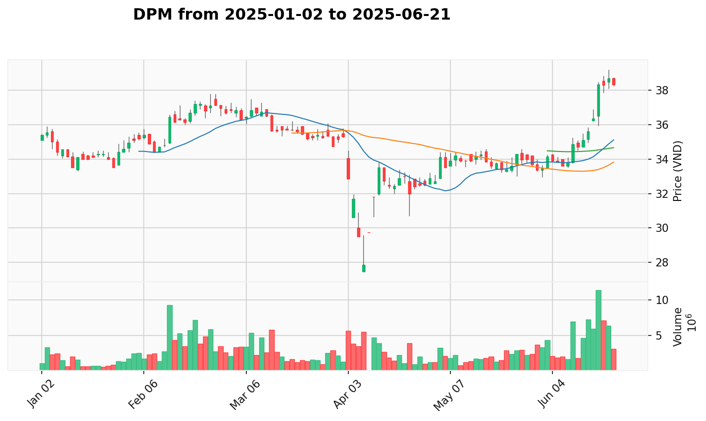

<a href="#hoa-chat">↑ Back to group HOA_CHAT</a>  |  <a href="#vpa-signal-summary">↑ Back to Top</a>

#### Key Statistics
| Metric | Value |
|:---|---:|
| Date Range | 2025-01-02 to 2025-09-26 |
| **Latest Close** | **26.25** |
| Period Open | 19.42 |
| Period High | 29.9 |
| Period Low | 15.19 |
| Period Change % | 35.17% |

**[Download DPM Data (.csv)](market_data/DPM_2025-01-02_to_2025-09-27.csv)**

---

### DPR

#### [VPA Analysis (2025-06-16 - 2025-09-26)](./VPA.md#dpr)
> **Ngày 2025-09-22:** DPR tăng từ 38.4 lên 38.8. Cây nến có biên độ rộng, mở cửa tại 38.4, dao động trong khoảng 38.3-38.95 và đóng cửa tại 38.8, gần mức cao nhất phiên. Khối lượng giao dịch đạt 0.7563 triệu cổ phiếu, tăng mạnh so với phiên trước đó (0.2169 triệu cổ phiếu) và cao hơn đáng kể so với các phiên điều chỉnh/đi ngang trước đó. Sau nhiều phiên kiểm tra cung với khối lượng cực thấp, sự tăng giá mạnh mẽ đi kèm với khối lượng gia tăng cho thấy lực cầu đã quay trở lại và hấp thụ nguồn cung, xác nhận khả năng đảo chiều xu hướng hoặc tiếp tục xu hướng tăng. **Phân tích VPA/Wyckoff:** Sign of Strength (SOS) - Lực cầu mạnh mẽ.
> **Ngày 2025-09-23:** DPR giảm nhẹ từ 38.8 VND xuống 38.7 VND. Cây nến có biên độ hẹp, mở cửa tại 38.8, dao động trong khoảng 38.5-39.2 và đóng cửa tại 38.7. Khối lượng giao dịch đạt 0.2421 triệu cổ phiếu, giảm mạnh so với phiên trước (0.7563 triệu cổ phiếu) và ở mức thấp. Sau phiên "Sign of Strength" (SOS) ngày 2025-09-22 với khối lượng lớn, phiên giảm giá nhẹ với khối lượng thấp hôm nay cho thấy áp lực bán không đáng kể và thị trường đang kiểm tra nguồn cung. Đây có thể là một nhịp điều chỉnh tự nhiên hoặc kiểm tra lại cung sau lực cầu mạnh mẽ. **Phân tích VPA/Wyckoff:** Test for Supply / No Demand.
> **Ngày 2025-09-24:** DPR giảm nhẹ từ 38.7 VND xuống 38.65 VND. Cây nến có biên độ hẹp, mở cửa tại 38.9, dao động trong khoảng 38.6-38.9 và đóng cửa tại 38.65, gần mức thấp nhất phiên. Khối lượng giao dịch đạt 0.1709 triệu cổ phiếu, giảm so với phiên trước (0.2421 triệu cổ phiếu) và ở mức rất thấp. Sau phiên "Sign of Strength" (SOS) ngày 2025-09-22 và phiên kiểm tra cung ngày 2025-09-23, phiên giảm giá nhẹ với khối lượng cực thấp hôm nay cho thấy áp lực bán không đáng kể nhưng lực cầu cũng yếu, thị trường tiếp tục kiểm tra nguồn cung hoặc thiếu động lực tăng giá. **Phân tích VPA/Wyckoff:** No Demand / Test for Supply.
> **Ngày 2025-09-25:** DPR tăng nhẹ từ 38.65 VND lên 38.95 VND. Cây nến có biên độ tương đối rộng, mở cửa tại 38.8, dao động trong khoảng 38.8-39.35 và đóng cửa tại 38.95. Khối lượng giao dịch đạt 0.1863 triệu cổ phiếu, tăng nhẹ so với phiên trước (0.1709 triệu cổ phiếu) nhưng vẫn ở mức rất thấp. Sau hai phiên kiểm tra cung với khối lượng cực thấp, phiên tăng giá nhẹ hôm nay với khối lượng vẫn còn yếu cho thấy lực cầu có xuất hiện nhưng chưa đủ mạnh để tạo đà tăng bền vững. Thị trường có thể đang tiếp tục kiểm tra nguồn cung ở mức giá cao hơn. **Phân tích VPA/Wyckoff:** Test for Supply / Weak Sign of Strength.
> **Ngày 2025-09-26:** DPR giảm từ 38.95 VND xuống 38.5 VND. Cây nến giảm có biên độ tương đối rộng, mở cửa tại 38.95, dao động trong khoảng 38.5-39.05 và đóng cửa tại 38.5, là mức thấp nhất phiên. Khối lượng giao dịch đạt 0.4617 triệu cổ phiếu, tăng so với phiên trước (0.3025 triệu cổ phiếu). Sau phiên tăng nhẹ với khối lượng yếu ngày 2025-09-25, phiên giảm giá hôm nay với khối lượng gia tăng và đóng cửa ở mức thấp nhất cho thấy áp lực bán đang xuất hiện trở lại. Lực cung có vẻ đang chiếm ưu thế. **Phân tích VPA/Wyckoff:** Sign of Weakness (SOW) / Supply Coming In.

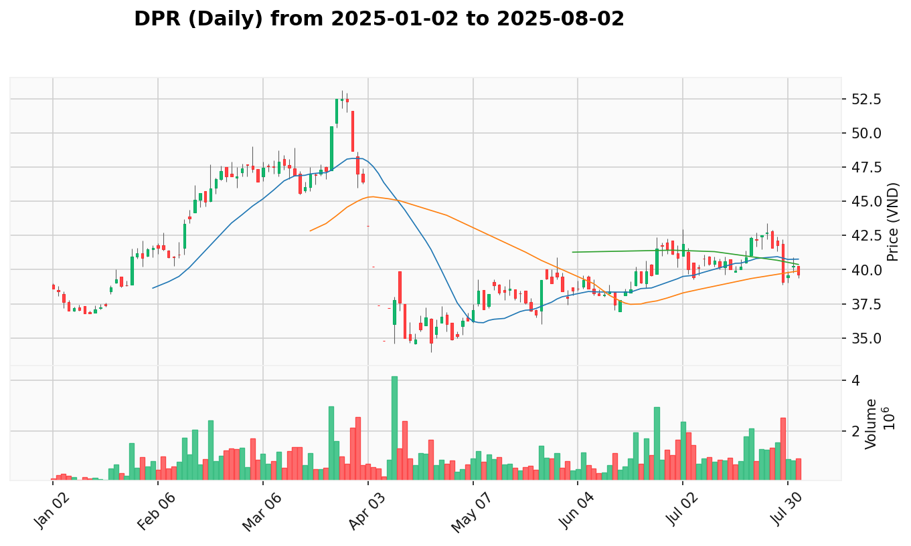

<a href="#cao-su">↑ Back to group CAO_SU</a>  |  <a href="#vpa-signal-summary">↑ Back to Top</a>

#### Key Statistics
| Metric | Value |
|:---|---:|
| Date Range | 2025-01-02 to 2025-09-26 |
| **Latest Close** | **38.5** |
| Period Open | 37.04 |
| Period High | 50.56 |
| Period Low | 32.32 |
| Period Change % | 3.94% |

**[Download DPR Data (.csv)](market_data/DPR_2025-01-02_to_2025-09-27.csv)**

---

### DRC

#### [VPA Analysis (2025-06-13 - 2025-09-26)](./VPA.md#drc)
> **Ngày 2025-09-22:** DRC giảm từ 16.9 xuống 16.65 VND với dao động trong khoảng 16.6-17.05 VND. Cây nến giảm có biên độ rộng và đóng cửa gần mức thấp nhất phiên. Khối lượng giao dịch đạt 0.4531 triệu cổ phiếu, tăng đáng kể so với phiên trước. Sau hai phiên Thiếu cầu (ND) liên tiếp, việc giá tiếp tục giảm với biên độ rộng hơn và khối lượng gia tăng cho thấy áp lực cung đang xuất hiện trên thị trường, củng cố sự suy yếu. **Phân tích VPA/Wyckoff:** Weakness (W) - Áp lực cung gia tăng.
> **Ngày 2025-09-23:** DRC tăng nhẹ từ 16.65 lên 16.7 VND với dao động trong khoảng 16.6-16.8 VND. Cây nến tăng có biên độ hẹp và đóng cửa ở giữa thân nến. Khối lượng giao dịch đạt 0.2315 triệu cổ phiếu, mức rất thấp, thấp nhất trong 10 phiên gần đây và giảm đáng kể so với phiên trước. Sau phiên Áp lực cung gia tăng (W) ngày 2025-09-22, việc giá tăng nhẹ với khối lượng cực thấp cho thấy lực cầu vẫn hoàn toàn vắng bóng và không có sự tham gia của người mua. Sự phục hồi này không có sự xác nhận từ khối lượng, củng cố sự suy yếu và khả năng giá sẽ tiếp tục kiểm tra các mức hỗ trợ thấp hơn. **Phân tích VPA/Wyckoff:** No Demand (ND) - Thiếu cầu tiếp diễn.
> **Ngày 2025-09-24:** DRC tăng từ 16.75 lên 16.8 VND với dao động trong khoảng 16.55-16.8 VND. Cây nến tăng có biên độ hẹp và đóng cửa ở mức cao nhất phiên. Khối lượng giao dịch đạt 0.2757 triệu cổ phiếu, tăng nhẹ so với phiên trước nhưng vẫn ở mức thấp. Sau phiên Thiếu cầu (ND) ngày 2025-09-23, việc giá tăng nhẹ với khối lượng thấp cho thấy lực cầu vẫn chưa thực sự quay trở lại thị trường. Sự phục hồi này không có sự xác nhận từ khối lượng, củng cố nhận định về sự thiếu vắng của người mua và khả năng giá sẽ tiếp tục đi ngang hoặc kiểm tra lại các mức hỗ trợ thấp hơn. **Phân tích VPA/Wyckoff:** No Demand (ND) - Thiếu cầu tiếp diễn.
> **Ngày 2025-09-25:** DRC giảm nhẹ từ 16.85 xuống 16.8 VND với dao động trong khoảng 16.75-16.9 VND. Cây nến có biên độ hẹp và đóng cửa bằng giá đóng cửa phiên trước. Khối lượng giao dịch đạt 0.0383 triệu cổ phiếu, mức cực kỳ thấp, thấp nhất trong các phiên gần đây và giảm mạnh so với phiên trước. Sau hai phiên Thiếu cầu (ND) liên tiếp, việc giá đi ngang với khối lượng cực kỳ thấp cho thấy lực cầu vẫn hoàn toàn vắng bóng và không có sự tham gia của người mua. Sự thiếu vắng thanh khoản này củng cố sự suy yếu và khả năng giá sẽ tiếp tục đi ngang hoặc kiểm tra các mức hỗ trợ thấp hơn. **Phân tích VPA/Wyckoff:** No Demand (ND) - Thiếu cầu tiếp diễn.
> **Ngày 2025-09-26:** DRC giảm từ 16.75 xuống 16.7 VND với dao động trong khoảng 16.7-16.85 VND. Cây nến giảm có biên độ hẹp và đóng cửa ở mức thấp nhất phiên. Khối lượng giao dịch đạt 0.1808 triệu cổ phiếu, tăng nhẹ so với phiên trước nhưng vẫn ở mức thấp. Sau các phiên Thiếu cầu (ND) liên tiếp, việc giá giảm nhẹ với khối lượng thấp và đóng cửa ở mức thấp nhất phiên cho thấy lực cầu vẫn yếu và không có sự hỗ trợ đáng kể. Điều này củng cố xu hướng đi ngang hoặc giảm nhẹ trong ngắn hạn. **Phân tích VPA/Wyckoff:** Weakness (W) - Tiếp diễn suy yếu.

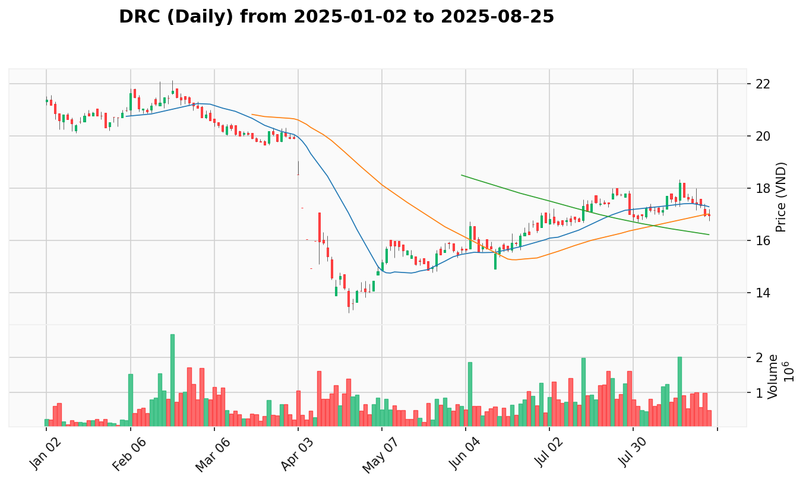

<a href="#cao-su">↑ Back to group CAO_SU</a>  |  <a href="#vpa-signal-summary">↑ Back to Top</a>

#### Key Statistics
| Metric | Value |
|:---|---:|
| Date Range | 2025-01-02 to 2025-09-26 |
| **Latest Close** | **16.7** |
| Period Open | 21.3 |
| Period High | 22.12 |
| Period Low | 13.23 |
| Period Change % | -21.60% |

**[Download DRC Data (.csv)](market_data/DRC_2025-01-02_to_2025-09-27.csv)**

---

### DRG

#### [VPA Analysis (2025-08-04 - 2025-09-26)](./VPA.md#drg)
> **Ngày 2025-09-22:** DRG tăng từ 9.2 VND lên 9.3 VND với khối lượng giao dịch đạt 0.0025 triệu cổ phiếu. Cây nến tăng có biên độ hẹp và đóng cửa ở mức cao nhất phiên, cho thấy lực mua chiếm ưu thế. Khối lượng giao dịch tăng nhẹ so với phiên trước (0.0015 triệu cổ phiếu), xác nhận sự trở lại của lực cầu sau phiên thiếu cầu. Điều này cho thấy sự hấp thụ tốt áp lực bán và tiềm năng tiếp diễn xu hướng tăng. **Phân tích VPA/Wyckoff:** Sign of Strength (SOS) - Lực cầu gia tăng.
> **Ngày 2025-09-23:** DRG giảm từ 9.3 VND xuống 9.1 VND với khối lượng giao dịch đạt 0.0007 triệu cổ phiếu. Cây nến giảm có biên độ hẹp và đóng cửa ở mức thấp nhất phiên, cho thấy sự yếu kém. Khối lượng giao dịch giảm mạnh so với phiên trước (0.0025 triệu cổ phiếu), cho thấy áp lực bán không đáng kể và thiếu lực cầu hỗ trợ giá sau phiên tăng giá. **Phân tích VPA/Wyckoff:** No Demand (Thiếu cầu)
> **Ngày 2025-09-24:** DRG giảm từ 9.1 VND xuống 9.0 VND với khối lượng giao dịch đạt 0.0008 triệu cổ phiếu. Cây nến giảm có biên độ hẹp và đóng cửa ở mức thấp nhất phiên, cho thấy sự yếu kém. Khối lượng giao dịch tăng nhẹ so với phiên trước (0.0007 triệu cổ phiếu), cho thấy áp lực bán vẫn còn tồn tại và thiếu lực cầu hỗ trợ giá. **Phân tích VPA/Wyckoff:** Weakness (Yếu kém)
> **Ngày 2025-09-25:** DRG giữ nguyên mức giá 9.0 VND với khối lượng giao dịch đạt 0.0107 triệu cổ phiếu. Cây nến có biên độ hẹp, đóng cửa ở mức giá mở cửa và cao nhất phiên. Khối lượng giao dịch tăng mạnh so với phiên trước (0.0008 triệu cổ phiếu). Mặc dù có sự gia tăng về khối lượng, giá không thể tăng lên, cho thấy lực cầu chưa đủ mạnh để hấp thụ hết nguồn cung hoặc có sự phân phối ở mức giá này. **Phân tích VPA/Wyckoff:** Weakness (Yếu kém)
> **Ngày 2025-09-26:** DRG tăng từ 8.9 VND lên 9.0 VND với khối lượng giao dịch đạt 0.001 triệu cổ phiếu. Cây nến có biên độ cực hẹp và đóng cửa ở mức giá mở cửa, cao nhất và thấp nhất phiên, cho thấy sự lưỡng lự và thiếu hoạt động. Khối lượng giao dịch giảm mạnh so với phiên trước (0.0119 triệu cổ phiếu), cho thấy lực cầu yếu và sự tăng giá không được hỗ trợ bởi dòng tiền. Điều này tiếp tục xác nhận sự yếu kém của thị trường đối với cổ phiếu này. **Phân tích VPA/Wyckoff:** Weakness (Yếu kém)

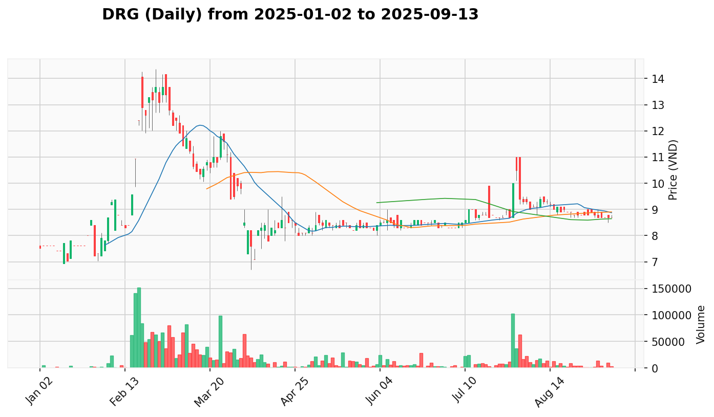

<a href="#cao-su">↑ Back to group CAO_SU</a>  |  <a href="#vpa-signal-summary">↑ Back to Top</a>

#### Key Statistics
| Metric | Value |
|:---|---:|
| Date Range | 2025-01-02 to 2025-09-26 |
| **Latest Close** | **9.0** |
| Period Open | 7.62 |
| Period High | 14.36 |
| Period Low | 6.7 |
| Period Change % | 18.11% |

**[Download DRG Data (.csv)](market_data/DRG_2025-01-02_to_2025-09-27.csv)**

---

### DRI

#### [VPA Analysis (2025-08-04 - 2025-09-26)](./VPA.md#dri)
> **Ngày 2025-09-22:** DRI giảm từ 11.9 VND xuống 11.8 VND, với khối lượng giao dịch đạt 0.6763 triệu cổ phiếu. Giá đóng cửa ở mức 11.8 VND, thấp hơn giá mở cửa và gần mức thấp nhất phiên, cho thấy áp lực bán gia tăng. Khối lượng giao dịch cao hơn đáng kể so với hai phiên trước đó, xác nhận sự xuất hiện của lực cung sau giai đoạn thiếu hụt nguồn cung và lưỡng lự. **Phân tích VPA/Wyckoff:** Áp lực bán (Selling Pressure)
> **Ngày 2025-09-23:** DRI giảm từ 11.8 VND xuống 11.6 VND, với khối lượng giao dịch đạt 0.2633 triệu cổ phiếu, giảm đáng kể so với phiên trước. Giá đóng cửa ở mức thấp hơn giá mở cửa và gần mức thấp nhất phiên, cho thấy sự yếu kém tiếp diễn. Khối lượng thấp trong khi giá tiếp tục giảm sau phiên áp lực bán cho thấy thiếu hụt lực cầu, xác nhận tín hiệu không có cầu. **Phân tích VPA/Wyckoff:** Không có cầu (No Demand) - Giá giảm với khối lượng thấp, cho thấy thiếu hụt lực mua.
> **Ngày 2025-09-24:** DRI tăng từ 11.6 VND lên 11.9 VND, với khối lượng giao dịch đạt 0.2269 triệu cổ phiếu. Giá đóng cửa ở mức cao nhất phiên, cho thấy có lực mua đẩy giá lên. Tuy nhiên, khối lượng giao dịch rất thấp, thấp hơn đáng kể so với phiên trước đó (0.2633 triệu cổ phiếu) và đặc biệt thấp so với phiên áp lực bán (0.6763 triệu cổ phiếu). Điều này cho thấy sự tăng giá diễn ra mà không có sự tham gia mạnh mẽ của dòng tiền, chỉ phản ánh sự thiếu hụt nguồn cung tạm thời sau hai phiên giảm giá liên tiếp. **Phân tích VPA/Wyckoff:** Thiếu hụt nguồn cung (No Supply)
> **Ngày 2025-09-25:** DRI giảm từ 11.8 VND xuống 11.7 VND, với khối lượng giao dịch đạt 0.09 triệu cổ phiếu. Giá đóng cửa ở mức thấp nhất phiên và thấp hơn giá mở cửa, cho thấy sự yếu kém. Khối lượng giao dịch cực kỳ thấp, giảm đáng kể so với phiên trước (0.2269 triệu cổ phiếu) và đặc biệt thấp so với phiên áp lực bán ngày 2025-09-22 (0.6763 triệu cổ phiếu). Điều này xác nhận sự thiếu hụt lực cầu và cho thấy thị trường không có sự quan tâm đáng kể ở mức giá hiện tại, tiếp nối tín hiệu "Không có cầu" từ ngày 2025-09-23. **Phân tích VPA/Wyckoff:** Không có cầu (No Demand)
> **Ngày 2025-09-26:** DRI giữ nguyên mức giá đóng cửa 11.8 VND, với khối lượng giao dịch chỉ đạt 0.1879 triệu cổ phiếu. Giá mở cửa và đóng cửa bằng nhau, biên độ dao động hẹp, cho thấy sự lưỡng lự và thiếu quyết đoán của thị trường. Khối lượng giao dịch cực kỳ thấp, giảm mạnh so với phiên trước (0.4101 triệu cổ phiếu) và là mức thấp nhất trong chuỗi 10 phiên gần nhất. Điều này tiếp tục khẳng định sự thiếu vắng dòng tiền và sự thờ ơ của cả bên mua lẫn bên bán ở mức giá hiện tại, củng cố tín hiệu "Không có cầu" từ phiên trước. **Phân tích VPA/Wyckoff:** Không có cầu (No Demand)

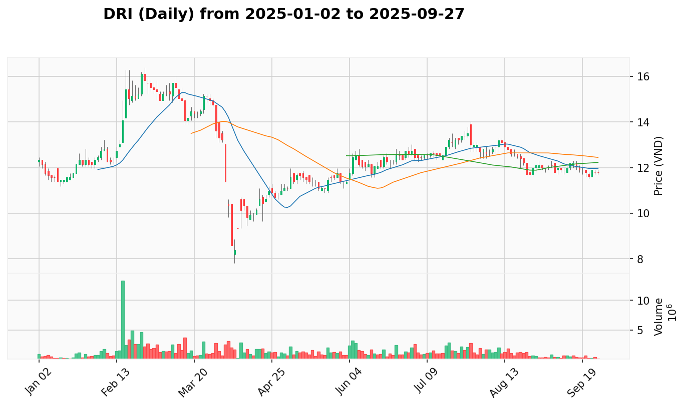

<a href="#cao-su">↑ Back to group CAO_SU</a>  |  <a href="#vpa-signal-summary">↑ Back to Top</a>

#### Key Statistics
| Metric | Value |
|:---|---:|
| Date Range | 2025-01-02 to 2025-09-26 |
| **Latest Close** | **11.8** |
| Period Open | 12.25 |
| Period High | 16.39 |
| Period Low | 7.81 |
| Period Change % | -3.67% |

**[Download DRI Data (.csv)](market_data/DRI_2025-01-02_to_2025-09-27.csv)**

---

### DSC

#### [VPA Analysis (2025-08-04 - 2025-09-26)](./VPA.md#dsc)
> **Ngày 2025-09-22:** DSC giảm từ 21.0 VND xuống 20.9 VND với khối lượng giao dịch đạt 0.3344 triệu cổ phiếu. Cây nến có biên độ rộng, mở cửa tại 21.25 VND và đóng cửa tại 20.9 VND, cho thấy áp lực bán mạnh mẽ. Giá cao nhất đạt 21.7 VND và thấp nhất 20.8 VND. Khối lượng giao dịch tăng đột biến (gấp hơn 3 lần) so với phiên trước và cao hơn nhiều so với mức trung bình gần đây, cho thấy sự xuất hiện của lực cung đáng kể. Sau phiên không có cầu, phiên này cho thấy nỗ lực giảm giá với khối lượng lớn, xác nhận sự yếu kém của thị trường. **Phân tích VPA/Wyckoff:** Nỗ lực giảm giá (Effort to Fall)
> **Ngày 2025-09-23:** DSC giảm từ 20.9 VND xuống 20.85 VND với khối lượng giao dịch giảm mạnh xuống còn 0.0979 triệu cổ phiếu, thấp hơn đáng kể so với phiên trước (0.3344 triệu cổ phiếu) và mức trung bình gần đây. Cây nến có biên độ tương đối rộng, mở cửa tại 21.2 VND và đóng cửa tại 20.85 VND, cho thấy áp lực bán vẫn hiện hữu nhưng không mạnh mẽ như phiên trước. Giá cao nhất đạt 21.2 VND và thấp nhất 20.5 VND. Sau phiên nỗ lực giảm giá với khối lượng lớn, phiên này cho thấy giá tiếp tục giảm nhẹ nhưng với khối lượng rất thấp, điều này có thể cho thấy lực cung đã tạm thời cạn kiệt hoặc thiếu vắng lực cầu để đẩy giá lên. **Phân tích VPA/Wyckoff:** Không có cầu
> **Ngày 2025-09-24:** DSC giảm nhẹ từ 20.9 VND xuống 20.85 VND, nhưng đóng cửa ở mức tương đương phiên trước, với khối lượng giao dịch giảm xuống còn 0.0949 triệu cổ phiếu. Cây nến có biên độ hẹp, cho thấy sự ổn định giá sau hai phiên giảm. Khối lượng rất thấp cho thấy lực cung đã cạn kiệt tạm thời hoặc thị trường đang thiếu vắng cả cung và cầu. **Phân tích VPA/Wyckoff:** Không có cung
> **Ngày 2025-09-25:** DSC giảm từ 20.85 VND xuống 20.75 VND với khối lượng giao dịch tiếp tục giảm mạnh xuống còn 0.0725 triệu cổ phiếu, thấp hơn đáng kể so với phiên trước (0.0949 triệu cổ phiếu) và mức trung bình gần đây. Cây nến có biên độ tương đối rộng, mở cửa tại 20.95 VND và đóng cửa tại 20.75 VND, cho thấy áp lực bán vẫn hiện hữu nhưng với khối lượng cực thấp. Điều này có thể cho thấy lực cung đã cạn kiệt hoàn toàn hoặc thị trường đang thiếu vắng cả cung và cầu một cách trầm trọng. **Phân tích VPA/Wyckoff:** Test of Supply (TOS) - Kiểm tra cung. Giá giảm với khối lượng cực thấp cho thấy cung đã cạn kiệt.
> **Ngày 2025-09-26:** DSC tăng từ 20.8 VND lên 21.05 VND, với khối lượng giao dịch tăng mạnh lên 0.2329 triệu cổ phiếu. Cây nến có biên độ rộng, cho thấy lực cầu đã hấp thụ cung và đẩy giá lên. Điều này xác nhận sự cạn kiệt cung sau phiên kiểm tra cung trước đó. **Phân tích VPA/Wyckoff:** Sign of Strength (SOS) - Lực cầu mạnh mẽ.

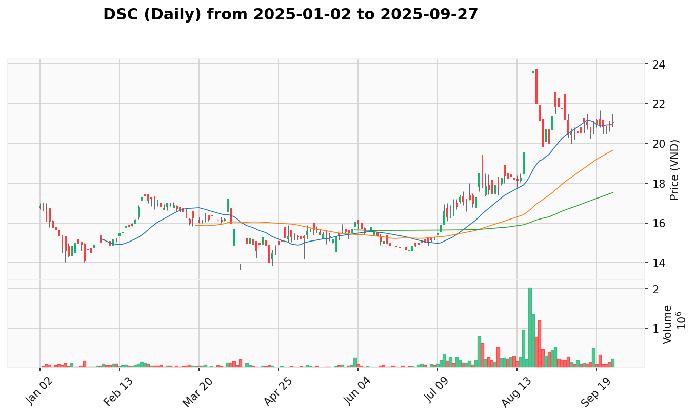

<a href="#chung-khoan">↑ Back to group CHUNG_KHOAN</a>  |  <a href="#vpa-signal-summary">↑ Back to Top</a>

#### Key Statistics
| Metric | Value |
|:---|---:|
| Date Range | 2025-01-02 to 2025-09-26 |
| **Latest Close** | **21.05** |
| Period Open | 16.8 |
| Period High | 23.75 |
| Period Low | 13.65 |
| Period Change % | 25.30% |

**[Download DSC Data (.csv)](market_data/DSC_2025-01-02_to_2025-09-27.csv)**

---

### DSN

#### [VPA Analysis (2025-08-14 - 2025-09-26)](./VPA.md#dsn)
> **Ngày 2025-09-22:** DSN giảm từ 45.0 VND xuống 44.8 VND, với biên độ nến rộng từ 43.55 VND đến 44.95 VND và đóng cửa gần mức thấp nhất phiên. Khối lượng giao dịch tăng mạnh lên 0.013 triệu cổ phiếu so với phiên trước (0.0031 triệu cổ phiếu). Điều này cho thấy áp lực bán đã quay trở lại thị trường sau giai đoạn cạn kiệt nguồn cung. **Phân tích VPA/Wyckoff:** Nguồn cung quay trở lại (Supply Coming In)
> **Ngày 2025-09-23:** DSN mở cửa ở mức 45.0 VND và đóng cửa ở mức 44.8 VND, với mức cao nhất là 45.1 VND và mức thấp nhất là 44.8 VND. Giá đóng cửa nằm ở mức thấp nhất trong phiên, cho thấy áp lực bán. Khối lượng giao dịch giảm mạnh xuống 0.0033 triệu cổ phiếu, thấp hơn đáng kể so với phiên trước (0.013 triệu cổ phiếu). Sau phiên nguồn cung quay trở lại vào ngày 2025-09-22, việc giá giảm từ mức mở cửa và đóng cửa ở mức thấp nhất phiên với khối lượng rất thấp cho thấy thiếu vắng lực cầu. **Phân tích VPA/Wyckoff:** Không có cầu (No Demand)
> **Ngày 2025-09-24:** DSN tăng từ 44.8 VND lên 45.0 VND, với biên độ nến hẹp và đóng cửa ở mức cao nhất phiên. Khối lượng giao dịch đạt 0.0048 triệu cổ phiếu, cao hơn so với phiên trước (0.0033 triệu cổ phiếu) nhưng vẫn ở mức rất thấp so với mức trung bình. Sau phiên nguồn cung quay trở lại và phiên không có cầu, việc giá tăng nhẹ và đóng cửa ở mức cao nhất phiên với khối lượng thấp cho thấy thị trường đang kiểm tra nguồn cung và nguồn cung đã cạn kiệt. **Phân tích VPA/Wyckoff:** Kiểm tra nguồn cung (Test for Supply)
> **Ngày 2025-09-25:** DSN mở cửa ở mức 44.95 VND và đóng cửa ở mức 44.95 VND, với mức cao nhất là 44.95 VND và mức thấp nhất là 44.8 VND. Giá đóng cửa bằng giá mở cửa và nằm ở mức cao nhất trong phiên, nhưng biên độ nến rất hẹp. Khối lượng giao dịch giảm mạnh xuống 0.0026 triệu cổ phiếu, thấp hơn đáng kể so với phiên trước (0.0048 triệu cổ phiếu) và là một trong những mức thấp nhất trong 10 phiên gần đây. Sau phiên kiểm tra nguồn cung, việc giá đi ngang với biên độ hẹp và khối lượng cực thấp cho thấy thiếu vắng lực cầu. **Phân tích VPA/Wyckoff:** Không có cầu (No Demand)
> **Ngày 2025-09-26:** DSN mở cửa ở mức 45.0 VND và đóng cửa ở mức 44.95 VND, với biên độ nến hẹp và giá đóng cửa thấp hơn giá mở cửa. Khối lượng giao dịch đạt 0.0025 triệu cổ phiếu, cực kỳ thấp, thấp hơn phiên trước (0.0051 triệu cổ phiếu) và là mức thấp nhất trong 10 phiên gần đây. Sau phiên không có cầu, việc giá giảm nhẹ với biên độ hẹp và khối lượng cực thấp cho thấy thị trường tiếp tục thiếu vắng lực cầu và không có sự quan tâm đáng kể từ cả bên mua lẫn bên bán. **Phân tích VPA/Wyckoff:** Không có cầu (No Demand)

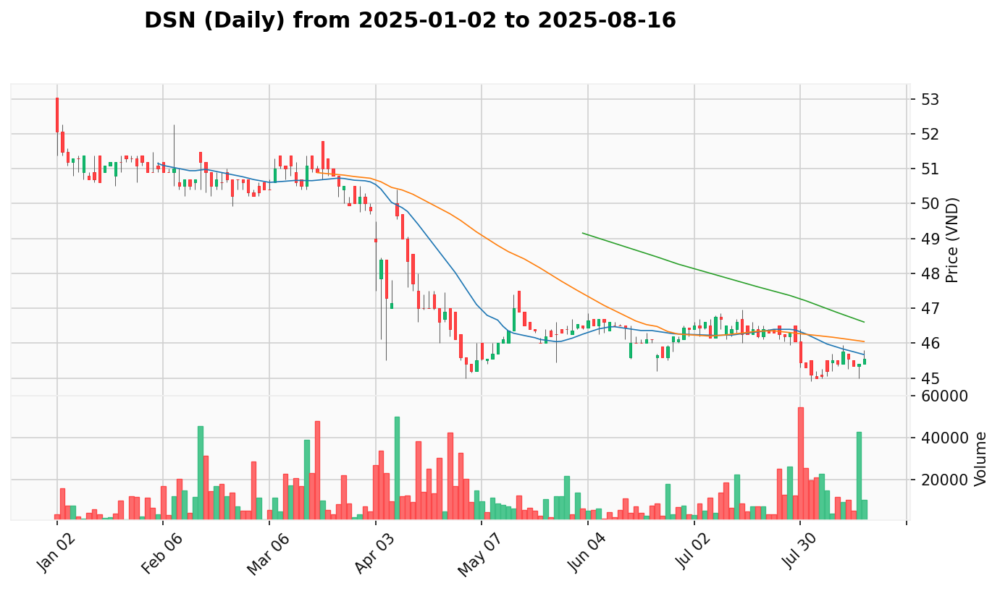

<a href="#others">↑ Back to group OTHERS</a>  |  <a href="#vpa-signal-summary">↑ Back to Top</a>

#### Key Statistics
| Metric | Value |
|:---|---:|
| Date Range | 2025-01-02 to 2025-09-26 |
| **Latest Close** | **44.95** |
| Period Open | 53.03 |
| Period High | 53.03 |
| Period Low | 43.55 |
| Period Change % | -15.24% |

**[Download DSN Data (.csv)](market_data/DSN_2025-01-02_to_2025-09-27.csv)**

---

### DST

#### [VPA Analysis (2025-08-14 - 2025-09-26)](./VPA.md#dst)
> **Ngày 2025-09-22:** DST giữ giá tại 9.0 VND, với khối lượng giao dịch đạt 0.0558 triệu cổ phiếu, giảm so với phiên trước. Cây nến có biên độ hẹp, mở cửa thấp hơn và đóng cửa tại mức giá tham chiếu của phiên trước. Giá đã kiểm tra mức thấp hơn (8.7 VND) nhưng đã phục hồi. Mặc dù giá giữ vững, việc khối lượng giảm sau phiên lực cầu yếu cho thấy thị trường đang kiểm tra lại nguồn cung, nhưng lực cầu vẫn chưa đủ mạnh để tạo ra sự bứt phá. **Phân tích VPA/Wyckoff:** Test for Supply (Kiểm tra nguồn cung).
> **Ngày 2025-09-23:** DST giữ giá tại 9.0 VND, với biên độ dao động hẹp từ 8.9 VND đến 9.1 VND. Khối lượng giao dịch chỉ đạt 0.011 triệu cổ phiếu, giảm mạnh so với phiên trước và là mức cực thấp trong 10 phiên gần đây. Sau phiên kiểm tra nguồn cung (Test for Supply) vào ngày 2025-09-22, việc giá tiếp tục giữ vững tại 9.0 VND với khối lượng cạn kiệt cho thấy nguồn cung tại mức giá này đã được hấp thụ đáng kể và không còn áp lực bán lớn. Tuy nhiên, lực cầu cũng chưa xuất hiện mạnh mẽ để đẩy giá lên. **Phân tích VPA/Wyckoff:** Không có nguồn cung (No Supply).
> **Ngày 2025-09-24:** DST giữ giá tại 9.0 VND, với khối lượng giao dịch đạt 0.0287 triệu cổ phiếu, tăng so với phiên trước nhưng vẫn ở mức trung bình thấp. Cây nến có biên độ hẹp, mở cửa và đóng cửa tại cùng mức giá, cho thấy sự lưỡng lự của thị trường. Sau phiên 'Không có nguồn cung' vào ngày 2025-09-23, việc giá giữ vững với khối lượng tăng nhẹ có thể là một dấu hiệu kiểm tra lực cầu. Tuy nhiên, lực cầu chưa đủ mạnh để đẩy giá lên cao hơn, cho thấy thị trường vẫn đang trong giai đoạn tích lũy hoặc chờ đợi tín hiệu rõ ràng hơn. **Phân tích VPA/Wyckoff:** Test for Demand (Kiểm tra lực cầu)
> **Ngày 2025-09-25:** DST giảm nhẹ từ 9.0 VND xuống 8.9 VND. Cây nến có biên độ cực hẹp, mở cửa và đóng cửa tại cùng mức giá 8.9 VND. Khối lượng giao dịch đạt 0.0345 triệu cổ phiếu, tăng nhẹ so với phiên trước nhưng vẫn ở mức thấp. Sau hai phiên giữ giá tại 9.0 VND với tín hiệu "Không có nguồn cung" và "Kiểm tra lực cầu" không thành công, việc giá giảm nhẹ xuống 8.9 VND với khối lượng thấp cho thấy lực cầu vẫn chưa xuất hiện đủ mạnh để hỗ trợ giá, và thị trường tiếp tục thiếu động lực. **Phân tích VPA/Wyckoff:** Không có lực cầu (No Demand)
> **Ngày 2025-09-26:** DST giữ giá tại 8.8 VND, với khối lượng giao dịch đạt 0.0245 triệu cổ phiếu, giảm mạnh so với phiên trước và ở mức rất thấp. Cây nến có biên độ hẹp, mở cửa và đóng cửa tại cùng mức giá, cho thấy sự cân bằng tạm thời giữa cung và cầu. Sau phiên giảm nhẹ với tín hiệu 'Không có lực cầu' vào ngày 2025-09-25, việc giá giữ vững tại 8.8 VND với khối lượng cực thấp cho thấy áp lực bán đã cạn kiệt. Điều này có thể là một dấu hiệu tích cực cho thấy nguồn cung đã không còn nhiều ở mức giá này, chuẩn bị cho một đợt tăng giá nếu lực cầu xuất hiện. **Phân tích VPA/Wyckoff:** Không có nguồn cung (No Supply)

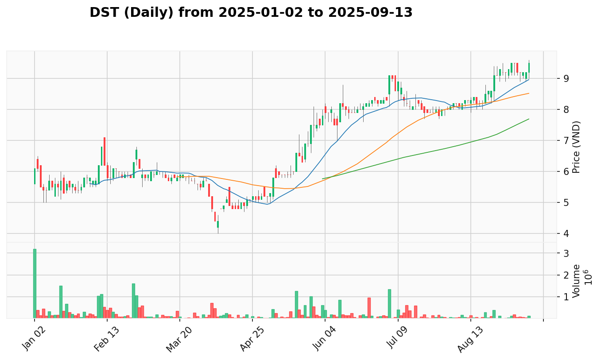

<a href="#penny">↑ Back to group PENNY</a>  |  <a href="#vpa-signal-summary">↑ Back to Top</a>

#### Key Statistics
| Metric | Value |
|:---|---:|
| Date Range | 2025-01-02 to 2025-09-26 |
| **Latest Close** | **8.8** |
| Period Open | 5.6 |
| Period High | 9.6 |
| Period Low | 4.0 |
| Period Change % | 57.14% |

**[Download DST Data (.csv)](market_data/DST_2025-01-02_to_2025-09-27.csv)**

---

### DTD

#### [VPA Analysis (2025-08-04 - 2025-09-26)](./VPA.md#dtd)
> **Ngày 2025-09-22:** DTD giảm từ 21.0 VND xuống 20.6 VND với khối lượng giao dịch đạt 0.6414 triệu cổ phiếu, tăng đáng kể so với phiên trước (0.2412 triệu cổ phiếu). Cây nến có thân rộng, đóng cửa gần mức thấp nhất phiên, cho thấy áp lực bán mạnh mẽ. Sau các phiên "No Demand" trước đó, sự gia tăng khối lượng đi kèm với giá giảm xác nhận sự xuất hiện của lực cung và khả năng tiếp diễn xu hướng giảm. **Phân tích VPA/Wyckoff:** Sign of Weakness (SOW)
> **Ngày 2025-09-23:** DTD giảm nhẹ từ 20.6 VND xuống 20.5 VND với khối lượng giao dịch đạt 0.3136 triệu cổ phiếu, giảm đáng kể so với phiên trước (0.6414 triệu cổ phiếu). Cây nến có thân nhỏ, đóng cửa gần mức thấp nhất phiên, cho thấy áp lực bán đã giảm bớt nhưng lực cầu vẫn yếu. Sau phiên "Sign of Weakness" (SOW) với khối lượng lớn, việc giá tiếp tục giảm nhẹ với khối lượng thấp cho thấy nguồn cung đã cạn kiệt tạm thời, nhưng thị trường vẫn chưa có dấu hiệu phục hồi rõ ràng. **Phân tích VPA/Wyckoff:** No Supply (NS)
> **Ngày 2025-09-24:** DTD tăng từ 20.5 VND lên 20.7 VND với khối lượng giao dịch đạt 0.3362 triệu cổ phiếu, tăng nhẹ so với phiên trước (0.3136 triệu cổ phiếu). Cây nến có thân nhỏ, đóng cửa ở mức cao nhất phiên, cho thấy lực cầu đã xuất hiện và hấp thụ được một phần cung sau phiên No Supply. Tuy nhiên, khối lượng vẫn còn thấp so với các phiên giảm giá mạnh trước đó, cho thấy lực cầu chưa thực sự áp đảo. **Phân tích VPA/Wyckoff:** Test for Supply
> **Ngày 2025-09-25:** DTD tăng từ 20.7 VND lên 20.9 VND với khối lượng giao dịch đạt 0.1428 triệu cổ phiếu, giảm mạnh so với phiên trước (0.3362 triệu cổ phiếu). Cây nến có thân nhỏ, đóng cửa gần mức cao nhất phiên, nhưng khối lượng cực thấp cho thấy lực cầu yếu và không đủ sức đẩy giá lên bền vững. Sau phiên "Test for Supply", việc giá tăng nhẹ với khối lượng thấp cho thấy thị trường vẫn đang thiếu động lực tăng trưởng rõ ràng. **Phân tích VPA/Wyckoff:** Lack of Demand
> **Ngày 2025-09-26:** DTD tăng từ 21.2 VND lên 22.3 VND với khối lượng giao dịch đạt 2.7669 triệu cổ phiếu, tăng đột biến so với phiên trước (0.4083 triệu cổ phiếu). Cây nến có thân rộng, đóng cửa gần mức cao nhất phiên, cho thấy lực cầu mạnh mẽ và áp đảo hoàn toàn lực cung. Sau các phiên kiểm tra cung và thiếu cầu, sự xuất hiện của phiên tăng giá mạnh với khối lượng lớn này cho thấy sự trở lại của dòng tiền lớn và khả năng bắt đầu một xu hướng tăng mới. **Phân tích VPA/Wyckoff:** Sign of Strength (SOS)

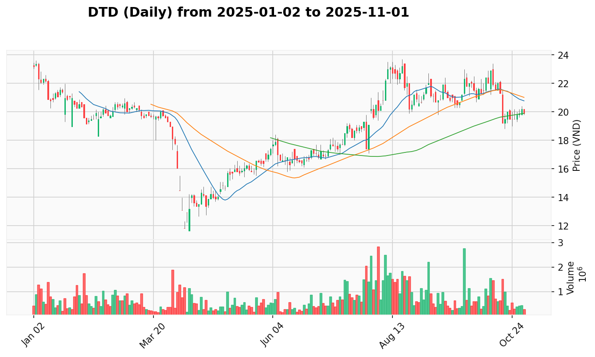

<a href="#bat-dong-san-kcn">↑ Back to group BAT_DONG_SAN_KCN</a>  |  <a href="#vpa-signal-summary">↑ Back to Top</a>

#### Key Statistics
| Metric | Value |
|:---|---:|
| Date Range | 2025-01-02 to 2025-09-26 |
| **Latest Close** | **22.3** |
| Period Open | 23.28 |
| Period High | 23.7 |
| Period Low | 11.64 |
| Period Change % | -4.21% |

**[Download DTD Data (.csv)](market_data/DTD_2025-01-02_to_2025-09-27.csv)**

---

### DVN

#### [VPA Analysis (2025-06-26 - 2025-09-26)](./VPA.md#dvn)
> **Ngày 2025-09-22:** DVN mở cửa tại 21.2 VND và đóng cửa tại 21.0 VND, giảm 0.1 VND so với giá đóng cửa phiên trước là 21.1 VND. Giá cao nhất trong phiên đạt 21.2 VND và giá thấp nhất là 20.8 VND, tạo ra một cây nến giảm với biên độ hẹp và đóng cửa gần mức thấp nhất phiên. Khối lượng giao dịch đạt 0.0411 triệu cổ phiếu, tăng đáng kể so với phiên trước (0.0089 triệu cổ phiếu). Sau hai phiên liên tiếp có tín hiệu "No Demand", việc giá giảm nhẹ với biên độ hẹp nhưng khối lượng giao dịch tăng cho thấy áp lực bán vẫn còn hiện hữu và lực cầu vẫn yếu, không đủ để hấp thụ lượng cung gia tăng. **Phân tích VPA/Wyckoff:** Supply Coming In (Cung xuất hiện)
> **Ngày 2025-09-23:** DVN tăng từ 21.0 lên 21.1. Cây nến có biên độ hẹp (từ 20.9 đến 21.1) và đóng cửa ở mức cao nhất phiên. Khối lượng giao dịch đạt 0.0251 triệu cổ phiếu, giảm đáng kể so với phiên trước (0.0411 triệu cổ phiếu). Sau tín hiệu "Supply Coming In" ở phiên trước, việc giá tăng nhẹ với khối lượng thấp cho thấy lực cầu yếu và thiếu sự quan tâm từ người mua, xác nhận sự thiếu vắng của nhu cầu. **Phân tích VPA/Wyckoff:** No Demand (Không có cầu)
> **Ngày 2025-09-24:** DVN mở cửa tại 21.1 VND và đóng cửa tại 21.1 VND, không thay đổi so với giá đóng cửa phiên trước. Giá cao nhất trong phiên đạt 21.1 VND và giá thấp nhất là 20.9 VND, tạo ra một cây nến có biên độ hẹp và đóng cửa ở mức cao nhất phiên. Khối lượng giao dịch đạt 0.0143 triệu cổ phiếu, giảm đáng kể so với phiên trước (0.0251 triệu cổ phiếu). Sau tín hiệu "No Demand" ở phiên trước, việc giá đi ngang với khối lượng thấp tiếp tục cho thấy sự thiếu vắng của lực cầu và sự thờ ơ của thị trường, xác nhận không có áp lực mua đáng kể. **Phân tích VPA/Wyckoff:** No Demand (Không có cầu)
> **Ngày 2025-09-25:** DVN tăng từ 21.0 lên 22.0. Cây nến có biên độ rộng (từ 20.9 đến 22.0) và đóng cửa ở mức cao nhất phiên. Khối lượng giao dịch đạt 0.0574 triệu cổ phiếu, tăng mạnh so với các phiên trước (0.0143 triệu và 0.0251 triệu cổ phiếu). Sau hai phiên "No Demand" liên tiếp, sự tăng giá mạnh mẽ với khối lượng lớn cho thấy lực cầu đã quay trở lại và áp đảo lực cung. **Phân tích VPA/Wyckoff:** Sign of Strength (SOS) - Lực cầu mạnh mẽ
> **Ngày 2025-09-26:** DVN tăng nhẹ từ 21.6 lên 21.8 VND. Cây nến có biên độ hẹp (từ 21.2 đến 21.8 VND) và đóng cửa ở mức cao nhất phiên. Khối lượng giao dịch đạt 0.0205 triệu cổ phiếu, giảm đáng kể so với phiên trước (0.0865 triệu cổ phiếu). Sau phiên "Sign of Strength" (SOS) mạnh mẽ với khối lượng lớn vào ngày 25-09, việc giá tiếp tục giữ vững đà tăng và đóng cửa ở mức cao nhất phiên nhưng với khối lượng thấp cho thấy lực cung đã suy yếu và được hấp thụ tốt. Điều này xác nhận sự tiếp diễn của xu hướng tăng giá. **Phân tích VPA/Wyckoff:** Test (Kiểm tra cung)

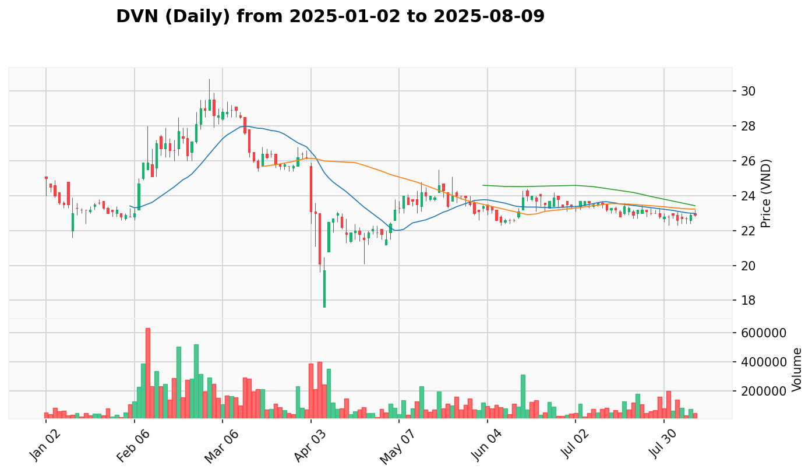

<a href="#suc-khoe">↑ Back to group SUC_KHOE</a>  |  <a href="#vpa-signal-summary">↑ Back to Top</a>

#### Key Statistics
| Metric | Value |
|:---|---:|
| Date Range | 2025-01-02 to 2025-09-26 |
| **Latest Close** | **21.8** |
| Period Open | 24.0 |
| Period High | 29.35 |
| Period Low | 16.83 |
| Period Change % | -9.17% |

**[Download DVN Data (.csv)](market_data/DVN_2025-01-02_to_2025-09-27.csv)**

---

### DVP

#### [VPA Analysis (2025-08-14 - 2025-09-26)](./VPA.md#dvp)
> **Ngày 2025-09-22:** DVP giảm từ 72.9 VND xuống 72.8 VND với khối lượng giao dịch đạt 0.006273 triệu cổ phiếu. Cây nến giảm có biên độ hẹp, đóng cửa bằng giá mở cửa và thấp hơn giá đóng cửa phiên trước. Khối lượng giao dịch tăng nhẹ so với phiên trước (0.00504 triệu cổ phiếu) nhưng vẫn ở mức thấp, cho thấy lực cầu yếu và không có sự tham gia đáng kể của người mua. Mặc dù có sự giảm giá, khối lượng thấp xác nhận sự thiếu vắng của cả lực cung mạnh mẽ. **Phân tích VPA/Wyckoff:** No Demand (ND)
> **Ngày 2025-09-23:** DVP giảm từ 72.8 VND xuống 72.5 VND với khối lượng giao dịch đạt 0.0093 triệu cổ phiếu. Cây nến giảm có biên độ hẹp, đóng cửa tại mức thấp nhất phiên. Khối lượng giao dịch tăng đáng kể so với phiên trước (0.006273 triệu cổ phiếu) và các phiên "No Demand" gần đây, cho thấy áp lực bán gia tăng sau một giai đoạn thiếu cầu. Sự giảm giá kèm khối lượng tăng xác nhận sự xuất hiện của lực cung. **Phân tích VPA/Wyckoff:** Supply Coming In (SCI)
> **Ngày 2025-09-24:** DVP giảm từ 72.5 VND xuống 72.4 VND với khối lượng giao dịch đạt 0.0186 triệu cổ phiếu. Cây nến giảm có biên độ hẹp, đóng cửa bằng giá mở cửa và thấp hơn giá đóng cửa phiên trước. Khối lượng giao dịch tăng mạnh so với phiên trước (0.0093 triệu cổ phiếu) và các phiên gần đây, cho thấy áp lực bán tiếp tục gia tăng và nguồn cung vẫn đang chiếm ưu thế trên thị trường. **Phân tích VPA/Wyckoff:** Supply Coming In (SCI)
> **Ngày 2025-09-25:** DVP tăng từ 72.4 VND lên 72.9 VND với khối lượng giao dịch đạt 0.0001 triệu cổ phiếu. Cây nến có biên độ cực hẹp, giá mở cửa, cao nhất, thấp nhất và đóng cửa đều ở mức 72.9 VND. Khối lượng giao dịch cực kỳ thấp, giảm mạnh so với phiên trước (0.0186 triệu cổ phiếu) và các phiên gần đây, cho thấy sự thiếu vắng cả lực mua và lực bán. Mặc dù giá tăng nhẹ, nhưng với khối lượng gần như không đáng kể, đây là dấu hiệu của sự thiếu cầu sau các phiên áp lực cung gia tăng. **Phân tích VPA/Wyckoff:** No Demand (ND)
> **Ngày 2025-09-26:** DVP giảm từ 72.6 VND xuống 72.1 VND với khối lượng giao dịch đạt 0.0114 triệu cổ phiếu. Cây nến giảm có biên độ hẹp, đóng cửa gần mức thấp nhất phiên. Khối lượng giao dịch tăng mạnh so với phiên trước (0.0015 triệu cổ phiếu), cho thấy áp lực bán gia tăng trở lại sau phiên thiếu cầu. Giá giảm với khối lượng tăng xác nhận nguồn cung vẫn đang chiếm ưu thế trên thị trường. **Phân tích VPA/Wyckoff:** Sign of Weakness (SOW)

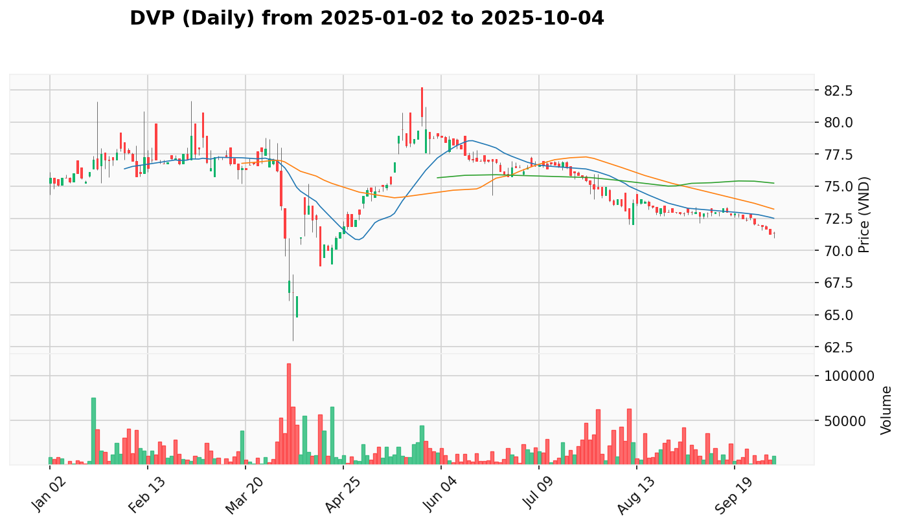

<a href="#van-tai">↑ Back to group VAN_TAI</a>  |  <a href="#vpa-signal-summary">↑ Back to Top</a>

#### Key Statistics
| Metric | Value |
|:---|---:|
| Date Range | 2025-01-02 to 2025-09-26 |
| **Latest Close** | **72.1** |
| Period Open | 75.28 |
| Period High | 82.71 |
| Period Low | 62.97 |
| Period Change % | -4.22% |

**[Download DVP Data (.csv)](market_data/DVP_2025-01-02_to_2025-09-27.csv)**

---

### DXG

#### [VPA Analysis (2025-08-04 - 2025-09-26)](./VPA.md#dxg)
> **Ngày 2025-09-22:** DXG giảm giá từ 23.1 VND xuống 22.6 VND với khối lượng giao dịch đạt 24.349 triệu cổ phiếu. Cây nến giảm có biên độ rộng và đóng cửa gần mức thấp nhất ngày. Khối lượng giao dịch tăng mạnh so với phiên trước (20.8274 triệu cổ phiếu), cho thấy áp lực bán tiếp tục gia tăng và nguồn cung vẫn đang chiếm ưu thế. Điều này củng cố tín hiệu suy yếu và xác nhận sự tiếp diễn của giai đoạn phân phối. **Phân tích VPA/Wyckoff:** Sign of Weakness (SOW)
> **Ngày 2025-09-23:** DXG tăng từ 22.6 VND lên 22.95 VND với khối lượng giao dịch đạt 10.435 triệu cổ phiếu. Cây nến tăng có biên độ trung bình và đóng cửa ở mức cao nhất ngày. Tuy nhiên, khối lượng giao dịch giảm mạnh so với phiên trước (24.349 triệu cổ phiếu), cho thấy lực cầu yếu và không đủ mạnh để đảo chiều xu hướng giảm đã được xác nhận bởi các phiên SOW trước đó. Điều này cho thấy sự thiếu hụt nhu cầu, có thể là một đợt hồi phục yếu trong xu hướng giảm. **Phân tích VPA/Wyckoff:** No Demand (SOW)
> **Ngày 2025-09-24:** DXG tăng giá từ 22.5 VND lên 23.4 VND với khối lượng giao dịch đạt 18.6062 triệu cổ phiếu. Cây nến tăng có biên độ rộng và đóng cửa ở mức cao nhất ngày. Khối lượng giao dịch tăng đáng kể so với phiên trước (10.435 triệu cổ phiếu), cho thấy lực cầu đã quay trở lại và hấp thụ tốt lượng cung. Sau hai phiên suy yếu liên tiếp (SOW và No Demand), sự phục hồi mạnh mẽ này có thể là một dấu hiệu của sức mạnh. **Phân tích VPA/Wyckoff:** Sign of Strength (SOS)
> **Ngày 2025-09-25:** DXG giảm từ 23.4 VND xuống 23.25 VND với khối lượng giao dịch đạt 14.4064 triệu cổ phiếu. Cây nến giảm có biên độ trung bình và đóng cửa gần mức thấp nhất ngày. Khối lượng giao dịch giảm so với phiên trước (18.6062 triệu cổ phiếu), cho thấy lực bán không quá mạnh nhưng lực cầu cũng chưa đủ để giữ giá sau tín hiệu SOS. Sự suy yếu này có thể là một đợt kiểm tra lại nguồn cung hoặc thiếu vắng nhu cầu mua vào. **Phân tích VPA/Wyckoff:** No Demand (SOW)
> **Ngày 2025-09-26:** DXG giảm giá từ 23.2 VND xuống 22.75 VND với khối lượng giao dịch đạt 34.203 triệu cổ phiếu. Cây nến giảm có biên độ rộng và đóng cửa gần mức thấp nhất ngày. Khối lượng giao dịch tăng mạnh so với phiên trước (31.3112 triệu cổ phiếu), cho thấy áp lực bán ra rất lớn và lực cầu không đủ để hấp thụ. Sau tín hiệu SOS vào ngày 2025-09-24, hai phiên giảm giá liên tiếp với khối lượng cao cho thấy sự suy yếu rõ rệt. **Phân tích VPA/Wyckoff:** Sign of Weakness (SOW)

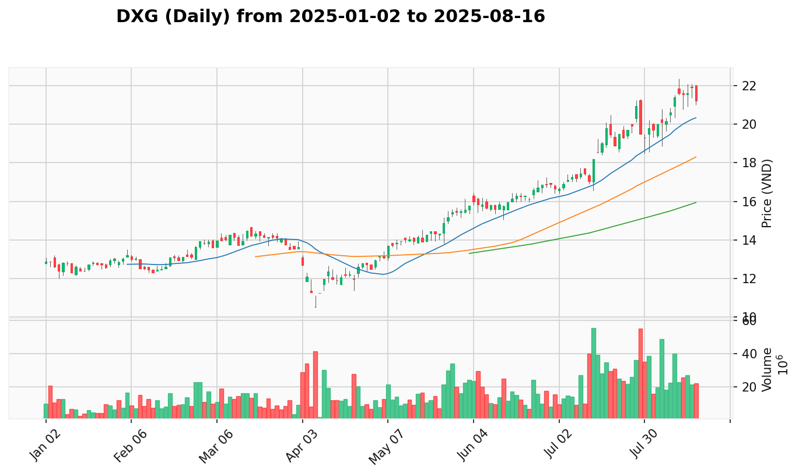

<a href="#bat-dong-san">↑ Back to group BAT_DONG_SAN</a>  |  <a href="#vpa-signal-summary">↑ Back to Top</a>

#### Key Statistics
| Metric | Value |
|:---|---:|
| Date Range | 2025-01-02 to 2025-09-26 |
| **Latest Close** | **22.75** |
| Period Open | 12.79 |
| Period High | 24.5 |
| Period Low | 10.51 |
| Period Change % | 77.87% |

**[Download DXG Data (.csv)](market_data/DXG_2025-01-02_to_2025-09-27.csv)**

---

### DXP

#### [VPA Analysis (2025-08-14 - 2025-09-26)](./VPA.md#dxp)
> **Ngày 2025-09-22:** DXP giảm từ 11.2 VND xuống 11.1 VND. Cây nến giảm có biên độ hẹp, đóng cửa gần mức thấp nhất phiên. Khối lượng giao dịch đạt 0.321 triệu cổ phiếu, tăng nhẹ so với phiên trước (0.2832 triệu cổ phiếu). Mặc dù biên độ giảm hẹp, việc giá đóng cửa gần mức thấp nhất phiên với khối lượng tăng sau một phiên SOW cho thấy lực cung vẫn đang kiểm soát và có thể tiếp tục đẩy giá xuống. **Phân tích VPA/Wyckoff:** Sign of Weakness (SOW) - Lực cung tiếp diễn.
> **Ngày 2025-09-23:** DXP giảm từ 11.1 VND xuống 10.9 VND với khối lượng giao dịch đạt 0.1679 triệu cổ phiếu. Cây nến giảm có biên độ hẹp và đóng cửa tại mức thấp nhất phiên. Khối lượng giao dịch giảm đáng kể so với phiên trước, cho thấy lực cung đã suy yếu nhưng lực cầu vẫn chưa xuất hiện. Mặc dù vậy, việc giá tiếp tục đóng cửa ở mức thấp nhất phiên sau hai phiên SOW liên tiếp vẫn cho thấy xu hướng giảm giá đang tiếp diễn. **Phân tích VPA/Wyckoff:** Sign of Weakness (SOW) - Lực cung suy yếu nhưng xu hướng giảm vẫn tiếp diễn.
> **Ngày 2025-09-24:** DXP tăng từ 10.9 VND lên 11.0 VND. Cây nến tăng có biên độ hẹp, đóng cửa gần mức cao nhất phiên. Khối lượng giao dịch đạt 0.1996 triệu cổ phiếu, tăng nhẹ so với phiên trước (0.1679 triệu cổ phiếu). Sau hai phiên giảm giá liên tiếp với các tín hiệu SOW, phiên này cho thấy một sự phục hồi nhẹ với khối lượng tăng, có thể là dấu hiệu của việc lực cung đang tạm thời suy yếu và lực cầu bắt đầu xuất hiện trở lại, nhưng chưa đủ mạnh để đảo chiều xu hướng rõ rệt. **Phân tích VPA/Wyckoff:** Test for Supply (Kiểm tra cung).
> **Ngày 2025-09-25:** DXP giữ nguyên mức giá 11.0 VND với khối lượng giao dịch đạt 0.1741 triệu cổ phiếu. Cây nến có biên độ hẹp và đóng cửa tại mức giá mở cửa. Khối lượng giao dịch giảm so với phiên trước, cho thấy lực cầu chưa đủ mạnh để đẩy giá lên sau phiên kiểm tra cung. Thị trường đang thiếu động lực rõ ràng và có thể tiếp tục xu hướng yếu. **Phân tích VPA/Wyckoff:** No Demand (Thiếu cầu)
> **Ngày 2025-09-26:** DXP giảm từ 11.2 VND xuống 11.1 VND. Cây nến có biên độ hẹp, đóng cửa tại mức mở cửa và mức cao nhất phiên, nhưng thấp hơn giá đóng cửa phiên trước. Khối lượng giao dịch đạt 0.2783 triệu cổ phiếu, tăng so với phiên trước (0.2395 triệu cổ phiếu). Sau tín hiệu thiếu cầu ở phiên trước, phiên này cho thấy giá tiếp tục giảm nhẹ với khối lượng tăng, cho thấy lực cung vẫn đang chiếm ưu thế và lực cầu chưa đủ mạnh để hỗ trợ giá. **Phân tích VPA/Wyckoff:** Sign of Weakness (SOW)

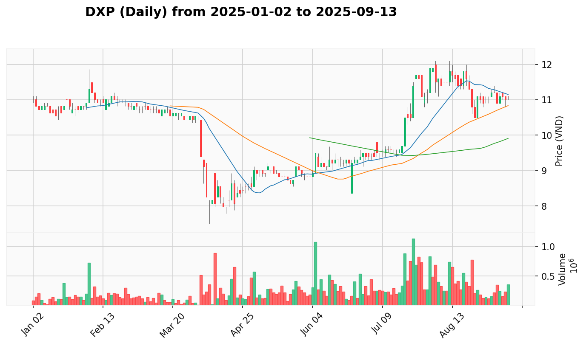

<a href="#van-tai">↑ Back to group VAN_TAI</a>  |  <a href="#vpa-signal-summary">↑ Back to Top</a>

#### Key Statistics
| Metric | Value |
|:---|---:|
| Date Range | 2025-01-02 to 2025-09-26 |
| **Latest Close** | **11.1** |
| Period Open | 11.01 |
| Period High | 12.2 |
| Period Low | 7.5 |
| Period Change % | 0.82% |

**[Download DXP Data (.csv)](market_data/DXP_2025-01-02_to_2025-09-27.csv)**

---

### EIB

#### [VPA Analysis (2025-08-04 - 2025-09-26)](./VPA.md#eib)
> **Ngày 2025-09-22:** EIB giảm từ 26.1 VND xuống 25.0 VND với khối lượng giao dịch đạt 11.6329 triệu cổ phiếu. Cây nến giảm có biên độ rộng và đóng cửa tại mức thấp nhất phiên. Khối lượng giao dịch tăng đáng kể so với phiên trước (7.0869 triệu cổ phiếu). Sự giảm giá mạnh với biên độ rộng và khối lượng tăng cao cho thấy áp lực bán rất lớn và nguồn cung áp đảo thị trường. Điều này xác nhận xu hướng giảm tiếp diễn với cường độ mạnh hơn. **Phân tích VPA/Wyckoff:** Weakness (SOW)
> **Ngày 2025-09-23:** EIB tăng từ 25.0 VND lên 25.2 VND sau khi chạm mức thấp nhất 24.95 VND, với khối lượng giao dịch đạt 6.8021 triệu cổ phiếu. Cây nến có thân nhỏ, bóng nến dưới dài cho thấy lực mua xuất hiện tại vùng giá thấp. Khối lượng giao dịch giảm đáng kể so với phiên trước (11.6329 triệu cổ phiếu), cho thấy áp lực bán đã suy yếu nhưng lực cầu chưa đủ mạnh để tạo xu hướng tăng rõ rệt. Đây có thể là một đợt kiểm tra cung sau chuỗi giảm giá. **Phân tích VPA/Wyckoff:** Test for Supply
> **Ngày 2025-09-24:** EIB tăng từ 25.5 VND lên 26.0 VND, đóng cửa tại mức cao nhất phiên 26.0 VND sau khi chạm mức thấp nhất 25.0 VND. Khối lượng giao dịch đạt 8.1412 triệu cổ phiếu. So với phiên trước (2025-09-23), giá tăng với khối lượng giao dịch gia tăng (từ 6.8021 triệu cổ phiếu lên 8.1412 triệu cổ phiếu). Cây nến tăng có biên độ rộng, đóng cửa ở mức cao nhất phiên với khối lượng tăng cho thấy lực cầu đã quay trở lại và hấp thụ tốt lượng cung sau phiên kiểm tra cung trước đó. Điều này cho thấy sự phục hồi và có thể là khởi đầu của một xu hướng tăng ngắn hạn. **Phân tích VPA/Wyckoff:** Sign of Strength (SOS) - Lực cầu mạnh mẽ.
> **Ngày 2025-09-25:** EIB tăng nhẹ từ 26.0 VND lên 26.15 VND, đóng cửa tại 26.15 VND với biên độ hẹp. Khối lượng giao dịch chỉ đạt 2.8177 triệu cổ phiếu, giảm mạnh so với phiên trước (8.1412 triệu cổ phiếu). Sau phiên tăng giá mạnh mẽ với lực cầu tốt (SOS) vào ngày 24-09, phiên hôm nay cho thấy sự thiếu hụt lực cầu tiếp diễn, thể hiện qua khối lượng giao dịch rất thấp và biên độ giá hẹp. Điều này cho thấy thị trường đang thiếu động lực để tiếp tục đà tăng mạnh. **Phân tích VPA/Wyckoff:** No Demand - Thiếu hụt lực cầu.
> **Ngày 2025-09-26:** EIB giảm từ 26.2 VND xuống 25.7 VND, đóng cửa tại mức thấp nhất phiên 25.7 VND sau khi chạm mức cao nhất 26.4 VND. Khối lượng giao dịch đạt 5.4183 triệu cổ phiếu, cao hơn một chút so với phiên trước (5.1816 triệu cổ phiếu). Sau phiên "No Demand" ngày 25-09, giá tiếp tục giảm với biên độ tương đối rộng và đóng cửa ở mức thấp nhất phiên, cho thấy áp lực bán đang gia tăng. Mặc dù khối lượng không quá lớn, nhưng việc giá đóng cửa ở mức thấp nhất phiên sau một ngày thiếu hụt lực cầu là một dấu hiệu tiêu cực. **Phân tích VPA/Wyckoff:** Sign of Weakness (SOW) - Áp lực bán gia tăng.

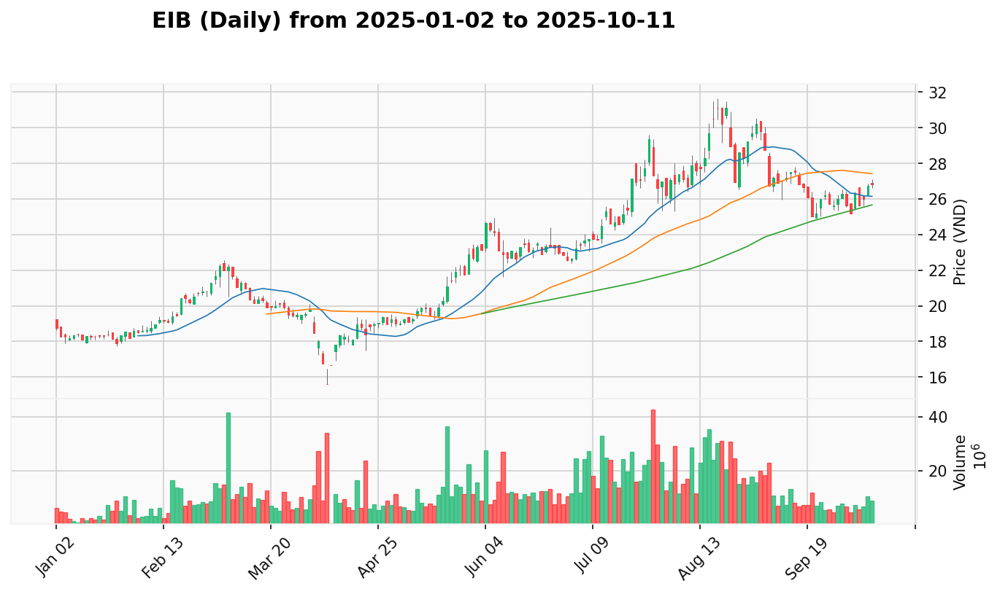

<a href="#ngan-hang">↑ Back to group NGAN_HANG</a>  |  <a href="#vpa-signal-summary">↑ Back to Top</a>

#### Key Statistics
| Metric | Value |
|:---|---:|
| Date Range | 2025-01-02 to 2025-09-26 |
| **Latest Close** | **25.7** |
| Period Open | 19.25 |
| Period High | 31.65 |
| Period Low | 15.6 |
| Period Change % | 33.51% |

**[Download EIB Data (.csv)](market_data/EIB_2025-01-02_to_2025-09-27.csv)**

---

### ELC

#### [VPA Analysis (2025-08-04 - 2025-09-26)](./VPA.md#elc)
> **Ngày 2025-09-22:** ELC giảm từ 23.9 VND xuống 23.6 VND, với biên độ giao dịch rộng và giá đóng cửa gần mức thấp nhất phiên. Khối lượng giao dịch đạt 0.6271 triệu cổ phiếu, tăng so với phiên trước (0.5495 triệu cổ phiếu). Sau hai phiên cho thấy tín hiệu thiếu lực cầu, sự sụt giảm giá đi kèm với khối lượng tăng cho thấy áp lực bán đang gia tăng và nguồn cung đang chiếm ưu thế trên thị trường. **Phân tích VPA/Wyckoff:** Supply Coming In (SCI) - Nguồn cung gia tăng.
> **Ngày 2025-09-23:** ELC giảm từ 23.6 VND xuống 23.45 VND, với biên độ giao dịch tương đối và giá đóng cửa gần mức thấp nhất phiên. Khối lượng giao dịch đạt 0.6459 triệu cổ phiếu, tăng nhẹ so với phiên trước (0.6271 triệu cổ phiếu). Sau tín hiệu nguồn cung gia tăng từ phiên trước, việc giá tiếp tục giảm với khối lượng tăng nhẹ cho thấy áp lực bán vẫn đang duy trì và nguồn cung tiếp tục chiếm ưu thế trên thị trường, xác nhận sự yếu kém của cổ phiếu. **Phân tích VPA/Wyckoff:** Supply Continuing (SC) - Nguồn cung tiếp diễn.
> **Ngày 2025-09-24:** ELC tăng từ 23.45 VND lên 23.55 VND, với biên độ giao dịch rộng và giá đóng cửa ở mức cao nhất phiên. Khối lượng giao dịch đạt 0.8935 triệu cổ phiếu, tăng đáng kể so với phiên trước (0.6459 triệu cổ phiếu). Sau hai phiên giảm giá với áp lực cung, sự tăng giá mạnh mẽ đi kèm với khối lượng lớn cho thấy lực cầu đã quay trở lại và hấp thụ nguồn cung, báo hiệu khả năng đảo chiều xu hướng. **Phân tích VPA/Wyckoff:** Demand Coming In (DCI) - Lực cầu quay trở lại.
> **Ngày 2025-09-25:** ELC giảm từ 23.55 VND xuống 23.25 VND, với biên độ giao dịch hẹp và giá đóng cửa gần mức thấp nhất phiên. Khối lượng giao dịch đạt 0.151 triệu cổ phiếu, giảm mạnh so với phiên trước (0.8935 triệu cổ phiếu). Sau phiên lực cầu quay trở lại mạnh mẽ, việc giá giảm nhẹ với khối lượng rất thấp cho thấy áp lực bán không đáng kể và thị trường đang kiểm tra nguồn cung. Điều này có thể báo hiệu sự cạn kiệt nguồn cung và khả năng tiếp diễn xu hướng tăng nếu lực cầu tiếp tục duy trì. **Phân tích VPA/Wyckoff:** Test for Supply (TS) - Kiểm tra nguồn cung.
> **Ngày 2025-09-26:** ELC giảm từ 23.45 VND xuống 23.0 VND, với biên độ giao dịch rộng và giá đóng cửa ở mức thấp nhất phiên. Khối lượng giao dịch đạt 0.4469 triệu cổ phiếu, tăng so với phiên trước (0.3368 triệu cổ phiếu). Sau phiên kiểm tra nguồn cung với khối lượng thấp, sự giảm giá mạnh mẽ đi kèm với khối lượng gia tăng cho thấy áp lực bán đã quay trở lại và đang chiếm ưu thế. **Phân tích VPA/Wyckoff:** Supply Coming In (SCI) - Lực cung quay trở lại.

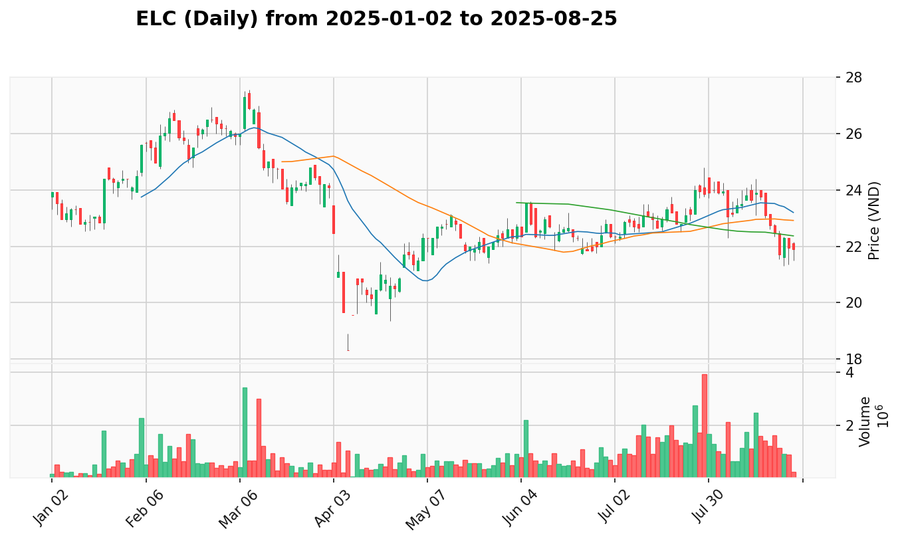

<a href="#cong-nghe">↑ Back to group CONG_NGHE</a>  |  <a href="#vpa-signal-summary">↑ Back to Top</a>

#### Key Statistics
| Metric | Value |
|:---|---:|
| Date Range | 2025-01-02 to 2025-09-26 |
| **Latest Close** | **23.0** |
| Period Open | 23.75 |
| Period High | 27.55 |
| Period Low | 18.3 |
| Period Change % | -3.16% |

**[Download ELC Data (.csv)](market_data/ELC_2025-01-02_to_2025-09-27.csv)**

---

### EVE

#### [VPA Analysis (2025-08-04 - 2025-09-26)](./VPA.md#eve)
> **Ngày 2025-09-22:** EVE giảm nhẹ từ 11.05 VND xuống 11.0 VND với khối lượng giao dịch đạt 0.0355 triệu cổ phiếu. Cây nến có biên độ hẹp, giá mở cửa và đóng cửa bằng nhau, và có bóng nến dưới đáng kể, cho thấy lực bán đã đẩy giá xuống 10.7 VND nhưng sau đó lực mua đã xuất hiện và đẩy giá lên trở lại. Khối lượng giao dịch tăng so với phiên trước (0.0242 triệu cổ phiếu) nhưng vẫn ở mức thấp so với các phiên có khối lượng lớn trước đó. Sau phiên "Test for Supply" vào ngày 2025-09-19, hành động giá và khối lượng này cho thấy thị trường tiếp tục kiểm tra nguồn cung, và lực mua đã hấp thụ được lực bán ở mức giá thấp hơn. Điều này có thể là một dấu hiệu tích cực cho thấy nguồn cung đang cạn kiệt. **Phân tích VPA/Wyckoff:** Test for Supply (Kiểm tra nguồn cung thành công)
> **Ngày 2025-09-23:** EVE mở cửa ở mức 10.55 VND, sau đó phục hồi và đóng cửa ở mức 11.0 VND, bằng với giá đóng cửa phiên trước. Giá cao nhất đạt 11.1 VND và thấp nhất là 10.55 VND. Khối lượng giao dịch cực kỳ thấp, chỉ đạt 0.0067 triệu cổ phiếu, giảm mạnh so với phiên trước (0.0355 triệu cổ phiếu) và là mức thấp nhất trong 10 phiên gần đây. Sau các phiên kiểm tra nguồn cung thành công, đặc biệt là phiên ngày 2025-09-22 cho thấy lực mua hấp thụ lực bán ở mức giá thấp, phiên giao dịch hôm nay với khối lượng cực thấp và giá phục hồi từ mức mở cửa thấp cho thấy nguồn cung đã cạn kiệt. **Phân tích VPA/Wyckoff:** No Supply (Không có nguồn cung)
> **Ngày 2025-09-24:** EVE duy trì mức giá đóng cửa 11.0 VND, không thay đổi so với phiên trước, với giá mở cửa là 10.85 VND và biên độ dao động hẹp từ 10.7 VND đến 11.05 VND. Khối lượng giao dịch cực kỳ thấp, chỉ đạt 0.004 triệu cổ phiếu, giảm đáng kể so với phiên trước (0.0067 triệu cổ phiếu) và là mức thấp nhất trong 10 phiên gần đây. Sau tín hiệu "No Supply" vào ngày 2025-09-23, hành động giá đi ngang với khối lượng cạn kiệt này tiếp tục xác nhận rằng nguồn cung đã được hấp thụ và không còn áp lực bán đáng kể trên thị trường. Điều này cho thấy thị trường đang trong giai đoạn tích lũy hoặc chuẩn bị cho một động thái tăng giá tiềm năng khi lực cầu xuất hiện. **Phân tích VPA/Wyckoff:** No Supply (Tiếp tục cạn kiệt nguồn cung)
> **Ngày 2025-09-25:** EVE giảm từ 11.0 VND xuống 10.8 VND với khối lượng giao dịch đạt 0.012 triệu cổ phiếu. Giá mở cửa, cao nhất, thấp nhất và đóng cửa đều ở mức 10.8 VND, tạo thành một nến giảm với biên độ hẹp. Mặc dù khối lượng giao dịch tăng gấp ba lần so với phiên cực thấp trước đó (0.004 triệu cổ phiếu), nhưng vẫn ở mức rất thấp. Sự gia tăng khối lượng đi kèm với giá giảm sau hai phiên "No Supply" cho thấy áp lực bán đã xuất hiện trở lại, và thị trường đang kiểm tra lại nguồn cung ở mức giá thấp hơn. **Phân tích VPA/Wyckoff:** Test for Supply (Kiểm tra nguồn cung)
> **Ngày 2025-09-26:** EVE tăng từ 10.8 VND lên 10.9 VND với khối lượng giao dịch đạt 0.0068 triệu cổ phiếu. Biên độ dao động hẹp từ 10.75 VND đến 11.0 VND, giá đóng cửa gần mức cao nhất phiên. Khối lượng giao dịch giảm đáng kể so với phiên trước (0.018 triệu cổ phiếu) và vẫn ở mức rất thấp. Sau phiên "Test for Supply" ngày 2025-09-25, việc giá tăng nhẹ với khối lượng thấp cho thấy áp lực bán đã giảm bớt và nguồn cung tiếp tục cạn kiệt. Điều này củng cố khả năng thị trường đang trong giai đoạn tích lũy và chuẩn bị cho một động thái tăng giá. **Phân tích VPA/Wyckoff:** No Supply (Cạn kiệt nguồn cung)

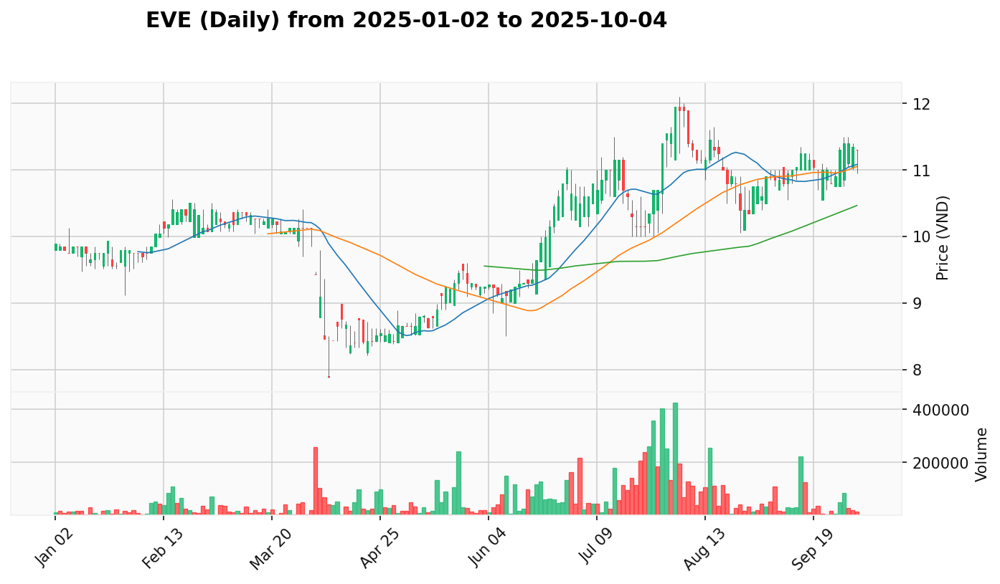

<a href="#det-may">↑ Back to group DET_MAY</a>  |  <a href="#vpa-signal-summary">↑ Back to Top</a>

#### Key Statistics
| Metric | Value |
|:---|---:|
| Date Range | 2025-01-02 to 2025-09-26 |
| **Latest Close** | **10.9** |
| Period Open | 9.8 |
| Period High | 12.1 |
| Period Low | 7.88 |
| Period Change % | 11.22% |

**[Download EVE Data (.csv)](market_data/EVE_2025-01-02_to_2025-09-27.csv)**

---

### EVF

#### [VPA Analysis (2025-08-04 - 2025-09-26)](./VPA.md#evf)
> **Ngày 2025-09-22:** EVF giảm từ 13.35 VND (giá mở cửa) xuống 12.85 VND (giá đóng cửa) với khối lượng giao dịch đạt 10.6927 triệu cổ phiếu. Khối lượng này cao hơn đáng kể so với phiên trước (4.7221 triệu cổ phiếu). Cây nến có biên độ rộng và đóng cửa ở mức thấp nhất phiên, cho thấy áp lực bán mạnh mẽ. Sau các phiên "Thiếu cầu" trước đó, sự sụt giảm mạnh về giá với khối lượng lớn xác nhận sự xuất hiện của nguồn cung lớn trên thị trường. **Phân tích VPA/Wyckoff:** Selling Pressure (SP) - Áp lực bán.
> **Ngày 2025-09-23:** EVF giảm nhẹ từ 12.9 VND xuống 12.85 VND với khối lượng giao dịch đạt 6.565 triệu cổ phiếu. Khối lượng này thấp hơn đáng kể so với phiên trước (10.6927 triệu cổ phiếu). Cây nến có biên độ hẹp và đóng cửa ở mức thấp nhất phiên, cho thấy sự lưỡng lự và thiếu vắng lực cầu sau áp lực bán mạnh mẽ của phiên trước. **Phân tích VPA/Wyckoff:** No Demand (ND) - Thiếu cầu.
> **Ngày 2025-09-24:** EVF tăng từ 13.05 VND (giá mở cửa) lên 13.2 VND (giá đóng cửa) với khối lượng giao dịch đạt 4.8208 triệu cổ phiếu. Khối lượng này thấp hơn đáng kể so với phiên trước (6.565 triệu cổ phiếu) và phiên áp lực bán (10.6927 triệu cổ phiếu). Cây nến tăng có biên độ vừa phải và đóng cửa ở mức cao nhất phiên, cho thấy có lực cầu xuất hiện nhưng không mạnh mẽ. Sau các phiên áp lực bán và thiếu cầu, sự tăng giá với khối lượng thấp cho thấy thị trường đang kiểm tra nguồn cung hoặc chỉ là một đợt hồi phục yếu do thiếu cầu. **Phân tích VPA/Wyckoff:** No Demand (ND) - Thiếu cầu.
> **Ngày 2025-09-25:** EVF tăng từ 13.35 VND lên 13.55 VND với khối lượng giao dịch đạt 6.7998 triệu cổ phiếu. Khối lượng này cao hơn đáng kể so với hai phiên thiếu cầu trước đó (4.8208 triệu và 6.565 triệu cổ phiếu) nhưng vẫn thấp hơn phiên giảm mạnh ngày 2025-09-22. Cây nến tăng có biên độ khá và đóng cửa ở mức cao, cho thấy lực cầu đã quay trở lại và hấp thụ một phần nguồn cung sau giai đoạn điều chỉnh. **Phân tích VPA/Wyckoff:** Sign of Strength (SOS) - Dấu hiệu sức mạnh.
> **Ngày 2025-09-26:** EVF giảm từ 13.6 VND (giá mở cửa) xuống 13.3 VND (giá đóng cửa) với khối lượng giao dịch đạt 5.4516 triệu cổ phiếu. Khối lượng này thấp hơn đáng kể so với phiên tăng mạnh trước đó (13.6886 triệu cổ phiếu) và thấp hơn mức trung bình của các phiên gần đây. Cây nến giảm có biên độ vừa phải và đóng cửa ở mức thấp nhất phiên, cho thấy lực bán không quá mạnh nhưng cũng không có lực cầu đủ lớn để hấp thụ. Sau phiên Dấu hiệu sức mạnh (SOS) ngày 25-09, phiên giảm điểm với khối lượng thấp này có thể là một đợt kiểm tra nguồn cung hoặc cho thấy sự thiếu vắng của lực cầu tiếp diễn. **Phân tích VPA/Wyckoff:** No Supply (NS) - Thiếu nguồn cung.

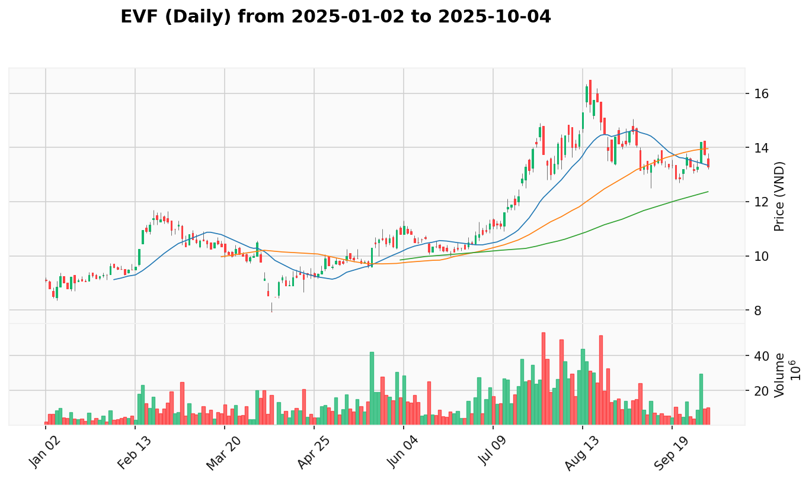

<a href="#ngan-hang">↑ Back to group NGAN_HANG</a>  |  <a href="#vpa-signal-summary">↑ Back to Top</a>

#### Key Statistics
| Metric | Value |
|:---|---:|
| Date Range | 2025-01-02 to 2025-09-26 |
| **Latest Close** | **13.3** |
| Period Open | 9.12 |
| Period High | 16.5 |
| Period Low | 7.94 |
| Period Change % | 45.83% |

**[Download EVF Data (.csv)](market_data/EVF_2025-01-02_to_2025-09-27.csv)**

---

### EVG

#### [VPA Analysis (2025-08-14 - 2025-09-26)](./VPA.md#evg)
> **Ngày 2025-09-22:** EVG mở cửa tại 10.25 VND và đóng cửa ở 10.15 VND, giảm so với giá đóng cửa phiên trước (10.25 VND). Biên độ nến hẹp (10.3-9.98) và giá đóng cửa nằm gần mức thấp nhất phiên, cho thấy áp lực bán. Khối lượng giao dịch đạt 1.885 triệu cổ phiếu, tăng so với phiên trước (1.2743 triệu cổ phiếu). Sự giảm giá với khối lượng tăng cho thấy nguồn cung đang chiếm ưu thế và thị trường tiếp tục suy yếu sau các phiên không có cầu. **Phân tích VPA/Wyckoff:** Điểm yếu (Weakness)
> **Ngày 2025-09-23:** EVG mở cửa tại 10.15 VND và đóng cửa ở 10.15 VND, giữ nguyên so với phiên trước (10.15 VND). Biên độ nến hẹp (10.3-10.0) và giá đóng cửa nằm ở giữa thân nến, cho thấy sự lưỡng lự. Khối lượng giao dịch đạt 0.7934 triệu cổ phiếu, giảm mạnh so với phiên trước (1.885 triệu cổ phiếu) và duy trì ở mức rất thấp. Sự ổn định về giá với khối lượng cực kỳ thấp sau phiên giảm giá với khối lượng tăng cho thấy áp lực bán đã tạm lắng nhưng lực cầu vẫn chưa xuất hiện. Điều này xác nhận thị trường vẫn đang trong giai đoạn suy yếu và thiếu động lực. **Phân tích VPA/Wyckoff:** Không có cầu (No Demand)
> **Ngày 2025-09-24:** EVG mở cửa tại 10.1 VND và đóng cửa ở 10.35 VND, tăng so với giá đóng cửa phiên trước (10.15 VND). Biên độ nến rộng (10.35-9.98) và giá đóng cửa nằm ở mức cao nhất phiên, cho thấy lực cầu mạnh mẽ. Khối lượng giao dịch đạt 1.5293 triệu cổ phiếu, tăng đáng kể so với phiên trước (0.7934 triệu cổ phiếu). Sự tăng giá với khối lượng gia tăng sau các phiên suy yếu và không có cầu cho thấy sự trở lại của lực mua. **Phân tích VPA/Wyckoff:** Sign of Strength (SOS)
> **Ngày 2025-09-25:** EVG mở cửa tại 10.5 VND và đóng cửa ở 10.45 VND, tăng nhẹ so với giá đóng cửa phiên trước (10.35 VND). Biên độ nến hẹp (10.6-10.35) và giá đóng cửa nằm ở mức cao của phiên, cho thấy lực cầu vẫn hiện diện nhưng không mạnh mẽ. Khối lượng giao dịch đạt 1.0424 triệu cổ phiếu, giảm đáng kể so với phiên trước (1.5293 triệu cổ phiếu). Mặc dù giá tăng nhưng khối lượng lại giảm mạnh sau phiên SOS, cho thấy lực cầu không được duy trì và có dấu hiệu suy yếu. Điều này có thể là một tín hiệu cảnh báo về sự thiếu hụt nhu cầu tiếp diễn. **Phân tích VPA/Wyckoff:** Không có cầu (No Demand)
> **Ngày 2025-09-26:** EVG mở cửa tại 10.4 VND và đóng cửa ở 10.2 VND, giảm so với giá đóng cửa phiên trước (10.35 VND). Biên độ nến tương đối rộng (10.45-10.1) và giá đóng cửa nằm ở mức thấp của phiên, cho thấy lực cung chiếm ưu thế. Khối lượng giao dịch đạt 1.6227 triệu cổ phiếu, tăng so với phiên trước (1.4439 triệu cổ phiếu). Sự giảm giá với khối lượng gia tăng sau phiên "Không có cầu" cho thấy áp lực bán đang quay trở lại và lực cầu yếu, xác nhận sự suy yếu. **Phân tích VPA/Wyckoff:** Sign of Weakness (SOW)

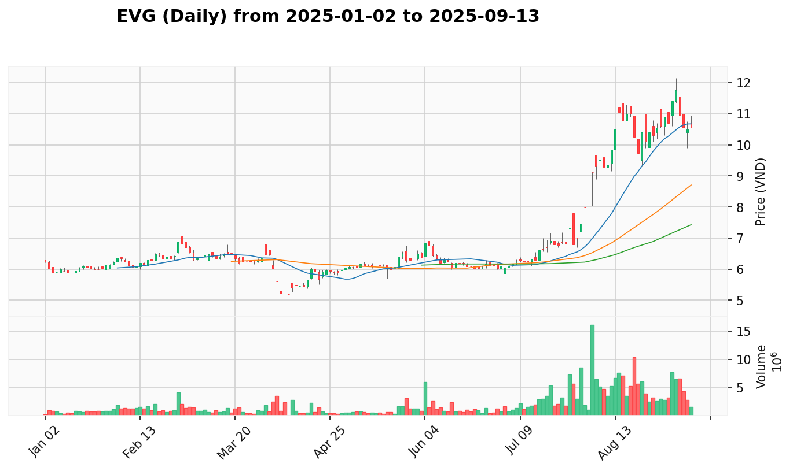

<a href="#penny">↑ Back to group PENNY</a>  |  <a href="#vpa-signal-summary">↑ Back to Top</a>

#### Key Statistics
| Metric | Value |
|:---|---:|
| Date Range | 2025-01-02 to 2025-09-26 |
| **Latest Close** | **10.2** |
| Period Open | 6.3 |
| Period High | 12.15 |
| Period Low | 4.86 |
| Period Change % | 61.90% |

**[Download EVG Data (.csv)](market_data/EVG_2025-01-02_to_2025-09-27.csv)**

---

### EVS

#### [VPA Analysis (2025-08-04 - 2025-09-26)](./VPA.md#evs)
> **Ngày 2025-09-22:** EVS giảm từ 7.4 VND xuống 7.2 VND với khối lượng giao dịch đạt 0.4617 triệu cổ phiếu. Cây nến giảm có biên độ hẹp và đóng cửa gần mức thấp nhất phiên. So với phiên trước đó, giá tiếp tục giảm nhưng khối lượng giao dịch tăng lên, cho thấy áp lực bán gia tăng sau giai đoạn không có cầu. **Phân tích VPA/Wyckoff:** Sign of Weakness (SOW) - Áp lực bán gia tăng.
> **Ngày 2025-09-23:** EVS giữ nguyên mức 7.2 VND với khối lượng giao dịch đạt 0.2748 triệu cổ phiếu. Cây nến có biên độ hẹp và đóng cửa tại mức mở cửa. So với phiên trước, giá đi ngang nhưng khối lượng giao dịch giảm mạnh, cho thấy lực bán đã cạn kiệt nhưng lực cầu vẫn hoàn toàn vắng bóng sau giai đoạn áp lực bán gia tăng. **Phân tích VPA/Wyckoff:** No Demand (Không có cầu)
> **Ngày 2025-09-24:** EVS tăng từ 7.2 VND lên 7.3 VND với khối lượng giao dịch đạt 0.2575 triệu cổ phiếu. Cây nến tăng có biên độ hẹp và đóng cửa gần mức cao nhất phiên. So với phiên trước, giá tăng nhẹ nhưng khối lượng giao dịch tiếp tục giảm, cho thấy lực cầu vẫn còn yếu và chưa có sự tham gia đáng kể của dòng tiền lớn sau giai đoạn không có cầu. **Phân tích VPA/Wyckoff:** Lực cầu yếu (Weak Demand) - Sự tăng giá nhẹ với khối lượng thấp cho thấy thiếu sự hỗ trợ từ lực mua.
> **Ngày 2025-09-25:** EVS tăng từ 7.3 VND lên 7.4 VND với khối lượng giao dịch đạt 0.1338 triệu cổ phiếu. Cây nến tăng có biên độ hẹp và đóng cửa tại mức cao nhất phiên. So với phiên trước, giá tăng nhẹ nhưng khối lượng giao dịch tiếp tục giảm mạnh, cho thấy lực cầu vẫn rất yếu và không có sự tham gia của dòng tiền lớn. **Phân tích VPA/Wyckoff:** Lực cầu yếu (Weak Demand) - Sự tăng giá nhẹ với khối lượng cực thấp cho thấy thiếu sự hỗ trợ từ lực mua và có thể là dấu hiệu của sự suy yếu.
> **Ngày 2025-09-26:** EVS giảm từ 7.4 VND xuống 7.2 VND với khối lượng giao dịch đạt 0.3496 triệu cổ phiếu. Cây nến giảm có biên độ hẹp và đóng cửa tại mức thấp nhất phiên. So với phiên trước, giá giảm nhẹ nhưng khối lượng giao dịch tăng, cho thấy áp lực bán đang gia tăng và nguồn cung đang chiếm ưu thế sau giai đoạn lực cầu yếu. **Phân tích VPA/Wyckoff:** Lực cung gia tăng (Supply Coming In) - Sự giảm giá với khối lượng tăng xác nhận áp lực bán và khả năng tiếp tục xu hướng giảm.

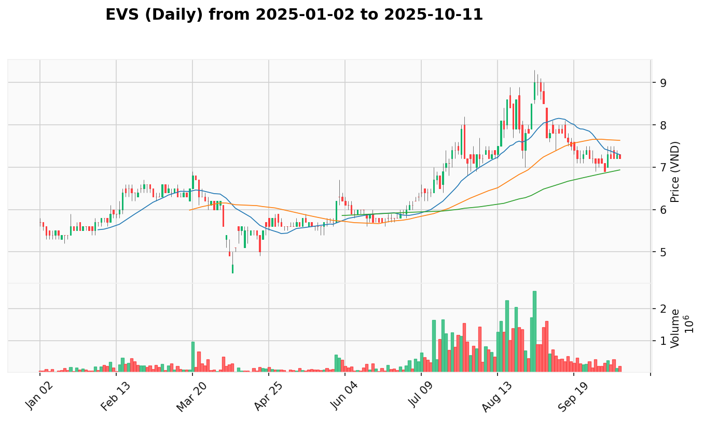

<a href="#chung-khoan">↑ Back to group CHUNG_KHOAN</a>  |  <a href="#vpa-signal-summary">↑ Back to Top</a>

#### Key Statistics
| Metric | Value |
|:---|---:|
| Date Range | 2025-01-02 to 2025-09-26 |
| **Latest Close** | **7.2** |
| Period Open | 5.7 |
| Period High | 9.3 |
| Period Low | 4.5 |
| Period Change % | 26.32% |

**[Download EVS Data (.csv)](market_data/EVS_2025-01-02_to_2025-09-27.csv)**

---

### FCN

#### [VPA Analysis (2025-08-04 - 2025-09-26)](./VPA.md#fcn)
> **Ngày 2025-09-22:** FCN tăng từ 18.0 VND lên 18.5 VND, với khối lượng giao dịch đạt 4.764 triệu cổ phiếu. Cây nến tăng có biên độ rộng (từ 17.85 VND đến 18.65 VND) và đóng cửa gần mức cao nhất phiên, cho thấy lực cầu rất mạnh mẽ và hấp thụ hoàn toàn lực cung. Khối lượng giao dịch tăng đột biến so với phiên trước (1.5793 triệu cổ phiếu), xác nhận sự tiếp diễn và gia tăng của lực mua, củng cố tín hiệu SOS từ các phiên trước. **Phân tích VPA/Wyckoff:** Sign of Strength (SOS) - Lực cầu mạnh mẽ xác nhận xu hướng tăng.
> **Ngày 2025-09-23:** FCN giảm từ 18.5 VND xuống 18.15 VND, với khối lượng giao dịch đạt 1.9167 triệu cổ phiếu. Cây nến giảm có biên độ hẹp và đóng cửa gần mức thấp nhất phiên, cho thấy áp lực bán nhẹ và lực cầu suy yếu sau các phiên tăng mạnh. Khối lượng giao dịch giảm đáng kể so với phiên trước (4.764 triệu cổ phiếu), cho thấy đây có thể là một phiên điều chỉnh hoặc chốt lời. **Phân tích VPA/Wyckoff:** No Demand (ND) - Lực cầu suy yếu, có thể là điều chỉnh.
> **Ngày 2025-09-24:** FCN tăng từ 18.15 VND lên 18.5 VND, với khối lượng giao dịch đạt 1.811 triệu cổ phiếu. Cây nến tăng có biên độ hẹp và đóng cửa gần mức cao nhất phiên, cho thấy lực cầu có sự trở lại nhưng không mạnh mẽ. Khối lượng giao dịch giảm so với phiên trước, cho thấy đây có thể là một phiên kiểm tra nguồn cung sau đợt điều chỉnh. **Phân tích VPA/Wyckoff:** Test for Supply (TS) - Kiểm tra nguồn cung.
> **Ngày 2025-09-25:** FCN tăng từ 18.5 VND lên 19.0 VND, với khối lượng giao dịch đạt 3.99 triệu cổ phiếu. Cây nến tăng có biên độ khá và đóng cửa gần mức cao nhất phiên, cho thấy lực cầu chủ động và mạnh mẽ trở lại sau các phiên điều chỉnh và kiểm tra nguồn cung. Khối lượng giao dịch tăng mạnh so với phiên trước (1.81 triệu cổ phiếu), xác nhận sự trở lại của dòng tiền và khả năng tiếp diễn xu hướng tăng. **Phân tích VPA/Wyckoff:** Sign of Strength (SOS) - Lực cầu mạnh mẽ.
> **Ngày 2025-09-26:** FCN giảm từ 19.25 VND xuống 18.8 VND, với khối lượng giao dịch đạt 2.8348 triệu cổ phiếu. Cây nến giảm có biên độ khá và đóng cửa gần mức thấp nhất phiên, cho thấy lực cung xuất hiện sau phiên tăng mạnh trước đó. Tuy nhiên, khối lượng giao dịch giảm đáng kể so với phiên trước (6.7469 triệu cổ phiếu), cho thấy áp lực bán không quá mạnh mẽ nhưng lực cầu cũng không duy trì được đà tăng. Đây có thể là dấu hiệu của sự thiếu vắng lực cầu tiếp diễn sau phiên SOS. **Phân tích VPA/Wyckoff:** No Demand (Thiếu cầu).

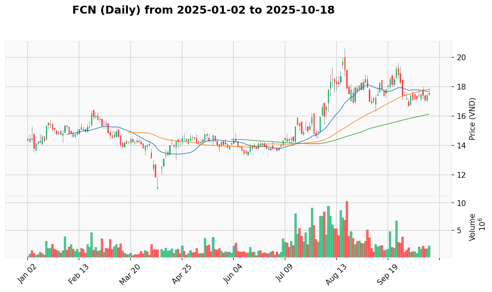

<a href="#dau-tu-cong">↑ Back to group DAU_TU_CONG</a>  |  <a href="#vpa-signal-summary">↑ Back to Top</a>

#### Key Statistics
| Metric | Value |
|:---|---:|
| Date Range | 2025-01-02 to 2025-09-26 |
| **Latest Close** | **18.8** |
| Period Open | 14.45 |
| Period High | 20.6 |
| Period Low | 11.05 |
| Period Change % | 30.10% |

**[Download FCN Data (.csv)](market_data/FCN_2025-01-02_to_2025-09-27.csv)**

---

### FID

#### [VPA Analysis (2025-08-01 - 2025-09-26)](./VPA.md#fid)
> **Ngày 2025-08-29:** FID duy trì mức giá 1.9 VND, với biên độ dao động hẹp từ 1.8 VND đến 2.0 VND. Khối lượng giao dịch đạt 0.5258 triệu cổ phiếu, tăng nhẹ so với phiên trước đó (0.4583 triệu cổ phiếu). Giá giữ vững trong biên độ hẹp với khối lượng tăng nhẹ cho thấy lực cầu đang hấp thụ nguồn cung, xác nhận sự cạn kiệt của áp lực bán sau tín hiệu "No Supply" ở phiên trước. **Phân tích VPA/Wyckoff:** Test for Supply (Kiểm tra nguồn cung)
> **Ngày 2025-09-05:** FID giảm từ 1.9 VND xuống 1.8 VND với biên độ dao động từ 1.8 VND đến 2.0 VND. Khối lượng giao dịch đạt 0.3366 triệu cổ phiếu, giảm mạnh so với phiên trước đó (0.5258 triệu cổ phiếu). Giá giảm nhẹ với khối lượng thấp cho thấy thiếu lực cầu, xác nhận sự cạn kiệt của nguồn cung nhưng chưa có động lực tăng giá. **Phân tích VPA/Wyckoff:** No Demand (ND) - Giá giảm nhẹ với khối lượng thấp cho thấy thiếu lực cầu.
> **Ngày 2025-09-12:** FID giảm từ 1.8 VND xuống 1.7 VND, với biên độ dao động hẹp từ 1.7 VND đến 1.8 VND. Khối lượng giao dịch đạt 0.7267 triệu cổ phiếu, tăng mạnh so với phiên trước đó (0.3366 triệu cổ phiếu). Giá giảm với khối lượng tăng cho thấy áp lực bán gia tăng, xác nhận sự hiện diện của nguồn cung sau phiên "No Demand". **Phân tích VPA/Wyckoff:** Weakness (Sức mạnh yếu) - Giá giảm với khối lượng tăng cho thấy áp lực bán đang chiếm ưu thế.
> **Ngày 2025-09-19:** FID giảm từ 1.7 VND xuống 1.6 VND với biên độ dao động từ 1.6 VND đến 1.7 VND. Khối lượng giao dịch đạt 0.3767 triệu cổ phiếu, giảm mạnh so với phiên trước đó (0.7267 triệu cổ phiếu). Giá giảm với khối lượng thấp cho thấy thiếu lực cầu và áp lực bán đã suy yếu sau phiên giảm mạnh trước đó. **Phân tích VPA/Wyckoff:** No Demand (ND) - Giá giảm với khối lượng thấp cho thấy thiếu lực cầu.
> **Ngày 2025-09-26:** FID đóng cửa ở mức 1.6 VND, không đổi so với phiên trước, với biên độ dao động hẹp từ 1.5 VND đến 1.7 VND. Khối lượng giao dịch chỉ đạt 0.1128 triệu cổ phiếu, giảm mạnh so với phiên trước đó (0.3767 triệu cổ phiếu) và là mức thấp nhất trong các phiên gần đây. Sau các phiên giảm giá và "No Demand", việc giá đi ngang với khối lượng cực thấp cho thấy áp lực bán đã cạn kiệt. **Phân tích VPA/Wyckoff:** No Supply (NS) - Giá đi ngang với khối lượng cực thấp cho thấy nguồn cung đã cạn kiệt.

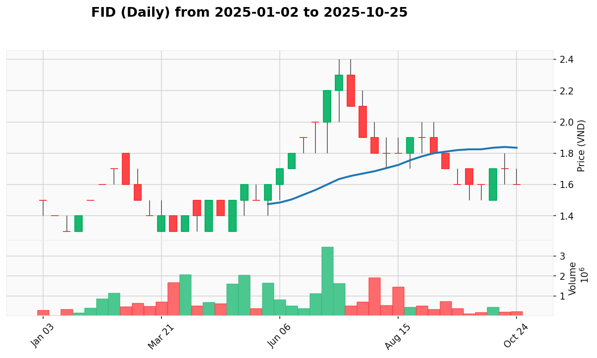

<a href="#xay-dung">↑ Back to group XAY_DUNG</a>  |  <a href="#vpa-signal-summary">↑ Back to Top</a>

#### Key Statistics
| Metric | Value |
|:---|---:|
| Date Range | 2025-01-03 to 2025-09-26 |
| **Latest Close** | **1.6** |
| Period Open | 1.5 |
| Period High | 2.4 |
| Period Low | 1.3 |
| Period Change % | 6.67% |

**[Download FID Data (.csv)](market_data/FID_2025-01-02_to_2025-09-27.csv)**

---

### FIT

#### [VPA Analysis (2025-06-26 - 2025-09-26)](./VPA.md#fit)
> **Ngày 2025-09-22:** FIT giảm từ 4.85 xuống 4.78 với biên độ dao động 4.77-4.87. Cây nến giảm có thân nhỏ và đóng cửa gần mức thấp nhất phiên. Khối lượng giao dịch đạt 0.6406 triệu cổ phiếu, tăng nhẹ so với phiên trước nhưng vẫn ở mức thấp. Điều này cho thấy áp lực bán tiếp tục duy trì và lực cầu vẫn yếu, xác nhận sự yếu kém của thị trường. **Phân tích VPA/Wyckoff:** Weakness - Giá giảm với khối lượng tăng nhẹ, cho thấy áp lực bán tiếp diễn.
> **Ngày 2025-09-23:** FIT tăng từ 4.78 lên 4.80 với biên độ dao động 4.78-4.86. Cây nến có thân nhỏ, đóng cửa gần giữa phiên. Khối lượng giao dịch đạt 0.371 triệu cổ phiếu, giảm mạnh so với phiên trước và duy trì ở mức rất thấp. Điều này cho thấy dù giá có tăng nhẹ nhưng lực cầu gần như không tồn tại, xác nhận sự yếu kém của thị trường và tiếp tục tín hiệu No Demand. **Phân tích VPA/Wyckoff:** No Demand - Giá tăng nhẹ với khối lượng cực thấp, xác nhận thiếu vắng lực cầu.
> **Ngày 2025-09-24:** FIT tăng từ 4.80 lên 4.85 với biên độ dao động 4.75-4.85. Cây nến tăng có thân nhỏ và đóng cửa ở mức cao nhất phiên. Khối lượng giao dịch đạt 0.2895 triệu cổ phiếu, giảm mạnh so với phiên trước và duy trì ở mức cực thấp. Điều này cho thấy dù giá có tăng nhẹ nhưng lực cầu gần như không tồn tại, xác nhận sự yếu kém của thị trường và tiếp tục tín hiệu No Demand. **Phân tích VPA/Wyckoff:** No Demand - Giá tăng với khối lượng cực thấp, xác nhận thiếu vắng lực cầu.
> **Ngày 2025-09-25:** FIT tăng từ 4.85 lên 4.89 với biên độ dao động 4.82-4.9. Cây nến có thân nhỏ, đóng cửa gần mức cao nhất phiên. Khối lượng giao dịch đạt 0.3149 triệu cổ phiếu, tăng nhẹ so với phiên trước nhưng vẫn duy trì ở mức rất thấp. Điều này cho thấy dù giá có tăng nhẹ nhưng lực cầu vẫn yếu, xác nhận sự thiếu vắng lực mua đáng kể và tiếp tục tín hiệu No Demand. **Phân tích VPA/Wyckoff:** No Demand - Giá tăng nhẹ với khối lượng thấp, tiếp tục xác nhận thiếu vắng lực cầu.
> **Ngày 2025-09-26:** FIT tăng từ 4.86 lên 4.91 với biên độ dao động 4.85-4.99. Cây nến tăng có thân nhỏ và đóng cửa gần mức cao nhất phiên. Khối lượng giao dịch đạt 1.5856 triệu cổ phiếu, tăng mạnh so với phiên trước (0.5331 triệu cổ phiếu) và cao hơn đáng kể so với các phiên gần đây. Điều này cho thấy lực cầu đã quay trở lại và hấp thụ tốt lượng cung, đẩy giá lên, phá vỡ chuỗi tín hiệu No Demand trước đó. **Phân tích VPA/Wyckoff:** Sign of Strength (SOS) - Giá tăng với khối lượng gia tăng, xác nhận lực cầu mạnh mẽ.

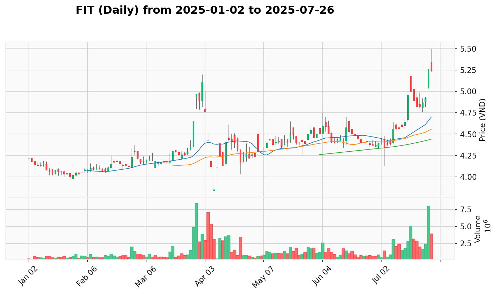

<a href="#penny">↑ Back to group PENNY</a>  |  <a href="#vpa-signal-summary">↑ Back to Top</a>

#### Key Statistics
| Metric | Value |
|:---|---:|
| Date Range | 2025-01-02 to 2025-09-26 |
| **Latest Close** | **4.91** |
| Period Open | 4.22 |
| Period High | 5.59 |
| Period Low | 3.84 |
| Period Change % | 16.35% |

**[Download FIT Data (.csv)](market_data/FIT_2025-01-02_to_2025-09-27.csv)**

---

### FMC

#### [VPA Analysis (2025-08-14 - 2025-09-26)](./VPA.md#fmc)
> **Ngày 2025-09-22:** FMC giảm từ 37.8 VND xuống 37.4 VND, đóng cửa ở mức thấp trong phiên. Khối lượng giao dịch đạt 0.0318 triệu cổ phiếu, cao hơn so với hai phiên trước đó. Sau giai đoạn kiểm tra cung và thiếu cầu, sự giảm giá với khối lượng tăng cho thấy áp lực bán vẫn còn hiện hữu và đang đẩy giá xuống. **Phân tích VPA/Wyckoff:** Áp lực bán (Selling Pressure)
> **Ngày 2025-09-23:** FMC mở cửa ở 37.5 VND và đóng cửa ở 37.5 VND, tăng nhẹ từ 37.4 VND của phiên trước. Biên độ giá hẹp, với mức cao nhất là 37.8 VND và thấp nhất là 37.25 VND. Khối lượng giao dịch đạt 0.0427 triệu cổ phiếu, cao hơn đáng kể so với phiên áp lực bán ngày 2025-09-22 (0.0318 triệu cổ phiếu) và phiên thiếu cầu ngày 2025-09-19 (0.0234 triệu cổ phiếu). Mặc dù có sự gia tăng về khối lượng, giá chỉ tăng nhẹ và đóng cửa ở giữa thân nến, cho thấy nỗ lực đẩy giá lên nhưng không đạt được kết quả rõ rệt. Điều này ngụ ý rằng lực cung vẫn còn hiện diện và hấp thụ lực cầu, ngăn cản giá tăng mạnh sau giai đoạn áp lực bán. **Phân tích VPA/Wyckoff:** Effort to Rise but No Result (Nỗ lực tăng giá nhưng không đạt kết quả).
> **Ngày 2025-09-24:** FMC tăng từ 37.5 VND lên 37.7 VND, đóng cửa ở mức cao nhất phiên. Biên độ giá rộng và khối lượng giao dịch đạt 0.0578 triệu cổ phiếu, cao hơn đáng kể so với phiên trước đó (0.0427 triệu cổ phiếu). Sau giai đoạn áp lực bán và nỗ lực tăng giá không đạt kết quả, sự tăng giá mạnh mẽ với khối lượng gia tăng cho thấy lực cầu đã trở lại và đang chiếm ưu thế, đẩy giá lên. **Phân tích VPA/Wyckoff:** Sign of Strength (SOS) - Lực cầu mạnh mẽ
> **Ngày 2025-09-25:** FMC mở cửa ở 37.4 VND và đóng cửa ở 37.3 VND, giảm nhẹ sau phiên tăng mạnh trước đó. Biên độ giá hẹp, với mức cao nhất là 37.5 VND và thấp nhất là 37.3 VND, và giá đóng cửa ở mức thấp nhất phiên. Khối lượng giao dịch chỉ đạt 0.0131 triệu cổ phiếu, thấp hơn đáng kể so với phiên SOS ngày 2025-09-24 (0.0578 triệu cổ phiếu). Sau một phiên SOS mạnh mẽ, sự sụt giảm nhẹ với khối lượng thấp và đóng cửa ở mức thấp nhất phiên cho thấy thiếu lực cầu tiếp diễn và có thể là một dấu hiệu của sự yếu đi tạm thời hoặc một đợt kiểm tra cung cầu. Lực bán không mạnh nhưng lực mua cũng không xuất hiện để duy trì đà tăng. **Phân tích VPA/Wyckoff:** No Demand (Thiếu cầu) / Test (Kiểm tra cung) - Yếu.
> **Ngày 2025-09-26:** Sau phiên thiếu cầu ngày 2025-09-25, FMC tiếp tục giảm từ 37.35 VND xuống 37.2 VND, đóng cửa ở mức thấp nhất phiên. Biên độ giá hẹp. Khối lượng giao dịch đạt 0.0645 triệu cổ phiếu, cao hơn đáng kể so với phiên trước đó (0.0193 triệu cổ phiếu) và cao hơn cả phiên SOS ngày 2025-09-24 (0.0578 triệu cổ phiếu). Sự sụt giảm giá với khối lượng gia tăng và đóng cửa ở mức thấp nhất phiên cho thấy áp lực bán mạnh mẽ đã xuất hiện trở lại, người bán đang chiếm ưu thế và đẩy giá xuống. **Phân tích VPA/Wyckoff:** Sign of Weakness (SOW) - Áp lực bán mạnh

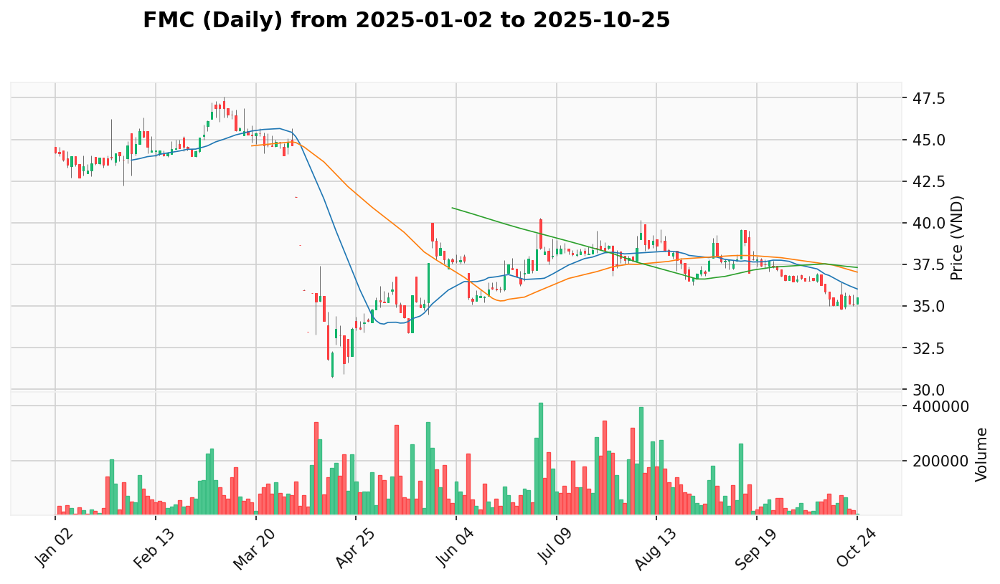

<a href="#thuy-san">↑ Back to group THUY_SAN</a>  |  <a href="#vpa-signal-summary">↑ Back to Top</a>

#### Key Statistics
| Metric | Value |
|:---|---:|
| Date Range | 2025-01-02 to 2025-09-26 |
| **Latest Close** | **37.2** |
| Period Open | 44.53 |
| Period High | 47.56 |
| Period Low | 30.7 |
| Period Change % | -16.46% |

**[Download FMC Data (.csv)](market_data/FMC_2025-01-02_to_2025-09-27.csv)**

---

### FOX

#### [VPA Analysis (2025-06-16 - 2025-09-26)](./VPA.md#fox)
> **Ngày 2025-09-22:** FOX giảm từ 68.4 VND xuống 66.1 VND. Cây nến giảm có biên độ rộng (2.4 VND) và đóng cửa gần mức thấp nhất phiên. Khối lượng giao dịch đạt 0.0707 triệu cổ phiếu, thấp hơn so với phiên trước (0.0878 triệu cổ phiếu). Sau phiên "Upthrust" ngày 2025-09-19, phiên này cho thấy giá tiếp tục giảm mạnh với biên độ rộng và đóng cửa ở mức thấp, cho thấy áp lực bán vẫn đang chiếm ưu thế. Mặc dù khối lượng giảm, nhưng việc giá giảm sâu và đóng cửa thấp cho thấy lực cung vẫn mạnh và thị trường đang trong giai đoạn suy yếu. **Phân tích VPA/Wyckoff:** Sign of Weakness (SOW)
> **Ngày 2025-09-23:** FOX giảm từ 66.1 VND xuống 65.9 VND. Cây nến giảm có biên độ hẹp hơn (1.5 VND) và đóng cửa gần mức thấp nhất phiên. Khối lượng giao dịch đạt 0.0565 triệu cổ phiếu, thấp hơn so với phiên trước (0.0707 triệu cổ phiếu). Sau phiên "Sign of Weakness" ngày 2025-09-22, phiên này cho thấy giá tiếp tục giảm với biên độ hẹp và khối lượng thấp, xác nhận sự yếu kém của thị trường và thiếu lực cầu hỗ trợ. **Phân tích VPA/Wyckoff:** No Demand
> **Ngày 2025-09-24:** FOX tăng từ 65.9 VND lên 66.5 VND. Cây nến tăng có biên độ hẹp (1.6 VND) và đóng cửa gần mức cao nhất phiên. Khối lượng giao dịch đạt 0.0485 triệu cổ phiếu, thấp hơn đáng kể so với phiên trước (0.0565 triệu cổ phiếu) và là mức thấp nhất trong 10 phiên gần đây. Sau phiên "No Demand" ngày 2025-09-23, phiên này cho thấy giá tăng nhẹ nhưng với khối lượng rất thấp, xác nhận sự thiếu vắng lực cầu mạnh mẽ và nỗ lực tăng giá không có kết quả đáng kể. Thị trường vẫn đang trong giai đoạn yếu kém. **Phân tích VPA/Wyckoff:** No Demand
> **Ngày 2025-09-25:** FOX giảm từ 66.5 VND xuống 64.8 VND. Cây nến giảm có biên độ rộng (2.5 VND) và đóng cửa gần mức thấp nhất phiên. Khối lượng giao dịch đạt 0.1003 triệu cổ phiếu, cao hơn đáng kể so với phiên trước (0.0485 triệu cổ phiếu). Sau phiên "No Demand" ngày 2025-09-24, phiên này cho thấy giá giảm mạnh với khối lượng gia tăng, xác nhận áp lực bán mạnh mẽ và sự yếu kém của thị trường. **Phân tích VPA/Wyckoff:** Sign of Weakness
> **Ngày 2025-09-26:** FOX giảm từ 64.8 VND xuống 64.4 VND. Cây nến giảm có biên độ hẹp (1.4 VND) và đóng cửa gần mức thấp nhất phiên. Khối lượng giao dịch đạt 0.0526 triệu cổ phiếu, thấp hơn đáng kể so với phiên trước (0.142 triệu cổ phiếu) và là mức thấp thứ hai trong 10 phiên gần đây. Sau phiên "Sign of Weakness" ngày 2025-09-25, phiên này cho thấy giá tiếp tục giảm nhẹ nhưng với khối lượng rất thấp, xác nhận sự thiếu vắng lực cầu và thị trường vẫn đang trong giai đoạn yếu kém. **Phân tích VPA/Wyckoff:** No Demand

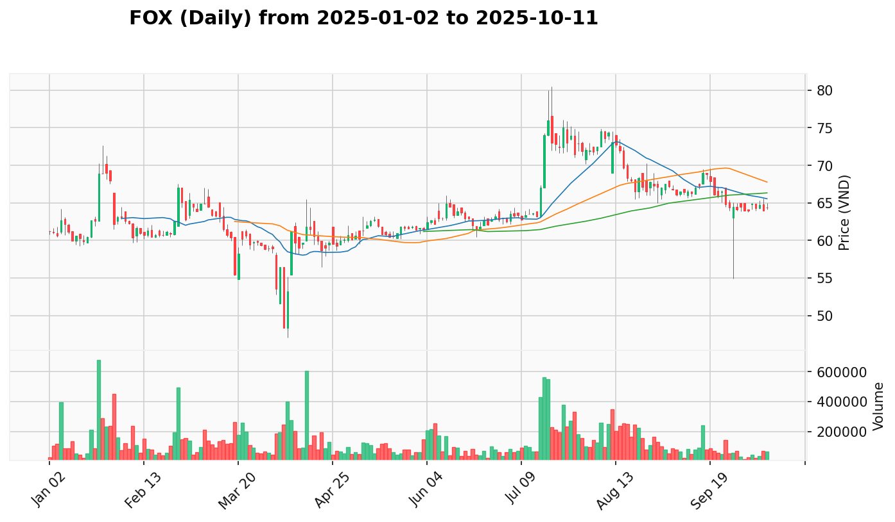

<a href="#cong-nghe">↑ Back to group CONG_NGHE</a>  |  <a href="#vpa-signal-summary">↑ Back to Top</a>

#### Key Statistics
| Metric | Value |
|:---|---:|
| Date Range | 2025-01-02 to 2025-09-26 |
| **Latest Close** | **64.4** |
| Period Open | 61.25 |
| Period High | 80.5 |
| Period Low | 47.08 |
| Period Change % | 5.14% |

**[Download FOX Data (.csv)](market_data/FOX_2025-01-02_to_2025-09-27.csv)**

---

### FPT

#### [VPA Analysis (2025-06-06 - 2025-09-26)](./VPA.md#fpt)
> **Ngày 2025-09-22:** FPT giảm từ 102.5 VND xuống 99.7 VND với khối lượng giao dịch đạt 16.2802 triệu cổ phiếu. Cây nến giảm có biên độ rộng và đóng cửa ở mức thấp nhất phiên, cho thấy áp lực bán tiếp tục duy trì và đẩy giá xuống sâu hơn. Mặc dù khối lượng giao dịch có giảm so với phiên trước (23.5143 triệu cổ phiếu), nhưng vẫn ở mức cao, xác nhận sự suy yếu của lực cầu và sự chiếm ưu thế của phe bán. **Phân tích VPA/Wyckoff:** Sign of Weakness (SOW) - Áp lực bán tiếp diễn với biên độ giảm rộng và đóng cửa ở mức thấp, cho thấy xu hướng giảm giá đang tiếp tục.
> **Ngày 2025-09-23:** FPT giảm từ 100.0 VND xuống 98.0 VND với khối lượng giao dịch đạt 18.2912 triệu cổ phiếu. Cây nến giảm có biên độ rộng, giá đóng cửa ở mức thấp của phiên, cho thấy áp lực bán mạnh mẽ tiếp tục duy trì. Khối lượng giao dịch gia tăng so với phiên trước, xác nhận sự chiếm ưu thế của phe bán và sự suy yếu của lực cầu. **Phân tích VPA/Wyckoff:** Sign of Weakness (SOW) - Áp lực bán mạnh mẽ với khối lượng gia tăng, xác nhận xu hướng giảm giá tiếp diễn.
> **Ngày 2025-09-24:** FPT tăng từ 98.0 VND lên 99.5 VND với khối lượng giao dịch đạt 7.4211 triệu cổ phiếu, giảm đáng kể so với phiên trước (18.2912 triệu cổ phiếu). Cây nến tăng có biên độ rộng và đóng cửa ở mức cao nhất phiên, cho thấy nỗ lực đẩy giá lên của phe mua. Tuy nhiên, khối lượng giao dịch thấp cho thấy lực cầu không thực sự mạnh mẽ và có thể là một đợt kiểm tra nguồn cung sau hai phiên giảm giá mạnh. **Phân tích VPA/Wyckoff:** Test for Supply (TFS) - Giá tăng với biên độ rộng nhưng khối lượng thấp, cho thấy lực cầu yếu và có thể là một đợt kiểm tra nguồn cung.
> **Ngày 2025-09-25:** FPT giảm từ 99.5 VND xuống 98.0 VND với khối lượng giao dịch đạt 4.2998 triệu cổ phiếu, giảm đáng kể so với phiên trước. Cây nến giảm có biên độ hẹp, giá đóng cửa ở mức thấp của phiên, cho thấy áp lực bán vẫn hiện hữu nhưng không mạnh mẽ. Khối lượng giao dịch thấp cho thấy cả phe mua và phe bán đều không quyết liệt, xác nhận sự thiếu vắng lực cầu sau phiên kiểm tra nguồn cung trước đó. **Phân tích VPA/Wyckoff:** No Demand (ND) - Giá giảm với khối lượng thấp, xác nhận sự thiếu vắng lực cầu và tiếp diễn xu hướng yếu.
> **Ngày 2025-09-26:** FPT giảm từ 98.0 VND xuống 97.5 VND với khối lượng giao dịch đạt 8.0808 triệu cổ phiếu, tiếp tục giảm so với phiên trước. Cây nến giảm có biên độ tương đối hẹp và đóng cửa ở mức thấp nhất phiên, cho thấy áp lực bán vẫn duy trì. Khối lượng giao dịch thấp cho thấy sự thiếu vắng lực cầu và không có sự hấp thụ đáng kể từ phe mua. Điều này củng cố tín hiệu thiếu cầu từ phiên trước. **Phân tích VPA/Wyckoff:** No Demand (ND) - Giá tiếp tục giảm với khối lượng thấp, xác nhận sự thiếu vắng lực cầu và xu hướng yếu tiếp diễn.

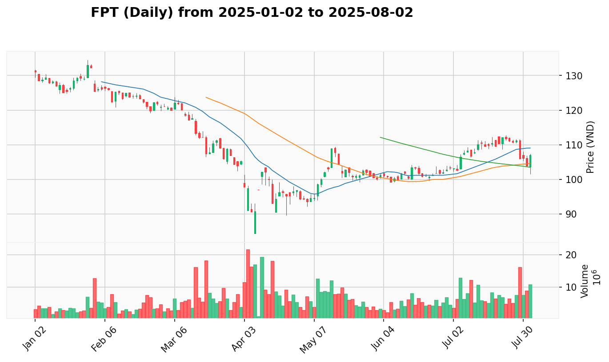

<a href="#cong-nghe">↑ Back to group CONG_NGHE</a>  |  <a href="#vpa-signal-summary">↑ Back to Top</a>

#### Key Statistics
| Metric | Value |
|:---|---:|
| Date Range | 2025-01-02 to 2025-09-26 |
| **Latest Close** | **97.5** |
| Period Open | 131.49 |
| Period High | 134.5 |
| Period Low | 84.32 |
| Period Change % | -25.85% |

**[Download FPT Data (.csv)](market_data/FPT_2025-01-02_to_2025-09-27.csv)**

---

### FRT

#### [VPA Analysis (2025-06-16 - 2025-09-26)](./VPA.md#frt)
> **Ngày 2025-09-22:** FRT giảm từ 132.0 xuống 130.9, tạo cây nến giảm với biên độ hẹp và đóng cửa gần mức thấp nhất phiên. Khối lượng giao dịch đạt 0.4784 triệu cổ phiếu, giảm đáng kể so với phiên trước (0.7184 triệu cổ phiếu). Sau phiên Sign of Weakness với khối lượng gia tăng, phiên giảm giá hôm nay với khối lượng thấp cho thấy áp lực bán đã suy yếu nhưng lực cầu vẫn chưa xuất hiện, củng cố tín hiệu thị trường yếu. **Phân tích VPA/Wyckoff:** No Demand
> **Ngày 2025-09-23:** FRT giảm từ 130.5 xuống 129.0, tạo cây nến giảm với biên độ rộng và đóng cửa tại mức thấp nhất phiên. Khối lượng giao dịch đạt 0.3697 triệu cổ phiếu, thấp hơn đáng kể so với phiên trước (0.4784 triệu cổ phiếu). Sau phiên No Demand với khối lượng thấp, phiên giảm giá hôm nay với biên độ rộng nhưng khối lượng tiếp tục giảm cho thấy lực cầu hoàn toàn vắng mặt, và áp lực bán vẫn duy trì nhưng không cần nhiều nỗ lực để đẩy giá xuống. Điều này củng cố tín hiệu thị trường yếu. **Phân tích VPA/Wyckoff:** No Demand
> **Ngày 2025-09-24:** FRT tăng từ 128.5 lên 131.8, tạo cây nến tăng với biên độ rộng và đóng cửa tại mức cao nhất phiên. Khối lượng giao dịch đạt 0.4519 triệu cổ phiếu, cao hơn đáng kể so với phiên trước (0.3697 triệu cổ phiếu). Sau hai phiên No Demand, phiên tăng giá hôm nay với biên độ rộng và khối lượng gia tăng cho thấy lực cầu đã quay trở lại và hấp thụ tốt áp lực bán. **Phân tích VPA/Wyckoff:** Sign of Strength (SOS) - Lực cầu mạnh mẽ với khối lượng gia tăng.
> **Ngày 2025-09-25:** FRT giảm từ 131.8 xuống 129.2, tạo cây nến giảm với biên độ rộng và đóng cửa gần mức thấp nhất phiên. Khối lượng giao dịch đạt 0.1583 triệu cổ phiếu, thấp hơn đáng kể so với phiên trước (0.4519 triệu cổ phiếu) và là mức thấp nhất trong 10 phiên gần đây. Sau phiên Sign of Strength (SOS) với lực cầu mạnh mẽ, phiên giảm giá hôm nay với biên độ rộng nhưng khối lượng cực thấp cho thấy lực cầu đã hoàn toàn vắng mặt và áp lực bán đang chiếm ưu thế mà không cần nhiều nỗ lực. Điều này cho thấy sự yếu kém của thị trường và khả năng đảo chiều giảm giá. **Phân tích VPA/Wyckoff:** No Demand
> **Ngày 2025-09-26:** FRT giảm nhẹ từ 130.1 xuống 130.0, tạo cây nến giảm với biên độ hẹp và đóng cửa gần giữa thân nến. Khối lượng giao dịch đạt 0.2654 triệu cổ phiếu, tiếp tục giảm mạnh so với phiên trước (0.4504 triệu cổ phiếu) và là mức thấp nhất trong nhiều phiên gần đây. Sau phiên "No Demand" ngày 2025-09-25, phiên hôm nay với biên độ hẹp và khối lượng cực thấp cho thấy thị trường đang thiếu cả lực mua và lực bán đáng kể, cho thấy sự thờ ơ của thị trường và nguồn cung đã cạn kiệt. **Phân tích VPA/Wyckoff:** No Demand (tiếp diễn)

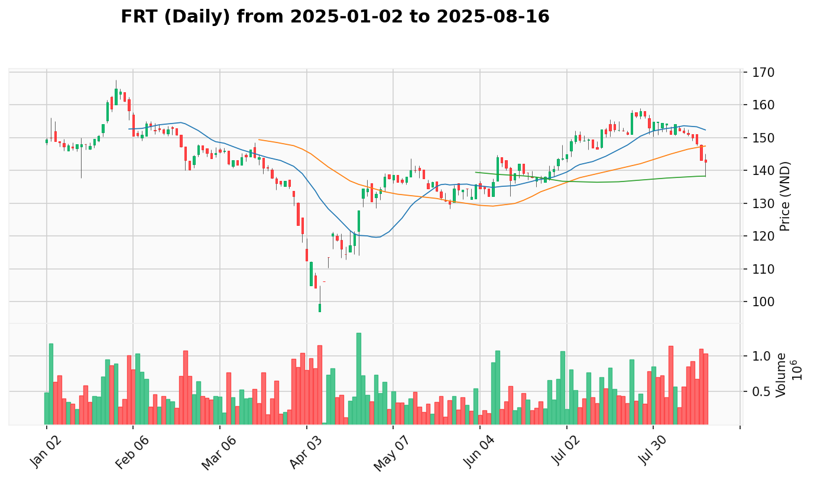

<a href="#ban-le">↑ Back to group BAN_LE</a>  |  <a href="#vpa-signal-summary">↑ Back to Top</a>

#### Key Statistics
| Metric | Value |
|:---|---:|
| Date Range | 2025-01-02 to 2025-09-26 |
| **Latest Close** | **130.0** |
| Period Open | 148.48 |
| Period High | 167.52 |
| Period Low | 96.88 |
| Period Change % | -12.45% |

**[Download FRT Data (.csv)](market_data/FRT_2025-01-02_to_2025-09-27.csv)**

---

### FTS

#### [VPA Analysis (2025-06-26 - 2025-09-26)](./VPA.md#fts)
> **Ngày 2025-09-22:** FTS giảm từ 37.2 xuống 36.2 VND với khối lượng giao dịch đạt 1.759 triệu cổ phiếu, cao hơn đáng kể so với phiên trước. Cây nến có biên độ rộng và đóng cửa ở mức thấp nhất phiên, cho thấy áp lực bán mạnh mẽ và lực cầu hoàn toàn vắng bóng. Sau các tín hiệu thiếu cầu (ND) trước đó, phiên này xác nhận sự gia tăng của lực cung, cho thấy xu hướng giảm giá có thể tiếp tục. **Phân tích VPA/Wyckoff:** Sign of Weakness (SOW) - Áp lực bán gia tăng.
> **Ngày 2025-09-23:** FTS tăng nhẹ từ 36.2 VND lên 36.4 VND với khối lượng giao dịch đạt 0.736 triệu cổ phiếu, thấp hơn đáng kể so với phiên trước. Cây nến có biên độ hẹp và giá đóng cửa gần mức thấp nhất phiên, cho thấy lực bán đã suy yếu nhưng lực cầu vẫn chưa xuất hiện. Sau tín hiệu SOW mạnh mẽ ở phiên trước, phiên này với khối lượng thấp cho thấy nguồn cung tạm thời cạn kiệt. **Phân tích VPA/Wyckoff:** No Supply (NS) - Nguồn cung cạn kiệt.
> **Ngày 2025-09-24:** FTS tăng từ 36.4 VND lên 36.95 VND với khối lượng giao dịch đạt 1.1657 triệu cổ phiếu, cao hơn đáng kể so với phiên trước. Cây nến tăng có biên độ rộng và đóng cửa ở mức cao nhất phiên, cho thấy lực cầu đã quay trở lại mạnh mẽ sau tín hiệu cạn kiệt nguồn cung (NS) ở phiên trước, xác nhận sự hấp thụ lực bán và khả năng đảo chiều xu hướng. **Phân tích VPA/Wyckoff:** Sign of Strength (SOS) - Lực cầu quay trở lại.
> **Ngày 2025-09-25:** FTS mở cửa ở 37.2 VND và đóng cửa ở 36.95 VND, giữ nguyên mức giá đóng cửa so với phiên trước, với khối lượng giao dịch đạt 0.4026 triệu cổ phiếu, thấp hơn đáng kể so với phiên trước. Cây nến có biên độ hẹp, cho thấy sự lưỡng lự và thiếu động lực tăng giá sau tín hiệu SOS. Khối lượng thấp trong khi giá không thể bứt phá cho thấy lực cầu đã suy yếu và không có sự tiếp diễn của đà tăng. **Phân tích VPA/Wyckoff:** No Demand (ND) - Thiếu cầu.
> **Ngày 2025-09-26:** FTS giảm từ 36.7 VND xuống 36.55 VND với khối lượng giao dịch đạt 1.1171 triệu cổ phiếu, cao hơn so với phiên trước. Cây nến giảm có biên độ rộng và đóng cửa ở mức thấp nhất phiên, cho thấy lực cung đã quay trở lại mạnh mẽ và áp đảo lực cầu, xác nhận sự suy yếu sau phiên thiếu cầu (ND) trước đó. **Phân tích VPA/Wyckoff:** Sign of Weakness (SOW) - Lực cung gia tăng.

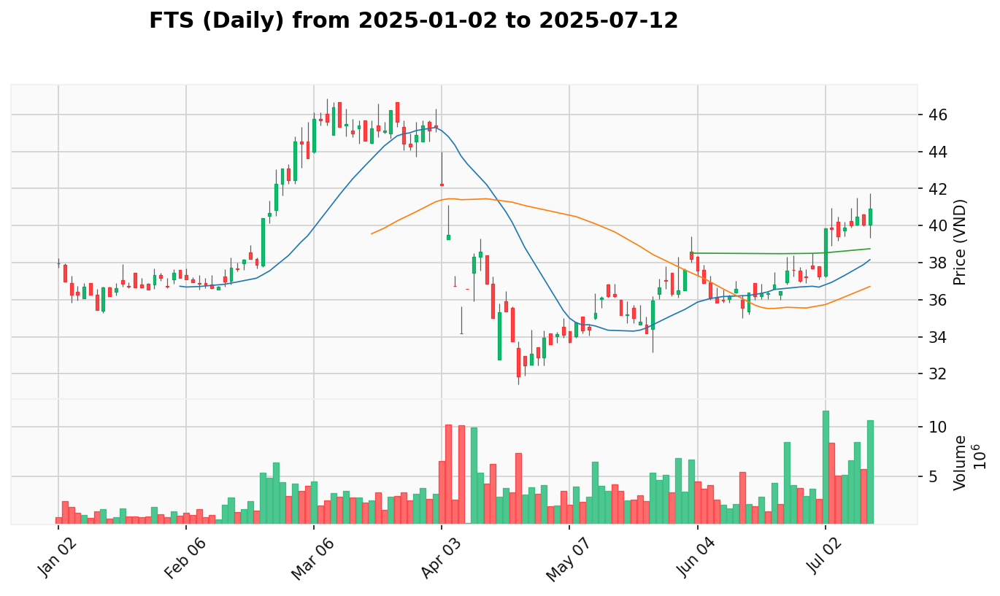

<a href="#chung-khoan">↑ Back to group CHUNG_KHOAN</a>  |  <a href="#vpa-signal-summary">↑ Back to Top</a>

#### Key Statistics
| Metric | Value |
|:---|---:|
| Date Range | 2025-01-02 to 2025-09-26 |
| **Latest Close** | **36.55** |
| Period Open | 37.96 |
| Period High | 46.85 |
| Period Low | 31.41 |
| Period Change % | -3.71% |

**[Download FTS Data (.csv)](market_data/FTS_2025-01-02_to_2025-09-27.csv)**

---

### G36

#### [VPA Analysis (2025-08-04 - 2025-09-26)](./VPA.md#g36)
> **Ngày 2025-09-22:** G36 giữ nguyên mức giá 10.8 VND với khối lượng giao dịch đạt 0.4462 triệu cổ phiếu, tăng so với phiên trước. Cây nến có biên độ rộng hơn (từ 10.5 VND đến 11.0 VND) nhưng đóng cửa ở mức giá mở cửa và bằng với giá đóng cửa phiên trước. Điều này cho thấy nỗ lực tăng giá không thành công, với lực cung vẫn mạnh mẽ ngăn cản đà tăng bất chấp khối lượng giao dịch gia tăng. Sau các phiên thiếu cầu, đây là dấu hiệu tiếp diễn của sự yếu kém và thiếu vắng lực cầu bền vững. **Phân tích VPA/Wyckoff:** Nỗ lực tăng giá không thành công (Effort to Rise Fails)
> **Ngày 2025-09-23:** G36 giảm từ 10.8 VND xuống 10.7 VND với khối lượng giao dịch đạt 0.2074 triệu cổ phiếu, mức thấp nhất trong 10 phiên gần đây và giảm mạnh so với phiên trước. Cây nến có biên độ hẹp và đóng cửa ở mức thấp hơn, cho thấy lực bán đã cạn kiệt nhưng lực cầu vẫn chưa xuất hiện. **Phân tích VPA/Wyckoff:** No Supply (Thiếu cung)
> **Ngày 2025-09-24:** G36 tăng từ 10.7 VND lên 10.9 VND với khối lượng giao dịch đạt 0.3305 triệu cổ phiếu, tăng so với phiên trước. Cây nến có biên độ hẹp và đóng cửa ở mức cao nhất phiên, cho thấy lực cầu đã xuất hiện và đang kiểm soát phiên giao dịch sau giai đoạn thiếu cung. **Phân tích VPA/Wyckoff:** Lực cầu xuất hiện (Demand Coming In)
> **Ngày 2025-09-25:** G36 tăng từ 10.9 VND lên 11.1 VND với khối lượng giao dịch đạt 0.6498 triệu cổ phiếu, tăng mạnh so với phiên trước (0.3305 triệu cổ phiếu) và là mức cao trong 10 phiên gần đây. Cây nến tăng có biên độ rộng và đóng cửa gần mức cao nhất phiên, cho thấy lực cầu mạnh mẽ đang kiểm soát và đẩy giá lên sau giai đoạn lực cầu xuất hiện. **Phân tích VPA/Wyckoff:** Sign of Strength (SOS) - Lực cầu mạnh mẽ.
> **Ngày 2025-09-26:** G36 mở cửa ở mức 11.3 VND và đóng cửa ở mức 11.2 VND, giữ nguyên mức giá đóng cửa so với phiên trước. Khối lượng giao dịch đạt 0.6756 triệu cổ phiếu, giảm mạnh so với phiên trước đó (1.3054 triệu cổ phiếu). Cây nến có biên độ hẹp và cho thấy sự thiếu hụt lực cầu để đẩy giá lên cao hơn sau phiên tăng giá mạnh mẽ, cho thấy lực cầu đã suy yếu. **Phân tích VPA/Wyckoff:** No Demand (Thiếu cầu)

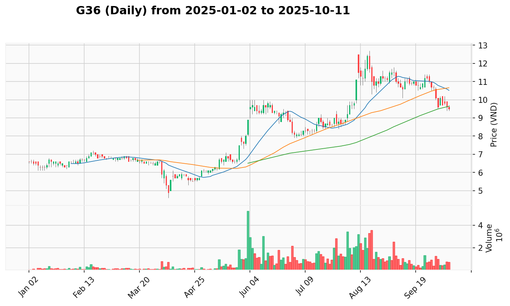

<a href="#dau-tu-cong">↑ Back to group DAU_TU_CONG</a>  |  <a href="#vpa-signal-summary">↑ Back to Top</a>

#### Key Statistics
| Metric | Value |
|:---|---:|
| Date Range | 2025-01-02 to 2025-09-26 |
| **Latest Close** | **11.2** |
| Period Open | 6.6 |
| Period High | 12.7 |
| Period Low | 4.6 |
| Period Change % | 69.70% |

**[Download G36 Data (.csv)](market_data/G36_2025-01-02_to_2025-09-27.csv)**

---

### GAS

#### [VPA Analysis (2025-06-13 - 2025-09-26)](./VPA.md#gas)
> **Ngày 2025-09-22:** GAS giảm từ 62.5 xuống 61.8. Cây nến giảm có biên độ tương đối rộng từ 61.2 lên 62.5, đóng cửa gần mức thấp nhất phiên. Khối lượng giao dịch đạt 0.8836 triệu cổ phiếu, tăng so với phiên trước (0.6582 triệu cổ phiếu). Sau hai phiên "No Demand" liên tiếp, việc giá giảm mạnh với biên độ rộng và khối lượng gia tăng cho thấy áp lực bán đã quay trở lại và đang chiếm ưu thế. Lực cầu vẫn yếu và không đủ để hấp thụ lực cung. **Phân tích VPA/Wyckoff:** Sign of Weakness (SOW) - Áp lực bán gia tăng.
> **Ngày 2025-09-23:** GAS giảm từ 61.8 xuống 61.6. Cây nến giảm có biên độ hẹp từ 61.2 lên 62.0, đóng cửa gần mức thấp nhất phiên. Khối lượng giao dịch đạt 0.5445 triệu cổ phiếu, giảm đáng kể so với phiên trước (0.8836 triệu cổ phiếu). Sau phiên "Sign of Weakness" ngày 2025-09-22, việc giá tiếp tục giảm với khối lượng thấp cho thấy lực bán đã suy yếu nhưng lực cầu vẫn chưa xuất hiện. Thị trường vẫn đang trong giai đoạn yếu. **Phân tích VPA/Wyckoff:** No Demand (ND) - Lực cầu tiếp tục suy yếu.
> **Ngày 2025-09-24:** GAS giữ nguyên mức giá 61.6 VND. Cây nến có biên độ hẹp từ 61.1 lên 61.7, đóng cửa tại mức giá mở cửa và bằng mức đóng cửa phiên trước. Khối lượng giao dịch đạt 0.5582 triệu cổ phiếu, tăng nhẹ so với phiên trước (0.5445 triệu cổ phiếu) nhưng vẫn ở mức thấp. Sau hai phiên giảm giá với áp lực bán và lực cầu yếu, việc giá đi ngang với khối lượng thấp cho thấy thị trường vẫn đang thiếu lực cầu mạnh mẽ để đẩy giá lên. Áp lực bán có thể đã tạm lắng nhưng chưa có dấu hiệu tích cực từ phía mua. **Phân tích VPA/Wyckoff:** No Demand (ND) - Thị trường tiếp tục thiếu lực cầu.
> **Ngày 2025-09-25:** GAS tăng từ 61.6 lên 62.1. Cây nến tăng có biên độ hẹp từ 61.8 lên 62.2, đóng cửa gần mức cao nhất phiên. Khối lượng giao dịch đạt 0.2667 triệu cổ phiếu, giảm mạnh so với phiên trước (0.5582 triệu cổ phiếu) và ở mức rất thấp. Sau hai phiên "No Demand" liên tiếp, việc giá tăng nhẹ với khối lượng cực thấp cho thấy lực cầu vẫn còn rất yếu và không đủ để đẩy giá lên bền vững. Thị trường vẫn đang trong giai đoạn thiếu sức mạnh. **Phân tích VPA/Wyckoff:** No Demand (ND) - Lực cầu yếu, giá tăng không được hỗ trợ bởi khối lượng.
> **Ngày 2025-09-26:** GAS giảm từ 61.9 VND xuống 61.5 VND. Cây nến giảm có biên độ từ 61.5 lên 62.4, đóng cửa tại mức thấp nhất phiên. Khối lượng giao dịch đạt 0.2651 triệu cổ phiếu, giảm mạnh so với phiên trước (0.550 triệu cổ phiếu) và ở mức rất thấp. Sau hai phiên "No Demand", việc giá giảm với khối lượng cực thấp cho thấy áp lực bán đã cạn kiệt nhưng lực cầu vẫn yếu. **Phân tích VPA/Wyckoff:** No Supply (NS) - Áp lực bán cạn kiệt nhưng thị trường vẫn yếu.

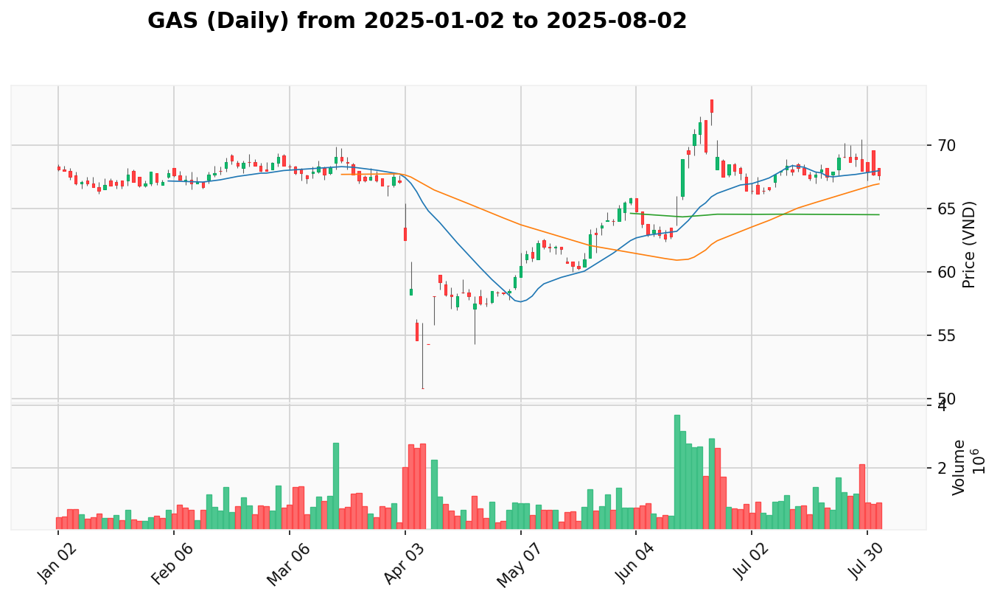

<a href="#dau-khi">↑ Back to group DAU_KHI</a>  |  <a href="#vpa-signal-summary">↑ Back to Top</a>

#### Key Statistics
| Metric | Value |
|:---|---:|
| Date Range | 2025-01-02 to 2025-09-26 |
| **Latest Close** | **61.5** |
| Period Open | 64.29 |
| Period High | 69.28 |
| Period Low | 47.82 |
| Period Change % | -4.34% |

**[Download GAS Data (.csv)](market_data/GAS_2025-01-02_to_2025-09-27.csv)**

---

### GDA

#### [VPA Analysis (2025-08-14 - 2025-09-26)](./VPA.md#gda)
> **Ngày 2025-09-22:** GDA giảm giá từ 18.1 VND xuống 18.0 VND. Phiên giao dịch mở cửa tại 18.3 VND, đạt đỉnh 18.3 VND và đóng cửa ở mức 18.0 VND. Biên độ nến hẹp (17.8 VND - 18.3 VND). Khối lượng giao dịch đạt 0.0915 triệu cổ phiếu, tăng đáng kể so với phiên trước (0.0633 triệu cổ phiếu). Giá giảm nhẹ với khối lượng tăng cho thấy áp lực bán gia tăng, đặc biệt khi giá đóng cửa ở mức thấp nhất phiên, xác nhận sự yếu kém tiếp diễn và có thể là dấu hiệu của sự phân phối. **Phân tích VPA/Wyckoff:** Sign of Weakness (SOW) - Áp lực bán gia tăng.
> **Ngày 2025-09-23:** GDA giảm giá từ 18.0 VND xuống 17.9 VND. Phiên giao dịch mở cửa tại 18.0 VND, đạt đỉnh 18.3 VND và đóng cửa ở mức 17.9 VND. Biên độ nến hẹp (17.8 VND - 18.3 VND). Khối lượng giao dịch đạt 0.0558 triệu cổ phiếu, giảm đáng kể so với phiên trước (0.0915 triệu cổ phiếu). Giá tiếp tục giảm nhẹ với khối lượng giảm cho thấy áp lực bán đã giảm bớt nhưng lực cầu vẫn yếu, không có sự hấp thụ giá ở mức thấp hơn. Điều này xác nhận sự thiếu hụt cầu tiếp diễn và thị trường vẫn trong trạng thái yếu kém. **Phân tích VPA/Wyckoff:** No Demand (ND) - Thiếu hụt cầu
> **Ngày 2025-09-24:** GDA tăng giá từ 17.9 VND lên 18.2 VND. Phiên giao dịch mở cửa tại 18.0 VND, đạt đỉnh 18.2 VND và đóng cửa ở mức 18.2 VND. Biên độ nến hẹp (17.8 VND - 18.2 VND). Khối lượng giao dịch đạt 0.045 triệu cổ phiếu, giảm đáng kể so với phiên trước (0.0558 triệu cổ phiếu). Giá tăng nhẹ với khối lượng giảm cho thấy lực cầu yếu và không có sự tham gia mạnh mẽ từ người mua, sau các phiên giảm giá và thiếu hụt cầu trước đó. Điều này có thể là một đợt kiểm tra cung hoặc một đợt phục hồi yếu trong xu hướng giảm giá. **Phân tích VPA/Wyckoff:** No Supply (NS) - Thiếu hụt cung.
> **Ngày 2025-09-25:** GDA mở cửa tại 18.9 VND nhưng giảm xuống đóng cửa ở mức 18.2 VND, bằng với giá đóng cửa phiên trước. Biên độ nến (18.2 VND - 18.9 VND) cho thấy sự từ chối giá cao hơn. Khối lượng giao dịch chỉ đạt 0.0104 triệu cổ phiếu, giảm mạnh so với phiên trước (0.045 triệu cổ phiếu) và là mức rất thấp. Việc giá mở cửa cao nhưng không giữ được đà tăng, đóng cửa ở mức thấp nhất phiên với khối lượng cực thấp cho thấy sự thiếu hụt nghiêm trọng của lực cầu và sự yếu kém tiếp diễn của thị trường. Điều này xác nhận rằng không có sự quan tâm mua vào ở các mức giá cao hơn. **Phân tích VPA/Wyckoff:** No Demand (ND) - Thiếu hụt cầu.
> **Ngày 2025-09-26:** GDA giảm giá từ 18.3 VND xuống 18.1 VND. Phiên giao dịch mở cửa tại 18.2 VND, đạt đỉnh 18.2 VND và đóng cửa ở mức 18.1 VND. Biên độ nến hẹp (17.7 VND - 18.2 VND). Khối lượng giao dịch đạt 0.1395 triệu cổ phiếu, tăng đáng kể so với phiên trước (0.0315 triệu cổ phiếu). Giá giảm với khối lượng tăng cho thấy áp lực bán gia tăng và sự yếu kém tiếp diễn của thị trường, đặc biệt sau phiên thiếu hụt cầu trước đó. **Phân tích VPA/Wyckoff:** Sign of Weakness (SOW) - Dấu hiệu yếu kém.

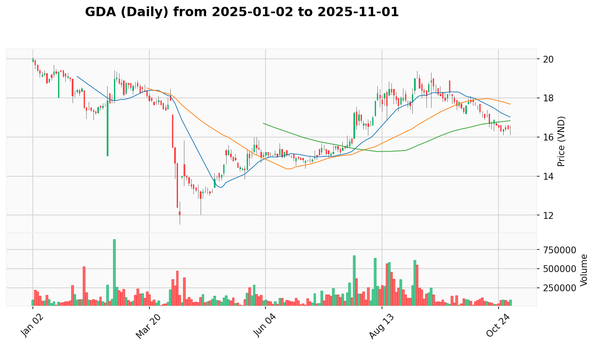

<a href="#thep">↑ Back to group THEP</a>  |  <a href="#vpa-signal-summary">↑ Back to Top</a>

#### Key Statistics
| Metric | Value |
|:---|---:|
| Date Range | 2025-01-02 to 2025-09-26 |
| **Latest Close** | **18.1** |
| Period Open | 19.85 |
| Period High | 20.07 |
| Period Low | 11.53 |
| Period Change % | -8.82% |

**[Download GDA Data (.csv)](market_data/GDA_2025-01-02_to_2025-09-27.csv)**

---

### GDT

#### [VPA Analysis (2025-08-14 - 2025-09-26)](./VPA.md#gdt)
> **Ngày 2025-09-22:** GDT mở cửa 21.3 VND, đạt đỉnh 21.3 VND nhưng giảm về 20.7 VND và đóng cửa 20.9 VND, không đổi so với phiên trước. Khối lượng 0.0372 triệu cổ phiếu, tăng nhẹ. Nến có biên độ rộng, đóng cửa gần mức thấp nhất phiên, cho thấy áp lực bán mạnh mẽ đã đẩy giá xuống từ mức cao trong ngày. Điều này xác nhận lực cung vẫn chiếm ưu thế, ngăn cản đà tăng và củng cố sự yếu kém của thị trường sau các tín hiệu "Thiếu cầu" và "Nguồn cung xuất hiện". **Phân tích VPA/Wyckoff:** Nguồn cung tiếp diễn
> **Ngày 2025-09-23:** GDT mở cửa ở mức 21.3 VND, đạt đỉnh 21.3 VND và giảm xuống 20.75 VND, đóng cửa tại 20.85 VND, giảm 0.05 VND so với phiên trước. Khối lượng giao dịch đạt 0.0051 triệu cổ phiếu, giảm mạnh so với phiên trước (0.0372 triệu cổ phiếu). Nến có biên độ hẹp và giá đóng cửa nằm gần mức thấp nhất phiên. Sau hai phiên liên tiếp cho thấy nguồn cung chiếm ưu thế, phiên này giá giảm nhẹ với khối lượng rất thấp cho thấy lực cầu gần như không tồn tại, củng cố thêm sự yếu kém của thị trường. **Phân tích VPA/Wyckoff:** Thiếu cầu
> **Ngày 2025-09-24:** GDT mở cửa 20.85 VND, đạt đỉnh 21.05 VND, giảm về 20.7 VND và đóng cửa 21.05 VND, tăng 0.2 VND so với phiên trước. Khối lượng giao dịch đạt 0.0141 triệu cổ phiếu, tăng đáng kể so với phiên trước (0.0051 triệu cổ phiếu). Nến có biên độ vừa phải, đóng cửa ở mức cao nhất phiên, cho thấy lực cầu đã quay trở lại và hấp thụ nguồn cung. Sau hai phiên liên tiếp cho thấy nguồn cung chiếm ưu thế và thiếu cầu, phiên này giá tăng với khối lượng gia tăng và đóng cửa ở mức cao nhất phiên, cho thấy sự thay đổi trong tâm lý thị trường và có thể là một dấu hiệu của sự trở lại của lực cầu. **Phân tích VPA/Wyckoff:** Sign of Strength (SOS) - Lực cầu mạnh mẽ
> **Ngày 2025-09-25:** GDT mở cửa ở mức 21.0 VND, đạt đỉnh 21.0 VND và giảm xuống 20.8 VND, đóng cửa tại 20.8 VND, giảm 0.25 VND so với phiên trước. Khối lượng giao dịch đạt 0.0022 triệu cổ phiếu, giảm mạnh so với phiên trước (0.0141 triệu cổ phiếu). Nến có biên độ hẹp và giá đóng cửa nằm ở mức thấp nhất phiên. Sau phiên "Sign of Strength" ngày hôm qua, phiên này giá giảm với khối lượng rất thấp và đóng cửa ở mức thấp nhất, cho thấy lực cầu không duy trì được và thị trường tiếp tục yếu kém. **Phân tích VPA/Wyckoff:** Thiếu cầu / Yếu kém tiếp diễn
> **Ngày 2025-09-26:** GDT mở cửa 20.95 VND, đạt đỉnh 21.5 VND, giảm về 20.8 VND và đóng cửa 21.0 VND, tăng 0.05 VND so với phiên trước. Khối lượng giao dịch đạt 0.0162 triệu cổ phiếu, tăng đáng kể so với phiên trước (0.0055 triệu cổ phiếu). Nến có biên độ rộng, giá tăng nhẹ nhưng đóng cửa ở giữa thân nến, cho thấy lực cầu đã cố gắng đẩy giá lên cao (đạt 21.5 VND) nhưng đã gặp phải áp lực bán mạnh, khiến giá không thể duy trì ở mức cao nhất. Sau phiên thiếu cầu ngày hôm qua, phiên này cho thấy sự trở lại của hoạt động giao dịch với khối lượng lớn, nhưng kết quả tăng giá không tương xứng với nỗ lực, cho thấy nguồn cung vẫn còn hiện diện. **Phân tích VPA/Wyckoff:** Nỗ lực tăng giá nhưng không đạt kết quả (Effort to Rise but No Result)

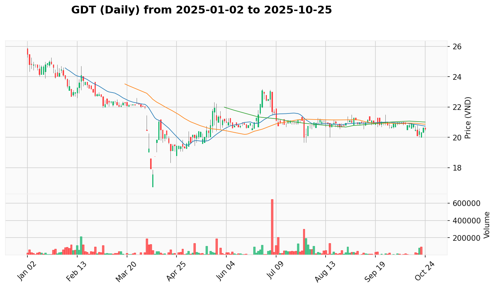

<a href="#others">↑ Back to group OTHERS</a>  |  <a href="#vpa-signal-summary">↑ Back to Top</a>

#### Key Statistics
| Metric | Value |
|:---|---:|
| Date Range | 2025-01-02 to 2025-09-26 |
| **Latest Close** | **21.0** |
| Period Open | 25.85 |
| Period High | 25.9 |
| Period Low | 16.74 |
| Period Change % | -18.76% |

**[Download GDT Data (.csv)](market_data/GDT_2025-01-02_to_2025-09-27.csv)**

---

### GEG

#### [VPA Analysis (2025-08-04 - 2025-09-26)](./VPA.md#geg)
> **Ngày 2025-09-22:** GEG giảm từ 16.35 VND xuống 15.85 VND với khối lượng giao dịch đạt 1.3896 triệu cổ phiếu. Cây nến giảm có biên độ rộng, đóng cửa gần mức thấp nhất phiên, cho thấy áp lực bán mạnh mẽ và nguồn cung đang chiếm ưu thế. Khối lượng giao dịch tăng so với phiên trước (0.9914 triệu cổ phiếu), xác nhận sự gia tăng của lực bán. Sau phiên "No Demand" ngày 2025-09-19, sự giảm giá với khối lượng tăng này cho thấy thị trường đang đối mặt với nguồn cung đáng kể. **Phân tích VPA/Wyckoff:** Supply Coming In (Nguồn cung xuất hiện) - Lực bán mạnh mẽ với khối lượng gia tăng xác nhận sự suy yếu.
> **Ngày 2025-09-23:** GEG giữ nguyên mức giá 15.85 VND với khối lượng giao dịch đạt 0.5757 triệu cổ phiếu. Cây nến có biên độ hẹp, cho thấy sự lưỡng lự của thị trường. Sau phiên "Supply Coming In" với khối lượng lớn, việc giá đi ngang với khối lượng thấp cho thấy áp lực bán đã tạm lắng và nguồn cung không còn dồi dào. Tuy nhiên, lực cầu cũng chưa xuất hiện mạnh mẽ để đẩy giá lên. Đây có thể là một giai đoạn kiểm tra nguồn cung trước khi có động thái rõ ràng hơn. **Phân tích VPA/Wyckoff:** Test for Supply (Kiểm tra nguồn cung)
> **Ngày 2025-09-24:** GEG tăng từ 15.85 VND lên 15.95 VND với khối lượng giao dịch đạt 0.7249 triệu cổ phiếu. Cây nến có biên độ hẹp, đóng cửa cao hơn mức đóng cửa phiên trước nhưng thấp hơn giá mở cửa, cho thấy sự giằng co giữa cung và cầu. Khối lượng giao dịch tăng nhẹ so với phiên trước (0.5757 triệu cổ phiếu), cho thấy sự tham gia của cả hai phe. Sau phiên "Test for Supply" ngày 2025-09-23, động thái này có thể là một dấu hiệu cho thấy lực cầu đang cố gắng hấp thụ nguồn cung, nhưng vẫn còn sự kháng cự và thị trường đang kiểm tra mức độ sẵn sàng của lực mua. **Phân tích VPA/Wyckoff:** Test for Demand
> **Ngày 2025-09-25:** GEG tăng từ 15.95 VND lên 16.35 VND với khối lượng giao dịch đạt 0.6874 triệu cổ phiếu. Cây nến có biên độ rộng, đóng cửa gần mức cao nhất phiên, cho thấy lực cầu mạnh mẽ. Mặc dù khối lượng giao dịch giảm nhẹ so với phiên trước (0.7249 triệu cổ phiếu), nhưng động thái tăng giá dứt khoát này sau các phiên kiểm tra cung cầu cho thấy nguồn cung đã cạn kiệt và lực cầu đang chiếm ưu thế. **Phân tích VPA/Wyckoff:** Sign of Strength (SOS) - Lực cầu mạnh mẽ với khối lượng giảm nhẹ cho thấy nguồn cung đã cạn kiệt.
> **Ngày 2025-09-26:** GEG giữ nguyên ở mức 16.3 VND với khối lượng giao dịch đạt 0.8725 triệu cổ phiếu. Cây nến có biên độ hẹp, mở cửa cao hơn nhưng đóng cửa bằng mức đóng cửa phiên trước, cho thấy sự thiếu hụt lực cầu để đẩy giá lên cao hơn sau phiên tăng mạnh trước đó. Khối lượng giao dịch giảm so với phiên trước, xác nhận sự suy yếu của lực mua. **Phân tích VPA/Wyckoff:** No Demand

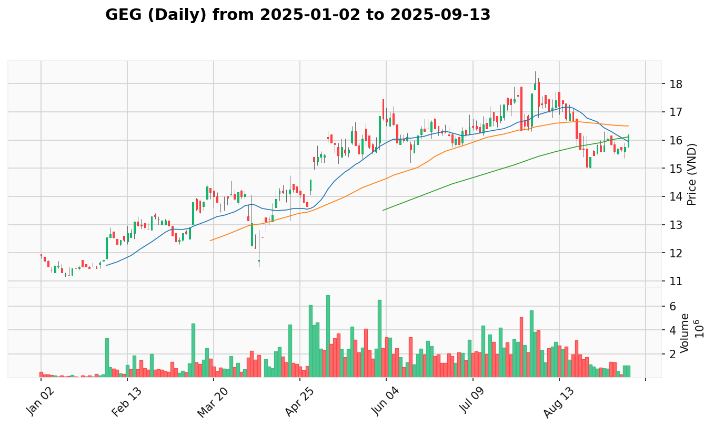

<a href="#nang-luong">↑ Back to group NANG_LUONG</a>  |  <a href="#vpa-signal-summary">↑ Back to Top</a>

#### Key Statistics
| Metric | Value |
|:---|---:|
| Date Range | 2025-01-02 to 2025-09-26 |
| **Latest Close** | **16.3** |
| Period Open | 11.95 |
| Period High | 18.45 |
| Period Low | 11.15 |
| Period Change % | 36.40% |

**[Download GEG Data (.csv)](market_data/GEG_2025-01-02_to_2025-09-27.csv)**

---

### GEX

#### [VPA Analysis (2025-06-16 - 2025-09-26)](./VPA.md#gex)
> **Ngày 2025-09-22:** GEX giảm từ 55.0 VND xuống 54.8 VND. Giá đóng cửa 54.8 VND thấp hơn giá đóng cửa phiên trước 55.0 VND. Cây nến giảm có biên độ rộng 3.6 VND (từ 51.8 VND đến 55.4 VND), đóng cửa ở mức giữa phiên. Khối lượng giao dịch đạt 9.50 triệu cổ phiếu, giảm nhẹ 3.0% so với phiên trước (9.80 triệu cổ phiếu). Sau phiên nỗ lực tăng giá gặp cung ngày 2025-09-19, phiên này giá giảm với biên độ rộng và khối lượng cao, cho thấy áp lực bán mạnh mẽ đã xuất hiện và hấp thụ toàn bộ lực cầu trước đó. Giá mở cửa bằng giá cao nhất phiên và sau đó giảm mạnh cho thấy nguồn cung đã chiếm ưu thế ngay từ đầu phiên. **Phân tích VPA/Wyckoff:** Sự yếu kém (Weakness)
> **Ngày 2025-09-23:** GEX giảm từ 54.8 VND xuống 52.8 VND. Giá đóng cửa 52.8 VND thấp hơn giá đóng cửa phiên trước 54.8 VND. Cây nến giảm có biên độ rộng 2.1 VND (từ 52.8 VND đến 54.9 VND), đóng cửa ở mức thấp nhất phiên. Khối lượng giao dịch đạt 4.36 triệu cổ phiếu, giảm mạnh 54.1% so với phiên trước (9.50 triệu cổ phiếu). Sau phiên giảm giá mạnh với khối lượng cao ngày 2025-09-22, phiên này giá tiếp tục giảm sâu và đóng cửa ở mức thấp nhất. Tuy nhiên, khối lượng giao dịch giảm đáng kể cho thấy áp lực bán đã suy yếu hoặc thiếu vắng lực cầu hỗ trợ. Mặc dù vậy, việc giá đóng cửa ở mức thấp nhất phiên vẫn xác nhận sự kiểm soát của phe bán. **Phân tích VPA/Wyckoff:** Tiếp tục sự yếu kém (Continued Weakness) - Giá giảm mạnh và đóng cửa ở mức thấp nhất phiên, tuy nhiên khối lượng giảm cho thấy áp lực bán đã suy yếu.
> **Ngày 2025-09-24:** GEX giảm từ 52.8 VND xuống 52.5 VND. Giá đóng cửa 52.5 VND thấp hơn giá đóng cửa phiên trước 52.8 VND. Cây nến giảm có biên độ hẹp 2.0 VND (từ 51.0 VND đến 53.0 VND), đóng cửa ở mức giữa phiên. Khối lượng giao dịch đạt 4.73 triệu cổ phiếu, tăng nhẹ 8.4% so với phiên trước (4.36 triệu cổ phiếu). Sau hai phiên giảm giá mạnh, phiên này GEX tiếp tục giảm nhẹ với biên độ hẹp và khối lượng tăng nhẹ. Điều này cho thấy áp lực bán vẫn còn hiện hữu, tuy nhiên sự giảm giá không quá quyết liệt như các phiên trước. Việc giá đóng cửa ở giữa phiên cùng với khối lượng tăng nhẹ có thể là dấu hiệu của sự hấp thụ cung ở vùng giá thấp, nhưng chưa đủ mạnh để tạo ra sự đảo chiều. Thị trường đang trong giai đoạn lưỡng lự sau chuỗi giảm giá. **Phân tích VPA/Wyckoff:** Tiếp tục sự yếu kém (Continued Weakness)
> **Ngày 2025-09-25:** GEX tăng từ 52.5 VND lên 53.7 VND. Giá đóng cửa 53.7 VND cao hơn giá đóng cửa phiên trước 52.5 VND. Cây nến tăng có biên độ hẹp 1.8 VND (từ 52.6 VND đến 54.4 VND), đóng cửa gần mức cao nhất phiên. Khối lượng giao dịch đạt 1.81 triệu cổ phiếu, giảm mạnh 61.7% so với phiên trước (4.73 triệu cổ phiếu). Sau chuỗi giảm giá và hai phiên "Tiếp tục sự yếu kém", phiên này GEX có nhịp tăng nhẹ nhưng với khối lượng rất thấp. Điều này cho thấy lực cầu yếu và sự tăng giá này có thể chỉ là một nhịp hồi kỹ thuật hoặc một đợt kiểm tra cung. Áp lực bán có thể đã tạm thời giảm bớt, nhưng chưa có dấu hiệu rõ ràng của sự hấp thụ mạnh mẽ hay sự quay trở lại của dòng tiền lớn. **Phân tích VPA/Wyckoff:** Không có cầu (No Demand) - Giá tăng với khối lượng thấp sau giai đoạn giảm giá, cho thấy thiếu vắng lực cầu hỗ trợ và khả năng tăng giá bền vững là thấp.
> **Ngày 2025-09-26:** GEX giảm từ 53.5 VND xuống 53.0 VND. Giá đóng cửa 53.0 VND thấp hơn giá đóng cửa phiên trước 53.5 VND. Cây nến giảm có biên độ hẹp 1.4 VND (từ 52.4 VND đến 53.8 VND), đóng cửa ở mức giữa đến thấp của phiên. Khối lượng giao dịch đạt 3.23 triệu cổ phiếu, giảm 15.5% so với phiên trước (3.82 triệu cổ phiếu). Sau phiên "Không có cầu" với giá tăng nhẹ và khối lượng thấp, phiên này GEX tiếp tục giảm nhẹ với khối lượng còn thấp hơn. Điều này cho thấy cả lực cầu và lực cung đều yếu, nhưng xu hướng giảm giá vẫn tiếp diễn, xác nhận sự thiếu vắng động lực tăng trưởng và sự yếu kém của thị trường. **Phân tích VPA/Wyckoff:** Tiếp tục sự yếu kém (Continued Weakness)

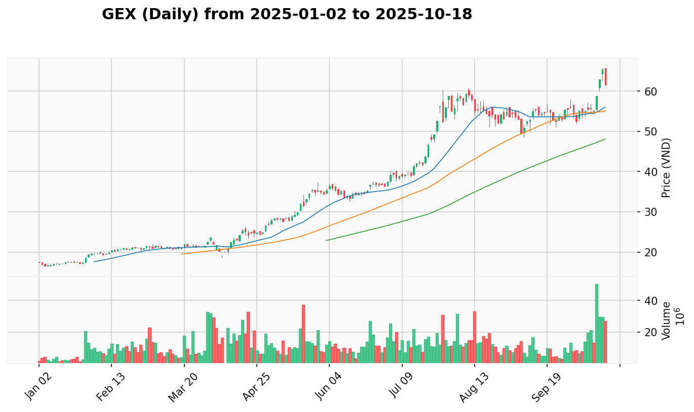

<a href="#others">↑ Back to group OTHERS</a>  |  <a href="#vpa-signal-summary">↑ Back to Top</a>

#### Key Statistics
| Metric | Value |
|:---|---:|
| Date Range | 2025-01-02 to 2025-09-26 |
| **Latest Close** | **53.0** |
| Period Open | 17.57 |
| Period High | 60.74 |
| Period Low | 16.42 |
| Period Change % | 201.65% |

**[Download GEX Data (.csv)](market_data/GEX_2025-01-02_to_2025-09-27.csv)**

---

### GIL

#### [VPA Analysis (2025-08-05 - 2025-09-26)](./VPA.md#gil)
> **Ngày 2025-09-22:** GIL giảm từ 18.7 VND xuống 18.3 VND với khối lượng giao dịch đạt 0.7678 triệu cổ phiếu. Giá mở cửa bằng giá cao nhất phiên và đóng cửa gần mức thấp nhất phiên, tạo thành một cây nến giảm mạnh với biên độ rộng. Khối lượng giao dịch tăng đột biến so với phiên trước (0.1565 triệu cổ phiếu), cho thấy áp lực bán rất mạnh và nguồn cung lớn đã xuất hiện, đẩy giá xuống. Sau các phiên "Thiếu cầu" và "Thiếu cung", sự xuất hiện của khối lượng lớn kèm giá giảm mạnh xác nhận xu hướng giảm giá tiếp diễn hoặc một đợt bán tháo mạnh. **Phân tích VPA/Wyckoff:** Selling Climax (SC) - Lực bán mạnh mẽ.
> **Ngày 2025-09-23:** GIL giảm nhẹ từ 18.3 VND xuống 18.2 VND. Giá mở cửa 18.1 VND, cao nhất 18.35 VND, thấp nhất 18.1 VND. Biên độ giá hẹp. Khối lượng giao dịch đạt 0.1878 triệu cổ phiếu, giảm mạnh so với phiên trước (0.7678 triệu cổ phiếu) và là mức thấp nhất trong 10 phiên gần đây. Sau phiên Selling Climax (SC) ngày 2025-09-22 với áp lực bán mạnh, việc giá tiếp tục giảm nhẹ nhưng với khối lượng cực thấp cho thấy lực bán đã cạn kiệt đáng kể và thị trường đang kiểm tra lại nguồn cung. **Phân tích VPA/Wyckoff:** Test for Supply (TS) - Kiểm tra cung.
> **Ngày 2025-09-24:** GIL tăng nhẹ từ 18.2 VND lên 18.3 VND với khối lượng giao dịch đạt 0.2501 triệu cổ phiếu. Giá mở cửa 18.1 VND, cao nhất 18.3 VND, thấp nhất 18.0 VND. Biên độ giá hẹp và giá đóng cửa ở mức cao nhất phiên, cho thấy lực cầu đã xuất hiện sau phiên Kiểm tra cung (TS) ngày 2025-09-23. Khối lượng giao dịch tăng so với phiên trước (0.1878 triệu cổ phiếu) nhưng vẫn ở mức trung bình thấp, cho thấy lực cầu đang dần hấp thụ nguồn cung còn lại. **Phân tích VPA/Wyckoff:** Dấu hiệu cầu vào (Demand coming in)
> **Ngày 2025-09-25:** GIL tăng nhẹ từ 18.3 VND lên 18.35 VND. Giá mở cửa 18.55 VND, cao nhất 18.55 VND, thấp nhất 18.2 VND. Biên độ giá hẹp. Khối lượng giao dịch đạt 0.1421 triệu cổ phiếu, giảm mạnh so với phiên trước (0.2501 triệu cổ phiếu) và là mức thấp nhất trong 10 phiên gần đây. Sau phiên có dấu hiệu cầu vào ngày 2025-09-24, việc giá tiếp tục tăng nhẹ nhưng với khối lượng cực thấp cho thấy lực cầu không đủ mạnh để đẩy giá lên cao hơn và thiếu sự tham gia của thị trường. **Phân tích VPA/Wyckoff:** No Demand (ND) - Thiếu cầu.
> **Ngày 2025-09-26:** GIL giữ nguyên mức giá 18.4 VND với khối lượng giao dịch đạt 0.4676 triệu cổ phiếu, tăng đáng kể so với phiên trước (0.2631 triệu cổ phiếu). Giá mở cửa 18.2 VND, thấp hơn giá đóng cửa phiên trước, nhưng đã phục hồi và đóng cửa ở mức cao nhất phiên 18.4 VND. Sau phiên Thiếu cầu (ND) ngày 2025-09-25, việc giá không tăng dù khối lượng giao dịch lớn cho thấy nỗ lực tăng giá không mang lại kết quả rõ rệt, có thể do áp lực cung vẫn còn mạnh ở vùng giá này hoặc cầu chưa đủ mạnh để hấp thụ hết lượng cung gia tăng. **Phân tích VPA/Wyckoff:** Effort vs. Result (No Result) - Nỗ lực không mang lại kết quả.

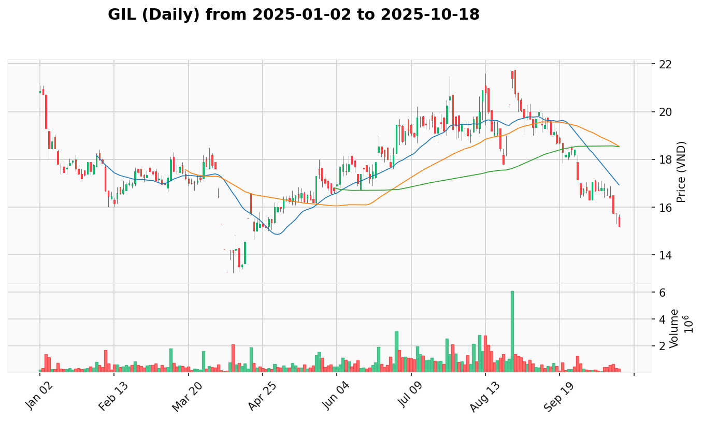

<a href="#det-may">↑ Back to group DET_MAY</a>  |  <a href="#vpa-signal-summary">↑ Back to Top</a>

#### Key Statistics
| Metric | Value |
|:---|---:|
| Date Range | 2025-01-02 to 2025-09-26 |
| **Latest Close** | **18.4** |
| Period Open | 20.8 |
| Period High | 21.75 |
| Period Low | 13.25 |
| Period Change % | -11.54% |

**[Download GIL Data (.csv)](market_data/GIL_2025-01-02_to_2025-09-27.csv)**

---

### GMD

#### [VPA Analysis (2025-06-16 - 2025-09-26)](./VPA.md#gmd)
> **Ngày 2025-09-22:** GMD giảm từ 72.9 VND xuống 71.1 VND với khối lượng giao dịch tăng lên 2.5427 triệu cổ phiếu. Cây nến giảm có biên độ rộng và đóng cửa gần mức thấp nhất phiên, cho thấy áp lực bán mạnh mẽ đang quay trở lại. Sau phiên Test ngày 2025-09-19 với khối lượng thấp, việc giá giảm mạnh với khối lượng gia tăng hôm nay xác nhận rằng nguồn cung đang chiếm ưu thế và lực cầu vẫn còn yếu. Đây là một dấu hiệu cảnh báo về sự tiếp diễn của xu hướng giảm. **Phân tích VPA/Wyckoff:** Sign of Weakness (SOW)
> **Ngày 2025-09-23:** GMD giảm từ 71.1 VND xuống 69.5 VND với khối lượng giao dịch giảm xuống 2.1478 triệu cổ phiếu. Cây nến giảm có biên độ hẹp và đóng cửa gần mức thấp nhất phiên. Sau phiên Sign of Weakness (SOW) ngày 2025-09-22 với khối lượng tăng, phiên hôm nay giá tiếp tục giảm nhưng với khối lượng thấp hơn, cho thấy lực cầu vắng mặt và không có sự hỗ trợ đáng kể ở mức giá này. Giá đã phá vỡ các mức hỗ trợ gần đây, xác nhận xu hướng giảm. **Phân tích VPA/Wyckoff:** No Demand (ND)
> **Ngày 2025-09-24:** GMD tăng từ 69.5 VND lên 70.7 VND với khối lượng giao dịch tăng lên 2.3247 triệu cổ phiếu. Cây nến tăng có biên độ tương đối và đóng cửa gần mức cao nhất phiên, cho thấy lực cầu đã quay trở lại sau hai phiên giảm giá. Mặc dù khối lượng chưa thực sự đột biến, nhưng việc giá tăng với khối lượng gia tăng sau một phiên No Demand (ND) cho thấy có sự hấp thụ lực bán. Đây có thể là một dấu hiệu tích cực ban đầu, cần theo dõi thêm để xác nhận xu hướng. **Phân tích VPA/Wyckoff:** Sign of Strength (SOS)
> **Ngày 2025-09-25:** GMD tăng từ 70.7 VND lên 71.6 VND với khối lượng giao dịch giảm xuống 1.1115 triệu cổ phiếu. Cây nến tăng có biên độ hẹp và đóng cửa gần mức cao nhất phiên. Sau phiên Sign of Strength (SOS) ngày 2025-09-24 với khối lượng gia tăng, phiên hôm nay giá tiếp tục tăng nhưng với khối lượng giảm đáng kể, cho thấy lực cầu không còn mạnh mẽ như trước và có thể thiếu sự hỗ trợ bền vững cho đà tăng. Điều này có thể là dấu hiệu của sự suy yếu trong đà phục hồi. **Phân tích VPA/Wyckoff:** Lack of Demand (LOD)
> **Ngày 2025-09-26:** GMD giảm từ 71.8 VND xuống 70.0 VND với khối lượng giao dịch tăng lên 1.9941 triệu cổ phiếu. Cây nến giảm có biên độ tương đối và đóng cửa gần mức thấp nhất phiên, cho thấy áp lực bán mạnh mẽ đang chiếm ưu thế. Sau phiên Lack of Demand (LOD) ngày 2025-09-25, việc giá giảm mạnh với khối lượng gia tăng xác nhận sự suy yếu của lực cầu và sự xuất hiện của nguồn cung lớn trên thị trường. Điều này cho thấy đà phục hồi đã bị chặn đứng và có khả năng tiếp diễn xu hướng giảm. **Phân tích VPA/Wyckoff:** Supply Coming In (SCI)

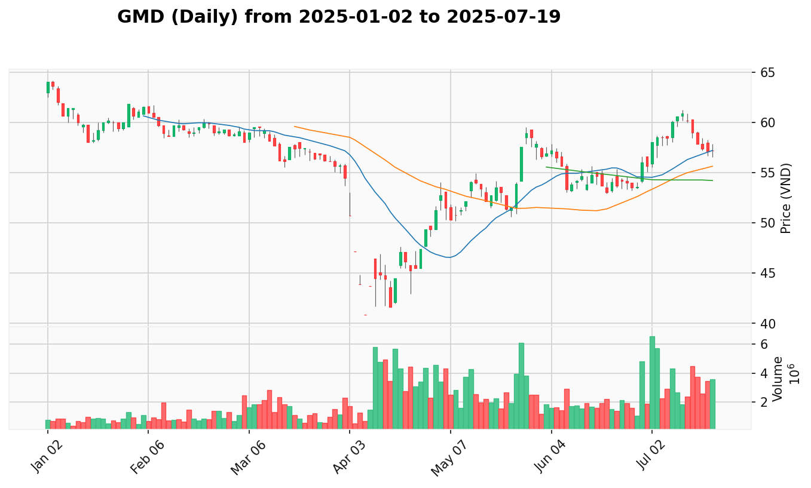

<a href="#van-tai">↑ Back to group VAN_TAI</a>  |  <a href="#vpa-signal-summary">↑ Back to Top</a>

#### Key Statistics
| Metric | Value |
|:---|---:|
| Date Range | 2025-01-02 to 2025-09-26 |
| **Latest Close** | **70.0** |
| Period Open | 63.0 |
| Period High | 74.5 |
| Period Low | 40.84 |
| Period Change % | 11.11% |

**[Download GMD Data (.csv)](market_data/GMD_2025-01-02_to_2025-09-27.csv)**

---

### GVR

#### [VPA Analysis (2025-06-13 - 2025-09-26)](./VPA.md#gvr)
> **Ngày 2025-09-22:** GVR giảm từ 28.6 VND (giá đóng cửa phiên trước) xuống 28.3 VND với khối lượng giao dịch đạt 1.3764 triệu cổ phiếu, tiếp tục giảm so với phiên trước (1.5227 triệu cổ phiếu). Cây nến giảm có biên độ hẹp và đóng cửa ở mức thấp. Mặc dù giá tiếp tục giảm, khối lượng thấp cho thấy áp lực bán không quá mạnh nhưng đồng thời cũng xác nhận sự thiếu hụt lực cầu nghiêm trọng, không có người mua sẵn sàng đẩy giá lên. Điều này cho thấy sự suy yếu tiếp diễn của thị trường. **Phân tích VPA/Wyckoff:** No Demand (Thiếu cầu)
> **Ngày 2025-09-23:** GVR giảm từ 28.3 VND (giá đóng cửa phiên trước) xuống 28.1 VND với khối lượng giao dịch đạt 0.8418 triệu cổ phiếu, tiếp tục giảm mạnh so với phiên trước (1.3764 triệu cổ phiếu). Cây nến giảm có biên độ hẹp và đóng cửa ở mức thấp nhất phiên. Mặc dù giá tiếp tục giảm, khối lượng cực thấp cho thấy áp lực bán không quá mạnh nhưng đồng thời cũng xác nhận sự thiếu hụt lực cầu nghiêm trọng, không có người mua sẵn sàng đẩy giá lên. Điều này cho thấy sự suy yếu tiếp diễn của thị trường và khả năng giá sẽ tiếp tục giảm hoặc đi ngang trong ngắn hạn. **Phân tích VPA/Wyckoff:** No Demand (Thiếu cầu)
> **Ngày 2025-09-24:** GVR tăng từ 28.1 VND (giá đóng cửa phiên trước) lên 28.6 VND với khối lượng giao dịch đạt 1.0047 triệu cổ phiếu, tăng so với phiên trước (0.8418 triệu cổ phiếu). Cây nến tăng có biên độ tương đối rộng và đóng cửa ở mức cao nhất phiên, cho thấy sự hấp thụ tốt lực cung ở vùng giá thấp. Sau hai phiên liên tiếp cho thấy "No Demand" và giá giảm về vùng hỗ trợ 28.0 VND, sự tăng giá kèm khối lượng gia tăng và đóng cửa ở mức cao nhất phiên cho thấy lực cầu đã quay trở lại thị trường. Mặc dù khối lượng chưa thực sự bùng nổ so với các phiên trước đó trong tháng, đây là một dấu hiệu tích cực cho thấy sự thay đổi trong tâm lý thị trường và khả năng giá sẽ tiếp tục phục hồi trong ngắn hạn, với vùng kháng cự gần nhất quanh 29.0-29.5 VND. **Phân tích VPA/Wyckoff:** Lực cầu quay trở lại
> **Ngày 2025-09-25:** GVR tăng từ 28.6 VND (giá đóng cửa phiên trước) lên 28.7 VND với khối lượng giao dịch đạt 0.6798 triệu cổ phiếu, giảm đáng kể so với phiên trước (1.0047 triệu cổ phiếu). Cây nến tăng có biên độ hẹp và đóng cửa gần giữa thân nến, cho thấy sự lưỡng lự của thị trường. Mặc dù giá có sự phục hồi nhẹ, khối lượng giao dịch cực thấp cho thấy lực cầu không được duy trì mạnh mẽ sau phiên tăng giá trước đó. Điều này có thể là một dấu hiệu của sự thiếu hụt lực mua hoặc một đợt kiểm tra cung cầu, cho thấy đà tăng có thể không bền vững và thị trường vẫn còn yếu. **Phân tích VPA/Wyckoff:** No Demand (Thiếu cầu)
> **Ngày 2025-09-26:** GVR giảm từ 28.8 VND (giá đóng cửa phiên trước) xuống 28.5 VND với khối lượng giao dịch đạt 1.301 triệu cổ phiếu, tăng so với phiên trước (1.1863 triệu cổ phiếu). Cây nến giảm có biên độ tương đối rộng và đóng cửa ở mức thấp nhất phiên, cho thấy áp lực bán mạnh mẽ. Sau hai phiên có dấu hiệu lực cầu quay trở lại, sự giảm giá kèm khối lượng gia tăng trong phiên này cho thấy lực cung đã chiếm ưu thế và có thể đẩy giá xuống thấp hơn. Vùng hỗ trợ gần nhất là 28.0 VND. **Phân tích VPA/Wyckoff:** Lực cung xuất hiện (Supply Coming In)

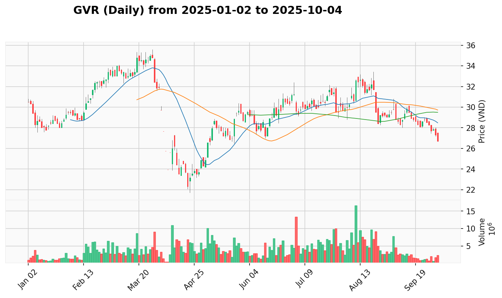

<a href="#cao-su">↑ Back to group CAO_SU</a>  |  <a href="#vpa-signal-summary">↑ Back to Top</a>

#### Key Statistics
| Metric | Value |
|:---|---:|
| Date Range | 2025-01-02 to 2025-09-26 |
| **Latest Close** | **28.5** |
| Period Open | 30.5 |
| Period High | 35.6 |
| Period Low | 21.7 |
| Period Change % | -6.56% |

**[Download GVR Data (.csv)](market_data/GVR_2025-01-02_to_2025-09-27.csv)**

---

### HAG

#### [VPA Analysis (2025-06-16 - 2025-09-26)](./VPA.md#hag)
> **Ngày 2025-09-22:** HAG giảm từ 15.6 VND xuống 15.3 VND. Cây nến giảm có biên độ rộng (0.75 VND) và đóng cửa ở mức thấp gần nhất phiên. Khối lượng giao dịch đạt 9.21 triệu cổ phiếu, tăng mạnh so với phiên trước (4.83 triệu cổ phiếu) và cao hơn mức trung bình. Sau các phiên "No Demand" và "Weakness", việc giá giảm mạnh với biên độ rộng và khối lượng lớn cho thấy áp lực bán gia tăng đáng kể và sự yếu kém của thị trường. **Phân tích VPA/Wyckoff:** Weakness (Yếu kém)
> **Ngày 2025-09-23:** HAG giảm từ 15.3 VND xuống 15.25 VND. Cây nến giảm có biên độ hẹp (0.25 VND) và đóng cửa gần mức thấp nhất phiên. Khối lượng giao dịch đạt 3.21 triệu cổ phiếu, giảm mạnh so với phiên trước (9.21 triệu cổ phiếu) và ở mức rất thấp. Sau các phiên giảm giá với áp lực bán mạnh, việc giá tiếp tục giảm với biên độ hẹp và khối lượng rất thấp cho thấy lực bán đã suy yếu nhưng đồng thời cũng không có lực cầu nào xuất hiện để hỗ trợ giá. Điều này xác nhận sự yếu kém của thị trường và khả năng tiếp tục giảm giá hoặc đi ngang tích lũy ở mức thấp. **Phân tích VPA/Wyckoff:** Weakness (Yếu kém)
> **Ngày 2025-09-24:** HAG tăng từ 15.25 VND lên 15.65 VND. Cây nến tăng có biên độ rộng (0.6 VND) và đóng cửa ở mức cao nhất phiên. Khối lượng giao dịch đạt 4.363 triệu cổ phiếu, tăng so với phiên trước (3.205 triệu cổ phiếu). Sau hai phiên giảm giá liên tiếp cho thấy sự yếu kém, việc giá tăng mạnh với biên độ rộng và đóng cửa ở mức cao nhất phiên cùng với khối lượng gia tăng cho thấy lực cầu đã quay trở lại và áp đảo lực cung. Điều này có thể là một dấu hiệu của sức mạnh. **Phân tích VPA/Wyckoff:** Sign of Strength (SOS)
> **Ngày 2025-09-25:** HAG tăng từ 15.65 VND lên 15.9 VND. Cây nến tăng có biên độ rộng (0.65 VND) và đóng cửa gần mức cao nhất phiên. Khối lượng giao dịch đạt 6.2177 triệu cổ phiếu, tiếp tục gia tăng so với phiên trước (4.363 triệu cổ phiếu). Sau phiên tăng giá mạnh với tín hiệu sức mạnh (SOS) ngày 2025-09-24, việc giá tiếp tục tăng với biên độ rộng, đóng cửa gần mức cao nhất và khối lượng gia tăng cho thấy lực cầu vẫn đang áp đảo lực cung và xác nhận xu hướng tăng giá. **Phân tích VPA/Wyckoff:** Sign of Strength (SOS)
> **Ngày 2025-09-26:** HAG tăng từ 15.8 VND lên 15.9 VND. Cây nến tăng có biên độ rộng (0.6 VND) nhưng đóng cửa ở mức giữa. Khối lượng giao dịch đạt 17.26 triệu cổ phiếu, tăng đột biến so với phiên trước (8.97 triệu cổ phiếu). Sau hai phiên tăng giá mạnh với tín hiệu sức mạnh (SOS), việc giá tiếp tục tăng nhưng đóng cửa ở mức giữa với khối lượng gia tăng đột biến cho thấy lực cung đã xuất hiện mạnh mẽ và hấp thụ một phần lực cầu, cho thấy sự nỗ lực tăng giá nhưng không đạt được kết quả tương xứng. **Phân tích VPA/Wyckoff:** Effort to Rise but No Result (ERBR)

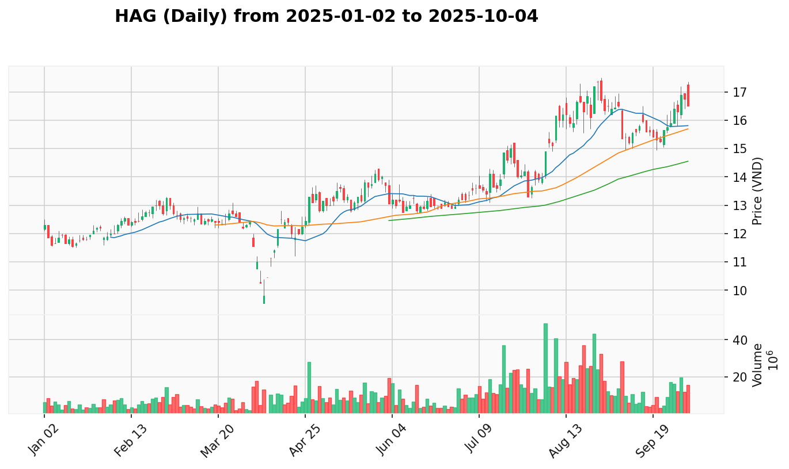

<a href="#nong-nghiep">↑ Back to group NONG_NGHIEP</a>  |  <a href="#vpa-signal-summary">↑ Back to Top</a>

#### Key Statistics
| Metric | Value |
|:---|---:|
| Date Range | 2025-01-02 to 2025-09-26 |
| **Latest Close** | **15.9** |
| Period Open | 12.15 |
| Period High | 17.5 |
| Period Low | 9.54 |
| Period Change % | 30.86% |

**[Download HAG Data (.csv)](market_data/HAG_2025-01-02_to_2025-09-27.csv)**

---

### HAH

#### [VPA Analysis (2025-06-26 - 2025-09-26)](./VPA.md#hah)
> **Ngày 2025-09-22:** HAH giảm từ 56.0 xuống 53.5. Cây nến giảm có biên độ rộng, mở cửa tại 56.4, cao nhất 56.4, thấp nhất 53.2 và đóng cửa tại 53.5, gần mức thấp nhất phiên. Khối lượng giao dịch đạt 3.8152 triệu cổ phiếu, tăng mạnh so với phiên trước (1.4358 triệu cổ phiếu). Giá giảm mạnh với khối lượng tăng đột biến cho thấy áp lực bán rất lớn, cung áp đảo cầu, xác nhận sự suy yếu và có thể là đỉnh điểm của đợt bán tháo. **Phân tích VPA/Wyckoff:** Selling Climax (Đỉnh điểm bán tháo)
> **Ngày 2025-09-23:** HAH tăng nhẹ từ 53.5 lên 53.7. Cây nến tăng có biên độ rất hẹp, mở cửa tại 54.1, cao nhất 54.2, thấp nhất 53.5 và đóng cửa tại 53.7. Khối lượng giao dịch đạt 0.7305 triệu cổ phiếu, giảm mạnh so với phiên trước (3.8152 triệu cổ phiếu). Sau phiên bán tháo đỉnh điểm, giá có sự phục hồi nhẹ với biên độ hẹp và khối lượng cực thấp cho thấy áp lực bán đã giảm đáng kể, nhưng lực cầu cũng chưa thực sự mạnh mẽ để đẩy giá lên cao. Đây là một phiên kiểm tra cung sau đợt bán tháo, cho thấy nguồn cung đã cạn kiệt tạm thời. **Phân tích VPA/Wyckoff:** Test for Supply (Kiểm tra cung)
> **Ngày 2025-09-24:** HAH tăng từ 53.7 lên 54.5. Cây nến tăng có biên độ rộng, mở cửa tại 53.7, cao nhất 54.7, thấp nhất 53.4 và đóng cửa tại 54.5, gần mức cao nhất phiên. Khối lượng giao dịch đạt 0.946 triệu cổ phiếu, tăng so với phiên trước (0.7305 triệu cổ phiếu) nhưng vẫn ở mức trung bình. Sau phiên kiểm tra cung thành công, giá tăng trở lại với biên độ rộng và khối lượng tăng nhẹ cho thấy lực cầu đang dần quay trở lại và hấp thụ lượng cung còn lại. Đây là một dấu hiệu tích cực cho thấy khả năng phục hồi của cổ phiếu. **Phân tích VPA/Wyckoff:** Sign of Strength (SOS)
> **Ngày 2025-09-25:** HAH tiếp tục tăng từ 54.5 lên 55.7. Cây nến tăng có biên độ rộng, mở cửa tại 55.2, cao nhất 56.4, thấp nhất 54.9 và đóng cửa tại 55.7, gần mức cao nhất phiên. Khối lượng giao dịch đạt 1.074 triệu cổ phiếu, tăng so với phiên trước (0.946 triệu cổ phiếu). Sau phiên SOS ngày hôm qua, giá tiếp tục tăng mạnh với biên độ rộng và khối lượng gia tăng, cho thấy lực cầu đang rất mạnh mẽ và áp đảo hoàn toàn lực cung. Đây là một tín hiệu tích cực xác nhận xu hướng tăng giá. **Phân tích VPA/Wyckoff:** Sign of Strength (SOS)
> **Ngày 2025-09-26:** HAH giảm từ 55.3 xuống 55.0. Cây nến giảm có biên độ hẹp, mở cửa tại 55.5, cao nhất 55.9, thấp nhất 55.0 và đóng cửa tại 55.0, trùng với mức thấp nhất phiên. Khối lượng giao dịch đạt 1.0709 triệu cổ phiếu, giảm so với phiên trước (1.5892 triệu cổ phiếu). Sau hai phiên tăng giá mạnh (SOS), giá điều chỉnh nhẹ với khối lượng giảm cho thấy áp lực bán không quá mạnh, có thể là phiên chốt lời ngắn hạn hoặc kiểm tra cung. **Phân tích VPA/Wyckoff:** No Demand (Không có cầu)

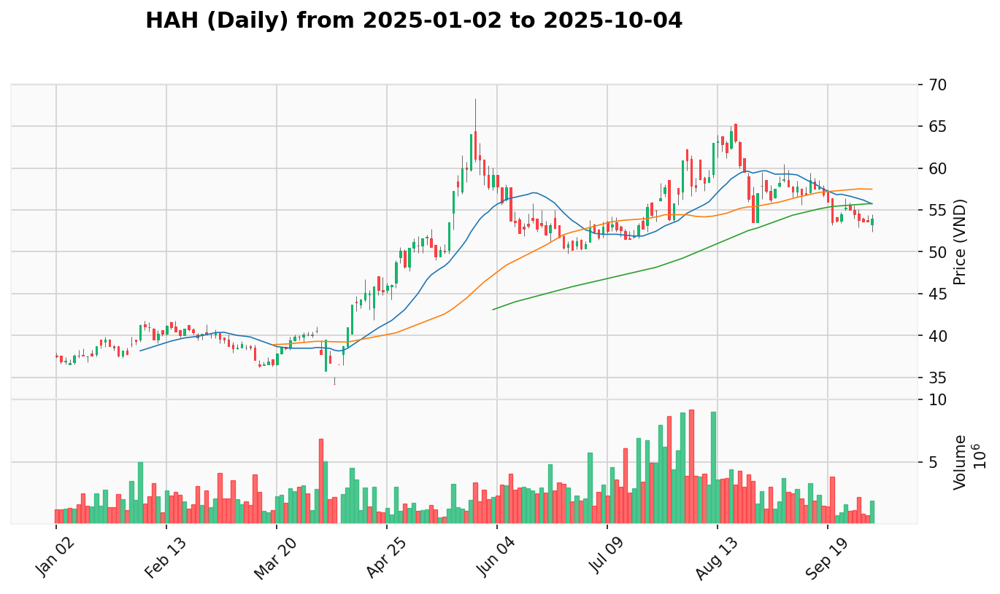

<a href="#van-tai">↑ Back to group VAN_TAI</a>  |  <a href="#vpa-signal-summary">↑ Back to Top</a>

#### Key Statistics
| Metric | Value |
|:---|---:|
| Date Range | 2025-01-02 to 2025-09-26 |
| **Latest Close** | **55.0** |
| Period Open | 37.58 |
| Period High | 68.32 |
| Period Low | 34.2 |
| Period Change % | 46.35% |

**[Download HAH Data (.csv)](market_data/HAH_2025-01-02_to_2025-09-27.csv)**

---

### HAP

#### [VPA Analysis (2025-08-14 - 2025-09-26)](./VPA.md#hap)
> **Ngày 2025-09-22:** HAP tăng từ 6.35 VND lên 6.45 VND. Giá mở cửa 6.35 VND, cao nhất 6.55 VND và thấp nhất 6.35 VND, tạo thành một nến tăng với biên độ tương đối rộng và đóng cửa ở nửa trên của thân nến. Khối lượng giao dịch đạt 0.2519 triệu cổ phiếu, tăng mạnh so với phiên trước (0.0592 triệu cổ phiếu). Sau phiên giảm giá với lực cung xuất hiện vào ngày 2025-09-19, phiên tăng giá với khối lượng gia tăng cho thấy lực cầu đã quay trở lại và đang hấp thụ lực cung, đẩy giá lên. **Phân tích VPA/Wyckoff:** Sign of Strength (SOS) - Lực cầu mạnh mẽ.
> **Ngày 2025-09-23:** HAP tăng từ 6.45 VND lên 6.49 VND. Giá mở cửa 6.41 VND, cao nhất 6.5 VND và thấp nhất 6.4 VND, tạo thành một nến tăng với biên độ hẹp và đóng cửa ở nửa trên của thân nến. Khối lượng giao dịch đạt 0.0361 triệu cổ phiếu, giảm mạnh so với phiên trước (0.2519 triệu cổ phiếu). Sau phiên SOS mạnh mẽ ngày 2025-09-22, phiên tăng giá với khối lượng sụt giảm đáng kể cho thấy lực cầu không còn duy trì được đà tăng, báo hiệu sự thiếu hụt lực cầu. **Phân tích VPA/Wyckoff:** Lack of Demand (Thiếu hụt lực cầu) - Weakness.
> **Ngày 2025-09-24:** HAP giữ nguyên mức giá 6.49 VND. Giá mở cửa 6.5 VND, cao nhất 6.5 VND và thấp nhất 6.49 VND, tạo thành một nến có biên độ rất hẹp và đóng cửa ngang bằng với giá đóng cửa phiên trước. Khối lượng giao dịch đạt 0.0704 triệu cổ phiếu, tăng nhẹ so với phiên trước (0.0361 triệu cổ phiếu) nhưng vẫn ở mức thấp so với phiên SOS ngày 2025-09-22 (0.2519 triệu cổ phiếu). Sau phiên thiếu hụt lực cầu ngày 2025-09-23, phiên này cho thấy sự lưỡng lự của thị trường. Mặc dù khối lượng có tăng nhẹ nhưng giá không thể bứt phá lên cao hơn, cho thấy lực cầu vẫn còn yếu và lực cung đang hấp thụ những nỗ lực tăng giá. **Phân tích VPA/Wyckoff:** No Demand (Không có lực cầu) - Weakness.
> **Ngày 2025-09-25:** HAP tăng từ 6.49 VND lên 6.78 VND. Giá mở cửa 6.5 VND, cao nhất 6.88 VND và thấp nhất 6.5 VND, tạo thành một nến tăng mạnh với biên độ rộng và đóng cửa gần mức cao nhất phiên. Khối lượng giao dịch đạt 0.1946 triệu cổ phiếu, tăng đáng kể so với phiên trước (0.0704 triệu cổ phiếu) và các phiên gần đây, cho thấy lực cầu đã quay trở lại mạnh mẽ sau hai phiên thiếu hụt lực cầu. **Phân tích VPA/Wyckoff:** Sign of Strength (SOS) - Lực cầu mạnh mẽ.
> **Ngày 2025-09-26:** HAP tăng nhẹ từ 6.82 VND lên 6.83 VND. Giá mở cửa 6.85 VND, cao nhất 6.89 VND và thấp nhất 6.73 VND, tạo thành một nến có biên độ hẹp và đóng cửa gần mức cao nhất phiên. Khối lượng giao dịch đạt 0.2636 triệu cổ phiếu, giảm nhẹ so với phiên SOS trước đó (0.2745 triệu cổ phiếu) nhưng vẫn ở mức cao. Mặc dù giá tiếp tục tăng nhẹ sau phiên SOS mạnh mẽ, biên độ giá hẹp và khối lượng vẫn cao cho thấy lực cung đang bắt đầu xuất hiện và hấp thụ một phần lực cầu, làm chậm đà tăng. Điều này có thể là dấu hiệu của sự suy yếu trong đà tăng giá. **Phân tích VPA/Wyckoff:** Nỗ lực tăng giá nhưng không đạt kết quả (Effort to Rise but No Result) - Weakness.

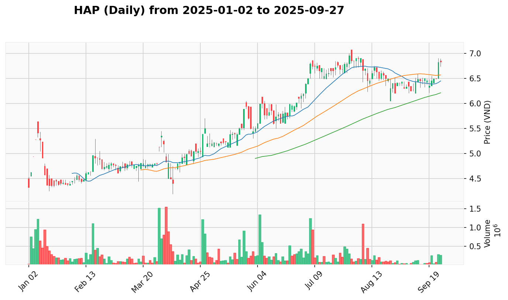

<a href="#penny">↑ Back to group PENNY</a>  |  <a href="#vpa-signal-summary">↑ Back to Top</a>

#### Key Statistics
| Metric | Value |
|:---|---:|
| Date Range | 2025-01-02 to 2025-09-26 |
| **Latest Close** | **6.83** |
| Period Open | 4.5 |
| Period High | 7.07 |
| Period Low | 4.19 |
| Period Change % | 51.78% |

**[Download HAP Data (.csv)](market_data/HAP_2025-01-02_to_2025-09-27.csv)**

---

### HAX

#### [VPA Analysis (2025-08-04 - 2025-09-26)](./VPA.md#hax)
> **Ngày 2025-09-22:** HAX giảm giá từ 12.9 VND xuống 12.45 VND, đóng cửa gần mức thấp nhất phiên. Khối lượng giao dịch đạt 0.9338 triệu cổ phiếu, tăng mạnh so với phiên trước. Sau các phiên "Thiếu hụt nhu cầu" với khối lượng rất thấp, sự sụt giảm giá đáng kể với khối lượng gia tăng cho thấy áp lực bán đã xuất hiện trở lại và nguồn cung đang chiếm ưu thế. Điều này xác nhận xu hướng yếu kém và có thể báo hiệu một đợt giảm giá tiếp theo. **Phân tích VPA/Wyckoff:** Selling Pressure - Áp lực bán gia tăng
> **Ngày 2025-09-23:** HAX tăng nhẹ từ 12.45 VND lên 12.55 VND, đóng cửa gần giữa thân nến. Khối lượng giao dịch đạt 0.363 triệu cổ phiếu, ở mức rất thấp. Sau phiên áp lực bán gia tăng và các phiên thiếu hụt nhu cầu trước đó, việc giá tăng nhẹ với khối lượng cực kỳ thấp cho thấy lực cầu vẫn yếu và không có sự quan tâm đáng kể từ người mua. Điều này xác nhận xu hướng yếu kém vẫn tiếp diễn và có thể là một đợt hồi phục kỹ thuật không bền vững. **Phân tích VPA/Wyckoff:** No Demand - Thiếu hụt nhu cầu
> **Ngày 2025-09-24:** HAX tăng giá từ 12.55 VND lên 12.65 VND, đóng cửa ở mức cao nhất phiên. Khối lượng giao dịch đạt 0.3138 triệu cổ phiếu, tiếp tục ở mức rất thấp và thấp hơn phiên trước. Sau phiên "Áp lực bán gia tăng" và các phiên "Thiếu hụt nhu cầu", việc giá tăng nhẹ với khối lượng cực kỳ thấp cho thấy lực cầu vẫn yếu và không có sự quan tâm đáng kể từ người mua. Điều này xác nhận xu hướng yếu kém vẫn tiếp diễn và có thể là một đợt hồi phục kỹ thuật không bền vững. **Phân tích VPA/Wyckoff:** No Demand - Thiếu hụt nhu cầu
> **Ngày 2025-09-25:** HAX tăng nhẹ từ 12.65 VND lên 12.75 VND, đóng cửa ở mức cao nhất phiên. Khối lượng giao dịch đạt 0.2468 triệu cổ phiếu, tiếp tục ở mức cực kỳ thấp và thấp hơn các phiên trước đó. Sau các phiên "Thiếu hụt nhu cầu" liên tiếp, việc giá tăng nhẹ với khối lượng cực kỳ thấp cho thấy lực cầu vẫn rất yếu và không có sự quan tâm đáng kể từ người mua. Điều này xác nhận xu hướng yếu kém vẫn tiếp diễn và có thể là một đợt hồi phục kỹ thuật không bền vững. **Phân tích VPA/Wyckoff:** No Demand - Thiếu hụt nhu cầu
> **Ngày 2025-09-26:** HAX giảm giá từ 12.75 VND xuống 12.5 VND, đóng cửa ở mức thấp nhất phiên. Khối lượng giao dịch đạt 0.4987 triệu cổ phiếu, cao hơn phiên trước nhưng vẫn ở mức thấp so với trung bình. Sau các phiên "Thiếu hụt nhu cầu" liên tiếp, việc giá giảm mạnh với khối lượng gia tăng cho thấy áp lực bán đang quay trở lại và có thể đẩy giá xuống thấp hơn. Điều này xác nhận xu hướng yếu kém vẫn tiếp diễn. **Phân tích VPA/Wyckoff:** Supply Coming In - Cung xuất hiện

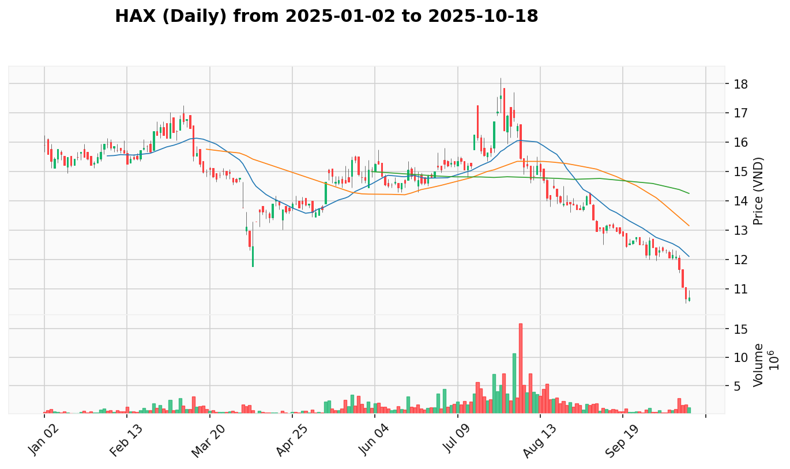

<a href="#ban-le">↑ Back to group BAN_LE</a>  |  <a href="#vpa-signal-summary">↑ Back to Top</a>

#### Key Statistics
| Metric | Value |
|:---|---:|
| Date Range | 2025-01-02 to 2025-09-26 |
| **Latest Close** | **12.5** |
| Period Open | 15.91 |
| Period High | 18.2 |
| Period Low | 11.75 |
| Period Change % | -21.43% |

**[Download HAX Data (.csv)](market_data/HAX_2025-01-02_to_2025-09-27.csv)**

---

### HBC

#### [VPA Analysis (2025-08-14 - 2025-09-26)](./VPA.md#hbc)
> **Ngày 2025-09-22:** HBC giảm từ 7.8 VND xuống 7.6 VND. Cây nến có biên độ hẹp (từ 7.6 VND đến 7.8 VND), đóng cửa ở mức thấp nhất phiên. Khối lượng giao dịch đạt 1.7076 triệu cổ phiếu, tăng nhẹ so với phiên trước nhưng vẫn ở mức thấp. Sau nhiều phiên 'Dấu hiệu suy yếu', việc giá tiếp tục giảm và đóng cửa ở mức thấp nhất phiên với khối lượng thấp cho thấy lực cầu vẫn yếu và áp lực bán vẫn còn, củng cố xu hướng giảm giá ngắn hạn. **Phân tích VPA/Wyckoff:** Dấu hiệu suy yếu (Sign of Weakness)
> **Ngày 2025-09-23:** HBC giảm từ 7.7 VND xuống 7.6 VND. Cây nến có biên độ hẹp (từ 7.5 VND đến 7.7 VND), đóng cửa ở giữa phiên. Khối lượng giao dịch đạt 1.6231 triệu cổ phiếu, tiếp tục giảm so với phiên trước (1.7076 triệu cổ phiếu) và duy trì ở mức rất thấp. Sau nhiều phiên 'Dấu hiệu suy yếu' với khối lượng thấp, việc giá tiếp tục giảm nhẹ và đóng cửa ở giữa phiên với khối lượng rất thấp cho thấy lực cầu vẫn yếu và không có sự tham gia đáng kể của dòng tiền lớn. Điều này củng cố thêm sự thiếu vắng lực mua và xu hướng giảm giá ngắn hạn vẫn tiềm ẩn. **Phân tích VPA/Wyckoff:** Dấu hiệu suy yếu (Sign of Weakness)
> **Ngày 2025-09-24:** HBC tăng nhẹ từ 7.6 VND lên 7.7 VND. Cây nến có biên độ hẹp (từ 7.5 VND đến 7.7 VND), đóng cửa gần mức cao nhất phiên. Khối lượng giao dịch đạt 1.5175 triệu cổ phiếu, tiếp tục giảm so với phiên trước và duy trì ở mức rất thấp. Sau nhiều phiên 'Dấu hiệu suy yếu' với khối lượng thấp, việc giá tăng nhẹ nhưng không được hỗ trợ bởi khối lượng giao dịch đáng kể cho thấy lực cầu vẫn còn yếu và thiếu sự tham gia của dòng tiền lớn. Điều này củng cố nhận định về sự thiếu vắng lực mua mạnh mẽ và xu hướng giảm giá ngắn hạn vẫn tiềm ẩn. **Phân tích VPA/Wyckoff:** Dấu hiệu suy yếu (Sign of Weakness)
> **Ngày 2025-09-25:** HBC tăng nhẹ từ 7.6 VND lên 7.7 VND. Cây nến có biên độ hẹp (từ 7.6 VND đến 7.9 VND), đóng cửa ở giữa phiên. Khối lượng giao dịch đạt 0.9053 triệu cổ phiếu, giảm đáng kể so với phiên trước (1.5175 triệu cổ phiếu) và duy trì ở mức rất thấp. Sau nhiều phiên 'Dấu hiệu suy yếu' với khối lượng thấp, việc giá tăng nhẹ nhưng không được hỗ trợ bởi khối lượng giao dịch đáng kể cho thấy lực cầu vẫn còn rất yếu và thiếu sự tham gia của dòng tiền lớn. Điều này tiếp tục củng cố nhận định về sự thiếu vắng lực mua mạnh mẽ và xu hướng giảm giá ngắn hạn vẫn tiềm ẩn. **Phân tích VPA/Wyckoff:** Dấu hiệu suy yếu (Sign of Weakness)
> **Ngày 2025-09-26:** HBC giữ nguyên mức giá 7.7 VND. Cây nến có biên độ hẹp (từ 7.6 VND đến 7.8 VND), đóng cửa ở mức giá tham chiếu. Khối lượng giao dịch đạt 1.6023 triệu cổ phiếu, tiếp tục giảm so với phiên trước và duy trì ở mức rất thấp. Sau nhiều phiên 'Dấu hiệu suy yếu' với khối lượng thấp, việc giá đi ngang nhưng không được hỗ trợ bởi khối lượng giao dịch đáng kể cho thấy lực cầu vẫn còn yếu và thiếu sự tham gia của dòng tiền lớn. Điều này củng cố nhận định về sự thiếu vắng lực mua mạnh mẽ và xu hướng giảm giá ngắn hạn vẫn tiềm ẩn. **Phân tích VPA/Wyckoff:** Dấu hiệu suy yếu (Sign of Weakness)

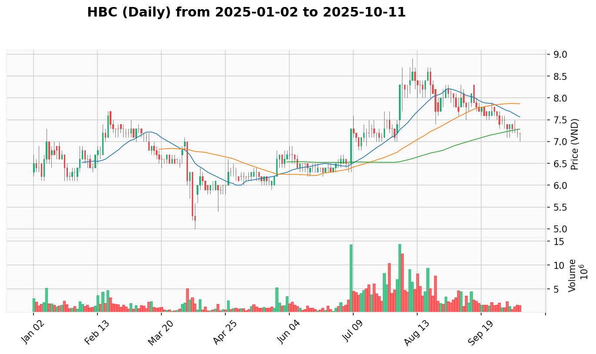

<a href="#xay-dung">↑ Back to group XAY_DUNG</a>  |  <a href="#vpa-signal-summary">↑ Back to Top</a>

#### Key Statistics
| Metric | Value |
|:---|---:|
| Date Range | 2025-01-02 to 2025-09-26 |
| **Latest Close** | **7.7** |
| Period Open | 6.3 |
| Period High | 8.9 |
| Period Low | 5.0 |
| Period Change % | 22.22% |

**[Download HBC Data (.csv)](market_data/HBC_2025-01-02_to_2025-09-27.csv)**

---

### HCD

#### [VPA Analysis (2025-08-04 - 2025-09-26)](./VPA.md#hcd)
> **Ngày 2025-09-22:** HCD giảm từ 8.38 VND xuống 8.27 VND với khối lượng giao dịch đạt 0.0234 triệu cổ phiếu. Cây nến giảm có biên độ tương đối rộng và đóng cửa gần mức thấp nhất phiên. Khối lượng giao dịch tăng nhẹ so với phiên "Không có cầu" trước đó (0.0214 triệu cổ phiếu) nhưng vẫn ở mức thấp so với các phiên có hoạt động mạnh. Điều này cho thấy áp lực bán đang xuất hiện trở lại sau các phiên thiếu cung và cầu, và một lượng cung nhỏ đã đủ để đẩy giá xuống, xác nhận sự thiếu vắng lực cầu. **Phân tích VPA/Wyckoff:** Weakness (Yếu tố suy yếu)
> **Ngày 2025-09-23:** HCD giảm từ 8.3 VND xuống 8.2 VND với khối lượng giao dịch đạt 0.049 triệu cổ phiếu. Cây nến giảm có biên độ tương đối và đóng cửa gần mức thấp nhất phiên. Khối lượng giao dịch tăng đáng kể so với phiên trước (0.0234 triệu cổ phiếu), cho thấy áp lực bán đang gia tăng. Sự giảm giá với khối lượng tăng xác nhận sự yếu đi của cổ phiếu và cho thấy cung đang tiếp tục đổ vào thị trường. **Phân tích VPA/Wyckoff:** Supply Coming In (Cung gia tăng)
> **Ngày 2025-09-24:** HCD tăng nhẹ từ 8.2 VND lên 8.24 VND với khối lượng giao dịch đạt 0.0437 triệu cổ phiếu. Cây nến tăng có biên độ hẹp và đóng cửa ở giữa thân nến. Khối lượng giao dịch giảm so với phiên trước đó (0.049 triệu cổ phiếu). Sau hai phiên giảm giá với áp lực cung gia tăng, sự phục hồi nhẹ với khối lượng thấp cho thấy lực cầu vẫn còn yếu và chưa có sự tham gia mạnh mẽ của người mua. Điều này có thể là dấu hiệu của sự thiếu vắng nhu cầu sau đợt bán tháo. **Phân tích VPA/Wyckoff:** No Demand (Không có cầu)
> **Ngày 2025-09-25:** HCD tăng nhẹ từ 8.24 VND lên 8.25 VND với khối lượng giao dịch đạt 0.0079 triệu cổ phiếu. Cây nến tăng có biên độ rất hẹp và đóng cửa gần giữa thân nến. Khối lượng giao dịch cực kỳ thấp, giảm mạnh so với phiên trước (0.0437 triệu cổ phiếu) và là mức thấp nhất trong 10 phiên gần đây. Sau hai phiên giảm giá với áp lực cung và sau đó là tín hiệu không có cầu, sự phục hồi rất nhẹ với khối lượng cạn kiệt cho thấy lực cầu vẫn hoàn toàn vắng bóng và không có sự tham gia của người mua. Điều này xác nhận sự yếu kém của cổ phiếu và khả năng tiếp tục xu hướng giảm hoặc đi ngang trong ngắn hạn. **Phân tích VPA/Wyckoff:** No Demand (Không có cầu)
> **Ngày 2025-09-26:** HCD tăng nhẹ từ 8.26 VND lên 8.28 VND với khối lượng giao dịch đạt 0.0418 triệu cổ phiếu. Cây nến tăng có biên độ hẹp và đóng cửa ở mức cao nhất phiên. Khối lượng giao dịch tăng đáng kể so với phiên trước (0.0134 triệu cổ phiếu), cho thấy lực cầu đã bắt đầu quay trở lại sau hai phiên "Không có cầu". Tuy nhiên, biên độ tăng giá hẹp và khối lượng vẫn ở mức trung bình cho thấy lực cầu chưa thực sự mạnh mẽ. Đây có thể là một dấu hiệu sớm của sự phục hồi hoặc một đợt kiểm tra cung. **Phân tích VPA/Wyckoff:** Dấu hiệu sức mạnh sơ bộ (Preliminary Sign of Strength)

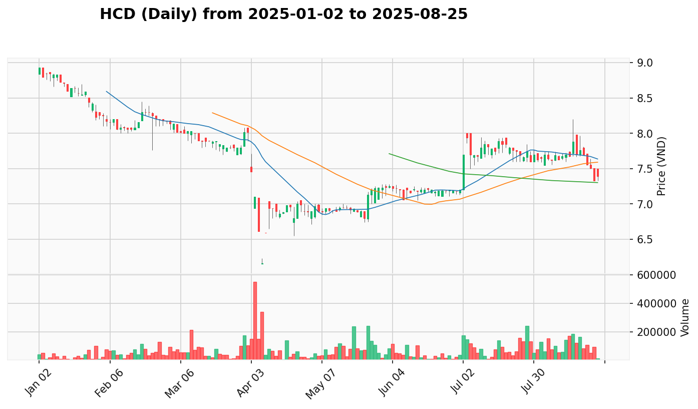

<a href="#nhua">↑ Back to group NHUA</a>  |  <a href="#vpa-signal-summary">↑ Back to Top</a>

#### Key Statistics
| Metric | Value |
|:---|---:|
| Date Range | 2025-01-02 to 2025-09-26 |
| **Latest Close** | **8.28** |
| Period Open | 8.84 |
| Period High | 8.93 |
| Period Low | 6.15 |
| Period Change % | -6.33% |

**[Download HCD Data (.csv)](market_data/HCD_2025-01-02_to_2025-09-27.csv)**

---

### HCM

#### [VPA Analysis (2025-06-13 - 2025-09-26)](./VPA.md#hcm)
> **Ngày 2025-09-22:** HCM giảm từ 26.65 VND xuống 26.05 VND. Cây nến giảm có biên độ rộng (từ 25.85 VND đến 26.8 VND) và đóng cửa gần mức thấp nhất phiên. Khối lượng giao dịch đạt 11.4587 triệu cổ phiếu, tăng đáng kể so với các phiên trước (5.735 triệu cổ phiếu và 6.1773 triệu cổ phiếu). Sau hai phiên "No Demand" với khối lượng thấp, sự giảm giá tiếp diễn với biên độ rộng và khối lượng tăng mạnh cho thấy áp lực bán gia tăng và lực cầu yếu, xác nhận sự yếu kém của thị trường. **Phân tích VPA/Wyckoff:** Sign of Weakness (SOW)
> **Ngày 2025-09-23:** HCM giảm từ 26.3 VND xuống 26.2 VND. Cây nến giảm có biên độ hẹp (từ 26.05 VND đến 26.55 VND) và đóng cửa gần giữa phiên. Khối lượng giao dịch đạt 4.7181 triệu cổ phiếu, giảm mạnh so với phiên trước (11.4587 triệu cổ phiếu). Sau phiên "Sign of Weakness" với khối lượng lớn, sự giảm giá tiếp diễn với khối lượng thấp và biên độ hẹp cho thấy lực bán đang tạm lắng nhưng lực cầu vẫn chưa xuất hiện, xác nhận sự yếu kém của thị trường. **Phân tích VPA/Wyckoff:** No Demand
> **Ngày 2025-09-24:** HCM tăng từ 26.2 VND lên 26.85 VND. Cây nến tăng có biên độ rộng (từ 25.95 VND đến 26.85 VND) và đóng cửa tại mức cao nhất phiên. Khối lượng giao dịch đạt 7.3526 triệu cổ phiếu, tăng so với phiên "No Demand" trước đó (4.7181 triệu cổ phiếu) nhưng vẫn thấp hơn đáng kể so với phiên "Sign of Weakness" ngày 2025-09-22 (11.4587 triệu cổ phiếu). Sau hai phiên giảm giá cho thấy sự yếu kém của thị trường, sự tăng giá trở lại với biên độ rộng và khối lượng tăng nhẹ cho thấy lực cầu đã xuất hiện, tuy nhiên cần thêm xác nhận để khẳng định sự đảo chiều xu hướng. **Phân tích VPA/Wyckoff:** Effort to Rise
> **Ngày 2025-09-25:** HCM tăng từ 26.85 VND lên 26.9 VND. Cây nến tăng có biên độ rất hẹp (từ 26.85 VND đến 27.0 VND) và đóng cửa gần mức cao nhất phiên. Khối lượng giao dịch đạt 2.5016 triệu cổ phiếu, giảm mạnh so với phiên trước (7.3526 triệu cổ phiếu). Sau phiên "Effort to Rise" ngày 2025-09-24, sự tăng giá tiếp diễn với biên độ hẹp và khối lượng thấp cho thấy lực cầu không duy trì được đà tăng và thị trường vẫn còn yếu, xác nhận sự thiếu vắng lực cầu. **Phân tích VPA/Wyckoff:** No Demand
> **Ngày 2025-09-26:** HCM giảm từ 26.75 VND xuống 26.3 VND. Cây nến giảm có biên độ rộng (từ 26.3 VND đến 26.85 VND) và đóng cửa tại mức thấp nhất phiên. Khối lượng giao dịch đạt 5.9559 triệu cổ phiếu, tăng so với phiên trước (5.1132 triệu cổ phiếu). Sau phiên "No Demand" ngày 2025-09-25, sự giảm giá với biên độ rộng và khối lượng tăng cho thấy áp lực bán mạnh mẽ và sự yếu kém của thị trường vẫn tiếp diễn. Lực cầu không đủ để hấp thụ lực cung. **Phân tích VPA/Wyckoff:** Sign of Weakness (SOW)

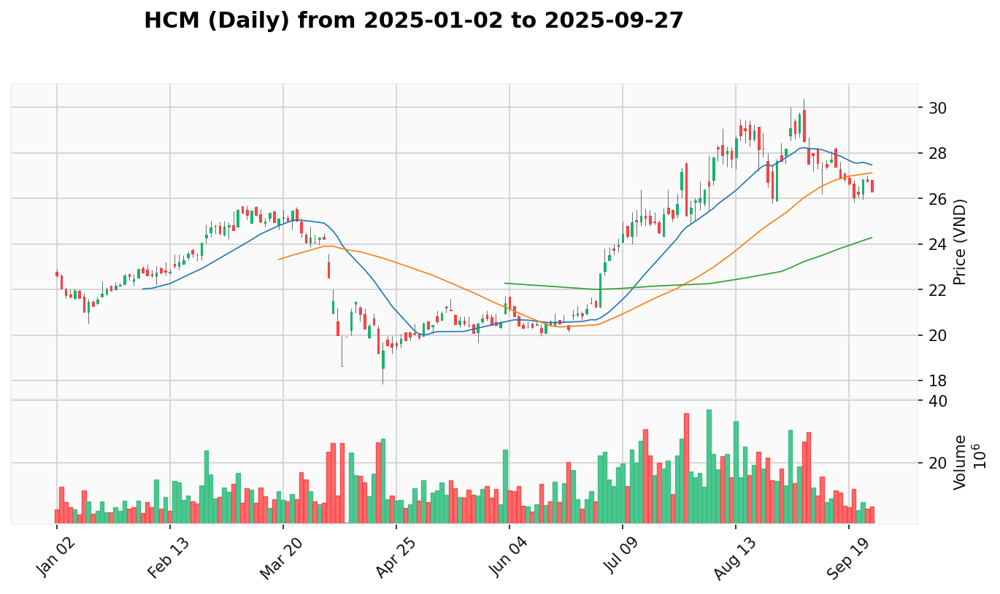

<a href="#chung-khoan">↑ Back to group CHUNG_KHOAN</a>  |  <a href="#vpa-signal-summary">↑ Back to Top</a>

#### Key Statistics
| Metric | Value |
|:---|---:|
| Date Range | 2025-01-02 to 2025-09-26 |
| **Latest Close** | **26.3** |
| Period Open | 22.79 |
| Period High | 30.4 |
| Period Low | 17.84 |
| Period Change % | 15.40% |

**[Download HCM Data (.csv)](market_data/HCM_2025-01-02_to_2025-09-27.csv)**

---

### HDB

#### [VPA Analysis (2025-06-16 - 2025-09-26)](./VPA.md#hdb)
> **Ngày 2025-09-22:** HDB giảm từ 30.2 VND xuống 29.0 VND với khối lượng giao dịch tăng lên 15.32 triệu cổ phiếu. Cây nến có biên độ rộng và đóng cửa tại mức thấp nhất phiên, cho thấy áp lực bán rất mạnh mẽ và nguồn cung đang áp đảo hoàn toàn. Sau phiên "Không có cầu" ngày hôm qua, việc giá tiếp tục giảm sâu với khối lượng gia tăng xác nhận sự hiện diện mạnh mẽ của nguồn cung và xu hướng giảm tiếp diễn. **Phân tích VPA/Wyckoff:** Sign of Weakness (Dấu hiệu suy yếu)
> **Ngày 2025-09-23:** HDB tiếp tục giảm từ 29.0 VND xuống 28.7 VND với khối lượng giao dịch giảm xuống 10.54 triệu cổ phiếu. Cây nến có biên độ hẹp và đóng cửa tại mức thấp nhất phiên, cho thấy áp lực bán vẫn còn nhưng đã suy yếu đáng kể so với phiên "Dấu hiệu suy yếu" trước đó. Mặc dù nguồn cung đã giảm, nhưng sự vắng mặt của lực cầu khiến giá tiếp tục trượt dốc. **Phân tích VPA/Wyckoff:** No Demand (Không có cầu)
> **Ngày 2025-09-24:** HDB tăng mạnh từ 28.7 VND lên 30.7 VND với khối lượng giao dịch tăng vọt lên 22.76 triệu cổ phiếu. Cây nến có biên độ rộng và đóng cửa tại mức cao nhất phiên, cho thấy lực cầu đã quay trở lại rất mạnh mẽ và áp đảo hoàn toàn nguồn cung sau hai phiên giảm giá trước đó. **Phân tích VPA/Wyckoff:** Sign of Strength (Dấu hiệu sức mạnh)
> **Ngày 2025-09-25:** HDB tăng từ 30.7 VND lên 31.1 VND, nhưng mở cửa ở 31.5 VND và đóng cửa thấp hơn, tạo thành cây nến giảm với biên độ hẹp. Khối lượng giao dịch giảm mạnh xuống 9.92 triệu cổ phiếu, cho thấy lực cầu suy yếu và có dấu hiệu chốt lời sau phiên tăng mạnh ngày 2025-09-24. **Phân tích VPA/Wyckoff:** No Demand (Không có cầu)
> **Ngày 2025-09-26:** HDB giảm từ 31.0 VND xuống 30.15 VND với khối lượng giao dịch đạt 12.50 triệu cổ phiếu. Cây nến có biên độ rộng và đóng cửa tại mức thấp nhất phiên, cho thấy áp lực bán mạnh mẽ và nguồn cung áp đảo hoàn toàn lực cầu. Khối lượng giao dịch giảm so với phiên trước đó, nhưng sự sụt giảm giá mạnh cho thấy sự yếu kém tiếp tục sau phiên "No Demand" ngày 2025-09-25. **Phân tích VPA/Wyckoff:** Sign of Weakness (Dấu hiệu yếu kém)

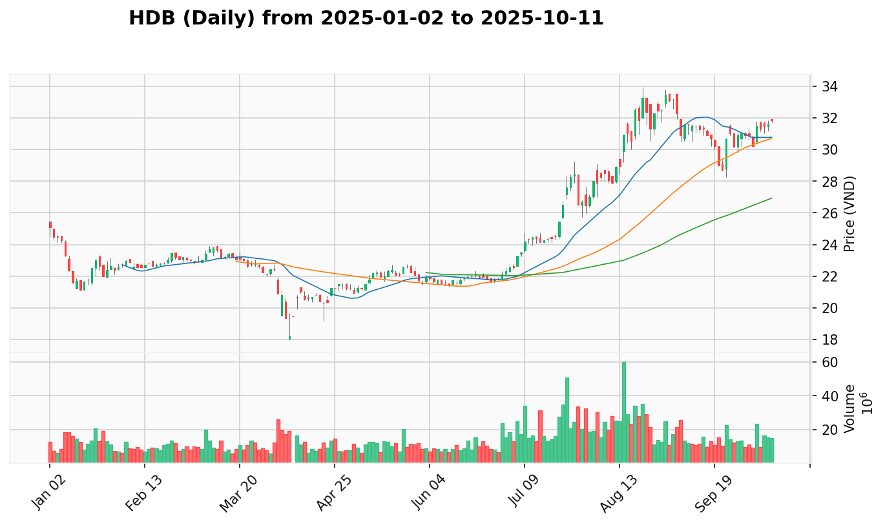

<a href="#ngan-hang">↑ Back to group NGAN_HANG</a>  |  <a href="#vpa-signal-summary">↑ Back to Top</a>

#### Key Statistics
| Metric | Value |
|:---|---:|
| Date Range | 2025-01-02 to 2025-09-26 |
| **Latest Close** | **30.15** |
| Period Open | 25.45 |
| Period High | 33.95 |
| Period Low | 18.0 |
| Period Change % | 18.47% |

**[Download HDB Data (.csv)](market_data/HDB_2025-01-02_to_2025-09-27.csv)**

---

### HDC

#### [VPA Analysis (2025-07-17 - 2025-09-26)](./VPA.md#hdc)
> **Ngày 2025-09-22:** HDC tăng từ 35.25 VND lên 35.8 VND với khối lượng giao dịch đạt 6.983 triệu cổ phiếu. Thanh nến tăng có biên độ rộng và đóng cửa gần mức cao nhất phiên, cho thấy lực cầu mạnh mẽ đã quay trở lại. Khối lượng giao dịch tăng đáng kể so với phiên trước (3.379 triệu cổ phiếu) xác nhận sự xuất hiện của lực mua chủ động. Đây là một dấu hiệu tích cực sau giai đoạn thiếu cầu. **Phân tích VPA/Wyckoff:** Sign of Strength (SOS) - Lực cầu mạnh mẽ với khối lượng gia tăng xác nhận xu hướng tăng.
> **Ngày 2025-09-23:** HDC giảm từ 35.8 VND xuống 35.15 VND với khối lượng giao dịch đạt 2.386 triệu cổ phiếu. Thanh nến giảm có biên độ khá và đóng cửa gần mức thấp nhất phiên. Khối lượng giao dịch giảm mạnh so với phiên trước (6.983 triệu cổ phiếu), cho thấy lực bán không mạnh mẽ. Sau phiên "Sign of Strength" ngày 2025-09-22, đây có thể là một nhịp điều chỉnh tự nhiên hoặc kiểm tra nguồn cung. Tuy nhiên, việc đóng cửa gần mức thấp nhất phiên cần được theo dõi. **Phân tích VPA/Wyckoff:** No Demand (ND) - Giá giảm với khối lượng thấp, cho thấy lực bán không mạnh mẽ sau phiên tăng giá mạnh.
> **Ngày 2025-09-24:** HDC tăng từ 35.15 VND lên 36.85 VND với khối lượng giao dịch đạt 5.836 triệu cổ phiếu. Thanh nến tăng có biên độ rộng và đóng cửa ở mức cao nhất phiên, cho thấy lực cầu mạnh mẽ và quyết liệt. Khối lượng giao dịch tăng đáng kể so với phiên trước (2.386 triệu cổ phiếu), xác nhận sự tham gia của dòng tiền lớn. Sau phiên điều chỉnh "No Demand" ngày 2025-09-23, đây là một tín hiệu tích cực cho thấy xu hướng tăng giá có thể tiếp tục. **Phân tích VPA/Wyckoff:** Sign of Strength (SOS) - Lực cầu mạnh mẽ với khối lượng gia tăng, xác nhận xu hướng tăng.
> **Ngày 2025-09-25:** HDC tăng từ 36.85 VND lên 37.2 VND với khối lượng giao dịch đạt 2.441 triệu cổ phiếu. Thanh nến tăng có biên độ hẹp và đóng cửa gần mức cao nhất phiên. Khối lượng giao dịch giảm mạnh so với phiên trước (5.836 triệu cổ phiếu), cho thấy lực cầu không còn mạnh mẽ như phiên trước nhưng nguồn cung cũng không xuất hiện nhiều. Sau phiên "Sign of Strength" ngày 2025-09-24, đây có thể là một phiên kiểm tra nguồn cung thành công, cho thấy thị trường đang hấp thụ tốt. **Phân tích VPA/Wyckoff:** Test for Supply (TS) - Giá tăng với khối lượng thấp sau một đợt tăng mạnh, cho thấy nguồn cung đã cạn kiệt.
> **Ngày 2025-09-26:** HDC tăng từ 36.7 VND lên 37.05 VND với khối lượng giao dịch đạt 7.6995 triệu cổ phiếu. Thanh nến tăng có biên độ rộng và đóng cửa gần mức cao nhất phiên, cho thấy lực cầu mạnh mẽ và quyết liệt. Khối lượng giao dịch tăng đáng kể so với phiên trước (4.2683 triệu cổ phiếu), xác nhận sự tham gia của dòng tiền lớn. Sau phiên kiểm tra cung thành công ngày 2025-09-25, đây là một tín hiệu tích cực cho thấy xu hướng tăng giá tiếp tục được củng cố. **Phân tích VPA/Wyckoff:** Sign of Strength (SOS) - Lực cầu mạnh mẽ với khối lượng gia tăng, xác nhận xu hướng tăng.

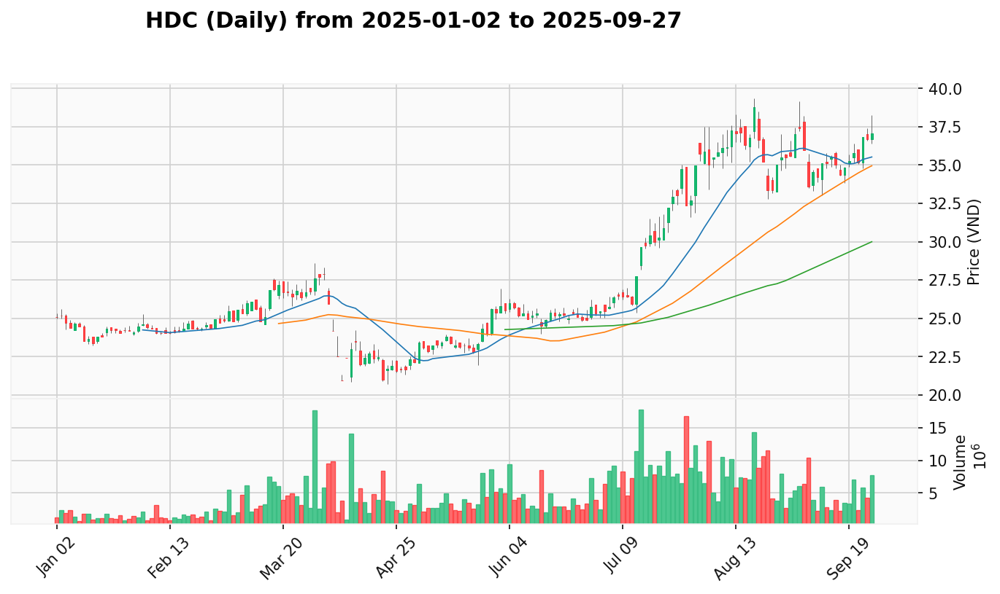

<a href="#bat-dong-san">↑ Back to group BAT_DONG_SAN</a>  |  <a href="#vpa-signal-summary">↑ Back to Top</a>

#### Key Statistics
| Metric | Value |
|:---|---:|
| Date Range | 2025-01-02 to 2025-09-26 |
| **Latest Close** | **37.05** |
| Period Open | 25.1 |
| Period High | 39.35 |
| Period Low | 20.7 |
| Period Change % | 47.61% |

**[Download HDC Data (.csv)](market_data/HDC_2025-01-02_to_2025-09-27.csv)**

---

### HDG

#### [VPA Analysis (2025-06-16 - 2025-09-26)](./VPA.md#hdg)
> **Ngày 2025-09-22:** HDG tăng từ 31.7 lên 32.2 VND, tăng 1.58% so với giá đóng cửa phiên trước. Cây nến tăng có biên độ rộng, với giá đóng cửa nằm gần mức cao nhất phiên. Khối lượng giao dịch đạt 10.596 triệu cổ phiếu, tăng mạnh so với phiên trước (4.5468 triệu cổ phiếu) và là mức cao nhất trong 10 phiên gần đây. Sau phiên "Dấu hiệu yếu kém" vào ngày 2025-09-19, sự tăng giá mạnh mẽ với khối lượng đột biến này cho thấy lực cầu đã quay trở lại rất mạnh mẽ, hấp thụ hoàn toàn nguồn cung và đẩy giá lên. Đây là một dấu hiệu tích cực cho thấy sự trở lại của phe mua. **Phân tích VPA/Wyckoff:** Sign of Strength (SOS) - Lực cầu mạnh mẽ.
> **Ngày 2025-09-23:** HDG giảm từ 32.2 xuống 31.15 VND, giảm 3.26% so với giá đóng cửa phiên trước. Cây nến có biên độ rộng, mở cửa cao hơn nhưng đóng cửa thấp hơn giá mở cửa và gần mức thấp nhất phiên, cho thấy áp lực bán mạnh mẽ đã xuất hiện. Khối lượng giao dịch đạt 3.314 triệu cổ phiếu, giảm đáng kể so với phiên SOS trước đó (10.596 triệu cổ phiếu). Sự sụt giảm giá mạnh mẽ với biên độ rộng và đóng cửa ở mức thấp trên khối lượng thấp cho thấy lực cầu đã suy yếu đáng kể sau phiên SOS, và phe bán đang tạm thời chiếm ưu thế. **Phân tích VPA/Wyckoff:** Weakness (Dấu hiệu yếu kém).
> **Ngày 2025-09-24:** HDG tăng từ 31.15 lên 32.5 VND, tăng 4.33% so với giá đóng cửa phiên trước. Cây nến tăng có biên độ rộng, mở cửa ở mức thấp và đóng cửa ở mức cao nhất phiên, cho thấy lực cầu mạnh mẽ đã quay trở lại và hấp thụ hoàn toàn áp lực bán từ phiên trước. Khối lượng giao dịch đạt 3.8086 triệu cổ phiếu, tăng so với phiên trước (3.314 triệu cổ phiếu), xác nhận sự trở lại của phe mua. Sau phiên "Dấu hiệu yếu kém" ngày 2025-09-23, sự phục hồi mạnh mẽ này cho thấy thị trường đang kiểm tra lại nguồn cung và lực cầu đang chiếm ưu thế. **Phân tích VPA/Wyckoff:** Sign of Strength (SOS) - Lực cầu mạnh mẽ.
> **Ngày 2025-09-25:** HDG giảm từ 32.5 xuống 32.25 VND, giảm 0.77% so với giá đóng cửa phiên trước. Cây nến có biên độ rộng, mở cửa cao hơn nhưng đóng cửa thấp hơn giá mở cửa và thấp hơn giá đóng cửa phiên trước, cho thấy áp lực bán đã xuất hiện sau phiên tăng mạnh. Khối lượng giao dịch đạt 3.0705 triệu cổ phiếu, giảm so với phiên trước (3.8086 triệu cổ phiếu). Sự sụt giảm nhẹ về giá với khối lượng thấp sau một phiên SOS cho thấy thị trường đang kiểm tra lại lực cầu và có thể là một phản ứng tự nhiên sau đợt tăng giá. Lực bán không quá mạnh mẽ khi khối lượng giảm. **Phân tích VPA/Wyckoff:** Reaction (Phản ứng).
> **Ngày 2025-09-26:** HDG tăng từ 32.35 lên 34.0 VND, tăng 5.10% so với giá đóng cửa phiên trước. Cây nến tăng có biên độ rộng, mở cửa ở mức thấp và đóng cửa gần mức cao nhất phiên, cho thấy lực cầu áp đảo và sự hấp thụ mạnh mẽ. Khối lượng giao dịch đạt 17.3819 triệu cổ phiếu, tăng đột biến so với phiên trước (4.7947 triệu cổ phiếu) và là mức cao nhất trong 10 phiên gần đây, xác nhận sự trở lại mạnh mẽ của phe mua. Sau phiên "Phản ứng" ngày 2025-09-25, động thái này cho thấy thị trường đã hoàn tất kiểm tra nguồn cung và đang tiếp tục xu hướng tăng với sự tham gia của dòng tiền lớn. **Phân tích VPA/Wyckoff:** Sign of Strength (SOS) - Lực cầu mạnh mẽ và quyết liệt.

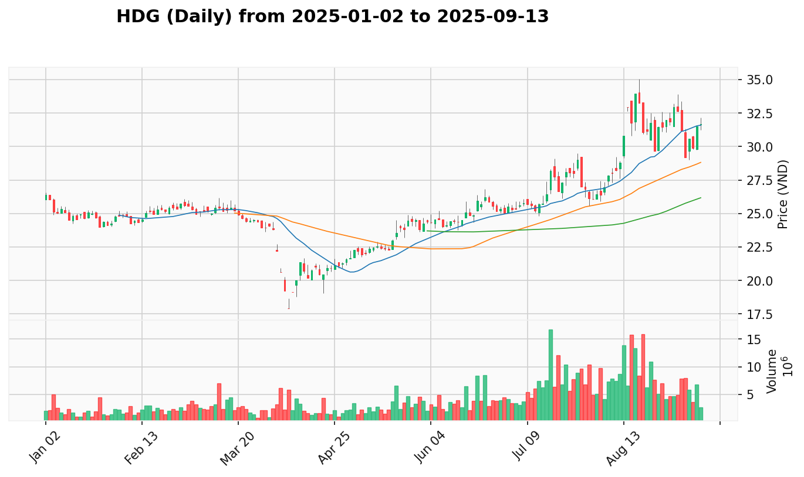

<a href="#nang-luong">↑ Back to group NANG_LUONG</a>  |  <a href="#vpa-signal-summary">↑ Back to Top</a>

#### Key Statistics
| Metric | Value |
|:---|---:|
| Date Range | 2025-01-02 to 2025-09-26 |
| **Latest Close** | **34.0** |
| Period Open | 26.05 |
| Period High | 35.05 |
| Period Low | 17.91 |
| Period Change % | 30.52% |

**[Download HDG Data (.csv)](market_data/HDG_2025-01-02_to_2025-09-27.csv)**

---

### HHS

#### [VPA Analysis (2025-08-14 - 2025-09-26)](./VPA.md#hhs)
> **Ngày 2025-09-22:** HHS giảm từ 16.7 VND xuống 16.45 VND với khối lượng giao dịch tăng lên 3.3793 triệu cổ phiếu. Nến giảm có biên độ rộng hơn và đóng cửa gần mức thấp nhất phiên, cho thấy lực cung đang gia tăng và chiếm ưu thế, đẩy giá xuống sau các phiên thiếu cầu và yếu kém trước đó. **Phân tích VPA/Wyckoff:** Supply (S) - Lực cung gia tăng.
> **Ngày 2025-09-23:** HHS tăng từ 16.45 VND lên 16.6 VND với khối lượng giao dịch giảm mạnh xuống 1.2512 triệu cổ phiếu. Nến có biên độ hẹp và đóng cửa ở giữa nến, cho thấy sự thiếu vắng cả lực mua và lực bán mạnh mẽ. Sau phiên giảm giá với lực cung gia tăng, phiên hôm nay cho thấy giá tăng nhẹ nhưng với khối lượng rất thấp, điều này cho thấy lực cầu yếu và không có sự xác nhận cho một xu hướng tăng bền vững. **Phân tích VPA/Wyckoff:** No Demand (ND) - Lực cầu yếu, không có sự quan tâm mua vào mạnh mẽ.
> **Ngày 2025-09-24:** HHS tăng từ 16.6 VND lên 17.1 VND với khối lượng giao dịch tăng lên 2.0488 triệu cổ phiếu. Nến tăng có biên độ rộng và đóng cửa ở mức cao nhất phiên, cho thấy lực cầu mạnh mẽ đang chiếm ưu thế, đẩy giá lên cao sau các phiên thiếu cầu và lực cung trước đó. Khối lượng tăng xác nhận sự tham gia của dòng tiền lớn. **Phân tích VPA/Wyckoff:** Sign of Strength (SOS) - Lực cầu mạnh mẽ.
> **Ngày 2025-09-25:** HHS tăng từ 17.1 VND lên 17.15 VND với khối lượng giao dịch tăng lên 2.4675 triệu cổ phiếu. Nến có biên độ hẹp và đóng cửa ở giữa nến, cho thấy sự lưỡng lự sau phiên tăng mạnh trước đó. Mặc dù khối lượng tăng, nhưng mức tăng giá không đáng kể, điều này cho thấy lực cầu đang gặp phải lực cung ở vùng giá cao hơn, hoặc lực cầu không đủ mạnh để tiếp tục đẩy giá lên cao một cách dứt khoát. **Phân tích VPA/Wyckoff:** Effort without Result (EWR) - Nỗ lực không mang lại kết quả, cho thấy lực cầu đang gặp kháng cự.
> **Ngày 2025-09-26:** HHS tăng từ 17.4 VND lên 18.05 VND với khối lượng giao dịch tăng mạnh lên 14.169 triệu cổ phiếu. Nến tăng có biên độ rất rộng và đóng cửa ở gần mức cao nhất phiên, cho thấy lực cầu đã áp đảo hoàn toàn lực cung, phá vỡ sự lưỡng lự của phiên trước đó và xác nhận xu hướng tăng giá mạnh mẽ. Khối lượng giao dịch đột biến cho thấy sự tham gia quyết liệt của dòng tiền lớn, vượt qua kháng cự. **Phân tích VPA/Wyckoff:** Sign of Strength (SOS) - Lực cầu mạnh mẽ và dứt khoát.

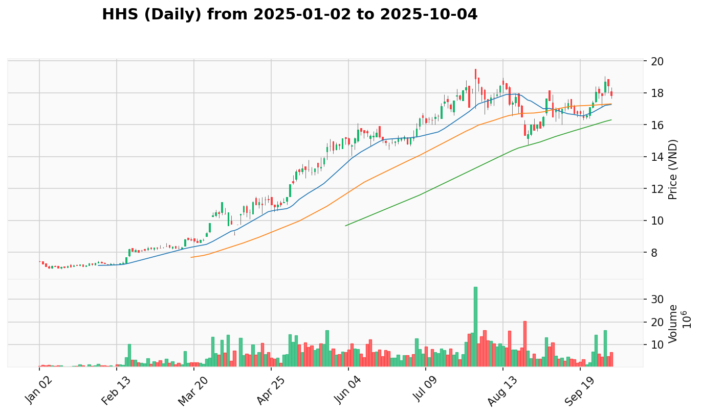

<a href="#others">↑ Back to group OTHERS</a>  |  <a href="#vpa-signal-summary">↑ Back to Top</a>

#### Key Statistics
| Metric | Value |
|:---|---:|
| Date Range | 2025-01-02 to 2025-09-26 |
| **Latest Close** | **18.05** |
| Period Open | 7.43 |
| Period High | 19.5 |
| Period Low | 6.95 |
| Period Change % | 142.93% |

**[Download HHS Data (.csv)](market_data/HHS_2025-01-02_to_2025-09-27.csv)**

---

### HHV

#### [VPA Analysis (2025-06-16 - 2025-09-26)](./VPA.md#hhv)
> **Ngày 2025-09-22:** HHV giảm từ 15.1 xuống 14.95. Cây nến giảm có biên độ tương đối rộng (từ 14.8 đến 15.45) và đóng cửa gần mức thấp nhất phiên (14.95). Khối lượng giao dịch đạt 10.2482 triệu cổ phiếu, tăng đáng kể so với phiên trước (5.4643 triệu cổ phiếu). Sau hai phiên "No Demand", phiên hôm nay giá giảm mạnh với khối lượng gia tăng, cho thấy áp lực bán đang chiếm ưu thế và lực cầu yếu không thể hấp thụ. Điều này xác nhận sự suy yếu của cổ phiếu. **Phân tích VPA/Wyckoff:** Sign of Weakness (SOW) - Giá giảm với khối lượng gia tăng, cho thấy áp lực bán mạnh mẽ.
> **Ngày 2025-09-23:** HHV giảm nhẹ từ 15.05 xuống 15.0. Cây nến giảm có biên độ hẹp (từ 14.85 đến 15.2) và đóng cửa gần giữa. Khối lượng giao dịch đạt 4.5705 triệu cổ phiếu, giảm mạnh so với phiên trước (10.2482 triệu cổ phiếu). Sau phiên "Sign of Weakness" ngày 2025-09-22, giá tiếp tục giảm nhẹ với khối lượng rất thấp, cho thấy lực bán đã tạm lắng nhưng lực cầu vẫn yếu và không có sự quan tâm mua vào đáng kể. **Phân tích VPA/Wyckoff:** No Demand (Không có cầu) - Giá giảm nhẹ với khối lượng rất thấp, xác nhận sự thiếu vắng lực cầu sau giai đoạn suy yếu.
> **Ngày 2025-09-24:** HHV tăng từ 15.05 lên 15.4. Cây nến tăng có biên độ tương đối rộng (từ 14.8 đến 15.4) và đóng cửa ở mức cao nhất phiên. Khối lượng giao dịch đạt 9.2 triệu cổ phiếu, tăng đáng kể so với phiên trước (4.57 triệu cổ phiếu). Sau hai phiên suy yếu và không có cầu, phiên hôm nay giá tăng mạnh với khối lượng gia tăng, cho thấy lực cầu đã quay trở lại và hấp thụ lực cung. Điều này xác nhận sự phục hồi của cổ phiếu. **Phân tích VPA/Wyckoff:** Sign of Strength (SOS) - Giá tăng với khối lượng gia tăng, cho thấy lực cầu mạnh mẽ.
> **Ngày 2025-09-25:** HHV tăng mạnh từ 15.65 lên 16.2. Cây nến tăng có biên độ rộng (từ 15.45 đến 16.45) và đóng cửa gần mức cao nhất phiên. Khối lượng giao dịch đạt 27.9316 triệu cổ phiếu, tăng đột biến so với phiên trước (9.2 triệu cổ phiếu). Sau phiên "Sign of Strength" ngày hôm qua, giá tiếp tục tăng mạnh với khối lượng cực lớn, cho thấy lực cầu rất mạnh mẽ và sự tham gia tích cực của dòng tiền lớn, xác nhận xu hướng tăng giá. **Phân tích VPA/Wyckoff:** Sign of Strength (SOS) - Giá tăng mạnh với khối lượng đột biến, xác nhận lực cầu áp đảo.
> **Ngày 2025-09-26:** HHV tăng từ 16.45 lên 16.6. Cây nến có biên độ rộng (từ 16.6 đến 17.35) nhưng đóng cửa ở mức thấp nhất phiên. Khối lượng giao dịch đạt 26.75 triệu cổ phiếu, giảm đáng kể so với phiên trước (43.55 triệu cổ phiếu). Sau hai phiên "Sign of Strength" mạnh mẽ, phiên hôm nay giá tiếp tục tăng nhẹ nhưng đóng cửa ở mức thấp nhất phiên với khối lượng giảm. Điều này cho thấy lực cầu đã suy yếu và áp lực chốt lời xuất hiện mạnh mẽ, đặc biệt là khi giá không thể duy trì được mức cao nhất trong phiên. Đây là dấu hiệu cảnh báo về khả năng điều chỉnh hoặc tích lũy lại. **Phân tích VPA/Wyckoff:** Dấu hiệu suy yếu (Sign of Weakness - SOW).

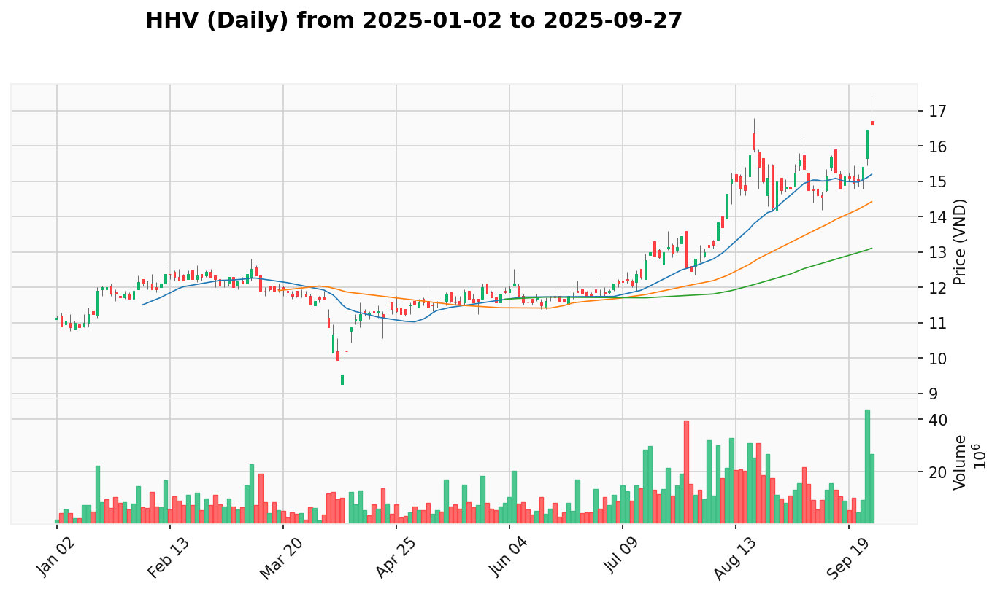

<a href="#dau-tu-cong">↑ Back to group DAU_TU_CONG</a>  |  <a href="#vpa-signal-summary">↑ Back to Top</a>

#### Key Statistics
| Metric | Value |
|:---|---:|
| Date Range | 2025-01-02 to 2025-09-26 |
| **Latest Close** | **16.6** |
| Period Open | 11.1 |
| Period High | 17.35 |
| Period Low | 9.26 |
| Period Change % | 49.55% |

**[Download HHV Data (.csv)](market_data/HHV_2025-01-02_to_2025-09-27.csv)**

---

### HID

#### [VPA Analysis (2025-08-14 - 2025-09-26)](./VPA.md#hid)
> **Ngày 2025-09-22:** HID tăng từ 3.12 VND lên 3.15 VND với khối lượng giao dịch đạt 0.3695 triệu cổ phiếu. Cây nến có biên độ từ 3.12 VND đến 3.21 VND và đóng cửa ở mức mở cửa (3.15 VND), cho thấy sự lưỡng lự giữa cung và cầu. Khối lượng giao dịch tăng đáng kể so với phiên giảm điểm trước đó (0.1575 triệu cổ phiếu), cho thấy có sự hấp thụ lực bán. Tuy nhiên, việc giá không thể đóng cửa ở mức cao nhất phiên cho thấy lực cầu chưa thực sự áp đảo. Sau hai phiên "Không có cầu" và "Dấu hiệu suy yếu", phiên này có thể là một nỗ lực kiểm tra nguồn cung. **Phân tích VPA/Wyckoff:** Test for Supply (Kiểm tra nguồn cung)
> **Ngày 2025-09-23:** HID giảm từ 3.15 VND xuống 3.14 VND với khối lượng giao dịch giảm xuống 0.2439 triệu cổ phiếu so với 0.3695 triệu cổ phiếu của phiên trước. Giá mở cửa cao hơn nhưng đóng cửa ở mức thấp nhất phiên, cho thấy áp lực bán mạnh mẽ đã đẩy giá xuống. Sau phiên kiểm tra nguồn cung vào ngày hôm trước, phiên này xác nhận sự yếu kém của lực cầu và sự chiếm ưu thế của phe bán. **Phân tích VPA/Wyckoff:** Sign of Weakness (SOW) - Giá giảm, đóng cửa ở mức thấp nhất phiên với khối lượng thấp hơn, cho thấy nguồn cung vẫn chiếm ưu thế và lực cầu yếu.
> **Ngày 2025-09-24:** HID tăng từ 3.14 VND lên 3.18 VND với khối lượng giao dịch đạt 0.7666 triệu cổ phiếu. Cây nến có biên độ rộng từ 3.14 VND đến 3.3 VND và đóng cửa trên mức mở cửa, cho thấy lực cầu đã quay trở lại sau phiên giảm điểm. Khối lượng giao dịch tăng mạnh gấp hơn 3 lần so với phiên trước (0.2439 triệu cổ phiếu), xác nhận sự xuất hiện của lực mua. Tuy nhiên, việc giá không thể đóng cửa ở mức cao nhất phiên cho thấy vẫn còn áp lực cung nhất định. Sau một phiên "Dấu hiệu suy yếu", phiên này cho thấy nỗ lực đẩy giá lên của phe mua. **Phân tích VPA/Wyckoff:** Demand Coming In (Lực cầu xuất hiện)
> **Ngày 2025-09-25:** HID tăng từ 3.18 VND lên 3.27 VND với khối lượng giao dịch giảm mạnh xuống 0.063 triệu cổ phiếu. Cây nến tăng có biên độ hẹp và đóng cửa gần mức cao nhất phiên, cho thấy lực cầu vẫn chiếm ưu thế nhưng với sự tham gia hạn chế của thị trường. Khối lượng thấp sau phiên "Demand Coming In" ngày hôm qua có thể cho thấy nguồn cung đã cạn kiệt. **Phân tích VPA/Wyckoff:** No Supply (Không có nguồn cung)
> **Ngày 2025-09-26:** HID giảm từ 3.19 VND xuống 3.15 VND với khối lượng giao dịch đạt 0.4171 triệu cổ phiếu. Cây nến có biên độ từ 3.15 VND đến 3.28 VND và đóng cửa ở mức thấp nhất phiên, cho thấy áp lực bán mạnh. Khối lượng giao dịch tăng đáng kể so với phiên trước (0.1775 triệu cổ phiếu), xác nhận sự xuất hiện của lực cung. Sau phiên "No Supply" ngày hôm qua, phiên này cho thấy phe bán đã quay trở lại. **Phân tích VPA/Wyckoff:** Supply Coming In (Lực cung xuất hiện)

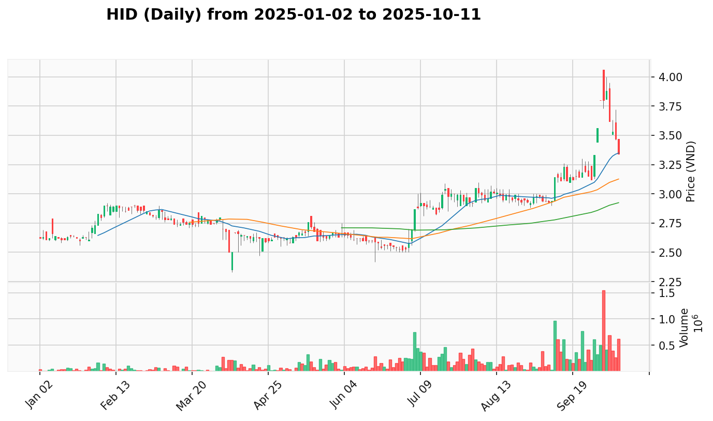

<a href="#penny">↑ Back to group PENNY</a>  |  <a href="#vpa-signal-summary">↑ Back to Top</a>

#### Key Statistics
| Metric | Value |
|:---|---:|
| Date Range | 2025-01-02 to 2025-09-26 |
| **Latest Close** | **3.15** |
| Period Open | 2.63 |
| Period High | 3.3 |
| Period Low | 2.33 |
| Period Change % | 19.77% |

**[Download HID Data (.csv)](market_data/HID_2025-01-02_to_2025-09-27.csv)**

---

### HLD

#### [VPA Analysis (2025-08-05 - 2025-09-26)](./VPA.md#hld)
> **Ngày 2025-09-22:** HLD mở cửa tại 17.9 VND, tăng lên 18.0 VND nhưng sau đó giảm mạnh xuống 16.6 VND và đóng cửa tại 17.8 VND. Biên độ giá trong phiên rất rộng, cho thấy áp lực bán mạnh mẽ đã xuất hiện. Giá đóng cửa thấp hơn so với phiên trước (17.9 VND). Khối lượng giao dịch đạt 0.0564 triệu cổ phiếu, cao hơn đáng kể so với phiên "Không có nguồn cung" ngày 2025-09-19 (0.0483 triệu cổ phiếu), xác nhận sự trở lại của nguồn cung sau giai đoạn cạn kiệt. Điều này cho thấy phe bán đang chiếm ưu thế. **Phân tích VPA/Wyckoff:** Selling Pressure (SP) - Áp lực bán
> **Ngày 2025-09-23:** HLD tăng từ 17.8 VND lên 18.0 VND với biên độ hẹp và đóng cửa ở mức cao nhất phiên. Khối lượng giao dịch đạt 0.0533 triệu cổ phiếu, thấp hơn phiên trước (0.0564 triệu cổ phiếu). Sau phiên áp lực bán mạnh, giá tăng nhẹ với khối lượng giảm cho thấy lực cung đã được hấp thụ và áp lực bán đã giảm bớt. **Phân tích VPA/Wyckoff:** Hấp thụ cung (Demand Absorption)
> **Ngày 2025-09-24:** HLD mở cửa tại 19.8 VND, tạo khoảng trống tăng giá so với phiên trước. Giá tăng lên 19.8 VND nhưng sau đó giảm mạnh xuống 18.1 VND và đóng cửa tại 18.3 VND. Biên độ giá trong phiên rất rộng, cho thấy áp lực bán mạnh mẽ đã xuất hiện sau khi mở cửa cao. Khối lượng giao dịch đạt 0.0848 triệu cổ phiếu, cao hơn đáng kể so với phiên trước (0.0533 triệu cổ phiếu). Điều này xác nhận sự trở lại của nguồn cung lớn, cho thấy phe bán đang chiếm ưu thế sau một phiên hấp thụ cung. **Phân tích VPA/Wyckoff:** Áp lực bán mạnh mẽ
> **Ngày 2025-09-25:** HLD giảm từ 18.3 VND xuống 18.2 VND với biên độ hẹp và đóng cửa ở mức thấp nhất phiên. Khối lượng giao dịch đạt 0.0167 triệu cổ phiếu, thấp hơn đáng kể so với phiên trước (0.0848 triệu cổ phiếu). Sau phiên áp lực bán mạnh mẽ, giá giảm nhẹ với khối lượng rất thấp cho thấy lực cung đã cạn kiệt tạm thời và thị trường đang chờ đợi tín hiệu mới. **Phân tích VPA/Wyckoff:** Cạn kiệt cung
> **Ngày 2025-09-26:** HLD mở cửa tại 18.3 VND, dao động trong biên độ hẹp từ 18.1 VND đến 18.3 VND và đóng cửa tại 18.3 VND, giữ nguyên mức giá đóng cửa của phiên trước. Khối lượng giao dịch đạt 0.0333 triệu cổ phiếu, tiếp tục giảm mạnh so với phiên trước (0.0429 triệu cổ phiếu) và rất thấp so với mức trung bình. Sau phiên cạn kiệt cung ngày 2025-09-25, giá đi ngang với khối lượng cực thấp cho thấy sự thiếu vắng cả lực cung và lực cầu mạnh mẽ. Thị trường đang trong giai đoạn tích lũy hoặc chờ đợi tín hiệu mới. **Phân tích VPA/Wyckoff:** Thiếu cầu (No Demand)

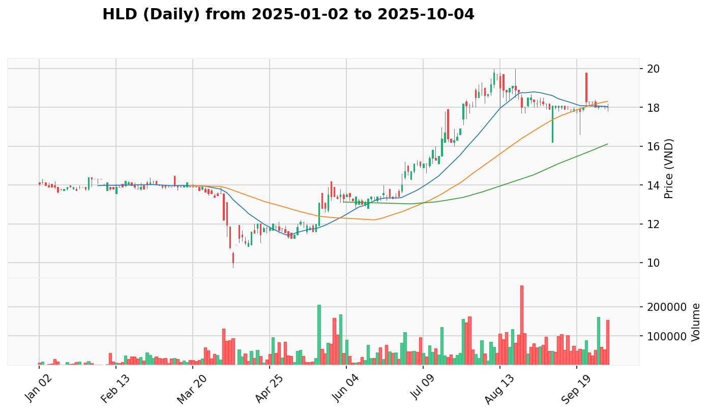

<a href="#bat-dong-san">↑ Back to group BAT_DONG_SAN</a>  |  <a href="#vpa-signal-summary">↑ Back to Top</a>

#### Key Statistics
| Metric | Value |
|:---|---:|
| Date Range | 2025-01-02 to 2025-09-26 |
| **Latest Close** | **18.3** |
| Period Open | 14.14 |
| Period High | 20.0 |
| Period Low | 9.74 |
| Period Change % | 29.42% |

**[Download HLD Data (.csv)](market_data/HLD_2025-01-02_to_2025-09-27.csv)**

---

### HOM

#### [VPA Analysis (2025-08-14 - 2025-09-26)](./VPA.md#hom)
> **Ngày 2025-09-22:** HOM giảm từ 4.8 VND xuống 4.6 VND với khối lượng giao dịch đạt 0.014 triệu cổ phiếu. Cây nến có biên độ hẹp (từ 4.8 xuống 4.6) và đóng cửa ở mức 4.6 VND. Khối lượng giao dịch giảm nhẹ so với phiên trước (0.0164 triệu cổ phiếu), cho thấy lực cầu yếu và không có sự tiếp nối sau nỗ lực tăng giá trước đó. Việc giá đóng cửa ở mức thấp nhất phiên với khối lượng thấp củng cố tín hiệu thiếu lực cầu. **Phân tích VPA/Wyckoff:** No Demand (ND) - Thiếu lực cầu.
> **Ngày 2025-09-23:** HOM giảm từ 4.7 VND xuống 4.6 VND với khối lượng giao dịch đạt 0.0429 triệu cổ phiếu. Cây nến có biên độ hẹp (từ 4.7 xuống 4.6) và đóng cửa ở mức thấp nhất phiên. Khối lượng giao dịch tăng đáng kể so với phiên trước (0.014 triệu cổ phiếu), cho thấy áp lực bán gia tăng. Sau phiên "No Demand" trước đó, việc giá giảm với khối lượng lớn xác nhận sự yếu kém của lực cầu và sự xuất hiện của nguồn cung. **Phân tích VPA/Wyckoff:** Weakness (W) - Lực cung gia tăng.
> **Ngày 2025-09-24:** HOM tăng từ 4.6 VND lên 4.7 VND với khối lượng giao dịch đạt 0.0289 triệu cổ phiếu. Cây nến có biên độ hẹp (từ 4.5 lên 4.7) và đóng cửa ở mức 4.7 VND. Khối lượng giao dịch giảm so với phiên trước (0.0429 triệu cổ phiếu). Sau hai phiên giảm giá với tín hiệu "No Demand" và "Weakness", việc giá tăng nhẹ với khối lượng thấp cho thấy lực bán tạm thời suy yếu, nhưng lực cầu chưa thực sự mạnh mẽ để đẩy giá lên cao hơn một cách bền vững. Đây có thể là một nỗ lực kiểm tra nguồn cung còn lại trên thị trường. **Phân tích VPA/Wyckoff:** Test for Supply (TS) - Kiểm tra nguồn cung.
> **Ngày 2025-09-25:** HOM giữ nguyên mức giá 4.7 VND với khối lượng giao dịch đạt 0.0121 triệu cổ phiếu. Cây nến có biên độ hẹp (từ 4.6 VND đến 4.7 VND) và đóng cửa ở mức 4.7 VND. Khối lượng giao dịch giảm mạnh so với phiên trước (0.0289 triệu cổ phiếu). Sau phiên "Test for Supply" trước đó, việc giá đi ngang với khối lượng rất thấp cho thấy lực cầu yếu và thị trường thiếu động lực tăng giá. **Phân tích VPA/Wyckoff:** No Demand (ND) - Thiếu lực cầu.
> **Ngày 2025-09-26:** HOM tăng nhẹ từ 4.7 VND lên 4.8 VND với khối lượng giao dịch đạt 0.0111 triệu cổ phiếu. Cây nến có biên độ hẹp (từ 4.6 VND lên 4.8 VND) và đóng cửa ở mức cao nhất phiên là 4.8 VND. So với phiên trước (2025-09-25), giá tăng nhẹ nhưng khối lượng tiếp tục giảm mạnh từ 0.0121 triệu cổ phiếu xuống 0.0111 triệu cổ phiếu. Sau phiên "No Demand" trước đó, việc giá tăng nhẹ với khối lượng cực thấp cho thấy lực cầu vẫn rất yếu và thị trường thiếu động lực để tạo ra một xu hướng tăng bền vững. Đây là dấu hiệu của sự thiếu vắng nhu cầu mua vào. **Phân tích VPA/Wyckoff:** No Demand (ND) - Thiếu lực cầu.

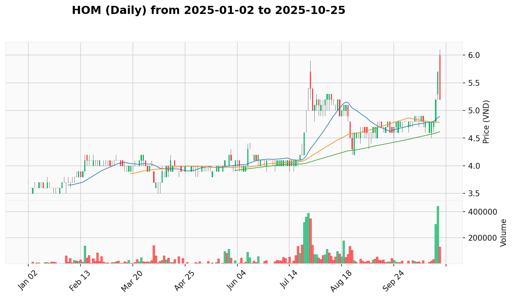

<a href="#vlxd">↑ Back to group VLXD</a>  |  <a href="#vpa-signal-summary">↑ Back to Top</a>

#### Key Statistics
| Metric | Value |
|:---|---:|
| Date Range | 2025-01-02 to 2025-09-26 |
| **Latest Close** | **4.8** |
| Period Open | 3.7 |
| Period High | 5.9 |
| Period Low | 3.5 |
| Period Change % | 29.73% |

**[Download HOM Data (.csv)](market_data/HOM_2025-01-02_to_2025-09-27.csv)**

---

### HPG

#### [VPA Analysis (2025-05-30 - 2025-09-26)](./VPA.md#hpg)
> **Ngày 2025-09-22:** HPG giảm từ 29.25 VND xuống 28.4 VND. Cây nến giảm có biên độ rộng (từ 28.3 VND đến 29.25 VND) và đóng cửa gần mức thấp nhất phiên. Khối lượng giao dịch đạt 66.07 triệu cổ phiếu, tăng đáng kể so với phiên trước (45.02 triệu cổ phiếu). Điều này cho thấy áp lực bán mạnh mẽ và bên bán đang chiếm ưu thế rõ rệt. **Phân tích VPA/Wyckoff:** Yếu tố suy yếu (Weakness)
> **Ngày 2025-09-23:** HPG tăng nhẹ từ 28.4 VND lên 28.65 VND. Cây nến tăng có biên độ hẹp (từ 28.45 VND đến 28.85 VND) và đóng cửa gần giữa thân nến. Khối lượng giao dịch đạt 24.9 triệu cổ phiếu, giảm mạnh so với phiên trước (66.07 triệu cổ phiếu) và thấp hơn mức trung bình. Điều này cho thấy lực bán đã tạm thời giảm nhưng lực cầu không đủ mạnh để đẩy giá lên cao, thể hiện sự thiếu quyết đoán và không có sự tham gia của dòng tiền lớn sau phiên giảm giá mạnh. **Phân tích VPA/Wyckoff:** No Demand (ND) - Giá tăng nhẹ với khối lượng thấp, cho thấy thiếu vắng lực cầu mạnh mẽ.
> **Ngày 2025-09-24:** HPG tăng từ 28.65 VND lên 29.05 VND. Cây nến tăng có biên độ rộng (từ 28.25 VND đến 29.05 VND) và đóng cửa tại mức cao nhất phiên. Khối lượng giao dịch đạt 30.74 triệu cổ phiếu, tăng so với phiên trước (24.9 triệu cổ phiếu) nhưng vẫn thấp hơn đáng kể so với phiên giảm mạnh ngày 2025-09-22 (66.07 triệu cổ phiếu). Điều này cho thấy lực cầu đã quay trở lại và chiếm ưu thế trong phiên, đẩy giá lên cao và đóng cửa ở mức tốt, sau hai phiên giảm giá và thiếu cầu. Tuy nhiên, khối lượng chưa thực sự bùng nổ để xác nhận một xu hướng tăng mạnh mẽ. **Phân tích VPA/Wyckoff:** Sign of Strength (SOS)
> **Ngày 2025-09-25:** HPG tăng nhẹ từ 29.05 VND lên 29.1 VND. Cây nến có biên độ hẹp (từ 28.95 VND đến 29.3 VND) và đóng cửa gần giữa thân nến. Khối lượng giao dịch đạt 15.93 triệu cổ phiếu, giảm mạnh so với phiên trước (30.74 triệu cổ phiếu) và thấp hơn đáng kể so với mức trung bình. Sau phiên tăng giá với tín hiệu SOS ngày 2025-09-24, phiên này cho thấy sự thiếu quyết đoán của cả bên mua và bên bán, với lực cầu không đủ mạnh để đẩy giá lên cao hơn và lực cung cũng không xuất hiện nhiều ở mức giá này. Khối lượng thấp cho thấy sự tạm lắng của thị trường, có thể là một phiên kiểm tra cung sau tín hiệu SOS. **Phân tích VPA/Wyckoff:** Test for Supply (TS)
> **Ngày 2025-09-26:** HPG giảm từ 28.8 VND xuống 28.55 VND. Cây nến giảm có biên độ tương đối rộng (từ 28.55 VND đến 29.2 VND) và đóng cửa tại mức thấp nhất phiên. Khối lượng giao dịch đạt 38.13 triệu cổ phiếu, tăng so với phiên trước (34.44 triệu cổ phiếu). Sau phiên kiểm tra cung (TS) ngày 2025-09-25, phiên này cho thấy lực cung đã quay trở lại và chiếm ưu thế, đẩy giá xuống và đóng cửa ở mức thấp nhất. Khối lượng tăng xác nhận áp lực bán đang gia tăng, cho thấy sự yếu đi của thị trường sau những nỗ lực tăng giá trước đó. **Phân tích VPA/Wyckoff:** Sign of Weakness (SOW)

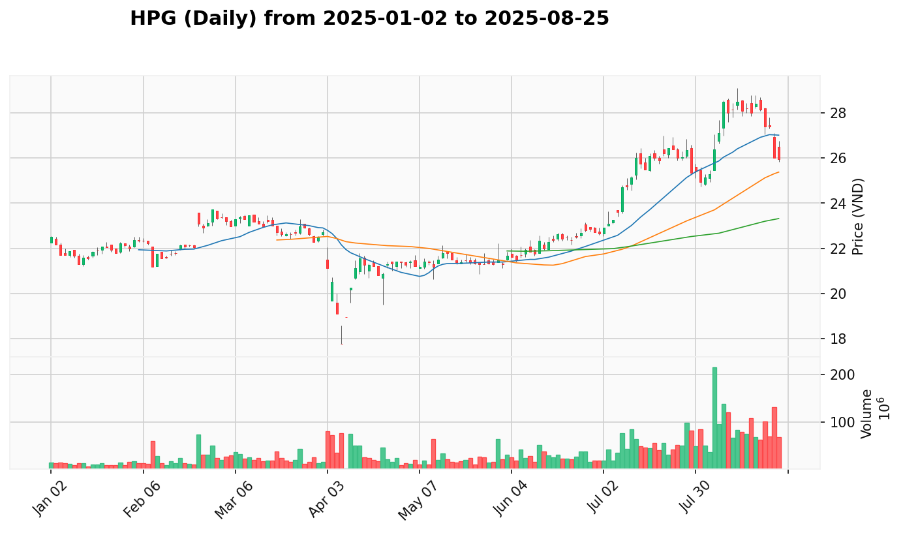

<a href="#thep">↑ Back to group THEP</a>  |  <a href="#vpa-signal-summary">↑ Back to Top</a>

#### Key Statistics
| Metric | Value |
|:---|---:|
| Date Range | 2025-01-02 to 2025-09-26 |
| **Latest Close** | **28.55** |
| Period Open | 22.25 |
| Period High | 30.85 |
| Period Low | 17.75 |
| Period Change % | 28.31% |

**[Download HPG Data (.csv)](market_data/HPG_2025-01-02_to_2025-09-27.csv)**

---

### HQC

#### [VPA Analysis (2025-08-04 - 2025-09-26)](./VPA.md#hqc)
> **Ngày 2025-09-22:** HQC giảm nhẹ từ 3.75 VND xuống 3.74 VND với khối lượng giao dịch tăng mạnh, đạt 5.3674 triệu cổ phiếu. Cây nến có biên độ hẹp và đóng cửa gần mức thấp nhất phiên, cho thấy áp lực bán vẫn còn hiện hữu. Sau phiên giảm giá với khối lượng tăng trước đó, việc giá tiếp tục giảm nhẹ với khối lượng tăng mạnh xác nhận sự suy yếu của cổ phiếu và lực cung vẫn đang chiếm ưu thế. **Phân tích VPA/Wyckoff:** Sign of Weakness (SOW) - Lực cung tiếp tục gia tăng.
> **Ngày 2025-09-23:** HQC giữ nguyên mức giá đóng cửa 3.74 VND so với phiên trước, với khối lượng giao dịch giảm xuống 3.948 triệu cổ phiếu. Cây nến có biên độ tương đối rộng và đóng cửa tại mức thấp nhất phiên, cho thấy áp lực bán vẫn còn và thiếu lực cầu. Sau các phiên giảm giá mạnh, việc giá đi ngang với khối lượng giảm cho thấy lực cung có phần chững lại nhưng bên mua vẫn chưa sẵn sàng tham gia, duy trì trạng thái yếu của cổ phiếu. **Phân tích VPA/Wyckoff:** Sign of Weakness (SOW) - Lực cầu yếu.
> **Ngày 2025-09-24:** HQC tăng từ 3.74 VND lên 3.83 VND với khối lượng giao dịch tăng, đạt 5.47 triệu cổ phiếu. Cây nến tăng có biên độ tương đối rộng và đóng cửa ở mức cao nhất phiên, cho thấy lực cầu đã quay trở lại và hấp thụ lực cung. Sau nhiều phiên giảm giá và đi ngang với áp lực bán, phiên tăng giá với khối lượng gia tăng này cho thấy sự thay đổi trong hành vi giá, có thể là một nỗ lực tăng giá. **Phân tích VPA/Wyckoff:** Sign of Strength (SOS) - Lực cầu mạnh mẽ xuất hiện.
> **Ngày 2025-09-25:** HQC tăng nhẹ từ 3.83 VND lên 3.86 VND, nhưng khối lượng giao dịch giảm mạnh xuống 2.8366 triệu cổ phiếu. Cây nến có biên độ hẹp và đóng cửa gần mức cao nhất phiên. Sau phiên tăng giá mạnh với SOS trước đó, việc giá tiếp tục tăng nhẹ nhưng với khối lượng giảm đáng kể cho thấy lực cầu không còn mạnh mẽ để duy trì đà tăng, có thể là dấu hiệu của sự suy yếu. **Phân tích VPA/Wyckoff:** No Demand (ND) - Lực cầu suy yếu.
> **Ngày 2025-09-26:** HQC giảm từ 3.84 VND xuống 3.78 VND với khối lượng giao dịch tăng nhẹ, đạt 5.3352 triệu cổ phiếu. Cây nến giảm có biên độ tương đối rộng và đóng cửa ở mức thấp nhất phiên, cho thấy áp lực bán mạnh mẽ đã xuất hiện và chiếm ưu thế. Sau phiên tăng nhẹ với lực cầu suy yếu (ND) vào ngày 2025-09-25, phiên giảm giá này với khối lượng tăng nhẹ xác nhận sự suy yếu của lực cầu và sự gia tăng của lực cung. **Phân tích VPA/Wyckoff:** Sign of Weakness (SOW) - Lực cung mạnh mẽ xuất hiện.

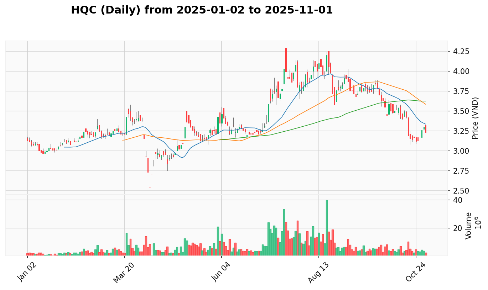

<a href="#bat-dong-san">↑ Back to group BAT_DONG_SAN</a>  |  <a href="#vpa-signal-summary">↑ Back to Top</a>

#### Key Statistics
| Metric | Value |
|:---|---:|
| Date Range | 2025-01-02 to 2025-09-26 |
| **Latest Close** | **3.78** |
| Period Open | 3.16 |
| Period High | 4.29 |
| Period Low | 2.54 |
| Period Change % | 19.62% |

**[Download HQC Data (.csv)](market_data/HQC_2025-01-02_to_2025-09-27.csv)**

---

