# AIPriceAction Market Report
*Report generated for data from **2025-01-02** to **2025-10-18**.*
*Last updated: 2025-10-18 08:47:41*

---

## 🎯 View the Trading Plan

**➡️ [Click here to view the trading plan](PLAN.md)**

**🎢 [Click here to view the latest market leaders](LEADER.md)**

---

<h3 id="vpa-signal-summary">VPA Signal Summary (from Latest Analysis)</h3>

| Signal | Tickers |
|:---|:---|
| Effort to Fall | [REE](#ree) |
| Effort to Rise | [SLS](#sls) |
| No Demand | [AAA](#aaa), [ACL](#acl), [ACV](#acv), [ANV](#anv), [APG](#apg), [APH](#aph), [ASM](#asm), [BAF](#baf), [BMI](#bmi), [BSI](#bsi), [BSR](#bsr), [BTN](#btn), [BVH](#bvh), [C69](#c69), [CKG](#ckg), [CLX](#clx), [CMG](#cmg), [CST](#cst), [CTI](#cti), [CTS](#cts), [DBC](#dbc), [DCL](#dcl), [DGW](#dgw), [DHA](#dha), [DHG](#dhg), [DL1](#dl1), [DPR](#dpr), [DRC](#drc), [DSC](#dsc), [DSN](#dsn), [DST](#dst), [DVP](#dvp), [EIB](#eib), [ELC](#elc), [EVE](#eve), [FOX](#fox), [FPT](#fpt), [FTS](#fts), [GAS](#gas), [GEG](#geg), [GIL](#gil), [GMD](#gmd), [GVR](#gvr), [HDC](#hdc), [HHS](#hhs), [HID](#hid), [HOM](#hom), [HQC](#hqc), [HSG](#hsg), [HT1](#ht1), [HVN](#hvn), [IDI](#idi), [IDV](#idv), [IMP](#imp), [IPA](#ipa), [JVC](#jvc), [KBC](#kbc), [KHG](#khg), [KSB](#ksb), [LAS](#las), [LDG](#ldg), [LHG](#lhg), [LPB](#lpb), [MBB](#mbb), [MBS](#mbs), [MCH](#mch), [MCM](#mcm), [MFS](#mfs), [MHC](#mhc), [MSH](#msh), [NAF](#naf), [NCT](#nct), [NKG](#nkg), [NNC](#nnc), [NT2](#nt2), [PET](#pet), [PHR](#phr), [PLC](#plc), [PLX](#plx), [POW](#pow), [PPH](#pph), [PTB](#ptb), [PVD](#pvd), [PVI](#pvi), [PVT](#pvt), [QTP](#qtp), [SAS](#sas), [SBS](#sbs), [SCS](#scs), [SGN](#sgn), [SGR](#sgr), [SHS](#shs), [SKG](#skg), [SMC](#smc), [SSH](#ssh), [STK](#stk), [TCL](#tcl), [TLD](#tld), [TLH](#tlh), [TPB](#tpb), [TVB](#tvb), [TVN](#tvn), [TVS](#tvs), [VC2](#vc2), [VCB](#vcb), [VEA](#vea), [VGT](#vgt), [VHM](#vhm), [VIB](#vib), [VIF](#vif), [VIG](#vig), [VIX](#vix), [VND](#vnd), [VSC](#vsc), [VTK](#vtk), [VTO](#vto), [YEG](#yeg) |
| No Supply | [ACB](#acb), [ADS](#ads), [BFC](#bfc), [BID](#bid), [BMS](#bms), [BVS](#bvs), [BWE](#bwe), [DAH](#dah), [DPM](#dpm), [DXP](#dxp), [FCN](#fcn), [FRT](#frt), [HCD](#hcd), [HCM](#hcm), [LSS](#lss), [MPC](#mpc), [MST](#mst), [MWG](#mwg), [OCB](#ocb), [PAN](#pan), [PVC](#pvc), [PVP](#pvp), [SGT](#sgt), [SSI](#ssi), [TCB](#tcb), [TCI](#tci), [TDC](#tdc), [TIP](#tip), [VIP](#vip), [VNE](#vne), [VNINDEX](#vnindex), [VNM](#vnm) |
| Selling Climax | [BCG](#bcg) |
| Shakeout | [HAP](#hap) |
| Sign of Strength | [AGG](#agg), [BMP](#bmp), [BTS](#bts), [CEO](#ceo), [CII](#cii), [DDV](#ddv), [DIG](#dig), [DRG](#drg), [DXG](#dxg), [EVG](#evg), [FID](#fid), [GDT](#gdt), [GEX](#gex), [HAH](#hah), [HDB](#hdb), [HDG](#hdg), [HUT](#hut), [KDC](#kdc), [KDH](#kdh), [MSN](#msn), [NDN](#ndn), [NHA](#nha), [NLG](#nlg), [NTC](#ntc), [NTL](#ntl), [NVL](#nvl), [PDR](#pdr), [PNJ](#pnj), [PXI](#pxi), [SCI](#sci), [SCR](#scr), [SHB](#shb), [VJC](#vjc), [VPB](#vpb) |
| Sign of Weakness | [AGR](#agr), [BCM](#bcm), [BIC](#bic), [BMC](#bmc), [C4G](#c4g), [CIG](#cig), [CMX](#cmx), [CSV](#csv), [CTD](#ctd), [CTG](#ctg), [CTR](#ctr), [D2D](#d2d), [DHC](#dhc), [DRI](#dri), [DTD](#dtd), [EVS](#evs), [FIT](#fit), [HAG](#hag), [HPG](#hpg), [IDC](#idc), [IDJ](#idj), [KSV](#ksv), [L18](#l18), [MSB](#msb), [MSR](#msr), [NRC](#nrc), [NTP](#ntp), [PC1](#pc1), [PHC](#phc), [PHP](#php), [PVS](#pvs), [QNS](#qns), [SAB](#sab), [SBT](#sbt), [SZC](#szc), [TCH](#tch), [TIG](#tig), [TNG](#tng), [VCI](#vci), [VDS](#vds), [VGC](#vgc), [VGS](#vgs), [VHC](#vhc), [VLB](#vlb), [VLC](#vlc), [VOS](#vos), [VPG](#vpg), [VRE](#vre), [VTP](#vtp) |
| Stopping Volume | [BCE](#bce), [TCM](#tcm) |
| Test for Supply | [BCC](#bcc), [DCM](#dcm), [NHH](#nhh), [OIL](#oil), [PPC](#ppc), [TCD](#tcd), [VC7](#vc7), [VCG](#vcg), [VIC](#vic) |
| Others | [ACG](#acg), [APS](#aps), [C47](#c47), [CNG](#cng), [CSC](#csc), [DGC](#dgc), [DHT](#dht), [DPG](#dpg), [DVN](#dvn), [EVF](#evf), [FMC](#fmc), [G36](#g36), [GDA](#gda), [HAX](#hax), [HBC](#hbc), [HHV](#hhv), [HLD](#hld), [HTN](#htn), [IJC](#ijc), [ITC](#itc), [LCG](#lcg), [LIG](#lig), [LTG](#ltg), [MIG](#mig), [NBC](#nbc), [ORS](#ors), [S99](#s99), [SIP](#sip), [STB](#stb), [TDM](#tdm), [TNH](#tnh), [TNT](#tnt), [TSC](#tsc), [TTF](#ttf), [TTN](#ttn), [TV2](#tv2), [VCS](#vcs), [VGI](#vgi), [VNA](#vna), [VPH](#vph), [VRG](#vrg) |

---

## Groups
<h3 id="ban-le">BAN_LE</h3>

[DGW](#dgw), [FRT](#frt), [HAX](#hax), [MWG](#mwg), [PET](#pet), [PNJ](#pnj)

<h3 id="bao-hiem">BAO_HIEM</h3>

[BIC](#bic), [BMI](#bmi), [BVH](#bvh), [MIG](#mig), [PVI](#pvi)

<h3 id="bat-dong-san">BAT_DONG_SAN</h3>

[AGG](#agg), [CEO](#ceo), [DIG](#dig), [DXG](#dxg), [HDC](#hdc), [HLD](#hld), [HQC](#hqc), [HTN](#htn), [ITC](#itc), [KDH](#kdh), [KHG](#khg), [LDG](#ldg), [NDN](#ndn), [NHA](#nha), [NLG](#nlg), [NTL](#ntl), [NVL](#nvl), [PDR](#pdr), [SCR](#scr), [SGR](#sgr), [SSH](#ssh), [TCH](#tch), [TDC](#tdc), [VHM](#vhm), [VIC](#vic), [VRE](#vre)

<h3 id="bat-dong-san-kcn">BAT_DONG_SAN_KCN</h3>

[BCM](#bcm), [D2D](#d2d), [DTD](#dtd), [IDC](#idc), [IDV](#idv), [KBC](#kbc), [LHG](#lhg), [NTC](#ntc), [SIP](#sip), [SZC](#szc), [TIP](#tip), [VGC](#vgc)

<h3 id="cao-su">CAO_SU</h3>

[DPR](#dpr), [DRC](#drc), [DRG](#drg), [DRI](#dri), [GVR](#gvr), [PHR](#phr), [VRG](#vrg)

<h3 id="chung-khoan">CHUNG_KHOAN</h3>

[AGR](#agr), [APG](#apg), [APS](#aps), [BMS](#bms), [BSI](#bsi), [BVS](#bvs), [CTS](#cts), [DSC](#dsc), [EVS](#evs), [FTS](#fts), [HCM](#hcm), [MBS](#mbs), [ORS](#ors), [SBS](#sbs), [SHS](#shs), [SSI](#ssi), [TCI](#tci), [TVB](#tvb), [TVS](#tvs), [VCI](#vci), [VDS](#vds), [VIX](#vix), [VND](#vnd)

<h3 id="cong-nghe">CONG_NGHE</h3>

[CMG](#cmg), [ELC](#elc), [FOX](#fox), [FPT](#fpt), [MFS](#mfs), [SGT](#sgt), [TTN](#ttn), [VGI](#vgi), [VTK](#vtk)

<h3 id="dau-khi">DAU_KHI</h3>

[BSR](#bsr), [CNG](#cng), [GAS](#gas), [OIL](#oil), [PLX](#plx), [PVC](#pvc), [PVD](#pvd), [PVS](#pvs)

<h3 id="dau-tu-cong">DAU_TU_CONG</h3>

[C4G](#c4g), [FCN](#fcn), [G36](#g36), [HHV](#hhv), [KSB](#ksb), [LCG](#lcg), [PLC](#plc), [VCG](#vcg)

<h3 id="det-may">DET_MAY</h3>

[ADS](#ads), [EVE](#eve), [GIL](#gil), [MSH](#msh), [PPH](#pph), [STK](#stk), [TCM](#tcm), [TNG](#tng), [VGT](#vgt)

<h3 id="hang-khong">HANG_KHONG</h3>

[ACV](#acv), [HVN](#hvn), [NCT](#nct), [SAS](#sas), [SCS](#scs), [SGN](#sgn), [VJC](#vjc)

<h3 id="hoa-chat">HOA_CHAT</h3>

[BFC](#bfc), [CSV](#csv), [DCM](#dcm), [DDV](#ddv), [DGC](#dgc), [DPM](#dpm), [LAS](#las)

<h3 id="khai-khoang">KHAI_KHOANG</h3>

[BMC](#bmc), [CST](#cst), [MSR](#msr), [NBC](#nbc), [NNC](#nnc), [TNT](#tnt), [VPG](#vpg)

<h3 id="nang-luong">NANG_LUONG</h3>

[GEG](#geg), [HDG](#hdg), [NT2](#nt2), [POW](#pow), [PPC](#ppc), [QTP](#qtp)

<h3 id="ngan-hang">NGAN_HANG</h3>

[ACB](#acb), [BID](#bid), [CTG](#ctg), [EIB](#eib), [EVF](#evf), [HDB](#hdb), [LPB](#lpb), [MBB](#mbb), [MSB](#msb), [OCB](#ocb), [SHB](#shb), [STB](#stb), [TCB](#tcb), [TPB](#tpb), [VCB](#vcb), [VIB](#vib), [VPB](#vpb)

<h3 id="nhua">NHUA</h3>

[AAA](#aaa), [APH](#aph), [BMP](#bmp), [HCD](#hcd), [NHH](#nhh), [NTP](#ntp)

<h3 id="nong-nghiep">NONG_NGHIEP</h3>

[BAF](#baf), [DBC](#dbc), [HAG](#hag), [LTG](#ltg), [NAF](#naf), [PAN](#pan), [TSC](#tsc), [VLC](#vlc)

<h3 id="others">OTHERS</h3>

[ACG](#acg), [BWE](#bwe), [DHC](#dhc), [DSN](#dsn), [GDT](#gdt), [GEX](#gex), [HHS](#hhs), [TDM](#tdm), [TIG](#tig), [TTF](#ttf), [VCS](#vcs), [VEA](#vea), [YEG](#yeg)

<h3 id="penny">PENNY</h3>

[CIG](#cig), [CSC](#csc), [DAH](#dah), [DL1](#dl1), [DST](#dst), [EVG](#evg), [FIT](#fit), [HAP](#hap), [HID](#hid), [IPA](#ipa), [LIG](#lig), [MST](#mst), [NRC](#nrc), [PXI](#pxi), [VC7](#vc7), [VIG](#vig), [VPH](#vph)

<h3 id="suc-khoe">SUC_KHOE</h3>

[DCL](#dcl), [DHG](#dhg), [DHT](#dht), [DVN](#dvn), [IMP](#imp), [JVC](#jvc), [TNH](#tnh)

<h3 id="thep">THEP</h3>

[ACG](#acg), [GDA](#gda), [HPG](#hpg), [HSG](#hsg), [KSV](#ksv), [MSR](#msr), [NKG](#nkg), [PTB](#ptb), [SMC](#smc), [TLH](#tlh), [TVN](#tvn), [VGS](#vgs), [VIF](#vif)

<h3 id="thuc-pham">THUC_PHAM</h3>

[CLX](#clx), [KDC](#kdc), [LSS](#lss), [MCH](#mch), [MCM](#mcm), [MSN](#msn), [QNS](#qns), [SAB](#sab), [SBT](#sbt), [SLS](#sls), [VNM](#vnm)

<h3 id="thuy-san">THUY_SAN</h3>

[ACL](#acl), [ANV](#anv), [ASM](#asm), [CMX](#cmx), [FMC](#fmc), [IDI](#idi), [MPC](#mpc), [VHC](#vhc)

<h3 id="van-tai">VAN_TAI</h3>

[DVP](#dvp), [DXP](#dxp), [GMD](#gmd), [HAH](#hah), [MHC](#mhc), [PHP](#php), [PVP](#pvp), [PVT](#pvt), [SKG](#skg), [TCD](#tcd), [TCL](#tcl), [VIP](#vip), [VNA](#vna), [VOS](#vos), [VSC](#vsc), [VTO](#vto), [VTP](#vtp)

<h3 id="vlxd">VLXD</h3>

[BCC](#bcc), [BTN](#btn), [BTS](#bts), [CTI](#cti), [DHA](#dha), [HOM](#hom), [HT1](#ht1), [PTB](#ptb), [VLB](#vlb)

<h3 id="xay-dung">XAY_DUNG</h3>

[BCE](#bce), [BCG](#bcg), [C47](#c47), [C69](#c69), [CII](#cii), [CKG](#ckg), [CTD](#ctd), [DPG](#dpg), [FID](#fid), [HBC](#hbc), [HUT](#hut), [IDJ](#idj), [IJC](#ijc), [L18](#l18), [PHC](#phc), [S99](#s99), [TLD](#tld), [VC2](#vc2)

<h3 id="xay-lap-dien">XAY_LAP_DIEN</h3>

[CTR](#ctr), [PC1](#pc1), [SCI](#sci), [TV2](#tv2), [VNE](#vne)

---

## Table of Contents
| Ticker | Actions |
|:-------|:--------|
| **[VNINDEX](#vnindex)** | [[Download CSV](market_data/VNINDEX_2025-01-02_to_2025-10-18.csv)] |
| **[AAA](#aaa)** | [[Download CSV](market_data/AAA_2025-01-02_to_2025-10-18.csv)] |
| **[ACB](#acb)** | [[Download CSV](market_data/ACB_2025-01-02_to_2025-10-18.csv)] |
| **[ACG](#acg)** | [[Download CSV](market_data/ACG_2025-01-02_to_2025-10-18.csv)] |
| **[ACL](#acl)** | [[Download CSV](market_data/ACL_2025-01-02_to_2025-10-18.csv)] |
| **[ACV](#acv)** | [[Download CSV](market_data/ACV_2025-01-02_to_2025-10-18.csv)] |
| **[ADS](#ads)** | [[Download CSV](market_data/ADS_2025-01-02_to_2025-10-18.csv)] |
| **[AGG](#agg)** | [[Download CSV](market_data/AGG_2025-01-02_to_2025-10-18.csv)] |
| **[AGR](#agr)** | [[Download CSV](market_data/AGR_2025-01-02_to_2025-10-18.csv)] |
| **[ANV](#anv)** | [[Download CSV](market_data/ANV_2025-01-02_to_2025-10-18.csv)] |
| **[APG](#apg)** | [[Download CSV](market_data/APG_2025-01-02_to_2025-10-18.csv)] |
| **[APH](#aph)** | [[Download CSV](market_data/APH_2025-01-02_to_2025-10-18.csv)] |
| **[APS](#aps)** | [[Download CSV](market_data/APS_2025-01-02_to_2025-10-18.csv)] |
| **[ASM](#asm)** | [[Download CSV](market_data/ASM_2025-01-02_to_2025-10-18.csv)] |
| **[BAF](#baf)** | [[Download CSV](market_data/BAF_2025-01-02_to_2025-10-18.csv)] |
| **[BCC](#bcc)** | [[Download CSV](market_data/BCC_2025-01-02_to_2025-10-18.csv)] |
| **[BCE](#bce)** | [[Download CSV](market_data/BCE_2025-01-02_to_2025-10-18.csv)] |
| **[BCG](#bcg)** | [[Download CSV](market_data/BCG_2025-01-02_to_2025-10-18.csv)] |
| **[BCM](#bcm)** | [[Download CSV](market_data/BCM_2025-01-02_to_2025-10-18.csv)] |
| **[BFC](#bfc)** | [[Download CSV](market_data/BFC_2025-01-02_to_2025-10-18.csv)] |
| **[BIC](#bic)** | [[Download CSV](market_data/BIC_2025-01-02_to_2025-10-18.csv)] |
| **[BID](#bid)** | [[Download CSV](market_data/BID_2025-01-02_to_2025-10-18.csv)] |
| **[BMC](#bmc)** | [[Download CSV](market_data/BMC_2025-01-02_to_2025-10-18.csv)] |
| **[BMI](#bmi)** | [[Download CSV](market_data/BMI_2025-01-02_to_2025-10-18.csv)] |
| **[BMP](#bmp)** | [[Download CSV](market_data/BMP_2025-01-02_to_2025-10-18.csv)] |
| **[BMS](#bms)** | [[Download CSV](market_data/BMS_2025-01-02_to_2025-10-18.csv)] |
| **[BSI](#bsi)** | [[Download CSV](market_data/BSI_2025-01-02_to_2025-10-18.csv)] |
| **[BSR](#bsr)** | [[Download CSV](market_data/BSR_2025-01-02_to_2025-10-18.csv)] |
| **[BTN](#btn)** | [[Download CSV](market_data/BTN_2025-01-02_to_2025-10-18.csv)] |
| **[BTS](#bts)** | [[Download CSV](market_data/BTS_2025-01-02_to_2025-10-18.csv)] |
| **[BVH](#bvh)** | [[Download CSV](market_data/BVH_2025-01-02_to_2025-10-18.csv)] |
| **[BVS](#bvs)** | [[Download CSV](market_data/BVS_2025-01-02_to_2025-10-18.csv)] |
| **[BWE](#bwe)** | [[Download CSV](market_data/BWE_2025-01-02_to_2025-10-18.csv)] |
| **[C47](#c47)** | [[Download CSV](market_data/C47_2025-01-02_to_2025-10-18.csv)] |
| **[C4G](#c4g)** | [[Download CSV](market_data/C4G_2025-01-02_to_2025-10-18.csv)] |
| **[C69](#c69)** | [[Download CSV](market_data/C69_2025-01-02_to_2025-10-18.csv)] |
| **[CEO](#ceo)** | [[Download CSV](market_data/CEO_2025-01-02_to_2025-10-18.csv)] |
| **[CIG](#cig)** | [[Download CSV](market_data/CIG_2025-01-02_to_2025-10-18.csv)] |
| **[CII](#cii)** | [[Download CSV](market_data/CII_2025-01-02_to_2025-10-18.csv)] |
| **[CKG](#ckg)** | [[Download CSV](market_data/CKG_2025-01-02_to_2025-10-18.csv)] |
| **[CLX](#clx)** | [[Download CSV](market_data/CLX_2025-01-02_to_2025-10-18.csv)] |
| **[CMG](#cmg)** | [[Download CSV](market_data/CMG_2025-01-02_to_2025-10-18.csv)] |
| **[CMX](#cmx)** | [[Download CSV](market_data/CMX_2025-01-02_to_2025-10-18.csv)] |
| **[CNG](#cng)** | [[Download CSV](market_data/CNG_2025-01-02_to_2025-10-18.csv)] |
| **[CSC](#csc)** | [[Download CSV](market_data/CSC_2025-01-02_to_2025-10-18.csv)] |
| **[CST](#cst)** | [[Download CSV](market_data/CST_2025-01-02_to_2025-10-18.csv)] |
| **[CSV](#csv)** | [[Download CSV](market_data/CSV_2025-01-02_to_2025-10-18.csv)] |
| **[CTD](#ctd)** | [[Download CSV](market_data/CTD_2025-01-02_to_2025-10-18.csv)] |
| **[CTG](#ctg)** | [[Download CSV](market_data/CTG_2025-01-02_to_2025-10-18.csv)] |
| **[CTI](#cti)** | [[Download CSV](market_data/CTI_2025-01-02_to_2025-10-18.csv)] |
| **[CTR](#ctr)** | [[Download CSV](market_data/CTR_2025-01-02_to_2025-10-18.csv)] |
| **[CTS](#cts)** | [[Download CSV](market_data/CTS_2025-01-02_to_2025-10-18.csv)] |
| **[D2D](#d2d)** | [[Download CSV](market_data/D2D_2025-01-02_to_2025-10-18.csv)] |
| **[DAH](#dah)** | [[Download CSV](market_data/DAH_2025-01-02_to_2025-10-18.csv)] |
| **[DBC](#dbc)** | [[Download CSV](market_data/DBC_2025-01-02_to_2025-10-18.csv)] |
| **[DCL](#dcl)** | [[Download CSV](market_data/DCL_2025-01-02_to_2025-10-18.csv)] |
| **[DCM](#dcm)** | [[Download CSV](market_data/DCM_2025-01-02_to_2025-10-18.csv)] |
| **[DDV](#ddv)** | [[Download CSV](market_data/DDV_2025-01-02_to_2025-10-18.csv)] |
| **[DGC](#dgc)** | [[Download CSV](market_data/DGC_2025-01-02_to_2025-10-18.csv)] |
| **[DGW](#dgw)** | [[Download CSV](market_data/DGW_2025-01-02_to_2025-10-18.csv)] |
| **[DHA](#dha)** | [[Download CSV](market_data/DHA_2025-01-02_to_2025-10-18.csv)] |
| **[DHC](#dhc)** | [[Download CSV](market_data/DHC_2025-01-02_to_2025-10-18.csv)] |
| **[DHG](#dhg)** | [[Download CSV](market_data/DHG_2025-01-02_to_2025-10-18.csv)] |
| **[DHT](#dht)** | [[Download CSV](market_data/DHT_2025-01-02_to_2025-10-18.csv)] |
| **[DIG](#dig)** | [[Download CSV](market_data/DIG_2025-01-02_to_2025-10-18.csv)] |
| **[DL1](#dl1)** | [[Download CSV](market_data/DL1_2025-01-02_to_2025-10-18.csv)] |
| **[DPG](#dpg)** | [[Download CSV](market_data/DPG_2025-01-02_to_2025-10-18.csv)] |
| **[DPM](#dpm)** | [[Download CSV](market_data/DPM_2025-01-02_to_2025-10-18.csv)] |
| **[DPR](#dpr)** | [[Download CSV](market_data/DPR_2025-01-02_to_2025-10-18.csv)] |
| **[DRC](#drc)** | [[Download CSV](market_data/DRC_2025-01-02_to_2025-10-18.csv)] |
| **[DRG](#drg)** | [[Download CSV](market_data/DRG_2025-01-02_to_2025-10-18.csv)] |
| **[DRI](#dri)** | [[Download CSV](market_data/DRI_2025-01-02_to_2025-10-18.csv)] |
| **[DSC](#dsc)** | [[Download CSV](market_data/DSC_2025-01-02_to_2025-10-18.csv)] |
| **[DSN](#dsn)** | [[Download CSV](market_data/DSN_2025-01-02_to_2025-10-18.csv)] |
| **[DST](#dst)** | [[Download CSV](market_data/DST_2025-01-02_to_2025-10-18.csv)] |
| **[DTD](#dtd)** | [[Download CSV](market_data/DTD_2025-01-02_to_2025-10-18.csv)] |
| **[DVN](#dvn)** | [[Download CSV](market_data/DVN_2025-01-02_to_2025-10-18.csv)] |
| **[DVP](#dvp)** | [[Download CSV](market_data/DVP_2025-01-02_to_2025-10-18.csv)] |
| **[DXG](#dxg)** | [[Download CSV](market_data/DXG_2025-01-02_to_2025-10-18.csv)] |
| **[DXP](#dxp)** | [[Download CSV](market_data/DXP_2025-01-02_to_2025-10-18.csv)] |
| **[EIB](#eib)** | [[Download CSV](market_data/EIB_2025-01-02_to_2025-10-18.csv)] |
| **[ELC](#elc)** | [[Download CSV](market_data/ELC_2025-01-02_to_2025-10-18.csv)] |
| **[EVE](#eve)** | [[Download CSV](market_data/EVE_2025-01-02_to_2025-10-18.csv)] |
| **[EVF](#evf)** | [[Download CSV](market_data/EVF_2025-01-02_to_2025-10-18.csv)] |
| **[EVG](#evg)** | [[Download CSV](market_data/EVG_2025-01-02_to_2025-10-18.csv)] |
| **[EVS](#evs)** | [[Download CSV](market_data/EVS_2025-01-02_to_2025-10-18.csv)] |
| **[FCN](#fcn)** | [[Download CSV](market_data/FCN_2025-01-02_to_2025-10-18.csv)] |
| **[FID](#fid)** | [[Download CSV](market_data/FID_2025-01-02_to_2025-10-18.csv)] |
| **[FIT](#fit)** | [[Download CSV](market_data/FIT_2025-01-02_to_2025-10-18.csv)] |
| **[FMC](#fmc)** | [[Download CSV](market_data/FMC_2025-01-02_to_2025-10-18.csv)] |
| **[FOX](#fox)** | [[Download CSV](market_data/FOX_2025-01-02_to_2025-10-18.csv)] |
| **[FPT](#fpt)** | [[Download CSV](market_data/FPT_2025-01-02_to_2025-10-18.csv)] |
| **[FRT](#frt)** | [[Download CSV](market_data/FRT_2025-01-02_to_2025-10-18.csv)] |
| **[FTS](#fts)** | [[Download CSV](market_data/FTS_2025-01-02_to_2025-10-18.csv)] |
| **[G36](#g36)** | [[Download CSV](market_data/G36_2025-01-02_to_2025-10-18.csv)] |
| **[GAS](#gas)** | [[Download CSV](market_data/GAS_2025-01-02_to_2025-10-18.csv)] |
| **[GDA](#gda)** | [[Download CSV](market_data/GDA_2025-01-02_to_2025-10-18.csv)] |
| **[GDT](#gdt)** | [[Download CSV](market_data/GDT_2025-01-02_to_2025-10-18.csv)] |
| **[GEG](#geg)** | [[Download CSV](market_data/GEG_2025-01-02_to_2025-10-18.csv)] |
| **[GEX](#gex)** | [[Download CSV](market_data/GEX_2025-01-02_to_2025-10-18.csv)] |
| **[GIL](#gil)** | [[Download CSV](market_data/GIL_2025-01-02_to_2025-10-18.csv)] |
| **[GMD](#gmd)** | [[Download CSV](market_data/GMD_2025-01-02_to_2025-10-18.csv)] |
| **[GVR](#gvr)** | [[Download CSV](market_data/GVR_2025-01-02_to_2025-10-18.csv)] |
| **[HAG](#hag)** | [[Download CSV](market_data/HAG_2025-01-02_to_2025-10-18.csv)] |
| **[HAH](#hah)** | [[Download CSV](market_data/HAH_2025-01-02_to_2025-10-18.csv)] |
| **[HAP](#hap)** | [[Download CSV](market_data/HAP_2025-01-02_to_2025-10-18.csv)] |
| **[HAX](#hax)** | [[Download CSV](market_data/HAX_2025-01-02_to_2025-10-18.csv)] |
| **[HBC](#hbc)** | [[Download CSV](market_data/HBC_2025-01-02_to_2025-10-18.csv)] |
| **[HCD](#hcd)** | [[Download CSV](market_data/HCD_2025-01-02_to_2025-10-18.csv)] |
| **[HCM](#hcm)** | [[Download CSV](market_data/HCM_2025-01-02_to_2025-10-18.csv)] |
| **[HDB](#hdb)** | [[Download CSV](market_data/HDB_2025-01-02_to_2025-10-18.csv)] |
| **[HDC](#hdc)** | [[Download CSV](market_data/HDC_2025-01-02_to_2025-10-18.csv)] |
| **[HDG](#hdg)** | [[Download CSV](market_data/HDG_2025-01-02_to_2025-10-18.csv)] |
| **[HHS](#hhs)** | [[Download CSV](market_data/HHS_2025-01-02_to_2025-10-18.csv)] |
| **[HHV](#hhv)** | [[Download CSV](market_data/HHV_2025-01-02_to_2025-10-18.csv)] |
| **[HID](#hid)** | [[Download CSV](market_data/HID_2025-01-02_to_2025-10-18.csv)] |
| **[HLD](#hld)** | [[Download CSV](market_data/HLD_2025-01-02_to_2025-10-18.csv)] |
| **[HOM](#hom)** | [[Download CSV](market_data/HOM_2025-01-02_to_2025-10-18.csv)] |
| **[HPG](#hpg)** | [[Download CSV](market_data/HPG_2025-01-02_to_2025-10-18.csv)] |
| **[HQC](#hqc)** | [[Download CSV](market_data/HQC_2025-01-02_to_2025-10-18.csv)] |
| **[HSG](#hsg)** | [[Download CSV](market_data/HSG_2025-01-02_to_2025-10-18.csv)] |
| **[HT1](#ht1)** | [[Download CSV](market_data/HT1_2025-01-02_to_2025-10-18.csv)] |
| **[HTN](#htn)** | [[Download CSV](market_data/HTN_2025-01-02_to_2025-10-18.csv)] |
| **[HUT](#hut)** | [[Download CSV](market_data/HUT_2025-01-02_to_2025-10-18.csv)] |
| **[HVN](#hvn)** | [[Download CSV](market_data/HVN_2025-01-02_to_2025-10-18.csv)] |
| **[IDC](#idc)** | [[Download CSV](market_data/IDC_2025-01-02_to_2025-10-18.csv)] |
| **[IDI](#idi)** | [[Download CSV](market_data/IDI_2025-01-02_to_2025-10-18.csv)] |
| **[IDJ](#idj)** | [[Download CSV](market_data/IDJ_2025-01-02_to_2025-10-18.csv)] |
| **[IDV](#idv)** | [[Download CSV](market_data/IDV_2025-01-02_to_2025-10-18.csv)] |
| **[IJC](#ijc)** | [[Download CSV](market_data/IJC_2025-01-02_to_2025-10-18.csv)] |
| **[IMP](#imp)** | [[Download CSV](market_data/IMP_2025-01-02_to_2025-10-18.csv)] |
| **[IPA](#ipa)** | [[Download CSV](market_data/IPA_2025-01-02_to_2025-10-18.csv)] |
| **[ITC](#itc)** | [[Download CSV](market_data/ITC_2025-01-02_to_2025-10-18.csv)] |
| **[JVC](#jvc)** | [[Download CSV](market_data/JVC_2025-01-02_to_2025-10-18.csv)] |
| **[KBC](#kbc)** | [[Download CSV](market_data/KBC_2025-01-02_to_2025-10-18.csv)] |
| **[KDC](#kdc)** | [[Download CSV](market_data/KDC_2025-01-02_to_2025-10-18.csv)] |
| **[KDH](#kdh)** | [[Download CSV](market_data/KDH_2025-01-02_to_2025-10-18.csv)] |
| **[KHG](#khg)** | [[Download CSV](market_data/KHG_2025-01-02_to_2025-10-18.csv)] |
| **[KSB](#ksb)** | [[Download CSV](market_data/KSB_2025-01-02_to_2025-10-18.csv)] |
| **[KSV](#ksv)** | [[Download CSV](market_data/KSV_2025-01-02_to_2025-10-18.csv)] |
| **[L18](#l18)** | [[Download CSV](market_data/L18_2025-01-02_to_2025-10-18.csv)] |
| **[LAS](#las)** | [[Download CSV](market_data/LAS_2025-01-02_to_2025-10-18.csv)] |
| **[LCG](#lcg)** | [[Download CSV](market_data/LCG_2025-01-02_to_2025-10-18.csv)] |
| **[LDG](#ldg)** | [[Download CSV](market_data/LDG_2025-01-02_to_2025-10-18.csv)] |
| **[LHG](#lhg)** | [[Download CSV](market_data/LHG_2025-01-02_to_2025-10-18.csv)] |
| **[LIG](#lig)** | [[Download CSV](market_data/LIG_2025-01-02_to_2025-10-18.csv)] |
| **[LPB](#lpb)** | [[Download CSV](market_data/LPB_2025-01-02_to_2025-10-18.csv)] |
| **[LSS](#lss)** | [[Download CSV](market_data/LSS_2025-01-02_to_2025-10-18.csv)] |
| **[LTG](#ltg)** | [[Download CSV](market_data/LTG_2025-01-02_to_2025-10-18.csv)] |
| **[MBB](#mbb)** | [[Download CSV](market_data/MBB_2025-01-02_to_2025-10-18.csv)] |
| **[MBS](#mbs)** | [[Download CSV](market_data/MBS_2025-01-02_to_2025-10-18.csv)] |
| **[MCH](#mch)** | [[Download CSV](market_data/MCH_2025-01-02_to_2025-10-18.csv)] |
| **[MCM](#mcm)** | [[Download CSV](market_data/MCM_2025-01-02_to_2025-10-18.csv)] |
| **[MFS](#mfs)** | [[Download CSV](market_data/MFS_2025-01-02_to_2025-10-18.csv)] |
| **[MHC](#mhc)** | [[Download CSV](market_data/MHC_2025-01-02_to_2025-10-18.csv)] |
| **[MIG](#mig)** | [[Download CSV](market_data/MIG_2025-01-02_to_2025-10-18.csv)] |
| **[MPC](#mpc)** | [[Download CSV](market_data/MPC_2025-01-02_to_2025-10-18.csv)] |
| **[MSB](#msb)** | [[Download CSV](market_data/MSB_2025-01-02_to_2025-10-18.csv)] |
| **[MSH](#msh)** | [[Download CSV](market_data/MSH_2025-01-02_to_2025-10-18.csv)] |
| **[MSN](#msn)** | [[Download CSV](market_data/MSN_2025-01-02_to_2025-10-18.csv)] |
| **[MSR](#msr)** | [[Download CSV](market_data/MSR_2025-01-02_to_2025-10-18.csv)] |
| **[MST](#mst)** | [[Download CSV](market_data/MST_2025-01-02_to_2025-10-18.csv)] |
| **[MWG](#mwg)** | [[Download CSV](market_data/MWG_2025-01-02_to_2025-10-18.csv)] |
| **[NAF](#naf)** | [[Download CSV](market_data/NAF_2025-01-02_to_2025-10-18.csv)] |
| **[NBC](#nbc)** | [[Download CSV](market_data/NBC_2025-01-02_to_2025-10-18.csv)] |
| **[NCT](#nct)** | [[Download CSV](market_data/NCT_2025-01-02_to_2025-10-18.csv)] |
| **[NDN](#ndn)** | [[Download CSV](market_data/NDN_2025-01-02_to_2025-10-18.csv)] |
| **[NHA](#nha)** | [[Download CSV](market_data/NHA_2025-01-02_to_2025-10-18.csv)] |
| **[NHH](#nhh)** | [[Download CSV](market_data/NHH_2025-01-02_to_2025-10-18.csv)] |
| **[NKG](#nkg)** | [[Download CSV](market_data/NKG_2025-01-02_to_2025-10-18.csv)] |
| **[NLG](#nlg)** | [[Download CSV](market_data/NLG_2025-01-02_to_2025-10-18.csv)] |
| **[NNC](#nnc)** | [[Download CSV](market_data/NNC_2025-01-02_to_2025-10-18.csv)] |
| **[NRC](#nrc)** | [[Download CSV](market_data/NRC_2025-01-02_to_2025-10-18.csv)] |
| **[NT2](#nt2)** | [[Download CSV](market_data/NT2_2025-01-02_to_2025-10-18.csv)] |
| **[NTC](#ntc)** | [[Download CSV](market_data/NTC_2025-01-02_to_2025-10-18.csv)] |
| **[NTL](#ntl)** | [[Download CSV](market_data/NTL_2025-01-02_to_2025-10-18.csv)] |
| **[NTP](#ntp)** | [[Download CSV](market_data/NTP_2025-01-02_to_2025-10-18.csv)] |
| **[NVL](#nvl)** | [[Download CSV](market_data/NVL_2025-01-02_to_2025-10-18.csv)] |
| **[OCB](#ocb)** | [[Download CSV](market_data/OCB_2025-01-02_to_2025-10-18.csv)] |
| **[OIL](#oil)** | [[Download CSV](market_data/OIL_2025-01-02_to_2025-10-18.csv)] |
| **[ORS](#ors)** | [[Download CSV](market_data/ORS_2025-01-02_to_2025-10-18.csv)] |
| **[PAN](#pan)** | [[Download CSV](market_data/PAN_2025-01-02_to_2025-10-18.csv)] |
| **[PC1](#pc1)** | [[Download CSV](market_data/PC1_2025-01-02_to_2025-10-18.csv)] |
| **[PDR](#pdr)** | [[Download CSV](market_data/PDR_2025-01-02_to_2025-10-18.csv)] |
| **[PET](#pet)** | [[Download CSV](market_data/PET_2025-01-02_to_2025-10-18.csv)] |
| **[PHC](#phc)** | [[Download CSV](market_data/PHC_2025-01-02_to_2025-10-18.csv)] |
| **[PHP](#php)** | [[Download CSV](market_data/PHP_2025-01-02_to_2025-10-18.csv)] |
| **[PHR](#phr)** | [[Download CSV](market_data/PHR_2025-01-02_to_2025-10-18.csv)] |
| **[PLC](#plc)** | [[Download CSV](market_data/PLC_2025-01-02_to_2025-10-18.csv)] |
| **[PLX](#plx)** | [[Download CSV](market_data/PLX_2025-01-02_to_2025-10-18.csv)] |
| **[PNJ](#pnj)** | [[Download CSV](market_data/PNJ_2025-01-02_to_2025-10-18.csv)] |
| **[POW](#pow)** | [[Download CSV](market_data/POW_2025-01-02_to_2025-10-18.csv)] |
| **[PPC](#ppc)** | [[Download CSV](market_data/PPC_2025-01-02_to_2025-10-18.csv)] |
| **[PPH](#pph)** | [[Download CSV](market_data/PPH_2025-01-02_to_2025-10-18.csv)] |
| **[PTB](#ptb)** | [[Download CSV](market_data/PTB_2025-01-02_to_2025-10-18.csv)] |
| **[PVC](#pvc)** | [[Download CSV](market_data/PVC_2025-01-02_to_2025-10-18.csv)] |
| **[PVD](#pvd)** | [[Download CSV](market_data/PVD_2025-01-02_to_2025-10-18.csv)] |
| **[PVI](#pvi)** | [[Download CSV](market_data/PVI_2025-01-02_to_2025-10-18.csv)] |
| **[PVP](#pvp)** | [[Download CSV](market_data/PVP_2025-01-02_to_2025-10-18.csv)] |
| **[PVS](#pvs)** | [[Download CSV](market_data/PVS_2025-01-02_to_2025-10-18.csv)] |
| **[PVT](#pvt)** | [[Download CSV](market_data/PVT_2025-01-02_to_2025-10-18.csv)] |
| **[PXI](#pxi)** | [[Download CSV](market_data/PXI_2025-01-02_to_2025-10-18.csv)] |
| **[QNS](#qns)** | [[Download CSV](market_data/QNS_2025-01-02_to_2025-10-18.csv)] |
| **[QTP](#qtp)** | [[Download CSV](market_data/QTP_2025-01-02_to_2025-10-18.csv)] |
| **[S99](#s99)** | [[Download CSV](market_data/S99_2025-01-02_to_2025-10-18.csv)] |
| **[SAB](#sab)** | [[Download CSV](market_data/SAB_2025-01-02_to_2025-10-18.csv)] |
| **[SAS](#sas)** | [[Download CSV](market_data/SAS_2025-01-02_to_2025-10-18.csv)] |
| **[SBS](#sbs)** | [[Download CSV](market_data/SBS_2025-01-02_to_2025-10-18.csv)] |
| **[SBT](#sbt)** | [[Download CSV](market_data/SBT_2025-01-02_to_2025-10-18.csv)] |
| **[SCI](#sci)** | [[Download CSV](market_data/SCI_2025-01-02_to_2025-10-18.csv)] |
| **[SCR](#scr)** | [[Download CSV](market_data/SCR_2025-01-02_to_2025-10-18.csv)] |
| **[SCS](#scs)** | [[Download CSV](market_data/SCS_2025-01-02_to_2025-10-18.csv)] |
| **[SGN](#sgn)** | [[Download CSV](market_data/SGN_2025-01-02_to_2025-10-18.csv)] |
| **[SGR](#sgr)** | [[Download CSV](market_data/SGR_2025-01-02_to_2025-10-18.csv)] |
| **[SGT](#sgt)** | [[Download CSV](market_data/SGT_2025-01-02_to_2025-10-18.csv)] |
| **[SHB](#shb)** | [[Download CSV](market_data/SHB_2025-01-02_to_2025-10-18.csv)] |
| **[SHS](#shs)** | [[Download CSV](market_data/SHS_2025-01-02_to_2025-10-18.csv)] |
| **[SIP](#sip)** | [[Download CSV](market_data/SIP_2025-01-02_to_2025-10-18.csv)] |
| **[SKG](#skg)** | [[Download CSV](market_data/SKG_2025-01-02_to_2025-10-18.csv)] |
| **[SLS](#sls)** | [[Download CSV](market_data/SLS_2025-01-02_to_2025-10-18.csv)] |
| **[SMC](#smc)** | [[Download CSV](market_data/SMC_2025-01-02_to_2025-10-18.csv)] |
| **[SSH](#ssh)** | [[Download CSV](market_data/SSH_2025-01-02_to_2025-10-18.csv)] |
| **[SSI](#ssi)** | [[Download CSV](market_data/SSI_2025-01-02_to_2025-10-18.csv)] |
| **[STB](#stb)** | [[Download CSV](market_data/STB_2025-01-02_to_2025-10-18.csv)] |
| **[STK](#stk)** | [[Download CSV](market_data/STK_2025-01-02_to_2025-10-18.csv)] |
| **[SZC](#szc)** | [[Download CSV](market_data/SZC_2025-01-02_to_2025-10-18.csv)] |
| **[TCB](#tcb)** | [[Download CSV](market_data/TCB_2025-01-02_to_2025-10-18.csv)] |
| **[TCD](#tcd)** | [[Download CSV](market_data/TCD_2025-01-02_to_2025-10-18.csv)] |
| **[TCH](#tch)** | [[Download CSV](market_data/TCH_2025-01-02_to_2025-10-18.csv)] |
| **[TCI](#tci)** | [[Download CSV](market_data/TCI_2025-01-02_to_2025-10-18.csv)] |
| **[TCL](#tcl)** | [[Download CSV](market_data/TCL_2025-01-02_to_2025-10-18.csv)] |
| **[TCM](#tcm)** | [[Download CSV](market_data/TCM_2025-01-02_to_2025-10-18.csv)] |
| **[TDC](#tdc)** | [[Download CSV](market_data/TDC_2025-01-02_to_2025-10-18.csv)] |
| **[TDM](#tdm)** | [[Download CSV](market_data/TDM_2025-01-02_to_2025-10-18.csv)] |
| **[TIG](#tig)** | [[Download CSV](market_data/TIG_2025-01-02_to_2025-10-18.csv)] |
| **[TIP](#tip)** | [[Download CSV](market_data/TIP_2025-01-02_to_2025-10-18.csv)] |
| **[TLD](#tld)** | [[Download CSV](market_data/TLD_2025-01-02_to_2025-10-18.csv)] |
| **[TLH](#tlh)** | [[Download CSV](market_data/TLH_2025-01-02_to_2025-10-18.csv)] |
| **[TNG](#tng)** | [[Download CSV](market_data/TNG_2025-01-02_to_2025-10-18.csv)] |
| **[TNH](#tnh)** | [[Download CSV](market_data/TNH_2025-01-02_to_2025-10-18.csv)] |
| **[TNT](#tnt)** | [[Download CSV](market_data/TNT_2025-01-02_to_2025-10-18.csv)] |
| **[TPB](#tpb)** | [[Download CSV](market_data/TPB_2025-01-02_to_2025-10-18.csv)] |
| **[TSC](#tsc)** | [[Download CSV](market_data/TSC_2025-01-02_to_2025-10-18.csv)] |
| **[TTF](#ttf)** | [[Download CSV](market_data/TTF_2025-01-02_to_2025-10-18.csv)] |
| **[TTN](#ttn)** | [[Download CSV](market_data/TTN_2025-01-02_to_2025-10-18.csv)] |
| **[TV2](#tv2)** | [[Download CSV](market_data/TV2_2025-01-02_to_2025-10-18.csv)] |
| **[TVB](#tvb)** | [[Download CSV](market_data/TVB_2025-01-02_to_2025-10-18.csv)] |
| **[TVN](#tvn)** | [[Download CSV](market_data/TVN_2025-01-02_to_2025-10-18.csv)] |
| **[TVS](#tvs)** | [[Download CSV](market_data/TVS_2025-01-02_to_2025-10-18.csv)] |
| **[VC2](#vc2)** | [[Download CSV](market_data/VC2_2025-01-02_to_2025-10-18.csv)] |
| **[VC7](#vc7)** | [[Download CSV](market_data/VC7_2025-01-02_to_2025-10-18.csv)] |
| **[VCB](#vcb)** | [[Download CSV](market_data/VCB_2025-01-02_to_2025-10-18.csv)] |
| **[VCG](#vcg)** | [[Download CSV](market_data/VCG_2025-01-02_to_2025-10-18.csv)] |
| **[VCI](#vci)** | [[Download CSV](market_data/VCI_2025-01-02_to_2025-10-18.csv)] |
| **[VCS](#vcs)** | [[Download CSV](market_data/VCS_2025-01-02_to_2025-10-18.csv)] |
| **[VDS](#vds)** | [[Download CSV](market_data/VDS_2025-01-02_to_2025-10-18.csv)] |
| **[VEA](#vea)** | [[Download CSV](market_data/VEA_2025-01-02_to_2025-10-18.csv)] |
| **[VGC](#vgc)** | [[Download CSV](market_data/VGC_2025-01-02_to_2025-10-18.csv)] |
| **[VGI](#vgi)** | [[Download CSV](market_data/VGI_2025-01-02_to_2025-10-18.csv)] |
| **[VGS](#vgs)** | [[Download CSV](market_data/VGS_2025-01-02_to_2025-10-18.csv)] |
| **[VGT](#vgt)** | [[Download CSV](market_data/VGT_2025-01-02_to_2025-10-18.csv)] |
| **[VHC](#vhc)** | [[Download CSV](market_data/VHC_2025-01-02_to_2025-10-18.csv)] |
| **[VHM](#vhm)** | [[Download CSV](market_data/VHM_2025-01-02_to_2025-10-18.csv)] |
| **[VIB](#vib)** | [[Download CSV](market_data/VIB_2025-01-02_to_2025-10-18.csv)] |
| **[VIC](#vic)** | [[Download CSV](market_data/VIC_2025-01-02_to_2025-10-18.csv)] |
| **[VIF](#vif)** | [[Download CSV](market_data/VIF_2025-01-02_to_2025-10-18.csv)] |
| **[VIG](#vig)** | [[Download CSV](market_data/VIG_2025-01-02_to_2025-10-18.csv)] |
| **[VIP](#vip)** | [[Download CSV](market_data/VIP_2025-01-02_to_2025-10-18.csv)] |
| **[VIX](#vix)** | [[Download CSV](market_data/VIX_2025-01-02_to_2025-10-18.csv)] |
| **[VJC](#vjc)** | [[Download CSV](market_data/VJC_2025-01-02_to_2025-10-18.csv)] |
| **[VLB](#vlb)** | [[Download CSV](market_data/VLB_2025-01-02_to_2025-10-18.csv)] |
| **[VLC](#vlc)** | [[Download CSV](market_data/VLC_2025-01-02_to_2025-10-18.csv)] |
| **[VNA](#vna)** | [[Download CSV](market_data/VNA_2025-01-02_to_2025-10-18.csv)] |
| **[VND](#vnd)** | [[Download CSV](market_data/VND_2025-01-02_to_2025-10-18.csv)] |
| **[VNE](#vne)** | [[Download CSV](market_data/VNE_2025-01-02_to_2025-10-18.csv)] |
| **[VNM](#vnm)** | [[Download CSV](market_data/VNM_2025-01-02_to_2025-10-18.csv)] |
| **[VOS](#vos)** | [[Download CSV](market_data/VOS_2025-01-02_to_2025-10-18.csv)] |
| **[VPB](#vpb)** | [[Download CSV](market_data/VPB_2025-01-02_to_2025-10-18.csv)] |
| **[VPG](#vpg)** | [[Download CSV](market_data/VPG_2025-01-02_to_2025-10-18.csv)] |
| **[VPH](#vph)** | [[Download CSV](market_data/VPH_2025-01-02_to_2025-10-18.csv)] |
| **[VRE](#vre)** | [[Download CSV](market_data/VRE_2025-01-02_to_2025-10-18.csv)] |
| **[VRG](#vrg)** | [[Download CSV](market_data/VRG_2025-01-02_to_2025-10-18.csv)] |
| **[VSC](#vsc)** | [[Download CSV](market_data/VSC_2025-01-02_to_2025-10-18.csv)] |
| **[VTK](#vtk)** | [[Download CSV](market_data/VTK_2025-01-02_to_2025-10-18.csv)] |
| **[VTO](#vto)** | [[Download CSV](market_data/VTO_2025-01-02_to_2025-10-18.csv)] |
| **[VTP](#vtp)** | [[Download CSV](market_data/VTP_2025-01-02_to_2025-10-18.csv)] |
| **[YEG](#yeg)** | [[Download CSV](market_data/YEG_2025-01-02_to_2025-10-18.csv)] |

---

## Ticker Performance Summary
| Ticker | Period High | Period Low | Latest Close | Change % | Total Volume |
|:-------|------------:|-----------:|-------------:|---------:|-------------:|
| **VNINDEX** | 1,794.58 | 1,073.61 | **1,731.19** | 36.43% 📈 | 191,803,665,808 |
| **AAA** | 8.93 | 6.15 | **7.94** | -5.25% 📉 | 479,120,111 |
| **ACB** | 29.5 | 17.34 | **25.75** | 20.38% 📈 | 2,534,044,465 |
| **ACG** | 41.88 | 31.97 | **35.45** | -13.33% 📉 | 2,479,916 |
| **ACL** | 14.15 | 8.37 | **13.5** | 13.92% 📈 | 7,778,100 |
| **ACV** | 78.32 | 45.27 | **52.7** | -30.89% 📉 | 108,993,505 |
| **ADS** | 10.1 | 6.63 | **8.5** | 3.66% 📈 | 35,432,785 |
| **AGG** | 22.1 | 14.15 | **17.95** | 14.70% 📈 | 158,990,600 |
| **AGR** | 20.8 | 12.78 | **17.2** | 7.57% 📈 | 260,655,537 |
| **ANV** | 34.5 | 12.4 | **31.95** | 60.96% 📈 | 579,950,500 |
| **APG** | 13.45 | 5.75 | **11.7** | 74.63% 📈 | 157,804,400 |
| **APH** | 7.6 | 5.71 | **6.21** | -11.66% 📉 | 99,175,600 |
| **APS** | 14.2 | 4.4 | **9.1** | 40.00% 📈 | 232,400,100 |
| **ASM** | 8.67 | 5.35 | **7.11** | -8.61% 📉 | 251,870,527 |
| **BAF** | 38.8 | 26.0 | **33.95** | 20.82% 📈 | 759,094,600 |
| **BCC** | 9.9 | 5.8 | **8.0** | 11.11% 📈 | 33,830,000 |
| **BCE** | 12.3 | 8.2 | **11.0** | 29.41% 📈 | 29,163,200 |
| **BCG** | 6.37 | 2.43 | **2.53** | -60.16% 📉 | 1,965,372,900 |
| **BCM** | 82.4 | 49.8 | **65.9** | -5.86% 📉 | 102,972,500 |
| **BFC** | 51.1 | 30.86 | **42.4** | 11.02% 📈 | 147,782,659 |
| **BIC** | 32.83 | 16.61 | **25.25** | 33.03% 📈 | 23,828,410 |
| **BID** | 44.6 | 30.86 | **39.05** | 3.36% 📈 | 1,040,199,489 |
| **BMC** | 31.26 | 16.3 | **17.05** | -15.51% 📉 | 34,777,229 |
| **BMI** | 21.63 | 14.85 | **19.0** | 5.09% 📈 | 56,456,562 |
| **BMP** | 161.0 | 95.93 | **161.0** | 28.17% 📈 | 37,783,091 |
| **BMS** | 15.9 | 8.47 | **13.3** | 57.02% 📈 | 76,730,345 |
| **BSI** | 58.3 | 37.95 | **43.15** | -2.24% 📉 | 252,841,016 |
| **BSR** | 31.45 | 14.55 | **27.7** | 21.49% 📈 | 1,289,944,100 |
| **BTN** | 3.6 | 2.4 | **2.9** | 7.41% 📈 | 997,500 |
| **BTS** | 5.8 | 4.5 | **5.2** | 4.00% 📈 | 5,294,500 |
| **BVH** | 65.5 | 39.1 | **50.5** | -1.37% 📉 | 127,443,100 |
| **BVS** | 45.0 | 26.5 | **36.3** | -1.89% 📉 | 150,655,400 |
| **BWE** | 54.3 | 38.0 | **48.15** | 3.82% 📈 | 43,920,999 |
| **C47** | 13.25 | 5.57 | **10.5** | 72.13% 📈 | 22,956,900 |
| **C4G** | 10.9 | 5.6 | **8.7** | 10.13% 📈 | 284,451,100 |
| **C69** | 14.8 | 5.5 | **12.7** | 92.42% 📈 | 94,325,300 |
| **CEO** | 32.9 | 9.81 | **31.9** | 159.56% 📈 | 2,957,529,268 |
| **CIG** | 10.35 | 6.86 | **8.9** | 9.07% 📈 | 55,850,000 |
| **CII** | 31.35 | 9.02 | **30.35** | 152.50% 📈 | 3,805,612,343 |
| **CKG** | 17.71 | 10.74 | **12.2** | -31.11% 📉 | 27,342,940 |
| **CLX** | 19.94 | 12.08 | **15.9** | -1.85% 📉 | 43,633,117 |
| **CMG** | 50.4 | 28.85 | **37.3** | -24.65% 📉 | 236,849,123 |
| **CMX** | 8.55 | 6.03 | **6.75** | -14.56% 📉 | 60,220,500 |
| **CNG** | 31.54 | 23.73 | **26.3** | -10.94% 📉 | 22,670,629 |
| **CSC** | 26.9 | 15.55 | **19.5** | -21.15% 📉 | 11,362,130 |
| **CST** | 23.61 | 13.8 | **13.9** | -39.67% 📉 | 11,275,759 |
| **CSV** | 46.21 | 27.63 | **30.3** | -32.29% 📉 | 301,457,813 |
| **CTD** | 97.8 | 64.3 | **83.5** | 21.37% 📈 | 246,207,422 |
| **CTG** | 56.05 | 33.53 | **52.2** | 38.46% 📈 | 1,728,635,205 |
| **CTI** | 28.95 | 17.2 | **24.5** | 26.94% 📈 | 308,543,100 |
| **CTR** | 133.03 | 72.13 | **80.0** | -34.22% 📉 | 129,662,479 |
| **CTS** | 46.85 | 20.77 | **44.9** | 80.32% 📈 | 424,894,548 |
| **D2D** | 40.0 | 24.9 | **36.15** | 40.55% 📈 | 28,888,253 |
| **DAH** | 4.46 | 2.66 | **3.9** | 12.07% 📈 | 60,447,500 |
| **DBC** | 32.35 | 19.09 | **26.9** | 10.07% 📈 | 1,580,886,831 |
| **DCL** | 31.5 | 19.0 | **29.5** | 10.28% 📈 | 120,881,200 |
| **DCM** | 43.85 | 23.38 | **33.8** | 0.54% 📈 | 689,987,900 |
| **DDV** | 36.0 | 12.2 | **35.0** | 82.58% 📈 | 369,574,000 |
| **DGC** | 117.3 | 73.1 | **93.2** | -20.07% 📉 | 386,210,800 |
| **DGW** | 49.5 | 28.32 | **40.2** | 0.90% 📈 | 414,114,795 |
| **DHA** | 54.5 | 32.23 | **50.2** | 24.32% 📈 | 14,922,981 |
| **DHC** | 37.95 | 19.87 | **33.6** | 10.09% 📈 | 64,150,446 |
| **DHG** | 104.47 | 82.1 | **101.4** | 3.51% 📈 | 3,992,440 |
| **DHT** | 97.5 | 79.0 | **84.9** | -10.63% 📉 | 5,048,200 |
| **DIG** | 25.1 | 11.8 | **24.6** | 50.18% 📈 | 3,580,555,798 |
| **DL1** | 10.0 | 4.8 | **6.0** | 17.65% 📈 | 293,030,100 |
| **DPG** | 51.5 | 25.98 | **48.0** | 69.49% 📈 | 301,746,873 |
| **DPM** | 29.9 | 15.19 | **23.15** | 19.21% 📈 | 727,016,297 |
| **DPR** | 50.56 | 32.32 | **36.05** | -2.67% 📉 | 168,467,474 |
| **DRC** | 22.12 | 13.23 | **15.6** | -26.76% 📉 | 130,342,984 |
| **DRG** | 14.36 | 6.7 | **8.7** | 14.17% 📈 | 2,923,250 |
| **DRI** | 16.39 | 7.81 | **10.8** | -11.84% 📉 | 247,421,192 |
| **DSC** | 19.22 | 11.04 | **16.9** | 24.36% 📈 | 28,779,275 |
| **DSN** | 53.03 | 43.55 | **44.65** | -15.80% 📉 | 2,161,605 |
| **DST** | 9.6 | 4.0 | **9.2** | 64.29% 📈 | 42,692,600 |
| **DTD** | 23.7 | 11.64 | **21.3** | -8.51% 📉 | 143,038,548 |
| **DVN** | 29.35 | 16.83 | **20.6** | -14.17% 📉 | 21,958,952 |
| **DVP** | 82.71 | 62.97 | **70.5** | -6.35% 📉 | 3,286,991 |
| **DXG** | 24.5 | 10.51 | **22.6** | 76.70% 📈 | 3,707,750,742 |
| **DXP** | 12.2 | 7.5 | **10.8** | -1.91% 📉 | 50,612,194 |
| **EIB** | 31.65 | 15.6 | **25.8** | 34.03% 📈 | 2,435,102,000 |
| **ELC** | 26.24 | 17.43 | **20.75** | -8.27% 📉 | 158,656,963 |
| **EVE** | 12.1 | 7.88 | **10.8** | 10.20% 📈 | 11,387,715 |
| **EVF** | 16.5 | 7.94 | **13.85** | 51.86% 📈 | 2,645,984,200 |
| **EVG** | 12.15 | 4.86 | **9.65** | 53.17% 📈 | 384,215,500 |
| **EVS** | 9.3 | 4.5 | **6.4** | 12.28% 📈 | 77,193,100 |
| **FCN** | 20.6 | 11.05 | **17.45** | 20.76% 📈 | 444,112,400 |
| **FID** | 2.4 | 1.3 | **1.7** | 13.33% 📈 | 33,358,600 |
| **FIT** | 5.59 | 3.84 | **4.54** | 7.58% 📈 | 288,019,000 |
| **FMC** | 47.56 | 30.7 | **35.25** | -20.84% 📉 | 20,652,408 |
| **FOX** | 80.5 | 47.08 | **61.0** | -0.41% 📉 | 25,976,540 |
| **FPT** | 134.5 | 84.32 | **88.1** | -33.00% 📉 | 1,476,155,099 |
| **FRT** | 167.52 | 96.88 | **138.9** | -6.45% 📉 | 105,146,048 |
| **FTS** | 46.85 | 31.41 | **34.35** | -9.51% 📉 | 756,537,071 |
| **G36** | 12.7 | 4.6 | **9.1** | 37.88% 📈 | 142,955,000 |
| **GAS** | 69.28 | 47.82 | **58.6** | -8.85% 📉 | 185,227,453 |
| **GDA** | 20.07 | 11.53 | **17.1** | -13.85% 📉 | 29,234,543 |
| **GDT** | 25.9 | 16.74 | **20.5** | -20.70% 📉 | 8,538,937 |
| **GEG** | 18.45 | 11.15 | **15.7** | 31.38% 📈 | 326,643,800 |
| **GEX** | 65.7 | 16.42 | **61.5** | 250.03% 📈 | 2,369,096,316 |
| **GIL** | 21.75 | 13.25 | **15.2** | -26.92% 📉 | 148,080,000 |
| **GMD** | 74.5 | 40.84 | **68.0** | 7.94% 📈 | 484,988,500 |
| **GVR** | 35.6 | 21.7 | **27.1** | -11.15% 📉 | 767,137,800 |
| **HAG** | 17.5 | 9.54 | **16.2** | 33.33% 📈 | 2,066,334,800 |
| **HAH** | 68.32 | 34.2 | **55.6** | 47.95% 📈 | 511,784,419 |
| **HAP** | 7.07 | 4.19 | **6.26** | 39.11% 📈 | 50,366,100 |
| **HAX** | 18.2 | 10.5 | **10.7** | -32.75% 📉 | 298,470,167 |
| **HBC** | 8.9 | 5.0 | **6.5** | 3.17% 📈 | 489,012,000 |
| **HCD** | 8.93 | 6.15 | **8.15** | -7.81% 📉 | 15,070,400 |
| **HCM** | 30.4 | 17.84 | **26.5** | 16.28% 📈 | 2,468,541,013 |
| **HDB** | 33.95 | 18.0 | **32.5** | 27.70% 📈 | 2,833,855,600 |
| **HDC** | 42.3 | 20.7 | **41.0** | 63.35% 📈 | 936,829,900 |
| **HDG** | 36.4 | 17.91 | **34.55** | 32.63% 📈 | 843,924,657 |
| **HHS** | 20.2 | 6.95 | **18.1** | 143.61% 📈 | 1,196,837,200 |
| **HHV** | 17.35 | 9.26 | **15.7** | 41.44% 📈 | 2,142,702,943 |
| **HID** | 4.06 | 2.33 | **3.43** | 30.42% 📈 | 31,195,700 |
| **HLD** | 20.0 | 9.74 | **18.2** | 28.71% 📈 | 9,659,344 |
| **HOM** | 5.9 | 3.5 | **4.8** | 29.73% 📈 | 7,133,500 |
| **HPG** | 30.85 | 17.75 | **28.0** | 25.84% 📈 | 8,235,049,881 |
| **HQC** | 4.29 | 2.54 | **3.43** | 8.54% 📈 | 1,382,318,000 |
| **HSG** | 21.2 | 12.4 | **18.25** | 1.78% 📈 | 1,637,468,123 |
| **HT1** | 19.2 | 9.12 | **17.65** | 49.83% 📈 | 138,798,910 |
| **HTN** | 14.3 | 7.71 | **10.2** | 0.00% 📈 | 158,540,300 |
| **HUT** | 21.1 | 10.62 | **17.3** | 14.87% 📈 | 485,789,447 |
| **HVN** | 38.45 | 19.39 | **35.0** | 53.64% 📈 | 429,909,880 |
| **IDC** | 48.9 | 26.87 | **36.2** | -22.75% 📉 | 396,083,910 |
| **IDI** | 9.39 | 5.45 | **7.59** | -8.00% 📉 | 278,268,700 |
| **IDJ** | 8.5 | 3.6 | **5.9** | 0.00% 📈 | 308,765,900 |
| **IDV** | 35.5 | 22.6 | **26.2** | -20.70% 📉 | 5,744,193 |
| **IJC** | 14.65 | 8.67 | **13.3** | 16.36% 📈 | 732,841,634 |
| **IMP** | 56.5 | 35.75 | **50.6** | 8.70% 📈 | 34,880,599 |
| **IPA** | 28.0 | 9.1 | **21.0** | 76.47% 📈 | 87,372,100 |
| **ITC** | 18.1 | 8.91 | **14.3** | 31.19% 📈 | 133,898,500 |
| **JVC** | 9.1 | 3.65 | **8.22** | 118.04% 📈 | 137,487,400 |
| **KBC** | 43.1 | 20.05 | **36.0** | 32.11% 📈 | 1,473,624,700 |
| **KDC** | 59.8 | 49.2 | **52.0** | -11.86% 📉 | 80,754,000 |
| **KDH** | 38.1 | 22.05 | **33.9** | 4.76% 📈 | 809,335,336 |
| **KHG** | 7.49 | 4.61 | **7.0** | 27.27% 📈 | 1,824,665,100 |
| **KSB** | 22.45 | 13.95 | **19.4** | 3.74% 📈 | 507,496,500 |
| **KSV** | 316.13 | 95.43 | **172.7** | 80.97% 📈 | 10,276,265 |
| **L18** | 39.75 | 24.17 | **26.0** | -20.61% 📉 | 15,999,338 |
| **LAS** | 22.25 | 11.74 | **17.4** | -4.81% 📉 | 180,220,485 |
| **LCG** | 14.3 | 7.99 | **12.45** | 20.87% 📈 | 698,727,100 |
| **LDG** | 7.22 | 1.6 | **4.68** | 146.32% 📈 | 885,743,900 |
| **LHG** | 35.69 | 22.77 | **29.65** | -11.55% 📉 | 41,028,054 |
| **LIG** | 5.8 | 2.4 | **4.8** | 60.00% 📈 | 172,455,000 |
| **LPB** | 54.7 | 27.01 | **49.5** | 69.23% 📈 | 658,159,411 |
| **LSS** | 11.45 | 8.47 | **9.96** | -7.26% 📉 | 83,786,730 |
| **LTG** | 9.4 | 5.8 | **6.4** | -15.79% 📉 | 16,722,100 |
| **MBB** | 29.5 | 14.6 | **27.1** | 65.04% 📈 | 5,126,642,322 |
| **MBS** | 41.31 | 19.17 | **33.1** | 32.19% 📈 | 1,119,813,329 |
| **MCH** | 179.29 | 100.99 | **145.6** | -18.76% 📉 | 43,019,666 |
| **MCM** | 33.33 | 24.3 | **27.95** | -16.14% 📉 | 7,116,152 |
| **MFS** | 71.8 | 34.5 | **41.0** | 2.24% 📈 | 21,972,400 |
| **MHC** | 16.15 | 6.4 | **14.05** | 111.28% 📈 | 52,721,100 |
| **MIG** | 19.39 | 13.17 | **15.9** | -2.03% 📉 | 60,932,217 |
| **MPC** | 17.8 | 8.8 | **16.4** | 10.81% 📈 | 37,073,300 |
| **MSB** | 15.62 | 7.92 | **13.05** | 34.95% 📈 | 2,367,339,965 |
| **MSH** | 41.87 | 25.17 | **34.25** | -0.84% 📉 | 66,510,168 |
| **MSN** | 94.0 | 50.3 | **88.0** | 25.53% 📈 | 1,410,202,900 |
| **MSR** | 31.8 | 10.4 | **28.8** | 144.07% 📈 | 464,445,200 |
| **MST** | 6.91 | 4.09 | **5.9** | -5.90% 📉 | 555,692,713 |
| **MWG** | 85.9 | 45.1 | **84.5** | 40.74% 📈 | 1,572,280,025 |
| **NAF** | 34.45 | 15.41 | **33.7** | 88.16% 📈 | 97,939,844 |
| **NBC** | 12.07 | 7.79 | **8.7** | -0.46% 📉 | 22,007,715 |
| **NCT** | 117.3 | 89.6 | **105.7** | -8.25% 📉 | 2,153,200 |
| **NDN** | 14.5 | 6.54 | **13.6** | 59.44% 📈 | 84,021,975 |
| **NHA** | 28.9 | 17.41 | **23.25** | -7.66% 📉 | 159,251,966 |
| **NHH** | 14.0 | 9.7 | **11.45** | -11.51% 📉 | 32,717,774 |
| **NKG** | 20.4 | 11.05 | **17.75** | 21.99% 📈 | 2,281,989,700 |
| **NLG** | 45.63 | 23.29 | **38.65** | 16.94% 📈 | 663,866,316 |
| **NNC** | 55.3 | 22.2 | **52.7** | 130.84% 📈 | 9,074,717 |
| **NRC** | 7.7 | 3.6 | **6.8** | 36.00% 📈 | 236,799,600 |
| **NT2** | 24.8 | 16.0 | **22.45** | 11.75% 📈 | 205,057,005 |
| **NTC** | 235.46 | 117.05 | **165.0** | -20.84% 📉 | 10,581,440 |
| **NTL** | 22.5 | 12.3 | **20.3** | 10.03% 📈 | 474,693,300 |
| **NTP** | 71.8 | 39.96 | **66.6** | 28.57% 📈 | 79,041,814 |
| **NVL** | 19.3 | 7.88 | **16.6** | 60.39% 📈 | 3,848,886,400 |
| **OCB** | 15.4 | 7.8 | **12.9** | 32.31% 📈 | 1,022,284,883 |
| **OIL** | 13.43 | 7.94 | **10.5** | -10.71% 📉 | 283,752,621 |
| **ORS** | 17.0 | 7.19 | **15.5** | 9.93% 📈 | 1,463,617,400 |
| **PAN** | 35.6 | 20.1 | **31.85** | 36.11% 📈 | 313,328,735 |
| **PC1** | 32.5 | 18.4 | **23.25** | 0.65% 📈 | 644,000,800 |
| **PDR** | 27.2 | 13.93 | **26.0** | 35.63% 📈 | 2,872,080,133 |
| **PET** | 41.3 | 16.7 | **33.0** | 30.95% 📈 | 257,957,100 |
| **PHC** | 6.6 | 4.36 | **5.17** | -8.66% 📉 | 25,519,100 |
| **PHP** | 58.89 | 23.89 | **31.5** | -23.71% 📉 | 51,232,473 |
| **PHR** | 67.36 | 38.07 | **52.3** | 0.89% 📈 | 120,688,983 |
| **PLC** | 31.7 | 17.27 | **27.4** | 23.53% 📈 | 100,582,879 |
| **PLX** | 43.11 | 29.95 | **33.55** | -8.63% 📉 | 346,931,241 |
| **PNJ** | 97.78 | 61.78 | **90.1** | -5.97% 📉 | 167,345,783 |
| **POW** | 17.45 | 9.92 | **14.15** | 17.92% 📈 | 2,040,842,500 |
| **PPC** | 13.15 | 10.25 | **10.25** | -8.48% 📉 | 110,304,235 |
| **PPH** | 31.42 | 22.09 | **28.0** | -3.05% 📉 | 6,019,927 |
| **PTB** | 65.63 | 43.46 | **51.0** | -20.88% 📉 | 34,184,265 |
| **PVC** | 13.8 | 7.4 | **10.5** | 0.96% 📈 | 273,830,500 |
| **PVD** | 24.64 | 16.23 | **20.0** | -12.97% 📉 | 1,245,546,230 |
| **PVI** | 75.11 | 48.8 | **67.8** | 15.40% 📈 | 10,339,538 |
| **PVP** | 18.4 | 12.15 | **15.0** | -16.20% 📉 | 44,617,900 |
| **PVS** | 39.0 | 21.4 | **30.4** | -10.32% 📉 | 993,916,800 |
| **PVT** | 21.52 | 14.09 | **17.35** | -17.46% 📉 | 571,713,228 |
| **PXI** | 2.7 | 1.1 | **1.3** | -31.58% 📉 | 10,901,600 |
| **QNS** | 49.1 | 40.81 | **46.9** | -0.85% 📉 | 56,801,728 |
| **QTP** | 13.99 | 11.92 | **13.0** | -4.34% 📉 | 77,935,596 |
| **S99** | 12.8 | 5.52 | **9.4** | 23.36% 📈 | 44,443,230 |
| **SAB** | 52.49 | 39.04 | **45.25** | -13.79% 📉 | 216,685,952 |
| **SAS** | 51.43 | 26.19 | **36.7** | 4.71% 📈 | 10,857,882 |
| **SBS** | 7.9 | 3.3 | **6.2** | 31.91% 📈 | 402,365,200 |
| **SBT** | 27.6 | 10.86 | **25.4** | 113.27% 📈 | 362,859,360 |
| **SCI** | 11.9 | 5.7 | **9.9** | 25.32% 📈 | 11,441,300 |
| **SCR** | 10.5 | 5.07 | **9.85** | 71.60% 📈 | 1,123,780,300 |
| **SCS** | 79.67 | 49.52 | **55.3** | -28.09% 📉 | 76,457,284 |
| **SGN** | 105.3 | 61.3 | **65.6** | -22.64% 📉 | 7,285,100 |
| **SGR** | 41.15 | 19.35 | **21.75** | -41.30% 📉 | 63,328,600 |
| **SGT** | 22.15 | 15.0 | **16.75** | -2.90% 📉 | 16,033,400 |
| **SHB** | 19.45 | 7.72 | **18.1** | 128.82% 📈 | 13,450,496,817 |
| **SHS** | 30.0 | 8.54 | **27.4** | 172.37% 📈 | 4,283,331,357 |
| **SIP** | 81.61 | 48.12 | **53.6** | -24.62% 📉 | 123,493,656 |
| **SKG** | 12.36 | 8.55 | **10.4** | -3.97% 📉 | 55,837,508 |
| **SLS** | 197.2 | 157.58 | **170.2** | 0.38% 📈 | 1,749,572 |
| **SMC** | 16.9 | 5.7 | **11.75** | 40.55% 📈 | 149,352,400 |
| **SSH** | 134.2 | 66.5 | **85.0** | 27.25% 📈 | 5,441,400 |
| **SSI** | 43.3 | 20.09 | **40.8** | 60.63% 📈 | 6,451,302,287 |
| **STB** | 61.3 | 32.4 | **59.0** | 59.68% 📈 | 2,308,817,300 |
| **STK** | 28.0 | 18.75 | **25.1** | 0.80% 📈 | 10,422,500 |
| **SZC** | 45.87 | 26.92 | **32.5** | -21.33% 📉 | 431,853,316 |
| **TCB** | 42.0 | 21.72 | **40.65** | 69.30% 📈 | 3,845,858,112 |
| **TCD** | 4.8 | 1.65 | **1.89** | -59.35% 📉 | 332,240,600 |
| **TCH** | 26.25 | 11.46 | **24.5** | 87.74% 📈 | 1,672,272,299 |
| **TCI** | 13.55 | 7.49 | **10.75** | 20.79% 📈 | 80,208,100 |
| **TCL** | 42.04 | 31.42 | **34.5** | 5.09% 📈 | 24,799,091 |
| **TCM** | 43.11 | 24.55 | **28.8** | -32.98% 📉 | 375,346,727 |
| **TDC** | 14.8 | 9.49 | **12.4** | 7.83% 📈 | 211,896,300 |
| **TDM** | 61.0 | 47.93 | **58.0** | 19.56% 📈 | 2,862,045 |
| **TIG** | 13.5 | 5.5 | **8.2** | -37.88% 📉 | 339,849,800 |
| **TIP** | 21.62 | 15.28 | **18.8** | -5.34% 📉 | 32,569,159 |
| **TLD** | 8.6 | 5.12 | **8.12** | 36.24% 📈 | 56,660,100 |
| **TLH** | 6.7 | 4.06 | **5.48** | 18.87% 📈 | 128,951,700 |
| **TNG** | 23.96 | 12.32 | **18.5** | -20.02% 📉 | 265,793,318 |
| **TNH** | 18.78 | 12.26 | **12.5** | -21.68% 📉 | 90,103,442 |
| **TNT** | 9.5 | 4.13 | **8.35** | 94.19% 📈 | 42,879,500 |
| **TPB** | 22.8 | 10.35 | **19.25** | 23.64% 📈 | 4,146,411,071 |
| **TSC** | 3.52 | 2.31 | **3.0** | 21.95% 📈 | 132,735,200 |
| **TTF** | 3.57 | 2.31 | **2.86** | -9.78% 📉 | 274,141,700 |
| **TTN** | 25.46 | 11.59 | **16.9** | -22.65% 📉 | 45,216,709 |
| **TV2** | 43.7 | 27.3 | **31.8** | -4.79% 📉 | 108,920,100 |
| **TVB** | 11.15 | 5.93 | **9.5** | 13.10% 📈 | 30,228,800 |
| **TVN** | 9.7 | 5.2 | **7.9** | 0.00% 📈 | 115,772,100 |
| **TVS** | 22.06 | 13.53 | **17.65** | 0.51% 📈 | 38,972,902 |
| **VC2** | 10.6 | 6.4 | **7.8** | -18.75% 📉 | 129,906,000 |
| **VC7** | 13.8 | 6.8 | **11.0** | -10.57% 📉 | 121,257,300 |
| **VCB** | 70.09 | 51.63 | **61.9** | 1.76% 📈 | 995,537,877 |
| **VCG** | 29.1 | 15.91 | **27.65** | 70.05% 📈 | 2,341,174,074 |
| **VCI** | 49.45 | 30.73 | **41.95** | 27.08% 📈 | 1,974,197,102 |
| **VCS** | 61.74 | 36.78 | **46.8** | -23.48% 📉 | 34,836,980 |
| **VDS** | 26.6 | 12.05 | **21.6** | 13.68% 📈 | 545,212,830 |
| **VEA** | 44.9 | 34.1 | **39.8** | 0.00% 📈 | 113,041,400 |
| **VGC** | 69.0 | 36.5 | **50.0** | 11.11% 📈 | 260,021,400 |
| **VGI** | 93.56 | 51.29 | **65.3** | -28.08% 📉 | 123,865,740 |
| **VGS** | 35.5 | 17.55 | **32.4** | 15.34% 📈 | 237,080,687 |
| **VGT** | 15.1 | 7.2 | **12.0** | -17.81% 📉 | 252,071,300 |
| **VHC** | 70.55 | 42.28 | **54.4** | -21.16% 📉 | 266,398,874 |
| **VHM** | 131.5 | 37.6 | **116.0** | 189.28% 📈 | 1,404,867,400 |
| **VIB** | 24.8 | 13.75 | **19.7** | 18.53% 📈 | 2,152,407,307 |
| **VIC** | 219.7 | 39.7 | **204.0** | 403.70% 📈 | 931,591,800 |
| **VIF** | 22.7 | 14.14 | **15.9** | -3.87% 📉 | 1,779,950 |
| **VIG** | 8.9 | 5.4 | **6.3** | 8.62% 📈 | 95,320,300 |
| **VIP** | 15.39 | 10.51 | **13.15** | 0.31% 📈 | 76,881,972 |
| **VIX** | 40.45 | 8.6 | **38.4** | 309.82% 📈 | 8,109,032,230 |
| **VJC** | 179.0 | 77.1 | **175.0** | 74.83% 📈 | 246,726,600 |
| **VLB** | 49.8 | 35.02 | **48.1** | 20.95% 📈 | 16,576,559 |
| **VLC** | 19.3 | 12.7 | **14.5** | -17.14% 📉 | 39,630,400 |
| **VNA** | 25.99 | 15.7 | **17.3** | -18.16% 📉 | 1,164,752 |
| **VND** | 27.35 | 10.91 | **23.55** | 92.87% 📈 | 5,177,880,191 |
| **VNE** | 8.62 | 2.32 | **7.47** | 112.22% 📈 | 80,143,200 |
| **VNM** | 63.23 | 47.42 | **58.8** | 0.22% 📈 | 892,755,716 |
| **VOS** | 16.48 | 10.42 | **12.85** | -19.03% 📉 | 473,263,011 |
| **VPB** | 38.9 | 14.75 | **31.95** | 71.87% 📈 | 6,021,463,409 |
| **VPG** | 13.2 | 6.7 | **7.27** | -39.16% 📉 | 126,334,100 |
| **VPH** | 7.21 | 4.94 | **5.0** | -28.06% 📉 | 36,860,100 |
| **VRE** | 45.2 | 16.1 | **41.0** | 138.37% 📈 | 1,869,260,900 |
| **VRG** | 28.7 | 12.21 | **17.7** | -18.40% 📉 | 7,960,264 |
| **VSC** | 38.65 | 10.83 | **27.0** | 118.80% 📈 | 1,843,786,414 |
| **VTK** | 79.96 | 38.71 | **47.8** | -28.85% 📉 | 3,528,941 |
| **VTO** | 16.55 | 9.99 | **11.85** | -13.31% 📉 | 106,552,049 |
| **VTP** | 172.74 | 90.18 | **100.0** | -27.19% 📉 | 139,999,160 |
| **YEG** | 17.98 | 10.4 | **13.0** | -18.14% 📉 | 753,733,095 |

---

## Individual Ticker Analysis
### VNINDEX

#### [VPA Analysis (2025-05-08 - 2025-10-16)](./VPA.md#vnindex)
> **Ngày 2025-10-10:** VNINDEX tăng từ 1716.47 VND lên 1747.55 VND với biên độ rộng từ 1721.76 đến 1747.57 VND và đóng cửa gần mức cao nhất phiên. Khối lượng giao dịch đạt 1,072.93 triệu cổ phiếu, giảm nhẹ so với phiên trước (1,100.21 triệu cổ phiếu). Sau hai phiên tăng điểm mạnh mẽ (SOS) với khối lượng gia tăng, phiên hôm nay giá tiếp tục tăng với biên độ rộng và đóng cửa ở mức cao, đi kèm với khối lượng vẫn ở mức cao nhưng giảm nhẹ. Điều này cho thấy lực cầu vẫn đang chiếm ưu thế và xác nhận sự tiếp diễn của xu hướng tăng. **Phân tích VPA/Wyckoff:** Sign of Strength (SOS)
> **Ngày 2025-10-13:** VNINDEX tăng từ 1747.55 VND lên 1765.12 VND với biên độ rộng từ 1736.03 đến 1766.77 VND và đóng cửa gần mức cao nhất phiên. Khối lượng giao dịch đạt 1,336.02 triệu cổ phiếu, tăng mạnh so với phiên trước (1,072.93 triệu cổ phiếu). Sau chuỗi các phiên tăng điểm mạnh mẽ (SOS) với khối lượng gia tăng, phiên hôm nay giá tiếp tục tăng với biên độ rộng và đóng cửa ở mức cao, đi kèm với khối lượng tiếp tục gia tăng mạnh mẽ. Điều này cho thấy lực cầu cực kỳ mạnh mẽ đang chiếm ưu thế và xác nhận sự tiếp diễn của xu hướng tăng. **Phân tích VPA/Wyckoff:** Sign of Strength (SOS)
> **Ngày 2025-10-14:** VNINDEX giảm nhẹ từ 1765.12 VND xuống 1761.06 VND. Phiên giao dịch mở cửa ở 1782.97 VND, tạo gap tăng so với phiên trước, nhưng sau đó giá giảm và đóng cửa thấp hơn giá mở cửa, với biên độ rộng từ 1755.64 đến 1794.58 VND. Khối lượng giao dịch đạt 1,561.25 triệu cổ phiếu, tăng mạnh so với phiên trước (1,336.02 triệu cổ phiếu). Sau chuỗi các phiên tăng điểm mạnh mẽ (SOS), phiên hôm nay cho thấy áp lực bán xuất hiện rõ rệt khi giá không giữ được đà tăng và đóng cửa giảm điểm trên khối lượng gia tăng. Điều này cho thấy nguồn cung đang bắt đầu chiếm ưu thế. **Phân tích VPA/Wyckoff:** Supply Coming In (SCI)
> **Ngày 2025-10-15:** VNINDEX giảm từ 1761.06 VND xuống 1757.95 VND với biên độ rộng từ 1748.9 VND đến 1773.73 VND và đóng cửa ở phần dưới của thân nến. Khối lượng giao dịch đạt 1,186.60 triệu cổ phiếu, giảm so với phiên trước (1,561.25 triệu cổ phiếu). Sau phiên xuất hiện áp lực bán mạnh (SCI) vào ngày 2025-10-14, phiên hôm nay giá tiếp tục giảm nhưng với khối lượng giảm. Điều này cho thấy áp lực bán có phần suy yếu nhưng lực cầu vẫn chưa đủ mạnh để đẩy giá lên, cho thấy sự thiếu vắng lực cầu. **Phân tích VPA/Wyckoff:** No Demand (ND)
> **Ngày 2025-10-16:** VNINDEX tăng nhẹ từ 1757.95 VND lên 1762.28 VND. Phiên giao dịch mở cửa ở 1764.51 VND, đóng cửa ở 1762.28 VND, với biên độ dao động hẹp từ 1756.2 VND đến 1764.83 VND. Khối lượng giao dịch đạt 572.52 triệu cổ phiếu, giảm mạnh so với phiên trước (1,186.60 triệu cổ phiếu). Sau hai phiên giảm điểm với áp lực bán (SCI) và thiếu cầu (ND), phiên hôm nay giá tăng nhẹ nhưng với khối lượng rất thấp, cho thấy áp lực bán đã tạm thời suy yếu nhưng lực cầu vẫn chưa đủ mạnh để đẩy giá lên một cách thuyết phục. Điều này có thể là dấu hiệu của sự cạn kiệt nguồn cung tạm thời. **Phân tích VPA/Wyckoff:** No Supply (NS)

<a href="#vpa-signal-summary">↑ Back to Top</a>

#### Key Statistics
| Metric | Value |
|:---|---:|
| Date Range | 2025-01-02 to 2025-10-17 |
| **Latest Close** | **1,731.19** |
| Period Open | 1,268.96 |
| Period High | 1,794.58 |
| Period Low | 1,073.61 |
| Period Change % | 36.43% |

**[Download VNINDEX Data (.csv)](market_data/VNINDEX_2025-01-02_to_2025-10-18.csv)**

---

### AAA

#### [VPA Analysis (2025-06-27 - 2025-10-16)](./VPA.md#aaa)
> **Ngày 2025-10-10:** AAA giữ nguyên mức giá đóng cửa 8.22 VND so với phiên trước đó, sau khi mở cửa tại 8.23 VND. Cây nến có biên độ hẹp (từ 8.15 đến 8.28) và đóng cửa gần giữa phiên. Khối lượng giao dịch đạt 1.5305 triệu cổ phiếu, tăng đáng kể so với phiên trước đó (0.9791 triệu cổ phiếu). Sau hai phiên giảm giá và tăng nhẹ với khối lượng cực thấp cho thấy lực cầu yếu, phiên này giá không tăng nhưng khối lượng lại tăng. Điều này cho thấy có sự gia tăng hoạt động giao dịch nhưng lực cầu không đủ mạnh để đẩy giá lên cao hơn, hoặc lực cung vẫn đang được hấp thụ. Đây có thể là dấu hiệu của sự yếu kém tiếp diễn hoặc giai đoạn tích lũy khi thị trường đang cố gắng tìm điểm cân bằng. **Phân tích VPA/Wyckoff:** Effort without Result / Weakness - Giá không tăng với khối lượng tăng, cho thấy lực cung vẫn hiện diện và ngăn cản giá đi lên.
> **Ngày 2025-10-13:** AAA giảm từ 8.22 VND xuống 8.12 VND. Cây nến giảm có biên độ hẹp (từ 8.1 đến 8.2), mở cửa tại 8.12 và đóng cửa gần mức thấp nhất phiên là 8.12. Khối lượng giao dịch đạt 2.5289 triệu cổ phiếu, tăng đáng kể so với phiên trước đó (1.5305 triệu cổ phiếu). Sau các phiên trước đó cho thấy lực cầu yếu và nỗ lực tăng giá không thành công, phiên này giá giảm với khối lượng tăng mạnh cho thấy áp lực bán gia tăng và sự yếu kém tiếp tục chi phối. Điều này xác nhận xu hướng giảm giá hoặc giai đoạn phân phối đang diễn ra. **Phân tích VPA/Wyckoff:** Weakness / Supply - Giá giảm với khối lượng tăng, cho thấy lực cung mạnh mẽ và sự yếu kém tiếp diễn.
> **Ngày 2025-10-14:** AAA giảm từ 8.12 VND xuống 7.99 VND. Cây nến giảm có biên độ hẹp (từ 7.99 đến 8.18) và đóng cửa tại mức thấp nhất phiên. Khối lượng giao dịch đạt 2.6942 triệu cổ phiếu, tiếp tục tăng so với phiên trước đó (2.5289 triệu cổ phiếu). Sau các phiên trước đó cho thấy áp lực bán gia tăng và sự yếu kém tiếp diễn, phiên này giá tiếp tục giảm mạnh với khối lượng tăng cho thấy lực cung vẫn đang chiếm ưu thế và đẩy giá xuống. **Phân tích VPA/Wyckoff:** Weakness / Supply - Giá giảm mạnh với khối lượng tăng, xác nhận áp lực bán mạnh mẽ và xu hướng giảm tiếp diễn.
> **Ngày 2025-10-15:** AAA tiếp tục giảm từ 7.99 VND xuống 7.95 VND. Cây nến giảm có biên độ hẹp (từ 7.94 đến 8.07), mở cửa tại 7.99 và đóng cửa gần mức thấp nhất phiên là 7.95. Khối lượng giao dịch đạt 2.2 triệu cổ phiếu, giảm so với phiên trước đó (2.6942 triệu cổ phiếu). Sau các phiên giảm giá với khối lượng tăng mạnh cho thấy áp lực bán gia tăng, phiên này giá tiếp tục giảm với khối lượng giảm nhẹ cho thấy áp lực bán có phần chững lại nhưng lực cầu vẫn chưa xuất hiện, và sự yếu kém vẫn tiếp diễn. **Phân tích VPA/Wyckoff:** Weakness / Supply - Giá tiếp tục giảm với khối lượng giảm nhẹ, cho thấy áp lực bán có thể đang tạm lắng nhưng xu hướng giảm giá vẫn duy trì.
> **Ngày 2025-10-16:** AAA tăng nhẹ từ 7.95 VND lên 7.98 VND. Cây nến tăng có biên độ hẹp (từ 7.94 đến 8.04) và đóng cửa gần giữa thân nến. Khối lượng giao dịch đạt 0.988 triệu cổ phiếu, giảm mạnh so với phiên trước đó (2.2 triệu cổ phiếu). Sau nhiều phiên giảm giá với áp lực bán mạnh, phiên này giá tăng nhẹ nhưng với khối lượng rất thấp cho thấy lực cầu yếu và sự thiếu quyết đoán của thị trường. Áp lực bán có thể đã tạm lắng nhưng chưa có dấu hiệu lực mua mạnh mẽ trở lại. **Phân tích VPA/Wyckoff:** Weakness / No Demand - Giá tăng nhẹ với khối lượng thấp, cho thấy lực cầu yếu và khả năng xu hướng giảm giá vẫn tiếp diễn.

<a href="#nhua">↑ Back to group NHUA</a>  |  <a href="#vpa-signal-summary">↑ Back to Top</a>

#### Key Statistics
| Metric | Value |
|:---|---:|
| Date Range | 2025-01-02 to 2025-10-17 |
| **Latest Close** | **7.94** |
| Period Open | 8.38 |
| Period High | 8.93 |
| Period Low | 6.15 |
| Period Change % | -5.25% |

**[Download AAA Data (.csv)](market_data/AAA_2025-01-02_to_2025-10-18.csv)**

---

### ACB

#### [VPA Analysis (2025-06-16 - 2025-10-16)](./VPA.md#acb)
> **Ngày 2025-10-10:** ACB mở cửa ở 27.05 VND, đạt mức cao nhất 27.2 VND và đóng cửa ở 26.95 VND, không đổi so với phiên trước. Khối lượng giao dịch đạt 16.34 triệu cổ phiếu, giảm nhẹ so với phiên trước (16.39 triệu cổ phiếu). Cây nến có thân nhỏ và bóng nến trên, cho thấy lực cung đã xuất hiện và đẩy giá xuống từ mức cao nhất trong phiên. Sau phiên 'Thiếu cầu' ngày 2025-10-09, việc giá không thể bứt phá lên cao hơn với khối lượng giảm tiếp tục xác nhận sự suy yếu của lực cầu. **Phân tích VPA/Wyckoff:** Không có cầu (No Demand)
> **Ngày 2025-10-13:** ACB giảm từ 26.95 VND xuống 26.75 VND với khối lượng giao dịch đạt 18.37 triệu cổ phiếu, tăng so với phiên trước (16.34 triệu cổ phiếu). Giá mở cửa tại 26.55 VND, cao nhất phiên đạt 26.8 VND và thấp nhất 26.4 VND. Cây nến có thân nhỏ, đóng cửa thấp hơn giá đóng cửa phiên trước, cho thấy lực cung đã xuất hiện mạnh mẽ hơn. Việc giá giảm với khối lượng tăng sau hai phiên 'Thiếu cầu' và 'Không có cầu' xác nhận sự yếu đi của lực cầu và sự gia tăng của lực cung. **Phân tích VPA/Wyckoff:** Sign of Weakness (SOW) - Lực cung gia tăng
> **Ngày 2025-10-14:** ACB giảm từ 26.75 VND xuống 26.3 VND với khối lượng giao dịch đạt 18.53 triệu cổ phiếu, tăng nhẹ so với phiên trước (18.37 triệu cổ phiếu). Giá mở cửa tại 26.75 VND, cao nhất phiên đạt 26.95 VND và thấp nhất 26.25 VND. Cây nến có thân lớn, đóng cửa ở mức thấp, cho thấy lực cung tiếp tục chiếm ưu thế và đẩy giá xuống. Sau phiên 'Sign of Weakness' ngày 2025-10-13, việc giá tiếp tục giảm mạnh với khối lượng tăng xác nhận sự yếu đi của lực cầu và sự gia tăng của lực cung. **Phân tích VPA/Wyckoff:** Continuing Weakness (CW) - Lực cung tiếp tục gia tăng
> **Ngày 2025-10-15:** ACB giữ nguyên mức giá 26.3 VND so với phiên trước, sau khi mở cửa tại 26.4 VND và giảm xuống mức đóng cửa. Khối lượng giao dịch đạt 14.42 triệu cổ phiếu, giảm so với phiên trước (18.53 triệu cổ phiếu). Mặc dù giá không giảm thêm, việc đóng cửa ở mức thấp trong phiên với khối lượng giảm sau hai phiên giảm giá mạnh cho thấy lực cầu vẫn yếu và thị trường đang trong giai đoạn kiểm tra cung. Đây có thể là dấu hiệu của sự tạm lắng trong áp lực bán, nhưng chưa có sự xuất hiện của lực cầu mạnh mẽ. **Phân tích VPA/Wyckoff:** No Demand (Thiếu cầu)
> **Ngày 2025-10-16:** ACB giữ nguyên mức giá 26.3 VND so với phiên trước, sau khi mở cửa tại 26.4 VND, cao nhất phiên đạt 26.55 VND và thấp nhất 26.25 VND. Khối lượng giao dịch đạt 5.215.200 cổ phiếu, giảm mạnh so với phiên trước (14.416.100 cổ phiếu). Biên độ dao động trong phiên hẹp. Sau phiên "No Demand" ngày 2025-10-15 và chuỗi giảm giá trước đó, việc giá đi ngang với khối lượng cực thấp cho thấy áp lực bán đã cạn kiệt tạm thời. Đây là dấu hiệu tích cực cho thấy nguồn cung đã giảm, nhưng vẫn cần sự xác nhận của lực cầu mạnh mẽ để đảo chiều xu hướng. **Phân tích VPA/Wyckoff:** No Supply (Không có cung)

<a href="#ngan-hang">↑ Back to group NGAN_HANG</a>  |  <a href="#vpa-signal-summary">↑ Back to Top</a>

#### Key Statistics
| Metric | Value |
|:---|---:|
| Date Range | 2025-01-02 to 2025-10-17 |
| **Latest Close** | **25.75** |
| Period Open | 21.39 |
| Period High | 29.5 |
| Period Low | 17.34 |
| Period Change % | 20.38% |

**[Download ACB Data (.csv)](market_data/ACB_2025-01-02_to_2025-10-18.csv)**

---

### ACG

#### [VPA Analysis (2025-08-14 - 2025-10-16)](./VPA.md#acg)
> **Ngày 2025-10-10:** ACG mở cửa tại 35.8 VND, dao động trong biên độ hẹp từ 35.8 VND đến 36.1 VND và đóng cửa tại 36.0 VND. So với phiên trước, giá tăng nhẹ từ 35.8 VND lên 36.0 VND. Khối lượng giao dịch đạt 0.0019 triệu cổ phiếu, giảm so với phiên trước (0.0022 triệu cổ phiếu) và vẫn ở mức rất thấp. Việc giá tăng nhẹ với khối lượng thấp sau hai phiên yếu kém trước đó (Không có nhu cầu và Áp lực bán) cho thấy lực cầu vẫn còn yếu và thị trường chưa có sự phục hồi bền vững. **Phân tích VPA/Wyckoff:** No Demand (Không có nhu cầu) - Giá tăng nhẹ với khối lượng thấp, xác nhận sự thiếu vắng lực cầu mạnh mẽ.
> **Ngày 2025-10-13:** ACG mở cửa tại 36.0 VND, dao động trong biên độ hẹp từ 35.9 VND đến 36.0 VND và đóng cửa tại 36.0 VND. So với phiên trước, giá giữ nguyên ở mức 36.0 VND. Khối lượng giao dịch đạt 0.013 triệu cổ phiếu, tăng đáng kể so với phiên trước (0.0019 triệu cổ phiếu). Mặc dù khối lượng giao dịch tăng mạnh, giá lại không thể tăng lên, cho thấy lực cầu không đủ mạnh để hấp thụ hết áp lực bán hoặc đẩy giá lên cao hơn. Điều này xác nhận sự yếu kém của thị trường sau các phiên "Áp lực bán" và "Không có nhu cầu" trước đó. **Phân tích VPA/Wyckoff:** Không có kết quả cho nỗ lực (No Result for Effort) - Giá đi ngang với khối lượng cao, cho thấy nỗ lực tăng giá không thành công.
> **Ngày 2025-10-14:** ACG mở cửa tại 35.9 VND, dao động trong biên độ cực hẹp từ 35.9 VND đến 35.9 VND và đóng cửa tại 35.9 VND. So với phiên trước, giá giảm nhẹ từ 36.0 VND xuống 35.9 VND. Khối lượng giao dịch đạt 0.0005 triệu cổ phiếu, giảm mạnh so với phiên trước (0.013 triệu cổ phiếu) và ở mức cực thấp. Việc giá giảm nhẹ với khối lượng cực thấp cho thấy áp lực bán đã cạn kiệt, nhưng đồng thời cũng không có lực cầu mạnh mẽ để đẩy giá lên. Điều này tiếp tục xác nhận sự yếu kém của thị trường sau các phiên "Không có nhu cầu" và "Không có kết quả cho nỗ lực" trước đó. **Phân tích VPA/Wyckoff:** No Supply (Thiếu hụt nguồn cung) - Giá giảm nhẹ với khối lượng cực thấp, cho thấy áp lực bán đã cạn kiệt.
> **Ngày 2025-10-15:** ACG mở cửa tại 35.6 VND, dao động trong biên độ hẹp từ 35.5 VND đến 35.6 VND và đóng cửa tại 35.5 VND. So với phiên trước, giá giảm từ 35.9 VND xuống 35.5 VND. Khối lượng giao dịch đạt 0.0014 triệu cổ phiếu, tăng so với phiên trước (0.0005 triệu cổ phiếu). Việc giá giảm với khối lượng tăng cho thấy áp lực bán đã quay trở lại thị trường, đẩy giá xuống thấp hơn. Điều này tiếp tục xác nhận sự yếu kém của thị trường sau các phiên trước đó. **Phân tích VPA/Wyckoff:** Áp lực bán (Selling Pressure) - Giá giảm với khối lượng tăng, cho thấy nguồn cung đang chiếm ưu thế.
> **Ngày 2025-10-16:** ACG mở cửa tại 35.5 VND, dao động trong biên độ hẹp từ 35.45 VND đến 35.6 VND và đóng cửa tại 35.45 VND. So với phiên trước, giá giảm từ 35.5 VND xuống 35.45 VND. Khối lượng giao dịch đạt 0.0027 triệu cổ phiếu, tăng so với phiên trước (0.0014 triệu cổ phiếu). Việc giá giảm với khối lượng tăng và đóng cửa ở mức thấp nhất phiên cho thấy áp lực bán tiếp tục chiếm ưu thế trên thị trường, xác nhận sự yếu kém của thị trường. **Phân tích VPA/Wyckoff:** Áp lực bán tiếp diễn (Continued Selling Pressure)

<a href="#thep">↑ Back to group THEP</a>  |  <a href="#vpa-signal-summary">↑ Back to Top</a>

#### Key Statistics
| Metric | Value |
|:---|---:|
| Date Range | 2025-01-02 to 2025-10-17 |
| **Latest Close** | **35.45** |
| Period Open | 40.9 |
| Period High | 41.88 |
| Period Low | 31.97 |
| Period Change % | -13.33% |

**[Download ACG Data (.csv)](market_data/ACG_2025-01-02_to_2025-10-18.csv)**

---

### ACL

#### [VPA Analysis (2025-08-14 - 2025-10-16)](./VPA.md#acl)
> **Ngày 2025-10-10:** ACL tăng từ 13.5 VND lên 13.8 VND với khối lượng giao dịch đạt 0.0572 triệu cổ phiếu. Giá đóng cửa ở mức cao nhất phiên, cho thấy lực cầu mạnh mẽ đã hấp thụ toàn bộ áp lực bán. Khối lượng giao dịch tăng đáng kể so với phiên trước (0.0379 triệu cổ phiếu), xác nhận sự trở lại của dòng tiền sau các phiên "Thiếu hụt nhu cầu" và "Nỗ lực tăng giá thất bại". **Phân tích VPA/Wyckoff:** Sign of Strength (SOS) - Lực cầu mạnh mẽ.
> **Ngày 2025-10-13:** ACL mở cửa ở 13.15 VND, sau đó tăng lên 13.8 VND nhưng đóng cửa ở 13.6 VND, giảm nhẹ so với phiên trước. Khối lượng giao dịch giảm mạnh xuống 0.0109 triệu cổ phiếu, cho thấy lực cầu yếu đi sau phiên SOS nhưng áp lực bán không quá lớn. **Phân tích VPA/Wyckoff:** Test cung
> **Ngày 2025-10-14:** ACL mở cửa ở 13.6 VND, sau đó tăng lên 13.75 VND nhưng đã giảm mạnh và đóng cửa ở mức 13.2 VND, tạo thành một cây nến giảm giá với biên độ rộng và giá đóng cửa gần mức thấp nhất phiên. Khối lượng giao dịch đạt 0.0425 triệu cổ phiếu, tăng đáng kể so với phiên "Test cung" trước đó (0.0109 triệu cổ phiếu). Sự giảm giá mạnh đi kèm với khối lượng tăng cho thấy áp lực bán đang chiếm ưu thế, phủ nhận phần nào nỗ lực tăng giá trước đó. **Phân tích VPA/Wyckoff:** Sign of Weakness (SOW) - Lực cung mạnh mẽ.
> **Ngày 2025-10-15:** ACL mở cửa ở 13.05 VND, sau đó tăng lên 13.5 VND và đóng cửa ở mức cao nhất phiên là 13.5 VND. Khối lượng giao dịch đạt 0.0176 triệu cổ phiếu, giảm đáng kể so với phiên giảm mạnh trước đó (0.0425 triệu cổ phiếu). Mặc dù giá tăng và đóng cửa ở mức cao, nhưng khối lượng thấp cho thấy lực cầu chưa thực sự mạnh mẽ để đẩy giá lên bền vững sau phiên SOW. **Phân tích VPA/Wyckoff:** No Demand (ND) - Thiếu vắng lực cầu.
> **Ngày 2025-10-16:** ACL mở cửa ở 13.5 VND, sau đó giảm nhẹ và đóng cửa ở mức 13.45 VND, tạo thành một cây nến giảm giá với biên độ hẹp và giá đóng cửa ở mức thấp nhất phiên. Khối lượng giao dịch đạt 0.0125 triệu cổ phiếu, tiếp tục giảm so với phiên trước đó (0.0176 triệu cổ phiếu). Sự giảm giá nhẹ đi kèm với khối lượng thấp cho thấy lực cầu vẫn yếu và thị trường vẫn đang trong trạng thái thiếu vắng động lực tăng giá. **Phân tích VPA/Wyckoff:** No Demand (ND) - Thiếu vắng lực cầu.

<a href="#thuy-san">↑ Back to group THUY_SAN</a>  |  <a href="#vpa-signal-summary">↑ Back to Top</a>

#### Key Statistics
| Metric | Value |
|:---|---:|
| Date Range | 2025-01-02 to 2025-10-17 |
| **Latest Close** | **13.5** |
| Period Open | 11.85 |
| Period High | 14.15 |
| Period Low | 8.37 |
| Period Change % | 13.92% |

**[Download ACL Data (.csv)](market_data/ACL_2025-01-02_to_2025-10-18.csv)**

---

### ACV

#### [VPA Analysis (2025-06-11 - 2025-10-16)](./VPA.md#acv)
> **Ngày 2025-10-10:** ACV giảm nhẹ từ 55.5 xuống 55.4 với biên độ dao động từ 55.1 đến 56.3. Cây nến có thân giảm nhỏ, đóng cửa gần mức thấp nhất phiên, cho thấy áp lực bán vẫn tiếp diễn. Khối lượng giao dịch đạt 0.6606 triệu cổ phiếu, tăng so với phiên trước (0.5631 triệu cổ phiếu). Điều này xác nhận lực cung vẫn đang chiếm ưu thế và tiếp tục đẩy giá xuống, củng cố tín hiệu "Lực cung xuất hiện" từ phiên trước. **Phân tích VPA/Wyckoff:** Lực cung tiếp diễn
> **Ngày 2025-10-13:** ACV giảm từ 55.4 xuống 54.6 với biên độ dao động từ 54.2 đến 55.4. Cây nến có thân giảm, đóng cửa gần mức thấp nhất phiên, cho thấy áp lực bán vẫn mạnh. Khối lượng giao dịch đạt 0.6134 triệu cổ phiếu, giảm nhẹ so với phiên trước (0.6606 triệu cổ phiếu). Mặc dù khối lượng giảm nhẹ, việc giá tiếp tục giảm mạnh và đóng cửa ở mức thấp cho thấy lực cung vẫn đang chiếm ưu thế và tiếp tục đẩy giá xuống, củng cố tín hiệu lực cung đã xuất hiện và tiếp diễn trong các phiên trước. **Phân tích VPA/Wyckoff:** Weakness (Lực cung chiếm ưu thế)
> **Ngày 2025-10-14:** ACV giảm mạnh từ 54.6 xuống 53.8 với biên độ dao động từ 53.3 đến 54.8. Cây nến có thân giảm rộng, đóng cửa gần mức thấp nhất phiên, cho thấy áp lực bán rất mạnh. Khối lượng giao dịch đạt 1.1295 triệu cổ phiếu, tăng đột biến so với phiên trước (0.6134 triệu cổ phiếu). Sự kết hợp giữa giá giảm mạnh, biên độ rộng và khối lượng tăng cao xác nhận lực cung đang chiếm ưu thế hoàn toàn và đẩy giá xuống sâu hơn. Điều này củng cố tín hiệu suy yếu đã xuất hiện trong các phiên trước. **Phân tích VPA/Wyckoff:** Weakness (Lực cung áp đảo)
> **Ngày 2025-10-15:** ACV tiếp tục giảm từ 53.8 xuống 53.1 với biên độ dao động từ 53.0 đến 54.0. Cây nến có thân giảm, đóng cửa gần mức thấp nhất phiên, cho thấy áp lực bán vẫn duy trì. Khối lượng giao dịch đạt 0.9006 triệu cổ phiếu, giảm so với phiên trước (1.1295 triệu cổ phiếu). Mặc dù khối lượng giảm, việc giá tiếp tục giảm và đóng cửa ở mức thấp sau phiên giảm mạnh với khối lượng đột biến ngày 2025-10-14 cho thấy lực cung vẫn đang kiểm soát và tiếp diễn, nhưng có thể đã có sự giảm bớt về cường độ bán hoặc thiếu vắng lực cầu. **Phân tích VPA/Wyckoff:** Weakness (Lực cung vẫn chiếm ưu thế)
> **Ngày 2025-10-16:** ACV giữ nguyên mức giá đóng cửa 53.1 VND so với phiên trước, với biên độ dao động hẹp từ 53.0 đến 53.5. Khối lượng giao dịch đạt 0.3121 triệu cổ phiếu, giảm mạnh và là mức thấp nhất trong 10 phiên gần đây. Sau hai phiên giảm giá mạnh với khối lượng cao, việc giá không giảm thêm và khối lượng sụt giảm đáng kể cho thấy áp lực bán đã tạm lắng hoặc nguồn cung đã cạn kiệt ở mức giá này. Tuy nhiên, việc giá đóng cửa vẫn ở mức thấp và không có dấu hiệu tăng trở lại cho thấy lực cầu vẫn chưa xuất hiện mạnh mẽ. Đây có thể là một giai đoạn tạm dừng trong xu hướng giảm để kiểm tra cung. **Phân tích VPA/Wyckoff:** No Demand (Thiếu vắng lực cầu)

<a href="#hang-khong">↑ Back to group HANG_KHONG</a>  |  <a href="#vpa-signal-summary">↑ Back to Top</a>

#### Key Statistics
| Metric | Value |
|:---|---:|
| Date Range | 2025-01-02 to 2025-10-17 |
| **Latest Close** | **52.7** |
| Period Open | 76.25 |
| Period High | 78.32 |
| Period Low | 45.27 |
| Period Change % | -30.89% |

**[Download ACV Data (.csv)](market_data/ACV_2025-01-02_to_2025-10-18.csv)**

---

### ADS

#### [VPA Analysis (2025-08-04 - 2025-10-16)](./VPA.md#ads)
> **Ngày 2025-10-10:** ADS giảm từ 8.88 VND xuống 8.78 VND với khối lượng giao dịch đạt 0.0803 triệu cổ phiếu. Cây nến có biên độ hẹp, đóng cửa tại mức thấp nhất phiên. Khối lượng giao dịch tăng mạnh so với phiên trước, cho thấy áp lực bán tiếp tục gia tăng và nguồn cung vẫn đang chiếm ưu thế trên thị trường. **Phân tích VPA/Wyckoff:** Dấu hiệu yếu (Sign of Weakness)
> **Ngày 2025-10-13:** ADS giảm từ 8.78 VND xuống 8.75 VND với khối lượng giao dịch đạt 0.053 triệu cổ phiếu. Cây nến có biên độ tương đối rộng, mở cửa tạo gap giảm so với phiên trước, nhưng đóng cửa gần mức cao nhất phiên. Khối lượng giao dịch giảm đáng kể so với phiên trước, cho thấy áp lực bán đã tạm thời suy yếu. Sự phục hồi trong phiên với khối lượng thấp cho thấy thị trường đang kiểm tra lượng cung còn lại sau các phiên giảm mạnh trước đó. Nếu không có áp lực bán lớn xuất hiện trong các phiên tới, đây có thể là dấu hiệu tích cực cho sự ổn định giá. **Phân tích VPA/Wyckoff:** Kiểm tra cung (Test for Supply)
> **Ngày 2025-10-14:** ADS giảm từ 8.75 VND xuống 8.63 VND với khối lượng giao dịch đạt 0.0919 triệu cổ phiếu. Cây nến có biên độ rộng, đóng cửa gần mức thấp nhất phiên. Khối lượng giao dịch tăng mạnh so với phiên trước, cho thấy áp lực bán gia tăng đáng kể và nguồn cung tiếp tục chiếm ưu thế. Sau phiên kiểm tra cung trước đó, sự sụt giảm này với khối lượng lớn cho thấy thị trường chưa tìm thấy lực cầu đủ mạnh để hấp thụ lượng cung hiện tại. **Phân tích VPA/Wyckoff:** Dấu hiệu yếu (Sign of Weakness)
> **Ngày 2025-10-15:** ADS giảm từ 8.63 VND xuống 8.52 VND với khối lượng giao dịch đạt 0.0552 triệu cổ phiếu. Cây nến có biên độ hẹp, đóng cửa gần mức thấp nhất phiên. Mặc dù giá tiếp tục giảm, khối lượng giao dịch giảm mạnh so với phiên trước cho thấy áp lực bán đã suy yếu đáng kể sau phiên "Dấu hiệu yếu" trước đó. Điều này có thể là dấu hiệu của việc thị trường đang kiểm tra lượng cung còn lại ở mức giá thấp hơn. **Phân tích VPA/Wyckoff:** Kiểm tra cung (Test for Supply)
> **Ngày 2025-10-16:** ADS giữ nguyên mức giá 8.52 VND với khối lượng giao dịch đạt 0.0282 triệu cổ phiếu. Cây nến có biên độ hẹp, đóng cửa ở mức giá của phiên trước. Khối lượng giao dịch giảm mạnh so với phiên kiểm tra cung trước đó (0.0552 triệu cổ phiếu), cho thấy áp lực bán đã cạn kiệt đáng kể. Việc giá giữ vững ở mức này với khối lượng rất thấp xác nhận rằng không còn nhiều cung ở mức giá hiện tại. Đây là một dấu hiệu tích cực, cho thấy thị trường có thể sẵn sàng cho một đợt tăng giá nếu lực cầu xuất hiện. **Phân tích VPA/Wyckoff:** Không có cung (No Supply)

<a href="#det-may">↑ Back to group DET_MAY</a>  |  <a href="#vpa-signal-summary">↑ Back to Top</a>

#### Key Statistics
| Metric | Value |
|:---|---:|
| Date Range | 2025-01-02 to 2025-10-17 |
| **Latest Close** | **8.5** |
| Period Open | 8.2 |
| Period High | 10.1 |
| Period Low | 6.63 |
| Period Change % | 3.66% |

**[Download ADS Data (.csv)](market_data/ADS_2025-01-02_to_2025-10-18.csv)**

---

### AGG

#### [VPA Analysis (2025-08-04 - 2025-10-16)](./VPA.md#agg)
> **Ngày 2025-10-10:** AGG đóng cửa ở mức 18.5 VND, giảm 0.3 VND so với phiên trước (18.8 VND), với khối lượng giao dịch đạt 0.5268 triệu cổ phiếu. Cây nến có biên độ từ 18.5 VND đến 18.9 VND, mở cửa ở 18.9 VND và đóng cửa ở 18.5 VND, cho thấy áp lực bán mạnh mẽ và giá đóng cửa ở mức thấp nhất phiên. Khối lượng giao dịch tăng đáng kể so với phiên trước và cao hơn mức trung bình của các phiên gần đây, xác nhận sự hiện diện của lực cung. Sau nhiều phiên "Thiếu cầu" liên tiếp, sự sụt giảm giá đi kèm với khối lượng tăng cho thấy thị trường đang thể hiện sự yếu kém và khả năng tiếp tục xu hướng giảm. **Phân tích VPA/Wyckoff:** Sign of Weakness (SOW) - Lực cung xuất hiện.
> **Ngày 2025-10-13:** AGG đóng cửa ở mức 18.25 VND, giảm 0.25 VND so với phiên trước (18.5 VND). Khối lượng giao dịch đạt 1.0112 triệu cổ phiếu, tăng đáng kể so với phiên trước (0.5268 triệu cổ phiếu). Cây nến có biên độ rộng từ 17.95 VND đến 18.5 VND, mở cửa ở 18.25 VND và đóng cửa ở 18.25 VND, cho thấy áp lực bán mạnh mẽ đã đẩy giá xuống thấp trong phiên. Mặc dù có lực cầu xuất hiện ở cuối phiên để đưa giá về mức mở cửa, việc giá giảm đi kèm với khối lượng tăng cao xác nhận sự hiện diện của lực cung và sự yếu kém của thị trường, tiếp nối tín hiệu "Lực cung xuất hiện" từ phiên trước. **Phân tích VPA/Wyckoff:** Supply Coming In (SCI) - Lực cung tiếp tục chiếm ưu thế.
> **Ngày 2025-10-14:** AGG mở cửa ở mức 18.55 VND nhưng đóng cửa ở mức thấp nhất phiên là 17.7 VND, giảm 0.55 VND so với phiên trước (18.25 VND). Cây nến giảm có biên độ rộng và đóng cửa ở mức thấp nhất, cho thấy áp lực bán mạnh mẽ và sự yếu kém của thị trường. Khối lượng giao dịch đạt 0.6644 triệu cổ phiếu, thấp hơn so với phiên trước (1.0112 triệu cổ phiếu) nhưng vẫn duy trì ở mức đáng kể, xác nhận sự tiếp diễn của lực cung. Sau các tín hiệu "Lực cung xuất hiện" và "Lực cung tiếp tục chiếm ưu thế" từ các phiên trước, phiên này củng cố thêm xu hướng giảm giá. **Phân tích VPA/Wyckoff:** Continued Weakness (CW) - Sự yếu kém tiếp diễn.
> **Ngày 2025-10-15:** AGG đóng cửa ở mức 17.7 VND, giữ nguyên mức giá đóng cửa của phiên trước, sau khi mở cửa ở 17.6 VND và chạm mức thấp 17.4 VND. Khối lượng giao dịch đạt 0.5212 triệu cổ phiếu, giảm so với phiên trước (0.6644 triệu cổ phiếu). Sau các phiên giảm mạnh, việc giá giữ được mức hỗ trợ 17.7 VND trên khối lượng thấp cho thấy lực cung đã suy yếu. **Phân tích VPA/Wyckoff:** Test for Supply (TS) - Kiểm tra lực cung.
> **Ngày 2025-10-16:** AGG mở cửa ở mức 17.8 VND và đóng cửa ở mức 17.95 VND, tăng 0.25 VND so với phiên trước (17.7 VND). Cây nến tăng có biên độ hẹp và đóng cửa gần mức cao nhất phiên, cho thấy lực cầu đã xuất hiện và hấp thụ lực cung sau phiên kiểm tra cung (Test for Supply) ngày 2025-10-15. Khối lượng giao dịch đạt 0.5066 triệu cổ phiếu, thấp hơn một chút so với phiên trước (0.5212 triệu cổ phiếu), xác nhận rằng lực cung đã suy yếu và lực cầu đang chiếm ưu thế. **Phân tích VPA/Wyckoff:** Sign of Strength (SOS) - Lực cầu xuất hiện sau kiểm tra cung.

<a href="#bat-dong-san">↑ Back to group BAT_DONG_SAN</a>  |  <a href="#vpa-signal-summary">↑ Back to Top</a>

#### Key Statistics
| Metric | Value |
|:---|---:|
| Date Range | 2025-01-02 to 2025-10-17 |
| **Latest Close** | **17.95** |
| Period Open | 15.65 |
| Period High | 22.1 |
| Period Low | 14.15 |
| Period Change % | 14.70% |

**[Download AGG Data (.csv)](market_data/AGG_2025-01-02_to_2025-10-18.csv)**

---

### AGR

#### [VPA Analysis (2025-08-04 - 2025-10-16)](./VPA.md#agr)
> **Ngày 2025-10-10:** AGR giảm từ 17.9 VND xuống 17.65 VND. Giá mở cửa 17.9 VND, đạt mức cao nhất 17.9 VND và mức thấp nhất 17.55 VND. Giá đóng cửa 17.65 VND, nằm gần mức thấp nhất phiên, cho thấy áp lực bán vẫn còn. Khối lượng giao dịch đạt 0.6709 triệu cổ phiếu, tiếp tục giảm so với 0.7241 triệu cổ phiếu của ngày hôm trước. Sau phiên "No Demand" (ND) vào ngày 2025-10-09, việc giá tiếp tục giảm với khối lượng thấp hơn và biên độ hẹp cho thấy lực cầu vẫn chưa xuất hiện, và thị trường đang tiếp tục thiếu vắng nhu cầu. **Phân tích VPA/Wyckoff:** No Demand (ND) - Giá tiếp tục giảm với khối lượng thấp và biên độ hẹp, xác nhận sự thiếu vắng lực cầu.
> **Ngày 2025-10-13:** AGR giảm từ 17.65 VND xuống 17.45 VND. Giá mở cửa 17.45 VND, đạt mức cao nhất 17.55 VND và mức thấp nhất 17.2 VND. Giá đóng cửa 17.45 VND, bằng với giá mở cửa, cho thấy sự lưỡng lự. Khối lượng giao dịch đạt 1.0401 triệu cổ phiếu, tăng đáng kể so với 0.6709 triệu cổ phiếu của ngày hôm trước. Sau hai phiên "No Demand" (ND), việc giá tiếp tục giảm với khối lượng gia tăng cho thấy áp lực bán vẫn còn mạnh mẽ. **Phân tích VPA/Wyckoff:** Sign of Weakness (SOW) - Giá giảm với khối lượng gia tăng, xác nhận áp lực cung vẫn chiếm ưu thế.
> **Ngày 2025-10-14:** AGR giảm từ 17.45 VND xuống 17.35 VND. Giá mở cửa 17.8 VND, đạt mức cao nhất 17.9 VND và mức thấp nhất 17.35 VND. Giá đóng cửa 17.35 VND, nằm ở mức thấp nhất phiên, cho thấy áp lực bán mạnh mẽ. Khối lượng giao dịch đạt 0.939 triệu cổ phiếu, giảm so với 1.0401 triệu cổ phiếu của ngày hôm trước. Sau phiên "Sign of Weakness" (SOW) vào ngày 2025-10-13, việc giá tiếp tục giảm và đóng cửa ở mức thấp nhất phiên, dù khối lượng có giảm nhẹ, vẫn xác nhận xu hướng giảm và sự kiểm soát của phe bán. **Phân tích VPA/Wyckoff:** Sign of Weakness (SOW) - Giá tiếp tục giảm và đóng cửa ở mức thấp nhất phiên, cho thấy áp lực cung vẫn chiếm ưu thế.
> **Ngày 2025-10-15:** AGR giữ nguyên mức giá 17.35 VND. Giá mở cửa 17.45 VND, đạt mức cao nhất 17.5 VND và mức thấp nhất 17.2 VND. Giá đóng cửa 17.35 VND, nằm ở mức thấp của phiên, cho thấy áp lực bán vẫn còn. Khối lượng giao dịch đạt 0.787 triệu cổ phiếu, giảm so với 0.939 triệu cổ phiếu của ngày hôm trước. Sau các phiên giảm giá liên tiếp với áp lực bán mạnh, việc giá đi ngang với khối lượng giảm nhẹ và đóng cửa ở mức thấp của phiên cho thấy lực cầu yếu và áp lực cung vẫn chiếm ưu thế. **Phân tích VPA/Wyckoff:** Sign of Weakness (SOW) - Giá đi ngang với khối lượng giảm nhẹ và đóng cửa ở mức thấp của phiên, cho thấy lực cầu yếu và áp lực cung vẫn chiếm ưu thế.
> **Ngày 2025-10-16:** AGR tăng nhẹ từ 17.35 VND lên 17.4 VND. Giá mở cửa 17.4 VND, đạt mức cao nhất 17.55 VND và mức thấp nhất 17.2 VND. Giá đóng cửa 17.4 VND, nằm ở giữa thân nến. Khối lượng giao dịch đạt 0.422 triệu cổ phiếu, giảm đáng kể so với 0.787 triệu cổ phiếu của ngày hôm trước và là mức rất thấp so với các phiên gần đây. Sau hai phiên "Sign of Weakness" liên tiếp, việc giá tăng nhẹ với khối lượng cực thấp cho thấy lực cung đã giảm nhưng lực cầu vẫn còn yếu, chưa đủ mạnh để đẩy giá lên cao. Đây có thể là một phiên kiểm tra cung hoặc một sự tạm dừng trong xu hướng giảm. **Phân tích VPA/Wyckoff:** No Demand - Giá tăng nhẹ với khối lượng cực thấp sau các phiên suy yếu, cho thấy thiếu vắng lực cầu.

<a href="#chung-khoan">↑ Back to group CHUNG_KHOAN</a>  |  <a href="#vpa-signal-summary">↑ Back to Top</a>

#### Key Statistics
| Metric | Value |
|:---|---:|
| Date Range | 2025-01-02 to 2025-10-17 |
| **Latest Close** | **17.2** |
| Period Open | 15.99 |
| Period High | 20.8 |
| Period Low | 12.78 |
| Period Change % | 7.57% |

**[Download AGR Data (.csv)](market_data/AGR_2025-01-02_to_2025-10-18.csv)**

---

### ANV

#### [VPA Analysis (2025-06-16 - 2025-10-16)](./VPA.md#anv)
> **Ngày 2025-10-10:** ANV tăng từ 32.7 VND lên 32.8 VND, tăng 0.1 VND (0.31%) với khối lượng giao dịch đạt 2.7443 triệu cổ phiếu, thấp hơn đáng kể so với phiên trước. Cây nến có biên độ trung bình, đóng cửa ở mức cao hơn một chút so với giá mở cửa, cho thấy lực cầu yếu và thiếu sự xác nhận từ khối lượng. **Phân tích VPA/Wyckoff:** No Demand (ND)
> **Ngày 2025-10-13:** ANV tăng từ 32.8 VND lên 33.35 VND, tăng 0.55 VND (1.68%) so với phiên trước. Cây nến có biên độ rộng, mở cửa ở mức 33.35 VND và đóng cửa ở mức 33.35 VND, với giá cao nhất đạt 34.5 VND, cho thấy áp lực bán mạnh xuất hiện khi giá cố gắng tăng cao. Khối lượng giao dịch đạt 2.9287 triệu cổ phiếu, cao hơn một chút so với phiên trước nhưng vẫn ở mức trung bình, không đủ mạnh để hấp thụ lực cung. Điều này cho thấy nỗ lực tăng giá đã gặp phải sự kháng cự đáng kể từ phe bán, xác nhận sự yếu kém của lực cầu sau các phiên No Demand trước đó. **Phân tích VPA/Wyckoff:** Weakness in Rally (Sự yếu kém trong đợt tăng giá)
> **Ngày 2025-10-14:** ANV giảm từ 33.35 VND xuống 31.8 VND, giảm 1.55 VND (4.65%). Cây nến giảm có biên độ rộng, mở cửa ở mức 33.55 VND (là mức cao nhất phiên) và đóng cửa ở mức 31.8 VND (gần mức thấp nhất phiên là 31.7 VND), cho thấy áp lực bán mạnh mẽ ngay từ đầu và duy trì suốt phiên. Khối lượng giao dịch đạt 5.4462 triệu cổ phiếu, cao hơn đáng kể so với phiên trước (2.9287 triệu cổ phiếu) và mức trung bình, xác nhận nguồn cung lớn đang đổ vào thị trường và áp đảo lực cầu. **Phân tích VPA/Wyckoff:** Nguồn cung mạnh (Strong Supply)
> **Ngày 2025-10-15:** ANV giảm từ 31.8 VND xuống 31.35 VND, giảm 0.45 VND (1.415%) so với phiên trước. Cây nến giảm có biên độ tương đối rộng, mở cửa ở 31.9 VND và đóng cửa gần mức thấp nhất phiên là 31.35 VND, cho thấy áp lực bán vẫn duy trì. Tuy nhiên, khối lượng giao dịch chỉ đạt 2.5732 triệu cổ phiếu, thấp hơn đáng kể so với phiên trước (5.4462 triệu cổ phiếu) và mức trung bình. Điều này cho thấy sau phiên giảm mạnh với nguồn cung lớn, lực bán đã giảm bớt nhưng không có lực cầu nào xuất hiện để hỗ trợ giá, xác nhận sự thiếu vắng của người mua. **Phân tích VPA/Wyckoff:** No Demand (Không có cầu)
> **Ngày 2025-10-16:** ANV giảm từ 31.4 VND xuống 31.15 VND, giảm 0.25 VND (0.8%). Cây nến giảm có biên độ hẹp, mở cửa ở 31.4 VND và đóng cửa gần mức thấp nhất phiên là 31.05 VND, cho thấy áp lực bán vẫn còn nhưng không mạnh. Khối lượng giao dịch chỉ đạt 1.2219 triệu cổ phiếu, rất thấp so với phiên trước (2.5732 triệu cổ phiếu) và mức trung bình, xác nhận nguồn cung đã cạn kiệt nhưng lực cầu vẫn chưa xuất hiện. **Phân tích VPA/Wyckoff:** No Demand (Không có cầu)

<a href="#thuy-san">↑ Back to group THUY_SAN</a>  |  <a href="#vpa-signal-summary">↑ Back to Top</a>

#### Key Statistics
| Metric | Value |
|:---|---:|
| Date Range | 2025-01-02 to 2025-10-17 |
| **Latest Close** | **31.95** |
| Period Open | 19.85 |
| Period High | 34.5 |
| Period Low | 12.4 |
| Period Change % | 60.96% |

**[Download ANV Data (.csv)](market_data/ANV_2025-01-02_to_2025-10-18.csv)**

---

### APG

#### [VPA Analysis (2025-08-04 - 2025-10-16)](./VPA.md#apg)
> **Ngày 2025-10-10:** APG giảm từ 11.75 VND xuống 11.7 VND, mở cửa ở mức 11.8 VND và đóng cửa ở mức 11.7 VND. Khối lượng giao dịch đạt 0.4993 triệu cổ phiếu, thấp hơn so với phiên trước. Biên độ giá rộng từ 11.7 VND đến 12.0 VND. Giá mở cửa cao hơn nhưng sau đó giảm và đóng cửa ở mức thấp nhất phiên, cho thấy áp lực bán mạnh mẽ và sự thiếu vắng của lực cầu. Khối lượng giảm cho thấy sự thờ ơ của người mua. **Phân tích VPA/Wyckoff:** Không có cầu (No Demand)
> **Ngày 2025-10-13:** APG tăng từ 11.7 VND lên 11.75 VND với khối lượng giao dịch đạt 0.5814 triệu cổ phiếu, cao hơn phiên trước. Biên độ giá hẹp từ 11.55 VND đến 11.8 VND, đóng cửa gần mức cao nhất phiên. Mặc dù có nỗ lực đẩy giá lên với khối lượng tăng, nhưng mức tăng giá khiêm tốn và biên độ hẹp cho thấy lực cung vẫn còn mạnh, ngăn cản giá bứt phá. **Phân tích VPA/Wyckoff:** Nỗ lực tăng giá nhưng không đạt kết quả (Effort to Rise but No Result - ERNR)
> **Ngày 2025-10-14:** APG tăng từ 11.75 VND lên 11.85 VND với khối lượng giao dịch đạt 0.6927 triệu cổ phiếu, cao hơn phiên trước. Biên độ giá rộng từ 11.7 VND đến 12.0 VND, đóng cửa ở giữa thân nến cho thấy lực cầu gia tăng nhưng vẫn gặp kháng cự từ lực cung. Đây là một nỗ lực tăng giá mạnh mẽ hơn so với phiên ERNR trước đó. **Phân tích VPA/Wyckoff:** Sign of Strength (SOS) - Lực cầu gia tăng.
> **Ngày 2025-10-15:** APG đóng cửa ở mức 11.85 VND, không thay đổi so với phiên trước, với khối lượng giao dịch đạt 0.6309 triệu cổ phiếu, thấp hơn đáng kể so với phiên trước. Giá mở cửa cao hơn nhưng không thể duy trì đà tăng, tạo ra một cây nến có biên độ hẹp và đỉnh thấp hơn. Điều này cho thấy lực cầu đã suy yếu sau tín hiệu SOS của phiên 2025-10-14, và thị trường đang thiếu động lực để đẩy giá lên cao hơn. **Phân tích VPA/Wyckoff:** No Demand (Thiếu cầu)
> **Ngày 2025-10-16:** APG giảm từ 11.85 VND xuống 11.8 VND với khối lượng giao dịch đạt 0.3494 triệu cổ phiếu, thấp hơn đáng kể so với phiên trước. Biên độ giá hẹp từ 11.8 VND đến 11.9 VND, đóng cửa ở mức thấp hơn so với phiên trước. Điều này cho thấy lực cầu tiếp tục suy yếu và thị trường thiếu động lực để đẩy giá lên, củng cố tín hiệu thiếu cầu từ phiên trước. **Phân tích VPA/Wyckoff:** No Demand (Thiếu cầu)

<a href="#chung-khoan">↑ Back to group CHUNG_KHOAN</a>  |  <a href="#vpa-signal-summary">↑ Back to Top</a>

#### Key Statistics
| Metric | Value |
|:---|---:|
| Date Range | 2025-01-02 to 2025-10-17 |
| **Latest Close** | **11.7** |
| Period Open | 6.7 |
| Period High | 13.45 |
| Period Low | 5.75 |
| Period Change % | 74.63% |

**[Download APG Data (.csv)](market_data/APG_2025-01-02_to_2025-10-18.csv)**

---

### APH

#### [VPA Analysis (2025-08-04 - 2025-10-16)](./VPA.md#aph)
> **Ngày 2025-10-10:** APH đóng cửa tại 6.39 VND, giảm nhẹ từ 6.40 VND của phiên trước. Khối lượng giao dịch đạt 0.2315 triệu cổ phiếu, tăng đáng kể so với 0.1363 triệu cổ phiếu của phiên trước. Cây nến giảm có biên độ hẹp và đóng cửa gần mức thấp nhất phiên. Sự sụt giảm giá với khối lượng tăng cho thấy áp lực bán đang gia tăng, xác nhận sự yếu kém của thị trường sau phiên "No Demand" trước đó. **Phân tích VPA/Wyckoff:** Sign of Weakness (SOW) - Giá giảm với khối lượng tăng cho thấy áp lực bán đang gia tăng.
> **Ngày 2025-10-13:** APH đóng cửa tại 6.33 VND, giảm từ 6.39 VND của phiên trước. Khối lượng giao dịch đạt 0.3249 triệu cổ phiếu, tăng đáng kể so với 0.2315 triệu cổ phiếu của phiên trước. Cây nến giảm có biên độ hẹp và đóng cửa tại mức thấp nhất phiên. Sự sụt giảm giá với khối lượng tăng cho thấy áp lực bán tiếp tục gia tăng, xác nhận xu hướng yếu kém của thị trường. **Phân tích VPA/Wyckoff:** Sign of Weakness (SOW) - Giá giảm với khối lượng tăng cho thấy áp lực bán tiếp tục gia tăng.
> **Ngày 2025-10-14:** APH đóng cửa tại 6.23 VND, giảm từ 6.33 VND của phiên trước. Khối lượng giao dịch đạt 0.4443 triệu cổ phiếu, tăng đáng kể so với 0.3249 triệu cổ phiếu của phiên trước. Cây nến giảm có biên độ hẹp và đóng cửa gần mức thấp nhất phiên. Sự sụt giảm giá với khối lượng tăng cho thấy áp lực bán tiếp tục gia tăng, xác nhận xu hướng yếu kém của thị trường. **Phân tích VPA/Wyckoff:** Sign of Weakness (SOW) - Giá giảm với khối lượng tăng cho thấy áp lực bán tiếp tục gia tăng.
> **Ngày 2025-10-15:** APH đóng cửa tại 6.19 VND, giảm từ 6.23 VND của phiên trước. Khối lượng giao dịch đạt 0.2614 triệu cổ phiếu, giảm đáng kể so với 0.4443 triệu cổ phiếu của phiên trước. Cây nến giảm có biên độ hẹp và đóng cửa gần mức thấp nhất phiên. Mặc dù khối lượng giảm, giá vẫn tiếp tục giảm cho thấy lực cầu yếu và áp lực bán vẫn còn hiện hữu, duy trì xu hướng giảm. **Phân tích VPA/Wyckoff:** Sign of Weakness (SOW) - Giá giảm với khối lượng thấp cho thấy thiếu vắng lực cầu, duy trì xu hướng yếu.
> **Ngày 2025-10-16:** APH đóng cửa tại 6.2 VND, tăng nhẹ từ 6.19 VND của phiên trước. Khối lượng giao dịch đạt 0.088 triệu cổ phiếu, giảm đáng kể so với 0.2614 triệu cổ phiếu của phiên trước. Cây nến tăng nhẹ có biên độ hẹp và đóng cửa gần mức thấp nhất phiên. Sự tăng giá với khối lượng rất thấp cho thấy thiếu vắng lực cầu, xác nhận sự yếu kém của thị trường và khả năng tiếp tục xu hướng giảm. **Phân tích VPA/Wyckoff:** No Demand (ND) - Giá tăng nhẹ với khối lượng thấp cho thấy thiếu vắng lực cầu, xác nhận sự yếu kém.

<a href="#nhua">↑ Back to group NHUA</a>  |  <a href="#vpa-signal-summary">↑ Back to Top</a>

#### Key Statistics
| Metric | Value |
|:---|---:|
| Date Range | 2025-01-02 to 2025-10-17 |
| **Latest Close** | **6.21** |
| Period Open | 7.03 |
| Period High | 7.6 |
| Period Low | 5.71 |
| Period Change % | -11.66% |

**[Download APH Data (.csv)](market_data/APH_2025-01-02_to_2025-10-18.csv)**

---

### APS

#### [VPA Analysis (2025-08-04 - 2025-10-16)](./VPA.md#aps)
> **Ngày 2025-10-10:** APS mở cửa ở 9.6 VND, dao động trong biên độ hẹp từ 9.5 VND đến 9.7 VND và đóng cửa ở 9.6 VND. So với giá đóng cửa phiên trước (9.6 VND), giá không đổi. Khối lượng giao dịch đạt 0.599 triệu cổ phiếu, tăng đáng kể so với phiên trước (0.3726 triệu cổ phiếu). Sau phiên "No Demand" ngày 2025-10-09, phiên hôm nay cho thấy giá không thể tăng mặc dù khối lượng giao dịch tăng lên, cho thấy nỗ lực đẩy giá lên không thành công và áp lực cung vẫn còn mạnh mẽ. **Phân tích VPA/Wyckoff:** No Result from Effort (NRE) - Nỗ lực không có kết quả.
> **Ngày 2025-10-13:** APS mở cửa ở 9.5 VND, dao động trong biên độ hẹp từ 9.3 VND đến 9.6 VND và đóng cửa ở 9.5 VND. So với giá đóng cửa phiên trước (9.6 VND), giá giảm nhẹ. Khối lượng giao dịch đạt 0.7503 triệu cổ phiếu, tăng đáng kể so với phiên trước (0.599 triệu cổ phiếu). Sau phiên "Nỗ lực không có kết quả" ngày 2025-10-10, phiên hôm nay cho thấy giá giảm nhẹ trên khối lượng tăng cao, với biên độ hẹp và đóng cửa ngang giá mở cửa. Điều này cho thấy áp lực bán vẫn còn mạnh mẽ và nỗ lực mua vào không đủ để đẩy giá lên, hoặc đang có sự hấp thụ cung lớn. Tín hiệu này thường cho thấy sự yếu kém tiếp diễn. **Phân tích VPA/Wyckoff:** Áp lực bán (Selling Pressure).
> **Ngày 2025-10-14:** APS mở cửa ở 9.5 VND, dao động trong biên độ rộng từ 9.4 VND đến 9.9 VND và đóng cửa ở 9.6 VND. So với giá đóng cửa phiên trước (9.5 VND), giá tăng nhẹ. Khối lượng giao dịch đạt 1.2321 triệu cổ phiếu, tăng đáng kể so với phiên trước (0.7503 triệu cổ phiếu). Sau các phiên cho thấy áp lực bán và nỗ lực không có kết quả, phiên hôm nay giá tăng nhẹ trên khối lượng tăng cao nhưng không thể đóng cửa ở mức cao nhất phiên. Điều này cho thấy nỗ lực mua vào đang gặp phải áp lực cung mạnh mẽ, và mặc dù có sự gia tăng về khối lượng, giá vẫn chưa thể bứt phá mạnh mẽ. Đây là dấu hiệu của sự yếu kém tiếp diễn hoặc sự hấp thụ cung. **Phân tích VPA/Wyckoff:** No Result from Effort (NRE) - Nỗ lực không có kết quả.
> **Ngày 2025-10-15:** APS mở cửa ở 9.6 VND, dao động trong biên độ hẹp từ 9.4 VND đến 9.7 VND và đóng cửa ở 9.4 VND. So với giá đóng cửa phiên trước (9.6 VND), giá giảm. Khối lượng giao dịch đạt 0.533 triệu cổ phiếu, giảm đáng kể so với phiên trước (1.2321 triệu cổ phiếu). Sau các phiên cho thấy áp lực bán và nỗ lực không có kết quả, phiên hôm nay giá giảm trên khối lượng thấp, đóng cửa ở mức thấp nhất phiên. Điều này cho thấy lực cầu yếu và áp lực bán vẫn còn, nhưng khối lượng giảm có thể chỉ ra sự thiếu hụt cả cung và cầu. Tuy nhiên, việc đóng cửa ở mức thấp nhất phiên vẫn là một dấu hiệu của sự yếu kém tiếp diễn. **Phân tích VPA/Wyckoff:** Yếu kém tiếp diễn (Continued Weakness).
> **Ngày 2025-10-16:** APS mở cửa ở 9.4 VND, dao động trong biên độ hẹp từ 9.3 VND đến 9.5 VND và đóng cửa ở 9.3 VND. So với giá đóng cửa phiên trước (9.4 VND), giá giảm nhẹ. Khối lượng giao dịch đạt 0.3882 triệu cổ phiếu, giảm đáng kể so với phiên trước (0.533 triệu cổ phiếu). Giá giảm nhẹ trên khối lượng thấp và đóng cửa ở mức thấp nhất phiên cho thấy lực cầu rất yếu và áp lực bán vẫn còn, mặc dù không mạnh mẽ. Điều này tiếp tục xác nhận sự yếu kém của thị trường đối với cổ phiếu này. **Phân tích VPA/Wyckoff:** Yếu kém tiếp diễn (Continued Weakness).

<a href="#chung-khoan">↑ Back to group CHUNG_KHOAN</a>  |  <a href="#vpa-signal-summary">↑ Back to Top</a>

#### Key Statistics
| Metric | Value |
|:---|---:|
| Date Range | 2025-01-02 to 2025-10-17 |
| **Latest Close** | **9.1** |
| Period Open | 6.5 |
| Period High | 14.2 |
| Period Low | 4.4 |
| Period Change % | 40.00% |

**[Download APS Data (.csv)](market_data/APS_2025-01-02_to_2025-10-18.csv)**

---

### ASM

#### [VPA Analysis (2025-08-14 - 2025-10-16)](./VPA.md#asm)
> **Ngày 2025-10-10:** ASM tăng từ 7.52 lên 7.59 VND với khối lượng giao dịch đạt 2.06 triệu cổ phiếu, cao hơn phiên trước. Sau hai phiên giảm giá liên tiếp với áp lực bán mạnh, cây nến hôm nay cho thấy sự xuất hiện của lực cầu, đẩy giá tăng nhẹ. Tuy nhiên, biên độ tăng hẹp và giá đóng cửa ở giữa thân nến cho thấy lực cầu chưa thực sự áp đảo. Khối lượng tăng trong bối cảnh này có thể là một dấu hiệu của việc kiểm tra nguồn cung sau giai đoạn suy yếu. **Phân tích VPA/Wyckoff:** Test for Supply (Kiểm tra nguồn cung)
> **Ngày 2025-10-13:** ASM giảm từ 7.59 xuống 7.4 VND với khối lượng giao dịch đạt 1.685 triệu cổ phiếu, thấp hơn phiên trước. Cây nến giảm có biên độ hẹp, đóng cửa gần mức thấp nhất phiên, cho thấy áp lực bán vẫn còn và lực cầu yếu sau phiên kiểm tra nguồn cung không thành công. Sự suy yếu tiếp diễn. **Phân tích VPA/Wyckoff:** Weakness (Tiếp diễn)
> **Ngày 2025-10-14:** ASM giảm từ 7.4 xuống 7.25 VND với khối lượng giao dịch đạt 1.438 triệu cổ phiếu, thấp hơn phiên trước. Cây nến giảm có biên độ hẹp, đóng cửa gần mức thấp nhất phiên, cho thấy áp lực bán vẫn còn duy trì và lực cầu tiếp tục yếu. Giá giảm với khối lượng thấp hơn cho thấy sự thiếu vắng của lực mua đỡ giá, xác nhận xu hướng suy yếu tiếp diễn. **Phân tích VPA/Wyckoff:** Weakness (Tiếp diễn)
> **Ngày 2025-10-15:** ASM giảm từ 7.25 xuống 7.06 VND với khối lượng giao dịch đạt 1.362 triệu cổ phiếu, thấp hơn phiên trước. Cây nến giảm có biên độ hẹp, đóng cửa gần mức thấp nhất phiên, cho thấy áp lực bán vẫn còn nhưng không quá mạnh, đồng thời lực cầu tiếp tục vắng bóng. Điều này xác nhận xu hướng suy yếu tiếp diễn. **Phân tích VPA/Wyckoff:** Weakness (Tiếp diễn)
> **Ngày 2025-10-16:** ASM tăng nhẹ từ 7.06 lên 7.09 VND với khối lượng giao dịch đạt 0.467 triệu cổ phiếu, thấp hơn đáng kể so với phiên trước. Cây nến tăng có biên độ hẹp, đóng cửa gần giữa thân nến, cho thấy lực cầu yếu và không đủ sức đẩy giá lên cao. Khối lượng thấp trong khi giá tăng nhẹ sau chuỗi ngày giảm điểm xác nhận sự thiếu vắng của lực mua mạnh mẽ, cho thấy xu hướng suy yếu vẫn tiếp diễn. **Phân tích VPA/Wyckoff:** No Demand (Tiếp diễn suy yếu)

<a href="#thuy-san">↑ Back to group THUY_SAN</a>  |  <a href="#vpa-signal-summary">↑ Back to Top</a>

#### Key Statistics
| Metric | Value |
|:---|---:|
| Date Range | 2025-01-02 to 2025-10-17 |
| **Latest Close** | **7.11** |
| Period Open | 7.78 |
| Period High | 8.67 |
| Period Low | 5.35 |
| Period Change % | -8.61% |

**[Download ASM Data (.csv)](market_data/ASM_2025-01-02_to_2025-10-18.csv)**

---

### BAF

#### [VPA Analysis (2025-08-04 - 2025-10-16)](./VPA.md#baf)
> **Ngày 2025-10-10:** BAF mở cửa ở mức 35.35 VND, đạt mức cao nhất 35.4 VND và thấp nhất 35.05 VND, đóng cửa ở mức 35.25 VND. Giá giảm nhẹ từ 35.4 VND xuống 35.25 VND với biên độ hẹp và đóng cửa ở giữa thân nến. Khối lượng giao dịch đạt 1.9841 triệu cổ phiếu, giảm đáng kể so với phiên trước (3.7951 triệu cổ phiếu). Sau phiên "Sign of Strength" trước đó, việc giá giảm nhẹ với khối lượng thấp và biên độ hẹp cho thấy lực cầu chưa đủ mạnh để tiếp tục đẩy giá lên ngay lập tức, nhưng cũng không có áp lực bán đáng kể. Đây có thể là một phiên tạm dừng hoặc điều chỉnh nhẹ sau đợt tăng mạnh. **Phân tích VPA/Wyckoff:** No Demand (Không có cầu) - Giá giảm nhẹ với khối lượng thấp, cho thấy thiếu vắng lực cầu để duy trì đà tăng.
> **Ngày 2025-10-13:** BAF mở cửa ở mức 35.0 VND, đạt mức cao nhất 35.1 VND và thấp nhất 34.55 VND, đóng cửa ở mức 34.95 VND. Giá giảm từ 35.25 VND xuống 34.95 VND với biên độ hẹp đến trung bình và đóng cửa ở giữa thân nến. Khối lượng giao dịch đạt 2.9014 triệu cổ phiếu, tăng đáng kể so với phiên trước (1.9841 triệu cổ phiếu). Sau phiên "No Demand" trước đó, việc giá giảm với khối lượng gia tăng cho thấy áp lực bán đang xuất hiện và nguồn cung đang chiếm ưu thế hơn lực cầu. Đây là một dấu hiệu của sự suy yếu. **Phân tích VPA/Wyckoff:** Weakness (Sự suy yếu) - Giá giảm với khối lượng gia tăng cho thấy nguồn cung đang áp đảo.
> **Ngày 2025-10-14:** BAF mở cửa ở mức 34.95 VND, đạt mức cao nhất 35.0 VND và thấp nhất 34.45 VND, đóng cửa ở mức 34.5 VND. Giá giảm từ 34.95 VND xuống 34.5 VND với biên độ hẹp đến trung bình và đóng cửa gần mức thấp nhất phiên. Khối lượng giao dịch đạt 4.1312 triệu cổ phiếu, tăng đáng kể so với phiên trước (2.9014 triệu cổ phiếu). Sau phiên "Weakness" trước đó, việc giá tiếp tục giảm mạnh với khối lượng gia tăng và đóng cửa ở mức thấp cho thấy áp lực bán rất mạnh và nguồn cung đang hoàn toàn chiếm ưu thế. Đây là một dấu hiệu rõ ràng của sự suy yếu tiếp diễn. **Phân tích VPA/Wyckoff:** Weakness
> **Ngày 2025-10-15:** BAF mở cửa ở mức 34.4 VND, đạt mức cao nhất 34.65 VND và thấp nhất 33.85 VND, đóng cửa ở mức 34.25 VND. Giá giảm từ 34.5 VND xuống 34.25 VND với biên độ hẹp và đóng cửa gần mức thấp nhất phiên. Khối lượng giao dịch đạt 2.3175 triệu cổ phiếu, giảm đáng kể so với phiên trước (4.1312 triệu cổ phiếu). Sau hai phiên giảm giá mạnh với khối lượng gia tăng, việc giá tiếp tục giảm nhưng với khối lượng sụt giảm cho thấy áp lực bán đã suy yếu đáng kể, hoặc nguồn cung đã cạn kiệt tạm thời. Tuy nhiên, lực cầu vẫn chưa xuất hiện để đẩy giá lên. **Phân tích VPA/Wyckoff:** No Demand (Không có cầu)
> **Ngày 2025-10-16:** BAF mở cửa ở mức 34.2 VND, đạt mức cao nhất 34.25 VND và thấp nhất 33.8 VND, đóng cửa ở mức 33.8 VND. Giá giảm từ 34.2 VND xuống 33.8 VND với biên độ rất hẹp và đóng cửa ở mức thấp nhất phiên. Khối lượng giao dịch đạt 0.5314 triệu cổ phiếu, giảm mạnh so với phiên trước (2.3175 triệu cổ phiếu) và là mức thấp nhất trong 10 phiên gần đây. Sau phiên "No Demand" trước đó, việc giá tiếp tục giảm nhẹ với khối lượng cực kỳ thấp và đóng cửa ở mức thấp nhất cho thấy áp lực bán đã cạn kiệt đáng kể, nhưng đồng thời cũng không có lực cầu nào xuất hiện để hỗ trợ giá. Thị trường đang rất mỏng và thiếu thanh khoản. **Phân tích VPA/Wyckoff:** No Demand (Tiếp diễn)

<a href="#nong-nghiep">↑ Back to group NONG_NGHIEP</a>  |  <a href="#vpa-signal-summary">↑ Back to Top</a>

#### Key Statistics
| Metric | Value |
|:---|---:|
| Date Range | 2025-01-02 to 2025-10-17 |
| **Latest Close** | **33.95** |
| Period Open | 28.1 |
| Period High | 38.8 |
| Period Low | 26.0 |
| Period Change % | 20.82% |

**[Download BAF Data (.csv)](market_data/BAF_2025-01-02_to_2025-10-18.csv)**

---

### BCC

#### [VPA Analysis (2025-08-14 - 2025-10-16)](./VPA.md#bcc)
> **Ngày 2025-10-10:** BCC tăng nhẹ từ 8.3 VND lên 8.4 VND với khối lượng giao dịch đạt 0.0828 triệu cổ phiếu, giảm đáng kể so với phiên trước (0.2297 triệu cổ phiếu). Cây nến có biên độ hẹp và đóng cửa ở giữa, cho thấy sự thiếu vắng cả lực mua và lực bán. Sau phiên "Weakness" ngày 2025-10-09, việc giá tăng nhẹ với khối lượng cực thấp xác nhận rằng lực cầu vẫn yếu và thị trường vẫn đang trong trạng thái yếu kém. **Phân tích VPA/Wyckoff:** No Demand (Không có lực cầu)
> **Ngày 2025-10-13:** BCC mở cửa 8.6 VND và đóng cửa 8.4 VND, với khối lượng giao dịch đạt 0.199 triệu cổ phiếu. Cây nến giảm có biên độ tương đối rộng, đóng cửa ở giữa, cho thấy áp lực bán xuất hiện sau khi mở cửa. Khối lượng giao dịch tăng đáng kể so với phiên "No Demand" trước đó (0.0828 triệu cổ phiếu), xác nhận rằng nguồn cung đã quay trở lại thị trường và đang hấp thụ lực cầu. Sau phiên "No Demand", sự xuất hiện của khối lượng lớn kèm giá không thể tăng cho thấy sự yếu kém tiếp diễn. **Phân tích VPA/Wyckoff:** Weakness (Sự yếu kém)
> **Ngày 2025-10-14:** BCC giảm từ 8.4 VND xuống 8.2 VND với khối lượng giao dịch đạt 0.1678 triệu cổ phiếu. Cây nến giảm có biên độ hẹp, đóng cửa gần mức thấp nhất phiên, cho thấy áp lực bán tiếp diễn. Khối lượng giao dịch giảm nhẹ so với phiên trước (0.199 triệu cổ phiếu) nhưng vẫn ở mức đáng kể, xác nhận rằng nguồn cung vẫn đang chiếm ưu thế và giá tiếp tục suy yếu. **Phân tích VPA/Wyckoff:** Weakness (Sự yếu kém)
> **Ngày 2025-10-15:** BCC giảm từ 8.2 VND xuống 8.1 VND với khối lượng giao dịch đạt 0.049 triệu cổ phiếu. Cây nến giảm có biên độ hẹp, đóng cửa ở mức thấp nhất phiên, cho thấy áp lực bán vẫn hiện hữu. Khối lượng giao dịch giảm mạnh so với các phiên trước, cho thấy sự thiếu vắng lực cầu để hấp thụ nguồn cung, xác nhận sự yếu kém tiếp diễn của thị trường. **Phân tích VPA/Wyckoff:** No Demand (Không có cầu) - Giá tiếp tục giảm với khối lượng thấp cho thấy không có lực cầu hỗ trợ.
> **Ngày 2025-10-16:** BCC tăng từ 8.1 VND lên 8.2 VND với khối lượng giao dịch đạt 0.0537 triệu cổ phiếu. Cây nến tăng có biên độ hẹp, đóng cửa ở mức cao nhất phiên, cho thấy có lực cầu xuất hiện nhưng không mạnh mẽ. Khối lượng giao dịch tăng nhẹ so với phiên trước nhưng vẫn ở mức thấp, cho thấy thị trường đang kiểm tra nguồn cung sau giai đoạn yếu kém. **Phân tích VPA/Wyckoff:** Test for Supply (Kiểm tra nguồn cung)

<a href="#vlxd">↑ Back to group VLXD</a>  |  <a href="#vpa-signal-summary">↑ Back to Top</a>

#### Key Statistics
| Metric | Value |
|:---|---:|
| Date Range | 2025-01-02 to 2025-10-17 |
| **Latest Close** | **8.0** |
| Period Open | 7.2 |
| Period High | 9.9 |
| Period Low | 5.8 |
| Period Change % | 11.11% |

**[Download BCC Data (.csv)](market_data/BCC_2025-01-02_to_2025-10-18.csv)**

---

### BCE

#### [VPA Analysis (2025-08-14 - 2025-10-16)](./VPA.md#bce)
> **Ngày 2025-10-10:** BCE tăng từ 10.95 VND lên 11.05 VND với khối lượng giao dịch đạt 0.0396 triệu cổ phiếu. Cây nến tăng có thân nhỏ, đóng cửa trên mức giữa, cho thấy sự phục hồi yếu ớt. Khối lượng giao dịch rất thấp, chỉ bằng khoảng 1/3 so với phiên trước đó, xác nhận lực cầu không đủ mạnh để hấp thụ hết lực cung đã xuất hiện. Điều này cho thấy sự thiếu hụt nhu cầu mua vào sau phiên bán mạnh. **Phân tích VPA/Wyckoff:** No Demand (Thiếu cầu)
> **Ngày 2025-10-13:** BCE giữ nguyên mức giá đóng cửa 11.05 VND so với giá mở cửa, với khối lượng giao dịch đạt 0.0475 triệu cổ phiếu. Cây nến có thân nhỏ, cho thấy sự lưỡng lự của thị trường. Khối lượng giao dịch tăng nhẹ so với phiên trước (0.0396 triệu cổ phiếu) nhưng vẫn ở mức thấp so với phiên có áp lực bán mạnh (0.1336 triệu cổ phiếu vào ngày 2025-10-09). Điều này cho thấy sự tiếp diễn của trạng thái thiếu quyết đoán và thiếu lực cầu sau phiên "No Demand". **Phân tích VPA/Wyckoff:** Thiếu cầu (Lack of Demand)
> **Ngày 2025-10-14:** BCE giảm từ 11.2 VND xuống 11.05 VND với khối lượng giao dịch đạt 0.0272 triệu cổ phiếu. Cây nến giảm có thân nhỏ, đóng cửa gần mức thấp nhất phiên, cho thấy áp lực bán nhẹ. Khối lượng giao dịch rất thấp, giảm đáng kể so với phiên trước đó (0.0475 triệu cổ phiếu) và thấp hơn nhiều so với phiên bán mạnh ngày 2025-10-09 (0.1336 triệu cổ phiếu). Điều này xác nhận sự tiếp diễn của trạng thái thiếu cầu và thiếu quyết đoán trên thị trường, với lực bán không quá mạnh nhưng lực mua gần như không tồn tại. **Phân tích VPA/Wyckoff:** Thiếu cầu (No Demand)
> **Ngày 2025-10-15:** BCE giảm từ 11.05 VND xuống 11.0 VND với khối lượng giao dịch đạt 0.0722 triệu cổ phiếu. Cây nến có biên độ rộng, giá giảm mạnh xuống 10.65 VND nhưng đã phục hồi để đóng cửa ở mức 11.0 VND, ngang bằng với giá mở cửa. Khối lượng giao dịch tăng đáng kể so với phiên trước (0.0272 triệu cổ phiếu), cho thấy có lực cầu hấp thụ nguồn cung tại vùng giá thấp sau các phiên thiếu cầu. **Phân tích VPA/Wyckoff:** Stopping Volume (Khối lượng dừng)
> **Ngày 2025-10-16:** BCE giữ nguyên mức giá 11.0 VND với khối lượng giao dịch đạt 0.0044 triệu cổ phiếu. Cây nến có biên độ hẹp, giá mở cửa và đóng cửa ở cùng mức, cho thấy sự thiếu quyết đoán. Khối lượng giao dịch cực kỳ thấp, giảm mạnh so với phiên trước (0.0722 triệu cổ phiếu), xác nhận không có áp lực bán đáng kể sau phiên Khối lượng dừng (Stopping Volume) ngày 2025-10-15. Điều này cho thấy thị trường đang kiểm tra cung sau khi lực bán đã được hấp thụ. **Phân tích VPA/Wyckoff:** Kiểm tra cung (Test for Supply)

<a href="#xay-dung">↑ Back to group XAY_DUNG</a>  |  <a href="#vpa-signal-summary">↑ Back to Top</a>

#### Key Statistics
| Metric | Value |
|:---|---:|
| Date Range | 2025-01-02 to 2025-10-17 |
| **Latest Close** | **11.0** |
| Period Open | 8.5 |
| Period High | 12.3 |
| Period Low | 8.2 |
| Period Change % | 29.41% |

**[Download BCE Data (.csv)](market_data/BCE_2025-01-02_to_2025-10-18.csv)**

---

### BCG

#### [VPA Analysis (2025-08-14 - 2025-10-08)](./VPA.md#bcg)
> **Ngày 2025-10-02:** BCG giảm từ 3.23 VND xuống 3.01 VND với khối lượng giao dịch đạt 8.3755 triệu cổ phiếu. Cây nến giảm có biên độ rộng và đóng cửa ở mức thấp nhất phiên. Khối lượng giao dịch tăng mạnh so với phiên trước (2.5443 triệu cổ phiếu) và cả phiên SOW ngày 2025-09-30 (3.8022 triệu cổ phiếu), cho thấy áp lực bán tháo rất mạnh mẽ. Sau phiên 'No Demand' yếu ớt, sự xuất hiện của khối lượng cực lớn trong phiên giảm giá mạnh này xác nhận xu hướng suy yếu tiếp diễn và thiếu vắng hoàn toàn lực cầu. **Phân tích VPA/Wyckoff:** Sign of Weakness (SOW) - Áp lực bán mạnh mẽ.
> **Ngày 2025-10-03:** BCG tiếp tục giảm từ 3.01 VND xuống 2.8 VND với khối lượng giao dịch đạt 2.9088 triệu cổ phiếu. Cây nến giảm có biên độ rất hẹp (Open=High=Low=Close), đóng cửa ở mức thấp nhất phiên, cho thấy áp lực bán vẫn duy trì. Khối lượng giao dịch giảm mạnh so với phiên trước (8.3755 triệu cổ phiếu), nhưng giá vẫn tiếp tục giảm sâu sau phiên SOW với khối lượng lớn. Điều này xác nhận sự thiếu vắng hoàn toàn lực cầu và áp lực bán vẫn đang kiểm soát, cho thấy xu hướng giảm tiếp diễn. **Phân tích VPA/Wyckoff:** No Demand (Không có cầu)
> **Ngày 2025-10-06:** BCG giảm từ 2.8 VND xuống 2.61 VND với khối lượng giao dịch đạt 7.8141 triệu cổ phiếu. Cây nến giảm có biên độ rất hẹp (Open=High=Low=Close), đóng cửa ở mức thấp nhất phiên, cho thấy áp lực bán vẫn duy trì và không có lực cầu đáng kể. Khối lượng giao dịch tăng đáng kể so với phiên 'No Demand' trước đó (2.9088 triệu cổ phiếu), xác nhận sự tiếp diễn của áp lực bán và thiếu vắng lực cầu. **Phân tích VPA/Wyckoff:** Sign of Weakness (SOW) - Áp lực bán tiếp diễn.
> **Ngày 2025-10-07:** BCG giảm từ 2.61 VND xuống 2.55 VND với khối lượng giao dịch đạt 28.7171 triệu cổ phiếu. Cây nến có biên độ rộng, mở cửa ở mức thấp nhất phiên (2.43 VND) và đóng cửa cao hơn giá mở cửa, cho thấy lực cầu đã xuất hiện và hấp thụ một phần áp lực bán. Khối lượng giao dịch tăng đột biến so với các phiên trước, đặc biệt sau các phiên 'No Demand' và 'Sign of Weakness', cho thấy khả năng đây là một phiên Selling Climax (cao trào bán) khi nguồn cung được hấp thụ mạnh mẽ. **Phân tích VPA/Wyckoff:** Selling Climax (SC) - Cao trào bán.
> **Ngày 2025-10-08:** BCG giảm từ 2.61 VND xuống 2.53 VND với khối lượng giao dịch đạt 14.61 triệu cổ phiếu. Cây nến giảm có biên độ hẹp, đóng cửa gần mức thấp nhất phiên. Mặc dù mở cửa cao hơn giá đóng cửa phiên trước, nhưng giá không giữ được đà tăng và giảm trở lại. Khối lượng giao dịch giảm mạnh so với phiên cao trào bán (Selling Climax) trước đó (28.72 triệu cổ phiếu), cho thấy áp lực bán đã suy yếu. Tuy nhiên, việc giá không thể phục hồi và đóng cửa thấp cho thấy lực cầu vẫn còn yếu. **Phân tích VPA/Wyckoff:** No Demand (ND) - Thiếu vắng lực cầu.

<a href="#xay-dung">↑ Back to group XAY_DUNG</a>  |  <a href="#vpa-signal-summary">↑ Back to Top</a>

#### Key Statistics
| Metric | Value |
|:---|---:|
| Date Range | 2025-01-02 to 2025-10-08 |
| **Latest Close** | **2.53** |
| Period Open | 6.35 |
| Period High | 6.37 |
| Period Low | 2.43 |
| Period Change % | -60.16% |

**[Download BCG Data (.csv)](market_data/BCG_2025-01-02_to_2025-10-18.csv)**

---

### BCM

#### [VPA Analysis (2025-06-13 - 2025-10-16)](./VPA.md#bcm)
> **Ngày 2025-10-10:** BCM giảm từ 66.3 VND xuống 66.1 VND, giảm 0.2 VND (khoảng 0.3%) trên khối lượng giao dịch 0.3152 triệu cổ phiếu, cao hơn đáng kể so với phiên trước (0.1479 triệu cổ phiếu) và phiên "Sign of Strength" ngày 2025-10-08 (0.2196 triệu cổ phiếu). Cây nến có biên độ hẹp và đóng cửa gần mức thấp nhất phiên, cho thấy lực cung đã gia tăng và chiếm ưu thế. Sự sụt giảm giá với khối lượng gia tăng xác nhận sự xuất hiện của áp lực bán mạnh mẽ, đặc biệt sau phiên "No Demand" ngày hôm qua. **Phân tích VPA/Wyckoff:** Sign of Weakness (SOW)
> **Ngày 2025-10-13:** BCM đóng cửa ở mức 66.1 VND, không đổi so với phiên trước, sau khi mở cửa thấp hơn ở mức 65.8 VND. Giá đã phục hồi từ mức thấp nhất 65.4 VND nhưng không thể vượt qua mức đóng cửa của phiên trước. Khối lượng giao dịch đạt 0.221 triệu cổ phiếu, thấp hơn đáng kể so với phiên trước (0.3152 triệu cổ phiếu) và mức trung bình. Sau phiên "Sign of Weakness" với khối lượng cao, việc giá đi ngang với khối lượng thấp cho thấy lực bán đã giảm bớt nhưng lực cầu vẫn yếu, không đủ để đẩy giá lên. **Phân tích VPA/Wyckoff:** No Demand (Không có cầu)
> **Ngày 2025-10-14:** BCM giảm từ 66.1 VND xuống 64.8 VND, giảm 1.3 VND (khoảng 1.97%) trên khối lượng giao dịch 0.3762 triệu cổ phiếu, cao hơn đáng kể so với phiên trước (0.221 triệu cổ phiếu) và phiên "Sign of Weakness" ngày 2025-10-10 (0.3152 triệu cổ phiếu). Cây nến có biên độ rộng và đóng cửa ở mức thấp nhất phiên, cho thấy lực cung áp đảo và sự hoảng loạn của người bán. Sự sụt giảm mạnh về giá với khối lượng gia tăng xác nhận áp lực bán rất mạnh mẽ, tiếp nối đà giảm từ các phiên trước. **Phân tích VPA/Wyckoff:** Sign of Weakness (SOW)
> **Ngày 2025-10-15:** BCM giảm từ 64.8 VND xuống 64.5 VND, giảm 0.3 VND (khoảng 0.46%) với khối lượng giao dịch đạt 0.4053 triệu cổ phiếu, cao hơn phiên trước (0.3762 triệu cổ phiếu). Giá mở cửa thấp hơn và tạo đỉnh thấp hơn (64.6 VND) so với phiên trước (66.3 VND). Mặc dù giá có sự phục hồi nhẹ từ mức thấp nhất 63.0 VND, nhưng khối lượng tăng trong khi giá giảm cho thấy áp lực cung vẫn chiếm ưu thế và tiếp tục xác nhận xu hướng yếu. **Phân tích VPA/Wyckoff:** Sign of Weakness (SOW)
> **Ngày 2025-10-16:** BCM giảm từ 64.5 VND xuống 64.0 VND, giảm 0.5 VND (khoảng 0.78%) trên khối lượng giao dịch đạt 0.0414 triệu cổ phiếu, thấp hơn đáng kể so với phiên trước (0.4053 triệu cổ phiếu) và các phiên gần đây. Cây nến có biên độ hẹp, giá mở cửa cao hơn nhưng đóng cửa ở mức thấp nhất phiên, cho thấy lực cung vẫn hiện diện nhưng không mạnh mẽ như các phiên trước do khối lượng giao dịch rất thấp. Sự sụt giảm giá với khối lượng thấp sau các phiên "Sign of Weakness" cho thấy không có lực cầu hỗ trợ. **Phân tích VPA/Wyckoff:** No Demand (Không có cầu)

<a href="#bat-dong-san-kcn">↑ Back to group BAT_DONG_SAN_KCN</a>  |  <a href="#vpa-signal-summary">↑ Back to Top</a>

#### Key Statistics
| Metric | Value |
|:---|---:|
| Date Range | 2025-01-02 to 2025-10-17 |
| **Latest Close** | **65.9** |
| Period Open | 70.0 |
| Period High | 82.4 |
| Period Low | 49.8 |
| Period Change % | -5.86% |

**[Download BCM Data (.csv)](market_data/BCM_2025-01-02_to_2025-10-18.csv)**

---

### BFC

#### [VPA Analysis (2025-08-05 - 2025-10-16)](./VPA.md#bfc)
> **Ngày 2025-10-10:** BFC tăng từ 43.2 VND lên 44.0 VND, đóng cửa gần mức cao nhất phiên. Khối lượng giao dịch đạt 0.4033 triệu cổ phiếu, tiếp tục tăng so với phiên trước (0.3835 triệu cổ phiếu). Cây nến tăng có biên độ rộng và đóng cửa gần mức cao nhất, cùng với khối lượng gia tăng, cho thấy lực cầu vẫn rất mạnh mẽ và tiếp tục duy trì đà tăng giá. **Phân tích VPA/Wyckoff:** Sign of Strength (SOS) - Lực cầu mạnh mẽ tiếp tục duy trì đà tăng giá.
> **Ngày 2025-10-13:** BFC giảm từ 44.0 VND xuống 43.3 VND với khối lượng giao dịch đạt 0.269 triệu cổ phiếu. Cây nến giảm có biên độ tương đối và đóng cửa gần mức thấp nhất phiên, cho thấy áp lực bán xuất hiện. Khối lượng giao dịch giảm đáng kể so với phiên trước (0.4033 triệu cổ phiếu), điều này có thể cho thấy lực bán chưa quá mạnh mẽ nhưng vẫn cần theo dõi. Sau hai phiên tăng giá mạnh mẽ, đây có thể là một phiên điều chỉnh hoặc chốt lời. **Phân tích VPA/Wyckoff:** Supply Coming In (SC) - Giá giảm với khối lượng thấp hơn sau chuỗi tăng, cho thấy có thể có lực cung xuất hiện hoặc chốt lời.
> **Ngày 2025-10-14:** BFC giảm từ 43.3 VND xuống 42.05 VND, đóng cửa gần mức thấp nhất phiên. Khối lượng giao dịch đạt 0.09 triệu cổ phiếu, giảm đáng kể so với phiên trước (0.269 triệu cổ phiếu). Cây nến giảm có biên độ hẹp và đóng cửa ở mức thấp, cùng với khối lượng rất thấp, cho thấy lực cầu yếu và áp lực bán không quá mạnh nhưng vẫn duy trì sự yếu kém. Sau phiên giảm giá với khối lượng thấp vào ngày 2025-10-13, phiên này tiếp tục cho thấy sự thiếu vắng của lực cầu. **Phân tích VPA/Wyckoff:** No Demand (ND) - Giá giảm với khối lượng rất thấp, cho thấy thiếu lực cầu và có thể là một dấu hiệu của sự yếu kém tiếp tục.
> **Ngày 2025-10-15:** BFC giảm từ 42.05 VND xuống 41.7 VND với khối lượng giao dịch đạt 0.1089 triệu cổ phiếu. Cây nến giảm có biên độ hẹp và đóng cửa gần mức thấp nhất phiên, cho thấy áp lực bán tiếp tục duy trì. Khối lượng giao dịch tăng nhẹ so với phiên trước (0.09 triệu cổ phiếu) nhưng vẫn ở mức thấp, điều này cho thấy lực cung vẫn đang chiếm ưu thế và lực cầu chưa sẵn sàng tham gia. Sau hai phiên giảm giá liên tiếp, phiên này củng cố thêm sự yếu kém của cổ phiếu. **Phân tích VPA/Wyckoff:** Supply Coming In (SC) - Giá tiếp tục giảm với khối lượng tăng nhẹ, cho thấy lực cung vẫn đang hiện diện và áp đảo lực cầu.
> **Ngày 2025-10-16:** BFC tăng từ 41.7 VND lên 41.95 VND, đóng cửa ở mức cao nhất phiên. Khối lượng giao dịch đạt 0.085 triệu cổ phiếu, giảm so với phiên trước (0.1089 triệu cổ phiếu) và ở mức rất thấp. Cây nến tăng có biên độ hẹp cùng với khối lượng thấp cho thấy áp lực bán đã giảm đáng kể, nhưng lực cầu vẫn còn yếu và chưa thực sự tham gia mạnh mẽ. Sau hai phiên giảm giá liên tiếp, phiên này có thể là dấu hiệu kiểm tra nguồn cung. **Phân tích VPA/Wyckoff:** No Supply (NS) - Giá tăng nhẹ với khối lượng rất thấp, cho thấy lực cung đã cạn kiệt nhưng lực cầu chưa thực sự tham gia mạnh mẽ.

<a href="#hoa-chat">↑ Back to group HOA_CHAT</a>  |  <a href="#vpa-signal-summary">↑ Back to Top</a>

#### Key Statistics
| Metric | Value |
|:---|---:|
| Date Range | 2025-01-02 to 2025-10-17 |
| **Latest Close** | **42.4** |
| Period Open | 38.19 |
| Period High | 51.1 |
| Period Low | 30.86 |
| Period Change % | 11.02% |

**[Download BFC Data (.csv)](market_data/BFC_2025-01-02_to_2025-10-18.csv)**

---

### BIC

#### [VPA Analysis (2025-06-27 - 2025-10-16)](./VPA.md#bic)
> **Ngày 2025-10-10:** BIC giảm từ 26.85 VND xuống 26.8 VND. Cây nến có biên độ hẹp, mở cửa tại 26.85 VND, đạt mức cao nhất 27.1 VND và mức thấp nhất 26.75 VND, đóng cửa tại 26.8 VND. Khối lượng giao dịch đạt 0.0964 triệu cổ phiếu, cao hơn phiên trước (0.0921 triệu cổ phiếu) nhưng vẫn ở mức thấp. Sau hai phiên "Sign of Weakness" liên tiếp, việc giá tiếp tục giảm nhẹ với biên độ hẹp và đóng cửa gần mức thấp nhất phiên trên khối lượng tăng nhẹ cho thấy áp lực bán vẫn còn và thiếu lực cầu để đẩy giá lên. **Phân tích VPA/Wyckoff:** Sign of Weakness (Dấu hiệu suy yếu)
> **Ngày 2025-10-13:** BIC giảm từ 26.8 VND xuống 26.4 VND. Cây nến có biên độ hẹp, mở cửa tại 26.65 VND, đạt mức cao nhất 26.65 VND và mức thấp nhất 26.35 VND, đóng cửa tại 26.4 VND. Khối lượng giao dịch đạt 0.125 triệu cổ phiếu, cao hơn phiên trước (0.0964 triệu cổ phiếu). Sau các phiên "Sign of Weakness" liên tiếp, việc giá tiếp tục giảm với biên độ hẹp và đóng cửa gần mức thấp nhất phiên trên khối lượng gia tăng cho thấy áp lực bán vẫn duy trì và nguồn cung tiếp tục chiếm ưu thế. Điều này củng cố thêm dấu hiệu suy yếu của cổ phiếu. **Phân tích VPA/Wyckoff:** Sign of Weakness (Dấu hiệu suy yếu)
> **Ngày 2025-10-14:** BIC giảm từ 26.4 VND xuống 26.35 VND. Cây nến có biên độ tương đối rộng, mở cửa tại 26.4 VND, đạt mức cao nhất 26.9 VND và mức thấp nhất 26.35 VND, đóng cửa tại 26.35 VND (mức thấp nhất phiên). Khối lượng giao dịch đạt 0.0791 triệu cổ phiếu, thấp hơn đáng kể so với phiên trước (0.125 triệu cổ phiếu). Sau nhiều phiên "Sign of Weakness" liên tiếp, việc giá tiếp tục giảm nhẹ với biên độ rộng và đóng cửa tại mức thấp nhất phiên trên khối lượng giảm cho thấy áp lực bán vẫn duy trì, mặc dù có thể đã có sự suy giảm về cường độ bán. Tuy nhiên, việc giá không thể giữ được mức tăng trong phiên và đóng cửa ở mức thấp nhất cho thấy lực cầu vẫn rất yếu và chưa sẵn sàng hấp thụ lượng cung hiện có. **Phân tích VPA/Wyckoff:** Sign of Weakness (Dấu hiệu suy yếu)
> **Ngày 2025-10-15:** BIC giảm từ 26.35 VND xuống 26.0 VND. Cây nến có biên độ rộng, mở cửa tại 26.5 VND, đạt mức cao nhất 26.5 VND và mức thấp nhất 25.2 VND, đóng cửa tại 26.0 VND (gần mức thấp nhất phiên). Khối lượng giao dịch đạt 0.1188 triệu cổ phiếu, cao hơn đáng kể so với phiên trước (0.0791 triệu cổ phiếu). Sau các phiên "Sign of Weakness" liên tiếp, việc giá tiếp tục giảm mạnh với biên độ rộng và đóng cửa gần mức thấp nhất phiên trên khối lượng gia tăng cho thấy áp lực bán rất mạnh và nguồn cung đang chiếm ưu thế hoàn toàn. Điều này xác nhận và củng cố thêm dấu hiệu suy yếu của cổ phiếu. **Phân tích VPA/Wyckoff:** Sign of Weakness (Dấu hiệu suy yếu)
> **Ngày 2025-10-16:** BIC giảm từ 26.0 VND xuống 25.3 VND. Cây nến có biên độ tương đối rộng, mở cửa tại 26.0 VND, đạt mức cao nhất 26.8 VND và mức thấp nhất 25.3 VND, đóng cửa tại 25.3 VND (mức thấp nhất phiên). Khối lượng giao dịch đạt 0.0444 triệu cổ phiếu, giảm đáng kể so với phiên trước (0.1188 triệu cổ phiếu). Sau nhiều phiên "Sign of Weakness" liên tiếp, việc giá tiếp tục giảm và đóng cửa tại mức thấp nhất phiên trên khối lượng giảm cho thấy áp lực bán vẫn còn nhưng cường độ đã giảm. Tuy nhiên, việc giá không thể hồi phục và đóng cửa ở mức thấp nhất cho thấy lực cầu vẫn rất yếu và chưa sẵn sàng tham gia. Điều này củng cố thêm dấu hiệu suy yếu của cổ phiếu. **Phân tích VPA/Wyckoff:** Sign of Weakness (Dấu hiệu suy yếu)

<a href="#bao-hiem">↑ Back to group BAO_HIEM</a>  |  <a href="#vpa-signal-summary">↑ Back to Top</a>

#### Key Statistics
| Metric | Value |
|:---|---:|
| Date Range | 2025-01-02 to 2025-10-17 |
| **Latest Close** | **25.25** |
| Period Open | 18.98 |
| Period High | 32.83 |
| Period Low | 16.61 |
| Period Change % | 33.03% |

**[Download BIC Data (.csv)](market_data/BIC_2025-01-02_to_2025-10-18.csv)**

---

### BID

#### [VPA Analysis (2025-06-13 - 2025-10-16)](./VPA.md#bid)
> **Ngày 2025-10-10:** BID tăng từ 40.8 VND lên 41.2 VND, với biên độ dao động từ 40.9 VND đến 41.5 VND và đóng cửa gần mức cao nhất phiên. Khối lượng giao dịch đạt 6.794 triệu cổ phiếu, cao hơn đáng kể so với phiên trước (4.3469 triệu cổ phiếu). Sau phiên "Lực cầu xuất hiện" ngày 2025-10-09, sự tăng giá tiếp tục với khối lượng gia tăng mạnh mẽ và đóng cửa ở mức cao cho thấy lực cầu đang chiếm ưu thế và hấp thụ tốt nguồn cung. Điều này xác nhận sự mạnh mẽ của thị trường. **Phân tích VPA/Wyckoff:** Sign of Strength (SOS) - Lực cầu mạnh mẽ tiếp diễn.
> **Ngày 2025-10-13:** BID giảm từ 41.2 VND xuống 40.9 VND, với biên độ dao động từ 40.75 VND đến 41.15 VND và đóng cửa ở mức giữa. Khối lượng giao dịch đạt 4.3262 triệu cổ phiếu, giảm đáng kể so với phiên trước (6.794 triệu cổ phiếu). Sau hai phiên "Lực cầu mạnh mẽ tiếp diễn", phiên này cho thấy sự điều chỉnh nhẹ với khối lượng thấp và biên độ hẹp, cho thấy áp lực bán không mạnh và có thể là một đợt kiểm tra cung. **Phân tích VPA/Wyckoff:** Reaction (Phản ứng) - Điều chỉnh nhẹ với khối lượng thấp.
> **Ngày 2025-10-14:** BID giảm từ 40.6 VND xuống 39.6 VND, với biên độ dao động từ 39.6 VND đến 40.75 VND và đóng cửa ở mức thấp nhất phiên. Khối lượng giao dịch đạt 7.7245 triệu cổ phiếu, cao hơn đáng kể so với phiên trước (4.33278 triệu cổ phiếu) và cả phiên tăng mạnh ngày 2025-10-10. Sau phiên điều chỉnh nhẹ ngày 2025-10-13, sự sụt giảm mạnh về giá với khối lượng gia tăng và đóng cửa ở mức thấp nhất cho thấy áp lực bán rất mạnh và nguồn cung đang chiếm ưu thế hoàn toàn. Điều này phủ nhận lực cầu trước đó và báo hiệu sự suy yếu của thị trường. **Phân tích VPA/Wyckoff:** Sign of Weakness (SOW) - Lực cung mạnh mẽ.
> **Ngày 2025-10-15:** BID giảm từ 39.7 VND xuống 39.35 VND, với biên độ dao động từ 39.35 VND đến 40.15 VND và đóng cửa ở mức thấp nhất phiên. Khối lượng giao dịch đạt 4.3294 triệu cổ phiếu, giảm đáng kể so với phiên trước (7.731694 triệu cổ phiếu). Sau phiên giảm mạnh với khối lượng lớn ngày 2025-10-14, phiên này BID tiếp tục giảm và đóng cửa ở mức thấp nhất, cho thấy áp lực bán vẫn còn. Tuy nhiên, khối lượng giảm mạnh cho thấy lực cung đã suy yếu hơn, có thể là dấu hiệu của sự cạn kiệt nguồn cung tạm thời hoặc thiếu vắng lực cầu. **Phân tích VPA/Wyckoff:** No Demand (Thiếu cầu)
> **Ngày 2025-10-16:** BID mở cửa ở mức 39.35 VND, dao động trong biên độ hẹp từ 39.2 VND đến 39.75 VND và đóng cửa tại 39.35 VND, bằng với giá mở cửa và giá đóng cửa của phiên trước. Khối lượng giao dịch đạt 2.0165 triệu cổ phiếu, giảm mạnh so với phiên trước (4.335312 triệu cổ phiếu) và là mức thấp nhất trong 10 phiên gần đây. Sau hai phiên giảm giá liên tiếp với áp lực bán mạnh và sau đó là thiếu cầu, việc giá không giảm thêm trong phiên này với khối lượng cực thấp cho thấy áp lực cung đã cạn kiệt đáng kể. Điều này có thể là dấu hiệu của một đợt kiểm tra cung thành công hoặc sự tạm dừng của xu hướng giảm. **Phân tích VPA/Wyckoff:** No Supply (Cạn kiệt nguồn cung).

<a href="#ngan-hang">↑ Back to group NGAN_HANG</a>  |  <a href="#vpa-signal-summary">↑ Back to Top</a>

#### Key Statistics
| Metric | Value |
|:---|---:|
| Date Range | 2025-01-02 to 2025-10-17 |
| **Latest Close** | **39.05** |
| Period Open | 37.78 |
| Period High | 44.6 |
| Period Low | 30.86 |
| Period Change % | 3.36% |

**[Download BID Data (.csv)](market_data/BID_2025-01-02_to_2025-10-18.csv)**

---

### BMC

#### [VPA Analysis (2025-08-04 - 2025-10-16)](./VPA.md#bmc)
> **Ngày 2025-10-10:** BMC giảm nhẹ từ 17.15 VND xuống 17.05 VND. Giá mở cửa 17.2 VND, cao nhất 17.2 VND, thấp nhất 17.0 VND. Biên độ giá trong phiên hẹp. Khối lượng giao dịch đạt 0.0321 triệu cổ phiếu, tiếp tục giảm so với phiên trước (0.0403 triệu cổ phiếu) và duy trì ở mức rất thấp. Mức giảm giá nhẹ với khối lượng thấp cho thấy lực bán không quá mạnh nhưng lực cầu vẫn hoàn toàn vắng bóng, củng cố xu hướng giảm giá hiện tại. **Phân tích VPA/Wyckoff:** No Demand (Tiếp diễn xu hướng giảm)
> **Ngày 2025-10-13:** BMC tăng mạnh từ 17.05 VND lên 17.9 VND. Giá mở cửa 17.25 VND, cao nhất 18.15 VND, thấp nhất 17.2 VND. Biên độ giá trong phiên rộng và đóng cửa gần mức cao nhất phiên. Khối lượng giao dịch đạt 0.3767 triệu cổ phiếu, tăng đột biến so với phiên trước (0.0321 triệu cổ phiếu). Mức tăng giá mạnh với khối lượng lớn cho thấy lực cầu đã quay trở lại thị trường một cách rõ rệt, có khả năng đảo chiều xu hướng giảm giá trước đó. **Phân tích VPA/Wyckoff:** Sign of Strength (SOS) - Lực cầu mạnh mẽ.
> **Ngày 2025-10-14:** BMC giảm từ 17.9 VND xuống 17.55 VND. Giá mở cửa 18.0 VND, cao nhất 18.05 VND, thấp nhất 17.5 VND. Biên độ giá trong phiên vừa phải. Khối lượng giao dịch đạt 0.0709 triệu cổ phiếu, giảm mạnh so với phiên trước (0.3767 triệu cổ phiếu). Sau phiên tăng mạnh với khối lượng lớn (SOS) vào ngày 2025-10-13, phiên giảm điểm với khối lượng thấp này cho thấy lực cung không đáng kể và có thể là một nhịp kiểm tra lại lực cầu. **Phân tích VPA/Wyckoff:** Test (Kiểm tra cung) - Lực cung yếu.
> **Ngày 2025-10-15:** BMC giảm từ 17.55 VND xuống 16.95 VND. Giá mở cửa 17.6 VND, cao nhất 17.6 VND, thấp nhất 16.7 VND. Biên độ giá trong phiên rộng và đóng cửa gần mức thấp nhất phiên. Khối lượng giao dịch đạt 0.0955 triệu cổ phiếu, tăng so với phiên trước (0.0709 triệu cổ phiếu) nhưng vẫn thấp hơn đáng kể so với phiên SOS ngày 2025-10-13. Sau phiên kiểm tra cung (Test) ngày 2025-10-14, phiên giảm điểm với biên độ rộng và khối lượng tăng cho thấy lực cung đã quay trở lại và áp đảo lực cầu, có thể là dấu hiệu của sự suy yếu. **Phân tích VPA/Wyckoff:** Sign of Weakness (SOW) - Lực cung gia tăng.
> **Ngày 2025-10-16:** BMC tăng nhẹ từ 16.95 VND lên 17.0 VND. Giá mở cửa 16.95 VND, cao nhất 17.15 VND, thấp nhất 16.85 VND. Biên độ giá trong phiên hẹp và đóng cửa ở giữa thân nến. Khối lượng giao dịch đạt 0.0448 triệu cổ phiếu, giảm mạnh so với phiên trước (0.0955 triệu cổ phiếu) và thấp hơn đáng kể so với mức trung bình. Sau phiên SOW ngày 2025-10-15, phiên tăng nhẹ với khối lượng rất thấp này cho thấy lực cầu yếu và không có sự tham gia của dòng tiền lớn, xác nhận sự suy yếu của thị trường. **Phân tích VPA/Wyckoff:** No Demand (ND) - Lực cầu yếu.

<a href="#khai-khoang">↑ Back to group KHAI_KHOANG</a>  |  <a href="#vpa-signal-summary">↑ Back to Top</a>

#### Key Statistics
| Metric | Value |
|:---|---:|
| Date Range | 2025-01-02 to 2025-10-17 |
| **Latest Close** | **17.05** |
| Period Open | 20.18 |
| Period High | 31.26 |
| Period Low | 16.3 |
| Period Change % | -15.51% |

**[Download BMC Data (.csv)](market_data/BMC_2025-01-02_to_2025-10-18.csv)**

---

### BMI

#### [VPA Analysis (2025-08-04 - 2025-10-16)](./VPA.md#bmi)
> **Ngày 2025-10-10:** BMI giảm từ 22.1 VND xuống 21.9 VND, tạo thành cây nến giảm giá với biên độ hẹp và đóng cửa gần mức thấp nhất phiên. Khối lượng giao dịch đạt 0.3506 triệu cổ phiếu, giảm đáng kể so với phiên trước (0.5231 triệu cổ phiếu). Sau phiên "Sign of Strength" (SOS) vào ngày 2025-10-09, việc giá giảm với khối lượng thấp cho thấy lực cầu yếu và không có sự tiếp diễn của dòng tiền thông minh, xác nhận sự thiếu vắng của nhu cầu mua. **Phân tích VPA/Wyckoff:** No Demand (ND)
> **Ngày 2025-10-13:** BMI giảm từ 19.3 VND xuống 19.15 VND, tạo thành cây nến tăng giá với biên độ hẹp và đóng cửa gần mức cao nhất phiên. Khối lượng giao dịch đạt 0.3367 triệu cổ phiếu, giảm so với phiên trước (0.350958 triệu cổ phiếu). Việc giá giảm nhẹ với khối lượng thấp, đặc biệt sau phiên "No Demand" trước đó, cho thấy lực cầu vẫn yếu và không có sự quan tâm mua vào đáng kể, tiếp tục xác nhận sự thiếu vắng của nhu cầu. **Phân tích VPA/Wyckoff:** No Demand (ND)
> **Ngày 2025-10-14:** BMI tăng từ 19.15 VND lên 19.35 VND, tạo thành cây nến tăng giá với biên độ rộng và đóng cửa gần mức cao nhất phiên. Khối lượng giao dịch đạt 0.7179 triệu cổ phiếu, tăng đáng kể so với phiên trước (0.337126 triệu cổ phiếu) và cao hơn nhiều so với các phiên No Demand gần đây. Sau hai phiên No Demand liên tiếp, sự xuất hiện của cây nến tăng giá với khối lượng lớn cho thấy lực cầu đã quay trở lại và có khả năng đẩy giá lên cao hơn. **Phân tích VPA/Wyckoff:** Sign of Strength (SOS)
> **Ngày 2025-10-15:** BMI giảm từ 19.35 VND xuống 18.9 VND, tạo thành cây nến giảm giá với giá đóng cửa ở mức thấp nhất phiên. Khối lượng giao dịch đạt 0.1869 triệu cổ phiếu, giảm mạnh so với phiên trước (0.718353 triệu cổ phiếu). Sau phiên Sign of Strength (SOS) với khối lượng lớn, việc giá giảm với khối lượng thấp cho thấy lực cầu đã suy yếu và không có sự tiếp nối của đà tăng giá. **Phân tích VPA/Wyckoff:** No Demand (ND)
> **Ngày 2025-10-16:** BMI tăng từ 18.9 VND lên 19.0 VND, tạo thành cây nến tăng giá với biên độ hẹp và đóng cửa gần giữa thân nến. Khối lượng giao dịch đạt 0.0635 triệu cổ phiếu, giảm mạnh so với phiên trước (0.187454 triệu cổ phiếu) và thấp hơn nhiều so với mức trung bình. Sau phiên No Demand ngày 2025-10-15, việc giá tăng nhẹ với khối lượng cực thấp cho thấy lực cầu vẫn còn yếu và không có sự tham gia đáng kể từ phe mua, tiếp tục cho thấy tình trạng thiếu cầu trên thị trường. **Phân tích VPA/Wyckoff:** No Demand (ND)

<a href="#bao-hiem">↑ Back to group BAO_HIEM</a>  |  <a href="#vpa-signal-summary">↑ Back to Top</a>

#### Key Statistics
| Metric | Value |
|:---|---:|
| Date Range | 2025-01-02 to 2025-10-17 |
| **Latest Close** | **19.0** |
| Period Open | 18.08 |
| Period High | 21.63 |
| Period Low | 14.85 |
| Period Change % | 5.09% |

**[Download BMI Data (.csv)](market_data/BMI_2025-01-02_to_2025-10-18.csv)**

---

### BMP

#### [VPA Analysis (2025-06-27 - 2025-10-16)](./VPA.md#bmp)
> **Ngày 2025-10-10:** BMP tăng từ 143.2 VND lên 143.5 VND với khối lượng giao dịch đạt 0.0538 triệu cổ phiếu, thấp hơn so với phiên trước (0.0604 triệu cổ phiếu). Mặc dù giá đóng cửa cao hơn phiên trước, nhưng cây nến có biên độ hẹp và giá đóng cửa thấp hơn giá mở cửa (144.2 VND), cho thấy lực cầu đã suy yếu sau phiên tăng mạnh mẽ ngày hôm qua. Khối lượng thấp xác nhận sự thiếu vắng của lực mua chủ động và có thể là dấu hiệu của sự kiểm tra lại nguồn cung hoặc chốt lời nhẹ. Thị trường đang tạm dừng để đánh giá lại sau một đợt tăng. **Phân tích VPA/Wyckoff:** No Demand - Thiếu cầu
> **Ngày 2025-10-13:** BMP tăng từ 142.4 VND lên 143.5 VND với khối lượng giao dịch đạt 0.0749 triệu cổ phiếu, cao hơn đáng kể so với phiên trước (0.0538 triệu cổ phiếu). Cây nến tăng có biên độ rộng, giá đóng cửa ở mức cao nhất phiên, cho thấy lực cầu đã quay trở lại mạnh mẽ và hấp thụ tốt nguồn cung sau phiên "No Demand". Đây là một tín hiệu tích cực xác nhận sự xuất hiện của lực mua. **Phân tích VPA/Wyckoff:** Sign of Strength (SOS) - Lực cầu mạnh mẽ
> **Ngày 2025-10-14:** BMP giảm từ 143.9 VND xuống 141.5 VND với khối lượng giao dịch đạt 0.1154 triệu cổ phiếu, cao hơn đáng kể so với phiên trước (0.0749 triệu cổ phiếu). Cây nến giảm có biên độ rộng, giá đóng cửa ở mức thấp nhất phiên, cho thấy lực cung đã áp đảo hoàn toàn lực cầu sau phiên tăng mạnh mẽ ngày hôm qua. Khối lượng lớn xác nhận sự xuất hiện của áp lực bán mạnh mẽ và có thể là dấu hiệu của sự phân phối hoặc chốt lời lớn. Thị trường đang cho thấy sự suy yếu rõ rệt. **Phân tích VPA/Wyckoff:** Sign of Weakness (SOW) - Lực cung mạnh mẽ
> **Ngày 2025-10-15:** BMP giảm nhẹ từ 141.5 VND xuống 141.4 VND với khối lượng giao dịch đạt 0.0695 triệu cổ phiếu, thấp hơn đáng kể so với phiên trước (0.1154 triệu cổ phiếu). Cây nến có biên độ hẹp, giá đóng cửa gần mức thấp nhất phiên, cho thấy sự lưỡng lự của thị trường sau phiên giảm mạnh với khối lượng lớn ngày hôm qua. Áp lực bán đã suy yếu nhưng lực cầu cũng chưa xuất hiện mạnh mẽ. Đây có thể là một dấu hiệu của sự tạm lắng hoặc thiếu cầu sau đợt bán tháo. **Phân tích VPA/Wyckoff:** No Demand (ND) - Thiếu cầu
> **Ngày 2025-10-16:** BMP tăng từ 141.4 VND lên 148.3 VND với khối lượng giao dịch đạt 0.1443 triệu cổ phiếu, cao hơn đáng kể so với phiên trước (0.0695 triệu cổ phiếu). Cây nến tăng có biên độ rộng, giá đóng cửa gần mức cao nhất phiên, cho thấy lực cầu đã áp đảo hoàn toàn lực cung và sự trở lại mạnh mẽ của phe mua. Khối lượng lớn xác nhận sự đảo chiều xu hướng và khả năng tiếp diễn đà tăng. **Phân tích VPA/Wyckoff:** Sign of Strength (SOS) - Lực cầu mạnh mẽ

<a href="#nhua">↑ Back to group NHUA</a>  |  <a href="#vpa-signal-summary">↑ Back to Top</a>

#### Key Statistics
| Metric | Value |
|:---|---:|
| Date Range | 2025-01-02 to 2025-10-17 |
| **Latest Close** | **161.0** |
| Period Open | 125.61 |
| Period High | 161.0 |
| Period Low | 95.93 |
| Period Change % | 28.17% |

**[Download BMP Data (.csv)](market_data/BMP_2025-01-02_to_2025-10-18.csv)**

---

### BMS

#### [VPA Analysis (2025-08-04 - 2025-10-16)](./VPA.md#bms)
> **Ngày 2025-10-10:** BMS tăng từ 14.0 VND lên 14.2 VND với khối lượng giao dịch đạt 0.3579 triệu cổ phiếu. Cây nến tăng có biên độ tương đối rộng, mở cửa bằng giá đóng cửa phiên trước và đóng cửa ở mức cao nhất phiên, cho thấy lực cầu đã quay trở lại và hấp thụ tốt lực cung. Khối lượng giao dịch tăng mạnh so với các phiên giảm giá trước đó, xác nhận sự trở lại của dòng tiền. Điều này cho thấy sự thay đổi trong động lực thị trường sau các phiên thiếu cầu và nguồn cung tiếp diễn. **Phân tích VPA/Wyckoff:** Sign of Strength (SOS) - Lực cầu quay trở lại.
> **Ngày 2025-10-13:** BMS giảm từ 14.1 VND xuống 13.8 VND với khối lượng giao dịch đạt 0.2261 triệu cổ phiếu. Cây nến giảm có biên độ hẹp và đóng cửa gần mức thấp nhất phiên, cho thấy áp lực bán vẫn hiện diện. Khối lượng giao dịch thấp hơn đáng kể so với phiên tăng giá mạnh trước đó (2025-10-10), cho thấy lực cầu chưa thực sự quay trở lại để hấp thụ hết nguồn cung. Điều này cho thấy sự thiếu vắng lực cầu và có thể là một phiên kiểm tra cung sau tín hiệu SOS. **Phân tích VPA/Wyckoff:** No Demand Bar (Thanh không có cầu) - Thiếu vắng lực cầu.
> **Ngày 2025-10-14:** BMS giảm từ 13.8 VND xuống 13.6 VND với khối lượng giao dịch đạt 0.3001 triệu cổ phiếu. Cây nến giảm có biên độ tương đối rộng, đóng cửa gần mức thấp nhất phiên, cho thấy áp lực bán gia tăng. Khối lượng giao dịch cao hơn phiên trước đó (No Demand Bar) nhưng thấp hơn phiên tăng giá mạnh (Sign of Strength), cho thấy nguồn cung đang quay trở lại thị trường và áp đảo lực cầu, không duy trì được đà tăng từ tín hiệu SOS trước đó. **Phân tích VPA/Wyckoff:** Sign of Weakness (SOW) - Áp lực bán gia tăng.
> **Ngày 2025-10-15:** BMS giảm từ 13.7 VND xuống 13.6 VND với khối lượng giao dịch đạt 0.1959 triệu cổ phiếu. Cây nến giảm có biên độ hẹp và đóng cửa ở mức 13.6 VND, bằng với giá đóng cửa phiên trước đó. Khối lượng giao dịch thấp hơn nhiều so với phiên trước đó, xác nhận rằng nguồn cung đã cạn kiệt sau các tín hiệu suy yếu trước đó. Đây là một dấu hiệu tích cực cho thấy khả năng đảo chiều tăng giá nếu lực cầu xuất hiện. **Phân tích VPA/Wyckoff:** No Supply Bar (Thanh không có cung) - Áp lực bán đã cạn kiệt.
> **Ngày 2025-10-16:** BMS giữ nguyên mức giá đóng cửa 13.6 VND với khối lượng giao dịch đạt 0.1 triệu cổ phiếu. Cây nến có biên độ hẹp, giá mở cửa và đóng cửa bằng nhau, cho thấy sự lưỡng lự của thị trường. Khối lượng giao dịch cực thấp, giảm đáng kể so với phiên trước đó (No Supply Bar), xác nhận rằng áp lực bán đã cạn kiệt nhưng đồng thời cũng cho thấy thiếu vắng lực cầu mạnh mẽ để đẩy giá lên. **Phân tích VPA/Wyckoff:** No Demand Bar (Thanh không có cầu) - Thiếu vắng lực cầu.

<a href="#chung-khoan">↑ Back to group CHUNG_KHOAN</a>  |  <a href="#vpa-signal-summary">↑ Back to Top</a>

#### Key Statistics
| Metric | Value |
|:---|---:|
| Date Range | 2025-01-02 to 2025-10-17 |
| **Latest Close** | **13.3** |
| Period Open | 8.47 |
| Period High | 15.9 |
| Period Low | 8.47 |
| Period Change % | 57.02% |

**[Download BMS Data (.csv)](market_data/BMS_2025-01-02_to_2025-10-18.csv)**

---

### BSI

#### [VPA Analysis (2025-06-27 - 2025-10-16)](./VPA.md#bsi)
> **Ngày 2025-10-10:** BSI tăng từ 45.85 VND lên 46.05 VND, tương đương mức tăng 0.2 điểm (0.44%). Giá mở cửa ở mức 45.9 VND, sau đó tăng lên 46.45 VND nhưng đóng cửa ở mức 46.05 VND. Biên độ dao động trong phiên hẹp. Khối lượng giao dịch đạt 0.4657 triệu cổ phiếu, thấp hơn đáng kể so với phiên trước (0.6272 triệu cổ phiếu) và thấp hơn mức trung bình gần đây. Sau phiên "No Demand" với khối lượng thấp, việc giá tăng nhẹ nhưng với khối lượng tiếp tục thấp cho thấy lực cầu vẫn còn yếu và không có sự tham gia mạnh mẽ từ người mua. Điều này cho thấy sự thiếu vắng cầu và sự phục hồi không có sự xác nhận. **Phân tích VPA/Wyckoff:** No Demand
> **Ngày 2025-10-13:** BSI giảm từ 46.05 VND xuống 45.6 VND, tương đương mức giảm 0.45 điểm (0.98%). Giá mở cửa ở mức 45.3 VND, sau đó có lúc tăng lên 46.0 VND nhưng đóng cửa ở mức 45.6 VND, nằm ở giữa biên độ dao động trong phiên. Khối lượng giao dịch đạt 0.7934 triệu cổ phiếu, tăng đáng kể so với phiên trước (0.4657 triệu cổ phiếu) và cao hơn mức trung bình gần đây. Sau hai phiên "No Demand" với khối lượng thấp, việc giá giảm với khối lượng tăng cho thấy áp lực bán đã quay trở lại thị trường. Mặc dù giá không đóng cửa ở mức thấp nhất, nhưng sự gia tăng khối lượng trong khi giá giảm là dấu hiệu của sự xuất hiện của nguồn cung. **Phân tích VPA/Wyckoff:** Supply Coming In - Giá giảm với khối lượng tăng sau giai đoạn thiếu cầu, cho thấy nguồn cung đang gia tăng và áp lực bán trở lại.
> **Ngày 2025-10-14:** BSI giảm từ 45.6 VND xuống 44.85 VND, tương đương mức giảm 0.75 điểm (1.64%). Giá mở cửa ở mức 46.0 VND, sau đó có lúc tăng lên 46.65 VND nhưng đóng cửa ở mức 44.85 VND, gần mức thấp nhất trong phiên. Biên độ dao động trong phiên rộng. Khối lượng giao dịch đạt 1.16 triệu cổ phiếu, tăng đáng kể so với phiên trước (0.7934 triệu cổ phiếu) và cao hơn mức trung bình gần đây. Sau phiên "Supply Coming In" trước đó, việc giá tiếp tục giảm mạnh với khối lượng gia tăng và đóng cửa gần mức thấp nhất phiên cho thấy áp lực bán rất mạnh và nguồn cung đang áp đảo hoàn toàn lực cầu. Điều này xác nhận sự yếu kém của thị trường và khả năng tiếp tục giảm giá. **Phân tích VPA/Wyckoff:** Supply Dominance - Áp lực bán mạnh
> **Ngày 2025-10-15:** BSI giảm từ 44.85 VND xuống 43.7 VND, tương đương mức giảm 1.15 điểm (2.56%). Giá mở cửa ở mức 44.85 VND, sau đó có lúc tăng lên 44.9 VND nhưng đóng cửa ở mức 43.7 VND, gần mức thấp nhất trong phiên. Biên độ dao động trong phiên rộng. Khối lượng giao dịch đạt 1.4193 triệu cổ phiếu, tăng đáng kể so với phiên trước (1.16 triệu cổ phiếu) và cao hơn mức trung bình gần đây. Sau hai phiên liên tiếp cho thấy áp lực bán mạnh ("Supply Coming In" và "Supply Dominance"), việc giá tiếp tục giảm sâu với khối lượng gia tăng và đóng cửa gần mức thấp nhất phiên cho thấy nguồn cung vẫn đang áp đảo hoàn toàn lực cầu. Điều này xác nhận sự yếu kém tiếp diễn của thị trường và khả năng giá sẽ tiếp tục giảm. **Phân tích VPA/Wyckoff:** Continued Supply - Áp lực bán tiếp diễn.
> **Ngày 2025-10-16:** BSI tăng nhẹ từ 43.7 VND lên 43.9 VND, tương đương mức tăng 0.2 điểm (0.46%). Giá mở cửa ở mức 44.0 VND, sau đó dao động trong biên độ hẹp từ 43.75 VND đến 44.25 VND và đóng cửa ở mức 43.9 VND. Khối lượng giao dịch đạt 0.2872 triệu cổ phiếu, giảm mạnh so với phiên trước (1.4193 triệu cổ phiếu) và thấp hơn đáng kể so với mức trung bình gần đây. Sau hai phiên giảm mạnh với áp lực bán chiếm ưu thế, phiên hôm nay cho thấy giá tăng nhẹ với biên độ hẹp và khối lượng rất thấp. Điều này cho thấy áp lực bán đã tạm thời giảm bớt, nhưng lực cầu cũng chưa thực sự quay trở lại. Thị trường đang trong trạng thái lưỡng lự, thiếu động lực rõ ràng sau đợt giảm giá mạnh. **Phân tích VPA/Wyckoff:** No Demand / Test for Supply (Weak) - Thiếu cầu / Kiểm tra cung (Yếu).

<a href="#chung-khoan">↑ Back to group CHUNG_KHOAN</a>  |  <a href="#vpa-signal-summary">↑ Back to Top</a>

#### Key Statistics
| Metric | Value |
|:---|---:|
| Date Range | 2025-01-02 to 2025-10-17 |
| **Latest Close** | **43.15** |
| Period Open | 44.14 |
| Period High | 58.3 |
| Period Low | 37.95 |
| Period Change % | -2.24% |

**[Download BSI Data (.csv)](market_data/BSI_2025-01-02_to_2025-10-18.csv)**

---

### BSR

#### [VPA Analysis (2025-06-13 - 2025-10-16)](./VPA.md#bsr)
> **Ngày 2025-10-10:** BSR mở cửa ở mức 29.4 VND, đạt đỉnh 29.9 VND và đáy 29.0 VND, đóng cửa tại 29.2 VND. So với phiên trước (2025-10-09), giá tiếp tục tăng từ 28.45 VND lên 29.2 VND (+2.64%). Cây nến tăng có biên độ rộng nhưng đóng cửa dưới mức cao nhất phiên, cho thấy có sự xuất hiện của lực cung hoặc chốt lời. Khối lượng giao dịch đạt 15.1314 triệu cổ phiếu, giảm so với phiên SOS mạnh mẽ ngày 2025-10-09 (21.019 triệu cổ phiếu). Việc giá tiếp tục tăng với khối lượng giảm sau một phiên SOS cho thấy lực cung đã được hấp thụ tốt và thị trường đang kiểm tra lại mức độ sẵn sàng của người bán. Đây là dấu hiệu tích cực, xác nhận sự tiếp diễn của xu hướng tăng. **Phân tích VPA/Wyckoff:** Continuing Strength (Test of Supply) - Giá tiếp tục tăng với khối lượng giảm, xác nhận lực cung đã được hấp thụ và kiểm tra thành công.
> **Ngày 2025-10-13:** BSR mở cửa ở mức 28.7 VND, đạt đỉnh 29.55 VND và đáy 28.7 VND, đóng cửa tại 28.85 VND. So với phiên trước (2025-10-10), giá giảm từ 29.2 VND xuống 28.85 VND (-1.19%). Cây nến giảm có biên độ hẹp, đóng cửa gần mức thấp nhất phiên và có bóng trên dài, cho thấy áp lực bán xuất hiện mạnh mẽ khi giá cố gắng tăng cao. Khối lượng giao dịch đạt 13.741 triệu cổ phiếu, giảm so với phiên trước (15.1314 triệu cổ phiếu). Sau hai phiên tăng giá mạnh (SOS và Continuing Strength), phiên này cho thấy sự xuất hiện của lực cung, làm chững lại đà tăng và đẩy giá xuống. Mặc dù khối lượng giảm, nhưng hành động giá cho thấy sự yếu đi của lực cầu. **Phân tích VPA/Wyckoff:** Reaction (Supply Coming In) - Giá giảm nhẹ với khối lượng giảm, cây nến có bóng trên dài cho thấy áp lực bán xuất hiện, làm chững lại đà tăng.
> **Ngày 2025-10-14:** BSR mở cửa ở mức 28.9 VND, đạt đỉnh 28.9 VND và đáy 28.0 VND, đóng cửa tại 28.0 VND. So với phiên trước (2025-10-13), giá giảm mạnh từ 28.85 VND xuống 28.0 VND (-2.95%). Cây nến giảm có biên độ rộng, đóng cửa ở mức thấp nhất phiên và không có bóng trên, cho thấy áp lực bán chiếm ưu thế hoàn toàn ngay từ đầu phiên và duy trì đến cuối phiên. Khối lượng giao dịch đạt 17.636 triệu cổ phiếu, tăng đáng kể so với phiên trước (13.741 triệu cổ phiếu). Sau phiên "Reaction" ngày 2025-10-13 cho thấy sự xuất hiện của lực cung, phiên này xác nhận lực bán mạnh mẽ đã đẩy giá xuống với khối lượng lớn, cho thấy sự phân phối hoặc lực cung áp đảo. Đây là một dấu hiệu suy yếu rõ ràng. **Phân tích VPA/Wyckoff:** Sign of Weakness (SOW) - Giá giảm mạnh với khối lượng gia tăng, xác nhận lực cung áp đảo và khả năng đảo chiều xu hướng.
> **Ngày 2025-10-15:** BSR mở cửa ở mức 28.05 VND, đạt đỉnh 28.7 VND và đáy 28.05 VND, đóng cửa tại 28.3 VND. So với phiên trước (2025-10-14), giá tăng từ 28.0 VND lên 28.3 VND (+1.07%). Cây nến tăng có biên độ hẹp, đóng cửa ở giữa thân nến, cho thấy sự lưỡng lự của thị trường. Khối lượng giao dịch đạt 6.7096 triệu cổ phiếu, giảm mạnh so với phiên trước (17.636 triệu cổ phiếu). Sau hai phiên giảm giá mạnh với khối lượng lớn (Reaction và SOW), phiên này giá tăng nhẹ nhưng với khối lượng rất thấp, cho thấy lực cầu yếu và không đủ sức đẩy giá lên cao một cách bền vững. Điều này có thể là một dấu hiệu của sự thiếu vắng nhu cầu sau đợt bán tháo. **Phân tích VPA/Wyckoff:** No Demand - Giá tăng nhẹ với khối lượng giảm mạnh, cho thấy lực cầu yếu và khả năng tiếp tục xu hướng giảm.
> **Ngày 2025-10-16:** BSR mở cửa 28.65 VND, đỉnh 28.65 VND, đáy 28.15 VND, đóng cửa 28.2 VND. So với phiên trước (2025-10-15), giá giảm từ 28.3 VND xuống 28.2 VND (-0.35%). Cây nến giảm biên độ hẹp, đóng cửa gần đáy, mở cửa trùng đỉnh cho thấy áp lực bán ngay từ đầu. Khối lượng giao dịch đạt 3.7414 triệu cổ phiếu, giảm mạnh so với phiên trước (6.7096 triệu cổ phiếu) và là mức thấp nhất trong 10 phiên. Sau các phiên suy yếu trước đó, phiên này tiếp tục thể hiện sự thiếu vắng lực cầu, giá giảm nhẹ với khối lượng cực thấp xác nhận thị trường vẫn yếu. **Phân tích VPA/Wyckoff:** No Demand - Giá giảm nhẹ với khối lượng cực thấp, xác nhận lực cầu yếu và khả năng tiếp tục xu hướng giảm.

<a href="#dau-khi">↑ Back to group DAU_KHI</a>  |  <a href="#vpa-signal-summary">↑ Back to Top</a>

#### Key Statistics
| Metric | Value |
|:---|---:|
| Date Range | 2025-01-02 to 2025-10-17 |
| **Latest Close** | **27.7** |
| Period Open | 22.8 |
| Period High | 31.45 |
| Period Low | 14.55 |
| Period Change % | 21.49% |

**[Download BSR Data (.csv)](market_data/BSR_2025-01-02_to_2025-10-18.csv)**

---

### BTN

#### [VPA Analysis (2025-08-13 - 2025-10-14)](./VPA.md#btn)
> **Ngày 2025-09-30:** Cổ phiếu BTN giảm mạnh từ 3.0 VND xuống 2.6 VND, đóng cửa ở mức 2.6 VND. Cây nến giảm có biên độ rộng, cho thấy áp lực bán lớn. Khối lượng giao dịch đạt 0.0223 triệu cổ phiếu, tăng đột biến so với các phiên trước (chỉ 0.0002 triệu cổ phiếu). Sự sụt giảm giá mạnh đi kèm với khối lượng tăng cao cho thấy nguồn cung đã áp đảo hoàn toàn lực cầu yếu ớt, xác nhận sự suy yếu của cổ phiếu sau nhiều phiên thiếu vắng nhu cầu. **Phân tích VPA/Wyckoff:** Sign of Weakness (SOW) - Lực cung áp đảo
> **Ngày 2025-10-01:** Cổ phiếu BTN tăng nhẹ từ 2.6 VND lên 2.9 VND, đóng cửa ở mức 2.9 VND. Cây nến có biên độ cực hẹp. Khối lượng giao dịch đạt 0.0001 triệu cổ phiếu, cực kỳ thấp, cho thấy sự phục hồi giá không được hỗ trợ bởi lực cầu. Sau phiên giảm mạnh với áp lực cung lớn, sự tăng giá nhẹ với khối lượng yếu ớt này xác nhận sự thiếu vắng nhu cầu và tiềm ẩn rủi ro tiếp diễn xu hướng giảm. **Phân tích VPA/Wyckoff:** No Demand (ND) - Thiếu vắng nhu cầu
> **Ngày 2025-10-03:** Cổ phiếu BTN giữ nguyên mức giá 2.9 VND, cho thấy sự thiếu quyết đoán và biên độ giao động cực hẹp. Khối lượng giao dịch đạt 0.0025 triệu cổ phiếu, tăng nhẹ so với phiên trước nhưng vẫn ở mức rất thấp và không đủ để tạo ra sự thay đổi đáng kể về giá. Sau phiên giảm mạnh với áp lực cung lớn (SOW) và phiên phục hồi không có cầu (ND), sự ổn định giá với khối lượng thấp này cho thấy thị trường vẫn đang thiếu vắng nhu cầu thực sự để đẩy giá lên, xác nhận sự yếu kém của cổ phiếu. **Phân tích VPA/Wyckoff:** No Demand (ND) - Thiếu vắng nhu cầu
> **Ngày 2025-10-13:** Cổ phiếu BTN giảm từ 2.9 VND xuống 2.8 VND, đóng cửa ở mức thấp nhất phiên. Khối lượng giao dịch đạt 0.0011 triệu cổ phiếu, cực kỳ thấp, thậm chí còn thấp hơn các phiên trước đó. Sự sụt giảm giá với khối lượng cực kỳ yếu ớt này cho thấy không có áp lực bán mạnh, nhưng đồng thời cũng xác nhận sự thiếu vắng hoàn toàn lực cầu. Sau các phiên 'No Demand' trước đó, động thái này củng cố thêm tình trạng yếu kém và thiếu sự quan tâm của thị trường đối với cổ phiếu. **Phân tích VPA/Wyckoff:** No Demand (ND) - Thiếu vắng nhu cầu
> **Ngày 2025-10-14:** Cổ phiếu BTN mở cửa ở mức 3.0 VND nhưng không thể duy trì đà tăng, đóng cửa tại 2.8 VND, là mức thấp nhất phiên và bằng với giá đóng cửa phiên trước. Khối lượng giao dịch chỉ đạt 0.0002 triệu cổ phiếu, cực kỳ thấp, cho thấy sự cạn kiệt hoàn toàn của cả lực mua và lực bán. Việc giá không thể giữ được mức cao hơn và đóng cửa ở mức thấp nhất phiên với khối lượng cực kỳ yếu ớt này xác nhận sự thiếu vắng nhu cầu và sự yếu kém tiếp diễn của cổ phiếu trên thị trường. **Phân tích VPA/Wyckoff:** No Demand (ND) - Thiếu vắng nhu cầu

<a href="#vlxd">↑ Back to group VLXD</a>  |  <a href="#vpa-signal-summary">↑ Back to Top</a>

#### Key Statistics
| Metric | Value |
|:---|---:|
| Date Range | 2025-01-02 to 2025-10-16 |
| **Latest Close** | **2.9** |
| Period Open | 2.7 |
| Period High | 3.6 |
| Period Low | 2.4 |
| Period Change % | 7.41% |

**[Download BTN Data (.csv)](market_data/BTN_2025-01-02_to_2025-10-18.csv)**

---

### BTS

#### [VPA Analysis (2025-08-14 - 2025-10-16)](./VPA.md#bts)
> **Ngày 2025-10-10:** BTS giữ giá ở mức 5.3 VND với khối lượng giao dịch cực kỳ thấp, chỉ đạt 0.009 triệu cổ phiếu. Cây nến có biên độ hẹp (từ 5.2 lên 5.4) và đóng cửa ở mức giữa, cho thấy sự thiếu quyết đoán của thị trường. Khối lượng giao dịch giảm mạnh so với phiên trước (0.0136 triệu cổ phiếu) và đặc biệt thấp hơn nhiều so với phiên SOS (0.0706 triệu cổ phiếu) vào ngày 2025-10-08, xác nhận sự thiếu vắng hoàn toàn của lực cầu sau tín hiệu sức mạnh. Điều này cho thấy thị trường không có động lực để tiếp tục tăng giá. **Phân tích VPA/Wyckoff:** No Demand (Không có cầu)
> **Ngày 2025-10-13:** BTS tăng nhẹ từ 5.2 lên 5.3 VND với khối lượng giao dịch cực kỳ thấp, chỉ đạt 0.0026 triệu cổ phiếu. Cây nến có biên độ hẹp (từ 5.2 lên 5.3) và đóng cửa ở mức cao nhất phiên. Khối lượng này thấp hơn đáng kể so với các phiên "No Demand" trước đó (0.0136 triệu và 0.009 triệu cổ phiếu) và đặc biệt thấp hơn nhiều so với phiên SOS (0.0706 triệu cổ phiếu) vào ngày 2025-10-08. Điều này cho thấy sự thiếu vắng hoàn toàn của cả lực cung và lực cầu, thị trường đang trong trạng thái chờ đợi và không có động lực rõ ràng để tiếp tục xu hướng tăng. **Phân tích VPA/Wyckoff:** No Demand (Không có cầu)
> **Ngày 2025-10-14:** BTS giữ giá ở mức 5.3 VND với khối lượng giao dịch cực kỳ thấp, chỉ đạt 0.0034 triệu cổ phiếu. Cây nến có biên độ hẹp (từ 5.2 lên 5.3) và đóng cửa ở mức cao nhất phiên, cho thấy sự thiếu vắng lực cung. Tuy nhiên, khối lượng giao dịch vẫn rất thấp, chỉ tăng nhẹ so với phiên trước (0.0026 triệu cổ phiếu) và thấp hơn nhiều so với phiên SOS (0.0706 triệu cổ phiếu) vào ngày 2025-10-08. Điều này xác nhận thị trường vẫn đang thiếu cầu và chưa sẵn sàng cho một xu hướng tăng bền vững. **Phân tích VPA/Wyckoff:** No Demand (Không có cầu)
> **Ngày 2025-10-15:** BTS tăng nhẹ từ 5.2 lên 5.3 VND với khối lượng giao dịch cực kỳ thấp, chỉ đạt 0.0009 triệu cổ phiếu. Cây nến có biên độ hẹp (từ 5.2 lên 5.3) và đóng cửa ở mức cao nhất phiên. Khối lượng này tiếp tục giảm sâu, thấp hơn đáng kể so với các phiên "No Demand" trước đó (0.0034 triệu và 0.0026 triệu cổ phiếu) và đặc biệt thấp hơn nhiều so với phiên SOS (0.0706 triệu cổ phiếu) vào ngày 2025-10-08. Điều này củng cố nhận định về sự thiếu vắng hoàn toàn của cả lực cung và lực cầu, cho thấy thị trường đang ở trạng thái trì trệ và không có động lực rõ ràng để hình thành xu hướng. **Phân tích VPA/Wyckoff:** No Demand (Không có cầu)
> **Ngày 2025-10-16:** BTS giữ giá ở mức 5.3 VND với khối lượng giao dịch thấp, đạt 0.0031 triệu cổ phiếu. Cây nến có biên độ hẹp (từ 5.2 lên 5.3) và đóng cửa ở mức cao nhất phiên. Khối lượng này cao hơn phiên trước (0.0009 triệu cổ phiếu) nhưng vẫn rất thấp so với phiên SOS (0.0706 triệu cổ phiếu) vào ngày 2025-10-08 và tương đương với phiên "No Demand" ngày 2025-10-14 (0.0034 triệu cổ phiếu). Điều này tiếp tục cho thấy sự thiếu vắng lực cầu mạnh mẽ, dù có một chút cải thiện về khối lượng so với mức cực thấp của phiên trước, thị trường vẫn chưa có động lực tăng rõ ràng. **Phân tích VPA/Wyckoff:** No Demand (Không có cầu)

<a href="#vlxd">↑ Back to group VLXD</a>  |  <a href="#vpa-signal-summary">↑ Back to Top</a>

#### Key Statistics
| Metric | Value |
|:---|---:|
| Date Range | 2025-01-02 to 2025-10-17 |
| **Latest Close** | **5.2** |
| Period Open | 5.0 |
| Period High | 5.8 |
| Period Low | 4.5 |
| Period Change % | 4.00% |

**[Download BTS Data (.csv)](market_data/BTS_2025-01-02_to_2025-10-18.csv)**

---

### BVH

#### [VPA Analysis (2025-06-13 - 2025-10-16)](./VPA.md#bvh)
> **Ngày 2025-10-10:** BVH mở cửa tại 55.2 VND, tăng lên mức cao 55.2 VND, giảm xuống mức thấp 54.0 VND và đóng cửa tại 54.5 VND, giảm 0.6 VND so với phiên trước. Biên độ dao động trong phiên là 1.2 VND, rộng hơn đáng kể so với phiên trước. Khối lượng giao dịch đạt 0.3969 triệu cổ phiếu, tăng mạnh so với phiên trước (0.1786 triệu cổ phiếu). Giá giảm với biên độ rộng và đóng cửa ở giữa thân nến, đi kèm với khối lượng tăng mạnh. Điều này cho thấy áp lực bán đã quay trở lại thị trường sau hai phiên "No Supply" trước đó, và lực cung đang chiếm ưu thế. **Phân tích VPA/Wyckoff:** Supply Coming In (Cung xuất hiện)
> **Ngày 2025-10-13:** BVH mở cửa tại 54.4 VND, giảm xuống mức thấp 52.4 VND và đóng cửa tại 52.8 VND, giảm 1.7 VND so với phiên trước. Biên độ dao động trong phiên là 2.0 VND, rộng hơn đáng kể so với phiên trước. Khối lượng giao dịch đạt 0.5504 triệu cổ phiếu, tăng mạnh so với phiên trước (0.3969 triệu cổ phiếu). Giá giảm mạnh với biên độ rộng và đóng cửa gần mức thấp nhất phiên, đi kèm với khối lượng tăng đột biến. Điều này cho thấy áp lực bán rất mạnh và cung đang hoàn toàn chiếm ưu thế trên thị trường, tiếp nối tín hiệu cung xuất hiện từ phiên trước. **Phân tích VPA/Wyckoff:** Cung mạnh
> **Ngày 2025-10-14:** BVH mở cửa tại 53.1 VND, tăng lên mức cao 53.6 VND, giảm xuống mức thấp 51.7 VND và đóng cửa tại 52.0 VND, giảm 0.8 VND so với phiên trước. Biên độ dao động trong phiên là 1.9 VND, tiếp tục duy trì ở mức rộng. Khối lượng giao dịch đạt 0.817 triệu cổ phiếu, tăng mạnh so với phiên trước (0.5504 triệu cổ phiếu). Giá tiếp tục giảm mạnh với biên độ rộng và đóng cửa gần mức thấp nhất phiên, đi kèm với khối lượng tăng đột biến. Điều này cho thấy áp lực bán cực kỳ mạnh mẽ và cung đang tiếp tục chiếm ưu thế hoàn toàn trên thị trường, xác nhận xu hướng giảm giá đã hình thành từ các phiên trước. **Phân tích VPA/Wyckoff:** Cung rất mạnh (Strong Supply)
> **Ngày 2025-10-15:** BVH mở cửa tại 52.0 VND, giảm xuống mức thấp 50.5 VND và đóng cửa tại 51.0 VND, giảm 1.0 VND so với phiên trước. Biên độ dao động trong phiên là 1.5 VND, hẹp hơn so với phiên trước (1.9 VND). Khối lượng giao dịch đạt 0.7251 triệu cổ phiếu, giảm nhẹ so với phiên trước (0.817 triệu cổ phiếu) nhưng vẫn duy trì ở mức cao. Giá tiếp tục giảm và đóng cửa gần mức thấp nhất phiên, cho thấy áp lực bán vẫn còn hiện hữu. Tuy nhiên, việc biên độ giá thu hẹp trên khối lượng giảm nhẹ sau nhiều phiên giảm mạnh có thể là dấu hiệu của sự suy yếu tạm thời của lực cung, hoặc một giai đoạn hấp thụ tiềm năng. Mặc dù vậy, xu hướng giảm giá vẫn được duy trì. **Phân tích VPA/Wyckoff:** Cung mạnh
> **Ngày 2025-10-16:** BVH mở cửa tại 51.0 VND, tăng lên mức cao 51.2 VND, giảm xuống mức thấp 49.0 VND và đóng cửa tại 50.9 VND, giảm 0.1 VND so với phiên trước. Biên độ dao động trong phiên là 2.2 VND, rộng hơn so với phiên trước. Khối lượng giao dịch đạt 0.195 triệu cổ phiếu, giảm mạnh đột biến so với phiên trước (0.7251 triệu cổ phiếu) và ở mức rất thấp. Giá tiếp tục giảm nhẹ nhưng với khối lượng cạn kiệt cho thấy áp lực bán đã suy yếu đáng kể, tuy nhiên lực cầu cũng chưa xuất hiện. Đây có thể là dấu hiệu của sự tạm dừng trong xu hướng giảm giá mạnh trước đó, hoặc một phiên kiểm tra cung cầu không có lực cầu. **Phân tích VPA/Wyckoff:** Không có cầu (No Demand)

<a href="#bao-hiem">↑ Back to group BAO_HIEM</a>  |  <a href="#vpa-signal-summary">↑ Back to Top</a>

#### Key Statistics
| Metric | Value |
|:---|---:|
| Date Range | 2025-01-02 to 2025-10-17 |
| **Latest Close** | **50.5** |
| Period Open | 51.2 |
| Period High | 65.5 |
| Period Low | 39.1 |
| Period Change % | -1.37% |

**[Download BVH Data (.csv)](market_data/BVH_2025-01-02_to_2025-10-18.csv)**

---

### BVS

#### [VPA Analysis (2025-08-04 - 2025-10-16)](./VPA.md#bvs)
> **Ngày 2025-10-10:** BVS mở cửa tại 36.5 VND và đóng cửa tại 37.6 VND, không đổi so với phiên trước. Biên độ giá rộng (từ 34.0 VND đến 37.8 VND) và đóng cửa gần mức cao nhất phiên. Khối lượng giao dịch đạt 0.3589 triệu cổ phiếu, tăng đáng kể so với phiên trước (0.2106 triệu cổ phiếu). Sau phiên No Demand ngày 2025-10-09, giá mở cửa thấp nhưng đã phục hồi mạnh mẽ và đóng cửa không đổi với biên độ rộng và khối lượng gia tăng. Điều này cho thấy lực cầu đã quay trở lại thị trường và hấp thụ lực cung, đẩy giá lên từ mức thấp nhất trong phiên. Đây là một dấu hiệu tích cực cho thấy sự xuất hiện của lực mua. **Phân tích VPA/Wyckoff:** Sign of Strength (SOS)
> **Ngày 2025-10-13:** BVS mở cửa tại 37.4 VND và đóng cửa tại 37.0 VND, giảm 0.6 VND so với phiên trước. Biên độ giá hẹp (từ 36.5 VND đến 37.4 VND) và đóng cửa gần mức thấp nhất phiên. Khối lượng giao dịch đạt 0.3089 triệu cổ phiếu, giảm so với phiên trước (0.3589 triệu cổ phiếu). Sau phiên Sign of Strength (SOS) ngày 2025-10-10, giá đã giảm với biên độ hẹp và khối lượng thấp. Điều này cho thấy lực cầu đã không được duy trì và sự thiếu hụt nhu cầu đã xuất hiện, xác nhận sự yếu kém. **Phân tích VPA/Wyckoff:** No Demand (ND)
> **Ngày 2025-10-14:** BVS mở cửa tại 37.0 VND và đóng cửa tại 37.3 VND, tăng 0.3 VND so với phiên trước. Biên độ giá rộng (từ 36.5 VND đến 37.9 VND) và đóng cửa gần mức cao nhất phiên. Khối lượng giao dịch đạt 0.4907 triệu cổ phiếu, tăng đáng kể so với phiên trước (0.3089 triệu cổ phiếu). Sau phiên No Demand ngày 2025-10-13, giá mở cửa thấp nhưng đã phục hồi mạnh mẽ và đóng cửa tăng với biên độ rộng và khối lượng gia tăng. Điều này cho thấy lực cầu đã quay trở lại thị trường và hấp thụ lực cung, đẩy giá lên từ mức thấp nhất trong phiên. Đây là một dấu hiệu tích cực cho thấy sự xuất hiện của lực mua. **Phân tích VPA/Wyckoff:** Sign of Strength (SOS)
> **Ngày 2025-10-15:** BVS mở cửa tại 37.3 VND và đóng cửa tại 36.5 VND, giảm 0.8 VND so với phiên trước. Biên độ giá hẹp (từ 36.5 VND đến 37.3 VND) và đóng cửa tại mức thấp nhất phiên. Khối lượng giao dịch đạt 0.2341 triệu cổ phiếu, giảm đáng kể so với phiên trước (0.4907 triệu cổ phiếu). Sau phiên Sign of Strength (SOS) ngày 2025-10-14, giá đã giảm với biên độ hẹp và khối lượng thấp. Điều này cho thấy lực cầu đã không được duy trì và sự thiếu hụt nhu cầu đã xuất hiện, xác nhận sự yếu kém. **Phân tích VPA/Wyckoff:** No Demand (ND)
> **Ngày 2025-10-16:** BVS mở cửa tại 36.5 VND và đóng cửa tại 36.5 VND, không đổi so với phiên trước. Biên độ giá hẹp (từ 36.4 VND đến 36.8 VND) và đóng cửa ở giữa thân nến. Khối lượng giao dịch đạt 0.1073 triệu cổ phiếu, giảm đáng kể so với phiên trước (0.2341 triệu cổ phiếu) và rất thấp so với các phiên gần đây. Sau phiên No Demand ngày 2025-10-15, giá đi ngang với biên độ hẹp và khối lượng cực thấp cho thấy lực cung đã cạn kiệt. Đây là dấu hiệu của sự thiếu hụt nguồn cung, thường xuất hiện trước một đợt tăng giá nếu có lực cầu quay trở lại. **Phân tích VPA/Wyckoff:** No Supply (NS)

<a href="#chung-khoan">↑ Back to group CHUNG_KHOAN</a>  |  <a href="#vpa-signal-summary">↑ Back to Top</a>

#### Key Statistics
| Metric | Value |
|:---|---:|
| Date Range | 2025-01-02 to 2025-10-17 |
| **Latest Close** | **36.3** |
| Period Open | 37.0 |
| Period High | 45.0 |
| Period Low | 26.5 |
| Period Change % | -1.89% |

**[Download BVS Data (.csv)](market_data/BVS_2025-01-02_to_2025-10-18.csv)**

---

### BWE

#### [VPA Analysis (2025-08-14 - 2025-10-16)](./VPA.md#bwe)
> **Ngày 2025-10-10:** BWE mở cửa tại 48.75 VND và đóng cửa ở mức 49.4 VND, tăng 0.7 VND so với phiên trước (48.7 VND). Giá cao nhất trong ngày là 50.2 VND và giá thấp nhất là 48.75 VND. Cây nến tăng có biên độ rộng và đóng cửa gần mức cao nhất phiên. Khối lượng giao dịch đạt 0.1948 triệu cổ phiếu, tăng đáng kể so với phiên trước (0.0861 triệu cổ phiếu). Sau phiên "Weakness" ngày 2025-10-09 cho thấy lực cung xuất hiện, phiên này cho thấy giá tăng mạnh với khối lượng gia tăng đột biến, cho thấy lực cầu đã quay trở lại và hấp thụ hết lực cung. Việc giá đóng cửa gần mức cao nhất phiên với khối lượng lớn là một dấu hiệu rất tích cực, xác nhận sự xuất hiện của lực mua mạnh mẽ. **Phân tích VPA/Wyckoff:** Sign of Strength (SOS) - Lực cầu mạnh mẽ.
> **Ngày 2025-10-13:** BWE mở cửa tại 48.85 VND và đóng cửa ở mức 49.4 VND, giữ nguyên mức giá đóng cửa so với phiên trước (49.4 VND). Giá cao nhất trong ngày là 49.75 VND và giá thấp nhất là 48.8 VND. Cây nến tăng với biên độ hẹp và đóng cửa gần mức cao nhất phiên. Khối lượng giao dịch đạt 0.0903 triệu cổ phiếu, giảm đáng kể so với phiên trước (0.1948 triệu cổ phiếu). Sau phiên "Sign of Strength" (SOS) ngày 2025-10-10 cho thấy lực cầu mạnh mẽ, phiên này cho thấy giá duy trì được mức tăng với khối lượng giảm, cho thấy lực cung đã giảm bớt và lực cầu vẫn đang kiểm soát. Việc giá đóng cửa giữ nguyên mức cao với khối lượng thấp là một dấu hiệu tích cực, cho thấy thị trường đang hấp thụ nguồn cung mà không cần nhiều nỗ lực. **Phân tích VPA/Wyckoff:** Test for Supply (TS) - Kiểm tra nguồn cung thành công.
> **Ngày 2025-10-14:** BWE mở cửa tại 49.4 VND và đóng cửa ở mức 48.8 VND, giảm 0.6 VND so với phiên trước (49.4 VND). Giá cao nhất trong ngày là 49.8 VND và giá thấp nhất là 48.8 VND. Cây nến giảm có biên độ rộng và đóng cửa tại mức thấp nhất phiên. Khối lượng giao dịch đạt 0.2993 triệu cổ phiếu, tăng đột biến so với phiên trước (0.0903 triệu cổ phiếu). Sau phiên "Test for Supply" (TS) ngày 2025-10-13 cho thấy lực cung đã giảm bớt, phiên này cho thấy giá giảm mạnh với khối lượng gia tăng đột biến, cho thấy lực cung đã quay trở lại và áp đảo lực cầu. Việc giá đóng cửa tại mức thấp nhất phiên với khối lượng lớn là một dấu hiệu rất tiêu cực, xác nhận sự xuất hiện của lực bán mạnh mẽ. **Phân tích VPA/Wyckoff:** Weakness (SW) - Lực cung mạnh mẽ.
> **Ngày 2025-10-15:** BWE mở cửa tại 48.8 VND và đóng cửa ở mức 48.1 VND, giảm 0.7 VND so với phiên trước (48.8 VND). Giá cao nhất trong ngày là 49.05 VND và giá thấp nhất là 47.95 VND. Cây nến giảm có biên độ tương đối rộng và đóng cửa gần mức thấp nhất phiên. Khối lượng giao dịch đạt 0.1962 triệu cổ phiếu, giảm đáng kể so với phiên trước (0.2993 triệu cổ phiếu). Sau phiên "Weakness" (SW) ngày 2025-10-14 cho thấy lực cung mạnh mẽ, phiên này cho thấy giá tiếp tục giảm với khối lượng giảm. Điều này cho thấy lực cầu yếu và không có sự hấp thụ đáng kể, cho phép giá tiếp tục giảm mà không cần nhiều nỗ lực từ phía người bán. Đây là một dấu hiệu tiêu cực, xác nhận sự thiếu vắng của lực mua. **Phân tích VPA/Wyckoff:** No Demand (ND) - Thiếu cầu.
> **Ngày 2025-10-16:** BWE mở cửa tại 48.0 VND và đóng cửa ở mức 48.1 VND, không thay đổi so với phiên trước (48.1 VND). Giá cao nhất trong ngày là 48.35 VND và giá thấp nhất là 47.95 VND. Cây nến có biên độ hẹp và đóng cửa gần giữa thân nến. Khối lượng giao dịch đạt 0.0485 triệu cổ phiếu, giảm mạnh so với phiên trước (0.1962 triệu cổ phiếu) và là mức thấp nhất trong 10 phiên gần đây. Sau hai phiên giảm giá với lực cung mạnh mẽ (SW) và thiếu cầu (ND), phiên này cho thấy giá đi ngang với khối lượng cực thấp. Điều này cho thấy lực bán đã cạn kiệt, nhưng lực cầu cũng chưa xuất hiện mạnh mẽ. Đây là một dấu hiệu kiểm tra cung, cho thấy thị trường đang chờ đợi một động thái rõ ràng hơn. **Phân tích VPA/Wyckoff:** No Supply (NS) - Cạn cung.

<a href="#others">↑ Back to group OTHERS</a>  |  <a href="#vpa-signal-summary">↑ Back to Top</a>

#### Key Statistics
| Metric | Value |
|:---|---:|
| Date Range | 2025-01-02 to 2025-10-17 |
| **Latest Close** | **48.15** |
| Period Open | 46.38 |
| Period High | 54.3 |
| Period Low | 38.0 |
| Period Change % | 3.82% |

**[Download BWE Data (.csv)](market_data/BWE_2025-01-02_to_2025-10-18.csv)**

---

### C47

#### [VPA Analysis (2025-08-13 - 2025-10-16)](./VPA.md#c47)
> **Ngày 2025-10-10:** C47 giữ nguyên mức giá 11.0 VND với khối lượng giao dịch đạt 0.0637 triệu cổ phiếu. Cây nến có biên độ hẹp, giá mở cửa và đóng cửa bằng nhau, cho thấy sự cân bằng giữa lực mua và lực bán. Khối lượng giao dịch tăng nhẹ so với phiên trước nhưng vẫn ở mức rất thấp, xác nhận thị trường đang thiếu động lực rõ ràng sau giai đoạn cạn kiệt cả lực cầu và lực cung. **Phân tích VPA/Wyckoff:** Lưỡng lự
> **Ngày 2025-10-13:** C47 tăng từ 11.0 VND lên 11.2 VND với khối lượng giao dịch đạt 0.020 triệu cổ phiếu. Cây nến tăng có biên độ trung bình, giá đóng cửa gần mức cao nhất phiên. Tuy nhiên, khối lượng giao dịch cực kỳ thấp, giảm mạnh so với các phiên trước, cho thấy lực cầu yếu và thiếu sự xác nhận cho đà tăng. Sau giai đoạn cạn kiệt nguồn cung và lưỡng lự, sự tăng giá với khối lượng thấp này cho thấy thị trường vẫn đang thiếu động lực mạnh mẽ. **Phân tích VPA/Wyckoff:** Thiếu cầu
> **Ngày 2025-10-14:** C47 giảm từ 11.2 VND xuống 10.9 VND với khối lượng giao dịch đạt 0.0723 triệu cổ phiếu. Cây nến giảm có biên độ hẹp, giá đóng cửa thấp hơn giá mở cửa và thấp hơn giá đóng cửa phiên trước. Khối lượng giao dịch tăng nhẹ so với phiên trước nhưng vẫn ở mức thấp, cho thấy áp lực bán gia tăng sau giai đoạn thiếu cầu. Sự giảm giá này, đi kèm với khối lượng tăng, cho thấy nguồn cung đang chiếm ưu thế. **Phân tích VPA/Wyckoff:** Nguồn cung xuất hiện
> **Ngày 2025-10-15:** C47 giao dịch trong biên độ hẹp từ 10.7 VND đến 10.95 VND, đóng cửa ở mức 10.9 VND, bằng với giá đóng cửa phiên trước. Khối lượng giao dịch đạt 0.079 triệu cổ phiếu, tăng nhẹ so với phiên 2025-10-14 (0.0723 triệu cổ phiếu) nhưng vẫn ở mức thấp so với các phiên đầu tháng. Cây nến cho thấy sự lưỡng lự của thị trường sau hai phiên thiếu cầu và nguồn cung xuất hiện. Mặc dù khối lượng có tăng nhẹ, nhưng không đủ mạnh để xác nhận một xu hướng rõ ràng, cho thấy sự cân bằng tạm thời giữa cung và cầu. **Phân tích VPA/Wyckoff:** Lưỡng lự
> **Ngày 2025-10-16:** C47 giảm từ 10.9 VND xuống 10.7 VND với khối lượng giao dịch đạt 0.0871 triệu cổ phiếu. Cây nến giảm có biên độ tương đối rộng, giá mở cửa bằng giá cao nhất và đóng cửa gần mức thấp nhất phiên, cho thấy áp lực bán mạnh mẽ ngay từ đầu phiên. Khối lượng giao dịch tăng nhẹ so với phiên trước (0.079 triệu cổ phiếu), xác nhận sự tiếp diễn của nguồn cung đã xuất hiện vào ngày 2025-10-14 và sự lưỡng lự của ngày 2025-10-15 đã được giải quyết theo hướng giảm giá. **Phân tích VPA/Wyckoff:** Nguồn cung tiếp diễn

<a href="#xay-dung">↑ Back to group XAY_DUNG</a>  |  <a href="#vpa-signal-summary">↑ Back to Top</a>

#### Key Statistics
| Metric | Value |
|:---|---:|
| Date Range | 2025-01-02 to 2025-10-17 |
| **Latest Close** | **10.5** |
| Period Open | 6.1 |
| Period High | 13.25 |
| Period Low | 5.57 |
| Period Change % | 72.13% |

**[Download C47 Data (.csv)](market_data/C47_2025-01-02_to_2025-10-18.csv)**

---

### C4G

#### [VPA Analysis (2025-07-16 - 2025-10-16)](./VPA.md#c4g)
> **Ngày 2025-10-10:** C4G mở cửa ở 9.2 VND và đóng cửa ở 9.2 VND, tăng nhẹ so với giá đóng cửa phiên trước (9.1 VND). Cây nến có biên độ từ 9.1 VND đến 9.4 VND, cho thấy sự biến động trong phiên. Giá đóng cửa nằm ở giữa thân nến. Khối lượng giao dịch đạt 0.7067 triệu cổ phiếu, tăng so với phiên trước (0.4907 triệu cổ phiếu). Sau phiên "No Demand" ngày 2025-10-09, phiên này cho thấy giá tăng nhẹ với khối lượng gia tăng, cho thấy lực cầu đã xuất hiện và hấp thụ một phần cung, nhưng chưa đủ mạnh để tạo ra một xu hướng tăng rõ rệt. **Phân tích VPA/Wyckoff:** Demand Coming In (Cầu xuất hiện)
> **Ngày 2025-10-13:** C4G giảm từ 9.2 VND xuống 9.1 VND. Cây nến có biên độ rộng, mở cửa ở 9.2 VND và đóng cửa ở 9.1 VND, với giá cao nhất là 9.2 VND và giá thấp nhất là 8.4 VND. Giá đóng cửa nằm ở nửa trên của thân nến. Khối lượng giao dịch đạt 1.0328 triệu cổ phiếu, tăng đáng kể so với phiên trước (0.7067 triệu cổ phiếu). Sau phiên "Demand Coming In" ngày 2025-10-10, giá giảm với khối lượng gia tăng và biên độ rộng cho thấy áp lực bán đã quay trở lại và vượt qua lực cầu, đẩy giá xuống thấp hơn. **Phân tích VPA/Wyckoff:** Supply Coming In (Cung xuất hiện)
> **Ngày 2025-10-14:** C4G giảm từ 9.1 VND xuống 8.8 VND. Cây nến giảm có biên độ từ 8.8 VND đến 9.2 VND, mở cửa ở 9.1 VND và đóng cửa ở 8.8 VND, cho thấy áp lực bán mạnh mẽ và giá đóng cửa ở mức thấp nhất phiên. Khối lượng giao dịch đạt 1.3626 triệu cổ phiếu, tăng đáng kể so với phiên trước (1.0328 triệu cổ phiếu). Sau phiên "Supply Coming In" ngày 2025-10-13, phiên này tiếp tục xác nhận lực cung áp đảo, đẩy giá xuống thấp hơn với khối lượng gia tăng. **Phân tích VPA/Wyckoff:** Sign of Weakness (SOW) - Lực cung mạnh mẽ
> **Ngày 2025-10-15:** C4G giảm từ 8.8 VND xuống 8.7 VND. Cây nến giảm có biên độ từ 8.5 VND đến 8.9 VND, mở cửa ở 8.8 VND và đóng cửa ở 8.7 VND, cho thấy áp lực bán tiếp diễn và giá đóng cửa nằm ở giữa thân nến. Khối lượng giao dịch đạt 1.7027 triệu cổ phiếu, tăng đáng kể so với phiên trước (1.3626 triệu cổ phiếu). Sau phiên "Sign of Weakness" ngày 2025-10-14, phiên này tiếp tục xác nhận lực cung áp đảo, đẩy giá xuống thấp hơn với khối lượng gia tăng. **Phân tích VPA/Wyckoff:** Sign of Weakness (SOW) - Lực cung tiếp diễn
> **Ngày 2025-10-16:** C4G giữ nguyên mức giá đóng cửa 8.7 VND. Cây nến có biên độ từ 8.5 VND đến 8.8 VND, mở cửa ở 8.7 VND và đóng cửa ở 8.7 VND, cho thấy sự cân bằng giữa cung và cầu. Khối lượng giao dịch đạt 0.9786 triệu cổ phiếu, giảm đáng kể so với phiên trước (1.7027 triệu cổ phiếu). Sau hai phiên "Sign of Weakness" liên tiếp với khối lượng gia tăng, phiên này cho thấy áp lực bán đã giảm bớt, nhưng lực cầu cũng chưa đủ mạnh để đẩy giá lên. Đây có thể là một dấu hiệu của sự tạm dừng trong xu hướng giảm và kiểm tra lực cung. **Phân tích VPA/Wyckoff:** Test for Supply (Kiểm tra lực cung)

<a href="#dau-tu-cong">↑ Back to group DAU_TU_CONG</a>  |  <a href="#vpa-signal-summary">↑ Back to Top</a>

#### Key Statistics
| Metric | Value |
|:---|---:|
| Date Range | 2025-01-02 to 2025-10-17 |
| **Latest Close** | **8.7** |
| Period Open | 7.9 |
| Period High | 10.9 |
| Period Low | 5.6 |
| Period Change % | 10.13% |

**[Download C4G Data (.csv)](market_data/C4G_2025-01-02_to_2025-10-18.csv)**

---

### C69

#### [VPA Analysis (2025-08-13 - 2025-10-16)](./VPA.md#c69)
> **Ngày 2025-10-10:** C69 mở cửa tại 13.3 VND và đóng cửa ở mức 13.4 VND, tăng 0.1 VND so với mức đóng cửa 13.3 VND của phiên trước. Biên độ dao động trong phiên rộng (từ 12.9 VND đến 13.5 VND) và giá đóng cửa ở gần mức cao nhất phiên. Khối lượng giao dịch đạt 0.5064 triệu cổ phiếu, tăng so với 0.4351 triệu cổ phiếu của phiên trước. Sau phiên "Test for Supply" ngày 2025-10-09, việc giá tiếp tục tăng với biên độ rộng và đóng cửa gần mức cao nhất phiên, đi kèm với khối lượng giao dịch gia tăng, cho thấy lực cầu đang mạnh mẽ và hấp thụ tốt nguồn cung. Điều này xác nhận xu hướng tăng giá. **Phân tích VPA/Wyckoff:** Sign of Strength (SOS) - Lực cầu mạnh mẽ.
> **Ngày 2025-10-13:** C69 mở cửa tại 13.0 VND và đóng cửa ở mức 13.0 VND, giảm 0.4 VND so với mức đóng cửa 13.4 VND của phiên trước. Biên độ dao động trong phiên hẹp (từ 12.7 VND đến 13.1 VND) và giá đóng cửa ngang bằng giá mở cửa, cho thấy sự lưỡng lự. Khối lượng giao dịch đạt 0.4493 triệu cổ phiếu, giảm so với 0.5064 triệu cổ phiếu của phiên trước. Sau hai phiên tăng giá mạnh mẽ (Test for Supply và Sign of Strength), phiên giao dịch hôm nay cho thấy giá giảm nhẹ với khối lượng giao dịch giảm. Điều này có thể là dấu hiệu của việc tạm dừng hoặc chốt lời sau đà tăng, hoặc cho thấy thiếu lực cầu để đẩy giá lên cao hơn. Sự hình thành nến doji hoặc nến thân nhỏ cho thấy sự cân bằng tạm thời giữa cung và cầu. **Phân tích VPA/Wyckoff:** No Demand (Thiếu cầu)
> **Ngày 2025-10-14:** C69 mở cửa tại 13.0 VND và đóng cửa ở mức 12.7 VND, giảm 0.3 VND so với mức đóng cửa 13.0 VND của phiên trước. Biên độ dao động trong phiên hẹp (từ 12.7 VND đến 13.0 VND) và giá đóng cửa ở mức thấp nhất phiên. Khối lượng giao dịch đạt 0.4626 triệu cổ phiếu, tăng nhẹ so với 0.4493 triệu cổ phiếu của phiên trước. Sau phiên "No Demand" ngày 2025-10-13, việc giá tiếp tục giảm với biên độ hẹp và đóng cửa ở mức thấp nhất phiên, đi kèm với khối lượng giao dịch tăng nhẹ, cho thấy áp lực cung vẫn đang hiện hữu và có phần gia tăng, đẩy giá xuống. Điều này xác nhận sự yếu đi của lực cầu và khả năng tiếp diễn xu hướng giảm giá hoặc giai đoạn điều chỉnh. **Phân tích VPA/Wyckoff:** Sign of Weakness (SOW) - Lực cung mạnh mẽ.
> **Ngày 2025-10-15:** C69 mở cửa tại 12.8 VND và đóng cửa ở mức 12.9 VND, tăng 0.2 VND so với mức đóng cửa 12.7 VND của phiên trước. Biên độ dao động trong phiên hẹp (từ 12.7 VND đến 12.9 VND) và giá đóng cửa gần mức cao nhất phiên. Khối lượng giao dịch đạt 0.4571 triệu cổ phiếu, giảm nhẹ so với 0.4626 triệu cổ phiếu của phiên trước. Sau phiên "Sign of Weakness" ngày 2025-10-14, giá có sự phục hồi nhẹ với biên độ hẹp và đóng cửa ở mức cao hơn, nhưng đi kèm với khối lượng giao dịch giảm. Điều này cho thấy lực cầu chưa thực sự mạnh mẽ để đẩy giá lên cao bền vững, có thể là một phiên kiểm tra cung hoặc một đợt phục hồi yếu trong bối cảnh áp lực bán vẫn còn. **Phân tích VPA/Wyckoff:** Kiểm tra cung (Test for Supply)
> **Ngày 2025-10-16:** C69 mở cửa tại 12.9 VND và đóng cửa ở mức 12.8 VND, giảm 0.1 VND so với mức đóng cửa 12.9 VND của phiên trước. Biên độ dao động trong phiên hẹp (từ 12.8 VND đến 13.1 VND) và giá đóng cửa ở mức thấp nhất phiên. Khối lượng giao dịch đạt 0.2568 triệu cổ phiếu, giảm đáng kể so với 0.4571 triệu cổ phiếu của phiên trước. Sau phiên "Kiểm tra cung" ngày 2025-10-15, việc giá tiếp tục giảm với biên độ hẹp và đóng cửa ở mức thấp nhất phiên, đi kèm với khối lượng giao dịch sụt giảm mạnh, cho thấy lực cầu gần như không tồn tại. Điều này xác nhận sự yếu kém của thị trường và khả năng tiếp diễn xu hướng giảm giá. **Phân tích VPA/Wyckoff:** No Demand (Không có cầu)

<a href="#xay-dung">↑ Back to group XAY_DUNG</a>  |  <a href="#vpa-signal-summary">↑ Back to Top</a>

#### Key Statistics
| Metric | Value |
|:---|---:|
| Date Range | 2025-01-02 to 2025-10-17 |
| **Latest Close** | **12.7** |
| Period Open | 6.6 |
| Period High | 14.8 |
| Period Low | 5.5 |
| Period Change % | 92.42% |

**[Download C69 Data (.csv)](market_data/C69_2025-01-02_to_2025-10-18.csv)**

---

### CEO

#### [VPA Analysis (2025-08-04 - 2025-10-16)](./VPA.md#ceo)
> **Ngày 2025-10-10:** CEO mở cửa ở mức 25.9 VND, dao động trong biên độ từ 25.9 VND đến 26.9 VND và đóng cửa tại 26.4 VND. Giá tăng từ 25.9 VND (giá đóng cửa phiên trước) lên 26.4 VND. Biên độ nến rộng và đóng cửa ở nửa trên của nến, cho thấy lực mua tiếp tục chiếm ưu thế. Khối lượng giao dịch đạt 22.0165 triệu cổ phiếu, cao hơn đáng kể so với phiên trước (15.018 triệu cổ phiếu). Sau phiên SOS ngày 2025-10-09, phiên hôm nay tiếp tục xác nhận xu hướng tăng với lực cầu mạnh mẽ và khối lượng gia tăng, cho thấy sự hấp thụ tốt lượng cung và khả năng tiếp tục đà tăng. **Phân tích VPA/Wyckoff:** Sign of Strength (SOS) - Lực cầu tiếp tục mạnh mẽ với khối lượng gia tăng, xác nhận xu hướng tăng.
> **Ngày 2025-10-13:** CEO mở cửa ở mức 25.9 VND, dao động trong biên độ từ 25.5 VND đến 29.0 VND và đóng cửa tại 29.0 VND, là mức cao nhất phiên. Giá tăng mạnh từ 26.4 VND (giá đóng cửa phiên trước) lên 29.0 VND. Biên độ nến rất rộng và đóng cửa ở mức cao nhất cho thấy lực mua cực kỳ mạnh mẽ và áp đảo hoàn toàn lực bán. Khối lượng giao dịch đạt 53.3409 triệu cổ phiếu, cao hơn đáng kể so với phiên trước (22.0165 triệu cổ phiếu). Sau hai phiên SOS liên tiếp, phiên hôm nay tiếp tục xác nhận xu hướng tăng với lực cầu bùng nổ và khối lượng gia tăng đột biến, cho thấy sự hấp thụ mạnh mẽ lượng cung và khả năng tiếp tục đà tăng rất cao. **Phân tích VPA/Wyckoff:** Sign of Strength (SOS) - Lực cầu bùng nổ với khối lượng gia tăng đột biến, xác nhận xu hướng tăng mạnh mẽ.
> **Ngày 2025-10-14:** CEO mở cửa ở mức 30.0 VND, dao động trong biên độ từ 29.0 VND đến 31.3 VND và đóng cửa tại 30.4 VND. Giá tăng từ 29.0 VND (giá đóng cửa phiên trước) lên 30.4 VND. Biên độ nến vẫn rộng nhưng đóng cửa ở nửa trên của nến, cho thấy lực mua vẫn chiếm ưu thế nhưng có dấu hiệu chững lại so với phiên trước. Khối lượng giao dịch đạt 28.1571 triệu cổ phiếu, giảm đáng kể so với phiên trước (53.3409 triệu cổ phiếu). Sau hai phiên SOS mạnh mẽ, phiên hôm nay cho thấy sự tiếp diễn của xu hướng tăng nhưng với khối lượng giảm, có thể là dấu hiệu của sự chốt lời nhẹ hoặc tạm dừng trước khi tiếp tục đà tăng. **Phân tích VPA/Wyckoff:** Sign of Strength (SOS) - Lực cầu vẫn duy trì nhưng khối lượng giảm sau các phiên tăng mạnh, cho thấy sự hấp thụ cung và khả năng tiếp tục đà tăng.
> **Ngày 2025-10-15:** CEO mở cửa ở mức 30.4 VND, dao động trong biên độ từ 29.7 VND đến 31.8 VND và đóng cửa tại 31.7 VND, là mức cao nhất phiên. Giá tăng từ 30.4 VND (giá đóng cửa phiên trước) lên 31.7 VND. Biên độ nến rộng và đóng cửa ở mức cao nhất cho thấy lực mua tiếp tục chiếm ưu thế mạnh mẽ. Khối lượng giao dịch đạt 22.3297 triệu cổ phiếu, thấp hơn so với phiên trước (28.1571 triệu cổ phiếu) và phiên SOS bùng nổ ngày 2025-10-13 (53.3409 triệu cổ phiếu). Mặc dù khối lượng giảm, việc giá vẫn tăng mạnh và đóng cửa ở mức cao nhất cho thấy sự hấp thụ cung tốt và đà tăng vẫn được duy trì. **Phân tích VPA/Wyckoff:** Sign of Strength (SOS) - Giá tiếp tục tăng mạnh với biên độ rộng, đóng cửa ở mức cao nhất, xác nhận xu hướng tăng.
> **Ngày 2025-10-16:** CEO mở cửa ở mức 31.6 VND, dao động trong biên độ từ 31.4 VND đến 32.8 VND và đóng cửa tại 32.1 VND. Giá tăng từ 31.7 VND (giá đóng cửa phiên trước) lên 32.1 VND. Biên độ nến hẹp và đóng cửa ở giữa nến, cho thấy sự lưỡng lự sau các phiên tăng mạnh. Khối lượng giao dịch đạt 10.77 triệu cổ phiếu, giảm mạnh so với các phiên trước và là mức thấp nhất trong 10 phiên gần đây. Điều này cho thấy lực bán đã cạn kiệt và thị trường đang tạm dừng để kiểm tra cung sau đà tăng mạnh. **Phân tích VPA/Wyckoff:** Test for Supply (Kiểm tra cung) - Giá tăng nhẹ với biên độ hẹp và khối lượng cực thấp, cho thấy cung đã cạn kiệt sau các phiên SOS, chuẩn bị cho đà tăng tiếp theo.

<a href="#bat-dong-san">↑ Back to group BAT_DONG_SAN</a>  |  <a href="#vpa-signal-summary">↑ Back to Top</a>

#### Key Statistics
| Metric | Value |
|:---|---:|
| Date Range | 2025-01-02 to 2025-10-17 |
| **Latest Close** | **31.9** |
| Period Open | 12.29 |
| Period High | 32.9 |
| Period Low | 9.81 |
| Period Change % | 159.56% |

**[Download CEO Data (.csv)](market_data/CEO_2025-01-02_to_2025-10-18.csv)**

---

### CIG

#### [VPA Analysis (2025-08-14 - 2025-10-16)](./VPA.md#cig)
> **Ngày 2025-10-10:** CIG tăng từ 9.26 VND lên 9.35 VND, với khối lượng giao dịch tăng mạnh lên 0.8002 triệu cổ phiếu. Nến giá có biên độ hẹp và đóng cửa ở mức cao nhất phiên, cho thấy lực cầu mạnh mẽ đã quay trở lại sau phiên kiểm tra nguồn cung trước đó. Sự tăng giá đi kèm với khối lượng lớn xác nhận sự hiện diện của phe mua và khả năng tiếp tục xu hướng tăng. **Phân tích VPA/Wyckoff:** Sign of Strength (SOS) - Lực cầu mạnh mẽ.
> **Ngày 2025-10-13:** CIG giảm từ 9.35 VND xuống 9.3 VND, với khối lượng giao dịch chỉ đạt 0.0307 triệu cổ phiếu, giảm mạnh so với phiên trước. Nến giá có biên độ hẹp và đóng cửa thấp hơn giá mở cửa, nhưng khối lượng cực thấp cho thấy áp lực bán không đáng kể. Sau phiên "Sign of Strength" (SOS) ngày 2025-10-10, việc giá giảm nhẹ với khối lượng sụt giảm mạnh mẽ cho thấy thị trường đang kiểm tra lại nguồn cung hoặc thiếu lực bán. **Phân tích VPA/Wyckoff:** Test for Supply (No Demand) - Kiểm tra nguồn cung (Không có lực bán)
> **Ngày 2025-10-14:** CIG giảm từ 9.3 VND xuống 9.17 VND, với khối lượng giao dịch tăng lên 0.0617 triệu cổ phiếu. Nến giá có biên độ tương đối rộng và đóng cửa gần mức thấp nhất phiên, cho thấy áp lực bán đã xuất hiện trở lại. Mặc dù khối lượng không quá lớn, nhưng sự giảm giá đi kèm với khối lượng tăng sau phiên kiểm tra nguồn cung cho thấy phe bán đang chiếm ưu thế. **Phân tích VPA/Wyckoff:** Sign of Weakness (SOW) - Lực cung xuất hiện.
> **Ngày 2025-10-15:** CIG giảm từ 9.17 VND xuống 9.08 VND, với khối lượng giao dịch chỉ đạt 0.0378 triệu cổ phiếu, giảm mạnh so với phiên trước. Nến giá có biên độ hẹp và đóng cửa ở mức thấp nhất phiên, cho thấy áp lực bán vẫn hiện hữu nhưng không có sự tham gia của lực cầu. Sau phiên giảm giá với lực cung xuất hiện (SOW) ngày 2025-10-14, việc giá tiếp tục giảm với khối lượng sụt giảm mạnh cho thấy thị trường đang thiếu vắng lực cầu hỗ trợ. **Phân tích VPA/Wyckoff:** No Demand (Không có lực cầu)
> **Ngày 2025-10-16:** CIG giảm từ 9.08 VND xuống 9.0 VND, với khối lượng giao dịch tăng lên 0.0759 triệu cổ phiếu. Nến giá có biên độ tương đối rộng và đóng cửa ở mức thấp nhất phiên, cho thấy áp lực bán tiếp tục gia tăng. Sau phiên "Không có lực cầu" ngày 2025-10-15, việc giá tiếp tục giảm với khối lượng tăng trở lại xác nhận rằng phe bán vẫn đang kiểm soát thị trường. **Phân tích VPA/Wyckoff:** Sign of Weakness (SOW) - Lực cung tiếp tục chiếm ưu thế.

<a href="#penny">↑ Back to group PENNY</a>  |  <a href="#vpa-signal-summary">↑ Back to Top</a>

#### Key Statistics
| Metric | Value |
|:---|---:|
| Date Range | 2025-01-02 to 2025-10-17 |
| **Latest Close** | **8.9** |
| Period Open | 8.16 |
| Period High | 10.35 |
| Period Low | 6.86 |
| Period Change % | 9.07% |

**[Download CIG Data (.csv)](market_data/CIG_2025-01-02_to_2025-10-18.csv)**

---

### CII

#### [VPA Analysis (2025-06-27 - 2025-10-16)](./VPA.md#cii)
> **Ngày 2025-10-10:** CII tăng từ 25.95 lên 26.8 với khối lượng giao dịch đạt 36.04 triệu cổ phiếu. Giá mở cửa 26.2, tăng mạnh lên mức cao nhất 27.75 và đóng cửa ở 26.8, tạo nến tăng với biên độ rộng và đóng cửa ở nửa trên của biên độ phiên. Khối lượng giao dịch tăng đột biến so với phiên trước (16.69 triệu cổ phiếu), cho thấy lực cầu mạnh mẽ đã quay trở lại và áp đảo hoàn toàn lực cung, giải tỏa lo ngại về khối lượng giảm ở phiên trước. Hành động giá này xác nhận xu hướng tăng và cho thấy sự tiếp diễn của đà phục hồi. **Phân tích VPA/Wyckoff:** Sign of Strength (SOS) - Lực cầu mạnh mẽ với khối lượng gia tăng đột biến, xác nhận xu hướng tăng và sự hấp thụ lực cung.
> **Ngày 2025-10-13:** CII tăng từ 26.8 lên 28.65 với khối lượng giao dịch đạt 47.07 triệu cổ phiếu. Giá mở cửa 26.45, tăng mạnh lên mức cao nhất 28.65 và đóng cửa ở 28.65, tạo nến tăng với biên độ rất rộng và đóng cửa ở mức cao nhất phiên. Khối lượng giao dịch tăng đột biến so với phiên trước (36.04 triệu cổ phiếu), cho thấy lực cầu cực kỳ mạnh mẽ và áp đảo hoàn toàn lực cung, xác nhận đà tăng giá. Hành động giá này cho thấy sự tiếp diễn mạnh mẽ của xu hướng tăng. **Phân tích VPA/Wyckoff:** Sign of Strength (SOS) - Lực cầu cực mạnh với khối lượng gia tăng đột biến, xác nhận xu hướng tăng giá mạnh mẽ.
> **Ngày 2025-10-14:** CII tăng từ 28.65 lên 29.75 với khối lượng giao dịch đạt 33.79 triệu cổ phiếu. Giá mở cửa 30.3, tăng lên mức cao nhất 30.6 và đóng cửa ở 29.75, tạo nến tăng với biên độ rộng và đóng cửa ở nửa trên của biên độ phiên. Khối lượng giao dịch giảm so với phiên trước (47.07 triệu cổ phiếu), cho thấy lực cầu có dấu hiệu chững lại sau hai phiên tăng mạnh với khối lượng đột biến. Tuy nhiên, giá vẫn duy trì đà tăng và đóng cửa ở mức cao, cho thấy xu hướng tăng vẫn được bảo toàn. **Phân tích VPA/Wyckoff:** Sign of Strength (SOS) - Giá tiếp tục tăng với biên độ rộng nhưng khối lượng giảm nhẹ, cho thấy đà tăng vẫn tiếp diễn nhưng cần theo dõi sự duy trì của lực cầu.
> **Ngày 2025-10-15:** CII tăng từ 29.75 lên 30.3 với khối lượng giao dịch đạt 29.73 triệu cổ phiếu. Giá mở cửa 29.75, tăng lên mức cao nhất 30.5 và đóng cửa ở 30.3, tạo nến tăng với biên độ rộng và đóng cửa gần mức cao nhất phiên. Khối lượng giao dịch giảm so với phiên trước (33.79 triệu cổ phiếu), cho thấy lực cầu có dấu hiệu chững lại sau hai phiên tăng mạnh với khối lượng đột biến. Tuy nhiên, giá vẫn tiếp tục tăng và đóng cửa ở mức cao, cho thấy xu hướng tăng vẫn được duy trì. **Phân tích VPA/Wyckoff:** Sign of Strength (SOS) - Giá tiếp tục tăng với biên độ rộng nhưng khối lượng giảm, cho thấy đà tăng vẫn tiếp diễn nhưng cần theo dõi sự duy trì của lực cầu.
> **Ngày 2025-10-16:** CII giảm từ 30.3 xuống 30.2 với khối lượng giao dịch đạt 12.365 triệu cổ phiếu. Giá mở cửa 30.5, tăng lên mức cao nhất 31.2 và giảm xuống mức thấp nhất 29.75, đóng cửa ở 30.2, tạo nến giảm với biên độ trung bình và đóng cửa ở nửa dưới của biên độ phiên. Khối lượng giao dịch giảm mạnh so với phiên trước (29.73 triệu cổ phiếu), cho thấy lực bán không mạnh nhưng lực cầu cũng suy yếu rõ rệt. Sau hai phiên tăng giá với khối lượng giảm dần (SOS), phiên này giá điều chỉnh nhẹ với khối lượng rất thấp, có thể là dấu hiệu của sự cạn kiệt lực cầu hoặc một nhịp kiểm tra cung. **Phân tích VPA/Wyckoff:** No Demand - Giá giảm nhẹ với khối lượng rất thấp sau các phiên SOS với khối lượng giảm dần, cho thấy lực cầu đang suy yếu và thị trường đang kiểm tra cung.

<a href="#xay-dung">↑ Back to group XAY_DUNG</a>  |  <a href="#vpa-signal-summary">↑ Back to Top</a>

#### Key Statistics
| Metric | Value |
|:---|---:|
| Date Range | 2025-01-02 to 2025-10-17 |
| **Latest Close** | **30.35** |
| Period Open | 12.02 |
| Period High | 31.35 |
| Period Low | 9.02 |
| Period Change % | 152.50% |

**[Download CII Data (.csv)](market_data/CII_2025-01-02_to_2025-10-18.csv)**

---

### CKG

#### [VPA Analysis (2025-08-08 - 2025-10-16)](./VPA.md#ckg)
> **Ngày 2025-10-10:** CKG giảm từ 12.65 VND (giá đóng cửa phiên trước) xuống 12.4 VND (giá đóng cửa) với biên độ dao động rộng và đóng cửa gần mức thấp nhất phiên. Khối lượng giao dịch đạt 0.1957 triệu cổ phiếu, tăng so với phiên trước (0.0857 triệu cổ phiếu). Sau phiên phục hồi yếu ớt (No Demand) với khối lượng thấp, sự giảm giá trở lại với khối lượng gia tăng và đóng cửa ở mức thấp cho thấy áp lực bán tiếp tục chiếm ưu thế, xác nhận sự yếu kém của thị trường và khả năng tiếp diễn xu hướng giảm. **Phân tích VPA/Wyckoff:** Sign of Weakness (SOW)
> **Ngày 2025-10-13:** CKG giảm từ 12.4 VND (giá đóng cửa phiên trước) xuống 12.05 VND (giá đóng cửa) với biên độ dao động hẹp và đóng cửa gần mức thấp nhất phiên. Khối lượng giao dịch đạt 0.1712 triệu cổ phiếu, giảm so với phiên trước (0.1957 triệu cổ phiếu). Sau phiên giảm giá mạnh (SOW) với khối lượng gia tăng, phiên này giá tiếp tục giảm với biên độ hẹp và khối lượng giảm. Điều này cho thấy áp lực bán có phần giảm nhẹ nhưng lực cầu vẫn rất yếu, không có sự tham gia của dòng tiền lớn để hỗ trợ giá. Thị trường vẫn đang trong giai đoạn yếu kém và có khả năng tiếp diễn xu hướng giảm. **Phân tích VPA/Wyckoff:** No Demand (Thiếu cầu)
> **Ngày 2025-10-14:** CKG tăng từ 12.05 VND (giá đóng cửa phiên trước) lên 12.35 VND (giá đóng cửa) với biên độ dao động hẹp và đóng cửa gần mức cao nhất phiên. Khối lượng giao dịch đạt 0.1459 triệu cổ phiếu, giảm so với phiên trước (0.1712 triệu cổ phiếu). Sau phiên giảm giá với khối lượng thấp (No Demand), phiên này giá phục hồi nhẹ với biên độ hẹp và khối lượng tiếp tục giảm. Điều này cho thấy áp lực bán đã giảm bớt nhưng lực cầu vẫn còn yếu, chưa có sự tham gia mạnh mẽ của dòng tiền lớn để đẩy giá lên. Thị trường đang trong giai đoạn kiểm tra nguồn cung. **Phân tích VPA/Wyckoff:** No Supply (Thiếu cung)
> **Ngày 2025-10-15:** CKG giảm từ 12.35 VND (giá đóng cửa phiên trước) xuống 12.2 VND (giá đóng cửa) với biên độ dao động hẹp và đóng cửa gần giữa thân nến. Khối lượng giao dịch đạt 0.0829 triệu cổ phiếu, giảm đáng kể so với phiên trước (0.1459 triệu cổ phiếu). Sau phiên kiểm tra cung (No Supply) với khối lượng thấp, phiên này giá tiếp tục giảm với khối lượng cực thấp. Điều này cho thấy lực cầu vẫn rất yếu và không có sự tham gia của dòng tiền lớn để hỗ trợ giá, dù áp lực bán không quá mạnh. Thị trường vẫn đang trong giai đoạn yếu kém và có khả năng tiếp diễn xu hướng giảm do thiếu cầu. **Phân tích VPA/Wyckoff:** No Demand (Thiếu cầu)
> **Ngày 2025-10-16:** CKG tăng từ 12.2 VND (giá đóng cửa phiên trước) lên 12.3 VND (giá đóng cửa) với biên độ dao động hẹp và đóng cửa gần giữa thân nến. Khối lượng giao dịch đạt 0.0362 triệu cổ phiếu, giảm mạnh so với phiên trước (0.0829 triệu cổ phiếu) và là mức thấp nhất trong 10 phiên gần đây. Sau phiên "Thiếu cầu" (No Demand) ngày 2025-10-15, phiên này giá có sự phục hồi nhẹ nhưng với khối lượng cực kỳ thấp. Điều này cho thấy lực cầu vẫn rất yếu, không có sự tham gia của dòng tiền lớn để đẩy giá lên. Áp lực bán cũng không mạnh nhưng sự thiếu vắng của cầu khiến giá khó có thể tăng bền vững. Thị trường vẫn đang trong giai đoạn yếu kém, thiếu động lực và có khả năng tiếp diễn xu hướng đi ngang hoặc giảm nhẹ. **Phân tích VPA/Wyckoff:** No Demand (Thiếu cầu)

<a href="#xay-dung">↑ Back to group XAY_DUNG</a>  |  <a href="#vpa-signal-summary">↑ Back to Top</a>

#### Key Statistics
| Metric | Value |
|:---|---:|
| Date Range | 2025-01-02 to 2025-10-17 |
| **Latest Close** | **12.2** |
| Period Open | 17.71 |
| Period High | 17.71 |
| Period Low | 10.74 |
| Period Change % | -31.11% |

**[Download CKG Data (.csv)](market_data/CKG_2025-01-02_to_2025-10-18.csv)**

---

### CLX

#### [VPA Analysis (2025-08-14 - 2025-10-16)](./VPA.md#clx)
> **Ngày 2025-10-10:** CLX tăng từ 16.1 VND lên 16.2 VND, với biên độ dao động hẹp (16.1-16.3 VND) và đóng cửa ở giữa thân nến. Khối lượng giao dịch đạt 0.0539 triệu cổ phiếu, tăng đáng kể so với phiên trước (0.0224 triệu cổ phiếu). Sau phiên "Kiểm tra cung" ngày 2025-10-09, giá tiếp tục tăng nhẹ nhưng không thể đóng cửa ở mức cao nhất phiên mặc dù khối lượng gia tăng, cho thấy lực cung vẫn còn hiện diện và hấp thụ lực cầu. **Phân tích VPA/Wyckoff:** Cung xuất hiện (Supply Coming In)
> **Ngày 2025-10-13:** CLX giảm từ 16.2 VND xuống 16.1 VND, với biên độ dao động hẹp (16.0-16.1 VND) và đóng cửa ở mức thấp nhất phiên. Khối lượng giao dịch đạt 0.0656 triệu cổ phiếu, tăng so với phiên trước (0.0539 triệu cổ phiếu). Sau phiên "Cung xuất hiện" ngày 2025-10-10, giá giảm với khối lượng gia tăng và đóng cửa ở mức thấp nhất, cho thấy lực cung đang áp đảo và đẩy giá xuống. **Phân tích VPA/Wyckoff:** Điểm yếu (Weakness)
> **Ngày 2025-10-14:** CLX giảm từ 16.1 VND xuống 16.0 VND, với biên độ dao động hẹp (15.9-16.1 VND) và đóng cửa gần mức thấp nhất phiên. Khối lượng giao dịch đạt 0.0922 triệu cổ phiếu, tăng so với phiên trước (0.0656 triệu cổ phiếu). Sau phiên "Điểm yếu" ngày 2025-10-13, giá tiếp tục giảm với khối lượng gia tăng và đóng cửa ở mức thấp, cho thấy lực cung vẫn đang áp đảo. **Phân tích VPA/Wyckoff:** Tiếp tục Điểm yếu (Continued Weakness)
> **Ngày 2025-10-15:** CLX giảm từ 16.0 VND xuống 15.9 VND, với biên độ dao động hẹp (15.9-16.1 VND) và đóng cửa ở mức thấp nhất phiên. Khối lượng giao dịch đạt 0.0541 triệu cổ phiếu, giảm so với phiên trước (0.0922 triệu cổ phiếu). Sau phiên "Tiếp tục Điểm yếu" ngày 2025-10-14, giá tiếp tục giảm và đóng cửa ở mức thấp nhất, cho thấy lực cung vẫn đang hiện diện, mặc dù khối lượng đã giảm. **Phân tích VPA/Wyckoff:** Tiếp tục Điểm yếu
> **Ngày 2025-10-16:** CLX giữ nguyên mức giá 15.9 VND, với biên độ dao động rất hẹp (15.8-15.9 VND) và đóng cửa ở mức 15.9 VND. Khối lượng giao dịch đạt 0.0124 triệu cổ phiếu, giảm đáng kể so với phiên trước (0.0541 triệu cổ phiếu) và là mức thấp nhất trong 10 phiên gần đây. Sau hai phiên "Tiếp tục Điểm yếu", giá đi ngang với khối lượng cực thấp cho thấy lực cung đã tạm thời giảm nhưng lực cầu vẫn vắng bóng. Điều này xác nhận sự thiếu vắng nhu cầu, cho thấy thị trường chưa sẵn sàng cho một đợt tăng giá. **Phân tích VPA/Wyckoff:** No Demand (Thiếu vắng nhu cầu)

<a href="#thuc-pham">↑ Back to group THUC_PHAM</a>  |  <a href="#vpa-signal-summary">↑ Back to Top</a>

#### Key Statistics
| Metric | Value |
|:---|---:|
| Date Range | 2025-01-02 to 2025-10-17 |
| **Latest Close** | **15.9** |
| Period Open | 16.2 |
| Period High | 19.94 |
| Period Low | 12.08 |
| Period Change % | -1.85% |

**[Download CLX Data (.csv)](market_data/CLX_2025-01-02_to_2025-10-18.csv)**

---

### CMG

#### [VPA Analysis (2025-06-11 - 2025-10-16)](./VPA.md#cmg)
> **Ngày 2025-10-10:** CMG tăng từ 39.6 VND (giá đóng cửa phiên trước) lên 40.0 VND, mở cửa ở 39.55 VND và đóng cửa ở 40.0 VND. Biên độ nến rộng (0.95 VND). Khối lượng giao dịch đạt 0.4923 triệu cổ phiếu, cao hơn đáng kể so với phiên trước (0.4216 triệu cổ phiếu). Sau hai phiên "No Demand" và "Weakness", phiên hôm nay giá tăng với biên độ rộng và khối lượng gia tăng cho thấy lực cầu đã quay trở lại và áp đảo lực cung, xác nhận sự xuất hiện của sức mạnh trên thị trường. **Phân tích VPA/Wyckoff:** Sign of Strength (SOS)
> **Ngày 2025-10-13:** CMG giảm từ 40.0 VND xuống 39.3 VND, mở cửa ở 39.2 VND và đóng cửa gần mức thấp nhất phiên. Biên độ nến hẹp (0.5 VND). Khối lượng giao dịch đạt 0.4277 triệu cổ phiếu, thấp hơn so với phiên trước (0.4923 triệu cổ phiếu). Sau phiên "Sign of Strength" trước đó, phiên hôm nay giá giảm với biên độ hẹp và khối lượng thấp cho thấy lực cầu không duy trì và thị trường thiếu đi sự hỗ trợ. **Phân tích VPA/Wyckoff:** No Demand
> **Ngày 2025-10-14:** CMG giảm từ 39.3 VND (giá đóng cửa phiên trước) xuống 38.8 VND, mở cửa ở 39.4 VND và đóng cửa ở 38.8 VND. Biên độ nến rộng (0.7 VND). Khối lượng giao dịch đạt 0.639 triệu cổ phiếu, cao hơn đáng kể so với phiên trước (0.4277 triệu cổ phiếu). Sau phiên "No Demand" ngày hôm qua, phiên hôm nay giá giảm mạnh với biên độ rộng và khối lượng gia tăng cho thấy lực cung đã áp đảo lực cầu, xác nhận sự xuất hiện của sự yếu kém trên thị trường. **Phân tích VPA/Wyckoff:** Weakness
> **Ngày 2025-10-15:** CMG giảm từ 38.8 VND xuống 38.2 VND, mở cửa ở 39.35 VND và đóng cửa tại mức thấp nhất phiên. Biên độ nến rộng (1.15 VND). Khối lượng giao dịch đạt 0.5099 triệu cổ phiếu, thấp hơn so với phiên trước (0.639 triệu cổ phiếu). Sau phiên "Weakness" ngày hôm qua, phiên hôm nay giá tiếp tục giảm mạnh với biên độ rộng và đóng cửa ở mức thấp nhất, cho thấy áp lực bán vẫn rất lớn. Mặc dù khối lượng có giảm nhẹ, nhưng không đủ để phủ nhận sự yếu kém đang diễn ra. **Phân tích VPA/Wyckoff:** Weakness
> **Ngày 2025-10-16:** CMG giảm từ 38.2 VND (giá đóng cửa phiên trước) xuống 38.15 VND, mở cửa ở 38.1 VND và đóng cửa ở 38.15 VND. Biên độ nến rất hẹp (0.3 VND). Khối lượng giao dịch đạt 0.2769 triệu cổ phiếu, thấp hơn đáng kể so với phiên trước (0.5099 triệu cổ phiếu). Sau hai phiên "Weakness" liên tiếp với áp lực bán mạnh, phiên hôm nay giá chỉ giảm nhẹ với biên độ rất hẹp và khối lượng sụt giảm mạnh. Điều này cho thấy lực cung đã suy yếu đáng kể, nhưng chưa có lực cầu đủ mạnh để hấp thụ và đẩy giá lên. Đây là một dấu hiệu của sự thiếu vắng cả cung và cầu, thường xuất hiện trong giai đoạn tạm dừng của xu hướng giảm. **Phân tích VPA/Wyckoff:** No Demand

<a href="#cong-nghe">↑ Back to group CONG_NGHE</a>  |  <a href="#vpa-signal-summary">↑ Back to Top</a>

#### Key Statistics
| Metric | Value |
|:---|---:|
| Date Range | 2025-01-02 to 2025-10-17 |
| **Latest Close** | **37.3** |
| Period Open | 49.5 |
| Period High | 50.4 |
| Period Low | 28.85 |
| Period Change % | -24.65% |

**[Download CMG Data (.csv)](market_data/CMG_2025-01-02_to_2025-10-18.csv)**

---

### CMX

#### [VPA Analysis (2025-08-15 - 2025-10-16)](./VPA.md#cmx)
> **Ngày 2025-10-10:** CMX giảm từ 7.0 VND xuống 6.98 VND với khối lượng giao dịch giảm mạnh, chỉ đạt 0.0826 triệu cổ phiếu so với 0.2095 triệu của phiên trước. Cây nến có biên độ hẹp và đóng cửa gần mức cao nhất phiên, nhưng giá đóng cửa vẫn thấp hơn phiên trước. Sau phiên Lực cầu mạnh mẽ (SOS) trước đó, việc giá giảm nhẹ với khối lượng thấp cho thấy thiếu sự tiếp nối của lực cầu và có thể là một dấu hiệu kiểm tra cung hoặc thiếu cầu. Khối lượng thấp trên một phiên giảm giá sau đợt tăng mạnh cho thấy lực cầu không đủ mạnh để duy trì đà tăng. **Phân tích VPA/Wyckoff:** No Demand (ND) - Thiếu cầu
> **Ngày 2025-10-13:** CMX giảm từ 6.98 VND xuống 6.9 VND với khối lượng giao dịch tăng mạnh, đạt 0.1247 triệu cổ phiếu so với 0.0826 triệu của phiên trước. Cây nến giảm có biên độ tương đối và đóng cửa ở giữa thân nến. Sau phiên Thiếu cầu (ND) trước đó, việc giá giảm với khối lượng tăng cho thấy lực cung đang chiếm ưu thế trên thị trường. Điều này là một dấu hiệu tiêu cực, cho thấy áp lực bán đang gia tăng. **Phân tích VPA/Wyckoff:** Sign of Weakness (SOW) - Lực cung mạnh mẽ
> **Ngày 2025-10-14:** CMX giảm từ 6.9 VND xuống 6.84 VND với khối lượng giao dịch tăng mạnh, đạt 0.3054 triệu cổ phiếu so với 0.1247 triệu của phiên trước. Cây nến giảm có biên độ rộng và đóng cửa gần mức thấp nhất phiên. Sau phiên Lực cung mạnh mẽ (SOW) trước đó, việc giá tiếp tục giảm mạnh với khối lượng tăng đột biến cho thấy áp lực bán đang rất lớn và lực cung đang hoàn toàn chiếm ưu thế trên thị trường. Điều này xác nhận xu hướng giảm giá và cho thấy sự suy yếu tiếp tục. **Phân tích VPA/Wyckoff:** Sign of Weakness (SOW) - Lực cung mạnh mẽ.
> **Ngày 2025-10-15:** CMX giảm từ 6.84 VND xuống 6.77 VND với khối lượng giao dịch giảm, đạt 0.2485 triệu cổ phiếu so với 0.3054 triệu của phiên trước. Cây nến giảm có biên độ tương đối và đóng cửa gần mức thấp nhất phiên. Sau hai phiên Lực cung mạnh mẽ (SOW) liên tiếp, việc giá tiếp tục giảm với khối lượng giảm cho thấy lực bán đang suy yếu nhưng lực cầu vẫn chưa xuất hiện. Điều này cho thấy thị trường đang thiếu cầu và tiếp tục xu hướng suy yếu. **Phân tích VPA/Wyckoff:** No Demand (ND) - Thiếu cầu.
> **Ngày 2025-10-16:** CMX giảm từ 6.77 VND xuống 6.68 VND với khối lượng giao dịch giảm mạnh, đạt 0.094 triệu cổ phiếu so với 0.2485 triệu của phiên trước. Cây nến giảm có biên độ hẹp và đóng cửa gần mức thấp nhất phiên. Sau các phiên Lực cung mạnh mẽ (SOW) và Thiếu cầu (ND), việc giá tiếp tục giảm với khối lượng rất thấp cho thấy lực bán đã suy yếu nhưng lực cầu vẫn hoàn toàn vắng mặt. Điều này xác nhận sự thiếu hụt cầu nghiêm trọng và cho thấy thị trường vẫn đang trong xu hướng suy yếu. **Phân tích VPA/Wyckoff:** No Demand (ND) - Thiếu cầu.

<a href="#thuy-san">↑ Back to group THUY_SAN</a>  |  <a href="#vpa-signal-summary">↑ Back to Top</a>

#### Key Statistics
| Metric | Value |
|:---|---:|
| Date Range | 2025-01-02 to 2025-10-17 |
| **Latest Close** | **6.75** |
| Period Open | 7.9 |
| Period High | 8.55 |
| Period Low | 6.03 |
| Period Change % | -14.56% |

**[Download CMX Data (.csv)](market_data/CMX_2025-01-02_to_2025-10-18.csv)**

---

### CNG

#### [VPA Analysis (2025-08-04 - 2025-10-16)](./VPA.md#cng)
> **Ngày 2025-10-10:** CNG tăng từ 26.9 VND lên 26.95 VND với khối lượng giao dịch đạt 0.0304 triệu cổ phiếu. Mặc dù khối lượng tăng đáng kể so với phiên trước, biên độ tăng giá rất nhỏ và giá đóng cửa không duy trì được mức cao nhất phiên, cho thấy nỗ lực mua vào không mang lại kết quả rõ rệt. Điều này xác nhận rằng lực cầu vẫn còn yếu và áp lực cung vẫn đang chiếm ưu thế, hấp thụ phần lớn lực mua. **Phân tích VPA/Wyckoff:** Nỗ lực không thành công (Effort without Result).
> **Ngày 2025-10-13:** CNG giảm từ 26.95 VND xuống 26.8 VND với khối lượng giao dịch đạt 0.0232 triệu cổ phiếu. Giá mở cửa bằng giá cao nhất phiên nhưng đóng cửa ở mức thấp nhất phiên, cho thấy áp lực bán mạnh mẽ trong suốt phiên. Mặc dù khối lượng giao dịch thấp hơn so với phiên trước, việc giá giảm và đóng cửa ở mức thấp nhất cho thấy lực cầu vẫn rất yếu và phe bán đang kiểm soát. Điều này tiếp tục xác nhận xu hướng suy yếu đã được thể hiện qua các phiên 'No Demand' và 'Effort without Result' trước đó. **Phân tích VPA/Wyckoff:** Suy yếu (Weakness).
> **Ngày 2025-10-14:** CNG giảm từ 26.8 VND xuống 26.65 VND với khối lượng giao dịch đạt 0.022 triệu cổ phiếu. Giá mở cửa bằng giá cao nhất phiên nhưng đóng cửa gần mức thấp nhất phiên, cho thấy áp lực bán vẫn duy trì. Mặc dù khối lượng giao dịch giảm nhẹ so với phiên trước, biên độ giảm giá vẫn đáng kể và giá đóng cửa ở mức thấp cho thấy lực cầu yếu và phe bán vẫn đang kiểm soát. Điều này củng cố thêm tín hiệu suy yếu đã xuất hiện trong các phiên trước. **Phân tích VPA/Wyckoff:** Suy yếu (Weakness).
> **Ngày 2025-10-15:** CNG tăng từ 26.65 VND lên 26.85 VND với khối lượng giao dịch đạt 0.035 triệu cổ phiếu. Giá mở cửa thấp hơn giá đóng cửa phiên trước nhưng đóng cửa ở mức cao nhất phiên, cho thấy lực cầu mạnh mẽ đã xuất hiện và hấp thụ toàn bộ áp lực bán trong phiên. Khối lượng giao dịch tăng đáng kể so với phiên trước, xác nhận sự trở lại của phe mua sau hai phiên suy yếu liên tiếp. Đây là một tín hiệu tích cực cho thấy khả năng đảo chiều xu hướng giảm ngắn hạn. **Phân tích VPA/Wyckoff:** Demand (Lực cầu)
> **Ngày 2025-10-16:** CNG giảm từ 26.85 VND xuống 26.15 VND với khối lượng giao dịch đạt 0.0064 triệu cổ phiếu. Giá mở cửa bằng giá cao nhất phiên nhưng đóng cửa gần mức thấp nhất phiên, cho thấy áp lực bán chiếm ưu thế. Mặc dù khối lượng giao dịch rất thấp so với phiên trước (0.035 triệu cổ phiếu), biên độ giảm giá rộng và giá đóng cửa ở mức thấp cho thấy lực cầu đã biến mất và phe bán đang kiểm soát. Điều này củng cố tín hiệu suy yếu và cho thấy sự thiếu hụt lực cầu sau phiên tăng giá trước đó. **Phân tích VPA/Wyckoff:** Suy yếu (Weakness).

<a href="#dau-khi">↑ Back to group DAU_KHI</a>  |  <a href="#vpa-signal-summary">↑ Back to Top</a>

#### Key Statistics
| Metric | Value |
|:---|---:|
| Date Range | 2025-01-02 to 2025-10-17 |
| **Latest Close** | **26.3** |
| Period Open | 29.53 |
| Period High | 31.54 |
| Period Low | 23.73 |
| Period Change % | -10.94% |

**[Download CNG Data (.csv)](market_data/CNG_2025-01-02_to_2025-10-18.csv)**

---

### CSC

#### [VPA Analysis (2025-06-27 - 2025-10-16)](./VPA.md#csc)
> **Ngày 2025-10-10:** CSC giảm từ 20.4 VND xuống 20.2 VND với biên độ dao động từ 20.2 VND đến 20.8 VND, đóng cửa ở mức thấp nhất phiên. Khối lượng giao dịch đạt 0.0218 triệu cổ phiếu, tăng đáng kể so với phiên trước (0.0036 triệu cổ phiếu). Sự giảm giá với khối lượng gia tăng và đóng cửa ở mức thấp nhất phiên cho thấy áp lực bán mạnh mẽ đang chiếm ưu thế, xác nhận xu hướng giảm giá tiếp diễn. **Phân tích VPA/Wyckoff:** Weakness
> **Ngày 2025-10-13:** CSC tăng từ 19.5 VND lên 20.5 VND với biên độ dao động từ 18.6 VND đến 20.8 VND, đóng cửa gần mức cao nhất phiên. Khối lượng giao dịch đạt 0.0829 triệu cổ phiếu, tăng mạnh so với phiên trước (0.0218 triệu cổ phiếu). Sự tăng giá mạnh mẽ với khối lượng gia tăng và đóng cửa ở mức cao cho thấy lực cầu đã quay trở lại và áp đảo lực cung, đảo ngược xu hướng giảm giá ngắn hạn. **Phân tích VPA/Wyckoff:** Sign of Strength (SOS) - Lực cầu mạnh mẽ.
> **Ngày 2025-10-14:** CSC giảm từ 20.9 VND xuống 20.0 VND với biên độ dao động từ 20.0 VND đến 20.9 VND, đóng cửa ở mức thấp nhất phiên. Khối lượng giao dịch đạt 0.0131 triệu cổ phiếu, giảm đáng kể so với phiên trước (0.0829 triệu cổ phiếu). Sau phiên tăng giá mạnh mẽ (SOS) vào ngày 2025-10-13, phiên này cho thấy sự suy yếu của lực cầu khi giá giảm và đóng cửa ở mức thấp nhất, với khối lượng giao dịch thấp cho thấy thiếu sự hỗ trợ từ người mua. **Phân tích VPA/Wyckoff:** No Demand (Thiếu cầu) - Dấu hiệu suy yếu.
> **Ngày 2025-10-15:** CSC giảm từ 20.5 VND xuống 20.0 VND với biên độ dao động từ 19.6 VND đến 20.5 VND, đóng cửa gần mức thấp nhất phiên. Khối lượng giao dịch đạt 0.0255 triệu cổ phiếu, tăng so với phiên trước (0.0131 triệu cổ phiếu). Sự giảm giá với khối lượng gia tăng sau phiên "Thiếu cầu" ngày 2025-10-14 cho thấy áp lực bán tiếp tục mạnh mẽ và nguồn cung đang chiếm ưu thế, xác nhận sự suy yếu của thị trường. **Phân tích VPA/Wyckoff:** Weakness (Dấu hiệu suy yếu) - Nguồn cung gia tăng.
> **Ngày 2025-10-16:** CSC giảm từ 20.0 VND xuống 19.9 VND với biên độ dao động từ 19.7 VND đến 20.4 VND, đóng cửa gần mức thấp nhất phiên. Khối lượng giao dịch đạt 0.0392 triệu cổ phiếu, tăng so với phiên trước (0.0255 triệu cổ phiếu). Sau hai phiên suy yếu liên tiếp, phiên này tiếp tục cho thấy áp lực bán mạnh mẽ với giá giảm và khối lượng gia tăng, xác nhận nguồn cung vẫn đang chiếm ưu thế trên thị trường. **Phân tích VPA/Wyckoff:** Weakness (Dấu hiệu suy yếu) - Áp lực bán tiếp diễn.

<a href="#penny">↑ Back to group PENNY</a>  |  <a href="#vpa-signal-summary">↑ Back to Top</a>

#### Key Statistics
| Metric | Value |
|:---|---:|
| Date Range | 2025-01-02 to 2025-10-17 |
| **Latest Close** | **19.5** |
| Period Open | 24.73 |
| Period High | 26.9 |
| Period Low | 15.55 |
| Period Change % | -21.15% |

**[Download CSC Data (.csv)](market_data/CSC_2025-01-02_to_2025-10-18.csv)**

---

### CST

#### [VPA Analysis (2025-06-27 - 2025-10-16)](./VPA.md#cst)
> **Ngày 2025-10-10:** CST giảm nhẹ từ 14.2 VND xuống 14.1 VND. Cây nến có biên độ rất hẹp (0.1 VND) và đóng cửa ở mức thấp nhất phiên. Khối lượng giao dịch chỉ đạt 0.0014 triệu cổ phiếu, giảm mạnh so với phiên trước (0.0208 triệu cổ phiếu) và là mức cực kỳ thấp trong các phiên gần đây. Sau phiên "Test of Supply" ngày 2025-10-09, việc giá giảm nhẹ với khối lượng cực thấp cho thấy áp lực bán đã cạn kiệt và không có nguồn cung đáng kể nào đẩy giá xuống. Điều này củng cố khả năng thị trường đã hấp thụ hết nguồn cung và có thể chuẩn bị cho một đợt tăng giá. **Phân tích VPA/Wyckoff:** No Supply (Không có nguồn cung)
> **Ngày 2025-10-13:** CST tăng từ 14.0 VND lên 14.1 VND. Cây nến có biên độ rộng hơn so với phiên trước và đóng cửa ở mức cao nhất phiên, cho thấy lực mua chiếm ưu thế. Khối lượng giao dịch đạt 0.0158 triệu cổ phiếu, tăng đáng kể so với phiên trước (0.0014 triệu cổ phiếu) nhưng vẫn ở mức trung bình. Sau tín hiệu "No Supply" vào ngày 2025-10-10, việc giá tăng nhẹ với khối lượng gia tăng cho thấy cầu đã bắt đầu quay trở lại và hấp thụ nguồn cung, xác nhận khả năng cạn kiệt nguồn cung trước đó. **Phân tích VPA/Wyckoff:** Demand Coming In (Cầu quay trở lại)
> **Ngày 2025-10-14:** CST giảm nhẹ từ 14.1 VND xuống 14.0 VND. Cây nến có biên độ hẹp (0.2 VND) và đóng cửa ở mức giá mở cửa, cho thấy sự lưỡng lự của thị trường. Khối lượng giao dịch đạt 0.0119 triệu cổ phiếu, giảm so với phiên trước (0.0158 triệu cổ phiếu) và ở mức thấp. Sau tín hiệu "Demand Coming In" vào ngày 2025-10-13, việc giá giảm nhẹ với khối lượng thấp cho thấy áp lực bán không đáng kể và có thể là một nhịp điều chỉnh tự nhiên hoặc kiểm tra lại nguồn cung sau khi cầu xuất hiện. Điều này củng cố khả năng thị trường đang trong giai đoạn tích lũy hoặc chuẩn bị cho xu hướng tăng tiếp theo. **Phân tích VPA/Wyckoff:** No Significant Selling (Không có áp lực bán đáng kể)
> **Ngày 2025-10-15:** CST giảm từ 14.0 VND xuống 13.9 VND. Cây nến có biên độ rộng (0.2 VND) và đóng cửa ở mức thấp nhất phiên, cho thấy áp lực bán chiếm ưu thế. Khối lượng giao dịch đạt 0.0212 triệu cổ phiếu, tăng đáng kể so với phiên trước (0.0119 triệu cổ phiếu). Sau tín hiệu "No Significant Selling" vào ngày 2025-10-14, việc giá giảm với khối lượng gia tăng cho thấy nguồn cung đã quay trở lại thị trường và đang đẩy giá xuống. **Phân tích VPA/Wyckoff:** Selling Pressure (Áp lực bán)
> **Ngày 2025-10-16:** CST giảm từ 14.1 VND xuống 13.9 VND. Cây nến giảm có biên độ hẹp (0.2 VND) và đóng cửa ở mức thấp nhất phiên, cho thấy sự yếu kém của cầu. Khối lượng giao dịch đạt 0.0077 triệu cổ phiếu, giảm đáng kể so với phiên trước (0.0212 triệu cổ phiếu) và ở mức rất thấp. Sau áp lực bán vào ngày 2025-10-15, việc giá tiếp tục giảm với khối lượng thấp cho thấy không có lực cầu đáng kể để hỗ trợ giá, xác nhận sự yếu kém của thị trường. **Phân tích VPA/Wyckoff:** No Demand (Không có cầu)

<a href="#khai-khoang">↑ Back to group KHAI_KHOANG</a>  |  <a href="#vpa-signal-summary">↑ Back to Top</a>

#### Key Statistics
| Metric | Value |
|:---|---:|
| Date Range | 2025-01-02 to 2025-10-17 |
| **Latest Close** | **13.9** |
| Period Open | 23.04 |
| Period High | 23.61 |
| Period Low | 13.8 |
| Period Change % | -39.67% |

**[Download CST Data (.csv)](market_data/CST_2025-01-02_to_2025-10-18.csv)**

---

### CSV

#### [VPA Analysis (2025-08-04 - 2025-10-16)](./VPA.md#csv)
> **Ngày 2025-10-10:** Cổ phiếu tăng nhẹ từ 31.0 VND lên 31.15 VND với khối lượng giao dịch đạt 0.4636 triệu cổ phiếu, cao hơn so với phiên trước đó. Biên độ nến vừa phải, giá đóng cửa nằm ở nửa trên của thân nến. Mặc dù có sự gia tăng về khối lượng, đà tăng giá còn yếu, cho thấy lực cầu đang cố gắng hấp thụ cung nhưng chưa đủ mạnh để tạo ra một xu hướng tăng rõ rệt sau giai đoạn yếu kém trước đó. **Phân tích VPA/Wyckoff:** Nỗ lực hồi phục.
> **Ngày 2025-10-13:** Cổ phiếu tăng từ 31.15 VND lên 31.5 VND với khối lượng giao dịch đạt 0.7102 triệu cổ phiếu, cao hơn đáng kể so với phiên trước đó. Biên độ nến rộng, giá đóng cửa nằm ở giữa thân nến. Sự gia tăng mạnh về khối lượng cùng với mức tăng giá cho thấy lực cầu đang hoạt động tích cực, hấp thụ lượng cung và tiếp tục nỗ lực đẩy giá lên sau giai đoạn hồi phục. Tuy nhiên, việc giá không đóng cửa ở mức cao nhất phiên có thể cho thấy vẫn còn áp lực bán nhất định. **Phân tích VPA/Wyckoff:** Sign of Strength (SOS) - Lực cầu mạnh mẽ xuất hiện với khối lượng và biên độ tăng, cho thấy sự tiếp diễn của nỗ lực hồi phục.
> **Ngày 2025-10-14:** Cổ phiếu giảm từ 31.5 VND xuống 31.0 VND với khối lượng giao dịch đạt 0.5668 triệu cổ phiếu, thấp hơn đáng kể so với phiên trước đó. Biên độ nến tương đối rộng, giá đóng cửa nằm ở nửa dưới của thân nến. Sau phiên tăng mạnh (SOS) ngày 2025-10-13, phiên này cho thấy sự điều chỉnh giảm giá với khối lượng thấp hơn, có thể là hoạt động chốt lời hoặc kiểm tra lại lực cầu. **Phân tích VPA/Wyckoff:** Phản ứng giảm giá (Reaction) với khối lượng thấp sau SOS.
> **Ngày 2025-10-15:** Cổ phiếu giảm từ 31.0 VND xuống 30.5 VND với khối lượng giao dịch đạt 0.654 triệu cổ phiếu, cao hơn so với phiên trước đó. Biên độ nến tương đối rộng, giá đóng cửa nằm ở gần mức thấp nhất phiên. Sau phiên điều chỉnh giảm giá với khối lượng thấp (Reaction) vào ngày 2025-10-14, phiên này cho thấy áp lực bán gia tăng khi giá tiếp tục giảm với khối lượng cao hơn, cho thấy nguồn cung đang chiếm ưu thế. Điều này có thể là một dấu hiệu của sự suy yếu tiếp diễn hoặc kiểm tra lại vùng hỗ trợ. **Phân tích VPA/Wyckoff:** Sign of Weakness (SOW) - Lực cung gia tăng với khối lượng cao đẩy giá xuống.
> **Ngày 2025-10-16:** Cổ phiếu giảm từ 30.5 VND xuống 30.1 VND với khối lượng giao dịch đạt 0.4415 triệu cổ phiếu, thấp hơn đáng kể so với phiên trước đó. Biên độ nến tương đối hẹp, giá đóng cửa nằm ở gần mức thấp nhất phiên. Sau phiên giảm giá mạnh với khối lượng cao (SOW) vào ngày 2025-10-15, phiên này cho thấy giá tiếp tục giảm nhưng với khối lượng thấp hơn, có thể là dấu hiệu của sự cạn kiệt lực bán hoặc kiểm tra lại lực cầu ở mức giá thấp hơn. Tuy nhiên, việc giá đóng cửa ở mức thấp nhất phiên vẫn cho thấy áp lực giảm giá còn hiện hữu. **Phân tích VPA/Wyckoff:** Test for Demand (hoặc Lack of Demand) - Giá giảm với khối lượng thấp sau SOW, cho thấy lực bán có thể đang yếu đi nhưng lực cầu chưa xuất hiện mạnh mẽ.

<a href="#hoa-chat">↑ Back to group HOA_CHAT</a>  |  <a href="#vpa-signal-summary">↑ Back to Top</a>

#### Key Statistics
| Metric | Value |
|:---|---:|
| Date Range | 2025-01-02 to 2025-10-17 |
| **Latest Close** | **30.3** |
| Period Open | 44.75 |
| Period High | 46.21 |
| Period Low | 27.63 |
| Period Change % | -32.29% |

**[Download CSV Data (.csv)](market_data/CSV_2025-01-02_to_2025-10-18.csv)**

---

### CTD

#### [VPA Analysis (2025-06-16 - 2025-10-16)](./VPA.md#ctd)
> **Ngày 2025-10-10:** CTD tăng từ 86.0 VND lên 87.6 VND. Cây nến có biên độ rộng và đóng cửa gần mức cao nhất của biên độ. Khối lượng giao dịch đạt 2.1309 triệu cổ phiếu, cao hơn đáng kể so với phiên trước (0.9114 triệu cổ phiếu). Sau phiên kiểm tra nguồn cung với khối lượng thấp, phiên này cho thấy lực cầu mạnh mẽ trở lại, đẩy giá tăng với khối lượng gia tăng, xác nhận xu hướng tăng tiếp diễn. **Phân tích VPA/Wyckoff:** Sign of Strength (SOS) - Lực cầu mạnh mẽ trở lại, xác nhận xu hướng tăng sau khi kiểm tra nguồn cung thành công.
> **Ngày 2025-10-13:** CTD giảm từ 87.6 VND xuống 86.0 VND. Cây nến có biên độ hẹp và đóng cửa ở giữa biên độ. Khối lượng giao dịch đạt 0.9253 triệu cổ phiếu, thấp hơn đáng kể so với phiên trước (2.1309 triệu cổ phiếu) và phiên SOS ngày 2025-10-10. Sau phiên SOS mạnh mẽ, phiên này cho thấy sự điều chỉnh nhẹ với khối lượng thấp, cho thấy áp lực bán không đáng kể và thị trường đang kiểm tra nguồn cung ở mức giá cao hơn. **Phân tích VPA/Wyckoff:** Test for Supply (Kiểm tra nguồn cung) - Phản ứng giảm giá với khối lượng thấp cho thấy nguồn cung yếu.
> **Ngày 2025-10-14:** CTD giảm từ 86.0 VND xuống 84.0 VND. Cây nến có biên độ rộng và đóng cửa gần mức thấp nhất của biên độ. Khối lượng giao dịch đạt 1.8364 triệu cổ phiếu, cao hơn đáng kể so với phiên trước (0.9253 triệu cổ phiếu). Sau phiên kiểm tra nguồn cung với khối lượng thấp, phiên này cho thấy áp lực bán mạnh mẽ trở lại, đẩy giá giảm với khối lượng gia tăng, cho thấy nguồn cung đã xuất hiện. **Phân tích VPA/Wyckoff:** Sign of Weakness (SOW) - Lực cung mạnh mẽ trở lại, cho thấy sự suy yếu sau khi kiểm tra nguồn cung không thành công.
> **Ngày 2025-10-15:** CTD giảm từ 84.0 VND xuống 83.5 VND. Cây nến có biên độ hẹp và đóng cửa gần mức thấp nhất. Khối lượng giao dịch đạt 0.8724 triệu cổ phiếu, thấp hơn đáng kể so với phiên trước (1.8364 triệu cổ phiếu). Sau phiên SOW mạnh mẽ, phiên này cho thấy giá tiếp tục giảm nhưng với khối lượng thấp, cho thấy áp lực bán đã giảm bớt nhưng lực cầu vẫn yếu. **Phân tích VPA/Wyckoff:** No Demand
> **Ngày 2025-10-16:** CTD tăng từ 83.5 VND lên 84.1 VND. Cây nến có biên độ hẹp và đóng cửa ở nửa trên của biên độ. Khối lượng giao dịch đạt 0.3037 triệu cổ phiếu, thấp hơn đáng kể so với phiên trước (0.8724 triệu cổ phiếu) và là mức thấp nhất trong 10 phiên gần đây. Sau hai phiên giảm giá với áp lực bán (SOW và No Demand), phiên này giá tăng nhẹ nhưng với khối lượng rất thấp, cho thấy lực cầu yếu và không có sự tham gia của dòng tiền lớn. Điều này xác nhận sự thiếu vắng nhu cầu thực sự và có thể là một đợt phục hồi yếu trong xu hướng giảm. **Phân tích VPA/Wyckoff:** No Demand

<a href="#xay-dung">↑ Back to group XAY_DUNG</a>  |  <a href="#vpa-signal-summary">↑ Back to Top</a>

#### Key Statistics
| Metric | Value |
|:---|---:|
| Date Range | 2025-01-02 to 2025-10-17 |
| **Latest Close** | **83.5** |
| Period Open | 68.8 |
| Period High | 97.8 |
| Period Low | 64.3 |
| Period Change % | 21.37% |

**[Download CTD Data (.csv)](market_data/CTD_2025-01-02_to_2025-10-18.csv)**

---

### CTG

#### [VPA Analysis (2025-06-27 - 2025-10-16)](./VPA.md#ctg)
> **Ngày 2025-10-10:** CTG tăng từ 55.0 VND lên 55.2 VND. Cây nến có biên độ rộng, mở cửa tại 55.7 VND, dao động trong khoảng 54.9-56.5 VND và đóng cửa tại 55.2 VND, nằm ở giữa biên độ nến. Khối lượng giao dịch đạt 13.398 triệu cổ phiếu, giảm đáng kể so với phiên trước (21.5438 triệu cổ phiếu). Sau hai phiên "Lực cầu mạnh mẽ" (SOS) liên tiếp, phiên này giá tiếp tục tăng nhẹ nhưng cây nến đóng cửa thấp hơn giá mở cửa (nến giảm) với khối lượng giảm mạnh. Điều này cho thấy lực cầu đã suy yếu đáng kể và không còn duy trì được đà tăng mạnh mẽ như các phiên trước. Thị trường có thể đang kiểm tra lại lực cung hoặc thiếu động lực để đẩy giá lên cao hơn. **Phân tích VPA/Wyckoff:** No Demand (Thiếu cầu)
> **Ngày 2025-10-13:** CTG tăng từ 55.2 VND lên 56.0 VND. Cây nến có biên độ rộng, mở cửa tại 54.7 VND, dao động trong khoảng 54.6-56.3 VND và đóng cửa tại 56.0 VND, nằm ở mức cao nhất phiên. Khối lượng giao dịch đạt 10.9436 triệu cổ phiếu, giảm so với phiên trước (13.398 triệu cổ phiếu). Sau phiên "Thiếu cầu" (No Demand) trước đó, việc giá tiếp tục tăng mạnh, đóng cửa ở mức cao nhất phiên cho thấy lực cầu đã quay trở lại và đang kiểm soát. Mặc dù khối lượng có giảm nhẹ, nhưng sự tăng giá mạnh mẽ và đóng cửa ở mức cao cho thấy lực cung không đáng kể và thị trường sẵn sàng cho một đợt tăng giá tiếp theo. Đây là một dấu hiệu tích cực, xác nhận sự tiếp diễn của xu hướng tăng giá. **Phân tích VPA/Wyckoff:** Sign of Strength (SOS) - Lực cầu mạnh mẽ trở lại
> **Ngày 2025-10-14:** CTG giảm từ 55.55 VND xuống 54.4 VND. Cây nến có biên độ rộng, mở cửa tại 55.9 VND, dao động trong khoảng 54.4-55.9 VND và đóng cửa tại 54.4 VND, nằm ở mức thấp nhất phiên. Khối lượng giao dịch đạt 13.6896 triệu cổ phiếu, tăng so với phiên trước (10.960123 triệu cổ phiếu). Sau phiên "Lực cầu mạnh mẽ" (SOS) trước đó, việc giá giảm mạnh với biên độ rộng và đóng cửa ở mức thấp nhất phiên, đi kèm với khối lượng tăng, cho thấy áp lực bán đã gia tăng đáng kể. Điều này có thể là do hoạt động chốt lời hoặc lực cung mới xuất hiện, vượt qua lực cầu. Đây là một dấu hiệu suy yếu, cho thấy xu hướng tăng giá có thể đang gặp trở ngại hoặc đảo chiều. **Phân tích VPA/Wyckoff:** Sign of Weakness (SOW) - Lực cung mạnh mẽ
> **Ngày 2025-10-15:** CTG tăng từ 54.4 VND lên 54.8 VND. Cây nến có biên độ vừa phải, mở cửa tại 54.5 VND, dao động trong khoảng 54.1-55.2 VND và đóng cửa tại 54.8 VND, nằm ở nửa trên của thân nến. Khối lượng giao dịch đạt 8.0919 triệu cổ phiếu, giảm đáng kể so với phiên trước (13.700332 triệu cổ phiếu). Sau phiên giảm mạnh với lực cung lớn (SOW) vào ngày 2025-10-14, việc giá tăng nhẹ trở lại nhưng với khối lượng thấp cho thấy lực bán đã tạm thời suy yếu, nhưng lực cầu vẫn chưa thực sự mạnh mẽ để đẩy giá lên cao hơn. Đây có thể là một phiên kiểm tra cung (Test for Supply) hoặc một nhịp hồi phục yếu. Thị trường cần thêm xác nhận về sự quay trở lại của lực cầu mạnh mẽ để tiếp tục xu hướng tăng. **Phân tích VPA/Wyckoff:** Test for Supply (Kiểm tra cung) / Weak Rally (Hồi phục yếu)
> **Ngày 2025-10-16:** CTG giảm từ 54.8 VND xuống 53.7 VND. Cây nến có biên độ rộng, mở cửa tại 54.9 VND, dao động trong khoảng 53.5-55.0 VND và đóng cửa tại 53.7 VND, nằm ở mức thấp nhất phiên. Khối lượng giao dịch đạt 7.6621 triệu cổ phiếu, giảm nhẹ so với phiên trước (8.099814 triệu cổ phiếu). Sau phiên hồi phục yếu với khối lượng thấp, việc giá tiếp tục giảm mạnh với biên độ rộng và đóng cửa ở mức thấp nhất phiên cho thấy áp lực bán vẫn đang chiếm ưu thế. Mặc dù khối lượng có giảm nhẹ, nhưng hành động giá cho thấy lực cung vẫn đang kiểm soát thị trường, xác nhận sự suy yếu của xu hướng tăng giá. **Phân tích VPA/Wyckoff:** Sign of Weakness (SOW) - Lực cung tiếp diễn

<a href="#ngan-hang">↑ Back to group NGAN_HANG</a>  |  <a href="#vpa-signal-summary">↑ Back to Top</a>

#### Key Statistics
| Metric | Value |
|:---|---:|
| Date Range | 2025-01-02 to 2025-10-17 |
| **Latest Close** | **52.2** |
| Period Open | 37.7 |
| Period High | 56.05 |
| Period Low | 33.53 |
| Period Change % | 38.46% |

**[Download CTG Data (.csv)](market_data/CTG_2025-01-02_to_2025-10-18.csv)**

---

### CTI

#### [VPA Analysis (2025-08-13 - 2025-10-16)](./VPA.md#cti)
> **Ngày 2025-10-10:** CTI mở cửa tại 25.75 VND, tăng lên mức cao nhất 26.55 VND, giảm xuống mức thấp nhất 25.75 VND và đóng cửa tại 26.0 VND. So với ngày 2025-10-09, giá đóng cửa tăng từ 25.75 VND lên 26.0 VND. Khối lượng giao dịch đạt 1.5277 triệu cổ phiếu, tăng mạnh so với ngày hôm trước (1.0332 triệu cổ phiếu). Cây nến ngày là một nến tăng với biên độ rộng hơn, đóng cửa ở nửa trên của thân nến, trên khối lượng gia tăng đáng kể. Điều này cho thấy lực cầu mạnh mẽ đã xuất hiện và hấp thụ lực cung từ phiên trước, đẩy giá lên cao hơn. Đây là một dấu hiệu tích cực cho thấy sự trở lại của phe mua. **Phân tích VPA/Wyckoff:** Demand Coming In (DCI) - Lực cầu mạnh mẽ xuất hiện trên khối lượng gia tăng, hấp thụ lực cung.
> **Ngày 2025-10-13:** CTI mở cửa tại 25.6 VND, tăng lên mức cao nhất 25.95 VND, giảm xuống mức thấp nhất 25.5 VND và đóng cửa tại 25.75 VND. So với ngày 2025-10-10, giá đóng cửa giảm từ 26.0 VND xuống 25.75 VND. Khối lượng giao dịch đạt 0.5792 triệu cổ phiếu, giảm mạnh so với ngày hôm trước (1.5277 triệu cổ phiếu). Cây nến ngày là một nến giảm nhẹ với biên độ hẹp, đóng cửa ở giữa thân nến, trên khối lượng thấp. Điều này cho thấy lực cung không mạnh mẽ sau phiên tăng giá của lực cầu vào ngày 2025-10-10, có thể là một sự kiểm tra lại hoặc tạm dừng trước khi xu hướng tiếp diễn. **Phân tích VPA/Wyckoff:** No Supply (NS) - Lực cung yếu trên khối lượng thấp sau phiên Demand Coming In.
> **Ngày 2025-10-14:** CTI mở cửa tại 26.0 VND, tăng lên mức cao nhất 26.2 VND, giảm mạnh xuống mức thấp nhất 25.05 VND và đóng cửa tại 25.05 VND. So với ngày 2025-10-13, giá đóng cửa giảm từ 25.75 VND xuống 25.05 VND. Khối lượng giao dịch đạt 1.2308 triệu cổ phiếu, tăng mạnh so với ngày hôm trước (0.5792 triệu cổ phiếu). Cây nến ngày là một nến giảm mạnh với biên độ rộng, đóng cửa tại mức thấp nhất phiên, trên khối lượng gia tăng đáng kể. Điều này cho thấy lực cung áp đảo hoàn toàn lực cầu, đẩy giá xuống sâu. **Phân tích VPA/Wyckoff:** Supply Coming In (SCI) - Lực cung mạnh mẽ xuất hiện trên khối lượng gia tăng, đẩy giá xuống.
> **Ngày 2025-10-15:** CTI mở cửa tại 25.05 VND, tăng lên mức cao nhất 25.3 VND, giảm xuống mức thấp nhất 24.6 VND và đóng cửa tại 24.65 VND. So với ngày 2025-10-14, giá đóng cửa giảm từ 25.05 VND xuống 24.65 VND. Khối lượng giao dịch đạt 1.1441 triệu cổ phiếu, giảm nhẹ so với ngày hôm trước (1.2308 triệu cổ phiếu) nhưng vẫn ở mức cao. Cây nến ngày là một nến giảm mạnh với biên độ rộng, đóng cửa gần mức thấp nhất phiên, cho thấy lực cung tiếp tục chiếm ưu thế và đẩy giá xuống sau phiên Supply Coming In trước đó. **Phân tích VPA/Wyckoff:** Supply Continuing (SC) - Lực cung tiếp diễn trên khối lượng cao, giá tiếp tục giảm mạnh.
> **Ngày 2025-10-16:** CTI mở cửa tại 24.7 VND, tăng lên mức cao nhất 24.8 VND, giảm xuống mức thấp nhất 24.4 VND và đóng cửa tại 24.65 VND. So với ngày 2025-10-15, giá đóng cửa giữ nguyên ở mức 24.65 VND. Khối lượng giao dịch đạt 0.4311 triệu cổ phiếu, giảm mạnh so với ngày hôm trước (1.1441 triệu cổ phiếu). Cây nến ngày có biên độ hẹp, đóng cửa tại mức giá của ngày hôm trước trên khối lượng rất thấp. Điều này cho thấy lực cung đã tạm thời suy yếu sau hai phiên giảm mạnh, nhưng lực cầu cũng không xuất hiện để đẩy giá lên. Thị trường đang trong giai đoạn lưỡng lự hoặc kiểm tra lại lực cung. **Phân tích VPA/Wyckoff:** No Demand (ND) - Lực cầu không xuất hiện trên khối lượng thấp sau giai đoạn giảm giá, cho thấy sự yếu kém của thị trường.

<a href="#vlxd">↑ Back to group VLXD</a>  |  <a href="#vpa-signal-summary">↑ Back to Top</a>

#### Key Statistics
| Metric | Value |
|:---|---:|
| Date Range | 2025-01-02 to 2025-10-17 |
| **Latest Close** | **24.5** |
| Period Open | 19.3 |
| Period High | 28.95 |
| Period Low | 17.2 |
| Period Change % | 26.94% |

**[Download CTI Data (.csv)](market_data/CTI_2025-01-02_to_2025-10-18.csv)**

---

### CTR

#### [VPA Analysis (2025-06-16 - 2025-10-16)](./VPA.md#ctr)
> **Ngày 2025-10-10:** CTR tăng từ 82.9 VND lên 84.0 VND. Cây nến có biên độ rộng (từ 82.5 đến 84.0) và đóng cửa ở mức cao nhất phiên. Khối lượng giao dịch đạt 0.2498 triệu cổ phiếu, tăng nhẹ so với phiên trước (0.235083 triệu cổ phiếu). Sau hai phiên giảm giá và thiếu lực cầu, sự tăng giá mạnh mẽ với khối lượng gia tăng cho thấy lực cầu đã quay trở lại và áp lực mua đang chiếm ưu thế. Điều này có thể là một dấu hiệu của sự phục hồi. **Phân tích VPA/Wyckoff:** Sign of Strength (SOS) - Lực cầu mạnh mẽ.
> **Ngày 2025-10-13:** CTR giảm từ 84.0 VND xuống 83.6 VND. Cây nến có biên độ hẹp (từ 82.6 đến 83.8) và đóng cửa ở nửa trên của thân nến. Khối lượng giao dịch đạt 0.1877 triệu cổ phiếu, giảm đáng kể so với phiên trước (0.250951 triệu cổ phiếu). Sự giảm giá nhẹ với khối lượng thấp sau một phiên tăng mạnh (SOS) cho thấy lực bán không quá mạnh và có thể là một nhịp điều chỉnh tự nhiên để kiểm tra lực cung. **Phân tích VPA/Wyckoff:** Test for Supply (Kiểm tra lực cung)
> **Ngày 2025-10-14:** CTR giảm từ 83.6 VND xuống 82.4 VND. Cây nến có biên độ rộng (từ 82.2 đến 84.5) và đóng cửa ở mức thấp nhất phiên. Khối lượng giao dịch đạt 0.3412 triệu cổ phiếu, tăng đáng kể so với phiên trước (0.1877 triệu cổ phiếu). Sau phiên kiểm tra lực cung với khối lượng thấp, sự giảm giá mạnh mẽ với khối lượng gia tăng cho thấy lực cung đã quay trở lại và áp lực bán đang chiếm ưu thế, phủ nhận tín hiệu tích cực từ phiên tăng giá trước đó. **Phân tích VPA/Wyckoff:** Sign of Weakness (SOW) - Lực cung mạnh mẽ.
> **Ngày 2025-10-15:** CTR giảm từ 82.4 VND xuống 81.0 VND. Cây nến có biên độ rộng (từ 80.8 đến 82.5) và đóng cửa ở gần mức thấp nhất phiên. Khối lượng giao dịch đạt 0.4114 triệu cổ phiếu, tăng so với phiên trước (0.3412 triệu cổ phiếu). Sau phiên SOW ngày 2025-10-14, sự giảm giá tiếp tục với biên độ rộng và khối lượng gia tăng cho thấy áp lực bán vẫn rất mạnh và lực cung đang chiếm ưu thế. **Phân tích VPA/Wyckoff:** Sign of Weakness (SOW) - Lực cung tiếp diễn.
> **Ngày 2025-10-16:** CTR giảm nhẹ từ 81.0 VND xuống 80.9 VND. Cây nến có biên độ hẹp (từ 80.5 đến 82.0) và đóng cửa ở gần giữa phiên. Khối lượng giao dịch đạt 0.136 triệu cổ phiếu, giảm mạnh so với hai phiên SOW trước đó. Sự sụt giảm đáng kể về khối lượng cùng với biên độ nến hẹp cho thấy áp lực bán đã suy yếu và lực cung đang cạn kiệt sau chuỗi giảm giá. **Phân tích VPA/Wyckoff:** Test for Supply (Kiểm tra lực cung).

<a href="#xay-lap-dien">↑ Back to group XAY_LAP_DIEN</a>  |  <a href="#vpa-signal-summary">↑ Back to Top</a>

#### Key Statistics
| Metric | Value |
|:---|---:|
| Date Range | 2025-01-02 to 2025-10-17 |
| **Latest Close** | **80.0** |
| Period Open | 121.61 |
| Period High | 133.03 |
| Period Low | 72.13 |
| Period Change % | -34.22% |

**[Download CTR Data (.csv)](market_data/CTR_2025-01-02_to_2025-10-18.csv)**

---

### CTS

#### [VPA Analysis (2025-07-17 - 2025-10-16)](./VPA.md#cts)
> **Ngày 2025-10-10:** CTS tăng từ 42.2 VND lên 42.55 VND (+0.83%). Cây nến xanh có biên độ rộng (từ 42.25 VND đến 43.3 VND), đóng cửa gần giữa thân nến. Khối lượng giao dịch đạt 2.8308 triệu cổ phiếu, tăng đáng kể so với phiên trước (1.4906 triệu cổ phiếu). Sau phiên cung cạn kiệt (No Supply) vào ngày 2025-10-09, CTS đã có một phiên tăng giá với khối lượng gia tăng, cho thấy lực cầu đã quay trở lại và hấp thụ tốt lượng cung. Mặc dù giá đóng cửa không ở mức cao nhất phiên, nhưng sự gia tăng về giá và khối lượng là một dấu hiệu tích cực. **Phân tích VPA/Wyckoff:** Sign of Strength (SOS) - Lực cầu quay trở lại.
> **Ngày 2025-10-13:** CTS tăng từ 42.0 VND lên 44.8 VND (+5.95%). Cây nến xanh có biên độ rộng (từ 41.65 VND đến 44.8 VND), đóng cửa tại mức cao nhất phiên. Khối lượng giao dịch đạt 4.709 triệu cổ phiếu, tăng đáng kể so với phiên trước (2.8308 triệu cổ phiếu). Sau phiên SOS vào ngày 2025-10-10, CTS tiếp tục tăng giá mạnh mẽ với khối lượng gia tăng đột biến và đóng cửa ở mức cao nhất. Điều này cho thấy lực cầu rất mạnh mẽ và áp đảo hoàn toàn lực cung, xác nhận xu hướng tăng giá tiếp diễn. **Phân tích VPA/Wyckoff:** Sign of Strength (SOS) - Lực cầu mạnh mẽ tiếp diễn.
> **Ngày 2025-10-14:** CTS giảm từ 44.8 VND xuống 43.7 VND (-2.45%). Cây nến đỏ có biên độ rộng (từ 43.45 VND đến 46.0 VND), đóng cửa gần mức thấp nhất phiên, cho thấy áp lực bán mạnh mẽ. Khối lượng giao dịch đạt 4.813 triệu cổ phiếu, cao hơn so với phiên trước (4.709 triệu cổ phiếu). Sau hai phiên tăng giá mạnh mẽ (SOS), phiên này cho thấy lực cung đã quay trở lại và áp đảo lực cầu, đẩy giá xuống. **Phân tích VPA/Wyckoff:** Sign of Weakness (SOW) - Lực cung gia tăng.
> **Ngày 2025-10-15:** CTS tăng từ 43.7 VND lên 44.0 VND (+0.69%). Cây nến xanh có biên độ hẹp (từ 43.4 VND đến 44.4 VND), đóng cửa gần mức cao nhất phiên. Khối lượng giao dịch đạt 2.6453 triệu cổ phiếu, giảm đáng kể so với phiên trước (4.813 triệu cổ phiếu). Sau phiên giảm mạnh với khối lượng lớn (SOW) vào ngày 2025-10-14, phiên này giá phục hồi nhẹ với khối lượng thấp, cho thấy lực cầu yếu và sự thiếu quyết đoán của thị trường. Điều này có thể là một đợt kiểm tra cung hoặc một sự phục hồi yếu sau áp lực bán. **Phân tích VPA/Wyckoff:** Lack of Demand (LOD) - Lực cầu yếu.
> **Ngày 2025-10-16:** CTS tăng từ 44.0 VND lên 44.6 VND (+1.36%). Cây nến đỏ có biên độ hẹp (từ 44.6 VND đến 45.6 VND), đóng cửa tại mức thấp nhất phiên, cho thấy áp lực bán xuất hiện khi giá cố gắng tăng. Khối lượng giao dịch đạt 1.7126 triệu cổ phiếu, giảm đáng kể so với phiên trước (2.6453 triệu cổ phiếu) và thấp hơn nhiều so với mức trung bình. Sau phiên "Lack of Demand" (LOD) ngày 2025-10-15, phiên này tiếp tục cho thấy sự thiếu vắng lực cầu mạnh mẽ, với giá đóng cửa yếu và khối lượng thấp, xác nhận thị trường chưa sẵn sàng tăng giá. **Phân tích VPA/Wyckoff:** No Demand (ND) - Lực cầu yếu.

<a href="#chung-khoan">↑ Back to group CHUNG_KHOAN</a>  |  <a href="#vpa-signal-summary">↑ Back to Top</a>

#### Key Statistics
| Metric | Value |
|:---|---:|
| Date Range | 2025-01-02 to 2025-10-17 |
| **Latest Close** | **44.9** |
| Period Open | 24.9 |
| Period High | 46.85 |
| Period Low | 20.77 |
| Period Change % | 80.32% |

**[Download CTS Data (.csv)](market_data/CTS_2025-01-02_to_2025-10-18.csv)**

---

### D2D

#### [VPA Analysis (2025-08-04 - 2025-10-16)](./VPA.md#d2d)
> **Ngày 2025-10-10:** D2D tiếp tục tăng từ 36.6 VND lên 37.0 VND với khối lượng giao dịch đạt 0.095 triệu cổ phiếu. So với phiên trước (khối lượng 0.0633 triệu cổ phiếu), khối lượng tiếp tục gia tăng mạnh mẽ. Giá tăng với biên độ tốt và đóng cửa gần mức cao nhất phiên, cho thấy lực cầu vẫn đang chiếm ưu thế và tiếp tục đẩy giá lên sau phiên SOS trước đó. Đây là sự xác nhận cho sự trở lại của lực cầu. **Phân tích VPA/Wyckoff:** Sign of Strength (SOS) - Lực cầu tiếp diễn.
> **Ngày 2025-10-13:** D2D giảm từ 37.0 VND xuống 36.8 VND với khối lượng giao dịch đạt 0.0387 triệu cổ phiếu. So với phiên trước (khối lượng 0.095 triệu cổ phiếu), khối lượng giảm mạnh. Giá giảm nhẹ với biên độ hẹp và đóng cửa ở mức cao nhất phiên, cho thấy lực cung không đáng kể và thị trường đang tạm dừng sau hai phiên tăng giá mạnh. **Phân tích VPA/Wyckoff:** No Demand (ND) - Thiếu cầu.
> **Ngày 2025-10-14:** D2D giảm từ 36.8 VND xuống 36.4 VND với khối lượng giao dịch đạt 0.0307 triệu cổ phiếu. So với phiên trước (khối lượng 0.0387 triệu cổ phiếu), khối lượng tiếp tục giảm. Giá giảm với biên độ tương đối và đóng cửa gần mức thấp nhất phiên, cho thấy lực cầu vẫn yếu và lực cung đang chiếm ưu thế hơn, đẩy giá xuống. **Phân tích VPA/Wyckoff:** Sign of Weakness (SOW) - Lực cung chiếm ưu thế.
> **Ngày 2025-10-15:** D2D giảm từ 36.45 VND xuống 36.4 VND với khối lượng giao dịch đạt 0.0398 triệu cổ phiếu. So với phiên trước (khối lượng 0.0307 triệu cổ phiếu), khối lượng tăng nhẹ. Giá giảm với biên độ hẹp và đóng cửa ở mức thấp nhất phiên, cho thấy lực cung vẫn đang chiếm ưu thế và đẩy giá xuống, mặc dù lực bán chưa quá mạnh. Điều này tiếp tục xác nhận sự yếu kém của thị trường sau các phiên giảm giá trước đó. **Phân tích VPA/Wyckoff:** Sign of Weakness (SOW) - Lực cung tiếp tục chiếm ưu thế.
> **Ngày 2025-10-16:** D2D giảm từ 36.6 VND xuống 36.4 VND với khối lượng giao dịch đạt 0.0212 triệu cổ phiếu. So với phiên trước (khối lượng 0.0398 triệu cổ phiếu), khối lượng giảm đáng kể. Giá giảm với biên độ hẹp và đóng cửa ở mức thấp nhất phiên, cho thấy lực cung vẫn chiếm ưu thế nhưng khối lượng thấp có thể báo hiệu sự cạn kiệt của lực bán hoặc thiếu vắng lực cầu. **Phân tích VPA/Wyckoff:** Sign of Weakness (SOW) - Lực cung tiếp tục chiếm ưu thế với khối lượng thấp.

<a href="#bat-dong-san-kcn">↑ Back to group BAT_DONG_SAN_KCN</a>  |  <a href="#vpa-signal-summary">↑ Back to Top</a>

#### Key Statistics
| Metric | Value |
|:---|---:|
| Date Range | 2025-01-02 to 2025-10-17 |
| **Latest Close** | **36.15** |
| Period Open | 25.72 |
| Period High | 40.0 |
| Period Low | 24.9 |
| Period Change % | 40.55% |

**[Download D2D Data (.csv)](market_data/D2D_2025-01-02_to_2025-10-18.csv)**

---

### DAH

#### [VPA Analysis (2025-08-14 - 2025-10-16)](./VPA.md#dah)
> **Ngày 2025-10-10:** DAH giảm từ 4.02 VND xuống 3.99 VND với khối lượng giao dịch đạt 0.2623 triệu cổ phiếu. Khối lượng này tương đương với phiên trước (0.2665 triệu cổ phiếu) và cao hơn đáng kể so với các phiên "No Demand" trước đó. Cây nến có biên độ hẹp và giá đóng cửa gần mức thấp nhất phiên, cho thấy lực cung đã xuất hiện mạnh mẽ và áp đảo lực cầu, đẩy giá xuống. Sau phiên "Demand" ngày 2025-10-09, sự sụt giảm giá với khối lượng duy trì ở mức cao cho thấy tín hiệu suy yếu rõ rệt. **Phân tích VPA/Wyckoff:** Weakness - Giá giảm với khối lượng duy trì ở mức cao, cho thấy lực cung đang chiếm ưu thế.
> **Ngày 2025-10-13:** DAH giảm từ 3.99 VND xuống 3.98 VND với khối lượng giao dịch đạt 0.3864 triệu cổ phiếu. Khối lượng này cao hơn đáng kể so với phiên trước (0.2623 triệu cổ phiếu) và là mức cao nhất trong 10 phiên gần đây. Cây nến có biên độ hẹp và giá đóng cửa gần mức thấp nhất phiên, cho thấy lực cung vẫn đang chiếm ưu thế và tiếp tục đẩy giá xuống, hấp thụ mọi lực cầu xuất hiện. Sau phiên "Weakness" trước đó, sự sụt giảm giá với khối lượng gia tăng và biên độ hẹp xác nhận áp lực bán vẫn mạnh mẽ. **Phân tích VPA/Wyckoff:** Weakness - Giá giảm với khối lượng gia tăng, cho thấy lực cung tiếp tục chiếm ưu thế.
> **Ngày 2025-10-14:** DAH tiếp tục giảm từ 3.98 VND xuống 3.94 VND với khối lượng giao dịch đạt 0.3557 triệu cổ phiếu. Khối lượng này tuy có giảm nhẹ so với phiên trước (0.3864 triệu cổ phiếu) nhưng vẫn ở mức cao. Cây nến có biên độ hẹp và giá đóng cửa gần mức thấp nhất phiên, cho thấy lực cung vẫn đang chiếm ưu thế và tiếp tục đẩy giá xuống. Sau hai phiên "Weakness" liên tiếp, sự sụt giảm giá với khối lượng duy trì ở mức cao xác nhận áp lực bán vẫn mạnh mẽ. **Phân tích VPA/Wyckoff:** Weakness - Giá tiếp tục giảm với khối lượng cao, cho thấy lực cung vẫn đang kiểm soát.
> **Ngày 2025-10-15:** DAH tiếp tục giảm từ 3.94 VND xuống 3.92 VND với khối lượng giao dịch đạt 0.2516 triệu cổ phiếu. Khối lượng này thấp hơn so với phiên trước (0.3557 triệu cổ phiếu) nhưng vẫn duy trì ở mức trung bình. Cây nến có biên độ hẹp và giá đóng cửa gần mức thấp nhất phiên, cho thấy lực cung vẫn đang chiếm ưu thế, mặc dù áp lực bán có phần giảm nhẹ. Sau chuỗi ngày giảm giá, sự tiếp diễn của xu hướng giảm với khối lượng giảm nhẹ có thể cho thấy lực bán đang dần cạn kiệt hoặc tạm thời chững lại, nhưng chưa có dấu hiệu đảo chiều rõ ràng. **Phân tích VPA/Wyckoff:** Weakness - Giá tiếp tục giảm với khối lượng giảm nhẹ, cho thấy lực cung vẫn kiểm soát nhưng có thể đang suy yếu.
> **Ngày 2025-10-16:** DAH tiếp tục giảm từ 3.92 VND xuống 3.9 VND với khối lượng giao dịch đạt 0.0491 triệu cổ phiếu. Khối lượng này giảm mạnh so với phiên trước (0.2516 triệu cổ phiếu) và ở mức rất thấp. Cây nến có biên độ hẹp và giá đóng cửa gần mức cao nhất phiên, nhưng vẫn là một phiên giảm giá. Sự sụt giảm giá với khối lượng cực thấp sau chuỗi ngày giảm giá cho thấy lực cung đã cạn kiệt đáng kể, mặc dù chưa có dấu hiệu rõ ràng của lực cầu quay trở lại. Điều này có thể báo hiệu sự tạm dừng của xu hướng giảm hoặc một đợt hồi phục kỹ thuật. **Phân tích VPA/Wyckoff:** No Supply - Giá giảm với khối lượng cực thấp, cho thấy lực cung đã cạn kiệt.

<a href="#penny">↑ Back to group PENNY</a>  |  <a href="#vpa-signal-summary">↑ Back to Top</a>

#### Key Statistics
| Metric | Value |
|:---|---:|
| Date Range | 2025-01-02 to 2025-10-17 |
| **Latest Close** | **3.9** |
| Period Open | 3.48 |
| Period High | 4.46 |
| Period Low | 2.66 |
| Period Change % | 12.07% |

**[Download DAH Data (.csv)](market_data/DAH_2025-01-02_to_2025-10-18.csv)**

---

### DBC

#### [VPA Analysis (2025-06-16 - 2025-10-16)](./VPA.md#dbc)
> **Ngày 2025-10-10:** DBC giảm từ 27.8 VND xuống 27.65 VND. Cây nến có biên độ trung bình, mở cửa ở 27.9 VND và đóng cửa gần mức thấp nhất phiên (27.65 VND), cho thấy áp lực bán xuất hiện. Khối lượng giao dịch đạt 4.7536 triệu cổ phiếu, thấp hơn đáng kể so với phiên trước (6.0984 triệu cổ phiếu). Sau phiên "Sign of Strength" ngày 2025-10-09, phiên này cho thấy sự suy yếu nhẹ khi giá giảm với khối lượng thấp hơn, có thể là một phản ứng tự nhiên hoặc sự thiếu vắng lực cầu tạm thời sau đợt tăng giá. **Phân tích VPA/Wyckoff:** No Demand (Thiếu cầu)
> **Ngày 2025-10-13:** DBC giảm từ 27.65 VND xuống 27.45 VND. Cây nến có biên độ trung bình, mở cửa ở 27.15 VND và đóng cửa gần mức cao nhất phiên (27.45 VND), cho thấy lực cầu xuất hiện và hấp thụ áp lực bán. Khối lượng giao dịch đạt 4.8595 triệu cổ phiếu, cao hơn nhẹ so với phiên trước (4.7536 triệu cổ phiếu). Sau phiên "No Demand" ngày 2025-10-10, phiên này cho thấy sự trở lại của lực cầu, dù giá đóng cửa vẫn thấp hơn phiên trước, nhưng cây nến xanh với khối lượng tăng nhẹ cho thấy có sự hỗ trợ ở vùng giá thấp hơn. **Phân tích VPA/Wyckoff:** Test for Demand
> **Ngày 2025-10-14:** DBC giảm từ 27.45 VND xuống 27.2 VND. Cây nến có biên độ trung bình, mở cửa ở 27.45 VND và đóng cửa gần mức thấp nhất phiên (27.2 VND), cho thấy áp lực bán mạnh mẽ. Khối lượng giao dịch đạt 6.6127 triệu cổ phiếu, cao hơn đáng kể so với phiên trước (4.8595 triệu cổ phiếu). Sau phiên "Test for Demand" ngày 2025-10-13, phiên này cho thấy sự xuất hiện của nguồn cung lớn, đẩy giá xuống với khối lượng tăng, xác nhận sự suy yếu. **Phân tích VPA/Wyckoff:** Supply Coming In (Nguồn cung xuất hiện)
> **Ngày 2025-10-15:** DBC giảm từ 27.2 VND xuống 27.0 VND. Cây nến có biên độ hẹp, mở cửa ở 27.25 VND và đóng cửa ở mức thấp nhất phiên (27.0 VND), cho thấy áp lực bán tiếp tục duy trì. Khối lượng giao dịch đạt 4.1753 triệu cổ phiếu, giảm so với phiên trước (6.6127 triệu cổ phiếu). Sau phiên "Supply Coming In" ngày 2025-10-14, phiên này cho thấy nguồn cung đã giảm nhưng lực cầu vẫn yếu, không đủ để hấp thụ áp lực bán, dẫn đến giá tiếp tục giảm với khối lượng thấp. **Phân tích VPA/Wyckoff:** No Demand (Không có cầu)
> **Ngày 2025-10-16:** DBC giảm từ 27.05 VND xuống 27.0 VND. Cây nến có biên độ trung bình, mở cửa ở 27.05 VND và đóng cửa gần mức thấp nhất phiên (27.0 VND), cho thấy áp lực bán vẫn còn. Khối lượng giao dịch đạt 2.3145 triệu cổ phiếu, thấp hơn đáng kể so với phiên trước (4.1753 triệu cổ phiếu). Sau hai phiên "Supply Coming In" và "No Demand", phiên này cho thấy nguồn cung đã cạn kiệt đáng kể nhưng lực cầu vẫn chưa xuất hiện mạnh mẽ để đẩy giá lên. **Phân tích VPA/Wyckoff:** Test for Supply (Kiểm tra nguồn cung)

<a href="#nong-nghiep">↑ Back to group NONG_NGHIEP</a>  |  <a href="#vpa-signal-summary">↑ Back to Top</a>

#### Key Statistics
| Metric | Value |
|:---|---:|
| Date Range | 2025-01-02 to 2025-10-17 |
| **Latest Close** | **26.9** |
| Period Open | 24.44 |
| Period High | 32.35 |
| Period Low | 19.09 |
| Period Change % | 10.07% |

**[Download DBC Data (.csv)](market_data/DBC_2025-01-02_to_2025-10-18.csv)**

---

### DCL

#### [VPA Analysis (2025-08-14 - 2025-10-16)](./VPA.md#dcl)
> **Ngày 2025-10-10:** DCL mở cửa tại 29.8, đạt mức cao nhất 29.8 và thấp nhất 29.2, đóng cửa tại 29.5. Giá giảm từ 29.8 xuống 29.5 với biên độ hẹp. Khối lượng giao dịch đạt 0.7973 triệu cổ phiếu, tăng nhẹ so với phiên trước (0.695 triệu cổ phiếu). Sau phiên kiểm tra cung với khối lượng thấp, giá tiếp tục giảm với khối lượng tăng nhẹ, cho thấy áp lực cung có thể đang quay trở lại hoặc lực cầu chưa đủ mạnh để hấp thụ hết lượng cung. Việc giá đóng cửa ở giữa thân nến có thể cho thấy có sự giằng co giữa cung và cầu. **Phân tích VPA/Wyckoff:** Sign of Weakness (SOW) - Giá giảm với khối lượng tăng nhẹ cho thấy áp lực cung đang hiện diện.
> **Ngày 2025-10-13:** DCL mở cửa tại 29.4, đạt mức cao nhất 29.7 và thấp nhất 29.0, đóng cửa tại 29.7. Giá tăng từ 29.5 lên 29.7 với biên độ hẹp. Khối lượng giao dịch đạt 0.6001 triệu cổ phiếu, giảm so với phiên trước (0.7973 triệu cổ phiếu). Sau phiên SOW, giá phục hồi nhẹ với khối lượng thấp, cho thấy lực cầu yếu và thiếu sự xác nhận cho đà tăng. **Phân tích VPA/Wyckoff:** No Demand (Không có cầu)
> **Ngày 2025-10-14:** DCL mở cửa tại 30.0, đạt mức cao nhất 31.0 và thấp nhất 29.4, đóng cửa tại 29.8. Giá tăng nhẹ từ 29.7 lên 29.8 với biên độ nến rộng. Khối lượng giao dịch đạt 1.4856 triệu cổ phiếu, tăng đáng kể so với phiên trước (0.6001 triệu cổ phiếu). Mặc dù giá có lúc tăng mạnh nhưng đóng cửa chỉ cao hơn nhẹ so với phiên trước và nằm ở nửa dưới của thân nến rộng, cho thấy nỗ lực tăng giá không đạt kết quả tương xứng với khối lượng lớn. Điều này cho thấy áp lực cung vẫn còn mạnh mẽ và đang hấp thụ lực cầu. **Phân tích VPA/Wyckoff:** Nỗ lực không kết quả (Effort without Result)
> **Ngày 2025-10-15:** DCL mở cửa tại 30.2, đạt mức cao nhất 30.5 và thấp nhất 29.2, đóng cửa tại 29.8. Giá đóng cửa không đổi so với phiên trước (29.8 VND) với biên độ nến hẹp và đóng cửa ở nửa dưới. Khối lượng giao dịch đạt 0.769 triệu cổ phiếu, giảm đáng kể so với phiên trước (1.4856 triệu cổ phiếu). Sau phiên "Nỗ lực không kết quả" với khối lượng lớn, phiên này cho thấy giá đi ngang với khối lượng thấp, thể hiện sự thiếu vắng lực cầu và không có sự xác nhận cho bất kỳ xu hướng tăng nào. **Phân tích VPA/Wyckoff:** No Demand (Không có cầu)
> **Ngày 2025-10-16:** DCL mở cửa tại 30.0, đạt mức cao nhất 30.0 và thấp nhất 29.3, đóng cửa tại 29.8. Giá đóng cửa không đổi so với phiên trước (29.8 VND) với biên độ nến hẹp và đóng cửa ở nửa trên. Khối lượng giao dịch đạt 0.4754 triệu cổ phiếu, giảm đáng kể so với phiên trước (0.769 triệu cổ phiếu) và là mức thấp nhất trong 10 phiên gần đây. Sau hai phiên "Nỗ lực không kết quả" và "Không có cầu", phiên này tiếp tục cho thấy sự thiếu vắng lực cầu và không có sự xác nhận cho bất kỳ xu hướng tăng nào, với khối lượng giao dịch cực kỳ thấp cho thấy sự thờ ơ của thị trường. **Phân tích VPA/Wyckoff:** No Demand (Không có cầu)

<a href="#suc-khoe">↑ Back to group SUC_KHOE</a>  |  <a href="#vpa-signal-summary">↑ Back to Top</a>

#### Key Statistics
| Metric | Value |
|:---|---:|
| Date Range | 2025-01-02 to 2025-10-17 |
| **Latest Close** | **29.5** |
| Period Open | 26.75 |
| Period High | 31.5 |
| Period Low | 19.0 |
| Period Change % | 10.28% |

**[Download DCL Data (.csv)](market_data/DCL_2025-01-02_to_2025-10-18.csv)**

---

### DCM

#### [VPA Analysis (2025-06-16 - 2025-10-16)](./VPA.md#dcm)
> **Ngày 2025-10-10:** DCM giảm từ 36.7 VND xuống 36.5 VND (-0.54%). Cây nến giảm có biên độ hẹp (spread 0.55 VND), đóng cửa ở mức thấp nhất của cây nến. Khối lượng giao dịch đạt 2.5509 triệu cổ phiếu, tăng so với phiên trước (2.0986 triệu cổ phiếu). Sau phiên kiểm tra cung (Test for Supply) ngày 2025-10-09, phiên hôm nay DCM xác nhận sự hiện diện của lực cung khi giá giảm với khối lượng tăng và đóng cửa ở mức thấp nhất, cho thấy áp lực bán đang chiếm ưu thế và khả năng cao giá sẽ tiếp tục xu hướng giảm. **Phân tích VPA/Wyckoff:** Supply (Cung)
> **Ngày 2025-10-13:** DCM giảm từ 36.5 VND xuống 35.65 VND (-2.33%). Cây nến giảm có biên độ rộng (spread 0.75 VND), đóng cửa gần mức thấp nhất của cây nến. Khối lượng giao dịch đạt 4.4986 triệu cổ phiếu, tăng mạnh so với phiên trước (2.5509 triệu cổ phiếu) và cao hơn đáng kể so với các phiên gần đây. Sau phiên xác nhận cung (Supply) vào ngày 2025-10-10, phiên hôm nay DCM tiếp tục giảm mạnh với khối lượng tăng đột biến, cho thấy áp lực bán rất lớn và lực cung đang hoàn toàn chiếm ưu thế trên thị trường. Điều này xác nhận xu hướng giảm giá tiếp tục và có thể dẫn đến các mức giá thấp hơn. **Phân tích VPA/Wyckoff:** Weakness (Yếu tố suy yếu)
> **Ngày 2025-10-14:** DCM giảm từ 35.65 VND xuống 34.9 VND (-2.10%). Cây nến giảm có biên độ rộng (spread 1.0 VND), đóng cửa ở mức thấp nhất của cây nến. Khối lượng giao dịch đạt 5.4737 triệu cổ phiếu, tăng mạnh so với phiên trước (4.4986 triệu cổ phiếu) và cao nhất trong 10 phiên gần đây. Sau phiên suy yếu (Weakness) ngày 2025-10-13, phiên hôm nay DCM tiếp tục giảm mạnh với khối lượng tăng đột biến, cho thấy áp lực bán rất lớn và lực cung đang hoàn toàn chiếm ưu thế trên thị trường, xác nhận xu hướng giảm giá tiếp tục và có thể dẫn đến các mức giá thấp hơn. **Phân tích VPA/Wyckoff:** Weakness (Yếu tố suy yếu)
> **Ngày 2025-10-15:** DCM giảm từ 34.9 VND xuống 34.0 VND (-2.58%). Cây nến giảm có biên độ rộng (spread 1.65 VND), đóng cửa gần mức thấp nhất của cây nến. Khối lượng giao dịch đạt 5.3701 triệu cổ phiếu, duy trì ở mức cao. Sau các phiên suy yếu (Weakness) liên tiếp, phiên hôm nay DCM tiếp tục giảm mạnh với khối lượng cao, cho thấy áp lực bán vẫn rất lớn và lực cung tiếp tục chiếm ưu thế trên thị trường, xác nhận xu hướng giảm giá tiếp tục. **Phân tích VPA/Wyckoff:** Weakness (Yếu tố suy yếu)
> **Ngày 2025-10-16:** DCM tăng nhẹ từ 34.0 VND lên 34.3 VND. Cây nến tăng có biên độ hẹp (spread 0.4 VND), đóng cửa gần mức cao nhất của cây nến. Khối lượng giao dịch đạt 1.2846 triệu cổ phiếu, giảm mạnh so với phiên trước (5.3701 triệu cổ phiếu) và là mức thấp nhất trong 10 phiên gần đây. Sau hai phiên suy yếu (Weakness) liên tiếp với khối lượng bán lớn, phiên hôm nay cho thấy áp lực bán đã giảm đáng kể, nhưng lực cầu cũng chưa thực sự mạnh mẽ. Đây có thể là một phiên kiểm tra cung (Test for Supply) ở vùng giá thấp, cho thấy thị trường đang tạm dừng để đánh giá lại. **Phân tích VPA/Wyckoff:** Test for Supply (Kiểm tra cung)

<a href="#hoa-chat">↑ Back to group HOA_CHAT</a>  |  <a href="#vpa-signal-summary">↑ Back to Top</a>

#### Key Statistics
| Metric | Value |
|:---|---:|
| Date Range | 2025-01-02 to 2025-10-17 |
| **Latest Close** | **33.8** |
| Period Open | 33.62 |
| Period High | 43.85 |
| Period Low | 23.38 |
| Period Change % | 0.54% |

**[Download DCM Data (.csv)](market_data/DCM_2025-01-02_to_2025-10-18.csv)**

---

### DDV

#### [VPA Analysis (2025-08-04 - 2025-10-16)](./VPA.md#ddv)
> **Ngày 2025-10-10:** DDV tiếp tục tăng từ 32.4 VND lên 32.6 VND với khối lượng giao dịch đạt 0.8093 triệu cổ phiếu, thấp hơn đáng kể so với phiên trước. Cây nến tăng có biên độ vừa phải và đóng cửa gần mức cao nhất phiên. Mặc dù khối lượng giảm, việc giá vẫn duy trì đà tăng và đóng cửa ở mức cao cho thấy lực cầu vẫn kiểm soát, hấp thụ nguồn cung sau phiên tăng mạnh. Đây có thể là một giai đoạn củng cố tích cực. **Phân tích VPA/Wyckoff:** Kiểm tra nguồn cung (Test for Supply) - Lực cầu vẫn kiểm soát sau phiên SOS, với khối lượng thấp cho thấy nguồn cung đã cạn kiệt.
> **Ngày 2025-10-13:** DDV tăng từ 32.6 VND lên 33.6 VND với khối lượng giao dịch đạt 1.7733 triệu cổ phiếu, cao hơn đáng kể so với phiên trước. Cây nến tăng có biên độ rộng và đóng cửa ở mức cao nhất phiên. Điều này cho thấy lực cầu tiếp tục mạnh mẽ, hấp thụ toàn bộ nguồn cung và đẩy giá lên cao, xác nhận xu hướng tăng sau phiên kiểm tra nguồn cung trước đó. **Phân tích VPA/Wyckoff:** Sign of Strength (SOS) - Lực cầu mạnh mẽ tiếp tục đẩy giá lên cao với khối lượng gia tăng, xác nhận xu hướng tăng.
> **Ngày 2025-10-14:** DDV giảm từ 33.6 VND xuống 32.7 VND với khối lượng giao dịch đạt 0.8369 triệu cổ phiếu, thấp hơn đáng kể so với phiên trước. Cây nến giảm có biên độ vừa phải và đóng cửa gần mức thấp nhất phiên. Sau phiên SOS mạnh mẽ, việc giá giảm với khối lượng thấp cho thấy lực cầu đã suy yếu và không còn đủ sức đẩy giá lên cao, nhưng cũng chưa có áp lực bán mạnh. Đây có thể là dấu hiệu của sự chững lại hoặc kiểm tra lại vùng hỗ trợ. **Phân tích VPA/Wyckoff:** No Demand (ND) - Lực cầu suy yếu sau phiên SOS, với khối lượng thấp cho thấy sự thiếu hụt nhu cầu mua vào.
> **Ngày 2025-10-15:** DDV giảm từ 32.7 VND xuống 32.3 VND với khối lượng giao dịch đạt 0.913 triệu cổ phiếu, cao hơn một chút so với phiên trước. Cây nến giảm có biên độ vừa phải và đóng cửa gần mức thấp nhất phiên. Điều này cho thấy áp lực bán vẫn còn tồn tại và lực cầu chưa đủ mạnh để hấp thụ hết nguồn cung, tiếp tục xu hướng suy yếu sau phiên No Demand. **Phân tích VPA/Wyckoff:** Weakness (Sự suy yếu) - Giá tiếp tục giảm với khối lượng tăng nhẹ, cho thấy nguồn cung vẫn đang chiếm ưu thế và lực cầu yếu.
> **Ngày 2025-10-16:** DDV tăng từ 32.3 VND lên 33.1 VND với khối lượng giao dịch đạt 0.9931 triệu cổ phiếu, cao hơn phiên trước. Cây nến tăng có biên độ rộng và đóng cửa gần mức cao nhất phiên. Sau hai phiên giảm giá với lực cầu yếu, phiên này cho thấy sự quay trở lại của lực cầu, hấp thụ nguồn cung và đẩy giá lên. Khối lượng tăng nhẹ xác nhận sự xuất hiện của lực mua. **Phân tích VPA/Wyckoff:** Sign of Strength (SOS) - Lực cầu xuất hiện và đẩy giá lên với khối lượng tăng, cho thấy sự thay đổi trong cán cân cung cầu.

<a href="#hoa-chat">↑ Back to group HOA_CHAT</a>  |  <a href="#vpa-signal-summary">↑ Back to Top</a>

#### Key Statistics
| Metric | Value |
|:---|---:|
| Date Range | 2025-01-02 to 2025-10-17 |
| **Latest Close** | **35.0** |
| Period Open | 19.17 |
| Period High | 36.0 |
| Period Low | 12.2 |
| Period Change % | 82.58% |

**[Download DDV Data (.csv)](market_data/DDV_2025-01-02_to_2025-10-18.csv)**

---

### DGC

#### [VPA Analysis (2025-06-16 - 2025-10-16)](./VPA.md#dgc)
> **Ngày 2025-10-10:** DGC tăng từ 93.5 VND lên 94.3 VND. Cây nến có biên độ rộng, mở cửa ở 94.2 VND, dao động trong khoảng 93.5-94.4 VND và đóng cửa ở 94.3 VND, gần mức cao nhất phiên. Khối lượng giao dịch đạt 1.4393 triệu cổ phiếu, tăng đáng kể so với phiên trước (0.9429 triệu cổ phiếu). Sau phiên giảm điểm với dấu hiệu suy yếu ngày 2025-10-09, giá đã tăng mạnh trở lại với khối lượng gia tăng và đóng cửa gần mức cao nhất, cho thấy lực cầu đã quay trở lại và áp đảo lực cung. **Phân tích VPA/Wyckoff:** Sign of Strength (SOS) - Lực cầu mạnh mẽ.
> **Ngày 2025-10-13:** DGC tăng từ 94.3 VND lên 95.9 VND. Cây nến tăng có biên độ rộng, mở cửa ở 93.0 VND, dao động trong khoảng 93.0-96.4 VND và đóng cửa ở 95.9 VND, gần mức cao nhất phiên. Khối lượng giao dịch đạt 2.0011 triệu cổ phiếu, tăng đáng kể so với phiên trước (1.4393 triệu cổ phiếu). Sau phiên tăng điểm với lực cầu mạnh mẽ ngày 2025-10-10, giá tiếp tục tăng mạnh với khối lượng gia tăng và đóng cửa ở mức cao, cho thấy lực cầu áp đảo hoàn toàn lực cung và xác nhận xu hướng tăng. **Phân tích VPA/Wyckoff:** Sign of Strength (SOS) - Lực cầu mạnh mẽ.
> **Ngày 2025-10-14:** DGC tăng từ 95.9 VND lên 96.2 VND. Cây nến có biên độ rộng, mở cửa ở 96.9 VND, dao động trong khoảng 96.0-97.7 VND và đóng cửa ở 96.2 VND, gần mức thấp nhất phiên. Khối lượng giao dịch đạt 2.276 triệu cổ phiếu, tăng so với phiên trước (2.0011 triệu cổ phiếu). Mặc dù giá tăng và khối lượng gia tăng, việc giá đóng cửa ở nửa dưới của thân nến và không giữ được mức cao nhất cho thấy lực cung đã xuất hiện và hấp thụ một phần lực cầu, làm giảm đà tăng mạnh mẽ của các phiên trước. **Phân tích VPA/Wyckoff:** Nỗ lực không mang lại kết quả tương xứng.
> **Ngày 2025-10-15:** DGC giảm từ 96.2 VND xuống 95.0 VND. Cây nến giảm có biên độ rộng, mở cửa ở 97.0 VND, dao động trong khoảng 94.6-97.1 VND và đóng cửa ở 95.0 VND, gần mức thấp nhất phiên. Khối lượng giao dịch đạt 1.1848 triệu cổ phiếu, giảm đáng kể so với phiên trước (2.276 triệu cổ phiếu). Sau phiên "nỗ lực không mang lại kết quả tương xứng" ngày 2025-10-14 cho thấy lực cung xuất hiện, phiên này giá giảm mạnh với khối lượng thấp hơn, cho thấy lực cầu đã suy yếu và lực cung đang chiếm ưu thế, đẩy giá xuống. Việc giá đóng cửa ở mức thấp nhất phiên xác nhận sự suy yếu. **Phân tích VPA/Wyckoff:** Dấu hiệu suy yếu (Sign of Weakness - SOW)
> **Ngày 2025-10-16:** DGC giảm nhẹ từ 95.0 VND xuống 94.9 VND. Cây nến có biên độ hẹp, mở cửa ở 95.0 VND, dao động trong khoảng 94.6-95.2 VND và đóng cửa ở 94.9 VND, gần giữa thân nến. Khối lượng giao dịch đạt 0.4144 triệu cổ phiếu, giảm mạnh so với phiên trước (1.1848 triệu cổ phiếu) và thấp hơn đáng kể so với mức trung bình. Sau phiên giảm mạnh với dấu hiệu suy yếu ngày 2025-10-15, phiên này cho thấy lực bán đã cạn kiệt, không còn áp lực đẩy giá xuống mạnh mẽ. Tuy nhiên, lực cầu cũng chưa xuất hiện rõ rệt để đẩy giá lên. **Phân tích VPA/Wyckoff:** Cung cạn kiệt (Exhaustion of Supply)

<a href="#hoa-chat">↑ Back to group HOA_CHAT</a>  |  <a href="#vpa-signal-summary">↑ Back to Top</a>

#### Key Statistics
| Metric | Value |
|:---|---:|
| Date Range | 2025-01-02 to 2025-10-17 |
| **Latest Close** | **93.2** |
| Period Open | 116.6 |
| Period High | 117.3 |
| Period Low | 73.1 |
| Period Change % | -20.07% |

**[Download DGC Data (.csv)](market_data/DGC_2025-01-02_to_2025-10-18.csv)**

---

### DGW

#### [VPA Analysis (2025-06-26 - 2025-10-16)](./VPA.md#dgw)
> **Ngày 2025-10-10:** DGW tăng từ 40.9 lên 41.1 với khối lượng giao dịch đạt 1.7161 triệu cổ phiếu, thấp hơn một chút so với phiên trước (1.7344 triệu cổ phiếu). Cây nến có biên độ rộng (từ 40.95 đến 42.0) nhưng giá đóng cửa chỉ tăng nhẹ và nằm ở giữa thân nến, không duy trì được mức cao nhất trong phiên. Điều này cho thấy mặc dù có sự phục hồi nhẹ về giá, nhưng lực cầu không đủ mạnh để đẩy giá lên cao hơn một cách dứt khoát, và áp lực bán vẫn còn hiện hữu, hấp thụ phần lớn nỗ lực tăng giá. Sau hai phiên "Nỗ lực tăng giá không thành công" và "Yếu ớt", phiên này cho thấy sự lưỡng lự và thiếu sức mạnh của phe mua. **Phân tích VPA/Wyckoff:** Thiếu cầu (Lack of Demand)
> **Ngày 2025-10-13:** DGW giảm từ 41.1 xuống 40.05 với khối lượng giao dịch đạt 2.6234 triệu cổ phiếu, cao hơn đáng kể so với phiên trước (1.7161 triệu cổ phiếu). Cây nến giảm giá có biên độ rộng, mở cửa tại 40.4, đạt đỉnh 40.8, chạm đáy 39.9 và đóng cửa gần mức thấp nhất phiên tại 40.05. Điều này cho thấy áp lực bán mạnh mẽ đã đẩy giá xuống, hấp thụ hoàn toàn lực cầu và xác nhận sự yếu ớt của thị trường sau các phiên "Yếu ớt" và "Thiếu cầu" trước đó. **Phân tích VPA/Wyckoff:** Dấu hiệu yếu ớt (Sign of Weakness)
> **Ngày 2025-10-14:** DGW giảm từ 40.05 xuống 40.0 với khối lượng giao dịch đạt 5.1519 triệu cổ phiếu, cao hơn đáng kể so với phiên trước (2.6234 triệu cổ phiếu). Cây nến giảm giá có biên độ rộng, mở cửa tại 40.2, đạt đỉnh 40.35, chạm đáy 38.2 và đóng cửa gần mức thấp nhất phiên tại 40.0. Điều này cho thấy áp lực bán tiếp tục gia tăng mạnh mẽ, đẩy giá xuống thấp hơn với khối lượng lớn, xác nhận sự yếu ớt của thị trường sau các phiên "Thiếu cầu" và "Dấu hiệu yếu ớt" trước đó. Khối lượng tăng đột biến trong khi giá giảm mạnh cho thấy phe bán đang chiếm ưu thế hoàn toàn. **Phân tích VPA/Wyckoff:** Dấu hiệu yếu ớt (Sign of Weakness)
> **Ngày 2025-10-15:** DGW tăng từ 40.0 lên 40.9 với khối lượng giao dịch đạt 1.8721 triệu cổ phiếu, thấp hơn đáng kể so với phiên trước (5.1519 triệu cổ phiếu). Cây nến tăng giá có biên độ khá rộng, mở cửa tại 40.0, đạt đỉnh 41.0, chạm đáy 39.5 và đóng cửa gần mức cao nhất phiên tại 40.9. Mặc dù giá tăng, khối lượng thấp cho thấy lực cầu yếu ớt và không xác nhận sự đảo chiều sau các phiên "Dấu hiệu yếu ớt" trước đó. **Phân tích VPA/Wyckoff:** Thiếu cầu (No Demand)
> **Ngày 2025-10-16:** DGW tăng từ 40.9 lên 41.3 với khối lượng giao dịch đạt 0.7921 triệu cổ phiếu, thấp hơn đáng kể so với phiên trước (1.8721 triệu cổ phiếu). Cây nến tăng giá có biên độ khá rộng, mở cửa tại 41.15, đạt đỉnh 41.9, chạm đáy 40.9 và đóng cửa tại 41.3. Mặc dù giá tăng, khối lượng cực thấp cho thấy lực cầu rất yếu ớt và không xác nhận sự đảo chiều sau các phiên "Dấu hiệu yếu ớt" và "Thiếu cầu" trước đó. Điều này tiếp tục củng cố nhận định về sự yếu ớt của thị trường. **Phân tích VPA/Wyckoff:** Thiếu cầu (No Demand)

<a href="#ban-le">↑ Back to group BAN_LE</a>  |  <a href="#vpa-signal-summary">↑ Back to Top</a>

#### Key Statistics
| Metric | Value |
|:---|---:|
| Date Range | 2025-01-02 to 2025-10-17 |
| **Latest Close** | **40.2** |
| Period Open | 39.84 |
| Period High | 49.5 |
| Period Low | 28.32 |
| Period Change % | 0.90% |

**[Download DGW Data (.csv)](market_data/DGW_2025-01-02_to_2025-10-18.csv)**

---

### DHA

#### [VPA Analysis (2025-08-13 - 2025-10-16)](./VPA.md#dha)
> **Ngày 2025-10-10:** DHA tăng từ 48.8 VND lên 49.1 VND. Biên độ giao dịch hẹp và giá đóng cửa ở nửa trên của phiên. Khối lượng giao dịch đạt 0.065 triệu cổ phiếu, tăng nhẹ so với phiên trước (0.057 triệu cổ phiếu) nhưng vẫn ở mức thấp. Sau hai phiên suy yếu liên tiếp ("Sign of Weakness" và "No Demand"), việc giá tăng nhẹ với khối lượng thấp cho thấy lực cầu vẫn còn yếu và chưa có sự tham gia mạnh mẽ của người mua. Đây có thể là một nhịp hồi phục kỹ thuật hoặc một đợt kiểm tra cung cầu. **Phân tích VPA/Wyckoff:** Test Cung (Test for Supply)
> **Ngày 2025-10-13:** DHA tăng từ 48.6 VND lên 49.45 VND. Biên độ giao dịch tương đối rộng và giá đóng cửa ở gần mức cao nhất phiên. Khối lượng giao dịch đạt 0.0408 triệu cổ phiếu, giảm đáng kể so với phiên trước (0.065 triệu cổ phiếu). Mặc dù giá tăng, khối lượng thấp cho thấy lực cầu yếu và thiếu sự xác nhận, đặc biệt sau các phiên suy yếu trước đó. **Phân tích VPA/Wyckoff:** Thiếu Cầu (Lack of Demand)
> **Ngày 2025-10-14:** DHA tăng từ 49.45 VND lên 49.95 VND. Biên độ giao dịch trung bình và giá đóng cửa ở nửa trên của phiên. Khối lượng giao dịch đạt 0.064 triệu cổ phiếu, tăng so với phiên trước (0.0408 triệu cổ phiếu). Sau các phiên suy yếu trước đó, sự tăng giá với khối lượng tăng nhẹ cho thấy nỗ lực của phe mua, nhưng cần thêm khối lượng xác nhận để khẳng định xu hướng tăng bền vững. **Phân tích VPA/Wyckoff:** Nỗ lực tăng giá
> **Ngày 2025-10-15:** DHA tăng nhẹ từ 49.95 VND lên 50.0 VND. Biên độ giao dịch tương đối rộng, nhưng giá mở cửa và đạt mức cao nhất phiên ở 50.7 VND sau đó giảm xuống và đóng cửa ở giữa thân nến. Khối lượng giao dịch đạt 0.0353 triệu cổ phiếu, giảm đáng kể so với phiên trước (0.064 triệu cổ phiếu). Sự tăng giá không giữ được mức cao nhất phiên cùng với khối lượng thấp cho thấy lực cầu yếu và thiếu sự xác nhận, tiếp nối tình trạng thiếu cầu từ các phiên trước. **Phân tích VPA/Wyckoff:** Thiếu Cầu (No Demand)
> **Ngày 2025-10-16:** DHA tăng từ 50.0 VND lên 50.3 VND. Biên độ giao dịch trung bình và giá đóng cửa ở nửa trên của phiên. Khối lượng giao dịch đạt 0.0235 triệu cổ phiếu, giảm đáng kể so với phiên trước (0.0353 triệu cổ phiếu). Mặc dù giá tăng, nhưng khối lượng thấp cho thấy sự thiếu hụt lực cầu mạnh mẽ để đẩy giá lên cao hơn một cách bền vững, tiếp nối tín hiệu "Thiếu Cầu" từ phiên trước. **Phân tích VPA/Wyckoff:** Thiếu Cầu (No Demand)

<a href="#vlxd">↑ Back to group VLXD</a>  |  <a href="#vpa-signal-summary">↑ Back to Top</a>

#### Key Statistics
| Metric | Value |
|:---|---:|
| Date Range | 2025-01-02 to 2025-10-17 |
| **Latest Close** | **50.2** |
| Period Open | 40.38 |
| Period High | 54.5 |
| Period Low | 32.23 |
| Period Change % | 24.32% |

**[Download DHA Data (.csv)](market_data/DHA_2025-01-02_to_2025-10-18.csv)**

---

### DHC

#### [VPA Analysis (2025-08-14 - 2025-10-16)](./VPA.md#dhc)
> **Ngày 2025-10-10:** DHC tăng từ 34.25 VND lên 34.35 VND với khối lượng giao dịch đạt 0.1527 triệu cổ phiếu, thấp hơn đáng kể so với phiên trước (0.1698 triệu cổ phiếu). Cây nến tăng có biên độ hẹp và đóng cửa gần mức cao nhất phiên, nhưng sự tăng giá này diễn ra với khối lượng thấp, cho thấy lực cầu yếu và không đủ mạnh để đảo chiều xu hướng giảm giá đã được xác nhận trong các phiên trước. Điều này xác nhận sự thiếu hụt nhu cầu và xu hướng giảm giá vẫn có thể tiếp diễn. **Phân tích VPA/Wyckoff:** No Demand
> **Ngày 2025-10-13:** DHC tăng từ 34.0 VND lên 34.5 VND với khối lượng giao dịch đạt 0.1906 triệu cổ phiếu, cao hơn so với phiên trước. Cây nến tăng có biên độ tương đối rộng và đóng cửa gần mức cao nhất phiên, cho thấy lực cầu đã quay trở lại và hấp thụ áp lực bán. Sau các phiên giảm giá và thiếu hụt nhu cầu, sự tăng giá với khối lượng gia tăng này là một tín hiệu tích cực, cho thấy nỗ lực đẩy giá lên. **Phân tích VPA/Wyckoff:** Effort to Rise / Sign of Strength (SOS)
> **Ngày 2025-10-14:** DHC giảm từ 34.5 VND xuống 33.6 VND với khối lượng giao dịch đạt 0.4243 triệu cổ phiếu, cao hơn đáng kể so với phiên trước (0.1906 triệu cổ phiếu). Cây nến giảm có biên độ rộng và đóng cửa ở mức thấp nhất phiên, cho thấy áp lực bán mạnh mẽ và nguồn cung áp đảo nhu cầu. Sự sụt giảm giá với khối lượng gia tăng này xác nhận xu hướng giảm giá và cho thấy sự yếu kém của cổ phiếu, phủ nhận tín hiệu "Effort to Rise" của phiên trước. **Phân tích VPA/Wyckoff:** Sign of Weakness (SOW)
> **Ngày 2025-10-15:** DHC tiếp tục giảm từ 33.6 VND xuống 32.95 VND với khối lượng giao dịch đạt 0.2638 triệu cổ phiếu, thấp hơn so với phiên trước (0.4243 triệu cổ phiếu). Cây nến giảm có biên độ rộng và đóng cửa ở mức thấp nhất phiên, cho thấy áp lực bán vẫn duy trì và thiếu vắng lực cầu. Mặc dù khối lượng giảm, việc giá tiếp tục giảm mạnh sau một phiên SOW cho thấy sự yếu kém vẫn còn hiện hữu. **Phân tích VPA/Wyckoff:** Sign of Weakness (SOW)
> **Ngày 2025-10-16:** DHC tăng nhẹ từ 32.95 VND lên 33.0 VND với khối lượng giao dịch đạt 0.0838 triệu cổ phiếu, thấp hơn đáng kể so với phiên trước (0.2638 triệu cổ phiếu). Cây nến có biên độ hẹp và đóng cửa gần mức thấp nhất phiên (32.95 VND), cho thấy áp lực bán đã giảm nhưng lực cầu vẫn còn yếu. Sau hai phiên SOW liên tiếp, sự tăng giá nhẹ với khối lượng rất thấp này cho thấy nguồn cung đang cạn kiệt, nhưng chưa có sự tham gia mạnh mẽ của người mua. **Phân tích VPA/Wyckoff:** No Demand (ND)

<a href="#others">↑ Back to group OTHERS</a>  |  <a href="#vpa-signal-summary">↑ Back to Top</a>

#### Key Statistics
| Metric | Value |
|:---|---:|
| Date Range | 2025-01-02 to 2025-10-17 |
| **Latest Close** | **33.6** |
| Period Open | 30.52 |
| Period High | 37.95 |
| Period Low | 19.87 |
| Period Change % | 10.09% |

**[Download DHC Data (.csv)](market_data/DHC_2025-01-02_to_2025-10-18.csv)**

---

### DHG

#### [VPA Analysis (2025-06-16 - 2025-10-16)](./VPA.md#dhg)
> **Ngày 2025-10-10:** DHG tăng nhẹ từ 102.1 VND lên 102.2 VND. Cây nến có biên độ rộng từ 101.1 VND đến 102.2 VND và đóng cửa ở mức cao nhất phiên. Khối lượng giao dịch đạt 0.0118 triệu cổ phiếu, giảm so với phiên trước (0.0192 triệu cổ phiếu) và vẫn ở mức rất thấp. Mặc dù giá tăng và đóng cửa ở mức cao nhất, nhưng khối lượng giảm cho thấy sự thiếu hụt lực cầu mạnh mẽ để duy trì đà tăng, và thị trường vẫn đang trong trạng thái thiếu sự tham gia. **Phân tích VPA/Wyckoff:** No Demand (Thiếu cầu)
> **Ngày 2025-10-13:** DHG giảm nhẹ từ 102.2 VND xuống 102.0 VND. Cây nến có biên độ hẹp (từ 101.1 VND đến 102.0 VND) và đóng cửa ở mức cao nhất phiên. Khối lượng giao dịch đạt 0.0119 triệu cổ phiếu, tăng nhẹ so với phiên trước (0.0118 triệu cổ phiếu) nhưng vẫn ở mức rất thấp. Mặc dù có sự phục hồi trong phiên và đóng cửa ở mức cao nhất, nhưng việc giá giảm nhẹ so với phiên trước cùng với khối lượng vẫn còn rất thấp cho thấy thị trường vẫn đang thiếu cầu và chưa có sự tham gia mạnh mẽ để xác nhận xu hướng tăng. **Phân tích VPA/Wyckoff:** No Demand (Thiếu cầu)
> **Ngày 2025-10-14:** DHG giảm nhẹ từ 102.2 VND xuống 102.0 VND. Cây nến có biên độ rất hẹp (từ 102.0 VND đến 102.2 VND) và đóng cửa ở mức thấp nhất phiên. Khối lượng giao dịch đạt 0.008 triệu cổ phiếu, giảm đáng kể so với phiên trước (0.0119 triệu cổ phiếu) và tiếp tục ở mức rất thấp. Sự kết hợp giữa giá giảm nhẹ, biên độ hẹp, đóng cửa ở mức thấp nhất và khối lượng cực thấp cho thấy thị trường vẫn đang trong tình trạng thiếu cầu nghiêm trọng, củng cố nhận định từ các phiên trước. **Phân tích VPA/Wyckoff:** No Demand (Thiếu cầu)
> **Ngày 2025-10-15:** DHG giảm từ 102.0 VND xuống 101.6 VND. Cây nến có biên độ hẹp (từ 101.3 VND đến 101.8 VND) và đóng cửa ở giữa thân nến. Khối lượng giao dịch đạt 0.0059 triệu cổ phiếu, tiếp tục giảm so với phiên trước (0.008 triệu cổ phiếu) và duy trì ở mức rất thấp. Sự giảm giá nhẹ với biên độ hẹp và khối lượng cực thấp cho thấy thị trường vẫn đang trong tình trạng thiếu cầu nghiêm trọng, củng cố nhận định từ các phiên trước về sự yếu kém của lực mua. **Phân tích VPA/Wyckoff:** No Demand (Thiếu cầu)
> **Ngày 2025-10-16:** DHG tăng từ 101.6 VND lên 102.0 VND. Cây nến có biên độ hẹp (từ 101.4 VND đến 102.0 VND) và đóng cửa ở mức cao nhất phiên. Khối lượng giao dịch đạt 0.0027 triệu cổ phiếu, giảm mạnh so với phiên trước (0.0059 triệu cổ phiếu) và tiếp tục ở mức cực kỳ thấp. Mặc dù giá tăng, nhưng với khối lượng cực thấp, điều này cho thấy sự phục hồi yếu ớt và không có sự xác nhận từ dòng tiền lớn, củng cố nhận định về tình trạng thiếu cầu nghiêm trọng từ các phiên trước. **Phân tích VPA/Wyckoff:** No Demand (Thiếu cầu)

<a href="#suc-khoe">↑ Back to group SUC_KHOE</a>  |  <a href="#vpa-signal-summary">↑ Back to Top</a>

#### Key Statistics
| Metric | Value |
|:---|---:|
| Date Range | 2025-01-02 to 2025-10-17 |
| **Latest Close** | **101.4** |
| Period Open | 97.96 |
| Period High | 104.47 |
| Period Low | 82.1 |
| Period Change % | 3.51% |

**[Download DHG Data (.csv)](market_data/DHG_2025-01-02_to_2025-10-18.csv)**

---

### DHT

#### [VPA Analysis (2025-08-14 - 2025-10-16)](./VPA.md#dht)
> **Ngày 2025-10-10:** DHT tăng giá từ 84.0 VND lên 85.8 VND. Nến có thân rộng, biên độ từ 84.0 VND đến 85.9 VND, đóng cửa gần mức cao nhất phiên. Khối lượng giao dịch đạt 0.0193 triệu cổ phiếu, thấp hơn một chút so với phiên giảm giá mạnh mẽ (SCI) ngày 2025-10-09 nhưng vẫn ở mức cao, cho thấy lực cầu đã hấp thụ nguồn cung và đẩy giá lên. Đây là dấu hiệu của sự trở lại của lực mua sau phiên nguồn cung xuất hiện. **Phân tích VPA/Wyckoff:** Sign of Strength (SOS) - Lực cầu mạnh mẽ.
> **Ngày 2025-10-13:** DHT giảm giá từ 85.8 VND xuống 85.5 VND. Nến giảm có thân rộng, mở cửa ở mức cao nhất phiên và đóng cửa gần giữa, cho thấy áp lực bán xuất hiện ngay từ đầu phiên. Khối lượng giao dịch đạt 0.0079 triệu cổ phiếu, giảm đáng kể so với phiên trước (0.0193 triệu cổ phiếu). Sau phiên SOS mạnh mẽ, phiên này giá giảm nhẹ với khối lượng thấp, cho thấy lực cầu không còn mạnh mẽ để duy trì đà tăng. **Phân tích VPA/Wyckoff:** No Demand (ND) - Không có lực cầu.
> **Ngày 2025-10-14:** DHT giảm giá nhẹ từ 85.0 VND xuống 84.9 VND. Nến có thân nhỏ, biên độ từ 84.0 VND đến 85.0 VND, đóng cửa gần mức cao nhất phiên nhưng vẫn thấp hơn giá mở cửa. Khối lượng giao dịch đạt 0.0045 triệu cổ phiếu, tiếp tục giảm mạnh so với phiên trước (0.0079 triệu cổ phiếu) và là mức rất thấp. Sau phiên "No Demand" ngày 2025-10-13, phiên này cho thấy sự thiếu vắng cả lực mua và lực bán, với khối lượng cạn kiệt xác nhận sự thờ ơ của thị trường. **Phân tích VPA/Wyckoff:** No Demand (ND) - Thiếu vắng lực cầu.
> **Ngày 2025-10-15:** DHT giảm giá từ 84.9 VND xuống 84.0 VND. Nến có biên độ rộng, giá mở cửa 84.9 VND, tăng lên 88.0 VND nhưng sau đó bị đẩy xuống đóng cửa tại mức thấp nhất phiên là 84.0 VND. Điều này cho thấy áp lực bán mạnh mẽ xuất hiện khi giá cố gắng tăng. Khối lượng giao dịch chỉ đạt 0.0023 triệu cổ phiếu, tiếp tục giảm mạnh so với phiên trước (0.0045 triệu cổ phiếu) và là mức cực kỳ thấp. Sau hai phiên "No Demand" liên tiếp, phiên này cho thấy sự thiếu vắng lực cầu nghiêm trọng, khiến giá dễ dàng bị đẩy xuống ngay cả với khối lượng bán không lớn. Sự từ chối giá cao (88.0 VND) trên khối lượng cạn kiệt xác nhận rằng không có lực mua đủ mạnh để hấp thụ nguồn cung. **Phân tích VPA/Wyckoff:** Weakness (W) / No Demand (ND) - Thiếu vắng lực cầu và xuất hiện điểm yếu.
> **Ngày 2025-10-16:** DHT tiếp tục giảm nhẹ từ 84.0 VND xuống 83.9 VND. Nến có thân nhỏ, biên độ hẹp từ 83.5 VND đến 84.0 VND, đóng cửa gần mức cao nhất phiên nhưng vẫn thấp hơn giá mở cửa. Khối lượng giao dịch đạt 0.0181 triệu cổ phiếu, tăng đáng kể so với hai phiên trước (0.0023 triệu và 0.0045 triệu cổ phiếu) nhưng vẫn ở mức trung bình thấp so với các phiên đầu tháng. Sau hai phiên thiếu vắng lực cầu và xuất hiện điểm yếu, phiên này cho thấy sự gia tăng khối lượng trong khi giá vẫn giảm nhẹ và biên độ hẹp. Điều này cho thấy áp lực bán vẫn còn hiện hữu, và mặc dù có sự gia tăng về khối lượng, lực mua vẫn chưa đủ mạnh để đảo chiều xu hướng giảm giá. Thị trường vẫn đang trong giai đoạn yếu. **Phân tích VPA/Wyckoff:** Weakness (W) - Điểm yếu tiếp diễn.

<a href="#suc-khoe">↑ Back to group SUC_KHOE</a>  |  <a href="#vpa-signal-summary">↑ Back to Top</a>

#### Key Statistics
| Metric | Value |
|:---|---:|
| Date Range | 2025-01-02 to 2025-10-17 |
| **Latest Close** | **84.9** |
| Period Open | 95.0 |
| Period High | 97.5 |
| Period Low | 79.0 |
| Period Change % | -10.63% |

**[Download DHT Data (.csv)](market_data/DHT_2025-01-02_to_2025-10-18.csv)**

---

### DIG

#### [VPA Analysis (2025-08-04 - 2025-10-16)](./VPA.md#dig)
> **Ngày 2025-10-10:** DIG tăng từ 21.0 VND lên 21.4 VND với khối lượng giao dịch đạt 10.7329 triệu cổ phiếu, thấp hơn so với phiên trước. Nến ngày tăng điểm với biên độ vừa phải, đóng cửa gần mức cao nhất phiên. Mặc dù giá tiếp tục tăng sau phiên 'No Demand' trước đó, khối lượng giao dịch thấp cho thấy lực cầu vẫn còn yếu và chưa đủ mạnh để xác nhận một xu hướng tăng bền vững. Áp lực bán có thể đã tạm lắng nhưng chưa có dấu hiệu của sự tích lũy mạnh mẽ. **Phân tích VPA/Wyckoff:** No Demand (Không có cầu) - Lực cầu yếu.
> **Ngày 2025-10-13:** DIG tăng từ 20.95 VND lên 22.5 VND với khối lượng giao dịch đạt 25.956 triệu cổ phiếu, cao hơn đáng kể so với phiên trước đó (10.741 triệu cổ phiếu). Nến ngày tăng điểm mạnh với biên độ rộng, đóng cửa ở mức cao nhất phiên, cho thấy lực cầu nhập cuộc mạnh mẽ và hấp thụ tốt lượng cung. Sau hai phiên tăng giá với khối lượng thấp ('No Demand'), phiên này đã xác nhận sự trở lại của dòng tiền lớn, phá vỡ xu hướng yếu ớt trước đó. **Phân tích VPA/Wyckoff:** Sign of Strength (SOS) - Lực cầu mạnh mẽ.
> **Ngày 2025-10-14:** DIG tăng từ 22.5 VND lên 22.6 VND với khối lượng giao dịch đạt 26.843 triệu cổ phiếu, cao hơn so với phiên trước. Nến ngày có biên độ tăng nhỏ, với bóng nến trên dài cho thấy áp lực bán xuất hiện ở vùng giá cao. Mặc dù khối lượng giao dịch vẫn duy trì ở mức cao, nhưng đà tăng của giá đã chậm lại so với phiên SOS trước đó, cho thấy sự giằng co giữa cung và cầu. **Phân tích VPA/Wyckoff:** Effort vs. Result (Nỗ lực so với Kết quả) - Giá tăng nhẹ với khối lượng cao nhưng gặp áp lực bán.
> **Ngày 2025-10-15:** DIG tăng từ 22.6 VND lên 23.0 VND với khối lượng giao dịch đạt 17.683 triệu cổ phiếu, thấp hơn đáng kể so với phiên trước. Nến ngày tăng điểm với biên độ khá rộng, đóng cửa ở mức cao nhất phiên, cho thấy lực cầu tiếp tục chiếm ưu thế và hấp thụ tốt lượng cung. Mặc dù khối lượng giảm, việc giá vẫn tăng mạnh và đóng cửa ở mức cao nhất cho thấy sự thiếu vắng của áp lực bán, xác nhận xu hướng tăng giá sau phiên SOS trước đó. Đây là dấu hiệu của việc kiểm tra cung thành công. **Phân tích VPA/Wyckoff:** Test for Supply (Kiểm tra cung) - Lực cầu mạnh mẽ tiếp diễn sau khi hấp thụ cung.
> **Ngày 2025-10-16:** DIG tăng từ 23.25 VND lên 24.45 VND với khối lượng giao dịch đạt 35.3539 triệu cổ phiếu, cao hơn đáng kể so với phiên trước. Nến ngày có biên độ tăng rộng, đóng cửa gần mức cao nhất phiên, cho thấy lực cầu mạnh mẽ và quyết liệt. Mặc dù có bóng nến trên nhỏ cho thấy một chút áp lực bán ở vùng giá cao nhất, nhưng khối lượng giao dịch tăng vọt cùng với đà tăng giá mạnh mẽ xác nhận sự tiếp diễn của xu hướng tăng và sự tham gia của dòng tiền lớn. **Phân tích VPA/Wyckoff:** Sign of Strength (SOS) - Lực cầu áp đảo với khối lượng tăng mạnh, xác nhận xu hướng tăng giá.

<a href="#bat-dong-san">↑ Back to group BAT_DONG_SAN</a>  |  <a href="#vpa-signal-summary">↑ Back to Top</a>

#### Key Statistics
| Metric | Value |
|:---|---:|
| Date Range | 2025-01-02 to 2025-10-17 |
| **Latest Close** | **24.6** |
| Period Open | 16.38 |
| Period High | 25.1 |
| Period Low | 11.8 |
| Period Change % | 50.18% |

**[Download DIG Data (.csv)](market_data/DIG_2025-01-02_to_2025-10-18.csv)**

---

### DL1

#### [VPA Analysis (2025-08-14 - 2025-10-16)](./VPA.md#dl1)
> **Ngày 2025-10-10:** DL1 tăng nhẹ từ 6.2 VND lên 6.3 VND, với khối lượng giao dịch giảm mạnh xuống 0.2414 triệu cổ phiếu. Cây nến có biên độ hẹp, đóng cửa ở mức cao nhất phiên, cho thấy có một chút lực mua nhưng không đáng kể. Tuy nhiên, việc giá tăng với khối lượng rất thấp, thấp hơn nhiều so với phiên trước và là một trong những mức thấp nhất trong 10 phiên gần đây, cho thấy sự thiếu vắng lực cầu mạnh mẽ để đẩy giá lên bền vững. Sau tín hiệu "Không có cầu" vào ngày 2025-10-09, sự tăng giá yếu ớt này với khối lượng thấp cho thấy thị trường vẫn đang trong giai đoạn thiếu động lực tăng trưởng. **Phân tích VPA/Wyckoff:** Thiếu cầu (Lack of Demand)
> **Ngày 2025-10-13:** DL1 giảm từ 6.3 VND xuống 6.2 VND, với khối lượng giao dịch tăng mạnh lên 0.6008 triệu cổ phiếu. Cây nến giảm có biên độ tương đối rộng, mở cửa ở mức 6.3 VND và đóng cửa ở mức 6.2 VND, gần mức thấp nhất phiên là 6.1 VND, cho thấy áp lực bán mạnh mẽ. Sau các tín hiệu "Không có cầu" và "Thiếu cầu" trước đó, việc giá giảm với khối lượng gia tăng xác nhận sự yếu kém của thị trường và áp lực cung đang chiếm ưu thế. **Phân tích VPA/Wyckoff:** Sign of Weakness (SOS) - Lực cung mạnh mẽ.
> **Ngày 2025-10-14:** DL1 giảm từ 6.2 VND xuống 6.1 VND, với khối lượng giao dịch tiếp tục tăng lên 0.6739 triệu cổ phiếu. Cây nến giảm có biên độ hẹp, đóng cửa ở mức thấp nhất phiên, cho thấy áp lực bán vẫn rất mạnh mẽ và tiếp diễn từ phiên trước. Sau tín hiệu "Sign of Weakness (SOS)" vào ngày 2025-10-13, việc giá tiếp tục giảm với khối lượng gia tăng xác nhận sự yếu kém của thị trường và lực cung đang hoàn toàn chiếm ưu thế. Đây là một dấu hiệu tiêu cực, cho thấy xu hướng giảm giá có thể tiếp tục. **Phân tích VPA/Wyckoff:** Sign of Weakness (SOS) - Lực cung tiếp tục mạnh mẽ.
> **Ngày 2025-10-15:** DL1 giữ nguyên mức giá 6.1 VND, với khối lượng giao dịch giảm mạnh xuống 0.2819 triệu cổ phiếu. Cây nến có biên độ rất hẹp, mở cửa ở mức 6.1 VND và đóng cửa ở mức 6.1 VND, cho thấy sự lưỡng lự và thiếu vắng cả lực mua lẫn lực bán đáng kể. Sau hai phiên giảm giá với khối lượng gia tăng mạnh mẽ (SOS), phiên này cho thấy sự tạm lắng của áp lực bán nhưng cũng không có dấu hiệu lực cầu quay trở lại. Điều này củng cố thêm sự yếu kém của thị trường và khả năng tiếp diễn xu hướng giảm. **Phân tích VPA/Wyckoff:** No Demand - Thiếu cầu.
> **Ngày 2025-10-16:** DL1 giảm từ 6.1 VND xuống 6.0 VND, với khối lượng giao dịch giảm mạnh xuống 0.191 triệu cổ phiếu. Cây nến giảm có biên độ hẹp, đóng cửa ở mức thấp nhất phiên. Sau phiên "No Demand" ngày 2025-10-15, việc giá tiếp tục giảm với khối lượng cực thấp cho thấy lực cầu hoàn toàn vắng bóng và thị trường vẫn rất yếu. Mặc dù áp lực bán không mạnh, nhưng việc giá đóng cửa ở mức thấp nhất phiên xác nhận tâm lý tiêu cực vẫn chiếm ưu thế. **Phân tích VPA/Wyckoff:** No Demand - Lực cầu tiếp tục vắng bóng.

<a href="#penny">↑ Back to group PENNY</a>  |  <a href="#vpa-signal-summary">↑ Back to Top</a>

#### Key Statistics
| Metric | Value |
|:---|---:|
| Date Range | 2025-01-02 to 2025-10-17 |
| **Latest Close** | **6.0** |
| Period Open | 5.1 |
| Period High | 10.0 |
| Period Low | 4.8 |
| Period Change % | 17.65% |

**[Download DL1 Data (.csv)](market_data/DL1_2025-01-02_to_2025-10-18.csv)**

---

### DPG

#### [VPA Analysis (2025-08-14 - 2025-10-16)](./VPA.md#dpg)
> **Ngày 2025-10-10:** DPG mở cửa ở mức 48.3 VND và đóng cửa ở mức 47.5 VND, giảm so với mức đóng cửa 48.0 VND của phiên trước. Cây nến có biên độ rộng (từ 47.0 VND đến 48.8 VND) và đóng cửa gần mức thấp nhất phiên, cho thấy áp lực bán chiếm ưu thế. Khối lượng giao dịch đạt 2.3325 triệu cổ phiếu, giảm so với 2.726 triệu cổ phiếu của phiên trước. Sự giảm giá đi kèm với khối lượng giảm cho thấy lực cung không quá mạnh, nhưng lực cầu cũng yếu đi sau nỗ lực tăng giá không thành công ở phiên trước. **Phân tích VPA/Wyckoff:** Weakness
> **Ngày 2025-10-13:** DPG mở cửa ở mức 46.95 VND và đóng cửa ở mức 48.75 VND, tăng so với mức đóng cửa 47.5 VND của phiên trước. Cây nến có biên độ rộng (từ 46.85 VND đến 49.25 VND) và đóng cửa gần mức cao nhất phiên, cho thấy lực cầu mạnh mẽ. Khối lượng giao dịch đạt 3.3627 triệu cổ phiếu, tăng đáng kể so với 2.3325 triệu cổ phiếu của phiên trước. Sự tăng giá mạnh mẽ đi kèm với khối lượng gia tăng xác nhận sự trở lại của lực mua sau phiên suy yếu. **Phân tích VPA/Wyckoff:** Sign of Strength (SOS) - Lực cầu mạnh mẽ.
> **Ngày 2025-10-14:** DPG mở cửa ở mức 49.4 VND và đóng cửa ở mức 47.8 VND, giảm so với mức đóng cửa 48.75 VND của phiên trước. Cây nến có biên độ rộng (từ 47.8 VND đến 49.4 VND) và đóng cửa ở mức thấp nhất phiên, cho thấy áp lực bán mạnh mẽ. Khối lượng giao dịch đạt 2.6758 triệu cổ phiếu, giảm so với 3.3627 triệu cổ phiếu của phiên trước. Sự giảm giá mạnh mẽ đi kèm với khối lượng giảm cho thấy lực cầu đã suy yếu sau phiên tăng giá mạnh mẽ trước đó, và phe bán đang chiếm ưu thế. **Phân tích VPA/Wyckoff:** Weakness - Áp lực bán mạnh mẽ.
> **Ngày 2025-10-15:** DPG mở cửa ở mức 48.2 VND và đóng cửa ở mức 48.4 VND, tăng so với mức đóng cửa 47.8 VND của phiên trước. Cây nến có biên độ hẹp (từ 46.95 VND đến 48.45 VND) và đóng cửa gần mức cao nhất phiên, cho thấy lực cầu đã xuất hiện trở lại sau phiên giảm mạnh. Khối lượng giao dịch đạt 2.0357 triệu cổ phiếu, giảm so với 2.6758 triệu cổ phiếu của phiên trước. Sự tăng giá nhẹ đi kèm với khối lượng giảm cho thấy áp lực bán đã tạm thời suy yếu, nhưng lực mua chưa thực sự mạnh mẽ để đẩy giá lên cao hơn. Đây có thể là một phiên kiểm tra cung sau áp lực bán mạnh mẽ. **Phân tích VPA/Wyckoff:** Test for Supply - Kiểm tra cung.
> **Ngày 2025-10-16:** DPG mở cửa ở mức 49.3 VND và đóng cửa ở mức 49.0 VND, tăng nhẹ so với mức đóng cửa 48.4 VND của phiên trước. Cây nến có biên độ rộng (từ 48.95 VND đến 50.4 VND) nhưng đóng cửa thấp hơn giá mở cửa và gần mức thấp nhất phiên, cho thấy áp lực bán đã xuất hiện sau khi giá cố gắng tăng cao. Khối lượng giao dịch đạt 2.176 triệu cổ phiếu, tăng nhẹ so với 2.0357 triệu cổ phiếu của phiên trước. Mặc dù giá đóng cửa cao hơn phiên trước, nhưng sự xuất hiện của áp lực bán mạnh mẽ khi giá tăng và khối lượng tăng cho thấy phe cung đang chiếm ưu thế. **Phân tích VPA/Wyckoff:** Weakness - Áp lực cung gia tăng.

<a href="#xay-dung">↑ Back to group XAY_DUNG</a>  |  <a href="#vpa-signal-summary">↑ Back to Top</a>

#### Key Statistics
| Metric | Value |
|:---|---:|
| Date Range | 2025-01-02 to 2025-10-17 |
| **Latest Close** | **48.0** |
| Period Open | 28.32 |
| Period High | 51.5 |
| Period Low | 25.98 |
| Period Change % | 69.49% |

**[Download DPG Data (.csv)](market_data/DPG_2025-01-02_to_2025-10-18.csv)**

---

### DPM

#### [VPA Analysis (2025-06-16 - 2025-10-16)](./VPA.md#dpm)
> **Ngày 2025-10-10:** DPM mở cửa ở mức 24.4, sau đó dao động trong biên độ từ 24.15 đến 24.7 và đóng cửa ở mức 24.45, cao hơn đáng kể so với giá đóng cửa phiên trước (24.1). Khối lượng giao dịch đạt 3.9683 triệu cổ phiếu, tăng nhẹ so với phiên trước (3.6569 triệu cổ phiếu). Mặc dù giá tăng và đóng cửa gần mức cao nhất phiên với biên độ rộng hơn, khối lượng giao dịch vẫn ở mức trung bình thấp so với các phiên trước đó, cho thấy lực cầu có sự cải thiện nhưng chưa thực sự mạnh mẽ để xác nhận một xu hướng tăng bền vững. Đây có thể là một nỗ lực hấp thụ cung hoặc một tín hiệu yếu của lực cầu sau các phiên thiếu cầu. **Phân tích VPA/Wyckoff:** Effort to Rise (Nỗ lực tăng giá)
> **Ngày 2025-10-13:** DPM mở cửa ở mức 24.4 VND, sau đó dao động trong biên độ từ 23.95 VND đến 24.4 VND và đóng cửa ở mức 24.2 VND, thấp hơn giá đóng cửa phiên trước (24.45 VND). Khối lượng giao dịch đạt 4.6527 triệu cổ phiếu, tăng so với phiên trước (3.9683 triệu cổ phiếu). Mặc dù khối lượng giao dịch tăng, giá lại giảm và đóng cửa dưới giá mở cửa, cho thấy áp lực bán gia tăng và nguồn cung đang chiếm ưu thế trên thị trường. Điều này phủ nhận nỗ lực tăng giá của phiên trước và báo hiệu sự yếu kém. **Phân tích VPA/Wyckoff:** Supply Coming In (Nguồn cung xuất hiện)
> **Ngày 2025-10-14:** DPM mở cửa ở mức 24.2 VND, sau đó dao động trong biên độ từ 23.9 VND đến 24.4 VND và đóng cửa ở mức 23.95 VND, thấp hơn giá đóng cửa phiên trước (24.2 VND). Khối lượng giao dịch đạt 5.7681 triệu cổ phiếu, tăng đáng kể so với phiên trước (4.6527 triệu cổ phiếu). Giá giảm mạnh với khối lượng tăng cao cho thấy áp lực bán tiếp tục gia tăng và nguồn cung đang chiếm ưu thế hoàn toàn trên thị trường. Điều này củng cố thêm tín hiệu yếu kém từ phiên trước và xác nhận xu hướng giảm giá. **Phân tích VPA/Wyckoff:** Sign of Weakness (Dấu hiệu yếu kém)
> **Ngày 2025-10-15:** DPM mở cửa ở mức 24.0 VND, sau đó dao động trong biên độ từ 23.35 VND đến 24.05 VND và đóng cửa ở mức 23.4 VND, thấp hơn đáng kể so với giá đóng cửa phiên trước (23.95 VND). Khối lượng giao dịch đạt 8.8372 triệu cổ phiếu, tăng mạnh so với phiên trước (5.7681 triệu cổ phiếu). Giá giảm mạnh với biên độ rộng và đóng cửa gần mức thấp nhất phiên, đi kèm với khối lượng giao dịch tăng vọt, cho thấy áp lực bán cực lớn và nguồn cung đang hoàn toàn áp đảo. Điều này xác nhận và củng cố mạnh mẽ tín hiệu yếu kém từ các phiên trước, báo hiệu xu hướng giảm giá tiếp diễn. **Phân tích VPA/Wyckoff:** Supply Overwhelming Demand (Nguồn cung áp đảo nhu cầu)
> **Ngày 2025-10-16:** DPM mở cửa ở mức 23.55 VND, sau đó dao động trong biên độ từ 23.25 VND đến 23.6 VND và đóng cửa ở mức 23.45 VND, cao hơn nhẹ so với giá đóng cửa phiên trước (23.4 VND). Khối lượng giao dịch đạt 1.5702 triệu cổ phiếu, giảm mạnh so với phiên trước (8.8372 triệu cổ phiếu). Giá tăng nhẹ với biên độ hẹp và khối lượng giảm sâu cho thấy áp lực bán đã suy yếu đáng kể sau hai phiên giảm mạnh. Điều này có thể là dấu hiệu tạm thời của việc nguồn cung cạn kiệt. **Phân tích VPA/Wyckoff:** No Supply (Không có nguồn cung)

<a href="#hoa-chat">↑ Back to group HOA_CHAT</a>  |  <a href="#vpa-signal-summary">↑ Back to Top</a>

#### Key Statistics
| Metric | Value |
|:---|---:|
| Date Range | 2025-01-02 to 2025-10-17 |
| **Latest Close** | **23.15** |
| Period Open | 19.42 |
| Period High | 29.9 |
| Period Low | 15.19 |
| Period Change % | 19.21% |

**[Download DPM Data (.csv)](market_data/DPM_2025-01-02_to_2025-10-18.csv)**

---

### DPR

#### [VPA Analysis (2025-06-16 - 2025-10-16)](./VPA.md#dpr)
> **Ngày 2025-10-10:** DPR giảm từ 37.5 VND xuống 37.3 VND. Cây nến giảm có biên độ hẹp, mở cửa tại 37.55, dao động trong khoảng 37.0-37.7 và đóng cửa tại 37.3. Khối lượng giao dịch đạt 0.3687 triệu cổ phiếu, giảm nhẹ so với phiên trước (0.3858 triệu cổ phiếu). Sau phiên "Sign of Strength" (SOS) với lực cầu mạnh mẽ, phiên này giá giảm nhẹ với khối lượng giảm cho thấy áp lực bán không đáng kể và có thể là một nhịp điều chỉnh tự nhiên hoặc kiểm tra lại lực cầu. **Phân tích VPA/Wyckoff:** No Supply (Không có cung)
> **Ngày 2025-10-13:** DPR tăng từ 37.3 VND lên 37.7 VND. Cây nến tăng có biên độ rộng, mở cửa tại 37.1, dao động trong khoảng 36.65-37.9 và đóng cửa tại 37.7, là mức gần cao nhất phiên. Khối lượng giao dịch đạt 0.3782 triệu cổ phiếu, tăng nhẹ so với phiên trước (0.3687 triệu cổ phiếu). Sau phiên "No Supply" (Không có cung) vào ngày 2025-10-10, việc giá tăng mạnh với khối lượng gia tăng nhẹ cho thấy lực cầu đã quay trở lại và tiếp tục đẩy giá lên, xác nhận sự hiện diện của lực mua. **Phân tích VPA/Wyckoff:** Sign of Strength (SOS) - Lực cầu tiếp diễn.
> **Ngày 2025-10-14:** DPR giảm từ 37.7 VND xuống 36.85 VND. Cây nến giảm có biên độ rộng, mở cửa tại 37.7, dao động trong khoảng 36.85-37.7 và đóng cửa tại 36.85, là mức thấp nhất phiên. Khối lượng giao dịch đạt 0.4771 triệu cổ phiếu, tăng đáng kể so với phiên trước (0.3782 triệu cổ phiếu). Sau phiên "Sign of Strength" (SOS) với lực cầu tiếp diễn, phiên này giá giảm mạnh với khối lượng gia tăng cho thấy áp lực bán lớn và sự xuất hiện của nguồn cung mạnh mẽ. **Phân tích VPA/Wyckoff:** Sign of Weakness (SOW) - Lực cung áp đảo.
> **Ngày 2025-10-15:** DPR giảm từ 36.85 VND xuống 36.7 VND. Cây nến giảm có biên độ tương đối rộng, mở cửa tại 37.05, dao động trong khoảng 36.55-37.05 và đóng cửa tại 36.7, là mức gần thấp nhất phiên. Khối lượng giao dịch đạt 0.2882 triệu cổ phiếu, giảm đáng kể so với phiên trước (0.4771 triệu cổ phiếu). Sau phiên "Sign of Weakness" (SOW) với lực cung áp đảo, phiên này giá tiếp tục giảm với khối lượng thấp cho thấy áp lực bán đã giảm bớt nhưng lực cầu vẫn yếu, không đủ để hấp thụ nguồn cung và đẩy giá lên. Điều này cho thấy sự thiếu vắng nhu cầu mua. **Phân tích VPA/Wyckoff:** No Demand (Thiếu cầu)
> **Ngày 2025-10-16:** DPR giảm từ 36.7 VND xuống 36.5 VND. Cây nến giảm có biên độ tương đối rộng, mở cửa tại 37.2, dao động trong khoảng 36.4-37.2 và đóng cửa tại 36.5, là mức thấp nhất phiên. Khối lượng giao dịch đạt 0.2691 triệu cổ phiếu, giảm nhẹ so với phiên trước (0.2882 triệu cổ phiếu). Sau phiên "No Demand" với lực cầu yếu, phiên này giá tiếp tục giảm với khối lượng thấp cho thấy áp lực bán vẫn còn nhưng không quá mạnh, đồng thời lực cầu vẫn chưa xuất hiện để hỗ trợ giá. Điều này cho thấy sự tiếp diễn của trạng thái thiếu cầu và sự yếu kém của thị trường. **Phân tích VPA/Wyckoff:** No Demand (Thiếu cầu) - Tiếp diễn.

<a href="#cao-su">↑ Back to group CAO_SU</a>  |  <a href="#vpa-signal-summary">↑ Back to Top</a>

#### Key Statistics
| Metric | Value |
|:---|---:|
| Date Range | 2025-01-02 to 2025-10-17 |
| **Latest Close** | **36.05** |
| Period Open | 37.04 |
| Period High | 50.56 |
| Period Low | 32.32 |
| Period Change % | -2.67% |

**[Download DPR Data (.csv)](market_data/DPR_2025-01-02_to_2025-10-18.csv)**

---

### DRC

#### [VPA Analysis (2025-06-13 - 2025-10-16)](./VPA.md#drc)
> **Ngày 2025-10-10:** DRC giảm từ 16.2 VND xuống 16.15 VND với dao động trong khoảng 16.1-16.35 VND. Cây nến có thân nhỏ và đóng cửa gần mức thấp nhất phiên. Khối lượng giao dịch đạt 0.21 triệu cổ phiếu, tăng so với phiên trước (0.1433 triệu cổ phiếu) nhưng vẫn ở mức trung bình. Sau hai phiên lực cung xuất hiện và thiếu cầu, việc giá tiếp tục giảm nhẹ với khối lượng tăng và đóng cửa yếu cho thấy áp lực cung vẫn còn hoặc lực cầu chưa đủ mạnh để hấp thụ. **Phân tích VPA/Wyckoff:** Supply still present (Lực cung vẫn hiện diện)
> **Ngày 2025-10-13:** DRC giảm từ 16.15 VND xuống 16.0 VND với dao động trong khoảng 16.0-16.15 VND. Cây nến giảm có biên độ hẹp và đóng cửa ở mức thấp nhất phiên. Khối lượng giao dịch đạt 0.456 triệu cổ phiếu, tăng mạnh so với phiên trước (0.21 triệu cổ phiếu) và cao hơn mức trung bình gần đây. Sau các phiên thiếu cầu và lực cung hiện diện, việc giá tiếp tục giảm với khối lượng tăng mạnh và đóng cửa ở mức thấp nhất phiên cho thấy áp lực bán rất mạnh và có thể là một dấu hiệu của sự phân phối hoặc tiếp tục xu hướng giảm. **Phân tích VPA/Wyckoff:** Selling Climax / Supply Increasing (Lực cung gia tăng)
> **Ngày 2025-10-14:** DRC giảm từ 16.05 VND xuống 15.85 VND với dao động trong khoảng 15.75-16.1 VND. Cây nến giảm có thân tương đối và đóng cửa gần mức thấp nhất phiên. Khối lượng giao dịch đạt 0.3482 triệu cổ phiếu, giảm so với phiên trước (0.456 triệu cổ phiếu) nhưng vẫn ở mức trung bình. Sau phiên giảm mạnh với khối lượng lớn (Selling Climax) vào ngày 2025-10-13, việc giá tiếp tục giảm nhẹ với khối lượng giảm cho thấy áp lực bán có thể đã bớt gay gắt hơn một chút, nhưng lực cầu vẫn chưa xuất hiện để hấp thụ. Thị trường vẫn đang trong giai đoạn yếu. **Phân tích VPA/Wyckoff:** Continued Weakness / Supply Dominance (Tiếp tục suy yếu / Cung vẫn chiếm ưu thế)
> **Ngày 2025-10-15:** DRC giảm từ 15.8 VND xuống 15.55 VND với dao động trong khoảng 15.5-15.8 VND. Cây nến giảm có biên độ hẹp và đóng cửa gần mức thấp nhất phiên. Khối lượng giao dịch đạt 0.4438 triệu cổ phiếu, tăng so với phiên trước (0.3482 triệu cổ phiếu) và duy trì ở mức cao. Sau các phiên giảm giá liên tiếp với áp lực bán chiếm ưu thế, việc giá tiếp tục giảm với khối lượng gia tăng cho thấy lực cung vẫn rất mạnh và chưa có dấu hiệu cạn kiệt, xác nhận xu hướng suy yếu. **Phân tích VPA/Wyckoff:** Continued Weakness / Supply Increasing (Tiếp tục suy yếu / Lực cung gia tăng)
> **Ngày 2025-10-16:** DRC giảm từ 15.85 VND xuống 15.6 VND với dao động trong khoảng 15.5-15.85 VND. Cây nến giảm có biên độ hẹp và đóng cửa gần mức thấp nhất phiên. Khối lượng giao dịch đạt 0.1461 triệu cổ phiếu, giảm đáng kể so với phiên trước (0.4438 triệu cổ phiếu) và thấp hơn mức trung bình. Sau các phiên giảm giá với áp lực bán chiếm ưu thế, việc giá tiếp tục giảm nhẹ với khối lượng thấp cho thấy áp lực bán có thể đã tạm thời giảm bớt, nhưng lực cầu vẫn chưa xuất hiện để hỗ trợ giá. Thị trường vẫn đang trong giai đoạn suy yếu. **Phân tích VPA/Wyckoff:** Continued Weakness / No Demand (Tiếp tục suy yếu / Không có lực cầu)

<a href="#cao-su">↑ Back to group CAO_SU</a>  |  <a href="#vpa-signal-summary">↑ Back to Top</a>

#### Key Statistics
| Metric | Value |
|:---|---:|
| Date Range | 2025-01-02 to 2025-10-17 |
| **Latest Close** | **15.6** |
| Period Open | 21.3 |
| Period High | 22.12 |
| Period Low | 13.23 |
| Period Change % | -26.76% |

**[Download DRC Data (.csv)](market_data/DRC_2025-01-02_to_2025-10-18.csv)**

---

### DRG

#### [VPA Analysis (2025-08-04 - 2025-10-15)](./VPA.md#drg)
> **Ngày 2025-10-07:** DRG giảm từ 9.1 VND xuống 9.0 VND với khối lượng giao dịch đạt 0.0014 triệu cổ phiếu. Cây nến có biên độ cực hẹp, giá mở cửa và đóng cửa đều ở mức 9.0 VND, cho thấy sự thiếu vắng biến động giá. Khối lượng giao dịch vẫn ở mức rất thấp, chỉ tăng nhẹ so với phiên trước (0.001 triệu cổ phiếu), tiếp tục xác nhận lực cầu yếu ớt và sự thiếu vắng nhu cầu thực sự. **Phân tích VPA/Wyckoff:** Thiếu cầu (No Demand)
> **Ngày 2025-10-09:** DRG tăng từ 9.0 VND lên 9.1 VND với khối lượng giao dịch đạt 0.0008 triệu cổ phiếu. Cây nến có biên độ cực hẹp, giá mở cửa, cao nhất, thấp nhất và đóng cửa đều ở mức 9.1 VND, cho thấy sự thiếu vắng biến động giá. Khối lượng giao dịch cực kỳ thấp, giảm mạnh so với phiên trước (0.0014 triệu cổ phiếu), tiếp tục xác nhận lực cầu yếu ớt và không có sự quan tâm đáng kể từ thị trường. **Phân tích VPA/Wyckoff:** Thiếu cầu (No Demand)
> **Ngày 2025-10-10:** DRG giảm từ 9.1 VND xuống 8.8 VND với khối lượng giao dịch đạt 0.0022 triệu cổ phiếu. Cây nến giảm có biên độ tương đối rộng, đóng cửa ở mức thấp nhất phiên, cho thấy áp lực bán xuất hiện. Khối lượng giao dịch tăng nhẹ so với phiên trước (0.0008 triệu cổ phiếu), nhưng vẫn ở mức rất thấp, xác nhận sự yếu kém tiếp diễn và thiếu vắng lực cầu mạnh mẽ. Sự giảm giá này diễn ra sau nhiều phiên thiếu cầu, cho thấy thị trường vẫn đang trong giai đoạn yếu kém. **Phân tích VPA/Wyckoff:** Yếu kém (Weakness)
> **Ngày 2025-10-13:** DRG giảm từ 8.8 VND xuống 8.7 VND với khối lượng giao dịch đạt 0.0011 triệu cổ phiếu. Cây nến giảm có biên độ hẹp, đóng cửa ở mức thấp nhất phiên, cho thấy áp lực bán tiếp diễn. Khối lượng giao dịch cực kỳ thấp, giảm so với phiên trước (0.0022 triệu cổ phiếu), xác nhận sự thiếu vắng lực cầu và sự yếu kém của thị trường. Giá tiếp tục giảm sau các phiên "Thiếu cầu" và "Yếu kém", cho thấy xu hướng giảm vẫn đang tiếp diễn. **Phân tích VPA/Wyckoff:** Yếu kém (Weakness)
> **Ngày 2025-10-15:** DRG tăng từ 8.7 VND lên 8.9 VND với khối lượng giao dịch đạt 0.0023 triệu cổ phiếu. Cây nến tăng có biên độ hẹp, đóng cửa ở mức cao nhất phiên, cho thấy có lực cầu xuất hiện. Khối lượng giao dịch tăng nhẹ so với phiên trước (0.0011 triệu cổ phiếu), nhưng vẫn ở mức rất thấp, cho thấy lực cầu chưa thực sự mạnh mẽ và thị trường vẫn còn yếu. Sau các phiên giảm giá và yếu kém, đây có thể là một nỗ lực hồi phục nhỏ, nhưng cần thêm xác nhận. **Phân tích VPA/Wyckoff:** Dấu hiệu sức mạnh yếu (Weak Sign of Strength)

<a href="#cao-su">↑ Back to group CAO_SU</a>  |  <a href="#vpa-signal-summary">↑ Back to Top</a>

#### Key Statistics
| Metric | Value |
|:---|---:|
| Date Range | 2025-01-02 to 2025-10-17 |
| **Latest Close** | **8.7** |
| Period Open | 7.62 |
| Period High | 14.36 |
| Period Low | 6.7 |
| Period Change % | 14.17% |

**[Download DRG Data (.csv)](market_data/DRG_2025-01-02_to_2025-10-18.csv)**

---

### DRI

#### [VPA Analysis (2025-08-04 - 2025-10-16)](./VPA.md#dri)
> **Ngày 2025-10-10:** DRI giảm từ 11.5 VND xuống 11.4 VND, với khối lượng giao dịch đạt 0.2121 triệu cổ phiếu. Cây nến giảm có biên độ hẹp và đóng cửa gần mức thấp nhất phiên. Khối lượng giao dịch giảm so với phiên trước (0.2639 triệu cổ phiếu). Sau hai phiên nỗ lực tăng giá không thành công với khối lượng yếu ớt, phiên giảm giá hôm nay với khối lượng thấp cho thấy lực cầu tiếp tục suy yếu và không có sự hỗ trợ từ dòng tiền lớn. Điều này xác nhận sự yếu kém của thị trường và khả năng tiếp tục xu hướng giảm hoặc đi ngang. **Phân tích VPA/Wyckoff:** No Demand (Không có cầu)
> **Ngày 2025-10-13:** DRI giảm từ 11.4 VND xuống 11.3 VND, nhưng mở cửa ở mức thấp 9.7 VND và phục hồi mạnh mẽ để đóng cửa gần mức cao nhất phiên 11.4 VND. Cây nến có biên độ rộng với khối lượng giao dịch đạt 0.3853 triệu cổ phiếu, tăng đáng kể so với phiên trước (0.2121 triệu cổ phiếu). Sự phục hồi mạnh mẽ từ mức thấp nhất trong phiên với khối lượng lớn cho thấy lực cầu đã xuất hiện và hấp thụ lượng cung bán ra, đặc biệt sau các phiên 'No Demand' và 'Nỗ lực tăng giá nhưng không có kết quả' trước đó. Đây có thể là một động thái rũ bỏ (shakeout) để loại bỏ các nhà đầu tư yếu tay trước khi có một đợt tăng giá tiềm năng. **Phân tích VPA/Wyckoff:** Shakeout (Rũ bỏ)
> **Ngày 2025-10-14:** DRI giảm từ 11.3 VND xuống 11.0 VND, với khối lượng giao dịch đạt 0.7128 triệu cổ phiếu. Cây nến giảm có biên độ hẹp và đóng cửa ở mức thấp nhất phiên. Khối lượng giao dịch tăng đáng kể so với phiên trước (0.3853 triệu cổ phiếu). Sau phiên rũ bỏ (shakeout) ngày 2025-10-13 với lực cầu mạnh mẽ, phiên giảm giá hôm nay với khối lượng lớn và đóng cửa ở mức thấp nhất cho thấy áp lực bán đã quay trở lại mạnh mẽ và hấp thụ hết lực cầu. Điều này cho thấy sự yếu kém của thị trường và khả năng tiếp tục xu hướng giảm. **Phân tích VPA/Wyckoff:** Sign of Weakness (SOW) - Lực cung mạnh mẽ
> **Ngày 2025-10-15:** DRI giữ nguyên mức đóng cửa 11.0 VND so với phiên trước, với biên độ nến hẹp từ 10.8 VND đến 11.1 VND. Khối lượng giao dịch đạt 0.4357 triệu cổ phiếu, giảm đáng kể so với phiên trước (0.7128 triệu cổ phiếu). Sau phiên "Sign of Weakness" (SOW) ngày 2025-10-14 với áp lực bán mạnh, phiên hôm nay cho thấy giá không thể phục hồi và đóng cửa ở mức thấp của biên độ hẹp, cùng với khối lượng giảm mạnh. Điều này cho thấy sự thiếu vắng lực cầu, xác nhận sự yếu kém của thị trường. **Phân tích VPA/Wyckoff:** No Demand (Không có cầu)
> **Ngày 2025-10-16:** DRI giữ nguyên mức đóng cửa 11.0 VND so với phiên trước. Biên độ nến hẹp từ 10.8 VND đến 11.2 VND, đóng cửa ở giữa nến. Khối lượng giao dịch đạt 0.2682 triệu cổ phiếu, giảm đáng kể so với phiên trước (0.4357 triệu cổ phiếu). Sau hai phiên "Sign of Weakness" và "No Demand", phiên hôm nay cho thấy giá không thể phục hồi và duy trì ở mức thấp với khối lượng giao dịch rất thấp. Điều này tiếp tục xác nhận sự thiếu vắng lực cầu và sự yếu kém của thị trường. **Phân tích VPA/Wyckoff:** No Demand (Không có cầu)

<a href="#cao-su">↑ Back to group CAO_SU</a>  |  <a href="#vpa-signal-summary">↑ Back to Top</a>

#### Key Statistics
| Metric | Value |
|:---|---:|
| Date Range | 2025-01-02 to 2025-10-17 |
| **Latest Close** | **10.8** |
| Period Open | 12.25 |
| Period High | 16.39 |
| Period Low | 7.81 |
| Period Change % | -11.84% |

**[Download DRI Data (.csv)](market_data/DRI_2025-01-02_to_2025-10-18.csv)**

---

### DSC

#### [VPA Analysis (2025-08-04 - 2025-10-16)](./VPA.md#dsc)
> **Ngày 2025-10-10:** DSC mở cửa ở mức 17.7 VND, tăng lên 18.0 VND nhưng đóng cửa ở mức 17.8 VND, ngang bằng với phiên trước. Khối lượng giao dịch đạt 0.1316 triệu cổ phiếu, cao hơn so với phiên trước (0.102909 triệu cổ phiếu). Mặc dù khối lượng tăng, giá không thể bứt phá lên cao hơn, cho thấy lực cầu đang gặp phải lực cung mạnh mẽ ở vùng giá này sau phiên kiểm tra cung (Test for Supply) ngày 2025-10-09. **Phân tích VPA/Wyckoff:** Effort without Result (EWR) - Nỗ lực không mang lại kết quả.
> **Ngày 2025-10-13:** DSC mở cửa ở mức 17.7 VND, giảm xuống 17.1 VND nhưng đã phục hồi mạnh mẽ để đóng cửa ở mức 17.7 VND, ngang bằng với giá mở cửa và giá cao nhất trong phiên. Khối lượng giao dịch đạt 0.1596 triệu cổ phiếu, cao hơn so với phiên trước (0.131773 triệu cổ phiếu). Mặc dù giá đóng cửa thấp hơn một chút so với phiên trước, sự phục hồi từ mức thấp nhất trong phiên với khối lượng tăng cho thấy lực cầu đã hấp thụ thành công lực cung ở các mức giá thấp hơn, đặc biệt sau phiên Nỗ lực không mang lại kết quả (EWR) vào ngày 2025-10-10. Điều này cho thấy sự xuất hiện của lực mua chủ động. **Phân tích VPA/Wyckoff:** Sign of Strength (SOS) - Lực cầu mạnh mẽ.
> **Ngày 2025-10-14:** DSC mở cửa ở mức 17.8 VND, tăng lên 17.9 VND nhưng sau đó giảm xuống 17.4 VND và đóng cửa ở mức 17.7 VND, ngang bằng với phiên trước. Khối lượng giao dịch đạt 0.1826 triệu cổ phiếu, cao hơn so với phiên trước (0.159941 triệu cổ phiếu). Mặc dù giá mở cửa và giá cao nhất trong phiên đều cao hơn, việc giá không thể duy trì đà tăng và đóng cửa ngang bằng với phiên trước, cùng với khối lượng tăng, cho thấy lực cung đã xuất hiện và hấp thụ lực cầu. Điều này diễn ra sau phiên Lực cầu mạnh mẽ (SOS) ngày 2025-10-13, cho thấy thị trường đang gặp kháng cự ở vùng giá này. **Phân tích VPA/Wyckoff:** Effort without Result (EWR) - Nỗ lực không mang lại kết quả.
> **Ngày 2025-10-15:** DSC mở cửa ở mức 17.3 VND, giảm xuống 17.25 VND nhưng đã phục hồi và đóng cửa ở mức 17.5 VND. Giá đóng cửa thấp hơn so với phiên trước (17.7 VND). Khối lượng giao dịch đạt 0.0587 triệu cổ phiếu, giảm đáng kể so với phiên trước (0.183128 triệu cổ phiếu) và là mức thấp nhất trong 10 phiên gần đây. Sự sụt giảm giá nhẹ với khối lượng rất thấp sau phiên Nỗ lực không mang lại kết quả (EWR) vào ngày 2025-10-14 cho thấy lực cung đã cạn kiệt tạm thời và không có áp lực bán đáng kể ở mức giá hiện tại. Điều này có thể là một dấu hiệu cho thấy thị trường đang kiểm tra nguồn cung trước khi có thể có một động thái tăng giá. **Phân tích VPA/Wyckoff:** No Supply (NS) - Không có nguồn cung.
> **Ngày 2025-10-16:** DSC mở cửa ở mức 17.45 VND, tăng lên 17.5 VND nhưng sau đó giảm xuống 17.15 VND và đóng cửa ở mức 17.2 VND, thấp hơn đáng kể so với phiên trước (17.5 VND). Khối lượng giao dịch đạt 0.0468 triệu cổ phiếu, giảm mạnh so với phiên trước (0.058964 triệu cổ phiếu) và là mức thấp nhất trong 10 phiên gần đây. Sau phiên Không có nguồn cung (NS) vào ngày 2025-10-15, việc giá giảm với biên độ tương đối rộng và đóng cửa gần mức thấp nhất phiên, cùng với khối lượng cực thấp, cho thấy lực cầu hoàn toàn vắng mặt và không có sự hỗ trợ giá từ bên mua. Điều này xác nhận sự yếu ớt của thị trường và khả năng giá sẽ tiếp tục giảm. **Phân tích VPA/Wyckoff:** No Demand (ND) - Không có nhu cầu.

<a href="#chung-khoan">↑ Back to group CHUNG_KHOAN</a>  |  <a href="#vpa-signal-summary">↑ Back to Top</a>

#### Key Statistics
| Metric | Value |
|:---|---:|
| Date Range | 2025-01-02 to 2025-10-17 |
| **Latest Close** | **16.9** |
| Period Open | 13.59 |
| Period High | 19.22 |
| Period Low | 11.04 |
| Period Change % | 24.36% |

**[Download DSC Data (.csv)](market_data/DSC_2025-01-02_to_2025-10-18.csv)**

---

### DSN

#### [VPA Analysis (2025-08-14 - 2025-10-16)](./VPA.md#dsn)
> **Ngày 2025-10-10:** DSN tăng từ 44.85 VND lên 44.95 VND với khối lượng giao dịch đạt 0.0042 triệu cổ phiếu. Cây nến tăng có biên độ hẹp và đóng cửa gần mức cao nhất phiên. So với phiên trước (2025-10-09) có lực cung xuất hiện, phiên này cho thấy giá tăng nhẹ với khối lượng giao dịch tăng nhẹ, cho thấy lực cầu đang dần quay trở lại và hấp thụ lực cung. **Phân tích VPA/Wyckoff:** Lực cầu xuất hiện
> **Ngày 2025-10-13:** DSN tăng từ 44.95 VND lên 45.0 VND với khối lượng giao dịch đạt 0.0027 triệu cổ phiếu. Cây nến tăng có biên độ hẹp và đóng cửa ở mức cao nhất phiên. So với phiên trước (2025-10-10) có lực cầu xuất hiện, phiên này cho thấy giá tăng nhẹ nhưng với khối lượng giao dịch giảm đáng kể, cho thấy lực cầu không được duy trì mạnh mẽ và thiếu sự xác nhận. **Phân tích VPA/Wyckoff:** Lực cầu yếu
> **Ngày 2025-10-14:** DSN giảm từ 45.0 VND xuống 44.75 VND với khối lượng giao dịch đạt 0.0097 triệu cổ phiếu. Cây nến giảm có biên độ tương đối và đóng cửa gần mức thấp nhất phiên. So với phiên trước (2025-10-13) có lực cầu yếu, phiên này cho thấy giá giảm với khối lượng giao dịch tăng đáng kể, cho thấy lực cung đang chiếm ưu thế. **Phân tích VPA/Wyckoff:** Lực cung xuất hiện mạnh mẽ
> **Ngày 2025-10-15:** DSN tăng từ 44.75 VND lên 44.85 VND với khối lượng giao dịch đạt 0.0036 triệu cổ phiếu. Cây nến tăng có biên độ hẹp và đóng cửa ở mức cao nhất phiên. So với phiên trước (2025-10-14) có lực cung mạnh mẽ, phiên này cho thấy giá tăng nhẹ nhưng với khối lượng giao dịch giảm đáng kể, cho thấy lực cầu không được duy trì và thiếu sự xác nhận. Điều này có thể là dấu hiệu của sự yếu kém hoặc thiếu cầu sau phiên giảm mạnh. **Phân tích VPA/Wyckoff:** No Demand (Thiếu cầu)
> **Ngày 2025-10-16:** DSN giữ nguyên mức giá 44.85 VND với khối lượng giao dịch đạt 0.0009 triệu cổ phiếu. Cây nến có biên độ cực hẹp, cho thấy sự thiếu vắng hoàn toàn của cả cung và cầu. So với phiên trước (2025-10-15) có lực cầu yếu, phiên này xác nhận sự thiếu hụt thanh khoản và không có sự quan tâm từ thị trường. **Phân tích VPA/Wyckoff:** No Demand (Thiếu cầu) - Xác nhận.

<a href="#others">↑ Back to group OTHERS</a>  |  <a href="#vpa-signal-summary">↑ Back to Top</a>

#### Key Statistics
| Metric | Value |
|:---|---:|
| Date Range | 2025-01-02 to 2025-10-17 |
| **Latest Close** | **44.65** |
| Period Open | 53.03 |
| Period High | 53.03 |
| Period Low | 43.55 |
| Period Change % | -15.80% |

**[Download DSN Data (.csv)](market_data/DSN_2025-01-02_to_2025-10-18.csv)**

---

### DST

#### [VPA Analysis (2025-08-14 - 2025-10-16)](./VPA.md#dst)
> **Ngày 2025-10-10:** DST tăng từ 9.2 VND lên 9.3 VND với khối lượng giao dịch đạt 0.0365 triệu cổ phiếu. Cây nến tăng có biên độ hẹp và đóng cửa ở mức cao nhất phiên. Khối lượng giao dịch tiếp tục giảm so với phiên trước (0.045 triệu cổ phiếu), cho thấy lực cầu vẫn còn yếu và chưa có sự tham gia mạnh mẽ để đẩy giá lên cao hơn sau phiên SOS ngày 2025-10-08. Thị trường đang trong giai đoạn kiểm tra cung cầu, với sự thiếu vắng của cả lực mua và lực bán mạnh mẽ. **Phân tích VPA/Wyckoff:** No Demand (ND) - Thiếu cầu.
> **Ngày 2025-10-13:** DST giảm từ 9.3 VND xuống 9.2 VND với khối lượng giao dịch đạt 0.0663 triệu cổ phiếu, cao hơn đáng kể so với phiên trước (0.0365 triệu cổ phiếu). Cây nến giảm có biên độ hẹp và đóng cửa ở mức mở cửa, cho thấy áp lực bán gia tăng sau hai phiên thiếu cầu. Mặc dù giá giảm nhẹ, sự gia tăng khối lượng cho thấy lực cung đang xuất hiện trở lại, kiểm tra lại mức hỗ trợ sau phiên SOS ngày 2025-10-08. **Phân tích VPA/Wyckoff:** Sign of Weakness (SOW) - Lực cung xuất hiện.
> **Ngày 2025-10-14:** DST tăng từ 9.2 VND lên 9.4 VND với khối lượng giao dịch đạt 0.071 triệu cổ phiếu, cao hơn so với phiên trước (0.0663 triệu cổ phiếu). Cây nến tăng có biên độ hẹp và đóng cửa ở mức cao nhất phiên, cho thấy lực cầu đã quay trở lại sau phiên SOW ngày 2025-10-13 và hấp thụ lực cung. Giá đóng cửa ở mức 9.4 VND, bằng với mức cao nhất của phiên SOS ngày 2025-10-08, cho thấy thị trường đang kiểm tra lại mức kháng cự này. Mặc dù khối lượng tăng, nhưng vẫn thấp hơn đáng kể so với phiên SOS trước đó, cần thêm xác nhận để khẳng định xu hướng tăng bền vững. **Phân tích VPA/Wyckoff:** Sign of Strength (SOS) - Lực cầu trở lại.
> **Ngày 2025-10-15:** DST giữ nguyên mức giá đóng cửa 9.4 VND, không thay đổi so với phiên trước, với khối lượng giao dịch đạt 0.0608 triệu cổ phiếu, thấp hơn so với phiên trước (0.071 triệu cổ phiếu). Cây nến có biên độ hẹp và đóng cửa ở mức cao nhất phiên, cho thấy lực cầu vẫn duy trì nhưng không còn mạnh mẽ như phiên SOS ngày 2025-10-14. Sự sụt giảm khối lượng trong khi giá giữ vững tại mức kháng cự 9.4 VND (đỉnh của phiên SOS ngày 2025-10-08) cho thấy thị trường đang kiểm tra lại lực cung tại vùng giá này. **Phân tích VPA/Wyckoff:** Test - Kiểm tra lại lực cung.
> **Ngày 2025-10-16:** DST giảm từ 9.4 VND xuống 9.1 VND với khối lượng giao dịch đạt 0.038 triệu cổ phiếu, thấp hơn đáng kể so với phiên trước (0.0608 triệu cổ phiếu). Cây nến giảm có biên độ hẹp và đóng cửa gần mức thấp nhất phiên, cho thấy lực cầu yếu đi và không thể duy trì mức giá 9.4 VND sau phiên kiểm tra cung trước đó. Khối lượng thấp trong khi giá giảm cho thấy lực cung không quá mạnh nhưng thiếu vắng lực cầu hỗ trợ, xác nhận sự yếu kém của xu hướng tăng ngắn hạn. **Phân tích VPA/Wyckoff:** No Demand (Không có cầu).

<a href="#penny">↑ Back to group PENNY</a>  |  <a href="#vpa-signal-summary">↑ Back to Top</a>

#### Key Statistics
| Metric | Value |
|:---|---:|
| Date Range | 2025-01-02 to 2025-10-17 |
| **Latest Close** | **9.2** |
| Period Open | 5.6 |
| Period High | 9.6 |
| Period Low | 4.0 |
| Period Change % | 64.29% |

**[Download DST Data (.csv)](market_data/DST_2025-01-02_to_2025-10-18.csv)**

---

### DTD

#### [VPA Analysis (2025-08-04 - 2025-10-16)](./VPA.md#dtd)
> **Ngày 2025-10-10:** DTD giảm từ 22.4 VND xuống 22.0 VND với khối lượng giao dịch đạt 0.8268 triệu cổ phiếu, giảm so với phiên trước (1.123 triệu cổ phiếu). Cây nến có thân nhỏ, đóng cửa ở mức thấp hơn giá mở cửa và gần mức thấp nhất phiên, cho thấy áp lực bán đã xuất hiện sau phiên tăng mạnh. Mặc dù giá có lúc tăng lên 22.9 VND, nhưng không duy trì được, cho thấy lực cung đã hấp thụ lực cầu ở vùng giá cao. Khối lượng giao dịch giảm cho thấy sự thiếu hụt lực cầu tiếp diễn hoặc sự thận trọng của người mua. Đây là dấu hiệu của sự suy yếu sau phiên SOS. **Phân tích VPA/Wyckoff:** No Demand (ND) - Thiếu cầu.
> **Ngày 2025-10-13:** DTD tăng từ 21.6 VND lên 22.9 VND với khối lượng giao dịch đạt 1.5418 triệu cổ phiếu, tăng đáng kể so với phiên trước (0.8268 triệu cổ phiếu). Cây nến có thân rộng, đóng cửa ở mức cao nhất phiên, cho thấy lực cầu mạnh mẽ đã áp đảo hoàn toàn lực cung. Sau phiên "No Demand" trước đó, sự tăng giá mạnh mẽ với khối lượng lớn này xác nhận sự trở lại của lực mua và khả năng tiếp diễn xu hướng tăng. **Phân tích VPA/Wyckoff:** Sign of Strength (SOS) - Lực cầu mạnh mẽ.
> **Ngày 2025-10-14:** DTD mở cửa ở mức 23.0 VND nhưng sau đó giảm mạnh xuống 21.9 VND với khối lượng giao dịch đạt 1.4631 triệu cổ phiếu, giảm nhẹ so với phiên trước (1.5418 triệu cổ phiếu). Cây nến có thân rộng, đóng cửa ở mức thấp hơn giá mở cửa và gần mức thấp nhất phiên, cho thấy áp lực bán mạnh mẽ đã xuất hiện và áp đảo lực mua. Sự đảo chiều này sau phiên SOS trước đó cho thấy lực cung đã quay trở lại thị trường, phủ nhận tín hiệu tăng giá trước đó. Khối lượng giao dịch vẫn ở mức cao xác nhận sự hiện diện của lực bán. **Phân tích VPA/Wyckoff:** Sign of Weakness (SOW) - Lực cung mạnh mẽ.
> **Ngày 2025-10-15:** DTD mở cửa ở mức 21.9 VND và giảm xuống 21.5 VND với khối lượng giao dịch đạt 0.7106 triệu cổ phiếu, giảm đáng kể so với phiên trước (1.4631 triệu cổ phiếu). Cây nến có thân rộng, đóng cửa ở mức thấp nhất phiên, cho thấy lực bán vẫn chiếm ưu thế. Tuy nhiên, khối lượng giảm cho thấy áp lực bán có phần suy yếu hoặc lực cầu không xuất hiện để hấp thụ. Sau phiên Sign of Weakness mạnh mẽ trước đó, việc giá tiếp tục giảm với khối lượng thấp hơn cho thấy sự thiếu vắng lực cầu, xác nhận xu hướng giảm giá. **Phân tích VPA/Wyckoff:** No Demand (ND) - Thiếu vắng lực cầu.
> **Ngày 2025-10-16:** DTD mở cửa ở mức 21.5 VND và tăng lên 21.8 VND với khối lượng giao dịch đạt 0.3501 triệu cổ phiếu, giảm mạnh so với phiên trước (0.7106 triệu cổ phiếu). Cây nến có thân nhỏ, đóng cửa cao hơn giá mở cửa nhưng khối lượng giao dịch cực thấp. Sau hai phiên giảm giá liên tiếp với tín hiệu SOW và ND, việc giá tăng nhẹ với khối lượng cạn kiệt cho thấy áp lực bán đã tạm thời suy yếu nhưng lực cầu vẫn chưa thực sự quay trở lại để đẩy giá lên cao hơn. Đây là dấu hiệu của sự cạn kiệt nguồn cung tạm thời. **Phân tích VPA/Wyckoff:** No Supply (NS) - Cạn kiệt nguồn cung.

<a href="#bat-dong-san-kcn">↑ Back to group BAT_DONG_SAN_KCN</a>  |  <a href="#vpa-signal-summary">↑ Back to Top</a>

#### Key Statistics
| Metric | Value |
|:---|---:|
| Date Range | 2025-01-02 to 2025-10-17 |
| **Latest Close** | **21.3** |
| Period Open | 23.28 |
| Period High | 23.7 |
| Period Low | 11.64 |
| Period Change % | -8.51% |

**[Download DTD Data (.csv)](market_data/DTD_2025-01-02_to_2025-10-18.csv)**

---

### DVN

#### [VPA Analysis (2025-06-26 - 2025-10-16)](./VPA.md#dvn)
> **Ngày 2025-10-10:** DVN mở cửa ở mức 21.3 VND và đóng cửa không đổi ở mức 21.3 VND. Cây nến có biên độ vừa phải (từ 21.0 đến 21.4 VND) và đóng cửa ở giữa thân nến. Khối lượng giao dịch đạt 0.0593 triệu cổ phiếu, tăng đáng kể so với phiên trước (0.0249 triệu cổ phiếu). Mặc dù khối lượng tăng mạnh, giá không thể tăng thêm, cho thấy lực cung đã xuất hiện và hấp thụ lực cầu, ngăn cản đà tăng giá. **Phân tích VPA/Wyckoff:** Effort without result (Nỗ lực không có kết quả) - Lực cung xuất hiện ngăn cản đà tăng giá.
> **Ngày 2025-10-13:** DVN giảm từ 21.3 VND xuống 21.0 VND. Cây nến có biên độ hẹp (từ 20.9 đến 21.1 VND) và đóng cửa ở mức thấp hơn. Khối lượng giao dịch đạt 0.0107 triệu cổ phiếu, giảm mạnh so với phiên trước (0.0593 triệu cổ phiếu). Sau phiên nỗ lực không có kết quả ngày 10-10, việc giá giảm nhẹ với khối lượng rất thấp cho thấy lực cầu hoàn toàn vắng mặt và không có sự hỗ trợ giá. Điều này xác nhận sự suy yếu của thị trường. **Phân tích VPA/Wyckoff:** No Demand (Không có cầu) - Lực cầu vắng mặt.
> **Ngày 2025-10-14:** DVN mở cửa ở mức 21.0 VND và đóng cửa không đổi ở mức 21.0 VND. Giá đã cố gắng tăng lên mức 21.5 VND nhưng không duy trì được và đóng cửa ở mức mở cửa. Cây nến có biên độ vừa phải (từ 20.9 đến 21.5 VND) với bóng nến trên dài cho thấy áp lực bán mạnh ở vùng giá cao. Khối lượng giao dịch đạt 0.0536 triệu cổ phiếu, tăng mạnh so với phiên trước (0.0107 triệu cổ phiếu). Sau phiên không có cầu ngày 13-10, việc giá cố gắng tăng nhưng bị đẩy xuống với khối lượng tăng cho thấy lực cung đã xuất hiện và hấp thụ lực cầu, ngăn cản đà tăng giá. **Phân tích VPA/Wyckoff:** Effort without result (Nỗ lực không có kết quả) - Lực cung xuất hiện ngăn cản đà tăng giá.
> **Ngày 2025-10-15:** DVN giữ nguyên mức giá 21.0 VND. Biên độ giá rất hẹp (từ 20.8 đến 21.0 VND) và đóng cửa ở mức mở cửa, cho thấy sự thiếu biến động và không có bên nào chiếm ưu thế. Khối lượng giao dịch chỉ đạt 0.0097 triệu cổ phiếu, giảm mạnh so với phiên trước (0.0536 triệu cổ phiếu) và là mức thấp nhất trong nhiều phiên gần đây. Sau phiên "Nỗ lực không có kết quả" ngày 14-10, việc giá đi ngang với khối lượng cực thấp cho thấy lực cầu hoàn toàn vắng mặt và thị trường đang trong trạng thái thờ ơ, không có động lực tăng giá. **Phân tích VPA/Wyckoff:** No Demand (Không có cầu) - Lực cầu vắng mặt và thị trường thờ ơ.
> **Ngày 2025-10-16:** DVN mở cửa ở mức 20.9 VND và đóng cửa ở mức 20.8 VND, giảm 0.1 VND. Giá đã cố gắng tăng lên mức 20.9 VND nhưng không duy trì được và đóng cửa gần mức thấp nhất phiên. Cây nến có biên độ rất hẹp (từ 20.7 đến 20.9 VND) cho thấy sự yếu kém. Khối lượng giao dịch đạt 0.0134 triệu cổ phiếu, tăng nhẹ so với phiên trước (0.0097 triệu cổ phiếu) nhưng vẫn ở mức thấp. Sau phiên "Không có cầu" ngày 15-10, việc giá giảm nhẹ với khối lượng thấp cho thấy lực cầu tiếp tục vắng mặt và không có sự hỗ trợ đáng kể nào, xác nhận tâm lý yếu kém của thị trường. **Phân tích VPA/Wyckoff:** Lack of Support (Thiếu sự hỗ trợ) - Lực cầu vắng mặt và giá giảm nhẹ trên khối lượng thấp.

<a href="#suc-khoe">↑ Back to group SUC_KHOE</a>  |  <a href="#vpa-signal-summary">↑ Back to Top</a>

#### Key Statistics
| Metric | Value |
|:---|---:|
| Date Range | 2025-01-02 to 2025-10-17 |
| **Latest Close** | **20.6** |
| Period Open | 24.0 |
| Period High | 29.35 |
| Period Low | 16.83 |
| Period Change % | -14.17% |

**[Download DVN Data (.csv)](market_data/DVN_2025-01-02_to_2025-10-18.csv)**

---

### DVP

#### [VPA Analysis (2025-08-14 - 2025-10-16)](./VPA.md#dvp)
> **Ngày 2025-10-10:** DVP giảm từ 71.4 VND xuống 71.3 VND với khối lượng giao dịch đạt 0.0134 triệu cổ phiếu. Cây nến giảm có biên độ hẹp, đóng cửa ở mức thấp nhất phiên. Khối lượng giao dịch tăng so với phiên phục hồi tự động trước đó (0.0116 triệu cổ phiếu). Điều này cho thấy áp lực bán vẫn còn hiện hữu và đã hấp thụ nỗ lực phục hồi của phiên trước, ngăn cản giá tăng cao hơn. Sau phiên phục hồi tự động (AR), sự xuất hiện của áp lực bán với khối lượng tăng cho thấy thị trường vẫn còn yếu và khả năng cao sẽ tiếp tục xu hướng giảm. **Phân tích VPA/Wyckoff:** Test of Supply (TOS) - Kiểm tra nguồn cung
> **Ngày 2025-10-13:** DVP giảm từ 71.3 VND xuống 70.1 VND với khối lượng giao dịch đạt 0.0212 triệu cổ phiếu. Cây nến giảm có biên độ rộng, đóng cửa ở mức thấp nhất phiên. Khối lượng giao dịch tăng mạnh so với phiên trước đó (0.0134 triệu cổ phiếu) và cao hơn mức trung bình gần đây. Điều này cho thấy áp lực bán rất mạnh mẽ đã đẩy giá xuống thấp hơn, xác nhận sự yếu kém của thị trường sau phiên kiểm tra nguồn cung (TOS) trước đó và có thể báo hiệu sự tiếp diễn của xu hướng giảm. **Phân tích VPA/Wyckoff:** Sign of Weakness (SOW) - Lực cung áp đảo
> **Ngày 2025-10-14:** DVP tăng từ 70.1 VND lên 70.3 VND với khối lượng giao dịch đạt 0.0033 triệu cổ phiếu. Cây nến tăng có biên độ hẹp, đóng cửa gần mức mở cửa. Khối lượng giao dịch giảm mạnh so với phiên trước đó (0.0212 triệu cổ phiếu) và thấp hơn nhiều so với mức trung bình gần đây. Sau phiên Lực cung áp đảo (SOW) mạnh mẽ, sự xuất hiện của một phiên tăng giá nhẹ với khối lượng cực thấp cho thấy không có lực cầu đáng kể tham gia vào thị trường. Điều này xác nhận sự yếu kém của thị trường và khả năng cao xu hướng giảm sẽ tiếp diễn. **Phân tích VPA/Wyckoff:** No Demand (ND) - Không có lực cầu
> **Ngày 2025-10-15:** DVP tăng từ 70.3 VND lên 70.5 VND với khối lượng giao dịch đạt 0.0111 triệu cổ phiếu. Cây nến tăng có biên độ tương đối rộng, nhưng giá đóng cửa chỉ cao hơn một chút so với giá mở cửa và thấp hơn đáng kể so với mức cao nhất phiên. Khối lượng giao dịch tăng đáng kể so với phiên Không có lực cầu (ND) trước đó (0.0033 triệu cổ phiếu), nhưng vẫn thấp hơn phiên Lực cung áp đảo (SOW) vào ngày 2025-10-13 (0.0212 triệu cổ phiếu). Điều này cho thấy mặc dù có sự gia tăng về lực cầu, nhưng áp lực bán vẫn còn mạnh ở các mức giá cao hơn, khiến giá không thể duy trì đà tăng. Đây có thể là một nỗ lực kiểm tra nguồn cung sau giai đoạn yếu kém của thị trường. **Phân tích VPA/Wyckoff:** Test for Supply (TOS) - Kiểm tra nguồn cung
> **Ngày 2025-10-16:** DVP tăng từ 70.5 VND lên 71.0 VND với khối lượng giao dịch đạt 0.0006 triệu cổ phiếu. Cây nến có biên độ cực hẹp (giá mở cửa, cao nhất, thấp nhất và đóng cửa đều ở mức 71.0 VND), cho thấy sự lưỡng lự hoặc thiếu vắng giao dịch thực sự. Khối lượng giao dịch cực kỳ thấp, giảm mạnh so với phiên trước đó (0.0111 triệu cổ phiếu) và thấp hơn nhiều so với mức trung bình gần đây. Sau phiên Kiểm tra nguồn cung (TOS), sự xuất hiện của một phiên tăng giá nhẹ với khối lượng cực thấp cho thấy không có lực cầu đáng kể tham gia vào thị trường. Điều này xác nhận sự yếu kém của thị trường và khả năng cao xu hướng giảm sẽ tiếp diễn hoặc thị trường sẽ đi ngang trong biên độ hẹp. **Phân tích VPA/Wyckoff:** No Demand (ND) - Không có lực cầu

<a href="#van-tai">↑ Back to group VAN_TAI</a>  |  <a href="#vpa-signal-summary">↑ Back to Top</a>

#### Key Statistics
| Metric | Value |
|:---|---:|
| Date Range | 2025-01-02 to 2025-10-17 |
| **Latest Close** | **70.5** |
| Period Open | 75.28 |
| Period High | 82.71 |
| Period Low | 62.97 |
| Period Change % | -6.35% |

**[Download DVP Data (.csv)](market_data/DVP_2025-01-02_to_2025-10-18.csv)**

---

### DXG

#### [VPA Analysis (2025-08-04 - 2025-10-16)](./VPA.md#dxg)
> **Ngày 2025-10-10:** DXG tăng từ 20.55 VND lên 20.7 VND với khối lượng giao dịch đạt 19.2885 triệu cổ phiếu. Cây nến tăng có biên độ hẹp và giá đóng cửa cao hơn giá mở cửa nhẹ. Tuy nhiên, khối lượng giao dịch giảm so với phiên trước (23.3274 triệu cổ phiếu), cho thấy lực cầu chưa thực sự mạnh mẽ để đẩy giá lên bền vững. Sau các phiên "Nỗ lực tăng giá không thành công" và "Không có cầu", sự tăng giá nhẹ với khối lượng thấp này cho thấy thị trường vẫn đang thiếu động lực tăng trưởng và có thể tiếp tục điều chỉnh. **Phân tích VPA/Wyckoff:** No Demand (Không có cầu) - Giá tăng nhẹ với khối lượng giảm, xác nhận thiếu vắng lực cầu mạnh mẽ sau giaiạn suy yếu.
> **Ngày 2025-10-13:** DXG tăng từ 20.7 VND lên 21.35 VND với khối lượng giao dịch đạt 32.2863 triệu cổ phiếu. Cây nến tăng có biên độ rộng, giá đóng cửa nằm gần mức cao nhất ngày, cho thấy lực cầu mạnh mẽ đã quay trở lại và hấp thụ tốt lực cung. Khối lượng giao dịch tăng đáng kể so với phiên trước (19.2885 triệu cổ phiếu), xác nhận sự tham gia tích cực của phe mua. Sau các phiên "No Demand", sự tăng giá mạnh mẽ với khối lượng lớn này cho thấy thị trường có thể đang chuyển sang giai đoạn tích cực hơn. **Phân tích VPA/Wyckoff:** Sign of Strength (SOS)
> **Ngày 2025-10-14:** DXG giảm từ 21.45 VND xuống 20.5 VND với khối lượng giao dịch đạt 33.4573 triệu cổ phiếu. Cây nến giảm có biên độ rộng, giá đóng cửa nằm ở mức thấp nhất ngày. Khối lượng giao dịch cao hơn đáng kể so với phiên trước (32.2863 triệu cổ phiếu). Sau tín hiệu SOS mạnh mẽ của phiên trước, sự xuất hiện của áp lực bán lớn với khối lượng gia tăng cho thấy nguồn cung đã quay trở lại thị trường, phủ nhận đà tăng và báo hiệu sự suy yếu. **Phân tích VPA/Wyckoff:** Sign of Weakness (SOW)
> **Ngày 2025-10-15:** DXG tăng từ 20.5 VND lên 21.0 VND với khối lượng giao dịch đạt 28.0373 triệu cổ phiếu. Cây nến tăng có biên độ tương đối rộng, giá đóng cửa nằm gần mức cao nhất ngày, cho thấy lực cầu đã xuất hiện và hấp thụ một phần áp lực bán. Khối lượng giao dịch giảm so với phiên SOW mạnh mẽ ngày 2025-10-14 (33.4573 triệu cổ phiếu), điều này có thể cho thấy nguồn cung đã tạm thời giảm bớt sau phiên bán tháo. Đây là một phản ứng tích cực sau tín hiệu suy yếu, nhưng cần theo dõi thêm để xác nhận liệu đây có phải là sự cạn kiệt nguồn cung hay chỉ là một nhịp hồi phục kỹ thuật. **Phân tích VPA/Wyckoff:** Test for Supply (Kiểm tra nguồn cung)
> **Ngày 2025-10-16:** DXG tăng từ 21.15 VND lên 21.8 VND với khối lượng giao dịch đạt 30.5565 triệu cổ phiếu. Cây nến tăng có biên độ rộng, giá đóng cửa nằm gần mức cao nhất ngày. Khối lượng giao dịch gia tăng so với phiên trước (28.0373 triệu cổ phiếu) cho thấy lực cầu mạnh mẽ đã quay trở lại thị trường, hấp thụ hoàn toàn áp lực bán và đẩy giá lên cao. Đây là một tín hiệu tích cực, xác nhận sự kiểm tra nguồn cung thành công và cho thấy khả năng tiếp tục xu hướng tăng. **Phân tích VPA/Wyckoff:** Sign of Strength (SOS)

<a href="#bat-dong-san">↑ Back to group BAT_DONG_SAN</a>  |  <a href="#vpa-signal-summary">↑ Back to Top</a>

#### Key Statistics
| Metric | Value |
|:---|---:|
| Date Range | 2025-01-02 to 2025-10-17 |
| **Latest Close** | **22.6** |
| Period Open | 12.79 |
| Period High | 24.5 |
| Period Low | 10.51 |
| Period Change % | 76.70% |

**[Download DXG Data (.csv)](market_data/DXG_2025-01-02_to_2025-10-18.csv)**

---

### DXP

#### [VPA Analysis (2025-08-14 - 2025-10-16)](./VPA.md#dxp)
> **Ngày 2025-10-10:** DXP giảm từ 11.1 VND xuống 10.9 VND. Cây nến có biên độ hẹp (0.2 VND), đóng cửa ở mức thấp nhất phiên. Khối lượng giao dịch đạt 0.1439 triệu cổ phiếu, giảm so với phiên trước (0.1893 triệu cổ phiếu). Mặc dù khối lượng giảm, việc giá tiếp tục giảm và đóng cửa ở mức thấp nhất phiên sau hai phiên suy yếu liên tiếp cho thấy áp lực bán vẫn còn, và thị trường vẫn đang trong giai đoạn suy yếu. **Phân tích VPA/Wyckoff:** Weakness (Suy yếu)
> **Ngày 2025-10-13:** DXP giảm từ 10.9 VND xuống 10.8 VND. Cây nến có biên độ 0.3 VND, đóng cửa ở mức thấp nhất phiên. Khối lượng giao dịch đạt 0.168 triệu cổ phiếu, tăng so với phiên trước (0.1439 triệu cổ phiếu). Việc giá tiếp tục giảm và đóng cửa ở mức thấp nhất phiên với khối lượng gia tăng cho thấy áp lực bán vẫn mạnh mẽ và thị trường tiếp tục trong giai đoạn suy yếu. **Phân tích VPA/Wyckoff:** Weakness (Suy yếu)
> **Ngày 2025-10-14:** DXP giữ nguyên mức giá 10.8 VND. Cây nến có biên độ hẹp (0.3 VND), đóng cửa ở mức thấp nhất phiên. Khối lượng giao dịch đạt 0.1092 triệu cổ phiếu, giảm đáng kể so với phiên trước (0.168 triệu cổ phiếu). Mặc dù giá không giảm thêm, việc đóng cửa ở mức thấp nhất phiên với khối lượng giảm sau hai phiên suy yếu liên tiếp cho thấy áp lực bán vẫn còn tiềm ẩn và thiếu lực cầu mạnh mẽ để đẩy giá lên. Thị trường vẫn đang trong giai đoạn suy yếu. **Phân tích VPA/Wyckoff:** Weakness (Suy yếu)
> **Ngày 2025-10-15:** DXP giữ nguyên mức giá 10.8 VND. Cây nến có biên độ 0.2 VND (từ 10.7 VND đến 10.9 VND), đóng cửa ở mức 10.8 VND. Khối lượng giao dịch đạt 0.0624 triệu cổ phiếu, giảm đáng kể so với phiên trước (0.1092 triệu cổ phiếu). Sau hai phiên suy yếu liên tiếp, việc giá đi ngang với khối lượng giảm mạnh cho thấy áp lực bán đã suy yếu đáng kể, nhưng đồng thời cũng chưa có lực cầu mạnh mẽ xuất hiện để đẩy giá lên. Thị trường đang trong giai đoạn lưỡng lự, chờ đợi tín hiệu rõ ràng hơn. **Phân tích VPA/Wyckoff:** No Supply (Không có nguồn cung)
> **Ngày 2025-10-16:** DXP giảm từ 10.8 VND xuống 10.7 VND. Cây nến có biên độ hẹp (0.1 VND), đóng cửa ở mức thấp nhất phiên. Khối lượng giao dịch đạt 0.0789 triệu cổ phiếu, tăng so với phiên trước (0.0624 triệu cổ phiếu). Sau phiên "No Supply" ngày 2025-10-15, việc giá giảm với khối lượng tăng và đóng cửa ở mức thấp nhất phiên cho thấy áp lực bán đã quay trở lại hoặc lực cầu không đủ mạnh để hấp thụ nguồn cung. Điều này xác nhận sự suy yếu của thị trường. **Phân tích VPA/Wyckoff:** Weakness (Suy yếu)

<a href="#van-tai">↑ Back to group VAN_TAI</a>  |  <a href="#vpa-signal-summary">↑ Back to Top</a>

#### Key Statistics
| Metric | Value |
|:---|---:|
| Date Range | 2025-01-02 to 2025-10-17 |
| **Latest Close** | **10.8** |
| Period Open | 11.01 |
| Period High | 12.2 |
| Period Low | 7.5 |
| Period Change % | -1.91% |

**[Download DXP Data (.csv)](market_data/DXP_2025-01-02_to_2025-10-18.csv)**

---

### EIB

#### [VPA Analysis (2025-08-04 - 2025-10-16)](./VPA.md#eib)
> **Ngày 2025-10-10:** EIB tiếp tục tăng từ 26.75 VND lên 26.8 VND, đóng cửa ở giữa thân nến. Khối lượng giao dịch đạt 8.7528 triệu cổ phiếu, giảm so với phiên trước (10.4198 triệu cổ phiếu). Sau phiên "Sign of Strength" (SOS) mạnh mẽ ngày 2025-10-09, phiên hôm nay giá tiếp tục tăng nhẹ với biên độ hẹp và khối lượng giảm, cho thấy lực cầu vẫn duy trì nhưng không còn quá hưng phấn, đồng thời áp lực cung cũng không đáng kể. **Phân tích VPA/Wyckoff:** No Supply (Không có cung) - Giá tăng nhẹ với khối lượng giảm, cho thấy thiếu áp lực bán sau SOS.
> **Ngày 2025-10-13:** EIB giảm từ 26.8 VND xuống 26.5 VND, đóng cửa ở mức 26.5 VND. Khối lượng giao dịch đạt 9.93 triệu cổ phiếu, tăng so với phiên trước (8.75 triệu cổ phiếu). Sau phiên "No Supply" ngày 2025-10-10, phiên hôm nay giá giảm nhẹ với biên độ hẹp, nhưng khối lượng giao dịch lại gia tăng. Điều này cho thấy áp lực cung đã xuất hiện trở lại và có sự hấp thụ từ lực cầu, nhưng phe bán đang chiếm ưu thế hơn, đẩy giá xuống. **Phân tích VPA/Wyckoff:** Sign of Weakness (SOW) - Áp lực bán xuất hiện với khối lượng gia tăng.
> **Ngày 2025-10-14:** EIB mở cửa ở mức 26.5 VND, tăng lên mức cao nhất 27.4 VND nhưng sau đó bị đẩy xuống và đóng cửa ở mức 26.5 VND, bằng với giá đóng cửa phiên trước. Khối lượng giao dịch đạt 17.84 triệu cổ phiếu, tăng mạnh so với phiên trước (9.93 triệu cổ phiếu). Mặc dù giá có lúc tăng cao trong phiên, nhưng áp lực bán mạnh đã xuất hiện, đẩy giá về lại mức mở cửa và đóng cửa, tạo thành một cây nến có bóng trên dài với khối lượng giao dịch rất lớn. Điều này cho thấy lực cung đang chiếm ưu thế và hấp thụ toàn bộ lực cầu ở vùng giá cao. **Phân tích VPA/Wyckoff:** Sign of Weakness (SOW) - Áp lực bán mạnh mẽ với khối lượng gia tăng, cho thấy sự phân phối.
> **Ngày 2025-10-15:** EIB tăng nhẹ từ 26.5 VND lên 26.75 VND, đóng cửa ở mức 26.75 VND. Khối lượng giao dịch đạt 11.11 triệu cổ phiếu, giảm đáng kể so với phiên trước (17.84 triệu cổ phiếu). Sau phiên áp lực bán mạnh mẽ ngày 2025-10-14, phiên hôm nay giá tăng nhẹ với biên độ hẹp và khối lượng giảm, cho thấy lực cầu yếu và có thể là một đợt kiểm tra cung. Bóng nến trên dài cũng cho thấy áp lực bán vẫn còn ở vùng giá cao. **Phân tích VPA/Wyckoff:** Weak Rally (Rally yếu) - Lực cầu yếu sau áp lực bán mạnh.
> **Ngày 2025-10-16:** EIB tăng nhẹ từ 26.75 VND lên 26.85 VND, với biên độ hẹp. Khối lượng giao dịch đạt 3.30 triệu cổ phiếu, giảm mạnh so với phiên trước (11.11 triệu cổ phiếu). Sau hai phiên áp lực bán mạnh và hồi phục yếu, phiên hôm nay giá tăng nhẹ với khối lượng rất thấp, cho thấy lực cầu không đủ mạnh để đẩy giá lên cao hơn và thiếu sự quan tâm từ người mua. Điều này xác nhận sự yếu kém của đợt hồi phục. **Phân tích VPA/Wyckoff:** No Demand (Không có cầu) - Giá tăng nhẹ với khối lượng rất thấp, xác nhận lực cầu yếu.

<a href="#ngan-hang">↑ Back to group NGAN_HANG</a>  |  <a href="#vpa-signal-summary">↑ Back to Top</a>

#### Key Statistics
| Metric | Value |
|:---|---:|
| Date Range | 2025-01-02 to 2025-10-17 |
| **Latest Close** | **25.8** |
| Period Open | 19.25 |
| Period High | 31.65 |
| Period Low | 15.6 |
| Period Change % | 34.03% |

**[Download EIB Data (.csv)](market_data/EIB_2025-01-02_to_2025-10-18.csv)**

---

### ELC

#### [VPA Analysis (2025-08-04 - 2025-10-16)](./VPA.md#elc)
> **Ngày 2025-10-10:** ELC mở cửa ở mức 22.5 VND và đóng cửa ở mức 22.5 VND, giữ nguyên so với phiên trước. Biên độ giao dịch hẹp từ 22.3 VND đến 22.7 VND. Khối lượng giao dịch đạt 0.4677 triệu cổ phiếu, tăng đáng kể so với phiên trước (0.2907 triệu cổ phiếu). Sau phiên "Nguồn cung xuất hiện trở lại" (SOW) ngày 2025-10-09, việc giá đi ngang với khối lượng gia tăng cho thấy lực cầu đang cố gắng hấp thụ nguồn cung nhưng chưa đủ mạnh để đẩy giá lên. Điều này cho thấy sự giằng co giữa cung và cầu, nhưng với việc giá không thể tăng, áp lực bán vẫn còn hiện hữu, củng cố thêm sự yếu kém trong ngắn hạn. **Phân tích VPA/Wyckoff:** Effort to Rise, No Result (Nỗ lực tăng giá không thành công)
> **Ngày 2025-10-13:** ELC giảm từ 22.2 VND xuống 21.9 VND, với biên độ giao dịch từ 21.9 VND đến 22.45 VND và giá đóng cửa ở mức thấp nhất phiên. Khối lượng giao dịch đạt 0.7665 triệu cổ phiếu, tăng đáng kể so với phiên trước (0.4677 triệu cổ phiếu) và là mức cao nhất trong 10 phiên gần nhất. Sau phiên "Nỗ lực tăng giá không thành công" ngày 2025-10-10, việc giá giảm mạnh với khối lượng gia tăng và đóng cửa ở mức thấp nhất phiên cho thấy áp lực bán rất mạnh và nguồn cung đang chiếm ưu thế hoàn toàn. Điều này xác nhận sự yếu kém của cổ phiếu và khả năng tiếp tục xu hướng giảm. **Phân tích VPA/Wyckoff:** Sign of Weakness (SOW) - Nguồn cung áp đảo
> **Ngày 2025-10-14:** ELC tiếp tục giảm mạnh từ 21.9 VND xuống 21.3 VND, đóng cửa ở mức thấp nhất phiên. Biên độ giao dịch rộng từ 21.3 VND đến 22.3 VND. Khối lượng giao dịch đạt 0.5743 triệu cổ phiếu, thấp hơn so với phiên trước nhưng vẫn ở mức cao, cho thấy áp lực bán vẫn rất mạnh và không có lực cầu đáng kể để hấp thụ. Điều này củng cố thêm sự yếu kém của cổ phiếu và xác nhận xu hướng giảm tiếp diễn sau phiên "Nguồn cung áp đảo" ngày 2025-10-13. **Phân tích VPA/Wyckoff:** Sign of Weakness (SOW) - Tiếp diễn áp lực bán
> **Ngày 2025-10-15:** ELC tiếp tục giảm từ 21.3 VND xuống 21.2 VND, đóng cửa ở mức thấp nhất phiên. Biên độ giao dịch từ 21.2 VND đến 21.75 VND. Khối lượng giao dịch đạt 0.5479 triệu cổ phiếu, thấp hơn một chút so với phiên trước nhưng vẫn duy trì ở mức cao, cho thấy áp lực bán vẫn rất mạnh và không có lực cầu đáng kể để hấp thụ. Việc giá tiếp tục giảm mạnh và đóng cửa ở mức thấp nhất phiên, cùng với khối lượng cao, củng cố thêm sự yếu kém của cổ phiếu và xác nhận xu hướng giảm tiếp diễn sau các phiên "Nguồn cung áp đảo" và "Tiếp diễn áp lực bán" trước đó. **Phân tích VPA/Wyckoff:** Sign of Weakness (SOW) - Tiếp diễn áp lực bán
> **Ngày 2025-10-16:** ELC tiếp tục duy trì ở mức thấp 21.2 VND, đóng cửa tại mức thấp nhất phiên. Biên độ giao dịch rất hẹp, chỉ từ 21.2 VND đến 21.35 VND. Khối lượng giao dịch đạt 0.1962 triệu cổ phiếu, giảm mạnh so với các phiên trước và ở mức rất thấp. Điều này cho thấy áp lực bán đã suy yếu đáng kể sau chuỗi ngày giảm mạnh, nhưng đồng thời cũng không có lực cầu nào xuất hiện để hấp thụ và đẩy giá lên. Sự yếu kém của cổ phiếu vẫn còn, nhưng cường độ bán đã giảm. **Phân tích VPA/Wyckoff:** No Demand (Không có cầu)

<a href="#cong-nghe">↑ Back to group CONG_NGHE</a>  |  <a href="#vpa-signal-summary">↑ Back to Top</a>

#### Key Statistics
| Metric | Value |
|:---|---:|
| Date Range | 2025-01-02 to 2025-10-17 |
| **Latest Close** | **20.75** |
| Period Open | 22.62 |
| Period High | 26.24 |
| Period Low | 17.43 |
| Period Change % | -8.27% |

**[Download ELC Data (.csv)](market_data/ELC_2025-01-02_to_2025-10-18.csv)**

---

### EVE

#### [VPA Analysis (2025-08-04 - 2025-10-16)](./VPA.md#eve)
> **Ngày 2025-10-10:** EVE mở cửa tại 10.5 VND và đóng cửa tại 11.1 VND, tăng so với giá mở cửa. Cây nến có biên độ rộng từ 10.5 VND đến 11.15 VND, đóng cửa gần mức cao nhất phiên. Khối lượng giao dịch đạt 0.1037 triệu cổ phiếu, tăng đột biến so với phiên trước (0.0067 triệu cổ phiếu) và cao hơn đáng kể so với các phiên gần đây. Sau hai phiên "Test for Supply" và "No Demand", việc giá mở cửa thấp nhưng được đẩy lên mạnh mẽ và đóng cửa ở mức cao với khối lượng lớn cho thấy lực cầu đã quay trở lại và hấp thụ toàn bộ lực cung. Điều này báo hiệu sự thay đổi trong động lực thị trường. **Phân tích VPA/Wyckoff:** Sign of Strength (SOS) - Lực cầu mạnh mẽ
> **Ngày 2025-10-13:** EVE mở cửa tại 11.0 VND và đóng cửa tại 10.75 VND, giảm so với phiên trước. Cây nến có biên độ hẹp từ 10.75 VND đến 11.0 VND, đóng cửa ở mức thấp nhất phiên. Khối lượng giao dịch đạt 0.0243 triệu cổ phiếu, giảm mạnh so với phiên "Sign of Strength" ngày 2025-10-10 (0.1037 triệu cổ phiếu) và ở mức rất thấp. Sau phiên tăng giá mạnh với khối lượng lớn, việc giá giảm với biên độ hẹp và khối lượng thấp cho thấy lực cầu không duy trì được đà tăng và không có sự hấp thụ mạnh mẽ. Điều này báo hiệu sự thiếu vắng cầu sau một nỗ lực tăng giá. **Phân tích VPA/Wyckoff:** No Demand (Không có cầu)
> **Ngày 2025-10-14:** EVE mở cửa tại 10.7 VND và đóng cửa tại 10.8 VND, tăng nhẹ so với giá mở cửa và so với phiên trước. Cây nến có biên độ hẹp từ 10.7 VND đến 11.05 VND, đóng cửa gần giữa thân nến. Khối lượng giao dịch đạt 0.0293 triệu cổ phiếu, tăng nhẹ so với phiên trước (0.0243 triệu cổ phiếu) nhưng vẫn ở mức thấp. Sau phiên "No Demand" trước đó, việc giá tăng nhẹ với biên độ hẹp và khối lượng thấp cho thấy lực cầu vẫn chưa thực sự quay trở lại mạnh mẽ. **Phân tích VPA/Wyckoff:** No Demand (Không có cầu)
> **Ngày 2025-10-15:** EVE mở cửa tại 10.8 VND và đóng cửa tại 10.9 VND, tăng nhẹ so với phiên trước. Cây nến có biên độ hẹp từ 10.8 VND đến 10.95 VND, đóng cửa gần giữa thân nến. Khối lượng giao dịch đạt 0.0143 triệu cổ phiếu, giảm mạnh so với phiên trước và ở mức rất thấp. Sau các phiên "No Demand" trước đó, việc giá tăng nhẹ với biên độ hẹp và khối lượng cực thấp cho thấy lực cầu vẫn chưa quay trở lại và không có sự quan tâm đáng kể từ thị trường. **Phân tích VPA/Wyckoff:** No Demand (Không có cầu)
> **Ngày 2025-10-16:** EVE mở cửa tại 10.65 VND và đóng cửa tại 10.8 VND, giảm nhẹ so với phiên trước nhưng đóng cửa tại mức cao nhất trong phiên với biên độ nến rất hẹp. Khối lượng giao dịch chỉ đạt 0.0007 triệu cổ phiếu, cực kỳ thấp và giảm mạnh so với các phiên trước. Điều này cho thấy sự cạn kiệt hoàn toàn của lực cầu và không có sự quan tâm đáng kể nào từ thị trường, tiếp tục xác nhận tình trạng thiếu vắng nhu cầu. **Phân tích VPA/Wyckoff:** No Demand (Không có cầu)

<a href="#det-may">↑ Back to group DET_MAY</a>  |  <a href="#vpa-signal-summary">↑ Back to Top</a>

#### Key Statistics
| Metric | Value |
|:---|---:|
| Date Range | 2025-01-02 to 2025-10-17 |
| **Latest Close** | **10.8** |
| Period Open | 9.8 |
| Period High | 12.1 |
| Period Low | 7.88 |
| Period Change % | 10.20% |

**[Download EVE Data (.csv)](market_data/EVE_2025-01-02_to_2025-10-18.csv)**

---

### EVF

#### [VPA Analysis (2025-08-04 - 2025-10-16)](./VPA.md#evf)
> **Ngày 2025-10-10:** EVF giảm từ 14.15 VND (giá đóng cửa phiên trước) xuống 14.05 VND (giá đóng cửa) với khối lượng giao dịch đạt 9.2234 triệu cổ phiếu. Khối lượng này thấp hơn một chút so với phiên trước (9.4518 triệu cổ phiếu). Giá mở cửa cao hơn và có lúc tăng lên 14.4 VND nhưng không giữ được đà tăng, đóng cửa thấp hơn giá đóng cửa phiên trước và gần mức thấp nhất phiên, cho thấy lực cung mạnh mẽ đã xuất hiện và áp đảo lực cầu. **Phân tích VPA/Wyckoff:** Upthrust (Nến đẩy lên thất bại) - Giá cố gắng tăng nhưng bị đẩy xuống, đóng cửa yếu với khối lượng đáng kể, xác nhận lực cung đang chiếm ưu thế.
> **Ngày 2025-10-13:** EVF giảm từ 14.05 VND (giá đóng cửa phiên trước) xuống 13.7 VND với khối lượng giao dịch đạt 9.8074 triệu cổ phiếu. Khối lượng này cao hơn phiên trước (9.2234 triệu cổ phiếu). Cây nến giảm có biên độ tương đối rộng, đóng cửa gần mức thấp nhất phiên, cho thấy lực cung tiếp tục chiếm ưu thế mạnh mẽ và áp đảo hoàn toàn lực cầu sau phiên "Upthrust" trước đó. **Phân tích VPA/Wyckoff:** Sign of Weakness (Điểm yếu) - Giá giảm với khối lượng gia tăng, xác nhận lực cung đang chiếm ưu thế.
> **Ngày 2025-10-14:** EVF tăng từ 13.7 VND (giá đóng cửa phiên trước) lên 13.95 VND (giá đóng cửa) với khối lượng giao dịch đạt 14.9216 triệu cổ phiếu. Khối lượng này cao hơn đáng kể so với phiên trước (9.8074 triệu cổ phiếu). Cây nến tăng có biên độ tương đối rộng, giá mở cửa thấp hơn giá đóng cửa phiên trước nhưng đã tăng mạnh và đóng cửa cao hơn, cho thấy lực cầu đã quay trở lại và hấp thụ lực cung. Đây là một dấu hiệu tích cực sau hai phiên giảm giá trước đó. **Phân tích VPA/Wyckoff:** Sign of Strength (SOS) - Lực cầu mạnh mẽ với khối lượng gia tăng xác nhận sự trở lại của phe mua.
> **Ngày 2025-10-15:** EVF giảm từ 13.95 VND (giá đóng cửa phiên trước) xuống 13.9 VND với khối lượng giao dịch đạt 6.965 triệu cổ phiếu. Khối lượng này thấp hơn đáng kể so với phiên trước (14.9216 triệu cổ phiếu). Cây nến giảm có biên độ hẹp, đóng cửa gần mức mở cửa, cho thấy lực cung yếu sau phiên tăng mạnh trước đó. **Phân tích VPA/Wyckoff:** No Supply (Không có nguồn cung) - Giá giảm nhẹ với khối lượng thấp, cho thấy lực bán yếu và khả năng tiếp tục xu hướng tăng.
> **Ngày 2025-10-16:** EVF tăng nhẹ từ 13.9 VND (giá đóng cửa phiên trước) lên 13.95 VND (giá đóng cửa) với khối lượng giao dịch đạt 4.5052 triệu cổ phiếu. Khối lượng này thấp hơn đáng kể so với phiên trước (6.965 triệu cổ phiếu). Cây nến có biên độ hẹp, giá mở cửa cao hơn nhưng đóng cửa tại mức thấp nhất phiên, cho thấy lực cầu yếu và áp lực bán xuất hiện khi giá tăng. **Phân tích VPA/Wyckoff:** Thiếu cầu (Lack of Demand)

<a href="#ngan-hang">↑ Back to group NGAN_HANG</a>  |  <a href="#vpa-signal-summary">↑ Back to Top</a>

#### Key Statistics
| Metric | Value |
|:---|---:|
| Date Range | 2025-01-02 to 2025-10-17 |
| **Latest Close** | **13.85** |
| Period Open | 9.12 |
| Period High | 16.5 |
| Period Low | 7.94 |
| Period Change % | 51.86% |

**[Download EVF Data (.csv)](market_data/EVF_2025-01-02_to_2025-10-18.csv)**

---

### EVG

#### [VPA Analysis (2025-08-14 - 2025-10-16)](./VPA.md#evg)
> **Ngày 2025-10-10:** EVG tăng nhẹ từ 9.08 VND lên 9.11 VND với khối lượng giao dịch đạt 1.1837 triệu cổ phiếu. Cây nến tăng có biên độ hẹp (9.33-9.1) và đóng cửa gần mức thấp nhất phiên, cho thấy áp lực bán vẫn còn mạnh mẽ. Mặc dù giá có sự phục hồi nhẹ, khối lượng giao dịch tăng so với phiên trước (0.9034 triệu cổ phiếu) nhưng giá không thể duy trì ở mức cao, cho thấy nỗ lực tăng giá đã bị lực cung hấp thụ. Điều này củng cố thêm xu hướng giảm đã được xác nhận bởi "Sign of Weakness" và "Lack of Demand" trước đó. **Phân tích VPA/Wyckoff:** Effort to Rise but No Result (ETRNR) - Nỗ lực tăng giá nhưng không đạt kết quả, xác nhận lực cung vẫn chiếm ưu thế.
> **Ngày 2025-10-13:** EVG tăng nhẹ từ 9.11 VND lên 9.13 VND với khối lượng giao dịch đạt 1.9883 triệu cổ phiếu. Cây nến tăng có biên độ rộng hơn so với phiên trước nhưng giá đóng cửa không thể duy trì ở mức cao nhất phiên, cho thấy áp lực bán vẫn còn hiện hữu. Mặc dù khối lượng giao dịch tăng đáng kể so với phiên trước, nỗ lực đẩy giá lên đã bị lực cung hấp thụ, dẫn đến mức tăng giá không đáng kể. Điều này tiếp tục củng cố xu hướng giảm đã được xác nhận bởi các tín hiệu VPA trước đó như "Lack of Demand" và "Effort to Rise but No Result". **Phân tích VPA/Wyckoff:** Effort to Rise but No Result (ETRNR) - Nỗ lực tăng giá nhưng không đạt kết quả, xác nhận lực cung vẫn chiếm ưu thế.
> **Ngày 2025-10-14:** EVG tăng mạnh từ 9.13 VND lên 9.76 VND với khối lượng giao dịch đạt 4.5231 triệu cổ phiếu. Cây nến tăng có biên độ rộng và đóng cửa ở mức cao nhất phiên, cho thấy lực cầu rất mạnh mẽ và áp đảo hoàn toàn lực cung. Khối lượng giao dịch tăng đột biến so với phiên trước (1.9883 triệu cổ phiếu) và các phiên gần đây, xác nhận sự tham gia mạnh mẽ của dòng tiền. Điều này cho thấy một sự thay đổi đáng kể so với các tín hiệu "Effort to Rise but No Result" trước đó, báo hiệu khả năng đảo chiều xu hướng hoặc một đợt tăng giá mới. **Phân tích VPA/Wyckoff:** Sign of Strength (SOS) - Lực cầu mạnh mẽ với khối lượng gia tăng xác nhận xu hướng tăng.
> **Ngày 2025-10-15:** EVG mở cửa ở mức 10.0 VND và tăng lên 10.25 VND nhưng sau đó giảm và đóng cửa ở mức 9.92 VND, với khối lượng giao dịch đạt 1.9098 triệu cổ phiếu. Mặc dù giá đóng cửa cao hơn so với phiên trước, cây nến có biên độ rộng nhưng giá đóng cửa thấp hơn giá mở cửa, cho thấy áp lực bán đã xuất hiện sau nỗ lực tăng giá ban đầu. Khối lượng giao dịch giảm đáng kể so với phiên "Sign of Strength" trước đó (4.5231 triệu cổ phiếu), cho thấy lực cầu không còn mạnh mẽ để duy trì đà tăng. Điều này có thể là dấu hiệu của sự suy yếu trong đà tăng hoặc một đợt kiểm tra cung. **Phân tích VPA/Wyckoff:** No Demand (ND) - Nỗ lực tăng giá không được hỗ trợ bởi khối lượng, cho thấy lực cầu yếu.
> **Ngày 2025-10-16:** EVG mở cửa ở mức 10.05 VND, đạt đỉnh 10.2 VND và đáy 9.85 VND, sau đó đóng cửa ở mức 9.92 VND, bằng với giá đóng cửa phiên trước. Mặc dù biên độ nến tương đối rộng, giá đóng cửa thấp hơn giá mở cửa, cho thấy áp lực bán đã xuất hiện trong phiên. Khối lượng giao dịch chỉ đạt 0.8779 triệu cổ phiếu, giảm đáng kể so với phiên trước (1.9098 triệu cổ phiếu) và rất thấp so với phiên "Sign of Strength" vào ngày 2025-10-14 (4.5231 triệu cổ phiếu). Điều này xác nhận sự thiếu hụt nghiêm trọng của lực cầu, không đủ để đẩy giá lên cao hơn hoặc duy trì đà tăng. Thị trường đang cho thấy sự thờ ơ của người mua sau nỗ lực tăng giá không thành công. **Phân tích VPA/Wyckoff:** No Demand (ND) - Lực cầu tiếp tục suy yếu và không đủ để hỗ trợ giá, xác nhận sự thiếu vắng của người mua.

<a href="#penny">↑ Back to group PENNY</a>  |  <a href="#vpa-signal-summary">↑ Back to Top</a>

#### Key Statistics
| Metric | Value |
|:---|---:|
| Date Range | 2025-01-02 to 2025-10-17 |
| **Latest Close** | **9.65** |
| Period Open | 6.3 |
| Period High | 12.15 |
| Period Low | 4.86 |
| Period Change % | 53.17% |

**[Download EVG Data (.csv)](market_data/EVG_2025-01-02_to_2025-10-18.csv)**

---

### EVS

#### [VPA Analysis (2025-08-04 - 2025-10-16)](./VPA.md#evs)
> **Ngày 2025-10-10:** EVS mở cửa ở mức 7.3 VND, giảm xuống 7.2 VND và đóng cửa tại mức thấp nhất phiên, với khối lượng giao dịch đạt 0.2029 triệu cổ phiếu. Cây nến giảm có biên độ hẹp và đóng cửa tại mức thấp nhất phiên, cho thấy áp lực bán xuất hiện. So với phiên trước đó (2025-10-09) là phiên "Thiếu cầu" với khối lượng thấp, phiên này giá giảm nhưng khối lượng lại gia tăng, cho thấy lực cung đã quay trở lại và đẩy giá xuống. Điều này xác nhận sự suy yếu của lực cầu và sự hiện diện của lực cung. **Phân tích VPA/Wyckoff:** Dấu hiệu suy yếu (Sign of Weakness) - Lực cung xuất hiện với khối lượng gia tăng, đẩy giá đóng cửa ở mức thấp nhất phiên sau một nỗ lực tăng giá yếu ớt.
> **Ngày 2025-10-13:** EVS giảm từ 7.2 VND xuống 7.0 VND với khối lượng giao dịch đạt 0.5232 triệu cổ phiếu. Cây nến giảm có biên độ tương đối và đóng cửa gần mức thấp nhất phiên, cho thấy áp lực bán mạnh mẽ. So với phiên trước đó (2025-10-10) là phiên "Dấu hiệu suy yếu" với khối lượng gia tăng, phiên này giá tiếp tục giảm mạnh với khối lượng tăng đột biến, xác nhận lực cung đang chiếm ưu thế và đẩy giá xuống sâu hơn. Điều này cho thấy sự tiếp diễn của xu hướng giảm và khả năng giá sẽ tiếp tục điều chỉnh. **Phân tích VPA/Wyckoff:** Dấu hiệu suy yếu (Sign of Weakness) - Lực cung áp đảo với khối lượng tăng mạnh, đẩy giá đóng cửa ở mức thấp, xác nhận xu hướng giảm.
> **Ngày 2025-10-14:** EVS giảm từ 7.0 VND xuống 6.8 VND với khối lượng giao dịch đạt 0.6984 triệu cổ phiếu. Cây nến giảm có biên độ rộng và đóng cửa tại mức thấp nhất phiên, cho thấy áp lực bán rất mạnh. So với phiên trước đó (2025-10-13) là phiên "Dấu hiệu suy yếu" với khối lượng tăng mạnh, phiên này giá tiếp tục giảm sâu hơn với khối lượng gia tăng đột biến, xác nhận lực cung đang hoàn toàn áp đảo và đẩy giá xuống các mức thấp mới. **Phân tích VPA/Wyckoff:** Dấu hiệu suy yếu (Sign of Weakness) - Lực cung áp đảo với khối lượng tăng đột biến, đẩy giá đóng cửa ở mức thấp nhất, xác nhận xu hướng giảm mạnh.
> **Ngày 2025-10-15:** EVS giảm từ 6.9 VND xuống 6.7 VND với khối lượng giao dịch đạt 0.2186 triệu cổ phiếu. Cây nến giảm có biên độ hẹp và đóng cửa tại mức thấp nhất phiên, cho thấy áp lực bán vẫn duy trì nhưng với khối lượng giảm đáng kể so với hai phiên giảm mạnh trước đó. Điều này cho thấy sự thiếu vắng lực cầu ở mức giá thấp, xác nhận xu hướng giảm tiếp diễn. **Phân tích VPA/Wyckoff:** Dấu hiệu suy yếu (Sign of Weakness) - Giá tiếp tục giảm với biên độ hẹp và khối lượng thấp, cho thấy sự cạn kiệt lực cầu và khả năng tiếp diễn xu hướng giảm.
> **Ngày 2025-10-16:** EVS giảm từ 6.8 VND xuống 6.6 VND với khối lượng giao dịch đạt 0.2468 triệu cổ phiếu. Cây nến giảm có biên độ tương đối rộng và đóng cửa gần mức thấp nhất phiên, cho thấy áp lực bán vẫn tiếp diễn. Khối lượng giao dịch tăng nhẹ so với phiên trước đó, trong bối cảnh giá tiếp tục giảm sau các phiên "Dấu hiệu suy yếu", xác nhận xu hướng giảm vẫn đang chiếm ưu thế và chưa có dấu hiệu lực cầu bắt đáy đáng kể. **Phân tích VPA/Wyckoff:** Dấu hiệu suy yếu (Sign of Weakness) - Giá tiếp tục giảm với biên độ rộng và khối lượng tăng nhẹ, cho thấy lực cung vẫn kiểm soát và xu hướng giảm tiếp diễn.

<a href="#chung-khoan">↑ Back to group CHUNG_KHOAN</a>  |  <a href="#vpa-signal-summary">↑ Back to Top</a>

#### Key Statistics
| Metric | Value |
|:---|---:|
| Date Range | 2025-01-02 to 2025-10-17 |
| **Latest Close** | **6.4** |
| Period Open | 5.7 |
| Period High | 9.3 |
| Period Low | 4.5 |
| Period Change % | 12.28% |

**[Download EVS Data (.csv)](market_data/EVS_2025-01-02_to_2025-10-18.csv)**

---

### FCN

#### [VPA Analysis (2025-08-04 - 2025-10-16)](./VPA.md#fcn)
> **Ngày 2025-10-10:** FCN tăng nhẹ từ 17.2 VND lên 17.35 VND, với khối lượng giao dịch đạt 1.9584 triệu cổ phiếu, tăng đáng kể so với phiên trước. Cây nến có biên độ tương đối rộng và đóng cửa ở mức 17.35 VND, thấp hơn giá mở cửa 17.4 VND và gần mức thấp nhất phiên. Điều này cho thấy mặc dù giá có sự phục hồi nhẹ so với giá đóng cửa phiên trước, nhưng áp lực bán đã xuất hiện mạnh mẽ khi giá cố gắng tăng, đẩy giá đóng cửa xuống thấp hơn giá mở cửa và gần mức thấp nhất phiên với khối lượng tăng cao. Đây là dấu hiệu của sự yếu ớt, cho thấy nguồn cung đang chiếm ưu thế. **Phân tích VPA/Wyckoff:** Weakness (Yếu ớt) - Giá tăng nhẹ nhưng nến giảm với khối lượng tăng cao, cho thấy áp lực bán mạnh mẽ và nguồn cung đang chiếm ưu thế.
> **Ngày 2025-10-13:** FCN tăng từ 17.35 VND lên 17.5 VND (giá đóng cửa so với giá đóng cửa phiên trước), với khối lượng giao dịch đạt 1.5828 triệu cổ phiếu, giảm so với phiên trước (1.9584 triệu cổ phiếu). Cây nến tăng có biên độ rộng và đóng cửa ở mức cao nhất phiên, cho thấy lực cầu đã xuất hiện và hấp thụ được một phần nguồn cung. Tuy nhiên, khối lượng giảm cho thấy sự thiếu hụt về động lực mua mạnh mẽ, có thể là một đợt kiểm tra nguồn cung sau các phiên yếu ớt trước đó. Nếu giá tiếp tục tăng với khối lượng xác nhận, đây có thể là dấu hiệu tích cực hơn. **Phân tích VPA/Wyckoff:** Test (Kiểm tra) - Giá tăng mạnh với biên độ rộng và đóng cửa ở mức cao nhất phiên, nhưng khối lượng giảm cho thấy thị trường đang kiểm tra nguồn cung.
> **Ngày 2025-10-14:** FCN giảm từ 17.5 VND xuống 17.4 VND, với khối lượng giao dịch đạt 2.1204 triệu cổ phiếu, tăng đáng kể so với phiên trước. Cây nến có biên độ rộng và đóng cửa ở mức 17.4 VND, thấp hơn giá mở cửa 17.8 VND và gần mức thấp nhất phiên. Điều này cho thấy áp lực bán mạnh mẽ đã xuất hiện, đẩy giá xuống với khối lượng tăng cao, xác nhận nguồn cung đang chiếm ưu thế sau phiên kiểm tra trước đó. **Phân tích VPA/Wyckoff:** Weakness (Yếu ớt) - Giá giảm với khối lượng tăng cao, cho thấy áp lực bán mạnh mẽ và nguồn cung đang chiếm ưu thế.
> **Ngày 2025-10-15:** FCN giảm từ 17.4 VND xuống 17.1 VND (giá đóng cửa so với giá đóng cửa phiên trước), với khối lượng giao dịch đạt 1.6282 triệu cổ phiếu, giảm so với phiên trước (2.1204 triệu cổ phiếu). Cây nến giảm có biên độ hẹp và đóng cửa ở mức thấp nhất phiên, cho thấy áp lực bán vẫn còn nhưng đã suy yếu hơn so với phiên trước. Khối lượng giảm trong khi giá tiếp tục giảm cho thấy sự thiếu vắng lực cầu, xác nhận xu hướng yếu ớt. **Phân tích VPA/Wyckoff:** No Demand (Không có cầu) - Giá tiếp tục giảm với khối lượng thấp, cho thấy thiếu vắng lực cầu và khả năng tiếp diễn xu hướng giảm.
> **Ngày 2025-10-16:** FCN tăng nhẹ từ 17.1 VND lên 17.15 VND, với khối lượng giao dịch đạt 0.695 triệu cổ phiếu, giảm mạnh so với phiên trước. Cây nến tăng có biên độ hẹp và đóng cửa gần giữa thân nến. Sau hai phiên giảm giá với áp lực bán mạnh và thiếu cầu, phiên hôm nay giá tăng nhẹ với khối lượng rất thấp cho thấy áp lực bán đã tạm thời suy yếu, nhưng lực cầu vẫn chưa xuất hiện đáng kể để đẩy giá lên cao hơn. Điều này có thể là một dấu hiệu kiểm tra nguồn cung, cho thấy thị trường đang tạm dừng để đánh giá lại. **Phân tích VPA/Wyckoff:** No Supply (Không có nguồn cung) - Giá tăng nhẹ với khối lượng thấp sau giai đoạn giảm, cho thấy áp lực bán đã cạn kiệt tạm thời nhưng chưa có lực cầu mạnh mẽ.

<a href="#dau-tu-cong">↑ Back to group DAU_TU_CONG</a>  |  <a href="#vpa-signal-summary">↑ Back to Top</a>

#### Key Statistics
| Metric | Value |
|:---|---:|
| Date Range | 2025-01-02 to 2025-10-17 |
| **Latest Close** | **17.45** |
| Period Open | 14.45 |
| Period High | 20.6 |
| Period Low | 11.05 |
| Period Change % | 20.76% |

**[Download FCN Data (.csv)](market_data/FCN_2025-01-02_to_2025-10-18.csv)**

---

### FID

#### [VPA Analysis (2025-08-01 - 2025-10-10)](./VPA.md#fid)
> **Ngày 2025-09-12:** FID giảm từ 1.8 VND xuống 1.7 VND, với biên độ dao động hẹp từ 1.7 VND đến 1.8 VND. Khối lượng giao dịch đạt 0.7267 triệu cổ phiếu, tăng mạnh so với phiên trước đó (0.3366 triệu cổ phiếu). Giá giảm với khối lượng tăng cho thấy áp lực bán gia tăng, xác nhận sự hiện diện của nguồn cung sau phiên "No Demand". **Phân tích VPA/Wyckoff:** Weakness (Sức mạnh yếu) - Giá giảm với khối lượng tăng cho thấy áp lực bán đang chiếm ưu thế.
> **Ngày 2025-09-19:** FID giảm từ 1.7 VND xuống 1.6 VND với biên độ dao động từ 1.6 VND đến 1.7 VND. Khối lượng giao dịch đạt 0.3767 triệu cổ phiếu, giảm mạnh so với phiên trước đó (0.7267 triệu cổ phiếu). Giá giảm với khối lượng thấp cho thấy thiếu lực cầu và áp lực bán đã suy yếu sau phiên giảm mạnh trước đó. **Phân tích VPA/Wyckoff:** No Demand (ND) - Giá giảm với khối lượng thấp cho thấy thiếu lực cầu.
> **Ngày 2025-09-26:** FID đóng cửa ở mức 1.6 VND, không đổi so với phiên trước, với biên độ dao động hẹp từ 1.5 VND đến 1.7 VND. Khối lượng giao dịch chỉ đạt 0.1128 triệu cổ phiếu, giảm mạnh so với phiên trước đó (0.3767 triệu cổ phiếu) và là mức thấp nhất trong các phiên gần đây. Sau các phiên giảm giá và "No Demand", việc giá đi ngang với khối lượng cực thấp cho thấy áp lực bán đã cạn kiệt. **Phân tích VPA/Wyckoff:** No Supply (NS) - Giá đi ngang với khối lượng cực thấp cho thấy nguồn cung đã cạn kiệt.
> **Ngày 2025-10-03:** FID đóng cửa ở mức 1.6 VND, không đổi so với phiên trước, với biên độ dao động hẹp từ 1.5 VND đến 1.6 VND. Khối lượng giao dịch đạt 0.1832 triệu cổ phiếu, tăng nhẹ so với phiên trước (0.1128 triệu cổ phiếu) nhưng vẫn ở mức thấp. Sau tín hiệu "No Supply" ở phiên trước, việc giá đi ngang với khối lượng tăng nhẹ nhưng không thể đẩy giá lên cho thấy thiếu lực cầu. **Phân tích VPA/Wyckoff:** No Demand (ND) - Giá đi ngang với khối lượng tăng nhẹ nhưng không tăng cho thấy thiếu lực cầu.
> **Ngày 2025-10-10:** FID đóng cửa ở mức 1.7 VND, tăng từ 1.6 VND so với phiên trước, với biên độ dao động rộng từ 1.5 VND đến 1.7 VND và đóng cửa ở mức cao nhất phiên. Khối lượng giao dịch đạt 0.4441 triệu cổ phiếu, tăng đáng kể so với phiên trước (0.1832 triệu cổ phiếu). Sau các tín hiệu "No Supply" và "No Demand" trước đó, sự tăng giá mạnh mẽ với khối lượng gia tăng cho thấy lực cầu đã quay trở lại và hấp thụ nguồn cung. **Phân tích VPA/Wyckoff:** Sign of Strength (SOS) - Lực cầu mạnh mẽ với khối lượng gia tăng xác nhận xu hướng tăng.

<a href="#xay-dung">↑ Back to group XAY_DUNG</a>  |  <a href="#vpa-signal-summary">↑ Back to Top</a>

#### Key Statistics
| Metric | Value |
|:---|---:|
| Date Range | 2025-01-03 to 2025-10-17 |
| **Latest Close** | **1.7** |
| Period Open | 1.5 |
| Period High | 2.4 |
| Period Low | 1.3 |
| Period Change % | 13.33% |

**[Download FID Data (.csv)](market_data/FID_2025-01-02_to_2025-10-18.csv)**

---

### FIT

#### [VPA Analysis (2025-06-26 - 2025-10-16)](./VPA.md#fit)
> **Ngày 2025-10-10:** FIT giảm nhẹ từ 4.76 VND xuống 4.75 VND với biên độ dao động 4.71-4.77 VND. Cây nến giảm có thân nhỏ và đóng cửa gần mức thấp nhất phiên. Khối lượng giao dịch đạt 0.4345 triệu cổ phiếu, giảm so với phiên trước (0.5139 triệu cổ phiếu). Sau phiên "Sign of Weakness" với khối lượng tăng, việc giá tiếp tục giảm nhẹ với khối lượng giảm cho thấy áp lực bán có thể đang tạm lắng, nhưng lực cầu vẫn chưa xuất hiện mạnh mẽ. Thị trường vẫn đang trong giai đoạn yếu kém và cần thêm tín hiệu xác nhận. **Phân tích VPA/Wyckoff:** Test for Supply - Giá giảm nhẹ với khối lượng giảm sau một phiên SOW, cho thấy nguồn cung có thể đang cạn kiệt nhưng chưa có lực cầu đủ mạnh để đẩy giá lên.
> **Ngày 2025-10-13:** FIT giảm từ 4.75 VND xuống 4.68 VND với biên độ dao động 4.65-4.73 VND. Cây nến có thân nhỏ và đóng cửa gần giữa biên độ. Khối lượng giao dịch đạt 0.6793 triệu cổ phiếu, tăng đáng kể so với phiên trước (0.4345 triệu cổ phiếu). Điều này cho thấy áp lực bán vẫn còn mạnh mẽ và nguồn cung chưa cạn kiệt, xác nhận sự yếu kém của thị trường sau phiên "Test for Supply" không thành công. **Phân tích VPA/Wyckoff:** Sign of Weakness (SOW) - Giá giảm với khối lượng tăng, cho thấy nguồn cung đang chiếm ưu thế.
> **Ngày 2025-10-14:** FIT giảm từ 4.68 VND xuống 4.60 VND với biên độ dao động 4.60-4.72 VND. Cây nến giảm có thân rộng và đóng cửa ở mức thấp nhất phiên. Khối lượng giao dịch đạt 0.9721 triệu cổ phiếu, tăng đáng kể so với phiên trước (0.6793 triệu cổ phiếu). Điều này cho thấy áp lực bán tiếp tục mạnh mẽ và nguồn cung vẫn đang chiếm ưu thế, xác nhận xu hướng yếu kém của thị trường. **Phân tích VPA/Wyckoff:** Sign of Weakness (SOW) - Giá giảm mạnh với khối lượng tăng và đóng cửa ở mức thấp nhất phiên, cho thấy nguồn cung áp đảo.
> **Ngày 2025-10-15:** FIT tiếp tục giảm từ 4.6 VND xuống 4.56 VND với biên độ dao động 4.54-4.65 VND. Cây nến có thân nhỏ và đóng cửa gần mức thấp nhất phiên. Khối lượng giao dịch đạt 0.663 triệu cổ phiếu, giảm so với phiên trước (0.9721 triệu cổ phiếu). Mặc dù khối lượng giảm, giá vẫn tiếp tục giảm và đóng cửa ở mức thấp, cho thấy áp lực bán vẫn còn và thị trường vẫn đang trong giai đoạn yếu kém. **Phân tích VPA/Wyckoff:** Sign of Weakness (SOW) - Giá tiếp tục giảm và đóng cửa ở mức thấp, cho thấy nguồn cung vẫn chiếm ưu thế, mặc dù khối lượng giao dịch đã giảm.
> **Ngày 2025-10-16:** FIT tiếp tục giảm từ 4.56 VND xuống 4.52 VND với biên độ dao động 4.52-4.58 VND. Cây nến giảm có thân nhỏ và đóng cửa ở mức thấp nhất phiên. Khối lượng giao dịch đạt 0.3908 triệu cổ phiếu, giảm đáng kể so với phiên trước (0.663 triệu cổ phiếu). Mặc dù khối lượng giảm, giá vẫn tiếp tục giảm và đóng cửa ở mức thấp nhất, cho thấy áp lực bán vẫn còn và nguồn cung vẫn đang chiếm ưu thế, xác nhận xu hướng yếu kém của thị trường. **Phân tích VPA/Wyckoff:** Sign of Weakness (SOW) - Giá tiếp tục giảm và đóng cửa ở mức thấp nhất phiên, cho thấy nguồn cung vẫn chiếm ưu thế, mặc dù khối lượng giao dịch đã giảm.

<a href="#penny">↑ Back to group PENNY</a>  |  <a href="#vpa-signal-summary">↑ Back to Top</a>

#### Key Statistics
| Metric | Value |
|:---|---:|
| Date Range | 2025-01-02 to 2025-10-17 |
| **Latest Close** | **4.54** |
| Period Open | 4.22 |
| Period High | 5.59 |
| Period Low | 3.84 |
| Period Change % | 7.58% |

**[Download FIT Data (.csv)](market_data/FIT_2025-01-02_to_2025-10-18.csv)**

---

### FMC

#### [VPA Analysis (2025-08-14 - 2025-10-16)](./VPA.md#fmc)
> **Ngày 2025-10-10:** FMC mở cửa tại 36.5 VND, tăng mạnh từ 36.55 VND lên 36.9 VND, với mức cao nhất phiên là 37.0 VND. Biên độ giá rộng hơn đáng kể so với các phiên trước. Khối lượng giao dịch đạt 0.0505 triệu cổ phiếu, tăng vọt so với phiên trước (0.0163 triệu cổ phiếu) và là mức cao nhất trong nhiều phiên gần đây. Sau hai phiên "Thiếu vắng nhu cầu" với khối lượng thấp và biên độ hẹp, phiên này cho thấy lực cầu đã quay trở lại mạnh mẽ, đẩy giá tăng dứt khoát và đóng cửa gần mức cao nhất phiên, xác nhận sự thay đổi trong tâm lý thị trường. **Phân tích VPA/Wyckoff:** Sign of Strength (SOS) - Lực cầu mạnh mẽ.
> **Ngày 2025-10-13:** FMC mở cửa tại 36.9 VND, giảm mạnh từ 36.9 VND xuống 36.25 VND, đóng cửa ở mức thấp nhất phiên. Biên độ giá rộng (36.9 - 36.25 VND). Khối lượng giao dịch đạt 0.0502 triệu cổ phiếu, duy trì ở mức cao tương đương phiên trước. Sau phiên "Sign of Strength" với lực cầu mạnh mẽ, phiên này cho thấy lực cung đã quay trở lại áp đảo, đẩy giá giảm dứt khoát với khối lượng lớn, cho thấy sự suy yếu của lực cầu và áp lực bán gia tăng. **Phân tích VPA/Wyckoff:** Supply Coming In (Lực cung mạnh mẽ)
> **Ngày 2025-10-14:** FMC mở cửa tại 36.35 VND, giảm từ 36.25 VND xuống 35.85 VND, đóng cửa ở mức thấp nhất phiên. Biên độ giá hẹp hơn một chút so với phiên trước (36.35 - 35.75 VND). Khối lượng giao dịch đạt 0.0588 triệu cổ phiếu, tăng so với phiên trước (0.0502 triệu cổ phiếu) và là mức cao nhất trong nhiều phiên gần đây. Sau phiên "Supply Coming In" với lực cung mạnh mẽ, phiên này tiếp tục cho thấy áp lực bán gia tăng, đẩy giá giảm dứt khoát với khối lượng lớn, xác nhận sự yếu kém của lực cầu và sự chiếm ưu thế của lực cung. **Phân tích VPA/Wyckoff:** Weakness (Sự yếu kém)
> **Ngày 2025-10-15:** FMC mở cửa tại 35.85 VND, giảm từ 35.85 VND xuống 35.45 VND, đóng cửa ở mức thấp gần nhất phiên. Biên độ giá rộng (35.85 - 35.0 VND). Khối lượng giao dịch đạt 0.0785 triệu cổ phiếu, tăng mạnh so với phiên trước (0.0588 triệu cổ phiếu) và là mức cao nhất trong nhiều phiên gần đây. Sau phiên "Weakness" với áp lực bán gia tăng, phiên này tiếp tục cho thấy lực cung áp đảo, đẩy giá giảm dứt khoát với khối lượng lớn, xác nhận sự yếu kém của lực cầu và sự chiếm ưu thế của lực cung. **Phân tích VPA/Wyckoff:** Weakness (Sự yếu kém)
> **Ngày 2025-10-16:** FMC mở cửa tại 35.5 VND, giảm từ 35.45 VND xuống 35.2 VND, đóng cửa ở mức thấp gần nhất phiên. Biên độ giá hẹp (35.5 - 35.0 VND). Khối lượng giao dịch đạt 0.0196 triệu cổ phiếu, giảm mạnh so với phiên trước (0.0785 triệu cổ phiếu) và là mức thấp nhất trong nhiều phiên gần đây. Sau hai phiên giảm giá mạnh với khối lượng cao cho thấy sự yếu kém, phiên này tiếp tục giảm giá nhưng với biên độ hẹp và khối lượng thấp. Điều này cho thấy áp lực bán đã giảm đáng kể, có thể là dấu hiệu của sự cạn kiệt nguồn cung hoặc thiếu vắng lực cầu. **Phân tích VPA/Wyckoff:** Cạn kiệt nguồn cung (Supply Drying Up)

<a href="#thuy-san">↑ Back to group THUY_SAN</a>  |  <a href="#vpa-signal-summary">↑ Back to Top</a>

#### Key Statistics
| Metric | Value |
|:---|---:|
| Date Range | 2025-01-02 to 2025-10-17 |
| **Latest Close** | **35.25** |
| Period Open | 44.53 |
| Period High | 47.56 |
| Period Low | 30.7 |
| Period Change % | -20.84% |

**[Download FMC Data (.csv)](market_data/FMC_2025-01-02_to_2025-10-18.csv)**

---

### FOX

#### [VPA Analysis (2025-06-16 - 2025-10-16)](./VPA.md#fox)
> **Ngày 2025-10-10:** FOX tăng từ 64.0 VND lên 64.4 VND. Cây nến có biên độ hẹp (0.9 VND) và đóng cửa ở mức giá mở cửa, cho thấy sự lưỡng lự. Khối lượng giao dịch đạt 0.0639 triệu cổ phiếu, thấp hơn phiên trước (0.0712 triệu cổ phiếu). Sau phiên "Supply Coming In" với áp lực bán mạnh, phiên này giá tăng nhẹ với khối lượng giảm, cho thấy áp lực cung đã giảm bớt và có thể chuẩn bị cho một đợt tăng giá. **Phân tích VPA/Wyckoff:** No Supply (NS) - Lực cung đã cạn kiệt.
> **Ngày 2025-10-13:** FOX giảm từ 64.4 VND xuống 64.2 VND. Cây nến có biên độ hẹp (0.7 VND) và đóng cửa ở nửa trên của thân nến, cho thấy có lực cầu xuất hiện trong phiên. Khối lượng giao dịch đạt 0.0554 triệu cổ phiếu, thấp hơn phiên trước (0.0639 triệu cổ phiếu). Sau phiên "No Supply", phiên này giá giảm nhẹ với khối lượng thấp, xác nhận lực cung đã cạn kiệt và thị trường đang kiểm tra lại lực cầu. **Phân tích VPA/Wyckoff:** Test for Supply (Kiểm tra cung)
> **Ngày 2025-10-14:** FOX giảm từ 64.2 VND xuống 61.0 VND. Cây nến có biên độ rộng (3.0 VND) và đóng cửa ở mức thấp nhất phiên, cho thấy áp lực bán mạnh. Khối lượng giao dịch đạt 0.215 triệu cổ phiếu, cao hơn đáng kể so với phiên trước (0.0554 triệu cổ phiếu) và các phiên gần đây. Sau các phiên kiểm tra cung với khối lượng thấp, phiên này giá giảm mạnh kèm khối lượng lớn cho thấy lực cung đã quay trở lại thị trường một cách rõ rệt. **Phân tích VPA/Wyckoff:** Supply Coming In (Lực cung xuất hiện)
> **Ngày 2025-10-15:** FOX tăng nhẹ từ 61.0 VND lên 61.5 VND. Cây nến có biên độ hẹp (1.5 VND) và đóng cửa ở giữa thân nến, cho thấy sự lưỡng lự của thị trường. Khối lượng giao dịch đạt 0.1299 triệu cổ phiếu, thấp hơn đáng kể so với phiên trước (0.215 triệu cổ phiếu). Sau phiên "Lực cung xuất hiện" với khối lượng lớn, phiên này giá tăng nhẹ nhưng với khối lượng thấp, xác nhận lực cầu yếu và không đủ sức hấp thụ lực cung tiềm tàng. **Phân tích VPA/Wyckoff:** No Demand (Không có cầu)
> **Ngày 2025-10-16:** FOX giảm từ 61.5 VND xuống 61.2 VND. Cây nến có biên độ rất hẹp (0.4 VND) và đóng cửa ở mức thấp nhất phiên, cho thấy sự yếu kém tiếp diễn. Khối lượng giao dịch đạt 0.0129 triệu cổ phiếu, cực kỳ thấp so với phiên trước (0.1299 triệu cổ phiếu) và các phiên gần đây. Sau phiên "Không có cầu" với khối lượng thấp, phiên này giá tiếp tục giảm nhẹ với khối lượng cực thấp, xác nhận rằng lực cầu vẫn rất yếu và không có sự quan tâm mua vào đáng kể. Điều này cho thấy sự yếu kém tiếp tục chiếm ưu thế trên thị trường. **Phân tích VPA/Wyckoff:** No Demand (Không có cầu)

<a href="#cong-nghe">↑ Back to group CONG_NGHE</a>  |  <a href="#vpa-signal-summary">↑ Back to Top</a>

#### Key Statistics
| Metric | Value |
|:---|---:|
| Date Range | 2025-01-02 to 2025-10-17 |
| **Latest Close** | **61.0** |
| Period Open | 61.25 |
| Period High | 80.5 |
| Period Low | 47.08 |
| Period Change % | -0.41% |

**[Download FOX Data (.csv)](market_data/FOX_2025-01-02_to_2025-10-18.csv)**

---

### FPT

#### [VPA Analysis (2025-06-06 - 2025-10-16)](./VPA.md#fpt)
> **Ngày 2025-10-10:** FPT mở cửa tại 94.2 VND, tăng mạnh lên mức cao nhất 96.5 VND và đóng cửa ở 96.1 VND, tăng 1.9 VND so với giá đóng cửa phiên trước. Khối lượng giao dịch đạt 8.5877 triệu cổ phiếu, tăng đáng kể so với phiên trước (5.7163 triệu cổ phiếu) và cao hơn mức trung bình gần đây. Cây nến tăng mạnh với biên độ rộng và đóng cửa gần mức cao nhất phiên, cho thấy lực cầu đã quay trở lại và hấp thụ áp lực cung sau hai phiên yếu kém (SOW và No Demand). **Phân tích VPA/Wyckoff:** Sign of Strength (SOS) - Lực cầu mạnh mẽ với khối lượng gia tăng xác nhận sự trở lại của xu hướng tăng.
> **Ngày 2025-10-13:** FPT mở cửa ở mức 94.9 VND và đóng cửa tại 94.0 VND, giảm 2.1 VND so với giá đóng cửa phiên trước. Giá cao nhất trong phiên là 94.9 VND, thấp hơn mức cao nhất của phiên trước. Giá đóng cửa nằm ở nửa dưới của thân nến, cho thấy áp lực bán. Khối lượng giao dịch đạt 7.915 triệu cổ phiếu, giảm nhẹ so với phiên trước (8.5877 triệu cổ phiếu) nhưng vẫn ở mức khá. Diễn biến này cho thấy sự suy yếu sau phiên SOS, với áp lực bán xuất hiện và hấp thụ một phần lực cầu. **Phân tích VPA/Wyckoff:** Weakness (Sự suy yếu)
> **Ngày 2025-10-14:** FPT mở cửa tại 94.1 VND, giảm xuống mức thấp nhất 92.4 VND và đóng cửa ở 92.4 VND, giảm 1.6 VND so với giá đóng cửa phiên trước. Giá cao nhất trong phiên là 94.5 VND, thấp hơn mức cao nhất của phiên trước. Cây nến giảm mạnh với biên độ rộng và đóng cửa tại mức thấp nhất phiên, cho thấy áp lực bán rất mạnh. Khối lượng giao dịch đạt 12.6596 triệu cổ phiếu, tăng đáng kể so với phiên trước (7.915 triệu cổ phiếu) và cao hơn mức trung bình gần đây. Diễn biến này xác nhận sự tiếp diễn của áp lực bán mạnh mẽ, với nguồn cung lớn đẩy giá xuống. **Phân tích VPA/Wyckoff:** Weakness (Sự suy yếu) - Áp lực bán mạnh mẽ với khối lượng gia tăng, xác nhận xu hướng giảm.
> **Ngày 2025-10-15:** FPT mở cửa ở mức 92.6 VND và đóng cửa tại 89.6 VND, giảm 2.8 VND so với giá đóng cửa phiên trước. Giá cao nhất trong phiên là 93.1 VND, thấp hơn mức cao nhất của phiên trước. Giá thấp nhất trong phiên là 89.5 VND. Cây nến giảm mạnh với biên độ rộng và đóng cửa tại mức thấp nhất phiên, cho thấy áp lực bán rất mạnh. Khối lượng giao dịch đạt 18.7386 triệu cổ phiếu, tăng đáng kể so với phiên trước (12.6596 triệu cổ phiếu) và cao hơn mức trung bình gần đây. Diễn biến này xác nhận sự tiếp diễn của áp lực bán mạnh mẽ, với nguồn cung lớn đẩy giá xuống sâu hơn. **Phân tích VPA/Wyckoff:** Weakness (Sự suy yếu) - Áp lực bán mạnh mẽ với khối lượng gia tăng, xác nhận xu hướng giảm tiếp diễn.
> **Ngày 2025-10-16:** FPT mở cửa tại 89.8 VND, tăng lên mức cao nhất 91.5 VND và đóng cửa ở 90.1 VND, tăng 0.5 VND so với giá đóng cửa phiên trước. Giá thấp nhất trong phiên là 89.8 VND. Cây nến tăng nhẹ với biên độ hẹp và đóng cửa gần giữa thân nến, cho thấy sự tạm lắng của áp lực bán. Khối lượng giao dịch đạt 3.7009 triệu cổ phiếu, giảm mạnh so với phiên trước (18.7386 triệu cổ phiếu) và thấp hơn đáng kể so với mức trung bình gần đây. Diễn biến này cho thấy sự cạn kiệt của lực bán sau hai phiên giảm mạnh, nhưng cũng chưa có lực cầu đủ mạnh để đẩy giá lên. **Phân tích VPA/Wyckoff:** No Demand (Không có cầu) - Giá tăng nhẹ với khối lượng thấp sau giai đoạn suy yếu, cho thấy thiếu vắng lực cầu mạnh mẽ.

<a href="#cong-nghe">↑ Back to group CONG_NGHE</a>  |  <a href="#vpa-signal-summary">↑ Back to Top</a>

#### Key Statistics
| Metric | Value |
|:---|---:|
| Date Range | 2025-01-02 to 2025-10-17 |
| **Latest Close** | **88.1** |
| Period Open | 131.49 |
| Period High | 134.5 |
| Period Low | 84.32 |
| Period Change % | -33.00% |

**[Download FPT Data (.csv)](market_data/FPT_2025-01-02_to_2025-10-18.csv)**

---

### FRT

#### [VPA Analysis (2025-06-16 - 2025-10-16)](./VPA.md#frt)
> **Ngày 2025-10-10:** FRT tiếp tục tăng từ 137.3 lên 143.6, tạo cây nến tăng mạnh với biên độ rộng và đóng cửa gần mức cao nhất phiên. Khối lượng giao dịch đạt 1.813 triệu cổ phiếu, tăng đáng kể so với phiên trước (0.9344 triệu cổ phiếu). Sau phiên "Sign of Strength" ngày 2025-10-09, việc giá tiếp tục tăng mạnh kèm khối lượng lớn cho thấy lực cầu vẫn đang rất mạnh mẽ, xác nhận xu hướng tăng giá đang tiếp diễn và có thể đẩy giá lên cao hơn. **Phân tích VPA/Wyckoff:** Sign of Strength (SOS) - Lực cầu mạnh mẽ tiếp tục đẩy giá lên cao với khối lượng gia tăng, xác nhận xu hướng tăng.
> **Ngày 2025-10-13:** FRT giảm từ 143.6 VND xuống 142.2 VND, tạo cây nến giảm với biên độ hẹp và đóng cửa gần giữa thân nến. Khối lượng giao dịch đạt 0.5204 triệu cổ phiếu, giảm mạnh so với phiên trước (1.813 triệu cổ phiếu) và là mức thấp nhất trong 10 phiên gần đây. Sau chuỗi tăng giá mạnh mẽ với các phiên "Sign of Strength", việc giá điều chỉnh nhẹ với khối lượng cực thấp cho thấy áp lực bán không đáng kể và nguồn cung đang cạn kiệt. Điều này củng cố xu hướng tăng giá hiện tại và có thể là một giai đoạn tích lũy trước khi tiếp tục tăng. **Phân tích VPA/Wyckoff:** Lack of Supply (Thiếu hụt nguồn cung)
> **Ngày 2025-10-14:** FRT mở cửa tại 142.2 VND, giảm xuống mức thấp nhất 137.2 VND nhưng sau đó phục hồi mạnh mẽ và đóng cửa tại 142.2 VND, tạo thành cây nến có bóng dưới dài và đóng cửa ở mức cao nhất phiên. Khối lượng giao dịch đạt 1.0941 triệu cổ phiếu, tăng đáng kể so với phiên trước (0.5204 triệu cổ phiếu). Sau phiên "Lack of Supply" ngày 2025-10-13, việc giá kiểm tra các mức thấp hơn nhưng được lực cầu hấp thụ mạnh mẽ và đẩy giá lên đóng cửa ở mức cao nhất phiên với khối lượng gia tăng cho thấy lực cầu đang rất mạnh mẽ và sẵn sàng đẩy giá lên cao hơn. **Phân tích VPA/Wyckoff:** Sign of Strength (SOS) - Lực cầu mạnh mẽ hấp thụ nguồn cung và đẩy giá lên cao.
> **Ngày 2025-10-15:** FRT giảm nhẹ từ 142.2 VND xuống 142.0 VND, tạo cây nến có biên độ hẹp và đóng cửa gần giữa thân nến. Khối lượng giao dịch đạt 0.5858 triệu cổ phiếu, giảm đáng kể so với phiên trước (1.0941 triệu cổ phiếu). Sau phiên "Sign of Strength" mạnh mẽ ngày 2025-10-14, việc giá điều chỉnh nhẹ với khối lượng thấp cho thấy áp lực bán không đáng kể và thị trường đang trong giai đoạn tích lũy hoặc kiểm tra lại nguồn cung. Điều này củng cố khả năng tiếp tục xu hướng tăng giá. **Phân tích VPA/Wyckoff:** Reaction/Test (Phản ứng/Kiểm tra) - Giá điều chỉnh nhẹ với khối lượng thấp sau SOS, cho thấy nguồn cung yếu.
> **Ngày 2025-10-16:** FRT mở cửa tại 142.3 VND, giảm xuống mức thấp nhất 140.0 VND và đóng cửa tại 141.0 VND, tạo thành cây nến giảm nhẹ. Khối lượng giao dịch chỉ đạt 0.0661 triệu cổ phiếu, giảm mạnh so với phiên trước (0.5858 triệu cổ phiếu) và là mức rất thấp. Sau phiên "Reaction/Test" ngày 2025-10-15 với khối lượng thấp, việc giá tiếp tục giảm nhẹ với khối lượng cực kỳ thấp cho thấy áp lực bán gần như không tồn tại. Điều này củng cố nhận định nguồn cung đã cạn kiệt và thị trường đang sẵn sàng cho một đợt tăng giá mới. **Phân tích VPA/Wyckoff:** No Supply (Không có nguồn cung) - Giá giảm nhẹ với khối lượng cực thấp, xác nhận nguồn cung đã cạn kiệt.

<a href="#ban-le">↑ Back to group BAN_LE</a>  |  <a href="#vpa-signal-summary">↑ Back to Top</a>

#### Key Statistics
| Metric | Value |
|:---|---:|
| Date Range | 2025-01-02 to 2025-10-17 |
| **Latest Close** | **138.9** |
| Period Open | 148.48 |
| Period High | 167.52 |
| Period Low | 96.88 |
| Period Change % | -6.45% |

**[Download FRT Data (.csv)](market_data/FRT_2025-01-02_to_2025-10-18.csv)**

---

### FTS

#### [VPA Analysis (2025-06-26 - 2025-10-16)](./VPA.md#fts)
> **Ngày 2025-10-10:** FTS tăng từ 35.85 VND lên 36.05 VND với khối lượng giao dịch đạt 1.2973 triệu cổ phiếu, cao hơn so với phiên trước. Cây nến có biên độ hẹp và giá đóng cửa ở mức mở cửa, cho thấy sự lưỡng lự và thiếu quyết đoán của thị trường. Mặc dù khối lượng có tăng nhẹ, nhưng không đủ mạnh để tạo ra một động thái tăng giá dứt khoát, đặc biệt sau chuỗi các phiên "No Demand" trước đó. Điều này cho thấy lực cầu vẫn còn yếu và chưa sẵn sàng đẩy giá lên cao. **Phân tích VPA/Wyckoff:** No Demand (ND) - Lực cầu vẫn yếu, thị trường thiếu động lực tăng giá rõ ràng.
> **Ngày 2025-10-13:** FTS giảm từ 36.05 VND xuống 35.55 VND với khối lượng giao dịch đạt 1.7348 triệu cổ phiếu, cao hơn đáng kể so với phiên trước. Cây nến giảm có biên độ tương đối hẹp, đóng cửa dưới mức giá mở cửa và thấp hơn giá đóng cửa phiên trước, cho thấy áp lực bán gia tăng. Khối lượng tăng trong khi giá giảm xác nhận sự xuất hiện của lực cung, tiếp nối tín hiệu "No Demand" từ các phiên trước và cho thấy sự suy yếu của thị trường. **Phân tích VPA/Wyckoff:** Weakness (W) - Lực cung xuất hiện với khối lượng tăng, xác nhận sự suy yếu và thiếu động lực tăng giá.
> **Ngày 2025-10-14:** FTS giảm từ 35.55 VND xuống 35.3 VND với khối lượng giao dịch đạt 2.677 triệu cổ phiếu, cao hơn đáng kể so với phiên trước. Cây nến giảm có biên độ tương đối rộng, giá đóng cửa gần mức thấp nhất phiên, cho thấy áp lực bán mạnh mẽ. Khối lượng tăng trong khi giá giảm xác nhận sự tiếp diễn của lực cung và sự suy yếu của thị trường, tiếp nối các tín hiệu "No Demand" và "Weakness" trước đó. **Phân tích VPA/Wyckoff:** Weakness (W)
> **Ngày 2025-10-15:** FTS giảm từ 35.3 VND xuống 34.75 VND với khối lượng giao dịch đạt 2.1284 triệu cổ phiếu, thấp hơn so với phiên trước. Cây nến giảm có biên độ tương đối hẹp, đóng cửa gần mức thấp nhất phiên, cho thấy áp lực bán vẫn hiện hữu. Khối lượng giảm trong khi giá giảm cho thấy lực cung có thể đang yếu đi, nhưng đồng thời cũng phản ánh sự thiếu vắng của lực cầu. **Phân tích VPA/Wyckoff:** Weakness (W) - Tiếp tục cho thấy sự suy yếu của thị trường.
> **Ngày 2025-10-16:** FTS giảm từ 34.75 VND xuống 34.45 VND với khối lượng giao dịch đạt 1.0917 triệu cổ phiếu, thấp hơn đáng kể so với phiên trước. Cây nến giảm có biên độ hẹp, giá đóng cửa gần mức thấp nhất phiên, cho thấy áp lực bán vẫn còn nhưng không mạnh mẽ. Khối lượng thấp trong khi giá giảm cho thấy sự thiếu vắng lực cầu, tiếp nối các tín hiệu suy yếu trước đó. **Phân tích VPA/Wyckoff:** No Demand (ND) - Tiếp tục cho thấy sự suy yếu của thị trường và thiếu vắng lực cầu.

<a href="#chung-khoan">↑ Back to group CHUNG_KHOAN</a>  |  <a href="#vpa-signal-summary">↑ Back to Top</a>

#### Key Statistics
| Metric | Value |
|:---|---:|
| Date Range | 2025-01-02 to 2025-10-17 |
| **Latest Close** | **34.35** |
| Period Open | 37.96 |
| Period High | 46.85 |
| Period Low | 31.41 |
| Period Change % | -9.51% |

**[Download FTS Data (.csv)](market_data/FTS_2025-01-02_to_2025-10-18.csv)**

---

### G36

#### [VPA Analysis (2025-08-04 - 2025-10-16)](./VPA.md#g36)
> **Ngày 2025-10-10:** G36 giảm từ 9.6 VND xuống 9.5 VND với khối lượng giao dịch đạt 0.7045 triệu cổ phiếu, giảm nhẹ so với phiên trước (0.7499 triệu cổ phiếu). Cây nến có biên độ hẹp và đóng cửa gần mức thấp nhất phiên, cho thấy áp lực bán vẫn duy trì và thiếu vắng lực cầu mạnh mẽ. Mặc dù khối lượng giảm nhẹ, xu hướng suy yếu vẫn tiếp diễn. **Phân tích VPA/Wyckoff:** Weakness - Tiếp diễn suy yếu.
> **Ngày 2025-10-13:** G36 giảm từ 9.5 VND xuống 9.1 VND với khối lượng giao dịch đạt 1.1712 triệu cổ phiếu, tăng đáng kể so với phiên trước (0.7045 triệu cổ phiếu). Cây nến giảm có biên độ rộng và đóng cửa ở mức thấp nhất phiên, cho thấy áp lực bán rất mạnh mẽ và sự tiếp diễn của xu hướng giảm. Khối lượng tăng cùng với giá giảm mạnh xác nhận rằng phe bán đang kiểm soát hoàn toàn thị trường. **Phân tích VPA/Wyckoff:** Weakness - Áp lực bán mạnh mẽ.
> **Ngày 2025-10-14:** G36 đóng cửa ở mức 9.1 VND, không đổi so với phiên trước, sau khi mở cửa ở 9.2 VND và đạt mức cao nhất 9.6 VND. Tuy nhiên, giá đóng cửa ở mức thấp nhất phiên, cho thấy áp lực bán vẫn duy trì. Khối lượng giao dịch đạt 0.6414 triệu cổ phiếu, giảm đáng kể so với phiên trước (1.1712 triệu cổ phiếu). Việc giá đóng cửa ở mức thấp nhất phiên với khối lượng giảm cho thấy lực bán có phần suy yếu nhưng lực cầu vẫn chưa xuất hiện, xác nhận xu hướng giảm giá tiếp diễn. **Phân tích VPA/Wyckoff:** Weakness - Tiếp diễn suy yếu, thiếu lực cầu.
> **Ngày 2025-10-15:** G36 giảm từ 9.1 VND xuống 9.0 VND với khối lượng giao dịch đạt 0.7959 triệu cổ phiếu, tăng so với phiên trước (0.6414 triệu cổ phiếu). Cây nến giảm có biên độ tương đối rộng và đóng cửa gần mức thấp nhất phiên, cho thấy áp lực bán vẫn tiếp diễn và có phần gia tăng, xác nhận xu hướng giảm giá vẫn đang chiếm ưu thế. **Phân tích VPA/Wyckoff:** Weakness - Áp lực bán tiếp diễn.
> **Ngày 2025-10-16:** G36 giảm từ 9.0 VND xuống 8.8 VND với khối lượng giao dịch đạt 0.2948 triệu cổ phiếu, giảm đáng kể so với phiên trước (0.7959 triệu cổ phiếu). Cây nến giảm có biên độ hẹp và đóng cửa ở mức thấp nhất phiên, cho thấy áp lực bán vẫn duy trì nhưng với cường độ thấp hơn. Khối lượng thấp trong khi giá giảm cho thấy sự thiếu vắng cả lực mua và lực bán mạnh, xác nhận xu hướng suy yếu tiếp diễn. **Phân tích VPA/Wyckoff:** Weakness - Tiếp diễn suy yếu với khối lượng thấp.

<a href="#dau-tu-cong">↑ Back to group DAU_TU_CONG</a>  |  <a href="#vpa-signal-summary">↑ Back to Top</a>

#### Key Statistics
| Metric | Value |
|:---|---:|
| Date Range | 2025-01-02 to 2025-10-17 |
| **Latest Close** | **9.1** |
| Period Open | 6.6 |
| Period High | 12.7 |
| Period Low | 4.6 |
| Period Change % | 37.88% |

**[Download G36 Data (.csv)](market_data/G36_2025-01-02_to_2025-10-18.csv)**

---

### GAS

#### [VPA Analysis (2025-06-13 - 2025-10-16)](./VPA.md#gas)
> **Ngày 2025-10-10:** GAS giữ nguyên mức giá đóng cửa 60.9 VND so với phiên trước. Cây nến trong phiên là nến doji với biên độ từ 60.6 VND đến 61.2 VND. Khối lượng giao dịch đạt 0.5925 triệu cổ phiếu, tăng đáng kể so với phiên trước (0.3631 triệu cổ phiếu). Việc giá không đổi trên khối lượng tăng cao cho thấy lực cầu yếu và không đủ sức hấp thụ lượng cung, tiếp tục xác nhận sự yếu kém của thị trường. **Phân tích VPA/Wyckoff:** No Demand (Thiếu cầu)
> **Ngày 2025-10-13:** GAS giảm nhẹ từ 60.9 VND xuống 60.6 VND. Cây nến trong phiên là nến tăng với biên độ hẹp từ 60.1 VND đến 60.9 VND. Khối lượng giao dịch đạt 0.5169 triệu cổ phiếu, giảm so với phiên trước (0.5925 triệu cổ phiếu). Việc giá giảm nhẹ trên khối lượng thấp sau các phiên "No Demand" cho thấy thị trường đang kiểm tra cung, nhưng vẫn chưa có dấu hiệu rõ ràng của lực cầu mạnh mẽ để đảo chiều xu hướng. **Phân tích VPA/Wyckoff:** Kiểm tra cung (Testing Supply)
> **Ngày 2025-10-14:** GAS giảm từ 60.6 VND xuống 60.0 VND. Cây nến trong phiên là nến giảm mạnh, đóng cửa ở mức thấp nhất phiên (60.0 VND) với biên độ từ 60.0 VND đến 60.9 VND. Khối lượng giao dịch đạt 0.568 triệu cổ phiếu, tăng so với phiên trước (0.5169 triệu cổ phiếu). Việc giá giảm mạnh trên khối lượng tăng cao sau các phiên "No Demand" và "Testing Supply" cho thấy áp lực bán mạnh mẽ và sự yếu kém của thị trường tiếp tục được xác nhận. **Phân tích VPA/Wyckoff:** Sign of Weakness (SOW) - Dấu hiệu yếu kém
> **Ngày 2025-10-15:** GAS giảm từ 60.0 VND xuống 59.0 VND. Cây nến trong phiên là nến giảm mạnh với biên độ rộng từ 58.8 VND đến 60.2 VND, đóng cửa gần mức thấp nhất phiên. Khối lượng giao dịch đạt 1.2713 triệu cổ phiếu, tăng đột biến so với phiên trước (0.568 triệu cổ phiếu). Việc giá giảm mạnh trên khối lượng tăng cao sau các dấu hiệu yếu kém trước đó cho thấy áp lực bán tiếp tục gia tăng mạnh mẽ và sự yếu kém của thị trường được xác nhận rõ rệt. **Phân tích VPA/Wyckoff:** Sign of Weakness (SOW) - Áp lực bán mạnh mẽ tiếp diễn.
> **Ngày 2025-10-16:** GAS giảm từ 59.0 VND xuống 58.9 VND. Cây nến trong phiên có biên độ hẹp từ 58.8 VND đến 59.0 VND, đóng cửa gần mức cao nhất phiên. Khối lượng giao dịch đạt 0.3636 triệu cổ phiếu, giảm mạnh so với phiên trước (1.2713 triệu cổ phiếu). Sau các phiên giảm mạnh với khối lượng lớn, phiên này cho thấy áp lực bán tạm lắng nhưng lực cầu vẫn yếu. **Phân tích VPA/Wyckoff:** No Demand - Áp lực bán tạm lắng nhưng thiếu vắng lực cầu.

<a href="#dau-khi">↑ Back to group DAU_KHI</a>  |  <a href="#vpa-signal-summary">↑ Back to Top</a>

#### Key Statistics
| Metric | Value |
|:---|---:|
| Date Range | 2025-01-02 to 2025-10-17 |
| **Latest Close** | **58.6** |
| Period Open | 64.29 |
| Period High | 69.28 |
| Period Low | 47.82 |
| Period Change % | -8.85% |

**[Download GAS Data (.csv)](market_data/GAS_2025-01-02_to_2025-10-18.csv)**

---

### GDA

#### [VPA Analysis (2025-08-14 - 2025-10-16)](./VPA.md#gda)
> **Ngày 2025-10-10:** GDA mở cửa tại 17.7 VND, đạt đỉnh 17.8 VND và đóng cửa ở mức 17.7 VND, giảm 0.1 VND so với phiên trước. Biên độ nến hẹp (17.6 VND - 17.8 VND). Khối lượng giao dịch đạt 0.0653 triệu cổ phiếu, tăng đáng kể so với phiên trước (0.0203 triệu cổ phiếu). Giá giảm nhẹ với khối lượng tăng cho thấy áp lực cung vẫn hiện hữu và lực cầu chưa đủ mạnh để hấp thụ hoàn toàn lượng cung này, duy trì xu hướng đi ngang hoặc giảm nhẹ. Điều này củng cố nhận định về sự yếu kém của thị trường sau các phiên thiếu cầu. **Phân tích VPA/Wyckoff:** Weakness (Yếu kém).
> **Ngày 2025-10-13:** GDA đóng cửa ở mức 17.6 VND, giảm 0.1 VND so với phiên trước. Phiên giao dịch mở cửa tại 17.6 VND, đạt đỉnh 17.6 VND và đóng cửa ở mức 17.6 VND. Biên độ nến hẹp (17.4 VND - 17.6 VND). Khối lượng giao dịch đạt 0.0833 triệu cổ phiếu, tăng đáng kể so với phiên trước (0.0653 triệu cổ phiếu). Giá giảm nhẹ với khối lượng tăng cho thấy áp lực bán vẫn còn và lực cầu chưa đủ mạnh để đẩy giá lên, tiếp tục xu hướng yếu kém. **Phân tích VPA/Wyckoff:** Weakness (Yếu kém)
> **Ngày 2025-10-14:** GDA mở cửa tại 17.7 VND, đạt đỉnh 17.7 VND và đóng cửa ở mức 17.3 VND, giảm 0.3 VND so với phiên trước. Biên độ nến rộng (17.2 VND - 17.7 VND). Khối lượng giao dịch đạt 0.103 triệu cổ phiếu, tăng đáng kể so với phiên trước (0.0833 triệu cổ phiếu). Giá giảm mạnh với khối lượng tăng và đóng cửa gần mức thấp nhất phiên cho thấy áp lực bán rất mạnh và lực cầu hoàn toàn không đủ để hấp thụ lượng cung. Điều này xác nhận xu hướng yếu kém tiếp diễn và có thể báo hiệu một đợt giảm giá sâu hơn. **Phân tích VPA/Wyckoff:** Weakness (Yếu kém) - Supply Dominance.
> **Ngày 2025-10-15:** GDA đóng cửa ở mức 17.3 VND, không đổi so với phiên trước. Phiên giao dịch mở cửa tại 17.3 VND, đạt đỉnh 17.3 VND và đóng cửa ở mức 17.3 VND. Biên độ nến hẹp (17.0 VND - 17.3 VND). Khối lượng giao dịch đạt 0.1157 triệu cổ phiếu, tăng so với phiên trước (0.103 triệu cổ phiếu). Giá không đổi với khối lượng tăng cho thấy áp lực bán vẫn còn và lực cầu chưa đủ mạnh để đẩy giá lên, tiếp tục xu hướng yếu kém đã được xác nhận từ phiên trước. **Phân tích VPA/Wyckoff:** Weakness (Yếu kém) - Supply still present.
> **Ngày 2025-10-16:** GDA mở cửa tại 17.2 VND, đạt đỉnh 17.2 VND và đóng cửa ở mức 17.1 VND, giảm 0.2 VND so với phiên trước. Biên độ nến hẹp (17.0 VND - 17.2 VND). Khối lượng giao dịch đạt 0.0259 triệu cổ phiếu, giảm mạnh so với phiên trước (0.1157 triệu cổ phiếu). Giá giảm nhẹ với biên độ hẹp và khối lượng giảm mạnh cho thấy áp lực bán đã suy yếu đáng kể, nhưng lực cầu vẫn chưa xuất hiện để hỗ trợ giá. Điều này cho thấy sự tiếp diễn của xu hướng yếu kém, nhưng với cường độ giảm bớt. **Phân tích VPA/Wyckoff:** Weakness (Yếu kém) - Reduced Supply.

<a href="#thep">↑ Back to group THEP</a>  |  <a href="#vpa-signal-summary">↑ Back to Top</a>

#### Key Statistics
| Metric | Value |
|:---|---:|
| Date Range | 2025-01-02 to 2025-10-17 |
| **Latest Close** | **17.1** |
| Period Open | 19.85 |
| Period High | 20.07 |
| Period Low | 11.53 |
| Period Change % | -13.85% |

**[Download GDA Data (.csv)](market_data/GDA_2025-01-02_to_2025-10-18.csv)**

---

### GDT

#### [VPA Analysis (2025-08-14 - 2025-10-15)](./VPA.md#gdt)
> **Ngày 2025-10-09:** GDT mở cửa ở mức 21.0 VND, đạt đỉnh 21.05 VND và giảm xuống 20.8 VND, đóng cửa tại 20.9 VND, giảm so với phiên trước (21.0 VND). Khối lượng giao dịch đạt 0.0093 triệu cổ phiếu, tăng đáng kể so với phiên trước (0.0042 triệu cổ phiếu). Nến có biên độ rộng hơn và giá đóng cửa nằm ở nửa dưới của nến. Sau hai phiên kiểm tra nguồn cung thành công với khối lượng giảm, phiên này cho thấy giá giảm với khối lượng tăng. Điều này báo hiệu lực cung đã xuất hiện trở lại hoặc lực cầu đã suy yếu, không còn đủ sức hấp thụ nguồn cung. Đây có thể là một dấu hiệu của sự suy yếu (Sign of Weakness - SOW) hoặc một đợt kiểm tra lại vùng hỗ trợ. **Phân tích VPA/Wyckoff:** Sign of Weakness (SOW) / Lực cung xuất hiện
> **Ngày 2025-10-10:** GDT mở cửa 21.0 VND, đạt đỉnh 21.0 VND, giảm về 20.85 VND và đóng cửa 20.9 VND, giữ nguyên mức giá đóng cửa so với phiên trước. Khối lượng giao dịch đạt 0.0165 triệu cổ phiếu, tăng đáng kể so với phiên trước (0.0093 triệu cổ phiếu). Nến có biên độ hẹp và giá đóng cửa nằm ở giữa nến. Sau phiên SOW ngày hôm trước, phiên này giá đi ngang với khối lượng tăng mạnh. Điều này cho thấy lực cung vẫn đang hiện diện và được hấp thụ, nhưng lực cầu chưa đủ mạnh để đẩy giá lên cao hơn. Đây là dấu hiệu của sự giằng co giữa cung và cầu, cho thấy nỗ lực tăng giá không đạt kết quả. **Phân tích VPA/Wyckoff:** Effort without Result (Nỗ lực không đạt kết quả) / Lực cung tiếp diễn
> **Ngày 2025-10-13:** GDT mở cửa ở mức 20.5 VND, đạt đỉnh 20.8 VND và giảm xuống 20.5 VND, đóng cửa tại 20.8 VND, giảm so với phiên trước (20.9 VND). Khối lượng giao dịch đạt 0.0097 triệu cổ phiếu, giảm đáng kể so với phiên trước (0.0165 triệu cổ phiếu). Nến có biên độ rộng và giá đóng cửa nằm ở mức cao nhất của nến. Sau hai phiên SOW và Effort without Result, phiên này giá giảm nhẹ với khối lượng thấp. Điều này cho thấy lực cung đã giảm bớt nhưng lực cầu vẫn chưa đủ mạnh để đẩy giá lên. Đây là dấu hiệu của sự thiếu vắng lực cầu (No Demand), cho thấy thị trường chưa sẵn sàng cho một đợt tăng giá. **Phân tích VPA/Wyckoff:** No Demand (Thiếu vắng lực cầu)
> **Ngày 2025-10-14:** GDT mở cửa 20.7 VND, đạt đỉnh 20.9 VND, giảm về 20.65 VND và đóng cửa 20.8 VND, giữ nguyên mức giá đóng cửa so với phiên trước. Khối lượng giao dịch đạt 0.0037 triệu cổ phiếu, giảm đáng kể so với phiên trước (0.0097 triệu cổ phiếu). Nến có biên độ hẹp và giá đóng cửa nằm ở giữa nến. Sau phiên "No Demand" ngày hôm trước, phiên này giá đi ngang với khối lượng cực thấp. Điều này cho thấy cả lực cung và lực cầu đều đang cạn kiệt, thị trường thiếu vắng sự tham gia của cả hai bên. Đây là dấu hiệu của sự cạn kiệt nguồn cung, cho thấy áp lực bán đã giảm đáng kể. **Phân tích VPA/Wyckoff:** No Supply (Cạn kiệt nguồn cung)
> **Ngày 2025-10-15:** GDT mở cửa ở mức 20.6 VND, đạt đỉnh 20.95 VND và giảm xuống 20.6 VND, đóng cửa tại 20.95 VND, tăng so với phiên trước (20.8 VND). Khối lượng giao dịch đạt 0.0067 triệu cổ phiếu, tăng so với phiên trước (0.0037 triệu cổ phiếu). Nến có biên độ rộng và giá đóng cửa nằm ở mức cao nhất của nến. Sau phiên "No Supply" ngày hôm trước, phiên này giá tăng với khối lượng tăng nhẹ và đóng cửa ở mức cao nhất. Điều này cho thấy lực cầu đã bắt đầu quay trở lại thị trường sau giai đoạn cạn kiệt nguồn cung. Đây là một dấu hiệu tích cực, cho thấy khả năng giá sẽ tiếp tục tăng trong các phiên tới. **Phân tích VPA/Wyckoff:** Sign of Strength (SOS) - Dấu hiệu sức mạnh

<a href="#others">↑ Back to group OTHERS</a>  |  <a href="#vpa-signal-summary">↑ Back to Top</a>

#### Key Statistics
| Metric | Value |
|:---|---:|
| Date Range | 2025-01-02 to 2025-10-17 |
| **Latest Close** | **20.5** |
| Period Open | 25.85 |
| Period High | 25.9 |
| Period Low | 16.74 |
| Period Change % | -20.70% |

**[Download GDT Data (.csv)](market_data/GDT_2025-01-02_to_2025-10-18.csv)**

---

### GEG

#### [VPA Analysis (2025-08-04 - 2025-10-16)](./VPA.md#geg)
> **Ngày 2025-10-10:** GEG tăng từ 15.85 VND lên 15.95 VND với khối lượng giao dịch đạt 0.6318 triệu cổ phiếu. Cây nến tăng có biên độ hẹp, đóng cửa ở mức cao nhất phiên. Khối lượng giao dịch tăng so với phiên trước, cho thấy có sự trở lại của lực cầu. Tuy nhiên, mức tăng giá còn khiêm tốn và vẫn nằm trong bối cảnh suy yếu đã được xác nhận trước đó. Đây có thể là một nỗ lực tăng giá nhưng cần theo dõi thêm để xác nhận sức mạnh của lực cầu. **Phân tích VPA/Wyckoff:** Effort to Rise (ETR) / Test for Supply (TFS) - Nỗ lực tăng giá với khối lượng tăng, nhưng biên độ hẹp cho thấy vẫn còn lực cung tiềm ẩn hoặc lực cầu chưa đủ mạnh để tạo ra một xu hướng tăng rõ ràng.
> **Ngày 2025-10-13:** GEG tăng từ 15.55 VND lên 15.95 VND với khối lượng giao dịch đạt 0.5409 triệu cổ phiếu. Cây nến tăng có biên độ hẹp, đóng cửa ở mức cao nhất phiên. Khối lượng giao dịch giảm so với phiên trước và thấp hơn mức trung bình, cho thấy lực cầu yếu và không có sự tham gia mạnh mẽ. Mặc dù giá đóng cửa ở mức cao nhất phiên, nhưng khối lượng thấp cho thấy sự thiếu hụt cầu, đặc biệt sau các tín hiệu suy yếu và nỗ lực tăng giá không thành công trước đó. Đây có thể là một nhịp kiểm tra cung nhưng không có sự xác nhận từ lực cầu mạnh, tiếp tục củng cố xu hướng suy yếu. **Phân tích VPA/Wyckoff:** No Demand (ND)
> **Ngày 2025-10-14:** GEG giảm từ 15.9 VND xuống 15.7 VND với khối lượng giao dịch đạt 0.6943 triệu cổ phiếu. Cây nến giảm có biên độ tương đối và đóng cửa ở mức thấp nhất phiên. Khối lượng giao dịch tăng đáng kể so với phiên trước (0.5409 triệu cổ phiếu), cho thấy áp lực bán gia tăng mạnh mẽ. Sau tín hiệu "No Demand" vào ngày 2025-10-13, sự xuất hiện của một cây nến giảm với khối lượng lớn xác nhận rằng lực cung đang chiếm ưu thế và xu hướng suy yếu tiếp tục được củng cố. Đây là một dấu hiệu tiêu cực, cho thấy thị trường đang hấp thụ lượng cung lớn. **Phân tích VPA/Wyckoff:** Sign of Weakness (SOW) / Supply Coming In
> **Ngày 2025-10-15:** GEG giảm từ 15.7 VND xuống 15.6 VND với khối lượng giao dịch đạt 0.7025 triệu cổ phiếu. Cây nến giảm có biên độ hẹp, đóng cửa gần mức thấp nhất phiên. Khối lượng giao dịch tăng nhẹ so với phiên trước và cao hơn mức trung bình 10 phiên, cho thấy áp lực bán vẫn tiếp diễn và không có lực cầu đủ mạnh để hấp thụ lượng cung. Điều này củng cố thêm xu hướng suy yếu đã được xác nhận từ phiên trước. **Phân tích VPA/Wyckoff:** Continuation of Weakness (COW) / Supply Coming In
> **Ngày 2025-10-16:** GEG tăng từ 15.6 VND lên 15.65 VND với khối lượng giao dịch đạt 0.2719 triệu cổ phiếu. Cây nến tăng có biên độ rất hẹp và đóng cửa gần mức cao nhất phiên. Khối lượng giao dịch giảm mạnh so với phiên trước (0.7025 triệu cổ phiếu) và thấp hơn đáng kể so với mức trung bình, cho thấy áp lực bán đã tạm thời suy yếu nhưng lực cầu cũng không đủ mạnh để đẩy giá lên cao. Sau hai phiên giảm giá với khối lượng lớn, sự xuất hiện của cây nến tăng nhẹ với khối lượng thấp này cho thấy thị trường đang thiếu cả cung lẫn cầu, nhưng chưa có dấu hiệu đảo chiều mạnh mẽ. **Phân tích VPA/Wyckoff:** No Demand

<a href="#nang-luong">↑ Back to group NANG_LUONG</a>  |  <a href="#vpa-signal-summary">↑ Back to Top</a>

#### Key Statistics
| Metric | Value |
|:---|---:|
| Date Range | 2025-01-02 to 2025-10-17 |
| **Latest Close** | **15.7** |
| Period Open | 11.95 |
| Period High | 18.45 |
| Period Low | 11.15 |
| Period Change % | 31.38% |

**[Download GEG Data (.csv)](market_data/GEG_2025-01-02_to_2025-10-18.csv)**

---

### GEX

#### [VPA Analysis (2025-06-16 - 2025-10-16)](./VPA.md#gex)
> **Ngày 2025-10-10:** GEX tăng từ 55.5 VND lên 55.9 VND. Giá đóng cửa 55.9 VND cao hơn giá đóng cửa phiên trước 55.5 VND. Cây nến tăng có biên độ 1.9 VND (từ 55.0 VND đến 56.9 VND), mở cửa ở 55.7 VND và đóng cửa ở 55.9 VND, gần giữa thân nến. Khối lượng giao dịch đạt 21.3965 triệu cổ phiếu, tăng 8.42% so với phiên trước (19.735 triệu cổ phiếu). Sau phiên "Nỗ lực tăng giá nhưng không đạt kết quả" vào ngày 2025-10-09, GEX tiếp tục tăng giá với khối lượng rất lớn, thậm chí cao hơn phiên trước. Tuy nhiên, giá đóng cửa vẫn chỉ nằm ở giữa thân nến, cho thấy áp lực bán vẫn rất mạnh và đang hấp thụ phần lớn lực cầu. Mặc dù giá vẫn tăng, nhưng sự thiếu hụt về kết quả (giá không đóng cửa gần mức cao nhất) so với nỗ lực (khối lượng cực lớn) là một dấu hiệu cảnh báo về sự suy yếu của đà tăng. **Phân tích VPA/Wyckoff:** Nỗ lực tăng giá nhưng không đạt kết quả (Effort to Rise but No Result)
> **Ngày 2025-10-13:** GEX giảm từ 55.9 VND xuống 55.0 VND. Cây nến giảm có biên độ 1.2 VND (từ 54.2 VND đến 55.4 VND), đóng cửa gần mức thấp nhất phiên. Khối lượng giao dịch đạt 13.3041 triệu cổ phiếu, giảm 37.82% so với phiên trước (21.3965 triệu cổ phiếu). Sau hai phiên "Nỗ lực tăng giá nhưng không đạt kết quả" với khối lượng rất lớn, GEX giảm giá với khối lượng thấp hơn đáng kể. Điều này cho thấy lực cầu đã suy yếu rõ rệt và áp lực bán vẫn duy trì, đẩy giá xuống thấp hơn. Việc giá đóng cửa gần mức thấp nhất phiên củng cố thêm tín hiệu tiêu cực. **Phân tích VPA/Wyckoff:** Thiếu cầu (Lack of Demand)
> **Ngày 2025-10-14:** GEX tăng từ 55.0 VND lên 58.8 VND. Giá đóng cửa 58.8 VND cao hơn giá đóng cửa phiên trước 55.0 VND. Cây nến tăng có biên độ 3.8 VND (từ 55.0 VND đến 58.8 VND), mở cửa ở 55.5 VND và đóng cửa ở 58.8 VND, trùng với giá cao nhất phiên. Khối lượng giao dịch đạt 50.2247 triệu cổ phiếu, tăng mạnh 277.5% so với phiên trước (13.3041 triệu cổ phiếu). Sau phiên "Thiếu cầu" vào ngày 2025-10-13, GEX đã có một phiên tăng giá mạnh mẽ với khối lượng đột biến, cho thấy lực cầu đã quay trở lại và hấp thụ toàn bộ áp lực bán. Việc giá đóng cửa ở mức cao nhất phiên xác nhận sức mạnh của phe mua. **Phân tích VPA/Wyckoff:** Sign of Strength (SOS) - Lực cầu mạnh mẽ.
> **Ngày 2025-10-15:** GEX tăng từ 58.8 VND lên 62.9 VND. Cây nến tăng có biên độ 3.0 VND (từ 59.9 VND đến 62.9 VND), đóng cửa ở mức cao nhất phiên. Khối lượng giao dịch đạt 29.5541 triệu cổ phiếu, giảm 41.16% so với phiên trước (50.2247 triệu cổ phiếu). Sau phiên "Sign of Strength" mạnh mẽ vào ngày 2025-10-14, GEX tiếp tục đà tăng với cây nến tăng mạnh và đóng cửa ở mức cao nhất phiên, cho thấy lực cầu vẫn áp đảo dù khối lượng có phần giảm nhẹ so với phiên bùng nổ trước đó. **Phân tích VPA/Wyckoff:** Sign of Strength (SOS) - Tiếp diễn lực cầu mạnh mẽ.
> **Ngày 2025-10-16:** GEX tăng từ 62.9 VND lên 63.4 VND. Giá đóng cửa 63.4 VND cao hơn giá đóng cửa phiên trước 62.9 VND. Cây nến có biên độ 1.7 VND (từ 62.6 VND đến 64.3 VND), mở cửa ở 64.3 VND và đóng cửa ở 63.4 VND, cho thấy áp lực bán trong phiên. Khối lượng giao dịch đạt 9.42 triệu cổ phiếu, giảm mạnh 68.19% so với phiên trước (29.5541 triệu cổ phiếu). Sau hai phiên "Sign of Strength" mạnh mẽ, GEX tiếp tục tăng nhẹ nhưng với khối lượng rất thấp và biên độ hẹp, đồng thời giá đóng cửa thấp hơn giá mở cửa. Điều này cho thấy lực cầu đã suy yếu đáng kể và không còn đủ mạnh để duy trì đà tăng với khối lượng lớn. **Phân tích VPA/Wyckoff:** No Demand (ND) - Thiếu cầu.

<a href="#others">↑ Back to group OTHERS</a>  |  <a href="#vpa-signal-summary">↑ Back to Top</a>

#### Key Statistics
| Metric | Value |
|:---|---:|
| Date Range | 2025-01-02 to 2025-10-17 |
| **Latest Close** | **61.5** |
| Period Open | 17.57 |
| Period High | 65.7 |
| Period Low | 16.42 |
| Period Change % | 250.03% |

**[Download GEX Data (.csv)](market_data/GEX_2025-01-02_to_2025-10-18.csv)**

---

### GIL

#### [VPA Analysis (2025-08-05 - 2025-10-16)](./VPA.md#gil)
> **Ngày 2025-10-10:** GIL đóng cửa không đổi ở mức 16.8 VND, sau khi mở cửa tại 16.7 VND, cao nhất 17.0 VND và thấp nhất 16.4 VND. Biên độ giá rộng hơn so với phiên trước. Khối lượng giao dịch tăng vọt lên 0.4219 triệu cổ phiếu, gần gấp ba lần so với phiên trước (0.1311 triệu cổ phiếu). Mặc dù có sự gia tăng đáng kể về hoạt động giao dịch, giá cổ phiếu không thể bứt phá lên cao hơn và đóng cửa ở mức tương đương phiên trước, cho thấy lực cung vẫn đang hấp thụ lực cầu. Điều này củng cố nhận định về sự thiếu vắng lực cầu mạnh mẽ để đẩy giá lên. **Phân tích VPA/Wyckoff:** Effort without Result (EWR) - Nỗ lực không thành công.
> **Ngày 2025-10-13:** GIL giảm từ 16.8 VND xuống 16.5 VND. Giá mở cửa 16.5 VND, cao nhất 16.8 VND, thấp nhất 16.5 VND, đóng cửa ở mức 16.5 VND. Biên độ giá hẹp. Khối lượng giao dịch đạt 0.4154 triệu cổ phiếu, giảm nhẹ so với phiên trước (0.4219 triệu cổ phiếu) nhưng vẫn ở mức tương đối cao. Giá đóng cửa ở mức thấp nhất phiên, cho thấy áp lực bán mạnh mẽ. Sự sụt giảm của giá sau phiên "Nỗ lực không thành công" (EWR) vào ngày 2025-10-10 xác nhận rằng lực cung vẫn đang chiếm ưu thế và đẩy giá xuống. Điều này cho thấy sự yếu kém tiếp tục của cổ phiếu. **Phân tích VPA/Wyckoff:** Sign of Weakness (SOW) - Dấu hiệu yếu kém.
> **Ngày 2025-10-14:** GIL giảm từ 16.5 VND xuống 16.4 VND. Giá mở cửa 16.45 VND, cao nhất 16.9 VND, thấp nhất 16.4 VND, đóng cửa ở mức 16.4 VND. Biên độ giá rộng hơn so với phiên trước. Khối lượng giao dịch đạt 0.5745 triệu cổ phiếu, tăng đáng kể so với phiên trước (0.4154 triệu cổ phiếu). Giá đóng cửa ở mức thấp nhất phiên, cho thấy áp lực bán mạnh mẽ và sự tiếp diễn của lực cung. Sự sụt giảm giá với khối lượng tăng và đóng cửa ở mức thấp nhất phiên củng cố dấu hiệu yếu kém đã xuất hiện từ phiên trước, xác nhận xu hướng giảm giá. **Phân tích VPA/Wyckoff:** Sign of Weakness (SOW) - Dấu hiệu yếu kém.
> **Ngày 2025-10-15:** GIL giảm từ 16.4 VND xuống 15.75 VND. Giá mở cửa 16.5 VND, cao nhất 16.5 VND, thấp nhất 15.75 VND, đóng cửa ở mức 15.75 VND. Biên độ giá rộng. Khối lượng giao dịch đạt 0.6468 triệu cổ phiếu, tăng đáng kể so với phiên trước (0.5745 triệu cổ phiếu) và ở mức cao. Giá đóng cửa ở mức thấp nhất phiên, cho thấy áp lực bán mạnh mẽ và sự tiếp diễn của lực cung. Sự sụt giảm giá với biên độ rộng, khối lượng tăng và đóng cửa ở mức thấp nhất phiên củng cố dấu hiệu yếu kém đã xuất hiện từ các phiên trước, xác nhận xu hướng giảm giá. **Phân tích VPA/Wyckoff:** Sign of Weakness (SOW) - Dấu hiệu yếu kém.
> **Ngày 2025-10-16:** GIL giảm từ 15.75 VND xuống 15.6 VND. Giá mở cửa 15.75 VND, cao nhất 15.75 VND, thấp nhất 15.3 VND, đóng cửa ở mức 15.6 VND. Biên độ giá hẹp hơn so với phiên trước. Khối lượng giao dịch đạt 0.2207 triệu cổ phiếu, giảm đáng kể so với phiên trước (0.6468 triệu cổ phiếu). Giá đóng cửa gần mức thấp nhất phiên, cho thấy áp lực bán vẫn còn nhưng đã suy yếu đáng kể khi khối lượng giảm mạnh. Sự sụt giảm giá với khối lượng thấp sau hai phiên giảm mạnh với khối lượng cao cho thấy lực cung đang cạn kiệt, nhưng chưa có dấu hiệu lực cầu quay trở lại. **Phân tích VPA/Wyckoff:** No Demand (ND) - Không có lực cầu.

<a href="#det-may">↑ Back to group DET_MAY</a>  |  <a href="#vpa-signal-summary">↑ Back to Top</a>

#### Key Statistics
| Metric | Value |
|:---|---:|
| Date Range | 2025-01-02 to 2025-10-17 |
| **Latest Close** | **15.2** |
| Period Open | 20.8 |
| Period High | 21.75 |
| Period Low | 13.25 |
| Period Change % | -26.92% |

**[Download GIL Data (.csv)](market_data/GIL_2025-01-02_to_2025-10-18.csv)**

---

### GMD

#### [VPA Analysis (2025-06-16 - 2025-10-16)](./VPA.md#gmd)
> **Ngày 2025-10-10:** GMD tăng từ 67.3 VND lên 68.5 VND với khối lượng giao dịch giảm xuống 2.1955 triệu cổ phiếu. Cây nến tăng có biên độ rộng và đóng cửa ở mức cao nhất phiên, cho thấy lực cầu đã quay trở lại và hấp thụ nguồn cung từ phiên trước. Mặc dù khối lượng giao dịch giảm so với phiên trước, nhưng vẫn ở mức khá, cho thấy sự kiểm soát của bên mua và khả năng nguồn cung đã suy yếu. **Phân tích VPA/Wyckoff:** Sign of Strength (SOS)
> **Ngày 2025-10-13:** GMD giảm từ 68.5 VND xuống 67.2 VND với khối lượng giao dịch giảm xuống 2.0897 triệu cổ phiếu. Cây nến có biên độ rộng nhưng thân nến nhỏ, đóng cửa ở mức giá mở cửa và gần mức thấp nhất phiên. Sau phiên SOS trước đó, giá mở cửa thấp hơn và cố gắng tăng lên nhưng đã gặp phải áp lực bán, đẩy giá xuống đóng cửa ở mức mở cửa. Khối lượng giảm cho thấy áp lực bán không quá mạnh nhưng sự từ chối giá cao hơn và đóng cửa yếu cho thấy sự lưỡng lự và có thể là sự xuất hiện của nguồn cung. **Phân tích VPA/Wyckoff:** Supply Coming In (Nguồn cung xuất hiện)
> **Ngày 2025-10-14:** GMD tăng từ 67.2 VND lên 68.1 VND với khối lượng giao dịch tăng lên 2.3185 triệu cổ phiếu. Cây nến tăng có biên độ rộng và đóng cửa gần mức cao nhất phiên, cho thấy lực cầu đã quay trở lại mạnh mẽ, hấp thụ nguồn cung từ phiên trước và đẩy giá lên cao. Sự tăng giá với khối lượng tăng xác nhận sự kiểm soát của bên mua. **Phân tích VPA/Wyckoff:** Sign of Strength (SOS)
> **Ngày 2025-10-15:** GMD tăng từ 68.1 VND lên 69.0 VND với khối lượng giao dịch tăng mạnh lên 3.9436 triệu cổ phiếu. Cây nến có biên độ rất rộng, đóng cửa cao hơn phiên trước, cho thấy lực cầu mạnh mẽ đã hấp thụ nguồn cung và đẩy giá lên. Khối lượng tăng đột biến xác nhận sự tiếp diễn của xu hướng tăng. **Phân tích VPA/Wyckoff:** Sign of Strength (SOS)
> **Ngày 2025-10-16:** GMD giữ giá 69.0 VND với khối lượng giao dịch giảm mạnh xuống 0.8627 triệu cổ phiếu. Cây nến có biên độ hẹp và đóng cửa tại mức giá của phiên trước, cho thấy lực cầu đã suy yếu đáng kể sau hai phiên tăng mạnh. Khối lượng thấp xác nhận sự thiếu vắng của bên mua ở mức giá này, báo hiệu một sự tạm dừng trong xu hướng tăng. **Phân tích VPA/Wyckoff:** No Demand

<a href="#van-tai">↑ Back to group VAN_TAI</a>  |  <a href="#vpa-signal-summary">↑ Back to Top</a>

#### Key Statistics
| Metric | Value |
|:---|---:|
| Date Range | 2025-01-02 to 2025-10-17 |
| **Latest Close** | **68.0** |
| Period Open | 63.0 |
| Period High | 74.5 |
| Period Low | 40.84 |
| Period Change % | 7.94% |

**[Download GMD Data (.csv)](market_data/GMD_2025-01-02_to_2025-10-18.csv)**

---

### GVR

#### [VPA Analysis (2025-06-13 - 2025-10-16)](./VPA.md#gvr)
> **Ngày 2025-10-10:** GVR tăng từ 28.0 VND (giá đóng cửa phiên trước) lên 28.05 VND với khối lượng giao dịch đạt 2.1637 triệu cổ phiếu, giảm đáng kể so với phiên trước. Cây nến có biên độ hẹp và đóng cửa gần mức thấp nhất phiên, cho thấy lực cầu yếu và thiếu sự tiếp diễn sau phiên SOS. Điều này có thể là dấu hiệu của sự cạn kiệt nhu cầu mua. **Phân tích VPA/Wyckoff:** No Demand (Thiếu cầu)
> **Ngày 2025-10-13:** GVR tăng từ 28.05 VND (giá đóng cửa phiên trước) lên 28.5 VND với khối lượng giao dịch đạt 3.5807 triệu cổ phiếu, tăng đáng kể so với phiên trước và cao hơn mức trung bình. Cây nến tăng có biên độ rộng và đóng cửa gần mức cao nhất phiên, cho thấy lực cầu mạnh mẽ đã quay trở lại sau phiên thiếu cầu. **Phân tích VPA/Wyckoff:** Sign of Strength (SOS)
> **Ngày 2025-10-14:** GVR giảm từ 28.5 VND (giá đóng cửa phiên trước) xuống 27.85 VND với khối lượng giao dịch đạt 2.4668 triệu cổ phiếu, giảm đáng kể so với phiên trước. Cây nến giảm có biên độ tương đối rộng và đóng cửa gần mức thấp nhất phiên, cho thấy áp lực bán chiếm ưu thế và lực cầu không đủ mạnh để duy trì đà tăng sau phiên SOS. Điều này cho thấy sự suy yếu của xu hướng tăng. **Phân tích VPA/Wyckoff:** Sign of Weakness (SOW)
> **Ngày 2025-10-15:** GVR giảm từ 27.85 VND (giá đóng cửa phiên trước) xuống 27.45 VND với khối lượng giao dịch đạt 2.56 triệu cổ phiếu, tăng nhẹ so với phiên trước. Cây nến giảm có biên độ tương đối rộng và đóng cửa gần mức thấp nhất phiên, cho thấy áp lực bán tiếp tục chiếm ưu thế và lực cầu yếu. Điều này củng cố thêm sự suy yếu của xu hướng tăng sau phiên SOW trước đó. **Phân tích VPA/Wyckoff:** Sign of Weakness (SOW)
> **Ngày 2025-10-16:** GVR giảm từ 27.45 VND (giá đóng cửa phiên trước) xuống 27.3 VND với khối lượng giao dịch đạt 1.8018 triệu cổ phiếu, giảm đáng kể so với phiên trước. Cây nến giảm có biên độ hẹp và đóng cửa gần mức thấp nhất phiên, cho thấy áp lực bán vẫn còn nhưng đã suy yếu, đồng thời lực cầu cũng không xuất hiện. Điều này củng cố thêm sự suy yếu của xu hướng tăng và cho thấy thiếu vắng lực cầu. **Phân tích VPA/Wyckoff:** No Demand (ND)

<a href="#cao-su">↑ Back to group CAO_SU</a>  |  <a href="#vpa-signal-summary">↑ Back to Top</a>

#### Key Statistics
| Metric | Value |
|:---|---:|
| Date Range | 2025-01-02 to 2025-10-17 |
| **Latest Close** | **27.1** |
| Period Open | 30.5 |
| Period High | 35.6 |
| Period Low | 21.7 |
| Period Change % | -11.15% |

**[Download GVR Data (.csv)](market_data/GVR_2025-01-02_to_2025-10-18.csv)**

---

### HAG

#### [VPA Analysis (2025-06-16 - 2025-10-16)](./VPA.md#hag)
> **Ngày 2025-10-10:** HAG tăng nhẹ từ 17.1 VND lên 17.15 VND. Cây nến có biên độ hẹp (0.2 VND) và đóng cửa ở nửa trên của thân nến. Khối lượng giao dịch đạt 7.14 triệu cổ phiếu, giảm mạnh so với phiên trước (22.55 triệu cổ phiếu) và thấp hơn đáng kể so với mức trung bình gần đây. Sau phiên "Sign of Strength" với khối lượng lớn vào ngày 2025-10-09, việc giá chỉ tăng nhẹ với khối lượng rất thấp cho thấy lực cầu đã suy yếu đáng kể, không có sự tiếp diễn mạnh mẽ của dòng tiền lớn. Điều này có thể báo hiệu một giai đoạn tích lũy hoặc điều chỉnh ngắn hạn. **Phân tích VPA/Wyckoff:** No Demand (Không có cầu)
> **Ngày 2025-10-13:** HAG mở cửa ở 16.85 VND và đóng cửa ở 17.15 VND, giữ vững mức giá đóng cửa của phiên trước. Cây nến có biên độ vừa phải (từ 16.7 VND đến 17.25 VND) và đóng cửa gần mức cao nhất phiên. Khối lượng giao dịch đạt 15.34 triệu cổ phiếu, tăng đáng kể so với phiên trước (7.14 triệu cổ phiếu) và cao hơn mức trung bình gần đây. Sau phiên "Không có cầu" với khối lượng thấp, sự xuất hiện của lực cầu mạnh mẽ đẩy giá lên từ mức thấp trong phiên, cho thấy sự hấp thụ nguồn cung và khả năng tiếp tục xu hướng tăng. **Phân tích VPA/Wyckoff:** Sign of Strength (SOS) - Lực cầu quay trở lại.
> **Ngày 2025-10-14:** HAG giảm mạnh từ 17.15 VND xuống 16.3 VND. Cây nến có biên độ rộng (1.0 VND) và đóng cửa ở gần mức thấp nhất phiên. Khối lượng giao dịch đạt 24.6 triệu cổ phiếu, tăng mạnh so với phiên trước (15.34 triệu cổ phiếu) và cao hơn đáng kể so với mức trung bình gần đây. Sau phiên "Sign of Strength" ngày 2025-10-13, sự xuất hiện của áp lực bán mạnh mẽ với khối lượng lớn cho thấy nguồn cung đã quay trở lại thị trường một cách quyết liệt, phủ nhận tín hiệu tăng giá trước đó. Điều này có thể báo hiệu một sự điều chỉnh hoặc đảo chiều xu hướng ngắn hạn. **Phân tích VPA/Wyckoff:** Sign of Weakness (SOW) - Áp lực bán mạnh mẽ.
> **Ngày 2025-10-15:** HAG mở cửa ở 16.35 VND và đóng cửa ở 16.3 VND, giữ vững mức giá đóng cửa của phiên trước. Cây nến có biên độ hẹp (từ 16.3 VND đến 16.55 VND) và đóng cửa ở mức thấp nhất phiên. Khối lượng giao dịch đạt 8.29 triệu cổ phiếu, giảm đáng kể so với phiên trước (24.6 triệu cổ phiếu) và thấp hơn mức trung bình gần đây. Sau phiên "Sign of Weakness" ngày 2025-10-14 với áp lực bán mạnh mẽ, phiên này cho thấy sự thiếu vắng lực cầu với khối lượng thấp, cho thấy thị trường không có hứng thú mua vào ở mức giá này. Điều này có thể báo hiệu sự tiếp diễn của xu hướng giảm hoặc một giai đoạn tích lũy yếu. **Phân tích VPA/Wyckoff:** No Demand - Thiếu vắng lực cầu.
> **Ngày 2025-10-16:** HAG tăng nhẹ từ 16.3 VND lên 16.35 VND. Cây nến có biên độ hẹp (từ 16.0 VND đến 16.45 VND) và đóng cửa ở gần giữa thân nến. Khối lượng giao dịch đạt 5.95 triệu cổ phiếu, giảm đáng kể so với phiên trước (8.29 triệu cổ phiếu) và thấp hơn nhiều so với mức trung bình gần đây. Sau phiên "Sign of Weakness" và "No Demand", phiên này cho thấy áp lực bán đã tạm lắng nhưng không có sự xuất hiện của lực cầu mạnh mẽ. Điều này có thể báo hiệu sự tiếp diễn của giai đoạn tích lũy yếu hoặc thiếu vắng sự quan tâm từ thị trường. **Phân tích VPA/Wyckoff:** No Demand - Thiếu vắng lực cầu.

<a href="#nong-nghiep">↑ Back to group NONG_NGHIEP</a>  |  <a href="#vpa-signal-summary">↑ Back to Top</a>

#### Key Statistics
| Metric | Value |
|:---|---:|
| Date Range | 2025-01-02 to 2025-10-17 |
| **Latest Close** | **16.2** |
| Period Open | 12.15 |
| Period High | 17.5 |
| Period Low | 9.54 |
| Period Change % | 33.33% |

**[Download HAG Data (.csv)](market_data/HAG_2025-01-02_to_2025-10-18.csv)**

---

### HAH

#### [VPA Analysis (2025-06-26 - 2025-10-16)](./VPA.md#hah)
> **Ngày 2025-10-10:** HAH giảm từ 54.9 xuống 54.7. Cây nến giảm có biên độ tương đối rộng, mở cửa tại 55.3, cao nhất 55.8, thấp nhất 54.6 và đóng cửa tại 54.7, là mức gần thấp nhất phiên. Khối lượng giao dịch đạt 1.0672 triệu cổ phiếu, tăng nhẹ so với phiên trước (1.0209 triệu cổ phiếu) nhưng vẫn duy trì ở mức thấp. Sau hai phiên liên tiếp có tín hiệu thiếu cầu, phiên này tiếp tục cho thấy áp lực bán duy trì và lực cầu vẫn yếu, không đủ để hấp thụ lượng cung. **Phân tích VPA/Wyckoff:** No Demand (ND) - Thiếu cầu
> **Ngày 2025-10-13:** HAH giữ giá tại 54.7 VND. Cây nến có biên độ rộng, mở cửa tại 54.0, cao nhất 55.4, thấp nhất 54.0 và đóng cửa tại 54.7. Khối lượng giao dịch đạt 1.281 triệu cổ phiếu, tăng so với phiên trước (1.0672 triệu cổ phiếu). Mặc dù khối lượng tăng nhưng giá đóng cửa không thay đổi so với phiên trước, cho thấy nỗ lực tăng giá không mang lại kết quả và lực cung vẫn đang chiếm ưu thế, tiếp nối tín hiệu thiếu cầu từ các phiên trước. **Phân tích VPA/Wyckoff:** Effort vs. No Result (Weakness) - Nỗ lực không kết quả (Yếu kém)
> **Ngày 2025-10-14:** HAH tăng từ 54.7 lên 55.1. Cây nến tăng có biên độ rộng, mở cửa tại 55.0, cao nhất 55.6, thấp nhất 54.5 và đóng cửa tại 55.1, là mức gần cao nhất phiên. Khối lượng giao dịch đạt 1.977 triệu cổ phiếu, tăng đáng kể so với phiên trước (1.281 triệu cổ phiếu). Sau hai phiên liên tiếp cho thấy tín hiệu thiếu cầu và nỗ lực không kết quả, phiên này cho thấy lực cầu đã quay trở lại và hấp thụ lượng cung, đẩy giá lên với khối lượng lớn. **Phân tích VPA/Wyckoff:** Sign of Strength (SOS) - Lực cầu mạnh mẽ
> **Ngày 2025-10-15:** HAH tiếp tục tăng từ 55.1 lên 55.9 VND. Cây nến tăng có biên độ rộng, mở cửa tại 55.4, cao nhất 56.8, thấp nhất 55.4 và đóng cửa tại 55.9, là mức gần cao nhất phiên. Khối lượng giao dịch đạt 2.2277 triệu cổ phiếu, tăng đáng kể so với phiên trước (1.977 triệu cổ phiếu). Sau tín hiệu lực cầu mạnh mẽ ở phiên trước, phiên này tiếp tục cho thấy sự áp đảo của lực cầu, đẩy giá lên cao hơn với khối lượng gia tăng, xác nhận xu hướng tăng. **Phân tích VPA/Wyckoff:** Sign of Strength (SOS) - Lực cầu mạnh mẽ
> **Ngày 2025-10-16:** HAH tiếp tục tăng từ 55.9 lên 56.5 VND. Cây nến tăng có biên độ hẹp, mở cửa tại 56.4, cao nhất 56.7, thấp nhất 56.2 và đóng cửa tại 56.5, là mức gần cao nhất phiên. Tuy nhiên, khối lượng giao dịch chỉ đạt 0.8156 triệu cổ phiếu, giảm mạnh so với phiên trước (2.2277 triệu cổ phiếu) và thấp hơn đáng kể so với mức trung bình. Sau hai phiên tăng giá mạnh với khối lượng lớn (SOS), phiên này cho thấy giá vẫn tăng nhưng với khối lượng thấp và biên độ hẹp, cho thấy lực cầu đã suy yếu đáng kể và thiếu sự đồng thuận để đẩy giá lên cao hơn. Điều này có thể là dấu hiệu của sự tạm dừng trong xu hướng tăng hoặc cảnh báo về sự thiếu hụt cầu. **Phân tích VPA/Wyckoff:** No Demand (ND) - Giá tăng với khối lượng thấp, cho thấy lực cầu suy yếu.

<a href="#van-tai">↑ Back to group VAN_TAI</a>  |  <a href="#vpa-signal-summary">↑ Back to Top</a>

#### Key Statistics
| Metric | Value |
|:---|---:|
| Date Range | 2025-01-02 to 2025-10-17 |
| **Latest Close** | **55.6** |
| Period Open | 37.58 |
| Period High | 68.32 |
| Period Low | 34.2 |
| Period Change % | 47.95% |

**[Download HAH Data (.csv)](market_data/HAH_2025-01-02_to_2025-10-18.csv)**

---

### HAP

#### [VPA Analysis (2025-08-14 - 2025-10-16)](./VPA.md#hap)
> **Ngày 2025-10-10:** HAP giảm từ 6.78 VND xuống 6.71 VND. Giá mở cửa 6.78 VND, cao nhất 6.84 VND và thấp nhất 6.71 VND, đóng cửa ở mức 6.71 VND, tạo thành một nến giảm với biên độ hẹp và đóng cửa ở mức thấp nhất phiên, cho thấy áp lực bán tiếp tục chiếm ưu thế. Khối lượng giao dịch đạt 0.0275 triệu cổ phiếu, giảm mạnh so với phiên trước (0.0458 triệu cổ phiếu) và tiếp tục ở mức rất thấp, xác nhận sự thiếu vắng lực cầu. Tình trạng này tiếp nối các phiên "No Demand" trước đó, cho thấy thị trường vẫn đang trong giai đoạn yếu và thiếu động lực tăng giá. **Phân tích VPA/Wyckoff:** No Demand (Không có lực cầu).
> **Ngày 2025-10-13:** HAP giảm từ 6.71 VND xuống 6.6 VND. Giá mở cửa 6.35 VND, cao nhất 6.8 VND và thấp nhất 6.25 VND, đóng cửa ở mức 6.6 VND. Cây nến có biên độ rộng, tạo đáy mới trong phiên nhưng đã phục hồi đáng kể để đóng cửa ở nửa trên của thân nến, cho thấy lực cầu đã xuất hiện và hấp thụ một phần áp lực bán. Khối lượng giao dịch đạt 0.1672 triệu cổ phiếu, tăng mạnh so với các phiên trước (0.0275 triệu và 0.0458 triệu cổ phiếu), xác nhận sự xuất hiện của lực bán mạnh nhưng cũng có sự hấp thụ đáng kể. Sau nhiều phiên "No Demand", hành động giá này cho thấy khả năng thị trường đang trải qua một đợt rũ bỏ hoặc cao trào bán. **Phân tích VPA/Wyckoff:** Selling Climax (Điểm cao trào bán).
> **Ngày 2025-10-14:** HAP giảm từ 6.6 VND xuống 6.25 VND. Giá mở cửa 6.59 VND, cao nhất 6.6 VND và thấp nhất 6.16 VND, đóng cửa ở mức 6.25 VND. Cây nến giảm có biên độ rộng, đóng cửa gần mức thấp nhất phiên, cho thấy áp lực bán tiếp tục chiếm ưu thế và không có lực cầu đáng kể để đẩy giá lên. Khối lượng giao dịch đạt 0.0818 triệu cổ phiếu, giảm đáng kể so với phiên trước (0.1672 triệu cổ phiếu), xác nhận sự thiếu vắng lực cầu sau phiên cao trào bán. Điều này cho thấy thị trường vẫn đang trong giai đoạn yếu và chưa có dấu hiệu phục hồi rõ ràng. **Phân tích VPA/Wyckoff:** No Demand (Không có lực cầu).
> **Ngày 2025-10-15:** HAP giảm từ 6.25 VND xuống 6.2 VND. Giá mở cửa 6.26 VND, cao nhất 6.38 VND và thấp nhất 5.82 VND, đóng cửa ở mức 6.2 VND. Cây nến có biên độ rộng, tạo đáy mới trong phiên nhưng đã phục hồi đáng kể để đóng cửa ở nửa trên của thân nến, cho thấy lực cầu đã xuất hiện và hấp thụ một phần áp lực bán. Khối lượng giao dịch đạt 0.1781 triệu cổ phiếu, tăng mạnh so với phiên trước (0.0818 triệu cổ phiếu) và cao hơn cả phiên cao trào bán (0.1672 triệu cổ phiếu), xác nhận sự xuất hiện của lực bán mạnh nhưng cũng có sự hấp thụ đáng kể. Sau các phiên "Selling Climax" và "No Demand", hành động giá này cho thấy thị trường đang trải qua một đợt rũ bỏ cuối cùng hoặc kiểm tra lại nguồn cung ở mức giá thấp hơn. **Phân tích VPA/Wyckoff:** Rũ bỏ (Shakeout)
> **Ngày 2025-10-16:** HAP giảm từ 6.2 VND xuống 5.9 VND. Giá mở cửa 6.2 VND, cao nhất 6.2 VND và thấp nhất 5.77 VND, đóng cửa ở mức 5.9 VND. Cây nến giảm có biên độ rộng, đóng cửa gần mức thấp nhất phiên, cho thấy áp lực bán vẫn còn. Khối lượng giao dịch đạt 0.0415 triệu cổ phiếu, giảm mạnh so với phiên trước (0.1781 triệu cổ phiếu) và là mức thấp nhất trong 10 phiên gần đây. Sau phiên rũ bỏ (Shakeout) với khối lượng lớn vào ngày 2025-10-15, việc giá tiếp tục giảm nhưng với khối lượng cực thấp cho thấy nguồn cung đã cạn kiệt đáng kể, nhưng lực cầu vẫn chưa xuất hiện để đẩy giá lên. Đây là dấu hiệu của việc kiểm tra lại nguồn cung sau rũ bỏ. **Phân tích VPA/Wyckoff:** Kiểm tra nguồn cung (Test for Supply)

<a href="#penny">↑ Back to group PENNY</a>  |  <a href="#vpa-signal-summary">↑ Back to Top</a>

#### Key Statistics
| Metric | Value |
|:---|---:|
| Date Range | 2025-01-02 to 2025-10-17 |
| **Latest Close** | **6.26** |
| Period Open | 4.5 |
| Period High | 7.07 |
| Period Low | 4.19 |
| Period Change % | 39.11% |

**[Download HAP Data (.csv)](market_data/HAP_2025-01-02_to_2025-10-18.csv)**

---

### HAX

#### [VPA Analysis (2025-08-04 - 2025-10-16)](./VPA.md#hax)
> **Ngày 2025-10-10:** HAX tăng từ 12.05 VND lên 12.15 VND, đóng cửa cao hơn mức đóng cửa của phiên trước. Khối lượng giao dịch đạt 0.6908 triệu cổ phiếu, giảm so với phiên trước. Sau phiên "Dấu hiệu suy yếu" (SOW) vào ngày 2025-10-09, việc giá tăng nhẹ với khối lượng giảm cho thấy áp lực bán đã tạm thời giảm bớt, nhưng lực cầu chưa thực sự mạnh mẽ. Giá đóng cửa ở giữa thân nến, cho thấy sự lưỡng lự của thị trường. **Phân tích VPA/Wyckoff:** Test for Supply (Kiểm tra nguồn cung)
> **Ngày 2025-10-13:** HAX đóng cửa ở mức 12.1 VND, giảm nhẹ so với mức đóng cửa 12.15 VND của phiên trước. Khối lượng giao dịch đạt 0.8954 triệu cổ phiếu, tăng đáng kể so với phiên trước (0.6908 triệu cổ phiếu). Sau phiên "Kiểm tra nguồn cung" (Test for Supply) vào ngày 2025-10-10, việc giá giảm nhẹ với khối lượng gia tăng cho thấy lực cung vẫn còn mạnh và đang hấp thụ lực cầu, ngăn cản sự phục hồi của cổ phiếu. Điều này tiếp tục củng cố dấu hiệu suy yếu đã xuất hiện trước đó. **Phân tích VPA/Wyckoff:** Supply Coming In (Nguồn cung xuất hiện)
> **Ngày 2025-10-14:** HAX giảm từ 12.1 VND xuống 11.65 VND, đóng cửa gần mức thấp nhất phiên. Khối lượng giao dịch đạt 2.7548 triệu cổ phiếu, tăng đột biến so với phiên trước và là mức cao nhất trong nhiều phiên gần đây. Sau phiên "Nguồn cung xuất hiện" (Supply Coming In) vào ngày 2025-10-13, việc giá giảm mạnh với biên độ rộng và khối lượng cực lớn cho thấy áp lực bán tháo rất mạnh mẽ, nguồn cung đang áp đảo hoàn toàn lực cầu. Đây là một dấu hiệu suy yếu rất rõ ràng. **Phân tích VPA/Wyckoff:** Sign of Weakness (SOW) - Lực bán mạnh
> **Ngày 2025-10-15:** HAX giảm từ 11.65 VND xuống 11.05 VND, đóng cửa ở mức thấp nhất phiên. Khối lượng giao dịch đạt 1.618 triệu cổ phiếu, giảm so với phiên trước nhưng vẫn ở mức cao. Sau phiên "Lực bán mạnh" (Sign of Weakness) vào ngày 2025-10-14, việc giá tiếp tục giảm mạnh với biên độ rộng và đóng cửa ở mức thấp nhất phiên cho thấy áp lực bán vẫn còn rất lớn và chưa có dấu hiệu dừng lại, xác nhận sự suy yếu tiếp diễn của cổ phiếu. **Phân tích VPA/Wyckoff:** Continuation of Weakness (Tiếp diễn suy yếu)
> **Ngày 2025-10-16:** HAX giảm từ 11.05 VND xuống 10.65 VND, đóng cửa gần mức thấp nhất phiên. Khối lượng giao dịch đạt 0.8725 triệu cổ phiếu, giảm đáng kể so với các phiên trước. Sau các phiên giảm mạnh với khối lượng lớn, việc giá tiếp tục giảm nhưng với khối lượng thấp cho thấy áp lực bán đã giảm bớt phần nào, nhưng lực cầu vẫn chưa xuất hiện để hỗ trợ giá. Điều này cho thấy sự thiếu vắng của lực mua và khả năng giá tiếp tục suy yếu. **Phân tích VPA/Wyckoff:** Lack of Demand (Thiếu cầu)

<a href="#ban-le">↑ Back to group BAN_LE</a>  |  <a href="#vpa-signal-summary">↑ Back to Top</a>

#### Key Statistics
| Metric | Value |
|:---|---:|
| Date Range | 2025-01-02 to 2025-10-17 |
| **Latest Close** | **10.7** |
| Period Open | 15.91 |
| Period High | 18.2 |
| Period Low | 10.5 |
| Period Change % | -32.75% |

**[Download HAX Data (.csv)](market_data/HAX_2025-01-02_to_2025-10-18.csv)**

---

### HBC

#### [VPA Analysis (2025-08-14 - 2025-10-16)](./VPA.md#hbc)
> **Ngày 2025-10-10:** HBC giữ nguyên mức giá đóng cửa 7.2 VND. Cây nến có biên độ rất hẹp từ 7.0 VND đến 7.2 VND, đóng cửa bằng giá mở cửa và giá cao nhất. Khối lượng giao dịch đạt 1.5868 triệu cổ phiếu, giảm nhẹ so với phiên trước (1.7132 triệu cổ phiếu) nhưng vẫn ở mức tương đối cao. Sau các phiên liên tiếp có "Dấu hiệu suy yếu" và giá giảm, việc giá đi ngang với biên độ hẹp và khối lượng vẫn cao cho thấy áp lực bán vẫn còn hiện hữu và lực cầu chưa đủ mạnh để hấp thụ hết lượng cung, hoặc thị trường đang trong giai đoạn tích lũy yếu. Điều này tiếp tục xác nhận sự yếu kém của thị trường và có thể là một dấu hiệu của sự phân phối tiếp diễn hoặc thiếu cầu. **Phân tích VPA/Wyckoff:** Dấu hiệu suy yếu
> **Ngày 2025-10-13:** HBC giảm từ 7.2 VND xuống 7.1 VND. Cây nến có biên độ hẹp (từ 6.9 VND đến 7.1 VND), đóng cửa ở mức 7.1 VND, gần mức cao nhất phiên. Khối lượng giao dịch đạt 1.4879 triệu cổ phiếu, thấp hơn đáng kể so với phiên trước (1.5868 triệu cổ phiếu) và thấp hơn mức trung bình. Sau các phiên liên tiếp có "Dấu hiệu suy yếu", việc giá tiếp tục giảm với biên độ hẹp và khối lượng thấp cho thấy lực cầu vẫn yếu và không có sự hấp thụ đáng kể. Điều này xác nhận sự yếu kém của thị trường và là một dấu hiệu tiếp diễn của sự suy yếu. **Phân tích VPA/Wyckoff:** Dấu hiệu suy yếu
> **Ngày 2025-10-14:** HBC giảm từ 7.1 VND xuống 7.0 VND. Cây nến có biên độ từ 6.9 VND đến 7.2 VND, đóng cửa ở mức 7.0 VND, bằng giá mở cửa và gần mức thấp nhất phiên. Khối lượng giao dịch đạt 2.039 triệu cổ phiếu, tăng đáng kể so với phiên trước (1.4879 triệu cổ phiếu). Sau nhiều phiên liên tiếp có "Dấu hiệu suy yếu", việc giá tiếp tục giảm với khối lượng gia tăng cho thấy áp lực bán vẫn rất mạnh và lực cầu không đủ để hấp thụ. Điều này xác nhận sự yếu kém tiếp diễn của thị trường. **Phân tích VPA/Wyckoff:** Dấu hiệu suy yếu
> **Ngày 2025-10-15:** HBC giảm từ 7.0 VND xuống 6.8 VND. Cây nến có biên độ hẹp (từ 6.8 VND đến 7.1 VND), đóng cửa ở mức thấp nhất phiên. Khối lượng giao dịch đạt 1.5723 triệu cổ phiếu, thấp hơn đáng kể so với phiên trước (2.039 triệu cổ phiếu) và thấp hơn mức trung bình. Sau nhiều phiên liên tiếp có "Dấu hiệu suy yếu", việc giá tiếp tục giảm với biên độ hẹp và khối lượng thấp cho thấy lực cầu vẫn yếu và không có sự hấp thụ đáng kể. Điều này xác nhận sự yếu kém tiếp diễn của thị trường. **Phân tích VPA/Wyckoff:** Dấu hiệu suy yếu
> **Ngày 2025-10-16:** HBC giữ nguyên mức giá đóng cửa 6.8 VND so với phiên trước, nhưng mở cửa thấp hơn (6.8 VND so với 7.1 VND). Cây nến có biên độ hẹp từ 6.7 VND đến 7.0 VND, đóng cửa ở mức 6.8 VND, bằng giá mở cửa và gần mức thấp nhất phiên. Khối lượng giao dịch đạt 1.4021 triệu cổ phiếu, thấp hơn so với phiên trước (1.5723 triệu cổ phiếu). Sau nhiều phiên liên tiếp có "Dấu hiệu suy yếu", việc giá không thể phục hồi với biên độ hẹp và khối lượng giảm cho thấy lực cầu vẫn rất yếu và không có sự hấp thụ đáng kể. Điều này xác nhận sự yếu kém tiếp diễn của thị trường. **Phân tích VPA/Wyckoff:** Dấu hiệu suy yếu

<a href="#xay-dung">↑ Back to group XAY_DUNG</a>  |  <a href="#vpa-signal-summary">↑ Back to Top</a>

#### Key Statistics
| Metric | Value |
|:---|---:|
| Date Range | 2025-01-02 to 2025-10-17 |
| **Latest Close** | **6.5** |
| Period Open | 6.3 |
| Period High | 8.9 |
| Period Low | 5.0 |
| Period Change % | 3.17% |

**[Download HBC Data (.csv)](market_data/HBC_2025-01-02_to_2025-10-18.csv)**

---

### HCD

#### [VPA Analysis (2025-08-04 - 2025-10-16)](./VPA.md#hcd)
> **Ngày 2025-10-10:** HCD giảm nhẹ từ 8.23 VND xuống 8.20 VND, với giá mở cửa 8.22 VND và đóng cửa ở mức giữa của biên độ hẹp (từ 8.15 VND đến 8.22 VND). Khối lượng giao dịch đạt 0.0205 triệu cổ phiếu, giảm so với phiên trước (0.0295 triệu cổ phiếu). Sau phiên rung lắc hấp thụ nguồn cung ngày 2025-10-09, phiên này cho thấy sự thiếu vắng lực cầu mạnh mẽ để đẩy giá lên, đồng thời cũng không có áp lực bán đáng kể. Điều này có thể là một dấu hiệu của sự cạn kiệt nguồn cung nhưng cũng cho thấy thị trường đang chờ đợi một tín hiệu rõ ràng hơn. **Phân tích VPA/Wyckoff:** Kiểm tra nguồn cung (Test for Supply) với khối lượng thấp.
> **Ngày 2025-10-13:** HCD giữ vững mức giá đóng cửa 8.2 VND, tương đương với phiên trước, mặc dù mở cửa thấp hơn ở mức 8.15 VND. Giá dao động trong biên độ từ 8.14 VND đến 8.2 VND. Khối lượng giao dịch đạt 0.0369 triệu cổ phiếu, tăng đáng kể so với phiên trước (0.0205 triệu cổ phiếu). Sau phiên kiểm tra nguồn cung với khối lượng thấp, phiên này cho thấy lực cầu đã hấp thụ lượng cung gia tăng, đẩy giá đóng cửa ở mức cao nhất trong ngày. Điều này cho thấy sự hiện diện của lực cầu tại mức giá này, sẵn sàng hấp thụ nguồn cung. **Phân tích VPA/Wyckoff:** Hấp thụ nguồn cung.
> **Ngày 2025-10-14:** HCD tăng nhẹ từ 8.20 VND lên 8.21 VND, với giá mở cửa 8.2 VND và đóng cửa ở mức cao nhất phiên trong biên độ từ 8.12 VND đến 8.21 VND. Khối lượng giao dịch đạt 0.035 triệu cổ phiếu, giảm nhẹ so với phiên trước (0.0369 triệu cổ phiếu). Sau phiên hấp thụ nguồn cung thành công ngày 2025-10-13, phiên này cho thấy lực cầu vẫn duy trì và không có áp lực bán đáng kể, xác nhận rằng nguồn cung đã cạn kiệt. Điều này cho thấy thị trường sẵn sàng cho một đợt tăng giá tiếp theo với ít nỗ lực hơn. **Phân tích VPA/Wyckoff:** Không có nguồn cung (No Supply)
> **Ngày 2025-10-15:** HCD giảm từ 8.21 VND xuống 8.18 VND, với giá mở cửa 8.21 VND và đóng cửa gần mức thấp nhất phiên trong biên độ từ 7.92 VND đến 8.21 VND. Khối lượng giao dịch đạt 0.031 triệu cổ phiếu, giảm so với phiên trước (0.035 triệu cổ phiếu). Sau hai phiên cho thấy lực cầu và không có nguồn cung, phiên này cho thấy áp lực bán xuất hiện, đẩy giá xuống thấp với biên độ rộng, mặc dù khối lượng giao dịch giảm. Điều này cho thấy thị trường đang kiểm tra lại nguồn cung sau giai đoạn không có áp lực bán. **Phân tích VPA/Wyckoff:** Kiểm tra nguồn cung (Test for Supply)
> **Ngày 2025-10-16:** HCD tăng nhẹ từ 8.18 VND lên 8.19 VND, với giá mở cửa 8.18 VND và đóng cửa ở mức cao nhất phiên trong biên độ từ 8.18 VND đến 8.19 VND. Khối lượng giao dịch đạt 0.0365 triệu cổ phiếu, tăng nhẹ so với phiên trước (0.031 triệu cổ phiếu). Sau phiên kiểm tra nguồn cung ngày 2025-10-15, phiên này cho thấy lực cầu tiếp tục hấp thụ nguồn cung còn lại, đẩy giá lên với biên độ hẹp và đóng cửa ở mức cao nhất. Điều này xác nhận rằng nguồn cung đã cạn kiệt và thị trường đã sẵn sàng cho một đợt tăng giá tiếp theo. **Phân tích VPA/Wyckoff:** Không có nguồn cung (No Supply)

<a href="#nhua">↑ Back to group NHUA</a>  |  <a href="#vpa-signal-summary">↑ Back to Top</a>

#### Key Statistics
| Metric | Value |
|:---|---:|
| Date Range | 2025-01-02 to 2025-10-17 |
| **Latest Close** | **8.15** |
| Period Open | 8.84 |
| Period High | 8.93 |
| Period Low | 6.15 |
| Period Change % | -7.81% |

**[Download HCD Data (.csv)](market_data/HCD_2025-01-02_to_2025-10-18.csv)**

---

### HCM

#### [VPA Analysis (2025-06-13 - 2025-10-16)](./VPA.md#hcm)
> **Ngày 2025-10-10:** HCM mở cửa ở 27.4 VND, đạt đỉnh 27.75 VND và đáy 27.2 VND, đóng cửa ở 27.35 VND, tăng nhẹ từ 27.25 VND của phiên trước. Biên độ dao động rộng hơn và giá đóng cửa nằm gần giữa thân nến. Khối lượng giao dịch đạt 8.3567 triệu cổ phiếu, tăng đáng kể so với phiên trước (6.3731 triệu cổ phiếu). Sau phiên "No Demand", giá có nỗ lực tăng với khối lượng gia tăng, nhưng không thể đóng cửa ở mức cao nhất, cho thấy lực cầu vẫn đang gặp áp lực cung. **Phân tích VPA/Wyckoff:** Effort to Rise
> **Ngày 2025-10-13:** HCM mở cửa ở 26.85 VND, đạt đỉnh 27.6 VND và đáy 26.75 VND, đóng cửa ở 27.4 VND, tăng nhẹ so với phiên trước (27.35 VND). Biên độ dao động vừa phải và giá đóng cửa nằm gần mức cao nhất phiên. Khối lượng giao dịch đạt 10.3662 triệu cổ phiếu, tăng đáng kể so với phiên trước (8.3567 triệu cổ phiếu). Sau phiên "Effort to Rise" với khối lượng tăng nhưng giá không đóng cửa ở mức cao nhất, phiên này cho thấy lực cầu tiếp tục gia tăng và đã đẩy giá đóng cửa cao hơn, gần mức đỉnh phiên, cho thấy sự hấp thụ cung tốt và khả năng tiếp tục xu hướng tăng. **Phân tích VPA/Wyckoff:** Sign of Strength (SOS)
> **Ngày 2025-10-14:** HCM mở cửa ở 27.65 VND, đạt đỉnh 28.05 VND và đáy 26.95 VND, đóng cửa ở 26.95 VND, giảm mạnh so với phiên trước (27.4 VND). Biên độ dao động rộng và giá đóng cửa nằm ở mức thấp nhất phiên. Khối lượng giao dịch đạt 15.1454 triệu cổ phiếu, tăng đáng kể so với phiên trước (10.3662 triệu cổ phiếu). Sau phiên "Sign of Strength" với lực cầu mạnh mẽ, phiên này cho thấy áp lực bán ra rất lớn, đẩy giá giảm sâu với khối lượng giao dịch tăng vọt. Việc giá đóng cửa ở mức thấp nhất phiên cho thấy phe bán đang chiếm ưu thế hoàn toàn. **Phân tích VPA/Wyckoff:** Sign of Weakness (SOW)
> **Ngày 2025-10-15:** HCM mở cửa ở 27.0 VND, đạt đỉnh 27.1 VND và đáy 26.6 VND, đóng cửa ở 26.7 VND, giảm nhẹ so với phiên trước (26.95 VND). Biên độ dao động hẹp và giá đóng cửa nằm gần mức thấp nhất phiên. Khối lượng giao dịch đạt 12.949 triệu cổ phiếu, giảm so với phiên trước (15.1454 triệu cổ phiếu). Sau phiên "Sign of Weakness" với áp lực bán mạnh, phiên này cho thấy giá tiếp tục giảm nhẹ với khối lượng giảm và biên độ hẹp, cho thấy lực cầu yếu và thiếu sự quan tâm từ người mua. Giá đóng cửa gần mức thấp nhất phiên xác nhận phe bán vẫn đang kiểm soát. **Phân tích VPA/Wyckoff:** No Demand
> **Ngày 2025-10-16:** HCM mở cửa ở 26.8 VND, đạt đỉnh 27.0 VND và đáy 26.65 VND, đóng cửa ở 26.8 VND, tăng nhẹ so với phiên trước (26.7 VND). Biên độ dao động hẹp và giá đóng cửa nằm ở giữa thân nến. Khối lượng giao dịch đạt 3.7607 triệu cổ phiếu, giảm mạnh so với phiên trước (12.949 triệu cổ phiếu) và là mức thấp nhất trong 10 phiên gần đây. Sau phiên "No Demand" với lực bán yếu, phiên này cho thấy giá tăng nhẹ với khối lượng cực thấp, cho thấy không có áp lực bán đáng kể nhưng cũng thiếu lực cầu mạnh mẽ để đẩy giá lên cao hơn. Điều này có thể là một dấu hiệu của việc cạn kiệt nguồn cung. **Phân tích VPA/Wyckoff:** No Supply

<a href="#chung-khoan">↑ Back to group CHUNG_KHOAN</a>  |  <a href="#vpa-signal-summary">↑ Back to Top</a>

#### Key Statistics
| Metric | Value |
|:---|---:|
| Date Range | 2025-01-02 to 2025-10-17 |
| **Latest Close** | **26.5** |
| Period Open | 22.79 |
| Period High | 30.4 |
| Period Low | 17.84 |
| Period Change % | 16.28% |

**[Download HCM Data (.csv)](market_data/HCM_2025-01-02_to_2025-10-18.csv)**

---

### HDB

#### [VPA Analysis (2025-06-16 - 2025-10-16)](./VPA.md#hdb)
> **Ngày 2025-10-10:** HDB tăng từ 31.65 VND (giá đóng cửa phiên trước) lên 31.85 VND (giá đóng cửa phiên này) với khối lượng giao dịch đạt 14.96 triệu cổ phiếu. Cây nến ngày là một cây nến giảm (giá mở cửa 31.9, giá đóng cửa 31.85) với biên độ hẹp. Khối lượng giao dịch giảm nhẹ so với phiên trước, cho thấy lực cầu có dấu hiệu chững lại sau hai phiên tăng giá mạnh. Mặc dù vậy, giá vẫn đóng cửa cao hơn phiên trước, cho thấy xu hướng tăng vẫn được duy trì nhưng cần quan sát phản ứng của thị trường trong các phiên tới. **Phân tích VPA/Wyckoff:** No Demand (Thiếu cầu) - Lực cầu tạm thời chững lại.
> **Ngày 2025-10-13:** HDB tăng từ 31.45 VND lên 32.65 VND với khối lượng giao dịch đạt 27.22 triệu cổ phiếu. Cây nến tăng có biên độ rộng và đóng cửa ở mức cao nhất phiên, cho thấy lực cầu rất mạnh mẽ và áp đảo hoàn toàn lực cung. Khối lượng giao dịch tăng vọt đáng kể so với phiên trước và cao hơn mức trung bình, xác nhận sự trở lại mạnh mẽ của dòng tiền sau tín hiệu thiếu cầu. Điều này cho thấy xu hướng tăng giá tiếp tục được củng cố. **Phân tích VPA/Wyckoff:** Sign of Strength (SOS) - Lực cầu mạnh mẽ trở lại.
> **Ngày 2025-10-14:** HDB mở cửa ở mức 32.9 VND, cao hơn giá đóng cửa phiên trước, sau đó tăng lên mức cao nhất 33.45 VND nhưng cuối cùng đóng cửa ở mức 32.65 VND, bằng với giá đóng cửa phiên trước. Cây nến ngày là một cây nến giảm với biên độ rộng, cho thấy áp lực bán đã xuất hiện sau đà tăng mạnh. Khối lượng giao dịch đạt 27.96 triệu cổ phiếu, tăng nhẹ so với phiên trước, nhưng giá không thể duy trì đà tăng và đóng cửa thấp hơn giá mở cửa. Điều này cho thấy lực cung đã bắt đầu chiếm ưu thế, hấp thụ lực cầu và ngăn cản giá tiếp tục đi lên. Sau phiên SOS mạnh mẽ ngày 2025-10-13, phiên này có thể là dấu hiệu của sự phân phối hoặc kiểm tra lại lực cầu. **Phân tích VPA/Wyckoff:** Sign of Weakness (SOW) - Lực cung xuất hiện mạnh mẽ.
> **Ngày 2025-10-15:** HDB mở cửa ở mức 32.6 VND và đóng cửa ở mức 33.1 VND, tăng từ 32.65 VND của phiên trước. Cây nến tăng có biên độ khá rộng và đóng cửa gần mức cao nhất phiên (33.6 VND), cho thấy lực cầu đã trở lại và hấp thụ tốt áp lực bán từ phiên SOW trước đó. Khối lượng giao dịch đạt 23.70 triệu cổ phiếu, thấp hơn so với hai phiên trước nhưng vẫn ở mức cao, xác nhận sự tiếp diễn của xu hướng tăng giá. Điều này cho thấy thị trường đã kiểm tra thành công lực cung và tiếp tục xu hướng tăng. **Phân tích VPA/Wyckoff:** Sign of Strength (SOS) - Lực cầu tiếp tục chiếm ưu thế sau khi kiểm tra lực cung.
> **Ngày 2025-10-16:** HDB mở cửa ở mức 33.25 VND và đóng cửa ở mức 33.2 VND, tăng nhẹ từ 33.1 VND của phiên trước. Cây nến tăng có biên độ hẹp và đóng cửa gần mức cao nhất phiên, cho thấy lực cầu vẫn duy trì nhưng không quá mạnh. Khối lượng giao dịch đạt 7.60 triệu cổ phiếu, giảm đáng kể so với phiên trước và thấp hơn nhiều so với mức trung bình gần đây. Điều này cho thấy áp lực bán đã cạn kiệt sau phiên SOS ngày 2025-10-15, và thị trường đang kiểm tra lại lực cung với nỗ lực thấp. Đây có thể là dấu hiệu của sự chuẩn bị cho một đợt tăng giá tiếp theo. **Phân tích VPA/Wyckoff:** No Supply (NS) - Lực cung cạn kiệt với khối lượng thấp.

<a href="#ngan-hang">↑ Back to group NGAN_HANG</a>  |  <a href="#vpa-signal-summary">↑ Back to Top</a>

#### Key Statistics
| Metric | Value |
|:---|---:|
| Date Range | 2025-01-02 to 2025-10-17 |
| **Latest Close** | **32.5** |
| Period Open | 25.45 |
| Period High | 33.95 |
| Period Low | 18.0 |
| Period Change % | 27.70% |

**[Download HDB Data (.csv)](market_data/HDB_2025-01-02_to_2025-10-18.csv)**

---

### HDC

#### [VPA Analysis (2025-07-17 - 2025-10-16)](./VPA.md#hdc)
> **Ngày 2025-10-10:** HDC tăng từ 36.5 VND lên 36.85 VND với khối lượng giao dịch đạt 4.857 triệu cổ phiếu. Thanh nến tăng có biên độ rộng, giá đóng cửa gần mức cao nhất phiên, cho thấy lực cầu tiếp tục mạnh mẽ. Khối lượng giao dịch tăng đáng kể so với phiên trước (3.7291 triệu cổ phiếu), xác nhận sự tiếp diễn của lực mua và khả năng hấp thụ nguồn cung sau các phiên "Sign of Strength" trước đó. **Phân tích VPA/Wyckoff:** Sign of Strength (SOS) - Lực cầu tiếp tục mạnh mẽ với khối lượng gia tăng, xác nhận xu hướng tăng.
> **Ngày 2025-10-13:** HDC tăng mạnh từ 36.3 VND lên 39.4 VND với khối lượng giao dịch đạt 16.2972 triệu cổ phiếu. Thanh nến tăng có biên độ rất rộng, giá đóng cửa tại mức cao nhất phiên, cho thấy lực cầu cực kỳ mạnh mẽ và hấp thụ toàn bộ nguồn cung. Khối lượng giao dịch tăng đột biến, gấp hơn 3 lần so với phiên trước (4.857 triệu cổ phiếu), xác nhận sự bùng nổ của lực mua và tiếp diễn xu hướng tăng giá. **Phân tích VPA/Wyckoff:** Sign of Strength (SOS) - Lực cầu bùng nổ với khối lượng cực lớn, xác nhận xu hướng tăng mạnh mẽ.
> **Ngày 2025-10-14:** HDC tăng từ 39.4 VND lên 40.2 VND với khối lượng giao dịch đạt 6.4713 triệu cổ phiếu. Thanh nến tăng có biên độ hẹp hơn so với phiên trước, giá đóng cửa gần mức cao nhất phiên. Khối lượng giao dịch giảm đáng kể so với phiên bùng nổ trước đó (16.2972 triệu cổ phiếu), cho thấy lực cầu vẫn duy trì nhưng không còn quá mạnh mẽ, hoặc nguồn cung đã cạn kiệt sau phiên tăng giá mạnh. Điều này có thể là một dấu hiệu "No Supply" hoặc "Test" sau một "Sign of Strength" mạnh mẽ, xác nhận xu hướng tăng giá có thể tiếp diễn. **Phân tích VPA/Wyckoff:** No Supply (NS) / Test - Lực cầu duy trì với khối lượng thấp sau SOS mạnh, cho thấy nguồn cung cạn kiệt và xu hướng tăng có thể tiếp diễn.
> **Ngày 2025-10-15:** HDC tăng từ 40.0 VND lên 41.2 VND với khối lượng giao dịch đạt 5.9529 triệu cổ phiếu. Thanh nến tăng có biên độ rộng, giá đóng cửa gần mức cao nhất phiên, cho thấy lực cầu tiếp tục duy trì và hấp thụ tốt nguồn cung. Khối lượng giao dịch giảm nhẹ so với phiên trước (6.4713 triệu cổ phiếu) nhưng vẫn ở mức ổn định, xác nhận xu hướng tăng giá tiếp diễn sau phiên "No Supply" trước đó. **Phân tích VPA/Wyckoff:** Demand Confirmation / Continuation - Lực cầu tiếp tục đẩy giá lên với khối lượng ổn định, xác nhận xu hướng tăng.
> **Ngày 2025-10-16:** HDC tăng từ 41.2 VND lên 42.0 VND với khối lượng giao dịch đạt 2.7925 triệu cổ phiếu. Thanh nến tăng có biên độ hẹp, giá đóng cửa gần mức cao nhất phiên. Khối lượng giao dịch giảm mạnh so với phiên trước, cho thấy lực cầu đã suy yếu đáng kể sau chuỗi tăng giá, hoặc thị trường đang kiểm tra lại nguồn cung ở vùng giá cao hơn. **Phân tích VPA/Wyckoff:** No Demand (ND) - Lực cầu suy yếu rõ rệt sau chuỗi tăng giá, cho thấy khả năng điều chỉnh hoặc tích lũy lại.

<a href="#bat-dong-san">↑ Back to group BAT_DONG_SAN</a>  |  <a href="#vpa-signal-summary">↑ Back to Top</a>

#### Key Statistics
| Metric | Value |
|:---|---:|
| Date Range | 2025-01-02 to 2025-10-17 |
| **Latest Close** | **41.0** |
| Period Open | 25.1 |
| Period High | 42.3 |
| Period Low | 20.7 |
| Period Change % | 63.35% |

**[Download HDC Data (.csv)](market_data/HDC_2025-01-02_to_2025-10-18.csv)**

---

### HDG

#### [VPA Analysis (2025-06-16 - 2025-10-16)](./VPA.md#hdg)
> **Ngày 2025-10-10:** HDG giảm từ 32.85 VND xuống 32.6 VND, giảm 0.76% so với giá đóng cửa phiên trước. Cây nến giảm có biên độ tương đối rộng, mở cửa ở mức 33.0 VND và đóng cửa gần mức thấp nhất phiên (32.6 VND), cho thấy áp lực bán chiếm ưu thế. Khối lượng giao dịch đạt 3.1884 triệu cổ phiếu, tăng so với phiên trước (2.6118 triệu cổ phiếu). Sau phiên "No Demand" ngày 2025-10-09 với khối lượng thấp, việc giá giảm với khối lượng gia tăng trong phiên này cho thấy nguồn cung đang quay trở lại thị trường và áp lực bán đang mạnh lên. Điều này có thể là dấu hiệu của sự suy yếu trong đà tăng giá ngắn hạn và cần theo dõi chặt chẽ các phiên tiếp theo. **Phân tích VPA/Wyckoff:** Supply Coming In (Nguồn cung xuất hiện) - Giá giảm với khối lượng gia tăng, cho thấy áp lực bán đang mạnh lên.
> **Ngày 2025-10-13:** HDG tăng từ 32.6 VND lên 34.35 VND, tăng mạnh so với giá đóng cửa phiên trước. Cây nến tăng có biên độ rộng, mở cửa ở 32.0 VND và đóng cửa ở mức cao nhất phiên (34.35 VND), cho thấy lực mua rất mạnh mẽ và áp đảo hoàn toàn lực bán. Khối lượng giao dịch đạt 8.7183 triệu cổ phiếu, tăng đáng kể so với phiên trước (3.1884 triệu cổ phiếu). Sau phiên "Supply Coming In" ngày 2025-10-10, việc giá tăng mạnh với khối lượng gia tăng cho thấy lực cầu đã quay trở lại thị trường một cách mạnh mẽ, hấp thụ hết nguồn cung và đẩy giá lên cao. Đây là một dấu hiệu tích cực, xác nhận sự xuất hiện của lực cầu lớn. **Phân tích VPA/Wyckoff:** Sign of Strength (SOS) - Lực cầu mạnh mẽ xuất hiện với khối lượng gia tăng.
> **Ngày 2025-10-14:** HDG giảm từ 34.35 VND xuống 33.4 VND, giảm 2.76% so với giá đóng cửa phiên trước. Cây nến giảm có biên độ rộng, mở cửa ở mức 34.9 VND và đóng cửa gần mức thấp nhất phiên (33.4 VND), cho thấy áp lực bán chiếm ưu thế trong phiên. Khối lượng giao dịch đạt 6.3821 triệu cổ phiếu, giảm so với phiên trước (8.7183 triệu cổ phiếu). Sau phiên "Sign of Strength" mạnh mẽ ngày 2025-10-13, việc giá giảm với khối lượng thấp hơn cho thấy lực bán không quá mạnh mẽ và có thể là hoạt động chốt lời ngắn hạn hoặc kiểm tra lại nguồn cung sau đợt tăng giá. Tuy nhiên, biên độ giảm rộng và giá đóng cửa gần mức thấp nhất phiên cần được theo dõi chặt chẽ. **Phân tích VPA/Wyckoff:** Test for Supply (Kiểm tra nguồn cung) - Giá giảm với khối lượng thấp sau phiên tăng mạnh, cho thấy thị trường đang kiểm tra lại nguồn cung.
> **Ngày 2025-10-15:** HDG tăng từ 33.4 VND lên 35.7 VND, tăng mạnh so với giá đóng cửa phiên trước. Cây nến tăng có biên độ rộng, mở cửa ở 33.0 VND và đóng cửa ở mức cao nhất phiên (35.7 VND), cho thấy lực mua rất mạnh mẽ và áp đảo hoàn toàn lực bán. Khối lượng giao dịch đạt 8.6648 triệu cổ phiếu, tăng đáng kể so với phiên trước (6.3821 triệu cổ phiếu). Sau phiên "Test for Supply" ngày 2025-10-14, việc giá tăng mạnh với khối lượng gia tăng xác nhận rằng lực cầu đã hấp thụ hết nguồn cung và tiếp tục đẩy giá lên. Đây là một dấu hiệu tích cực, cho thấy xu hướng tăng giá có thể tiếp diễn. **Phân tích VPA/Wyckoff:** Sign of Strength (SOS) - Lực cầu mạnh mẽ xuất hiện với khối lượng gia tăng.
> **Ngày 2025-10-16:** HDG giảm từ 35.7 VND xuống 35.1 VND, giảm 1.68% so với giá đóng cửa phiên trước. Cây nến giảm có giá mở cửa ở mức 35.7 VND và đóng cửa gần mức thấp nhất phiên (35.1 VND), cho thấy áp lực bán xuất hiện. Khối lượng giao dịch đạt 3.753 triệu cổ phiếu, giảm đáng kể so với phiên trước (8.6648 triệu cổ phiếu). Sau phiên "Sign of Strength" mạnh mẽ ngày 2025-10-15, việc giá giảm với khối lượng thấp cho thấy lực cầu đã suy yếu và thị trường đang kiểm tra lại nguồn cung. Đây có thể là một phiên điều chỉnh tự nhiên hoặc dấu hiệu của sự thiếu hụt cầu ở mức giá cao hơn. **Phân tích VPA/Wyckoff:** No Demand (Không có cầu) - Giá giảm với khối lượng thấp sau phiên tăng mạnh, cho thấy lực cầu suy yếu.

<a href="#nang-luong">↑ Back to group NANG_LUONG</a>  |  <a href="#vpa-signal-summary">↑ Back to Top</a>

#### Key Statistics
| Metric | Value |
|:---|---:|
| Date Range | 2025-01-02 to 2025-10-17 |
| **Latest Close** | **34.55** |
| Period Open | 26.05 |
| Period High | 36.4 |
| Period Low | 17.91 |
| Period Change % | 32.63% |

**[Download HDG Data (.csv)](market_data/HDG_2025-01-02_to_2025-10-18.csv)**

---

### HHS

#### [VPA Analysis (2025-08-14 - 2025-10-16)](./VPA.md#hhs)
> **Ngày 2025-10-10:** HHS giảm từ 19.7 VND xuống 19.45 VND với khối lượng giao dịch tăng mạnh lên 10.1772 triệu cổ phiếu. Nến giảm có biên độ rộng và đóng cửa gần mức thấp nhất phiên. Sau hai phiên tăng giá mạnh mẽ (SOS và Continuation of Strength), phiên này cho thấy lực cung đã gia tăng đáng kể và áp đảo lực cầu, có thể là do hoạt động chốt lời hoặc sự xuất hiện của nguồn cung mới. Điều này báo hiệu sự suy yếu trong xu hướng tăng giá ngắn hạn. **Phân tích VPA/Wyckoff:** Sign of Weakness (SOW) - Lực cung mạnh mẽ xuất hiện.
> **Ngày 2025-10-13:** HHS giảm từ 19.45 VND xuống 19.1 VND với khối lượng giao dịch tăng lên 10.8379 triệu cổ phiếu. Nến ngày cho thấy sự lưỡng lự khi giá đóng cửa bằng giá mở cửa, nhưng vẫn thấp hơn mức đóng cửa của phiên trước. Mặc dù có nỗ lực đẩy giá lên cao trong phiên (đạt 19.7 VND), nhưng lực cung đã xuất hiện và đẩy giá xuống, cho thấy áp lực bán vẫn còn mạnh mẽ sau phiên SOW trước đó. Khối lượng giao dịch tăng cao trong bối cảnh giá không thể phục hồi cho thấy sự tiếp diễn của hoạt động phân phối hoặc lực cầu yếu. **Phân tích VPA/Wyckoff:** Tiếp diễn suy yếu.
> **Ngày 2025-10-14:** HHS giảm từ 19.1 VND xuống 18.0 VND với khối lượng giao dịch tăng mạnh lên 13.6808 triệu cổ phiếu. Nến giảm có biên độ rộng và đóng cửa gần mức thấp nhất phiên. Điều này cho thấy lực cung tiếp tục áp đảo, xác nhận sự suy yếu của xu hướng giá và áp lực bán mạnh mẽ. **Phân tích VPA/Wyckoff:** Tiếp diễn suy yếu mạnh.
> **Ngày 2025-10-15:** HHS tăng nhẹ từ 18.0 VND lên 18.2 VND với khối lượng giao dịch giảm đáng kể xuống 6.4204 triệu cổ phiếu. Nến ngày có biên độ hẹp và đóng cửa trên mức mở cửa, cho thấy một sự phục hồi yếu ớt sau phiên giảm mạnh trước đó. Khối lượng giao dịch thấp trong bối cảnh giá tăng nhẹ cho thấy lực cầu chưa thực sự mạnh mẽ và áp lực bán đã tạm thời giảm bớt. Điều này có thể là một nỗ lực kiểm tra đáy hoặc một nhịp hồi kỹ thuật trong xu hướng giảm. **Phân tích VPA/Wyckoff:** Phục hồi yếu.
> **Ngày 2025-10-16:** HHS tăng nhẹ từ 18.2 VND lên 18.4 VND với khối lượng giao dịch giảm mạnh xuống 2.5856 triệu cổ phiếu. Nến ngày có biên độ hẹp và đóng cửa trên mức mở cửa, cho thấy một sự phục hồi yếu ớt. Khối lượng giao dịch thấp trong bối cảnh giá tăng nhẹ sau hai phiên giảm và phục hồi yếu cho thấy lực cầu vẫn rất yếu và thiếu sự xác nhận. Điều này có thể là một nỗ lực kiểm tra cung hoặc một nhịp hồi kỹ thuật trong xu hướng giảm. **Phân tích VPA/Wyckoff:** No Demand.

<a href="#others">↑ Back to group OTHERS</a>  |  <a href="#vpa-signal-summary">↑ Back to Top</a>

#### Key Statistics
| Metric | Value |
|:---|---:|
| Date Range | 2025-01-02 to 2025-10-17 |
| **Latest Close** | **18.1** |
| Period Open | 7.43 |
| Period High | 20.2 |
| Period Low | 6.95 |
| Period Change % | 143.61% |

**[Download HHS Data (.csv)](market_data/HHS_2025-01-02_to_2025-10-18.csv)**

---

### HHV

#### [VPA Analysis (2025-06-16 - 2025-10-16)](./VPA.md#hhv)
> **Ngày 2025-10-10:** HHV tăng từ 15.6 lên 15.8. Cây nến có biên độ từ 15.65 đến 16.15 và đóng cửa gần mức cao nhất phiên, cho thấy lực mua chiếm ưu thế. Khối lượng giao dịch đạt 9.2115 triệu cổ phiếu, tăng nhẹ so với phiên trước (9.0342 triệu cổ phiếu). Sau hai phiên giảm giá và thể hiện sự yếu kém, phiên hôm nay giá tăng trở lại với khối lượng gia tăng, cho thấy lực cầu đã bắt đầu xuất hiện và hấp thụ lực cung. **Phân tích VPA/Wyckoff:** Demand Coming In (Lực cầu xuất hiện)
> **Ngày 2025-10-13:** HHV giảm nhẹ từ 15.8 xuống 15.75. Cây nến có biên độ từ 15.45 đến 15.9 và đóng cửa ở mức 15.75, gần mức cao nhất phiên, cho thấy có lực cầu trong phiên. Tuy nhiên, khối lượng giao dịch đạt 10.2035 triệu cổ phiếu, tăng so với phiên trước (9.2115 triệu cổ phiếu), nhưng giá lại giảm nhẹ so với phiên trước đó. Điều này cho thấy lực cung đã xuất hiện và hấp thụ lực cầu, ngăn cản giá tiếp tục tăng. **Phân tích VPA/Wyckoff:** Supply Coming In (Lực cung xuất hiện)
> **Ngày 2025-10-14:** HHV giảm từ 15.75 xuống 15.4. Cây nến có biên độ rộng từ 15.35 đến 16.0 và đóng cửa gần mức thấp nhất phiên, cho thấy lực bán chiếm ưu thế. Khối lượng giao dịch đạt 13.22 triệu cổ phiếu, tăng so với phiên trước (10.20 triệu cổ phiếu). Sự giảm giá mạnh với khối lượng gia tăng cho thấy lực cung đang áp đảo hoàn toàn lực cầu, xác nhận xu hướng giảm giá. **Phân tích VPA/Wyckoff:** Weakness (Sự yếu kém)
> **Ngày 2025-10-15:** HHV tiếp tục giảm từ 15.4 xuống 15.35. Cây nến có biên độ hẹp từ 15.25 đến 15.5 và đóng cửa gần mức thấp nhất phiên, cho thấy lực bán vẫn chiếm ưu thế. Khối lượng giao dịch đạt 11.09 triệu cổ phiếu, giảm so với phiên trước (13.22 triệu cổ phiếu). Mặc dù khối lượng giảm, giá vẫn tiếp tục giảm và đóng cửa ở mức thấp, cho thấy lực cầu yếu và lực cung vẫn đang kiểm soát, nhưng có thể không còn quá mạnh mẽ như phiên trước. **Phân tích VPA/Wyckoff:** Weakness (Sự yếu kém)
> **Ngày 2025-10-16:** HHV tăng từ 15.35 lên 15.55. Cây nến có biên độ từ 15.3 đến 15.65 và đóng cửa gần mức cao nhất phiên, cho thấy lực mua chiếm ưu thế. Tuy nhiên, khối lượng giao dịch chỉ đạt 3.901 triệu cổ phiếu, giảm đáng kể so với phiên trước (11.091 triệu cổ phiếu) và thấp hơn nhiều so với mức trung bình. Sự tăng giá với khối lượng thấp sau hai phiên giảm giá mạnh cho thấy lực bán đã tạm thời suy yếu, nhưng lực cầu mạnh mẽ vẫn chưa xuất hiện. Đây có thể là một phiên kiểm tra cung. **Phân tích VPA/Wyckoff:** Test (Kiểm tra cung)

<a href="#dau-tu-cong">↑ Back to group DAU_TU_CONG</a>  |  <a href="#vpa-signal-summary">↑ Back to Top</a>

#### Key Statistics
| Metric | Value |
|:---|---:|
| Date Range | 2025-01-02 to 2025-10-17 |
| **Latest Close** | **15.7** |
| Period Open | 11.1 |
| Period High | 17.35 |
| Period Low | 9.26 |
| Period Change % | 41.44% |

**[Download HHV Data (.csv)](market_data/HHV_2025-01-02_to_2025-10-18.csv)**

---

### HID

#### [VPA Analysis (2025-08-14 - 2025-10-16)](./VPA.md#hid)
> **Ngày 2025-10-10:** HID giảm từ 3.47 VND xuống 3.34 VND với khối lượng giao dịch đạt 0.6229 triệu cổ phiếu. Cây nến có biên độ rộng, mở cửa ở 3.47 VND, đạt đỉnh 3.47 VND và đóng cửa ở 3.34 VND, trùng với mức thấp nhất phiên. Khối lượng giao dịch tăng mạnh so với phiên trước (0.2674 triệu cổ phiếu), cho thấy áp lực bán gia tăng đáng kể và nguồn cung áp đảo. Sau các phiên kiểm tra nguồn cung và thiếu cầu, phiên này xác nhận sự yếu kém tiếp diễn và khả năng giá sẽ tiếp tục giảm. **Phân tích VPA/Wyckoff:** Sign of Weakness (SOW) - Áp lực bán mạnh.
> **Ngày 2025-10-13:** HID tiếp tục giảm từ 3.34 VND xuống 3.31 VND với khối lượng giao dịch đạt 0.297 triệu cổ phiếu. Cây nến có biên độ tương đối hẹp, mở cửa ở 3.15 VND, đạt đỉnh 3.38 VND và đóng cửa ở 3.31 VND, cao hơn giá mở cửa nhưng vẫn thấp hơn giá đóng cửa phiên trước. Khối lượng giao dịch giảm mạnh so với phiên SOW trước đó (0.6229 triệu cổ phiếu), cho thấy áp lực bán đã giảm nhưng lực cầu vẫn hoàn toàn vắng bóng, không đủ sức đẩy giá lên. Điều này xác nhận sự yếu kém tiếp diễn và khả năng giá sẽ tiếp tục giảm. **Phân tích VPA/Wyckoff:** No Demand (Thiếu cầu) - Tiếp tục yếu kém.
> **Ngày 2025-10-14:** HID tăng từ 3.31 VND lên 3.38 VND với khối lượng giao dịch đạt 0.1771 triệu cổ phiếu. Cây nến có biên độ tương đối rộng, mở cửa ở 3.3 VND, đạt đỉnh 3.4 VND và đóng cửa ở 3.38 VND, gần mức cao nhất phiên. Khối lượng giao dịch giảm mạnh so với phiên trước (0.297 triệu cổ phiếu), cho thấy lực cầu yếu và không có sự tham gia đáng kể của người mua. Mặc dù giá tăng nhẹ, nhưng với khối lượng thấp, điều này xác nhận sự thiếu vắng của lực cầu mạnh mẽ và khả năng xu hướng giảm vẫn tiếp diễn. **Phân tích VPA/Wyckoff:** No Demand (Thiếu cầu) - Giá tăng nhẹ nhưng không có sự hỗ trợ từ khối lượng, cho thấy lực cầu yếu.
> **Ngày 2025-10-15:** HID tăng từ 3.38 VND lên 3.42 VND với khối lượng giao dịch đạt 0.2156 triệu cổ phiếu. Cây nến có biên độ tương đối hẹp, mở cửa ở 3.38 VND, đạt đỉnh 3.49 VND và đóng cửa ở 3.42 VND, cao hơn giá mở cửa. Khối lượng giao dịch tăng nhẹ so với phiên trước (0.1771 triệu cổ phiếu), nhưng vẫn ở mức thấp so với các phiên có khối lượng lớn trước đó. Mặc dù giá tăng nhẹ, sự thiếu vắng của khối lượng đột biến cho thấy lực cầu vẫn yếu và chưa đủ mạnh để đảo chiều xu hướng giảm đã thiết lập. Điều này xác nhận sự yếu kém tiếp diễn và khả năng giá sẽ tiếp tục đi ngang hoặc giảm. **Phân tích VPA/Wyckoff:** No Demand (Thiếu cầu) - Giá tăng nhẹ với khối lượng thấp, cho thấy lực cầu yếu và không có sự tham gia đáng kể.
> **Ngày 2025-10-16:** HID giữ nguyên mức giá 3.42 VND với khối lượng giao dịch chỉ đạt 0.0581 triệu cổ phiếu. Cây nến mở cửa ở 3.42 VND, đạt đỉnh 3.5 VND nhưng đóng cửa ở 3.42 VND, bằng với giá mở cửa và giá thấp nhất phiên. Khối lượng giao dịch cực kỳ thấp, giảm mạnh so với phiên trước (0.2156 triệu cổ phiếu) và là mức thấp nhất trong 10 phiên gần đây, cho thấy sự thiếu vắng hoàn toàn của lực cầu. Mặc dù giá không giảm, nhưng việc không thể duy trì mức giá cao hơn và khối lượng cạn kiệt xác nhận sự yếu kém tiếp diễn và không có sự quan tâm từ người mua. Điều này củng cố tín hiệu thiếu cầu đã xuất hiện trong các phiên trước. **Phân tích VPA/Wyckoff:** No Demand (Thiếu cầu) - Giá đi ngang với khối lượng cực thấp, cho thấy sự thờ ơ và thiếu vắng lực cầu nghiêm trọng.

<a href="#penny">↑ Back to group PENNY</a>  |  <a href="#vpa-signal-summary">↑ Back to Top</a>

#### Key Statistics
| Metric | Value |
|:---|---:|
| Date Range | 2025-01-02 to 2025-10-17 |
| **Latest Close** | **3.43** |
| Period Open | 2.63 |
| Period High | 4.06 |
| Period Low | 2.33 |
| Period Change % | 30.42% |

**[Download HID Data (.csv)](market_data/HID_2025-01-02_to_2025-10-18.csv)**

---

### HLD

#### [VPA Analysis (2025-08-05 - 2025-10-16)](./VPA.md#hld)
> **Ngày 2025-10-10:** HLD mở cửa ở mức 17.9 VND và đóng cửa ở mức 18.0 VND, tăng nhẹ so với phiên trước, với biên độ giá hẹp (từ 17.8 VND đến 18.0 VND) và đóng cửa gần mức cao nhất phiên. Khối lượng giao dịch đạt 0.0427 triệu cổ phiếu, giảm đáng kể so với phiên trước (0.0689 triệu cổ phiếu). Sau phiên không có cầu (No Demand) vào ngày 2025-10-09, việc giá tăng nhẹ với khối lượng thấp cho thấy lực cầu yếu và không có sự hỗ trợ đáng kể từ người mua, có thể báo hiệu sự tiếp diễn của giai đoạn tích lũy hoặc xu hướng giảm. **Phân tích VPA/Wyckoff:** No Demand (ND) - Không có cầu.
> **Ngày 2025-10-13:** HLD mở cửa ở mức 18.0 VND và đóng cửa ở mức 18.1 VND, tăng so với phiên trước, với biên độ giá hẹp (từ 17.9 VND đến 18.1 VND) và đóng cửa tại mức cao nhất phiên. Khối lượng giao dịch đạt 0.1249 triệu cổ phiếu, tăng đáng kể so với phiên trước (0.0427 triệu cổ phiếu). Sau hai phiên không có cầu (No Demand) vào ngày 2025-10-09 và 2025-10-10, việc giá tăng với khối lượng gia tăng và đóng cửa ở mức cao nhất phiên cho thấy lực cầu đã quay trở lại và có sự hỗ trợ từ người mua, có thể báo hiệu sự kết thúc của giaiạn tích lũy hoặc đảo chiều xu hướng. **Phân tích VPA/Wyckoff:** Sign of Strength (SOS) - Lực cầu mạnh mẽ.
> **Ngày 2025-10-14:** HLD mở cửa ở mức 18.0 VND và đóng cửa ở mức 17.9 VND, giảm so với phiên trước, với biên độ giá tương đối rộng (từ 17.5 VND đến 18.0 VND) và đóng cửa gần mức thấp nhất phiên. Khối lượng giao dịch đạt 0.1128 triệu cổ phiếu, giảm nhẹ so với phiên trước (0.1249 triệu cổ phiếu). Sau phiên lực cầu mạnh mẽ (Sign of Strength) vào ngày 2025-10-13, việc giá giảm với biên độ rộng và đóng cửa gần mức thấp nhất phiên, dù khối lượng có giảm, cho thấy áp lực bán đã xuất hiện và vượt qua lực cầu, báo hiệu sự suy yếu tiềm tàng hoặc một đợt điều chỉnh. **Phân tích VPA/Wyckoff:** Weakness (W) - Suy yếu.
> **Ngày 2025-10-15:** HLD mở cửa ở mức 18.0 VND và đóng cửa ở mức 17.9 VND, giữ nguyên so với phiên trước. Biên độ giá hẹp (từ 17.7 VND đến 18.1 VND) và đóng cửa ở giữa thân nến. Khối lượng giao dịch đạt 0.0911 triệu cổ phiếu, giảm so với phiên trước (0.1128 triệu cổ phiếu). Sau phiên suy yếu (Weakness) vào ngày 2025-10-14, việc giá đi ngang với biên độ hẹp và khối lượng giảm cho thấy áp lực bán đã tạm thời giảm bớt, nhưng lực cầu cũng không xuất hiện mạnh mẽ để đẩy giá lên, cho thấy sự thiếu vắng của nhu cầu mua. **Phân tích VPA/Wyckoff:** Không có cầu.
> **Ngày 2025-10-16:** HLD mở cửa ở mức 17.9 VND và đóng cửa ở mức 17.9 VND, giữ nguyên so với phiên trước. Biên độ giá cực kỳ hẹp (từ 17.8 VND đến 17.9 VND) và đóng cửa ở mức cao nhất phiên. Khối lượng giao dịch đạt 0.0474 triệu cổ phiếu, giảm mạnh so với phiên trước (0.0911 triệu cổ phiếu) và là mức rất thấp. Sau phiên "Không có cầu" vào ngày 2025-10-15, việc giá đi ngang với biên độ cực hẹp và khối lượng rất thấp cho thấy thị trường đang thiếu vắng cả lực cung và lực cầu đáng kể. Điều này có thể báo hiệu sự cạn kiệt của áp lực bán nhưng đồng thời cũng không có dấu hiệu của lực mua mạnh mẽ, cho thấy sự lưỡng lự và thiếu động lực rõ ràng. **Phân tích VPA/Wyckoff:** Cạn kiệt cung/cầu.

<a href="#bat-dong-san">↑ Back to group BAT_DONG_SAN</a>  |  <a href="#vpa-signal-summary">↑ Back to Top</a>

#### Key Statistics
| Metric | Value |
|:---|---:|
| Date Range | 2025-01-02 to 2025-10-17 |
| **Latest Close** | **18.2** |
| Period Open | 14.14 |
| Period High | 20.0 |
| Period Low | 9.74 |
| Period Change % | 28.71% |

**[Download HLD Data (.csv)](market_data/HLD_2025-01-02_to_2025-10-18.csv)**

---

### HOM

#### [VPA Analysis (2025-08-14 - 2025-10-15)](./VPA.md#hom)
> **Ngày 2025-10-09:** HOM giảm từ 4.9 VND xuống 4.8 VND với khối lượng giao dịch đạt 0.0159 triệu cổ phiếu. Cây nến có biên độ hẹp, mở cửa ở 4.8 VND và đóng cửa ở mức thấp nhất phiên là 4.8 VND. So với phiên trước (2025-10-08), giá giảm nhẹ nhưng khối lượng giao dịch cũng giảm từ 0.0205 triệu cổ phiếu xuống 0.0159 triệu cổ phiếu. Mặc dù khối lượng giảm cho thấy lực bán không quá mạnh, nhưng việc giá không thể giữ được mức cao nhất phiên và đóng cửa ở mức thấp nhất cho thấy lực cầu yếu và sự thiếu quyết đoán của thị trường. Điều này tiếp tục xác nhận tình trạng thiếu động lực rõ ràng và sự lưỡng lự của thị trường. **Phân tích VPA/Wyckoff:** No Demand (ND) - Thiếu lực cầu.
> **Ngày 2025-10-10:** HOM giữ nguyên mức giá 4.8 VND với khối lượng giao dịch đạt 0.0172 triệu cổ phiếu. Cây nến có biên độ hẹp, cho thấy sự lưỡng lự của thị trường. So với phiên trước (2025-10-09), giá không đổi nhưng khối lượng giao dịch tăng nhẹ từ 0.0159 triệu cổ phiếu lên 0.0172 triệu cổ phiếu. Tuy nhiên, mức khối lượng này vẫn còn thấp và không đủ để tạo ra một động thái giá rõ ràng, đặc biệt sau các tín hiệu "Weakness in Rally" và "No Demand" từ các phiên trước. Điều này tiếp tục cho thấy thiếu lực cầu mạnh mẽ và sự thiếu quyết đoán của thị trường. **Phân tích VPA/Wyckoff:** No Demand (ND) - Thiếu lực cầu.
> **Ngày 2025-10-13:** HOM tăng từ 4.8 VND lên 4.9 VND với khối lượng giao dịch đạt 0.0057 triệu cổ phiếu. Cây nến có biên độ hẹp, mở cửa ở 4.8 VND và đóng cửa ở mức cao nhất phiên là 4.9 VND. So với phiên trước (2025-10-10), giá tăng nhẹ nhưng khối lượng giao dịch giảm mạnh từ 0.0172 triệu cổ phiếu xuống 0.0057 triệu cổ phiếu. Mặc dù giá tăng, nhưng khối lượng cực thấp cho thấy lực cầu yếu và không có sự xác nhận từ thị trường. Điều này tiếp tục củng cố tín hiệu thiếu động lực và sự lưỡng lự đã xuất hiện trong các phiên trước. **Phân tích VPA/Wyckoff:** No Demand (ND) - Thiếu lực cầu.
> **Ngày 2025-10-14:** HOM giảm từ 4.9 VND xuống 4.8 VND với khối lượng giao dịch đạt 0.0247 triệu cổ phiếu. Cây nến có biên độ tương đối rộng, mở cửa ở 4.9 VND và đóng cửa gần mức thấp nhất phiên là 4.7 VND. So với phiên trước (2025-10-13), giá giảm nhẹ nhưng khối lượng giao dịch tăng mạnh từ 0.0057 triệu cổ phiếu lên 0.0247 triệu cổ phiếu. Sự sụt giảm giá đi kèm với khối lượng tăng đột biến cho thấy áp lực bán mạnh mẽ và nguồn cung đang chiếm ưu thế trên thị trường, xác nhận sự yếu kém đã được thể hiện qua các tín hiệu "No Demand" trước đó. **Phân tích VPA/Wyckoff:** Weakness (W) - Áp lực bán mạnh mẽ.
> **Ngày 2025-10-15:** HOM giữ nguyên mức giá 4.8 VND với khối lượng giao dịch đạt 0.0045 triệu cổ phiếu. Cây nến có biên độ hẹp, mở cửa ở 4.7 VND và đóng cửa ở mức cao nhất phiên là 4.8 VND. So với phiên trước (2025-10-14), giá đi ngang nhưng khối lượng giao dịch giảm mạnh từ 0.0247 triệu cổ phiếu xuống 0.0045 triệu cổ phiếu. Sau áp lực bán mạnh mẽ của phiên trước, việc giá đi ngang với khối lượng cực thấp cho thấy sự thiếu vắng cả lực mua và lực bán, xác nhận sự lưỡng lự và thiếu động lực của thị trường. **Phân tích VPA/Wyckoff:** No Demand (ND) - Thiếu lực cầu.

<a href="#vlxd">↑ Back to group VLXD</a>  |  <a href="#vpa-signal-summary">↑ Back to Top</a>

#### Key Statistics
| Metric | Value |
|:---|---:|
| Date Range | 2025-01-02 to 2025-10-17 |
| **Latest Close** | **4.8** |
| Period Open | 3.7 |
| Period High | 5.9 |
| Period Low | 3.5 |
| Period Change % | 29.73% |

**[Download HOM Data (.csv)](market_data/HOM_2025-01-02_to_2025-10-18.csv)**

---

### HPG

#### [VPA Analysis (2025-05-30 - 2025-10-16)](./VPA.md#hpg)
> **Ngày 2025-10-10:** HPG tăng từ 29.0 VND lên 29.6 VND. Cây nến tăng có biên độ khá rộng (từ 28.9 VND đến 29.75 VND) và đóng cửa gần mức cao nhất phiên. Khối lượng giao dịch đạt 62.70 triệu cổ phiếu, tăng đáng kể so với phiên trước (42.55 triệu cổ phiếu) và cao hơn cả phiên SOS ngày 2025-10-08. Sau phiên No Demand ngày 2025-10-09, phiên này cho thấy lực cầu mạnh mẽ quay trở lại, đẩy giá lên với khối lượng gia tăng đột biến, xác nhận sự tiếp diễn của xu hướng tăng. **Phân tích VPA/Wyckoff:** Sign of Strength (SOS) - Lực cầu mạnh mẽ với khối lượng gia tăng.
> **Ngày 2025-10-13:** HPG giảm từ 29.6 VND xuống 29.0 VND. Cây nến giảm có biên độ hẹp (từ 28.85 VND đến 29.25 VND) và đóng cửa gần mức thấp nhất phiên. Khối lượng giao dịch đạt 80.24 triệu cổ phiếu, tăng đáng kể so với phiên trước (62.70 triệu cổ phiếu). Sau phiên SOS ngày 2025-10-10, phiên này cho thấy áp lực bán mạnh mẽ quay trở lại, đẩy giá xuống với khối lượng gia tăng đột biến. Điều này cho thấy sự xuất hiện của nguồn cung lớn, có thể là dấu hiệu của sự phân phối hoặc kiểm tra lại vùng hỗ trợ. **Phân tích VPA/Wyckoff:** Weakness (SOW) - Lực cung mạnh mẽ xuất hiện với khối lượng gia tăng.
> **Ngày 2025-10-14:** HPG giảm từ 29.0 VND xuống 28.35 VND. Cây nến giảm có biên độ rộng (từ 28.3 VND đến 29.25 VND) và đóng cửa gần mức thấp nhất phiên. Khối lượng giao dịch đạt 84.31 triệu cổ phiếu, tiếp tục tăng so với phiên trước (80.24 triệu cổ phiếu) và cao hơn đáng kể so với phiên SOS ngày 2025-10-10 (62.70 triệu cổ phiếu). Sau phiên SOW ngày 2025-10-13, phiên này cho thấy áp lực bán tiếp tục gia tăng mạnh mẽ, đẩy giá xuống sâu hơn với khối lượng lớn. Điều này xác nhận sự hiện diện của nguồn cung lớn và cho thấy xu hướng giảm giá có thể tiếp diễn. **Phân tích VPA/Wyckoff:** Weakness (SOW) - Lực cung tiếp tục mạnh mẽ với khối lượng gia tăng.
> **Ngày 2025-10-15:** HPG giảm từ 28.35 VND xuống 28.25 VND. Cây nến giảm có biên độ hẹp (từ 28.2 VND đến 28.7 VND) và đóng cửa gần mức thấp nhất phiên. Khối lượng giao dịch đạt 34.62 triệu cổ phiếu, giảm đáng kể so với phiên trước (84.31 triệu cổ phiếu). Sau hai phiên SOW liên tiếp với khối lượng lớn, phiên này cho thấy giá tiếp tục giảm nhưng với khối lượng và biên độ giảm mạnh. Điều này có thể cho thấy áp lực bán đã giảm bớt hoặc nguồn cung đang cạn kiệt ở mức giá thấp hơn. Tuy nhiên, việc đóng cửa gần mức thấp nhất phiên vẫn cho thấy sự yếu kém và thiếu vắng lực cầu. **Phân tích VPA/Wyckoff:** Weakness (SOW) - Giá tiếp tục giảm với khối lượng thấp, cho thấy thiếu vắng lực cầu.
> **Ngày 2025-10-16:** HPG mở cửa tại 28.25 VND và đóng cửa tại 28.25 VND. Cây nến có biên độ từ 28.0 VND đến 28.8 VND, cho thấy sự lưỡng lự. Khối lượng giao dịch đạt 25.27 triệu cổ phiếu, giảm đáng kể so với phiên trước (34.62 triệu cổ phiếu) và là mức thấp nhất trong 10 phiên gần đây. Sau hai phiên SOW liên tiếp, phiên này cho thấy giá đi ngang với khối lượng thấp, biểu thị sự thiếu quyết đoán của cả bên mua và bên bán. Điều này có thể là dấu hiệu tạm dừng của áp lực bán hoặc sự cạn kiệt nguồn cung ở mức giá hiện tại, nhưng cũng cho thấy lực cầu vẫn còn yếu. **Phân tích VPA/Wyckoff:** Indecision (No Demand/No Supply) - Giá đi ngang với khối lượng thấp, cho thấy sự lưỡng lự và thiếu vắng lực cầu/cung rõ rệt.

<a href="#thep">↑ Back to group THEP</a>  |  <a href="#vpa-signal-summary">↑ Back to Top</a>

#### Key Statistics
| Metric | Value |
|:---|---:|
| Date Range | 2025-01-02 to 2025-10-17 |
| **Latest Close** | **28.0** |
| Period Open | 22.25 |
| Period High | 30.85 |
| Period Low | 17.75 |
| Period Change % | 25.84% |

**[Download HPG Data (.csv)](market_data/HPG_2025-01-02_to_2025-10-18.csv)**

---

### HQC

#### [VPA Analysis (2025-08-04 - 2025-10-16)](./VPA.md#hqc)
> **Ngày 2025-10-10:** HQC tăng nhẹ từ 3.5 VND lên 3.52 VND với khối lượng giao dịch giảm, đạt 3.08 triệu cổ phiếu. Cây nến có biên độ hẹp, mở cửa và đóng cửa ở cùng mức thấp nhất phiên, cho thấy sự thiếu quyết đoán và áp lực bán xuất hiện ngay cả khi giá cố gắng tăng. So với phiên trước đó (2025-10-09) là một phiên "Thiếu cầu" với khối lượng thấp, phiên này tiếp tục cho thấy lực cầu yếu hơn nữa, không đủ để đẩy giá lên cao và duy trì ở mức cao. Điều này xác nhận xu hướng giảm giá vẫn tiếp diễn do không có sự hỗ trợ từ phía người mua. **Phân tích VPA/Wyckoff:** No Demand (Thiếu cầu) - Lực cầu tiếp tục suy yếu, xác nhận xu hướng giảm.
> **Ngày 2025-10-13:** HQC tăng nhẹ từ 3.52 VND lên 3.54 VND với khối lượng giao dịch tăng, đạt 4.8326 triệu cổ phiếu. Cây nến tăng có biên độ hẹp và đóng cửa gần mức cao nhất phiên. Sau các phiên "Thiếu cầu" với khối lượng giảm, phiên này cho thấy lực cầu đã bắt đầu xuất hiện trở lại, tuy nhiên biên độ tăng giá hẹp cho thấy áp lực bán vẫn còn hoặc lực mua chưa đủ mạnh để tạo ra một xu hướng tăng rõ rệt. **Phân tích VPA/Wyckoff:** Effort to Rise (Nỗ lực tăng giá) - Lực mua xuất hiện nhưng gặp kháng cự, dẫn đến biên độ tăng giá hẹp.
> **Ngày 2025-10-14:** HQC giảm từ 3.56 VND xuống 3.42 VND với khối lượng giao dịch tăng mạnh, đạt 7.1156 triệu cổ phiếu. Cây nến giảm có biên độ rộng và đóng cửa ở mức thấp nhất phiên, cho thấy áp lực bán rất lớn và nguồn cung áp đảo hoàn toàn lực cầu. Sau phiên "Nỗ lực tăng giá" trước đó không thành công, phiên này xác nhận xu hướng giảm giá tiếp diễn với sự xuất hiện của lực bán mạnh mẽ. **Phân tích VPA/Wyckoff:** Sign of Weakness (SOW) - Lực cung áp đảo, xác nhận xu hướng giảm.
> **Ngày 2025-10-15:** HQC giảm từ 3.42 VND xuống 3.4 VND với khối lượng giao dịch giảm mạnh, chỉ đạt 2.543 triệu cổ phiếu. Cây nến giảm có biên độ hẹp và đóng cửa gần mức thấp nhất phiên. Sau phiên giảm mạnh với khối lượng lớn ngày 2025-10-14, phiên này cho thấy áp lực bán đã suy yếu đáng kể, tuy nhiên lực cầu vẫn chưa xuất hiện để đẩy giá lên. Điều này cho thấy thị trường vẫn đang trong trạng thái yếu, nhưng đà giảm có thể đang chững lại do thiếu nguồn cung. **Phân tích VPA/Wyckoff:** No Demand (Thiếu cầu) - Lực bán đã suy yếu nhưng lực mua chưa xuất hiện.
> **Ngày 2025-10-16:** HQC tăng từ 3.44 VND lên 3.47 VND với khối lượng giao dịch giảm mạnh, chỉ đạt 2.198 triệu cổ phiếu. Cây nến tăng có biên độ hẹp và đóng cửa ở giữa thân nến. Sau phiên "Thiếu cầu" ngày 2025-10-15, phiên này cho thấy một nỗ lực tăng giá nhỏ nhưng không có sự ủng hộ của khối lượng, xác nhận rằng lực cầu vẫn còn yếu và thị trường chưa sẵn sàng cho một xu hướng tăng bền vững. **Phân tích VPA/Wyckoff:** No Demand (Thiếu cầu) - Lực mua yếu, không đủ để đảo chiều xu hướng.

<a href="#bat-dong-san">↑ Back to group BAT_DONG_SAN</a>  |  <a href="#vpa-signal-summary">↑ Back to Top</a>

#### Key Statistics
| Metric | Value |
|:---|---:|
| Date Range | 2025-01-02 to 2025-10-17 |
| **Latest Close** | **3.43** |
| Period Open | 3.16 |
| Period High | 4.29 |
| Period Low | 2.54 |
| Period Change % | 8.54% |

**[Download HQC Data (.csv)](market_data/HQC_2025-01-02_to_2025-10-18.csv)**

---

### HSG

#### [VPA Analysis (2025-06-12 - 2025-10-16)](./VPA.md#hsg)
> **Ngày 2025-10-10:** HSG mở cửa tại 19.0 VND và đóng cửa tại 19.0 VND, tăng từ 18.85 VND (giá đóng cửa phiên trước) lên 19.0 VND. Cây nến có biên độ hẹp và đóng cửa ngang giá mở cửa, cho thấy sự lưỡng lự của thị trường. Khối lượng giao dịch đạt 4.13 triệu cổ phiếu, cao hơn đáng kể so với phiên trước (2.63 triệu cổ phiếu). Sau phiên "No Demand" ngày 2025-10-09, sự tăng giá với khối lượng gia tăng cho thấy lực cầu đã quay trở lại, nhưng sự lưỡng lự của cây nến cho thấy vẫn còn áp lực cung ở mức giá cao hơn. **Phân tích VPA/Wyckoff:** Effort to Rise (ER) - Giá tăng với khối lượng gia tăng, cho thấy nỗ lực đẩy giá lên nhưng gặp phải sự kháng cự.
> **Ngày 2025-10-13:** HSG mở cửa tại 18.5 VND và đóng cửa tại 18.7 VND, giảm từ 19.0 VND (giá đóng cửa phiên trước) xuống 18.7 VND. Cây nến giảm có biên độ tương đối hẹp và đóng cửa gần giữa, cho thấy sự giằng co. Tuy nhiên, khối lượng giao dịch đạt 7.214 triệu cổ phiếu, cao hơn đáng kể so với phiên trước (4.126 triệu cổ phiếu). Sau phiên "Effort to Rise" ngày 2025-10-10 gặp kháng cự, sự giảm giá với khối lượng gia tăng cho thấy áp lực bán mạnh mẽ đã xuất hiện và vượt qua lực cầu. Điều này xác nhận sự yếu kém của thị trường. **Phân tích VPA/Wyckoff:** Sign of Weakness (SOW) - Giá giảm với khối lượng gia tăng, cho thấy lực cung mạnh mẽ.
> **Ngày 2025-10-14:** HSG mở cửa tại 18.8 VND và đóng cửa tại 18.35 VND, giảm từ 18.7 VND (giá đóng cửa phiên trước) xuống 18.35 VND. Cây nến giảm có biên độ rộng và đóng cửa tại mức thấp nhất phiên, cho thấy áp lực bán mạnh mẽ. Khối lượng giao dịch đạt 9.187 triệu cổ phiếu, cao hơn đáng kể so với phiên trước (7.214 triệu cổ phiếu). Sau phiên "Sign of Weakness" ngày 2025-10-13, sự giảm giá tiếp tục với khối lượng gia tăng mạnh mẽ xác nhận lực cung đang chiếm ưu thế hoàn toàn. **Phân tích VPA/Wyckoff:** Sign of Weakness (SOW) - Giá giảm mạnh với khối lượng cực lớn, xác nhận lực cung áp đảo.
> **Ngày 2025-10-15:** HSG mở cửa tại 18.35 VND và đóng cửa tại 18.45 VND, tăng từ 18.35 VND (giá đóng cửa phiên trước) lên 18.45 VND. Cây nến tăng có biên độ hẹp và đóng cửa gần giữa, cho thấy sự lưỡng lự. Khối lượng giao dịch đạt 5.286 triệu cổ phiếu, thấp hơn đáng kể so với phiên trước (9.187 triệu cổ phiếu). Sau hai phiên "Sign of Weakness" liên tiếp với khối lượng lớn, sự tăng giá nhẹ với khối lượng sụt giảm mạnh cho thấy lực cầu yếu ớt và không có sự tham gia của dòng tiền lớn để đẩy giá lên. Điều này xác nhận sự yếu kém của thị trường vẫn tiếp diễn. **Phân tích VPA/Wyckoff:** No Demand - Giá tăng nhẹ với khối lượng thấp, cho thấy thiếu vắng lực cầu.
> **Ngày 2025-10-16:** HSG mở cửa tại 18.5 VND và đóng cửa tại 18.25 VND, giảm từ 18.45 VND (giá đóng cửa phiên trước) xuống 18.25 VND. Cây nến giảm có biên độ vừa phải và đóng cửa gần mức thấp nhất phiên, cho thấy áp lực bán vẫn còn. Khối lượng giao dịch đạt 3.4587 triệu cổ phiếu, thấp hơn đáng kể so với phiên trước (5.2862 triệu cổ phiếu). Sau phiên "No Demand" ngày 2025-10-15, giá tiếp tục giảm với khối lượng sụt giảm, xác nhận lực cầu vẫn yếu và không có sự hỗ trợ từ dòng tiền lớn. Thị trường vẫn đang trong giai đoạn yếu kém. **Phân tích VPA/Wyckoff:** Weakness - Giá giảm với khối lượng thấp, cho thấy thiếu vắng lực cầu và sự tiếp diễn của xu hướng yếu.

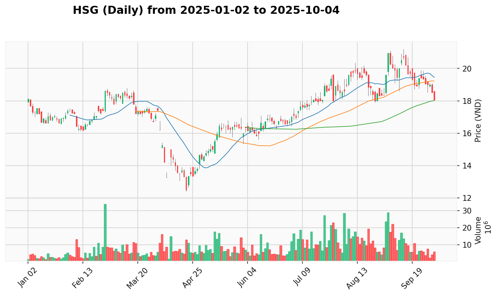

<a href="#thep">↑ Back to group THEP</a>  |  <a href="#vpa-signal-summary">↑ Back to Top</a>

#### Key Statistics
| Metric | Value |
|:---|---:|
| Date Range | 2025-01-02 to 2025-10-17 |
| **Latest Close** | **18.25** |
| Period Open | 17.93 |
| Period High | 21.2 |
| Period Low | 12.4 |
| Period Change % | 1.78% |

**[Download HSG Data (.csv)](market_data/HSG_2025-01-02_to_2025-10-18.csv)**

---

### HT1

#### [VPA Analysis (2025-07-15 - 2025-10-16)](./VPA.md#ht1)
> **Ngày 2025-10-10:** HT1 tăng từ 17.9 VND lên 18.15 VND. Phiên giao dịch có biên độ nến tương đối hẹp và đóng cửa gần mức cao nhất, cho thấy lực cầu vẫn duy trì. Khối lượng giao dịch đạt 0.4942 triệu cổ phiếu, thấp hơn so với phiên trước (0.6007 triệu cổ phiếu). Sau phiên 'Demand Coming In' với khối lượng lớn, sự tăng giá tiếp diễn với khối lượng thấp hơn cho thấy lực cung đã giảm bớt, và lực cầu vẫn đang kiểm soát thị trường. Đây là dấu hiệu tích cực cho thấy xu hướng tăng có thể tiếp diễn. **Phân tích VPA/Wyckoff:** Demand Continues (Cầu tiếp diễn)
> **Ngày 2025-10-13:** HT1 giảm nhẹ từ 18.15 VND xuống 17.9 VND. Phiên giao dịch có biên độ nến hẹp (17.6 - 18.0) và đóng cửa gần giữa nến, cho thấy sự lưỡng lự của thị trường. Khối lượng giao dịch đạt 0.3277 triệu cổ phiếu, thấp hơn đáng kể so với phiên trước (0.4942 triệu cổ phiếu) và thấp hơn mức trung bình gần đây. Sau hai phiên tăng giá với lực cầu mạnh mẽ, sự điều chỉnh nhẹ với khối lượng thấp cho thấy áp lực bán không đáng kể và có thể là một nhịp kiểm tra cung tự nhiên. **Phân tích VPA/Wyckoff:** No Supply (Không có cung) - Lực cung yếu, cho thấy khả năng giá sẽ tiếp tục xu hướng tăng nếu cầu quay trở lại.
> **Ngày 2025-10-14:** HT1 giảm từ 17.9 VND xuống 17.5 VND. Phiên giao dịch có biên độ nến tương đối rộng và đóng cửa gần mức thấp nhất, cho thấy áp lực bán mạnh. Khối lượng giao dịch đạt 0.4346 triệu cổ phiếu, cao hơn đáng kể so với phiên trước (0.3277 triệu cổ phiếu). Sau phiên 'No Supply' với khối lượng thấp, sự giảm giá với khối lượng gia tăng cho thấy lực cung đã quay trở lại thị trường và đang chiếm ưu thế. Đây là dấu hiệu tiêu cực, cho thấy xu hướng giảm có thể tiếp diễn. **Phân tích VPA/Wyckoff:** Supply Coming In (Cung xuất hiện)
> **Ngày 2025-10-15:** HT1 tiếp tục giảm từ 17.5 VND xuống 17.15 VND. Phiên giao dịch có biên độ nến (17.1 - 17.6) và đóng cửa gần mức thấp nhất, cho thấy áp lực bán vẫn còn mạnh. Khối lượng giao dịch đạt 0.432 triệu cổ phiếu, thấp hơn một chút so với phiên trước (0.4346 triệu cổ phiếu) nhưng vẫn duy trì ở mức tương đối cao, xác nhận sự tiếp diễn của lực cung. Sau tín hiệu "Supply Coming In" ngày 2025-10-14, diễn biến này cho thấy thị trường vẫn đang chịu sự chi phối của bên bán. **Phân tích VPA/Wyckoff:** Weakness (Yếu ớt)
> **Ngày 2025-10-16:** HT1 tăng từ 17.15 VND lên 17.75 VND. Phiên giao dịch có biên độ nến tương đối rộng và đóng cửa gần mức cao nhất, cho thấy nỗ lực tăng giá. Tuy nhiên, khối lượng giao dịch chỉ đạt 0.247 triệu cổ phiếu, thấp hơn đáng kể so với phiên trước (0.432 triệu cổ phiếu) và thấp hơn mức trung bình. Sau các tín hiệu "Supply Coming In" và "Weakness" trước đó, sự tăng giá với khối lượng thấp này cho thấy lực cầu chưa thực sự mạnh mẽ để đảo chiều xu hướng giảm. Đây có thể là một nhịp hồi phục kỹ thuật trong bối cảnh thị trường vẫn còn yếu ớt. **Phân tích VPA/Wyckoff:** No Demand (Không có cầu)

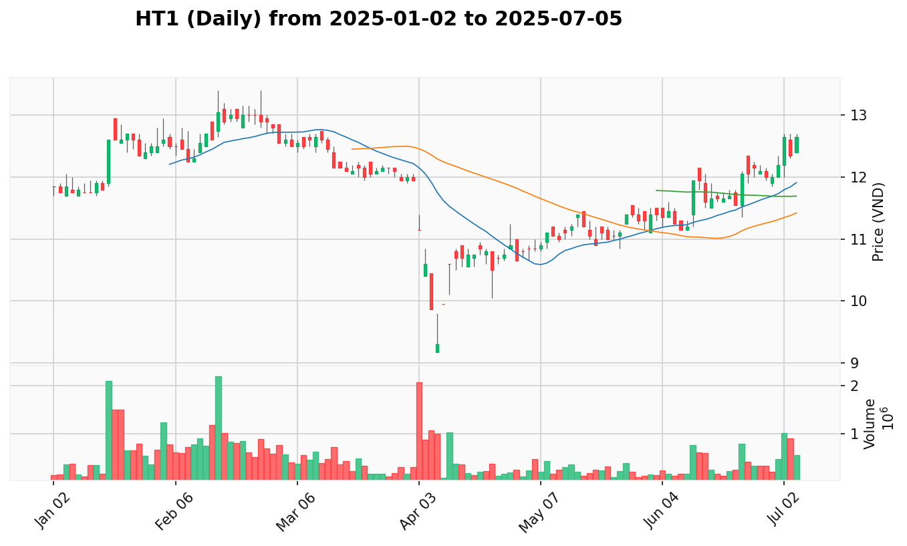

<a href="#vlxd">↑ Back to group VLXD</a>  |  <a href="#vpa-signal-summary">↑ Back to Top</a>

#### Key Statistics
| Metric | Value |
|:---|---:|
| Date Range | 2025-01-02 to 2025-10-17 |
| **Latest Close** | **17.65** |
| Period Open | 11.78 |
| Period High | 19.2 |
| Period Low | 9.12 |
| Period Change % | 49.83% |

**[Download HT1 Data (.csv)](market_data/HT1_2025-01-02_to_2025-10-18.csv)**

---

### HTN

#### [VPA Analysis (2025-08-04 - 2025-10-16)](./VPA.md#htn)
> **Ngày 2025-10-10:** HTN tăng từ 10.0 VND (giá đóng cửa phiên trước) lên 10.15 VND với khối lượng giao dịch đạt 0.4141 triệu cổ phiếu. Cây nến tăng có biên độ hẹp và đóng cửa ở mức cao của phiên, cho thấy lực cầu đã xuất hiện trở lại sau hai phiên giảm giá và thiếu cầu. Khối lượng giao dịch cao hơn so với phiên trước (0.3405 triệu cổ phiếu) nhưng vẫn ở mức trung bình, cho thấy sự kiểm tra cung cầu đang diễn ra. Sau tín hiệu suy yếu (SOW) và thiếu cầu (No Demand), sự tăng giá nhẹ với khối lượng tăng cho thấy có thể là một nỗ lực hấp thụ cung hoặc một đợt kiểm tra cung. **Phân tích VPA/Wyckoff:** Test for Supply - Kiểm tra cung.
> **Ngày 2025-10-13:** HTN tăng từ 10.0 VND lên 10.2 VND với khối lượng giao dịch đạt 0.6936 triệu cổ phiếu. Cây nến tăng có biên độ hẹp và đóng cửa ở mức cao nhất phiên, cho thấy lực cầu tiếp tục chiếm ưu thế và hấp thụ cung. Khối lượng giao dịch cao hơn đáng kể so với phiên trước (0.4141 triệu cổ phiếu), xác nhận sự trở lại của dòng tiền sau giai đoạn kiểm tra cung. Điều này cho thấy thị trường đang có dấu hiệu phục hồi và có thể tiếp tục xu hướng tăng. **Phân tích VPA/Wyckoff:** Sign of Strength (SOS) - Dấu hiệu sức mạnh.
> **Ngày 2025-10-14:** HTN giảm từ 10.2 VND (giá đóng cửa phiên trước) xuống 9.97 VND với khối lượng giao dịch đạt 0.6018 triệu cổ phiếu. Cây nến giảm có biên độ rộng và đóng cửa ở mức thấp nhất phiên, cho thấy áp lực bán mạnh mẽ đã xuất hiện sau phiên tăng giá mạnh trước đó. Khối lượng giao dịch thấp hơn so với phiên trước (0.6936 triệu cổ phiếu) nhưng vẫn ở mức tương đối cao, xác nhận sự xuất hiện của cung. Điều này cho thấy thị trường đang có dấu hiệu suy yếu và có thể đảo chiều xu hướng tăng ngắn hạn. **Phân tích VPA/Wyckoff:** Sign of Weakness (SOW) - Dấu hiệu suy yếu.
> **Ngày 2025-10-15:** HTN giảm từ 9.97 VND (giá đóng cửa phiên trước) xuống 9.95 VND với khối lượng giao dịch đạt 0.3367 triệu cổ phiếu. Cây nến giảm có biên độ hẹp và đóng cửa ở mức thấp nhất phiên, cho thấy áp lực bán vẫn hiện hữu nhưng đã suy yếu đáng kể so với phiên trước. Khối lượng giao dịch thấp hơn rõ rệt so với phiên trước (0.6018 triệu cổ phiếu), xác nhận sự thiếu vắng lực cầu và cung cũng không còn quá mạnh. Điều này cho thấy thị trường đang trong giai đoạn điều chỉnh hoặc tích lũy, với sự cạn kiệt của cả cung và cầu. **Phân tích VPA/Wyckoff:** Sign of Weakness (SOW) - Dấu hiệu suy yếu.
> **Ngày 2025-10-16:** HTN tăng từ 9.95 VND lên 10.0 VND với khối lượng giao dịch đạt 0.5282 triệu cổ phiếu. Cây nến tăng có biên độ rộng và đóng cửa ở mức giữa, cho thấy lực cầu đã xuất hiện sau hai phiên giảm giá liên tiếp. Khối lượng giao dịch tăng so với phiên trước (0.3367 triệu cổ phiếu) xác nhận sự tham gia của người mua. Tuy nhiên, bóng nến trên dài cho thấy áp lực cung vẫn còn ở các mức giá cao hơn, cho thấy thị trường đang kiểm tra mức cung. **Phân tích VPA/Wyckoff:** Test of Supply (Kiểm tra cung)

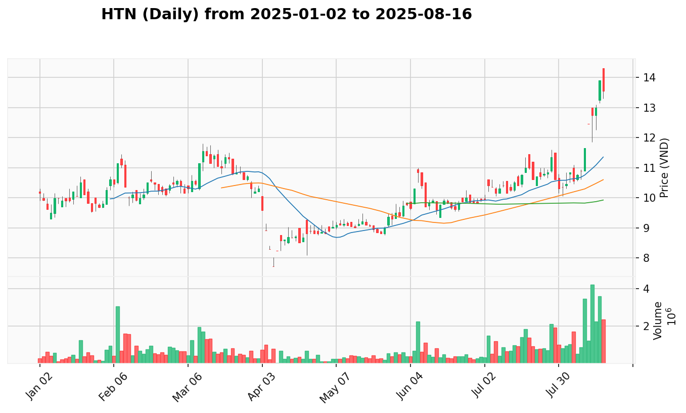

<a href="#bat-dong-san">↑ Back to group BAT_DONG_SAN</a>  |  <a href="#vpa-signal-summary">↑ Back to Top</a>

#### Key Statistics
| Metric | Value |
|:---|---:|
| Date Range | 2025-01-02 to 2025-10-17 |
| **Latest Close** | **10.2** |
| Period Open | 10.2 |
| Period High | 14.3 |
| Period Low | 7.71 |
| Period Change % | 0.00% |

**[Download HTN Data (.csv)](market_data/HTN_2025-01-02_to_2025-10-18.csv)**

---

### HUT

#### [VPA Analysis (2025-06-16 - 2025-10-16)](./VPA.md#hut)
> **Ngày 2025-10-10:** HUT tăng từ 17.0 VND lên 17.3 VND với cây nến có biên độ tương đối rộng (từ 17.0 VND lên 17.6 VND) và đóng cửa ở nửa trên của phiên. Khối lượng giao dịch đạt 2.3642 triệu cổ phiếu, tăng so với phiên trước (1.933 triệu cổ phiếu). Sau phiên lực bán suy yếu, việc giá tiếp tục tăng với khối lượng gia tăng cho thấy lực cầu đang quay trở lại và hấp thụ lực cung. Điều này có thể là dấu hiệu của sự thay đổi trong cán cân cung cầu, với lực cầu đang dần chiếm ưu thế. **Phân tích VPA/Wyckoff:** Lực cầu xuất hiện.
> **Ngày 2025-10-13:** HUT giảm từ 17.2 VND xuống 17.1 VND với cây nến có biên độ hẹp (từ 16.8 VND lên 17.3 VND) và đóng cửa ở nửa trên của phiên. Khối lượng giao dịch đạt 2.5926 triệu cổ phiếu, tăng so với phiên trước (2.3642 triệu cổ phiếu). Sau hai phiên cho thấy lực cầu xuất hiện, việc giá giảm nhẹ với khối lượng gia tăng cho thấy lực cung đang quay trở lại và hấp thụ lực cầu. Điều này có thể là dấu hiệu của sự xuất hiện của lực bán hoặc lực cầu đang bị áp đảo. **Phân tích VPA/Wyckoff:** Lực cung xuất hiện.
> **Ngày 2025-10-14:** HUT giảm từ 17.7 VND xuống 16.6 VND với cây nến có biên độ rộng (từ 16.6 VND lên 17.7 VND) và đóng cửa ở mức thấp nhất phiên. Khối lượng giao dịch đạt 4.3719 triệu cổ phiếu, tăng đáng kể so với phiên trước (2.5926 triệu cổ phiếu). Sau phiên lực cung xuất hiện, việc giá giảm mạnh với khối lượng gia tăng cho thấy áp lực bán đang rất lớn và lực cung đang hoàn toàn áp đảo lực cầu. Điều này xác nhận sự hiện diện mạnh mẽ của lực bán trên thị trường. **Phân tích VPA/Wyckoff:** Lực cung mạnh mẽ.
> **Ngày 2025-10-15:** HUT tăng từ 16.7 VND lên 17.0 VND với cây nến có biên độ hẹp (từ 16.5 VND lên 17.0 VND) và đóng cửa ở mức cao nhất phiên. Khối lượng giao dịch đạt 2.6155 triệu cổ phiếu, giảm so với phiên trước (4.3719 triệu cổ phiếu). Sau hai phiên chịu áp lực bán mạnh, việc giá tăng nhẹ với khối lượng giảm cho thấy lực cung có thể đang tạm lắng, nhưng lực cầu chưa thực sự mạnh mẽ để đẩy giá lên cao hơn với khối lượng lớn. Đây có thể là một phiên kiểm tra cung hoặc một nhịp hồi phục kỹ thuật. **Phân tích VPA/Wyckoff:** Kiểm tra cung.
> **Ngày 2025-10-16:** HUT tăng từ 17.0 VND lên 17.9 VND với cây nến có biên độ rộng (từ 17.0 VND lên 18.2 VND) và đóng cửa gần mức cao nhất phiên. Khối lượng giao dịch đạt 4.5707 triệu cổ phiếu, tăng đáng kể so với phiên trước (2.6155 triệu cổ phiếu). Sau phiên kiểm tra cung trước đó, việc giá tăng mạnh với khối lượng gia tăng cho thấy lực cầu đã quay trở lại và đang áp đảo lực cung. Điều này xác nhận sự hiện diện mạnh mẽ của lực mua trên thị trường. **Phân tích VPA/Wyckoff:** Sign of Strength (SOS) - Lực cầu mạnh mẽ.

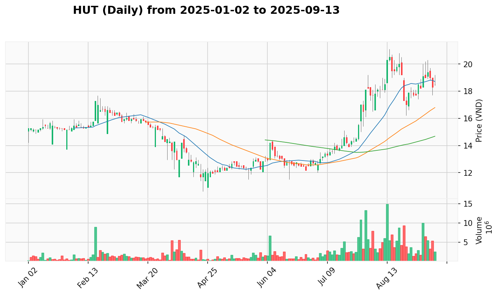

<a href="#xay-dung">↑ Back to group XAY_DUNG</a>  |  <a href="#vpa-signal-summary">↑ Back to Top</a>

#### Key Statistics
| Metric | Value |
|:---|---:|
| Date Range | 2025-01-02 to 2025-10-17 |
| **Latest Close** | **17.3** |
| Period Open | 15.06 |
| Period High | 21.1 |
| Period Low | 10.62 |
| Period Change % | 14.87% |

**[Download HUT Data (.csv)](market_data/HUT_2025-01-02_to_2025-10-18.csv)**

---

### HVN

#### [VPA Analysis (2025-06-16 - 2025-10-16)](./VPA.md#hvn)
> **Ngày 2025-10-10:** HVN mở cửa ở mức 34.8 VND, tăng mạnh lên 36.2 VND và đóng cửa tại 36.2 VND, cao hơn đáng kể so với phiên trước (34.7 VND). Khối lượng giao dịch đạt 1.0399 triệu cổ phiếu, thấp hơn một chút so với phiên trước (1.0565 triệu cổ phiếu) nhưng vẫn duy trì ở mức khá. Sau hai phiên cho thấy sự yếu ớt của lực cầu và áp lực cung, phiên này cho thấy lực mua đã quay trở lại mạnh mẽ, đẩy giá tăng với biên độ rộng và đóng cửa ở mức cao nhất phiên, cho thấy sự kiểm soát của bên mua. **Phân tích VPA/Wyckoff:** Dấu hiệu sức mạnh (Sign of Strength) - Giá tăng mạnh với biên độ rộng, đóng cửa ở mức cao nhất phiên, xác nhận lực cầu đã quay trở lại.
> **Ngày 2025-10-13:** HVN mở cửa ở mức 35.4 VND, tăng lên 36.0 VND nhưng sau đó giảm và đóng cửa tại 35.7 VND, thấp hơn so với phiên trước (36.2 VND). Biên độ giá hẹp và khối lượng giao dịch đạt 0.6551 triệu cổ phiếu, giảm đáng kể so với phiên trước (1.0399 triệu cổ phiếu). Sau phiên tăng giá mạnh với khối lượng cao ngày 2025-10-10, phiên này cho thấy lực cầu đã suy yếu rõ rệt, không có sự tiếp diễn của đà tăng. Giá giảm nhẹ với khối lượng thấp cho thấy sự thiếu vắng của lực mua chủ động. **Phân tích VPA/Wyckoff:** Không có cầu (No Demand) - Giá giảm nhẹ với biên độ hẹp và khối lượng thấp sau một phiên tăng mạnh, cho thấy lực cầu đã suy yếu.
> **Ngày 2025-10-14:** HVN mở cửa ở mức 35.8 VND, tăng nhẹ lên 35.95 VND nhưng sau đó giảm mạnh và đóng cửa tại 35.2 VND, là mức thấp nhất phiên. Giá giảm đáng kể so với phiên trước (35.7 VND). Khối lượng giao dịch đạt 1.0162 triệu cổ phiếu, cao hơn đáng kể so với phiên trước (0.6551 triệu cổ phiếu) và tương đương với phiên tăng mạnh ngày 2025-10-10. Sau phiên "Không có cầu" ngày 2025-10-13, phiên này cho thấy áp lực bán đã gia tăng mạnh mẽ, đẩy giá xuống với biên độ rộng và đóng cửa ở mức thấp nhất phiên, xác nhận sự kiểm soát của bên bán. **Phân tích VPA/Wyckoff:** Dấu hiệu yếu ớt (Sign of Weakness) - Giá giảm mạnh với biên độ rộng và khối lượng cao, đóng cửa ở mức thấp nhất phiên, xác nhận lực cung đã quay trở lại và áp đảo lực cầu.
> **Ngày 2025-10-15:** HVN mở cửa ở mức 35.65 VND, tăng lên 35.7 VND nhưng sau đó giảm và đóng cửa tại 35.1 VND, thấp hơn so với phiên trước (35.2 VND). Biên độ giá hẹp và khối lượng giao dịch đạt 0.7272 triệu cổ phiếu, giảm đáng kể so với phiên trước (1.0162 triệu cổ phiếu). Sau phiên "Dấu hiệu yếu ớt" ngày 2025-10-14, phiên này cho thấy giá tiếp tục giảm nhưng với lực bán đã suy yếu và không có lực cầu nào xuất hiện để hỗ trợ giá. Giá đóng cửa gần mức thấp nhất phiên cho thấy tâm lý tiêu cực vẫn còn. **Phân tích VPA/Wyckoff:** Không có cầu (No Demand) - Giá giảm với biên độ hẹp và khối lượng thấp sau một phiên giảm mạnh, cho thấy lực cầu không xuất hiện để hấp thụ cung.
> **Ngày 2025-10-16:** HVN mở cửa ở mức 35.7 VND, tăng nhẹ lên 35.75 VND nhưng sau đó giảm và đóng cửa tại 35.5 VND, cao hơn so với phiên trước (35.1 VND) nhưng lại đóng cửa ở mức thấp nhất phiên. Biên độ giá hẹp và khối lượng giao dịch đạt 0.3228 triệu cổ phiếu, giảm đáng kể so với phiên trước (0.7272 triệu cổ phiếu) và là mức thấp nhất trong 10 phiên gần đây. Sau hai phiên giảm giá và "Không có cầu", phiên này cho thấy một nỗ lực tăng giá yếu ớt ngay từ đầu phiên nhưng không duy trì được, với lực bán nhẹ đã đẩy giá xuống mức thấp nhất phiên. Khối lượng cực thấp xác nhận sự thiếu vắng hoàn toàn của lực cầu. **Phân tích VPA/Wyckoff:** Không có cầu (No Demand) - Giá tăng nhẹ nhưng đóng cửa ở mức thấp nhất phiên với biên độ hẹp và khối lượng cực thấp, xác nhận lực cầu không xuất hiện.

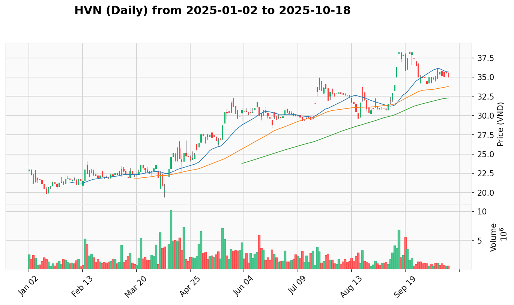

<a href="#hang-khong">↑ Back to group HANG_KHONG</a>  |  <a href="#vpa-signal-summary">↑ Back to Top</a>

#### Key Statistics
| Metric | Value |
|:---|---:|
| Date Range | 2025-01-02 to 2025-10-17 |
| **Latest Close** | **35.0** |
| Period Open | 22.78 |
| Period High | 38.45 |
| Period Low | 19.39 |
| Period Change % | 53.64% |

**[Download HVN Data (.csv)](market_data/HVN_2025-01-02_to_2025-10-18.csv)**

---

### IDC

#### [VPA Analysis (2025-06-13 - 2025-10-16)](./VPA.md#idc)
> **Ngày 2025-10-10:** IDC giảm từ 38.9 VND xuống 38.1 VND. Cây nến giảm có biên độ rộng, đóng cửa ở mức thấp nhất phiên. Khối lượng giao dịch đạt 3.329.300 cổ phiếu (3.3293 triệu cổ phiếu), thấp hơn so với phiên tăng mạnh trước đó nhưng vẫn ở mức cao. Sau phiên tăng giá mạnh mẽ (SOS) ngày 2025-10-09, phiên này cho thấy áp lực bán quay trở lại, hấp thụ lực cầu và đẩy giá xuống thấp, cho thấy sự yếu kém của thị trường. **Phân tích VPA/Wyckoff:** Sign of Weakness (SOW) - Dấu hiệu yếu kém.
> **Ngày 2025-10-13:** IDC tăng từ 37.8 VND lên 38.7 VND. Cây nến tăng có biên độ tương đối rộng, đóng cửa gần mức cao nhất phiên. Khối lượng giao dịch đạt 2.388.100 cổ phiếu (2.388 triệu cổ phiếu), thấp hơn đáng kể so với phiên trước (3.329.300 cổ phiếu). Sau phiên giảm giá với dấu hiệu yếu kém (SOW) ngày 2025-10-10, phiên này cho thấy giá phục hồi nhưng với khối lượng thấp, cho thấy lực cầu chưa thực sự mạnh mẽ hoặc thị trường đang kiểm tra lại nguồn cung. Điều này có thể là một dấu hiệu của sự cạn kiệt nguồn cung tạm thời. **Phân tích VPA/Wyckoff:** Test for Supply (TS) - Kiểm tra nguồn cung.
> **Ngày 2025-10-14:** IDC giảm từ 38.7 VND xuống 38.0 VND. Cây nến giảm có biên độ rộng, đóng cửa ở mức thấp nhất phiên. Khối lượng giao dịch đạt 2.428.000 cổ phiếu (2.428 triệu cổ phiếu), cao hơn một chút so với phiên trước. Sau phiên kiểm tra nguồn cung (TS) ngày 2025-10-13 với khối lượng thấp, phiên này cho thấy áp lực bán quay trở lại mạnh mẽ, đẩy giá xuống thấp và đóng cửa ở mức yếu nhất, xác nhận sự hiện diện của nguồn cung. Điều này cho thấy thị trường đang yếu đi. **Phân tích VPA/Wyckoff:** Sign of Weakness (SOW) - Dấu hiệu yếu kém.
> **Ngày 2025-10-15:** IDC giảm từ 38.0 VND xuống 37.2 VND. Cây nến giảm có biên độ rộng, đóng cửa gần mức thấp nhất phiên. Khối lượng giao dịch đạt 3.203 triệu cổ phiếu, cao hơn so với phiên trước (2.428 triệu cổ phiếu). Sau phiên giảm giá với dấu hiệu yếu kém (SOW) ngày 2025-10-14, phiên này tiếp tục cho thấy áp lực bán mạnh mẽ với khối lượng gia tăng, đẩy giá xuống thấp hơn và đóng cửa ở mức yếu, xác nhận sự hiện diện của nguồn cung và xu hướng giảm giá tiếp diễn. **Phân tích VPA/Wyckoff:** Continuation of Weakness (COW) - Tiếp diễn yếu kém.
> **Ngày 2025-10-16:** IDC giảm từ 37.2 VND xuống 36.5 VND. Cây nến giảm có biên độ rộng, đóng cửa ở mức thấp nhất phiên. Khối lượng giao dịch đạt 2.241 triệu cổ phiếu, thấp hơn so với phiên trước (3.203 triệu cổ phiếu). Sau hai phiên giảm giá liên tiếp với dấu hiệu yếu kém (SOW) và tiếp diễn yếu kém (COW), phiên này tiếp tục cho thấy áp lực bán mạnh mẽ, đẩy giá xuống thấp hơn và đóng cửa ở mức yếu nhất, xác nhận xu hướng giảm giá tiếp diễn. Mặc dù khối lượng có phần giảm, nhưng biên độ giảm giá rộng cho thấy nguồn cung vẫn đang chiếm ưu thế. **Phân tích VPA/Wyckoff:** Continuation of Weakness (COW) - Tiếp diễn yếu kém.

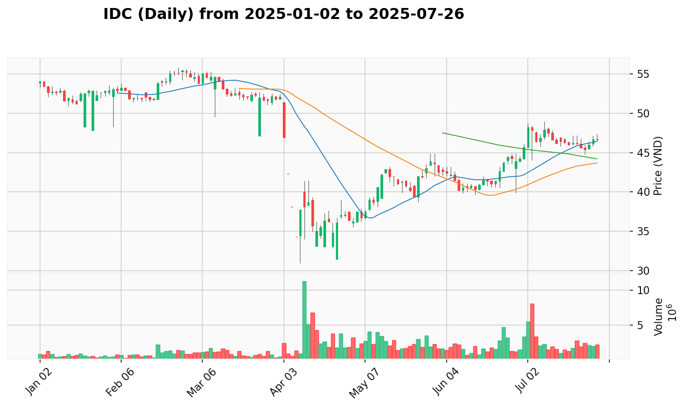

<a href="#bat-dong-san-kcn">↑ Back to group BAT_DONG_SAN_KCN</a>  |  <a href="#vpa-signal-summary">↑ Back to Top</a>

#### Key Statistics
| Metric | Value |
|:---|---:|
| Date Range | 2025-01-02 to 2025-10-17 |
| **Latest Close** | **36.2** |
| Period Open | 46.86 |
| Period High | 48.9 |
| Period Low | 26.87 |
| Period Change % | -22.75% |

**[Download IDC Data (.csv)](market_data/IDC_2025-01-02_to_2025-10-18.csv)**

---

### IDI

#### [VPA Analysis (2025-08-15 - 2025-10-16)](./VPA.md#idi)
> **Ngày 2025-10-10:** IDI tăng từ 8.11 VND lên 8.15 VND với khối lượng giao dịch đạt 0.9884 triệu cổ phiếu, cao hơn đáng kể so với phiên trước (0.6158 triệu cổ phiếu) và cũng cao hơn phiên "Nỗ lực tăng giá" ngày 2025-10-08 (0.9464 triệu cổ phiếu). Nến ngày có biên độ tương đối rộng, giá đóng cửa gần mức cao nhất phiên. Sau phiên "Thiếu cầu" ngày 2025-10-09, việc giá tăng trở lại mạnh mẽ với khối lượng gia tăng cho thấy lực cầu đã quay trở lại và hấp thụ tốt nguồn cung. Đây là một tín hiệu tích cực, xác nhận nỗ lực tăng giá và có thể báo hiệu sự tiếp diễn của xu hướng tăng. **Phân tích VPA/Wyckoff:** Sign of Strength (SOS) - Dấu hiệu sức mạnh.
> **Ngày 2025-10-13:** IDI giảm từ 8.15 VND xuống 8.05 VND với khối lượng giao dịch đạt 1.1521 triệu cổ phiếu, cao hơn đáng kể so với phiên trước (0.9884 triệu cổ phiếu). Nến ngày có biên độ tương đối hẹp, giá đóng cửa ở giữa phiên. Sau phiên "Dấu hiệu sức mạnh" ngày 2025-10-10, việc giá giảm với khối lượng gia tăng cho thấy áp lực bán đã xuất hiện và nguồn cung đang chiếm ưu thế. **Phân tích VPA/Wyckoff:** Weakness (W) - Dấu hiệu suy yếu.
> **Ngày 2025-10-14:** IDI giảm từ 8.05 VND xuống 7.81 VND với khối lượng giao dịch đạt 1.678 triệu cổ phiếu, cao hơn đáng kể so với phiên trước (1.1521 triệu cổ phiếu). Nến ngày có biên độ rộng, giá đóng cửa ở mức thấp nhất phiên. Sau phiên "Dấu hiệu suy yếu" ngày 2025-10-13, việc giá tiếp tục giảm mạnh với khối lượng gia tăng và đóng cửa ở mức thấp nhất cho thấy áp lực bán rất mạnh và nguồn cung đang hoàn toàn chiếm ưu thế. Đây là một tín hiệu tiêu cực, xác nhận sự suy yếu và có thể báo hiệu sự tiếp diễn của xu hướng giảm. **Phân tích VPA/Wyckoff:** Weakness (W) - Dấu hiệu suy yếu.
> **Ngày 2025-10-15:** IDI tiếp tục giảm từ 7.81 VND xuống 7.63 VND với khối lượng giao dịch đạt 1.2054 triệu cổ phiếu, thấp hơn so với phiên trước (1.678 triệu cổ phiếu). Nến ngày có biên độ tương đối rộng, giá đóng cửa gần mức thấp nhất phiên. Sau hai phiên "Dấu hiệu suy yếu" liên tiếp, việc giá tiếp tục giảm và đóng cửa gần mức thấp nhất cho thấy áp lực bán vẫn còn hiện hữu, mặc dù khối lượng đã giảm nhẹ. Điều này có thể cho thấy sự cạn kiệt tạm thời của lực bán mạnh hoặc thiếu vắng lực cầu đủ lớn để đẩy giá lên. Tổng thể, đây vẫn là một tín hiệu tiêu cực, xác nhận sự tiếp diễn của xu hướng giảm. **Phân tích VPA/Wyckoff:** Weakness (W) - Dấu hiệu suy yếu.
> **Ngày 2025-10-16:** IDI tăng nhẹ từ 7.63 VND lên 7.64 VND với khối lượng giao dịch đạt 0.3665 triệu cổ phiếu, thấp hơn đáng kể so với phiên trước (1.2054 triệu cổ phiếu). Nến ngày có biên độ hẹp, giá đóng cửa gần mức cao nhất phiên. Sau hai phiên "Dấu hiệu suy yếu" liên tiếp, việc giá tăng nhẹ với khối lượng cực thấp cho thấy áp lực bán đã tạm thời giảm bớt, nhưng đồng thời cũng không có lực cầu đáng kể nào xuất hiện để đẩy giá lên. Điều này cho thấy thị trường vẫn còn yếu và có thể tiếp tục xu hướng giảm do thiếu vắng sự quan tâm từ phía người mua. **Phân tích VPA/Wyckoff:** No Demand (ND) - Không có cầu.

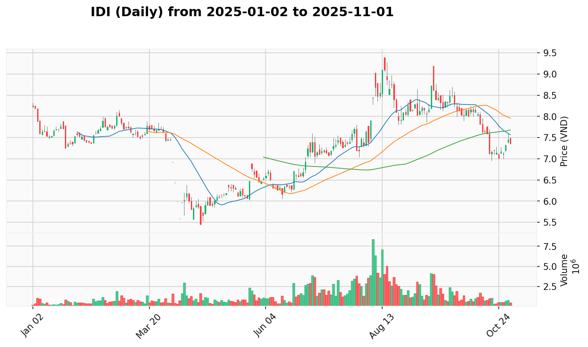

<a href="#thuy-san">↑ Back to group THUY_SAN</a>  |  <a href="#vpa-signal-summary">↑ Back to Top</a>

#### Key Statistics
| Metric | Value |
|:---|---:|
| Date Range | 2025-01-02 to 2025-10-17 |
| **Latest Close** | **7.59** |
| Period Open | 8.25 |
| Period High | 9.39 |
| Period Low | 5.45 |
| Period Change % | -8.00% |

**[Download IDI Data (.csv)](market_data/IDI_2025-01-02_to_2025-10-18.csv)**

---

### IDJ

#### [VPA Analysis (2025-08-14 - 2025-10-16)](./VPA.md#idj)
> **Ngày 2025-10-10:** IDJ mở cửa tại 6.5 VND, tăng lên 6.7 VND, giảm xuống 6.5 VND và đóng cửa tại 6.5 VND, với khối lượng giao dịch đạt 0.6808 triệu cổ phiếu. Cây nến giảm có biên độ hẹp, đóng cửa tại mức thấp nhất phiên và có bóng nến trên, cho thấy áp lực bán vẫn còn hiện diện. Khối lượng giao dịch giảm đáng kể so với phiên trước (0.7516 triệu cổ phiếu), xác nhận sự thiếu vắng lực cầu và cho thấy thị trường đang kiểm tra lượng cung còn lại sau các phiên giảm giá. Giá giữ vững tại mức thấp 6.5 VND với khối lượng thấp cho thấy lực cung có thể đang cạn kiệt, nhưng lực cầu vẫn chưa xuất hiện mạnh mẽ. **Phân tích VPA/Wyckoff:** Test for Supply (TS) - Kiểm tra cung.
> **Ngày 2025-10-13:** IDJ mở cửa tại 6.5 VND, tăng lên 6.7 VND, giảm xuống 6.3 VND và đóng cửa tại 6.4 VND, với khối lượng giao dịch đạt 1.6078 triệu cổ phiếu. Cây nến giảm có biên độ rộng hơn và đóng cửa gần mức thấp nhất phiên, cho thấy áp lực bán mạnh mẽ. Khối lượng giao dịch tăng đáng kể so với phiên trước (0.6808 triệu cổ phiếu), xác nhận sự xuất hiện của lực cung lớn. Sau phiên kiểm tra cung (TS) với khối lượng thấp, việc giá giảm mạnh với khối lượng cao cho thấy lực cung vẫn còn dồi dào và thị trường đang tiếp tục suy yếu. **Phân tích VPA/Wyckoff:** Sign of Weakness (SOW) - Dấu hiệu suy yếu.
> **Ngày 2025-10-14:** IDJ mở cửa tại 6.4 VND, tăng lên 6.6 VND, giảm xuống 6.3 VND và đóng cửa tại 6.3 VND, với khối lượng giao dịch đạt 1.8106 triệu cổ phiếu. Cây nến giảm có biên độ hẹp, đóng cửa tại mức thấp nhất phiên, cho thấy áp lực bán tiếp tục duy trì. Khối lượng giao dịch tăng đáng kể so với phiên trước (1.6078 triệu cổ phiếu), xác nhận sự gia tăng của lực cung. Sau phiên "Dấu hiệu suy yếu" (SOW) trước đó, việc giá tiếp tục giảm và đóng cửa ở mức thấp nhất với khối lượng cao cho thấy thị trường vẫn đang trong giai đoạn suy yếu mạnh mẽ và lực cung vẫn chiếm ưu thế. **Phân tích VPA/Wyckoff:** Sign of Weakness (SOW) - Dấu hiệu suy yếu.
> **Ngày 2025-10-15:** IDJ mở cửa tại 6.3 VND, tăng lên 6.3 VND, giảm xuống 5.9 VND và đóng cửa tại 5.9 VND, với khối lượng giao dịch đạt 2.5422 triệu cổ phiếu. Cây nến giảm có biên độ rộng và đóng cửa tại mức thấp nhất phiên, cho thấy áp lực bán rất mạnh. Khối lượng giao dịch tăng đáng kể so với phiên trước (1.8106 triệu cổ phiếu), xác nhận sự gia tăng của lực cung. Sau hai phiên "Dấu hiệu suy yếu" (SOW) liên tiếp, việc giá tiếp tục giảm mạnh với khối lượng cực lớn cho thấy thị trường đang trong giai đoạn suy yếu nghiêm trọng và lực cung hoàn toàn chiếm ưu thế. **Phân tích VPA/Wyckoff:** Sign of Weakness (SOW) - Dấu hiệu suy yếu.
> **Ngày 2025-10-16:** IDJ mở cửa tại 5.9 VND, tăng lên 6.0 VND, giảm xuống 5.7 VND và đóng cửa tại 5.9 VND, với khối lượng giao dịch đạt 1.2556 triệu cổ phiếu. Cây nến có biên độ hẹp, đóng cửa tại mức mở cửa, cho thấy sự lưỡng lự của thị trường sau các phiên giảm mạnh. Khối lượng giao dịch giảm đáng kể so với phiên trước (2.5422 triệu cổ phiếu), cho thấy áp lực bán đã tạm thời suy yếu nhưng lực cầu vẫn chưa đủ mạnh để đẩy giá lên. Sau hai phiên "Dấu hiệu suy yếu" (SOW) liên tiếp với khối lượng lớn, phiên này có thể là một dấu hiệu tạm dừng trong xu hướng giảm, nhưng chưa có tín hiệu xác nhận đảo chiều. **Phân tích VPA/Wyckoff:** No Demand (ND) - Không có lực cầu.

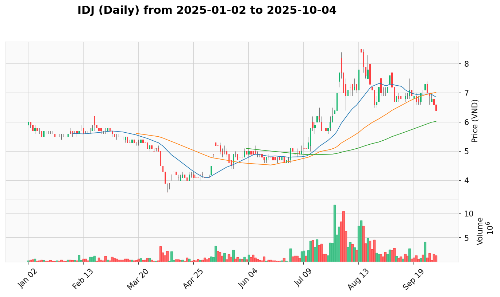

<a href="#xay-dung">↑ Back to group XAY_DUNG</a>  |  <a href="#vpa-signal-summary">↑ Back to Top</a>

#### Key Statistics
| Metric | Value |
|:---|---:|
| Date Range | 2025-01-02 to 2025-10-17 |
| **Latest Close** | **5.9** |
| Period Open | 5.9 |
| Period High | 8.5 |
| Period Low | 3.6 |
| Period Change % | 0.00% |

**[Download IDJ Data (.csv)](market_data/IDJ_2025-01-02_to_2025-10-18.csv)**

---

### IDV

#### [VPA Analysis (2025-08-04 - 2025-10-16)](./VPA.md#idv)
> **Ngày 2025-10-10:** IDV mở cửa tại 26.4 VND, tăng lên mức cao nhất 26.5 VND và đóng cửa tại 26.5 VND. Biên độ giá từ cao nhất đến thấp nhất là 0.2 VND. Giá đóng cửa cao hơn giá đóng cửa phiên trước (26.4 VND). Khối lượng giao dịch đạt 0.0132 triệu cổ phiếu, giảm đáng kể so với phiên trước (0.0311 triệu cổ phiếu). Sau phiên SOW với khối lượng gia tăng, sự tăng giá nhẹ với khối lượng thấp cho thấy lực cung đã tạm thời cạn kiệt và không có áp lực bán đáng kể. Tuy nhiên, lực cầu cũng chưa thực sự mạnh mẽ. **Phân tích VPA/Wyckoff:** No Supply (NS) - Lực cung cạn kiệt.
> **Ngày 2025-10-13:** IDV mở cửa tại 26.5 VND, dao động trong biên độ hẹp từ 26.3 VND đến 26.5 VND và đóng cửa tại 26.5 VND. So với phiên trước, giá đóng cửa không đổi. Khối lượng giao dịch đạt 0.028 triệu cổ phiếu, tăng đáng kể so với phiên trước (0.0132 triệu cổ phiếu). Sau phiên No Supply với khối lượng thấp, sự ổn định về giá với khối lượng gia tăng cho thấy lực cầu đang hấp thụ lực cung, nhưng chưa đủ mạnh để đẩy giá lên cao. Đây là một phiên kiểm tra cung. **Phân tích VPA/Wyckoff:** Test for Supply (TS) - Kiểm tra cung.
> **Ngày 2025-10-14:** IDV mở cửa tại 26.3 VND, giảm xuống mức thấp nhất 26.2 VND và đóng cửa tại 26.2 VND. Biên độ giá từ cao nhất đến thấp nhất là 0.1 VND. Giá đóng cửa thấp hơn giá đóng cửa phiên trước (26.5 VND). Khối lượng giao dịch đạt 0.021 triệu cổ phiếu, giảm so với phiên trước (0.028 triệu cổ phiếu). Sau phiên kiểm tra cung (Test for Supply), giá giảm với khối lượng thấp và đóng cửa ở mức thấp nhất phiên cho thấy lực cầu yếu và không có sự hỗ trợ giá. **Phân tích VPA/Wyckoff:** No Demand (ND) - Không có cầu.
> **Ngày 2025-10-15:** IDV mở cửa tại 26.3 VND, dao động trong biên độ từ 26.2 VND đến 26.4 VND và đóng cửa tại 26.4 VND. So với phiên trước, giá đóng cửa tăng nhẹ từ 26.2 VND lên 26.4 VND. Khối lượng giao dịch đạt 0.0059 triệu cổ phiếu, giảm mạnh so với phiên trước (0.021 triệu cổ phiếu). Sau phiên "Không có cầu" (No Demand) ngày 2025-10-14, giá tăng nhẹ nhưng với khối lượng cực thấp cho thấy lực cầu rất yếu và không có sự tham gia của dòng tiền lớn. Điều này xác nhận sự thiếu vắng nhu cầu thực sự trên thị trường, và đà tăng không bền vững. **Phân tích VPA/Wyckoff:** No Demand (ND) - Không có cầu.
> **Ngày 2025-10-16:** IDV mở cửa tại 26.5 VND, tăng lên mức cao nhất 26.7 VND và đóng cửa tại 26.7 VND. Biên độ giá từ cao nhất đến thấp nhất là 0.2 VND. Giá đóng cửa cao hơn giá đóng cửa phiên trước (26.4 VND). Khối lượng giao dịch đạt 0.0007 triệu cổ phiếu, giảm mạnh so với phiên trước (0.0059 triệu cổ phiếu). Sau hai phiên "Không có cầu" (No Demand), giá tăng nhẹ nhưng với khối lượng cực thấp cho thấy lực cầu rất yếu và không có sự tham gia của dòng tiền lớn. Điều này xác nhận sự thiếu vắng nhu cầu thực sự trên thị trường, và đà tăng không bền vững. **Phân tích VPA/Wyckoff:** No Demand (ND) - Không có cầu.

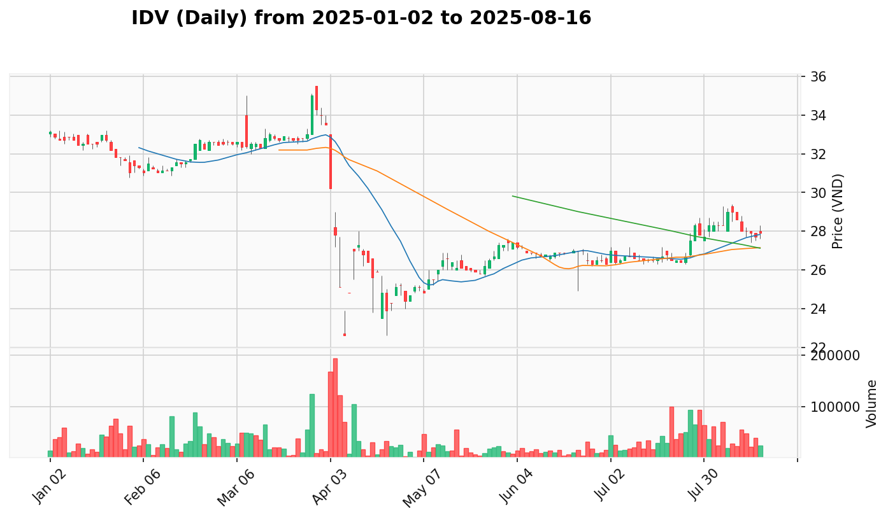

<a href="#bat-dong-san-kcn">↑ Back to group BAT_DONG_SAN_KCN</a>  |  <a href="#vpa-signal-summary">↑ Back to Top</a>

#### Key Statistics
| Metric | Value |
|:---|---:|
| Date Range | 2025-01-02 to 2025-10-17 |
| **Latest Close** | **26.2** |
| Period Open | 33.04 |
| Period High | 35.5 |
| Period Low | 22.6 |
| Period Change % | -20.70% |

**[Download IDV Data (.csv)](market_data/IDV_2025-01-02_to_2025-10-18.csv)**

---

### IJC

#### [VPA Analysis (2025-08-14 - 2025-10-16)](./VPA.md#ijc)
> **Ngày 2025-10-10:** IJC tăng từ 12.75 VND lên 13.15 VND với khối lượng giao dịch đạt 4.3865 triệu cổ phiếu. Cây nến tăng có biên độ khá, giá đóng cửa gần mức cao nhất phiên, cho thấy lực cầu đã xuất hiện. Khối lượng giao dịch tăng nhẹ so với phiên trước (4.3458 triệu cổ phiếu), xác nhận sự trở lại của lực mua sau giai đoạn thiếu cầu. **Phân tích VPA/Wyckoff:** Sign of Strength (SOS) - Lực cầu xuất hiện với khối lượng tăng nhẹ, đẩy giá lên và đóng cửa gần mức cao nhất phiên.
> **Ngày 2025-10-13:** IJC tăng từ 13.15 VND lên 13.75 VND với khối lượng giao dịch đạt 9.8491 triệu cổ phiếu. Cây nến tăng có biên độ rộng, giá đóng cửa nằm gần mức cao nhất phiên, cho thấy lực cầu mạnh mẽ. Khối lượng giao dịch tăng đột biến so với phiên trước (4.3865 triệu cổ phiếu), xác nhận sự tham gia mạnh mẽ của dòng tiền và tiếp diễn xu hướng tăng. **Phân tích VPA/Wyckoff:** Sign of Strength (SOS) - Lực cầu mạnh mẽ với khối lượng tăng đột biến, xác nhận xu hướng tăng.
> **Ngày 2025-10-14:** IJC giảm từ 13.9 VND xuống 13.35 VND với khối lượng giao dịch đạt 6.3398 triệu cổ phiếu. Cây nến giảm có biên độ khá, giá đóng cửa gần mức thấp nhất phiên, cho thấy áp lực bán xuất hiện sau hai phiên tăng mạnh. Khối lượng giao dịch giảm so với phiên tăng mạnh trước đó (9.8491 triệu cổ phiếu), cho thấy lực bán chưa quá quyết liệt nhưng vẫn là một dấu hiệu suy yếu. **Phân tích VPA/Wyckoff:** Sign of Weakness (SOW) - Áp lực bán xuất hiện, đẩy giá xuống và đóng cửa gần mức thấp nhất phiên, dù khối lượng giảm so với phiên tăng mạnh trước đó.
> **Ngày 2025-10-15:** IJC tăng từ 13.45 VND lên 13.65 VND với khối lượng giao dịch đạt 5.8936 triệu cổ phiếu. Cây nến tăng có biên độ khá, giá đóng cửa nằm gần mức cao nhất phiên, cho thấy lực cầu xuất hiện trở lại sau phiên giảm. Tuy nhiên, khối lượng giao dịch giảm so với phiên trước (6.3398 triệu cổ phiếu), cho thấy lực cầu chưa thực sự mạnh mẽ và có thể là dấu hiệu của sự yếu ớt trong đà tăng. **Phân tích VPA/Wyckoff:** Weakness in Rally (Sự yếu ớt trong đà tăng)
> **Ngày 2025-10-16:** IJC mở cửa ở 13.75 VND, đạt mức cao 14.0 VND nhưng đóng cửa ở 13.65 VND, không thay đổi so với phiên trước, với khối lượng giao dịch đạt 5.9244 triệu cổ phiếu. Cây nến có thân nhỏ và bóng nến trên dài, cho thấy áp lực bán xuất hiện khi giá cố gắng tăng cao. Khối lượng giao dịch tăng nhẹ so với phiên trước (5.8936 triệu cổ phiếu) nhưng không tạo ra sự bứt phá về giá, điều này cho thấy nỗ lực tăng giá không mang lại kết quả, hoặc lực cung đang hấp thụ lực cầu. Điều này tiếp tục xác nhận sự yếu ớt của đà tăng. **Phân tích VPA/Wyckoff:** Effort without Result (Nỗ lực không mang lại kết quả)

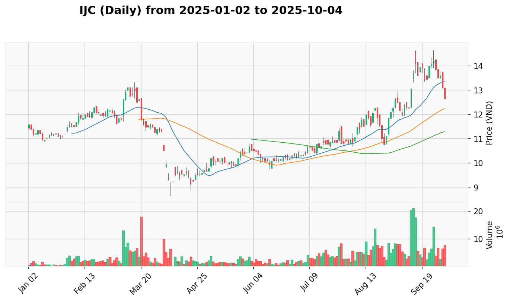

<a href="#xay-dung">↑ Back to group XAY_DUNG</a>  |  <a href="#vpa-signal-summary">↑ Back to Top</a>

#### Key Statistics
| Metric | Value |
|:---|---:|
| Date Range | 2025-01-02 to 2025-10-17 |
| **Latest Close** | **13.3** |
| Period Open | 11.43 |
| Period High | 14.65 |
| Period Low | 8.67 |
| Period Change % | 16.36% |

**[Download IJC Data (.csv)](market_data/IJC_2025-01-02_to_2025-10-18.csv)**

---

### IMP

#### [VPA Analysis (2025-06-26 - 2025-10-16)](./VPA.md#imp)
> **Ngày 2025-10-10:** IMP giảm từ 52.0 VND xuống 51.9 VND. Cây nến giảm có biên độ hẹp (0.8 VND) và đóng cửa gần mức mở cửa, cho thấy có lực cầu xuất hiện ở vùng giá thấp nhưng không đủ mạnh để đẩy giá lên cao hơn. Khối lượng giao dịch đạt 0.0416 triệu cổ phiếu, giảm so với phiên trước (0.0509 triệu cổ phiếu) nhưng vẫn ở mức tương đối cao. Sau hai phiên suy yếu mạnh, phiên này cho thấy áp lực bán có phần giảm bớt nhưng phe bán vẫn đang chiếm ưu thế, duy trì xu hướng giảm giá. **Phân tích VPA/Wyckoff:** Weakness (Suy yếu)
> **Ngày 2025-10-13:** IMP mở cửa ở mức 51.9 VND, sau đó giảm mạnh và đóng cửa ở 51.0 VND. Cây nến giảm có biên độ rộng (1.1 VND) và đóng cửa gần mức thấp nhất phiên (50.8 VND). Khối lượng giao dịch đạt 0.0421 triệu cổ phiếu, tăng nhẹ so với phiên trước (0.0416 triệu cổ phiếu) và vẫn ở mức tương đối cao. Sau hai phiên suy yếu liên tiếp, việc giá tiếp tục giảm mạnh với biên độ rộng và khối lượng gia tăng cho thấy lực cung vẫn đang rất mạnh và phe bán tiếp tục chiếm ưu thế, xác nhận xu hướng giảm giá. **Phân tích VPA/Wyckoff:** Weakness (Suy yếu)
> **Ngày 2025-10-14:** IMP giảm từ 51.0 VND xuống 50.7 VND. Cây nến giảm có biên độ tương đối rộng (1.4 VND) và đóng cửa gần mức thấp nhất phiên, cho thấy áp lực bán mạnh mẽ. Khối lượng giao dịch đạt 0.0592 triệu cổ phiếu, tăng đáng kể so với phiên trước (0.0421 triệu cổ phiếu). Việc giá tiếp tục giảm với khối lượng gia tăng mạnh mẽ xác nhận xu hướng suy yếu và cho thấy phe bán vẫn đang chiếm ưu thế hoàn toàn. **Phân tích VPA/Wyckoff:** Weakness (Suy yếu)
> **Ngày 2025-10-15:** IMP tăng từ 50.7 VND lên 51.0 VND với khối lượng giao dịch đạt 0.024 triệu cổ phiếu. Cây nến tăng có biên độ hẹp (0.3 VND) và đóng cửa ở mức cao nhất phiên. Khối lượng giao dịch giảm mạnh so với phiên trước (0.0592 triệu cổ phiếu). Sau hai phiên suy yếu liên tiếp, việc giá tăng nhẹ với khối lượng thấp cho thấy áp lực bán đã giảm nhưng lực cầu vẫn còn yếu, chưa đủ để xác nhận sự đảo chiều. Đây có thể là một dấu hiệu của sự tạm dừng trong xu hướng giảm. **Phân tích VPA/Wyckoff:** No Demand (Không có cầu)
> **Ngày 2025-10-16:** IMP giảm từ 51.0 VND xuống 50.9 VND. Cây nến giảm có biên độ rất hẹp (0.2 VND) và đóng cửa gần giữa phiên, cho thấy sự lưỡng lự của thị trường. Khối lượng giao dịch đạt 0.0028 triệu cổ phiếu, giảm cực mạnh so với phiên trước (0.024 triệu cổ phiếu) và là mức thấp nhất trong nhiều phiên gần đây. Sau phiên "Không có cầu" ngày 2025-10-15, việc giá tiếp tục biến động trong biên độ hẹp với khối lượng cực thấp cho thấy cả lực mua và lực bán đều không đáng kể, thị trường đang thiếu động lực và chờ đợi tín hiệu rõ ràng hơn. **Phân tích VPA/Wyckoff:** No Demand (Không có cầu)

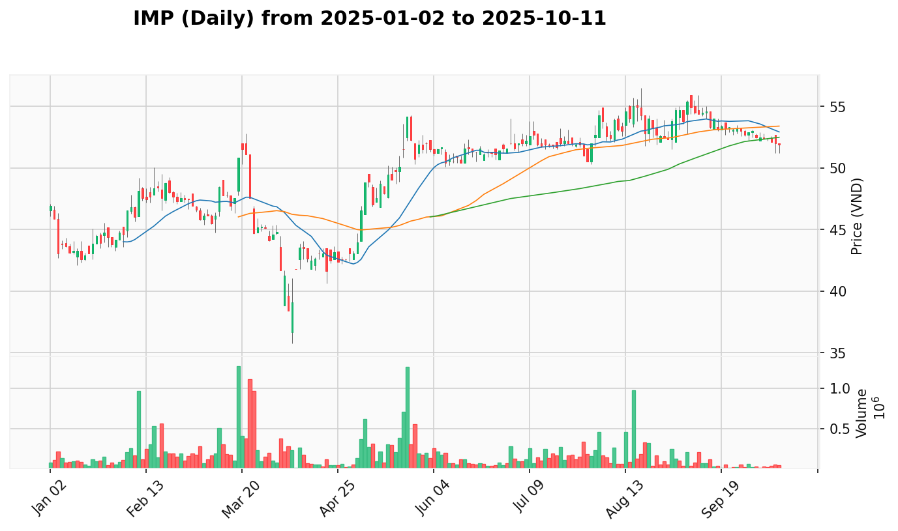

<a href="#suc-khoe">↑ Back to group SUC_KHOE</a>  |  <a href="#vpa-signal-summary">↑ Back to Top</a>

#### Key Statistics
| Metric | Value |
|:---|---:|
| Date Range | 2025-01-02 to 2025-10-17 |
| **Latest Close** | **50.6** |
| Period Open | 46.55 |
| Period High | 56.5 |
| Period Low | 35.75 |
| Period Change % | 8.70% |

**[Download IMP Data (.csv)](market_data/IMP_2025-01-02_to_2025-10-18.csv)**

---

### IPA

#### [VPA Analysis (2025-06-16 - 2025-10-16)](./VPA.md#ipa)
> **Ngày 2025-10-10:** IPA tăng từ 20.9 VND lên 21.2 VND, mở cửa ở 21.0 VND và dao động trong khoảng 21.0-21.6 VND. Cây nến tăng có biên độ hẹp (0.6 điểm) với giá đóng cửa ở nửa trên thân nến. Khối lượng giao dịch đạt 0.421 triệu cổ phiếu, tăng so với phiên trước (0.326 triệu cổ phiếu) nhưng vẫn ở mức vừa phải. Sau hai phiên "No Demand", sự tăng giá với khối lượng gia tăng này cho thấy lực cầu đang bắt đầu xuất hiện, tuy nhiên chưa đủ mạnh để xác nhận một xu hướng tăng rõ rệt. Đây có thể là một nỗ lực tăng giá ban đầu hoặc một sự kiểm tra nguồn cung ở các mức giá thấp hơn. **Phân tích VPA/Wyckoff:** Effort to Rise (ER) - Nỗ lực tăng giá.
> **Ngày 2025-10-13:** IPA giảm từ 21.2 VND xuống 20.9 VND, mở cửa ở 21.2 VND và dao động trong khoảng 20.6-21.2 VND. Cây nến giảm có biên độ hẹp (0.6 điểm) với giá đóng cửa ở giữa thân nến. Khối lượng giao dịch đạt 0.3042 triệu cổ phiếu, giảm so với phiên trước (0.421 triệu cổ phiếu) và ở mức thấp. Sau nỗ lực tăng giá (Effort to Rise) ở phiên trước, việc giá giảm với khối lượng thấp cho thấy lực cầu không tiếp tục duy trì và thị trường thiếu vắng sự quan tâm mua vào. Điều này xác nhận sự yếu kém của lực cầu và khả năng giá sẽ tiếp tục đi ngang hoặc giảm nhẹ. **Phân tích VPA/Wyckoff:** No Demand (ND) - Thiếu vắng lực cầu.
> **Ngày 2025-10-14:** IPA giảm từ 20.9 VND xuống 20.6 VND, mở cửa ở 21.5 VND và dao động trong khoảng 20.5-21.6 VND. Cây nến giảm có biên độ rộng (1.1 điểm) với giá đóng cửa ở gần mức thấp nhất phiên. Khối lượng giao dịch đạt 0.7193 triệu cổ phiếu, tăng mạnh so với phiên trước (0.3042 triệu cổ phiếu). Sau phiên "No Demand", việc giá giảm mạnh với biên độ rộng và khối lượng tăng đột biến cho thấy áp lực bán ra rất lớn, xác nhận sự yếu kém của lực cầu và khả năng giá sẽ tiếp tục giảm. **Phân tích VPA/Wyckoff:** Sign of Weakness (SOW) - Dấu hiệu suy yếu.
> **Ngày 2025-10-15:** IPA tăng từ 20.6 VND lên 21.3 VND, mở cửa ở 20.6 VND và dao động trong khoảng 20.6-21.6 VND. Cây nến tăng có biên độ 1.0 điểm với giá đóng cửa ở gần mức cao nhất phiên. Khối lượng giao dịch đạt 0.6364 triệu cổ phiếu, giảm so với phiên trước (0.7193 triệu cổ phiếu) và ở mức trung bình thấp. Sau phiên "Sign of Weakness" với áp lực bán mạnh, việc giá tăng trở lại với khối lượng giảm cho thấy lực cầu chưa thực sự mạnh mẽ để đảo chiều xu hướng giảm. Đây có thể là một nhịp hồi phục kỹ thuật hoặc sự tạm lắng của áp lực bán, nhưng không có sự xác nhận từ khối lượng. **Phân tích VPA/Wyckoff:** Weak Rally (WR) - Nhịp hồi phục yếu.
> **Ngày 2025-10-16:** IPA tăng nhẹ từ 21.3 VND lên 21.5 VND, mở cửa ở 21.5 VND và dao động trong khoảng 21.3-21.9 VND. Cây nến có biên độ hẹp (0.6 điểm) với giá đóng cửa ngang bằng giá mở cửa, cho thấy sự lưỡng lự. Khối lượng giao dịch đạt 0.2405 triệu cổ phiếu, giảm mạnh so với phiên trước (0.6364 triệu cổ phiếu) và ở mức rất thấp. Sau phiên "Weak Rally" với khối lượng giảm, việc giá tiếp tục tăng nhẹ với biên độ hẹp và khối lượng cực thấp cho thấy lực cầu không còn duy trì được đà tăng và thị trường thiếu sự quan tâm. Điều này xác nhận sự yếu kém của nhịp hồi phục trước đó và khả năng giá sẽ tiếp tục xu hướng giảm. **Phân tích VPA/Wyckoff:** No Demand (ND) - Không có cầu.

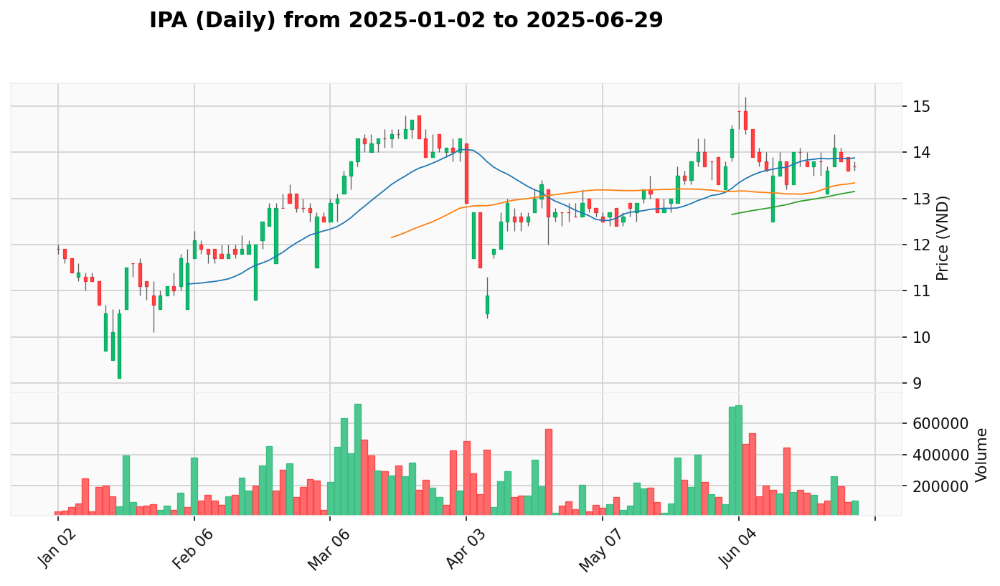

<a href="#penny">↑ Back to group PENNY</a>  |  <a href="#vpa-signal-summary">↑ Back to Top</a>

#### Key Statistics
| Metric | Value |
|:---|---:|
| Date Range | 2025-01-02 to 2025-10-17 |
| **Latest Close** | **21.0** |
| Period Open | 11.9 |
| Period High | 28.0 |
| Period Low | 9.1 |
| Period Change % | 76.47% |

**[Download IPA Data (.csv)](market_data/IPA_2025-01-02_to_2025-10-18.csv)**

---

### ITC

#### [VPA Analysis (2025-08-04 - 2025-10-16)](./VPA.md#itc)
> **Ngày 2025-10-10:** ITC mở cửa ở mức 14.1 VND, cao hơn giá đóng cửa phiên trước, nhưng sau đó đóng cửa ở mức 14.0 VND, thấp hơn giá mở cửa. Giá tăng 0.15 VND so với giá đóng cửa phiên trước (13.85 VND) với biên độ dao động tương đối hẹp. Khối lượng giao dịch đạt 0.2055 triệu cổ phiếu, cao hơn so với phiên trước (0.1667 triệu cổ phiếu). Sau hai phiên giảm giá với "Cung xuất hiện" và "Không có cầu", việc giá cố gắng tăng nhưng đóng cửa dưới mức mở cửa với khối lượng gia tăng cho thấy nỗ lực tăng giá đã gặp phải áp lực bán và không thể duy trì đà tăng. Điều này xác nhận sự yếu kém của cổ phiếu vẫn tiếp diễn. **Phân tích VPA/Wyckoff:** Nỗ lực tăng giá thất bại (Effort to Rise Fails)
> **Ngày 2025-10-13:** ITC mở cửa ở mức 14.0 VND và đóng cửa ở mức 14.35 VND, tăng 0.35 VND so với giá đóng cửa phiên trước (14.0 VND). Giá tăng mạnh với biên độ rộng và đóng cửa ở mức cao nhất phiên. Khối lượng giao dịch đạt 0.2365 triệu cổ phiếu, cao hơn so với phiên trước (0.2055 triệu cổ phiếu). Sau các phiên giảm giá và nỗ lực tăng giá thất bại, việc giá tăng dứt khoát với khối lượng gia tăng cho thấy lực cầu đã quay trở lại và hấp thụ được áp lực bán, đây là một dấu hiệu tích cực. **Phân tích VPA/Wyckoff:** Cầu xuất hiện (Demand Coming In)
> **Ngày 2025-10-14:** ITC mở cửa ở mức 14.4 VND, cao hơn giá đóng cửa phiên trước, nhưng sau đó đóng cửa ở mức 13.95 VND, thấp hơn giá mở cửa và gần mức thấp nhất phiên. Giá giảm 0.4 VND so với giá đóng cửa phiên trước (14.35 VND) với biên độ dao động rộng. Khối lượng giao dịch đạt 0.3576 triệu cổ phiếu, cao hơn đáng kể so với phiên trước (0.2365 triệu cổ phiếu). Sau phiên "Cầu xuất hiện" ngày 2025-10-13, việc giá giảm mạnh với khối lượng gia tăng cho thấy áp lực cung đã quay trở lại và lấn át lực cầu, đẩy giá xuống. Điều này cho thấy sự yếu kém của cổ phiếu vẫn tiếp diễn và lực bán đang chiếm ưu thế. **Phân tích VPA/Wyckoff:** Cung xuất hiện (Supply Coming In)
> **Ngày 2025-10-15:** ITC mở cửa ở mức 13.95 VND và đóng cửa ở mức 13.6 VND, giảm 0.35 VND so với giá đóng cửa phiên trước (13.95 VND). Giá giảm mạnh với biên độ rộng và đóng cửa ở mức thấp nhất phiên. Khối lượng giao dịch đạt 0.2454 triệu cổ phiếu, thấp hơn so với phiên trước (0.3576 triệu cổ phiếu). Sau phiên "Cung xuất hiện" ngày 2025-10-14, việc giá tiếp tục giảm mạnh với biên độ rộng, đóng cửa ở mức thấp nhất phiên cho thấy áp lực bán vẫn còn mạnh và lực cầu gần như không có. Mặc dù khối lượng có giảm nhẹ, nhưng không đủ để hấp thụ lực cung, cho thấy sự yếu kém của cổ phiếu vẫn tiếp diễn. **Phân tích VPA/Wyckoff:** Suy yếu tiếp diễn (Continued Weakness)
> **Ngày 2025-10-16:** ITC mở cửa ở mức 13.4 VND, thấp hơn giá đóng cửa phiên trước, nhưng sau đó đóng cửa ở mức 13.65 VND, cao hơn giá mở cửa và cao hơn nhẹ so với giá đóng cửa phiên trước (13.6 VND). Giá tăng 0.05 VND so với giá đóng cửa phiên trước với biên độ dao động rộng. Khối lượng giao dịch đạt 0.3094 triệu cổ phiếu, cao hơn so với phiên trước (0.2454 triệu cổ phiếu). Sau hai phiên giảm giá liên tiếp với áp lực cung mạnh, việc giá tăng nhẹ với khối lượng gia tăng cho thấy lực cầu đã bắt đầu xuất hiện và có dấu hiệu hấp thụ cung. Tuy nhiên, giá vẫn đang ở vùng thấp và cần thêm xác nhận để khẳng định xu hướng. **Phân tích VPA/Wyckoff:** Cầu xuất hiện

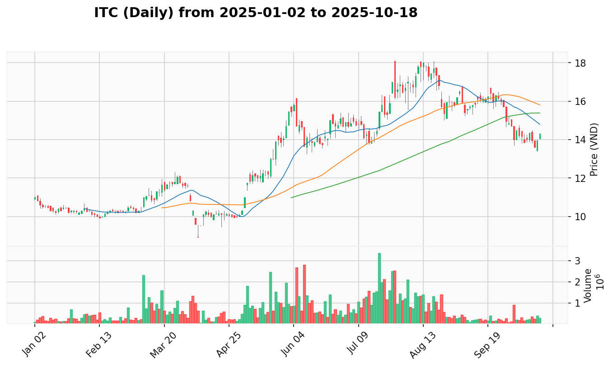

<a href="#bat-dong-san">↑ Back to group BAT_DONG_SAN</a>  |  <a href="#vpa-signal-summary">↑ Back to Top</a>

#### Key Statistics
| Metric | Value |
|:---|---:|
| Date Range | 2025-01-02 to 2025-10-17 |
| **Latest Close** | **14.3** |
| Period Open | 10.9 |
| Period High | 18.1 |
| Period Low | 8.91 |
| Period Change % | 31.19% |

**[Download ITC Data (.csv)](market_data/ITC_2025-01-02_to_2025-10-18.csv)**

---

### JVC

#### [VPA Analysis (2025-08-14 - 2025-10-16)](./VPA.md#jvc)
> **Ngày 2025-10-10:** JVC giảm từ 8.78 VND xuống 8.63 VND với khối lượng giao dịch đạt 0.4446 triệu cổ phiếu. Giá mở cửa 8.5 VND, cao nhất 8.81 VND, thấp nhất 8.5 VND và đóng cửa 8.63 VND. Cây nến giảm với biên độ hẹp và khối lượng thấp, cho thấy áp lực bán không mạnh nhưng lực cầu vẫn chưa xuất hiện sau hai phiên thiếu cầu. Điều này có thể là một dấu hiệu của việc nguồn cung đang cạn kiệt. **Phân tích VPA/Wyckoff:** No Supply (Không có cung)
> **Ngày 2025-10-13:** JVC tăng từ 8.63 VND lên 8.71 VND với khối lượng giao dịch đạt 0.6158 triệu cổ phiếu. Giá mở cửa 8.5 VND, cao nhất 8.83 VND, thấp nhất 8.36 VND và đóng cửa 8.71 VND. Cây nến tăng với biên độ khá và đóng cửa gần mức cao nhất phiên, cho thấy lực cầu đã quay trở lại sau hai phiên thiếu cầu và cạn cung. Khối lượng giao dịch tăng so với hai phiên trước đó, xác nhận sự xuất hiện của lực mua. **Phân tích VPA/Wyckoff:** Sign of Strength (SOS) - Lực cầu đã quay trở lại sau giai đoạn cạn cung.
> **Ngày 2025-10-14:** JVC giảm từ 8.71 VND xuống 8.42 VND với khối lượng giao dịch đạt 0.2729 triệu cổ phiếu. Giá mở cửa 8.56 VND, cao nhất 8.71 VND, thấp nhất 8.41 VND và đóng cửa 8.42 VND. Cây nến giảm với biên độ hẹp và đóng cửa gần mức thấp nhất phiên, cho thấy áp lực bán nhẹ. Tuy nhiên, khối lượng giao dịch giảm đáng kể so với phiên trước đó, cho thấy lực bán không mạnh và có thể là một đợt kiểm tra cung sau tín hiệu SOS. **Phân tích VPA/Wyckoff:** Test for Supply (Kiểm tra cung) - Giá giảm với khối lượng thấp, cho thấy nguồn cung không đáng kể sau tín hiệu SOS.
> **Ngày 2025-10-15:** JVC giảm từ 8.42 VND xuống 8.35 VND với khối lượng giao dịch đạt 0.2931 triệu cổ phiếu. Giá mở cửa 8.42 VND, cao nhất 8.55 VND, thấp nhất 8.25 VND và đóng cửa 8.35 VND. Cây nến giảm với biên độ hẹp và đóng cửa gần mức thấp nhất phiên, cho thấy áp lực bán nhẹ. Khối lượng giao dịch tăng nhẹ so với phiên trước đó nhưng vẫn ở mức thấp, cho thấy lực bán chưa thực sự mạnh nhưng đã xuất hiện trở lại sau phiên kiểm tra cung. **Phân tích VPA/Wyckoff:** Sign of Weakness (SOW) - Áp lực bán đã xuất hiện trở lại sau phiên kiểm tra cung, tuy nhiên khối lượng chưa quá lớn.
> **Ngày 2025-10-16:** JVC giảm từ 8.35 VND xuống 8.23 VND với khối lượng giao dịch đạt 0.1411 triệu cổ phiếu. Giá mở cửa 8.4 VND, cao nhất 8.49 VND, thấp nhất 8.2 VND và đóng cửa 8.23 VND. Cây nến giảm với biên độ hẹp và đóng cửa gần mức thấp nhất phiên, cho thấy áp lực bán tiếp diễn. Tuy nhiên, khối lượng giao dịch giảm mạnh so với phiên trước và ở mức rất thấp, cho thấy lực bán đã suy yếu đáng kể và thiếu sự tham gia của cả người mua lẫn người bán. **Phân tích VPA/Wyckoff:** No Demand (Không có cầu) - Giá giảm với khối lượng rất thấp, xác nhận thiếu lực cầu và cho thấy áp lực bán đang cạn kiệt.

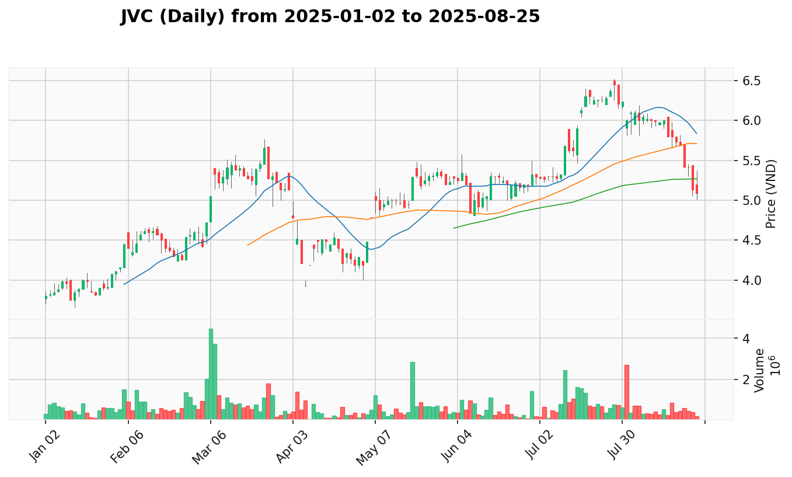

<a href="#suc-khoe">↑ Back to group SUC_KHOE</a>  |  <a href="#vpa-signal-summary">↑ Back to Top</a>

#### Key Statistics
| Metric | Value |
|:---|---:|
| Date Range | 2025-01-02 to 2025-10-17 |
| **Latest Close** | **8.22** |
| Period Open | 3.77 |
| Period High | 9.1 |
| Period Low | 3.65 |
| Period Change % | 118.04% |

**[Download JVC Data (.csv)](market_data/JVC_2025-01-02_to_2025-10-18.csv)**

---

### KBC

#### [VPA Analysis (2025-06-13 - 2025-10-16)](./VPA.md#kbc)
> **Ngày 2025-10-10:** KBC tăng từ 34.95 VND lên 35.7 VND, tăng 0.75 VND (2.15%). Giá mở cửa 35.45 VND, cao nhất 36.1 VND, thấp nhất 35.2 VND và đóng cửa 35.7 VND. Cây nến tăng có thân nhỏ, đóng cửa gần mức cao nhất phiên. Khối lượng giao dịch đạt 5.7467 triệu cổ phiếu, tăng so với phiên trước (5.5468 triệu cổ phiếu). Sau phiên giảm mạnh (SOW) vào ngày 2025-10-09, việc giá tăng trở lại với khối lượng gia tăng cho thấy lực cầu đã xuất hiện để hấp thụ lực cung. Tuy nhiên, thân nến nhỏ cho thấy đà tăng chưa thực sự mạnh mẽ và có thể vẫn còn áp lực bán ở các mức giá cao hơn. Đây là một nỗ lực kiểm tra nguồn cung sau đợt giảm giá. **Phân tích VPA/Wyckoff:** Kiểm tra nguồn cung (Test for Supply)
> **Ngày 2025-10-13:** KBC tăng từ 35.7 VND lên 36.7 VND, tăng 1.0 VND (2.80%). Giá mở cửa 35.1 VND, cao nhất 37.25 VND, thấp nhất 35.1 VND và đóng cửa 36.7 VND. Cây nến tăng có thân rộng, đóng cửa gần mức cao nhất phiên, cho thấy lực cầu mạnh mẽ. Khối lượng giao dịch đạt 10.3029 triệu cổ phiếu, tăng đáng kể so với phiên trước (5.7467 triệu cổ phiếu). Sau phiên kiểm tra nguồn cung vào ngày 2025-10-10, việc giá tăng mạnh với khối lượng đột biến và đóng cửa ở mức cao cho thấy lực cầu đã hoàn toàn áp đảo lực cung, xác nhận sự xuất hiện của dòng tiền lớn. **Phân tích VPA/Wyckoff:** Sign of Strength (SOS) - Lực cầu mạnh mẽ.
> **Ngày 2025-10-14:** KBC giảm từ 36.7 VND xuống 35.5 VND, giảm 1.2 VND (3.27%). Giá mở cửa 37.15 VND, cao nhất 37.15 VND, thấp nhất 35.5 VND và đóng cửa 35.5 VND. Cây nến giảm có thân rộng, đóng cửa ở mức thấp nhất phiên, cho thấy áp lực bán mạnh mẽ. Khối lượng giao dịch đạt 9.5115 triệu cổ phiếu, giảm nhẹ so với phiên trước (10.3029 triệu cổ phiếu) nhưng vẫn ở mức cao. Sau phiên SOS mạnh mẽ vào ngày 2025-10-13, việc giá mở cửa cao nhưng sau đó giảm mạnh và đóng cửa ở mức thấp nhất với khối lượng cao cho thấy lực cung đã xuất hiện trở lại và áp đảo lực cầu, phủ nhận phần lớn nỗ lực tăng giá của phiên trước. Đây là dấu hiệu của sự phân phối hoặc một đợt kiểm tra nguồn cung không thành công. **Phân tích VPA/Wyckoff:** Upthrust (UT) - Lực cung mạnh mẽ.
> **Ngày 2025-10-15:** KBC giảm từ 35.5 VND xuống 34.95 VND, giảm 0.55 VND (1.55%). Giá mở cửa 35.6 VND, cao nhất 35.85 VND, thấp nhất 34.35 VND và đóng cửa 34.95 VND. Cây nến giảm có thân rộng, đóng cửa gần mức thấp nhất phiên, cho thấy áp lực bán tiếp tục chiếm ưu thế. Khối lượng giao dịch đạt 10.2316 triệu cổ phiếu, tăng so với phiên trước (9.5115 triệu cổ phiếu). Sau phiên Upthrust vào ngày 2025-10-14, việc giá tiếp tục giảm với khối lượng gia tăng xác nhận lực cung vẫn đang mạnh mẽ và áp đảo lực cầu, cho thấy xu hướng giảm giá có thể tiếp diễn. **Phân tích VPA/Wyckoff:** Weakness (W) - Lực cung tiếp diễn.
> **Ngày 2025-10-16:** KBC tăng từ 34.95 VND lên 35.95 VND, tăng 1.0 VND (2.86%). Giá mở cửa 35.5 VND, cao nhất 36.6 VND, thấp nhất 35.5 VND và đóng cửa 35.95 VND. Cây nến tăng có thân vừa, đóng cửa không ở mức cao nhất phiên. Khối lượng giao dịch đạt 4.7873 triệu cổ phiếu, giảm đáng kể so với phiên trước (10.2316 triệu cổ phiếu). Sau hai phiên giảm giá mạnh với khối lượng cao (Upthrust và Weakness), phiên tăng giá hôm nay diễn ra với khối lượng thấp, cho thấy lực cầu yếu và có thể là một đợt kiểm tra nguồn cung. Lực cung có thể vẫn còn tiềm ẩn và chưa được hấp thụ hoàn toàn. **Phân tích VPA/Wyckoff:** No Demand (ND) - Lực cầu yếu.

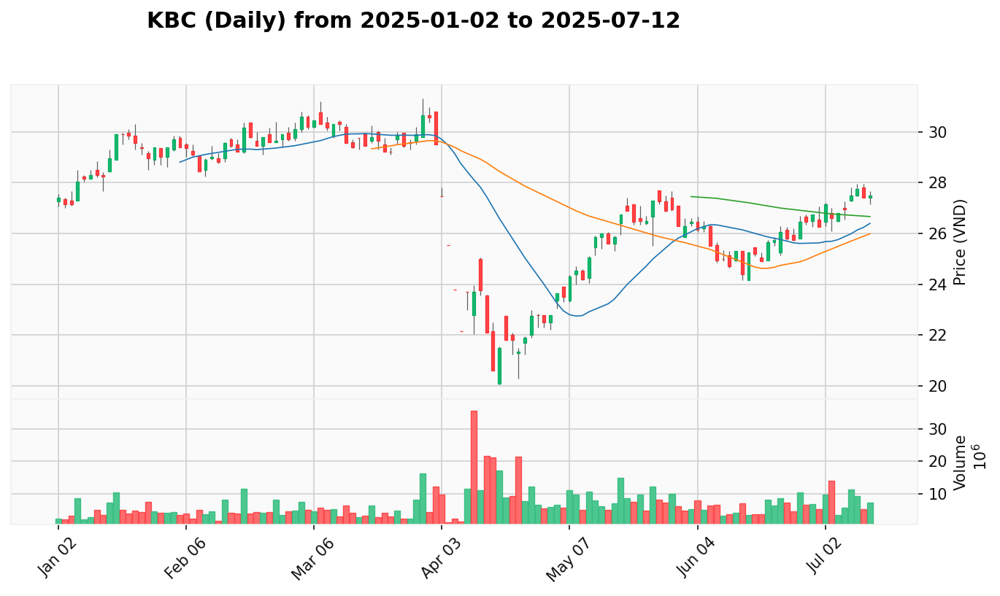

<a href="#bat-dong-san-kcn">↑ Back to group BAT_DONG_SAN_KCN</a>  |  <a href="#vpa-signal-summary">↑ Back to Top</a>

#### Key Statistics
| Metric | Value |
|:---|---:|
| Date Range | 2025-01-02 to 2025-10-17 |
| **Latest Close** | **36.0** |
| Period Open | 27.25 |
| Period High | 43.1 |
| Period Low | 20.05 |
| Period Change % | 32.11% |

**[Download KBC Data (.csv)](market_data/KBC_2025-01-02_to_2025-10-18.csv)**

---

### KDC

#### [VPA Analysis (2025-06-13 - 2025-10-16)](./VPA.md#kdc)
> **Ngày 2025-10-10:** KDC giảm từ 52.8 VND xuống 52.1 VND. Cây nến giảm có biên độ tương đối rộng và đóng cửa ở mức thấp nhất phiên. Khối lượng giao dịch đạt 0.2695 triệu cổ phiếu, tiếp tục giảm so với phiên trước (0.2891 triệu cổ phiếu) và ở mức rất thấp. Sau phiên No Demand vào ngày 2025-10-09, việc giá giảm mạnh với khối lượng thấp cho thấy lực cầu vẫn yếu và không có sự hỗ trợ đáng kể từ người mua. Điều này cho thấy sự tiếp diễn của tình trạng thiếu cầu, khiến giá tiếp tục trượt dốc. **Phân tích VPA/Wyckoff:** No Demand (ND) - Cạn kiệt lực cầu.
> **Ngày 2025-10-13:** KDC giảm từ 52.1 VND xuống 52.0 VND. Cây nến có biên độ hẹp (từ 51.0 VND đến 52.0 VND) và đóng cửa ở mức cao trong phiên (52.0 VND), cho thấy có lực cầu nhẹ xuất hiện trong phiên. Khối lượng giao dịch đạt 0.2674 triệu cổ phiếu, tiếp tục ở mức rất thấp và thấp hơn phiên trước (0.2695 triệu cổ phiếu). Sau các phiên No Demand, việc giá giảm nhẹ với khối lượng cực thấp và đóng cửa ở mức cao trong phiên cho thấy nguồn cung đã cạn kiệt, không còn áp lực bán đáng kể. Đây là dấu hiệu tích cực cho thấy khả năng đảo chiều tăng giá. **Phân tích VPA/Wyckoff:** No Supply (NS) - Cạn kiệt nguồn cung
> **Ngày 2025-10-14:** KDC giảm từ 52.0 VND xuống 51.7 VND. Cây nến giảm có biên độ hẹp (từ 51.3 VND đến 52.1 VND) và đóng cửa ở giữa thân nến. Khối lượng giao dịch đạt 0.2513 triệu cổ phiếu, tiếp tục giảm so với phiên trước (0.2674 triệu cổ phiếu) và ở mức cực kỳ thấp. Sau phiên No Supply vào ngày 2025-10-13, việc giá tiếp tục giảm nhẹ với khối lượng cực thấp cho thấy nguồn cung vẫn cạn kiệt và không có áp lực bán đáng kể. Điều này củng cố nhận định về sự thiếu hụt nguồn cung, tạo tiền đề cho khả năng đảo chiều tăng giá. **Phân tích VPA/Wyckoff:** No Supply (NS) - Cạn kiệt nguồn cung
> **Ngày 2025-10-15:** KDC tăng từ 51.7 VND lên 52.0 VND. Cây nến có biên độ hẹp (từ 51.1 VND đến 52.0 VND) và đóng cửa ở mức cao nhất phiên (52.0 VND), cho thấy lực cầu đã xuất hiện và kiểm soát phiên giao dịch. Khối lượng giao dịch đạt 0.2142 triệu cổ phiếu, tiếp tục ở mức cực kỳ thấp và thấp hơn phiên trước (0.2513 triệu cổ phiếu). Sau hai phiên "No Supply" liên tiếp, việc giá tăng nhẹ với khối lượng cực thấp và đóng cửa ở mức cao nhất phiên xác nhận rằng nguồn cung đã cạn kiệt hoàn toàn. Điều này cho thấy thị trường sẵn sàng cho một đợt tăng giá với nỗ lực tối thiểu. **Phân tích VPA/Wyckoff:** Sign of Strength (SOS) - Dấu hiệu sức mạnh trên khối lượng thấp
> **Ngày 2025-10-16:** KDC giảm từ 52.0 VND xuống 51.8 VND. Cây nến giảm có biên độ hẹp (từ 51.5 VND đến 52.1 VND) và đóng cửa ở giữa thân nến. Khối lượng giao dịch đạt 0.0667 triệu cổ phiếu, cực kỳ thấp và thấp hơn đáng kể so với các phiên trước. Sau các phiên No Supply và Sign of Strength, việc giá giảm nhẹ với khối lượng cực kỳ thấp cho thấy không có áp lực bán đáng kể và nguồn cung vẫn cạn kiệt. Điều này củng cố nhận định về sự thiếu hụt nguồn cung, tạo tiền đề cho khả năng đảo chiều tăng giá. **Phân tích VPA/Wyckoff:** No Demand (ND) - Không có cầu

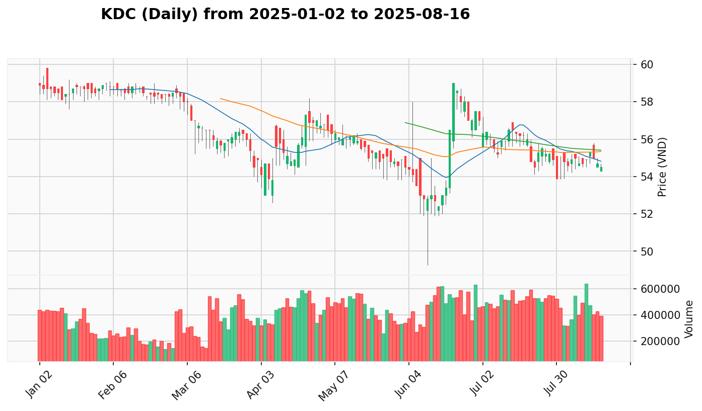

<a href="#thuc-pham">↑ Back to group THUC_PHAM</a>  |  <a href="#vpa-signal-summary">↑ Back to Top</a>

#### Key Statistics
| Metric | Value |
|:---|---:|
| Date Range | 2025-01-02 to 2025-10-17 |
| **Latest Close** | **52.0** |
| Period Open | 59.0 |
| Period High | 59.8 |
| Period Low | 49.2 |
| Period Change % | -11.86% |

**[Download KDC Data (.csv)](market_data/KDC_2025-01-02_to_2025-10-18.csv)**

---

### KDH

#### [VPA Analysis (2025-06-13 - 2025-10-16)](./VPA.md#kdh)
> **Ngày 2025-10-10:** KDH đóng cửa ở mức 32.45 VND, không thay đổi so với phiên trước. Cây nến có biên độ rộng từ 32.25 VND đến 33.0 VND và đóng cửa ở mức 32.45 VND, gần giữa thân nến. Khối lượng giao dịch đạt 5.8416 triệu cổ phiếu, tăng đáng kể so với phiên trước (4.5716 triệu cổ phiếu). Sau phiên Thiếu cầu (No Demand) ngày 2025-10-09, phiên này giá không thể tăng lên dù khối lượng giao dịch gia tăng. Điều này cho thấy nỗ lực tăng giá không mang lại kết quả, xác nhận rằng áp lực bán vẫn còn mạnh và thiếu lực cầu đủ lớn để đẩy giá lên. **Phân tích VPA/Wyckoff:** No Result (Không có kết quả)
> **Ngày 2025-10-13:** KDH tăng nhẹ từ 32.45 VND lên 32.55 VND. Cây nến có biên độ rộng từ 31.95 VND đến 33.0 VND và đóng cửa ở mức 32.55 VND, gần giữa thân nến. Khối lượng giao dịch đạt 8.1912 triệu cổ phiếu, tăng đáng kể so với phiên trước (5.8416 triệu cổ phiếu). Sau hai phiên Thiếu cầu và Không có kết quả, phiên này giá tăng nhẹ với khối lượng gia tăng nhưng không thể đóng cửa ở mức cao nhất, cho thấy nỗ lực tăng giá đang gặp phải áp lực cung đáng kể. **Phân tích VPA/Wyckoff:** Effort vs. Result (Nỗ lực không mang lại kết quả)
> **Ngày 2025-10-14:** KDH giảm từ 32.55 VND xuống 31.9 VND. Cây nến có biên độ rộng từ 31.8 VND đến 33.05 VND và đóng cửa ở mức 31.9 VND, gần mức thấp nhất phiên. Khối lượng giao dịch đạt 10.3227 triệu cổ phiếu, tăng đáng kể so với phiên trước (8.1912 triệu cổ phiếu). Sự giảm giá mạnh với khối lượng gia tăng cho thấy áp lực bán rất lớn và nguồn cung đang áp đảo cầu. Điều này xác nhận sự yếu kém đã thể hiện trong các phiên trước, cho thấy nỗ lực tăng giá không thành công và thị trường đang bị chi phối bởi phe bán. **Phân tích VPA/Wyckoff:** Selling Pressure (Áp lực bán)
> **Ngày 2025-10-15:** KDH tăng từ 31.9 VND lên 34.1 VND. Cây nến có biên độ rộng từ 31.2 VND đến 34.1 VND và đóng cửa ở mức cao nhất phiên (34.1 VND). Khối lượng giao dịch đạt 21.16 triệu cổ phiếu, tăng mạnh so với phiên trước (10.32 triệu cổ phiếu). Sự tăng giá mạnh mẽ với khối lượng giao dịch đột biến cho thấy lực cầu đã áp đảo hoàn toàn lực cung, xác nhận sự đảo chiều tích cực sau các phiên giảm giá trước đó. Điều này cho thấy sự xuất hiện của dòng tiền lớn và khả năng tiếp tục xu hướng tăng. **Phân tích VPA/Wyckoff:** Sign of Strength (SOS) - Lực cầu mạnh mẽ.
> **Ngày 2025-10-16:** KDH mở cửa ở 34.95 VND, cao hơn giá đóng cửa phiên trước, nhưng sau đó giảm và đóng cửa ở 34.25 VND, chỉ tăng nhẹ so với phiên trước (34.1 VND). Cây nến có biên độ từ 34.15 VND đến 35.0 VND và đóng cửa gần mức thấp nhất phiên. Khối lượng giao dịch đạt 5.4831 triệu cổ phiếu, giảm mạnh so với phiên trước (21.16 triệu cổ phiếu). Sau phiên tăng giá mạnh mẽ (SOS) ngày 2025-10-15, việc giá không thể duy trì đà tăng và đóng cửa yếu với khối lượng thấp cho thấy lực cầu không còn mạnh mẽ và có dấu hiệu cạn kiệt. Điều này có thể là một dấu hiệu của sự thiếu hụt nhu cầu tiếp diễn hoặc sự xuất hiện của nguồn cung. **Phân tích VPA/Wyckoff:** No Demand (Thiếu cầu)

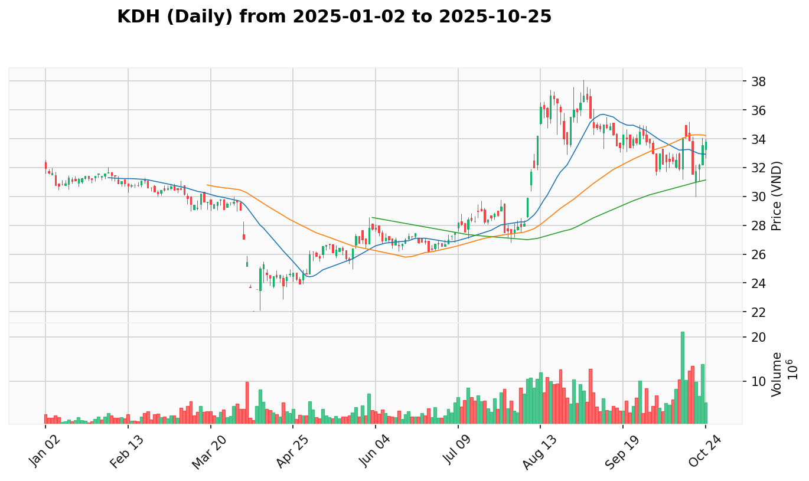

<a href="#bat-dong-san">↑ Back to group BAT_DONG_SAN</a>  |  <a href="#vpa-signal-summary">↑ Back to Top</a>

#### Key Statistics
| Metric | Value |
|:---|---:|
| Date Range | 2025-01-02 to 2025-10-17 |
| **Latest Close** | **33.9** |
| Period Open | 32.36 |
| Period High | 38.1 |
| Period Low | 22.05 |
| Period Change % | 4.76% |

**[Download KDH Data (.csv)](market_data/KDH_2025-01-02_to_2025-10-18.csv)**

---

### KHG

#### [VPA Analysis (2025-08-04 - 2025-10-16)](./VPA.md#khg)
> **Ngày 2025-10-10:** KHG tăng từ 6.96 VND lên 7.04 VND, với khối lượng giao dịch đạt 12.5273 triệu cổ phiếu. Giá mở cửa 6.9 VND, giá cao nhất 7.05 VND, giá thấp nhất 6.87 VND và giá đóng cửa 7.04 VND. Nến có biên độ rộng, giá đóng cửa gần mức cao nhất trong ngày và cao hơn giá đóng cửa phiên trước, cho thấy lực cầu đã hấp thụ áp lực cung từ phiên trước và đang chiếm ưu thế. Khối lượng giao dịch vẫn ở mức cao, xác nhận sự tiếp diễn của lực cầu. **Phân tích VPA/Wyckoff:** Sign of Strength (SOS)
> **Ngày 2025-10-13:** KHG tăng từ 7.04 VND lên 7.16 VND, với khối lượng giao dịch tăng mạnh lên 21.0334 triệu cổ phiếu. Nến có biên độ rộng, giá đóng cửa gần mức cao nhất trong ngày, cho thấy lực cầu mạnh mẽ tiếp tục chiếm ưu thế và hấp thụ hoàn toàn áp lực cung, xác nhận xu hướng tăng giá. **Phân tích VPA/Wyckoff:** Sign of Strength (SOS)
> **Ngày 2025-10-14:** KHG tăng từ 7.16 VND lên 7.2 VND, với khối lượng giao dịch giảm xuống 19.176 triệu cổ phiếu. Nến có biên độ rộng, giá đóng cửa bằng giá mở cửa và không gần mức cao nhất trong ngày, cho thấy sự lưỡng lự của thị trường và lực cầu suy yếu sau hai phiên tăng mạnh. Khối lượng giao dịch giảm cho thấy sự thiếu hụt lực mua tiếp diễn. **Phân tích VPA/Wyckoff:** Effort without Result (EWR)
> **Ngày 2025-10-15:** KHG giảm nhẹ từ 7.2 VND xuống 7.15 VND, với khối lượng giao dịch giảm mạnh xuống 11.2049 triệu cổ phiếu. Nến có biên độ tương đối rộng, giá đóng cửa gần giữa nến, cho thấy sự thiếu hụt lực cầu sau phiên EWR trước đó. Khối lượng giảm cho thấy áp lực bán không quá mạnh nhưng lực mua cũng không còn duy trì. **Phân tích VPA/Wyckoff:** No Demand (ND)
> **Ngày 2025-10-16:** KHG giảm từ 7.15 VND xuống 7.12 VND, với khối lượng giao dịch giảm xuống 9.6135 triệu cổ phiếu. Nến có biên độ hẹp, giá đóng cửa gần mức thấp nhất trong ngày, cho thấy lực cầu tiếp tục suy yếu và áp lực bán vẫn hiện hữu dù không quá mạnh. Khối lượng giao dịch thấp cho thấy sự thiếu vắng người mua, xác nhận tình trạng không có cầu sau phiên ND trước đó. **Phân tích VPA/Wyckoff:** No Demand (ND)

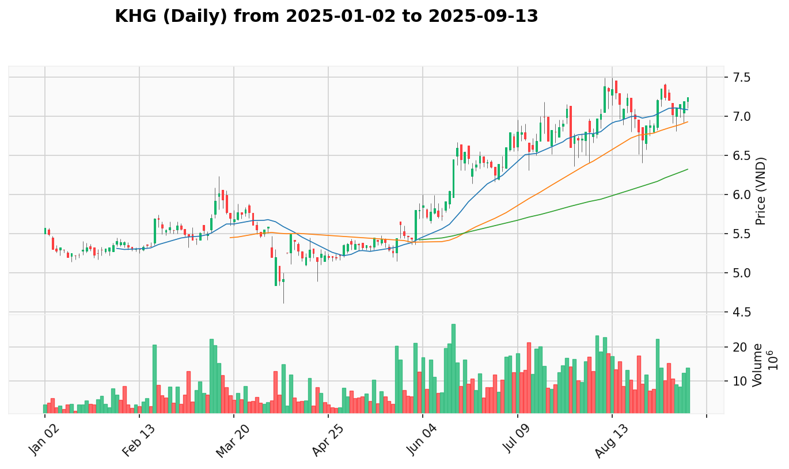

<a href="#bat-dong-san">↑ Back to group BAT_DONG_SAN</a>  |  <a href="#vpa-signal-summary">↑ Back to Top</a>

#### Key Statistics
| Metric | Value |
|:---|---:|
| Date Range | 2025-01-02 to 2025-10-17 |
| **Latest Close** | **7.0** |
| Period Open | 5.5 |
| Period High | 7.49 |
| Period Low | 4.61 |
| Period Change % | 27.27% |

**[Download KHG Data (.csv)](market_data/KHG_2025-01-02_to_2025-10-18.csv)**

---

### KSB

#### [VPA Analysis (2025-08-04 - 2025-10-16)](./VPA.md#ksb)
> **Ngày 2025-10-10:** KSB tăng từ 19.65 VND lên 19.8 VND với khối lượng giao dịch đạt 1.8995 triệu cổ phiếu. Cây nến tăng có biên độ trung bình, với giá cao nhất đạt 20.25 VND nhưng đóng cửa không giữ được mức cao nhất, cho thấy áp lực bán xuất hiện ở vùng giá cao. Khối lượng giao dịch tăng nhẹ so với phiên trước (1.8319 triệu cổ phiếu), nhưng sự tăng giá yếu ớt và bóng nến trên dài cho thấy lực cầu vẫn chưa đủ mạnh để hấp thụ hết lực cung. Điều này tiếp tục xác nhận tín hiệu "Nỗ lực tăng giá nhưng không đạt kết quả" từ phiên trước. **Phân tích VPA/Wyckoff:** Nỗ lực tăng giá nhưng không đạt kết quả.
> **Ngày 2025-10-13:** KSB mở cửa tại 19.5 VND và đóng cửa tại 19.7 VND, cho thấy một nỗ lực tăng giá trong phiên. Khối lượng giao dịch đạt 2.0312 triệu cổ phiếu, cao hơn so với phiên trước (1.8995 triệu cổ phiếu). Cây nến có biên độ hẹp, với giá cao nhất đạt 19.8 VND nhưng không thể duy trì mức đóng cửa cao nhất, cho thấy áp lực bán xuất hiện ở vùng giá cao. Mặc dù khối lượng tăng, giá đóng cửa 19.7 VND thấp hơn mức đóng cửa của phiên trước (19.8 VND). Điều này tiếp tục xác nhận rằng nỗ lực tăng giá gặp phải lực cung đáng kể, không đạt được kết quả rõ rệt, tương tự như các phiên trước đó. **Phân tích VPA/Wyckoff:** Nỗ lực tăng giá nhưng không đạt kết quả.
> **Ngày 2025-10-14:** KSB mở cửa tại 19.85 VND và đóng cửa tại 19.3 VND, cho thấy một phiên giảm giá mạnh. Khối lượng giao dịch đạt 2.5427 triệu cổ phiếu, tăng đáng kể so với phiên trước (2.0312 triệu cổ phiếu). Cây nến giảm có biên độ rộng, với giá đóng cửa ở gần mức thấp nhất phiên, xác nhận áp lực bán rất mạnh. Sự tăng vọt về khối lượng đi kèm với việc giá giảm sâu cho thấy lực cung đã hoàn toàn chiếm ưu thế, phá vỡ các nỗ lực tăng giá trước đó và tiếp nối các tín hiệu suy yếu từ các phiên trước. **Phân tích VPA/Wyckoff:** Sign of Weakness (SOW) - Lực cung mạnh mẽ.
> **Ngày 2025-10-15:** KSB giảm từ 19.3 VND xuống 19.1 VND với khối lượng 1.4086 triệu cổ phiếu, thấp hơn đáng kể so với phiên trước. Giá đóng cửa gần mức thấp nhất phiên, cho thấy lực bán vẫn chiếm ưu thế nhưng với cường độ giảm, đồng thời thiếu vắng lực cầu hỗ trợ. **Phân tích VPA/Wyckoff:** No Demand (Thiếu cầu).
> **Ngày 2025-10-16:** KSB mở cửa tại 19.05 VND và đóng cửa tại 19.2 VND, cho thấy một phiên tăng nhẹ. Khối lượng giao dịch đạt 0.6684 triệu cổ phiếu, rất thấp so với phiên trước (1.4086 triệu cổ phiếu) và thấp nhất trong 10 phiên gần đây. Mặc dù giá có sự phục hồi nhẹ, nhưng khối lượng giao dịch cực kỳ thấp cho thấy thiếu vắng lực cầu mạnh mẽ để đẩy giá lên cao hơn, tiếp tục xác nhận sự yếu kém của thị trường sau các tín hiệu suy yếu và thiếu cầu từ các phiên trước. **Phân tích VPA/Wyckoff:** No Demand (Thiếu cầu).

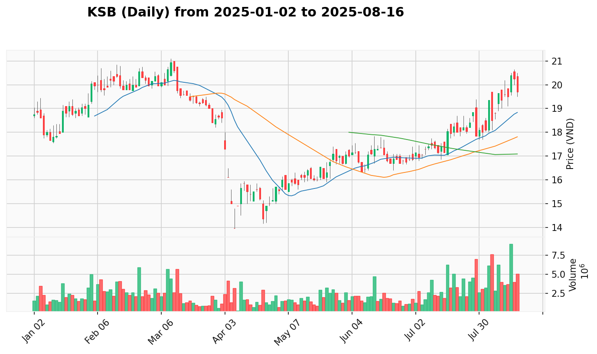

<a href="#dau-tu-cong">↑ Back to group DAU_TU_CONG</a>  |  <a href="#vpa-signal-summary">↑ Back to Top</a>

#### Key Statistics
| Metric | Value |
|:---|---:|
| Date Range | 2025-01-02 to 2025-10-17 |
| **Latest Close** | **19.4** |
| Period Open | 18.7 |
| Period High | 22.45 |
| Period Low | 13.95 |
| Period Change % | 3.74% |

**[Download KSB Data (.csv)](market_data/KSB_2025-01-02_to_2025-10-18.csv)**

---

### KSV

#### [VPA Analysis (2025-08-14 - 2025-10-16)](./VPA.md#ksv)
> **Ngày 2025-10-10:** KSV mở cửa ở mức 150.6 VND và đóng cửa ở mức 149.6 VND, tạo thành một cây nến giảm trong phiên. Mặc dù giá đóng cửa hôm nay (149.6 VND) cao hơn giá đóng cửa phiên trước (147.3 VND), cho thấy một nỗ lực phục hồi, nhưng cây nến giảm cho thấy áp lực bán đã xuất hiện mạnh mẽ từ mức giá mở cửa. Khối lượng giao dịch đạt 0.0131 triệu cổ phiếu, tăng nhẹ so với phiên trước (0.0119 triệu cổ phiếu). Sự tăng khối lượng đi kèm với cây nến giảm trong ngày, dù giá đóng cửa cao hơn phiên trước, cho thấy lực cung vẫn đang kiểm soát và hấp thụ lực cầu, ngăn cản đà tăng bền vững. Điều này tiếp tục xác nhận sự yếu kém của thị trường. **Phân tích VPA/Wyckoff:** Sign of Weakness (SOW) - Lực cung vẫn mạnh.
> **Ngày 2025-10-13:** KSV mở cửa ở mức 157.6 VND và đóng cửa ở mức 164.5 VND, cho thấy một phiên tăng giá mạnh mẽ với biên độ rộng. Giá đóng cửa trùng với giá cao nhất phiên, thể hiện lực mua áp đảo và sự kiểm soát hoàn toàn của phe mua. Khối lượng giao dịch đạt 0.1118 triệu cổ phiếu, tăng đột biến và vượt trội so với phiên trước (0.0131 triệu cổ phiếu) và các phiên gần đây. Sự tăng giá mạnh đi kèm với khối lượng rất lớn cho thấy lực cầu đã quay trở lại một cách mạnh mẽ, hấp thụ toàn bộ lực cung và đảo ngược hoàn toàn tín hiệu suy yếu của hai phiên trước đó (No Demand và Sign of Weakness). Đây là một dấu hiệu tích cực cho thấy sự thay đổi trong động lực thị trường. **Phân tích VPA/Wyckoff:** Sign of Strength (SOS) - Lực cầu mạnh mẽ.
> **Ngày 2025-10-14:** KSV mở cửa ở mức 169.9 VND và đóng cửa ở mức 164.0 VND, tạo thành một cây nến giảm. Giá đã cố gắng tăng lên mức 178.0 VND nhưng không duy trì được, cho thấy áp lực bán xuất hiện ở vùng giá cao. Giá đóng cửa thấp hơn giá đóng cửa phiên trước (164.5 VND). Khối lượng giao dịch đạt 0.0946 triệu cổ phiếu, giảm đáng kể so với phiên tăng mạnh trước đó (0.1118 triệu cổ phiếu). Sự giảm giá nhẹ đi kèm với khối lượng giảm sau một phiên tăng mạnh (SOS) cho thấy lực cầu đã chững lại và không còn đủ mạnh để đẩy giá lên cao hơn, đồng thời có sự xuất hiện của lực cung ở vùng giá cao. Đây có thể là dấu hiệu của sự chốt lời hoặc thiếu vắng lực mua tiếp diễn. **Phân tích VPA/Wyckoff:** No Demand (ND) - Lực cầu chững lại.
> **Ngày 2025-10-15:** KSV mở cửa ở mức 158.0 VND và đóng cửa ở mức 154.9 VND, tạo thành một phiên giảm giá mạnh với biên độ rộng. Giá đóng cửa nằm gần mức thấp nhất phiên, cho thấy áp lực bán chiếm ưu thế hoàn toàn. So với phiên trước, giá giảm từ 164.0 VND xuống 154.9 VND. Khối lượng giao dịch đạt 0.0902 triệu cổ phiếu, thấp hơn một chút so với phiên trước (0.0946 triệu cổ phiếu) và thấp hơn đáng kể so với phiên tăng mạnh (SOS) vào ngày 2025-10-13 (0.1118 triệu cổ phiếu). Sự giảm giá mạnh với biên độ rộng và đóng cửa thấp, đi kèm với khối lượng tương đối, cho thấy lực cung đang chiếm ưu thế và đẩy giá xuống. Đây là dấu hiệu tiếp tục của sự suy yếu sau phiên No Demand trước đó. **Phân tích VPA/Wyckoff:** Sign of Weakness (SOW) - Lực cung chiếm ưu thế.
> **Ngày 2025-10-16:** KSV mở cửa ở mức 154.9 VND và đóng cửa ở mức 159.8 VND, tạo thành một cây nến tăng với biên độ hẹp. Giá đóng cửa cao hơn giá đóng cửa phiên trước (154.9 VND). Khối lượng giao dịch đạt 0.0263 triệu cổ phiếu, giảm mạnh so với phiên trước (0.0902 triệu cổ phiếu) và rất thấp so với các phiên giao dịch gần đây. Sự tăng giá nhẹ đi kèm với khối lượng rất thấp sau hai phiên giảm giá (No Demand và Sign of Weakness) cho thấy lực cầu yếu ớt và không có sự tham gia mạnh mẽ của dòng tiền lớn. Điều này có thể là một dấu hiệu của sự thiếu vắng nhu cầu thực sự, và đà tăng có thể không bền vững. **Phân tích VPA/Wyckoff:** No Demand (ND) - Lực cầu yếu ớt, không có sự xác nhận từ khối lượng.

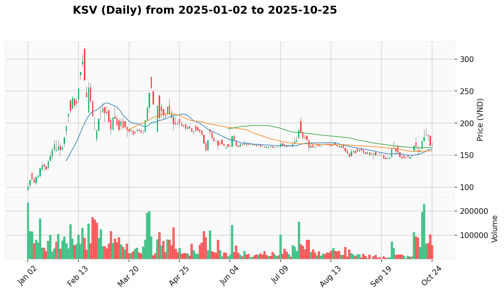

<a href="#thep">↑ Back to group THEP</a>  |  <a href="#vpa-signal-summary">↑ Back to Top</a>

#### Key Statistics
| Metric | Value |
|:---|---:|
| Date Range | 2025-01-02 to 2025-10-17 |
| **Latest Close** | **172.7** |
| Period Open | 95.43 |
| Period High | 316.13 |
| Period Low | 95.43 |
| Period Change % | 80.97% |

**[Download KSV Data (.csv)](market_data/KSV_2025-01-02_to_2025-10-18.csv)**

---

### L18

#### [VPA Analysis (2025-08-13 - 2025-10-16)](./VPA.md#l18)
> **Ngày 2025-10-10:** L18 mở cửa tại 27.5 VND, sau đó tăng nhẹ và đóng cửa tại 27.7 VND, với biên độ dao động từ 27.5 VND đến 28.0 VND. Giá đóng cửa thấp hơn so với phiên trước (28.0 VND). Khối lượng giao dịch đạt 0.0255 triệu cổ phiếu, tăng mạnh so với phiên trước (0.0057 triệu cổ phiếu). Mặc dù giá có sự phục hồi nhẹ từ giá mở cửa, nhưng việc giá đóng cửa thấp hơn phiên trước cùng với khối lượng giao dịch gia tăng đáng kể cho thấy áp lực bán vẫn còn mạnh mẽ và lực cung tiếp tục chiếm ưu thế. **Phân tích VPA/Wyckoff:** Sign of Weakness (SOW) - Lực cung tiếp tục chiếm ưu thế.
> **Ngày 2025-10-13:** L18 mở cửa tại 27.7 VND, sau đó giảm và đóng cửa tại 27.5 VND, với biên độ dao động từ 27.4 VND đến 27.8 VND. Giá đóng cửa thấp hơn so với phiên trước (27.7 VND) và nằm gần mức thấp nhất trong phiên. Khối lượng giao dịch đạt 0.0336 triệu cổ phiếu, tăng mạnh so với phiên trước (0.0255 triệu cổ phiếu). Việc giá giảm với khối lượng gia tăng cho thấy áp lực bán tiếp tục chiếm ưu thế và lực cung đang đẩy giá xuống, củng cố thêm tín hiệu yếu kém của thị trường đã được ghi nhận trong các phiên trước. **Phân tích VPA/Wyckoff:** Sign of Weakness (SOW) - Lực cung mạnh mẽ.
> **Ngày 2025-10-14:** L18 mở cửa tại 27.5 VND, sau đó giảm và đóng cửa tại 27.2 VND, với biên độ dao động từ 27.1 VND đến 27.5 VND. Giá đóng cửa thấp hơn so với phiên trước (27.5 VND) và nằm gần mức thấp nhất trong phiên. Khối lượng giao dịch đạt 0.0348 triệu cổ phiếu, tăng nhẹ so với phiên trước (0.0336 triệu cổ phiếu). Việc giá tiếp tục giảm với khối lượng gia tăng cho thấy áp lực bán vẫn đang chiếm ưu thế và lực cung tiếp tục đẩy giá xuống, củng cố thêm tín hiệu yếu kém của thị trường. **Phân tích VPA/Wyckoff:** Sign of Weakness (SOW) - Lực cung tiếp tục chiếm ưu thế.
> **Ngày 2025-10-15:** L18 mở cửa tại 27.1 VND, sau đó giảm và đóng cửa tại 27.0 VND, với biên độ dao động từ 26.8 VND đến 27.2 VND. Giá đóng cửa thấp hơn so với phiên trước (27.2 VND) và nằm gần mức thấp nhất trong phiên. Khối lượng giao dịch đạt 0.0308 triệu cổ phiếu, giảm so với phiên trước (0.0348 triệu cổ phiếu). Mặc dù giá tiếp tục giảm, việc khối lượng giao dịch giảm cho thấy áp lực bán có thể đang chững lại hoặc lực cầu vẫn còn yếu, nhưng xu hướng giảm giá vẫn tiếp diễn. **Phân tích VPA/Wyckoff:** Sign of Weakness (SOW) - Giá giảm với khối lượng giảm, cho thấy áp lực bán có thể đang suy yếu nhưng xu hướng giảm vẫn duy trì.
> **Ngày 2025-10-16:** L18 mở cửa tại 27.0 VND và tiếp tục giảm, đóng cửa tại 26.6 VND, là mức thấp nhất trong phiên. Biên độ dao động trong phiên từ 26.6 VND đến 27.1 VND. Giá đóng cửa thấp hơn đáng kể so với phiên trước (27.0 VND). Khối lượng giao dịch đạt 0.0225 triệu cổ phiếu, giảm so với phiên trước (0.0308 triệu cổ phiếu). Việc giá tiếp tục giảm và đóng cửa ở mức thấp nhất phiên, trong khi khối lượng giao dịch giảm, cho thấy áp lực bán vẫn còn nhưng có thể đang suy yếu, hoặc lực cầu vẫn rất yếu, khiến giá dễ dàng bị đẩy xuống. Xu hướng giảm giá vẫn đang tiếp diễn. **Phân tích VPA/Wyckoff:** Sign of Weakness (SOW) - Giá giảm với khối lượng giảm, xác nhận xu hướng yếu kém của thị trường.

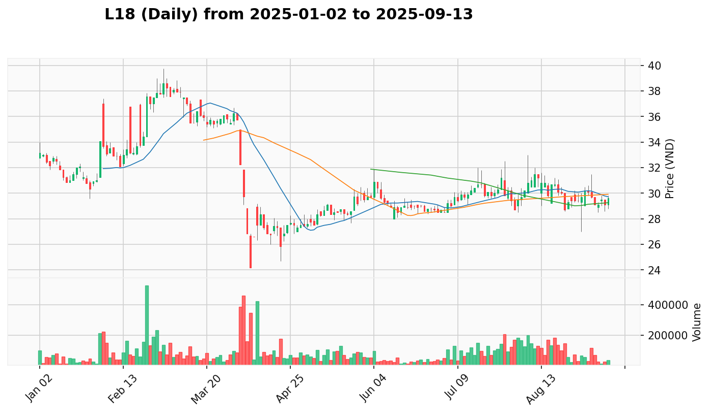

<a href="#xay-dung">↑ Back to group XAY_DUNG</a>  |  <a href="#vpa-signal-summary">↑ Back to Top</a>

#### Key Statistics
| Metric | Value |
|:---|---:|
| Date Range | 2025-01-02 to 2025-10-17 |
| **Latest Close** | **26.0** |
| Period Open | 32.75 |
| Period High | 39.75 |
| Period Low | 24.17 |
| Period Change % | -20.61% |

**[Download L18 Data (.csv)](market_data/L18_2025-01-02_to_2025-10-18.csv)**

---

### LAS

#### [VPA Analysis (2025-08-04 - 2025-10-16)](./VPA.md#las)
> **Ngày 2025-10-10:** LAS giảm từ 18.1 VND xuống 18.0 VND với khối lượng giao dịch đạt 0.2165 triệu cổ phiếu. Giá đóng cửa ở mức giữa của biên độ hẹp, cho thấy sự lưỡng lự. Khối lượng giao dịch tăng đáng kể so với phiên trước (0.1642 triệu cổ phiếu), trong khi giá giảm nhẹ. Điều này cho thấy áp lực bán đã xuất hiện và nguồn cung đang chiếm ưu thế, xác nhận sự suy yếu sau phiên kiểm tra nguồn cung không thành công. **Phân tích VPA/Wyckoff:** Weakness (Dấu hiệu suy yếu)
> **Ngày 2025-10-13:** LAS giảm từ 18.0 VND xuống 17.9 VND với khối lượng giao dịch đạt 0.2408 triệu cổ phiếu. Giá đóng cửa ở mức cao nhất trong ngày với biên độ hẹp, nhưng vẫn thấp hơn so với phiên trước. Khối lượng giao dịch tăng nhẹ so với phiên trước (0.2165 triệu cổ phiếu), cho thấy áp lực bán vẫn còn hoặc lực cầu chưa đủ mạnh để đẩy giá lên. Điều này xác nhận sự suy yếu đã xuất hiện từ phiên trước. **Phân tích VPA/Wyckoff:** Tiếp diễn suy yếu
> **Ngày 2025-10-14:** LAS giảm từ 17.9 VND xuống 17.7 VND với khối lượng giao dịch đạt 0.366 triệu cổ phiếu. Giá đóng cửa ở mức thấp nhất trong biên độ rộng, cho thấy áp lực bán mạnh mẽ. Khối lượng giao dịch tăng đáng kể so với phiên trước (0.2408 triệu cổ phiếu), xác nhận nguồn cung đang chiếm ưu thế và sự suy yếu tiếp diễn. **Phân tích VPA/Wyckoff:** Weakness (Dấu hiệu suy yếu)
> **Ngày 2025-10-15:** LAS giảm từ 17.7 VND xuống 17.6 VND với khối lượng giao dịch đạt 0.2514 triệu cổ phiếu. Giá đóng cửa ở giữa biên độ nến rộng, cho thấy sự lưỡng lự của thị trường. Khối lượng giao dịch giảm đáng kể so với phiên trước, cho thấy áp lực bán đã giảm bớt nhưng lực cầu vẫn chưa xuất hiện. **Phân tích VPA/Wyckoff:** No Demand (Không có cầu)
> **Ngày 2025-10-16:** LAS giảm từ 17.6 VND xuống 17.5 VND với khối lượng giao dịch đạt 0.1694 triệu cổ phiếu. Biên độ nến hẹp và giá đóng cửa ở giữa biên độ, cho thấy sự lưỡng lự và thiếu áp lực bán mạnh. Khối lượng giao dịch giảm đáng kể so với phiên trước (0.2514 triệu cổ phiếu), xác nhận rằng lực cầu vẫn chưa xuất hiện và áp lực bán đã suy yếu. **Phân tích VPA/Wyckoff:** No Demand (Không có cầu)

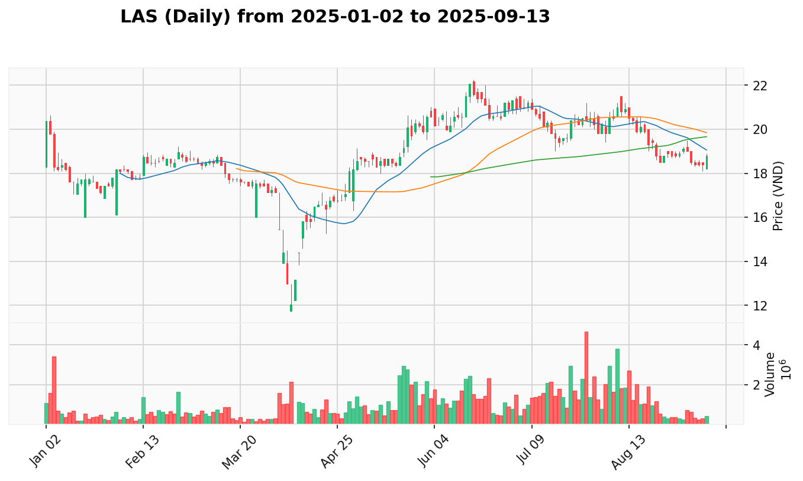

<a href="#hoa-chat">↑ Back to group HOA_CHAT</a>  |  <a href="#vpa-signal-summary">↑ Back to Top</a>

#### Key Statistics
| Metric | Value |
|:---|---:|
| Date Range | 2025-01-02 to 2025-10-17 |
| **Latest Close** | **17.4** |
| Period Open | 18.28 |
| Period High | 22.25 |
| Period Low | 11.74 |
| Period Change % | -4.81% |

**[Download LAS Data (.csv)](market_data/LAS_2025-01-02_to_2025-10-18.csv)**

---

### LCG

#### [VPA Analysis (2025-08-04 - 2025-10-16)](./VPA.md#lcg)
> **Ngày 2025-10-10:** LCG mở cửa ở 12.4 VND, tăng lên 12.65 VND và đóng cửa ở 12.45 VND, cao hơn giá đóng cửa phiên trước (12.35 VND). Cây nến có thân nhỏ, biên độ rộng hơn và đóng cửa cao hơn giá mở cửa, cho thấy lực cầu đã quay trở lại. Khối lượng giao dịch đạt 3.4526 triệu cổ phiếu, tăng đáng kể so với phiên trước (2.0844 triệu cổ phiếu), xác nhận sự xuất hiện của lực mua sau chuỗi ngày thiếu cầu. **Phân tích VPA/Wyckoff:** Demand (Cầu vào)
> **Ngày 2025-10-13:** LCG mở cửa ở 12.15 VND, giảm xuống 12.1 VND và đóng cửa ở 12.35 VND, thấp hơn giá đóng cửa phiên trước (12.45 VND). Cây nến có thân nhỏ, cho thấy sự giảm giá. Khối lượng giao dịch đạt 4.3085 triệu cổ phiếu, tăng đáng kể so với phiên trước (3.4526 triệu cổ phiếu). Sự giảm giá đi kèm với khối lượng tăng cho thấy áp lực bán đã quay trở lại thị trường, hấp thụ lực cầu từ phiên trước và đẩy giá xuống. **Phân tích VPA/Wyckoff:** Supply (Cung xuất hiện)
> **Ngày 2025-10-14:** LCG mở cửa ở 12.45 VND, giảm xuống 11.9 VND và đóng cửa ở 12.0 VND, thấp hơn giá đóng cửa phiên trước (12.35 VND). Cây nến có thân lớn, biên độ rộng và đóng cửa gần mức thấp nhất phiên, cho thấy áp lực bán mạnh mẽ. Khối lượng giao dịch đạt 7.5698 triệu cổ phiếu, tăng đáng kể so với phiên trước (4.3085 triệu cổ phiếu), xác nhận sự xuất hiện của lực cung áp đảo. Sự giảm giá mạnh đi kèm với khối lượng tăng đột biến cho thấy lực bán đang chiếm ưu thế hoàn toàn, đẩy giá xuống sâu hơn. **Phân tích VPA/Wyckoff:** Supply (Cung áp đảo)
> **Ngày 2025-10-15:** LCG mở cửa ở 12.15 VND, giảm xuống 11.95 VND và đóng cửa ở 11.95 VND, thấp hơn giá đóng cửa phiên trước (12.0 VND). Cây nến có thân nhỏ, biên độ hẹp và đóng cửa ở mức thấp nhất phiên, cho thấy áp lực bán vẫn còn nhưng không mạnh mẽ như phiên trước. Khối lượng giao dịch đạt 3.3839 triệu cổ phiếu, giảm đáng kể so với phiên trước (7.5698 triệu cổ phiếu). Sự giảm giá đi kèm với khối lượng giảm cho thấy lực bán đã suy yếu, nhưng đồng thời cũng không có lực cầu đáng kể xuất hiện để đẩy giá lên. Thị trường đang trong giai đoạn yếu. **Phân tích VPA/Wyckoff:** Weakness (Yếu)
> **Ngày 2025-10-16:** LCG mở cửa ở 12.05 VND, tăng lên 12.25 VND và đóng cửa ở 12.2 VND, cao hơn giá đóng cửa phiên trước (11.95 VND). Cây nến có thân nhỏ, biên độ hẹp và đóng cửa gần mức cao nhất phiên, cho thấy lực cầu nhẹ xuất hiện. Khối lượng giao dịch đạt 2.1115 triệu cổ phiếu, giảm đáng kể so với phiên trước (3.3839 triệu cổ phiếu). Sự tăng giá nhẹ đi kèm với khối lượng giảm cho thấy áp lực bán đã suy yếu, nhưng lực cầu vẫn chưa đủ mạnh để tạo ra một xu hướng tăng rõ rệt. Thị trường đang kiểm tra lượng cung còn lại sau hai phiên giảm mạnh. **Phân tích VPA/Wyckoff:** Kiểm tra cung

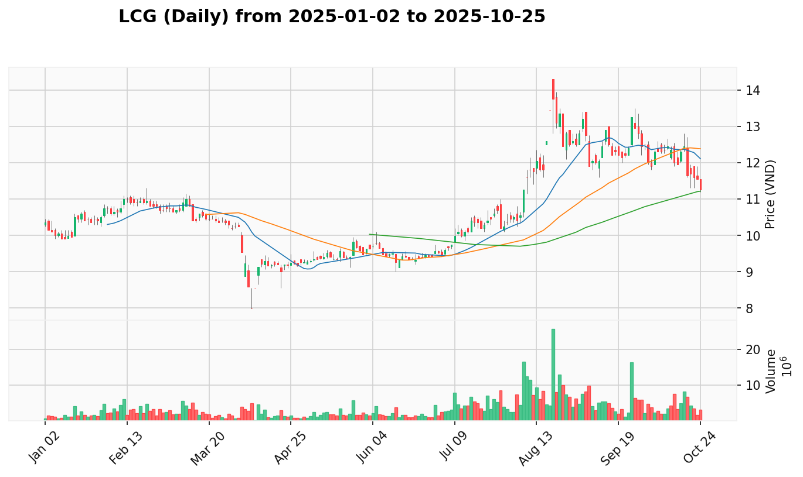

<a href="#dau-tu-cong">↑ Back to group DAU_TU_CONG</a>  |  <a href="#vpa-signal-summary">↑ Back to Top</a>

#### Key Statistics
| Metric | Value |
|:---|---:|
| Date Range | 2025-01-02 to 2025-10-17 |
| **Latest Close** | **12.45** |
| Period Open | 10.3 |
| Period High | 14.3 |
| Period Low | 7.99 |
| Period Change % | 20.87% |

**[Download LCG Data (.csv)](market_data/LCG_2025-01-02_to_2025-10-18.csv)**

---

### LDG

#### [VPA Analysis (2025-08-04 - 2025-10-16)](./VPA.md#ldg)
> **Ngày 2025-10-10:** LDG đóng cửa ở mức 4.75 VND, không thay đổi so với phiên trước. Giá mở cửa ở 4.76 VND, đạt mức cao nhất 4.84 VND và đóng cửa ở 4.75 VND, tại mức thấp nhất trong phiên. Cây nến có biên độ hẹp, cho thấy sự lưỡng lự và áp lực bán nhẹ. Khối lượng giao dịch đạt 1.7341 triệu cổ phiếu, tăng nhẹ so với phiên trước (1.5824 triệu cổ phiếu). Sau phiên "No Supply" và "Test for Supply", việc giá đi ngang với khối lượng tăng nhẹ nhưng đóng cửa ở mức thấp nhất phiên cho thấy lực cầu vẫn chưa đủ mạnh để hấp thụ nguồn cung và đẩy giá lên. Thị trường vẫn đang trong giai đoạn kiểm tra nguồn cung và có dấu hiệu yếu đi khi giá không thể tăng. **Phân tích VPA/Wyckoff:** Sign of Weakness (SOW) - Giá không thể tăng dù khối lượng tăng nhẹ, đóng cửa ở mức thấp nhất phiên, cho thấy lực cầu yếu và nguồn cung vẫn chiếm ưu thế.
> **Ngày 2025-10-13:** LDG đóng cửa ở mức 4.77 VND, tăng nhẹ từ 4.75 VND của phiên trước. Giá mở cửa ở 4.75 VND, đạt mức cao nhất 4.83 VND và mức thấp nhất 4.6 VND. Cây nến có biên độ rộng hơn, cho thấy sự biến động lớn trong phiên. Khối lượng giao dịch đạt 2.6564 triệu cổ phiếu, tăng đáng kể so với phiên trước (1.7341 triệu cổ phiếu). Mặc dù khối lượng tăng mạnh và giá có tăng nhẹ, nhưng mức tăng không đáng kể và giá đóng cửa ở giữa thân nến, không thể duy trì mức cao nhất trong phiên. Điều này cho thấy nỗ lực đẩy giá lên của phe mua đã gặp phải lực cản đáng kể từ phe bán, và kết quả đạt được không tương xứng với nỗ lực bỏ ra. Mức thấp nhất trong phiên (4.6 VND) cũng thấp hơn các phiên gần đây, cho thấy áp lực bán vẫn còn. **Phân tích VPA/Wyckoff:** Effort without Result (Nỗ lực không mang lại kết quả) - Khối lượng giao dịch tăng mạnh nhưng giá chỉ tăng nhẹ và không thể đóng cửa ở mức cao nhất, cho thấy lực cung vẫn còn mạnh và hấp thụ phần lớn lực cầu.
> **Ngày 2025-10-14:** LDG đóng cửa ở mức 4.72 VND, giảm từ 4.77 VND của phiên trước. Giá mở cửa ở 4.8 VND, đạt mức cao nhất 4.84 VND và mức thấp nhất 4.67 VND. Cây nến giảm có biên độ tương đối, với giá đóng cửa gần mức thấp nhất trong phiên. Khối lượng giao dịch đạt 2.81 triệu cổ phiếu, tăng so với phiên trước (2.66 triệu cổ phiếu). Việc giá giảm trên khối lượng tăng mạnh, đặc biệt khi giá đóng cửa ở mức thấp cho thấy áp lực bán đang gia tăng và phe bán đang chiếm ưu thế. Điều này tiếp nối tín hiệu "Nỗ lực không mang lại kết quả" từ phiên trước, xác nhận sự yếu kém của lực cầu. **Phân tích VPA/Wyckoff:** Sign of Weakness (SOW) - Giá giảm mạnh trên khối lượng tăng, đóng cửa ở mức thấp nhất phiên, cho thấy lực cung áp đảo và xu hướng giảm giá có thể tiếp diễn.
> **Ngày 2025-10-15:** LDG đóng cửa ở mức 4.62 VND, giảm từ 4.72 VND của phiên trước. Giá mở cửa ở 4.68 VND, đạt mức cao nhất 4.73 VND và mức thấp nhất 4.59 VND. Cây nến giảm có biên độ tương đối, với giá đóng cửa gần mức thấp nhất trong phiên. Khối lượng giao dịch đạt 2.89 triệu cổ phiếu, tăng nhẹ so với phiên trước (2.81 triệu cổ phiếu). Việc giá giảm trên khối lượng tăng, đặc biệt khi giá đóng cửa ở mức thấp nhất phiên, tiếp tục cho thấy áp lực bán mạnh mẽ và phe bán đang kiểm soát hoàn toàn. Điều này củng cố tín hiệu "Sign of Weakness" từ phiên trước, xác nhận sự yếu kém của lực cầu và khả năng tiếp diễn xu hướng giảm. **Phân tích VPA/Wyckoff:** Sign of Weakness (SOW) - Giá giảm mạnh trên khối lượng tăng, đóng cửa gần mức thấp nhất phiên, cho thấy lực cung tiếp tục áp đảo và xu hướng giảm giá có thể tiếp diễn.
> **Ngày 2025-10-16:** LDG đóng cửa ở mức 4.61 VND, giảm nhẹ từ 4.62 VND của phiên trước. Giá mở cửa ở 4.58 VND, đạt mức cao nhất 4.7 VND và mức thấp nhất 4.58 VND. Cây nến giảm có biên độ hẹp, với giá đóng cửa gần giữa thân nến. Khối lượng giao dịch đạt 1.07 triệu cổ phiếu, giảm mạnh so với phiên trước (2.89 triệu cổ phiếu). Việc giá giảm nhẹ trên khối lượng thấp cho thấy áp lực bán đã giảm bớt đáng kể sau hai phiên giảm mạnh trước đó. Tuy nhiên, lực cầu vẫn chưa đủ mạnh để đẩy giá lên, cho thấy thị trường đang trong giai đoạn tạm lắng hoặc kiểm tra lại vùng giá thấp hơn. **Phân tích VPA/Wyckoff:** No Demand (ND) - Giá giảm nhẹ trên khối lượng thấp, cho thấy thiếu vắng lực cầu và áp lực bán đã suy yếu, nhưng chưa có dấu hiệu đảo chiều rõ ràng.

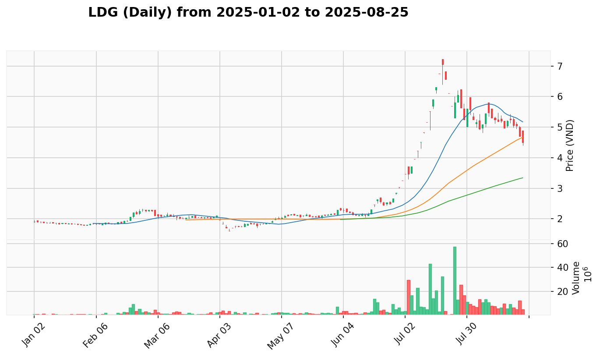

<a href="#bat-dong-san">↑ Back to group BAT_DONG_SAN</a>  |  <a href="#vpa-signal-summary">↑ Back to Top</a>

#### Key Statistics
| Metric | Value |
|:---|---:|
| Date Range | 2025-01-02 to 2025-10-17 |
| **Latest Close** | **4.68** |
| Period Open | 1.9 |
| Period High | 7.22 |
| Period Low | 1.6 |
| Period Change % | 146.32% |

**[Download LDG Data (.csv)](market_data/LDG_2025-01-02_to_2025-10-18.csv)**

---

### LHG

#### [VPA Analysis (2025-08-04 - 2025-10-16)](./VPA.md#lhg)
> **Ngày 2025-10-10:** LHG tăng nhẹ từ 30.05 VND lên 30.35 VND với khối lượng giao dịch đạt 0.0326 triệu cổ phiếu. Cây nến tăng có biên độ hẹp và đóng cửa gần mức cao nhất phiên. Khối lượng giao dịch rất thấp, giảm đáng kể so với phiên trước (0.2533 triệu cổ phiếu), cho thấy áp lực bán đã giảm nhưng đồng thời lực cầu cũng rất yếu, thiếu sự quan tâm từ thị trường. Điều này ngụ ý rằng thị trường chưa sẵn sàng cho một đợt tăng giá bền vững. **Phân tích VPA/Wyckoff:** No Demand (Thiếu cầu)
> **Ngày 2025-10-13:** LHG giảm nhẹ từ 30.35 VND xuống 30.3 VND với khối lượng giao dịch đạt 0.1127 triệu cổ phiếu. Cây nến có biên độ rộng, với bóng nến dưới dài cho thấy có lực cầu bắt đáy mạnh mẽ khi giá chạm mức thấp 29.0 VND. Tuy nhiên, dù khối lượng giao dịch tăng đáng kể so với phiên trước (0.0326 triệu cổ phiếu), giá đóng cửa vẫn không thể vượt qua mức đóng cửa của phiên trước, cho thấy áp lực cung vẫn còn mạnh và đang hấp thụ lực cầu. Điều này ngụ ý rằng thị trường vẫn đang trong giai đoạn yếu ớt và chưa sẵn sàng cho một xu hướng tăng bền vững. **Phân tích VPA/Wyckoff:** Effort to Rise but No Result (Nỗ lực tăng giá không thành công)
> **Ngày 2025-10-14:** LHG giảm nhẹ từ 30.3 VND xuống 30.2 VND với khối lượng giao dịch đạt 0.2289 triệu cổ phiếu. Cây nến có biên độ rộng, với bóng nến dưới dài cho thấy có lực cầu bắt đáy mạnh mẽ khi giá chạm mức thấp 29.3 VND. Tuy nhiên, giá đóng cửa vẫn không thể vượt qua mức đóng cửa của phiên trước, cho thấy áp lực cung vẫn còn mạnh và đang hấp thụ lực cầu. Điều này ngụ ý rằng thị trường vẫn đang trong giai đoạn yếu ớt và chưa sẵn sàng cho một xu hướng tăng bền vững. **Phân tích VPA/Wyckoff:** Nỗ lực giảm giá không thành công
> **Ngày 2025-10-15:** LHG giảm từ 30.35 VND xuống 29.9 VND với khối lượng giao dịch đạt 0.0733 triệu cổ phiếu. Cây nến có biên độ hẹp và đóng cửa ở mức thấp nhất phiên, cho thấy áp lực bán vẫn duy trì và không có lực cầu đáng kể. Khối lượng giao dịch thấp hơn đáng kể so với phiên trước (0.2289 triệu cổ phiếu) và các phiên gần đây, xác nhận sự thiếu vắng của lực mua. Điều này cho thấy thị trường vẫn đang yếu và có thể tiếp tục xu hướng giảm hoặc đi ngang trong thời gian tới. **Phân tích VPA/Wyckoff:** No Demand (Không có lực cầu)
> **Ngày 2025-10-16:** LHG tăng nhẹ từ 29.9 VND lên 30.0 VND với khối lượng giao dịch cực thấp, chỉ đạt 0.0108 triệu cổ phiếu. Cây nến có biên độ hẹp, đóng cửa gần mức giữa, cho thấy sự thiếu vắng cả lực mua và lực bán. Khối lượng giao dịch này là thấp nhất trong các phiên gần đây, đặc biệt sau phiên "No Demand" ngày 2025-10-15, xác nhận rằng thị trường vẫn đang trong trạng thái yếu ớt và thiếu động lực rõ ràng. **Phân tích VPA/Wyckoff:** No Demand (Tiếp diễn)

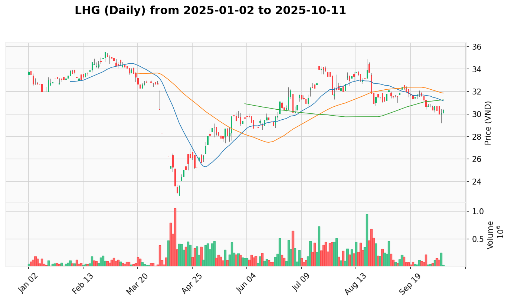

<a href="#bat-dong-san-kcn">↑ Back to group BAT_DONG_SAN_KCN</a>  |  <a href="#vpa-signal-summary">↑ Back to Top</a>

#### Key Statistics
| Metric | Value |
|:---|---:|
| Date Range | 2025-01-02 to 2025-10-17 |
| **Latest Close** | **29.65** |
| Period Open | 33.52 |
| Period High | 35.69 |
| Period Low | 22.77 |
| Period Change % | -11.55% |

**[Download LHG Data (.csv)](market_data/LHG_2025-01-02_to_2025-10-18.csv)**

---

### LIG

#### [VPA Analysis (2025-08-14 - 2025-10-16)](./VPA.md#lig)
> **Ngày 2025-10-10:** LIG tăng từ 4.9 VND lên 5.0 VND với khối lượng giao dịch đạt 0.3859 triệu cổ phiếu, tăng nhẹ so với phiên trước (0.3231 triệu cổ phiếu). Nến có thân tăng, biên độ hẹp, đóng cửa ở giữa biên độ ngày. Sau các phiên "Không có cung" và "Yếu kém", việc giá tăng nhẹ với khối lượng tăng nhưng vẫn ở mức thấp cho thấy nỗ lực tăng giá còn yếu và chưa có sự tham gia mạnh mẽ từ bên mua. Áp lực bán có vẻ đã giảm bớt nhưng cầu vẫn chưa đủ mạnh để tạo ra một xu hướng tăng rõ ràng. **Phân tích VPA/Wyckoff:** Nỗ lực tăng giá (Effort to Rise)
> **Ngày 2025-10-13:** LIG giảm từ 5.0 VND xuống 4.9 VND với khối lượng giao dịch đạt 0.6947 triệu cổ phiếu, tăng mạnh so với phiên trước (0.3859 triệu cổ phiếu). Nến có thân giảm, đóng cửa ở mức thấp nhất trong biên độ ngày. Sau phiên "Nỗ lực tăng giá" yếu ớt, việc giá giảm mạnh kèm khối lượng tăng đột biến cho thấy áp lực bán ra rất lớn và lực cầu hoàn toàn bị áp đảo, xác nhận xu hướng giảm tiếp diễn. **Phân tích VPA/Wyckoff:** Yếu kém (Weakness)
> **Ngày 2025-10-14:** LIG giảm từ 4.9 VND xuống 4.8 VND với khối lượng giao dịch đạt 0.4775 triệu cổ phiếu, giảm so với phiên trước (0.6947 triệu cổ phiếu). Nến có thân giảm, biên độ hẹp, đóng cửa ở mức thấp nhất trong biên độ ngày. Sau phiên "Yếu kém" với khối lượng tăng đột biến, việc giá tiếp tục giảm nhưng với khối lượng thấp hơn cho thấy áp lực bán đã giảm bớt nhưng lực cầu vẫn chưa xuất hiện để hỗ trợ giá. Điều này xác nhận sự thiếu vắng của lực mua và xu hướng giảm giá vẫn tiếp diễn. **Phân tích VPA/Wyckoff:** Không có cầu (No Demand)
> **Ngày 2025-10-15:** LIG giữ nguyên mức giá 4.8 VND với khối lượng giao dịch đạt 0.3321 triệu cổ phiếu, giảm đáng kể so với phiên trước (0.4775 triệu cổ phiếu). Nến có thân hẹp, đóng cửa ở mức thấp nhất trong biên độ ngày. Sau hai phiên giảm giá liên tiếp với áp lực bán và thiếu cầu, việc giá đi ngang với khối lượng rất thấp và đóng cửa ở mức thấp nhất cho thấy lực cầu hoàn toàn vắng bóng và sự thờ ơ của thị trường. Xu hướng giảm giá vẫn tiếp diễn. **Phân tích VPA/Wyckoff:** Không có cầu
> **Ngày 2025-10-16:** LIG giữ nguyên mức giá 4.8 VND với khối lượng giao dịch đạt 0.33 triệu cổ phiếu, tiếp tục giảm so với phiên trước (0.3321 triệu cổ phiếu). Nến có thân hẹp, đóng cửa ở mức giá mở cửa, cho thấy sự lưỡng lự của thị trường. Mặc dù giá không giảm thêm, nhưng với khối lượng thấp và không có sự xuất hiện của lực cầu mạnh mẽ sau các phiên "Không có cầu" trước đó, cho thấy thị trường vẫn đang thiếu động lực tăng giá. Biên độ dao động trong ngày hẹp, và giá thấp nhất trong ngày là 4.7 VND, cho thấy áp lực bán vẫn còn hiện hữu dù không mạnh. **Phân tích VPA/Wyckoff:** Không có cầu

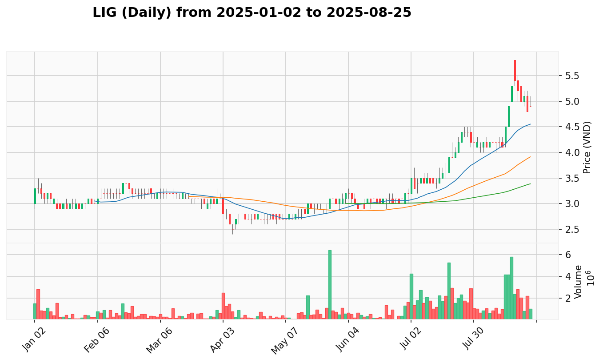

<a href="#penny">↑ Back to group PENNY</a>  |  <a href="#vpa-signal-summary">↑ Back to Top</a>

#### Key Statistics
| Metric | Value |
|:---|---:|
| Date Range | 2025-01-02 to 2025-10-17 |
| **Latest Close** | **4.8** |
| Period Open | 3.0 |
| Period High | 5.8 |
| Period Low | 2.4 |
| Period Change % | 60.00% |

**[Download LIG Data (.csv)](market_data/LIG_2025-01-02_to_2025-10-18.csv)**

---

### LPB

#### [VPA Analysis (2025-06-11 - 2025-10-16)](./VPA.md#lpb)
> **Ngày 2025-10-10:** LPB tăng từ 51.2 VND lên 51.6 VND, mở cửa tại 51.2 VND, đạt mức cao 52.2 VND và thấp 50.8 VND. Giá đóng cửa ở nửa trên của thân nến với biên độ nến trung bình. Khối lượng giao dịch đạt 4.036 triệu cổ phiếu, giảm so với phiên trước (4.2844 triệu cổ phiếu). Sau hai phiên giảm điểm liên tiếp với áp lực bán gia tăng (SOW), giá có sự phục hồi nhẹ nhưng với khối lượng giảm, cho thấy lực cầu yếu và không đủ mạnh để đảo chiều xu hướng giảm. **Phân tích VPA/Wyckoff:** No Demand (ND) - Lực cầu yếu, không có sự tham gia mạnh mẽ của người mua.
> **Ngày 2025-10-13:** LPB tăng từ 51.6 VND lên 52.5 VND, mở cửa tại 51.8 VND, đạt mức cao 52.5 VND và thấp 50.5 VND. Giá đóng cửa ở mức cao nhất phiên với biên độ nến rộng. Khối lượng giao dịch đạt 4.0201 triệu cổ phiếu, giảm nhẹ so với phiên trước (4.036 triệu cổ phiếu). Sau phiên "No Demand" ngày 2025-10-10, giá đã tăng mạnh với thân nến rộng và đóng cửa ở mức cao nhất, cho thấy lực cầu đã quay trở lại và hấp thụ tốt lực cung. Mặc dù khối lượng giảm nhẹ, nhưng hành động giá mạnh mẽ này cho thấy sự kiểm soát của phe mua. **Phân tích VPA/Wyckoff:** Sign of Strength (SOS) - Lực cầu mạnh mẽ đẩy giá lên cao, hấp thụ lực cung.
> **Ngày 2025-10-14:** LPB giảm từ 52.5 VND xuống 51.5 VND, mở cửa tại 52.9 VND, đạt mức cao 53.3 VND và thấp 51.5 VND. Giá đóng cửa ở mức thấp nhất phiên với biên độ nến trung bình. Khối lượng giao dịch đạt 2.627 triệu cổ phiếu, giảm đáng kể so với phiên trước (4.0201 triệu cổ phiếu). Sau phiên "Sign of Strength" ngày 2025-10-13, giá đã có một phiên điều chỉnh giảm với khối lượng thấp hơn, cho thấy lực cầu yếu và áp lực bán xuất hiện khi giá không thể duy trì đà tăng và đóng cửa ở mức thấp nhất. Điều này cho thấy sự thiếu hụt của lực mua tiếp diễn sau SOS. **Phân tích VPA/Wyckoff:** No Demand (ND) - Lực cầu yếu, không có sự tiếp diễn của lực mua sau phiên SOS.
> **Ngày 2025-10-15:** LPB tăng nhẹ từ 51.5 VND lên 51.6 VND, mở cửa tại 51.9 VND, đạt mức cao 53.3 VND và thấp 51.6 VND. Giá đóng cửa ở mức thấp nhất phiên với biên độ nến trung bình. Khối lượng giao dịch đạt 3.4433 triệu cổ phiếu, tăng so với phiên trước (2.627 triệu cổ phiếu). Mặc dù giá đóng cửa cao hơn nhẹ so với phiên trước, nhưng việc giá không thể duy trì đà tăng, đóng cửa ở mức thấp nhất phiên và có khối lượng tăng cho thấy áp lực bán mạnh mẽ đã xuất hiện và hấp thụ lực cầu. Điều này cho thấy sự yếu kém của phe mua và khả năng tiếp diễn xu hướng giảm. **Phân tích VPA/Wyckoff:** Selling Pressure (Áp lực bán) - Lực bán mạnh mẽ đẩy giá xuống, hấp thụ lực cầu.
> **Ngày 2025-10-16:** LPB giảm từ 51.6 VND xuống 51.4 VND, mở cửa tại 52.0 VND, đạt mức cao 52.5 VND và thấp 51.2 VND. Giá đóng cửa ở mức thấp nhất phiên với biên độ nến hẹp. Khối lượng giao dịch đạt 0.5342 triệu cổ phiếu, giảm mạnh so với phiên trước (3.4433 triệu cổ phiếu) và là mức rất thấp. Sau phiên "Selling Pressure" ngày 2025-10-15, giá tiếp tục giảm nhẹ với khối lượng cực thấp cho thấy sự thiếu vắng cả lực mua và lực bán đáng kể. Điều này cho thấy thị trường đang thiếu động lực và không có sự tham gia tích cực từ cả hai phe. Lực cầu vẫn yếu và không có dấu hiệu phục hồi. **Phân tích VPA/Wyckoff:** No Demand (ND) - Lực cầu yếu và thị trường thiếu động lực.

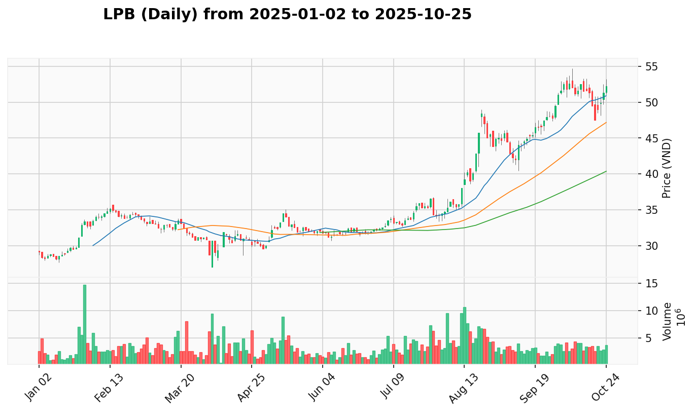

<a href="#ngan-hang">↑ Back to group NGAN_HANG</a>  |  <a href="#vpa-signal-summary">↑ Back to Top</a>

#### Key Statistics
| Metric | Value |
|:---|---:|
| Date Range | 2025-01-02 to 2025-10-17 |
| **Latest Close** | **49.5** |
| Period Open | 29.25 |
| Period High | 54.7 |
| Period Low | 27.01 |
| Period Change % | 69.23% |

**[Download LPB Data (.csv)](market_data/LPB_2025-01-02_to_2025-10-18.csv)**

---

### LSS

#### [VPA Analysis (2025-08-14 - 2025-10-16)](./VPA.md#lss)
> **Ngày 2025-10-10:** LSS tăng từ 10.35 VND lên 10.45 VND với khối lượng giao dịch đạt 0.6527 triệu cổ phiếu. Giá cao nhất đạt 10.65 VND và giá thấp nhất là 10.35 VND. Cây nến tăng có biên độ khá và đóng cửa ở nửa trên, cho thấy lực cầu đã xuất hiện và hấp thụ nguồn cung. Khối lượng giao dịch tăng đáng kể so với phiên "Thiếu cầu" ngày 2025-10-09 (0.1967 triệu cổ phiếu) và cao hơn phiên "Yếu kém" ngày 2025-10-08 (0.5385 triệu cổ phiếu). Điều này cho thấy thị trường đang kiểm tra nguồn cung sau giai đoạn yếu kém và thiếu cầu. **Phân tích VPA/Wyckoff:** Test for Supply (Kiểm tra nguồn cung)
> **Ngày 2025-10-13:** LSS giảm từ 10.45 VND xuống 10.25 VND với khối lượng giao dịch đạt 0.3522 triệu cổ phiếu. Nến giao dịch có biên độ hẹp và đóng cửa gần mức thấp nhất, cho thấy sự yếu kém của lực cầu. Khối lượng giao dịch giảm đáng kể so với phiên "Kiểm tra nguồn cung" ngày 2025-10-10 (0.6527 triệu cổ phiếu), cho thấy sự thiếu vắng người mua sau khi thị trường kiểm tra nguồn cung. Mặc dù khối lượng cao hơn phiên "Thiếu cầu" ngày 2025-10-09 (0.1967 triệu cổ phiếu), nhưng giá giảm cho thấy áp lực bán vẫn hiện hữu và lực cầu chưa đủ mạnh để hấp thụ. **Phân tích VPA/Wyckoff:** Weakness (Yếu kém)
> **Ngày 2025-10-14:** LSS giảm từ 10.25 VND xuống 10.1 VND với khối lượng giao dịch đạt 0.5416 triệu cổ phiếu. Cây nến giảm có biên độ khá và đóng cửa gần mức thấp nhất, cho thấy áp lực bán mạnh mẽ. Khối lượng giao dịch tăng so với phiên "Yếu kém" ngày 2025-10-13 (0.3522 triệu cổ phiếu), xác nhận rằng nguồn cung vẫn đang chiếm ưu thế và lực cầu chưa đủ mạnh để hấp thụ. Điều này cho thấy sự tiếp diễn của giai đoạn yếu kém và nguồn cung đang gia tăng. **Phân tích VPA/Wyckoff:** Supply Coming In (Nguồn cung xuất hiện)
> **Ngày 2025-10-15:** LSS giảm từ 10.1 VND xuống 10.0 VND với khối lượng giao dịch đạt 0.2765 triệu cổ phiếu. Nến giao dịch có biên độ hẹp và đóng cửa ở mức thấp nhất, cho thấy sự yếu kém của lực cầu. Khối lượng giao dịch giảm đáng kể so với phiên trước (0.5416 triệu cổ phiếu) và thấp hơn cả phiên "Yếu kém" ngày 2025-10-13 (0.3522 triệu cổ phiếu), xác nhận rằng không có sự quan tâm từ phía người mua. Điều này cho thấy sự tiếp diễn của giai đoạn yếu kém và thiếu vắng lực cầu, với áp lực bán vẫn hiện hữu nhưng không có sự hấp thụ. **Phân tích VPA/Wyckoff:** No Demand (Thiếu cầu)
> **Ngày 2025-10-16:** LSS giảm nhẹ từ 10.0 VND xuống 9.99 VND với khối lượng giao dịch cực kỳ thấp, chỉ 0.0953 triệu cổ phiếu. Biên độ nến hẹp và đóng cửa gần mức thấp nhất, cho thấy sự thiếu vắng cả lực mua và lực bán đáng kể. Khối lượng giao dịch giảm mạnh so với phiên trước (0.2765 triệu cổ phiếu) và thấp hơn nhiều so với các phiên gần đây, xác nhận rằng áp lực bán đã cạn kiệt ở mức giá này, nhưng lực cầu vẫn chưa xuất hiện để đẩy giá lên. Điều này cho thấy thị trường đang ở trạng thái cân bằng tạm thời với sự thờ ơ của cả hai bên, tiếp nối giai đoạn yếu kém và thiếu cầu. **Phân tích VPA/Wyckoff:** No Supply (Không có nguồn cung)

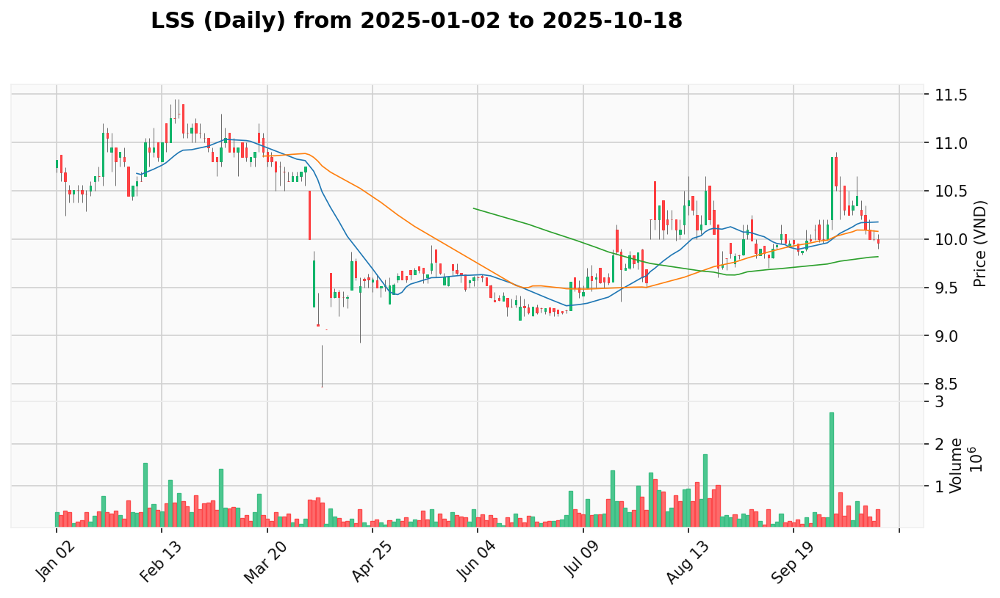

<a href="#thuc-pham">↑ Back to group THUC_PHAM</a>  |  <a href="#vpa-signal-summary">↑ Back to Top</a>

#### Key Statistics
| Metric | Value |
|:---|---:|
| Date Range | 2025-01-02 to 2025-10-17 |
| **Latest Close** | **9.96** |
| Period Open | 10.74 |
| Period High | 11.45 |
| Period Low | 8.47 |
| Period Change % | -7.26% |

**[Download LSS Data (.csv)](market_data/LSS_2025-01-02_to_2025-10-18.csv)**

---

### LTG

#### [VPA Analysis (2025-08-08 - 2025-10-10)](./VPA.md#ltg)
> **Ngày 2025-09-12:** LTG tiếp tục giảm giá từ 7.7 xuống 7.5 VND, với khối lượng giao dịch giảm mạnh còn 0.1853 triệu cổ phiếu. Nến giảm giá có biên độ hẹp và đóng cửa tại mức thấp nhất trong ngày, cho thấy áp lực bán vẫn còn nhưng đã suy yếu đáng kể. Khối lượng thấp sau phiên giảm giá trước đó với khối lượng tăng cho thấy sự cạn kiệt của lực cầu ở vùng giá hiện tại. **Phân tích VPA/Wyckoff:** No Demand - Thiếu cầu.
> **Ngày 2025-09-19:** LTG tiếp tục giảm giá từ 7.5 xuống 7.4 VND, với khối lượng giao dịch giảm mạnh còn 0.1455 triệu cổ phiếu. Nến giảm giá có biên độ hẹp và đóng cửa gần mức thấp nhất trong ngày, cho thấy áp lực bán đã suy yếu đáng kể nhưng lực cầu vẫn chưa xuất hiện. Khối lượng thấp kỷ lục sau các phiên giảm giá trước đó củng cố nhận định về sự thiếu vắng dòng tiền vào thị trường. **Phân tích VPA/Wyckoff:** No Demand - Thiếu cầu.
> **Ngày 2025-09-26:** LTG giảm giá từ 7.4 VND xuống 6.9 VND, với khối lượng giao dịch tăng lên 0.2152 triệu cổ phiếu. Nến giảm giá có biên độ rộng và đóng cửa gần mức thấp nhất trong ngày, cho thấy áp lực bán đang gia tăng và chiếm ưu thế hoàn toàn so với lực cầu. Điều này xác nhận xu hướng giảm giá tiếp diễn và cho thấy sự suy yếu rõ rệt sau các phiên thiếu cầu trước đó. **Phân tích VPA/Wyckoff:** Sign of Weakness (SOW) - Dấu hiệu suy yếu.
> **Ngày 2025-10-03:** LTG tiếp tục giảm giá từ 6.9 xuống 6.8 VND, với khối lượng giao dịch giảm còn 0.1621 triệu cổ phiếu. Nến giảm giá có biên độ hẹp và đóng cửa ở mức thấp nhất trong ngày, cho thấy áp lực bán vẫn còn nhưng đã suy yếu đáng kể. Khối lượng thấp trong khi giá tiếp tục giảm xác nhận sự thiếu vắng lực cầu. **Phân tích VPA/Wyckoff:** No Demand - Thiếu cầu.
> **Ngày 2025-10-10:** LTG mở cửa ở mức 7.2 VND, cao hơn mức đóng cửa và mức cao nhất của phiên trước, nhưng sau đó giảm xuống 6.9 VND khi đóng cửa, với khối lượng giao dịch tăng lên 0.1901 triệu cổ phiếu. Nến có biên độ rộng và đóng cửa ở nửa dưới, cho thấy lực bán đã xuất hiện mạnh mẽ ngay sau khi giá cố gắng tăng. Mặc dù giá đóng cửa cao hơn phiên trước một chút, nhưng hành động giá này cho thấy sự từ chối mức giá cao hơn và sự hiện diện của nguồn cung. **Phân tích VPA/Wyckoff:** Upthrust (UT) - Dấu hiệu phân phối/kiểm tra cung.

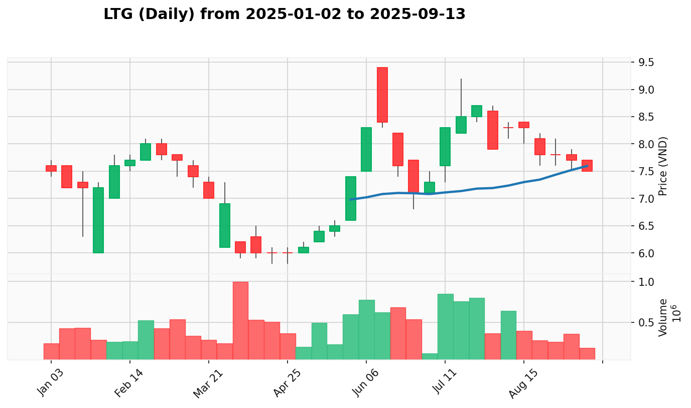

<a href="#nong-nghiep">↑ Back to group NONG_NGHIEP</a>  |  <a href="#vpa-signal-summary">↑ Back to Top</a>

#### Key Statistics
| Metric | Value |
|:---|---:|
| Date Range | 2025-01-03 to 2025-10-17 |
| **Latest Close** | **6.4** |
| Period Open | 7.6 |
| Period High | 9.4 |
| Period Low | 5.8 |
| Period Change % | -15.79% |

**[Download LTG Data (.csv)](market_data/LTG_2025-01-02_to_2025-10-18.csv)**

---

### MBB

#### [VPA Analysis (2025-06-13 - 2025-10-16)](./VPA.md#mbb)
> **Ngày 2025-10-10:** MBB tăng từ 27.35 lên 27.45. Nến tăng có biên độ rộng, mở cửa tại 27.4, đạt cao nhất 27.75, thấp nhất 27.2 và đóng cửa tại 27.45, nằm ở giữa thân nến. Khối lượng giao dịch đạt 56.7809 triệu cổ phiếu, cao hơn đáng kể so với phiên trước và cao hơn mức trung bình. Sau phiên tăng mạnh với tín hiệu SOS, phiên hôm nay giá tiếp tục tăng nhẹ nhưng với khối lượng rất lớn và biên độ nến rộng, cho thấy có sự xuất hiện của lực cung mạnh mẽ hấp thụ lực cầu, khiến giá không thể tăng cao hơn đáng kể. Việc giá đóng cửa ở giữa thân nến với khối lượng cực lớn là một dấu hiệu cảnh báo về sự suy yếu của đà tăng. **Phân tích VPA/Wyckoff:** Effort without Result (EWR) - Nỗ lực không mang lại kết quả.
> **Ngày 2025-10-13:** MBB giảm từ 27.45 xuống 27.35. Nến ngày có biên độ hẹp, mở cửa tại 27.15, cao nhất 27.4, thấp nhất 27.0 và đóng cửa tại 27.35, nằm gần mức cao nhất của thân nến. Khối lượng giao dịch đạt 46.4499 triệu cổ phiếu, thấp hơn so với phiên trước nhưng vẫn ở mức cao. Sau phiên EWR (Nỗ lực không mang lại kết quả) ngày 2025-10-10, phiên hôm nay giá đóng cửa thấp hơn, cho thấy lực cung vẫn đang chiếm ưu thế, hấp thụ lực cầu và khiến giá không thể tăng lên. Khối lượng cao xác nhận sự hiện diện của lực cung và sự suy yếu của đà tăng. **Phân tích VPA/Wyckoff:** Weakness - Dấu hiệu suy yếu.
> **Ngày 2025-10-14:** MBB giảm từ 27.35 xuống 27.05. Nến giảm có biên độ rộng, mở cửa tại 27.5, đạt cao nhất 27.7, thấp nhất 27.05 và đóng cửa tại 27.05, nằm ở mức thấp nhất của thân nến. Khối lượng giao dịch đạt 49.4013 triệu cổ phiếu, cao hơn so với phiên trước và vẫn ở mức cao. Sau tín hiệu suy yếu (Weakness) từ phiên trước, phiên hôm nay giá tiếp tục giảm mạnh với khối lượng cao và đóng cửa ở mức thấp nhất, cho thấy lực cung áp đảo hoàn toàn lực cầu. Đây là một dấu hiệu rõ ràng của sự suy yếu tiếp diễn. **Phân tích VPA/Wyckoff:** Weakness - Tiếp diễn suy yếu.
> **Ngày 2025-10-15:** MBB tăng từ 27.05 lên 27.25. Nến ngày có biên độ hẹp, mở cửa tại 27.15, cao nhất 27.65, thấp nhất 27.1 và đóng cửa tại 27.25, nằm gần giữa thân nến. Khối lượng giao dịch đạt 31.4863 triệu cổ phiếu, thấp hơn đáng kể so với phiên trước và mức trung bình. Sau hai phiên suy yếu liên tiếp với khối lượng cao, phiên hôm nay giá tăng nhẹ nhưng với khối lượng thấp, cho thấy lực bán đã giảm bớt nhưng lực cầu vẫn chưa thực sự mạnh mẽ để đẩy giá lên cao. Đây có thể là một dấu hiệu tạm dừng trong xu hướng giảm hoặc một nỗ lực kiểm tra cung cầu. **Phân tích VPA/Wyckoff:** No Demand - Thiếu cầu.
> **Ngày 2025-10-16:** MBB tăng từ 27.25 lên 27.3. Nến ngày là một nến Doji với biên độ hẹp, mở cửa tại 27.3, đạt cao nhất 27.55, thấp nhất 27.25 và đóng cửa tại 27.3. Khối lượng giao dịch đạt 13.2514 triệu cổ phiếu, thấp hơn đáng kể so với phiên trước (31.4863 triệu cổ phiếu) và mức trung bình. Sau hai phiên suy yếu và thiếu cầu, phiên hôm nay giá chỉ tăng nhẹ với khối lượng cực thấp, cho thấy sự lưỡng lự và thiếu vắng động lực rõ ràng từ cả bên mua và bên bán. Lực cầu vẫn còn yếu, và thị trường đang trong giai đoạn thăm dò mà không có sự tham gia mạnh mẽ. Điều này củng cố thêm tín hiệu thiếu cầu. **Phân tích VPA/Wyckoff:** No Demand - Thiếu cầu.

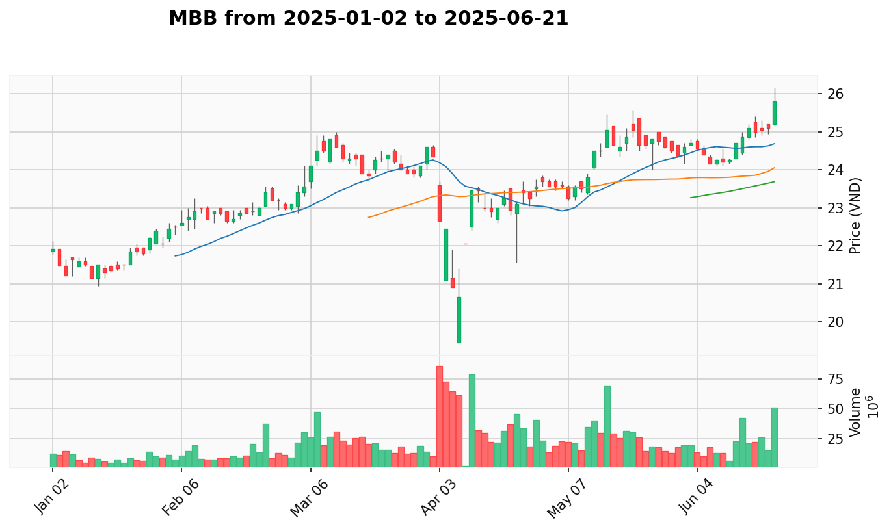

<a href="#ngan-hang">↑ Back to group NGAN_HANG</a>  |  <a href="#vpa-signal-summary">↑ Back to Top</a>

#### Key Statistics
| Metric | Value |
|:---|---:|
| Date Range | 2025-01-02 to 2025-10-17 |
| **Latest Close** | **27.1** |
| Period Open | 16.42 |
| Period High | 29.5 |
| Period Low | 14.6 |
| Period Change % | 65.04% |

**[Download MBB Data (.csv)](market_data/MBB_2025-01-02_to_2025-10-18.csv)**

---

### MBS

#### [VPA Analysis (2025-06-16 - 2025-10-16)](./VPA.md#mbs)
> **Ngày 2025-10-10:** MBS tăng từ 34.6 VND lên 34.9 VND với biên độ hẹp, đóng cửa ở giữa phiên. Khối lượng giao dịch đạt 6.6592 triệu cổ phiếu, tăng đáng kể so với phiên trước (4.337 triệu cổ phiếu). Sau phiên "Weakness" ngày 2025-10-09, giá có sự phục hồi nhẹ nhưng không thể đóng cửa ở mức cao nhất phiên dù khối lượng tăng. Điều này cho thấy lực cầu đã nỗ lực đẩy giá lên nhưng gặp phải áp lực cung đáng kể, khiến giá không thể tăng mạnh và đóng cửa ở mức trung bình. **Phân tích VPA/Wyckoff:** Effort to Rise but No Result (ERNR) - Nỗ lực tăng giá không đạt kết quả.
> **Ngày 2025-10-13:** MBS giảm từ 34.9 VND xuống 34.7 VND với biên độ tương đối rộng, đóng cửa ở mức giá mở cửa và giữa phiên. Khối lượng giao dịch đạt 6.9744 triệu cổ phiếu, tăng nhẹ so với phiên trước (6.6592 triệu cổ phiếu). Sau phiên "Nỗ lực tăng giá không đạt kết quả" ngày 2025-10-10, giá tiếp tục giảm nhẹ với khối lượng tăng cho thấy áp lực cung vẫn còn hiện hữu và lực cầu chưa đủ mạnh để đẩy giá lên. Việc giá không thể tăng dù có nỗ lực mua vào trong phiên (đóng cửa ở giữa biên độ) nhưng vẫn giảm so với phiên trước, củng cố tín hiệu suy yếu. **Phân tích VPA/Wyckoff:** Weakness - Lực cầu suy yếu và áp lực cung duy trì.
> **Ngày 2025-10-14:** MBS giảm từ 34.7 VND xuống 34.5 VND với biên độ rộng, đóng cửa gần mức thấp nhất phiên. Khối lượng giao dịch đạt 12.15 triệu cổ phiếu, tăng đột biến so với phiên trước (6.97 triệu cổ phiếu). Mặc dù giá có nỗ lực tăng mạnh lên 35.9 VND trong phiên, nhưng áp lực bán đã xuất hiện và đẩy giá xuống, cho thấy lực cung áp đảo hoàn toàn lực cầu. Điều này củng cố tín hiệu suy yếu đã xuất hiện từ phiên trước và xác nhận sự hiện diện của lực cung mạnh mẽ. **Phân tích VPA/Wyckoff:** Supply Coming In (SCI) - Lực cung áp đảo với khối lượng lớn.
> **Ngày 2025-10-15:** MBS giảm từ 34.5 VND xuống 34.0 VND với biên độ tương đối hẹp, đóng cửa gần mức thấp nhất phiên. Khối lượng giao dịch đạt 6.4345 triệu cổ phiếu, giảm đáng kể so với phiên trước (12.1501 triệu cổ phiếu). Sau phiên "Lực cung xuất hiện" ngày 2025-10-14, giá tiếp tục giảm với khối lượng thấp hơn, cho thấy áp lực bán có phần giảm bớt nhưng lực cầu vẫn chưa xuất hiện để hỗ trợ giá. Việc giá đóng cửa gần mức thấp nhất phiên củng cố tín hiệu suy yếu. **Phân tích VPA/Wyckoff:** Weakness - Lực cầu suy yếu và áp lực cung vẫn duy trì.
> **Ngày 2025-10-16:** MBS giảm từ 34.0 VND xuống 33.9 VND với biên độ hẹp, đóng cửa gần mức thấp nhất phiên. Khối lượng giao dịch đạt 2.6043 triệu cổ phiếu, giảm mạnh so với phiên trước (6.4345 triệu cổ phiếu) và thấp hơn đáng kể so với mức trung bình. Mặc dù giá tiếp tục giảm, nhưng khối lượng thấp cho thấy áp lực bán đã cạn kiệt tạm thời, tuy nhiên lực cầu vẫn chưa xuất hiện để hỗ trợ giá. Điều này củng cố tín hiệu suy yếu và cho thấy sự thiếu vắng nhu cầu mua vào ở mức giá hiện tại. **Phân tích VPA/Wyckoff:** No Demand - Thiếu vắng nhu cầu mua vào.

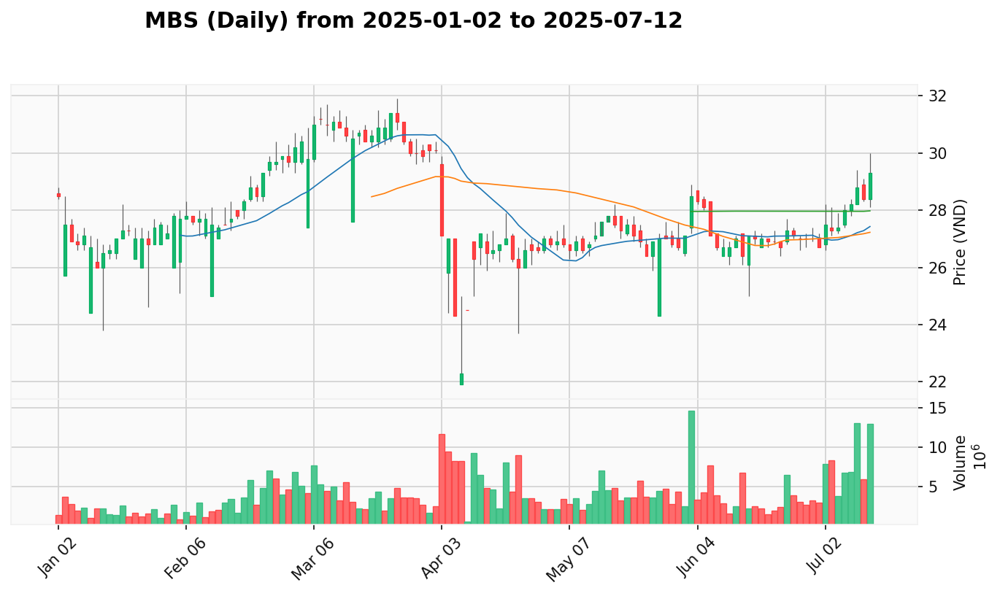

<a href="#chung-khoan">↑ Back to group CHUNG_KHOAN</a>  |  <a href="#vpa-signal-summary">↑ Back to Top</a>

#### Key Statistics
| Metric | Value |
|:---|---:|
| Date Range | 2025-01-02 to 2025-10-17 |
| **Latest Close** | **33.1** |
| Period Open | 25.04 |
| Period High | 41.31 |
| Period Low | 19.17 |
| Period Change % | 32.19% |

**[Download MBS Data (.csv)](market_data/MBS_2025-01-02_to_2025-10-18.csv)**

---

### MCH

#### [VPA Analysis (2025-06-16 - 2025-10-16)](./VPA.md#mch)
> **Ngày 2025-10-10:** MCH tăng mạnh từ 134.2 VND lên 144.1 VND. Nến ngày có biên độ rất rộng và đóng cửa gần mức cao nhất phiên. Khối lượng giao dịch đạt 0.8851 triệu cổ phiếu, tăng đột biến so với phiên trước (0.2652 triệu cổ phiếu). Sự tăng giá mạnh mẽ với khối lượng cực lớn xác nhận lực cầu áp đảo và khả năng tiếp diễn xu hướng tăng sau phiên SOS trước đó. **Phân tích VPA/Wyckoff:** Sign of Strength (SOS) - Lực cầu mạnh mẽ.
> **Ngày 2025-10-13:** MCH tiếp tục tăng mạnh từ 144.1 VND lên 151.8 VND. Nến ngày có biên độ rộng (từ 141.0 VND đến 153.0 VND) và đóng cửa gần mức cao nhất phiên. Khối lượng giao dịch đạt 0.7132 triệu cổ phiếu, giảm nhẹ so với phiên trước (0.8851 triệu cổ phiếu) nhưng vẫn ở mức cao. Sự tăng giá mạnh mẽ với khối lượng duy trì ở mức cao cho thấy lực cầu vẫn đang áp đảo, xác nhận sự tiếp diễn của xu hướng tăng sau các phiên SOS trước đó. **Phân tích VPA/Wyckoff:** Sign of Strength (SOS) - Lực cầu mạnh mẽ.
> **Ngày 2025-10-14:** MCH giảm từ 151.8 VND xuống 149.1 VND. Nến ngày có biên độ rộng nhưng đóng cửa ở nửa dưới của thân nến. Khối lượng giao dịch đạt 0.4986 triệu cổ phiếu, giảm so với phiên trước (0.7132 triệu cổ phiếu). Sau hai phiên tăng mạnh với khối lượng lớn (SOS), phiên giảm điểm với khối lượng thấp hơn cho thấy áp lực bán không quá mạnh và có thể là nhịp điều chỉnh tự nhiên hoặc chốt lời ngắn hạn trong xu hướng tăng. **Phân tích VPA/Wyckoff:** Pullback (PB) - Điều chỉnh tự nhiên trong xu hướng tăng.
> **Ngày 2025-10-15:** MCH tiếp tục điều chỉnh nhẹ từ 149.1 VND xuống 148.9 VND. Nến ngày có biên độ hẹp (từ 146.1 VND đến 149.9 VND) và đóng cửa ở giữa thân nến. Khối lượng giao dịch đạt 0.4126 triệu cổ phiếu, tiếp tục giảm so với phiên trước (0.4986 triệu cổ phiếu). Sau phiên Pullback ngày 2025-10-14, sự giảm giá nhẹ với biên độ hẹp và khối lượng thấp cho thấy áp lực bán đã suy yếu đáng kể, có thể là một nhịp kiểm tra cung hoặc thiếu cầu bán sau đợt tăng mạnh. **Phân tích VPA/Wyckoff:** No Demand (ND) - Thiếu cầu bán.
> **Ngày 2025-10-16:** MCH tăng từ 148.9 VND lên 150.0 VND. Nến ngày có biên độ hẹp (từ 148.0 VND đến 150.9 VND) và đóng cửa ở nửa trên của thân nến. Khối lượng giao dịch đạt 0.1955 triệu cổ phiếu, giảm đáng kể so với phiên trước (0.4126 triệu cổ phiếu) và rất thấp so với các phiên tăng mạnh trước đó. Sau hai phiên điều chỉnh (Pullback và No Demand), phiên tăng điểm nhẹ với khối lượng cực thấp cho thấy lực cầu yếu, không đủ mạnh để đẩy giá lên cao hơn một cách bền vững. **Phân tích VPA/Wyckoff:** No Demand (ND) - Thiếu cầu mua.

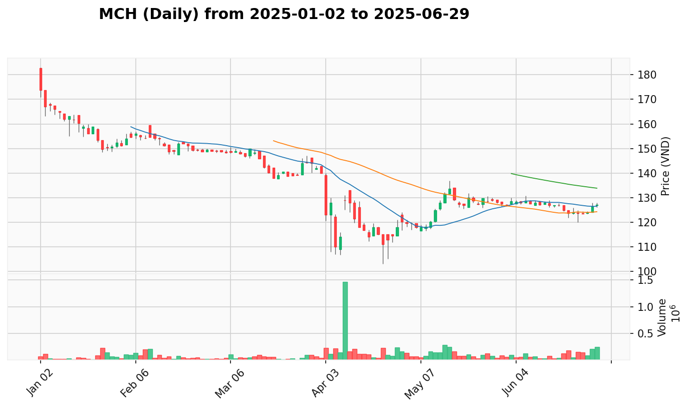

<a href="#thuc-pham">↑ Back to group THUC_PHAM</a>  |  <a href="#vpa-signal-summary">↑ Back to Top</a>

#### Key Statistics
| Metric | Value |
|:---|---:|
| Date Range | 2025-01-02 to 2025-10-17 |
| **Latest Close** | **145.6** |
| Period Open | 179.22 |
| Period High | 179.29 |
| Period Low | 100.99 |
| Period Change % | -18.76% |

**[Download MCH Data (.csv)](market_data/MCH_2025-01-02_to_2025-10-18.csv)**

---

### MCM

#### [VPA Analysis (2025-08-14 - 2025-10-16)](./VPA.md#mcm)
> **Ngày 2025-10-10:** MCM mở cửa ở mức 28.45 VND, thấp hơn so với giá đóng cửa của phiên trước, và đóng cửa ở mức 28.5 VND, giảm nhẹ so với mức 28.75 VND của phiên trước. Biên độ giá trong phiên hẹp, từ 28.4 VND đến 28.6 VND. Khối lượng giao dịch đạt 0.0172 triệu cổ phiếu, tăng so với 0.0061 triệu cổ phiếu của phiên trước. Sau hai phiên "No Supply" liên tiếp cho thấy lực cung cạn kiệt, phiên này giá giảm nhẹ với khối lượng tăng cho thấy thị trường đang kiểm tra lại lực cung. Việc giá không giảm sâu và đóng cửa ở giữa biên độ cho thấy lực cầu vẫn hiện diện. **Phân tích VPA/Wyckoff:** Test for Supply (Kiểm tra cung)
> **Ngày 2025-10-13:** MCM mở cửa ở mức 28.2 VND, thấp hơn so với giá đóng cửa của phiên trước, và đóng cửa ở mức 28.2 VND, giảm từ 28.5 VND của phiên trước. Biên độ giá trong phiên hẹp, từ 28.1 VND đến 28.4 VND, với giá đóng cửa nằm gần mức thấp nhất phiên. Đáng chú ý, khối lượng giao dịch đạt 0.0643 triệu cổ phiếu, tăng mạnh so với 0.0172 triệu cổ phiếu của phiên trước. Sau các phiên kiểm tra cung, việc giá giảm với khối lượng tăng đột biến cho thấy áp lực bán đang gia tăng và vượt trội so với lực cầu, xác nhận sự hiện diện của nguồn cung lớn trên thị trường. **Phân tích VPA/Wyckoff:** Sign of Weakness (Dấu hiệu suy yếu)
> **Ngày 2025-10-14:** MCM mở cửa ở mức 28.6 VND, cao hơn so với giá đóng cửa của phiên trước, nhưng đóng cửa ở mức 28.2 VND, bằng với giá đóng cửa của phiên trước và là mức thấp nhất trong phiên. Biên độ giá trong phiên từ 28.2 VND đến 28.8 VND. Khối lượng giao dịch đạt 0.039 triệu cổ phiếu, giảm đáng kể so với 0.0643 triệu cổ phiếu của phiên trước. Sau phiên "Dấu hiệu suy yếu" với khối lượng lớn, phiên này giá mở cửa tăng nhưng không duy trì được đà tăng và đóng cửa ở mức thấp nhất phiên với khối lượng giảm, cho thấy sự thiếu vắng lực cầu và xác nhận sự yếu kém của thị trường. **Phân tích VPA/Wyckoff:** No Demand (Không có cầu)
> **Ngày 2025-10-15:** MCM mở cửa ở mức 28.2 VND, thấp hơn giá đóng cửa phiên trước, và đóng cửa ở mức 28.1 VND, tiếp tục giảm. Biên độ giá trong phiên hẹp, từ 28.05 VND đến 28.25 VND, với giá đóng cửa nằm gần mức thấp nhất phiên. Khối lượng giao dịch đạt 0.0401 triệu cổ phiếu, tăng nhẹ so với 0.039 triệu cổ phiếu của phiên trước. Sau các phiên "Dấu hiệu suy yếu" và "Không có cầu", việc giá tiếp tục giảm với biên độ hẹp và đóng cửa ở mức thấp nhất phiên, cùng với khối lượng tăng nhẹ, cho thấy áp lực bán vẫn duy trì và lực cầu yếu, xác nhận sự yếu kém của thị trường. **Phân tích VPA/Wyckoff:** No Demand (Không có cầu)
> **Ngày 2025-10-16:** MCM mở cửa ở mức 28.15 VND, cao hơn giá đóng cửa phiên trước, và đóng cửa ở mức 28.2 VND, tăng nhẹ so với phiên trước. Biên độ giá trong phiên từ 28.05 VND đến 28.45 VND. Khối lượng giao dịch đạt 0.0166 triệu cổ phiếu, giảm đáng kể so với 0.0401 triệu cổ phiếu của phiên trước và là mức rất thấp. Sau các phiên "Không có cầu", việc giá tăng nhẹ với khối lượng cực thấp cho thấy sự thiếu vắng lực cầu mạnh mẽ, dù áp lực bán có vẻ đã giảm bớt, không xác nhận sự đảo chiều mà chỉ cho thấy sự lưỡng lự của thị trường. **Phân tích VPA/Wyckoff:** No Demand (Không có cầu)

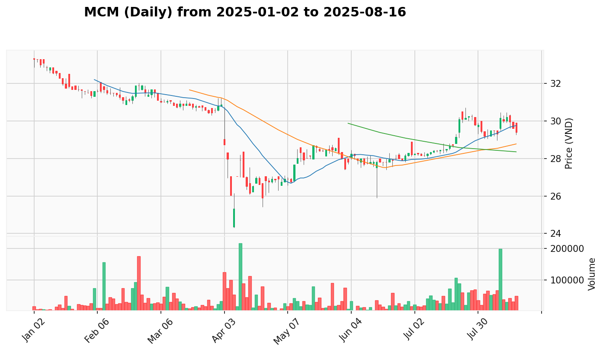

<a href="#thuc-pham">↑ Back to group THUC_PHAM</a>  |  <a href="#vpa-signal-summary">↑ Back to Top</a>

#### Key Statistics
| Metric | Value |
|:---|---:|
| Date Range | 2025-01-02 to 2025-10-17 |
| **Latest Close** | **27.95** |
| Period Open | 33.33 |
| Period High | 33.33 |
| Period Low | 24.3 |
| Period Change % | -16.14% |

**[Download MCM Data (.csv)](market_data/MCM_2025-01-02_to_2025-10-18.csv)**

---

### MFS

#### [VPA Analysis (2025-08-04 - 2025-10-16)](./VPA.md#mfs)
> **Ngày 2025-10-10:** MFS mở cửa tại 40.4 VND và đóng cửa tại 40.2 VND, với khối lượng giao dịch đạt 0.0201 triệu cổ phiếu. Cây nến giảm có biên độ trung bình, đóng cửa thấp hơn giá mở cửa và thấp hơn giá đóng cửa phiên trước, cho thấy áp lực bán đã gia tăng. So với phiên trước (Test), giá giảm với khối lượng giao dịch tăng đáng kể, điều này cho thấy lực cầu không đủ mạnh để hấp thụ nguồn cung mới xuất hiện, hoặc nguồn cung chưa thực sự cạn kiệt như phiên Test đã chỉ ra. Đây là dấu hiệu của sự yếu kém khi giá giảm trên khối lượng cao. **Phân tích VPA/Wyckoff:** Sign of Weakness (SOW) - Giá giảm trên khối lượng cao sau phiên Test, cho thấy nguồn cung đã quay trở lại và chiếm ưu thế.
> **Ngày 2025-10-13:** MFS giảm từ 40.2 VND xuống 40.0 VND với khối lượng giao dịch đạt 0.0382 triệu cổ phiếu. Cây nến giảm có biên độ trung bình, mở cửa tại mức cao nhất và đóng cửa gần mức thấp nhất phiên, cho thấy áp lực bán mạnh mẽ. So với phiên trước (SOW), giá tiếp tục giảm với khối lượng giao dịch tăng đáng kể, xác nhận nguồn cung đang chiếm ưu thế và lực cầu yếu. **Phân tích VPA/Wyckoff:** Sign of Weakness (SOW) - Giá tiếp tục giảm trên khối lượng cao, xác nhận nguồn cung mạnh mẽ.
> **Ngày 2025-10-14:** MFS mở cửa tại 40.4 VND và đóng cửa tại 40.1 VND, giảm 0.3 VND trong phiên. So với giá đóng cửa phiên trước (40.0 VND), giá đóng cửa phiên này tăng nhẹ lên 40.1 VND. Khối lượng giao dịch đạt 0.0302 triệu cổ phiếu, thấp hơn đáng kể so với phiên trước (0.0382 triệu cổ phiếu). Sau hai phiên giảm giá mạnh với khối lượng cao (SOW), việc giá đóng cửa tăng nhẹ nhưng vẫn là một cây nến giảm với khối lượng thấp hơn cho thấy áp lực bán đã tạm thời giảm bớt, nhưng lực cầu vẫn còn yếu và chưa đủ mạnh để đẩy giá lên cao. **Phân tích VPA/Wyckoff:** No Demand (Thiếu vắng nhu cầu) - Giá đóng cửa tăng nhẹ trên khối lượng thấp sau các phiên SOW, cho thấy lực cầu yếu.
> **Ngày 2025-10-15:** MFS giảm từ 40.1 VND xuống 39.6 VND với khối lượng giao dịch đạt 0.0101 triệu cổ phiếu. Cây nến giảm có biên độ trung bình và đóng cửa gần mức thấp nhất phiên, cho thấy áp lực bán tiếp diễn. So với phiên trước (No Demand), giá tiếp tục giảm với khối lượng giao dịch rất thấp, xác nhận sự thiếu vắng lực cầu và nguồn cung vẫn đang kiểm soát. **Phân tích VPA/Wyckoff:** Continued Weakness (Tiếp diễn suy yếu) - Giá giảm trên khối lượng rất thấp, cho thấy lực cầu yếu và thị trường vẫn đang trong giai đoạn suy yếu.
> **Ngày 2025-10-16:** MFS mở cửa tại 40.0 VND và đóng cửa tại 39.8 VND, giảm 0.2 VND trong phiên. So với giá đóng cửa phiên trước (39.6 VND), giá đóng cửa phiên này tăng nhẹ lên 39.8 VND. Khối lượng giao dịch đạt 0.006 triệu cổ phiếu, thấp hơn đáng kể so với phiên trước (0.0101 triệu cổ phiếu) và là mức rất thấp. Sau các phiên suy yếu liên tiếp, việc giá đóng cửa tăng nhẹ nhưng vẫn là một cây nến giảm với khối lượng cực thấp cho thấy áp lực bán đã giảm nhưng lực cầu vẫn rất yếu và chưa có sự tham gia đáng kể. Điều này xác nhận sự thiếu vắng nhu cầu trên thị trường. **Phân tích VPA/Wyckoff:** No Demand (Thiếu vắng nhu cầu)

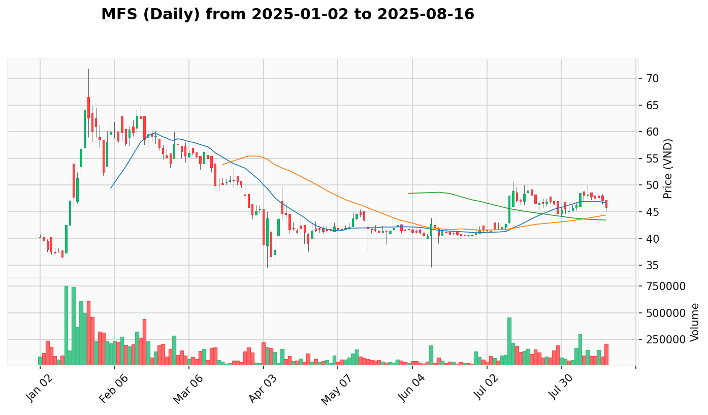

<a href="#cong-nghe">↑ Back to group CONG_NGHE</a>  |  <a href="#vpa-signal-summary">↑ Back to Top</a>

#### Key Statistics
| Metric | Value |
|:---|---:|
| Date Range | 2025-01-02 to 2025-10-17 |
| **Latest Close** | **41.0** |
| Period Open | 40.1 |
| Period High | 71.8 |
| Period Low | 34.5 |
| Period Change % | 2.24% |

**[Download MFS Data (.csv)](market_data/MFS_2025-01-02_to_2025-10-18.csv)**

---

### MHC

#### [VPA Analysis (2025-08-14 - 2025-10-16)](./VPA.md#mhc)
> **Ngày 2025-10-10:** MHC mở cửa ở mức 13.8 VND và đóng cửa ở mức 14.75 VND, tăng mạnh so với phiên trước (13.8 VND). Khối lượng giao dịch đạt 0.949 triệu cổ phiếu, tăng đột biến so với phiên trước (0.2811 triệu cổ phiếu). Cây nến tăng có biên độ rộng và đóng cửa ở mức cao nhất phiên, cho thấy lực cầu áp đảo hoàn toàn lực cung. Sự tăng giá mạnh mẽ đi kèm với khối lượng giao dịch lớn xác nhận sự hiện diện của dòng tiền lớn và tiếp tục xu hướng tăng giá. **Phân tích VPA/Wyckoff:** Sign of Strength (SOS) - Giá tăng mạnh với khối lượng đột biến, xác nhận lực cầu mạnh mẽ và tiếp tục xu hướng tăng.
> **Ngày 2025-10-13:** MHC mở cửa ở mức 14.75 VND, đạt mức cao nhất 15.0 VND và đóng cửa ở 14.75 VND, giữ nguyên mức giá đóng cửa của phiên trước. Khối lượng giao dịch đạt 0.3988 triệu cổ phiếu, giảm đáng kể so với phiên trước (0.949 triệu cổ phiếu). Sau hai phiên tăng giá mạnh mẽ với khối lượng đột biến, phiên này cho thấy sự chững lại của đà tăng. Giá duy trì ở mức cao nhưng với khối lượng thấp hơn nhiều, cho thấy lực cầu tạm thời suy yếu và thiếu sự tiếp diễn của đà tăng. **Phân tích VPA/Wyckoff:** Thiếu cầu (Lack of Demand)
> **Ngày 2025-10-14:** MHC mở cửa ở mức 14.3 VND, đạt mức cao nhất 15.3 VND nhưng sau đó giảm mạnh và đóng cửa ở mức thấp nhất phiên là 14.15 VND. So với phiên trước, giá đóng cửa giảm đáng kể. Khối lượng giao dịch đạt 0.6545 triệu cổ phiếu, tăng mạnh so với phiên trước (0.3988 triệu cổ phiếu). Cây nến giảm có biên độ rộng và đóng cửa ở mức thấp nhất phiên, đi kèm với khối lượng tăng cao, cho thấy áp lực bán mạnh mẽ và sự xuất hiện của nguồn cung lớn trên thị trường. Điều này xác nhận sự suy yếu của lực cầu đã được ghi nhận ở phiên trước và cho thấy khả năng đảo chiều xu hướng. **Phân tích VPA/Wyckoff:** Sign of Weakness (SOW) - Lực cung áp đảo với khối lượng gia tăng, xác nhận sự suy yếu của xu hướng tăng và khả năng đảo chiều.
> **Ngày 2025-10-15:** MHC mở cửa ở mức 14.25 VND, đạt mức cao nhất 15.0 VND và đóng cửa ở 14.4 VND. So với phiên trước, giá đóng cửa tăng nhẹ từ 14.15 VND lên 14.4 VND. Tuy nhiên, khối lượng giao dịch chỉ đạt 0.3653 triệu cổ phiếu, giảm đáng kể so với phiên bán tháo mạnh mẽ trước đó (0.6545 triệu cổ phiếu). Cây nến tăng giá với biên độ hẹp và khối lượng thấp cho thấy lực cầu yếu ớt và không đủ sức để đảo ngược xu hướng giảm đã được xác nhận ở phiên trước. Đây là dấu hiệu của sự thiếu vắng nhu cầu mua sau một phiên bán mạnh, củng cố thêm sự suy yếu của thị trường. **Phân tích VPA/Wyckoff:** No Demand (Thiếu cầu) - Lực cầu yếu ớt với khối lượng thấp sau phiên bán tháo, xác nhận sự suy yếu của thị trường.
> **Ngày 2025-10-16:** MHC mở cửa ở mức 14.5 VND, đạt mức cao nhất 14.85 VND và đóng cửa ở 14.55 VND. So với phiên trước, giá đóng cửa tăng nhẹ từ 14.4 VND lên 14.55 VND. Tuy nhiên, khối lượng giao dịch chỉ đạt 0.1161 triệu cổ phiếu, giảm mạnh so với phiên trước (0.3653 triệu cổ phiếu) và là mức rất thấp. Cây nến tăng giá với biên độ hẹp và khối lượng cực thấp cho thấy lực cầu tiếp tục yếu ớt và không đủ sức để đảo ngược xu hướng giảm đã được xác nhận ở các phiên trước. Điều này củng cố thêm sự thiếu vắng nhu cầu mua và sự suy yếu của thị trường. **Phân tích VPA/Wyckoff:** No Demand (Thiếu cầu) - Lực cầu yếu ớt với khối lượng cực thấp sau các phiên suy yếu, xác nhận sự thiếu vắng nhu cầu mua và thị trường tiếp tục yếu.

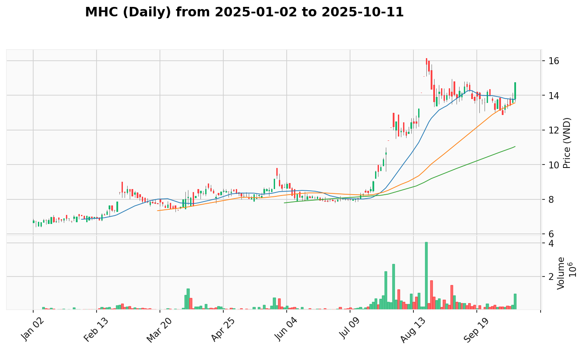

<a href="#van-tai">↑ Back to group VAN_TAI</a>  |  <a href="#vpa-signal-summary">↑ Back to Top</a>

#### Key Statistics
| Metric | Value |
|:---|---:|
| Date Range | 2025-01-02 to 2025-10-17 |
| **Latest Close** | **14.05** |
| Period Open | 6.65 |
| Period High | 16.15 |
| Period Low | 6.4 |
| Period Change % | 111.28% |

**[Download MHC Data (.csv)](market_data/MHC_2025-01-02_to_2025-10-18.csv)**

---

### MIG

#### [VPA Analysis (2025-08-04 - 2025-10-16)](./VPA.md#mig)
> **Ngày 2025-10-10:** MIG giảm từ 16.75 VND xuống 16.55 VND, đóng cửa gần mức thấp nhất phiên với biên độ vừa phải. Khối lượng giao dịch đạt 0.1868 triệu cổ phiếu, giảm so với phiên trước (0.2614 triệu cổ phiếu). Sau phiên "Nguồn cung xuất hiện" với áp lực bán mạnh, việc giá tiếp tục giảm trên khối lượng thấp cho thấy lực bán có phần suy yếu nhưng đồng thời cũng không có lực cầu đáng kể để hỗ trợ giá, xác nhận sự yếu kém của thị trường. **Phân tích VPA/Wyckoff:** Không có cầu (No Demand)
> **Ngày 2025-10-13:** MIG giảm từ 16.55 VND xuống 16.35 VND, đóng cửa gần mức thấp nhất phiên với biên độ hẹp. Khối lượng giao dịch đạt 0.2918 triệu cổ phiếu, tăng đáng kể so với phiên trước (0.1868 triệu cổ phiếu). Sau phiên "Không có cầu", việc giá tiếp tục giảm với biên độ hẹp và đóng cửa gần mức thấp nhất phiên trên khối lượng gia tăng cho thấy áp lực bán vẫn mạnh mẽ và nguồn cung đang tiếp tục chiếm ưu thế, xác nhận sự yếu kém của thị trường. **Phân tích VPA/Wyckoff:** Nguồn cung tiếp diễn
> **Ngày 2025-10-14:** MIG giảm từ 16.35 VND xuống 16.0 VND, đóng cửa gần mức thấp nhất phiên với biên độ rộng. Khối lượng giao dịch đạt 0.5078 triệu cổ phiếu, tăng mạnh so với phiên trước (0.2918 triệu cổ phiếu). Sau phiên "Nguồn cung tiếp diễn", việc giá tiếp tục giảm mạnh với biên độ rộng và đóng cửa gần mức thấp nhất phiên trên khối lượng gia tăng đột biến cho thấy áp lực bán cực lớn và nguồn cung đang áp đảo hoàn toàn, xác nhận sự yếu kém nghiêm trọng của thị trường. **Phân tích VPA/Wyckoff:** Nguồn cung áp đảo
> **Ngày 2025-10-15:** MIG giảm từ 16.0 VND xuống 15.9 VND, đóng cửa bằng giá mở cửa với biên độ hẹp. Khối lượng giao dịch đạt 0.2379 triệu cổ phiếu, giảm mạnh so với phiên trước (0.5078 triệu cổ phiếu). Sau hai phiên giảm mạnh với nguồn cung áp đảo, việc giá tiếp tục giảm nhẹ với biên độ hẹp và khối lượng giảm cho thấy áp lực bán đã tạm lắng nhưng không có lực cầu đủ mạnh để đẩy giá lên, xác nhận sự yếu kém của thị trường. **Phân tích VPA/Wyckoff:** Không có cầu
> **Ngày 2025-10-16:** MIG giảm từ 15.85 VND xuống 15.75 VND, đóng cửa gần mức thấp nhất phiên với biên độ hẹp. Khối lượng giao dịch đạt 0.0726 triệu cổ phiếu, giảm mạnh so với phiên trước (0.2379 triệu cổ phiếu). Sau các phiên giảm mạnh với nguồn cung áp đảo và không có cầu, việc giá tiếp tục giảm nhẹ với biên độ hẹp và khối lượng cực thấp cho thấy áp lực bán đã cạn kiệt nhưng lực cầu vẫn hoàn toàn vắng bóng, xác nhận sự yếu kém tiếp diễn của thị trường. **Phân tích VPA/Wyckoff:** Không có cầu

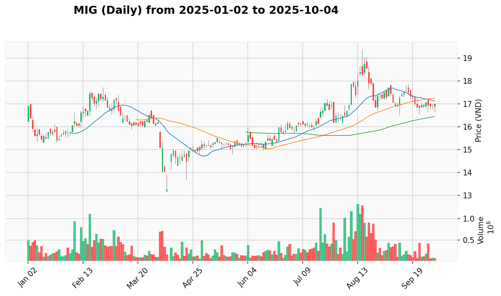

<a href="#bao-hiem">↑ Back to group BAO_HIEM</a>  |  <a href="#vpa-signal-summary">↑ Back to Top</a>

#### Key Statistics
| Metric | Value |
|:---|---:|
| Date Range | 2025-01-02 to 2025-10-17 |
| **Latest Close** | **15.9** |
| Period Open | 16.23 |
| Period High | 19.39 |
| Period Low | 13.17 |
| Period Change % | -2.03% |

**[Download MIG Data (.csv)](market_data/MIG_2025-01-02_to_2025-10-18.csv)**

---

### MPC

#### [VPA Analysis (2025-06-26 - 2025-10-16)](./VPA.md#mpc)
> **Ngày 2025-10-10:** MPC giảm từ 16.5 VND xuống 16.2 VND với biên độ giá rộng và đóng cửa ở mức thấp nhất phiên. Khối lượng giao dịch đạt 0.1277 triệu cổ phiếu, tăng đáng kể so với phiên trước (0.0621 triệu cổ phiếu). Sau phiên "Áp lực bán" vào ngày 2025-10-09, việc giá giảm mạnh với khối lượng tăng đột biến cho thấy áp lực cung rất lớn và sự hoảng loạn của người bán. Điều này xác nhận xu hướng giảm giá đang tiếp diễn mạnh mẽ. **Phân tích VPA/Wyckoff:** Selling Climax (Đỉnh điểm bán tháo)
> **Ngày 2025-10-13:** MPC tăng từ 16.2 VND lên 16.5 VND với biên độ giá hẹp và đóng cửa ở giữa phiên. Khối lượng giao dịch đạt 0.0507 triệu cổ phiếu, giảm đáng kể so với phiên trước (0.1277 triệu cổ phiếu). Sau phiên "Đỉnh điểm bán tháo" vào ngày 2025-10-10, việc giá tăng nhẹ với khối lượng thấp cho thấy áp lực bán đã tạm thời giảm bớt, nhưng lực cầu vẫn còn yếu và chưa đủ mạnh để đẩy giá lên cao. Điều này có thể là một nhịp hồi phục kỹ thuật hoặc một đợt kiểm tra cung sau đợt bán tháo. **Phân tích VPA/Wyckoff:** No Demand (Không có cầu)
> **Ngày 2025-10-14:** MPC giảm từ 16.5 VND xuống 16.3 VND với biên độ giá rộng và đóng cửa gần mức thấp nhất phiên. Khối lượng giao dịch đạt 0.0843 triệu cổ phiếu, tăng so với phiên trước (0.0507 triệu cổ phiếu). Sau phiên "Không có cầu" vào ngày 2025-10-13, việc giá giảm với khối lượng gia tăng cho thấy áp lực cung đang quay trở lại hoặc tiếp diễn, và lực cầu vẫn còn yếu. Điều này xác nhận sự yếu kém của thị trường sau đợt bán tháo. **Phân tích VPA/Wyckoff:** Weakness (Sự yếu kém)
> **Ngày 2025-10-15:** MPC giữ giá ở mức 16.3 VND với biên độ giá hẹp (từ 16.0 VND đến 16.5 VND) và đóng cửa ở giữa phiên. Khối lượng giao dịch đạt 0.0423 triệu cổ phiếu, giảm đáng kể so với phiên trước (0.0843 triệu cổ phiếu). Sau phiên "Sự yếu kém" vào ngày 2025-10-14, việc giá đi ngang với khối lượng thấp cho thấy áp lực bán đã tạm thời chững lại, nhưng lực cầu vẫn còn rất yếu và chưa có dấu hiệu tham gia mạnh mẽ. Điều này có thể là một giai đoạn tạm dừng trong xu hướng giảm, nhưng không có sự hỗ trợ từ lực mua. **Phân tích VPA/Wyckoff:** No Demand (Không có cầu)
> **Ngày 2025-10-16:** MPC tăng từ 16.1 VND lên 16.4 VND với biên độ giá hẹp và đóng cửa ở mức cao nhất phiên. Khối lượng giao dịch đạt 0.0059 triệu cổ phiếu, giảm mạnh so với phiên trước (0.0423 triệu cổ phiếu) và là mức cực thấp. Sau phiên "Không có cầu" vào ngày 2025-10-15, việc giá tăng nhẹ với khối lượng cực thấp cho thấy áp lực cung đã cạn kiệt tạm thời, nhưng lực cầu vẫn chưa thực sự tham gia mạnh mẽ. Điều này có thể là một dấu hiệu cho thấy thị trường đang kiểm tra mức cung, nhưng chưa xác nhận sự đảo chiều. **Phân tích VPA/Wyckoff:** No Supply (Không có cung)

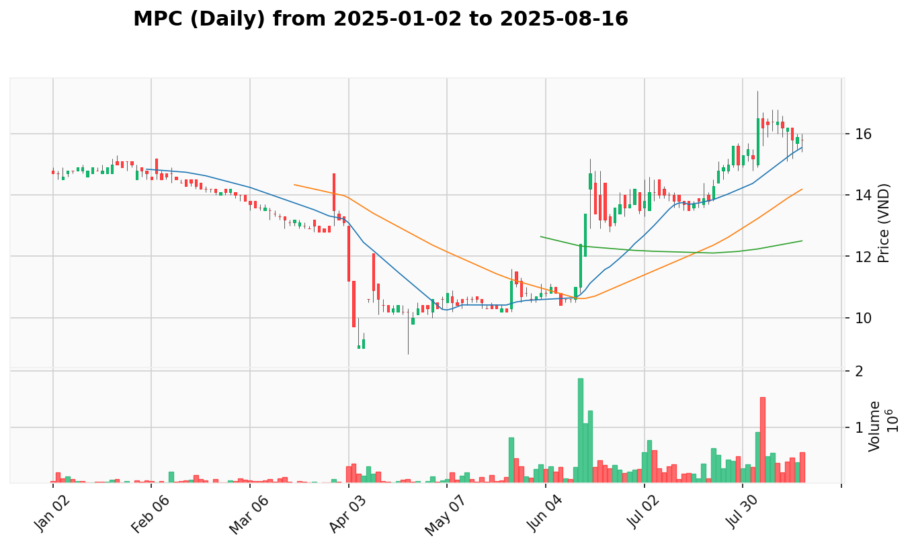

<a href="#thuy-san">↑ Back to group THUY_SAN</a>  |  <a href="#vpa-signal-summary">↑ Back to Top</a>

#### Key Statistics
| Metric | Value |
|:---|---:|
| Date Range | 2025-01-02 to 2025-10-17 |
| **Latest Close** | **16.4** |
| Period Open | 14.8 |
| Period High | 17.8 |
| Period Low | 8.8 |
| Period Change % | 10.81% |

**[Download MPC Data (.csv)](market_data/MPC_2025-01-02_to_2025-10-18.csv)**

---

### MSB

#### [VPA Analysis (2025-08-05 - 2025-10-16)](./VPA.md#msb)
> **Ngày 2025-10-10:** MSB mở cửa ở mức 13.7 VND, giá dao động trong biên độ từ 13.55 VND đến 13.8 VND và đóng cửa ở mức 13.7 VND, bằng với giá đóng cửa phiên trước. Khối lượng giao dịch đạt 10.6654 triệu cổ phiếu, giảm so với phiên trước (11.6741 triệu cổ phiếu). Sau hai phiên Lực cầu mạnh mẽ (SOS), phiên này cho thấy giá đi ngang với biên độ hẹp và khối lượng sụt giảm. Điều này báo hiệu lực cầu đã chững lại, không còn đủ mạnh để đẩy giá lên cao hơn, cho thấy sự thiếu hụt nhu cầu mua ở mức giá hiện tại. **Phân tích VPA/Wyckoff:** No Demand (Thiếu cầu).
> **Ngày 2025-10-13:** MSB mở cửa ở mức 13.45 VND, giá dao động trong biên độ từ 13.4 VND đến 13.6 VND và đóng cửa ở mức 13.45 VND, thấp hơn giá đóng cửa phiên trước (13.7 VND). Khối lượng giao dịch đạt 9.756 triệu cổ phiếu, giảm so với phiên trước (10.6654 triệu cổ phiếu). Sau phiên Thiếu cầu (No Demand) ngày 2025-10-10, phiên này cho thấy giá giảm nhẹ với biên độ hẹp và đóng cửa ở mức mở cửa, đi kèm với khối lượng giao dịch sụt giảm. Điều này cho thấy áp lực bán không mạnh, nhưng lực cầu cũng chưa quay trở lại để đẩy giá lên. Đây có thể là một phiên kiểm tra nguồn cung, cho thấy thị trường đang thiếu cả cung và cầu ở mức giá hiện tại. **Phân tích VPA/Wyckoff:** No Supply (Thiếu cung).
> **Ngày 2025-10-14:** MSB mở cửa ở mức 13.5 VND, giá dao động trong biên độ từ 13.25 VND đến 13.65 VND và đóng cửa ở mức 13.25 VND, thấp hơn giá đóng cửa phiên trước (13.45 VND) và là mức thấp nhất trong phiên. Khối lượng giao dịch đạt 11.7449 triệu cổ phiếu, tăng đáng kể so với phiên trước (9.756 triệu cổ phiếu). Sau hai phiên Thiếu cầu (No Demand) và Thiếu cung (No Supply), phiên này cho thấy giá giảm mạnh với biên độ rộng và đóng cửa ở mức thấp nhất phiên, đi kèm với khối lượng giao dịch gia tăng. Điều này báo hiệu áp lực bán mạnh mẽ đang chiếm ưu thế trên thị trường. **Phân tích VPA/Wyckoff:** Sign of Weakness (SOW) - Lực cung mạnh mẽ.
> **Ngày 2025-10-15:** MSB mở cửa ở mức 13.3 VND, giá dao động trong biên độ từ 13.2 VND đến 13.45 VND và đóng cửa ở mức 13.25 VND, bằng với giá đóng cửa phiên trước (13.25 VND). Biên độ giá hẹp và giá đóng cửa ở mức thấp của phiên. Khối lượng giao dịch đạt 6.344 triệu cổ phiếu, giảm đáng kể so với phiên trước (11.7449 triệu cổ phiếu). Sau phiên Sign of Weakness (SOW) mạnh mẽ ngày 2025-10-14, phiên này cho thấy giá đi ngang với biên độ hẹp và khối lượng giao dịch sụt giảm mạnh. Điều này cho thấy áp lực bán đã tạm thời giảm bớt, nhưng lực cầu cũng chưa xuất hiện để đẩy giá lên. Đây là dấu hiệu của sự thiếu vắng cả cung và cầu, thường xuất hiện sau một đợt giảm giá mạnh, cho thấy thị trường đang trong giai đoạn tạm lắng. **Phân tích VPA/Wyckoff:** No Demand (Thiếu cầu).
> **Ngày 2025-10-16:** MSB mở cửa ở mức 13.25 VND, giá dao động trong biên độ từ 13.1 VND đến 13.3 VND và đóng cửa ở mức 13.15 VND, thấp hơn giá đóng cửa phiên trước (13.25 VND) và gần mức thấp nhất trong phiên. Khối lượng giao dịch đạt 13.6486 triệu cổ phiếu, tăng đáng kể so với phiên trước (6.344 triệu cổ phiếu). Sau phiên Thiếu cầu (No Demand) ngày 2025-10-15, phiên này cho thấy giá tiếp tục giảm với biên độ hẹp nhưng đóng cửa ở mức thấp của phiên, đi kèm với khối lượng giao dịch gia tăng mạnh. Điều này cho thấy áp lực bán đã quay trở lại và đang chiếm ưu thế, xác nhận sự yếu kém của thị trường. **Phân tích VPA/Wyckoff:** Sign of Weakness (SOW) - Lực cung mạnh mẽ.

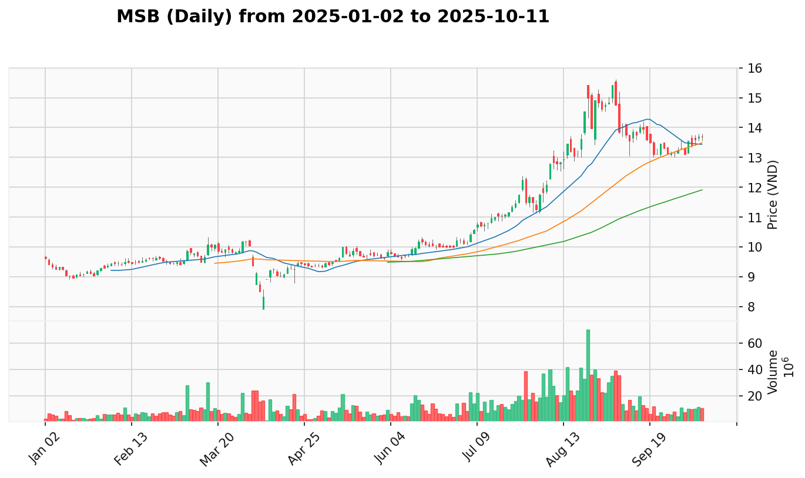

<a href="#ngan-hang">↑ Back to group NGAN_HANG</a>  |  <a href="#vpa-signal-summary">↑ Back to Top</a>

#### Key Statistics
| Metric | Value |
|:---|---:|
| Date Range | 2025-01-02 to 2025-10-17 |
| **Latest Close** | **13.05** |
| Period Open | 9.67 |
| Period High | 15.62 |
| Period Low | 7.92 |
| Period Change % | 34.95% |

**[Download MSB Data (.csv)](market_data/MSB_2025-01-02_to_2025-10-18.csv)**

---

### MSH

#### [VPA Analysis (2025-06-26 - 2025-10-16)](./VPA.md#msh)
> **Ngày 2025-10-10:** MSH mở cửa ở 34.7 VND và đóng cửa ở mức tương tự 34.7 VND, không thay đổi so với phiên trước. Cây nến có biên độ hẹp (spread 0.4 điểm), cho thấy sự lưỡng lự của thị trường. Khối lượng giao dịch đạt 0.1246 triệu cổ phiếu, cao hơn đáng kể so với phiên trước (0.0919 triệu cổ phiếu). Sau hai phiên liên tiếp cho thấy nỗ lực tăng giá không thành và áp lực cung, việc giá không thể tăng dù khối lượng giao dịch gia tăng cho thấy nguồn cung vẫn đang hiện diện mạnh mẽ và hấp thụ lực cầu, ngăn cản giá đi lên. Điều này xác nhận sự yếu kém tiếp diễn của thị trường. **Phân tích VPA/Wyckoff:** Supply (Nguồn cung)
> **Ngày 2025-10-13:** MSH tăng từ 34.5 VND lên 35.2 VND với cây nến có biên độ rộng (spread 1.1 điểm), mở cửa ở 34.5, test cao lên 35.6 và thấp xuống 34.5 trước khi đóng cửa ở 35.2. Khối lượng giao dịch đạt 0.1792 triệu cổ phiếu, cao hơn đáng kể so với phiên trước (0.1246 triệu cổ phiếu). Sau hai phiên liên tiếp cho thấy áp lực cung, phiên này cho thấy lực cầu đã quay trở lại và hấp thụ nguồn cung, đẩy giá tăng mạnh với khối lượng gia tăng. Điều này cho thấy sự xuất hiện của lực cầu mạnh mẽ trên thị trường. **Phân tích VPA/Wyckoff:** Sign of Strength (SOS) - Lực cầu mạnh mẽ
> **Ngày 2025-10-14:** MSH mở cửa ở 35.2 VND và đóng cửa ở 34.6 VND, giảm mạnh so với phiên trước. Cây nến có biên độ rộng (0.65 điểm) và đóng cửa ở mức thấp nhất phiên, cho thấy áp lực bán mạnh mẽ. Khối lượng giao dịch đạt 0.0944 triệu cổ phiếu, thấp hơn đáng kể so với 0.1792 triệu cổ phiếu của phiên SOS trước đó. Sau một phiên tăng giá mạnh mẽ (SOS), việc giá đảo chiều giảm sâu với biên độ rộng và đóng cửa ở mức thấp nhất phiên, dù khối lượng thấp hơn, cho thấy lực cầu không được duy trì và nguồn cung đã xuất hiện trở lại, đẩy giá xuống. Điều này báo hiệu sự yếu kém của thị trường. **Phân tích VPA/Wyckoff:** Weakness (Yếu kém)
> **Ngày 2025-10-15:** MSH giảm từ 34.6 VND xuống 34.35 VND với cây nến có biên độ rộng (spread 0.55 điểm), mở cửa ở 34.55, test cao lên 34.7 và thấp xuống 34.15 trước khi đóng cửa ở 34.35, gần mức thấp nhất phiên. Khối lượng giao dịch đạt 0.1821 triệu cổ phiếu, cao hơn đáng kể so với phiên trước (0.0944 triệu cổ phiếu) và cao hơn cả phiên SOS (0.1792 triệu cổ phiếu). Sau phiên giảm giá với khối lượng thấp vào ngày 2025-10-14, phiên này giá tiếp tục giảm mạnh với khối lượng gia tăng đột biến, cho thấy áp lực bán rất mạnh và nguồn cung đang chiếm ưu thế hoàn toàn trên thị trường. Lực cầu đã không thể hấp thụ được lượng cung lớn này. **Phân tích VPA/Wyckoff:** Sign of Weakness (SOW) - Lực cung mạnh mẽ
> **Ngày 2025-10-16:** MSH giảm từ 34.35 VND xuống 34.3 VND với cây nến có biên độ hẹp (0.25 điểm) và đóng cửa gần mức thấp nhất phiên. Khối lượng giao dịch đạt 0.0283 triệu cổ phiếu, thấp hơn đáng kể so với phiên trước (0.1821 triệu cổ phiếu). Sau hai phiên giảm giá mạnh mẽ với khối lượng cao, phiên này giá tiếp tục giảm nhẹ nhưng với khối lượng cực kỳ thấp, cho thấy áp lực bán đã suy yếu đáng kể. Tuy nhiên, việc giá vẫn đóng cửa ở mức thấp và không có sự xuất hiện của lực cầu mạnh mẽ cho thấy thị trường vẫn đang trong giai đoạn yếu kém và chưa có dấu hiệu phục hồi rõ ràng. **Phân tích VPA/Wyckoff:** No Demand (Không có cầu) - Áp lực bán suy yếu nhưng lực cầu chưa xuất hiện.

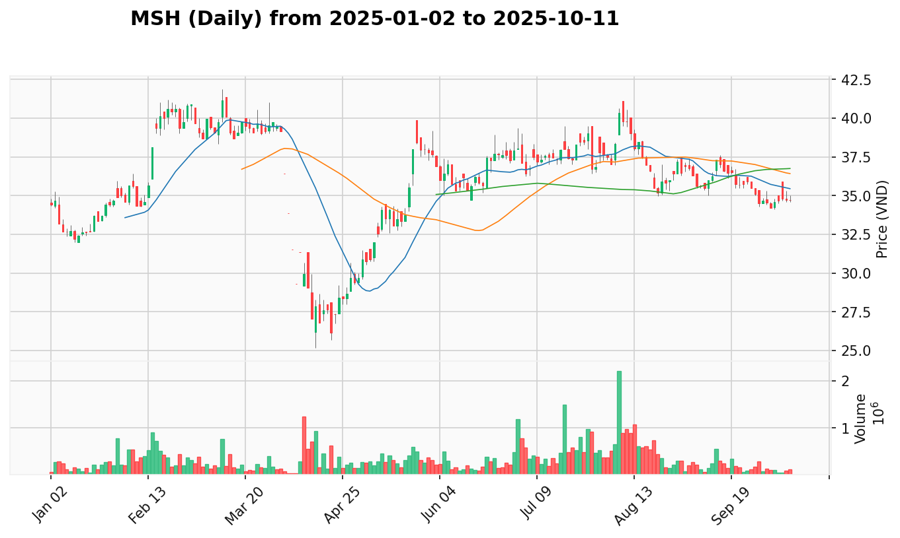

<a href="#det-may">↑ Back to group DET_MAY</a>  |  <a href="#vpa-signal-summary">↑ Back to Top</a>

#### Key Statistics
| Metric | Value |
|:---|---:|
| Date Range | 2025-01-02 to 2025-10-17 |
| **Latest Close** | **34.25** |
| Period Open | 34.54 |
| Period High | 41.87 |
| Period Low | 25.17 |
| Period Change % | -0.84% |

**[Download MSH Data (.csv)](market_data/MSH_2025-01-02_to_2025-10-18.csv)**

---

### MSN

#### [VPA Analysis (2025-06-13 - 2025-10-16)](./VPA.md#msn)
> **Ngày 2025-10-10:** MSN mở cửa tại 83.5 VND, tăng lên 84.2 VND và đóng cửa tại 84.1 VND, cao hơn 1.0 VND so với phiên trước. Cây nến tăng có biên độ rộng (1.2 VND) và đóng cửa gần mức cao nhất phiên, cho thấy lực cầu mạnh mẽ đã chiếm ưu thế. Khối lượng giao dịch đạt 13.4521 triệu cổ phiếu, tăng vọt so với phiên trước (7.3296 triệu cổ phiếu) và cao hơn mức trung bình gần đây. Sự tăng giá mạnh mẽ đi kèm với khối lượng lớn cho thấy lực cầu đã hấp thụ thành công áp lực bán và đẩy giá lên, xác nhận xu hướng tăng tiềm năng, phủ nhận tín hiệu yếu kém của các phiên trước. **Phân tích VPA/Wyckoff:** Sign of Strength (SOS) - Lực cầu mạnh mẽ.
> **Ngày 2025-10-13:** MSN mở cửa tại 83.6 VND, tăng lên 85.8 VND và giảm xuống 83.6 VND, đóng cửa tại 85.0 VND. Giá tăng từ 84.1 VND lên 85.0 VND so với phiên trước. Cây nến tăng có biên độ rộng (2.2 VND) và đóng cửa gần mức cao nhất phiên, cho thấy lực cầu tiếp tục chiếm ưu thế. Khối lượng giao dịch đạt 12.6323 triệu cổ phiếu, giảm nhẹ so với phiên trước (13.4521 triệu cổ phiếu) nhưng vẫn ở mức cao, xác nhận sự tiếp diễn của lực cầu mạnh mẽ sau tín hiệu SOS của phiên trước. Điều này cho thấy thị trường đang hấp thụ tốt nguồn cung và duy trì đà tăng. **Phân tích VPA/Wyckoff:** Sign of Strength (SOS) - Lực cầu tiếp diễn.
> **Ngày 2025-10-14:** MSN mở cửa tại 85.6 VND, tăng lên 85.6 VND và giảm xuống 82.5 VND, đóng cửa tại 82.5 VND. Giá giảm từ 85.0 VND xuống 82.5 VND so với phiên trước. Cây nến giảm có biên độ rộng (3.1 VND) và đóng cửa tại mức thấp nhất phiên, cho thấy lực cung đã chiếm ưu thế hoàn toàn. Khối lượng giao dịch đạt 12.7803 triệu cổ phiếu, tăng nhẹ so với phiên trước (12.6323 triệu cổ phiếu) và vẫn ở mức cao. Sự giảm giá mạnh mẽ đi kèm với khối lượng cao cho thấy áp lực bán ra lớn, phủ nhận tín hiệu SOS của các phiên trước và cho thấy sự thay đổi trong động lực thị trường. **Phân tích VPA/Wyckoff:** Sign of Weakness (SOW) - Lực cung mạnh mẽ.
> **Ngày 2025-10-15:** MSN mở cửa tại 83.0 VND, tăng lên 83.7 VND và giảm xuống 82.5 VND, đóng cửa tại 82.5 VND. Giá không đổi so với phiên trước (82.5 VND). Cây nến giảm có biên độ hẹp (1.2 VND) và đóng cửa tại mức thấp nhất phiên, cho thấy lực cung vẫn hiện diện nhưng đã suy yếu. Khối lượng giao dịch đạt 6.5891 triệu cổ phiếu, giảm đáng kể so với phiên trước (12.7803 triệu cổ phiếu). Sự giảm giá với biên độ hẹp và khối lượng thấp sau một phiên SOW mạnh mẽ cho thấy lực cung đã tạm thời cạn kiệt, nhưng lực cầu cũng chưa xuất hiện để đẩy giá lên. Điều này cho thấy sự thiếu vắng nhu cầu mua vào sau áp lực bán mạnh. **Phân tích VPA/Wyckoff:** No Demand (ND) - Thiếu vắng lực cầu.
> **Ngày 2025-10-16:** MSN mở cửa tại 85.0 VND, tăng lên 88.2 VND và giảm xuống 84.8 VND, đóng cửa tại 88.2 VND. Giá tăng mạnh từ 82.5 VND lên 88.2 VND so với phiên trước. Cây nến tăng có biên độ rộng (3.4 VND) và đóng cửa tại mức cao nhất phiên, cho thấy lực cầu đã chiếm ưu thế hoàn toàn. Khối lượng giao dịch đạt 14.19 triệu cổ phiếu, tăng đáng kể so với phiên trước (6.59 triệu cổ phiếu) và ở mức cao. Sự tăng giá mạnh mẽ đi kèm với khối lượng cao sau một phiên No Demand cho thấy lực cầu đã quay trở lại thị trường một cách mạnh mẽ, phủ nhận tín hiệu yếu của các phiên trước và cho thấy sự thay đổi trong động lực thị trường. **Phân tích VPA/Wyckoff:** Sign of Strength (SOS) - Lực cầu mạnh mẽ.

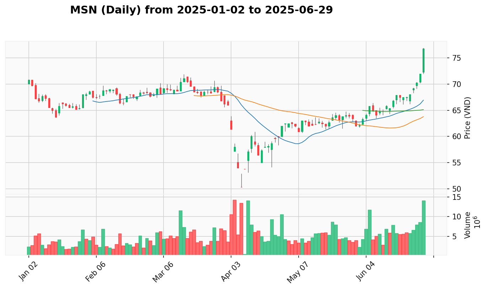

<a href="#thuc-pham">↑ Back to group THUC_PHAM</a>  |  <a href="#vpa-signal-summary">↑ Back to Top</a>

#### Key Statistics
| Metric | Value |
|:---|---:|
| Date Range | 2025-01-02 to 2025-10-17 |
| **Latest Close** | **88.0** |
| Period Open | 70.1 |
| Period High | 94.0 |
| Period Low | 50.3 |
| Period Change % | 25.53% |

**[Download MSN Data (.csv)](market_data/MSN_2025-01-02_to_2025-10-18.csv)**

---

### MSR

#### [VPA Analysis (2025-06-16 - 2025-10-16)](./VPA.md#msr)
> **Ngày 2025-10-10:** MSR tăng từ 25.2 VND lên 26.3 VND. Cây nến tăng có biên độ rộng (spread 1.7 VND) và đóng cửa ở gần mức cao nhất phiên. Khối lượng giao dịch đạt 3.0962 triệu cổ phiếu, cao hơn đáng kể so với phiên trước (2.2394 triệu cổ phiếu). Sau hai phiên SOS liên tiếp, phiên hôm nay tiếp tục cho thấy lực cầu mạnh mẽ, đẩy giá lên cao hơn với khối lượng gia tăng và biên độ rộng, xác nhận sự tiếp diễn của xu hướng tăng ngắn hạn và khả năng vượt qua các ngưỡng kháng cự. **Phân tích VPA/Wyckoff:** Sign of Strength (SOS) - Tiếp diễn lực cầu mạnh mẽ và xu hướng tăng.
> **Ngày 2025-10-13:** MSR tăng từ 26.3 VND lên 29.7 VND. Cây nến tăng có biên độ rất rộng (spread 3.5 VND) và đóng cửa ở mức cao nhất phiên. Khối lượng giao dịch đạt 4.6871 triệu cổ phiếu, cao hơn đáng kể so với phiên trước (3.0962 triệu cổ phiếu). Sau chuỗi các phiên SOS liên tiếp, phiên hôm nay tiếp tục cho thấy lực cầu cực kỳ mạnh mẽ, đẩy giá lên cao hơn với khối lượng gia tăng và biên độ rộng, xác nhận sự tiếp diễn của xu hướng tăng ngắn hạn và khả năng vượt qua các ngưỡng kháng cự mạnh. **Phân tích VPA/Wyckoff:** Sign of Strength (SOS) - Lực cầu cực mạnh mẽ và xu hướng tăng tiếp diễn.
> **Ngày 2025-10-14:** MSR mở cửa ở mức 30.0 VND, đạt đỉnh 31.8 VND nhưng đóng cửa ở 29.7 VND, bằng với giá đóng cửa phiên trước. Cây nến có biên độ rộng (spread 3.2 VND) nhưng cho thấy sự lưỡng lự khi giá không thể duy trì mức cao nhất. Khối lượng giao dịch đạt 3.1558 triệu cổ phiếu, thấp hơn đáng kể so với phiên trước (4.6871 triệu cổ phiếu). Sau chuỗi các phiên tăng giá mạnh mẽ với khối lượng lớn, phiên hôm nay cho thấy lực cầu đã suy yếu hơn và có áp lực bán ở vùng giá cao, dẫn đến sự chững lại của đà tăng. **Phân tích VPA/Wyckoff:** Indecision (Lưỡng lự) - Lực cầu suy yếu sau chuỗi SOS.
> **Ngày 2025-10-15:** MSR giảm từ 29.7 VND xuống 28.2 VND. Cây nến giảm có biên độ rộng (spread 2.6 VND) và đóng cửa gần mức thấp nhất phiên. Khối lượng giao dịch đạt 2.5116 triệu cổ phiếu, thấp hơn so với phiên trước (3.1558 triệu cổ phiếu) nhưng vẫn ở mức đáng kể. Sau phiên lưỡng lự, phiên hôm nay cho thấy áp lực bán tiếp tục gia tăng, đẩy giá xuống thấp hơn và đóng cửa gần mức thấp nhất, xác nhận sự suy yếu của lực cầu và sự xuất hiện của lực cung. **Phân tích VPA/Wyckoff:** Sign of Weakness (SOW) - Lực cung chiếm ưu thế.
> **Ngày 2025-10-16:** MSR mở cửa ở mức 28.2 VND và đóng cửa ở 29.7 VND, tăng từ mức đóng cửa 28.2 VND của phiên trước. Giá đạt đỉnh 31.5 VND nhưng không duy trì được, cho thấy có áp lực bán ở vùng giá cao. Cây nến có biên độ rộng (spread 3.3 VND). Tuy nhiên, khối lượng giao dịch chỉ đạt 1.2611 triệu cổ phiếu, giảm đáng kể so với phiên trước (2.5116 triệu cổ phiếu) và là mức thấp nhất trong 10 phiên gần đây. Sau phiên giảm giá mạnh với tín hiệu SOW, phiên hôm nay cho thấy sự phục hồi về giá nhưng với khối lượng rất thấp, báo hiệu lực cầu yếu và khả năng đây chỉ là một đợt hồi phục kỹ thuật. **Phân tích VPA/Wyckoff:** No Demand (Không có cầu) - Lực cầu yếu, không đủ để đẩy giá lên bền vững.

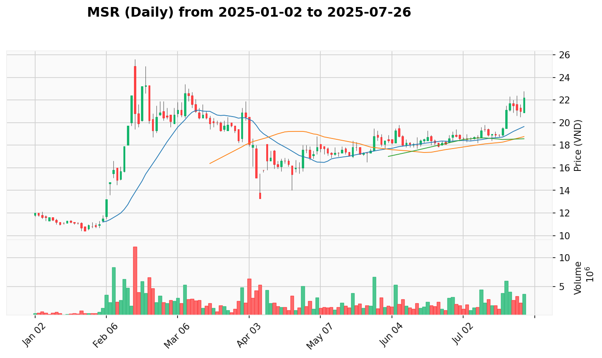

<a href="#thep">↑ Back to group THEP</a>  |  <a href="#vpa-signal-summary">↑ Back to Top</a>

#### Key Statistics
| Metric | Value |
|:---|---:|
| Date Range | 2025-01-02 to 2025-10-17 |
| **Latest Close** | **28.8** |
| Period Open | 11.8 |
| Period High | 31.8 |
| Period Low | 10.4 |
| Period Change % | 144.07% |

**[Download MSR Data (.csv)](market_data/MSR_2025-01-02_to_2025-10-18.csv)**

---

### MST

#### [VPA Analysis (2025-08-14 - 2025-10-16)](./VPA.md#mst)
> **Ngày 2025-10-10:** MST giảm từ 6.2 VND xuống 6.1 VND, với biên độ giá hẹp (6.0-6.3 VND) và đóng cửa dưới mức mở cửa. Khối lượng giao dịch đạt 3.5053 triệu cổ phiếu, giảm nhẹ so với phiên trước (3.5237 triệu cổ phiếu). Sau phiên giảm giá với áp lực bán chốt lời và phiên lưỡng lự, phiên này tiếp tục cho thấy sự suy yếu khi giá giảm nhẹ với khối lượng thấp. Điều này cho thấy lực cầu vẫn còn yếu, không đủ để hấp thụ lượng cung nhỏ và đẩy giá lên, khiến giá tiếp tục trượt dốc. **Phân tích VPA/Wyckoff:** Lack of Demand (Thiếu vắng lực cầu).
> **Ngày 2025-10-13:** MST giữ giá ở mức 6.1 VND, mở cửa thấp hơn nhưng đóng cửa tại mức cao nhất phiên với biên độ giá hẹp (5.8-6.1 VND). Khối lượng giao dịch đạt 2.7211 triệu cổ phiếu, giảm đáng kể so với phiên trước (3.5053 triệu cổ phiếu). Sau hai phiên lưỡng lự và thiếu vắng lực cầu, phiên này cho thấy áp lực bán đã cạn kiệt khi giá ngừng giảm và giữ vững, nhưng lực cầu mạnh mẽ vẫn chưa xuất hiện. **Phân tích VPA/Wyckoff:** No Supply (Kiểm tra nguồn cung).
> **Ngày 2025-10-14:** MST giảm từ 6.1 VND xuống 6.0 VND, với biên độ giá hẹp (5.9-6.1 VND) và đóng cửa ở mức giữa của biên độ giá. Khối lượng giao dịch đạt 2.7053 triệu cổ phiếu, giảm nhẹ so với phiên trước (2.7211 triệu cổ phiếu). Sau phiên kiểm tra nguồn cung không có lực cầu mạnh mẽ xuất hiện, phiên này giá tiếp tục trượt nhẹ với khối lượng thấp, cho thấy lực cầu vẫn còn yếu và thị trường tiếp tục suy yếu. **Phân tích VPA/Wyckoff:** Lack of Demand (Thiếu vắng lực cầu)
> **Ngày 2025-10-15:** MST giảm từ 6.0 VND xuống 5.9 VND, với biên độ giá hẹp (5.8-6.0 VND) và đóng cửa gần mức thấp nhất phiên. Khối lượng giao dịch chỉ đạt 0.4376 triệu cổ phiếu, giảm mạnh so với phiên trước (2.7053 triệu cổ phiếu) và là mức thấp nhất trong 10 phiên gần đây. Điều này cho thấy sự tiếp diễn của tình trạng thiếu vắng lực cầu, khi giá tiếp tục giảm nhẹ mà không có sự tham gia của người mua, đồng thời áp lực bán cũng không đáng kể do khối lượng cực thấp. **Phân tích VPA/Wyckoff:** No Demand (Thiếu vắng lực cầu)
> **Ngày 2025-10-16:** MST giữ nguyên ở mức 5.9 VND, với biên độ giá hẹp (5.8-6.0 VND) và đóng cửa ở mức giữa của biên độ giá. Khối lượng giao dịch chỉ đạt 0.4348 triệu cổ phiếu, tiếp tục ở mức cực thấp, thậm chí thấp hơn phiên trước và là một trong những mức thấp nhất trong 10 phiên gần đây. Sau hai phiên liên tiếp cho thấy thiếu vắng lực cầu, phiên này giá không giảm thêm với khối lượng cực thấp, cho thấy áp lực bán đã giảm đáng kể và nguồn cung đã cạn kiệt tạm thời. Tuy nhiên, lực cầu vẫn chưa xuất hiện mạnh mẽ để đẩy giá lên. **Phân tích VPA/Wyckoff:** No Supply (Cạn kiệt nguồn cung)

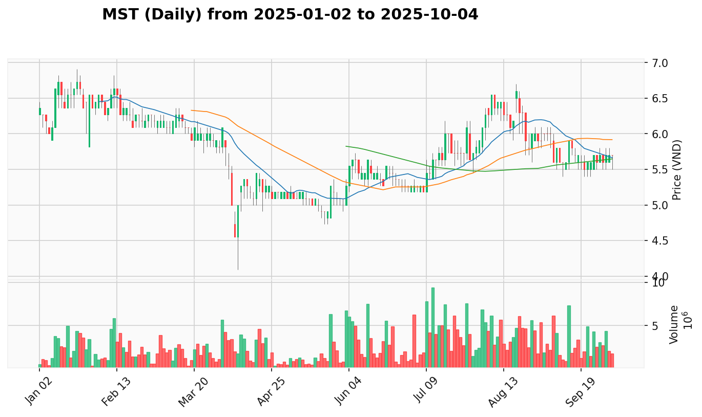

<a href="#penny">↑ Back to group PENNY</a>  |  <a href="#vpa-signal-summary">↑ Back to Top</a>

#### Key Statistics
| Metric | Value |
|:---|---:|
| Date Range | 2025-01-02 to 2025-10-17 |
| **Latest Close** | **5.9** |
| Period Open | 6.27 |
| Period High | 6.91 |
| Period Low | 4.09 |
| Period Change % | -5.90% |

**[Download MST Data (.csv)](market_data/MST_2025-01-02_to_2025-10-18.csv)**

---

### MWG

#### [VPA Analysis (2025-06-02 - 2025-10-16)](./VPA.md#mwg)
> **Ngày 2025-10-10:** MWG mở cửa ở mức 81.4 VND, cao hơn giá đóng cửa phiên trước (81.5 VND). Giá tiếp tục tăng từ 81.5 VND lên 82.0 VND, đóng cửa ở mức cao nhất phiên (82.0 VND) với biên độ tương tự phiên trước (1.4 VND). Khối lượng giao dịch đạt 7.5932 triệu cổ phiếu, giảm nhẹ so với phiên trước (7.7829 triệu cổ phiếu). Sau phiên thiếu cung ngày 2025-10-09, phiên này cho thấy giá tiếp tục tăng mạnh mẽ với khối lượng duy trì ở mức thấp, xác nhận rằng lực cung vẫn yếu và phe mua đang kiểm soát hoàn toàn. **Phân tích VPA/Wyckoff:** Tiếp tục thiếu cung (Continued Lack of Supply)
> **Ngày 2025-10-13:** MWG mở cửa ở mức 81.2 VND, thấp hơn giá đóng cửa phiên trước (82.0 VND). Giá tăng mạnh từ 81.2 VND lên 83.0 VND, đóng cửa ở mức cao nhất phiên (83.0 VND) với biên độ rộng hơn (2.0 VND) so với các phiên trước. Khối lượng giao dịch đạt 7.9625 triệu cổ phiếu, tăng nhẹ so với phiên trước (7.5932 triệu cổ phiếu). Sau các phiên thiếu cung, phiên này cho thấy lực cầu tiếp tục mạnh mẽ, đẩy giá lên cao với nỗ lực tăng nhẹ về khối lượng, xác nhận xu hướng tăng giá đang được duy trì. **Phân tích VPA/Wyckoff:** Sign of Strength (SOS)
> **Ngày 2025-10-14:** MWG mở cửa ở mức 83.9 VND, cao hơn giá đóng cửa phiên trước (83.0 VND). Giá tiếp tục tăng mạnh từ 82.4 VND lên 84.2 VND, đóng cửa gần mức cao nhất phiên (84.2 VND) với biên độ rộng hơn (2.6 VND) so với phiên trước. Khối lượng giao dịch đạt 12.0931 triệu cổ phiếu, tăng đáng kể so với phiên trước (7.9625 triệu cổ phiếu). Sau phiên SOS ngày 2025-10-13, phiên này cho thấy lực cầu tiếp tục mạnh mẽ và gia tăng, đẩy giá lên cao với nỗ lực tăng về khối lượng, xác nhận xu hướng tăng giá đang được duy trì và củng cố. **Phân tích VPA/Wyckoff:** Sign of Strength (SOS)
> **Ngày 2025-10-15:** MWG mở cửa ở mức 84.0 VND, thấp hơn giá đóng cửa phiên trước (84.2 VND). Giá giảm từ 84.0 VND xuống 83.3 VND, đóng cửa ở mức thấp hơn so với giá mở cửa và giá đóng cửa phiên trước. Biên độ dao động trong phiên (1.7 VND) hẹp hơn so với phiên trước. Khối lượng giao dịch đạt 5.6874 triệu cổ phiếu, giảm đáng kể so với phiên trước (12.0931 triệu cổ phiếu). Sau hai phiên SOS liên tiếp, phiên này cho thấy lực cầu suy yếu rõ rệt với giá giảm và khối lượng thấp, cho thấy sự thiếu hụt nhu cầu hoặc áp lực chốt lời nhẹ. **Phân tích VPA/Wyckoff:** No Demand (Thiếu cầu)
> **Ngày 2025-10-16:** MWG mở cửa ở mức 83.3 VND, đóng cửa ở mức 83.6 VND, cao hơn giá đóng cửa phiên trước (83.3 VND). Biên độ dao động trong phiên (1.8 VND) tương đương phiên trước. Khối lượng giao dịch đạt 2.2111 triệu cổ phiếu, giảm mạnh so với phiên trước (5.6874 triệu cổ phiếu). Sau phiên Thiếu cầu ngày 2025-10-15, phiên này cho thấy giá tăng nhẹ với khối lượng rất thấp, cho thấy áp lực bán đã giảm nhưng lực cầu vẫn chưa thực sự mạnh mẽ để đẩy giá lên cao hơn. **Phân tích VPA/Wyckoff:** No Supply (Thiếu cung)

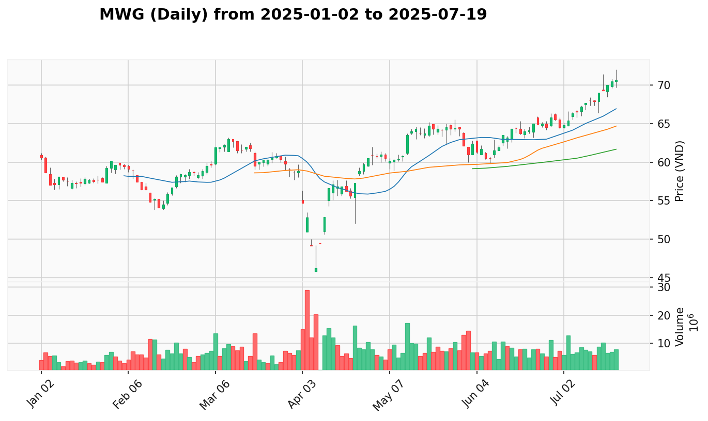

<a href="#ban-le">↑ Back to group BAN_LE</a>  |  <a href="#vpa-signal-summary">↑ Back to Top</a>

#### Key Statistics
| Metric | Value |
|:---|---:|
| Date Range | 2025-01-02 to 2025-10-17 |
| **Latest Close** | **84.5** |
| Period Open | 60.04 |
| Period High | 85.9 |
| Period Low | 45.1 |
| Period Change % | 40.74% |

**[Download MWG Data (.csv)](market_data/MWG_2025-01-02_to_2025-10-18.csv)**

---

### NAF

#### [VPA Analysis (2025-08-14 - 2025-10-16)](./VPA.md#naf)
> **Ngày 2025-10-10:** NAF mở cửa ở 32.65 VND, dao động trong biên độ rộng từ 32.6 VND đến 33.2 VND và đóng cửa ở 33.1 VND, tăng so với giá đóng cửa phiên trước (32.7 VND). Khối lượng giao dịch đạt 0.5065 triệu cổ phiếu, giảm nhẹ so với phiên trước (0.527 triệu cổ phiếu) và ở mức thấp. Sau phiên kiểm tra lực cung thành công ngày 2025-10-09, phiên này cho thấy giá tăng với biên độ rộng và đóng cửa gần mức cao nhất phiên, cho thấy lực cầu đã quay trở lại và hấp thụ lượng cung còn lại. Mặc dù khối lượng không quá lớn, nhưng đây là một dấu hiệu tích cực cho thấy xu hướng tăng giá có thể tiếp tục. **Phân tích VPA/Wyckoff:** Demand Coming In (Lực cầu quay trở lại)
> **Ngày 2025-10-13:** NAF mở cửa ở 33.15 VND, dao động trong biên độ từ 33.0 VND đến 33.65 VND và đóng cửa ở 33.45 VND, tăng so với giá đóng cửa phiên trước (33.1 VND). Khối lượng giao dịch đạt 0.574 triệu cổ phiếu, tăng nhẹ so với phiên trước (0.507 triệu cổ phiếu). Sau phiên lực cầu quay trở lại ngày 2025-10-10, phiên này tiếp tục cho thấy giá tăng với biên độ rộng và đóng cửa gần mức cao nhất phiên, đi kèm với khối lượng tăng nhẹ. Điều này cho thấy lực cầu vẫn đang chiếm ưu thế và tiếp tục đẩy giá lên, xác nhận xu hướng tăng giá. **Phân tích VPA/Wyckoff:** Sign of Strength (SOS) - Lực cầu tiếp tục gia tăng.
> **Ngày 2025-10-14:** NAF mở cửa ở 33.5 VND, dao động trong biên độ từ 33.4 VND đến 33.85 VND và đóng cửa ở 33.75 VND, tiếp tục tăng so với giá đóng cửa phiên trước (33.45 VND). Khối lượng giao dịch đạt 0.5629 triệu cổ phiếu, giảm nhẹ so với phiên trước (0.5747 triệu cổ phiếu). Sau hai phiên tăng giá mạnh mẽ, phiên này giá tiếp tục tăng với biên độ hẹp hơn và đóng cửa gần mức cao nhất phiên, cho thấy lực cầu vẫn chiếm ưu thế và nguồn cung bán ra không đáng kể, xác nhận xu hướng tăng giá tiếp diễn. **Phân tích VPA/Wyckoff:** Sign of Strength (SOS) - Đà tăng tiếp diễn với nguồn cung hạn chế.
> **Ngày 2025-10-15:** NAF mở cửa ở 33.8 VND, dao động trong biên độ từ 33.6 VND đến 34.3 VND và đóng cửa ở 34.1 VND, tiếp tục tăng so với giá đóng cửa phiên trước (33.75 VND). Khối lượng giao dịch đạt 0.5268 triệu cổ phiếu, giảm nhẹ so với phiên trước (0.5633 triệu cổ phiếu). Giá tiếp tục tăng với biên độ tương đối và đóng cửa gần mức cao nhất phiên, cho thấy lực cầu vẫn duy trì và nguồn cung bán ra không đáng kể. Mặc dù khối lượng giảm nhẹ, sự tăng giá vẫn tiếp diễn, xác nhận xu hướng tăng giá đang được củng cố. **Phân tích VPA/Wyckoff:** Sign of Strength (SOS) - Đà tăng tiếp diễn với nguồn cung hạn chế và lực cầu ổn định.
> **Ngày 2025-10-16:** NAF mở cửa ở 34.3 VND, dao động trong biên độ từ 34.05 VND đến 34.45 VND và đóng cửa ở 34.1 VND, giữ nguyên mức giá đóng cửa so với phiên trước (34.1 VND). Khối lượng giao dịch đạt 0.3088 triệu cổ phiếu, giảm đáng kể so với phiên trước (0.5272 triệu cổ phiếu). Mặc dù giá mở cửa cao hơn và đạt đỉnh mới trong phiên, nhưng không thể duy trì đà tăng và đóng cửa ở mức tương đương phiên trước. Sự sụt giảm mạnh về khối lượng trong khi giá không thể bứt phá cho thấy lực cầu đang suy yếu và có thể gặp phải áp lực cung. Điều này báo hiệu một sự tạm dừng trong xu hướng tăng giá hoặc một dấu hiệu suy yếu tiềm năng sau chuỗi ngày tăng. **Phân tích VPA/Wyckoff:** No Demand (ND) - Lực cầu suy yếu với khối lượng giảm mạnh, giá không thể tăng tiếp.

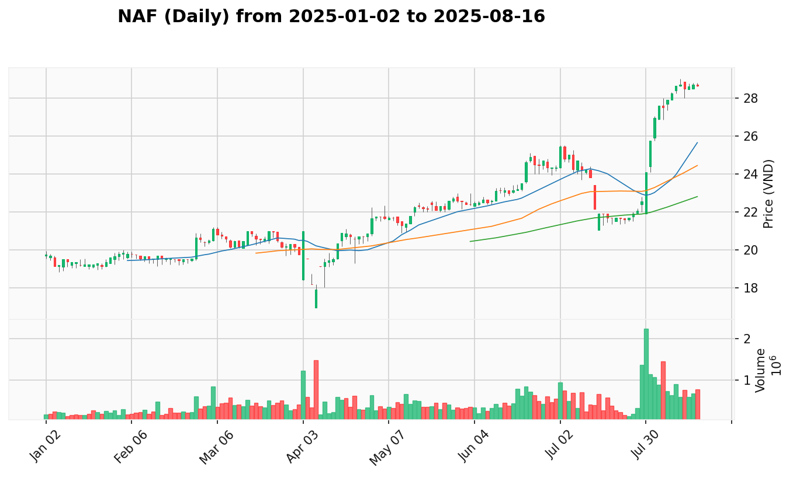

<a href="#nong-nghiep">↑ Back to group NONG_NGHIEP</a>  |  <a href="#vpa-signal-summary">↑ Back to Top</a>

#### Key Statistics
| Metric | Value |
|:---|---:|
| Date Range | 2025-01-02 to 2025-10-17 |
| **Latest Close** | **33.7** |
| Period Open | 17.91 |
| Period High | 34.45 |
| Period Low | 15.41 |
| Period Change % | 88.16% |

**[Download NAF Data (.csv)](market_data/NAF_2025-01-02_to_2025-10-18.csv)**

---

### NBC

#### [VPA Analysis (2025-08-04 - 2025-10-16)](./VPA.md#nbc)
> **Ngày 2025-10-10:** NBC tăng từ 8.9 VND lên 9.0 VND so với phiên trước, nhưng khối lượng giao dịch đạt 0.0237 triệu cổ phiếu, giảm đáng kể so với phiên trước (0.0402 triệu cổ phiếu). Cây nến có biên độ hẹp, giá mở cửa 8.9 VND và đóng cửa 9.0 VND, cho thấy sự tăng giá không mạnh mẽ. Mặc dù giá tăng nhẹ, khối lượng lại giảm mạnh, điều này cho thấy lực cầu yếu và không đủ sức đẩy giá lên cao hơn, xác nhận sự yếu kém tiếp diễn của thị trường. **Phân tích VPA/Wyckoff:** Weakness (Yếu kém)
> **Ngày 2025-10-13:** NBC giảm từ 9.0 VND xuống 8.9 VND, với khối lượng giao dịch đạt 0.0212 triệu cổ phiếu, giảm so với phiên trước (0.0237 triệu cổ phiếu). Cây nến có biên độ hẹp, giá mở cửa và đóng cửa ở mức 8.9 VND, cho thấy sự thiếu quyết đoán. Mặc dù giá giảm nhẹ, khối lượng cũng giảm, điều này cho thấy áp lực bán không quá mạnh nhưng lực cầu cũng không đủ để đẩy giá lên, xác nhận sự yếu kém tiếp diễn của thị trường. **Phân tích VPA/Wyckoff:** Weakness (Yếu kém)
> **Ngày 2025-10-14:** NBC giảm từ 8.9 VND xuống 8.8 VND, với khối lượng giao dịch đạt 0.0558 triệu cổ phiếu, tăng đáng kể so với phiên trước (0.0212 triệu cổ phiếu). Cây nến có biên độ tương đối rộng (từ 8.7 VND đến 8.9 VND), giá mở cửa 8.7 VND và đóng cửa 8.8 VND. Mặc dù có sự phục hồi nhẹ trong phiên, giá vẫn đóng cửa thấp hơn phiên trước với khối lượng tăng vọt, cho thấy áp lực bán vẫn rất lớn và lực cung đang chiếm ưu thế, xác nhận sự yếu kém tiếp diễn của thị trường. **Phân tích VPA/Wyckoff:** Weakness (Yếu kém)
> **Ngày 2025-10-15:** NBC giữ nguyên mức giá đóng cửa 8.8 VND so với phiên trước, với khối lượng giao dịch đạt 0.0262 triệu cổ phiếu, giảm đáng kể so với phiên trước (0.0558 triệu cổ phiếu). Cây nến có biên độ hẹp, giá mở cửa và đóng cửa ở mức 8.8 VND, cho thấy sự thiếu quyết đoán của thị trường. Mặc dù giá không giảm thêm, khối lượng thấp cho thấy cả lực cung và lực cầu đều yếu, không có bên nào chiếm ưu thế rõ rệt. Điều này có thể là một sự tạm dừng trong xu hướng yếu kém trước đó, nhưng chưa có dấu hiệu phục hồi rõ ràng. **Phân tích VPA/Wyckoff:** Weakness (Yếu kém)
> **Ngày 2025-10-16:** NBC giữ nguyên mức giá đóng cửa 8.8 VND so với phiên trước, với giá mở cửa thấp hơn ở mức 8.6 VND. Khối lượng giao dịch đạt 0.0144 triệu cổ phiếu, giảm đáng kể so với phiên trước (0.0262 triệu cổ phiếu). Cây nến có biên độ hẹp, cho thấy sự thiếu quyết đoán của thị trường. Mặc dù giá không giảm thêm, khối lượng thấp cho thấy cả lực cung và lực cầu đều yếu, không có bên nào chiếm ưu thế rõ rệt. Điều này tiếp tục cho thấy sự tạm dừng trong xu hướng yếu kém trước đó, nhưng chưa có dấu hiệu phục hồi rõ ràng và lực cầu vẫn rất yếu. **Phân tích VPA/Wyckoff:** Weakness (Yếu kém)

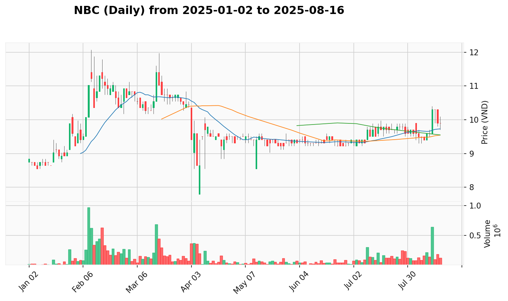

<a href="#khai-khoang">↑ Back to group KHAI_KHOANG</a>  |  <a href="#vpa-signal-summary">↑ Back to Top</a>

#### Key Statistics
| Metric | Value |
|:---|---:|
| Date Range | 2025-01-02 to 2025-10-17 |
| **Latest Close** | **8.7** |
| Period Open | 8.74 |
| Period High | 12.07 |
| Period Low | 7.79 |
| Period Change % | -0.46% |

**[Download NBC Data (.csv)](market_data/NBC_2025-01-02_to_2025-10-18.csv)**

---

### NCT

#### [VPA Analysis (2025-08-06 - 2025-10-16)](./VPA.md#nct)
> **Ngày 2025-10-10:** NCT tăng từ 105.1 VND lên 105.3 VND với khối lượng giao dịch đạt 0.0057 triệu cổ phiếu, thấp hơn đáng kể so với phiên trước (0.0104 triệu cổ phiếu). Cây nến tăng có biên độ hẹp (105.1 VND - 105.5 VND) và đóng cửa gần mức cao nhất phiên, nhưng với khối lượng rất thấp, cho thấy lực cầu yếu và thiếu sự tham gia của dòng tiền lớn. Sau phiên tăng giá với áp lực bán mạnh (SOW) trước đó, phiên này giá tiếp tục tăng nhưng với khối lượng giảm mạnh, xác nhận sự thiếu hụt lực mua. **Phân tích VPA/Wyckoff:** No Demand (ND) - Giá tăng với khối lượng thấp, cho thấy thiếu hụt lực cầu và sự yếu kém của xu hướng tăng.
> **Ngày 2025-10-13:** NCT giảm từ 105.3 VND xuống 105.0 VND với khối lượng giao dịch đạt 0.0319 triệu cổ phiếu, cao hơn đáng kể so với phiên trước (0.0057 triệu cổ phiếu). Cây nến có biên độ 0.5 VND (105.0 VND - 105.5 VND) và đóng cửa ở mức thấp nhất phiên, cho thấy áp lực bán mạnh mẽ. Sau các phiên nỗ lực tăng giá không hiệu quả (SOW) và thiếu cầu (ND), phiên này giá giảm mạnh với khối lượng gia tăng, xác nhận sự chiếm ưu thế của phe bán. **Phân tích VPA/Wyckoff:** Sign of Weakness (SOW) - Giá giảm mạnh với khối lượng gia tăng, xác nhận áp lực cung đang chiếm ưu thế.
> **Ngày 2025-10-14:** NCT giảm từ 105.0 VND xuống 104.9 VND với khối lượng giao dịch đạt 0.0117 triệu cổ phiếu, thấp hơn đáng kể so với phiên trước (0.0319 triệu cổ phiếu). Cây nến có biên độ 1.2 VND (104.8 VND - 106.0 VND) và đóng cửa gần mức thấp nhất phiên, cho thấy áp lực bán vẫn hiện hữu. Tuy nhiên, khối lượng giảm mạnh sau phiên SOW trước đó xác nhận sự thiếu hụt lực cầu và sự yếu kém của xu hướng giảm giá, cho thấy không có sự hấp thụ đáng kể từ phe mua. **Phân tích VPA/Wyckoff:** No Demand (ND) - Giá tiếp tục giảm với khối lượng thấp, xác nhận thiếu hụt lực cầu và xu hướng giảm giá tiếp diễn.
> **Ngày 2025-10-15:** NCT giảm từ 104.9 VND xuống 104.8 VND với khối lượng giao dịch đạt 0.0124 triệu cổ phiếu, cao hơn một chút so với phiên trước (0.0117 triệu cổ phiếu). Cây nến có biên độ 0.3 VND (104.8 VND - 105.1 VND) và đóng cửa ở mức thấp nhất phiên, cho thấy áp lực bán vẫn duy trì. **Phân tích VPA/Wyckoff:** Effort to Fall (ETF) - Giá giảm nhẹ với khối lượng tăng nhẹ và biên độ hẹp, đóng cửa ở mức thấp nhất, cho thấy nỗ lực đẩy giá xuống vẫn tiếp diễn và sự yếu kém của thị trường.
> **Ngày 2025-10-16:** NCT tăng từ 104.8 VND lên 105.3 VND với khối lượng giao dịch đạt 0.0004 triệu cổ phiếu, thấp hơn đáng kể so với phiên trước (0.0124 triệu cổ phiếu). Cây nến có biên độ 0.0 VND (105.3 VND - 105.3 VND) và đóng cửa ở mức cao nhất phiên, cho thấy sự phục hồi nhẹ nhưng không có sự hỗ trợ từ khối lượng. Khối lượng cực thấp sau hai phiên giảm giá liên tiếp xác nhận thiếu hụt lực cầu và sự yếu kém của xu hướng tăng giá. **Phân tích VPA/Wyckoff:** No Demand (ND) - Giá tăng nhẹ với khối lượng cực thấp, xác nhận thiếu hụt lực cầu và sự yếu kém của thị trường.

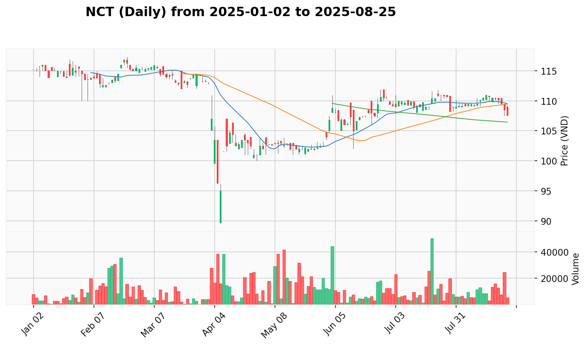

<a href="#hang-khong">↑ Back to group HANG_KHONG</a>  |  <a href="#vpa-signal-summary">↑ Back to Top</a>

#### Key Statistics
| Metric | Value |
|:---|---:|
| Date Range | 2025-01-02 to 2025-10-17 |
| **Latest Close** | **105.7** |
| Period Open | 115.2 |
| Period High | 117.3 |
| Period Low | 89.6 |
| Period Change % | -8.25% |

**[Download NCT Data (.csv)](market_data/NCT_2025-01-02_to_2025-10-18.csv)**

---

### NDN

#### [VPA Analysis (2025-08-04 - 2025-10-16)](./VPA.md#ndn)
> **Ngày 2025-10-10:** NDN mở cửa ở 13.5 VND và đóng cửa ở 13.5 VND, với biên độ nến hẹp từ 13.4 VND đến 13.6 VND. Điều này thể hiện sự lưỡng lự của thị trường và thiếu động lực tăng giá sau phiên tăng mạnh trước đó. Khối lượng giao dịch đạt 0.4886 triệu cổ phiếu, giảm đáng kể so với phiên trước (0.9343 triệu cổ phiếu). Sau một Sign of Strength (SOS) vào ngày 2025-10-09, việc giá đi ngang với khối lượng thấp cho thấy lực cầu đã suy yếu và không còn đủ mạnh để đẩy giá lên cao hơn. **Phân tích VPA/Wyckoff:** No Demand (Thiếu hụt cầu)
> **Ngày 2025-10-13:** NDN mở cửa ở 13.3 VND, tăng lên 13.9 VND và đóng cửa ở 13.8 VND. Giá đóng cửa cao hơn giá mở cửa và giá đóng cửa phiên trước, với biên độ nến rộng và đóng cửa gần mức cao nhất phiên. Khối lượng giao dịch đạt 0.9868 triệu cổ phiếu, tăng đáng kể so với phiên trước (0.4886 triệu cổ phiếu) và cao hơn cả phiên SOS ngày 2025-10-09. Điều này cho thấy lực cầu mạnh mẽ đã quay trở lại và hấp thụ tốt lực cung, xác nhận xu hướng tăng giá sau phiên "No Demand" trước đó. **Phân tích VPA/Wyckoff:** Sign of Strength (SOS)
> **Ngày 2025-10-14:** NDN mở cửa ở 13.9 VND, đạt mức cao nhất 14.1 VND nhưng sau đó giảm và đóng cửa ở 13.7 VND. Giá đóng cửa thấp hơn giá mở cửa và thấp hơn giá đóng cửa phiên trước, với biên độ nến rộng và đóng cửa ở nửa dưới của thân nến. Khối lượng giao dịch đạt 0.9571 triệu cổ phiếu, tuy có giảm nhẹ so với phiên trước nhưng vẫn ở mức cao. Điều này cho thấy lực cung đã quay trở lại và hấp thụ lực cầu, đặc biệt sau phiên SOS ngày 2025-10-13, cho thấy sự suy yếu của đà tăng. **Phân tích VPA/Wyckoff:** Upthrust Action
> **Ngày 2025-10-15:** NDN mở cửa ở 13.7 VND, tăng lên 13.9 VND và đóng cửa ở 13.9 VND. Giá đóng cửa cao hơn giá mở cửa và giá đóng cửa phiên trước, với biên độ nến rộng và đóng cửa ở mức cao nhất phiên. Điều này cho thấy lực cầu mạnh mẽ đã quay trở lại và hấp thụ lực cung sau phiên Upthrust ngày 2025-10-14. Khối lượng giao dịch đạt 0.7706 triệu cổ phiếu, thấp hơn so với hai phiên trước nhưng vẫn ở mức trung bình, cho thấy lực cầu đã kiểm tra và hấp thụ thành công lực cung. **Phân tích VPA/Wyckoff:** Sign of Strength (SOS) - Test for Supply
> **Ngày 2025-10-16:** NDN mở cửa ở 14.0 VND, đạt mức cao nhất 14.2 VND nhưng sau đó giảm và đóng cửa ở 13.9 VND. Giá đóng cửa thấp hơn giá mở cửa và bằng với giá đóng cửa phiên trước, với biên độ nến tương đối rộng nhưng đóng cửa ở nửa dưới của thân nến. Khối lượng giao dịch đạt 0.4859 triệu cổ phiếu, giảm đáng kể so với phiên trước và ở mức thấp. Điều này cho thấy lực cầu đã suy yếu sau phiên SOS ngày 2025-10-15, không đủ sức đẩy giá lên cao hơn và duy trì ở mức cao, đồng thời cho thấy sự thiếu vắng của lực cầu tại các mức giá cao hơn. **Phân tích VPA/Wyckoff:** No Demand (ND)

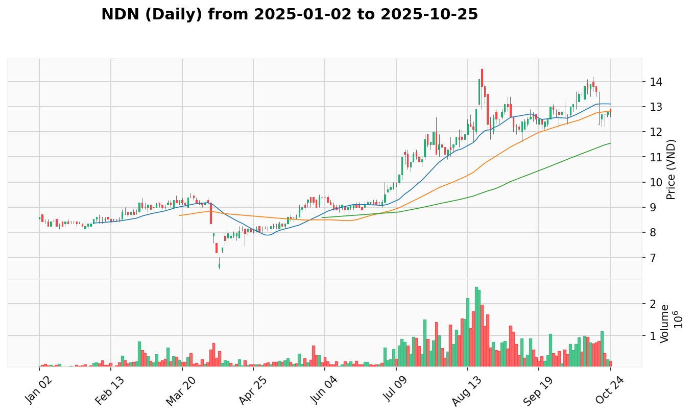

<a href="#bat-dong-san">↑ Back to group BAT_DONG_SAN</a>  |  <a href="#vpa-signal-summary">↑ Back to Top</a>

#### Key Statistics
| Metric | Value |
|:---|---:|
| Date Range | 2025-01-02 to 2025-10-17 |
| **Latest Close** | **13.6** |
| Period Open | 8.53 |
| Period High | 14.5 |
| Period Low | 6.54 |
| Period Change % | 59.44% |

**[Download NDN Data (.csv)](market_data/NDN_2025-01-02_to_2025-10-18.csv)**

---

### NHA

#### [VPA Analysis (2025-08-04 - 2025-10-16)](./VPA.md#nha)
> **Ngày 2025-10-10:** NHA tăng từ 21.7 VND lên 21.95 VND với khối lượng giao dịch đạt 0.3894 triệu cổ phiếu. Cây nến tăng có biên độ tương đối rộng, giá đóng cửa thấp hơn giá cao nhất phiên (22.7 VND). Khối lượng giao dịch tăng nhẹ so với phiên trước (0.3652 triệu cổ phiếu) nhưng vẫn ở mức thấp, cho thấy lực cầu yếu và chưa đủ sức hấp thụ hoàn toàn lực cung. Sau hai phiên "No Demand" và "No Supply", phiên này cho thấy một nỗ lực tăng giá nhưng không có kết quả rõ ràng, có thể là một đợt kiểm tra nguồn cung. **Phân tích VPA/Wyckoff:** Test for Supply (Kiểm tra nguồn cung).
> **Ngày 2025-10-13:** NHA tăng từ 21.95 VND lên 22.55 VND với khối lượng giao dịch đạt 0.9173 triệu cổ phiếu. Cây nến tăng có biên độ rộng, giá đóng cửa gần mức cao nhất phiên (22.75 VND). Khối lượng giao dịch tăng đột biến so với các phiên trước, đặc biệt sau giai đoạn "No Supply" và "Test for Supply", cho thấy lực cầu mạnh mẽ đã quay trở lại thị trường và hấp thụ tốt nguồn cung. **Phân tích VPA/Wyckoff:** Sign of Strength (SOS) - Lực cầu mạnh mẽ.
> **Ngày 2025-10-14:** NHA giảm từ 22.55 VND xuống 21.75 VND với khối lượng giao dịch đạt 0.7695 triệu cổ phiếu. Cây nến giảm có biên độ rộng, giá đóng cửa ở mức thấp nhất phiên (21.75 VND). Khối lượng giao dịch giảm so với phiên "Sign of Strength" trước đó nhưng vẫn ở mức tương đối cao, cho thấy lực cung đã quay trở lại và áp đảo lực cầu, đẩy giá xuống. Điều này báo hiệu sự yếu kém trong đà tăng giá và có thể là dấu hiệu của một đợt điều chỉnh. **Phân tích VPA/Wyckoff:** Weakness (SW) - Dấu hiệu yếu kém.
> **Ngày 2025-10-15:** NHA mở cửa ở 21.75 VND, đạt mức cao nhất 21.95 VND, thấp nhất 21.5 VND và đóng cửa ở 21.75 VND. Khối lượng giao dịch đạt 0.4054 triệu cổ phiếu. Cây nến có thân nhỏ, cho thấy sự lưỡng lự của thị trường sau phiên giảm mạnh với khối lượng cao vào ngày 2025-10-14. Khối lượng giao dịch thấp hơn đáng kể so với các phiên trước, đặc biệt sau một phiên "Weakness", cho thấy lực cầu yếu và không có sự hấp thụ mạnh mẽ nào đối với nguồn cung. **Phân tích VPA/Wyckoff:** No Demand (ND) - Thiếu cầu.
> **Ngày 2025-10-16:** NHA tăng từ 21.75 VND lên 22.4 VND với khối lượng giao dịch đạt 0.56 triệu cổ phiếu. Cây nến tăng có biên độ rộng, giá đóng cửa gần mức cao nhất phiên. Khối lượng giao dịch tăng so với phiên "No Demand" trước đó (0.4054 triệu cổ phiếu), cho thấy lực cầu đã quay trở lại và hấp thụ nguồn cung, đẩy giá lên. Điều này báo hiệu sự phục hồi của lực mua sau giai đoạn yếu kém và thiếu cầu. **Phân tích VPA/Wyckoff:** Sign of Strength (SOS) - Dấu hiệu sức mạnh.

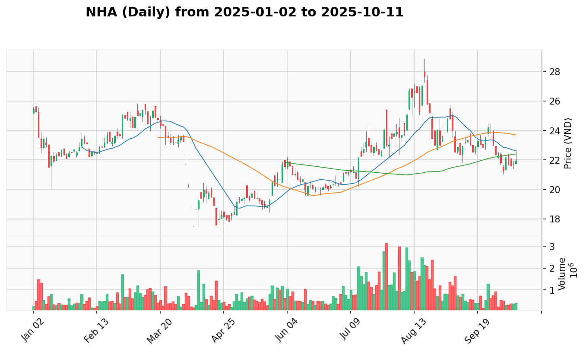

<a href="#bat-dong-san">↑ Back to group BAT_DONG_SAN</a>  |  <a href="#vpa-signal-summary">↑ Back to Top</a>

#### Key Statistics
| Metric | Value |
|:---|---:|
| Date Range | 2025-01-02 to 2025-10-17 |
| **Latest Close** | **23.25** |
| Period Open | 25.18 |
| Period High | 28.9 |
| Period Low | 17.41 |
| Period Change % | -7.66% |

**[Download NHA Data (.csv)](market_data/NHA_2025-01-02_to_2025-10-18.csv)**

---

### NHH

#### [VPA Analysis (2025-08-04 - 2025-10-16)](./VPA.md#nhh)
> **Ngày 2025-10-10:** NHH giữ nguyên ở mức 11.95 VND so với phiên trước, nhưng đã tăng từ 11.8 VND lên 11.95 VND trong phiên với khối lượng giao dịch đạt 0.0773 triệu cổ phiếu, cao hơn đáng kể so với phiên trước (0.0427 triệu cổ phiếu). Cây nến tăng có biên độ hẹp và đóng cửa gần mức cao nhất phiên, cho thấy lực cầu đã quay trở lại nhưng chưa đủ mạnh để đẩy giá lên cao hơn đáng kể. Sau hai phiên "No Demand" liên tiếp, sự gia tăng khối lượng này có thể là một dấu hiệu kiểm tra nguồn cung. **Phân tích VPA/Wyckoff:** Test for Supply (TS) - Kiểm tra nguồn cung.
> **Ngày 2025-10-13:** NHH giảm từ 11.95 VND xuống 11.9 VND với khối lượng giao dịch đạt 0.1161 triệu cổ phiếu, cao hơn đáng kể so với phiên trước (0.0773 triệu cổ phiếu). Cây nến giảm nhẹ có biên độ hẹp và đóng cửa ở giữa thân nến, cho thấy áp lực bán đã gia tăng và nguồn cung vẫn còn mạnh mẽ. Sau phiên 'Test for Supply' ngày 2025-10-10, sự gia tăng khối lượng trong khi giá giảm nhẹ xác nhận rằng thị trường vẫn đang chịu sự chi phối của phe bán. **Phân tích VPA/Wyckoff:** Sign of Weakness (SOW) - Dấu hiệu suy yếu.
> **Ngày 2025-10-14:** NHH giảm từ 11.9 VND xuống 11.75 VND với khối lượng giao dịch đạt 0.157 triệu cổ phiếu, cao hơn đáng kể so với phiên trước (0.1161 triệu cổ phiếu). Cây nến giảm có biên độ rộng và đóng cửa gần mức thấp nhất phiên, cho thấy áp lực bán mạnh mẽ và nguồn cung đang chiếm ưu thế. Sau phiên 'Dấu hiệu suy yếu' ngày 2025-10-13, sự gia tăng khối lượng đi kèm với mức giảm giá đáng kể này xác nhận sự tiếp diễn của xu hướng suy yếu. **Phân tích VPA/Wyckoff:** Sign of Weakness (SOW) - Dấu hiệu suy yếu.
> **Ngày 2025-10-15:** NHH giảm từ 11.75 VND xuống 11.4 VND với khối lượng giao dịch đạt 0.2336 triệu cổ phiếu, cao hơn đáng kể so với phiên trước (0.157 triệu cổ phiếu). Cây nến giảm có biên độ rộng và đóng cửa gần mức thấp nhất phiên, cho thấy áp lực bán cực mạnh và nguồn cung đang áp đảo. Sau hai phiên 'Dấu hiệu suy yếu' liên tiếp, sự gia tăng khối lượng đi kèm với mức giảm giá mạnh mẽ này xác nhận sự tiếp diễn của xu hướng giảm giá. **Phân tích VPA/Wyckoff:** Sign of Weakness (SOW) - Dấu hiệu suy yếu.
> **Ngày 2025-10-16:** NHH tăng nhẹ từ 11.4 VND lên 11.5 VND với khối lượng giao dịch đạt 0.0646 triệu cổ phiếu, thấp hơn đáng kể so với phiên trước (0.2336 triệu cổ phiếu). Cây nến tăng có biên độ hẹp và đóng cửa ở mức giữa, cho thấy sự thiếu quyết đoán và không có lực cầu mạnh mẽ sau hai phiên giảm giá mạnh. Khối lượng thấp trong khi giá tăng nhẹ sau giai đoạn suy yếu cho thấy áp lực bán đã giảm nhưng lực mua vẫn chưa đủ mạnh để đảo chiều xu hướng. **Phân tích VPA/Wyckoff:** Test for Supply (Lack of Demand) - Kiểm tra nguồn cung (Thiếu cầu).

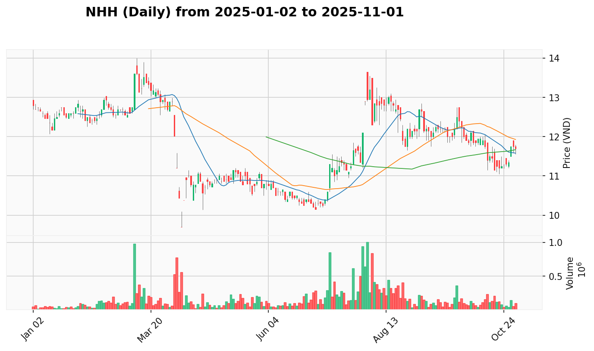

<a href="#nhua">↑ Back to group NHUA</a>  |  <a href="#vpa-signal-summary">↑ Back to Top</a>

#### Key Statistics
| Metric | Value |
|:---|---:|
| Date Range | 2025-01-02 to 2025-10-17 |
| **Latest Close** | **11.45** |
| Period Open | 12.94 |
| Period High | 14.0 |
| Period Low | 9.7 |
| Period Change % | -11.51% |

**[Download NHH Data (.csv)](market_data/NHH_2025-01-02_to_2025-10-18.csv)**

---

### NKG

#### [VPA Analysis (2025-06-26 - 2025-10-16)](./VPA.md#nkg)
> **Ngày 2025-10-10:** NKG tăng từ 17.75 lên 17.9. Mức mở cửa là 17.9, cao nhất 18.2, thấp nhất 17.8 và đóng cửa 17.9. Cây nến có biên độ hẹp, đóng cửa bằng mức mở cửa, cho thấy sự lưỡng lự của thị trường. Khối lượng giao dịch đạt 9.9321 triệu cổ phiếu, tăng so với phiên trước (7.8609 triệu cổ phiếu). Mặc dù khối lượng tăng, giá không thể bứt phá mạnh mẽ, cho thấy lực cầu và lực cung đang cân bằng hoặc có sự kiểm tra nguồn cung sau phiên thiếu cầu. **Phân tích VPA/Wyckoff:** Test for Supply (Kiểm tra nguồn cung) - Khối lượng tăng nhưng giá không tăng mạnh, cho thấy có lực cung đang được hấp thụ.
> **Ngày 2025-10-13:** NKG giảm từ 17.9 xuống 17.4. Mức mở cửa là 17.5, cao nhất 17.7, thấp nhất 17.15 và đóng cửa 17.4. Cây nến giảm với biên độ trung bình đến rộng, đóng cửa gần mức thấp nhất phiên. Khối lượng giao dịch đạt 16.6897 triệu cổ phiếu, tăng đáng kể so với phiên trước (9.9321 triệu cổ phiếu). Sự giảm giá mạnh với khối lượng lớn cho thấy áp lực bán gia tăng và phe bán đang chiếm ưu thế. Điều này xác nhận sự suy yếu của lực cầu đã được nhận định vào ngày 2025-10-09 (No Demand) và sự xuất hiện của nguồn cung mạnh mẽ sau phiên kiểm tra nguồn cung (Test for Supply) vào ngày 2025-10-10. **Phân tích VPA/Wyckoff:** Sign of Weakness (SOW) - Áp lực bán mạnh mẽ với khối lượng lớn xác nhận xu hướng giảm giá.
> **Ngày 2025-10-14:** NKG tiếp tục giảm từ 17.4 xuống 17.0. Mức mở cửa là 17.5, cao nhất 17.7, thấp nhất 16.95 và đóng cửa 17.0. Cây nến giảm với biên độ trung bình, đóng cửa ở mức thấp nhất phiên, cho thấy áp lực bán mạnh mẽ. Khối lượng giao dịch đạt 16.8085 triệu cổ phiếu, duy trì ở mức cao và tăng nhẹ so với phiên trước (16.6897 triệu cổ phiếu). Sự giảm giá tiếp tục với khối lượng cao sau một Sign of Weakness vào ngày 2025-10-13 củng cố thêm sự suy yếu của cổ phiếu, cho thấy phe bán vẫn đang kiểm soát. **Phân tích VPA/Wyckoff:** Continued Sign of Weakness (SOW) - Áp lực bán tiếp diễn với khối lượng cao xác nhận xu hướng giảm.
> **Ngày 2025-10-15:** NKG mở cửa ở mức 16.9 VND, cao nhất 17.3 VND, thấp nhất 16.85 VND và đóng cửa ở mức 17.0 VND. Cổ phiếu giảm từ mức mở cửa 16.9 VND lên 17.0 VND, nhưng đóng cửa ở mức tương tự so với phiên trước. Biên độ giá thu hẹp đáng kể so với phiên trước. Khối lượng giao dịch đạt 7.8855 triệu cổ phiếu, giảm mạnh so với phiên trước (16.8085 triệu cổ phiếu). Sau hai phiên giảm giá mạnh với khối lượng lớn (SOW), việc giá đóng cửa không thay đổi nhiều nhưng với khối lượng giảm mạnh cho thấy áp lực bán có thể đang tạm lắng, nhưng đồng thời cũng không có lực cầu mạnh mẽ để đẩy giá lên. Điều này có thể là dấu hiệu của sự thiếu vắng nhu cầu (No Demand) sau một đợt giảm giá. **Phân tích VPA/Wyckoff:** No Demand (ND) - Khối lượng giảm mạnh sau đợt giảm giá cho thấy thiếu vắng lực cầu.
> **Ngày 2025-10-16:** NKG tăng nhẹ từ 17.0 lên 17.15. Mức mở cửa là 17.15, cao nhất 17.5, thấp nhất 16.85 và đóng cửa 17.15. Cây nến có biên độ hẹp, đóng cửa ở mức mở cửa, cho thấy sự lưỡng lự. Khối lượng giao dịch đạt 5.4478 triệu cổ phiếu, giảm mạnh so với phiên trước (7.8855 triệu cổ phiếu) và thấp hơn nhiều so với mức trung bình. Sau phiên "No Demand" ngày 2025-10-15, việc giá tăng nhẹ với khối lượng cực thấp cho thấy không có lực cầu mạnh mẽ để đẩy giá lên, đồng thời áp lực bán cũng tạm thời lắng xuống. Điều này có thể là một sự kiểm tra nguồn cung (Test for Supply) hoặc tiếp tục thiếu vắng nhu cầu. **Phân tích VPA/Wyckoff:** Test for Supply (TS) - Giá tăng nhẹ với khối lượng cực thấp sau giai đoạn suy yếu cho thấy thị trường đang kiểm tra nguồn cung.

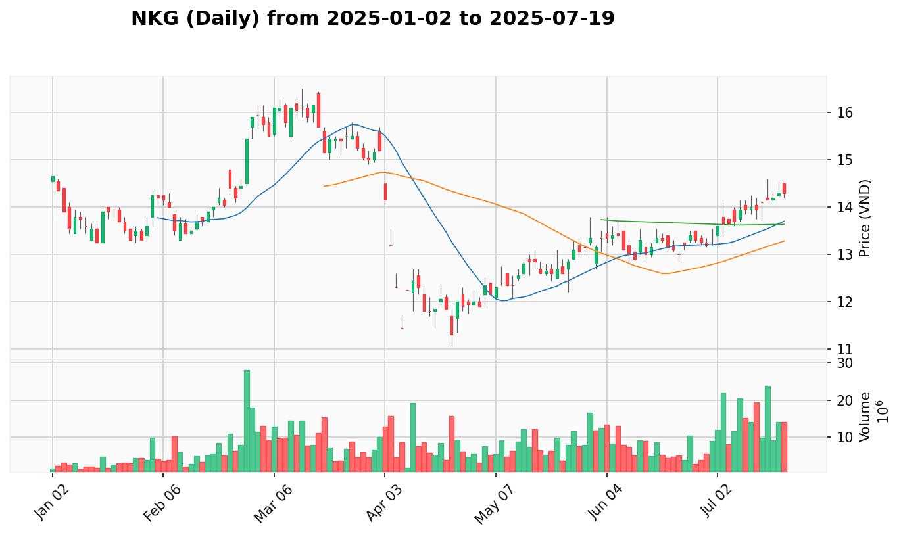

<a href="#thep">↑ Back to group THEP</a>  |  <a href="#vpa-signal-summary">↑ Back to Top</a>

#### Key Statistics
| Metric | Value |
|:---|---:|
| Date Range | 2025-01-02 to 2025-10-17 |
| **Latest Close** | **17.75** |
| Period Open | 14.55 |
| Period High | 20.4 |
| Period Low | 11.05 |
| Period Change % | 21.99% |

**[Download NKG Data (.csv)](market_data/NKG_2025-01-02_to_2025-10-18.csv)**

---

### NLG

#### [VPA Analysis (2025-06-26 - 2025-10-16)](./VPA.md#nlg)
> **Ngày 2025-10-10:** NLG mở cửa tại 39.25 VND, tăng lên 40.4 VND và đóng cửa ở mức 40.35 VND, cao hơn đáng kể so với giá đóng cửa phiên trước (39.1 VND). Biên độ giá rộng (1.2 VND) và giá đóng cửa ở gần mức cao nhất phiên. Khối lượng giao dịch đạt 4.27 triệu cổ phiếu, giảm nhẹ so với phiên trước (4.71 triệu cổ phiếu). Sau phiên tăng giá với lực cầu mạnh mẽ ngày hôm qua, phiên hôm nay tiếp tục cho thấy giá tăng mạnh với biên độ rộng và đóng cửa gần mức cao nhất, xác nhận sự tiếp diễn của lực cầu. Mặc dù khối lượng giao dịch giảm nhẹ, nhưng hành động giá vẫn rất tích cực, cho thấy nhu cầu vẫn đang chiếm ưu thế và có thể là dấu hiệu của sự cạn kiệt nguồn cung. **Phân tích VPA/Wyckoff:** Sign of Strength (SOS)
> **Ngày 2025-10-13:** NLG mở cửa tại 39.5 VND, tăng lên 40.95 VND và đóng cửa ở mức 40.8 VND, cao hơn so với giá đóng cửa phiên trước (40.35 VND). Biên độ giá rộng (1.45 VND) và giá đóng cửa ở gần mức cao nhất phiên. Khối lượng giao dịch đạt 4.2357 triệu cổ phiếu, giảm nhẹ so với phiên trước (4.2699 triệu cổ phiếu). Sau hai phiên tăng giá mạnh mẽ với lực cầu chiếm ưu thế, phiên hôm nay tiếp tục cho thấy giá tăng với biên độ rộng và đóng cửa gần mức cao nhất, củng cố xu hướng tăng. Mặc dù khối lượng giao dịch giảm nhẹ, hành động giá vẫn rất tích cực, cho thấy lực cầu vẫn đang kiểm soát thị trường. **Phân tích VPA/Wyckoff:** Sign of Strength (SOS)
> **Ngày 2025-10-14:** NLG mở cửa tại 41.1 VND, tăng lên mức cao nhất 41.1 VND nhưng sau đó giảm mạnh và đóng cửa ở mức thấp nhất phiên 39.65 VND. Biên độ giá rộng và giá đóng cửa thấp hơn đáng kể so với giá đóng cửa phiên trước (40.8 VND). Khối lượng giao dịch đạt 4.09 triệu cổ phiếu, giảm nhẹ so với phiên trước (4.24 triệu cổ phiếu). Sau hai phiên tăng giá mạnh mẽ với tín hiệu SOS, phiên hôm nay cho thấy lực bán chiếm ưu thế rõ rệt, đẩy giá xuống thấp nhất phiên. Mặc dù khối lượng giảm nhẹ, hành động giá tiêu cực này cho thấy nguồn cung đã bắt đầu xuất hiện và áp đảo lực cầu, có thể báo hiệu sự suy yếu trong xu hướng tăng giá. **Phân tích VPA/Wyckoff:** Sign of Weakness (SOW)
> **Ngày 2025-10-15:** NLG mở cửa tại 39.65 VND, tăng lên mức cao nhất 39.8 VND nhưng sau đó giảm xuống mức thấp nhất 38.35 VND và đóng cửa ở mức 39.3 VND, thấp hơn so với giá đóng cửa phiên trước (39.65 VND). Biên độ giá rộng (1.45 VND) và giá đóng cửa nằm ở nửa dưới của thân nến. Khối lượng giao dịch đạt 5.8381 triệu cổ phiếu, tăng đáng kể so với phiên trước (4.0868 triệu cổ phiếu). Sau tín hiệu suy yếu (SOW) ở phiên trước, phiên hôm nay tiếp tục cho thấy áp lực bán mạnh mẽ với giá giảm trên biên độ rộng và khối lượng giao dịch tăng vọt. Điều này xác nhận lực cung đang chiếm ưu thế hoàn toàn, đẩy giá xuống thấp hơn và cho thấy sự tiếp diễn của xu hướng giảm giá. **Phân tích VPA/Wyckoff:** Sign of Weakness (SOW)
> **Ngày 2025-10-16:** NLG mở cửa tại 39.55 VND, tăng mạnh lên mức cao nhất 42.05 VND và đóng cửa ở mức 41.7 VND, cao hơn đáng kể so với giá đóng cửa phiên trước (39.3 VND). Biên độ giá rộng (2.55 VND) và giá đóng cửa nằm gần mức cao nhất phiên. Khối lượng giao dịch đạt 6.8479 triệu cổ phiếu, tăng mạnh so với phiên trước (5.8381 triệu cổ phiếu). Sau hai phiên giảm giá với tín hiệu suy yếu (SOW), phiên hôm nay cho thấy lực cầu đã quay trở lại mạnh mẽ, đẩy giá tăng trên biên độ rộng với khối lượng gia tăng. Điều này cho thấy sự hấp thụ tốt nguồn cung và có thể báo hiệu sự đảo chiều từ xu hướng giảm giá ngắn hạn. **Phân tích VPA/Wyckoff:** Sign of Strength (SOS)

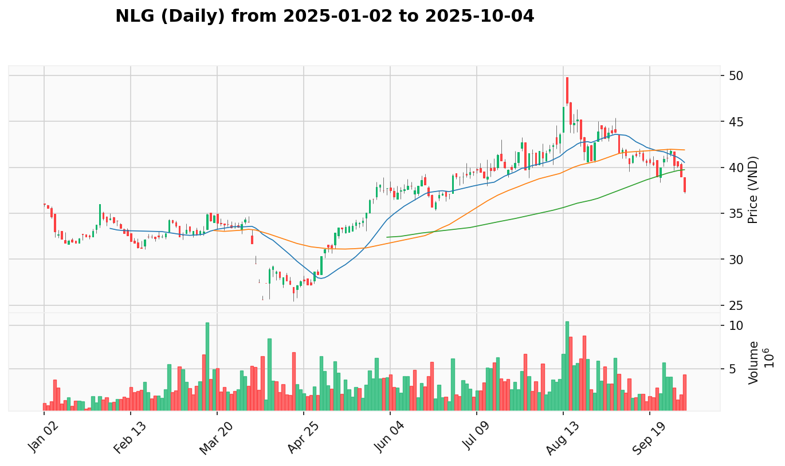

<a href="#bat-dong-san">↑ Back to group BAT_DONG_SAN</a>  |  <a href="#vpa-signal-summary">↑ Back to Top</a>

#### Key Statistics
| Metric | Value |
|:---|---:|
| Date Range | 2025-01-02 to 2025-10-17 |
| **Latest Close** | **38.65** |
| Period Open | 33.05 |
| Period High | 45.63 |
| Period Low | 23.29 |
| Period Change % | 16.94% |

**[Download NLG Data (.csv)](market_data/NLG_2025-01-02_to_2025-10-18.csv)**

---

### NNC

#### [VPA Analysis (2025-08-04 - 2025-10-16)](./VPA.md#nnc)
> **Ngày 2025-10-10:** NNC tăng từ 50.6 VND lên 50.7 VND với khối lượng giao dịch đạt 0.021 triệu cổ phiếu. Cây nến tăng có biên độ hẹp và đóng cửa ở mức cao nhất phiên. Tuy nhiên, khối lượng giao dịch rất thấp, cho thấy lực cầu yếu và không có sự tham gia mạnh mẽ của người mua. Điều này tiếp tục xác nhận tình trạng thiếu cầu của thị trường sau phiên giảm giá với dấu hiệu yếu kém trước đó. **Phân tích VPA/Wyckoff:** No Demand (Thiếu cầu)
> **Ngày 2025-10-13:** NNC tăng từ 50.7 VND lên 51.9 VND với khối lượng giao dịch đạt 0.0173 triệu cổ phiếu. Cây nến có biên độ rộng và đóng cửa gần mức cao nhất phiên, cho thấy lực mua chiếm ưu thế trong phiên. Tuy nhiên, khối lượng giao dịch lại giảm đáng kể so với phiên trước và ở mức thấp, xác nhận rằng đà tăng giá này không được hỗ trợ bởi lực cầu mạnh mẽ. Điều này tiếp tục củng cố nhận định về sự yếu kém của thị trường sau các phiên 'Dấu hiệu yếu kém' và 'Thiếu cầu' trước đó. **Phân tích VPA/Wyckoff:** No Demand (Thiếu cầu)
> **Ngày 2025-10-14:** NNC tăng từ 51.9 VND lên 52.6 VND với khối lượng giao dịch đạt 0.0173 triệu cổ phiếu. Cây nến tăng có biên độ rộng và đóng cửa gần mức cao nhất phiên, cho thấy lực mua chiếm ưu thế trong phiên. Tuy nhiên, khối lượng giao dịch vẫn ở mức rất thấp và không tăng so với phiên trước, xác nhận rằng đà tăng giá này không được hỗ trợ bởi lực cầu mạnh mẽ. Điều này tiếp tục củng cố nhận định về sự yếu kém của thị trường sau các phiên 'Dấu hiệu yếu kém' và 'Thiếu cầu' trước đó. **Phân tích VPA/Wyckoff:** No Demand (Thiếu cầu)
> **Ngày 2025-10-15:** NNC tăng từ 52.6 VND lên 53.2 VND với khối lượng giao dịch đạt 0.0283 triệu cổ phiếu. Cây nến có biên độ rộng và đóng cửa gần mức cao nhất phiên, cho thấy lực mua chiếm ưu thế. Khối lượng giao dịch tăng đáng kể so với hai phiên trước, cho thấy sự trở lại của lực cầu, phá vỡ chuỗi "Thiếu cầu" trước đó. **Phân tích VPA/Wyckoff:** Demand (Cầu trở lại)
> **Ngày 2025-10-16:** NNC giảm từ 53.2 VND xuống 52.1 VND với khối lượng giao dịch đạt 0.0035 triệu cổ phiếu. Cây nến giảm có biên độ rộng và đóng cửa ở mức thấp nhất phiên, cho thấy lực bán chiếm ưu thế. Tuy nhiên, khối lượng giao dịch cực kỳ thấp, giảm mạnh so với phiên trước và là mức thấp nhất trong 10 phiên gần đây. Điều này cho thấy không có lực cầu hỗ trợ giá, và lực bán cũng không mạnh mẽ, nhưng sự thiếu vắng của người mua đã khiến giá giảm. Đây là dấu hiệu của sự yếu kém tiếp diễn trên thị trường, sau phiên "Cầu trở lại" ngắn ngủi. **Phân tích VPA/Wyckoff:** No Demand (Thiếu cầu)

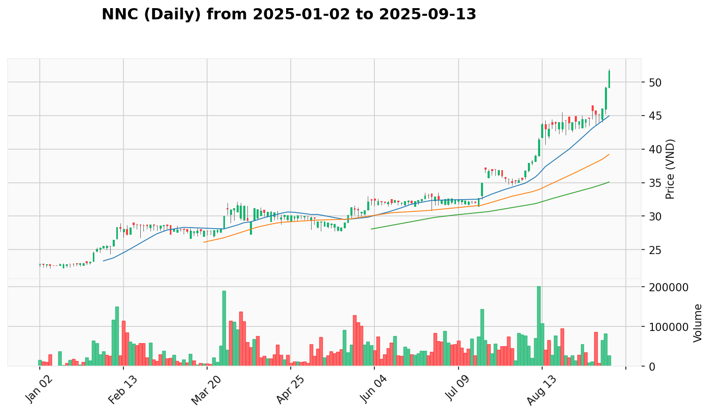

<a href="#khai-khoang">↑ Back to group KHAI_KHOANG</a>  |  <a href="#vpa-signal-summary">↑ Back to Top</a>

#### Key Statistics
| Metric | Value |
|:---|---:|
| Date Range | 2025-01-02 to 2025-10-17 |
| **Latest Close** | **52.7** |
| Period Open | 22.83 |
| Period High | 55.3 |
| Period Low | 22.2 |
| Period Change % | 130.84% |

**[Download NNC Data (.csv)](market_data/NNC_2025-01-02_to_2025-10-18.csv)**

---

### NRC

#### [VPA Analysis (2025-08-14 - 2025-10-16)](./VPA.md#nrc)
> **Ngày 2025-10-10:** NRC giảm từ 6.5 VND xuống 6.4 VND với khối lượng giao dịch đạt 0.585 triệu cổ phiếu. Nến ngày là nến giảm với biên độ trung bình, mở cửa ở mức 6.5 VND và đóng cửa gần mức thấp nhất phiên (6.4 VND), cho thấy áp lực bán chiếm ưu thế. Khối lượng giao dịch tăng đáng kể so với phiên "No Demand" trước đó (0.3687 triệu cổ phiếu), xác nhận rằng mặc dù cung đã cạn kiệt, cầu vẫn chưa xuất hiện để hỗ trợ giá, và bất kỳ áp lực bán nào cũng dễ dàng đẩy giá xuống. **Phân tích VPA/Wyckoff:** Sign of Weakness (SOW) - Dấu hiệu yếu kém.
> **Ngày 2025-10-13:** NRC tăng từ 6.4 VND lên 6.7 VND với khối lượng giao dịch đạt 0.8477 triệu cổ phiếu. Nến ngày là nến tăng mạnh, mở cửa ở mức 6.3 VND và đóng cửa ở mức cao nhất phiên 6.7 VND, cho thấy lực cầu đã quay trở lại và hấp thụ tốt lực cung. Khối lượng giao dịch tăng đáng kể so với phiên trước (0.585 triệu cổ phiếu), xác nhận sự xuất hiện của lực mua sau giai đoạn yếu kém. Điều này cho thấy sự thay đổi trong tâm lý thị trường, từ trạng thái yếu kém sang có dấu hiệu phục hồi. **Phân tích VPA/Wyckoff:** Sign of Strength (SOS) - Dấu hiệu sức mạnh.
> **Ngày 2025-10-14:** NRC giảm từ 6.7 VND xuống 6.6 VND với khối lượng giao dịch đạt 1.7522 triệu cổ phiếu. Nến ngày là nến giảm với biên độ rộng, mở cửa ở mức 6.8 VND và đóng cửa ở mức thấp nhất phiên (6.6 VND), cho thấy áp lực bán mạnh mẽ. Khối lượng giao dịch tăng đáng kể so với phiên trước (0.8477 triệu cổ phiếu), xác nhận sự xuất hiện của lực cung lớn, phủ nhận tín hiệu sức mạnh của phiên trước. **Phân tích VPA/Wyckoff:** Sign of Weakness (SOW) - Dấu hiệu yếu kém.
> **Ngày 2025-10-15:** NRC giữ nguyên mức giá 6.6 VND với khối lượng giao dịch đạt 0.6743 triệu cổ phiếu. Nến ngày là nến thân nhỏ, mở cửa ở mức 6.6 VND và đóng cửa ở mức 6.6 VND, cho thấy sự lưỡng lự của thị trường. Khối lượng giao dịch giảm mạnh so với phiên trước (1.7522 triệu cổ phiếu), cho thấy áp lực bán đã giảm bớt đáng kể sau phiên giảm mạnh với khối lượng lớn. Điều này cho thấy thị trường đang kiểm tra nguồn cung ở mức giá hiện tại. **Phân tích VPA/Wyckoff:** Test for Supply (Kiểm tra nguồn cung)
> **Ngày 2025-10-16:** NRC giữ nguyên mức giá 6.6 VND, mở cửa ở 6.7 VND và đóng cửa ở 6.6 VND với khối lượng giao dịch đạt 0.8367 triệu cổ phiếu. Nến ngày là nến giảm thân nhỏ, đóng cửa ở mức thấp nhất phiên, cho thấy áp lực bán vẫn hiện hữu. Khối lượng giao dịch tăng nhẹ so với phiên kiểm tra nguồn cung trước đó (0.6743 triệu cổ phiếu), nhưng giá không thể tăng lên, thậm chí còn đóng cửa ở mức thấp nhất phiên. Điều này cho thấy lực cầu yếu và không đủ sức hấp thụ nguồn cung hiện có, xác nhận sự yếu kém tiếp diễn sau tín hiệu SOW và kiểm tra nguồn cung không thành công. **Phân tích VPA/Wyckoff:** No Demand (Không có cầu)

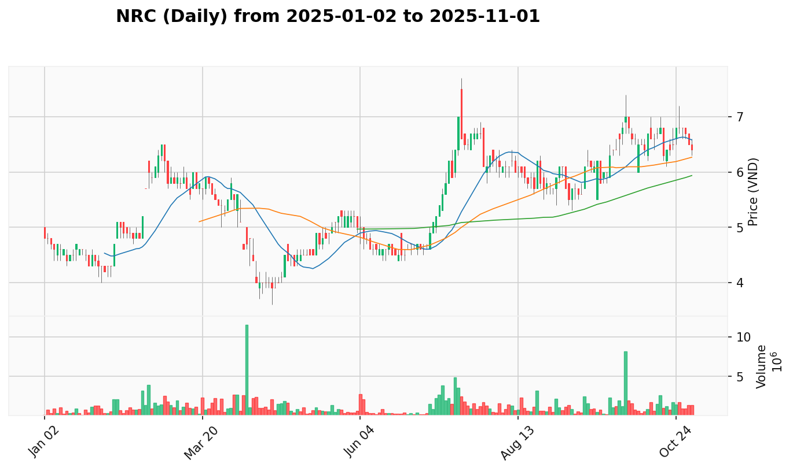

<a href="#penny">↑ Back to group PENNY</a>  |  <a href="#vpa-signal-summary">↑ Back to Top</a>

#### Key Statistics
| Metric | Value |
|:---|---:|
| Date Range | 2025-01-02 to 2025-10-17 |
| **Latest Close** | **6.8** |
| Period Open | 5.0 |
| Period High | 7.7 |
| Period Low | 3.6 |
| Period Change % | 36.00% |

**[Download NRC Data (.csv)](market_data/NRC_2025-01-02_to_2025-10-18.csv)**

---

### NT2

#### [VPA Analysis (2025-06-16 - 2025-10-16)](./VPA.md#nt2)
> **Ngày 2025-10-10:** NT2 tăng từ 23.2 lên 23.55 với khối lượng giao dịch đạt 0.8173 triệu cổ phiếu. Cây nến tăng có biên độ vừa phải, đóng cửa gần mức cao nhất phiên. Tuy nhiên, khối lượng giao dịch rất thấp, thấp hơn đáng kể so với phiên trước đó (1.3811 triệu cổ phiếu) và các phiên giảm giá mạnh. Điều này cho thấy lực cầu vẫn còn yếu và không đủ mạnh để đảo chiều xu hướng giảm đã thiết lập, tiếp tục xác nhận sự thiếu vắng của lực mua mạnh mẽ. **Phân tích VPA/Wyckoff:** No Demand (Thiếu cầu)
> **Ngày 2025-10-13:** NT2 giảm từ 23.2 xuống 23.1 với khối lượng giao dịch đạt 1.2236 triệu cổ phiếu. Cây nến giảm có biên độ vừa phải, đóng cửa gần mức thấp nhất phiên. Khối lượng giao dịch cao hơn đáng kể so với phiên tăng giá trước đó (2025-10-10) và cao hơn mức trung bình, cho thấy áp lực bán đang gia tăng và xác nhận xu hướng giảm giá đã thiết lập, đặc biệt sau các phiên "No Demand" trước đó. **Phân tích VPA/Wyckoff:** Sign of Weakness (SOW) - Áp lực bán gia tăng.
> **Ngày 2025-10-14:** NT2 giảm từ 22.95 xuống 22.4 với khối lượng giao dịch đạt 1.9177 triệu cổ phiếu. Cây nến giảm có biên độ rộng, đóng cửa tại mức thấp nhất phiên. Khối lượng giao dịch rất cao, cao hơn đáng kể so với phiên trước đó (1.2236 triệu cổ phiếu) và mức trung bình, cho thấy áp lực bán mạnh mẽ và sự hoảng loạn của nhà đầu tư. Điều này xác nhận xu hướng giảm giá tiếp diễn và cho thấy lực cung đang chiếm ưu thế hoàn toàn. **Phân tích VPA/Wyckoff:** Sign of Weakness (SOW) - Áp lực bán cực lớn.
> **Ngày 2025-10-15:** NT2 tăng từ 22.4 lên 22.65 với khối lượng giao dịch đạt 0.7667 triệu cổ phiếu. Cây nến tăng có biên độ vừa phải, đóng cửa ở nửa trên của thân nến. Khối lượng giao dịch rất thấp, thấp hơn đáng kể so với phiên giảm giá mạnh trước đó (1.9177 triệu cổ phiếu) và thấp hơn mức trung bình, cho thấy sự thiếu vắng lực cầu mạnh mẽ. Đây có thể là một phiên hồi phục yếu trong xu hướng giảm giá đã thiết lập, hoặc sự tạm lắng của áp lực bán mà không có sự tham gia của người mua lớn. **Phân tích VPA/Wyckoff:** No Demand (ND) - Thiếu cầu.
> **Ngày 2025-10-16:** NT2 giảm nhẹ từ 22.65 xuống 22.6 với khối lượng giao dịch đạt 0.312 triệu cổ phiếu. Cây nến có biên độ hẹp (từ 22.4 đến 22.9), đóng cửa gần giữa thân nến. Khối lượng giao dịch cực kỳ thấp, chỉ bằng khoảng 40% so với phiên trước đó (0.7667 triệu cổ phiếu) và thấp hơn rất nhiều so với mức trung bình. Điều này cho thấy sự thiếu vắng hoàn toàn lực cầu và sự thờ ơ của nhà đầu tư sau các phiên giảm giá mạnh. Mặc dù áp lực bán không còn mạnh như ngày 2025-10-14, nhưng không có dấu hiệu của lực mua chủ động. **Phân tích VPA/Wyckoff:** No Demand (ND) - Thiếu cầu trầm trọng.

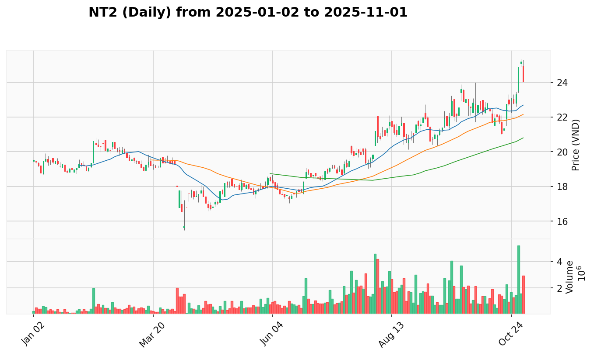

<a href="#nang-luong">↑ Back to group NANG_LUONG</a>  |  <a href="#vpa-signal-summary">↑ Back to Top</a>

#### Key Statistics
| Metric | Value |
|:---|---:|
| Date Range | 2025-01-02 to 2025-10-17 |
| **Latest Close** | **22.45** |
| Period Open | 20.09 |
| Period High | 24.8 |
| Period Low | 16.0 |
| Period Change % | 11.75% |

**[Download NT2 Data (.csv)](market_data/NT2_2025-01-02_to_2025-10-18.csv)**

---

### NTC

#### [VPA Analysis (2025-08-04 - 2025-10-15)](./VPA.md#ntc)
> **Ngày 2025-10-09:** NTC đóng cửa ở mức 162.5 VND, giảm từ 163.6 VND của ngày trước đó. Biên độ giá trong phiên hẹp (từ 162.1 VND đến 164.1 VND) và giá đóng cửa ở nửa dưới của thanh giá. Khối lượng giao dịch đạt 0.0107 triệu cổ phiếu, giảm đáng kể so với 0.0165 triệu cổ phiếu của ngày trước đó. Thanh giá cho thấy sự giảm giá nhẹ với biên độ hẹp và đóng cửa ở nửa dưới, đi kèm với khối lượng rất thấp. Điều này cho thấy lực bán không mạnh nhưng lực mua cũng hoàn toàn vắng bóng, tiếp tục xác nhận tình trạng thiếu cầu và suy yếu của thị trường từ các phiên trước. **Phân tích VPA/Wyckoff:** Weakness (Suy yếu)
> **Ngày 2025-10-10:** NTC đóng cửa ở mức 164.0 VND, tăng từ 162.5 VND của ngày trước đó. Biên độ giá trong phiên hẹp (từ 162.5 VND đến 164.4 VND) và giá đóng cửa ở nửa trên của thanh giá. Khối lượng giao dịch đạt 0.0253 triệu cổ phiếu, tăng đáng kể so với 0.0107 triệu cổ phiếu của ngày trước đó. Thanh giá tăng nhẹ với biên độ hẹp và đóng cửa ở nửa trên, đi kèm với khối lượng gia tăng, cho thấy lực cầu đã có dấu hiệu quay trở lại sau các phiên suy yếu và thiếu cầu. Tuy nhiên, sự tăng giá còn yếu và cần xác nhận thêm. **Phân tích VPA/Wyckoff:** Effort to Rise (Nỗ lực tăng giá)
> **Ngày 2025-10-13:** NTC đóng cửa ở mức 163.0 VND, giảm từ 164.0 VND của ngày trước đó. Biên độ giá trong phiên hẹp (từ 162.0 VND đến 163.5 VND) và giá đóng cửa ở giữa thanh giá. Khối lượng giao dịch đạt 0.0452 triệu cổ phiếu, tăng đáng kể so với 0.0253 triệu cổ phiếu của ngày trước đó. Thanh giá giảm nhẹ với biên độ hẹp và đóng cửa ở giữa, đi kèm với khối lượng gia tăng. Điều này cho thấy nỗ lực tăng giá trước đó đã gặp phải lực cung và thị trường vẫn đang trong trạng thái suy yếu, với áp lực bán vẫn còn hiện hữu. **Phân tích VPA/Wyckoff:** Weakness (Suy yếu)
> **Ngày 2025-10-14:** NTC đóng cửa ở mức 164.2 VND, tăng từ 163.0 VND của ngày trước đó. Biên độ giá trong phiên hẹp (từ 163.0 VND đến 165.0 VND) và giá đóng cửa ở nửa trên của thanh giá. Khối lượng giao dịch đạt 0.0443 triệu cổ phiếu, giảm nhẹ so với 0.0452 triệu cổ phiếu của ngày trước đó nhưng vẫn ở mức cao. Thanh giá tăng nhẹ với biên độ hẹp và đóng cửa ở nửa trên, đi kèm với khối lượng cao, cho thấy lực cầu đã quay trở lại và hấp thụ lực cung sau phiên suy yếu trước đó. **Phân tích VPA/Wyckoff:** Sign of Strength (SOS) - Lực cầu hấp thụ lực cung
> **Ngày 2025-10-15:** NTC đóng cửa ở mức 165.0 VND, tăng từ 164.2 VND của ngày trước đó. Biên độ giá trong phiên hẹp (từ 163.0 VND đến 165.1 VND) và giá đóng cửa ở gần mức cao nhất phiên. Khối lượng giao dịch đạt 0.03 triệu cổ phiếu, giảm so với 0.0443 triệu cổ phiếu của ngày trước đó. Thanh giá tăng nhẹ với biên độ hẹp và đóng cửa ở gần mức cao nhất, đi kèm với khối lượng giảm. Điều này cho thấy lực cầu vẫn duy trì nhưng không quá mạnh mẽ, đồng thời áp lực cung đã giảm bớt sau phiên SOS trước đó. **Phân tích VPA/Wyckoff:** Test for Supply (Kiểm tra cung) - Lực cầu duy trì với khối lượng giảm cho thấy cung đã cạn.

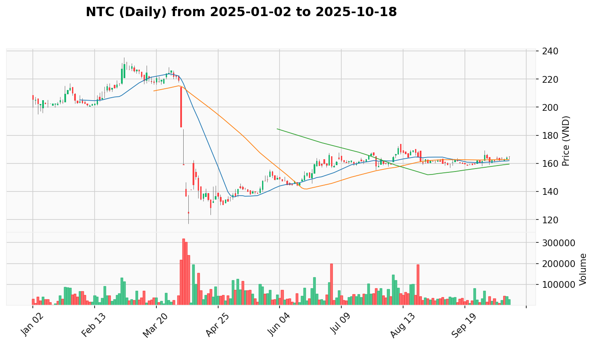

<a href="#bat-dong-san-kcn">↑ Back to group BAT_DONG_SAN_KCN</a>  |  <a href="#vpa-signal-summary">↑ Back to Top</a>

#### Key Statistics
| Metric | Value |
|:---|---:|
| Date Range | 2025-01-02 to 2025-10-15 |
| **Latest Close** | **165.0** |
| Period Open | 208.44 |
| Period High | 235.46 |
| Period Low | 117.05 |
| Period Change % | -20.84% |

**[Download NTC Data (.csv)](market_data/NTC_2025-01-02_to_2025-10-18.csv)**

---

### NTL

#### [VPA Analysis (2025-08-04 - 2025-10-16)](./VPA.md#ntl)
> **Ngày 2025-10-10:** Cổ phiếu NTL giảm từ 19.05 VND xuống 18.75 VND. Cây nến giảm có biên độ vừa phải (từ 18.75 VND đến 19.1 VND) và đóng cửa tại mức thấp nhất phiên. Khối lượng giao dịch đạt 1.3484 triệu cổ phiếu, tăng đáng kể so với phiên trước (0.7422 triệu cổ phiếu). Sau phiên "No Demand" vào ngày 2025-10-09, việc giá giảm mạnh và đóng cửa ở mức thấp nhất phiên, cùng với khối lượng tăng, cho thấy lực cung đã quay trở lại và áp đảo lực cầu. **Phân tích VPA/Wyckoff:** Sign of Weakness (SOW) - Lực cung mạnh mẽ.
> **Ngày 2025-10-13:** Cổ phiếu NTL tăng từ 18.75 VND lên 19.0 VND. Biên độ dao động trong phiên vừa phải, từ 18.55 VND đến 19.15 VND, và đóng cửa gần mức cao nhất phiên. Khối lượng giao dịch đạt 2.2009 triệu cổ phiếu, tăng đáng kể so với phiên trước (1.3484 triệu cổ phiếu). Sau phiên "Sign of Weakness" vào ngày 2025-10-10, việc giá tăng và đóng cửa gần mức cao nhất phiên, cùng với khối lượng tăng mạnh, cho thấy lực cầu đã quay trở lại và áp đảo lực cung. **Phân tích VPA/Wyckoff:** Sign of Strength (SOS) - Lực cầu mạnh mẽ.
> **Ngày 2025-10-14:** Cổ phiếu NTL mở cửa tại 19.2 VND và giảm xuống 18.55 VND. Cây nến giảm có biên độ vừa phải (từ 18.45 VND đến 19.2 VND) và đóng cửa gần mức thấp nhất phiên. Khối lượng giao dịch đạt 1.8642 triệu cổ phiếu, giảm so với phiên trước (2.2009 triệu cổ phiếu). Sau phiên "Sign of Strength" vào ngày 2025-10-13, việc giá giảm mạnh từ giá mở cửa và đóng cửa ở mức thấp nhất phiên, cùng với khối lượng giảm nhẹ, cho thấy lực cung đã xuất hiện trở lại và tạm thời áp đảo lực cầu. **Phân tích VPA/Wyckoff:** Sign of Weakness (SOW) - Lực cung xuất hiện.
> **Ngày 2025-10-15:** Cổ phiếu NTL giảm từ 18.55 VND xuống 18.4 VND. Biên độ dao động trong phiên vừa phải, từ 18.35 VND đến 18.9 VND, và đóng cửa gần mức thấp nhất phiên. Khối lượng giao dịch đạt 1.0477 triệu cổ phiếu, giảm đáng kể so với phiên trước (1.8642 triệu cổ phiếu). Sau phiên "Sign of Weakness" vào ngày 2025-10-14, việc giá tiếp tục giảm và đóng cửa gần mức thấp nhất phiên, cùng với khối lượng giảm mạnh, cho thấy lực cung vẫn chiếm ưu thế nhưng với cường độ giảm, đồng thời lực cầu không xuất hiện để hỗ trợ giá. Điều này cho thấy sự thiếu hụt nhu cầu mua. **Phân tích VPA/Wyckoff:** Sign of Weakness (SOW) - Lực cung tiếp diễn và thiếu hụt lực cầu.
> **Ngày 2025-10-16:** Cổ phiếu NTL tăng từ 18.4 VND lên 18.85 VND. Cây nến tăng có biên độ vừa phải (từ 18.4 VND đến 19.15 VND) và đóng cửa gần mức cao nhất phiên. Khối lượng giao dịch đạt 0.9915 triệu cổ phiếu, giảm so với phiên trước (1.0477 triệu cổ phiếu). Sau hai phiên "Sign of Weakness", việc giá tăng và đóng cửa gần mức cao nhất phiên cho thấy lực cầu đã xuất hiện trở lại, tuy nhiên khối lượng giảm nhẹ cho thấy lực cung đã suy yếu hoặc lực cầu chưa thực sự mạnh mẽ. **Phân tích VPA/Wyckoff:** Sign of Strength (SOS) - Lực cầu xuất hiện trở lại.

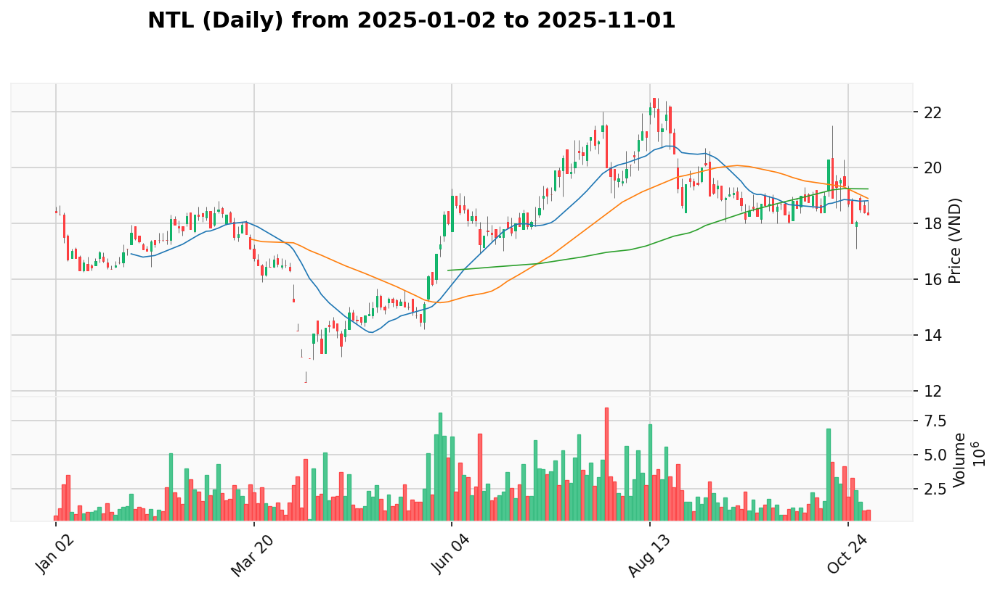

<a href="#bat-dong-san">↑ Back to group BAT_DONG_SAN</a>  |  <a href="#vpa-signal-summary">↑ Back to Top</a>

#### Key Statistics
| Metric | Value |
|:---|---:|
| Date Range | 2025-01-02 to 2025-10-17 |
| **Latest Close** | **20.3** |
| Period Open | 18.45 |
| Period High | 22.5 |
| Period Low | 12.3 |
| Period Change % | 10.03% |

**[Download NTL Data (.csv)](market_data/NTL_2025-01-02_to_2025-10-18.csv)**

---

### NTP

#### [VPA Analysis (2025-06-16 - 2025-10-16)](./VPA.md#ntp)
> **Ngày 2025-10-10:** NTP giảm từ 63.9 VND xuống 63.6 VND với khối lượng giao dịch đạt 0.1004 triệu cổ phiếu. Cây nến giảm có biên độ hẹp (spread 1.0 VND) và đóng cửa gần mức thấp nhất phiên. Sau phiên "Sign of Strength" (SOS) ngày 2025-10-09 với khối lượng gia tăng, phiên này cho thấy một sự điều chỉnh nhẹ với khối lượng thấp hơn, cho thấy lực bán không mạnh. Điều này có thể là một sự kiểm tra lại lực cung sau đợt tăng giá, và khối lượng thấp cho thấy cung không áp đảo. **Phân tích VPA/Wyckoff:** Test for Supply (Kiểm tra cung).
> **Ngày 2025-10-13:** NTP giảm từ 63.6 VND xuống 63.0 VND. Cây nến giảm có biên độ hẹp (spread 1.0 VND) và đóng cửa tại mức giá mở cửa. Khối lượng giao dịch đạt 0.1255 triệu cổ phiếu, cao hơn phiên trước đó (0.1004 triệu cổ phiếu) nhưng thấp hơn đáng kể so với phiên SOS ngày 2025-10-09. Sau phiên "Test for Supply", sự giảm giá nhẹ với biên độ hẹp và khối lượng vừa phải cho thấy lực cầu chưa quay trở lại mạnh mẽ để hấp thụ hết lực cung. Điều này báo hiệu sự thiếu vắng của lực cầu. **Phân tích VPA/Wyckoff:** No Demand (ND) - Thiếu cầu.
> **Ngày 2025-10-14:** NTP mở cửa tại 63.0 VND, sau đó tăng lên mức cao nhất 64.5 VND nhưng cuối cùng đóng cửa trở lại tại 63.0 VND. Cây nến có biên độ rộng (spread 1.9 VND) và khối lượng giao dịch đạt 0.2976 triệu cổ phiếu, cao hơn đáng kể so với phiên trước. Sự tăng giá trong phiên đã bị lực cung hấp thụ hoàn toàn, thể hiện qua việc giá đóng cửa không thay đổi so với giá mở cửa dù khối lượng giao dịch rất lớn. Điều này cho thấy nỗ lực đẩy giá lên của phe mua đã gặp phải sự kháng cự mạnh mẽ từ phe bán. Sau phiên "No Demand" ngày 2025-10-13, sự xuất hiện của khối lượng lớn mà không tạo ra sự tiến triển về giá là một dấu hiệu suy yếu rõ ràng, cho thấy khả năng phân phối đang diễn ra. **Phân tích VPA/Wyckoff:** Upthrust (UT) - Dấu hiệu phân phối.
> **Ngày 2025-10-15:** NTP mở cửa tại 63.3 VND, sau đó tăng lên mức cao nhất 63.9 VND nhưng cuối cùng đóng cửa tại 63.0 VND. Cây nến có biên độ rộng (spread 1.7 VND) và đóng cửa thấp hơn giá mở cửa, gần mức thấp nhất phiên. Khối lượng giao dịch đạt 0.2285 triệu cổ phiếu, thấp hơn phiên Upthrust trước đó nhưng vẫn ở mức đáng kể. Sau phiên Upthrust ngày 2025-10-14, việc giá không thể duy trì đà tăng và bị đẩy xuống đóng cửa ở mức thấp, cùng với khối lượng đáng kể, cho thấy áp lực bán vẫn còn mạnh mẽ và phe mua chưa đủ sức hấp thụ. Điều này xác nhận sự yếu kém của thị trường. **Phân tích VPA/Wyckoff:** Sign of Weakness (SOW) - Dấu hiệu suy yếu.
> **Ngày 2025-10-16:** NTP mở cửa tại 63.6 VND, tăng lên mức cao nhất 65.4 VND và đóng cửa tại 65.1 VND. Cây nến tăng có biên độ rộng (spread 1.8 VND) và đóng cửa gần mức cao nhất phiên, cho thấy lực cầu mạnh mẽ đã đẩy giá lên sau hai phiên suy yếu. Khối lượng giao dịch đạt 0.1644 triệu cổ phiếu, thấp hơn đáng kể so với các phiên trước đó. Sự tăng giá mạnh mẽ với khối lượng thấp hơn sau các dấu hiệu phân phối (Upthrust và Sign of Weakness) có thể là một dấu hiệu kiểm tra nguồn cung, cho thấy áp lực bán đã giảm bớt và phe mua đang kiểm soát trở lại. **Phân tích VPA/Wyckoff:** Test for Supply (TFS) - Kiểm tra nguồn cung.

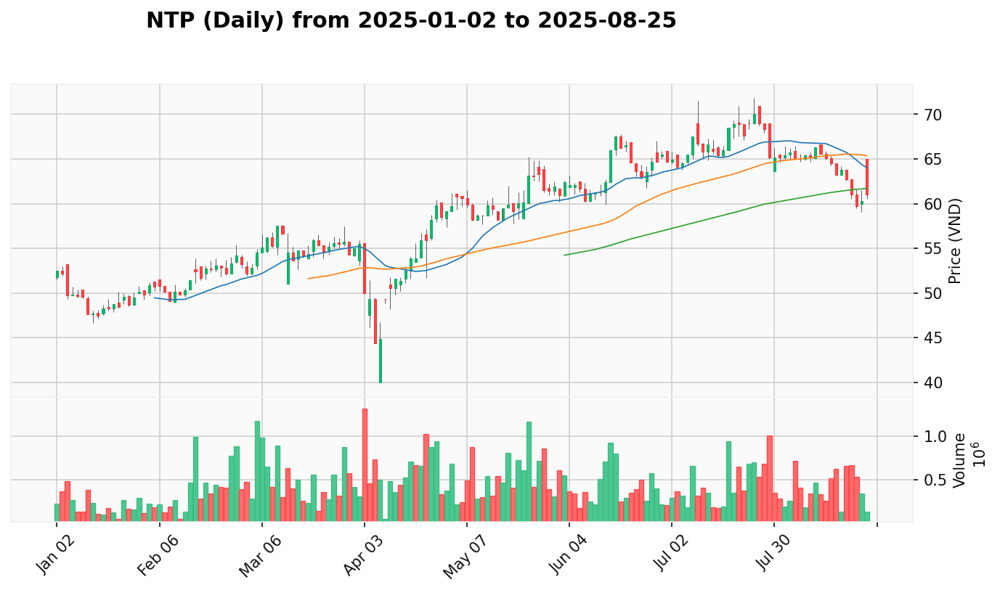

<a href="#nhua">↑ Back to group NHUA</a>  |  <a href="#vpa-signal-summary">↑ Back to Top</a>

#### Key Statistics
| Metric | Value |
|:---|---:|
| Date Range | 2025-01-02 to 2025-10-17 |
| **Latest Close** | **66.6** |
| Period Open | 51.8 |
| Period High | 71.8 |
| Period Low | 39.96 |
| Period Change % | 28.57% |

**[Download NTP Data (.csv)](market_data/NTP_2025-01-02_to_2025-10-18.csv)**

---

### NVL

#### [VPA Analysis (2025-06-13 - 2025-10-16)](./VPA.md#nvl)
> **Ngày 2025-10-10:** NVL mở cửa tại 15.45 VND, tăng lên mức cao nhất 16.0 VND, giảm xuống mức thấp nhất 15.45 VND và đóng cửa tại 15.6 VND, cao hơn giá đóng cửa phiên trước (15.3 VND). Biên độ nến rộng (0.55 VND) và đóng cửa gần mức cao nhất phiên. Khối lượng giao dịch đạt 15.22 triệu cổ phiếu, cao hơn đáng kể so với phiên trước (7.2954 triệu cổ phiếu). Sau phiên "No Demand" với khối lượng thấp, phiên hôm nay giá tăng với biên độ rộng và khối lượng cao, cho thấy lực cầu đã quay trở lại và chiếm ưu thế, đẩy giá lên. Điều này cho thấy sự phục hồi sau áp lực bán trước đó và có thể là một tín hiệu tích cực. **Phân tích VPA/Wyckoff:** Sign of Strength (Dấu hiệu sức mạnh) - Giá tăng mạnh trên khối lượng cao, cho thấy lực cầu đang chiếm ưu thế và khả năng tiếp tục tăng giá.
> **Ngày 2025-10-13:** NVL mở cửa tại 15.4 VND, tăng lên mức cao nhất 16.2 VND, giảm xuống mức thấp nhất 15.25 VND và đóng cửa tại 16.0 VND, cao hơn giá đóng cửa phiên trước (15.6 VND). Biên độ nến rộng (0.95 VND) và giá đóng cửa nằm gần mức cao nhất phiên. Khối lượng giao dịch đạt 22.2786 triệu cổ phiếu, cao hơn đáng kể so với phiên trước (15.2216 triệu cổ phiếu). Sau phiên "Sign of Strength" với khối lượng cao, phiên hôm nay giá tiếp tục tăng mạnh với biên độ rộng hơn và khối lượng gia tăng, cho thấy lực cầu đang rất mạnh mẽ và chiếm ưu thế hoàn toàn, đẩy giá lên cao. Điều này xác nhận xu hướng tăng giá và khả năng tiếp tục đà tăng. **Phân tích VPA/Wyckoff:** Sign of Strength (Dấu hiệu sức mạnh) - Giá tăng mạnh trên khối lượng rất cao, xác nhận lực cầu áp đảo và xu hướng tăng tiếp diễn.
> **Ngày 2025-10-14:** NVL mở cửa tại 16.15 VND, tăng lên mức cao nhất 16.2 VND, giảm xuống mức thấp nhất 15.45 VND và đóng cửa tại 15.5 VND, thấp hơn giá đóng cửa phiên trước (16.0 VND). Biên độ nến rộng (0.75 VND) và giá đóng cửa nằm gần mức thấp nhất phiên. Khối lượng giao dịch đạt 17.2374 triệu cổ phiếu, thấp hơn so với phiên trước (22.2786 triệu cổ phiếu). Sau hai phiên "Sign of Strength" mạnh mẽ, phiên hôm nay giá mở cửa cao nhưng sau đó giảm mạnh, đóng cửa ở mức thấp hơn đáng kể so với phiên trước, cho thấy áp lực bán đã xuất hiện và chiếm ưu thế. Mặc dù khối lượng vẫn ở mức cao, nhưng sự sụt giảm giá với biên độ rộng và đóng cửa gần mức thấp nhất cho thấy sự suy yếu của lực cầu và sự gia tăng của lực cung. **Phân tích VPA/Wyckoff:** Weakness (Dấu hiệu suy yếu) - Giá giảm mạnh với biên độ rộng và đóng cửa gần mức thấp nhất, cho thấy lực cung đang chiếm ưu thế sau giai đoạn tăng giá.
> **Ngày 2025-10-15:** NVL mở cửa tại 15.75 VND, tăng lên mức cao nhất 15.75 VND, giảm xuống mức thấp nhất 15.45 VND và đóng cửa tại 15.6 VND, cao hơn giá đóng cửa phiên trước (15.5 VND). Biên độ nến hẹp (0.3 VND) và giá đóng cửa nằm ở giữa thân nến. Khối lượng giao dịch đạt 8.8427 triệu cổ phiếu, thấp hơn đáng kể so với phiên trước (17.2374 triệu cổ phiếu) và là mức thấp trong các phiên gần đây. Sau phiên giảm mạnh với tín hiệu "Weakness" vào ngày 2025-10-14, phiên hôm nay giá có sự phục hồi nhẹ nhưng với khối lượng rất thấp, cho thấy lực cầu yếu và thiếu sự quyết đoán. Điều này có thể là một dấu hiệu của sự tạm dừng trong xu hướng giảm hoặc một nỗ lực tăng giá không thành công do thiếu sự hỗ trợ từ khối lượng. **Phân tích VPA/Wyckoff:** No Demand (Không có cầu) - Giá tăng nhẹ với khối lượng rất thấp sau một phiên giảm mạnh, cho thấy lực cầu yếu và khả năng xu hướng giảm tiếp diễn.
> **Ngày 2025-10-16:** NVL mở cửa tại 15.7 VND, tăng lên mức cao nhất 16.45 VND, giảm xuống mức thấp nhất 15.7 VND và đóng cửa tại 16.15 VND, cao hơn giá đóng cửa phiên trước (15.6 VND). Biên độ nến rộng (0.75 VND) và giá đóng cửa nằm gần mức cao nhất phiên. Khối lượng giao dịch đạt 20.6042 triệu cổ phiếu, cao hơn đáng kể so với phiên trước (8.8427 triệu cổ phiếu) và là mức cao nhất trong 3 phiên gần đây. Sau hai phiên "Weakness" và "No Demand", phiên hôm nay giá tăng mạnh với biên độ rộng và đóng cửa gần mức cao nhất, đi kèm với khối lượng giao dịch tăng vọt, cho thấy lực cầu đã quay trở lại mạnh mẽ và áp đảo lực cung. Điều này báo hiệu một sự thay đổi tích cực trong tâm lý thị trường. **Phân tích VPA/Wyckoff:** Sign of Strength (Dấu hiệu sức mạnh) - Giá tăng mạnh với khối lượng lớn, xác nhận lực cầu mạnh mẽ đã quay trở lại.

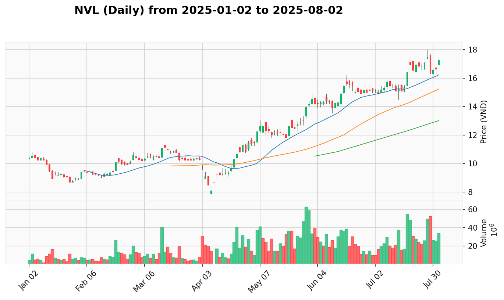

<a href="#bat-dong-san">↑ Back to group BAT_DONG_SAN</a>  |  <a href="#vpa-signal-summary">↑ Back to Top</a>

#### Key Statistics
| Metric | Value |
|:---|---:|
| Date Range | 2025-01-02 to 2025-10-17 |
| **Latest Close** | **16.6** |
| Period Open | 10.35 |
| Period High | 19.3 |
| Period Low | 7.88 |
| Period Change % | 60.39% |

**[Download NVL Data (.csv)](market_data/NVL_2025-01-02_to_2025-10-18.csv)**

---

### OCB

#### [VPA Analysis (2025-08-04 - 2025-10-16)](./VPA.md#ocb)
> **Ngày 2025-10-10:** OCB mở cửa 13.15 VND, dao động từ 13.1 VND đến 13.4 VND và đóng cửa 13.35 VND, tăng từ 13.1 VND lên 13.35 VND. Khối lượng giao dịch đạt 8.183.400 cổ phiếu (khoảng 8.18 triệu cổ phiếu), tăng mạnh so với phiên trước (3.250.400 cổ phiếu). Sau hai phiên "No Demand", giá tăng mạnh với biên độ rộng và đóng cửa gần mức cao nhất phiên, đi kèm khối lượng giao dịch gia tăng đáng kể. Điều này cho thấy lực cầu đã quay trở lại và đủ mạnh để đẩy giá lên, xác nhận sự xuất hiện của nhu cầu. **Phân tích VPA/Wyckoff:** Sign of Strength (SOS) - Lực cầu mạnh mẽ.
> **Ngày 2025-10-13:** OCB mở cửa ở mức 13.05 VND, dao động trong biên độ từ 13.05 VND đến 13.3 VND và đóng cửa ở mức 13.2 VND, giảm nhẹ so với mức đóng cửa 13.35 VND của phiên trước. Khối lượng giao dịch đạt 4.009.200 cổ phiếu (khoảng 4.01 triệu cổ phiếu), giảm đáng kể so với phiên trước (8.18 triệu cổ phiếu). Sau phiên "Sign of Strength" mạnh mẽ ngày 2025-10-10, giá có sự điều chỉnh nhẹ với biên độ hẹp và đóng cửa gần mức cao nhất phiên, đi kèm với khối lượng giao dịch sụt giảm mạnh. Điều này cho thấy lực cung đã suy yếu đáng kể và không có áp lực bán mạnh sau đợt tăng giá trước đó, xác nhận sự thiếu hụt nguồn cung. **Phân tích VPA/Wyckoff:** No Supply (Không có cung)
> **Ngày 2025-10-14:** OCB mở cửa 13.25 VND, dao động từ 12.95 VND đến 13.3 VND và đóng cửa 12.95 VND, giảm từ 13.2 VND xuống 12.95 VND. Khối lượng giao dịch đạt 4.207.200 cổ phiếu (khoảng 4.21 triệu cổ phiếu), tăng nhẹ so với phiên trước (4.01 triệu cổ phiếu). Sau phiên "No Supply" ngày 2025-10-13, giá giảm mạnh với biên độ rộng và đóng cửa ở mức thấp nhất phiên, đi kèm khối lượng giao dịch gia tăng nhẹ. Điều này cho thấy lực cung đã quay trở lại và đủ mạnh để đẩy giá xuống, xác nhận sự xuất hiện của áp lực bán. **Phân tích VPA/Wyckoff:** Sign of Weakness (SOW) - Lực cung mạnh mẽ.
> **Ngày 2025-10-15:** OCB mở cửa ở mức 12.95 VND, dao động trong biên độ từ 12.95 VND đến 13.1 VND và đóng cửa ở mức 13.05 VND, tăng nhẹ so với mức đóng cửa 12.95 VND của phiên trước. Khối lượng giao dịch đạt 3.738.200 cổ phiếu (khoảng 3.74 triệu cổ phiếu), giảm so với phiên trước (4.21 triệu cổ phiếu). Sau phiên "Sign of Weakness" ngày 2025-10-14, giá có sự phục hồi nhẹ với biên độ hẹp và đóng cửa ở nửa trên của nến, đi kèm với khối lượng giao dịch sụt giảm. Điều này cho thấy lực cung đã suy yếu đáng kể và không có áp lực bán mạnh sau đợt giảm giá trước đó, xác nhận sự thiếu hụt nguồn cung. **Phân tích VPA/Wyckoff:** No Supply (Không có cung)
> **Ngày 2025-10-16:** OCB mở cửa 13.05 VND, dao động từ 12.95 VND đến 13.15 VND và đóng cửa 13.0 VND, giảm nhẹ từ 13.05 VND xuống 13.0 VND. Khối lượng giao dịch đạt 1.891.100 cổ phiếu (khoảng 1.89 triệu cổ phiếu), giảm đáng kể so với phiên trước (3.74 triệu cổ phiếu). Sau phiên "No Supply" ngày 2025-10-15, giá giảm nhẹ với biên độ hẹp và đóng cửa ở gần giữa nến, đi kèm với khối lượng giao dịch sụt giảm mạnh. Điều này cho thấy lực cung tiếp tục suy yếu và không có áp lực bán đáng kể, nhưng đồng thời cũng thiếu vắng lực cầu mạnh mẽ để đẩy giá lên. Thị trường đang trong giai đoạn thiếu sự tham gia của cả hai phe. **Phân tích VPA/Wyckoff:** No Demand (Không có cầu) - Thiếu vắng lực cầu mạnh mẽ.

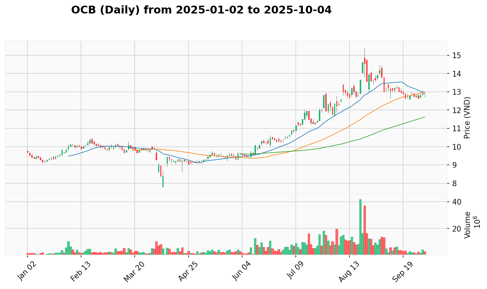

<a href="#ngan-hang">↑ Back to group NGAN_HANG</a>  |  <a href="#vpa-signal-summary">↑ Back to Top</a>

#### Key Statistics
| Metric | Value |
|:---|---:|
| Date Range | 2025-01-02 to 2025-10-17 |
| **Latest Close** | **12.9** |
| Period Open | 9.75 |
| Period High | 15.4 |
| Period Low | 7.8 |
| Period Change % | 32.31% |

**[Download OCB Data (.csv)](market_data/OCB_2025-01-02_to_2025-10-18.csv)**

---

### OIL

#### [VPA Analysis (2025-08-04 - 2025-10-16)](./VPA.md#oil)
> **Ngày 2025-10-10:** OIL giảm từ 11.3 VND xuống 11.2 VND, với giá đóng cửa ở mức giữa phiên. Khối lượng giao dịch đạt 0.3871 triệu cổ phiếu, giảm mạnh so với phiên trước (1.4886 triệu cổ phiếu) và là mức thấp nhất trong 10 phiên gần đây. Sau hai phiên tăng giá mạnh với khối lượng lớn (SOS), phiên này cho thấy sự suy yếu của lực bán và thiếu hụt nguồn cung. Điều này có thể là một nhịp điều chỉnh tự nhiên hoặc kiểm tra nguồn cung sau đợt tăng giá. **Phân tích VPA/Wyckoff:** No Supply (NS) - Giá giảm nhẹ trên khối lượng thấp, cho thấy lực cung đã cạn kiệt.
> **Ngày 2025-10-13:** OIL giảm từ 11.2 VND xuống 11.0 VND, với giá đóng cửa ở mức giữa phiên. Khối lượng giao dịch đạt 1.1396 triệu cổ phiếu, tăng mạnh so với phiên trước (0.3871 triệu cổ phiếu). Sau phiên No Supply (NS) ngày 2025-10-10, phiên này cho thấy lực cung đã quay trở lại thị trường với khối lượng tăng cao, mặc dù biên độ giảm giá không lớn. Điều này cho thấy áp lực bán đang gia tăng và có thể là một dấu hiệu suy yếu trong xu hướng tăng giá ngắn hạn. **Phân tích VPA/Wyckoff:** Supply Coming In (SCI) - Giá giảm trên khối lượng tăng, cho thấy lực cung đang chiếm ưu thế.
> **Ngày 2025-10-14:** OIL giảm từ 11.0 VND xuống 10.9 VND, với giá đóng cửa ở mức giữa phiên. Khối lượng giao dịch đạt 0.8873 triệu cổ phiếu, giảm so với phiên trước (1.1396 triệu cổ phiếu). Sau phiên Supply Coming In (SCI) ngày 2025-10-13, phiên này cho thấy áp lực bán đã giảm bớt. Mặc dù giá tiếp tục giảm, nhưng khối lượng thấp hơn cho thấy lực cung không còn mạnh mẽ như trước. Điều này có thể là một dấu hiệu cho thấy thị trường đang kiểm tra lại nguồn cung. **Phân tích VPA/Wyckoff:** Test for Supply (Kiểm tra nguồn cung)
> **Ngày 2025-10-15:** OIL giảm từ 10.9 VND xuống 10.7 VND, với giá đóng cửa ở mức giữa phiên. Khối lượng giao dịch đạt 1.049 triệu cổ phiếu, tăng so với phiên trước (0.8873 triệu cổ phiếu). Sau phiên Test for Supply ngày 2025-10-14, phiên này cho thấy lực cung tiếp tục chiếm ưu thế khi giá giảm với khối lượng tăng. Điều này xác nhận sự hiện diện của áp lực bán và có thể dẫn đến xu hướng giảm giá tiếp theo. **Phân tích VPA/Wyckoff:** Supply Coming In (SCI) - Lực cung tiếp tục gia tăng.
> **Ngày 2025-10-16:** OIL giảm từ 10.7 VND xuống 10.6 VND, với giá đóng cửa gần mức thấp nhất phiên. Khối lượng giao dịch đạt 0.2128 triệu cổ phiếu, giảm mạnh so với phiên trước (1.049 triệu cổ phiếu). Sau phiên Supply Coming In (SCI) ngày 2025-10-15, phiên này cho thấy áp lực bán đã cạn kiệt đáng kể. Mặc dù giá tiếp tục giảm, nhưng khối lượng cực thấp cho thấy không còn nhiều lực cung và cũng không có lực cầu đáng kể. Điều này cho thấy thị trường đang kiểm tra lại nguồn cung. **Phân tích VPA/Wyckoff:** Test for Supply (Kiểm tra nguồn cung)

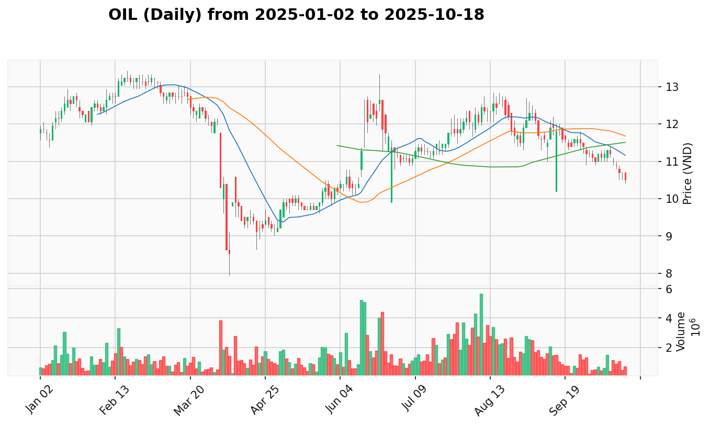

<a href="#dau-khi">↑ Back to group DAU_KHI</a>  |  <a href="#vpa-signal-summary">↑ Back to Top</a>

#### Key Statistics
| Metric | Value |
|:---|---:|
| Date Range | 2025-01-02 to 2025-10-17 |
| **Latest Close** | **10.5** |
| Period Open | 11.76 |
| Period High | 13.43 |
| Period Low | 7.94 |
| Period Change % | -10.71% |

**[Download OIL Data (.csv)](market_data/OIL_2025-01-02_to_2025-10-18.csv)**

---

### ORS

#### [VPA Analysis (2025-08-04 - 2025-10-16)](./VPA.md#ors)
> **Ngày 2025-10-10:** ORS giữ mức giá 14.5 VND với khối lượng giao dịch đạt 1.7783 triệu cổ phiếu. Cây nến có biên độ hẹp, giá mở cửa 14.5 VND, giá cao nhất 14.65 VND, giá thấp nhất 14.35 VND và đóng cửa ở mức 14.5 VND. Khối lượng giao dịch tăng nhẹ so với phiên trước (1.6756 triệu cổ phiếu) nhưng vẫn ở mức trung bình và thấp hơn đáng kể so với phiên Weakness ngày 2025-10-08. Sau phiên kiểm tra cung (TOS) thành công ngày 2025-10-09, việc giá tiếp tục giữ vững mức 14.5 VND với khối lượng tăng nhẹ cho thấy thị trường đang tiếp tục hấp thụ cung ở mức giá này. Áp lực bán không quá mạnh và lực cầu đang cố gắng duy trì mức giá, cho thấy khả năng tích lũy tiếp diễn. **Phân tích VPA/Wyckoff:** Test of Supply (TOS) - Kiểm tra cung.
> **Ngày 2025-10-13:** ORS giảm từ 14.5 VND xuống 14.15 VND với khối lượng giao dịch đạt 2.8576 triệu cổ phiếu. Cây nến giảm có biên độ hẹp, giá mở cửa 14.05 VND, giá cao nhất 14.4 VND, giá thấp nhất 13.95 VND và đóng cửa ở mức 14.15 VND. Khối lượng giao dịch tăng đáng kể so với phiên trước (1.7783 triệu cổ phiếu) cho thấy áp lực bán đã quay trở lại sau các phiên kiểm tra cung. Việc giá giảm với khối lượng gia tăng xác nhận sự yếu đi của thị trường. **Phân tích VPA/Wyckoff:** Sign of Weakness (SOW) - Dấu hiệu yếu đi.
> **Ngày 2025-10-14:** ORS tăng từ 14.15 VND lên 14.55 VND với khối lượng giao dịch đạt 5.5109 triệu cổ phiếu. Cây nến tăng có biên độ rộng, giá mở cửa 14.4 VND, giá cao nhất 15.0 VND, giá thấp nhất 14.25 VND và đóng cửa ở mức 14.55 VND. Khối lượng giao dịch tăng mạnh so với phiên trước (2.8576 triệu cổ phiếu) và là mức cao nhất trong 10 phiên gần đây. Sau phiên giảm điểm với dấu hiệu yếu đi (SOW) vào ngày 2025-10-13, sự tăng giá mạnh mẽ với khối lượng đột biến cho thấy lực cầu đã quay trở lại và hấp thụ toàn bộ áp lực bán. Điều này xác nhận sự đảo chiều tích cực và khả năng tiếp tục xu hướng tăng. **Phân tích VPA/Wyckoff:** Sign of Strength (SOS) - Lực cầu mạnh mẽ với khối lượng gia tăng xác nhận xu hướng tăng.
> **Ngày 2025-10-15:** ORS tăng từ 14.55 VND lên 15.55 VND với khối lượng giao dịch đạt 15.2804 triệu cổ phiếu. Cây nến tăng có biên độ rất rộng, giá mở cửa 14.55 VND, giá cao nhất 15.55 VND, giá thấp nhất 14.4 VND và đóng cửa ở mức 15.55 VND. Khối lượng giao dịch tăng đột biến so với phiên trước (5.5109 triệu cổ phiếu) và là mức cao nhất trong nhiều phiên gần đây, cho thấy lực cầu cực kỳ mạnh mẽ và quyết liệt đẩy giá lên cao. Sau phiên SOS ngày 2025-10-14, sự tiếp diễn của đà tăng giá với khối lượng bùng nổ xác nhận xu hướng tăng mạnh mẽ và khả năng tiếp tục chinh phục các mức giá cao hơn. **Phân tích VPA/Wyckoff:** Sign of Strength (SOS) - Lực cầu áp đảo hoàn toàn lực cung, xác nhận xu hướng tăng mạnh.
> **Ngày 2025-10-16:** ORS giảm từ 15.55 VND xuống 15.35 VND với khối lượng giao dịch đạt 1.552 triệu cổ phiếu. Cây nến giảm có biên độ hẹp, giá mở cửa 15.65 VND, giá cao nhất 15.7 VND, giá thấp nhất 15.2 VND và đóng cửa ở mức 15.35 VND. Khối lượng giao dịch giảm mạnh so với phiên trước (15.2804 triệu cổ phiếu), cho thấy áp lực bán không đáng kể sau hai phiên tăng giá mạnh mẽ. Đây là một nhịp điều chỉnh tự nhiên hoặc chốt lời nhẹ, củng cố cho xu hướng tăng giá đã được xác nhận. **Phân tích VPA/Wyckoff:** Test (Kiểm tra) - Lực cung yếu với khối lượng thấp, xác nhận thiếu áp lực bán.

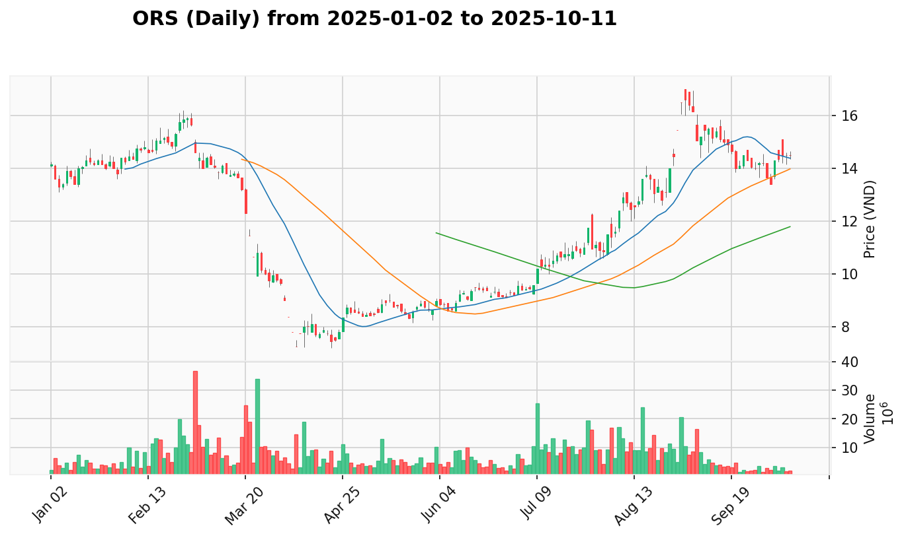

<a href="#chung-khoan">↑ Back to group CHUNG_KHOAN</a>  |  <a href="#vpa-signal-summary">↑ Back to Top</a>

#### Key Statistics
| Metric | Value |
|:---|---:|
| Date Range | 2025-01-02 to 2025-10-17 |
| **Latest Close** | **15.5** |
| Period Open | 14.1 |
| Period High | 17.0 |
| Period Low | 7.19 |
| Period Change % | 9.93% |

**[Download ORS Data (.csv)](market_data/ORS_2025-01-02_to_2025-10-18.csv)**

---

### PAN

#### [VPA Analysis (2025-06-26 - 2025-10-16)](./VPA.md#pan)
> **Ngày 2025-10-10:** PAN mở cửa ở 31.5 VND và đóng cửa ở 31.3 VND, với mức cao nhất là 31.55 VND và thấp nhất là 30.95 VND. Giá tăng từ 30.9 VND lên 31.3 VND, đóng cửa ở giữa biên độ hẹp (0.6 VND). Khối lượng giao dịch đạt 0.8112 triệu cổ phiếu, giảm so với phiên trước (1.0186 triệu cổ phiếu). Sau hai phiên "Weakness" liên tiếp, phiên này cho thấy giá tăng nhẹ nhưng với khối lượng giảm và biên độ hẹp, cho thấy thiếu lực cầu mạnh mẽ để đẩy giá lên cao hơn. Điều này có thể là một dấu hiệu của sự thiếu vắng nhu cầu. **Phân tích VPA/Wyckoff:** No Demand (Thiếu cầu)
> **Ngày 2025-10-13:** PAN mở cửa ở 30.75 VND và đóng cửa ở 31.5 VND, với mức cao nhất là 31.5 VND và thấp nhất là 30.7 VND. Giá tăng từ 30.75 VND lên 31.5 VND, đóng cửa ở mức cao nhất của biên độ tương đối rộng (0.8 VND). Khối lượng giao dịch đạt 0.634 triệu cổ phiếu, giảm so với phiên trước (0.8112 triệu cổ phiếu). Sau hai phiên "Weakness" và "No Demand", phiên này cho thấy sự phục hồi mạnh mẽ về giá, đóng cửa ở mức cao nhất phiên với biên độ rộng. Mặc dù khối lượng giảm, điều này có thể cho thấy áp lực bán đã suy yếu đáng kể, và thị trường đang kiểm tra lượng cung còn lại. **Phân tích VPA/Wyckoff:** Lack of Supply (Thiếu cung)
> **Ngày 2025-10-14:** PAN mở cửa ở 31.5 VND và đóng cửa ở 30.85 VND, với mức cao nhất là 31.75 VND và thấp nhất là 30.85 VND. Giá giảm từ 31.5 VND xuống 30.85 VND, đóng cửa ở mức thấp nhất của biên độ rộng (0.9 VND). Khối lượng giao dịch đạt 1.2328 triệu cổ phiếu, tăng đáng kể so với phiên trước (0.634 triệu cổ phiếu). Sau phiên "Lack of Supply" trước đó, phiên này cho thấy áp lực bán mạnh mẽ với giá giảm sâu và khối lượng tăng vọt, cho thấy nguồn cung đã quay trở lại thị trường và đang chiếm ưu thế. Điều này có thể là một dấu hiệu của sự suy yếu. **Phân tích VPA/Wyckoff:** Sign of Weakness (SOW)
> **Ngày 2025-10-15:** PAN mở cửa ở 30.65 VND và đóng cửa ở 31.1 VND, với mức cao nhất là 31.7 VND và thấp nhất là 30.65 VND. Giá tăng nhẹ từ 30.85 VND (giá đóng cửa phiên trước) lên 31.1 VND, đóng cửa ở giữa biên độ tương đối rộng (1.05 VND). Khối lượng giao dịch đạt 0.7654 triệu cổ phiếu, giảm đáng kể so với phiên trước (1.2328 triệu cổ phiếu). Sau phiên "Sign of Weakness" với khối lượng lớn, phiên này cho thấy giá có sự phục hồi nhẹ nhưng với khối lượng thấp, cho thấy áp lực bán đã giảm bớt nhưng lực cầu chưa thực sự mạnh mẽ để đẩy giá lên cao hơn. Việc đóng cửa ở giữa biên độ cho thấy sự lưỡng lự của thị trường. **Phân tích VPA/Wyckoff:** Testing Supply (Kiểm tra cung)
> **Ngày 2025-10-16:** PAN mở cửa ở 31.0 VND và đóng cửa ở 31.4 VND, với mức cao nhất là 31.7 VND và thấp nhất là 31.0 VND. Giá tăng từ 31.0 VND lên 31.4 VND, đóng cửa gần mức cao nhất của biên độ hẹp (0.7 VND). Khối lượng giao dịch đạt 0.6123 triệu cổ phiếu, giảm đáng kể so với phiên trước (0.7654 triệu cổ phiếu). Sau phiên "Testing Supply" trước đó, phiên này cho thấy giá tiếp tục tăng nhẹ nhưng với khối lượng thấp hơn, cho thấy áp lực bán đã cạn kiệt và nguồn cung không còn nhiều. Việc giá đóng cửa gần mức cao nhất trong biên độ hẹp với khối lượng thấp là dấu hiệu của sự thiếu hụt nguồn cung. **Phân tích VPA/Wyckoff:** No Supply (Thiếu hụt nguồn cung)

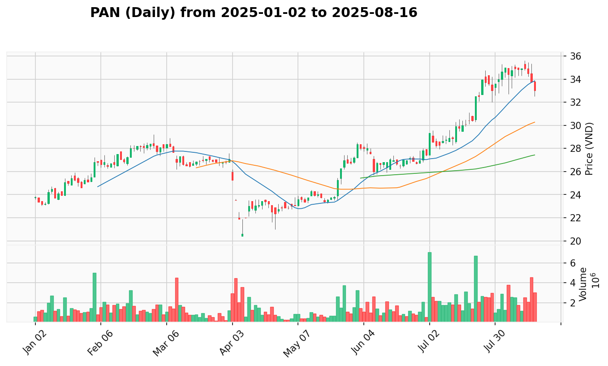

<a href="#nong-nghiep">↑ Back to group NONG_NGHIEP</a>  |  <a href="#vpa-signal-summary">↑ Back to Top</a>

#### Key Statistics
| Metric | Value |
|:---|---:|
| Date Range | 2025-01-02 to 2025-10-17 |
| **Latest Close** | **31.85** |
| Period Open | 23.4 |
| Period High | 35.6 |
| Period Low | 20.1 |
| Period Change % | 36.11% |

**[Download PAN Data (.csv)](market_data/PAN_2025-01-02_to_2025-10-18.csv)**

---

### PC1

#### [VPA Analysis (2025-06-16 - 2025-10-16)](./VPA.md#pc1)
> **Ngày 2025-10-10:** PC1 mở cửa ở 24.55 VND, đạt mức cao nhất 25.1 VND và mức thấp nhất 24.5 VND, sau đó đóng cửa ở 24.55 VND. Giá đóng cửa tăng nhẹ từ 24.5 VND lên 24.55 VND so với phiên trước, tạo thành một nến thân nhỏ với bóng nến trên dài, cho thấy áp lực bán xuất hiện khi giá tăng. Khối lượng giao dịch đạt 2.0441 triệu cổ phiếu, giảm đáng kể so với phiên trước (2.8334 triệu cổ phiếu). Sau hai phiên "Dấu hiệu suy yếu" (SOW) liên tiếp, phiên hôm nay cho thấy sự tạm lắng của áp lực bán nhưng không có lực cầu mạnh mẽ để đẩy giá lên cao. Việc giá tăng nhẹ với khối lượng giảm cho thấy sự thiếu vắng nhu cầu thực sự, xác nhận khả năng tiếp diễn xu hướng giảm. **Phân tích VPA/Wyckoff:** No Demand (Không có nhu cầu).
> **Ngày 2025-10-13:** PC1 mở cửa ở 24.15 VND, đạt mức cao nhất 24.55 VND và mức thấp nhất 24.15 VND, sau đó đóng cửa ở 24.3 VND. Giá đóng cửa giảm từ 24.55 VND xuống 24.3 VND so với phiên trước và đóng cửa dưới mức mở cửa, tạo thành một nến giảm thân nhỏ. Khối lượng giao dịch đạt 2.1861 triệu cổ phiếu, tăng nhẹ so với phiên trước (2.0441 triệu cổ phiếu). Sau phiên "Không có nhu cầu", phiên hôm nay cho thấy áp lực bán tiếp tục xuất hiện khi giá giảm với khối lượng tăng nhẹ, xác nhận sự thiếu vắng lực cầu và khả năng tiếp diễn xu hướng giảm. **Phân tích VPA/Wyckoff:** Tiếp diễn suy yếu (Continued Weakness).
> **Ngày 2025-10-14:** PC1 mở cửa ở 24.5 VND, đạt mức cao nhất 25.15 VND và mức thấp nhất 24.3 VND, sau đó đóng cửa ở 24.6 VND. Giá đóng cửa tăng nhẹ từ 24.3 VND lên 24.6 VND so với phiên trước, tạo thành một nến thân nhỏ với bóng nến trên tương đối dài, cho thấy áp lực bán xuất hiện khi giá tăng. Khối lượng giao dịch đạt 3.3037 triệu cổ phiếu, tăng đáng kể so với phiên trước (2.1861 triệu cổ phiếu). Sau các phiên "Không có nhu cầu" và "Tiếp diễn suy yếu", phiên hôm nay cho thấy nỗ lực đẩy giá lên nhưng gặp phải lực cung mạnh, khiến giá chỉ tăng nhẹ dù khối lượng tăng cao. Điều này cho thấy sự thiếu hiệu quả của lực cầu và khả năng tiếp diễn xu hướng đi ngang hoặc giảm. **Phân tích VPA/Wyckoff:** Effort without Result (Nỗ lực không mang lại kết quả).
> **Ngày 2025-10-15:** PC1 mở cửa ở 24.6 VND, đạt mức cao nhất 24.6 VND và mức thấp nhất 23.8 VND, sau đó đóng cửa ở 23.8 VND. Giá đóng cửa giảm mạnh từ 24.6 VND xuống 23.8 VND so với phiên trước và đóng cửa ở mức thấp nhất phiên, tạo thành một nến giảm thân rộng. Khối lượng giao dịch đạt 3.5382 triệu cổ phiếu, tăng so với phiên trước (3.3037 triệu cổ phiếu). Sau phiên "Nỗ lực không mang lại kết quả", phiên hôm nay cho thấy áp lực bán mạnh mẽ và sự thiếu vắng lực cầu, đẩy giá xuống thấp nhất phiên với khối lượng gia tăng. Điều này xác nhận xu hướng suy yếu và khả năng tiếp diễn đà giảm. **Phân tích VPA/Wyckoff:** Sign of Weakness (SOW)
> **Ngày 2025-10-16:** PC1 mở cửa ở 23.95 VND, đạt mức cao nhất 24.05 VND và mức thấp nhất 23.3 VND, sau đó đóng cửa ở 23.35 VND. Giá đóng cửa giảm từ 23.8 VND xuống 23.35 VND so với phiên trước, tạo thành một nến giảm thân rộng đóng cửa gần mức thấp nhất. Khối lượng giao dịch đạt 2.4808 triệu cổ phiếu, giảm so với phiên trước (3.5382 triệu cổ phiếu). Sau phiên "Sign of Weakness" mạnh mẽ, phiên hôm nay tiếp tục cho thấy sự suy yếu khi giá giảm sâu với biên độ rộng, đóng cửa gần mức thấp nhất. Mặc dù khối lượng giảm, điều này cho thấy lực cầu vẫn vắng bóng và áp lực bán vẫn duy trì, xác nhận xu hướng giảm tiếp diễn. **Phân tích VPA/Wyckoff:** Tiếp diễn suy yếu

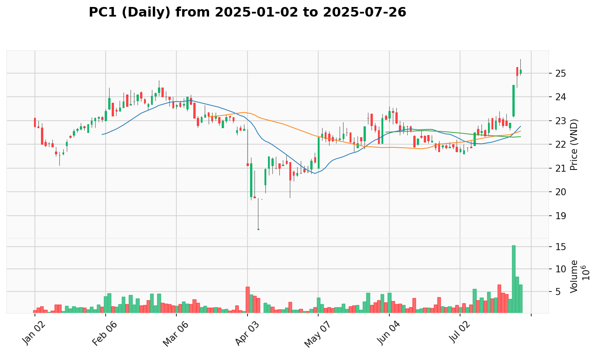

<a href="#xay-lap-dien">↑ Back to group XAY_LAP_DIEN</a>  |  <a href="#vpa-signal-summary">↑ Back to Top</a>

#### Key Statistics
| Metric | Value |
|:---|---:|
| Date Range | 2025-01-02 to 2025-10-17 |
| **Latest Close** | **23.25** |
| Period Open | 23.1 |
| Period High | 32.5 |
| Period Low | 18.4 |
| Period Change % | 0.65% |

**[Download PC1 Data (.csv)](market_data/PC1_2025-01-02_to_2025-10-18.csv)**

---

### PDR

#### [VPA Analysis (2025-06-26 - 2025-10-16)](./VPA.md#pdr)
> **Ngày 2025-10-10:** PDR mở cửa tại 23.5 VND, tăng lên 24.0 VND và đóng cửa tại 23.65 VND, cao hơn đáng kể so với phiên trước (23.3 VND). Biên độ giá rộng hơn và giá đóng cửa ở nửa trên của thân nến cho thấy lực cầu mạnh mẽ. Khối lượng giao dịch đạt 18.68 triệu cổ phiếu, cao hơn đáng kể so với phiên trước (10.99 triệu cổ phiếu). Sau phiên kiểm tra cung (Test for Supply) ngày 2025-10-09, phiên này xác nhận sự trở lại của lực cầu với khối lượng gia tăng. **Phân tích VPA/Wyckoff:** Sign of Strength (SOS) - Lực cầu mạnh mẽ.
> **Ngày 2025-10-13:** PDR mở cửa tại 23.2 VND, sau đó tăng mạnh và đóng cửa tại 24.65 VND, cao hơn đáng kể so với phiên trước (23.65 VND). Biên độ giá rất rộng và giá đóng cửa gần mức cao nhất phiên (25.0 VND) cho thấy lực cầu áp đảo. Khối lượng giao dịch đạt 34.97 triệu cổ phiếu, cao hơn gấp đôi so với phiên trước (18.68 triệu cổ phiếu). Sau phiên SOS ngày 2025-10-10, phiên này tiếp tục xác nhận sự trở lại mạnh mẽ của lực cầu với giá tăng mạnh và khối lượng đột biến. **Phân tích VPA/Wyckoff:** Sign of Strength (SOS) - Lực cầu tiếp tục mạnh mẽ.
> **Ngày 2025-10-14:** PDR mở cửa tại 25.0 VND, tăng lên 25.4 VND và đóng cửa tại 24.9 VND, cao hơn so với phiên trước (24.65 VND). Biên độ giá vẫn rộng và giá đóng cửa ở nửa trên của thân nến cho thấy lực cầu tiếp tục chiếm ưu thế. Khối lượng giao dịch đạt 36.68 triệu cổ phiếu, cao hơn so với phiên trước (34.97 triệu cổ phiếu) và duy trì ở mức rất cao. Sau hai phiên SOS liên tiếp, phiên này tiếp tục xác nhận đà tăng mạnh mẽ với khối lượng lớn. **Phân tích VPA/Wyckoff:** Sign of Strength (SOS) - Lực cầu tiếp tục mạnh mẽ.
> **Ngày 2025-10-15:** PDR mở cửa tại 24.95 VND, sau đó tăng mạnh và đóng cửa tại 25.5 VND, cao hơn đáng kể so với phiên trước (24.9 VND). Biên độ giá rộng và giá đóng cửa gần mức cao nhất phiên (25.85 VND) cho thấy lực cầu tiếp tục áp đảo. Khối lượng giao dịch đạt 26.57 triệu cổ phiếu, thấp hơn so với phiên trước (36.68 triệu cổ phiếu) nhưng vẫn duy trì ở mức cao, cho thấy sự tiếp diễn của xu hướng tăng giá với ít nỗ lực hơn. Sau các phiên SOS liên tiếp, phiên này tiếp tục xác nhận đà tăng mạnh mẽ. **Phân tích VPA/Wyckoff:** Sign of Strength (SOS) - Lực cầu tiếp tục mạnh mẽ.
> **Ngày 2025-10-16:** PDR mở cửa tại 25.9 VND, tăng lên 27.0 VND và đóng cửa tại 26.35 VND, cao hơn so với phiên trước (25.5 VND). Biên độ giá rộng và giá đóng cửa ở nửa trên của thân nến cho thấy lực cầu tiếp tục chiếm ưu thế. Khối lượng giao dịch đạt 20.53 triệu cổ phiếu, thấp hơn so với phiên trước (26.57 triệu cổ phiếu) nhưng vẫn duy trì ở mức cao. Sau các phiên SOS liên tiếp, phiên này tiếp tục xác nhận đà tăng mạnh mẽ với khối lượng giảm nhẹ nhưng vẫn ở mức cao, cho thấy sự tiếp diễn của xu hướng tăng giá. **Phân tích VPA/Wyckoff:** Sign of Strength (SOS) - Lực cầu tiếp tục mạnh mẽ.

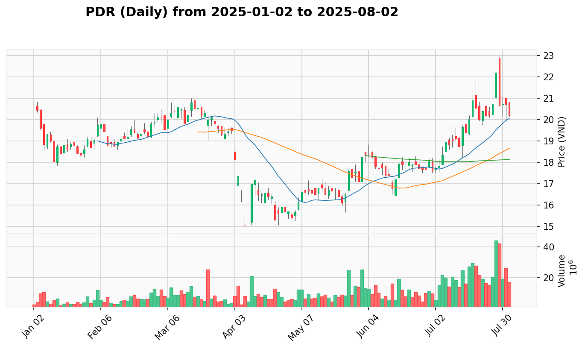

<a href="#bat-dong-san">↑ Back to group BAT_DONG_SAN</a>  |  <a href="#vpa-signal-summary">↑ Back to Top</a>

#### Key Statistics
| Metric | Value |
|:---|---:|
| Date Range | 2025-01-02 to 2025-10-17 |
| **Latest Close** | **26.0** |
| Period Open | 19.17 |
| Period High | 27.2 |
| Period Low | 13.93 |
| Period Change % | 35.63% |

**[Download PDR Data (.csv)](market_data/PDR_2025-01-02_to_2025-10-18.csv)**

---

### PET

#### [VPA Analysis (2025-08-04 - 2025-10-16)](./VPA.md#pet)
> **Ngày 2025-10-10:** PET mở cửa ở 33.95 VND, sau đó tăng lên mức cao nhất 34.4 VND nhưng không giữ được đà tăng và đóng cửa ở 33.5 VND, bằng với giá đóng cửa phiên trước. Biên độ dao động trong ngày (từ 33.4 VND đến 34.4 VND) cho thấy sự lưỡng lự của thị trường sau phiên tăng mạnh. Khối lượng giao dịch đạt 2.0016 triệu cổ phiếu, giảm đáng kể so với phiên trước (4.248 triệu cổ phiếu). Sau phiên SOS mạnh mẽ vào ngày 2025-10-09, phiên này cho thấy giá không thể tiếp tục tăng và khối lượng giảm, điều này có thể cho thấy lực cầu đã suy yếu hoặc thị trường đang kiểm tra lại lượng cung sau đợt tăng giá. **Phân tích VPA/Wyckoff:** No Demand (ND) - Giá không thể duy trì đà tăng sau phiên SOS, đóng cửa ngang bằng với phiên trước với khối lượng giảm mạnh, cho thấy lực cầu đã suy yếu hoặc thiếu sự tiếp nối.
> **Ngày 2025-10-13:** PET mở cửa ở 33.0 VND, sau đó tăng nhẹ lên mức cao nhất 33.3 VND và đóng cửa tại mức này. Biên độ dao động trong ngày (từ 32.65 VND đến 33.3 VND) hẹp. Giá đóng cửa 33.3 VND, thấp hơn so với giá đóng cửa phiên trước (33.5 VND). Khối lượng giao dịch đạt 1.9651 triệu cổ phiếu, tiếp tục giảm so với phiên trước (2.0016 triệu cổ phiếu) và thấp hơn đáng kể so với phiên SOS ngày 2025-10-09 (4.248 triệu cổ phiếu). Sau phiên "No Demand" ngày 2025-10-10, phiên này cho thấy một nỗ lực tăng giá yếu ớt với biên độ hẹp và khối lượng thấp, xác nhận rằng lực cầu vẫn chưa quay trở lại mạnh mẽ để đẩy giá lên cao hơn. Điều này cho thấy thị trường vẫn đang thiếu sự tiếp nối của lực cầu. **Phân tích VPA/Wyckoff:** No Demand (ND) - Lực cầu yếu ớt, không đủ sức đẩy giá lên cao hơn với khối lượng thấp sau phiên "No Demand" trước đó.
> **Ngày 2025-10-14:** PET mở cửa ở 34.0 VND, sau đó tăng lên mức cao nhất 34.75 VND nhưng không thể duy trì đà tăng và đóng cửa ở 33.2 VND, thấp hơn giá mở cửa và giá đóng cửa phiên trước. Biên độ dao động trong ngày (từ 33.0 VND đến 34.75 VND) rộng hơn đáng kể so với phiên trước. Khối lượng giao dịch đạt 2.8629 triệu cổ phiếu, tăng so với hai phiên trước đó (1.9651 triệu và 2.0016 triệu cổ phiếu). Sau hai phiên "No Demand" liên tiếp, phiên này cho thấy một nỗ lực tăng giá vào đầu phiên nhưng đã bị đẩy lùi bởi lực cung mạnh mẽ, khiến giá đóng cửa giảm với khối lượng tăng. Điều này cho thấy lực cung đang chiếm ưu thế và hấp thụ lực cầu ở các mức giá cao hơn. **Phân tích VPA/Wyckoff:** Supply Coming In (SCI) - Giá tăng nhưng không giữ được đà, đóng cửa giảm với khối lượng tăng, cho thấy lực cung mạnh mẽ đang xuất hiện.
> **Ngày 2025-10-15:** PET mở cửa ở 33.25 VND, sau đó tăng lên mức cao nhất 34.4 VND và đóng cửa tại 33.9 VND, cao hơn giá đóng cửa phiên trước (33.2 VND). Biên độ dao động trong ngày (từ 33.2 VND đến 34.4 VND) vừa phải. Khối lượng giao dịch đạt 2.2845 triệu cổ phiếu, giảm so với phiên trước (2.8629 triệu cổ phiếu). Sau phiên "Supply Coming In" ngày 2025-10-14, phiên này cho thấy giá tăng trở lại với khối lượng thấp hơn, cho thấy lực cung đã giảm bớt và lực cầu đang dần hấp thụ lượng cung còn lại. Điều này có thể là một dấu hiệu tích cực cho thấy áp lực bán đang suy yếu. **Phân tích VPA/Wyckoff:** Test for Supply (TS) - Giá tăng với khối lượng thấp sau phiên giảm giá có khối lượng cao, cho thấy lực cung đã giảm.
> **Ngày 2025-10-16:** PET mở cửa ở 34.0 VND, tăng lên mức cao nhất 35.0 VND và đóng cửa ở 34.3 VND, cao hơn giá đóng cửa phiên trước (33.9 VND). Biên độ dao động trong ngày vừa phải. Khối lượng giao dịch đạt 0.8131 triệu cổ phiếu, giảm đáng kể so với phiên trước (2.2845 triệu cổ phiếu) và thấp hơn nhiều so với mức trung bình. Sau phiên "Test for Supply" ngày 2025-10-15, phiên này cho thấy giá tăng nhẹ nhưng với khối lượng rất thấp, cho thấy lực cầu yếu và thiếu sự tham gia của dòng tiền lớn để đẩy giá lên cao hơn. Điều này có thể là dấu hiệu của sự thiếu hụt cầu, hoặc thị trường đang chờ đợi tín hiệu rõ ràng hơn. **Phân tích VPA/Wyckoff:** No Demand (ND) - Giá tăng nhẹ với khối lượng rất thấp, cho thấy thiếu hụt lực cầu.

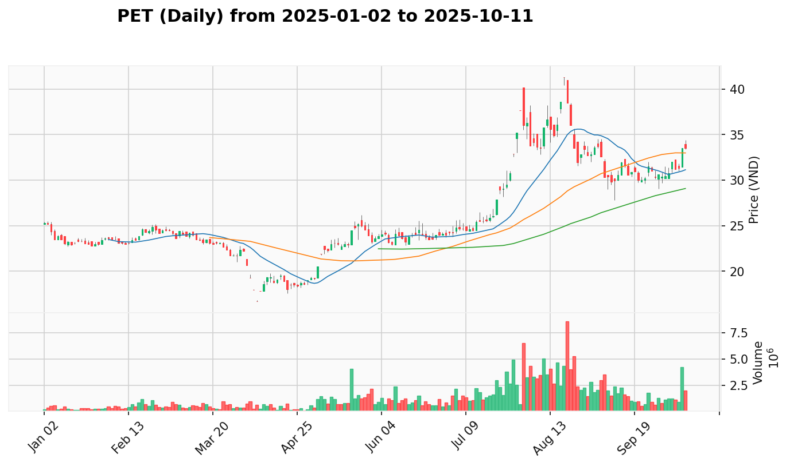

<a href="#ban-le">↑ Back to group BAN_LE</a>  |  <a href="#vpa-signal-summary">↑ Back to Top</a>

#### Key Statistics
| Metric | Value |
|:---|---:|
| Date Range | 2025-01-02 to 2025-10-17 |
| **Latest Close** | **33.0** |
| Period Open | 25.2 |
| Period High | 41.3 |
| Period Low | 16.7 |
| Period Change % | 30.95% |

**[Download PET Data (.csv)](market_data/PET_2025-01-02_to_2025-10-18.csv)**

---

### PHC

#### [VPA Analysis (2025-08-14 - 2025-10-16)](./VPA.md#phc)
> **Ngày 2025-10-10:** PHC tăng từ 5.7 VND lên 5.73 VND với khối lượng giao dịch đạt 0.1634 triệu cổ phiếu. Cây nến có biên độ hẹp, đóng cửa thấp hơn giá mở cửa (5.79 VND) và cao hơn giá đóng cửa phiên trước. Khối lượng giao dịch tăng mạnh so với phiên trước (0.0831 triệu cổ phiếu), cho thấy lực cung vẫn còn hiện diện và áp lực bán vẫn đang kiểm soát. Sau hai phiên No Demand và SOW, việc giá cố gắng tăng nhưng không duy trì được đà tăng và đóng cửa thấp hơn giá mở cửa với khối lượng tăng cho thấy lực cung vẫn còn mạnh mẽ và áp lực bán vẫn đang chiếm ưu thế. **Phân tích VPA/Wyckoff:** Sign of Weakness (SOW) - Lực cung vẫn mạnh mẽ sau nỗ lực tăng giá không thành công.
> **Ngày 2025-10-13:** PHC giảm từ 5.73 VND xuống 5.61 VND với khối lượng giao dịch đạt 0.1631 triệu cổ phiếu. Cây nến có biên độ hẹp, đóng cửa tại mức thấp nhất phiên, cho thấy áp lực bán mạnh mẽ và người bán đang kiểm soát thị trường. Khối lượng giao dịch duy trì ở mức cao, gần bằng phiên trước, xác nhận lực cung vẫn còn hiện diện. Sau các phiên SOW trước đó, diễn biến này tiếp tục củng cố tín hiệu suy yếu. **Phân tích VPA/Wyckoff:** Sign of Weakness (SOW) - Lực bán mạnh mẽ tiếp tục đẩy giá xuống thấp với khối lượng duy trì.
> **Ngày 2025-10-14:** PHC giảm từ 5.61 VND xuống 5.42 VND với khối lượng giao dịch đạt 0.3722 triệu cổ phiếu. Cây nến giảm có biên độ rộng, đóng cửa gần mức thấp nhất phiên, cho thấy áp lực bán rất mạnh mẽ và người bán đang kiểm soát hoàn toàn thị trường. Khối lượng giao dịch tăng đột biến so với phiên trước (0.1631 triệu cổ phiếu), xác nhận lực cung áp đảo. Sau các phiên SOW liên tiếp, diễn biến này tiếp tục củng cố tín hiệu suy yếu và khả năng giá sẽ tiếp tục giảm. **Phân tích VPA/Wyckoff:** Sign of Weakness (SOW) - Lực bán mạnh mẽ với khối lượng tăng đột biến đẩy giá xuống thấp, xác nhận xu hướng giảm.
> **Ngày 2025-10-15:** PHC giảm từ 5.42 VND xuống 5.25 VND với khối lượng giao dịch đạt 0.2916 triệu cổ phiếu. Cây nến giảm có biên độ hẹp, đóng cửa gần mức thấp nhất phiên, cho thấy áp lực bán vẫn tiếp diễn. Khối lượng giao dịch giảm so với phiên trước (0.3722 triệu cổ phiếu) nhưng vẫn ở mức đáng kể, xác nhận lực cung vẫn chiếm ưu thế. Sau các phiên SOW liên tiếp, diễn biến này cho thấy xu hướng giảm giá tiếp tục, mặc dù áp lực bán có phần giảm nhẹ. **Phân tích VPA/Wyckoff:** Sign of Weakness (SOW) - Giá tiếp tục giảm với khối lượng giảm nhẹ nhưng vẫn duy trì áp lực bán.
> **Ngày 2025-10-16:** PHC tăng nhẹ từ 5.25 VND lên 5.27 VND với khối lượng giao dịch đạt 0.0309 triệu cổ phiếu. Cây nến có biên độ hẹp, mở cửa ở mức cao nhất (5.39 VND) và đóng cửa gần mức thấp nhất phiên (5.27 VND), cho thấy lực cầu yếu và áp lực bán vẫn hiện hữu. Khối lượng giao dịch giảm mạnh so với phiên trước (0.2916 triệu cổ phiếu), xác nhận sự thiếu vắng lực mua. Sau hai phiên SOW liên tiếp, diễn biến này cho thấy thị trường đang tạm dừng nhưng không có dấu hiệu phục hồi, củng cố xu hướng giảm giá. **Phân tích VPA/Wyckoff:** No Demand (ND) - Giá tăng nhẹ với khối lượng cực thấp sau các phiên SOW, cho thấy thiếu vắng lực cầu.

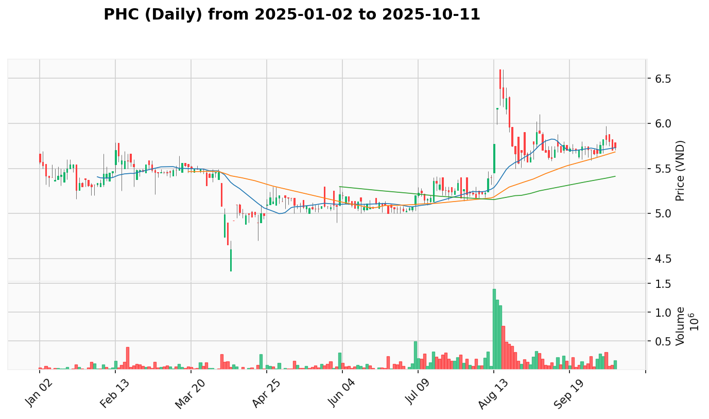

<a href="#xay-dung">↑ Back to group XAY_DUNG</a>  |  <a href="#vpa-signal-summary">↑ Back to Top</a>

#### Key Statistics
| Metric | Value |
|:---|---:|
| Date Range | 2025-01-02 to 2025-10-17 |
| **Latest Close** | **5.17** |
| Period Open | 5.66 |
| Period High | 6.6 |
| Period Low | 4.36 |
| Period Change % | -8.66% |

**[Download PHC Data (.csv)](market_data/PHC_2025-01-02_to_2025-10-18.csv)**

---

### PHP

#### [VPA Analysis (2025-08-14 - 2025-10-16)](./VPA.md#php)
> **Ngày 2025-10-10:** PHP mở cửa ở mức 34.3 VND và giảm xuống 34.1 VND, đóng cửa ở mức thấp nhất phiên. Biên độ dao động trong phiên hẹp (từ 34.1 VND đến 34.4 VND). Khối lượng giao dịch đạt 0.0409 triệu cổ phiếu, thấp hơn một chút so với phiên trước (0.042675 triệu cổ phiếu) nhưng vẫn ở mức tương đối cao. Sau phiên "Dấu hiệu suy yếu" ngày 2025-10-09, việc giá tiếp tục giảm và đóng cửa ở mức thấp nhất phiên với khối lượng tương đối cao cho thấy áp lực bán vẫn đang chiếm ưu thế và lực cầu chưa đủ mạnh để hấp thụ. Điều này củng cố thêm tín hiệu suy yếu của cổ phiếu. **Phân tích VPA/Wyckoff:** Sign of Weakness (SOW) - Tiếp diễn suy yếu.
> **Ngày 2025-10-13:** PHP mở cửa ở mức 33.2 VND và giảm xuống 33.4 VND, với mức thấp nhất phiên là 33.0 VND. Biên độ dao động trong phiên rộng hơn so với phiên trước. Khối lượng giao dịch đạt 0.0583 triệu cổ phiếu, tăng đáng kể so với phiên trước (0.0411 triệu cổ phiếu). Sau hai phiên "Dấu hiệu suy yếu" liên tiếp, việc giá tiếp tục giảm mạnh với khối lượng gia tăng cho thấy áp lực bán vẫn rất lớn và đang đẩy giá xuống thấp hơn. Mặc dù giá đóng cửa không ở mức thấp nhất phiên, nhưng sự sụt giảm mạnh kèm khối lượng cao xác nhận sự tiếp diễn của xu hướng giảm. **Phân tích VPA/Wyckoff:** Sign of Weakness (SOW) - Tiếp diễn suy yếu với áp lực bán mạnh.
> **Ngày 2025-10-14:** PHP mở cửa ở mức 33.7 VND và giảm mạnh xuống 33.0 VND, đóng cửa ở mức thấp nhất phiên. Biên độ dao động trong phiên hẹp (từ 33.0 VND đến 33.7 VND). Khối lượng giao dịch đạt 0.0841 triệu cổ phiếu, tăng đáng kể so với phiên trước (0.0583 triệu cổ phiếu) và là mức cao nhất trong 10 phiên gần đây. Sau các phiên "Dấu hiệu suy yếu" liên tiếp, việc giá tiếp tục giảm và đóng cửa ở mức thấp nhất phiên với khối lượng gia tăng mạnh mẽ cho thấy áp lực bán vẫn đang rất lớn và chiếm ưu thế hoàn toàn, đẩy giá xuống sâu hơn. Điều này xác nhận sự tiếp diễn của xu hướng giảm. **Phân tích VPA/Wyckoff:** Sign of Weakness (SOW) - Áp lực bán mạnh mẽ tiếp diễn.
> **Ngày 2025-10-15:** PHP mở cửa ở mức 33.1 VND và tiếp tục giảm mạnh, đóng cửa tại 32.6 VND, thấp hơn đáng kể so với giá đóng cửa phiên trước (33.0 VND). Giá đã có lúc chạm mức thấp nhất 32.2 VND và cao nhất 33.2 VND, tạo ra biên độ dao động rộng hơn so với phiên trước. Khối lượng giao dịch đạt 0.1042 triệu cổ phiếu, tăng mạnh so với phiên trước (0.0841 triệu cổ phiếu) và là mức cao nhất trong nhiều phiên gần đây. Sau chuỗi các phiên "Dấu hiệu suy yếu", việc giá tiếp tục giảm sâu với biên độ rộng và khối lượng gia tăng mạnh mẽ cho thấy áp lực bán vẫn đang rất lớn và chiếm ưu thế hoàn toàn, đẩy giá xuống các mức thấp hơn. Điều này xác nhận sự tiếp diễn của xu hướng giảm. **Phân tích VPA/Wyckoff:** Sign of Weakness (SOW) - Áp lực bán mạnh mẽ tiếp diễn với khối lượng cao.
> **Ngày 2025-10-16:** PHP mở cửa ở mức 32.6 VND và tiếp tục giảm, đóng cửa tại 32.0 VND, là mức thấp nhất trong phiên. Biên độ dao động trong phiên là 1.0 VND (từ 32.0 VND đến 33.0 VND). Khối lượng giao dịch đạt 0.0387 triệu cổ phiếu, giảm đáng kể so với phiên trước (0.1042 triệu cổ phiếu) và là mức thấp nhất trong 10 phiên gần đây. Sau chuỗi các phiên giảm mạnh với khối lượng cao, việc giá tiếp tục giảm và đóng cửa ở mức thấp nhất phiên nhưng với khối lượng thấp cho thấy áp lực bán đã giảm bớt về cường độ, tuy nhiên, không có lực cầu nào xuất hiện để đẩy giá lên. Điều này xác nhận sự thiếu vắng của người mua và khả năng cao xu hướng giảm vẫn sẽ tiếp diễn. **Phân tích VPA/Wyckoff:** Sign of Weakness (SOW) - Giá giảm với khối lượng thấp, cho thấy không có lực cầu.

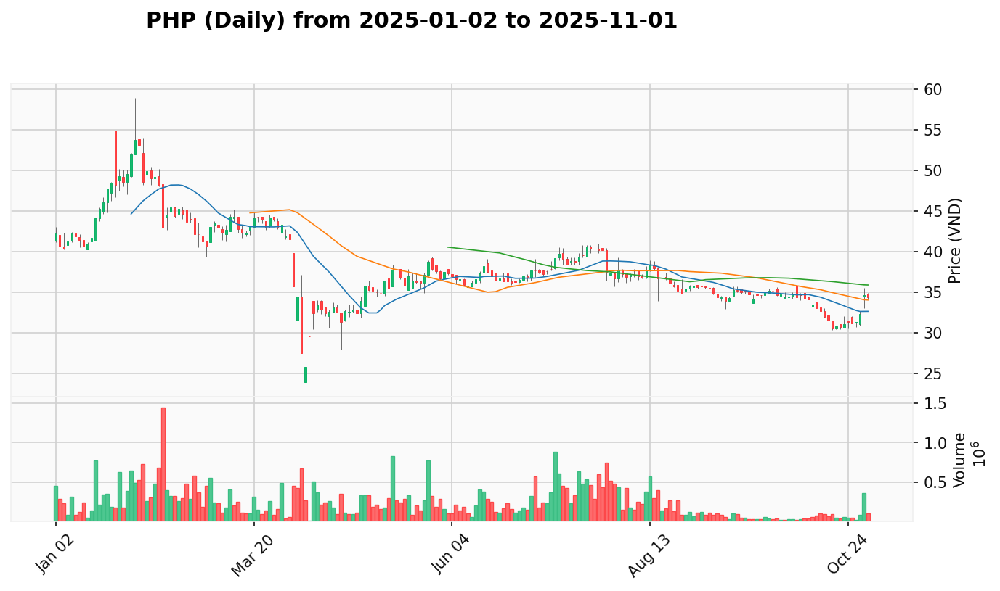

<a href="#van-tai">↑ Back to group VAN_TAI</a>  |  <a href="#vpa-signal-summary">↑ Back to Top</a>

#### Key Statistics
| Metric | Value |
|:---|---:|
| Date Range | 2025-01-02 to 2025-10-17 |
| **Latest Close** | **31.5** |
| Period Open | 41.29 |
| Period High | 58.89 |
| Period Low | 23.89 |
| Period Change % | -23.71% |

**[Download PHP Data (.csv)](market_data/PHP_2025-01-02_to_2025-10-18.csv)**

---

### PHR

#### [VPA Analysis (2025-06-13 - 2025-10-16)](./VPA.md#phr)
> **Ngày 2025-10-10:** PHR giảm từ 55.3 VND xuống 54.5 VND với khối lượng giao dịch đạt 0.3691 triệu cổ phiếu. Cây nến giảm có biên độ tương đối rộng và đóng cửa gần mức thấp nhất phiên, cho thấy áp lực bán mạnh mẽ. Khối lượng giao dịch tăng đáng kể so với phiên trước (0.1313 triệu cổ phiếu), xác nhận lực cung đang hoạt động rất mạnh và tiếp tục đẩy giá xuống. Điều này củng cố thêm tín hiệu yếu kém của thị trường đã xuất hiện ở phiên trước. **Phân tích VPA/Wyckoff:** Sign of Weakness (SOW) - Lực cung mạnh mẽ.
> **Ngày 2025-10-13:** PHR tăng từ 54.5 VND lên 55.0 VND với khối lượng giao dịch đạt 0.2046 triệu cổ phiếu. Cây nến tăng có biên độ tương đối và đóng cửa ở nửa trên của thân nến. Tuy nhiên, khối lượng giao dịch giảm đáng kể so với phiên trước (0.3691 triệu cổ phiếu), cho thấy lực cầu yếu và thiếu sự xác nhận cho xu hướng tăng. Điều này cho thấy thị trường vẫn đang trong giai đoạn yếu sau hai phiên giảm mạnh trước đó. **Phân tích VPA/Wyckoff:** Sign of Weakness (SOW) - Lực cầu yếu, thiếu sự xác nhận.
> **Ngày 2025-10-14:** PHR giảm từ 55.0 VND xuống 54.3 VND với khối lượng giao dịch đạt 0.1874 triệu cổ phiếu. Cây nến giảm có biên độ tương đối và đóng cửa ở mức thấp nhất phiên, cho thấy áp lực bán mạnh mẽ. Khối lượng giao dịch giảm nhẹ so với phiên trước (0.2046 triệu cổ phiếu), nhưng việc giá đóng cửa ở mức thấp nhất phiên cho thấy lực cung vẫn đang chiếm ưu thế và tiếp tục đẩy giá xuống. Điều này củng cố thêm tín hiệu yếu kém của thị trường đã xuất hiện ở các phiên trước. **Phân tích VPA/Wyckoff:** Sign of Weakness (SOW) - Áp lực bán tiếp diễn.
> **Ngày 2025-10-15:** PHR giảm từ 54.3 VND xuống 53.3 VND với khối lượng giao dịch đạt 0.3543 triệu cổ phiếu. Cây nến giảm có biên độ tương đối và đóng cửa ở mức thấp nhất phiên, cho thấy áp lực bán mạnh mẽ. Khối lượng giao dịch tăng đáng kể so với phiên trước (0.1874 triệu cổ phiếu), xác nhận lực cung đang chiếm ưu thế và tiếp tục đẩy giá xuống. Điều này củng cố thêm tín hiệu yếu kém của thị trường đã xuất hiện ở các phiên trước và cho thấy xu hướng giảm giá có thể tiếp diễn. **Phân tích VPA/Wyckoff:** Sign of Weakness (SOW) - Áp lực bán mạnh mẽ được xác nhận.
> **Ngày 2025-10-16:** PHR tăng từ 53.3 VND lên 53.5 VND với khối lượng giao dịch đạt 0.102 triệu cổ phiếu. Cây nến tăng có biên độ nhỏ và đóng cửa trên mức giá đóng cửa của phiên trước, nhưng khối lượng giao dịch rất thấp, chỉ bằng khoảng 1/3 so với phiên trước (0.3543 triệu cổ phiếu). Điều này cho thấy lực cầu yếu và không đủ mạnh để đảo chiều xu hướng giảm giá đã diễn ra trong hai phiên trước. Sự phục hồi nhẹ với khối lượng thấp sau áp lực bán mạnh mẽ thường là dấu hiệu của sự thiếu vắng nhu cầu thực sự, cho thấy xu hướng giảm giá có thể tiếp diễn hoặc thị trường sẽ đi ngang trong thời gian tới. **Phân tích VPA/Wyckoff:** No Demand (Không có cầu) - Xác nhận sự yếu kém của thị trường.

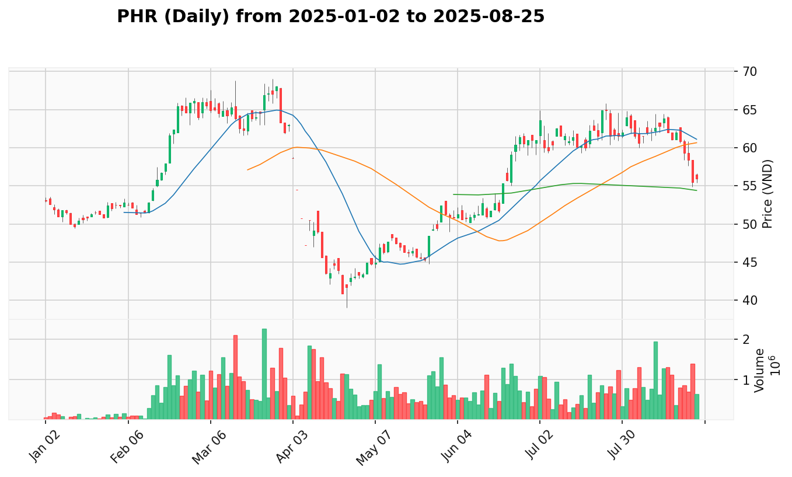

<a href="#cao-su">↑ Back to group CAO_SU</a>  |  <a href="#vpa-signal-summary">↑ Back to Top</a>

#### Key Statistics
| Metric | Value |
|:---|---:|
| Date Range | 2025-01-02 to 2025-10-17 |
| **Latest Close** | **52.3** |
| Period Open | 51.84 |
| Period High | 67.36 |
| Period Low | 38.07 |
| Period Change % | 0.89% |

**[Download PHR Data (.csv)](market_data/PHR_2025-01-02_to_2025-10-18.csv)**

---

### PLC

#### [VPA Analysis (2025-08-04 - 2025-10-16)](./VPA.md#plc)
> **Ngày 2025-10-10:** PLC mở cửa tại 29.0 VND và đóng cửa tại 29.2 VND, tăng 0.2 VND so với phiên trước. Biên độ dao động trong phiên rộng hơn (từ 28.8 VND đến 29.5 VND) với giá đóng cửa nằm ở nửa trên của biên độ, cho thấy lực mua chiếm ưu thế. Khối lượng giao dịch đạt 0.2623 triệu cổ phiếu, tăng so với phiên trước (0.2128 triệu cổ phiếu). Sau phiên "No Supply" cho thấy lực cung đã suy yếu, phiên này với giá tăng và khối lượng tăng cho thấy lực cầu đang quay trở lại thị trường. **Phân tích VPA/Wyckoff:** Sign of Strength (SOS) - Lực cầu xuất hiện.
> **Ngày 2025-10-13:** PLC mở cửa tại 29.2 VND và đóng cửa tại 28.2 VND, giảm 1.0 VND so với phiên trước. Biên độ dao động trong phiên tương đối rộng (từ 28.2 VND đến 29.2 VND) với giá đóng cửa nằm ở mức thấp nhất phiên, cho thấy áp lực bán mạnh mẽ. Khối lượng giao dịch đạt 0.4743 triệu cổ phiếu, tăng đáng kể so với phiên trước (0.2623 triệu cổ phiếu). Sau phiên "Sign of Strength" cho thấy lực cầu xuất hiện, phiên này với giá giảm mạnh và khối lượng tăng cho thấy lực cung đã quay trở lại thị trường và áp đảo lực cầu. **Phân tích VPA/Wyckoff:** Supply Coming In (SCI) - Lực cung xuất hiện.
> **Ngày 2025-10-14:** PLC mở cửa tại 28.2 VND và đóng cửa tại 27.3 VND, giảm 0.9 VND so với phiên trước. Biên độ dao động trong phiên rộng (từ 27.2 VND đến 28.4 VND) với giá đóng cửa nằm ở mức thấp nhất phiên, cho thấy áp lực bán rất mạnh. Khối lượng giao dịch đạt 0.8662 triệu cổ phiếu, tăng đáng kể so với phiên trước (0.4743 triệu cổ phiếu). Sau phiên "Supply Coming In", phiên này với giá giảm mạnh và khối lượng tăng xác nhận lực cung tiếp tục áp đảo và thị trường đang suy yếu. **Phân tích VPA/Wyckoff:** Weakness (SW) - Lực cung tiếp tục chiếm ưu thế.
> **Ngày 2025-10-15:** PLC giảm từ 27.3 VND xuống 26.9 VND với biên độ hẹp và đóng cửa ở mức thấp nhất phiên, cho thấy áp lực bán tiếp diễn. Khối lượng giao dịch đạt 0.3424 triệu cổ phiếu, giảm mạnh so với phiên trước (0.8662 triệu cổ phiếu). Sau các phiên suy yếu với khối lượng lớn, phiên này giá tiếp tục giảm nhưng với khối lượng thấp, cho thấy lực cung đang cạn kiệt hoặc không có lực cầu hỗ trợ. **Phân tích VPA/Wyckoff:** No Demand (ND) - Không có lực cầu.
> **Ngày 2025-10-16:** PLC tiếp tục giảm từ 26.9 VND xuống 26.8 VND với biên độ hẹp (từ 26.7 VND đến 27.1 VND) và đóng cửa gần mức thấp nhất phiên. Khối lượng giao dịch đạt 0.141 triệu cổ phiếu, giảm rất mạnh so với phiên trước (0.3424 triệu cổ phiếu), cho thấy sự thiếu vắng cả lực mua và lực bán. **Phân tích VPA/Wyckoff:** No Demand (ND) - Lực cầu tiếp tục vắng bóng.

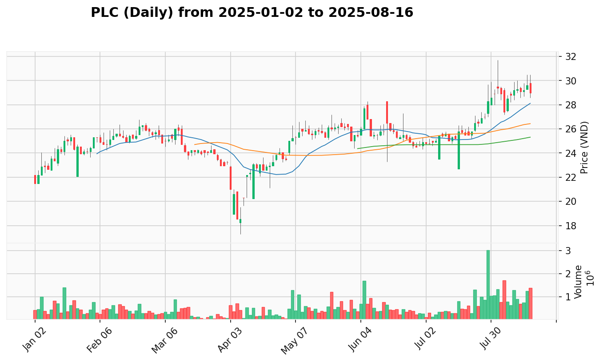

<a href="#dau-tu-cong">↑ Back to group DAU_TU_CONG</a>  |  <a href="#vpa-signal-summary">↑ Back to Top</a>

#### Key Statistics
| Metric | Value |
|:---|---:|
| Date Range | 2025-01-02 to 2025-10-17 |
| **Latest Close** | **27.4** |
| Period Open | 22.18 |
| Period High | 31.7 |
| Period Low | 17.27 |
| Period Change % | 23.53% |

**[Download PLC Data (.csv)](market_data/PLC_2025-01-02_to_2025-10-18.csv)**

---

### PLX

#### [VPA Analysis (2025-06-13 - 2025-10-16)](./VPA.md#plx)
> **Ngày 2025-10-10:** PLX giảm nhẹ từ 34.1 xuống 34.05. Cây nến có biên độ hẹp (0.3) với mức cao nhất 34.25 và mức thấp 33.95, đóng cửa ở giữa thân nến. Khối lượng giao dịch đạt 1.1711 triệu cổ phiếu, giảm so với phiên trước (1.2168 triệu cổ phiếu). Sau phiên nỗ lực tăng giá không đạt kết quả ngày 2025-10-09, phiên hôm nay giá giảm nhẹ với khối lượng giảm, cho thấy lực cung không quá mạnh nhưng lực cầu cũng không đủ để đẩy giá lên, thể hiện sự thiếu quyết đoán của thị trường. **Phân tích VPA/Wyckoff:** Không có cầu
> **Ngày 2025-10-13:** PLX giữ nguyên mức giá 34.05 VND. Cây nến có biên độ 0.5 VND (từ 33.55 lên 34.05) và đóng cửa tại mức cao nhất phiên. Khối lượng giao dịch đạt 1.2386 triệu cổ phiếu, tăng nhẹ so với phiên trước (1.1711 triệu cổ phiếu). Sau phiên không có cầu ngày 2025-10-10, phiên hôm nay giá giữ nguyên nhưng đóng cửa ở mức cao nhất phiên với khối lượng tăng nhẹ, cho thấy lực cầu đang trở lại và hấp thụ nguồn cung. **Phân tích VPA/Wyckoff:** Cầu đang trở lại
> **Ngày 2025-10-14:** PLX giảm từ 34.05 xuống 33.6. Cây nến có biên độ rộng (0.8 VND) với mức cao nhất 34.3 và mức thấp 33.5, đóng cửa gần mức thấp nhất phiên. Khối lượng giao dịch đạt 1.9165 triệu cổ phiếu, tăng mạnh so với phiên trước (1.2386 triệu cổ phiếu). Sau phiên cầu đang trở lại ngày 2025-10-13, phiên hôm nay giá giảm mạnh với khối lượng gia tăng, cho thấy lực cung đã áp đảo hoàn toàn lực cầu và đẩy giá xuống, xác nhận sự yếu kém của thị trường. **Phân tích VPA/Wyckoff:** Lực cung mạnh mẽ
> **Ngày 2025-10-15:** PLX tăng nhẹ từ 33.6 lên 33.7 VND. Cây nến có biên độ 0.35 VND (từ 33.55 lên 33.9) và đóng cửa ở giữa thân nến. Khối lượng giao dịch đạt 1.6601 triệu cổ phiếu, giảm so với phiên trước (1.9165 triệu cổ phiếu). Sau phiên giảm mạnh với lực cung áp đảo vào ngày 2025-10-14, phiên hôm nay giá tăng nhẹ với khối lượng giảm, cho thấy lực cung đã tạm thời chững lại nhưng lực cầu vẫn còn yếu và chưa sẵn sàng đẩy giá lên. **Phân tích VPA/Wyckoff:** Lực cầu yếu
> **Ngày 2025-10-16:** PLX giữ nguyên mức giá đóng cửa 33.7 VND so với phiên trước, mở cửa ở 33.7 VND và đóng cửa ở 33.7 VND. Cây nến có biên độ 0.45 VND (từ 33.4 lên 33.85). Khối lượng giao dịch đạt 0.8414 triệu cổ phiếu, giảm mạnh so với phiên trước (1.6601 triệu cổ phiếu) và thấp hơn đáng kể so với mức trung bình. Sau phiên giảm mạnh với lực cung áp đảo (2025-10-14) và phiên tăng nhẹ với lực cầu yếu (2025-10-15), phiên hôm nay giá đi ngang với khối lượng rất thấp cho thấy sự thiếu vắng cả lực cung và lực cầu, thể hiện sự lưỡng lự và thiếu quyết đoán của thị trường. **Phân tích VPA/Wyckoff:** Thiếu cầu (No Demand) - Indecision

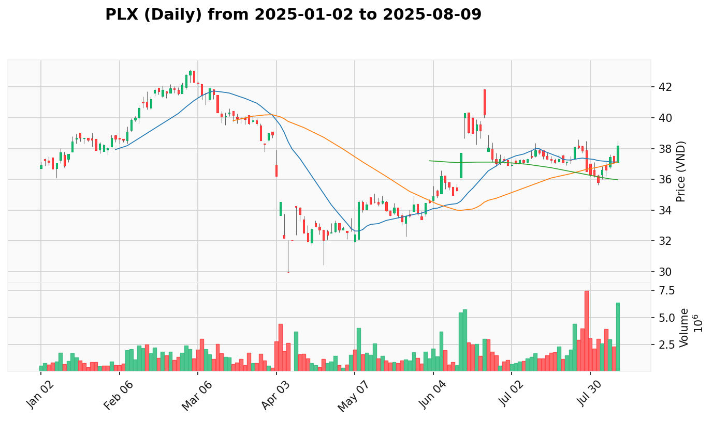

<a href="#dau-khi">↑ Back to group DAU_KHI</a>  |  <a href="#vpa-signal-summary">↑ Back to Top</a>

#### Key Statistics
| Metric | Value |
|:---|---:|
| Date Range | 2025-01-02 to 2025-10-17 |
| **Latest Close** | **33.55** |
| Period Open | 36.72 |
| Period High | 43.11 |
| Period Low | 29.95 |
| Period Change % | -8.63% |

**[Download PLX Data (.csv)](market_data/PLX_2025-01-02_to_2025-10-18.csv)**

---

### PNJ

#### [VPA Analysis (2025-06-13 - 2025-10-16)](./VPA.md#pnj)
> **Ngày 2025-10-10:** PNJ mở cửa ở mức 85.6 VND và đạt đỉnh 85.8 VND nhưng đóng cửa ở mức 85.0 VND, bằng với giá đóng cửa phiên trước. Cây nến có biên độ tương đối rộng (1.3 VND) nhưng đóng cửa ở giữa, cho thấy sự lưỡng lự. Khối lượng giao dịch đạt 0.4784 triệu cổ phiếu, cao hơn đáng kể so với phiên trước (0.3796 triệu cổ phiếu). Mặc dù khối lượng tăng, giá không thể đóng cửa cao hơn, cho thấy lực cầu đang gặp phải nguồn cung mạnh mẽ. Điều này có thể là dấu hiệu nguồn cung đang quay trở lại thị trường sau phiên "Lực cầu xuất hiện" ngày 2025-10-09. **Phân tích VPA/Wyckoff:** Supply Coming In (Nguồn cung xuất hiện)
> **Ngày 2025-10-13:** PNJ giảm nhẹ từ 85.0 xuống 84.9 VND. Cây nến giảm có biên độ vừa phải (1.2 VND) và đóng cửa gần giữa phiên, cho thấy sự lưỡng lự. Khối lượng giao dịch đạt 0.1896 triệu cổ phiếu, thấp hơn đáng kể so với phiên trước (0.4784 triệu cổ phiếu). Sau phiên "Nguồn cung xuất hiện" ngày 2025-10-10, việc giá giảm nhẹ với khối lượng thấp cho thấy áp lực bán không mạnh mẽ. Điều này có thể là dấu hiệu của sự thiếu vắng lực cầu hoặc thị trường đang kiểm tra lại nguồn cung. **Phân tích VPA/Wyckoff:** No Demand (Thiếu cầu)
> **Ngày 2025-10-14:** PNJ mở cửa ở mức 85.5 VND, đạt đỉnh 85.6 VND nhưng đóng cửa ở mức thấp nhất phiên là 84.7 VND. Giá giảm từ 84.9 VND xuống 84.7 VND. Cây nến giảm có biên độ rộng (0.9 VND) và đóng cửa ở mức thấp nhất, cho thấy áp lực bán mạnh mẽ. Khối lượng giao dịch đạt 0.6174 triệu cổ phiếu, cao hơn đáng kể so với phiên trước (0.1896 triệu cổ phiếu). Sự kết hợp giữa giá giảm mạnh, đóng cửa ở mức thấp nhất và khối lượng tăng đột biến cho thấy nguồn cung đang áp đảo hoàn toàn lực cầu, xác nhận sự yếu kém của thị trường. **Phân tích VPA/Wyckoff:** Weakness (Yếu kém)
> **Ngày 2025-10-15:** PNJ tăng mạnh từ 84.7 lên 86.1 VND. Cây nến tăng có biên độ rộng (2.3 VND) và đóng cửa gần mức cao nhất phiên, cho thấy lực mua áp đảo. Khối lượng giao dịch đạt 0.9977 triệu cổ phiếu, cao hơn đáng kể so với phiên trước (0.6174 triệu cổ phiếu) và là mức cao nhất trong 10 phiên gần đây. Sự kết hợp giữa giá tăng mạnh, đóng cửa ở mức cao và khối lượng tăng đột biến cho thấy lực cầu đang quay trở lại thị trường một cách mạnh mẽ, phủ nhận tín hiệu yếu kém của phiên trước. **Phân tích VPA/Wyckoff:** Sign of Strength (SOS) - Lực cầu mạnh mẽ
> **Ngày 2025-10-16:** PNJ mở cửa ở mức 86.2 VND, đạt đỉnh 87.8 VND và đóng cửa ở mức 87.7 VND. Giá tăng từ 86.1 VND lên 87.7 VND. Cây nến tăng có biên độ rộng (1.6 VND) và đóng cửa gần mức cao nhất phiên, cho thấy lực mua tiếp tục áp đảo. Khối lượng giao dịch đạt 0.6589 triệu cổ phiếu, thấp hơn so với phiên trước (0.9977 triệu cổ phiếu) nhưng vẫn duy trì ở mức khá. Sự kết hợp giữa giá tăng mạnh, đóng cửa ở mức cao và khối lượng duy trì cho thấy lực cầu vẫn đang kiểm soát thị trường, tiếp nối tín hiệu mạnh mẽ từ phiên trước. **Phân tích VPA/Wyckoff:** Sign of Strength (SOS) - Lực cầu tiếp diễn

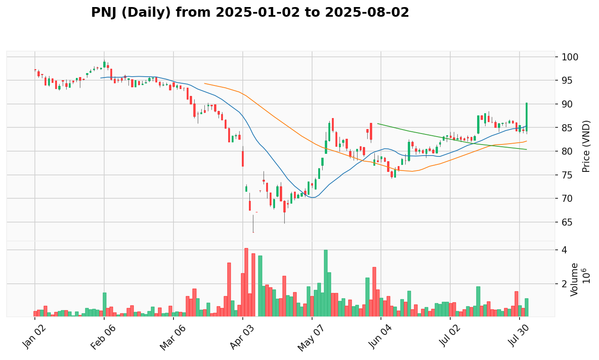

<a href="#ban-le">↑ Back to group BAN_LE</a>  |  <a href="#vpa-signal-summary">↑ Back to Top</a>

#### Key Statistics
| Metric | Value |
|:---|---:|
| Date Range | 2025-01-02 to 2025-10-17 |
| **Latest Close** | **90.1** |
| Period Open | 95.82 |
| Period High | 97.78 |
| Period Low | 61.78 |
| Period Change % | -5.97% |

**[Download PNJ Data (.csv)](market_data/PNJ_2025-01-02_to_2025-10-18.csv)**

---

### POW

#### [VPA Analysis (2025-06-16 - 2025-10-16)](./VPA.md#pow)
> **Ngày 2025-10-10:** POW giảm nhẹ từ 14.7 VND xuống 14.6 VND. Cây nến giảm có biên độ hẹp (0.15 VND) và đóng cửa bằng giá đóng cửa phiên trước. Khối lượng giao dịch đạt 5.419 triệu cổ phiếu, giảm so với phiên trước (6.5285 triệu cổ phiếu). Sau phiên "Sign of Strength" với lực cầu mạnh mẽ, phiên này giá đi ngang với khối lượng giảm, cho thấy lực cầu không còn duy trì mạnh mẽ và thị trường đang thiếu động lực để tiếp tục tăng giá. **Phân tích VPA/Wyckoff:** No Demand (Không có nhu cầu)
> **Ngày 2025-10-13:** POW giảm từ 14.6 VND xuống 14.35 VND. Cây nến giảm có biên độ hẹp (0.25 VND) và đóng cửa gần giữa thân nến. Khối lượng giao dịch đạt 6.0329 triệu cổ phiếu, tăng so với phiên trước (5.419 triệu cổ phiếu). Sau phiên "Không có nhu cầu", phiên này giá giảm với khối lượng gia tăng, cho thấy lực cung đang chiếm ưu thế và áp lực bán đang gia tăng. **Phân tích VPA/Wyckoff:** Supply Coming In (Lực cung xuất hiện)
> **Ngày 2025-10-14:** POW mở cửa 14.45 VND, đạt đỉnh 14.65 VND nhưng đóng cửa 14.35 VND, bằng giá đóng cửa phiên trước. Cây nến có biên độ 0.35 VND, cho thấy giá không thể duy trì đà tăng và đóng cửa gần mức thấp nhất. Khối lượng giao dịch đạt 7.384 triệu cổ phiếu, tăng đáng kể so với phiên trước. Điều này cho thấy lực cung vẫn đang áp đảo, ngăn cản giá đi lên dù có nỗ lực tăng trong phiên. **Phân tích VPA/Wyckoff:** Nỗ lực tăng giá thất bại
> **Ngày 2025-10-15:** POW giảm từ 14.35 VND xuống 14.3 VND. Cây nến giảm có biên độ hẹp (0.3 VND) và đóng cửa gần mức thấp nhất phiên. Khối lượng giao dịch đạt 6.0323 triệu cổ phiếu, giảm so với phiên trước (7.384 triệu cổ phiếu). Sau hai phiên liên tiếp cho thấy lực cung chiếm ưu thế và nỗ lực tăng giá thất bại, phiên này giá tiếp tục giảm nhẹ với khối lượng thấp hơn, cho thấy áp lực bán có phần giảm bớt nhưng lực cầu vẫn yếu, giá vẫn đóng cửa ở mức thấp, xác nhận sự suy yếu tiếp diễn. **Phân tích VPA/Wyckoff:** Tiếp tục suy yếu
> **Ngày 2025-10-16:** POW mở cửa 14.3 VND và đóng cửa ở mức 14.3 VND, bằng giá đóng cửa phiên trước. Cây nến có biên độ hẹp (0.2 VND) và đóng cửa ngang giá mở cửa, cho thấy sự lưỡng lự. Khối lượng giao dịch đạt 4.251 triệu cổ phiếu, giảm đáng kể so với phiên trước (6.0323 triệu cổ phiếu). Sau hai phiên liên tiếp cho thấy lực cung chiếm ưu thế và giá suy yếu, phiên này giá đi ngang với khối lượng thấp, cho thấy áp lực bán đã giảm nhưng lực cầu vẫn chưa xuất hiện mạnh mẽ, xác nhận sự tạm dừng của xu hướng giảm. **Phân tích VPA/Wyckoff:** No Demand (Không có cầu)

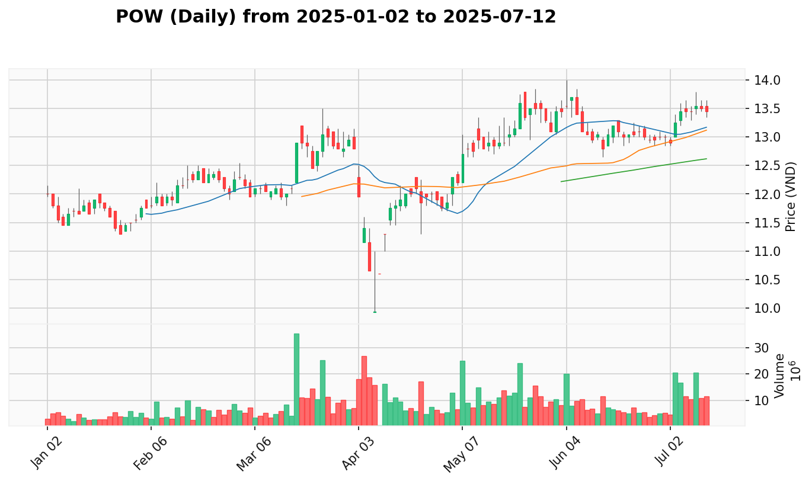

<a href="#nang-luong">↑ Back to group NANG_LUONG</a>  |  <a href="#vpa-signal-summary">↑ Back to Top</a>

#### Key Statistics
| Metric | Value |
|:---|---:|
| Date Range | 2025-01-02 to 2025-10-17 |
| **Latest Close** | **14.15** |
| Period Open | 12.0 |
| Period High | 17.45 |
| Period Low | 9.92 |
| Period Change % | 17.92% |

**[Download POW Data (.csv)](market_data/POW_2025-01-02_to_2025-10-18.csv)**

---

### PPC

#### [VPA Analysis (2025-08-04 - 2025-10-16)](./VPA.md#ppc)
> **Ngày 2025-10-10:** PPC mở cửa ở mức 10.65 VND và đóng cửa ở mức 10.65 VND, giữ nguyên so với giá đóng cửa phiên trước. Biên độ dao động trong phiên hẹp (từ 10.6 VND đến 10.7 VND). Khối lượng giao dịch đạt 0.2376 triệu cổ phiếu, giảm nhẹ so với phiên trước (0.2558 triệu cổ phiếu). Với giá không đổi và khối lượng giảm, điều này tiếp tục cho thấy sự thiếu vắng nhu cầu trên thị trường và không có áp lực bán đáng kể. Tín hiệu này củng cố thêm trạng thái không có cầu. **Phân tích VPA/Wyckoff:** Không có cầu (No Demand)
> **Ngày 2025-10-13:** PPC giảm từ 10.65 VND xuống 10.55 VND, mở cửa ở 10.6 VND. Biên độ dao động trong phiên hẹp (từ 10.5 VND đến 10.65 VND). Khối lượng giao dịch đạt 0.297 triệu cổ phiếu, tăng đáng kể so với phiên trước (0.2376 triệu cổ phiếu). Giá giảm với khối lượng tăng cho thấy áp lực bán đang gia tăng trên thị trường. Điều này phá vỡ trạng thái "Không có cầu" của các phiên trước và báo hiệu nguồn cung đang xuất hiện mạnh mẽ hơn, đẩy giá xuống. **Phân tích VPA/Wyckoff:** Áp lực bán (Selling Pressure)
> **Ngày 2025-10-14:** PPC giảm từ 10.55 VND xuống 10.5 VND, mở cửa ở 10.5 VND. Biên độ dao động trong phiên hẹp (từ 10.45 VND đến 10.55 VND). Khối lượng giao dịch đạt 0.471 triệu cổ phiếu, tăng đáng kể so với phiên trước (0.297 triệu cổ phiếu). Giá giảm với khối lượng tăng mạnh cho thấy áp lực bán tiếp tục gia tăng và nguồn cung đang chiếm ưu thế trên thị trường. Điều này củng cố tín hiệu "Áp lực bán" từ phiên trước và cho thấy sự suy yếu tiếp diễn. **Phân tích VPA/Wyckoff:** Áp lực bán tiếp diễn (Continuing Selling Pressure)
> **Ngày 2025-10-15:** PPC giảm từ 10.5 VND xuống 10.4 VND, mở cửa ở 10.5 VND. Biên độ dao động trong phiên hẹp (từ 10.35 VND đến 10.55 VND). Khối lượng giao dịch đạt 0.2969 triệu cổ phiếu, giảm đáng kể so với phiên trước (0.471 triệu cổ phiếu). Giá tiếp tục giảm với khối lượng thấp cho thấy áp lực bán đã giảm bớt nhưng thiếu cầu vẫn đang duy trì, khiến giá không thể phục hồi. Điều này cho thấy sự yếu ớt tiếp diễn của cổ phiếu. **Phân tích VPA/Wyckoff:** Yếu ớt (Weakness)
> **Ngày 2025-10-16:** PPC tăng từ 10.4 VND lên 10.5 VND, mở cửa ở 10.4 VND. Biên độ dao động trong phiên hẹp (từ 10.4 VND đến 10.5 VND). Khối lượng giao dịch đạt 0.2062 triệu cổ phiếu, giảm đáng kể so với phiên trước (0.2969 triệu cổ phiếu). Giá tăng nhẹ với khối lượng thấp cho thấy áp lực bán đã giảm bớt và có sự hấp thụ cung ở mức giá thấp hơn, nhưng lực cầu chưa đủ mạnh để tạo ra một xu hướng tăng rõ rệt. Đây có thể là một phiên kiểm tra cung sau giai đoạn suy yếu. **Phân tích VPA/Wyckoff:** Kiểm tra cung (Test for Supply)

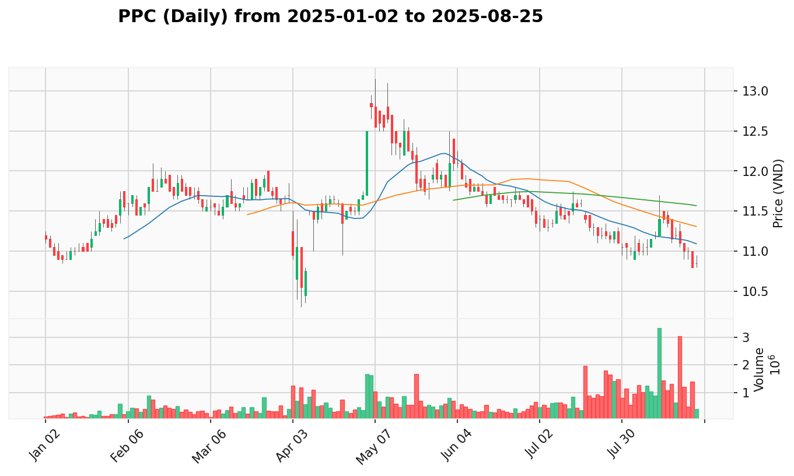

<a href="#nang-luong">↑ Back to group NANG_LUONG</a>  |  <a href="#vpa-signal-summary">↑ Back to Top</a>

#### Key Statistics
| Metric | Value |
|:---|---:|
| Date Range | 2025-01-02 to 2025-10-17 |
| **Latest Close** | **10.25** |
| Period Open | 11.2 |
| Period High | 13.15 |
| Period Low | 10.25 |
| Period Change % | -8.48% |

**[Download PPC Data (.csv)](market_data/PPC_2025-01-02_to_2025-10-18.csv)**

---

### PPH

#### [VPA Analysis (2025-08-04 - 2025-10-16)](./VPA.md#pph)
> **Ngày 2025-10-10:** PPH đóng cửa ở mức 27.9 VND, không thay đổi so với phiên trước, với biên độ dao động rất hẹp (từ 27.8 VND đến 27.9 VND). Khối lượng giao dịch đạt 0.0086 triệu cổ phiếu, tăng nhẹ so với phiên trước (0.0082 triệu cổ phiếu) nhưng vẫn ở mức thấp so với phiên SOS ngày 2025-10-08 (0.0132 triệu cổ phiếu). Điều này cho thấy thị trường tiếp tục thiếu sự quan tâm mua vào và đang trong giai đoạn lưỡng lự sau phiên "No Demand" trước đó. **Phân tích VPA/Wyckoff:** No Demand (Thiếu cầu)
> **Ngày 2025-10-13:** PPH giảm từ 27.9 VND xuống 27.8 VND với khối lượng giao dịch đạt 0.0037 triệu cổ phiếu. Cây nến có biên độ hẹp, đóng cửa ở mức thấp nhất phiên. Khối lượng giao dịch tiếp tục giảm mạnh so với phiên trước (0.0086 triệu cổ phiếu) và rất thấp so với phiên SOS ngày 2025-10-08 (0.0132 triệu cổ phiếu). Điều này cho thấy lực cầu tiếp tục yếu và thị trường thiếu sự quan tâm mua vào. **Phân tích VPA/Wyckoff:** No Demand (Thiếu cầu)
> **Ngày 2025-10-14:** PPH đóng cửa ở mức 27.8 VND, không thay đổi so với phiên trước, với biên độ dao động hẹp (từ 27.8 VND đến 27.9 VND). Khối lượng giao dịch đạt 0.0096 triệu cổ phiếu, tăng đáng kể so với phiên trước (0.0037 triệu cổ phiếu) và cao hơn phiên "No Demand" ngày 2025-10-10 (0.0086 triệu cổ phiếu), nhưng vẫn thấp hơn phiên SOS ngày 2025-10-08 (0.0132 triệu cổ phiếu). Mặc dù khối lượng tăng, giá không thể bứt phá lên mà đóng cửa ở mức thấp nhất phiên, cho thấy áp lực cung vẫn còn hiện hữu và đang được hấp thụ, nhưng lực cầu chưa đủ mạnh để đẩy giá lên. Thị trường vẫn đang trong giai đoạn yếu sau các phiên "No Demand" trước đó. **Phân tích VPA/Wyckoff:** Weakness (Yếu)
> **Ngày 2025-10-15:** PPH tăng từ 27.8 VND lên 28.0 VND với khối lượng giao dịch đạt 0.0065 triệu cổ phiếu. Cây nến có biên độ hẹp, đóng cửa ở mức cao nhất phiên. Khối lượng giao dịch giảm đáng kể so với phiên trước (0.0096 triệu cổ phiếu) và thấp hơn nhiều so với phiên SOS ngày 2025-10-08 (0.0132 triệu cổ phiếu). Mặc dù giá tăng và đóng cửa ở mức cao nhất, sự sụt giảm về khối lượng cho thấy lực cầu yếu và thiếu sự xác nhận, phản ánh sự thiếu quyết đoán của thị trường sau các phiên "Thiếu cầu" và "Yếu" trước đó. **Phân tích VPA/Wyckoff:** Thiếu cầu
> **Ngày 2025-10-16:** PPH giảm từ 28.0 VND xuống 27.8 VND với khối lượng giao dịch đạt 0.0011 triệu cổ phiếu. Cây nến có biên độ rất hẹp, đóng cửa ở mức thấp nhất phiên. Khối lượng giao dịch cực kỳ thấp, giảm mạnh so với phiên trước (0.0065 triệu cổ phiếu) và là mức thấp nhất trong các phiên gần đây. Sự sụt giảm giá nhẹ với khối lượng cực thấp cho thấy không có áp lực bán mạnh, nhưng đồng thời cũng không có lực cầu nào để hỗ trợ giá. Điều này củng cố thêm tín hiệu "Thiếu cầu" từ phiên trước và cho thấy thị trường đang rất yếu, không có sự quan tâm từ cả bên mua lẫn bên bán. **Phân tích VPA/Wyckoff:** No Demand (Không có cầu)

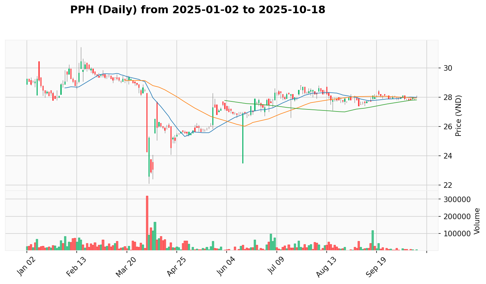

<a href="#det-may">↑ Back to group DET_MAY</a>  |  <a href="#vpa-signal-summary">↑ Back to Top</a>

#### Key Statistics
| Metric | Value |
|:---|---:|
| Date Range | 2025-01-02 to 2025-10-17 |
| **Latest Close** | **28.0** |
| Period Open | 28.88 |
| Period High | 31.42 |
| Period Low | 22.09 |
| Period Change % | -3.05% |

**[Download PPH Data (.csv)](market_data/PPH_2025-01-02_to_2025-10-18.csv)**

---

### PTB

#### [VPA Analysis (2025-06-26 - 2025-10-16)](./VPA.md#ptb)
> **Ngày 2025-10-10:** PTB mở cửa ở mức 47.8 VND, cao hơn giá đóng cửa phiên trước, nhưng đóng cửa ở mức 47.25 VND, bằng với giá đóng cửa phiên trước. Biên độ dao động trong phiên hẹp từ 47.2 VND đến 47.8 VND. Khối lượng giao dịch đạt 0.0727 triệu cổ phiếu, giảm nhẹ so với phiên trước (0.0736 triệu cổ phiếu) và vẫn ở mức thấp. Sau phiên 'Test for Demand' với khối lượng tăng, việc giá mở cửa cao nhưng không thể duy trì đà tăng và đóng cửa đi ngang với khối lượng thấp cho thấy lực cầu chưa đủ mạnh để hấp thụ hết cung và đẩy giá lên cao hơn. Thị trường vẫn đang trong giai đoạn thiếu động lực. **Phân tích VPA/Wyckoff:** No Demand (ND) - Giá mở cửa cao nhưng đóng cửa đi ngang với khối lượng thấp, cho thấy thiếu lực cầu để đẩy giá lên.
> **Ngày 2025-10-13:** PTB mở cửa ở mức 47.25 VND, sau đó tăng mạnh và đóng cửa ở mức 47.95 VND, cao hơn giá mở cửa và giá đóng cửa phiên trước. Biên độ dao động trong phiên rộng (từ 47.05 VND đến 48.4 VND). Khối lượng giao dịch đạt 0.1252 triệu cổ phiếu, tăng đáng kể so với phiên trước (0.0727 triệu cổ phiếu). Sau phiên 'No Demand' với khối lượng thấp, việc giá tăng mạnh với biên độ rộng và đóng cửa gần mức cao nhất phiên, cùng với khối lượng gia tăng, cho thấy lực cầu đã quay trở lại mạnh mẽ và hấp thụ hết cung, đẩy giá lên. **Phân tích VPA/Wyckoff:** Sign of Strength (SOS) - Lực cầu mạnh mẽ với khối lượng gia tăng xác nhận xu hướng tăng.
> **Ngày 2025-10-14:** PTB mở cửa ở mức 48.8 VND, cao hơn giá đóng cửa phiên trước, sau đó tăng lên mức cao nhất 49.9 VND nhưng đóng cửa ở mức 48.6 VND, thấp hơn giá mở cửa. Biên độ dao động trong phiên rộng. Khối lượng giao dịch đạt 0.2022 triệu cổ phiếu, tăng đáng kể so với phiên trước (0.1252 triệu cổ phiếu). Sau phiên SOS, việc giá mở cửa cao nhưng không thể duy trì đà tăng và đóng cửa thấp hơn giá mở cửa, cùng với khối lượng gia tăng mạnh, cho thấy lực cung đã xuất hiện và hấp thụ một phần lực cầu, gây áp lực lên giá. Mặc dù giá đóng cửa vẫn cao hơn phiên trước, nhưng sự xuất hiện của lực cung mạnh mẽ ở vùng giá cao cho thấy đà tăng đang gặp khó khăn. **Phân tích VPA/Wyckoff:** Upthrust (UT) - Giá mở cửa cao nhưng đóng cửa thấp hơn giá mở cửa với khối lượng lớn, cho thấy lực cung mạnh mẽ xuất hiện ở vùng giá cao.
> **Ngày 2025-10-15:** PTB mở cửa ở mức 49.4 VND, cao hơn giá đóng cửa phiên trước. Tuy nhiên, giá đã giảm trong phiên và đóng cửa ở mức 49.1 VND, thấp hơn giá mở cửa. Biên độ dao động trong phiên là 0.8 VND (từ 48.6 VND đến 49.4 VND). Khối lượng giao dịch đạt 0.1862 triệu cổ phiếu, thấp hơn đáng kể so với phiên trước (0.2022 triệu cổ phiếu). Sau phiên Upthrust với khối lượng lớn, việc giá mở cửa cao nhưng không thể duy trì đà tăng và đóng cửa thấp hơn giá mở cửa, cùng với khối lượng giảm, cho thấy lực cầu đang suy yếu và lực cung vẫn còn hiện diện. Mặc dù giá đóng cửa vẫn cao hơn phiên trước, nhưng sự xuất hiện của một nến giảm với khối lượng thấp sau Upthrust là một dấu hiệu cảnh báo về sự thiếu hụt cầu và khả năng giá sẽ tiếp tục điều chỉnh. **Phân tích VPA/Wyckoff:** No Demand - Giá giảm trong phiên với khối lượng thấp sau Upthrust, cho thấy lực cầu yếu và lực cung đang chiếm ưu thế.
> **Ngày 2025-10-16:** PTB mở cửa ở mức 48.95 VND, sau đó tăng mạnh lên mức cao nhất 50.0 VND và đóng cửa ở mức 49.95 VND, gần mức cao nhất phiên. Giá tăng đáng kể từ 49.1 VND lên 49.95 VND. Biên độ dao động trong phiên rộng. Khối lượng giao dịch đạt 0.0488 triệu cổ phiếu, giảm mạnh so với phiên trước (0.1862 triệu cổ phiếu) và là mức thấp nhất trong 10 phiên gần đây. Sau hai phiên Upthrust và No Demand cho thấy lực cung xuất hiện và lực cầu suy yếu, phiên hôm nay giá tăng mạnh với khối lượng rất thấp cho thấy lực cung đã cạn kiệt, cho phép giá tăng dễ dàng. Đây có thể là một dấu hiệu tích cực nếu được xác nhận bởi các phiên tăng giá với khối lượng lớn hơn trong tương lai. **Phân tích VPA/Wyckoff:** Test for Supply (TFS) - Giá tăng mạnh với khối lượng rất thấp sau giai đoạn suy yếu, cho thấy lực cung đã cạn kiệt.

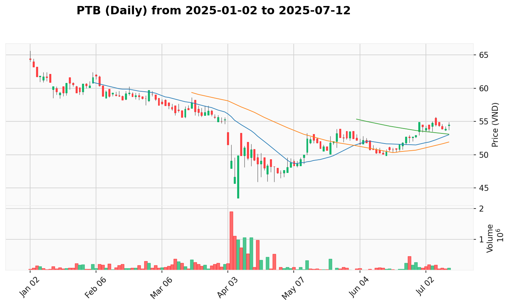

<a href="#vlxd">↑ Back to group VLXD</a>  |  <a href="#vpa-signal-summary">↑ Back to Top</a>

#### Key Statistics
| Metric | Value |
|:---|---:|
| Date Range | 2025-01-02 to 2025-10-17 |
| **Latest Close** | **51.0** |
| Period Open | 64.46 |
| Period High | 65.63 |
| Period Low | 43.46 |
| Period Change % | -20.88% |

**[Download PTB Data (.csv)](market_data/PTB_2025-01-02_to_2025-10-18.csv)**

---

### PVC

#### [VPA Analysis (2025-08-04 - 2025-10-16)](./VPA.md#pvc)
> **Ngày 2025-10-10:** PVC giảm nhẹ từ 11.7 VND xuống 11.6 VND, đóng cửa ở giữa biên độ nến hẹp. Khối lượng giao dịch đạt 0.3611 triệu cổ phiếu, thấp hơn đáng kể so với phiên trước (0.9557 triệu cổ phiếu) và các phiên gần đây. Sau tín hiệu "Sign of Strength" (SOS) mạnh mẽ vào ngày 2025-10-09, việc giá giảm nhẹ với khối lượng thấp cho thấy lực cung đã cạn kiệt và không có áp lực bán đáng kể. Đây là một tín hiệu tích cực, xác nhận sự thiếu vắng của người bán sau khi lực cầu đã xuất hiện. **Phân tích VPA/Wyckoff:** No Supply (NS) - Không có cung.
> **Ngày 2025-10-13:** PVC giảm từ 11.6 VND xuống 11.2 VND, đóng cửa ở mức thấp hơn với biên độ nến rộng. Khối lượng giao dịch đạt 2.2158 triệu cổ phiếu, cao hơn đáng kể so với phiên trước (0.3611 triệu cổ phiếu) và các phiên gần đây. Sự giảm giá mạnh mẽ đi kèm với khối lượng gia tăng cho thấy áp lực bán đã quay trở lại thị trường một cách mạnh mẽ, hấp thụ hết lực cầu và đẩy giá xuống. Điều này đảo ngược tín hiệu "No Supply" trước đó và cho thấy sự xuất hiện của nguồn cung lớn. **Phân tích VPA/Wyckoff:** Sign of Weakness (SOW) - Lực cung mạnh mẽ.
> **Ngày 2025-10-14:** PVC giảm từ 11.2 VND xuống 10.9 VND, đóng cửa ở mức thấp nhất phiên với biên độ nến hẹp hơn so với phiên trước. Khối lượng giao dịch đạt 1.4442 triệu cổ phiếu, thấp hơn phiên trước (2.2158 triệu cổ phiếu) nhưng vẫn ở mức tương đối cao. Sau tín hiệu "Sign of Weakness" (SOW) mạnh mẽ vào ngày 2025-10-13, việc giá tiếp tục giảm và đóng cửa ở mức thấp nhất phiên cho thấy áp lực bán vẫn đang chiếm ưu thế, mặc dù cường độ có phần giảm nhẹ. **Phân tích VPA/Wyckoff:** Continuation of Weakness (COW) - Lực cung tiếp diễn.
> **Ngày 2025-10-15:** PVC tiếp tục giảm từ 10.9 VND xuống 10.5 VND, đóng cửa gần mức thấp nhất phiên với biên độ nến hẹp. Khối lượng giao dịch đạt 1.7842 triệu cổ phiếu, cao hơn so với phiên trước (1.4442 triệu cổ phiếu) và duy trì ở mức cao. Sau các tín hiệu suy yếu mạnh mẽ vào các phiên trước, việc giá tiếp tục giảm sâu và đóng cửa ở mức thấp kèm theo khối lượng gia tăng cho thấy áp lực bán vẫn đang rất mạnh và chiếm ưu thế hoàn toàn, đẩy giá xuống thấp hơn. Điều này xác nhận sự tiếp diễn của xu hướng giảm giá. **Phân tích VPA/Wyckoff:** Continuation of Weakness (COW) - Lực cung tiếp diễn và mạnh lên.
> **Ngày 2025-10-16:** PVC giữ giá ở mức 10.5 VND, không giảm thêm so với phiên trước, với biên độ nến hẹp. Khối lượng giao dịch đạt 0.4161 triệu cổ phiếu, giảm mạnh so với phiên trước (1.7842 triệu cổ phiếu) và ở mức thấp. Sau hai phiên giảm giá mạnh với khối lượng cao, việc giá đi ngang và khối lượng sụt giảm cho thấy áp lực bán đã suy yếu đáng kể. Điều này có thể là dấu hiệu tạm thời của sự cạn kiệt nguồn cung ở mức giá này. **Phân tích VPA/Wyckoff:** No Supply (NS) - Lực cung suy yếu.

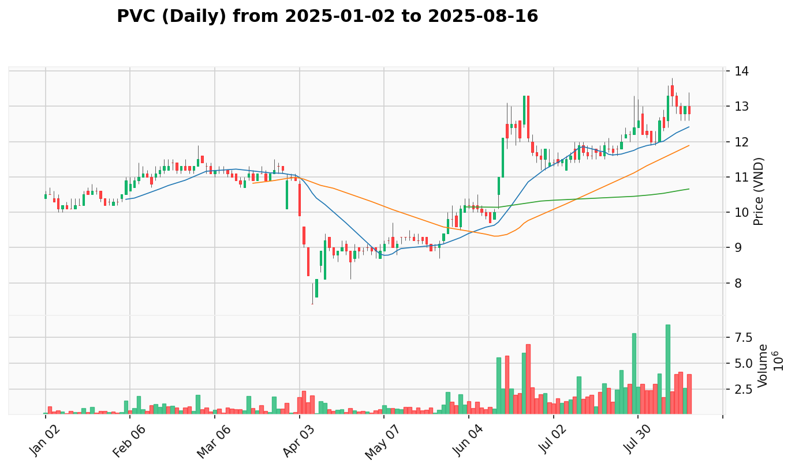

<a href="#dau-khi">↑ Back to group DAU_KHI</a>  |  <a href="#vpa-signal-summary">↑ Back to Top</a>

#### Key Statistics
| Metric | Value |
|:---|---:|
| Date Range | 2025-01-02 to 2025-10-17 |
| **Latest Close** | **10.5** |
| Period Open | 10.4 |
| Period High | 13.8 |
| Period Low | 7.4 |
| Period Change % | 0.96% |

**[Download PVC Data (.csv)](market_data/PVC_2025-01-02_to_2025-10-18.csv)**

---

### PVD

#### [VPA Analysis (2025-08-04 - 2025-10-16)](./VPA.md#pvd)
> **Ngày 2025-10-10:** PVD mở cửa ở 21.85 VND, đóng cửa ở 21.6 VND, giảm so với mức đóng cửa phiên trước (21.85 VND). Biên độ giá hẹp (từ 21.55 VND đến 21.95 VND) và giá đóng cửa ở nửa dưới của biên độ, cho thấy áp lực bán nhẹ. Khối lượng giao dịch đạt 3.54 triệu cổ phiếu, giảm so với phiên trước (4.00 triệu cổ phiếu) và ở mức trung bình. Sau tín hiệu "Sign of Strength" mạnh mẽ vào phiên trước, việc giá giảm nhẹ với khối lượng thấp cho thấy lực bán không quá mạnh nhưng cũng không có lực cầu đủ mạnh để duy trì đà tăng. Đây có thể là một nhịp điều chỉnh hoặc kiểm tra lại lực cầu, nhưng sự thiếu vắng của lực mua tiếp diễn cho thấy "No Demand". **Phân tích VPA/Wyckoff:** No Demand (Không có cầu)
> **Ngày 2025-10-13:** PVD mở cửa ở 21.1 VND, đóng cửa ở 21.1 VND, giảm mạnh so với mức đóng cửa phiên trước (21.6 VND). Biên độ giá hẹp (từ 20.8 VND đến 21.3 VND) và giá đóng cửa ở mức mở cửa, cho thấy sự lưỡng lự nhưng áp lực bán vẫn chiếm ưu thế rõ rệt khi giá giảm sâu so với phiên trước. Khối lượng giao dịch đạt 5.83 triệu cổ phiếu, tăng đáng kể so với phiên trước (3.54 triệu cổ phiếu) và ở mức cao. Sau tín hiệu "No Demand" ở phiên trước, việc giá giảm mạnh với khối lượng gia tăng cho thấy lực cung đã quay trở lại và áp đảo lực cầu. Đây là một tín hiệu tiêu cực, cho thấy khả năng tiếp tục xu hướng giảm ngắn hạn. **Phân tích VPA/Wyckoff:** Weakness (Lực cung mạnh mẽ).
> **Ngày 2025-10-14:** PVD mở cửa ở 21.8 VND, sau đó giảm mạnh và đóng cửa ở mức thấp nhất phiên là 20.8 VND, thấp hơn đáng kể so với mức đóng cửa phiên trước (21.1 VND). Biên độ giá rộng (từ 20.8 VND đến 21.8 VND) và giá đóng cửa ở mức thấp nhất, cho thấy áp lực bán rất mạnh mẽ đã chiếm ưu thế hoàn toàn trong phiên. Khối lượng giao dịch đạt 4.37 triệu cổ phiếu, giảm so với phiên trước (5.83 triệu cổ phiếu) nhưng vẫn ở mức trung bình cao. Sau tín hiệu "Weakness" ở phiên trước, việc giá tiếp tục giảm sâu với biên độ rộng và đóng cửa ở mức thấp nhất phiên, dù khối lượng có giảm nhẹ, xác nhận rằng lực cung vẫn đang áp đảo và xu hướng giảm tiếp diễn. **Phân tích VPA/Wyckoff:** Weakness (Lực cung tiếp diễn)
> **Ngày 2025-10-15:** PVD mở cửa ở 20.85 VND, đóng cửa ở 20.5 VND, giảm so với mức đóng cửa phiên trước (20.8 VND). Biên độ giá hẹp (từ 20.45 VND đến 21.0 VND) và giá đóng cửa ở gần mức thấp nhất phiên, cho thấy áp lực bán vẫn duy trì. Khối lượng giao dịch đạt 4.69 triệu cổ phiếu, tăng nhẹ so với phiên trước (4.37 triệu cổ phiếu). Sau các tín hiệu "Weakness" trước đó, việc giá tiếp tục giảm với biên độ hẹp và khối lượng tăng nhẹ xác nhận lực cung vẫn đang kiểm soát. **Phân tích VPA/Wyckoff:** Weakness (Lực cung tiếp diễn)
> **Ngày 2025-10-16:** PVD mở cửa ở 20.6 VND, đóng cửa ở 20.5 VND, giữ nguyên so với mức đóng cửa phiên trước (20.5 VND). Biên độ giá rất hẹp (từ 20.45 VND đến 20.75 VND) và giá đóng cửa ở gần mức thấp nhất phiên. Khối lượng giao dịch đạt 1.91 triệu cổ phiếu, giảm mạnh so với phiên trước (4.69 triệu cổ phiếu) và thấp hơn đáng kể so với mức trung bình. Sau các tín hiệu "Weakness" liên tiếp, việc giá đi ngang với biên độ hẹp và khối lượng sụt giảm mạnh cho thấy lực bán đã suy yếu đáng kể, nhưng đồng thời lực cầu cũng không xuất hiện. Đây là dấu hiệu của sự thiếu vắng nhu cầu, có thể dẫn đến tiếp tục xu hướng giảm hoặc tích lũy ở vùng giá thấp. **Phân tích VPA/Wyckoff:** No Demand (Thiếu vắng nhu cầu)

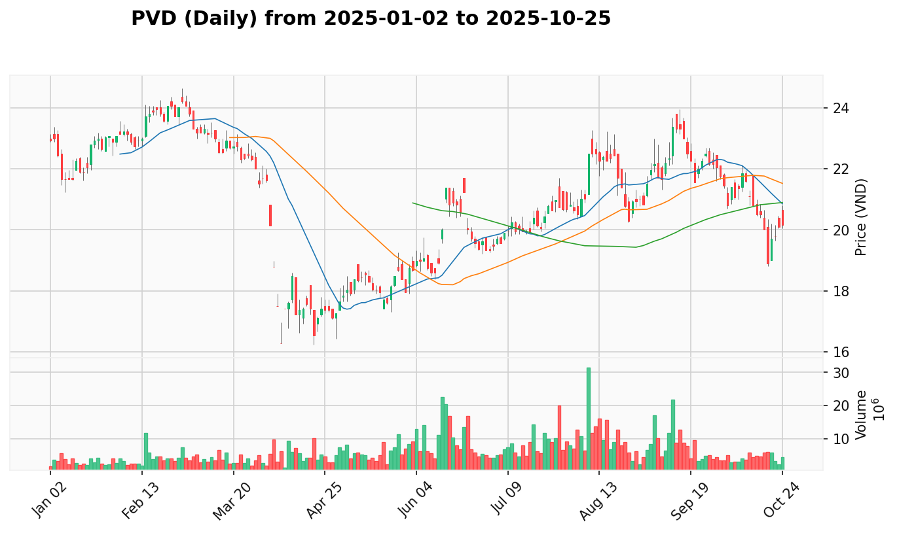

<a href="#dau-khi">↑ Back to group DAU_KHI</a>  |  <a href="#vpa-signal-summary">↑ Back to Top</a>

#### Key Statistics
| Metric | Value |
|:---|---:|
| Date Range | 2025-01-02 to 2025-10-17 |
| **Latest Close** | **20.0** |
| Period Open | 22.98 |
| Period High | 24.64 |
| Period Low | 16.23 |
| Period Change % | -12.97% |

**[Download PVD Data (.csv)](market_data/PVD_2025-01-02_to_2025-10-18.csv)**

---

### PVI

#### [VPA Analysis (2025-06-16 - 2025-10-16)](./VPA.md#pvi)
> **Ngày 2025-10-10:** PVI mở cửa ở mức 70.6 VND, tăng lên 70.6 VND và đóng cửa ở mức 69.5 VND, cao hơn giá đóng cửa phiên trước (69.2 VND). Biên độ dao động trong ngày (từ 69.2 VND đến 70.6 VND) là vừa phải và giá đóng cửa nằm ở nửa trên của biên độ. Khối lượng giao dịch đạt 0.041 triệu cổ phiếu, tiếp tục tăng so với phiên trước (0.031089 triệu cổ phiếu). Sau phiên "Sign of Strength" ngày 2025-10-09, phiên này cho thấy giá tiếp tục tăng với khối lượng gia tăng, xác nhận lực cầu vẫn đang chiếm ưu thế. Tuy nhiên, việc giá không đóng cửa ở mức cao nhất phiên có thể cho thấy một lượng cung nhỏ đã xuất hiện. **Phân tích VPA/Wyckoff:** Sign of Strength (SOS) - Tiếp diễn lực cầu mạnh mẽ
> **Ngày 2025-10-13:** PVI mở cửa ở mức 69.5 VND, giảm xuống 68.1 VND và đóng cửa ở mức 68.1 VND, thấp hơn giá đóng cửa phiên trước (69.5 VND). Biên độ dao động trong ngày (từ 68.1 VND đến 69.5 VND) là hẹp và giá đóng cửa nằm ở mức thấp nhất phiên. Khối lượng giao dịch đạt 0.0104 triệu cổ phiếu, giảm mạnh so với phiên trước (0.041 triệu cổ phiếu). Sau hai phiên "Sign of Strength" liên tiếp, phiên này cho thấy giá giảm với khối lượng rất thấp, cho thấy lực cầu đã suy yếu đáng kể và thị trường đang thiếu động lực tăng giá. **Phân tích VPA/Wyckoff:** No Demand (ND) - Lực cầu suy yếu.
> **Ngày 2025-10-14:** PVI mở cửa ở mức 68.1 VND, tăng lên 69.6 VND và đóng cửa ở mức 68.2 VND, cao hơn giá đóng cửa phiên trước (68.1 VND). Biên độ dao động trong ngày (từ 68.1 VND đến 69.6 VND) là vừa phải và giá đóng cửa nằm ở mức thấp của biên độ. Khối lượng giao dịch đạt 0.0152 triệu cổ phiếu, tăng so với phiên trước (0.010596 triệu cổ phiếu). Sau phiên "No Demand" ngày 2025-10-13, phiên này cho thấy giá có sự phục hồi nhẹ nhưng đóng cửa yếu với khối lượng gia tăng, cho thấy lực cung vẫn còn hiện diện và áp đảo lực cầu ở các mức giá cao hơn. **Phân tích VPA/Wyckoff:** Test for Supply (Kiểm tra cung)
> **Ngày 2025-10-15:** PVI mở cửa ở mức 67.0 VND, tăng lên 68.5 VND và đóng cửa ở mức 68.5 VND, cao hơn giá đóng cửa phiên trước (68.2 VND). Biên độ dao động trong ngày (từ 67.0 VND đến 68.5 VND) là hẹp và giá đóng cửa nằm ở mức cao nhất phiên. Khối lượng giao dịch đạt 0.0029 triệu cổ phiếu, giảm mạnh so với phiên trước (0.0152 triệu cổ phiếu). Sau phiên "Test for Supply" ngày 2025-10-14, phiên này cho thấy giá tăng nhẹ nhưng với khối lượng cực kỳ thấp, cho thấy lực cầu yếu và không có sự tham gia mạnh mẽ của dòng tiền lớn để đẩy giá lên bền vững. **Phân tích VPA/Wyckoff:** No Demand (ND) - Lực cầu yếu.
> **Ngày 2025-10-16:** PVI mở cửa ở mức 67.7 VND, tăng lên 67.8 VND, giảm xuống 67.4 VND và đóng cửa ở mức 67.7 VND, thấp hơn giá đóng cửa phiên trước (68.5 VND). Biên độ dao động trong ngày (từ 67.4 VND đến 67.8 VND) là hẹp và giá đóng cửa nằm ở mức giữa của biên độ. Khối lượng giao dịch đạt 0.0118 triệu cổ phiếu, tăng đáng kể so với phiên trước (0.0029 triệu cổ phiếu). Sau phiên "No Demand" ngày 2025-10-15, phiên này cho thấy giá giảm với khối lượng gia tăng, xác nhận lực cung đang chiếm ưu thế và đẩy giá xuống. **Phân tích VPA/Wyckoff:** Supply Coming In (Lực cung gia tăng)

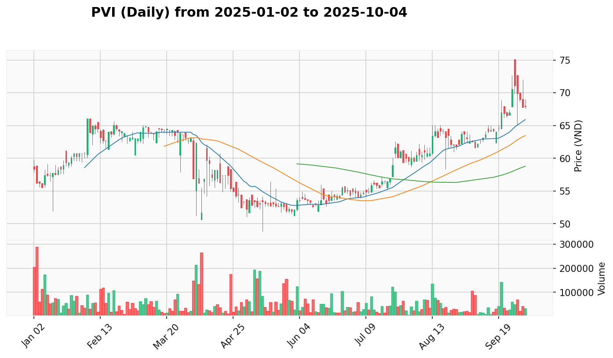

<a href="#bao-hiem">↑ Back to group BAO_HIEM</a>  |  <a href="#vpa-signal-summary">↑ Back to Top</a>

#### Key Statistics
| Metric | Value |
|:---|---:|
| Date Range | 2025-01-02 to 2025-10-17 |
| **Latest Close** | **67.8** |
| Period Open | 58.75 |
| Period High | 75.11 |
| Period Low | 48.8 |
| Period Change % | 15.40% |

**[Download PVI Data (.csv)](market_data/PVI_2025-01-02_to_2025-10-18.csv)**

---

### PVP

#### [VPA Analysis (2025-08-13 - 2025-10-16)](./VPA.md#pvp)
> **Ngày 2025-10-10:** PVP đóng cửa ở mức 14.9 VND, giảm 0.05 VND so với phiên trước (14.95 VND). Giá mở cửa 14.95 VND, cao nhất 15.05 VND, thấp nhất 14.9 VND. Biên độ dao động trong phiên hẹp hơn (0.15 VND) so với phiên trước và giá đóng cửa nằm ở mức thấp nhất phiên. Khối lượng giao dịch đạt 0.0777 triệu cổ phiếu, tăng đáng kể so với 0.0297 triệu cổ phiếu của ngày 2025-10-09. Sau phiên "Weakness", việc giá giảm với khối lượng gia tăng mạnh và đóng cửa ở mức thấp nhất phiên cho thấy áp lực bán rất mạnh và lực cung đang áp đảo hoàn toàn lực cầu, xác nhận sự yếu kém của thị trường. **Phân tích VPA/Wyckoff:** Selling Pressure
> **Ngày 2025-10-13:** PVP đóng cửa ở mức 15.0 VND, tăng 0.1 VND so với phiên trước (14.9 VND). Giá mở cửa 14.9 VND, cao nhất 15.05 VND, thấp nhất 14.8 VND. Biên độ dao động trong phiên rộng hơn (0.25 VND) so với phiên trước và giá đóng cửa nằm ở nửa trên của thân nến. Khối lượng giao dịch đạt 0.0508 triệu cổ phiếu, giảm đáng kể so với 0.0777 triệu cổ phiếu của ngày 2025-10-10. Sau phiên "Selling Pressure", việc giá tăng với biên độ rộng hơn nhưng khối lượng lại giảm mạnh cho thấy lực cầu yếu và không đủ sức để đẩy giá lên cao bền vững. Đây là dấu hiệu của sự thiếu vắng nhu cầu. **Phân tích VPA/Wyckoff:** No Demand
> **Ngày 2025-10-14:** PVP đóng cửa ở mức 14.95 VND, giảm 0.05 VND so với phiên trước (15.0 VND). Giá mở cửa 15.0 VND, cao nhất 15.05 VND, thấp nhất 14.8 VND. Biên độ dao động trong phiên rộng (0.25 VND) và giá đóng cửa nằm ở nửa trên của thân nến. Khối lượng giao dịch đạt 0.0609 triệu cổ phiếu, tăng so với 0.0508 triệu cổ phiếu của ngày 2025-10-13. Sau phiên "No Demand", việc giá giảm nhẹ với khối lượng gia tăng và đóng cửa ở nửa trên của thân nến cho thấy áp lực bán vẫn còn nhưng đã có lực cầu hấp thụ một phần, ngăn giá giảm sâu hơn. Điều này cho thấy một nỗ lực giảm giá nhưng không hoàn toàn thành công. **Phân tích VPA/Wyckoff:** Effort to Fall
> **Ngày 2025-10-15:** PVP đóng cửa ở mức 15.1 VND, tăng 0.15 VND so với phiên trước (14.95 VND). Giá mở cửa 15.1 VND, cao nhất 15.15 VND, thấp nhất 15.0 VND. Biên độ dao động trong phiên hẹp hơn (0.15 VND) nhưng giá đóng cửa nằm ở nửa trên của thân nến. Khối lượng giao dịch đạt 0.2025 triệu cổ phiếu, tăng mạnh so với 0.0609 triệu cổ phiếu của ngày 2025-10-14. Sau các phiên "No Demand" và "Effort to Fall", việc giá tăng với khối lượng đột biến cho thấy lực cầu đã nhập cuộc mạnh mẽ, hấp thụ lực cung và đẩy giá lên. Đây là dấu hiệu tích cực cho thấy sự trở lại của lực mua. **Phân tích VPA/Wyckoff:** Demand Coming In
> **Ngày 2025-10-16:** PVP đóng cửa ở mức 15.15 VND, tăng 0.05 VND so với phiên trước (15.1 VND). Giá mở cửa 15.15 VND, cao nhất 15.15 VND, thấp nhất 15.05 VND. Biên độ dao động trong phiên hẹp (0.1 VND) và giá đóng cửa nằm ở mức cao nhất phiên. Khối lượng giao dịch đạt 0.0259 triệu cổ phiếu, giảm mạnh so với 0.2025 triệu cổ phiếu của ngày 2025-10-15. Sau phiên "Demand Coming In" với khối lượng đột biến, việc giá tiếp tục tăng nhẹ với biên độ hẹp và khối lượng giảm mạnh cho thấy áp lực bán đã cạn kiệt. Điều này xác nhận sự thiếu hụt nguồn cung và cho thấy thị trường sẵn sàng cho một đợt tăng giá tiếp theo. **Phân tích VPA/Wyckoff:** No Supply (Thử nghiệm nguồn cung)

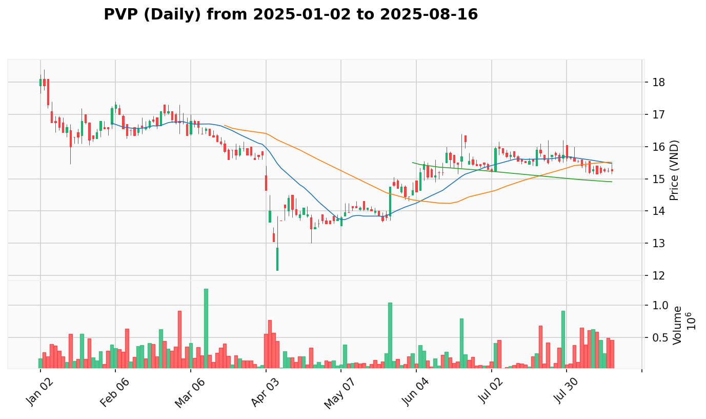

<a href="#van-tai">↑ Back to group VAN_TAI</a>  |  <a href="#vpa-signal-summary">↑ Back to Top</a>

#### Key Statistics
| Metric | Value |
|:---|---:|
| Date Range | 2025-01-02 to 2025-10-17 |
| **Latest Close** | **15.0** |
| Period Open | 17.9 |
| Period High | 18.4 |
| Period Low | 12.15 |
| Period Change % | -16.20% |

**[Download PVP Data (.csv)](market_data/PVP_2025-01-02_to_2025-10-18.csv)**

---

### PVS

#### [VPA Analysis (2025-06-16 - 2025-10-16)](./VPA.md#pvs)
> **Ngày 2025-10-10:** PVS mở cửa tại 33.3 VND, đạt mức cao nhất 33.6 VND và thấp nhất 32.8 VND, đóng cửa tại 32.8 VND. Giá giảm từ 33.4 VND xuống 32.8 VND so với phiên trước, với biên độ giá hẹp hơn và đóng cửa tại mức thấp nhất phiên, cho thấy lực cung chiếm ưu thế. Khối lượng giao dịch chỉ đạt 2.4054 triệu cổ phiếu, giảm đáng kể so với phiên trước (4.4516 triệu cổ phiếu) và thấp hơn mức trung bình. Sự giảm giá với khối lượng thấp này cho thấy thiếu vắng lực cầu mạnh mẽ sau phiên "Sign of Strength" trước đó. **Phân tích VPA/Wyckoff:** No Demand (ND)
> **Ngày 2025-10-13:** PVS mở cửa tại 32.8 VND, đạt mức cao nhất 32.8 VND và thấp nhất 31.8 VND, đóng cửa tại 31.9 VND. Giá giảm từ 32.8 VND xuống 31.9 VND so với phiên trước, với biên độ giá rộng và đóng cửa gần mức thấp nhất phiên, cho thấy lực cung mạnh mẽ. Khối lượng giao dịch đạt 5.0281 triệu cổ phiếu, tăng đáng kể so với phiên trước (2.4054 triệu cổ phiếu) và cao hơn mức trung bình, xác nhận sự gia tăng của áp lực bán. Sau phiên "No Demand" trước đó, phiên này cho thấy sự tiếp diễn của tín hiệu suy yếu. **Phân tích VPA/Wyckoff:** Sign of Weakness (SOW)
> **Ngày 2025-10-14:** PVS mở cửa tại 31.9 VND, đạt mức cao nhất 32.5 VND và thấp nhất 31.2 VND, đóng cửa tại 31.4 VND. Giá giảm từ 31.9 VND xuống 31.4 VND so với phiên trước, với biên độ giá rộng hơn và đóng cửa gần mức thấp nhất phiên, cho thấy áp lực bán tiếp tục gia tăng. Khối lượng giao dịch đạt 5.9348 triệu cổ phiếu, tăng đáng kể so với phiên trước (5.0281 triệu cổ phiếu) và cao hơn mức trung bình, xác nhận sự tiếp diễn của lực cung mạnh mẽ. Sau phiên "Sign of Weakness" trước đó, phiên này củng cố tín hiệu suy yếu. **Phân tích VPA/Wyckoff:** Sign of Weakness (SOW)
> **Ngày 2025-10-15:** PVS mở cửa tại 31.5 VND, đạt mức cao nhất 31.6 VND và thấp nhất 30.4 VND, đóng cửa tại 30.5 VND. Giá giảm từ 31.4 VND xuống 30.5 VND so với phiên trước, với biên độ giá rộng và đóng cửa gần mức thấp nhất phiên, cho thấy lực cung tiếp tục mạnh mẽ. Khối lượng giao dịch đạt 6.0173 triệu cổ phiếu, tăng so với phiên trước (5.9348 triệu cổ phiếu) và cao hơn mức trung bình, xác nhận sự gia tăng của áp lực bán. Sau các phiên "Sign of Weakness" trước đó, phiên này củng cố tín hiệu suy yếu. **Phân tích VPA/Wyckoff:** Sign of Weakness (SOW)
> **Ngày 2025-10-16:** PVS mở cửa tại 30.5 VND, đạt mức cao nhất 30.9 VND và thấp nhất 30.3 VND, đóng cửa tại 30.4 VND. Giá giảm từ 30.5 VND xuống 30.4 VND so với phiên trước, với biên độ giá hẹp và đóng cửa gần mức thấp nhất phiên, cho thấy áp lực bán đã giảm bớt nhưng lực cầu vẫn yếu. Khối lượng giao dịch đạt 1.96 triệu cổ phiếu, giảm đáng kể so với phiên trước (6.02 triệu cổ phiếu) và thấp hơn mức trung bình, xác nhận sự thiếu vắng của lực cầu. Sau các phiên "Sign of Weakness" liên tiếp, phiên này cho thấy sự tạm lắng của áp lực bán nhưng không có dấu hiệu phục hồi, củng cố tín hiệu suy yếu. **Phân tích VPA/Wyckoff:** No Demand (ND)

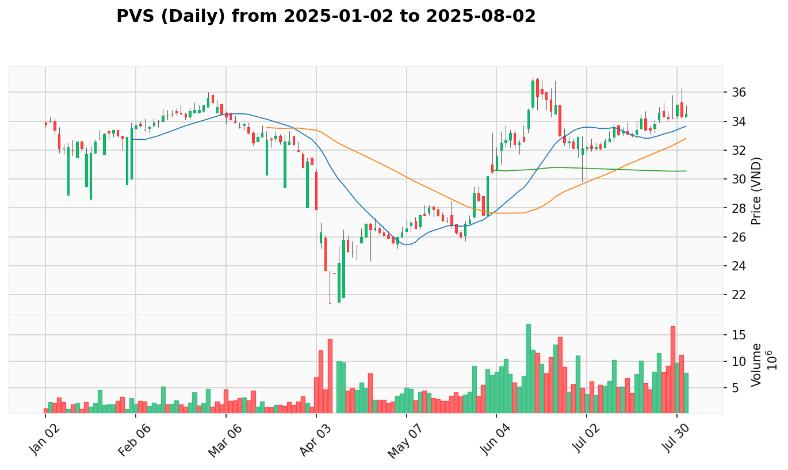

<a href="#dau-khi">↑ Back to group DAU_KHI</a>  |  <a href="#vpa-signal-summary">↑ Back to Top</a>

#### Key Statistics
| Metric | Value |
|:---|---:|
| Date Range | 2025-01-02 to 2025-10-17 |
| **Latest Close** | **30.4** |
| Period Open | 33.9 |
| Period High | 39.0 |
| Period Low | 21.4 |
| Period Change % | -10.32% |

**[Download PVS Data (.csv)](market_data/PVS_2025-01-02_to_2025-10-18.csv)**

---

### PVT

#### [VPA Analysis (2025-06-16 - 2025-10-16)](./VPA.md#pvt)
> **Ngày 2025-10-10:** PVT giảm từ 18.05 VND xuống 17.95 VND với khối lượng giao dịch đạt 1.7839 triệu cổ phiếu. Giá đóng cửa thấp hơn phiên trước và cây nến là nến giảm (giá mở cửa 18.15 VND, giá đóng cửa 17.95 VND). Khối lượng giao dịch tiếp tục ở mức rất thấp, thậm chí còn thấp hơn các phiên Thiếu cầu trước đó, cho thấy lực cầu vẫn cực kỳ yếu và không có sự hấp thụ áp lực cung đáng kể. Điều này xác nhận sự yếu kém tiếp diễn của thị trường và thiếu vắng sự quan tâm từ bên mua. **Phân tích VPA/Wyckoff:** No Demand (Thiếu cầu)
> **Ngày 2025-10-13:** PVT giảm từ 17.95 VND xuống 17.9 VND với khối lượng giao dịch đạt 2.824 triệu cổ phiếu. Mặc dù giá đóng cửa cao hơn giá mở cửa (17.85 VND lên 17.9 VND), tạo thành một cây nến tăng nhỏ, nhưng giá vẫn giảm so với phiên trước. Khối lượng giao dịch tăng lên đáng kể so với các phiên "Thiếu cầu" trước đó, cho thấy áp lực cung vẫn hiện hữu và được hấp thụ một phần, nhưng không đủ để đảo chiều xu hướng giảm. **Phân tích VPA/Wyckoff:** Supply (Cung)
> **Ngày 2025-10-14:** PVT giảm từ 17.95 VND xuống 17.5 VND với khối lượng giao dịch đạt 5.0231 triệu cổ phiếu. Cây nến giảm có biên độ rộng và đóng cửa ở mức thấp nhất phiên. Khối lượng giao dịch tăng đột biến, cao hơn đáng kể so với phiên "Cung" ngày 2025-10-13 (2.824 triệu cổ phiếu) và đặc biệt là phiên "Thiếu cầu" ngày 2025-10-10 (1.7839 triệu cổ phiếu). Điều này cho thấy áp lực bán rất mạnh mẽ và nguồn cung đang áp đảo hoàn toàn lực cầu, xác nhận sự yếu kém của thị trường và khả năng tiếp diễn xu hướng giảm. **Phân tích VPA/Wyckoff:** Sign of Weakness (SOW) - Lực cung mạnh mẽ
> **Ngày 2025-10-15:** PVT giảm nhẹ từ 17.6 VND xuống 17.55 VND với khối lượng giao dịch đạt 2.2079 triệu cổ phiếu. Mặc dù giá đóng cửa cao hơn một chút so với phiên trước (17.5 VND lên 17.55 VND), nhưng cây nến có biên độ hẹp và khối lượng giao dịch giảm đáng kể so với phiên "Lực cung mạnh mẽ" (SOW) ngày 2025-10-14. Điều này cho thấy áp lực bán đã tạm thời giảm bớt, nhưng lực cầu vẫn còn yếu và chưa sẵn sàng tham gia, xác nhận sự thiếu vắng của lực mua sau một phiên giảm mạnh. **Phân tích VPA/Wyckoff:** No Demand (Thiếu cầu)
> **Ngày 2025-10-16:** PVT tăng nhẹ từ 17.55 VND lên 17.6 VND với khối lượng giao dịch đạt 0.7152 triệu cổ phiếu. Cây nến có biên độ hẹp và giá đóng cửa bằng giá mở cửa, cho thấy sự lưỡng lự. Khối lượng giao dịch rất thấp, giảm đáng kể so với phiên "Thiếu cầu" ngày 2025-10-15 (2.2079 triệu cổ phiếu) và đặc biệt là phiên "Lực cung mạnh mẽ" ngày 2025-10-14 (5.0231 triệu cổ phiếu). Điều này xác nhận sự thiếu vắng lực cầu và sự cạn kiệt tạm thời của lực bán, cho thấy thị trường vẫn còn yếu và thiếu động lực để tăng giá. **Phân tích VPA/Wyckoff:** No Demand (Thiếu cầu)

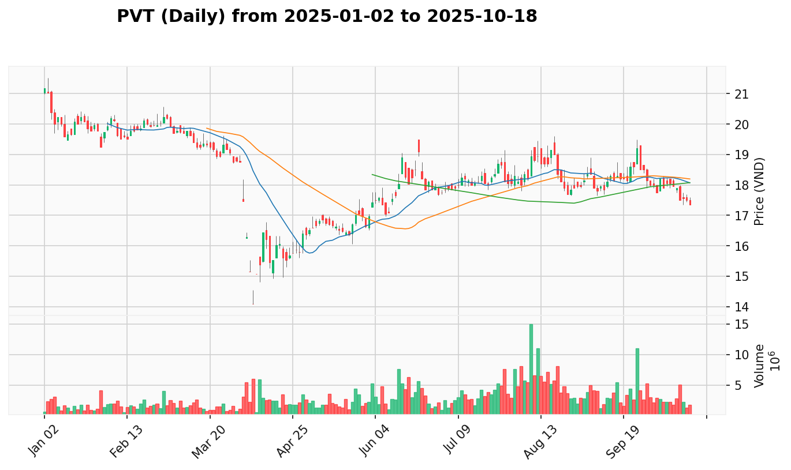

<a href="#van-tai">↑ Back to group VAN_TAI</a>  |  <a href="#vpa-signal-summary">↑ Back to Top</a>

#### Key Statistics
| Metric | Value |
|:---|---:|
| Date Range | 2025-01-02 to 2025-10-17 |
| **Latest Close** | **17.35** |
| Period Open | 21.02 |
| Period High | 21.52 |
| Period Low | 14.09 |
| Period Change % | -17.46% |

**[Download PVT Data (.csv)](market_data/PVT_2025-01-02_to_2025-10-18.csv)**

---

### PXI

#### [VPA Analysis (2025-08-08 - 2025-10-10)](./VPA.md#pxi)
> **Ngày 2025-09-12:** PXI tiếp tục duy trì mức giá 1.3 VND, không thay đổi so với phiên trước, với biên độ giao động hẹp từ 1.2 VND đến 1.3 VND. Khối lượng giao dịch giảm mạnh xuống 0.073 triệu cổ phiếu, thấp hơn đáng kể so với phiên trước đó (0.2144 triệu cổ phiếu) khi lực cầu xuất hiện. Điều này cho thấy sau tín hiệu lực cầu (SOS) vào ngày 2025-09-05, nhu cầu mua tiếp theo không được duy trì, thị trường đang thiếu động lực và không có sự tham gia mạnh mẽ từ cả bên mua và bên bán. **Phân tích VPA/Wyckoff:** No Demand - Thiếu cầu.
> **Ngày 2025-09-19:** PXI giảm từ 1.3 VND xuống 1.2 VND với biên độ hẹp và đóng cửa tại mức thấp nhất phiên. Khối lượng giao dịch giảm mạnh xuống 0.027 triệu cổ phiếu, thấp hơn đáng kể so với phiên trước đó (0.073 triệu cổ phiếu) và rất thấp so với mức 0.2144 triệu cổ phiếu khi lực cầu xuất hiện vào ngày 2025-09-05. Điều này cho thấy lực cầu tiếp tục suy yếu và không có sự hỗ trợ giá, dẫn đến việc giá giảm nhẹ. **Phân tích VPA/Wyckoff:** No Demand - Thiếu cầu.
> **Ngày 2025-09-26:** PXI tăng từ 1.2 VND lên 1.3 VND, đóng cửa tại mức cao nhất phiên. Khối lượng giao dịch đạt 0.0614 triệu cổ phiếu, tăng đáng kể so với phiên trước đó (0.027 triệu cổ phiếu). Sau hai phiên liên tiếp cho thấy tín hiệu thiếu cầu, phiên này cho thấy sự trở lại của lực mua, đẩy giá lên với khối lượng tăng. Điều này cho thấy có sự quan tâm trở lại từ thị trường. **Phân tích VPA/Wyckoff:** Sign of Strength (SOS) - Lực cầu xuất hiện.
> **Ngày 2025-10-03:** PXI tăng từ 1.2 VND lên 1.3 VND, đóng cửa tại mức cao nhất phiên. Khối lượng giao dịch đạt 0.1383 triệu cổ phiếu, tăng mạnh so với phiên trước đó (0.0614 triệu cổ phiếu). Sau tín hiệu lực cầu xuất hiện vào ngày 2025-09-26, phiên này tiếp tục cho thấy sự gia tăng mạnh mẽ của lực mua, đẩy giá lên với khối lượng lớn, xác nhận xu hướng tăng. **Phân tích VPA/Wyckoff:** Sign of Strength (SOS) - Lực cầu tiếp tục mạnh mẽ.
> **Ngày 2025-10-10:** PXI giảm từ 1.3 VND xuống 1.2 VND, đóng cửa tại mức thấp nhất phiên (1.2 VND). Khối lượng giao dịch đạt 0.0767 triệu cổ phiếu, giảm đáng kể so với phiên trước đó (0.1383 triệu cổ phiếu). Sau hai phiên liên tiếp cho thấy tín hiệu lực cầu mạnh mẽ (SOS), phiên này cho thấy sự suy yếu rõ rệt khi giá không thể duy trì mức 1.3 VND và giảm trở lại với khối lượng thấp. Điều này cho thấy lực cầu đã không còn duy trì được đà tăng và có sự thiếu hụt nhu cầu ở mức giá cao hơn. **Phân tích VPA/Wyckoff:** No Demand (Thiếu cầu).

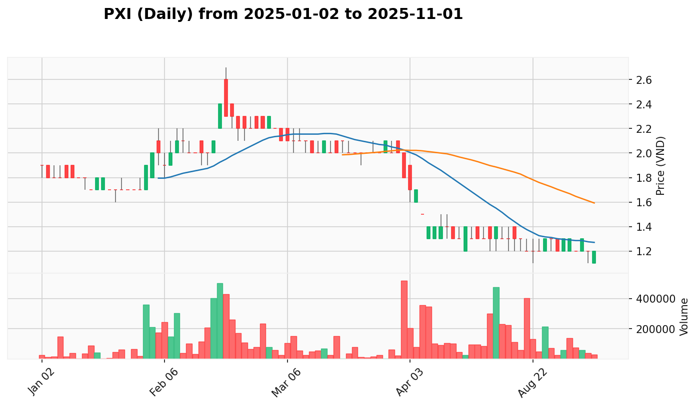

<a href="#penny">↑ Back to group PENNY</a>  |  <a href="#vpa-signal-summary">↑ Back to Top</a>

#### Key Statistics
| Metric | Value |
|:---|---:|
| Date Range | 2025-01-02 to 2025-10-17 |
| **Latest Close** | **1.3** |
| Period Open | 1.9 |
| Period High | 2.7 |
| Period Low | 1.1 |
| Period Change % | -31.58% |

**[Download PXI Data (.csv)](market_data/PXI_2025-01-02_to_2025-10-18.csv)**

---

### QNS

#### [VPA Analysis (2025-06-16 - 2025-10-16)](./VPA.md#qns)
> **Ngày 2025-10-10:** QNS mở cửa ở mức 47.5 VND và đóng cửa ở mức 47.5 VND, giữ nguyên so với phiên trước, với biên độ dao động hẹp từ 47.3 VND đến 47.6 VND. Khối lượng giao dịch đạt 0.0834 triệu cổ phiếu, giảm nhẹ so với phiên hấp thụ cung mạnh mẽ ngày 2025-10-09 (0.0917 triệu cổ phiếu). Sau khi lực cầu hấp thụ một lượng lớn cung ở phiên trước, phiên này cho thấy thị trường đang kiểm tra lại lượng cung còn lại. Giá không giảm trên khối lượng thấp cho thấy áp lực bán đã suy yếu đáng kể, nhưng lực cầu cũng chưa đủ mạnh để đẩy giá lên. Đây là dấu hiệu của giai đoạn tích lũy tiếp diễn, chuẩn bị cho một động thái giá tiếp theo. **Phân tích VPA/Wyckoff:** Kiểm tra cung (Testing Supply)
> **Ngày 2025-10-13:** QNS mở cửa ở mức 47.5 VND, sau đó giảm mạnh xuống mức thấp nhất 46.6 VND và đóng cửa ở 46.7 VND, giảm đáng kể so với mức đóng cửa 47.5 VND của phiên trước. Biên độ dao động giá rộng và đóng cửa gần mức thấp nhất phiên. Khối lượng giao dịch đạt 0.4705 triệu cổ phiếu, tăng đột biến so với phiên trước (0.0834 triệu cổ phiếu). Sau phiên "Kiểm tra cung" ngày 2025-10-10, phiên giao dịch này cho thấy áp lực bán mạnh mẽ đã xuất hiện, đẩy giá xuống với khối lượng rất lớn. Điều này cho thấy lực cung đã áp đảo hoàn toàn lực cầu, phá vỡ các mức hỗ trợ tiềm năng và có thể báo hiệu một giai đoạn giảm giá mới. **Phân tích VPA/Wyckoff:** Sign of Weakness (SOW) - Lực cung mạnh mẽ
> **Ngày 2025-10-14:** QNS mở cửa ở mức 47.1 VND và đóng cửa ở mức 47.1 VND, tăng nhẹ so với mức đóng cửa 46.7 VND của phiên trước, với biên độ dao động hẹp từ 46.8 VND đến 47.2 VND. Khối lượng giao dịch đạt 0.1017 triệu cổ phiếu, giảm đáng kể so với phiên "Sign of Weakness" ngày 2025-10-13 (0.4705 triệu cổ phiếu). Sau áp lực bán mạnh mẽ của phiên trước, phiên này cho thấy giá đã có sự phục hồi nhẹ trên khối lượng thấp. Điều này có thể là một dấu hiệu kiểm tra cung sau đợt bán tháo, cho thấy áp lực bán đã tạm thời suy yếu. Tuy nhiên, khối lượng thấp cũng cho thấy lực cầu chưa thực sự mạnh mẽ để đảo chiều xu hướng giảm. Cần quan sát thêm các phiên tiếp theo để xác nhận liệu đây là một đợt hồi phục yếu hay là giai đoạn tích lũy lại. **Phân tích VPA/Wyckoff:** Test for Supply (Kiểm tra cung)
> **Ngày 2025-10-15:** QNS mở cửa ở mức 47.0 VND, sau đó giảm xuống mức thấp nhất 46.5 VND và đóng cửa ở 46.7 VND, giảm so với mức đóng cửa 47.1 VND của phiên trước. Biên độ dao động giá hẹp hơn so với phiên SOW ngày 2025-10-13. Khối lượng giao dịch đạt 0.2138 triệu cổ phiếu, tăng so với phiên "Kiểm tra cung" ngày 2025-10-14 (0.1017 triệu cổ phiếu). Việc giá giảm và đóng cửa ở mức thấp nhất của phiên SOW trước đó (46.7 VND) với khối lượng gia tăng cho thấy áp lực bán vẫn còn mạnh mẽ và lực cầu chưa đủ để hấp thụ hết cung. Phiên "Kiểm tra cung" trước đó đã không thành công trong việc thu hút lực mua mạnh, dẫn đến sự tiếp diễn của xu hướng giảm. **Phân tích VPA/Wyckoff:** Sign of Weakness (SOW) - Lực cung tiếp diễn
> **Ngày 2025-10-16:** QNS mở cửa ở mức 46.7 VND và đóng cửa ở mức 47.0 VND, tăng nhẹ so với mức đóng cửa 46.7 VND của phiên trước, với biên độ dao động hẹp từ 46.7 VND đến 47.1 VND. Khối lượng giao dịch đạt 0.0728 triệu cổ phiếu, giảm đáng kể so với phiên "Sign of Weakness" ngày 2025-10-15 (0.2138 triệu cổ phiếu). Mặc dù giá tăng nhẹ, nhưng khối lượng giao dịch rất thấp cho thấy lực cầu yếu và không đủ mạnh để đảo chiều xu hướng giảm sau các phiên suy yếu trước đó. Điều này có thể là dấu hiệu của sự thiếu vắng lực mua, cho thấy thị trường chưa sẵn sàng cho một đợt tăng giá bền vững. **Phân tích VPA/Wyckoff:** No Demand (Thiếu cầu)

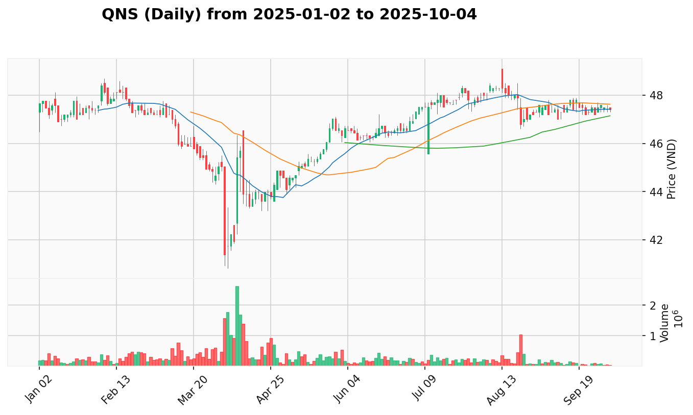

<a href="#thuc-pham">↑ Back to group THUC_PHAM</a>  |  <a href="#vpa-signal-summary">↑ Back to Top</a>

#### Key Statistics
| Metric | Value |
|:---|---:|
| Date Range | 2025-01-02 to 2025-10-17 |
| **Latest Close** | **46.9** |
| Period Open | 47.3 |
| Period High | 49.1 |
| Period Low | 40.81 |
| Period Change % | -0.85% |

**[Download QNS Data (.csv)](market_data/QNS_2025-01-02_to_2025-10-18.csv)**

---

### QTP

#### [VPA Analysis (2025-08-04 - 2025-10-16)](./VPA.md#qtp)
> **Ngày 2025-10-10:** QTP tiếp tục giữ giá 13.1 VND với biên độ nến hẹp từ 13.1 VND đến 13.2 VND. Khối lượng giao dịch đạt 0.1031 triệu cổ phiếu, tăng nhẹ so với phiên trước (0.0972 triệu cổ phiếu) nhưng vẫn ở mức rất thấp. Giá tiếp tục đi ngang và khối lượng duy trì ở mức thấp cho thấy sự thiếu vắng lực cầu và sự thờ ơ của thị trường, củng cố tín hiệu suy yếu và thiếu quyết đoán đã được ghi nhận trong các phiên trước. **Phân tích VPA/Wyckoff:** No Demand (Không có lực cầu)
> **Ngày 2025-10-13:** QTP giảm từ 13.1 VND xuống 13.0 VND với biên độ nến hẹp. Khối lượng giao dịch đạt 0.326 triệu cổ phiếu, tăng mạnh so với phiên trước (0.1031 triệu cổ phiếu). Giá giảm với khối lượng tăng cho thấy áp lực bán gia tăng và sự xuất hiện của nguồn cung, củng cố tín hiệu suy yếu đã được ghi nhận trong các phiên trước. **Phân tích VPA/Wyckoff:** Supply Coming In (Nguồn cung xuất hiện)
> **Ngày 2025-10-14:** QTP giữ giá 13.0 VND với biên độ nến hẹp từ 13.0 VND đến 13.1 VND. Khối lượng giao dịch đạt 0.252 triệu cổ phiếu, giảm so với phiên trước (0.326 triệu cổ phiếu). Sau phiên giảm giá với khối lượng tăng (Nguồn cung xuất hiện) vào ngày 2025-10-13, giá QTP duy trì ở mức thấp với khối lượng giảm cho thấy áp lực bán tạm lắng nhưng không có lực cầu đáng kể để đẩy giá lên. Thị trường vẫn thiếu quyết đoán. **Phân tích VPA/Wyckoff:** No Demand (Không có lực cầu)
> **Ngày 2025-10-15:** QTP giữ giá 13.0 VND với biên độ nến hẹp từ 13.0 VND đến 13.1 VND. Khối lượng giao dịch đạt 0.0956 triệu cổ phiếu, giảm mạnh so với phiên trước (0.252 triệu cổ phiếu) và là mức thấp nhất trong 10 phiên gần đây. Sau hai phiên liên tiếp cho thấy áp lực bán và thiếu lực cầu, phiên hôm nay QTP tiếp tục duy trì mức giá thấp với khối lượng giao dịch cực kỳ thấp. Điều này cho thấy cả bên mua và bên bán đều không còn mặn mà ở vùng giá này, lực cầu vẫn vắng bóng và nguồn cung đã cạn kiệt tạm thời. Thị trường đang trong trạng thái chờ đợi, thiếu động lực rõ ràng. **Phân tích VPA/Wyckoff:** No Demand (Không có lực cầu)
> **Ngày 2025-10-16:** QTP giữ giá 13.0 VND với biên độ nến hẹp từ 13.0 VND đến 13.1 VND. Khối lượng giao dịch đạt 0.0608 triệu cổ phiếu, tiếp tục giảm mạnh so với phiên trước (0.0956 triệu cổ phiếu) và là mức thấp nhất trong nhiều phiên gần đây. Sau nhiều phiên liên tiếp cho thấy sự thiếu vắng lực cầu và khối lượng giao dịch cạn kiệt, QTP tiếp tục duy trì mức giá thấp với khối lượng cực kỳ thấp. Điều này cho thấy cả bên mua và bên bán đều không còn mặn mà ở vùng giá này, lực cầu vẫn vắng bóng và nguồn cung đã cạn kiệt tạm thời. Thị trường đang trong trạng thái chờ đợi, thiếu động lực rõ ràng và sự thờ ơ của nhà đầu tư. **Phân tích VPA/Wyckoff:** No Demand (Không có lực cầu)

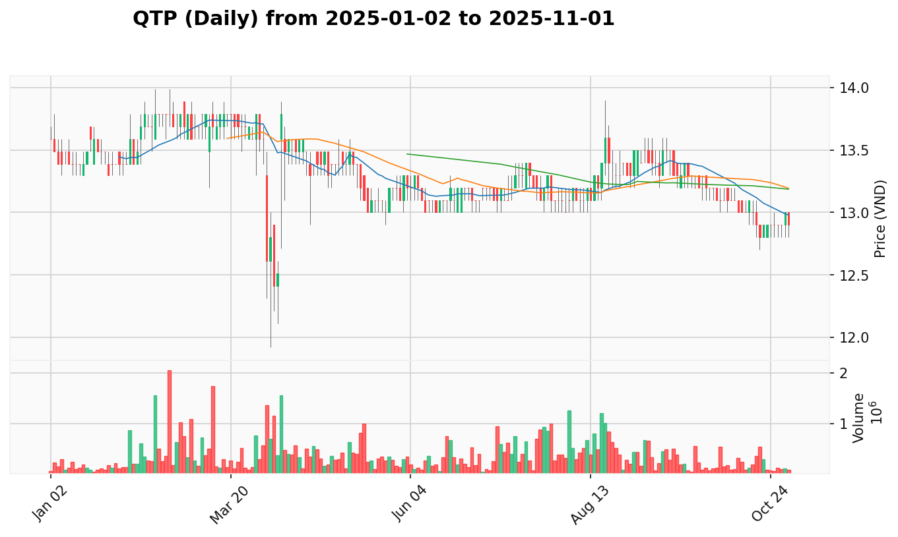

<a href="#nang-luong">↑ Back to group NANG_LUONG</a>  |  <a href="#vpa-signal-summary">↑ Back to Top</a>

#### Key Statistics
| Metric | Value |
|:---|---:|
| Date Range | 2025-01-02 to 2025-10-17 |
| **Latest Close** | **13.0** |
| Period Open | 13.59 |
| Period High | 13.99 |
| Period Low | 11.92 |
| Period Change % | -4.34% |

**[Download QTP Data (.csv)](market_data/QTP_2025-01-02_to_2025-10-18.csv)**

---

### S99

#### [VPA Analysis (2025-08-13 - 2025-10-16)](./VPA.md#s99)
> **Ngày 2025-10-10:** S99 giữ nguyên mức giá đóng cửa 9.5 VND, sau khi mở cửa ở 9.6 VND và dao động trong biên độ hẹp từ 9.5 VND đến 9.6 VND. Giá đóng cửa nằm ở mức thấp nhất của thân nến. Khối lượng giao dịch đạt 0.1029 triệu cổ phiếu, giảm nhẹ so với phiên trước (0.1093 triệu cổ phiếu) và vẫn ở mức thấp. Sau hai phiên liên tiếp cho thấy sự thiếu vắng lực cầu, việc giá không thể tăng lên và đóng cửa ở mức thấp nhất phiên với khối lượng thấp tiếp tục xác nhận thị trường đang rất yếu và không có sự hỗ trợ từ bên mua. Điều này cho thấy khả năng giá sẽ tiếp tục đi ngang hoặc giảm trong các phiên tới. **Phân tích VPA/Wyckoff:** No Demand (Không có cầu)
> **Ngày 2025-10-13:** S99 tăng từ 9.5 VND lên 9.6 VND, sau khi mở cửa ở 9.4 VND và dao động trong biên độ 9.4 VND - 9.6 VND. Giá đóng cửa nằm ở mức cao nhất phiên. Khối lượng giao dịch đạt 0.1682 triệu cổ phiếu, tăng đáng kể so với phiên trước (0.1029 triệu cổ phiếu). Sau hai phiên "No Demand" liên tiếp, việc giá tăng và đóng cửa ở mức cao nhất phiên với khối lượng gia tăng cho thấy lực cầu đã quay trở lại và có khả năng đẩy giá lên. Điều này xác nhận sự xuất hiện của nhu cầu mua mạnh mẽ trên thị trường. **Phân tích VPA/Wyckoff:** Sign of Strength (SOS)
> **Ngày 2025-10-14:** S99 giữ nguyên mức giá đóng cửa 9.6 VND, sau khi mở cửa ở 9.6 VND và dao động trong biên độ rộng từ 9.2 VND đến 9.8 VND. Khối lượng giao dịch đạt 0.3206 triệu cổ phiếu, tăng đột biến so với phiên trước (0.1682 triệu cổ phiếu) và là mức cao nhất trong 10 phiên gần đây. Mặc dù có khối lượng giao dịch rất lớn, giá không thể tăng thêm, cho thấy lực cung đã xuất hiện mạnh mẽ và hấp thụ toàn bộ lực cầu, báo hiệu sự lưỡng lự của thị trường và khả năng giá sẽ khó tăng trong ngắn hạn. **Phân tích VPA/Wyckoff:** Nỗ lực không có kết quả (Effort without Result)
> **Ngày 2025-10-15:** S99 giữ nguyên mức giá đóng cửa 9.6 VND, sau khi mở cửa ở 9.4 VND và dao động trong biên độ 9.4 VND - 9.7 VND. Giá đóng cửa nằm ở mức cao của phiên. Khối lượng giao dịch đạt 0.1375 triệu cổ phiếu, giảm đáng kể so với phiên trước (0.3206 triệu cổ phiếu). Sau phiên "Nỗ lực không có kết quả" với khối lượng đột biến, việc giá đi ngang với khối lượng thấp cho thấy lực cầu yếu và thị trường đang thiếu động lực để tăng giá. Điều này có thể báo hiệu sự suy yếu trong ngắn hạn. **Phân tích VPA/Wyckoff:** No Demand (Không có nhu cầu)
> **Ngày 2025-10-16:** S99 giảm từ 9.6 VND xuống 9.5 VND, sau khi mở cửa ở 9.7 VND và dao động trong biên độ 9.5 VND đến 9.7 VND. Giá đóng cửa ở mức thấp nhất phiên. Khối lượng giao dịch đạt 0.0416 triệu cổ phiếu, giảm mạnh so với phiên trước (0.1375 triệu cổ phiếu) và là mức thấp nhất trong 10 phiên gần đây. Sau hai phiên "Nỗ lực không có kết quả" và "Không có nhu cầu", việc giá tiếp tục giảm với khối lượng cực thấp cho thấy lực cầu vẫn rất yếu và thị trường thiếu động lực để tăng giá. Điều này củng cố thêm tín hiệu suy yếu và thiếu sự quan tâm từ phía người mua. **Phân tích VPA/Wyckoff:** Suy yếu

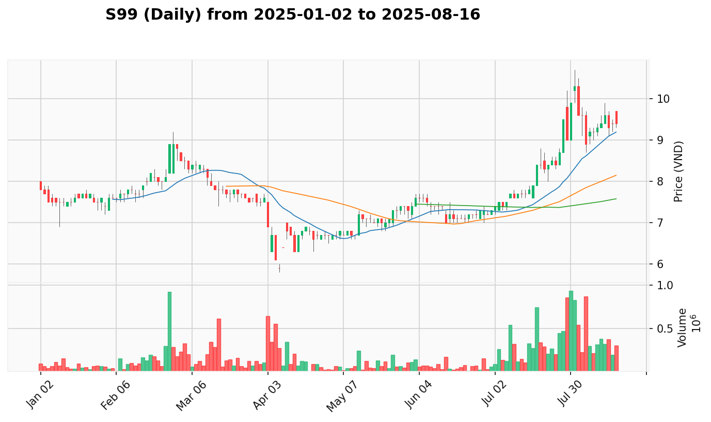

<a href="#xay-dung">↑ Back to group XAY_DUNG</a>  |  <a href="#vpa-signal-summary">↑ Back to Top</a>

#### Key Statistics
| Metric | Value |
|:---|---:|
| Date Range | 2025-01-02 to 2025-10-17 |
| **Latest Close** | **9.4** |
| Period Open | 7.62 |
| Period High | 12.8 |
| Period Low | 5.52 |
| Period Change % | 23.36% |

**[Download S99 Data (.csv)](market_data/S99_2025-01-02_to_2025-10-18.csv)**

---

### SAB

#### [VPA Analysis (2025-06-13 - 2025-10-16)](./VPA.md#sab)
> **Ngày 2025-10-10:** SAB tăng từ 45.6 lên 45.85 VND với khối lượng giao dịch đạt 0.4815 triệu cổ phiếu (giảm so với phiên trước). Cây nến tăng có biên độ hẹp, đóng cửa gần mức cao nhất phiên, cho thấy lực cầu xuất hiện nhưng không mạnh mẽ. Sau hai phiên giảm giá với tín hiệu "No Demand" và "Weakness", phiên tăng giá với khối lượng thấp này có thể là một dấu hiệu kiểm tra nguồn cung, cho thấy áp lực bán đã giảm bớt tạm thời. **Phân tích VPA/Wyckoff:** Test for Supply (Kiểm tra nguồn cung) - Giá tăng nhẹ với khối lượng thấp sau các phiên giảm giá, cho thấy áp lực bán đã giảm bớt nhưng lực cầu chưa thực sự mạnh mẽ để đẩy giá lên cao hơn.
> **Ngày 2025-10-13:** SAB tăng từ 45.85 lên 45.95 VND với khối lượng giao dịch đạt 0.5216 triệu cổ phiếu (tăng nhẹ so với phiên trước). Cây nến tăng có biên độ hẹp, đóng cửa ở mức cao nhất phiên, cho thấy lực cầu đã xuất hiện và đang chiếm ưu thế, đẩy giá lên. Sau phiên "Test for Supply" trước đó, sự tăng giá này với khối lượng tăng nhẹ và đóng cửa ở mức cao nhất phiên cho thấy thị trường đang có dấu hiệu phục hồi và lực cầu đang dần mạnh lên. **Phân tích VPA/Wyckoff:** Sign of Strength (SOS) - Giá tăng với khối lượng tăng nhẹ và đóng cửa ở mức cao nhất phiên, cho thấy lực cầu đang chiếm ưu thế và có khả năng tiếp tục đẩy giá lên.
> **Ngày 2025-10-14:** SAB giảm từ 45.95 xuống 45.4 VND với khối lượng giao dịch đạt 0.5791 triệu cổ phiếu (tăng so với phiên trước). Cây nến giảm có biên độ tương đối rộng, đóng cửa ở mức thấp nhất phiên, cho thấy áp lực bán mạnh mẽ và nguồn cung đang chiếm ưu thế. Sau phiên "Sign of Strength" trước đó, sự giảm giá này với khối lượng tăng cho thấy lực bán đã quay trở lại và có khả năng đẩy giá xuống thấp hơn. **Phân tích VPA/Wyckoff:** Sign of Weakness (SOW) - Giá giảm mạnh với khối lượng tăng và đóng cửa ở mức thấp nhất phiên, cho thấy lực bán đang chiếm ưu thế.
> **Ngày 2025-10-15:** SAB tiếp tục giảm từ 45.45 xuống 45.25 VND với khối lượng giao dịch đạt 0.5441 triệu cổ phiếu (giảm so với phiên trước). Cây nến giảm có biên độ hẹp, đóng cửa ở mức thấp nhất phiên, cho thấy áp lực bán vẫn còn nhưng đang có dấu hiệu suy yếu khi khối lượng giảm. **Phân tích VPA/Wyckoff:** Sign of Weakness (SOW) - Giá tiếp tục giảm với khối lượng giảm, cho thấy áp lực bán đang suy yếu nhưng lực cầu chưa xuất hiện.
> **Ngày 2025-10-16:** SAB tăng nhẹ từ 45.25 lên 45.3 VND với khối lượng giao dịch đạt 0.1905 triệu cổ phiếu (giảm mạnh so với phiên trước). Cây nến có biên độ hẹp, đóng cửa gần mức mở cửa, cho thấy sự lưỡng lự của thị trường. Khối lượng giao dịch cực thấp cho thấy cả lực mua và lực bán đều không mạnh mẽ. Sau hai phiên giảm giá với tín hiệu SOW, phiên này cho thấy áp lực bán đã tạm lắng nhưng lực cầu vẫn chưa xuất hiện đáng kể để đẩy giá lên. **Phân tích VPA/Wyckoff:** No Demand (ND) - Giá tăng nhẹ với khối lượng cực thấp, cho thấy thiếu vắng lực cầu và sự lưỡng lự của thị trường sau giai đoạn giảm giá.

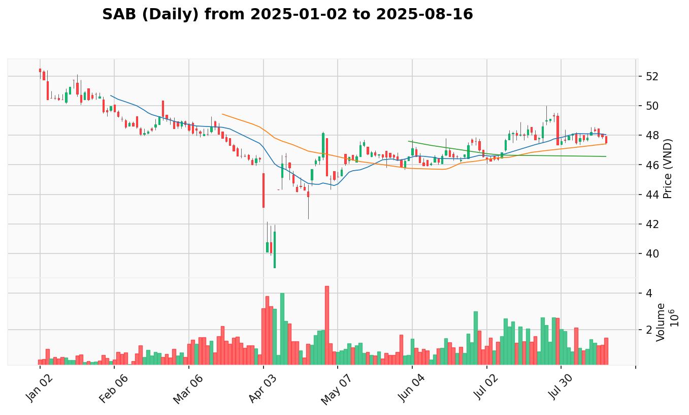

<a href="#thuc-pham">↑ Back to group THUC_PHAM</a>  |  <a href="#vpa-signal-summary">↑ Back to Top</a>

#### Key Statistics
| Metric | Value |
|:---|---:|
| Date Range | 2025-01-02 to 2025-10-17 |
| **Latest Close** | **45.25** |
| Period Open | 52.49 |
| Period High | 52.49 |
| Period Low | 39.04 |
| Period Change % | -13.79% |

**[Download SAB Data (.csv)](market_data/SAB_2025-01-02_to_2025-10-18.csv)**

---

### SAS

#### [VPA Analysis (2025-08-04 - 2025-10-16)](./VPA.md#sas)
> **Ngày 2025-10-10:** SAS tăng từ 36.8 VND lên 37.0 VND với khối lượng giao dịch đạt 0.0128 triệu cổ phiếu. Cây nến có biên độ hẹp, giá đóng cửa ở mức giữa đến cao của phiên. Khối lượng giao dịch tăng mạnh so với phiên trước (0.003 triệu cổ phiếu) nhưng giá không thể tạo ra sự bứt phá rõ rệt và đóng cửa thấp hơn mức đóng cửa của phiên trước (37.2 VND). Điều này cho thấy nỗ lực tăng giá gặp phải sự kháng cự từ nguồn cung, cho thấy sự yếu ớt của lực cầu. **Phân tích VPA/Wyckoff:** Weakness (Sự yếu ớt)
> **Ngày 2025-10-13:** SAS tăng từ 36.7 VND lên 36.9 VND với khối lượng giao dịch đạt 0.014 triệu cổ phiếu. Cây nến tăng có biên độ hẹp, giá đóng cửa gần mức cao nhất phiên. Khối lượng giao dịch tăng nhẹ so với phiên trước (0.0128 triệu cổ phiếu). Tuy nhiên, giá không thể vượt qua mức đóng cửa của phiên trước (37.0 VND) và vẫn thấp hơn mức đóng cửa của ngày 2025-10-09 (37.2 VND). Điều này cho thấy lực cầu vẫn còn yếu và giá đang gặp khó khăn trong việc tạo ra sự bứt phá rõ rệt. **Phân tích VPA/Wyckoff:** Tiếp tục yếu ớt
> **Ngày 2025-10-14:** SAS giảm từ 36.9 VND xuống 36.6 VND với khối lượng giao dịch đạt 0.0086 triệu cổ phiếu. Cây nến có biên độ hẹp, giá đóng cửa gần mức thấp nhất phiên. Khối lượng giao dịch giảm đáng kể so với phiên trước (0.014 triệu cổ phiếu). Mặc dù khối lượng giảm cho thấy áp lực bán có thể đang yếu đi, việc giá đóng cửa gần mức thấp nhất phiên sau một phiên giảm giá tiếp tục cho thấy sự thiếu vắng lực cầu mạnh mẽ. **Phân tích VPA/Wyckoff:** Tiếp tục yếu ớt
> **Ngày 2025-10-15:** SAS giảm từ 36.6 VND xuống 36.5 VND với khối lượng giao dịch đạt 0.0045 triệu cổ phiếu. Cây nến giảm có biên độ hẹp, giá đóng cửa gần mức thấp nhất phiên. Khối lượng giao dịch giảm mạnh so với phiên trước (0.0086 triệu cổ phiếu) và thấp hơn đáng kể so với các phiên gần đây. Điều này cho thấy lực bán đã suy yếu nhưng đồng thời lực cầu cũng không xuất hiện, duy trì trạng thái yếu ớt của cổ phiếu. **Phân tích VPA/Wyckoff:** No Demand (Thiếu cầu)
> **Ngày 2025-10-16:** SAS giữ nguyên mức giá 36.5 VND với khối lượng giao dịch đạt 0.0012 triệu cổ phiếu. Cây nến có biên độ cực hẹp, giá mở cửa, cao nhất, thấp nhất và đóng cửa đều ở mức 36.5 VND. Khối lượng giao dịch giảm mạnh so với phiên trước (0.0045 triệu cổ phiếu) và là mức rất thấp trong các phiên gần đây. Điều này cho thấy sự thiếu vắng hoàn toàn của cả lực mua và lực bán, xác nhận tình trạng "No Demand" và sự yếu ớt của cổ phiếu. **Phân tích VPA/Wyckoff:** No Demand (Thiếu cầu)

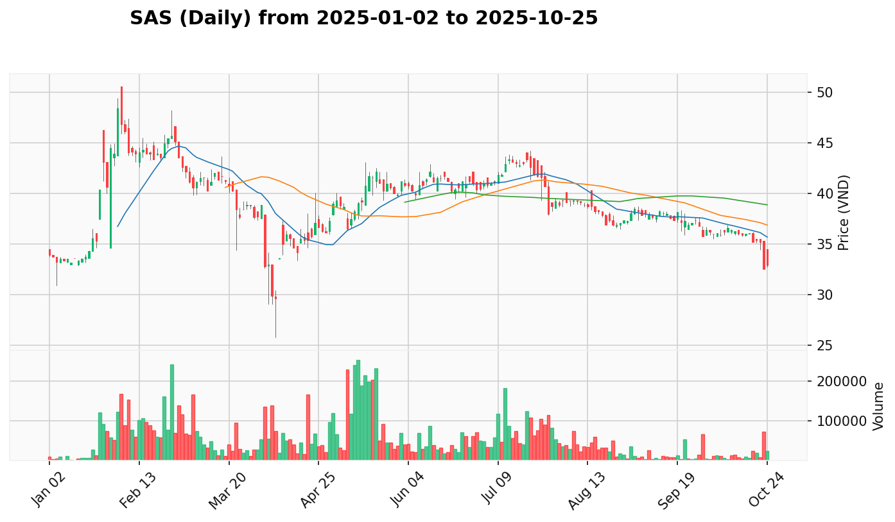

<a href="#hang-khong">↑ Back to group HANG_KHONG</a>  |  <a href="#vpa-signal-summary">↑ Back to Top</a>

#### Key Statistics
| Metric | Value |
|:---|---:|
| Date Range | 2025-01-02 to 2025-10-17 |
| **Latest Close** | **36.7** |
| Period Open | 35.05 |
| Period High | 51.43 |
| Period Low | 26.19 |
| Period Change % | 4.71% |

**[Download SAS Data (.csv)](market_data/SAS_2025-01-02_to_2025-10-18.csv)**

---

### SBS

#### [VPA Analysis (2025-08-04 - 2025-10-16)](./VPA.md#sbs)
> **Ngày 2025-10-10:** SBS giảm từ 6.6 VND xuống 6.4 VND với khối lượng giao dịch đạt 1.0002 triệu cổ phiếu, tăng đáng kể so với phiên trước (0.4315 triệu cổ phiếu). Giá giảm đi kèm với khối lượng gia tăng cho thấy áp lực bán đã quay trở lại thị trường. Biên độ giá trong ngày từ 6.4 VND đến 6.6 VND, với giá đóng cửa ở mức thấp nhất phiên, thể hiện sự chiếm ưu thế của phe bán. **Phân tích VPA/Wyckoff:** Supply Coming In (Lực cung quay trở lại).
> **Ngày 2025-10-13:** SBS giữ nguyên mức giá 6.4 VND với khối lượng giao dịch đạt 0.9464 triệu cổ phiếu, giảm so với phiên trước (1.0002 triệu cổ phiếu). Giá đóng cửa bằng giá mở cửa và bằng giá đóng cửa phiên trước, cho thấy sự lưỡng lự. Khối lượng giảm sau phiên "Supply Coming In" cho thấy lực cầu yếu và không đủ sức hấp thụ lượng cung còn lại, xác nhận sự thiếu vắng của phe mua. **Phân tích VPA/Wyckoff:** No Demand (Không có cầu)
> **Ngày 2025-10-14:** SBS giữ nguyên mức giá 6.4 VND với khối lượng giao dịch đạt 1.6097 triệu cổ phiếu, tăng đáng kể so với phiên trước (0.9464 triệu cổ phiếu). Giá đóng cửa bằng giá mở cửa và bằng giá đóng cửa phiên trước, cho thấy sự lưỡng lự tiếp diễn. Khối lượng gia tăng trong khi giá không đổi cho thấy lực cung và cầu đang cân bằng tại mức giá này, với sự gia tăng hoạt động giao dịch. Điều này có thể là dấu hiệu của việc hấp thụ cung hoặc tiếp tục phân phối, tùy thuộc vào diễn biến tiếp theo. Biên độ giá trong ngày từ 6.2 VND đến 6.5 VND. **Phân tích VPA/Wyckoff:** Nỗ lực không mang lại kết quả
> **Ngày 2025-10-15:** SBS giảm từ 6.4 VND xuống 6.2 VND với khối lượng giao dịch đạt 1.0354 triệu cổ phiếu, giảm so với phiên trước (1.6097 triệu cổ phiếu). Giá đóng cửa ở mức thấp nhất phiên và thấp hơn giá mở cửa, cho thấy áp lực bán chiếm ưu thế. Sau phiên "Nỗ lực không mang lại kết quả" với khối lượng lớn, việc giá giảm và đóng cửa ở mức thấp nhất phiên, dù khối lượng có giảm, cho thấy lực cầu yếu và không đủ sức hấp thụ lượng cung, xác nhận sự yếu ớt của thị trường. **Phân tích VPA/Wyckoff:** Yếu ớt
> **Ngày 2025-10-16:** SBS tăng nhẹ từ 6.2 VND lên 6.3 VND với khối lượng giao dịch đạt 0.3783 triệu cổ phiếu, giảm đáng kể so với phiên trước (1.0354 triệu cổ phiếu). Giá đóng cửa cao hơn giá mở cửa, tạo một nến tăng nhỏ. Tuy nhiên, khối lượng giao dịch rất thấp cho thấy sự thiếu vắng của cả lực mua và lực bán mạnh mẽ. Sau phiên giảm giá "Yếu ớt" trước đó, việc giá tăng nhẹ với khối lượng thấp cho thấy lực cầu chưa thực sự quay trở lại và thị trường vẫn còn yếu. Đây có thể là một nỗ lực tăng giá không được hỗ trợ bởi khối lượng, hoặc một phiên kiểm tra cung cầu trong bối cảnh yếu ớt. **Phân tích VPA/Wyckoff:** Không có cầu (No Demand)

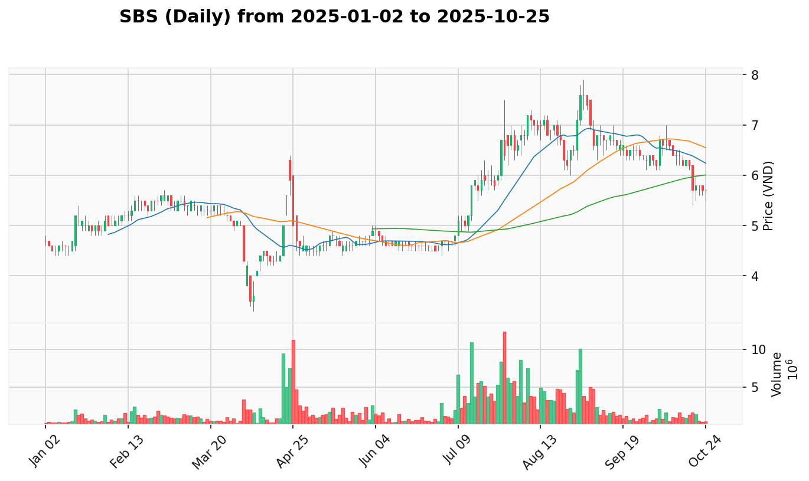

<a href="#chung-khoan">↑ Back to group CHUNG_KHOAN</a>  |  <a href="#vpa-signal-summary">↑ Back to Top</a>

#### Key Statistics
| Metric | Value |
|:---|---:|
| Date Range | 2025-01-02 to 2025-10-17 |
| **Latest Close** | **6.2** |
| Period Open | 4.7 |
| Period High | 7.9 |
| Period Low | 3.3 |
| Period Change % | 31.91% |

**[Download SBS Data (.csv)](market_data/SBS_2025-01-02_to_2025-10-18.csv)**

---

### SBT

#### [VPA Analysis (2025-08-14 - 2025-10-16)](./VPA.md#sbt)
> **Ngày 2025-10-10:** SBT tăng từ 25.05 VND lên 26.75 VND, với biên độ giá rộng từ 25.05 VND đến 26.75 VND và đóng cửa ở mức cao nhất phiên. Khối lượng giao dịch đạt 2.0068 triệu cổ phiếu, tăng mạnh so với phiên trước (1.2566 triệu cổ phiếu). Sau các phiên "Sign of Strength" trước đó, việc giá tiếp tục tăng mạnh với biên độ rộng và đóng cửa ở mức cao nhất phiên trên khối lượng gia tăng cho thấy lực cầu vẫn đang rất mạnh mẽ, hấp thụ mọi nguồn cung và đẩy giá lên cao hơn. Điều này củng cố xu hướng tăng giá và cho thấy khả năng giá sẽ tiếp tục tăng trong các phiên tới. **Phân tích VPA/Wyckoff:** Sign of Strength (SOS)
> **Ngày 2025-10-13:** SBT tăng nhẹ từ 26.75 VND lên 26.9 VND, với biên độ giá rộng từ 26.6 VND đến 27.6 VND nhưng đóng cửa ở mức giữa-thấp của phiên. Khối lượng giao dịch đạt 0.8063 triệu cổ phiếu, giảm mạnh so với phiên trước (2.0068 triệu cổ phiếu). Sau các phiên tăng giá mạnh mẽ với tín hiệu SOS, phiên này cho thấy giá tiếp tục tăng nhưng không duy trì được đà tăng mạnh mẽ, với khối lượng giao dịch giảm đáng kể. Điều này cho thấy lực cầu đang suy yếu và có thể là dấu hiệu của sự tạm dừng trong xu hướng tăng giá. **Phân tích VPA/Wyckoff:** No Demand (ND)
> **Ngày 2025-10-14:** SBT giảm từ 26.9 VND xuống 26.7 VND, với biên độ giá tương đối rộng từ 26.4 VND đến 26.95 VND và đóng cửa ở mức giữa-thấp của phiên. Khối lượng giao dịch đạt 0.9883 triệu cổ phiếu, tăng so với phiên trước (0.8063 triệu cổ phiếu) nhưng vẫn ở mức trung bình. Sau phiên "No Demand" trước đó, việc giá giảm với biên độ tương đối rộng và đóng cửa ở mức thấp hơn, kèm theo khối lượng giao dịch gia tăng, cho thấy lực cung đang chiếm ưu thế và áp lực bán đang gia tăng. Điều này có thể là dấu hiệu của sự suy yếu trong xu hướng tăng giá ngắn hạn. **Phân tích VPA/Wyckoff:** Sign of Weakness (SOW)
> **Ngày 2025-10-15:** SBT giảm từ 26.7 VND xuống 26.0 VND, với biên độ giá rộng từ 25.6 VND đến 26.7 VND và đóng cửa gần mức thấp nhất phiên. Khối lượng giao dịch đạt 1.1155 triệu cổ phiếu, tăng so với phiên trước (0.9883 triệu cổ phiếu). Sau các tín hiệu suy yếu trước đó, phiên này cho thấy giá tiếp tục giảm mạnh với biên độ rộng và đóng cửa ở mức thấp, kèm theo khối lượng gia tăng, xác nhận lực cung đang chiếm ưu thế và áp lực bán mạnh mẽ. **Phân tích VPA/Wyckoff:** Sign of Weakness (SOW)
> **Ngày 2025-10-16:** SBT giảm từ 26.0 VND xuống 25.8 VND, với biên độ giá tương đối rộng từ 25.3 VND đến 26.05 VND và đóng cửa ở mức giữa của phiên. Khối lượng giao dịch đạt 0.4832 triệu cổ phiếu, giảm đáng kể so với phiên trước (1.1155 triệu cổ phiếu). Sau hai phiên "Sign of Weakness" liên tiếp với khối lượng gia tăng, phiên này giá tiếp tục giảm nhưng với khối lượng thấp cho thấy lực bán đã suy yếu tạm thời hoặc thiếu cầu mua vào. Điều này có thể là dấu hiệu của sự tạm lắng trong áp lực bán nhưng cũng thể hiện sự thiếu vắng lực cầu hỗ trợ. **Phân tích VPA/Wyckoff:** No Demand (SOW)

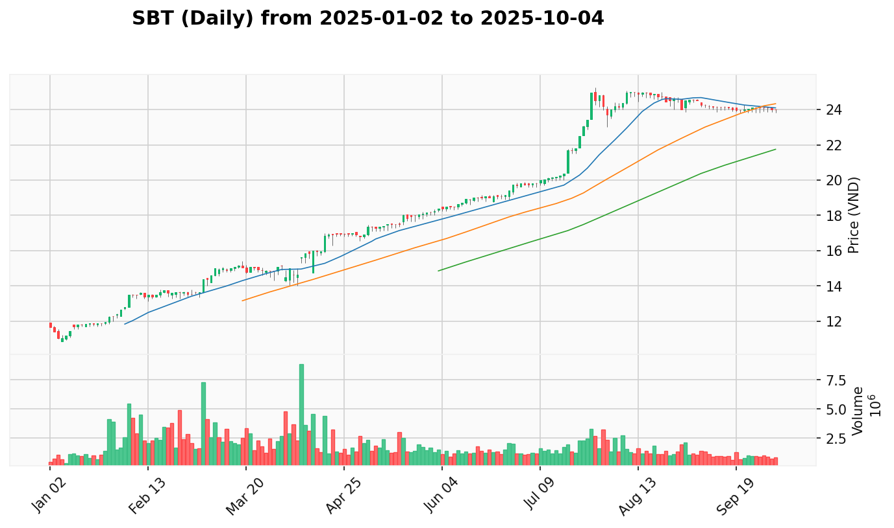

<a href="#thuc-pham">↑ Back to group THUC_PHAM</a>  |  <a href="#vpa-signal-summary">↑ Back to Top</a>

#### Key Statistics
| Metric | Value |
|:---|---:|
| Date Range | 2025-01-02 to 2025-10-17 |
| **Latest Close** | **25.4** |
| Period Open | 11.91 |
| Period High | 27.6 |
| Period Low | 10.86 |
| Period Change % | 113.27% |

**[Download SBT Data (.csv)](market_data/SBT_2025-01-02_to_2025-10-18.csv)**

---

### SCI

#### [VPA Analysis (2025-08-12 - 2025-10-16)](./VPA.md#sci)
> **Ngày 2025-10-10:** SCI tăng từ 9.4 VND lên 9.5 VND với khối lượng giao dịch đạt 0.057 triệu cổ phiếu. Cây nến tăng có biên độ hẹp và đóng cửa ở mức giữa, cho thấy nỗ lực tăng giá nhưng khối lượng giảm đáng kể so với phiên trước, đặc biệt sau phiên giảm mạnh với khối lượng lớn. Điều này báo hiệu sự thiếu hụt lực cầu mạnh mẽ và có thể là một dấu hiệu của sự kiểm tra cung hoặc thiếu cầu. **Phân tích VPA/Wyckoff:** No Demand (Thiếu cầu)
> **Ngày 2025-10-13:** SCI tăng từ 9.4 VND lên 9.6 VND với khối lượng giao dịch đạt 0.1207 triệu cổ phiếu. Cây nến tăng có biên độ rộng và đóng cửa ở mức cao nhất phiên, cho thấy lực cầu đã quay trở lại mạnh mẽ sau phiên thiếu cầu trước đó. Khối lượng tăng đột biến xác nhận sự hấp thụ lực cung và tiềm năng cho xu hướng tăng. **Phân tích VPA/Wyckoff:** Sign of Strength (SOS) - Lực cầu mạnh mẽ.
> **Ngày 2025-10-14:** SCI tăng từ 9.6 VND lên 9.7 VND với khối lượng giao dịch đạt 0.0301 triệu cổ phiếu. Cây nến tăng có biên độ hẹp và đóng cửa ở mức cao nhất phiên, cho thấy nỗ lực tăng giá. Tuy nhiên, khối lượng giao dịch giảm mạnh so với phiên trước đó (phiên SOS), báo hiệu sự thiếu hụt lực cầu mạnh mẽ để tiếp tục đà tăng. Điều này có thể là một dấu hiệu của sự kiểm tra cung hoặc thiếu cầu sau một phiên tăng mạnh. **Phân tích VPA/Wyckoff:** No Demand (Thiếu cầu)
> **Ngày 2025-10-15:** SCI tăng từ 9.6 VND lên 9.9 VND với khối lượng giao dịch đạt 0.0836 triệu cổ phiếu. Cây nến tăng có biên độ rộng và đóng cửa ở mức cao nhất phiên, cho thấy lực cầu mạnh mẽ. Khối lượng giao dịch tăng đáng kể so với phiên trước đó (phiên thiếu cầu), xác nhận sự quay trở lại của lực mua và khả năng tiếp tục xu hướng tăng. **Phân tích VPA/Wyckoff:** Sign of Strength (SOS) - Lực cầu quay trở lại mạnh mẽ.
> **Ngày 2025-10-16:** SCI giữ vững mức giá 9.9 VND với khối lượng giao dịch cực thấp, chỉ đạt 0.002 triệu cổ phiếu. So với phiên tăng mạnh (SOS) ngày 2025-10-15 với khối lượng 0.0836 triệu cổ phiếu, phiên này cho thấy sự cạn kiệt của lực cung khi giá không giảm, nhưng cũng thiếu vắng lực cầu mạnh mẽ để đẩy giá lên cao hơn. Giá đóng cửa ở mức cao nhất phiên, cho thấy không có áp lực bán đáng kể. Đây là dấu hiệu của sự kiểm tra cung sau một phiên tăng giá mạnh. **Phân tích VPA/Wyckoff:** No Supply (Thiếu cung)

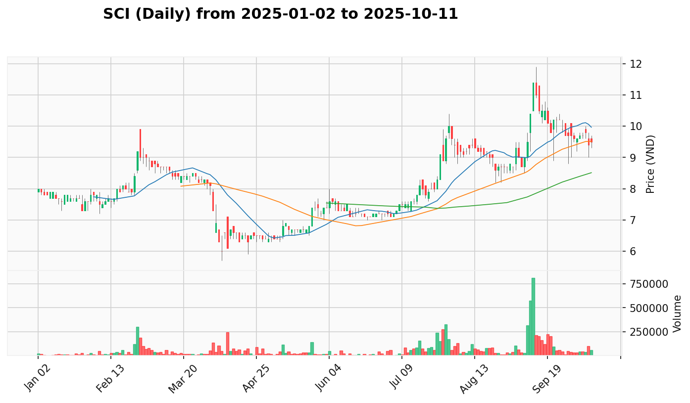

<a href="#xay-lap-dien">↑ Back to group XAY_LAP_DIEN</a>  |  <a href="#vpa-signal-summary">↑ Back to Top</a>

#### Key Statistics
| Metric | Value |
|:---|---:|
| Date Range | 2025-01-02 to 2025-10-17 |
| **Latest Close** | **9.9** |
| Period Open | 7.9 |
| Period High | 11.9 |
| Period Low | 5.7 |
| Period Change % | 25.32% |

**[Download SCI Data (.csv)](market_data/SCI_2025-01-02_to_2025-10-18.csv)**

---

### SCR

#### [VPA Analysis (2025-08-04 - 2025-10-16)](./VPA.md#scr)
> **Ngày 2025-10-10:** SCR tăng từ 9.3 VND lên 9.37 VND. Biên độ giá rộng hơn (từ 9.24 VND đến 9.54 VND) và đóng cửa gần giữa phiên. Khối lượng giao dịch đạt 10.1112 triệu cổ phiếu, tăng đáng kể so với phiên trước (3.8105 triệu cổ phiếu). Sau hai phiên liên tiếp cho thấy lực cầu yếu, phiên này SCR tăng giá với khối lượng lớn và biên độ rộng, cho thấy nỗ lực đẩy giá lên của phe mua. Mặc dù giá đóng cửa không ở mức cao nhất, nhưng sự gia tăng mạnh mẽ về khối lượng cho thấy lực cầu đã quay trở lại và đang hấp thụ nguồn cung. Đây là một dấu hiệu tích cực cho thấy khả năng đảo chiều xu hướng giảm ngắn hạn. **Phân tích VPA/Wyckoff:** Effort to Rise (ETR) - Nỗ lực tăng giá.
> **Ngày 2025-10-13:** SCR tăng từ 9.21 VND lên 9.68 VND. Biên độ giá rộng (từ 9.2 VND đến 9.68 VND) và đóng cửa ở mức cao nhất phiên, cho thấy lực mua rất mạnh mẽ. Khối lượng giao dịch đạt 8.77 triệu cổ phiếu, thấp hơn so với phiên trước (10.11 triệu cổ phiếu). Sau phiên nỗ lực tăng giá (ETR) ngày 2025-10-10, SCR tiếp tục tăng mạnh và đóng cửa ở mức cao nhất, mặc dù khối lượng có giảm nhẹ. Điều này cho thấy lực cầu vẫn đang chiếm ưu thế và đã hấp thụ phần lớn nguồn cung, đẩy giá lên cao mà không cần khối lượng quá lớn. Đây là một dấu hiệu tích cực, xác nhận sự tiếp diễn của xu hướng tăng giá ngắn hạn. **Phân tích VPA/Wyckoff:** Sign of Strength (SOS) - Dấu hiệu sức mạnh.
> **Ngày 2025-10-14:** SCR giảm từ 9.68 VND xuống 9.59 VND. Biên độ giá rộng (từ 9.45 VND đến 9.8 VND) và đóng cửa ở nửa dưới của phiên. Khối lượng giao dịch đạt 12.47 triệu cổ phiếu, tăng đáng kể so với phiên trước (8.77 triệu cổ phiếu). Sau hai phiên tăng giá mạnh mẽ với các dấu hiệu tích cực (ETR và SOS), phiên này SCR giảm giá với khối lượng rất lớn, cho thấy áp lực bán mạnh mẽ đã xuất hiện và nguồn cung đang áp đảo lực cầu. Điều này có thể là dấu hiệu của việc chốt lời hoặc sự xuất hiện của nguồn cung mới, làm suy yếu xu hướng tăng giá ngắn hạn. **Phân tích VPA/Wyckoff:** Sign of Weakness (SOW) - Dấu hiệu suy yếu.
> **Ngày 2025-10-15:** SCR tăng nhẹ từ 9.59 VND lên 9.6 VND. Biên độ giá rộng (từ 9.49 VND đến 9.74 VND) và đóng cửa ở giữa thân nến. Khối lượng giao dịch đạt 5.77 triệu cổ phiếu, giảm đáng kể so với phiên trước (12.47 triệu cổ phiếu). Sau phiên suy yếu (SOW) với khối lượng lớn ngày 2025-10-14, phiên này SCR có sự phục hồi nhẹ về giá đóng cửa nhưng với khối lượng thấp. Điều này cho thấy áp lực bán đã giảm bớt, nhưng lực cầu cũng chưa thực sự mạnh mẽ để đẩy giá lên cao dứt khoát. Đây là dấu hiệu của sự thiếu cầu, cho thấy thị trường đang lưỡng lự và chưa sẵn sàng cho một xu hướng tăng rõ ràng. **Phân tích VPA/Wyckoff:** No Demand (ND) - Thiếu cầu.
> **Ngày 2025-10-16:** SCR tăng từ 9.6 VND lên 9.75 VND. Biên độ giá rộng (từ 9.66 VND đến 9.99 VND) và đóng cửa ở nửa trên của phiên. Khối lượng giao dịch đạt 6.92 triệu cổ phiếu, tăng so với phiên trước (5.77 triệu cổ phiếu). Sau phiên thiếu cầu (ND) ngày 2025-10-15, phiên này SCR tăng giá với khối lượng gia tăng và đóng cửa ở mức cao, cho thấy lực cầu đã quay trở lại và đang chiếm ưu thế. Điều này có thể là dấu hiệu tích cực cho xu hướng giá trong ngắn hạn. **Phân tích VPA/Wyckoff:** Sign of Strength (SOS) - Dấu hiệu sức mạnh.

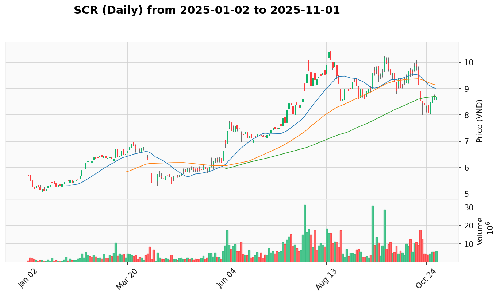

<a href="#bat-dong-san">↑ Back to group BAT_DONG_SAN</a>  |  <a href="#vpa-signal-summary">↑ Back to Top</a>

#### Key Statistics
| Metric | Value |
|:---|---:|
| Date Range | 2025-01-02 to 2025-10-17 |
| **Latest Close** | **9.85** |
| Period Open | 5.74 |
| Period High | 10.5 |
| Period Low | 5.07 |
| Period Change % | 71.60% |

**[Download SCR Data (.csv)](market_data/SCR_2025-01-02_to_2025-10-18.csv)**

---

### SCS

#### [VPA Analysis (2025-06-16 - 2025-10-16)](./VPA.md#scs)
> **Ngày 2025-10-10:** SCS giảm từ 58.4 VND xuống 57.5 VND với khối lượng giao dịch đạt 0.536 triệu cổ phiếu. Cây nến giảm có biên độ khá và đóng cửa gần mức thấp nhất phiên, cho thấy lực cung vẫn chiếm ưu thế. Khối lượng giao dịch giảm so với phiên trước (1.1798 triệu cổ phiếu) nhưng vẫn ở mức đáng kể, cho thấy áp lực bán có phần hạ nhiệt nhưng xu hướng giảm giá vẫn tiếp diễn. **Phân tích VPA/Wyckoff:** Tiếp tục yếu kém
> **Ngày 2025-10-13:** SCS tăng từ 57.1 VND lên 57.6 VND với khối lượng giao dịch đạt 0.212 triệu cổ phiếu. Cây nến tăng có biên độ hẹp và đóng cửa ở nửa trên, cho thấy lực cầu yếu ớt xuất hiện sau hai phiên giảm mạnh. Khối lượng giao dịch rất thấp so với các phiên trước (0.536 triệu cổ phiếu vào ngày 2025-10-10 và 1.1798 triệu cổ phiếu vào ngày 2025-10-09), cho thấy áp lực bán đã giảm đáng kể nhưng lực mua chưa đủ mạnh để đảo chiều xu hướng. Đây có thể là một dấu hiệu của việc kiểm tra nguồn cung, cho thấy nguồn cung đã cạn kiệt tạm thời. **Phân tích VPA/Wyckoff:** Test for Supply (Kiểm tra nguồn cung)
> **Ngày 2025-10-14:** SCS giảm từ 57.7 VND xuống 57.0 VND với khối lượng giao dịch đạt 0.3285 triệu cổ phiếu. Cây nến giảm có biên độ hẹp và đóng cửa tại mức thấp nhất phiên, cho thấy lực cung vẫn chiếm ưu thế. Khối lượng giao dịch cao hơn so với phiên kiểm tra cung trước đó (0.212 triệu cổ phiếu vào ngày 2025-10-13), cho thấy áp lực bán vẫn còn và lực cầu chưa đủ mạnh để hấp thụ. Điều này cho thấy thị trường vẫn đang trong giai đoạn yếu kém, và việc kiểm tra cung trước đó chưa thành công. **Phân tích VPA/Wyckoff:** Tiếp tục yếu kém
> **Ngày 2025-10-15:** SCS giảm từ 57.0 VND xuống 56.3 VND với khối lượng giao dịch đạt 0.2656 triệu cổ phiếu. Cây nến giảm có biên độ hẹp và đóng cửa tại mức thấp nhất phiên, cho thấy lực cung vẫn chiếm ưu thế. Mặc dù khối lượng giao dịch thấp hơn so với phiên trước (0.3285 triệu cổ phiếu), nhưng việc giá đóng cửa ở mức thấp nhất cho thấy áp lực bán vẫn còn và lực cầu chưa đủ mạnh để hấp thụ. Điều này tiếp tục xác nhận sự yếu kém của thị trường. **Phân tích VPA/Wyckoff:** Tiếp tục yếu kém
> **Ngày 2025-10-16:** SCS giảm từ 56.3 VND xuống 56.0 VND với khối lượng giao dịch đạt 0.1075 triệu cổ phiếu. Cây nến giảm có biên độ hẹp và đóng cửa gần mức thấp nhất phiên, cho thấy lực cung vẫn chiếm ưu thế. Khối lượng giao dịch rất thấp, chỉ bằng khoảng một nửa so với phiên trước (0.2656 triệu cổ phiếu) và thấp hơn nhiều so với mức trung bình gần đây. Điều này cho thấy sự thiếu vắng cả lực cung và lực cầu, nhưng việc giá tiếp tục giảm và đóng cửa ở mức thấp vẫn xác nhận thị trường đang yếu kém và không có lực cầu đủ mạnh để hỗ trợ giá. **Phân tích VPA/Wyckoff:** No Demand (Thiếu cầu)

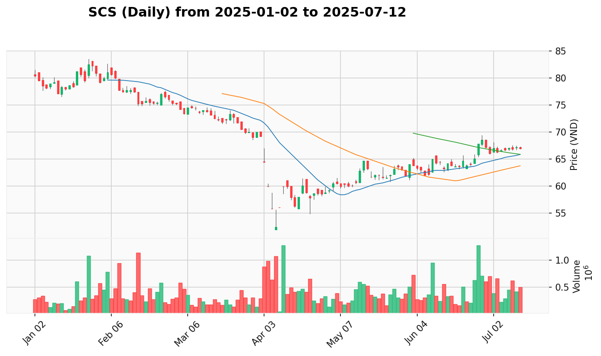

<a href="#hang-khong">↑ Back to group HANG_KHONG</a>  |  <a href="#vpa-signal-summary">↑ Back to Top</a>

#### Key Statistics
| Metric | Value |
|:---|---:|
| Date Range | 2025-01-02 to 2025-10-17 |
| **Latest Close** | **55.3** |
| Period Open | 76.9 |
| Period High | 79.67 |
| Period Low | 49.52 |
| Period Change % | -28.09% |

**[Download SCS Data (.csv)](market_data/SCS_2025-01-02_to_2025-10-18.csv)**

---

### SGN

#### [VPA Analysis (2025-08-04 - 2025-10-16)](./VPA.md#sgn)
> **Ngày 2025-10-10:** SGN đóng cửa ở mức 65.3 VND, tăng từ 64.3 VND của phiên trước, với khối lượng giao dịch đạt 0.0158 triệu cổ phiếu. Cây nến tăng có biên độ rộng và đóng cửa ở mức cao nhất phiên, cho thấy lực cầu mạnh mẽ đã quay trở lại sau phiên "Thiếu cầu" trước đó. Khối lượng giao dịch tăng đáng kể, xác nhận sự xuất hiện của lực mua. **Phân tích VPA/Wyckoff:** Sign of Strength (SOS) - Lực cầu mạnh mẽ.
> **Ngày 2025-10-13:** SGN đóng cửa ở mức 66.4 VND, tăng từ 65.3 VND của phiên trước, với khối lượng giao dịch đạt 0.0238 triệu cổ phiếu. Cây nến tăng có biên độ rộng và đóng cửa gần mức cao nhất phiên, cho thấy lực cầu mạnh mẽ tiếp tục chiếm ưu thế. Khối lượng giao dịch tăng đáng kể so với phiên trước, xác nhận sự tiếp diễn của xu hướng tăng. **Phân tích VPA/Wyckoff:** Sign of Strength (SOS) - Lực cầu mạnh mẽ tiếp diễn.
> **Ngày 2025-10-14:** SGN giảm từ 66.4 VND xuống 65.4 VND, với khối lượng giao dịch đạt 0.0287 triệu cổ phiếu. Cây nến giảm có biên độ rộng và đóng cửa ở mức thấp nhất phiên, cho thấy áp lực bán mạnh mẽ. Khối lượng giao dịch tăng đáng kể so với phiên trước, xác nhận sự xuất hiện của lực cung. **Phân tích VPA/Wyckoff:** Sign of Weakness (SOW) - Lực cung mạnh mẽ.
> **Ngày 2025-10-15:** SGN tăng từ 65.4 VND lên 65.6 VND, với khối lượng giao dịch đạt 0.011 triệu cổ phiếu. Cây nến tăng có biên độ hẹp và đóng cửa gần mức mở cửa, cho thấy sự lưỡng lự của thị trường. Khối lượng giao dịch giảm đáng kể so với phiên trước, cho thấy lực cung đã giảm nhưng lực cầu cũng chưa thực sự mạnh mẽ. **Phân tích VPA/Wyckoff:** No Demand - Thiếu lực cầu.
> **Ngày 2025-10-16:** SGN tăng từ 65.6 VND lên 66.2 VND, với khối lượng giao dịch đạt 0.0016 triệu cổ phiếu. Cây nến tăng có biên độ rộng và đóng cửa ở mức cao nhất phiên, nhưng khối lượng giao dịch cực kỳ thấp, cho thấy sự thiếu hụt lực cầu thực sự. Mặc dù giá tăng, nhưng sự vắng mặt của khối lượng xác nhận rằng đợt tăng này không bền vững và có thể là một đợt phục hồi yếu sau các tín hiệu suy yếu trước đó. **Phân tích VPA/Wyckoff:** No Demand - Thiếu lực cầu.

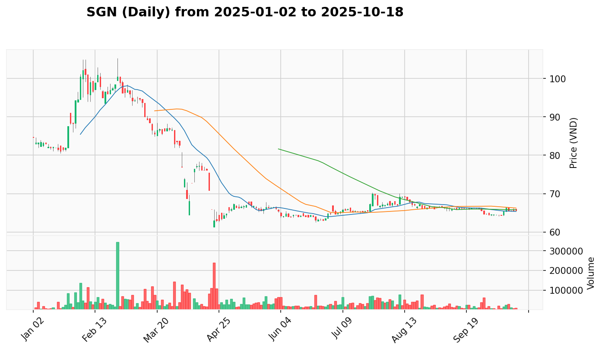

<a href="#hang-khong">↑ Back to group HANG_KHONG</a>  |  <a href="#vpa-signal-summary">↑ Back to Top</a>

#### Key Statistics
| Metric | Value |
|:---|---:|
| Date Range | 2025-01-02 to 2025-10-17 |
| **Latest Close** | **65.6** |
| Period Open | 84.8 |
| Period High | 105.3 |
| Period Low | 61.3 |
| Period Change % | -22.64% |

**[Download SGN Data (.csv)](market_data/SGN_2025-01-02_to_2025-10-18.csv)**

---

### SGR

#### [VPA Analysis (2025-08-04 - 2025-10-16)](./VPA.md#sgr)
> **Ngày 2025-10-10:** SGR giảm giá từ 22.4 VND xuống 22.3 VND với khối lượng giao dịch đạt 0.691 triệu cổ phiếu. Cây nến giảm có biên độ hẹp và đóng cửa gần mức thấp nhất phiên, cho thấy lực mua yếu đi sau phiên tăng mạnh trước đó. Khối lượng giao dịch thấp hơn đáng kể so với phiên trước (1.0408 triệu cổ phiếu) xác nhận sự thiếu vắng lực cầu tiếp diễn. Điều này cho thấy sự chững lại trong đà tăng và có thể là dấu hiệu của sự phân phối hoặc kiểm tra lại nguồn cung. **Phân tích VPA/Wyckoff:** No Demand
> **Ngày 2025-10-13:** SGR tăng giá từ 22.3 VND lên 22.5 VND với khối lượng giao dịch đạt 0.5727 triệu cổ phiếu. Cây nến tăng có biên độ trung bình và đóng cửa ở nửa trên của thân nến. Khối lượng giao dịch thấp hơn đáng kể so với phiên trước (0.691 triệu cổ phiếu) và thấp hơn nhiều so với phiên SOS ngày 2025-10-09 (1.0408 triệu cổ phiếu). Điều này cho thấy lực cầu vẫn còn yếu và chưa đủ mạnh để đẩy giá lên cao hơn một cách thuyết phục, mặc dù giá đã tăng nhẹ. Có thể đây là một nỗ lực tăng giá yếu ớt hoặc thị trường đang kiểm tra lại nguồn cung ở mức giá cao hơn. **Phân tích VPA/Wyckoff:** Lack of Demand
> **Ngày 2025-10-14:** SGR giảm giá từ 22.5 VND xuống 21.7 VND với khối lượng giao dịch đạt 0.8943 triệu cổ phiếu. Cây nến giảm có biên độ rộng và đóng cửa ở mức thấp nhất phiên, cho thấy áp lực bán mạnh mẽ. Khối lượng giao dịch tăng đáng kể so với phiên trước (0.5727 triệu cổ phiếu), xác nhận sự xuất hiện của nguồn cung và lực bán chiếm ưu thế. Điều này cho thấy sự suy yếu của cổ phiếu sau những phiên tăng giá không thuyết phục và có thể là dấu hiệu của sự tiếp diễn xu hướng giảm. **Phân tích VPA/Wyckoff:** Sign of Weakness (SOW)
> **Ngày 2025-10-15:** SGR tăng giá từ 21.7 VND lên 22.1 VND với khối lượng giao dịch đạt 0.2531 triệu cổ phiếu. Cây nến tăng có biên độ trung bình và đóng cửa ở nửa trên của thân nến. Tuy nhiên, khối lượng giao dịch rất thấp, chỉ bằng một phần nhỏ so với phiên giảm giá mạnh trước đó (0.8943 triệu cổ phiếu) và thấp hơn đáng kể so với phiên "Lack of Demand" ngày 2025-10-13 (0.5727 triệu cổ phiếu). Điều này cho thấy lực cầu yếu ớt và không đủ mạnh để đẩy giá lên cao một cách thuyết phục, xác nhận sự thiếu vắng nhu cầu sau một phiên giảm giá mạnh. **Phân tích VPA/Wyckoff:** Lack of Demand
> **Ngày 2025-10-16:** SGR tăng giá nhẹ từ 22.1 VND lên 22.3 VND với khối lượng giao dịch rất thấp, chỉ đạt 0.1439 triệu cổ phiếu. Cây nến có biên độ hẹp và đóng cửa ở mức giữa, cho thấy sự lưỡng lự và thiếu quyết đoán của thị trường. Khối lượng giao dịch giảm mạnh so với phiên trước (0.2531 triệu cổ phiếu) và thấp hơn đáng kể so với phiên giảm giá mạnh ngày 2025-10-14 (0.8943 triệu cổ phiếu). Điều này xác nhận rằng lực cầu vẫn rất yếu và không có sự tham gia đáng kể của người mua, ngay cả khi giá có sự phục hồi nhẹ. Đây là dấu hiệu của sự thiếu vắng nhu cầu tiếp diễn sau các phiên giảm giá. **Phân tích VPA/Wyckoff:** No Demand (ND)

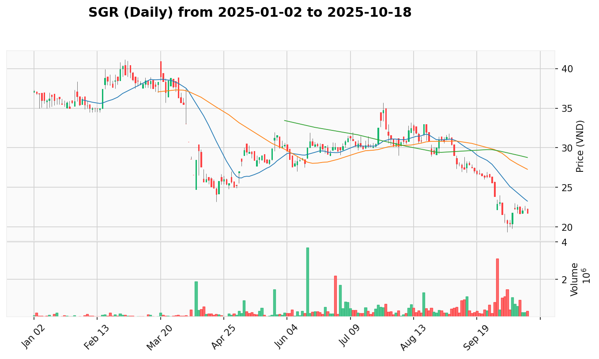

<a href="#bat-dong-san">↑ Back to group BAT_DONG_SAN</a>  |  <a href="#vpa-signal-summary">↑ Back to Top</a>

#### Key Statistics
| Metric | Value |
|:---|---:|
| Date Range | 2025-01-02 to 2025-10-17 |
| **Latest Close** | **21.75** |
| Period Open | 37.05 |
| Period High | 41.15 |
| Period Low | 19.35 |
| Period Change % | -41.30% |

**[Download SGR Data (.csv)](market_data/SGR_2025-01-02_to_2025-10-18.csv)**

---

### SGT

#### [VPA Analysis (2025-06-16 - 2025-10-16)](./VPA.md#sgt)
> **Ngày 2025-10-10:** SGT giữ nguyên mức giá đóng cửa 17.0 VND so với phiên trước, với biên độ dao động hẹp từ 16.75 VND đến 17.1 VND. Khối lượng giao dịch đạt 0.0161 triệu cổ phiếu, tăng đáng kể so với hai phiên "No Demand" trước đó (0.0044 triệu và 0.003 triệu cổ phiếu). Mặc dù khối lượng tăng, giá không có sự tiến triển, cho thấy nỗ lực mua vào đang gặp phải áp lực cung đáng kể, ngăn cản giá tăng. Điều này củng cố nhận định về sự yếu kém của thị trường và khả năng giá sẽ tiếp tục điều chỉnh hoặc đi ngang trong ngắn hạn. **Phân tích VPA/Wyckoff:** Effort vs. Result (Nỗ lực và Kết quả không tương xứng)
> **Ngày 2025-10-13:** SGT giảm từ 17.0 VND xuống 16.9 VND. Cây nến giảm có thân nhỏ, đóng cửa gần mức thấp nhất phiên, cho thấy áp lực bán nhẹ. Khối lượng giao dịch đạt 0.0029 triệu cổ phiếu, giảm mạnh so với phiên trước (0.0161 triệu cổ phiếu). Điều này cho thấy sự thiếu vắng cả lực mua và lực bán, củng cố nhận định về thị trường yếu kém và khả năng giá sẽ tiếp tục đi ngang hoặc điều chỉnh nhẹ. **Phân tích VPA/Wyckoff:** No Demand (Thiếu cầu)
> **Ngày 2025-10-14:** SGT giảm từ 16.9 VND xuống 16.75 VND, với biên độ dao động từ 16.6 VND đến 16.95 VND. Cây nến giảm có thân nhỏ, đóng cửa gần mức thấp nhất phiên, cho thấy áp lực bán chiếm ưu thế. Khối lượng giao dịch đạt 0.0138 triệu cổ phiếu, tăng đáng kể so với phiên trước (0.0029 triệu cổ phiếu). Sự giảm giá đi kèm với khối lượng tăng cho thấy áp lực cung đang gia tăng trên thị trường, xác nhận sự yếu kém và khả năng giá sẽ tiếp tục điều chỉnh trong ngắn hạn. **Phân tích VPA/Wyckoff:** Supply Coming In (Áp lực cung gia tăng)
> **Ngày 2025-10-15:** SGT tăng từ 16.75 VND lên 16.95 VND, với biên độ dao động từ 16.4 VND đến 16.95 VND. Cây nến tăng có thân nhỏ, đóng cửa ở mức cao nhất phiên, cho thấy nỗ lực tăng giá. Tuy nhiên, khối lượng giao dịch đạt 0.0051 triệu cổ phiếu, giảm mạnh so với phiên trước (0.0138 triệu cổ phiếu). Sự tăng giá đi kèm với khối lượng thấp cho thấy lực cầu yếu, không có sự tham gia mạnh mẽ của dòng tiền lớn, củng cố nhận định về thị trường thiếu động lực tăng trưởng bền vững. **Phân tích VPA/Wyckoff:** No Demand (Thiếu cầu)
> **Ngày 2025-10-16:** SGT đóng cửa ở mức 16.95 VND, không đổi so với phiên trước, nhưng đã tăng từ 16.2 VND lên 16.95 VND trong phiên, với biên độ dao động từ 16.2 VND đến 16.95 VND. Cây nến tăng có thân rộng, đóng cửa ở mức cao nhất phiên, cho thấy nỗ lực đẩy giá lên. Tuy nhiên, khối lượng giao dịch chỉ đạt 0.0011 triệu cổ phiếu, giảm mạnh so với phiên trước (0.0051 triệu cổ phiếu). Sự tăng giá với khối lượng cực thấp này cho thấy lực cầu yếu, không có sự tham gia của dòng tiền lớn, củng cố nhận định về thị trường thiếu động lực tăng trưởng bền vững. **Phân tích VPA/Wyckoff:** No Supply (Thiếu cung)

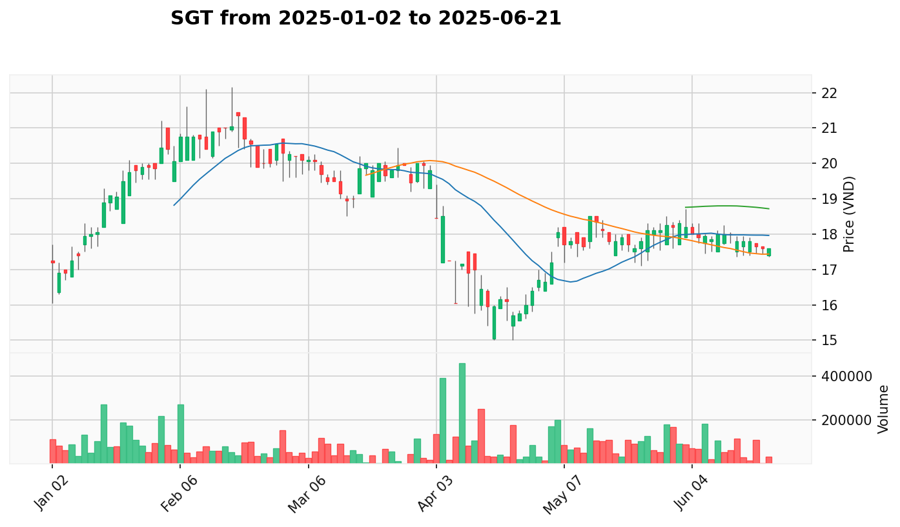

<a href="#cong-nghe">↑ Back to group CONG_NGHE</a>  |  <a href="#vpa-signal-summary">↑ Back to Top</a>

#### Key Statistics
| Metric | Value |
|:---|---:|
| Date Range | 2025-01-02 to 2025-10-17 |
| **Latest Close** | **16.75** |
| Period Open | 17.25 |
| Period High | 22.15 |
| Period Low | 15.0 |
| Period Change % | -2.90% |

**[Download SGT Data (.csv)](market_data/SGT_2025-01-02_to_2025-10-18.csv)**

---

### SHB

#### [VPA Analysis (2025-06-26 - 2025-10-16)](./VPA.md#shb)
> **Ngày 2025-10-10:** SHB đóng cửa ở mức 18.0 VND, tăng nhẹ so với phiên trước (17.9 VND). Cây nến tăng có biên độ hẹp (từ 17.75 VND lên 18.15 VND) và đóng cửa gần mức cao nhất phiên, cho thấy lực cầu vẫn duy trì nhưng không mạnh mẽ như phiên trước. Khối lượng giao dịch đạt 77.92 triệu cổ phiếu, giảm đáng kể so với phiên trước (189.71 triệu cổ phiếu). Điều này cho thấy sau phiên tăng giá mạnh mẽ (SOS) ngày 2025-10-09, thị trường đang hấp thụ mức tăng mà không gặp phải áp lực cung lớn, cho thấy sự thiếu hụt nguồn cung ở mức giá hiện tại. **Phân tích VPA/Wyckoff:** Thiếu cung (No Supply) - Giá tăng nhẹ với khối lượng thấp sau SOS.
> **Ngày 2025-10-13:** SHB đóng cửa ở mức 18.1 VND, tăng so với mức 18.0 VND của phiên trước. Cây nến tăng có biên độ tương đối rộng (từ 17.65 VND lên 18.2 VND) và đóng cửa gần mức cao nhất phiên, cho thấy lực cầu tiếp tục chiếm ưu thế. Khối lượng giao dịch đạt 118.93 triệu cổ phiếu, tăng đáng kể so với phiên trước (77.92 triệu cổ phiếu). Điều này cho thấy sau phiên thiếu cung, lực cầu đã quay trở lại mạnh mẽ, hấp thụ cung và đẩy giá lên cao hơn, xác nhận xu hướng tăng giá tiếp diễn. **Phân tích VPA/Wyckoff:** Sign of Strength (SOS) - Lực cầu mạnh mẽ trở lại.
> **Ngày 2025-10-14:** SHB đóng cửa ở mức 18.0 VND, giảm nhẹ so với phiên trước (18.1 VND). Cây nến có biên độ tương đối rộng (từ 17.7 VND lên 18.25 VND) nhưng đóng cửa ở nửa dưới, cho thấy áp lực bán đã xuất hiện. Khối lượng giao dịch đạt 124.39 triệu cổ phiếu, tăng so với phiên trước (118.93 triệu cổ phiếu). Điều này cho thấy sau phiên SOS ngày 2025-10-13, lực cung đã quay trở lại và hấp thụ lực cầu, đẩy giá xuống nhẹ. **Phân tích VPA/Wyckoff:** Supply Coming In (Lực cung xuất hiện)
> **Ngày 2025-10-15:** SHB đóng cửa ở mức 18.2 VND, tăng so với mức 18.0 VND của phiên trước. Cây nến tăng có biên độ rộng (từ 17.9 VND lên 18.45 VND) và đóng cửa gần mức cao nhất phiên, cho thấy lực cầu áp đảo. Khối lượng giao dịch đạt 135.33 triệu cổ phiếu, tăng đáng kể so với phiên trước (124.39 triệu cổ phiếu). Điều này cho thấy lực cầu đã hấp thụ hoàn toàn lực cung xuất hiện ở phiên trước và tiếp tục đẩy giá lên cao, xác nhận xu hướng tăng giá. **Phân tích VPA/Wyckoff:** Sign of Strength (SOS) - Lực cầu mạnh mẽ tiếp diễn.
> **Ngày 2025-10-16:** SHB đóng cửa ở mức 18.1 VND, giảm nhẹ so với phiên trước (18.2 VND). Cây nến có biên độ từ 18.05 VND đến 18.4 VND và đóng cửa ở nửa dưới, cho thấy áp lực bán đã xuất hiện. Khối lượng giao dịch đạt 38.22 triệu cổ phiếu, giảm mạnh so với phiên trước (135.33 triệu cổ phiếu). Sau phiên SOS mạnh mẽ ngày 2025-10-15, phiên này cho thấy lực cầu đã chững lại và áp lực bán nhẹ xuất hiện, nhưng với khối lượng thấp, cho thấy đây có thể là một nhịp điều chỉnh tự nhiên hoặc kiểm tra lại lực cầu. **Phân tích VPA/Wyckoff:** No Demand (Không có lực cầu)

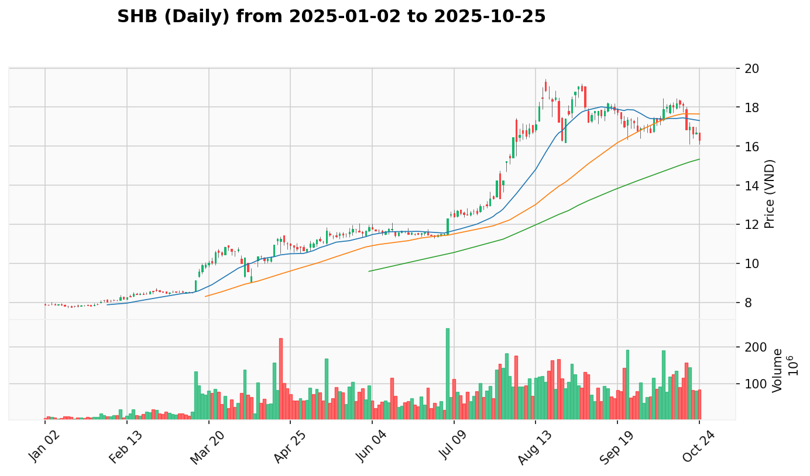

<a href="#ngan-hang">↑ Back to group NGAN_HANG</a>  |  <a href="#vpa-signal-summary">↑ Back to Top</a>

#### Key Statistics
| Metric | Value |
|:---|---:|
| Date Range | 2025-01-02 to 2025-10-17 |
| **Latest Close** | **18.1** |
| Period Open | 7.91 |
| Period High | 19.45 |
| Period Low | 7.72 |
| Period Change % | 128.82% |

**[Download SHB Data (.csv)](market_data/SHB_2025-01-02_to_2025-10-18.csv)**

---

### SHS

#### [VPA Analysis (2025-06-13 - 2025-10-16)](./VPA.md#shs)
> **Ngày 2025-10-10:** SHS giảm từ 26.7 VND (giá đóng cửa phiên trước) xuống 26.5 VND. Cây nến giảm có biên độ 0.8 VND (từ 26.3 đến 27.1 VND) và đóng cửa ở giữa đến gần mức thấp nhất phiên. Khối lượng giao dịch đạt 21.47 triệu cổ phiếu, cao hơn đáng kể so với phiên trước (16.48 triệu cổ phiếu). Sau phiên thiếu cầu, phiên này cho thấy lực cung đã gia tăng và đẩy giá xuống với khối lượng tăng, xác nhận sự yếu đi của lực cầu và khả năng tiếp diễn xu hướng giảm ngắn hạn. **Phân tích VPA/Wyckoff:** Effort to Fall (Nỗ lực giảm giá)
> **Ngày 2025-10-13:** SHS tăng từ 26.5 VND (giá đóng cửa phiên trước) lên 26.8 VND. Cây nến tăng có biên độ rộng 1.1 VND (từ 25.7 đến 26.8 VND) và đóng cửa ở mức cao nhất phiên. Khối lượng giao dịch đạt 27.74 triệu cổ phiếu, cao hơn đáng kể so với phiên trước (21.47 triệu cổ phiếu). Sau phiên nỗ lực giảm giá, phiên này cho thấy lực cầu đã quay trở lại mạnh mẽ, đẩy giá tăng với biên độ rộng và khối lượng lớn, xác nhận sự hấp thụ lực cung và khả năng tiếp diễn xu hướng tăng ngắn hạn. **Phân tích VPA/Wyckoff:** Sign of Strength (SOS) - Lực cầu mạnh mẽ.
> **Ngày 2025-10-14:** SHS tăng từ 26.8 VND (giá đóng cửa phiên trước) lên 26.9 VND. Cây nến có biên độ rộng 1.3 VND (từ 26.8 đến 28.1 VND) nhưng đóng cửa ở giữa đến gần mức thấp nhất phiên, cho thấy áp lực bán ở vùng giá cao. Khối lượng giao dịch đạt 46.77 triệu cổ phiếu, cao hơn đáng kể so với phiên trước (27.74 triệu cổ phiếu). Sau phiên lực cầu mạnh mẽ, phiên này cho thấy nỗ lực tăng giá với khối lượng rất lớn nhưng giá chỉ tăng nhẹ và không đóng cửa ở mức cao nhất, xác nhận lực cung đã xuất hiện và hấp thụ phần lớn lực cầu. **Phân tích VPA/Wyckoff:** Effort without Result (Nỗ lực không có kết quả)
> **Ngày 2025-10-15:** SHS tăng từ 26.9 VND (giá đóng cửa phiên trước) lên 27.0 VND. Cây nến tăng có biên độ hẹp 0.7 VND (từ 26.7 đến 27.4 VND) và đóng cửa ở nửa trên của nến. Khối lượng giao dịch đạt 22.88 triệu cổ phiếu, thấp hơn đáng kể so với phiên trước (46.77 triệu cổ phiếu). Sau phiên nỗ lực tăng giá không hiệu quả với khối lượng lớn, phiên này cho thấy giá tiếp tục tăng nhẹ với khối lượng giảm, cho thấy lực cung đã tạm thời suy yếu. **Phân tích VPA/Wyckoff:** Test for Supply (Kiểm tra cung)
> **Ngày 2025-10-16:** SHS tăng từ 27.0 VND (giá đóng cửa phiên trước) lên 27.2 VND. Cây nến tăng có biên độ hẹp 0.8 VND (từ 27.0 đến 27.8 VND) và đóng cửa ở nửa dưới của nến. Khối lượng giao dịch đạt 14.02 triệu cổ phiếu, thấp hơn đáng kể so với phiên trước (22.88 triệu cổ phiếu) và rất thấp so với mức trung bình gần đây. Sau phiên kiểm tra cung với khối lượng giảm, phiên này cho thấy giá tăng nhẹ nhưng với khối lượng rất thấp và đóng cửa không mạnh mẽ, cho thấy thiếu vắng lực cầu. **Phân tích VPA/Wyckoff:** No Demand (Không có cầu)

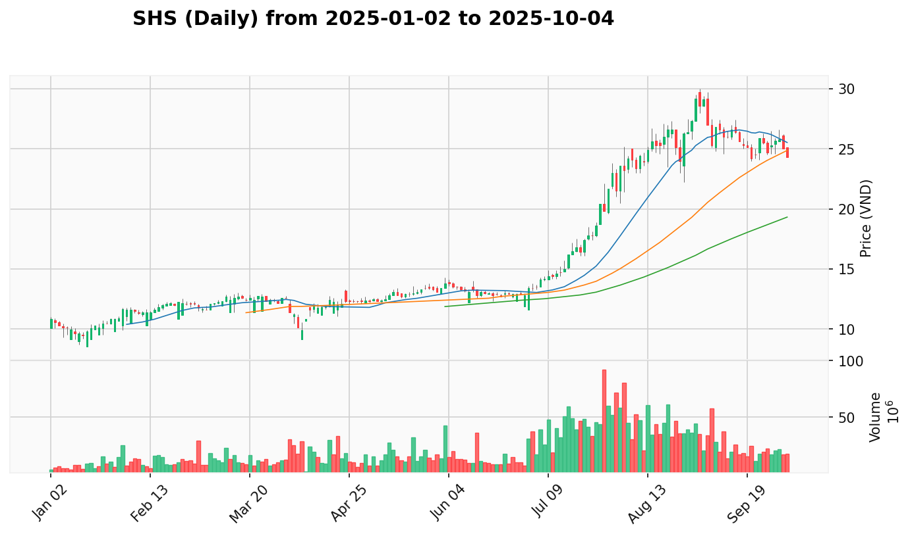

<a href="#chung-khoan">↑ Back to group CHUNG_KHOAN</a>  |  <a href="#vpa-signal-summary">↑ Back to Top</a>

#### Key Statistics
| Metric | Value |
|:---|---:|
| Date Range | 2025-01-02 to 2025-10-17 |
| **Latest Close** | **27.4** |
| Period Open | 10.06 |
| Period High | 30.0 |
| Period Low | 8.54 |
| Period Change % | 172.37% |

**[Download SHS Data (.csv)](market_data/SHS_2025-01-02_to_2025-10-18.csv)**

---

### SIP

#### [VPA Analysis (2025-06-16 - 2025-10-16)](./VPA.md#sip)
> **Ngày 2025-10-10:** SIP mở cửa ở 55.2 VND, dao động trong biên độ từ 55.2 VND đến 56.2 VND và đóng cửa ở 55.5 VND, giữ nguyên mức giá đóng cửa so với phiên trước. Khối lượng giao dịch đạt 0.2489 triệu cổ phiếu, tăng đáng kể so với phiên trước (0.1629 triệu cổ phiếu). Mặc dù giá có lúc tăng lên 56.2 VND, nhưng không thể duy trì đà tăng và đóng cửa ở mức cũ, cho thấy lực cầu không đủ mạnh để hấp thụ nguồn cung gia tăng. Điều này xảy ra sau phiên "Không có nguồn cung" ngày 2025-10-09, cho thấy sự xuất hiện trở lại của áp lực bán. **Phân tích VPA/Wyckoff:** Nỗ lực tăng giá không thành công (Effort to Rise but No Result)
> **Ngày 2025-10-13:** SIP mở cửa ở 55.3 VND, dao động trong biên độ từ 54.7 VND đến 56.2 VND và đóng cửa ở 55.3 VND, giảm nhẹ so với mức đóng cửa của phiên trước (55.5 VND). Khối lượng giao dịch đạt 0.1725 triệu cổ phiếu, giảm đáng kể so với phiên trước (0.2489 triệu cổ phiếu). Sau phiên "Nỗ lực tăng giá không thành công" vào ngày 2025-10-10, việc giá giảm nhẹ hoặc đi ngang với khối lượng thấp cho thấy lực cầu yếu và không có sự quan tâm mua vào đáng kể. Điều này xác nhận rằng áp lực bán vẫn còn tiềm ẩn và thị trường đang thiếu động lực tăng giá. **Phân tích VPA/Wyckoff:** No Demand (Không có cầu)
> **Ngày 2025-10-14:** SIP mở cửa ở 55.6 VND, dao động trong biên độ từ 54.6 VND đến 55.6 VND và đóng cửa ở 55.1 VND, giảm so với mức đóng cửa của phiên trước (55.3 VND). Khối lượng giao dịch đạt 0.32 triệu cổ phiếu, tăng đáng kể so với phiên trước (0.1725 triệu cổ phiếu). Giá giảm với khối lượng gia tăng và đóng cửa gần mức thấp nhất trong ngày cho thấy áp lực bán mạnh mẽ đang chiếm ưu thế trên thị trường, đặc biệt sau phiên "Không có cầu" trước đó. Điều này xác nhận sự xuất hiện của nguồn cung lớn và thiếu vắng lực cầu hỗ trợ. **Phân tích VPA/Wyckoff:** Nguồn cung xuất hiện (Supply Coming In)
> **Ngày 2025-10-15:** SIP mở cửa ở 55.3 VND, dao động trong biên độ từ 53.9 VND đến 55.3 VND và đóng cửa ở 54.0 VND, giảm so với mức đóng cửa của phiên trước (55.1 VND). Khối lượng giao dịch đạt 0.2866 triệu cổ phiếu, giảm so với phiên trước (0.32 triệu cổ phiếu). Giá giảm với khối lượng thấp và đóng cửa gần mức thấp nhất trong ngày cho thấy lực bán đã giảm bớt nhưng lực cầu vẫn rất yếu, không đủ để hỗ trợ giá. Điều này tiếp tục xác nhận sự thiếu vắng động lực tăng giá và thị trường vẫn đang trong giai đoạn yếu. **Phân tích VPA/Wyckoff:** Không có cầu (No Demand)
> **Ngày 2025-10-16:** SIP mở cửa ở 54.0 VND, dao động trong biên độ từ 53.7 VND đến 54.5 VND và đóng cửa ở 54.3 VND, tăng nhẹ so với mức đóng cửa của phiên trước (54.0 VND). Khối lượng giao dịch đạt 0.1168 triệu cổ phiếu, giảm đáng kể so với phiên trước (0.2866 triệu cổ phiếu) và là mức rất thấp. Giá tăng nhẹ với khối lượng thấp cho thấy lực cầu yếu ớt, không đủ để đẩy giá lên cao một cách bền vững, tiếp tục xác nhận sự thiếu vắng động lực tăng giá sau các phiên giảm giá trước đó. **Phân tích VPA/Wyckoff:** Thiếu cầu (Lack of Demand)

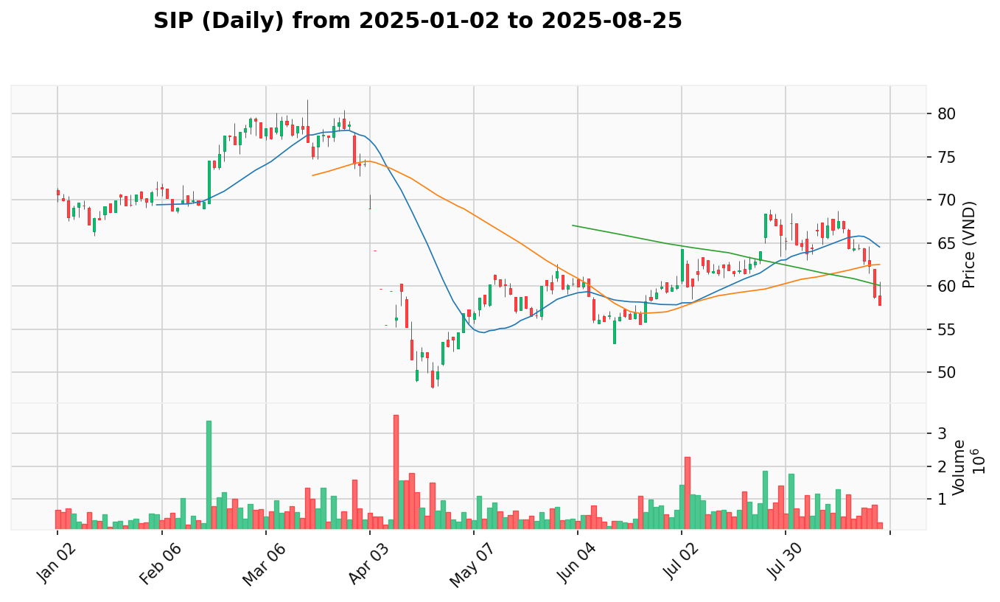

<a href="#bat-dong-san-kcn">↑ Back to group BAT_DONG_SAN_KCN</a>  |  <a href="#vpa-signal-summary">↑ Back to Top</a>

#### Key Statistics
| Metric | Value |
|:---|---:|
| Date Range | 2025-01-02 to 2025-10-17 |
| **Latest Close** | **53.6** |
| Period Open | 71.11 |
| Period High | 81.61 |
| Period Low | 48.12 |
| Period Change % | -24.62% |

**[Download SIP Data (.csv)](market_data/SIP_2025-01-02_to_2025-10-18.csv)**

---

### SKG

#### [VPA Analysis (2025-08-15 - 2025-10-16)](./VPA.md#skg)
> **Ngày 2025-10-10:** SKG giữ nguyên mức giá 10.85 VND so với phiên trước. Khối lượng giao dịch đạt 0.0984 triệu cổ phiếu, tăng đáng kể so với phiên trước (0.0351 triệu cổ phiếu) nhưng vẫn ở mức thấp so với trung bình. Nến có thân nhỏ, đóng cửa bằng giá mở cửa, cho thấy sự lưỡng lự. Việc giá đi ngang với khối lượng gia tăng sau các tín hiệu "No Demand" trước đó cho thấy lực cầu vẫn yếu và thị trường thiếu động lực rõ ràng để đẩy giá lên, xác nhận sự tiếp diễn của trạng thái suy yếu và thiếu sự quan tâm. **Phân tích VPA/Wyckoff:** No Demand (ND)
> **Ngày 2025-10-13:** SKG giảm nhẹ từ 10.85 VND xuống 10.8 VND. Khối lượng giao dịch đạt 0.0503 triệu cổ phiếu, giảm đáng kể so với phiên trước (0.0984 triệu cổ phiếu) và tiếp tục ở mức rất thấp. Nến có thân nhỏ, biên độ dao động hẹp, cho thấy sự thiếu quyết đoán. Việc giá giảm nhẹ với khối lượng cực kỳ thấp sau các tín hiệu "No Demand" trước đó xác nhận lực cầu vẫn yếu và thị trường thiếu động lực rõ ràng, tiếp tục duy trì trạng thái suy yếu và thiếu sự quan tâm. **Phân tích VPA/Wyckoff:** No Demand (ND)
> **Ngày 2025-10-14:** SKG giảm từ 10.8 VND xuống 10.6 VND. Khối lượng giao dịch đạt 0.2519 triệu cổ phiếu, tăng mạnh so với phiên trước (0.0503 triệu cổ phiếu). Nến giảm có biên độ rộng và đóng cửa gần mức thấp nhất phiên, cho thấy áp lực bán mạnh mẽ. Việc giá giảm với khối lượng gia tăng sau các tín hiệu "No Demand" trước đó xác nhận sự xuất hiện của nguồn cung và sự tiếp diễn của xu hướng suy yếu. **Phân tích VPA/Wyckoff:** Supply Coming In (Nguồn cung xuất hiện)
> **Ngày 2025-10-15:** SKG giữ nguyên mức giá 10.6 VND. Khối lượng giao dịch đạt 0.0792 triệu cổ phiếu, giảm mạnh so với phiên trước (0.2519 triệu cổ phiếu) và ở mức thấp. Nến có thân nhỏ, biên độ dao động hẹp, cho thấy sự thiếu quyết đoán và không có áp lực bán mạnh mẽ ở mức giá này, nhưng đồng thời cũng thiếu lực cầu. Sau phiên "Supply Coming In" trước đó, việc giá đi ngang với khối lượng thấp xác nhận thị trường vẫn đang trong trạng thái yếu và thiếu động lực rõ ràng. **Phân tích VPA/Wyckoff:** No Demand (ND)
> **Ngày 2025-10-16:** SKG giảm từ 10.6 VND xuống 10.55 VND. Khối lượng giao dịch đạt 0.0565 triệu cổ phiếu, tiếp tục giảm mạnh so với phiên trước (0.0792 triệu cổ phiếu) và ở mức rất thấp. Nến có thân nhỏ, biên độ dao động hẹp, đóng cửa gần mức cao nhất phiên nhưng vẫn thấp hơn giá đóng cửa phiên trước. Sau phiên "No Demand" trước đó, việc giá tiếp tục giảm nhẹ với khối lượng thấp cho thấy thị trường vẫn đang thiếu lực cầu và không có sự hấp thụ đáng kể đối với nguồn cung yếu ớt. **Phân tích VPA/Wyckoff:** No Demand (ND)

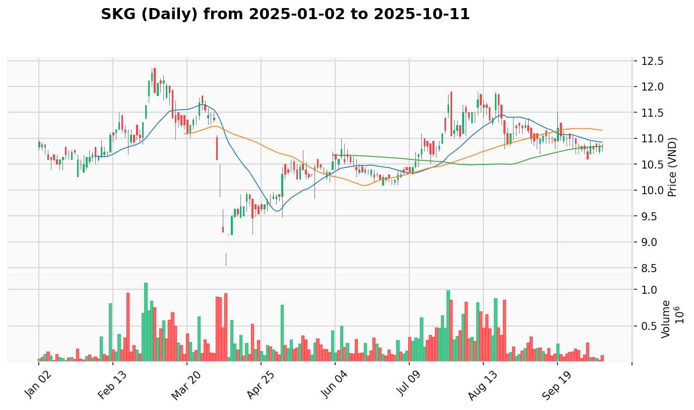

<a href="#van-tai">↑ Back to group VAN_TAI</a>  |  <a href="#vpa-signal-summary">↑ Back to Top</a>

#### Key Statistics
| Metric | Value |
|:---|---:|
| Date Range | 2025-01-02 to 2025-10-17 |
| **Latest Close** | **10.4** |
| Period Open | 10.83 |
| Period High | 12.36 |
| Period Low | 8.55 |
| Period Change % | -3.97% |

**[Download SKG Data (.csv)](market_data/SKG_2025-01-02_to_2025-10-18.csv)**

---

### SLS

#### [VPA Analysis (2025-08-14 - 2025-10-16)](./VPA.md#sls)
> **Ngày 2025-10-10:** SLS mở cửa ở mức 172.5 VND và đóng cửa ở 171.0 VND, thấp hơn mức đóng cửa 172.0 VND của phiên trước. Cây nến giảm có biên độ tương đối rộng và giá đóng cửa nằm gần mức thấp nhất phiên (170.7 VND). Khối lượng giao dịch đạt 0.0148 triệu cổ phiếu, giảm nhẹ so với phiên trước (0.015466 triệu cổ phiếu). Việc giá tiếp tục giảm với khối lượng giảm nhẹ và đóng cửa gần mức thấp nhất phiên cho thấy áp lực cung vẫn đang chiếm ưu thế và lực cầu yếu ớt, xác nhận sự tiếp diễn của giai đoạn suy yếu trên thị trường. **Phân tích VPA/Wyckoff:** Sign of Weakness (SOW)
> **Ngày 2025-10-13:** SLS mở cửa ở mức 171.0 VND và đóng cửa ở 172.4 VND, cao hơn mức đóng cửa 171.0 VND của phiên trước. Cây nến tăng có biên độ tương đối hẹp và giá đóng cửa nằm gần mức cao nhất phiên (172.9 VND). Khối lượng giao dịch đạt 0.0112 triệu cổ phiếu, giảm đáng kể so với phiên trước (0.01482 triệu cổ phiếu). Việc giá tăng nhẹ với khối lượng thấp sau chuỗi ngày giảm giá cho thấy áp lực bán có thể đã giảm bớt, nhưng lực cầu vẫn còn yếu. Đây là một dấu hiệu cho thấy thị trường đang kiểm tra lại mức cung sau giai đoạn suy yếu. **Phân tích VPA/Wyckoff:** Test for Supply
> **Ngày 2025-10-14:** SLS mở cửa ở mức 172.0 VND và đóng cửa ở 172.0 VND, thấp hơn mức đóng cửa 172.4 VND của phiên trước. Cây nến có biên độ rất hẹp (từ 172.0 VND đến 172.1 VND) và giá đóng cửa nằm ở mức thấp nhất phiên. Khối lượng giao dịch đạt 0.0059 triệu cổ phiếu, giảm đáng kể so với phiên trước (0.011206 triệu cổ phiếu). Sau phiên kiểm tra cung (Test for Supply) ngày 2025-10-13, việc giá tiếp tục đi ngang với biên độ cực hẹp và khối lượng rất thấp cho thấy lực cầu vẫn yếu ớt và thị trường thiếu động lực tăng giá, xác nhận sự thiếu vắng của lực mua mạnh mẽ. **Phân tích VPA/Wyckoff:** No Demand
> **Ngày 2025-10-15:** SLS mở cửa ở mức 172.0 VND và đóng cửa ở 172.4 VND, cao hơn mức đóng cửa 172.0 VND của phiên trước. Cây nến tăng có biên độ hẹp (từ 171.2 VND đến 172.5 VND) và giá đóng cửa nằm gần mức cao nhất phiên. Khối lượng giao dịch đạt 0.0072 triệu cổ phiếu, tăng nhẹ so với phiên trước (0.005915 triệu cổ phiếu). Sau phiên không có cầu (No Demand) ngày 2025-10-14, việc giá tăng nhẹ với biên độ hẹp và khối lượng vẫn còn thấp cho thấy nỗ lực tăng giá nhưng không có kết quả rõ rệt, lực cầu vẫn yếu và chưa đủ mạnh để tạo ra một xu hướng tăng bền vững. **Phân tích VPA/Wyckoff:** Effort to Rise but No Result
> **Ngày 2025-10-16:** SLS mở cửa ở mức 173.0 VND và đóng cửa ở 171.5 VND, thấp hơn mức đóng cửa 172.4 VND của phiên trước. Cây nến giảm có biên độ hẹp (từ 171.5 VND đến 173.0 VND) và giá đóng cửa nằm ở mức thấp nhất phiên. Khối lượng giao dịch đạt 0.0057 triệu cổ phiếu, giảm so với phiên trước (0.0072 triệu cổ phiếu). Sau phiên nỗ lực tăng giá không thành công (Effort to Rise but No Result) ngày 2025-10-15, việc giá giảm với biên độ hẹp và khối lượng rất thấp cho thấy lực cầu tiếp tục yếu ớt và thị trường thiếu động lực tăng giá, xác nhận sự thiếu vắng của lực mua mạnh mẽ. **Phân tích VPA/Wyckoff:** No Demand

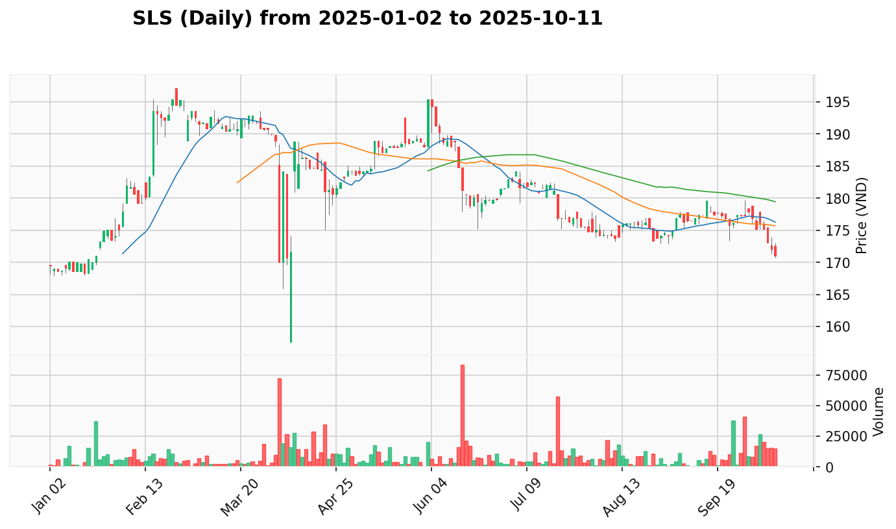

<a href="#thuc-pham">↑ Back to group THUC_PHAM</a>  |  <a href="#vpa-signal-summary">↑ Back to Top</a>

#### Key Statistics
| Metric | Value |
|:---|---:|
| Date Range | 2025-01-02 to 2025-10-17 |
| **Latest Close** | **170.2** |
| Period Open | 169.56 |
| Period High | 197.2 |
| Period Low | 157.58 |
| Period Change % | 0.38% |

**[Download SLS Data (.csv)](market_data/SLS_2025-01-02_to_2025-10-18.csv)**

---

### SMC

#### [VPA Analysis (2025-08-14 - 2025-10-16)](./VPA.md#smc)
> **Ngày 2025-10-10:** SMC mở cửa ở mức 12.85 VND và đóng cửa ở mức 12.9 VND, tăng nhẹ so với mức đóng cửa 12.85 VND của phiên trước. Giá tạo một nến tăng nhỏ với biên độ hẹp, đóng cửa gần giữa thân nến. Khối lượng giao dịch đạt 0.3699 triệu cổ phiếu, giảm nhẹ so với phiên trước (0.3747 triệu cổ phiếu) và vẫn ở mức thấp. Sau chuỗi ngày giảm giá và các tín hiệu "Sign of Weakness" liên tiếp, việc giá tăng nhẹ với khối lượng thấp cho thấy lực cầu yếu ớt và không có sự tham gia đáng kể của dòng tiền lớn, xác nhận xu hướng giảm giá vẫn tiếp diễn. **Phân tích VPA/Wyckoff:** No Demand (ND) - Giá tăng nhẹ với khối lượng thấp cho thấy thiếu vắng lực cầu.
> **Ngày 2025-10-13:** SMC mở cửa ở mức 12.8 VND và đóng cửa ở mức 12.75 VND, giảm từ 12.9 VND của phiên trước. Giá tạo một nến giảm với biên độ hẹp, đóng cửa gần mức thấp nhất phiên là 12.6 VND. Khối lượng giao dịch đạt 0.3082 triệu cổ phiếu, giảm so với phiên trước (0.3699 triệu cổ phiếu) và tiếp tục ở mức thấp. Sau các tín hiệu "Sign of Weakness" và "No Demand" liên tiếp, việc giá tiếp tục giảm nhẹ với khối lượng thấp cho thấy lực bán vẫn chiếm ưu thế nhưng không quá mạnh, đồng thời lực cầu vẫn yếu ớt và không có sự tham gia của dòng tiền lớn, xác nhận xu hướng giảm giá vẫn tiếp diễn. **Phân tích VPA/Wyckoff:** No Demand (ND) - Giá giảm nhẹ với khối lượng thấp cho thấy thiếu vắng lực cầu.
> **Ngày 2025-10-14:** SMC mở cửa ở mức 12.75 VND và đóng cửa ở mức 11.9 VND, giảm mạnh so với mức đóng cửa 12.75 VND của phiên trước. Giá tạo một nến giảm với biên độ rộng và đóng cửa ở mức thấp nhất phiên. Khối lượng giao dịch đạt 1.1703 triệu cổ phiếu, tăng đột biến so với phiên trước (0.3082 triệu cổ phiếu) và ở mức cao. Sau chuỗi ngày giảm giá và các tín hiệu "No Demand" liên tiếp, việc giá giảm mạnh với khối lượng lớn cho thấy áp lực bán ra rất mạnh mẽ và sự tham gia của dòng tiền lớn vào phe bán, xác nhận xu hướng giảm giá đang tiếp diễn và có thể tăng tốc. **Phân tích VPA/Wyckoff:** Sign of Weakness (SOW) - Lực cung áp đảo với khối lượng gia tăng xác nhận xu hướng giảm.
> **Ngày 2025-10-15:** SMC mở cửa ở mức 12.25 VND và đóng cửa ở mức 11.9 VND, giữ nguyên mức đóng cửa của phiên trước. Giá tạo một nến giảm với biên độ hẹp, đóng cửa gần mức thấp nhất phiên là 11.5 VND. Khối lượng giao dịch đạt 0.5058 triệu cổ phiếu, giảm đáng kể so với phiên trước (1.1703 triệu cổ phiếu) và ở mức thấp. Sau phiên giảm mạnh với khối lượng lớn (SOW) vào ngày 2025-10-14, việc giá giữ nguyên mức đóng cửa nhưng với nến giảm và khối lượng thấp cho thấy áp lực bán đã tạm thời giảm bớt, nhưng lực cầu vẫn rất yếu và không có sự tham gia để đẩy giá lên. Điều này xác nhận xu hướng giảm giá vẫn tiếp diễn do thiếu vắng lực cầu. **Phân tích VPA/Wyckoff:** No Demand (ND) - Giá giữ nguyên mức đóng cửa nhưng với nến giảm và khối lượng thấp cho thấy thiếu vắng lực cầu.
> **Ngày 2025-10-16:** SMC mở cửa ở mức 11.9 VND và đóng cửa ở mức 12.0 VND, tăng nhẹ so với mức đóng cửa 11.9 VND của phiên trước. Giá tạo một nến tăng với biên độ hẹp và đóng cửa ở giữa thân nến. Khối lượng giao dịch đạt 0.1841 triệu cổ phiếu, giảm mạnh so với phiên trước (0.5058 triệu cổ phiếu) và ở mức rất thấp. Sau các phiên giảm mạnh và thiếu cầu, việc giá tăng nhẹ với khối lượng rất thấp cho thấy lực cầu vẫn còn yếu và chưa có sự tham gia đáng kể của dòng tiền lớn để đảo chiều xu hướng giảm. Điều này xác nhận xu hướng giảm giá vẫn tiếp diễn do thiếu vắng lực cầu mạnh mẽ. **Phân tích VPA/Wyckoff:** No Demand (ND) - Giá tăng nhẹ với khối lượng rất thấp cho thấy thiếu vắng lực cầu.

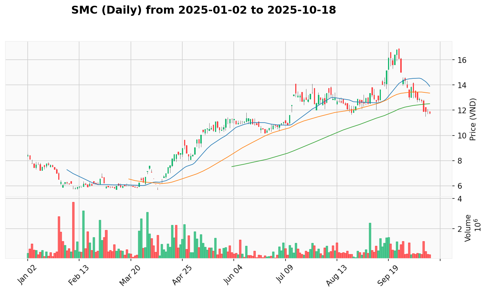

<a href="#thep">↑ Back to group THEP</a>  |  <a href="#vpa-signal-summary">↑ Back to Top</a>

#### Key Statistics
| Metric | Value |
|:---|---:|
| Date Range | 2025-01-02 to 2025-10-17 |
| **Latest Close** | **11.75** |
| Period Open | 8.36 |
| Period High | 16.9 |
| Period Low | 5.7 |
| Period Change % | 40.55% |

**[Download SMC Data (.csv)](market_data/SMC_2025-01-02_to_2025-10-18.csv)**

---

### SSH

#### [VPA Analysis (2025-06-16 - 2025-10-15)](./VPA.md#ssh)
> **Ngày 2025-10-08:** SSH giảm từ 88.1 VND xuống 86.6 VND. Giá mở cửa 86.6 VND, cao nhất 87.0 VND, thấp nhất 86.6 VND và đóng cửa 86.6 VND. Nến có biên độ hẹp, đóng cửa ở mức thấp nhất phiên, cho thấy áp lực bán chiếm ưu thế. Khối lượng giao dịch đạt 0.0018 triệu cổ phiếu, giảm so với phiên trước (0.0023 triệu cổ phiếu). Sau phiên "No Demand" và "Sign of Weakness" trước đó, việc giá tiếp tục giảm với khối lượng thấp cho thấy lực cầu yếu và áp lực cung vẫn hiện hữu, duy trì xu hướng suy yếu. **Phân tích VPA/Wyckoff:** Weakness (Dấu hiệu suy yếu).
> **Ngày 2025-10-09:** SSH tăng nhẹ từ 86.6 VND lên 86.9 VND. Giá mở cửa 86.9 VND, cao nhất 86.9 VND, thấp nhất 86.9 VND và đóng cửa 86.9 VND. Nến có biên độ cực hẹp, cho thấy sự lưỡng lự hoặc thiếu vắng giao dịch đáng kể. Khối lượng giao dịch chỉ đạt 0.0001 triệu cổ phiếu, giảm mạnh so với phiên trước (0.0018 triệu cổ phiếu) và là mức cực thấp. Sau các phiên có dấu hiệu suy yếu và không có lực cầu, việc giá tăng nhẹ với khối lượng cực thấp cho thấy thị trường hoàn toàn không có sự tham gia của cả bên mua và bên bán, xác nhận tiếp tục tình trạng thiếu cầu và suy yếu. **Phân tích VPA/Wyckoff:** No Demand (Không có lực cầu)
> **Ngày 2025-10-10:** SSH giảm từ 86.9 VND xuống 81.0 VND. Giá mở cửa 80.0 VND, cao nhất 81.0 VND, thấp nhất 80.0 VND và đóng cửa 81.0 VND. Nến có biên độ rộng, đóng cửa ở mức cao nhất phiên, nhưng vẫn là một phiên giảm mạnh. Khối lượng giao dịch đạt 0.0024 triệu cổ phiếu, tăng đáng kể so với phiên "No Demand" trước đó (0.0001 triệu cổ phiếu). Sau các phiên có dấu hiệu suy yếu và không có lực cầu, việc giá giảm mạnh với khối lượng tăng cho thấy áp lực bán vẫn rất lớn và chiếm ưu thế, xác nhận sự tiếp diễn của xu hướng suy yếu. Mặc dù giá đóng cửa ở mức cao nhất phiên, nhưng điều này chưa đủ để phủ nhận lực bán mạnh mẽ trong phiên. **Phân tích VPA/Wyckoff:** Weakness (Dấu hiệu suy yếu).
> **Ngày 2025-10-14:** SSH tăng từ 81.0 VND lên 85.6 VND. Giá mở cửa 86.0 VND, cao nhất 86.0 VND, thấp nhất 85.6 VND và đóng cửa 85.6 VND. Nến có biên độ hẹp, đóng cửa ở mức thấp nhất phiên, cho thấy sự lưỡng lự và áp lực bán nhẹ trong phiên. Khối lượng giao dịch chỉ đạt 0.0011 triệu cổ phiếu, giảm so với phiên trước (0.0024 triệu cổ phiếu) và ở mức thấp. Mặc dù giá tăng so với phiên trước, nhưng việc giá đóng cửa ở mức thấp nhất phiên với khối lượng thấp cho thấy lực cầu không đủ mạnh để duy trì đà tăng, xác nhận tình trạng thiếu cầu và có thể là dấu hiệu tiếp tục suy yếu. **Phân tích VPA/Wyckoff:** No Demand (Không có lực cầu)
> **Ngày 2025-10-15:** SSH giảm từ 85.6 VND xuống 85.0 VND. Giá mở cửa 85.7 VND, cao nhất 86.8 VND, thấp nhất 85.0 VND và đóng cửa 85.0 VND. Nến có biên độ hẹp, đóng cửa ở mức thấp nhất phiên, cho thấy áp lực bán chiếm ưu thế. Khối lượng giao dịch đạt 0.0012 triệu cổ phiếu, tăng nhẹ so với phiên trước (0.0011 triệu cổ phiếu) nhưng vẫn ở mức thấp. Sau phiên "No Demand" trước đó, việc giá giảm nhẹ với khối lượng tăng nhẹ và đóng cửa ở mức thấp nhất phiên xác nhận sự tiếp diễn của xu hướng suy yếu và thiếu lực cầu. Điều này cho thấy người bán vẫn đang kiểm soát thị trường. **Phân tích VPA/Wyckoff:** Weakness (Dấu hiệu suy yếu)

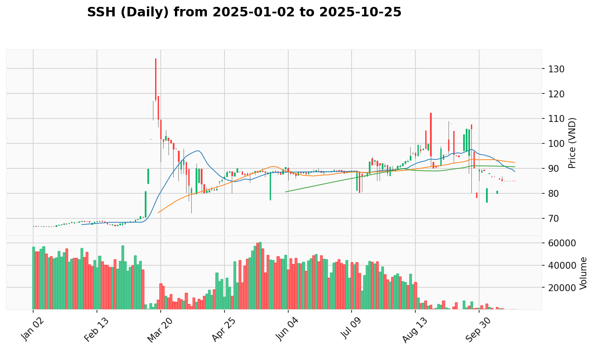

<a href="#bat-dong-san">↑ Back to group BAT_DONG_SAN</a>  |  <a href="#vpa-signal-summary">↑ Back to Top</a>

#### Key Statistics
| Metric | Value |
|:---|---:|
| Date Range | 2025-01-02 to 2025-10-17 |
| **Latest Close** | **85.0** |
| Period Open | 66.8 |
| Period High | 134.2 |
| Period Low | 66.5 |
| Period Change % | 27.25% |

**[Download SSH Data (.csv)](market_data/SSH_2025-01-02_to_2025-10-18.csv)**

---

### SSI

#### [VPA Analysis (2025-06-13 - 2025-10-16)](./VPA.md#ssi)
> **Ngày 2025-10-10:** SSI mở cửa ở mức 40.9 VND, tăng lên 41.5 VND và giảm xuống 40.6 VND, đóng cửa ở mức 40.7 VND, cao hơn nhẹ so với giá đóng cửa phiên trước (40.65 VND). Biên độ dao động trong phiên là 0.9 VND, rộng hơn so với phiên trước (0.75 VND). Khối lượng giao dịch đạt 29.02 triệu cổ phiếu, giảm so với phiên trước (33.45 triệu cổ phiếu). Sau phiên "No Supply" ngày 2025-10-09, giá hôm nay có một nỗ lực tăng nhưng không duy trì được mức cao nhất phiên và đóng cửa gần mức thấp nhất phiên, mặc dù vẫn cao hơn giá đóng cửa phiên trước. Khối lượng giao dịch giảm cho thấy lực cầu yếu, không đủ mạnh để đẩy giá lên cao hơn một cách bền vững. Điều này cho thấy sự thiếu hụt nhu cầu sau khi nguồn cung đã cạn kiệt. **Phân tích VPA/Wyckoff:** Lack of Demand (Thiếu hụt nhu cầu) - Giá tăng nhẹ với biên độ rộng nhưng khối lượng thấp và không giữ được mức cao nhất phiên, cho thấy lực cầu yếu.
> **Ngày 2025-10-13:** SSI mở cửa ở mức 40.15 VND, tăng lên 41.7 VND và giảm xuống 40.0 VND, đóng cửa ở mức 41.35 VND, cao hơn đáng kể so với giá đóng cửa phiên trước (40.7 VND). Biên độ dao động trong phiên là 1.7 VND, rộng hơn so với phiên trước (0.9 VND). Khối lượng giao dịch đạt 42.26 triệu cổ phiếu, tăng mạnh so với phiên trước (29.02 triệu cổ phiếu). Sau hai phiên "No Supply" và "Lack of Demand", giá hôm nay tăng mạnh với biên độ rộng và đóng cửa gần mức cao nhất phiên, đi kèm với khối lượng giao dịch gia tăng đáng kể. Điều này cho thấy lực cầu đã quay trở lại và áp đảo lực cung, xác nhận sự xuất hiện của nhu cầu mạnh mẽ. **Phân tích VPA/Wyckoff:** Sign of Strength (SOS) - Lực cầu mạnh mẽ với khối lượng gia tăng xác nhận xu hướng tăng.
> **Ngày 2025-10-14:** SSI mở cửa ở mức 42.35 VND, tăng lên 43.3 VND nhưng sau đó giảm mạnh và đóng cửa ở mức 41.0 VND, là mức thấp nhất trong phiên và thấp hơn giá đóng cửa phiên trước (41.35 VND). Biên độ dao động trong phiên là 2.3 VND, rất rộng. Khối lượng giao dịch đạt 65.27 triệu cổ phiếu, tăng vọt so với phiên trước (42.26 triệu cổ phiếu). Sau phiên "Sign of Strength" ngày 2025-10-13, giá hôm nay cho thấy nỗ lực tăng giá đã bị từ chối mạnh mẽ bởi lực cung lớn, đẩy giá đóng cửa xuống mức thấp nhất phiên với khối lượng giao dịch cực lớn. Điều này cho thấy áp lực bán mạnh mẽ đã xuất hiện và áp đảo lực cầu. **Phân tích VPA/Wyckoff:** Sign of Weakness (SOW) - Lực cung mạnh mẽ xuất hiện với khối lượng lớn, đẩy giá đóng cửa xuống mức thấp nhất phiên.
> **Ngày 2025-10-15:** SSI mở cửa ở mức 41.1 VND, dao động trong biên độ từ 40.85 VND đến 41.75 VND và đóng cửa ở mức 41.45 VND, cao hơn giá đóng cửa phiên trước (41.0 VND). Biên độ dao động trong phiên là 0.9 VND, hẹp hơn đáng kể so với phiên trước (2.3 VND). Khối lượng giao dịch đạt 30.11 triệu cổ phiếu, giảm mạnh so với phiên trước (65.27 triệu cổ phiếu). Sau phiên "Sign of Weakness" với khối lượng cực lớn ngày 2025-10-14, giá hôm nay đã phục hồi, đóng cửa gần mức cao nhất phiên với biên độ hẹp và khối lượng giao dịch giảm mạnh. Điều này cho thấy áp lực cung đã suy yếu đáng kể và không có sự tiếp diễn của lực bán mạnh mẽ. **Phân tích VPA/Wyckoff:** No Supply (NS) - Lực cung suy yếu sau phiên giảm mạnh, cho thấy khả năng giá sẽ tiếp tục tăng.
> **Ngày 2025-10-16:** SSI mở cửa ở mức 41.7 VND, dao động trong biên độ từ 41.3 VND đến 42.25 VND và đóng cửa ở mức 41.4 VND, thấp hơn nhẹ so với giá đóng cửa phiên trước (41.45 VND). Biên độ dao động trong phiên là 0.95 VND, tương tự phiên trước. Khối lượng giao dịch đạt 15.33 triệu cổ phiếu, giảm mạnh so với phiên trước (30.11 triệu cổ phiếu) và là mức thấp nhất trong 10 phiên gần đây. Sau phiên "No Supply" ngày 2025-10-15, giá hôm nay giảm nhẹ với khối lượng giao dịch rất thấp, cho thấy lực cung không đáng kể và thị trường đang thiếu động lực rõ ràng. Điều này có thể là một dấu hiệu của việc kiểm tra cung sau khi lực cung đã suy yếu. **Phân tích VPA/Wyckoff:** Test for Supply (TS) - Giá giảm nhẹ với khối lượng rất thấp, cho thấy lực cung đã cạn kiệt.

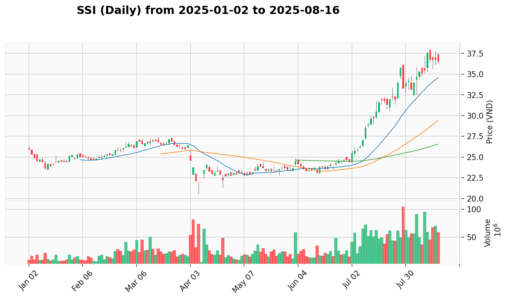

<a href="#chung-khoan">↑ Back to group CHUNG_KHOAN</a>  |  <a href="#vpa-signal-summary">↑ Back to Top</a>

#### Key Statistics
| Metric | Value |
|:---|---:|
| Date Range | 2025-01-02 to 2025-10-17 |
| **Latest Close** | **40.8** |
| Period Open | 25.4 |
| Period High | 43.3 |
| Period Low | 20.09 |
| Period Change % | 60.63% |

**[Download SSI Data (.csv)](market_data/SSI_2025-01-02_to_2025-10-18.csv)**

---

### STB

#### [VPA Analysis (2025-06-16 - 2025-10-16)](./VPA.md#stb)
> **Ngày 2025-10-10:** STB tăng từ 60.0 VND (giá đóng cửa phiên trước) lên 60.4 VND (giá đóng cửa phiên hôm nay). Mở cửa tại 60.2 VND, giá đã có lúc tăng lên 60.4 VND và đóng cửa tại mức cao nhất phiên. Nến có biên độ rộng từ 59.2 VND đến 60.4 VND. Khối lượng giao dịch đạt 8.2024 triệu cổ phiếu, giảm so với 9.593 triệu cổ phiếu của phiên trước. Sau phiên "Không có cầu" hôm qua, phiên hôm nay giá tăng mạnh với biên độ rộng và đóng cửa ở mức cao nhất phiên, cho thấy lực cầu đã quay trở lại và hấp thụ tốt lượng cung, mặc dù khối lượng giao dịch có phần giảm nhẹ. Điều này cho thấy sự thiếu hụt nguồn cung ở mức giá cao hơn. **Phân tích VPA/Wyckoff:** Dấu hiệu sức mạnh (Sign of Strength - SOS)
> **Ngày 2025-10-13:** STB tăng từ 60.4 VND (giá đóng cửa phiên trước) lên 61.0 VND (giá đóng cửa phiên hôm nay). Mở cửa tại 59.9 VND, giá đã có lúc tăng lên 61.0 VND và đóng cửa tại mức cao nhất phiên. Nến có biên độ rộng từ 59.3 VND đến 61.0 VND. Khối lượng giao dịch đạt 7.7432 triệu cổ phiếu, giảm so với 8.2024 triệu cổ phiếu của phiên trước. Sau phiên "Dấu hiệu sức mạnh" hôm qua, phiên hôm nay giá tiếp tục tăng mạnh với biên độ rộng và đóng cửa ở mức cao nhất phiên, nhưng với khối lượng giao dịch giảm. Điều này cho thấy lực cung đã cạn kiệt và giá dễ dàng tăng lên mà không cần nhiều nỗ lực từ phía cầu, xác nhận xu hướng tăng giá. **Phân tích VPA/Wyckoff:** Không có cung (No Supply)
> **Ngày 2025-10-14:** STB giảm từ 61.0 VND (giá đóng cửa phiên trước) xuống 60.6 VND (giá đóng cửa phiên hôm nay). Mở cửa tại 61.1 VND, giá đã có lúc tăng lên 61.3 VND nhưng sau đó giảm xuống 60.1 VND và đóng cửa tại 60.6 VND. Nến có biên độ rộng từ 60.1 VND đến 61.3 VND. Khối lượng giao dịch đạt 7.0392 triệu cổ phiếu, giảm so với 7.7432 triệu cổ phiếu của phiên trước. Sau hai phiên tăng giá với tín hiệu "Dấu hiệu sức mạnh" và "Không có cung", phiên hôm nay giá giảm nhẹ với khối lượng thấp, cho thấy lực bán không đáng kể và có thể là một phiên kiểm tra cung cầu tự nhiên trong xu hướng tăng giá. **Phân tích VPA/Wyckoff:** Test Cung
> **Ngày 2025-10-15:** STB giảm từ 60.6 VND (giá đóng cửa phiên trước) xuống 60.0 VND (giá đóng cửa phiên hôm nay). Mở cửa tại 60.2 VND, giá đã có lúc tăng lên 60.8 VND nhưng sau đó giảm xuống 60.0 VND và đóng cửa tại mức thấp nhất phiên. Nến có biên độ hẹp từ 60.0 VND đến 60.8 VND. Khối lượng giao dịch đạt 3.8058 triệu cổ phiếu, giảm mạnh so với 7.0392 triệu cổ phiếu của phiên trước. Sau các tín hiệu cạn cung và kiểm tra cung thành công, phiên hôm nay giá giảm nhẹ với khối lượng rất thấp, cho thấy lực bán không đáng kể nhưng đồng thời cũng thiếu lực cầu hỗ trợ, dẫn đến giá đóng cửa ở mức thấp nhất phiên. Đây có thể là một phiên điều chỉnh tự nhiên hoặc tạm thời thiếu cầu. **Phân tích VPA/Wyckoff:** Thiếu cầu (Lack of Demand)
> **Ngày 2025-10-16:** STB giảm từ 60.0 VND (giá đóng cửa phiên trước) xuống 59.0 VND (giá đóng cửa phiên hôm nay). Mở cửa tại 60.1 VND, giá đã có lúc tăng lên 60.4 VND nhưng sau đó giảm xuống 58.8 VND và đóng cửa tại 59.0 VND, gần mức thấp nhất phiên. Nến có biên độ rộng hơn so với phiên trước. Khối lượng giao dịch đạt 4.1547 triệu cổ phiếu, tăng nhẹ so với 3.8058 triệu cổ phiếu của phiên trước nhưng vẫn ở mức thấp so với trung bình. Sau các phiên kiểm tra cung và thiếu cầu, phiên hôm nay giá tiếp tục giảm với biên độ rộng và đóng cửa gần mức thấp nhất, cho thấy áp lực bán vẫn còn và lực cầu yếu, xác nhận sự yếu kém tiếp diễn. **Phân tích VPA/Wyckoff:** Dấu hiệu yếu kém

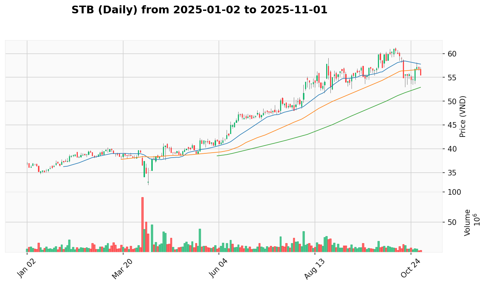

<a href="#ngan-hang">↑ Back to group NGAN_HANG</a>  |  <a href="#vpa-signal-summary">↑ Back to Top</a>

#### Key Statistics
| Metric | Value |
|:---|---:|
| Date Range | 2025-01-02 to 2025-10-17 |
| **Latest Close** | **59.0** |
| Period Open | 36.95 |
| Period High | 61.3 |
| Period Low | 32.4 |
| Period Change % | 59.68% |

**[Download STB Data (.csv)](market_data/STB_2025-01-02_to_2025-10-18.csv)**

---

### STK

#### [VPA Analysis (2025-08-03 - 2025-10-16)](./VPA.md#stk)
> **Ngày 2025-10-10:** STK giảm nhẹ từ 25.1 VND xuống 25.05 VND với khối lượng giao dịch đạt 0.0165 triệu cổ phiếu. Cây nến có thân nhỏ, cho thấy sự lưỡng lự của thị trường. So với phiên trước đó (2025-10-09) khi giá tăng nhẹ với khối lượng 0.0195 triệu cổ phiếu và được đánh giá là "Lực cầu yếu", phiên này giá giảm nhẹ nhưng khối lượng giao dịch tiếp tục giảm xuống mức rất thấp. Điều này củng cố nhận định về sự thiếu vắng lực cầu và cho thấy thị trường đang thiếu động lực rõ ràng. **Phân tích VPA/Wyckoff:** Thiếu cầu (No Demand)
> **Ngày 2025-10-13:** STK giữ nguyên mức giá 25.05 VND với khối lượng giao dịch đạt 0.0298 triệu cổ phiếu. Cây nến có thân hẹp, cho thấy sự lưỡng lự của thị trường. So với phiên trước đó (2025-10-10) khi giá giảm nhẹ với khối lượng thấp (0.0165 triệu cổ phiếu) và được đánh giá là "Thiếu cầu", phiên này khối lượng giao dịch tăng gần gấp đôi nhưng giá không thay đổi. Điều này cho thấy nỗ lực mua vào không tạo ra kết quả tăng giá, ngụ ý lực cung vẫn đang hiện diện. **Phân tích VPA/Wyckoff:** Nỗ lực không có kết quả (Effort without Result)
> **Ngày 2025-10-14:** STK giảm từ 25.05 VND xuống 25.0 VND với khối lượng giao dịch đạt 0.0305 triệu cổ phiếu. Cây nến có thân hẹp, đóng cửa ở mức thấp nhất phiên. So với phiên trước đó (2025-10-13) khi giá đi ngang với khối lượng 0.0298 triệu cổ phiếu và được đánh giá là "Nỗ lực không có kết quả", phiên này giá giảm nhẹ trong khi khối lượng giao dịch tăng nhẹ. Điều này cho thấy lực cung đang chiếm ưu thế và đẩy giá xuống, xác nhận sự yếu kém của lực cầu. **Phân tích VPA/Wyckoff:** Lực cung chiếm ưu thế (Supply Coming In)
> **Ngày 2025-10-15:** STK giảm từ 25.0 VND xuống 24.85 VND với khối lượng giao dịch đạt 0.0149 triệu cổ phiếu. Cây nến có thân hẹp, đóng cửa gần mức thấp nhất phiên. So với phiên trước đó (2025-10-14) khi giá giảm nhẹ với khối lượng tăng (0.0305 triệu cổ phiếu) và được đánh giá là "Lực cung chiếm ưu thế", phiên này giá tiếp tục giảm nhưng khối lượng giao dịch giảm mạnh. Điều này cho thấy lực bán đã suy yếu đáng kể, nhưng đồng thời cũng không có lực cầu đủ mạnh để hỗ trợ giá. **Phân tích VPA/Wyckoff:** Không có cầu (No Demand)
> **Ngày 2025-10-16:** STK tăng từ 24.85 VND lên 25.1 VND với khối lượng giao dịch đạt 0.0096 triệu cổ phiếu. Cây nến có thân hẹp, đóng cửa ở giữa. So với phiên trước đó (2025-10-15) khi giá giảm với khối lượng thấp (0.0149 triệu cổ phiếu) và được đánh giá là "Không có cầu", phiên này giá tăng nhẹ nhưng khối lượng giao dịch giảm mạnh hơn nữa, cho thấy lực cầu rất yếu và không có sự hỗ trợ từ khối lượng. **Phân tích VPA/Wyckoff:** Không có cầu (No Demand)

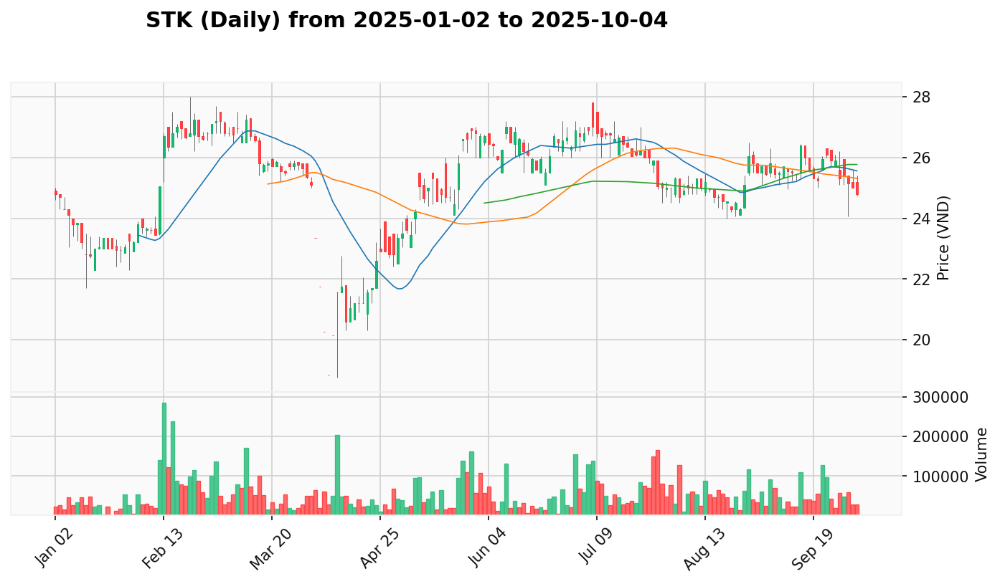

<a href="#det-may">↑ Back to group DET_MAY</a>  |  <a href="#vpa-signal-summary">↑ Back to Top</a>

#### Key Statistics
| Metric | Value |
|:---|---:|
| Date Range | 2025-01-02 to 2025-10-17 |
| **Latest Close** | **25.1** |
| Period Open | 24.9 |
| Period High | 28.0 |
| Period Low | 18.75 |
| Period Change % | 0.80% |

**[Download STK Data (.csv)](market_data/STK_2025-01-02_to_2025-10-18.csv)**

---

### SZC

#### [VPA Analysis (2025-08-04 - 2025-10-16)](./VPA.md#szc)
> **Ngày 2025-10-10:** SZC tăng từ 33.45 VND lên 33.7 VND với khối lượng giao dịch đạt 0.7161 triệu cổ phiếu, thấp hơn phiên trước. Cây nến tăng có biên độ hẹp và đóng cửa gần giữa phiên. Sau các phiên yếu kém và nỗ lực tăng giá không thành công, phiên này tiếp tục cho thấy sự thiếu vắng lực cầu mạnh mẽ, với giá tăng nhẹ nhưng khối lượng giảm. Điều này củng cố nhận định về thị trường yếu và khả năng tiếp diễn xu hướng đi ngang hoặc giảm. **Phân tích VPA/Wyckoff:** No Demand (Không có cầu)
> **Ngày 2025-10-13:** SZC tăng từ 33.7 VND lên 34.0 VND với khối lượng giao dịch đạt 1.0928 triệu cổ phiếu, cao hơn đáng kể so với phiên trước. Cây nến tăng có biên độ tương đối rộng và đóng cửa gần mức cao nhất phiên. Sau các phiên yếu kém và không có cầu, phiên này cho thấy lực cầu đã quay trở lại và hấp thụ lực cung, đẩy giá lên. **Phân tích VPA/Wyckoff:** Sign of Strength (SOS) - Lực cầu mạnh mẽ.
> **Ngày 2025-10-14:** SZC giảm từ 34.0 VND xuống 33.1 VND với khối lượng giao dịch đạt 1.2901 triệu cổ phiếu, cao hơn đáng kể so với phiên trước. Cây nến giảm có biên độ rộng và đóng cửa ở mức thấp nhất phiên. Sau phiên tăng giá mạnh mẽ (SOS) trước đó, phiên này cho thấy lực cung đã quay trở lại và áp đảo lực cầu, đẩy giá xuống sâu. Khối lượng giao dịch tăng cao xác nhận sự xuất hiện của áp lực bán mạnh. **Phân tích VPA/Wyckoff:** Sign of Weakness (SOW) - Lực cung mạnh mẽ.
> **Ngày 2025-10-15:** SZC giảm từ 33.1 VND xuống 32.4 VND với khối lượng giao dịch đạt 1.0835 triệu cổ phiếu, thấp hơn so với phiên trước nhưng vẫn ở mức cao. Cây nến giảm có biên độ rộng và đóng cửa ở mức thấp nhất phiên, cho thấy áp lực bán tiếp tục chiếm ưu thế. Sau phiên SOW mạnh mẽ ngày hôm qua, sự sụt giảm tiếp tục với khối lượng giảm nhẹ cho thấy lực cung vẫn đang kiểm soát thị trường. **Phân tích VPA/Wyckoff:** Sign of Weakness (SOW) - Lực cung tiếp tục chiếm ưu thế.
> **Ngày 2025-10-16:** SZC tăng nhẹ từ 32.2 VND lên 32.45 VND với khối lượng giao dịch đạt 0.4606 triệu cổ phiếu, thấp hơn đáng kể so với các phiên trước. Cây nến tăng có biên độ hẹp, cho thấy sự lưỡng lự của thị trường. Sau hai phiên giảm giá mạnh với khối lượng cao (SOW), phiên này cho thấy áp lực bán đã giảm bớt nhưng lực cầu vẫn còn yếu. Khối lượng thấp trong phiên tăng giá cho thấy không có sự tham gia mạnh mẽ của người mua. **Phân tích VPA/Wyckoff:** No Demand (ND) - Lực cầu yếu.

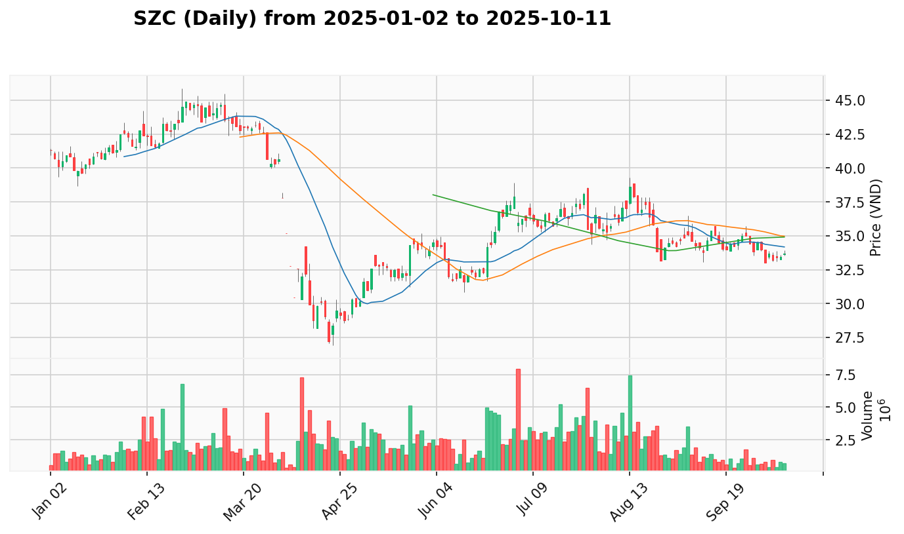

<a href="#bat-dong-san-kcn">↑ Back to group BAT_DONG_SAN_KCN</a>  |  <a href="#vpa-signal-summary">↑ Back to Top</a>

#### Key Statistics
| Metric | Value |
|:---|---:|
| Date Range | 2025-01-02 to 2025-10-17 |
| **Latest Close** | **32.5** |
| Period Open | 41.31 |
| Period High | 45.87 |
| Period Low | 26.92 |
| Period Change % | -21.33% |

**[Download SZC Data (.csv)](market_data/SZC_2025-01-02_to_2025-10-18.csv)**

---

### TCB

#### [VPA Analysis (2025-05-20 - 2025-10-16)](./VPA.md#tcb)
> **Ngày 2025-10-10:** TCB mở cửa tại 39.1, đạt mức cao nhất 39.9 và mức thấp nhất 39.0, đóng cửa tại 39.35. Giá tăng từ 38.95 lên 39.35 so với phiên trước. Cây nến tăng có biên độ trung bình đến rộng và đóng cửa gần mức cao nhất phiên, cho thấy lực cầu đã quay trở lại và kiểm soát phiên giao dịch. Khối lượng giao dịch đạt 20.313 triệu cổ phiếu, tăng so với phiên trước (18.777 triệu cổ phiếu). Sự tăng giá đi kèm với khối lượng gia tăng sau phiên thiếu cầu (ND) cho thấy lực cầu đang mạnh lên và có khả năng hấp thụ lực cung. **Phân tích VPA/Wyckoff:** Sign of Strength (SOS) - Lực cầu mạnh mẽ.
> **Ngày 2025-10-13:** TCB mở cửa tại 39.3, đạt mức cao nhất 41.5 và mức thấp nhất 39.25, đóng cửa tại 41.3. Giá tăng mạnh từ 39.35 lên 41.3 so với phiên trước. Cây nến tăng có biên độ rất rộng và đóng cửa gần mức cao nhất phiên, cho thấy lực cầu áp đảo hoàn toàn lực cung. Khối lượng giao dịch đạt 43.31 triệu cổ phiếu, tăng đột biến và cao gấp đôi so với phiên trước (20.33 triệu cổ phiếu). Sự tăng giá mạnh mẽ đi kèm với khối lượng cực lớn xác nhận lực cầu đang rất mạnh và sẵn sàng hấp thụ mọi nguồn cung, tiếp nối tín hiệu SOS từ phiên trước. **Phân tích VPA/Wyckoff:** Sign of Strength (SOS) - Lực cầu mạnh mẽ và áp đảo.
> **Ngày 2025-10-14:** TCB mở cửa tại 41.75, đạt mức cao nhất 42.0 và mức thấp nhất 40.55, đóng cửa tại 40.8. Giá giảm từ 41.3 xuống 40.8 so với phiên trước. Cây nến giảm có biên độ trung bình và đóng cửa gần mức thấp nhất phiên, cho thấy lực cung đã xuất hiện và kiểm soát phiên giao dịch. Khối lượng giao dịch đạt 25.93 triệu cổ phiếu, giảm đáng kể so với phiên trước (43.31 triệu cổ phiếu). Sự giảm giá đi kèm với khối lượng giảm sau hai phiên tăng mạnh với tín hiệu SOS cho thấy có thể là hoạt động chốt lời hoặc tạm dừng của lực cầu, nhưng việc đóng cửa gần mức thấp nhất phiên cho thấy áp lực bán nhất định. **Phân tích VPA/Wyckoff:** Weakness (W) - Áp lực bán xuất hiện sau đà tăng, cần quan sát thêm.
> **Ngày 2025-10-15:** TCB mở cửa tại 41.0, đạt mức cao nhất 41.35 và mức thấp nhất 40.55, đóng cửa tại 40.8. Giá đi ngang, giữ nguyên mức đóng cửa so với phiên trước (40.8). Cây nến có biên độ hẹp và đóng cửa tại mức thấp nhất phiên, cho thấy lực cầu yếu và áp lực bán vẫn hiện hữu. Khối lượng giao dịch đạt 13.32 triệu cổ phiếu, giảm mạnh so với phiên trước (25.93 triệu cổ phiếu) và rất thấp. Sự duy trì mức giá đóng cửa của phiên giảm trước đó với khối lượng thấp cho thấy lực bán đã giảm nhưng lực mua cũng không xuất hiện để đẩy giá lên. Đây là dấu hiệu của sự thiếu cầu sau tín hiệu suy yếu. **Phân tích VPA/Wyckoff:** No Demand (ND) - Thiếu cầu, tiếp tục cho thấy sự suy yếu.
> **Ngày 2025-10-16:** TCB mở cửa tại 41.2, đạt mức cao nhất 41.25 và mức thấp nhất 40.9, đóng cửa tại 40.95. Giá tăng nhẹ từ 40.8 lên 40.95 so với phiên trước. Cây nến có biên độ hẹp và đóng cửa gần giữa thân nến, cho thấy sự lưỡng lự của thị trường. Khối lượng giao dịch đạt 8.02 triệu cổ phiếu, giảm mạnh so với phiên trước (13.32 triệu cổ phiếu) và là mức thấp nhất trong 10 phiên gần đây. Sự tăng giá nhẹ đi kèm với khối lượng cực thấp sau hai phiên suy yếu (Weakness và No Demand) cho thấy nguồn cung đã cạn kiệt tạm thời, nhưng lực cầu vẫn chưa đủ mạnh để đẩy giá lên. Đây là một dấu hiệu kiểm tra nguồn cung. **Phân tích VPA/Wyckoff:** No Supply (NS) - Kiểm tra nguồn cung, cho thấy áp lực bán đã giảm nhưng cầu chưa vào.

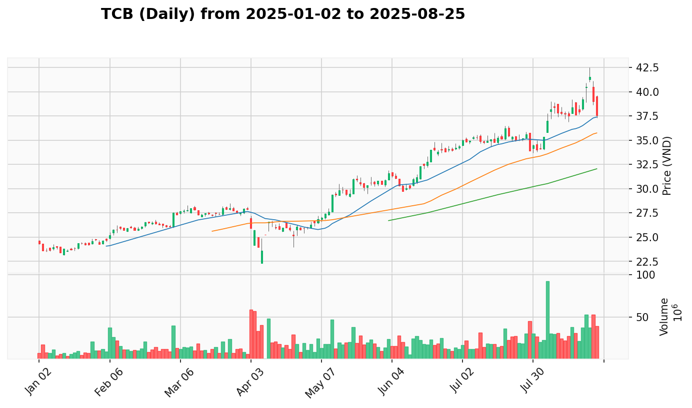

<a href="#ngan-hang">↑ Back to group NGAN_HANG</a>  |  <a href="#vpa-signal-summary">↑ Back to Top</a>

#### Key Statistics
| Metric | Value |
|:---|---:|
| Date Range | 2025-01-02 to 2025-10-17 |
| **Latest Close** | **40.65** |
| Period Open | 24.01 |
| Period High | 42.0 |
| Period Low | 21.72 |
| Period Change % | 69.30% |

**[Download TCB Data (.csv)](market_data/TCB_2025-01-02_to_2025-10-18.csv)**

---

### TCD

#### [VPA Analysis (2025-08-14 - 2025-10-08)](./VPA.md#tcd)
> **Ngày 2025-10-02:** TCD mở cửa tại 2.25 VND, duy trì mức cao nhất 2.25 VND, thấp nhất 2.25 VND và đóng cửa tại 2.25 VND. Giá giảm mạnh từ 2.41 VND của phiên trước xuống 2.25 VND. Thân nến giảm lớn, không có bóng trên và dưới, đóng cửa ở mức thấp nhất, cho thấy áp lực bán cực kỳ mạnh mẽ và không có lực cầu nào xuất hiện để hỗ trợ giá. Khối lượng giao dịch đạt 0.9541 triệu cổ phiếu, tăng đáng kể so với phiên trước (0.7758 triệu cổ phiếu). Sự sụt giảm mạnh về giá đi kèm với khối lượng tăng cao xác nhận rằng lực cung đang chiếm ưu thế hoàn toàn, tiếp tục xu hướng suy yếu đã được thiết lập. **Phân tích VPA/Wyckoff:** Continuation of Weakness (CoW) - Giá giảm mạnh với khối lượng tăng cao, xác nhận lực cung áp đảo và xu hướng giảm tiếp diễn.
> **Ngày 2025-10-03:** TCD mở cửa tại 2.1 VND, duy trì mức cao nhất 2.1 VND, thấp nhất 2.1 VND và đóng cửa tại 2.1 VND. Giá tiếp tục giảm mạnh từ 2.25 VND của phiên trước xuống 2.1 VND. Thân nến giảm nhỏ, không có bóng trên và dưới, đóng cửa ở mức thấp nhất, cho thấy áp lực bán vẫn duy trì nhưng không còn mạnh mẽ như phiên trước. Khối lượng giao dịch đạt 0.2813 triệu cổ phiếu, giảm đáng kể so với phiên trước (0.9541 triệu cổ phiếu). Sự sụt giảm giá tiếp diễn với khối lượng thấp cho thấy thiếu vắng lực cầu và sự thờ ơ của thị trường, xác nhận xu hướng giảm vẫn tiếp diễn nhưng với sự tham gia ít hơn. **Phân tích VPA/Wyckoff:** Continuation of Weakness (CoW) - Giá tiếp tục giảm với khối lượng thấp, cho thấy lực cung vẫn kiểm soát và thiếu vắng lực cầu, xác nhận sự yếu kém tiếp diễn.
> **Ngày 2025-10-06:** TCD mở cửa tại 1.96 VND, duy trì mức cao nhất 1.96 VND, thấp nhất 1.96 VND và đóng cửa tại 1.96 VND. Giá tiếp tục giảm mạnh từ 2.1 VND của phiên trước xuống 1.96 VND. Thân nến giảm nhỏ, không có bóng trên và dưới, đóng cửa ở mức thấp nhất, cho thấy áp lực bán vẫn duy trì và giá tiếp tục tạo đáy mới. Khối lượng giao dịch đạt 0.7079 triệu cổ phiếu, tăng đáng kể so với phiên trước (0.2813 triệu cổ phiếu). Sự sụt giảm giá tiếp diễn với khối lượng tăng cao xác nhận rằng lực cung đang gia tăng trở lại và kiểm soát hoàn toàn thị trường, tiếp tục xu hướng suy yếu. **Phân tích VPA/Wyckoff:** Continuation of Weakness (CoW) - Giá giảm mạnh với khối lượng tăng cao, xác nhận lực cung áp đảo và xu hướng giảm tiếp diễn.
> **Ngày 2025-10-07:** TCD mở cửa tại 1.83 VND, đạt mức cao nhất 2.03 VND, thấp nhất 1.83 VND và đóng cửa tại 1.83 VND. Giá giảm mạnh từ 1.96 VND của phiên trước xuống 1.83 VND. Thân nến giảm dài, đóng cửa ở mức thấp nhất, cho thấy áp lực bán rất mạnh. Khối lượng giao dịch đạt 7.6405 triệu cổ phiếu, tăng đột biến so với phiên trước (0.7079 triệu cổ phiếu) và là mức cao nhất trong 10 phiên gần đây. Sự sụt giảm giá mạnh với khối lượng cực lớn xác nhận lực cung áp đảo hoàn toàn thị trường, cho thấy sự hoảng loạn và tiếp tục xu hướng giảm sâu. **Phân tích VPA/Wyckoff:** Continuation of Weakness (CoW) - Giá giảm mạnh với khối lượng cực lớn, xác nhận lực cung áp đảo và xu hướng giảm sâu tiếp diễn.
> **Ngày 2025-10-08:** TCD mở cửa tại 1.81 VND, đạt mức cao nhất 1.92 VND, thấp nhất 1.77 VND và đóng cửa tại 1.89 VND. Giá tăng từ 1.83 VND của phiên trước lên 1.89 VND. Thân nến tăng nhỏ, đóng cửa trên mức mở cửa, cho thấy lực cầu đã xuất hiện trở lại sau hai phiên giảm mạnh. Khối lượng giao dịch đạt 2.7838 triệu cổ phiếu, giảm đáng kể so với phiên trước (7.6405 triệu cổ phiếu). Sự tăng giá với khối lượng thấp sau giai đoạn giảm mạnh cho thấy áp lực bán đã tạm thời giảm bớt, nhưng lực cầu chưa thực sự mạnh mẽ để đảo chiều xu hướng giảm. **Phân tích VPA/Wyckoff:** Test for Supply (Kiểm tra nguồn cung) - Giá tăng với khối lượng thấp sau giai đoạn giảm mạnh, cho thấy thị trường đang kiểm tra xem liệu nguồn cung còn lớn hay không.

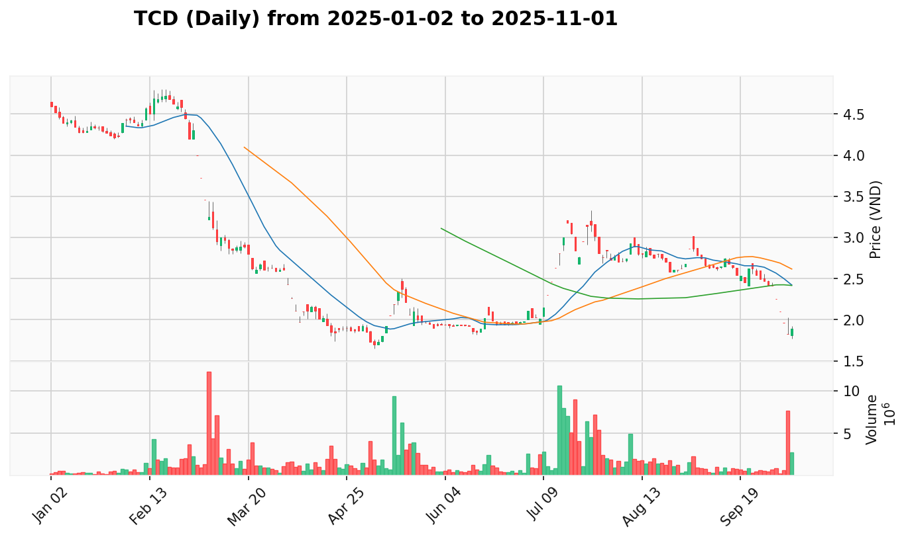

<a href="#van-tai">↑ Back to group VAN_TAI</a>  |  <a href="#vpa-signal-summary">↑ Back to Top</a>

#### Key Statistics
| Metric | Value |
|:---|---:|
| Date Range | 2025-01-02 to 2025-10-08 |
| **Latest Close** | **1.89** |
| Period Open | 4.65 |
| Period High | 4.8 |
| Period Low | 1.65 |
| Period Change % | -59.35% |

**[Download TCD Data (.csv)](market_data/TCD_2025-01-02_to_2025-10-18.csv)**

---

### TCH

#### [VPA Analysis (2025-07-17 - 2025-10-16)](./VPA.md#tch)
> **Ngày 2025-10-10:** TCH tăng từ 23.6 VND lên 24.7 VND. Thanh nến có biên độ rộng (từ 23.6 đến 24.7) và đóng cửa ở mức cao nhất phiên. Khối lượng giao dịch đạt 23.77 triệu cổ phiếu, tăng mạnh so với phiên trước (9.0756 triệu cổ phiếu) và cao hơn cả phiên SOS ngày 2025-10-08 (13.4726 triệu cổ phiếu). Sau phiên suy yếu (SOW) ngày 2025-10-09, phiên này TCH đã tăng giá mạnh mẽ với biên độ rộng và đóng cửa ở mức cao nhất, đi kèm với khối lượng giao dịch tăng đột biến. Điều này cho thấy lực cầu đã trở lại cực kỳ mạnh mẽ, hấp thụ toàn bộ áp lực bán và đẩy giá lên cao, xác nhận xu hướng tăng giá. **Phân tích VPA/Wyckoff:** Sign of Strength (SOS) - Lực cầu mạnh mẽ trở lại.
> **Ngày 2025-10-13:** TCH tăng từ 24.3 VND lên 25.85 VND. Thanh nến có biên độ rộng (từ 24.3 đến 25.9) và đóng cửa gần mức cao nhất phiên. Khối lượng giao dịch đạt 19.285 triệu cổ phiếu, giảm so với phiên trước (23.77 triệu cổ phiếu). Sau phiên SOS mạnh mẽ ngày 2025-10-10, phiên này TCH tiếp tục tăng giá với biên độ rộng và đóng cửa ở mức cao, cho thấy lực cầu vẫn đang chiếm ưu thế, mặc dù khối lượng có phần giảm nhẹ. Điều này có thể cho thấy thị trường đang hấp thụ nguồn cung ở mức giá cao hơn với ít nỗ lực hơn. **Phân tích VPA/Wyckoff:** Sign of Strength (SOS) - Lực cầu tiếp diễn.
> **Ngày 2025-10-14:** TCH giảm từ 26.2 VND xuống 24.7 VND. Thanh nến có biên độ rộng (từ 24.7 đến 26.25) và đóng cửa ở mức thấp nhất phiên. Khối lượng giao dịch đạt 19.636.300 cổ phiếu (19.6363 triệu cổ phiếu), tăng nhẹ so với phiên trước (19.285 triệu cổ phiếu). Sau hai phiên SOS liên tiếp, phiên này TCH mở cửa tạo gap tăng nhưng sau đó giảm mạnh và đóng cửa ở mức thấp nhất, cho thấy áp lực bán đã xuất hiện và chiếm ưu thế. **Phân tích VPA/Wyckoff:** Sign of Weakness (SOW) - Lực cung gia tăng.
> **Ngày 2025-10-15:** TCH giảm từ 24.8 VND xuống 24.5 VND. Thanh nến có biên độ rộng (từ 24.1 đến 25.2) và đóng cửa gần mức thấp nhất phiên. Khối lượng giao dịch đạt 16.97 triệu cổ phiếu, giảm so với phiên trước (19.6363 triệu cổ phiếu). Sau phiên SOW ngày 2025-10-14, phiên này TCH tiếp tục giảm giá với biên độ rộng và đóng cửa ở mức thấp, cho thấy lực cung vẫn đang chiếm ưu thế, mặc dù khối lượng có phần giảm nhẹ. Điều này có thể cho thấy áp lực bán vẫn còn nhưng có thể đang suy yếu dần hoặc thiếu lực cầu hấp thụ. **Phân tích VPA/Wyckoff:** Sign of Weakness (SOW) - Lực cung tiếp diễn.
> **Ngày 2025-10-16:** TCH tăng từ 24.7 VND lên 24.95 VND. Thanh nến có biên độ tương đối hẹp (từ 24.35 đến 25.15) và đóng cửa gần mức cao nhất phiên. Khối lượng giao dịch đạt 8.657.500 cổ phiếu (8.6575 triệu cổ phiếu), giảm đáng kể so với phiên trước (16.97 triệu cổ phiếu). Sau hai phiên SOW liên tiếp, phiên này TCH tăng giá trở lại nhưng với khối lượng thấp, cho thấy lực cầu chưa thực sự mạnh mẽ để hấp thụ hết lực cung tiềm tàng hoặc đây chỉ là một nhịp hồi phục kỹ thuật trong xu hướng giảm. **Phân tích VPA/Wyckoff:** No Demand (ND) - Lực cầu yếu.

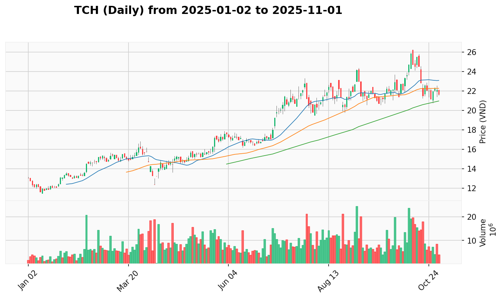

<a href="#bat-dong-san">↑ Back to group BAT_DONG_SAN</a>  |  <a href="#vpa-signal-summary">↑ Back to Top</a>

#### Key Statistics
| Metric | Value |
|:---|---:|
| Date Range | 2025-01-02 to 2025-10-17 |
| **Latest Close** | **24.5** |
| Period Open | 13.05 |
| Period High | 26.25 |
| Period Low | 11.46 |
| Period Change % | 87.74% |

**[Download TCH Data (.csv)](market_data/TCH_2025-01-02_to_2025-10-18.csv)**

---

### TCI

#### [VPA Analysis (2025-08-04 - 2025-10-16)](./VPA.md#tci)
> **Ngày 2025-10-10:** TCI tiếp tục giảm từ 11.85 VND xuống 11.7 VND với khối lượng giao dịch đạt 0.5776 triệu cổ phiếu. Cây nến giảm có biên độ hẹp, mở cửa ở mức 11.85 VND và đóng cửa gần mức thấp nhất phiên là 11.7 VND. Khối lượng giao dịch thấp hơn đáng kể so với phiên giảm mạnh trước đó (0.8652 triệu cổ phiếu), cho thấy áp lực bán đã suy yếu nhưng lực cầu vẫn chưa xuất hiện để đẩy giá lên. Điều này xác nhận sự yếu kém của thị trường sau tín hiệu "Sign of Weakness" ngày 2025-10-09. **Phân tích VPA/Wyckoff:** No Demand - Thiếu cầu.
> **Ngày 2025-10-13:** TCI giảm từ 11.7 VND xuống 11.35 VND với khối lượng giao dịch đạt 0.6788 triệu cổ phiếu. Cây nến giảm có biên độ tương đối rộng, mở cửa ở mức 11.5 VND và đóng cửa gần mức thấp nhất phiên là 11.35 VND. Khối lượng giao dịch cao hơn so với phiên trước đó (0.5776 triệu cổ phiếu), cho thấy áp lực bán vẫn còn mạnh và lực cầu chưa đủ để hấp thụ lượng cung. Điều này củng cố thêm tín hiệu yếu kém của thị trường sau giai đoạn "No Demand". **Phân tích VPA/Wyckoff:** Sign of Weakness (SOW) - Lực cung tiếp tục chiếm ưu thế.
> **Ngày 2025-10-14:** TCI tiếp tục giảm từ 11.35 VND xuống 11.25 VND với khối lượng giao dịch đạt 0.638 triệu cổ phiếu. Cây nến giảm có biên độ tương đối rộng, mở cửa ở mức 11.55 VND và đóng cửa gần mức thấp nhất phiên là 11.25 VND. Khối lượng giao dịch thấp hơn so với phiên trước đó (0.6788 triệu cổ phiếu), cho thấy áp lực bán có phần suy yếu nhưng lực cầu vẫn chưa xuất hiện để hỗ trợ giá, củng cố thêm tín hiệu yếu kém của thị trường sau giai đoạn "Sign of Weakness" và "No Demand" trước đó. **Phân tích VPA/Wyckoff:** No Demand - Thiếu cầu.
> **Ngày 2025-10-15:** TCI mở cửa ở mức 11.15 VND và đóng cửa tại 11.25 VND, giữ nguyên mức giá đóng cửa so với phiên trước đó, với khối lượng giao dịch chỉ đạt 0.2375 triệu cổ phiếu. Cây nến có thân nhỏ, cho thấy sự lưỡng lự của thị trường. Khối lượng giao dịch cực kỳ thấp, giảm đáng kể so với phiên trước (0.638 triệu cổ phiếu) và thấp hơn nhiều so với mức trung bình gần đây. Điều này cho thấy áp lực bán đã cạn kiệt ở mức giá này, nhưng đồng thời lực cầu cũng chưa đủ mạnh để đẩy giá lên. Thị trường đang trong giai đoạn thiếu động lực rõ ràng sau chuỗi giảm giá và các tín hiệu yếu kém trước đó. **Phân tích VPA/Wyckoff:** No Demand - Thiếu cầu (với khối lượng cạn kiệt).
> **Ngày 2025-10-16:** TCI mở cửa ở mức 11.25 VND và đóng cửa tại 11.25 VND, giữ nguyên mức giá so với phiên trước đó. Biên độ dao động trong phiên hẹp, từ 11.2 VND đến 11.4 VND. Khối lượng giao dịch chỉ đạt 0.1539 triệu cổ phiếu, tiếp tục giảm mạnh so với phiên 2025-10-15 (0.2375 triệu cổ phiếu) và thấp hơn nhiều so với mức trung bình gần đây. Điều này cho thấy cả lực cung và lực cầu đều gần như cạn kiệt ở mức giá này, sau chuỗi ngày giảm giá và các tín hiệu "No Demand" trước đó. Sự cạn kiệt khối lượng ở mức giá thấp cho thấy áp lực bán đã giảm đáng kể, nhưng lực cầu vẫn chưa đủ mạnh để đẩy giá lên. **Phân tích VPA/Wyckoff:** No Supply - Cạn cung.

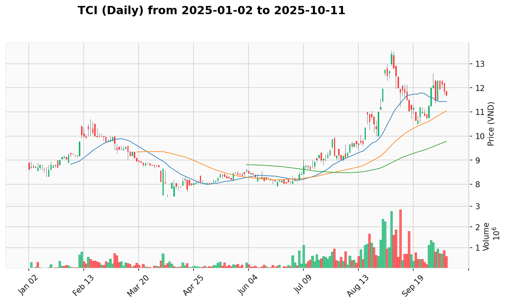

<a href="#chung-khoan">↑ Back to group CHUNG_KHOAN</a>  |  <a href="#vpa-signal-summary">↑ Back to Top</a>

#### Key Statistics
| Metric | Value |
|:---|---:|
| Date Range | 2025-01-02 to 2025-10-17 |
| **Latest Close** | **10.75** |
| Period Open | 8.9 |
| Period High | 13.55 |
| Period Low | 7.49 |
| Period Change % | 20.79% |

**[Download TCI Data (.csv)](market_data/TCI_2025-01-02_to_2025-10-18.csv)**

---

### TCL

#### [VPA Analysis (2025-08-14 - 2025-10-16)](./VPA.md#tcl)
> **Ngày 2025-10-10:** TCL giảm từ 34.75 VND xuống 34.55 VND, với khối lượng giao dịch đạt 0.0433 triệu cổ phiếu, tăng mạnh so với phiên trước (0.0097 triệu cổ phiếu) và ở mức cao. Giá đóng cửa ở gần mức thấp nhất phiên, biên độ giảm rõ rệt. Sự giảm giá đi kèm với khối lượng lớn cho thấy áp lực bán ra đang gia tăng đáng kể, vượt qua lực cầu. Điều này xác nhận sự thiếu cầu từ các phiên trước và cho thấy nguồn cung đang chiếm ưu thế. **Phân tích VPA/Wyckoff:** Sign of Weakness (SOW) - Nguồn cung xuất hiện
> **Ngày 2025-10-13:** TCL tăng từ 34.55 VND lên 34.7 VND, với khối lượng giao dịch đạt 0.0277 triệu cổ phiếu, giảm so với phiên trước (0.0433 triệu cổ phiếu). Cây nến tăng có biên độ tương đối rộng và đóng cửa gần mức cao nhất phiên. Tuy nhiên, sự tăng giá với khối lượng thấp sau một phiên giảm mạnh (SOW) cho thấy lực cầu yếu và không có sự xác nhận từ khối lượng. **Phân tích VPA/Wyckoff:** No Demand (Thiếu cầu)
> **Ngày 2025-10-14:** TCL tăng từ 34.55 VND lên 34.7 VND, với khối lượng giao dịch đạt 0.0644 triệu cổ phiếu, tăng mạnh so với phiên trước (0.0277 triệu cổ phiếu) và ở mức rất cao. Giá đóng cửa ở gần mức cao nhất phiên, cho thấy lực cầu mạnh mẽ đã xuất hiện và hấp thụ lượng cung. Sau phiên "Thiếu cầu" trước đó, sự tăng giá đi kèm với khối lượng lớn này cho thấy sự trở lại của dòng tiền lớn. **Phân tích VPA/Wyckoff:** Sign of Strength (SOS) - Lực cầu mạnh mẽ xuất hiện.
> **Ngày 2025-10-15:** TCL giảm từ 34.7 VND xuống 34.35 VND, với khối lượng giao dịch đạt 0.0103 triệu cổ phiếu, giảm mạnh so với phiên trước (0.0644 triệu cổ phiếu) và ở mức rất thấp. Cây nến giảm có biên độ hẹp và đóng cửa ở mức thấp nhất phiên. Sau phiên SOS mạnh mẽ trước đó, sự giảm giá với khối lượng rất thấp cho thấy lực cung yếu và không có áp lực bán đáng kể. Điều này có thể là một sự kiểm tra nguồn cung trước khi tiếp tục xu hướng tăng. **Phân tích VPA/Wyckoff:** No Supply (Không có nguồn cung)
> **Ngày 2025-10-16:** TCL tăng từ 34.35 VND lên 34.4 VND, với khối lượng giao dịch đạt 0.0109 triệu cổ phiếu, ở mức rất thấp và chỉ nhích nhẹ so với phiên trước (0.0103 triệu cổ phiếu). Cây nến tăng có biên độ hẹp và đóng cửa gần giữa thân nến. Sau phiên "Không có nguồn cung" trước đó, sự tăng giá nhẹ với khối lượng rất thấp cho thấy lực cầu yếu và chưa có sự tham gia mạnh mẽ của dòng tiền lớn để đẩy giá lên cao hơn. Điều này có thể là một dấu hiệu của sự thiếu cầu sau khi thị trường đã kiểm tra nguồn cung. **Phân tích VPA/Wyckoff:** No Demand (Thiếu cầu)

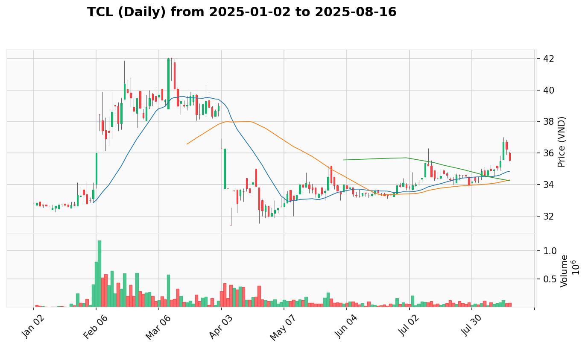

<a href="#van-tai">↑ Back to group VAN_TAI</a>  |  <a href="#vpa-signal-summary">↑ Back to Top</a>

#### Key Statistics
| Metric | Value |
|:---|---:|
| Date Range | 2025-01-02 to 2025-10-17 |
| **Latest Close** | **34.5** |
| Period Open | 32.83 |
| Period High | 42.04 |
| Period Low | 31.42 |
| Period Change % | 5.09% |

**[Download TCL Data (.csv)](market_data/TCL_2025-01-02_to_2025-10-18.csv)**

---

### TCM

#### [VPA Analysis (2025-08-04 - 2025-10-16)](./VPA.md#tcm)
> **Ngày 2025-10-10:** TCM giảm từ 29.35 VND xuống 29.15 VND với khối lượng giao dịch đạt 1.5369 triệu cổ phiếu, cao hơn đáng kể so với phiên trước (1.3292 triệu cổ phiếu). Biên độ giá trong ngày rộng (từ 28.95 VND đến 29.45 VND) và giá đóng cửa (29.15 VND) nằm gần mức thấp nhất phiên. Sau các tín hiệu không có cầu (ND) từ các phiên trước, việc giá giảm mạnh với khối lượng gia tăng và đóng cửa ở mức thấp cho thấy áp lực bán đang chiếm ưu thế và lực cung mạnh mẽ. Điều này xác nhận xu hướng giảm giá và cho thấy sự tiếp diễn của giai đoạn phân phối hoặc giảm giá. **Phân tích VPA/Wyckoff:** Sign of Weakness (SOW)
> **Ngày 2025-10-13:** TCM đóng cửa ở mức 29.15 VND, không đổi so với phiên trước, với khối lượng giao dịch đạt 1.454 triệu cổ phiếu, thấp hơn một chút so với phiên trước (1.5369 triệu cổ phiếu). Trong phiên, giá đã giảm xuống mức 28.7 VND nhưng sau đó phục hồi và đóng cửa tại mức giá mở cửa, cho thấy lực cầu đã hấp thụ được áp lực bán ở vùng giá thấp hơn. Sau tín hiệu suy yếu (SOW) ở phiên 2025-10-10, việc giá giữ vững và phục hồi trong phiên với khối lượng giảm nhẹ cho thấy áp lực bán có thể đang giảm bớt và có sự hấp thụ cung ở mức giá hiện tại, báo hiệu một sự tạm dừng trong xu hướng giảm giá. **Phân tích VPA/Wyckoff:** Kiểm tra cung
> **Ngày 2025-10-14:** TCM giảm từ 29.15 VND xuống 28.95 VND với khối lượng giao dịch đạt 1.5165 triệu cổ phiếu, cao hơn so với phiên trước (1.454 triệu cổ phiếu). Biên độ giá trong ngày từ 28.7 VND đến 29.15 VND và giá đóng cửa (28.95 VND) nằm gần mức thấp nhất phiên. Sau phiên kiểm tra cung ngày 2025-10-13, việc giá giảm nhẹ với khối lượng gia tăng và đóng cửa ở mức thấp cho thấy áp lực bán vẫn còn mạnh mẽ và có thể là sự tiếp diễn của xu hướng giảm giá. Lực cung đang chiếm ưu thế. **Phân tích VPA/Wyckoff:** Sign of Weakness (SOW)
> **Ngày 2025-10-15:** TCM tăng từ 28.95 VND lên 29.0 VND với khối lượng giao dịch đạt 1.8648 triệu cổ phiếu, cao hơn đáng kể so với phiên trước (1.5165 triệu cổ phiếu). Trong phiên, giá đã giảm xuống mức 28.4 VND nhưng sau đó phục hồi và đóng cửa ở mức 29.0 VND, cao hơn giá đóng cửa phiên trước. Sau tín hiệu suy yếu (SOW) ở phiên 2025-10-14, việc giá tăng nhẹ với khối lượng gia tăng và phục hồi từ mức thấp cho thấy lực cầu đã xuất hiện và hấp thụ áp lực bán, có thể là dấu hiệu của sự dừng lại của xu hướng giảm giá. Điều này cho thấy có sự hấp thụ cung ở vùng giá thấp hơn. **Phân tích VPA/Wyckoff:** Stopping Volume (SV)
> **Ngày 2025-10-16:** TCM giảm từ 29.0 VND xuống 28.85 VND với khối lượng giao dịch đạt 0.0716 triệu cổ phiếu, giảm mạnh so với phiên trước (1.8648 triệu cổ phiếu). Biên độ giá trong ngày rất hẹp (từ 28.8 VND đến 29.0 VND) và giá đóng cửa (28.85 VND) nằm gần mức thấp nhất phiên. Sau phiên Stopping Volume (SV) ngày 2025-10-15 cho thấy lực cầu xuất hiện, phiên hôm nay giá giảm nhẹ với khối lượng cực thấp cho thấy thiếu vắng lực cầu mua lên và thị trường đang kiểm tra lại nguồn cung. Điều này có thể là dấu hiệu của sự thiếu hụt nhu cầu sau một đợt hấp thụ cung. **Phân tích VPA/Wyckoff:** No Demand (ND)

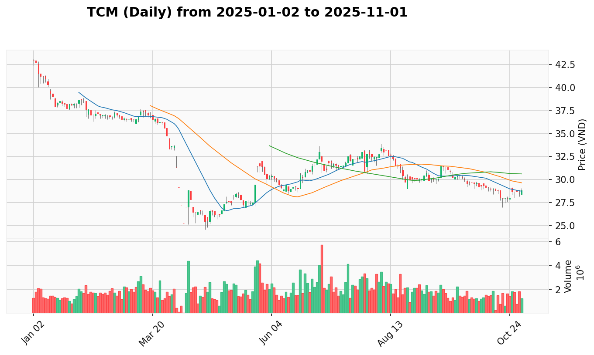

<a href="#det-may">↑ Back to group DET_MAY</a>  |  <a href="#vpa-signal-summary">↑ Back to Top</a>

#### Key Statistics
| Metric | Value |
|:---|---:|
| Date Range | 2025-01-02 to 2025-10-17 |
| **Latest Close** | **28.8** |
| Period Open | 42.97 |
| Period High | 43.11 |
| Period Low | 24.55 |
| Period Change % | -32.98% |

**[Download TCM Data (.csv)](market_data/TCM_2025-01-02_to_2025-10-18.csv)**

---

### TDC

#### [VPA Analysis (2025-08-04 - 2025-10-16)](./VPA.md#tdc)
> **Ngày 2025-10-10:** Cổ phiếu TDC tăng từ 12.45 VND lên 12.5 VND, với cây nến tăng có biên độ hẹp và đóng cửa ở giữa thân nến. Khối lượng giao dịch đạt 0.4579 triệu cổ phiếu, tăng so với phiên trước (0.4065 triệu cổ phiếu). Sau phiên 'No Supply' ngày 2025-10-09 cho thấy áp lực cung suy yếu, phiên này giá tăng nhẹ với khối lượng tăng cho thấy có lực cầu tham gia. Tuy nhiên, giá đóng cửa không ở mức cao nhất phiên và biên độ tăng hẹp cho thấy lực cầu chưa thực sự mạnh mẽ để áp đảo hoàn toàn lực cung. Đây có thể là một nỗ lực tăng giá ban đầu hoặc một sự kiểm tra cung. **Phân tích VPA/Wyckoff:** Effort to Rise (ER) - Nỗ lực tăng giá.
> **Ngày 2025-10-13:** Cổ phiếu TDC tăng từ 12.5 VND lên 12.7 VND, với cây nến tăng có biên độ rộng và đóng cửa gần mức cao nhất phiên (12.9 VND). Khối lượng giao dịch đạt 0.558 triệu cổ phiếu, tăng so với phiên trước (0.4579 triệu cổ phiếu). Sự tăng giá đi kèm với khối lượng tăng cho thấy lực cầu mạnh mẽ và xác nhận xu hướng tăng sau phiên "Nỗ lực tăng giá" trước đó. **Phân tích VPA/Wyckoff:** Sign of Strength (SOS) - Lực cầu mạnh mẽ.
> **Ngày 2025-10-14:** Cổ phiếu TDC giảm từ 12.75 VND xuống 12.4 VND, với cây nến giảm có biên độ rộng và đóng cửa gần mức thấp nhất phiên (12.35 VND). Khối lượng giao dịch đạt 0.7479 triệu cổ phiếu, tăng đáng kể so với phiên trước (0.558 triệu cổ phiếu). Sau phiên 'Lực cầu mạnh mẽ' (SOS) ngày 2025-10-13, phiên này giá giảm mạnh với khối lượng tăng cho thấy áp lực cung đã quay trở lại và áp đảo lực cầu. Điều này cho thấy sự suy yếu đáng kể và có thể là dấu hiệu của sự phân phối hoặc một đợt điều chỉnh giảm giá. **Phân tích VPA/Wyckoff:** Sign of Weakness (SOW) - Lực cung mạnh mẽ.
> **Ngày 2025-10-15:** Cổ phiếu TDC giảm từ 12.4 VND xuống 12.3 VND, với cây nến giảm có biên độ hẹp và đóng cửa gần mức thấp nhất phiên (12.25 VND). Khối lượng giao dịch đạt 0.5178 triệu cổ phiếu, giảm đáng kể so với phiên trước (0.7479 triệu cổ phiếu). Sau phiên "Lực cung mạnh mẽ" (SOW) ngày 2025-10-14, việc giá tiếp tục giảm nhưng với khối lượng thấp cho thấy áp lực bán đã suy yếu, đồng thời lực cầu cũng chưa xuất hiện mạnh mẽ để hỗ trợ giá. Điều này có thể là dấu hiệu của sự cạn kiệt nguồn cung tạm thời hoặc thiếu vắng lực cầu. **Phân tích VPA/Wyckoff:** No Demand (ND) - Thiếu cầu.
> **Ngày 2025-10-16:** Cổ phiếu TDC giảm từ 12.6 VND xuống 12.35 VND, với cây nến giảm có biên độ hẹp và đóng cửa tại mức thấp nhất phiên. Khối lượng giao dịch đạt 0.1413 triệu cổ phiếu, giảm rất mạnh so với phiên trước (0.5178 triệu cổ phiếu). Sau phiên "Thiếu cầu" (ND) ngày 2025-10-15, phiên này giá tiếp tục giảm nhưng với khối lượng cực kỳ thấp cho thấy áp lực bán đã cạn kiệt. Mặc dù giá đóng cửa ở mức thấp nhất phiên, sự thiếu vắng khối lượng lớn cho thấy đây không phải là một đợt bán tháo mạnh mẽ mà là sự thiếu hụt nguồn cung. Điều này thường là dấu hiệu của sự cạn kiệt nguồn cung và có thể báo hiệu một đợt tăng giá sắp tới. **Phân tích VPA/Wyckoff:** No Supply (NS) - Cạn cung.

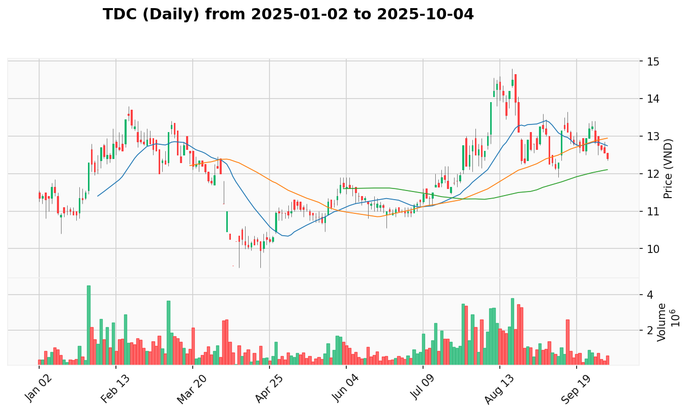

<a href="#bat-dong-san">↑ Back to group BAT_DONG_SAN</a>  |  <a href="#vpa-signal-summary">↑ Back to Top</a>

#### Key Statistics
| Metric | Value |
|:---|---:|
| Date Range | 2025-01-02 to 2025-10-17 |
| **Latest Close** | **12.4** |
| Period Open | 11.5 |
| Period High | 14.8 |
| Period Low | 9.49 |
| Period Change % | 7.83% |

**[Download TDC Data (.csv)](market_data/TDC_2025-01-02_to_2025-10-18.csv)**

---

### TDM

#### [VPA Analysis (2025-08-14 - 2025-10-16)](./VPA.md#tdm)
> **Ngày 2025-10-09:** TDM giữ nguyên mức giá 58.0 VND, đóng cửa ở mức 58.0 VND. Biên độ giá cực hẹp (0 VND) cho thấy sự cân bằng giữa cung và cầu. Khối lượng giao dịch đạt 0.002 triệu cổ phiếu, cao hơn so với phiên "No Supply" ngày 2025-10-08 (0.0006 triệu cổ phiếu) nhưng vẫn ở mức thấp. Sau tín hiệu "No Supply" ngày hôm trước, việc giá đi ngang với khối lượng thấp cho thấy thị trường đang kiểm tra lại lực cung tại mức giá này và không có áp lực bán đáng kể xuất hiện. **Phân tích VPA/Wyckoff:** Test for Supply (Kiểm tra cung)
> **Ngày 2025-10-10:** TDM giữ nguyên mức giá đóng cửa 58.0 VND, sau khi giảm xuống mức thấp nhất 57.2 VND và phục hồi trở lại. Biên độ giá trong phiên là 0.8 VND. Khối lượng giao dịch đạt 0.0113 triệu cổ phiếu, cao hơn đáng kể so với phiên "Test for Supply" ngày 2025-10-09 (0.002 triệu cổ phiếu) và phiên "No Supply" ngày 2025-10-08 (0.0006 triệu cổ phiếu). Sau hai phiên liên tiếp cho thấy lực cung cạn kiệt và kiểm tra cung thành công, phiên hôm nay TDM cho thấy sự hấp thụ lực bán ở vùng giá thấp hơn. Giá giảm trong phiên nhưng đóng cửa ở mức cao nhất (bằng giá mở cửa), cho thấy lực cầu đã xuất hiện và đẩy giá lên. Mặc dù khối lượng tăng so với hai phiên trước, nhưng vẫn ở mức vừa phải, cho thấy sự kiểm soát của phe mua mà không cần khối lượng quá lớn. Đây là một dấu hiệu tích cực, xác nhận sự cạn kiệt của lực cung và khả năng giá sẽ tiếp tục tăng. **Phân tích VPA/Wyckoff:** Demand Coming In (Lực cầu xuất hiện)
> **Ngày 2025-10-14:** TDM giảm từ 58.0 VND xuống 56.3 VND nhưng phục hồi mạnh mẽ để đóng cửa ở mức 57.9 VND, gần mức cao nhất phiên. Khối lượng giao dịch đạt 0.0025 triệu cổ phiếu, thấp hơn đáng kể so với phiên trước. Sau phiên "Lực cầu xuất hiện", việc giá giảm sâu trong phiên nhưng phục hồi mạnh mẽ với khối lượng thấp cho thấy lực cung đã cạn kiệt. **Phân tích VPA/Wyckoff:** Test for Supply (Kiểm tra cung)
> **Ngày 2025-10-15:** TDM giữ vững mức giá 58.0 VND, sau phiên kiểm tra cung thành công ngày 2025-10-14. Biên độ giá trong phiên cực kỳ hẹp, cho thấy sự cân bằng giữa cung và cầu. Khối lượng giao dịch đạt 0.008 triệu cổ phiếu, cao hơn đáng kể so với phiên kiểm tra cung trước đó (0.0025 triệu cổ phiếu) nhưng thấp hơn phiên lực cầu xuất hiện ngày 2025-10-10 (0.0113 triệu cổ phiếu). Việc giá duy trì ổn định ở mức 58.0 VND với khối lượng vừa phải sau khi lực cung đã được kiểm tra cho thấy áp lực bán đã giảm đi đáng kể và thị trường đang hấp thụ lượng cung còn lại. Đây là dấu hiệu tích cực, xác nhận sự cạn kiệt của lực cung và khả năng giá sẽ tiếp tục tăng. **Phân tích VPA/Wyckoff:** Absorption (Hấp thụ cung)
> **Ngày 2025-10-16:** TDM giảm từ 58.0 VND xuống 57.0 VND với khối lượng giao dịch cực kỳ thấp, chỉ đạt 0.0003 triệu cổ phiếu. Biên độ giá trong phiên rất hẹp (Open=High=Low=Close=57.0 VND), cho thấy sự thiếu vắng cả lực mua và lực bán đáng kể. Sau phiên hấp thụ cung thành công ngày 2025-10-15, việc giá giảm nhẹ với khối lượng cạn kiệt cho thấy áp lực bán đã gần như không còn. Đây là dấu hiệu của sự cạn kiệt nguồn cung và thiếu vắng lực bán, có thể là một phiên kiểm tra lại mức hỗ trợ hoặc một dấu hiệu của sự thờ ơ từ thị trường trước khi có động thái rõ ràng hơn. **Phân tích VPA/Wyckoff:** Cạn kiệt nguồn cung

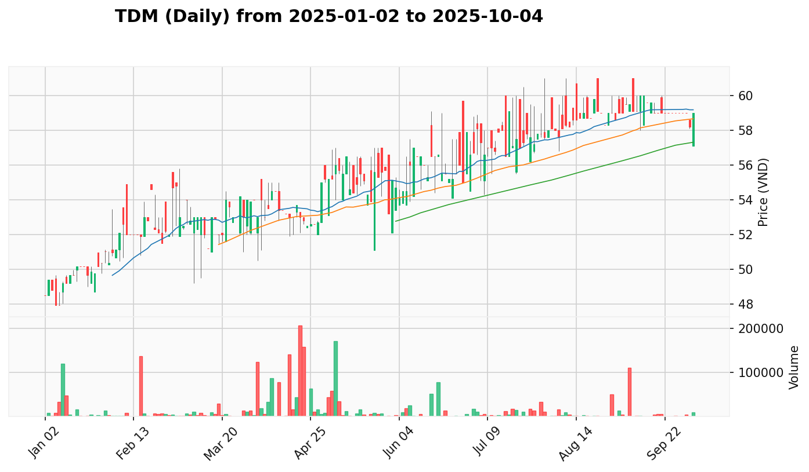

<a href="#others">↑ Back to group OTHERS</a>  |  <a href="#vpa-signal-summary">↑ Back to Top</a>

#### Key Statistics
| Metric | Value |
|:---|---:|
| Date Range | 2025-01-02 to 2025-10-17 |
| **Latest Close** | **58.0** |
| Period Open | 48.51 |
| Period High | 61.0 |
| Period Low | 47.93 |
| Period Change % | 19.56% |

**[Download TDM Data (.csv)](market_data/TDM_2025-01-02_to_2025-10-18.csv)**

---

### TIG

#### [VPA Analysis (2025-08-14 - 2025-10-16)](./VPA.md#tig)
> **Ngày 2025-10-10:** TIG giữ mức giá 8.4 VND, với khối lượng giao dịch đạt 0.8928 triệu cổ phiếu, tăng so với phiên trước. Nến có biên độ hẹp và đóng cửa bằng giá mở cửa, cho thấy sự lưỡng lự của thị trường. Mặc dù khối lượng tiếp tục gia tăng, giá vẫn không thể bứt phá lên và mức cao nhất trong phiên còn thấp hơn so với phiên trước, cho thấy lực cung vẫn đang hấp thụ mạnh mẽ lực cầu, ngăn cản đà tăng. Điều này củng cố nhận định về sự thiếu vắng lực cầu mạnh mẽ và áp lực bán tiềm ẩn. **Phân tích VPA/Wyckoff:** Effort without Result
> **Ngày 2025-10-13:** TIG tăng từ 8.3 VND lên 8.5 VND, với khối lượng giao dịch đạt 0.5976 triệu cổ phiếu, giảm so với phiên trước. Nến có biên độ tương đối rộng và đóng cửa ở mức cao nhất phiên, cho thấy lực cầu đã chiếm ưu thế trong ngày. Tuy nhiên, việc giá tăng với khối lượng thấp hơn sau hai phiên "Effort without Result" có thể là một dấu hiệu kiểm tra cung, cho thấy nguồn cung có thể đang cạn kiệt, nhưng cần xác nhận thêm. **Phân tích VPA/Wyckoff:** Test of Supply
> **Ngày 2025-10-14:** TIG giảm từ 8.5 VND xuống 8.3 VND, với khối lượng giao dịch đạt 0.6393 triệu cổ phiếu, tăng so với phiên trước. Nến có biên độ tương đối và đóng cửa ở mức thấp nhất phiên, cho thấy lực cung đã chiếm ưu thế rõ rệt. Sau phiên kiểm tra cung (Test of Supply) trước đó, việc giá giảm mạnh với khối lượng gia tăng xác nhận rằng áp lực bán vẫn còn hiện hữu và có thể đang gia tăng. Điều này cho thấy thị trường đang yếu đi. **Phân tích VPA/Wyckoff:** Sign of Weakness (SOW)
> **Ngày 2025-10-15:** TIG giữ nguyên mức giá 8.3 VND, với khối lượng giao dịch đạt 0.7703 triệu cổ phiếu, tăng so với phiên trước. Nến có biên độ tương đối rộng và đóng cửa ở mức giá mở cửa, cho thấy sự lưỡng lự giữa bên mua và bên bán. Sau phiên "Sign of Weakness" trước đó, việc giá không tăng dù khối lượng gia tăng cho thấy nỗ lực đẩy giá lên không đạt kết quả, hoặc lực cầu chưa đủ mạnh để hấp thụ hết nguồn cung. **Phân tích VPA/Wyckoff:** Effort without Result (EWR)
> **Ngày 2025-10-16:** TIG giảm từ 8.3 VND xuống 8.2 VND, với khối lượng giao dịch đạt 0.4092 triệu cổ phiếu, giảm đáng kể so với phiên trước. Nến có biên độ hẹp và đóng cửa ở mức thấp nhất phiên, cho thấy lực cung vẫn chiếm ưu thế nhưng với cường độ giảm. Sau các phiên "Sign of Weakness" và "Effort without Result", việc giá tiếp tục giảm với khối lượng thấp cho thấy thiếu vắng lực cầu hỗ trợ. **Phân tích VPA/Wyckoff:** No Demand

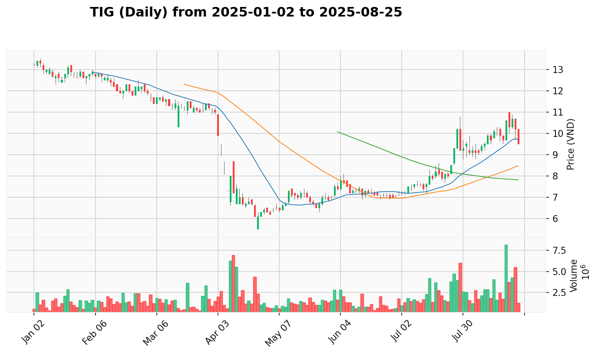

<a href="#others">↑ Back to group OTHERS</a>  |  <a href="#vpa-signal-summary">↑ Back to Top</a>

#### Key Statistics
| Metric | Value |
|:---|---:|
| Date Range | 2025-01-02 to 2025-10-17 |
| **Latest Close** | **8.2** |
| Period Open | 13.2 |
| Period High | 13.5 |
| Period Low | 5.5 |
| Period Change % | -37.88% |

**[Download TIG Data (.csv)](market_data/TIG_2025-01-02_to_2025-10-18.csv)**

---

### TIP

#### [VPA Analysis (2025-08-04 - 2025-10-16)](./VPA.md#tip)
> **Ngày 2025-10-10:** TIP mở cửa ở 19.2 VND và đóng cửa ở 19.25 VND, tăng từ 19.15 VND của phiên trước. Biên độ giá trong phiên hẹp (từ 19.15 VND đến 19.3 VND) và giá đóng cửa gần mức cao nhất phiên. Khối lượng giao dịch đạt 0.0688 triệu cổ phiếu, giảm đáng kể so với phiên trước (0.1393 triệu cổ phiếu). Sau phiên 'Thiếu cầu' ngày 2025-10-09, phiên này giá tiếp tục tăng nhẹ nhưng với khối lượng thấp hơn nữa, cho thấy lực cầu vẫn còn yếu và chưa có sự tham gia mạnh mẽ của dòng tiền lớn để đẩy giá lên. **Phân tích VPA/Wyckoff:** No Demand - Thiếu cầu.
> **Ngày 2025-10-13:** TIP mở cửa ở 19.0 VND và đóng cửa ở 19.25 VND, giữ nguyên mức đóng cửa của phiên trước. Biên độ giá trong phiên hẹp (từ 19.0 VND đến 19.25 VND) và giá đóng cửa ở mức cao nhất phiên. Khối lượng giao dịch đạt 0.0628 triệu cổ phiếu, tiếp tục giảm so với phiên trước (0.0688 triệu cổ phiếu). Sau hai phiên 'Thiếu cầu' liên tiếp, phiên này giá đóng cửa ở mức cao nhất phiên nhưng với khối lượng rất thấp, cho thấy lực cầu vẫn còn yếu và chưa có sự tham gia mạnh mẽ của dòng tiền lớn. Điều này xác nhận sự thiếu vắng nhu cầu thực sự để đẩy giá lên cao. **Phân tích VPA/Wyckoff:** No Demand - Thiếu cầu.
> **Ngày 2025-10-14:** TIP mở cửa ở 19.05 VND và đóng cửa ở 19.2 VND, giảm nhẹ so với mức đóng cửa 19.25 VND của phiên trước. Biên độ giá trong phiên tương đối hẹp (từ 19.0 VND đến 19.35 VND) và giá đóng cửa nằm trên mức giữa thân nến. Khối lượng giao dịch đạt 0.0862 triệu cổ phiếu, tăng đáng kể so với phiên trước (0.0628 triệu cổ phiếu). Sau hai phiên 'Thiếu cầu' liên tiếp, phiên này giá giảm nhẹ nhưng với khối lượng gia tăng, cho thấy cung đang xuất hiện và áp lực bán đang ngăn cản đà tăng của giá, mặc dù có lực cầu hấp thụ một phần. **Phân tích VPA/Wyckoff:** Supply Coming In - Cung xuất hiện.
> **Ngày 2025-10-15:** TIP mở cửa ở 19.2 VND và đóng cửa ở 19.1 VND, giảm nhẹ so với mức đóng cửa 19.2 VND của phiên trước. Biên độ giá trong phiên hẹp (từ 19.0 VND đến 19.25 VND) và giá đóng cửa nằm gần mức thấp nhất phiên. Khối lượng giao dịch đạt 0.0931 triệu cổ phiếu, tăng so với phiên trước (0.0862 triệu cổ phiếu). Sau phiên 'Cung xuất hiện' ngày hôm qua, giá tiếp tục giảm với khối lượng gia tăng, cho thấy áp lực bán đang mạnh lên và cung đang chiếm ưu thế so với cầu. **Phân tích VPA/Wyckoff:** Selling Pressure - Áp lực bán.
> **Ngày 2025-10-16:** TIP mở cửa ở 19.1 VND và đóng cửa ở 19.05 VND, giảm nhẹ so với mức đóng cửa 19.1 VND của phiên trước. Biên độ giá trong phiên cực kỳ hẹp (từ 19.0 VND đến 19.1 VND) và giá đóng cửa nằm gần mức thấp nhất phiên. Khối lượng giao dịch đạt 0.0217 triệu cổ phiếu, giảm mạnh so với phiên trước (0.0931 triệu cổ phiếu) và là mức thấp nhất trong 10 phiên gần đây. Sau phiên 'Áp lực bán' ngày hôm qua, giá tiếp tục giảm nhẹ với khối lượng cạn kiệt, cho thấy áp lực bán đã giảm đáng kể và cung không còn mạnh mẽ ở mức giá này. Đây có thể là dấu hiệu của việc cạn kiệt nguồn cung, chuẩn bị cho một sự thay đổi xu hướng hoặc một đợt kiểm tra cung cầu tiếp theo. **Phân tích VPA/Wyckoff:** No Supply - Cạn kiệt nguồn cung.

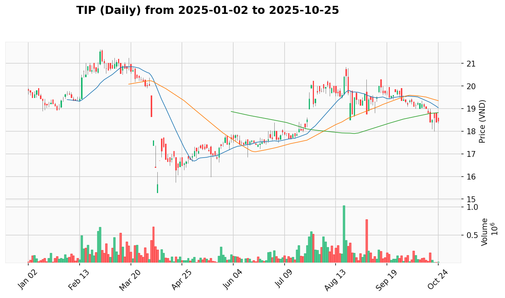

<a href="#bat-dong-san-kcn">↑ Back to group BAT_DONG_SAN_KCN</a>  |  <a href="#vpa-signal-summary">↑ Back to Top</a>

#### Key Statistics
| Metric | Value |
|:---|---:|
| Date Range | 2025-01-02 to 2025-10-17 |
| **Latest Close** | **18.8** |
| Period Open | 19.86 |
| Period High | 21.62 |
| Period Low | 15.28 |
| Period Change % | -5.34% |

**[Download TIP Data (.csv)](market_data/TIP_2025-01-02_to_2025-10-18.csv)**

---

### TLD

#### [VPA Analysis (2025-08-12 - 2025-10-16)](./VPA.md#tld)
> **Ngày 2025-10-10:** TLD mở cửa ở mức 8.15 VND và đóng cửa ở mức 8.17 VND, tăng từ 8.16 VND lên 8.17 VND so với phiên trước đó. Cây nến tăng có biên độ hẹp (từ 8.13 VND đến 8.22 VND) và đóng cửa gần mức cao nhất phiên. Khối lượng giao dịch đạt 0.3318 triệu cổ phiếu, tăng đáng kể so với phiên trước (0.2445 triệu cổ phiếu) và cao hơn mức trung bình của các phiên gần đây. Sau hai phiên "No Demand" liên tiếp, sự tăng giá nhẹ đi kèm với khối lượng gia tăng cho thấy lực cầu đã bắt đầu quay trở lại, mặc dù chưa thực sự mạnh mẽ. Điều này có thể là một dấu hiệu sớm của sự thay đổi trong tâm lý thị trường. **Phân tích VPA/Wyckoff:** Sign of Strength (SOS) - Lực cầu quay trở lại.
> **Ngày 2025-10-13:** TLD mở cửa ở mức 8.1 VND và đóng cửa ở mức 8.11 VND, giảm từ 8.17 VND xuống 8.11 VND so với phiên trước đó. Cây nến giảm có biên độ hẹp (từ 8.08 VND đến 8.17 VND) và đóng cửa gần giữa phiên. Khối lượng giao dịch đạt 0.2572 triệu cổ phiếu, giảm đáng kể so với phiên trước (0.3318 triệu cổ phiếu) và ở mức thấp. Sau phiên "Sign of Strength" trước đó, sự giảm giá nhẹ đi kèm với khối lượng thấp cho thấy lực cầu không duy trì được đà tăng và thị trường đang thiếu vắng sự tham gia mạnh mẽ từ người mua. **Phân tích VPA/Wyckoff:** No Demand (ND) - Thiếu vắng lực cầu.
> **Ngày 2025-10-14:** TLD mở cửa ở mức 8.15 VND và đóng cửa ở mức 8.18 VND, tăng từ 8.11 VND lên 8.18 VND so với phiên trước đó. Cây nến tăng có biên độ tương đối rộng (từ 8.09 VND đến 8.25 VND) và đóng cửa gần mức cao nhất phiên. Khối lượng giao dịch đạt 0.456 triệu cổ phiếu, tăng đáng kể so với phiên trước (0.2572 triệu cổ phiếu) và cao hơn mức trung bình của các phiên gần đây. Sau phiên "No Demand" trước đó, sự tăng giá mạnh mẽ đi kèm với khối lượng gia tăng cho thấy lực cầu đã quay trở lại một cách rõ rệt, hấp thụ lực cung và đẩy giá lên. Điều này xác nhận sự thay đổi trong tâm lý thị trường và có thể là khởi đầu cho một xu hướng tăng. **Phân tích VPA/Wyckoff:** Sign of Strength (SOS) - Lực cầu mạnh mẽ quay trở lại.
> **Ngày 2025-10-15:** TLD mở cửa ở mức 8.18 VND và đóng cửa ở mức 8.09 VND, giảm từ 8.18 VND xuống 8.09 VND so với phiên trước đó. Cây nến giảm có biên độ hẹp (từ 8.08 VND đến 8.19 VND) và đóng cửa gần mức thấp nhất phiên. Khối lượng giao dịch đạt 0.2331 triệu cổ phiếu, giảm mạnh so với phiên trước (0.456 triệu cổ phiếu) và ở mức rất thấp. Sau phiên "Sign of Strength" trước đó, sự giảm giá nhẹ đi kèm với khối lượng rất thấp cho thấy lực cầu không duy trì được đà tăng và thị trường đang thiếu vắng sự tham gia mạnh mẽ từ người mua. **Phân tích VPA/Wyckoff:** No Demand (ND) - Thiếu vắng lực cầu.
> **Ngày 2025-10-16:** TLD mở cửa ở mức 8.17 VND và đóng cửa ở mức 8.13 VND, tăng từ 8.09 VND lên 8.13 VND so với phiên trước đó. Cây nến giảm có biên độ hẹp (từ 8.1 VND đến 8.17 VND) và đóng cửa gần mức thấp nhất phiên. Khối lượng giao dịch đạt 0.1468 triệu cổ phiếu, giảm mạnh so với phiên trước (0.2331 triệu cổ phiếu) và ở mức cực kỳ thấp. Sau phiên "No Demand" trước đó, sự tăng giá nhẹ đi kèm với khối lượng cực kỳ thấp cho thấy lực cầu vẫn chưa quay trở lại một cách mạnh mẽ và thị trường vẫn đang thiếu vắng sự tham gia. **Phân tích VPA/Wyckoff:** No Demand (ND) - Thiếu vắng lực cầu.

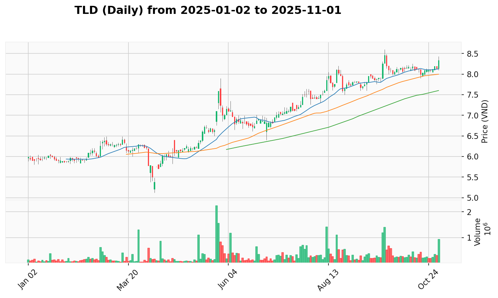

<a href="#xay-dung">↑ Back to group XAY_DUNG</a>  |  <a href="#vpa-signal-summary">↑ Back to Top</a>

#### Key Statistics
| Metric | Value |
|:---|---:|
| Date Range | 2025-01-02 to 2025-10-17 |
| **Latest Close** | **8.12** |
| Period Open | 5.96 |
| Period High | 8.6 |
| Period Low | 5.12 |
| Period Change % | 36.24% |

**[Download TLD Data (.csv)](market_data/TLD_2025-01-02_to_2025-10-18.csv)**

---

### TLH

#### [VPA Analysis (2025-08-14 - 2025-10-16)](./VPA.md#tlh)
> **Ngày 2025-10-10:** TLH tăng nhẹ từ 5.64 VND lên 5.66 VND với khối lượng giao dịch đạt 0.2234 triệu cổ phiếu. Nến giá có biên độ hẹp, mở cửa ở 5.62 VND và đóng cửa cao hơn giá mở cửa. Khối lượng giao dịch tăng đáng kể so với phiên trước (0.1428 triệu cổ phiếu). Sau phiên kiểm tra cung với khối lượng thấp, việc giá tăng nhẹ trên khối lượng tăng cho thấy lực cầu đang quay trở lại và hấp thụ tốt lượng cung còn lại, đẩy giá lên. Đây là một dấu hiệu tích cực cho thấy khả năng giá sẽ tiếp tục tăng trong các phiên tới. **Phân tích VPA/Wyckoff:** Lực cầu quay trở lại.
> **Ngày 2025-10-13:** TLH giảm từ 5.66 VND xuống 5.52 VND với khối lượng giao dịch đạt 0.317 triệu cổ phiếu. Nến giá có biên độ hẹp, mở cửa ở 5.53 VND và đóng cửa ở mức thấp nhất phiên. Khối lượng giao dịch tăng đáng kể so với phiên trước (0.2234 triệu cổ phiếu). Việc giá giảm mạnh trên khối lượng tăng cho thấy áp lực bán đang gia tăng và nguồn cung đang chiếm ưu thế, đẩy giá xuống. Đây là một dấu hiệu tiêu cực, cho thấy sự suy yếu của lực cầu và khả năng giá sẽ tiếp tục giảm. **Phân tích VPA/Wyckoff:** Sign of Weakness (SOW) - Áp lực bán gia tăng.
> **Ngày 2025-10-14:** TLH tiếp tục giảm từ 5.52 VND xuống 5.46 VND với khối lượng giao dịch đạt 0.4614 triệu cổ phiếu. Nến giá có biên độ rộng hơn, mở cửa ở 5.53 VND và đóng cửa gần mức thấp nhất phiên. Khối lượng giao dịch tăng mạnh so với phiên trước (0.317 triệu cổ phiếu). Sau phiên giảm giá với áp lực bán gia tăng vào ngày 2025-10-13, việc giá tiếp tục giảm mạnh trên khối lượng tăng cao cho thấy lực cung vẫn đang rất mạnh và áp đảo lực cầu, đẩy giá xuống sâu hơn. Đây là một dấu hiệu tiêu cực rõ rệt, xác nhận xu hướng giảm giá tiếp diễn. **Phân tích VPA/Wyckoff:** Sign of Weakness (SOW) - Áp lực bán tiếp tục gia tăng mạnh mẽ.
> **Ngày 2025-10-15:** TLH mở cửa ở 5.5 VND và đóng cửa ở 5.46 VND, giữ nguyên mức giá đóng cửa so với phiên trước. Biên độ giá trong phiên hẹp (từ 5.4 VND đến 5.5 VND). Khối lượng giao dịch đạt 0.2903 triệu cổ phiếu, giảm đáng kể so với phiên trước (0.4614 triệu cổ phiếu). Sau hai phiên giảm giá mạnh với khối lượng lớn, phiên này cho thấy sự chững lại của đà giảm. Mặc dù giá không giảm thêm, nhưng việc không thể tăng trở lại trên khối lượng thấp cho thấy lực cầu vẫn còn yếu và thị trường đang trong giai đoạn thiếu động lực. Đây có thể là một dấu hiệu của sự tạm dừng trong xu hướng giảm, nhưng chưa có tín hiệu đảo chiều rõ ràng. **Phân tích VPA/Wyckoff:** No Demand (ND) - Lực bán giảm nhưng lực cầu chưa đủ mạnh để đẩy giá lên.
> **Ngày 2025-10-16:** TLH mở cửa ở 5.39 VND, tăng lên 5.58 VND nhưng đóng cửa ở 5.46 VND, bằng với giá đóng cửa phiên trước. Biên độ giá trong phiên rộng nhưng giá đóng cửa nằm ở giữa, cho thấy sự lưỡng lự. Khối lượng giao dịch chỉ đạt 0.1875 triệu cổ phiếu, giảm mạnh so với phiên trước (0.2903 triệu cổ phiếu) và là mức rất thấp. Điều này cho thấy nỗ lực đẩy giá lên không được hỗ trợ bởi lực cầu mạnh mẽ, củng cố thêm tình trạng thiếu động lực của thị trường sau các phiên giảm giá trước đó. **Phân tích VPA/Wyckoff:** No Demand (ND) - Lực cầu vẫn yếu và không đủ để đẩy giá lên.

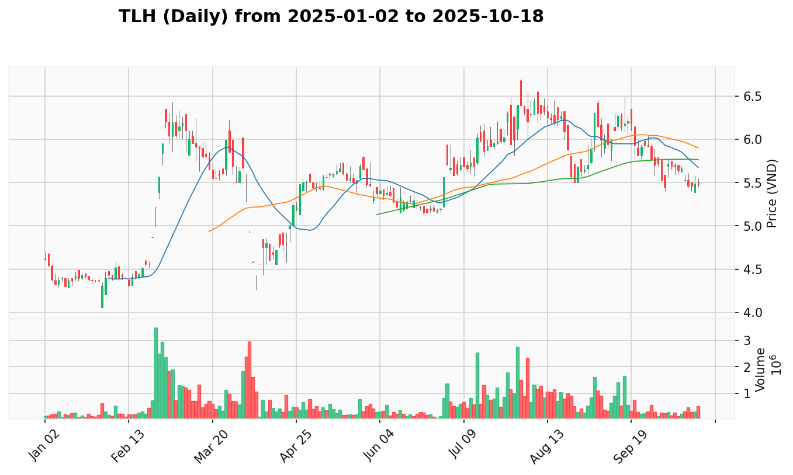

<a href="#thep">↑ Back to group THEP</a>  |  <a href="#vpa-signal-summary">↑ Back to Top</a>

#### Key Statistics
| Metric | Value |
|:---|---:|
| Date Range | 2025-01-02 to 2025-10-17 |
| **Latest Close** | **5.48** |
| Period Open | 4.61 |
| Period High | 6.7 |
| Period Low | 4.06 |
| Period Change % | 18.87% |

**[Download TLH Data (.csv)](market_data/TLH_2025-01-02_to_2025-10-18.csv)**

---

### TNG

#### [VPA Analysis (2025-06-26 - 2025-10-16)](./VPA.md#tng)
> **Ngày 2025-10-10:** TNG giảm từ 19.3 VND xuống 19.2 VND với thanh nến có biên độ tương đối hẹp (từ 19.2 VND đến 19.5 VND) và đóng cửa ở mức thấp nhất phiên. Khối lượng giao dịch đạt 0.5637 triệu cổ phiếu, cao hơn đáng kể so với phiên trước (0.2577 triệu cổ phiếu) và là mức cao trong vài phiên gần đây. Sau phiên "No Demand" ngày 2025-10-09, phiên này cho thấy lực cung tiếp tục gia tăng, đẩy giá xuống với khối lượng tăng, xác nhận sự yếu kém của thị trường. **Phân tích VPA/Wyckoff:** Sign of Weakness (SOW) - Dấu hiệu yếu kém
> **Ngày 2025-10-13:** TNG mở cửa ở 19.1 VND, cố gắng tăng lên 19.6 VND nhưng đóng cửa ở 19.2 VND, bằng với giá đóng cửa phiên trước. Thanh nến có biên độ tương đối rộng (từ 19.0 VND đến 19.6 VND) với khối lượng giao dịch đạt 0.786 triệu cổ phiếu, cao hơn đáng kể so với phiên trước (0.5637 triệu cổ phiếu). Mặc dù có nỗ lực tăng giá và khối lượng tăng, giá không thể đóng cửa cao hơn, cho thấy lực cung vẫn đang chiếm ưu thế và hấp thụ lực cầu. Điều này củng cố thêm dấu hiệu yếu kém của thị trường sau phiên SOW ngày 2025-10-10. **Phân tích VPA/Wyckoff:** Nỗ lực tăng giá thất bại (Effort to Rise Fails)
> **Ngày 2025-10-14:** TNG giảm từ 19.2 VND xuống 19.0 VND với thanh nến có biên độ tương đối hẹp (từ 18.9 VND đến 19.4 VND) và đóng cửa ở mức thấp nhất phiên. Khối lượng giao dịch đạt 0.7175 triệu cổ phiếu, thấp hơn so với phiên trước (0.786 triệu cổ phiếu) nhưng vẫn ở mức cao. Sau phiên "Nỗ lực tăng giá thất bại" ngày 2025-10-13, phiên này tiếp tục cho thấy lực cung chiếm ưu thế, đẩy giá xuống và đóng cửa ở mức thấp, xác nhận sự yếu kém của thị trường. **Phân tích VPA/Wyckoff:** Sign of Weakness (SOW) - Dấu hiệu yếu kém
> **Ngày 2025-10-15:** TNG mở cửa ở 19.2 VND, cố gắng tăng lên 19.4 VND nhưng sau đó giảm mạnh và đóng cửa ở mức thấp nhất phiên là 18.6 VND. So với phiên trước, giá giảm từ 19.0 VND xuống 18.6 VND. Thanh nến có biên độ rộng, cho thấy áp lực bán mạnh mẽ. Khối lượng giao dịch đạt 0.6177 triệu cổ phiếu, thấp hơn so với phiên trước (0.7175 triệu cổ phiếu) nhưng vẫn ở mức cao, xác nhận lực cung vẫn đang chiếm ưu thế và đẩy giá xuống. Điều này tiếp tục củng cố dấu hiệu yếu kém của thị trường sau các phiên "Nỗ lực tăng giá thất bại" và "Dấu hiệu yếu kém" trước đó. **Phân tích VPA/Wyckoff:** Sign of Weakness (SOW) - Lực cung tiếp tục chiếm ưu thế.
> **Ngày 2025-10-16:** TNG giảm từ 18.6 VND xuống 18.4 VND với thanh nến có biên độ hẹp (từ 18.4 VND đến 18.8 VND) và đóng cửa ở mức thấp nhất phiên. Khối lượng giao dịch đạt 0.5193 triệu cổ phiếu, thấp hơn so với phiên trước (0.6177 triệu cổ phiếu). Mặc dù khối lượng giảm, việc giá tiếp tục giảm và đóng cửa ở mức thấp nhất phiên sau các phiên yếu kém trước đó cho thấy lực cung vẫn đang chiếm ưu thế và xu hướng giảm giá tiếp diễn. **Phân tích VPA/Wyckoff:** Sign of Weakness (SOW) - Xu hướng giảm giá tiếp diễn.

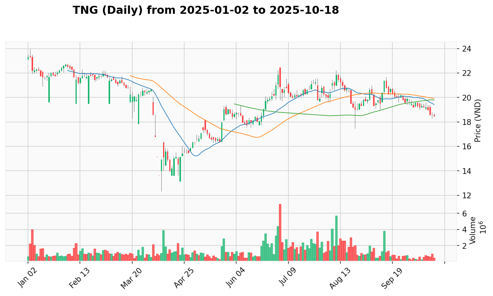

<a href="#det-may">↑ Back to group DET_MAY</a>  |  <a href="#vpa-signal-summary">↑ Back to Top</a>

#### Key Statistics
| Metric | Value |
|:---|---:|
| Date Range | 2025-01-02 to 2025-10-17 |
| **Latest Close** | **18.5** |
| Period Open | 23.13 |
| Period High | 23.96 |
| Period Low | 12.32 |
| Period Change % | -20.02% |

**[Download TNG Data (.csv)](market_data/TNG_2025-01-02_to_2025-10-18.csv)**

---

### TNH

#### [VPA Analysis (2025-08-14 - 2025-10-16)](./VPA.md#tnh)
> **Ngày 2025-10-10:** TNH mở cửa ở mức 13.5 VND, sau đó giảm nhẹ và đóng cửa ở 13.45 VND, bằng với giá đóng cửa phiên trước. Biên độ giá trong ngày hẹp (0.15 VND), với giá đóng cửa gần mức thấp nhất trong ngày. Khối lượng giao dịch đạt 0.089 triệu cổ phiếu, cao hơn phiên trước (0.0703 triệu cổ phiếu) nhưng vẫn ở mức thấp. Sau các tín hiệu yếu kém từ phiên "Up-thrust" ngày 2025-10-08 và "Weakness" ngày 2025-10-09, phiên này tiếp tục cho thấy sự thiếu vắng lực cầu mạnh mẽ khi giá mở cửa ở mức cao nhất và không thể duy trì được đà tăng, đóng cửa gần mức thấp nhất. Điều này cho thấy áp lực bán vẫn hiện hữu và phe mua chưa sẵn sàng tham gia. **Phân tích VPA/Wyckoff:** Weakness (Yếu kém)
> **Ngày 2025-10-13:** TNH giảm từ 13.45 VND xuống 13.2 VND. Giá mở cửa 13.3 VND, đóng cửa 13.2 VND, với biên độ giá hẹp (từ 13.15 VND đến 13.4 VND) và đóng cửa gần mức thấp nhất trong ngày. Khối lượng giao dịch đạt 0.1528 triệu cổ phiếu, cao hơn đáng kể so với phiên trước (0.089 triệu cổ phiếu). Sự giảm giá với khối lượng gia tăng sau các phiên yếu kém trước đó cho thấy áp lực bán tiếp tục mạnh mẽ và lực cầu vẫn chưa xuất hiện để hỗ trợ giá. Điều này củng cố tín hiệu yếu kém của thị trường. **Phân tích VPA/Wyckoff:** Weakness (Yếu kém)
> **Ngày 2025-10-14:** TNH giảm từ 13.2 VND xuống 12.85 VND. Giá mở cửa 13.2 VND, đóng cửa 12.85 VND, với biên độ giá rộng (từ 12.8 VND đến 13.2 VND) và đóng cửa gần mức thấp nhất trong ngày. Khối lượng giao dịch đạt 0.4402 triệu cổ phiếu, tăng đột biến so với phiên trước (0.1528 triệu cổ phiếu). Sự giảm giá mạnh với khối lượng gia tăng và đóng cửa ở mức thấp nhất cho thấy áp lực bán tháo rất lớn và không có lực cầu đỡ giá. Điều này củng cố thêm tín hiệu yếu kém của thị trường và khả năng tiếp diễn xu hướng giảm. **Phân tích VPA/Wyckoff:** Weakness (Yếu kém)
> **Ngày 2025-10-15:** TNH giảm từ 12.85 VND xuống 12.8 VND. Giá mở cửa 12.95 VND, đóng cửa 12.8 VND, với biên độ giá hẹp (từ 12.8 VND đến 13.0 VND) và đóng cửa ở mức thấp nhất trong ngày. Khối lượng giao dịch đạt 0.1192 triệu cổ phiếu, giảm đáng kể so với phiên trước (0.4402 triệu cổ phiếu) và thấp hơn mức trung bình gần đây. Mặc dù giá tiếp tục giảm và đóng cửa ở mức thấp nhất, khối lượng giao dịch thấp cho thấy áp lực bán đã giảm bớt sau phiên bán tháo mạnh ngày 2025-10-14. Tuy nhiên, sự thiếu vắng lực cầu mạnh mẽ ở mức giá thấp này vẫn là một dấu hiệu của sự yếu kém, cho thấy thị trường vẫn đang trong giai đoạn điều chỉnh hoặc tích lũy lại. **Phân tích VPA/Wyckoff:** Weakness (Yếu kém)
> **Ngày 2025-10-16:** TNH giảm nhẹ từ 12.85 VND xuống 12.8 VND. Giá mở cửa 12.85 VND, đóng cửa 12.8 VND, với biên độ giá rất hẹp (từ 12.75 VND đến 12.85 VND) và đóng cửa ở mức thấp nhất trong ngày. Khối lượng giao dịch đạt 0.0612 triệu cổ phiếu, giảm mạnh so với phiên trước (0.1192 triệu cổ phiếu) và là mức rất thấp so với các phiên gần đây. Mặc dù giá vẫn tiếp tục giảm và đóng cửa ở mức thấp nhất, khối lượng giao dịch cực kỳ thấp cho thấy áp lực bán đã cạn kiệt đáng kể sau hai phiên giảm mạnh trước đó. Sự thiếu vắng cả lực bán và lực mua mạnh mẽ ở mức giá này cho thấy thị trường đang trong giai đoạn tạm lắng, có thể là dấu hiệu của sự cạn kiệt nguồn cung trước khi có một động thái giá rõ ràng hơn. **Phân tích VPA/Wyckoff:** Weakness (Yếu kém)

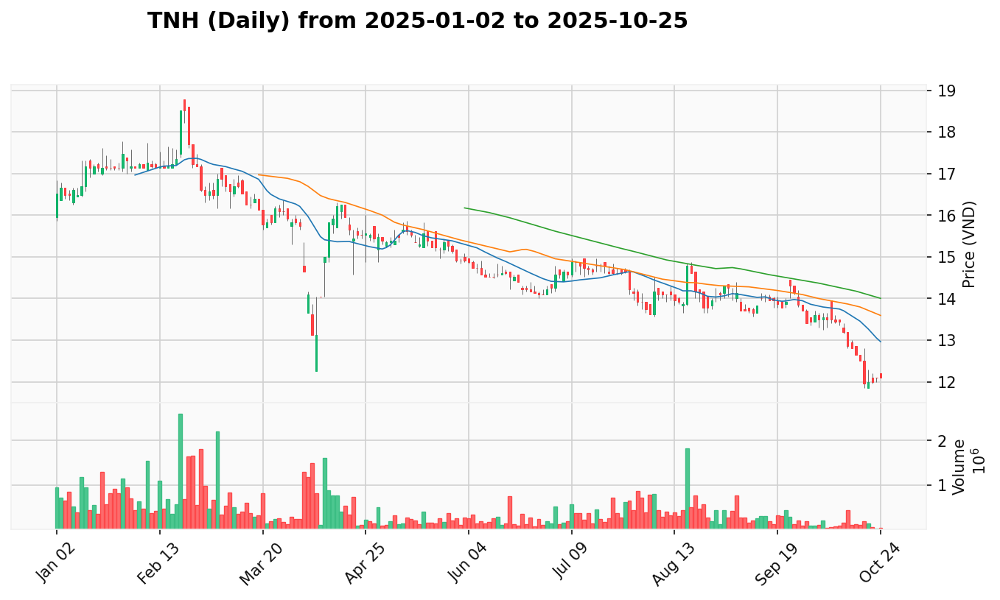

<a href="#suc-khoe">↑ Back to group SUC_KHOE</a>  |  <a href="#vpa-signal-summary">↑ Back to Top</a>

#### Key Statistics
| Metric | Value |
|:---|---:|
| Date Range | 2025-01-02 to 2025-10-17 |
| **Latest Close** | **12.5** |
| Period Open | 15.96 |
| Period High | 18.78 |
| Period Low | 12.26 |
| Period Change % | -21.68% |

**[Download TNH Data (.csv)](market_data/TNH_2025-01-02_to_2025-10-18.csv)**

---

### TNT

#### [VPA Analysis (2025-08-04 - 2025-10-16)](./VPA.md#tnt)
> **Ngày 2025-10-10:** TNT giảm từ 8.27 VND xuống 8.19 VND, với khối lượng giao dịch đạt 1.3287 triệu cổ phiếu. Giá mở cửa ở mức 8.4 VND nhưng đóng cửa thấp hơn, cho thấy áp lực bán mạnh mẽ đã xuất hiện. Khối lượng giao dịch tăng đột biến so với phiên trước đó (0.0381 triệu cổ phiếu) và cao hơn đáng kể so với các phiên gần đây, cho thấy nguồn cung lớn đã tham gia thị trường. Điều này phủ nhận tín hiệu "Kiểm tra nguồn cung" của phiên trước và cho thấy sự yếu kém của lực cầu. **Phân tích VPA/Wyckoff:** Supply Coming In (Nguồn cung xuất hiện)
> **Ngày 2025-10-13:** TNT mở cửa ở mức 8.19 VND và đóng cửa tại 8.15 VND, giảm nhẹ so với giá mở cửa. Khối lượng giao dịch chỉ đạt 0.0287 triệu cổ phiếu, cực kỳ thấp so với phiên trước đó (1.3287 triệu cổ phiếu) và mức trung bình gần đây. Mặc dù giá có sự phục hồi nhẹ từ mức thấp nhất trong phiên (7.91 VND lên 8.15 VND), nhưng với khối lượng giao dịch thấp cho thấy lực cầu yếu và không có sự quan tâm đáng kể từ người mua sau phiên "Nguồn cung xuất hiện" mạnh mẽ vào ngày 2025-10-10. **Phân tích VPA/Wyckoff:** No Demand (Thiếu cầu)
> **Ngày 2025-10-14:** TNT tăng từ 8.15 VND lên 8.27 VND, với khối lượng giao dịch đạt 0.1938 triệu cổ phiếu. Giá mở cửa ở mức 8.0 VND và đóng cửa gần mức cao nhất phiên (8.27 VND), cho thấy lực cầu đã quay trở lại và hấp thụ tốt. Khối lượng giao dịch tăng đáng kể so với phiên "Thiếu cầu" trước đó (0.0287 triệu cổ phiếu), xác nhận sự xuất hiện của lực mua. Mặc dù khối lượng chưa đạt mức cao đột biến như phiên "Nguồn cung xuất hiện" ngày 2025-10-10, nhưng đây là một tín hiệu tích cực cho thấy sự phục hồi của giá sau giai đoạn điều chỉnh. **Phân tích VPA/Wyckoff:** Sign of Strength (SOS) - Lực cầu xuất hiện
> **Ngày 2025-10-15:** TNT tăng từ 8.27 VND lên 8.3 VND, với khối lượng giao dịch đạt 0.229 triệu cổ phiếu. Giá mở cửa bằng giá thấp nhất phiên (8.27 VND) và đóng cửa gần mức cao nhất phiên (8.53 VND), cho thấy lực cầu tiếp tục chiếm ưu thế. Khối lượng giao dịch tăng nhẹ so với phiên trước (0.1938 triệu cổ phiếu), xác nhận sự tiếp diễn của lực mua sau tín hiệu "Lực cầu xuất hiện" vào ngày 2025-10-14. Điều này cho thấy sự hấp thụ tốt và khả năng giá tiếp tục tăng trong ngắn hạn. **Phân tích VPA/Wyckoff:** Sign of Strength (SOS) - Lực cầu tiếp diễn
> **Ngày 2025-10-16:** TNT giữ nguyên mức giá 8.3 VND, với khối lượng giao dịch cực thấp chỉ đạt 0.0037 triệu cổ phiếu. Giá mở cửa ở mức 8.18 VND và đóng cửa ở mức 8.3 VND, cho thấy một phiên giao dịch với biên độ hẹp và không có sự biến động đáng kể. Khối lượng giao dịch giảm mạnh so với phiên trước (0.229 triệu cổ phiếu) và thấp hơn nhiều so với mức trung bình, cho thấy sự thiếu vắng của cả lực mua và lực bán. Sau hai phiên "Lực cầu xuất hiện" và "Lực cầu tiếp diễn", phiên giao dịch này cho thấy lực cầu đã suy yếu đáng kể, mặc dù giá vẫn giữ được mức ổn định. Đây có thể là một dấu hiệu của sự tạm dừng trong xu hướng tăng ngắn hạn, hoặc thị trường đang chờ đợi thêm thông tin. **Phân tích VPA/Wyckoff:** Thiếu cầu (Lack of Demand)

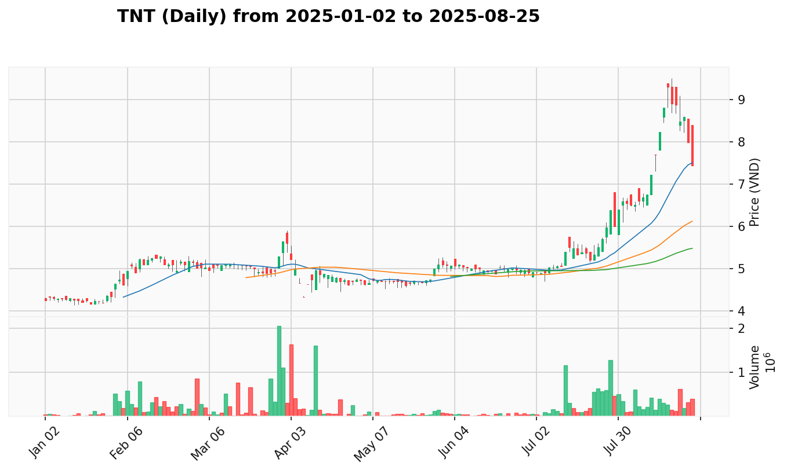

<a href="#khai-khoang">↑ Back to group KHAI_KHOANG</a>  |  <a href="#vpa-signal-summary">↑ Back to Top</a>

#### Key Statistics
| Metric | Value |
|:---|---:|
| Date Range | 2025-01-02 to 2025-10-17 |
| **Latest Close** | **8.35** |
| Period Open | 4.3 |
| Period High | 9.5 |
| Period Low | 4.13 |
| Period Change % | 94.19% |

**[Download TNT Data (.csv)](market_data/TNT_2025-01-02_to_2025-10-18.csv)**

---

### TPB

#### [VPA Analysis (2025-06-16 - 2025-10-16)](./VPA.md#tpb)
> **Ngày 2025-10-10:** TPB giảm từ 20.0 VND xuống 19.6 VND (giảm 2.0%) với mở cửa tại 20.1 và đóng cửa tại 19.6, nằm ở nửa dưới của biên độ nến. Giá có lúc đạt mức cao 20.15 và mức thấp 19.55. Cây nến đỏ có biên độ 0.6 điểm. Khối lượng giao dịch đạt 23.79 triệu cổ phiếu, giảm 44.46% so với phiên trước (từ 42.83 triệu xuống 23.79 triệu). Sau phiên "Lực cầu mạnh mẽ" (SOS) với khối lượng đột biến, hành động giá hôm nay cho thấy TPB giảm mạnh về giá đóng cửa với khối lượng giảm đáng kể. Điều này cho thấy lực cầu đã suy yếu và không duy trì được đà tăng từ phiên trước, trong khi áp lực bán vẫn còn. Việc giá đóng cửa ở nửa dưới của nến cho thấy sự chiếm ưu thế của phe bán trong phiên. **Phân tích VPA/Wyckoff:** No Demand (ND) - Thiếu vắng lực cầu.
> **Ngày 2025-10-13:** TPB giảm từ 19.6 VND xuống 19.45 VND (giảm 0.77%) với mở cửa tại 19.3 và đóng cửa tại 19.45, nằm ở nửa trên của biên độ nến. Giá có lúc đạt mức cao 19.55 và mức thấp 19.25. Cây nến xanh có biên độ 0.3 điểm. Khối lượng giao dịch đạt 18.30 triệu cổ phiếu, giảm 23.08% so với phiên trước (từ 23.79 triệu xuống 18.30 triệu). Sau phiên "Thiếu vắng lực cầu" (ND) với khối lượng giảm, hành động giá hôm nay cho thấy TPB tiếp tục giảm nhẹ về giá đóng cửa với khối lượng thấp. Mặc dù có một cây nến xanh nhỏ cho thấy lực mua nhẹ trong phiên, nhưng khối lượng giao dịch thấp cho thấy sự thiếu vắng cả lực cung và lực cầu mạnh mẽ. Điều này có thể là một dấu hiệu của sự cạn kiệt nguồn cung hoặc sự tiếp diễn của giai đoạn tích lũy/điều chỉnh. **Phân tích VPA/Wyckoff:** No Demand (ND) - Thiếu vắng lực cầu.
> **Ngày 2025-10-14:** TPB giảm từ 19.45 VND xuống 19.2 VND (giảm 1.28%) với mở cửa tại 19.5 và đóng cửa tại 19.2, nằm ở nửa dưới của biên độ nến. Giá có lúc đạt mức cao 19.8 và mức thấp 19.05. Cây nến đỏ có biên độ 0.75 điểm. Khối lượng giao dịch đạt 41.10 triệu cổ phiếu, tăng 124.6% so với phiên trước (từ 18.30 triệu lên 41.10 triệu). Sau hai phiên "Thiếu vắng lực cầu" (ND) với khối lượng thấp, hành động giá hôm nay cho thấy TPB giảm mạnh về giá đóng cửa với khối lượng tăng đột biến. Điều này cho thấy áp lực bán rất mạnh và phe bán đang chiếm ưu thế hoàn toàn. Việc giá đóng cửa ở nửa dưới của nến và khối lượng tăng vọt xác nhận sự xuất hiện của nguồn cung lớn trên thị trường. **Phân tích VPA/Wyckoff:** Supply Coming In (SYC) - Lực cung mạnh mẽ.
> **Ngày 2025-10-15:** TPB tăng từ 19.2 VND lên 19.7 VND (tăng 2.60%) với mở cửa tại 19.2 và đóng cửa tại 19.7, nằm ở nửa trên của biên độ nến. Giá có lúc đạt mức cao 19.85 và mức thấp 19.2. Cây nến xanh có biên độ 0.65 điểm. Khối lượng giao dịch đạt 28.53 triệu cổ phiếu, giảm 30.6% so với phiên trước (từ 41.10 triệu xuống 28.53 triệu). Sau phiên "Lực cung mạnh mẽ" (SYC) với khối lượng tăng đột biến, hành động giá hôm nay cho thấy TPB tăng giá với khối lượng giảm. Việc giá đóng cửa ở nửa trên của nến cho thấy lực cầu đã xuất hiện và hấp thụ một phần lực cung. Tuy nhiên, khối lượng giao dịch giảm cho thấy lực cầu chưa thực sự mạnh mẽ và có thể đang kiểm tra lại nguồn cung sau phiên bán tháo trước đó. Điều này có thể là dấu hiệu của sự cạn kiệt nguồn cung tạm thời. **Phân tích VPA/Wyckoff:** No Supply (NS) - Thiếu vắng nguồn cung.
> **Ngày 2025-10-16:** TPB giảm từ 19.7 VND xuống 19.6 VND (giảm 0.51%) với mở cửa tại 19.85 và đóng cửa tại 19.6, nằm ở nửa dưới của biên độ nến. Giá có lúc đạt mức cao 19.85 và mức thấp 19.5. Cây nến đỏ có biên độ 0.35 điểm. Khối lượng giao dịch đạt 7.58 triệu cổ phiếu, giảm 73.5% so với phiên trước (từ 28.53 triệu xuống 7.58 triệu). Sau phiên "Thiếu vắng nguồn cung" (NS) với khối lượng giảm, hành động giá hôm nay cho thấy TPB giảm nhẹ với khối lượng cực thấp. Điều này cho thấy cả lực cầu và lực cung đều yếu, thị trường đang thiếu động lực. Việc giá đóng cửa ở nửa dưới của nến và khối lượng thấp xác nhận sự thiếu vắng lực cầu trên thị trường. **Phân tích VPA/Wyckoff:** No Demand (ND) - Thiếu vắng lực cầu.

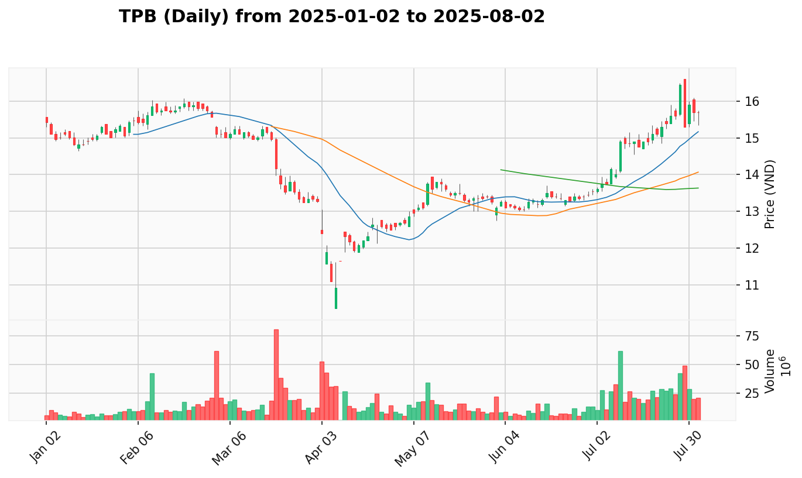

<a href="#ngan-hang">↑ Back to group NGAN_HANG</a>  |  <a href="#vpa-signal-summary">↑ Back to Top</a>

#### Key Statistics
| Metric | Value |
|:---|---:|
| Date Range | 2025-01-02 to 2025-10-17 |
| **Latest Close** | **19.25** |
| Period Open | 15.57 |
| Period High | 22.8 |
| Period Low | 10.35 |
| Period Change % | 23.64% |

**[Download TPB Data (.csv)](market_data/TPB_2025-01-02_to_2025-10-18.csv)**

---

### TSC

#### [VPA Analysis (2025-08-14 - 2025-10-16)](./VPA.md#tsc)
> **Ngày 2025-10-10:** TSC mở cửa tại 3.07 VND, tăng lên mức cao nhất 3.13 VND nhưng sau đó giảm trở lại và đóng cửa tại 3.07 VND, trùng với mức giá mở cửa và thấp nhất phiên. Biên độ dao động hẹp và khối lượng giao dịch giảm xuống 0.1669 triệu cổ phiếu so với phiên trước. Điều này cho thấy nỗ lực tăng giá trong phiên đã bị từ chối và lực cầu yếu, không đủ sức đẩy giá lên. Việc giá đóng cửa ở mức thấp nhất phiên với khối lượng thấp xác nhận sự thiếu vắng lực mua và áp lực bán vẫn còn hiện hữu, tiếp tục xu hướng suy yếu đã diễn ra. **Phân tích VPA/Wyckoff:** Tiếp diễn suy yếu - Nỗ lực tăng giá yếu với khối lượng thấp.
> **Ngày 2025-10-13:** TSC mở cửa tại 3.05 VND, giảm xuống mức thấp nhất 3.01 VND nhưng sau đó phục hồi mạnh mẽ và đóng cửa tại 3.07 VND, trùng với mức giá cao nhất phiên. Khối lượng giao dịch tăng đáng kể lên 0.329 triệu cổ phiếu, gần gấp đôi so với phiên trước (0.1669 triệu cổ phiếu). Việc giá phục hồi từ mức thấp nhất và đóng cửa ở mức cao nhất phiên với khối lượng tăng cho thấy lực cầu đã xuất hiện và hấp thụ tốt áp lực bán, tạo ra một nỗ lực tăng giá thành công sau chuỗi ngày suy yếu. Điều này có thể là dấu hiệu dừng đà giảm và tiềm năng đảo chiều. **Phân tích VPA/Wyckoff:** Nỗ lực tăng giá thành công - Lực cầu xuất hiện mạnh mẽ.
> **Ngày 2025-10-14:** TSC mở cửa tại 3.06 VND, tăng lên mức cao nhất 3.11 VND nhưng sau đó giảm trở lại và đóng cửa tại 3.07 VND, bằng với giá đóng cửa phiên trước. Khối lượng giao dịch giảm đáng kể xuống 0.2011 triệu cổ phiếu, thấp hơn nhiều so với 0.329 triệu cổ phiếu của phiên trước. Điều này cho thấy nỗ lực tăng giá trong phiên không được duy trì và lực cầu đã suy yếu rõ rệt sau phiên tăng mạnh trước đó. Việc giá không thể bứt phá lên cao hơn với khối lượng thấp xác nhận sự thiếu vắng lực mua tiếp diễn, cho thấy sự hấp thụ nguồn cung hoặc tạm dừng đà tăng. **Phân tích VPA/Wyckoff:** Thiếu cầu - Nỗ lực tăng giá không được xác nhận bởi khối lượng.
> **Ngày 2025-10-15:** TSC mở cửa tại 3.09 VND, đạt mức cao nhất 3.09 VND nhưng sau đó giảm mạnh xuống mức thấp nhất 2.86 VND và đóng cửa tại 3.03 VND. Giá giảm từ 3.07 VND xuống 3.03 VND với khối lượng giao dịch tăng đáng kể lên 0.3475 triệu cổ phiếu, cao hơn nhiều so với 0.2011 triệu cổ phiếu của phiên trước. Biên độ giá giảm rộng và đóng cửa gần mức thấp nhất phiên với khối lượng lớn cho thấy lực cung đã áp đảo hoàn toàn lực cầu, xác nhận sự suy yếu và khả năng tiếp diễn xu hướng giảm. **Phân tích VPA/Wyckoff:** Sign of Weakness (SOW) - Lực cung áp đảo với khối lượng lớn.
> **Ngày 2025-10-16:** TSC mở cửa tại 3.03 VND, tăng lên mức cao nhất 3.04 VND nhưng sau đó giảm xuống mức thấp nhất 3.01 VND và đóng cửa tại 3.03 VND, giữ nguyên mức giá đóng cửa so với phiên trước. Khối lượng giao dịch giảm mạnh xuống 0.0818 triệu cổ phiếu, thấp hơn đáng kể so với 0.3475 triệu cổ phiếu của phiên trước. Sau phiên giảm mạnh với khối lượng lớn ngày 2025-10-15, phiên hôm nay cho thấy sự tạm lắng của cả lực cung và lực cầu. Giá giữ vững nhưng với biên độ hẹp và khối lượng rất thấp, cho thấy sự thiếu quyết đoán và không có nỗ lực rõ ràng từ cả hai phía, có thể là một giai đoạn tạm dừng sau đợt bán tháo. **Phân tích VPA/Wyckoff:** Thiếu nỗ lực - Giá đi ngang với khối lượng rất thấp sau một đợt giảm.

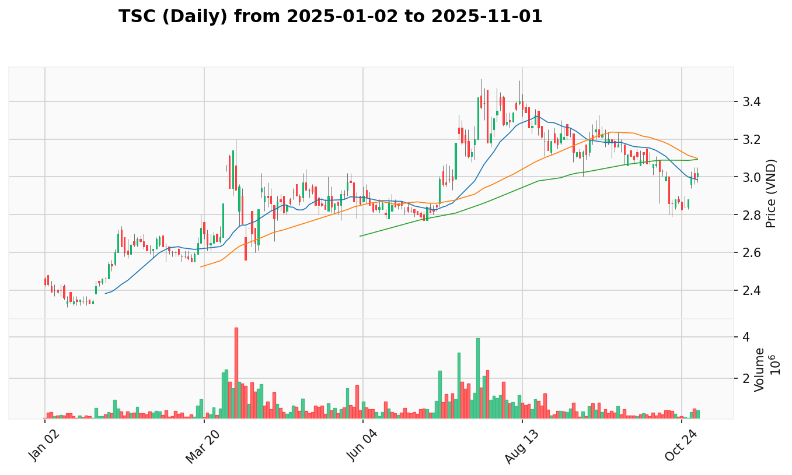

<a href="#nong-nghiep">↑ Back to group NONG_NGHIEP</a>  |  <a href="#vpa-signal-summary">↑ Back to Top</a>

#### Key Statistics
| Metric | Value |
|:---|---:|
| Date Range | 2025-01-02 to 2025-10-17 |
| **Latest Close** | **3.0** |
| Period Open | 2.46 |
| Period High | 3.52 |
| Period Low | 2.31 |
| Period Change % | 21.95% |

**[Download TSC Data (.csv)](market_data/TSC_2025-01-02_to_2025-10-18.csv)**

---

### TTF

#### [VPA Analysis (2025-08-14 - 2025-10-16)](./VPA.md#ttf)
> **Ngày 2025-10-10:** TTF mở cửa ở mức 3.05 VND, tăng lên 3.08 VND nhưng sau đó giảm và đóng cửa ở mức 3.02 VND, bằng với giá đóng cửa của phiên trước và là mức thấp nhất phiên. Khối lượng giao dịch tăng lên 0.7277 triệu cổ phiếu, cao hơn đáng kể so với phiên trước. Mặc dù giá mở cửa cao hơn, nhưng việc không thể duy trì đà tăng và đóng cửa ở mức thấp nhất phiên với khối lượng tăng cho thấy áp lực bán mạnh mẽ đã xuất hiện và hấp thụ toàn bộ lực cầu. Điều này xác nhận sự yếu kém của thị trường sau các phiên "No Demand" trước đó. **Phân tích VPA/Wyckoff:** Supply (Cung)
> **Ngày 2025-10-13:** TTF mở cửa ở mức 2.98 VND, giảm so với giá đóng cửa phiên trước, nhưng sau đó đã phục hồi và đóng cửa ở mức 3.02 VND, bằng với giá đóng cửa của phiên trước. Khối lượng giao dịch tăng mạnh lên 1.0484 triệu cổ phiếu, cao hơn đáng kể so với phiên trước. Mặc dù giá mở cửa thấp, nhưng việc giá phục hồi và đóng cửa ở mức tương đương với phiên trước với khối lượng lớn cho thấy lực cầu đã hấp thụ mạnh mẽ áp lực cung. Điều này cho thấy nỗ lực dừng đà giảm và hấp thụ cung tại mức giá này. **Phân tích VPA/Wyckoff:** Stopping Volume (Khối lượng dừng)
> **Ngày 2025-10-14:** TTF mở cửa ở mức 3.04 VND, tăng lên 3.04 VND nhưng sau đó giảm mạnh và đóng cửa ở mức 2.98 VND, thấp hơn giá đóng cửa phiên trước. Khối lượng giao dịch đạt 0.9964 triệu cổ phiếu, giảm nhẹ so với phiên trước nhưng vẫn ở mức tương đối cao. Việc giá không thể duy trì đà tăng và đóng cửa gần mức thấp nhất phiên cho thấy áp lực cung vẫn đang chiếm ưu thế, phủ nhận nỗ lực dừng đà giảm của phiên trước. Điều này cho thấy sự yếu kém của thị trường. **Phân tích VPA/Wyckoff:** Supply (Cung)
> **Ngày 2025-10-15:** TTF mở cửa ở mức 3.0 VND, sau đó giảm và đóng cửa ở mức 2.96 VND, thấp hơn giá đóng cửa phiên trước. Giá cao nhất và giá mở cửa bằng nhau (3.0 VND), cho thấy áp lực bán xuất hiện ngay từ đầu phiên. Giá đóng cửa gần mức thấp nhất phiên. Khối lượng giao dịch đạt 0.9826 triệu cổ phiếu, giảm nhẹ so với phiên trước nhưng vẫn ở mức cao. Việc giá giảm mạnh từ mức mở cửa và đóng cửa gần mức thấp nhất phiên với khối lượng cao cho thấy áp lực cung tiếp tục chiếm ưu thế và thị trường đang yếu. Nỗ lực phục hồi của phiên 2025-10-13 đã bị phủ nhận hoàn toàn. **Phân tích VPA/Wyckoff:** Supply (Cung)
> **Ngày 2025-10-16:** TTF mở cửa ở mức 2.95 VND, tăng lên 2.96 VND nhưng sau đó giảm mạnh và đóng cửa ở mức 2.89 VND, thấp hơn giá đóng cửa phiên trước. Giá thấp nhất phiên là 2.88 VND. Khối lượng giao dịch đạt 0.9408 triệu cổ phiếu, giảm nhẹ so với phiên trước nhưng vẫn ở mức cao. Việc giá tiếp tục giảm mạnh với biên độ rộng và đóng cửa gần mức thấp nhất phiên, cùng với khối lượng giao dịch cao, cho thấy áp lực cung vẫn đang rất mạnh và thị trường tiếp tục suy yếu. Nỗ lực phục hồi đã bị phủ nhận hoàn toàn trong các phiên gần đây. **Phân tích VPA/Wyckoff:** Supply (Cung)

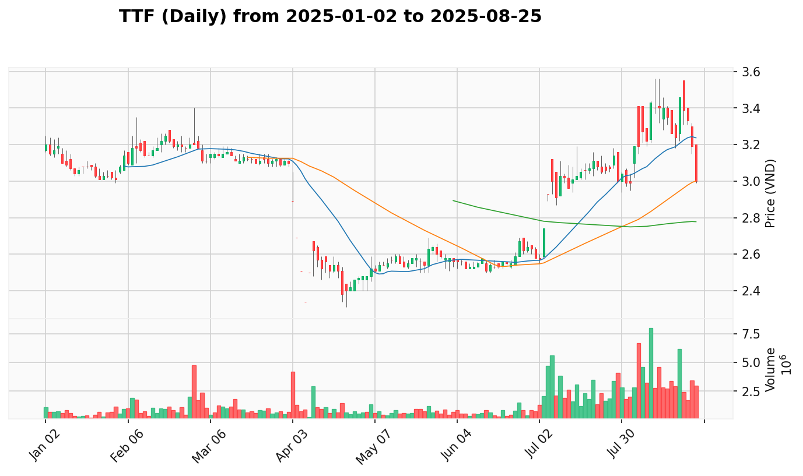

<a href="#others">↑ Back to group OTHERS</a>  |  <a href="#vpa-signal-summary">↑ Back to Top</a>

#### Key Statistics
| Metric | Value |
|:---|---:|
| Date Range | 2025-01-02 to 2025-10-17 |
| **Latest Close** | **2.86** |
| Period Open | 3.17 |
| Period High | 3.57 |
| Period Low | 2.31 |
| Period Change % | -9.78% |

**[Download TTF Data (.csv)](market_data/TTF_2025-01-02_to_2025-10-18.csv)**

---

### TTN

#### [VPA Analysis (2025-08-04 - 2025-10-16)](./VPA.md#ttn)
> **Ngày 2025-10-10:** TTN tăng từ 18.0 VND lên 18.1 VND với khối lượng giao dịch đạt 0.3133 triệu cổ phiếu. Biên độ giá rộng nhưng đóng cửa ở mức thấp nhất phiên. Khối lượng giao dịch giảm so với phiên trước đó (0.4131 triệu cổ phiếu), cho thấy lực cầu đã suy yếu và lực cung bắt đầu xuất hiện mạnh mẽ, đẩy giá xuống từ mức cao nhất trong phiên. Điều này cho thấy sự hấp thụ lực cầu bởi lực cung sau hai phiên tăng giá mạnh. **Phân tích VPA/Wyckoff:** Supply Coming In - Lực cung xuất hiện.
> **Ngày 2025-10-13:** TTN giảm từ 18.1 VND xuống 17.8 VND với khối lượng giao dịch đạt 0.2214 triệu cổ phiếu. Biên độ giá rộng nhưng đóng cửa ở mức giữa của phiên. Khối lượng giao dịch tiếp tục giảm so với phiên trước đó (0.3133 triệu cổ phiếu) và thấp hơn đáng kể so với các phiên tăng giá mạnh trước đó. Điều này cho thấy lực cung vẫn đang chiếm ưu thế sau phiên "Supply Coming In" trước đó, và lực cầu không đủ mạnh để hấp thụ lực cung, dẫn đến giá giảm. Sự sụt giảm về khối lượng cho thấy áp lực bán có thể đang giảm bớt, nhưng đồng thời cũng thể hiện sự thiếu vắng của lực cầu mạnh mẽ. **Phân tích VPA/Wyckoff:** Weakness (W) - Lực cung chiếm ưu thế, thiếu vắng lực cầu.
> **Ngày 2025-10-14:** TTN giảm từ 17.8 VND xuống 17.3 VND với khối lượng giao dịch đạt 0.2642 triệu cổ phiếu. Biên độ giá rộng và đóng cửa ở mức thấp nhất phiên. Khối lượng giao dịch tăng so với phiên trước đó (0.2214 triệu cổ phiếu), cho thấy áp lực bán mạnh mẽ và lực cung tiếp tục chiếm ưu thế sau các phiên suy yếu trước đó. Điều này xác nhận sự tiếp diễn của xu hướng giảm giá và sự thiếu vắng của lực cầu. **Phân tích VPA/Wyckoff:** Weakness (W) - Lực cung tiếp tục chiếm ưu thế.
> **Ngày 2025-10-15:** TTN giảm từ 17.3 VND xuống 16.9 VND với khối lượng giao dịch đạt 0.1891 triệu cổ phiếu. Biên độ giá rộng và đóng cửa ở mức thấp gần nhất phiên, cho thấy áp lực bán vẫn còn. Tuy nhiên, khối lượng giao dịch giảm so với phiên trước đó (0.2642 triệu cổ phiếu), điều này có thể cho thấy lực cung đang có dấu hiệu giảm bớt hoặc lực cầu vẫn còn yếu, chưa đủ để hấp thụ lượng cung hiện có. So với các phiên giảm giá mạnh trước đó, sự sụt giảm về khối lượng cho thấy sự suy yếu trong áp lực bán, nhưng chưa có dấu hiệu rõ ràng của lực cầu quay trở lại. **Phân tích VPA/Wyckoff:** Weakness (W) - Lực cung vẫn chiếm ưu thế, nhưng áp lực bán có thể đang giảm.
> **Ngày 2025-10-16:** TTN tăng nhẹ từ 16.9 VND lên 17.1 VND với khối lượng giao dịch đạt 0.0549 triệu cổ phiếu. Biên độ giá rất hẹp và đóng cửa ở mức thấp nhất phiên, cho thấy sự lưỡng lự của thị trường. Khối lượng giao dịch giảm mạnh so với phiên trước đó (0.1891 triệu cổ phiếu), cho thấy áp lực bán đã giảm đáng kể nhưng lực cầu vẫn còn yếu, chưa đủ để đẩy giá lên cao hơn. Đây có thể là một dấu hiệu tạm dừng trong xu hướng giảm, nhưng chưa xác nhận sự đảo chiều. **Phân tích VPA/Wyckoff:** Weakness (W) - Áp lực bán giảm nhưng lực cầu chưa xuất hiện rõ ràng.

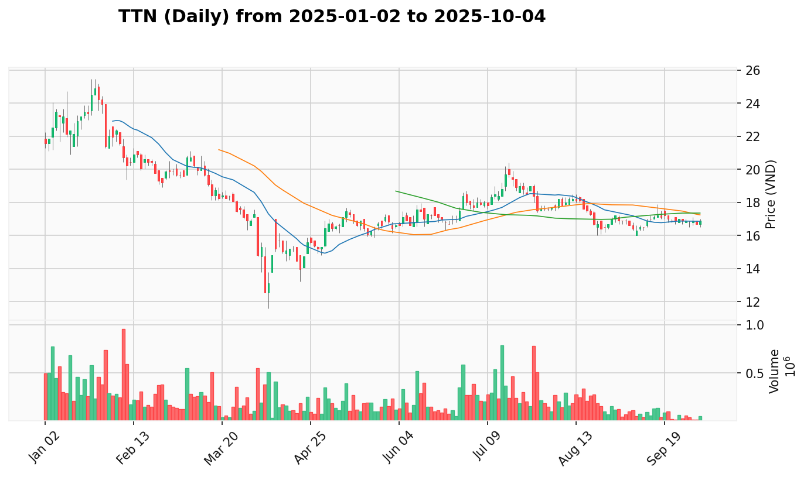

<a href="#cong-nghe">↑ Back to group CONG_NGHE</a>  |  <a href="#vpa-signal-summary">↑ Back to Top</a>

#### Key Statistics
| Metric | Value |
|:---|---:|
| Date Range | 2025-01-02 to 2025-10-17 |
| **Latest Close** | **16.9** |
| Period Open | 21.85 |
| Period High | 25.46 |
| Period Low | 11.59 |
| Period Change % | -22.65% |

**[Download TTN Data (.csv)](market_data/TTN_2025-01-02_to_2025-10-18.csv)**

---

### TV2

#### [VPA Analysis (2025-07-15 - 2025-10-16)](./VPA.md#tv2)
> **Ngày 2025-10-10:** TV2 giảm từ 34.6 VND xuống 34.4 VND (giảm 0.2 VND, tương đương 0.58%). Cây nến có biên độ 0.45 VND, mở cửa ở mức 34.7 VND nhưng đóng cửa gần mức thấp nhất phiên tại 34.4 VND, cho thấy áp lực bán mạnh mẽ đã đẩy giá xuống. Khối lượng giao dịch đạt 0.2032 triệu cổ phiếu, tăng so với phiên trước (0.1823 triệu cổ phiếu). Việc giá giảm trên khối lượng tăng và không giữ được mức mở cửa xác nhận lực cung đang chiếm ưu thế, tiếp nối tín hiệu yếu từ các phiên trước. **Phân tích VPA/Wyckoff:** Selling Pressure (Áp lực bán)
> **Ngày 2025-10-13:** TV2 tiếp tục giảm từ 34.4 VND xuống 33.75 VND (giảm 0.65 VND, tương đương 1.89%). Cây nến có biên độ 0.45 VND, mở cửa ở mức 34.2 VND nhưng đóng cửa ở mức thấp nhất phiên tại 33.75 VND, cho thấy áp lực bán rất mạnh mẽ và không có lực cầu đỡ giá. Khối lượng giao dịch đạt 0.2659 triệu cổ phiếu, tăng đáng kể so với phiên trước (0.2032 triệu cổ phiếu). Sự kết hợp giữa giá giảm mạnh, đóng cửa ở mức thấp nhất và khối lượng tăng cao xác nhận lực cung đang hoàn toàn chiếm ưu thế, tiếp tục xu hướng suy yếu của cổ phiếu. **Phân tích VPA/Wyckoff:** Selling Pressure (Áp lực bán)
> **Ngày 2025-10-14:** TV2 tiếp tục giảm từ 33.75 VND xuống 33.1 VND (giảm 0.65 VND, tương đương 1.93%). Cây nến có biên độ rộng (1.55 VND), mở cửa ở mức 34.6 VND nhưng đóng cửa gần mức thấp nhất phiên tại 33.1 VND, cho thấy áp lực bán rất mạnh mẽ và không có lực cầu đỡ giá. Khối lượng giao dịch đạt 0.2969 triệu cổ phiếu, tăng đáng kể so với phiên trước (0.2659 triệu cổ phiếu). Sự kết hợp giữa giá giảm mạnh, biên độ rộng, đóng cửa ở mức thấp nhất và khối lượng tăng cao xác nhận lực cung đang hoàn toàn chiếm ưu thế, tiếp tục xu hướng suy yếu đã diễn ra trong các phiên gần đây. **Phân tích VPA/Wyckoff:** Selling Pressure (Áp lực bán)
> **Ngày 2025-10-15:** TV2 tiếp tục giảm từ 33.1 VND xuống 32.6 VND (giảm 0.5 VND, tương đương 1.51%). Cây nến có biên độ hẹp (0.7 VND), mở cửa ở mức 33.0 VND và đóng cửa gần mức thấp nhất phiên tại 32.6 VND, cho thấy áp lực bán vẫn còn. Khối lượng giao dịch đạt 0.1776 triệu cổ phiếu, giảm đáng kể so với phiên trước (0.2969 triệu cổ phiếu). Mặc dù giá tiếp tục giảm và đóng cửa gần mức thấp nhất, nhưng khối lượng giảm cho thấy lực cung đã có dấu hiệu suy yếu sau hai phiên bán mạnh, tuy nhiên vẫn chưa có lực cầu đủ mạnh để đảo chiều xu hướng. **Phân tích VPA/Wyckoff:** Selling Pressure (Áp lực bán)
> **Ngày 2025-10-16:** TV2 tiếp tục giảm từ 32.6 VND xuống 31.95 VND (giảm 0.65 VND, tương đương 1.99%). Cây nến có biên độ tương đối rộng (1.15 VND), mở cửa ở mức 32.65 VND và đóng cửa gần mức thấp nhất phiên tại 31.95 VND, cho thấy áp lực bán vẫn duy trì. Khối lượng giao dịch đạt 0.109 triệu cổ phiếu, giảm đáng kể so với phiên trước (0.1776 triệu cổ phiếu) và phiên 2025-10-14 (0.2969 triệu cổ phiếu). Mặc dù khối lượng thấp, việc giá tiếp tục giảm mạnh và đóng cửa ở mức thấp nhất cho thấy lực cung vẫn đang chiếm ưu thế và thiếu vắng lực cầu đỡ giá, xác nhận xu hướng suy yếu tiếp diễn. **Phân tích VPA/Wyckoff:** Selling Pressure (Áp lực bán)

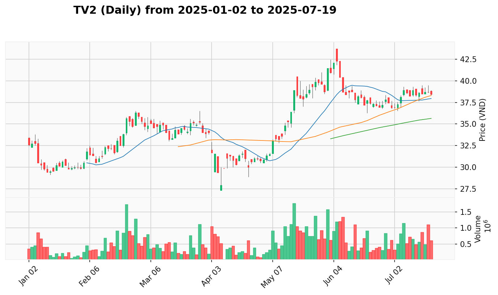

<a href="#xay-lap-dien">↑ Back to group XAY_LAP_DIEN</a>  |  <a href="#vpa-signal-summary">↑ Back to Top</a>

#### Key Statistics
| Metric | Value |
|:---|---:|
| Date Range | 2025-01-02 to 2025-10-17 |
| **Latest Close** | **31.8** |
| Period Open | 33.4 |
| Period High | 43.7 |
| Period Low | 27.3 |
| Period Change % | -4.79% |

**[Download TV2 Data (.csv)](market_data/TV2_2025-01-02_to_2025-10-18.csv)**

---

### TVB

#### [VPA Analysis (2025-08-04 - 2025-10-16)](./VPA.md#tvb)
> **Ngày 2025-10-10:** TVB tăng từ 9.55 VND lên 9.65 VND với khối lượng giao dịch đạt 0.1304 triệu cổ phiếu. Cây nến tăng có biên độ tương đối rộng và đóng cửa ở nửa trên của thân nến, cho thấy lực cầu xuất hiện nhẹ. Tuy nhiên, khối lượng giao dịch giảm đáng kể so với phiên trước (0.3188 triệu cổ phiếu), đặc biệt sau phiên giảm mạnh với khối lượng lớn (SOW) vào ngày 2025-10-09. Điều này cho thấy sự thiếu hụt lực cầu mạnh mẽ để đẩy giá lên cao hơn, hoặc đây chỉ là một nhịp hồi phục yếu ớt trong bối cảnh áp lực cung vẫn còn tiềm ẩn. Cần theo dõi chặt chẽ các phiên tiếp theo để xác định liệu đây có phải là một "No Demand" bar hay không, báo hiệu khả năng tiếp tục giảm giá. **Phân tích VPA/Wyckoff:** No Demand (Không có cầu) - Giá tăng nhẹ trên khối lượng thấp sau một phiên giảm mạnh.
> **Ngày 2025-10-13:** TVB giảm từ 9.65 VND xuống 9.55 VND với khối lượng giao dịch đạt 0.0409 triệu cổ phiếu. Cây nến có biên độ hẹp, giá đóng cửa gần mức mở cửa và ở giữa thân nến, cho thấy sự lưỡng lự và thiếu quyết đoán của thị trường. Khối lượng giao dịch cực kỳ thấp, giảm đáng kể so với phiên trước (0.1304 triệu cổ phiếu) và thấp nhất trong 10 phiên gần đây. Điều này xác nhận sự thiếu vắng lực cầu mạnh mẽ sau các phiên suy yếu trước đó, cho thấy thị trường đang trong giai đoạn chờ đợi, với áp lực bán không còn mạnh nhưng lực mua cũng chưa xuất hiện. **Phân tích VPA/Wyckoff:** No Demand (Thiếu cầu) - Giá giảm nhẹ trên khối lượng cực thấp, xác nhận sự thiếu vắng lực mua.
> **Ngày 2025-10-14:** TVB giảm từ 9.55 VND xuống 9.5 VND với khối lượng giao dịch đạt 0.0603 triệu cổ phiếu. Cây nến giảm có biên độ tương đối rộng và đóng cửa ở nửa dưới của thân nến, cho thấy áp lực bán gia tăng. Mặc dù khối lượng tăng nhẹ so với phiên trước (0.0409 triệu cổ phiếu) nhưng vẫn ở mức tương đối thấp so với các phiên có khối lượng lớn trước đó. Tuy nhiên, việc giá giảm và đóng cửa thấp nhất phiên với khối lượng tăng cho thấy cung vẫn đang chiếm ưu thế và lực cầu chưa đủ mạnh để hấp thụ. Điều này xác nhận sự yếu kém của thị trường sau các phiên "No Demand" và có thể báo hiệu khả năng tiếp tục giảm giá. **Phân tích VPA/Wyckoff:** Supply Coming In (Cung xuất hiện)
> **Ngày 2025-10-15:** TVB giảm từ 9.5 VND xuống 9.45 VND với khối lượng giao dịch đạt 0.014 triệu cổ phiếu. Cây nến giảm có biên độ hẹp, giá đóng cửa ở mức thấp nhất phiên. Khối lượng giao dịch cực kỳ thấp, là mức thấp nhất trong 10 phiên gần đây và giảm mạnh so với phiên trước (0.0603 triệu cổ phiếu). Điều này cho thấy sự thiếu vắng hoàn toàn cả lực mua và lực bán đáng kể, thị trường đang trong trạng thái lưỡng lự và không có động lực rõ ràng sau áp lực bán nhẹ ở phiên trước. **Phân tích VPA/Wyckoff:** No Demand (Thiếu cầu) - Giá tiếp tục giảm nhẹ trên khối lượng cực thấp, xác nhận sự thiếu vắng lực mua và sự cạn kiệt của cả lực bán.
> **Ngày 2025-10-16:** TVB giảm từ 9.45 VND xuống 9.39 VND với khối lượng giao dịch đạt 0.1107 triệu cổ phiếu. Cây nến giảm có biên độ hẹp và đóng cửa ở mức thấp nhất phiên. Khối lượng tăng đáng kể so với phiên trước (0.014 triệu cổ phiếu), cho thấy áp lực bán gia tăng trở lại sau phiên "No Demand". Điều này xác nhận sự yếu kém của thị trường và có thể báo hiệu khả năng tiếp tục giảm giá. **Phân tích VPA/Wyckoff:** Supply Coming In (Cung xuất hiện)

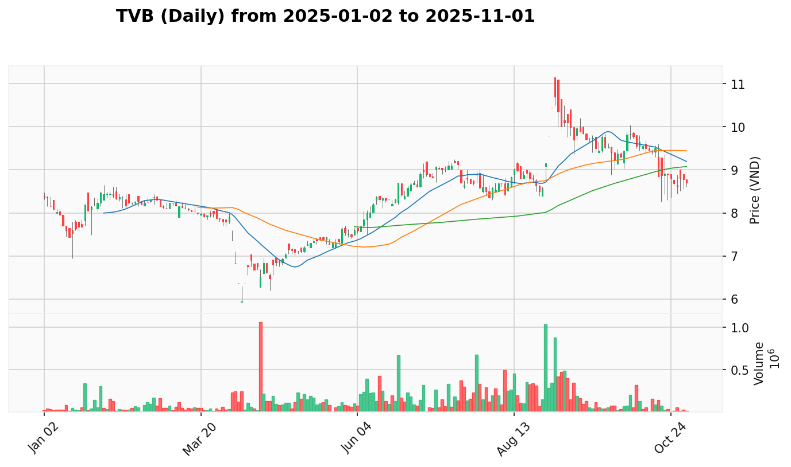

<a href="#chung-khoan">↑ Back to group CHUNG_KHOAN</a>  |  <a href="#vpa-signal-summary">↑ Back to Top</a>

#### Key Statistics
| Metric | Value |
|:---|---:|
| Date Range | 2025-01-02 to 2025-10-17 |
| **Latest Close** | **9.5** |
| Period Open | 8.4 |
| Period High | 11.15 |
| Period Low | 5.93 |
| Period Change % | 13.10% |

**[Download TVB Data (.csv)](market_data/TVB_2025-01-02_to_2025-10-18.csv)**

---

### TVN

#### [VPA Analysis (2025-08-14 - 2025-10-16)](./VPA.md#tvn)
> **Ngày 2025-10-10:** TVN giữ nguyên mức giá 8.2 VND, với biên độ dao động hẹp từ 8.1 VND đến 8.3 VND. Khối lượng giao dịch đạt 0.3089 triệu cổ phiếu, cao hơn đáng kể so với phiên trước (0.2285 triệu cổ phiếu). Mặc dù khối lượng tăng, giá vẫn không thể bứt phá lên cao hơn, cho thấy lực cung đang hấp thụ lực cầu. Điều này tiếp tục củng cố tín hiệu thiếu vắng lực cầu mạnh mẽ và sự lưỡng lự của thị trường sau các phiên "No Demand" trước đó. **Phân tích VPA/Wyckoff:** Nỗ lực không có kết quả (Effort without Result)
> **Ngày 2025-10-13:** TVN giữ nguyên mức giá 8.2 VND, với biên độ dao động hẹp từ 8.0 VND đến 8.2 VND. Khối lượng giao dịch đạt 0.1365 triệu cổ phiếu, giảm mạnh so với phiên trước (0.3089 triệu cổ phiếu). Giá đi ngang trong biên độ hẹp với khối lượng thấp cho thấy sự thiếu vắng cả lực mua và lực bán, đặc biệt là không có cầu đẩy giá lên. Điều này tiếp tục củng cố tín hiệu thị trường yếu và thiếu động lực sau các phiên "No Demand" và "Effort without Result" trước đó. **Phân tích VPA/Wyckoff:** No Demand (Không có cầu)
> **Ngày 2025-10-14:** TVN giảm từ 8.2 VND xuống 8.0 VND, với biên độ dao động từ 7.9 VND đến 8.2 VND. Khối lượng giao dịch đạt 0.3781 triệu cổ phiếu, tăng mạnh so với phiên trước (0.1365 triệu cổ phiếu). Giá giảm rõ rệt với khối lượng gia tăng cho thấy áp lực bán mạnh mẽ đang chiếm ưu thế, xác nhận tín hiệu yếu kém của thị trường sau các phiên "No Demand" và "Effort without Result" trước đó. Điều này cho thấy nguồn cung đang áp đảo cầu và có khả năng tiếp tục xu hướng giảm giá. **Phân tích VPA/Wyckoff:** Sign of Weakness (SOW) - Nguồn cung áp đảo
> **Ngày 2025-10-15:** TVN giảm từ 8.0 VND xuống 7.9 VND, với biên độ dao động hẹp từ 7.8 VND đến 8.0 VND. Khối lượng giao dịch đạt 0.3738 triệu cổ phiếu, giảm nhẹ so với phiên trước (0.3781 triệu cổ phiếu). Giá tiếp tục giảm với biên độ hẹp và khối lượng giảm nhẹ cho thấy áp lực bán vẫn còn nhưng có phần chững lại, tuy nhiên lực cầu vẫn yếu và chưa đủ để hấp thụ nguồn cung. Điều này củng cố tín hiệu thị trường yếu và thiếu động lực sau các phiên "No Demand" và "Sign of Weakness" trước đó. **Phân tích VPA/Wyckoff:** No Demand
> **Ngày 2025-10-16:** TVN giữ nguyên mức giá 7.9 VND, với biên độ dao động hẹp từ 7.8 VND đến 8.0 VND. Khối lượng giao dịch đạt 0.1058 triệu cổ phiếu, giảm mạnh so với phiên trước (0.3738 triệu cổ phiếu). Giá đi ngang với khối lượng sụt giảm đáng kể cho thấy cả lực cung và lực cầu đều yếu, không có bên nào chiếm ưu thế rõ rệt. Điều này củng cố tín hiệu thị trường thiếu động lực và tiếp tục trạng thái "No Demand" sau các phiên giảm giá trước đó. **Phân tích VPA/Wyckoff:** No Demand

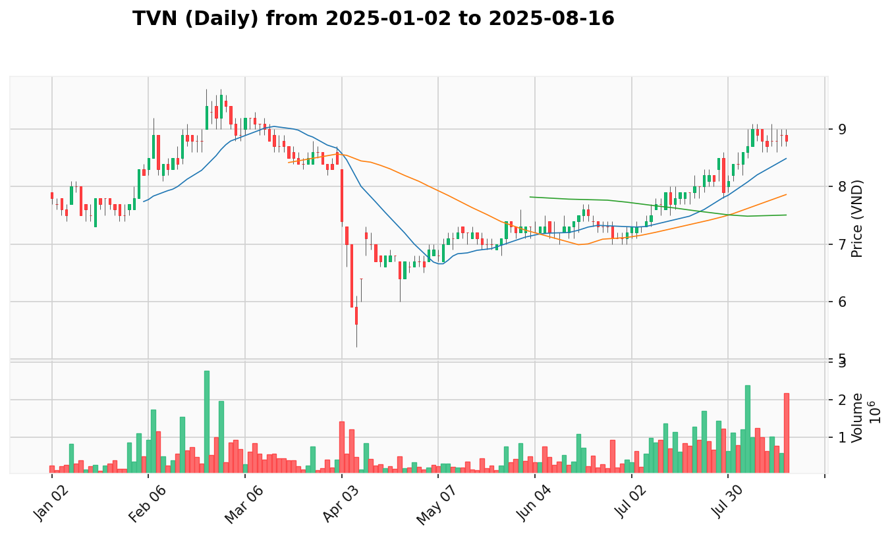

<a href="#thep">↑ Back to group THEP</a>  |  <a href="#vpa-signal-summary">↑ Back to Top</a>

#### Key Statistics
| Metric | Value |
|:---|---:|
| Date Range | 2025-01-02 to 2025-10-17 |
| **Latest Close** | **7.9** |
| Period Open | 7.9 |
| Period High | 9.7 |
| Period Low | 5.2 |
| Period Change % | 0.00% |

**[Download TVN Data (.csv)](market_data/TVN_2025-01-02_to_2025-10-18.csv)**

---

### TVS

#### [VPA Analysis (2025-08-04 - 2025-10-16)](./VPA.md#tvs)
> **Ngày 2025-10-10:** TVS giảm từ 18.7 VND xuống 18.6 VND với khối lượng giao dịch đạt 0.1577 triệu cổ phiếu. Cây nến giảm có biên độ hẹp, giá đóng cửa (18.6 VND) ở gần giữa thân nến và bằng với giá đóng cửa phiên 2025-10-08. Khối lượng giao dịch giảm so với phiên trước và tiếp tục ở mức thấp so với phiên tăng mạnh ngày 2025-10-06. Điều này cho thấy lực cung không quá mạnh nhưng lực cầu vẫn còn yếu, chưa đủ sức đẩy giá lên cao hơn, tiếp tục xác nhận tình trạng thiếu vắng lực mua chủ động. **Phân tích VPA/Wyckoff:** No Demand (ND) - Lực cầu yếu, không có sự quyết liệt để đẩy giá lên.
> **Ngày 2025-10-13:** TVS giảm từ 18.6 VND xuống 18.2 VND với khối lượng giao dịch đạt 0.1853 triệu cổ phiếu. Cây nến giảm có biên độ rộng, giá đóng cửa (18.2 VND) ở gần giữa thân nến và thấp hơn giá đóng cửa phiên trước. Khối lượng giao dịch tăng so với phiên trước, cho thấy áp lực bán gia tăng. Sau các phiên No Demand, lực cung đã xuất hiện mạnh mẽ hơn, đẩy giá xuống mức thấp nhất trong phiên là 17.5 VND. **Phân tích VPA/Wyckoff:** Sign of Weakness (SOW) - Lực cung gia tăng đẩy giá xuống.
> **Ngày 2025-10-14:** TVS giảm từ 18.2 VND xuống 17.8 VND với khối lượng giao dịch đạt 0.2445 triệu cổ phiếu. Cây nến giảm có biên độ rộng, giá đóng cửa (17.8 VND) ở mức thấp nhất phiên. Khối lượng giao dịch tăng đáng kể so với phiên trước (0.1853 triệu cổ phiếu), cho thấy áp lực bán tiếp tục gia tăng mạnh mẽ, xác nhận sự tiếp diễn của lực cung. **Phân tích VPA/Wyckoff:** Sign of Weakness (SOW) - Lực cung tiếp tục gia tăng mạnh mẽ, đẩy giá xuống thấp hơn.
> **Ngày 2025-10-15:** TVS tăng nhẹ từ 17.8 VND lên 17.9 VND với khối lượng giao dịch đạt 0.1691 triệu cổ phiếu. Cây nến có biên độ hẹp, giá đóng cửa (17.9 VND) bằng giá mở cửa và giá thấp nhất phiên. Khối lượng giao dịch giảm đáng kể so với các phiên trước, cho thấy lực cầu yếu và không có sự tham gia mạnh mẽ của người mua sau hai phiên giảm mạnh. **Phân tích VPA/Wyckoff:** No Demand (ND) - Lực cầu yếu, tiếp tục cho thấy sự suy yếu.
> **Ngày 2025-10-16:** TVS giảm từ 17.9 VND xuống 17.85 VND với khối lượng giao dịch đạt 0.0889 triệu cổ phiếu. Cây nến giảm có biên độ hẹp, giá đóng cửa (17.85 VND) ở mức thấp nhất phiên. Khối lượng giao dịch giảm mạnh so với phiên trước (0.1691 triệu cổ phiếu), cho thấy lực bán không quá mạnh nhưng lực cầu gần như không tồn tại, tiếp tục xác nhận sự suy yếu của thị trường sau hai phiên giảm mạnh và một phiên No Demand trước đó. **Phân tích VPA/Wyckoff:** No Demand (ND) - Lực cầu yếu, tiếp tục cho thấy sự suy yếu.

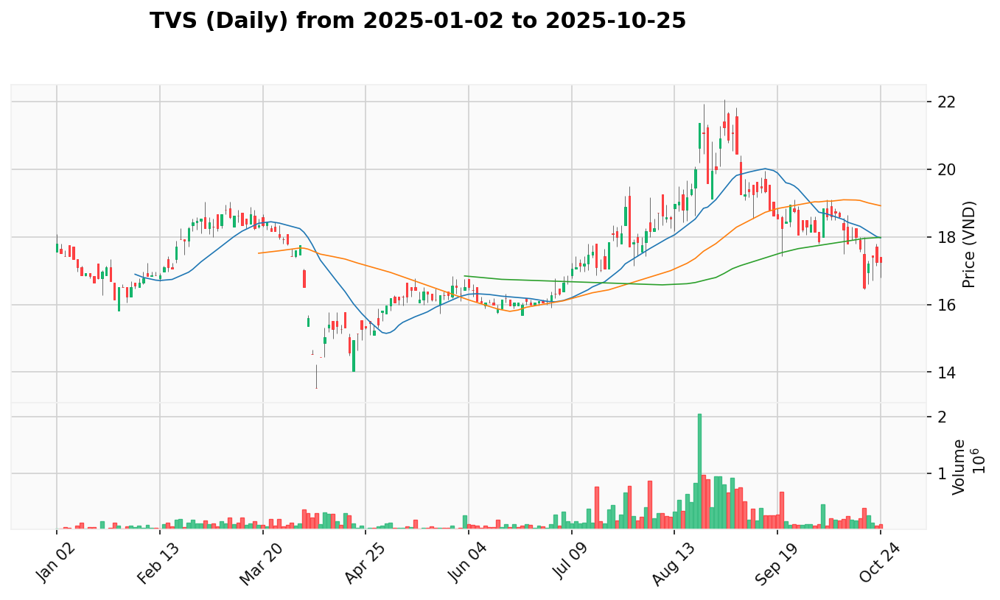

<a href="#chung-khoan">↑ Back to group CHUNG_KHOAN</a>  |  <a href="#vpa-signal-summary">↑ Back to Top</a>

#### Key Statistics
| Metric | Value |
|:---|---:|
| Date Range | 2025-01-02 to 2025-10-17 |
| **Latest Close** | **17.65** |
| Period Open | 17.56 |
| Period High | 22.06 |
| Period Low | 13.53 |
| Period Change % | 0.51% |

**[Download TVS Data (.csv)](market_data/TVS_2025-01-02_to_2025-10-18.csv)**

---

### VC2

#### [VPA Analysis (2025-08-14 - 2025-10-16)](./VPA.md#vc2)
> **Ngày 2025-10-10:** VC2 giữ nguyên mức giá 8.1 VND, dao động trong khoảng từ 8.0 VND đến 8.2 VND. Khối lượng giao dịch đạt 0.1147 triệu cổ phiếu, cao hơn so với phiên trước (0.095 triệu cổ phiếu) nhưng vẫn ở mức thấp so với trung bình gần đây. Cây nến có thân nhỏ, cho thấy sự lưỡng lự của thị trường. Sau phiên "No Demand" (NOD) trước đó, việc giá không thể tăng mạnh dù khối lượng tăng nhẹ cho thấy lực cung vẫn đang hấp thụ lực cầu, ngăn cản đà tăng của giá. Điều này cho thấy nỗ lực tăng giá không mang lại kết quả. **Phân tích VPA/Wyckoff:** Effort without Result (EWR) - Nỗ lực không mang lại kết quả.
> **Ngày 2025-10-13:** VC2 giảm từ 8.1 VND xuống 8.0 VND với khối lượng giao dịch đạt 0.3141 triệu cổ phiếu. Cây nến có thân nhỏ (giá mở cửa và đóng cửa bằng nhau) nhưng biên độ dao động trong phiên (từ 7.8 VND đến 8.0 VND) cho thấy sự giằng co. Khối lượng giao dịch tăng mạnh so với phiên trước (0.1147 triệu cổ phiếu) và cao hơn mức trung bình gần đây. Sau các tín hiệu "No Demand" và "Effort without Result" trước đó, việc giá giảm nhẹ kèm khối lượng tăng đột biến cho thấy áp lực cung đang gia tăng đáng kể, vượt qua lực cầu. Điều này xác nhận sự yếu kém của thị trường và khả năng tiếp tục xu hướng giảm. **Phân tích VPA/Wyckoff:** Sign of Weakness (SOW) - Dấu hiệu yếu kém.
> **Ngày 2025-10-14:** VC2 giảm từ 8.0 VND xuống 7.8 VND, dao động trong khoảng từ 7.7 VND đến 8.1 VND. Khối lượng giao dịch đạt 0.4361 triệu cổ phiếu, cao hơn đáng kể so với phiên trước (0.3141 triệu cổ phiếu) và cao hơn mức trung bình gần đây. Cây nến có thân nhỏ, đóng cửa gần mức thấp nhất phiên, cho thấy áp lực bán mạnh mẽ. Sau tín hiệu "Sign of Weakness" (SOW) vào phiên trước, việc giá tiếp tục giảm kèm khối lượng tăng cao xác nhận lực cung đang chiếm ưu thế hoàn toàn, đẩy giá xuống thấp hơn. Điều này cho thấy sự yếu kém tiếp diễn của thị trường. **Phân tích VPA/Wyckoff:** Sign of Weakness (SOW) - Dấu hiệu yếu kém tiếp diễn.
> **Ngày 2025-10-15:** VC2 giảm từ 7.8 VND xuống 7.7 VND, dao động trong khoảng từ 7.6 VND đến 7.8 VND. Khối lượng giao dịch đạt 0.1518 triệu cổ phiếu, thấp hơn đáng kể so với phiên trước (0.4361 triệu cổ phiếu) và dưới mức trung bình gần đây. Cây nến có thân nhỏ, đóng cửa gần mức thấp nhất phiên, cho thấy áp lực bán vẫn hiện hữu nhưng với cường độ giảm. Sau các tín hiệu "Sign of Weakness" mạnh mẽ trước đó, việc giá tiếp tục giảm nhẹ kèm khối lượng thấp cho thấy sự yếu kém của thị trường vẫn tiếp diễn, đồng thời phản ánh sự thiếu vắng lực cầu. **Phân tích VPA/Wyckoff:** Weakness Continues (Tiếp diễn yếu kém).
> **Ngày 2025-10-16:** VC2 tăng từ 7.7 VND lên 7.8 VND, dao động trong khoảng từ 7.7 VND đến 7.9 VND. Khối lượng giao dịch đạt 0.047 triệu cổ phiếu, cực kỳ thấp so với phiên trước (0.1518 triệu cổ phiếu) và thấp hơn nhiều so với mức trung bình gần đây. Cây nến có thân nhỏ, đóng cửa ở mức giữa đến cao của phiên, nhưng với khối lượng giao dịch cạn kiệt. Sau hai phiên giảm giá với các tín hiệu yếu kém, việc giá tăng nhẹ với khối lượng cực thấp cho thấy không có lực cầu đáng kể tham gia vào thị trường. Điều này xác nhận sự yếu kém vẫn tiếp diễn và có thể là một dấu hiệu "No Demand" (không có cầu) trong xu hướng giảm. **Phân tích VPA/Wyckoff:** No Demand (Không có cầu) - Yếu kém tiếp diễn.

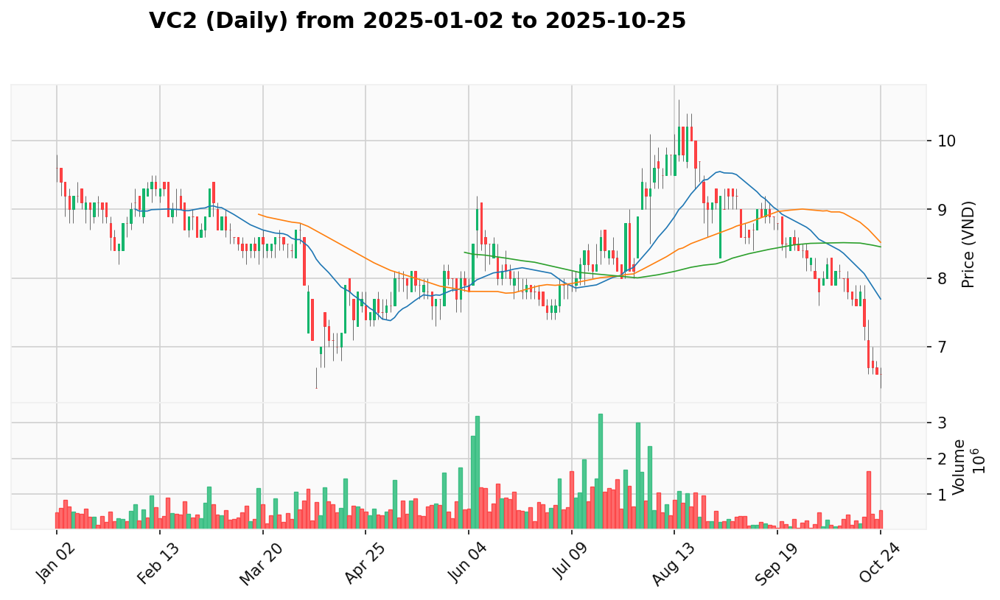

<a href="#xay-dung">↑ Back to group XAY_DUNG</a>  |  <a href="#vpa-signal-summary">↑ Back to Top</a>

#### Key Statistics
| Metric | Value |
|:---|---:|
| Date Range | 2025-01-02 to 2025-10-17 |
| **Latest Close** | **7.8** |
| Period Open | 9.6 |
| Period High | 10.6 |
| Period Low | 6.4 |
| Period Change % | -18.75% |

**[Download VC2 Data (.csv)](market_data/VC2_2025-01-02_to_2025-10-18.csv)**

---

### VC7

#### [VPA Analysis (2025-08-14 - 2025-10-16)](./VPA.md#vc7)
> **Ngày 2025-10-10:** VC7 mở cửa ở mức 11.7 VND và đóng cửa ở mức 11.6 VND, giữ nguyên giá đóng cửa so với phiên trước, với biên độ dao động hẹp từ 11.6 VND đến 11.8 VND. Khối lượng giao dịch tăng mạnh lên 0.2806 triệu cổ phiếu, cao hơn đáng kể so với phiên "Không có cầu" trước đó (0.1263 triệu cổ phiếu). Sau hai phiên liên tiếp cho thấy sự thiếu vắng cầu và kiểm tra nguồn cung, việc khối lượng tăng đột biến nhưng giá không thể bứt phá lên cao hơn, thậm chí đóng cửa ở mức thấp nhất trong ngày, cho thấy lực cung đã xuất hiện và hấp thụ toàn bộ lực cầu gia tăng. Điều này củng cố nhận định về sự yếu kém của thị trường và khả năng giá sẽ tiếp tục kiểm tra các mức hỗ trợ thấp hơn. **Phân tích VPA/Wyckoff:** Nguồn cung xuất hiện
> **Ngày 2025-10-13:** VC7 tăng từ 11.6 VND lên 11.7 VND, với biên độ dao động từ 11.2 VND đến 11.7 VND và đóng cửa gần mức cao nhất phiên. Khối lượng giao dịch tăng mạnh lên 0.6712 triệu cổ phiếu, cao hơn đáng kể so với phiên trước (0.2806 triệu cổ phiếu). Sau các phiên kiểm tra nguồn cung và không có cầu, sự tăng giá nhẹ trên khối lượng lớn cho thấy lực cầu đã xuất hiện và hấp thụ nguồn cung, đẩy giá lên. **Phân tích VPA/Wyckoff:** Cầu vào (Demand Coming In)
> **Ngày 2025-10-14:** VC7 mở cửa ở mức 11.7 VND và đóng cửa ở mức 11.2 VND, giảm mạnh so với phiên trước, với biên độ dao động từ 11.1 VND đến 11.7 VND. Khối lượng giao dịch tăng vọt lên 0.8022 triệu cổ phiếu, cao hơn đáng kể so với phiên trước (0.6712 triệu cổ phiếu). Sau tín hiệu "Cầu vào" ở phiên trước, việc giá giảm mạnh trên khối lượng lớn cho thấy lực cung đã áp đảo hoàn toàn lực cầu, đẩy giá xuống và đóng cửa gần mức thấp nhất trong ngày. Điều này cho thấy sự yếu kém rõ rệt của thị trường và khả năng giá sẽ tiếp tục giảm. **Phân tích VPA/Wyckoff:** Nguồn cung áp đảo
> **Ngày 2025-10-15:** VC7 giảm từ 11.2 VND xuống 10.9 VND, với biên độ dao động từ 10.7 VND đến 11.4 VND và đóng cửa gần mức thấp nhất phiên. Khối lượng giao dịch đạt 0.6962 triệu cổ phiếu, giảm so với phiên trước nhưng vẫn ở mức tương đối cao. Sau phiên nguồn cung áp đảo, việc giá tiếp tục giảm trên khối lượng giảm cho thấy áp lực bán vẫn duy trì, xác nhận sự yếu kém của thị trường. **Phân tích VPA/Wyckoff:** Nguồn cung tiếp diễn
> **Ngày 2025-10-16:** VC7 mở cửa ở mức 10.7 VND, giảm xuống mức thấp nhất 9.9 VND nhưng đã phục hồi và đóng cửa ở mức 10.9 VND, bằng với giá đóng cửa phiên trước. Biên độ dao động trong phiên rộng, cho thấy sự biến động. Khối lượng giao dịch đạt 0.2376 triệu cổ phiếu, giảm mạnh so với các phiên trước, cho thấy áp lực bán đã suy yếu đáng kể. Sau hai phiên giảm giá mạnh với nguồn cung áp đảo, phiên này cho thấy thị trường đang kiểm tra lại nguồn cung ở các mức giá thấp hơn và có vẻ như nguồn cung đã cạn kiệt. **Phân tích VPA/Wyckoff:** Kiểm tra nguồn cung (Test for Supply)

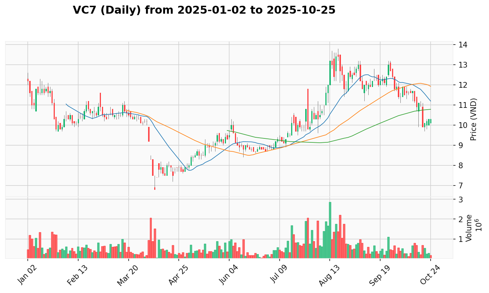

<a href="#penny">↑ Back to group PENNY</a>  |  <a href="#vpa-signal-summary">↑ Back to Top</a>

#### Key Statistics
| Metric | Value |
|:---|---:|
| Date Range | 2025-01-02 to 2025-10-17 |
| **Latest Close** | **11.0** |
| Period Open | 12.3 |
| Period High | 13.8 |
| Period Low | 6.8 |
| Period Change % | -10.57% |

**[Download VC7 Data (.csv)](market_data/VC7_2025-01-02_to_2025-10-18.csv)**

---

### VCB

#### [VPA Analysis (2025-07-18 - 2025-10-16)](./VPA.md#vcb)
> **Ngày 2025-10-10:** VCB tăng từ 63.8 VND lên 64.2 VND (+0.4 VND) với giá mở cửa 63.9 VND và đóng cửa tại 64.2 VND, tạo thành một cây nến xanh có biên độ hẹp và giá đóng cửa ở mức cao, cho thấy lực cầu nhẹ. Khối lượng giao dịch đạt 4.99 triệu cổ phiếu, thấp hơn đáng kể so với phiên trước (5.74 triệu cổ phiếu) và thấp hơn nhiều so với phiên SOS ngày 2025-10-08 (8.12 triệu cổ phiếu). Sau phiên giảm giá với "Dấu hiệu suy yếu", sự tăng giá nhẹ này đi kèm với khối lượng thấp cho thấy lực cầu chưa thực sự mạnh mẽ để đẩy giá lên cao hơn một cách bền vững, cho thấy sự thiếu hụt cầu. **Phân tích VPA/Wyckoff:** Thiếu cầu (No Demand)
> **Ngày 2025-10-13:** VCB giảm từ 64.2 VND xuống 63.1 VND (-1.1 VND) với giá mở cửa 63.4 VND và đóng cửa tại 63.1 VND, tạo thành một cây nến đỏ có biên độ rộng và giá đóng cửa ở mức thấp nhất phiên, cho thấy áp lực bán mạnh mẽ. Khối lượng giao dịch đạt 7.99 triệu cổ phiếu, cao hơn đáng kể so với phiên trước (4.99 triệu cổ phiếu) và gần bằng phiên SOS ngày 2025-10-08 (8.12 triệu cổ phiếu). Sự giảm giá mạnh mẽ đi kèm với khối lượng cao cho thấy lực cung đang chiếm ưu thế và có thể là một dấu hiệu suy yếu tiếp diễn. **Phân tích VPA/Wyckoff:** Dấu hiệu suy yếu (Sign of Weakness)
> **Ngày 2025-10-14:** VCB giữ nguyên mức giá 63.1 VND so với phiên trước, với giá mở cửa 63.5 VND và đóng cửa tại 63.1 VND, tạo thành một cây nến đỏ có biên độ hẹp, cho thấy sự lưỡng lự. Khối lượng giao dịch đạt 7.01 triệu cổ phiếu, thấp hơn so với phiên giảm giá mạnh ngày 2025-10-13 (8.00 triệu cổ phiếu). Sau phiên "Dấu hiệu suy yếu" với khối lượng cao, việc giá không phục hồi và khối lượng giảm cho thấy lực cầu vẫn còn yếu và chưa đủ mạnh để hấp thụ lực cung. **Phân tích VPA/Wyckoff:** Thiếu cầu (No Demand)
> **Ngày 2025-10-15:** VCB giảm từ 63.1 VND xuống 62.5 VND (-0.6 VND) với giá mở cửa 63.1 VND và đóng cửa tại 62.5 VND, tạo thành một cây nến đỏ có biên độ tương đối rộng và giá đóng cửa ở mức thấp nhất phiên, cho thấy áp lực bán tiếp tục chiếm ưu thế. Khối lượng giao dịch đạt 5.2188 triệu cổ phiếu, thấp hơn đáng kể so với phiên trước (7.019 triệu cổ phiếu) và phiên giảm mạnh ngày 2025-10-13 (8.002 triệu cổ phiếu). Mặc dù khối lượng giảm, việc giá tiếp tục giảm mạnh và đóng cửa ở mức thấp nhất phiên sau các tín hiệu suy yếu trước đó cho thấy lực cầu vẫn còn rất yếu và chưa có dấu hiệu phục hồi, xác nhận sự tiếp diễn của xu hướng giảm. **Phân tích VPA/Wyckoff:** Tiếp diễn suy yếu (Continued Weakness)
> **Ngày 2025-10-16:** VCB tăng nhẹ từ 62.5 VND lên 62.7 VND (+0.2 VND) với giá mở cửa 62.7 VND và đóng cửa tại 62.7 VND, tạo thành một cây nến có thân rất nhỏ, cho thấy sự lưỡng lự và thiếu quyết đoán. Khối lượng giao dịch đạt 2.0512 triệu cổ phiếu, mức thấp nhất trong 10 phiên gần đây và thấp hơn đáng kể so với phiên trước (5.224622 triệu cổ phiếu). Sau hai phiên giảm giá với tín hiệu "Thiếu cầu" và "Tiếp diễn suy yếu", việc giá tăng nhẹ với khối lượng cực thấp cho thấy lực cầu vẫn còn rất yếu và không đủ sức đẩy giá lên cao, xác nhận sự vắng mặt của dòng tiền lớn. Điều này cho thấy thị trường vẫn đang trong giai đoạn yếu và có thể tiếp tục xu hướng giảm. **Phân tích VPA/Wyckoff:** Thiếu cầu (No Demand)

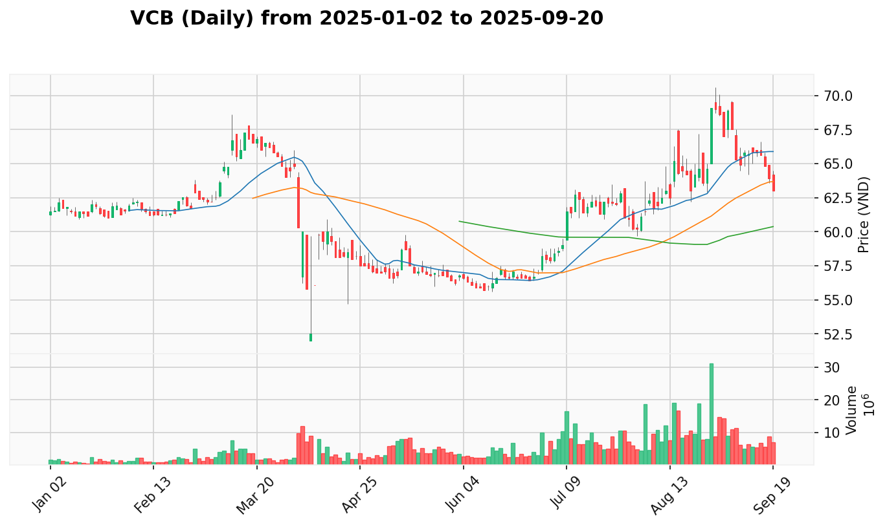

<a href="#ngan-hang">↑ Back to group NGAN_HANG</a>  |  <a href="#vpa-signal-summary">↑ Back to Top</a>

#### Key Statistics
| Metric | Value |
|:---|---:|
| Date Range | 2025-01-02 to 2025-10-17 |
| **Latest Close** | **61.9** |
| Period Open | 60.83 |
| Period High | 70.09 |
| Period Low | 51.63 |
| Period Change % | 1.76% |

**[Download VCB Data (.csv)](market_data/VCB_2025-01-02_to_2025-10-18.csv)**

---

### VCG

#### [VPA Analysis (2025-06-16 - 2025-10-16)](./VPA.md#vcg)
> **Ngày 2025-10-10:** VCG mở cửa ở mức 27.9 VND, đạt mức cao nhất 28.6 VND và mức thấp nhất 27.9 VND, đóng cửa ở mức 27.95 VND. Giá đóng cửa tăng nhẹ từ 27.75 VND lên 27.95 VND so với phiên trước. Khối lượng giao dịch đạt 13.0996 triệu cổ phiếu, tăng đáng kể so với phiên No Demand trước đó (8.4586 triệu cổ phiếu). Mặc dù giá tăng và khối lượng tăng cho thấy lực cầu đã quay trở lại, nhưng giá đóng cửa không đạt mức cao nhất phiên và biên độ tăng giá không quá mạnh so với khối lượng lớn cho thấy áp lực cung vẫn còn hiện hữu. Đây là một nỗ lực kiểm tra cung cầu sau giai đoạn suy yếu. **Phân tích VPA/Wyckoff:** Test
> **Ngày 2025-10-13:** VCG mở cửa ở mức 27.6 VND, đạt mức cao nhất 28.25 VND và mức thấp nhất 27.45 VND, sau đó đóng cửa ở mức 28.25 VND. So với phiên trước (2025-10-10), giá đóng cửa tăng mạnh từ 27.95 VND lên 28.25 VND. Giá đóng cửa trùng với mức cao nhất phiên, cho thấy lực cầu rất mạnh mẽ và áp đảo hoàn toàn lực cung trong phiên. Khối lượng giao dịch đạt 13.0321 triệu cổ phiếu, duy trì ở mức cao, gần bằng phiên trước (13.0996 triệu cổ phiếu) và cao hơn đáng kể so với phiên "No Demand" (8.4586 triệu cổ phiếu). Sự kết hợp giữa giá tăng mạnh, đóng cửa ở mức cao nhất phiên và khối lượng giao dịch lớn cho thấy sự trở lại mạnh mẽ của lực cầu, xác nhận xu hướng tăng sau giai đoạn kiểm tra cung cầu. **Phân tích VPA/Wyckoff:** Sign of Strength (SOS)
> **Ngày 2025-10-14:** VCG mở cửa ở mức 28.6 VND, đạt mức cao nhất 28.9 VND và mức thấp nhất 27.5 VND, đóng cửa ở mức 27.6 VND. So với phiên trước (2025-10-13), giá đóng cửa giảm mạnh từ 28.25 VND xuống 27.6 VND. Giá mở cửa cao hơn nhưng sau đó giảm sâu, đóng cửa gần mức thấp nhất phiên với biên độ giảm rộng, cho thấy áp lực bán rất mạnh mẽ. Khối lượng giao dịch đạt 20.8281 triệu cổ phiếu, tăng đột biến so với phiên trước (13.0321 triệu cổ phiếu) và là mức rất cao. Sự kết hợp giữa giá giảm mạnh, đóng cửa ở mức thấp và khối lượng giao dịch cực lớn cho thấy lực cung đã hoàn toàn áp đảo lực cầu, phủ nhận phần lớn nỗ lực tăng giá của phiên SOS trước đó. **Phân tích VPA/Wyckoff:** Sign of Weakness (SOW)
> **Ngày 2025-10-15:** VCG mở cửa ở mức 27.7 VND, đạt mức cao nhất 27.85 VND và mức thấp nhất 27.15 VND, sau đó đóng cửa ở mức 27.25 VND. So với phiên trước (2025-10-14), giá đóng cửa tiếp tục giảm từ 27.6 VND xuống 27.25 VND. Giá đóng cửa gần mức thấp nhất phiên với biên độ giảm hẹp, cho thấy áp lực bán vẫn còn nhưng không quá mạnh mẽ. Khối lượng giao dịch đạt 13.5954 triệu cổ phiếu, giảm đáng kể so với phiên trước (20.8281 triệu cổ phiếu). Sự kết hợp giữa giá tiếp tục giảm nhưng với khối lượng và biên độ giảm thấp hơn cho thấy lực cung đã suy yếu phần nào, nhưng lực cầu vẫn chưa xuất hiện để hấp thụ lượng cung này. Đây là dấu hiệu của sự thiếu vắng nhu cầu ở mức giá hiện tại. **Phân tích VPA/Wyckoff:** No Demand
> **Ngày 2025-10-16:** VCG mở cửa ở mức 27.3 VND, đạt mức cao nhất 27.5 VND và mức thấp nhất 27.15 VND, đóng cửa ở mức 27.3 VND. So với phiên trước (2025-10-15), giá đóng cửa tăng nhẹ từ 27.25 VND lên 27.3 VND. Biên độ dao động giá rất hẹp, cho thấy sự lưỡng lự của thị trường. Khối lượng giao dịch đạt 4.2828 triệu cổ phiếu, giảm mạnh so với phiên trước (13.5954 triệu cổ phiếu) và là mức rất thấp. Sự kết hợp giữa giá tăng nhẹ, biên độ hẹp và khối lượng giao dịch cực thấp cho thấy lực cung đã cạn kiệt đáng kể, nhưng lực cầu vẫn chưa đủ mạnh để đẩy giá lên cao. Đây là một phiên kiểm tra cung. **Phân tích VPA/Wyckoff:** Test for Supply

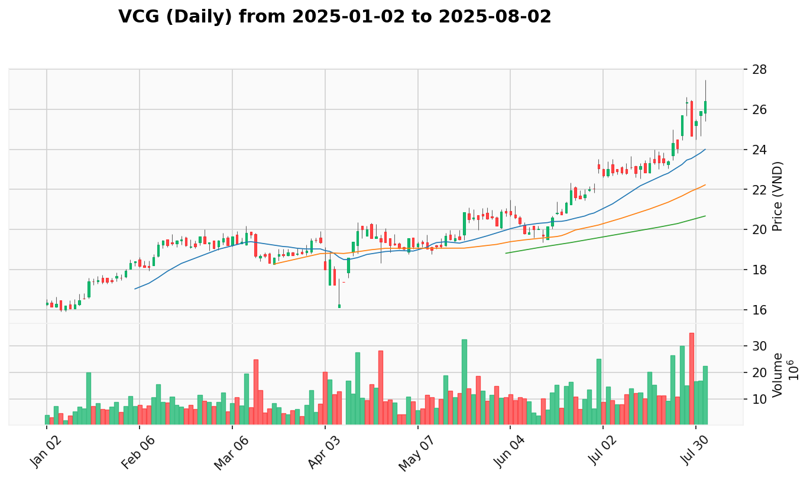

<a href="#dau-tu-cong">↑ Back to group DAU_TU_CONG</a>  |  <a href="#vpa-signal-summary">↑ Back to Top</a>

#### Key Statistics
| Metric | Value |
|:---|---:|
| Date Range | 2025-01-02 to 2025-10-17 |
| **Latest Close** | **27.65** |
| Period Open | 16.26 |
| Period High | 29.1 |
| Period Low | 15.91 |
| Period Change % | 70.05% |

**[Download VCG Data (.csv)](market_data/VCG_2025-01-02_to_2025-10-18.csv)**

---

### VCI

#### [VPA Analysis (2025-06-13 - 2025-10-16)](./VPA.md#vci)
> **Ngày 2025-10-10:** VCI tăng từ 43.0 VND lên 43.55 VND (+1.28%) với biên độ dao động rộng (từ 43.0 VND đến 44.9 VND) và đóng cửa ở nửa dưới thân nến. Khối lượng giao dịch đạt 13.13 triệu cổ phiếu, tăng mạnh so với phiên trước (7.85 triệu cổ phiếu). Mặc dù giá tăng và khối lượng tăng cao, nhưng việc giá không thể duy trì ở mức cao nhất phiên và đóng cửa ở nửa dưới thân nến cho thấy áp lực bán vẫn còn mạnh mẽ ở các mức giá cao hơn. Điều này cho thấy nỗ lực tăng giá đang gặp phải sự kháng cự từ nguồn cung. **Phân tích VPA/Wyckoff:** Effort to Rise but No Result (Nỗ lực tăng giá không đạt kết quả)
> **Ngày 2025-10-13:** VCI tăng từ 43.55 VND lên 44.0 VND (+1.03%) với biên độ dao động 1.4 điểm, mở cửa tại 43.15 VND, tạo đỉnh phiên 44.3 VND, mức thấp 42.9 VND và đóng cửa ở 44.0 VND, gần mức cao nhất phiên. Khối lượng giao dịch đạt 7.9913 triệu cổ phiếu, thấp hơn đáng kể so với phiên trước (13.1298 triệu cổ phiếu). Mặc dù giá tăng và đóng cửa ở nửa trên thân nến, nhưng khối lượng giao dịch thấp cho thấy sự thiếu hụt lực cầu mạnh mẽ để đẩy giá lên cao hơn một cách bền vững. Điều này có thể là một dấu hiệu của sự yếu kém tiềm ẩn sau nỗ lực tăng giá không thành công ở phiên trước. **Phân tích VPA/Wyckoff:** No Demand (Không có cầu)
> **Ngày 2025-10-14:** VCI giảm từ 44.0 VND xuống 43.0 VND (-2.27%) với biên độ dao động rất rộng (từ 42.5 VND đến 45.15 VND) và đóng cửa ở gần mức thấp nhất phiên. Khối lượng giao dịch đạt 16.10 triệu cổ phiếu, tăng mạnh so với phiên trước (7.99 triệu cổ phiếu). Điều này cho thấy áp lực bán rất lớn đã xuất hiện, đẩy giá xuống thấp với khối lượng cao, xác nhận sự yếu kém của thị trường. **Phân tích VPA/Wyckoff:** Sign of Weakness (SOW) - Dấu hiệu yếu kém.
> **Ngày 2025-10-15:** VCI giảm từ 43.0 VND xuống 42.75 VND (-0.58%) với biên độ dao động hẹp (từ 42.55 VND đến 43.5 VND) và đóng cửa gần mức thấp nhất phiên. Khối lượng giao dịch đạt 7.8986 triệu cổ phiếu, giảm đáng kể so với phiên trước (16.0968 triệu cổ phiếu). Sau phiên giảm mạnh với khối lượng lớn (SOW) vào ngày 2025-10-14, phiên này cho thấy giá tiếp tục giảm nhưng với khối lượng thấp và biên độ hẹp, xác nhận sự thiếu hụt lực cầu và sự tiếp diễn của xu hướng yếu kém. **Phân tích VPA/Wyckoff:** No Demand (Không có cầu)
> **Ngày 2025-10-16:** VCI tăng nhẹ từ 42.75 VND lên 42.85 VND (+0.23%) với biên độ dao động hẹp (từ 42.75 VND đến 43.75 VND) và đóng cửa ở gần giữa phiên. Khối lượng giao dịch đạt 4.72 triệu cổ phiếu, giảm mạnh so với phiên trước (7.90 triệu cổ phiếu). Sau hai phiên giảm giá với khối lượng lớn (SOW) và không có cầu (No Demand), phiên này cho thấy giá có sự hồi phục nhẹ nhưng với khối lượng rất thấp, xác nhận sự thiếu hụt lực cầu và sự yếu kém của thị trường vẫn tiếp diễn. **Phân tích VPA/Wyckoff:** No Demand (Không có cầu)

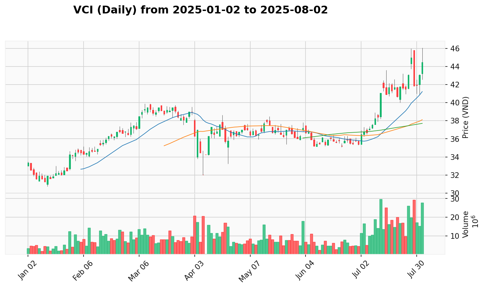

<a href="#chung-khoan">↑ Back to group CHUNG_KHOAN</a>  |  <a href="#vpa-signal-summary">↑ Back to Top</a>

#### Key Statistics
| Metric | Value |
|:---|---:|
| Date Range | 2025-01-02 to 2025-10-17 |
| **Latest Close** | **41.95** |
| Period Open | 33.01 |
| Period High | 49.45 |
| Period Low | 30.73 |
| Period Change % | 27.08% |

**[Download VCI Data (.csv)](market_data/VCI_2025-01-02_to_2025-10-18.csv)**

---

### VCS

#### [VPA Analysis (2025-06-26 - 2025-10-16)](./VPA.md#vcs)
> **Ngày 2025-10-10:** VCS tăng từ 48.2 VND lên 48.6 VND với biên độ dao động từ 48.1 VND đến 50.0 VND. Giá mở cửa cao hơn đáng kể nhưng sau đó giảm mạnh từ mức cao nhất, đóng cửa gần mức thấp nhất phiên. Khối lượng giao dịch đạt 0.0905 triệu cổ phiếu, tăng so với phiên trước (0.0759 triệu cổ phiếu). Sau các phiên "Không có cầu" và "Áp lực bán", việc giá tăng với khối lượng gia tăng nhưng không giữ được mức cao nhất cho thấy lực cung đã xuất hiện mạnh mẽ, hấp thụ lực cầu và ngăn cản đà tăng giá. **Phân tích VPA/Wyckoff:** Lực cung xuất hiện
> **Ngày 2025-10-13:** VCS giảm từ 48.6 VND xuống 47.9 VND với biên độ dao động từ 47.9 VND đến 48.5 VND. Giá đóng cửa ở mức thấp nhất phiên, cho thấy áp lực bán mạnh mẽ. Khối lượng giao dịch đạt 0.1289 triệu cổ phiếu, tăng đáng kể so với phiên trước (0.0905 triệu cổ phiếu). Sau phiên "Lực cung xuất hiện" ngày 2025-10-10, việc giá tiếp tục giảm mạnh với khối lượng gia tăng và đóng cửa ở mức thấp nhất phiên xác nhận sự hiện diện của lực cung áp đảo, cho thấy sự yếu kém tiếp diễn. **Phân tích VPA/Wyckoff:** Selling Pressure (Áp lực bán mạnh)
> **Ngày 2025-10-14:** VCS giảm từ 47.9 VND xuống 47.7 VND với biên độ dao động từ 47.7 VND đến 48.3 VND. Giá đóng cửa ở mức thấp nhất phiên. Khối lượng giao dịch đạt 0.1375 triệu cổ phiếu, tăng so với phiên trước (0.1289 triệu cổ phiếu). Sau phiên "Áp lực bán mạnh" ngày 2025-10-13, việc giá tiếp tục giảm với khối lượng gia tăng và đóng cửa ở mức thấp nhất phiên xác nhận lực cung vẫn đang chiếm ưu thế, cho thấy sự yếu kém tiếp diễn. **Phân tích VPA/Wyckoff:** Selling Pressure (Áp lực bán mạnh)
> **Ngày 2025-10-15:** VCS giảm từ 47.7 VND xuống 47.5 VND với biên độ dao động từ 47.5 VND đến 48.0 VND. Giá đóng cửa ở mức thấp nhất phiên, cho thấy áp lực bán vẫn còn. Khối lượng giao dịch đạt 0.0837 triệu cổ phiếu, giảm đáng kể so với phiên trước (0.1375 triệu cổ phiếu). Sau hai phiên "Áp lực bán mạnh", việc giá tiếp tục giảm với biên độ hẹp và khối lượng giảm cho thấy lực cung đã bớt quyết liệt hơn, nhưng lực cầu vẫn chưa xuất hiện, xác nhận thị trường vẫn đang trong trạng thái yếu. **Phân tích VPA/Wyckoff:** No Demand (Không có cầu)
> **Ngày 2025-10-16:** VCS giảm từ 47.5 VND xuống 47.4 VND với biên độ dao động rộng từ 45.6 VND đến 47.9 VND. Giá đóng cửa ở mức thấp nhất phiên. Khối lượng giao dịch đạt 0.0257 triệu cổ phiếu, giảm mạnh so với phiên trước (0.0837 triệu cổ phiếu). Sau phiên "Không có cầu" ngày 2025-10-15, việc giá tiếp tục giảm với biên độ rộng nhưng khối lượng cực thấp cho thấy sự thiếu vắng cả lực cung và lực cầu, xác nhận thị trường vẫn đang rất yếu và không có sự quan tâm mua vào. **Phân tích VPA/Wyckoff:** Lack of Demand (Thiếu cầu)

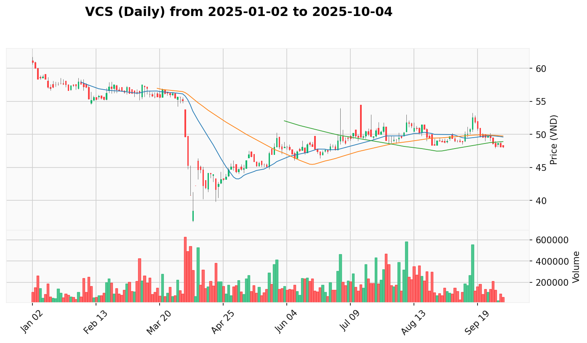

<a href="#others">↑ Back to group OTHERS</a>  |  <a href="#vpa-signal-summary">↑ Back to Top</a>

#### Key Statistics
| Metric | Value |
|:---|---:|
| Date Range | 2025-01-02 to 2025-10-17 |
| **Latest Close** | **46.8** |
| Period Open | 61.16 |
| Period High | 61.74 |
| Period Low | 36.78 |
| Period Change % | -23.48% |

**[Download VCS Data (.csv)](market_data/VCS_2025-01-02_to_2025-10-18.csv)**

---

### VDS

#### [VPA Analysis (2025-08-04 - 2025-10-16)](./VPA.md#vds)
> **Ngày 2025-10-10:** VDS mở cửa ở mức 22.4 VND, tăng lên 22.65 VND nhưng sau đó giảm và đóng cửa ở 22.3 VND, bằng với giá đóng cửa phiên trước. Khối lượng giao dịch đạt 2.7638 triệu cổ phiếu, cao hơn đáng kể so với phiên trước. Sau phiên "Không có cung" với khối lượng thấp, phiên này cho thấy khối lượng tăng nhưng giá không thể bứt phá lên cao hơn, đóng cửa ngang bằng với phiên trước và có bóng nến trên, cho thấy lực cung đã xuất hiện trở lại hoặc lực cầu chưa đủ mạnh để hấp thụ. **Phân tích VPA/Wyckoff:** Effort without Result (Nỗ lực không mang lại kết quả) - Khối lượng tăng nhưng giá không tiến triển, cho thấy sự hiện diện của lực cung.
> **Ngày 2025-10-13:** VDS mở cửa ở mức 21.8 VND, tăng lên 22.4 VND và đóng cửa ở 22.3 VND, bằng với giá đóng cửa phiên trước. Khối lượng giao dịch đạt 2.3505 triệu cổ phiếu, thấp hơn đáng kể so với phiên trước. Sau phiên "Nỗ lực không mang lại kết quả" với khối lượng cao, phiên này cho thấy giá giữ vững ở mức đóng cửa của phiên trước với khối lượng giảm. Điều này cho thấy lực cung đã suy yếu và lực cầu đang hấp thụ tốt, giữ giá không giảm sâu. Cây nến có biên độ hẹp và đóng cửa gần mức cao nhất phiên, cho thấy sự kiểm soát của bên mua. **Phân tích VPA/Wyckoff:** No Supply (Không có cung)
> **Ngày 2025-10-14:** VDS mở cửa ở mức 22.8 VND, tăng lên 22.95 VND nhưng sau đó giảm mạnh và đóng cửa ở 21.7 VND, thấp hơn đáng kể so với giá đóng cửa phiên trước (22.3 VND). Khối lượng giao dịch đạt 4.5429 triệu cổ phiếu, cao gần gấp đôi so với phiên trước. Sau phiên "Không có cung" với khối lượng thấp, phiên này cho thấy lực cung đã quay trở lại mạnh mẽ, đẩy giá xuống thấp trên khối lượng lớn. Cây nến có biên độ rộng và đóng cửa gần mức thấp nhất phiên, cho thấy sự chiếm ưu thế của bên bán. **Phân tích VPA/Wyckoff:** Sign of Weakness (SOW) - Lực cung mạnh mẽ xuất hiện trở lại trên khối lượng lớn, đẩy giá giảm.
> **Ngày 2025-10-15:** VDS mở cửa ở mức 21.8 VND, tăng nhẹ lên 21.85 VND nhưng sau đó giảm mạnh xuống 21.1 VND và đóng cửa ở 21.2 VND, thấp hơn đáng kể so với giá đóng cửa phiên trước (21.7 VND). Khối lượng giao dịch đạt 2.7548 triệu cổ phiếu, thấp hơn đáng kể so với phiên trước (4.5429 triệu cổ phiếu). Sau phiên "Sign of Weakness" với khối lượng cao, phiên này cho thấy giá tiếp tục giảm trên khối lượng thấp hơn. Điều này cho thấy lực cung vẫn chiếm ưu thế và thiếu vắng lực cầu, khiến giá không thể phục hồi. Cây nến có biên độ tương đối rộng và đóng cửa gần mức thấp nhất phiên, xác nhận sự kiểm soát của bên bán. **Phân tích VPA/Wyckoff:** No Demand (Thiếu vắng lực cầu)
> **Ngày 2025-10-16:** VDS mở cửa ở mức 21.6 VND, tăng lên 22.25 VND và đóng cửa ở 21.7 VND, cao hơn so với giá đóng cửa phiên trước (21.2 VND). Khối lượng giao dịch đạt 1.7319 triệu cổ phiếu, thấp hơn đáng kể so với phiên trước (2.7548 triệu cổ phiếu). Sau hai phiên giảm giá với "Sign of Weakness" và "No Demand", phiên này cho thấy giá phục hồi nhẹ trên khối lượng rất thấp. Điều này cho thấy lực cung đã suy yếu đáng kể và không có nhiều cổ phiếu được bán ra ở mức giá này, nhưng lực cầu cũng chưa thực sự mạnh mẽ để đẩy giá lên cao hơn. Cây nến có biên độ hẹp và đóng cửa ở giữa thân nến, cho thấy sự lưỡng lự của thị trường. **Phân tích VPA/Wyckoff:** No Supply (Không có cung) - Giá tăng nhẹ trên khối lượng rất thấp sau giai đoạn suy yếu, cho thấy lực cung đã cạn kiệt tạm thời.

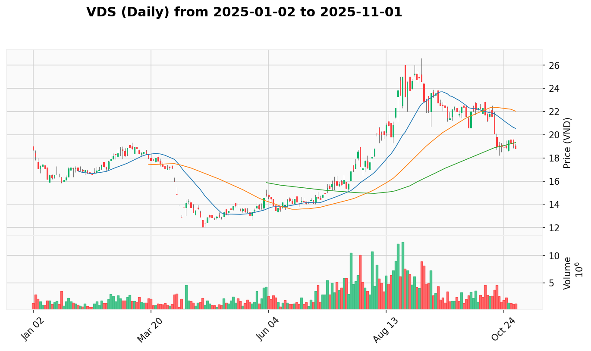

<a href="#chung-khoan">↑ Back to group CHUNG_KHOAN</a>  |  <a href="#vpa-signal-summary">↑ Back to Top</a>

#### Key Statistics
| Metric | Value |
|:---|---:|
| Date Range | 2025-01-02 to 2025-10-17 |
| **Latest Close** | **21.6** |
| Period Open | 19.0 |
| Period High | 26.6 |
| Period Low | 12.05 |
| Period Change % | 13.68% |

**[Download VDS Data (.csv)](market_data/VDS_2025-01-02_to_2025-10-18.csv)**

---

### VEA

#### [VPA Analysis (2025-06-16 - 2025-10-16)](./VPA.md#vea)
> **Ngày 2025-10-10:** VEA tăng từ 40.0 VND lên 40.1 VND, với khối lượng giao dịch đạt 0.3693 triệu cổ phiếu. Cây nến tăng có biên độ hẹp (từ 39.9 đến 40.1) và đóng cửa ở mức cao nhất phiên. Khối lượng giao dịch tăng nhẹ so với phiên trước (0.2849 triệu cổ phiếu) nhưng vẫn ở mức trung bình. Sau phiên "Không có nguồn cung", việc giá tiếp tục tăng nhẹ với khối lượng tăng vừa phải cho thấy lực cầu đang dần quay trở lại và hấp thụ nguồn cung, nhưng chưa đủ mạnh để tạo ra một đợt tăng giá bứt phá. **Phân tích VPA/Wyckoff:** Test for Supply (Kiểm tra nguồn cung)
> **Ngày 2025-10-13:** VEA giảm từ 40.1 VND xuống 39.6 VND, với khối lượng giao dịch đạt 0.3342 triệu cổ phiếu. Cây nến giảm có biên độ tương đối rộng (từ 39.5 đến 40.1) và đóng cửa gần mức thấp nhất phiên. Khối lượng giao dịch giảm so với phiên trước (0.3693 triệu cổ phiếu) và ở mức thấp. Sau hai phiên tăng nhẹ với khối lượng thấp và trung bình, việc giá giảm mạnh với khối lượng thấp cho thấy lực cầu yếu và không có sự hỗ trợ đáng kể để giữ giá. **Phân tích VPA/Wyckoff:** No Demand (Không có nhu cầu)
> **Ngày 2025-10-14:** VEA tăng từ 39.6 VND lên 39.7 VND, với khối lượng giao dịch đạt 0.3735 triệu cổ phiếu. Cây nến tăng có biên độ hẹp (từ 39.5 đến 39.8) và đóng cửa gần mức cao nhất phiên. Khối lượng giao dịch tăng nhẹ so với phiên trước (0.3342 triệu cổ phiếu) nhưng vẫn ở mức trung bình thấp. Sau phiên "Không có nhu cầu", việc giá tăng nhẹ với khối lượng tăng vừa phải cho thấy lực cầu đang cố gắng quay trở lại, nhưng chưa đủ mạnh để vượt qua áp lực cung. Giá vẫn đang dao động trong một biên độ hẹp, cho thấy sự lưỡng lự của thị trường. **Phân tích VPA/Wyckoff:** Test for Supply (Kiểm tra nguồn cung)
> **Ngày 2025-10-15:** VEA tăng từ 39.6 VND lên 39.7 VND, với khối lượng giao dịch đạt 0.2869 triệu cổ phiếu. Cây nến tăng có biên độ rất hẹp (từ 39.6 đến 39.7) và đóng cửa ở mức cao nhất phiên. Khối lượng giao dịch giảm đáng kể so với phiên trước (0.3735 triệu cổ phiếu) và ở mức rất thấp. Sau phiên "Kiểm tra nguồn cung" với khối lượng trung bình thấp, việc giá tiếp tục tăng nhẹ nhưng với khối lượng giảm mạnh và biên độ cực hẹp cho thấy lực cầu rất yếu và không có sự tham gia đáng kể từ người mua. Thị trường vẫn đang trong trạng thái lưỡng lự và thiếu động lực tăng giá. **Phân tích VPA/Wyckoff:** No Demand (Không có nhu cầu)
> **Ngày 2025-10-16:** VEA tăng từ 39.7 VND lên 39.8 VND, với khối lượng giao dịch đạt 0.2838 triệu cổ phiếu. Cây nến tăng có biên độ hẹp (từ 39.5 đến 40.0) và đóng cửa gần mức cao nhất phiên. Khối lượng giao dịch giảm nhẹ so với phiên trước (0.2869 triệu cổ phiếu) và duy trì ở mức rất thấp. Sau phiên "Không có nhu cầu" ngày 2025-10-15, việc giá tiếp tục tăng nhẹ với khối lượng thấp cho thấy lực cầu vẫn yếu và không có sự tham gia đáng kể, xác nhận sự thiếu vắng nhu cầu. Thị trường vẫn đang trong trạng thái lưỡng lự và thiếu động lực tăng giá. **Phân tích VPA/Wyckoff:** No Demand (Không có nhu cầu)

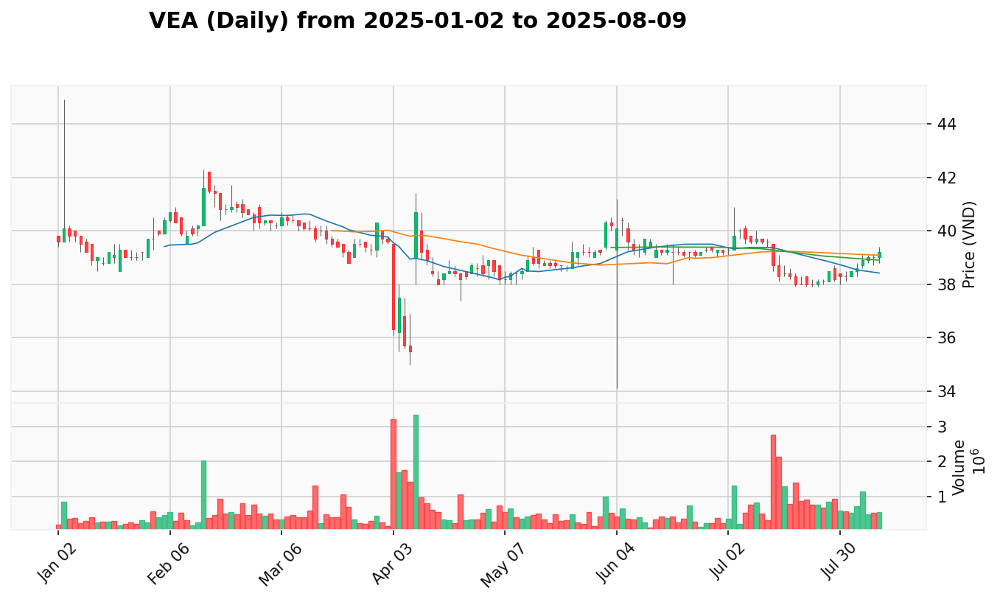

<a href="#others">↑ Back to group OTHERS</a>  |  <a href="#vpa-signal-summary">↑ Back to Top</a>

#### Key Statistics
| Metric | Value |
|:---|---:|
| Date Range | 2025-01-02 to 2025-10-17 |
| **Latest Close** | **39.8** |
| Period Open | 39.8 |
| Period High | 44.9 |
| Period Low | 34.1 |
| Period Change % | 0.00% |

**[Download VEA Data (.csv)](market_data/VEA_2025-01-02_to_2025-10-18.csv)**

---

### VGC

#### [VPA Analysis (2025-06-13 - 2025-10-16)](./VPA.md#vgc)
> **Ngày 2025-10-10:** VGC tăng từ 53.6 VND lên 53.9 VND (+0.3 VND) với biên độ 1.3 VND. Nến xanh có thân nến hẹp, đóng cửa gần giữa nến. Khối lượng giao dịch đạt 1.0881 triệu cổ phiếu, giảm đáng kể so với phiên trước đó (1.8174 triệu cổ phiếu). Sau phiên SOS ngày 2025-10-09 cho thấy lực cầu xuất hiện, phiên này với biên độ hẹp và khối lượng thấp cho thấy sự thiếu hụt lực cầu để đẩy giá lên cao hơn, xác nhận sự yếu kém của phe mua. **Phân tích VPA/Wyckoff:** No Demand
> **Ngày 2025-10-13:** VGC tăng từ 53.2 VND lên 53.9 VND (+0.7 VND) với biên độ 1.6 VND. Nến xanh có thân nến tương đối rộng, đóng cửa ở mức giữa nến. Khối lượng giao dịch đạt 1.1238 triệu cổ phiếu, tăng nhẹ so với phiên trước đó. Sau phiên 'No Demand' ngày 2025-10-10, phiên này cho thấy nỗ lực tăng giá nhưng không thể đóng cửa cao hơn, cho thấy lực cung vẫn đang hấp thụ lực cầu, và phe mua vẫn chưa đủ mạnh để đẩy giá lên. **Phân tích VPA/Wyckoff:** Lack of Demand
> **Ngày 2025-10-14:** VGC giảm từ 53.9 VND xuống 53.6 VND (-0.3 VND) với biên độ 1.8 VND. Nến đỏ có thân nến rộng, đóng cửa ở mức thấp nhất phiên. Khối lượng giao dịch đạt 2.0997 triệu cổ phiếu, tăng đáng kể so với phiên trước đó (1.1238 triệu cổ phiếu). Sau các phiên 'No Demand' và 'Lack of Demand', phiên này cho thấy lực cung áp đảo hoàn toàn lực cầu, với giá giảm mạnh và đóng cửa ở mức thấp nhất trong phiên, được xác nhận bởi khối lượng giao dịch tăng cao. Điều này cho thấy sự yếu kém rõ rệt của cổ phiếu. **Phân tích VPA/Wyckoff:** Sign of Weakness (SOW) - Lực cung mạnh mẽ
> **Ngày 2025-10-15:** VGC giảm từ 53.6 VND xuống 52.0 VND (-1.6 VND) với biên độ 2.6 VND. Nến đỏ có thân nến rộng, đóng cửa ở mức thấp nhất phiên. Khối lượng giao dịch đạt 2.6878 triệu cổ phiếu, tăng đáng kể so với phiên trước đó (2.0997 triệu cổ phiếu). Sau phiên 'Sign of Weakness' ngày 2025-10-14, phiên này tiếp tục cho thấy lực cung áp đảo hoàn toàn lực cầu, với giá giảm mạnh và đóng cửa ở mức thấp nhất trong phiên, được xác nhận bởi khối lượng giao dịch tăng cao. Điều này củng cố thêm sự yếu kém rõ rệt của cổ phiếu và khả năng tiếp tục giảm giá. **Phân tích VPA/Wyckoff:** Sign of Weakness (SOW) - Lực cung mạnh mẽ tiếp diễn.
> **Ngày 2025-10-16:** VGC tăng từ 52.0 VND lên 52.5 VND (+0.5 VND) với biên độ 1.0 VND. Nến xanh có thân nến nhỏ, đóng cửa ở giữa đến gần mức cao nhất phiên. Khối lượng giao dịch đạt 0.6537 triệu cổ phiếu, giảm mạnh so với phiên trước đó (2.6878 triệu cổ phiếu). Sau hai phiên giảm mạnh với tín hiệu 'Sign of Weakness', phiên này giá tăng nhẹ nhưng với khối lượng rất thấp. Điều này cho thấy lực cầu yếu ớt và không có sự tham gia mạnh mẽ của người mua, có thể là một nhịp hồi kỹ thuật hoặc kiểm tra lực cầu sau đợt giảm. Sự thiếu vắng khối lượng xác nhận sự yếu kém của thị trường. **Phân tích VPA/Wyckoff:** No Demand (ND) - Lực cầu yếu ớt.

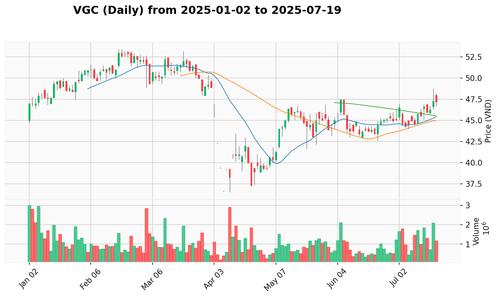

<a href="#bat-dong-san-kcn">↑ Back to group BAT_DONG_SAN_KCN</a>  |  <a href="#vpa-signal-summary">↑ Back to Top</a>

#### Key Statistics
| Metric | Value |
|:---|---:|
| Date Range | 2025-01-02 to 2025-10-17 |
| **Latest Close** | **50.0** |
| Period Open | 45.0 |
| Period High | 69.0 |
| Period Low | 36.5 |
| Period Change % | 11.11% |

**[Download VGC Data (.csv)](market_data/VGC_2025-01-02_to_2025-10-18.csv)**

---

### VGI

#### [VPA Analysis (2025-06-16 - 2025-10-16)](./VPA.md#vgi)
> **Ngày 2025-10-10:** VGI tăng từ 68.5 VND lên 68.7 VND với đỉnh ngày 69.4 VND và đáy 68.0 VND. Nến có biên độ rộng, đóng cửa ở giữa nến. Khối lượng giao dịch đạt 0.2375 triệu cổ phiếu, tăng đáng kể so với phiên trước (0.178 triệu cổ phiếu). Giá tăng nhẹ với khối lượng tăng nhưng không thể đóng cửa ở mức cao cho thấy lực cầu đang gặp phải áp lực cung mạnh mẽ, đặc biệt sau phiên giảm điểm trước đó. **Phân tích VPA/Wyckoff:** Effort to Rise but No Result (Nỗ lực tăng giá nhưng không đạt kết quả) - Giá tăng nhẹ với khối lượng tăng nhưng đóng cửa ở giữa nến rộng cho thấy áp lực cung vẫn còn mạnh.
> **Ngày 2025-10-13:** VGI giảm từ 68.7 VND xuống 67.9 VND với đỉnh ngày 68.7 VND và đáy 66.0 VND. Nến giảm có biên độ rộng, đóng cửa gần mức thấp nhất phiên. Khối lượng giao dịch đạt 0.2002 triệu cổ phiếu, giảm so với phiên trước (0.2375 triệu cổ phiếu). Giá giảm mạnh với biên độ rộng và đóng cửa ở mức thấp trong khi khối lượng giảm cho thấy áp lực bán vẫn còn nhưng lực cầu yếu, không có khả năng hấp thụ cung. Điều này tiếp tục xác nhận sự yếu kém của thị trường sau nỗ lực tăng giá không thành công ở phiên trước. **Phân tích VPA/Wyckoff:** Weakness (Yếu kém) - Giá giảm mạnh với biên độ rộng và đóng cửa ở mức thấp, cho thấy sự tiếp diễn của áp lực cung và thiếu vắng lực cầu.
> **Ngày 2025-10-14:** VGI giảm từ 67.9 VND xuống 67.0 VND với đỉnh ngày 68.8 VND và đáy 66.5 VND. Nến giảm có biên độ rộng, đóng cửa gần mức thấp nhất phiên. Khối lượng giao dịch đạt 0.3722 triệu cổ phiếu, tăng đáng kể so với phiên trước (0.2002 triệu cổ phiếu). Giá giảm mạnh với khối lượng tăng cao và đóng cửa ở mức thấp cho thấy áp lực bán rất mạnh mẽ đang chiếm ưu thế trên thị trường, xác nhận sự tiếp diễn của xu hướng yếu kém đã được thiết lập. **Phân tích VPA/Wyckoff:** Weakness (Yếu kém) - Giá giảm mạnh với khối lượng tăng cao và đóng cửa ở mức thấp, cho thấy áp lực cung mạnh mẽ và sự tiếp diễn của xu hướng giảm.
> **Ngày 2025-10-15:** VGI giảm từ 67.0 VND xuống 65.6 VND với đỉnh ngày 67.9 VND và đáy 65.6 VND. Nến giảm có biên độ rộng, đóng cửa ở mức thấp nhất phiên. Khối lượng giao dịch đạt 0.4129 triệu cổ phiếu, tăng so với phiên trước (0.3722 triệu cổ phiếu). Giá giảm mạnh với khối lượng tăng cao và đóng cửa ở mức thấp nhất phiên cho thấy áp lực bán rất mạnh mẽ đang chiếm ưu thế trên thị trường, xác nhận sự tiếp diễn của xu hướng yếu kém đã được thiết lập. **Phân tích VPA/Wyckoff:** Weakness (Yếu kém) - Giá giảm mạnh với khối lượng tăng cao và đóng cửa ở mức thấp nhất phiên, cho thấy áp lực cung mạnh mẽ và sự tiếp diễn của xu hướng giảm.
> **Ngày 2025-10-16:** VGI giảm từ 65.6 VND xuống 65.0 VND với đỉnh ngày 66.5 VND và đáy 64.5 VND. Nến giảm có biên độ rộng, đóng cửa gần mức thấp nhất phiên. Khối lượng giao dịch đạt 0.2564 triệu cổ phiếu, giảm so với phiên trước (0.4129 triệu cổ phiếu). Giá tiếp tục giảm mạnh với biên độ rộng và đóng cửa gần mức thấp nhất phiên, cho thấy áp lực bán vẫn còn mạnh mẽ. Mặc dù khối lượng giảm nhẹ, nhưng vẫn ở mức đáng kể, xác nhận xu hướng yếu kém tiếp diễn. **Phân tích VPA/Wyckoff:** Weakness (Yếu kém) - Giá tiếp tục giảm mạnh với biên độ rộng, đóng cửa gần mức thấp nhất phiên, cho thấy áp lực cung vẫn chiếm ưu thế, dù khối lượng có giảm nhẹ.

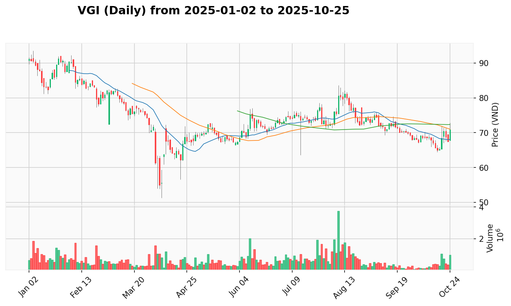

<a href="#cong-nghe">↑ Back to group CONG_NGHE</a>  |  <a href="#vpa-signal-summary">↑ Back to Top</a>

#### Key Statistics
| Metric | Value |
|:---|---:|
| Date Range | 2025-01-02 to 2025-10-17 |
| **Latest Close** | **65.3** |
| Period Open | 90.79 |
| Period High | 93.56 |
| Period Low | 51.29 |
| Period Change % | -28.08% |

**[Download VGI Data (.csv)](market_data/VGI_2025-01-02_to_2025-10-18.csv)**

---

### VGS

#### [VPA Analysis (2025-08-14 - 2025-10-16)](./VPA.md#vgs)
> **Ngày 2025-10-10:** VGS mở cửa tại 30.8 VND và đóng cửa tại 32.1 VND, tăng mạnh so với mức đóng cửa 30.7 VND của phiên trước. Cây nến có biên độ rộng từ 30.7 VND đến 32.5 VND và đóng cửa gần mức cao nhất phiên. Khối lượng giao dịch đạt 3.5666 triệu cổ phiếu, cao hơn đáng kể so với 0.6271 triệu cổ phiếu của phiên trước và là mức cao nhất trong 10 phiên gần đây. Sau phiên "No Demand" (Thiếu cầu) ngày 2025-10-09, phiên này cho thấy lực cầu mạnh mẽ đã quay trở lại, đẩy giá lên cao với khối lượng lớn, xác nhận sự hấp thụ nguồn cung và khả năng bắt đầu một xu hướng tăng mới. **Phân tích VPA/Wyckoff:** Sign of Strength (SOS)
> **Ngày 2025-10-13:** VGS tăng nhẹ từ 32.1 VND lên 32.3 VND với khối lượng giao dịch giảm xuống 1.8506 triệu cổ phiếu. Cây nến có biên độ hẹp hơn so với phiên trước và đóng cửa gần mức cao nhất phiên. Sau phiên "Sign of Strength" (SOS) mạnh mẽ ngày 2025-10-10, phiên này cho thấy lực cầu đã tạm thời suy yếu, hoặc thị trường đang kiểm tra nguồn cung ở mức giá cao hơn. Mặc dù giá vẫn giữ được đà tăng, nhưng khối lượng giảm đáng kể cho thấy sự thiếu hụt lực mua tiếp diễn. **Phân tích VPA/Wyckoff:** No Demand (Thiếu cầu)
> **Ngày 2025-10-14:** VGS mở cửa tại 32.4 VND, đạt mức cao 33.2 VND nhưng đóng cửa tại 32.0 VND, giảm so với mức đóng cửa 32.3 VND của phiên trước. Cây nến có biên độ rộng và đóng cửa ở mức thấp nhất phiên, cho thấy áp lực bán mạnh. Khối lượng giao dịch đạt 2.6974 triệu cổ phiếu, cao hơn so với 1.8506 triệu cổ phiếu của phiên trước. Sự tăng giá ban đầu không duy trì được, và giá đóng cửa giảm với khối lượng tăng cho thấy nguồn cung đã xuất hiện và áp đảo lực cầu. Sau phiên "No Demand" ngày 2025-10-13, phiên này xác nhận sự suy yếu của lực cầu và sự gia tăng của áp lực bán. **Phân tích VPA/Wyckoff:** Sign of Weakness (SOW) - Nguồn cung xuất hiện mạnh mẽ.
> **Ngày 2025-10-15:** VGS giảm từ 32.0 VND xuống 31.6 VND với khối lượng giao dịch giảm xuống 1.447 triệu cổ phiếu. Cây nến có biên độ tương đối rộng và đóng cửa gần mức thấp nhất phiên. Sau phiên "Sign of Weakness" (SOW) mạnh mẽ ngày 2025-10-14, phiên này cho thấy áp lực bán vẫn duy trì nhưng với cường độ thấp hơn, đồng thời lực cầu vẫn yếu. Sự giảm giá với khối lượng thấp xác nhận sự thiếu hụt lực mua, cho thấy xu hướng giảm giá có thể tiếp diễn. **Phân tích VPA/Wyckoff:** No Demand (Thiếu cầu)
> **Ngày 2025-10-16:** VGS tăng từ 31.6 VND lên 32.1 VND. Cây nến tăng có biên độ trung bình và đóng cửa gần mức cao nhất phiên, cho thấy lực mua xuất hiện. Tuy nhiên, khối lượng giao dịch chỉ đạt 0.7464 triệu cổ phiếu, thấp hơn đáng kể so với 1.447 triệu cổ phiếu của phiên trước và mức trung bình. Sau hai phiên suy yếu liên tiếp ("Sign of Weakness" và "No Demand"), sự tăng giá với khối lượng thấp này có thể là một dấu hiệu kiểm tra nguồn cung (Test for Supply), cho thấy áp lực bán đã giảm bớt nhưng lực cầu mạnh mẽ vẫn chưa quay trở lại. **Phân tích VPA/Wyckoff:** Test for Supply (Kiểm tra nguồn cung)

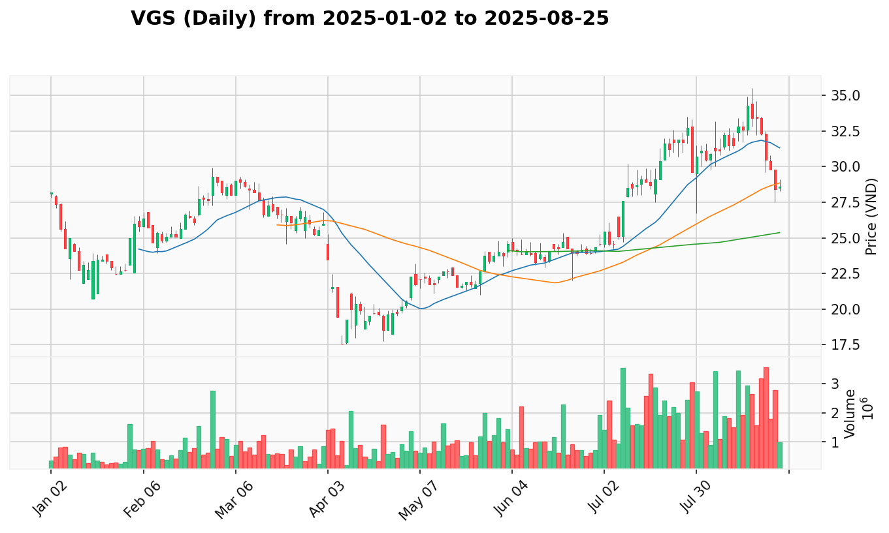

<a href="#thep">↑ Back to group THEP</a>  |  <a href="#vpa-signal-summary">↑ Back to Top</a>

#### Key Statistics
| Metric | Value |
|:---|---:|
| Date Range | 2025-01-02 to 2025-10-17 |
| **Latest Close** | **32.4** |
| Period Open | 28.09 |
| Period High | 35.5 |
| Period Low | 17.55 |
| Period Change % | 15.34% |

**[Download VGS Data (.csv)](market_data/VGS_2025-01-02_to_2025-10-18.csv)**

---

### VGT

#### [VPA Analysis (2025-06-16 - 2025-10-16)](./VPA.md#vgt)
> **Ngày 2025-10-10:** VGT giữ nguyên mức giá đóng cửa 12.1 VND so với phiên trước, với biên độ nến hẹp (từ 12.0 VND đến 12.2 VND). Giá mở cửa ở 12.0 VND và đóng cửa ở 12.1 VND. Khối lượng giao dịch đạt 0.3155 triệu cổ phiếu, tiếp tục giảm mạnh so với phiên trước (0.4418 triệu cổ phiếu) và là mức thấp nhất trong 10 phiên gần đây. Sự đi ngang của giá với khối lượng rất thấp sau phiên "Thiếu cầu" cho thấy thị trường vẫn đang thiếu động lực và không có sự quan tâm đáng kể từ cả bên mua và bên bán. **Phân tích VPA/Wyckoff:** Thiếu cầu (No Demand)
> **Ngày 2025-10-13:** VGT tăng từ 12.1 VND lên 12.2 VND, với biên độ nến từ 11.9 VND đến 12.2 VND và đóng cửa ở mức cao nhất phiên. Khối lượng giao dịch đạt 0.7685 triệu cổ phiếu, tăng đáng kể so với phiên trước (0.3155 triệu cổ phiếu) và là mức cao nhất trong 10 phiên gần đây. Sau hai phiên "Thiếu cầu", sự tăng giá với khối lượng lớn và đóng cửa ở mức cao cho thấy lực cầu đã quay trở lại và có sự hấp thụ tốt. **Phân tích VPA/Wyckoff:** Nỗ lực tăng giá (Effort to Rise)
> **Ngày 2025-10-14:** VGT giữ nguyên mức giá đóng cửa 12.2 VND so với phiên trước, với biên độ nến hẹp (từ 12.0 VND đến 12.2 VND) và đóng cửa ở mức cao nhất phiên. Khối lượng giao dịch đạt 0.6765 triệu cổ phiếu, giảm so với phiên trước (0.7685 triệu cổ phiếu). Sau phiên "Nỗ lực tăng giá" với khối lượng lớn, việc giá đi ngang với khối lượng giảm và đóng cửa ở mức cao cho thấy thị trường đang kiểm tra nguồn cung và lực bán đã giảm bớt. **Phân tích VPA/Wyckoff:** Kiểm tra nguồn cung (Test for Supply)
> **Ngày 2025-10-15:** VGT giảm từ 12.2 VND xuống 12.1 VND, với biên độ nến hẹp từ 12.0 VND đến 12.2 VND và đóng cửa ở giữa nến. Khối lượng giao dịch đạt 0.5696 triệu cổ phiếu, giảm so với phiên trước (0.6765 triệu cổ phiếu). Sau phiên "Kiểm tra nguồn cung" thành công, việc giá giảm nhẹ với khối lượng thấp cho thấy lực cầu yếu và thiếu sự hỗ trợ để đẩy giá lên cao hơn. **Phân tích VPA/Wyckoff:** Thiếu cầu (No Demand)
> **Ngày 2025-10-16:** VGT giữ nguyên mức giá đóng cửa 12.1 VND so với phiên trước, với biên độ nến hẹp (từ 12.0 VND đến 12.2 VND) và đóng cửa ở giữa nến. Khối lượng giao dịch đạt 0.4205 triệu cổ phiếu, tiếp tục giảm so với phiên trước (0.5696 triệu cổ phiếu). Sau phiên "Thiếu cầu", việc giá đi ngang với khối lượng thấp cho thấy thị trường vẫn thiếu lực cầu và không có sự quan tâm đáng kể từ cả bên mua và bên bán. **Phân tích VPA/Wyckoff:** Thiếu cầu (No Demand)

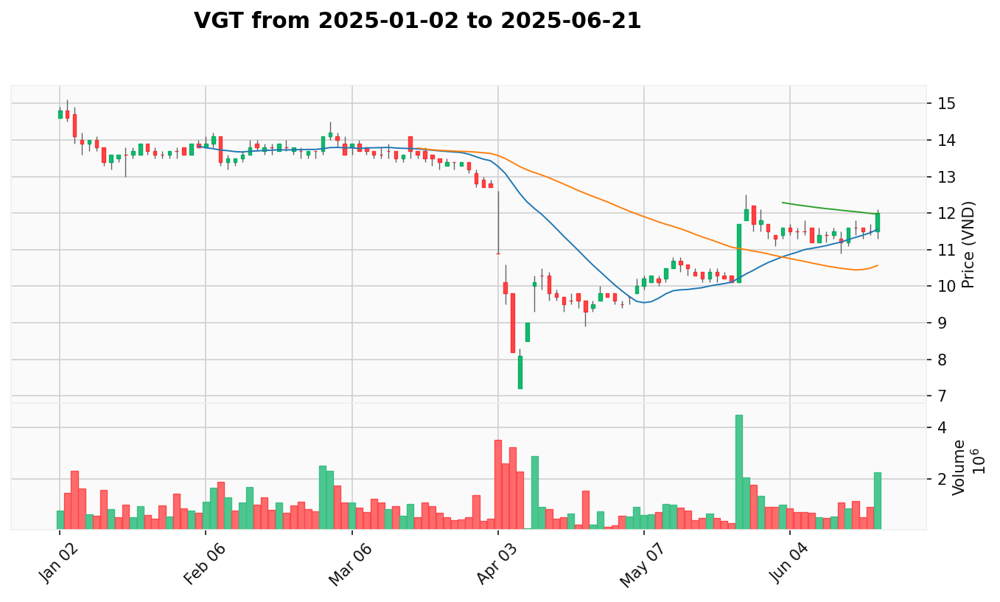

<a href="#det-may">↑ Back to group DET_MAY</a>  |  <a href="#vpa-signal-summary">↑ Back to Top</a>

#### Key Statistics
| Metric | Value |
|:---|---:|
| Date Range | 2025-01-02 to 2025-10-17 |
| **Latest Close** | **12.0** |
| Period Open | 14.6 |
| Period High | 15.1 |
| Period Low | 7.2 |
| Period Change % | -17.81% |

**[Download VGT Data (.csv)](market_data/VGT_2025-01-02_to_2025-10-18.csv)**

---

### VHC

#### [VPA Analysis (2025-06-16 - 2025-10-16)](./VPA.md#vhc)
> **Ngày 2025-10-10:** VHC tăng từ 55.2 VND lên 56.5 VND với biên độ nến rộng và đóng cửa gần mức cao nhất phiên. Khối lượng giao dịch đạt 2.24 triệu cổ phiếu, tăng mạnh so với phiên trước và cao hơn mức trung bình. Sau phiên No Demand ngày 2025-10-09, sự tăng giá trở lại với khối lượng lớn cho thấy lực cầu đã quay trở lại và hấp thụ tốt nguồn cung. **Phân tích VPA/Wyckoff:** Sign of Strength (SOS) - Lực cầu mạnh mẽ với khối lượng gia tăng xác nhận xu hướng tăng.
> **Ngày 2025-10-13:** VHC giữ nguyên mức giá đóng cửa 56.5 VND so với phiên trước, với biên độ nến hẹp và đóng cửa ngang giá đóng cửa phiên trước. Khối lượng giao dịch đạt 0.9462 triệu cổ phiếu, giảm mạnh so với phiên trước (2.2393 triệu cổ phiếu) và thấp hơn đáng kể mức trung bình. Sau phiên tăng giá mạnh (SOS) ngày 2025-10-10, sự thiếu vắng lực mua để đẩy giá lên cao hơn cùng với khối lượng thấp cho thấy lực cầu đã suy yếu rõ rệt. Điều này báo hiệu sự thiếu quyết đoán và có thể là dấu hiệu của sự cạn kiệt lực mua sau đợt tăng giá. **Phân tích VPA/Wyckoff:** No Demand (ND) - Giá đi ngang hoặc không tăng được với khối lượng thấp sau một đợt tăng giá cho thấy lực cầu yếu và khả năng điều chỉnh hoặc tích lũy.
> **Ngày 2025-10-14:** VHC giảm từ 56.5 VND xuống 55.1 VND với biên độ nến rộng và đóng cửa ở mức thấp nhất phiên. Khối lượng giao dịch đạt 1.1532 triệu cổ phiếu, tăng so với phiên trước nhưng vẫn ở mức trung bình. Sau phiên No Demand ngày 2025-10-13, sự giảm giá mạnh với khối lượng tăng cho thấy áp lực bán đã xuất hiện và chiếm ưu thế. Điều này xác nhận sự suy yếu của lực cầu và khả năng tiếp tục điều chỉnh. **Phân tích VPA/Wyckoff:** Sign of Weakness (SOW) - Áp lực bán gia tăng với giá giảm mạnh, xác nhận xu hướng giảm hoặc điều chỉnh.
> **Ngày 2025-10-15:** VHC tiếp tục giảm từ 55.1 VND xuống 54.2 VND, với biên độ nến rộng và đóng cửa ở mức thấp nhất phiên. Khối lượng giao dịch đạt 1.082 triệu cổ phiếu, thấp hơn một chút so với phiên trước nhưng vẫn duy trì áp lực bán. Sau phiên Sign of Weakness (SOW) ngày 2025-10-14, việc giá tiếp tục giảm mạnh và đóng cửa ở mức thấp nhất phiên cho thấy lực bán vẫn đang chiếm ưu thế và chưa có dấu hiệu dừng lại. Điều này xác nhận sự suy yếu của lực cầu và khả năng tiếp tục điều chỉnh. **Phân tích VPA/Wyckoff:** Selling Pressure (Áp lực bán) - Giá tiếp tục giảm mạnh với khối lượng duy trì, cho thấy lực bán vẫn đang kiểm soát thị trường.
> **Ngày 2025-10-16:** VHC tăng nhẹ từ 54.2 VND lên 54.4 VND với biên độ nến hẹp và đóng cửa gần mức giữa phiên. Khối lượng giao dịch chỉ đạt 0.2177 triệu cổ phiếu, giảm mạnh so với phiên trước (1.082 triệu cổ phiếu) và ở mức rất thấp. Sau hai phiên giảm giá mạnh với áp lực bán chiếm ưu thế (SOW và Selling Pressure), phiên này cho thấy sự tạm dừng của lực bán nhưng không có lực cầu mạnh mẽ tham gia. Khối lượng thấp trong khi giá tăng nhẹ cho thấy sự thiếu vắng của cả người mua và người bán, hoặc một sự kiểm tra cung cầu yếu ớt. Điều này không xác nhận sự đảo chiều mà chỉ là một sự tạm lắng trong xu hướng giảm. **Phân tích VPA/Wyckoff:** No Demand (Không có cầu) - Giá tăng nhẹ với khối lượng rất thấp, cho thấy lực cầu yếu và khả năng tiếp tục điều chỉnh.

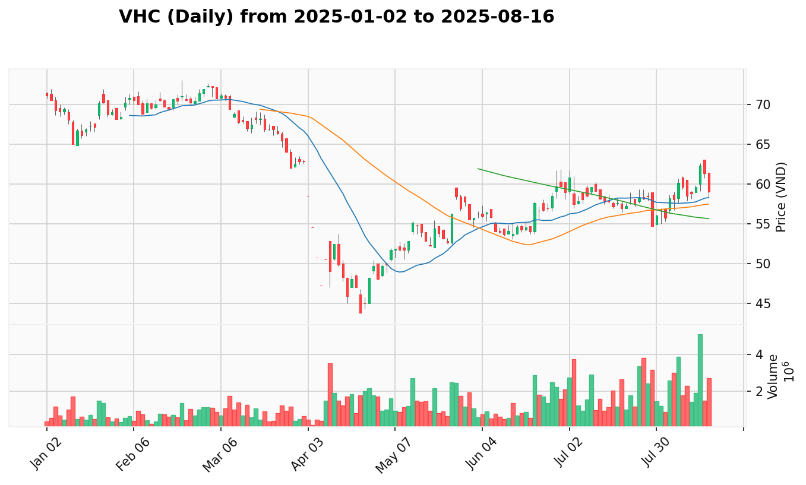

<a href="#thuy-san">↑ Back to group THUY_SAN</a>  |  <a href="#vpa-signal-summary">↑ Back to Top</a>

#### Key Statistics
| Metric | Value |
|:---|---:|
| Date Range | 2025-01-02 to 2025-10-17 |
| **Latest Close** | **54.4** |
| Period Open | 69.0 |
| Period High | 70.55 |
| Period Low | 42.28 |
| Period Change % | -21.16% |

**[Download VHC Data (.csv)](market_data/VHC_2025-01-02_to_2025-10-18.csv)**

---

### VHM

#### [VPA Analysis (2025-06-13 - 2025-10-16)](./VPA.md#vhm)
> **Ngày 2025-10-10:** VHM tăng từ 115.0 VND lên 123.0 VND với khối lượng giao dịch đạt 9.0262 triệu cổ phiếu. Cây nến tăng có biên độ rộng, đóng cửa ở mức cao nhất phiên, cho thấy lực cầu tiếp tục áp đảo và duy trì đà tăng giá. Mặc dù khối lượng giao dịch giảm so với phiên trước (12.8922 triệu cổ phiếu), nhưng giá vẫn tăng mạnh và đóng cửa ở mức cao nhất, cho thấy sự hấp thụ tốt nguồn cung và ít nỗ lực hơn để đẩy giá lên cao. Điều này xác nhận xu hướng tăng vẫn đang tiếp diễn mạnh mẽ. **Phân tích VPA/Wyckoff:** Sign of Strength (SOS) - Lực cầu mạnh mẽ tiếp diễn, giá tăng với ít nỗ lực hơn, xác nhận xu hướng tăng.
> **Ngày 2025-10-13:** VHM tăng từ 123.0 VND lên 124.2 VND với khối lượng giao dịch đạt 12.3122 triệu cổ phiếu. Cây nến tăng có biên độ khá rộng và đóng cửa gần mức cao nhất phiên, cho thấy lực cầu tiếp tục chiếm ưu thế. Khối lượng giao dịch tăng trở lại so với phiên trước (9.0262 triệu cổ phiếu), xác nhận sự đồng thuận của thị trường với đà tăng giá và tiếp diễn xu hướng tăng. **Phân tích VPA/Wyckoff:** Sign of Strength (SOS) - Lực cầu mạnh mẽ với khối lượng gia tăng, xác nhận xu hướng tăng tiếp diễn.
> **Ngày 2025-10-14:** VHM tăng từ 124.2 VND lên 127.0 VND với khối lượng giao dịch đạt 13.6602 triệu cổ phiếu. Cây nến tăng có biên độ rộng, đóng cửa ở mức giữa đến cao nhất phiên, cho thấy lực cầu mạnh mẽ. Khối lượng giao dịch tiếp tục gia tăng so với phiên trước (12.3122 triệu cổ phiếu), xác nhận sự đồng thuận của thị trường và duy trì đà tăng giá. **Phân tích VPA/Wyckoff:** Sign of Strength (SOS) - Lực cầu mạnh mẽ với khối lượng gia tăng, xác nhận xu hướng tăng tiếp diễn.
> **Ngày 2025-10-15:** VHM giảm từ 127.0 VND xuống 124.0 VND với khối lượng giao dịch đạt 7.0593 triệu cổ phiếu. Cây nến giảm có biên độ khá rộng và đóng cửa gần mức thấp nhất phiên, cho thấy áp lực bán xuất hiện. Tuy nhiên, khối lượng giao dịch giảm đáng kể so với phiên trước (13.6602 triệu cổ phiếu), cho thấy lực bán không quá mạnh và có thể là một nhịp điều chỉnh tự nhiên sau chuỗi tăng giá. **Phân tích VPA/Wyckoff:** Reaction - Lực bán yếu với khối lượng giảm, cho thấy đây có thể là nhịp điều chỉnh trong xu hướng tăng.
> **Ngày 2025-10-16:** VHM giảm từ 124.0 VND xuống 122.5 VND với khối lượng giao dịch đạt 4.0447 triệu cổ phiếu. Cây nến giảm có biên độ khá rộng, đóng cửa gần mức thấp nhất phiên, cho thấy áp lực bán tiếp diễn. Tuy nhiên, khối lượng giao dịch giảm mạnh so với phiên trước (7.0593 triệu cổ phiếu), cho thấy lực bán không quá mạnh và có thể là do thiếu cầu. Đây là dấu hiệu của sự điều chỉnh tiếp tục trong xu hướng tăng. **Phân tích VPA/Wyckoff:** No Demand (ND) - Lực cầu yếu, khối lượng giảm mạnh, cho thấy thị trường chưa sẵn sàng tăng giá.

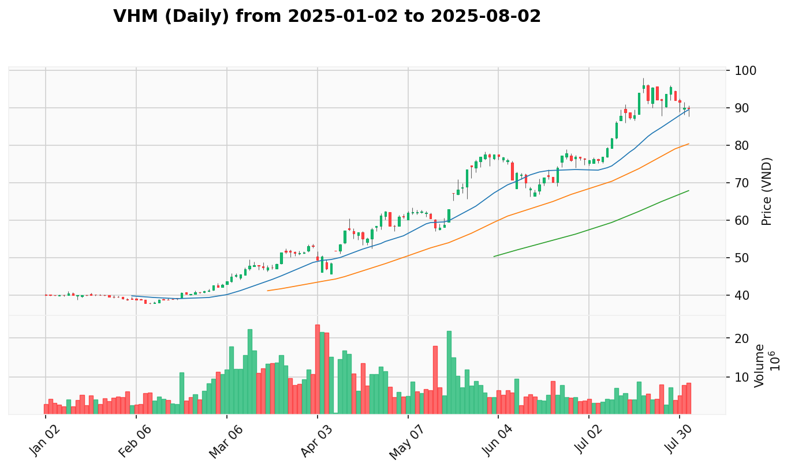

<a href="#bat-dong-san">↑ Back to group BAT_DONG_SAN</a>  |  <a href="#vpa-signal-summary">↑ Back to Top</a>

#### Key Statistics
| Metric | Value |
|:---|---:|
| Date Range | 2025-01-02 to 2025-10-17 |
| **Latest Close** | **116.0** |
| Period Open | 40.1 |
| Period High | 131.5 |
| Period Low | 37.6 |
| Period Change % | 189.28% |

**[Download VHM Data (.csv)](market_data/VHM_2025-01-02_to_2025-10-18.csv)**

---

### VIB

#### [VPA Analysis (2025-06-16 - 2025-10-16)](./VPA.md#vib)
> **Ngày 2025-10-10:** VIB mở cửa 20.5, đạt đỉnh 20.6, thấp nhất 20.3, đóng cửa 20.35. Giá giảm nhẹ từ 20.5 xuống 20.35, tạo nến giảm có biên độ hẹp. Khối lượng giao dịch đạt 10.32 triệu cổ phiếu, tăng nhẹ so với phiên trước (9.64 triệu cổ phiếu). Sau phiên tăng giá mạnh mẽ với dấu hiệu sức mạnh vào ngày 2025-10-09, phiên này giá có sự điều chỉnh nhẹ với khối lượng gia tăng, cho thấy lực cung đã xuất hiện trở lại và hấp thụ một phần lực cầu. Tuy nhiên, biên độ giảm giá hẹp cho thấy áp lực bán chưa quá mạnh. **Phân tích VPA/Wyckoff:** Cung xuất hiện (Supply Coming In)
> **Ngày 2025-10-13:** VIB mở cửa 20.0, đạt đỉnh 20.3, thấp nhất 19.95, đóng cửa 20.15. Giá giảm từ 20.35 (giá đóng cửa phiên trước) xuống 20.15, tạo nến tăng có biên độ hẹp. Khối lượng giao dịch đạt 10.7069 triệu cổ phiếu, tăng so với phiên trước (10.32 triệu cổ phiếu). Sau phiên cung xuất hiện vào ngày 2025-10-10, phiên này giá tiếp tục giảm nhẹ nhưng tạo nến tăng với biên độ hẹp và khối lượng gia tăng. Điều này cho thấy lực cầu có cố gắng đẩy giá lên nhưng gặp phải lực cung mạnh, khiến giá không thể tăng đáng kể và đóng cửa thấp hơn phiên trước. Sự tăng khối lượng trên một nến tăng có biên độ hẹp và giá đóng cửa thấp hơn cho thấy sự hấp thụ cung hoặc thiếu cầu mạnh mẽ để đẩy giá lên cao hơn. **Phân tích VPA/Wyckoff:** Nỗ lực không mang lại kết quả (Effort vs Result)
> **Ngày 2025-10-14:** VIB mở cửa 20.35, đạt đỉnh 20.4, thấp nhất 20.0, đóng cửa 20.0. Giá giảm từ 20.15 (giá đóng cửa phiên trước) xuống 20.0, tạo nến giảm có biên độ tương đối rộng và đóng cửa ở mức thấp nhất phiên. Khối lượng giao dịch đạt 13.6774 triệu cổ phiếu, tăng đáng kể so với phiên trước (10.7069 triệu cổ phiếu). Sau phiên nỗ lực không mang lại kết quả vào ngày 2025-10-13, phiên này giá tiếp tục giảm mạnh với khối lượng gia tăng, cho thấy áp lực bán đang rất mạnh và chiếm ưu thế hoàn toàn. Sự giảm giá trên khối lượng lớn xác nhận sự yếu kém của lực cầu và khả năng tiếp diễn xu hướng giảm. **Phân tích VPA/Wyckoff:** Dấu hiệu yếu kém (Sign of Weakness - SOW)
> **Ngày 2025-10-15:** VIB mở cửa 19.9, đạt đỉnh 20.4, thấp nhất 19.9, đóng cửa 20.25. Giá tăng từ 20.0 (giá đóng cửa phiên trước) lên 20.25, tạo nến tăng có biên độ hẹp. Khối lượng giao dịch đạt 11.0544 triệu cổ phiếu, giảm so với phiên trước (13.6774 triệu cổ phiếu). Sau hai phiên giảm giá với áp lực bán mạnh, phiên này giá có sự phục hồi nhẹ nhưng với khối lượng giảm. Điều này cho thấy lực cầu yếu và không đủ mạnh để đẩy giá lên cao một cách bền vững, có thể là một đợt kiểm tra cung hoặc sự thiếu vắng nhu cầu. Sự tăng giá trên khối lượng thấp sau một giai đoạn yếu kém thường không phải là dấu hiệu tích cực. **Phân tích VPA/Wyckoff:** No Demand (Thiếu cầu)
> **Ngày 2025-10-16:** VIB mở cửa 20.25, đạt đỉnh 20.25, thấp nhất 20.05, đóng cửa 20.1. Giá giảm từ 20.25 (giá đóng cửa phiên trước) xuống 20.1, tạo nến giảm có biên độ hẹp và đóng cửa gần mức thấp nhất phiên. Khối lượng giao dịch đạt 3.5 triệu cổ phiếu, giảm mạnh so với phiên trước (11.0544 triệu cổ phiếu). Sau phiên "Thiếu cầu" ngày 2025-10-15, phiên này giá tiếp tục giảm nhẹ với khối lượng rất thấp. Điều này cho thấy cả lực cung và lực cầu đều yếu, thị trường đang thiếu động lực. Sự giảm giá trên khối lượng thấp sau một giai đoạn yếu kém củng cố nhận định về sự thiếu vắng nhu cầu và có thể là một đợt kiểm tra cung ở mức thấp hơn. **Phân tích VPA/Wyckoff:** No Demand (Thiếu cầu)

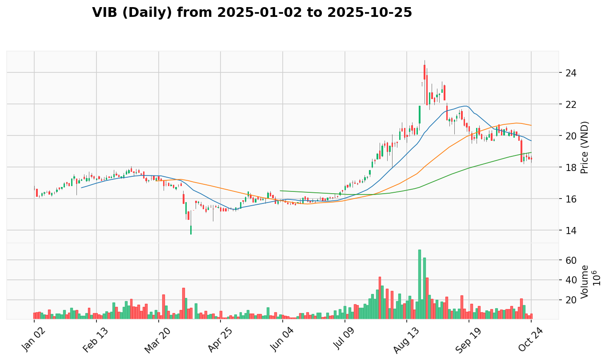

<a href="#ngan-hang">↑ Back to group NGAN_HANG</a>  |  <a href="#vpa-signal-summary">↑ Back to Top</a>

#### Key Statistics
| Metric | Value |
|:---|---:|
| Date Range | 2025-01-02 to 2025-10-17 |
| **Latest Close** | **19.7** |
| Period Open | 16.62 |
| Period High | 24.8 |
| Period Low | 13.75 |
| Period Change % | 18.53% |

**[Download VIB Data (.csv)](market_data/VIB_2025-01-02_to_2025-10-18.csv)**

---

### VIC

#### [VPA Analysis (2025-06-10 - 2025-10-16)](./VPA.md#vic)
> **Ngày 2025-10-10:** VIC tăng từ 179.5 VND lên 192.0 VND. Nến có biên độ rộng và đóng cửa ở mức cao nhất phiên, cho thấy lực cầu mạnh mẽ và áp đảo hoàn toàn lực cung. Khối lượng giao dịch đạt 4.2947 triệu cổ phiếu, cao hơn so với phiên trước (4.1313 triệu cổ phiếu) và cao hơn đáng kể so với mức trung bình các phiên gần đây. Sự tăng giá mạnh mẽ đi kèm với khối lượng tăng xác nhận sự trở lại của dòng tiền lớn và lực mua chủ động. **Phân tích VPA/Wyckoff:** Sign of Strength (SOS) - Lực cầu mạnh mẽ với khối lượng gia tăng xác nhận xu hướng tăng.
> **Ngày 2025-10-13:** VIC tăng từ 192.0 VND lên 205.4 VND. Biên độ nến rất rộng, giá đóng cửa ở mức cao nhất phiên, cho thấy lực cầu áp đảo hoàn toàn lực cung và sự hưng phấn của thị trường. Khối lượng giao dịch đạt 7.1783 triệu cổ phiếu, cao hơn đáng kể so với phiên trước (4.2947 triệu cổ phiếu) và là mức cao nhất trong 10 phiên gần đây. Sự tăng giá mạnh mẽ đi kèm với khối lượng tăng đột biến xác nhận dòng tiền lớn tiếp tục tham gia và đẩy giá lên, củng cố xu hướng tăng đã được thiết lập. **Phân tích VPA/Wyckoff:** Sign of Strength (SOS) - Lực cầu tiếp tục mạnh mẽ với khối lượng gia tăng đột biến, xác nhận xu hướng tăng giá và khả năng tiếp diễn đà tăng.
> **Ngày 2025-10-14:** VIC tăng từ 205.4 VND lên 211.9 VND. Nến có biên độ rộng, giá mở cửa cao hơn và đạt mức cao nhất phiên là 219.7 VND, nhưng sau đó đóng cửa ở 211.9 VND, thấp hơn đáng kể so với đỉnh, cho thấy lực cung đã xuất hiện mạnh mẽ ở vùng giá cao. Khối lượng giao dịch đạt 8.0655 triệu cổ phiếu, cao nhất trong 10 phiên gần đây và cao hơn đáng kể so với phiên trước (7.1783 triệu cổ phiếu). Sự tăng giá không đi kèm với việc đóng cửa ở mức cao nhất phiên với khối lượng lớn cho thấy áp lực chốt lời đang gia tăng, báo hiệu sự suy yếu tiềm ẩn trong đà tăng mạnh mẽ trước đó. **Phân tích VPA/Wyckoff:** Supply Coming In (Lực cung xuất hiện) - Dấu hiệu cảnh báo về áp lực bán gia tăng.
> **Ngày 2025-10-15:** VIC giảm từ 211.9 VND xuống 209.5 VND. Nến có biên độ tương đối rộng, giá mở cửa cao hơn giá đóng cửa, cho thấy lực cung chiếm ưu thế trong phiên. Khối lượng giao dịch đạt 3.7524 triệu cổ phiếu, giảm đáng kể so với phiên trước (8.0655 triệu cổ phiếu) và là mức thấp nhất trong 10 phiên gần đây. Sự giảm giá đi kèm với khối lượng thấp cho thấy áp lực bán đã giảm bớt sau phiên lực cung xuất hiện mạnh mẽ trước đó, hoặc thiếu vắng lực cầu để đẩy giá lên. **Phân tích VPA/Wyckoff:** No Demand (Thiếu cầu) - Giá giảm với khối lượng thấp, cho thấy lực bán không quá mạnh nhưng lực mua cũng chưa xuất hiện.
> **Ngày 2025-10-16:** VIC tăng từ 209.5 VND lên 211.8 VND. Nến có biên độ tương đối rộng và đóng cửa ở mức cao nhất phiên, cho thấy lực cầu đã xuất hiện và chiếm ưu thế trong phiên. Tuy nhiên, khối lượng giao dịch chỉ đạt 2.0283 triệu cổ phiếu, mức thấp nhất trong 10 phiên gần đây và giảm đáng kể so với phiên trước (3.7524 triệu cổ phiếu). Sự tăng giá với khối lượng rất thấp sau hai phiên có dấu hiệu lực cung xuất hiện và thiếu cầu cho thấy đây có thể là một đợt kiểm tra cung. Mặc dù giá đóng cửa ở mức cao nhất phiên là tín hiệu tích cực, nhưng khối lượng thấp cho thấy sự thiếu vắng sự tham gia mạnh mẽ của người mua. **Phân tích VPA/Wyckoff:** Test for Supply (Kiểm tra cung)

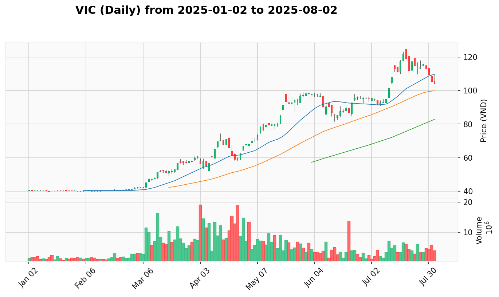

<a href="#bat-dong-san">↑ Back to group BAT_DONG_SAN</a>  |  <a href="#vpa-signal-summary">↑ Back to Top</a>

#### Key Statistics
| Metric | Value |
|:---|---:|
| Date Range | 2025-01-02 to 2025-10-17 |
| **Latest Close** | **204.0** |
| Period Open | 40.5 |
| Period High | 219.7 |
| Period Low | 39.7 |
| Period Change % | 403.70% |

**[Download VIC Data (.csv)](market_data/VIC_2025-01-02_to_2025-10-18.csv)**

---

### VIF

#### [VPA Analysis (2025-08-14 - 2025-10-16)](./VPA.md#vif)
> **Ngày 2025-10-10:** VIF giảm từ 16.0 VND xuống 15.5 VND với khối lượng giao dịch đạt 0.0088 triệu cổ phiếu, tăng mạnh so với phiên trước (0.0016 triệu cổ phiếu). Cây nến có biên độ rộng hơn, giá đóng cửa thấp hơn giá mở cửa và nằm ở nửa dưới của thân nến, cho thấy áp lực bán mạnh mẽ. Mặc dù giá giảm, khối lượng tăng đột biến xác nhận lực cung đang chiếm ưu thế, tiếp nối tín hiệu yếu kém từ các phiên "Weakness" và "No Demand" trước đó. **Phân tích VPA/Wyckoff:** Sign of Weakness (SOW) - Lực cung mạnh mẽ.
> **Ngày 2025-10-13:** VIF tăng từ 15.5 VND lên 16.2 VND, với khối lượng giao dịch đạt 0.0059 triệu cổ phiếu, giảm mạnh so với phiên trước (0.0088 triệu cổ phiếu). Cây nến có giá mở cửa, cao nhất, thấp nhất và đóng cửa đều ở mức 16.2 VND, cho thấy biên độ giao động cực hẹp và sự thiếu quyết đoán của thị trường. Mặc dù giá tăng, khối lượng thấp cho thấy lực cầu yếu ớt và không có sự tham gia của dòng tiền lớn, xác nhận sự yếu kém của thị trường sau các phiên "No Demand" và "Sign of Weakness" trước đó. **Phân tích VPA/Wyckoff:** Lack of Demand (Thiếu cầu)
> **Ngày 2025-10-14:** VIF giữ nguyên mức 16.2 VND với khối lượng giao dịch đạt 0.0043 triệu cổ phiếu, giảm mạnh so với phiên trước (0.0059 triệu cổ phiếu). Cây nến có biên độ dao động cực hẹp, giá mở cửa, cao nhất, thấp nhất và đóng cửa đều ở mức 16.2 VND, cho thấy sự thiếu quyết đoán và không có sự tham gia của dòng tiền lớn. Khối lượng thấp kỷ lục xác nhận lực cầu yếu ớt, tiếp nối tín hiệu "Thiếu cầu" từ phiên trước và "Sign of Weakness" trước đó. **Phân tích VPA/Wyckoff:** No Demand (Không có cầu)
> **Ngày 2025-10-15:** VIF giảm từ 16.2 VND xuống 16.1 VND, với khối lượng giao dịch đạt 0.0087 triệu cổ phiếu, tăng đáng kể so với phiên trước (0.0043 triệu cổ phiếu). Cây nến có giá mở cửa, cao nhất, thấp nhất và đóng cửa đều ở mức 16.1 VND, cho thấy biên độ dao động cực hẹp và sự thiếu quyết đoán của thị trường. Mặc dù biên độ giá hẹp, việc giá giảm với khối lượng tăng cho thấy áp lực bán đang gia tăng, xác nhận sự yếu kém của thị trường sau các phiên "Thiếu cầu" và "Không có cầu" trước đó. **Phân tích VPA/Wyckoff:** Sign of Weakness (SOW) - Dấu hiệu suy yếu.
> **Ngày 2025-10-16:** VIF giảm mạnh từ 16.1 VND xuống 15.1 VND, với khối lượng giao dịch đạt 0.0029 triệu cổ phiếu, giảm đáng kể so với phiên trước (0.0087 triệu cổ phiếu). Cây nến có giá mở cửa, thấp nhất và đóng cửa đều ở mức 15.1 VND, cho thấy áp lực bán mạnh mẽ đã đẩy giá xuống mức thấp nhất trong phiên và đóng cửa tại đó. Mặc dù giá giảm sâu, khối lượng giao dịch thấp cho thấy lực cầu vẫn yếu ớt và không có sự tham gia của dòng tiền lớn để hỗ trợ giá, tiếp nối các tín hiệu suy yếu từ các phiên trước. **Phân tích VPA/Wyckoff:** No Demand (Không có cầu)

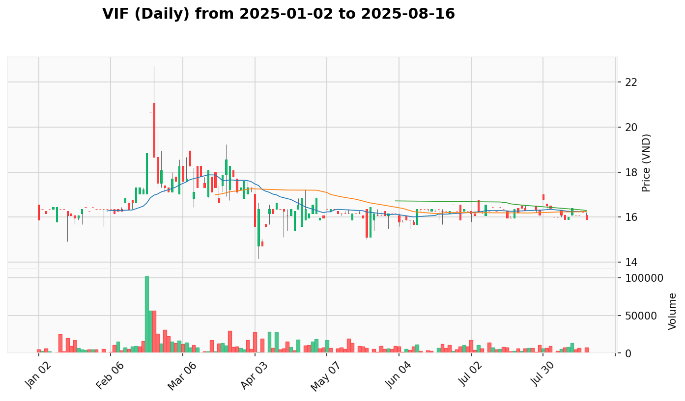

<a href="#thep">↑ Back to group THEP</a>  |  <a href="#vpa-signal-summary">↑ Back to Top</a>

#### Key Statistics
| Metric | Value |
|:---|---:|
| Date Range | 2025-01-02 to 2025-10-17 |
| **Latest Close** | **15.9** |
| Period Open | 16.54 |
| Period High | 22.7 |
| Period Low | 14.14 |
| Period Change % | -3.87% |

**[Download VIF Data (.csv)](market_data/VIF_2025-01-02_to_2025-10-18.csv)**

---

### VIG

#### [VPA Analysis (2025-08-14 - 2025-10-16)](./VPA.md#vig)
> **Ngày 2025-10-10:** VIG mở cửa ở mức 6.9 VND và đóng cửa ở mức 6.9 VND, không thay đổi so với giá đóng cửa phiên trước. Biên độ nến rất hẹp, từ 6.9 VND đến 7.0 VND, với giá đóng cửa nằm ở mức thấp nhất phiên. Khối lượng giao dịch đạt 0.1884 triệu cổ phiếu, tăng nhẹ so với phiên trước (0.116 triệu cổ phiếu) nhưng vẫn ở mức thấp so với phiên SCI (0.6092 triệu cổ phiếu) vào ngày 2025-10-08. Sau phiên "Không có lực cầu" (ND) ngày 2025-10-09, phiên này giá không có sự cải thiện, cho thấy lực cầu vẫn yếu và không đủ sức đẩy giá lên. Việc giá đóng cửa ở mức thấp nhất phiên với khối lượng tăng nhẹ củng cố thêm sự thiếu vắng lực mua. **Phân tích VPA/Wyckoff:** No Demand (ND) - Không có lực cầu.
> **Ngày 2025-10-13:** VIG mở cửa tại 6.8 VND và đóng cửa ở mức 6.9 VND, giữ nguyên so với giá đóng cửa phiên trước. Biên độ nến hẹp, từ 6.7 VND đến 6.9 VND, với giá đóng cửa nằm ở mức cao nhất phiên. Khối lượng giao dịch đạt 0.2409 triệu cổ phiếu, tăng nhẹ so với phiên trước (0.1884 triệu cổ phiếu) nhưng vẫn ở mức thấp so với phiên SCI (0.6092 triệu cổ phiếu) vào ngày 2025-10-08. Sau hai phiên "Không có lực cầu" (ND), phiên này cho thấy một chút nỗ lực từ phía người mua khi giá đóng cửa ở mức cao nhất phiên với khối lượng tăng nhẹ. Điều này có thể là một dấu hiệu kiểm tra cung ở mức giá thấp, cho thấy áp lực bán đã giảm bớt nhưng lực cầu vẫn chưa thực sự mạnh mẽ để đẩy giá lên cao hơn. **Phân tích VPA/Wyckoff:** Test for Supply (Kiểm tra cung)
> **Ngày 2025-10-14:** VIG mở cửa ở mức 6.8 VND và đóng cửa ở mức 6.8 VND, giảm so với giá đóng cửa phiên trước (6.9 VND). Biên độ nến hẹp, từ 6.7 VND đến 7.0 VND, với giá đóng cửa nằm ở mức thấp nhất phiên. Khối lượng giao dịch đạt 0.2636 triệu cổ phiếu, tăng nhẹ so với phiên trước (0.2409 triệu cổ phiếu) nhưng vẫn ở mức thấp so với phiên có khối lượng lớn (0.6092 triệu cổ phiếu) vào ngày 2025-10-08. Sau phiên "Kiểm tra cung" (Test for Supply) ngày 2025-10-13, việc giá đóng cửa ở mức thấp nhất phiên với khối lượng tăng nhẹ cho thấy áp lực bán vẫn còn hoặc lực cầu không đủ mạnh để duy trì đà tăng. Điều này củng cố thêm sự yếu kém của thị trường và thiếu vắng lực mua. **Phân tích VPA/Wyckoff:** Weakness (Yếu kém)
> **Ngày 2025-10-15:** VIG mở cửa tại 6.8 VND và đóng cửa ở mức 6.7 VND, giảm 0.1 VND so với giá đóng cửa phiên trước (6.8 VND). Biên độ nến hẹp, từ 6.7 VND đến 6.8 VND, với giá đóng cửa nằm ở mức thấp nhất phiên. Khối lượng giao dịch đạt 0.1374 triệu cổ phiếu, giảm đáng kể so với phiên trước (0.2636 triệu cổ phiếu) và rất thấp so với phiên có khối lượng lớn vào ngày 2025-10-08 (0.6092 triệu cổ phiếu). Sau phiên "Yếu kém" (Weakness) ngày 2025-10-14, việc giá tiếp tục giảm và đóng cửa ở mức thấp nhất phiên với khối lượng thấp cho thấy lực bán không mạnh nhưng lực cầu hoàn toàn vắng bóng. Điều này xác nhận sự yếu kém của thị trường và khả năng giá sẽ tiếp tục giảm hoặc đi ngang ở mức thấp. **Phân tích VPA/Wyckoff:** No Demand (Không có lực cầu)
> **Ngày 2025-10-16:** VIG mở cửa ở mức 6.7 VND và đóng cửa ở mức 6.3 VND, giảm đáng kể so với giá đóng cửa phiên trước (6.7 VND). Biên độ nến rộng, từ 6.2 VND đến 6.7 VND, với giá đóng cửa nằm ở mức thấp nhất phiên. Khối lượng giao dịch đạt 0.7489 triệu cổ phiếu, tăng đột biến so với phiên trước (0.1374 triệu cổ phiếu) và là mức cao nhất trong các phiên gần đây. Sau phiên "Không có lực cầu" (No Demand) ngày 2025-10-15, việc giá giảm mạnh với biên độ rộng và khối lượng cực lớn cho thấy áp lực bán rất mạnh mẽ đã xuất hiện, lấn át hoàn toàn lực cầu. Điều này xác nhận sự yếu kém của thị trường và khả năng giá sẽ tiếp tục giảm. **Phân tích VPA/Wyckoff:** Weakness (Yếu kém)

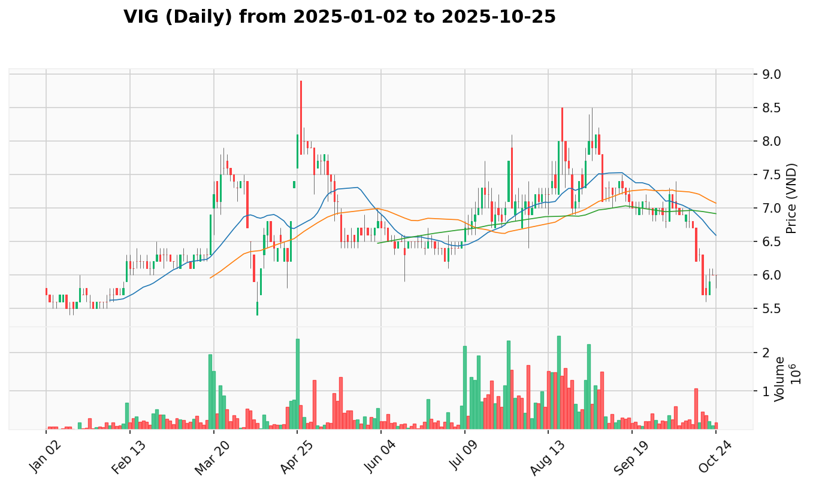

<a href="#penny">↑ Back to group PENNY</a>  |  <a href="#vpa-signal-summary">↑ Back to Top</a>

#### Key Statistics
| Metric | Value |
|:---|---:|
| Date Range | 2025-01-02 to 2025-10-17 |
| **Latest Close** | **6.3** |
| Period Open | 5.8 |
| Period High | 8.9 |
| Period Low | 5.4 |
| Period Change % | 8.62% |

**[Download VIG Data (.csv)](market_data/VIG_2025-01-02_to_2025-10-18.csv)**

---

### VIP

#### [VPA Analysis (2025-08-15 - 2025-10-16)](./VPA.md#vip)
> **Ngày 2025-10-10:** VIP mở cửa ở 13.45 VND, đạt mức cao nhất 13.45 VND và thấp nhất 13.3 VND, đóng cửa ở 13.35 VND, giảm so với giá đóng cửa phiên trước (13.45 VND). Biên độ giá trong phiên hẹp và giá đóng cửa gần mức thấp nhất phiên. Khối lượng giao dịch đạt 0.2438 triệu cổ phiếu, tăng đáng kể so với phiên trước (0.2187 triệu cổ phiếu) và ở mức cao. Sau phiên "Supply" với khối lượng gia tăng, phiên này tiếp tục cho thấy giá giảm với biên độ hẹp và khối lượng cao, xác nhận áp lực cung vẫn đang mạnh mẽ trên thị trường. **Phân tích VPA/Wyckoff:** Supply (Áp lực cung)
> **Ngày 2025-10-13:** VIP mở cửa ở 13.35 VND, đạt mức cao nhất 13.35 VND và thấp nhất 13.2 VND, đóng cửa ở 13.35 VND, giữ nguyên so với giá đóng cửa phiên trước (13.35 VND). Biên độ giá trong phiên hẹp và giá đóng cửa ở mức cao nhất phiên. Khối lượng giao dịch đạt 0.2186 triệu cổ phiếu, giảm so với phiên trước (0.2438 triệu cổ phiếu) và ở mức trung bình. Sau hai phiên liên tiếp cho thấy áp lực cung mạnh mẽ, phiên này giá không giảm thêm với khối lượng giảm, cho thấy áp lực bán có thể đang tạm lắng nhưng lực cầu vẫn chưa đủ mạnh để đẩy giá lên. **Phân tích VPA/Wyckoff:** No Demand (Không có cầu)
> **Ngày 2025-10-14:** VIP mở cửa ở 13.4 VND, đạt mức cao nhất 13.4 VND và thấp nhất 13.2 VND, đóng cửa ở 13.2 VND, giảm so với giá đóng cửa phiên trước (13.35 VND). Biên độ giá trong phiên hẹp và giá đóng cửa ở mức thấp nhất phiên. Khối lượng giao dịch đạt 0.2435 triệu cổ phiếu, tăng so với phiên trước (0.2186 triệu cổ phiếu) và ở mức cao. Sau phiên "No Demand" với khối lượng giảm, phiên này giá tiếp tục giảm với biên độ hẹp và khối lượng gia tăng, cho thấy áp lực cung đã trở lại và vẫn đang mạnh mẽ trên thị trường. **Phân tích VPA/Wyckoff:** Supply (Áp lực cung)
> **Ngày 2025-10-15:** VIP mở cửa ở 13.15 VND, đạt mức cao nhất 13.35 VND và thấp nhất 13.1 VND, đóng cửa ở 13.1 VND, giảm từ 13.2 VND xuống 13.1 VND. Biên độ giá trong phiên hẹp và giá đóng cửa ở mức thấp nhất phiên. Khối lượng giao dịch đạt 0.1787 triệu cổ phiếu, giảm đáng kể so với phiên trước (0.2435 triệu cổ phiếu) và ở mức thấp. Sau phiên "Supply" với khối lượng gia tăng, phiên này giá tiếp tục giảm với khối lượng giảm mạnh, cho thấy áp lực cung đã giảm bớt nhưng lực cầu vẫn hoàn toàn vắng bóng, không có sự hỗ trợ nào cho giá. **Phân tích VPA/Wyckoff:** No Demand (Không có cầu)
> **Ngày 2025-10-16:** VIP mở cửa ở 13.1 VND, đạt mức cao nhất 13.2 VND và thấp nhất 13.05 VND, đóng cửa ở 13.1 VND. Giá đóng cửa không đổi so với phiên trước (13.1 VND). Biên độ giá trong phiên hẹp (0.15 VND) và giá đóng cửa ở mức thấp nhất phiên. Khối lượng giao dịch đạt 0.0662 triệu cổ phiếu, giảm mạnh so với phiên trước (0.1787 triệu cổ phiếu) và ở mức rất thấp. Sau phiên "No Demand" với khối lượng giảm, phiên này giá đi ngang với khối lượng cực thấp, cho thấy áp lực cung đã cạn kiệt tạm thời nhưng lực cầu vẫn chưa xuất hiện. Điều này có thể là dấu hiệu của sự thiếu hụt nguồn cung (No Supply) trong bối cảnh thị trường yếu. **Phân tích VPA/Wyckoff:** No Supply (Không có cung)

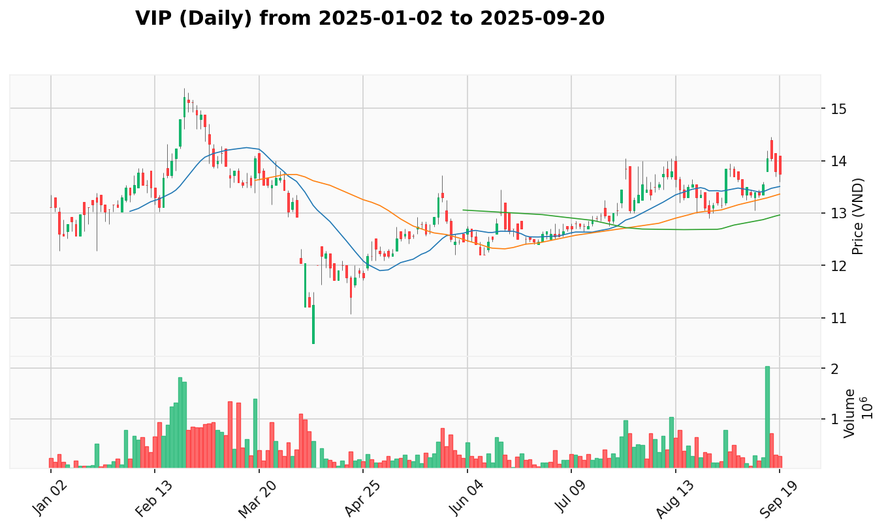

<a href="#van-tai">↑ Back to group VAN_TAI</a>  |  <a href="#vpa-signal-summary">↑ Back to Top</a>

#### Key Statistics
| Metric | Value |
|:---|---:|
| Date Range | 2025-01-02 to 2025-10-17 |
| **Latest Close** | **13.15** |
| Period Open | 13.11 |
| Period High | 15.39 |
| Period Low | 10.51 |
| Period Change % | 0.31% |

**[Download VIP Data (.csv)](market_data/VIP_2025-01-02_to_2025-10-18.csv)**

---

### VIX

#### [VPA Analysis (2025-05-28 - 2025-10-16)](./VPA.md#vix)
> **Ngày 2025-10-10:** VIX mở cửa tại 38.0 VND, đạt mức cao nhất 38.7 VND, giảm xuống mức thấp nhất 37.45 VND và đóng cửa tại 37.65 VND. Giá đóng cửa thấp hơn đáng kể so với phiên trước (38.1 VND). Biên độ dao động trong phiên rộng, giá đóng cửa nằm ở nửa dưới của thân nến, cho thấy lực cung chiếm ưu thế. Khối lượng giao dịch đạt 40.68 triệu cổ phiếu, tăng mạnh so với phiên trước (31.75 triệu cổ phiếu). Sau phiên "No Demand" ngày 2025-10-09, phiên này cho thấy áp lực bán mạnh mẽ, đẩy giá xuống thấp với khối lượng lớn, xác nhận sự suy yếu của lực cầu. **Phân tích VPA/Wyckoff:** Sign of Weakness (SOW) - Giá giảm mạnh với khối lượng lớn, cho thấy lực cung đã áp đảo lực cầu.
> **Ngày 2025-10-13:** VIX mở cửa tại 37.05 VND, đạt mức cao nhất 37.65 VND, giảm xuống mức thấp nhất 36.7 VND và đóng cửa tại 37.5 VND. Giá đóng cửa thấp hơn nhẹ so với phiên trước (37.65 VND). Biên độ dao động trong phiên hẹp hơn so với phiên trước, giá đóng cửa nằm ở nửa trên của thân nến, cho thấy có lực cầu xuất hiện ở vùng giá thấp hơn. Khối lượng giao dịch đạt 33.204 triệu cổ phiếu, giảm đáng kể so với phiên trước (40.677 triệu cổ phiếu). Sau phiên "Sign of Weakness (SOW)" ngày 2025-10-10, phiên này cho thấy áp lực bán đã giảm bớt, với việc giá giảm nhẹ trên khối lượng thấp hơn, có thể là một phiên kiểm tra nguồn cung. **Phân tích VPA/Wyckoff:** Test for Supply - Giá giảm nhẹ trên khối lượng thấp sau một phiên SOW, cho thấy nguồn cung có thể đang cạn kiệt.
> **Ngày 2025-10-14:** VIX mở cửa tại 38.2 VND, đạt mức cao nhất 40.05 VND, giảm xuống mức thấp nhất 38.1 VND và đóng cửa tại 39.1 VND. Giá đóng cửa cao hơn đáng kể so với phiên trước (37.5 VND). Biên độ dao động trong phiên rất rộng, giá đóng cửa nằm ở nửa trên của thân nến, cho thấy lực cầu áp đảo. Khối lượng giao dịch đạt 76.56 triệu cổ phiếu, tăng đột biến so với phiên trước (33.20 triệu cổ phiếu) và là mức cao nhất trong 10 phiên gần đây. Sau phiên "Test for Supply" ngày 2025-10-13, phiên này cho thấy sự trở lại mạnh mẽ của lực cầu, đẩy giá tăng vọt với khối lượng cực lớn, xác nhận xu hướng tăng giá. **Phân tích VPA/Wyckoff:** Sign of Strength (SOS) - Giá tăng mạnh với biên độ rộng và khối lượng đột biến, cho thấy lực cầu đã hoàn toàn chiếm ưu thế và có khả năng bắt đầu một đợt tăng giá mới.
> **Ngày 2025-10-15:** VIX mở cửa tại 39.8 VND, đạt mức cao nhất 40.2 VND, giảm xuống mức thấp nhất 39.15 VND và đóng cửa tại 39.6 VND. Giá đóng cửa cao hơn so với phiên trước (39.1 VND). Biên độ dao động trong phiên hẹp hơn so với phiên trước, giá đóng cửa nằm ở nửa trên của thân nến, cho thấy lực cầu vẫn duy trì nhưng không còn mạnh mẽ như phiên trước. Khối lượng giao dịch đạt 42.89 triệu cổ phiếu, giảm đáng kể so với phiên trước (76.56 triệu cổ phiếu). Sau phiên "Sign of Strength (SOS)" mạnh mẽ ngày 2025-10-14, phiên này cho thấy thị trường đang kiểm tra lại nguồn cung ở vùng giá cao hơn, với việc giá tiếp tục tăng nhẹ nhưng trên khối lượng thấp hơn. Điều này có thể là một dấu hiệu của sự hấp thụ nguồn cung hoặc một sự tạm dừng trước khi tiếp tục xu hướng tăng. **Phân tích VPA/Wyckoff:** Test for Supply - Giá tăng nhẹ trên khối lượng thấp sau một phiên SOS mạnh, cho thấy thị trường đang kiểm tra nguồn cung ở mức giá cao hơn.
> **Ngày 2025-10-16:** VIX mở cửa tại 40.05 VND, đạt mức cao nhất 40.45 VND, giảm xuống mức thấp nhất 39.65 VND và đóng cửa tại 39.75 VND. Giá đóng cửa cao hơn nhẹ so với phiên trước (39.6 VND). Biên độ dao động trong phiên hẹp, giá đóng cửa nằm ở nửa dưới của thân nến, cho thấy lực cầu yếu. Khối lượng giao dịch đạt 18.24 triệu cổ phiếu, giảm mạnh so với phiên trước (42.89 triệu cổ phiếu) và là mức thấp nhất trong 10 phiên gần đây. Sau phiên "Test for Supply" ngày 2025-10-15, phiên này cho thấy sự thiếu vắng lực cầu để đẩy giá lên cao hơn, với giá chỉ tăng nhẹ trên khối lượng rất thấp. Điều này có thể là dấu hiệu của sự suy yếu trong xu hướng tăng giá ngắn hạn. **Phân tích VPA/Wyckoff:** No Demand - Giá tăng nhẹ trên khối lượng rất thấp và đóng cửa ở nửa dưới thân nến, cho thấy lực cầu đã suy yếu sau các phiên tăng giá trước đó.

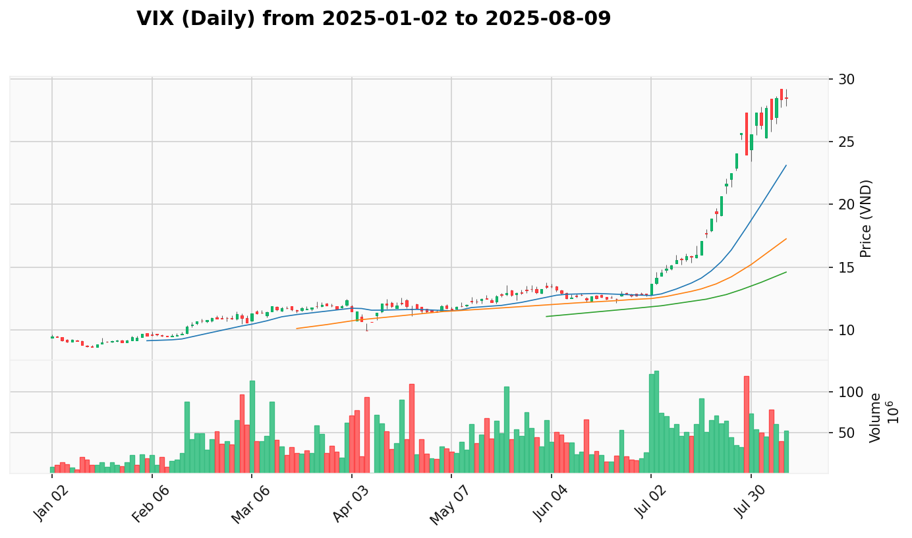

<a href="#chung-khoan">↑ Back to group CHUNG_KHOAN</a>  |  <a href="#vpa-signal-summary">↑ Back to Top</a>

#### Key Statistics
| Metric | Value |
|:---|---:|
| Date Range | 2025-01-02 to 2025-10-17 |
| **Latest Close** | **38.4** |
| Period Open | 9.37 |
| Period High | 40.45 |
| Period Low | 8.6 |
| Period Change % | 309.82% |

**[Download VIX Data (.csv)](market_data/VIX_2025-01-02_to_2025-10-18.csv)**

---

### VJC

#### [VPA Analysis (2025-06-13 - 2025-10-16)](./VPA.md#vjc)
> **Ngày 2025-10-10:** VJC mở cửa tại 133.5 VND, dao động trong biên độ từ 132.0 VND đến 134.5 VND và đóng cửa tại 133.3 VND, tăng nhẹ so với mức đóng cửa phiên trước (133.1 VND). Biên độ dao động trong phiên là 2.5 VND, hơi rộng hơn so với phiên trước (2.4 VND). Giá đóng cửa nằm ở giữa thân nến, cho thấy sự lưỡng lự. Khối lượng giao dịch đạt 1.8206 triệu cổ phiếu, tăng so với phiên trước (1.7123 triệu cổ phiếu). Sau phiên 'No Demand' ngày 2025-10-09, VJC tăng nhẹ với khối lượng gia tăng nhưng không thể đóng cửa ở mức cao, cho thấy nỗ lực đẩy giá lên gặp phải áp lực bán đáng kể. **Phân tích VPA/Wyckoff:** Effort vs. Result (Nỗ lực không tương xứng với kết quả)
> **Ngày 2025-10-13:** VJC mở cửa tại 131.9 VND, dao động trong biên độ từ 130.0 VND đến 142.6 VND và đóng cửa tại 142.6 VND, tăng mạnh so với mức đóng cửa phiên trước (133.3 VND). Biên độ dao động trong phiên là 12.6 VND, rất rộng so với các phiên trước. Giá đóng cửa nằm ở mức cao nhất phiên, cho thấy lực cầu áp đảo. Khối lượng giao dịch đạt 3.7731 triệu cổ phiếu, tăng đột biến so với phiên trước (1.8206 triệu cổ phiếu). Sau các phiên lưỡng lự và không có cầu, phiên hôm nay VJC đã có một nỗ lực tăng giá mạnh mẽ với khối lượng lớn, xác nhận sự xuất hiện của lực mua chủ động. **Phân tích VPA/Wyckoff:** Sign of Strength (SOS)
> **Ngày 2025-10-14:** VJC mở cửa tại 145.5 VND, dao động trong biên độ từ 143.6 VND đến 152.5 VND và đóng cửa tại 152.5 VND, tiếp tục tăng mạnh so với mức đóng cửa phiên trước (142.6 VND). Biên độ dao động trong phiên là 8.9 VND, vẫn rộng và cho thấy sự biến động mạnh. Giá đóng cửa nằm ở mức cao nhất phiên, xác nhận lực cầu áp đảo và duy trì đà tăng. Khối lượng giao dịch đạt 4.7154 triệu cổ phiếu, tiếp tục gia tăng so với phiên trước (3.7731 triệu cổ phiếu). Sau phiên SOS mạnh mẽ ngày 2025-10-13, VJC tiếp tục thể hiện sức mạnh với giá tăng mạnh và đóng cửa ở mức cao nhất phiên cùng với khối lượng giao dịch tăng vọt, cho thấy lực mua chủ động vẫn đang chiếm ưu thế và đẩy giá lên cao hơn. **Phân tích VPA/Wyckoff:** Sign of Strength (SOS) - Tiếp diễn
> **Ngày 2025-10-15:** VJC mở cửa tại 156.7 VND, dao động trong biên độ từ 152.8 VND đến 163.1 VND và đóng cửa tại 163.1 VND, tiếp tục tăng mạnh so với mức đóng cửa phiên trước (152.5 VND). Biên độ dao động trong phiên là 10.3 VND, vẫn rộng và cho thấy sự biến động mạnh. Giá đóng cửa nằm ở mức cao nhất phiên, xác nhận lực cầu áp đảo và duy trì đà tăng. Khối lượng giao dịch đạt 3.4538 triệu cổ phiếu, giảm nhẹ so với phiên trước (4.7154 triệu cổ phiếu) nhưng vẫn ở mức cao. Sau hai phiên SOS mạnh mẽ, VJC tiếp tục thể hiện sức mạnh với giá tăng mạnh và đóng cửa ở mức cao nhất phiên, cho thấy lực mua chủ động vẫn đang chiếm ưu thế và đẩy giá lên cao hơn, mặc dù khối lượng có phần giảm nhẹ nhưng không đáng kể so với đà tăng giá. **Phân tích VPA/Wyckoff:** Sign of Strength (SOS) - Tiếp diễn
> **Ngày 2025-10-16:** VJC mở cửa tại 164.0 VND, dao động trong biên độ từ 161.2 VND đến 170.2 VND và đóng cửa tại 169.0 VND, tiếp tục tăng so với mức đóng cửa phiên trước (163.1 VND). Biên độ dao động trong phiên là 9.0 VND, vẫn rộng và cho thấy sự biến động. Giá đóng cửa nằm gần mức cao nhất phiên, xác nhận lực cầu vẫn chiếm ưu thế. Khối lượng giao dịch đạt 1.749 triệu cổ phiếu, giảm đáng kể so với phiên trước (3.4538 triệu cổ phiếu) và hai phiên SOS mạnh mẽ trước đó. Mặc dù giá tiếp tục tăng và đóng cửa cao, sự sụt giảm về khối lượng sau chuỗi tăng mạnh có thể cho thấy lực mua đang có dấu hiệu chững lại hoặc thị trường đang kiểm tra nguồn cung. Tuy nhiên, việc giá vẫn duy trì đà tăng và đóng cửa cao cho thấy xu hướng tăng vẫn được giữ vững. **Phân tích VPA/Wyckoff:** Sign of Strength (SOS) - Tiếp diễn

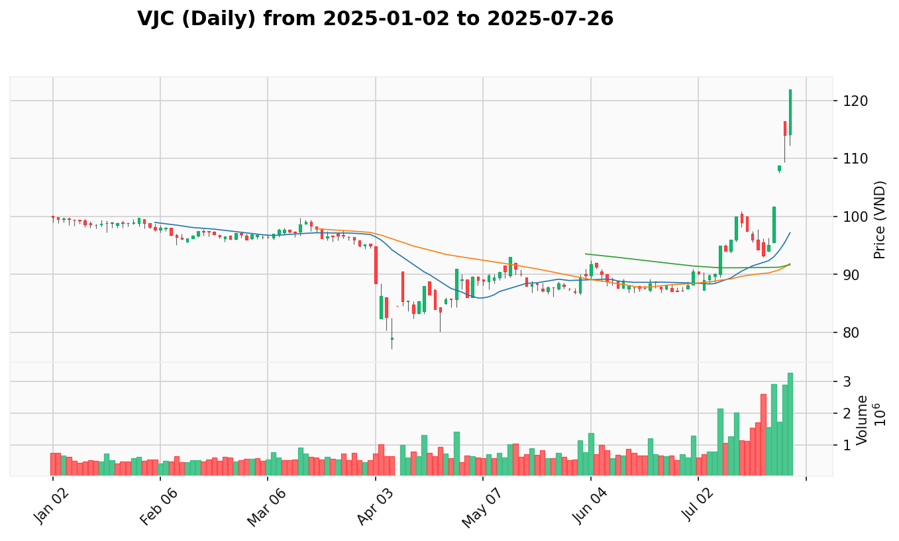

<a href="#hang-khong">↑ Back to group HANG_KHONG</a>  |  <a href="#vpa-signal-summary">↑ Back to Top</a>

#### Key Statistics
| Metric | Value |
|:---|---:|
| Date Range | 2025-01-02 to 2025-10-17 |
| **Latest Close** | **175.0** |
| Period Open | 100.1 |
| Period High | 179.0 |
| Period Low | 77.1 |
| Period Change % | 74.83% |

**[Download VJC Data (.csv)](market_data/VJC_2025-01-02_to_2025-10-18.csv)**

---

### VLB

#### [VPA Analysis (2025-06-26 - 2025-10-16)](./VPA.md#vlb)
> **Ngày 2025-10-10:** VLB tăng từ 47.5 VND lên 48.3 VND với biên độ dao động từ 47.2 VND đến 49.0 VND. Cây nến có thân tăng mạnh và đóng cửa gần mức cao nhất phiên. Khối lượng giao dịch đạt 0.1019 triệu cổ phiếu, tăng đáng kể so với phiên trước (0.0257 triệu cổ phiếu). Sau phiên "Phục hồi yếu" ngày 2025-10-09, phiên này cho thấy lực cầu mạnh mẽ đã đẩy giá lên cao với khối lượng gia tăng, xác nhận sự xuất hiện của nhu cầu. **Phân tích VPA/Wyckoff:** Sign of Strength (SOS) - Lực cầu mạnh mẽ.
> **Ngày 2025-10-13:** VLB giảm nhẹ từ 48.3 VND xuống 48.2 VND với biên độ dao động từ 47.0 VND đến 48.3 VND. Cây nến có thân nhỏ và đóng cửa gần mức cao nhất phiên, nhưng thấp hơn giá đóng cửa phiên trước. Khối lượng giao dịch đạt 0.0371 triệu cổ phiếu, giảm đáng kể so với phiên trước (0.1019 triệu cổ phiếu). Sau phiên "Sign of Strength" (SOS) ngày 2025-10-10, phiên này cho thấy giá điều chỉnh nhẹ với khối lượng thấp, cho thấy lực cung không mạnh mẽ và thị trường đang hấp thụ nguồn cung. Đây có thể là một giai đoạn kiểm tra cung hoặc tạm dừng trước khi tiếp tục xu hướng. **Phân tích VPA/Wyckoff:** Test of Supply (TOS) - Kiểm tra cung.
> **Ngày 2025-10-14:** VLB mở cửa ở 48.4 VND, tăng lên mức cao nhất 48.6 VND nhưng sau đó giảm và đóng cửa ở 48.2 VND, bằng với giá đóng cửa phiên trước. Biên độ dao động trong phiên là 0.6 VND. Khối lượng giao dịch đạt 0.063 triệu cổ phiếu, tăng đáng kể so với phiên trước (0.0371 triệu cổ phiếu). Sau phiên "Kiểm tra cung" (TOS) ngày 2025-10-13, phiên này cho thấy giá đã cố gắng tăng nhưng không thể duy trì được đà tăng, đóng cửa ở mức tương đương với phiên trước mặc dù khối lượng giao dịch tăng mạnh. Điều này cho thấy lực cung đã xuất hiện và hấp thụ lực cầu, ngăn cản giá tiếp tục tăng lên. **Phân tích VPA/Wyckoff:** Upthrust (UT) - Lực cung xuất hiện.
> **Ngày 2025-10-15:** VLB mở cửa ở 48.2 VND, tăng nhẹ lên 48.5 VND nhưng sau đó giảm và đóng cửa ở mức thấp nhất phiên là 48.0 VND, thấp hơn giá đóng cửa phiên trước (48.2 VND). Biên độ dao động trong phiên là 0.5 VND. Khối lượng giao dịch đạt 0.0261 triệu cổ phiếu, giảm đáng kể so với phiên trước (0.063 triệu cổ phiếu). Sau phiên "Upthrust" (UT) ngày 2025-10-14 cho thấy lực cung xuất hiện, phiên này giá tiếp tục giảm với khối lượng rất thấp, đóng cửa ở mức thấp nhất phiên. Điều này cho thấy lực cầu yếu và không có sự hỗ trợ, xác nhận sự suy yếu của thị trường sau khi lực cung đã xuất hiện. **Phân tích VPA/Wyckoff:** Sign of Weakness (SOW) - Dấu hiệu suy yếu.
> **Ngày 2025-10-16:** VLB mở cửa ở 48.2 VND, tăng nhẹ lên 48.3 VND nhưng sau đó giảm và đóng cửa ở mức thấp nhất phiên là 47.9 VND, thấp hơn giá đóng cửa phiên trước (48.0 VND). Biên độ dao động trong phiên là 0.4 VND, rất hẹp. Khối lượng giao dịch đạt 0.0029 triệu cổ phiếu, giảm mạnh và ở mức cực kỳ thấp so với phiên trước (0.0261 triệu cổ phiếu) và các phiên gần đây. Sau phiên "Sign of Weakness" (SOW) ngày 2025-10-15, phiên này tiếp tục cho thấy giá giảm nhẹ với biên độ hẹp và khối lượng cực thấp. Điều này xác nhận sự thiếu vắng lực cầu và cho thấy thị trường không có sự quan tâm từ cả bên mua lẫn bên bán, thường là dấu hiệu tiếp tục suy yếu hoặc tích lũy ở vùng giá thấp. **Phân tích VPA/Wyckoff:** No Demand (ND) - Không có lực cầu.

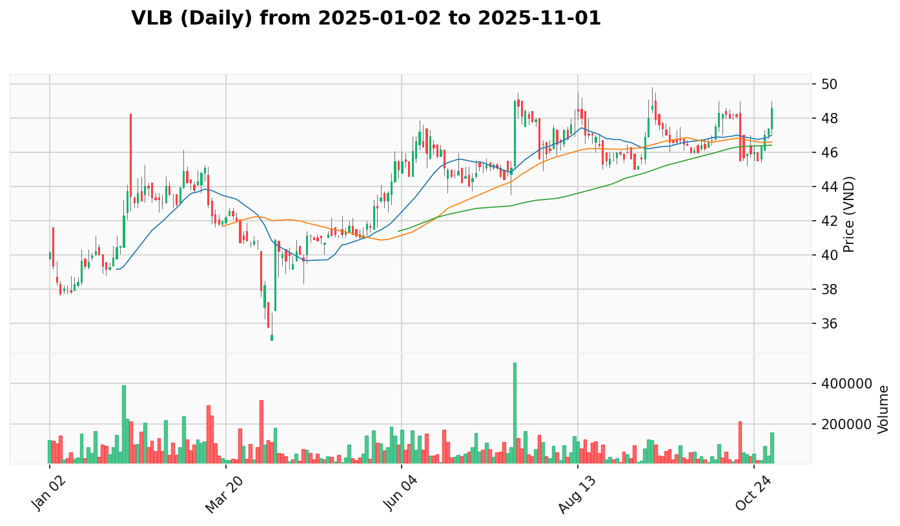

<a href="#vlxd">↑ Back to group VLXD</a>  |  <a href="#vpa-signal-summary">↑ Back to Top</a>

#### Key Statistics
| Metric | Value |
|:---|---:|
| Date Range | 2025-01-02 to 2025-10-17 |
| **Latest Close** | **48.1** |
| Period Open | 39.77 |
| Period High | 49.8 |
| Period Low | 35.02 |
| Period Change % | 20.95% |

**[Download VLB Data (.csv)](market_data/VLB_2025-01-02_to_2025-10-18.csv)**

---

### VLC

#### [VPA Analysis (2025-08-04 - 2025-10-16)](./VPA.md#vlc)
> **Ngày 2025-10-10:** VLC tăng từ 15.1 VND lên 15.2 VND, mở cửa ở 15.1 VND, cao nhất 15.2 VND và thấp nhất 14.9 VND, đóng cửa ở 15.2 VND. Cây nến có biên độ 0.3 VND và đóng cửa ở mức cao nhất phiên. Khối lượng giao dịch đạt 0.0559 triệu cổ phiếu, giảm mạnh so với phiên trước (0.0984 triệu cổ phiếu). Sau phiên No Supply ngày 2025-10-09, giá tiếp tục tăng nhẹ với khối lượng thấp, cho thấy lực cầu vẫn duy trì và không có áp lực bán đáng kể. **Phân tích VPA/Wyckoff:** Lack of Supply (LOS) - Thiếu hụt nguồn cung.
> **Ngày 2025-10-13:** VLC giảm từ 15.2 VND xuống 15.0 VND, mở cửa ở 15.0 VND, đạt mức cao nhất 15.0 VND và thấp nhất 14.8 VND, đóng cửa ở 15.0 VND. Cây nến có biên độ hẹp 0.2 VND và đóng cửa ở mức cao nhất phiên. Khối lượng giao dịch đạt 0.0979 triệu cổ phiếu, tăng so với phiên trước (0.0559 triệu cổ phiếu). Sau các phiên cho thấy không có áp lực bán đáng kể, giá giảm nhẹ với khối lượng tăng nhưng đóng cửa ở mức cao nhất phiên, cho thấy lực cầu đã hấp thụ nguồn cung xuất hiện. **Phân tích VPA/Wyckoff:** Test for Supply (TS) - Kiểm tra nguồn cung.
> **Ngày 2025-10-14:** VLC giảm từ 15.0 VND xuống 14.8 VND, mở cửa ở 15.1 VND, cao nhất 15.1 VND và thấp nhất 14.8 VND, đóng cửa ở 14.8 VND. Cây nến có biên độ 0.3 VND và đóng cửa ở mức thấp nhất phiên. Khối lượng giao dịch đạt 0.0717 triệu cổ phiếu, giảm so với phiên trước (0.0979 triệu cổ phiếu). Sau phiên kiểm tra nguồn cung (Test for Supply) ngày 2025-10-13, giá giảm mạnh với khối lượng thấp, cho thấy thiếu hụt lực cầu và áp lực bán đang chiếm ưu thế. **Phân tích VPA/Wyckoff:** No Demand (ND) - Thiếu hụt lực cầu.
> **Ngày 2025-10-15:** VLC giảm từ 14.8 VND xuống 14.7 VND, mở cửa ở 14.9 VND, đạt mức cao nhất 14.9 VND và thấp nhất 14.6 VND, đóng cửa ở 14.7 VND. Cây nến có biên độ 0.3 VND và đóng cửa ở mức thấp nhất phiên. Khối lượng giao dịch đạt 0.116 triệu cổ phiếu, tăng so với phiên trước (0.0717 triệu cổ phiếu). Sau phiên thiếu hụt lực cầu (No Demand) ngày 2025-10-14, giá tiếp tục giảm với khối lượng gia tăng và đóng cửa ở mức thấp nhất, cho thấy áp lực bán mạnh mẽ và nguồn cung đang chiếm ưu thế. **Phân tích VPA/Wyckoff:** Sign of Weakness (SOW) - Dấu hiệu suy yếu.
> **Ngày 2025-10-16:** VLC giảm từ 14.8 VND xuống 14.7 VND, mở cửa ở 14.8 VND, cao nhất 14.9 VND và thấp nhất 14.6 VND, đóng cửa ở 14.7 VND. Cây nến có biên độ 0.3 VND và đóng cửa ở mức thấp nhất phiên. Khối lượng giao dịch đạt 0.0134 triệu cổ phiếu, giảm mạnh so với phiên trước (0.116 triệu cổ phiếu). Sau phiên Dấu hiệu suy yếu (SOW) ngày 2025-10-15, giá tiếp tục giảm nhẹ với khối lượng cực thấp, cho thấy áp lực bán đã cạn kiệt nhưng lực cầu vẫn chưa xuất hiện. **Phân tích VPA/Wyckoff:** No Demand (ND) - Thiếu hụt lực cầu.

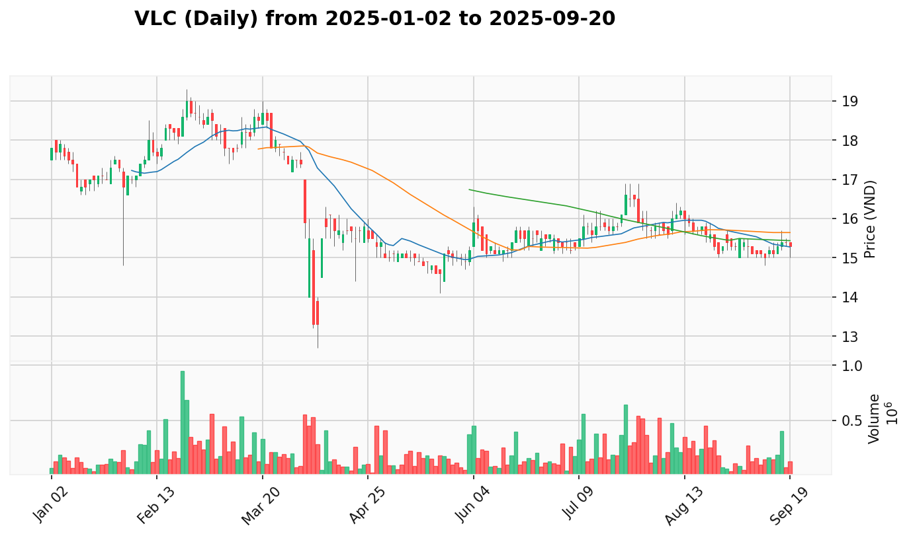

<a href="#nong-nghiep">↑ Back to group NONG_NGHIEP</a>  |  <a href="#vpa-signal-summary">↑ Back to Top</a>

#### Key Statistics
| Metric | Value |
|:---|---:|
| Date Range | 2025-01-02 to 2025-10-17 |
| **Latest Close** | **14.5** |
| Period Open | 17.5 |
| Period High | 19.3 |
| Period Low | 12.7 |
| Period Change % | -17.14% |

**[Download VLC Data (.csv)](market_data/VLC_2025-01-02_to_2025-10-18.csv)**

---

### VNA

#### [VPA Analysis (2025-08-13 - 2025-10-16)](./VPA.md#vna)
> **Ngày 2025-10-10:** VNA giảm từ 17.8 VND xuống 17.2 VND với biên độ giá hẹp (0.2 VND), đóng cửa gần giữa thân nến. Khối lượng giao dịch đạt 0.0109 triệu cổ phiếu, tăng đáng kể so với phiên trước, cho thấy áp lực bán đã xuất hiện sau giai đoạn không có cầu. Mặc dù khối lượng vẫn ở mức thấp so với thị trường chung, sự gia tăng này cùng với việc giá giảm xác nhận sự yếu kém của lực cầu. **Phân tích VPA/Wyckoff:** Sign of Weakness (SOW) - Dấu hiệu yếu kém.
> **Ngày 2025-10-13:** VNA mở cửa ở mức 17.8 VND, dao động trong biên độ hẹp từ 17.7 VND đến 17.8 VND và đóng cửa tại 17.7 VND. So với phiên trước (17.2 VND), giá tăng nhẹ nhưng biên độ giá rất hẹp. Khối lượng giao dịch cực kỳ thấp, chỉ đạt 0.0009 triệu cổ phiếu, giảm mạnh so với phiên trước (0.0109 triệu cổ phiếu). Điều này cho thấy nỗ lực tăng giá không nhận được sự hỗ trợ từ khối lượng, xác nhận sự thiếu vắng lực cầu sau các dấu hiệu yếu kém trước đó. **Phân tích VPA/Wyckoff:** Không có cầu (No Demand)
> **Ngày 2025-10-14:** VNA mở cửa ở mức 18.5 VND, dao động trong biên độ từ 18.0 VND đến 18.5 VND và đóng cửa tại 18.0 VND. So với phiên trước (17.7 VND), giá tăng nhẹ nhưng biên độ giá hẹp và đóng cửa gần mức thấp nhất phiên, cho thấy áp lực bán đã xuất hiện trong phiên. Khối lượng giao dịch cực kỳ thấp, chỉ đạt 0.0003 triệu cổ phiếu, giảm mạnh so với phiên trước (0.0009 triệu cổ phiếu). Điều này xác nhận sự thiếu vắng lực cầu và nỗ lực tăng giá không bền vững. **Phân tích VPA/Wyckoff:** Không có cầu (No Demand)
> **Ngày 2025-10-15:** VNA mở cửa ở mức 17.8 VND, dao động trong biên độ hẹp từ 17.4 VND đến 17.8 VND và đóng cửa tại 17.8 VND. So với phiên trước (18.0 VND), giá giảm nhẹ. Khối lượng giao dịch đạt 0.0014 triệu cổ phiếu, tăng so với phiên trước (0.0003 triệu cổ phiếu). Mặc dù giá đóng cửa ở mức cao nhất phiên, nhưng việc giá giảm nhẹ trên khối lượng tăng cho thấy áp lực bán vẫn còn hiện hữu và nỗ lực tăng giá không bền vững. **Phân tích VPA/Wyckoff:** Yếu kém (Weakness) - Áp lực bán vẫn còn hiện hữu.
> **Ngày 2025-10-16:** VNA mở cửa ở mức 18.2 VND, dao động trong biên độ rộng từ 15.7 VND đến 18.2 VND và đóng cửa tại 17.7 VND. So với phiên trước (17.8 VND), giá giảm nhẹ. Khối lượng giao dịch đạt 0.0022 triệu cổ phiếu, tăng so với phiên trước (0.0014 triệu cổ phiếu). Mặc dù mở cửa cao hơn, giá đã giảm mạnh trong phiên và đóng cửa gần mức thấp nhất, cho thấy áp lực bán mạnh mẽ và sự xuất hiện của nguồn cung lớn. **Phân tích VPA/Wyckoff:** Yếu kém (Weakness) - Áp lực bán gia tăng với biên độ rộng và khối lượng tăng.

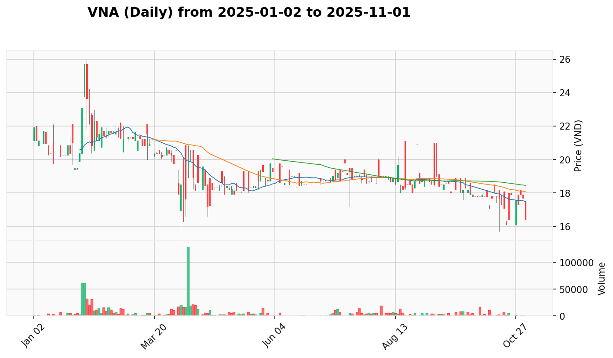

<a href="#van-tai">↑ Back to group VAN_TAI</a>  |  <a href="#vpa-signal-summary">↑ Back to Top</a>

#### Key Statistics
| Metric | Value |
|:---|---:|
| Date Range | 2025-01-02 to 2025-10-17 |
| **Latest Close** | **17.3** |
| Period Open | 21.14 |
| Period High | 25.99 |
| Period Low | 15.7 |
| Period Change % | -18.16% |

**[Download VNA Data (.csv)](market_data/VNA_2025-01-02_to_2025-10-18.csv)**

---

### VND

#### [VPA Analysis (2025-06-13 - 2025-10-16)](./VPA.md#vnd)
> **Ngày 2025-10-10:** VND mở cửa ở mức 23.75 VND, đạt đỉnh 24.25 VND, giảm xuống 23.5 VND và đóng cửa ở 23.65 VND. Giá đóng cửa cao hơn nhẹ so với phiên trước (23.65 VND so với 23.5 VND). Cây nến có biên độ hẹp và đóng cửa dưới giá mở cửa, cho thấy lực bán vẫn còn. Khối lượng giao dịch đạt 24.18 triệu cổ phiếu, thấp hơn đáng kể so với phiên trước (26.79 triệu cổ phiếu). Sau hai phiên giảm giá với áp lực bán mạnh, phiên này giá có sự phục hồi nhẹ nhưng với khối lượng thấp và biên độ hẹp, cho thấy lực cầu vẫn còn yếu và chưa đủ sức đẩy giá lên một cách dứt khoát. **Phân tích VPA/Wyckoff:** Weakness - Lực cầu yếu.
> **Ngày 2025-10-13:** VND mở cửa ở 23.45 VND, đạt mức cao nhất 23.9 VND, sau đó giảm xuống 23.1 VND và đóng cửa ở 23.7 VND. Giá đóng cửa cao hơn phiên trước (23.7 VND so với 23.65 VND). Cây nến tăng có biên độ hẹp và đóng cửa gần mức cao nhất phiên, cho thấy lực cầu đang quay trở lại. Khối lượng giao dịch đạt 28.62 triệu cổ phiếu, tăng đáng kể so với 24.18 triệu cổ phiếu của phiên trước. Sau hai phiên giảm giá với lực cầu yếu, phiên này giá tăng nhẹ với khối lượng gia tăng cho thấy có sự hấp thụ lực cung và lực cầu đang dần chiếm ưu thế. **Phân tích VPA/Wyckoff:** Sign of Strength (SOS) - Lực cầu đang quay trở lại.
> **Ngày 2025-10-14:** VND mở cửa ở mức 24.25 VND, đạt đỉnh 24.55 VND, giảm xuống 23.3 VND và đóng cửa ở 23.35 VND. Giá đóng cửa thấp hơn đáng kể so với phiên trước (23.35 VND so với 23.7 VND). Cây nến có biên độ rộng và đóng cửa gần mức thấp nhất phiên, cho thấy áp lực bán mạnh mẽ. Khối lượng giao dịch đạt 43.197 triệu cổ phiếu, tăng vọt so với phiên trước (28.6223 triệu cổ phiếu). Sự sụt giảm giá mạnh đi kèm với khối lượng tăng đột biến cho thấy lực cung đang chiếm ưu thế hoàn toàn, đẩy giá xuống. **Phân tích VPA/Wyckoff:** Weakness - Lực cung mạnh mẽ.
> **Ngày 2025-10-15:** VND mở cửa ở 23.5 VND, đạt mức cao nhất 23.8 VND, sau đó giảm xuống 23.3 VND và đóng cửa ở 23.5 VND. Giá đóng cửa cao hơn nhẹ so với phiên trước (23.5 VND so với 23.35 VND). Cây nến có biên độ hẹp và đóng cửa ở mức mở cửa, cho thấy sự lưỡng lự của thị trường sau phiên giảm mạnh trước đó. Khối lượng giao dịch đạt 19.14 triệu cổ phiếu, giảm đáng kể so với 43.20 triệu cổ phiếu của phiên trước. Sau phiên giảm giá mạnh với khối lượng đột biến (Weakness), phiên này giá hồi phục nhẹ nhưng với khối lượng thấp cho thấy lực cầu yếu và không có sự xác nhận. Điều này cho thấy lực cung vẫn còn tiềm ẩn và lực cầu chưa sẵn sàng đẩy giá lên. **Phân tích VPA/Wyckoff:** No Demand (Thiếu cầu)
> **Ngày 2025-10-16:** VND mở cửa ở mức 23.7 VND, đạt đỉnh 23.9 VND, giảm xuống 23.35 VND và đóng cửa ở 23.65 VND. Giá đóng cửa cao hơn nhẹ so với phiên trước (23.65 VND so với 23.5 VND). Cây nến có biên độ hẹp và đóng cửa thấp hơn mức mở cửa, cho thấy sự lưỡng lự và áp lực bán nhẹ. Khối lượng giao dịch đạt 16.60 triệu cổ phiếu, giảm so với phiên trước (19.14 triệu cổ phiếu) và thấp hơn đáng kể so với phiên giảm mạnh ngày 2025-10-14 (43.197 triệu cổ phiếu). Sau phiên giảm mạnh với lực cung chiếm ưu thế và phiên thiếu cầu, phiên này giá hồi phục nhẹ nhưng với khối lượng thấp, cho thấy lực cầu vẫn yếu và thị trường thiếu sự quan tâm. **Phân tích VPA/Wyckoff:** No Demand (Thiếu cầu) - Lực cầu yếu và thiếu sự quan tâm.

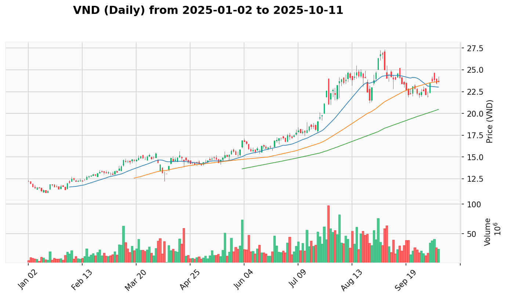

<a href="#chung-khoan">↑ Back to group CHUNG_KHOAN</a>  |  <a href="#vpa-signal-summary">↑ Back to Top</a>

#### Key Statistics
| Metric | Value |
|:---|---:|
| Date Range | 2025-01-02 to 2025-10-17 |
| **Latest Close** | **23.55** |
| Period Open | 12.21 |
| Period High | 27.35 |
| Period Low | 10.91 |
| Period Change % | 92.87% |

**[Download VND Data (.csv)](market_data/VND_2025-01-02_to_2025-10-18.csv)**

---

### VNE

#### [VPA Analysis (2025-08-14 - 2025-10-16)](./VPA.md#vne)
> **Ngày 2025-10-10:** VNE tăng nhẹ từ 7.63 VND lên 7.67 VND với khối lượng giao dịch đạt 0.0881 triệu cổ phiếu. Cây nến có biên độ tương đối rộng và đóng cửa ở nửa trên, cho thấy có lực cầu xuất hiện. Khối lượng giao dịch tăng nhẹ so với phiên trước (0.0662 triệu cổ phiếu) nhưng vẫn ở mức thấp, chưa đủ mạnh để xác nhận xu hướng tăng rõ rệt. Sau tín hiệu "No Supply" ngày hôm qua, diễn biến này có thể là một sự kiểm tra cầu (Test for Demand) sau khi lực cung đã cạn kiệt. **Phân tích VPA/Wyckoff:** Test for Demand (Kiểm tra cầu)
> **Ngày 2025-10-13:** VNE tăng từ 7.67 VND lên 7.7 VND với khối lượng giao dịch đạt 0.1184 triệu cổ phiếu. Cây nến tăng có biên độ tương đối rộng và đóng cửa ở mức cao nhất phiên, cho thấy lực cầu mạnh mẽ. Khối lượng giao dịch tăng đáng kể so với phiên trước (0.0881 triệu cổ phiếu), xác nhận sự xuất hiện của lực mua sau giai đoạn kiểm tra cầu. Điều này cho thấy thị trường đang có dấu hiệu phục hồi và lực cầu đang chiếm ưu thế. **Phân tích VPA/Wyckoff:** Sign of Strength (SOS)
> **Ngày 2025-10-14:** VNE giảm từ 7.7 VND xuống 7.63 VND với khối lượng giao dịch đạt 0.1175 triệu cổ phiếu. Cây nến có biên độ hẹp và đóng cửa ở nửa dưới, cho thấy áp lực bán nhẹ hoặc sự chốt lời sau phiên tăng điểm trước đó. Khối lượng giao dịch giảm nhẹ so với phiên trước (0.1184 triệu cổ phiếu), cho thấy lực bán không quá mạnh. Sau tín hiệu "Sign of Strength" ngày 2025-10-13, diễn biến này có thể là một sự kiểm tra cung (Test for Supply) sau khi lực cầu đã xuất hiện mạnh mẽ. **Phân tích VPA/Wyckoff:** Test for Supply (Kiểm tra cung)
> **Ngày 2025-10-15:** VNE giảm từ 7.63 VND xuống 7.59 VND với khối lượng giao dịch đạt 0.111 triệu cổ phiếu. Cây nến giảm có biên độ hẹp và đóng cửa gần mức thấp nhất phiên, cho thấy lực bán vẫn còn hoặc lực cầu chưa đủ mạnh để đẩy giá lên. Khối lượng giao dịch giảm nhẹ so với phiên trước (0.1175 triệu cổ phiếu), xác nhận sự thiếu vắng lực cầu chủ động. Sau tín hiệu "Test for Supply" ngày 2025-10-14, diễn biến này cho thấy thị trường đang tiếp tục kiểm tra cung hoặc đang trong giai đoạn củng cố trước khi có xu hướng rõ ràng hơn. **Phân tích VPA/Wyckoff:** No Demand (Thiếu cầu)
> **Ngày 2025-10-16:** VNE giảm từ 7.59 VND xuống 7.45 VND với khối lượng giao dịch đạt 0.0196 triệu cổ phiếu. Cây nến giảm có biên độ rộng và đóng cửa gần mức thấp nhất phiên, cho thấy áp lực bán vẫn còn. Tuy nhiên, khối lượng giao dịch cực kỳ thấp, giảm mạnh so với các phiên trước, cho thấy sự cạn kiệt của lực cung hoặc thiếu vắng sự quan tâm từ cả người mua và người bán. Sau các tín hiệu "Test for Supply" và "No Demand" trước đó, diễn biến này có thể là một sự kiểm tra cuối cùng về lực cung trước khi có thể có sự thay đổi xu hướng. **Phân tích VPA/Wyckoff:** No Supply (Cạn cung)

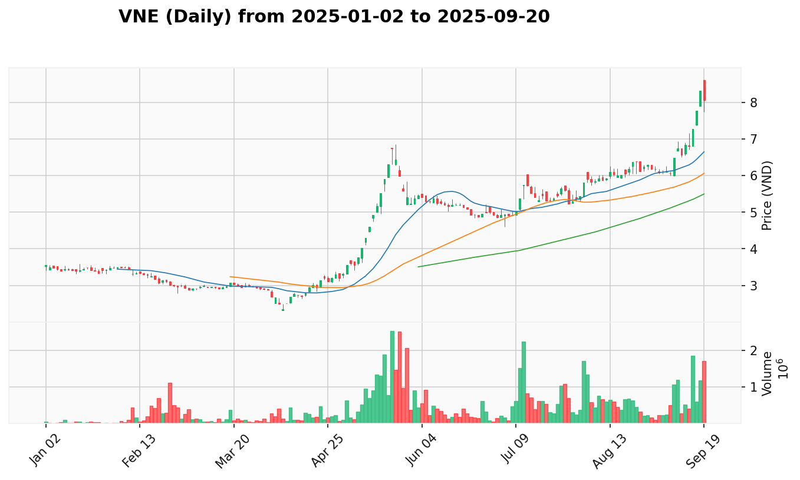

<a href="#xay-lap-dien">↑ Back to group XAY_LAP_DIEN</a>  |  <a href="#vpa-signal-summary">↑ Back to Top</a>

#### Key Statistics
| Metric | Value |
|:---|---:|
| Date Range | 2025-01-02 to 2025-10-17 |
| **Latest Close** | **7.47** |
| Period Open | 3.52 |
| Period High | 8.62 |
| Period Low | 2.32 |
| Period Change % | 112.22% |

**[Download VNE Data (.csv)](market_data/VNE_2025-01-02_to_2025-10-18.csv)**

---

### VNM

#### [VPA Analysis (2025-06-13 - 2025-10-16)](./VPA.md#vnm)
> **Ngày 2025-10-10:** VNM giảm từ 62.9 VND xuống 62.4 VND với khối lượng giao dịch đạt 4.97 triệu cổ phiếu. Nến ngày có biên độ giảm rộng và đóng cửa ở mức thấp nhất phiên, cho thấy áp lực bán mạnh mẽ. Khối lượng giao dịch tăng đáng kể so với phiên trước (4.97 triệu so với 3.30 triệu cổ phiếu), xác nhận sự xuất hiện của nguồn cung lớn. Điều này cho thấy sự yếu kém tiếp diễn sau phiên thiếu cầu. **Phân tích VPA/Wyckoff:** Sign of Weakness (SOW) - Áp lực bán mạnh mẽ với khối lượng gia tăng, đóng cửa ở mức thấp nhất phiên.
> **Ngày 2025-10-13:** VNM tăng từ 62.4 VND lên 64.0 VND với khối lượng giao dịch đạt 6.305 triệu cổ phiếu. Nến ngày có biên độ tăng rộng và đóng cửa gần mức cao nhất phiên. Khối lượng giao dịch tăng mạnh so với phiên trước (6.305 triệu so với 4.972 triệu cổ phiếu), cho thấy lực cầu mạnh mẽ đã quay trở lại sau hai phiên giảm giá và thiếu cầu. Điều này xác nhận sự hấp thụ nguồn cung và khả năng tiếp diễn xu hướng tăng. **Phân tích VPA/Wyckoff:** Sign of Strength (SOS) - Lực cầu mạnh mẽ với khối lượng gia tăng, đóng cửa gần mức cao nhất phiên.
> **Ngày 2025-10-14:** VNM giảm từ 64.0 VND xuống 63.5 VND với khối lượng giao dịch đạt 5.36 triệu cổ phiếu. Nến ngày có biên độ giảm rộng và đóng cửa gần mức thấp nhất phiên, cho thấy áp lực bán xuất hiện sau phiên tăng mạnh. Khối lượng giao dịch giảm so với phiên trước (5.36 triệu so với 6.305 triệu cổ phiếu), cho thấy lực bán chưa quá mạnh nhưng đủ để đẩy giá xuống. Điều này có thể là một phản ứng tự nhiên sau phiên SOS, nhưng cũng cảnh báo về sự xuất hiện của nguồn cung. **Phân tích VPA/Wyckoff:** Sign of Weakness (SOW) - Áp lực bán xuất hiện sau phiên SOS, giá đóng cửa thấp hơn với khối lượng giảm nhẹ.
> **Ngày 2025-10-15:** VNM tăng nhẹ từ 63.5 VND lên 63.6 VND với khối lượng giao dịch đạt 4.645 triệu cổ phiếu. Nến ngày có biên độ hẹp và đóng cửa ở mức thấp nhất phiên, cho thấy áp lực bán vẫn còn và lực cầu yếu. Khối lượng giao dịch tiếp tục giảm so với phiên trước (4.645 triệu so với 5.36 triệu cổ phiếu), xác nhận sự thiếu vắng của lực cầu mạnh mẽ. Điều này cho thấy thị trường đang thiếu động lực tăng giá sau phiên giảm điểm trước đó. **Phân tích VPA/Wyckoff:** No Demand (ND) - Lực cầu yếu, giá đóng cửa ở mức thấp nhất phiên với khối lượng giảm.
> **Ngày 2025-10-16:** VNM giảm từ 60.75 VND xuống 60.6 VND với khối lượng giao dịch đạt 2.077 triệu cổ phiếu. Nến ngày có biên độ hẹp và đóng cửa gần giữa thân nến, cho thấy sự lưỡng lự của thị trường. Khối lượng giao dịch cực kỳ thấp, giảm mạnh so với phiên trước (2.077 triệu so với 4.653 triệu cổ phiếu), cho thấy lực bán đã cạn kiệt nhưng lực cầu cũng chưa xuất hiện mạnh mẽ. Điều này tiếp tục xác nhận thị trường đang trong giai đoạn thiếu động lực rõ ràng sau các phiên giảm điểm. **Phân tích VPA/Wyckoff:** No Supply (NS) - Lực cung cạn kiệt với khối lượng giao dịch cực thấp, giá giảm nhẹ cho thấy áp lực bán không còn đáng kể.

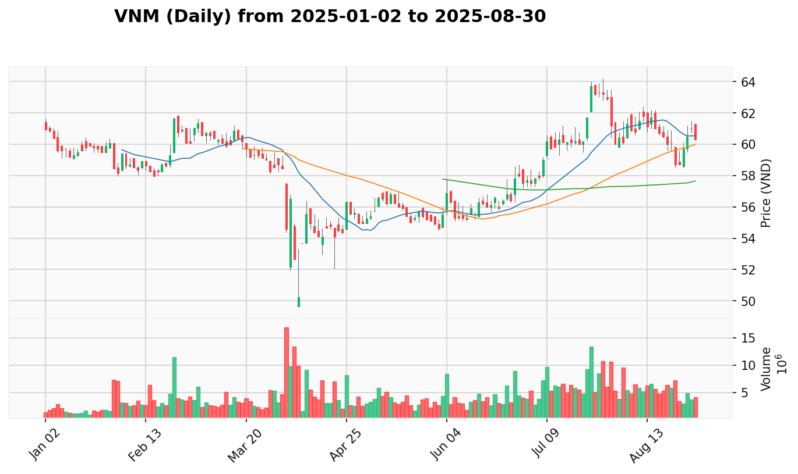

<a href="#thuc-pham">↑ Back to group THUC_PHAM</a>  |  <a href="#vpa-signal-summary">↑ Back to Top</a>

#### Key Statistics
| Metric | Value |
|:---|---:|
| Date Range | 2025-01-02 to 2025-10-17 |
| **Latest Close** | **58.8** |
| Period Open | 58.67 |
| Period High | 63.23 |
| Period Low | 47.42 |
| Period Change % | 0.22% |

**[Download VNM Data (.csv)](market_data/VNM_2025-01-02_to_2025-10-18.csv)**

---

### VOS

#### [VPA Analysis (2025-08-12 - 2025-10-16)](./VPA.md#vos)
> **Ngày 2025-10-10:** VOS mở cửa ở mức 13.5 VND và đóng cửa ở mức 13.45 VND, giảm nhẹ so với mức đóng cửa 13.5 VND của phiên trước. Mức cao nhất trong phiên là 13.75 VND và thấp nhất là 13.4 VND. Cây nến có biên độ rộng, giá đã cố gắng tăng lên nhưng bị đẩy xuống và đóng cửa ở gần mức thấp nhất phiên, cho thấy áp lực bán mạnh. Khối lượng giao dịch đạt 1.367 triệu cổ phiếu, tăng đáng kể so với phiên trước (0.8809 triệu cổ phiếu). Sau nỗ lực tăng giá không thành công vào ngày 2025-10-09, phiên này cho thấy sự xuất hiện của lực cung lớn, hấp thụ toàn bộ lực cầu và đẩy giá xuống, xác nhận sự suy yếu. **Phân tích VPA/Wyckoff:** Sign of Weakness (SOW) - Lực cung mạnh mẽ.
> **Ngày 2025-10-13:** VOS mở cửa ở mức 13.4 VND và đóng cửa ở mức 13.6 VND, tăng từ mức 13.45 VND của phiên trước. Mức cao nhất trong phiên là 13.65 VND và thấp nhất là 13.3 VND. Cây nến có biên độ tương đối rộng, đóng cửa gần mức cao nhất phiên, cho thấy lực mua chiếm ưu thế. Khối lượng giao dịch đạt 1.0334 triệu cổ phiếu, thấp hơn so với phiên trước (1.367 triệu cổ phiếu). Sau phiên giảm giá mạnh với khối lượng lớn (SOW) vào ngày 2025-10-10, phiên này cho thấy sự phục hồi về giá với lực mua đẩy giá lên. Mặc dù khối lượng giao dịch giảm, việc giá tăng và đóng cửa gần mức cao nhất phiên cho thấy lực cung đã suy yếu và lực cầu đang hấp thụ lượng bán ra. **Phân tích VPA/Wyckoff:** Sign of Strength (SOS) - Lực cầu xuất hiện và hấp thụ lực cung.
> **Ngày 2025-10-14:** VOS mở cửa ở mức 13.65 VND và đóng cửa ở mức 13.3 VND, giảm so với mức đóng cửa 13.6 VND của phiên trước. Mức cao nhất trong phiên là 13.7 VND và thấp nhất là 13.3 VND. Cây nến có biên độ rộng, giá đã cố gắng tăng lên nhưng bị đẩy xuống và đóng cửa ở mức thấp nhất phiên, cho thấy áp lực bán mạnh mẽ. Khối lượng giao dịch đạt 0.9994 triệu cổ phiếu, giảm nhẹ so với phiên trước (1.0334 triệu cổ phiếu) nhưng vẫn ở mức tương đối cao. Sau phiên tăng giá với lực cầu xuất hiện (SOS) vào ngày 2025-10-13, phiên này cho thấy sự quay trở lại của lực cung, hấp thụ lực cầu và đẩy giá xuống, xác nhận sự suy yếu. **Phân tích VPA/Wyckoff:** Sign of Weakness (SOW) - Lực cung mạnh mẽ.
> **Ngày 2025-10-15:** VOS mở cửa ở mức 13.45 VND và đóng cửa ở mức 13.0 VND, giảm so với mức đóng cửa 13.3 VND của phiên trước. Mức cao nhất trong phiên là 13.45 VND và thấp nhất là 12.95 VND. Cây nến có biên độ rộng, giá giảm mạnh và đóng cửa ở mức thấp nhất phiên, cho thấy áp lực bán rất mạnh. Khối lượng giao dịch đạt 1.4186 triệu cổ phiếu, cao hơn đáng kể so với phiên trước (0.9994 triệu cổ phiếu). Sau phiên giảm giá với lực cung mạnh mẽ (SOW) vào ngày 2025-10-14, phiên này tiếp tục cho thấy sự gia tăng của lực cung, đẩy giá xuống sâu hơn với khối lượng lớn, xác nhận xu hướng suy yếu. **Phân tích VPA/Wyckoff:** Sign of Weakness (SOW) - Lực cung áp đảo và đẩy giá xuống.
> **Ngày 2025-10-16:** VOS mở cửa ở mức 13.0 VND và đóng cửa ở mức 12.9 VND, giảm so với mức đóng cửa 13.0 VND của phiên trước. Mức cao nhất trong phiên là 13.05 VND và thấp nhất là 12.8 VND. Cây nến có biên độ hẹp, giá tiếp tục giảm và đóng cửa gần mức thấp nhất phiên, cho thấy áp lực bán vẫn còn. Khối lượng giao dịch đạt 0.6321 triệu cổ phiếu, giảm đáng kể so với phiên trước (1.4186 triệu cổ phiếu). Sau hai phiên giảm giá mạnh với lực cung áp đảo (SOW), phiên này tiếp tục cho thấy sự suy yếu của giá nhưng với khối lượng thấp hơn, có thể cho thấy lực bán đang tạm thời giảm bớt hoặc thiếu lực cầu ở mức giá thấp. Tuy nhiên, việc giá vẫn đóng cửa ở mức thấp cho thấy xu hướng giảm vẫn tiếp diễn. **Phân tích VPA/Wyckoff:** Sign of Weakness (SOW) - Giá tiếp tục giảm với khối lượng thấp, cho thấy thiếu lực cầu hỗ trợ.

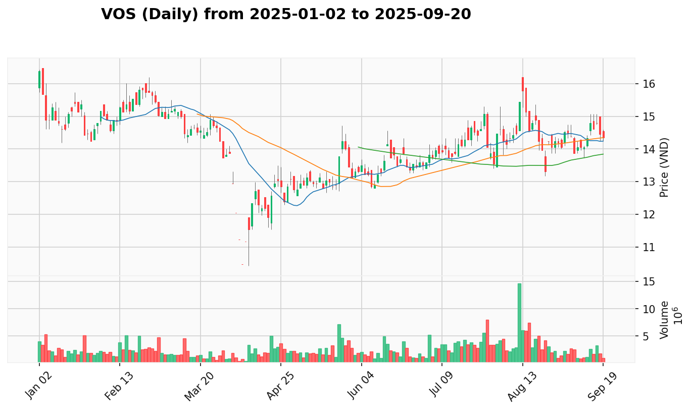

<a href="#van-tai">↑ Back to group VAN_TAI</a>  |  <a href="#vpa-signal-summary">↑ Back to Top</a>

#### Key Statistics
| Metric | Value |
|:---|---:|
| Date Range | 2025-01-02 to 2025-10-17 |
| **Latest Close** | **12.85** |
| Period Open | 15.87 |
| Period High | 16.48 |
| Period Low | 10.42 |
| Period Change % | -19.03% |

**[Download VOS Data (.csv)](market_data/VOS_2025-01-02_to_2025-10-18.csv)**

---

### VPB

#### [VPA Analysis (2025-06-16 - 2025-10-16)](./VPA.md#vpb)
> **Ngày 2025-10-10:** VPB mở cửa ở 32.3 VND và đóng cửa ở 32.1 VND, giảm nhẹ so với giá mở cửa nhưng giữ vững mức đóng cửa của phiên trước. Giá cao nhất đạt 32.35 VND, cho thấy nỗ lực đẩy giá lên cao nhưng gặp phải lực cung. Khối lượng giao dịch đạt 34.643 triệu cổ phiếu, thấp hơn so với phiên SOS ngày 2025-10-09 (39.1309 triệu cổ phiếu). Sau phiên tăng mạnh (SOS) trước đó, phiên này cho thấy sự tạm dừng hoặc kiểm tra lại lực cung. Mặc dù có sự xuất hiện của lực cung ở vùng giá cao, nhưng lực cầu vẫn đủ mạnh để giữ giá không giảm sâu, cho thấy sự hấp thụ cung. **Phân tích VPA/Wyckoff:** Test for Supply (TFS) - Kiểm tra cung.
> **Ngày 2025-10-13:** VPB giảm từ 32.1 VND xuống 31.7 VND. Cây nến có biên độ hẹp, mở cửa ở 31.6 VND và đóng cửa ở 31.7 VND, cho thấy sự giằng co. Khối lượng giao dịch đạt 35.739 triệu cổ phiếu, cao hơn một chút so với phiên trước. Điều này cho thấy sau phiên kiểm tra cung (TFS), lực cung vẫn còn xuất hiện nhưng lực cầu cũng đang cố gắng hấp thụ, giữ cho giá không giảm sâu. **Phân tích VPA/Wyckoff:** Effort to Fall No Result (ETFNOR) - Nỗ lực giảm giá không đạt kết quả.
> **Ngày 2025-10-14:** VPB tăng mạnh từ 31.7 VND lên 32.5 VND. Cây nến tăng có biên độ rộng, mở cửa ở 31.9 VND và đóng cửa gần mức cao nhất phiên là 32.5 VND. Khối lượng giao dịch đạt 57.0746 triệu cổ phiếu, cao hơn đáng kể so với phiên trước (35.739 triệu cổ phiếu) và là mức cao nhất trong 10 phiên gần đây. Điều này cho thấy lực cầu mạnh mẽ đã hấp thụ hết lực cung và đẩy giá lên cao, xác nhận xu hướng tăng sau các phiên kiểm tra cung và nỗ lực giảm giá không thành công trước đó. **Phân tích VPA/Wyckoff:** Sign of Strength (SOS) - Lực cầu mạnh mẽ với khối lượng gia tăng xác nhận xu hướng tăng.
> **Ngày 2025-10-15:** VPB tiếp tục tăng mạnh từ 32.5 VND lên 33.7 VND. Cây nến tăng có biên độ rất rộng, mở cửa ở 32.75 VND và đóng cửa gần mức cao nhất phiên là 33.7 VND, cho thấy lực cầu áp đảo. Khối lượng giao dịch đạt 92.6525 triệu cổ phiếu, cao hơn đáng kể so với phiên trước (57.0746 triệu cổ phiếu) và là mức cao nhất trong toàn bộ giai đoạn dữ liệu được cung cấp. Điều này xác nhận sự tiếp diễn của lực cầu mạnh mẽ, đẩy giá lên cao hơn sau tín hiệu SOS của phiên trước. **Phân tích VPA/Wyckoff:** Sign of Strength (SOS) - Lực cầu tiếp tục áp đảo với khối lượng cực lớn, xác nhận xu hướng tăng mạnh.
> **Ngày 2025-10-16:** VPB giảm nhẹ từ 33.7 VND xuống 33.6 VND. Cây nến có biên độ hẹp, mở cửa ở 33.8 VND và đóng cửa gần mức thấp nhất phiên. Khối lượng giao dịch đạt 12.0564 triệu cổ phiếu, thấp hơn đáng kể so với phiên trước (92.6525 triệu cổ phiếu) và là mức thấp nhất trong 10 phiên gần đây. Sau hai phiên tăng mạnh với khối lượng cực lớn (SOS), phiên này cho thấy lực cung đã cạn kiệt và không có áp lực bán đáng kể. Điều này cho thấy sự tạm dừng trong xu hướng tăng giá, nhưng với khối lượng thấp, đây là dấu hiệu tích cực cho thấy xu hướng tăng có thể tiếp diễn. **Phân tích VPA/Wyckoff:** No Supply (NS) - Lực cung cạn kiệt sau đợt tăng mạnh.

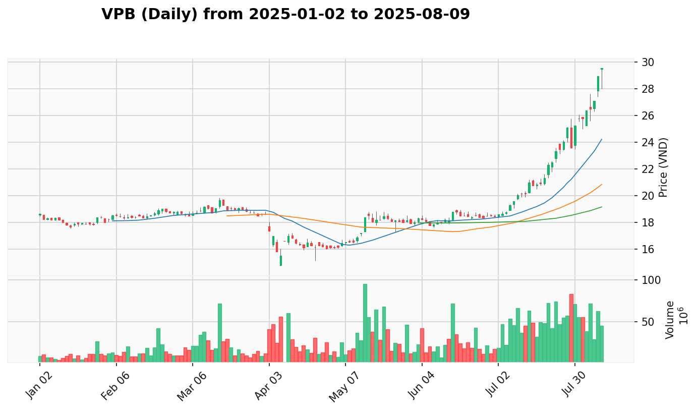

<a href="#ngan-hang">↑ Back to group NGAN_HANG</a>  |  <a href="#vpa-signal-summary">↑ Back to Top</a>

#### Key Statistics
| Metric | Value |
|:---|---:|
| Date Range | 2025-01-02 to 2025-10-17 |
| **Latest Close** | **31.95** |
| Period Open | 18.59 |
| Period High | 38.9 |
| Period Low | 14.75 |
| Period Change % | 71.87% |

**[Download VPB Data (.csv)](market_data/VPB_2025-01-02_to_2025-10-18.csv)**

---

### VPG

#### [VPA Analysis (2025-06-26 - 2025-10-16)](./VPA.md#vpg)
> **Ngày 2025-10-10:** VPG tiếp tục giảm từ 8.1 VND xuống 7.89 VND, với biên độ giá rộng (từ 7.64 VND đến 8.06 VND) và đóng cửa gần mức thấp nhất phiên. Khối lượng giao dịch đạt 0.9574 triệu cổ phiếu, tăng mạnh so với phiên trước (0.4868 triệu cổ phiếu). Việc giá giảm mạnh với biên độ rộng và đóng cửa ở mức thấp, đi kèm với khối lượng giao dịch tăng cao đột biến, cho thấy áp lực bán tháo đang diễn ra mạnh mẽ và không có lực cầu nào đủ sức hấp thụ. Điều này xác nhận sự yếu kém tiếp diễn của thị trường và khả năng cao sẽ tiếp tục xu hướng giảm. **Phân tích VPA/Wyckoff:** Sign of Weakness (SOW)
> **Ngày 2025-10-13:** VPG tiếp tục giảm từ 7.89 VND xuống 7.55 VND, với biên độ giá rộng (từ 7.5 VND đến 7.85 VND) và đóng cửa gần mức thấp nhất phiên. Khối lượng giao dịch đạt 0.7512 triệu cổ phiếu, giảm so với phiên trước (0.9574 triệu cổ phiếu). Mặc dù khối lượng có giảm, việc giá tiếp tục giảm mạnh với biên độ rộng và đóng cửa ở mức thấp cho thấy áp lực bán vẫn chiếm ưu thế và không có lực cầu đủ mạnh để đảo chiều xu hướng. Điều này xác nhận sự yếu kém tiếp diễn của thị trường. **Phân tích VPA/Wyckoff:** Sign of Weakness (SOW)
> **Ngày 2025-10-14:** VPG tăng nhẹ từ 7.55 VND lên 7.56 VND, với biên độ giá hẹp (từ 7.53 VND đến 7.75 VND) và đóng cửa gần mức thấp nhất phiên. Khối lượng giao dịch đạt 0.3647 triệu cổ phiếu, giảm mạnh so với phiên trước (0.7512 triệu cổ phiếu). Việc giá chỉ tăng nhẹ với biên độ hẹp và đóng cửa ở mức thấp, đi kèm với khối lượng giao dịch giảm mạnh, cho thấy lực cầu yếu và không có sự quan tâm đáng kể từ người mua sau các phiên giảm mạnh. Điều này xác nhận sự yếu kém tiếp diễn của thị trường và khả năng cao sẽ tiếp tục xu hướng giảm. **Phân tích VPA/Wyckoff:** No Demand (SOW)
> **Ngày 2025-10-15:** VPG giảm từ 7.56 VND xuống 7.2 VND, với biên độ giá rộng (từ 7.2 VND đến 7.55 VND) và đóng cửa ở mức thấp nhất phiên. Khối lượng giao dịch đạt 0.6736 triệu cổ phiếu, tăng đáng kể so với phiên trước (0.3647 triệu cổ phiếu). Việc giá giảm mạnh với biên độ rộng và đóng cửa ở mức thấp nhất phiên, đi kèm với khối lượng giao dịch gia tăng, cho thấy áp lực bán ra rất mạnh và không có lực cầu nào đủ sức hấp thụ. Điều này xác nhận sự yếu kém tiếp diễn của thị trường và khả năng cao sẽ tiếp tục xu hướng giảm. **Phân tích VPA/Wyckoff:** Sign of Weakness (SOW)
> **Ngày 2025-10-16:** VPG giảm từ 7.2 VND xuống 6.92 VND, với biên độ giá rộng (từ 6.7 VND đến 7.24 VND) và đóng cửa gần mức thấp nhất phiên. Khối lượng giao dịch đạt 0.9371 triệu cổ phiếu, tăng mạnh so với phiên trước (0.6736 triệu cổ phiếu). Việc giá giảm mạnh với biên độ rộng và đóng cửa ở mức thấp, đi kèm với khối lượng giao dịch gia tăng, cho thấy áp lực bán ra rất mạnh và không có lực cầu nào đủ sức hấp thụ. Điều này xác nhận sự yếu kém tiếp diễn của thị trường và khả năng cao sẽ tiếp tục xu hướng giảm. **Phân tích VPA/Wyckoff:** Sign of Weakness (SOW)

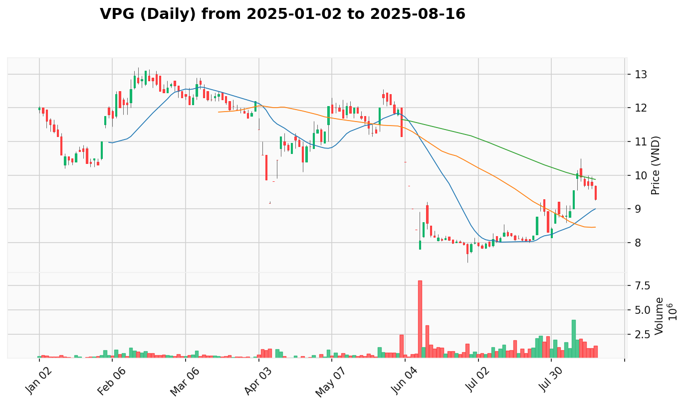

<a href="#khai-khoang">↑ Back to group KHAI_KHOANG</a>  |  <a href="#vpa-signal-summary">↑ Back to Top</a>

#### Key Statistics
| Metric | Value |
|:---|---:|
| Date Range | 2025-01-02 to 2025-10-17 |
| **Latest Close** | **7.27** |
| Period Open | 11.95 |
| Period High | 13.2 |
| Period Low | 6.7 |
| Period Change % | -39.16% |

**[Download VPG Data (.csv)](market_data/VPG_2025-01-02_to_2025-10-18.csv)**

---

### VPH

#### [VPA Analysis (2025-08-14 - 2025-10-16)](./VPA.md#vph)
> **Ngày 2025-10-10:** VPH giảm từ 5.4 VND xuống 5.39 VND với biên độ giá tương đối rộng và đóng cửa ở phần trên của thân nến. Khối lượng giao dịch đạt 0.1395 triệu cổ phiếu, tăng mạnh so với phiên trước (0.0252 triệu cổ phiếu). Sau các phiên kiểm tra cung với khối lượng thấp, sự xuất hiện của khối lượng lớn trong khi giá giảm nhẹ và đóng cửa gần mức cao cho thấy lực bán đã được hấp thụ bởi lực mua, báo hiệu khả năng dừng lại của xu hướng giảm. **Phân tích VPA/Wyckoff:** Stopping Volume (Dừng bán)
> **Ngày 2025-10-13:** VPH giảm từ 5.39 VND xuống 5.29 VND với biên độ giá rộng và đóng cửa ở phần dưới của thân nến. Khối lượng giao dịch đạt 0.1173 triệu cổ phiếu, giảm nhẹ so với phiên trước (0.1395 triệu cổ phiếu). Sau phiên dừng bán, giá tiếp tục giảm mạnh với khối lượng vẫn ở mức tương đối cao và đóng cửa gần mức thấp nhất, cho thấy áp lực bán vẫn còn mạnh và lực cầu chưa đủ để hấp thụ hết nguồn cung. **Phân tích VPA/Wyckoff:** Dấu hiệu suy yếu (Sign of Weakness)
> **Ngày 2025-10-14:** VPH giảm từ 5.29 VND xuống 5.1 VND với biên độ giá rộng và đóng cửa ở phần dưới của thân nến. Khối lượng giao dịch đạt 0.3578 triệu cổ phiếu, tăng đột biến so với phiên trước (0.1173 triệu cổ phiếu). Sau dấu hiệu suy yếu ở phiên trước, giá tiếp tục giảm mạnh với khối lượng tăng vọt và đóng cửa gần mức thấp nhất, cho thấy áp lực bán ra rất mạnh và không có lực cầu đủ lớn để hấp thụ. Điều này xác nhận xu hướng giảm và khả năng tiếp tục suy yếu. **Phân tích VPA/Wyckoff:** Áp lực bán mạnh
> **Ngày 2025-10-15:** VPH tiếp tục giảm từ 5.1 VND xuống 5.05 VND với biên độ giá hẹp và đóng cửa ở phần trên của thân nến. Khối lượng giao dịch đạt 0.0983 triệu cổ phiếu, giảm mạnh so với phiên trước (0.3578 triệu cổ phiếu). Sau phiên giảm mạnh với khối lượng đột biến, giá tiếp tục giảm nhẹ với khối lượng thấp, cho thấy áp lực bán đã giảm nhưng lực cầu vẫn yếu, xác nhận sự suy yếu của xu hướng giảm. **Phân tích VPA/Wyckoff:** Không có cầu (No Demand)
> **Ngày 2025-10-16:** VPH giảm từ 5.05 VND xuống 5.0 VND với biên độ giá hẹp và đóng cửa ở phần dưới của thân nến. Khối lượng giao dịch đạt 0.1129 triệu cổ phiếu, tăng so với phiên trước (0.0983 triệu cổ phiếu). Sau phiên "Không có cầu" với khối lượng thấp, giá tiếp tục giảm nhẹ với khối lượng tăng trở lại và đóng cửa gần mức thấp nhất, cho thấy áp lực bán vẫn còn hiện hữu và có dấu hiệu gia tăng trở lại, xác nhận sự yếu kém của lực cầu và khả năng giá tiếp tục suy yếu. **Phân tích VPA/Wyckoff:** Áp lực bán tiếp diễn

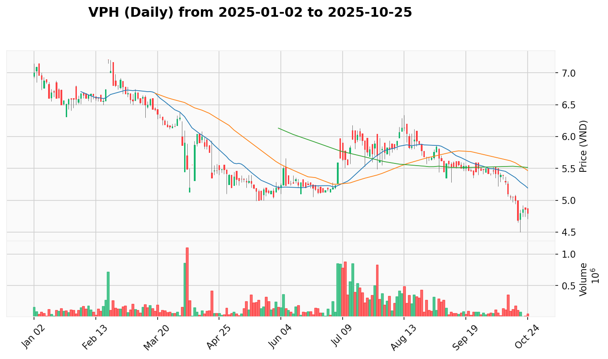

<a href="#penny">↑ Back to group PENNY</a>  |  <a href="#vpa-signal-summary">↑ Back to Top</a>

#### Key Statistics
| Metric | Value |
|:---|---:|
| Date Range | 2025-01-02 to 2025-10-17 |
| **Latest Close** | **5.0** |
| Period Open | 6.95 |
| Period High | 7.21 |
| Period Low | 4.94 |
| Period Change % | -28.06% |

**[Download VPH Data (.csv)](market_data/VPH_2025-01-02_to_2025-10-18.csv)**

---

### VRE

#### [VPA Analysis (2025-06-13 - 2025-10-16)](./VPA.md#vre)
> **Ngày 2025-10-10:** VRE mở cửa tại 38.0 VND, tăng mạnh và đóng cửa tại 40.35 VND, gần mức cao nhất trong phiên (40.4 VND). Biên độ tăng rộng và giá đóng cửa cao hơn đáng kể so với phiên trước (38.0 VND). Khối lượng giao dịch đạt 20.0254 triệu cổ phiếu, giảm so với phiên trước (25.6927 triệu cổ phiếu). Sau hai phiên SOS liên tiếp, sự tiếp diễn đà tăng mạnh mẽ với biên độ rộng, đóng cửa gần mức cao nhất cho thấy lực cầu vẫn áp đảo lực cung, dù khối lượng có phần giảm nhẹ, điều này có thể cho thấy nguồn cung đang cạn kiệt. Xác nhận xu hướng tăng giá tiếp diễn. **Phân tích VPA/Wyckoff:** Sign of Strength (SOS)
> **Ngày 2025-10-13:** VRE mở cửa tại 40.4 VND, tăng mạnh lên 43.0 VND và đóng cửa tại 43.0 VND, đúng mức cao nhất trong phiên. Biên độ tăng rất rộng và giá đóng cửa cao hơn đáng kể so với phiên trước (40.35 VND). Khối lượng giao dịch đạt 27.8933 triệu cổ phiếu, tăng mạnh so với phiên trước (20.0254 triệu cổ phiếu). Sự tiếp diễn đà tăng mạnh mẽ với biên độ rất rộng, đóng cửa tại mức cao nhất và khối lượng gia tăng cho thấy lực cầu áp đảo hoàn toàn lực cung, xác nhận xu hướng tăng giá tiếp diễn mạnh mẽ. **Phân tích VPA/Wyckoff:** Sign of Strength (SOS)
> **Ngày 2025-10-14:** VRE mở cửa tại 44.1 VND, tăng lên mức cao nhất 45.2 VND nhưng sau đó giảm và đóng cửa tại 42.75 VND, gần mức thấp nhất trong phiên (42.7 VND). Giá đóng cửa thấp hơn so với phiên trước (43.0 VND). Biên độ dao động trong phiên rộng. Khối lượng giao dịch đạt 32.0891 triệu cổ phiếu, tăng mạnh so với phiên trước (27.8933 triệu cổ phiếu). Sau hai phiên tăng giá mạnh mẽ (SOS), phiên hôm nay cho thấy áp lực bán gia tăng đáng kể khi giá không giữ được đà tăng, đóng cửa giảm với khối lượng lớn. Điều này có thể là dấu hiệu của sự suy yếu hoặc chốt lời. **Phân tích VPA/Wyckoff:** Sign of Weakness (SOW)
> **Ngày 2025-10-15:** VRE mở cửa tại 42.65 VND, giảm xuống 41.9 VND và đóng cửa gần mức thấp nhất phiên là 41.05 VND. Biên độ dao động trong phiên rộng. Khối lượng giao dịch đạt 19.6842 triệu cổ phiếu, giảm đáng kể so với phiên trước (32.0891 triệu cổ phiếu). Sau phiên SOW với khối lượng lớn ngày 2025-10-14, phiên hôm nay giá tiếp tục giảm với khối lượng thấp hơn, cho thấy lực cầu yếu và áp lực bán vẫn còn, nhưng không quá mạnh mẽ như phiên trước. Việc giá đóng cửa thấp với khối lượng giảm sau một phiên giảm mạnh có thể là dấu hiệu của sự thiếu vắng lực cầu. **Phân tích VPA/Wyckoff:** No Demand
> **Ngày 2025-10-16:** VRE mở cửa tại 42.2 VND, tăng lên mức cao nhất 43.15 VND và đóng cửa tại 43.05 VND, gần mức cao nhất trong phiên. Giá đóng cửa cao hơn đáng kể so với phiên trước (41.9 VND). Biên độ dao động trong phiên rộng. Khối lượng giao dịch đạt 9.0518 triệu cổ phiếu, giảm mạnh so với phiên trước (19.6842 triệu cổ phiếu) và là mức thấp nhất trong 10 phiên gần đây. Sau hai phiên giảm giá và thiếu cầu (SOW và No Demand), phiên hôm nay giá tăng trở lại với biên độ rộng nhưng khối lượng thấp. Điều này cho thấy áp lực bán đã giảm bớt nhưng lực cầu vẫn chưa thực sự mạnh mẽ để đẩy giá lên cao bền vững. Đây có thể là một dấu hiệu của sự thiếu hụt nguồn cung tạm thời hoặc một phiên kiểm tra cung. **Phân tích VPA/Wyckoff:** Test for Supply / Lack of Supply

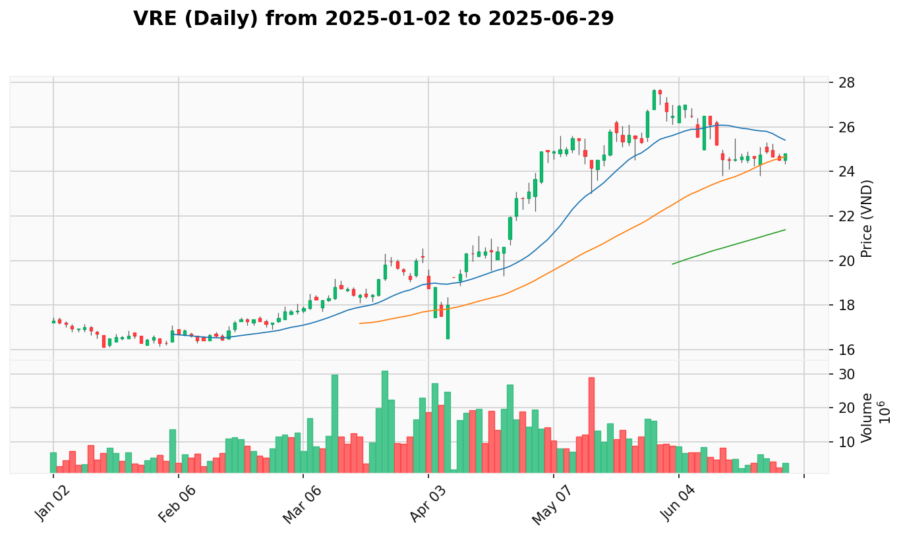

<a href="#bat-dong-san">↑ Back to group BAT_DONG_SAN</a>  |  <a href="#vpa-signal-summary">↑ Back to Top</a>

#### Key Statistics
| Metric | Value |
|:---|---:|
| Date Range | 2025-01-02 to 2025-10-17 |
| **Latest Close** | **41.0** |
| Period Open | 17.2 |
| Period High | 45.2 |
| Period Low | 16.1 |
| Period Change % | 138.37% |

**[Download VRE Data (.csv)](market_data/VRE_2025-01-02_to_2025-10-18.csv)**

---

### VRG

#### [VPA Analysis (2025-08-04 - 2025-10-16)](./VPA.md#vrg)
> **Ngày 2025-10-10:** VRG giữ nguyên mức giá 18.1 VND với khối lượng giao dịch đạt 0.0098 triệu cổ phiếu. Cây nến có biên độ hẹp (18.0 - 18.1 VND), cho thấy sự giằng co. So với phiên trước đó (2025-10-09) với khối lượng 0.0092 triệu cổ phiếu, khối lượng giao dịch hôm nay tăng nhẹ. Điều này cho thấy lực cung vẫn đang hiện diện và hấp thụ lực cầu, ngăn cản giá tăng. **Phân tích VPA/Wyckoff:** Supply Still Present (Lực cung vẫn hiện diện)
> **Ngày 2025-10-13:** VRG giảm từ 18.1 VND xuống 18.0 VND với khối lượng giao dịch đạt 0.0107 triệu cổ phiếu. Cây nến có biên độ rộng hơn so với phiên trước, giá đóng cửa ở mức thấp nhất phiên. So với phiên trước đó (2025-10-10) với khối lượng 0.0098 triệu cổ phiếu, khối lượng giao dịch hôm nay tăng nhẹ. Điều này cho thấy lực cung tiếp tục chiếm ưu thế và đẩy giá xuống. **Phân tích VPA/Wyckoff:** Supply Coming In (Lực cung xuất hiện)
> **Ngày 2025-10-14:** VRG giữ nguyên mức giá 18.0 VND với khối lượng giao dịch đạt 0.0076 triệu cổ phiếu. Cây nến có biên độ hẹp (17.8 - 18.0 VND), giá đóng cửa ở mức giữa đến cao của phiên. So với phiên trước đó (2025-10-13) với khối lượng 0.0107 triệu cổ phiếu, khối lượng giao dịch hôm nay giảm đáng kể. Điều này cho thấy lực cung đã giảm bớt sau phiên giảm giá trước đó, nhưng lực cầu cũng không đủ mạnh để đẩy giá lên. **Phân tích VPA/Wyckoff:** No Demand (Không có lực cầu)
> **Ngày 2025-10-15:** VRG giảm từ 18.0 VND xuống 17.9 VND với khối lượng giao dịch đạt 0.0045 triệu cổ phiếu. Cây nến có biên độ rất hẹp (17.9 - 18.0 VND), giá đóng cửa ở mức thấp nhất phiên. So với phiên trước đó (2025-10-14) với khối lượng 0.0076 triệu cổ phiếu, khối lượng giao dịch hôm nay giảm đáng kể. Điều này cho thấy lực cầu tiếp tục yếu và không có sự quan tâm mua vào. **Phân tích VPA/Wyckoff:** No Demand (Không có lực cầu)
> **Ngày 2025-10-16:** VRG giữ nguyên mức giá 17.9 VND so với phiên trước, nhưng đã tăng từ mức mở cửa 17.6 VND và đóng cửa ở mức cao nhất phiên 17.9 VND, với khối lượng giao dịch đạt 0.0092 triệu cổ phiếu. So với phiên trước đó (2025-10-15) với khối lượng 0.0045 triệu cổ phiếu, khối lượng giao dịch hôm nay tăng đáng kể. Cây nến có biên độ rộng hơn (17.5 - 17.9 VND) và giá đóng cửa ở mức cao nhất phiên. Điều này cho thấy lực cầu đã bắt đầu xuất hiện và hấp thụ lực cung, đặc biệt sau hai phiên liên tiếp không có lực cầu. **Phân tích VPA/Wyckoff:** Demand Coming In (Lực cầu xuất hiện)

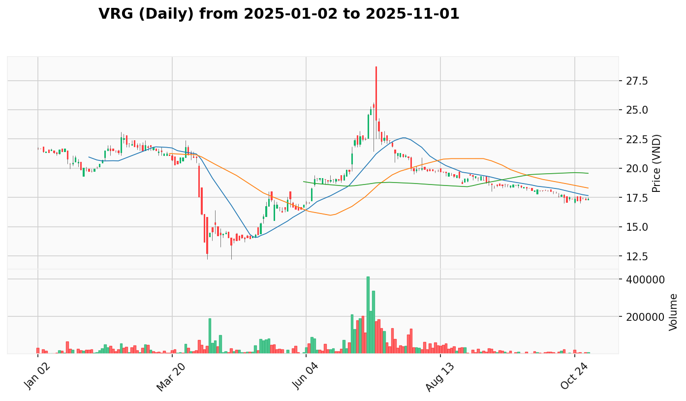

<a href="#cao-su">↑ Back to group CAO_SU</a>  |  <a href="#vpa-signal-summary">↑ Back to Top</a>

#### Key Statistics
| Metric | Value |
|:---|---:|
| Date Range | 2025-01-02 to 2025-10-17 |
| **Latest Close** | **17.7** |
| Period Open | 21.69 |
| Period High | 28.7 |
| Period Low | 12.21 |
| Period Change % | -18.40% |

**[Download VRG Data (.csv)](market_data/VRG_2025-01-02_to_2025-10-18.csv)**

---

### VSC

#### [VPA Analysis (2025-08-14 - 2025-10-16)](./VPA.md#vsc)
> **Ngày 2025-10-10:** VSC mở cửa ở mức 27.3 VND, cao nhất phiên là 28.2 VND, thấp nhất phiên là 27.15 VND và đóng cửa tại 27.3 VND. Giá tăng nhẹ từ 26.85 VND lên 27.3 VND, nhưng biên độ nến hẹp và giá đóng cửa bằng giá mở cửa, cho thấy sự lưỡng lự và thiếu động lực tăng giá. Khối lượng giao dịch đạt 7.375 triệu cổ phiếu, giảm đáng kể so với phiên trước (10.7679 triệu cổ phiếu) và thấp hơn mức trung bình. Sau các phiên giảm mạnh và thiếu cầu, phiên này cho thấy thị trường vẫn yếu và chưa có lực cầu đủ mạnh để đẩy giá lên, xác nhận xu hướng giảm giá tiếp diễn. **Phân tích VPA/Wyckoff:** No Demand (ND) - Thiếu vắng lực cầu.
> **Ngày 2025-10-13:** VSC mở cửa ở mức 26.8 VND, cao nhất phiên là 28.2 VND, thấp nhất phiên là 26.8 VND và đóng cửa tại 28.05 VND. Giá tăng từ 27.3 VND lên 28.05 VND, với biên độ nến rộng và giá đóng cửa gần mức cao nhất phiên, cho thấy lực cầu đã quay trở lại và áp đảo lực cung. Khối lượng giao dịch đạt 9.8409 triệu cổ phiếu, tăng so với phiên trước (7.375 triệu cổ phiếu), xác nhận sự tăng giá. Sau hai phiên liên tiếp có tín hiệu No Demand, phiên này cho thấy sự thay đổi tích cực trong tâm lý thị trường, có thể là một nỗ lực tăng giá. **Phân tích VPA/Wyckoff:** Effort to Rise (ETR) - Nỗ lực tăng giá.
> **Ngày 2025-10-14:** VSC mở cửa ở mức 28.25 VND, cao nhất phiên là 28.95 VND, thấp nhất phiên là 27.55 VND và đóng cửa tại 27.8 VND. Giá giảm từ 28.05 VND xuống 27.8 VND, với biên độ nến rộng và giá đóng cửa ở nửa dưới của nến, cho thấy áp lực bán mạnh mẽ. Khối lượng giao dịch đạt 13.8402 triệu cổ phiếu, tăng đáng kể so với phiên trước (9.8409 triệu cổ phiếu), xác nhận sự xuất hiện của nguồn cung lớn. Sau nỗ lực tăng giá ở phiên trước, phiên này cho thấy lực cung đã áp đảo lực cầu, đẩy giá xuống. **Phân tích VPA/Wyckoff:** Sign of Weakness (SOW) - Dấu hiệu suy yếu.
> **Ngày 2025-10-15:** VSC mở cửa ở mức 28.2 VND, cao nhất phiên là 29.4 VND, thấp nhất phiên là 28.15 VND và đóng cửa tại 28.25 VND. Giá tăng từ 27.8 VND lên 28.25 VND, với biên độ nến rộng và giá đóng cửa ở nửa trên của nến, cho thấy lực cầu đang cố gắng đẩy giá lên. Khối lượng giao dịch đạt 13.2154 triệu cổ phiếu, tuy có giảm nhẹ so với phiên trước (13.8402 triệu cổ phiếu) nhưng vẫn ở mức cao, cho thấy sự giằng co giữa cung và cầu. Sau phiên Dấu hiệu suy yếu (SOW) trước đó, phiên này cho thấy một nỗ lực phục hồi. **Phân tích VPA/Wyckoff:** Effort to Rise (ETR) - Nỗ lực tăng giá.
> **Ngày 2025-10-16:** VSC mở cửa ở mức 28.4 VND, cao nhất phiên là 28.65 VND, thấp nhất phiên là 27.95 VND và đóng cửa tại 28.0 VND. Giá giảm từ 28.25 VND xuống 28.0 VND, với biên độ nến hẹp và giá đóng cửa ở nửa dưới của nến, cho thấy sự yếu ớt. Khối lượng giao dịch đạt 4.2273 triệu cổ phiếu, giảm mạnh so với phiên trước (13.2154 triệu cổ phiếu), cho thấy lực cung không còn mạnh mẽ nhưng lực cầu cũng chưa xuất hiện. Sau phiên nỗ lực tăng giá (ETR), phiên này cho thấy thị trường đang kiểm tra lại mức hỗ trợ hoặc thiếu vắng nhu cầu. **Phân tích VPA/Wyckoff:** No Demand (ND) - Thiếu vắng nhu cầu.

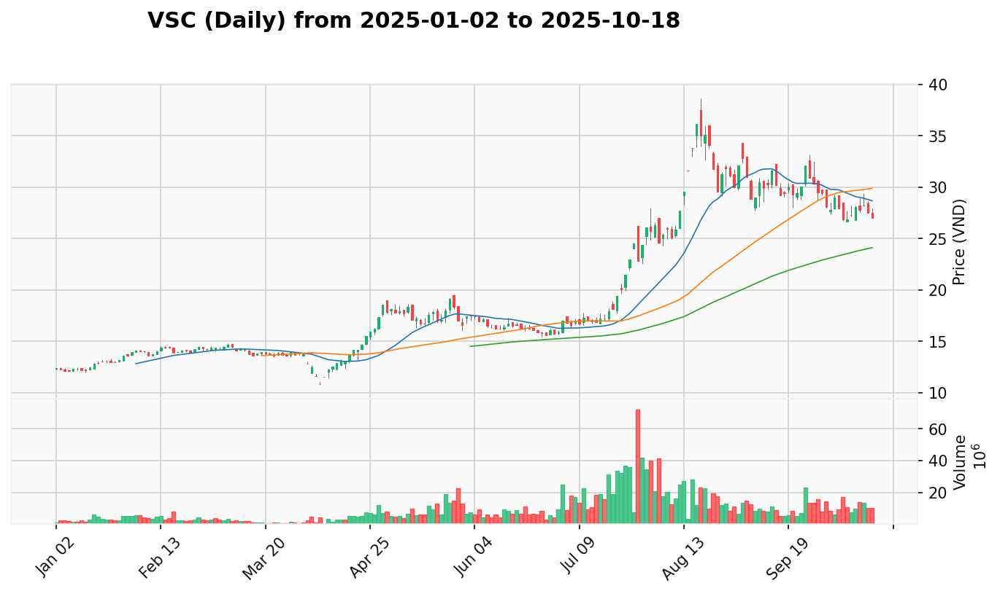

<a href="#van-tai">↑ Back to group VAN_TAI</a>  |  <a href="#vpa-signal-summary">↑ Back to Top</a>

#### Key Statistics
| Metric | Value |
|:---|---:|
| Date Range | 2025-01-02 to 2025-10-17 |
| **Latest Close** | **27.0** |
| Period Open | 12.34 |
| Period High | 38.65 |
| Period Low | 10.83 |
| Period Change % | 118.80% |

**[Download VSC Data (.csv)](market_data/VSC_2025-01-02_to_2025-10-18.csv)**

---

### VTK

#### [VPA Analysis (2025-08-04 - 2025-10-16)](./VPA.md#vtk)
> **Ngày 2025-10-10:** Giá VTK mở cửa tại 51.0 VND, đạt mức cao nhất 51.3 VND và đóng cửa tại 51.3 VND. Mặc dù giá đóng cửa cao hơn giá mở cửa trong phiên, nhưng vẫn thấp hơn mức đóng cửa 51.7 VND của ngày 2025-10-09. Khối lượng giao dịch đạt 0.0139 triệu cổ phiếu, tăng đột biến so với 0.0009 triệu cổ phiếu của phiên trước đó và là mức cao nhất trong 10 phiên gần đây. Sự tăng vọt về khối lượng nhưng giá không thể duy trì đà tăng và đóng cửa thấp hơn phiên trước cho thấy áp lực cung đang gia tăng mạnh mẽ, hoặc lực cầu chưa đủ sức để hấp thụ lượng cung lớn này. Điều này báo hiệu sự suy yếu tiềm ẩn sau các phiên "Không có lực cầu". **Phân tích VPA/Wyckoff:** Supply Coming In (Lực cung xuất hiện)
> **Ngày 2025-10-13:** Giá VTK mở cửa tại 50.5 VND, tăng lên mức cao nhất 50.9 VND nhưng sau đó giảm mạnh và đóng cửa tại 50.0 VND, là mức thấp nhất trong phiên. Giá đóng cửa 50.0 VND thấp hơn đáng kể so với mức 51.3 VND của ngày 2025-10-10. Khối lượng giao dịch đạt 0.0065 triệu cổ phiếu, giảm so với 0.0139 triệu cổ phiếu của phiên trước. Sự sụt giảm mạnh về giá với khối lượng giảm nhẹ sau tín hiệu "Lực cung xuất hiện" cho thấy áp lực bán vẫn tiếp diễn và không có lực cầu đủ mạnh để hấp thụ. Điều này xác nhận sự yếu kém của thị trường và khả năng giá sẽ tiếp tục giảm. **Phân tích VPA/Wyckoff:** Sign of Weakness (SOW) - Dấu hiệu yếu kém
> **Ngày 2025-10-14:** Giá VTK mở cửa tại 50.2 VND, đạt mức cao nhất 50.2 VND và giảm xuống mức thấp nhất 50.0 VND, đóng cửa tại 50.0 VND. Giá đóng cửa không thay đổi so với phiên trước, nhưng là mức thấp nhất trong phiên, cho thấy áp lực bán vẫn hiện hữu. Khối lượng giao dịch đạt 0.0074 triệu cổ phiếu, tăng nhẹ so với 0.0065 triệu cổ phiếu của phiên trước. Sau tín hiệu "Dấu hiệu yếu kém" (SOW) của phiên 2025-10-13, phiên này cho thấy giá tiếp tục duy trì ở mức thấp với biên độ hẹp và đóng cửa ở mức thấp nhất, cùng với khối lượng tăng nhẹ, xác nhận sự thiếu vắng lực cầu và khả năng tiếp diễn xu hướng giảm. **Phân tích VPA/Wyckoff:** No Demand (Không có lực cầu)
> **Ngày 2025-10-15:** Giá VTK mở cửa tại 50.0 VND, giảm xuống mức thấp nhất 49.1 VND nhưng sau đó hồi phục và đóng cửa tại 50.0 VND, bằng với giá mở cửa và mức cao nhất trong phiên. Biên độ giá hẹp. Khối lượng giao dịch chỉ đạt 0.002 triệu cổ phiếu, giảm đáng kể so với 0.0074 triệu cổ phiếu của phiên trước và là mức rất thấp. Sau tín hiệu "Dấu hiệu yếu kém" và "Không có lực cầu" của các phiên trước, phiên này cho thấy áp lực bán đã tạm thời cạn kiệt khi giá không giảm sâu hơn trên khối lượng cực thấp. Điều này có thể là một dấu hiệu "Không có nguồn cung" (No Supply), cho thấy sự tạm lắng của phe bán, nhưng cần có sự xác nhận của lực cầu mạnh mẽ trong các phiên tới để đảo chiều xu hướng. **Phân tích VPA/Wyckoff:** No Supply (Không có nguồn cung)
> **Ngày 2025-10-16:** Giá VTK mở cửa tại 49.9 VND, đạt mức cao nhất 49.9 VND và giảm xuống mức thấp nhất 49.0 VND, đóng cửa tại 49.8 VND. Giá đóng cửa giảm nhẹ so với phiên trước và nằm gần mức thấp nhất trong phiên, cho thấy áp lực bán vẫn hiện hữu. Khối lượng giao dịch chỉ đạt 0.0016 triệu cổ phiếu, giảm so với 0.002 triệu cổ phiếu của phiên trước và là mức rất thấp. Sau tín hiệu "Không có nguồn cung" của phiên 2025-10-15, phiên này cho thấy giá tiếp tục giảm nhẹ với biên độ hẹp và đóng cửa ở mức thấp, cùng với khối lượng cực thấp, xác nhận sự thiếu vắng lực cầu và khả năng tiếp diễn xu hướng giảm. **Phân tích VPA/Wyckoff:** No Demand (Không có lực cầu)

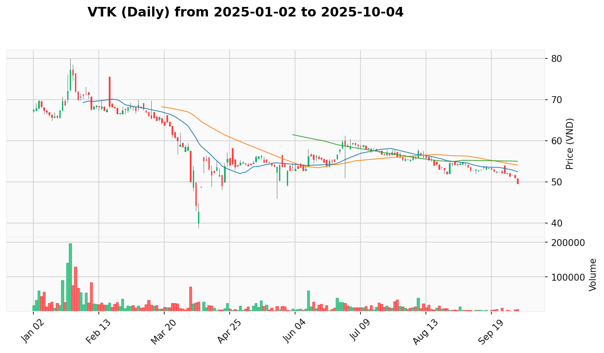

<a href="#cong-nghe">↑ Back to group CONG_NGHE</a>  |  <a href="#vpa-signal-summary">↑ Back to Top</a>

#### Key Statistics
| Metric | Value |
|:---|---:|
| Date Range | 2025-01-02 to 2025-10-17 |
| **Latest Close** | **47.8** |
| Period Open | 67.18 |
| Period High | 79.96 |
| Period Low | 38.71 |
| Period Change % | -28.85% |

**[Download VTK Data (.csv)](market_data/VTK_2025-01-02_to_2025-10-18.csv)**

---

### VTO

#### [VPA Analysis (2025-08-15 - 2025-10-16)](./VPA.md#vto)
> **Ngày 2025-10-10:** VTO giữ nguyên mức giá đóng cửa ở 11.8 VND, sau khi mở cửa cao hơn ở 11.85 VND và đạt đỉnh 11.9 VND, nhưng không thể duy trì đà tăng và đóng cửa ở mức thấp của phiên. Khối lượng giao dịch đạt 0.2798 triệu cổ phiếu, tăng đáng kể so với phiên trước (0.2103 triệu cổ phiếu). Mặc dù khối lượng tăng, giá không thể bứt phá lên cao hơn, cho thấy lực cung đang hấp thụ lực cầu ở mức giá này. Điều này tiếp tục củng cố tín hiệu yếu kém và thiếu sự quan tâm từ bên mua đã xuất hiện trong các phiên trước, cho thấy nỗ lực tăng giá không mang lại kết quả. **Phân tích VPA/Wyckoff:** Effort without Result - Nỗ lực không mang lại kết quả.
> **Ngày 2025-10-13:** VTO giảm từ 11.8 VND xuống 11.7 VND, với biên độ dao động từ 11.65 VND đến 11.8 VND và đóng cửa ở mức thấp của phiên. Khối lượng giao dịch đạt 0.5233 triệu cổ phiếu, tăng đáng kể so với phiên trước (0.2798 triệu cổ phiếu). Sự sụt giảm về giá đi kèm với khối lượng tăng mạnh cho thấy áp lực bán đang gia tăng và nguồn cung đang chiếm ưu thế so với cầu. Điều này tiếp tục củng cố tín hiệu yếu kém đã xuất hiện trong các phiên trước, cho thấy sự suy yếu của cổ phiếu. **Phân tích VPA/Wyckoff:** Sign of Weakness (SOW) - Dấu hiệu suy yếu.
> **Ngày 2025-10-14:** VTO giảm từ 11.75 VND xuống 11.55 VND, đóng cửa ở mức thấp nhất phiên. Khối lượng giao dịch đạt 0.5193 triệu cổ phiếu, duy trì ở mức cao. Sự sụt giảm mạnh về giá đi kèm với khối lượng cao cho thấy áp lực bán tiếp tục gia tăng và nguồn cung đang hoàn toàn chiếm ưu thế, xác nhận xu hướng suy yếu đã được thiết lập. **Phân tích VPA/Wyckoff:** Sign of Weakness (SOW) - Dấu hiệu suy yếu tiếp diễn.
> **Ngày 2025-10-15:** VTO tăng từ 11.55 VND lên 11.7 VND, đóng cửa ở mức cao nhất phiên. Khối lượng giao dịch đạt 0.2511 triệu cổ phiếu, giảm đáng kể so với phiên trước (0.5193 triệu cổ phiếu). Mặc dù giá tăng và đóng cửa ở mức cao, nhưng khối lượng thấp cho thấy lực cầu chưa thực sự mạnh mẽ và có thể chỉ là một nhịp hồi phục kỹ thuật trong xu hướng giảm đã được xác nhận trước đó. Điều này cho thấy sự thiếu hụt lực mua bền vững. **Phân tích VPA/Wyckoff:** Lack of Demand (LOD) - Thiếu hụt lực cầu.
> **Ngày 2025-10-16:** VTO tăng từ 11.7 VND lên 11.75 VND, đóng cửa ở mức cao nhất phiên. Khối lượng giao dịch đạt 0.1301 triệu cổ phiếu, giảm mạnh so với phiên trước (0.2511 triệu cổ phiếu) và duy trì ở mức rất thấp. Mặc dù giá tăng nhẹ, nhưng khối lượng cạn kiệt cho thấy lực cầu không đủ mạnh để đẩy giá lên bền vững, xác nhận sự thiếu hụt nhu cầu sau các dấu hiệu suy yếu và thiếu hụt lực cầu đã được thiết lập trước đó. **Phân tích VPA/Wyckoff:** No Demand (ND) - Không có lực cầu.

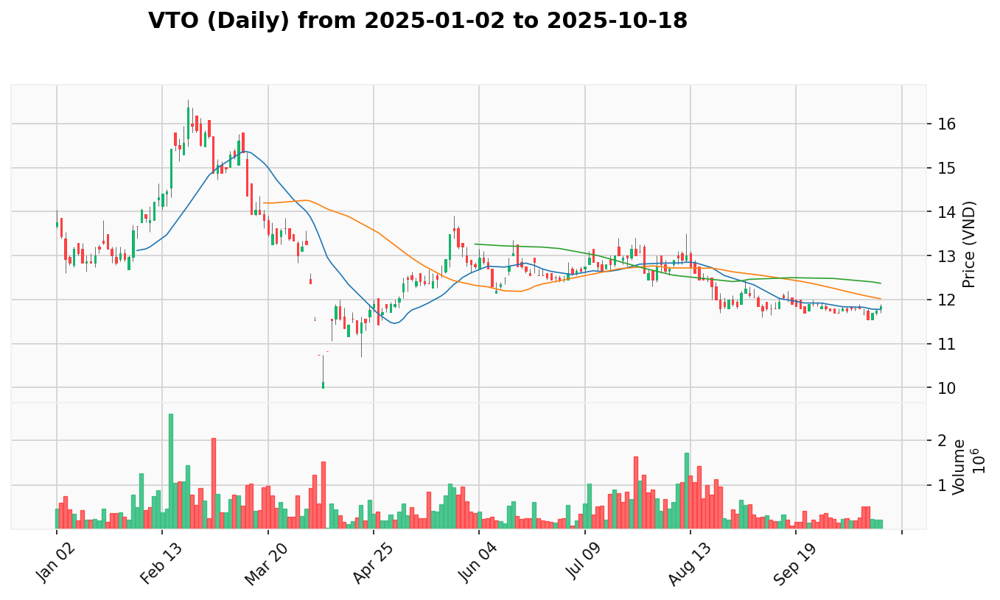

<a href="#van-tai">↑ Back to group VAN_TAI</a>  |  <a href="#vpa-signal-summary">↑ Back to Top</a>

#### Key Statistics
| Metric | Value |
|:---|---:|
| Date Range | 2025-01-02 to 2025-10-17 |
| **Latest Close** | **11.85** |
| Period Open | 13.67 |
| Period High | 16.55 |
| Period Low | 9.99 |
| Period Change % | -13.31% |

**[Download VTO Data (.csv)](market_data/VTO_2025-01-02_to_2025-10-18.csv)**

---

### VTP

#### [VPA Analysis (2025-06-26 - 2025-10-16)](./VPA.md#vtp)
> **Ngày 2025-10-10:** VTP tăng từ 94.6 VND lên 98.6 VND với biên độ dao động từ 94.4 đến 98.8 VND. Giá đóng cửa gần mức cao nhất phiên. Khối lượng giao dịch đạt 0.6969 triệu cổ phiếu, tăng đáng kể so với phiên trước và cao hơn mức trung bình. Sau hai phiên giảm giá với áp lực cung (SCI), phiên hôm nay cho thấy lực cầu mạnh mẽ đã quay trở lại, hấp thụ áp lực bán và đẩy giá tăng mạnh. **Phân tích VPA/Wyckoff:** Sign of Strength (SOS) - Lực cầu mạnh mẽ với khối lượng gia tăng xác nhận sự trở lại của xu hướng tăng.
> **Ngày 2025-10-13:** VTP tăng từ 97.8 VND lên 98.6 VND với biên độ dao động từ 97.4 đến 102.0 VND. Giá đóng cửa bằng mức đóng cửa của phiên trước. Khối lượng giao dịch đạt 0.6694 triệu cổ phiếu, giảm nhẹ so với phiên trước nhưng vẫn ở mức cao. Sau phiên tăng mạnh (SOS) với khối lượng lớn, phiên hôm nay VTP tiếp tục mở cửa cao hơn và đạt đỉnh mới nhưng không thể duy trì đà tăng, cho thấy áp lực cung đang xuất hiện và được hấp thụ ở các mức giá cao hơn. **Phân tích VPA/Wyckoff:** Test of Supply (TOS) - Giá không thể tăng thêm với khối lượng cao, cho thấy thị trường đang kiểm tra và hấp thụ nguồn cung.
> **Ngày 2025-10-14:** VTP mở cửa ở mức 99.7 VND nhưng đóng cửa giảm xuống 97.4 VND, với biên độ dao động từ 95.8 đến 99.7 VND. Giá đóng cửa thấp hơn đáng kể so với phiên trước. Khối lượng giao dịch đạt 1.086 triệu cổ phiếu, tăng mạnh so với phiên trước và cao hơn mức trung bình. Sau phiên kiểm tra cung (TOS) ngày 2025-10-13, phiên hôm nay cho thấy áp lực bán mạnh mẽ đã xuất hiện, đẩy giá giảm sâu với khối lượng lớn, cho thấy nguồn cung đang chiếm ưu thế. **Phân tích VPA/Wyckoff:** Sign of Weakness (SOW) - Lực cung mạnh mẽ với khối lượng gia tăng xác nhận sự suy yếu của xu hướng tăng.
> **Ngày 2025-10-15:** VTP mở cửa ở mức 98.0 VND và đóng cửa tăng lên 98.8 VND, với biên độ dao động từ 96.2 đến 99.0 VND. Giá đóng cửa cao hơn phiên trước, cho thấy sự phục hồi nhẹ sau phiên giảm mạnh. Tuy nhiên, khối lượng giao dịch chỉ đạt 0.614 triệu cổ phiếu, giảm đáng kể so với phiên trước và ở mức thấp. Điều này cho thấy lực cầu chưa thực sự mạnh mẽ để đẩy giá lên cao với khối lượng lớn, có thể là một phiên kiểm tra cung hoặc thiếu cầu sau tín hiệu suy yếu (SOW) trước đó. **Phân tích VPA/Wyckoff:** Lack of Demand (LOD) - Giá tăng với khối lượng thấp sau tín hiệu suy yếu, cho thấy lực cầu yếu và khả năng tiếp tục xu hướng giảm.
> **Ngày 2025-10-16:** VTP mở cửa ở mức 99.4 VND và đóng cửa giảm xuống 97.5 VND, với biên độ dao động từ 97.4 đến 100.8 VND. Giá đóng cửa thấp hơn đáng kể so với giá mở cửa và gần mức thấp nhất phiên. Khối lượng giao dịch chỉ đạt 0.3092 triệu cổ phiếu, giảm mạnh so với phiên trước và ở mức rất thấp. Giá giảm với khối lượng thấp cho thấy lực cầu không xuất hiện để hỗ trợ giá, xác nhận sự suy yếu của thị trường sau tín hiệu SOW và LOD từ các phiên trước. **Phân tích VPA/Wyckoff:** No Demand (NOD) - Giá giảm với khối lượng thấp, xác nhận thiếu vắng lực cầu và khả năng tiếp tục xu hướng giảm.

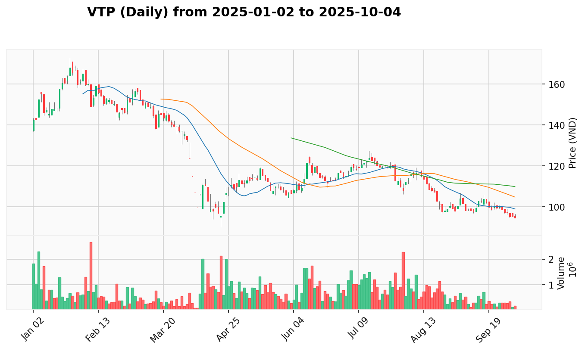

<a href="#van-tai">↑ Back to group VAN_TAI</a>  |  <a href="#vpa-signal-summary">↑ Back to Top</a>

#### Key Statistics
| Metric | Value |
|:---|---:|
| Date Range | 2025-01-02 to 2025-10-17 |
| **Latest Close** | **100.0** |
| Period Open | 137.34 |
| Period High | 172.74 |
| Period Low | 90.18 |
| Period Change % | -27.19% |

**[Download VTP Data (.csv)](market_data/VTP_2025-01-02_to_2025-10-18.csv)**

---

### YEG

#### [VPA Analysis (2025-08-14 - 2025-10-16)](./VPA.md#yeg)
> **Ngày 2025-10-10:** YEG giảm từ 14.05 VND xuống 13.9 VND với khối lượng giao dịch đạt 1.3914 triệu cổ phiếu. Cây nến giảm có biên độ hẹp và đóng cửa ở mức thấp nhất phiên, cho thấy áp lực bán vẫn còn nhưng đã suy yếu đáng kể so với phiên trước. Khối lượng giao dịch giảm so với phiên 2025-10-09 (1.5399 triệu cổ phiếu), cho thấy lực cung đang cạn kiệt hoặc thiếu sự tham gia của người bán mạnh mẽ. Tuy nhiên, việc giá đóng cửa ở mức thấp nhất phiên vẫn là một tín hiệu tiêu cực, cho thấy chưa có lực cầu đủ mạnh để hấp thụ hết lượng cung còn lại và đảo chiều xu hướng giảm. **Phân tích VPA/Wyckoff:** No Demand (Không có cầu) - Giá tiếp tục giảm với khối lượng thấp, cho thấy thiếu vắng lực cầu hỗ trợ.
> **Ngày 2025-10-13:** YEG giảm từ 13.9 VND xuống 13.85 VND với khối lượng giao dịch đạt 2.3339 triệu cổ phiếu. Cây nến có biên độ hẹp, đóng cửa cao hơn giá mở cửa (13.75 VND) nhưng vẫn thấp hơn giá đóng cửa phiên trước (13.9 VND), cho thấy sự lưỡng lự. Khối lượng giao dịch tăng đáng kể so với phiên trước (1.3914 triệu cổ phiếu), xác nhận rằng áp lực bán vẫn duy trì và được hấp thụ bởi một phần lực cầu. Tuy nhiên, việc giá vẫn đóng cửa thấp hơn cho thấy lực cung vẫn đang chiếm ưu thế trong ngắn hạn. **Phân tích VPA/Wyckoff:** Sign of Weakness (SOW) - Lực cung tiếp tục chiếm ưu thế với khối lượng gia tăng, xác nhận xu hướng giảm giá.
> **Ngày 2025-10-14:** YEG giảm từ 13.9 VND xuống 13.4 VND với khối lượng giao dịch đạt 3.6647 triệu cổ phiếu. Cây nến giảm có biên độ rộng và đóng cửa ở mức thấp nhất phiên, cho thấy áp lực bán mạnh mẽ và nguồn cung lớn đổ vào thị trường. Khối lượng giao dịch tăng đáng kể so với phiên trước (2.3339 triệu cổ phiếu), xác nhận rằng lực cung đang chiếm ưu thế hoàn toàn và đẩy giá xuống. Điều này tiếp tục củng cố xu hướng giảm giá đã được xác nhận từ phiên trước. **Phân tích VPA/Wyckoff:** Sign of Weakness (SOW) - Lực cung áp đảo với khối lượng gia tăng, xác nhận xu hướng giảm giá mạnh mẽ.
> **Ngày 2025-10-15:** YEG giảm từ 13.4 VND xuống 13.0 VND với khối lượng giao dịch đạt 4.2157 triệu cổ phiếu. Cây nến giảm có biên độ rộng và đóng cửa ở mức thấp nhất phiên, cho thấy áp lực bán mạnh mẽ và nguồn cung lớn tiếp tục đổ vào thị trường. Khối lượng giao dịch tăng đáng kể so với phiên trước (3.6647 triệu cổ phiếu), xác nhận rằng lực cung đang chiếm ưu thế hoàn toàn và đẩy giá xuống sâu hơn. Điều này tiếp tục củng cố xu hướng giảm giá đã được xác nhận từ các phiên trước. **Phân tích VPA/Wyckoff:** Sign of Weakness (SOW) - Lực cung áp đảo với khối lượng gia tăng, xác nhận xu hướng giảm giá mạnh mẽ.
> **Ngày 2025-10-16:** YEG tăng từ 13.0 VND lên 13.2 VND với khối lượng giao dịch đạt 0.9662 triệu cổ phiếu. Cây nến tăng có biên độ hẹp và đóng cửa ở giữa thân nến, cho thấy lực cầu yếu ớt và không đủ sức đẩy giá lên cao. Khối lượng giao dịch giảm mạnh so với phiên trước (4.2157 triệu cổ phiếu), xác nhận rằng lực mua không đáng kể và thị trường vẫn đang trong giai đoạn thiếu cầu sau các phiên giảm mạnh. Điều này cho thấy xu hướng giảm giá vẫn có thể tiếp diễn. **Phân tích VPA/Wyckoff:** No Demand - Lực cầu yếu ớt với khối lượng thấp sau giai đoạn giảm giá mạnh, cho thấy xu hướng giảm có thể tiếp tục.

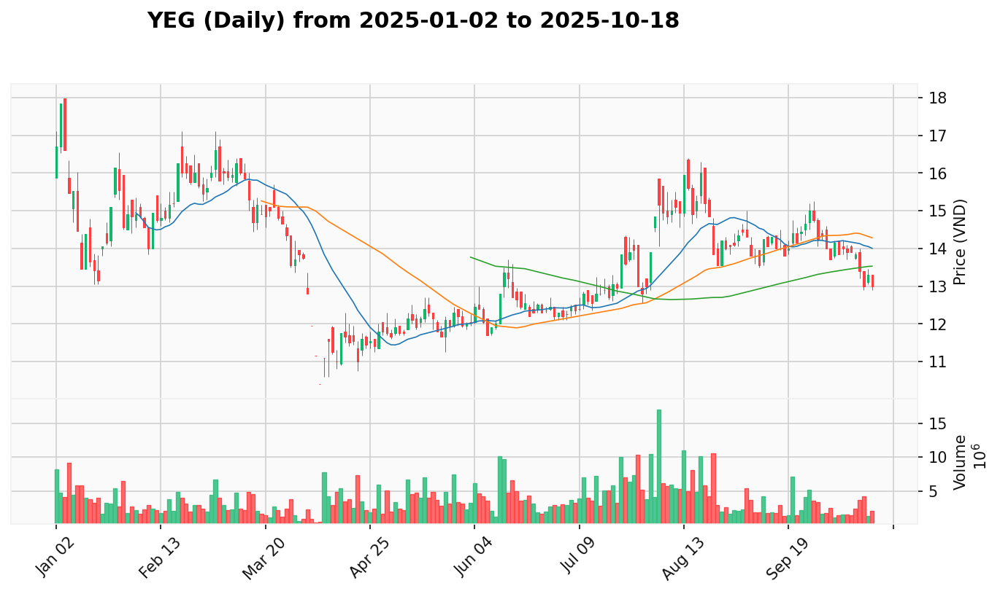

<a href="#others">↑ Back to group OTHERS</a>  |  <a href="#vpa-signal-summary">↑ Back to Top</a>

#### Key Statistics
| Metric | Value |
|:---|---:|
| Date Range | 2025-01-02 to 2025-10-17 |
| **Latest Close** | **13.0** |
| Period Open | 15.88 |
| Period High | 17.98 |
| Period Low | 10.4 |
| Period Change % | -18.14% |

**[Download YEG Data (.csv)](market_data/YEG_2025-01-02_to_2025-10-18.csv)**

---

