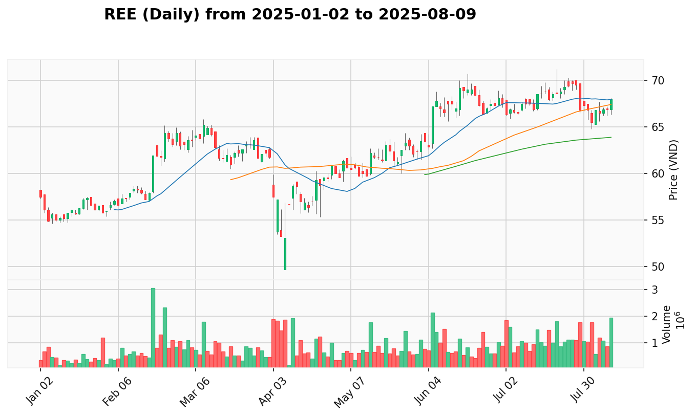

# AIPriceAction Market Report
*Report generated for data from **2025-01-02** to **2025-08-09**.*
*Last updated: 2025-08-09 08:53:05*

---

## 🎯 View the Trading Plan

**➡️ [Click here to view the trading plan](PLAN.md)**

**🎢 [Click here to view the latest market leaders](LEADER.md)**

---

<h3 id="vpa-signal-summary">VPA Signal Summary (from Latest Analysis)</h3>

| Signal | Tickers |
|:---|:---|
| Effort to Fall | [DGW](#dgw), [FRT](#frt) |
| Effort to Rise | [ACB](#acb), [BCM](#bcm), [BSR](#bsr), [DBC](#dbc), [DRC](#drc), [DVN](#dvn), [FIT](#fit), [GMD](#gmd), [GVR](#gvr), [HDB](#hdb), [HDG](#hdg), [VCG](#vcg) |
| No Demand | [CST](#cst), [SAB](#sab), [SGT](#sgt) |
| No Supply | [CSC](#csc), [CTG](#ctg), [FPT](#fpt), [HDC](#hdc) |
| Selling Climax | [ACV](#acv), [CTD](#ctd), [REE](#ree) |
| Sign of Strength | [AAA](#aaa), [ANV](#anv), [BIC](#bic), [BID](#bid), [BMP](#bmp), [BSI](#bsi), [BVH](#bvh), [C4G](#c4g), [CII](#cii), [CMG](#cmg), [CTR](#ctr), [DCM](#dcm), [DGC](#dgc), [DHG](#dhg), [DPR](#dpr), [FOX](#fox), [FTS](#fts), [GAS](#gas), [GEX](#gex), [HAG](#hag), [HT1](#ht1), [VLB](#vlb), [VNINDEX](#vnindex) |
| Sign of Weakness | [CTS](#cts) |
| Test for Supply | [HCM](#hcm), [VIX](#vix) |
| Others | [DPM](#dpm), [HAH](#hah), [HHV](#hhv), [HPG](#hpg), [HSG](#hsg), [HUT](#hut), [HVN](#hvn), [IDC](#idc), [IMP](#imp), [IPA](#ipa), [KBC](#kbc), [KDC](#kdc), [KDH](#kdh), [LPB](#lpb), [MBB](#mbb), [MBS](#mbs), [MCH](#mch), [MPC](#mpc), [MSH](#msh), [MSN](#msn), [MSR](#msr), [MWG](#mwg), [NKG](#nkg), [NLG](#nlg), [NT2](#nt2), [NTP](#ntp), [NVL](#nvl), [PAN](#pan), [PC1](#pc1), [PDR](#pdr), [PHR](#phr), [PLX](#plx), [PNJ](#pnj), [POW](#pow), [PTB](#ptb), [PVI](#pvi), [PVS](#pvs), [PVT](#pvt), [QNS](#qns), [SCS](#scs), [SHB](#shb), [SHS](#shs), [SIP](#sip), [SSH](#ssh), [SSI](#ssi), [STB](#stb), [TCB](#tcb), [TCH](#tch), [TNG](#tng), [TPB](#tpb), [TV2](#tv2), [VCB](#vcb), [VCI](#vci), [VCS](#vcs), [VEA](#vea), [VGC](#vgc), [VGI](#vgi), [VGT](#vgt), [VHC](#vhc), [VHM](#vhm), [VIB](#vib), [VIC](#vic), [VJC](#vjc), [VND](#vnd), [VNM](#vnm), [VPB](#vpb), [VPG](#vpg), [VRE](#vre), [VTP](#vtp) |

---

## Groups
<h3 id="ban-le">BAN_LE</h3>

[DGW](#dgw), [FRT](#frt), [MWG](#mwg), [PNJ](#pnj)

<h3 id="bao-hiem">BAO_HIEM</h3>

[BIC](#bic), [BVH](#bvh), [PVI](#pvi)

<h3 id="bat-dong-san">BAT_DONG_SAN</h3>

[HDC](#hdc), [KDH](#kdh), [NLG](#nlg), [NVL](#nvl), [PDR](#pdr), [SSH](#ssh), [TCH](#tch), [VHM](#vhm), [VIC](#vic), [VRE](#vre)

<h3 id="bat-dong-san-kcn">BAT_DONG_SAN_KCN</h3>

[BCM](#bcm), [IDC](#idc), [KBC](#kbc), [SIP](#sip), [VGC](#vgc)

<h3 id="cao-su">CAO_SU</h3>

[DPR](#dpr), [DRC](#drc), [GVR](#gvr), [PHR](#phr)

<h3 id="chung-khoan">CHUNG_KHOAN</h3>

[BSI](#bsi), [CTS](#cts), [FTS](#fts), [HCM](#hcm), [MBS](#mbs), [SHS](#shs), [SSI](#ssi), [VCI](#vci), [VIX](#vix), [VND](#vnd)

<h3 id="cong-nghe">CONG_NGHE</h3>

[CMG](#cmg), [FOX](#fox), [FPT](#fpt), [SGT](#sgt), [VGI](#vgi)

<h3 id="dau-khi">DAU_KHI</h3>

[BSR](#bsr), [GAS](#gas), [PLX](#plx), [PVS](#pvs)

<h3 id="dau-tu-cong">DAU_TU_CONG</h3>

[C4G](#c4g), [HHV](#hhv), [VCG](#vcg)

<h3 id="det-may">DET_MAY</h3>

[MSH](#msh), [TNG](#tng), [VGT](#vgt)

<h3 id="hang-khong">HANG_KHONG</h3>

[ACV](#acv), [HVN](#hvn), [SCS](#scs), [VJC](#vjc)

<h3 id="hoa-chat">HOA_CHAT</h3>

[DCM](#dcm), [DGC](#dgc), [DPM](#dpm)

<h3 id="khai-khoang">KHAI_KHOANG</h3>

[CST](#cst), [MSR](#msr), [VPG](#vpg)

<h3 id="nang-luong">NANG_LUONG</h3>

[HDG](#hdg), [NT2](#nt2), [POW](#pow)

<h3 id="ngan-hang">NGAN_HANG</h3>

[ACB](#acb), [BID](#bid), [CTG](#ctg), [HDB](#hdb), [LPB](#lpb), [MBB](#mbb), [SHB](#shb), [STB](#stb), [TCB](#tcb), [TPB](#tpb), [VCB](#vcb), [VIB](#vib), [VPB](#vpb)

<h3 id="nhua">NHUA</h3>

[AAA](#aaa), [BMP](#bmp), [NTP](#ntp)

<h3 id="nong-nghiep">NONG_NGHIEP</h3>

[DBC](#dbc), [HAG](#hag), [PAN](#pan)

<h3 id="others">OTHERS</h3>

[GEX](#gex), [VCS](#vcs), [VEA](#vea)

<h3 id="penny">PENNY</h3>

[CSC](#csc), [FIT](#fit), [IPA](#ipa)

<h3 id="suc-khoe">SUC_KHOE</h3>

[DHG](#dhg), [DVN](#dvn), [IMP](#imp)

<h3 id="thep">THEP</h3>

[HPG](#hpg), [HSG](#hsg), [MSR](#msr), [NKG](#nkg), [PTB](#ptb)

<h3 id="thuc-pham">THUC_PHAM</h3>

[KDC](#kdc), [MCH](#mch), [MSN](#msn), [QNS](#qns), [SAB](#sab), [VNM](#vnm)

<h3 id="thuy-san">THUY_SAN</h3>

[ANV](#anv), [MPC](#mpc), [VHC](#vhc)

<h3 id="van-tai">VAN_TAI</h3>

[GMD](#gmd), [HAH](#hah), [PVT](#pvt), [VTP](#vtp)

<h3 id="vlxd">VLXD</h3>

[HT1](#ht1), [PTB](#ptb), [VLB](#vlb)

<h3 id="xay-dung">XAY_DUNG</h3>

[CII](#cii), [CTD](#ctd), [HUT](#hut)

<h3 id="xay-lap-dien">XAY_LAP_DIEN</h3>

[CTR](#ctr), [PC1](#pc1), [TV2](#tv2)

---

## Table of Contents
| Ticker | Actions |
|:-------|:--------|
| **[VNINDEX](#vnindex)** | [[Download CSV](market_data/VNINDEX_2025-01-02_to_2025-08-09.csv)] |
| **[AAA](#aaa)** | [[Download CSV](market_data/AAA_2025-01-02_to_2025-08-09.csv)] |
| **[ACB](#acb)** | [[Download CSV](market_data/ACB_2025-01-02_to_2025-08-09.csv)] |
| **[ACV](#acv)** | [[Download CSV](market_data/ACV_2025-01-02_to_2025-08-09.csv)] |
| **[ANV](#anv)** | [[Download CSV](market_data/ANV_2025-01-02_to_2025-08-09.csv)] |
| **[BCM](#bcm)** | [[Download CSV](market_data/BCM_2025-01-02_to_2025-08-09.csv)] |
| **[BIC](#bic)** | [[Download CSV](market_data/BIC_2025-01-02_to_2025-08-09.csv)] |
| **[BID](#bid)** | [[Download CSV](market_data/BID_2025-01-02_to_2025-08-09.csv)] |
| **[BMP](#bmp)** | [[Download CSV](market_data/BMP_2025-01-02_to_2025-08-09.csv)] |
| **[BSI](#bsi)** | [[Download CSV](market_data/BSI_2025-01-02_to_2025-08-09.csv)] |
| **[BSR](#bsr)** | [[Download CSV](market_data/BSR_2025-01-02_to_2025-08-09.csv)] |
| **[BVH](#bvh)** | [[Download CSV](market_data/BVH_2025-01-02_to_2025-08-09.csv)] |
| **[C4G](#c4g)** | [[Download CSV](market_data/C4G_2025-01-02_to_2025-08-09.csv)] |
| **[CII](#cii)** | [[Download CSV](market_data/CII_2025-01-02_to_2025-08-09.csv)] |
| **[CMG](#cmg)** | [[Download CSV](market_data/CMG_2025-01-02_to_2025-08-09.csv)] |
| **[CSC](#csc)** | [[Download CSV](market_data/CSC_2025-01-02_to_2025-08-09.csv)] |
| **[CST](#cst)** | [[Download CSV](market_data/CST_2025-01-02_to_2025-08-09.csv)] |
| **[CTD](#ctd)** | [[Download CSV](market_data/CTD_2025-01-02_to_2025-08-09.csv)] |
| **[CTG](#ctg)** | [[Download CSV](market_data/CTG_2025-01-02_to_2025-08-09.csv)] |
| **[CTR](#ctr)** | [[Download CSV](market_data/CTR_2025-01-02_to_2025-08-09.csv)] |
| **[CTS](#cts)** | [[Download CSV](market_data/CTS_2025-01-02_to_2025-08-09.csv)] |
| **[DBC](#dbc)** | [[Download CSV](market_data/DBC_2025-01-02_to_2025-08-09.csv)] |
| **[DCM](#dcm)** | [[Download CSV](market_data/DCM_2025-01-02_to_2025-08-09.csv)] |
| **[DGC](#dgc)** | [[Download CSV](market_data/DGC_2025-01-02_to_2025-08-09.csv)] |
| **[DGW](#dgw)** | [[Download CSV](market_data/DGW_2025-01-02_to_2025-08-09.csv)] |
| **[DHG](#dhg)** | [[Download CSV](market_data/DHG_2025-01-02_to_2025-08-09.csv)] |
| **[DPM](#dpm)** | [[Download CSV](market_data/DPM_2025-01-02_to_2025-08-09.csv)] |
| **[DPR](#dpr)** | [[Download CSV](market_data/DPR_2025-01-02_to_2025-08-09.csv)] |
| **[DRC](#drc)** | [[Download CSV](market_data/DRC_2025-01-02_to_2025-08-09.csv)] |
| **[DVN](#dvn)** | [[Download CSV](market_data/DVN_2025-01-02_to_2025-08-09.csv)] |
| **[FIT](#fit)** | [[Download CSV](market_data/FIT_2025-01-02_to_2025-08-09.csv)] |
| **[FOX](#fox)** | [[Download CSV](market_data/FOX_2025-01-02_to_2025-08-09.csv)] |
| **[FPT](#fpt)** | [[Download CSV](market_data/FPT_2025-01-02_to_2025-08-09.csv)] |
| **[FRT](#frt)** | [[Download CSV](market_data/FRT_2025-01-02_to_2025-08-09.csv)] |
| **[FTS](#fts)** | [[Download CSV](market_data/FTS_2025-01-02_to_2025-08-09.csv)] |
| **[GAS](#gas)** | [[Download CSV](market_data/GAS_2025-01-02_to_2025-08-09.csv)] |
| **[GEX](#gex)** | [[Download CSV](market_data/GEX_2025-01-02_to_2025-08-09.csv)] |
| **[GMD](#gmd)** | [[Download CSV](market_data/GMD_2025-01-02_to_2025-08-09.csv)] |
| **[GVR](#gvr)** | [[Download CSV](market_data/GVR_2025-01-02_to_2025-08-09.csv)] |
| **[HAG](#hag)** | [[Download CSV](market_data/HAG_2025-01-02_to_2025-08-09.csv)] |
| **[HAH](#hah)** | [[Download CSV](market_data/HAH_2025-01-02_to_2025-08-09.csv)] |
| **[HCM](#hcm)** | [[Download CSV](market_data/HCM_2025-01-02_to_2025-08-09.csv)] |
| **[HDB](#hdb)** | [[Download CSV](market_data/HDB_2025-01-02_to_2025-08-09.csv)] |
| **[HDC](#hdc)** | [[Download CSV](market_data/HDC_2025-01-02_to_2025-08-09.csv)] |
| **[HDG](#hdg)** | [[Download CSV](market_data/HDG_2025-01-02_to_2025-08-09.csv)] |
| **[HHV](#hhv)** | [[Download CSV](market_data/HHV_2025-01-02_to_2025-08-09.csv)] |
| **[HPG](#hpg)** | [[Download CSV](market_data/HPG_2025-01-02_to_2025-08-09.csv)] |
| **[HSG](#hsg)** | [[Download CSV](market_data/HSG_2025-01-02_to_2025-08-09.csv)] |
| **[HT1](#ht1)** | [[Download CSV](market_data/HT1_2025-01-02_to_2025-08-09.csv)] |
| **[HUT](#hut)** | [[Download CSV](market_data/HUT_2025-01-02_to_2025-08-09.csv)] |
| **[HVN](#hvn)** | [[Download CSV](market_data/HVN_2025-01-02_to_2025-08-09.csv)] |
| **[IDC](#idc)** | [[Download CSV](market_data/IDC_2025-01-02_to_2025-08-09.csv)] |
| **[IMP](#imp)** | [[Download CSV](market_data/IMP_2025-01-02_to_2025-08-09.csv)] |
| **[IPA](#ipa)** | [[Download CSV](market_data/IPA_2025-01-02_to_2025-08-09.csv)] |
| **[KBC](#kbc)** | [[Download CSV](market_data/KBC_2025-01-02_to_2025-08-09.csv)] |
| **[KDC](#kdc)** | [[Download CSV](market_data/KDC_2025-01-02_to_2025-08-09.csv)] |
| **[KDH](#kdh)** | [[Download CSV](market_data/KDH_2025-01-02_to_2025-08-09.csv)] |
| **[LPB](#lpb)** | [[Download CSV](market_data/LPB_2025-01-02_to_2025-08-09.csv)] |
| **[MBB](#mbb)** | [[Download CSV](market_data/MBB_2025-01-02_to_2025-08-09.csv)] |
| **[MBS](#mbs)** | [[Download CSV](market_data/MBS_2025-01-02_to_2025-08-09.csv)] |
| **[MCH](#mch)** | [[Download CSV](market_data/MCH_2025-01-02_to_2025-08-09.csv)] |
| **[MPC](#mpc)** | [[Download CSV](market_data/MPC_2025-01-02_to_2025-08-09.csv)] |
| **[MSH](#msh)** | [[Download CSV](market_data/MSH_2025-01-02_to_2025-08-09.csv)] |
| **[MSN](#msn)** | [[Download CSV](market_data/MSN_2025-01-02_to_2025-08-09.csv)] |
| **[MSR](#msr)** | [[Download CSV](market_data/MSR_2025-01-02_to_2025-08-09.csv)] |
| **[MWG](#mwg)** | [[Download CSV](market_data/MWG_2025-01-02_to_2025-08-09.csv)] |
| **[NKG](#nkg)** | [[Download CSV](market_data/NKG_2025-01-02_to_2025-08-09.csv)] |
| **[NLG](#nlg)** | [[Download CSV](market_data/NLG_2025-01-02_to_2025-08-09.csv)] |
| **[NT2](#nt2)** | [[Download CSV](market_data/NT2_2025-01-02_to_2025-08-09.csv)] |
| **[NTP](#ntp)** | [[Download CSV](market_data/NTP_2025-01-02_to_2025-08-09.csv)] |
| **[NVL](#nvl)** | [[Download CSV](market_data/NVL_2025-01-02_to_2025-08-09.csv)] |
| **[PAN](#pan)** | [[Download CSV](market_data/PAN_2025-01-02_to_2025-08-09.csv)] |
| **[PC1](#pc1)** | [[Download CSV](market_data/PC1_2025-01-02_to_2025-08-09.csv)] |
| **[PDR](#pdr)** | [[Download CSV](market_data/PDR_2025-01-02_to_2025-08-09.csv)] |
| **[PHR](#phr)** | [[Download CSV](market_data/PHR_2025-01-02_to_2025-08-09.csv)] |
| **[PLX](#plx)** | [[Download CSV](market_data/PLX_2025-01-02_to_2025-08-09.csv)] |
| **[PNJ](#pnj)** | [[Download CSV](market_data/PNJ_2025-01-02_to_2025-08-09.csv)] |
| **[POW](#pow)** | [[Download CSV](market_data/POW_2025-01-02_to_2025-08-09.csv)] |
| **[PTB](#ptb)** | [[Download CSV](market_data/PTB_2025-01-02_to_2025-08-09.csv)] |
| **[PVI](#pvi)** | [[Download CSV](market_data/PVI_2025-01-02_to_2025-08-09.csv)] |
| **[PVS](#pvs)** | [[Download CSV](market_data/PVS_2025-01-02_to_2025-08-09.csv)] |
| **[PVT](#pvt)** | [[Download CSV](market_data/PVT_2025-01-02_to_2025-08-09.csv)] |
| **[QNS](#qns)** | [[Download CSV](market_data/QNS_2025-01-02_to_2025-08-09.csv)] |
| **[REE](#ree)** | [[Download CSV](market_data/REE_2025-01-02_to_2025-08-09.csv)] |
| **[SAB](#sab)** | [[Download CSV](market_data/SAB_2025-01-02_to_2025-08-09.csv)] |
| **[SCS](#scs)** | [[Download CSV](market_data/SCS_2025-01-02_to_2025-08-09.csv)] |
| **[SGT](#sgt)** | [[Download CSV](market_data/SGT_2025-01-02_to_2025-08-09.csv)] |
| **[SHB](#shb)** | [[Download CSV](market_data/SHB_2025-01-02_to_2025-08-09.csv)] |
| **[SHS](#shs)** | [[Download CSV](market_data/SHS_2025-01-02_to_2025-08-09.csv)] |
| **[SIP](#sip)** | [[Download CSV](market_data/SIP_2025-01-02_to_2025-08-09.csv)] |
| **[SSH](#ssh)** | [[Download CSV](market_data/SSH_2025-01-02_to_2025-08-09.csv)] |
| **[SSI](#ssi)** | [[Download CSV](market_data/SSI_2025-01-02_to_2025-08-09.csv)] |
| **[STB](#stb)** | [[Download CSV](market_data/STB_2025-01-02_to_2025-08-09.csv)] |
| **[TCB](#tcb)** | [[Download CSV](market_data/TCB_2025-01-02_to_2025-08-09.csv)] |
| **[TCH](#tch)** | [[Download CSV](market_data/TCH_2025-01-02_to_2025-08-09.csv)] |
| **[TNG](#tng)** | [[Download CSV](market_data/TNG_2025-01-02_to_2025-08-09.csv)] |
| **[TPB](#tpb)** | [[Download CSV](market_data/TPB_2025-01-02_to_2025-08-09.csv)] |
| **[TV2](#tv2)** | [[Download CSV](market_data/TV2_2025-01-02_to_2025-08-09.csv)] |
| **[VCB](#vcb)** | [[Download CSV](market_data/VCB_2025-01-02_to_2025-08-09.csv)] |
| **[VCG](#vcg)** | [[Download CSV](market_data/VCG_2025-01-02_to_2025-08-09.csv)] |
| **[VCI](#vci)** | [[Download CSV](market_data/VCI_2025-01-02_to_2025-08-09.csv)] |
| **[VCS](#vcs)** | [[Download CSV](market_data/VCS_2025-01-02_to_2025-08-09.csv)] |
| **[VEA](#vea)** | [[Download CSV](market_data/VEA_2025-01-02_to_2025-08-09.csv)] |
| **[VGC](#vgc)** | [[Download CSV](market_data/VGC_2025-01-02_to_2025-08-09.csv)] |
| **[VGI](#vgi)** | [[Download CSV](market_data/VGI_2025-01-02_to_2025-08-09.csv)] |
| **[VGT](#vgt)** | [[Download CSV](market_data/VGT_2025-01-02_to_2025-08-09.csv)] |
| **[VHC](#vhc)** | [[Download CSV](market_data/VHC_2025-01-02_to_2025-08-09.csv)] |
| **[VHM](#vhm)** | [[Download CSV](market_data/VHM_2025-01-02_to_2025-08-09.csv)] |
| **[VIB](#vib)** | [[Download CSV](market_data/VIB_2025-01-02_to_2025-08-09.csv)] |
| **[VIC](#vic)** | [[Download CSV](market_data/VIC_2025-01-02_to_2025-08-09.csv)] |
| **[VIX](#vix)** | [[Download CSV](market_data/VIX_2025-01-02_to_2025-08-09.csv)] |
| **[VJC](#vjc)** | [[Download CSV](market_data/VJC_2025-01-02_to_2025-08-09.csv)] |
| **[VLB](#vlb)** | [[Download CSV](market_data/VLB_2025-01-02_to_2025-08-09.csv)] |
| **[VND](#vnd)** | [[Download CSV](market_data/VND_2025-01-02_to_2025-08-09.csv)] |
| **[VNM](#vnm)** | [[Download CSV](market_data/VNM_2025-01-02_to_2025-08-09.csv)] |
| **[VPB](#vpb)** | [[Download CSV](market_data/VPB_2025-01-02_to_2025-08-09.csv)] |
| **[VPG](#vpg)** | [[Download CSV](market_data/VPG_2025-01-02_to_2025-08-09.csv)] |
| **[VRE](#vre)** | [[Download CSV](market_data/VRE_2025-01-02_to_2025-08-09.csv)] |
| **[VTP](#vtp)** | [[Download CSV](market_data/VTP_2025-01-02_to_2025-08-09.csv)] |

---

## Ticker Performance Summary
| Ticker | Period High | Period Low | Latest Close | Change % | Total Volume |
|:-------|------------:|-----------:|-------------:|---------:|-------------:|
| **VNINDEX** | 1,589.58 | 1,073.61 | **1,584.95** | 25.12% 📈 | 142,584,379,630 |
| **AAA** | 8.92 | 6.15 | **8.61** | 2.74% 📈 | 344,166,811 |
| **ACB** | 24.8 | 17.34 | **24.25** | 13.37% 📈 | 1,587,266,265 |
| **ACV** | 78.32 | 45.27 | **66.7** | -12.52% 📉 | 73,737,092 |
| **ANV** | 28.2 | 12.4 | **27.4** | 38.04% 📈 | 374,485,700 |
| **BCM** | 82.4 | 49.8 | **70.6** | 0.86% 📈 | 84,652,100 |
| **BIC** | 47.6 | 29.5 | **47.6** | 41.25% 📈 | 10,400,100 |
| **BID** | 42.0 | 31.2 | **39.7** | 3.93% 📈 | 677,190,855 |
| **BMP** | 151.0 | 95.93 | **141.8** | 12.89% 📈 | 30,956,791 |
| **BSI** | 53.91 | 37.95 | **48.0** | 8.74% 📈 | 181,218,816 |
| **BSR** | 23.0 | 14.55 | **22.5** | -1.32% 📉 | 665,910,700 |
| **BVH** | 59.7 | 39.1 | **52.0** | 1.56% 📈 | 95,098,900 |
| **C4G** | 9.8 | 5.6 | **9.6** | 21.52% 📈 | 179,612,700 |
| **CII** | 17.9 | 9.21 | **17.9** | 45.77% 📈 | 2,174,068,516 |
| **CMG** | 50.4 | 28.85 | **40.9** | -17.37% 📉 | 186,776,223 |
| **CSC** | 26.9 | 15.55 | **24.3** | -1.74% 📉 | 8,674,130 |
| **CST** | 23.61 | 14.58 | **15.2** | -34.03% 📉 | 9,537,159 |
| **CTD** | 97.8 | 64.3 | **82.6** | 20.06% 📈 | 200,226,422 |
| **CTG** | 48.75 | 33.8 | **47.7** | 25.53% 📈 | 1,176,158,300 |
| **CTR** | 136.3 | 73.9 | **94.0** | -24.56% 📉 | 110,251,400 |
| **CTS** | 43.5 | 20.77 | **39.9** | 60.24% 📈 | 275,241,048 |
| **DBC** | 32.04 | 19.09 | **30.95** | 26.64% 📈 | 1,227,452,397 |
| **DCM** | 42.1 | 23.38 | **41.5** | 23.44% 📈 | 493,946,400 |
| **DGC** | 117.3 | 73.1 | **107.5** | -7.80% 📉 | 288,304,000 |
| **DGW** | 48.5 | 28.32 | **45.8** | 14.96% 📈 | 296,028,095 |
| **DHG** | 104.47 | 82.1 | **102.6** | 4.74% 📈 | 3,490,840 |
| **DPM** | 28.4 | 15.19 | **28.4** | 46.24% 📈 | 501,411,620 |
| **DPR** | 53.1 | 33.95 | **41.2** | 5.91% 📈 | 142,284,800 |
| **DRC** | 22.12 | 13.23 | **17.15** | -19.48% 📉 | 103,890,184 |
| **DVN** | 30.7 | 17.6 | **22.9** | -8.76% 📉 | 18,377,700 |
| **FIT** | 5.5 | 3.84 | **5.22** | 23.70% 📈 | 229,084,900 |
| **FOX** | 80.5 | 47.08 | **73.6** | 20.16% 📈 | 20,701,740 |
| **FPT** | 134.5 | 84.32 | **105.6** | -19.69% 📉 | 944,592,299 |
| **FRT** | 167.52 | 96.88 | **151.5** | 2.03% 📈 | 75,620,548 |
| **FTS** | 46.85 | 31.41 | **41.8** | 10.12% 📈 | 589,654,771 |
| **GAS** | 73.6 | 50.8 | **70.2** | 2.78% 📈 | 142,883,400 |
| **GEX** | 61.2 | 16.68 | **60.3** | 237.82% 📈 | 1,751,253,654 |
| **GMD** | 64.17 | 40.84 | **59.0** | -6.35% 📉 | 326,811,900 |
| **GVR** | 35.6 | 21.7 | **30.6** | 0.33% 📈 | 590,922,000 |
| **HAG** | 16.15 | 9.54 | **16.15** | 32.92% 📈 | 1,319,985,500 |
| **HAH** | 68.32 | 34.2 | **58.2** | 54.87% 📈 | 399,532,529 |
| **HCM** | 29.1 | 17.84 | **27.9** | 22.42% 📈 | 1,815,001,913 |
| **HDB** | 29.25 | 18.0 | **28.05** | 10.22% 📈 | 1,921,163,200 |
| **HDC** | 37.5 | 20.7 | **36.1** | 43.82% 📈 | 661,466,100 |
| **HDG** | 29.5 | 17.91 | **28.0** | 7.49% 📈 | 527,862,257 |
| **HHV** | 14.1 | 9.26 | **13.7** | 23.42% 📈 | 1,391,645,843 |
| **HPG** | 28.65 | 17.75 | **28.0** | 25.84% 📈 | 4,858,837,081 |
| **HSG** | 19.85 | 12.4 | **19.5** | 8.76% 📈 | 1,166,590,123 |
| **HT1** | 16.75 | 9.17 | **16.75** | 41.35% 📈 | 91,237,100 |
| **HUT** | 19.2 | 10.62 | **18.1** | 20.19% 📈 | 263,424,147 |
| **HVN** | 34.95 | 19.39 | **32.75** | 43.77% 📈 | 350,411,880 |
| **IDC** | 55.82 | 30.9 | **45.9** | -14.83% 📉 | 276,014,513 |
| **IMP** | 54.9 | 35.75 | **53.9** | 15.79% 📈 | 29,876,399 |
| **IPA** | 22.4 | 9.1 | **20.5** | 72.27% 📈 | 50,217,000 |
| **KBC** | 34.5 | 20.05 | **33.25** | 22.02% 📈 | 1,022,223,500 |
| **KDC** | 59.8 | 49.25 | **54.7** | -7.29% 📉 | 60,241,900 |
| **KDH** | 32.55 | 22.05 | **31.7** | -2.04% 📉 | 466,260,436 |
| **LPB** | 36.75 | 27.01 | **35.4** | 21.03% 📈 | 474,111,911 |
| **MBB** | 31.0 | 19.45 | **30.55** | 39.69% 📈 | 3,226,674,755 |
| **MBS** | 38.0 | 21.9 | **36.1** | 26.22% 📈 | 707,270,600 |
| **MCH** | 179.29 | 100.99 | **111.0** | -38.06% 📉 | 25,525,866 |
| **MPC** | 17.4 | 8.8 | **16.4** | 10.81% 📈 | 29,184,100 |
| **MSH** | 41.87 | 25.17 | **39.8** | 15.23% 📈 | 52,920,468 |
| **MSN** | 81.0 | 50.3 | **76.7** | 9.42% 📈 | 874,701,700 |
| **MSR** | 25.6 | 10.4 | **21.5** | 82.20% 📈 | 349,697,000 |
| **MWG** | 72.8 | 45.1 | **72.0** | 19.92% 📈 | 1,134,638,525 |
| **NKG** | 17.05 | 11.05 | **16.6** | 14.09% 📈 | 1,435,714,900 |
| **NLG** | 43.25 | 25.41 | **42.4** | 17.55% 📈 | 463,611,247 |
| **NT2** | 22.8 | 16.0 | **21.65** | 7.77% 📈 | 124,287,605 |
| **NTP** | 71.8 | 39.96 | **65.2** | 25.87% 📈 | 65,828,814 |
| **NVL** | 19.1 | 7.88 | **18.55** | 79.23% 📈 | 2,847,313,100 |
| **PAN** | 35.3 | 20.4 | **34.85** | 46.74% 📈 | 233,466,600 |
| **PC1** | 28.3 | 18.4 | **26.4** | 14.29% 📈 | 429,289,500 |
| **PDR** | 21.3 | 13.93 | **21.3** | 11.11% 📈 | 1,583,610,642 |
| **PHR** | 69.0 | 39.0 | **62.2** | 17.14% 📈 | 100,513,500 |
| **PLX** | 43.11 | 29.95 | **38.2** | 4.03% 📈 | 248,851,241 |
| **PNJ** | 99.39 | 62.8 | **85.8** | -11.91% 📉 | 135,055,770 |
| **POW** | 15.6 | 9.92 | **15.15** | 26.25% 📈 | 1,426,182,000 |
| **PTB** | 65.63 | 43.46 | **54.2** | -15.92% 📉 | 25,941,065 |
| **PVI** | 69.0 | 51.0 | **63.7** | 3.75% 📈 | 8,527,300 |
| **PVS** | 38.0 | 21.4 | **37.7** | 11.21% 📈 | 751,400,900 |
| **PVT** | 21.52 | 14.09 | **18.95** | -9.85% 📉 | 386,300,928 |
| **QNS** | 49.7 | 41.66 | **49.3** | 2.11% 📈 | 49,448,171 |
| **REE** | 71.2 | 49.65 | **68.0** | 16.76% 📈 | 127,508,906 |
| **SAB** | 52.49 | 39.04 | **47.85** | -8.84% 📉 | 174,090,452 |
| **SCS** | 83.5 | 51.9 | **64.5** | -19.98% 📉 | 60,681,050 |
| **SGT** | 22.15 | 15.0 | **16.65** | -3.48% 📉 | 12,916,300 |
| **SHB** | 19.7 | 8.72 | **18.65** | 108.61% 📈 | 8,546,345,945 |
| **SHS** | 25.2 | 8.54 | **23.4** | 132.60% 📈 | 2,851,286,357 |
| **SIP** | 81.61 | 48.12 | **65.7** | -7.61% 📉 | 104,471,356 |
| **SSH** | 134.2 | 66.5 | **93.0** | 39.22% 📈 | 5,244,400 |
| **SSI** | 37.2 | 20.6 | **35.5** | 36.28% 📈 | 4,194,187,100 |
| **STB** | 55.2 | 32.4 | **54.0** | 46.14% 📈 | 1,799,056,400 |
| **TCB** | 39.0 | 22.3 | **37.85** | 53.55% 📈 | 2,740,246,900 |
| **TCH** | 27.05 | 13.3 | **24.8** | 63.70% 📈 | 1,142,680,300 |
| **TNG** | 24.56 | 12.63 | **21.5** | -9.32% 📉 | 207,646,380 |
| **TPB** | 20.1 | 10.35 | **19.35** | 24.28% 📈 | 2,547,253,771 |
| **TV2** | 43.7 | 27.3 | **40.3** | 20.66% 📈 | 90,671,100 |
| **VCB** | 68.6 | 52.0 | **61.9** | 1.03% 📈 | 604,325,670 |
| **VCG** | 27.45 | 15.91 | **26.35** | 62.05% 📈 | 1,630,115,574 |
| **VCI** | 48.1 | 30.73 | **45.5** | 37.84% 📈 | 1,449,662,802 |
| **VCS** | 61.74 | 36.78 | **51.8** | -15.30% 📉 | 27,445,680 |
| **VEA** | 44.9 | 34.1 | **39.2** | -1.51% 📉 | 85,959,700 |
| **VGC** | 64.0 | 36.5 | **58.0** | 28.89% 📈 | 180,954,000 |
| **VGI** | 94.5 | 51.8 | **81.4** | -11.23% 📉 | 101,929,700 |
| **VGT** | 15.1 | 7.2 | **12.9** | -11.64% 📉 | 197,649,300 |
| **VHC** | 73.0 | 43.75 | **58.5** | -18.07% 📉 | 185,687,000 |
| **VHM** | 98.5 | 37.6 | **94.8** | 136.41% 📈 | 1,124,544,800 |
| **VIB** | 20.5 | 13.75 | **20.25** | 21.84% 📈 | 1,374,247,807 |
| **VIC** | 124.7 | 39.7 | **117.0** | 188.89% 📈 | 758,386,700 |
| **VIX** | 29.2 | 8.6 | **28.5** | 204.16% 📈 | 6,293,089,230 |
| **VJC** | 131.9 | 77.1 | **121.5** | 21.38% 📈 | 135,196,800 |
| **VLB** | 49.5 | 35.02 | **46.8** | 17.68% 📈 | 13,727,459 |
| **VND** | 24.5 | 10.91 | **23.85** | 95.33% 📈 | 3,532,944,891 |
| **VNM** | 64.2 | 49.64 | **60.8** | -1.01% 📉 | 644,408,431 |
| **VPB** | 29.55 | 14.75 | **29.55** | 58.96% 📈 | 3,959,594,409 |
| **VPG** | 13.2 | 7.4 | **10.05** | -15.90% 📉 | 100,168,400 |
| **VRE** | 31.0 | 16.1 | **30.0** | 74.42% 📈 | 1,416,537,700 |
| **VTP** | 174.7 | 91.2 | **118.0** | -15.05% 📉 | 116,037,100 |

---

## Individual Ticker Analysis
### VNINDEX

#### [VPA Analysis (2025-05-08 - 2025-08-08)](./VPA.md#vnindex)
> **Ngày 2025-08-04:** VNINDEX bùng nổ tăng mạnh từ 1495.21 điểm lên 1528.19 điểm với biên độ dao động từ 1491.11 đến 1528.21 điểm. Chỉ số mở cửa gap lên tại 1495.21 điểm và duy trì đà tăng mạnh mẽ trong suốt phiên, đóng cửa gần mức cao nhất phiên (1528.19 vs 1528.21). Cây nến tăng có thân dài và bóng dưới ngắn, thể hiện sức mạnh áp đảo của phe mua. Khối lượng giao dịch duy trì ở mức cao 1.38 tỷ đơn vị, tuy giảm nhẹ so với phiên trước nhưng vẫn cho thấy sự tham gia tích cực của dòng tiền.
> 
> **Phân tích VPA/Wyckoff:** Đây là tín hiệu **Sign of Strength (SOS)** mạnh mẽ xuất hiện sau giai đoạn **Secondary Test** thành công của ngày 01/8. Việc giá gap lên mạnh và duy trì được gần toàn bộ mức tăng (+33 điểm, +2.2%) trên khối lượng cao cho thấy lực cầu từ dòng tiền thông minh đã quay trở lại mạnh mẽ sau khi test thành công vùng hỗ trợ 1479-1482 điểm. Sự kết hợp giữa **Secondary Test** với khối lượng thấp ngày 01/8 và **SOS** với khối lượng cao hôm nay tạo thành một chuỗi tín hiệu cực kỳ tích cực, xác nhận rằng giai đoạn điều chỉnh sau **Buying Climax** ngày 29/7 đã hoàn tất và thị trường đang bước vào giai đoạn markup mới. Tín hiệu này cho thấy VN-Index có khả năng cao sẽ test lại và vượt qua vùng đỉnh cũ 1557-1565 điểm trong thời gian tới.
> **Ngày 2025-08-05:** VNINDEX tiếp tục xu hướng tăng mạnh mẽ từ 1528.19 điểm lên 1547.15 điểm với biên độ dao động rộng từ 1519.08 đến 1584.98 điểm. Chỉ số có mở cửa gap lên từ 1528.19 điểm và đạt mức cao nhất phiên tại 1584.98 điểm (tăng 56.79 điểm từ mức mở cửa), tuy nhiên sau đó giảm và đóng cửa tại 1547.15 điểm. Cây nến tăng có biên độ cực rộng với bóng trên dài, thể hiện sự test mạnh mẽ vùng kháng cự cao. Khối lượng giao dịch bùng nổ lên 2.80 tỷ đơn vị, tăng gấp đôi so với phiên trước (1.38 tỷ đơn vị) và đạt mức cao thứ hai trong năm sau ngày 29/7.
> 
> **Phân tích VPA/Wyckoff:** Đây là tín hiệu **Test for Supply** mạnh mẽ sau **Sign of Strength** của phiên trước. Việc giá test lên mức cao 1584.98 điểm (vượt xa đỉnh cũ 1564.92 của ngày 29/7) trên khối lượng kỷ lục 2.80 tỷ đơn vị cho thấy nỗ lực tăng giá rất mạnh từ dòng tiền thông minh. Tuy nhiên, việc đóng cửa thấp hơn 37.83 điểm so với mức cao nhất phiên và chỉ tăng 18.96 điểm so với phiên trước cho thấy đã xuất hiện nguồn cung đáng kể ở vùng 1580-1585 điểm. Mặc dù vậy, việc giá vẫn duy trì được mức tăng dương (+1.24%) và không test xuống dưới mức mở cửa cho thấy lực cầu vẫn kiểm soát được tình hình. Đây là giai đoạn test quan trọng để xác định liệu thị trường có đủ sức mạnh vượt qua vùng kháng cự 1580-1585 điểm hay sẽ cần thời gian tích lũy thêm trước khi tiếp tục markup.
> **Ngày 2025-08-06:** VNINDEX tiếp tục đà tăng từ 1547.15 điểm lên 1573.71 điểm. Cây nến tăng mạnh với giá mở cửa bằng giá thấp nhất và đóng cửa bằng giá cao nhất phiên, cho thấy lực mua áp đảo hoàn toàn trong suốt phiên. Khối lượng giao dịch giảm mạnh xuống 1.37 tỷ đơn vị, thấp hơn đáng kể so với phiên trước (2.80 tỷ đơn vị).
> 
> **Phân tích VPA/Wyckoff:** Đây là tín hiệu **Sign of Strength (SOS)** tiếp diễn sau phiên **Test for Supply** của ngày 05/8. Việc giá tăng mạnh và đóng cửa ở mức cao nhất phiên trên khối lượng giảm cho thấy áp lực cung đã suy yếu đáng kể sau khi được hấp thụ thành công trong phiên trước. Thị trường đã vượt qua được vùng kháng cự tạm thời mà không cần nhiều nỗ lực từ phe mua, xác nhận rằng xu hướng tăng vẫn đang được duy trì mạnh mẽ và có khả năng tiếp tục tiến lên các mức cao mới.
> **Ngày 2025-08-07:** VNINDEX tiếp tục đà tăng mạnh mẽ từ 1573.71 điểm lên 1581.81 điểm. Chỉ số mở cửa tại mức đóng cửa phiên trước, sau đó tăng vọt lên mức cao nhất phiên tại 1587.84 điểm, vượt qua đỉnh cũ 1584.98 điểm của ngày 05/8. Cây nến tăng có thân dài, bóng dưới ngắn và đóng cửa gần mức cao nhất phiên, thể hiện sức mạnh áp đảo của phe mua. Khối lượng giao dịch tăng lên 1.697 tỷ đơn vị, cao hơn đáng kể so với phiên trước (1.368 tỷ đơn vị).
> 
> **Phân tích VPA/Wyckoff:** Đây là tín hiệu **Sign of Strength (SOS)** tiếp diễn, củng cố cho xu hướng tăng sau khi thị trường đã hấp thụ thành công áp lực cung trong phiên **Test for Supply** ngày 05/8 và phiên **SOS** ngày 06/8. Việc giá vượt đỉnh cũ 1584.98 điểm trên khối lượng gia tăng cho thấy nỗ lực tăng giá đang được đền đáp, lực cầu vẫn đang kiểm soát hoàn toàn thị trường và sẵn sàng đẩy giá lên các mức cao mới. Tín hiệu này xác nhận rằng VN-Index đang ở trong giai đoạn markup mạnh mẽ và có khả năng tiếp tục xu hướng tăng trong các phiên tới.
> **Ngày 2025-08-08:** VNINDEX tiếp tục đà tăng từ 1581.81 điểm lên 1584.95 điểm. Chỉ số mở cửa gần như không đổi, sau đó giảm xuống mức thấp nhất tại 1565.45 điểm trước khi phục hồi mạnh mẽ để đạt mức cao mới tại 1589.58 điểm. Cây nến tăng có bóng dưới dài, thể hiện lực cầu đã hấp thụ thành công áp lực bán đầu phiên, và đóng cửa ở mức cao. Khối lượng giao dịch tăng mạnh lên 1.86 tỷ đơn vị so với 1.70 tỷ đơn vị của phiên trước, cho thấy sự tham gia tích cực của dòng tiền.
> 
> **Phân tích VPA/Wyckoff:** Đây là tín hiệu **Effort to Rise (Nỗ lực tăng giá)**, tiếp tục củng cố cho chuỗi tín hiệu **Sign of Strength (SOS)** của các phiên trước đó. Việc giá tăng lên mức cao mới trên khối lượng gia tăng mạnh mẽ cho thấy dòng tiền thông minh đang nỗ lực đẩy giá lên và đã đạt được kết quả. Bóng nến dưới dài từ 1565.45 điểm cho thấy mọi áp lực cung xuất hiện trong phiên đều đã được hấp thụ hoàn toàn bởi lực cầu mạnh mẽ. Tín hiệu này xác nhận rằng xu hướng markup đang rất mạnh mẽ và VN-Index có đủ tiềm năng để tiếp tục tiến đến các vùng giá cao hơn.

<a href="#vpa-signal-summary">↑ Back to Top</a>

#### Key Statistics
| Metric | Value |
|:---|---:|
| Date Range | 2025-01-02 to 2025-08-08 |
| **Latest Close** | **1,584.95** |
| Period Open | 1,266.78 |
| Period High | 1,589.58 |
| Period Low | 1,073.61 |
| Period Change % | 25.12% |

**[Download VNINDEX Data (.csv)](market_data/VNINDEX_2025-01-02_to_2025-08-09.csv)**

---

### AAA

#### [VPA Analysis (2025-06-27 - 2025-08-08)](./VPA.md#aaa)
> **Ngày 2025-08-04:** AAA tăng từ 8.51 lên 8.6. Cây nến xanh có biên độ vừa phải (từ 8.4 đến 8.69), mở cửa tại 8.55 và đóng cửa gần mức cao nhất phiên. Khối lượng giao dịch giảm xuống 3.82 triệu đơn vị, giảm 28.7% so với phiên **Test for Supply** trước đó và tiếp tục xu hướng giảm khối lượng. Giá đã vượt qua mức đóng cửa ngày 31/7 (8.8) nhưng chưa thể kiểm tra lại vùng kháng cự 8.9.
> 
> **Phân tích VPA/Wyckoff:** Đây là tín hiệu **Sign of Strength (SOS)** tích cực, xác nhận thành công cho phiên **Test for Supply** của ngày hôm trước. Việc giá tăng trở lại và vượt qua mức 8.6 trên khối lượng giảm cho thấy không có áp lực bán mạnh và lực cầu vẫn đang kiểm soát. Mặc dù khối lượng tiếp tục giảm, nhưng việc giá duy trì được xu hướng tăng và đóng cửa gần đỉnh phiên cho thấy sự vắng mặt của nguồn cung là yếu tố chính. Chuỗi tín hiệu **Selling Climax** → **SOS** → **Test for Supply** → **SOS** trong 6 phiên gần đây tạo thành một pattern tích tụ bullish kinh điển theo Wyckoff. Việc giá tiếp tục duy trì trên vùng 8.4-8.6 với khối lượng giảm dần cho thấy cổ phiếu đang trong giai đoạn tích lũy mạnh, chuẩn bị cho đợt breakout tiếp theo lên vùng 8.9-9.0.
> **Ngày 2025-08-05:** AAA giảm từ 8.6 xuống 8.38. Cây nến đỏ có biên độ rộng (từ 8.15 đến 8.66), mở cửa tại mức đóng cửa phiên trước và sau đó giảm mạnh xuống mức thấp nhất 8.15 trước khi hồi phục nhẹ. Khối lượng giao dịch tăng vọt lên 8.71 triệu đơn vị, tăng 128% so với phiên **SOS** trước đó và cao nhất trong 5 phiên gần đây. Giá đã test xuống dưới vùng hỗ trợ 8.4 và tạo ra mức thấp mới so với **Test for Supply** ngày 01/8.
> 
> **Phân tích VPA/Wyckoff:** Đây là tín hiệu **Effort to Fall** với một số đặc điểm đáng chú ý. Việc giá giảm mạnh với khối lượng tăng vọt cho thấy áp lực bán đã quay trở lại, tuy nhiên việc giá hồi phục từ mức thấp 8.15 lên 8.38 trong cùng phiên cho thấy có lực cầu xuất hiện ở vùng thấp. Khối lượng cao có thể báo hiệu một test quan trọng cho vùng hỗ trợ 8.15-8.4. Việc giá không đóng cửa tại mức thấp nhất phiên mặc dù có áp lực bán mạnh là dấu hiệu tích cực. Cần quan sát phiên tiếp theo để xác định liệu đây có phải là test cuối cùng trước khi tiếp tục xu hướng tăng hay bắt đầu một nhịp điều chỉnh sâu hơn. Vùng 8.15-8.4 hiện đang là battlefield quan trọng giữa cung và cầu.
> **Ngày 2025-08-06:** AAA mở cửa tại 8.43, tăng nhẹ lên 8.45 khi đóng cửa. Giá dao động trong biên độ hẹp từ 8.4 đến 8.54. Khối lượng giao dịch giảm mạnh xuống 2.83 triệu đơn vị, thấp hơn đáng kể so với phiên trước (8.71 triệu đơn vị) và là mức thấp nhất trong 10 phiên gần đây. Sau phiên **Effort to Fall** ngày 05/8 với khối lượng lớn, phiên hôm nay cho thấy sự sụt giảm mạnh về áp lực bán.
> 
> **Phân tích VPA/Wyckoff:** Đây là tín hiệu **No Supply** tích cực. Sau phiên giảm giá với khối lượng lớn (Effort to Fall) vào ngày 05/8, việc giá đi ngang hoặc tăng nhẹ trên khối lượng cực thấp cho thấy nguồn cung đã cạn kiệt đáng kể. Áp lực bán đã giảm đi rất nhiều và thị trường không còn muốn đẩy giá xuống thấp hơn nữa. Đây là một dấu hiệu cho thấy phe mua có thể sẽ sớm kiểm soát lại thị trường và đẩy giá lên trong các phiên tới. Tín hiệu này củng cố cho khả năng thị trường đang trong giai đoạn tích lũy hoặc chuẩn bị cho một nhịp tăng mới sau khi đã hấp thụ được áp lực bán.
> **Ngày 2025-08-07:** AAA mở cửa tại 8.55, tăng lên mức cao nhất 8.65 và đóng cửa tại 8.54. Cây nến xanh có biên độ vừa phải (17 xu) với bóng trên và bóng dưới ngắn, thể hiện sự tăng giá ổn định. Khối lượng giao dịch tăng lên 3.58 triệu đơn vị, cao hơn 26.5% so với phiên trước (2.83 triệu đơn vị). Sau tín hiệu **No Supply** của ngày 06/8, phiên hôm nay cho thấy sự trở lại của lực cầu.
> 
> **Phân tích VPA/Wyckoff:** Đây là tín hiệu **Sign of Strength (SOS)** tích cực. Sau phiên **No Supply** cho thấy nguồn cung cạn kiệt, việc giá tăng trở lại trên khối lượng gia tăng xác nhận rằng lực cầu đã quay trở lại và đang kiểm soát thị trường. Mặc dù mức tăng không quá mạnh, nhưng sự kết hợp giữa giá tăng và khối lượng tăng sau một giai đoạn cạn kiệt nguồn cung là dấu hiệu cho thấy cổ phiếu đang tiếp tục xu hướng tăng giá. Tín hiệu này củng cố cho khả năng cổ phiếu sẽ tiếp tục kiểm tra các vùng kháng cự cao hơn trong thời gian tới.
> **Ngày 2025-08-08:** AAA tăng giá từ 8.54 lên 8.61. Cây nến xanh có biên độ rộng hơn phiên trước (từ 8.53 đến 8.82), đóng cửa gần mức cao nhất phiên, cho thấy sự áp đảo của phe mua trong suốt phiên. Khối lượng giao dịch tăng mạnh lên 5.35 triệu đơn vị, cao hơn đáng kể (gần 50%) so với phiên trước, xác nhận sức mạnh của đợt tăng giá.
> 
> **Phân tích VPA/Wyckoff:** Đây là tín hiệu **Sign of Strength (SOS)**, tiếp nối và củng cố cho tín hiệu SOS của phiên trước. Việc giá tăng mạnh mẽ với biên độ rộng, đóng cửa gần đỉnh và được xác nhận bởi khối lượng tăng vọt cho thấy một nỗ lực tăng giá thành công (**Effort to Rise**). Điều này chứng tỏ lực cầu đang rất mạnh và quyết đoán. Tín hiệu này xác nhận rằng giai đoạn kiểm tra nguồn cung (test) sau phiên **Effort to Fall** ngày 05/08 đã kết thúc thành công, với các tín hiệu "No Supply" và "SOS" liên tiếp. Cổ phiếu đang cho thấy sức mạnh rõ ràng và có khả năng sẽ sớm thách thức lại vùng kháng cự 8.9-9.0.

<a href="#nhua">↑ Back to group NHUA</a>  |  <a href="#vpa-signal-summary">↑ Back to Top</a>

#### Key Statistics
| Metric | Value |
|:---|---:|
| Date Range | 2025-01-02 to 2025-08-08 |
| **Latest Close** | **8.61** |
| Period Open | 8.38 |
| Period High | 8.92 |
| Period Low | 6.15 |
| Period Change % | 2.74% |

**[Download AAA Data (.csv)](market_data/AAA_2025-01-02_to_2025-08-09.csv)**

---

### ACB

#### [VPA Analysis (2025-06-16 - 2025-08-08)](./VPA.md#acb)
> **Ngày 2025-08-04:** ACB tăng từ 23.0 lên 23.3. Cây nến tăng có biên độ hẹp (từ 22.8 đến 23.3) và đóng cửa tại mức cao nhất phiên. Khối lượng giao dịch tăng lên 11.14 triệu cổ phiếu, tăng 52.3% so với phiên **No Demand** trước đó nhưng vẫn ở mức thấp so với trung bình.
> 
> **Phân tích VPA/Wyckoff:** Đây là tín hiệu **Test for Demand** tích cực đầu tiên sau chuỗi 3 phiên **No Demand** liên tiếp. Việc giá tăng và đóng cửa tại đỉnh phiên với khối lượng tăng đáng kể (mặc dù vẫn ở mức thấp) cho thấy lực cầu đã bắt đầu quay trở lại sau giai đoạn cân bằng. Sự kết hợp giữa việc giá vượt qua vùng kháng cự 23.0 và khối lượng tăng cho thấy có sự quan tâm mua vào trở lại. Đây có thể là dấu hiệu của việc kết thúc giai đoạn **No Demand** và bước đầu của quá trình phục hồi sau **Selling Climax** ngày 29/7. Tuy nhiên, cần quan sát thêm các phiên tiếp theo để xác nhận liệu đây có phải là khởi đầu của chu kỳ tăng giá mới hay chỉ là phản ứng kỹ thuật tạm thời.
> **Ngày 2025-08-05:** ACB tăng mạnh từ 23.3 lên 23.45. Cây nến tăng có biên độ rộng (từ 23.3 đến 24.5) và đóng cửa cao hơn mức mở cửa. Khối lượng giao dịch bùng nổ lên 42.32 triệu cổ phiếu, tăng gấp 3.8 lần so với phiên **Test for Demand** trước đó và đạt mức cao nhất kể từ sau **Selling Climax** ngày 29/7.
> 
> **Phân tích VPA/Wyckoff:** Đây là tín hiệu **Sign of Strength (SOS)** mạnh mẽ, xác nhận thành công cho **Test for Demand** của phiên trước. Việc giá gap lên từ 23.3 lên 23.5 và test lên đỉnh phiên tại 24.5 với khối lượng bùng nổ cho thấy lực cầu đã quay trở lại mạnh mẽ sau giai đoạn cân bằng. Mặc dù có pullback từ đỉnh 24.5 xuống 23.45 nhưng việc đóng cửa cao hơn mức mở cửa trên khối lượng kỷ lục cho thấy áp lực mua đang chiếm ưu thế. Sự kết hợp của **Test for Demand** thành công và **SOS** mạnh mẽ báo hiệu kết thúc giai đoạn điều chỉnh sau **Selling Climax** và khởi đầu của chu kỳ phục hồi mới. Khối lượng 42.32 triệu cổ phiếu cho thấy dòng tiền thông minh đang tích cực tham gia, tạo tiền đề cho xu hướng tăng trở lại trong các phiên tới.
> **Ngày 2025-08-06:** ACB mở cửa tại 23.7 và đóng cửa tại 24.2, tăng 0.75 điểm so với giá đóng cửa phiên trước. Giá đạt mức cao nhất 24.4 và thấp nhất 23.7. Cây nến tăng có biên độ khá rộng, đóng cửa gần mức cao nhất phiên. Khối lượng giao dịch đạt 16.25 triệu cổ phiếu, giảm đáng kể so với phiên **Sign of Strength** bùng nổ trước đó (42.32 triệu cổ phiếu).
> 
> **Phân tích VPA/Wyckoff:** Đây là tín hiệu **No Supply** hoặc **Test for Supply** sau một phiên **Sign of Strength** rất mạnh. Việc giá tiếp tục tăng và đóng cửa gần mức cao nhất phiên trên khối lượng giảm mạnh cho thấy áp lực bán đã cạn kiệt sau phiên mua vào mạnh mẽ của ngày 05/08. Thị trường đang kiểm tra xem liệu có còn nguồn cung ở các mức giá cao hơn hay không, và kết quả cho thấy không có áp lực bán đáng kể. Điều này củng cố thêm xu hướng tăng giá của ACB, cho thấy lực cầu vẫn đang kiểm soát và cổ phiếu có thể tiếp tục đà tăng trong các phiên tới.
> **Ngày 2025-08-07:** ACB mở cửa gap lên từ 24.2 lên 24.4 và tiếp tục tăng, đạt mức cao nhất 24.65. Tuy nhiên, giá đã giảm nhẹ và đóng cửa tại 24.4, nằm ở giữa thân nến. Khối lượng giao dịch đạt 19.10 triệu cổ phiếu, tăng so với phiên trước (16.25 triệu cổ phiếu).
> 
> **Phân tích VPA/Wyckoff:** Đây là tín hiệu **Effort to Rise** tiếp nối sau phiên **No Supply** của ngày hôm trước. Việc giá mở cửa cao hơn và tiếp tục tăng trên khối lượng gia tăng cho thấy lực cầu vẫn đang duy trì đà tăng. Mặc dù có sự rút chân nhẹ từ đỉnh 24.65, nhưng việc đóng cửa ở mức cao hơn phiên trước trên khối lượng tăng cho thấy phe mua vẫn đang kiểm soát. Điều này củng cố thêm xu hướng tăng giá của ACB, cho thấy cổ phiếu có khả năng tiếp tục đà tăng trong các phiên tới.
> **Ngày 2025-08-08:** ACB mở cửa cao hơn tại 24.5, tiếp tục đà tăng và đạt mức cao mới tại 24.8. Tuy nhiên, áp lực bán đã xuất hiện ở vùng giá này, đẩy giá giảm trở lại và đóng cửa ở mức 24.25, tạo thành một cây nến giảm. Biên độ giá trong ngày khá rộng (từ 24.0 đến 24.8), và giá đóng cửa nằm ở nửa dưới của thân nến. Khối lượng giao dịch giảm xuống còn 15.79 triệu cổ phiếu, thấp hơn so với phiên "Effort to Rise" trước đó.
> 
> **Phân tích VPA/Wyckoff:** Đây là tín hiệu **Supply Present (Nguồn Cung Xuất Hiện)**. Sau một chuỗi tăng giá mạnh mẽ, phiên hôm nay cho thấy nỗ lực đẩy giá lên cao hơn đã gặp phải áp lực bán chốt lời. Việc giá tạo đỉnh mới nhưng không giữ được và đóng cửa thấp hơn trên khối lượng giảm cho thấy phe mua đã có phần yếu đi và phe bán bắt đầu hoạt động. Tuy nhiên, khối lượng giao dịch không cao đột biến mà lại thấp hơn phiên trước, điều này cho thấy áp lực bán chưa thực sự áp đảo. Đây có thể chỉ là một phiên kiểm tra nguồn cung tự nhiên sau một đà tăng mạnh. Đà tăng có thể sẽ chững lại và cổ phiếu cần thời gian để hấp thụ lượng cung này trước khi có thể tiếp tục xu hướng.

<a href="#ngan-hang">↑ Back to group NGAN_HANG</a>  |  <a href="#vpa-signal-summary">↑ Back to Top</a>

#### Key Statistics
| Metric | Value |
|:---|---:|
| Date Range | 2025-01-02 to 2025-08-08 |
| **Latest Close** | **24.25** |
| Period Open | 21.39 |
| Period High | 24.8 |
| Period Low | 17.34 |
| Period Change % | 13.37% |

**[Download ACB Data (.csv)](market_data/ACB_2025-01-02_to_2025-08-09.csv)**

---

### ACV

#### [VPA Analysis (2025-06-11 - 2025-08-08)](./VPA.md#acv)
> **Ngày 2025-08-04:** ACV tăng mạnh từ 61.1 lên 61.8 với biên độ dao động từ 61.2 đến 62.3. Cây nến tăng có thân nến khá lớn và bóng trên ngắn, cho thấy sức mạnh tăng giá rõ rệt. Khối lượng giao dịch tăng 53.7% lên 931.8k đơn vị, cao hơn đáng kể so với phiên **Test for Demand** trước đó và đạt mức cao nhất trong 4 phiên gần đây.
> Loaded cached credentials.
> Loaded cached credentials.
> **Phân tích VPA/Wyckoff:** Đây là tín hiệu **Sign of Strength (SOS)** mạnh mẽ sau phiên **Test for Demand** của ngày 01/8. Việc giá vượt qua vùng kháng cự 61.84 (mức cao của phiên trước) và test lên 62.32 trên khối lượng tăng vọt cho thấy lực cầu đã quay trở lại quyết đoán. Sự kết hợp giữa **Automatic Rally** (31/7), **Test for Demand** (01/8) và **SOS** (04/8) tạo thành chuỗi tín hiệu phục hồi mạnh mẽ sau **Selling Climax** ngày 29/7. Việc giá đóng cửa gần đỉnh phiên (61.84 vs 62.32) và khối lượng tăng mạnh xác nhận ACV đã hoàn tất giai đoạn test và sẵn sàng cho đợt tăng giá tiếp theo. Tín hiệu này cho thấy tiềm năng cao để ACV thách thức lại vùng đỉnh lịch sử 62.20 trong thời gian tới.
> **Ngày 2025-08-05:** ACV mở cửa tại 61.96 và test lên mức cao 62.38 nhưng sau đó bị bán tháo mạnh xuống mức thấp 58.31 trước khi đóng cửa tại 61.78. Cây nến có biên độ cực rộng (407.00 xu) với bóng dưới dài và thân nến nhỏ, cho thấy biến động mạnh và sự giằng co quyết liệt. Khối lượng giao dịch tăng 20.1% lên 1.119 triệu đơn vị, đạt mức cao nhất trong 5 phiên gần đây.
> 
> **Phân tích VPA/Wyckoff:** Đây là tín hiệu **Test for Supply** sau phiên **Sign of Strength** của ngày 04/8. Việc giá test lên mức cao mới 62.38 (vượt qua đỉnh lịch sử 62.20 của ngày 29/7) nhưng bị bán tháo mạnh xuống 58.31 trên khối lượng tăng cho thấy áp lực bán đã xuất hiện mạnh mẽ ở vùng đỉnh. Tuy nhiên, việc giá phục hồi mạnh từ đáy phiên 58.31 lên đóng cửa 61.78 (chỉ giảm 0.06 điểm so với phiên trước) là dấu hiệu tích cực, cho thấy lực cầu vẫn còn mạnh ở vùng thấp. Khối lượng tăng kết hợp với biên độ rộng cho thấy đây là một cuộc test nghiêm túc khả năng cung cấp ở vùng đỉnh lịch sử. Việc ACV duy trì được mức đóng cửa trên 61.35 sau nhịp test mạnh này cho thấy foundation vẫn vững chắc, tuy nhiên cần quan sát phản ứng trong các phiên tới để xác định liệu xu hướng tăng có tiếp tục hay cần thời gian consolidation.
> **Ngày 2025-08-06:** ACV mở cửa tại 61.98, tương đương phiên trước, sau đó bùng nổ tăng mạnh lên mức cao nhất 64.34 và đóng cửa tại 63.86. Cây nến tăng mạnh có biên độ rộng với bóng trên ngắn, thể hiện sức mạnh tăng giá áp đảo. Khối lượng giao dịch tăng vọt lên 1.48 triệu đơn vị, cao hơn đáng kể so với phiên trước (1.12 triệu) và là mức cao nhất trong chuỗi tăng giá gần đây.
> 
> **Phân tích VPA/Wyckoff:** Đây là tín hiệu **Sign of Strength (SOS)** cực kỳ mạnh mẽ, xác nhận thành công cho phiên **Test for Supply** của ngày 05/8. Việc giá vượt qua đỉnh lịch sử 62.20 (thiết lập ngày 29/7 và test lại ngày 05/8) trên khối lượng bùng nổ cho thấy lực cầu đã hoàn toàn áp đảo áp lực cung. Sự tăng giá quyết đoán và đóng cửa gần đỉnh phiên trên khối lượng cao xác nhận ACV đã thoát khỏi giai đoạn tích lũy/test cung và đang bước vào giai đoạn tăng giá mạnh mẽ (Markup Phase). Tín hiệu này cho thấy tiềm năng rất cao để ACV tiếp tục xu hướng tăng trong các phiên tới.
> **Ngày 2025-08-07:** ACV mở cửa tạo gap tăng mạnh tại 65.0, tiếp tục bứt phá lên mức cao nhất 72.0, thiết lập đỉnh lịch sử mới. Tuy nhiên, sau đó giá gặp áp lực bán mạnh và đóng cửa tại 67.1, tạo thành cây nến tăng với biên độ rất rộng nhưng có bóng trên rất dài. Khối lượng giao dịch bùng nổ lên 2.075 triệu đơn vị, cao nhất trong các phiên gần đây và cao hơn đáng kể so với phiên **SOS** trước đó (1.48 triệu).
> **Ngày 2025-08-08:** ACV giảm từ 67.1 xuống 66.7 sau phiên bùng nổ của ngày trước. Cây nến có biên độ hẹp từ 66.2 đến 68.3 và đóng cửa gần mức thấp của phiên. Khối lượng giao dịch giảm mạnh xuống 1.012 triệu đơn vị, giảm 51.4% so với phiên **Selling Climax** trước đó.

<a href="#hang-khong">↑ Back to group HANG_KHONG</a>  |  <a href="#vpa-signal-summary">↑ Back to Top</a>

#### Key Statistics
| Metric | Value |
|:---|---:|
| Date Range | 2025-01-02 to 2025-08-08 |
| **Latest Close** | **66.7** |
| Period Open | 76.25 |
| Period High | 78.32 |
| Period Low | 45.27 |
| Period Change % | -12.52% |

**[Download ACV Data (.csv)](market_data/ACV_2025-01-02_to_2025-08-09.csv)**

---

### ANV

#### [VPA Analysis (2025-06-16 - 2025-08-08)](./VPA.md#anv)
> **Ngày 2025-08-04:** ANV bùng nổ tăng mạnh từ 22.9 lên 24.5, tăng 7.0% sau giai đoạn **Secondary Test**. Cây nến tăng có biên độ rộng (190 xu từ 22.6 đến 24.5) và đóng cửa tại mức cao nhất phiên. Khối lượng giao dịch tăng vọt lên 10.86 triệu đơn vị, gấp hơn 4 lần phiên **Secondary Test** trước đó.
> 
> **Phân tích VPA/Wyckoff:** Đây là tín hiệu **Sign of Strength (SOS)** cực kỳ mạnh mẽ sau chu kỳ **Selling Climax** → **Automatic Rally** → **Secondary Test** hoàn chỉnh. Việc giá bùng nổ từ vùng test 22.6-22.9 lên đỉnh 24.5 trên khối lượng tăng vọt xác nhận rằng smart money đã hoàn tất quá trình tích lũy ở vùng thấp và bắt đầu markup phase mới. Sự phá vỡ mạnh mẽ vùng kháng cự 23.5-24.0 với khối lượng khổng lồ cho thấy lực cầu đã quay trở lại quyết đoán. **SOS** này sau chu kỳ Wyckoff hoàn chỉnh tạo setup tăng giá rất mạnh, ANV có tiềm năng cao hướng tới vùng kháng cự tiếp theo tại 25.0-25.5 và có thể test lại vùng đỉnh lịch sử gần đây.
> **Ngày 2025-08-05:** ANV mở cửa gap up mạnh tại 25.7 (cao hơn 5.3% so với đóng cửa phiên trước) nhưng gặp áp lực bán mạnh và giảm xuống mức thấp 23.5, cuối cùng đóng cửa tại 24.3. Cây nến có biên độ cực rộng (220 xu từ 23.5 đến 25.7) với bóng trên dài và thân nến giảm. Khối lượng giao dịch giảm xuống 7.87 triệu đơn vị, thấp hơn 28% so với phiên **SOS** trước đó.
> 
> **Phân tích VPA/Wyckoff:** Đây là tín hiệu **Test for Supply** sau phiên **Sign of Strength** mạnh mẽ. Việc giá gap up lên 25.7 (test vùng đỉnh lịch sử gần đây) nhưng bị từ chối mạnh và giảm về 24.3 trên khối lượng giảm cho thấy áp lực bán đã xuất hiện đáng kể ở vùng 25.5-25.7. Tuy nhiên, việc giá vẫn đóng cửa cao hơn phiên trước (+0.2%) và duy trì trên vùng support quan trọng 24.0 là dấu hiệu tích cực. Khối lượng giảm trong phiên test này cho thấy supply không quá dồi dào ở vùng đỉnh. **Test for Supply** này sau **SOS** mạnh mẽ là bình thường trong quá trình markup, cần theo dõi phản ứng trong các phiên tới để xác định liệu ANV có thể vượt qua vùng kháng cự 25.5-25.7 hay cần thêm thời gian consolidate trước khi tiếp tục hướng lên các mức cao hơn.
> **Ngày 2025-08-06:** ANV tiếp tục đà tăng mạnh, mở cửa tại 24.55 và đóng cửa tại mức cao nhất phiên 26.0, tăng 1.7 điểm (+6.9%). Cây nến là một nến tăng mạnh với thân nến đặc, cho thấy lực cầu áp đảo. Khối lượng giao dịch đạt 6.8 triệu đơn vị, thấp hơn so với phiên trước (7.87 triệu) và thấp hơn đáng kể so với phiên SOS (10.86 triệu).
> - **Phân tích VPA/Wyckoff:** Đây là tín hiệu **No Supply** sau phiên **Test for Supply** của ngày 05-08. Việc giá tăng mạnh và đóng cửa tại đỉnh phiên trên khối lượng giảm cho thấy áp lực cung đã cạn kiệt sau khi được kiểm tra ở phiên trước. Mặc dù khối lượng thấp hơn, nhưng việc giá vẫn có thể bứt phá lên mức cao mới (26.0) và duy trì sức mạnh cho thấy không còn nhiều cung tiềm năng ở vùng giá này. Tín hiệu này xác nhận rằng lực cầu vẫn đang kiểm soát và ANV có khả năng tiếp tục xu hướng tăng trong các phiên tới, hướng tới các vùng kháng cự cao hơn.
> **Ngày 2025-08-07:** ANV mở cửa tăng điểm mạnh tại 27.0 so với phiên trước (26.0) và tiếp tục đà tăng, đóng cửa tại mức cao nhất phiên 27.8, tăng 1.8 điểm (+6.9%). Cây nến là một nến tăng mạnh với thân nến đặc, cho thấy lực cầu áp đảo. Khối lượng giao dịch đạt 8.89 triệu đơn vị, tăng đáng kể so với phiên trước (6.8 triệu).
> 
> **Phân tích VPA/Wyckoff:** Đây là tín hiệu **Sign of Strength (SOS)** mạnh mẽ, tiếp nối phiên **No Supply** của ngày 06-08. Việc giá bứt phá lên mức cao mới và đóng cửa tại đỉnh phiên trên khối lượng tăng vọt cho thấy lực cầu đã quay trở lại quyết đoán và áp đảo hoàn toàn lực cung. Tín hiệu này xác nhận xu hướng tăng giá đang được củng cố mạnh mẽ và ANV có khả năng tiếp tục hướng tới các vùng kháng cự cao hơn. Sự kết hợp giữa **No Supply** và **SOS** là một setup rất tích cực, báo hiệu tiềm năng tăng giá bền vững.
> **Ngày 2025-08-08:** ANV mở cửa ở mức cao 28.2, gần đỉnh của phiên trước, nhưng sau đó gặp áp lực chốt lời và giảm xuống mức thấp nhất là 26.5. Tuy nhiên, lực cầu đã xuất hiện và đẩy giá đóng cửa ở mức 27.4, giảm 0.4 điểm (-1.44%) so với phiên trước. Cây nến giảm có biên độ rộng (170 xu) với bóng dưới dài, cho thấy sự giằng co giữa phe mua và phe bán. Khối lượng giao dịch đạt 7.24 triệu đơn vị, thấp hơn 18.6% so với phiên **SOS** trước đó.
> 
> **Phân tích VPA/Wyckoff:** Đây là tín hiệu **Profit Taking (Chốt lời)** hoặc **Test for Supply** sau một đợt tăng giá mạnh. Sau phiên **Sign of Strength (SOS)** ngày hôm qua, việc giá giảm điểm trên khối lượng thấp hơn là một diễn biến bình thường. Áp lực bán xuất hiện khi giá đạt mức cao mới, nhưng lực cầu đã hấp thụ tốt lượng cung này, thể hiện qua việc giá phục hồi từ mức thấp nhất. Khối lượng giảm cho thấy áp lực bán không quá mạnh và không có dấu hiệu của một đợt phân phối lớn. Tín hiệu này cho thấy thị trường đang tạm nghỉ và củng cố sau chuỗi tăng giá. Vùng hỗ trợ quan trọng hiện tại là 26.5-27.0. Nếu ANV giữ vững trên vùng này trong các phiên tới, đặc biệt là với khối lượng thấp, thì khả năng cao xu hướng tăng sẽ sớm quay trở lại.

<a href="#thuy-san">↑ Back to group THUY_SAN</a>  |  <a href="#vpa-signal-summary">↑ Back to Top</a>

#### Key Statistics
| Metric | Value |
|:---|---:|
| Date Range | 2025-01-02 to 2025-08-08 |
| **Latest Close** | **27.4** |
| Period Open | 19.85 |
| Period High | 28.2 |
| Period Low | 12.4 |
| Period Change % | 38.04% |

**[Download ANV Data (.csv)](market_data/ANV_2025-01-02_to_2025-08-09.csv)**

---

### BCM

#### [VPA Analysis (2025-06-13 - 2025-08-08)](./VPA.md#bcm)
> **Ngày 2025-08-04:** BCM phục hồi mạnh từ 69.9 lên 71.0, tăng 1.1 điểm (1.6%) sau phiên **Automatic Reaction** hôm trước. Cây nến tăng có biên độ hẹp từ mức thấp 68.9 đến mức cao 71.0, đóng cửa tại mức cao nhất phiên. Khối lượng giao dịch tăng lên 799.000 đơn vị, cao gấp 1.75 lần so với phiên **Automatic Reaction** trước đó (456.600).
> 
> **Phân tích VPA/Wyckoff:** Đây là tín hiệu **Secondary Test (ST)** tích cực sau phiên **Automatic Reaction**. Việc giá test xuống mức thấp 68.9 (thấp hơn mức đóng cửa phiên trước) nhưng sau đó phục hồi mạnh mẽ và đóng cửa tại đỉnh phiên 71.0 cho thấy lực cầu đã xuất hiện quyết đoán ở vùng thấp hơn. Khối lượng tăng 75% kết hợp với việc đóng cửa tại mức cao nhất phiên chứng tỏ **Secondary Test** này thành công, xác nhận rằng **Automatic Reaction** của phiên trước chỉ là điều chỉnh kỹ thuật tạm thời. Việc giá quay trở lại gần mức cao của phiên **SOS** (71.7) trên khối lượng gia tăng cho thấy xu hướng tăng vẫn còn nguyên vẹn. Chuỗi tín hiệu **SOS** → **Automatic Reaction** → **Secondary Test** tạo nên pattern Wyckoff hoàn chỉnh, báo hiệu tiềm năng cao để BCM tiếp tục hướng lên các mức giá mới, có thể test lại vùng 73.0 hoặc cao hơn trong các phiên tới.
> **Ngày 2025-08-05:** BCM giảm từ 71.0 xuống 68.9, giảm 2.1 điểm (3.0%) sau phiên **Secondary Test** thành công hôm trước. Cây nến giảm có biên độ rộng từ mức cao 71.5 xuống mức thấp 68.0, đóng cửa gần mức thấp nhất phiên tại 68.9. Khối lượng giao dịch tăng lên 919.800 đơn vị, cao hơn 15% so với phiên **Secondary Test** trước đó (799.000).
> 
> **Phân tích VPA/Wyckoff:** Đây là tín hiệu **Effort to Fall** sau chuỗi các phiên tích cực trước đó. Việc giá test lên mức cao 71.5 (gần với mức cao của phiên **SOS** tại 73.0) nhưng sau đó bị đẩy xuống mạnh với khối lượng tăng cho thấy áp lực bán đã xuất hiện ở vùng kháng cự. Mức giảm 3.0% trên khối lượng gia tăng 15% chứng tỏ có sự phân phối từ các nhà đầu tư lớn ở vùng giá cao. Tuy nhiên, việc giá vẫn duy trì trên mức 68.0 và đóng cửa tại 68.9 (cao hơn mức test thấp nhất 68.0) cho thấy vẫn còn lực cầu hỗ trợ. Đây có thể là giai đoạn test khả năng cung ứng sau chuỗi tăng mạnh, cần theo dõi các phiên tiếp theo để xác định liệu xu hướng tăng có thể tiếp tục hay sẽ chuyển sang giai đoạn consolidation.
> **Ngày 2025-08-06:** BCM phục hồi từ 68.9 lên 69.7, tăng 0.8 điểm (1.2%). Cây nến tăng có biên độ hẹp từ mức thấp 68.4 đến mức cao 69.7, đóng cửa tại mức cao nhất phiên. Khối lượng giao dịch giảm xuống 633.500 đơn vị, thấp hơn đáng kể (giảm 31%) so với phiên **Effort to Fall** hôm trước (919.800).
> 
> **Phân tích VPA/Wyckoff:** Đây là tín hiệu **No Supply** sau phiên **Effort to Fall** của ngày 2025-08-05. Việc giá phục hồi và đóng cửa tại mức cao nhất phiên trên khối lượng giảm mạnh cho thấy áp lực bán đã suy yếu đáng kể. Mặc dù phiên trước đó có dấu hiệu phân phối, nhưng sự phục hồi trên khối lượng thấp này chứng tỏ không có nguồn cung lớn nào xuất hiện để đẩy giá xuống. Điều này cho thấy thị trường đang hấp thụ tốt lượng cung trước đó và có thể chuẩn bị cho một đợt tăng giá tiếp theo nếu lực cầu quay trở lại. Cần theo dõi các phiên tiếp theo để xác nhận sự tiếp diễn của xu hướng.
> **Ngày 2025-08-07:** BCM mở cửa ở mức 70.5, tăng so với phiên trước, và tiếp tục tăng lên mức cao nhất 71.8. Giá đóng cửa tại 70.6, cao hơn mức đóng cửa của phiên trước (69.7). Cây nến tăng có biên độ rộng (71.8 - 69.8 = 2.0 điểm), cho thấy sự phục hồi mạnh mẽ sau phiên "No Supply". Khối lượng giao dịch đạt 786.600 đơn vị, tăng 24.1% so với phiên trước (633.500 đơn vị).
> 
> **Phân tích VPA/Wyckoff:** Sau tín hiệu "No Supply" vào ngày 2025-08-06 cho thấy áp lực bán đã suy yếu, phiên giao dịch hôm nay (2025-08-07) cho thấy sự trở lại của lực cầu. Giá tăng trên khối lượng gia tăng, đặc biệt là việc đóng cửa cao hơn mức đóng cửa của phiên trước và vượt qua mức cao của phiên "No Supply", xác nhận rằng thị trường đã hấp thụ thành công lượng cung và lực cầu đang chiếm ưu thế. Đây là tín hiệu "Effort to Rise" hoặc "Sign of Strength" tiếp nối, cho thấy BCM có khả năng tiếp tục xu hướng tăng giá trong các phiên tới. Việc giá duy trì trên vùng 70.0 cho thấy sự hỗ trợ tốt từ lực cầu.
> **Ngày 2025-08-08:** BCM không thay đổi giá, đóng cửa tại 70.6, giống hệt phiên trước. Cây nến có biên độ hẹp (từ 69.5 đến 70.9) và thân nến doji, cho thấy sự thiếu quyết đoán và cân bằng giữa bên mua và bên bán. Khối lượng giao dịch giảm mạnh xuống 547.000 đơn vị, thấp hơn 30.5% so với phiên "Effort to Rise" trước đó.
> 
> **Phân tích VPA/Wyckoff:** Đây là tín hiệu **No Supply** (Không có nguồn cung). Sau nỗ lực tăng giá của phiên trước, việc giá đi ngang trong biên độ hẹp với khối lượng rất thấp cho thấy áp lực bán đã hoàn toàn cạn kiệt. Thị trường đang tạm dừng để hấp thụ lực mua trước đó. Sự thiếu vắng nguồn cung này là một dấu hiệu rất tích cực, củng cố cho các tín hiệu tăng giá trước đó ("No Supply" ngày 06/08 và "Effort to Rise" ngày 07/08). Điều này cho thấy BCM đang tích lũy năng lượng và có khả năng cao sẽ tiếp tục xu hướng tăng, hướng tới kiểm tra lại vùng đỉnh cũ 71.8-73.0 trong các phiên tới.

<a href="#bat-dong-san-kcn">↑ Back to group BAT_DONG_SAN_KCN</a>  |  <a href="#vpa-signal-summary">↑ Back to Top</a>

#### Key Statistics
| Metric | Value |
|:---|---:|
| Date Range | 2025-01-02 to 2025-08-08 |
| **Latest Close** | **70.6** |
| Period Open | 70.0 |
| Period High | 82.4 |
| Period Low | 49.8 |
| Period Change % | 0.86% |

**[Download BCM Data (.csv)](market_data/BCM_2025-01-02_to_2025-08-09.csv)**

---

### BIC

#### [VPA Analysis (2025-06-27 - 2025-08-08)](./VPA.md#bic)
> **Ngày 2025-08-04:** BIC tăng nhẹ từ 40.5 lên 40.7. Cây nến tăng có biên độ hẹp với mức cao 40.9 và mức thấp 40.45, đóng cửa gần mức mở cửa. Khối lượng giao dịch giảm mạnh xuống 126.4k đơn vị, giảm 56.9% so với phiên **Test for Demand** thất bại trước đó và trở về mức bình thường sau chuỗi khối lượng cao kỷ lục.
> 
> **Phân tích VPA/Wyckoff:** Đây là tín hiệu **No Demand** sau chuỗi Test for Demand thất bại. Việc giá chỉ tăng nhẹ 0.2 điểm trên khối lượng giảm mạnh cho thấy thiếu lực cầu mạnh để đẩy giá thoát khỏi vùng điều chỉnh. Mặc dù không có áp lực bán mạnh (thể hiện qua khối lượng thấp) nhưng việc không có lực mua tích cực xuất hiện để hỗ trợ giá tại vùng 40.0-41.0 cho thấy thị trường đang trong trạng thái cân bằng yếu ớt. Tín hiệu này xác nhận rằng giai đoạn distribution sau Buying Climax vẫn đang tiếp diễn, BIC cần thêm thời gian để tìm kiếm vùng cân bằng mới và tích lũy lực cầu trước khi có thể phục hồi xu hướng tăng. Cần theo dõi các phiên tiếp theo để xác định liệu sẽ xuất hiện buying support tại vùng 40.0 hay xu hướng điều chỉnh sẽ tiếp tục hướng về các vùng hỗ trợ thấp hơn.
> **Ngày 2025-08-05:** BIC tăng từ 40.7 lên 41.0. Cây nến tăng có biên độ rộng với mức cao 43.0 và mức thấp 40.7, tạo ra bóng trên dài và đóng cửa ở mức mở cửa. Khối lượng giao dịch bùng nổ lên 353.0k đơn vị, tăng gấp 2.8 lần so với phiên **No Demand** trước đó và đạt mức cao nhất trong 2 tuần qua.
> 
> **Phân tích VPA/Wyckoff:** Đây là tín hiệu **Test for Supply** mạnh mẽ sau giai đoạn No Demand. Việc giá test lên đến mức cao 43.0 (bằng với đỉnh Buying Climax ngày 29/7) nhưng bị bán tháo mạnh và đóng cửa chỉ tại 41.0 trên khối lượng bùng nổ cho thấy áp lực cung rất lớn vẫn tồn tại ở vùng 42.5-43.0. Bóng trên dài 2.0 điểm kết hợp với khối lượng 353.0k (cao nhất kể từ buying climax) xác nhận rằng "dòng tiền thông minh" vẫn đang phân phối mạnh mẽ tại vùng đỉnh cũ. Tín hiệu này cho thấy BIC chưa thể vượt qua được vùng kháng cự quan trọng 43.0 và giai đoạn distribution vẫn đang tiếp diễn. Cần theo dõi phản ứng của giá trong các phiên tiếp theo để xác định liệu lực cầu có đủ mạnh để hấp thụ áp lực bán này hay xu hướng điều chỉnh sẽ tiếp tục về các vùng hỗ trợ thấp hơn.
> **Ngày 2025-08-06:** BIC tăng từ 41.2 lên 41.9. Cây nến tăng có biên độ hẹp với mức cao 42.3 và mức thấp 41.2, đóng cửa gần mức cao phiên. Khối lượng giao dịch giảm xuống 205.4k đơn vị, thấp hơn đáng kể so với phiên **Test for Supply** trước đó (353.0k).
> **Phân tích VPA/Wyckoff:** Đây là tín hiệu **No Demand** hoặc một nỗ lực tăng giá yếu sau phiên **Test for Supply** mạnh mẽ. Mặc dù giá tăng và đóng cửa ở mức cao hơn, nhưng khối lượng giao dịch giảm mạnh cho thấy thiếu lực cầu mạnh mẽ để đẩy giá lên. Điều này xác nhận rằng áp lực cung đã xuất hiện trong phiên **Test for Supply** ngày 05/08 vẫn còn tồn tại và lực cầu hiện tại chưa đủ mạnh để hấp thụ. BIC có thể cần thêm thời gian để tích lũy hoặc tiếp tục điều chỉnh nếu lực cầu không cải thiện.
> **Ngày 2025-08-07:** BIC tăng mạnh từ 42.5 lên 44.5. Cây nến tăng có biên độ rộng (2.35 điểm) với mức cao nhất phiên tại 44.75 và đóng cửa gần mức cao nhất. Khối lượng giao dịch bùng nổ lên 596.7k đơn vị, cao gấp gần 3 lần so với phiên trước và là mức cao nhất trong nhiều tháng, vượt qua cả khối lượng của phiên Buying Climax (277.6k) và Test for Supply (353.0k) trước đó.
> 
> **Phân tích VPA/Wyckoff:** Đây là tín hiệu **Sign of Strength (SOS)** cực kỳ mạnh mẽ, cho thấy lực cầu đã áp đảo hoàn toàn lực cung sau giai đoạn điều chỉnh và kiểm tra cung. Việc giá tăng mạnh, đóng cửa gần đỉnh phiên và vượt qua các mức kháng cự quan trọng (đặc biệt là đỉnh của phiên Buying Climax tại 43.0) trên khối lượng kỷ lục xác nhận rằng "dòng tiền thông minh" đã quay trở lại mua vào với quy mô lớn. Khối lượng vượt trội so với các phiên phân phối trước đó cho thấy sự hấp thụ cung thành công và BIC đã sẵn sàng để tiếp tục xu hướng tăng giá. Tín hiệu này đánh dấu sự kết thúc của giai đoạn điều chỉnh/phân phối ngắn hạn và mở ra tiềm năng cho một giai đoạn tăng giá mới, có thể hướng tới các mức cao hơn.
> **Ngày 2025-08-08:** BIC tiếp tục đà tăng bùng nổ, mở cửa gap up từ 44.5 lên 45.2 và tăng mạnh mẽ trong suốt phiên, đóng cửa tại mức cao nhất ngày là 47.6. Cây nến tăng có biên độ rất rộng (3.1 điểm) và là một cây nến marubozu, thể hiện sức mạnh tuyệt đối của phe mua. Khối lượng giao dịch tiếp tục duy trì ở mức cực kỳ cao với 611.5k đơn vị, cao hơn một chút so với phiên **Sign of Strength** kỷ lục trước đó.
> 
> **Phân tích VPA/Wyckoff:** Đây là tín hiệu **Effort to Rise** cực kỳ mạnh mẽ, đóng vai trò là sự xác nhận cho tín hiệu **Sign of Strength (SOS)** của phiên hôm trước. Việc giá mở cửa với một khoảng trống tăng giá (gap up) và tiếp tục tăng mạnh mẽ, đóng cửa tại đỉnh phiên trên khối lượng kỷ lục cho thấy lực cầu từ "dòng tiền thông minh" đang vào cuộc một cách áp đảo và quyết liệt. Chuỗi hai phiên tăng giá bùng nổ liên tiếp đã phá vỡ hoàn toàn vùng kháng cự được tạo ra bởi Buying Climax (43.0) và xác nhận rằng giai đoạn tái tích lũy đã hoàn tất. BIC đã chính thức bước vào một giai đoạn tăng giá mới với động lực rất mạnh, cho thấy tiềm năng hướng tới các mức giá cao hơn nữa trong ngắn hạn là rất rõ ràng.

<a href="#bao-hiem">↑ Back to group BAO_HIEM</a>  |  <a href="#vpa-signal-summary">↑ Back to Top</a>

#### Key Statistics
| Metric | Value |
|:---|---:|
| Date Range | 2025-01-02 to 2025-08-08 |
| **Latest Close** | **47.6** |
| Period Open | 33.7 |
| Period High | 47.6 |
| Period Low | 29.5 |
| Period Change % | 41.25% |

**[Download BIC Data (.csv)](market_data/BIC_2025-01-02_to_2025-08-09.csv)**

---

### BID

#### [VPA Analysis (2025-06-13 - 2025-08-08)](./VPA.md#bid)
> **Ngày 2025-08-04:** BID phục hồi mạnh từ 37.2 lên 38.05 với biên độ giao động từ 37.2 đến 38.25. Cây nến tăng có body dài và đóng cửa gần mức cao nhất phiên, thể hiện sự phục hồi tích cực sau chuỗi giảm giá. Đáng chú ý, giá mở cửa đúng bằng mức đóng cửa phiên trước (37.2) và không test xuống thấp hơn, cho thấy áp lực bán đã giảm đáng kể. Khối lượng giao dịch giảm xuống 4.47 triệu đơn vị (-37.3% so với phiên trước), thấp nhất trong 5 phiên gần đây.
> 
> **Phân tích VPA/Wyckoff:** Đây là tín hiệu **Automatic Rally** sau **Secondary Test** thất bại. Sau khi test xuống mức thấp mới 37.1 ngày 01/08, việc giá phục hồi từ 37.2 lên 38.05 mà không cần test lại vùng thấp cho thấy lực cầu đã xuất hiện để hỗ trợ. Mặc dù khối lượng giảm nhưng đây là đặc điểm bình thường của Automatic Rally - khi áp lực bán giảm, giá có thể phục hồi ngay cả trên khối lượng thấp hơn. Việc giá đóng cửa gần mức cao nhất phiên (38.05 vs 38.25) và cao hơn 0.85 điểm so với phiên trước là dấu hiệu tích cực. Vùng 37.0-37.2 có vẻ đã tạo thành support tạm thời. Tuy nhiên, cần theo dõi thêm để xem liệu đây có phải là bắt đầu của giai đoạn phục hồi bền vững hay chỉ là một nhịp rally ngắn hạn trong xu hướng giảm tổng thể. Điểm quan trọng sẽ là khả năng vượt qua vùng kháng cự 38.5-39.0 trong các phiên tới.
> **Ngày 2025-08-05:** BID bùng nổ từ 38.4 lên 38.75 với biên độ giao động từ 38.2 đến 40.2. Cây nến tăng có body dài và test lên mức cao nhất 40.2 trong nhiều tuần, sau đó đóng cửa tại 38.75. Đáng chú ý nhất là khối lượng giao dịch bùng nổ lên 28.54 triệu đơn vị, tăng vọt 538% so với phiên trước và cao nhất kể từ đợt Selling Climax ngày 29/07 (15.39 triệu). Việc giá test lên 40.2 đã vượt qua hoàn toàn vùng kháng cự 38.5-39.0 và tiến gần tới mức cao trước đó 39.65.
> 
> **Phân tích VPA/Wyckoff:** Đây là tín hiệu **Sign of Strength (SOS)** mạnh mẽ, xác nhận việc kết thúc giai đoạn điều chỉnh và bắt đầu xu hướng tăng mới. Sau chuỗi Selling Climax (29/07), Secondary Test thất bại (01/08) và Automatic Rally (04/08), sự bùng nổ của khối lượng lên 28.54 triệu kết hợp với việc giá test lên mức cao 40.2 cho thấy "dòng tiền thông minh" đã quay trở lại mua mạnh. Việc khối lượng tăng gấp 6.4 lần trong khi giá chỉ tăng nhẹ từ 38.05 lên 38.75 nhưng có test cao lên 40.2 cho thấy có sự tích lũy mạnh mẽ diễn ra. Mặc dù có pullback từ đỉnh 40.2 về 38.75, việc đóng cửa vẫn cao hơn phiên trước trên khối lượng kỷ lục là dấu hiệu cực kỳ tích cực. Vùng support 37.0-37.2 đã được củng cố và giờ đây BID đã sẵn sàng thách thức lại vùng kháng cự 39.5-40.0. Đây có thể là khởi đầu của một đợt tăng giá mạnh mẽ sau giai đoạn consolidate.
> **Ngày 2025-08-06:** BID tăng từ 39.0 lên 39.5. Cây nến tăng có biên độ hẹp (0.95 điểm) và đóng cửa gần mức cao nhất phiên. Khối lượng giao dịch giảm mạnh xuống 6.98 triệu đơn vị, thấp hơn đáng kể so với phiên bùng nổ **Sign of Strength** trước đó (28.54 triệu). Giá mở cửa cao hơn mức đóng cửa phiên trước và duy trì đà tăng.
> 
> **Phân tích VPA/Wyckoff:** Đây là tín hiệu **Test for Supply** tích cực sau phiên **Sign of Strength (SOS)** mạnh mẽ ngày 05/08. Sau khi lực cầu bùng nổ đẩy giá lên cao với khối lượng kỷ lục, việc giá tiếp tục tăng nhẹ trên khối lượng giảm mạnh cho thấy áp lực bán đã cạn kiệt đáng kể. Thị trường đang kiểm tra xem còn bao nhiêu nguồn cung ở các mức giá cao hơn. Khối lượng thấp trong khi giá tăng là dấu hiệu cho thấy không có nhiều người muốn bán ở mức giá hiện tại, xác nhận sự hấp thụ cung tốt của phiên trước. Tín hiệu này củng cố cho xu hướng tăng đã được thiết lập và cho thấy BID có thể tiếp tục đà đi lên trong các phiên tới.
> **Ngày 2025-08-07:** BID tiếp tục đà tăng mạnh từ 39.7 lên 40.45. Cây nến tăng có biên độ rộng (từ 39.5 đến 40.5) và đóng cửa gần mức cao nhất phiên, thể hiện lực mua áp đảo. Khối lượng giao dịch tăng vọt lên 12.28 triệu đơn vị, cao hơn đáng kể so với phiên Test for Supply trước đó (6.98 triệu) và xác nhận sự trở lại của dòng tiền. Việc giá vượt qua mức cao nhất của phiên SOS ngày 05/08 (40.2) và đóng cửa trên 40.0 là một tín hiệu cực kỳ tích cực, cho thấy xu hướng tăng đang được củng cố mạnh mẽ.
> 
> **Phân tích VPA/Wyckoff:** Đây là tín hiệu **Sign of Strength (SOS)** tiếp diễn, xác nhận xu hướng tăng sau phiên Test for Supply thành công. Sau phiên SOS bùng nổ ngày 05/08 và phiên Test for Supply ngày 06/08, việc giá tiếp tục tăng mạnh trên khối lượng tăng vọt cho thấy lực cầu vẫn đang kiểm soát hoàn toàn thị trường. Sự hấp thụ cung đã diễn ra hiệu quả và BID đang tiếp tục giai đoạn tăng giá. Tín hiệu này củng cố cho nhận định về một xu hướng tăng bền vững và tiềm năng hướng tới các mức kháng cự cao hơn.
> **Ngày 2025-08-08:** BID mở cửa tạo khoảng trống tăng giá mạnh mẽ tại 41.0, tiếp nối đà tăng của các phiên trước. Tuy nhiên, áp lực bán đã xuất hiện ngay lập tức và đẩy giá giảm mạnh trong suốt cả ngày. Cổ phiếu đóng cửa ở mức 39.7, thấp hơn đáng kể so với mức mở cửa và mức đóng cửa của phiên trước (40.45). Cây nến giảm có biên độ rộng (từ 41.0 xuống 39.35) với bóng trên rất dài, cho thấy sự từ chối quyết liệt ở vùng giá cao. Khối lượng giao dịch tăng vọt lên 16.73 triệu đơn vị, tăng 36% so với phiên trước, xác nhận áp lực bán mạnh.
> 
> **Phân tích VPA/Wyckoff:** Đây là một tín hiệu **Sign of Weakness (SOW)** mạnh, thường được gọi là **Upthrust**, xuất hiện sau một chuỗi tăng giá mạnh mẽ. Việc giá mở cửa cao nhưng bị bán ngược trở lại với khối lượng rất lớn là một dấu hiệu rõ ràng của sự phân phối hoặc chốt lời từ "dòng tiền thông minh". Tín hiệu tiêu cực này đã phủ nhận hoàn toàn nỗ lực tăng giá của phiên **SOS** trước đó và cho thấy phe bán đã giành lại quyền kiểm soát. Sự từ chối tại mức giá 41.0 cho thấy một ngưỡng kháng cự mạnh đã được thiết lập. Đây là một cảnh báo về khả năng kết thúc đợt tăng giá ngắn hạn và bắt đầu một giai đoạn điều chỉnh.

<a href="#ngan-hang">↑ Back to group NGAN_HANG</a>  |  <a href="#vpa-signal-summary">↑ Back to Top</a>

#### Key Statistics
| Metric | Value |
|:---|---:|
| Date Range | 2025-01-02 to 2025-08-08 |
| **Latest Close** | **39.7** |
| Period Open | 38.2 |
| Period High | 42.0 |
| Period Low | 31.2 |
| Period Change % | 3.93% |

**[Download BID Data (.csv)](market_data/BID_2025-01-02_to_2025-08-09.csv)**

---

### BMP

#### [VPA Analysis (2025-06-27 - 2025-08-08)](./VPA.md#bmp)
> **Ngày 2025-08-04:** BMP tăng nhẹ từ 140.7 lên 141.1. Cây nến tăng có biên độ hẹp với mức cao 142.0 và mức thấp 140.7, tạo thành một cây nến nhỏ với bóng trên ngắn. Khối lượng giao dịch giảm mạnh xuống 38.0k đơn vị, giảm 33% so với phiên **No Demand** trước đó và là mức thấp nhất trong 10 phiên gần đây.
> 
> **Phân tích VPA/Wyckoff:** Đây là tín hiệu **No Demand** tiếp diễn sau chuỗi **Effort to Fall** và **No Demand** của các phiên trước. Việc giá tăng nhẹ nhưng trên khối lượng cực thấp (38k - thấp nhất trong giai đoạn) cho thấy không có lực cầu thực sự mạnh mẽ xuất hiện để hỗ trợ sự phục hồi. Mặc dù giá test lên 142.0 nhưng không thể duy trì và đóng cửa chỉ tăng nhẹ 0.4 điểm, cho thấy thiếu conviction từ phía người mua. Tín hiệu này xác nhận rằng BMP đang trong giai đoạn cân bằng với cả áp lực bán và lực cầu đều yếu. Việc giá vẫn dao động trong vùng 140.5-142.0 cho thấy thị trường đang tìm kiếm hướng đi rõ ràng và cần có catalyst mạnh hơn để thoát khỏi giai đoạn sideway hiện tại.
> **Ngày 2025-08-05:** BMP giảm nhẹ từ 141.1 xuống 140.7. Cây nến giảm có biên độ hẹp với mức cao 141.9 và mức thấp 140.5, tạo thành một cây nến nhỏ với bóng trên và bóng dưới ngắn. Khối lượng giao dịch tăng mạnh lên 165.0k đơn vị, tăng 334% so với phiên **No Demand** trước đó và cao nhất trong 5 phiên gần đây.
> 
> **Phân tích VPA/Wyckoff:** Đây là tín hiệu **Test for Supply** quan trọng sau chuỗi **No Demand** kéo dài. Việc giá giảm nhẹ chỉ 0.4 điểm nhưng khối lượng bùng nổ từ 38k lên 165k cho thấy đã có áp lực bán xuất hiện để test khả năng hấp thụ của thị trường. Mặc dù giá test lên 141.9 nhưng bị đẩy xuống và đóng cửa gần mức thấp, cho thấy supply vẫn hiện diện ở vùng cao hơn. Tuy nhiên, việc giá chỉ giảm nhẹ trên khối lượng cao là dấu hiệu tích cực, cho thấy có lực cầu đáng kể đang hấp thụ cung tại vùng 140.5-140.7. Đây có thể là bước đầu của việc test supply trước khi thoát khỏi giai đoạn sideway. Cần quan sát các phiên tiếp theo để xác định liệu BMP có thể vượt qua vùng kháng cự 141.9-142.0 hay sẽ tiếp tục consolidate trong vùng hiện tại.
> **Ngày 2025-08-06:** BMP giảm nhẹ từ 141.9 xuống 141.1. Cây nến giảm có biên độ vừa phải với mức cao 141.9 và mức thấp 140.0, đóng cửa gần giữa thân nến. Khối lượng giao dịch giảm mạnh xuống 64.1k đơn vị, giảm 61.1% so với phiên trước đó và là mức thấp trong các phiên gần đây. Mặc dù giá đóng cửa thấp hơn giá mở cửa, nhưng lại cao hơn giá đóng cửa của phiên trước (141.1 so với 140.7).
> 
> **Phân tích VPA/Wyckoff:** Đây là tín hiệu **No Supply** sau phiên **Test for Supply** của ngày hôm trước. Việc giá đóng cửa cao hơn phiên trước nhưng trên khối lượng cực thấp cho thấy áp lực bán đã cạn kiệt đáng kể. Mặc dù cây nến là nến giảm (giá đóng cửa thấp hơn giá mở cửa), nhưng việc giá không giảm sâu và khối lượng thấp cho thấy không có lực cung đáng kể nào xuất hiện để đẩy giá xuống. Tín hiệu này cho thấy thị trường đang thiếu nguồn cung và có thể sẵn sàng cho một đợt tăng giá nếu có lực cầu xuất hiện. Cần quan sát các phiên tiếp theo để xác định liệu lực cầu có quay trở lại để đẩy giá lên hay không.
> **Ngày 2025-08-07:** BMP tăng từ 141.1 lên 141.9. Cây nến tăng có biên độ vừa phải với mức cao 143.0 và mức thấp 140.1, đóng cửa gần mức cao nhất phiên. Khối lượng giao dịch tăng mạnh lên 175.3k đơn vị, cao hơn đáng kể (gấp 2.7 lần) so với phiên trước đó.
> - **Phân tích VPA/Wyckoff:** Đây là tín hiệu **Sign of Strength (SOS)** mạnh mẽ, xác nhận cho tín hiệu **No Supply** của phiên trước. Việc giá tăng và đóng cửa gần mức cao nhất phiên trên khối lượng bùng nổ cho thấy lực cầu đã quay trở lại một cách áp đảo và hoàn toàn kiểm soát thị trường. Sự tăng giá này diễn ra sau một giai đoạn test cung và cạn kiệt nguồn cung (No Supply), cho thấy BMP đã hoàn tất giai đoạn tích lũy và có khả năng bắt đầu một xu hướng tăng mới. Việc giá vượt qua mức cao của phiên trước và duy trì trên vùng hỗ trợ 140.0-140.1 là dấu hiệu tích cực, báo hiệu tiềm năng kiểm tra các vùng kháng cự cao hơn.
> **Ngày 2025-08-08:** BMP giảm nhẹ 0.1 điểm từ 141.9 xuống 141.8. Cây nến giảm có biên độ hẹp với mức cao 142.4 và mức thấp 140.6, đóng cửa gần mức cao nhất phiên. Khối lượng giao dịch giảm mạnh đột ngột xuống chỉ còn 49.6k đơn vị, thấp hơn 71.7% so với phiên bùng nổ trước đó và là một trong những mức khối lượng thấp nhất trong tháng.
> 
> **Phân tích VPA/Wyckoff:** Đây là một tín hiệu **No Supply** (Không có nguồn cung) cực kỳ điển hình và mạnh mẽ, xuất hiện ngay sau phiên **Sign of Strength (SOS)**. Việc giá chỉ điều chỉnh nhẹ trên khối lượng giao dịch cạn kiệt cho thấy áp lực bán đã hoàn toàn biến mất sau phiên tăng giá thuyết phục hôm qua. Thị trường đang "test" lại và không tìm thấy người bán. Sự kết hợp giữa phiên SOS và No Supply liên tiếp tạo thành một mô hình tăng giá rất đáng tin cậy, xác nhận rằng phe mua đang hoàn toàn kiểm soát và giai đoạn tích lũy đã kết thúc. BMP có khả năng cao sẽ tiếp tục đà tăng trong các phiên tới, với mục tiêu trước mắt là vùng đỉnh cũ quanh 145.0-146.0.

<a href="#nhua">↑ Back to group NHUA</a>  |  <a href="#vpa-signal-summary">↑ Back to Top</a>

#### Key Statistics
| Metric | Value |
|:---|---:|
| Date Range | 2025-01-02 to 2025-08-08 |
| **Latest Close** | **141.8** |
| Period Open | 125.61 |
| Period High | 151.0 |
| Period Low | 95.93 |
| Period Change % | 12.89% |

**[Download BMP Data (.csv)](market_data/BMP_2025-01-02_to_2025-08-09.csv)**

---

### BSI

#### [VPA Analysis (2025-06-27 - 2025-08-08)](./VPA.md#bsi)
> **Ngày 2025-08-04:** BSI tăng mạnh từ 46.2 lên 46.95, tương đương mức tăng 0.75 điểm (+1.6%). Cây nến tăng có biên độ hẹp với mức cao 47.05 và mức thấp 45.9, đóng cửa gần mức cao nhất phiên. Khối lượng giao dịch giảm xuống 1.57 triệu đơn vị, thấp hơn 28% so với phiên trước và duy trì ở mức thấp so với các phiên trước đó.
> 
> **Phân tích VPA/Wyckoff:** Đây là tín hiệu **No Supply** mạnh mẽ tiếp theo sau phiên **Secondary Test** thành công của ngày 01/8. Việc giá tăng từ 46.2 lên 46.95 và test lên 47.05 trên khối lượng giảm đáng kể cho thấy không có áp lực bán từ bên ngoài và lực cầu đang chiếm ưu thế. Việc đóng cửa gần mức cao nhất phiên (46.95 vs 47.05) kết hợp với khối lượng thấp là dấu hiệu **Ease of Movement** điển hình, cho thấy BSI đang di chuyển lên một cách dễ dàng mà không gặp kháng cự đáng kể. Tín hiệu này xác nhận rằng giai đoạn **Automatic Reaction** sau **Buying Climax** đã kết thúc thành công và BSI đang bước vào giai đoạn phục hồi mới. Khả năng cao BSI sẽ tiếp tục test lên các vùng kháng cự cao hơn trong các phiên tới.
> **Ngày 2025-08-05:** BSI giảm từ 46.95 xuống 46.4, tương đương mức giảm 0.55 điểm (-1.2%). Cây nến giảm có biên độ cực rộng với mức cao 48.6 và mức thấp 45.0, tạo bóng trên dài 2.2 điểm và bóng dưới ngắn 1.4 điểm. Khối lượng giao dịch bùng nổ lên 3.96 triệu đơn vị, tăng gấp 2.5 lần so với phiên trước và cao nhất trong 8 phiên gần đây.
> 
> **Phân tích VPA/Wyckoff:** Đây là tín hiệu **Test for Supply** mạnh mẽ sau chuỗi phiên **No Supply** thành công. Việc giá test lên mức cao mới ngắn hạn tại 48.6 nhưng bị bán tháo mạnh xuống 45.0 trên khối lượng bùng nổ cho thấy đã xuất hiện nguồn cung đáng kể ở vùng cao. Tuy nhiên, việc giá phục hồi từ mức thấp 45.0 và đóng cửa tại 46.4 (cao hơn mức thấp 1.4 điểm) kết hợp với bóng dưới tương đối ngắn cho thấy lực cầu vẫn hiện diện để hỗ trợ ở vùng giá thấp hơn. Khối lượng cao phản ánh sự đối đầu gay gắt giữa cung và cầu tại vùng 45.0-48.6. Đây là một test quan trọng sau giai đoạn phục hồi, cần theo dõi phản ứng của thị trường trong các phiên tới để xác định liệu BSI có đủ sức mạnh vượt qua vùng kháng cự 48.6 hay sẽ cần thêm thời gian consolidate.
> **Ngày 2025-08-06:** BSI mở cửa tại 46.5 và dao động trong biên độ hẹp từ 46.15 đến 46.95, đóng cửa tại 46.75. Cây nến tăng nhẹ với biên độ hẹp. Khối lượng giao dịch giảm mạnh xuống 1.7372 triệu đơn vị, thấp hơn đáng kể (giảm 56%) so với phiên Test for Supply ngày 05/8.
> 
> **Phân tích VPA/Wyckoff:** Đây là tín hiệu **No Supply** tích cực sau phiên **Test for Supply** mạnh mẽ của ngày 05/8. Việc giá tăng nhẹ và đóng cửa cao hơn trên biên độ hẹp, đặc biệt là với khối lượng giảm mạnh, cho thấy áp lực bán đã suy yếu đáng kể sau khi nguồn cung được kiểm tra và hấp thụ ở phiên trước. Khối lượng thấp xác nhận rằng không có nguồn cung đáng kể nào xuất hiện ở vùng giá này. Tín hiệu này cho thấy BSI đang củng cố sau đợt kiểm tra cung và có thể sẵn sàng cho một đợt tăng giá tiếp theo nếu lực cầu quay trở lại.
> **Ngày 2025-08-07:** BSI mở cửa tại 47.5, cao hơn mức đóng cửa phiên trước, và dao động trong biên độ từ 47.0 đến 48.7. Cuối cùng, BSI đóng cửa tại 48.1, gần mức cao nhất phiên, với mức tăng đáng kể so với phiên trước. Khối lượng giao dịch đạt 2.6048 triệu đơn vị, tăng mạnh so với 1.7372 triệu đơn vị của phiên trước.
> 
> **Phân tích VPA/Wyckoff:** Sau tín hiệu **No Supply** tích cực của phiên 06/8, BSI đã có một phiên tăng giá mạnh mẽ với biên độ rộng và đóng cửa gần mức cao nhất phiên. Sự tăng giá này đi kèm với khối lượng giao dịch tăng vọt, cho thấy lực cầu đã quay trở lại một cách quyết liệt và hấp thụ thành công nguồn cung đã được kiểm tra ở phiên trước. Đây là một tín hiệu **Sign of Strength (SOS)** mạnh mẽ, xác nhận rằng BSI đang di chuyển lên một cách dễ dàng (**Ease of Movement**) và có khả năng tiếp tục xu hướng tăng trong các phiên tới. Tín hiệu này củng cố cho nhận định rằng giai đoạn điều chỉnh sau **Buying Climax** đã kết thúc và BSI đang bước vào giai đoạn phục hồi mới.
> **Ngày 2025-08-08:** BSI giảm nhẹ 0.1 điểm từ 48.1 xuống 48.0. Cây nến có biên độ rộng, dao động từ mức thấp 46.9 đến mức cao 48.95, cho thấy sự giằng co mạnh mẽ trong phiên. Khối lượng giao dịch tăng vọt lên 3.71 triệu đơn vị, cao hơn 42% so với phiên **Sign of Strength** trước đó.
> 
> **Phân tích VPA/Wyckoff:** Đây là tín hiệu **Test for Supply** (Kiểm tra Nguồn cung) điển hình sau một phiên **Sign of Strength (SOS)** mạnh mẽ. Việc giá cố gắng vượt qua đỉnh của phiên SOS tại 48.7 và test lên 48.95 nhưng không thành công cho thấy áp lực bán đã xuất hiện ở vùng giá cao. Tuy nhiên, lực cầu đã thể hiện sức mạnh khi hấp thụ toàn bộ áp lực bán này, giúp giá phục hồi từ mức thấp 46.9 và đóng cửa chỉ giảm nhẹ. Khối lượng giao dịch rất cao xác nhận sự đối đầu quyết liệt giữa cung và cầu. Việc giá đóng cửa ở nửa trên của cây nến cho thấy phe mua vẫn đang chiếm ưu thế và hấp thụ thành công nguồn cung chốt lời. Tín hiệu này không tiêu cực mà cho thấy quá trình hấp thụ cung đang diễn ra lành mạnh, củng cố nền giá trước khi có thể tiếp tục xu hướng tăng.

<a href="#chung-khoan">↑ Back to group CHUNG_KHOAN</a>  |  <a href="#vpa-signal-summary">↑ Back to Top</a>

#### Key Statistics
| Metric | Value |
|:---|---:|
| Date Range | 2025-01-02 to 2025-08-08 |
| **Latest Close** | **48.0** |
| Period Open | 44.14 |
| Period High | 53.91 |
| Period Low | 37.95 |
| Period Change % | 8.74% |

**[Download BSI Data (.csv)](market_data/BSI_2025-01-02_to_2025-08-09.csv)**

---

### BSR

#### [VPA Analysis (2025-06-13 - 2025-08-08)](./VPA.md#bsr)
> **Ngày 2025-08-04:** BSR giảm từ 20.7 xuống 20.5 (-1.0%). Cây nến giảm có biên độ trung bình với mức cao 21.05 và mức thấp 20.35, đóng cửa gần mức mở cửa (20.5). Khối lượng giao dịch giảm 29.6% xuống 13.16 triệu đơn vị so với phiên **SOS** trước đó.
> 
> **Phân tích VPA/Wyckoff:** Đây là tín hiệu **Test for Demand** sau phiên **Sign of Strength** mạnh mẽ trước đó. Việc giá giảm nhẹ trên khối lượng giảm đáng kể cho thấy không có áp lực bán mạnh sau đợt tăng gap lên. Mặc dù có test lên 21.05 (gần mức cao của phiên trước) nhưng không thể duy trì, điều này cho thấy có chốt lời tự nhiên ở vùng cao. Tuy nhiên, việc giá chỉ giảm nhẹ 1.0% và duy trì trên mức support 20.35 trên khối lượng thấp là dấu hiệu tích cực. Đây có thể là giai đoạn consolidation cần thiết sau chuỗi tăng mạnh, tạo nền tảng để tiếp tục xu hướng tăng trong các phiên tới.
> **Ngày 2025-08-05:** BSR giảm từ 20.5 xuống 20.4 (-0.5%). Cây nến giảm có biên độ rộng với mức cao 20.9 và mức thấp 19.9, đóng cửa gần mức trung bình phiên. Khối lượng giao dịch bùng nổ lên 28.02 triệu đơn vị, tăng 113% so với phiên **Test for Demand** trước đó.
> 
> **Phân tích VPA/Wyckoff:** Đây là tín hiệu **Effort to Fall** sau phiên Test for Demand. Việc giá giảm nhẹ nhưng khối lượng tăng gấp đôi cho thấy có áp lực bán gia tăng ở vùng cao quanh 20.9. Mặc dù có test xuống mức thấp 19.9 (gần support quan trọng tại 20.0), giá đã phục hồi và đóng cửa tại 20.4, cho thấy vẫn có lực cầu hỗ trợ ở vùng thấp. Biên độ dao động rộng (1.0 điểm) kết hợp với khối lượng cao phản ánh sự giằng co quyết liệt giữa cung và cầu. Tín hiệu này cảnh báo BSR có thể cần thêm thời gian consolidation sau chuỗi tăng mạnh trước đó. Việc giá duy trì trên mốc 20.0 vẫn là dấu hiệu tích cực, nhưng cần theo dõi khả năng hấp thụ cung ở vùng cao trong các phiên tới.
> **Ngày 2025-08-06:** BSR tăng mạnh từ 20.4 (giá đóng cửa phiên trước) lên 21.8 (+6.86%). Cây nến tăng có biên độ rất rộng (từ 20.25 đến 21.8) và đóng cửa tại mức cao nhất phiên (21.8). Khối lượng giao dịch đạt 27.53 triệu đơn vị, duy trì ở mức rất cao, chỉ giảm nhẹ 1.7% so với phiên trước đó.
> 
> **Phân tích VPA/Wyckoff:** Đây là tín hiệu **Sign of Strength (SOS)** mạnh mẽ, cho thấy lực cầu đã hoàn toàn áp đảo sau phiên **Effort to Fall** của ngày 2025-08-05. Việc giá tăng vọt, tạo biên độ rộng và đóng cửa tại đỉnh phiên trên khối lượng duy trì ở mức cao cho thấy sự hấp thụ thành công áp lực bán trước đó và xác nhận xu hướng tăng đang được củng cố. Mức giá 21.8 là mức cao mới trong chu kỳ tăng hiện tại, phá vỡ các kháng cự trước đó. Tín hiệu này báo hiệu BSR có tiềm năng tiếp tục đà tăng trong các phiên tới.
> **Ngày 2025-08-07:** BSR mở cửa tại 22.5, cũng là mức cao nhất phiên, sau đó giảm xuống mức thấp 21.55 và đóng cửa tại 21.9. Mặc dù giá đóng cửa cao hơn nhẹ so với phiên trước (+0.1 điểm), cây nến có thân đỏ với biên độ trung bình. Khối lượng giao dịch giảm đáng kể xuống 16.10 triệu đơn vị, thấp hơn 41.5% so với phiên **SOS** trước đó.
> 
> **Phân tích VPA/Wyckoff:** Sau phiên **Sign of Strength (SOS)** mạnh mẽ ngày 2025-08-06, phiên này cho thấy sự thiếu vắng lực mua chủ động đẩy giá lên cao hơn. Việc giá mở cửa tại mức cao nhất và sau đó giảm, đóng cửa thấp hơn giá mở cửa (nến đỏ) cho thấy có áp lực bán xuất hiện ngay tại vùng giá mở cửa. Tuy nhiên, khối lượng giao dịch giảm mạnh cho thấy áp lực bán này không đáng kể và chủ yếu phản ánh sự thiếu vắng lực mua chủ động đẩy giá lên cao hơn. Đây có thể là tín hiệu **No Demand** hoặc một phiên **Test cung** nhẹ sau một đợt tăng mạnh, cho thấy thị trường đang trong giai đoạn tạm dừng để hấp thụ cung và củng cố nền giá trước khi có thể tiếp tục xu hướng tăng. Việc giá vẫn duy trì trên mức đóng cửa của phiên SOS trước đó là một dấu hiệu tích cực, nhưng cần theo dõi sự trở lại của lực cầu trong các phiên tới.
> **Ngày 2025-08-08:** BSR tiếp tục đà tăng mạnh, tăng 0.6 điểm (+2.74%) để đóng cửa tại 22.5. Cây nến tăng có biên độ rộng (từ 21.75 đến 22.85) và đóng cửa gần mức cao nhất phiên, cho thấy lực mua chiếm ưu thế hoàn toàn. Đáng chú ý, khối lượng giao dịch tăng vọt lên 24.58 triệu đơn vị, cao hơn 52.7% so với phiên **No Demand** trước đó.
> 
> **Phân tích VPA/Wyckoff:** Đây là tín hiệu **Effort to Rise** mạnh mẽ, phủ nhận hoàn toàn tín hiệu **No Demand** của phiên trước. Việc giá tăng mạnh mẽ, vượt qua mức cao của phiên hôm trước (22.5) trên khối lượng tăng vọt cho thấy lực cầu đã quay trở lại một cách quyết đoán sau một phiên tạm nghỉ. Tín hiệu này xác nhận rằng phiên giảm điểm hôm trước chỉ là một đợt kiểm tra cung nhẹ và không có áp lực bán đáng kể. Lực cầu đã hấp thụ hết lượng cung chốt lời và tiếp tục đẩy giá lên cao hơn, củng cố vững chắc cho xu hướng tăng. BSR có tiềm năng tiếp tục tiến đến các vùng kháng cự cao hơn trong các phiên tới.

<a href="#dau-khi">↑ Back to group DAU_KHI</a>  |  <a href="#vpa-signal-summary">↑ Back to Top</a>

#### Key Statistics
| Metric | Value |
|:---|---:|
| Date Range | 2025-01-02 to 2025-08-08 |
| **Latest Close** | **22.5** |
| Period Open | 22.8 |
| Period High | 23.0 |
| Period Low | 14.55 |
| Period Change % | -1.32% |

**[Download BSR Data (.csv)](market_data/BSR_2025-01-02_to_2025-08-09.csv)**

---

### BVH

#### [VPA Analysis (2025-06-13 - 2025-08-08)](./VPA.md#bvh)
> **Ngày 2025-08-04:** BVH duy trì ở mức 50.0. Cây nến có biên độ hẹp (0.75 điểm) với mức cao 50.7 và mức thấp 49.95, mở cửa và đóng cửa cùng ở 50.0. Khối lượng giao dịch giảm xuống 667.4k đơn vị, thấp hơn 21% so với phiên **Test for Demand** trước đó (849.3k). Giá không thay đổi so với mức đóng cửa phiên trước.
> 
> **Phân tích VPA/Wyckoff:** Đây là tín hiệu **No Supply** tích cực sau phiên **Test for Demand** thành công của ngày hôm trước. Việc giá duy trì ổn định tại 50.0 và có thể test lên 50.7 nhưng không có áp lực bán mạnh trên khối lượng giảm cho thấy supply đã cạn kiệt ở vùng này. Sự ổn định của giá kết hợp với khối lượng giảm xác nhận rằng test for demand tại vùng 49.0-49.25 đã thành công và BVH đang consolidate trên support 50.0. Tín hiệu **No Supply** này là dấu hiệu tích cực cho thấy áp lực bán đã giảm đáng kể sau giai đoạn điều chỉnh trước đó. Việc giá có thể duy trì trên 50.0 với khối lượng thấp cho thấy BVH đang chuẩn bị cho giai đoạn phục hồi tiếp theo.
> **Ngày 2025-08-05:** BVH giảm nhẹ từ 50.0 xuống 49.8. Cây nến giảm có biên độ rộng (1.2 điểm) với mức cao 51.0 và mức thấp 49.8, mở cửa tại 50.2 và đóng cửa tại mức thấp nhất phiên. Khối lượng giao dịch tăng mạnh lên 1.114.0k đơn vị, cao hơn 67% so với phiên **No Supply** trước đó (667.4k). Giá giảm 0.2 điểm (-0.4%) từ mức đóng cửa phiên trước.
> 
> **Phân tích VPA/Wyckoff:** Đây là tín hiệu **Test for Supply** sau giai đoạn **No Supply** của phiên trước. Việc giá test lên mức cao 51.0 nhưng bị đẩy xuống đóng cửa tại mức thấp nhất phiên (49.8) trên khối lượng tăng 67% cho thấy có áp lực bán xuất hiện khi giá test lên vùng cao hơn. Tuy nhiên, việc giá chỉ giảm 0.2 điểm và vẫn duy trì gần support 50.0 cho thấy áp lực bán không quá mạnh. Khối lượng tăng đáng kể kết hợp với việc test lên 51.0 cho thấy thị trường đang kiểm tra khả năng cung cấp ở vùng cao hơn sau giai đoạn consolidation. Việc giá có thể duy trì trên support 49.8-50.0 trong các phiên tới sẽ xác nhận rằng test for supply này không phá vỡ cấu trúc tích cực đã được thiết lập từ các phiên test for demand thành công trước đó.
> **Ngày 2025-08-06:** BVH mở cửa tại 50.0 và tăng mạnh lên 51.2, đóng cửa tại mức cao nhất phiên. Cây nến tăng có biên độ rộng (1.4 điểm) với bóng dưới ngắn, thể hiện lực mua áp đảo. Khối lượng giao dịch giảm xuống 653.1k đơn vị, thấp hơn 41.3% so với phiên trước đó (1.114.0k). Giá tăng 1.4 điểm (+2.81%) từ mức đóng cửa phiên trước.
> 
> **Phân tích VPA/Wyckoff:** Đây là tín hiệu **No Supply** mạnh mẽ sau phiên **Test for Supply** của ngày hôm trước. Việc giá tăng mạnh và đóng cửa tại mức cao nhất phiên trên khối lượng giảm đáng kể cho thấy áp lực bán đã cạn kiệt sau khi thị trường kiểm tra nguồn cung ở vùng cao hơn vào ngày 2025-08-05. Sự phục hồi quyết đoán này, kết hợp với khối lượng thấp, xác nhận rằng lực cầu đang kiểm soát và không có nhiều nguồn cung sẵn sàng bán ra ở mức giá hiện tại. Tín hiệu này củng cố cho các dấu hiệu tích cực từ các phiên **Test for Demand** và **No Supply** trước đó, cho thấy BVH đã hoàn thành giaiạn điều chỉnh và sẵn sàng cho một xu hướng tăng mới. Việc giá vượt qua mức cao của phiên Test for Supply trước đó (51.0) và đóng cửa tại 51.2 là một dấu hiệu sức mạnh (Sign of Strength - SOS), cho thấy BVH có thể tiếp tục đà tăng trong các phiên tới.
> **Ngày 2025-08-07:** BVH mở cửa tại 51.5 và tiếp tục tăng mạnh lên 52.0, đóng cửa tại mức cao nhất phiên. Cây nến tăng có biên độ rộng (0.9 điểm) với bóng dưới ngắn, thể hiện lực mua áp đảo. Khối lượng giao dịch tăng lên 818.4k đơn vị, cao hơn 25.3% so với phiên trước đó (653.1k). Giá tăng 0.8 điểm (+1.56%) từ mức đóng cửa phiên trước.
> 
> **Phân tích VPA/Wyckoff:** Đây là tín hiệu **Sign of Strength (SOS)** tiếp diễn sau phiên **No Supply** của ngày hôm trước. Việc giá tiếp tục tăng mạnh và đóng cửa tại mức cao nhất phiên trên khối lượng tăng cho thấy lực cầu đang kiểm soát hoàn toàn và sẵn sàng đẩy giá lên cao hơn. Sự tăng giá quyết đoán này, kết hợp với khối lượng tăng, xác nhận rằng thị trường đang hấp thụ nguồn cung còn lại và tiếp tục đà tăng. Tín hiệu này củng cố cho các dấu hiệu tích cực từ các phiên **Test for Demand** và **No Supply** trước đó, cho thấy BVH đã hoàn thành giai đoạn điều chỉnh và đang trong một xu hướng tăng mới. Việc giá vượt qua các mức cao trước đó và duy trì đà tăng là một dấu hiệu sức mạnh rõ ràng, cho thấy BVH có thể tiếp tục đà tăng trong các phiên tới.
> **Ngày 2025-08-08:** BVH không thay đổi, đóng cửa tại 52.0. Cây nến có biên độ hẹp (1.0 điểm) với mức cao 52.5 và mức thấp 51.5, cho thấy sự do dự sau hai phiên tăng mạnh. Khối lượng giao dịch giảm xuống 715.5k đơn vị, thấp hơn 12.6% so với phiên **Sign of Strength (SOS)** trước đó.
> 
> **Phân tích VPA/Wyckoff:** Đây là tín hiệu **Test for Supply** sau hai phiên tăng giá mạnh mẽ. Việc giá test lên mức cao 52.5 nhưng không thể duy trì và quay về đóng cửa tại 52.0 trên khối lượng giảm cho thấy có một lượng cung nhất định ở vùng giá cao hơn. Tuy nhiên, khối lượng thấp hơn so với phiên tăng trước đó cho thấy áp lực bán không lớn. Đây có thể là một phiên tạm nghỉ tự nhiên (pause) để thị trường hấp thụ lượng cung còn lại trước khi tiếp tục xu hướng tăng. Tín hiệu này không phủ nhận sức mạnh đã thể hiện ở các phiên trước, nhưng cho thấy BVH có thể cần thêm thời gian tích lũy ngắn hạn quanh vùng 52.0 trước khi có thể bứt phá cao hơn. Việc duy trì trên vùng hỗ trợ 51.5 là yếu tố quan trọng cần theo dõi.

<a href="#bao-hiem">↑ Back to group BAO_HIEM</a>  |  <a href="#vpa-signal-summary">↑ Back to Top</a>

#### Key Statistics
| Metric | Value |
|:---|---:|
| Date Range | 2025-01-02 to 2025-08-08 |
| **Latest Close** | **52.0** |
| Period Open | 51.2 |
| Period High | 59.7 |
| Period Low | 39.1 |
| Period Change % | 1.56% |

**[Download BVH Data (.csv)](market_data/BVH_2025-01-02_to_2025-08-09.csv)**

---

### C4G

#### [VPA Analysis (2025-07-16 - 2025-08-08)](./VPA.md#c4g)
> **Ngày 2025-08-04:** C4G tăng mạnh từ 8.9 lên 9.2. Cây nến tăng có biên độ tốt với mức cao 9.2 và mức thấp 8.8, đóng cửa ở mức cao nhất phiên. Khối lượng giao dịch tăng vọt lên 3.01 triệu đơn vị, tăng 68% so với phiên trước và cao hơn đáng kể so với các phiên consolidate gần đây.
> 
> **Phân tích VPA/Wyckoff:** Đây là tín hiệu **Sign of Strength (SOS)** mạnh mẽ xác nhận breakout thành công sau chuỗi **No Supply** và **Test for Supply** tích cực trong các phiên trước. Việc giá tăng 3.4% và đóng cửa ở mức cao nhất phiên (9.2) trên khối lượng tăng vọt cho thấy lực cầu đã quay trở lại quyết đoán sau giai đoạn consolidate dài. Khối lượng tăng mạnh kết hợp với việc vượt qua vùng kháng cự 9.0-9.1 xác nhận C4G đã hoàn tất chu kỳ test và sẵn sàng tiếp tục xu hướng tăng mạnh. Tín hiệu **SOS** này sau chuỗi tín hiệu tích cực trước đó báo hiệu C4G có tiềm năng kiểm tra các vùng kháng cự cao hơn trong thời gian tới.
> **Ngày 2025-08-05:** C4G tiếp tục duy trì đà tăng mạnh từ 9.2 lên 9.2 (không đổi về giá đóng cửa). Cây nến có biên độ rộng với mức cao 9.5 và mức thấp 8.9, đóng cửa ở mức trung bình phiên. Khối lượng giao dịch tăng vọt lên 5.95 triệu đơn vị, tăng 97.8% so với phiên **SOS** trước đó và đạt mức cao nhất trong 2 tuần qua.
> 
> **Phân tích VPA/Wyckoff:** Đây là tín hiệu **Test for Supply** sau phiên **Sign of Strength** mạnh mẽ ngày hôm trước. Việc giá test lên mức cao mới tại 9.5 nhưng đóng cửa không đổi (9.2) trên khối lượng tăng vọt cho thấy có áp lực bán chốt lợi xuất hiện ở vùng đỉnh mới. Khối lượng tăng gần gấp đôi kết hợp với việc tạo bóng trên dài (từ 9.5 xuống 9.2) chứng tỏ có sự giằng co quyết liệt giữa cung và cầu ở vùng cao. Tuy nhiên, việc giá duy trì ở mức 9.2 và không sụt giảm mạnh cho thấy support tại vùng này đang được duy trì vững chắc. Tín hiệu **Test for Supply** này sau **SOS** là hiện tượng bình thường trong chu kỳ tăng giá, báo hiệu C4G đang hấp thụ nguồn cung ở vùng cao trước khi có thể tiếp tục breakout lên vùng kháng cự tiếp theo.
> **Ngày 2025-08-06:** C4G tăng từ 9.2 lên 9.4. Cây nến tăng có biên độ tốt với mức cao 9.5 và mức thấp 9.1, đóng cửa gần mức cao nhất phiên. Khối lượng giao dịch giảm mạnh xuống 1.92 triệu đơn vị, thấp hơn đáng kể so với phiên Test for Supply ngày hôm trước (5.95 triệu đơn vị).
> - **Phân tích VPA/Wyckoff:** Đây là tín hiệu **No Supply** tích cực sau phiên **Test for Supply** thành công ngày 05/08. Việc giá tăng 0.2 điểm và đóng cửa gần mức cao nhất phiên trên khối lượng giảm mạnh cho thấy nguồn cung đã cạn kiệt sau khi được hấp thụ hiệu quả ở phiên trước. Khối lượng thấp chứng tỏ phe mua không cần nhiều nỗ lực để đẩy giá lên, xác nhận rằng áp lực bán đã giảm đáng kể. Tín hiệu này báo hiệu C4G đã hoàn tất giai đoạn hấp thụ và sẵn sàng cho đợt tăng giá tiếp theo.
> **Ngày 2025-08-07:** C4G tiếp tục đà tăng mạnh từ 9.4 lên 9.5. Cây nến tăng có biên độ tốt với mức cao 9.5 và mức thấp 9.2, đóng cửa ở mức cao nhất phiên. Khối lượng giao dịch tăng vọt lên 5.219 triệu đơn vị, cao hơn đáng kể so với phiên trước (1.92 triệu đơn vị) và cao nhất trong 3 phiên gần đây.
> - **Phân tích VPA/Wyckoff:** Đây là tín hiệu **Sign of Strength (SOS)** mạnh mẽ, xác nhận xu hướng tăng sau tín hiệu **No Supply** của phiên trước. Việc giá tăng và đóng cửa ở mức cao nhất phiên trên khối lượng bùng nổ cho thấy lực cầu rất mạnh mẽ và quyết đoán, sẵn sàng đẩy giá lên cao hơn. Khối lượng tăng vọt cùng với việc giá vượt qua các mức kháng cự gần đây cho thấy C4G đang trong giai đoạn tăng giá mạnh mẽ và có tiềm năng tiếp tục kiểm tra các vùng giá cao hơn trong các phiên tới. Tín hiệu này củng cố cho nhận định rằng giai đoạn hấp thụ nguồn cung đã hoàn tất và C4G đang bước vào một chu kỳ tăng giá mới.
> **Ngày 2025-08-08:** C4G tiếp tục tăng nhẹ từ 9.5 lên 9.6. Cây nến có biên độ hẹp hơn so với phiên trước, với mức cao 9.8 và mức thấp 9.4, và đóng cửa không ở mức cao nhất. Khối lượng giao dịch giảm xuống còn 3.97 triệu đơn vị, thấp hơn so với phiên bùng nổ trước đó nhưng vẫn ở mức cao.
> 
> **Phân tích VPA/Wyckoff:** Đây là tín hiệu **Test for Supply** sau phiên **Sign of Strength (SOS)** mạnh mẽ của ngày hôm qua. Việc giá cố gắng đẩy lên mức 9.8 nhưng sau đó đóng cửa thấp hơn cho thấy có áp lực bán chốt lời ở vùng giá cao. Tuy nhiên, khối lượng giao dịch đã giảm so với phiên SOS trước đó, cho thấy lực bán này không quá áp đảo và đang được hấp thụ tốt. Đây là một diễn biến tự nhiên và lành mạnh trong một xu hướng tăng, khi thị trường kiểm tra lại lượng cung sẵn có trước khi có thể tiếp tục đi lên. Việc giá vẫn đóng cửa cao hơn phiên trước củng cố cho thấy phe mua vẫn đang kiểm soát tình hình.

<a href="#dau-tu-cong">↑ Back to group DAU_TU_CONG</a>  |  <a href="#vpa-signal-summary">↑ Back to Top</a>

#### Key Statistics
| Metric | Value |
|:---|---:|
| Date Range | 2025-01-02 to 2025-08-08 |
| **Latest Close** | **9.6** |
| Period Open | 7.9 |
| Period High | 9.8 |
| Period Low | 5.6 |
| Period Change % | 21.52% |

**[Download C4G Data (.csv)](market_data/C4G_2025-01-02_to_2025-08-09.csv)**

---

### CII

#### [VPA Analysis (2025-06-27 - 2025-08-08)](./VPA.md#cii)
> **Ngày 2025-08-04:** CII tăng từ 16.5 lên 16.95. Cây nến tăng có biên độ tốt với mức cao 17.15 và mức thấp 16.4, tạo bóng trên ngắn 0.2 điểm. Đóng cửa gần mức cao nhất phiên, cách đỉnh chỉ 0.2 điểm. Khối lượng giao dịch tăng 27% lên 31.6 triệu đơn vị so với phiên **No Result** trước đó, cho thấy sự quan tâm gia tăng trong phiên phục hồi.
> 
> **Phân tích VPA/Wyckoff:** Đây là tín hiệu **Sign of Strength (SOS)** tích cực sau phiên **No Result** trước đó. Việc giá vượt qua vùng kháng cự 16.8-17.0 và test lên mức cao 17.15 (cao nhất kể từ sau phiên **Buying Climax** ngày 29/7) trên khối lượng tăng mạnh cho thấy lực cầu đã tích lũy đủ sức mạnh. Việc đóng cửa tại 16.95, gần mức cao nhất và cao hơn đáng kể so với phiên trước (16.5) kết hợp với bóng trên ngắn cho thấy áp lực mua đang chiếm ưu thế. Tín hiệu **SOS** này xác nhận rằng giai đoạn consolidation sau **Buying Climax** có thể đã hoàn tất và CII sẵn sàng cho đợt tăng tiếp theo, với mục tiêu test lại vùng 17.5-18.0.
> **Ngày 2025-08-05:** CII tăng mạnh từ 14.87 lên 15.45. Cây nến tăng có biên độ rộng với mức cao 15.85 và mức thấp 14.95, đóng cửa gần mức cao nhất phiên. Khối lượng giao dịch tăng vọt 84.5% lên 58.34 triệu đơn vị so với phiên trước, đạt mức cao nhất kể từ sau phiên **Buying Climax** ngày 29/7.
> 
> **Phân tích VPA/Wyckoff:** Đây là tín hiệu **Effort to Rise** mạnh mẽ sau phiên **SOS** trước đó. Việc giá gap lên từ 14.87 lên 15.35 và tiếp tục tăng đến 15.85 với khối lượng bùng nổ cho thấy lực cầu đã trở nên rất mạnh mẽ. Việc đóng cửa tại 15.45, cao hơn 0.5 điểm so với phiên trước và chỉ cách đỉnh 0.4 điểm kết hợp với khối lượng tăng gần gấp đôi xác nhận rằng CII đã thoát khỏi giai đoạn consolidation. Tín hiệu **Effort to Rise** này cho thấy xu hướng tăng đã được khôi phục và CII có khả năng cao sẽ test lại vùng 16.5-17.0 trong các phiên tới, thậm chí có thể tiến đến vùng 17.5-18.0 nếu momentum này được duy trì.
> **Ngày 2025-08-06:** CII mở cửa ở 15.8, đạt đỉnh 16.15, đáy 15.35 và đóng cửa tại 15.7. Đây là một cây nến giảm (đóng cửa thấp hơn mở cửa) với biên độ hẹp hơn so với phiên trước. Khối lượng giao dịch giảm mạnh xuống 21.87 triệu đơn vị, thấp hơn đáng kể (giảm khoảng 62.5%) so với phiên trước đó. So với phiên 2025-08-05, CII đã có một phiên tăng giá mạnh mẽ với khối lượng bùng nổ, cho thấy lực cầu rất mạnh. Tuy nhiên, phiên 2025-08-06 cho thấy sự suy yếu của lực cầu. Mặc dù giá có lúc lên cao hơn nhưng đã bị đẩy xuống, đóng cửa thấp hơn giá mở cửa. Sự sụt giảm mạnh về khối lượng cho thấy không có sự tiếp nối của lực mua mạnh mẽ từ phiên trước.
> 
> **Phân tích VPA/Wyckoff:** Đây là tín hiệu **No Demand**. Sau một phiên tăng giá mạnh mẽ với khối lượng lớn (Effort to Rise), việc giá đóng cửa thấp hơn giá mở cửa (nến đỏ) trên khối lượng giảm mạnh cho thấy lực cầu đã không còn duy trì được sức mạnh. Mặc dù giá vẫn giữ được trên mức đóng cửa của phiên trước, nhưng sự thiếu hụt khối lượng và nến đỏ là dấu hiệu cảnh báo về sự suy yếu của xu hướng tăng ngắn hạn. CII có thể sẽ bước vào giai đoạn điều chỉnh hoặc tích lũy.
> **Ngày 2025-08-07:** CII mở cửa tại 15.95, tăng mạnh lên 16.75 và đóng cửa tại mức cao nhất phiên 16.75. Biên độ nến rộng (1.0 điểm). Khối lượng giao dịch tăng vọt lên 50.84 triệu đơn vị, cao hơn gấp đôi (tăng khoảng 132%) so với phiên trước, đạt mức cao thứ hai trong 10 phiên gần nhất, chỉ sau phiên Buying Climax ngày 2025-07-29.
> - **Phân tích VPA/Wyckoff:** Đây là tín hiệu **Effort to Rise** mạnh mẽ. Sau phiên **No Demand** ngày 2025-08-06 với khối lượng giảm và giá đóng cửa thấp hơn mở cửa, CII đã có một phiên tăng giá ấn tượng với biên độ rộng và đóng cửa tại mức cao nhất phiên, đi kèm với khối lượng giao dịch bùng nổ. Điều này cho thấy lực cầu đã quay trở lại mạnh mẽ và áp đảo hoàn toàn lực cung, phủ nhận tín hiệu suy yếu của phiên trước. Việc giá vượt qua mức cao nhất của phiên trước (16.15) và đóng cửa ở 16.75 xác nhận xu hướng tăng đang được tiếp diễn với sức mạnh đáng kể. Tín hiệu này cho thấy CII có khả năng tiếp tục đà tăng trong các phiên tới, hướng tới các vùng kháng cự cao hơn, có thể là vùng 17.0-17.5.
> **Ngày 2025-08-08:** CII tiếp tục đà tăng mạnh mẽ, mở cửa gap up ở mức 17.5 so với giá đóng cửa 16.75 của phiên trước, và đóng cửa tại mức cao nhất trong ngày là 17.9. Cây nến tăng giá với thân nến dài, đóng cửa ở mức cao nhất cho thấy sức mua áp đảo hoàn toàn trong suốt phiên. Khối lượng giao dịch đạt 43.8 triệu đơn vị, tuy thấp hơn 14% so với phiên bùng nổ trước đó nhưng vẫn là một mức rất cao, cho thấy dòng tiền lớn vẫn đang duy trì sự quan tâm.
> 
> **Phân tích VPA/Wyckoff:** Đây là tín hiệu **Sign of Strength (SOS)**, xác nhận cho phiên **Effort to Rise** mạnh mẽ ngày hôm trước. Việc giá mở cửa tạo một khoảng trống tăng giá (gap up) và tiếp tục tăng, đóng cửa ở mức cao nhất phiên trên khối lượng vẫn còn rất lớn cho thấy lực cầu đang hoàn toàn kiểm soát thị trường. Sự sụt giảm nhẹ về khối lượng có thể cho thấy rằng nguồn cung đã được hấp thụ đáng kể trong phiên trước, và bây giờ giá có thể tăng lên mà không cần nỗ lực quá lớn. Tín hiệu này củng cố mạnh mẽ cho xu hướng tăng giá và cho thấy CII có tiềm năng tiếp tục tiến đến các vùng giá cao hơn.

<a href="#xay-dung">↑ Back to group XAY_DUNG</a>  |  <a href="#vpa-signal-summary">↑ Back to Top</a>

#### Key Statistics
| Metric | Value |
|:---|---:|
| Date Range | 2025-01-02 to 2025-08-08 |
| **Latest Close** | **17.9** |
| Period Open | 12.28 |
| Period High | 17.9 |
| Period Low | 9.21 |
| Period Change % | 45.77% |

**[Download CII Data (.csv)](market_data/CII_2025-01-02_to_2025-08-09.csv)**

---

### CMG

#### [VPA Analysis (2025-06-11 - 2025-08-08)](./VPA.md#cmg)
> **Ngày 2025-08-04:** CMG giảm nhẹ từ 39.6 xuống 39.7. Cây nến giảm có biên độ hẹp với mức cao 40.0 và mức thấp 39.45, đóng cửa gần mức trung bình phiên. Khối lượng giao dịch tăng lên 1.41 triệu đơn vị, tăng 47.4% so với phiên **Secondary Test** trước đó nhưng vẫn thấp hơn đáng kể so với các phiên có tín hiệu mạnh trước đó.
> 
> **Phân tích VPA/Wyckoff:** Đây là tín hiệu **Test for Supply** sau giai đoạn **Secondary Test**. Việc giá test lên mức cao 40.0 (gần với mức đóng cửa 40.0 của phiên trước) nhưng không thể duy trì và giảm nhẹ xuống 39.7 trên khối lượng tăng vừa phải cho thấy vẫn còn một chút áp lực bán ở vùng 40.0. Tuy nhiên, việc giá chỉ giảm nhẹ 0.3 điểm và đóng cửa ở mức trung bình phiên (39.7) thay vì mức thấp nhất (39.45) cho thấy lực cầu vẫn có mặt để hỗ trợ. Biên độ dao động hẹp 0.55 điểm và khối lượng vẫn ở mức thấp so với các phiên volatility cao trước đó thể hiện thị trường đang trong giai đoạn cân bằng. Tín hiệu **Test for Supply** này sau **Secondary Test** là bước bình thường trong quá trình hình thành nền tảng tích lũy mới sau selling climax.
> **Ngày 2025-08-05:** CMG giảm từ 40.0 xuống 39.5. Cây nến giảm có biên độ rộng với mức cao 40.5 và mức thấp 39.0, đóng cửa gần mức trung bình phiên. Khối lượng giao dịch tăng lên 2.06 triệu đơn vị, tăng 46.2% so với phiên **Test for Supply** trước đó và là mức cao nhất trong 5 phiên gần đây.
> 
> **Phân tích VPA/Wyckoff:** Đây là tín hiệu **Test for Demand** quan trọng trong giai đoạn tích lũy sau selling climax. Việc giá test lên 40.5 (cao hơn mức kháng cự 40.0 của các phiên trước) nhưng sau đó giảm và test xuống vùng thấp 39.0 (gần với mức thấp 39.0 của phiên automatic rally) trên khối lượng tăng đáng kể cho thấy thị trường đang kiểm tra sức mạnh của lực cầu ở vùng hỗ trợ quan trọng. Việc giá đóng cửa tại 39.5 thay vì mức thấp nhất 39.0 cho thấy có lực cầu xuất hiện để hỗ trợ ở vùng thấp. Biên độ dao động rộng 1.5 điểm kết hợp với khối lượng tăng thể hiện sự quan tâm trở lại của thị trường. Tín hiệu **Test for Demand** này là bước quan trọng để xác định liệu CMG có thể hoàn tất giai đoạn tích lũy và chuẩn bị cho xu hướng tăng mới hay không. Cần quan sát phản ứng trong các phiên tiếp theo để xác nhận.
> **Ngày 2025-08-06:** CMG tăng nhẹ từ 39.8 lên 40.0. Cây nến tăng có biên độ hẹp với mức cao 40.0 và mức thấp 39.5, đóng cửa tại mức cao nhất phiên. Khối lượng giao dịch giảm mạnh xuống 0.97 triệu đơn vị, thấp hơn 52.8% so với phiên **Test for Demand** trước đó và là mức thấp nhất trong 10 phiên gần đây.
> - **Phân tích VPA/Wyckoff:** Đây là tín hiệu **No Supply** tích cực sau phiên **Test for Demand** của ngày hôm trước. Việc giá tăng nhẹ và đóng cửa tại mức cao nhất phiên trên khối lượng giảm mạnh cho thấy áp lực bán đã cạn kiệt hoàn toàn. Biên độ dao động hẹp và khối lượng thấp chứng tỏ không còn nguồn cung đáng kể ở mức giá hiện tại. Tín hiệu **No Supply** này xác nhận rằng giai đoạn test cầu đã thành công và CMG đang trong giai đoạn tích lũy cuối cùng, sẵn sàng cho một xu hướng tăng mới. Việc giá đóng cửa tại 40.0 cho thấy lực cầu đã hấp thụ hết nguồn cung ở vùng giá này.
> **Ngày 2025-08-07:** CMG tăng mạnh từ 40.0 lên 40.7. Cây nến tăng có biên độ rộng với mức cao 41.3 và mức thấp 40.05, đóng cửa gần mức cao nhất phiên. Khối lượng giao dịch tăng vọt lên 1.55 triệu đơn vị, cao hơn 58.6% so với phiên **No Supply** trước đó.
> - **Phân tích VPA/Wyckoff:** Đây là tín hiệu **Sign of Strength (SOS)** mạnh mẽ, xác nhận thành công cho tín hiệu **No Supply** của phiên trước. Việc giá tăng mạnh và đóng cửa gần đỉnh phiên trên khối lượng tăng vọt cho thấy lực cầu đã quay trở lại một cách áp đảo và hấp thụ toàn bộ nguồn cung. Biên độ dao động rộng 1.25 điểm với việc giá vượt qua vùng kháng cự 40.0-40.6 cho thấy CMG đã hoàn tất giai đoạn tích lũy và đang bắt đầu một xu hướng tăng mới. Tín hiệu này báo hiệu CMG có tiềm năng tiếp tục kiểm tra các vùng kháng cự cao hơn trong các phiên tới.
> **Ngày 2025-08-08:** CMG tiếp tục đà tăng mạnh mẽ, tăng từ 41.0 lên 40.9. Cây nến tăng có biên độ rộng với mức cao 41.5 và mức thấp 40.4, đóng cửa ở nửa trên của nến. Khối lượng giao dịch tiếp tục tăng vọt lên 2.07 triệu đơn vị, cao hơn 33.6% so với phiên **Sign of Strength** trước đó và là mức cao nhất trong hơn 10 phiên.
> 
> **Phân tích VPA/Wyckoff:** Đây là tín hiệu **Follow-Through** mạnh mẽ, xác nhận cho tín hiệu **Sign of Strength (SOS)** của phiên trước. Việc giá tiếp tục tăng và tạo đỉnh cao mới (41.5) trên khối lượng gia tăng đột biến cho thấy lực cầu đang hoàn toàn áp đảo và hấp thụ mạnh mẽ mọi nguồn cung chốt lời. Tín hiệu này củng cố vững chắc rằng CMG đã chính thức bước vào giai đoạn tăng giá (markup phase) sau khi thoát khỏi vùng tích lũy. Mặc dù việc đóng cửa không ở mức cao nhất cho thấy có một ít áp lực bán xuất hiện, nhưng với lực cầu mạnh mẽ hiện tại, CMG có tiềm năng tiếp tục tiến đến các vùng kháng cự cao hơn.

<a href="#cong-nghe">↑ Back to group CONG_NGHE</a>  |  <a href="#vpa-signal-summary">↑ Back to Top</a>

#### Key Statistics
| Metric | Value |
|:---|---:|
| Date Range | 2025-01-02 to 2025-08-08 |
| **Latest Close** | **40.9** |
| Period Open | 49.5 |
| Period High | 50.4 |
| Period Low | 28.85 |
| Period Change % | -17.37% |

**[Download CMG Data (.csv)](market_data/CMG_2025-01-02_to_2025-08-09.csv)**

---

### CSC

#### [VPA Analysis (2025-06-27 - 2025-08-08)](./VPA.md#csc)
> **Ngày 2025-08-04:** CSC dao động từ 24.9 lên 26.9 rồi về 24.9, đi ngang tại mức đóng cửa. Cây nến doji có biên độ rộng với mức mở cửa 24.9, high 26.9 và low 24.4, đóng cửa trở lại điểm xuất phát. Khối lượng giao dịch giảm mạnh xuống 193.2k đơn vị, giảm 51% so với phiên trước.
> 
> **Phân tích VPA/Wyckoff:** Tình trạng **Test for Supply** xuất hiện. Sau tín hiệu **Sign of Strength** mạnh mẽ của phiên trước, giá test lên mức cao mới 26.9 (tăng 8% từ điểm mở) nhưng bị đẩy xuống và đóng cửa trở lại mức xuất phát với khối lượng giảm đáng kể. Việc khối lượng giảm từ 390.7k xuống 193.2k kèm theo sự thất bại trong việc duy trì mức giá cao cho thấy áp lực cung đã xuất hiện ở vùng 26.9. Tuy nhiên, việc giá được hỗ trợ mạnh tại 24.9 và không phá vỡ support quan trọng này cho thấy lực cầu vẫn còn. Đây là giai đoạn kiểm tra nguồn cung sau breakout, cần quan sát phản ứng của thị trường trong các phiên tiếp theo để xác định khả năng tiếp tục xu hướng tăng.
> **Ngày 2025-08-05:** CSC giảm mạnh từ 24.9 xuống 23.7 sau khi test cao tại 25.5. Cây nến giảm có biên độ rộng với mức mở cửa 24.9, high 25.5 và low 22.6, đóng cửa gần giữa range. Khối lượng giao dịch tăng lên 224.3k đơn vị, tăng 16% so với phiên trước.
> 
> **Phân tích VPA/Wyckoff:** Tình trạng **Effort to Fall** xuất hiện. Sau tín hiệu **Test for Supply** của phiên trước, giá thất bại trong việc vượt qua vùng kháng cự 25.5-26.9 và bị đẩy xuống mạnh với khối lượng gia tăng (224.3k vs 193.2k). Việc giá test xuống low 22.6 nhưng đóng cửa phục hồi tại 23.7 cho thấy vẫn còn lực hỗ trợ ở vùng thấp. Sự sụt giá từ high 25.5 xuống low 22.6 (giảm 11.4%) với volume tăng cho thấy áp lực bán đã quay trở lại sau giai đoạn test supply. Tuy nhiên, việc đóng cửa trên mức support quan trọng 23.0 cho thấy xu hướng tăng chưa bị phá vỡ hoàn toàn. Đây là giai đoạn correction sau breakout, cần quan sát phản ứng tại vùng support 23.0-23.7 để xác định khả năng tiếp tục markup phase.
> **Ngày 2025-08-06:** CSC tăng nhẹ từ 23.7 lên 23.9. Cây nến có biên độ hẹp với mức mở cửa 23.7, high 24.3 và low 22.8, đóng cửa gần giữa range. Khối lượng giao dịch giảm mạnh xuống 80.9k đơn vị, giảm 64% so với phiên trước.
> **Ngày 2025-08-07:** CSC giảm nhẹ từ 23.9 xuống 23.8. Cây nến giảm có biên độ hẹp với mức mở cửa 24.3, high 24.3 và low 23.0, đóng cửa gần giữa range. Khối lượng giao dịch giảm mạnh xuống 57.2k đơn vị, giảm 29% so với phiên trước và là mức thấp nhất trong 2 tuần qua.
> 
> **Phân tích VPA/Wyckoff:** Tình trạng **No Supply** xuất hiện. Sau phiên tăng nhẹ với khối lượng thấp của ngày 2025-08-06, giá tiếp tục giảm nhẹ với khối lượng cực kỳ thấp. Việc giá mở cửa bằng high của phiên cho thấy áp lực bán xuất hiện ngay từ đầu, nhưng việc giá không giảm sâu hơn và giữ được trên mức 23.0 với khối lượng cạn kiệt cho thấy áp lực cung đã giảm đáng kể. Đây là dấu hiệu tích cực cho thấy thị trường đang trong giai đoạn cạn kiệt nguồn cung sau đợt điều chỉnh, có thể chuẩn bị cho một đợt tăng giá mới nếu lực cầu quay trở lại.
> **Ngày 2025-08-08:** CSC tăng mạnh từ 23.8 lên 24.3. Cây nến tăng có biên độ rộng (23.0-24.5) với giá đóng cửa ở mức cao, gần mức cao nhất phiên. Khối lượng giao dịch bùng nổ trở lại, đạt 170.1k đơn vị, tăng gần gấp 3 lần so với phiên trước.
> 
> **Phân tích VPA/Wyckoff:** Tình trạng **Test for Supply Successful / Confirmation of Strength** xuất hiện. Sau tín hiệu **No Supply** của phiên trước, việc giá tăng mạnh trở lại với khối lượng bùng nổ xác nhận rằng lực cầu đã quay trở lại mạnh mẽ. Giá đã kiểm tra thành công vùng hỗ trợ 23.0 (low của 2 phiên trước) và bật tăng, cho thấy áp lực bán đã cạn kiệt. Việc đóng cửa ở mức cao với khối lượng lớn cho thấy sự đồng thuận của người mua và báo hiệu khả năng tiếp tục xu hướng tăng giá, kết thúc giai đoạn điều chỉnh ngắn hạn.

<a href="#penny">↑ Back to group PENNY</a>  |  <a href="#vpa-signal-summary">↑ Back to Top</a>

#### Key Statistics
| Metric | Value |
|:---|---:|
| Date Range | 2025-01-02 to 2025-08-08 |
| **Latest Close** | **24.3** |
| Period Open | 24.73 |
| Period High | 26.9 |
| Period Low | 15.55 |
| Period Change % | -1.74% |

**[Download CSC Data (.csv)](market_data/CSC_2025-01-02_to_2025-08-09.csv)**

---

### CST

#### [VPA Analysis (2025-06-27 - 2025-08-08)](./VPA.md#cst)
> **Ngày 2025-08-04:** CST giảm nhẹ từ 15.4 xuống 15.3. Cây nến giảm có biên độ hẹp với mức high 15.4 và low 15.2, đóng cửa ở mức high của phiên. Khối lượng giao dịch tăng lên 64.1k đơn vị, tăng 86% so với phiên trước nhưng vẫn thấp hơn mức trung bình gần đây.
> 
> **Phân tích VPA/Wyckoff:** Tình trạng **Test for Demand** xuất hiện. Sau tín hiệu **No Supply** của phiên trước, việc giá test xuống mức thấp mới 15.2 (thấp hơn cả support 15.3 đã được thiết lập) nhưng khối lượng tăng đáng kể cho thấy có lực cầu xuất hiện để hỗ trợ ở vùng thấp. Điều đáng chú ý là giá đóng cửa ở mức high nhất phiên (15.3) sau khi test xuống 15.2, thể hiện sự hấp thụ tốt của áp lực bán. Việc khối lượng tăng 86% kèm theo việc giá phục hồi từ mức thấp cho thấy có buying interest khi giá về vùng attractive. Vùng 15.2-15.3 đang được xác nhận như một support zone mạnh và thị trường có thể chuẩn bị cho giai đoạn ổn định hoặc phục hồi tiếp theo.
> **Ngày 2025-08-05:** CST giảm nhẹ từ 15.3 xuống 15.2. Cây nến giảm có biên độ hẹp với mức high 15.4 và low 15.2, đóng cửa ở mức thấp nhất phiên. Khối lượng giao dịch tăng nhẹ lên 67.9k đơn vị, tăng 6% so với phiên trước.
> 
> **Phân tích VPA/Wyckoff:** Tình trạng **Test for Supply** xuất hiện. Sau tín hiệu **Test for Demand** của phiên trước khi giá phục hồi từ vùng 15.2, việc giá quay trở lại test vùng thấp 15.2 và đóng cửa tại đây với khối lượng tăng nhẹ cho thấy thị trường đang kiểm tra khả năng cung cấp ở vùng support này. Việc giá dao động trong biên độ hẹp 15.2-15.4 trong hai phiên liên tiếp với khối lượng tương đối ổn định thể hiện sự cân bằng giữa cung và cầu. Vùng 15.2 đang được củng cố như một support zone quan trọng và thị trường đang trong giai đoạn consolidation. Cần theo dõi phản ứng của giá tại vùng support này để xác định hướng đi tiếp theo.
> **Ngày 2025-08-06:** CST tăng nhẹ từ 15.2 lên 15.3. Cây nến tăng có biên độ hẹp với mức mở cửa 15.2 và đóng cửa ở mức cao nhất phiên là 15.3. Khối lượng giao dịch tăng lên 72.2k đơn vị, tăng 6.33% so với phiên trước.
> - **Phân tích VPA/Wyckoff:** Tình trạng **Test for Demand** xuất hiện. Sau tín hiệu **Test for Supply** của phiên trước tại vùng 15.2, việc giá mở cửa tại mức thấp 15.2 và sau đó tăng nhẹ, đóng cửa ở mức cao nhất phiên 15.3 với khối lượng tăng nhẹ cho thấy lực cầu đã xuất hiện và hấp thụ tốt áp lực bán tại vùng hỗ trợ này. Mặc dù khối lượng chưa thực sự đột biến, nhưng việc giá tăng và đóng cửa ở mức cao nhất phiên sau khi kiểm tra vùng thấp là dấu hiệu tích cực, xác nhận vùng 15.2-15.3 đang là vùng hỗ trợ mạnh. Thị trường đang trong giai đoạn củng cố và có thể chuẩn bị cho một xu hướng tăng nhẹ nếu lực cầu tiếp tục duy trì.
> **Ngày 2025-08-07:** CST giảm nhẹ từ 15.3 xuống 15.2. Cây nến giảm có biên độ hẹp với mức mở cửa 15.3 và dao động trong khoảng 15.1-15.3, đóng cửa gần mức thấp nhất phiên. Khối lượng giao dịch sụt giảm mạnh về 44.9k đơn vị, giảm 37.8% so với phiên trước và là mức thấp nhất trong 10 phiên gần đây.
> 
> **Phân tích VPA/Wyckoff:** Tình trạng **No Demand** xuất hiện. Sau tín hiệu **Test for Demand** của phiên trước, việc giá giảm nhẹ với khối lượng sụt giảm đáng kể cho thấy thiếu lực cầu thực sự để duy trì đà tăng. Mặc dù áp lực bán không mạnh (thể hiện qua khối lượng thấp), nhưng việc giá không thể giữ vững và đóng cửa ở mức thấp nhất phiên cho thấy sự thiếu vắng của lực mua chủ động. Thị trường đang cho thấy sự thờ ơ và thiếu quyết đoán, có thể dẫn đến giai đoạn đi ngang hoặc tiếp tục điều chỉnh nhẹ nếu không có lực cầu mạnh mẽ xuất hiện. Vùng 15.1-15.2 cần được theo dõi chặt chẽ.
> **Ngày 2025-08-08:** CST đi ngang, đóng cửa ở mức 15.2, không thay đổi so với phiên trước. Cây nến có biên độ rất hẹp với mức dao động trong khoảng 15.1-15.2, đóng cửa ở mức cao nhất phiên. Đáng chú ý, khối lượng giao dịch tăng mạnh lên 75.8k đơn vị, tăng 69% so với phiên trước.
> 
> **Phân tích VPA/Wyckoff:** Tình trạng **Kiểm tra nguồn cung thành công (Successful Test for Supply)**. Sau tín hiệu **No Demand** của phiên trước, việc giá hôm nay kiểm tra lại vùng hỗ trợ 15.1-15.2 với khối lượng tăng mạnh nhưng giá không giảm mà đóng cửa ở mức cao nhất phiên là một dấu hiệu tích cực. Điều này cho thấy lực cầu đã xuất hiện để hấp thụ hết áp lực bán tại vùng giá thấp. Vùng hỗ trợ 15.1-15.2 đang được củng cố vững chắc, tạo tiền đề cho một sự phục hồi trong các phiên tới.

<a href="#khai-khoang">↑ Back to group KHAI_KHOANG</a>  |  <a href="#vpa-signal-summary">↑ Back to Top</a>

#### Key Statistics
| Metric | Value |
|:---|---:|
| Date Range | 2025-01-02 to 2025-08-08 |
| **Latest Close** | **15.2** |
| Period Open | 23.04 |
| Period High | 23.61 |
| Period Low | 14.58 |
| Period Change % | -34.03% |

**[Download CST Data (.csv)](market_data/CST_2025-01-02_to_2025-08-09.csv)**

---

### CTD

#### [VPA Analysis (2025-06-16 - 2025-08-08)](./VPA.md#ctd)
> **Ngày 2025-08-04:** CTD giảm từ 82.0 xuống 81.2. Cây nến giảm có biên độ hẹp với mức mở cửa 81.0, high 82.2 và low 81.0. Khối lượng giao dịch giảm về 729.7k đơn vị, giảm 23% so với phiên trước.
> 
> **Phân tích VPA/Wyckoff:** Tình trạng **No Demand** tiếp tục xuất hiện. Sau hai phiên **No Demand** liên tiếp, giá tiếp tục có biến động nhẹ trong biên độ hẹp nhưng khối lượng tiếp tục suy giảm cho thấy sự thiếu quan tâm rõ rệt từ cả buyers và sellers. Việc giá mở cửa thấp hơn mức đóng cửa phiên trước (81.0 vs 82.0) và chỉ có thể test lên 82.2 trước khi quay về đóng cửa ở 81.2 trên nền khối lượng thấp nhất trong chuỗi phục hồi thể hiện động lực phục hồi đang cạn kiệt. Sau cú sốc từ ngày 29/7, thị trường đang trong giai đoạn consolidation với xu hướng sideways, cần có catalyst mới hoặc khối lượng bùng nổ để xác định hướng đi tiếp theo.
> **Ngày 2025-08-05:** CTD giảm từ 81.2 xuống 80.1. Cây nến giảm có biên độ rộng với mức mở cửa 81.5, high 82.6 và low 77.5, tạo thành cây nến có bóng dưới dài. Khối lượng giao dịch bùng nổ lên 1.84 triệu đơn vị, tăng gấp 2.5 lần so với phiên trước.
> 
> **Phân tích VPA/Wyckoff:** Tình trạng **Selling Climax** xuất hiện. Sau chuỗi ba phiên **No Demand** liên tiếp với khối lượng suy giảm dần, phiên này chứng kiến sự bùng nổ khối lượng mạnh mẽ kèm theo biên độ dao động cực rộng từ 77.5 đến 82.6. Việc giá test xuống mức thấp 77.5 (thấp hơn cả đáy ngày 29/7 là 78.7) nhưng có thể phục hồi lên đóng cửa ở 80.1 với bóng dưới dài cho thấy lực cầu mạnh đã xuất hiện tại vùng thấp để hỗ trợ giá. Khối lượng tăng vọt từ 729.7k lên 1.84 triệu thể hiện sự panic selling cuối cùng đã được hấp thụ bởi smart money. Đây có thể là tín hiệu đáy kỹ thuật sau giai đoạn consolidation, cần theo dõi các phiên tiếp theo để xác nhận khả năng phục hồi bền vững.
> **Ngày 2025-08-06:** CTD tăng từ 80.1 lên 81.8. Cây nến tăng có biên độ hẹp với mức mở cửa 80.8, high 82.5 và low 80.2. Khối lượng giao dịch giảm về 1.35 triệu đơn vị, giảm 26.7% so với phiên trước.
> 
> **Phân tích VPA/Wyckoff:** Tình trạng **Test for Supply** xuất hiện. Sau phiên **Selling Climax** mạnh mẽ của ngày 2025-08-05, giá đã phục hồi với biên độ hẹp và khối lượng giảm. Việc giá tăng nhẹ trên nền khối lượng thấp cho thấy áp lực cung đã giảm đáng kể sau khi lực cầu hấp thụ lượng bán tháo lớn ở phiên trước. Đây là một tín hiệu tích cực, cho thấy thị trường đang kiểm tra lại nguồn cung và nếu không có áp lực bán lớn, giá có thể tiếp tục phục hồi. Cần theo dõi các phiên tiếp theo để xác nhận sự cạn kiệt nguồn cung và khả năng hình thành đáy.
> **Ngày 2025-08-07:** CTD tăng từ 81.8 lên 83.0. Cây nến tăng có biên độ hẹp với mức mở cửa 82.8, high 83.2 và low 81.7. Khối lượng giao dịch giảm về 1.21 triệu đơn vị, giảm 10.8% so với phiên trước.
> 
> **Phân tích VPA/Wyckoff:** Tình trạng **Test for Supply** tiếp tục xuất hiện. Sau phiên **Selling Climax** mạnh mẽ ngày 2025-08-05 và phiên **Test for Supply** ngày 2025-08-06, giá tiếp tục phục hồi nhẹ với khối lượng giảm. Việc giá tăng trên nền khối lượng thấp cho thấy áp lực cung đã giảm đáng kể, nhưng lực cầu cũng chưa thực sự mạnh mẽ để đẩy giá lên cao hơn với sự thuyết phục. Thị trường đang tiếp tục kiểm tra nguồn cung sau giai đoạn bán tháo. Nếu không có áp lực bán lớn xuất hiện, đây là tín hiệu tích cực cho thấy khả năng hình thành đáy và phục hồi trong ngắn hạn.
> **Ngày 2025-08-08:** CTD giảm nhẹ từ 83.0 xuống 82.6. Cây nến giảm có biên độ hẹp với mức mở cửa 83.9, cao hơn đáng kể so với đóng cửa phiên trước, nhưng sau đó giá giảm trong phiên. Khối lượng giao dịch tiếp tục giảm về 965.5k đơn vị, giảm 20% so với phiên trước và là mức thấp nhất trong nhiều ngày.
> 
> **Phân tích VPA/Wyckoff:** Tình trạng **No Supply** xuất hiện. Sau hai phiên **Test for Supply** liên tiếp, giá có sự điều chỉnh nhẹ trong phiên hôm nay nhưng với khối lượng giao dịch tiếp tục suy giảm. Việc giá giảm trên nền khối lượng thấp cho thấy áp lực bán không đáng kể. Mặc dù giá mở cửa cao, phe bán đã cố gắng đẩy giá xuống nhưng không có đủ lực, thể hiện qua khối lượng thấp và giá đóng cửa hồi phục từ mức đáy (82.0). Đây là một tín hiệu tích cực, củng cố cho kịch bản tạo đáy sau phiên **Selling Climax** ngày 2025-08-05. Sự cạn kiệt nguồn cung cho thấy thị trường có khả năng tiếp tục phục hồi trong các phiên tới.

<a href="#xay-dung">↑ Back to group XAY_DUNG</a>  |  <a href="#vpa-signal-summary">↑ Back to Top</a>

#### Key Statistics
| Metric | Value |
|:---|---:|
| Date Range | 2025-01-02 to 2025-08-08 |
| **Latest Close** | **82.6** |
| Period Open | 68.8 |
| Period High | 97.8 |
| Period Low | 64.3 |
| Period Change % | 20.06% |

**[Download CTD Data (.csv)](market_data/CTD_2025-01-02_to_2025-08-09.csv)**

---

### CTG

#### [VPA Analysis (2025-06-27 - 2025-08-08)](./VPA.md#ctg)
> **Ngày 2025-08-04:** CTG phục hồi mạnh từ 44.3 lên 45.65. Cây nến tăng có biên độ rộng với mức mở cửa 44.0, high 45.75 và low 43.6, đóng cửa ở 45.65. Khối lượng giao dịch giảm đáng kể xuống 9.70 triệu đơn vị, giảm 40% so với phiên trước.
> 
> **Phân tích VPA/Wyckoff:** Tình trạng **No Supply** xuất hiện. Sau tín hiệu **Sign of Weakness** của phiên trước, việc giá mở cửa thấp (44.0) nhưng phục hồi mạnh mẽ lên 45.65 với khối lượng giảm đáng kể cho thấy áp lực bán đã cạn kiệt. Việc test xuống vùng thấp 43.6 (gần support quan trọng) rồi đóng cửa cao gần mức đỉnh phiên (45.75) thể hiện lực cầu đã can thiệp mạnh mẽ tại vùng hỗ trợ. Khối lượng giảm 40% trong khi giá tăng 3.0% là dấu hiệu tích cực mạnh, xác nhận rằng lực bán đã yếu đi và xu hướng giảm ngắn hạn có thể đã kết thúc. Đây là tín hiệu phục hồi tích cực sau giai đoạn test, cho thấy tiềm năng tái lập xu hướng tăng.
> **Ngày 2025-08-05:** CTG tăng mạnh từ 45.65 lên 46.5. Cây nến tăng có biên độ cực rộng với mức mở cửa 45.95, high 48.75 và low 45.6, đóng cửa ở 46.5. Khối lượng giao dịch bùng nổ lên 24.08 triệu đơn vị, tăng gấp 2.5 lần so với phiên trước.
> 
> **Phân tích VPA/Wyckoff:** Tình trạng **Sign of Strength (SOS)** cực mạnh xuất hiện. Tiếp nối tín hiệu **No Supply** tích cực của phiên trước, việc giá test lên mức cao 48.75 (vượt xa đỉnh cũ 47.5) với khối lượng bùng nổ cho thấy lực cầu đã trở lại mạnh mẽ. Việc khối lượng tăng vọt 148% từ 9.70 triệu lên 24.08 triệu kèm theo giá phá vỡ kháng cự quan trọng ở vùng 47.0-47.5 xác nhận sự quan tâm đặc biệt từ smart money. Mặc dù giá đóng cửa thấp hơn mức high của phiên nhưng vẫn duy trì ở mức cao 46.5, thể hiện lực mua mạnh mẽ và khả năng tiếp tục xu hướng tăng. Đây là tín hiệu đột phá tích cực mạnh mẽ, cho thấy thị trường đã hoàn tất giai đoạn test và sẵn sàng cho đợt tăng giá mới với mục tiêu cao hơn.
> **Ngày 2025-08-06:** CTG tăng từ 46.5 lên 47.5. Cây nến tăng có biên độ rộng với mức mở cửa 47.2 và dao động trong khoảng 46.55-47.75, đóng cửa ở mức cao 47.5. Khối lượng giao dịch giảm đáng kể xuống 9.57 triệu đơn vị, giảm 60% so với phiên trước.
> 
> **Phân tích VPA/Wyckoff:** Tình trạng **No Supply** xuất hiện. Tiếp nối tín hiệu **Sign of Strength** cực mạnh của phiên trước, việc giá tiếp tục tăng và đóng cửa ở mức cao với khối lượng giảm mạnh cho thấy áp lực bán đã cạn kiệt ở vùng giá cao mới. Việc khối lượng giảm 60% trong khi giá vẫn tăng là dấu hiệu tích cực, xác nhận rằng thị trường đang hấp thụ tốt đà tăng của phiên trước mà không gặp nhiều kháng cự. Đây là tín hiệu củng cố xu hướng tăng, cho thấy tiềm năng tiếp tục đi lên trong các phiên tới.
> **Ngày 2025-08-07:** CTG tiếp tục tăng nhẹ từ 47.5 lên 47.85. Cây nến tăng có biên độ rộng với mức mở cửa 48.0 và dao động trong khoảng 46.95-48.0, đóng cửa gần mức cao nhất phiên. Khối lượng giao dịch giảm nhẹ xuống 9.16 triệu đơn vị, giảm 4% so với phiên trước và thấp hơn mức trung bình.
> 
> **Phân tích VPA/Wyckoff:** Tình trạng **No Supply** tiếp tục xuất hiện. Sau tín hiệu **No Supply** của phiên trước, việc giá tiếp tục tăng và đóng cửa gần mức cao nhất phiên với khối lượng giảm nhẹ cho thấy áp lực bán vẫn rất thấp ở vùng giá cao mới. Mặc dù giá mở cửa tạo gap down nhẹ so với đóng cửa phiên trước, nhưng lực cầu đã nhanh chóng đẩy giá lên và duy trì ở mức cao, thậm chí tạo đỉnh mới trong phiên là 48.0. Việc khối lượng giảm trong khi giá vẫn tăng là dấu hiệu tích cực, xác nhận rằng thị trường đang hấp thụ tốt đà tăng của các phiên trước mà không gặp nhiều kháng cự. Đây là tín hiệu củng cố xu hướng tăng, cho thấy tiềm năng tiếp tục đi lên trong các phiên tới.
> **Ngày 2025-08-08:** CTG giảm nhẹ từ 47.85 xuống 47.7. Cây nến giảm có biên độ rộng với mức mở cửa 47.95 và dao động trong khoảng 46.8-48.0. Khối lượng giao dịch tăng mạnh lên 12.37 triệu đơn vị, tăng 35% so với phiên trước và vượt mức trung bình.
> 
> **Phân tích VPA/Wyckoff:** Tình trạng **Test for Supply** xuất hiện. Sau hai phiên **No Supply** liên tiếp cho thấy sự cạn kiệt nguồn cung, phiên hôm nay giá giảm nhẹ nhưng đi kèm với khối lượng tăng mạnh. Điều này cho thấy áp lực bán đã xuất hiện trở lại khi giá tiếp cận vùng kháng cự 48.0. Việc giá không thể vượt qua đỉnh của phiên trước và đóng cửa thấp hơn với khối lượng gia tăng là một tín hiệu cảnh báo, cho thấy nguồn cung đang hoạt động ở vùng giá này. Tuy nhiên, giá đóng cửa không ở mức thấp nhất phiên (46.8) cho thấy vẫn có lực cầu hấp thụ. Đây là một phiên kiểm tra cung cầu quan trọng. Xu hướng tăng trước đó đang bị tạm dừng để kiểm tra lại lực bán.

<a href="#ngan-hang">↑ Back to group NGAN_HANG</a>  |  <a href="#vpa-signal-summary">↑ Back to Top</a>

#### Key Statistics
| Metric | Value |
|:---|---:|
| Date Range | 2025-01-02 to 2025-08-08 |
| **Latest Close** | **47.7** |
| Period Open | 38.0 |
| Period High | 48.75 |
| Period Low | 33.8 |
| Period Change % | 25.53% |

**[Download CTG Data (.csv)](market_data/CTG_2025-01-02_to_2025-08-09.csv)**

---

### CTR

#### [VPA Analysis (2025-06-16 - 2025-08-08)](./VPA.md#ctr)
> **Ngày 2025-08-04:** CTR phục hồi mạnh từ 90.0 lên 92.3. Cây nến tăng có biên độ rộng với mức mở cửa 91.0, high 93.4 và low 90.7, đóng cửa gần mức cao của phiên. Khối lượng giao dịch giảm mạnh xuống 481.6k đơn vị, giảm 59% so với phiên trước.
> 
> **Phân tích VPA/Wyckoff:** Tình trạng **No Supply** xuất hiện sau tín hiệu **Test for Supply** của phiên trước. Việc giá tăng mạnh 2.6% với khối lượng giảm đáng kể từ 1.19 triệu xuống 481.6k đơn vị cho thấy áp lực bán đã cạn kiệt. Giá test lên mức cao 93.4 và đóng cửa tại 92.3, gần mức high của phiên, thể hiện lực cầu đã quay trở lại mạnh mẽ khi không còn nguồn cung lớn. Sau chuỗi **Effort to Fall** và **Test for Supply** của các phiên trước, tín hiệu **No Supply** này là dấu hiệu tích cực cho thấy CTR có thể đã tìm được sàn ở vùng 89-90 và bắt đầu giai đoạn phục hồi. Cần theo dõi các phiên tiếp theo để xác nhận xu hướng tăng.
> **Ngày 2025-08-05:** CTR giảm nhẹ từ 92.3 xuống 90.9. Cây nến giảm có biên độ rộng với mức mở cửa 92.8, high 92.9 và low 90.5, đóng cửa gần mức thấp của phiên. Khối lượng giao dịch tăng lên 725.8k đơn vị, tăng 51% so với phiên trước.
> 
> **Phân tích VPA/Wyckoff:** Tình trạng **Test for Demand** xuất hiện sau tín hiệu **No Supply** của phiên trước. Việc giá giảm từ 92.3 xuống 90.9 với khối lượng tăng đáng kể từ 481.6k lên 725.8k đơn vị cho thấy thị trường đang test lực cầu ở vùng sàn 90-91. Mặc dù giá giảm nhưng không phá vỡ mức low 90.5 so với vùng sàn 89.7-89.9 của các phiên trước, và việc khối lượng tăng nhưng không quá lớn (chỉ 51%) là dấu hiệu tích cực. CTR đang trong giai đoạn consolidation sau khi tìm được sàn, và cần xem phản ứng của thị trường ở vùng 90-91 để xác định hướng đi tiếp theo. Nếu xuất hiện tín hiệu **No Supply** hoặc **Sign of Strength** trong các phiên tới, xu hướng phục hồi sẽ được củng cố.
> **Ngày 2025-08-06:** CTR phục hồi từ 90.9 lên 92.2. Cây nến tăng có biên độ hẹp với mức mở cửa 91.0, high 92.6 và low 91.0, đóng cửa gần mức cao của phiên. Khối lượng giao dịch giảm xuống 599.4k đơn vị, giảm 17.4% so với phiên trước.
> - **Phân tích VPA/Wyckoff:** Tình trạng **No Supply** tiếp tục xuất hiện. Sau tín hiệu **Test for Demand** của phiên trước, việc giá tăng trở lại với khối lượng giảm cho thấy áp lực bán đã cạn kiệt. Giá đóng cửa gần mức cao nhất phiên, thể hiện lực cầu đã quay trở lại và không gặp nhiều kháng cự từ phía cung. Điều này củng cố nhận định CTR đang trong giai đoạn tích lũy sau khi tìm được sàn ở vùng 89-90. Cần theo dõi các phiên tiếp theo để xác nhận xu hướng phục hồi.
> **Ngày 2025-08-07:** CTR tăng nhẹ từ 92.2 lên 92.7. Cây nến tăng có biên độ rộng với mức mở cửa 92.9, high 95.1 và low 92.7, đóng cửa ở mức thấp nhất phiên. Khối lượng giao dịch tăng mạnh lên 960.1k đơn vị, tăng 60.2% so với phiên trước.
> 
> **Phân tích VPA/Wyckoff:** Tình trạng **Nỗ lực tăng giá không thành công** (Effort to Rise but No Result) xuất hiện. Sau tín hiệu **No Supply** của phiên trước, giá đã cố gắng tăng lên mức 95.1 nhưng bị đẩy ngược trở lại và đóng cửa ở mức thấp nhất phiên (92.7) với khối lượng tăng đột biến. Điều này cho thấy áp lực bán đã xuất hiện mạnh mẽ ở vùng giá cao hơn, hấp thụ lực cầu và ngăn cản đà tăng. Mặc dù giá vẫn đóng cửa cao hơn phiên trước, việc không giữ được mức tăng và đóng cửa ở mức thấp nhất phiên với khối lượng lớn là một dấu hiệu cảnh báo về sự hiện diện của nguồn cung. CTR có thể cần thêm thời gian để hấp thụ nguồn cung này trước khi có thể tiếp tục xu hướng phục hồi.
> **Ngày 2025-08-08:** CTR phục hồi mạnh mẽ từ 92.7 lên 94.0. Cây nến tăng có biên độ rộng với mức mở cửa 92.8 và dao động trong khoảng 92.7-96.6. Khối lượng giao dịch tăng vọt lên 1.71 triệu đơn vị, tăng 78% so với phiên trước.
> 
> **Phân tích VPA/Wyckoff:** Tín hiệu **Nỗ lực tăng giá thành công (Effort to Rise)** hoặc **Dấu hiệu sức mạnh (Sign of Strength - SOS)** xuất hiện. Sau tín hiệu "Nỗ lực tăng giá không thành công" của phiên trước, hôm nay lực cầu đã quay trở lại một cách áp đảo. Việc giá tăng mạnh với khối lượng bùng nổ cho thấy thị trường đã hấp thụ thành công nguồn cung xuất hiện ở vùng 95.1. Mặc dù giá đóng cửa không ở mức cao nhất phiên (94.0 so với 96.6), việc giữ được đà tăng và đóng cửa cao hơn đáng kể so với phiên trước xác nhận sức mạnh của phe mua. Mức thấp nhất phiên (92.7) được giữ vững, cho thấy sự hỗ trợ mạnh mẽ. Đây là một tín hiệu tích cực, củng cố cho kịch bản phục hồi sau giai đoạn tích lũy.

<a href="#xay-lap-dien">↑ Back to group XAY_LAP_DIEN</a>  |  <a href="#vpa-signal-summary">↑ Back to Top</a>

#### Key Statistics
| Metric | Value |
|:---|---:|
| Date Range | 2025-01-02 to 2025-08-08 |
| **Latest Close** | **94.0** |
| Period Open | 124.6 |
| Period High | 136.3 |
| Period Low | 73.9 |
| Period Change % | -24.56% |

**[Download CTR Data (.csv)](market_data/CTR_2025-01-02_to_2025-08-09.csv)**

---

### CTS

#### [VPA Analysis (2025-07-17 - 2025-08-08)](./VPA.md#cts)
> **Ngày 2025-08-04:** CTS phục hồi mạnh từ 39.3 lên 40.65 (+3.44%), tăng 1.35 điểm so với phiên trước. Cây nến xanh có biên độ rộng 2.7 điểm (từ 38.0 đến 40.7), spread tương đương phiên trước nhưng hướng ngược lại. Khối lượng giao dịch giảm về 3.27 triệu cổ phiếu (-29.8% so với phiên trước), thấp hơn đáng kể so với phiên SOW trước đó.
> 
> **Phân tích VPA/Wyckoff:** **Test for Demand** - Sau tín hiệu **Sign of Weakness** của phiên trước, việc giá phục hồi mạnh nhưng với khối lượng giảm đáng kể cho thấy đây là phiên test khả năng hấp thụ của thị trường. Giá test lại vùng support 38.0 (gần các mức thấp trước đó 37.05 và 39.0) và phục hồi tốt lên 40.65 với volume thấp hơn, điều này tích cực vì cho thấy áp lực bán đã giảm bớt. Mặc dù chưa thể khẳng định đảo chiều hoàn toàn sau chuỗi SOW từ ngày 29/7, nhưng khả năng CTS đang hình thành vùng support quanh 38.0-39.0 là khá cao. Cần theo dõi các phiên tiếp theo để xác nhận xu hướng.
> **Ngày 2025-08-05:** CTS dao động mạnh từ 40.65 xuống 40.5 (-0.37%), giảm nhẹ 0.15 điểm so với phiên trước. Cây nến đỏ có biên độ cực rộng 4.0 điểm (từ 38.0 đến 42.0), spread mở rộng đáng kể so với phiên trước (2.7 điểm). Khối lượng giao dịch bùng nổ lên 7.40 triệu cổ phiếu (+126.0% so với phiên trước), cao nhất kể từ đợt panic selling ngày 29/7 (8.72 triệu).
> 
> **Phân tích VPA/Wyckoff:** **Test for Supply** - Sau phiên **Test for Demand** tích cực của ngày 04/8, việc giá test lên mức cao 42.0 (gần resistance 42.5 của đỉnh cũ) nhưng bị rejection mạnh xuống 38.0 với khối lượng bùng nổ cho thấy áp lực cung vẫn còn mạnh ở vùng cao. Mặc dù giá đóng cửa chỉ giảm nhẹ (40.5 vs 40.65) nhưng việc có spread cực rộng 4.0 điểm kèm volume tăng gấp đôi cho thấy cuộc chiến giữa cung và cầu đang diễn ra khốc liệt. Việc giá test lại vùng support 38.0 lần thứ 3 trong vòng 1 tuần nhưng vẫn giữ được mức đóng cửa trên 40.0 là tín hiệu tích cực. CTS đang trong giai đoạn tích lũy phức tạp với trading range 38.0-42.0 sau cú sốc SOW mạnh từ cuối tháng 7.
> **Ngày 2025-08-06:** CTS tăng nhẹ 0.5 điểm (+1.23%) từ 40.5 lên 41.0. Thanh nến xanh có spread hẹp 1.25 điểm (từ 40.05 đến 41.3), giá đóng cửa gần mức cao nhất phiên. Khối lượng giao dịch giảm mạnh xuống 2.91 triệu cổ phiếu (-60.66% so với phiên trước), đây là mức khối lượng thấp nhất trong 10 phiên gần đây. Sau phiên Test for Supply với khối lượng bùng nổ và spread cực rộng vào ngày 05/8, phiên hôm nay giá tiếp tục tăng nhẹ nhưng với khối lượng sụt giảm đáng kể. Điều này cho thấy áp lực bán đã cạn kiệt sau phiên test cung mạnh mẽ. Việc giá đóng cửa gần mức cao nhất phiên với spread hẹp và volume thấp là tín hiệu tích cực, xác nhận không có nhiều áp lực cung ở vùng giá này.
> 
> **Phân tích VPA/Wyckoff:** **No Supply** - Sau phiên Test for Supply của ngày 05/8, việc giá tăng nhẹ với khối lượng giảm mạnh cho thấy áp lực cung đã cạn kiệt hoàn toàn. Đây là tín hiệu củng cố xu hướng tăng và cho thấy khả năng giá sẽ tiếp tục đi lên trong các phiên tới khi không còn áp lực bán đáng kể.
> **Ngày 2025-08-07:** CTS mở cửa tại 41.7 (gap up nhẹ so với đóng cửa phiên trước 41.0) và đóng cửa tại 40.95 (-0.05 điểm, giảm nhẹ 0.12%). Thanh nến đỏ có spread 1.55 điểm (từ 40.15 đến 41.7), spread trung bình. Khối lượng giao dịch giảm về 2.767.700 cổ phiếu (-4.9% so với phiên trước), đây là mức thấp nhất trong 10 phiên gần đây.
> 
> **Phân tích VPA/Wyckoff:** **No Demand** - Sau phiên "No Supply" tích cực của ngày 06/8, giá hôm nay giảm nhẹ với khối lượng tiếp tục sụt giảm mạnh, đạt mức thấp nhất trong 10 phiên. Mặc dù giá mở cửa cao hơn nhưng đóng cửa thấp hơn một chút, điều này cho thấy có một chút áp lực bán xuất hiện từ đầu phiên. Tuy nhiên, việc khối lượng cực thấp trong phiên giảm giá này xác nhận rằng không có lực cầu mạnh mẽ để đẩy giá lên cao hơn, đồng thời cũng không có áp lực cung đáng kể. Đây là tín hiệu trung tính đến hơi tiêu cực trong ngắn hạn, cho thấy thị trường đang thiếu sự quan tâm ở vùng giá hiện tại sau chuỗi biến động mạnh. Cần theo dõi các phiên tiếp theo để xác nhận xu hướng.
> **Ngày 2025-08-08:** CTS giảm mạnh 1.05 điểm (-2.56%) từ 40.95 xuống 39.9. Cây nến đỏ có biên độ rộng 2.4 điểm (từ 39.65 đến 42.05), spread mở rộng so với phiên trước. Khối lượng giao dịch tăng vọt lên 4.61 triệu cổ phiếu (+66.5% so với phiên trước), cho thấy áp lực bán mạnh. Sau phiên "No Demand" ngày hôm trước, việc giá giảm mạnh hôm nay kèm theo khối lượng tăng cao là một tín hiệu tiêu cực. Giá đã cố gắng kiểm tra lại vùng kháng cự 42.0 nhưng thất bại và bị đẩy xuống, đóng cửa gần mức thấp nhất phiên. Điều này cho thấy phe bán đã hoàn toàn chiếm ưu thế.
> 
> **Phân tích VPA/Wyckoff:** **Sign of Weakness (SOW)** - Tín hiệu "Dấu hiệu Suy yếu" xuất hiện. Sau khi tín hiệu "No Demand" cho thấy sự thiếu hụt lực cầu, phiên giảm giá mạnh với biên độ rộng và khối lượng tăng vọt này xác nhận rằng áp lực cung đã quay trở lại mạnh mẽ. Tín hiệu này phủ nhận các nỗ lực phục hồi trước đó và cảnh báo khả năng giá sẽ tiếp tục giảm để kiểm tra lại vùng hỗ trợ quanh 38.0.

<a href="#chung-khoan">↑ Back to group CHUNG_KHOAN</a>  |  <a href="#vpa-signal-summary">↑ Back to Top</a>

#### Key Statistics
| Metric | Value |
|:---|---:|
| Date Range | 2025-01-02 to 2025-08-08 |
| **Latest Close** | **39.9** |
| Period Open | 24.9 |
| Period High | 43.5 |
| Period Low | 20.77 |
| Period Change % | 60.24% |

**[Download CTS Data (.csv)](market_data/CTS_2025-01-02_to_2025-08-09.csv)**

---

### DBC

#### [VPA Analysis (2025-06-16 - 2025-08-08)](./VPA.md#dbc)
> **Ngày 2025-08-04:** DBC tăng nhẹ từ 34.2 lên 34.5. Cây nến tăng có biên độ hẹp với mức mở cửa 34.2 và dao động trong khoảng 34.2-34.7. Khối lượng giao dịch tiếp tục giảm về 7.06 triệu đơn vị, giảm 19% so với phiên trước và duy trì ở mức thấp nhất trong 5 phiên gần đây.
> 
> **Phân tích VPA/Wyckoff:** Tình trạng **No Supply** xuất hiện yếu ớt. Sau tín hiệu **Test for Demand** của phiên trước, việc giá tăng nhẹ với khối lượng tiếp tục giảm cho thấy áp lực bán đã cạn kiệt ở vùng giá này nhưng lực cầu vẫn chưa đủ mạnh để tạo ra đột phá rõ ràng. Việc giá có thể duy trì xu hướng tăng nhẹ với khối lượng thấp cho thấy thị trường đang thiếu nguồn cung nhưng cũng thiếu động lực mua mạnh. Tín hiệu này mang tính trung tính với xu hướng tích cực nhẹ, cần theo dõi khối lượng trong các phiên tới để xác nhận sự trở lại của lực cầu.
> **Ngày 2025-08-05:** DBC giảm từ 34.5 xuống 33.85. Cây nến giảm có biên độ rộng với mức mở cửa 34.75 và dao động trong khoảng 32.65-35.2, test cả hai phía trước khi đóng cửa gần mức trung bình. Khối lượng giao dịch bùng nổ lên 17.12 triệu đơn vị, tăng gấp 2.4 lần so với phiên trước.
> 
> **Phân tích VPA/Wyckoff:** Tình trạng **Test for Demand** mạnh mẽ xuất hiện. Sau chuỗi các phiên có khối lượng thấp (**No Supply** và **Test for Demand** yếu ớt), việc khối lượng bùng nổ từ 7.06 triệu lên 17.12 triệu kèm theo biên độ dao động rộng (32.65-35.2) cho thấy thị trường đang test nghiêm túc khả năng hấp thụ ở vùng thấp. Điều quan trọng là giá test xuống 32.65 nhưng có thể phục hồi và đóng cửa ở 33.85, cho thấy lực cầu đã xuất hiện mạnh mẽ ở vùng hỗ trợ. Khối lượng cao với việc giá không sụp đổ là tín hiệu tích cực, thể hiện sự quan tâm mua vào đã trở lại sau giai đoạn thiếu vắng thanh khoản.
> **Ngày 2025-08-06:** DBC tăng nhẹ từ 29.44 lên 29.87. Cây nến tăng có biên độ hẹp với mức mở cửa 29.61 và dao động trong khoảng 29.31-30.0. Khối lượng giao dịch giảm mạnh về 10.90 triệu đơn vị, giảm 36% so với phiên trước.
> - **Phân tích VPA/Wyckoff:** Tình trạng **No Supply** xuất hiện. Sau phiên **Test for Demand** mạnh mẽ của hôm qua, việc giá tăng nhẹ với biên độ hẹp và khối lượng giảm đáng kể cho thấy áp lực bán đã cạn kiệt ở vùng giá này. Điều này xác nhận rằng lực cầu đã hấp thụ thành công nguồn cung trong phiên trước. Tín hiệu này là tích cực, cho thấy thị trường đang thiếu nguồn cung và có thể chuẩn bị cho một đợt tăng giá nếu lực cầu quay trở lại mạnh mẽ.
> **Ngày 2025-08-07:** DBC tăng nhẹ từ 29.87 lên 30.25. Cây nến giảm có biên độ rộng với mức mở cửa 30.85 và dao động trong khoảng 30.05-31.1, đóng cửa gần mức thấp nhất phiên. Khối lượng giao dịch tăng lên 12.18 triệu đơn vị, tăng 11.78% so với phiên trước.
> 
> **Phân tích VPA/Wyckoff:** Tình trạng **Weakness in Rally** xuất hiện. Sau tín hiệu **No Supply** của phiên trước, giá mở cửa tạo gap tăng mạnh (30.85) nhưng không giữ được đà tăng, bị đẩy xuống và đóng cửa thấp hơn giá mở cửa (30.25), gần mức thấp nhất phiên. Khối lượng giao dịch tăng lên cho thấy áp lực cung đã quay trở lại thị trường một cách đáng kể. Mặc dù giá đóng cửa vẫn cao hơn phiên trước, nhưng việc không giữ được mức giá mở cửa cao và đóng cửa ở phần dưới của thân nến với khối lượng tăng cho thấy lực cầu đang yếu đi và lực cung đang chiếm ưu thế. Tín hiệu này cảnh báo về khả năng điều chỉnh trong ngắn hạn.
> **Ngày 2025-08-08:** DBC tăng mạnh từ 30.25 lên 30.95. Cây nến tăng có biên độ rộng với mức mở cửa 30.55 và dao động trong khoảng 30.05-31.45, đóng cửa gần mức cao nhất phiên. Khối lượng giao dịch tăng nhẹ lên 12.76 triệu đơn vị, tăng 4.7% so với phiên trước.
> 
> **Phân tích VPA/Wyckoff:** Tình trạng **Effort to Rise** xuất hiện. Sau tín hiệu **Weakness in Rally** của phiên trước, việc giá test thành công vùng hỗ trợ 30.05 (mức thấp của phiên trước) và sau đó tăng mạnh mẽ để đóng cửa ở mức cao nhất phiên cho thấy lực cầu đã hoàn toàn hấp thụ áp lực cung. Khối lượng tăng nhẹ củng cố cho nỗ lực tăng giá này. Tín hiệu này phủ nhận sự yếu kém của phiên hôm qua và cho thấy xu hướng tăng giá có khả năng tiếp tục.

<a href="#nong-nghiep">↑ Back to group NONG_NGHIEP</a>  |  <a href="#vpa-signal-summary">↑ Back to Top</a>

#### Key Statistics
| Metric | Value |
|:---|---:|
| Date Range | 2025-01-02 to 2025-08-08 |
| **Latest Close** | **30.95** |
| Period Open | 24.44 |
| Period High | 32.04 |
| Period Low | 19.09 |
| Period Change % | 26.64% |

**[Download DBC Data (.csv)](market_data/DBC_2025-01-02_to_2025-08-09.csv)**

---

### DCM

#### [VPA Analysis (2025-06-16 - 2025-08-08)](./VPA.md#dcm)
> **Ngày 2025-08-04:** DCM tăng từ 35.75 lên 36.35. Cây nến tăng có biên độ rộng với mức mở cửa 36.0 và dao động trong khoảng 35.9-37.45. Khối lượng giao dịch tăng lên 7.67 triệu đơn vị, tăng 40% so với phiên trước.
> 
> **Phân tích VPA/Wyckoff:** Tình trạng **Test for Demand** tích cực xuất hiện. Sau hai phiên **No Demand** liên tiếp với giá giảm và khối lượng thấp, việc giá tăng từ 35.75 lên 36.35 kèm theo khối lượng tăng 40% cho thấy lực cầu đã bắt đầu quay trở lại. Đặc biệt, việc giá test lên mức high 37.45 - cao nhất kể từ ngày 29/7 - cho thấy có sự quan tâm mạnh mẽ từ người mua ở vùng giá này. Mặc dù không thể duy trì mức cao và đóng cửa ở 36.35, nhưng việc khối lượng tăng đáng kể so với hai phiên trước là tín hiệu tích cực cho thấy khả năng kết thúc giai đoạn **No Demand** và bắt đầu xu hướng phục hồi.
> **Ngày 2025-08-05:** DCM giảm từ 36.35 xuống 36.0. Cây nến giảm có biên độ rộng với mức mở cửa 36.7 và dao động trong khoảng 35.35-37.25. Khối lượng giao dịch tăng lên 10.09 triệu đơn vị, tăng 31% so với phiên trước.
> 
> **Phân tích VPA/Wyckoff:** Tình trạng **Test for Supply** xuất hiện. Sau tín hiệu **Test for Demand** tích cực của phiên trước, việc giá mở cửa cao ở 36.7 và test lên mức 37.25 nhưng bị đẩy xuống với khối lượng tăng 31% cho thấy có áp lực bán ở vùng cao. Việc giá test xuống mức low 35.35 - thấp hơn cả mức low 35.05 của ngày 01/8 - nhưng đóng cửa phục hồi ở 36.0 cùng với khối lượng tăng đáng kể cho thấy có sự cạnh tranh quyết liệt giữa cung và cầu. Mặc dù giá đóng cửa thấp hơn phiên trước, nhưng việc khối lượng tăng mạnh khi test xuống vùng thấp là dấu hiệu tích cực, cho thấy có lực cầu hỗ trợ. Cần theo dõi để xác định liệu đây là test cuối cùng trước khi xu hướng tăng trở lại hay tiếp tục điều chỉnh.
> **Ngày 2025-08-06:** DCM tăng mạnh từ 36.0 lên 38.5. Cây nến tăng có biên độ rộng, đóng cửa ở mức cao nhất phiên (38.5). Khối lượng giao dịch bùng nổ đạt 15.49 triệu đơn vị, tăng 53% so với phiên trước và là mức cao nhất trong 10 phiên gần đây.
> - **Phân tích VPA/Wyckoff:** Tình trạng **Sign of Strength (SOS)** xuất hiện mạnh mẽ. Sau phiên **Test for Supply** ngày 05/08 cho thấy sự cạnh tranh giữa cung và cầu, phiên này cho thấy lực cầu đã hoàn toàn chiếm ưu thế. Giá tăng mạnh kèm theo khối lượng bùng nổ xác nhận sự trở lại của dòng tiền lớn và lực mua chủ động. Đây là tín hiệu cực kỳ tích cực, cho thấy khả năng cao DCM đã kết thúc giai đoạn điều chỉnh và bắt đầu một xu hướng tăng mới, hoặc tiếp tục xu hướng tăng trước đó. Mức đóng cửa cao nhất phiên củng cố thêm sức mạnh của tín hiệu này.
> **Ngày 2025-08-07:** DCM tiếp tục tăng mạnh từ 38.5 lên 39.9. Cây nến tăng có biên độ rộng, giá mở cửa 39.4 và đóng cửa gần mức cao nhất phiên 39.9, với mức high đạt 40.0. Khối lượng giao dịch giảm về 11.117.100 đơn vị, giảm 28% so với phiên trước.
> 
> **Phân tích VPA/Wyckoff:** Tình trạng **Test for Supply** xuất hiện. Sau tín hiệu **Sign of Strength (SOS)** mạnh mẽ của phiên 06/08 với khối lượng bùng nổ, phiên này giá tiếp tục tăng mạnh và đóng cửa gần mức cao nhất, nhưng khối lượng lại giảm đáng kể. Điều này cho thấy lực cung đã cạn kiệt sau phiên tăng mạnh trước đó, và thị trường đang kiểm tra xem còn bao nhiêu áp lực bán. Việc giá tiếp tục tăng với khối lượng giảm là một tín hiệu tích cực, xác nhận rằng lực cầu vẫn đang kiểm soát và không có nhiều lực bán đối ứng. Điều này củng cố khả năng tiếp diễn xu hướng tăng của DCM.
> **Ngày 2025-08-08:** DCM tiếp tục đà tăng mạnh mẽ, tăng từ 39.9 lên 41.5 (+4.01%). Cây nến tăng có biên độ rộng (spread 2.2), đóng cửa ở mức gần cao nhất phiên (41.5 so với high 42.1), cho thấy lực cầu chiếm ưu thế tuyệt đối trong suốt phiên. Khối lượng giao dịch duy trì ở mức rất cao, đạt 10.72 triệu đơn vị. Mặc dù giảm nhẹ 4% so với phiên trước, nhưng vẫn cao hơn đáng kể so với mức trung bình, xác nhận sức mạnh của xu hướng tăng.
> 
> **Phân tích VPA/Wyckoff:** Tình trạng **Sign of Strength (SOS)** tiếp tục được xác nhận. Sau tín hiệu **SOS** mạnh mẽ ngày 06/08 và phiên **Test for Supply** thành công ngày 07/08, việc giá tiếp tục tăng mạnh với biên độ rộng và đóng cửa gần mức cao nhất trên nền khối lượng cao cho thấy lực cầu đang rất quyết liệt và dễ dàng hấp thụ mọi áp lực bán. Điều này khẳng định xu hướng tăng đang diễn ra rất lành mạnh và có khả năng tiếp tục trong các phiên tới. Tín hiệu này củng cố cho sự bứt phá khỏi giai đoạn điều chỉnh trước đó.

<a href="#hoa-chat">↑ Back to group HOA_CHAT</a>  |  <a href="#vpa-signal-summary">↑ Back to Top</a>

#### Key Statistics
| Metric | Value |
|:---|---:|
| Date Range | 2025-01-02 to 2025-08-08 |
| **Latest Close** | **41.5** |
| Period Open | 33.62 |
| Period High | 42.1 |
| Period Low | 23.38 |
| Period Change % | 23.44% |

**[Download DCM Data (.csv)](market_data/DCM_2025-01-02_to_2025-08-09.csv)**

---

### DGC

#### [VPA Analysis (2025-06-16 - 2025-08-08)](./VPA.md#dgc)
> **Ngày 2025-08-04:** DGC tăng mạnh từ 101.6 lên 103.2. Cây nến tăng có biên độ hẹp với mức mở cửa 101.7, dao động trong khoảng 101.6-103.2 và đóng cửa ở mức cao nhất phiên 103.2. Khối lượng giao dịch giảm về 1.39 triệu đơn vị, giảm 16% so với phiên trước.
> 
> **Phân tích VPA/Wyckoff:** Tình trạng **No Supply** xuất hiện mạnh mẽ. Sau 2 phiên **Test for Supply** liên tiếp với khối lượng giảm dần, việc giá tăng mạnh 1.6 điểm và đóng cửa ở mức cao nhất phiên với khối lượng tiếp tục giảm cho thấy áp lực bán đã cạn kiệt hoàn toàn. Việc giá có thể tăng dễ dàng mà không gặp kháng cự đáng kể xác nhận quá trình test cung cấp đã thành công và thị trường đã sẵn sàng cho đợt tăng giá tiếp theo. Đây là tín hiệu rất tích cực cho triển vọng ngắn hạn.
> **Ngày 2025-08-05:** DGC tăng nhẹ từ 103.2 lên 103.5. Cây nến tăng có biên độ rộng với mức mở cửa 103.2, dao động trong khoảng 101.6-105.4 và đóng cửa ở 103.5. Khối lượng giao dịch tăng mạnh lên 3.81 triệu đơn vị, tăng 175% so với phiên trước.
> 
> **Phân tích VPA/Wyckoff:** Tình trạng **Test for Supply** xuất hiện. Sau tín hiệu **No Supply** tích cực của phiên trước, việc giá test lên mức cao 105.4 nhưng không thể duy trì và đóng cửa chỉ tăng nhẹ với khối lượng tăng mạnh cho thấy có áp lực bán ở vùng cao. Mặc dù khối lượng tăng đáng kể, việc giá chỉ tăng 0.3 điểm cho thấy lực cầu và cung đang cân bằng tại vùng 103-105. Việc có test lên 105.4 thể hiện thị trường đang kiểm tra khả năng vượt qua kháng cự, cần theo dõi thêm các phiên tới để xác định xu hướng rõ ràng.
> **Ngày 2025-08-06:** DGC tăng mạnh từ 103.5 lên 106.3. Cây nến tăng có biên độ rộng với mức mở cửa 103.1, dao động trong khoảng 103.0-106.6 và đóng cửa ở mức cao nhất phiên 106.3. Khối lượng giao dịch tăng mạnh lên 4.82 triệu đơn vị, tăng 26% so với phiên trước.
> 
> **Phân tích VPA/Wyckoff:** Tình trạng **Sign of Strength (SOS)** xuất hiện mạnh mẽ. Sau phiên **Test for Supply** của ngày 05/08 cho thấy áp lực bán ở vùng cao, phiên này giá đã tăng mạnh 2.8 điểm và đóng cửa ở mức cao nhất phiên với khối lượng bùng nổ. Điều này cho thấy lực cầu đã hoàn toàn áp đảo lực cung và hấp thụ thành công áp lực bán ở vùng giá cao. Đây là tín hiệu cực kỳ tích cực, xác nhận xu hướng tăng giá đang tiếp diễn mạnh mẽ và thị trường đã sẵn sàng cho các mức giá cao hơn.
> **Ngày 2025-08-07:** DGC mở cửa ở mức 107.4, cao hơn so với giá đóng cửa phiên trước, nhưng sau đó giảm nhẹ và đóng cửa ở mức 106.3, bằng với giá đóng cửa của phiên trước. Cây nến có biên độ dao động hẹp (105.6-108.3). Khối lượng giao dịch giảm mạnh về 2.26 triệu đơn vị, chỉ bằng khoảng một nửa so với phiên trước.
> 
> **Phân tích VPA/Wyckoff:** Tình trạng **Test for Supply** xuất hiện. Sau phiên **Sign of Strength (SOS)** mạnh mẽ của ngày 06/08 với giá tăng và khối lượng bùng nổ, phiên này giá mở cửa tạo gap up nhưng không thể duy trì đà tăng, đóng cửa ở mức tương đương phiên trước. Tuy nhiên, điều quan trọng là khối lượng giao dịch đã giảm mạnh. Việc giá giữ vững được mức đóng cửa của phiên SOS trước đó trên khối lượng thấp cho thấy áp lực bán đã cạn kiệt đáng kể. Đây là một phiên kiểm tra cung cầu lành mạnh sau đợt tăng giá mạnh, xác nhận rằng thị trường đang hấp thụ tốt nguồn cung và chuẩn bị cho đợt tăng giá tiếp theo.
> **Ngày 2025-08-08:** DGC tăng 1.2 điểm (1.13%) từ 106.3 lên 107.5. Cây nến tăng có biên độ rộng (105.5-108.5), đóng cửa ở mức gần cao nhất phiên. Khối lượng giao dịch tăng vọt lên 4.25 triệu đơn vị, tăng 88% so với phiên trước.
> 
> **Phân tích VPA/Wyckoff:** Tình trạng **Sign of Strength (SOS)** được xác nhận một cách mạnh mẽ. Sau phiên **Test for Supply** thành công của ngày 07/08 với khối lượng thấp, phiên hôm nay giá đã tiếp tục tăng dứt khoát với khối lượng lớn trở lại. Điều này cho thấy lực cầu đã hoàn toàn áp đảo, hấp thụ hết lượng cung chốt lời và đẩy giá lên một cách tự tin. Việc giá đóng cửa ở mức cao cho thấy sự đồng thuận của thị trường về xu hướng tăng. Đây là tín hiệu rất tích cực, củng cố cho đà tăng giá đã bắt đầu từ phiên 06/08 và xác nhận thị trường đã sẵn sàng cho các mức giá cao hơn.

<a href="#hoa-chat">↑ Back to group HOA_CHAT</a>  |  <a href="#vpa-signal-summary">↑ Back to Top</a>

#### Key Statistics
| Metric | Value |
|:---|---:|
| Date Range | 2025-01-02 to 2025-08-08 |
| **Latest Close** | **107.5** |
| Period Open | 116.6 |
| Period High | 117.3 |
| Period Low | 73.1 |
| Period Change % | -7.80% |

**[Download DGC Data (.csv)](market_data/DGC_2025-01-02_to_2025-08-09.csv)**

---

### DGW

#### [VPA Analysis (2025-06-26 - 2025-08-08)](./VPA.md#dgw)
> **Ngày 2025-08-04:** DGW tăng mạnh từ 43.4 lên 44.7. Cây nến tăng có biên độ rộng với mức mở cửa 43.5 và đóng cửa ở mức cao nhất phiên 44.7. Khối lượng giao dịch giảm nhẹ xuống 1.59 triệu đơn vị, giảm 4% so với phiên trước.
> 
> **Phân tích VPA/Wyckoff:** Tình trạng **No Supply** xuất hiện mạnh mẽ. Sau giai đoạn **No Demand** của phiên trước, việc giá tăng vững chắc 1.3 điểm và đóng cửa ở mức cao nhất phiên trên nền khối lượng giảm nhẹ cho thấy áp lực bán đã hoàn toàn cạn kiệt. Đây là tín hiệu rất tích cực, xác nhận quá trình hấp thụ cung đã hoàn tất sau đợt panic selling ngày 29/7. Việc giá có thể tăng mạnh mà không cần khối lượng lớn thể hiện sự thiếu hụt nguồn cung nghiêm trọng, mở ra tiềm năng phục hồi mạnh mẽ trong các phiên tiếp theo.
> **Ngày 2025-08-05:**
> DGW dao động mạnh từ 44.7 xuống 43.7. Cây nến giảm có biên độ cực rộng với mức mở cửa 45.0, high 45.35 và low 41.65. Khối lượng giao dịch tăng vọt lên 3.41 triệu đơn vị, tăng 115% so với phiên trước.
> 
> **Phân tích VPA/Wyckoff:** Tình trạng **Test for Supply** mạnh mẽ xuất hiện. Sau tín hiệu **No Supply** tích cực của phiên trước, việc giá mở cửa cao hơn (45.0) và test lên vùng kháng cự 45.35 nhưng bị đẩy xuống thảm hại đến 41.65 với khối lượng tăng gấp đôi cho thấy có sự phân phối từ smart money ở vùng cao. Tuy nhiên, việc giá có thể phục hồi từ mức thấp 41.65 lên đóng cửa ở 43.7 trên nền khối lượng cao thể hiện lực cầu vẫn còn tồn tại để hấp thụ nguồn cung. Đây là phiên test quan trọng sau giai đoạn hấp thụ, cần theo dõi các phiên tiếp theo để xác định khả năng phục hồi hay tiếp tục điều chỉnh.
> **Ngày 2025-08-06:** DGW tăng mạnh từ 43.7 lên 46.7. Cây nến tăng có biên độ rộng với mức mở cửa 44.05, high 46.75 và low 43.5, đóng cửa gần mức cao nhất phiên. Khối lượng giao dịch tăng vọt lên 6.39 triệu đơn vị, tăng 87% so với phiên trước.
> - **Phân tích VPA/Wyckoff:** Tình trạng **Sign of Strength (SOS)** xuất hiện mạnh mẽ. Sau phiên **Test for Supply** ngày 2025-08-05 với khối lượng lớn, việc giá tăng vững chắc 3.0 điểm và đóng cửa gần mức cao nhất phiên trên nền khối lượng tăng đột biến cho thấy lực cầu đã hấp thụ hoàn toàn nguồn cung và đang kiểm soát thị trường. Đây là tín hiệu cực kỳ tích cực, xác nhận xu hướng tăng giá được củng cố mạnh mẽ và tiềm năng tiếp tục tăng trong các phiên tới.
> **Ngày 2025-08-07:** DGW giảm nhẹ từ 46.7 xuống 46.45. Cây nến giảm có biên độ hẹp với mức mở cửa 47.1 và dao động trong khoảng 45.7-47.1. Khối lượng giao dịch giảm mạnh về 2.92 triệu đơn vị, giảm 54.3% so với phiên trước.
> - **Phân tích VPA/Wyckoff:** Tình trạng **Test for Supply** xuất hiện. Sau tín hiệu **Sign of Strength** mạnh mẽ của phiên trước, giá mở cửa cao hơn nhưng sau đó điều chỉnh nhẹ với khối lượng giảm mạnh. Việc giá giảm nhẹ trên nền khối lượng thấp cho thấy áp lực bán không đáng kể, chỉ là phản ứng tự nhiên sau đợt tăng mạnh. Điều này xác nhận rằng lực cầu vẫn đang kiểm soát và thị trường đang kiểm tra lại nguồn cung ở vùng giá cao hơn. Đây là một phiên điều chỉnh lành mạnh, củng cố xu hướng tăng giá.
> **Ngày 2025-08-08:** DGW giảm từ 46.45 xuống 45.8. Cây nến giảm có biên độ rộng, mở cửa ở 46.5, test lên mức cao 47.5 trước khi bị đẩy xuống và đóng cửa ở 45.8. Khối lượng giao dịch tăng vọt lên 5.56 triệu đơn vị, tăng 90% so với phiên trước.
> 
> **Phân tích VPA/Wyckoff:** Tình trạng **Effort to Fall** (Nỗ lực giảm giá) xuất hiện. Sau phiên "Test for Supply" với khối lượng thấp của ngày hôm trước, việc giá giảm điểm với biên độ rộng trên nền khối lượng tăng đột biến cho thấy áp lực bán đã quay trở lại mạnh mẽ. Nỗ lực đẩy giá lên trên mức cao của phiên trước (47.5 so với 47.1) đã thất bại, cho thấy nguồn cung đang chiếm ưu thế ở vùng giá này. Đây là một tín hiệu tiêu cực, cảnh báo về khả năng điều chỉnh sâu hơn sau đợt tăng giá mạnh mẽ trước đó. Nguồn cung lớn xuất hiện có thể là hoạt động chốt lời hoặc phân phối.

<a href="#ban-le">↑ Back to group BAN_LE</a>  |  <a href="#vpa-signal-summary">↑ Back to Top</a>

#### Key Statistics
| Metric | Value |
|:---|---:|
| Date Range | 2025-01-02 to 2025-08-08 |
| **Latest Close** | **45.8** |
| Period Open | 39.84 |
| Period High | 48.5 |
| Period Low | 28.32 |
| Period Change % | 14.96% |

**[Download DGW Data (.csv)](market_data/DGW_2025-01-02_to_2025-08-09.csv)**

---

### DHG

#### [VPA Analysis (2025-06-16 - 2025-08-08)](./VPA.md#dhg)
> **Ngày 2025-08-04:** DHG giảm nhẹ từ 101.7 xuống 101.5. Cây nến giảm có biên độ hẹp với mức mở cửa 101.7 và dao động trong khoảng 101.2-102.4. Khối lượng giao dịch tăng lên 16.1k đơn vị, tăng 34% so với phiên trước nhưng vẫn ở mức thấp so với các phiên có động thái mạnh.
> 
> **Phân tích VPA/Wyckoff:** Tình trạng **Test for Supply** xuất hiện sau chuỗi tín hiệu **No Supply** tích cực. Việc giá test lên mức 102.4 (gần vùng kháng cự 102.0-102.7) rồi đóng cửa thấp hơn với khối lượng tăng nhẹ cho thấy có sự kiểm tra áp lực bán ở vùng cao. Tuy nhiên, với biên độ dao động hẹp và khối lượng vẫn ở mức tương đối thấp, áp lực bán không quá mạnh. Đây là phiên test bình thường sau các tín hiệu tích cực trước đó, thị trường đang consolidate trước khi xác định hướng đi tiếp theo.
> **Ngày 2025-08-05:** DHG tăng mạnh từ 101.5 lên 102.8. Cây nến tăng có biên độ rộng với mức mở cửa 101.5 và dao động trong khoảng 101.0-103.0. Khối lượng giao dịch tăng lên 24.9k đơn vị, tăng 55% so với phiên trước và đạt mức cao nhất trong 5 phiên gần đây.
> 
> **Phân tích VPA/Wyckoff:** Tình trạng **Sign of Strength (SOS)** xuất hiện rõ ràng. Sau phiên **Test for Supply** tích cực của hôm trước, lực cầu đã trở lại mạnh mẽ với khối lượng tăng 55% kèm theo giá tăng 1.3 điểm và test thành công lên vùng 103.0. Việc giá vượt qua kháng cự 102.4 của phiên trước và đóng cửa gần mức cao nhất với khối lượng gia tăng đáng kể cho thấy áp lực mua đang chiếm ưu thế. Đây là tín hiệu tích cực mạnh, xác nhận xu hướng tăng đã trở lại sau giai đoạn consolidation và tạo tiềm năng cho đợt breakout tiếp theo lên vùng 103.5-104.0.
> **Ngày 2025-08-06:** DHG giữ nguyên mức giá đóng cửa 102.8 so với phiên trước. Cây nến có biên độ hẹp, mở cửa tại 101.2 và dao động trong khoảng 101.2-102.8. Khối lượng giao dịch giảm đáng kể xuống 16.4k đơn vị, giảm 34.2% so với phiên trước và thấp hơn đáng kể so với phiên SOS trước đó.
> 
> **Phân tích VPA/Wyckoff:** Tình trạng **No Supply** xuất hiện. Sau tín hiệu **Sign of Strength (SOS)** mạnh mẽ của phiên 2025-08-05 với khối lượng tăng vọt và giá tăng mạnh, việc giá giữ vững mức đóng cửa và không giảm trên khối lượng giảm mạnh cho thấy áp lực bán đã cạn kiệt. Mặc dù giá không tăng thêm, nhưng việc duy trì được mức giá cao với khối lượng thấp là dấu hiệu tích cực, củng cố cho xu hướng tăng và cho thấy thị trường đang hấp thụ cung một cách hiệu quả. Đây là một phiên củng cố lành mạnh, cho thấy sự thiếu vắng của lực bán sau một đợt tăng giá, tạo tiền đề cho khả năng tiếp tục xu hướng tăng.
> **Ngày 2025-08-07:** DHG giữ nguyên mức giá đóng cửa 102.8. Cây nến có biên độ hẹp, mở cửa tại 102.8 và dao động trong khoảng 102.3-103.0. Khối lượng giao dịch tăng nhẹ lên 16.6k đơn vị, tăng 1.2% so với phiên trước nhưng vẫn ở mức thấp so với các phiên có động thái mạnh trước đó, đặc biệt là phiên SOS ngày 2025-08-05 (24.9k đơn vị) và 2025-07-31 (40.0k đơn vị).
> 
> **Phân tích VPA/Wyckoff:** Tình trạng **No Supply** tiếp tục diễn ra. Sau tín hiệu **Sign of Strength (SOS)** mạnh mẽ vào ngày 2025-08-05 và phiên **No Supply** của ngày 2025-08-06, việc giá giữ vững mức đóng cửa và dao động trong biên độ hẹp với khối lượng thấp cho thấy áp lực bán gần như không tồn tại. Thị trường đang củng cố các mức tăng gần đây mà không gặp phải sự kháng cự đáng kể từ phe bán. Đây là một dấu hiệu tích cực, củng cố cho xu hướng tăng và tạo tiền đề cho khả năng tiếp tục xu hướng tăng trong các phiên tới.
> **Ngày 2025-08-08:** DHG giảm nhẹ từ 102.8 xuống 102.6. Cây nến giảm có biên độ rất hẹp, dao động trong khoảng 102.0-102.8. Khối lượng giao dịch tiếp tục giảm xuống mức rất thấp, chỉ còn 13.6k đơn vị, giảm 18% so với phiên trước và là mức thấp nhất trong 10 phiên gần đây.
> 
> **Phân tích VPA/Wyckoff:** Tình trạng **No Supply** tiếp tục được xác nhận một cách mạnh mẽ. Đây là phiên thứ ba liên tiếp cho thấy sự cạn kiệt hoàn toàn của áp lực bán sau tín hiệu **Sign of Strength (SOS)** ngày 2025-08-05. Việc giá chỉ giảm nhẹ với biên độ hẹp trên khối lượng ngày càng suy yếu cho thấy thị trường đang trong giai đoạn tích lũy chặt chẽ và hấp thụ toàn bộ lực bán còn sót lại. Sự thiếu vắng của phe bán tạo ra một nền tảng vững chắc, cho thấy xu hướng tăng có khả năng tiếp diễn mạnh mẽ ngay khi lực cầu quay trở lại.

<a href="#suc-khoe">↑ Back to group SUC_KHOE</a>  |  <a href="#vpa-signal-summary">↑ Back to Top</a>

#### Key Statistics
| Metric | Value |
|:---|---:|
| Date Range | 2025-01-02 to 2025-08-08 |
| **Latest Close** | **102.6** |
| Period Open | 97.96 |
| Period High | 104.47 |
| Period Low | 82.1 |
| Period Change % | 4.74% |

**[Download DHG Data (.csv)](market_data/DHG_2025-01-02_to_2025-08-09.csv)**

---

### DPM

#### [VPA Analysis (2025-06-16 - 2025-08-08)](./VPA.md#dpm)
> **Ngày 2025-08-04:** DPM tăng từ 23.86 lên 24.11. Cây nến tăng có biên độ vừa phải với mức mở cửa 24.09, test lên đỉnh 24.43 và có mức thấp 24.06 trước khi đóng cửa ở 24.11. Khối lượng giao dịch tăng lên 5.96 triệu đơn vị, tăng 33% so với phiên trước nhưng vẫn ở mức trung bình.
> 
> **Phân tích VPA/Wyckoff:** Tình trạng **Test for Supply** xuất hiện lần thứ hai tại vùng kháng cự quan trọng 24.40-24.46. Việc giá test lại đỉnh 24.43 (tương đương với các lần test trước vào ngày 29/7 và 31/7) nhưng không thể breakthrough với khối lượng tăng vừa phải cho thấy áp lực cung vẫn còn tồn tại tại vùng này. Tuy nhiên, việc giá đóng cửa ở 24.11 (cao hơn phiên trước) và duy trì trên support 23.60 với khối lượng chưa bùng nổ cho thấy lực bán chưa áp đảo. Đây là phiên test bình thường trong quá trình tích lũy, thị trường đang cần thêm momentum để vượt qua vùng kháng cự này. Cần theo dõi các phiên tiếp theo để xác định khả năng breakthrough hoặc pullback về vùng support 23.02-23.31.
> **Ngày 2025-08-05:** DPM giảm từ 24.11 xuống 23.74. Cây nến giảm có biên độ rộng với mức mở cửa 24.17, test lên đỉnh 24.34 và có mức thấp 23.60 trước khi đóng cửa ở 23.74. Khối lượng giao dịch tăng mạnh lên 7.87 triệu đơn vị, tăng 32% so với phiên trước và cao nhất trong 8 phiên gần đây.
> 
> **Phân tích VPA/Wyckoff:** Tình trạng **Effort to Fall** xuất hiện sau chuỗi các lần test không thành công tại vùng kháng cự 24.34-24.46. Việc giá mở cửa cao (24.17) và test lên 24.34 nhưng bị đẩy xuống mạnh với khối lượng tăng đáng kể cho thấy áp lực bán đã gia tăng tại vùng kháng cự này. Đây là lần thứ ba trong vòng 2 tuần DPM test thất bại tại vùng 24.34-24.46, cho thấy mức kháng cự này rất mạnh. Việc đóng cửa gần support 23.60 với khối lượng cao nhất 8 phiên là tín hiệu cảnh báo. Nếu không thể bảo vệ support 23.60-23.31 trong các phiên tới, thị trường có thể điều chỉnh về vùng 22.73-23.02.
> **Ngày 2025-08-06:** DPM tăng mạnh từ 23.77 lên 24.83. Cây nến tăng có biên độ rộng với mức high 25.29, đóng cửa gần mức cao nhất phiên. Khối lượng giao dịch bùng nổ lên 9.91 triệu đơn vị, tăng 25.8% so với phiên trước và là mức cao nhất trong 10 phiên gần đây. Sau tín hiệu "Effort to Fall" của phiên 05/8 và các lần test thất bại tại vùng kháng cự 24.34-24.46, phiên này DPM đã có sự bứt phá mạnh mẽ.
> 
> **Phân tích VPA/Wyckoff:** Tình trạng **Sign of Strength (SOS)** xuất hiện mạnh mẽ. Việc giá tăng mạnh, phá vỡ vùng kháng cự 24.34-24.46 với khối lượng bùng nổ cho thấy lực cầu đã hoàn toàn áp đảo lực cung. Đây là tín hiệu cực kỳ tích cực, xác nhận xu hướng tăng giá mạnh mẽ và tiềm năng tiếp tục đà tăng trong ngắn hạn.
> **Ngày 2025-08-07:** DPM tiếp tục đà tăng mạnh mẽ, mở cửa và đóng cửa ở mức cao nhất phiên 26.55, tạo một cây nến tăng với biên độ cực hẹp. Mức giá này đã vượt xa vùng kháng cự 24.34-24.46 đã được phá vỡ ở phiên trước. Khối lượng giao dịch giảm mạnh về 4.01 triệu đơn vị, chỉ bằng khoảng 40% so với phiên bùng nổ trước đó.
> 
> **Phân tích VPA/Wyckoff:** Tình trạng **No Supply** xuất hiện. Sau tín hiệu **Sign of Strength (SOS)** mạnh mẽ của phiên 06/8 với việc giá bứt phá vùng kháng cự quan trọng, phiên này DPM tiếp tục duy trì đà tăng với một khoảng trống giá (gap up) và đóng cửa ở mức cao nhất, nhưng trên khối lượng giảm đáng kể. Điều này cho thấy áp lực bán đã cạn kiệt hoàn toàn sau đợt bứt phá, và thị trường không gặp phải sự kháng cự đáng kể nào. Đây là tín hiệu tích cực, xác nhận sự bền vững của xu hướng tăng và tiềm năng tiếp tục đà đi lên trong các phiên tới.
> **Ngày 2025-08-08:** DPM tiếp tục đà tăng mạnh mẽ với gap up từ 26.55 lên 28.4, mở cửa và đóng cửa ở cùng một mức giá, tạo một cây nến doji tăng. Mức giá này đã tăng thêm 7% so với phiên trước và tiếp tục vượt xa các vùng kháng cự cũ. Khối lượng giao dịch giảm nhẹ về 3.22 triệu đơn vị, giảm 20% so với phiên trước và tiếp tục duy trì xu hướng giảm khối lượng sau đợt bứt phá mạnh của ngày 06/8.

<a href="#hoa-chat">↑ Back to group HOA_CHAT</a>  |  <a href="#vpa-signal-summary">↑ Back to Top</a>

#### Key Statistics
| Metric | Value |
|:---|---:|
| Date Range | 2025-01-02 to 2025-08-08 |
| **Latest Close** | **28.4** |
| Period Open | 19.42 |
| Period High | 28.4 |
| Period Low | 15.19 |
| Period Change % | 46.24% |

**[Download DPM Data (.csv)](market_data/DPM_2025-01-02_to_2025-08-09.csv)**

---

### DPR

#### [VPA Analysis (2025-06-16 - 2025-08-08)](./VPA.md#dpr)
> **Ngày 2025-08-04:** DPR tăng nhẹ từ 39.65 lên 39.9. Cây nến tăng có biên độ hẹp với dao động 39.4-39.9, mở cửa và đóng cửa cùng ở mức thấp nhất phiên (39.4) nhưng kết thúc tại 39.9. Khối lượng giao dịch giảm mạnh xuống 388.8k đơn vị, giảm 57% so với phiên **Test for Supply** trước đó.
> 
> **Phân tích VPA/Wyckoff:** Đây là tín hiệu **Test for Demand** xuất hiện sau phiên **Test for Supply**. Việc giá test xuống vùng hỗ trợ quan trọng 39.4 (đúng bằng mức thấp của phiên trước) nhưng phục hồi và đóng cửa tại mức cao nhất phiên (39.9) với khối lượng giảm đáng kể cho thấy áp lực bán đã cạn kiệt ở vùng này. Khối lượng giảm mạnh 57% trong khi giá vẫn duy trì được sự phục hồi là dấu hiệu tích cực, cho thấy thị trường đang hấp thụ cung một cách hiệu quả. Tín hiệu này xác nhận vùng hỗ trợ 39.4-39.6 đang hoạt động tốt và tạo tiền đề cho khả năng xuất hiện lực cầu mạnh hơn trong các phiên tới.
> **Ngày 2025-08-05:** DPR giảm từ 39.9 xuống 39.0. Cây nến giảm có biên độ rộng với mức mở cửa 40.2, dao động trong khoảng 38.7-40.55 trước khi đóng cửa tại 39.0. Khối lượng giao dịch bùng nổ lên 1.35 triệu đơn vị, tăng gấp 3.5 lần so với phiên **Test for Demand** trước đó.
> 
> **Phân tích VPA/Wyckoff:** Đây là tín hiệu **Effort to Fall** mạnh mẽ xuất hiện sau phiên **Test for Demand**. Việc giá mở cửa tại 40.2 và test lên mức cao 40.55 nhưng bị đẩy xuống thảm hại xuống 39.0 với khối lượng bùng nổ cho thấy áp lực bán đã quay trở lại cực kỳ mạnh mẽ ở vùng kháng cự 40.2-40.55. Đặc biệt, việc giá test xuống sát mức thấp 38.7 và đóng cửa tại 39.0 với khối lượng tăng gấp 3.5 lần là dấu hiệu cảnh báo nghiêm trọng. Tín hiệu này cho thấy giai đoạn test cầu đã thất bại và DPR đang đối mặt với áp lực bán mạnh, có khả năng cao sẽ tiếp tục điều chỉnh sâu hơn trong ngắn hạn, với vùng hỗ trợ tiếp theo có thể là 38.7 hoặc thấp hơn.
> **Ngày 2025-08-06:** DPR tăng mạnh từ 39.25 lên 40.35. Cây nến tăng có biên độ rộng, mở cửa tại 39.25 và đóng cửa tại mức cao nhất phiên 40.35. Khối lượng giao dịch giảm mạnh xuống 705.5k đơn vị, giảm gần 50% so với phiên **Effort to Fall** trước đó.
> - **Phân tích VPA/Wyckoff:** Đây là tín hiệu **Test for Supply** sau phiên **Effort to Fall** mạnh mẽ. Việc giá phục hồi mạnh mẽ và đóng cửa tại mức cao nhất phiên với khối lượng giảm đáng kể cho thấy áp lực bán đã cạn kiệt sau phiên giảm điểm trước đó. Mức tăng giá mạnh trên khối lượng thấp cho thấy thị trường đang dễ dàng hấp thụ cung và có thể chuẩn bị cho một đợt tăng giá tiếp theo. Tín hiệu này cho thấy lực cầu đang quay trở lại và kiểm soát thị trường.
> **Ngày 2025-08-07:** DPR tăng từ 40.35 lên 40.95. Cây nến tăng có biên độ rộng với mức cao 41.4 và mức thấp 40.4, đóng cửa gần mức cao nhất phiên. Khối lượng giao dịch tăng nhẹ lên 744.9k đơn vị, tăng 5.6% so với phiên trước.
> - **Phân tích VPA/Wyckoff:** Tín hiệu **Sign of Strength (SOS)** xuất hiện. Sau phiên **Test for Supply** ngày 2025-08-06 cho thấy áp lực bán đã cạn kiệt, phiên hôm nay DPR tiếp tục tăng giá với khối lượng tăng nhẹ, đóng cửa gần mức cao nhất phiên. Điều này cho thấy lực cầu đang quay trở lại và kiểm soát thị trường, xác nhận sự hấp thụ cung thành công. Đây là tín hiệu tích cực, cho thấy khả năng tiếp tục xu hướng tăng trong ngắn hạn.
> **Ngày 2025-08-08:** DPR tiếp tục tăng từ 40.95 lên 41.2. Cây nến tăng có biên độ rộng với mức cao 41.55 và mức thấp 40.5, đóng cửa gần mức cao nhất phiên. Khối lượng giao dịch tăng mạnh lên 1.05 triệu đơn vị, tăng 41% so với phiên trước.
> 
> **Phân tích VPA/Wyckoff:** Đây là tín hiệu **Sign of Strength (SOS)** tiếp diễn, xác nhận sức mạnh của phiên trước. Sau tín hiệu SOS ngày 2025-08-07, việc giá tiếp tục tăng mạnh với khối lượng gia tăng đáng kể cho thấy lực cầu đang hoàn toàn kiểm soát thị trường. Giá đã vượt qua vùng kháng cự nhẹ 41.4 và đóng cửa ở mức cao, cho thấy sự đồng thuận của bên mua. Tín hiệu này củng cố xu hướng tăng giá trong ngắn hạn và cho thấy DPR có khả năng tiếp tục tiến lên các vùng giá cao hơn.

<a href="#cao-su">↑ Back to group CAO_SU</a>  |  <a href="#vpa-signal-summary">↑ Back to Top</a>

#### Key Statistics
| Metric | Value |
|:---|---:|
| Date Range | 2025-01-02 to 2025-08-08 |
| **Latest Close** | **41.2** |
| Period Open | 38.9 |
| Period High | 53.1 |
| Period Low | 33.95 |
| Period Change % | 5.91% |

**[Download DPR Data (.csv)](market_data/DPR_2025-01-02_to_2025-08-09.csv)**

---

### DRC

#### [VPA Analysis (2025-06-13 - 2025-08-08)](./VPA.md#drc)
> **Ngày 2025-08-04:** DRC tăng mạnh từ 16.95 lên 17.25 với dao động 16.85-17.3. Cây nến tăng có biên độ rộng và đóng cửa gần mức cao nhất phiên. Khối lượng giao dịch giảm nhẹ xuống 466.5k đơn vị, giảm 6% so với phiên trước nhưng vẫn duy trì ở mức thấp trong chuỗi 12 phiên gần đây.
> 
> **Phân tích VPA/Wyckoff:** Đây là tín hiệu **No Supply** sau chuỗi **No Demand** trước đó. Việc giá tăng mạnh 1.8% với biên độ dao động rộng (16.85-17.3) trên nền khối lượng thấp cho thấy áp lực bán đã cạn kiệt hoàn toàn. Mặc dù khối lượng vẫn ở mức thấp, nhưng khả năng giá tăng mạnh mà không gặp kháng cự đáng kể là dấu hiệu tích cực của **No Supply**. Tín hiệu này cho thấy giai đoạn tích lũy có thể đang kết thúc và thị trường bắt đầu cho thấy dấu hiệu phục hồi. Cần theo dõi các phiên tiếp theo để xác nhận liệu khối lượng có gia tăng để hỗ trợ xu hướng tăng bền vững hay không.
> **Ngày 2025-08-05:** DRC giảm nhẹ từ 17.25 xuống 17.15 với dao động 17.1-17.4. Cây nến giảm có biên độ vừa phải và đóng cửa ở giữa phiên. Khối lượng giao dịch tăng mạnh lên 824.4k đơn vị, tăng 77% so với phiên trước và đạt mức cao nhất trong 13 phiên gần đây.
> 
> **Phân tích VPA/Wyckoff:** Đây là tín hiệu **Test for Supply** sau phiên **No Supply** trước đó. Việc giá test lên mức cao 17.4 nhưng bị đẩy xuống với khối lượng tăng đột biến (tăng 77%) cho thấy có áp lực bán xuất hiện ở vùng kháng cự. Tuy nhiên, việc giá chỉ giảm nhẹ 0.1 điểm và đóng cửa ở giữa phiên (17.15) cho thấy áp lực bán không quá mạnh. Khối lượng tăng đáng kể sau chuỗi 13 phiên khối lượng thấp là dấu hiệu tích cực, cho thấy sự quan tâm trở lại của thị trường. Đây là phiên test tự nhiên sau **No Supply**, cần theo dõi phản ứng tiếp theo để xác định khả năng vượt qua vùng kháng cự 17.3-17.4.
> **Ngày 2025-08-06:** DRC giữ vững mức giá 17.15. Cây nến có biên độ hẹp, dao động trong khoảng 17.0-17.3, cho thấy sự lưỡng lự của thị trường. Khối lượng giao dịch giảm đáng kể xuống 615.1k đơn vị, giảm 25.5% so với phiên trước và thấp hơn mức trung bình 10 phiên gần nhất. Sau phiên "Test for Supply" ngày 2025-08-05 với khối lượng tăng, việc giá giữ vững và không giảm thêm trên khối lượng giảm mạnh cho thấy áp lực bán đã cạn kiệt hoặc tạm thời rút lui. Điều này xác nhận lực cung đã được hấp thụ tốt sau phiên kiểm tra.
> 
> **Phân tích VPA/Wyckoff:** Đây là tín hiệu **No Supply** tiếp tục. Việc giá giữ vững trên khối lượng giảm mạnh sau phiên kiểm tra nguồn cung cho thấy thị trường đã hấp thụ thành công lực bán và không còn áp lực cung đáng kể. Tín hiệu này củng cố khả năng giá sẽ tiếp tục xu hướng tăng trong các phiên tới.
> **Ngày 2025-08-07:** DRC giảm nhẹ từ 17.15 xuống 17.1. Cây nến giảm có biên độ hẹp với mức dao động 17.0-17.3. Khối lượng giao dịch tăng nhẹ lên 668.3k đơn vị, tăng 8.6% so với phiên trước. Sau phiên "No Supply" ngày 2025-08-06, việc giá giảm nhẹ trên khối lượng tăng cho thấy áp lực bán đã xuất hiện trở lại nhưng không quá mạnh. Giá vẫn giữ được trên mức thấp của phiên trước (17.0), cho thấy lực cầu vẫn đang hỗ trợ ở vùng giá này.
> 
> **Phân tích VPA/Wyckoff:** Tình trạng **Test for Supply** nhẹ xuất hiện. Mặc dù giá giảm nhẹ trên khối lượng tăng, nhưng biên độ giảm hẹp và khối lượng tăng không đột biến cho thấy đây là một phiên kiểm tra nguồn cung tự nhiên sau giai đoạn hấp thụ. Thị trường đang tiếp tục kiểm tra mức độ sẵn sàng của nguồn cung ở vùng giá hiện tại. Cần theo dõi các phiên tiếp theo để xác nhận liệu lực cầu có đủ mạnh để hấp thụ áp lực bán này và tiếp tục xu hướng phục hồi hay không.
> **Ngày 2025-08-08:** DRC tăng nhẹ từ 17.1 lên 17.15. Cây nến có biên độ hẹp với dao động trong khoảng 16.95-17.3 và đóng cửa gần mức mở cửa, cho thấy sự giằng co. Khối lượng giao dịch tăng đột biến lên 1.16 triệu đơn vị, tăng 75% so với phiên trước và là mức cao nhất trong 4 phiên gần đây. Sau phiên "Test for Supply" ngày hôm trước, việc giá chỉ tăng nhẹ trên nền khối lượng rất cao là một tín hiệu bất thường. Giá đã nỗ lực kiểm tra lại vùng kháng cự 17.3 nhưng không thành công và bị đẩy lùi, trong khi cũng kiểm tra mức thấp 16.95.
> 
> **Phân tích VPA/Wyckoff:** Đây là tín hiệu **Effort to Rise, No Result** (Nỗ lực tăng giá không thành công). Khối lượng tăng vọt cho thấy một nỗ lực đẩy giá lên đáng kể, nhưng kết quả là một cây nến có biên độ hẹp và mức tăng giá không tương xứng. Điều này ngụ ý rằng một lượng cung lớn đã xuất hiện ở vùng giá 17.3 để hấp thụ lực cầu, ngăn cản đà tăng. Tín hiệu này mang tính tiêu cực, cho thấy áp lực bán vẫn còn mạnh và thị trường chưa sẵn sàng để vượt qua vùng kháng cự này.

<a href="#cao-su">↑ Back to group CAO_SU</a>  |  <a href="#vpa-signal-summary">↑ Back to Top</a>

#### Key Statistics
| Metric | Value |
|:---|---:|
| Date Range | 2025-01-02 to 2025-08-08 |
| **Latest Close** | **17.15** |
| Period Open | 21.3 |
| Period High | 22.12 |
| Period Low | 13.23 |
| Period Change % | -19.48% |

**[Download DRC Data (.csv)](market_data/DRC_2025-01-02_to_2025-08-09.csv)**

---

### DVN

#### [VPA Analysis (2025-06-26 - 2025-08-08)](./VPA.md#dvn)
> **Ngày 2025-08-04:** DVN giảm từ 22.9 xuống 22.6. Cây nến giảm có biên độ rộng với dao động 22.3-23.1, mở cửa ở 22.9 và test lên mức cao 23.1 trước khi bị đẩy xuống. Khối lượng giao dịch tăng mạnh lên 139.7k đơn vị, tăng 119% so với phiên **No Supply** trước đó.
> 
> **Phân tích VPA/Wyckoff:** Tình trạng **Test for Demand** xuất hiện sau chuỗi tín hiệu tích cực trước đó. Việc giá test lên mức cao 23.1 (cao nhất trong 5 phiên) nhưng bị đẩy xuống 22.6 với khối lượng tăng gấp đôi cho thấy thị trường đang kiểm tra lực cầu tại vùng hỗ trợ quan trọng 22.3-22.6. Mặc dù có áp lực bán ở vùng cao 23.0-23.1, việc giá chỉ giảm về 22.6 (chưa phá vỡ vùng hỗ trợ 22.3) trên khối lượng tăng cho thấy vẫn còn lực cầu đáng kể. Đây là phiên test quan trọng để xác định khả năng tiếp tục xu hướng phục hồi sau hoạt động tích lũy mạnh mẽ ở phiên 2025-07-31.
> **Ngày 2025-08-05:** DVN tăng nhẹ từ 22.6 lên 22.7. Cây nến tăng có biên độ hẹp với dao động 22.4-23.0, mở cửa ở 22.8 và test lên mức cao 23.0 trước khi đóng cửa ở 22.7. Khối lượng giao dịch giảm xuống 81.8k đơn vị, giảm 41% so với phiên **Test for Demand** trước đó.
> 
> **Phân tích VPA/Wyckoff:** Tình trạng **Successful Test** xuất hiện sau phiên **Test for Demand** của ngày hôm trước. Việc giá test lên mức cao 23.0 (cùng mức với các phiên trước) và đóng cửa tăng nhẹ ở 22.7 trên khối lượng giảm mạnh cho thấy phiên test cầu đã thành công. Điều quan trọng là giá đã không phá vỡ vùng hỗ trợ 22.3-22.6 và bắt đầu phục hồi trên khối lượng giảm, xác nhận rằng lực cầu vẫn còn đủ mạnh để hỗ trợ giá ở vùng này. Kết hợp với hoạt động tích lũy mạnh mẽ ở phiên 2025-07-31 và chuỗi tín hiệu **No Supply** trước đó, DVN đã vượt qua thành công giai đoạn test và sẵn sàng cho đợt phục hồi tiếp theo hướng về vùng kháng cự 23.2-23.5.
> **Ngày 2025-08-06:** DVN duy trì ở mức 22.7. Cây nến có biên độ rất hẹp với mức dao động 22.4-22.8, mở cửa 22.7 và đóng cửa cùng mức. Khối lượng giao dịch giảm mạnh xuống 29.4k đơn vị, giảm 64% so với phiên trước và là mức thấp nhất trong 10 phiên gần đây.
> **Phân tích VPA/Wyckoff:** Tình trạng **No Supply** xuất hiện. Sau phiên **Successful Test** của ngày 2025-08-05, việc giá duy trì ổn định trong biên độ hẹp trên khối lượng cực kỳ thấp cho thấy áp lực bán đã cạn kiệt hoàn toàn. Điều này xác nhận rằng lực cầu đã hấp thụ thành công toàn bộ cung ở vùng giá hiện tại và thị trường đang trong giai đoạn củng cố lành mạnh. Tín hiệu này rất tích cực, củng cố thêm cho khả năng DVN sẽ tiếp tục xu hướng phục hồi trong các phiên tới, hướng về vùng kháng cự 23.2-23.5.
> **Ngày 2025-08-07:** DVN tăng từ 22.7 lên 22.9. Cây nến tăng có biên độ vừa phải với mức cao 23.0 và mức thấp 22.4. Khối lượng giao dịch tăng mạnh lên 76.0k đơn vị, tăng 158% so với phiên trước.
> **Phân tích VPA/Wyckoff:** Tình trạng **Effort to Rise** xuất hiện. Sau phiên **No Supply** của ngày 2025-08-06, việc giá tăng kèm theo khối lượng tăng mạnh cho thấy lực cầu đã quay trở lại và đang đẩy giá lên. Điều này xác nhận rằng giai đoạn tích lũy và kiểm tra cung cầu trước đó đã thành công, và DVN đang tiếp tục xu hướng phục hồi. Đây là một tín hiệu tích cực, cho thấy khả năng giá sẽ tiếp tục tăng trong các phiên tới, hướng về vùng kháng cự 23.2-23.5.
> **Ngày 2025-08-08:** DVN duy trì ở mức 22.9. Cây nến có biên độ hẹp với dao động 22.8-23.2, mở cửa ở mức 23.0 và đóng cửa không đổi so với phiên trước. Khối lượng giao dịch giảm mạnh xuống 46.5k đơn vị, giảm 39% so với phiên **Effort to Rise** trước đó.
> 
> **Phân tích VPA/Wyckoff:** Tình trạng **No Demand** xuất hiện. Sau phiên **Effort to Rise** của ngày hôm trước, việc giá không thể tiếp tục tăng và duy trì ở mức 22.9 trên khối lượng giảm mạnh cho thấy lực cầu đã suy yếu khi tiếp cận vùng kháng cự 23.2. Mặc dù giá đã test lên mức cao 23.2, nhưng không thể giữ được đà tăng, cho thấy sự do dự của thị trường. Đây là một tín hiệu cảnh báo, cho thấy xu hướng tăng có thể tạm dừng hoặc cần thêm lực đẩy để vượt qua kháng cự. Cần theo dõi các phiên tiếp theo để xác nhận liệu đây chỉ là một phiên tạm nghỉ hay là dấu hiệu của sự suy yếu.

<a href="#suc-khoe">↑ Back to group SUC_KHOE</a>  |  <a href="#vpa-signal-summary">↑ Back to Top</a>

#### Key Statistics
| Metric | Value |
|:---|---:|
| Date Range | 2025-01-02 to 2025-08-08 |
| **Latest Close** | **22.9** |
| Period Open | 25.1 |
| Period High | 30.7 |
| Period Low | 17.6 |
| Period Change % | -8.76% |

**[Download DVN Data (.csv)](market_data/DVN_2025-01-02_to_2025-08-09.csv)**

---

### FIT

#### [VPA Analysis (2025-06-26 - 2025-08-08)](./VPA.md#fit)
> **Ngày 2025-08-04:** FIT tăng nhẹ từ 5.2 lên 5.28. Cây nến tăng có biên độ vừa phải với mức cao 5.39 và dao động trong khoảng 5.17-5.39, đóng cửa ở mức 5.28. Khối lượng giao dịch giảm xuống 2.71 triệu đơn vị, giảm 35% so với phiên **Effort to Rise** trước đó.
> 
> **Phân tích VPA/Wyckoff:** Đây là tín hiệu **Test for Supply** sau phiên **Effort to Rise** mạnh. Việc giá test lên 5.39 (gần mức kháng cự 5.5) nhưng đóng cửa thấp hơn trên khối lượng giảm cho thấy có áp lực bán nhẹ ở vùng cao. Tuy nhiên, việc giá vẫn duy trì trên 5.2 và khối lượng giảm (không có selling pressure mạnh) cho thấy đây chỉ là phiên test cung bình thường sau đợt tăng. Tín hiệu này tạo điều kiện consolidation lành mạnh, chuẩn bị cho nỗ lực test lại vùng kháng cự 5.5 trong các phiên tiếp theo.
> **Ngày 2025-08-05:** FIT giảm từ 5.28 xuống 5.15. Cây nến giảm có biên độ rộng với mức mở cửa 5.35 nhưng sụt giảm xuống mức thấp 4.99 trước khi đóng cửa tại 5.15. Khối lượng giao dịch tăng mạnh lên 4.36 triệu đơn vị, tăng 61% so với phiên **Test for Supply** trước đó.
> 
> **Phân tích VPA/Wyckoff:** Đây là tín hiệu **Effort to Fall** sau phiên **Test for Supply**. Việc giá mở cửa gap lên 5.35 nhưng bị bán mạnh xuống test 4.99 (gần support 5.0) trên khối lượng tăng vọt cho thấy áp lực bán đã gia tăng đáng kể ở vùng cao. Tuy nhiên, việc giá phục hồi từ 4.99 lên đóng cửa tại 5.15 và duy trì trên support quan trọng 5.0 cho thấy vẫn có lực cầu hỗ trợ. Đây là phiên test quan trọng sau chuỗi tăng, cần theo dõi phản ứng ở support 5.0 để xác định xu hướng tiếp theo.
> **Ngày 2025-08-06:** FIT tăng nhẹ từ 5.15 lên 5.17. Cây nến tăng có biên độ hẹp với mức cao 5.23 và mức thấp 5.12, đóng cửa gần mức mở cửa. Khối lượng giao dịch giảm mạnh xuống 1.84 triệu đơn vị, giảm 57.7% so với phiên trước. Sau phiên **Effort to Fall** ngày 2025-08-05 với khối lượng tăng, việc giá tăng nhẹ trên khối lượng giảm sâu cho thấy áp lực bán đã suy yếu đáng kể. Giá giữ vững trên mức thấp nhất của phiên trước và đóng cửa cao hơn, cho thấy không có nguồn cung đáng kể ở mức giá hiện tại.
> 
> **Phân tích VPA/Wyckoff:** Đây là tín hiệu **No Supply** tích cực sau phiên giảm mạnh trước đó. Việc giá tăng nhẹ trên khối lượng thấp cho thấy nguồn cung đã cạn kiệt và thị trường sẵn sàng cho một đợt tăng giá nếu có lực cầu xuất hiện. Tín hiệu này củng cố khả năng FIT sẽ tiếp tục xu hướng tăng trong các phiên tới.
> **Ngày 2025-08-07:** FIT tăng nhẹ từ 5.17 lên 5.18. Cây nến tăng có biên độ hẹp với mức cao 5.24 và mức thấp 5.12, đóng cửa gần mức cao nhất phiên. Khối lượng giao dịch tăng lên 2.65 triệu đơn vị, tăng 43.7% so với phiên trước. Sau phiên **No Supply** ngày 2025-08-06, việc giá tăng nhẹ trên khối lượng tăng cho thấy lực cầu đã bắt đầu quay trở lại thị trường.
> 
> **Phân tích VPA/Wyckoff:** Đây là tín hiệu **Effort to Rise** sau phiên **No Supply**. Việc giá tăng nhẹ trên khối lượng tăng cho thấy lực cầu đang dần chiếm ưu thế trở lại sau giai đoạn cạn kiệt nguồn cung. Tín hiệu này củng cố khả năng FIT sẽ tiếp tục xu hướng tăng trong các phiên tới, đặc biệt nếu khối lượng tiếp tục duy trì ở mức cao hoặc tăng mạnh hơn.
> **Ngày 2025-08-08:** FIT tiếp tục tăng nhẹ từ 5.18 lên 5.22. Cây nến tăng có biên độ hẹp với mức cao 5.23 và mức thấp 5.15, đóng cửa ở mức cao nhất phiên. Khối lượng giao dịch giảm còn 2.24 triệu đơn vị, giảm 15.7% so với phiên trước. Sau phiên **Effort to Rise** ngày 2025-08-07, việc giá tiếp tục tăng trên khối lượng giảm cho thấy áp lực bán không đáng kể và phe mua vẫn đang kiểm soát tình hình.
> 
> **Phân tích VPA/Wyckoff:** Đây là tín hiệu **Test for Supply** thành công sau phiên **Effort to Rise**. Việc giá tăng nhẹ trên khối lượng thấp cho thấy nguồn cung đã cạn kiệt và thị trường đang trong giai đoạn kiểm tra lại lực bán ở vùng giá cao hơn. Tín hiệu này củng cố cho khả năng FIT sẽ tiếp tục xu hướng tăng trong các phiên tới, xác nhận sự thành công của các tín hiệu tích cực trước đó.

<a href="#penny">↑ Back to group PENNY</a>  |  <a href="#vpa-signal-summary">↑ Back to Top</a>

#### Key Statistics
| Metric | Value |
|:---|---:|
| Date Range | 2025-01-02 to 2025-08-08 |
| **Latest Close** | **5.22** |
| Period Open | 4.22 |
| Period High | 5.5 |
| Period Low | 3.84 |
| Period Change % | 23.70% |

**[Download FIT Data (.csv)](market_data/FIT_2025-01-02_to_2025-08-09.csv)**

---

### FOX

#### [VPA Analysis (2025-06-16 - 2025-08-08)](./VPA.md#fox)
> **Ngày 2025-08-04:** FOX giảm nhẹ từ 72.1 xuống 72.0. Cây nến giảm có biên độ hẹp (1.6 điểm) với mức cao 73.0 và mức thấp 71.4, mở cửa tại 71.9. Khối lượng giao dịch giảm tiếp xuống 95.7k đơn vị, giảm 3% so với phiên trước và duy trì ở mức cực thấp.
> 
> **Phân tích VPA/Wyckoff:** Đây là tín hiệu **No Demand (Không có Nhu cầu)** tiếp diễn nghiêm trọng, phiên thứ 4 liên tiếp. Việc khối lượng tiếp tục duy trì ở mức cực thấp 95.7k (chỉ giảm nhẹ so với 98.6k phiên trước) cho thấy thị trường hoàn toàn thiếu quan tâm đến FOX. Mặc dù giá chỉ giảm 0.1 điểm, nhưng biên độ dao động hẹp (71.4-73.0) trên khối lượng cực thấp xác nhận tình trạng stagnation (trì trệ) hoàn toàn. Xu hướng khối lượng suy giảm liên tục trong 4 phiên (330.9k → 180.9k → 154.5k → 98.6k → 95.7k) cho thấy FOX đang trong giai đoạn **No Demand** kéo dài, cần tín hiệu **Selling Climax** với khối lượng bùng nổ hoặc **Successful Test** để có thể kết thúc chu kỳ yếu này.
> **Ngày 2025-08-05:** FOX giảm nhẹ từ 72.0 xuống 71.8. Cây nến giảm có biên độ hẹp (1.1 điểm) với mức cao 72.5 và mức thấp 71.4, mở cửa tại 72.5. Khối lượng giao dịch tăng lên 143.0k đơn vị, tăng 49% so với phiên trước nhưng vẫn ở mức thấp so với trung bình tháng 7.
> 
> **Phân tích VPA/Wyckoff:** Đây là tín hiệu **Test for Supply** sau chuỗi 4 phiên **No Demand** liên tiếp. Việc khối lượng tăng đáng kể từ 95.7k lên 143.0k (tăng 49%) khi giá test vùng 72.0-72.5 cho thấy có sự quan tâm trở lại từ thị trường. Mặc dù giá giảm nhẹ 0.2 điểm, nhưng việc mở cửa tại mức cao nhất phiên (72.5) và chỉ giảm về 71.8 trên khối lượng tăng cho thấy áp lực bán không quá mạnh. Đây có thể là dấu hiệu tích cực đầu tiên sau giai đoạn **No Demand** kéo dài, cho thấy FOX đang được test để xác định khả năng cung cấp ở vùng giá hiện tại. Cần theo dõi các phiên tiếp theo để xác nhận liệu đây có phải là điểm kết thúc của chu kỳ yếu hay chỉ là test tạm thời.
> **Ngày 2025-08-06:** FOX tăng nhẹ từ 71.8 lên 72.5. Cây nến tăng có biên độ hẹp (1.0 điểm) với mức cao 72.5 và mức thấp 71.5, đóng cửa tại mức cao nhất phiên. Khối lượng giao dịch giảm xuống 127.2k đơn vị, giảm 11.2% so với phiên trước.
> 
> **Phân tích VPA/Wyckoff:** Đây là tín hiệu **No Supply (Không có Nguồn Cung)** sau phiên **Test for Supply** của ngày 2025-08-05. Việc giá tăng nhẹ và đóng cửa ở mức cao nhất phiên trên khối lượng giảm cho thấy áp lực bán đã cạn kiệt sau quá trình kiểm tra nguồn cung. Biên độ dao động hẹp và khối lượng thấp xác nhận rằng không có nhiều nguồn cung xuất hiện khi giá tăng. Điều này là một dấu hiệu tích cực, cho thấy FOX có thể sẵn sàng cho một đợt tăng giá tiếp theo nếu lực cầu thực sự quay trở lại.
> **Ngày 2025-08-07:** FOX tăng mạnh từ 72.5 lên 74.5. Cây nến tăng có biên độ rộng (2.4 điểm) với mức cao 74.9 và mức thấp 72.5, đóng cửa gần mức cao nhất phiên. Khối lượng giao dịch tăng vọt lên 257.3k đơn vị, tăng 102% so với phiên trước và là mức cao nhất kể từ ngày 29-07.
> - **Phân tích VPA/Wyckoff:** Đây là tín hiệu **Sign of Strength (SOS)** mạnh mẽ. Sau phiên **No Supply** của ngày 2025-08-06, việc giá tăng mạnh với biên độ rộng và đóng cửa ở mức cao nhất phiên trên khối lượng tăng đột biến cho thấy lực cầu đã quay trở lại một cách quyết liệt và áp đảo hoàn toàn lực cung. Khối lượng tăng gấp đôi xác nhận sự tham gia mạnh mẽ của dòng tiền lớn, đẩy giá vượt qua các mức kháng cự gần nhất. Điều này xác nhận giai đoạn tích lũy hoặc kiểm tra nguồn cung đã kết thúc và FOX đã sẵn sàng cho một xu hướng tăng giá mới.
> **Ngày 2025-08-08:** FOX giảm nhẹ từ 74.5 xuống 73.6. Cây nến giảm có biên độ hẹp (1.6 điểm) với mức cao 74.6 và mức thấp 73.0. Khối lượng giao dịch giảm đột ngột xuống 93.7k đơn vị, giảm 64% so với phiên tăng mạnh trước đó và là mức thấp nhất trong hơn một tuần.
> 
> **Phân tích VPA/Wyckoff:** Đây là tín hiệu **Test for Supply** thành công sau phiên **Sign of Strength (SOS)** mạnh mẽ. Việc giá điều chỉnh nhẹ với biên độ hẹp trên khối lượng cực thấp cho thấy áp lực bán hoàn toàn vắng mặt. Sau khi lực cầu áp đảo đẩy giá tăng vào ngày 2025-08-07, phiên hôm nay xác nhận rằng không có nguồn cung đáng kể nào xuất hiện để cản trở đà tăng. Đây là một dấu hiệu rất tích cực, củng cố cho xu hướng tăng và cho thấy FOX có khả năng cao sẽ tiếp tục đi lên trong các phiên tới.

<a href="#cong-nghe">↑ Back to group CONG_NGHE</a>  |  <a href="#vpa-signal-summary">↑ Back to Top</a>

#### Key Statistics
| Metric | Value |
|:---|---:|
| Date Range | 2025-01-02 to 2025-08-08 |
| **Latest Close** | **73.6** |
| Period Open | 61.25 |
| Period High | 80.5 |
| Period Low | 47.08 |
| Period Change % | 20.16% |

**[Download FOX Data (.csv)](market_data/FOX_2025-01-02_to_2025-08-09.csv)**

---

### FPT

#### [VPA Analysis (2025-06-06 - 2025-08-08)](./VPA.md#fpt)
> **Ngày 2025-08-04:** FPT giảm nhẹ từ 107.0 xuống 106.6. Cây nến giảm có biên độ hẹp (1.8 điểm) với mức cao 106.6 và mức thấp 104.8, đóng cửa ở mức cao nhất phiên. Khối lượng giao dịch giảm mạnh xuống 4.62 triệu đơn vị, giảm 58% so với phiên trước.
> 
> **Phân tích VPA/Wyckoff:** Đây là tín hiệu **Test for Supply** sau phiên **Automatic Rally** mạnh mẽ ngày 1/8. Việc giá giảm nhẹ trên khối lượng giảm mạnh (từ 10.89 triệu xuống 4.62 triệu) cho thấy áp lực bán đã suy yếu đáng kể sau đợt phục hồi. Điểm quan trọng là giá test xuống vùng 104.8 (gần với support 104.0 của ngày 31/7) nhưng đóng cửa ở mức cao nhất phiên 106.6, thể hiện lực cầu vẫn hiện diện để hỗ trợ giá. Khối lượng thấp kết hợp với việc đóng cửa mạnh cho thấy đây là test bình thường sau automatic rally, không phải áp lực bán thực sự. FPT đang trong giai đoạn consolidation sau selling climax và có thể tiếp tục test để xác nhận vùng support 104-106 trước khi có động thái tiếp theo.
> **Ngày 2025-08-05:** FPT giảm từ 106.6 xuống 105.8. Cây nến giảm có biên độ rộng (3.7 điểm) với mức cao 108.7 và mức thấp 105.0, đóng cửa gần mức trung bình phiên. Khối lượng giao dịch tăng mạnh lên 11.4 triệu đơn vị, tăng 147% so với phiên trước.
> 
> **Phân tích VPA/Wyckoff:** Đây là tín hiệu **Effort to Fall** sau phiên **Test for Supply** ngày 4/8. Việc giá giảm trên khối lượng bùng nổ (từ 4.62 triệu lên 11.4 triệu) cho thấy áp lực bán đã quay trở lại mạnh mẽ. Mặc dù có test lên mức cao 108.7 (cao nhất kể từ ngày 1/8), giá không thể duy trì và bị đẩy xuống vùng 105.0. Việc đóng cửa ở 105.8 (giữa khoảng dao động) cho thấy có sự cân bằng tạm thời, nhưng khối lượng cao kết hợp với hành động giá yếu kém xác nhận áp lực bán vẫn còn mạnh. FPT đang gặp khó khăn trong việc vượt qua vùng kháng cự 107-108 và có thể tiếp tục test lại support ở vùng 104-105 trước khi có thể ổn định.
> **Ngày 2025-08-06:** FPT tiếp tục giảm từ 105.8 xuống 104.9. Cây nến giảm có biên độ hẹp (1.7 điểm) với mức cao 106.2 và mức thấp 104.5, đóng cửa gần mức thấp nhất phiên. Khối lượng giao dịch tăng nhẹ lên 11.81 triệu đơn vị, tăng 3.6% so với phiên trước.
> 
> **Phân tích VPA/Wyckoff:** Sau tín hiệu **Effort to Fall** của phiên trước, đây là một phiên giảm giá tiếp diễn. Mặc dù biên độ giảm hẹp hơn đáng kể so với phiên 5/8 (1.7 điểm so với 3.7 điểm), việc giá tiếp tục giảm và đóng cửa gần mức thấp nhất phiên trên khối lượng tăng nhẹ cho thấy áp lực bán vẫn còn hiện hữu. Sự gia tăng khối lượng, dù nhỏ, trong bối cảnh giá giảm và biên độ hẹp có thể cho thấy nỗ lực bán vẫn đang diễn ra, nhưng có thể đang gặp phải sự kháng cự từ lực cầu ở các mức giá thấp hơn. FPT vẫn đang trong giai đoạn điều chỉnh sau **Selling Climax** và cần thêm tín hiệu xác nhận sự suy yếu của áp lực bán trước khi có thể phục hồi bền vững.
> **Ngày 2025-08-07:** FPT tăng từ 104.9 lên 106.2. Cây nến tăng có biên độ vừa phải (2.5 điểm) với mức cao 107.4 và mức thấp 104.9, đóng cửa gần mức cao nhất phiên. Khối lượng giao dịch giảm xuống 9.57 triệu đơn vị, giảm 19% so với phiên trước.
> - **Phân tích VPA/Wyckoff:** Sau hai phiên giảm giá liên tiếp với khối lượng cao, phiên hôm nay FPT đã phục hồi với mức tăng 1.3 điểm và đóng cửa ở 106.2, gần mức cao nhất phiên. Điều đáng chú ý là khối lượng giao dịch đã giảm đáng kể 19% so với phiên trước. Việc giá tăng trên khối lượng giảm cho thấy áp lực bán đã suy yếu đáng kể sau những nỗ lực giảm giá trước đó. Đây là tín hiệu **No Supply** hoặc **Test for Supply**, cho thấy thị trường đang kiểm tra lượng cung và nhận thấy không có nhiều áp lực bán ở các mức giá hiện tại. FPT có thể đang chuẩn bị cho một đợt phục hồi sau giai đoạn điều chỉnh.
> **Ngày 2025-08-08:** FPT giảm từ 106.2 xuống 105.6. Cây nến giảm có biên độ vừa phải (2.6 điểm) với mức cao 107.4 và mức thấp 104.8. Khối lượng giao dịch giảm nhẹ xuống 9.18 triệu đơn vị, giảm 4% so với phiên trước. Sau tín hiệu "No Supply" của ngày hôm trước, thị trường đã kỳ vọng một sự phục hồi, nhưng FPT đã không thể duy trì đà tăng. Giá đã test lại mức cao 107.4 của phiên trước nhưng thất bại và bị đẩy xuống, đóng cửa gần mức thấp nhất phiên.
> 
> **Phân tích VPA/Wyckoff:** Đây là tín hiệu **No Demand** hoặc **Supply Coming In**, phủ nhận tín hiệu phục hồi của phiên trước. Việc giá không thể tăng sau một phiên "No Supply" là một dấu hiệu yếu. Áp lực bán đã xuất hiện khi giá cố gắng kiểm tra lại vùng kháng cự 107.4, cho thấy lực cầu hiện tại không đủ mạnh để hấp thụ lượng cung này. Khối lượng giao dịch giảm nhẹ nhưng vẫn ở mức cao cho thấy sự do dự của thị trường. FPT có khả năng sẽ tiếp tục kiểm tra lại vùng hỗ trợ 104.5-105.0 trong bối cảnh thiếu lực đẩy từ phe mua.

<a href="#cong-nghe">↑ Back to group CONG_NGHE</a>  |  <a href="#vpa-signal-summary">↑ Back to Top</a>

#### Key Statistics
| Metric | Value |
|:---|---:|
| Date Range | 2025-01-02 to 2025-08-08 |
| **Latest Close** | **105.6** |
| Period Open | 131.49 |
| Period High | 134.5 |
| Period Low | 84.32 |
| Period Change % | -19.69% |

**[Download FPT Data (.csv)](market_data/FPT_2025-01-02_to_2025-08-09.csv)**

---

### FRT

#### [VPA Analysis (2025-06-16 - 2025-08-08)](./VPA.md#frt)
> **Ngày 2025-08-04:** FRT tiếp tục giảm nhẹ từ 154.5 xuống 154.2, tạo cây nến giảm có biên độ hẹp (2.4 điểm) với mức cao 154.2 và mức thấp 151.8. Khối lượng giao dịch giảm mạnh xuống 415.4k đơn vị, giảm 42% so với phiên trước. Mặc dù giá mở cửa cao hơn (153.9 vs đóng cửa 154.5 hôm trước), FRT vẫn không thể duy trì và đóng cửa thấp hơn. Việc test lại vùng thấp 151.8 (tương tự mức 151.8 của ngày 01/8) cho thấy mức hỗ trợ này đang được kiểm tra lại.
> 
> **Phân tích VPA/Wyckoff:** Đây là tín hiệu **No Supply** tiếp theo sau chuỗi **No Supply** và **Test for Supply** của các phiên trước. Việc giá giảm nhẹ chỉ 0.3 điểm trên khối lượng giảm mạnh 42% xác nhận áp lực bán rất yếu. Quan trọng hơn, FRT đã test lại vùng hỗ trợ 151.8 lần thứ hai trong 3 phiên gần đây mà không bị phá vỡ, cho thấy vùng này đang trở thành nền tảng vững chắc. Khối lượng giảm mạnh trong khi giá chỉ giảm nhẹ là dấu hiệu tích cực của **No Supply**. FRT đang tiếp tục hoàn thiện giai đoạn tích lũy với các tín hiệu **No Supply** liên tiếp, chuẩn bị cho một đợt tăng khi lực cầu quay trở lại mạnh mẽ.
> **Ngày 2025-08-05:** FRT sụt giảm mạnh từ 154.2 xuống 151.0, tạo cây nến giảm có biên độ rộng (2.4 điểm) với mức mở cửa 152.1 và dao động trong khoảng 151.0-153.4. Khối lượng giao dịch bùng nổ lên 1.142 triệu đơn vị, tăng 175% so với phiên trước. Việc đóng cửa tại mức thấp nhất phiên (151.0) - thấp hơn cả vùng hỗ trợ 151.8 đã được test nhiều lần trong các phiên gần đây - cho thấy áp lực bán đã vượt qua ngưỡng kháng cự quan trọng này.
> 
> **Phân tích VPA/Wyckoff:** Đây là tín hiệu **Effort to Fall** mạnh mẽ sau chuỗi tín hiệu **No Supply** của các phiên trước. Việc giá phá vỡ vùng hỗ trợ 151.8 (đã được test thành công 2 lần trong 3 phiên gần đây) và đóng cửa tại 151.0 trên khối lượng bùng nổ gấp 2.7 lần cho thấy giai đoạn tích lũy đã bị phủ nhận. Sự kết hợp giữa việc phá vỡ support quan trọng và khối lượng khổng lồ xác nhận có áp lực bán mạnh mẽ từ smart money. Tín hiệu **Effort to Fall** này đánh dấu sự kết thúc của giai đoạn tích lũy và cảnh báo FRT có khả năng cao sẽ tiếp tục xu hướng giảm trong ngắn hạn.
> **Ngày 2025-08-06:** FRT đã phục hồi mạnh mẽ từ mức thấp 150.6 lên 154.0, đóng cửa ở mức cao nhất phiên. Biên độ giá rộng (3.4 điểm) cho thấy sự trở lại của lực cầu sau phiên giảm mạnh. Khối lượng giao dịch giảm mạnh xuống 564.3k đơn vị, giảm hơn 50% so với phiên "Effort to Fall" trước đó. Việc giá tăng trở lại sau phiên giảm mạnh với khối lượng lớn cho thấy áp lực bán đã tạm thời cạn kiệt và có sự hấp thụ cung tại vùng giá thấp.
> 
> **Phân tích VPA/Wyckoff:** Đây là tín hiệu **Test for Supply** sau phiên **Effort to Fall** mạnh mẽ hôm trước. Việc giá phục hồi mạnh mẽ từ vùng hỗ trợ 151.0 và đóng cửa ở mức cao nhất phiên (154.0) trên khối lượng giảm mạnh cho thấy áp lực bán đã giảm đáng kể. Mặc dù khối lượng không quá lớn để xác nhận một tín hiệu **Sign of Strength** mạnh mẽ, nhưng việc giá tăng trở lại trên khối lượng thấp sau một đợt giảm sâu là dấu hiệu tích cực, cho thấy thị trường đang kiểm tra lại cung và có khả năng đã hấp thụ được phần lớn áp lực bán. FRT đang cho thấy dấu hiệu ổn định trở lại sau phiên giảm điểm mạnh.
> **Ngày 2025-08-07:** FRT giảm từ 154.0 xuống 152.0. Cây nến giảm có biên độ hẹp (1.5 điểm) với mức cao 153.5 và mức thấp 152.0. Giá mở cửa 152.8 và đóng cửa tại mức thấp nhất phiên 152.0. Khối lượng giao dịch giảm mạnh xuống 271.3k đơn vị, giảm 52% so với phiên trước và là mức thấp nhất trong 10 phiên gần đây.
> **Phân tích VPA/Wyckoff:** Đây là tín hiệu **No Demand** sau phiên **Test for Supply** hôm trước. Việc giá giảm trên khối lượng cực thấp cho thấy không có lực cầu đáng kể tại vùng giá này. Mặc dù áp lực bán không mạnh (thể hiện qua khối lượng thấp), nhưng việc giá đóng cửa tại mức thấp nhất phiên xác nhận phe bán đang kiểm soát. Tín hiệu này cho thấy sự yếu kém tiếp diễn sau phiên **Effort to Fall** ngày 2025-08-05, và FRT có thể tiếp tục xu hướng điều chỉnh do thiếu vắng lực mua.
> **Ngày 2025-08-08:** FRT tiếp tục giảm từ 152.0 xuống 151.5. Cây nến giảm có biên độ hẹp (1.9 điểm) với mức cao 153.0 và mức thấp 151.1. Khối lượng giao dịch tăng mạnh lên 559.7k đơn vị, tăng hơn gấp đôi (106%) so với phiên "No Demand" trước đó. Việc giá giảm trên khối lượng tăng mạnh cho thấy áp lực bán đang gia tăng, xác nhận sự yếu kém của phiên hôm trước. Mặc dù giá đã cố gắng phục hồi lên 153.0, nhưng phe bán đã chiếm ưu thế và đẩy giá đóng cửa gần mức thấp nhất, chỉ cao hơn một chút so với vùng hỗ trợ quan trọng 151.0.
> 
> **Phân tích VPA/Wyckoff:** Đây là tín hiệu **Supply Present** (Nguồn cung Hiện hữu), xác nhận cho tín hiệu **No Demand** của phiên trước. Sau một phiên thiếu cầu, giá tiếp tục giảm trên khối lượng tăng vọt. Điều này cho thấy phe bán đã trở nên quyết liệt hơn và sẵn sàng bán ra khi giá cố gắng phục hồi. Tín hiệu này củng cố kịch bản giảm giá sau phiên **Effort to Fall** và cho thấy FRT có thể sẽ sớm kiểm tra lại hoặc phá vỡ vùng hỗ trợ quan trọng 151.0 trong các phiên tới.

<a href="#ban-le">↑ Back to group BAN_LE</a>  |  <a href="#vpa-signal-summary">↑ Back to Top</a>

#### Key Statistics
| Metric | Value |
|:---|---:|
| Date Range | 2025-01-02 to 2025-08-08 |
| **Latest Close** | **151.5** |
| Period Open | 148.48 |
| Period High | 167.52 |
| Period Low | 96.88 |
| Period Change % | 2.03% |

**[Download FRT Data (.csv)](market_data/FRT_2025-01-02_to_2025-08-09.csv)**

---

### FTS

#### [VPA Analysis (2025-06-26 - 2025-08-08)](./VPA.md#fts)
> **Ngày 2025-08-04:** FTS tăng nhẹ từ 40.85 lên 41.15. Cây nến tăng có biên độ hẹp (0.85 điểm) với mức cao 41.2 và mức thấp 40.35. Khối lượng giao dịch tiếp tục giảm xuống 3.23 triệu đơn vị, giảm 21% so với phiên trước. Giá duy trì được xu hướng tăng nhẹ và dao động trong biên độ hẹp, cho thấy thị trường đang ổn định sau giai đoạn rửa sạch.
> 
> **Phân tích VPA/Wyckoff:** Sau tín hiệu **No Supply** của phiên trước, đây là tín hiệu **Automatic Rally**. Việc giá tăng nhẹ và ổn định trên khối lượng tiếp tục giảm 21% xác nhận rằng áp lực bán đã cạn kiệt hoàn toàn sau chuỗi selling climax và test for demand. Biên độ dao động hẹp cùng với khối lượng thấp cho thấy FTS đang trong giai đoạn cân bằng sau khi hấp thụ xong lực bán. Tín hiệu **Automatic Rally** này, kết hợp với chuỗi No Supply và Test for Demand trước đó, xác nhận FTS đã hoàn thành giai đoạn điều chỉnh và bắt đầu giai đoạn phục hồi tự nhiên. Đây là dấu hiệu tích cực cho xu hướng ngắn hạn.
> **Ngày 2025-08-05:** FTS dao động mạnh từ 41.15 xuống 40.75. Cây nến giảm có biên độ rất rộng (4.6 điểm) với mức cao 42.9 và mức thấp 38.3. Khối lượng giao dịch bùng nổ lên 10.94 triệu đơn vị, tăng gấp 3.4 lần so với phiên trước. Điểm đáng chú ý là giá test cao 42.9 trong phiên (cao nhất từ sau selling climax 29/7) nhưng bị đẩy xuống mạnh và test thấp 38.3 (thấp hơn cả mức thấp 39.9 của phiên 31/7) trước khi đóng cửa tại 40.75.
> 
> **Phân tích VPA/Wyckoff:** Sau chuỗi tín hiệu tích cực **Automatic Rally** và **No Supply** của các phiên trước, đây là tín hiệu **Test for Supply** cực mạnh với đặc điểm climatic. Việc giá test cao 42.9 (mức cao nhất kể từ sau selling climax) nhưng bị reject mạnh mẽ xuống test thấp 38.3 trên khối lượng bùng nổ gấp 3.4 lần cho thấy có nguồn cung lớn xuất hiện ở vùng cao. Tuy nhiên, việc giá có thể phục hồi từ 38.3 lên đóng cửa tại 40.75 (cao hơn mức thấp) trên khối lượng khổng lồ có thể báo hiệu đây là **Test for Supply** cuối cùng trước khi bước vào giai đoạn markup. Cần theo dõi các phiên tiếp theo để xác nhận liệu FTS đã hấp thụ xong nguồn cung ở vùng 42-43 hay sẽ tiếp tục test lại vùng thấp.
> **Ngày 2025-08-06:** FTS tăng nhẹ từ 40.75 lên 41.3. Cây nến tăng có biên độ hẹp (0.55 điểm) với mức cao 41.35 và mức thấp 40.75. Khối lượng giao dịch giảm mạnh xuống 3.94 triệu đơn vị, giảm 64% so với phiên trước. Giá đóng cửa gần mức cao nhất phiên, cho thấy lực cầu kiểm soát.
> 
> **Phân tích VPA/Wyckoff:** Sau tín hiệu **Test for Supply** mang tính khí hậu của phiên trước, đây là tín hiệu **No Supply**. Việc giá tăng nhẹ trên khối lượng giảm mạnh cho thấy áp lực bán đã cạn kiệt sau phiên kiểm tra nguồn cung lớn. Biên độ dao động hẹp và khối lượng thấp xác nhận rằng không có nguồn cung đáng kể ở mức giá hiện tại. Tín hiệu này củng cố khả năng FTS đã hấp thụ xong nguồn cung và sẵn sàng cho một đợt tăng giá trong các phiên tới.
> **Ngày 2025-08-07:** FTS tăng mạnh từ 41.3 lên 42.8. Cây nến tăng có biên độ rộng (1.9 điểm) với mức cao 43.5 và mức thấp 41.6. Khối lượng giao dịch bùng nổ lên 8.72 triệu đơn vị, tăng gấp 2.21 lần so với phiên trước. Giá đóng cửa gần mức cao nhất phiên, cho thấy lực cầu áp đảo.
> 
> **Phân tích VPA/Wyckoff:** Sau tín hiệu **No Supply** của phiên trước và phiên **Test for Supply** mang tính khí hậu vào ngày 05/08, đây là tín hiệu **Sign of Strength (SOS)** mạnh mẽ. Việc giá tăng 3.63% trên khối lượng bùng nổ gấp hơn hai lần xác nhận lực cầu đã quay trở lại một cách quyết liệt sau khi nguồn cung đã được kiểm tra và hấp thụ. Biên độ nến rộng và giá đóng cửa gần mức cao nhất phiên cho thấy sự kiểm soát hoàn toàn của phe mua. Tín hiệu này củng cố khả năng FTS đã hoàn thành giai đoạn tích lũy hoặc điều chỉnh và sẵn sàng bước vào giai đoạn tăng giá mạnh mẽ.
> **Ngày 2025-08-08:** FTS giảm điểm từ 42.8 xuống 41.8, cho thấy sự suy yếu sau phiên tăng mạnh trước đó. Cây nến giảm có biên độ rộng (2.15 điểm) với mức cao 43.55 và mức thấp 41.4. Khối lượng giao dịch vẫn ở mức cao 7.5 triệu đơn vị, dù giảm 14% so với phiên trước nhưng vẫn cao hơn đáng kể so với mức trung bình. Giá đã cố gắng vượt qua đỉnh của ngày hôm trước nhưng thất bại và bị bán mạnh trở lại, đóng cửa ở nửa dưới của khung giá.
> 
> **Phân tích VPA/Wyckoff:** Sau tín hiệu **Sign of Strength (SOS)** mạnh mẽ của phiên trước, đây là một tín hiệu **Upthrust** hoặc **Supply Coming In (Nguồn cung xuất hiện)**. Việc giá không thể duy trì đà tăng và tạo ra một cây nến giảm thân rộng trên khối lượng vẫn còn cao cho thấy áp lực bán đã xuất hiện để đáp ứng lực cầu. Sự từ chối giá ở vùng 43.5 cho thấy nguồn cung đang hoạt động. Tín hiệu này là một cảnh báo sớm rằng đà tăng giá có thể bị tạm dừng và FTS có thể cần một giai đoạn đi ngang hoặc điều chỉnh để kiểm tra lại sức mạnh của lực cầu.

<a href="#chung-khoan">↑ Back to group CHUNG_KHOAN</a>  |  <a href="#vpa-signal-summary">↑ Back to Top</a>

#### Key Statistics
| Metric | Value |
|:---|---:|
| Date Range | 2025-01-02 to 2025-08-08 |
| **Latest Close** | **41.8** |
| Period Open | 37.96 |
| Period High | 46.85 |
| Period Low | 31.41 |
| Period Change % | 10.12% |

**[Download FTS Data (.csv)](market_data/FTS_2025-01-02_to_2025-08-09.csv)**

---

### GAS

#### [VPA Analysis (2025-06-13 - 2025-08-08)](./VPA.md#gas)
> **Ngày 2025-08-04:** GAS tăng từ 67.6 lên 68.0. Cây nến tăng có biên độ rộng với mức cao 68.8 và mức thấp 67.5. Khối lượng giao dịch tăng vọt lên 2.05 triệu đơn vị, tăng 130% so với phiên trước.
> 
> **Phân tích VPA/Wyckoff:** Đây là tín hiệu **Effort to Rise** mạnh mẽ sau chuỗi **No Supply** của hai phiên trước. Việc giá tăng từ 67.6 lên 68.0 với khối lượng bùng nổ từ 889.4k lên 2.05 triệu (tăng gấp 2.3 lần) cho thấy lực cầu đã quay trở lại mạnh mẽ. Mức cao 68.8 trong phiên tiến gần tới vùng kháng cự 69.0-70.0 đã được test trong các phiên trước. Sau chuỗi tín hiệu SOS ngày 23/7, các phiên test for supply và giai đoạn consolidation với no supply, việc xuất hiện khối lượng lớn kèm giá tăng cho thấy GAS đã hoàn tất quá trình tích lũy và đang chuẩn bị cho đợt breakout vượt qua vùng kháng cự 69.0-70.5. Đây là tín hiệu tích cực mạnh mẽ cho xu hướng tăng tiếp theo.
> **Ngày 2025-08-05:** GAS giảm nhẹ từ 68.0 xuống 67.8. Cây nến giảm có biên độ rộng với mức cao 69.4 và mức thấp 67.4. Khối lượng giao dịch duy trì cao ở 2.02 triệu đơn vị, chỉ giảm 1% so với phiên trước.
> 
> **Phân tích VPA/Wyckoff:** Đây là tín hiệu **Test for Supply** sau phiên **Effort to Rise** mạnh mẽ. Việc giá có test lên mức cao 69.4 (tiến gần vùng kháng cự 70.0-70.5) nhưng sau đó giảm nhẹ xuống 67.8 trên khối lượng vẫn duy trì cao cho thấy có áp lực bán chốt lời tự nhiên ở vùng kháng cự. Tuy nhiên, việc khối lượng chỉ giảm 1% so với phiên Effort to Rise trước đó và giá chỉ giảm nhẹ 0.2 điểm cho thấy áp lực bán không quá mạnh. Sau chuỗi tín hiệu SOS mạnh mẽ ngày 23/7, giai đoạn consolidation với các phiên test for supply và no supply, và phiên Effort to Rise ngày 4/8, GAS đang trong giai đoạn test cuối cùng trước khi có thể breakout vượt vùng kháng cự quan trọng 70.0-70.5. Việc duy trì khối lượng cao trong test này là dấu hiệu tích cực cho khả năng bứt phá trong các phiên tới.
> **Ngày 2025-08-06:** GAS tăng mạnh từ 67.8 lên 69.3. Cây nến tăng có biên độ rộng (1.5 điểm) với mức cao 69.3 và mức thấp 67.8, đóng cửa ở mức cao nhất phiên. Khối lượng giao dịch giảm xuống 1.30 triệu đơn vị, giảm 35.7% so với phiên trước.
> - **Phân tích VPA/Wyckoff:** Sau phiên **Test for Supply** ngày 05/8 với khối lượng cao, phiên hôm nay GAS đã tăng mạnh và đóng cửa ở mức cao nhất phiên, nhưng trên khối lượng giảm. Điều này cho thấy áp lực bán đã giảm đáng kể sau quá trình hấp thụ nguồn cung. Việc giá tăng dễ dàng với khối lượng thấp hơn cho thấy nguồn cung đã cạn kiệt và lực cầu đang chiếm ưu thế. Đây là một tín hiệu **No Supply** hoặc **Test for Supply** thành công, xác nhận rằng GAS đã hoàn tất quá trình tích lũy và sẵn sàng cho đợt bứt phá vượt qua vùng kháng cự 70.0-70.5. Tín hiệu này củng cố xu hướng tăng đã được thiết lập từ phiên SOS ngày 23/7 và Effort to Rise ngày 04/8.
> **Ngày 2025-08-07:** GAS mở cửa tăng giá mạnh từ 67.8 lên 69.9, tạo một khoảng trống tăng giá (gap up). Tuy nhiên, giá cao nhất trong phiên cũng chính là giá mở cửa (69.9), cho thấy áp lực bán xuất hiện ngay từ đầu phiên. Giá sau đó giảm nhẹ và đóng cửa ở mức 69.1, thấp hơn một chút so với giá đóng cửa của phiên trước (69.3). Khối lượng giao dịch giảm đáng kể xuống 977.2k đơn vị, giảm 24.8% so với phiên trước.
> 
> **Phân tích VPA/Wyckoff:** Sau phiên **No Supply** thành công ngày 06/8, phiên hôm nay GAS cho thấy một nhịp điều chỉnh nhẹ với khối lượng thấp. Việc giá mở cửa tạo gap up nhưng sau đó không thể duy trì đà tăng và đóng cửa thấp hơn cho thấy có sự chốt lời tự nhiên hoặc áp lực cung xuất hiện ở vùng giá cao. Tuy nhiên, khối lượng giao dịch giảm mạnh cho thấy áp lực bán không đáng kể và nguồn cung đã được hấp thụ tốt trong các phiên trước. Đây có thể là một tín hiệu **No Demand** hoặc **Test for Supply** nhẹ, xác nhận rằng thị trường đang kiểm tra lại lực cầu sau đợt tăng giá gần đây. Việc giá vẫn giữ được trên mức mở cửa của phiên trước và nằm trong vùng tích lũy cho thấy xu hướng tăng vẫn được duy trì. Tín hiệu này củng cố cho khả năng GAS sẽ tiếp tục xu hướng tăng sau khi hoàn tất quá trình kiểm tra cung cầu.
> **Ngày 2025-08-08:** GAS tăng giá mạnh mẽ từ 69.1 lên 70.2. Cây nến tăng có biên độ rộng (1.9 điểm) với mức cao 70.9 và mức thấp 69.0, đóng cửa ở gần mức cao nhất phiên. Đáng chú ý, khối lượng giao dịch tăng đột biến lên 2.21 triệu đơn vị, cao hơn 126% so với phiên trước. Giá đã chính thức bứt phá khỏi vùng kháng cự quan trọng 70.0-70.5.
> 
> **Phân tích VPA/Wyckoff:** Đây là một tín hiệu **Sign of Strength (SOS)** và **Breakout** cực kỳ mạnh mẽ. Sau phiên kiểm tra cung cầu (No Demand/Test for Supply) với khối lượng thấp của ngày hôm trước, việc giá tăng dứt khoát với biên độ rộng và đóng cửa gần mức cao nhất trên khối lượng bùng nổ cho thấy lực cầu đã hoàn toàn áp đảo. Nguồn cung tại vùng kháng cự đã được hấp thụ hết. Tín hiệu này xác nhận sự thành công của các phiên tích lũy và kiểm tra trước đó, củng cố vững chắc cho xu hướng tăng và cho thấy GAS có khả năng đã bước vào một giai đoạn tăng giá mới.

<a href="#dau-khi">↑ Back to group DAU_KHI</a>  |  <a href="#vpa-signal-summary">↑ Back to Top</a>

#### Key Statistics
| Metric | Value |
|:---|---:|
| Date Range | 2025-01-02 to 2025-08-08 |
| **Latest Close** | **70.2** |
| Period Open | 68.3 |
| Period High | 73.6 |
| Period Low | 50.8 |
| Period Change % | 2.78% |

**[Download GAS Data (.csv)](market_data/GAS_2025-01-02_to_2025-08-09.csv)**

---

### GEX

#### [VPA Analysis (2025-06-16 - 2025-08-08)](./VPA.md#gex)
> **Ngày 2025-08-04:** Sau tín hiệu **Weakness** của phiên trước, GEX tăng nhẹ từ 55.9 lên 56.6. Cây nến tăng có biên độ rộng với mức cao 57.4 và mức thấp 53.9. Khối lượng giao dịch tăng lên 14.16 triệu đơn vị, tăng 24% so với phiên trước. Việc giá mở cửa thấp ở 55.2 (thấp hơn đóng cửa hôm trước) và test xuống mức thấp 53.9 trước khi hồi phục lên đóng cửa ở 56.6 cho thấy có lực cầu xuất hiện ở vùng thấp để hỗ trợ giá.
> 
> **Phân tích VPA/Wyckoff:** Đây là tín hiệu **Test for Support** sau giai đoạn weakness. Việc giá test xuống mức thấp 53.9 (thấp hơn đáy ngày 29/7 là 53.2) với khối lượng tăng 24% cho thấy thị trường đang test khả năng hỗ trợ ở vùng 53-54. Việc giá hồi phục từ đáy và đóng cửa cao hơn phiên trước (56.6 vs 55.9) cùng với khối lượng gia tăng là tín hiệu tích cực, cho thấy có lực cầu xuất hiện để bảo vệ vùng hỗ trợ quan trọng. Tuy nhiên, GEX vẫn đang trong giai đoạn consolidation sau Selling Climax ngày 29/7 và cần thêm các tín hiệu tích cực để xác nhận việc kết thúc giai đoạn điều chỉnh.
> **Ngày 2025-08-05:** Sau tín hiệu **Test for Support** của phiên trước, GEX bùng nổ mạnh từ 56.6 lên 59.1. Cây nến tăng có biên độ rộng với mức cao 60.5 và mức thấp 56.0. Khối lượng giao dịch bùng nổ lên 31.41 triệu đơn vị, tăng 122% so với phiên trước. Việc giá mở cửa cao ở 58.5 (cao hơn đóng cửa hôm trước) và test lên mức cao 60.5 trước khi đóng cửa ở 59.1 cho thấy lực cầu mạnh mẽ đã quay trở lại sau giai đoạn test support.
> 
> **Phân tích VPA/Wyckoff:** Đây là tín hiệu **Sign of Strength (SOS)** mạnh mẽ sau successful test. Việc giá tăng 4.4% với biên độ rộng 4.5 điểm và khối lượng bùng nổ gấp 2.2 lần xác nhận rằng việc test xuống vùng 53.9 ngày hôm trước đã thành công trong việc thu hút lực cầu mạnh. Khối lượng 31.41 triệu đơn vị là cao nhất kể từ Selling Climax ngày 29/7 (30.72 triệu), cho thấy dòng tiền institutional đã quay trở lại ủng hộ mạnh mẽ. Việc giá test gần mức cao 60.5 (chỉ thấp hơn đỉnh 61.2 ngày 29/7 một chút) cho thấy GEX đã hoàn tất giai đoạn consolidation và sẵn sàng tiếp tục xu hướng tăng dài hạn. Đây là tín hiệu rất tích cực cho thấy strength đã trở lại sau giai đoạn điều chỉnh kỹ thuật.
> **Ngày 2025-08-06:** GEX tiếp tục tăng nhẹ từ 59.1 lên 59.2. Cây nến có biên độ hẹp (1.6 điểm) với mức cao 60.0 và mức thấp 58.4. Khối lượng giao dịch giảm mạnh xuống 12.07 triệu đơn vị, giảm 61.6% so với phiên trước. Việc giá mở cửa cao hơn (59.7) và duy trì ở vùng cao sau phiên bùng nổ SOS ngày 05/08 cho thấy lực cung đã cạn kiệt.
> 
> **Phân tích VPA/Wyckoff:** Đây là tín hiệu **No Supply** (Không có cung) sau một phiên **Sign of Strength (SOS)** mạnh mẽ. Mặc dù giá chỉ tăng nhẹ và biên độ nến hẹp, nhưng việc khối lượng giảm sâu cho thấy áp lực bán đã không còn đáng kể sau khi lực cầu mạnh mẽ đẩy giá lên cao vào phiên trước. Điều này xác nhận rằng thị trường đã hấp thụ tốt lượng cung tiềm năng và GEX đang củng cố ở vùng giá cao trước khi có thể tiếp tục xu hướng tăng. Đây là một tín hiệu tích cực, cho thấy sự bền vững của xu hướng tăng giá.
> **Ngày 2025-08-07:** GEX giảm từ 59.2 xuống 57.5. Cây nến giảm có biên độ trung bình với mức cao 59.3 và mức thấp 57.3. Giá mở cửa ở 59.2 và đóng cửa gần mức thấp nhất 57.5. Khối lượng giao dịch giảm xuống 10.64 triệu đơn vị, thấp hơn đáng kể so với phiên trước (12.07 triệu) và các phiên bùng nổ trước đó. Việc giá giảm với khối lượng thấp sau phiên "No Supply" ngày 06/08 cho thấy áp lực bán không quá mạnh, nhưng cũng thiếu lực cầu hỗ trợ ở vùng giá cao, dẫn đến việc giá điều chỉnh.
> 
> **Phân tích VPA/Wyckoff:** Đây là tín hiệu **No Demand** (Không có nhu cầu). Sau phiên "No Supply" cho thấy cạn kiệt nguồn cung, việc giá giảm với khối lượng thấp cho thấy thiếu vắng lực cầu ở vùng giá cao, khiến giá điều chỉnh. Mặc dù đây là một nhịp điều chỉnh tự nhiên sau chuỗi tăng mạnh và tín hiệu SOS trước đó, nhưng việc giá đóng cửa gần mức thấp nhất cho thấy sự yếu đi trong ngắn hạn. GEX cần có sự quay trở lại của dòng tiền để xác nhận tiếp tục xu hướng tăng.
> **Ngày 2025-08-08:** Sau tín hiệu **No Demand** của phiên trước, GEX bùng nổ mạnh mẽ từ 57.5 lên 60.3. Cây nến tăng có biên độ rất rộng (2.3 điểm) với mức đóng cửa ở mức cao nhất trong ngày, cho thấy lực cầu áp đảo hoàn toàn trong suốt phiên. Khối lượng giao dịch tăng lên 13.01 triệu đơn vị, tăng 22% so với phiên trước, xác nhận sự quay trở lại của dòng tiền sau hai phiên điều chỉnh.
> 
> **Phân tích VPA/Wyckoff:** Đây là tín hiệu **Sign of Strength (SOS)** mạnh mẽ, xác nhận kết thúc giai đoạn điều chỉnh ngắn hạn. Sau các tín hiệu "Test for Support", "SOS" và "No Supply", nhịp điều chỉnh "No Demand" ngày hôm qua đã được giải quyết bằng một phiên tăng giá thuyết phục. Việc giá tăng mạnh 4.9% với khối lượng gia tăng cho thấy lực cầu đã hấp thụ hết lượng cung và quay trở lại một cách dứt khoát. Tín hiệu này củng cố sức mạnh của xu hướng tăng và cho thấy GEX đã sẵn sàng để kiểm tra lại vùng đỉnh cũ được thiết lập vào cuối tháng 7.

<a href="#others">↑ Back to group OTHERS</a>  |  <a href="#vpa-signal-summary">↑ Back to Top</a>

#### Key Statistics
| Metric | Value |
|:---|---:|
| Date Range | 2025-01-02 to 2025-08-08 |
| **Latest Close** | **60.3** |
| Period Open | 17.85 |
| Period High | 61.2 |
| Period Low | 16.68 |
| Period Change % | 237.82% |

**[Download GEX Data (.csv)](market_data/GEX_2025-01-02_to_2025-08-09.csv)**

---

### GMD

#### [VPA Analysis (2025-06-16 - 2025-08-08)](./VPA.md#gmd)
> **Ngày 2025-08-04:** GMD tăng từ 56.0 lên 57.0. Cây nến tăng có biên độ hẹp với mức cao 57.6 và mức thấp 56.0. Khối lượng giao dịch giảm mạnh (1.55 triệu đơn vị), giảm 67% so với phiên trước.
> 
> **Phân tích VPA/Wyckoff:** Đây là tín hiệu **No Demand** sau phiên **Test for Demand** mạnh mẽ hôm trước. Việc giá tăng từ 56.0 lên 57.0 nhưng khối lượng giảm mạnh 67% từ 4.65 triệu xuống 1.55 triệu cho thấy thiếu sự ủng hộ từ thị trường. Mặc dù giá có test lên mức cao 57.6 trong phiên, nhưng sự thiếu vắng khối lượng mua cho thấy lực cầu chưa đủ mạnh để duy trì xu hướng tăng. Sau phiên **Test for Demand** với khối lượng bùng nổ hôm trước, GMD đang trong giai đoạn nghỉ ngơi và chờ đợi động lực mới. Vùng 56.0-57.6 đang được consolidation và cần theo dõi thêm để xác định hướng đi tiếp theo.
> **Ngày 2025-08-05:** GMD tăng mạnh từ 57.0 lên 58.4. Cây nến tăng có biên độ rộng với mức cao 59.6 và mức thấp 56.5. Khối lượng giao dịch bùng nổ (8.13 triệu đơn vị), tăng 424% so với phiên trước.
> 
> **Phân tích VPA/Wyckoff:** Đây là tín hiệu **Effort to Rise** mạnh mẽ sau phiên **No Demand** hôm trước. Việc khối lượng tăng đột biến 424% từ 1.55 triệu lên 8.13 triệu kèm theo sự tăng giá từ 57.0 lên 58.4 cho thấy lực cầu đã quay trở lại quyết đoán. Đặc biệt, việc giá có thể test lên mức cao 59.6 trong phiên (cao nhất trong 2 tuần qua) trên khối lượng khổng lồ xác nhận sự quan tâm mạnh mẽ từ thị trường. Sau chuỗi **Test for Demand** và **No Demand** gần đây, GMD đang cho thấy dấu hiệu rõ ràng của sự bứt phá khỏi giai đoạn tích lũy ở vùng 55.7-58.0. Việc đóng cửa gần mức cao (58.4) và khối lượng bùng nổ cho thấy xu hướng tăng đang được hình thành mạnh mẽ.
> **Ngày 2025-08-06:** GMD tăng nhẹ từ 58.5 lên 58.6. Cây nến tăng có biên độ hẹp (0.9 điểm) với mức cao 59.2 và mức thấp 58.3. Khối lượng giao dịch giảm mạnh (3.51 triệu đơn vị), giảm 56.8% so với phiên trước.
> - **Phân tích VPA/Wyckoff:** Sau phiên **Effort to Rise** bùng nổ vào ngày 05/08, đây là tín hiệu **No Demand** hoặc **Test for Supply** trên khối lượng thấp. Việc giá chỉ tăng nhẹ với biên độ hẹp và khối lượng giảm mạnh 56.8% cho thấy lực cầu không còn mạnh mẽ như phiên trước. Mặc dù giá vẫn giữ được đà tăng, nhưng sự thiếu hụt khối lượng ủng hộ cho thấy thị trường đang tạm dừng hoặc lực mua đang yếu đi sau đợt tăng giá mạnh. Đây có thể là một nhịp nghỉ cần thiết sau phiên bứt phá, nhưng cần theo dõi để xác nhận liệu đây chỉ là tạm dừng hay là dấu hiệu của sự suy yếu.
> **Ngày 2025-08-07:** GMD tăng mạnh từ 58.6 lên 60.0. Cây nến tăng có biên độ rộng với mức cao 60.7 và mức thấp 59.0. Khối lượng giao dịch tăng mạnh (6.31 triệu đơn vị), tăng 79.5% so với phiên trước.
> - **Phân tích VPA/Wyckoff:** Sau phiên **No Demand** hoặc **Test for Supply** vào ngày 06/08, đây là tín hiệu **Effort to Rise** mạnh mẽ. Việc giá tăng đáng kể kèm theo biên độ nến rộng và khối lượng tăng đột biến 79.5% cho thấy lực cầu đã quay trở lại quyết đoán và áp đảo lực cung. Giá đã vượt qua mức cao của các phiên trước đó, đặc biệt là mức cao 59.6 của phiên bùng nổ ngày 05/08, và đóng cửa gần mức cao nhất trong ngày (60.0). Điều này xác nhận xu hướng tăng đang tiếp diễn mạnh mẽ và GMD đang trong giai đoạn bứt phá khỏi vùng tích lũy.
> **Ngày 2025-08-08:** GMD giảm từ 60.0 xuống 59.0. Cây nến giảm có biên độ rộng với mức cao 60.3 và mức thấp 58.4. Khối lượng giao dịch giảm (3.95 triệu đơn vị), giảm 37% so với phiên trước.
> 
> **Phân tích VPA/Wyckoff:** Đây là tín hiệu **Test for Supply** hoặc một nhịp điều chỉnh tự nhiên sau phiên **Effort to Rise** bùng nổ ngày hôm trước. Sau khi giá bứt phá mạnh mẽ qua vùng kháng cự, việc giá điều chỉnh giảm trở lại với khối lượng thấp hơn đáng kể (giảm 37%) là một dấu hiệu tích cực. Nó cho thấy áp lực bán chốt lời không lớn và lực cung không áp đảo. Giá đã kiểm tra lại vùng hỗ trợ mới quanh mức 59.0 và giữ được mức này khi đóng cửa. Đây là một diễn biến lành mạnh, cho thấy xu hướng tăng vẫn được bảo toàn và GMD đang củng cố vị thế trước khi có thể tiếp tục đi lên.

<a href="#van-tai">↑ Back to group VAN_TAI</a>  |  <a href="#vpa-signal-summary">↑ Back to Top</a>

#### Key Statistics
| Metric | Value |
|:---|---:|
| Date Range | 2025-01-02 to 2025-08-08 |
| **Latest Close** | **59.0** |
| Period Open | 63.0 |
| Period High | 64.17 |
| Period Low | 40.84 |
| Period Change % | -6.35% |

**[Download GMD Data (.csv)](market_data/GMD_2025-01-02_to_2025-08-09.csv)**

---

### GVR

#### [VPA Analysis (2025-06-13 - 2025-08-08)](./VPA.md#gvr)
> **Ngày 2025-08-04:** GVR tăng nhẹ từ 29.7 lên 29.9. Cây nến tăng có biên độ hẹp (0.65 điểm) với mức cao 30.25 và mức thấp 29.6. Khối lượng giao dịch giảm xuống 2.43 triệu đơn vị, giảm 34% so với phiên trước.
> 
> **Phân tích VPA/Wyckoff:** Đây là tín hiệu **No Demand** sau phiên **No Supply** hôm trước. Việc giá tăng nhẹ từ 29.7 lên 29.9 nhưng khối lượng giảm mạnh 34% cho thấy lực cầu đang yếu dần ở vùng này. Mặc dù giá có test lên mức cao 30.25 (gần với vùng kháng cự 30.5 của phiên trước), nhưng sự thiếu vắng khối lượng cho thấy không có dòng tiền mạnh để đẩy giá vượt qua vùng kháng cự. GVR tiếp tục trong giai đoạn consolidation tại vùng 29.5-30.5 sau chuỗi test supply mạnh từ đỉnh 32.0. Việc khối lượng liên tục giảm trong 2 phiên cho thấy thị trường đang chờ đợi xúc tác mới để tạo xu hướng rõ ràng.
> **Ngày 2025-08-05:** GVR dao động mạnh từ 29.95 xuống 28.8 rồi phục hồi lên 29.95. Cây nến có biên độ rất rộng (2.15 điểm) với mức cao 30.95 và mức thấp 28.8, đóng cửa gần mức mở cửa. Khối lượng giao dịch bùng nổ lên 6.63 triệu đơn vị, tăng 173% so với phiên trước.
> 
> **Phân tích VPA/Wyckoff:** Đây là tín hiệu **Test for Support** mạnh mẽ sau 2 phiên **No Supply** và **No Demand**. Việc giá test sâu xuống vùng thấp 28.8 (thấp hơn cả vùng hỗ trợ 29.5 đã được xác nhận trước đó) nhưng sau đó phục hồi mạnh với khối lượng bùng nổ gần gấp 3 lần cho thấy có lực cầu mạnh xuất hiện ở vùng giá thấp này. Việc giá có thể test lên mức cao 30.95 trong phiên và đóng cửa tại 29.95 (gần mức mở cửa) cho thấy sự hấp thụ tốt từ smart money. Sau chuỗi consolidation với khối lượng yếu trong 2 phiên trước, sự xuất hiện của khối lượng lớn kèm test support thành công có thể là dấu hiệu của Spring (nhảy lò xo) trong lý thuyết Wyckoff, báo hiệu khả năng kết thúc giai đoạn tích lũy và chuẩn bị cho xu hướng tăng trở lại.
> **Ngày 2025-08-06:** GVR tăng nhẹ từ 29.95 lên 30.25. Cây nến tăng có biên độ hẹp (0.6 điểm) với mức cao 30.4 và mức thấp 29.8, đóng cửa gần mức cao nhất phiên. Khối lượng giao dịch giảm xuống 4.24 triệu đơn vị, giảm 36% so với phiên trước và thấp hơn đáng kể so với mức trung bình.
> 
> **Phân tích VPA/Wyckoff:** Đây là tín hiệu **Test for Supply** sau phiên **Test for Support** mạnh mẽ (có thể là Spring) vào ngày 2025-08-05. Việc giá tăng nhẹ với biên độ hẹp và khối lượng giảm mạnh cho thấy áp lực bán đã suy yếu đáng kể sau khi lực cầu hấp thụ mạnh mẽ ở vùng giá thấp. Mặc dù không có sự bùng nổ về khối lượng để xác nhận một xu hướng tăng mạnh ngay lập tức, nhưng sự thiếu vắng nguồn cung ở mức giá cao hơn là một dấu hiệu tích cực, củng cố khả năng GVR đã hoàn thành giai đoạn test và sẵn sàng cho nhịp tăng tiếp theo. Thị trường đang cho thấy sự cân bằng tạm thời sau biến động mạnh của phiên trước.
> **Ngày 2025-08-07:** GVR tăng mạnh từ 30.25 lên 31.1. Cây nến tăng có biên độ rộng với mức cao 31.9 và mức thấp 30.75. Khối lượng giao dịch bùng nổ lên 8.82 triệu đơn vị, tăng 108% so với phiên trước và cao hơn đáng kể so với mức trung bình. Giá đóng cửa gần mức cao nhất phiên, cho thấy lực cầu áp đảo.
> 
> **Phân tích VPA/Wyckoff:** Đây là tín hiệu **Effort to Rise** mạnh mẽ sau phiên **Test for Supply** vào ngày 2025-08-06. Việc giá tăng mạnh với biên độ rộng và khối lượng bùng nổ cho thấy lực cầu đã quay trở lại rất mạnh mẽ, hấp thụ toàn bộ nguồn cung sau giai đoạn test. Mức cao 31.9 cho thấy GVR đang kiểm tra lại vùng kháng cự quan trọng quanh 32.0 đã xuất hiện vào ngày 2025-07-29. Sự bùng nổ về khối lượng xác nhận sự tham gia của dòng tiền lớn, củng cố khả năng GVR đã hoàn thành giai đoạn tích lũy và sẵn sàng cho nhịp tăng tiếp theo, có thể vượt qua đỉnh cũ.
> **Ngày 2025-08-08:** GVR giảm từ 31.1 xuống 30.6. Cây nến giảm có biên độ tương đối hẹp (1.0 điểm) với mức cao 31.35 và mức thấp 30.35. Khối lượng giao dịch giảm mạnh xuống 5.32 triệu đơn vị, giảm 40% so với phiên bùng nổ trước đó.
> 
> **Phân tích VPA/Wyckoff:** Đây là tín hiệu **No Supply** (Không có nguồn cung) sau phiên **Effort to Rise** mạnh mẽ. Sau khi giá tăng mạnh để kiểm tra lại vùng kháng cự quan trọng 31.9, việc giá điều chỉnh giảm trở lại với khối lượng thấp hơn đáng kể cho thấy áp lực bán không lớn. Nguồn cung đã suy yếu sau khi được hấp thụ bởi lực cầu mạnh mẽ của phiên hôm trước. Đây là một nhịp điều chỉnh tự nhiên và là một dấu hiệu tích cực, cho thấy smart money vẫn đang nắm giữ vị thế và thị trường đang tạm nghỉ để kiểm tra lại nguồn cung trước khi có thể tiếp tục nỗ lực vượt qua vùng kháng cự 32.0.

<a href="#cao-su">↑ Back to group CAO_SU</a>  |  <a href="#vpa-signal-summary">↑ Back to Top</a>

#### Key Statistics
| Metric | Value |
|:---|---:|
| Date Range | 2025-01-02 to 2025-08-08 |
| **Latest Close** | **30.6** |
| Period Open | 30.5 |
| Period High | 35.6 |
| Period Low | 21.7 |
| Period Change % | 0.33% |

**[Download GVR Data (.csv)](market_data/GVR_2025-01-02_to_2025-08-09.csv)**

---

### HAG

#### [VPA Analysis (2025-06-16 - 2025-08-08)](./VPA.md#hag)
> **Ngày 2025-08-04:** HAG tăng nhẹ từ 13.9 lên 13.95, tăng 0.4%. Cây nến có biên độ hẹp (0.40 điểm) với mức cao 14.15 và mức thấp 13.75. Khối lượng giao dịch 7.95 triệu đơn vị, tương đương với phiên trước và vẫn duy trì ở mức thấp so với trung bình.
> 
> **Phân tích VPA/Wyckoff:** Đây là tín hiệu **No Supply** tiếp diễn tích cực. Việc giá tăng nhẹ với khối lượng vẫn duy trì ở mức thấp (7.95M) cho thấy áp lực bán tiếp tục cạn kiệt. Đặc biệt, giá đã test lại vùng kháng cự 14.15 lần thứ hai liên tiếp nhưng không gặp áp lực bán mạnh, điều này rất tích cực. Sau chuỗi **Selling Climax** (29/7), **Test for Demand** (31/7) và **No Supply** (01/8), HAG đang cho thấy dấu hiệu rõ ràng của giai đoạn tích lũy sau shakeout. Vùng 13.75-14.15 đang trở thành trading range quan trọng với support mạnh tại 13.75 và resistance tại 14.15. Nếu khối lượng gia tăng trong các phiên tới kèm theo việc vượt qua 14.15, đây có thể là khởi đầu của **Automatic Rally** sau Selling Climax.
> **Ngày 2025-08-05:** HAG bùng nổ từ 13.95 lên 14.9, tăng mạnh 6.8%. Cây nến tăng có biên độ rộng (0.95 điểm) với mức cao 14.9 và mức thấp 13.95. Khối lượng giao dịch bùng nổ lên 48.66 triệu đơn vị, tăng gấp 6.1 lần so với phiên trước và đạt mức cao nhất trong 2 tuần qua.
> 
> **Phân tích VPA/Wyckoff:** Đây chính là tín hiệu **Automatic Rally** mạnh mẽ sau chuỗi giai đoạn tích lũy. Sau **Selling Climax** ngày 29/7, **Test for Demand** ngày 31/7 và hai phiên **No Supply** liên tiếp (01/8 và 04/8), HAG đã hoàn thành chu kỳ Wyckoff điển hình với sự bùng nổ khối lượng khổng lồ tăng 512%. Việc giá vượt qua vùng kháng cự 14.15 một cách dứt khoát và đóng cửa tại đỉnh phiên (14.9) cho thấy lực cầu áp đảo hoàn toàn. Đây là xác nhận mạnh mẽ rằng giai đoạn accumulation sau shakeout đã hoàn tất và HAG bước vào giai đoạn markup. Với khối lượng bùng nổ và momentum mạnh mẽ, HAG có khả năng tiếp tục test về vùng 15.0-15.2 trong các phiên tới.
> **Ngày 2025-08-06:** HAG mở cửa tạo gap tăng từ 14.9 lên 15.35, đạt mức cao nhất 15.6 nhưng sau đó đóng cửa ở 15.2, thấp hơn giá mở cửa. Biên độ nến rộng (0.55 điểm) với bóng nến trên dài. Khối lượng giao dịch giảm mạnh xuống 14.55 triệu đơn vị, giảm khoảng 70% so với phiên trước.
> - **Phân tích VPA/Wyckoff:** Sau phiên **Automatic Rally** bùng nổ với khối lượng khổng lồ ngày 05/8, phiên này HAG cho thấy tín hiệu **Upthrust Action** hoặc **Test for Supply**. Việc giá mở cửa tạo gap tăng nhưng không giữ được đà tăng và đóng cửa thấp hơn giá mở cửa, kèm theo khối lượng giảm mạnh, cho thấy lực cầu đã suy yếu đáng kể sau phiên bùng nổ. Bóng nến trên dài thể hiện áp lực bán chốt lời xuất hiện ở vùng giá cao. Đây là một phản ứng tự nhiên sau đợt tăng mạnh, cho thấy thị trường đang kiểm tra lại nguồn cung ở vùng giá cao hơn. Cần theo dõi các phiên tiếp theo để xác nhận liệu đây là nhịp điều chỉnh bình thường trong giai đoạn tích lũy hay là dấu hiệu của sự phân phối.
> **Ngày 2025-08-07:** HAG tiếp tục điều chỉnh nhẹ từ 15.2 xuống 15.1, giảm 0.66%. Cây nến có biên độ hẹp (0.35 điểm) với mức cao 15.25 và mức thấp 14.9. Khối lượng giao dịch 14.43 triệu đơn vị, giảm nhẹ so với phiên trước (14.55 triệu).
> **Phân tích VPA/Wyckoff:** Sau phiên **Automatic Rally** bùng nổ ngày 05/8 và phiên **Upthrust Action/Test for Supply** ngày 06/8, HAG tiếp tục cho thấy sự điều chỉnh trên khối lượng thấp. Điều này cho thấy áp lực bán không quá mạnh, nhưng lực cầu cũng chưa đủ để đẩy giá lên cao hơn. Đây là tín hiệu **Test for Supply** tiếp diễn hoặc **No Demand**. Việc giá giảm nhẹ trong biên độ hẹp với khối lượng giảm cho thấy thị trường đang kiểm tra lại nguồn cung sau đợt tăng mạnh. Bóng nến trên ngắn cho thấy áp lực bán đã giảm bớt so với phiên trước. Đây có thể là một nhịp điều chỉnh lành mạnh trong giai đoạn tích lũy lại sau **Automatic Rally**, cho thấy thị trường đang hấp thụ lượng cung còn lại trước khi có thể tiếp tục xu hướng tăng. Cần theo dõi các phiên tiếp theo để xác nhận liệu HAG có thể duy trì trên vùng hỗ trợ 14.9-15.0 và tiếp tục xu hướng tăng hay không.
> **Ngày 2025-08-08:** HAG bùng nổ mạnh mẽ từ 15.1 lên 16.15, tăng 6.95%. Cây nến tăng có thân nến rất rộng (1.05 điểm) và đóng cửa ở mức cao nhất trong ngày, cho thấy lực mua áp đảo hoàn toàn. Khối lượng giao dịch tăng vọt lên 40.8 triệu đơn vị, tăng 183% so với phiên trước, gần bằng mức của phiên bùng nổ ngày 05/08.
> 
> **Phân tích VPA/Wyckoff:** Đây là một tín hiệu **Sign of Strength (SOS)** cực kỳ mạnh mẽ, xác nhận sự tiếp diễn của giai đoạn markup. Sau hai phiên **Test for Supply** thành công (06/08 và 07/08) với khối lượng thấp, phiên bùng nổ hôm nay với khối lượng khổng lồ cho thấy lực cầu đã quay trở lại một cách quyết đoán và hấp thụ hết lượng cung chốt lời. Việc giá đóng cửa tại đỉnh phiên cho thấy không có áp lực bán đáng kể nào ở vùng giá cao. HAG đã phá vỡ vùng kháng cự ngắn hạn 15.6 và đang hướng tới các mục tiêu cao hơn. Đây là sự xác nhận mạnh mẽ cho thấy xu hướng tăng đang tiếp tục.

<a href="#nong-nghiep">↑ Back to group NONG_NGHIEP</a>  |  <a href="#vpa-signal-summary">↑ Back to Top</a>

#### Key Statistics
| Metric | Value |
|:---|---:|
| Date Range | 2025-01-02 to 2025-08-08 |
| **Latest Close** | **16.15** |
| Period Open | 12.15 |
| Period High | 16.15 |
| Period Low | 9.54 |
| Period Change % | 32.92% |

**[Download HAG Data (.csv)](market_data/HAG_2025-01-02_to_2025-08-09.csv)**

---

### HAH

#### [VPA Analysis (2025-06-26 - 2025-08-08)](./VPA.md#hah)
> - **Ngày 2025-08-04:** HAH dao động từ 60.9 giữ nguyên giá đóng cửa tại 60.9. Cây nến doji có biên độ vừa phải với mức mở cửa gap lên 62.2, test cao 62.3 trước khi giảm về mức thấp 59.8 và phục hồi đóng cửa đúng tại mức đóng cửa phiên trước. Khối lượng giao dịch giảm mạnh (3.85 triệu đơn vị), giảm 57% so với phiên trước và là khối lượng thấp nhất trong 5 phiên gần đây.
>     - **Phân tích VPA/Wyckoff:** Đây là tín hiệu **Test for Supply** sau phiên **Sign of Strength (SOS)** rất mạnh mẽ hôm trước. Việc giá gap lên 62.2 và test cao 62.3 nhưng bị đẩy xuống 59.8 trước khi phục hồi về 60.9 với khối lượng giảm 57% cho thấy áp lực chốt lời xuất hiện ở vùng cao nhưng không mạnh. Đây là phản ứng bình thường sau đợt bùng nổ SOS hôm trước khi HAH thiết lập đỉnh mới tại 60.9. Việc khối lượng giảm mạnh trong khi giá duy trì được mức đóng cửa cho thấy lực cầu vẫn có mặt để hỗ trợ. Sau tín hiệu SOS mạnh mẽ và breakout thành công, HAH đang trong giai đoạn consolidation ngắn hạn và có khả năng cao sẽ tiếp tục xu hướng tăng sau khi hoàn tất test nguồn cung tại vùng đỉnh mới.
> - **Ngày 2025-08-05:** HAH giảm mạnh từ 60.9 xuống 57.9. Cây nến giảm có biên độ rộng (5.0%) với mức mở cửa 61.1, test cao 61.5 trước khi sụt giảm mạnh xuống mức thấp 56.6 và phục hồi nhẹ đóng cửa tại 57.9. Khối lượng giao dịch bùng nổ (9.14 triệu đơn vị), tăng 138% so với phiên trước và cao nhất trong 10 phiên gần đây, thậm chí vượt cả phiên SOS ngày 01/8.
>     - **Phân tích VPA/Wyckoff:** Đây là tín hiệu **Effort to Fall** sau chuỗi **Test for Supply** hôm trước. Việc giá test nhẹ lên 61.5 (cao hơn đỉnh cũ 60.9) nhưng sau đó sụt giảm mạnh xuống 56.6 với khối lượng bùng nổ tăng 138% cho thấy áp lực bán đã trở nên mạnh mẽ ở vùng đỉnh 60.9-62.3. Mặc dù có sự phục hồi nhẹ từ 56.6 lên 57.9, nhưng việc khối lượng cao kỷ lục kèm biên độ giảm 5% là dấu hiệu tiêu cực ngắn hạn. Sau chuỗi **Sign of Strength (SOS)** mạnh mẽ và breakout thành công trước đó, đây có thể là giai đoạn test sâu hơn hoặc bắt đầu consolidation trong vùng 56-62 trước khi quyết định hướng đi tiếp theo. Cần theo dõi phản ứng của thị trường tại vùng hỗ trợ 56-58 để xác định khả năng phục hồi.
> **Ngày 2025-08-06:** HAH giảm nhẹ từ 57.92 xuống 57.69. Cây nến giảm có biên độ hẹp (1.67 điểm) với mức cao 58.83 và mức thấp 57.16. Khối lượng giao dịch giảm mạnh (3.88 triệu đơn vị), giảm 57.5% so với phiên trước.
> - **Phân tích VPA/Wyckoff:** Sau phiên **Effort to Fall** mạnh mẽ với khối lượng bùng nổ ngày 05/8, phiên hôm nay HAH giảm nhẹ với biên độ hẹp và khối lượng giảm mạnh cho thấy áp lực bán đã suy yếu đáng kể. Việc giá đóng cửa gần mức thấp nhất ngày nhưng trên khối lượng thấp là dấu hiệu của sự cạn kiệt nguồn cung. Đây là tín hiệu **No Supply (Không có Nguồn cung)** hoặc **Test for Supply (Kiểm tra Nguồn cung)**, cho thấy thị trường không còn muốn bán ra ở mức giá này sau đợt giảm mạnh. Điều này có thể báo hiệu một sự phục hồi hoặc tích lũy trong ngắn hạn.
> **Ngày 2025-08-07:** HAH mở cửa tạo gap tăng mạnh lên 61.0, test cao nhất tại 61.0 nhưng sau đó giảm mạnh xuống mức thấp 58.6 và đóng cửa tại 58.7. Biên độ nến giảm (2.3 điểm) với giá đóng cửa gần mức thấp nhất ngày. Khối lượng giao dịch giảm nhẹ (3.78 triệu đơn vị), thấp hơn phiên trước và là một trong những phiên có khối lượng thấp nhất gần đây.
> - **Phân tích VPA/Wyckoff:** Sau phiên **No Supply** ngày 06/8, HAH mở cửa tạo gap tăng mạnh nhưng không giữ được đà tăng và đóng cửa gần mức thấp nhất ngày với khối lượng thấp. Điều này cho thấy lực cầu yếu và áp lực bán xuất hiện khi giá cố gắng tăng lên. Đây là tín hiệu **No Demand (Không có Nhu cầu)** hoặc **Upthrust (Đẩy lên thất bại)**, cho thấy thị trường không sẵn sàng mua ở mức giá cao hơn và có thể báo hiệu một đợt giảm giá tiếp theo hoặc tiếp tục giai đoạn tích lũy. Việc giá không thể duy trì đà tăng sau khi mở cửa tạo gap và đóng cửa gần mức thấp nhất ngày với khối lượng thấp là một dấu hiệu tiêu cực trong ngắn hạn.
> **Ngày 2025-08-08:** HAH giảm nhẹ từ 58.7 xuống 58.2. Cây nến giảm có biên độ hẹp (1.7 điểm) với mức mở cửa 58.8, test cao 59.0 và mức thấp 57.3 trước khi đóng cửa tại 58.2. Khối lượng giao dịch tăng nhẹ (4.02 triệu đơn vị), tăng 6% so với phiên trước nhưng vẫn ở mức thấp so với trung bình gần đây.

<a href="#van-tai">↑ Back to group VAN_TAI</a>  |  <a href="#vpa-signal-summary">↑ Back to Top</a>

#### Key Statistics
| Metric | Value |
|:---|---:|
| Date Range | 2025-01-02 to 2025-08-08 |
| **Latest Close** | **58.2** |
| Period Open | 37.58 |
| Period High | 68.32 |
| Period Low | 34.2 |
| Period Change % | 54.87% |

**[Download HAH Data (.csv)](market_data/HAH_2025-01-02_to_2025-08-09.csv)**

---

### HCM

#### [VPA Analysis (2025-06-13 - 2025-08-08)](./VPA.md#hcm)
> **Ngày 2025-08-04:** HCM tăng từ 26.0 lên 26.4. Cây nến tăng có biên độ vừa phải với mức cao 26.4 và mức thấp 25.65. Khối lượng giao dịch giảm (12.14 triệu đơn vị), giảm 27% so với phiên trước.
> 
> **Phân tích VPA/Wyckoff:** Đây là tín hiệu **Sign of Strength (SOS)** sau **Test for Demand** thành công hôm trước. Việc giá tiếp tục tăng từ 26.0 lên 26.4 và đóng cửa ở mức cao nhất phiên cho thấy lực cầu đang dần chiếm ưu thế sau chuỗi test thành công. Mặc dù khối lượng giảm 27%, nhưng hành động giá tích cực với việc đóng cửa ở đỉnh phiên là dấu hiệu mạnh mẽ của sự kiểm soát từ phía buyers. HCM đang tiếp tục quá trình phục hồi sau **Selling Climax** ngày 29/7, với xu hướng tăng dần được xác nhận qua việc vượt qua các mức kháng cự 26.0 và 26.4. Đây là bước tiến quan trọng trong việc test lại vùng 27.0-27.35, cho thấy HCM đang trong giai đoạn markup trở lại sau khi hoàn thành quá trình shakeout và tích lũy.
> **Ngày 2025-08-05:** HCM dao động mạnh từ 26.75 xuống 26.55. Cây nến có biên độ rất rộng với mức cao 27.9 và mức thấp 25.45. Khối lượng giao dịch bùng nổ lên 36.95 triệu đơn vị, tăng 204% so với phiên trước.
> 
> **Phân tích VPA/Wyckoff:** Đây là tín hiệu **Test for Supply** sau chuỗi **Sign of Strength (SOS)** trước đó. Việc giá test lên mức cao 27.9 - gần sát vùng đỉnh cũ 27.6 từ ngày 29/7 nhưng bị đẩy xuống mạnh với khối lượng bùng nổ (tăng 204%) cho thấy áp lực bán đã xuất hiện ở vùng kháng cự quan trọng này. Mặc dù giá có test xuống thấp 25.45 tạo đuôi dài phía dưới, việc đóng cửa phục hồi về 26.55 cho thấy lực cầu vẫn có mặt để hỗ trợ ở vùng thấp. Đây là nhịp test nguồn cung tự nhiên sau quá trình phục hồi, HCM cần thời gian để hấp thụ áp lực bán ở vùng 27.6-27.9 trước khi có thể breakout thực sự. Việc khối lượng khổng lồ kết hợp với đuôi dài cho thấy đây là cuộc chiến quyết liệt giữa cung và cầu tại vùng kháng cự then chốt.
> **Ngày 2025-08-06:** HCM tăng từ 26.55 lên 27.8. Cây nến tăng có biên độ rộng (1.25 điểm) với mức cao 27.85 và mức thấp 26.6. Khối lượng giao dịch giảm (22.69 triệu đơn vị), giảm 38.6% so với phiên trước.
> - **Phân tích VPA/Wyckoff:** Sau phiên **Test for Supply** mạnh mẽ với khối lượng bùng nổ ngày 05/08 tại vùng kháng cự 27.6-27.9, HCM tiếp tục tăng giá và đóng cửa gần mức cao nhất phiên. Việc giá tăng mạnh (+4.71%) nhưng khối lượng giảm đáng kể (-38.6%) cho thấy áp lực bán tại vùng đỉnh có vẻ đã giảm bớt, hoặc nguồn cung đã được hấp thụ một phần. Đây có thể là tín hiệu **Sign of Strength (SOS)** tiếp diễn, cho thấy lực cầu vẫn đang kiểm soát và cố gắng đẩy giá vượt qua vùng kháng cự. Tuy nhiên, khối lượng thấp hơn so với phiên Test for Supply trước đó cần được theo dõi chặt chẽ, vì một breakout bền vững thường đi kèm với khối lượng tăng mạnh. HCM đang trong quá trình hấp thụ nguồn cung tại vùng 27.6-27.9 và có thể cần thêm thời gian để tích lũy hoặc một phiên breakout dứt khoát với khối lượng lớn để xác nhận xu hướng tăng tiếp diễn.
> **Ngày 2025-08-07:** HCM tiếp tục tăng từ 27.8 lên 28.2. Cây nến tăng có biên độ hẹp (0.7 điểm) với mức cao 28.35 và mức thấp 27.65. Khối lượng giao dịch giảm đáng kể (17.8 triệu đơn vị), giảm 21.5% so với phiên trước.
> - **Phân tích VPA/Wyckoff:** Sau phiên **Sign of Strength (SOS)** ngày 06/08, HCM tiếp tục tăng giá và đóng cửa gần mức cao nhất phiên, vượt qua vùng kháng cự 27.6-27.9. Tuy nhiên, việc giá tăng với biên độ hẹp và khối lượng giảm mạnh cho thấy áp lực bán ở vùng giá cao đã giảm đi đáng kể, hoặc nguồn cung đã được hấp thụ. Đây là tín hiệu **Test for Supply** tích cực, cho thấy thị trường đang kiểm tra xem còn bao nhiêu nguồn cung ở mức giá này. Khối lượng thấp trong khi giá tăng cho thấy sự thiếu vắng của áp lực bán, tạo điều kiện cho giá tiếp tục đi lên. Tuy nhiên, để xác nhận một breakout bền vững, HCM cần một phiên tăng giá với khối lượng bùng nổ để khẳng định lực cầu mạnh mẽ. Hiện tại, đây là một dấu hiệu củng cố cho xu hướng tăng, nhưng cần theo dõi thêm khối lượng trong các phiên tới.
> **Ngày 2025-08-08:** HCM giảm điểm từ 28.2 xuống 27.9. Cây nến giảm có biên độ rất rộng (1.6 điểm) với mức cao nhất 29.1 và mức thấp nhất 27.5. Khối lượng giao dịch tăng đáng kể (22.03 triệu đơn vị), tăng 23.7% so với phiên trước.
> 
> **Phân tích VPA/Wyckoff:** Đây là tín hiệu **Upthrust** hoặc **Supply Swamping Demand** (Nguồn cung áp đảo). Sau hai phiên "Test for Supply" thành công với khối lượng thấp, giá đã cố gắng tăng lên mức cao mới 29.1. Tuy nhiên, tại đây áp lực bán đã xuất hiện mạnh mẽ, đẩy giá giảm trở lại và đóng cửa dưới mức tham chiếu của ngày hôm trước. Việc giá bị từ chối ở mức cao mới đi kèm với khối lượng tăng mạnh cho thấy nguồn cung đã quay trở lại và chiếm ưu thế. Tín hiệu tích cực từ các phiên trước đã bị phủ nhận. Đây là một dấu hiệu suy yếu trong ngắn hạn, cho thấy nỗ lực vượt đỉnh đã thất bại và HCM có thể cần phải kiểm tra lại các vùng hỗ trợ thấp hơn trước khi có thể tiếp tục xu hướng tăng.

<a href="#chung-khoan">↑ Back to group CHUNG_KHOAN</a>  |  <a href="#vpa-signal-summary">↑ Back to Top</a>

#### Key Statistics
| Metric | Value |
|:---|---:|
| Date Range | 2025-01-02 to 2025-08-08 |
| **Latest Close** | **27.9** |
| Period Open | 22.79 |
| Period High | 29.1 |
| Period Low | 17.84 |
| Period Change % | 22.42% |

**[Download HCM Data (.csv)](market_data/HCM_2025-01-02_to_2025-08-09.csv)**

---

### HDB

#### [VPA Analysis (2025-06-16 - 2025-08-08)](./VPA.md#hdb)
> **Ngày 2025-08-04:** HDB tăng mạnh từ 27.0 lên 28.0. Cây nến tăng có biên độ rộng với mức cao 28.0 và mức thấp 26.9. Khối lượng giao dịch tăng nhẹ (19.05 triệu đơn vị), tăng 2.3% so với phiên trước.
> 
> **Phân tích VPA/Wyckoff:** Đây là tín hiệu **Test for Demand** có cải thiện sau **No Demand** hôm trước. Việc giá tăng mạnh 3.7% từ 27.0 lên 28.0 với khối lượng tăng nhẹ từ 18.63 triệu lên 19.05 triệu đơn vị cho thấy lực cầu đã bắt đầu quay trở lại. Mặc dù khối lượng chưa thật sự bùng nổ nhưng việc giá có thể đóng cửa đúng tại mức cao nhất phiên (28.0) thể hiện sức mạnh tích cực. Sau chuỗi điều chỉnh từ **Selling Climax** (29/7), **No Demand** (30/7), **Effort to Fall** (31/7), và **No Demand** (1/8), HDB đang có dấu hiệu kết thúc giai đoạn consolidation và chuẩn bị cho nhịp phục hồi. Việc giá quay trở lại vùng 28.0 cho thấy khả năng test lại vùng đỉnh trước đó.
> **Ngày 2025-08-05:** HDB dao động từ 28.0 xuống 27.9. Cây nến giảm có biên độ rộng với mức mở cửa 28.7, mức cao 29.1 và mức thấp 27.0. Khối lượng giao dịch tăng mạnh (30.15 triệu đơn vị), tăng 58% so với phiên trước.
> 
> **Phân tích VPA/Wyckoff:** Đây là tín hiệu **Test for Supply** sau **Test for Demand** có cải thiện hôm trước. Việc giá mở cửa cao hơn tại 28.7 và test lên mức cao 29.1 nhưng bị đẩy xuống thấp tới 27.0 trước khi đóng cửa tại 27.9 với khối lượng tăng vọt 58% cho thấy có áp lực cung mạnh xuất hiện ở vùng cao 29.0. Mặc dù giá test được mức cao mới 29.1, nhưng việc không thể duy trì và bị reject mạnh với khối lượng cao cho thấy smart money đang test khả năng hấp thụ của thị trường. Sau chuỗi **Test for Demand** cải thiện (4/8), HDB đang trong giai đoạn kiểm tra nguồn cung trước khi quyết định hướng đi tiếp theo. Cần theo dõi các phiên tới để xác định xem liệu đây có phải là test cuối cùng trước khi breakout hay bắt đầu giai đoạn điều chỉnh mới.
> **Ngày 2025-08-06:** HDB tăng từ 27.9 lên 28.25. Cây nến tăng có biên độ hẹp (0.6 điểm) với mức cao 28.6 và mức thấp 28.0. Khối lượng giao dịch giảm mạnh (15.36 triệu đơn vị), giảm 49% so với phiên trước.
> - **Phân tích VPA/Wyckoff:** Đây là tín hiệu **No Supply** sau tín hiệu **Test for Supply** mạnh mẽ hôm trước (05/08). Việc giá tăng nhẹ với biên độ hẹp và khối lượng giảm gần 50% cho thấy áp lực cung đã cạn kiệt sau phiên kiểm tra cung cầu mạnh mẽ. Mặc dù giá mở cửa thấp hơn nhưng đã đóng cửa cao hơn phiên trước, kết hợp với khối lượng thấp, xác nhận rằng không còn nhiều người muốn bán ở mức giá hiện tại. Điều này cho thấy thị trường đã hấp thụ thành công lượng cung và HDB đang sẵn sàng cho một nhịp tăng giá mới.
> **Ngày 2025-08-07:** HDB tiếp tục tăng từ 28.25 lên 28.5. Cây nến tăng có biên độ rộng hơn (0.75 điểm) với mức cao 28.7 và mức thấp 27.95. Khối lượng giao dịch tăng mạnh lên 24.72 triệu đơn vị, tăng 61% so với phiên trước. Giá mở cửa tại 28.7 và đóng cửa ở mức cao nhất phiên 28.5, cho thấy lực mua áp đảo.
> 
> **Phân tích VPA/Wyckoff:** Đây là tín hiệu **Effort to Rise** sau phiên **No Supply** ngày 06/08. Việc giá tăng mạnh với khối lượng bùng nổ và đóng cửa ở mức cao nhất phiên xác nhận lực cầu đã quay trở lại mạnh mẽ, đẩy giá lên cao. Điều này cho thấy HDB đang tiếp tục xu hướng tăng sau giai đoạn kiểm tra cung cầu.
> **Ngày 2025-08-08:** HDB giảm từ 28.5 xuống 28.05. Cây nến giảm có biên độ rộng (0.8 điểm) với mức cao 28.7 và mức thấp 27.9. Khối lượng giao dịch giảm (19.46 triệu đơn vị), giảm 21% so với phiên trước.
> 
> **Phân tích VPA/Wyckoff:** Đây là tín hiệu **Test for Supply** sau phiên **Effort to Rise** mạnh mẽ hôm trước. Việc giá mở cửa gần mức cao của phiên trước, test lại mức 28.7 nhưng sau đó bị đẩy xuống và đóng cửa thấp hơn cho thấy có áp lực bán xuất hiện. Tuy nhiên, việc giá giảm với khối lượng thấp hơn đáng kể so với phiên tăng trước đó cho thấy áp lực cung không lớn. Đây là một dấu hiệu tích cực, cho thấy thị trường đang hấp thụ lượng cung chốt lời một cách tự nhiên sau đợt tăng giá. HDB có thể đang củng cố trước khi tiếp tục xu hướng tăng.

<a href="#ngan-hang">↑ Back to group NGAN_HANG</a>  |  <a href="#vpa-signal-summary">↑ Back to Top</a>

#### Key Statistics
| Metric | Value |
|:---|---:|
| Date Range | 2025-01-02 to 2025-08-08 |
| **Latest Close** | **28.05** |
| Period Open | 25.45 |
| Period High | 29.25 |
| Period Low | 18.0 |
| Period Change % | 10.22% |

**[Download HDB Data (.csv)](market_data/HDB_2025-01-02_to_2025-08-09.csv)**

---

### HDC

#### [VPA Analysis (2025-07-17 - 2025-08-08)](./VPA.md#hdc)
> **Ngày 2025-08-04:** HDC mở cửa tại 35.1 và đóng cửa tại 35.9 (+0.42%), tăng nhẹ 0.15 điểm từ ngày trước. Thanh nến xanh có spread rộng 2.45 điểm (từ 35.05 đến 37.5), mở rộng đáng kể so với phiên trước. Khối lượng giảm xuống 6.524.800 cổ phiếu, giảm 21.1% so với phiên trước.
> 
> **Phân tích VPA/Wyckoff:** **Test for Supply** - Sau Secondary Test ngày 01/08, HDC test lên mức cao 37.5 (cao nhất trong 5 phiên) nhưng đóng cửa chỉ tăng nhẹ 0.42% với volume giảm 21.1%. Việc giá có thể test cao 37.5 nhưng không duy trì được và volume giảm cho thấy có áp lực bán ở vùng 37.0-37.5. Tuy nhiên, việc giá vẫn giữ được trên 35.0 và có spread rộng cho thấy vẫn còn lực cầu. Đây là test bình thường sau giai đoạn Automatic Rally và Secondary Test, thị trường đang xác định vùng kháng cự thực sự trước khi quyết định hướng đi tiếp theo.
> **Ngày 2025-08-05:** HDC mở cửa tại 36.0 và đóng cửa tại 35.0 (-2.51%), giảm 0.9 điểm từ ngày trước. Thanh nến đỏ có spread cực rộng 4.1 điểm (từ 33.4 đến 37.5), mở rộng đáng kể so với phiên trước. Khối lượng tăng vọt lên 12.991.800 cổ phiếu, tăng 99.2% so với phiên trước.
> 
> **Phân tích VPA/Wyckoff:** **Effort to Fall** - Sau Test for Supply ngày 04/08 với việc test cao 37.5, HDC xuất hiện áp lực bán mạnh với nến đỏ có spread cực rộng 4.1 điểm và volume tăng gấp đôi lên 12.99 triệu. Việc giá test lại mức cao 37.5 (tương tự ngày trước) nhưng bị rejection mạnh mẽ xuống low 33.4 cho thấy vùng kháng cự 37.0-37.5 rất mạnh. Mặc dù có Effort to Fall, nhưng giá đóng cửa tại 35.0 (không phải ở low 33.4) cho thấy vẫn còn support ở vùng 35.0. Đây có thể là test cuối cùng trước khi xác định hướng đi rõ ràng - nếu giá giữ được trên 34.0-35.0 trong các phiên tới sẽ là tín hiệu tích cực để tiếp tục markup.
> **Ngày 2025-08-06:** HDC mở cửa tại 35.4 và đóng cửa tại 35.5 (+1.43%), tăng nhẹ 0.5 điểm so với giá đóng cửa phiên trước. Thanh nến xanh có spread hẹp 0.65 điểm (từ 34.85 đến 35.5), cho thấy sự biến động giá thấp. Khối lượng giao dịch giảm mạnh xuống 5.064.500 cổ phiếu, giảm 61.0% so với phiên trước.
> 
> **Phân tích VPA/Wyckoff:** **No Supply (NS)** - Sau phiên "Effort to Fall" mạnh mẽ với khối lượng bùng nổ ngày 05/08, HDC có một phiên tăng nhẹ với spread hẹp và khối lượng giảm sâu. Điều này cho thấy áp lực bán đã cạn kiệt và không có nguồn cung đáng kể nào xuất hiện ở mức giá hiện tại. Đây là một tín hiệu tích cực, cho thấy thị trường đang hấp thụ lượng cung còn lại và có thể chuẩn bị cho một đợt tăng giá mới nếu lực cầu quay trở lại.
> **Ngày 2025-08-07:** HDC mở cửa tại 35.6 và đóng cửa tại 35.85, tăng 0.35 điểm (+0.99%) so với phiên trước. Thanh nến xanh có biên độ rộng hơn (0.95 điểm từ 35.55 đến 36.5) so với phiên trước. Khối lượng giao dịch giảm mạnh xuống 3.687.000 cổ phiếu, giảm 27.2% so với phiên trước và là mức thấp nhất trong 10 phiên gần đây. Giá đóng cửa gần mức cao nhất trong ngày.
> 
> **Phân tích VPA/Wyckoff:** Sau phiên "No Supply" ngày 06/08 với khối lượng thấp, HDC tiếp tục tăng giá với biên độ rộng hơn nhưng khối lượng lại giảm sâu hơn nữa. Việc giá tăng lên và đóng cửa gần mức cao nhất trong ngày với khối lượng rất thấp cho thấy áp lực bán đã cạn kiệt hoàn toàn. Điều này xác nhận tín hiệu "No Supply" trước đó và cho thấy thị trường có thể dễ dàng đẩy giá lên mà không gặp phải sự kháng cự đáng kể. Đây là một tín hiệu tích cực, cho thấy cổ phiếu đang trong giai đoạn tích lũy hoặc chuẩn bị cho một đợt tăng giá mạnh mẽ hơn.
> **Ngày 2025-08-08:** HDC mở cửa tại 35.85 và đóng cửa tại 36.1, tăng 0.25 điểm (+0.7%) so với phiên trước. Thanh nến có biên độ rất rộng 2.2 điểm (từ 34.8 đến 37.0), cho thấy sự biến động mạnh trong phiên. Khối lượng giao dịch tăng vọt lên 10.551.900 cổ phiếu, tăng 186% so với phiên trước và là mức cao nhất trong 4 phiên gần đây.
> 
> **Phân tích VPA/Wyckoff:** Sau hai phiên "No Supply" với khối lượng cạn kiệt, HDC có một phiên tăng giá với nỗ lực đẩy giá lên cao, test lại vùng kháng cự 37.0-37.5. Tuy nhiên, khối lượng tăng đột biến đi kèm với việc giá đóng cửa ở giữa thân nến (cách xa mức cao nhất 37.0) cho thấy nguồn cung đã xuất hiện mạnh mẽ ở vùng giá cao này để đáp ứng lực cầu. Đây là tín hiệu **Supply Coming In**. Nỗ lực tăng giá đã gặp phải kháng cự đáng kể. Cần quan sát các phiên tiếp theo để xem liệu thị trường có thể hấp thụ hết lượng cung này hay không. Nếu giá giữ được trên nền 35.0, đó sẽ là tín hiệu tích cực.

<a href="#bat-dong-san">↑ Back to group BAT_DONG_SAN</a>  |  <a href="#vpa-signal-summary">↑ Back to Top</a>

#### Key Statistics
| Metric | Value |
|:---|---:|
| Date Range | 2025-01-02 to 2025-08-08 |
| **Latest Close** | **36.1** |
| Period Open | 25.1 |
| Period High | 37.5 |
| Period Low | 20.7 |
| Period Change % | 43.82% |

**[Download HDC Data (.csv)](market_data/HDC_2025-01-02_to_2025-08-09.csv)**

---

### HDG

#### [VPA Analysis (2025-06-16 - 2025-08-08)](./VPA.md#hdg)
> **Ngày 2025-08-04:** HDG tăng nhẹ từ 26.1 lên 26.45, tăng 1.3%. Cây nến tăng có biên độ hẹp với mức cao 26.75 và mức thấp 26.1. Khối lượng giao dịch tăng nhẹ lên 5.08 triệu đơn vị, tăng 3% so với phiên trước. Sau tín hiệu **Test for Demand** ngày 1/8, HDG đã có dấu hiệu phục hồi nhẹ với việc test lên mức cao 26.75 - cao nhất trong 3 phiên gần đây và đóng cửa tại 26.45, cao hơn vùng support 26.0-26.15 đã được thiết lập.
> 
> **Phân tích VPA/Wyckoff:** Đây là tín hiệu **No Demand** tích cực sau Test for Demand. Việc giá tăng nhẹ trên khối lượng chỉ tăng 3% cho thấy không có áp lực bán mạnh, đồng thời lực cầu đang dần xuất hiện để hỗ trợ giá. So với phiên **Effort to Fall** ngày 31/7 có khối lượng 10.43 triệu, việc khối lượng duy trì ở mức thấp (5.08 triệu) cho thấy áp lực bán đã giảm đáng kể. Việc giá test lên 26.75 và đóng cửa gần mức cao cho thấy HDG đang cố gắng thoát khỏi vùng support 26.0-26.15. Tín hiệu này bước đầu tích cực, cho thấy giai đoạn điều chỉnh từ đỉnh 29.5 có thể đang đến giai đoạn cuối, tuy nhiên cần thêm các tín hiệu mạnh mẽ hơn để xác nhận sự phục hồi bền vững.
> **Ngày 2025-08-05:** HDG giảm nhẹ từ 26.45 xuống 26.4, giảm 0.2%. Cây nến giảm có biên độ rộng với mức cao 27.45 và mức thấp 25.9. Khối lượng giao dịch tăng mạnh lên 9.8 triệu đơn vị, tăng 93% so với phiên trước. Sau tín hiệu **No Demand** tích cực ngày 4/8, HDG đã có phiên dao động mạnh với biên độ 1.55 điểm, test lên mức cao 27.45 - cao nhất kể từ ngày 30/7, nhưng cũng test xuống mức thấp 25.9 - thấp hơn cả support 26.0-26.15 đã thiết lập trước đó.
> 
> **Phân tích VPA/Wyckoff:** Đây là tín hiệu **Test for Supply and Demand** mạnh mẽ. Việc giá dao động trong biên độ rộng 1.55 điểm với khối lượng bùng nổ tăng 93% cho thấy có sự giằng co quyết liệt giữa cung và cầu. Việc test lên cao 27.45 cho thấy lực cầu vẫn còn mạnh mẽ, tuy nhiên việc không thể duy trì và test xuống thấp 25.9 với khối lượng cao cho thấy áp lực bán cũng xuất hiện mạnh. Việc đóng cửa gần mức mở cửa (26.4 vs 26.7) sau biên độ dao động lớn là dấu hiệu của sự cân bằng tạm thời. So với giai đoạn **Effort to Fall** ngày 31/7 có khối lượng 10.43 triệu, mức khối lượng 9.8 triệu hôm nay cho thấy thị trường vẫn đang trong giai đoạn xác định hướng đi. HDG đang test khả năng vượt qua kháng cự 27.0-27.5 và tìm kiếm vùng cân bằng mới giữa support 25.9 và resistance 27.45.
> **Ngày 2025-08-06:** HDG tăng từ 26.4 lên 26.95, tăng 2.08%. Cây nến tăng có biên độ hẹp với mức cao 27.35 và mức thấp 26.4. Khối lượng giao dịch giảm mạnh xuống 4.16 triệu đơn vị, giảm 57.6% so với phiên trước. Sau phiên **Test for Supply and Demand** mạnh mẽ ngày 5/8, HDG đã có phiên tăng điểm nhẹ với khối lượng sụt giảm đáng kể.
> 
> **Phân tích VPA/Wyckoff:** Đây là tín hiệu **No Supply**. Sau phiên giằng co quyết liệt với khối lượng lớn ngày hôm trước, việc giá tăng nhẹ trên khối lượng sụt giảm mạnh cho thấy áp lực bán đã cạn kiệt đáng kể. Lực cầu không cần quá mạnh vẫn có thể đẩy giá lên. Điều này xác nhận rằng nguồn cung đã được hấp thụ phần lớn trong phiên trước đó. Tín hiệu này là tích cực, cho thấy HDG có thể sẵn sàng cho một đợt tăng giá tiếp theo nếu lực cầu tiếp tục duy trì.
> **Ngày 2025-08-07:** HDG tăng mạnh từ 26.95 lên 27.85, tăng 3.34%. Cây nến tăng có biên độ rộng với mức dao động 27.1-27.9 và đóng cửa gần mức cao nhất phiên (27.85). Khối lượng giao dịch tăng mạnh lên 7.27 triệu đơn vị, tăng 75% so với phiên trước (4.16 triệu). Sau tín hiệu **No Supply** ngày 6/8, HDG đã có phiên tăng điểm mạnh mẽ với khối lượng bùng nổ, cho thấy lực cầu đã quay trở lại và áp đảo hoàn toàn áp lực bán. Giá đã vượt qua vùng kháng cự 27.0-27.5, xác nhận xu hướng tăng tiếp diễn sau giai đoạn điều chỉnh và tích lũy.
> 
> **Phân tích VPA/Wyckoff:** Đây là tín hiệu **Effort to Rise** mạnh mẽ. Sự kết hợp giữa giá tăng mạnh, biên độ nến rộng và khối lượng bùng nổ cho thấy nỗ lực đẩy giá lên của phe mua đã thành công. Tín hiệu này củng cố cho nhận định về việc cạn kiệt nguồn cung từ phiên trước và cho thấy HDG đang trong giai đoạn tăng giá.
> **Ngày 2025-08-08:** HDG tăng nhẹ từ 27.85 lên 28.0 (+0.54%). Cây nến có biên độ dao động tương đối rộng (27.3-28.4), nhưng giá đóng cửa gần mức mở cửa (28.0 vs 28.05) và thấp hơn mức cao nhất trong phiên. Khối lượng giao dịch tiếp tục tăng lên 7.9 triệu đơn vị, tăng 8.6% so với phiên **Effort to Rise** trước đó.
> 
> **Phân tích VPA/Wyckoff:** Đây là tín hiệu **Test for Supply** (Kiểm tra nguồn cung) sau phiên bùng nổ ngày hôm trước. Sau tín hiệu **Effort to Rise** mạnh mẽ, việc giá chững lại đà tăng và hình thành một cây nến do dự trên khối lượng gia tăng cho thấy áp lực bán đã xuất hiện khi giá tiến lên vùng cao hơn. Mặc dù giá vẫn đóng cửa cao hơn phiên trước, việc không thể duy trì được đà tăng mạnh mẽ tương xứng với khối lượng cho thấy nỗ lực tăng giá đang gặp phải sự kháng cự. Đây là một diễn biến bình thường khi thị trường cần hấp thụ nguồn cung chốt lời sau một phiên tăng mạnh. Vùng 28.5-29.0 có thể là vùng kháng cự ngắn hạn cần được kiểm định.

<a href="#nang-luong">↑ Back to group NANG_LUONG</a>  |  <a href="#vpa-signal-summary">↑ Back to Top</a>

#### Key Statistics
| Metric | Value |
|:---|---:|
| Date Range | 2025-01-02 to 2025-08-08 |
| **Latest Close** | **28.0** |
| Period Open | 26.05 |
| Period High | 29.5 |
| Period Low | 17.91 |
| Period Change % | 7.49% |

**[Download HDG Data (.csv)](market_data/HDG_2025-01-02_to_2025-08-09.csv)**

---

### HHV

#### [VPA Analysis (2025-06-16 - 2025-08-08)](./VPA.md#hhv)
> **Ngày 2025-08-04:** HHV tăng từ 12.8 lên 13.0. Cây nến tăng có biên độ hẹp (0.25 điểm) với mức cao 13.1 và mức thấp 12.85. Khối lượng giao dịch giảm (9.69 triệu đơn vị), giảm 27% so với phiên trước.
> 
> **Phân tích VPA/Wyckoff:** Đây là tín hiệu **No Demand** sau chuỗi **Test for Demand** trước đó. Sau hai phiên test demand tích cực, việc giá tăng nhẹ lên 13.0 nhưng khối lượng giảm đáng kể 27% cho thấy lực cầu đang yếu đi. Mặc dù giá có thể test lên mức cao 13.1, nhưng sự thiếu vắng khối lượng hỗ trợ cho thấy momentum tăng chưa đủ mạnh. Việc giá duy trì trên vùng hỗ trợ 12.8 và không test xuống dưới 12.85 vẫn là dấu hiệu tích cực, cho thấy áp lực bán không mạnh. Tuy nhiên, cần có sự xuất hiện của khối lượng mua lớn hơn để xác nhận việc hoàn thành quá trình tìm đáy và khởi đầu xu hướng tăng mới.
> **Ngày 2025-08-05:** HHV tăng từ 13.0 lên 13.15. Cây nến tăng có biên độ rộng (0.7 điểm) với mức cao 13.5 và mức thấp 12.8. Khối lượng giao dịch bùng nổ (31.98 triệu đơn vị), tăng 230% so với phiên trước.
> 
> **Phân tích VPA/Wyckoff:** Đây là tín hiệu **Effort to Rise** mạnh mẽ sau chuỗi **No Demand** và **Test for Demand**. Sau giai đoạn consolidation và test vùng hỗ trợ 12.8-13.0, việc giá test lên mức cao 13.5 với khối lượng bùng nổ tăng 230% cho thấy lực cầu đã quay trở lại quyết đoán. Mặc dù đóng cửa không giữ được mức cao nhất, nhưng việc khối lượng tăng vọt và giá duy trì trên vùng hỗ trợ quan trọng cho thấy momentum tăng đang hình thành. Sau chuỗi **Tín hiệu Yếu** mạnh ngày 29/7 và quá trình test đáy thành công, đây có thể là dấu hiệu đầu tiên của việc hoàn thành giai đoạn tích lũy và bắt đầu xu hướng tăng mới. Cần quan sát các phiên tiếp theo để xác nhận khả năng vượt qua vùng kháng cự 13.5.
> **Ngày 2025-08-06:** HHV tăng nhẹ từ 13.15 lên 13.2. Cây nến tăng có biên độ hẹp (0.25 điểm) với mức cao 13.35 và mức thấp 13.1. Khối lượng giao dịch giảm mạnh (11.12 triệu đơn vị), giảm 65.24% so với phiên trước.
> - **Phân tích VPA/Wyckoff:** Đây là tín hiệu **No Demand** sau phiên **Effort to Rise** mạnh mẽ hôm trước. Sau phiên tăng giá bùng nổ với khối lượng lớn ngày 05/08, việc giá chỉ tăng nhẹ với khối lượng giảm sâu 65.24% cho thấy lực cầu không còn duy trì được sự quyết liệt. Mặc dù giá vẫn đóng cửa tăng, nhưng sự thiếu vắng khối lượng hỗ trợ cho thấy momentum tăng đang chững lại. Điều này có thể là một nhịp nghỉ tự nhiên để hấp thụ lượng cung sau đợt tăng mạnh, hoặc là dấu hiệu của sự thiếu hụt cầu ở mức giá cao hơn. Cần quan sát các phiên tiếp theo để xác nhận liệu đây chỉ là tạm dừng trước khi tiếp tục xu hướng tăng hay là dấu hiệu của sự suy yếu.
> **Ngày 2025-08-07:** HHV tăng mạnh từ 13.2 lên 13.85. Cây nến tăng có biên độ rộng (0.75 điểm) với mức cao 13.9 và mức thấp 13.1. Khối lượng giao dịch bùng nổ (30.10 triệu đơn vị), tăng 170% so với phiên trước.
> - **Phân tích VPA/Wyckoff:** Đây là tín hiệu **Effort to Rise** rất mạnh mẽ, xác nhận lại xu hướng tăng. Sau phiên **No Demand** ngày 06/08, việc giá tăng vọt với biên độ rộng và đóng cửa gần mức cao nhất, đi kèm với khối lượng bùng nổ tăng 170% cho thấy lực cầu đã quay trở lại quyết đoán và áp đảo hoàn toàn lực cung. Mức khối lượng này gần bằng với phiên **Effort to Rise** ngày 05/08 nhưng với biên độ giá tăng mạnh hơn, cho thấy hiệu quả của lực mua là rất cao. HHV đã vượt qua vùng kháng cự ngắn hạn và đang tiếp tục xu hướng tăng. Đây là dấu hiệu tích cực cho thấy HHV đã hoàn thành giai đoạn tích lũy và đang bước vào giai đoạn tăng giá mạnh mẽ.
> **Ngày 2025-08-08:** HHV giảm từ 13.85 xuống 13.7. Cây nến giảm có biên độ rộng (0.65 điểm) với mức cao 14.1 và mức thấp 13.45. Khối lượng giao dịch giảm (17.59 triệu đơn vị), giảm 41.53% so với phiên trước.

<a href="#dau-tu-cong">↑ Back to group DAU_TU_CONG</a>  |  <a href="#vpa-signal-summary">↑ Back to Top</a>

#### Key Statistics
| Metric | Value |
|:---|---:|
| Date Range | 2025-01-02 to 2025-08-08 |
| **Latest Close** | **13.7** |
| Period Open | 11.1 |
| Period High | 14.1 |
| Period Low | 9.26 |
| Period Change % | 23.42% |

**[Download HHV Data (.csv)](market_data/HHV_2025-01-02_to_2025-08-09.csv)**

---

### HPG

#### [VPA Analysis (2025-05-30 - 2025-08-08)](./VPA.md#hpg)
> **Ngày 2025-08-04:** HPG tiếp tục phục hồi từ 25.15 lên 25.3. Cây nến tăng có biên độ hẹp (0.5 điểm) với mức cao 25.45 và mức thấp 24.95. Khối lượng giao dịch giảm tiếp (37.06 triệu đơn vị), giảm 27% so với phiên trước.
> 
> **Phân tích VPA/Wyckoff:** Đây là tín hiệu **Test for Demand** tích cực, tiếp nối **Secondary Test** ngày 1/8. Sau giai đoạn **Selling Climax** ngày 31/7 với khối lượng bùng nổ 85.33 triệu, HPG đang thể hiện quá trình phục hồi lành mạnh với khối lượng giảm dần (từ 50.8 triệu xuống 37.06 triệu). Việc giá tăng nhẹ lên 25.3 với mức cao test 25.45 cho thấy lực cầu đang quay trở lại một cách thận trọng. Mức thấp 24.95 cao hơn đáng kể so với mức thấp climax 24.75, xác nhận vùng hỗ trợ đang được củng cố mạnh mẽ. Sự kết hợp giữa giá tăng và khối lượng giảm là dấu hiệu tích cực, cho thấy áp lực bán đã cạn kiệt và HPG đang bước vào giai đoạn tích lũy sau **Selling Climax**.
> **Ngày 2025-08-05:** HPG bứt phá mạnh mẽ từ 25.3 lên 26.4. Cây nến tăng có biên độ rộng (1.6 điểm) với mức cao 27.05 và mức thấp 25.45. Khối lượng giao dịch bùng nổ (215.99 triệu đơn vị), tăng gấp 5.8 lần so với phiên trước.
> 
> **Phân tích VPA/Wyckoff:** Đây là tín hiệu **Effort to Rise** cực kỳ mạnh mẽ và có ý nghĩa quyết định. Sau chuỗi **Secondary Test** và **Test for Demand** tích cực trong 2 phiên trước với khối lượng giảm dần (từ 50.8 triệu xuống 37.06 triệu), việc khối lượng bùng nổ lên 215.99 triệu (tăng 483%) kèm giá vượt qua vùng kháng cự 26.0-26.5 cho thấy giai đoạn tích lũy sau **Selling Climax** ngày 31/7 đã hoàn thành thành công. Mức cao test 27.05 gần như bằng đỉnh trước đó (26.85 ngày 28/7) với khối lượng gấp đôi, xác nhận lực cầu đã quay trở lại mạnh mẽ. Việc giá đóng cửa ở 26.4 (gần mức cao nhất) với khối lượng khổng lồ là dấu hiệu của **Spring** thành công sau giai đoạn **Selling Climax**. HPG đang bước vào giai đoạn markup mới với xu hướng tăng mạnh được xác nhận.
> **Ngày 2025-08-06:** HPG tiếp tục tăng từ 26.4 lên 27.1. Cây nến tăng có biên độ rộng (1.05 điểm) với mức cao 27.7 và mức thấp 26.65. Khối lượng giao dịch giảm đáng kể (96.17 triệu đơn vị), giảm 55.5% so với phiên trước.
> 
> **Phân tích VPA/Wyckoff:** Đây là tín hiệu **Test for Supply** tích cực. Sau tín hiệu **Effort to Rise** cực kỳ mạnh mẽ ngày 5/8 với khối lượng bùng nổ 215.99 triệu, việc HPG tiếp tục tăng giá với khối lượng giảm mạnh cho thấy áp lực cung đã cạn kiệt đáng kể. Giá đóng cửa gần mức cao nhất phiên (27.1) cho thấy lực cầu vẫn đang kiểm soát và không gặp nhiều kháng cự. Đây là dấu hiệu lành mạnh sau một đợt tăng giá mạnh, xác nhận xu hướng tăng đang được củng cố và HPG sẵn sàng cho các mức giá cao hơn.
> **Ngày 2025-08-07:** HPG tiếp tục tăng mạnh từ 27.1 lên 28.5. Cây nến tăng có biên độ rộng (1.55 điểm) với mức cao 28.55 và mức thấp 27.0. Khối lượng giao dịch tăng đáng kể (139.12 triệu đơn vị), tăng 44.6% so với phiên trước.
> - **Phân tích VPA/Wyckoff:** Đây là tín hiệu **Nỗ lực tăng giá tiếp diễn** mạnh mẽ. Sau tín hiệu **Test for Supply** tích cực ngày 6/8 và **Effort to Rise** bùng nổ ngày 5/8, việc HPG tiếp tục tăng giá mạnh mẽ với khối lượng tăng trở lại cho thấy lực cầu vẫn đang áp đảo và xu hướng tăng được củng cố. Giá đóng cửa gần mức cao nhất phiên (28.5) và vượt qua các đỉnh trước đó (27.05 ngày 5/8, 26.85 ngày 28/7) xác nhận HPG đang trong giai đoạn markup mạnh mẽ. Khối lượng tăng nhưng không quá đột biến so với phiên Effort to Rise ngày 5/8 cho thấy đà tăng là bền vững và không có dấu hiệu phân phối. HPG đang tiếp tục hành trình chinh phục các mức giá cao hơn.
> **Ngày 2025-08-08:** HPG giảm nhẹ từ 28.5 xuống 28.0. Cây nến giảm có biên độ rộng (1.05 điểm) với mức cao 28.65 và mức thấp 27.6. Khối lượng giao dịch giảm (121.06 triệu đơn vị), giảm 13% so với phiên trước.

<a href="#thep">↑ Back to group THEP</a>  |  <a href="#vpa-signal-summary">↑ Back to Top</a>

#### Key Statistics
| Metric | Value |
|:---|---:|
| Date Range | 2025-01-02 to 2025-08-08 |
| **Latest Close** | **28.0** |
| Period Open | 22.25 |
| Period High | 28.65 |
| Period Low | 17.75 |
| Period Change % | 25.84% |

**[Download HPG Data (.csv)](market_data/HPG_2025-01-02_to_2025-08-09.csv)**

---

### HSG

#### [VPA Analysis (2025-06-12 - 2025-08-08)](./VPA.md#hsg)
> **Ngày 2025-08-04:** HSG tăng nhẹ từ 18.5 lên 18.55. Cây nến tăng có biên độ hẹp (0.55 điểm) với mức cao 18.65 và mức thấp 18.1. Khối lượng giao dịch giảm mạnh (5.26 triệu đơn vị), giảm 32% so với phiên trước.
> 
> **Phân tích VPA/Wyckoff:** Đây là tín hiệu **No Supply** rất mạnh. Sau ba phiên liên tiếp có tín hiệu **No Supply** (31/7, 1/8 và 4/8), việc giá tăng nhẹ trên khối lượng giảm mạnh 32% xác nhận rằng áp lực bán đã cạn kiệt hoàn toàn. Mặc dù biên độ dao động vẫn rộng (18.1-18.65) cho thấy còn một số volatility, việc đóng cửa tích cực ở 18.55 với khối lượng thấp thể hiện không có sự phân phối từ smart money. Ba phiên liên tiếp **No Supply** sau giai đoạn false breakout và correction mạnh từ đỉnh 19.65 cho thấy quá trình hấp thụ cung đã hoàn tất thành công tại vùng 18.1-18.9. HSG đang trong giai đoạn accumulation cuối và sẵn sàng cho nhịp markup mạnh mẽ khi catalyst xuất hiện.
> **Ngày 2025-08-05:** HSG tăng từ 18.55 lên 18.6. Cây nến tăng có biên độ rất rộng (1.05 điểm) với mức cao 19.35 và mức thấp 18.3. Khối lượng giao dịch bùng nổ (28.42 triệu đơn vị), tăng 441% so với phiên trước.
> 
> **Phân tích VPA/Wyckoff:** Đây là tín hiệu **Sign of Strength (SOS)** cực kỳ mạnh mẽ. Sau bốn phiên liên tiếp có tín hiệu **No Supply** (31/7, 1/8, 4/8), việc khối lượng bùng nổ tăng 441% kèm theo giá test lên mức cao 19.35 gần vùng đỉnh cũ 19.65 cho thấy lực cầu đã quay trở lại với sức mạnh áp đảo. Mặc dù đóng cửa chỉ tăng nhẹ 0.05 điểm, việc có thể test lên cao 19.35 từ thấp 18.3 với khối lượng khổng lồ xác nhận giai đoạn accumulation đã kết thúc thành công. Sau chuỗi **No Supply** dài cho thấy cung đã cạn kiệt, tín hiệu **SOS** này báo hiệu HSG đã sẵn sàng cho giai đoạn markup mới và có khả năng cao sẽ breakout thực sự khỏi vùng kháng cự 19.3-19.65 trong các phiên tới.
> **Ngày 2025-08-06:** HSG tăng nhẹ từ 18.6 lên 18.95. Cây nến tăng có biên độ hẹp (0.5 điểm) với mức cao 19.35 và mức thấp 18.85. Khối lượng giao dịch giảm mạnh (10.49 triệu đơn vị), giảm 63% so với phiên trước.
> - **Phân tích VPA/Wyckoff:** Đây là tín hiệu **Test Cung** tích cực. Sau tín hiệu **Sign of Strength (SOS)** cực kỳ mạnh mẽ ở phiên 05/08 với khối lượng bùng nổ, việc giá tăng nhẹ và đóng cửa ở mức cao 18.95 trên khối lượng giảm mạnh 63% cho thấy áp lực bán đã suy yếu đáng kể. Mặc dù giá có test lên mức cao 19.35 (bằng mức cao của phiên SOS trước đó) nhưng không thể duy trì và đóng cửa thấp hơn một chút, điều này cho thấy có một lượng cung nhỏ xuất hiện ở vùng đỉnh. Tuy nhiên, việc khối lượng giảm mạnh là dấu hiệu tích cực, xác nhận rằng không có áp lực bán lớn từ smart money. HSG đang trong giai đoạn củng cố sau SOS, và tín hiệu này cho thấy thị trường đang kiểm tra lại lượng cung sau đợt tăng mạnh. Với việc cung đã cạn kiệt, HSG có khả năng cao sẽ tiếp tục xu hướng tăng trong các phiên tới.
> **Ngày 2025-08-07:** HSG bùng nổ tăng mạnh từ 18.95 lên 19.6. Cây nến tăng có biên độ rộng (0.7 điểm) với mức cao 19.6 và mức thấp 18.9. Khối lượng giao dịch tăng mạnh (19.36 triệu đơn vị), tăng 84.5% so với phiên trước.
> - **Phân tích VPA/Wyckoff:** Đây là tín hiệu **Sign of Strength (SOS)** cực kỳ mạnh mẽ, xác nhận sự tiếp diễn của xu hướng tăng. Sau tín hiệu **Test Cung** tích cực ở phiên 06/08, việc giá tăng mạnh và đóng cửa ở mức cao nhất phiên (19.6) với khối lượng bùng nổ (tăng 84.5%) cho thấy lực cầu đã quay trở lại áp đảo và hấp thụ toàn bộ lượng cung. HSG đã chính thức breakout khỏi vùng kháng cự 19.3-19.65, vượt qua cả mức đỉnh cũ 19.65 của ngày 29/07. Điều này xác nhận giai đoạn tích lũy đã hoàn tất thành công và HSG đang bước vào giai đoạn markup mạnh mẽ. Tín hiệu này củng cố thêm cho **SOS** của ngày 05/08 và cho thấy HSG có khả năng cao sẽ tiếp tục xu hướng tăng trong các phiên tới.
> **Ngày 2025-08-08:** HSG điều chỉnh nhẹ từ 19.6 xuống 19.5. Cây nến giảm có biên độ hẹp (0.65 điểm) với mức cao 19.85 và mức thấp 19.2. Khối lượng giao dịch giảm (13.67 triệu đơn vị), giảm 29.4% so với phiên trước.

<a href="#thep">↑ Back to group THEP</a>  |  <a href="#vpa-signal-summary">↑ Back to Top</a>

#### Key Statistics
| Metric | Value |
|:---|---:|
| Date Range | 2025-01-02 to 2025-08-08 |
| **Latest Close** | **19.5** |
| Period Open | 17.93 |
| Period High | 19.85 |
| Period Low | 12.4 |
| Period Change % | 8.76% |

**[Download HSG Data (.csv)](market_data/HSG_2025-01-02_to_2025-08-09.csv)**

---

### HT1

#### [VPA Analysis (2025-07-15 - 2025-08-08)](./VPA.md#ht1)
> **Ngày 2025-08-04:** HT1 tăng từ 13.9 lên 14.2. Cây nến tăng có biên độ hẹp (0.45 điểm) với mức cao 14.25 và mức thấp 13.8. Khối lượng giao dịch tăng nhẹ lên 577.1k đơn vị, tăng 16% so với phiên trước nhưng vẫn duy trì ở mức thấp. Giá mở cửa ở 14.0 và đóng cửa gần mức cao nhất phiên (14.2), thể hiện lực cầu nhẹ đã quay trở lại.
> 
> **Phân tích VPA/Wyckoff:** Đây là tín hiệu **Test for Demand** tích cực sau chuỗi **No Supply** của các phiên trước. Việc giá tăng nhẹ 2.2% với khối lượng tăng 16% nhưng vẫn ở mức thấp (577.1k) cho thấy lực cầu bắt đầu xuất hiện trở lại một cách thận trọng. Sau giai đoạn consolidation với tín hiệu **Sign of Strength (SOS)** mạnh mẽ ngày 25/7 và chuỗi test nguồn cung tích cực, việc giá test lại vùng 13.8 và phục hồi lên 14.2 với khối lượng tăng nhẹ là dấu hiệu tích cực. HT1 đang hoàn tất giai đoạn hấp thụ và chuẩn bị cho nhịp tăng mới khi xuất hiện xúc tác mạnh hơn.
> **Ngày 2025-08-05:** HT1 giảm từ 14.2 xuống 13.9. Cây nến giảm có biên độ rộng (0.7 điểm) với mức cao 14.6 và mức thấp 13.9. Khối lượng giao dịch tăng mạnh lên 1.025 triệu đơn vị, tăng 78% so với phiên trước. Giá mở cửa gap up ở 14.6 nhưng không thể duy trì, giảm mạnh xuống đóng cửa ở mức thấp nhất phiên (13.9). Đây là phiên có khối lượng cao nhất trong 5 phiên gần đây.
> 
> **Phân tích VPA/Wyckoff:** Đây là tín hiệu **Effort to Fall** sau chuỗi tín hiệu tích cực trước đó. Việc gap up mạnh lên 14.6 nhưng bị đẩy xuống 13.9 với khối lượng bùng nổ tăng 78% cho thấy áp lực bán đã quay trở lại mạnh mẽ ở vùng kháng cự. Sau giai đoạn consolidation với các tín hiệu **No Supply** và **Test for Demand** tích cực của các phiên trước, việc xuất hiện **Effort to Fall** với khối lượng cao cho thấy smart money có thể đang test khả năng hấp thụ của thị trường hoặc thực hiện phân phối. Tuy nhiên, cần theo dõi phản ứng của các phiên tiếp theo để xác định đây là test bình thường hay bắt đầu của chu kỳ phân phối mới.
> **Ngày 2025-08-06:** HT1 mở cửa ở 14.0, thấp hơn giá đóng cửa phiên trước, nhưng sau đó tăng mạnh lên đóng cửa ở 14.7, gần mức cao nhất phiên 14.85. Cây nến có biên độ rộng (0.95 điểm). Khối lượng giao dịch bùng nổ lên 2.0627 triệu đơn vị, tăng gấp đôi so với phiên trước (1.0255 triệu). Sau phiên giảm điểm với khối lượng lớn ngày 05/08, HT1 đã có một phiên phục hồi mạnh mẽ với giá tăng và khối lượng tăng đột biến.
> 
> **Phân tích VPA/Wyckoff:** Đây là tín hiệu **Sign of Strength (SOS)** mạnh mẽ. Sau tín hiệu **Effort to Fall** của phiên trước, việc giá tăng mạnh 5.76% với khối lượng bùng nổ cho thấy lực cầu đã quay trở lại một cách quyết liệt và hấp thụ hoàn toàn áp lực bán. Việc giá đóng cửa gần mức cao nhất phiên với khối lượng lớn xác nhận sức mạnh của phe mua. Tín hiệu này cho thấy HT1 đã vượt qua giai đoạn kiểm tra nguồn cung và sẵn sàng tiếp tục xu hướng tăng.
> **Ngày 2025-08-07:** HT1 mở cửa gap tăng mạnh ở 14.9, tiếp tục đà tăng từ phiên trước và đóng cửa ở mức cao nhất phiên 15.7. Cây nến tăng có biên độ rộng (1.25 điểm) với mức cao 15.7 và mức thấp 14.45. Khối lượng giao dịch bùng nổ lên 2.552 triệu đơn vị, tăng 23.7% so với phiên trước và là mức cao nhất trong nhiều phiên gần đây. Sau phiên **Sign of Strength (SOS)** mạnh mẽ ngày 06/08, HT1 tiếp tục thể hiện sức mạnh vượt trội với giá tăng mạnh kèm khối lượng lớn, xác nhận lực cầu áp đảo và khả năng phá vỡ các ngưỡng kháng cự.
> 
> **Phân tích VPA/Wyckoff:** Đây là tín hiệu **Sign of Strength (SOS)** tiếp diễn cực kỳ mạnh mẽ. Sau khi hấp thụ hoàn toàn áp lực bán và xác nhận sức mạnh của phe mua ở phiên trước, việc giá tiếp tục tăng mạnh 6.8% với khối lượng bùng nổ cho thấy lực cầu đang rất quyết liệt và sẵn sàng đẩy giá lên các mức cao mới. Việc giá đóng cửa ở mức cao nhất phiên với khối lượng lớn xác nhận HT1 đang trong giai đoạn tăng giá mạnh mẽ (Markup Phase) và có thể đang thực hiện một **Jump Across the Creek (JAC)**, vượt qua các vùng kháng cự quan trọng. Tín hiệu này củng cố xu hướng tăng và cho thấy tiềm năng tăng trưởng tiếp theo.
> **Ngày 2025-08-08:** HT1 tiếp tục xu hướng tăng mạnh mẽ với giá gap up từ 15.7 lên đóng cửa tại mức cao nhất phiên 16.75. Cây nến tăng có biên độ rộng (1.05 điểm) với mức cao 16.75 và mức thấp 15.7. Khối lượng giao dịch bùng nổ lên 3.754 triệu đơn vị, tăng 47% so với phiên trước và đạt mức cao nhất trong chuỗi tăng này. Sau hai phiên **Sign of Strength (SOS)** liên tiếp, HT1 tiếp tục thể hiện sức mạnh vượt trội với việc gap up mạnh và duy trì được giá ở mức cao nhất phiên, cho thấy lực cầu áp đảo hoàn toàn.

<a href="#vlxd">↑ Back to group VLXD</a>  |  <a href="#vpa-signal-summary">↑ Back to Top</a>

#### Key Statistics
| Metric | Value |
|:---|---:|
| Date Range | 2025-01-02 to 2025-08-08 |
| **Latest Close** | **16.75** |
| Period Open | 11.85 |
| Period High | 16.75 |
| Period Low | 9.17 |
| Period Change % | 41.35% |

**[Download HT1 Data (.csv)](market_data/HT1_2025-01-02_to_2025-08-09.csv)**

---

### HUT

#### [VPA Analysis (2025-06-16 - 2025-08-08)](./VPA.md#hut)
> **Ngày 2025-08-04:** HUT giảm từ 18.2 xuống 17.7. Cây nến giảm có biên độ rộng (1.0 điểm) với mức mở cửa 18.3, mức cao 18.3, mức thấp 17.3 và đóng cửa 17.7. Khối lượng giao dịch giảm xuống 3.51 triệu đơn vị, giảm 39% so với phiên trước.
> 
> **Phân tích VPA/Wyckoff:** Đây là tín hiệu **No Demand** sau giai đoạn **Test for Supply** hôm trước. Sau phiên test supply ngày 2025-08-01 với việc giá test lên 19.2 và consolidate ở vùng 18.1-18.2, việc giá giảm xuống 17.7 với khối lượng tiếp tục giảm 39% cho thấy thiếu lực cầu để hỗ trợ giá ở vùng cao. Việc giá mở cửa ở 18.3 nhưng không thể duy trì và test xuống thấp 17.3 trước khi phục hồi lên 17.7 với khối lượng thấp thể hiện sự vắng mặt của lực mua mạnh. Sau chuỗi **Sign of Strength** mạnh mẽ liên tiếp, đây là giai đoạn điều chỉnh tự nhiên với khối lượng giảm dần, cho thấy áp lực bán cũng không mạnh và HUT đang trong quá trình tích lũy trở lại trước khi tiếp tục xu hướng tăng dài hạn.
> **Ngày 2025-08-05:** HUT giảm từ 17.7 xuống 17.7 (không đổi về giá đóng cửa). Cây nến có biên độ rộng với mức mở cửa 17.7, mức cao 18.1, mức thấp 16.5 và đóng cửa 17.7. Khối lượng giao dịch tăng mạnh lên 7.88 triệu đơn vị, tăng 124% so với phiên trước.
> 
> **Phân tích VPA/Wyckoff:** Đây là tín hiệu **Test for Support** sau giai đoạn **No Demand** hôm trước. Sau phiên thiếu lực cầu ngày 2025-08-04, việc giá test xuống thấp 16.5 (mức thấp nhất trong 5 phiên gần đây) nhưng phục hồi mạnh về đóng cửa 17.7 với khối lượng bùng nổ tăng 124% cho thấy lực cầu đã xuất hiện mạnh mẽ ở vùng hỗ trợ quan trọng. Việc tạo đuôi dài phía dưới (từ 16.5 lên 17.7) với khối lượng cao thể hiện sự hấp thụ mạnh mẽ của smart money ở vùng giá thấp. Sau chuỗi **Sign of Strength** mạnh mẽ và giai đoạn điều chỉnh tự nhiên, đây là bằng chứng rõ ràng cho thấy vùng 16.5-17.0 đã trở thành support mạnh và xu hướng tăng dài hạn vẫn được duy trì. HUT đang trong quá trình test support thành công và sẵn sàng tiếp tục giai đoạn markup.
> **Ngày 2025-08-06:** HUT tăng nhẹ từ 17.7 lên 17.8. Cây nến có biên độ rộng với mức mở cửa 16.6, mức cao 18.5, mức thấp 16.6 và đóng cửa 17.8. Khối lượng giao dịch giảm mạnh xuống 3.26 triệu đơn vị, giảm 58.6% so với phiên trước.
> 
> **Phân tích VPA/Wyckoff:** Đây là tín hiệu **Không có nguồn cung (No Supply)** sau phiên **Kiểm tra hỗ trợ (Test for Support)** mạnh mẽ hôm trước. Sau phiên kiểm tra hỗ trợ thành công ngày 2025-08-05 với khối lượng bùng nổ, việc giá mở cửa thấp hơn nhưng sau đó phục hồi và đóng cửa cao hơn ở 17.8 với khối lượng giảm mạnh 58.6% cho thấy áp lực bán đã suy yếu đáng kể. Việc giá có thể tăng lên với ít nỗ lực hơn (khối lượng thấp) xác nhận rằng nguồn cung ở vùng giá này đã cạn kiệt. Điều này củng cố thêm sức mạnh của vùng hỗ trợ 16.5-17.0 và cho thấy HUT đã sẵn sàng tiếp tục xu hướng tăng giá dài hạn.
> **Ngày 2025-08-07:** HUT tăng nhẹ từ 17.8 lên 18.1. Cây nến có biên độ hẹp (0.6 điểm) với mức cao 18.2 và mức thấp 17.6. Khối lượng giao dịch giảm mạnh xuống 2.38 triệu đơn vị, giảm 27.08% so với phiên trước.
> 
> **Phân tích VPA/Wyckoff:** Đây là tín hiệu **Nỗ lực tăng giá với khối lượng thấp (Effort to Rise on Low Volume)**, củng cố thêm phiên **Không có nguồn cung (No Supply)** hôm trước. Sau phiên không có nguồn cung ngày 2025-08-06, việc giá tiếp tục tăng nhẹ với khối lượng giảm mạnh cho thấy áp lực bán gần như không còn. Giá có thể tăng lên mà không cần nhiều nỗ lực (khối lượng thấp) vì không có nguồn cung đáng kể ở vùng giá này. Điều này xác nhận sự cạn kiệt nguồn cung và cho thấy HUT đang trong giai đoạn markup với rất ít kháng cự, xu hướng tăng dài hạn vẫn được duy trì vững chắc.
> **Ngày 2025-08-08:** HUT giữ nguyên giá từ 18.1 xuống 18.1 (không đổi). Cây nến có biên độ hẹp (0.9 điểm) với mức mở cửa 18.1, mức cao 18.4, mức thấp 17.5 và đóng cửa 18.1. Khối lượng giao dịch tăng lên 3.40 triệu đơn vị, tăng 43% so với phiên trước.

<a href="#xay-dung">↑ Back to group XAY_DUNG</a>  |  <a href="#vpa-signal-summary">↑ Back to Top</a>

#### Key Statistics
| Metric | Value |
|:---|---:|
| Date Range | 2025-01-02 to 2025-08-08 |
| **Latest Close** | **18.1** |
| Period Open | 15.06 |
| Period High | 19.2 |
| Period Low | 10.62 |
| Period Change % | 20.19% |

**[Download HUT Data (.csv)](market_data/HUT_2025-01-02_to_2025-08-09.csv)**

---

### HVN

#### [VPA Analysis (2025-06-16 - 2025-08-08)](./VPA.md#hvn)
> **Ngày 2025-08-04:** HVN tăng nhẹ từ 32.5 lên 32.85. Cây nến tăng có thân nhỏ với giá mở 32.8, cao 32.9 và thấp 32.8. Biên độ dao động cực hẹp chỉ 0.1 điểm, thể hiện sự ổn định. Khối lượng giao dịch tiếp tục giảm xuống 905.4k đơn vị, giảm 7% so với phiên trước và duy trì ở mức thấp. Giá đóng cửa gần mức cao nhất của phiên, cho thấy áp lực mua nhẹ cuối phiên.
> 
> **Phân tích VPA/Wyckoff:** Đây là tín hiệu **Test for Demand** yếu. Sau tín hiệu **No Demand** của ngày 01/08, việc giá tăng nhẹ 0.35 điểm nhưng với khối lượng tiếp tục ở mức thấp kỷ lục cho thấy lực cầu vẫn chưa quay trở lại mạnh mẽ. Tuy nhiên, việc giá có thể tăng nhẹ và đóng cửa gần mức cao nhất phiên trên khối lượng thấp là dấu hiệu tích cực, cho thấy áp lực bán đã cạn kiệt hoàn toàn. Sau chuỗi **Sign of Strength** mạnh mẽ cuối tháng 7 và các tín hiệu **No Supply**, **No Demand** gần đây, HVN đang trong giai đoạn cuối của quá trình tích lũy ở vùng 32-33. Sự ổn định giá trên khối lượng thấp tạo nền tảng vững chắc cho đợt bứt phá tiếp theo khi có lực cầu mới gia nhập.
> **Ngày 2025-08-05:** HVN tăng nhẹ từ 32.85 lên 33.0. Cây nến tăng có thân nhỏ với giá mở 32.9, cao 33.5 và thấp 32.9. Biên độ dao động mở rộng lên 0.6 điểm so với phiên trước. Khối lượng giao dịch tăng mạnh lên 1.71 triệu đơn vị, tăng 89% so với phiên trước và phá vỡ xu hướng giảm khối lượng 4 phiên liên tiếp. Giá test lên mức 33.5 - cao nhất trong 5 phiên gần đây, cho thấy lực cầu bắt đầu quay trở lại sau giai đoạn im ắng.
> 
> **Phân tích VPA/Wyckoff:** Đây là tín hiệu **Test for Demand** tích cực mạnh mẽ. Sau chuỗi **No Supply**, **No Demand** và **Test for Demand** yếu của các phiên trước, việc khối lượng bùng nổ tăng 89% kèm theo giá test lên mức cao 33.5 cho thấy lực cầu đã bắt đầu quay trở lại quyết liệt. Đây là dấu hiệu kết thúc giai đoạn tích lũy ở vùng 32-33 sau chuỗi **Sign of Strength** mạnh mẽ cuối tháng 7. Việc giá có thể vượt qua được vùng resistance 33.0 và test lên 33.5 với khối lượng gia tăng đáng kể báo hiệu sự trở lại của smart money. HVN đang sẵn sàng cho đợt bứt phá tiếp theo, hướng tới vùng kháng cự 34-35 đã được thiết lập trước đó.
> **Ngày 2025-08-06:** HVN giảm nhẹ từ 33.0 xuống 32.85. Cây nến giảm có thân nhỏ với giá mở 33.0, cao 33.0 và thấp 32.8. Biên độ dao động cực hẹp chỉ 0.2 điểm. Khối lượng giao dịch giảm mạnh xuống 969.9k đơn vị, giảm khoảng 43% so với phiên trước. Giá đóng cửa gần mức thấp nhất của phiên.
> 
> **Phân tích VPA/Wyckoff:** Đây là tín hiệu **No Supply** tích cực. Sau tín hiệu **Test for Demand** mạnh mẽ của ngày 05/08 với khối lượng bùng nổ, việc giá giảm nhẹ với biên độ hẹp và khối lượng sụt giảm đáng kể cho thấy áp lực bán đã cạn kiệt. Mặc dù giá đóng cửa ở mức thấp hơn, nhưng việc không có sự bán tháo mạnh trên khối lượng thấp là dấu hiệu tích cực, xác nhận rằng smart money chưa có ý định phân phối. Tín hiệu này củng cố khả năng HVN đã hoàn thành giai đoạn tích lũy và đang chuẩn bị cho đợt tăng giá tiếp theo.
> **Ngày 2025-08-07:** HVN giảm nhẹ từ 32.85 xuống 32.75. Cây nến giảm có thân nhỏ, giá đóng cửa gần mức thấp nhất trong phiên (32.75). Biên độ dao động hẹp từ 32.7 đến 33.0. Khối lượng giao dịch đạt 1.297.600 đơn vị, tăng khoảng 33.78% so với phiên trước (969.900 đơn vị). Mặc dù mức giảm giá không lớn, việc giá đóng cửa ở mức thấp nhất phiên kèm theo khối lượng tăng cho thấy áp lực bán đã quay trở lại.
> 
> **Phân tích VPA/Wyckoff:** Đây là tín hiệu **Weakness** (suy yếu). Sau tín hiệu **Test for Demand** tích cực của ngày 05/08 với khối lượng bùng nổ và tín hiệu **No Supply** của ngày 06/08, việc giá giảm nhẹ với khối lượng tăng trong phiên hôm nay cho thấy lực cung vẫn còn hiện diện và đang lấn át lực cầu trong ngắn hạn. Mặc dù không phải là một đợt giảm mạnh, nhưng sự xuất hiện của khối lượng tăng trên một phiên giảm giá cho thấy thị trường vẫn đang hấp thụ lượng cung tiềm năng. Điều này cảnh báo rằng quá trình tích lũy có thể cần thêm thời gian hoặc HVN có thể kiểm tra lại các mức hỗ trợ thấp hơn trước khi có thể tiếp tục xu hướng tăng.
> **Ngày 2025-08-08:** HVN giảm không đáng kể từ 32.75 xuống 32.75 (giá đóng cửa không đổi). Cây nến có thân cực nhỏ với giá mở 32.75, cao 32.9 và thấp 32.6. Biên độ dao động hẹp 0.3 điểm. Khối lượng giao dịch tăng lên 1.71 triệu đơn vị, tăng 31% so với phiên trước. Mặc dù giá gần như đứng yên, việc khối lượng gia tăng đáng kể cho thấy có sự tranh chấp giữa lực mua và lực bán tại vùng giá 32.6-32.9.

<a href="#hang-khong">↑ Back to group HANG_KHONG</a>  |  <a href="#vpa-signal-summary">↑ Back to Top</a>

#### Key Statistics
| Metric | Value |
|:---|---:|
| Date Range | 2025-01-02 to 2025-08-08 |
| **Latest Close** | **32.75** |
| Period Open | 22.78 |
| Period High | 34.95 |
| Period Low | 19.39 |
| Period Change % | 43.77% |

**[Download HVN Data (.csv)](market_data/HVN_2025-01-02_to_2025-08-09.csv)**

---

### IDC

#### [VPA Analysis (2025-06-13 - 2025-08-08)](./VPA.md#idc)
> **Ngày 2025-08-04:** IDC đi ngang từ 44.6 lên 44.6. Cây nến doji có biên độ hẹp với giá mở cửa 44.5, test lên mức cao 45.1 và test xuống mức thấp 44.0 trước khi đóng cửa tại 44.6. Khối lượng giao dịch tiếp tục giảm (1.78 triệu đơn vị), giảm 14% so với phiên trước và duy trì xu hướng giảm khối lượng từ mức đỉnh 6.35 triệu của ngày 31/07.
> 
> **Phân tích VPA/Wyckoff:** Đây là tín hiệu **Test for Demand** nhẹ. Sau tín hiệu **No Supply** với khối lượng thấp của phiên trước, việc giá test xuống mức thấp 44.0 - gần với vùng đáy quan trọng 44.3-44.7 của các phiên trước - trên khối lượng tiếp tục giảm cho thấy thị trường đang kiểm tra lực cầu ở vùng hỗ trợ. Việc giá phục hồi từ 44.0 lên đóng cửa tại 44.6 và test lên được 45.1 thể hiện vẫn có lực đỡ tại vùng này. Khối lượng thấp và ổn định cho thấy không có áp lực bán mạnh, tạo điều kiện thuận lợi cho việc tích lũy. IDC đang trong giai đoạn củng cố quanh vùng 44.0-45.5 và cần theo dõi để xác nhận khả năng hình thành nền tảng hỗ trợ vững chắc cho đợt tăng tiếp theo.
> **Ngày 2025-08-05:** IDC tăng nhẹ từ 44.6 lên 44.9. Cây nến tăng có biên độ rộng với giá mở cửa 44.5, test lên mức cao 46.3 - cao nhất kể từ ngày 31/07 - và test xuống mức thấp 44.2 trước khi đóng cửa tại 44.9. Khối lượng giao dịch tăng mạnh (4.28 triệu đơn vị), tăng 141% so với phiên trước và đạt mức cao nhất kể từ ngày 31/07 với khối lượng 6.35 triệu.
> 
> **Phân tích VPA/Wyckoff:** Đây là tín hiệu **Effort to Rise** mạnh mẽ. Sau giai đoạn **Test for Demand** thành công của phiên trước tại vùng hỗ trợ 44.0-44.6, sự tăng giá trên khối lượng bùng nổ tăng 141% cho thấy lực cầu đã quay trở lại với sức mạnh đáng kể. Việc test lên mức cao 46.3 - phá vỡ vùng kháng cự 45.1-45.5 và đạt mức cao nhất kể từ đợt **Effort to Rise** ngày 31/07 - thể hiện xu hướng tích cực đang hình thành. Mặc dù có test xuống 44.2 nhưng việc đóng cửa tại 44.9 cho thấy lực cầu đủ mạnh để duy trì mức giá tích cực. Khối lượng 4.28 triệu tương đương 67% so với đỉnh khối lượng ngày 31/07, thể hiện sự quan tâm trở lại từ thị trường. Sau chuỗi **No Supply** và **Test for Demand** thành công, tín hiệu **Effort to Rise** này báo hiệu IDC đã hoàn tất giai đoạn tích lũy và sẵn sàng cho xu hướng tăng mới.
> **Ngày 2025-08-06:** IDC tăng nhẹ từ 44.9 lên 45.4. Cây nến tăng có biên độ hẹp với giá mở cửa 44.9, test lên mức cao 45.5 và đóng cửa tại 45.4. Khối lượng giao dịch giảm mạnh (1.87 triệu đơn vị), giảm 56% so với phiên trước và là mức thấp nhất trong các phiên gần đây.
> 
> **Phân tích VPA/Wyckoff:** Đây là tín hiệu **No Supply**. Sau phiên **Effort to Rise** mạnh mẽ với khối lượng bùng nổ của ngày 05/08, sự tăng giá nhẹ trên khối lượng giảm mạnh cho thấy áp lực bán đã suy yếu đáng kể. Mặc dù giá tăng không nhiều và biên độ hẹp, nhưng việc khối lượng thấp thể hiện không có lực bán mạnh áp đảo cản trở đà tăng. Việc đóng cửa gần mức cao nhất trong ngày cũng là một dấu hiệu tích cực. Tín hiệu **No Supply** này củng cố khả năng IDC sẽ tiếp tục xu hướng tăng sau khi đã hoàn tất giaiạn tích lũy và kiểm tra cung cầu.
> **Ngày 2025-08-07:** IDC tăng mạnh từ 45.4 lên 46.3. Cây nến tăng có biên độ rộng với giá mở cửa 46.0, test lên mức cao nhất 47.1 và đóng cửa tại 46.3. Khối lượng giao dịch tăng vọt (3.39 triệu đơn vị), tăng 81% so với phiên trước và là mức khối lượng cao thứ ba trong 10 phiên gần nhất.
> - **Phân tích VPA/Wyckoff:** Đây là tín hiệu **Effort to Rise** mạnh mẽ. Sau phiên **No Supply** của ngày 06/08, sự tăng giá đáng kể trên khối lượng bùng nổ cho thấy lực cầu đã quay trở lại áp đảo. Giá mở cửa tạo gap up so với giá đóng cửa phiên trước và duy trì đà tăng, đóng cửa gần mức cao nhất trong ngày. Việc giá vượt qua các mức kháng cự gần đây và khối lượng tăng mạnh xác nhận xu hướng tăng đang được củng cố. Tín hiệu này cho thấy IDC đang tiếp tục đà phục hồi và có tiềm năng tăng giá trong các phiên tới, củng cố cho tín hiệu **Effort to Rise** mạnh mẽ của ngày 05/08.
> **Ngày 2025-08-08:** IDC giảm nhẹ từ 46.3 xuống 45.9. Cây nến giảm có biên độ hẹp với giá mở cửa 46.3, test lên mức cao 46.7 và test xuống mức thấp 45.4 trước khi đóng cửa tại 45.9. Khối lượng giao dịch tăng nhẹ (3.56 triệu đơn vị), tăng 5% so với phiên trước và duy trì mức khối lượng tương đối cao.

<a href="#bat-dong-san-kcn">↑ Back to group BAT_DONG_SAN_KCN</a>  |  <a href="#vpa-signal-summary">↑ Back to Top</a>

#### Key Statistics
| Metric | Value |
|:---|---:|
| Date Range | 2025-01-02 to 2025-08-08 |
| **Latest Close** | **45.9** |
| Period Open | 53.89 |
| Period High | 55.82 |
| Period Low | 30.9 |
| Period Change % | -14.83% |

**[Download IDC Data (.csv)](market_data/IDC_2025-01-02_to_2025-08-09.csv)**

---

### IMP

#### [VPA Analysis (2025-06-26 - 2025-08-08)](./VPA.md#imp)
> **Ngày 2025-08-04:** IMP tăng mạnh từ 52.7 lên 54.3. Cây nến tăng có biên độ rộng (2.2 điểm) với giá mở cửa 52.5, đạt mức cao nhất 54.7 và đóng cửa ở 54.3. Khối lượng giao dịch bùng nổ (458.1k đơn vị), tăng 97% so với phiên trước và đạt mức cao nhất trong 2 tháng qua.
> 
> **Phân tích VPA/Wyckoff:** Đây là tín hiệu **Effort to Rise** cực kỳ mạnh mẽ và **Climatic Action**. Sau 2 phiên **Effort to Rise** liên tiếp, sự tăng giá đột phá với khối lượng bùng nổ tăng gần 100% xác nhận lực cầu đã trở thành áp đảo hoàn toàn. Việc giá vượt qua thành công vùng kháng cự quan trọng 53.0-53.5 và đạt mức cao 54.7 (cao nhất kể từ đầu năm) cho thấy IMP đã hoàn tất giai đoạn re-accumulation và bước vào pha markup mạnh mẽ. Sự kết hợp giữa đột phá giá và khối lượng khổng lồ là dấu hiệu của institutional buying pressure. Tín hiệu này xác nhận rằng đợt test supply từ ngày 29/7 đã thành công và IMP đang trong xu hướng tăng mạnh. Cần theo dõi xem IMP có thể consolidate và duy trì trên vùng 54.0 để tiếp tục hành trình tăng giá.
> **Ngày 2025-08-05:** IMP giảm từ 54.3 xuống 53.8. Cây nến giảm có biên độ rộng (1.7 điểm) với giá mở cửa 54.9, test cao tại mức mở cửa 54.9 trước khi giảm xuống mức thấp 53.2 và đóng cửa ở 53.8. Khối lượng giao dịch giảm mạnh (163.1k đơn vị), giảm 64% so với phiên trước và trở về mức thấp như các phiên đầu tháng 7.
> 
> **Phân tích VPA/Wyckoff:** Đây là tín hiệu **No Supply** sau **Climatic Action**. Sau phiên **Effort to Rise** cực kỳ mạnh mẽ với khối lượng bùng nổ của ngày trước, sự giảm giá nhẹ trên khối lượng giảm mạnh 64% cho thấy áp lực bán rất yếu sau đợt climactic buying. Việc giá chỉ giảm từ 54.3 xuống 53.8 (giảm 0.9%) trong khi khối lượng sụt giảm đáng kể thể hiện không có áp lực bán đáng kể ở vùng giá cao này. Mặc dù test xuống 53.2 nhưng khả năng đóng cửa tại 53.8 cho thấy vẫn có lực đỡ tốt. Đây là tín hiệu tích cực sau climactic action, cho thấy IMP đang trong giai đoạn consolidation tự nhiên sau đợt tăng mạnh và có khả năng cao sẽ tiếp tục xu hướng tăng sau khi hoàn tất quá trình nghỉ ngơi ngắn hạn này.
> **Ngày 2025-08-06:** IMP giảm từ 53.8 xuống 52.6. Nến giảm có biên độ rộng (1.5 điểm) với giá mở cửa 53.4, test cao 53.7 trước khi giảm xuống mức thấp 52.2 và đóng cửa ở 52.6, gần mức thấp nhất phiên. Khối lượng giao dịch giảm (144.6k đơn vị), thấp hơn 11.3% so với phiên trước và thấp hơn đáng kể so với các phiên tăng giá mạnh trước đó.
> 
> **Phân tích VPA/Wyckoff:** Đây là tín hiệu **Weakness** hoặc **Effort to Fall** trên khối lượng giảm. Sau phiên **No Supply** tích cực của ngày 2025-08-05, sự giảm giá đáng kể với đóng cửa gần mức thấp nhất phiên cho thấy áp lực bán đã quay trở lại, mặc dù trên khối lượng thấp hơn. Điều này cho thấy lực cầu đã suy yếu sau đợt tăng giá mạnh và IMP đang trong giai đoạn điều chỉnh. Việc giá không thể giữ được mức cao và đóng cửa thấp cho thấy phe bán đang tạm thời chiếm ưu thế. Tín hiệu này cảnh báo về khả năng tiếp tục điều chỉnh trong ngắn hạn, cần theo dõi xem IMP có thể tìm được vùng hỗ trợ và phục hồi trở lại hay không.
> **Ngày 2025-08-07:** IMP giảm nhẹ từ 52.6 xuống 52.4. Nến giảm có biên độ hẹp với giá cao nhất đạt 53.0 và thấp nhất 52.2. Khối lượng giao dịch giảm mạnh (72.0k đơn vị), chỉ bằng khoảng 50% so với phiên trước và là mức thấp nhất trong nhiều phiên gần đây.
> - **Phân tích VPA/Wyckoff:** Đây là tín hiệu **No Supply**. Sau phiên **Weakness** của ngày 2025-08-06, sự giảm giá nhẹ trên khối lượng cực kỳ thấp cho thấy áp lực bán đã cạn kiệt. Việc giá chỉ giảm nhẹ và giữ được trên mức thấp 52.2 trong khi khối lượng sụt giảm mạnh mẽ thể hiện không có lực cung đáng kể ở vùng giá này. Tín hiệu này cho thấy IMP đang trong giai đoạn củng cố sau đợt tăng giá mạnh trước đó và có khả năng cao sẽ phục hồi trở lại khi lực cầu quay trở lại. Đây là một tín hiệu tích cực, cho thấy thị trường đang hấp thụ tốt lượng cung còn lại.
> **Ngày 2025-08-08:** IMP tăng mạnh từ 52.4 lên 53.9. Cây nến tăng có biên độ rộng (1.9 điểm) với giá mở cửa 52.3, đạt mức cao nhất 54.0 và test thấp 52.1 trước khi đóng cửa ở 53.9. Khối lượng giao dịch bùng nổ (259k đơn vị), tăng 260% so với phiên trước và đạt mức cao nhất trong 4 phiên qua.

<a href="#suc-khoe">↑ Back to group SUC_KHOE</a>  |  <a href="#vpa-signal-summary">↑ Back to Top</a>

#### Key Statistics
| Metric | Value |
|:---|---:|
| Date Range | 2025-01-02 to 2025-08-08 |
| **Latest Close** | **53.9** |
| Period Open | 46.55 |
| Period High | 54.9 |
| Period Low | 35.75 |
| Period Change % | 15.79% |

**[Download IMP Data (.csv)](market_data/IMP_2025-01-02_to_2025-08-09.csv)**

---

### IPA

#### [VPA Analysis (2025-06-16 - 2025-08-08)](./VPA.md#ipa)
> **Ngày 2025-08-04:**
> IPA phục hồi từ 20.7 lên 21.6, mở cửa ở 20.7 và dao động trong khoảng 19.9-21.8. Cây nến tăng có biên độ rộng (1.9 điểm) với thân nến dương mạnh mẽ. Khối lượng giao dịch tăng lên 1.13 triệu đơn vị, tăng 14% so với phiên trước.
> 
> **Phân tích VPA/Wyckoff:** Đây là tín hiệu **Automatic Rally (AR)**. Sau phiên **Supply Test Failed** của ngày trước khi giá sụt từ 22.4 xuống 20.7, sự phục hồi mạnh mẽ lên 21.6 với khối lượng gia tăng 14% cho thấy lực cầu đã quay trở lại để chặn đà giảm. Việc test xuống 19.9 (gần support 19.0-20.0 đã dự báo) nhưng phục hồi mạnh lên 21.6 và test gần mức cao phiên 21.8 thể hiện sức mạnh của lực đỡ. Mặc dù chưa thể vượt qua vùng kháng cự 22.0-22.4, nhưng reaction tích cực này sau test supply failed cho thấy IPA vẫn duy trì được xu hướng tăng cơ bản. Cần theo dõi khả năng tái test vùng kháng cự 22.0-22.4 trong các phiên tới để xác nhận sức mạnh của trend.
> **Ngày 2025-08-05:**
> IPA dao động mạnh từ 21.6 xuống 20.7, mở cửa ở 21.7 và dao động trong khoảng rộng 19.5-22.3. Cây nến giảm có biên độ cực rộng (2.8 điểm) với thân nến âm, test xuống mức thấp 19.5 trước khi phục hồi đóng cửa ở 20.7. Khối lượng giao dịch tăng lên 1.36 triệu đơn vị, tăng 20% so với phiên trước.
> 
> **Phân tích VPA/Wyckoff:** Đây là tín hiệu **Secondary Test (ST)**. Sau phiên **Automatic Rally** tích cực của ngày trước, việc test xuống mức thấp 19.5 (thấp hơn cả support 19.9 của phiên trước) với khối lượng gia tăng 20% cho thấy đây là một secondary test để kiểm tra độ vững chắc của support. Tuy nhiên, sự phục hồi mạnh từ 19.5 lên đóng cửa ở 20.7, cùng với việc có test lên 22.3 (gần vùng kháng cự 22.0-22.4) trong cùng phiên thể hiện cả supply và demand đang cân bằng ở vùng này. Khối lượng tăng kèm theo biên độ dao động rộng cho thấy thị trường đang trong giai đoạn test quan trọng. Việc đóng cửa ở 20.7 (trùng với low của phiên 01/08) xác nhận mức support này đang được tôn trọng. IPA đang trong giai đoạn consolidation quan trọng, cần theo dõi break-out khỏi range 19.5-22.4 để xác định hướng xu hướng tiếp theo.
> **Ngày 2025-08-06:** IPA mở cửa giảm mạnh từ 20.7 xuống 18.9, sau đó phục hồi và đóng cửa ở 20.9, cao hơn phiên trước. Nến có biên độ hẹp (2.2 điểm) với bóng dưới dài, cho thấy lực cầu xuất hiện ở vùng giá thấp. Khối lượng giao dịch giảm mạnh xuống 492.8k đơn vị, chỉ bằng khoảng 36% so với phiên trước.
> 
> **Phân tích VPA/Wyckoff:** Đây là tín hiệu **No Supply**. Sau phiên **Secondary Test** với khối lượng lớn của ngày 2025-08-05, việc giá mở cửa giảm mạnh nhưng phục hồi và đóng cửa cao hơn trên khối lượng giảm đáng kể cho thấy áp lực bán đã suy yếu rõ rệt. Lực cầu đã hấp thụ hết lượng cung còn lại ở vùng giá thấp (18.9) và đẩy giá lên. Tín hiệu này xác nhận rằng IPA đã hoàn thành giai đoạn test cung và có thể chuẩn bị cho một đợt tăng giá mới. Vùng 18.9-19.5 đang là hỗ trợ cứng.
> **Ngày 2025-08-07:** IPA tiếp tục tăng nhẹ từ 20.9 lên 21.0. Nến có biên độ hẹp (1.0 điểm) với giá mở cửa 20.8, cao nhất 21.2 và thấp nhất 20.2. Khối lượng giao dịch tăng đáng kể lên 736.7k đơn vị, tăng gần 50% so với phiên trước.
> **Phân tích VPA/Wyckoff:** Đây là tín hiệu **Xác nhận lực cầu**. Sau phiên **No Supply** tích cực của ngày 2025-08-06 cho thấy áp lực bán đã suy yếu, sự tăng giá nhẹ trên khối lượng gia tăng đáng kể của ngày hôm nay xác nhận rằng lực cầu đã quay trở lại và đang hấp thụ lượng cung còn lại. Mặc dù biên độ nến hẹp, việc giá đóng cửa cao hơn và khối lượng tăng mạnh cho thấy thị trường đang chuẩn bị cho một đợt tăng giá mới. IPA đang củng cố xu hướng tăng sau giai đoạn test cung.
> **Ngày 2025-08-08:**
> IPA giảm nhẹ từ 21.0 xuống 20.5, mở cửa ở 21.2 và dao động trong khoảng 20.0-21.7. Cây nến giảm có biên độ rộng (1.7 điểm) với thân nến âm, test xuống vùng support 20.0 trước khi phục hồi. Khối lượng giao dịch tăng lên 906.0k đơn vị, tăng 23% so với phiên trước.

<a href="#penny">↑ Back to group PENNY</a>  |  <a href="#vpa-signal-summary">↑ Back to Top</a>

#### Key Statistics
| Metric | Value |
|:---|---:|
| Date Range | 2025-01-02 to 2025-08-08 |
| **Latest Close** | **20.5** |
| Period Open | 11.9 |
| Period High | 22.4 |
| Period Low | 9.1 |
| Period Change % | 72.27% |

**[Download IPA Data (.csv)](market_data/IPA_2025-01-02_to_2025-08-09.csv)**

---

### KBC

#### [VPA Analysis (2025-06-13 - 2025-08-08)](./VPA.md#kbc)
> **Ngày 2025-08-04:** KBC consolidation tiếp tục với giá tăng nhẹ từ 31.5 lên 31.55, tăng 0.16%. Nến tăng có thân rất ngắn với biên độ giao dịch từ 30.9 đến 31.85, cho thấy sự dao động trong phiên nhưng không mạnh bằng phiên trước. Mở cửa ở 31.5, test xuống 30.9 rồi phục hồi lên mức cao nhất 31.85 trước khi đóng cửa ở 31.55. Khối lượng giao dịch tiếp tục duy trì ở mức thấp 6.57 triệu đơn vị, giảm nhẹ 9% so với phiên trước và tương đương với mức giao dịch bình thường.
> 
> **Phân tích VPA/Wyckoff:** Đây là tín hiệu **No Supply** tiếp diễn tích cực. Sau hai phiên **Buying Climax** (31/7) và **No Supply** (1/8), việc giá tiếp tục consolidation quanh vùng 31.5 với khối lượng thấp cho thấy áp lực bán chốt lời rất hạn chế. Mặc dù có test xuống 30.9 nhưng giá nhanh chóng hồi phục và đóng cửa cao hơn, thể hiện lực đỡ vững chắc tại vùng hỗ trợ 31.0. Việc khối lượng duy trì ở mức thấp trong khi giá dao động trong biên độ hẹp xác nhận giai đoạn tích lũy ở vùng giá cao. Chuỗi tín hiệu **No Supply** liên tiếp sau đợt tăng mạnh là dấu hiệu rất tích cực, cho thấy cơ sở vững chắc để tiếp tục xu hướng tăng khi động lực quay trở lại.
> **Ngày 2025-08-05:** KBC bùng nổ mạnh mẽ từ 31.55 lên 32.45, tăng 2.85% với biên độ giao dịch cực rộng từ 30.3 đến 33.75. Cây nến tăng có thân dài và bóng dưới dài, cho thấy sự dao động mạnh trong phiên. Mở cửa gap up ở 31.95, bật lên mức cao nhất 33.75 nhưng có test sâu xuống 30.3 trước khi hồi phục mạnh về 32.45. Khối lượng giao dịch bùng nổ 23.31 triệu đơn vị, tăng gấp 3.5 lần so với phiên trước và cao nhất kể từ phiên Buying Climax ngày 31/7.
> 
> **Phân tích VPA/Wyckoff:** Đây là tín hiệu **Effort to Rise** cực kỳ mạnh mẽ. Sau chuỗi ba phiên **No Supply** liên tiếp (1/8, 4/8) tạo nền tảng vững chắc, sự bùng nổ của khối lượng gấp 3.5 lần kết hợp với việc test thành công vùng hỗ trợ 30.3 và phục hồi mạnh lên 32.45 cho thấy lực cầu đã quay trở lại áp đảo. Việc giá đạt mức cao mới 33.75 trước khi có điều chỉnh kỹ thuật thể hiện sức mạnh của xu hướng tăng. Bóng dưới dài từ 30.3 lên 32.45 xác nhận lực đỡ mạnh mẽ và khả năng hấp thụ tại vùng hỗ trợ quan trọng. Tín hiệu này xác nhận giai đoạn consolidation đã kết thúc và KBC sẵn sàng cho đợt tăng tiếp theo hướng tới vùng kháng cự mới quanh 34.0-35.0.
> **Ngày 2025-08-06:** KBC tiếp tục tăng từ 32.45 lên 33.15, tăng 0.70 điểm (2.16%). Nến tăng có thân nhỏ, đóng cửa gần mức cao nhất trong phiên. Khối lượng giao dịch giảm mạnh xuống 5.83 triệu đơn vị, chỉ bằng khoảng 25% so với phiên trước và thấp hơn đáng kể so với mức trung bình.
> - **Phân tích VPA/Wyckoff:** Đây là tín hiệu **No Supply** tích cực. Sau phiên **Effort to Rise** bùng nổ ngày 05/08 với khối lượng cực lớn, việc giá tiếp tục tăng nhưng với khối lượng giảm mạnh cho thấy áp lực bán đã cạn kiệt. Sự tăng giá nhẹ trên khối lượng thấp xác nhận rằng không có nhiều nguồn cung ở mức giá hiện tại, cho phép giá tiếp tục đi lên mà không gặp nhiều kháng cản. Tín hiệu này củng cố cho xu hướng tăng giá đã được thiết lập và báo hiệu khả năng tiếp tục đà tăng hoặc một giai đoạn tích lũy lành mạnh trước khi có những bước tiến mới.
> **Ngày 2025-08-07:** KBC tăng từ 33.15 lên 33.95, tăng 0.80 điểm (2.41%). Giá mở cửa tạo gap up mạnh tại 34.5 nhưng không thể duy trì đà tăng, đóng cửa thấp hơn giá mở cửa và tạo nến có bóng trên dài. Biên độ giao dịch trong phiên từ 33.4 đến 34.5. Khối lượng giao dịch tăng lên 7.68 triệu đơn vị, cao hơn đáng kể so với phiên trước và cao hơn mức trung bình.
> 
> **Phân tích VPA/Wyckoff:** Đây là tín hiệu **Test for Supply** với kết quả tiêu cực. Sau phiên **No Supply** ngày 06/08, KBC mở cửa tạo gap up nhưng ngay lập tức gặp áp lực bán mạnh ở vùng giá cao, khiến giá không thể giữ được mức cao nhất và đóng cửa thấp hơn giá mở cửa. Bóng trên dài của nến cho thấy sự từ chối giá ở mức cao. Khối lượng giao dịch tăng mạnh trong khi giá không thể duy trì đà tăng và đóng cửa dưới giá mở cửa xác nhận rằng nguồn cung đã xuất hiện trở lại và hấp thụ lực cầu. Tín hiệu này cho thấy KBC đang gặp kháng cự mạnh ở vùng giá 34.0-34.5 và có thể báo hiệu một giai đoạn điều chỉnh hoặc tích lũy trước khi có thể tiếp tục xu hướng tăng.
> **Ngày 2025-08-08:** KBC giảm từ 33.95 xuống 33.25, giảm 0.70 điểm (2.06%). Nến giảm có thân vừa phải với biên độ giao dịch từ 32.85 đến 34.1. Giá mở cửa ở 34.1, giữ được mức cao trong đầu phiên nhưng sau đó suy yếu và test xuống mức thấp nhất 32.85 trước khi hồi phục nhẹ về 33.25. Khối lượng giao dịch duy trì ở mức tương đương 7.58 triệu đơn vị, chỉ giảm nhẹ 1.3% so với phiên trước.

<a href="#bat-dong-san-kcn">↑ Back to group BAT_DONG_SAN_KCN</a>  |  <a href="#vpa-signal-summary">↑ Back to Top</a>

#### Key Statistics
| Metric | Value |
|:---|---:|
| Date Range | 2025-01-02 to 2025-08-08 |
| **Latest Close** | **33.25** |
| Period Open | 27.25 |
| Period High | 34.5 |
| Period Low | 20.05 |
| Period Change % | 22.02% |

**[Download KBC Data (.csv)](market_data/KBC_2025-01-02_to_2025-08-09.csv)**

---

### KDC

#### [VPA Analysis (2025-06-13 - 2025-08-08)](./VPA.md#kdc)
> **Ngày 2025-08-04:** KDC giảm nhẹ từ 54.8 xuống 54.6. Cây nến giảm có biên độ hẹp với giá mở cửa 54.8, test lên 55.0 trong phiên trước khi điều chỉnh xuống mức thấp 54.3 và đóng cửa ở 54.6. Khối lượng giao dịch duy trì ở mức thấp 315.6k đơn vị, tương đương với phiên trước và vẫn trong vùng thấp kỷ lục.
> 
> **Phân tích VPA/Wyckoff:** Đây là tín hiệu **No Demand** tiếp tục. Sau hai phiên **No Demand** liên tiếp, sự giảm giá nhẹ trên khối lượng duy trì thấp cho thấy thị trường vẫn thiếu sự tham gia của dòng tiền thực sự. Việc giá test lên 55.0 nhưng không thể vượt qua và quay về đóng cửa ở 54.6 với khối lượng thấp thể hiện cả lực cầu và lực cung đều yếu. KDC đang tiếp tục trong giai đoạn tích lũy/consolidation tại vùng 54.0-55.0, cần có catalyst hoặc khối lượng gia tăng đáng kể để thoát khỏi trạng thái sideway hiện tại.
> **Ngày 2025-08-05:** KDC tăng nhẹ từ 54.6 lên 54.9. Cây nến tăng có biên độ hẹp với giá mở cửa 54.7, test lên 55.2 trong phiên trước khi điều chỉnh xuống mức thấp 54.2 và đóng cửa ở 54.9. Khối lượng giao dịch tăng lên 364.5k đơn vị, cao hơn hai phiên trước nhưng vẫn ở mức thấp so với lịch sử.
> 
> **Phân tích VPA/Wyckoff:** Đây là tín hiệu **Test for Demand**. Sau ba phiên **No Demand** liên tiếp, sự tăng giá nhẹ trên khối lượng tăng cho thấy có dấu hiệu lực cầu bắt đầu xuất hiện trở lại. Việc giá test lên 55.2 - mức cao nhất trong 5 phiên gần đây - và có thể duy trì đóng cửa ở 54.9 thể hiện áp lực mua đang gia tăng dần. Mặc dù khối lượng 364.5k vẫn thấp so với mức trung bình lịch sử (khoảng 500k+), nhưng việc tăng 15% so với phiên trước cho thấy sự quan tâm của nhà đầu tư đang cải thiện. KDC có thể đang kết thúc giai đoạn tích lũy tại vùng 54.0-55.0 và chuẩn bị cho đợt phục hồi tiếp theo nếu khối lượng tiếp tục gia tăng trong các phiên tới.
> **Ngày 2025-08-06:** KDC tăng nhẹ từ 54.9 lên 55.0. Nến tăng có biên độ hẹp, giá mở cửa 55.2, test cao nhất 55.2 và thấp nhất 54.4, đóng cửa ở 55.0. Khối lượng giao dịch tăng mạnh lên 545.9k đơn vị, vượt mức trung bình lịch sử và cao hơn đáng kể so với phiên trước (364.5k).
> - **Phân tích VPA/Wyckoff:** Đây là tín hiệu **Absorption of Supply** (Hấp thụ nguồn cung). Sau phiên **Test for Demand** của ngày 05/08, sự tăng giá nhẹ trên khối lượng gia tăng mạnh mẽ cho thấy lực cầu đang vào thị trường và hấp thụ tốt lượng cung hiện có. Việc giá đóng cửa gần mức cao nhất phiên (55.0) cùng với khối lượng đột biến xác nhận sự hiện diện của dòng tiền lớn. Tín hiệu này cho thấy KDC đang củng cố nền giá và có khả năng tiếp tục xu hướng tăng trong các phiên tới, đặc biệt sau giai đoạn tích lũy và các tín hiệu "No Demand" trước đó.
> **Ngày 2025-08-07:** KDC giảm nhẹ từ 55.0 xuống 54.7. Nến giảm có biên độ hẹp, giá mở cửa tại 54.6, test lên 55.1 nhưng đóng cửa gần mức mở cửa. Khối lượng giao dịch giảm đáng kể xuống 401.8k đơn vị, thấp hơn nhiều so với phiên trước (545.9k).
> - **Phân tích VPA/Wyckoff:** Đây là tín hiệu **No Demand**. Sau phiên **Absorption of Supply** mạnh mẽ của ngày 06/08, sự giảm giá nhẹ trên khối lượng giảm cho thấy lực cầu không tiếp tục duy trì đà tăng. Việc giá không thể giữ được mức cao trong phiên và đóng cửa thấp hơn phiên trước với khối lượng thấp thể hiện thiếu sự quan tâm từ nhà đầu tư để đẩy giá lên cao hơn. Đây có thể là một nhịp điều chỉnh nhẹ hoặc tạm dừng sau đà tăng trước đó, không phải là tín hiệu bán tháo mạnh. KDC có thể đang trong giai đoạn củng cố trước khi có động thái rõ ràng hơn.
> **Ngày 2025-08-08:** KDC duy trì giá 54.7. Nến có thân nhỏ với biên độ hẹp, giá mở cửa 55.0, test cao nhất 55.0 và thấp nhất 54.5, đóng cửa ở 54.7. Khối lượng giao dịch tăng nhẹ lên 493.0k đơn vị, cao hơn phiên trước (401.8k) nhưng vẫn thấp hơn phiên đột biến ngày 06/08.

<a href="#thuc-pham">↑ Back to group THUC_PHAM</a>  |  <a href="#vpa-signal-summary">↑ Back to Top</a>

#### Key Statistics
| Metric | Value |
|:---|---:|
| Date Range | 2025-01-02 to 2025-08-08 |
| **Latest Close** | **54.7** |
| Period Open | 59.0 |
| Period High | 59.8 |
| Period Low | 49.25 |
| Period Change % | -7.29% |

**[Download KDC Data (.csv)](market_data/KDC_2025-01-02_to_2025-08-09.csv)**

---

### KDH

#### [VPA Analysis (2025-06-13 - 2025-08-08)](./VPA.md#kdh)
> **Ngày 2025-08-04:** KDH tiếp tục tăng từ 27.7 lên 27.9. Cây nến tăng có biên độ hẹp (0.7 điểm) với bóng dưới và bóng trên ngắn, thể hiện sự ổn định trong giao dịch. Giá dao động từ 27.65 đến 28.35, mở rộng biên độ so với phiên trước và test lại vùng kháng cự 28.3. Khối lượng giao dịch giảm xuống 2.84 triệu đơn vị, thấp hơn 14% so với phiên trước, cho thấy áp lực bán tiếp tục giảm và thị trường đang trong trạng thái cân bằng.
> 
> **Phân tích VPA/Wyckoff:** Đây là tín hiệu **Secondary Test (ST)** tích cực sau chuỗi **Test for Demand** của các phiên trước. Việc giá tăng nhẹ và test lại vùng kháng cự 28.3 trên khối lượng giảm tiếp tục cho thấy áp lực bán đã yếu đi đáng kể và lực cầu đang dần chiếm ưu thế. Khả năng đóng cửa gần mức cao trong ngày (27.9 so với high 28.35) thể hiện lực cầu vẫn đủ mạnh để duy trì xu hướng phục hồi nhẹ. KDH đang hoàn thiện giai đoạn test demand sau đợt **Sign of Weakness** mạnh ngày 29/7, và các tín hiệu cho thấy khả năng cao đã tìm được vùng support ổn định quanh 27.0-27.7. Nếu tiếp tục duy trì được xu hướng này với khối lượng ổn định, KDH có thể sẵn sàng cho đợt phục hồi mạnh hơn.
> **Ngày 2025-08-05:** KDH dao động từ 27.9 lên 27.9. Cây nến có biên độ rộng (1.0 điểm) với mức cao 28.5 và thấp 27.5, mở cửa tại 28.1 nhưng không thể duy trì và đóng cửa trở lại 27.9. Khối lượng giao dịch bùng nổ lên 8.50 triệu đơn vị, tăng gấp 3 lần so với phiên trước (2.84 triệu), thể hiện sự quan tâm đáng kể từ thị trường. Việc test lên 28.5 nhưng bị đẩy xuống 27.5 trước khi phục hồi cho thấy cuộc đấu tranh gay gắt giữa cung và cầu tại vùng này.
> 
> **Phân tích VPA/Wyckoff:** Đây là tín hiệu **Test for Supply** sau chuỗi **Secondary Test** tích cực của các phiên trước. Việc khối lượng bùng nổ gấp 3 lần kèm theo biên độ dao động rộng cho thấy có lực cầu mạnh test lên vùng kháng cự 28.5, nhưng gặp phải áp lực bán đáng kể ở vùng này. Tuy nhiên, việc đóng cửa trở lại 27.9 (cùng mức phiên trước) sau khi test xuống 27.5 thể hiện lực cầu vẫn đủ mạnh để bảo vệ vùng support. Khối lượng lớn trong bối cảnh giá ít biến động tổng thể cho thấy đang có sự tích lũy mạnh mẽ. Đây là dấu hiệu tích cực cho thấy KDH đang hoàn thành giai đoạn test sau đợt **Sign of Weakness** ngày 29/7 và chuẩn bị cho đợt phục hồi mạnh hơn nếu có thể vượt qua vùng kháng cự 28.3-28.5.
> **Ngày 2025-08-06:** KDH tăng nhẹ từ 27.9 lên 28.1. Nến tăng có biên độ hẹp (0.4 điểm) với giá mở cửa và thấp nhất bằng nhau (27.95), giá cao nhất đạt 28.35. Khối lượng giao dịch giảm xuống 7.13 triệu đơn vị, thấp hơn đáng kể so với phiên trước (8.50 triệu). Việc giá đóng cửa gần mức cao nhất trong ngày (28.1 so với 28.35) cho thấy lực cầu vẫn duy trì được ưu thế trong phiên.
> 
> **Phân tích VPA/Wyckoff:** Đây là tín hiệu **Test for Supply** tích cực. Sau phiên **Test for Supply** với khối lượng bùng nổ ngày 05/08, việc giá tăng nhẹ trên khối lượng giảm và biên độ hẹp cho thấy áp lực bán đã suy yếu đáng kể và lực cầu đang dần hấp thụ lượng cung còn lại. Việc đóng cửa gần mức cao nhất trong ngày là dấu hiệu tích cực, xác nhận rằng nguồn cung tại vùng giá này đang cạn kiệt. KDH đang củng cố tại vùng hỗ trợ sau đợt giảm mạnh và các tín hiệu cho thấy khả năng cao đã tìm được vùng support ổn định, chuẩn bị cho một động thái giá rõ ràng hơn.
> **Ngày 2025-08-07:** KDH tăng mạnh từ 28.1 lên 29.9. Cây nến tăng có biên độ rộng (1.4 điểm) với giá mở cửa cao hơn và đóng cửa ở mức cao nhất trong ngày (29.9). Khối lượng giao dịch bùng nổ lên 10.53 triệu đơn vị, tăng đáng kể so với phiên trước (7.13 triệu) và là mức cao nhất trong 10 phiên gần đây. Việc giá vượt qua mức cao nhất của phiên giảm mạnh ngày 29/07 (29.55) cho thấy lực cầu đã hoàn toàn chiếm ưu thế và hấp thụ hết áp lực cung.
> 
> **Phân tích VPA/Wyckoff:** Đây là tín hiệu **Effort to Rise** hoặc **Sign of Strength (SOS)** rất mạnh. Sau chuỗi các phiên **Test for Demand** và **Test for Supply** cho thấy sự cạn kiệt nguồn cung, phiên tăng giá mạnh mẽ trên khối lượng bùng nổ này xác nhận lực cầu đã trở lại và sẵn sàng đẩy giá lên cao hơn. Việc đóng cửa ở mức cao nhất trong ngày và vượt qua các vùng kháng cự trước đó cho thấy KDH đã hoàn thành giai đoạn tích lũy và có khả năng bắt đầu một xu hướng tăng giá mới.
> **Ngày 2025-08-08:** KDH tiếp tục tăng mạnh từ 29.9 lên 31.7. Cây nến tăng có biên độ rộng (1.55 điểm) với gap up mở cửa tại 30.8, đạt mức cao nhất 31.9 và đóng cửa gần đỉnh tại 31.7. Khối lượng giao dịch duy trì mức cao 10.77 triệu đơn vị, tương đương phiên trước, cho thấy lực cầu vẫn duy trì được sự mạnh mẽ. Việc gap up ngay từ đầu phiên và duy trì được mức giá cao trong suốt phiên giao dịch thể hiện tâm lý tích cực mạnh mẽ từ nhà đầu tư.

<a href="#bat-dong-san">↑ Back to group BAT_DONG_SAN</a>  |  <a href="#vpa-signal-summary">↑ Back to Top</a>

#### Key Statistics
| Metric | Value |
|:---|---:|
| Date Range | 2025-01-02 to 2025-08-08 |
| **Latest Close** | **31.7** |
| Period Open | 32.36 |
| Period High | 32.55 |
| Period Low | 22.05 |
| Period Change % | -2.04% |

**[Download KDH Data (.csv)](market_data/KDH_2025-01-02_to_2025-08-09.csv)**

---

### LPB

#### [VPA Analysis (2025-06-11 - 2025-08-08)](./VPA.md#lpb)
> **Ngày 2025-08-04:** LPB tăng nhẹ từ 34.5 lên 34.7. Nến tăng có thân nhỏ với biên độ dao động từ 33.8 đến 34.85, mở cửa tại 34.45 và đóng cửa gần mức cao nhất phiên 34.7. Khối lượng giao dịch tăng lên 3.12 triệu đơn vị, tăng 9% so với phiên trước.
> 
> **Phân tích VPA/Wyckoff:** Đây là tín hiệu **Test for Supply** nhẹ. Sau phiên **No Demand** của ngày hôm trước, việc giá test lên mức cao 34.85 (cao nhất kể từ ngày 31/7) nhưng chỉ đóng cửa tại 34.7 trên khối lượng tăng nhẹ 9% cho thấy có áp lực bán xuất hiện ở vùng cao 34.8-34.9. Việc giá test xuống 33.8 (thấp hơn vùng support 33.35-33.45 đã thiết lập) nhưng phục hồi mạnh và đóng cửa gần mức cao thể hiện lực cầu vẫn có mặt ở vùng thấp. Biên độ dao động rộng (1.05 điểm) với khối lượng tăng nhẹ cho thấy thị trường đang trong giai đoạn kiểm tra khả năng cung cấp trước khi xác định hướng đi tiếp theo. LPB vẫn đang consolidation trong vùng 33.8-34.85, cần theo dõi để xác nhận breakthrough.
> **Ngày 2025-08-05:** LPB tăng mạnh từ 34.7 lên 35.3. Nến tăng có biên độ rộng với mức cao 36.55 (cao nhất kể từ ngày 29/7) và mức thấp 34.7, mở cửa tại 34.7 và đóng cửa tại 35.3. Khối lượng giao dịch bùng nổ lên 9.5 triệu đơn vị, tăng gấp 3 lần so với phiên trước (204% tăng).
> 
> **Phân tích VPA/Wyckoff:** Đây là tín hiệu **Effort to Rise** mạnh mẽ. Sau chuỗi các phiên **Test for Supply** và **No Demand** trong giai đoạn consolidation, việc giá breakout mạnh lên 36.55 với khối lượng bùng nổ (tăng 204%) cho thấy lực cầu đã quay trở lại quyết đoán. Việc giá vượt qua vùng kháng cự 34.85 và test lên gần mức cao của ngày 29/7 (36.75) thể hiện sự mạnh mẽ của momentum tăng. Mặc dù có pullback từ 36.55 xuống 35.3 nhưng việc đóng cửa trên mức mở cửa với khối lượng khổng lồ xác nhận tính chất tích cực của phiên. LPB đã kết thúc giai đoạn consolidation và có khả năng cao sẽ tiếp tục test lại vùng cao 36.55-36.75, với support mới được thiết lập quanh 35.0-35.3.
> **Ngày 2025-08-06:** LPB tiếp tục tăng từ 35.3 lên 36.1. Nến tăng có biên độ hẹp hơn so với phiên trước, mở cửa tại 35.5 và đóng cửa tại mức cao nhất phiên 36.1. Khối lượng giao dịch giảm mạnh xuống 4.09 triệu đơn vị, giảm 57.0% so với phiên bùng nổ của ngày 05/08.
> - **Phân tích VPA/Wyckoff:** Đây là tín hiệu **No Supply** sau phiên **Effort to Rise** mạnh mẽ. Sau ngày tăng giá bùng nổ với khối lượng khổng lồ (9.5 triệu đơn vị) của ngày 05/08, việc giá tiếp tục tăng và đóng cửa tại mức cao nhất phiên trên khối lượng giảm mạnh cho thấy không có áp lực bán đáng kể ở vùng giá này. Điều này xác nhận rằng lực cầu đã hấp thụ hết nguồn cung và thị trường đang dễ dàng đẩy giá lên cao hơn mà không gặp nhiều kháng cự. Tín hiệu này củng cố đà tăng đã thiết lập, cho thấy LPB có thể tiếp tục xu hướng tăng trong ngắn hạn.
> **Ngày 2025-08-07:** LPB mở cửa tại 36.5, cũng là mức cao nhất trong ngày, sau đó giảm xuống 35.25 và đóng cửa tại 35.8. Giá đóng cửa thấp hơn giá mở cửa và thấp hơn giá đóng cửa của phiên trước (36.1). Khối lượng giao dịch đạt 4.51 triệu đơn vị, tăng nhẹ so với phiên trước (4.09 triệu đơn vị) nhưng vẫn thấp hơn đáng kể so với phiên bùng nổ ngày 05/08 (9.5 triệu đơn vị).
> 
> **Phân tích VPA/Wyckoff:** Đây là tín hiệu **Nến giả tăng (Upthrust)**. Sau hai phiên tăng giá liên tiếp với tín hiệu **Effort to Rise** và **No Supply**, LPB mở cửa tạo gap up và đạt mức cao mới trong ngắn hạn (36.5). Tuy nhiên, giá không thể duy trì đà tăng và ngay lập tức gặp áp lực bán mạnh, khiến giá giảm và đóng cửa dưới mức mở cửa và dưới giá đóng cửa của phiên trước. Việc giá mở cửa tại mức cao nhất trong ngày cho thấy lực cầu đã suy yếu và nguồn cung đã xuất hiện ngay từ đầu phiên. Mặc dù khối lượng tăng nhẹ, nhưng sự thất bại trong việc duy trì mức giá cao cho thấy lực bán đang chiếm ưu thế. Tín hiệu này cảnh báo về khả năng đảo chiều giảm giá hoặc ít nhất là một giai đoạn điều chỉnh sau đà tăng ngắn hạn. LPB cần phải kiểm tra lại các mức hỗ trợ thấp hơn.
> **Ngày 2025-08-08:** LPB giảm từ 35.8 xuống 35.4. Nến giảm có biên độ hẹp với mức cao 35.85 và mức thấp 35.0, mở cửa tại 35.8 và đóng cửa tại 35.4. Khối lượng giao dịch giảm xuống 3.35 triệu đơn vị, giảm 26% so với phiên trước (4.52 triệu đơn vị).

<a href="#ngan-hang">↑ Back to group NGAN_HANG</a>  |  <a href="#vpa-signal-summary">↑ Back to Top</a>

#### Key Statistics
| Metric | Value |
|:---|---:|
| Date Range | 2025-01-02 to 2025-08-08 |
| **Latest Close** | **35.4** |
| Period Open | 29.25 |
| Period High | 36.75 |
| Period Low | 27.01 |
| Period Change % | 21.03% |

**[Download LPB Data (.csv)](market_data/LPB_2025-01-02_to_2025-08-09.csv)**

---

### MBB

#### [VPA Analysis (2025-06-13 - 2025-08-08)](./VPA.md#mbb)
> **Ngày 2025-08-04:** MBB tăng mạnh từ 27.15 lên 27.8. Nến tăng có biên độ rộng với giá cao nhất đạt 27.8 và thấp nhất 27.05. Mở cửa tại 27.1, test xuống 27.05 trước khi tăng mạnh và đóng cửa tại mức cao nhất phiên 27.8. Khối lượng giao dịch tăng lên 21.24 triệu đơn vị, cao hơn 19% so với phiên trước.
> 
> **Phân tích VPA/Wyckoff:** Đây là tín hiệu **Sign of Strength (SOS)** quan trọng sau chuỗi các tín hiệu **Test for Demand** và **No Supply** tích cực. Việc giá test xuống gần vùng hỗ trợ 27.05 rồi tăng mạnh lên 27.8 với khối lượng gia tăng cho thấy lực cầu đã quay trở lại mạnh mẽ. Đặc biệt, việc đóng cửa tại mức cao nhất phiên thể hiện sự kiểm soát hoàn toàn của phe mua. Tín hiệu SOS này xác nhận rằng quá trình hấp thụ cung sau cú shock SOW ngày 29/7 đã hoàn thành thành công, MBB bắt đầu phase markup mới với vùng kháng cự tiếp theo tại 28.0-28.4. Khối lượng tăng 19% so với phiên **No Supply** trước đó cho thấy sự quan tâm gia tăng từ nhà đầu tư, tạo nền tảng cho xu hướng tăng bền vững.
> **Ngày 2025-08-05:** MBB bùng nổ từ 27.8 lên 29.7. Nến tăng có biên độ cực rộng với giá cao nhất đạt 29.7 và thấp nhất 27.65. Mở cửa gap up mạnh tại 28.9, test xuống 27.65 trước khi tăng vọt và đóng cửa tại mức cao nhất phiên 29.7. Khối lượng giao dịch bùng nổ (71.10 triệu đơn vị), tăng 235% so với phiên trước và đạt mức cao nhất trong 3 tuần qua.
> 
> **Phân tích VPA/Wyckoff:** Đây là tín hiệu **Climactic Action** cực mạnh xác nhận thành công cho tín hiệu **Sign of Strength** của phiên trước. Việc gap up 1.1 điểm lên 28.9 rồi tăng vọt lên 29.7 với khối lượng bùng nổ gấp 3.35 lần cho thấy lực cầu đã trở thành áp đảo hoàn toàn. Đặc biệt, việc có test xuống 27.65 nhưng phục hồi mạnh mẽ và đóng cửa tại mức cao nhất thể hiện sự kiểm soát tuyệt đối của phe mua. Khối lượng khổng lồ 71.1 triệu đơn vị (cao nhất kể từ phiên SOW ngày 29/7) kết hợp với biên độ tăng 1.9 điểm trong một phiên cho thấy MBB đã chính thức khởi động phase markup mạnh mẽ sau quá trình hấp thụ cung thành công. Tín hiệu này xác nhận rằng xu hướng tăng đã được thiết lập vững chắc với vùng kháng cự tiếp theo tại 30.0-30.5.
> **Ngày 2025-08-06:** MBB tiếp tục tăng từ 29.7 lên 30.6. Nến tăng có biên độ hẹp hơn so với phiên trước, với giá cao nhất đạt 30.95 và thấp nhất 30.2. Mở cửa tại 30.5, giá test xuống 30.2 trước khi phục hồi và đóng cửa tại 30.6, gần mức cao nhất phiên. Khối lượng giao dịch giảm mạnh xuống 30.38 triệu đơn vị, chỉ bằng khoảng 42% so với phiên bùng nổ trước đó.
> 
> **Phân tích VPA/Wyckoff:** Đây là tín hiệu **No Supply** tích cực sau phiên **Climactic Action** cực mạnh của ngày 05/08. Việc giá tiếp tục tăng nhưng trên khối lượng giảm đáng kể cho thấy áp lực bán đã yếu đi rõ rệt ở vùng giá cao hơn. Mặc dù có test xuống 30.2, nhưng việc giá phục hồi và đóng cửa gần mức cao nhất phiên với khối lượng thấp thể hiện không có lực cung đáng kể xuất hiện để cản đà tăng. Tín hiệu này xác nhận rằng quá trình tăng giá đang diễn ra một cách bền vững, với sự thiếu vắng của nguồn cung, tạo điều kiện cho MBB tiếp tục xu hướng tăng trong các phiên tới. Vùng kháng cự tiếp theo có thể là 31.0-31.5.
> **Ngày 2025-08-07:** MBB tiếp tục tăng từ 30.6 lên 30.75. Nến giảm có biên độ hẹp (0.6 điểm) với giá mở cửa tại 30.9, đạt cao nhất 30.95, thấp nhất 30.35 và đóng cửa tại 30.75. Khối lượng giao dịch giảm xuống 26.98 triệu đơn vị, thấp hơn so với phiên trước (30.38 triệu).
> 
> **Phân tích VPA/Wyckoff:** Đây là tín hiệu **No Supply** tiếp diễn. Mặc dù giá mở cửa cao hơn nhưng đóng cửa thấp hơn một chút so với giá mở cửa, tạo thành nến giảm, nhưng việc giá vẫn duy trì được mức tăng so với phiên trước (từ 30.6 lên 30.75) trên khối lượng tiếp tục giảm cho thấy áp lực bán ở vùng giá cao là rất yếu. Sự thiếu vắng nguồn cung đáng kể xác nhận rằng xu hướng tăng giá vẫn đang được kiểm soát bởi phe mua, tạo điều kiện cho MBB tiếp tục đà tăng sau các tín hiệu SOS và Climactic Action mạnh mẽ trước đó.
> **Ngày 2025-08-08:** MBB giảm nhẹ từ 30.75 xuống 30.55. Nến giảm có biên độ hẹp (0.65 điểm) với giá mở cửa tại 30.95, đạt cao nhất 31.0, thấp nhất 30.35 và đóng cửa tại 30.55. Khối lượng giao dịch 25.59 triệu đơn vị, giảm nhẹ so với phiên trước (26.98 triệu).

<a href="#ngan-hang">↑ Back to group NGAN_HANG</a>  |  <a href="#vpa-signal-summary">↑ Back to Top</a>

#### Key Statistics
| Metric | Value |
|:---|---:|
| Date Range | 2025-01-02 to 2025-08-08 |
| **Latest Close** | **30.55** |
| Period Open | 21.87 |
| Period High | 31.0 |
| Period Low | 19.45 |
| Period Change % | 39.69% |

**[Download MBB Data (.csv)](market_data/MBB_2025-01-02_to_2025-08-09.csv)**

---

### MBS

#### [VPA Analysis (2025-06-16 - 2025-08-08)](./VPA.md#mbs)
> **Ngày 2025-08-04:** MBS tăng từ 35.2 lên 35.9. Cây nến tăng có biên độ rộng với mức cao 36.1 và mức thấp 33.2. Khối lượng giao dịch giảm xuống 6.02 triệu đơn vị, giảm 41% so với phiên trước.
> 
> **Phân tích VPA/Wyckoff:** Đây là tín hiệu **Test for Demand** tiếp tục nhưng có dấu hiệu tích cực hơn. Sau phiên **Test for Demand** trước đó, việc giá tăng từ 35.2 lên 35.9 trên khối lượng giảm mạnh cho thấy áp lực bán đã giảm đáng kể. Điểm đáng chú ý là việc giá có test xuống thấp 33.2 (thấp hơn cả mức 35.0 của phiên trước) nhưng sau đó phục hồi mạnh mẽ lên đóng cửa ở 35.9, thể hiện lực cầu mạnh mẽ ở vùng thấp. Việc khối lượng giảm 41% khi giá tăng là dấu hiệu tích cực, cho thấy không có áp lực bán đáng kể. Tuy nhiên, cần thêm phiên **Effort to Rise** với khối lượng mạnh để xác nhận việc tìm được đáy vững chắc sau giai đoạn điều chỉnh từ đỉnh 37.6.
> **Ngày 2025-08-05:** MBS dao động mạnh từ 36.0 lên 38.0 rồi giảm về 36.0. Cây nến có biên độ cực rộng với mức cao 38.0 và mức thấp 34.0, cho thấy biến động dữ dội trong phiên. Khối lượng giao dịch tăng vọt lên 14.03 triệu đơn vị, tăng gấp 2.3 lần so với phiên trước.
> 
> **Phân tích VPA/Wyckoff:** Đây là tín hiệu **Effort to Rise** sau chuỗi **Test for Demand** của các phiên trước. Việc giá bứt phá mạnh lên đỉnh 38.0 (gần bằng mức cao nhất 37.6 của phiên **Sign of Weakness** ngày 29/7) với khối lượng tăng vọt 133% cho thấy lực cầu đã quay trở lại mạnh mẽ. Tuy nhiên, việc giá không thể duy trì ở mức cao và quay về đóng cửa tại điểm xuất phát 36.0 sau khi test xuống 34.0 cho thấy vẫn còn áp lực bán ở vùng cao. Đây là dấu hiệu tích cực sau giai đoạn test demand, nhưng cần thêm phiên **No Supply** hoặc **Effort to Rise** bền vững hơn để xác nhận việc vượt qua hoàn toàn giai đoạn điều chỉnh và thiết lập xu hướng tăng mới.
> **Ngày 2025-08-06:** MBS tăng nhẹ từ 36.0 lên 36.4. Cây nến có biên độ hẹp với mức cao 36.6 và mức thấp 35.7. Khối lượng giao dịch giảm mạnh xuống 5.17 triệu đơn vị, giảm 63% so với phiên trước.
> 
> **Phân tích VPA/Wyckoff:** Đây là tín hiệu **No Supply** sau phiên **Effort to Rise** của ngày 05/8. Việc giá tăng nhẹ trên khối lượng giảm mạnh cho thấy áp lực bán đã giảm đáng kể. Sau phiên tăng mạnh với khối lượng lớn nhưng không giữ được giá cao của ngày hôm trước, việc giá tiếp tục tăng nhẹ trên khối lượng thấp cho thấy nguồn cung đã được hấp thụ hoặc tạm thời không còn. Điều này là một dấu hiệu tích cực, cho thấy thị trường đang kiểm tra lại nguồn cung và không tìm thấy áp lực bán đáng kể. Tuy nhiên, cần một phiên **Effort to Rise** mạnh mẽ hơn với khối lượng tăng để xác nhận xu hướng tăng bền vững.
> **Ngày 2025-08-07:** MBS tăng nhẹ từ 36.4 lên 36.8. Cây nến có biên độ hẹp với mức cao 37.2 và mức thấp 36.0. Khối lượng giao dịch tăng nhẹ lên 5.55 triệu đơn vị, tăng khoảng 7.4% so với phiên trước.
> - **Phân tích VPA/Wyckoff:** Đây là tín hiệu **No Supply** tiếp diễn sau phiên trước. Sau phiên **No Supply** ngày 06/8, việc giá tiếp tục tăng nhẹ trên khối lượng tăng nhẹ cho thấy áp lực bán vẫn còn rất yếu. Thị trường đang kiểm tra lại nguồn cung và không tìm thấy áp lực bán đáng kể, cho phép giá tăng lên mà không cần nỗ lực lớn. Điều này củng cố nhận định về sự cạn kiệt nguồn cung ở vùng giá hiện tại, tạo tiền đề cho một đợt tăng giá mạnh hơn nếu có sự xuất hiện của **Effort to Rise** với khối lượng lớn.
> **Ngày 2025-08-08:** MBS giảm từ 36.8 xuống 36.1. Cây nến giảm có biên độ rộng với mức cao 37.9 và mức thấp 35.7. Khối lượng giao dịch tăng vọt lên 11.08 triệu đơn vị, tăng gần 100% so với phiên trước.

<a href="#chung-khoan">↑ Back to group CHUNG_KHOAN</a>  |  <a href="#vpa-signal-summary">↑ Back to Top</a>

#### Key Statistics
| Metric | Value |
|:---|---:|
| Date Range | 2025-01-02 to 2025-08-08 |
| **Latest Close** | **36.1** |
| Period Open | 28.6 |
| Period High | 38.0 |
| Period Low | 21.9 |
| Period Change % | 26.22% |

**[Download MBS Data (.csv)](market_data/MBS_2025-01-02_to_2025-08-09.csv)**

---

### MCH

#### [VPA Analysis (2025-06-16 - 2025-08-08)](./VPA.md#mch)
> **Ngày 2025-08-04:** MCH phục hồi từ 105.0 lên 107.0. Nến tăng có biên độ rộng với giá mở cửa 105.1, test cao lên 108.4 và test thấp xuống 104.3. Khối lượng giao dịch giảm (336.4k đơn vị) so với phiên trước.
> 
> **Phân tích VPA/Wyckoff:** Đây là tín hiệu **Automatic Rally** sau **No Supply**. Sau tín hiệu **No Supply** của phiên trước cho thấy áp lực bán đã suy yếu đáng kể, phiên hôm nay giá phục hồi mạnh mẽ từ 105.0 lên 107.0 và có thể test cao lên 108.4. Việc khối lượng giảm khi giá tăng mạnh cho thấy sự phục hồi này diễn ra một cách tự nhiên mà không cần áp lực mua lớn, điều này rất tích cực theo nguyên lý Wyckoff. Việc giá test thấp xuống 104.3 - cao hơn mức thấp của phiên trước (102.8) - xác nhận rằng vùng đáy đang được củng cố. Tín hiệu này cho thấy giai đoạn tìm đáy có thể đã hoàn thành và thị trường bắt đầu có dấu hiệu ổn định tích cực.
> **Ngày 2025-08-05:** MCH tiếp tục tăng từ 107.0 lên 107.8. Nến tăng có biên độ hẹp với giá mở cửa 107.5, test cao lên 109.0 và thấp nhất 106.7. Khối lượng giao dịch tăng mạnh (596k đơn vị) so với phiên trước.
> 
> **Phân tích VPA/Wyckoff:** Đây là tín hiệu **Test for Demand** thành công. Sau tín hiệu **Automatic Rally** của phiên trước cho thấy sự phục hồi tự nhiên, phiên hôm nay giá tiếp tục tăng nhẹ và có thể test cao lên 109.0 - mức cao nhất kể từ sau **Selling Climax**. Việc khối lượng tăng gần gấp đôi (từ 336.4k lên 596k) khi giá test cao cho thấy lực cầu đã bắt đầu quay trở lại mạnh mẽ. Quan trọng là giá test thấp xuống 106.7 - cao hơn đáng kể so với các mức thấp trước đó - xác nhận vùng hỗ trợ đang được củng cố vững chắc. Tín hiệu này cho thấy giai đoạn tích lũy đã bắt đầu và thị trường có khả năng cao sẽ tiếp tục phục hồi trong các phiên tới.
> **Ngày 2025-08-06:** MCH tiếp tục tăng mạnh từ 107.8 lên 110.1. Nến tăng có biên độ rộng với giá cao nhất đạt 111.4 và thấp nhất 107.1. Khối lượng giao dịch giảm nhẹ (495.9k đơn vị) so với phiên trước.
> - **Phân tích VPA/Wyckoff:** Đây là tín hiệu **Effort to Rise** tiếp diễn. Sau tín hiệu **Test for Demand** thành công của phiên trước cho thấy lực cầu đã quay trở lại, phiên hôm nay giá tiếp tục bứt phá mạnh mẽ, vượt qua mức cao nhất của phiên trước (109.0) và đạt 111.4. Mặc dù khối lượng giao dịch có giảm nhẹ so với phiên trước, nhưng vẫn duy trì ở mức khá và cho thấy sự tăng giá này diễn ra một cách tự nhiên mà không gặp nhiều kháng cự. Việc giá đóng cửa ở mức cao 110.1 xác nhận lực mua vẫn đang chiếm ưu thế. Tín hiệu này củng cố thêm cho giai đoạn tích lũy và cho thấy thị trường đang tiếp tục phục hồi sau chuỗi giảm giá trước đó.
> **Ngày 2025-08-07:** MCH mở cửa ở 111.7, tiếp tục tăng và đạt đỉnh 112.1, sau đó điều chỉnh nhẹ và đóng cửa ở 111.2. Nến tăng có biên độ hẹp, đóng cửa gần mức cao nhất. Khối lượng giao dịch giảm mạnh (339.2k đơn vị) so với phiên trước.
> - **Phân tích VPA/Wyckoff:** Đây là tín hiệu **No Supply** tiếp diễn. Sau tín hiệu **Effort to Rise** của phiên trước cho thấy lực mua chiếm ưu thế, phiên hôm nay giá tiếp tục tăng nhẹ và tạo đỉnh cao mới trên khối lượng giảm mạnh. Biên độ nến hẹp và khối lượng thấp cho thấy áp lực bán đã cạn kiệt, cho phép giá tăng lên một cách dễ dàng mà không cần nhiều nỗ lực từ phía cầu. Điều này củng cố thêm cho xu hướng phục hồi và tích lũy đang diễn ra, báo hiệu khả năng giá sẽ tiếp tục tăng trong các phiên tới.
> **Ngày 2025-08-08:** MCH mở cửa ở 111.5, giảm nhẹ so với mức đóng cửa phiên trước (111.2). Giá dao động trong biên độ hẹp từ 109.6 đến 111.5 trước khi đóng cửa ở 111.0. Nến giảm có biên độ hẹp với bóng dưới ngắn. Khối lượng giao dịch tăng nhẹ lên 361.9k đơn vị so với phiên trước (339.2k).

<a href="#thuc-pham">↑ Back to group THUC_PHAM</a>  |  <a href="#vpa-signal-summary">↑ Back to Top</a>

#### Key Statistics
| Metric | Value |
|:---|---:|
| Date Range | 2025-01-02 to 2025-08-08 |
| **Latest Close** | **111.0** |
| Period Open | 179.22 |
| Period High | 179.29 |
| Period Low | 100.99 |
| Period Change % | -38.06% |

**[Download MCH Data (.csv)](market_data/MCH_2025-01-02_to_2025-08-09.csv)**

---

### MPC

#### [VPA Analysis (2025-06-26 - 2025-08-08)](./VPA.md#mpc)
> **Ngày 2025-08-04:** MPC bùng nổ mạnh mẽ từ 15.2 lên 16.5. Nến tăng có biên độ cực rộng với giá mở cửa 15.0, test cao lên đỉnh mới 17.4 trước khi đóng cửa ở 16.5. Khối lượng giao dịch bùng nổ (907.9k đơn vị), tăng gấp 3.2 lần so với phiên trước.
> 
> **Phân tích VPA/Wyckoff:** Đây là tín hiệu **Buying Climax** mạnh mẽ. Sau tín hiệu **Test for Supply** của phiên trước, việc giá bùng nổ từ 15.0 lên đỉnh mới 17.4 với khối lượng tăng vọt cho thấy lực cầu đã xuất hiện rất mạnh mẽ. Việc phá vỡ hoàn toàn vùng kháng cự 15.6-15.7 và tạo đỉnh mới 17.4 trên khối lượng khổng lồ thể hiện sự quan tâm đặc biệt từ thị trường. Tuy nhiên, việc đóng cửa ở 16.5 thấp hơn đáng kể so với đỉnh 17.4 cho thấy có áp lực chốt lời mạnh ở vùng cao mới. Đây là tín hiệu climax điển hình - cần theo dõi các phiên tiếp theo để xác định khả năng tiếp tục tăng hay bước vào giai đoạn phân phối sau đợt tăng mạnh này.
> **Ngày 2025-08-05:** MPC điều chỉnh từ 16.5 xuống 16.2. Nến giảm có biên độ rộng với giá mở cửa 16.5, test cao lên 16.7 trước khi giảm sâu xuống 15.6 và đóng cửa ở 16.2. Khối lượng giao dịch tăng mạnh (1.532.8k đơn vị), tăng 69% so với phiên trước.
> 
> **Phân tích VPA/Wyckoff:** Đây là tín hiệu **Automatic Reaction** sau **Buying Climax**. Sau phiên bùng nổ lên đỉnh 17.4 của ngày trước, việc giá mở cửa thấp hơn ở 16.5 và chỉ có thể test cao lên 16.7 (thấp hơn đáng kể so với đỉnh 17.4) trước khi giảm sâu xuống 15.6 với khối lượng tăng mạnh cho thấy áp lực bán đã xuất hiện sau đợt tăng climax. Việc test thấp xuống 15.6 (gần bằng vùng kháng cự cũ 15.6-15.7) cho thấy thị trường đang điều chỉnh về vùng hỗ trợ quan trọng. Đây là phản ứng tự động điển hình sau buying climax, cần theo dõi khả năng tìm được hỗ trợ ở vùng 15.6-16.0 để xác định giai đoạn tiếp theo là tích lũy hay tiếp tục phân phối.
> **Ngày 2025-08-06:** MPC điều chỉnh nhẹ từ 16.2 lên 16.3. Nến tăng có biên độ hẹp với giá mở cửa 16.4, test cao lên 16.5 và test thấp xuống 15.9. Khối lượng giao dịch giảm mạnh (483.5k đơn vị), chỉ bằng khoảng 31.5% so với phiên trước.
> 
> **Phân tích VPA/Wyckoff:** Đây là tín hiệu **Test for Supply** hoặc **Secondary Test (ST)**. Sau phiên **Cao trào mua (Buying Climax)** ngày 04/08 và **Phản ứng tự động (Automatic Reaction)** ngày 05/08 với khối lượng cực lớn, phiên hôm nay giá tăng nhẹ nhưng với khối lượng giảm đột biến. Việc giá giữ được trên mức thấp nhất của phiên trước (15.6) và đóng cửa cao hơn cho thấy áp lực bán đã suy yếu đáng kể sau phiên phản ứng tự động. Khối lượng thấp cho thấy nguồn cung không còn mạnh ở mức giá này, nhưng đồng thời cũng chưa có lực cầu đủ mạnh để đẩy giá lên cao hơn. Đây là một dấu hiệu tích cực trong ngắn hạn, cho thấy thị trường đang kiểm tra lại nguồn cung sau đợt điều chỉnh. Cần theo dõi các phiên tiếp theo để xác nhận liệu đây là giai đoạn tích lũy lại hay chỉ là tạm dừng trước khi tiếp tục điều chỉnh.
> **Ngày 2025-08-07:** MPC mở cửa ở 16.4, giao dịch trong biên độ 16.1-16.8 và đóng cửa ở 16.4. Nến có thân nhỏ (doji) với bóng trên và dưới. Khối lượng giao dịch tăng nhẹ (538.1k đơn vị) so với phiên trước.
> - **Phân tích VPA/Wyckoff:** Đây là tín hiệu **Test for Supply** hoặc **Indecision**. Sau phiên **Cao trào mua (Buying Climax)** và **Phản ứng tự động (Automatic Reaction)**, cùng với phiên **Kiểm tra nguồn cung (Test for Supply)** với khối lượng thấp của ngày trước, phiên hôm nay giá tiếp tục kiểm tra vùng giá cao hơn nhưng không thể đóng cửa cao hơn giá mở cửa, tạo ra một nến doji. Khối lượng giao dịch tăng nhẹ cho thấy có sự trở lại của cả lực mua và lực bán, nhưng không bên nào chiếm ưu thế rõ rệt. Việc giá không thể bứt phá lên trên cho thấy nguồn cung vẫn còn tồn tại ở vùng giá cao, ngăn cản đà tăng. Đây là giai đoạn thị trường đang tìm kiếm sự cân bằng sau đợt tăng mạnh và phản ứng điều chỉnh. Cần theo dõi các phiên tiếp theo để xác định xu hướng rõ ràng hơn.
> **Ngày 2025-08-08:** MPC giao dịch sideway từ 16.4 xuống 16.4. Nến có thân nhỏ với giá mở cửa 16.3, test cao lên 16.8 và test thấp xuống 16.0 trước khi đóng cửa ở 16.4. Khối lượng giao dịch giảm (365.5k đơn vị), giảm 32% so với phiên trước.

<a href="#thuy-san">↑ Back to group THUY_SAN</a>  |  <a href="#vpa-signal-summary">↑ Back to Top</a>

#### Key Statistics
| Metric | Value |
|:---|---:|
| Date Range | 2025-01-02 to 2025-08-08 |
| **Latest Close** | **16.4** |
| Period Open | 14.8 |
| Period High | 17.4 |
| Period Low | 8.8 |
| Period Change % | 10.81% |

**[Download MPC Data (.csv)](market_data/MPC_2025-01-02_to_2025-08-09.csv)**

---

### MSH

#### [VPA Analysis (2025-06-26 - 2025-08-08)](./VPA.md#msh)
> **Ngày 2025-08-04:** MSH giảm nhẹ từ 37.6 xuống 37.5. Cây nến giảm có biên độ hẹp (spread 0.4) với mức mở cửa 37.6, dao động trong khoảng 37.3-37.7 và đóng cửa ở 37.5. Khối lượng giao dịch giảm nhẹ xuống 373.3k đơn vị.
> 
> **Phân tích VPA/Wyckoff:** Đây là tín hiệu **No Demand** tiếp theo sau **Secondary Test** của phiên trước. Việc giá giảm nhẹ với biên độ rất hẹp (chỉ 0.4 điểm) trên khối lượng giảm tiếp tục (từ 382.1k xuống 373.3k) cho thấy cả áp lực bán và lực cầu đều đang suy yếu. Tuy nhiên, việc giá vẫn duy trì trên vùng hỗ trợ quan trọng 37.0-37.3 và khối lượng thấp khi giảm giá là dấu hiệu tích cực, xác nhận không có lực bán lớn nào xuất hiện. Đây có thể là giai đoạn hấp thụ cuối cùng trước khi xu hướng tăng trở lại, với thị trường đang trong trạng thái cân bằng sau chuỗi test thành công các phiên trước.
> **Ngày 2025-08-05:** MSH giảm nhẹ từ 37.5 xuống 37.0. Cây nến giảm có biên độ hẹp (spread 0.65) với mức mở cửa 37.4, dao động trong khoảng 37.0-37.65 và đóng cửa ở mức thấp nhất phiên 37.0. Khối lượng giao dịch tăng mạnh lên 521.5k đơn vị.
> 
> **Phân tích VPA/Wyckoff:** Đây là tín hiệu **Test for Demand** quan trọng sau giai đoạn **No Demand** của phiên trước. Việc giá test xuống đúng vùng hỗ trợ mạnh 37.0 (đã được xác nhận qua nhiều phiên trước) với khối lượng tăng 40% (từ 373.3k lên 521.5k) cho thấy có sự quan tâm gia tăng từ lực cầu khi giá về vùng giá trị. Mặc dù đóng cửa ở mức thấp nhất phiên nhưng việc khối lượng tăng đáng kể khi test vùng hỗ trợ là dấu hiệu tích cực, thể hiện lực cầu đang tích cực hấp thụ nguồn cung ở vùng thấp. Đây có thể là **Test for Demand** cuối cùng trước khi xu hướng tăng trở lại, với vùng 37.0 tiếp tục được củng cố như một mức hỗ trợ mạnh sau chuỗi **Selling Climax** và các test thành công trước đó.
> **Ngày 2025-08-06:** MSH tăng mạnh từ 37.3 lên 38.35. Cây nến tăng có biên độ rộng (spread 1.45) với giá đóng cửa gần mức cao nhất phiên. Khối lượng giao dịch tăng đáng kể lên 652.8k đơn vị, cao hơn 25% so với phiên trước.
> **Phân tích VPA/Wyckoff:** Đây là tín hiệu **Sign of Strength (SOS)** mạnh mẽ. Sau phiên **Test for Demand** thành công vào ngày 2025-08-05, việc giá tăng vọt với biên độ rộng và khối lượng gia tăng cho thấy lực cầu đã quay trở lại áp đảo hoàn toàn lực cung. Giá đóng cửa gần mức cao nhất phiên xác nhận sức mạnh của đà tăng. Tín hiệu này củng cố khả năng kết thúc giai đoạn điều chỉnh và xác nhận xu hướng phục hồi đang được thiết lập.
> **Ngày 2025-08-07:** MSH mở cửa tạo gap up mạnh ở 38.95 và tiếp tục tăng mạnh, đóng cửa ở 40.35, gần mức cao nhất phiên 40.65. Biên độ nến rộng (1.7 điểm). Khối lượng giao dịch tăng đột biến lên 2.201.900 đơn vị, cao gấp hơn 3 lần so với phiên trước và là mức cao nhất trong 10 phiên gần đây.
> **Phân tích VPA/Wyckoff:** Đây là tín hiệu **Sign of Strength (SOS)** cực kỳ mạnh mẽ, tiếp nối đà tăng của phiên trước. Việc giá mở cửa tạo gap up, tăng mạnh với biên độ rộng và đóng cửa gần mức cao nhất phiên trên khối lượng giao dịch khổng lồ cho thấy lực cầu áp đảo hoàn toàn lực cung. Khối lượng tăng đột biến xác nhận sự tham gia mạnh mẽ của dòng tiền lớn, củng cố xu hướng phục hồi và báo hiệu khả năng giá sẽ tiếp tục tăng trong các phiên tới. Đây là một tín hiệu rất tích cực, xác nhận giai đoạn tích lũy đã kết thúc và xu hướng tăng giá đang được thiết lập vững chắc.
> **Ngày 2025-08-08:** MSH giảm từ 40.35 xuống 39.8 sau đà tăng mạnh của phiên trước. Cây nến giảm có biên độ rộng (spread 1.6) với mức mở cửa 41.1, test cao nhất cũng ở 41.1 nhưng giảm xuống thấp nhất 39.5 trước khi đóng cửa ở 39.8. Khối lượng giao dịch giảm mạnh xuống 889.7k đơn vị, giảm 60% so với phiên trước nhưng vẫn cao hơn mức trung bình của các phiên trước đó.

<a href="#det-may">↑ Back to group DET_MAY</a>  |  <a href="#vpa-signal-summary">↑ Back to Top</a>

#### Key Statistics
| Metric | Value |
|:---|---:|
| Date Range | 2025-01-02 to 2025-08-08 |
| **Latest Close** | **39.8** |
| Period Open | 34.54 |
| Period High | 41.87 |
| Period Low | 25.17 |
| Period Change % | 15.23% |

**[Download MSH Data (.csv)](market_data/MSH_2025-01-02_to_2025-08-09.csv)**

---

### MSN

#### [VPA Analysis (2025-06-13 - 2025-08-08)](./VPA.md#msn)
> **Ngày 2025-08-04:** MSN tăng từ 72.5 lên 73.9. Cây nến tăng có biên độ vừa phải (spread 2.2) với mức cao nhất 74.0 và test xuống 71.8. Khối lượng giao dịch tăng nhẹ (5.91 triệu đơn vị).
> 
> **Phân tích VPA/Wyckoff:** Đây là tín hiệu **Sign of Strength (SOS)** sau **No Demand** của phiên trước. Việc giá tăng từ 72.5 lên 73.9 với khối lượng tăng nhẹ 6% cho thấy lực cầu đã bắt đầu quay trở lại sau giai đoạn **No Demand**. Quan trọng là giá test xuống 71.8 (gần mức **Secondary Test** 70.8) nhưng có thể phục hồi mạnh và đóng cửa gần mức cao nhất phiên (73.9 vs 74.0), điều này xác nhận có lực đỡ mạnh ở vùng thấp. Việc khối lượng chỉ tăng nhẹ trong khi giá cải thiện đáng kể cho thấy áp lực bán đã giảm thiểu và lực cầu đang chiếm ưu thế dần. Tín hiệu này kết hợp với chuỗi **Selling Climax → Automatic Rally → Secondary Test → No Demand** trước đó cho thấy quá trình tích lũy đã hoàn thành và xu hướng tăng mới có thể đang bắt đầu hình thành.
> **Ngày 2025-08-05:** MSN tăng mạnh từ 73.9 lên 74.6. Cây nến tăng có biên độ rộng (spread 3.7) với mức cao nhất test lên 77.2 và thấp nhất 73.5. Khối lượng giao dịch bùng nổ (18.43 triệu đơn vị).
> 
> **Phân tích VPA/Wyckoff:** Đây là tín hiệu **Last Point of Support (LPS)** mạnh mẽ sau **Sign of Strength (SOS)** của phiên trước. Việc giá test cao lên 77.2 (gần mức trước **Selling Climax** ở 78.5) với khối lượng bùng nổ tăng 212% so với phiên trước cho thấy lực cầu đã quay trở lại quyết đoán. Biên độ rộng và việc test được vùng kháng cự quan trọng 77.2 xác nhận **smart money** đang tích cực mua vào. Mặc dù có điều chỉnh về 73.5 nhưng giá đóng cửa ở 74.6 (cao hơn phiên trước) trên khối lượng khổng lồ thể hiện nhu cầu mua mạnh mẽ. Tín hiệu này kết hợp với chuỗi **Selling Climax → Automatic Rally → Secondary Test → No Demand → Sign of Strength** trước đó xác nhận giai đoạn tích lũy đã hoàn thành thành công và xu hướng tăng mới đang được thiết lập mạnh mẽ.
> **Ngày 2025-08-06:** MSN tăng nhẹ từ 74.6 lên 76.0. Cây nến tăng có biên độ hẹp (spread 1.6) với mức cao nhất 76.8 và thấp nhất 75.2. Khối lượng giao dịch giảm mạnh (9.65 triệu đơn vị).
> 
> **Phân tích VPA/Wyckoff:** Đây là tín hiệu **Test for Supply** sau tín hiệu **Last Point of Support (LPS)** mạnh mẽ của phiên trước. Việc giá tăng nhẹ với biên độ hẹp và khối lượng giảm gần một nửa (giảm 47.6%) so với phiên trước cho thấy áp lực bán đã suy yếu đáng kể sau đợt tăng mạnh. Mặc dù giá có test lên 76.8 nhưng không tạo ra khối lượng lớn, điều này xác nhận rằng nguồn cung ở vùng giá này không còn nhiều. Tín hiệu này củng cố cho nhận định rằng giai đoạn tích lũy đã hoàn thành và thị trường đang chuẩn bị cho một giai đoạn tăng giá tiếp theo. Việc giá đóng cửa ở mức cao hơn phiên trước trên khối lượng thấp cho thấy lực cầu vẫn kiểm soát nhưng không gặp nhiều kháng cự.
> **Ngày 2025-08-07:** MSN tiếp tục tăng nhẹ từ 76.0 lên 76.2. Cây nến tăng có biên độ vừa phải (spread 2.0) với mức cao nhất 77.8 và thấp nhất 75.8. Khối lượng giao dịch tăng nhẹ (9.81 triệu đơn vị).
> 
> **Phân tích VPA/Wyckoff:** Đây là tín hiệu **No Supply** sau tín hiệu **Test for Supply** của phiên trước. Việc giá tiếp tục tăng nhẹ với biên độ vừa phải và khối lượng tăng nhẹ (tăng 1.6% so với phiên trước) cho thấy áp lực bán đã cạn kiệt hoàn toàn sau chuỗi kiểm tra nguồn cung. Giá đóng cửa ở 76.2, gần mức cao nhất phiên (77.8), xác nhận lực cầu vẫn đang kiểm soát và không gặp nhiều kháng cự. Tín hiệu này củng cố cho nhận định rằng giai đoạn tích lũy đã hoàn thành và thị trường đang chuẩn bị cho một giai đoạn tăng giá tiếp theo. Việc giá duy trì đà tăng trên khối lượng không quá lớn cho thấy sự hấp thụ nguồn cung đang diễn ra một cách hiệu quả.
> **Ngày 2025-08-08:** MSN tăng từ 76.2 lên 76.7. Cây nến tăng có biên độ vừa phải (spread 2.1) với mức cao nhất 77.7 và thấp nhất 75.6. Khối lượng giao dịch tăng (11.37 triệu đơn vị).

<a href="#thuc-pham">↑ Back to group THUC_PHAM</a>  |  <a href="#vpa-signal-summary">↑ Back to Top</a>

#### Key Statistics
| Metric | Value |
|:---|---:|
| Date Range | 2025-01-02 to 2025-08-08 |
| **Latest Close** | **76.7** |
| Period Open | 70.1 |
| Period High | 81.0 |
| Period Low | 50.3 |
| Period Change % | 9.42% |

**[Download MSN Data (.csv)](market_data/MSN_2025-01-02_to_2025-08-09.csv)**

---

### MSR

#### [VPA Analysis (2025-06-16 - 2025-08-08)](./VPA.md#msr)
> **Ngày 2025-08-04:** MSR tiếp tục tăng mạnh từ 21.5 lên 22.2. Cây nến tăng có biên độ rộng (spread 1.3) với mức cao nhất 22.5 và thấp nhất 21.2. Khối lượng giao dịch giảm (2.74 triệu đơn vị).
> 
> **Phân tích VPA/Wyckoff:** Đây là tín hiệu **Sign of Strength (SOS)** tiếp tục mạnh mẽ sau **SOS** của phiên trước. Việc giá tiếp tục tăng 3.3% từ 21.5 lên 22.2 và test thành công vùng cao 22.5 cho thấy momentum tăng đang được duy trì tốt. Mặc dù khối lượng giảm 14% xuống 2.74 triệu đơn vị nhưng hành động giá rất tích cực khi phá vỡ thành công vùng kháng cự 22.0-22.1. Việc đóng cửa gần mức cao (22.2 vs cao nhất 22.5) và duy trì trên ngưỡng 22.0 cho thấy lực cầu vẫn đủ mạnh dẫn dắt giá. Tín hiệu này xác nhận rằng xu hướng tăng đã trở lại sau giai đoạn điều chỉnh và MSR có tiềm năng tiếp tục test vùng cao hơn 22.5-23.0 trong những phiên tới.
> **Ngày 2025-08-05:** MSR giảm từ 22.2 xuống 21.4. Cây nến giảm có biên độ rộng (spread 2.3) với mức cao nhất 22.7 và thấp nhất 20.4. Khối lượng giao dịch tăng mạnh (4.59 triệu đơn vị).
> 
> **Phân tích VPA/Wyckoff:** Đây là tín hiệu **Effort to Fall** mạnh mẽ sau chuỗi **SOS** của hai phiên trước. Việc giá test cao mới 22.7 nhưng bị bán tháo xuống thấp nhất 20.4 với khối lượng tăng 67% cho thấy áp lực bán đã trở lại dữ dội ở vùng cao. Biên độ rộng 2.3 điểm và việc đóng cửa ở 21.4 (gần giữa biên độ) thể hiện cuộc đấu tranh quyết liệt giữa cung cầu. Bóng dưới dài cho thấy có lực đỡ mạnh tại vùng 20.4 nhưng việc không thể duy trì mức cao 22.7 cảnh báo rằng vùng kháng cự 22.5-22.7 vẫn rất mạnh. Tín hiệu này hoàn toàn phủ nhận momentum tăng của hai phiên trước và cho thấy MSR có thể quay trở lại giai đoạn điều chỉnh, cần theo dõi khả năng giá test lại vùng hỗ trợ 20.4-20.8.
> **Ngày 2025-08-06:** MSR mở cửa ở 21.3 và giao dịch trong biên độ hẹp 20.9-21.5, đóng cửa ở 21.3. Cây nến có biên độ rất hẹp (spread 0.6) và giá đóng cửa bằng giá mở cửa. Khối lượng giao dịch giảm mạnh (1.84 triệu đơn vị).
> 
> **Phân tích VPA/Wyckoff:** Đây là tín hiệu **No Supply** hoặc **Test for Supply** sau phiên **Effort to Fall** mạnh mẽ của ngày 05/08. Việc giá dao động trong biên độ rất hẹp và đóng cửa gần như không đổi so với giá mở cửa, cùng với khối lượng giảm tới 60% so với phiên trước, cho thấy áp lực bán đã suy yếu đáng kể. Khối lượng thấp kỷ lục trong các phiên gần đây xác nhận rằng lực cung đã cạn kiệt tạm thời. Tín hiệu này cho thấy thị trường đang kiểm tra sự vắng mặt của lực bán sau đợt giảm mạnh. Đây là một dấu hiệu tích cực ban đầu, cho thấy khả năng giá có thể ổn định hoặc phục hồi trong các phiên tới nếu lực cầu quay trở lại.
> **Ngày 2025-08-07:** MSR mở cửa ở 21.3, giao dịch trong biên độ 20.9-21.6 và đóng cửa ở 21.6. Cây nến tăng có biên độ hẹp (spread 0.7) với giá đóng cửa ở mức cao nhất phiên. Khối lượng giao dịch tăng (2.36 triệu đơn vị).
> - **Phân tích VPA/Wyckoff:** Đây là tín hiệu **Sign of Strength (SOS)** hoặc **Demand Confirmation** sau phiên **No Supply** của ngày 06/08. Sau khi áp lực bán suy yếu đáng kể với khối lượng thấp kỷ lục, giá đã phục hồi và đóng cửa ở mức cao nhất phiên với khối lượng tăng 28.5% so với phiên trước. Mặc dù biên độ giá hẹp, việc giá tăng và đóng cửa ở mức cao nhất cho thấy lực cầu đã quay trở lại và hấp thụ tốt lượng cung còn lại. Tín hiệu này xác nhận rằng thị trường đã kiểm tra thành công sự vắng mặt của lực bán và sẵn sàng cho một đợt tăng giá tiếp theo.
> **Ngày 2025-08-08:** MSR mở cửa ở 21.6, dao động trong biên độ hẹp 21.1-21.9 và đóng cửa ở 21.5. Cây nến giảm nhẹ có biên độ hẹp (spread 0.8) với bóng trên và dưới nhỏ. Khối lượng giao dịch tăng nhẹ (2.45 triệu đơn vị).

<a href="#thep">↑ Back to group THEP</a>  |  <a href="#vpa-signal-summary">↑ Back to Top</a>

#### Key Statistics
| Metric | Value |
|:---|---:|
| Date Range | 2025-01-02 to 2025-08-08 |
| **Latest Close** | **21.5** |
| Period Open | 11.8 |
| Period High | 25.6 |
| Period Low | 10.4 |
| Period Change % | 82.20% |

**[Download MSR Data (.csv)](market_data/MSR_2025-01-02_to_2025-08-09.csv)**

---

### MWG

#### [VPA Analysis (2025-06-02 - 2025-08-08)](./VPA.md#mwg)
> **Ngày 2025-08-04:** MWG tăng mạnh từ 65.2 lên 67.0. Cây nến tăng có biên độ hẹp (spread 1.8) với mức mở cửa và thấp nhất cùng tại 65.2, đóng cửa ở mức cao nhất phiên 67.0. Khối lượng giao dịch duy trì ổn định (8.21 triệu đơn vị).
> 
> **Phân tích VPA/Wyckoff:** Đây là tín hiệu **Automatic Rally** sau **Test for Supply** thành công của phiên trước. Việc giá tăng 2.8% từ 65.2 lên 67.0 với khối lượng duy trì ổn định (8.21 triệu so với 8.22 triệu phiên trước) cho thấy lực cầu đã quay trở lại sau khi **Test for Supply** xác nhận áp lực bán đã cạn kiệt ở vùng 65.2. Đặc biệt, việc mở cửa và thấp nhất phiên cùng tại 65.2 (không test xuống thấp hơn) và đóng cửa ở mức cao nhất 67.0 thể hiện sự thống trị hoàn toàn của lực cầu trong phiên. Tín hiệu này xác nhận rằng vùng 65.2 có thể đã tạo thành **Selling Climax** thành công và **Automatic Rally** hiện tại có thể là bước đầu của quá trình phục hồi sau đợt điều chỉnh mạnh từ mức cao 71.1.
> **Ngày 2025-08-05:** MWG tăng mạnh từ 67.0 lên 69.3. Cây nến tăng có biên độ rộng (spread 3.5) với mức mở cửa 67.3, cao nhất 69.5, thấp nhất 66.0 và đóng cửa 69.3. Khối lượng giao dịch tăng mạnh (15.69 triệu đơn vị).
> 
> **Phân tích VPA/Wyckoff:** Đây là tín hiệu **Secondary Test (ST)** thành công sau **Automatic Rally** của phiên trước. Việc giá tăng 3.4% từ 67.0 lên 69.3 với khối lượng tăng gần gấp đôi (từ 8.21 triệu lên 15.69 triệu) cho thấy lực cầu đã quay trở lại mạnh mẽ sau quá trình **Selling Climax** tại vùng 65.2. Mặc dù có test xuống 66.0 trong phiên nhưng giá nhanh chóng phục hồi và đóng cửa gần mức cao nhất (69.3 so với high 69.5), thể hiện sự thống trị của lực cầu. Việc khối lượng tăng mạnh kèm theo biên độ rộng xác nhận có sự quan tâm thực sự từ thị trường. Tín hiệu này cho thấy giai đoạn **Accumulation** có thể đã hoàn thành tại vùng 65.2-67.0 và xu hướng tăng đang được thiết lập trở lại, với mục tiêu có thể test lại vùng kháng cự 70.0-71.0 trong các phiên tới.
> **Ngày 2025-08-06:** MWG tăng mạnh từ 69.3 lên 72.4. Cây nến tăng có biên độ rất rộng (spread 3.9) với mức mở cửa 68.9, thấp nhất 68.5, cao nhất 72.4 và đóng cửa ở mức cao nhất phiên 72.4. Khối lượng giao dịch tiếp tục tăng mạnh (18.00 triệu đơn vị).
> 
> **Phân tích VPA/Wyckoff:** Đây là tín hiệu **Effort to Rise** rất mạnh mẽ, xác nhận xu hướng tăng sau tín hiệu **Secondary Test (ST)** thành công của phiên trước. Việc giá tăng 4.47% từ 69.3 lên 72.4 với khối lượng tăng 14.6% (từ 15.70 triệu lên 18.00 triệu) cho thấy lực cầu áp đảo hoàn toàn. Đặc biệt, việc giá đóng cửa ở mức cao nhất phiên (72.4) thể hiện sự kiểm soát tuyệt đối của phe mua. Giá đã phá vỡ thành công vùng kháng cự quan trọng 70.0-71.0 với khối lượng lớn, xác nhận rằng MWG đang bước vào giai đoạn **Mark-up**. Tín hiệu này cho thấy xu hướng tăng rất mạnh và có thể tiếp tục trong các phiên tới.
> **Ngày 2025-08-07:** MWG mở cửa ở 72.7, test cao lên 72.8 và thấp nhất 71.6, sau đó đóng cửa ở 72.4, bằng với giá đóng cửa phiên trước. Cây nến có biên độ hẹp (spread 1.2). Khối lượng giao dịch giảm mạnh (8.09 triệu đơn vị), chỉ bằng khoảng 45% so với phiên trước.
> 
> **Phân tích VPA/Wyckoff:** Đây là tín hiệu **Test for Supply** hoặc **Lack of Demand** sau phiên **Effort to Rise** rất mạnh mẽ của ngày hôm trước. Việc giá giữ nguyên mức đóng cửa nhưng với biên độ hẹp và khối lượng giảm mạnh cho thấy lực cầu đã chững lại sau khi đẩy giá lên cao. Tuy nhiên, việc giá không giảm sâu và khối lượng thấp cho thấy áp lực bán ở vùng giá này không đáng kể. Đây có thể là một nhịp nghỉ cần thiết để kiểm tra nguồn cung trước khi tiếp tục xu hướng tăng. Cần quan sát các phiên tiếp theo để xác nhận liệu đây là sự cạn kiệt nguồn cung hay chỉ là sự thiếu hụt lực cầu ở mức giá cao.
> **Ngày 2025-08-08:** MWG giảm nhẹ từ 72.4 xuống 72.0. Cây nến giảm có biên độ rộng (spread 2.3) với mức mở cửa 72.6, cao nhất 72.8, thấp nhất 70.5 và đóng cửa 72.0. Khối lượng giao dịch tăng (11.11 triệu đơn vị), tăng 37% so với phiên trước.

<a href="#ban-le">↑ Back to group BAN_LE</a>  |  <a href="#vpa-signal-summary">↑ Back to Top</a>

#### Key Statistics
| Metric | Value |
|:---|---:|
| Date Range | 2025-01-02 to 2025-08-08 |
| **Latest Close** | **72.0** |
| Period Open | 60.04 |
| Period High | 72.8 |
| Period Low | 45.1 |
| Period Change % | 19.92% |

**[Download MWG Data (.csv)](market_data/MWG_2025-01-02_to_2025-08-09.csv)**

---

### NKG

#### [VPA Analysis (2025-06-26 - 2025-08-08)](./VPA.md#nkg)
> **Ngày 2025-08-04:** NKG tăng từ 15.5 lên 15.75. Cây nến tăng có biên độ vừa phải (spread 0.55) với mức cao nhất 15.8 và thấp nhất 15.25. Khối lượng giao dịch giảm mạnh (12.31 triệu đơn vị).
> 
> **Phân tích VPA/Wyckoff:** Đây là tín hiệu **Test for Demand** thành công sau tín hiệu **No Supply** tích cực của phiên trước. Việc giá mở cửa ở 15.35 và tăng lên đóng cửa ở 15.75 (tăng 1.6%) với khối lượng giảm mạnh 40% (từ 20.37 triệu xuống 12.31 triệu) cho thấy lực cầu đã quay trở lại một cách tự nhiên mà không cần khối lượng lớn. Việc giá test xuống vùng thấp 15.25 (gần với mức hỗ trợ quan trọng 15.2) nhưng nhanh chóng phục hồi và đóng cửa gần mức cao nhất phiên thể hiện vùng hỗ trợ 15.2-15.5 đã được củng cố mạnh mẽ. Khối lượng thấp trong phiên tăng giá là dấu hiệu rất tích cực, cho thấy áp lực bán đã cạn kiệt và thị trường sẵn sàng cho đợt tăng giá tiếp theo. Đây là **Test for Demand** thành công, tạo nền tảng vững chắc cho xu hướng tăng trở lại.
> **Ngày 2025-08-05:** NKG tăng mạnh từ 15.75 lên 16.05. Cây nến tăng có biên độ rộng (spread 1.15) với mức cao nhất 16.75 và thấp nhất 15.6. Khối lượng giao dịch bùng nổ (42.09 triệu đơn vị).
> 
> **Phân tích VPA/Wyckoff:** Đây là tín hiệu **Sign of Strength (SOS)** rất mạnh mẽ sau **Test for Demand** thành công của phiên trước. Việc giá mở cửa ở 15.9 và bứt phá lên chạm mức cao 16.75 (cao nhất trong gần 1 tuần) với khối lượng bùng nổ tăng gấp 3.4 lần (từ 12.31 triệu lên 42.09 triệu) cho thấy lực cầu đã trở lại cực kỳ mạnh mẽ. Việc giá test thành công vùng kháng cự 16.7-16.8 (nơi gặp áp lực bán mạnh ngày 29/7) và đóng cửa ở 16.05 thể hiện momentum tăng rất tích cực. Biên độ rộng 1.15 kết hợp khối lượng khổng lồ xác nhận đây là breakout thực sự sau giai đoạn tích lũy thành công tại vùng 15.2-15.8. Tín hiệu này cho thấy xu hướng tăng đã được khôi phục hoàn toàn và thị trường sẵn sàng test những mức giá cao hơn trong các phiên tới.
> **Ngày 2025-08-06:** NKG tăng nhẹ từ 16.05 lên 16.25. Cây nến tăng có biên độ hẹp (spread 0.6) với mức cao nhất 16.6 và thấp nhất 16.0. Khối lượng giao dịch giảm mạnh (13.23 triệu đơn vị).
> 
> **Phân tích VPA/Wyckoff:** Đây là tín hiệu **No Supply** sau phiên **Sign of Strength (SOS)** mạnh mẽ của ngày 2025-08-05. Việc giá tăng nhẹ 1.25% với khối lượng giảm mạnh 68.6% (từ 42.09 triệu xuống 13.23 triệu) cho thấy áp lực bán đã cạn kiệt sau đợt bứt phá. Biên độ nến hẹp và việc giá đóng cửa gần mức cao nhất phiên thể hiện lực cầu vẫn duy trì được đà tăng mà không gặp nhiều kháng cự. Tín hiệu này xác nhận sự thành công của phiên SOS trước đó và cho thấy thị trường đang củng cố ở vùng giá cao, sẵn sàng cho các nhịp tăng tiếp theo.
> **Ngày 2025-08-07:** NKG mở cửa ở 16.25 và tăng mạnh lên 16.85. Cây nến tăng có biên độ rộng (spread 0.8) với mức cao nhất 16.9 và đóng cửa gần mức cao nhất phiên. Khối lượng giao dịch tăng vọt lên 28.96 triệu đơn vị, gấp hơn 2 lần so với phiên trước.
> 
> **Phân tích VPA/Wyckoff:** Đây là tín hiệu **Sign of Strength (SOS)** mạnh mẽ, tiếp nối đà tăng sau phiên **No Supply** của ngày 2025-08-06. Việc giá tăng 3.69% với biên độ rộng và đóng cửa gần mức cao nhất phiên, đi kèm với khối lượng tăng đột biến, cho thấy lực cầu đã quay trở lại rất mạnh mẽ và áp đảo hoàn toàn lực cung. Giá đã vượt qua mức cao của phiên 2025-08-06 (16.6) và thậm chí test lại vùng kháng cự 16.9. Khối lượng lớn xác nhận sự tham gia tích cực của dòng tiền lớn, cho thấy thị trường đang hấp thụ tốt lượng cung và sẵn sàng cho những nhịp tăng giá tiếp theo. Tín hiệu này củng cố xu hướng tăng đã được thiết lập và cho thấy khả năng giá sẽ tiếp tục chinh phục các đỉnh cao mới.
> **Ngày 2025-08-08:** NKG giảm từ 16.85 xuống 16.6. Cây nến giảm có biên độ rộng (spread 0.75) với mức mở cửa 17.05 (gap up) nhưng giảm xuống mức thấp nhất 16.3 trước khi hồi phục lên đóng cửa ở 16.6. Khối lượng giao dịch giảm xuống 21.24 triệu đơn vị.

<a href="#thep">↑ Back to group THEP</a>  |  <a href="#vpa-signal-summary">↑ Back to Top</a>

#### Key Statistics
| Metric | Value |
|:---|---:|
| Date Range | 2025-01-02 to 2025-08-08 |
| **Latest Close** | **16.6** |
| Period Open | 14.55 |
| Period High | 17.05 |
| Period Low | 11.05 |
| Period Change % | 14.09% |

**[Download NKG Data (.csv)](market_data/NKG_2025-01-02_to_2025-08-09.csv)**

---

### NLG

#### [VPA Analysis (2025-06-26 - 2025-08-08)](./VPA.md#nlg)
> **Ngày 2025-08-04:** NLG tăng mạnh từ 40.2 lên 41.75. Cây nến tăng có biên độ hẹp (spread 1.5) với mức cao nhất 41.75 và thấp nhất 40.25. Khối lượng giao dịch giảm (2.27 triệu đơn vị).
> 
> **Phân tích VPA/Wyckoff:** Đây là tín hiệu **Test for Demand** thành công sau tín hiệu **Sign of Weakness (SOW)** của phiên trước. Việc giá mở cửa ở 40.25 và bứt phá mạnh lên đóng cửa tại mức cao nhất phiên 41.75 (tăng 3.9%) với khối lượng giảm 37% cho thấy **Test for Demand** rất hiệu quả. Sự vắng mặt hoàn toàn của bóng trên (close = high) thể hiện lực cầu đã chiến thắng hoàn toàn trong suốt phiên và không gặp áp lực bán đáng kể. Việc giá phục hồi mạnh mẽ từ vùng hỗ trợ 40.0-40.25 với khối lượng thấp cho thấy áp lực bán đã cạn kiệt và **No Supply** xuất hiện rõ ràng. Tín hiệu này xác nhận vùng hỗ trợ 40.0-40.25 vẫn vững chắc và xu hướng phục hồi có khả năng cao sẽ tiếp tục phát triển trong ngắn hạn.
> **Ngày 2025-08-05:** NLG giảm từ 41.75 xuống 41.05. Cây nến giảm có biên độ rộng (spread 2.5) với mức cao nhất 42.6 và thấp nhất 40.1. Khối lượng giao dịch tăng mạnh (5.62 triệu đơn vị).
> 
> **Phân tích VPA/Wyckoff:** Đây là tín hiệu **Effort to Fall** sau tín hiệu **Test for Demand** thành công của phiên trước. Việc giá mở cửa ở 41.65 và test lên mức cao 42.6 nhưng bị đẩy xuống đóng cửa ở 41.05, kết hợp với khối lượng tăng mạnh 148% cho thấy áp lực bán đã quay trở lại mạnh mẽ ở vùng cao. Sự xuất hiện của bóng trên dài (high 42.6 vs close 41.05) và bóng dưới (low 40.1 vs close 41.05) thể hiện cuộc đấu tranh gay gắt giữa lực cầu và lực cung trong phiên. Việc giá test xuống vùng 40.1 gần vùng hỗ trợ quan trọng 40.0-40.25 nhưng phục hồi cho thấy lực cầu vẫn còn hiệu lực. Tuy nhiên, khối lượng tăng mạnh kèm theo việc đóng cửa thấp hơn cho thấy **Effort to Fall** đang xuất hiện và cần theo dõi phản ứng tại vùng hỗ trợ 40.0-40.25 trong các phiên tới.
> **Ngày 2025-08-06:** NLG tăng từ 41.05 lên 41.55. Cây nến tăng có biên độ hẹp (spread 1.2) với mức cao nhất 41.85 và thấp nhất 40.65. Khối lượng giao dịch giảm mạnh (2.01 triệu đơn vị), thấp hơn đáng kể so với phiên trước và các phiên gần đây. Giá đóng cửa gần mức cao nhất phiên.
> 
> **Phân tích VPA/Wyckoff:** Đây là tín hiệu **No Supply** sau tín hiệu **Effort to Fall** của phiên trước. Việc giá tăng nhẹ và đóng cửa gần mức cao nhất phiên, kết hợp với khối lượng giảm mạnh 64% cho thấy áp lực bán đã cạn kiệt. Mặc dù phiên trước có **Effort to Fall** với khối lượng lớn, nhưng phiên này cho thấy lực cung đã không còn mạnh mẽ để đẩy giá xuống thấp hơn. Tín hiệu này xác nhận rằng thị trường đã hấp thụ được áp lực bán và sẵn sàng cho một đợt tăng giá mới với ít kháng cự. Vùng hỗ trợ 40.0-40.25 vẫn được giữ vững.
> **Ngày 2025-08-07:** NLG tăng từ 41.55 lên 41.95. Cây nến tăng có biên độ hẹp (spread 0.9) với mức cao nhất 42.45 và thấp nhất 41.55. Khối lượng giao dịch tăng (2.37 triệu đơn vị) so với phiên trước. Giá đóng cửa gần mức cao nhất phiên.
> **Phân tích VPA/Wyckoff:** Đây là tín hiệu **Effort to Rise** sau tín hiệu **No Supply** của phiên trước. Việc giá tăng và đóng cửa gần mức cao nhất phiên, kết hợp với khối lượng tăng cho thấy lực cầu đã quay trở lại và đang đẩy giá lên. Mặc dù biên độ nến hẹp, nhưng việc giá tăng trên khối lượng tăng sau một phiên "No Supply" xác nhận rằng áp lực bán đã cạn kiệt và lực cầu đang chiếm ưu thế. Tín hiệu này cho thấy xu hướng tăng có khả năng tiếp diễn trong ngắn hạn.
> **Ngày 2025-08-08:** NLG tăng từ 41.95 lên 42.4. Cây nến tăng có biên độ rộng (spread 2.35) với mức cao nhất 42.65 và thấp nhất 40.3. Khối lượng giao dịch tăng mạnh (3.77 triệu đơn vị). Giá test xuống vùng thấp 40.3 gần vùng hỗ trợ quan trọng nhưng phục hồi mạnh và đóng cửa tích cực ở 42.4.

<a href="#bat-dong-san">↑ Back to group BAT_DONG_SAN</a>  |  <a href="#vpa-signal-summary">↑ Back to Top</a>

#### Key Statistics
| Metric | Value |
|:---|---:|
| Date Range | 2025-01-02 to 2025-08-08 |
| **Latest Close** | **42.4** |
| Period Open | 36.07 |
| Period High | 43.25 |
| Period Low | 25.41 |
| Period Change % | 17.55% |

**[Download NLG Data (.csv)](market_data/NLG_2025-01-02_to_2025-08-09.csv)**

---

### NT2

#### [VPA Analysis (2025-06-16 - 2025-08-08)](./VPA.md#nt2)
> **Ngày 2025-08-04:** NT2 bứt phá mạnh từ 20.5 lên 21.9. Cây nến tăng có biên độ rộng (spread 0.85) với gap tăng từ 21.05 và đóng cửa tại mức cao nhất phiên. Khối lượng giao dịch bùng nổ (4.59 triệu đơn vị).
> 
> **Phân tích VPA/Wyckoff:** Đây là tín hiệu **Sign of Strength (SOS)** mạnh mẽ, tiếp nối **Effort to Rise** của phiên trước. Việc giá gap tăng từ 21.05 (cao hơn 2.4% so với mức đóng cửa phiên trước) và bứt phá lên 21.9 với khối lượng bùng nổ gấp 3 lần (từ 1.54 lên 4.59 triệu) cho thấy lực cầu đã chiếm ưu thế hoàn toàn. Việc đóng cửa tại mức cao nhất phiên (21.9) và không có bóng trên thể hiện áp lực mua áp đảo xuyên suốt phiên. Tín hiệu này xác nhận mạnh mẽ rằng giai đoạn **Mark Up** đã bắt đầu sau chu kỳ tích lũy hoàn thành tại vùng 19.65-20.5. Việc vượt qua vùng kháng cự quan trọng 20.8-20.9 (nơi đã gặp khó khăn trước đây) với khối lượng khổng lồ cho thấy xu hướng tăng mạnh đã được khôi phục và có tiềm năng test cao hơn nữa trong các phiên tới.
> **Ngày 2025-08-05:** NT2 điều chỉnh từ 21.9 xuống 21.6 sau gap tăng mở cửa từ 22.8. Cây nến giảm có biên độ rộng (spread 1.6) với mức thấp nhất 21.2 và đóng cửa gần mức trung bình phiên. Khối lượng giao dịch giảm nhẹ (4.19 triệu đơn vị).
> 
> **Phân tích VPA/Wyckoff:** Đây là tín hiệu **Test for Supply** sau **Sign of Strength (SOS)** mạnh mẽ của phiên trước. Việc giá gap tăng lên 22.8 (cao hơn 4.1% so với mức đóng cửa phiên trước) nhưng gặp áp lực bán mạnh và điều chỉnh xuống 21.2 trước khi hồi phục về 21.6 với khối lượng giảm 8.8% (từ 4.59 xuống 4.19 triệu) cho thấy **Test for Supply** đang diễn ra bình thường. Việc khối lượng giảm so với phiên SOS trước đó là dấu hiệu tích cực, cho thấy áp lực bán chủ yếu là chốt lời sau đợt tăng mạnh chứ không phải lực bán thực sự từ smart money. Mức đóng cửa 21.6 cao hơn 5.4% so với phiên trước đó (20.5) thể hiện xu hướng tăng vẫn được duy trì mặc dù có điều chỉnh. Tín hiệu này cho thấy giai đoạn **Mark Up** vẫn đang tiếp diễn và thị trường đang kiểm tra khả năng cung cấp ở vùng cao mới 21.6-22.8 trước khi có thể tiếp tục bứt phá cao hơn.
> **Ngày 2025-08-06:** NT2 giảm nhẹ từ 21.6 xuống 21.45. Cây nến giảm có biên độ hẹp (spread 0.45) với mức cao nhất 21.8 và thấp nhất 21.35. Khối lượng giao dịch giảm mạnh (2.03 triệu đơn vị).
> - **Phân tích VPA/Wyckoff:** Đây là tín hiệu **Test for Supply** tiếp diễn sau phiên **Test for Supply** của ngày 2025-08-05. Việc giá tiếp tục điều chỉnh nhẹ với biên độ hẹp và khối lượng giảm mạnh (giảm gần 50% so với phiên trước và giảm hơn 55% so với phiên SOS ngày 2025-08-04) cho thấy áp lực bán đã suy yếu đáng kể. Mặc dù giá đóng cửa thấp hơn, nhưng việc khối lượng cạn kiệt trong nhịp điều chỉnh là dấu hiệu tích cực, cho thấy nguồn cung đã được hấp thụ và lực bán chốt lời đang giảm dần. Tín hiệu này củng cố nhận định rằng thị trường đang trong giai đoạn kiểm tra cung cầu lành mạnh sau đợt tăng mạnh, và xu hướng tăng (Mark Up) vẫn có khả năng tiếp diễn khi áp lực bán không còn đáng kể.
> **Ngày 2025-08-07:** NT2 mở cửa ở 21.9, tăng nhẹ lên 22.15 nhưng đóng cửa ở 21.9. Cây nến có biên độ vừa phải (spread 0.6) với mức đóng cửa bằng mức mở cửa. Khối lượng giao dịch tăng nhẹ (2.50 triệu đơn vị).
> 
> **Phân tích VPA/Wyckoff:** Sau phiên **Test for Supply** với khối lượng cạn kiệt của ngày 2025-08-06, phiên này giá mở cửa cao hơn và duy trì được mức đóng cửa cao hơn đáng kể so với phiên trước (21.9 so với 21.45). Khối lượng giao dịch tăng nhẹ (tăng 23.4% so với phiên trước) cho thấy lực cầu đã quay trở lại sau khi nguồn cung đã được hấp thụ. Mặc dù cây nến có thân nhỏ (do giá đóng cửa bằng giá mở cửa), nhưng việc giá duy trì ở vùng cao và khối lượng tăng là tín hiệu tích cực, xác nhận rằng áp lực bán đã suy yếu và thị trường đang tiếp tục giai đoạn **Mark Up** sau khi hoàn thành quá trình kiểm tra cung cầu. Tín hiệu này cho thấy xu hướng tăng vẫn được duy trì và có khả năng tiếp tục đi lên.
> **Ngày 2025-08-08:** NT2 điều chỉnh nhẹ từ 21.9 xuống 21.65. Cây nến giảm có biên độ hẹp (spread 0.65) với mức cao nhất 22.05 và thấp nhất 21.4. Khối lượng giao dịch giảm (2.08 triệu đơn vị).

<a href="#nang-luong">↑ Back to group NANG_LUONG</a>  |  <a href="#vpa-signal-summary">↑ Back to Top</a>

#### Key Statistics
| Metric | Value |
|:---|---:|
| Date Range | 2025-01-02 to 2025-08-08 |
| **Latest Close** | **21.65** |
| Period Open | 20.09 |
| Period High | 22.8 |
| Period Low | 16.0 |
| Period Change % | 7.77% |

**[Download NT2 Data (.csv)](market_data/NT2_2025-01-02_to_2025-08-09.csv)**

---

### NTP

#### [VPA Analysis (2025-06-16 - 2025-08-08)](./VPA.md#ntp)
> **Ngày 2025-08-04:** NTP tăng nhẹ từ 65.4 lên 65.7. Cây nến tăng có biên độ hẹp (spread 1.2) với mức cao nhất 66.2 và thấp nhất 65.0. Khối lượng giao dịch tăng trở lại (259.9k đơn vị).
> 
> **Phân tích VPA/Wyckoff:** Đây là tín hiệu **Test for Demand** yếu sau giai đoạn **No Demand** của phiên trước. Việc giá tăng nhẹ 0.3 điểm với khối lượng tăng 35% từ 192.1k lên 259.9k cho thấy có sự cải thiện nhẹ trong lực cầu nhưng vẫn chưa đủ mạnh. Mặc dù khối lượng tăng trở lại nhưng vẫn thấp hơn đáng kể so với mức trung bình của các phiên trước đó (khoảng 350-400k). Việc giá test lại vùng 66.2 (gần mức cao của trading range 65.0-66.5) và đóng cửa ở 65.7 thể hiện sự thận trọng của thị trường. Vùng consolidation 65.0-66.5 vẫn đang được duy trì với thanh khoản cải thiện nhẹ. Tín hiệu này cho thấy thị trường đang từ từ tích lũy lại lực cầu sau giai đoạn **Test for Demand** thành công của phiên 30/07, nhưng vẫn cần thêm xác nhận từ các phiên tiếp theo để xác định hướng breakout rõ ràng.
> **Ngày 2025-08-05:** NTP giảm từ 65.7 xuống 65.0. Cây nến giảm có biên độ hẹp (spread 1.5) với mức cao nhất 66.5 và thấp nhất 65.0, đóng cửa ở mức thấp nhất phiên. Khối lượng giao dịch tăng mạnh (716.0k đơn vị).
> 
> **Phân tích VPA/Wyckoff:** Đây là tín hiệu **Effort to Fall** mạnh sau **Test for Demand** yếu của phiên trước. Việc giá giảm từ 65.7 xuống 65.0 và đóng cửa ở mức thấp nhất phiên với khối lượng tăng vọt 175% từ 259.9k lên 716.0k cho thấy áp lực bán đã quay trở lại mạnh mẽ. Đặc biệt, việc giá test được mức 66.5 (đỉnh của trading range) nhưng bị đẩy xuống mức 65.0 (đáy của trading range) và đóng cửa tại đó thể hiện sự thất bại rõ ràng của phe mua trong việc duy trì giá cao. Khối lượng tăng gấp 2.7 lần so với phiên trước và cao nhất trong 5 phiên gần đây xác nhận đây là một động thái phân phối mạnh. Tín hiệu này phá vỡ giai đoạn consolidation 65.0-66.5 và cảnh báo xu hướng giảm có thể tiếp diễn, với mức 65.0 từ support có thể chuyển thành resistance trong các phiên tới.
> **Ngày 2025-08-06:** NTP đi ngang, đóng cửa ở mức 65.0. Cây nến có biên độ hẹp (spread 0.9) với mức cao nhất 65.6 và thấp nhất 64.7, đóng cửa ở mức thấp nhất phiên. Khối lượng giao dịch giảm mạnh (406.1k đơn vị).
> - **Phân tích VPA/Wyckoff:** Sau tín hiệu **Effort to Fall** mạnh mẽ của phiên trước (05/08) đã phá vỡ vùng tích lũy, phiên hôm nay thể hiện **No Demand** rõ rệt. Việc giá duy trì ở mức 65.0 (mức đóng cửa thấp nhất của phiên trước) với biên độ hẹp và đóng cửa tại mức thấp nhất phiên cho thấy không có lực cầu nào xuất hiện để đỡ giá sau đợt bán tháo. Khối lượng giao dịch giảm gần 43% so với phiên trước xác nhận sự thiếu vắng của phe mua. Tín hiệu này củng cố thêm xu hướng giảm và cho thấy thị trường vẫn đang trong trạng thái yếu, với mức 65.0 có thể đã trở thành kháng cự.
> **Ngày 2025-08-07:** NTP tăng nhẹ từ 65.0 lên 65.4. Cây nến có biên độ hẹp (spread 0.7) với mức cao nhất 65.5 và thấp nhất 64.8. Khối lượng giao dịch giảm mạnh (185.3k đơn vị).
> 
> **Phân tích VPA/Wyckoff:** Sau tín hiệu **No Demand** của phiên trước (06/08) và **Effort to Fall** mạnh mẽ vào ngày 05/08, phiên hôm nay NTP tăng nhẹ nhưng với khối lượng cực kỳ thấp, chỉ 185.3k đơn vị, mức thấp nhất trong 10 phiên gần đây. Điều này cho thấy sự tăng giá không được hỗ trợ bởi lực cầu thực sự. Biên độ giá hẹp và khối lượng giảm mạnh xác nhận thị trường đang thiếu sự quan tâm từ cả phe mua và phe bán. Mặc dù giá đóng cửa cao hơn phiên trước, đây là tín hiệu **No Demand** hoặc **Lack of Demand** rõ rệt, cho thấy sự yếu kém của thị trường vẫn tiếp diễn và đà tăng không bền vững. Mức 65.0 vẫn có thể đóng vai trò kháng cự.
> **Ngày 2025-08-08:** NTP giảm nhẹ từ 65.4 xuống 65.2. Cây nến có biên độ hẹp (spread 1.0) với mức cao nhất 65.7 và thấp nhất 64.7. Khối lượng giao dịch tăng mạnh (339.9k đơn vị).

<a href="#nhua">↑ Back to group NHUA</a>  |  <a href="#vpa-signal-summary">↑ Back to Top</a>

#### Key Statistics
| Metric | Value |
|:---|---:|
| Date Range | 2025-01-02 to 2025-08-08 |
| **Latest Close** | **65.2** |
| Period Open | 51.8 |
| Period High | 71.8 |
| Period Low | 39.96 |
| Period Change % | 25.87% |

**[Download NTP Data (.csv)](market_data/NTP_2025-01-02_to_2025-08-09.csv)**

---

### NVL

#### [VPA Analysis (2025-06-13 - 2025-08-08)](./VPA.md#nvl)
> **Ngày 2025-08-04:** NVL bùng nổ từ 17.25 lên 18.45. Cây nến tăng mạnh với biên độ rộng (spread 1.15) và mở cửa tại 17.3 - đóng cửa ở mức cao nhất phiên 18.45. Khối lượng giao dịch tăng vọt (56.7 triệu đơn vị).
> 
> **Phân tích VPA/Wyckoff:** Đây là tín hiệu **Climax** cực kỳ mạnh mẽ sau **Sign of Strength (SOS)** của phiên trước. Việc giá bùng nổ 7.0% từ 17.25 lên 18.45 trên khối lượng tăng 68% lên 56.7 triệu đơn vị cho thấy lực cầu đã đạt đến đỉnh điểm. Đặc biệt, việc không có bóng trên (open = low, close = high) thể hiện áp lực mua áp đảo hoàn toàn trong suốt phiên. Mức 18.45 đã vượt qua hoàn toàn vùng kháng cự trước đó (17.5-18.0) và thiết lập đỉnh mới. Khối lượng khổng lồ gần 57 triệu đơn vị - cao nhất trong 10 phiên gần đây - xác nhận sự tham gia mạnh mẽ của dòng tiền lớn. Tuy nhiên, tín hiệu **Climax** này cảnh báo thị trường có thể sẽ có nhịp điều chỉnh kỹ thuật sau đợt tăng mạnh, cần theo dõi các phiên tiếp theo để xác nhận khả năng duy trì đà tăng.
> **Ngày 2025-08-05:** NVL sụt giảm từ 18.45 xuống 18.0. Cây nến giảm có biên độ rộng (spread 1.6) với mức cao nhất 19.1 và mở cửa tại 18.75. Khối lượng giao dịch giảm (45.92 triệu đơn vị).
> 
> **Phân tích VPA/Wyckoff:** Đây là tín hiệu **Test for Supply** sau **Climax** mạnh mẽ của phiên trước. Việc giá mở cửa cao hơn (18.75 so với 18.45) và test lên đỉnh mới 19.1 nhưng sau đó sụt về 18.0 với khối lượng giảm 19% xuống 45.92 triệu cho thấy áp lực chốt lời đã xuất hiện mạnh mẽ ở vùng giá cao. Biên độ rộng 1.6 thể hiện sự dao động quyết liệt giữa cung và cầu. Mức cao 19.1 thiết lập đỉnh mới nhưng việc không thể duy trì và đóng cửa thấp hơn phiên trước cho thấy lực cung đã chiếm ưu thế tạm thời. Tuy nhiên, khối lượng giảm so với phiên **Climax** là tín hiệu tích cực, cho thấy áp lực bán chưa đủ mạnh để đảo ngược xu hướng. Đây là nhịp điều chỉnh kỹ thuật bình thường sau đợt tăng mạnh, cần theo dõi khả năng test lại vùng hỗ trợ 17.2-17.5 trong các phiên tới.
> **Ngày 2025-08-06:** NVL tăng nhẹ từ 18.0 lên 18.2. Cây nến tăng có biên độ vừa phải (spread 0.8) với mức cao nhất 18.45 và thấp nhất 17.65. Khối lượng giao dịch giảm mạnh (27.59 triệu đơn vị).
> 
> **Phân tích VPA/Wyckoff:** Tiếp nối tín hiệu **Test for Supply** của phiên trước, phiên hôm nay thể hiện **No Demand** (Thiếu cầu). Việc giá tăng nhẹ 1.1% từ 18.0 lên 18.2 trên khối lượng giảm mạnh 40% xuống 27.59 triệu đơn vị cho thấy lực cầu đã suy yếu đáng kể sau nhịp điều chỉnh. Mặc dù giá đóng cửa cao hơn phiên trước, nhưng khối lượng thấp cho thấy sự thiếu vắng của dòng tiền lớn tham gia đẩy giá. Biên độ nến vừa phải và giá đóng cửa gần giữa thân nến thể hiện sự lưỡng lự của thị trường. Tín hiệu **No Demand** này cảnh báo rằng đà tăng có thể chững lại và thị trường cần thêm thời gian để tích lũy hoặc có thể tiếp tục điều chỉnh nếu lực cầu không sớm quay trở lại.
> **Ngày 2025-08-07:** NVL mở cửa ở 18.6 nhưng không thể duy trì đà tăng, đóng cửa ở 18.2, ngang bằng với phiên trước. Cây nến có biên độ hẹp (spread 0.55) với bóng trên dài (0.4) và bóng dưới nhỏ (0.15). Khối lượng giao dịch tiếp tục giảm mạnh xuống 23.48 triệu đơn vị, thấp hơn 15% so với phiên trước và là mức thấp nhất trong 10 phiên gần đây.
> - **Phân tích VPA/Wyckoff:** Tiếp nối tín hiệu **No Demand** của phiên trước, phiên hôm nay tiếp tục củng cố sự thiếu vắng của lực cầu mạnh mẽ. Việc giá mở cửa cao hơn nhưng không thể giữ được mức giá cao và đóng cửa ngang bằng với phiên trước, tạo ra bóng trên dài, cho thấy áp lực cung đã xuất hiện ngay khi giá cố gắng tăng. Khối lượng giao dịch giảm sâu xác nhận rằng không có dòng tiền lớn tham gia đẩy giá lên. Thị trường đang thể hiện sự lưỡng lự và thiếu động lực rõ ràng sau nhịp điều chỉnh. Tín hiệu này cảnh báo rằng đà tăng đã chững lại và thị trường có thể cần thêm thời gian để tích lũy hoặc có nguy cơ điều chỉnh sâu hơn nếu lực cầu không sớm quay trở lại.
> **Ngày 2025-08-08:** NVL tăng từ 18.2 lên 18.55. Cây nến tăng có biên độ rộng (spread 0.8) với mức cao nhất 18.8 và thấp nhất 18.0. Khối lượng giao dịch tăng mạnh (35.67 triệu đơn vị).

<a href="#bat-dong-san">↑ Back to group BAT_DONG_SAN</a>  |  <a href="#vpa-signal-summary">↑ Back to Top</a>

#### Key Statistics
| Metric | Value |
|:---|---:|
| Date Range | 2025-01-02 to 2025-08-08 |
| **Latest Close** | **18.55** |
| Period Open | 10.35 |
| Period High | 19.1 |
| Period Low | 7.88 |
| Period Change % | 79.23% |

**[Download NVL Data (.csv)](market_data/NVL_2025-01-02_to_2025-08-09.csv)**

---

### PAN

#### [VPA Analysis (2025-06-26 - 2025-08-08)](./VPA.md#pan)
> **Ngày 2025-08-04:** PAN tiếp tục tăng từ 34.65 lên 35.0. Cây nến tăng có biên độ hẹp (spread 0.85) với mức cao nhất 35.0 và thấp nhất 34.15. Khối lượng giao dịch giảm mạnh (1.29 triệu đơn vị).
> 
> **Phân tích VPA/Wyckoff:** Đây là tín hiệu **Test for Supply** sau **Sign of Strength (SOS)** mạnh mẽ của phiên trước. Việc giá tiếp tục tăng lên mức cao mới 35.0 nhưng với khối lượng giảm 55% (từ 2.9 xuống 1.29 triệu) cho thấy lực cầu đã suy yếu ở vùng giá cao. Mặc dù vậy, việc giá vẫn duy trì được mức cao và đóng cửa đúng tại đỉnh phiên (35.0) thể hiện áp lực bán chưa xuất hiện mạnh mẽ. Biên độ hẹp 0.85 so với 1.9 của phiên trước cho thấy sự dao động đã giảm, điều này bình thường sau một đợt tăng mạnh. Tín hiệu này cho thấy PAN đang trong giai đoạn kiểm tra nguồn cung ở vùng đỉnh mới, cần quan sát các phiên tiếp theo để xác định khả năng tiếp tục tăng hoặc điều chỉnh. Vùng hỗ trợ quan trọng vẫn duy trì tại 34.0-34.65.
> **Ngày 2025-08-05:** PAN giảm mạnh từ 35.0 xuống 34.4. Cây nến giảm có biên độ rộng (spread 2.25) với mức cao nhất chỉ đạt 34.95 và thấp nhất 32.7. Khối lượng giao dịch tăng vọt (3.78 triệu đơn vị).
> 
> **Phân tích VPA/Wyckoff:** Đây là tín hiệu **Effort to Fall** mạnh mẽ sau **Test for Supply** của phiên trước. Việc giá mở cửa ở 34.95 (thấp hơn mức đóng cửa 35.0) và giảm mạnh xuống 34.4 với khối lượng tăng gấp 3 lần (từ 1.29 lên 3.78 triệu) cho thấy áp lực bán đã xuất hiện mạnh mẽ ở vùng đỉnh 35.0. Đặc biệt nghiêm trọng là việc giá test sâu xuống 32.7 - phá vỡ hoàn toàn vùng hỗ trợ quan trọng 33.0-34.0 được xây dựng trong các phiên trước. Biên độ rộng 2.25 cùng bóng dưới dài thể hiện sự hoảng loạn bán tháo trong phiên. Mặc dù giá có phục hồi từ mức thấp 32.7 lên đóng cửa 34.4 nhưng khối lượng khổng lồ xác nhận đây là climatic action với áp lực phân phối mạnh từ smart money. Tín hiệu này cảnh báo chu kỳ tăng ngắn hạn đã kết thúc và PAN có thể bước vào giai đoạn điều chỉnh sâu hơn.
> **Ngày 2025-08-06:** PAN mở cửa ở 34.3, thấp hơn mức đóng cửa của phiên trước, nhưng đã phục hồi và đóng cửa ở 34.75, cao hơn mức đóng cửa 34.4 của phiên 05/08. Giá cao nhất trong phiên đạt 35.15, vượt qua đỉnh của phiên trước. Biên độ nến rộng (spread 1.95). Khối lượng giao dịch đạt 2.61 triệu đơn vị, giảm đáng kể so với mức 3.78 triệu của phiên trước.
> 
> **Phân tích VPA/Wyckoff:** Sau tín hiệu **Effort to Fall** mạnh mẽ với khối lượng lớn của phiên 05/08, phiên hôm nay thể hiện một nhịp **Test for Supply** tích cực. Mặc dù giá mở cửa thấp, nhưng đã có sự phục hồi và đóng cửa cao hơn, cho thấy áp lực bán đã giảm bớt sau phiên phân phối mạnh. Việc giá test lên 35.15 và duy trì được mức đóng cửa cao hơn với khối lượng giảm cho thấy nguồn cung đã được hấp thụ một phần và không còn quá mạnh mẽ như phiên trước. Đây là tín hiệu cho thấy đà giảm có thể đang chững lại, và thị trường đang kiểm tra lại nguồn cung ở vùng giá thấp hơn. Cần quan sát các phiên tiếp theo để xác định liệu lực cầu có đủ mạnh để đẩy giá lên trở lại hay không. Vùng 34.4-34.75 có thể trở thành vùng hỗ trợ tạm thời.
> **Ngày 2025-08-07:** PAN mở cửa ở mức 35.05, tạo gap tăng so với phiên trước, và test cao lên 35.25. Tuy nhiên, giá không duy trì được đà tăng và đóng cửa ở 34.9, thấp hơn giá mở cửa. Biên độ nến là 1.1. Khối lượng giao dịch đạt 2.53 triệu đơn vị, giảm nhẹ so với phiên trước (2.61 triệu).
> - **Phân tích VPA/Wyckoff:** Sau tín hiệu **Test for Supply** tích cực của phiên trước, phiên hôm nay PAN mở cửa tạo gap tăng và test lên mức cao mới 35.25. Tuy nhiên, việc giá đóng cửa thấp hơn giá mở cửa, tạo thành một cây nến có bóng trên dài, cùng với khối lượng giao dịch giảm nhẹ, cho thấy lực cầu không đủ mạnh để duy trì đà tăng. Điều này thể hiện tín hiệu **No Demand** ở vùng giá cao. Mặc dù giá vẫn đóng cửa cao hơn phiên trước, nhưng sự xuất hiện của áp lực bán khi giá lên cao và khối lượng không ủng hộ cho thấy sự lưỡng lự và thiếu động lực tăng giá. Cần quan sát thêm để xác định liệu đây là nhịp nghỉ trước khi tăng tiếp hay là dấu hiệu của sự suy yếu. Vùng 34.75-35.0 có thể trở thành vùng kháng cự ngắn hạn.
> **Ngày 2025-08-08:** PAN mở cửa ở 35.0 (giảm nhẹ so với mức đóng cửa 34.9) và dao động trong biên độ hẹp từ 34.3 đến 35.0, đóng cửa ở 34.85. Cây nến có biên độ hẹp (spread 0.7) với bóng dưới nhẹ. Khối lượng giao dịch giảm mạnh xuống 1.79 triệu đơn vị, giảm 29% so với phiên trước.

<a href="#nong-nghiep">↑ Back to group NONG_NGHIEP</a>  |  <a href="#vpa-signal-summary">↑ Back to Top</a>

#### Key Statistics
| Metric | Value |
|:---|---:|
| Date Range | 2025-01-02 to 2025-08-08 |
| **Latest Close** | **34.85** |
| Period Open | 23.75 |
| Period High | 35.3 |
| Period Low | 20.4 |
| Period Change % | 46.74% |

**[Download PAN Data (.csv)](market_data/PAN_2025-01-02_to_2025-08-09.csv)**

---

### PC1

#### [VPA Analysis (2025-06-16 - 2025-08-08)](./VPA.md#pc1)
> **Ngày 2025-08-04:** PC1 giảm nhẹ từ 27.7 xuống 27.5. Cây nến giảm có biên độ rộng (spread 1.1) với mức cao nhất 28.2 và thấp nhất 27.1. Khối lượng giao dịch giảm mạnh (8.77 triệu đơn vị).
> 
> **Phân tích VPA/Wyckoff:** Đây là tín hiệu **Test for Supply** sau tín hiệu **Sign of Strength (SOS)** cực kỳ mạnh mẽ của phiên trước. Việc giá mở cửa ở 27.7 và test lên mức cao mới 28.2 nhưng đóng cửa thấp hơn ở 27.5 với khối lượng giảm mạnh 55% so với phiên trước cho thấy **Test for Supply** đang diễn ra. Điều đáng chú ý là mặc dù khối lượng giảm mạnh nhưng giá vẫn test được mức cao mới 28.2, cho thấy lực cầu vẫn còn mạnh. Việc giá chỉ giảm nhẹ 0.2 điểm từ mức đóng cửa phiên trước và vẫn duy trì trên vùng 27.0 là dấu hiệu tích cực. Biên độ rộng 1.1 thể hiện sự kiểm tra nguồn cung tự nhiên sau đợt tăng mạnh. Tín hiệu này cho thấy thị trường đang tiêu hóa lợi nhuận một cách lành mạnh và **Test for Supply** có khả năng thành công, tạo tiền đề cho đợt tăng tiếp theo hướng tới vùng 28.5-29.0.
> **Ngày 2025-08-05:** PC1 sụt giảm mạnh từ 27.5 xuống 25.6. Cây nến giảm có biên độ cực rộng (spread 2.7) với mức cao nhất 28.3 và thấp nhất 25.6, đóng cửa tại mức thấp nhất phiên. Khối lượng giao dịch tăng mạnh (17.37 triệu đơn vị).
> 
> **Phân tích VPA/Wyckoff:** Đây là tín hiệu **Effort to Fall** cực kỳ mạnh mẽ, hoàn toàn phủ nhận tín hiệu **Test for Supply** của phiên trước. Việc giá mở cửa ở 27.7 và test lên mức cao mới 28.3 nhưng sau đó sụt giảm thảm hại xuống 25.6 (giảm 9.5% từ mức cao nhất) và đóng cửa tại mức thấp nhất phiên trên khối lượng tăng gấp đôi so với phiên trước cho thấy áp lực bán cực kỳ lớn đã tràn vào thị trường. Sự vắng mặt hoàn toàn của bóng dưới (close = low) thể hiện không có lực cầu nào xuất hiện để đỡ giá trong suốt phiên dù giá đã giảm sâu từ mức cao. Khối lượng hơn 17 triệu đơn vị (cao gần gấp đôi phiên Test for Supply trước đó) xác nhận sự tham gia mạnh mẽ của lực bán chốt lời hoặc cắt lỗ. PC1 đã phá vỡ hoàn toàn vùng hỗ trợ 27.0 và quay trở lại vùng giá của đợt Test for Demand trước đó (25.6 gần bằng mức cao nhất ngày 31/07 là 25.9). Tín hiệu này hoàn toàn đảo ngược bức tranh tích cực của chuỗi SOS-Test for Supply và cảnh báo nghiêm trọng rằng xu hướng tăng đã bị ngắt quãng, thị trường có khả năng cao sẽ test lại vùng hỗ trợ 23.6-24.0.
> **Ngày 2025-08-06:** PC1 phục hồi nhẹ từ 25.6 lên 26.3. Cây nến tăng có biên độ hẹp (spread 0.7) với mức cao nhất 26.35 và đóng cửa gần mức cao nhất phiên. Khối lượng giao dịch giảm mạnh (6.86 triệu đơn vị).
> 
> **Phân tích VPA/Wyckoff:** Sau tín hiệu **Effort to Fall** cực kỳ mạnh mẽ của phiên trước, phiên hôm nay thể hiện tín hiệu **No Supply** hoặc **Test for Supply**. Việc giá phục hồi nhẹ với biên độ hẹp và đóng cửa gần mức cao nhất phiên trên khối lượng giảm mạnh 60% so với phiên trước cho thấy áp lực bán đã suy yếu đáng kể. Mặc dù giá có test xuống 25.65 (gần bằng mức thấp nhất phiên trước), nhưng lực cầu đã xuất hiện và đẩy giá đóng cửa cao hơn. Tín hiệu này cho thấy thị trường đang kiểm tra nguồn cung sau đợt giảm mạnh và nguồn cung đã cạn kiệt. Đây là dấu hiệu tích cực ban đầu, cho thấy khả năng phục hồi hoặc ít nhất là chững lại đà giảm. Cần theo dõi các phiên tiếp theo để xác nhận.
> **Ngày 2025-08-07:** PC1 mở cửa ở mức 26.8 nhưng giảm xuống 26.15. Cây nến giảm có biên độ vừa phải (spread 1.0) với mức cao nhất 26.8 và thấp nhất 25.8. Khối lượng giao dịch giảm nhẹ (6.65 triệu đơn vị).
> - **Phân tích VPA/Wyckoff:** Sau tín hiệu **No Supply** của phiên trước, phiên hôm nay cho thấy tín hiệu **No Demand**. Mặc dù giá mở cửa cao hơn, nhưng không thể duy trì đà tăng và đóng cửa thấp hơn mức đóng cửa phiên trước. Khối lượng giao dịch giảm nhẹ cho thấy lực cầu yếu và không đủ sức hấp thụ lượng cung hiện có. Việc giá không thể giữ được mức cao và đóng cửa giảm cho thấy thị trường vẫn đang trong giai đoạn điều chỉnh sau phiên **Effort to Fall** mạnh mẽ vào ngày 2025-08-05. Tín hiệu này cảnh báo rằng thị trường vẫn còn yếu và có thể tiếp tục kiểm tra các mức hỗ trợ thấp hơn.
> **Ngày 2025-08-08:** PC1 tăng nhẹ từ 26.15 lên 26.4. Cây nến tăng có biên độ hẹp (spread 0.7) với mức cao nhất 26.65 và thấp nhất 25.95, đóng cửa gần mức mở cửa. Khối lượng giao dịch không đổi (6.67 triệu đơn vị).

<a href="#xay-lap-dien">↑ Back to group XAY_LAP_DIEN</a>  |  <a href="#vpa-signal-summary">↑ Back to Top</a>

#### Key Statistics
| Metric | Value |
|:---|---:|
| Date Range | 2025-01-02 to 2025-08-08 |
| **Latest Close** | **26.4** |
| Period Open | 23.1 |
| Period High | 28.3 |
| Period Low | 18.4 |
| Period Change % | 14.29% |

**[Download PC1 Data (.csv)](market_data/PC1_2025-01-02_to_2025-08-09.csv)**

---

### PDR

#### [VPA Analysis (2025-06-26 - 2025-08-08)](./VPA.md#pdr)
> **Ngày 2025-08-04:** PDR tăng mạnh từ 18.7 lên 19.2. Cây nến tăng có biên độ vừa phải (spread 0.5) với mức cao nhất 19.25 và thấp nhất 18.75. Khối lượng giao dịch giảm mạnh (11.36 triệu đơn vị so với 16.91 triệu ngày trước).
> 
> **Phân tích VPA/Wyckoff:** Đây là tín hiệu **Test for Demand** thành công sau chuỗi **Test for Supply** của các phiên trước. Việc giá mở cửa tại 18.9 (thấp hơn mức đóng cửa ngày trước) nhưng tăng mạnh 2.67% lên 19.2 trên khối lượng giảm 33% cho thấy lực cầu đã xuất hiện mạnh mẽ mà không cần khối lượng lớn. Điều quan trọng là việc giá test cao lên 19.25 trong phiên và chỉ test xuống 18.75 (cao hơn vùng hỗ trợ 18.66 của ngày trước) thể hiện áp lực bán đã suy yếu đáng kể. Việc đóng cửa gần mức cao nhất phiên (19.2 vs 19.25) là dấu hiệu rất tích cực. Tín hiệu này cho thấy vùng 18.66-18.75 đã trở thành hỗ trợ mạnh và thị trường có thể đã hoàn thành giai đoạn điều chỉnh sau cú sốc ngày 29/07. Động thái tăng giá với khối lượng thấp thường là dấu hiệu của lực cầu chất lượng cao, báo hiệu khả năng phục hồi tích cực trong các phiên tới.
> **Ngày 2025-08-05:** PDR dao động mạnh từ 19.0 xuống 18.0 rồi phục hồi mạnh lên 20.0 trước khi đóng cửa tại 19.0. Cây nến có biên độ cực rộng (spread 2.0) với mức cao nhất 20.0 và thấp nhất 18.0. Khối lượng giao dịch bùng nổ (30.34 triệu đơn vị so với 11.37 triệu ngày trước, tăng 167%).
> 
> **Phân tích VPA/Wyckoff:** Đây là tín hiệu **Climatic Action** mạnh mẽ sau **Test for Demand** thành công của phiên trước. Việc giá mở cửa tại 19.45 rồi test cao lên 20.0 (vượt qua vùng kháng cự 19.25 của ngày trước) nhưng sau đó giảm sâu xuống 18.0 (thấp hơn cả vùng hỗ trợ 18.66-18.75 đã xác định) trước khi phục hồi mạnh trở lại 19.0 trên khối lượng bùng nổ cho thấy đây là một phiên kiểm tra khả năng hấp thụ cực kỳ mạnh mẽ của thị trường. Biên độ 2.0 điểm cùng khối lượng tăng gấp 2.67 lần thể hiện sự tham gia mạnh mẽ của cả lực mua và lực bán. Điều quan trọng là việc giá đóng cửa tại 19.0 (tương đương mức đóng cửa ngày trước) sau khi đã test xuống 18.0 cho thấy có lực cầu mạnh xuất hiện ở vùng thấp để hỗ trợ giá. Tín hiệu Climatic này có thể đánh dấu sự kết thúc của giai đoạn test và chuẩn bị cho một đợt phục hồi mạnh hơn nếu vùng 18.0 trở thành đáy của chu kỳ điều chỉnh hiện tại.
> **Ngày 2025-08-06:** PDR tăng từ 19.1 lên 19.5. Cây nến tăng có biên độ hẹp (spread 0.5) với giá đóng cửa tại mức cao nhất phiên. Khối lượng giao dịch giảm mạnh (11.11 triệu đơn vị so với 30.36 triệu ngày trước, giảm 63.4%).
> 
> **Phân tích VPA/Wyckoff:** Sau tín hiệu **Climatic Action** mạnh mẽ của phiên trước, phiên hôm nay thể hiện tín hiệu **No Supply** hoặc **Test for Supply** thành công. Việc giá tăng nhẹ với biên độ hẹp và đóng cửa tại mức cao nhất phiên trên khối lượng giảm mạnh cho thấy áp lực bán đã suy yếu đáng kể sau phiên hấp thụ lớn. Lực cầu đã dễ dàng đẩy giá lên mà không gặp nhiều kháng cự. Đây là tín hiệu tích cực, xác nhận rằng thị trường đã hấp thụ tốt lượng cung và có thể chuẩn bị cho một đợt phục hồi.
> **Ngày 2025-08-07:** PDR tăng từ 19.5 lên 19.95. Cây nến tăng có biên độ hẹp (spread 0.1) với giá đóng cửa gần mức cao nhất phiên (19.95 so với 20.0). Khối lượng giao dịch tăng đáng kể (17.01 triệu đơn vị so với 11.11 triệu ngày trước, tăng 53%).
> 
> **Phân tích VPA/Wyckoff:** Sau tín hiệu **No Supply** của phiên trước, phiên hôm nay thể hiện **Effort to Rise** hoặc sự tiếp diễn của lực cầu. Việc giá tăng nhẹ với biên độ hẹp nhưng trên khối lượng tăng mạnh cho thấy lực cầu đang xuất hiện và dễ dàng đẩy giá lên mà không gặp nhiều kháng cản. Giá đóng cửa gần mức cao nhất phiên củng cố thêm sức mạnh của lực mua. Mặc dù biên độ giá không quá rộng, nhưng sự kết hợp giữa giá tăng, đóng cửa cao và khối lượng tăng là tín hiệu tích cực, cho thấy thị trường đang hấp thụ tốt và có khả năng tiếp tục xu hướng tăng trong các phiên tới. Việc giá test lại vùng 20.0 (mức cao của phiên Climatic trước đó) với khối lượng tăng cho thấy lực cầu đang kiểm tra lại vùng kháng cự này.
> **Ngày 2025-08-08:** PDR tăng mạnh từ 19.95 lên 21.3. Cây nến tăng có biên độ rộng (spread 1.55) với giá mở cửa tại 20.15 và đóng cửa tại mức cao nhất phiên. Khối lượng giao dịch bùng nổ (46.93 triệu đơn vị so với 17.03 triệu ngày trước, tăng 175%).

<a href="#bat-dong-san">↑ Back to group BAT_DONG_SAN</a>  |  <a href="#vpa-signal-summary">↑ Back to Top</a>

#### Key Statistics
| Metric | Value |
|:---|---:|
| Date Range | 2025-01-02 to 2025-08-08 |
| **Latest Close** | **21.3** |
| Period Open | 19.17 |
| Period High | 21.3 |
| Period Low | 13.93 |
| Period Change % | 11.11% |

**[Download PDR Data (.csv)](market_data/PDR_2025-01-02_to_2025-08-09.csv)**

---

### PHR

#### [VPA Analysis (2025-06-13 - 2025-08-08)](./VPA.md#phr)
> **Ngày 2025-08-04:** PHR giảm từ 62.6 xuống 61.5. Cây nến giảm có biên độ rộng (spread 2.4) với mức cao nhất 63.6 và thấp nhất 61.2. Khối lượng giao dịch tăng (786.6k đơn vị).
> 
> **Phân tích VPA/Wyckoff:** Đây là tín hiệu **Sign of Weakness (SOW)** sau **Test for Supply** thành công của phiên trước. Việc giá mở cửa ở 63.6 (thấp hơn mức đóng cửa phiên trước 62.6) và không thể test lên cao hơn, sau đó giảm xuống đóng cửa ở 61.5 (giảm 1.8%) với khối lượng tăng 56% (từ 503.5k lên 786.6k) cho thấy áp lực bán đã quay trở lại mạnh mẽ. Việc giá test xuống mức thấp 61.2 (thấp hơn cả mức thấp của phiên 01/08 là 61.8) và đóng cửa gần mức thấp nhất thể hiện momentum giảm đang gia tăng. Khối lượng tăng trong phiên giảm giá là dấu hiệu tiêu cực, cho thấy lực bán đang chiếm ưu thế. Tín hiệu này cảnh báo rằng giai đoạn tăng trước đó có thể đã kết thúc và thị trường có khả năng bước vào giai đoạn điều chỉnh sâu hơn trong ngắn hạn.
> **Ngày 2025-08-05:** PHR giảm từ 61.5 xuống 60.6. Cây nến giảm có biên độ rộng (spread 2.7) với mức cao nhất 62.7 và thấp nhất 60.0. Khối lượng giao dịch tăng mạnh (1.31 triệu đơn vị).
> 
> **Phân tích VPA/Wyckoff:** Đây là tín hiệu **Effort to Fall** xác nhận **Sign of Weakness (SOW)** của phiên trước. Việc giá mở cửa ở 61.8 (cao hơn mức đóng cửa phiên trước 61.5) và test lên 62.7 nhưng sau đó sụt giảm mạnh xuống mức thấp 60.0 rồi đóng cửa ở 60.6 (giảm 1.5%) với khối lượng tăng vọt 67% (từ 786.6k lên 1.31 triệu) cho thấy áp lực bán đã trở nên áp đảo. Việc giá test xuống mức thấp mới 60.0 (thấp hơn tất cả các mức thấp trong 10 phiên gần đây) với khối lượng cao nhất trong giai đoạn này thể hiện panic selling đã xuất hiện. Biên độ rộng 2.7 với bóng dưới dài (60.6 - 60.0 = 0.6) cho thấy có một số lực đỡ ở vùng 60.0, nhưng việc đóng cửa gần mức thấp với khối lượng khổng lồ là dấu hiệu rất tiêu cực. Tín hiệu này xác nhận rằng giai đoạn tăng trước đó đã chính thức kết thúc và thị trường đang trong xu hướng giảm mạnh, có khả năng sẽ tiếp tục test các mức hỗ trợ thấp hơn trong ngắn hạn.
> **Ngày 2025-08-06:** PHR tăng từ 60.6 lên 61.5. Cây nến tăng có biên độ hẹp (spread 0.9) với giá mở cửa 61.5 và giá cao nhất 61.5. Khối lượng giao dịch giảm mạnh (818.5k đơn vị).
> - **Phân tích VPA/Wyckoff:** Sau tín hiệu **Effort to Fall** mạnh mẽ của phiên trước với khối lượng cực lớn, phiên hôm nay PHR tăng điểm với biên độ hẹp và khối lượng giảm đáng kể (giảm 37.7% so với phiên 05/08). Việc giá mở cửa tại mức đóng cửa phiên trước và đóng cửa ở mức cao nhất phiên cho thấy lực cầu đã xuất hiện và kiểm soát được đà giảm. Khối lượng giảm mạnh trong phiên tăng giá là tín hiệu **No Supply** hoặc **Test for Supply** thành công, cho thấy áp lực bán đã suy yếu đáng kể sau phiên giảm mạnh. Điều này có thể là dấu hiệu tạm dừng của xu hướng giảm và khả năng phục hồi nhẹ trong ngắn hạn.
> **Ngày 2025-08-07:** PHR tăng từ 61.5 lên 62.0. Cây nến tăng có biên độ vừa phải (spread 1.8) với giá mở cửa 62.7, giá cao nhất 63.5 và giá thấp nhất 61.7. Khối lượng giao dịch giảm mạnh (508.8k đơn vị).
> - **Phân tích VPA/Wyckoff:** Sau tín hiệu **No Supply** của phiên trước, phiên hôm nay PHR tăng điểm với khối lượng giảm mạnh (giảm 37.8% so với phiên 06/08). Việc giá mở cửa tạo gap tăng so với đóng cửa phiên trước (62.7 vs 61.5) nhưng sau đó giảm xuống đóng cửa thấp hơn giá mở cửa (62.0 vs 62.7) cho thấy lực cầu không đủ mạnh để duy trì đà tăng. Khối lượng giảm trong phiên tăng giá là tín hiệu **No Demand**, cho thấy không có sự hấp thụ mạnh mẽ từ phía người mua. Điều này cảnh báo rằng đà phục hồi có thể yếu và thị trường vẫn đang trong giai đoạn thiếu cầu, có khả năng sẽ tiếp tục giằng co hoặc điều chỉnh nhẹ.
> **Ngày 2025-08-08:** PHR giữ nguyên từ 62.0 lên 62.2. Cây nến tăng nhẹ có biên độ vừa phải (spread 1.7) với giá mở cửa 62.2, giá cao nhất 62.6 và giá thấp nhất 60.9. Khối lượng giao dịch tăng (772.4k đơn vị).

<a href="#cao-su">↑ Back to group CAO_SU</a>  |  <a href="#vpa-signal-summary">↑ Back to Top</a>

#### Key Statistics
| Metric | Value |
|:---|---:|
| Date Range | 2025-01-02 to 2025-08-08 |
| **Latest Close** | **62.2** |
| Period Open | 53.1 |
| Period High | 69.0 |
| Period Low | 39.0 |
| Period Change % | 17.14% |

**[Download PHR Data (.csv)](market_data/PHR_2025-01-02_to_2025-08-09.csv)**

---

### PLX

#### [VPA Analysis (2025-06-13 - 2025-08-08)](./VPA.md#plx)
> **Ngày 2025-08-04:** PLX phục hồi từ 35.8 lên 36.6. Cây nến tăng có biên độ rộng (spread 0.85) với mức cao nhất 36.85 và đóng cửa gần mức cao phiên. Khối lượng giao dịch giảm xuống 2.61 triệu đơn vị, thấp hơn so với phiên trước (3.04 triệu).
> 
> **Phân tích VPA/Wyckoff:** Sau tín hiệu **Effort to Fall** nhẹ của phiên trước, hôm nay PLX thể hiện **Sign of Strength** đầu tiên kể từ đợt điều chỉnh. Việc giá phục hồi mạnh từ 35.8 lên 36.6 và test cao lên 36.85 cho thấy lực cầu đã bắt đầu quay trở lại sau khi test vùng 35.65 - mức thấp mới của chu kỳ điều chỉnh. Mặc dù khối lượng giảm (2.61 triệu so với 3.04 triệu phiên trước), nhưng việc giá tăng mạnh với biên độ rộng và đóng cửa gần mức cao nhất phiên cho thấy lực cầu đã chiếm ưu thế. Đây có thể là tín hiệu đầu tiên của việc hình thành đáy sau đợt panic selling ngày 29/07. Tuy nhiên, cần theo dõi thêm các phiên tiếp theo để xác nhận xu hướng tăng trở lại và khả năng phá vỡ vùng kháng cự 37.0-37.5.
> **Ngày 2025-08-05:** PLX tiếp tục trong xu hướng tăng từ 36.6 lên 36.6 (không đổi). Cây nến doji có biên độ rộng (spread 0.9) với mức cao nhất 37.1 và mức thấp 36.2, đóng cửa ở mức trung bình phiên. Khối lượng giao dịch tăng mạnh lên 3.92 triệu đơn vị, cao hơn đáng kể so với phiên trước (2.61 triệu).
> 
> **Phân tích VPA/Wyckoff:** Sau tín hiệu **Sign of Strength** của phiên trước, hôm nay PLX thể hiện **Test for Supply** quan trọng. Việc giá test cao lên 37.1 (gần vùng kháng cự 37.0-37.5) nhưng bị đẩy xuống 36.2 rồi hồi phục về 36.6 với khối lượng tăng mạnh (từ 2.61 lên 3.92 triệu) cho thấy có sự cân bằng mạnh mẽ giữa cung và cầu tại vùng giá này. Việc đóng cửa ở mức không đổi so với phiên trước với khối lượng cao hơn 50% cho thấy thị trường đang tích lũy và test khả năng cung cấp ở vùng kháng cự. Đây là dấu hiệu tích cực cho thấy lực cầu vẫn mạnh mẽ sau đợt phục hồi, nhưng cần thêm động lực để vượt qua vùng kháng cự 37.0-37.5 và xác nhận xu hướng tăng trở lại hoàn toàn.
> **Ngày 2025-08-06:** PLX tăng từ 36.6 lên 37.45. Cây nến tăng có biên độ rộng (spread 0.9) với mức cao nhất 37.6 và đóng cửa gần mức cao nhất. Khối lượng giao dịch giảm xuống 2.98 triệu đơn vị so với phiên trước (3.92 triệu).
> 
> **Phân tích VPA/Wyckoff:** Sau phiên **Test for Supply** của ngày 05/08, hôm nay PLX tiếp tục thể hiện **Effort to Rise**. Việc giá tăng mạnh với biên độ rộng và đóng cửa gần mức cao nhất cho thấy lực cầu đã chiếm ưu thế. Mặc dù khối lượng giảm so với phiên trước, nhưng điều này có thể được giải thích là do áp lực cung đã giảm sau phiên kiểm tra cung cầu, cho phép giá tăng lên với ít nỗ lực hơn. Giá đã vượt qua mức đóng cửa của phiên Test for Supply và đang tiếp cận vùng kháng cự 37.0-37.5. Đây là tín hiệu tích cực, cho thấy khả năng tiếp tục xu hướng tăng sau giai đoạn điều chỉnh và tích lũy.
> **Ngày 2025-08-07:** PLX giảm từ 37.45 xuống 37.1. Cây nến giảm có biên độ hẹp (spread 0.55) với mức thấp nhất 37.0 và đóng cửa gần mức thấp nhất phiên. Khối lượng giao dịch giảm xuống 2.32 triệu đơn vị, thấp hơn đáng kể so với phiên trước (2.98 triệu).
> 
> **Phân tích VPA/Wyckoff:** Sau phiên **Effort to Rise** của ngày 06/08, hôm nay PLX thể hiện **No Demand**. Việc giá giảm với biên độ hẹp và đóng cửa gần mức thấp nhất phiên cho thấy lực cầu yếu. Tuy nhiên, khối lượng giao dịch giảm đáng kể so với phiên trước cho thấy áp lực bán không mạnh. Đây có thể là một nhịp điều chỉnh tự nhiên sau đợt tăng giá, hoặc thị trường đang kiểm tra lại lực cầu ở vùng giá này. Cần theo dõi các phiên tiếp theo để xác nhận liệu đây có phải là một đợt kiểm tra cung cầu thành công hay không.
> **Ngày 2025-08-08:** PLX tăng mạnh từ 37.1 lên 38.2. Cây nến tăng có biên độ rộng (spread 1.4) với mức cao nhất 38.5 và đóng cửa gần mức cao phiên. Khối lượng giao dịch BÙNG NỔ tăng gấp 2.7 lần lên 6.37 triệu đơn vị, cao nhất kể từ phiên panic selling ngày 29/07.

<a href="#dau-khi">↑ Back to group DAU_KHI</a>  |  <a href="#vpa-signal-summary">↑ Back to Top</a>

#### Key Statistics
| Metric | Value |
|:---|---:|
| Date Range | 2025-01-02 to 2025-08-08 |
| **Latest Close** | **38.2** |
| Period Open | 36.72 |
| Period High | 43.11 |
| Period Low | 29.95 |
| Period Change % | 4.03% |

**[Download PLX Data (.csv)](market_data/PLX_2025-01-02_to_2025-08-09.csv)**

---

### PNJ

#### [VPA Analysis (2025-06-13 - 2025-08-08)](./VPA.md#pnj)
> **Ngày 2025-08-04:** PNJ giảm từ 90.3 xuống 86.5. Cây nến giảm có biên độ rộng (spread 2.9) với mức mở cửa 86.0, cao nhất 86.9 và thấp nhất 84.0. Khối lượng giao dịch giảm xuống 775.5k đơn vị so với 1.139 triệu của phiên trước.
> 
> **Phân tích VPA/Wyckoff:** Sau tín hiệu **Effort to Rise** mạnh mẽ của phiên 01/08, hôm nay PNJ thể hiện **Test for Supply**. Việc giá mở cửa gap down về 86.0 và giảm xuống test vùng 84.0 (gần đáy cũ) trước khi đóng cửa tại 86.5 với khối lượng giảm đáng kể cho thấy áp lực chốt lời đã xuất hiện ở vùng cao 90.3. Việc khối lượng giảm mạnh trong bối cảnh giá giảm là dấu hiệu tích cực, cho thấy áp lực bán không quá mạnh và đây có thể chỉ là nhịp điều chỉnh kỹ thuật sau đợt tăng mạnh. Việc giá vẫn duy trì trên vùng hỗ trợ cũ 84.0-85.5 và đóng cửa tại 86.5 cho thấy lực đỡ vẫn có mặt. Đây là tín hiệu **Test for Supply** bình thường sau breakthrough, cần quan sát phản ứng của thị trường trong các phiên tới để xác nhận xu hướng.
> **Ngày 2025-08-05:** PNJ giảm từ 86.5 xuống 85.5. Cây nến giảm có biên độ hẹp (spread 1.1) với mức mở cửa 86.4, cao nhất 86.6 và thấp nhất 85.5. Khối lượng giao dịch tăng lên 1.006 triệu đơn vị so với 775.5k của phiên trước.
> 
> **Phân tích VPA/Wyckoff:** Sau tín hiệu **Test for Supply** của phiên 04/08, hôm nay PNJ tiếp tục thể hiện **Test for Supply** với cường độ mạnh hơn. Việc giá giảm từ 86.5 xuống 85.5 và test lại vùng hỗ trợ quan trọng 85.0-85.5 với khối lượng tăng cho thấy áp lực bán đã gia tăng sau đợt tăng mạnh từ 84.3 lên 90.3. Việc khối lượng tăng trong bối cảnh giá giảm về gần vùng hỗ trợ cũ cho thấy đây là một cuộc test nghiêm túc khả năng hấp thụ của vùng 85.0-85.5. Việc giá đóng cửa đúng tại 85.5 (gần mức cao của vùng hỗ trợ) là dấu hiệu tương đối tích cực, cho thấy lực cầu vẫn có mặt tại vùng này. Tuy nhiên, đây là giai đoạn quan trọng - nếu vùng 85.0-85.5 bị phá vỡ với khối lượng cao, đà tăng từ breakthrough 01/08 có thể bị phủ nhận.
> **Ngày 2025-08-06:** PNJ tăng nhẹ từ 85.5 lên 86.3. Cây nến tăng có biên độ hẹp (spread 1.1) với mức cao nhất 86.6 và đóng cửa gần mức cao nhất phiên. Khối lượng giao dịch giảm mạnh xuống 446.6k đơn vị so với 1.006 triệu của phiên trước.
> - **Phân tích VPA/Wyckoff:** Sau tín hiệu **Test for Supply** mạnh mẽ của phiên 05/08, hôm nay PNJ thể hiện tín hiệu **No Supply**. Việc giá tăng nhẹ với khối lượng giảm mạnh cho thấy áp lực bán đã cạn kiệt sau khi test vùng hỗ trợ 85.0-85.5. Việc giá đóng cửa gần mức cao nhất phiên cho thấy lực cầu đã quay trở lại và kiểm soát tình hình. Đây là một tín hiệu tích cực, báo hiệu khả năng giá sẽ tiếp tục phục hồi sau nhịp điều chỉnh.
> **Ngày 2025-08-07:** PNJ tăng nhẹ từ 86.3 lên 86.4. Cây nến tăng có biên độ rộng (spread 1.7) với mức cao nhất 87.9 và đóng cửa tại 86.4. Khối lượng giao dịch tăng lên 551.7k đơn vị so với 446.6k của phiên trước.
> 
> **Phân tích VPA/Wyckoff:** Sau tín hiệu **No Supply** của phiên 06/08, hôm nay PNJ thể hiện tín hiệu **Test for Supply** ở vùng giá cao hơn. Việc giá tăng nhẹ với khối lượng tăng nhưng biên độ nến rộng và có bóng trên dài cho thấy áp lực bán đã xuất hiện khi giá cố gắng đẩy lên vùng 87.9. Mặc dù khối lượng tăng, nhưng giá không thể đóng cửa ở mức cao nhất phiên và chỉ tăng rất nhẹ, cho thấy nỗ lực tăng giá gặp phải sự kháng cự từ phe bán. Đây là một tín hiệu trung tính nghiêng về cảnh báo, cho thấy thị trường đang kiểm tra lại nguồn cung sau nhịp phục hồi. Cần quan sát thêm để xác nhận liệu lực cầu có đủ mạnh để hấp thụ áp lực bán này và tiếp tục đà tăng hay không.
> **Ngày 2025-08-08:** PNJ giảm từ 86.4 xuống 85.8. Cây nến giảm có biên độ hẹp (spread 1.3) với mức mở cửa 87.0, cao nhất 87.0 và thấp nhất 85.7. Khối lượng giao dịch tăng lên 752.9k đơn vị so với 551.7k của phiên trước.

<a href="#ban-le">↑ Back to group BAN_LE</a>  |  <a href="#vpa-signal-summary">↑ Back to Top</a>

#### Key Statistics
| Metric | Value |
|:---|---:|
| Date Range | 2025-01-02 to 2025-08-08 |
| **Latest Close** | **85.8** |
| Period Open | 97.4 |
| Period High | 99.39 |
| Period Low | 62.8 |
| Period Change % | -11.91% |

**[Download PNJ Data (.csv)](market_data/PNJ_2025-01-02_to_2025-08-09.csv)**

---

### POW

#### [VPA Analysis (2025-06-16 - 2025-08-08)](./VPA.md#pow)
> **Ngày 2025-08-04:** Sau chuỗi 4 phiên **Test for Supply** liên tiếp, POW bật tăng mạnh từ 14.35 lên 14.75. Cây nến tăng có biên độ rộng (spread 0.65) với mức cao nhất 14.85 và mức thấp nhất 14.2, đóng cửa gần mức cao nhất phiên. Khối lượng giao dịch duy trì ổn định tại 13.37 triệu đơn vị, tương đương phiên trước.
> 
> **Phân tích VPA/Wyckoff:** Sau giai đoạn **Test for Supply** kéo dài 4 phiên với khối lượng giảm dần từ 30.68 triệu xuống 13.45 triệu, phiên hôm nay thể hiện **Sign of Strength (SOS)** rõ ràng. Việc giá bứt phá khỏi vùng test 14.0-14.4 và tăng mạnh lên 14.75 với khối lượng ổn định cho thấy lực cầu đã quay trở lại sau giai đoạn tiêu hóa nguồn cung thành công. Điểm tích cực là giá test lên gần mức kháng cự 14.85 và đóng cửa tại 14.75, thể hiện phe mua đang kiểm soát tốt. Việc không cần khối lượng quá lớn để tạo ra mức tăng 3.5% cho thấy áp lực bán đã giảm đáng kể sau 4 phiên test. Đây là tín hiệu tích cực cho thấy POW đã hoàn thành giai đoạn điều chỉnh và sẵn sàng cho đợt tăng tiếp theo hướng tới vùng 15.0-15.25.
> **Ngày 2025-08-05:** Sau tín hiệu **Sign of Strength (SOS)** tích cực của phiên trước, POW mở cửa tăng từ 14.9 nhưng bị bán xuống mạnh và đóng cửa tại 14.5. Cây nến có biên độ rất rộng (spread 1.05) với mức cao nhất 15.05 và mức thấp nhất 14.0, tạo ra một long tail phía dưới. Khối lượng giao dịch bùng nổ lên 27.61 triệu đơn vị, tăng gấp đôi so với phiên trước.
> 
> **Phân tích VPA/Wyckoff:** Phiên hôm nay thể hiện **Test for Supply** với đặc điểm dramatic và tích cực. Việc giá test lên mức cao mới 15.05 (vượt qua đỉnh cũ 15.25 gần đây) nhưng bị bán xuống với khối lượng bùng nổ cho thấy có áp lực chốt lời mạnh ở vùng cao. Tuy nhiên, điểm rất tích cực là giá tạo long tail dài từ 14.0 lên 14.5, thể hiện lực cầu mạnh mẽ xuất hiện để hỗ trợ ngay khi giá test xuống vùng thấp. Việc đóng cửa tại 14.5 (cao hơn đáng kể so với mức thấp 14.0) và khối lượng khổng lồ cho thấy đây là một **Test for Supply** rất mạnh với khả năng hấp thụ nguồn cung tốt. Việc test thành công mức 15.05 cũng xác nhận xu hướng tăng vẫn còn nguyên vẹn. Đây là tín hiệu tích cực cho thấy sau khi tiêu hóa nguồn cung ở vùng cao, POW sẵn sàng cho đợt tăng tiếp theo hướng tới vùng 15.0-15.5.
> **Ngày 2025-08-06:** POW mở cửa tại 14.7, thấp hơn phiên trước, nhưng đóng cửa tăng lên 14.75, cao hơn mức đóng cửa 14.5 của phiên trước. Cây nến tăng có biên độ hẹp (spread 0.45) với mức cao nhất 14.9 và thấp nhất 14.45. Khối lượng giao dịch giảm mạnh xuống 11.32 triệu đơn vị, chỉ bằng khoảng 41% so với phiên bùng nổ 27.61 triệu của ngày 2025-08-05.
> 
> **Phân tích VPA/Wyckoff:** Sau phiên **Test for Supply** mạnh mẽ và tích cực của ngày 2025-08-05 với khối lượng bùng nổ, phiên hôm nay thể hiện tín hiệu **No Supply** rõ ràng. Việc giá mở cửa thấp hơn nhưng đóng cửa tăng với biên độ hẹp và khối lượng giảm mạnh cho thấy áp lực bán đã suy yếu đáng kể sau khi nguồn cung được hấp thụ thành công ở phiên trước. Giá duy trì trên mức đóng cửa của phiên Test for Supply và khối lượng thấp xác nhận rằng không có nguồn cung đáng kể xuất hiện ở vùng giá hiện tại. Đây là tín hiệu rất tích cực, cho thấy POW đã sẵn sàng cho nhịp tăng tiếp theo sau giai đoạn kiểm tra và hấp thụ nguồn cung.
> **Ngày 2025-08-07:** POW tiếp tục tăng từ 14.75 lên 14.9. Cây nến tăng có biên độ hẹp (spread 0.4) với mức cao nhất 14.95 và đóng cửa gần mức cao nhất. Khối lượng giao dịch tăng nhẹ lên 11.38 triệu đơn vị, nhưng vẫn ở mức thấp so với các phiên bùng nổ trước đó.
> 
> **Phân tích VPA/Wyckoff:** Sau tín hiệu **No Supply** tích cực của phiên trước, phiên hôm nay thể hiện sự tiếp diễn của xu hướng tăng với tín hiệu **Sign of Strength (SOS)** trên khối lượng thấp. Việc giá mở cửa cao hơn, duy trì biên độ hẹp và đóng cửa tại 14.9 gần mức cao nhất phiên cho thấy lực cầu vẫn đang kiểm soát và áp lực bán gần như không đáng kể. Khối lượng tăng nhẹ nhưng vẫn ở mức thấp xác nhận rằng thị trường đã hấp thụ tốt nguồn cung và không có sự kháng cự đáng kể ở vùng giá hiện tại. Đây là tín hiệu rất tích cực, củng cố khả năng POW sẽ tiếp tục đà tăng trong các phiên tới, hướng tới kiểm tra lại vùng đỉnh 15.05-15.25.
> **Ngày 2025-08-08:** POW gap tăng mạnh từ 15.15 và tạo đỉnh mới tại 15.6 trước khi đóng cửa tại 15.15. Cây nến có biên độ rộng (spread 0.65) với mức cao nhất 15.6 và mức thấp nhất 14.95, tạo upper shadow dài thể hiện áp lực chốt lời ở vùng cao. Khối lượng giao dịch tăng mạnh lên 23.215 triệu đơn vị, gấp đôi so với phiên trước và cao nhất trong 5 phiên gần đây.

<a href="#nang-luong">↑ Back to group NANG_LUONG</a>  |  <a href="#vpa-signal-summary">↑ Back to Top</a>

#### Key Statistics
| Metric | Value |
|:---|---:|
| Date Range | 2025-01-02 to 2025-08-08 |
| **Latest Close** | **15.15** |
| Period Open | 12.0 |
| Period High | 15.6 |
| Period Low | 9.92 |
| Period Change % | 26.25% |

**[Download POW Data (.csv)](market_data/POW_2025-01-02_to_2025-08-09.csv)**

---

### PTB

#### [VPA Analysis (2025-06-26 - 2025-08-08)](./VPA.md#ptb)
> **Ngày 2025-08-04:** Sau tín hiệu **Test for Supply** của phiên trước, PTB tiếp tục điều chỉnh nhẹ từ 54.4 xuống 54.1. Cây nến giảm có biên độ hẹp (spread 0.9) với mức cao nhất 54.9 và mức thấp nhất 54.0. Khối lượng giao dịch giảm mạnh (44.7k đơn vị).
> 
> **Phân tích VPA/Wyckoff:** Đây là tín hiệu **No Demand** sau phiên **Test for Supply** hôm qua. Việc giá giảm nhẹ với khối lượng sụt giảm 63% (44.7k vs 121.5k) cho thấy áp lực bán đã yếu đi đáng kể nhưng lực cầu cũng chưa xuất hiện mạnh mẽ để hỗ trợ giá. Việc giá dao động trong biên độ hẹp quanh vùng 54.0-54.9 và đóng cửa gần mức thấp với khối lượng thấp cho thấy thị trường đang thiếu động lực rõ ràng. Mặc dù vẫn giữ được trên vùng hỗ trợ quan trọng 53.5-54.0, tín hiệu **No Demand** này cho thấy xu hướng hồi phục đang tạm dừng và cần thêm xúc tác từ lực cầu để tiếp tục đà tăng.
> **Ngày 2025-08-05:** Sau tín hiệu **No Demand** của phiên trước, PTB tiếp tục điều chỉnh từ 55.1 xuống 53.9. Cây nến giảm có biên độ rộng (spread 2.1) với mức cao nhất 55.1 và mức thấp nhất 53.0. Khối lượng giao dịch bùng nổ (528.3k đơn vị).
> 
> **Phân tích VPA/Wyckoff:** Đây là tín hiệu **Effort to Fall** mạnh mẽ sau giai đoạn thiếu động lực của các phiên trước. Việc giá mở cửa cao hơn phiên trước (55.1 vs 54.1) nhưng bị bán mạnh xuống test sâu đến 53.0 rồi đóng cửa ở 53.9 với khối lượng bùng nổ gấp 12 lần (528.3k vs 44.7k) cho thấy áp lực bán đã tràn vào thị trường một cách mạnh mẽ. Việc test xuống 53.0 đã phá vỡ vùng hỗ trợ quan trọng 53.5-54.0 và tạo ra đáy mới thấp hơn so với đáy ngày 29/07 (53.4). Khối lượng khổng lồ xác nhận sự tham gia mạnh mẽ của lực bán, đánh dấu sự kết thúc của đợt hồi phục từ cuối tháng 7 và báo hiệu xu hướng giảm có thể sẽ tiếp diễn. Việc đóng cửa hơi cao hơn mức thấp nhất cho thấy có lực cầu xuất hiện nhẹ nhưng chưa đủ mạnh để chống lại áp lực bán áp đảo.
> **Ngày 2025-08-06:** PTB mở cửa tại 53.9, đạt mức cao nhất 54.2, thấp nhất 53.4 và đóng cửa tại 53.9. Cây nến có biên độ hẹp (spread 0.8) và đóng cửa ngang bằng với giá mở cửa, cho thấy sự lưỡng lự. Khối lượng giao dịch giảm đáng kể, chỉ đạt 125.000 đơn vị, thấp hơn nhiều so với phiên trước (528.300 đơn vị).
> 
> **Phân tích VPA/Wyckoff:** Sau tín hiệu **Effort to Fall** mạnh mẽ của phiên 05/08 với khối lượng bùng nổ, phiên hôm nay cho thấy một tín hiệu **No Supply** tích cực. Mặc dù giá vẫn dao động trong vùng thấp, việc biên độ nến thu hẹp và khối lượng sụt giảm mạnh cho thấy áp lực bán đã suy yếu đáng kể. Giá đóng cửa tại 53.9, giữ vững mức đóng cửa của phiên giảm mạnh trước đó, và mức thấp nhất 53.4 cao hơn đáy 53.0 của phiên 05/08. Điều này cho thấy thị trường đang kiểm tra lại nguồn cung sau đợt bán tháo. Khối lượng thấp xác nhận rằng không có nhiều nguồn cung xuất hiện ở mức giá này. Đây là dấu hiệu ban đầu cho thấy khả năng thị trường đang tìm kiếm sự cân bằng và có thể chuẩn bị cho một đợt hồi phục hoặc tích lũy. Cần theo dõi các phiên tiếp theo để xác nhận liệu lực cầu có đủ mạnh để đẩy giá lên hay không.
> **Ngày 2025-08-07:** PTB tăng nhẹ từ 54.1 lên 54.2. Cây nến tăng có biên độ rộng (spread 1.3) với mức cao nhất 55.1 và đóng cửa gần mức trung bình. Khối lượng giao dịch tăng nhẹ (143.0k đơn vị).
> 
> **Phân tích VPA/Wyckoff:** Sau tín hiệu **No Supply** tích cực của phiên trước (06/08), phiên hôm nay thể hiện **Nỗ lực tăng giá** nhưng gặp phải áp lực cung. Việc giá mở cửa cao hơn và tăng lên mức 55.1 với khối lượng tăng nhẹ (143.0k so với 125.0k của phiên trước) cho thấy lực cầu đang cố gắng đẩy giá lên sau đợt bán tháo mạnh ngày 05/08. Tuy nhiên, việc giá không thể đóng cửa ở mức cao nhất phiên và bị đẩy xuống 54.2 cho thấy nguồn cung vẫn còn hiện diện ở các mức giá cao hơn. Mặc dù vậy, việc giá đóng cửa cao hơn phiên trước và khối lượng tăng nhẹ là dấu hiệu tích cực cho thấy lực cầu đang dần quay trở lại. Đây là tín hiệu trung tính thiên tích cực, cần theo dõi thêm để xác nhận liệu lực cầu có đủ mạnh để hấp thụ hết nguồn cung và tiếp tục xu hướng hồi phục hay không.
> **Ngày 2025-08-08:** PTB duy trì ở mức 54.2 với dao động từ 54.1 đến 54.5 và đóng cửa tại 54.2. Cây nến có biên độ hẹp (spread 0.7) với mức thấp nhất 53.8 và đóng cửa gần mức trung bình của phiên. Khối lượng giao dịch giảm mạnh xuống 75.2k đơn vị, thấp hơn 47% so với phiên trước.

<a href="#vlxd">↑ Back to group VLXD</a>  |  <a href="#vpa-signal-summary">↑ Back to Top</a>

#### Key Statistics
| Metric | Value |
|:---|---:|
| Date Range | 2025-01-02 to 2025-08-08 |
| **Latest Close** | **54.2** |
| Period Open | 64.46 |
| Period High | 65.63 |
| Period Low | 43.46 |
| Period Change % | -15.92% |

**[Download PTB Data (.csv)](market_data/PTB_2025-01-02_to_2025-08-09.csv)**

---

### PVI

#### [VPA Analysis (2025-06-16 - 2025-08-08)](./VPA.md#pvi)
> **Ngày 2025-08-04:** PVI giảm nhẹ từ 62.8 xuống 62.2. Cây nến giảm có biên độ hẹp (spread 1.0) với mức cao nhất 63.0 và mức thấp nhất 62.0. Khối lượng giao dịch giảm về 24.4k đơn vị, giảm 38% so với phiên trước.
> 
> **Phân tích VPA/Wyckoff:** Sau tín hiệu **Effort to Rise** mạnh mẽ của phiên trước, phiên hôm nay thể hiện **Test for Supply** bình thường. Việc giá giảm nhẹ từ 62.8 xuống 62.2 với khối lượng giảm đáng kể từ 39.6k xuống 24.4k cho thấy không có áp lực bán mạnh ở vùng giá này. Mặc dù test xuống 62.0 nhưng việc đóng cửa tại 62.2 và khối lượng giảm thể hiện nguồn cung hạn chế. Việc không thể vượt qua mức 63.0 (thấp hơn đỉnh 63.9 của phiên trước) cho thấy lực cầu đang tạm nghỉ sau đợt phục hồi. Đây là giai đoạn test bình thường sau tín hiệu tích cực, tạo nền tảng cho xu hướng tăng tiếp theo khi lực cầu quay trở lại.
> **Ngày 2025-08-05:** PVI tăng mạnh từ 62.2 lên 63.2. Cây nến tăng có biên độ rộng (spread 1.6) với mức cao nhất 63.8 và mức thấp nhất tại mở cửa 62.2. Khối lượng giao dịch tăng vọt lên 63.7k đơn vị, tăng gấp 2.6 lần so với phiên trước.
> 
> **Phân tích VPA/Wyckoff:** Sau tín hiệu **Test for Supply** bình thường của phiên trước, phiên hôm nay thể hiện **Effort to Rise** rõ ràng với sự quay trở lại mạnh mẽ của lực cầu. Việc giá bứt phá từ mức mở cửa 62.2 lên đóng cửa 63.2 và test được mức cao 63.8 với khối lượng tăng vọt từ 24.4k lên 63.7k đơn vị cho thấy lực cầu đã kiểm soát hoàn toàn thị trường. Việc không có bóng dưới (mở cửa tại mức thấp nhất) và đóng cửa gần mức cao phiên thể hiện sự mạnh mẽ của xu hướng tăng. Mức cao 63.8 đã tiến gần đến vùng kháng cự 63.9 của ngày 01/08, cho thấy khả năng test lại đỉnh gần đây. Đây là tín hiệu tích cực mạnh xác nhận xu hướng tăng đang phục hồi sau giai đoạn tích lũy quanh vùng 62.0-62.8.
> **Ngày 2025-08-06:** PVI mở cửa tại 64.2, tăng lên mức cao nhất 65.0 nhưng sau đó giảm và đóng cửa tại 63.3. Đây là một cây nến giảm với biên độ rộng (spread 2.7) và bóng trên dài, cho thấy áp lực bán xuất hiện ở vùng giá cao. Khối lượng giao dịch giảm mạnh xuống 20.8k đơn vị, chỉ bằng khoảng 32% so với phiên trước (63.7k đơn vị).
> 
> **Phân tích VPA/Wyckoff:** Sau tín hiệu **Effort to Rise** mạnh mẽ của phiên trước, phiên hôm nay thể hiện **Test for Supply** hoặc **No Demand**. Việc giá cố gắng vượt lên mức cao mới 65.0 nhưng không duy trì được và đóng cửa thấp hơn với khối lượng sụt giảm đáng kể cho thấy lực cầu đã tạm thời suy yếu và nguồn cung đã xuất hiện ở vùng giá cao. Tuy nhiên, khối lượng thấp cho thấy áp lực bán không quá mạnh, mà chủ yếu là do thiếu lực mua để đẩy giá lên tiếp. Đây là một giai đoạn kiểm tra lại nguồn cung sau đợt tăng giá, cần theo dõi các phiên tiếp theo để xác nhận xu hướng.
> **Ngày 2025-08-07:** PVI mở cửa tại 62.9, thấp hơn phiên trước, sau đó giảm xuống mức thấp nhất 62.0 nhưng đã phục hồi và đóng cửa tại 63.2, chỉ giảm nhẹ 0.1 điểm so với phiên trước. Cây nến có thân nhỏ, cho thấy sự lưỡng lự của thị trường. Khối lượng giao dịch đạt 28.6k đơn vị, tăng 37.5% so với phiên trước (20.8k đơn vị).
> 
> **Phân tích VPA/Wyckoff:** Sau tín hiệu Kiểm tra nguồn cung (Test for Supply) với khối lượng thấp của phiên 2025-08-06, phiên hôm nay tiếp tục thể hiện một pha Kiểm tra nguồn cung (Test for Supply) hoặc Rũ bỏ (Shakeout). Việc giá giảm nhẹ nhưng khối lượng tăng cho thấy có áp lực bán xuất hiện, tuy nhiên lực cầu đã hấp thụ tốt, giúp giá phục hồi từ mức thấp nhất và đóng cửa ở nửa trên của thân nến. Điều này cho thấy nguồn cung đang được hấp thụ và không có áp lực bán tháo mạnh. Thị trường đang trong giai đoạn cân bằng và kiểm tra lại nguồn cung sau nỗ lực tăng giá mạnh vào ngày 2025-08-05. Cần theo dõi các phiên tiếp theo để xác nhận xu hướng.
> **Ngày 2025-08-08:** PVI tăng từ 64.0 lên 63.7, mặc dù giá đóng cửa thấp hơn mức mở cửa. Cây nến có biên độ rộng (spread 2.4) với mức cao nhất 64.9 và mức thấp nhất 62.5, thể hiện biến động mạnh trong phiên. Khối lượng giao dịch tăng vọt lên 69.0k đơn vị, tăng 141% so với phiên trước (28.6k đơn vị), đạt mức cao nhất trong 10 phiên gần đây.

<a href="#bao-hiem">↑ Back to group BAO_HIEM</a>  |  <a href="#vpa-signal-summary">↑ Back to Top</a>

#### Key Statistics
| Metric | Value |
|:---|---:|
| Date Range | 2025-01-02 to 2025-08-08 |
| **Latest Close** | **63.7** |
| Period Open | 61.4 |
| Period High | 69.0 |
| Period Low | 51.0 |
| Period Change % | 3.75% |

**[Download PVI Data (.csv)](market_data/PVI_2025-01-02_to_2025-08-09.csv)**

---

### PVS

#### [VPA Analysis (2025-06-16 - 2025-08-08)](./VPA.md#pvs)
> **Ngày 2025-08-04:**
> PVS giảm từ 34.8 xuống 34.1. Cây nến giảm có biên độ rộng (spread 1.0) với mức cao nhất tại mở cửa và mức thấp nhất 33.8. Khối lượng giao dịch giảm (6.20 triệu đơn vị).
> 
> **Phân tích VPA/Wyckoff:** Sau tín hiệu **Test for Demand** yếu của phiên trước, phiên hôm nay xác nhận **No Demand** rõ ràng. Việc giá mở cửa tại mức cao nhất phiên (34.8) nhưng bị bán xuống 33.8 và đóng cửa tại 34.1 với khối lượng giảm tiếp 21% cho thấy lực cầu đã suy yếu đáng kể. Hình thái nến giảm với bóng dưới ngắn thể hiện áp lực bán nhẹ nhưng thiếu hoàn toàn lực cầu để hỗ trợ. Việc giá phá vỡ support 34.2-34.3 và test xuống vùng 33.8 với khối lượng thấp là tín hiệu cảnh báo về xu hướng yếu kém. Đây là giai đoạn **No Demand** điển hình sau chu kỳ tăng, thị trường có thể tiếp tục điều chỉnh xuống vùng support tiếp theo 33.0-33.2 nếu không có lực cầu mạnh xuất hiện.
> **Ngày 2025-08-05:**
> PVS sụt giảm mạnh từ 34.1 xuống 33.5. Cây nến giảm có biên độ rộng (spread 1.6) với mức cao nhất 34.6 và mức thấp nhất 33.0. Khối lượng giao dịch tăng vọt (10.95 triệu đơn vị).
> 
> **Phân tích VPA/Wyckoff:** Sau tín hiệu **No Demand** của phiên trước, phiên hôm nay chứng kiến **Effort to Fall** mạnh mẽ. Việc giá test lên 34.6 nhưng bị đẩy xuống thảm hại tới 33.0 với khối lượng bùng nổ tăng 77% cho thấy áp lực bán đã quay trở lại dữ dội. Việc phá vỡ support quan trọng 33.8 và đóng cửa tại 33.5 với khối lượng cao thể hiện lực bán áp đảo hoàn toàn. Hình thái nến với bóng dưới dài (0.5 điểm) cho thấy có một chút hỗ trợ tại vùng 33.0 nhưng không đủ mạnh để đảo ngược xu hướng giảm. Đây là tín hiệu cực kỳ tiêu cực, xác nhận chu kỳ tăng từ 33.4 lên 36.3 đã kết thúc và thị trường bước vào giai đoạn điều chỉnh sâu. Cần quan sát phản ứng tại support mạnh 33.0 hoặc thấp hơn tại vùng 32.5-32.8.
> **Ngày 2025-08-06:** PVS tăng từ 33.5 lên 34.6. Cây nến tăng có biên độ rộng (spread 2.1) với mức cao nhất 35.2 và đóng cửa gần mức cao nhất. Khối lượng giao dịch giảm đáng kể (7.55 triệu đơn vị) so với phiên trước.
> **Phân tích VPA/Wyckoff:** Sau tín hiệu **Effort to Fall** mạnh mẽ của phiên trước, phiên hôm nay thể hiện tín hiệu **No Supply** tích cực. Việc giá mở cửa tại mức đóng cửa phiên trước (33.5), test xuống vùng hỗ trợ 33.1 (gần mức thấp nhất phiên trước 33.0) nhưng sau đó phục hồi mạnh mẽ và đóng cửa tại 34.6, gần mức cao nhất phiên, cho thấy lực cầu đã hấp thụ thành công áp lực bán. Khối lượng giao dịch giảm đáng kể (giảm 31% so với phiên trước) xác nhận rằng nguồn cung đã cạn kiệt tạm thời sau đợt bán tháo. Đây là tín hiệu tích cực, cho thấy thị trường đang tìm thấy điểm cân bằng và có khả năng phục hồi trong ngắn hạn. Cần quan sát các phiên tiếp theo để xác nhận sự trở lại của lực cầu mạnh mẽ.
> **Ngày 2025-08-07:** PVS đi ngang từ 34.6 đến 34.6. Cây nến có biên độ hẹp (spread 0.9) với mức cao nhất 35.2 và mức thấp nhất 34.3. Khối lượng giao dịch giảm mạnh (5.16 triệu đơn vị).
> 
> **Phân tích VPA/Wyckoff:** Sau tín hiệu **No Supply** tích cực của phiên trước, phiên hôm nay thể hiện **Test** hoặc **No Demand** khi giá giữ vững tại 34.6 với khối lượng tiếp tục suy giảm đáng kể (giảm 31.6% so với phiên trước). Việc giá không thể bứt phá lên nhưng cũng không bị bán xuống với khối lượng thấp cho thấy áp lực cung đã cạn kiệt hoàn toàn sau đợt điều chỉnh. Thị trường đang trong giai đoạn tích lũy, chờ đợi lực cầu mạnh mẽ hơn để xác nhận xu hướng tăng trở lại. Đây là tín hiệu trung tính thiên tích cực, xác nhận sự vắng mặt của nguồn cung và chuẩn bị cho giai đoạn tăng giá tiếp theo nếu lực cầu xuất hiện.
> **Ngày 2025-08-08:**
> PVS bùng nổ tăng mạnh từ 34.6 lên 37.7. Cây nến tăng có biên độ cực rộng (spread 3.4) với mức cao nhất 38.0 và mức thấp nhất tại mở cửa. Khối lượng giao dịch bùng nổ (27.23 triệu đơn vị), tăng gấp 5.3 lần so với phiên trước.

<a href="#dau-khi">↑ Back to group DAU_KHI</a>  |  <a href="#vpa-signal-summary">↑ Back to Top</a>

#### Key Statistics
| Metric | Value |
|:---|---:|
| Date Range | 2025-01-02 to 2025-08-08 |
| **Latest Close** | **37.7** |
| Period Open | 33.9 |
| Period High | 38.0 |
| Period Low | 21.4 |
| Period Change % | 11.21% |

**[Download PVS Data (.csv)](market_data/PVS_2025-01-02_to_2025-08-09.csv)**

---

### PVT

#### [VPA Analysis (2025-06-16 - 2025-08-08)](./VPA.md#pvt)
> **Ngày 2025-08-04:** Sau tín hiệu **Sign of Strength (SOS)** mạnh mẽ của phiên trước, hôm nay PVT điều chỉnh nhẹ từ 18.05 xuống 18.1. Cây nến tăng có biên độ hẹp (spread 0.25) với mức cao nhất 18.3 và thấp nhất 18.05. Khối lượng giao dịch giảm xuống 4.77 triệu đơn vị, giảm 37% so với phiên trước.
> 
> **Phân tích VPA/Wyckoff:** Sau tín hiệu **Effort to Rise** cực mạnh của phiên trước, phiên consolidation hôm nay thể hiện **Test for Supply** tích cực. Việc giá dao động trong biên độ hẹp 18.05-18.3 với khối lượng giảm từ 7.57 triệu xuống 4.77 triệu cho thấy áp lực chốt lời không mạnh và thị trường đang tiêu hóa tốt đợt tăng trước đó. Đặc biệt, việc giá duy trì trên vùng 18.0 và đóng cửa tại 18.1 thể hiện lực cầu vẫn kiểm soát tình hình. Đây là nhịp nghỉ ngơi lành mạnh sau đợt bứt phá, tạo nền tảng vững chắc cho xu hướng tăng tiếp theo. Tín hiệu vẫn tích cực trong xu hướng tăng được xác nhận.
> **Ngày 2025-08-05:** Sau tín hiệu **Test for Supply** tích cực của phiên trước, hôm nay PVT giảm từ 18.25 xuống 18.0. Cây nến giảm có biên độ rộng (spread 0.55) với mức cao nhất 18.35 và mức thấp thấp nhất 17.8. Khối lượng giao dịch tăng mạnh lên 8.05 triệu đơn vị, tăng 69% so với phiên trước.
> 
> **Phân tích VPA/Wyckoff:** Sau tín hiệu **Test for Supply** tích cực của phiên trước, phiên hôm nay thể hiện **Effort to Fall** với khối lượng tăng đáng kể. Việc giá test xuống mức thấp 17.8 (thấp hơn cả mức 17.9 của các phiên trước) với khối lượng tăng từ 4.77 triệu lên 8.05 triệu cho thấy áp lực bán đã quay trở lại mạnh mẽ. Tuy nhiên, việc giá đóng cửa tại 18.0 thay vì ở mức thấp nhất 17.8 cho thấy lực cầu vẫn xuất hiện để hỗ trợ tại vùng quan trọng này. Khối lượng cao tương đương với phiên bứt phá ngày 01/08 nhưng với hành động giá tiêu cực cho thấy cuộc chiến giữa cung và cầu đang diễn ra quyết liệt tại vùng 18.0. Cần theo dõi phiên tiếp theo để xác định liệu đây là test cuối cùng hay bắt đầu một đợt điều chỉnh sâu hơn.
> **Ngày 2025-08-06:** PVT tăng từ 18.1 lên 18.35. Cây nến tăng có biên độ vừa phải (spread 0.45) với mức cao nhất 18.45 và thấp nhất 18.0. Khối lượng giao dịch giảm xuống 5.71 triệu đơn vị, thấp hơn đáng kể so với phiên trước.
> - **Phân tích VPA/Wyckoff:** Sau tín hiệu **Effort to Fall** mạnh mẽ của phiên trước (05/08), phiên hôm nay thể hiện tín hiệu **Test for Supply** tích cực. Việc giá phục hồi và đóng cửa gần mức cao nhất 18.35 với khối lượng giảm từ 8.05 triệu xuống 5.71 triệu cho thấy áp lực bán đã suy yếu đáng kể. Mặc dù khối lượng chưa thực sự thấp để xác nhận hoàn toàn "No Supply", nhưng việc giá tăng trở lại sau đợt bán tháo mạnh cho thấy lực cầu đã hấp thụ tốt nguồn cung. Đây là dấu hiệu tích cực, cho thấy thị trường đang kiểm tra lại nguồn cung và có khả năng chuẩn bị cho một đợt phục hồi. Cần theo dõi thêm để xác nhận sự cạn kiệt nguồn cung.
> **Ngày 2025-08-07:** PVT giảm từ 18.5 xuống 18.2. Cây nến giảm có biên độ hẹp (spread 0.4) với mức cao nhất 18.55 và thấp nhất 18.15. Khối lượng giao dịch giảm nhẹ xuống 5.47 triệu đơn vị, thấp hơn so với phiên trước.
> 
> **Phân tích VPA/Wyckoff:** Sau tín hiệu **Test for Supply** tích cực của phiên trước (06/08), phiên hôm nay PVT điều chỉnh giảm nhẹ với khối lượng giảm. Mặc dù giá mở cửa cao hơn nhưng không duy trì được đà tăng và đóng cửa thấp hơn, cho thấy lực cầu chưa đủ mạnh để hấp thụ hết nguồn cung. Việc giá giảm với khối lượng thấp hơn cho thấy áp lực bán không quá lớn, nhưng đồng thời cũng thể hiện sự thiếu vắng của lực mua chủ động. Đây có thể là một tín hiệu **No Demand** hoặc một phần của quá trình kiểm tra nguồn cung đang diễn ra. Cần theo dõi chặt chẽ các phiên tiếp theo để xác định rõ xu hướng.
> **Ngày 2025-08-08:** PVT bùng nổ từ 18.3 lên 18.95. Cây nến tăng có biên độ rộng (spread 0.85) với mức cao nhất 19.15 và thấp nhất 18.3. Khối lượng giao dịch bùng nổ lên 14.91 triệu đơn vị, tăng gần 173% so với phiên trước.

<a href="#van-tai">↑ Back to group VAN_TAI</a>  |  <a href="#vpa-signal-summary">↑ Back to Top</a>

#### Key Statistics
| Metric | Value |
|:---|---:|
| Date Range | 2025-01-02 to 2025-08-08 |
| **Latest Close** | **18.95** |
| Period Open | 21.02 |
| Period High | 21.52 |
| Period Low | 14.09 |
| Period Change % | -9.85% |

**[Download PVT Data (.csv)](market_data/PVT_2025-01-02_to_2025-08-09.csv)**

---

### QNS

#### [VPA Analysis (2025-06-16 - 2025-08-08)](./VPA.md#qns)
> **Ngày 2025-08-04:** QNS tăng nhẹ từ 48.7 lên 48.9. Cây nến tăng có biên độ hẹp (spread 0.4) với mức cao nhất 49.1 và mức thấp nhất 48.7. Khối lượng giao dịch tăng (162.6k đơn vị).
> 
> **Phân tích VPA/Wyckoff:** Sau tín hiệu **Test for Supply** tích cực của phiên trước, phiên hôm nay thể hiện **Effort to Rise** nhẹ. Việc giá phục hồi từ 48.7 lên 48.9 và test lên mức cao 49.1 với khối lượng tăng từ 133.9k lên 162.6k cho thấy lực cầu đã quay trở lại sau nhịp điều chỉnh lành mạnh. Việc đóng cửa tại mức trung bình phiên (48.9) và khối lượng tăng nhẹ 21% thể hiện sự cân bằng tích cực giữa cung và cầu. Mặc dù mức độ tăng còn hạn chế nhưng việc test thành công lên vùng 49.1 là dấu hiệu tích cực cho thấy thị trường đang dần khôi phục đà tăng sau giai đoạn consolidation. Tín hiệu **Effort to Rise** nhẹ này củng cố xu hướng phục hồi đã bắt đầu từ phiên 31/7.
> **Ngày 2025-08-05:** QNS tăng nhẹ từ 48.9 lên 49.0. Cây nến tăng có biên độ hẹp (spread 0.3) với mức cao nhất tại mở cửa 49.1 và mức thấp nhất 48.8. Khối lượng giao dịch tăng mạnh (220.5k đơn vị).
> 
> **Phân tích VPA/Wyckoff:** Sau tín hiệu **Effort to Rise** nhẹ của phiên trước, phiên hôm nay thể hiện **Effort to Rise** rõ ràng hơn. Việc giá tăng từ 48.9 lên 49.0 với khối lượng tăng đáng kể từ 162.6k lên 220.5k (tăng 36%) cho thấy lực cầu đã trở lại mạnh mẽ sau giai đoạn consolidation. Việc mở cửa tại mức cao 49.1 nhưng đóng cửa ổn định tại 49.0 với khối lượng tăng cao thể hiện sự quan tâm liên tục của nhà đầu tư và khả năng kiểm soát tốt của phe mua. Khối lượng giao dịch tăng mạnh trong ngày tăng giá xác nhận tính chất tích cực của đợt phục hồi này. Đây là tín hiệu **Effort to Rise** tích cực, củng cố xu hướng tăng đã bắt đầu từ vùng hỗ trợ 48.6-48.7 và cho thấy khả năng tiếp tục test lên vùng kháng cự 49.3-49.4 trong các phiên tới.
> **Ngày 2025-08-06:** QNS giảm từ 49.0 xuống 48.8. Cây nến giảm có biên độ hẹp (spread 0.3) với mức cao nhất 49.1 và đóng cửa tại mức thấp nhất 48.8. Khối lượng giao dịch giảm nhẹ (213.5k đơn vị) so với phiên trước.
> - **Phân tích VPA/Wyckoff:** Sau tín hiệu **Effort to Rise** mạnh mẽ của phiên trước, phiên hôm nay thể hiện một nhịp điều chỉnh với áp lực bán xuất hiện. Việc giá giảm và đóng cửa tại mức thấp nhất phiên cho thấy phe bán đang chiếm ưu thế trong ngắn hạn. Tuy nhiên, biên độ nến hẹp và khối lượng giao dịch giảm nhẹ so với phiên tăng mạnh trước đó cho thấy áp lực bán chưa thực sự quyết liệt. Đây có thể là một tín hiệu **Test for Supply** cho thấy thị trường đang kiểm tra lại lực cung sau đợt tăng giá, hoặc một nhịp chốt lời nhẹ. Cần theo dõi các phiên tiếp theo để xác nhận liệu đây chỉ là điều chỉnh lành mạnh hay là dấu hiệu của sự suy yếu.
> **Ngày 2025-08-07:** QNS tăng từ 48.8 lên 49.4. Cây nến tăng có biên độ hẹp (spread 0.4) với mức cao nhất 49.5 và đóng cửa gần mức cao nhất. Khối lượng giao dịch giảm mạnh (110.4k đơn vị) so với phiên trước.
> **Phân tích VPA/Wyckoff:** Sau tín hiệu **Test for Supply** của phiên trước (2025-08-06) với khối lượng giảm nhẹ, phiên hôm nay QNS tiếp tục tăng giá nhưng với khối lượng giảm mạnh gần một nửa (từ 213.5k xuống 110.4k). Việc giá tăng và đóng cửa gần mức cao nhất phiên cho thấy lực cầu vẫn kiểm soát, nhưng khối lượng thấp cho thấy áp lực bán đã cạn kiệt. Đây là một tín hiệu **No Supply** tích cực, xác nhận rằng nguồn cung đã được hấp thụ và thị trường sẵn sàng cho một đợt tăng giá tiếp theo với ít kháng cự hơn. Thị trường đang trong giai đoạn tích lũy và chuẩn bị cho xu hướng tăng.
> **Ngày 2025-08-08:** QNS giảm nhẹ từ 49.4 xuống 49.3. Cây nến giảm có biên độ hẹp (spread 0.2) với mức cao nhất 49.3 và đóng cửa tại mức cao nhất phiên. Khối lượng giao dịch tăng mạnh (224.9k đơn vị) so với phiên trước.

<a href="#thuc-pham">↑ Back to group THUC_PHAM</a>  |  <a href="#vpa-signal-summary">↑ Back to Top</a>

#### Key Statistics
| Metric | Value |
|:---|---:|
| Date Range | 2025-01-02 to 2025-08-08 |
| **Latest Close** | **49.3** |
| Period Open | 48.28 |
| Period High | 49.7 |
| Period Low | 41.66 |
| Period Change % | 2.11% |

**[Download QNS Data (.csv)](market_data/QNS_2025-01-02_to_2025-08-09.csv)**

---

### REE

#### [VPA Analysis (2025-06-26 - 2025-08-08)](./VPA.md#ree)
> **Ngày 2025-08-04:** REE phục hồi mạnh từ 65.3 lên 66.8. Cây nến tăng có biên độ hẹp với mức cao nhất 66.8, đóng cửa ở mức cao nhất phiên. Khối lượng giao dịch giảm mạnh xuống 565.600 đơn vị, giảm 68% so với phiên **Selling Climax** trước đó và đạt mức thấp nhất trong 10 phiên qua.
> 
> **Phân tích VPA/Wyckoff:** Đây là tín hiệu **Automatic Reaction** điển hình sau phiên **Selling Climax** mạnh mẽ ngày 01/8. Việc giá phục hồi từ vùng thấp 65.3 (gần với low 64.8 của phiên trước) lên 66.8 trên khối lượng giảm mạnh 68% cho thấy áp lực bán đã cạn kiệt và lực cầu tự nhiên đang xuất hiện. Biên độ hẹp nhưng đóng cửa ở mức cao nhất phiên thể hiện sự kiểm soát tốt của phe mua. Khối lượng thấp kỷ lục trong bối cảnh giá phục hồi là dấu hiệu tích cực, xác nhận rằng selling climax đã hoàn tất và thị trường đang bước vào giai đoạn hình thành nền. Vùng 64.8-65.5 có thể đã tạo thành support quan trọng cho chu kỳ phục hồi tiếp theo.
> **Ngày 2025-08-05:** REE dao động từ 66.7 xuống 66.5. Cây nến giảm có biên độ rộng với mức cao nhất 67.7 và thấp nhất 65.6, test lại vùng thấp gần với selling climax trước đó. Khối lượng giao dịch tăng mạnh lên 1.185.700 đơn vị, tăng gấp đôi so với phiên **Automatic Reaction** trước đó nhưng vẫn thấp hơn 33% so với phiên **Selling Climax** ngày 01/8.
> 
> **Phân tích VPA/Wyckoff:** Đây là tín hiệu **Secondary Test** sau phiên **Automatic Reaction** tích cực ngày 04/8. Việc giá test xuống vùng 65.6 (gần với vùng selling climax 64.8-65.5) nhưng không thể phá vỡ xuống dưới và đóng cửa cao hơn mức thấp nhất với khối lượng tăng nhưng vẫn thấp hơn đáng kể so với selling climax cho thấy áp lực bán đã yếu đi rõ rệt. Việc có test lên 67.7 trong phiên và giá dao động trong biên độ rộng 2.1 điểm thể hiện sự cạnh tranh gay gắt giữa cung và cầu tại vùng này. Khối lượng tăng gấp đôi nhưng vẫn ở mức vừa phải cho thấy đây là giai đoạn kiểm tra cuối cùng của vùng support 64.8-66.0. Secondary test thành công này càng củng cố khả năng vùng đáy đã được hình thành và thị trường sẵn sàng cho chu kỳ tích lũy mới.
> **Ngày 2025-08-06:** REE tăng nhẹ từ 66.5 lên 66.9. Cây nến tăng có biên độ hẹp (0.9 điểm) với mức cao nhất 67.1 và thấp nhất 66.2. Khối lượng giao dịch giảm xuống 1.084.100 đơn vị, giảm 8.5% so với phiên trước.
> 
> **Phân tích VPA/Wyckoff:** Sau phiên **Secondary Test** ngày 05/8, phiên hôm nay thể hiện tín hiệu **No Supply** tích cực. Giá tăng nhẹ với biên độ hẹp và đóng cửa gần mức cao nhất phiên, trong khi khối lượng giao dịch giảm. Điều này cho thấy áp lực bán đã cạn kiệt sau quá trình kiểm tra cung cầu ở vùng đáy. Việc giá duy trì trên vùng hỗ trợ đã hình thành và khối lượng thấp xác nhận rằng nguồn cung đã được hấp thụ. Đây là tín hiệu tích cực, cho thấy thị trường đang chuẩn bị cho một đợt tăng giá mới sau giai đoạn tích lũy.
> **Ngày 2025-08-07:** REE mở cửa ở 67.0, cao nhất 67.2, thấp nhất 66.2 và đóng cửa ở 66.9. Giá duy trì ổn định so với phiên trước. Biên độ nến hẹp (1.0 điểm). Khối lượng giao dịch giảm xuống 860.100 đơn vị, thấp hơn đáng kể so với phiên trước (1.084.100 đơn vị) và là mức thấp trong các phiên gần đây.
> **Phân tích VPA/Wyckoff:** Sau tín hiệu **No Supply** tích cực của phiên 06/8, phiên hôm nay tiếp tục cho thấy sự cạn kiệt của áp lực bán. Giá duy trì ổn định với biên độ hẹp và khối lượng giảm mạnh, xác nhận rằng nguồn cung đã được hấp thụ và thị trường đang trong giai đoạn tích lũy yên tĩnh. Đây là tín hiệu **Test for Supply** hoặc **No Demand** trong một thị trường trầm lắng, củng cố khả năng hình thành đáy và chuẩn bị cho một đợt tăng giá mới.
> **Ngày 2025-08-08:** REE tăng mạnh từ 66.9 lên 68.0. Cây nến tăng có biên độ rộng với mức cao nhất 68.1 và thấp nhất 66.3. Khối lượng giao dịch tăng vọt lên 1.952.800 đơn vị, tăng 127% so với phiên trước và đạt mức cao nhất trong 10 phiên qua kể từ sau phiên Selling Climax ngày 01/8.

<a href="#vpa-signal-summary">↑ Back to Top</a>

#### Key Statistics
| Metric | Value |
|:---|---:|
| Date Range | 2025-01-02 to 2025-08-08 |
| **Latest Close** | **68.0** |
| Period Open | 58.24 |
| Period High | 71.2 |
| Period Low | 49.65 |
| Period Change % | 16.76% |

**[Download REE Data (.csv)](market_data/REE_2025-01-02_to_2025-08-09.csv)**

---

### SAB

#### [VPA Analysis (2025-06-13 - 2025-08-08)](./VPA.md#sab)
> **Ngày 2025-08-04:** SAB tăng nhẹ từ 48.0 lên 48.1. Cây nến tăng có biên độ hẹp với dao động 47.65-48.1. Khối lượng giao dịch giảm mạnh xuống 804.800 đơn vị, giảm 22% so với phiên **No Supply** trước đó.
> 
> **Phân tích VPA/Wyckoff:** Tiếp nối chuỗi 3 phiên **No Supply** liên tiếp, hành động giá hôm nay tiếp tục củng cố **No Supply** vượt trội. Việc giá tăng với biên độ hẹp trên khối lượng giảm mạnh xuống dưới 1 triệu đơn vị cho thấy áp lực bán đã cạn kiệt hoàn toàn và thị trường đang trong giai đoạn tích lũy ở vùng 47.5-48.1. Đây là dấu hiệu rất tích cực, xác nhận nền tảng vững chắc đã được thiết lập sau đợt **Effort to Fall** của ngày 29/7. Với 4 phiên liên tiếp cho thấy **No Supply**, SAB đang ở vị thế sẵn sàng cho đợt **Effort to Rise** mạnh mẽ khi có xúc tác tích cực. Tín hiệu tích cực mạnh.
> **Ngày 2025-08-05:** SAB giảm từ 48.1 xuống 47.5. Cây nến giảm có biên độ rộng với dao động 47.4-48.2. Khối lượng giao dịch tăng mạnh lên 2.10 triệu đơn vị, tăng gấp 2.6 lần so với phiên **No Supply** trước đó.
> 
> **Phân tích VPA/Wyckoff:** Sau chuỗi 4 phiên **No Supply** liên tiếp, hành động giá hôm nay cho thấy tín hiệu **Test for Supply** với đặc điểm tiêu cực. Việc giá giảm với khối lượng tăng vọt gấp 2.6 lần cho thấy áp lực bán đã quay trở lại mạnh mẽ, phá vỡ giai đoạn tích lũy ở vùng 47.5-48.1. Mặc dù giá chưa phá vỡ support quan trọng tại 47.35 (mức thấp ngày 29/7), nhưng việc khối lượng bùng nổ trong phiên giảm giá cho thấy có sự phân phối từ smart money. Đây là tín hiệu cảnh báo tiêu cực, cho thấy xu hướng tăng nhẹ trước đó có thể chỉ là correction rally và thị trường có thể tiếp tục xu hướng giảm trong ngắn hạn.
> **Ngày 2025-08-06:** SAB tăng nhẹ từ 47.5 lên 47.8. Cây nến tăng có biên độ hẹp với dao động 47.35-48.15. Khối lượng giao dịch giảm mạnh xuống 980.700 đơn vị, giảm hơn 50% so với phiên trước.
> 
> **Phân tích VPA/Wyckoff:** Sau tín hiệu **Test for Supply** tiêu cực của phiên trước, hành động giá hôm nay cho thấy một phiên **No Demand** hoặc **Test for Demand** yếu. Việc giá tăng nhẹ với biên độ hẹp trên khối lượng giảm mạnh cho thấy áp lực bán đã tạm thời lắng xuống, nhưng lực cầu cũng không đủ mạnh để đẩy giá lên cao hơn một cách dứt khoát. Điều này có thể là dấu hiệu của sự thiếu vắng nhu cầu sau khi nguồn cung xuất hiện mạnh mẽ vào phiên trước. Mặc dù giá đóng cửa cao hơn, nhưng với khối lượng thấp, đây không phải là tín hiệu phục hồi mạnh mẽ. Thị trường đang trong giai đoạn kiểm tra lại cung cầu sau phiên phân phối. Cần quan sát thêm các phiên tới để xác nhận xu hướng.
> **Ngày 2025-08-07:** SAB giảm nhẹ từ 48.0 xuống 47.7. Cây nến giảm có biên độ hẹp với dao động 47.55-48.0. Khối lượng giao dịch giảm xuống 860.100 đơn vị, thấp hơn đáng kể so với phiên trước (980.700 đơn vị).
> 
> **Phân tích VPA/Wyckoff:** Sau tín hiệu **No Demand** hoặc **Test for Demand** yếu của phiên trước, hành động giá hôm nay tiếp tục cho thấy sự thiếu vắng lực cầu. Việc giá giảm nhẹ với biên độ hẹp trên khối lượng thấp cho thấy áp lực bán không quá mạnh, nhưng lực mua cũng không xuất hiện để đẩy giá lên. Điều này củng cố nhận định về giai đoạn kiểm tra cung cầu sau phiên **Test for Supply** ngày 05/08. Thị trường đang trong trạng thái lưỡng lự, chờ đợi tín hiệu rõ ràng hơn. Đây có thể là một tín hiệu **No Demand** tiếp diễn, cho thấy thị trường vẫn đang trong quá trình hấp thụ cung và chưa sẵn sàng cho một đợt tăng giá mạnh.
> **Ngày 2025-08-08:** SAB tăng nhẹ từ 47.7 lên 47.85. Cây nến tăng có biên độ hẹp với dao động 47.6-48.15. Khối lượng giao dịch tăng nhẹ lên 930.800 đơn vị, tăng 8% so với phiên **No Demand** trước đó.

<a href="#thuc-pham">↑ Back to group THUC_PHAM</a>  |  <a href="#vpa-signal-summary">↑ Back to Top</a>

#### Key Statistics
| Metric | Value |
|:---|---:|
| Date Range | 2025-01-02 to 2025-08-08 |
| **Latest Close** | **47.85** |
| Period Open | 52.49 |
| Period High | 52.49 |
| Period Low | 39.04 |
| Period Change % | -8.84% |

**[Download SAB Data (.csv)](market_data/SAB_2025-01-02_to_2025-08-09.csv)**

---

### SCS

#### [VPA Analysis (2025-06-16 - 2025-08-08)](./VPA.md#scs)
> **Ngày 2025-08-04:** SCS tăng nhẹ từ 62.4 lên 63.1. Cây nến tăng có biên độ hẹp với dao động 62.4-63.4. Khối lượng giao dịch giảm mạnh xuống 357.5k đơn vị, giảm 65% so với phiên **Effort to Fall** trước đó.
> 
> **Phân tích VPA/Wyckoff:** Tiếp nối phiên **Effort to Fall** mạnh mẽ của ngày trước, đây là tín hiệu **Test for Demand** tích cực. Việc giá phục hồi nhẹ từ mức thấp 62.4 lên 63.1 với khối lượng giảm đáng kể cho thấy áp lực bán đang cạn kiệt và có dấu hiệu lực cầu bắt đầu xuất hiện tại vùng giá thấp. Mặc dù mức tăng còn khiêm tốn, nhưng việc khối lượng giảm mạnh trong khi giá tăng là tín hiệu tích cực, cho thấy thị trường có thể đang hình thành nền tại vùng 62.0-63.0 sau chuỗi điều chỉnh kéo dài từ đầu tuần. Cần theo dõi các phiên tiếp theo để xác nhận khả năng phục hồi bền vững.
> **Ngày 2025-08-05:** SCS giảm từ 63.1 xuống 62.8. Cây nến giảm có biên độ hẹp với mức mở cửa 64.5 nhưng bị bán xuống thấp nhất 62.8. Khối lượng giao dịch tăng lên 610.9k đơn vị, tăng 71% so với phiên trước.
> 
> **Phân tích VPA/Wyckoff:** Tiếp nối phiên **Test for Demand** tích cực của ngày trước, hành động giá hôm nay cho thấy tín hiệu **Weak Rally**. Việc mở cửa gap up lên 64.5 cho thấy có lực cầu ban đầu, nhưng không thể duy trì và bị bán xuống 62.8 với khối lượng tăng. Mặc dù giá chỉ giảm nhẹ 0.3 điểm và vẫn giữ được vùng trên 62.4, nhưng việc không thể duy trì mức mở cửa cao hơn cho thấy lực cầu vẫn chưa đủ mạnh. Thị trường đang trong giai đoạn tích lũy và kiểm tra tại vùng 62.0-64.0, cần thêm thời gian để xác nhận khả năng hình thành nền vững chắc trước khi có thể phục hồi bền vững.
> **Ngày 2025-08-06:** SCS tăng từ 62.8 lên 63.7. Cây nến tăng có biên độ hẹp với mức cao nhất 63.8. Khối lượng giao dịch giảm mạnh xuống 291.400 đơn vị, giảm 52% so với phiên trước và là mức thấp nhất trong 10 phiên gần đây.
> - **Phân tích VPA/Wyckoff:** Tiếp nối phiên **Weak Rally** của ngày 2025-08-05, phiên hôm nay cho thấy tín hiệu **No Supply**. Việc giá tăng nhẹ 0.9 điểm với khối lượng giảm mạnh cho thấy áp lực bán đã cạn kiệt đáng kể sau chuỗi điều chỉnh. Mặc dù lực cầu chưa thực sự mạnh mẽ để đẩy giá lên cao, nhưng việc không có nguồn cung lớn xuất hiện ở mức giá này là một dấu hiệu tích cực, cho thấy thị trường đang kiểm tra nguồn cung và có thể đang trong giai đoạn tích lũy. Cần theo dõi các phiên tiếp theo để xác nhận sự phục hồi bền vững.
> **Ngày 2025-08-07:** SCS giảm nhẹ từ 63.7 xuống 63.6. Cây nến giảm có biên độ hẹp với mức mở cửa 64.0, cao nhất 64.0 và thấp nhất 63.5. Khối lượng giao dịch tăng lên 352.600 đơn vị, tăng 21% so với phiên trước.
> **Phân tích VPA/Wyckoff:** Tiếp nối phiên **No Supply** của ngày 2025-08-06, phiên hôm nay cho thấy tín hiệu **Weakness** hoặc **Test for Supply** không thành công. Mặc dù phiên trước cho thấy áp lực bán cạn kiệt, nhưng phiên hôm nay giá giảm nhẹ và đóng cửa gần mức thấp nhất trong ngày với khối lượng tăng. Điều này cho thấy lực cầu vẫn chưa đủ mạnh để hấp thụ hết nguồn cung và đẩy giá lên. Áp lực bán có vẻ đã quay trở lại hoặc lực mua chưa sẵn sàng tham gia mạnh mẽ. Thị trường vẫn đang trong giai đoạn kiểm tra và tích lũy, cần thêm tín hiệu xác nhận từ lực cầu để có thể phục hồi bền vững.
> **Ngày 2025-08-08:** SCS tăng từ 63.6 lên 64.5. Cây nến tăng có biên độ hẹp với mức mở cửa 63.6, cao nhất 64.8 và thấp nhất 63.4. Khối lượng giao dịch giảm xuống 316.700 đơn vị, giảm 10% so với phiên trước và tiếp tục duy trì ở mức thấp.

<a href="#hang-khong">↑ Back to group HANG_KHONG</a>  |  <a href="#vpa-signal-summary">↑ Back to Top</a>

#### Key Statistics
| Metric | Value |
|:---|---:|
| Date Range | 2025-01-02 to 2025-08-08 |
| **Latest Close** | **64.5** |
| Period Open | 80.6 |
| Period High | 83.5 |
| Period Low | 51.9 |
| Period Change % | -19.98% |

**[Download SCS Data (.csv)](market_data/SCS_2025-01-02_to_2025-08-09.csv)**

---

### SGT

#### [VPA Analysis (2025-06-16 - 2025-08-08)](./VPA.md#sgt)
> **Ngày 2025-08-04:** Sau tín hiệu **Test for Supply** tích cực của phiên trước, hôm nay SGT tiếp tục điều chỉnh nhẹ từ 17.15 xuống 17.15 (đi ngang). Cây nến có biên độ hẹp từ 16.8 đến 17.2 với thân nến nhỏ, mở cửa thấp hơn tại 16.85 nhưng đóng cửa ổn định ở 17.15. Khối lượng giao dịch tăng 60% lên 141.6k đơn vị - cao nhất trong 3 phiên gần đây.
> 
> **Phân tích VPA/Wyckoff:** Đây là tín hiệu **Test for Demand** tích cực. Việc giá mở cửa gap down tại 16.85 nhưng được đẩy lên và đóng cửa ở mức cao 17.15 với khối lượng tăng 60% cho thấy lực cầu đã xuất hiện mạnh mẽ khi giá test xuống vùng thấp. Đặc biệt, mức thấp nhất 16.8 chỉ cao hơn một chút so với vùng test 16.5 của ngày 29/7, nhưng phản ứng của thị trường lại tích cực hơn nhiều. Việc giá được hỗ trợ tốt tại vùng 16.8-17.0 và đóng cửa ở mức cao với khối lượng tăng xác nhận vùng support 17.0-17.15 (cũ là kháng cự) đang hoạt động hiệu quả. Tín hiệu rất tích cực cho xu hướng tăng tiếp tục sau giai đoạn test và tích lũy.
> **Ngày 2025-08-05:** Sau tín hiệu **Test for Demand** tích cực của phiên trước, hôm nay SGT giảm từ 17.15 xuống 16.95 (-1.2%). Cây nến giảm có biên độ rộng từ 16.95 đến 17.8 với thân nến lớn, mở cửa tại 17.15 và test lên đỉnh 17.8 trước khi sụt về đóng cửa ở mức thấp nhất 16.95. Khối lượng giao dịch tăng 24% lên 175.0k đơn vị - cao nhất trong tuần qua.
> 
> **Phân tích VPA/Wyckoff:** Đây là tín hiệu **Effort to Fall** sau giai đoạn test thành công. Việc giá test lên đỉnh mới 17.8 (cao hơn đỉnh 17.7 của ngày 31/7) nhưng bị đẩy xuống mạnh về 16.95 với khối lượng tăng 24% cho thấy áp lực bán đã xuất hiện mạnh mẽ tại vùng cao. Đặc biệt, mức đóng cửa 16.95 đã phá vỡ xuống dưới vùng support 17.0-17.15 mà trước đó đã được test thành công. Điều này cho thấy lực cầu chưa đủ mạnh để duy trì xu hướng tăng và thị trường có thể quay về test lại vùng support quan trọng 16.8-16.9. Tuy nhiên, việc có test lên đỉnh mới 17.8 trước khi giảm cho thấy vẫn có nỗ lực tăng giá, cần theo dõi phản ứng tại vùng support 16.8-16.9 để xác định xu hướng tiếp theo.
> **Ngày 2025-08-06:** Sau tín hiệu **Effort to Fall** của phiên trước khiến SGT đóng cửa dưới vùng hỗ trợ 17.0-17.15, hôm nay SGT đã có nhịp phục hồi nhẹ. Giá mở cửa tại 16.95, test xuống mức thấp 16.8 nhưng sau đó được đẩy lên và đóng cửa ở 17.1. Biên độ dao động trong phiên hẹp hơn so với phiên trước. Đặc biệt, khối lượng giao dịch giảm mạnh 58.8% xuống chỉ còn 72.0k đơn vị, thấp hơn đáng kể so với phiên giảm điểm trước đó.
> 
> **Phân tích VPA/Wyckoff:** Đây là tín hiệu **No Supply** tích cực. Việc giá phục hồi và đóng cửa trở lại trên mức 17.0 (vào lại vùng hỗ trợ cũ) trên khối lượng giảm mạnh cho thấy áp lực bán đã suy yếu đáng kể sau phiên giảm điểm mạnh ngày 05/08. Mặc dù lực cầu chưa thực sự mạnh để tạo ra một đợt tăng giá bứt phá, nhưng sự vắng mặt của nguồn cung lớn là một dấu hiệu xây dựng cho khả năng ổn định hoặc phục hồi trong các phiên tới. Thị trường đang cho thấy sự cân bằng trở lại sau nhịp điều chỉnh.
> **Ngày 2025-08-07:** SGT giảm từ 17.2 xuống 16.9 (-1.17%). Cây nến giảm có biên độ hẹp, giá mở cửa bằng giá cao nhất và đóng cửa bằng giá thấp nhất. Khối lượng giao dịch giảm mạnh 46% xuống còn 38.9k đơn vị, mức thấp nhất trong 2 tuần qua.
> 
> **Phân tích VPA/Wyckoff:** Sau tín hiệu **No Supply** của phiên trước, phiên giảm giá hôm nay trên khối lượng cực thấp cho thấy **No Demand**. Việc giá giảm mạnh từ đầu phiên và đóng cửa ở mức thấp nhất với khối lượng cạn kiệt cho thấy lực cầu hoàn toàn vắng mặt, không có người mua sẵn sàng đẩy giá lên. Mặc dù áp lực bán không mạnh (do khối lượng thấp), nhưng sự thiếu vắng lực cầu là một dấu hiệu tiêu cực, cho thấy thị trường đang yếu và có thể tiếp tục điều chỉnh nếu không có lực mua mới xuất hiện. Giá đang test lại vùng hỗ trợ 16.8-16.9.
> **Ngày 2025-08-08:** Sau tín hiệu **No Demand** của phiên trước với khối lượng cạn kiệt, hôm nay SGT tiếp tục giảm từ 16.9 xuống 16.65 (-1.48%). Cây nến giảm có biên độ vừa phải, giá dao động từ 16.6 đến 17.0. Đáng chú ý, khối lượng giao dịch tăng vọt 275% lên 145.9k đơn vị, cao nhất trong 5 phiên gần đây và gấp gần 4 lần phiên trước.

<a href="#cong-nghe">↑ Back to group CONG_NGHE</a>  |  <a href="#vpa-signal-summary">↑ Back to Top</a>

#### Key Statistics
| Metric | Value |
|:---|---:|
| Date Range | 2025-01-02 to 2025-08-08 |
| **Latest Close** | **16.65** |
| Period Open | 17.25 |
| Period High | 22.15 |
| Period Low | 15.0 |
| Period Change % | -3.48% |

**[Download SGT Data (.csv)](market_data/SGT_2025-01-02_to_2025-08-09.csv)**

---

### SHB

#### [VPA Analysis (2025-06-26 - 2025-08-08)](./VPA.md#shb)
> **Ngày 2025-08-04:** SHB tăng mạnh từ 17.4 lên 18.6. Cây nến tăng có biên độ rộng 1.2 điểm với mức mở cửa và thấp nhất cùng tại 17.4, đóng cửa tại mức cao nhất phiên 18.6. Khối lượng giao dịch giảm xuống 91.14 triệu đơn vị so với 120.28 triệu của phiên trước.
> 
> **Phân tích VPA/Wyckoff:** Sau tín hiệu **No Supply** tích cực của phiên trước, đây là tín hiệu **Sign of Strength (SOS)** mạnh mẽ với đặc điểm đặc biệt. Việc giá bứt phá 6.9% lên mức cao mới 18.6 với khối lượng giảm 24% thể hiện tín hiệu **Effort to Rise on Reduced Volume** - một trong những tín hiệu tích cực nhất trong phương pháp Wyckoff. Việc không có áp lực bán nào (giá mở cửa = mức thấp nhất) và đóng cửa tại đỉnh cho thấy lực cầu hoàn toàn kiểm soát phiên giao dịch. Chuỗi tín hiệu hoàn chỉnh từ **SOS** (31/7) → **No Supply** (01/8) → **SOS trên khối lượng giảm** (04/8) xác nhận xu hướng tăng mạnh mẽ và bền vững với tiềm năng tiếp tục phát triển.
> **Ngày 2025-08-05:** SHB mở cửa gap up mạnh tại 19.6 (tăng 5.4% so với phiên trước) nhưng sau đó bị bán tháo xuống thấp nhất 17.5 trước khi phục hồi đóng cửa tại 18.35. Cây nến có biên độ cực rộng 2.2 điểm với bóng dưới dài, thể hiện sự biến động mạnh. Khối lượng giao dịch bùng nổ lên 176.22 triệu đơn vị, tăng 93% so với phiên trước.
> 
> **Phân tích VPA/Wyckoff:** Sau tín hiệu **SOS trên khối lượng giảm** cực kỳ tích cực của phiên 04/8, đây là tín hiệu **Test for Supply** với đặc điểm climactic. Việc gap up mạnh lên 19.6 nhưng bị bán tháo xuống 17.5 với khối lượng bùng nổ (tăng 93%) cho thấy có áp lực phân phối mạnh tại vùng cao. Tuy nhiên, việc giá phục hồi lên 18.35 và tạo bóng dưới dài từ 17.5 thể hiện lực cầu vẫn mạnh mẽ tại vùng support. Đây là một **Climactic Test** với khối lượng khủng, có thể đánh dấu việc smart money thực hiện test cuối cùng trước khi tiếp tục xu hướng tăng. Việc đóng cửa trên mức support 18.0 sau biến động mạnh là tín hiệu tích cực, cho thấy xu hướng tăng vẫn nguyên vẹn nhưng cần theo dõi phản ứng của thị trường trong các phiên tiếp theo.
> **Ngày 2025-08-06:** SHB tăng nhẹ từ 18.6 lên 18.75. Cây nến tăng có biên độ hẹp với giá cao nhất 19.1 và thấp nhất 18.35. Khối lượng giao dịch giảm mạnh xuống 92.29 triệu đơn vị, giảm gần 48% so với phiên trước.
> **Phân tích VPA/Wyckoff:** Sau tín hiệu **Test for Supply** với đặc điểm climactic của phiên 05/8, đây là tín hiệu **No Supply** tích cực. Việc giá tăng nhẹ với biên độ hẹp và khối lượng giảm mạnh cho thấy áp lực bán đã cạn kiệt sau phiên kiểm tra cung cầu lớn. Điều này xác nhận rằng lực cầu đã hấp thụ thành công lượng cung lớn và thị trường đang chuẩn bị cho một nhịp tăng mới. Tín hiệu này củng cố khả năng tiếp tục xu hướng tăng sau giai đoạn kiểm tra.
> **Ngày 2025-08-07:** SHB tiếp tục tăng nhẹ từ 18.75 lên 18.85. Cây nến tăng có biên độ hẹp với mức cao nhất 19.4 và thấp nhất 18.45. Khối lượng giao dịch tăng nhẹ lên 92.39 triệu đơn vị, cao hơn một chút so với phiên trước (92.29 triệu).
> 
> **Phân tích VPA/Wyckoff:** Sau tín hiệu **No Supply** tích cực của phiên 06/8, đây là tín hiệu tiếp diễn cho thấy lực cầu vẫn đang kiểm soát. Việc giá tăng nhẹ với khối lượng tăng nhẹ cho thấy không có áp lực bán đáng kể và thị trường đang hấp thụ nguồn cung một cách dễ dàng. Điều này củng cố xu hướng tăng và cho thấy khả năng tiếp tục đi lên sau giai đoạn kiểm tra cung cầu.
> **Ngày 2025-08-08:** SHB giảm nhẹ từ 18.85 xuống 18.65. Cây nến giảm có biên độ hẹp với mức cao nhất 19.35 và thấp nhất 18.5. Khối lượng giao dịch tăng nhẹ lên 94.65 triệu đơn vị, tăng 2.4% so với phiên trước.

<a href="#ngan-hang">↑ Back to group NGAN_HANG</a>  |  <a href="#vpa-signal-summary">↑ Back to Top</a>

#### Key Statistics
| Metric | Value |
|:---|---:|
| Date Range | 2025-01-02 to 2025-08-08 |
| **Latest Close** | **18.65** |
| Period Open | 8.94 |
| Period High | 19.7 |
| Period Low | 8.72 |
| Period Change % | 108.61% |

**[Download SHB Data (.csv)](market_data/SHB_2025-01-02_to_2025-08-09.csv)**

---

### SHS

#### [VPA Analysis (2025-06-13 - 2025-08-08)](./VPA.md#shs)
> **Ngày 2025-08-04:** SHS tăng mạnh từ 21.5 lên 23.6. Cây nến tăng có biên độ rộng với mức thấp nhất 20.5, mở cửa tại 21.5 và đóng cửa ở mức cao nhất phiên 23.6. Khối lượng giao dịch giảm (58.49 triệu đơn vị), giảm 18.5% so với phiên trước.
> 
> **Phân tích VPA/Wyckoff:** Sau tín hiệu **Test for Supply** của phiên trước với áp lực bán chốt lời rõ rệt, đây là tín hiệu **No Supply** cực kỳ mạnh mẽ trở lại. Việc giá bứt phá 9.8% từ 21.5 lên 23.6 với khối lượng giảm 18.5% cho thấy áp lực bán đã hoàn toàn biến mất sau nhịp test và lực cầu dễ dàng đẩy giá lên mức cao mới. Đặc biệt đáng chú ý là giá đã test xuống 20.5 (thấp hơn mức đóng cửa phiên trước) nhưng nhanh chóng phục hồi và đóng cửa ở đỉnh phiên 23.6, cho thấy sự hỗ trợ mạnh mẽ tại vùng 20.5-21.0. Tín hiệu này xác nhận rằng nhịp điều chỉnh của phiên trước chỉ là test kỹ thuật và xu hướng tăng mạnh vẫn tiếp tục. SHS đã phục hồi lại gần mức đỉnh 23.8 và cho thấy tiềm năng tiếp tục bứt phá lên vùng giá cao hơn. Tín hiệu rất tích cực.
> **Ngày 2025-08-05:** SHS giảm từ 23.6 xuống 23.2. Cây nến giảm có biên độ cực rộng với mức cao nhất 25.2 và thấp nhất 21.4, mở cửa tại 23.6 và đóng cửa tại 23.2. Khối lượng giao dịch tăng mạnh (80.31 triệu đơn vị), tăng 37.3% so với phiên trước.
> 
> **Phân tích VPA/Wyckoff:** Sau tín hiệu **No Supply** cực kỳ mạnh mẽ của phiên trước, đây là tín hiệu **Test for Supply** quan trọng với đặc điểm climatic. Việc giá test lên đỉnh mới 25.2 (cao hơn đỉnh cũ 23.8) nhưng bị rejection mạnh và dao động trong biên độ cực rộng 3.8 điểm (21.4-25.2) trên khối lượng bùng nổ cho thấy có sự phân phối mạnh mẽ ở vùng giá cao. Mặc dù đóng cửa chỉ giảm nhẹ 0.4 điểm xuống 23.2, nhưng việc test xuống 21.4 (thấp hơn cả vùng hỗ trợ 21.0-21.5 đã được xác nhận trước đó) cho thấy áp lực bán đã gia tăng đáng kể. Khối lượng tăng 37.3% kết hợp với biên độ dao động cực rộng thể hiện cuộc chiến gay gắt giữa cung và cầu ở vùng đỉnh. Đây có thể là dấu hiệu kết thúc giai đoạn markup sau đợt tăng ấn tượng từ 16.1 lên 25.2 (tăng 56.5%). Cần theo dõi cẩn thận các phiên tiếp theo để xác định liệu SHS có thể duy trì được vùng hỗ trợ 21.0-21.5 hay sẽ bước vào giai đoạn điều chỉnh sâu hơn.
> **Ngày 2025-08-06:** SHS tăng từ 23.2 lên 24.2. Cây nến tăng có biên độ hẹp. Khối lượng giao dịch giảm mạnh (44.73 triệu đơn vị).
> - **Phân tích VPA/Wyckoff:** Sau tín hiệu **Test for Supply** mang tính đỉnh điểm của phiên trước với biên độ cực rộng và khối lượng bùng nổ, phiên hôm nay SHS cho thấy một cây nến tăng với biên độ hẹp và khối lượng giảm mạnh. Việc giá tăng 1.0 điểm và đóng cửa ở mức cao 24.2 trên khối lượng thấp hơn đáng kể (giảm 44.3% so với phiên trước) cho thấy áp lực bán đã suy yếu rõ rệt sau phiên kiểm tra nguồn cung mạnh mẽ. Mặc dù phiên trước có dấu hiệu phân phối ở vùng giá cao, nhưng phiên hôm nay cho thấy thị trường đã hấp thụ được nguồn cung đó và lực cầu có thể dễ dàng đẩy giá lên mà không gặp nhiều kháng cự. Đây là tín hiệu **No Supply** tích cực, cho thấy sự phục hồi sau nhịp kiểm tra và có thể là dấu hiệu tiếp tục xu hướng tăng nếu lực cầu duy trì. Cần theo dõi để xác nhận liệu đây có phải là sự tiếp diễn của giai đoạn tăng giá hay chỉ là nhịp hồi kỹ thuật.
> **Ngày 2025-08-07:** SHS giảm nhẹ từ 24.2 xuống 24.1. Cây nến có biên độ vừa phải, mở cửa tại 25.0 và đóng cửa tại 24.1. Khối lượng giao dịch giảm mạnh (30.05 triệu đơn vị), giảm 32.8% so với phiên trước.
> - **Phân tích VPA/Wyckoff:** Sau tín hiệu **No Supply** tích cực của phiên trước, phiên hôm nay SHS cho thấy một cây nến giảm nhẹ trên khối lượng giảm mạnh. Việc giá mở cửa tạo gap up nhưng không duy trì được đà tăng và đóng cửa thấp hơn phiên trước cho thấy lực cầu đã suy yếu rõ rệt ở vùng giá cao. Khối lượng giao dịch thấp xác nhận không có áp lực bán mạnh, nhưng quan trọng hơn là không có lực mua đủ lớn để đẩy giá lên. Đây là tín hiệu **No Demand**, cho thấy thị trường đang thiếu vắng lực cầu và có thể báo hiệu một nhịp điều chỉnh hoặc tích lũy trong thời gian tới. Cần theo dõi chặt chẽ các phiên tiếp theo để xác nhận xu hướng.
> **Ngày 2025-08-08:** SHS giảm từ 24.1 xuống 23.4. Cây nến giảm có biên độ rộng với mức cao nhất 24.3 và thấp nhất 23.0, mở cửa tại 24.1 và đóng cửa tại 23.4. Khối lượng giao dịch tăng mạnh (52.21 triệu đơn vị), tăng 73.7% so với phiên trước.

<a href="#chung-khoan">↑ Back to group CHUNG_KHOAN</a>  |  <a href="#vpa-signal-summary">↑ Back to Top</a>

#### Key Statistics
| Metric | Value |
|:---|---:|
| Date Range | 2025-01-02 to 2025-08-08 |
| **Latest Close** | **23.4** |
| Period Open | 10.06 |
| Period High | 25.2 |
| Period Low | 8.54 |
| Period Change % | 132.60% |

**[Download SHS Data (.csv)](market_data/SHS_2025-01-02_to_2025-08-09.csv)**

---

### SIP

#### [VPA Analysis (2025-06-16 - 2025-08-08)](./VPA.md#sip)
> **Ngày 2025-08-04:** SIP giảm nhẹ từ 64.8 xuống 64.6. Cây nến giảm có biên độ hẹp với mức cao nhất 65.4 và thấp nhất 64.1, đóng cửa gần mức trung bình của phiên. Khối lượng giao dịch giảm mạnh xuống 469.3k đơn vị, giảm 35% so với phiên trước (717.2k đơn vị).
> 
> **Phân tích VPA/Wyckoff:** **No Demand** - Sau tín hiệu Test for Demand của phiên trước, việc giá dao động trong biên độ hẹp (65.4-64.1) và giảm nhẹ chỉ 0.2 điểm trên khối lượng giảm mạnh cho thấy thị trường đang thiếu động lực từ cả hai phía. Việc mở cửa ở 65.0 và test lên 65.4 nhưng không thể duy trì, sau đó giảm xuống 64.1 rồi phục hồi về 64.6 thể hiện sự do dự của thị trường. Khối lượng thấp (469.3k) so với các phiên trước cho thấy cả phe mua và phe bán đều đứng ngoài quan sát. Tín hiệu No Demand này là trung tính, thị trường cần thêm xúc tác để xác định hướng đi tiếp theo. Vùng 64.1-65.4 đang trở thành vùng cân bằng tạm thời.
> **Ngày 2025-08-05:** SIP giảm từ 64.6 xuống 63.8. Cây nến giảm có biên độ rộng với mức cao nhất 66.4 và thấp nhất 63.0, mở cửa ở 65.5 và đóng cửa gần mức thấp của phiên. Khối lượng giao dịch tăng mạnh lên 1.106 triệu đơn vị, tăng 136% so với phiên trước (469.3k đơn vị).
> 
> **Phân tích VPA/Wyckoff:** **Effort to Fall** - Sau tín hiệu No Demand của phiên trước, việc giá phá vỡ xuống dưới vùng cân bằng 64.1-65.4 và test xuống 63.0 trên khối lượng tăng vọt 136% cho thấy áp lực bán đã quay trở lại mạnh mẽ. Việc mở cửa tại 65.5 (trên vùng cân bằng) nhưng bị đẩy xuống 63.0 và đóng cửa ở 63.8 thể hiện phe bán đã chiếm ưu thế. Khối lượng cao (1.106 triệu) so với phiên No Demand trước đó xác nhận có selling pressure thực sự, không phải thiếu thanh khoản. Việc phá vỡ support 64.1 và test xuống vùng 63.0 (gần mức thấp của ngày 29/7) cho thấy thị trường đang test lại vùng demand quan trọng. Tín hiệu Effort to Fall này cảnh báo về khả năng điều chỉnh sâu hơn nếu không có lực cầu mạnh xuất hiện để bảo vệ vùng 63.0.
> **Ngày 2025-08-06:** SIP tăng nhẹ từ 63.8 lên 64.4. Cây nến tăng có biên độ hẹp (64.9-63.7) và đóng cửa gần mức cao nhất phiên. Khối lượng giao dịch giảm mạnh xuống 477.500 đơn vị, giảm khoảng 57% so với phiên trước (1.106.400 đơn vị).
> 
> **Phân tích VPA/Wyckoff:** Sau tín hiệu **Effort to Fall** mạnh mẽ của phiên trước (ngày 2025-08-05) với khối lượng cao, phiên hôm nay cho thấy giá tăng nhẹ trên khối lượng giảm đáng kể và biên độ hẹp. Điều này thể hiện áp lực bán đã suy yếu rõ rệt. Việc giá đóng cửa gần mức cao nhất phiên cho thấy không có nhiều nguồn cung xuất hiện ở các mức giá này. Đây là tín hiệu **No Supply**, cho thấy thị trường đang cạn kiệt nguồn cung và có thể chuẩn bị cho một nhịp hồi phục hoặc đảo chiều tăng giá nếu lực cầu xuất hiện trở lại. Tín hiệu này là tích cực sau một đợt giảm giá mạnh.
> **Ngày 2025-08-07:** SIP tăng mạnh từ 64.4 lên 66.4. Cây nến tăng có biên độ rộng, đóng cửa gần mức cao nhất phiên (67.3). Khối lượng giao dịch tăng vọt lên 1.157.300 đơn vị, tăng 142% so với phiên trước (477.500 đơn vị).
> 
> **Phân tích VPA/Wyckoff:** Sau tín hiệu **No Supply** của phiên trước (ngày 2025-08-06), phiên hôm nay xác nhận sự quay trở lại mạnh mẽ của lực cầu. Việc giá tăng 2 điểm (+3.1%) với biên độ rộng và đóng cửa gần mức cao nhất phiên trên khối lượng tăng vọt cho thấy phe mua đã hoàn toàn chiếm ưu thế. Khối lượng giao dịch cao gấp hơn 2 lần so với phiên trước là minh chứng rõ ràng cho sự tham gia tích cực của dòng tiền lớn. Đây là tín hiệu **Sign of Strength (SOS)** mạnh mẽ, xác nhận thị trường đã hoàn tất quá trình hấp thụ nguồn cung và sẵn sàng cho một nhịp tăng giá tiếp theo. Tín hiệu này củng cố xu hướng tăng và cho thấy khả năng giá sẽ tiếp tục đi lên trong các phiên tới.
> **Ngày 2025-08-08:** SIP giảm từ 66.4 xuống 65.7. Cây nến giảm có biên độ rộng với mức mở cửa 67.4 và thấp nhất 64.8, đóng cửa gần mức trung bình của phiên. Khối lượng giao dịch giảm xuống 652.600 đơn vị, giảm 44% so với phiên trước (1.157.300 đơn vị).

<a href="#bat-dong-san-kcn">↑ Back to group BAT_DONG_SAN_KCN</a>  |  <a href="#vpa-signal-summary">↑ Back to Top</a>

#### Key Statistics
| Metric | Value |
|:---|---:|
| Date Range | 2025-01-02 to 2025-08-08 |
| **Latest Close** | **65.7** |
| Period Open | 71.11 |
| Period High | 81.61 |
| Period Low | 48.12 |
| Period Change % | -7.61% |

**[Download SIP Data (.csv)](market_data/SIP_2025-01-02_to_2025-08-09.csv)**

---

### SSH

#### [VPA Analysis (2025-06-16 - 2025-08-08)](./VPA.md#ssh)
> **Ngày 2025-08-04:** SSH tăng từ 89.2 lên 91.1. Cây nến tăng có biên độ vừa phải với mức mở cửa 89.8, test cao lên 91.2 và mức thấp nhất 89.5. Khối lượng giao dịch tăng (32.600 đơn vị) so với phiên trước.
> 
> **Phân tích VPA/Wyckoff:** Sau **Test for Demand** tích cực của phiên trước tại vùng hỗ trợ 88.9-89.0, hành động giá hôm nay xác nhận **Sign of Strength** rõ ràng. Việc giá mở cửa ở 89.8 và tăng mạnh lên test vùng kháng cự 91.2 với khối lượng tăng cho thấy lực cầu đã can thiệp quyết đoán và bắt đầu thử thách vùng kháng cự quan trọng 91-92. Việc đóng cửa ở 91.1 gần mức cao nhất phiên với khối lượng tăng là dấu hiệu tích cực mạnh mẽ. SSH đã vượt qua giai đoạn consolidation và cho thấy khả năng cao sẽ test hoặc vượt qua vùng kháng cự 91-92 trong các phiên tới. Xu hướng phục hồi được xác nhận với chuỗi tín hiệu Wyckoff tích cực liên tiếp.
> **Ngày 2025-08-05:** SSH giảm nhẹ từ 91.1 xuống 91.0. Cây nến giảm có biên độ hẹp với mức mở cửa 90.6, test cao lên 91.6 và mức thấp nhất 90.5. Khối lượng giao dịch giảm (29.700 đơn vị) so với phiên trước.
> 
> **Phân tích VPA/Wyckoff:** Sau **Sign of Strength** rõ ràng của phiên trước khi vượt qua vùng kháng cự 91-92, hành động giá hôm nay thể hiện **Test for Supply** nhẹ tại vùng cao. Việc giá test lên mức cao mới 91.6 nhưng không thể duy trì và đóng cửa thấp hơn phiên trước với khối lượng giảm cho thấy có một số áp lực bán xuất hiện tại vùng kháng cự mới 91.5-91.6. Tuy nhiên, khối lượng giảm và biên độ điều chỉnh hẹp (chỉ 0.1 điểm) cho thấy áp lực bán không mạnh và đây là test supply bình thường sau khi vượt qua vùng kháng cự quan trọng. SSH đang consolidation tại vùng cao 90.5-91.6 sau chuỗi tín hiệu phục hồi mạnh mẽ. Xu hướng tăng vẫn được duy trì với khả năng cao sẽ tiếp tục test cao hơn trong các phiên tới.
> **Ngày 2025-08-06:** SSH tăng từ 91.0 lên 92.0. Cây nến tăng có biên độ vừa phải với mức mở cửa 91.0, test cao lên 92.3 và mức thấp nhất 91.0. Khối lượng giao dịch giảm (25.700 đơn vị) so với phiên trước.
> 
> **Phân tích VPA/Wyckoff:** Sau tín hiệu **Test for Supply** nhẹ của phiên trước tại vùng cao, hành động giá hôm nay thể hiện tín hiệu **No Supply** tích cực. Việc giá tăng và đóng cửa cao hơn phiên trước với khối lượng giảm cho thấy áp lực bán đã cạn kiệt và lực cầu đang kiểm soát thị trường. Mặc dù khối lượng thấp, nhưng việc giá tăng cho thấy không có nhiều cung ở các mức giá cao hơn. Đây là dấu hiệu củng cố cho xu hướng phục hồi đã được xác nhận trước đó, cho thấy thị trường đang hấp thụ cung một cách hiệu quả và sẵn sàng cho các động thái tăng giá tiếp theo. SSH đang củng cố tại vùng giá cao 91.0-92.3.
> **Ngày 2025-08-07:** SSH tăng từ 92.0 lên 93.0. Cây nến tăng có biên độ vừa phải, đóng cửa ở mức cao nhất phiên. Khối lượng giao dịch giảm nhẹ (24.700 đơn vị) so với phiên trước.
> 
> **Phân tích VPA/Wyckoff:** Sau tín hiệu **No Supply** của phiên trước, hành động giá hôm nay tiếp tục cho thấy sự củng cố của xu hướng tăng. Việc giá tăng và đóng cửa ở mức cao nhất phiên cho thấy lực cầu vẫn đang kiểm soát. Mặc dù khối lượng giảm nhẹ, nhưng trong bối cảnh đã có tín hiệu cạn kiệt nguồn cung (No Supply) trước đó, điều này cho thấy giá đang dễ dàng tăng lên do thiếu áp lực bán. Đây là một tín hiệu tích cực, củng cố cho giai đoạn phục hồi và khả năng tiếp tục xu hướng tăng. SSH đang duy trì đà tăng sau khi vượt qua vùng kháng cự 91-92.
> **Ngày 2025-08-08:** SSH duy trì ở mức 93.0 với mức mở cửa 92.7, test cao lên 93.6 và mức thấp nhất 92.6. Cây nến doji có biên độ hẹp và khối lượng giao dịch giảm (22.200 đơn vị) so với phiên trước.

<a href="#bat-dong-san">↑ Back to group BAT_DONG_SAN</a>  |  <a href="#vpa-signal-summary">↑ Back to Top</a>

#### Key Statistics
| Metric | Value |
|:---|---:|
| Date Range | 2025-01-02 to 2025-08-08 |
| **Latest Close** | **93.0** |
| Period Open | 66.8 |
| Period High | 134.2 |
| Period Low | 66.5 |
| Period Change % | 39.22% |

**[Download SSH Data (.csv)](market_data/SSH_2025-01-02_to_2025-08-09.csv)**

---

### SSI

#### [VPA Analysis (2025-06-13 - 2025-08-08)](./VPA.md#ssi)
> **Ngày 2025-08-04:** SSI tăng mạnh từ 32.5 lên 34.0. Cây nến tăng có biên độ hẹp với mức mở cửa thấp 32.5 nhưng phục hồi mạnh mẽ và đóng cửa tại mức cao nhất phiên 34.0. Khối lượng giao dịch tương đương (56.73 triệu đơn vị) so với phiên trước.
> 
> **Phân tích VPA/Wyckoff:** Sau tín hiệu **Test for Supply** nhẹ của phiên trước, hành động giá hôm nay thể hiện **Sign of Strength** rõ ràng. Việc giá mở cửa thấp tại 32.5 (thấp hơn vùng hỗ trợ 33.1) nhưng bứt phá mạnh mẽ lên 34.0 và đóng cửa tại mức cao nhất với khối lượng ổn định cho thấy lực cầu đã quay trở lại mạnh mẽ. Đây là tín hiệu xác nhận rằng giai đoạn tích lũy đã hoàn tất và xu hướng tăng đang được khôi phục. Việc vượt qua được vùng kháng cự 34.0 với conviction mạnh mẽ cho thấy SSI sẵn sàng cho đợt bứt phá tiếp theo hướng về vùng 35.0-36.0.
> **Ngày 2025-08-05:** SSI tăng mạnh từ 34.4 lên 34.65. Cây nến tăng có biên độ cực rộng với mức mở cửa 34.4, test cao lên 35.9 nhưng cũng test sâu xuống 32.5 trước khi đóng cửa tại 34.65. Khối lượng giao dịch bùng nổ (91.93 triệu đơn vị), tăng 62% so với phiên trước và đạt mức cao nhất trong 10 phiên gần đây.
> 
> **Phân tích VPA/Wyckoff:** Tiếp nối tín hiệu **Sign of Strength** của phiên trước, hành động giá hôm nay thể hiện **Climactic Action** mạnh mẽ. Việc giá dao động trong biên độ cực rộng từ 32.5 đến 35.9 (biên độ 3.4 điểm) với khối lượng khổng lồ cho thấy cuộc chiến quyết liệt giữa cung và cầu. Mặc dù có test sâu xuống 32.5 (dưới vùng hỗ trợ 33.1), nhưng việc phục hồi mạnh mẽ và test cao lên 35.9 trước khi đóng cửa tại 34.65 với khối lượng đạt đỉnh cho thấy lực cầu đã chiến thắng áp đảo. Đây là tín hiệu **Selling Climax** tích cực - việc test thất bại vùng thấp 32.5 và bứt phá về vùng cao 35.9 xác nhận xu hướng tăng mạnh mẽ đã trở lại. SSI đã sẵn sàng cho đợt bứt phá tiếp theo hướng về vùng 36.0-37.0.
> **Ngày 2025-08-06:** SSI tiếp tục tăng từ 34.75 lên 35.3. Cây nến tăng có biên độ hẹp với giá đóng cửa tại mức cao nhất phiên 35.3. Khối lượng giao dịch giảm mạnh (50.09 triệu đơn vị), chỉ bằng khoảng một nửa so với phiên trước.
> - **Phân tích VPA/Wyckoff:** Sau tín hiệu **Climactic Action** mạnh mẽ của phiên trước, hành động giá hôm nay thể hiện tín hiệu **No Supply** rõ ràng. Việc giá tiếp tục tăng và đóng cửa tại mức cao nhất phiên với biên độ hẹp và khối lượng giảm mạnh cho thấy áp lực bán đã cạn kiệt đáng kể. Điều này xác nhận rằng lực cầu đang kiểm soát hoàn toàn và thị trường đang dễ dàng đẩy giá lên cao mà không gặp phải sự kháng cự đáng kể. Đây là tín hiệu tích cực, cho thấy xu hướng tăng có thể tiếp tục trong các phiên tới.
> **Ngày 2025-08-07:** SSI giảm nhẹ từ 35.8 xuống 35.15. Cây nến giảm có biên độ hẹp với mức cao nhất 35.8 và mức thấp nhất 34.75. Khối lượng giao dịch giảm mạnh (37.11 triệu đơn vị), chỉ bằng khoảng 74% so với phiên trước.
> **Phân tích VPA/Wyckoff:** Sau tín hiệu **No Supply** mạnh mẽ của phiên trước, hành động giá hôm nay thể hiện **Test for Supply** nhẹ. Việc giá giảm nhẹ với khối lượng thấp cho thấy áp lực bán không đáng kể và thị trường đang kiểm tra lại nguồn cung sau chuỗi tăng giá mạnh. Mặc dù giá đóng cửa thấp hơn phiên trước, nhưng khối lượng giảm mạnh xác nhận rằng đây chỉ là một nhịp điều chỉnh tự nhiên và không có sự phân phối lớn. Lực cầu vẫn đang kiểm soát và xu hướng tăng vẫn được duy trì.
> **Ngày 2025-08-08:** SSI tăng mạnh từ 35.7 lên 35.5. Cây nến có biên độ rộng với mức mở cửa 35.7, test cao lên 37.2 (mức cao nhất trong nhiều tháng) nhưng đóng cửa thấp hơn tại 35.5. Khối lượng giao dịch bùng nổ (95.43 triệu đơn vị), tăng gấp 2.6 lần so với phiên trước và đạt mức cao nhất kể từ đầu tháng 8.

<a href="#chung-khoan">↑ Back to group CHUNG_KHOAN</a>  |  <a href="#vpa-signal-summary">↑ Back to Top</a>

#### Key Statistics
| Metric | Value |
|:---|---:|
| Date Range | 2025-01-02 to 2025-08-08 |
| **Latest Close** | **35.5** |
| Period Open | 26.05 |
| Period High | 37.2 |
| Period Low | 20.6 |
| Period Change % | 36.28% |

**[Download SSI Data (.csv)](market_data/SSI_2025-01-02_to_2025-08-09.csv)**

---

### STB

#### [VPA Analysis (2025-06-16 - 2025-08-08)](./VPA.md#stb)
> **Ngày 2025-08-04:** STB tăng từ 49.4 lên 50.0 với mở cửa thấp hơn tại 48.9. Nến tăng có biên độ rộng với đỉnh ngày đạt 50.0 và đáy tại 48.5. Khối lượng giao dịch giảm xuống 10.26 triệu đơn vị (từ 13.98 triệu phiên trước).
> 
> **Phân tích VPA/Wyckoff:** **No Supply** - Sau tín hiệu Test for Supply của phiên trước tại vùng kháng cự 50.8, hành động giá hôm nay cho thấy áp lực bán đã được hấp thụ hiệu quả. Việc giá mở cửa thấp hơn tại 48.9 nhưng phục hồi mạnh và đóng cửa tại mức đỉnh phiên 50.0 với khối lượng giảm đáng kể (từ 13.98M xuống 10.26M) cho thấy không có nguồn cung mạnh xuất hiện ngay cả khi giá tiệm cận vùng kháng cự 50.0. Đây là tín hiệu tích cực cho thấy thị trường đã hoàn thành giai đoạn test và sẵn sàng cho đợt bứt phá lên cao hơn. Việc đóng cửa tại mức đỉnh phiên với effort thấp là dấu hiệu mạnh mẽ của sự kiểm soát từ smart money.
> **Ngày 2025-08-05:** STB tăng mạnh từ 50.0 lên 51.7 với mở cửa tại 50.4. Nến tăng có biên độ rất rộng với đỉnh ngày đạt 53.5 và đáy tại 49.65. Khối lượng giao dịch bùng nổ lên 34.97 triệu đơn vị (tăng gấp 3.4 lần so với phiên trước từ 10.26 triệu).
> 
> **Phân tích VPA/Wyckoff:** **Sign of Strength (SOS)** - Sau chuỗi tín hiệu No Supply tích cực của các phiên trước, hành động giá hôm nay thể hiện sự bứt phá mạnh mẽ với effort cao. Việc giá vượt qua vùng kháng cự 50.8 (đã test nhiều lần trong các phiên trước) và đạt đỉnh 53.5 với khối lượng bùng nổ gấp 3.4 lần cho thấy lực cầu đã chiếm ưu thế hoàn toàn. Đây là tín hiệu SOS mạnh mẽ sau giai đoạn tích lũy và test nguồn cung, xác nhận smart money đã hoàn thành giai đoạn markup. Việc đóng cửa gần mức cao của phiên (51.7 so với đỉnh 53.5) với khối lượng khổng lồ cho thấy xu hướng tăng có thể tiếp tục trong các phiên tới.
> **Ngày 2025-08-06:** STB tiếp tục tăng từ 51.7 lên 54.1 với mở cửa tại 52.6. Nến tăng có biên độ hẹp hơn so với phiên trước, đóng cửa ở mức cao nhất phiên tại 54.1. Khối lượng giao dịch giảm mạnh xuống 12.20 triệu đơn vị (chỉ bằng khoảng 35% so với 34.97 triệu của phiên trước).
> 
> **Phân tích VPA/Wyckoff:** **No Supply** - Sau tín hiệu Sức mạnh (SOS) bùng nổ của phiên 2025-08-05, hành động giá hôm nay cho thấy sự tiếp diễn của xu hướng tăng nhưng với khối lượng giảm mạnh. Việc giá tăng và đóng cửa ở mức cao nhất phiên với khối lượng cạn kiệt cho thấy áp lực bán đã không còn đáng kể sau đợt bứt phá mạnh mẽ. Đây là tín hiệu tích cực, xác nhận rằng smart money đang kiểm soát và không có nguồn cung lớn xuất hiện để cản trở đà tăng. Điều này củng cố cho tín hiệu SOS trước đó và cho thấy khả năng cao giá sẽ tiếp tục xu hướng tăng trong các phiên tới.
> **Ngày 2025-08-07:** STB tiếp tục tăng từ 54.1 lên 54.6 với mở cửa tại 54.8. Nến tăng có biên độ rộng, đóng cửa gần mức cao nhất phiên tại 54.6. Khối lượng giao dịch tăng lên 14.247 triệu đơn vị (tăng so với 12.2032 triệu của phiên trước).
> **Phân tích VPA/Wyckoff:** Sau tín hiệu "No Supply" của phiên 2025-08-06, hành động giá hôm nay cho thấy sự tiếp diễn mạnh mẽ của xu hướng tăng. Việc giá mở cửa tạo gap tăng, đạt đỉnh mới và đóng cửa gần mức cao nhất phiên với khối lượng giao dịch tăng cho thấy lực cầu vẫn đang rất mạnh mẽ và áp đảo hoàn toàn lực cung. Điều này củng cố thêm cho tín hiệu "Sign of Strength" trước đó và xác nhận rằng dòng tiền thông minh đang tiếp tục đẩy giá lên trong giai đoạn Markup.
> **Ngày 2025-08-08:** STB giảm nhẹ từ 54.6 xuống 54.0 với mở cửa tại 54.4. Nến giảm có biên độ rộng với đỉnh ngày đạt 54.4 và đáy tại 52.5. Khối lượng giao dịch tăng lên 15.418 triệu đơn vị (tăng so với 14.247 triệu của phiên trước).

<a href="#ngan-hang">↑ Back to group NGAN_HANG</a>  |  <a href="#vpa-signal-summary">↑ Back to Top</a>

#### Key Statistics
| Metric | Value |
|:---|---:|
| Date Range | 2025-01-02 to 2025-08-08 |
| **Latest Close** | **54.0** |
| Period Open | 36.95 |
| Period High | 55.2 |
| Period Low | 32.4 |
| Period Change % | 46.14% |

**[Download STB Data (.csv)](market_data/STB_2025-01-02_to_2025-08-09.csv)**

---

### TCB

#### [VPA Analysis (2025-05-20 - 2025-08-08)](./VPA.md#tcb)
> **Ngày 2025-08-04:** TCB tăng mạnh từ 34.1 lên 35.35 với mức cao nhất cũng là 35.35 và thấp nhất 34.0. Cây nến tăng có biên độ rộng 1.35 điểm (3.96%) và đóng cửa ở mức cao nhất phiên. Khối lượng giao dịch tăng lên 23.10 triệu đơn vị (tăng 12% so với phiên trước).
> 
> **Phân tích VPA/Wyckoff:** **Stopping Volume** - Sau chuỗi tín hiệu No Demand của hai phiên trước với khối lượng suy yếu, hành động giá hôm nay cho thấy sự xuất hiện của lực cầu mạnh mẽ. Việc giá bứt phá từ 34.1 lên đóng cửa ở mức cao nhất phiên 35.35 với khối lượng tăng trở lại (từ 20.62M lên 23.10M) cho thấy smart money đã bắt đầu can thiệp tại vùng 34.0-34.1 sau giai đoạn No Demand. Đây là tín hiệu Stopping Volume điển hình, báo hiệu sự kết thúc của áp lực giảm từ đợt Effort to Fall ngày 29/7. Việc đóng cửa ở mức cao nhất với biên độ tăng mạnh cho thấy xu hướng có thể đã chuyển hướng tích cực, tuy nhiên cần quan sát thêm để xác nhận sự bền vững của sự phục hồi này.
> **Ngày 2025-08-05:** TCB tiếp tục tăng mạnh từ 35.35 lên 37.0 với mức cao nhất 37.8 và mở cửa gap up tại 35.8. Cây nến tăng có biên độ rộng 1.65 điểm (4.67%) và đóng cửa mạnh mẽ gần mức cao nhất phiên. Khối lượng giao dịch bùng nổ lên 92.36 triệu đơn vị (tăng gấp 4 lần so với phiên trước).
> 
> **Phân tích VPA/Wyckoff:** **Sign of Strength (SOS)** - Tiếp nối tín hiệu Stopping Volume của phiên trước, hành động giá hôm nay xác nhận mạnh mẽ sự chuyển hướng xu hướng. Việc giá gap up từ 35.8 và bứt phá lên test 37.8 trước khi đóng cửa vững chắc tại 37.0 với khối lượng bùng nổ (tăng từ 23.10M lên 92.36M - tăng 300%) cho thấy smart money đã kích hoạt mạnh mẽ giai đoạn markup sau quá trình tích lũy tại vùng 34.0-35.35. Đây là tín hiệu SOS cực kỳ mạnh mẽ, xác nhận sự kết thúc hoàn toàn của áp lực giảm từ đợt Effort to Fall ngày 29/7 và khởi đầu chu kỳ tăng mới. Khối lượng khổng lồ kèm với hành động giá mạnh mẽ cho thấy sự tham gia tích cực của institutional money, triển vọng tiếp tục tăng trong ngắn hạn rất cao.
> **Ngày 2025-08-06:** TCB tiếp tục tăng từ 37.0 lên 38.2 với mức cao nhất 39.0 và mở cửa gap up tại 38.0. Cây nến tăng có biên độ rộng 1.2 điểm (3.24%) và đóng cửa mạnh mẽ gần mức cao nhất phiên. Khối lượng giao dịch giảm xuống 30.37 triệu đơn vị (giảm 67% so với phiên trước).
> 
> **Phân tích VPA/Wyckoff:** Sau tín hiệu **Sign of Strength (SOS)** cực kỳ mạnh mẽ của phiên trước với khối lượng bùng nổ, hành động giá hôm nay cho thấy sự tiếp diễn của xu hướng tăng nhưng với khối lượng giảm đáng kể. Việc giá tiếp tục tăng và đóng cửa mạnh mẽ, kèm theo khối lượng thấp hơn nhiều (chỉ bằng 1/3 so với phiên SOS), cho thấy áp lực bán đã cạn kiệt sau đợt tăng mạnh. Đây là dấu hiệu của một **Test** thành công hoặc **Back-up to the Edge of the Creek** (BU) sau SOS, xác nhận rằng smart money vẫn đang kiểm soát và sẵn sàng đẩy giá lên cao hơn. Sự thiếu vắng nguồn cung lớn ở mức giá cao hơn là một tín hiệu tích cực, củng cố triển vọng tăng giá trong ngắn hạn.
> **Ngày 2025-08-07:** TCB tiếp tục tăng nhẹ từ 38.2 lên 38.4. Cây nến tăng có biên độ hẹp với mức cao nhất 38.9 và thấp nhất 37.8. Khối lượng giao dịch giảm nhẹ xuống 30.08 triệu đơn vị (giảm 1% so với phiên trước).
> - **Phân tích VPA/Wyckoff:** Tiếp nối tín hiệu "Test" hoặc "Back-up to the Edge of the Creek" của phiên trước, hành động giá hôm nay xác nhận sự cạn kiệt nguồn cung sau đợt tăng mạnh. Việc giá tiếp tục tăng nhẹ với biên độ hẹp và khối lượng giảm nhẹ cho thấy áp lực bán không đáng kể ở vùng giá cao hơn. Điều này củng cố rằng smart money vẫn đang kiểm soát và xu hướng tăng giá vẫn được duy trì. Đây là một dấu hiệu tích cực, cho thấy thị trường đang hấp thụ các mức tăng trước đó một cách lành mạnh, chuẩn bị cho các đợt tăng giá tiếp theo.
> **Ngày 2025-08-08:** TCB giảm từ 38.4 xuống 37.85 với mức cao nhất 38.75 và thấp nhất 37.4. Cây nến giảm có biên độ rộng 1.35 điểm với thân nến màu đỏ và đóng cửa gần giữa phiên. Khối lượng giao dịch tăng nhẹ lên 31.01 triệu đơn vị (tăng 3% so với phiên trước).

<a href="#ngan-hang">↑ Back to group NGAN_HANG</a>  |  <a href="#vpa-signal-summary">↑ Back to Top</a>

#### Key Statistics
| Metric | Value |
|:---|---:|
| Date Range | 2025-01-02 to 2025-08-08 |
| **Latest Close** | **37.85** |
| Period Open | 24.65 |
| Period High | 39.0 |
| Period Low | 22.3 |
| Period Change % | 53.55% |

**[Download TCB Data (.csv)](market_data/TCB_2025-01-02_to_2025-08-09.csv)**

---

### TCH

#### [VPA Analysis (2025-07-17 - 2025-08-08)](./VPA.md#tch)
> **Ngày 2025-08-04:** TCH phục hồi mạnh từ 22.65 lên 23.9 (+3.91%), tăng 0.9 điểm so với ngày trước. Thanh nến xanh có spread rộng 1.3 điểm (từ 22.6 đến 23.9) và đóng cửa ở mức cao nhất phiên. Khối lượng giảm xuống 6.356.800 cổ phiếu, giảm 20.9% so với phiên trước nhưng vẫn ở mức trung bình.
> 
> **Phân tích VPA/Wyckoff:** **End of Selling Pressure** - Sau tín hiệu **Secondary Test** của phiên trước tại vùng 23.0, hành động giá hôm nay cho thấy sự phục hồi mạnh mẽ với nến xanh có spread rộng và đóng cửa ở đỉnh phiên. Việc giá test xuống 22.6 (thấp hơn vùng hỗ trợ 23.0) nhưng nhanh chóng phục hồi và đóng cửa tại 23.9 với khối lượng giảm cho thấy áp lực bán đã cạn kiệt và lực cầu bắt đầu chiếm ưu thế. Đây là dấu hiệu tích cực báo hiệu kết thúc giai đoạn điều chỉnh sau selling climax ngày 29/07, TCH có thể bước vào giai đoạn tích lũy mới với triển vọng tăng trở lại.
> **Ngày 2025-08-05:** TCH dao động từ 24.0 xuống 23.6 (-1.26%), giảm 0.3 điểm so với ngày trước. Thanh nến đỏ có spread rộng 1.95 điểm (từ 22.8 đến 24.75) với bóng dài phía dưới và đóng cửa ở vùng giữa phạm vi giao dịch. Khối lượng tăng mạnh lên 13.819.300 cổ phiếu, tăng 117.5% so với phiên trước.
> 
> **Phân tích VPA/Wyckoff:** **Test for Demand** - Sau tín hiệu **End of Selling Pressure** của phiên trước, hành động giá hôm nay cho thấy TCH đang test khả năng hấp thụ tại vùng hỗ trợ quan trọng. Việc giá mở cửa tại 24.0 rồi test xuống mức thấp 22.8 (thấp hơn cả vùng 23.0 đã test trước đó) nhưng nhanh chóng phục hồi và đóng cửa tại 23.6 với khối lượng tăng gấp đôi cho thấy có sự can thiệp mạnh mẽ từ smart money. Bóng dài phía dưới kết hợp với volume tăng đột biến xác nhận vùng 22.8-23.0 là vùng hỗ trợ cực mạnh. Đây là test cuối cùng trước khi kết thúc giai đoạn tích lũy, báo hiệu khả năng cao TCH sẽ bước vào giai đoạn markup trong các phiên tới.
> **Ngày 2025-08-06:** TCH mở cửa tại 23.8 và đóng cửa tại 23.8 (+0.85%), tăng nhẹ 0.2 điểm so với ngày trước. Thanh nến có spread hẹp 1.0 điểm (từ 23.3 đến 24.3) và đóng cửa ngang giá mở cửa. Khối lượng giảm mạnh xuống 7.799.500 cổ phiếu, giảm 43.6% so với phiên trước.
> 
> **Phân tích VPA/Wyckoff:** **No Supply** - Sau tín hiệu **Test for Demand** mạnh mẽ của phiên trước (ngày 05/08) với khối lượng bùng nổ, hành động giá hôm nay cho thấy TCH đang cạn kiệt nguồn cung. Nến có spread hẹp và khối lượng giảm mạnh cho thấy áp lực bán đã giảm đáng kể sau khi smart money hấp thụ lượng lớn cổ phiếu ở vùng giá thấp. Việc giá giữ vững và khối lượng thấp xác nhận rằng không còn nhiều người muốn bán ở mức giá hiện tại, củng cố khả năng TCH đã hoàn thành giai đoạn tích lũy và sẵn sàng cho một đợt tăng giá (markup) trong các phiên tới.
> **Ngày 2025-08-07:** TCH tăng từ 23.8 lên 24.15 (+1.47%). Nến xanh có spread hẹp 0.45 điểm (từ 23.85 đến 24.3) và đóng cửa gần mức cao nhất ngày. Khối lượng tăng lên 10.230.900 cổ phiếu, tăng 31.2% so với phiên trước.
> - **Phân tích VPA/Wyckoff:** **Sign of Strength (SOS)** - Sau tín hiệu **No Supply** của phiên trước, hành động giá hôm nay cho thấy TCH đã bắt đầu giai đoạn tăng giá. Việc giá tăng với khối lượng tăng đáng kể, đặc biệt là sau khi nguồn cung đã cạn kiệt, xác nhận lực cầu đã quay trở lại mạnh mẽ. Nến xanh đóng cửa gần đỉnh phiên với khối lượng tăng cho thấy sự hấp thụ thành công và khả năng cao TCH sẽ tiếp tục xu hướng tăng trong các phiên tới.
> **Ngày 2025-08-08:** TCH tăng mạnh từ 24.15 lên 24.8 (+2.69%), tăng 0.65 điểm so với ngày trước. Thanh nến xanh có spread rộng 1.3 điểm (từ 23.7 đến 25.0) và đóng cửa gần mức cao nhất phiên tại 24.8. Khối lượng tăng lên 14.638.200 cổ phiếu, tăng 43.1% so với phiên trước.

<a href="#bat-dong-san">↑ Back to group BAT_DONG_SAN</a>  |  <a href="#vpa-signal-summary">↑ Back to Top</a>

#### Key Statistics
| Metric | Value |
|:---|---:|
| Date Range | 2025-01-02 to 2025-08-08 |
| **Latest Close** | **24.8** |
| Period Open | 15.15 |
| Period High | 27.05 |
| Period Low | 13.3 |
| Period Change % | 63.70% |

**[Download TCH Data (.csv)](market_data/TCH_2025-01-02_to_2025-08-09.csv)**

---

### TNG

#### [VPA Analysis (2025-06-26 - 2025-08-08)](./VPA.md#tng)
> **Ngày 2025-08-04:** TNG tiếp tục giảm từ 20.8 xuống 20.6 (-0.96%) trong phiên giao dịch có biên độ hẹp. Thanh nến đỏ có spread 0.4 điểm (từ 20.4 đến 20.8) với mức mở cửa và cao nhất cùng tại 20.8, đóng cửa gần mức trung bình phạm vi. Khối lượng giao dịch tăng nhẹ lên 1.269 triệu cổ phiếu, tăng 19% so với phiên trước nhưng vẫn ở mức thấp so với các phiên trước đó.
> 
> **Phân tích VPA/Wyckoff:** **No Demand** tiếp diễn - Sau tín hiệu **No Demand** của phiên trước, hành động giá hôm nay tiếp tục xác nhận sự thiếu vắng lực cầu. Việc giá không thể duy trì mức mở cửa 20.8 và giảm xuống 20.6 với khối lượng vẫn ở mức thấp (1.269 triệu) cho thấy không có sự quan tâm đáng kể từ nhà đầu tư. Mặc dù khối lượng tăng nhẹ so với phiên trước, nhưng vẫn thấp hơn rất nhiều so với các phiên có biến động mạnh. TNG đang trong giai đoạn thiếu động lực và có thể sẽ tiếp tục test xuống vùng hỗ trợ 20.3 nếu không có catalyst tích cực nào xuất hiện.
> **Ngày 2025-08-05:** TNG giảm nhẹ từ 20.7 xuống 20.5 (-0.48%) trong phiên có biên độ dao động rộng hơn. Thanh nến đỏ có spread 0.8 điểm (từ 20.1 đến 20.9) với việc test xuống mức thấp 20.1 trước khi phục hồi. Khối lượng giao dịch tăng mạnh lên 2.563 triệu cổ phiếu, tăng gấp đôi (102%) so với phiên trước và cao nhất trong 5 phiên gần đây.
> 
> **Phân tích VPA/Wyckoff:** **Test for Supply** - Sau hai phiên liên tiếp **No Demand**, hành động giá hôm nay cho thấy thị trường đang test khả năng cung cấp tại vùng thấp. Việc giá test xuống 20.1 (gần vùng hỗ trợ 20.3 của phiên 29/7) nhưng đóng cửa phục hồi tại 20.5 với khối lượng tăng gấp đôi (từ 1.269 triệu lên 2.563 triệu) cho thấy có lực cầu xuất hiện để hỗ trợ tại vùng giá thấp này. Đây là tín hiệu tích cực đầu tiên sau chuỗi No Demand, gợi ý rằng TNG có thể đã tìm được vùng hỗ trợ quanh 20.1-20.3. Cần theo dõi thêm để xác nhận liệu đây có phải là demand thực sự hay chỉ là test tạm thời.
> **Ngày 2025-08-06:** TNG tăng từ 20.5 lên 20.8 (+1.46%) sau phiên test cung. Thanh nến xanh có biên độ rộng 1.1 điểm (từ 20.1 đến 21.2) với đóng cửa gần mức cao nhất ngày. Khối lượng giao dịch giảm mạnh xuống 1.403 triệu cổ phiếu, giảm 45% so với phiên trước.
> 
> **Phân tích VPA/Wyckoff:** **No Supply** - Sau tín hiệu **Test for Supply** tích cực của phiên 05/8, hành động giá hôm nay cho thấy nguồn cung đã cạn kiệt. Việc giá mở cửa thấp hơn nhưng phục hồi mạnh mẽ và đóng cửa gần mức cao nhất ngày với khối lượng giảm đáng kể (từ 2.563 triệu xuống 1.403 triệu) cho thấy áp lực bán đã không còn đáng kể. Điều này xác nhận rằng lực cầu đã hấp thụ hết nguồn cung ở vùng giá thấp và cổ phiếu có thể dễ dàng tăng giá trong thời gian tới. Đây là một tín hiệu rất tích cực, cho thấy TNG đã tìm thấy hỗ trợ vững chắc và sẵn sàng cho một đợt tăng giá mới.
> **Ngày 2025-08-07:** TNG tăng mạnh từ 20.8 lên 21.7 (+4.33%). Nến tăng có biên độ rộng (từ 21.1 đến 22.0) và đóng cửa gần mức cao nhất ngày. Khối lượng giao dịch tăng vọt lên 4.089 triệu cổ phiếu, tăng gần gấp 3 lần so với phiên trước (1.404 triệu). Sau tín hiệu No Supply của phiên 06/8, hành động giá hôm nay cho thấy lực cầu đã trở lại mạnh mẽ và áp đảo hoàn toàn nguồn cung. Việc giá tăng mạnh với khối lượng bùng nổ xác nhận sự tham gia tích cực của dòng tiền lớn, đẩy giá lên cao.
> 
> **Phân tích VPA/Wyckoff:** **Effort to Rise / Sign of Strength (SOS)** - Tín hiệu tăng giá mạnh mẽ với khối lượng bùng nổ xác nhận xu hướng tăng đã được thiết lập vững chắc sau giai đoạn cạn cung. Đây là dấu hiệu của sự hấp thụ mạnh mẽ và khả năng cao sẽ tiếp tục đà tăng trong các phiên tới.
> **Ngày 2025-08-08:** TNG giảm nhẹ từ 21.8 xuống 21.5 (-0.92%) sau phiên tăng mạnh. Thanh nến đỏ có biên độ hẹp 0.8 điểm (từ 21.1 đến 21.9) với đóng cửa ở mức trung bình phạm vi giao dịch. Khối lượng giao dịch giảm mạnh xuống 1.934 triệu cổ phiếu, giảm 53% so với phiên trước (4.089 triệu) và trở về mức bình thường.

<a href="#det-may">↑ Back to group DET_MAY</a>  |  <a href="#vpa-signal-summary">↑ Back to Top</a>

#### Key Statistics
| Metric | Value |
|:---|---:|
| Date Range | 2025-01-02 to 2025-08-08 |
| **Latest Close** | **21.5** |
| Period Open | 23.71 |
| Period High | 24.56 |
| Period Low | 12.63 |
| Period Change % | -9.32% |

**[Download TNG Data (.csv)](market_data/TNG_2025-01-02_to_2025-08-09.csv)**

---

### TPB

#### [VPA Analysis (2025-06-16 - 2025-08-08)](./VPA.md#tpb)
> **Ngày 2025-08-04:** TPB bùng nổ mạnh mẽ từ 15.5 lên 16.75 (+6.69%) với đỉnh ngày cũng đạt 16.75 và mở cửa từ mức thấp nhất 15.5. Cây nến xanh có biên độ rộng 1.25 điểm với thân nến dài và đóng cửa ở mức cao nhất phiên. Khối lượng giao dịch bùng nổ lên 58.13 triệu cổ phiếu, tăng gấp 2.8 lần so với phiên trước (từ 20.59M lên 58.13M).
> 
> **Phân tích VPA/Wyckoff:** **Sign of Strength (SOS)** - Sau giai đoạn Test for Supply thành công của phiên trước với khối lượng thấp, hành động giá hôm nay xác nhận lực cầu đã bùng nổ mạnh mẽ để vượt qua vùng kháng cự 15.7-15.75. Việc giá mở cửa thấp tại 15.5 nhưng đóng cửa mạnh ở mức cao nhất 16.75 với khối lượng tăng vọt 182% cho thấy smart money đã kích hoạt giai đoạn markup quyết đoán. Đây là tín hiệu SOS cực kỳ mạnh mẽ, khẳng định xu hướng tăng đã được thiết lập vững chắc và chuẩn bị cho đợt tăng tiếp theo lên vùng kháng cự cao hơn.
> **Ngày 2025-08-05:** TPB tiếp tục bùng nổ mạnh mẽ từ 16.75 lên 17.6 (+5.07%) với mở cửa gap lên 17.45 và đỉnh ngày đạt 17.9. Cây nến xanh có biên độ rộng 1.05 điểm với thân nến dài và đóng cửa gần mức cao nhất phiên. Khối lượng giao dịch tiếp tục bùng nổ lên 95.59 triệu cổ phiếu, tăng 64.5% so với phiên trước (từ 58.13M lên 95.59M).
> 
> **Phân tích VPA/Wyckoff:** **Effort to Rise** - Sau tín hiệu Sign of Strength cực kỳ mạnh mẽ của phiên trước, hành động giá hôm nay xác nhận lực cầu vẫn đang trong giai đoạn bùng nổ mạnh mẽ. Việc giá gap lên 17.45 và test thành công vùng cao mới 17.9 với khối lượng tăng vọt thêm 64.5% cho thấy smart money đang tích cực đẩy giá lên trong giai đoạn markup. Xu hướng tăng được khẳng định cực kỳ mạnh mẽ với hai phiên liên tiếp có khối lượng bùng nổ, chuẩn bị tiếp tục test các vùng kháng cự cao hơn.
> **Ngày 2025-08-06:** TPB tiếp tục tăng từ 17.6 lên 18.2 (+3.41%) với mở cửa gap lên 18.1 và đỉnh ngày đạt 18.8. Cây nến xanh có biên độ rộng 1.0 điểm nhưng đóng cửa không ở mức cao nhất. Khối lượng giao dịch giảm mạnh xuống 52.73 triệu cổ phiếu (giảm 44.8% so với phiên trước).
> - **Phân tích VPA/Wyckoff:** Sau hai phiên bùng nổ **Sign of Strength** và **Effort to Rise** với khối lượng tăng vọt, hành động giá hôm nay cho thấy một tín hiệu **Test for Supply**. Giá tiếp tục tăng nhưng với khối lượng giảm mạnh gần một nửa, cho thấy lực cầu không còn mạnh mẽ như các phiên trước và có thể có áp lực cung xuất hiện ở vùng giá cao hơn (đóng cửa không ở mức cao nhất). Đây là một nhịp kiểm tra cung cầu tự nhiên sau đợt tăng mạnh, cần theo dõi các phiên tiếp theo để xác nhận liệu đây chỉ là nhịp điều chỉnh lành mạnh hay là dấu hiệu của sự suy yếu.
> **Ngày 2025-08-07:** TPB tiếp tục tăng mạnh từ 18.2 lên 19.45 (+6.87%) với mở cửa tại 18.35 và đỉnh ngày đạt 19.45. Cây nến xanh có biên độ rộng 1.45 điểm (từ 18.0 đến 19.45) với thân nến dài và đóng cửa ở mức cao nhất phiên. Khối lượng giao dịch tăng lên 73.65 triệu cổ phiếu, tăng 39.66% so với phiên trước (từ 52.73M lên 73.65M).
> 
> **Phân tích VPA/Wyckoff:** Sau tín hiệu Test for Supply của phiên trước, hành động giá hôm nay xác nhận lực cầu đã quay trở lại mạnh mẽ. Việc giá tiếp tục tăng mạnh và đóng cửa ở mức cao nhất phiên với khối lượng tăng trở lại cho thấy smart money vẫn đang tích cực đẩy giá lên trong giai đoạn markup. Đây là tín hiệu tiếp diễn của Effort to Rise, khẳng định xu hướng tăng vẫn đang được duy trì vững chắc và chuẩn bị tiếp tục test các vùng kháng cự cao hơn.
> **Ngày 2025-08-08:** TPB giảm từ 19.45 xuống 19.35 (-0.51%) với mở cửa gap lên 19.75 nhưng test xuống mức thấp 19.1 trong phiên. Cây nến đỏ có biên độ rộng 1.0 điểm với thân nến ngắn và đuôi dài phía dưới. Khối lượng giao dịch giảm mạnh xuống 43.59 triệu cổ phiếu (giảm 40.8% so với phiên trước).

<a href="#ngan-hang">↑ Back to group NGAN_HANG</a>  |  <a href="#vpa-signal-summary">↑ Back to Top</a>

#### Key Statistics
| Metric | Value |
|:---|---:|
| Date Range | 2025-01-02 to 2025-08-08 |
| **Latest Close** | **19.35** |
| Period Open | 15.57 |
| Period High | 20.1 |
| Period Low | 10.35 |
| Period Change % | 24.28% |

**[Download TPB Data (.csv)](market_data/TPB_2025-01-02_to_2025-08-09.csv)**

---

### TV2

#### [VPA Analysis (2025-07-15 - 2025-08-08)](./VPA.md#tv2)
> **Ngày 2025-08-04:** TV2 tăng mạnh từ 39.1 lên 40.4 (+3.32%). Cây nến tăng có biên độ rộng với spread 2.55 điểm (từ 38.75 đến 41.3) và đóng cửa ở mức trung bình-cao. Khối lượng giao dịch tăng 42.4% lên 1.10 triệu cổ phiếu so với phiên trước.
> 
> **Phân tích VPA/Wyckoff:** **Test for Demand thành công** - Sau tín hiệu **No Demand** tiêu cực của phiên trước, hành động giá hôm nay cho thấy lực cầu đã can thiệp mạnh mẽ tại vùng hỗ trợ 38.75-39.1. Việc giá test xuống mức thấp 38.75 (thấp hơn cả đáy ngày 01/8) nhưng phục hồi mạnh lên 40.4 với khối lượng tăng đáng kể từ 774k lên 1.1M cho thấy smart money đã hấp thụ nguồn cung. Đặc biệt, việc giá test lên gần mức cao 41.3 (gần với vùng kháng cự 41.0-42.4) và đóng cửa ở 40.4 thể hiện lực cầu đã vượt qua được bài kiểm tra. Tín hiệu này tích cực, có thể đánh dấu sự kết thúc của giai đoạn yếu kém từ tín hiệu SOW ngày 29/7.
> **Ngày 2025-08-05:** TV2 giảm từ 40.4 xuống 39.3 (-2.72%). Cây nến giảm có biên độ rộng với spread 1.95 điểm (từ 38.9 đến 40.85) và đóng cửa ở mức thấp-trung bình. Khối lượng giao dịch tăng 16.1% lên 1.28 triệu cổ phiếu so với phiên trước.
> 
> **Phân tích VPA/Wyckoff:** **Test for Supply** - Sau tín hiệu **Test for Demand thành công** của phiên trước, hành động giá hôm nay cho thấy thị trường đang kiểm tra nguồn cung tại vùng kháng cự 40.4-40.85. Việc giá test cao lên 40.85 (vượt qua mức đóng cửa phiên trước 40.4) nhưng bị đẩy xuống 39.3 với khối lượng tăng từ 1.1M lên 1.28M cho thấy có áp lực bán xuất hiện ở vùng cao. Tuy nhiên, việc giá vẫn duy trì trên vùng hỗ trợ 38.75-39.0 và khối lượng chỉ tăng nhẹ (16%) cho thấy áp lực bán chưa quá mạnh. Đây là nhịp test bình thường sau đợt hồi phục, tín hiệu vẫn tương đối trung tính và cần quan sát phản ứng tại vùng hỗ trợ 38.9-39.0.
> **Ngày 2025-08-06:** TV2 tăng nhẹ từ 39.3 lên 39.9 (+1.53%). Cây nến tăng có biên độ hẹp (spread 0.6 điểm từ 39.3 đến 39.9) và đóng cửa ở mức cao nhất ngày. Khối lượng giao dịch giảm mạnh 56.6% xuống 555k cổ phiếu so với phiên trước (1.28 triệu).
> 
> **Phân tích VPA/Wyckoff:** **No Supply** - Sau tín hiệu **Test for Supply** của phiên trước, hành động giá hôm nay cho thấy nguồn cung đã cạn kiệt đáng kể. Việc giá tăng nhẹ với biên độ hẹp và đóng cửa ở mức cao nhất ngày, đi kèm với khối lượng giảm mạnh (chỉ bằng 43.4% so với phiên trước), cho thấy không có áp lực bán đáng kể tại vùng giá này. Điều này xác nhận rằng lực cầu đã hấp thụ thành công nguồn cung được kiểm tra vào ngày 05/8. Tín hiệu này là tích cực, cho thấy thị trường sẵn sàng cho một đợt tăng giá tiếp theo nếu lực cầu tiếp tục duy trì.
> **Ngày 2025-08-07:** TV2 tăng nhẹ từ 39.9 lên 40.0 (+0.25%). Cây nến tăng có biên độ hẹp, với giá mở cửa bằng giá cao nhất ngày (40.25) và giá thấp nhất là 39.4. Khối lượng giao dịch giảm nhẹ xuống 535.3k cổ phiếu so với phiên trước (555k).
> 
> **Phân tích VPA/Wyckoff:** **Test for Supply** - Sau tín hiệu "No Supply" của phiên trước, hành động giá hôm nay cho thấy thị trường đang tiếp tục kiểm tra nguồn cung. Việc giá tăng nhẹ với khối lượng giảm cho thấy không có áp lực bán đáng kể tại vùng giá này. Điều này củng cố nhận định rằng nguồn cung đã cạn kiệt, và thị trường đang sẵn sàng cho một đợt tăng giá nếu lực cầu tiếp tục duy trì.
> **Ngày 2025-08-08:** TV2 tăng từ 40.0 lên 40.3 (+0.75%). Cây nến tăng có biên độ hẹp với spread 1.35 điểm (từ 39.65 đến 41.0) và đóng cửa ở mức trung bình-cao. Khối lượng giao dịch tăng mạnh gấp đôi lên 1.13 triệu cổ phiếu so với phiên trước (535k).

<a href="#xay-lap-dien">↑ Back to group XAY_LAP_DIEN</a>  |  <a href="#vpa-signal-summary">↑ Back to Top</a>

#### Key Statistics
| Metric | Value |
|:---|---:|
| Date Range | 2025-01-02 to 2025-08-08 |
| **Latest Close** | **40.3** |
| Period Open | 33.4 |
| Period High | 43.7 |
| Period Low | 27.3 |
| Period Change % | 20.66% |

**[Download TV2 Data (.csv)](market_data/TV2_2025-01-02_to_2025-08-09.csv)**

---

### VCB

#### [VPA Analysis (2025-07-18 - 2025-08-08)](./VPA.md#vcb)
> **Ngày 2025-08-04:** VCB tăng từ 60.1 lên 61.1 (+1.5%), phục hồi 0.9 điểm so với phiên trước. Nến xanh có biên độ rộng 1.4 điểm với mức cao nhất 61.4 và thấp nhất 60.0. Khối lượng giao dịch giảm nhẹ xuống 4.46 triệu cổ phiếu, vẫn duy trì ở mức thấp tương tự phiên trước.
> 
> **Phân tích VPA/Wyckoff:** **Successful Test** - Sau hai phiên **Test for Demand** liên tiếp tại vùng hỗ trợ 59.7-60.2, hành động giá hôm nay xác nhận test thành công với sự xuất hiện của lực cầu. Việc giá test xuống mức 60.0 (gần với vùng test trước đó) rồi phục hồi mạnh lên 61.1 với khối lượng duy trì thấp cho thấy áp lực bán đã cạn kiệt và smart money bắt đầu tích lũy trở lại. Đây là tín hiệu tích cực, báo hiệu giai đoạn điều chỉnh từ đỉnh 63.2 có thể đã kết thúc và xu hướng tăng sẵn sàng tiếp tục từ vùng hỗ trợ 60.0.
> **Ngày 2025-08-05:** VCB tăng nhẹ từ 61.1 lên 61.5 (+0.7%), dao động trong phạm vi rộng 2.5 điểm với mức cao nhất 63.7 và thấp nhất 61.2. Nến xanh có biên độ rộng với đóng cửa ở mức trung bình của phạm vi giao dịch. Khối lượng giao dịch bùng nổ mạnh lên 18.59 triệu cổ phiếu, tăng gấp 4.2 lần so với phiên trước và cao nhất trong 2 tuần gần đây.
> 
> **Phân tích VPA/Wyckoff:** **Test for Supply** - Sau tín hiệu **Successful Test** của phiên trước, hành động giá hôm nay cho thấy thị trường đang test khả năng cung cấp tại vùng kháng cự 63.0-63.7. Việc giá test cao lên 63.7 (gần với đỉnh cũ 63.2) nhưng đóng cửa thấp hơn đáng kể ở 61.5 với khối lượng bùng nổ cho thấy có áp lực bán mạnh xuất hiện tại vùng kháng cự này. Mặc dù khối lượng cao thể hiện sự quan tâm mạnh mẽ từ thị trường, việc giá không thể duy trì ở mức cao và bị đẩy xuống cho thấy nguồn cung vẫn dồi dào tại vùng 63.0-63.7. Cần theo dõi phản ứng của thị trường trong các phiên tiếp theo để xác định liệu lực cầu có đủ mạnh để vượt qua vùng kháng cự này hay sẽ có thêm nhịp điều chỉnh.
> **Ngày 2025-08-06:** VCB tăng nhẹ từ 62.1 lên 62.3 (+0.32%). Cây nến tăng có biên độ hẹp (spread 0.9) với giá cao nhất 62.8 và thấp nhất 61.9. Khối lượng giao dịch giảm mạnh xuống 4.68 triệu cổ phiếu, chỉ bằng khoảng 1/4 so với phiên trước và thấp hơn mức trung bình.
> - **Phân tích VPA/Wyckoff:** Sau tín hiệu **Test for Supply** mạnh mẽ của phiên 2025-08-05 với khối lượng bùng nổ, hành động giá hôm nay cho thấy sự tạm lắng của áp lực cung. Giá tăng nhẹ với biên độ hẹp và khối lượng cạn kiệt cho thấy không có áp lực bán đáng kể ở vùng giá này, nhưng đồng thời lực cầu cũng chưa đủ mạnh để đẩy giá lên cao hơn một cách dứt khoát. Đây có thể là giai đoạn **No Demand** hoặc **Absorption** sau khi thị trường đã kiểm tra nguồn cung. Cần theo dõi các phiên tiếp theo để xác định liệu lực cầu có quay trở lại mạnh mẽ để vượt qua vùng kháng cự 63.0-63.7 hay không.
> **Ngày 2025-08-07:** VCB giảm từ 62.3 xuống 61.7 (-0.96%). Cây nến đỏ có biên độ rộng (spread 1.6) với giá cao nhất 62.9 và thấp nhất 61.3, đóng cửa gần mức thấp nhất ngày. Khối lượng giao dịch tăng mạnh lên 9.49 triệu cổ phiếu, gấp đôi so với phiên trước và cao hơn mức trung bình.
> 
> **Phân tích VPA/Wyckoff:** Sau phiên **No Demand** hoặc **Absorption** của ngày 2025-08-06, hành động giá hôm nay cho thấy áp lực bán đã quay trở lại mạnh mẽ. Việc giá mở cửa cao nhưng đóng cửa giảm sâu với biên độ rộng và khối lượng tăng vọt cho thấy nguồn cung đang áp đảo cầu. Đặc biệt, việc giá không thể giữ được mức cao và đóng cửa gần mức thấp nhất ngày xác nhận sự yếu kém của lực cầu. Đây là tín hiệu **Effort to Fall** hoặc **Sign of Weakness (SOW)**, cho thấy thị trường đang chịu áp lực bán đáng kể và có thể tiếp tục điều chỉnh. Cần theo dõi liệu vùng hỗ trợ 60.0-61.0 có được giữ vững hay không.
> **Ngày 2025-08-08:** VCB tăng nhẹ từ 61.7 lên 61.9 (+0.32%). Cây nến xanh có biên độ rộng (spread 1.7) với giá cao nhất 63.3 và thấp nhất 61.6. Khối lượng giao dịch tăng lên 10.68 triệu cổ phiếu, tăng 12% so với phiên trước và duy trì ở mức cao hơn trung bình.

<a href="#ngan-hang">↑ Back to group NGAN_HANG</a>  |  <a href="#vpa-signal-summary">↑ Back to Top</a>

#### Key Statistics
| Metric | Value |
|:---|---:|
| Date Range | 2025-01-02 to 2025-08-08 |
| **Latest Close** | **61.9** |
| Period Open | 61.27 |
| Period High | 68.6 |
| Period Low | 52.0 |
| Period Change % | 1.03% |

**[Download VCB Data (.csv)](market_data/VCB_2025-01-02_to_2025-08-09.csv)**

---

### VCG

#### [VPA Analysis (2025-06-16 - 2025-08-08)](./VPA.md#vcg)
> **Ngày 2025-08-04:** VCG tăng nhẹ từ 26.35 lên 26.6 (+0.76%) sau phiên Effort to Rise mạnh mẽ trước đó. Cây nến xanh có biên độ hẹp 0.55 điểm (từ 26.15 đến 26.7) với việc dao động trong phạm vi thu hẹp so với phiên trước. Khối lượng giao dịch giảm mạnh xuống 10.76 triệu cổ phiếu, giảm 52.4% so với phiên trước.
> 
> **Phân tích VPA/Wyckoff:** **No Supply** - Sau tín hiệu Effort to Rise của phiên trước với việc test cao lên 27.45, hành động giá hôm nay cho thấy áp lực bán đã cạn kiệt tại vùng giá cao. Việc giá tiếp tục tăng nhẹ nhưng với khối lượng giảm một nửa cho thấy không còn nguồn cung đáng kể xuất hiện để cản trở xu hướng tăng. Biên độ dao động thu hẹp và đóng cửa gần mức cao nhất ngày (26.6) thể hiện sự kiểm soát của lực cầu. Tín hiệu No Supply này củng cố cho giai đoạn phục hồi sau selling climax ngày 29/7, báo hiệu tiềm năng tiếp tục tăng trong các phiên tới khi áp lực bán đã được tiêu hóa.
> **Ngày 2025-08-05:** VCG giảm từ 26.8 xuống 25.6 (-3.76%) sau phiên No Supply trước đó. Cây nến đỏ có biên độ rộng 2.3 điểm (từ 25.0 đến 27.3) với việc test cao lên 27.3 trước khi sụt xuống mức thấp 25.0 và đóng cửa tại 25.6. Khối lượng giao dịch tăng mạnh lên 26.26 triệu cổ phiếu, tăng 144% so với phiên trước.
> 
> **Phân tích VPA/Wyckoff:** **Test for Demand** - Sau tín hiệu No Supply của phiên trước cho thấy áp lực bán đã cạn kiệt, hành động giá hôm nay thể hiện một cuộc kiểm tra lực cầu quan trọng. Việc giá test cao lên 27.3 (gần với đỉnh 27.45 của ngày 01/08) nhưng không thể duy trì và bị đẩy xuống 25.0 với khối lượng tăng gấp 2.4 lần cho thấy có áp lực chốt lời mạnh xuất hiện tại vùng kháng cự 27.0-27.5. Tuy nhiên, việc giá phục hồi từ mức thấp 25.0 lên đóng cửa tại 25.6 cùng với khối lượng cao cho thấy lực cầu vẫn có mặt để hấp thụ áp lực bán. Đây là bài test quan trọng trong giai đoạn phục hồi sau selling climax ngày 29/7, quyết định khả năng tiếp tục xu hướng tăng hay cần thêm thời gian tích lũy.
> **Ngày 2025-08-06:** VCG đóng cửa ở mức 25.9, tăng nhẹ so với mức đóng cửa 25.6 của phiên trước. Cây nến xanh có biên độ hẹp (spread 0.5 điểm, từ 25.85 đến 26.35). Khối lượng giao dịch giảm mạnh xuống 10.67 triệu cổ phiếu, chỉ bằng khoảng 40% so với phiên trước.
> 
> **Phân tích VPA/Wyckoff:** Sau phiên "Test for Demand" mạnh mẽ ngày 05/08 với khối lượng lớn, hành động giá hôm nay cho thấy sự cạn kiệt nguồn cung. Việc giá tăng nhẹ với biên độ hẹp và khối lượng giảm sâu cho thấy áp lực bán đã không còn đáng kể sau khi thị trường đã kiểm tra lực cầu. Đây là tín hiệu "No Supply" củng cố cho khả năng phục hồi tiếp theo, cho thấy thị trường đang hấp thụ tốt lượng cung còn lại và chuẩn bị cho một đợt tăng giá mới.
> **Ngày 2025-08-07:** VCG tăng từ 26.3 lên 26.4 (+1.93%) sau phiên cạn kiệt nguồn cung trước đó. Cây nến xanh có biên độ vừa phải (0.75 điểm, từ 25.85 đến 26.6) với đóng cửa gần mức cao nhất ngày. Khối lượng giao dịch tăng nhẹ lên 11.91 triệu cổ phiếu, tăng 11.62% so với phiên trước.
> 
> **Phân tích VPA/Wyckoff:** Sau tín hiệu "No Supply" của phiên trước, hành động giá hôm nay cho thấy sự trở lại của lực cầu. Việc giá tăng với biên độ vừa phải và khối lượng tăng nhẹ xác nhận rằng thị trường đang hấp thụ tốt lượng cung và tiếp tục xu hướng phục hồi. Mức đóng cửa gần đỉnh ngày cho thấy momentum tích cực. Đây là tín hiệu "Effort to Rise" củng cố cho giai đoạn phục hồi sau Selling Climax ngày 29/7, cho thấy khả năng tiếp tục tăng giá trong các phiên tới.
> **Ngày 2025-08-08:**
> VCG giảm nhẹ từ 26.75 xuống 26.35 (-0.19%) sau phiên Effort to Rise trước đó. Cây nến đỏ có biên độ vừa phải (0.9 điểm, từ 25.9 đến 26.8) với mức mở cửa gần đỉnh ngày 26.75 và test cao lên 26.8 trước khi về đóng cửa tại 26.35. Khối lượng giao dịch giảm xuống 10.26 triệu cổ phiếu, giảm 13.9% so với phiên trước.

<a href="#dau-tu-cong">↑ Back to group DAU_TU_CONG</a>  |  <a href="#vpa-signal-summary">↑ Back to Top</a>

#### Key Statistics
| Metric | Value |
|:---|---:|
| Date Range | 2025-01-02 to 2025-08-08 |
| **Latest Close** | **26.35** |
| Period Open | 16.26 |
| Period High | 27.45 |
| Period Low | 15.91 |
| Period Change % | 62.05% |

**[Download VCG Data (.csv)](market_data/VCG_2025-01-02_to_2025-08-09.csv)**

---

### VCI

#### [VPA Analysis (2025-06-13 - 2025-08-08)](./VPA.md#vci)
> **Ngày 2025-08-04:** VCI tăng nhẹ từ 44.45 lên 44.65 (+0.45%) với đỉnh ngày đạt 44.95. Cây nến xanh có biên độ hẹp 1.15 điểm với bóng dưới ngắn, đóng cửa gần mức cao nhất phiên. Khối lượng giao dịch giảm mạnh xuống 14.47 triệu đơn vị, giảm 48% so với phiên trước (27.83 triệu) và thấp nhất trong 5 phiên gần đây.
> 
> **Phân tích VPA/Wyckoff:** **No Supply** - Sau tín hiệu **Test** của phiên trước tại vùng kháng cự 46.0, hành động giá hôm nay cho thấy áp lực bán đã giảm đáng kể. Việc giá vẫn duy trì được momentum tăng nhẹ với khối lượng giảm mạnh từ 27.83M xuống 14.47M cho thấy không còn nguồn cung lớn ở vùng giá hiện tại. Mặc dù chưa thể vượt qua ngưỡng kháng cự 46.0, nhưng việc giá consolidate ở vùng 44-45 với khối lượng thấp là tín hiệu tích cực, cho thấy smart money đang tích lũy và chuẩn bị cho đợt bứt phá tiếp theo. Xu hướng tăng trung hạn vẫn được duy trì.
> **Ngày 2025-08-05:** VCI dao động mạnh từ 45.3 xuống 42.0 rồi phục hồi lên 45.8 (+2.58%) với đỉnh ngày đạt 47.75. Cây nến xanh có biên độ cực rộng 5.75 điểm với bóng dưới dài 3.8 điểm, đóng cửa ở mức trung bình cao. Khối lượng giao dịch bùng nổ lên 33.42 triệu đơn vị, tăng 131% so với phiên trước (14.47 triệu) và cao nhất kể từ ngày selling climax 29/7 (29.34 triệu).
> 
> **Phân tích VPA/Wyckoff:** **Spring and Test** - Sau tín hiệu **No Supply** của phiên trước, hành động giá hôm nay cho thấy một động thái spring điển hình khi giá test xuống vùng hỗ trợ 42.0 (thấp hơn cả mức 41.85 của ngày selling climax 29/7) nhưng được hấp thụ mạnh mẽ và phục hồi lên 45.8. Việc giá có thể test lên đỉnh mới 47.75 vượt qua ngưỡng kháng cự 46.0 trước đó với khối lượng bùng nổ cho thấy lực cầu đã hoàn toàn kiểm soát thị trường. Bóng dưới dài 3.8 điểm thể hiện khả năng hấp thụ mạnh mẽ tại vùng thấp, xác nhận giai đoạn accumulation đã kết thúc và xu hướng tăng mới đang bắt đầu. Đây là tín hiệu rất tích cực cho thấy VCI đã vượt qua thành công giai đoạn test sau selling climax và sẵn sàng cho đợt tăng mạnh tiếp theo.
> **Ngày 2025-08-06:** VCI tiếp tục tăng nhẹ từ 45.8 lên 46.6 (+1.75%) với biên độ dao động hẹp (1.25 điểm). Giá mở cửa ở 46.8 và đóng cửa ở 46.6, tạo thành một cây nến đỏ nhỏ. Khối lượng giao dịch giảm mạnh xuống 11.61 triệu đơn vị, chỉ bằng khoảng 1/3 so với phiên trước (33.42 triệu).
> 
> **Phân tích VPA/Wyckoff:** **Không có cung** - Sau tín hiệu **Spring and Test** mạnh mẽ với khối lượng bùng nổ và tạo đỉnh mới của phiên 2025-08-05, hành động giá hôm nay cho thấy thị trường đang củng cố và hấp thụ các mức tăng. Việc giá tăng nhẹ trong biên độ hẹp với khối lượng giảm mạnh cho thấy áp lực bán đã cạn kiệt và không có nguồn cung đáng kể ở vùng giá hiện tại. Đây là một tín hiệu tích cực, xác nhận sức mạnh của lực cầu từ phiên trước và cho thấy khả năng tiếp tục xu hướng tăng giá trong các phiên tới. Thị trường đang trong giai đoạn tích lũy lại sau một đợt tăng mạnh.
> **Ngày 2025-08-07:** VCI giảm nhẹ từ 46.6 xuống 46.5 (-0.22%). Cây nến đỏ có biên độ rộng (1.55 điểm), mở cửa cao hơn 47.15 và tạo đỉnh mới 47.5, nhưng đóng cửa thấp hơn 46.5. Khối lượng giao dịch tăng lên 13.87 triệu đơn vị, cao hơn phiên trước (11.61 triệu) nhưng vẫn thấp hơn đáng kể so với ngày "Spring and Test" (33.42 triệu).
> Sau tín hiệu "Spring and Test" mạnh mẽ và "Không có cung" của các phiên trước, hành động giá hôm nay cho thấy thị trường đang kiểm tra lại nguồn cung ở vùng giá cao. Việc giá tạo đỉnh mới 47.5 nhưng không thể duy trì được đà tăng và đóng cửa thấp hơn, kèm theo khối lượng tăng, cho thấy áp lực bán đã xuất hiện trở lại. Tuy nhiên, khối lượng không quá đột biến và giá vẫn giữ được trên các mức hỗ trợ quan trọng, cho thấy đây có thể là một đợt kiểm tra tự nhiên sau đợt tăng mạnh. Thị trường đang trong giai đoạn củng cố và hấp thụ.
> 
> **Phân tích VPA/Wyckoff:** Test for Supply (Kiểm tra nguồn cung)
> **Ngày 2025-08-08:** VCI giảm từ 46.5 xuống 45.5 (-2.15%) với biên độ dao động rộng (3.1 điểm). Giá mở cửa tại 47.05, tạo đỉnh phiên 48.1 (đỉnh mới) nhưng bị đẩy xuống mức thấp 45.0 và đóng cửa ở 45.5. Khối lượng giao dịch tăng lên 18.41 triệu đơn vị, cao hơn 32.7% so với phiên trước (13.87 triệu) nhưng vẫn thấp hơn đáng kể so với ngày "Spring and Test" (33.42 triệu).

<a href="#chung-khoan">↑ Back to group CHUNG_KHOAN</a>  |  <a href="#vpa-signal-summary">↑ Back to Top</a>

#### Key Statistics
| Metric | Value |
|:---|---:|
| Date Range | 2025-01-02 to 2025-08-08 |
| **Latest Close** | **45.5** |
| Period Open | 33.01 |
| Period High | 48.1 |
| Period Low | 30.73 |
| Period Change % | 37.84% |

**[Download VCI Data (.csv)](market_data/VCI_2025-01-02_to_2025-08-09.csv)**

---

### VCS

#### [VPA Analysis (2025-06-26 - 2025-08-08)](./VPA.md#vcs)
> **Ngày 2025-08-04:** VCS duy trì giá đóng cửa 49.2 (0.00%) với phạm vi dao động hẹp từ 48.6 đến 49.3. Cây nến doji có thân rất nhỏ và đóng cửa trùng với giá mở cửa, thể hiện sự cân bằng giữa lực mua và lực bán. Khối lượng giao dịch tăng nhẹ lên 177.3k cổ phiếu (+10.9% so với phiên trước) nhưng vẫn duy trì ở mức thấp trong bối cảnh lịch sử.
> 
> **Phân tích VPA/Wyckoff:** **Test for Demand** - Sau chuỗi 3 phiên **No Demand** liên tiếp, việc khối lượng tăng nhẹ kết hợp với hành động giá ổn định tại vùng 49.2 cho thấy có dấu hiệu thăm dò lực cầu tại vùng này. Mặc dù giá test xuống 48.6 (gần vùng hỗ trợ quan trọng 48.5-49.0) nhưng khả năng phục hồi về 49.2 với khối lượng gia tăng thể hiện có sự quan tâm trở lại từ phe mua. Đây là tín hiệu tích cực đầu tiên sau giai đoạn thiếu quan tâm, báo hiệu khả năng kết thúc phase điều chỉnh và bắt đầu giai đoạn tích lũy tại vùng 48.5-49.5.
> **Ngày 2025-08-05:** VCS tăng từ 49.2 lên 49.5 (+0.61%) với phạm vi dao động từ 48.9 đến 50.3. Cây nến xanh có biên độ rộng 1.4 điểm với mức cao nhất phiên đạt 50.3, vượt qua vùng kháng cự 50.0. Đóng cửa ở 49.5 thể hiện khả năng duy trì mức tăng tốt. Khối lượng giao dịch tăng mạnh lên 391.1k cổ phiếu, tăng 120.5% so với phiên trước và cao nhất trong 7 phiên gần đây.
> 
> **Phân tích VPA/Wyckoff:** **Successful Test** - Sau tín hiệu **Test for Demand** tích cực của phiên trước, hành động giá hôm nay xác nhận thành công việc kiểm tra lực cầu tại vùng 48.5-49.5. Việc giá vượt qua mức kháng cự tâm lý 50.0 và test lên 50.3 với khối lượng tăng gấp đôi cho thấy lực cầu đã chính thức quay trở lại. Đây là tín hiệu kết thúc giai đoạn tích lũy và bắt đầu phase markup mới. Mức hỗ trợ mạnh đã được thiết lập tại vùng 48.9-49.2, trong khi vùng kháng cự tiếp theo là 50.6-51.0. Triển vọng tích cực cho xu hướng tăng trở lại.
> **Ngày 2025-08-06:** VCS giữ nguyên giá đóng cửa 49.5 so với phiên trước, với biên độ dao động rất hẹp từ 49.4 đến 49.8. Khối lượng giao dịch sụt giảm mạnh xuống chỉ còn 121.0k đơn vị, thấp hơn đáng kể so với phiên tăng mạnh trước đó (391.1k đơn vị).
> 
> **Phân tích VPA/Wyckoff:** **No Supply** - Sau tín hiệu "Successful Test" mạnh mẽ của phiên 05/08, hành động giá hôm nay cho thấy sự cạn kiệt của áp lực bán. Việc giá giữ vững tại mức đóng cửa 49.5 với biên độ dao động cực kỳ hẹp và khối lượng sụt giảm mạnh cho thấy không có nguồn cung đáng kể nào xuất hiện sau đợt tăng giá. Đây là tín hiệu tích cực, củng cố cho xu hướng tăng giá tiếp theo, cho thấy thị trường đang hấp thụ tốt lượng cung còn lại và sẵn sàng cho một đợt tăng giá mới.
> **Ngày 2025-08-07:** VCS tăng mạnh từ 49.5 lên 50.3 (+1.62%) với biên độ dao động từ 49.8 đến 50.4. Cây nến xanh có thân rộng và đóng cửa gần mức cao nhất phiên, cho thấy lực mua áp đảo. Khối lượng giao dịch tăng vọt lên 319.5k cổ phiếu, cao hơn 164.0% so với phiên trước và là mức cao nhất trong 5 phiên gần đây. Giá đã vượt qua vùng kháng cự 50.0 và tiếp tục xu hướng tăng sau tín hiệu "No Supply" của phiên trước.
> **Phân tích VPA/Wyckoff:** **Effort to Rise** - Sau tín hiệu "No Supply" của phiên trước, hành động giá hôm nay xác nhận sự trở lại mạnh mẽ của lực cầu. Việc giá tăng với biên độ rộng và đóng cửa ở mức cao nhất, đi kèm với khối lượng tăng đột biến, cho thấy phe mua đã hoàn toàn kiểm soát và sẵn sàng đẩy giá lên cao hơn. Đây là tín hiệu cực kỳ tích cực, củng cố cho xu hướng tăng giá và báo hiệu khả năng tiếp tục giai đoạn tăng trưởng.
> **Ngày 2025-08-08:** VCS bứt phá mạnh từ 50.3 lên 51.8 (+2.98%) với biên độ dao động từ 50.4 đến 53.0. Cây nến xanh có thân rộng và test lên mức cao nhất 53.0 trước khi đóng cửa ở 51.8, thể hiện lực mua cực kỳ mạnh mẽ. Khối lượng giao dịch tăng vọt lên 583.1k cổ phiếu, cao hơn 82.5% so với phiên trước và đạt mức cao nhất trong 15 phiên gần đây. Giá đã vượt qua vùng kháng cự quan trọng 51.0-51.2 và tiếp tục xu hướng tăng mạnh sau chuỗi tín hiệu tích cực liên tiếp.

<a href="#others">↑ Back to group OTHERS</a>  |  <a href="#vpa-signal-summary">↑ Back to Top</a>

#### Key Statistics
| Metric | Value |
|:---|---:|
| Date Range | 2025-01-02 to 2025-08-08 |
| **Latest Close** | **51.8** |
| Period Open | 61.16 |
| Period High | 61.74 |
| Period Low | 36.78 |
| Period Change % | -15.30% |

**[Download VCS Data (.csv)](market_data/VCS_2025-01-02_to_2025-08-09.csv)**

---

### VEA

#### [VPA Analysis (2025-06-16 - 2025-08-08)](./VPA.md#vea)
> **Ngày 2025-08-04:** VEA tăng nhẹ từ 38.5 lên 38.6 (+0.26%). Cây nến xanh có biên độ rộng hơn 0.5 điểm (từ 38.3 đến 38.8) với đóng cửa gần mức cao nhất phiên. Khối lượng giao dịch tăng 33.1% lên 706.6k cổ phiếu so với phiên trước.
> 
> **Phân tích VPA/Wyckoff:** **Effort to Rise** - Sau chuỗi tín hiệu "No Demand" của các phiên trước, hành động giá hôm nay cho thấy sự cải thiện rõ rệt khi giá test lên mức cao nhất phiên tại 38.8 với khối lượng tăng đáng kể. Việc giá vượt qua mức kháng cự nhẹ 38.5 và đóng cửa gần đỉnh phiên (38.6) với khối lượng tăng 33% cho thấy lực cầu đã bắt đầu xuất hiện mạnh mẽ hơn. Đây là tín hiệu tích cực đầu tiên sau giai đoạn tích lũy, cho thấy thị trường có thể đang chuẩn bị thoát khỏi trading range 38.0-38.5. Cần theo dõi để xem liệu momentum này có được duy trì trong các phiên tiếp theo.
> **Ngày 2025-08-05:** VEA tăng mạnh từ 38.7 lên 38.9 (+0.78%). Cây nến xanh có biên độ rộng 0.5 điểm (từ 38.6 đến 39.1) với đóng cửa gần mức cao nhất phiên tại 38.9. Khối lượng giao dịch bùng nổ tăng 61.1% lên 1.138.7 triệu cổ phiếu, mức cao nhất trong 2 tuần qua.
> 
> **Phân tích VPA/Wyckoff:** **Strength** - Tiếp nối tín hiệu **Effort to Rise** của phiên trước, hành động giá hôm nay cho thấy lực cầu đã chính thức chiếm ưu thế. Việc giá test lên mức cao nhất phiên tại 39.1 (vượt qua vùng kháng cự 38.8) với khối lượng bùng nổ tăng 61% là dấu hiệu rõ ràng của institutional buying. Đây là breakthrough đầu tiên sau giai đoạn tích lũy dài trong trading range 38.0-38.5. Việc đóng cửa gần đỉnh phiên (38.9) với khối lượng khủng xác nhận momentum tăng mạnh mẽ. Thị trường đã chính thức thoát khỏi giai đoạn No Demand và bước vào phase markup. Xu hướng tăng ngắn hạn được xác lập với target kỹ thuật tiếp theo là vùng 39.5-40.0.
> **Ngày 2025-08-06:** VEA tiếp tục tăng nhẹ từ 38.9 lên 39.0 (+0.1 điểm). Cây nến xanh có biên độ hẹp 0.3 điểm (từ 38.8 đến 39.1) với giá đóng cửa gần mức cao nhất phiên. Khối lượng giao dịch giảm đáng kể xuống 477.3k cổ phiếu, chỉ bằng khoảng 42% so với phiên bùng nổ trước đó.
> 
> **Phân tích VPA/Wyckoff:** Sau tín hiệu **Strength** mạnh mẽ của phiên 2025-08-05, hành động giá hôm nay cho thấy sự củng cố nhẹ. Việc giá tiếp tục tăng nhưng với biên độ hẹp và khối lượng giảm mạnh cho thấy áp lực bán đã cạn kiệt tạm thời sau phiên tăng mạnh. Đây là một tín hiệu **Test for Supply** hoặc **No Supply** sau breakout, xác nhận rằng lực cầu vẫn đang kiểm soát và không có nguồn cung lớn nào xuất hiện để đẩy giá xuống. Giá đang giữ vững trên vùng kháng cự cũ (nay là hỗ trợ) 38.8-38.9, cho thấy sự hấp thụ tốt. Thị trường đang tạm nghỉ để củng cố đà tăng trước khi có thể tiếp tục xu hướng đi lên.
> **Ngày 2025-08-07:** VEA giữ nguyên giá đóng cửa 39.0. Cây nến có biên độ hẹp 0.4 điểm (từ 38.7 đến 39.1) với giá mở cửa và đóng cửa bằng nhau, cho thấy sự lưỡng lự. Khối lượng giao dịch tăng nhẹ lên 526.1k cổ phiếu so với phiên trước (477.3k), nhưng vẫn ở mức thấp so với phiên bùng nổ ngày 05-08 (1.138.7k). Giá đã test xuống mức thấp hơn 38.7 nhưng đã phục hồi và đóng cửa tại 39.0, cho thấy lực cầu vẫn hiện diện tại các mức giá thấp hơn.
> 
> **Phân tích VPA/Wyckoff:** **Kiểm tra cầu** - Sau tín hiệu "Sức mạnh" và "Không có cung" của các phiên trước, hành động giá hôm nay cho thấy một nhịp kiểm tra cầu. Việc giá test xuống mức thấp hơn nhưng đóng cửa không đổi với khối lượng tăng nhẹ cho thấy lực cầu đã hấp thụ được áp lực bán tại các mức giá thấp hơn. Đây là một dấu hiệu tích cực, xác nhận rằng vùng hỗ trợ mới sau breakout đang được củng cố. Thị trường đang trong giai đoạn củng cố sau đợt tăng mạnh, và việc cầu vẫn xuất hiện khi giá test xuống cho thấy xu hướng tăng vẫn được duy trì.
> **Ngày 2025-08-08:** VEA tăng nhẹ từ 39.0 lên 39.2 (+0.51%). Cây nến xanh có biên độ rộng 0.6 điểm (từ 38.8 đến 39.4) với giá test lên mức cao nhất phiên tại 39.4 trước khi đóng cửa tại 39.2. Khối lượng giao dịch tăng nhẹ lên 551.9k cổ phiếu so với phiên trước (526.1k), cho thấy sự cải thiện về lực cầu.

<a href="#others">↑ Back to group OTHERS</a>  |  <a href="#vpa-signal-summary">↑ Back to Top</a>

#### Key Statistics
| Metric | Value |
|:---|---:|
| Date Range | 2025-01-02 to 2025-08-08 |
| **Latest Close** | **39.2** |
| Period Open | 39.8 |
| Period High | 44.9 |
| Period Low | 34.1 |
| Period Change % | -1.51% |

**[Download VEA Data (.csv)](market_data/VEA_2025-01-02_to_2025-08-09.csv)**

---

### VGC

#### [VPA Analysis (2025-06-13 - 2025-08-08)](./VPA.md#vgc)
> **Ngày 2025-08-04:** VGC tăng từ 56.3 lên 57.6 (+2.3%) với phạm vi dao động rộng 3.4 điểm (5.9%). Nến xanh có thân nến trung bình, mở cửa ở 56.1, test lên mức cao 59.5 nhưng đóng cửa ở 57.6. Khối lượng giao dịch giảm xuống 1.716 triệu cổ phiếu, giảm 45% so với phiên trước.
> 
> **Phân tích VPA/Wyckoff:** **Test for Demand** - Sau tín hiệu **Sign of Weakness (SOW)** mạnh mẽ của phiên trước, hành động giá hôm nay cho thấy thị trường đang kiểm tra lực cầu tại vùng support 56.1-56.3. Việc giá phục hồi từ 56.1 lên 57.6 và test lên mức cao 59.5 với khối lượng giảm 45% thể hiện lực cầu đã xuất hiện để hấp thụ áp lực bán. Tuy nhiên, việc không thể duy trì được mức cao 59.5 và đóng cửa ở 57.6 cho thấy lực cầu chưa đủ mạnh để đảo ngược hoàn toàn xu hướng giảm. Đây là một tín hiệu trung tính tích cực, cần quan sát thêm các phiên tiếp theo để xác nhận khả năng phục hồi hay tiếp tục xu hướng giảm từ giai đoạn phân phối trước đó.
> **Ngày 2025-08-05:** VGC giảm từ 57.6 xuống 54.7 (-5.0%) với phạm vi dao động rộng 5.4 điểm (9.3%). Nến đỏ có thân nến lớn, mở cửa ở 57.9, test lên mức cao 59.0 nhưng bị từ chối mạnh và đóng cửa gần mức thấp nhất 53.6. Khối lượng giao dịch tăng mạnh lên 3.712 triệu cổ phiếu, tăng 116% so với phiên trước.
> 
> **Phân tích VPA/Wyckoff:** **Effort to Fall** - Sau tín hiệu **Test for Demand** yếu ớt của phiên trước, hành động giá hôm nay xác nhận mạnh mẽ rằng lực cầu không đủ sức để chống lại áp lực bán. Việc giá gap down từ 57.6 xuống 57.9, test lên 59.0 nhưng bị từ chối quyết liệt và sụt mạnh xuống 54.7 với khối lượng tăng gấp đôi cho thấy áp lực bán đã trở nên áp đảo. Việc phá vỡ mạnh support 56.1-56.3 và test xuống vùng 53.6 thể hiện sự yếu kém nghiêm trọng. Chuỗi tín hiệu Up-thrust (29/7) → Test for Supply (31/7) → SOW (1/8) → Test for Demand yếu (4/8) → Effort to Fall (5/8) hoàn thành một chu kỳ phân phối điển hình, báo hiệu xu hướng giảm mạnh sẽ tiếp diễn xuống các support tiếp theo quanh 52.4 hoặc thấp hơn.
> **Ngày 2025-08-06:** VGC tăng từ 54.7 lên 55.8 (+2.0%) với phạm vi dao động 2.7 điểm (4.9%). Nến xanh có thân nến trung bình, mở cửa ở 54.8, test lên mức cao 56.4 nhưng đóng cửa ở 55.8. Khối lượng giao dịch giảm xuống 3.149 triệu cổ phiếu, giảm 15% so với phiên trước.
> 
> **Phân tích VPA/Wyckoff:** **No Demand** - Sau tín hiệu **Effort to Fall** mạnh mẽ của phiên trước, hành động giá hôm nay cho thấy sự thiếu vắng lực cầu mạnh mẽ. Việc giá tăng nhẹ với khối lượng giảm cho thấy đây chỉ là một nhịp hồi kỹ thuật sau đợt giảm mạnh, không có sự tham gia quyết liệt của phe mua. Giá không thể duy trì mức cao nhất trong phiên (56.4) và đóng cửa thấp hơn, cho thấy áp lực cung vẫn còn hiện hữu. Tín hiệu này củng cố thêm quan điểm rằng xu hướng giảm vẫn đang tiếp diễn và chưa có dấu hiệu đảo chiều rõ ràng.
> **Ngày 2025-08-07:** VGC mở cửa tăng mạnh tại 59.5, cũng là mức cao nhất trong phiên, nhưng sau đó giảm sâu và đóng cửa ở 56.1, gần mức thấp nhất ngày (55.9). Biên độ dao động trong phiên rộng (3.6 điểm). Khối lượng giao dịch giảm đáng kể xuống 1.904 triệu đơn vị, thấp hơn nhiều so với phiên trước (3.149 triệu).
> 
> **Phân tích VPA/Wyckoff:** **No Demand / Test for Supply (Failed)** - Sau tín hiệu "No Demand" của phiên trước, hành động giá hôm nay cho thấy một nỗ lực tăng giá yếu ớt đã bị từ chối. Mặc dù giá mở cửa tạo gap up và đạt mức cao nhất phiên, nhưng ngay lập tức gặp áp lực bán mạnh, đẩy giá xuống và đóng cửa gần mức thấp nhất. Khối lượng giao dịch thấp trong khi giá giảm mạnh từ đỉnh cho thấy không có lực cầu đủ mạnh để hấp thụ nguồn cung. Điều này xác nhận sự thiếu vắng lực mua và củng cố thêm quan điểm về xu hướng giảm giá đang tiếp diễn. Đây là một tín hiệu tiêu cực, cho thấy thị trường vẫn đang trong giai đoạn phân phối và có thể tiếp tục giảm.
> **Ngày 2025-08-08:** VGC tăng từ 56.1 lên 58.0 (+3.4%) với phạm vi dao động rộng 3.0 điểm (5.4%). Nến xanh có thân nến lớn, mở cửa ở 56.2, test xuống mức thấp 55.0 trước khi phục hồi và đóng cửa ở mức cao nhất phiên 58.0. Khối lượng giao dịch tăng mạnh lên 3.18 triệu cổ phiếu, tăng 67% so với phiên trước.

<a href="#bat-dong-san-kcn">↑ Back to group BAT_DONG_SAN_KCN</a>  |  <a href="#vpa-signal-summary">↑ Back to Top</a>

#### Key Statistics
| Metric | Value |
|:---|---:|
| Date Range | 2025-01-02 to 2025-08-08 |
| **Latest Close** | **58.0** |
| Period Open | 45.0 |
| Period High | 64.0 |
| Period Low | 36.5 |
| Period Change % | 28.89% |

**[Download VGC Data (.csv)](market_data/VGC_2025-01-02_to_2025-08-09.csv)**

---

### VGI

#### [VPA Analysis (2025-06-16 - 2025-08-08)](./VPA.md#vgi)
> **Ngày 2025-08-04:** VGI tăng nhẹ từ 72.8 lên 73.2 với đỉnh ngày đạt 73.9 và mức thấp 72.7. Nến tăng có biên độ hẹp và đóng cửa gần mức trung bình phiên. Khối lượng giao dịch giảm mạnh xuống 395.700 đơn vị.
> 
> **Phân tích VPA/Wyckoff:** **No Demand** - Sau tín hiệu Test for Demand của phiên trước, việc giá tăng nhẹ từ 72.8 lên 73.2 nhưng với khối lượng giảm mạnh (từ 566.8k xuống 395.7k) cho thấy thiếu lực cầu để đẩy giá lên cao hơn. Mặc dù giá có test lên 73.9 nhưng không thể duy trì và đóng cửa ở mức trung bình, thể hiện sự thiếu quyết đoán của thị trường. Việc khối lượng giảm liên tiếp trong 2 phiên gần đây khi giá dao động quanh vùng 72.7-73.2 cho thấy thị trường đang trong giai đoạn cân bằng, chờ đợi catalyst để phá vỡ trading range. Vùng support 72.1-72.7 vẫn đang được kiểm tra và cần có sự gia tăng khối lượng kèm theo để xác nhận hướng đi tiếp theo.
> **Ngày 2025-08-05:** VGI tăng nhẹ từ 73.2 lên 73.2 với đỉnh ngày đạt 73.6 và mức thấp 72.1. Nến có biên độ hẹp với thân nến rất nhỏ và đuôi dài phía dưới, đóng cửa ở mức không đổi so với phiên trước. Khối lượng giao dịch tăng mạnh lên 1.180.100 đơn vị.
> 
> **Phân tích VPA/Wyckoff:** **Test for Demand** - Sau tín hiệu No Demand của phiên trước với khối lượng thấp, việc khối lượng tăng gấp 3 lần (từ 395.7k lên 1.18M) khi giá test xuống 72.1 rồi phục hồi về 73.2 là tín hiệu Test for Demand tích cực. Việc giá test gần mức support quan trọng 72.1 (tương đương vùng thấp của shakeout ngày 29/7 và 01/8) nhưng có sự hỗ trợ mạnh mẽ với khối lượng bùng nổ cho thấy lực cầu đã xuất hiện để bảo vệ vùng support này. Đây là tín hiệu quan trọng xác nhận rằng smart money đang tích cực hấp thụ supply tại vùng giá này, chuẩn bị cho giai đoạn markup. Vùng 72.1-73.2 đang được củng cố mạnh mẽ và có khả năng trở thành launching pad cho xu hướng tăng tiếp theo.
> **Ngày 2025-08-06:** VGI tăng mạnh từ 73.1 lên 76.8 với đỉnh ngày đạt 76.9 và mức thấp 72.8. Nến tăng có biên độ rộng và đóng cửa gần mức cao nhất phiên. Khối lượng giao dịch bùng nổ lên 1.936.700 đơn vị, cao hơn đáng kể so với phiên trước và thậm chí vượt qua khối lượng của phiên SOS ngày 25/7.
> - **Phân tích VPA/Wyckoff:** **Sign of Strength (SOS)** - Sau tín hiệu Test for Demand tích cực của phiên 05/8, phiên hôm nay VGI đã xác nhận lực cầu mạnh mẽ bằng một cây nến tăng giá ấn tượng với biên độ rộng và đóng cửa ở mức cao nhất, đi kèm khối lượng giao dịch bùng nổ. Điều này cho thấy smart money đã hoàn tất việc hấp thụ nguồn cung và đang tích cực đẩy giá lên, xác lập một tín hiệu SOS rõ ràng. Đây là sự tiếp nối của giai đoạn markup, khẳng định xu hướng tăng giá đã được thiết lập vững chắc và có khả năng tiếp tục trong các phiên tới.
> **Ngày 2025-08-07:** VGI giảm nhẹ từ 76.8 xuống 76.2 với đỉnh ngày đạt 77.9 và mức thấp 75.7. Nến giảm có biên độ tương đối rộng nhưng đóng cửa thấp hơn giá mở cửa và thấp hơn giá đóng cửa phiên trước. Khối lượng giao dịch giảm đáng kể xuống 1.082.900 đơn vị so với phiên bùng nổ trước đó.
> **Phân tích VPA/Wyckoff:** **Test for Supply/Back-up** - Sau tín hiệu SOS mạnh mẽ của phiên 06/8, phiên hôm nay VGI có sự điều chỉnh nhẹ với khối lượng giảm. Việc giá test lên 77.9 nhưng không giữ được và đóng cửa thấp hơn cho thấy có áp lực bán xuất hiện, nhưng khối lượng giảm cho thấy áp lực này không quá lớn. Đây có thể là một pha kiểm tra nguồn cung (Test for Supply) hoặc một pha Back-up tự nhiên sau một đợt tăng giá mạnh, nhằm củng cố lại vùng giá trước khi tiếp tục xu hướng tăng. Thị trường đang kiểm tra xem liệu có còn nhiều người muốn bán ra sau đợt tăng giá vừa qua hay không. Việc khối lượng giảm cho thấy nguồn cung đã cạn kiệt dần.
> **Ngày 2025-08-08:** VGI bùng nổ tăng mạnh từ 76.2 lên 81.4 với đỉnh ngày đạt 84.5 và mức thấp 76.2. Nến tăng có biên độ cực rộng với thân nến dài và đóng cửa gần mức cao nhất phiên. Khối lượng giao dịch bùng nổ lên 3.729.300 đơn vị, cao gấp 3.4 lần so với phiên trước và đạt mức cao nhất trong giai đoạn gần đây.

<a href="#cong-nghe">↑ Back to group CONG_NGHE</a>  |  <a href="#vpa-signal-summary">↑ Back to Top</a>

#### Key Statistics
| Metric | Value |
|:---|---:|
| Date Range | 2025-01-02 to 2025-08-08 |
| **Latest Close** | **81.4** |
| Period Open | 91.7 |
| Period High | 94.5 |
| Period Low | 51.8 |
| Period Change % | -11.23% |

**[Download VGI Data (.csv)](market_data/VGI_2025-01-02_to_2025-08-09.csv)**

---

### VGT

#### [VPA Analysis (2025-06-16 - 2025-08-08)](./VPA.md#vgt)
> **Ngày 2025-08-04:** VGT tiếp tục điều chỉnh từ 13.0 xuống 12.8 với đỉnh ngày chỉ đạt 13.2 và mức thấp 12.5. Nến giảm có biên độ rộng và đóng cửa ở mức trung bình. Khối lượng giao dịch giảm tiếp xuống 2.716.900 đơn vị (giảm 27% so với phiên trước).
> 
> **Phân tích VPA/Wyckoff:** **No Demand** - Sau tín hiệu Test for Supply của phiên trước, việc giá tiếp tục điều chỉnh từ 13.0 xuống 12.8 với khối lượng giảm liên tiếp từ 3.74M xuống 2.72M cho thấy thiếu lực cầu để hỗ trợ giá tại vùng cao. Mặc dù giá chỉ điều chỉnh nhẹ và vẫn duy trì trên vùng support quan trọng 12.5, việc không thể test lại đỉnh 13.6 với khối lượng thấp cho thấy smart money đang chờ đợi. Đây là giai đoạn No Demand tự nhiên sau chuỗi SOS mạnh mẽ, thị trường cần thời gian consolidation để tích lũy năng lượng cho đợt tăng tiếp theo. Cần theo dõi phản ứng tại vùng support 12.5-12.8 để xác định xu hướng tiếp theo.
> **Ngày 2025-08-05:** VGT tiếp tục điều chỉnh từ 12.8 xuống 12.5 với đỉnh ngày chỉ đạt 12.9 và mức thấp 12.3. Nến giảm có biên độ rộng và đóng cửa ở mức trung bình. Khối lượng giao dịch tăng lên 3.073.600 đơn vị (tăng 13% so với phiên trước).
> 
> **Phân tích VPA/Wyckoff:** **Effort to Fall** - Sau tín hiệu No Demand của phiên trước, việc giá tiếp tục điều chỉnh từ 12.8 xuống 12.5 và test xuống vùng support quan trọng 12.3 với khối lượng tăng từ 2.72M lên 3.07M cho thấy áp lực bán đã quay trở lại. Việc giá không thể duy trì trên vùng 12.8 và bị đẩy xuống gần vùng support cũ 12.3 với khối lượng gia tăng cho thấy có sự phân phối nhẹ sau đợt SOS mạnh mẽ trước đó. Tuy nhiên, việc giá vẫn duy trì trên vùng support quan trọng 12.3 và đóng cửa ở 12.5 cho thấy lực cầu vẫn có mặt tại vùng thấp. Đây là giai đoạn test quan trọng - nếu giá có thể duy trì trên 12.3 trong các phiên tới sẽ tạo nền tảng cho đợt tăng tiếp theo, ngược lại nếu thủng xuống dưới 12.0 sẽ báo hiệu điều chỉnh sâu hơn.
> **Ngày 2025-08-06:** VGT phục hồi từ 12.5 lên 12.7 với đỉnh ngày đạt 12.8 và mức thấp duy trì tại 12.4. Nến tăng có biên độ vừa phải và đóng cửa gần mức cao nhất. Khối lượng giao dịch giảm mạnh xuống 1.996.200 đơn vị (giảm 35% so với phiên trước).
> 
> **Phân tích VPA/Wyckoff:** Sau tín hiệu Effort to Fall của phiên trước, phiên hôm nay VGT đã có sự phục hồi nhẹ về giá nhưng với khối lượng giảm đáng kể. Việc giá tăng từ 12.5 lên 12.7 nhưng khối lượng giảm từ 3.07M xuống 1.99M cho thấy lực cầu chưa thực sự mạnh mẽ để đẩy giá lên cao hơn. Mặc dù giá đã giữ vững trên vùng 12.4, tín hiệu này cho thấy thị trường đang trong giai đoạn **No Demand**. Smart money có thể đang chờ đợi thêm tín hiệu xác nhận trước khi có động thái tiếp theo. Cần theo dõi các phiên tiếp theo để xác định liệu đây là sự tạm lắng trước khi tăng tiếp hay là dấu hiệu của sự yếu đi của lực cầu.
> **Ngày 2025-08-07:** VGT tăng mạnh từ 12.9 lên 13.1 với đỉnh ngày đạt 13.4 và mức thấp duy trì tại 12.8. Nến tăng có biên độ rộng và đóng cửa gần mức cao nhất. Khối lượng giao dịch bùng nổ lên 4.043.500 đơn vị (tăng hơn gấp đôi so với phiên trước).
> 
> **Phân tích VPA/Wyckoff:** Sau tín hiệu No Demand của phiên trước, phiên hôm nay VGT đã có sự bùng nổ mạnh mẽ về giá và khối lượng. Việc giá tăng từ 12.7 (giá đóng cửa phiên trước) lên 13.1 và test thành công vùng 13.4 với khối lượng tăng vọt từ 1.99M lên 4.04M cho thấy lực cầu đã quay trở lại một cách áp đảo. Việc giá đóng cửa gần mức cao nhất phiên xác nhận smart money đang tích cực đẩy giá lên. Đây là tín hiệu **Sign of Strength (SOS)** rõ ràng, báo hiệu giai đoạn markup có thể tiếp tục sau giai đoạn điều chỉnh và kiểm tra cung cầu.
> **Ngày 2025-08-08:** VGT điều chỉnh từ 13.1 xuống 12.9 với đỉnh ngày chỉ đạt 13.3 và mức thấp 12.7. Nến giảm có biên độ rộng và đóng cửa ở mức trung bình phiên. Khối lượng giao dịch giảm mạnh xuống 2.498.300 đơn vị (giảm 38% so với phiên trước).

<a href="#det-may">↑ Back to group DET_MAY</a>  |  <a href="#vpa-signal-summary">↑ Back to Top</a>

#### Key Statistics
| Metric | Value |
|:---|---:|
| Date Range | 2025-01-02 to 2025-08-08 |
| **Latest Close** | **12.9** |
| Period Open | 14.6 |
| Period High | 15.1 |
| Period Low | 7.2 |
| Period Change % | -11.64% |

**[Download VGT Data (.csv)](market_data/VGT_2025-01-02_to_2025-08-09.csv)**

---

### VHC

#### [VPA Analysis (2025-06-16 - 2025-08-08)](./VPA.md#vhc)
> **Ngày 2025-08-04:** VHC tăng mạnh từ 55.7 lên 58.2 với đỉnh ngày đạt 58.6 và mức thấp 56.3. Nến tăng có biên độ rộng và đóng cửa gần mức cao nhất phiên. Khối lượng giao dịch tăng vọt lên 2.588.600 đơn vị.
> 
> **Phân tích VPA/Wyckoff:** **Sign of Strength (SOS)** - Sau tín hiệu Secondary Test tích cực của phiên trước, việc giá bứt phá mạnh mẽ từ 55.7 lên 58.2 (tăng 4.5%) với khối lượng bùng nổ từ 883.7k lên 2.59M (tăng gần 3 lần) xác nhận giai đoạn markup đã chính thức bắt đầu. Việc giá test thành công vùng 58.6 và đóng cửa ở mức cao 58.2 cho thấy lực cầu đã hoàn toàn chiếm ưu thế sau quá trình accumulation hoàn tất. Đây là tín hiệu SOS rất mạnh mẽ, đánh dấu sự kết thúc của chu kỳ tích lũy và khởi đầu xu hướng tăng giá mới. Smart money đã sẵn sàng đẩy giá lên sau khi accumulate thành công tại vùng 54.7-56.6.
> **Ngày 2025-08-05:** VHC giảm nhẹ từ 58.2 xuống 58.0 với đỉnh ngày đạt 59.0 và mức thấp 56.7. Nến giảm có biên độ rộng và đóng cửa gần mức trung bình phiên. Khối lượng giao dịch tăng lên 3.009.400 đơn vị.
> 
> **Phân tích VPA/Wyckoff:** **Test for Supply** - Sau tín hiệu SOS mạnh mẽ của phiên trước, việc giá test lên mức cao 59.0 (vượt qua kháng cự 58.6 trước đó) nhưng đóng cửa thấp hơn tại 58.0 với khối lượng tăng từ 2.59M lên 3.01M cho thấy có áp lực chốt lời xuất hiện tại vùng cao. Tuy nhiên, việc giá test thành công 59.0 và chỉ giảm nhẹ về 58.0 (vẫn cao hơn mức đóng cửa phiên trước) với khối lượng tăng là dấu hiệu tích cực. Đây là giai đoạn kiểm tra nguồn cung bình thường sau SOS, thị trường đang consolidation tại vùng 58.0-59.0 để chuẩn bị cho đợt tăng tiếp theo. Xu hướng tăng giá vẫn được duy trì.
> **Ngày 2025-08-06:** VHC tăng mạnh từ 58.0 lên 60.1 với đỉnh ngày đạt 60.6 và mức thấp 57.6. Nến tăng có biên độ rộng và đóng cửa gần mức cao nhất phiên. Khối lượng giao dịch tăng vọt lên 3.897.200 đơn vị.
> - **Phân tích VPA/Wyckoff:** **Sign of Strength (SOS)** - Sau tín hiệu Test for Supply của phiên trước, việc giá bứt phá mạnh mẽ từ 58.0 lên 60.1 (tăng 3.6%) với khối lượng bùng nổ từ 3.009.400 lên 3.897.200 xác nhận giai đoạn markup đang tiếp diễn mạnh mẽ. Việc giá test thành công vùng 60.6 và đóng cửa ở mức cao 60.1 cho thấy lực cầu đã hoàn toàn chiếm ưu thế và hấp thụ hết áp lực bán. Đây là tín hiệu SOS rất mạnh mẽ, đánh dấu sự tiếp tục của xu hướng tăng giá sau quá trình kiểm tra nguồn cung thành công. Smart money đang tiếp tục đẩy giá lên.
> **Ngày 2025-08-07:** VHC mở cửa ở mức 60.8, cao hơn giá đóng cửa phiên trước, nhưng sau đó giảm và đóng cửa ở mức 59.6, thấp hơn giá mở cửa và giá đóng cửa phiên trước. Giá cao nhất trong ngày đạt 60.9, nhỉnh hơn đỉnh phiên trước, nhưng giá thấp nhất là 59.3, vẫn cao hơn đáy phiên trước. Nến giảm có biên độ hẹp và đóng cửa gần mức thấp nhất phiên. Khối lượng giao dịch giảm mạnh xuống 1.785.400 đơn vị, chỉ bằng khoảng một nửa so với phiên SOS trước đó.
> 
> **Phân tích VPA/Wyckoff:** **No Demand** - Sau tín hiệu SOS mạnh mẽ của phiên trước, phiên hôm nay cho thấy giá mở cửa tạo gap tăng nhưng không duy trì được đà tăng và đóng cửa giảm với khối lượng giảm đáng kể. Việc giá không thể tiếp tục tăng và đóng cửa thấp hơn trên khối lượng thấp cho thấy lực cầu đã suy yếu rõ rệt tại vùng giá cao này. Đây là một thanh "No Demand", báo hiệu sự thiếu vắng của lực mua mới và khả năng thị trường sẽ tạm dừng đà tăng để kiểm tra lại nguồn cung hoặc tích lũy trước khi có động thái tiếp theo. Mặc dù không phải là tín hiệu suy yếu mạnh, nhưng nó cho thấy đà tăng đang chững lại.
> **Ngày 2025-08-08:** VHC giảm từ 59.6 xuống 58.5 với đỉnh ngày đạt 60.5 và mức thấp 57.9. Nến giảm có biên độ rộng và đóng cửa gần mức thấp nhất phiên. Khối lượng giao dịch tăng lên 2.301.200 đơn vị.

<a href="#thuy-san">↑ Back to group THUY_SAN</a>  |  <a href="#vpa-signal-summary">↑ Back to Top</a>

#### Key Statistics
| Metric | Value |
|:---|---:|
| Date Range | 2025-01-02 to 2025-08-08 |
| **Latest Close** | **58.5** |
| Period Open | 71.4 |
| Period High | 73.0 |
| Period Low | 43.75 |
| Period Change % | -18.07% |

**[Download VHC Data (.csv)](market_data/VHC_2025-01-02_to_2025-08-09.csv)**

---

### VHM

#### [VPA Analysis (2025-06-13 - 2025-08-08)](./VPA.md#vhm)
> **Ngày 2025-08-04:** VHM phục hồi mạnh từ 89.9 lên 92.2 với biên độ dao động từ 88.5 đến 93.8. Nến tăng có biên độ rộng với mức cao nhất 93.8 (cao nhất kể từ ngày 28/7) và đóng cửa gần mức cao tại 92.2. Khối lượng giao dịch giảm về 4.70 triệu đơn vị (từ 8.40 triệu của phiên trước).
> 
> **Phân tích VPA/Wyckoff:** **Automatic Rally (AR)** - Sau hai phiên test sâu liên tiếp với khối lượng cao tại vùng support 87.8-89.0, phiên hôm nay xác nhận sự xuất hiện của **Automatic Rally** mạnh mẽ. Việc giá tăng từ 89.9 lên 92.2 và test lên đỉnh 93.8 (vượt qua kháng cự 92.0-93.0 trước đó) với khối lượng giảm từ 8.40M xuống 4.70M cho thấy áp lực bán đã cạn kiệt sau giai đoạn climax. Khả năng vượt qua vùng kháng cự quan trọng 92.0-93.0 với effort thấp (khối lượng giảm) là dấu hiệu **No Supply** rất tích cực, xác nhận smart money đã hoàn tất việc tích lũy tại vùng 87.8-90.0. Việc đóng cửa gần mức cao 92.2 sau khi test lên 93.8 cho thấy xu hướng tăng đã được tái lập vững chắc từ vùng support quan trọng.
> **Ngày 2025-08-05:** VHM bùng nổ từ 92.2 lên 96.0 với biên độ dao động từ 92.0 đến 98.5. Nến tăng có biên độ cực rộng với mức cao nhất 98.5 (cao nhất kể từ đầu tháng 7) và đóng cửa mạnh tại 96.0. Khối lượng giao dịch tăng vọt lên 10.12 triệu đơn vị (từ 4.70 triệu của phiên trước).
> 
> **Phân tích VPA/Wyckoff:** **Sign of Strength (SOS)** - Sau tín hiệu Automatic Rally tích cực của phiên trước, việc giá bùng nổ từ 92.2 lên 96.0 và test đỉnh 98.5 với khối lượng tăng mạnh từ 4.70M lên 10.12M xác nhận xu hướng tăng đã chuyển sang giai đoạn **Markup** mạnh mẽ. Việc vượt qua vùng kháng cự quan trọng 96.0 (đỉnh cũ ngày 28/7) với khối lượng cao cho thấy lực cầu institutional đã quay trở lại sau giai đoạn tích lũy hoàn tất tại vùng 87.8-90.0. Mức test lên 98.5 là breakout quan trọng, đánh dấu sự kết thúc giai đoạn consolidation và bước vào chu kỳ tăng giá mới. Việc đóng cửa mạnh tại 96.0 sau khi test đỉnh cho thấy momentum tăng vẫn đang tiếp tục và có khả năng cao sẽ test lên vùng 100.0 trong các phiên tiếp theo.
> **Ngày 2025-08-06:** VHM tiếp tục tăng từ 96.0 lên 97.5 với đỉnh ngày đạt 97.6 và mức thấp 93.2. Nến tăng có biên độ rộng và đóng cửa gần mức cao nhất phiên. Khối lượng giao dịch giảm đáng kể về 5.50 triệu đơn vị (từ 10.12 triệu của phiên trước).
> 
> **Phân tích VPA/Wyckoff:** **No Supply** - Sau tín hiệu Sign of Strength (SOS) mạnh mẽ của phiên trước, việc giá tiếp tục tăng từ 96.0 lên 97.5 và đóng cửa gần đỉnh với khối lượng giảm từ 10.12M xuống 5.50M cho thấy áp lực bán đã cạn kiệt hoàn toàn. Đây là tín hiệu No Supply rất tích cực, xác nhận smart money đã hoàn tất việc tích lũy và thị trường đang chuyển sang giai đoạn markup mạnh mẽ. Việc giá có thể tăng mà không cần khối lượng lớn cho thấy nguồn cung đã được hấp thụ hết và xu hướng tăng đã được xác lập vững chắc.
> **Ngày 2025-08-07:** VHM giảm từ 97.5 xuống 95.0 với mở cửa tại 97.6 và đỉnh ngày chỉ đạt 97.7. Nến giảm có biên độ hẹp hơn so với phiên trước và đóng cửa ở mức thấp hơn. Khối lượng giao dịch giảm đáng kể về 5.04 triệu đơn vị (từ 5.50 triệu của phiên trước).
> **Phân tích VPA/Wyckoff:** **No Demand** - Sau tín hiệu No Supply mạnh mẽ của phiên trước, việc giá giảm từ 97.5 xuống 95.0 với khối lượng giảm từ 5.50M xuống 5.04M cho thấy áp lực bán không đáng kể. Mặc dù giá có test lên 97.7 nhưng không thể duy trì và đóng cửa thấp hơn, điều này cho thấy thiếu lực cầu ở vùng giá cao hơn. Tuy nhiên, việc khối lượng giảm cho thấy đây chỉ là một nhịp điều chỉnh tự nhiên sau chuỗi tăng mạnh và không có sự xuất hiện của nguồn cung lớn. Đây là một tín hiệu No Demand, cho thấy thị trường đang kiểm tra xem còn bao nhiêu lực bán trước khi tiếp tục xu hướng tăng.
> **Ngày 2025-08-08:** VHM giảm từ 95.0 xuống 94.8 với mở cửa tại 93.5 và đỉnh ngày đạt 95.5. Nến giảm có biên độ hẹp và đóng cửa gần mức cao nhất phiên. Khối lượng giao dịch giảm về 3.50 triệu đơn vị (từ 5.04 triệu của phiên trước).

<a href="#bat-dong-san">↑ Back to group BAT_DONG_SAN</a>  |  <a href="#vpa-signal-summary">↑ Back to Top</a>

#### Key Statistics
| Metric | Value |
|:---|---:|
| Date Range | 2025-01-02 to 2025-08-08 |
| **Latest Close** | **94.8** |
| Period Open | 40.1 |
| Period High | 98.5 |
| Period Low | 37.6 |
| Period Change % | 136.41% |

**[Download VHM Data (.csv)](market_data/VHM_2025-01-02_to_2025-08-09.csv)**

---

### VIB

#### [VPA Analysis (2025-06-16 - 2025-08-08)](./VPA.md#vib)
> **Ngày 2025-08-04:** VIB tăng từ 19.0 lên 19.35 với dao động từ 18.75 đến 19.35. Nến tăng có biên độ hẹp (0.35 điểm) và đóng cửa ở mức cao nhất phiên. Khối lượng giao dịch giảm mạnh xuống 11.49 triệu đơn vị (giảm 63% so với phiên trước).
> 
> **Phân tích VPA/Wyckoff:** **No Supply** - Sau tín hiệu Test for Support tích cực của phiên trước, việc giá tăng từ 19.0 lên đóng cửa tại mức cao nhất phiên 19.35 với khối lượng giảm mạnh từ 30.98M xuống 11.49M cho thấy áp lực bán đã cạn kiệt hoàn toàn. Việc giá có thể tăng mạnh và duy trì ở vùng cao mà không cần khối lượng lớn xác nhận smart money đã hấp thụ thành công áp lực bán trong phiên test trước đó. Mặc dù có test xuống 18.75 nhưng nhanh chóng phục hồi và đóng cửa ở đỉnh cho thấy lực cầu vẫn kiểm soát mạnh mẽ. Tín hiệu No Supply này cực kỳ tích cực, xác nhận VIB đã vượt qua giai đoạn test và sẵn sàng cho đợt bứt phá tiếp theo lên vùng kháng cự 19.6-19.7.
> **Ngày 2025-08-05:** VIB dao động mạnh từ 19.35 xuống 19.3 với biên độ giao động cực rộng từ mức cao 20.1 xuống thấp 18.0. Nến giảm nhẹ có đuôi dài cả hai phía và đóng cửa gần mức trung bình phiên. Khối lượng giao dịch bùng nổ lên 28.67 triệu đơn vị, tăng mạnh 149% so với phiên trước.
> 
> **Phân tích VPA/Wyckoff:** **Test for Support/Climatic Action** - Sau tín hiệu No Supply tích cực của phiên trước, việc giá test lên đỉnh mới 20.1 (vượt qua kháng cự lịch sử 19.7) nhưng bị đẩy xuống test sâu tới 18.0 với khối lượng bùng nổ từ 11.49M lên 28.67M cho thấy một cuộc chiến khốc liệt giữa cung và cầu. Đây là động thái climatic điển hình khi smart money test khả năng hấp thụ của thị trường tại vùng giá cao mới. Việc giá có thể phục hồi từ đáy 18.0 lên đóng cửa ổn định tại 19.3 với đuôi dài phía dưới cho thấy lực cầu vẫn mạnh mẽ tại vùng support quan trọng 18.0-18.5. Mặc dù có áp lực bán mạnh ở đỉnh 20.1, việc thị trường hấp thụ được khối lượng khổng lồ và giữ giá trên 19.0 xác nhận xu hướng tăng trung hạn vẫn còn nguyên vẹn. Cần theo dõi các phiên tiếp theo để xác định đây là giai đoạn test cuối cùng trước khi tiếp tục markup hay bắt đầu giai đoạn phân phối.
> **Ngày 2025-08-06:** VIB tăng nhẹ từ 19.3 lên 19.5 với mức mở cửa 19.5 và đạt đỉnh 19.6. Nến tăng có biên độ hẹp (0.3 điểm) và đóng cửa gần mức cao nhất phiên. Khối lượng giao dịch giảm mạnh xuống 11.13 triệu đơn vị (giảm 61% so với phiên trước).
> 
> **Phân tích VPA/Wyckoff:** **No Supply** - Sau phiên Test for Support/Climatic Action với khối lượng bùng nổ của ngày 2025-08-05, việc giá tăng nhẹ với biên độ hẹp và khối lượng giảm mạnh cho thấy áp lực bán đã cạn kiệt đáng kể. Mặc dù phiên trước có sự dao động mạnh và khối lượng lớn, việc giá giữ vững và tăng nhẹ trong phiên này với khối lượng thấp xác nhận rằng nguồn cung đã được hấp thụ. Đây là tín hiệu No Supply rất tích cực, cho thấy VIB đã sẵn sàng cho đợt tăng giá tiếp theo khi không còn nhiều áp lực bán.
> **Ngày 2025-08-07:** VIB tiếp tục tăng nhẹ từ 19.5 lên 19.55 với mức mở cửa 19.6 và đạt đỉnh 19.6. Nến tăng có biên độ hẹp và đóng cửa gần mức cao nhất phiên. Khối lượng giao dịch tăng đáng kể lên 18.68 triệu đơn vị (tăng 68% so với phiên trước).
> 
> **Phân tích VPA/Wyckoff:** **Test for Supply** - Sau tín hiệu No Supply tích cực của phiên trước (2025-08-06), việc giá tăng nhẹ với biên độ hẹp nhưng khối lượng tăng mạnh từ 11.13M lên 18.68M cho thấy có áp lực cung được hấp thụ tại vùng giá hiện tại. Mặc dù giá không bứt phá mạnh mẽ, việc đóng cửa gần mức cao nhất phiên với khối lượng tăng cho thấy lực cầu vẫn đang kiểm soát và hấp thụ tốt nguồn cung. Đây là một động thái kiểm tra nguồn cung bình thường sau giai đoạn hấp thụ và trước khi có thể tiếp tục xu hướng tăng. Smart money đang tiếp tục kiểm tra khả năng hấp thụ của thị trường.
> **Ngày 2025-08-08:** VIB tăng mạnh từ 19.55 lên 20.25 với mức mở cửa 19.75 và đạt đỉnh mới 20.5. Nến tăng có biên độ rộng (0.75 điểm) và đóng cửa gần mức cao nhất phiên. Khối lượng giao dịch tăng lên 26.05 triệu đơn vị (tăng 39% so với phiên trước).

<a href="#ngan-hang">↑ Back to group NGAN_HANG</a>  |  <a href="#vpa-signal-summary">↑ Back to Top</a>

#### Key Statistics
| Metric | Value |
|:---|---:|
| Date Range | 2025-01-02 to 2025-08-08 |
| **Latest Close** | **20.25** |
| Period Open | 16.62 |
| Period High | 20.5 |
| Period Low | 13.75 |
| Period Change % | 21.84% |

**[Download VIB Data (.csv)](market_data/VIB_2025-01-02_to_2025-08-09.csv)**

---

### VIC

#### [VPA Analysis (2025-06-10 - 2025-08-08)](./VPA.md#vic)
> **Ngày 2025-08-04:** VIC phục hồi mạnh từ 104.0 lên 111.2 với biên độ dao động từ 105.0 đến 111.2. Cây nến tăng có thân nến rộng (7.2 điểm) và đóng cửa tại mức cao nhất phiên. Khối lượng giao dịch giảm nhẹ xuống 3.88 triệu đơn vị (từ 3.95 triệu).
> 
> **Phân tích VPA/Wyckoff:** **Sign of Strength (SOS)** - Sau tín hiệu Automatic Rally của phiên 01/08, cú phục hồi mạnh mẽ này xác nhận chu kỳ Wyckoff đã chuyển sang giai đoạn tích cực. Việc giá tăng 7.2 điểm từ 104.0 lên 111.2 và đóng cửa tại đỉnh phiên cho thấy lực cầu đã chiếm ưu thế hoàn toàn sau Selling Climax ngày 31/7. Mặc dù khối lượng giảm nhẹ từ 3.95M xuống 3.88M, nhưng việc giá tăng mạnh mà không cần khối lượng lớn là dấu hiệu rất tích cực của Sign of Strength. Việc vượt qua vùng kháng cự 109.8 của phiên trước và tiến gần đến vùng 111.2 cho thấy VIC đã hoàn tất giai đoạn test sau Selling Climax và bước vào chu kỳ tăng mới. Đây là tín hiệu mua mạnh sau quá trình tích lũy thành công tại vùng 104.0-105.0.
> **Ngày 2025-08-05:** VIC tăng mạnh từ 111.2 lên 117.5 với mở cửa gap up tại 117.6 và dao động từ 114.6 đến 118.9. Cây nến tăng có thân nến rộng (6.3 điểm) với shadow ngắn và đóng cửa gần mức cao nhất phiên. Khối lượng giao dịch tăng mạnh lên 8.38 triệu đơn vị (từ 3.88 triệu).
> 
> **Phân tích VPA/Wyckoff:** **Upthrust After Distribution (UTAD)** - Sau tín hiệu Sign of Strength mạnh mẽ của phiên 04/08, việc gap up đáng kể lên 117.6 và tiếp tục tăng đến 118.9 với khối lượng bùng nổ từ 3.88M lên 8.38M (tăng 116%) xác nhận chu kỳ Wyckoff đã chuyển hoàn toàn sang giai đoạn Markup. Việc test lên gần vùng kháng cự quan trọng 118.9 (gần với vùng 119.5 của tháng 7) với khối lượng cao nhất kể từ ngày 24/7 cho thấy smart money đang tích cực tham gia sau quá trình tích lũy thành công tại vùng 104.0-105.0. Mặc dù có test xuống 114.6 trong phiên nhưng khả năng phục hồi mạnh mẽ về 117.5 cho thấy lực cầu rất vững chắc. Đây là tín hiệu mua mạnh, VIC đang trong giai đoạn Markup mạnh mẽ sau chu kỳ Wyckoff hoàn chính, mục tiêu ngắn hạn hướng về vùng 124.7 (đỉnh cũ).
> **Ngày 2025-08-06:** VIC tiếp tục tăng từ 117.5 lên 118.5 với mở cửa tại 117.5 và dao động từ 115.0 đến 120.0. Cây nến tăng với biên độ hẹp (1.0 điểm) và đóng cửa gần mức cao nhất phiên. Khối lượng giao dịch giảm mạnh xuống 4.21 triệu đơn vị (từ 8.38 triệu).
> 
> **Phân tích VPA/Wyckoff:** Sau tín hiệu Upthrust After Distribution (UTAD) mạnh mẽ của phiên 05/08 với khối lượng bùng nổ, việc giá tiếp tục tăng và đóng cửa gần mức cao nhất phiên nhưng với khối lượng giảm mạnh (gần 50% so với phiên trước) cho thấy áp lực bán đã giảm đáng kể. Điều này cho thấy nguồn cung đã được hấp thụ hiệu quả sau phiên tăng mạnh trước đó, cho phép giá tiếp tục đi lên mà không cần nhiều nỗ lực. Đây là tín hiệu **No Supply** tích cực, củng cố thêm cho giai đoạn Markup hiện tại của VIC và cho thấy xu hướng tăng vẫn đang được duy trì.
> **Ngày 2025-08-07:** VIC giảm từ 118.5 xuống 115.0 với biên độ dao động rộng từ 115.0 đến 122.0. Nến giảm có thân nến rộng và đóng cửa tại mức thấp nhất phiên. Khối lượng giao dịch giảm nhẹ xuống 4.14 triệu đơn vị (từ 4.21 triệu).
> - **Phân tích VPA/Wyckoff:** **Hành động Upthrust** - Sau tín hiệu Markup mạnh mẽ của các phiên trước, việc giá cố gắng vượt lên mức cao mới 122.0 nhưng không duy trì được và bị đẩy xuống đóng cửa tại mức thấp nhất phiên 115.0 cho thấy áp lực cung đã xuất hiện mạnh mẽ tại vùng giá cao. Mặc dù khối lượng giao dịch giảm nhẹ so với phiên trước, nhưng biên độ giảm rộng và việc đóng cửa ở mức thấp nhất phiên là dấu hiệu rõ ràng của sự suy yếu trong đà tăng. Điều này cho thấy lực cầu đã không còn đủ sức hấp thụ hết lực cung, và VIC có thể bước vào giai đoạn điều chỉnh hoặc tích lũy lại. Cần theo dõi các phiên tiếp theo để xác nhận liệu đây có phải là một Upthrust thực sự hay chỉ là một đợt điều chỉnh ngắn hạn.
> **Ngày 2025-08-08:** VIC phục hồi từ 115.0 lên 117.0 với biên độ dao động từ 113.2 đến 117.6. Cây nến tăng có thân nến hẹp (2.0 điểm) và đóng cửa gần mức cao nhất phiên. Khối lượng giao dịch giảm xuống 3.22 triệu đơn vị (từ 4.14 triệu).

<a href="#bat-dong-san">↑ Back to group BAT_DONG_SAN</a>  |  <a href="#vpa-signal-summary">↑ Back to Top</a>

#### Key Statistics
| Metric | Value |
|:---|---:|
| Date Range | 2025-01-02 to 2025-08-08 |
| **Latest Close** | **117.0** |
| Period Open | 40.5 |
| Period High | 124.7 |
| Period Low | 39.7 |
| Period Change % | 188.89% |

**[Download VIC Data (.csv)](market_data/VIC_2025-01-02_to_2025-08-09.csv)**

---

### VIX

#### [VPA Analysis (2025-05-28 - 2025-08-08)](./VPA.md#vix)
> **Ngày 2025-08-04:** VIX tăng mạnh từ 26.3 lên 27.7 với gap down mở cửa tại 25.35 nhưng phục hồi mạnh mẽ và đạt đỉnh ngày tại 27.9. Nến tăng có biên độ rộng (1.4 điểm) với shadow dài phía dưới và đóng cửa gần mức cao nhất phiên. Khối lượng giao dịch giảm (45.09 triệu đơn vị) so với phiên trước.
> 
> **Phân tích VPA/Wyckoff:** **Sign of Strength (SOS)** - Sau tín hiệu Test for Supply của phiên trước, việc gap down mở cửa tại 25.35 nhưng phục hồi mạnh mẽ lên 27.7 và chạm đỉnh mới 27.9 là một Sign of Strength rất mạnh mẽ. Việc giá có thể vượt qua vùng kháng cự 27.5-27.8 của phiên trước và thiết lập đỉnh mới cho thấy lực cầu đã chiếm ưu thế hoàn toàn. Shadow dài phía dưới từ 25.3 lên 27.7 cho thấy có sự hấp thụ mạnh mẽ tại vùng thấp và áp lực mua gia tăng. Mặc dù khối lượng giảm từ 50.22M xuống 45.09M nhưng việc đóng cửa gần đỉnh ngày và phá vỡ kháng cự cho thấy xu hướng tăng đã được xác nhận mạnh mẽ. Tín hiệu SOS này cho thấy thị trường có khả năng tiếp tục xu hướng tăng với mục tiêu tiếp theo tại vùng 28.5-29.0.
> **Ngày 2025-08-05:** VIX giảm mạnh từ 27.7 xuống 26.8. Giá mở cửa với gap up tại 28.45 (đỉnh cao nhất ngày) nhưng sau đó bị bán tháo mạnh, giảm xuống mức thấp nhất 25.8 và đóng cửa gần đáy. Nến giảm có biên độ rất rộng (2.65 điểm) với shadow dài phía trên. Khối lượng giao dịch tăng đột biến lên 77.81 triệu đơn vị, cao hơn đáng kể so với phiên trước (45.09 triệu).
> 
> **Phân tích VPA/Wyckoff:** **Upthrust / Supply Swamps Demand** - Sau tín hiệu **Sign of Strength (SOS)** của phiên trước, việc giá mở cửa với gap up nhưng thất bại trong việc duy trì đà tăng và bị bán ngược trở lại với khối lượng cực lớn là một dấu hiệu suy yếu rất mạnh. Hành động giá này cho thấy một lượng cung khổng lồ đã xuất hiện để đáp ứng lực cầu tại vùng giá cao, có thể là hoạt động phân phối của "smart money". Nến giảm với biên độ rộng, đóng cửa gần mức thấp nhất trên nền khối lượng tăng vọt xác nhận rằng phe bán đã hoàn toàn chiếm quyền kiểm soát. Đây là tín hiệu đảo chiều tiềm năng, cảnh báo xu hướng tăng có thể đã kết thúc và một giai đoạn điều chỉnh hoặc giảm giá sắp bắt đầu.
> **Ngày 2025-08-06:** VIX có phiên phục hồi mạnh mẽ sau phiên giảm điểm sâu trước đó. Giá mở cửa tại 26.95, tăng lên mức cao nhất 28.65 và đóng cửa tại 28.5, gần mức đỉnh ngày. Biên độ tăng giá là 1.7 điểm, cho thấy lực cầu đã quay trở lại mạnh mẽ. Khối lượng giao dịch đạt 60.17 triệu đơn vị, thấp hơn đáng kể so với phiên Upthrust ngày 2025-08-05 (77.81 triệu đơn vị) nhưng vẫn ở mức cao.
> 
> **Phân tích VPA/Wyckoff:** Sau tín hiệu **Upthrust / Supply Swamps Demand** rất mạnh mẽ của phiên 2025-08-05, việc giá phục hồi mạnh mẽ và đóng cửa gần mức đỉnh ngày 28.5 là một tín hiệu tích cực. Mặc dù khối lượng giao dịch giảm so với phiên trước, nhưng việc giá có thể hấp thụ áp lực bán và tăng trở lại cho thấy lực cầu vẫn đang kiểm soát. Đây có thể được xem là một **Test for Supply** (kiểm tra nguồn cung) sau phiên Upthrust, cho thấy áp lực cung đã giảm bớt và thị trường đang kiểm tra khả năng hấp thụ của lực cầu. Việc giá đóng cửa cao hơn mức đóng cửa của ngày 2025-08-04 (27.7) củng cố thêm cho khả năng phục hồi. Cần theo dõi các phiên tiếp theo để xác nhận liệu đây có phải là sự cạn kiệt của nguồn cung hay chỉ là một nhịp hồi kỹ thuật.
> **Ngày 2025-08-07:** VIX mở cửa với gap up tại 29.2, chạm đỉnh ngày ngay tại mức mở cửa nhưng sau đó giảm điểm, đóng cửa tại 28.35, thấp hơn mức đóng cửa của phiên trước (28.5). Biên độ dao động trong ngày là 1.45 điểm (từ 27.75 đến 29.2). Khối lượng giao dịch đạt 39.96 triệu đơn vị, giảm đáng kể so với phiên trước (60.17 triệu) và đặc biệt thấp hơn nhiều so với phiên Upthrust ngày 2025-08-05 (77.81 triệu).
> 
> **Phân tích VPA/Wyckoff:** Sau tín hiệu **Upthrust / Supply Swamps Demand** vào ngày 2025-08-05 và phiên **Test for Supply** ngày 2025-08-06, phiên giao dịch hôm nay cho thấy sự yếu kém của lực cầu. Việc giá mở cửa với gap up nhưng không thể duy trì đà tăng, bị bán ngược trở lại và đóng cửa thấp hơn phiên trước, cùng với việc đỉnh ngày trùng với giá mở cửa, là dấu hiệu rõ ràng của **Lack of Demand** (thiếu cầu). Khối lượng giao dịch giảm mạnh cho thấy không có đủ lực mua để hấp thụ nguồn cung hiện có, đặc biệt sau khi thị trường đã kiểm tra nguồn cung vào phiên trước. Điều này củng cố nhận định rằng thị trường vẫn đang chịu áp lực từ nguồn cung xuất hiện vào ngày 2025-08-05 và có thể sẽ tiếp tục điều chỉnh hoặc đi ngang trong thời gian tới.
> **Ngày 2025-08-08:** VIX tăng nhẹ từ 28.35 lên 28.5 với mở cửa tại 28.55. Giá dao động trong biên độ hẹp từ 27.85 đến 29.2, với đỉnh ngày 29.2 cao hơn mức đóng cửa phiên trước. Nến tăng có biên độ tương đối hẹp (0.35 điểm) và đóng cửa gần mức trung bình của phiên. Khối lượng giao dịch tăng lên 52.28 triệu đơn vị, cao hơn đáng kể so với phiên trước (39.96 triệu) nhưng vẫn thấp hơn mức đỉnh của phiên Test for Supply ngày 2025-08-06 (60.17 triệu).

<a href="#chung-khoan">↑ Back to group CHUNG_KHOAN</a>  |  <a href="#vpa-signal-summary">↑ Back to Top</a>

#### Key Statistics
| Metric | Value |
|:---|---:|
| Date Range | 2025-01-02 to 2025-08-08 |
| **Latest Close** | **28.5** |
| Period Open | 9.37 |
| Period High | 29.2 |
| Period Low | 8.6 |
| Period Change % | 204.16% |

**[Download VIX Data (.csv)](market_data/VIX_2025-01-02_to_2025-08-09.csv)**

---

### VJC

#### [VPA Analysis (2025-06-13 - 2025-08-08)](./VPA.md#vjc)
> **Ngày 2025-08-04:** VJC bùng nổ tăng mạnh từ 119.0 lên 127.3 với gap down mở cửa tại 117.0 nhưng phục hồi vượt xa kỳ vọng lên đỉnh ngày 127.3. Cây nến tăng có biên độ cực rộng (10.3 điểm) và đóng cửa tại mức cao nhất phiên. Khối lượng giao dịch tăng mạnh từ 2.49 triệu lên 3.26 triệu đơn vị.
> 
> **Phân tích VPA/Wyckoff:** **Sign of Strength (SOS)** - Sau Secondary Test (ST) thành công của phiên trước, việc gap down xuống 117.0 nhưng ngay lập tức phục hồi vượt xa lên 127.3 với khối lượng tăng mạnh từ 2.49M lên 3.26M là một tín hiệu Sign of Strength cực kỳ mạnh mẽ. Việc đóng cửa tại đỉnh ngày 127.3 và không có shadow trên cho thấy lực cầu đã quay trở lại một cách áp đảo. Gap down đã được "filled" hoàn toàn và giá vượt qua cả mức kháng cự 121.2-122.5 trước đó. Đây là xác nhận rõ ràng rằng giai đoạn selling climax và test đã hoàn thành thành công, xu hướng tăng mạnh mẽ đã trở lại với momentum cao. Việc tăng 7% trong một phiên trên khối lượng cao cho thấy smart money đang tích cực mua vào và trend mới đã được thiết lập.
> **Ngày 2025-08-05:** VJC dao động mạnh từ 127.3 với gap up mở cửa tại 129.0 lên đỉnh 131.9 nhưng gặp áp lực bán mạnh và giảm xuống mức thấp 120.0 trước khi đóng cửa tại 127.3. Cây nến có biên độ dao động cực rộng (11.9 điểm) với đuôi dài phía dưới. Khối lượng giao dịch tiếp tục tăng mạnh từ 3.26 triệu lên 3.98 triệu đơn vị.
> 
> **Phân tích VPA/Wyckoff:** **Test for Supply** - Sau tín hiệu Sign of Strength (SOS) mạnh mẽ của phiên trước, việc gap up lên 129.0 và test lên đỉnh 131.9 nhưng gặp áp lực bán chốt lời mạnh xuống 120.0 với khối lượng tăng từ 3.26M lên 3.98M cho thấy có nguồn cung đáng kể xuất hiện ở vùng đỉnh mới. Tuy nhiên, việc đóng cửa lại đúng ở mức 127.3 (bằng phiên trước) và đuôi dài phía dưới từ 120.0 lên 127.3 cho thấy lực cầu vẫn mạnh mẽ tại các vùng support quan trọng. Khối lượng cao kết hợp với biên độ dao động rộng là dấu hiệu của sự cân bằng giữa cung và cầu ở vùng giá cao. Đây là giai đoạn test supply tự nhiên sau đợt tăng mạnh, cần theo dõi để xác định liệu áp lực bán có được hấp thụ hoàn toàn hay không.
> **Ngày 2025-08-06:** VJC tăng từ 127.3 lên 129.0. Cây nến tăng có biên độ hẹp (1.7 điểm) với mức cao nhất 129.5 và mức thấp nhất 125.3. Khối lượng giao dịch giảm đáng kể (2.19 triệu đơn vị) so với phiên trước.
> - **Phân tích VPA/Wyckoff:** Sau phiên **Test for Supply** của ngày 2025-08-05 với khối lượng cao, phiên ngày 2025-08-06 cho thấy một tín hiệu **No Supply**. Việc giá tăng nhẹ và đóng cửa cao hơn trên khối lượng giảm mạnh từ 3.98 triệu xuống 2.19 triệu đơn vị cho thấy áp lực bán đã cạn kiệt. Điều này xác nhận rằng nguồn cung đã được hấp thụ thành công trong phiên trước và thị trường sẵn sàng cho một đợt tăng giá tiếp theo mà không gặp nhiều kháng cự. Đây là một tín hiệu tích cực, cho thấy xu hướng tăng có khả năng tiếp diễn.
> **Ngày 2025-08-07:** VJC giảm nhẹ từ 129.0 xuống 127.7. Cây nến giảm có biên độ hẹp (3.5 điểm) với mức cao nhất 129.3 và mức thấp nhất 125.8. Khối lượng giao dịch tăng nhẹ (2.21 triệu đơn vị) so với phiên trước.
> 
> **Phân tích VPA/Wyckoff:** Sau phiên **No Supply** của ngày 2025-08-06, phiên ngày 2025-08-07 cho thấy một sự điều chỉnh nhẹ. Việc giá giảm nhẹ trên khối lượng tăng không đáng kể cho thấy áp lực bán không quá mạnh. Đây có thể là một nhịp **Back-up** tự nhiên sau chuỗi tăng giá mạnh và phiên No Supply, hoặc một **Test for Supply** nhỏ để kiểm tra lại nguồn cung. Việc giá vẫn giữ được trên các vùng hỗ trợ quan trọng và khối lượng không bùng nổ cho thấy xu hướng tăng vẫn được duy trì. Cần theo dõi các phiên tiếp theo để xác nhận liệu đây chỉ là một nhịp điều chỉnh ngắn hạn hay có sự thay đổi về cung cầu.
> **Ngày 2025-08-08:** VJC giảm từ 127.7 xuống 121.5 với gap down nhẹ mở cửa tại 127.8 nhưng giảm dần xuống mức thấp nhất phiên 121.5. Cây nến giảm có biên độ rộng (6.3 điểm) và đóng cửa tại mức thấp nhất phiên. Khối lượng giao dịch giảm nhẹ xuống 2.17 triệu đơn vị so với phiên trước.

<a href="#hang-khong">↑ Back to group HANG_KHONG</a>  |  <a href="#vpa-signal-summary">↑ Back to Top</a>

#### Key Statistics
| Metric | Value |
|:---|---:|
| Date Range | 2025-01-02 to 2025-08-08 |
| **Latest Close** | **121.5** |
| Period Open | 100.1 |
| Period High | 131.9 |
| Period Low | 77.1 |
| Period Change % | 21.38% |

**[Download VJC Data (.csv)](market_data/VJC_2025-01-02_to_2025-08-09.csv)**

---

### VLB

#### [VPA Analysis (2025-06-26 - 2025-08-08)](./VPA.md#vlb)
> **Ngày 2025-08-04:** VLB tăng mạnh từ 46.1 lên 47.4 (+2.82%) với spread rộng 1.4 điểm (từ 46.2 đến 47.6). Cây nến tăng có thân dài và đóng cửa gần mức cao nhất ngày. Khối lượng giao dịch bùng nổ lên 91.2k cổ phiếu, tăng 185% so với phiên trước (từ 32.0k lên 91.2k).
> 
> **Phân tích VPA/Wyckoff:** **Test for Demand** tích cực - Sau 2 phiên **No Demand** liên tiếp với khối lượng suy giảm, việc giá bứt phá mạnh với khối lượng bùng nổ gần gấp 3 lần cho thấy lực cầu đã quay trở lại đáng kể. Việc test lên mức 47.6 và đóng cửa tại 47.4 thể hiện sự hấp thụ tích cực tại vùng 46.0-46.2. Mặc dù vẫn trong xu hướng điều chỉnh từ đỉnh 49.1, tín hiệu này cho thấy tiềm năng phục hồi ngắn hạn và có thể là dấu hiệu kết thúc giai đoạn No Demand. Cần theo dõi khả năng test lại vùng kháng cự 48.0-48.5 trong các phiên tới.
> **Ngày 2025-08-05:** VLB giảm từ 47.4 xuống 46.5 (-1.90%) với spread rộng 1.5 điểm (từ 45.8 đến 47.3). Cây nến giảm có thân trung bình và đóng cửa ở mức trung bình của phiên. Khối lượng giao dịch giảm xuống 60.2k cổ phiếu (giảm 34.0% so với phiên trước từ 91.2k xuống 60.2k).
> 
> **Phân tích VPA/Wyckoff:** **Test for Supply** - Sau tín hiệu **Test for Demand** tích cực của phiên trước, việc giá giảm với khối lượng giảm đáng kể cho thấy thị trường đang kiểm tra áp lực bán tại vùng 47.0-47.6. Mặc dù giá giảm 1.90% nhưng khối lượng giảm 34% từ 91.2k xuống 60.2k cho thấy áp lực bán không mạnh, đây có thể là nhịp điều chỉnh tự nhiên sau đợt test demand. Việc giá test xuống 45.8 nhưng đóng cửa tại 46.5 thể hiện vẫn có sự hỗ trợ tại vùng 45.8-46.0. Trong bối cảnh xu hướng phục hồi từ vùng 45.6, tín hiệu này vẫn tích cực và cho thấy giai đoạn tích lũy có thể đang tiếp diễn. Cần theo dõi khả năng giữ vững vùng hỗ trợ 45.8-46.0 trong các phiên tới.
> **Ngày 2025-08-06:** VLB tăng nhẹ từ 46.5 lên 46.6 (+0.22%). Cây nến có biên độ hẹp (46.1-46.8) và đóng cửa gần mức cao nhất ngày. Khối lượng giao dịch giảm mạnh xuống 23.5k cổ phiếu, giảm 60.96% so với phiên trước (từ 60.2k xuống 23.5k). Sau phiên Test for Supply ngày 2025-08-05 với khối lượng giảm, phiên hôm nay giá đi ngang với khối lượng cực thấp cho thấy áp lực bán đã cạn kiệt. Mặc dù lực cầu chưa thực sự mạnh để đẩy giá lên cao, nhưng sự vắng mặt của nguồn cung là một tín hiệu tích cực. Điều này cho thấy thị trường đang ở trạng thái cân bằng tạm thời, và có thể đang chuẩn bị cho một động thái tiếp theo nếu lực cầu quay trở lại. Vùng hỗ trợ 46.1 đang được giữ vững.
> 
> **Phân tích VPA/Wyckoff:** **No Supply** - Khối lượng cực thấp sau một phiên Test for Supply cho thấy nguồn cung đã cạn kiệt, tạo điều kiện cho giá tăng trong các phiên tới nếu có lực cầu quay trở lại.
> **Ngày 2025-08-07:** VLB tăng mạnh từ 46.6 lên 47.3 (+1.5%). Cây nến tăng có biên độ rộng (46.3-47.3) và đóng cửa ở mức cao nhất ngày. Khối lượng giao dịch bùng nổ lên 95.1k cổ phiếu, tăng gấp hơn 4 lần so với phiên trước (từ 23.5k lên 95.1k). Sau phiên No Supply với khối lượng cực thấp ngày 2025-08-06, phiên hôm nay giá tăng mạnh với khối lượng đột biến cho thấy lực cầu đã quay trở lại mạnh mẽ. Việc giá đóng cửa ở mức cao nhất ngày xác nhận sự hấp thụ tích cực và áp lực mua chiếm ưu thế. Tín hiệu này củng cố khả năng kết thúc giai đoạn điều chỉnh và bắt đầu một xu hướng tăng mới.
> 
> **Phân tích VPA/Wyckoff:** **Sign of Strength (SOS)** - Giá tăng mạnh với biên độ rộng và đóng cửa ở mức cao nhất ngày, đi kèm khối lượng bùng nổ sau tín hiệu No Supply, xác nhận lực cầu mạnh mẽ đã quay trở lại và smart money đang tham gia đẩy giá.
> **Ngày 2025-08-08:** VLB giảm từ 47.3 xuống 46.8 (-1.06%) với biên độ hẹp (46.7-47.5). Cây nến giảm có thân nhỏ và đóng cửa gần mức trung bình của phiên. Khối lượng giao dịch giảm mạnh xuống 40.6k cổ phiếu, giảm 57.3% so với phiên trước (từ 95.1k xuống 40.6k). Sau tín hiệu **Sign of Strength** với khối lượng bùng nổ ngày 2025-08-07, phiên hôm nay giá điều chỉnh nhẹ nhưng khối lượng giảm đáng kể cho thấy áp lực bán không mạnh. Việc giá chỉ giảm 1.06% mặc dù khối lượng giảm hơn một nửa thể hiện sự vắng mặt của áp lực bán lớn. Vùng hỗ trợ 46.7 đã được test và giữ vững, điều này củng cố tính chất tích cực của động thái trước đó.

<a href="#vlxd">↑ Back to group VLXD</a>  |  <a href="#vpa-signal-summary">↑ Back to Top</a>

#### Key Statistics
| Metric | Value |
|:---|---:|
| Date Range | 2025-01-02 to 2025-08-08 |
| **Latest Close** | **46.8** |
| Period Open | 39.77 |
| Period High | 49.5 |
| Period Low | 35.02 |
| Period Change % | 17.68% |

**[Download VLB Data (.csv)](market_data/VLB_2025-01-02_to_2025-08-09.csv)**

---

### VND

#### [VPA Analysis (2025-06-13 - 2025-08-08)](./VPA.md#vnd)
> **Ngày 2025-08-04:** VND bứt phá mạnh từ 22.2 lên 23.25 với biên độ dao động từ 21.5 đến 23.25. Nến tăng có thân dương rất mạnh và đóng cửa tại đỉnh ngày 23.25. Khối lượng giao dịch giảm xuống 49.14 triệu đơn vị so với 55.57 triệu của phiên trước.
> 
> **Phân tích VPA/Wyckoff:** **Sign of Strength (SOS)** - Sau tín hiệu Secondary Test (ST) của phiên trước, việc giá bứt phá mạnh từ 22.2 lên 23.25 và đóng cửa tại đỉnh ngày là một Sign of Strength rõ ràng. Việc giá phá vỡ ngưỡng kháng cự 23.0 mà không gặp áp lực bán mạnh cho thấy giai đoạn tích lũy sau selling climax ngày 29/7 đã hoàn tất thành công. Mặc dù khối lượng giảm xuống 49.14M, nhưng việc giá tăng mạnh 4.7% và đóng cửa tại đỉnh cho thấy **No Supply** - smart money không bán tại vùng này và đang để giá chạy lên. Đây là tín hiệu rất tích cực xác nhận xu hướng tăng mới đã được khởi động sau giai đoạn phục hồi từ selling climax. VND có khả năng cao sẽ tiếp tục test các vùng giá cao hơn trong các phiên tới.
> **Ngày 2025-08-05:** VND dao động mạnh từ 23.7 lên 24.15 rồi giảm về 23.7 với biên độ dao động cực rộng từ 21.8 đến 24.15. Nến doji có bóng trên và bóng dưới rất dài, cho thấy sự tranh chấp gay gắt giữa lực cầu và cung. Khối lượng giao dịch bùng nổ lên 82.02 triệu đơn vị, tăng 67% so với phiên trước.
> 
> **Phân tích VPA/Wyckoff:** **Test for Supply** - Sau tín hiệu Sign of Strength (SOS) mạnh mẽ của phiên trước, việc giá test lên đỉnh mới 24.15 nhưng không thể duy trì và có biên độ dao động cực rộng xuống 21.8 với khối lượng bùng nổ 82.02M là một Test for Supply quan trọng. Việc giá mở cửa tại 23.5, test lên 24.15 rồi bị đẩy xuống thậm chí dưới vùng hỗ trợ 22.0 trước khi phục hồi về 23.7 cho thấy có áp lực bán mạnh xuất hiện tại vùng 24.0-24.15. Tuy nhiên, việc đóng cửa gần mức mở cửa với đuôi dưới cực dài từ 21.8 lên 23.7 cho thấy lực cầu đã xuất hiện mạnh mẽ để hỗ trợ tại vùng thấp. Khối lượng khổng lồ 82M trong bối cảnh giá dao động mạnh cho thấy đây là cuộc tranh chấp quyết liệt giữa smart money và weak hands. Đây là tín hiệu trung tính với xu hướng tích cực nếu VND duy trì được trên vùng 23.0 trong các phiên tới.
> **Ngày 2025-08-06:** VND tiếp tục tăng nhẹ từ 23.7 lên 23.9. Cây nến tăng có biên độ hẹp (0.75 điểm) với mức cao nhất 24.0 và mức thấp nhất 23.15. Khối lượng giao dịch giảm mạnh xuống 34.88 triệu đơn vị, chỉ bằng khoảng 42% so với phiên trước.
> - **Phân tích VPA/Wyckoff:** Sau tín hiệu Test for Supply mạnh mẽ của phiên 2025-08-05 với khối lượng bùng nổ, phiên giao dịch ngày 2025-08-06 cho thấy giá tiếp tục tăng và đóng cửa cao hơn trên khối lượng giảm mạnh. Điều này là một tín hiệu **No Supply** rất tích cực. Việc giá tăng nhẹ nhưng không gặp phải áp lực bán đáng kể (thể hiện qua khối lượng giảm) cho thấy nguồn cung đã cạn kiệt sau phiên kiểm tra cung cầu quyết liệt trước đó. Mức thấp nhất trong phiên (23.15) cao hơn đáng kể so với phiên trước (21.8) cũng xác nhận áp lực bán đã giảm đi rõ rệt. Đây là dấu hiệu cho thấy thị trường đang hấp thụ tốt lượng cung còn lại và chuẩn bị cho một đợt tăng giá tiếp theo.
> **Ngày 2025-08-07:** VND giảm nhẹ từ 23.9 xuống 23.55. Cây nến có biên độ dao động từ 23.35 đến 24.15, mở cửa tại 24.1 và đóng cửa thấp hơn. Khối lượng giao dịch giảm xuống 33.23 triệu đơn vị, thấp hơn so với phiên trước (34.88 triệu).
> 
> **Phân tích VPA/Wyckoff:** Sau tín hiệu No Supply tích cực của phiên trước, phiên giao dịch ngày 2025-08-07 cho thấy giá giảm nhẹ trên khối lượng thấp. Mặc dù giá có lúc chạm đỉnh mới 24.15, nhưng không thể duy trì và đóng cửa dưới mức mở cửa và mức đóng cửa của phiên trước. Tuy nhiên, việc giá giảm trên khối lượng thấp cho thấy áp lực bán không đáng kể (**No Demand**). Điều này có thể là một phản ứng tự nhiên sau chuỗi tăng giá gần đây, hoặc một đợt kiểm tra cung cầu nhỏ. Việc giá vẫn giữ được trên vùng hỗ trợ quan trọng và có bóng nến dưới cho thấy lực cầu vẫn hiện diện ở các mức giá thấp hơn. Đây là tín hiệu trung tính đến tích cực, cho thấy xu hướng tăng vẫn có thể tiếp diễn nếu lực cầu quay trở lại.
> **Ngày 2025-08-08:** VND tăng từ 23.55 lên 23.85 với biên độ dao động từ 23.4 đến 24.5. Cây nến tăng có bóng trên dài, mở cửa tại 23.75 và chạm đỉnh mới 24.5 trước khi đóng cửa tại 23.85. Khối lượng giao dịch tăng mạnh lên 46.26 triệu đơn vị, tăng 39% so với phiên trước.

<a href="#chung-khoan">↑ Back to group CHUNG_KHOAN</a>  |  <a href="#vpa-signal-summary">↑ Back to Top</a>

#### Key Statistics
| Metric | Value |
|:---|---:|
| Date Range | 2025-01-02 to 2025-08-08 |
| **Latest Close** | **23.85** |
| Period Open | 12.21 |
| Period High | 24.5 |
| Period Low | 10.91 |
| Period Change % | 95.33% |

**[Download VND Data (.csv)](market_data/VND_2025-01-02_to_2025-08-09.csv)**

---

### VNM

#### [VPA Analysis (2025-06-13 - 2025-08-08)](./VPA.md#vnm)
> **Ngày 2025-08-04:** VNM phục hồi từ 60.0 lên 60.4 với mức mở cửa 59.8 và test lên đỉnh ngày 60.8. Nến tăng có biên độ vừa phải (1.0 điểm) với đuôi dài phía dưới và đóng cửa ở mức trung bình phiên. Khối lượng giao dịch giảm về 3.75 triệu đơn vị (giảm 30% so với phiên trước).
> 
> **Phân tích VPA/Wyckoff:** **Secondary Test** - Sau tín hiệu **Automatic Reaction** của phiên 01/8, việc giá test xuống 59.8 (thấp hơn mức 60.0) nhưng nhanh chóng phục hồi và test lên 60.8 với khối lượng giảm từ 5.33M xuống 3.75M là một tín hiệu **Secondary Test** rất tích cực. Việc giá có thể test xuống dưới vùng hỗ trợ 60.0 nhưng lập tức được đẩy lên cao hơn cho thấy lực cầu mạnh mẽ đang bảo vệ vùng này. Đây là **Spring** nhẹ với việc test xuống 59.8 rồi phục hồi mạnh, kết hợp với khối lượng giảm cho thấy áp lực bán đã cạn kiệt hoàn toàn. Tín hiệu Secondary Test này xác nhận vùng 59.8-60.0 là đáy vững chắc và VNM đã sẵn sàng cho giai đoạn **Last Point of Support (LPS)** trước khi bước vào đợt tăng mới. Đây là tín hiệu mua mạnh mẽ tại vùng hỗ trợ quan trọng.
> **Ngày 2025-08-05:** VNM điều chỉnh nhẹ từ 60.4 xuống 60.1 với mức mở cửa 60.5 và test lên đỉnh ngày 61.5 trước khi giảm về 60.0 rồi đóng cửa tại 60.1. Nến giảm có biên độ rộng (1.5 điểm) với đuôi dài phía dưới và đóng cửa gần mức thấp. Khối lượng giao dịch tăng mạnh lên 9.56 triệu đơn vị (tăng 155% so với phiên trước).
> 
> **Phân tích VPA/Wyckoff:** **Last Point of Support (LPS)** - Sau tín hiệu **Secondary Test** tích cực của phiên 04/8, việc giá test lên 61.5 rồi giảm về test lại vùng 60.0-60.1 với khối lượng tăng vọt từ 3.75M lên 9.56M (tăng 155%) cho thấy có sự quan tâm mạnh mẽ tại vùng hỗ trợ này. Việc giá có thể test lên gần vùng kháng cự 61.5 nhưng bị đẩy xuống test lại vùng đáy với khối lượng cao cho thấy đây là **Last Point of Support** điển hình. Mặc dù có áp lực bán ở vùng cao nhưng việc giá được hỗ trợ mạnh tại 60.0-60.1 và khối lượng tăng mạnh cho thấy smart money tiếp tục tích cực tích lũy tại vùng giá hấp dẫn này. Đây là tín hiệu cuối cùng của giai đoạn tích lũy sau **Selling Climax** và **Secondary Test**, xác nhận VNM đã hoàn tất chu kỳ điều chỉnh và sẵn sàng bước vào giai đoạn **Sign of Strength** mới. Tín hiệu mua mạnh mẽ tại vùng hỗ trợ quan trọng 60.0-60.1.
> **Ngày 2025-08-06:** VNM phục hồi mạnh mẽ từ 60.1 lên 61.3 với mức mở cửa 60.4 và đạt đỉnh ngày 61.7. Nến tăng có biên độ rộng (1.3 điểm) và đóng cửa gần mức cao nhất trong ngày. Khối lượng giao dịch giảm đáng kể xuống 5.38 triệu đơn vị (giảm 43.8% so với phiên trước).
> **Phân tích VPA/Wyckoff:** Sau tín hiệu **Last Point of Support (LPS)** mạnh mẽ của phiên 05/8, việc giá phục hồi và đóng cửa tăng mạnh từ 60.1 lên 61.3 với khối lượng giảm từ 9.56M xuống 5.38M là một tín hiệu rất tích cực. Việc giá tăng mạnh trên khối lượng giảm cho thấy áp lực bán đã cạn kiệt sau giai đoạn tích lũy và kiểm tra nguồn cung. Đây là một **Sign of Strength (SOS)** trên nền khối lượng thấp, xác nhận rằng smart money đã hấp thụ thành công nguồn cung tại vùng hỗ trợ 60.0-60.1 và VNM đã sẵn sàng bước vào giai đoạn tăng giá mới. Tín hiệu này củng cố cho nhận định về sự kết thúc của giai đoạn điều chỉnh và khởi đầu của xu hướng tăng.
> **Ngày 2025-08-07:** VNM điều chỉnh nhẹ từ 61.3 xuống 60.9 với mức mở cửa 61.9 và đạt đỉnh ngày 62.0, sau đó giảm về 60.8 và đóng cửa tại 60.9. Nến giảm có biên độ vừa phải và đóng cửa gần mức thấp nhất trong ngày. Khối lượng giao dịch giảm xuống 4.74 triệu đơn vị (giảm 11.8% so với phiên trước).
> 
> **Phân tích VPA/Wyckoff:** Sau tín hiệu **Sign of Strength (SOS)** của phiên 06/8, việc giá điều chỉnh nhẹ từ 61.3 xuống 60.9 với khối lượng giảm từ 5.38M xuống 4.74M là một tín hiệu tích cực. Việc giá mở cửa tạo gap up nhưng không giữ được đà tăng và đóng cửa giảm nhẹ cho thấy có áp lực chốt lời tự nhiên sau đà tăng. Tuy nhiên, việc khối lượng giảm trong khi giá điều chỉnh cho thấy áp lực bán không đáng kể và nguồn cung đã cạn kiệt. Đây là một phiên **Test for Supply** điển hình, xác nhận rằng smart money đã hấp thụ thành công nguồn cung và VNM vẫn đang trong giai đoạn chuẩn bị cho đợt tăng giá tiếp theo. Tín hiệu này củng cố cho nhận định về sự kết thúc của giai đoạn điều chỉnh và khởi đầu của xu hướng tăng.
> **Ngày 2025-08-08:** VNM ổn định từ 60.9 xuống 60.8 với mức mở cửa 61.0 và đạt đỉnh ngày 61.8 trước khi giảm về 60.6 rồi đóng cửa tại 60.8. Nến giảm có biên độ vừa phải (1.2 điểm) với đuôi dài phía dưới và đóng cửa gần mức thấp. Khối lượng giao dịch tăng lên 6.50 triệu đơn vị (tăng 37% so với phiên trước).

<a href="#thuc-pham">↑ Back to group THUC_PHAM</a>  |  <a href="#vpa-signal-summary">↑ Back to Top</a>

#### Key Statistics
| Metric | Value |
|:---|---:|
| Date Range | 2025-01-02 to 2025-08-08 |
| **Latest Close** | **60.8** |
| Period Open | 61.42 |
| Period High | 64.2 |
| Period Low | 49.64 |
| Period Change % | -1.01% |

**[Download VNM Data (.csv)](market_data/VNM_2025-01-02_to_2025-08-09.csv)**

---

### VPB

#### [VPA Analysis (2025-06-16 - 2025-08-08)](./VPA.md#vpb)
> **Ngày 2025-08-04:** VPB tăng mạnh từ 25.8 lên 26.4 với mở cửa thấp hơn tại 25.25 nhưng đạt đỉnh cao nhất phiên 26.4 và đóng cửa tại mức cao nhất. Cây nến tăng có biên độ rộng (1.15 điểm) với đuôi dài phía dưới từ 25.25. Khối lượng giao dịch giảm xuống 38.23 triệu đơn vị.
> 
> **Phán tích VPA/Wyckoff:** **No Supply** - Sau tín hiệu Test for Supply thành công của phiên trước, việc giá tăng mạnh từ 25.25 lên 26.4 và đóng cửa tại mức cao nhất với khối lượng giảm từ 55.59M xuống 38.23M là một tín hiệu No Supply cực kỳ tích cực. Việc có thể đạt mức cao mới 26.4 (vượt qua đỉnh cũ 26.1) mà không cần khối lượng lớn cho thấy áp lực bán đã cạn kiệt hoàn toàn và lực cầu đang áp đảo. Đuôi dài phía dưới từ 25.25 lên 26.4 xác nhận có sự hấp thụ mạnh mẽ ngay từ đầu phiên. Đây là tín hiệu rất tích cực cho thấy VPB đang trong giai đoạn mark-up với ít kháng cự và tiềm năng tiếp tục phá vỡ các ngưỡng cao hơn.
> **Ngày 2025-08-05:** VPB có phiên biến động mạnh từ 26.4 xuống 26.5 với gap up mở cửa tại 26.65 và đạt đỉnh mới 27.65 trước khi giảm xuống test vùng 25.6. Cây nến có biên độ rất rộng (2.05 điểm) với thân tăng nhẹ và đuôi dài phía dưới từ 25.6. Khối lượng giao dịch bùng nổ lên 71.76 triệu đơn vị, tăng gấp 1.9 lần so với phiên trước.
> 
> **Phân tích VPA/Wyckoff:** **Effort to Rise** - Sau tín hiệu No Supply cực kỳ tích cực của phiên trước, việc gap up lên 26.65 và đạt đỉnh mới 27.65 (cao nhất từ trước đến nay) với khối lượng bùng nổ từ 38.23M lên 71.76M cho thấy lực cầu đã quay trở lại một cách mạnh mẽ. Mặc dù có test sâu xuống 25.6 trong phiên, việc phục hồi và đóng cửa ở 26.5 (cao hơn phiên trước) với khối lượng kỷ lục cho thấy đây là một đợt Effort to Rise với sự tham gia mạnh mẽ của dòng tiền lớn. Đuôi dài phía dưới từ 25.6 lên 26.5 khẳng định có lực cầu mạnh hỗ trợ ngay cả khi test về vùng hỗ trợ. Việc đạt đỉnh mới 27.65 là tín hiệu đột phá quan trọng, cho thấy VPB đang bước vào giai đoạn mark-up mới với tiềm năng tiếp tục tăng mạnh.
> **Ngày 2025-08-06:** VPB tăng từ 26.5 lên 27.1 với biên độ dao động từ 26.3 đến 27.1. Cây nến tăng có biên độ hẹp (0.8 điểm) và đóng cửa ở mức cao nhất phiên. Khối lượng giao dịch giảm mạnh xuống 28.38 triệu đơn vị, chỉ bằng khoảng 40% so với phiên trước (71.76 triệu đơn vị).
> 
> **Phân tích VPA/Wyckoff:** Sau tín hiệu Effort to Rise mạnh mẽ của phiên trước (2025-08-05) với khối lượng bùng nổ và đạt đỉnh mới, phiên này VPB tiếp tục tăng giá nhưng với biên độ hẹp và khối lượng giảm đáng kể. Việc giá đóng cửa ở mức cao nhất phiên 27.1 cho thấy lực cầu vẫn đang kiểm soát, trong khi khối lượng thấp cho thấy áp lực bán đã cạn kiệt. Đây là một tín hiệu **No Supply** rất tích cực, xác nhận rằng thị trường đã hấp thụ thành công lượng cung tiềm năng sau phiên tăng mạnh trước đó và đang sẵn sàng cho các đợt tăng giá tiếp theo với ít kháng cự. Tín hiệu này củng cố cho xu hướng tăng đang diễn ra.
> **Ngày 2025-08-07:** VPB tăng mạnh từ 27.1 lên 28.95 với gap up mở cửa tại 27.85 và đạt đỉnh mới 28.95. Nến tăng có biên độ rộng (1.55 điểm) và đóng cửa ở mức cao nhất phiên. Khối lượng giao dịch bùng nổ lên 62.57 triệu đơn vị, tăng gấp hơn 2 lần so với phiên trước (28.38 triệu đơn vị).
> 
> **Phân tích VPA/Wyckoff:** Sau tín hiệu No Supply tích cực của phiên trước (2025-08-06), việc giá tăng mạnh từ 27.1 lên 28.95 và phá vỡ đỉnh cũ 27.65 (phiên 2025-08-05) để thiết lập đỉnh mới 28.95 với khối lượng bùng nổ từ 28.38M lên 62.57M là một tín hiệu **Sign of Strength (SOS)** cực kỳ mạnh mẽ. Việc giá đóng cửa ở mức cao nhất phiên xác nhận lực cầu đang áp đảo hoàn toàn và không có áp lực bán đáng kể. Đây là tín hiệu cho thấy VPB đang trong giai đoạn mark-up mạnh mẽ với momentum tăng không ngừng và tiềm năng tiếp tục phá vỡ các ngưỡng cao hơn. Tín hiệu này củng cố xu hướng tăng đang diễn ra và cho thấy thị trường đã sẵn sàng cho một đợt tăng giá mới.
> **Ngày 2025-08-08:** VPB tiếp tục tăng mạnh từ 28.95 lên 29.55 với gap up mở cửa tại 29.5 và đạt đỉnh mới 29.55. Nến tăng có biên độ rộng (1.55 điểm) nhưng có test sâu xuống 28.0 trong phiên. Khối lượng giao dịch giảm xuống 44.92 triệu đơn vị, giảm 28% so với phiên trước (62.57 triệu đơn vị). Đây là đỉnh cao mới cho VPB sau chuỗi tăng giá mạnh mẽ từ vùng 23.6.

<a href="#ngan-hang">↑ Back to group NGAN_HANG</a>  |  <a href="#vpa-signal-summary">↑ Back to Top</a>

#### Key Statistics
| Metric | Value |
|:---|---:|
| Date Range | 2025-01-02 to 2025-08-08 |
| **Latest Close** | **29.55** |
| Period Open | 18.59 |
| Period High | 29.55 |
| Period Low | 14.75 |
| Period Change % | 58.96% |

**[Download VPB Data (.csv)](market_data/VPB_2025-01-02_to_2025-08-09.csv)**

---

### VPG

#### [VPA Analysis (2025-06-26 - 2025-08-08)](./VPA.md#vpg)
> **Ngày 2025-08-04:** VPG giảm từ 8.85 xuống 8.76 với biên độ dao động hẹp từ 8.73 đến 8.84. Nến giảm có biên độ nhỏ (0.11 điểm) và đóng cửa gần mức trung bình phiên. Khối lượng giao dịch giảm mạnh từ 1.13 triệu xuống 0.83 triệu đơn vị.
> 
> **Phân tích VPA/Wyckoff:** **No Supply** - Sau tín hiệu Test for Supply của phiên trước, việc giá giảm nhẹ từ 8.85 xuống 8.76 trên khối lượng giảm mạnh từ 1.13M xuống 0.83M là một tín hiệu No Supply tích cực. Việc giá duy trì trên vùng hỗ trợ 8.75 và khối lượng giảm đáng kể cho thấy áp lực bán đã yếu đi sau giai đoạn test. Biên độ dao động hẹp 8.73-8.84 cho thấy thị trường đang ổn định sau test for supply thành công. Đây là kết quả tích cực của việc kiểm tra cung, cho thấy lực cầu vẫn kiểm soát tốt và tiềm năng tiếp tục xu hướng tăng sau giai đoạn consolidation ngắn hạn.
> **Ngày 2025-08-05:** VPG tăng từ 8.76 lên 8.8 với biên độ dao động rộng từ 8.59 đến 9.1. Nến tăng có biên độ mở rộng (0.51 điểm) với mức mở cửa 8.78 và đóng cửa gần mức trung bình phiên. Khối lượng giao dịch tăng gấp đôi từ 0.83 triệu lên 1.64 triệu đơn vị.
> 
> **Phân tích VPA/Wyckoff:** **Test for Demand** - Sau tín hiệu No Supply tích cực của phiên trước, việc giá test lên đỉnh 9.1 (gần bằng mức 9.21 của ngày 01/08) nhưng không thể duy trì và giảm về đóng cửa 8.8 với khối lượng tăng gấp đôi từ 0.83M lên 1.64M là một tín hiệu test for demand quan trọng. Việc giá có thể test lên vùng cao 9.1 cho thấy lực cầu vẫn còn mạnh sau giai đoạn No Supply, tuy nhiên việc không thể duy trì và tạo đuôi dài phía trên cho thấy vẫn còn áp lực bán chốt lời ở vùng 9.0-9.1. Khối lượng tăng mạnh kết hợp với việc giá test thấp xuống 8.59 nhưng phục hồi về 8.8 cho thấy có sự quan tâm mạnh mẽ của nhà đầu tư ở vùng giá này. Đây là giai đoạn kiểm tra cầu sau consolidation, cần theo dõi khả năng vượt qua vùng kháng cự 9.0-9.1 trong các phiên tới.
> **Ngày 2025-08-06:** VPG tăng từ 8.8 lên 8.93. Cây nến tăng có biên độ vừa phải (0.35 điểm) với mức mở cửa 8.75 và đóng cửa gần mức cao nhất 8.93. Khối lượng giao dịch giảm đáng kể từ 1.64 triệu xuống 1.06 triệu đơn vị.
> - **Phân tích VPA/Wyckoff:** Sau tín hiệu Test for Demand của phiên trước, phiên tăng giá trên khối lượng giảm này là một tín hiệu **No Supply** tích cực. Việc giá tăng và đóng cửa cao hơn phiên trước nhưng với khối lượng giảm mạnh cho thấy áp lực bán đã yếu đi đáng kể. Mặc dù phiên trước có sự xuất hiện của cung ở vùng giá cao, nhưng phiên này cho thấy cung đã cạn kiệt, cho phép giá tăng lên mà không cần nhiều nỗ lực. Điều này xác nhận rằng giai đoạn kiểm tra cung đã thành công và VPG có tiềm năng tiếp tục xu hướng tăng trong các phiên tới.
> **Ngày 2025-08-07:** VPG tăng mạnh từ 8.93 lên 9.55. Cây nến tăng có biên độ rất rộng (0.55 điểm) với mức mở cửa 9.0 và đóng cửa tại đỉnh ngày 9.55. Khối lượng giao dịch bùng nổ, tăng gần gấp 4 lần từ 1.06 triệu lên 3.95 triệu đơn vị. Việc giá tăng mạnh và đóng cửa tại đỉnh ngày trên khối lượng bùng nổ cho thấy lực cầu đã hoàn toàn áp đảo lực cung. Giá đã phá vỡ các mức kháng cự quan trọng trước đó (9.1, 9.21), xác nhận xu hướng tăng mạnh mẽ.
> 
> **Phân tích VPA/Wyckoff:** **Sign of Strength (SOS)** - Sau tín hiệu No Supply tích cực của phiên trước, phiên bùng nổ này là một tín hiệu SOS cực kỳ mạnh mẽ. Lực cầu đã quay trở lại một cách quyết liệt, đẩy giá lên cao nhất phiên với khối lượng giao dịch lớn nhất trong các phiên gần đây. Điều này xác nhận VPG đã chính thức bước vào giai đoạn tăng giá mạnh mẽ (mark-up phase) và có tiềm năng tiếp tục chinh phục các đỉnh cao mới.
> **Ngày 2025-08-08:** VPG tiếp tục tăng mạnh từ 9.55 lên 10.05 với gap up mở cửa tại 9.9 và đạt đỉnh phiên 10.15. Cây nến tăng có biên độ rộng (0.6 điểm) với đuôi dài phía trên, cho thấy có áp lực bán chốt lời tại vùng cao. Khối lượng giao dịch giảm từ 3.95 triệu xuống 1.91 triệu đơn vị nhưng vẫn duy trì mức cao so với các phiên trước đó.

<a href="#khai-khoang">↑ Back to group KHAI_KHOANG</a>  |  <a href="#vpa-signal-summary">↑ Back to Top</a>

#### Key Statistics
| Metric | Value |
|:---|---:|
| Date Range | 2025-01-02 to 2025-08-08 |
| **Latest Close** | **10.05** |
| Period Open | 11.95 |
| Period High | 13.2 |
| Period Low | 7.4 |
| Period Change % | -15.90% |

**[Download VPG Data (.csv)](market_data/VPG_2025-01-02_to_2025-08-09.csv)**

---

### VRE

#### [VPA Analysis (2025-06-13 - 2025-08-08)](./VPA.md#vre)
> **Ngày 2025-08-04:** VRE tăng mạnh từ 28.45 lên 29.1 với biên độ dao động từ 28.3 đến 29.15. Cây nến tăng có biên độ rộng và đóng cửa gần mức cao nhất phiên. Khối lượng giao dịch tăng từ 3.12 triệu lên 4.25 triệu đơn vị.
> 
> **Phân tích VPA/Wyckoff:** **Effort to Rise** - Sau tín hiệu Sign of Strength của phiên trước, việc giá tăng từ 28.45 lên 29.1 với khối lượng tăng từ 3.12M lên 4.25M (tăng 36%) là một Effort to Rise mạnh mẽ, xác nhận hoàn hảo cho tín hiệu SOS trước đó. Việc giá có thể test lên 29.15 và đóng cửa tại 29.1 cho thấy lực cầu đã quay trở lại quyết đoán sau giai đoạn tích lũy. Đây là xác nhận rõ ràng rằng giai đoạn điều chỉnh đã kết thúc và thị trường bắt đầu chu kỳ tăng giá mới. Việc vượt qua vùng kháng cự 29.0 với khối lượng tăng cho thấy VRE sẵn sàng test lại vùng đỉnh 30.0 trong thời gian ngắn.
> **Ngày 2025-08-05:** VRE bùng nổ từ 29.1 lên 30.95 với biên độ dao động từ 29.0 đến 31.0. Cây nến tăng có biên độ cực rộng (1.85 điểm) và đóng cửa gần mức cao nhất phiên. Khối lượng giao dịch bùng nổ từ 4.25 triệu lên 12.35 triệu đơn vị (tăng 191%).
> 
> **Phân tích VPA/Wyckoff:** **Markup** - Sau tín hiệu Effort to Rise mạnh mẽ của phiên trước, phiên bùng nổ này với giá tăng từ 29.1 lên 30.95 và khối lượng tăng gần gấp 3 lần là một giai đoạn Markup điển hình. Việc giá vượt quyết đoán qua vùng kháng cự 30.0 và test lên đỉnh 31.0 với khối lượng khổng lồ cho thấy smart money đang tích cực đẩy giá sau giai đoạn tích lũy thành công. Việc đóng cửa tại 30.95 gần mức cao nhất phiên chứng minh lực cầu áp đảo hoàn toàn. Đây là xác nhận mành mẽ cho chu kỳ tăng giá mới, với mục tiêu tiếp theo có thể là vùng 32.0-33.0 nếu momentum này được duy trì.
> **Ngày 2025-08-06:** VRE giảm từ 30.95 xuống 30.1. Cây nến giảm có biên độ rộng (1.05 điểm) với mức mở cửa tại 30.8 và test xuống thấp nhất 29.85. Khối lượng giao dịch giảm mạnh xuống 4.81 triệu đơn vị, thấp hơn đáng kể so với phiên trước (12.35 triệu).
> 
> **Phân tích VPA/Wyckoff:** Sau phiên Markup bùng nổ của ngày 2025-08-05, phiên giảm điểm này với khối lượng giảm mạnh là một **Test for Supply** tích cực. Việc giá mở cửa cao nhưng sau đó giảm và đóng cửa gần mức thấp nhất phiên cho thấy có áp lực chốt lời xuất hiện. Tuy nhiên, khối lượng giảm đáng kể (giảm 61% so với phiên trước) cho thấy áp lực bán không quá mạnh và không có sự phân phối lớn từ smart money. Đây là một phản ứng tự nhiên sau đợt tăng giá mạnh, cho thấy thị trường đang kiểm tra nguồn cung. Nếu giá có thể giữ vững trên các mức hỗ trợ quan trọng và khối lượng tiếp tục giảm hoặc tăng trở lại trong các phiên tới, VRE có thể tiếp tục xu hướng tăng.
> **Ngày 2025-08-07:** VRE tăng từ 30.1 lên 30.5 với biên độ dao động từ 29.2 đến 30.5. Nến tăng có biên độ rộng và đóng cửa tại mức cao nhất phiên. Khối lượng giao dịch tăng từ 4.81 triệu lên 6.15 triệu đơn vị.
> 
> **Phân tích VPA/Wyckoff:** Sau phiên Test for Supply của ngày 2025-08-06, việc giá tăng trở lại từ 30.1 lên 30.5 với khối lượng tăng từ 4.81M lên 6.15M là một tín hiệu tích cực, cho thấy lực cầu đã quay trở lại mạnh mẽ sau khi thị trường kiểm tra nguồn cung. Việc giá đóng cửa tại mức cao nhất phiên với biên độ rộng và khối lượng tăng xác nhận rằng áp lực bán đã được hấp thụ và xu hướng tăng giá đang tiếp diễn. Đây là sự tiếp nối của giai đoạn Markup đã được xác nhận vào ngày 2025-08-05, cho thấy VRE đang tiếp tục đà tăng.
> **Ngày 2025-08-08:** VRE giảm nhẹ từ 30.5 xuống 30.0 với biên độ dao động từ 29.2 đến 30.25. Nến giảm có biên độ rộng (1.05 điểm) với mức mở cửa tại 29.6 và test lên mức cao 30.25 trước khi đóng cửa tại 30.0. Khối lượng giao dịch tăng từ 6.15 triệu lên 8.28 triệu đơn vị.

<a href="#bat-dong-san">↑ Back to group BAT_DONG_SAN</a>  |  <a href="#vpa-signal-summary">↑ Back to Top</a>

#### Key Statistics
| Metric | Value |
|:---|---:|
| Date Range | 2025-01-02 to 2025-08-08 |
| **Latest Close** | **30.0** |
| Period Open | 17.2 |
| Period High | 31.0 |
| Period Low | 16.1 |
| Period Change % | 74.42% |

**[Download VRE Data (.csv)](market_data/VRE_2025-01-02_to_2025-08-09.csv)**

---

### VTP

#### [VPA Analysis (2025-06-26 - 2025-08-08)](./VPA.md#vtp)
> **Ngày 2025-08-04:** VTP phục hồi mạnh từ 109.0 lên 113.5 với biên độ dao động từ 110.6 đến 113.5. Nến tăng có thân nến dài và đóng cửa ở mức cao nhất phiên. Khối lượng giao dịch giảm mạnh từ 2.28 triệu xuống 0.54 triệu đơn vị (giảm 76%).
> 
> **Phân tích VPA/Wyckoff:** **Automatic Rally** - Sau tín hiệu Selling Climax mạnh mẽ của phiên 01/8, việc giá phục hồi từ 109.0 lên 113.5 (tăng 4.1%) với khối lượng giảm đáng kể từ 2.28M xuống 0.54M là một automatic rally điển hình theo lý thuyết Wyckoff. Việc đóng cửa ở mức cao nhất phiên 113.5 cho thấy lực cầu đã xuất hiện mạnh mẽ sau đợt bán tháo climactic. Khối lượng giảm 76% trong bối cảnh giá tăng mạnh là dấu hiệu tích cực, cho thấy áp lực bán đã cạn kiệt và smart money bắt đầu tích lũy. Đây có thể là bước đầu của quá trình đảo chiều xu hướng sau chuỗi climactic action liên tiếp từ ngày 29/7 đến 01/8.
> **Ngày 2025-08-05:** VTP tiếp tục phục hồi từ 113.5 lên 115.0 với biên độ dao động từ 112.6 đến 115.5. Nến tăng có thân nến vừa phải và đóng cửa gần mức cao nhất phiên. Khối lượng giao dịch tăng từ 0.54 triệu lên 1.24 triệu đơn vị (tăng 129%).
> 
> **Phân tích VPA/Wyckoff:** **Effort to Rise** - Sau tín hiệu Automatic Rally tích cực của phiên 04/8, việc giá tiếp tục tăng từ 113.5 lên 115.0 với khối lượng tăng 129% lên 1.24 triệu đơn vị cho thấy lực cầu đang được củng cố mạnh mẽ. Việc đóng cửa ở 115.0 gần mức cao nhất phiên 115.5 thể hiện sự kiểm soát của bên mua. Mức tăng khối lượng vừa phải (không quá climactic) trong bối cảnh giá tăng cho thấy đây là effort to rise có chất lượng tốt. Với chuỗi Selling Climax (01/8) → Automatic Rally (04/8) → Effort to Rise (05/8), VTP đang cho thấy các dấu hiệu rõ ràng của quá trình tạo đáy theo mô hình Wyckoff. Việc giá vượt qua vùng kháng cự 113.5-114.0 là tín hiệu tích cực cho xu hướng phục hồi trong ngắn hạn.
> **Ngày 2025-08-06:** VTP tiếp tục tăng từ 115.0 lên 117.4. Cây nến tăng có biên độ rộng (3.7 điểm) với mức cao nhất 117.5 và thấp nhất 113.8. Khối lượng giao dịch giảm từ 1.24 triệu xuống 0.85 triệu đơn vị (giảm khoảng 31.6%).
> - **Phân tích VPA/Wyckoff:** Sau tín hiệu Automatic Rally và Effort to Rise tích cực của các phiên trước, việc giá tiếp tục tăng với biên độ rộng nhưng khối lượng giảm đáng kể cho thấy đây là một phiên **Test for Supply** (Kiểm tra nguồn cung). Việc giá đóng cửa ở mức cao 117.4, gần mức cao nhất phiên, trong khi khối lượng giảm cho thấy áp lực bán ở vùng giá này không mạnh. Điều này củng cố nhận định rằng nguồn cung đang cạn kiệt sau chuỗi bán tháo climactic. Đây là tín hiệu tích cực, xác nhận sự yếu đi của phe bán và khả năng tiếp tục xu hướng phục hồi.
> **Ngày 2025-08-07:** VTP mở cửa cao hơn nhưng đóng cửa giảm nhẹ từ 117.4 xuống 116.8. Cây nến giảm có biên độ hẹp (3.1 điểm) với mức cao nhất 118.6 và thấp nhất 115.5. Khối lượng giao dịch tiếp tục giảm từ 0.85 triệu xuống 0.73 triệu đơn vị (giảm khoảng 13.6%).
> 
> **Phân tích VPA/Wyckoff:** Sau tín hiệu Test for Supply tích cực của phiên 06/8, phiên giảm điểm nhẹ với khối lượng giảm này là một tín hiệu **No Demand** (Không có cầu). Việc giá đóng cửa thấp hơn phiên trước nhưng khối lượng tiếp tục giảm cho thấy áp lực bán không mạnh và lực cầu đang tạm thời chững lại. Biên độ dao động hẹp và việc giá vẫn giữ được trên các mức hỗ trợ quan trọng từ Automatic Rally (113.5) và Effort to Rise (115.0) cho thấy đây có thể là một nhịp điều chỉnh tự nhiên trong quá trình phục hồi. Tín hiệu này củng cố nhận định rằng nguồn cung đang cạn kiệt và thị trường đang chờ đợi lực cầu mới để tiếp tục xu hướng tăng. Cần theo dõi các phiên tiếp theo để xác nhận sự xuất hiện trở lại của lực cầu.
> **Ngày 2025-08-08:** VTP phục hồi mạnh từ 116.8 lên 118.0 với biên độ dao động rộng từ 114.5 đến 120.7. Cây nến tăng có đuôi dài phía dưới và đóng cửa ở mức trung bình. Khối lượng giao dịch tăng mạnh từ 0.73 triệu lên 1.38 triệu đơn vị (tăng 89%).

<a href="#van-tai">↑ Back to group VAN_TAI</a>  |  <a href="#vpa-signal-summary">↑ Back to Top</a>

#### Key Statistics
| Metric | Value |
|:---|---:|
| Date Range | 2025-01-02 to 2025-08-08 |
| **Latest Close** | **118.0** |
| Period Open | 138.9 |
| Period High | 174.7 |
| Period Low | 91.2 |
| Period Change % | -15.05% |

**[Download VTP Data (.csv)](market_data/VTP_2025-01-02_to_2025-08-09.csv)**

---

