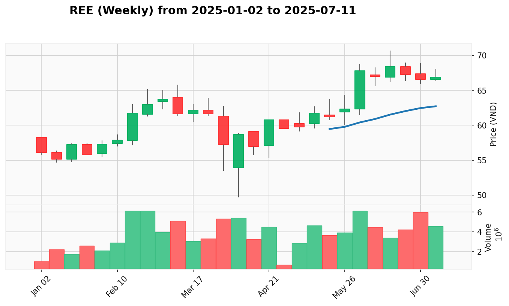

# AIPriceAction Market Report
*Report generated for data from **2025-01-02** to **2025-07-11**.*
*Last updated: 2025-07-11 20:33:34*

---

## 🎯 View the Trading Plan

**➡️ [Click here to view the trading plan](PLAN.md)**

**🎢 [Click here to view the latest market leaders](LEADER.md)**

---

<h3 id="vpa-signal-summary">VPA Signal Summary (from Latest Analysis)</h3>

| Signal | Tickers |
|:---|:---|
| Effort to Rise | [DPM](#dpm), [DRC](#drc), [FOX](#fox), [IMP](#imp), [LPB](#lpb), [PVT](#pvt), [VEA](#vea) |
| No Demand | [C4G](#c4g), [DGW](#dgw), [GVR](#gvr), [HAH](#hah), [HDG](#hdg), [HVN](#hvn), [KDC](#kdc), [NVL](#nvl), [PLX](#plx), [SGT](#sgt), [TCB](#tcb) |
| No Supply | [BCM](#bcm), [BIC](#bic), [CTR](#ctr), [DHG](#dhg), [DPR](#dpr), [DVN](#dvn), [GAS](#gas), [IDC](#idc), [MPC](#mpc), [NLG](#nlg), [NTP](#ntp), [PHR](#phr), [PNJ](#pnj), [PTB](#ptb), [PVS](#pvs), [QNS](#qns), [REE](#ree), [SCS](#scs), [SIP](#sip), [SSH](#ssh), [STB](#stb), [TNG](#tng), [TV2](#tv2), [VCG](#vcg), [VGC](#vgc), [VGT](#vgt), [VHC](#vhc), [VLB](#vlb) |
| Sign of Strength | [AAA](#aaa), [ACB](#acb), [BID](#bid), [BMP](#bmp), [BSI](#bsi), [BSR](#bsr), [CSC](#csc), [CST](#cst), [CTG](#ctg), [DCM](#dcm), [DGC](#dgc), [FIT](#fit), [FPT](#fpt), [FTS](#fts), [GEX](#gex), [GMD](#gmd), [HAG](#hag), [HCM](#hcm), [HDB](#hdb), [HHV](#hhv), [HPG](#hpg), [HSG](#hsg), [HT1](#ht1), [HUT](#hut), [IPA](#ipa), [KBC](#kbc), [KDH](#kdh), [MBB](#mbb), [MBS](#mbs), [MSH](#msh), [MSN](#msn), [MSR](#msr), [MWG](#mwg), [NKG](#nkg), [PAN](#pan), [PC1](#pc1), [PDR](#pdr), [POW](#pow), [PVI](#pvi), [SAB](#sab), [SHB](#shb), [SHS](#shs), [SSI](#ssi), [TPB](#tpb), [VCB](#vcb), [VCI](#vci), [VCS](#vcs), [VGI](#vgi), [VHM](#vhm), [VIB](#vib), [VIX](#vix), [VJC](#vjc), [VND](#vnd), [VNINDEX](#vnindex), [VNM](#vnm), [VPB](#vpb), [VPG](#vpg), [VRE](#vre), [VTP](#vtp) |
| Sign of Weakness | [ACV](#acv), [ANV](#anv), [CMG](#cmg), [DBC](#dbc), [MCH](#mch) |
| Test for Supply | [BVH](#bvh), [CII](#cii), [CTD](#ctd), [FRT](#frt), [NT2](#nt2) |
| Others | [VIC](#vic) |

---

## Groups
<h3 id="ban-le">BAN_LE</h3>

[DGW](#dgw), [FRT](#frt), [MWG](#mwg), [PNJ](#pnj)

<h3 id="bao-hiem">BAO_HIEM</h3>

[BIC](#bic), [BVH](#bvh), [PVI](#pvi)

<h3 id="bat-dong-san">BAT_DONG_SAN</h3>

[KDH](#kdh), [NLG](#nlg), [NVL](#nvl), [PDR](#pdr), [SSH](#ssh), [VHM](#vhm), [VIC](#vic), [VRE](#vre)

<h3 id="bat-dong-san-kcn">BAT_DONG_SAN_KCN</h3>

[BCM](#bcm), [IDC](#idc), [KBC](#kbc), [SIP](#sip), [VGC](#vgc)

<h3 id="cao-su">CAO_SU</h3>

[DPR](#dpr), [DRC](#drc), [GVR](#gvr), [PHR](#phr)

<h3 id="chung-khoan">CHUNG_KHOAN</h3>

[BSI](#bsi), [FTS](#fts), [HCM](#hcm), [MBS](#mbs), [SHS](#shs), [SSI](#ssi), [VCI](#vci), [VIX](#vix), [VND](#vnd)

<h3 id="cong-nghe">CONG_NGHE</h3>

[CMG](#cmg), [FOX](#fox), [FPT](#fpt), [SGT](#sgt), [VGI](#vgi)

<h3 id="dau-khi">DAU_KHI</h3>

[BSR](#bsr), [GAS](#gas), [PLX](#plx), [PVS](#pvs)

<h3 id="dau-tu-cong">DAU_TU_CONG</h3>

[C4G](#c4g), [HHV](#hhv), [VCG](#vcg)

<h3 id="det-may">DET_MAY</h3>

[MSH](#msh), [TNG](#tng), [VGT](#vgt)

<h3 id="hang-khong">HANG_KHONG</h3>

[ACV](#acv), [HVN](#hvn), [SCS](#scs), [VJC](#vjc)

<h3 id="hoa-chat">HOA_CHAT</h3>

[DCM](#dcm), [DGC](#dgc), [DPM](#dpm)

<h3 id="khai-khoang">KHAI_KHOANG</h3>

[CST](#cst), [MSR](#msr), [VPG](#vpg)

<h3 id="nang-luong">NANG_LUONG</h3>

[HDG](#hdg), [NT2](#nt2), [POW](#pow)

<h3 id="ngan-hang">NGAN_HANG</h3>

[ACB](#acb), [BID](#bid), [CTG](#ctg), [HDB](#hdb), [LPB](#lpb), [MBB](#mbb), [SHB](#shb), [STB](#stb), [TCB](#tcb), [TPB](#tpb), [VCB](#vcb), [VIB](#vib), [VPB](#vpb)

<h3 id="nhua">NHUA</h3>

[AAA](#aaa), [BMP](#bmp), [NTP](#ntp)

<h3 id="nong-nghiep">NONG_NGHIEP</h3>

[DBC](#dbc), [HAG](#hag), [PAN](#pan)

<h3 id="others">OTHERS</h3>

[GEX](#gex), [VCS](#vcs), [VEA](#vea)

<h3 id="penny">PENNY</h3>

[CSC](#csc), [FIT](#fit), [IPA](#ipa)

<h3 id="suc-khoe">SUC_KHOE</h3>

[DHG](#dhg), [DVN](#dvn), [IMP](#imp)

<h3 id="thep">THEP</h3>

[HPG](#hpg), [HSG](#hsg), [MSR](#msr), [NKG](#nkg), [PTB](#ptb)

<h3 id="thuc-pham">THUC_PHAM</h3>

[KDC](#kdc), [MCH](#mch), [MSN](#msn), [QNS](#qns), [SAB](#sab), [VNM](#vnm)

<h3 id="thuy-san">THUY_SAN</h3>

[ANV](#anv), [MPC](#mpc), [VHC](#vhc)

<h3 id="van-tai">VAN_TAI</h3>

[GMD](#gmd), [HAH](#hah), [PVT](#pvt), [VTP](#vtp)

<h3 id="vlxd">VLXD</h3>

[HT1](#ht1), [PTB](#ptb), [VLB](#vlb)

<h3 id="xay-dung">XAY_DUNG</h3>

[CII](#cii), [CTD](#ctd), [HUT](#hut)

<h3 id="xay-lap-dien">XAY_LAP_DIEN</h3>

[CTR](#ctr), [PC1](#pc1), [TV2](#tv2)

---

## Table of Contents
| Ticker | Actions |
|:-------|:--------|
| **[VNINDEX](#vnindex)** | [[Download CSV](market_data_week/VNINDEX_2025-01-02_to_2025-07-11.csv)] |
| **[AAA](#aaa)** | [[Download CSV](market_data_week/AAA_2025-01-02_to_2025-07-11.csv)] |
| **[ACB](#acb)** | [[Download CSV](market_data_week/ACB_2025-01-02_to_2025-07-11.csv)] |
| **[ACV](#acv)** | [[Download CSV](market_data_week/ACV_2025-01-02_to_2025-07-11.csv)] |
| **[ANV](#anv)** | [[Download CSV](market_data_week/ANV_2025-01-02_to_2025-07-11.csv)] |
| **[BCM](#bcm)** | [[Download CSV](market_data_week/BCM_2025-01-02_to_2025-07-11.csv)] |
| **[BIC](#bic)** | [[Download CSV](market_data_week/BIC_2025-01-02_to_2025-07-11.csv)] |
| **[BID](#bid)** | [[Download CSV](market_data_week/BID_2025-01-02_to_2025-07-11.csv)] |
| **[BMP](#bmp)** | [[Download CSV](market_data_week/BMP_2025-01-02_to_2025-07-11.csv)] |
| **[BSI](#bsi)** | [[Download CSV](market_data_week/BSI_2025-01-02_to_2025-07-11.csv)] |
| **[BSR](#bsr)** | [[Download CSV](market_data_week/BSR_2025-01-02_to_2025-07-11.csv)] |
| **[BVH](#bvh)** | [[Download CSV](market_data_week/BVH_2025-01-02_to_2025-07-11.csv)] |
| **[C4G](#c4g)** | [[Download CSV](market_data_week/C4G_2025-01-02_to_2025-07-11.csv)] |
| **[CII](#cii)** | [[Download CSV](market_data_week/CII_2025-01-02_to_2025-07-11.csv)] |
| **[CMG](#cmg)** | [[Download CSV](market_data_week/CMG_2025-01-02_to_2025-07-11.csv)] |
| **[CSC](#csc)** | [[Download CSV](market_data_week/CSC_2025-01-02_to_2025-07-11.csv)] |
| **[CST](#cst)** | [[Download CSV](market_data_week/CST_2025-01-02_to_2025-07-11.csv)] |
| **[CTD](#ctd)** | [[Download CSV](market_data_week/CTD_2025-01-02_to_2025-07-11.csv)] |
| **[CTG](#ctg)** | [[Download CSV](market_data_week/CTG_2025-01-02_to_2025-07-11.csv)] |
| **[CTR](#ctr)** | [[Download CSV](market_data_week/CTR_2025-01-02_to_2025-07-11.csv)] |
| **[DBC](#dbc)** | [[Download CSV](market_data_week/DBC_2025-01-02_to_2025-07-11.csv)] |
| **[DCM](#dcm)** | [[Download CSV](market_data_week/DCM_2025-01-02_to_2025-07-11.csv)] |
| **[DGC](#dgc)** | [[Download CSV](market_data_week/DGC_2025-01-02_to_2025-07-11.csv)] |
| **[DGW](#dgw)** | [[Download CSV](market_data_week/DGW_2025-01-02_to_2025-07-11.csv)] |
| **[DHG](#dhg)** | [[Download CSV](market_data_week/DHG_2025-01-02_to_2025-07-11.csv)] |
| **[DPM](#dpm)** | [[Download CSV](market_data_week/DPM_2025-01-02_to_2025-07-11.csv)] |
| **[DPR](#dpr)** | [[Download CSV](market_data_week/DPR_2025-01-02_to_2025-07-11.csv)] |
| **[DRC](#drc)** | [[Download CSV](market_data_week/DRC_2025-01-02_to_2025-07-11.csv)] |
| **[DVN](#dvn)** | [[Download CSV](market_data_week/DVN_2025-01-02_to_2025-07-11.csv)] |
| **[FIT](#fit)** | [[Download CSV](market_data_week/FIT_2025-01-02_to_2025-07-11.csv)] |
| **[FOX](#fox)** | [[Download CSV](market_data_week/FOX_2025-01-02_to_2025-07-11.csv)] |
| **[FPT](#fpt)** | [[Download CSV](market_data_week/FPT_2025-01-02_to_2025-07-11.csv)] |
| **[FRT](#frt)** | [[Download CSV](market_data_week/FRT_2025-01-02_to_2025-07-11.csv)] |
| **[FTS](#fts)** | [[Download CSV](market_data_week/FTS_2025-01-02_to_2025-07-11.csv)] |
| **[GAS](#gas)** | [[Download CSV](market_data_week/GAS_2025-01-02_to_2025-07-11.csv)] |
| **[GEX](#gex)** | [[Download CSV](market_data_week/GEX_2025-01-02_to_2025-07-11.csv)] |
| **[GMD](#gmd)** | [[Download CSV](market_data_week/GMD_2025-01-02_to_2025-07-11.csv)] |
| **[GVR](#gvr)** | [[Download CSV](market_data_week/GVR_2025-01-02_to_2025-07-11.csv)] |
| **[HAG](#hag)** | [[Download CSV](market_data_week/HAG_2025-01-02_to_2025-07-11.csv)] |
| **[HAH](#hah)** | [[Download CSV](market_data_week/HAH_2025-01-02_to_2025-07-11.csv)] |
| **[HCM](#hcm)** | [[Download CSV](market_data_week/HCM_2025-01-02_to_2025-07-11.csv)] |
| **[HDB](#hdb)** | [[Download CSV](market_data_week/HDB_2025-01-02_to_2025-07-11.csv)] |
| **[HDG](#hdg)** | [[Download CSV](market_data_week/HDG_2025-01-02_to_2025-07-11.csv)] |
| **[HHV](#hhv)** | [[Download CSV](market_data_week/HHV_2025-01-02_to_2025-07-11.csv)] |
| **[HPG](#hpg)** | [[Download CSV](market_data_week/HPG_2025-01-02_to_2025-07-11.csv)] |
| **[HSG](#hsg)** | [[Download CSV](market_data_week/HSG_2025-01-02_to_2025-07-11.csv)] |
| **[HT1](#ht1)** | [[Download CSV](market_data_week/HT1_2025-01-02_to_2025-07-11.csv)] |
| **[HUT](#hut)** | [[Download CSV](market_data_week/HUT_2025-01-02_to_2025-07-11.csv)] |
| **[HVN](#hvn)** | [[Download CSV](market_data_week/HVN_2025-01-02_to_2025-07-11.csv)] |
| **[IDC](#idc)** | [[Download CSV](market_data_week/IDC_2025-01-02_to_2025-07-11.csv)] |
| **[IMP](#imp)** | [[Download CSV](market_data_week/IMP_2025-01-02_to_2025-07-11.csv)] |
| **[IPA](#ipa)** | [[Download CSV](market_data_week/IPA_2025-01-02_to_2025-07-11.csv)] |
| **[KBC](#kbc)** | [[Download CSV](market_data_week/KBC_2025-01-02_to_2025-07-11.csv)] |
| **[KDC](#kdc)** | [[Download CSV](market_data_week/KDC_2025-01-02_to_2025-07-11.csv)] |
| **[KDH](#kdh)** | [[Download CSV](market_data_week/KDH_2025-01-02_to_2025-07-11.csv)] |
| **[LPB](#lpb)** | [[Download CSV](market_data_week/LPB_2025-01-02_to_2025-07-11.csv)] |
| **[MBB](#mbb)** | [[Download CSV](market_data_week/MBB_2025-01-02_to_2025-07-11.csv)] |
| **[MBS](#mbs)** | [[Download CSV](market_data_week/MBS_2025-01-02_to_2025-07-11.csv)] |
| **[MCH](#mch)** | [[Download CSV](market_data_week/MCH_2025-01-02_to_2025-07-11.csv)] |
| **[MPC](#mpc)** | [[Download CSV](market_data_week/MPC_2025-01-02_to_2025-07-11.csv)] |
| **[MSH](#msh)** | [[Download CSV](market_data_week/MSH_2025-01-02_to_2025-07-11.csv)] |
| **[MSN](#msn)** | [[Download CSV](market_data_week/MSN_2025-01-02_to_2025-07-11.csv)] |
| **[MSR](#msr)** | [[Download CSV](market_data_week/MSR_2025-01-02_to_2025-07-11.csv)] |
| **[MWG](#mwg)** | [[Download CSV](market_data_week/MWG_2025-01-02_to_2025-07-11.csv)] |
| **[NKG](#nkg)** | [[Download CSV](market_data_week/NKG_2025-01-02_to_2025-07-11.csv)] |
| **[NLG](#nlg)** | [[Download CSV](market_data_week/NLG_2025-01-02_to_2025-07-11.csv)] |
| **[NT2](#nt2)** | [[Download CSV](market_data_week/NT2_2025-01-02_to_2025-07-11.csv)] |
| **[NTP](#ntp)** | [[Download CSV](market_data_week/NTP_2025-01-02_to_2025-07-11.csv)] |
| **[NVL](#nvl)** | [[Download CSV](market_data_week/NVL_2025-01-02_to_2025-07-11.csv)] |
| **[PAN](#pan)** | [[Download CSV](market_data_week/PAN_2025-01-02_to_2025-07-11.csv)] |
| **[PC1](#pc1)** | [[Download CSV](market_data_week/PC1_2025-01-02_to_2025-07-11.csv)] |
| **[PDR](#pdr)** | [[Download CSV](market_data_week/PDR_2025-01-02_to_2025-07-11.csv)] |
| **[PHR](#phr)** | [[Download CSV](market_data_week/PHR_2025-01-02_to_2025-07-11.csv)] |
| **[PLX](#plx)** | [[Download CSV](market_data_week/PLX_2025-01-02_to_2025-07-11.csv)] |
| **[PNJ](#pnj)** | [[Download CSV](market_data_week/PNJ_2025-01-02_to_2025-07-11.csv)] |
| **[POW](#pow)** | [[Download CSV](market_data_week/POW_2025-01-02_to_2025-07-11.csv)] |
| **[PTB](#ptb)** | [[Download CSV](market_data_week/PTB_2025-01-02_to_2025-07-11.csv)] |
| **[PVI](#pvi)** | [[Download CSV](market_data_week/PVI_2025-01-02_to_2025-07-11.csv)] |
| **[PVS](#pvs)** | [[Download CSV](market_data_week/PVS_2025-01-02_to_2025-07-11.csv)] |
| **[PVT](#pvt)** | [[Download CSV](market_data_week/PVT_2025-01-02_to_2025-07-11.csv)] |
| **[QNS](#qns)** | [[Download CSV](market_data_week/QNS_2025-01-02_to_2025-07-11.csv)] |
| **[REE](#ree)** | [[Download CSV](market_data_week/REE_2025-01-02_to_2025-07-11.csv)] |
| **[SAB](#sab)** | [[Download CSV](market_data_week/SAB_2025-01-02_to_2025-07-11.csv)] |
| **[SCS](#scs)** | [[Download CSV](market_data_week/SCS_2025-01-02_to_2025-07-11.csv)] |
| **[SGT](#sgt)** | [[Download CSV](market_data_week/SGT_2025-01-02_to_2025-07-11.csv)] |
| **[SHB](#shb)** | [[Download CSV](market_data_week/SHB_2025-01-02_to_2025-07-11.csv)] |
| **[SHS](#shs)** | [[Download CSV](market_data_week/SHS_2025-01-02_to_2025-07-11.csv)] |
| **[SIP](#sip)** | [[Download CSV](market_data_week/SIP_2025-01-02_to_2025-07-11.csv)] |
| **[SSH](#ssh)** | [[Download CSV](market_data_week/SSH_2025-01-02_to_2025-07-11.csv)] |
| **[SSI](#ssi)** | [[Download CSV](market_data_week/SSI_2025-01-02_to_2025-07-11.csv)] |
| **[STB](#stb)** | [[Download CSV](market_data_week/STB_2025-01-02_to_2025-07-11.csv)] |
| **[TCB](#tcb)** | [[Download CSV](market_data_week/TCB_2025-01-02_to_2025-07-11.csv)] |
| **[TNG](#tng)** | [[Download CSV](market_data_week/TNG_2025-01-02_to_2025-07-11.csv)] |
| **[TPB](#tpb)** | [[Download CSV](market_data_week/TPB_2025-01-02_to_2025-07-11.csv)] |
| **[TV2](#tv2)** | [[Download CSV](market_data_week/TV2_2025-01-02_to_2025-07-11.csv)] |
| **[VCB](#vcb)** | [[Download CSV](market_data_week/VCB_2025-01-02_to_2025-07-11.csv)] |
| **[VCG](#vcg)** | [[Download CSV](market_data_week/VCG_2025-01-02_to_2025-07-11.csv)] |
| **[VCI](#vci)** | [[Download CSV](market_data_week/VCI_2025-01-02_to_2025-07-11.csv)] |
| **[VCS](#vcs)** | [[Download CSV](market_data_week/VCS_2025-01-02_to_2025-07-11.csv)] |
| **[VEA](#vea)** | [[Download CSV](market_data_week/VEA_2025-01-02_to_2025-07-11.csv)] |
| **[VGC](#vgc)** | [[Download CSV](market_data_week/VGC_2025-01-02_to_2025-07-11.csv)] |
| **[VGI](#vgi)** | [[Download CSV](market_data_week/VGI_2025-01-02_to_2025-07-11.csv)] |
| **[VGT](#vgt)** | [[Download CSV](market_data_week/VGT_2025-01-02_to_2025-07-11.csv)] |
| **[VHC](#vhc)** | [[Download CSV](market_data_week/VHC_2025-01-02_to_2025-07-11.csv)] |
| **[VHM](#vhm)** | [[Download CSV](market_data_week/VHM_2025-01-02_to_2025-07-11.csv)] |
| **[VIB](#vib)** | [[Download CSV](market_data_week/VIB_2025-01-02_to_2025-07-11.csv)] |
| **[VIC](#vic)** | [[Download CSV](market_data_week/VIC_2025-01-02_to_2025-07-11.csv)] |
| **[VIX](#vix)** | [[Download CSV](market_data_week/VIX_2025-01-02_to_2025-07-11.csv)] |
| **[VJC](#vjc)** | [[Download CSV](market_data_week/VJC_2025-01-02_to_2025-07-11.csv)] |
| **[VLB](#vlb)** | [[Download CSV](market_data_week/VLB_2025-01-02_to_2025-07-11.csv)] |
| **[VND](#vnd)** | [[Download CSV](market_data_week/VND_2025-01-02_to_2025-07-11.csv)] |
| **[VNM](#vnm)** | [[Download CSV](market_data_week/VNM_2025-01-02_to_2025-07-11.csv)] |
| **[VPB](#vpb)** | [[Download CSV](market_data_week/VPB_2025-01-02_to_2025-07-11.csv)] |
| **[VPG](#vpg)** | [[Download CSV](market_data_week/VPG_2025-01-02_to_2025-07-11.csv)] |
| **[VRE](#vre)** | [[Download CSV](market_data_week/VRE_2025-01-02_to_2025-07-11.csv)] |
| **[VTP](#vtp)** | [[Download CSV](market_data_week/VTP_2025-01-02_to_2025-07-11.csv)] |

---

## Ticker Performance Summary
| Ticker | Period High | Period Low | Latest Close | Change % | Total Volume |
|:-------|------------:|-----------:|-------------:|---------:|-------------:|
| **VNINDEX** | 1,463.91 | 1,073.61 | **1,457.76** | 14.88% 📈 | 96,717,508,426 |
| **AAA** | 8.81 | 6.15 | **7.57** | -9.67% 📉 | 243,252,040 |
| **ACB** | 22.75 | 17.34 | **22.7** | 6.12% 📈 | 1,253,348,098 |
| **ACV** | 128.9 | 74.5 | **93.8** | -25.26% 📉 | 55,635,359 |
| **ANV** | 25.3 | 12.4 | **22.55** | 13.60% 📈 | 249,963,486 |
| **BCM** | 82.4 | 49.8 | **68.0** | -2.86% 📉 | 70,547,981 |
| **BIC** | 40.2 | 29.5 | **38.9** | 15.43% 📈 | 6,791,782 |
| **BID** | 42.0 | 31.2 | **38.3** | 0.26% 📈 | 482,436,981 |
| **BMP** | 148.0 | 95.93 | **144.3** | 14.88% 📈 | 28,269,319 |
| **BSI** | 53.91 | 37.96 | **44.25** | 0.25% 📈 | 127,500,048 |
| **BSR** | 23.0 | 14.55 | **18.45** | -19.08% 📉 | 401,254,966 |
| **BVH** | 59.7 | 39.1 | **53.7** | 4.88% 📈 | 82,392,323 |
| **C4G** | 9.3 | 5.6 | **8.3** | 5.06% 📈 | 120,829,417 |
| **CII** | 16.2 | 10.5 | **14.95** | 6.79% 📈 | 1,483,652,017 |
| **CMG** | 50.4 | 28.85 | **42.3** | -14.55% 📉 | 149,802,927 |
| **CSC** | 25.0 | 15.55 | **21.9** | -11.44% 📉 | 6,287,314 |
| **CST** | 23.61 | 14.58 | **16.4** | -28.82% 📉 | 8,053,202 |
| **CTD** | 97.8 | 64.3 | **83.4** | 21.22% 📈 | 171,865,098 |
| **CTG** | 45.2 | 33.8 | **44.6** | 17.37% 📈 | 959,421,412 |
| **CTR** | 136.3 | 73.9 | **101.6** | -18.46% 📉 | 93,385,236 |
| **DBC** | 35.45 | 21.95 | **33.7** | 19.93% 📈 | 974,714,489 |
| **DCM** | 35.51 | 23.38 | **33.8** | 0.54% 📈 | 343,982,408 |
| **DGC** | 117.3 | 73.1 | **103.7** | -11.06% 📉 | 233,357,046 |
| **DGW** | 46.1 | 28.32 | **44.0** | 10.44% 📈 | 224,690,106 |
| **DHG** | 104.47 | 82.1 | **100.5** | 2.59% 📈 | 3,112,059 |
| **DPM** | 39.8 | 27.45 | **38.65** | 10.11% 📈 | 380,771,407 |
| **DPR** | 53.1 | 33.95 | **40.15** | 3.21% 📈 | 119,667,754 |
| **DRC** | 28.75 | 17.19 | **21.75** | -21.42% 📉 | 83,414,595 |
| **DVN** | 30.7 | 17.6 | **23.2** | -7.57% 📉 | 16,569,889 |
| **FIT** | 5.2 | 3.84 | **4.59** | 8.77% 📈 | 158,442,212 |
| **FOX** | 72.69 | 47.08 | **63.5** | 3.67% 📈 | 16,034,927 |
| **FPT** | 154.67 | 96.97 | **126.6** | -16.27% 📉 | 784,312,257 |
| **FRT** | 209.4 | 121.1 | **183.1** | -1.35% 📉 | 63,734,133 |
| **FTS** | 46.85 | 31.41 | **40.9** | 7.74% 📈 | 441,938,614 |
| **GAS** | 73.6 | 50.8 | **67.9** | -0.59% 📉 | 118,840,749 |
| **GEX** | 40.8 | 16.68 | **40.0** | 124.09% 📈 | 1,452,175,292 |
| **GMD** | 64.17 | 40.84 | **60.2** | -4.44% 📉 | 255,699,972 |
| **GVR** | 35.6 | 21.7 | **30.0** | -1.64% 📉 | 474,811,557 |
| **HAG** | 14.3 | 9.54 | **13.4** | 10.29% 📈 | 928,882,288 |
| **HAH** | 90.0 | 45.05 | **69.3** | 40.00% 📈 | 291,372,107 |
| **HCM** | 25.7 | 17.84 | **24.95** | 9.48% 📈 | 1,384,568,057 |
| **HDB** | 25.5 | 18.0 | **24.45** | -3.93% 📉 | 1,445,315,199 |
| **HDG** | 26.85 | 17.91 | **25.2** | -3.26% 📉 | 366,074,813 |
| **HHV** | 13.45 | 9.72 | **12.65** | 8.58% 📈 | 1,020,318,202 |
| **HPG** | 26.25 | 17.75 | **26.0** | 16.85% 📈 | 3,408,889,989 |
| **HSG** | 18.8 | 12.4 | **17.65** | -1.56% 📉 | 886,113,110 |
| **HT1** | 13.4 | 9.17 | **13.15** | 10.97% 📈 | 64,201,086 |
| **HUT** | 17.67 | 10.62 | **13.6** | -9.69% 📉 | 176,725,400 |
| **HVN** | 40.95 | 24.6 | **37.2** | 28.72% 📈 | 313,415,780 |
| **IDC** | 55.82 | 30.9 | **46.2** | -14.27% 📉 | 223,046,004 |
| **IMP** | 54.27 | 35.75 | **51.9** | 11.49% 📈 | 26,051,632 |
| **IPA** | 15.3 | 9.1 | **15.0** | 26.05% 📈 | 29,138,653 |
| **KBC** | 31.3 | 20.05 | **27.5** | 0.92% 📈 | 859,759,442 |
| **KDC** | 59.8 | 49.25 | **56.5** | -4.24% 📉 | 50,438,689 |
| **KDH** | 35.8 | 24.25 | **30.3** | -14.89% 📉 | 343,265,052 |
| **LPB** | 35.68 | 27.01 | **33.0** | 12.82% 📈 | 389,581,272 |
| **MBB** | 26.9 | 19.45 | **26.7** | 22.09% 📈 | 2,691,686,614 |
| **MBS** | 31.9 | 21.9 | **29.3** | 2.45% 📈 | 516,256,116 |
| **MCH** | 179.29 | 100.99 | **119.5** | -33.32% 📉 | 14,953,075 |
| **MPC** | 15.3 | 8.8 | **13.8** | -6.76% 📉 | 20,696,025 |
| **MSH** | 41.87 | 25.17 | **37.55** | 8.75% 📈 | 39,334,381 |
| **MSN** | 78.4 | 50.3 | **76.5** | 9.13% 📈 | 672,322,436 |
| **MSR** | 25.6 | 10.4 | **18.9** | 60.17% 📈 | 286,758,651 |
| **MWG** | 68.4 | 45.75 | **67.9** | 11.49% 📈 | 933,691,746 |
| **NKG** | 16.5 | 11.05 | **13.95** | -4.12% 📉 | 1,004,854,178 |
| **NLG** | 40.45 | 25.41 | **38.85** | 7.71% 📈 | 383,886,755 |
| **NT2** | 21.5 | 16.0 | **19.4** | -3.43% 📉 | 80,724,722 |
| **NTP** | 71.5 | 39.96 | **66.6** | 28.57% 📈 | 56,619,339 |
| **NVL** | 16.2 | 7.88 | **15.1** | 45.89% 📈 | 2,166,291,038 |
| **PAN** | 29.6 | 20.4 | **28.85** | 21.47% 📈 | 184,194,678 |
| **PC1** | 24.7 | 18.4 | **22.35** | -3.25% 📉 | 256,976,612 |
| **PDR** | 21.0 | 15.05 | **18.75** | -9.42% 📉 | 1,100,797,682 |
| **PHR** | 69.0 | 39.0 | **60.8** | 14.50% 📈 | 86,555,568 |
| **PLX** | 43.11 | 29.95 | **37.7** | 2.67% 📈 | 190,347,855 |
| **PNJ** | 99.39 | 62.8 | **83.2** | -14.58% 📉 | 120,065,613 |
| **POW** | 14.0 | 9.92 | **13.45** | 12.08% 📈 | 1,081,346,259 |
| **PTB** | 65.63 | 43.46 | **54.5** | -15.45% 📉 | 23,556,603 |
| **PVI** | 69.0 | 51.0 | **58.4** | -4.89% 📉 | 7,686,673 |
| **PVS** | 37.0 | 21.4 | **33.1** | -2.36% 📉 | 568,684,889 |
| **PVT** | 21.52 | 14.09 | **18.2** | -13.42% 📉 | 286,849,346 |
| **QNS** | 49.7 | 41.66 | **48.6** | 0.66% 📈 | 45,540,525 |
| **REE** | 70.7 | 49.65 | **66.9** | 14.87% 📈 | 103,344,637 |
| **SAB** | 52.49 | 39.04 | **48.15** | -8.27% 📉 | 141,287,178 |
| **SCS** | 83.5 | 51.9 | **66.9** | -17.00% 📉 | 50,547,134 |
| **SGT** | 22.15 | 15.0 | **17.75** | 2.90% 📈 | 11,184,371 |
| **SHB** | 14.4 | 8.72 | **14.2** | 58.84% 📈 | 6,546,574,706 |
| **SHS** | 14.9 | 8.54 | **14.6** | 45.13% 📈 | 1,822,151,344 |
| **SIP** | 81.61 | 48.12 | **61.48** | -13.54% 📉 | 86,823,562 |
| **SSH** | 134.2 | 66.5 | **88.9** | 33.08% 📈 | 4,601,631 |
| **SSI** | 30.0 | 20.6 | **29.65** | 13.82% 📈 | 3,025,448,206 |
| **STB** | 48.5 | 32.4 | **47.65** | 28.96% 📈 | 1,507,149,534 |
| **TCB** | 35.6 | 22.3 | **34.95** | 41.78% 📈 | 2,160,730,711 |
| **TNG** | 24.56 | 12.63 | **20.5** | -13.54% 📉 | 166,353,348 |
| **TPB** | 16.08 | 10.35 | **14.85** | -4.62% 📉 | 1,832,523,254 |
| **TV2** | 43.7 | 27.3 | **38.35** | 14.82% 📈 | 69,476,893 |
| **VCB** | 68.6 | 52.0 | **62.7** | 2.33% 📈 | 450,712,274 |
| **VCG** | 23.65 | 15.91 | **22.8** | 40.22% 📈 | 1,296,608,433 |
| **VCI** | 41.05 | 30.73 | **41.05** | 24.36% 📈 | 1,070,237,829 |
| **VCS** | 61.74 | 36.78 | **49.8** | -18.57% 📉 | 22,087,881 |
| **VEA** | 44.9 | 34.1 | **39.6** | -0.50% 📉 | 66,918,189 |
| **VGC** | 53.4 | 36.5 | **45.55** | 1.22% 📈 | 134,489,848 |
| **VGI** | 94.5 | 51.8 | **75.5** | -17.67% 📉 | 80,538,956 |
| **VGT** | 15.1 | 7.2 | **12.1** | -17.12% 📉 | 151,858,607 |
| **VHC** | 73.0 | 43.75 | **58.1** | -18.63% 📉 | 144,107,895 |
| **VHM** | 89.6 | 37.6 | **87.9** | 119.20% 📈 | 1,010,658,994 |
| **VIB** | 20.58 | 15.68 | **19.35** | 2.11% 📈 | 958,858,373 |
| **VIC** | 108.1 | 39.7 | **108.0** | 166.67% 📈 | 668,558,613 |
| **VIX** | 16.1 | 8.6 | **15.85** | 69.16% 📈 | 5,096,106,266 |
| **VJC** | 100.1 | 77.1 | **100.0** | -0.10% 📉 | 88,146,664 |
| **VLB** | 49.9 | 36.2 | **46.6** | 13.35% 📈 | 11,719,018 |
| **VND** | 18.4 | 10.91 | **17.9** | 46.60% 📈 | 2,586,561,067 |
| **VNM** | 61.81 | 49.64 | **59.8** | -2.64% 📉 | 505,760,543 |
| **VPB** | 20.35 | 14.75 | **20.15** | 8.39% 📈 | 2,861,094,762 |
| **VPG** | 13.2 | 7.4 | **8.29** | -30.63% 📉 | 70,746,285 |
| **VRE** | 28.9 | 16.1 | **28.6** | 66.28% 📈 | 1,302,754,105 |
| **VTP** | 174.7 | 91.2 | **122.7** | -11.66% 📉 | 95,944,223 |

---

## Individual Ticker Analysis
### VNINDEX

#### [VPA Analysis (2025-06-02 - 2025-07-07)](./VPA_week.md#vnindex)
> - **Ngày 2025-06-02:** Một tuần giảm giá nhẹ với nến giảm biên độ hẹp. Khối lượng giao dịch giảm.
>     - **Phân tích VPA/Wyckoff:** Một phiên **kiểm tra nguồn cung (Test for Supply)** thành công sau tuần tăng trước đó. Tín hiệu tích cực.
> - **Ngày 2025-06-09:** VNINDEX quay đầu giảm, đóng cửa (1315.49) thấp hơn. Khối lượng giao dịch giảm.
>     - **Phân tích VPA/Wyckoff:** Một phiên **kiểm tra không có nguồn cung (No Supply)**.
> - **Ngày 2025-06-16:** Một tuần tăng giá mạnh, đóng cửa (1349.35) gần mức cao nhất tuần. Khối lượng giao dịch ổn định.
>     - **Phân tích VPA/Wyckoff:** Một **Dấu hiệu Sức mạnh (SOS)**.
> - **Ngày 2025-06-23:** VNINDEX tiếp tục xu hướng tăng với một nến tăng có biên độ rộng, đóng cửa gần mức cao nhất tuần và thiết lập một đỉnh mới. Khối lượng giao dịch duy trì ở mức cao, dù có giảm nhẹ.
>     - **Phân tích VPA/Wyckoff:** Đây là một **Dấu hiệu Sức mạnh (Sign of Strength - SOS)**, cho thấy thị trường chung vẫn đang trong một xu hướng tăng vững chắc, được dẫn dắt bởi lực cầu mạnh.
> - **Ngày 2025-07-07:** Tiếp nối Dấu hiệu Sức mạnh của tuần trước, VNINDEX có một tuần bùng nổ với một nến tăng thân dài, đóng cửa (1457.76) ở mức cao nhất tuần. Khối lượng giao dịch tăng vọt, xác nhận cho sức mạnh của đà tăng.
>     - **Phân tích VPA/Wyckoff:** Đây là một **Dấu hiệu Sức mạnh (Sign of Strength - SOS)** rõ ràng, cho thấy lực cầu đang rất quyết liệt và xu hướng tăng của thị trường chung được củng cố.

<a href="#vpa-signal-summary">↑ Back to Top</a>

#### Key Statistics
| Metric | Value |
|:---|---:|
| Date Range | 2025-01-02 to 2025-07-07 |
| **Latest Close** | **1,457.76** |
| Period Open | 1,268.96 |
| Period High | 1,463.91 |
| Period Low | 1,073.61 |
| Period Change % | 14.88% |

**[Download VNINDEX Data (.csv)](market_data_week/VNINDEX_2025-01-02_to_2025-07-11.csv)**

---

### AAA

#### [VPA Analysis (2025-06-02 - 2025-07-07)](./VPA_week.md#aaa)
> - **Ngày 2025-06-02:** Một tuần tăng giá tích cực, tạo thành nến tăng với thân dài và đóng cửa (7.35) gần mức cao nhất tuần. Khối lượng giao dịch tăng mạnh, cho thấy sự tham gia của dòng tiền lớn.
>     - **Phân tích VPA/Wyckoff:** Đây là một **Dấu hiệu Sức mạnh (Sign of Strength - SOS)**, cho thấy lực cầu đang quay trở lại sau một giai đoạn tích lũy. Cổ phiếu đang cố gắng bứt phá khỏi vùng đi ngang.
> - **Ngày 2025-06-09:** Sau tuần tăng giá, AAA quay đầu giảm với một nến giảm thân dài, đóng cửa (7.05) gần mức thấp nhất tuần. Khối lượng giao dịch vẫn duy trì ở mức cao.
>     - **Phân tích VPA/Wyckoff:** Đây là một **Dấu hiệu Yếu kém (Sign of Weakness - SOW)**, cho thấy áp lực bán đã xuất hiện và áp đảo nỗ lực tăng giá của tuần trước.
> - **Ngày 2025-06-16:** AAA có một tuần phục hồi nhẹ với một nến tăng biên độ hẹp, đóng cửa (7.15) cao hơn tuần trước. Khối lượng giao dịch giảm đáng kể.
>     - **Phân tích VPA/Wyckoff:** Đây là một tín hiệu **"No Supply" (Không có nguồn cung)**. Việc giá có thể phục hồi trên nền khối lượng thấp cho thấy áp lực bán đã cạn kiệt, là một tín hiệu tích cực cho phe mua.
> - **Ngày 2025-06-23:** Tuần giao dịch với biên độ hẹp, tạo thành một nến tăng nhỏ nằm hoàn toàn trong phạm vi của tuần trước (inside bar). Giá đóng cửa (7.17) chỉ nhích nhẹ so với tuần trước (7.15) dù khối lượng tăng lên mức trung bình (7 triệu cp). Diễn biến này cho thấy sự do dự và kiểm tra cung sau nỗ lực phục hồi của tuần trước.
>     - **Phân tích VPA/Wyckoff:** Đây là tín hiệu **"No Demand" (Không có lực cầu)** hoặc **"Test for Supply" (Kiểm tra nguồn cung)**. Việc giá không thể bứt phá mạnh mẽ trên nền khối lượng gia tăng cho thấy áp lực bán vẫn còn hiện hữu.
> - **Ngày 2025-06-30:** Tiếp nối tín hiệu "No Demand" của tuần trước, AAA có một tuần tăng giá nhẹ với biên độ hẹp. Mặc dù giá đóng cửa (7.21) cao hơn, nhưng nỗ lực tăng giá (khối lượng tăng lên 8.7 triệu cp) không tạo ra một cú bứt phá mạnh mẽ, cho thấy lực mua vẫn đang bị áp lực bán hấp thụ.
>     - **Phân tích VPA/Wyckoff:** Đây là một tín hiệu **"No Demand"** trên nền khối lượng cao, cho thấy sự giằng co (churning). Việc nỗ lực lớn không mang lại kết quả tương xứng là một dấu hiệu yếu kém, cảnh báo rằng phe mua đang gặp khó khăn.
> - **Ngày 2025-07-07:** Tiếp nối tín hiệu "No Demand" của tuần trước, AAA có một tuần tăng giá bùng nổ. Nến tăng thân dài, đóng cửa (7.57) gần mức cao nhất tuần, đi kèm với khối lượng giao dịch tăng vọt lên mức rất cao (21.1 triệu cp).
>     - **Phân tích VPA/Wyckoff:** Đây là một **Dấu hiệu Sức mạnh (Sign of Strength - SOS)** rõ ràng, cho thấy lực cầu đã quay trở lại một cách áp đảo, phủ nhận hoàn toàn tín hiệu yếu của tuần trước và báo hiệu khả năng bắt đầu một xu hướng tăng mới.

<a href="#nhua">↑ Back to group NHUA</a>  |  <a href="#vpa-signal-summary">↑ Back to Top</a>

#### Key Statistics
| Metric | Value |
|:---|---:|
| Date Range | 2025-01-02 to 2025-07-07 |
| **Latest Close** | **7.57** |
| Period Open | 8.38 |
| Period High | 8.81 |
| Period Low | 6.15 |
| Period Change % | -9.67% |

**[Download AAA Data (.csv)](market_data_week/AAA_2025-01-02_to_2025-07-11.csv)**

---

### ACB

#### [VPA Analysis (2025-06-02 - 2025-07-07)](./VPA_week.md#acb)
> - **Ngày 2025-06-02:** Một tuần giao dịch đi ngang với biên độ rất hẹp (inside bar), đóng cửa (21.0) không đổi so với tuần trước. Khối lượng giao dịch giảm.
>     - **Phân tích VPA/Wyckoff:** Đây là một thanh **"No Demand"**, cho thấy thị trường đang thiếu động lực và cả phe mua và bán đều không quyết liệt. Cần một cú hích để thoát khỏi trạng thái này.
> - **Ngày 2025-06-09:** ACB tiếp tục đi ngang với một nến doji, biên độ hẹp và đóng cửa (21.05) gần như không đổi. Khối lượng giao dịch vẫn ở mức thấp.
>     - **Phân tích VPA/Wyckoff:** Đây là tín hiệu **"No Demand" (Không có cầu)**. Sự thiếu quan tâm kéo dài cho thấy thị trường đang ở trạng thái cân bằng, chờ đợi một xúc tác mới.
> - **Ngày 2025-06-16:** Một tuần tăng giá thuyết phục với một nến tăng thân dài, đóng cửa (21.45) gần mức cao nhất tuần. Khối lượng giao dịch tăng mạnh so với các tuần trước đó.
>     - **Phân tích VPA/Wyckoff:** Đây là một **Dấu hiệu Sức mạnh (Sign of Strength - SOS)** rõ ràng, cho thấy lực mua đã quay trở lại một cách quyết liệt.
> - **Ngày 2025-06-23:** Sau một tuần tăng giá, ACB hình thành một nến giảm có biên độ hẹp. Giá không thể vượt qua đỉnh của tuần trước và đóng cửa (21.2) thấp hơn mức đóng cửa tuần trước (21.45). Khối lượng giao dịch tuy giảm nhẹ nhưng vẫn ở mức cao (41.5 triệu cp).
>     - **Phân tích VPA/Wyckoff:** Đây là dấu hiệu của sự **chững lại đà tăng (profit-taking)** hoặc **thiếu lực cầu (lack of demand)**. Việc không thể tiếp tục đi lên cho thấy phe mua đang yếu thế, tạo ra một **Dấu hiệu Yếu kém (Sign of Weakness - SOW)** trong ngắn hạn.
> - **Ngày 2025-06-30:** Sau tuần chững lại, ACB có một tuần tăng giá rất thuyết phục. Nến tăng thân dài, đóng cửa (21.85) gần mức cao nhất tuần và vượt qua đỉnh của tuần trước (21.6), đi kèm với khối lượng giao dịch tăng vọt (63.1 triệu cp).
>     - **Phân tích VPA/Wyckoff:** Đây là một **Dấu hiệu Sức mạnh (Sign of Strength - SOS)** rõ ràng, phủ nhận tín hiệu yếu của tuần trước. Lực cầu đã quay trở lại một cách áp đảo, xác nhận xu hướng tăng tiếp diễn.
> - **Ngày 2025-07-07:** Tiếp nối Dấu hiệu Sức mạnh của tuần trước, ACB có một tuần tăng giá bùng nổ với một nến tăng thân dài, đóng cửa (22.7) ở mức cao nhất tuần. Khối lượng giao dịch tiếp tục tăng mạnh, xác nhận cho sức mạnh của xu hướng.
>     - **Phân tích VPA/Wyckoff:** Đây là một **Dấu hiệu Sức mạnh (Sign of Strength - SOS)**. Tuy nhiên, sự tăng tốc liên tục trên khối lượng cực lớn có thể là dấu hiệu của một **Cao trào mua (Buying Climax)**, báo hiệu rủi ro điều chỉnh đang gia tăng.

<a href="#ngan-hang">↑ Back to group NGAN_HANG</a>  |  <a href="#vpa-signal-summary">↑ Back to Top</a>

#### Key Statistics
| Metric | Value |
|:---|---:|
| Date Range | 2025-01-02 to 2025-07-07 |
| **Latest Close** | **22.7** |
| Period Open | 21.39 |
| Period High | 22.75 |
| Period Low | 17.34 |
| Period Change % | 6.12% |

**[Download ACB Data (.csv)](market_data_week/ACB_2025-01-02_to_2025-07-11.csv)**

---

### ACV

#### [VPA Analysis (2025-06-02 - 2025-07-07)](./VPA_week.md#acv)
> - **Ngày 2025-06-02:** Một tuần giảm giá với nến giảm thân dài, đóng cửa (93.5) gần mức thấp nhất tuần. Khối lượng giao dịch duy trì ở mức cao.
>     - **Phân tích VPA/Wyckoff:** Đây là một **Dấu hiệu Yếu kém (Sign of Weakness - SOW)**, cho thấy áp lực bán đang chiếm ưu thế sau nỗ lực phục hồi thất bại của tuần trước.
> - **Ngày 2025-06-09:** ACV tiếp tục giảm giá, phá vỡ đáy của tuần trước và đóng cửa (92.4) ở mức thấp. Khối lượng giao dịch tăng mạnh.
>     - **Phân tích VPA/Wyckoff:** Đây là một **Dấu hiệu Yếu kém (Sign of Weakness - SOW)** được xác nhận. Việc giá giảm trên nền khối lượng tăng cho thấy phe bán đang hoàn toàn kiểm soát.
> - **Ngày 2025-06-16:** Tuần giao dịch đi ngang với biên độ hẹp, đóng cửa (92.1) gần như không đổi. Khối lượng giao dịch giảm mạnh.
>     - **Phân tích VPA/Wyckoff:** Đây có thể là một **Cao trào bán (Selling Climax)** tạm thời, khi áp lực bán đã chững lại. Khối lượng giảm cho thấy sự kiệt sức của phe bán. Cần tín hiệu xác nhận từ phe mua.
> - **Ngày 2025-06-23:** ACV có một tuần tăng giá rất thuyết phục với một nến tăng thân dài, đóng cửa ở mức gần như cao nhất tuần (97.2). Giá đã bứt phá mạnh mẽ khỏi vùng đi ngang trước đó. Khối lượng giao dịch tăng vọt lên 2.2 triệu cp, cao hơn đáng kể so với tuần trước (1.2 triệu cp).
>     - **Phân tích VPA/Wyckoff:** Đây là một **Dấu hiệu Sức mạnh (Sign of Strength - SOS)** rõ ràng, cho thấy lực mua đang áp đảo và xu hướng tăng có khả năng sẽ tiếp diễn.
> - **Ngày 2025-06-30:** Sau tuần tăng giá mạnh mẽ, ACV có một tuần điều chỉnh nhẹ với một nến giảm có biên độ hẹp, nằm trong phạm vi của tuần trước (inside bar). Khối lượng giao dịch duy trì ở mức cao.
>     - **Phân tích VPA/Wyckoff:** Đây là một phiên **kiểm tra nguồn cung (Test for Supply)**. Việc giá giữ vững trên nền khối lượng cao cho thấy thị trường đang hấp thụ lực chốt lời. Tín hiệu trung lập, cần quan sát thêm.
> - **Ngày 2025-07-07:** Sau phiên kiểm tra cung của tuần trước, ACV đã không thể giữ được và quay đầu giảm mạnh. Nến tuần là một nến giảm có biên độ rộng, đóng cửa (93.8) gần mức thấp nhất tuần. Khối lượng giao dịch tăng mạnh.
>     - **Phân tích VPA/Wyckoff:** Đây là một **Dấu hiệu Yếu kém (Sign of Weakness - SOW)**, cho thấy phe bán đã thắng thế và xu hướng giảm có khả năng sẽ tiếp diễn.

<a href="#hang-khong">↑ Back to group HANG_KHONG</a>  |  <a href="#vpa-signal-summary">↑ Back to Top</a>

#### Key Statistics
| Metric | Value |
|:---|---:|
| Date Range | 2025-01-02 to 2025-07-07 |
| **Latest Close** | **93.8** |
| Period Open | 125.5 |
| Period High | 128.9 |
| Period Low | 74.5 |
| Period Change % | -25.26% |

**[Download ACV Data (.csv)](market_data_week/ACV_2025-01-02_to_2025-07-11.csv)**

---

### ANV

#### [VPA Analysis (2025-06-02 - 2025-07-07)](./VPA_week.md#anv)
> - **Ngày 2025-06-02:** ANV tiếp tục đà tăng với một nến tăng, đóng cửa (16.05) gần mức cao nhất tuần. Khối lượng giao dịch giảm nhẹ nhưng vẫn ở mức cao.
>     - **Phân tích VPA/Wyckoff:** Đây là một **nỗ lực tăng giá (Effort to Rise)**. Lực cầu vẫn đang duy trì, tuy nhiên cần chú ý đến các kháng cự phía trên.
> - **Ngày 2025-06-09:** Tuần giao dịch đi ngang với biên độ hẹp, đóng cửa (16.05) không đổi. Khối lượng giao dịch giảm mạnh.
>     - **Phân tích VPA/Wyckoff:** Đây là một phiên **kiểm tra nguồn cung (Test for Supply)** thành công. Việc giá giữ vững trên nền khối lượng thấp cho thấy áp lực bán không lớn, củng cố cho xu hướng tăng.
> - **Ngày 2025-06-16:** Một tuần tăng giá rất mạnh mẽ với nến tăng thân dài, đóng cửa (17.45) ở mức cao nhất tuần. Khối lượng giao dịch tăng mạnh trở lại.
>     - **Phân tích VPA/Wyckoff:** Đây là một **Dấu hiệu Sức mạnh (Sign of Strength - SOS)**, xác nhận phe mua đang hoàn toàn kiểm soát và sẵn sàng cho một đợt bứt phá mới.
> - **Ngày 2025-06-23:** Một tuần bùng nổ của ANV với một nến tăng có biên độ rất rộng, đóng cửa ở mức cao (19.8) và vượt xa đỉnh của tuần trước (17.45). Đặc biệt, khối lượng giao dịch tăng đột biến lên 21.2 triệu cp, gấp hơn hai lần tuần trước.
>     - **Phân tích VPA/Wyckoff:** Đây là một **Dấu hiệu Sức mạnh (Sign of Strength - SOS)** kinh điển, cho thấy một sự phá vỡ (breakout) với sự tham gia mạnh mẽ của dòng tiền lớn, mở ra một giai đoạn tăng giá mới.
> - **Ngày 2025-06-30:** Tiếp nối đà bùng nổ của tuần trước, ANV có một tuần tăng tốc ngoạn mục, tạo thành một nến tăng với biên độ cực rộng và đóng cửa ở mức cao (23.9). Khối lượng giao dịch tiếp tục tăng vọt lên mức rất cao (33.9 triệu cp).
>     - **Phân tích VPA/Wyckoff:** Đây là một **Dấu hiệu Sức mạnh (Sign of Strength - SOS)**. Tuy nhiên, sự tăng tốc quá nhanh trên khối lượng cực lớn có thể là dấu hiệu của một **Cao trào mua (Buying Climax)**, báo hiệu một giai đoạn tăng giá đang trở nên quá mức và có thể sớm kết thúc.
> - **Ngày 2025-07-07:** Sau tuần tăng tốc có dấu hiệu của một Cao trào mua, ANV đã có một tuần đảo chiều giảm giá mạnh. Cổ phiếu mở cửa tăng vọt nhưng sau đó bị bán tháo, tạo thành một nến giảm có biên độ rộng và đóng cửa (22.55) thấp. Khối lượng giao dịch giảm nhưng vẫn ở mức rất cao.
>     - **Phân tích VPA/Wyckoff:** Đây là một phản ứng tự nhiên sau một **Cao trào mua (Buying Climax)** và là một **Dấu hiệu Yếu kém (Sign of Weakness - SOW)**. Sự xuất hiện của áp lực bán mạnh ở vùng đỉnh xác nhận khả năng bắt đầu một giai đoạn phân phối hoặc điều chỉnh.

<a href="#thuy-san">↑ Back to group THUY_SAN</a>  |  <a href="#vpa-signal-summary">↑ Back to Top</a>

#### Key Statistics
| Metric | Value |
|:---|---:|
| Date Range | 2025-01-02 to 2025-07-07 |
| **Latest Close** | **22.55** |
| Period Open | 19.85 |
| Period High | 25.3 |
| Period Low | 12.4 |
| Period Change % | 13.60% |

**[Download ANV Data (.csv)](market_data_week/ANV_2025-01-02_to_2025-07-11.csv)**

---

### BCM

#### [VPA Analysis (2025-06-02 - 2025-07-07)](./VPA_week.md#bcm)
> - **Ngày 2025-06-02:** BCM có một tuần tăng giá nhẹ với biên độ hẹp, đóng cửa (60.9) cao hơn tuần trước. Khối lượng giao dịch ở mức trung bình.
>     - **Phân tích VPA/Wyckoff:** Đây là một nỗ lực tăng giá, tuy nhiên chưa thực sự quyết liệt. Cổ phiếu vẫn đang trong vùng giằng co.
> - **Ngày 2025-06-09:** Một tuần giảm giá với nến giảm có bóng dưới, đóng cửa (59.5) thấp hơn tuần trước. Khối lượng giao dịch không có nhiều thay đổi.
>     - **Phân tích VPA/Wyckoff:** Đây là một phiên **kiểm tra nguồn cung (Test for Supply)**, cho thấy áp lực bán vẫn còn nhưng có lực cầu hấp thụ ở vùng giá thấp. Tín hiệu trung lập.
> - **Ngày 2025-06-16:** BCM có một tuần đi ngang với nến doji, biên độ rất hẹp và đóng cửa (58.6) giảm nhẹ. Khối lượng giao dịch giảm.
>     - **Phân tích VPA/Wyckoff:** Đây là tín hiệu **"No Demand"**. Sự thiếu quan tâm từ cả hai phía cho thấy thị trường đang chờ đợi một cú hích mới.
> - **Ngày 2025-06-23:** BCM ghi nhận một tuần tăng giá đầy ấn tượng. Cổ phiếu mở cửa tại mức đóng cửa của tuần trước và kết thúc tuần ở mức giá cao nhất (63.0), tạo thành một nến tăng thân dài, không có bóng nến trên. Khối lượng giao dịch cũng tăng mạnh lên 3.5 triệu cp.
>     - **Phân tích VPA/Wyckoff:** Đây là một **Dấu hiệu Sức mạnh (Sign of Strength - SOS)** mạnh mẽ, phá vỡ vùng đi ngang kéo dài nhiều tuần, cho thấy phe mua đã hoàn toàn kiểm soát và xu hướng tăng được xác nhận.
> - **Ngày 2025-06-30:** Sau tuần bứt phá mạnh mẽ, BCM tiếp tục đà tăng với một nến tăng thân dài, đóng cửa (65.5) gần mức cao nhất tuần. Khối lượng giao dịch tăng mạnh, xác nhận cho sức mạnh của xu hướng.
>     - **Phân tích VPA/Wyckoff:** Đây là một **Dấu hiệu Sức mạnh (Sign of Strength - SOS)**, cho thấy lực cầu vẫn đang chiếm ưu thế và xu hướng tăng được củng cố.
> - **Ngày 2025-07-07:** Tiếp nối Dấu hiệu Sức mạnh của tuần trước, BCM tiếp tục tăng giá, tạo thành một nến tăng và đóng cửa (68.0) ở mức cao. Đáng chú ý, khối lượng giao dịch đã giảm đi đáng kể.
>     - **Phân tích VPA/Wyckoff:** Việc giá có thể tăng trên nền khối lượng thấp là một tín hiệu **"No Supply" (Không có nguồn cung)**. Điều này cho thấy áp lực bán yếu và con đường đi lên đang khá thông thoáng, là một tín hiệu rất tích cực cho xu hướng tăng.

<a href="#bat-dong-san-kcn">↑ Back to group BAT_DONG_SAN_KCN</a>  |  <a href="#vpa-signal-summary">↑ Back to Top</a>

#### Key Statistics
| Metric | Value |
|:---|---:|
| Date Range | 2025-01-02 to 2025-07-07 |
| **Latest Close** | **68.0** |
| Period Open | 70.0 |
| Period High | 82.4 |
| Period Low | 49.8 |
| Period Change % | -2.86% |

**[Download BCM Data (.csv)](market_data_week/BCM_2025-01-02_to_2025-07-11.csv)**

---

### BIC

#### [VPA Analysis (2025-06-02 - 2025-07-07)](./VPA_week.md#bic)
> - **Ngày 2025-06-02:** Một tuần bùng nổ của BIC với nến tăng thân dài, đóng cửa (38.0) gần mức cao nhất tuần. Khối lượng giao dịch tăng mạnh.
>     - **Phân tích VPA/Wyckoff:** Đây là một **Dấu hiệu Sức mạnh (Sign of Strength - SOS)**, cho thấy lực cầu đã quay trở lại một cách quyết liệt, phá vỡ vùng tích lũy.
> - **Ngày 2025-06-09:** Sau tuần tăng mạnh, BIC điều chỉnh với một nến giảm, đóng cửa (37.1) thấp hơn. Khối lượng giao dịch duy trì ở mức cao.
>     - **Phân tích VPA/Wyckoff:** Đây là một phản ứng tự nhiên sau đợt tăng mạnh, cho thấy áp lực chốt lời đã xuất hiện. Đây là một **Dấu hiệu Yếu kém (Sign of Weakness)** ngắn hạn.
> - **Ngày 2025-06-16:** Tuần giao dịch giằng co với một nến tăng có biên độ hẹp, nằm trong phạm vi của tuần trước. Khối lượng giao dịch giảm mạnh.
>     - **Phân tích VPA/Wyckoff:** Đây là một phiên **kiểm tra không có nguồn cung (No Supply)**. Việc giá giữ vững trên nền khối lượng thấp cho thấy áp lực bán đã suy yếu, là một tín hiệu tích cực.
> - **Ngày 2025-06-23:** BIC tiếp tục đà tăng với một nến tăng giá, vượt qua đỉnh của tuần trước. Tuy nhiên, giá đóng cửa (38.7) thấp hơn mức cao nhất trong tuần (40.2), tạo ra một bóng nến trên. Khối lượng giao dịch tăng đáng kể (363k cp).
>     - **Phân tích VPA/Wyckoff:** Đây là một nỗ lực tăng giá (**Effort to Rise**), nhưng việc giá không giữ được mức cao nhất cho thấy áp lực chốt lời đã xuất hiện. Tín hiệu tổng thể vẫn tích cực nhưng bóng nến trên là một lời cảnh báo về nguồn cung tiềm tàng.
> - **Ngày 2025-06-30:** Sau tuần tăng giá gặp kháng cự, BIC tiếp tục đi lên với một nến tăng, đóng cửa (39.6) cao hơn tuần trước. Tuy nhiên, khối lượng giao dịch đã giảm đi đáng kể.
>     - **Phân tích VPA/Wyckoff:** Việc giá có thể tăng trên nền khối lượng thấp là một tín hiệu **"No Supply" (Không có nguồn cung)**. Điều này cho thấy áp lực bán đã suy yếu, là một tín hiệu tích cực cho xu hướng tăng.
> - **Ngày 2025-07-07:** Sau tín hiệu "No Supply" của tuần trước, BIC đã không thể tiếp tục đà tăng mà quay đầu giảm giá. Nến tuần là một nến giảm có bóng dưới, cho thấy có lực cầu hấp thụ ở vùng giá thấp. Khối lượng giao dịch tăng nhẹ.
>     - **Phân tích VPA/Wyckoff:** Đây là một phiên **kiểm tra nguồn cung (Test for Supply)**. Việc giá không thể tăng sau tín hiệu tích cực trước đó cho thấy áp lực bán vẫn còn hiện hữu. Tín hiệu trung lập, cần quan sát thêm.

<a href="#bao-hiem">↑ Back to group BAO_HIEM</a>  |  <a href="#vpa-signal-summary">↑ Back to Top</a>

#### Key Statistics
| Metric | Value |
|:---|---:|
| Date Range | 2025-01-02 to 2025-07-07 |
| **Latest Close** | **38.9** |
| Period Open | 33.7 |
| Period High | 40.2 |
| Period Low | 29.5 |
| Period Change % | 15.43% |

**[Download BIC Data (.csv)](market_data_week/BIC_2025-01-02_to_2025-07-11.csv)**

---

### BID

#### [VPA Analysis (2025-06-02 - 2025-07-07)](./VPA_week.md#bid)
> - **Ngày 2025-06-02:** Một tuần giảm giá nhẹ của BID với nến giảm biên độ hẹp, nằm trong phạm vi của tuần trước. Khối lượng giao dịch giảm.
>     - **Phân tích VPA/Wyckoff:** Đây là một phiên **kiểm tra nguồn cung (Test for Supply)**. Việc giá giảm nhẹ với khối lượng thấp cho thấy áp lực bán không lớn, tín hiệu trung lập.
> - **Ngày 2025-06-09:** BID có một tuần tăng giá nhẹ với một nến tăng có biên độ hẹp. Khối lượng giao dịch giảm.
>     - **Phân tích VPA/Wyckoff:** Việc giá tăng trên nền khối lượng thấp là một tín hiệu **"No Supply"**, cho thấy không có nhiều kháng cự. Đây là một tín hiệu tích cực cho phe mua.
> - **Ngày 2025-06-16:** Một tuần tăng giá tích cực, đóng cửa (36.0) cao hơn tuần trước. Khối lượng giao dịch tăng trở lại.
>     - **Phân tích VPA/Wyckoff:** Đây là một **nỗ lực tăng giá (Effort to Rise)**, cho thấy lực cầu đang dần mạnh lên.
> - **Ngày 2025-06-23:** BID có một tuần giao dịch giằng co với biên độ hẹp. Mặc dù khối lượng tăng lên mức cao (20.7 triệu cp), giá chỉ nhích nhẹ và không thể vượt qua đỉnh của tuần trước. Nỗ lực (khối lượng) tăng nhưng kết quả (giá) không tương xứng.
>     - **Phân tích VPA/Wyckoff:** Đây là tín hiệu **"No Demand" (Thiếu cầu)** hoặc sự giằng co (churning), cho thấy phe mua đang gặp khó khăn trong việc đẩy giá lên cao hơn. Đây là một dấu hiệu thận trọng trong ngắn hạn.
> - **Ngày 2025-06-30:** Tiếp nối tín hiệu "No Demand" của tuần trước, BID có một tuần tăng giá mạnh mẽ với một nến tăng thân dài, đóng cửa (36.55) gần mức cao nhất tuần. Khối lượng giao dịch tăng mạnh, cho thấy lực cầu đã quay trở lại.
>     - **Phân tích VPA/Wyckoff:** Đây là một **Dấu hiệu Sức mạnh (Sign of Strength - SOS)**, phủ nhận sự do dự của tuần trước và cho thấy phe mua đã kiểm soát trở lại.
> - **Ngày 2025-07-07:** Tiếp nối Dấu hiệu Sức mạnh của tuần trước, BID có một tuần bùng nổ với một nến tăng thân dài, đóng cửa (38.3) ở mức cao nhất tuần. Khối lượng giao dịch tăng vọt gần gấp đôi, xác nhận cho sức mạnh của đà tăng.
>     - **Phân tích VPA/Wyckoff:** Đây là một **Dấu hiệu Sức mạnh (Sign of Strength - SOS)** rõ ràng, cho thấy lực cầu đang rất quyết liệt và xu hướng tăng được củng cố.

<a href="#ngan-hang">↑ Back to group NGAN_HANG</a>  |  <a href="#vpa-signal-summary">↑ Back to Top</a>

#### Key Statistics
| Metric | Value |
|:---|---:|
| Date Range | 2025-01-02 to 2025-07-07 |
| **Latest Close** | **38.3** |
| Period Open | 38.2 |
| Period High | 42.0 |
| Period Low | 31.2 |
| Period Change % | 0.26% |

**[Download BID Data (.csv)](market_data_week/BID_2025-01-02_to_2025-07-11.csv)**

---

### BMP

#### [VPA Analysis (2025-06-02 - 2025-07-07)](./VPA_week.md#bmp)
> - **Ngày 2025-06-02:** Một tuần giảm giá nhẹ với nến giảm có biên độ hẹp. Giá đóng cửa (137.1) gần như không đổi so với mức đóng cửa của tuần trước (137.0). Khối lượng giảm.
>     - **Phân tích VPA/Wyckoff:** Đây là một phiên **kiểm tra nguồn cung (Test for Supply)**, cho thấy áp lực bán đã giảm sau đợt giảm của tuần trước. Tín hiệu trung lập.
> - **Ngày 2025-06-09:** BMP tiếp tục đi ngang với một nến giảm biên độ hẹp và khối lượng tăng nhẹ. Giá đóng cửa (136.5) thấp hơn tuần trước.
>     - **Phân tích VPA/Wyckoff:** Đây là một tín hiệu **"No Demand"**. Nỗ lực giữ giá không thành công, cho thấy phe mua yếu và rủi ro giảm tiếp vẫn còn.
> - **Ngày 2025-06-16:** Một tuần tăng giá tốt, tạo thành nến tăng với thân dài và đóng cửa (139.4) gần mức cao nhất tuần. Khối lượng giao dịch duy trì ở mức thấp.
>     - **Phân tích VPA/Wyckoff:** Việc giá tăng mạnh trên khối lượng thấp là một tín hiệu **"No Supply"**, cho thấy con đường đi lên đang khá thông thoáng.
> - **Ngày 2025-06-23:** BMP hình thành một nến tăng với biên độ hẹp (inside bar), nằm hoàn toàn trong phạm vi của tuần trước. Giá đóng cửa (139.0) thấp hơn một chút so với tuần trước (139.4) dù khối lượng có tăng nhẹ.
>     - **Phân tích VPA/Wyckoff:** Đây là một tín hiệu **"No Demand" (Thiếu cầu)**. Nỗ lực tăng giá đã thất bại và không tạo ra được đỉnh mới, cho thấy đà tăng đang mất dần động lực và có thể sớm đối mặt với một đợt điều chỉnh.
> - **Ngày 2025-06-30:** Tiếp nối tín hiệu "No Demand" của tuần trước, BMP có một tuần giao dịch đi ngang với biên độ rất hẹp, đóng cửa (139.0) không đổi. Khối lượng giao dịch giảm mạnh.
>     - **Phân tích VPA/Wyckoff:** Đây là một phiên **kiểm tra không có nguồn cung (No Supply)**. Việc giá ổn định trên nền khối lượng cạn kiệt cho thấy áp lực bán đã không còn, là một tín hiệu tích cực cho thấy thị trường đang tích lũy để có thể sớm tăng trở lại.
> - **Ngày 2025-07-07:** Sau phiên kiểm tra "No Supply" thành công của tuần trước, BMP đã có một tuần tăng giá bùng nổ. Nến tăng có thân dài, đóng cửa (144.3) gần mức cao nhất tuần, đi kèm với khối lượng giao dịch tăng mạnh.
>     - **Phân tích VPA/Wyckoff:** Đây là một **Dấu hiệu Sức mạnh (Sign of Strength - SOS)**, xác nhận lực cầu đã quay trở lại một cách quyết liệt và xu hướng tăng đang tiếp diễn.

<a href="#nhua">↑ Back to group NHUA</a>  |  <a href="#vpa-signal-summary">↑ Back to Top</a>

#### Key Statistics
| Metric | Value |
|:---|---:|
| Date Range | 2025-01-02 to 2025-07-07 |
| **Latest Close** | **144.3** |
| Period Open | 125.61 |
| Period High | 148.0 |
| Period Low | 95.93 |
| Period Change % | 14.88% |

**[Download BMP Data (.csv)](market_data_week/BMP_2025-01-02_to_2025-07-11.csv)**

---

### BSI

#### [VPA Analysis (2025-06-02 - 2025-07-07)](./VPA_week.md#bsi)
> - **Ngày 2025-06-02:** BSI có một tuần giảm giá với nến giảm thân dài, đóng cửa (41.46) gần mức thấp nhất tuần. Khối lượng giao dịch tăng mạnh.
>     - **Phân tích VPA/Wyckoff:** Đây là một **Dấu hiệu Yếu kém (Sign of Weakness - SOW)**. Việc giá giảm mạnh trên nền khối lượng tăng cho thấy áp lực bán đang áp đảo.
> - **Ngày 2025-06-09:** Một tuần giảm giá mạnh tiếp theo, phá vỡ đáy của tuần trước và đóng cửa (40.05) ở mức thấp. Khối lượng giao dịch giảm nhưng vẫn ở mức cao.
>     - **Phân tích VPA/Wyckoff:** Đây là một **Dấu hiệu Yếu kém (SOW)** được xác nhận, cho thấy xu hướng giảm đang tiếp diễn.
> - **Ngày 2025-06-16:** BSI phục hồi với một nến tăng có bóng dưới, đóng cửa (40.8) cao hơn. Khối lượng giao dịch giảm.
>     - **Phân tích VPA/Wyckoff:** Đây là một nỗ lực phục hồi. Bóng dưới cho thấy có lực cầu bắt đáy, nhưng khối lượng thấp làm tín hiệu thiếu sự xác nhận. Đây là một phiên **kiểm tra nguồn cung**.
> - **Ngày 2025-06-23:** BSI có một tuần giao dịch đi ngang với biên độ rất hẹp, nằm trong phạm vi của tuần trước (inside bar). Nỗ lực đẩy giá (thể hiện qua khối lượng tăng nhẹ) không mang lại kết quả khi giá đóng cửa (40.5) còn thấp hơn tuần trước (40.8).
>     - **Phân tích VPA/Wyckoff:** Đây là tín hiệu **"No Demand" (Thiếu cầu)**, cho thấy lực mua đang suy yếu và phe bán đang kiểm soát vùng giá cao. Rủi ro điều chỉnh đang gia tăng.
> - **Ngày 2025-06-30:** Sau tuần "No Demand", BSI có một tuần tăng giá mạnh mẽ với một nến tăng thân dài, đóng cửa (42.5) gần mức cao nhất tuần. Khối lượng giao dịch tăng vọt, gấp đôi tuần trước.
>     - **Phân tích VPA/Wyckoff:** Đây là một **Dấu hiệu Sức mạnh (Sign of Strength - SOS)** rõ ràng. Lực cầu đã quay trở lại một cách quyết liệt, hấp thụ hết lực bán và báo hiệu khả năng kết thúc đợt điều chỉnh.
> - **Ngày 2025-07-07:** Tiếp nối Dấu hiệu Sức mạnh của tuần trước, BSI có một tuần bùng nổ với một nến tăng thân dài, đóng cửa (44.25) ở mức cao nhất tuần. Khối lượng giao dịch tăng vọt, xác nhận cho sức mạnh của đà tăng.
>     - **Phân tích VPA/Wyckoff:** Đây là một **Dấu hiệu Sức mạnh (Sign of Strength - SOS)** rõ ràng, cho thấy lực cầu đang rất quyết liệt và xu hướng tăng được củng cố.

<a href="#chung-khoan">↑ Back to group CHUNG_KHOAN</a>  |  <a href="#vpa-signal-summary">↑ Back to Top</a>

#### Key Statistics
| Metric | Value |
|:---|---:|
| Date Range | 2025-01-02 to 2025-07-07 |
| **Latest Close** | **44.25** |
| Period Open | 44.14 |
| Period High | 53.91 |
| Period Low | 37.96 |
| Period Change % | 0.25% |

**[Download BSI Data (.csv)](market_data_week/BSI_2025-01-02_to_2025-07-11.csv)**

---

### BSR

#### [VPA Analysis (2025-06-02 - 2025-07-07)](./VPA_week.md#bsr)
> - **Ngày 2025-06-02:** Một tuần tăng giá tốt với nến tăng thân dài, đóng cửa (17.95) gần mức cao nhất tuần. Khối lượng giao dịch tăng.
>     - **Phân tích VPA/Wyckoff:** Đây là một **nỗ lực tăng giá (Effort to Rise)**, cho thấy lực cầu đang quay trở lại sau một giai đoạn đi ngang.
> - **Ngày 2025-06-09:** BSR tiếp tục đà tăng, đóng cửa (18.5) ở mức cao nhất tuần. Khối lượng giao dịch tăng mạnh.
>     - **Phân tích VPA/Wyckoff:** Đây là một **Dấu hiệu Sức mạnh (Sign of Strength - SOS)**, xác nhận phe mua đang kiểm soát và xu hướng tăng đang tiếp diễn.
> - **Ngày 2025-06-16:** Cổ phiếu mở cửa với một khoảng trống tăng giá nhưng không giữ được đà, đóng cửa (18.4) thấp hơn mức mở cửa và tạo ra một nến giảm. Khối lượng giao dịch tăng vọt.
>     - **Phân tích VPA/Wyckoff:** Đây có thể là một **Cao trào mua (Buying Climax)**. Sự xuất hiện của áp lực bán mạnh ở vùng giá cao trên nền khối lượng đột biến là một **Dấu hiệu Yếu kém (SOW)**.
> - **Ngày 2025-06-23:** Một tuần giảm giá mạnh của BSR. Cổ phiếu mở cửa ở mức cao nhất của tuần trước nhưng sau đó bị bán tháo, tạo thành một nến giảm có biên độ rộng và đóng cửa (17.75) dưới cả mức thấp nhất của tuần trước. Khối lượng giao dịch vẫn ở mức cao.
>     - **Phân tích VPA/Wyckoff:** Đây là một **Dấu hiệu Yếu kém (Sign of Weakness - SOW)**, cụ thể là một cú **"Down-thrust"**. Sự đảo chiều mạnh mẽ này cho thấy nguồn cung đã hoàn toàn áp đảo, báo hiệu một sự thay đổi trong xu hướng ngắn hạn.
> - **Ngày 2025-06-30:** Tiếp nối tín hiệu "Down-thrust" yếu kém của tuần trước, BSR có một tuần phục hồi nhẹ với một nến tăng biên độ hẹp. Khối lượng giao dịch giảm mạnh.
>     - **Phân tích VPA/Wyckoff:** Đây là một phiên **kiểm tra không có nguồn cung (No Supply)**. Việc giá có thể phục hồi nhẹ trên nền khối lượng thấp cho thấy áp lực bán đã tạm thời cạn kiệt. Tuy nhiên, cần một nến tăng mạnh hơn để xác nhận sự quay trở lại của phe mua.
> - **Ngày 2025-07-07:** Sau phiên kiểm tra "No Supply" thành công của tuần trước, BSR đã có một tuần tăng giá mạnh mẽ. Nến tăng có thân dài, đóng cửa (18.45) gần mức cao nhất tuần, đi kèm với khối lượng giao dịch tăng vọt.
>     - **Phân tích VPA/Wyckoff:** Đây là một **Dấu hiệu Sức mạnh (Sign of Strength - SOS)**, xác nhận lực cầu đã quay trở lại một cách quyết liệt, phủ nhận tín hiệu yếu trước đó.

<a href="#dau-khi">↑ Back to group DAU_KHI</a>  |  <a href="#vpa-signal-summary">↑ Back to Top</a>

#### Key Statistics
| Metric | Value |
|:---|---:|
| Date Range | 2025-01-02 to 2025-07-07 |
| **Latest Close** | **18.45** |
| Period Open | 22.8 |
| Period High | 23.0 |
| Period Low | 14.55 |
| Period Change % | -19.08% |

**[Download BSR Data (.csv)](market_data_week/BSR_2025-01-02_to_2025-07-11.csv)**

---

### BVH

#### [VPA Analysis (2025-06-02 - 2025-07-07)](./VPA_week.md#bvh)
> - **Ngày 2025-06-02:** Một tuần giảm giá mạnh với nến giảm thân dài, đóng cửa (49.5) gần mức thấp nhất tuần và xóa đi thành quả của tuần trước. Khối lượng giao dịch giảm.
>     - **Phân tích VPA/Wyckoff:** Đây là một **Dấu hiệu Yếu kém (SOW)**. Mặc dù khối lượng giảm, sự giảm giá mạnh cho thấy thiếu vắng lực cầu đỡ giá.
> - **Ngày 2025-06-09:** Tuần giao dịch đi ngang với biên độ hẹp, đóng cửa (49.3) giảm nhẹ. Khối lượng giao dịch rất thấp.
>     - **Phân tích VPA/Wyckoff:** Đây là một thanh **"No Demand"**, cho thấy thị trường đang thiếu sự quan tâm sau đợt giảm.
> - **Ngày 2025-06-16:** BVH phục hồi tốt với một nến tăng, đóng cửa (50.6) cao hơn. Khối lượng giao dịch tăng trở lại.
>     - **Phân tích VPA/Wyckoff:** Đây là một **nỗ lực tăng giá (Effort to Rise)**, cho thấy lực cầu đã quay trở lại. Đây là một tín hiệu tích cực.
> - **Ngày 2025-06-23:** BVH tiếp tục đà tăng với một nến tăng có biên độ rộng, đóng cửa ở mức cao (52.2) và vượt qua đỉnh của tuần trước. Tuy nhiên, khối lượng giao dịch lại giảm nhẹ so với tuần trước.
>     - **Phân tích VPA/Wyckoff:** Đây là một **nỗ lực tăng giá (Effort to Rise)** nhưng có một chút bất thường (anomaly). Thân nến mạnh mẽ cho thấy lực cầu hiện diện, nhưng khối lượng không tăng tương ứng làm tín hiệu tăng giá thiếu đi sự xác nhận mạnh mẽ.
> - **Ngày 2025-06-30:** Tiếp nối nỗ lực tăng giá của tuần trước, BVH có một tuần bùng nổ với một nến tăng thân dài, đóng cửa (54.9) ở mức cao nhất tuần. Khối lượng giao dịch tăng nhẹ, xác nhận cho đà tăng.
>     - **Phân tích VPA/Wyckoff:** Đây là một **Dấu hiệu Sức mạnh (Sign of Strength - SOS)**, cho thấy lực cầu đang chiếm ưu thế và xu hướng tăng được củng cố.
> - **Ngày 2025-07-07:** Tiếp nối Dấu hiệu Sức mạnh của tuần trước, BVH có một tuần điều chỉnh với một nến giảm. Khối lượng giao dịch giảm nhẹ.
>     - **Phân tích VPA/Wyckoff:** Đây là một phiên **kiểm tra nguồn cung (Test for Supply)**. Việc giá điều chỉnh với khối lượng không quá lớn sau một đợt tăng mạnh là một tín hiệu bình thường, cho thấy thị trường đang hấp thụ lực chốt lời.

<a href="#bao-hiem">↑ Back to group BAO_HIEM</a>  |  <a href="#vpa-signal-summary">↑ Back to Top</a>

#### Key Statistics
| Metric | Value |
|:---|---:|
| Date Range | 2025-01-02 to 2025-07-07 |
| **Latest Close** | **53.7** |
| Period Open | 51.2 |
| Period High | 59.7 |
| Period Low | 39.1 |
| Period Change % | 4.88% |

**[Download BVH Data (.csv)](market_data_week/BVH_2025-01-02_to_2025-07-11.csv)**

---

### C4G

#### [VPA Analysis (2025-06-02 - 2025-07-07)](./VPA_week.md#c4g)
> - **Ngày 2025-06-02:** Một tuần bùng nổ của C4G với nến tăng thân dài, đóng cửa (8.4) ở mức cao nhất tuần. Khối lượng giao dịch tăng vọt.
>     - **Phân tích VPA/Wyckoff:** Đây là một **Dấu hiệu Sức mạnh (Sign of Strength - SOS)** rõ ràng, cho thấy lực cầu đang áp đảo sau một thời gian dài tích lũy.
> - **Ngày 2025-06-09:** Sau tuần bùng nổ, C4G điều chỉnh với một nến giảm thân dài, đóng cửa (8.1) ở mức thấp. Khối lượng giao dịch giảm nhưng vẫn ở mức cao.
>     - **Phân tích VPA/Wyckoff:** Đây là một phản ứng chốt lời tự nhiên. Việc giá giảm mạnh cho thấy áp lực bán vẫn còn, là một **Dấu hiệu Yếu kém (SOW)** trong ngắn hạn.
> - **Ngày 2025-06-16:** Tuần giao dịch giằng co với một nến tăng biên độ hẹp, nằm trong phạm vi của tuần trước. Khối lượng giao dịch giảm mạnh.
>     - **Phân tích VPA/Wyckoff:** Đây là một phiên **kiểm tra không có nguồn cung (No Supply)**. Việc giá giữ vững trên nền khối lượng thấp cho thấy áp lực bán đang cạn kiệt, là tín hiệu tích cực cho phe mua.
> - **Ngày 2025-06-23:** C4G có một tuần tăng giá nhưng đóng cửa (8.3) thấp hơn đáng kể so với mức cao nhất trong tuần (8.7), tạo ra một bóng nến trên dài. Đáng chú ý, khối lượng giao dịch tăng vọt gấp đôi tuần trước.
>     - **Phân tích VPA/Wyckoff:** Việc giá không thể duy trì đà tăng trên nền khối lượng đột biến là một tín hiệu rất đáng lo ngại. Đây là một cú **"Up-thrust"**, cho thấy nguồn cung lớn đã xuất hiện để chặn đà tăng. Đây là một **Dấu hiệu Yếu kém (Sign of Weakness - SOW)** rõ ràng.
> - **Ngày 2025-06-30:** Sau tín hiệu "Up-thrust" yếu kém của tuần trước, C4G có một tuần giảm giá với nến giảm biên độ hẹp. Khối lượng giao dịch giảm.
>     - **Phân tích VPA/Wyckoff:** Đây là một phiên **kiểm tra không có cầu (No Demand)** sau khi nguồn cung xuất hiện. Việc giá giảm nhẹ trên khối lượng thấp cho thấy phe mua không mặn mà tham gia, củng cố cho tín hiệu yếu của tuần trước.
> - **Ngày 2025-07-07:** Sau phiên "No Demand" của tuần trước, C4G tiếp tục đi lên với một nến tăng, đóng cửa (8.3) không đổi. Khối lượng giao dịch tăng.
>     - **Phân tích VPA/Wyckoff:** Nỗ lực (khối lượng) tăng nhưng kết quả (giá) không tương xứng. Đây là tín hiệu của sự giằng co (churning) và **thiếu cầu (No Demand)**, cho thấy phe mua đang gặp khó khăn trong việc đẩy giá lên, là một dấu hiệu yếu kém.

<a href="#dau-tu-cong">↑ Back to group DAU_TU_CONG</a>  |  <a href="#vpa-signal-summary">↑ Back to Top</a>

#### Key Statistics
| Metric | Value |
|:---|---:|
| Date Range | 2025-01-02 to 2025-07-07 |
| **Latest Close** | **8.3** |
| Period Open | 7.9 |
| Period High | 9.3 |
| Period Low | 5.6 |
| Period Change % | 5.06% |

**[Download C4G Data (.csv)](market_data_week/C4G_2025-01-02_to_2025-07-11.csv)**

---

### CII

#### [VPA Analysis (2025-06-02 - 2025-07-07)](./VPA_week.md#cii)
> - **Ngày 2025-06-02:** Một tuần giảm giá mạnh với nến giảm thân dài, đóng cửa (14.85) gần mức thấp nhất tuần. Khối lượng giao dịch vẫn ở mức rất cao.
>     - **Phân tích VPA/Wyckoff:** Đây là một **Dấu hiệu Yếu kém (SOW)**, cho thấy áp lực bán và phân phối vẫn đang tiếp diễn sau tuần tăng mạnh trước đó.
> - **Ngày 2025-06-09:** CII tiếp tục giảm mạnh, phá vỡ đáy của tuần trước và đóng cửa (14.05) ở mức thấp. Khối lượng giao dịch giảm nhưng vẫn cao.
>     - **Phân tích VPA/Wyckoff:** Xu hướng giảm ngắn hạn được xác nhận. Đây tiếp tục là một **Dấu hiệu Yếu kém (SOW)**.
> - **Ngày 2025-06-16:** Cổ phiếu chững lại đà giảm với một nến tăng biên độ hẹp, nằm trong phạm vi của tuần trước. Khối lượng giao dịch giảm mạnh.
>     - **Phân tích VPA/Wyckoff:** Đây là tín hiệu của một đợt **kiểm tra không có nguồn cung (No Supply)**. Áp lực bán đã cạn kiệt, tạo điều kiện cho một sự phục hồi.
> - **Ngày 2025-06-23:** CII bứt phá mạnh mẽ sau nhiều tuần đi ngang. Cổ phiếu tạo một nến tăng có biên độ rộng, đóng cửa ở mức cao và vượt qua đỉnh của tuần trước. Khối lượng giao dịch tăng mạnh lên 70.5 triệu cp, xác nhận cho đà tăng.
>     - **Phân tích VPA/Wyckoff:** Đây là một **Dấu hiệu Sức mạnh (Sign of Strength - SOS)** rõ ràng, cho thấy phe mua đã quay trở lại và xu hướng tăng có khả năng sẽ tiếp tục.
> - **Ngày 2025-06-30:** Tiếp nối Dấu hiệu Sức mạnh của tuần trước, CII tiếp tục tăng giá với một nến tăng có biên độ vừa phải, đóng cửa (15.05) cao hơn. Khối lượng giao dịch duy trì ở mức rất cao.
>     - **Phân tích VPA/Wyckoff:** Đây là một **nỗ lực tăng giá (Effort to Rise)**, cho thấy lực cầu vẫn đang duy trì tốt. Xu hướng tăng ngắn hạn được củng cố.
> - **Ngày 2025-07-07:** Tiếp nối nỗ lực tăng giá của tuần trước, CII có một tuần đi ngang với một nến giảm biên độ hẹp. Khối lượng giao dịch tăng nhẹ.
>     - **Phân tích VPA/Wyckoff:** Đây là một phiên **kiểm tra nguồn cung (Test for Supply)**. Việc giá giữ vững trên nền khối lượng cao cho thấy thị trường đang hấp thụ tốt lực chốt lời. Tín hiệu trung lập, cần quan sát thêm.

<a href="#xay-dung">↑ Back to group XAY_DUNG</a>  |  <a href="#vpa-signal-summary">↑ Back to Top</a>

#### Key Statistics
| Metric | Value |
|:---|---:|
| Date Range | 2025-01-02 to 2025-07-07 |
| **Latest Close** | **14.95** |
| Period Open | 14.0 |
| Period High | 16.2 |
| Period Low | 10.5 |
| Period Change % | 6.79% |

**[Download CII Data (.csv)](market_data_week/CII_2025-01-02_to_2025-07-11.csv)**

---

### CMG

#### [VPA Analysis (2025-06-02 - 2025-07-07)](./VPA_week.md#cmg)
> - **Ngày 2025-06-02:** Một tuần tăng giá tốt của CMG, đóng cửa (34.65) cao hơn tuần trước. Khối lượng giao dịch ở mức trung bình.
>     - **Phân tích VPA/Wyckoff:** Đây là một **nỗ lực tăng giá (Effort to Rise)**, cho thấy cổ phiếu đang tiếp tục xu hướng phục hồi.
> - **Ngày 2025-06-09:** CMG tiếp tục tăng với một nến tăng biên độ hẹp, đóng cửa (35.05) gần mức cao nhất tuần. Khối lượng giao dịch tăng nhẹ.
>     - **Phân tích VPA/Wyckoff:** Lực cầu vẫn đang duy trì. Đây là một **nỗ lực tăng giá (Effort to Rise)** ổn định, củng cố cho xu hướng tăng.
> - **Ngày 2025-06-16:** Một tuần tăng giá mạnh mẽ, tạo thành nến tăng thân dài và đóng cửa (36.2) gần mức cao nhất. Khối lượng giao dịch tăng mạnh.
>     - **Phân tích VPA/Wyckoff:** Đây là một **Dấu hiệu Sức mạnh (SOS)**, cho thấy phe mua đang trở nên quyết liệt hơn.
> - **Ngày 2025-06-23:** CMG có một tuần tăng tốc ngoạn mục, tạo ra một nến tăng có biên độ rất rộng và đóng cửa ở mức cao nhất tuần (39.05). Khối lượng duy trì ở mức cao, xác nhận cho sức mạnh của đợt bứt phá này.
>     - **Phân tích VPA/Wyckoff:** Đây là một **Dấu hiệu Sức mạnh (Sign of Strength - SOS)** không thể phủ nhận, cho thấy lực cầu đang rất mạnh mẽ và xu hướng tăng đang được đẩy lên một tầm cao mới.
> - **Ngày 2025-06-30:** Tiếp nối đà tăng tốc của tuần trước, CMG có một tuần tăng giá bùng nổ với một nến tăng thân dài, đóng cửa (41.35) gần mức cao nhất. Khối lượng giao dịch tăng vọt lên mức kỷ lục (15.7 triệu cp).
>     - **Phân tích VPA/Wyckoff:** Đây là một **Dấu hiệu Sức mạnh (Sign of Strength - SOS)**. Tuy nhiên, sự tăng tốc quá nhanh trên khối lượng cực lớn có thể là dấu hiệu của một **Cao trào mua (Buying Climax)**, báo hiệu một giai đoạn tăng giá đang trở nên quá mức và có thể sớm kết thúc.
> - **Ngày 2025-07-07:** Sau tuần tăng giá bùng nổ có dấu hiệu của một Cao trào mua, CMG đã có một tuần đảo chiều giảm giá. Cổ phiếu mở cửa tăng nhưng sau đó bị bán tháo, tạo thành một nến giảm có bóng trên dài và đóng cửa (42.3) thấp hơn. Khối lượng giao dịch giảm nhưng vẫn ở mức rất cao.
>     - **Phân tích VPA/Wyckoff:** Đây là một cú **"Up-thrust"** và là một **Dấu hiệu Yếu kém (Sign of Weakness - SOW)**. Sự xuất hiện của áp lực bán mạnh ở vùng đỉnh xác nhận khả năng bắt đầu một giai đoạn phân phối hoặc điều chỉnh.

<a href="#cong-nghe">↑ Back to group CONG_NGHE</a>  |  <a href="#vpa-signal-summary">↑ Back to Top</a>

#### Key Statistics
| Metric | Value |
|:---|---:|
| Date Range | 2025-01-02 to 2025-07-07 |
| **Latest Close** | **42.3** |
| Period Open | 49.5 |
| Period High | 50.4 |
| Period Low | 28.85 |
| Period Change % | -14.55% |

**[Download CMG Data (.csv)](market_data_week/CMG_2025-01-02_to_2025-07-11.csv)**

---

### CSC

#### [VPA Analysis (2025-06-02 - 2025-07-07)](./VPA_week.md#csc)
> - **Ngày 2025-06-02:** Một tuần tăng giá bùng nổ với nến tăng thân dài, đóng cửa (21.27) ở mức cao nhất tuần. Khối lượng giao dịch tăng mạnh.
>     - **Phân tích VPA/Wyckoff:** Đây là một **Dấu hiệu Sức mạnh (SOS)**, cho thấy lực cầu đã quay trở lại mạnh mẽ sau giai đoạn tích lũy.
> - **Ngày 2025-06-09:** Sau tuần bùng nổ, CSC điều chỉnh với một nến giảm. Khối lượng giao dịch giảm đáng kể.
>     - **Phân tích VPA/Wyckoff:** Đây là một phiên **kiểm tra không có nguồn cung (No Supply)**. Việc giá điều chỉnh với khối lượng thấp là một tín hiệu rất tích cực, cho thấy áp lực chốt lời yếu.
> - **Ngày 2025-06-16:** Tuần giao dịch giằng co với một nến giảm biên độ hẹp, nằm trong phạm vi của tuần trước. Khối lượng giao dịch vẫn ở mức thấp.
>     - **Phân tích VPA/Wyckoff:** Đây tiếp tục là một phiên **kiểm tra nguồn cung**. Thị trường đang đi ngang để hấp thụ lực bán, tín hiệu trung lập.
> - **Ngày 2025-06-23:** CSC có một tuần giao dịch trầm lắng, hình thành một nến tăng với biên độ hẹp (inside bar) và đóng cửa gần như không đổi so với tuần trước. Khối lượng giao dịch giảm xuống mức thấp.
>     - **Phân tích VPA/Wyckoff:** Đây là một thanh **"No Demand" (Không có cầu)**, cho thấy thị trường thiếu sự quan tâm ở vùng giá hiện tại. Đà tăng gần đây đang mất động lực và cổ phiếu có thể dễ bị tổn thương nếu áp lực bán xuất hiện.
> - **Ngày 2025-06-30:** Tiếp nối tín hiệu "No Demand" của tuần trước, CSC có một tuần tăng giá nhẹ với biên độ hẹp, đóng cửa (20.8) cao hơn. Khối lượng giao dịch vẫn ở mức thấp.
>     - **Phân tích VPA/Wyckoff:** Việc giá có thể tăng nhẹ trên nền khối lượng thấp là một tín hiệu **"No Supply" (Không có nguồn cung)**. Điều này cho thấy áp lực bán yếu, nhưng lực cầu cũng chưa thực sự quyết liệt. Tín hiệu trung lập đến tích cực.
> - **Ngày 2025-07-07:** Sau tín hiệu "No Supply" của tuần trước, CSC đã có một tuần tăng giá mạnh mẽ. Nến tăng có thân dài, đóng cửa (21.9) gần mức cao nhất tuần, đi kèm với khối lượng giao dịch tăng vọt.
>     - **Phân tích VPA/Wyckoff:** Đây là một **Dấu hiệu Sức mạnh (Sign of Strength - SOS)**, xác nhận lực cầu đã quay trở lại một cách quyết liệt, phá vỡ sự do dự trước đó.

<a href="#penny">↑ Back to group PENNY</a>  |  <a href="#vpa-signal-summary">↑ Back to Top</a>

#### Key Statistics
| Metric | Value |
|:---|---:|
| Date Range | 2025-01-02 to 2025-07-07 |
| **Latest Close** | **21.9** |
| Period Open | 24.73 |
| Period High | 25.0 |
| Period Low | 15.55 |
| Period Change % | -11.44% |

**[Download CSC Data (.csv)](market_data_week/CSC_2025-01-02_to_2025-07-11.csv)**

---

### CST

#### [VPA Analysis (2025-06-02 - 2025-07-07)](./VPA_week.md#cst)
> - **Ngày 2025-06-02:** Một tuần tăng giá nhẹ với nến tăng biên độ hẹp. Khối lượng giao dịch tăng nhẹ.
>     - **Phân tích VPA/Wyckoff:** Đây là một nỗ lực phục hồi yếu ớt. Lực cầu vẫn chưa đủ mạnh để tạo ra sự khác biệt. Tín hiệu **trung lập**.
> - **Ngày 2025-06-09:** CST tiếp tục đi ngang với nến giảm biên độ rất hẹp (doji). Khối lượng giao dịch giảm xuống mức rất thấp.
>     - **Phân tích VPA/Wyckoff:** Đây là một thanh **"No Demand"** điển hình. Sự thiếu quan tâm kéo dài cho thấy cổ phiếu đang chờ một xúc tác mới.
> - **Ngày 2025-06-16:** Tuần giao dịch không có biến động, nến doji, đóng cửa không đổi. Khối lượng giao dịch rất thấp.
>     - **Phân tích VPA/Wyckoff:** Tình trạng **"No Demand"** tiếp diễn. Thị trường đang trong trạng thái ngủ đông.
> - **Ngày 2025-06-23:** CST tiếp tục trạng thái đi ngang với một nến có biên độ cực hẹp, gần như là một nến doji, và đóng cửa không đổi so với tuần trước. Khối lượng giao dịch ở mức rất thấp.
>     - **Phân tích VPA/Wyckoff:** Đây là một thanh **"No Demand" (Không có cầu)** điển hình. Sau một giai đoạn giảm dài, việc giá đi ngang với khối lượng cạn kiệt cho thấy cả bên bán và bên mua đều không mặn mà. Thị trường đang ở trạng thái cân bằng, chờ đợi một xúc tác mới.
> - **Ngày 2025-06-30:** Tiếp nối tình trạng "No Demand" kéo dài, CST có một tuần đi ngang với biên độ cực hẹp và đóng cửa không đổi. Khối lượng giao dịch giảm xuống mức rất thấp.
>     - **Phân tích VPA/Wyckoff:** Đây tiếp tục là một thanh **"No Demand" (Không có cầu)**. Thị trường vẫn đang trong trạng thái ngủ đông, thiếu hoàn toàn động lực. Cần một cú sốc về giá và khối lượng để thoát khỏi tình trạng này.
> - **Ngày 2025-07-07:** Sau nhiều tuần đi ngang với tín hiệu "No Demand", CST đã có một tuần bùng nổ mạnh mẽ. Nến tăng có thân rất dài, đóng cửa (16.4) gần mức cao nhất tuần, đi kèm với khối lượng giao dịch tăng vọt.
>     - **Phân tích VPA/Wyckoff:** Đây là một **Dấu hiệu Sức mạnh (Sign of Strength - SOS)** rõ ràng, cho thấy lực cầu đã quay trở lại một cách bất ngờ và mạnh mẽ, có khả năng kết thúc giai đoạn tích lũy dài.

<a href="#khai-khoang">↑ Back to group KHAI_KHOANG</a>  |  <a href="#vpa-signal-summary">↑ Back to Top</a>

#### Key Statistics
| Metric | Value |
|:---|---:|
| Date Range | 2025-01-02 to 2025-07-07 |
| **Latest Close** | **16.4** |
| Period Open | 23.04 |
| Period High | 23.61 |
| Period Low | 14.58 |
| Period Change % | -28.82% |

**[Download CST Data (.csv)](market_data_week/CST_2025-01-02_to_2025-07-11.csv)**

---

### CTD

#### [VPA Analysis (2025-06-02 - 2025-07-07)](./VPA_week.md#ctd)
> - **Ngày 2025-06-02:** Một tuần tăng giá nhẹ với nến tăng biên độ hẹp. Khối lượng giao dịch giảm.
>     - **Phân tích VPA/Wyckoff:** Đây là một phiên **kiểm tra nguồn cung (Test for Supply)**. Việc giá tăng nhẹ trên nền khối lượng thấp cho thấy áp lực bán không lớn.
> - **Ngày 2025-06-09:** CTD tiếp tục đi ngang với một nến doji, đóng cửa (80.2) gần như không đổi. Khối lượng giao dịch không có nhiều thay đổi.
>     - **Phân tích VPA/Wyckoff:** Tín hiệu **"No Demand"**, cho thấy sự do dự của thị trường. Cổ phiếu đang tích lũy trong một biên độ hẹp.
> - **Ngày 2025-06-16:** Một tuần tăng giá bùng nổ với nến tăng thân dài, đóng cửa (83.5) gần mức cao nhất tuần. Khối lượng giao dịch tăng mạnh.
>     - **Phân tích VPA/Wyckoff:** Đây là một **Dấu hiệu Sức mạnh (SOS)** rõ ràng, phá vỡ vùng đi ngang, cho thấy lực mua đã quay trở lại một cách quyết liệt.
> - **Ngày 2025-06-23:** Sau tuần tăng mạnh trước đó, CTD hình thành một nến tăng có biên độ hẹp, nằm trong phạm vi của tuần trước. Đáng chú ý, khối lượng giao dịch đã giảm đi đáng kể.
>     - **Phân tích VPA/Wyckoff:** Đây là một phiên **kiểm tra nguồn cung (Test for Supply)** thành công. Việc giá giữ vững trên nền khối lượng thấp cho thấy áp lực bán không lớn, là một tín hiệu tích cực củng cố cho đà tăng và cho thấy thị trường đang tích lũy để có thể đi lên cao hơn.
> - **Ngày 2025-06-30:** Sau phiên kiểm tra cung thành công của tuần trước, CTD tiếp tục đi lên với một nến tăng biên độ hẹp, đóng cửa (84.2) cao hơn. Khối lượng giao dịch giảm nhẹ nhưng vẫn ở mức cao.
>     - **Phân tích VPA/Wyckoff:** Đây là một **nỗ lực tăng giá (Effort to Rise)**. Việc giá tiếp tục tăng cho thấy lực cầu vẫn đang kiểm soát, tuy nhiên biên độ hẹp cho thấy đà tăng đang chững lại.
> - **Ngày 2025-07-07:** Sau nỗ lực tăng giá chững lại của tuần trước, CTD quay đầu giảm với một nến giảm biên độ hẹp. Khối lượng giao dịch tăng nhẹ.
>     - **Phân tích VPA/Wyckoff:** Đây là một phiên **kiểm tra nguồn cung (Test for Supply)**. Việc giá giảm trên khối lượng tăng cho thấy áp lực bán vẫn còn hiện hữu. Tín hiệu trung lập đến tiêu cực.

<a href="#xay-dung">↑ Back to group XAY_DUNG</a>  |  <a href="#vpa-signal-summary">↑ Back to Top</a>

#### Key Statistics
| Metric | Value |
|:---|---:|
| Date Range | 2025-01-02 to 2025-07-07 |
| **Latest Close** | **83.4** |
| Period Open | 68.8 |
| Period High | 97.8 |
| Period Low | 64.3 |
| Period Change % | 21.22% |

**[Download CTD Data (.csv)](market_data_week/CTD_2025-01-02_to_2025-07-11.csv)**

---

### CTG

#### [VPA Analysis (2025-06-02 - 2025-07-07)](./VPA_week.md#ctg)
> - **Ngày 2025-06-02:** Một tuần giảm giá nhẹ với nến giảm biên độ hẹp (inside bar). Khối lượng giao dịch giảm mạnh.
>     - **Phân tích VPA/Wyckoff:** Đây là một phiên **kiểm tra không có nguồn cung (No Supply)**. Việc giá giảm nhẹ với khối lượng thấp cho thấy áp lực bán đã cạn kiệt, là một tín hiệu tích cực.
> - **Ngày 2025-06-09:** CTG có một tuần tăng giá mạnh mẽ, tạo thành nến tăng thân dài và đóng cửa (39.9) gần mức cao nhất tuần. Khối lượng giao dịch tăng vọt.
>     - **Phân tích VPA/Wyckoff:** Đây là một **Dấu hiệu Sức mạnh (SOS)**, cho thấy lực cầu đang rất mạnh và đã hấp thụ hết lực bán trước đó.
> - **Ngày 2025-06-16:** Tiếp nối đà tăng, CTG tạo một nến tăng thân dài, đóng cửa (41.3) ở mức cao. Khối lượng giao dịch duy trì ở mức cao.
>     - **Phân tích VPA/Wyckoff:** Đây là một **Dấu hiệu Sức mạnh (SOS)**, xác nhận xu hướng tăng đang tiếp diễn.
> - **Ngày 2025-06-23:** CTG tiếp tục đi lên với một nến tăng có biên độ hẹp, đóng cửa gần mức cao nhất tuần và vượt qua mức đóng cửa của tuần trước. Khối lượng giao dịch giảm so với tuần trước nhưng vẫn ở mức cao.
>     - **Phân tích VPA/Wyckoff:** Đây có thể được xem là một đợt **kiểm tra nguồn cung (Test for Supply)** thành công trong một xu hướng tăng. Việc giá có thể tiến lên với khối lượng thấp hơn cho thấy nguồn cung đang cạn kiệt, ủng hộ cho khả năng tiếp tục tăng giá.
> - **Ngày 2025-06-30:** Sau phiên kiểm tra cung thành công, CTG có một tuần tăng giá mạnh mẽ với một nến tăng thân dài, đóng cửa (42.7) gần mức cao nhất tuần. Khối lượng giao dịch giảm nhẹ nhưng vẫn ở mức rất cao.
>     - **Phân tích VPA/Wyckoff:** Đây là một **Dấu hiệu Sức mạnh (Sign of Strength - SOS)**, xác nhận lực cầu đã quay trở lại mạnh mẽ và xu hướng tăng đang tiếp diễn.
> - **Ngày 2025-07-07:** Tiếp nối Dấu hiệu Sức mạnh của tuần trước, CTG có một tuần bùng nổ với một nến tăng thân dài, đóng cửa (44.6) ở mức cao nhất tuần. Khối lượng giao dịch duy trì ở mức rất cao.
>     - **Phân tích VPA/Wyckoff:** Đây là một **Dấu hiệu Sức mạnh (Sign of Strength - SOS)** rõ ràng, cho thấy lực cầu đang rất quyết liệt và xu hướng tăng được củng cố.

<a href="#ngan-hang">↑ Back to group NGAN_HANG</a>  |  <a href="#vpa-signal-summary">↑ Back to Top</a>

#### Key Statistics
| Metric | Value |
|:---|---:|
| Date Range | 2025-01-02 to 2025-07-07 |
| **Latest Close** | **44.6** |
| Period Open | 38.0 |
| Period High | 45.2 |
| Period Low | 33.8 |
| Period Change % | 17.37% |

**[Download CTG Data (.csv)](market_data_week/CTG_2025-01-02_to_2025-07-11.csv)**

---

### CTR

#### [VPA Analysis (2025-06-02 - 2025-07-07)](./VPA_week.md#ctr)
> - **Ngày 2025-06-02:** Một tuần đi ngang với nến giảm biên độ hẹp. Khối lượng giao dịch giảm.
>     - **Phân tích VPA/Wyckoff:** Đây là một phiên **kiểm tra nguồn cung (Test for Supply)**. Việc giá giữ vững trên nền khối lượng thấp là một tín hiệu tích cực cho xu hướng tăng.
> - **Ngày 2025-06-09:** Một tuần tăng giá bùng nổ với nến tăng thân dài, đóng cửa (96.5) ở mức cao. Khối lượng giao dịch tăng mạnh.
>     - **Phân tích VPA/Wyckoff:** Đây là một **Dấu hiệu Sức mạnh (SOS)**, phá vỡ vùng đi ngang, cho thấy lực cầu đang áp đảo.
> - **Ngày 2025-06-16:** CTR tiếp tục tăng mạnh, tạo ra nến tăng và đóng cửa (98.5) ở đỉnh mới. Khối lượng giao dịch duy trì ở mức cao.
>     - **Phân tích VPA/Wyckoff:** Đây là một **Dấu hiệu Sức mạnh (SOS)**, xác nhận xu hướng tăng rất vững chắc.
> - **Ngày 2025-06-23:** CTR thể hiện sức mạnh vượt trội với một nến tăng thân dài, đóng cửa ở mức gần như cao nhất tuần (102.3) và thiết lập một đỉnh cao mới. Khối lượng giao dịch duy trì ở mức cao, dù có giảm nhẹ.
>     - **Phân tích VPA/Wyckoff:** Đây là một **Dấu hiệu Sức mạnh (Sign of Strength - SOS)** rõ ràng. Việc giá bứt phá dễ dàng cho thấy nguồn cung rất khan hiếm và xu hướng tăng đang rất vững chắc.
> - **Ngày 2025-06-30:** Sau tuần tăng giá mạnh mẽ, CTR có một tuần điều chỉnh với một nến giảm, đóng cửa (101.7) thấp hơn. Đáng chú ý, khối lượng giao dịch đã giảm đi đáng kể.
>     - **Phân tích VPA/Wyckoff:** Đây là một phiên **kiểm tra không có nguồn cung (No Supply)**. Việc giá điều chỉnh với khối lượng thấp sau một đợt tăng mạnh là một tín hiệu rất tích cực, cho thấy áp lực chốt lời yếu và thị trường đang hấp thụ tốt.
> - **Ngày 2025-07-07:** Sau phiên kiểm tra "No Supply" thành công của tuần trước, CTR đã không thể tiếp tục đà tăng mà quay đầu giảm nhẹ. Nến tuần là một nến giảm có biên độ hẹp, đóng cửa (101.6) thấp hơn. Khối lượng giao dịch giảm.
>     - **Phân tích VPA/Wyckoff:** Đây là một tín hiệu **"No Demand" (Không có cầu)**. Việc giá không thể tăng sau tín hiệu tích cực trước đó cho thấy phe mua đang do dự. Tín hiệu trung lập, cần một cú bứt phá để xác nhận.

<a href="#xay-lap-dien">↑ Back to group XAY_LAP_DIEN</a>  |  <a href="#vpa-signal-summary">↑ Back to Top</a>

#### Key Statistics
| Metric | Value |
|:---|---:|
| Date Range | 2025-01-02 to 2025-07-07 |
| **Latest Close** | **101.6** |
| Period Open | 124.6 |
| Period High | 136.3 |
| Period Low | 73.9 |
| Period Change % | -18.46% |

**[Download CTR Data (.csv)](market_data_week/CTR_2025-01-02_to_2025-07-11.csv)**

---

### DBC

#### [VPA Analysis (2025-06-02 - 2025-07-07)](./VPA_week.md#dbc)
> - **Ngày 2025-06-02:** Một tuần tăng giá bùng nổ với nến tăng thân dài, đóng cửa (29.8) ở mức cao nhất tuần. Khối lượng giao dịch tăng vọt.
>     - **Phân tích VPA/Wyckoff:** Đây là một **Dấu hiệu Sức mạnh (SOS)** rõ ràng, cho thấy lực cầu đang rất mạnh mẽ sau một thời gian dài tích lũy.
> - **Ngày 2025-06-09:** DBC tiếp tục đà tăng, đóng cửa (30.35) cao hơn tuần trước. Khối lượng giao dịch duy trì ở mức rất cao.
>     - **Phân tích VPA/Wyckoff:** Đây là một **nỗ lực tăng giá (Effort to Rise)**, tuy nhiên có dấu hiệu chững lại khi biên độ nến hẹp hơn.
> - **Ngày 2025-06-16:** Tuần giao dịch giằng co với một nến tăng biên độ hẹp, nằm trong phạm vi của tuần trước. Khối lượng giao dịch giảm.
>     - **Phân tích VPA/Wyckoff:** Đây là một phiên **kiểm tra nguồn cung (Test for Supply)**. Việc giá giữ vững trên nền khối lượng thấp là một tín hiệu tích cực, cho thấy thị trường đang hấp thụ lực chốt lời.
> - **Ngày 2025-06-23:** DBC tiếp tục đà tăng mạnh mẽ của các tuần trước đó, tạo thành một nến tăng có biên độ rộng và đóng cửa ở mức cao. Khối lượng giao dịch tiếp tục tăng, đạt mức rất cao (52.3 triệu cp).
>     - **Phân tích VPA/Wyckoff:** Đây là một **Dấu hiệu Sức mạnh (Sign of Strength - SOS)**, xác nhận xu hướng tăng giá đang diễn ra với sự hậu thuẫn mạnh mẽ của dòng tiền. Lực cầu đang hoàn toàn chiếm ưu thế.
> - **Ngày 2025-06-30:** Tiếp nối Dấu hiệu Sức mạnh của tuần trước, DBC có một tuần tăng giá bùng nổ với một nến tăng thân dài, đóng cửa (34.6) gần mức cao nhất. Khối lượng giao dịch tiếp tục tăng mạnh.
>     - **Phân tích VPA/Wyckoff:** Đây là một **Dấu hiệu Sức mạnh (Sign of Strength - SOS)**. Tuy nhiên, sự tăng tốc liên tục trên khối lượng cực lớn có thể là dấu hiệu của một **Cao trào mua (Buying Climax)**, báo hiệu rủi ro điều chỉnh đang gia tăng.
> - **Ngày 2025-07-07:** Sau tuần tăng giá bùng nổ có dấu hiệu của một Cao trào mua, DBC đã có một tuần đảo chiều giảm giá. Cổ phiếu mở cửa tăng nhưng sau đó bị bán tháo, tạo thành một nến giảm có bóng trên dài và đóng cửa (33.7) thấp. Khối lượng giao dịch duy trì ở mức rất cao.
>     - **Phân tích VPA/Wyckoff:** Đây là một cú **"Up-thrust"** và là một **Dấu hiệu Yếu kém (Sign of Weakness - SOW)**. Sự xuất hiện của áp lực bán mạnh ở vùng đỉnh xác nhận khả năng bắt đầu một giai đoạn phân phối hoặc điều chỉnh.

<a href="#nong-nghiep">↑ Back to group NONG_NGHIEP</a>  |  <a href="#vpa-signal-summary">↑ Back to Top</a>

#### Key Statistics
| Metric | Value |
|:---|---:|
| Date Range | 2025-01-02 to 2025-07-07 |
| **Latest Close** | **33.7** |
| Period Open | 28.1 |
| Period High | 35.45 |
| Period Low | 21.95 |
| Period Change % | 19.93% |

**[Download DBC Data (.csv)](market_data_week/DBC_2025-01-02_to_2025-07-11.csv)**

---

### DCM

#### [VPA Analysis (2025-06-02 - 2025-07-07)](./VPA_week.md#dcm)
> - **Ngày 2025-06-02:** Một tuần tăng giá mạnh với nến tăng thân dài, đóng cửa (31.88) gần mức cao nhất tuần. Khối lượng giao dịch tăng vọt.
>     - **Phân tích VPA/Wyckoff:** Đây là một **Dấu hiệu Sức mạnh (SOS)**, cho thấy lực cầu đã quay trở lại một cách quyết liệt.
> - **Ngày 2025-06-09:** DCM tiếp tục tăng giá nhẹ, đóng cửa (32.21) cao hơn. Khối lượng giao dịch giảm nhưng vẫn ở mức cao.
>     - **Phân tích VPA/Wyckoff:** Đây là một phiên **kiểm tra nguồn cung (Test for Supply)**. Đà tăng đang chững lại, cho thấy có thể có áp lực bán tiềm tàng.
> - **Ngày 2025-06-16:** Một tuần tăng giá bùng nổ với nến tăng thân dài và đóng cửa (34.38) ở mức cao nhất tuần. Khối lượng giao dịch tăng đột biến.
>     - **Phân tích VPA/Wyckoff:** Một phiên tăng tốc với khối lượng rất lớn sau một đợt tăng có thể là dấu hiệu của một **Cao trào mua (Buying Climax)**, báo hiệu khả năng đợt tăng giá sắp kết thúc.
> - **Ngày 2025-06-23:** Một tuần đảo chiều giảm giá mạnh của DCM. Cổ phiếu mở cửa tăng gần đỉnh tuần trước nhưng sau đó bị bán tháo quyết liệt, tạo thành một nến giảm thân dài và đóng cửa ở mức thấp. Khối lượng giao dịch duy trì ở mức rất cao.
>     - **Phân tích VPA/Wyckoff:** Đây là một cú **"Up-thrust"** điển hình và là một **Dấu hiệu Yếu kém (Sign of Weakness - SOW)**. Sự từ chối giá ở vùng đỉnh này cho thấy áp lực phân phối đang diễn ra, báo hiệu khả năng kết thúc đợt tăng giá.
> - **Ngày 2025-06-30:** Tiếp nối tín hiệu "Up-thrust" yếu kém của tuần trước, DCM có một tuần giảm giá nhẹ với biên độ hẹp. Khối lượng giao dịch giảm mạnh.
>     - **Phân tích VPA/Wyckoff:** Đây là một phiên **kiểm tra không có cầu (No Demand)** sau khi nguồn cung xuất hiện. Việc giá không thể phục hồi trên nền khối lượng thấp cho thấy phe mua đã rút lui, củng cố cho tín hiệu yếu của tuần trước.
> - **Ngày 2025-07-07:** Sau phiên "No Demand" của tuần trước, DCM tiếp tục tăng giá với một nến tăng thân dài, đóng cửa (33.8) gần mức cao. Khối lượng giao dịch tăng vọt.
>     - **Phân tích VPA/Wyckoff:** Đây là một **Dấu hiệu Sức mạnh (Sign of Strength - SOS)**, cho thấy lực cầu đã quay trở lại một cách quyết liệt, phủ nhận tín hiệu yếu của các tuần trước.

<a href="#hoa-chat">↑ Back to group HOA_CHAT</a>  |  <a href="#vpa-signal-summary">↑ Back to Top</a>

#### Key Statistics
| Metric | Value |
|:---|---:|
| Date Range | 2025-01-02 to 2025-07-07 |
| **Latest Close** | **33.8** |
| Period Open | 33.62 |
| Period High | 35.51 |
| Period Low | 23.38 |
| Period Change % | 0.54% |

**[Download DCM Data (.csv)](market_data_week/DCM_2025-01-02_to_2025-07-11.csv)**

---

### DGC

#### [VPA Analysis (2025-06-02 - 2025-07-07)](./VPA_week.md#dgc)
> - **Ngày 2025-06-02:** Một tuần đi ngang với nến giảm biên độ hẹp. Khối lượng giao dịch giảm.
>     - **Phân tích VPA/Wyckoff:** Đây là một phiên **kiểm tra nguồn cung (Test for Supply)** sau đợt giảm mạnh trước đó. Việc giá ổn định với khối lượng thấp cho thấy áp lực bán đang cạn kiệt.
> - **Ngày 2025-06-09:** DGC có một tuần tăng giá mạnh mẽ, tạo ra nến tăng thân dài và đóng cửa (92.7) gần mức cao nhất tuần. Khối lượng giao dịch tăng vọt.
>     - **Phân tích VPA/Wyckoff:** Đây là một **Dấu hiệu Sức mạnh (SOS)**, cho thấy lực cầu đã quay trở lại một cách quyết liệt, xác nhận sự kết thúc của đợt điều chỉnh.
> - **Ngày 2025-06-16:** Tiếp nối đà tăng, DGC tạo một nến tăng thân dài, đóng cửa (96.8) ở mức cao. Khối lượng giao dịch tiếp tục tăng.
>     - **Phân tích VPA/Wyckoff:** Đây là một **Dấu hiệu Sức mạnh (SOS)**, xác nhận xu hướng tăng đang diễn ra mạnh mẽ.
> - **Ngày 2025-06-23:** Sau tuần tăng giá mạnh trước đó, DGC hình thành một nến tăng có biên độ hẹp và đóng cửa gần mức cao nhất tuần. Đáng chú ý, khối lượng giao dịch đã giảm so với tuần trước.
>     - **Phân tích VPA/Wyckoff:** Đây là một phiên **kiểm tra nguồn cung (Test for Supply)** thành công. Việc giá đi ngang và giữ vững trên nền khối lượng thấp cho thấy thiếu vắng áp lực bán, là một tín hiệu tích cực cho thấy xu hướng tăng có khả năng sẽ tiếp diễn.
> - **Ngày 2025-06-30:** Sau phiên kiểm tra cung thành công, DGC có một tuần tăng giá bùng nổ với một nến tăng thân dài, đóng cửa (102.0) ở mức cao nhất tuần. Khối lượng giao dịch tăng mạnh.
>     - **Phân tích VPA/Wyckoff:** Đây là một **Dấu hiệu Sức mạnh (Sign of Strength - SOS)** rõ ràng, xác nhận lực cầu đã quay trở lại một cách quyết liệt và xu hướng tăng đang tiếp diễn.
> - **Ngày 2025-07-07:** Tiếp nối Dấu hiệu Sức mạnh của tuần trước, DGC tiếp tục tăng giá với một nến tăng, đóng cửa (103.7) ở mức cao. Khối lượng giao dịch tăng nhẹ, xác nhận cho đà tăng.
>     - **Phân tích VPA/Wyckoff:** Đây là một **Dấu hiệu Sức mạnh (Sign of Strength - SOS)**, cho thấy lực cầu vẫn đang chiếm ưu thế và xu hướng tăng được củng cố.

<a href="#hoa-chat">↑ Back to group HOA_CHAT</a>  |  <a href="#vpa-signal-summary">↑ Back to Top</a>

#### Key Statistics
| Metric | Value |
|:---|---:|
| Date Range | 2025-01-02 to 2025-07-07 |
| **Latest Close** | **103.7** |
| Period Open | 116.6 |
| Period High | 117.3 |
| Period Low | 73.1 |
| Period Change % | -11.06% |

**[Download DGC Data (.csv)](market_data_week/DGC_2025-01-02_to_2025-07-11.csv)**

---

### DGW

#### [VPA Analysis (2025-06-02 - 2025-07-07)](./VPA_week.md#dgw)
> - **Ngày 2025-06-02:** Một tuần tăng giá tốt, đóng cửa (33.7) gần mức cao nhất tuần. Khối lượng giao dịch tăng.
>     - **Phân tích VPA/Wyckoff:** Đây là một **nỗ lực tăng giá (Effort to Rise)**, cho thấy cổ phiếu đang cố gắng bứt phá khỏi vùng tích lũy.
> - **Ngày 2025-06-09:** Một tuần bùng nổ ngoạn mục của DGW với nến tăng thân dài, biên độ rất rộng và đóng cửa (40.3) ở mức cao nhất. Khối lượng giao dịch tăng vọt lên mức cực lớn.
>     - **Phân tích VPA/Wyckoff:** Đây là một **Dấu hiệu Sức mạnh (SOS)** rất mạnh mẽ. Tuy nhiên, một phiên tăng tốc với khối lượng đột biến như vậy cũng có thể là dấu hiệu của một **Cao trào mua (Buying Climax)**, cần thận trọng.
> - **Ngày 2025-06-16:** DGW tiếp tục tăng mạnh, đóng cửa (44.5) ở đỉnh cao mới. Khối lượng giao dịch giảm nhẹ nhưng vẫn ở mức rất cao.
>     - **Phân tích VPA/Wyckoff:** Đà tăng vẫn tiếp diễn nhưng có dấu hiệu chững lại. Đây vẫn là một **Dấu hiệu Sức mạnh (SOS)**, nhưng rủi ro của một đợt điều chỉnh sau cao trào đang tăng lên.
> - **Ngày 2025-06-23:** Sau một tuần bùng nổ, DGW chững lại với một nến tăng có biên độ hẹp, nằm trong phạm vi của tuần trước. Khối lượng giao dịch giảm nhưng vẫn ở mức cao.
>     - **Phân tích VPA/Wyckoff:** Đây là một phiên **kiểm tra nguồn cung (Test for Supply)** sau một đợt tăng giá có thể là cao trào. Việc giá giữ được thành quả trên nền khối lượng thấp hơn là một tín hiệu tích cực, cho thấy thị trường đang hấp thụ và có thể chuẩn bị cho một đợt tăng tiếp theo.
> - **Ngày 2025-06-30:** Sau tuần kiểm tra cung, DGW quay đầu giảm giá với một nến giảm có biên độ rộng. Khối lượng giao dịch duy trì ở mức cao.
>     - **Phân tích VPA/Wyckoff:** Đây là một **Dấu hiệu Yếu kém (Sign of Weakness - SOW)**. Việc giá giảm mạnh sau một giai đoạn tăng nóng cho thấy áp lực bán đang chiếm ưu thế và đợt điều chỉnh có thể sẽ tiếp diễn.
> - **Ngày 2025-07-07:** Tiếp nối Dấu hiệu Yếu kém của tuần trước, DGW tiếp tục tăng giá với một nến tăng có biên độ hẹp. Khối lượng giao dịch giảm.
>     - **Phân tích VPA/Wyckoff:** Đây là một nỗ lực phục hồi yếu ớt trên nền khối lượng thấp, một tín hiệu **"No Demand"**. Việc giá không thể phục hồi mạnh mẽ sau đợt giảm cho thấy phe mua vẫn còn yếu thế.

<a href="#ban-le">↑ Back to group BAN_LE</a>  |  <a href="#vpa-signal-summary">↑ Back to Top</a>

#### Key Statistics
| Metric | Value |
|:---|---:|
| Date Range | 2025-01-02 to 2025-07-07 |
| **Latest Close** | **44.0** |
| Period Open | 39.84 |
| Period High | 46.1 |
| Period Low | 28.32 |
| Period Change % | 10.44% |

**[Download DGW Data (.csv)](market_data_week/DGW_2025-01-02_to_2025-07-11.csv)**

---

### DHG

#### [VPA Analysis (2025-06-02 - 2025-07-07)](./VPA_week.md#dhg)
> - **Ngày 2025-06-02:** DHG có một tuần tăng giá nhẹ với nến tăng biên độ hẹp. Khối lượng giao dịch giảm.
>     - **Phân tích VPA/Wyckoff:** Đây là một phiên **kiểm tra không có nguồn cung (No Supply)** trong một xu hướng tăng. Tín hiệu tích cực.
> - **Ngày 2025-06-09:** DHG tiếp tục đi lên nhẹ nhàng với nến tăng biên độ hẹp. Khối lượng giao dịch vẫn ở mức thấp.
>     - **Phân tích VPA/Wyckoff:** Việc giá tăng trên nền khối lượng thấp tiếp tục xác nhận tín hiệu **"No Supply"**.
> - **Ngày 2025-06-16:** Một tuần tăng giá tốt, đóng cửa (99.6) cao hơn. Khối lượng giao dịch tăng nhẹ.
>     - **Phân tích VPA/Wyckoff:** Đây là một **nỗ lực tăng giá (Effort to Rise)**, cho thấy lực cầu đang dần mạnh lên.
> - **Ngày 2025-06-23:** DHG có một tuần giao dịch gần như đi ngang với biên độ cực hẹp và đóng cửa chỉ giảm nhẹ so với tuần trước. Khối lượng giao dịch ở mức rất thấp.
>     - **Phân tích VPA/Wyckoff:** Đây là tín hiệu **"No Demand" (Không có cầu)** ở vùng giá cao. Sau một đợt tăng, việc giá chững lại với khối lượng cạn kiệt cho thấy sự thiếu quan tâm từ cả hai phía mua và bán. Xu hướng tăng đã tạm dừng và có thể dễ bị đảo chiều nếu nguồn cung xuất hiện.
> - **Ngày 2025-06-30:** Sau tuần "No Demand", DHG có một tuần tăng giá tốt, tạo thành một nến tăng thân dài và đóng cửa (100.7) cao hơn hẳn tuần trước. Khối lượng giao dịch tăng mạnh.
>     - **Phân tích VPA/Wyckoff:** Đây là một **Dấu hiệu Sức mạnh (Sign of Strength - SOS)**, cho thấy lực cầu đã quay trở lại sau một thời gian đi ngang, phá vỡ sự thiếu quan tâm trước đó.
> - **Ngày 2025-07-07:** Tiếp nối Dấu hiệu Sức mạnh của tuần trước, DHG có một tuần đi ngang với một nến giảm biên độ hẹp. Khối lượng giao dịch giảm mạnh.
>     - **Phân tích VPA/Wyckoff:** Đây là một phiên **kiểm tra không có nguồn cung (No Supply)**. Việc giá giữ vững trên nền khối lượng thấp sau một đợt tăng là một tín hiệu rất tích cực, cho thấy thị trường đang hấp thụ tốt và có thể sớm tăng trở lại.

<a href="#suc-khoe">↑ Back to group SUC_KHOE</a>  |  <a href="#vpa-signal-summary">↑ Back to Top</a>

#### Key Statistics
| Metric | Value |
|:---|---:|
| Date Range | 2025-01-02 to 2025-07-07 |
| **Latest Close** | **100.5** |
| Period Open | 97.96 |
| Period High | 104.47 |
| Period Low | 82.1 |
| Period Change % | 2.59% |

**[Download DHG Data (.csv)](market_data_week/DHG_2025-01-02_to_2025-07-11.csv)**

---

### DPM

#### [VPA Analysis (2025-06-02 - 2025-07-07)](./VPA_week.md#dpm)
> - **Ngày 2025-06-02:** Một tuần tăng giá nhẹ với nến tăng có bóng trên, cho thấy có áp lực bán. Khối lượng giao dịch giảm.
>     - **Phân tích VPA/Wyckoff:** Đây là một phiên **kiểm tra nguồn cung**. Bóng trên cho thấy phe mua chưa hoàn toàn kiểm soát, tín hiệu trung lập.
> - **Ngày 2025-06-09:** Một tuần bùng nổ của DPM với nến tăng thân dài, đóng cửa (35.6) ở mức cao. Khối lượng giao dịch tăng vọt.
>     - **Phân tích VPA/Wyckoff:** Đây là một **Dấu hiệu Sức mạnh (SOS)**, cho thấy lực cầu đã quay trở lại một cách mạnh mẽ.
> - **Ngày 2025-06-16:** DPM tiếp tục tăng tốc với một nến tăng thân dài, đóng cửa (38.35) ở mức cao nhất tuần. Khối lượng giao dịch tăng đột biến lên mức rất cao.
>     - **Phân tích VPA/Wyckoff:** Một phiên tăng mạnh với khối lượng cực lớn sau một đợt tăng có thể là một **Cao trào mua (Buying Climax)**, đây là tín hiệu cảnh báo về một đợt điều chỉnh hoặc phân phối sắp tới.
> - **Ngày 2025-06-23:** Sau tuần tăng giá với khối lượng đột biến (có thể là một **Cao trào mua - Buying Climax**), DPM quay đầu giảm. Nến tuần là một nến giảm, cho thấy áp lực bán đã xuất hiện. Khối lượng giao dịch tuy giảm nhưng vẫn ở mức rất cao.
>     - **Phân tích VPA/Wyckoff:** Đây là dấu hiệu của nguồn cung đang gia tăng sau một đợt tăng giá mạnh, xác nhận sự hiện diện của hoạt động phân phối. Đây là một **Dấu hiệu Yếu kém (Sign of Weakness)**.
> - **Ngày 2025-06-30:** Tiếp nối Dấu hiệu Yếu kém của tuần trước, DPM có một tuần tăng giá nhẹ với biên độ hẹp. Khối lượng giao dịch duy trì ở mức cao.
>     - **Phân tích VPA/Wyckoff:** Đây là một nỗ lực phục hồi yếu
> - **Ngày 2025-07-07:** Tiếp nối nỗ lực phục hồi yếu ớt của tuần trước, DPM có một tuần tăng giá nhẹ với biên độ hẹp, đóng cửa (38.65) cao hơn. Khối lượng giao dịch duy trì ở mức cao.
>     - **Phân tích VPA/Wyckoff:** Đây là một nỗ lực tăng giá (**Effort to Rise**), cho thấy lực cầu vẫn đang cố gắng duy trì. Tuy nhiên, biên độ hẹp cho thấy đà tăng đang chững lại và gặp kháng cự.

<a href="#hoa-chat">↑ Back to group HOA_CHAT</a>  |  <a href="#vpa-signal-summary">↑ Back to Top</a>

#### Key Statistics
| Metric | Value |
|:---|---:|
| Date Range | 2025-01-02 to 2025-07-07 |
| **Latest Close** | **38.65** |
| Period Open | 35.1 |
| Period High | 39.8 |
| Period Low | 27.45 |
| Period Change % | 10.11% |

**[Download DPM Data (.csv)](market_data_week/DPM_2025-01-02_to_2025-07-11.csv)**

---

### DPR

#### [VPA Analysis (2025-06-02 - 2025-07-07)](./VPA_week.md#dpr)
> - **Ngày 2025-06-02:** Một tuần tăng giá tích cực, đóng cửa (38.6) cao hơn. Khối lượng giao dịch giảm nhẹ.
>     - **Phân tích VPA/Wyckoff:** Việc giá tăng trên khối lượng thấp hơn là một tín hiệu **"No Supply"**, cho thấy phe bán yếu.
> - **Ngày 2025-06-09:** DPR quay đầu giảm, đóng cửa (37.45) thấp hơn tuần trước. Khối lượng giao dịch giảm.
>     - **Phân tích VPA/Wyckoff:** Đây là một phiên **kiểm tra không có nguồn cung (No Supply)**. Việc giá giảm nhẹ với khối lượng thấp cho thấy áp lực bán không lớn, tín hiệu trung lập đến tích cực.
> - **Ngày 2025-06-16:** Một tuần tăng giá tốt với nến tăng, đóng cửa (39.05) gần mức cao. Khối lượng giao dịch tăng mạnh.
>     - **Phân tích VPA/Wyckoff:** Đây là một **nỗ lực tăng giá (Effort to Rise)**, cho thấy lực cầu đã quay trở lại.
> - **Ngày 2025-06-23:** DPR xác nhận xu hướng tăng với một tuần bứt phá mạnh mẽ. Cổ phiếu tạo một nến tăng thân dài, đóng cửa gần mức cao nhất và vượt qua vùng đỉnh cũ. Khối lượng giao dịch tăng vọt, xác nhận cho đà tăng.
>     - **Phân tích VPA/Wyckoff:** Đây là một **Dấu hiệu Sức mạnh (Sign of Strength - SOS)** rõ ràng, cho thấy lực cầu đã thắng thế và một giai đoạn tăng giá mới có thể đã bắt đầu.
> - **Ngày 2025-07-07:** Sau tuần giảm giá, DPR có một tuần phục hồi với một nến tăng có biên độ vừa phải, đóng cửa (40.15) cao hơn. Khối lượng giao dịch giảm.
>     - **Phân tích VPA/Wyckoff:** Việc giá có thể phục hồi trên nền khối lượng thấp là một tín hiệu **"No Supply" (Không có nguồn cung)**. Điều này cho thấy áp lực bán đã suy yếu, là một tín hiệu tích cực cho xu hướng tăng.

<a href="#cao-su">↑ Back to group CAO_SU</a>  |  <a href="#vpa-signal-summary">↑ Back to Top</a>

#### Key Statistics
| Metric | Value |
|:---|---:|
| Date Range | 2025-01-02 to 2025-07-07 |
| **Latest Close** | **40.15** |
| Period Open | 38.9 |
| Period High | 53.1 |
| Period Low | 33.95 |
| Period Change % | 3.21% |

**[Download DPR Data (.csv)](market_data_week/DPR_2025-01-02_to_2025-07-11.csv)**

---

### DRC

#### [VPA Analysis (2025-06-02 - 2025-07-07)](./VPA_week.md#drc)
> - **Ngày 2025-06-02:** Một tuần tăng giá tốt với nến tăng thân dài, đóng cửa (20.88) gần mức cao nhất tuần. Khối lượng giao dịch tăng mạnh.
>     - **Phân tích VPA/Wyckoff:** Đây là một **Dấu hiệu Sức mạnh (SOS)**, cho thấy lực cầu đang quay trở lại sau một thời gian tích lũy.
> - **Ngày 2025-06-09:** Sau tuần tăng, DRC điều chỉnh với một nến giảm thân dài, đóng cửa (20.15) ở mức thấp. Khối lượng giao dịch giảm.
>     - **Phân tích VPA/Wyckoff:** Đây là một phiên **kiểm tra nguồn cung**. Áp lực bán đã xuất hiện, nhưng khối lượng giảm cho thấy nó không quá mạnh.
> - **Ngày 2025-06-16:** DRC phục hồi nhẹ với một nến tăng biên độ hẹp. Khối lượng giao dịch giảm.
>     - **Phân tích VPA/Wyckoff:** Đây là một tín hiệu **"No Supply"**. Việc giá có thể tăng nhẹ trên nền khối lượng thấp là một tín hiệu tích cực.
> - **Ngày 2025-06-23:** DRC có một tuần tăng giá tích cực, tạo thành một nến tăng mạnh mẽ và đóng cửa gần mức cao nhất tuần. Khối lượng giao dịch tăng gần gấp đôi so với tuần trước.
>     - **Phân tích VPA/Wyckoff:** Đây là một **nỗ lực tăng giá (Effort to Rise)** hay một **Dấu hiệu Sức mạnh (SOS)**, cho thấy phe mua đang trở nên quyết liệt hơn sau một thời gian tích lũy. Cổ phiếu có thể đang hướng tới việc kiểm tra lại vùng kháng cự cao hơn.
> - **Ngày 2025-07-07:** Tiếp nối Dấu hiệu Sức mạnh của tuần trước, DRC tiếp tục tăng giá với một nến tăng có biên độ vừa phải, đóng cửa (21.75) cao hơn. Khối lượng giao dịch duy trì ở mức cao.
>     - **Phân tích VPA/Wyckoff:** Đây là một **nỗ lực tăng giá (Effort to Rise)**, cho thấy lực cầu vẫn đang duy trì tốt. Xu hướng tăng ngắn hạn được củng cố.

<a href="#cao-su">↑ Back to group CAO_SU</a>  |  <a href="#vpa-signal-summary">↑ Back to Top</a>

#### Key Statistics
| Metric | Value |
|:---|---:|
| Date Range | 2025-01-02 to 2025-07-07 |
| **Latest Close** | **21.75** |
| Period Open | 27.68 |
| Period High | 28.75 |
| Period Low | 17.19 |
| Period Change % | -21.42% |

**[Download DRC Data (.csv)](market_data_week/DRC_2025-01-02_to_2025-07-11.csv)**

---

### DVN

#### [VPA Analysis (2025-06-02 - 2025-07-07)](./VPA_week.md#dvn)
> - **Ngày 2025-06-02:** Một tuần giảm giá với nến giảm biên độ hẹp (inside bar). Khối lượng giao dịch giảm.
>     - **Phân tích VPA/Wyckoff:** Đây là một phiên **kiểm tra không có nguồn cung (No Supply)**. Tín hiệu tích cực cho khả năng đảo chiều tăng.
> - **Ngày 2025-06-09:** DVN tăng giá nhẹ với nến tăng biên độ hẹp. Khối lượng giao dịch thấp.
>     - **Phân tích VPA/Wyckoff:** Tiếp tục tín hiệu **"No Supply"**. Việc giá tăng nhẹ trên khối lượng thấp cho thấy con đường đi lên khá dễ dàng.
> - **Ngày 2025-06-16:** Một tuần tăng giá tốt, đóng cửa (24.0) gần mức cao nhất tuần. Khối lượng giao dịch tăng mạnh.
>     - **Phân tích VPA/Wyckoff:** Đây là một **Dấu hiệu Sức mạnh (SOS)**, xác nhận lực cầu đã quay trở lại.
> - **Ngày 2025-06-23:** Sau tuần tăng giá trước đó, DVN điều chỉnh nhẹ với một nến giảm có biên độ hẹp, nằm trong phạm vi của tuần trước. Khối lượng giao dịch giảm xuống mức thấp.
>     - **Phân tích VPA/Wyckoff:** Đây là tín hiệu của một đợt **kiểm tra không có nguồn cung (No Supply)**. Việc giá giảm nhẹ với khối lượng thấp cho thấy thiếu vắng áp lực bán, là một tín hiệu tích cực cho thấy thị trường có khả năng sẽ sớm quay lại đà tăng.
> - **Ngày 2025-07-07:** Sau phiên kiểm tra "No Supply" thành công của tuần trước, DVN có một tuần giảm giá nhẹ với biên độ hẹp. Khối lượng giao dịch tăng.
>     - **Phân tích VPA/Wyckoff:** Đây là một phiên **kiểm tra nguồn cung (Test for Supply)**. Việc giá giảm nhẹ trên khối lượng tăng cho thấy áp lực bán vẫn còn hiện hữu, làm suy yếu tín hiệu tích cực trước đó.

<a href="#suc-khoe">↑ Back to group SUC_KHOE</a>  |  <a href="#vpa-signal-summary">↑ Back to Top</a>

#### Key Statistics
| Metric | Value |
|:---|---:|
| Date Range | 2025-01-02 to 2025-07-07 |
| **Latest Close** | **23.2** |
| Period Open | 25.1 |
| Period High | 30.7 |
| Period Low | 17.6 |
| Period Change % | -7.57% |

**[Download DVN Data (.csv)](market_data_week/DVN_2025-01-02_to_2025-07-11.csv)**

---

### FIT

#### [VPA Analysis (2025-06-02 - 2025-07-07)](./VPA_week.md#fit)
> - **Ngày 2025-06-02:** Một tuần tăng giá tốt, đóng cửa (4.51) gần mức cao nhất tuần. Khối lượng giao dịch tăng.
>     - **Phân tích VPA/Wyckoff:** Đây là một **nỗ lực tăng giá (Effort to Rise)**, cho thấy lực cầu đang dần mạnh lên.
> - **Ngày 2025-06-09:** FIT quay đầu giảm với một nến giảm, đóng cửa (4.43) thấp hơn. Khối lượng giao dịch giảm.
>     - **Phân tích VPA/Wyckoff:** Đây là một phiên **kiểm tra nguồn cung**. Lực bán vẫn còn hiện diện.
> - **Ngày 2025-06-16:** Tuần giao dịch giằng co với một nến tăng biên độ hẹp. Khối lượng giao dịch thấp.
>     - **Phân tích VPA/Wyckoff:** Đây là tín hiệu **"No Demand"**. Thị trường đang thiếu động lực.
> - **Ngày 2025-06-23:** FIT tiếp tục đi ngang với một nến giảm có biên độ hẹp, nằm trong phạm vi của tuần trước (inside bar). Giá đóng cửa yếu. Khối lượng giao dịch giảm so với tuần trước.
>     - **Phân tích VPA/Wyckoff:** Đây là một phiên **kiểm tra nguồn cung (Test for Supply)**. Việc giá đi ngang với khối lượng giảm cho thấy áp lực bán đang yếu đi, có thể là dấu hiệu cho sự kết thúc của đợt điều chỉnh. Tuy nhiên, cần một nến tăng mạnh để xác nhận.
> - **Ngày 2025-07-07:** Sau phiên kiểm tra cung của tuần trước, FIT có một tuần tăng giá mạnh mẽ với một nến tăng thân dài, đóng cửa (4.59) gần mức cao nhất tuần. Khối lượng giao dịch tăng vọt.
>     - **Phân tích VPA/Wyckoff:** Đây là một **Dấu hiệu Sức mạnh (Sign of Strength - SOS)**, cho thấy lực cầu đã quay trở lại một cách quyết liệt, báo hiệu khả năng kết thúc đợt điều chỉnh.

<a href="#penny">↑ Back to group PENNY</a>  |  <a href="#vpa-signal-summary">↑ Back to Top</a>

#### Key Statistics
| Metric | Value |
|:---|---:|
| Date Range | 2025-01-02 to 2025-07-07 |
| **Latest Close** | **4.59** |
| Period Open | 4.22 |
| Period High | 5.2 |
| Period Low | 3.84 |
| Period Change % | 8.77% |

**[Download FIT Data (.csv)](market_data_week/FIT_2025-01-02_to_2025-07-11.csv)**

---

### FOX

#### [VPA Analysis (2025-06-02 - 2025-07-07)](./VPA_week.md#fox)
> - **Ngày 2025-06-02:** Một tuần tăng giá tốt, đóng cửa (62.2) gần mức cao nhất tuần. Khối lượng giao dịch tăng mạnh.
>     - **Phân tích VPA/Wyckoff:** Đây là một **Dấu hiệu Sức mạnh (SOS)**, cho thấy lực cầu đang quay trở lại.
> - **Ngày 2025-06-09:** FOX tiếp tục tăng mạnh, đóng cửa (63.4) ở mức cao. Khối lượng giao dịch giảm, cho thấy không có nhiều kháng cự.
>     - **Phân tích VPA/Wyckoff:** Đây là tín hiệu **"No Supply"** trong một xu hướng tăng, rất tích cực.
> - **Ngày 2025-06-16:** Một tuần điều chỉnh với nến giảm. Khối lượng giao dịch thấp.
>     - **Phân tích VPA/Wyckoff:** Đây là một phiên **kiểm tra không có nguồn cung (No Supply)**. Việc giá điều chỉnh với khối lượng thấp là một tín hiệu tốt cho xu hướng tăng.
> - **Ngày 2025-06-23:** FOX có một tuần phục hồi tốt, tạo thành một nến tăng giá và đóng cửa cao hơn tuần trước. Đáng chú ý, khối lượng giao dịch lại ở mức thấp và giảm so với tuần trước.
>     - **Phân tích VPA/Wyckoff:** Đây là một phiên **kiểm tra trong xu hướng tăng (Test in a rising market)** hoặc tín hiệu **không có nguồn cung (No Supply)**. Việc giá có thể tăng trên nền khối lượng thấp là một tín hiệu tích cực, cho thấy con đường đi lên đang khá thông thoáng.
> - **Ngày 2025-07-07:** Sau phiên kiểm tra "No Supply" thành công của tuần trước, FOX có một tuần tăng giá nhẹ với biên độ hẹp. Khối lượng giao dịch tăng.
>     - **Phân tích VPA/Wyckoff:** Đây là một **nỗ lực tăng giá (Effort to Rise)**. Việc giá tiếp tục tăng cho thấy lực cầu vẫn đang kiểm soát, tuy nhiên biên độ hẹp cho thấy đà tăng đang chững lại.

<a href="#cong-nghe">↑ Back to group CONG_NGHE</a>  |  <a href="#vpa-signal-summary">↑ Back to Top</a>

#### Key Statistics
| Metric | Value |
|:---|---:|
| Date Range | 2025-01-02 to 2025-07-07 |
| **Latest Close** | **63.5** |
| Period Open | 61.25 |
| Period High | 72.69 |
| Period Low | 47.08 |
| Period Change % | 3.67% |

**[Download FOX Data (.csv)](market_data_week/FOX_2025-01-02_to_2025-07-11.csv)**

---

### FPT

#### [VPA Analysis (2025-06-02 - 2025-07-07)](./VPA_week.md#fpt)
> - **Ngày 2025-06-02:** Một tuần giảm giá với nến giảm biên độ hẹp, nằm trong phạm vi của tuần trước. Khối lượng giao dịch giảm.
>     - **Phân tích VPA/Wyckoff:** Đây là một phiên **kiểm tra nguồn cung (Test for Supply)**. Việc giá giữ vững trên khối lượng thấp là một tín hiệu tích cực.
> - **Ngày 2025-06-09:** FPT đi ngang với một nến tăng biên độ hẹp. Khối lượng giao dịch tăng nhẹ.
>     - **Phân tích VPA/Wyckoff:** Tín hiệu **"No Demand"**, cho thấy sự do dự và thiếu động lực từ cả hai phía.
> - **Ngày 2025-06-16:** Một tuần tăng giá nhẹ với biên độ hẹp. Khối lượng giao dịch tăng.
>     - **Phân tích VPA/Wyckoff:** Nỗ lực tăng giá nhưng kết quả không tương xứng (biên độ hẹp). Điều này cho thấy sự giằng co (churning), có áp lực bán đang cản trở.
> - **Ngày 2025-06-23:** Sau vài tuần đi ngang, FPT đã tăng trở lại với một nến tăng có biên độ vừa phải và đóng cửa cao hơn. Khối lượng giao dịch giảm so với tuần trước nhưng vẫn ở mức cao.
>     - **Phân tích VPA/Wyckoff:** Đây là một phiên **kiểm tra nguồn cung (Test for Supply)** thành công. Việc giá tăng trên nền khối lượng thấp hơn cho thấy phe bán không còn hoạt động mạnh, ủng hộ cho sự tiếp diễn của xu hướng tăng.
> - **Ngày 2025-07-07:** Tiếp nối Dấu hiệu Sức mạnh của tuần trước, FPT có một tuần bùng nổ với một nến tăng thân dài, đóng cửa (126.6) ở mức cao nhất tuần. Khối lượng giao dịch tăng mạnh, xác nhận cho sức mạnh của đà tăng.
>     - **Phân tích VPA/Wyckoff:** Đây là một **Dấu hiệu Sức mạnh (Sign of Strength - SOS)** rõ ràng, cho thấy lực cầu đang rất quyết liệt và xu hướng tăng được củng cố.

<a href="#cong-nghe">↑ Back to group CONG_NGHE</a>  |  <a href="#vpa-signal-summary">↑ Back to Top</a>

#### Key Statistics
| Metric | Value |
|:---|---:|
| Date Range | 2025-01-02 to 2025-07-07 |
| **Latest Close** | **126.6** |
| Period Open | 151.2 |
| Period High | 154.67 |
| Period Low | 96.97 |
| Period Change % | -16.27% |

**[Download FPT Data (.csv)](market_data_week/FPT_2025-01-02_to_2025-07-11.csv)**

---

### FRT

#### [VPA Analysis (2025-06-02 - 2025-07-07)](./VPA_week.md#frt)
> - **Ngày 2025-06-02:** Một tuần giảm giá với nến giảm có bóng dưới, cho thấy có lực cầu bắt đáy. Khối lượng giao dịch giảm.
>     - **Phân tích VPA/Wyckoff:** Đây là một phiên **kiểm tra nguồn cung**. Áp lực bán đã giảm, nhưng cần tín hiệu xác nhận từ phe mua.
> - **Ngày 2025-06-09:** FRT có một tuần tăng giá mạnh mẽ, đóng cửa (171.1) gần mức cao nhất tuần. Khối lượng giao dịch tăng vọt.
>     - **Phân tích VPA/Wyckoff:** Đây là một **Dấu hiệu Sức mạnh (SOS)**, cho thấy lực cầu đã quay trở lại một cách quyết liệt.
> - **Ngày 2025-06-16:** FRT tiếp tục tăng nhẹ với nến tăng biên độ hẹp (inside bar). Khối lượng giao dịch giảm.
>     - **Phân tích VPA/Wyckoff:** Đây là một phiên **kiểm tra nguồn cung (Test for Supply)** thành công. Việc giá giữ vững trên nền khối lượng thấp là một tín hiệu tích cực.
> - **Ngày 2025-06-23:** FRT tiếp tục xu hướng tăng với một nến tăng mạnh, đóng cửa gần mức cao nhất tuần. Khối lượng giao dịch tăng so với tuần trước.
>     - **Phân tích VPA/Wyckoff:** Đây là một **nỗ lực tăng giá (Effort to Rise)** được xác nhận. Lực cầu vẫn đang kiểm soát thị trường và con đường ít kháng cự nhất vẫn là đi lên.
> - **Ngày 2025-07-07:** Tiếp nối Dấu hiệu Sức mạnh của tuần trước, FRT có một tuần điều chỉnh với một nến giảm. Khối lượng giao dịch tăng nhẹ.
>     - **Phân tích VPA/Wyckoff:** Đây là một phiên **kiểm tra nguồn cung (Test for Supply)**. Việc giá giảm trên khối lượng tăng cho thấy áp lực bán đã xuất hiện, là một tín hiệu cảnh báo trong ngắn hạn.

<a href="#ban-le">↑ Back to group BAN_LE</a>  |  <a href="#vpa-signal-summary">↑ Back to Top</a>

#### Key Statistics
| Metric | Value |
|:---|---:|
| Date Range | 2025-01-02 to 2025-07-07 |
| **Latest Close** | **183.1** |
| Period Open | 185.6 |
| Period High | 209.4 |
| Period Low | 121.1 |
| Period Change % | -1.35% |

**[Download FRT Data (.csv)](market_data_week/FRT_2025-01-02_to_2025-07-11.csv)**

---

### FTS

#### [VPA Analysis (2025-06-02 - 2025-07-07)](./VPA_week.md#fts)
> - **Ngày 2025-06-02:** Một tuần giảm giá với nến giảm thân dài, đóng cửa (36.1) thấp hơn. Khối lượng giao dịch cao.
>     - **Phân tích VPA/Wyckoff:** Đây là một **Dấu hiệu Yếu kém (SOW)**, cho thấy áp lực bán vẫn đang chiếm ưu thế.
> - **Ngày 2025-06-09:** FTS tiếp tục giảm, đóng cửa (35.55) gần mức thấp nhất tuần. Khối lượng giao dịch giảm.
>     - **Phân tích VPA/Wyckoff:** Mặc dù khối lượng giảm, việc giá tiếp tục giảm cho thấy thiếu vắng lực cầu. Đây vẫn là một tín hiệu yếu.
> - **Ngày 2025-06-16:** Cổ phiếu phục hồi với một nến tăng có bóng dưới, đóng cửa (36.8) cao hơn. Khối lượng giao dịch thấp.
>     - **Phân tích VPA/Wyckoff:** Việc giá phục hồi trên khối lượng thấp là một tín hiệu **"No Supply"**, cho thấy áp lực bán đã tạm thời cạn kiệt.
> - **Ngày 2025-06-23:** FTS có một tuần tăng giá nhưng đóng cửa (37.2) thấp hơn đáng kể so với mức cao nhất (38.4), đi kèm với khối lượng tăng vọt.
>     - **Phân tích VPA/Wyckoff:** Đây là một tín hiệu đáng báo động. Việc giá không giữ được mức cao trên nền khối lượng đột biến cho thấy áp lực bán (phân phối) rất lớn đang diễn ra. Đây là một cú **"Up-thrust"** và là một **Dấu hiệu Yếu kém (Sign of Weakness)**.
> - **Ngày 2025-07-07:** Sau tín hiệu "Up-thrust" yếu kém của tuần trước, FTS có một tuần tăng giá bùng nổ với một nến tăng thân dài, đóng cửa (40.9) ở mức cao nhất tuần. Khối lượng giao dịch tăng vọt.
>     - **Phân tích VPA/Wyckoff:** Đây là một **Dấu hiệu Sức mạnh (Sign of Strength - SOS)**, cho thấy lực cầu đã quay trở lại một cách áp đảo, phủ nhận hoàn toàn tín hiệu yếu của tuần trước.

<a href="#chung-khoan">↑ Back to group CHUNG_KHOAN</a>  |  <a href="#vpa-signal-summary">↑ Back to Top</a>

#### Key Statistics
| Metric | Value |
|:---|---:|
| Date Range | 2025-01-02 to 2025-07-07 |
| **Latest Close** | **40.9** |
| Period Open | 37.96 |
| Period High | 46.85 |
| Period Low | 31.41 |
| Period Change % | 7.74% |

**[Download FTS Data (.csv)](market_data_week/FTS_2025-01-02_to_2025-07-11.csv)**

---

### GAS

#### [VPA Analysis (2025-06-02 - 2025-07-07)](./VPA_week.md#gas)
> - **Ngày 2025-06-02:** Một tuần giảm giá mạnh với nến giảm thân dài, đóng cửa (63.0) gần mức thấp nhất tuần. Khối lượng giao dịch giảm nhưng vẫn ở mức cao.
>     - **Phân tích VPA/Wyckoff:** Đây là một **Dấu hiệu Yếu kém (SOW)**, cho thấy áp lực bán đang chiếm ưu thế.
> - **Ngày 2025-06-09:** GAS phục hồi với một nến tăng, đóng cửa (64.4) cao hơn. Khối lượng giao dịch tăng.
>     - **Phân tích VPA/Wyckoff:** Đây là một **nỗ lực tăng giá (Effort to Rise)**, cho thấy có lực cầu quay trở lại.
> - **Ngày 2025-06-16:** Một tuần bùng nổ của GAS với nến tăng thân dài, đóng cửa (69.5) gần mức cao nhất tuần. Khối lượng giao dịch tăng vọt.
>     - **Phân tích VPA/Wyckoff:** Đây là một **Dấu hiệu Sức mạnh (SOS)**. Tuy nhiên, một phiên tăng tốc với khối lượng cực lớn cũng có thể là dấu hiệu của một **Cao trào mua (Buying Climax)**, cần thận trọng.
> - **Ngày 2025-06-23:** GAS có một tuần đảo chiều giảm giá mạnh. Cổ phiếu mở cửa tăng vọt lên đỉnh mới nhưng sau đó bị bán tháo quyết liệt, tạo thành một nến giảm thân dài và đóng cửa yếu. Khối lượng giao dịch vẫn ở mức rất cao.
>     - **Phân tích VPA/Wyckoff:** Đây là một cú **"Up-thrust"** kinh điển và là một **Dấu hiệu Yếu kém (Sign of Weakness)** rõ ràng. Sự thất bại ở đỉnh mới này xác nhận nguồn cung đã áp đảo, có thể là khởi đầu cho một đợt điều chỉnh lớn.
> - **Ngày 2025-07-07:** Sau cú "Up-thrust" yếu kém của tuần trước, GAS có một tuần phục hồi với một nến tăng có biên độ vừa phải, đóng cửa (67.9) cao hơn. Khối lượng giao dịch giảm mạnh.
>     - **Phân tích VPA/Wyckoff:** Đây là một phiên **kiểm tra không có nguồn cung (No Supply)**. Việc giá có thể phục hồi trên nền khối lượng thấp cho thấy áp lực bán đã tạm thời cạn kiệt. Tuy nhiên, cần một nến tăng mạnh hơn để xác nhận sự quay trở lại của phe mua.

<a href="#dau-khi">↑ Back to group DAU_KHI</a>  |  <a href="#vpa-signal-summary">↑ Back to Top</a>

#### Key Statistics
| Metric | Value |
|:---|---:|
| Date Range | 2025-01-02 to 2025-07-07 |
| **Latest Close** | **67.9** |
| Period Open | 68.3 |
| Period High | 73.6 |
| Period Low | 50.8 |
| Period Change % | -0.59% |

**[Download GAS Data (.csv)](market_data_week/GAS_2025-01-02_to_2025-07-11.csv)**

---

### GEX

#### [VPA Analysis (2025-06-02 - 2025-07-07)](./VPA_week.md#gex)
> - **Ngày 2025-06-02:** Một tuần tăng giá tích cực, đóng cửa (36.0) cao hơn. Khối lượng giao dịch giảm.
>     - **Phân tích VPA/Wyckoff:** Đây là một phiên **kiểm tra nguồn cung (Test for Supply)** thành công. Việc giá tăng trên nền khối lượng thấp là một tín hiệu tích cực.
> - **Ngày 2025-06-09:** GEX quay đầu giảm mạnh, đóng cửa (33.9) ở mức thấp. Khối lượng giao dịch cao.
>     - **Phân tích VPA/Wyckoff:** Đây là một **Dấu hiệu Yếu kém (SOW)**, cho thấy áp lực bán đã quay trở lại một cách mạnh mẽ.
> - **Ngày 2025-06-16:** Cổ phiếu phục hồi với một nến tăng, đóng cửa (35.1) cao hơn. Khối lượng giao dịch giảm.
>     - **Phân tích VPA/Wyckoff:** Việc giá phục hồi trên khối lượng thấp là tín hiệu **"No Supply"**, cho thấy áp lực bán đã yếu đi.
> - **Ngày 2025-06-23:** GEX có một tuần tăng giá bùng nổ với một nến tăng thân dài và khối lượng giao dịch tăng vọt lên mức cực lớn (82.3 triệu cp).
>     - **Phân tích VPA/Wyckoff:** Sau một đợt tăng kéo dài, một phiên tăng tốc với khối lượng đột biến như vậy có thể là dấu hiệu của một **Cao trào mua (Buying Climax)**. Mặc dù thể hiện sức mạnh, những động thái này thường không bền vững và có thể dẫn đến một giai đoạn đi ngang hoặc đảo chiều. Cần hết sức thận trọng.
> - **Ngày 2025-07-07:** Sau tuần có dấu hiệu Cao trào mua, GEX có một tuần tăng giá mạnh mẽ với một nến tăng thân dài, đóng cửa (40.0) ở mức cao nhất tuần. Khối lượng giao dịch duy trì ở mức rất cao.
>     - **Phân tích VPA/Wyckoff:** Đây là một **Dấu hiệu Sức mạnh (Sign of Strength - SOS)**. Tuy nhiên, sự tăng tốc liên tục trên khối lượng cực lớn tiếp tục củng cố khả năng đây là một **Cao trào mua (Buying Climax)**, báo hiệu rủi ro điều chỉnh rất lớn đang gia tăng.

<a href="#others">↑ Back to group OTHERS</a>  |  <a href="#vpa-signal-summary">↑ Back to Top</a>

#### Key Statistics
| Metric | Value |
|:---|---:|
| Date Range | 2025-01-02 to 2025-07-07 |
| **Latest Close** | **40.0** |
| Period Open | 17.85 |
| Period High | 40.8 |
| Period Low | 16.68 |
| Period Change % | 124.09% |

**[Download GEX Data (.csv)](market_data_week/GEX_2025-01-02_to_2025-07-11.csv)**

---

### GMD

#### [VPA Analysis (2025-06-02 - 2025-07-07)](./VPA_week.md#gmd)
> - **Ngày 2025-06-02:** Một tuần giảm giá mạnh với nến giảm thân dài, đóng cửa (57.5) ở mức thấp. Khối lượng giao dịch giảm.
>     - **Phân tích VPA/Wyckoff:** Đây là một **Dấu hiệu Yếu kém (SOW)**, cho thấy phe bán đang kiểm soát sau tuần bùng nổ thất bại trước đó.
> - **Ngày 2025-06-09:** GMD tiếp tục giảm, đóng cửa (55.6) ở mức thấp. Khối lượng giao dịch tăng.
>     - **Phân tích VPA/Wyckoff:** Xu hướng giảm ngắn hạn được xác nhận với tín hiệu **SOW**, khi giá giảm trên nền khối lượng tăng.
> - **Ngày 2025-06-16:** Tuần giao dịch đi ngang với nến tăng biên độ hẹp (inside bar). Khối lượng giao dịch giảm.
>     - **Phân tích VPA/Wyckoff:** Đây là một phiên **kiểm tra không có nguồn cung (No Supply)**. Áp lực bán dường như đang cạn kiệt.
> - **Ngày 2025-06-23:** GMD có một tuần giao dịch với biên độ hẹp, hình thành một nến giảm nằm trong phạm vi của tuần trước. Khối lượng giao dịch vẫn ở mức cao.
>     - **Phân tích VPA/Wyckoff:** Đây là một phiên **kiểm tra nguồn cung (Test for Supply)** sau một đợt giảm mạnh. Nến giảm trên nền khối lượng cao cho thấy áp lực bán vẫn còn hiện diện và thị trường đang trong trạng thái giằng co. Việc phá vỡ đáy của tuần này sẽ là tín hiệu tiêu cực.
> - **Ngày 2025-07-07:** Sau phiên kiểm tra cung của tuần trước, GMD có một tuần tăng giá mạnh mẽ với một nến tăng thân dài, đóng cửa (60.2) gần mức cao nhất tuần. Khối lượng giao dịch tăng vọt.
>     - **Phân tích VPA/Wyckoff:** Đây là một **Dấu hiệu Sức mạnh (Sign of Strength - SOS)**, cho thấy lực cầu đã quay trở lại một cách quyết liệt, báo hiệu khả năng kết thúc đợt điều chỉnh.

<a href="#van-tai">↑ Back to group VAN_TAI</a>  |  <a href="#vpa-signal-summary">↑ Back to Top</a>

#### Key Statistics
| Metric | Value |
|:---|---:|
| Date Range | 2025-01-02 to 2025-07-07 |
| **Latest Close** | **60.2** |
| Period Open | 63.0 |
| Period High | 64.17 |
| Period Low | 40.84 |
| Period Change % | -4.44% |

**[Download GMD Data (.csv)](market_data_week/GMD_2025-01-02_to_2025-07-11.csv)**

---

### GVR

#### [VPA Analysis (2025-06-02 - 2025-07-07)](./VPA_week.md#gvr)
> - **Ngày 2025-06-02:** Một tuần giảm giá nhẹ với nến giảm biên độ hẹp. Khối lượng giao dịch giảm.
>     - **Phân tích VPA/Wyckoff:** Đây là một phiên **kiểm tra nguồn cung (Test for Supply)**. Việc giá giữ vững trên khối lượng thấp là một tín hiệu tích cực.
> - **Ngày 2025-06-09:** GVR quay đầu giảm mạnh, đóng cửa (27.2) gần mức thấp nhất tuần. Khối lượng giao dịch duy trì ở mức cao.
>     - **Phân tích VPA/Wyckoff:** Đây là một **Dấu hiệu Yếu kém (SOW)**, cho thấy áp lực bán đã quay trở lại.
> - **Ngày 2025-06-16:** Một tuần tăng giá mạnh mẽ với nến tăng thân dài, đóng cửa (29.2) ở mức cao. Khối lượng giao dịch tăng mạnh.
>     - **Phân tích VPA/Wyckoff:** Đây là một **Dấu hiệu Sức mạnh (SOS)**, cho thấy lực cầu đã hấp thụ hết lực bán và đang chiếm ưu thế.
> - **Ngày 2025-06-23:** GVR cố gắng bứt phá lên đỉnh cao mới nhưng thất bại, tạo thành một nến tuần có bóng trên dài và đóng cửa dưới điểm giữa của thân nến. Khối lượng giao dịch tăng nhẹ, cho thấy một cuộc chiến giữa phe mua và phe bán mà phe bán đã thắng thế.
>     - **Phân tích VPA/Wyckoff:** Đây là một cú **"Up-thrust"** và là một **Dấu hiệu Yếu kém (Sign of Weakness)**.
> - **Ngày 2025-07-07:** Sau cú "Up-thrust" yếu kém của tuần trước, GVR có một tuần giảm giá nhẹ với biên độ hẹp. Khối lượng giao dịch tăng.
>     - **Phân tích VPA/Wyckoff:** Đây là một phiên **kiểm tra không có cầu (No Demand)** sau khi nguồn cung xuất hiện. Việc giá không thể phục hồi trên khối lượng tăng cho thấy phe mua yếu, củng cố cho tín hiệu yếu của tuần trước.

<a href="#cao-su">↑ Back to group CAO_SU</a>  |  <a href="#vpa-signal-summary">↑ Back to Top</a>

#### Key Statistics
| Metric | Value |
|:---|---:|
| Date Range | 2025-01-02 to 2025-07-07 |
| **Latest Close** | **30.0** |
| Period Open | 30.5 |
| Period High | 35.6 |
| Period Low | 21.7 |
| Period Change % | -1.64% |

**[Download GVR Data (.csv)](market_data_week/GVR_2025-01-02_to_2025-07-11.csv)**

---

### HAG

#### [VPA Analysis (2025-06-02 - 2025-07-07)](./VPA_week.md#hag)
> - **Ngày 2025-06-02:** Một tuần giảm giá mạnh với nến giảm thân dài, đóng cửa (13.15) gần mức thấp nhất tuần. Khối lượng giao dịch tăng vọt.
>     - **Phân tích VPA/Wyckoff:** Đây là một **Dấu hiệu Yếu kém (SOW)** rõ ràng, cho thấy áp lực bán rất lớn.
> - **Ngày 2025-06-09:** Sau tuần giảm mạnh, HAG chững lại với một nến giảm biên độ hẹp, có bóng dưới. Khối lượng giao dịch giảm.
>     - **Phân tích VPA/Wyckoff:** Đây là một phiên **kiểm tra nguồn cung**. Có lực cầu bắt đáy nhưng chưa mạnh. Tín hiệu trung lập.
> - **Ngày 2025-06-16:** Cổ phiếu phục hồi với một nến tăng biên độ hẹp (inside bar). Khối lượng giao dịch giảm mạnh.
>     - **Phân tích VPA/Wyckoff:** Đây là một tín hiệu **"No Supply"**, cho thấy áp lực bán đã cạn kiệt, là một tín hiệu tích cực cho khả năng phục hồi.
> - **Ngày 2025-06-23:** HAG có một tuần giao dịch với biên độ rất hẹp (inside bar) và khối lượng giảm.
>     - **Phân tích VPA/Wyckoff:** Đây là một phiên **kiểm tra nguồn cung (Test for Supply)** sau một đợt điều chỉnh. Việc giá ổn định với biên độ hẹp và khối lượng thấp cho thấy áp lực bán đang cạn kiệt. Đây là một tín hiệu tích cực cho phe mua, và một cú bứt phá lên trên đỉnh của tuần này sẽ xác nhận điều đó.
> - **Ngày 2025-07-07:** Sau phiên kiểm tra cung thành công của tuần trước, HAG có một tuần tăng giá mạnh mẽ với một nến tăng thân dài, đóng cửa (13.4) cao hơn. Khối lượng giao dịch tăng vọt.
>     - **Phân tích VPA/Wyckoff:** Đây là một **Dấu hiệu Sức mạnh (Sign of Strength - SOS)**, cho thấy lực cầu đã quay trở lại một cách quyết liệt, xác nhận sự kết thúc của đợt điều chỉnh.

<a href="#nong-nghiep">↑ Back to group NONG_NGHIEP</a>  |  <a href="#vpa-signal-summary">↑ Back to Top</a>

#### Key Statistics
| Metric | Value |
|:---|---:|
| Date Range | 2025-01-02 to 2025-07-07 |
| **Latest Close** | **13.4** |
| Period Open | 12.15 |
| Period High | 14.3 |
| Period Low | 9.54 |
| Period Change % | 10.29% |

**[Download HAG Data (.csv)](market_data_week/HAG_2025-01-02_to_2025-07-11.csv)**

---

### HAH

#### [VPA Analysis (2025-06-02 - 2025-07-07)](./VPA_week.md#hah)
> - **Ngày 2025-06-02:** Một tuần giảm giá với nến giảm thân dài, đóng cửa (76.0) gần mức thấp nhất tuần. Khối lượng giao dịch tăng.
>     - **Phân tích VPA/Wyckoff:** Đây là một **Dấu hiệu Yếu kém (SOW)**, cho thấy áp lực bán đang gia tăng sau khi không thể vượt đỉnh.
> - **Ngày 2025-06-09:** HAH tiếp tục giảm mạnh, đóng cửa (69.9) gần mức thấp nhất tuần. Khối lượng giao dịch tăng vọt.
>     - **Phân tích VPA/Wyckoff:** Một **Dấu hiệu Yếu kém (SOW)** được xác nhận. Việc giá giảm mạnh trên khối lượng lớn cho thấy phe bán đang hoàn toàn kiểm soát.
> - **Ngày 2025-06-16:** Tuần giao dịch giằng co với nến doji, biên độ hẹp. Khối lượng giao dịch vẫn rất cao.
>     - **Phân tích VPA/Wyckoff:** Đây có thể là một **Cao trào bán (Selling Climax)**. Sự giằng co trên khối lượng lớn cho thấy lực mua đang bắt đầu hấp thụ lực bán, có khả năng tạo đáy tạm thời.
> - **Ngày 2025-06-23:** HAH có một tuần giảm giá mạnh với một nến giảm thân dài, đóng cửa gần mức thấp nhất tuần và phá vỡ đáy của tuần trước. Khối lượng giao dịch duy trì ở mức rất cao.
>     - **Phân tích VPA/Wyckoff:** Đây là một **Dấu hiệu Yếu kém (Sign of Weakness - SOW)** rõ ràng. Sự từ chối ở vùng giá cao và cú phá vỡ xuống dưới cho thấy nguồn cung đang kiểm soát và có khả năng giá sẽ tiếp tục giảm.
> - **Ngày 2025-07-07:** Tiếp nối Dấu hiệu Yếu kém của tuần trước, HAH có một tuần đi ngang với một nến tăng biên độ hẹp. Khối lượng giao dịch tăng nhẹ.
>     - **Phân tích VPA/Wyckoff:** Đây là một nỗ lực phục hồi yếu ớt trên nền khối lượng cao, một tín hiệu **"No Demand"**. Việc giá không thể phục hồi mạnh mẽ sau đợt giảm cho thấy phe mua vẫn còn yếu thế.

<a href="#van-tai">↑ Back to group VAN_TAI</a>  |  <a href="#vpa-signal-summary">↑ Back to Top</a>

#### Key Statistics
| Metric | Value |
|:---|---:|
| Date Range | 2025-01-02 to 2025-07-07 |
| **Latest Close** | **69.3** |
| Period Open | 49.5 |
| Period High | 90.0 |
| Period Low | 45.05 |
| Period Change % | 40.00% |

**[Download HAH Data (.csv)](market_data_week/HAH_2025-01-02_to_2025-07-11.csv)**

---

### HCM

#### [VPA Analysis (2025-06-02 - 2025-07-07)](./VPA_week.md#hcm)
> - **Ngày 2025-06-02:** Một tuần giảm giá với nến giảm thân dài, đóng cửa (20.39) ở mức thấp. Khối lượng giao dịch tăng mạnh.
>     - **Phân tích VPA/Wyckoff:** Đây là một **Dấu hiệu Yếu kém (SOW)**, cho thấy áp lực bán đang áp đảo sau giai đoạn đi ngang.
> - **Ngày 2025-06-09:** HCM tiếp tục giảm, đóng cửa (20.11) gần mức thấp nhất tuần. Khối lượng giao dịch giảm.
>     - **Phân tích VPA/Wyckoff:** Xu hướng giảm ngắn hạn tiếp diễn. Lực cầu vẫn chưa xuất hiện.
> - **Ngày 2025-06-16:** Cổ phiếu phục hồi với một nến tăng, đóng cửa (20.55) cao hơn. Khối lượng giao dịch tăng trở lại.
>     - **Phân tích VPA/Wyckoff:** Đây là một **nỗ lực tăng giá (Effort to Rise)**, cho thấy lực cầu bắt đầu quay trở lại.
> - **Ngày 2025-06-23:** HCM tiếp tục đà tăng với một nến tăng, đóng cửa ở mức cao và vượt qua đỉnh của tuần trước. Khối lượng giao dịch tăng nhẹ so với tuần trước, duy trì ở mức cao.
>     - **Phân tích VPA/Wyckoff:** Đây là một **nỗ lực tăng giá (Effort to Rise)** được xác nhận, cho thấy xu hướng tăng vẫn đang tiếp diễn và phe mua vẫn đang chiếm ưu thế.
> - **Ngày 2025-07-07:** Tiếp nối nỗ lực tăng giá của tuần trước, HCM có một tuần bùng nổ với một nến tăng thân dài, đóng cửa (24.95) gần mức cao nhất tuần. Khối lượng giao dịch tăng vọt, xác nhận cho sức mạnh của đà tăng.
>     - **Phân tích VPA/Wyckoff:** Đây là một **Dấu hiệu Sức mạnh (Sign of Strength - SOS)** rõ ràng, cho thấy lực cầu đang rất quyết liệt và xu hướng tăng được củng cố.

<a href="#chung-khoan">↑ Back to group CHUNG_KHOAN</a>  |  <a href="#vpa-signal-summary">↑ Back to Top</a>

#### Key Statistics
| Metric | Value |
|:---|---:|
| Date Range | 2025-01-02 to 2025-07-07 |
| **Latest Close** | **24.95** |
| Period Open | 22.79 |
| Period High | 25.7 |
| Period Low | 17.84 |
| Period Change % | 9.48% |

**[Download HCM Data (.csv)](market_data_week/HCM_2025-01-02_to_2025-07-11.csv)**

---

### HDB

#### [VPA Analysis (2025-06-02 - 2025-07-07)](./VPA_week.md#hdb)
> - **Ngày 2025-06-02:** Một tuần giảm giá với nến giảm biên độ hẹp. Khối lượng giao dịch giảm.
>     - **Phân tích VPA/Wyckoff:** Đây là một phiên **kiểm tra nguồn cung (Test for Supply)**. Áp lực bán không lớn, tín hiệu trung lập.
> - **Ngày 2025-06-09:** HDB tiếp tục đi ngang với nến giảm biên độ hẹp. Khối lượng giao dịch vẫn ở mức thấp.
>     - **Phân tích VPA/Wyckoff:** Tín hiệu **"No Demand"**. Thị trường đang thiếu động lực.
> - **Ngày 2025-06-16:** Một tuần tăng giá tốt, đóng cửa (22.15) gần mức cao nhất tuần. Khối lượng giao dịch tăng.
>     - **Phân tích VPA/Wyckoff:** Đây là một **nỗ lực tăng giá (Effort to Rise)**, cho thấy lực cầu đang quay trở lại.
> - **Ngày 2025-06-23:** Sau một tuần tăng giá, HDB chững lại với một nến giảm có biên độ hẹp, nằm trong phạm vi của tuần trước (inside bar). Khối lượng giao dịch giảm nhẹ nhưng vẫn ở mức cao.
>     - **Phân tích VPA/Wyckoff:** Đây là một phiên **kiểm tra nguồn cung (Test for Supply)**. Mặc dù là một nến giảm, việc khối lượng giảm và biên độ hẹp cho thấy áp lực bán không quá lớn. Tín hiệu trung lập, cần quan sát thêm.
> - **Ngày 2025-07-07:** Sau phiên kiểm tra cung của tuần trước, HDB có một tuần tăng giá bùng nổ với một nến tăng thân dài, đóng cửa (24.45) ở mức cao nhất tuần. Khối lượng giao dịch tăng vọt.
>     - **Phân tích VPA/Wyckoff:** Đây là một **Dấu hiệu Sức mạnh (Sign of Strength - SOS)** rõ ràng, cho thấy lực cầu đã quay trở lại một cách quyết liệt, phá vỡ sự do dự trước đó.

<a href="#ngan-hang">↑ Back to group NGAN_HANG</a>  |  <a href="#vpa-signal-summary">↑ Back to Top</a>

#### Key Statistics
| Metric | Value |
|:---|---:|
| Date Range | 2025-01-02 to 2025-07-07 |
| **Latest Close** | **24.45** |
| Period Open | 25.45 |
| Period High | 25.5 |
| Period Low | 18.0 |
| Period Change % | -3.93% |

**[Download HDB Data (.csv)](market_data_week/HDB_2025-01-02_to_2025-07-11.csv)**

---

### HDG

#### [VPA Analysis (2025-06-02 - 2025-07-07)](./VPA_week.md#hdg)
> - **Ngày 2025-06-02:** Một tuần tăng giá tốt với nến tăng thân dài, đóng cửa (24.55) gần mức cao. Khối lượng giao dịch tăng.
>     - **Phân tích VPA/Wyckoff:** Đây là một **nỗ lực tăng giá (Effort to Rise)**, cho thấy lực cầu đang mạnh lên.
> - **Ngày 2025-06-09:** HDG đi ngang với một nến giảm biên độ hẹp. Khối lượng giao dịch giảm.
>     - **Phân tích VPA/Wyckoff:** Đây là một phiên **kiểm tra nguồn cung (Test for Supply)** thành công. Việc giá giữ vững trên khối lượng thấp là một tín hiệu tích cực.
> - **Ngày 2025-06-16:** Một tuần tăng giá bùng nổ với nến tăng thân dài, đóng cửa (25.95) ở mức cao nhất tuần. Khối lượng giao dịch tăng vọt.
>     - **Phân tích VPA/Wyckoff:** Đây là một **Dấu hiệu Sức mạnh (SOS)** mạnh mẽ. Tuy nhiên, khối lượng đột biến cũng có thể là dấu hiệu của một **Cao trào mua (Buying Climax)**, cần thận trọng.
> - **Ngày 2025-06-23:** Sau tuần bứt phá mạnh mẽ, HDG chững lại với một nến giảm, đóng cửa (25.15) thấp hơn tuần trước (25.95) và có bóng trên. Khối lượng giao dịch vẫn ở mức rất cao.
>     - **Phân tích VPA/Wyckoff:** Đây có thể là một phản ứng tự nhiên sau cao trào mua (Buying Climax) của tuần trước. Sự xuất hiện của áp lực bán (phân phối) là một **Dấu hiệu Yếu kém (Sign of Weakness)**, cảnh báo rằng đợt tăng giá có thể đã tạm thời kết thúc.
> - **Ngày 2025-07-07:** Sau Dấu hiệu Yếu kém của tuần trước, HDG có một tuần giảm giá nhẹ với biên độ hẹp. Khối lượng giao dịch duy trì ở mức cao.
>     - **Phân tích VPA/Wyckoff:** Đây là một phiên **kiểm tra không có cầu (No Demand)** sau khi nguồn cung xuất hiện. Việc giá không thể phục hồi trên khối lượng cao cho thấy phe mua yếu, củng cố cho tín hiệu yếu của tuần trước.

<a href="#nang-luong">↑ Back to group NANG_LUONG</a>  |  <a href="#vpa-signal-summary">↑ Back to Top</a>

#### Key Statistics
| Metric | Value |
|:---|---:|
| Date Range | 2025-01-02 to 2025-07-07 |
| **Latest Close** | **25.2** |
| Period Open | 26.05 |
| Period High | 26.85 |
| Period Low | 17.91 |
| Period Change % | -3.26% |

**[Download HDG Data (.csv)](market_data_week/HDG_2025-01-02_to_2025-07-11.csv)**

---

### HHV

#### [VPA Analysis (2025-06-02 - 2025-07-07)](./VPA_week.md#hhv)
> - **Ngày 2025-06-02:** Một tuần tăng giá tốt, đóng cửa (12.35) gần mức cao nhất tuần. Khối lượng giao dịch tăng mạnh.
>     - **Phân tích VPA/Wyckoff:** Đây là một **nỗ lực tăng giá (Effort to Rise)**, cho thấy lực cầu đang quay trở lại.
> - **Ngày 2025-06-09:** HHV quay đầu giảm với một nến giảm, đóng cửa (12.05) thấp hơn. Khối lượng giao dịch giảm.
>     - **Phân tích VPA/Wyckoff:** Đây là một phiên **kiểm tra nguồn cung (Test for Supply)**. Áp lực bán xuất hiện nhưng không quá mạnh.
> - **Ngày 2025-06-16:** Tuần giao dịch đi ngang với nến tăng biên độ hẹp (inside bar). Khối lượng giao dịch giảm mạnh.
>     - **Phân tích VPA/Wyckoff:** Đây là một tín hiệu **"No Supply"**, cho thấy áp lực bán đã cạn kiệt. Tín hiệu tích cực cho phe mua.
> - **Ngày 2025-06-23:** HHV có một tuần tăng giá tốt với một nến tăng, đóng cửa gần mức cao và vượt qua đỉnh của tuần trước. Khối lượng giao dịch tăng mạnh so với tuần trước.
>     - **Phân tích VPA/Wyckoff:** Đây là một **nỗ lực tăng giá (Effort to Rise)** rõ ràng, cho thấy lực cầu đang quay trở lại sau một thời gian đi ngang. Tín hiệu này ủng hộ cho khả năng giá sẽ tiếp tục đi lên.
> - **Ngày 2025-07-07:** Tiếp nối nỗ lực tăng giá của tuần trước, HHV có một tuần tăng giá tốt, tạo thành một nến tăng và đóng cửa (12.65) cao hơn. Khối lượng giao dịch tăng mạnh.
>     - **Phân tích VPA/Wyckoff:** Đây là một **Dấu hiệu Sức mạnh (Sign of Strength - SOS)**, cho thấy lực cầu đang chiếm ưu thế và xu hướng tăng được củng cố.

<a href="#dau-tu-cong">↑ Back to group DAU_TU_CONG</a>  |  <a href="#vpa-signal-summary">↑ Back to Top</a>

#### Key Statistics
| Metric | Value |
|:---|---:|
| Date Range | 2025-01-02 to 2025-07-07 |
| **Latest Close** | **12.65** |
| Period Open | 11.65 |
| Period High | 13.45 |
| Period Low | 9.72 |
| Period Change % | 8.58% |

**[Download HHV Data (.csv)](market_data_week/HHV_2025-01-02_to_2025-07-11.csv)**

---

### HPG

#### [VPA Analysis (2025-06-02 - 2025-07-07)](./VPA_week.md#hpg)
> - **Ngày 2025-06-02:** Một tuần tăng giá tốt, đóng cửa (21.71) gần mức cao nhất tuần. Khối lượng giao dịch giảm, cho thấy không có nhiều kháng cự.
>     - **Phân tích VPA/Wyckoff:** Đây là một tín hiệu **"No Supply"** trong một xu hướng tăng, rất tích cực.
> - **Ngày 2025-06-09:** HPG tiếp tục tăng, đóng cửa (22.0) ở mức cao. Khối lượng giao dịch tăng mạnh.
>     - **Phân tích VPA/Wyckoff:** Đây là một **Dấu hiệu Sức mạnh (SOS)**, xác nhận xu hướng tăng đang tiếp diễn.
> - **Ngày 2025-06-16:** Một tuần tăng giá mạnh, đóng cửa (22.5) ở mức cao. Khối lượng giao dịch giảm nhẹ nhưng vẫn rất cao.
>     - **Phân tích VPA/Wyckoff:** Đây tiếp tục là một **Dấu hiệu Sức mạnh (SOS)**, cho thấy lực cầu vẫn đang kiểm soát thị trường.
> - **Ngày 2025-06-23:** HPG tiếp tục đà tăng với một nến tăng có biên độ rộng, đóng cửa gần mức cao nhất tuần và vượt qua đỉnh của tuần trước. Khối lượng giao dịch tăng nhẹ và duy trì ở mức rất cao.
>     - **Phân tích VPA/Wyckoff:** Đây là một **Dấu hiệu Sức mạnh (Sign of Strength - SOS)**, cho thấy lực cầu vẫn đang rất mạnh mẽ và xu hướng tăng của cổ phiếu vẫn được duy trì tốt.
> - **Ngày 2025-07-07:** Tiếp nối Dấu hiệu Sức mạnh của tuần trước, HPG có một tuần bùng nổ với một nến tăng thân dài, đóng cửa (26.0) ở mức cao nhất tuần. Khối lượng giao dịch tăng vọt lên mức kỷ lục, xác nhận cho sức mạnh của đà tăng.
>     - **Phân tích VPA/Wyckoff:** Đây là một **Dấu hiệu Sức mạnh (Sign of Strength - SOS)**. Tuy nhiên, sự tăng tốc quá nhanh trên khối lượng cực lớn có thể là dấu hiệu của một **Cao trào mua (Buying Climax)**, báo hiệu rủi ro điều chỉnh đang gia tăng.

<a href="#thep">↑ Back to group THEP</a>  |  <a href="#vpa-signal-summary">↑ Back to Top</a>

#### Key Statistics
| Metric | Value |
|:---|---:|
| Date Range | 2025-01-02 to 2025-07-07 |
| **Latest Close** | **26.0** |
| Period Open | 22.25 |
| Period High | 26.25 |
| Period Low | 17.75 |
| Period Change % | 16.85% |

**[Download HPG Data (.csv)](market_data_week/HPG_2025-01-02_to_2025-07-11.csv)**

---

### HSG

#### [VPA Analysis (2025-06-02 - 2025-07-07)](./VPA_week.md#hsg)
> - **Ngày 2025-06-02:** Một tuần giảm giá nhẹ với nến giảm biên độ hẹp, có bóng dưới. Khối lượng giao dịch giảm.
>     - **Phân tích VPA/Wyckoff:** Đây là một phiên **kiểm tra nguồn cung (Test for Supply)**. Lực bán yếu và có lực cầu hấp thụ, tín hiệu trung lập đến tích cực.
> - **Ngày 2025-06-09:** HSG đi ngang với một nến tăng biên độ hẹp. Khối lượng giao dịch không đổi.
>     - **Phân tích VPA/Wyckoff:** Tín hiệu **"No Demand"**. Thị trường đang trong giai đoạn giằng co, thiếu động lực.
> - **Ngày 2025-06-16:** Một tuần tăng giá tích cực, đóng cửa (16.6) cao hơn. Khối lượng giao dịch ổn định.
>     - **Phân tích VPA/Wyckoff:** Đây là một **nỗ lực tăng giá (Effort to Rise)**, cho thấy lực cầu đang dần chiếm ưu thế.
> - **Ngày 2025-06-23:** HSG có một tuần giao dịch giằng co với một nến giảm có biên độ hẹp. Giá không thể vượt qua đỉnh của tuần trước và đóng cửa thấp hơn một chút. Khối lượng giao dịch giảm.
>     - **Phân tích VPA/Wyckoff:** Đây là một phiên **kiểm tra nguồn cung (Test for Supply)**. Việc giá đi ngang với khối lượng giảm cho thấy áp lực bán không mạnh, là một tín hiệu trung tính đến tích cực, nhưng cần một nến tăng để xác nhận.
> - **Ngày 2025-07-07:** Sau phiên kiểm tra cung của tuần trước, HSG có một tuần tăng giá mạnh mẽ với một nến tăng thân dài, đóng cửa (17.65) gần mức cao nhất tuần. Khối lượng giao dịch tăng vọt.
>     - **Phân tích VPA/Wyckoff:** Đây là một **Dấu hiệu Sức mạnh (Sign of Strength - SOS)**, cho thấy lực cầu đã quay trở lại một cách quyết liệt, báo hiệu khả năng kết thúc đợt điều chỉnh.

<a href="#thep">↑ Back to group THEP</a>  |  <a href="#vpa-signal-summary">↑ Back to Top</a>

#### Key Statistics
| Metric | Value |
|:---|---:|
| Date Range | 2025-01-02 to 2025-07-07 |
| **Latest Close** | **17.65** |
| Period Open | 17.93 |
| Period High | 18.8 |
| Period Low | 12.4 |
| Period Change % | -1.56% |

**[Download HSG Data (.csv)](market_data_week/HSG_2025-01-02_to_2025-07-11.csv)**

---

### HT1

#### [VPA Analysis (2025-06-02 - 2025-07-07)](./VPA_week.md#ht1)
> - **Ngày 2025-06-02:** Một tuần tăng giá nhẹ với nến tăng biên độ hẹp. Khối lượng giao dịch giảm.
>     - **Phân tích VPA/Wyckoff:** Đây là một tín hiệu **"No Supply"**, cho thấy áp lực bán yếu đi.
> - **Ngày 2025-06-09:** HT1 có một tuần tăng giá mạnh, đóng cửa (11.6) gần mức cao nhất tuần. Khối lượng giao dịch tăng vọt.
>     - **Phân tích VPA/Wyckoff:** Đây là một **Dấu hiệu Sức mạnh (SOS)**, cho thấy lực mua đã quay trở lại một cách quyết liệt.
> - **Ngày 2025-06-16:** Sau tuần tăng mạnh, HT1 điều chỉnh với một nến giảm biên độ hẹp (inside bar). Khối lượng giao dịch giảm.
>     - **Phân tích VPA/Wyckoff:** Đây là một phiên **kiểm tra nguồn cung (Test for Supply)** thành công. Việc giá giữ vững trên khối lượng thấp là một tín hiệu tích cực.
> - **Ngày 2025-06-23:** HT1 có một tuần tăng giá tốt, tạo ra một nến tăng có biên độ rộng và đóng cửa gần mức cao nhất tuần. Khối lượng giao dịch tăng hơn gấp đôi so với tuần trước.
>     - **Phân tích VPA/Wyckoff:** Đây là một **Dấu hiệu Sức mạnh (Sign of Strength - SOS)**, cho thấy lực mua đã quay trở lại một cách mạnh mẽ sau một thời gian tích lũy, báo hiệu khả năng bắt đầu một xu hướng tăng mới.
> - **Ngày 2025-07-07:** Tiếp nối Dấu hiệu Sức mạnh của tuần trước, HT1 có một tuần tăng giá mạnh mẽ với một nến tăng thân dài, đóng cửa (13.15) gần mức cao nhất tuần. Khối lượng giao dịch tăng mạnh.
>     - **Phân tích VPA/Wyckoff:** Đây là một **Dấu hiệu Sức mạnh (Sign of Strength - SOS)**, xác nhận lực cầu đang chiếm ưu thế và xu hướng tăng được củng cố.

<a href="#vlxd">↑ Back to group VLXD</a>  |  <a href="#vpa-signal-summary">↑ Back to Top</a>

#### Key Statistics
| Metric | Value |
|:---|---:|
| Date Range | 2025-01-02 to 2025-07-07 |
| **Latest Close** | **13.15** |
| Period Open | 11.85 |
| Period High | 13.4 |
| Period Low | 9.17 |
| Period Change % | 10.97% |

**[Download HT1 Data (.csv)](market_data_week/HT1_2025-01-02_to_2025-07-11.csv)**

---

### HUT

#### [VPA Analysis (2025-06-02 - 2025-07-07)](./VPA_week.md#hut)
> - **Ngày 2025-06-02:** Một tuần tăng giá bùng nổ với nến tăng thân dài, đóng cửa (13.71) gần mức cao nhất tuần. Khối lượng giao dịch tăng vọt.
>     - **Phân tích VPA/Wyckoff:** Đây là một **Dấu hiệu Sức mạnh (SOS)**, cho thấy lực cầu đang áp đảo.
> - **Ngày 2025-06-09:** Sau tuần bùng nổ, HUT quay đầu giảm, đóng cửa (12.55) thấp hơn. Khối lượng giao dịch vẫn cao.
>     - **Phân tích VPA/Wyckoff:** Đây là một phản ứng chốt lời. Việc giá giảm cho thấy áp lực bán xuất hiện, là một **Dấu hiệu Yếu kém (SOW)** ngắn hạn.
> - **Ngày 2025-06-16:** HUT có một tuần tăng giá nhẹ với biên độ hẹp (inside bar). Khối lượng giao dịch giảm mạnh.
>     - **Phân tích VPA/Wyckoff:** Đây là một tín hiệu **"No Supply"**, cho thấy áp lực bán đã cạn kiệt, rất tích cực cho phe mua.
> - **Ngày 2025-06-23:** HUT có một tuần giao dịch đi ngang với một nến giảm có biên độ hẹp và khối lượng tăng nhẹ. Giá vẫn đang trong vùng tích lũy sau đợt giảm.
>     - **Phân tích VPA/Wyckoff:** Đây là một tín hiệu **trung lập**. Thị trường đang trong giai đoạn giằng co, chưa có dấu hiệu rõ ràng về việc phe mua hay phe bán đang chiếm ưu thế. Cần quan sát thêm các tín hiệu phá vỡ.
> - **Ngày 2025-07-07:** Sau tín hiệu trung lập của tuần trước, HUT có một tuần tăng giá tốt, tạo thành một nến tăng và đóng cửa (13.6) cao hơn. Khối lượng giao dịch tăng vọt.
>     - **Phân tích VPA/Wyckoff:** Đây là một **Dấu hiệu Sức mạnh (Sign of Strength - SOS)**, cho thấy lực cầu đã quay trở lại một cách quyết liệt, phá vỡ sự do dự trước đó.

<a href="#xay-dung">↑ Back to group XAY_DUNG</a>  |  <a href="#vpa-signal-summary">↑ Back to Top</a>

#### Key Statistics
| Metric | Value |
|:---|---:|
| Date Range | 2025-01-02 to 2025-07-07 |
| **Latest Close** | **13.6** |
| Period Open | 15.06 |
| Period High | 17.67 |
| Period Low | 10.62 |
| Period Change % | -9.69% |

**[Download HUT Data (.csv)](market_data_week/HUT_2025-01-02_to_2025-07-11.csv)**

---

### HVN

#### [VPA Analysis (2025-06-02 - 2025-07-07)](./VPA_week.md#hvn)
> - **Ngày 2025-06-02:** Một tuần tăng giá nhẹ với nến tăng biên độ hẹp, có bóng trên. Khối lượng giao dịch giảm.
>     - **Phân tích VPA/Wyckoff:** Đây là một phiên **kiểm tra nguồn cung**. Bóng trên cho thấy có áp lực bán, nhưng khối lượng thấp làm giảm mức độ nghiêm trọng.
> - **Ngày 2025-06-09:** HVN quay đầu giảm với một nến giảm. Khối lượng giao dịch tăng.
>     - **Phân tích VPA/Wyckoff:** Đây là một **Dấu hiệu Yếu kém (SOW)**, cho thấy áp lực bán đang gia tăng.
> - **Ngày 2025-06-16:** Tuần giao dịch đi ngang với nến giảm biên độ hẹp (inside bar). Khối lượng giao dịch giảm.
>     - **Phân tích VPA/Wyckoff:** Đây là một phiên **kiểm tra không có nguồn cung (No Supply)**. Tín hiệu tích cực cho khả năng phục hồi.
> - **Ngày 2025-06-23:** Sau nhiều tuần tăng mạnh, HVN có một tuần điều chỉnh nhẹ với một nến giảm, nằm trong phạm vi của tuần trước (inside bar). Khối lượng giao dịch giảm.
>     - **Phân tích VPA/Wyckoff:** Đây là một phiên **kiểm tra nguồn cung (Test for Supply)** tích cực. Việc giá giữ vững trên nền khối lượng thấp cho thấy áp lực chốt lời không lớn và thị trường đang hấp thụ tốt, sẵn sàng cho một đợt tăng tiếp theo.
> - **Ngày 2025-07-07:** Sau phiên kiểm tra cung thành công của tuần trước, HVN có một tuần giảm giá với biên độ hẹp. Khối lượng giao dịch giảm.
>     - **Phân tích VPA/Wyckoff:** Đây là một phiên **kiểm tra không có cầu (No Demand)**. Việc giá không thể tăng sau tín hiệu tích cực trước đó cho thấy phe mua đang do dự. Tín hiệu trung lập.

<a href="#hang-khong">↑ Back to group HANG_KHONG</a>  |  <a href="#vpa-signal-summary">↑ Back to Top</a>

#### Key Statistics
| Metric | Value |
|:---|---:|
| Date Range | 2025-01-02 to 2025-07-07 |
| **Latest Close** | **37.2** |
| Period Open | 28.9 |
| Period High | 40.95 |
| Period Low | 24.6 |
| Period Change % | 28.72% |

**[Download HVN Data (.csv)](market_data_week/HVN_2025-01-02_to_2025-07-11.csv)**

---

### IDC

#### [VPA Analysis (2025-06-02 - 2025-07-07)](./VPA_week.md#idc)
> - **Ngày 2025-06-02:** Một tuần giảm giá với nến giảm biên độ hẹp. Khối lượng giao dịch giảm.
>     - **Phân tích VPA/Wyckoff:** Đây là một phiên **kiểm tra nguồn cung (Test for Supply)**. Áp lực bán không lớn, tín hiệu trung lập.
> - **Ngày 2025-06-09:** IDC tiếp tục giảm, đóng cửa (40.3) thấp hơn. Khối lượng giao dịch thấp.
>     - **Phân tích VPA/Wyckoff:** Việc giá giảm trên khối lượng thấp cho thấy **thiếu cầu (No Demand)** hơn là áp lực bán mạnh.
> - **Ngày 2025-06-16:** Cổ phiếu phục hồi với một nến tăng, đóng cửa (41.4) cao hơn. Khối lượng giao dịch giảm.
>     - **Phân tích VPA/Wyckoff:** Tín hiệu **"No Supply"**, cho thấy áp lực bán đã yếu đi.
> - **Ngày 2025-06-23:** IDC có một tuần bùng nổ mạnh mẽ với một nến tăng thân dài, đóng cửa gần mức cao nhất tuần. Khối lượng giao dịch tăng vọt gần gấp đôi tuần trước.
>     - **Phân tích VPA/Wyckoff:** Đây là một **Dấu hiệu Sức mạnh (Sign of Strength - SOS)** rất rõ ràng. Cú bứt phá này thoát khỏi vùng đi ngang, xác nhận lực cầu đang áp đảo và mở ra một xu hướng tăng mới.
> - **Ngày 2025-07-07:** Sau tuần bùng nổ trước đó, IDC có một tuần điều chỉnh với một nến giảm, đóng cửa (46.2) thấp hơn. Khối lượng giao dịch giảm mạnh.
>     - **Phân tích VPA/Wyckoff:** Đây là một phiên **kiểm tra không có nguồn cung (No Supply)**. Việc giá điều chỉnh với khối lượng thấp sau một đợt tăng mạnh là một tín hiệu rất tích cực, cho thấy áp lực chốt lời yếu và thị trường đang hấp thụ tốt.

<a href="#bat-dong-san-kcn">↑ Back to group BAT_DONG_SAN_KCN</a>  |  <a href="#vpa-signal-summary">↑ Back to Top</a>

#### Key Statistics
| Metric | Value |
|:---|---:|
| Date Range | 2025-01-02 to 2025-07-07 |
| **Latest Close** | **46.2** |
| Period Open | 53.89 |
| Period High | 55.82 |
| Period Low | 30.9 |
| Period Change % | -14.27% |

**[Download IDC Data (.csv)](market_data_week/IDC_2025-01-02_to_2025-07-11.csv)**

---

### IMP

#### [VPA Analysis (2025-06-02 - 2025-07-07)](./VPA_week.md#imp)
> - **Ngày 2025-06-02:** Một tuần tăng giá nhẹ với biên độ hẹp. Khối lượng giao dịch giảm.
>     - **Phân tích VPA/Wyckoff:** Đây là một phiên **kiểm tra không có nguồn cung (No Supply)**. Tín hiệu tích cực.
> - **Ngày 2025-06-09:** IMP quay đầu giảm, đóng cửa (50.4) thấp hơn. Khối lượng giao dịch giảm mạnh.
>     - **Phân tích VPA/Wyckoff:** Đây tiếp tục là một phiên **kiểm tra không có nguồn cung (No Supply)**. Việc giá giảm với khối lượng rất thấp cho thấy không có áp lực bán.
> - **Ngày 2025-06-16:** Cổ phiếu tăng trở lại với một nến tăng. Khối lượng giao dịch rất thấp.
>     - **Phân tích VPA/Wyckoff:** Việc giá tăng trên khối lượng thấp xác nhận tín hiệu **"No Supply"**, cho thấy con đường đi lên đang khá dễ dàng.
> - **Ngày 2025-06-23:** IMP có một tuần giao dịch với biên độ rất hẹp, hình thành một nến giảm nhỏ và đóng cửa gần như không đổi so với tuần trước. Khối lượng giao dịch giảm xuống mức thấp.
>     - **Phân tích VPA/Wyckoff:** Đây là tín hiệu **"No Demand" (Không có cầu)**. Thị trường đang cho thấy sự thiếu quan tâm ở vùng giá này, đà tăng trước đó đang chững lại và có thể dễ bị đảo chiều.
> - **Ngày 2025-07-07:** Sau tín hiệu "No Demand" của tuần trước, IMP có một tuần tăng giá nhẹ với biên độ hẹp. Khối lượng giao dịch tăng.
>     - **Phân tích VPA/Wyckoff:** Đây là một **nỗ lực tăng giá (Effort to Rise)**. Việc giá tiếp tục tăng cho thấy lực cầu vẫn đang kiểm soát, tuy nhiên biên độ hẹp cho thấy đà tăng đang chững lại.

<a href="#suc-khoe">↑ Back to group SUC_KHOE</a>  |  <a href="#vpa-signal-summary">↑ Back to Top</a>

#### Key Statistics
| Metric | Value |
|:---|---:|
| Date Range | 2025-01-02 to 2025-07-07 |
| **Latest Close** | **51.9** |
| Period Open | 46.55 |
| Period High | 54.27 |
| Period Low | 35.75 |
| Period Change % | 11.49% |

**[Download IMP Data (.csv)](market_data_week/IMP_2025-01-02_to_2025-07-11.csv)**

---

### IPA

#### [VPA Analysis (2025-06-02 - 2025-07-07)](./VPA_week.md#ipa)
> - **Ngày 2025-06-02:** Một tuần bùng nổ với nến tăng thân dài, đóng cửa (13.9) gần mức cao nhất tuần. Khối lượng giao dịch tăng vọt.
>     - **Phân tích VPA/Wyckoff:** Đây là một **Dấu hiệu Sức mạnh (SOS)**, cho thấy lực cầu đang áp đảo.
> - **Ngày 2025-06-09:** Sau tuần bùng nổ, IPA quay đầu giảm, đóng cửa (13.3) thấp hơn. Khối lượng giao dịch giảm.
>     - **Phân tích VPA/Wyckoff:** Đây là một phiên **kiểm tra nguồn cung (Test for Supply)**. Áp lực bán xuất hiện nhưng không quá mạnh.
> - **Ngày 2025-06-16:** Cổ phiếu phục hồi với một nến tăng. Khối lượng giao dịch giảm mạnh.
>     - **Phân tích VPA/Wyckoff:** Tín hiệu **"No Supply"**, cho thấy áp lực bán đã cạn kiệt.
> - **Ngày 2025-06-23:** IPA có một tuần tăng giá nhưng đóng cửa (13.7) thấp hơn đáng kể so với mức cao nhất trong tuần (14.4), tạo ra một bóng nến trên dài. Khối lượng giao dịch duy trì ở mức trung bình.
>     - **Phân tích VPA/Wyckoff:** Đây là một cú **"Up-thrust"** trong ngày, cho thấy nỗ lực tăng giá đã bị nguồn cung chặn lại. Đây là một **Dấu hiệu Yếu kém (Sign of Weakness)** ngắn hạn, cảnh báo rằng đà tăng đang gặp kháng cự mạnh.
> - **Ngày 2025-07-07:** Sau cú "Up-thrust" yếu kém của tuần trước, IPA có một tuần tăng giá bùng nổ với một nến tăng thân dài, đóng cửa (15.0) ở mức cao nhất tuần. Khối lượng giao dịch tăng vọt.
>     - **Phân tích VPA/Wyckoff:** Đây là một **Dấu hiệu Sức mạnh (Sign of Strength - SOS)**, cho thấy lực cầu đã quay trở lại một cách áp đảo, phủ nhận hoàn toàn tín hiệu yếu của tuần trước.

<a href="#penny">↑ Back to group PENNY</a>  |  <a href="#vpa-signal-summary">↑ Back to Top</a>

#### Key Statistics
| Metric | Value |
|:---|---:|
| Date Range | 2025-01-02 to 2025-07-07 |
| **Latest Close** | **15.0** |
| Period Open | 11.9 |
| Period High | 15.3 |
| Period Low | 9.1 |
| Period Change % | 26.05% |

**[Download IPA Data (.csv)](market_data_week/IPA_2025-01-02_to_2025-07-11.csv)**

---

### KBC

#### [VPA Analysis (2025-06-02 - 2025-07-07)](./VPA_week.md#kbc)
> - **Ngày 2025-06-02:** Một tuần giảm giá với nến giảm thân dài, đóng cửa (25.5) ở mức thấp. Khối lượng giao dịch giảm.
>     - **Phân tích VPA/Wyckoff:** Đây là một **Dấu hiệu Yếu kém (SOW)**, cho thấy phe bán đang kiểm soát.
> - **Ngày 2025-06-09:** KBC tiếp tục giảm, đóng cửa (24.4) gần mức thấp nhất tuần. Khối lượng giao dịch ổn định.
>     - **Phân tích VPA/Wyckoff:** Xu hướng giảm ngắn hạn tiếp diễn, chưa có dấu hiệu của lực cầu.
> - **Ngày 2025-06-16:** Cổ phiếu phục hồi mạnh mẽ với một nến tăng thân dài, đóng cửa (25.75) ở mức cao. Khối lượng giao dịch không đổi.
>     - **Phân tích VPA/Wyckoff:** Đây là một **nỗ lực tăng giá (Effort to Rise)**. Việc giá tăng mạnh trên khối lượng không tăng tương ứng có thể là tín hiệu **"No Supply"**.
> - **Ngày 2025-06-23:** KBC có một tuần tăng giá tốt với một nến tăng thân dài, đóng cửa ở mức cao. Khối lượng giao dịch tăng mạnh so với tuần trước.
>     - **Phân tích VPA/Wyckoff:** Đây là một **Dấu hiệu Sức mạnh (Sign of Strength - SOS)**, cho thấy lực cầu đang quay trở lại mạnh mẽ sau một thời gian điều chỉnh. Tín hiệu này ủng hộ cho khả năng giá sẽ tiếp tục phục hồi.
> - **Ngày 2025-07-07:** Tiếp nối Dấu hiệu Sức mạnh của tuần trước, KBC có một tuần tăng giá tốt, tạo thành một nến tăng và đóng cửa (27.5) cao hơn. Khối lượng giao dịch duy trì ở mức cao.
>     - **Phân tích VPA/Wyckoff:** Đây là một **Dấu hiệu Sức mạnh (Sign of Strength - SOS)**, cho thấy lực cầu vẫn đang chiếm ưu thế và xu hướng tăng được củng cố.

<a href="#bat-dong-san-kcn">↑ Back to group BAT_DONG_SAN_KCN</a>  |  <a href="#vpa-signal-summary">↑ Back to Top</a>

#### Key Statistics
| Metric | Value |
|:---|---:|
| Date Range | 2025-01-02 to 2025-07-07 |
| **Latest Close** | **27.5** |
| Period Open | 27.25 |
| Period High | 31.3 |
| Period Low | 20.05 |
| Period Change % | 0.92% |

**[Download KBC Data (.csv)](market_data_week/KBC_2025-01-02_to_2025-07-11.csv)**

---

### KDC

#### [VPA Analysis (2025-06-02 - 2025-07-07)](./VPA_week.md#kdc)
> - **Ngày 2025-06-02:** Một tuần giảm giá mạnh, đóng cửa (53.5) ở mức thấp. Khối lượng giao dịch cao.
>     - **Phân tích VPA/Wyckoff:** Đây là một **Dấu hiệu Yếu kém (SOW)**, cho thấy áp lực bán đang gia tăng.
> - **Ngày 2025-06-09:** KDC tiếp tục giảm mạnh, phá vỡ đáy tuần trước và đóng cửa (52.7) gần mức thấp nhất. Khối lượng giao dịch tăng.
>     - **Phân tích VPA/Wyckoff:** Một **Dấu hiệu Yếu kém (SOW)** được xác nhận.
> - **Ngày 2025-06-16:** Một tuần tăng giá bùng nổ với nến tăng thân rất dài, đóng cửa (59.0) ở mức cao nhất tuần. Khối lượng giao dịch tăng mạnh.
>     - **Phân tích VPA/Wyckoff:** Đây là một **Dấu hiệu Sức mạnh (SOS)** cực kỳ mạnh mẽ. Tuy nhiên, sự tăng tốc đột ngột này cũng có thể là một **Cao trào mua (Buying Climax)**, cần theo dõi chặt chẽ.
> - **Ngày 2025-06-23:** Sau tuần tăng giá đột biến, KDC có một tuần điều chỉnh với một nến giảm. Giá mở cửa cao nhưng đóng cửa thấp hơn, cho thấy áp lực chốt lời. Khối lượng giao dịch giảm nhưng vẫn ở mức cao.
>     - **Phân tích VPA/Wyckoff:** Đây là một phản ứng tự nhiên sau một **Cao trào mua (Buying Climax)**. Sự xuất hiện của nguồn cung là một **Dấu hiệu Yếu kém (Sign of Weakness)**, cho thấy đà tăng đã tạm thời bị chặn lại.
> - **Ngày 2025-07-07:** Sau Dấu hiệu Yếu kém của tuần trước, KDC có một tuần giảm giá nhẹ với biên độ hẹp. Khối lượng giao dịch duy trì ở mức cao.
>     - **Phân tích VPA/Wyckoff:** Đây là một phiên **kiểm tra không có cầu (No Demand)** sau khi nguồn cung xuất hiện. Việc giá không thể phục hồi trên khối lượng cao cho thấy phe mua yếu, củng cố cho tín hiệu yếu của tuần trước.

<a href="#thuc-pham">↑ Back to group THUC_PHAM</a>  |  <a href="#vpa-signal-summary">↑ Back to Top</a>

#### Key Statistics
| Metric | Value |
|:---|---:|
| Date Range | 2025-01-02 to 2025-07-07 |
| **Latest Close** | **56.5** |
| Period Open | 59.0 |
| Period High | 59.8 |
| Period Low | 49.25 |
| Period Change % | -4.24% |

**[Download KDC Data (.csv)](market_data_week/KDC_2025-01-02_to_2025-07-11.csv)**

---

### KDH

#### [VPA Analysis (2025-06-02 - 2025-07-07)](./VPA_week.md#kdh)
> - **Ngày 2025-06-02:** Một tuần tăng giá tốt, đóng cửa (29.6) gần mức cao nhất tuần. Khối lượng giao dịch tăng vọt.
>     - **Phân tích VPA/Wyckoff:** Đây là một **Dấu hiệu Sức mạnh (SOS)**, cho thấy lực cầu đang quay trở lại mạnh mẽ.
> - **Ngày 2025-06-09:** Sau tuần tăng, KDH điều chỉnh nhẹ với nến giảm biên độ hẹp. Khối lượng giao dịch giảm.
>     - **Phân tích VPA/Wyckoff:** Đây là một phiên **kiểm tra nguồn cung (Test for Supply)** thành công. Việc giá giữ vững trên khối lượng thấp là một tín hiệu tích cực.
> - **Ngày 2025-06-16:** Một tuần tăng giá tốt với nến tăng, đóng cửa (30.2) ở mức cao. Khối lượng giao dịch thấp.
>     - **Phân tích VPA/Wyckoff:** Việc giá tăng trên khối lượng thấp là một tín hiệu **"No Supply"**, rất tích cực.
> - **Ngày 2025-06-23:** KDH có một tuần giao dịch giằng co với một nến giảm có biên độ hẹp, nằm trong phạm vi của tuần trước. Khối lượng giao dịch tăng nhẹ. Nỗ lực (khối lượng) tăng nhưng kết quả (giá) lại giảm.
>     - **Phân tích VPA/Wyckoff:** Đây là tín hiệu của sự **do dự, thiếu cầu (No Demand)**. Phe mua đang gặp khó khăn trong việc đẩy giá lên cao hơn, cho thấy xu hướng tăng đang suy yếu.
> - **Ngày 2025-07-07:** Sau tín hiệu "No Demand" của tuần trước, KDH có một tuần tăng giá tốt, tạo thành một nến tăng và đóng cửa (30.3) cao hơn. Khối lượng giao dịch tăng mạnh.
>     - **Phân tích VPA/Wyckoff:** Đây là một **Dấu hiệu Sức mạnh (Sign of Strength - SOS)**, cho thấy lực cầu đã quay trở lại sau một thời gian đi ngang, phá vỡ sự thiếu quan tâm trước đó.

<a href="#bat-dong-san">↑ Back to group BAT_DONG_SAN</a>  |  <a href="#vpa-signal-summary">↑ Back to Top</a>

#### Key Statistics
| Metric | Value |
|:---|---:|
| Date Range | 2025-01-02 to 2025-07-07 |
| **Latest Close** | **30.3** |
| Period Open | 35.6 |
| Period High | 35.8 |
| Period Low | 24.25 |
| Period Change % | -14.89% |

**[Download KDH Data (.csv)](market_data_week/KDH_2025-01-02_to_2025-07-11.csv)**

---

### LPB

#### [VPA Analysis (2025-06-02 - 2025-07-07)](./VPA_week.md#lpb)
> - **Ngày 2025-06-02:** Một tuần giảm giá với nến giảm biên độ hẹp. Khối lượng giao dịch giảm.
>     - **Phân tích VPA/Wyckoff:** Đây là một phiên **kiểm tra nguồn cung (Test for Supply)**, áp lực bán không lớn.
> - **Ngày 2025-06-09:** LPB tiếp tục đi ngang với nến tăng biên độ hẹp. Khối lượng giao dịch không đổi.
>     - **Phân tích VPA/Wyckoff:** Tín hiệu **"No Demand"**, thị trường đang trong trạng thái cân bằng.
> - **Ngày 2025-06-16:** Một tuần đi ngang với nến giảm biên độ hẹp, đóng cửa (31.9) thấp hơn tuần trước. Khối lượng giao dịch tăng.
>     - **Phân tích VPA/Wyckoff:** Nỗ lực tăng nhưng thất bại (Effort vs Result). Đây là một tín hiệu yếu, cho thấy **"No Demand"** trên nền khối lượng cao.
> - **Ngày 2025-06-23:** LPB có một tuần giao dịch đi ngang với biên độ hẹp, đóng cửa không thay đổi nhiều so với tuần trước. Khối lượng giao dịch giảm đáng kể.
>     - **Phân tích VPA/Wyckoff:** Đây là một phiên **kiểm tra nguồn cung (Test for Supply)**. Việc giá giữ vững trên nền khối lượng thấp cho thấy áp lực bán đã giảm bớt, là một tín hiệu tích cực cho thấy thị trường đang tích lũy và có thể sớm tăng trở lại.
> - **Ngày 2025-07-07:** Sau phiên kiểm tra cung thành công của tuần trước, LPB có một tuần tăng giá nhẹ với biên độ hẹp. Khối lượng giao dịch tăng.
>     - **Phân tích VPA/Wyckoff:** Đây là một **nỗ lực tăng giá (Effort to Rise)**. Việc giá tiếp tục tăng cho thấy lực cầu vẫn đang kiểm soát, tuy nhiên biên độ hẹp cho thấy đà tăng đang chững lại.

<a href="#ngan-hang">↑ Back to group NGAN_HANG</a>  |  <a href="#vpa-signal-summary">↑ Back to Top</a>

#### Key Statistics
| Metric | Value |
|:---|---:|
| Date Range | 2025-01-02 to 2025-07-07 |
| **Latest Close** | **33.0** |
| Period Open | 29.25 |
| Period High | 35.68 |
| Period Low | 27.01 |
| Period Change % | 12.82% |

**[Download LPB Data (.csv)](market_data_week/LPB_2025-01-02_to_2025-07-11.csv)**

---

### MBB

#### [VPA Analysis (2025-06-02 - 2025-07-07)](./VPA_week.md#mbb)
> - **Ngày 2025-06-02:** Một tuần giảm giá với nến giảm biên độ hẹp. Khối lượng giao dịch giảm.
>     - **Phân tích VPA/Wyckoff:** Đây là một phiên **kiểm tra nguồn cung (Test for Supply)**. Việc giá giữ vững trên khối lượng thấp là một tín hiệu tích cực.
> - **Ngày 2025-06-09:** MBB tăng giá trở lại, đóng cửa (24.85) gần mức cao nhất tuần. Khối lượng giao dịch tăng.
>     - **Phân tích VPA/Wyckoff:** Đây là một **nỗ lực tăng giá (Effort to Rise)**, cho thấy lực cầu đang chiếm ưu thế.
> - **Ngày 2025-06-16:** Một tuần bùng nổ của MBB với nến tăng thân dài, đóng cửa (25.8) ở mức cao nhất. Khối lượng giao dịch tăng vọt.
>     - **Phân tích VPA/Wyckoff:** Đây là một **Dấu hiệu Sức mạnh (SOS)** mạnh mẽ, phá vỡ các vùng kháng cự trước đó.
> - **Ngày 2025-06-23:** Sau tuần bùng nổ, MBB chững lại với một nến giảm nhỏ, nằm trong phạm vi của tuần trước (inside bar). Khối lượng giao dịch giảm nhưng vẫn ở mức cao.
>     - **Phân tích VPA/Wyckoff:** Đây là một phiên **kiểm tra nguồn cung (Test for Supply)** sau một đợt tăng mạnh. Việc giá giữ vững và không bị bán tháo trên khối lượng giảm cho thấy áp lực chốt lời không lớn, là một tín hiệu xây dựng cho xu hướng tăng.
> - **Ngày 2025-07-07:** Sau phiên kiểm tra cung thành công của tuần trước, MBB có một tuần tăng giá mạnh mẽ với một nến tăng thân dài, đóng cửa (26.7) gần mức cao nhất tuần. Khối lượng giao dịch duy trì ở mức cao.
>     - **Phân tích VPA/Wyckoff:** Đây là một **Dấu hiệu Sức mạnh (Sign of Strength - SOS)**, xác nhận lực cầu đã quay trở lại mạnh mẽ và xu hướng tăng đang tiếp diễn.

<a href="#ngan-hang">↑ Back to group NGAN_HANG</a>  |  <a href="#vpa-signal-summary">↑ Back to Top</a>

#### Key Statistics
| Metric | Value |
|:---|---:|
| Date Range | 2025-01-02 to 2025-07-07 |
| **Latest Close** | **26.7** |
| Period Open | 21.87 |
| Period High | 26.9 |
| Period Low | 19.45 |
| Period Change % | 22.09% |

**[Download MBB Data (.csv)](market_data_week/MBB_2025-01-02_to_2025-07-11.csv)**

---

### MBS

#### [VPA Analysis (2025-06-02 - 2025-07-07)](./VPA_week.md#mbs)
> - **Ngày 2025-06-02:** Một tuần tăng giá tốt, đóng cửa (27.1) cao hơn. Khối lượng giao dịch tăng vọt.
>     - **Phân tích VPA/Wyckoff:** Đây là một **Dấu hiệu Sức mạnh (SOS)**, cho thấy lực cầu đang quay trở lại.
> - **Ngày 2025-06-09:** MBS quay đầu giảm, đóng cửa (26.4) thấp hơn. Khối lượng giao dịch giảm.
>     - **Phân tích VPA/Wyckoff:** Đây là một phiên **kiểm tra nguồn cung (Test for Supply)**.
> - **Ngày 2025-06-16:** Một tuần tăng giá nhẹ với biên độ hẹp, có bóng trên. Khối lượng giao dịch rất thấp.
>     - **Phân tích VPA/Wyckoff:** Tín hiệu **"No Demand"**. Nỗ lực tăng giá yếu ớt và gặp áp lực bán.
> - **Ngày 2025-06-23:** MBS có một tuần tăng giá với biên độ hẹp, đóng cửa không đổi so với tuần trước. Khối lượng giao dịch tăng mạnh so với tuần trước.
>     - **Phân tích VPA/Wyckoff:** Việc nỗ lực (khối lượng) lớn nhưng không tạo ra kết quả (giá tăng) là một tín hiệu đáng lo ngại. Điều này cho thấy nguồn cung đang hấp thụ hết lực mua, một dạng **"No Demand"** trên nền khối lượng cao, hàm ý sự yếu kém tiềm tàng.
> - **Ngày 2025-07-07:** Sau tín hiệu "No Demand" trên nền khối lượng cao của tuần trước, MBS có một tuần tăng giá bùng nổ. Nến tăng có thân dài, đóng cửa (29.3) gần mức cao nhất tuần, đi kèm với khối lượng giao dịch tăng vọt.
>     - **Phân tích VPA/Wyckoff:** Đây là một **Dấu hiệu Sức mạnh (Sign of Strength - SOS)**, cho thấy lực cầu đã quay trở lại một cách áp đảo, phủ nhận hoàn toàn tín hiệu yếu của tuần trước.

<a href="#chung-khoan">↑ Back to group CHUNG_KHOAN</a>  |  <a href="#vpa-signal-summary">↑ Back to Top</a>

#### Key Statistics
| Metric | Value |
|:---|---:|
| Date Range | 2025-01-02 to 2025-07-07 |
| **Latest Close** | **29.3** |
| Period Open | 28.6 |
| Period High | 31.9 |
| Period Low | 21.9 |
| Period Change % | 2.45% |

**[Download MBS Data (.csv)](market_data_week/MBS_2025-01-02_to_2025-07-11.csv)**

---

### MCH

#### [VPA Analysis (2025-06-02 - 2025-07-07)](./VPA_week.md#mch)
> - **Ngày 2025-06-02:** Một tuần tăng giá nhẹ với nến tăng biên độ hẹp. Khối lượng giao dịch ổn định.
>     - **Phân tích VPA/Wyckoff:** Một **nỗ lực tăng giá (Effort to Rise)** yếu, cho thấy thị trường vẫn đang do dự.
> - **Ngày 2025-06-09:** MCH đi ngang với nến giảm biên độ hẹp. Khối lượng giao dịch giảm.
>     - **Phân tích VPA/Wyckoff:** Đây là một phiên **kiểm tra không có nguồn cung (No Supply)**. Tín hiệu tích cực.
> - **Ngày 2025-06-16:** Một tuần giảm giá với nến giảm có bóng dưới. Khối lượng giao dịch tăng.
>     - **Phân tích VPA/Wyckoff:** Đây là một phiên **kiểm tra nguồn cung (Test for Supply)**, có lực cầu hấp thụ ở vùng giá thấp.
> - **Ngày 2025-06-23:** MCH có một tuần tăng giá mạnh mẽ, tạo ra một nến tăng thân dài và đóng cửa gần mức cao nhất tuần. Khối lượng giao dịch tăng vọt gấp đôi tuần trước.
>     - **Phân tích VPA/Wyckoff:** Đây là một **Dấu hiệu Sức mạnh (Sign of Strength - SOS)** rõ ràng, cho thấy lực mua đã quay trở lại một cách quyết liệt sau một giai đoạn đi ngang, báo hiệu khả năng tiếp tục xu hướng tăng.
> - **Ngày 2025-07-07:** Sau tuần tăng giá mạnh mẽ, MCH có một tuần giảm giá mạnh, tạo thành một nến giảm thân dài và đóng cửa (119.5) gần mức thấp nhất tuần. Khối lượng giao dịch tăng vọt.
>     - **Phân tích VPA/Wyckoff:** Đây là một **Dấu hiệu Yếu kém (Sign of Weakness - SOW)**. Việc giá giảm mạnh trên khối lượng lớn cho thấy áp lực bán đã quay trở lại và áp đảo, có khả năng kết thúc đợt phục hồi.

<a href="#thuc-pham">↑ Back to group THUC_PHAM</a>  |  <a href="#vpa-signal-summary">↑ Back to Top</a>

#### Key Statistics
| Metric | Value |
|:---|---:|
| Date Range | 2025-01-02 to 2025-07-07 |
| **Latest Close** | **119.5** |
| Period Open | 179.22 |
| Period High | 179.29 |
| Period Low | 100.99 |
| Period Change % | -33.32% |

**[Download MCH Data (.csv)](market_data_week/MCH_2025-01-02_to_2025-07-11.csv)**

---

### MPC

#### [VPA Analysis (2025-06-02 - 2025-07-07)](./VPA_week.md#mpc)
> - **Ngày 2025-06-02:** Một tuần tăng giá tốt, đóng cửa (10.8) cao hơn. Khối lượng giao dịch tăng mạnh.
>     - **Phân tích VPA/Wyckoff:** Đây là một **nỗ lực tăng giá (Effort to Rise)**.
> - **Ngày 2025-06-09:** MPC bùng nổ với một nến tăng thân dài, đóng cửa (12.4) ở mức cao nhất tuần. Khối lượng giao dịch tăng vọt.
>     - **Phân tích VPA/Wyckoff:** Đây là một **Dấu hiệu Sức mạnh (SOS)** mạnh mẽ, phá vỡ vùng tích lũy.
> - **Ngày 2025-06-16:** Một tuần tăng giá mạnh mẽ, đóng cửa (13.2) ở mức cao. Khối lượng giao dịch tăng vọt, có thể là một **Cao trào mua (Buying Climax)**.
>     - **Phân tích VPA/Wyckoff:** Đây là một **Dấu hiệu Sức mạnh (SOS)**, nhưng khối lượng cực lớn cần được theo dõi cẩn thận vì có thể báo hiệu một sự đảo chiều sắp xảy ra.
> - **Ngày 2025-06-23:** Sau tuần tăng giá mạnh, MPC tiếp tục đi lên nhưng với biên độ hẹp hơn và đóng cửa (13.7) thấp hơn mức cao nhất trong tuần (14.2). Khối lượng giao dịch giảm nhưng vẫn ở mức cao.
>     - **Phân tích VPA/Wyckoff:** Đây là một nỗ lực tăng giá (**Effort to Rise**) nhưng có dấu hiệu chững lại. Bóng nến trên cho thấy sự xuất hiện của áp lực bán. Cần theo dõi chặt chẽ, một sự suy yếu có thể dẫn đến điều chỉnh.
> - **Ngày 2025-07-07:** Sau nỗ lực tăng giá chững lại của tuần trước, MPC có một tuần tăng giá nhẹ với biên độ hẹp. Khối lượng giao dịch giảm mạnh.
>     - **Phân tích VPA/Wyckoff:** Đây là một phiên **kiểm tra không có nguồn cung (No Supply)**. Việc giá giữ vững trên nền khối lượng thấp là một tín hiệu tích cực, cho thấy thị trường đang hấp thụ và có thể chuẩn bị cho đợt tăng tiếp theo.

<a href="#thuy-san">↑ Back to group THUY_SAN</a>  |  <a href="#vpa-signal-summary">↑ Back to Top</a>

#### Key Statistics
| Metric | Value |
|:---|---:|
| Date Range | 2025-01-02 to 2025-07-07 |
| **Latest Close** | **13.8** |
| Period Open | 14.8 |
| Period High | 15.3 |
| Period Low | 8.8 |
| Period Change % | -6.76% |

**[Download MPC Data (.csv)](market_data_week/MPC_2025-01-02_to_2025-07-11.csv)**

---

### MSH

#### [VPA Analysis (2025-06-02 - 2025-07-07)](./VPA_week.md#msh)
> - **Ngày 2025-06-02:** Một tuần giảm giá với nến giảm thân dài, đóng cửa (37.0) ở mức thấp. Khối lượng giao dịch cao.
>     - **Phân tích VPA/Wyckoff:** Đây là một **Dấu hiệu Yếu kém (SOW)**, cho thấy áp lực bán đang chiếm ưu thế.
> - **Ngày 2025-06-09:** MSH tiếp tục giảm, đóng cửa (35.35) gần mức thấp nhất tuần. Khối lượng giao dịch giảm.
>     - **Phân tích VPA/Wyckoff:** Lực cầu vẫn chưa xuất hiện. Tín hiệu vẫn yếu.
> - **Ngày 2025-06-16:** Cổ phiếu phục hồi mạnh mẽ với một nến tăng, đóng cửa (37.45) gần mức cao. Khối lượng giao dịch tăng nhẹ.
>     - **Phân tích VPA/Wyckoff:** Đây là một **nỗ lực tăng giá (Effort to Rise)**, cho thấy lực cầu đã quay trở lại.
> - **Ngày 2025-06-23:** MSH tiếp tục đà tăng với một nến tăng có biên độ vừa phải và đóng cửa cao hơn tuần trước. Khối lượng giao dịch tăng so với tuần trước.
>     - **Phân tích VPA/Wyckoff:** Đây là một **nỗ lực tăng giá (Effort to Rise)**, cho thấy lực cầu vẫn đang duy trì và xu hướng tăng đang tiếp diễn.
> - **Ngày 2025-07-07:** Tiếp nối nỗ lực tăng giá của tuần trước, MSH có một tuần tăng giá tốt, tạo thành một nến tăng và đóng cửa (37.55) cao hơn. Khối lượng giao dịch tăng.
>     - **Phân tích VPA/Wyckoff:** Đây là một **Dấu hiệu Sức mạnh (Sign of Strength - SOS)**, cho thấy lực cầu đang chiếm ưu thế và xu hướng tăng được củng cố.

<a href="#det-may">↑ Back to group DET_MAY</a>  |  <a href="#vpa-signal-summary">↑ Back to Top</a>

#### Key Statistics
| Metric | Value |
|:---|---:|
| Date Range | 2025-01-02 to 2025-07-07 |
| **Latest Close** | **37.55** |
| Period Open | 34.53 |
| Period High | 41.87 |
| Period Low | 25.17 |
| Period Change % | 8.75% |

**[Download MSH Data (.csv)](market_data_week/MSH_2025-01-02_to_2025-07-11.csv)**

---

### MSN

#### [VPA Analysis (2025-06-02 - 2025-07-07)](./VPA_week.md#msn)
> - **Ngày 2025-06-02:** Một tuần tăng giá mạnh mẽ với nến tăng thân dài, đóng cửa (65.0) ở mức cao. Khối lượng giao dịch tăng.
>     - **Phân tích VPA/Wyckoff:** Đây là một **Dấu hiệu Sức mạnh (SOS)**, cho thấy lực cầu đang quay trở lại mạnh mẽ.
> - **Ngày 2025-06-09:** MSN tiếp tục tăng, đóng cửa (65.4) cao hơn. Khối lượng giao dịch giảm.
>     - **Phân tích VPA/Wyckoff:** Việc giá tăng trên khối lượng thấp là một tín hiệu **"No Supply"**, rất tích cực.
> - **Ngày 2025-06-16:** Một tuần tăng giá tốt, đóng cửa (67.5) gần mức cao nhất tuần. Khối lượng giao dịch tăng.
>     - **Phân tích VPA/Wyckoff:** Đây là một **nỗ lực tăng giá (Effort to Rise)**, xác nhận xu hướng tăng.
> - **Ngày 2025-06-23:** MSN có một tuần bùng nổ với một nến tăng có biên độ rất rộng và đóng cửa (76.8) gần mức cao nhất tuần. Khối lượng giao dịch tăng mạnh, đạt mức rất cao (43 triệu cp).
>     - **Phân tích VPA/Wyckoff:** Đây là một **Dấu hiệu Sức mạnh (Sign of Strength - SOS)** cực kỳ mạnh mẽ, phá vỡ vùng đi ngang kéo dài, cho thấy dòng tiền lớn đang tham gia và mở ra một giai đoạn tăng giá mới.
> - **Ngày 2025-07-07:** Tiếp nối Dấu hiệu Sức mạnh của tuần trước, MSN có một tuần tăng giá tốt, tạo thành một nến tăng và đóng cửa (76.5) cao hơn. Khối lượng giao dịch duy trì ở mức cao.
>     - **Phân tích VPA/Wyckoff:** Đây là một **Dấu hiệu Sức mạnh (Sign of Strength - SOS)**, cho thấy lực cầu vẫn đang chiếm ưu thế và xu hướng tăng được củng cố.

<a href="#thuc-pham">↑ Back to group THUC_PHAM</a>  |  <a href="#vpa-signal-summary">↑ Back to Top</a>

#### Key Statistics
| Metric | Value |
|:---|---:|
| Date Range | 2025-01-02 to 2025-07-07 |
| **Latest Close** | **76.5** |
| Period Open | 70.1 |
| Period High | 78.4 |
| Period Low | 50.3 |
| Period Change % | 9.13% |

**[Download MSN Data (.csv)](market_data_week/MSN_2025-01-02_to_2025-07-11.csv)**

---

### MSR

#### [VPA Analysis (2025-06-02 - 2025-07-07)](./VPA_week.md#msr)
> - **Ngày 2025-06-02:** Một tuần tăng giá tốt với nến tăng, đóng cửa (18.8) gần mức cao nhất tuần. Khối lượng giao dịch tăng.
>     - **Phân tích VPA/Wyckoff:** Đây là một **nỗ lực tăng giá (Effort to Rise)**.
> - **Ngày 2025-06-09:** MSR quay đầu giảm, đóng cửa (18.0) thấp hơn. Khối lượng giao dịch giảm.
>     - **Phân tích VPA/Wyckoff:** Đây là một phiên **kiểm tra nguồn cung (Test for Supply)**, áp lực bán không quá mạnh.
> - **Ngày 2025-06-16:** Cổ phiếu đi ngang với nến tăng biên độ hẹp (inside bar). Khối lượng giao dịch thấp.
>     - **Phân tích VPA/Wyckoff:** Tín hiệu **"No Demand"** hoặc **"No Supply"**. Thị trường đang cân bằng.
> - **Ngày 2025-06-23:** MSR có một tuần tăng giá với biên độ vừa phải, đóng cửa gần mức cao nhất tuần. Khối lượng giao dịch tăng nhẹ so với tuần trước.
>     - **Phân tích VPA/Wyckoff:** Đây là một **nỗ lực tăng giá (Effort to Rise)**, cho thấy cổ phiếu đang cố gắng thoát khỏi vùng tích lũy. Lực cầu đang dần chiếm ưu thế, là một tín hiệu tích cực.
> - **Ngày 2025-07-07:** Tiếp nối nỗ lực tăng giá của tuần trước, MSR có một tuần tăng giá tốt, tạo thành một nến tăng và đóng cửa (18.9) cao hơn. Khối lượng giao dịch tăng.
>     - **Phân tích VPA/Wyckoff:** Đây là một **Dấu hiệu Sức mạnh (Sign of Strength - SOS)**, cho thấy lực cầu đang chiếm ưu thế và xu hướng tăng được củng cố.

<a href="#thep">↑ Back to group THEP</a>  |  <a href="#vpa-signal-summary">↑ Back to Top</a>

#### Key Statistics
| Metric | Value |
|:---|---:|
| Date Range | 2025-01-02 to 2025-07-07 |
| **Latest Close** | **18.9** |
| Period Open | 11.8 |
| Period High | 25.6 |
| Period Low | 10.4 |
| Period Change % | 60.17% |

**[Download MSR Data (.csv)](market_data_week/MSR_2025-01-02_to_2025-07-11.csv)**

---

### MWG

#### [VPA Analysis (2025-06-02 - 2025-07-07)](./VPA_week.md#mwg)
> - **Ngày 2025-06-02:** Một tuần giảm giá với nến giảm biên độ rộng, đóng cửa (60.5) ở mức thấp. Khối lượng giao dịch cao.
>     - **Phân tích VPA/Wyckoff:** Đây là một **Dấu hiệu Yếu kém (SOW)**, cho thấy áp lực bán đang chiếm ưu thế.
> - **Ngày 2025-06-09:** MWG phục hồi mạnh mẽ với nến tăng thân dài, đóng cửa (63.2) gần mức cao nhất tuần. Khối lượng giao dịch duy trì ở mức cao.
>     - **Phân tích VPA/Wyckoff:** Đây là một **Dấu hiệu Sức mạnh (SOS)**, cho thấy lực cầu đã hấp thụ hết lực bán và quay trở lại.
> - **Ngày 2025-06-16:** Một tuần tăng giá tốt, đóng cửa (64.1) cao hơn. Khối lượng giao dịch giảm.
>     - **Phân tích VPA/Wyckoff:** Việc giá tăng trên khối lượng thấp là một tín hiệu **"No Supply"**, rất tích cực.
> - **Ngày 2025-06-23:** MWG tiếp tục xu hướng tăng vững chắc với một nến tăng thân dài, đóng cửa gần mức cao nhất tuần (65.8) và thiết lập đỉnh mới. Khối lượng giao dịch duy trì ở mức cao.
>     - **Phân tích VPA/Wyckoff:** Đây là một **Dấu hiệu Sức mạnh (Sign of Strength - SOS)**, xác nhận lực cầu đang kiểm soát hoàn toàn và xu hướng tăng vẫn còn nhiều tiềm năng.
> - **Ngày 2025-07-07:** Tiếp nối Dấu hiệu Sức mạnh của tuần trước, MWG có một tuần tăng giá mạnh mẽ với một nến tăng thân dài, đóng cửa (67.9) gần mức cao nhất tuần. Khối lượng giao dịch duy trì ở mức cao.
>     - **Phân tích VPA/Wyckoff:** Đây là một **Dấu hiệu Sức mạnh (Sign of Strength - SOS)**, xác nhận lực cầu đang kiểm soát hoàn toàn và xu hướng tăng vẫn còn nhiều tiềm năng.

<a href="#ban-le">↑ Back to group BAN_LE</a>  |  <a href="#vpa-signal-summary">↑ Back to Top</a>

#### Key Statistics
| Metric | Value |
|:---|---:|
| Date Range | 2025-01-02 to 2025-07-07 |
| **Latest Close** | **67.9** |
| Period Open | 60.9 |
| Period High | 68.4 |
| Period Low | 45.75 |
| Period Change % | 11.49% |

**[Download MWG Data (.csv)](market_data_week/MWG_2025-01-02_to_2025-07-11.csv)**

---

### NKG

#### [VPA Analysis (2025-06-02 - 2025-07-07)](./VPA_week.md#nkg)
> - **Ngày 2025-06-02:** Một tuần tăng giá tốt với nến tăng thân dài, đóng cửa (13.4) gần mức cao. Khối lượng giao dịch tăng vọt.
>     - **Phân tích VPA/Wyckoff:** Đây là một **Dấu hiệu Sức mạnh (SOS)**, cho thấy lực cầu đang quay trở lại.
> - **Ngày 2025-06-09:** NKG quay đầu giảm, đóng cửa (13.0) thấp hơn. Khối lượng giao dịch giảm.
>     - **Phân tích VPA/Wyckoff:** Đây là một phiên **kiểm tra nguồn cung (Test for Supply)**.
> - **Ngày 2025-06-16:** Tuần giao dịch đi ngang với nến tăng biên độ hẹp. Khối lượng giao dịch giảm mạnh.
>     - **Phân tích VPA/Wyckoff:** Đây là một tín hiệu **"No Supply"**, cho thấy áp lực bán đã cạn kiệt.
> - **Ngày 2025-06-23:** NKG có một tuần tăng giá với biên độ hẹp, đóng cửa cao hơn tuần trước nhưng vẫn nằm trong phạm vi của tuần trước đó. Khối lượng giao dịch giảm.
>     - **Phân tích VPA/Wyckoff:** Đây là một phiên **kiểm tra nguồn cung (Test for Supply)**. Việc giá có thể tăng nhẹ trên nền khối lượng thấp cho thấy áp lực bán yếu, là một tín hiệu tích cực cho khả năng tiếp tục phục hồi.
> - **Ngày 2025-07-07:** Sau phiên kiểm tra cung thành công của tuần trước, NKG có một tuần tăng giá bùng nổ với một nến tăng thân dài, đóng cửa (13.95) gần mức cao nhất tuần. Khối lượng giao dịch tăng vọt.
>     - **Phân tích VPA/Wyckoff:** Đây là một **Dấu hiệu Sức mạnh (Sign of Strength - SOS)**, cho thấy lực cầu đã quay trở lại một cách quyết liệt, báo hiệu khả năng kết thúc đợt điều chỉnh.

<a href="#thep">↑ Back to group THEP</a>  |  <a href="#vpa-signal-summary">↑ Back to Top</a>

#### Key Statistics
| Metric | Value |
|:---|---:|
| Date Range | 2025-01-02 to 2025-07-07 |
| **Latest Close** | **13.95** |
| Period Open | 14.55 |
| Period High | 16.5 |
| Period Low | 11.05 |
| Period Change % | -4.12% |

**[Download NKG Data (.csv)](market_data_week/NKG_2025-01-02_to_2025-07-11.csv)**

---

### NLG

#### [VPA Analysis (2025-06-02 - 2025-07-07)](./VPA_week.md#nlg)
> - **Ngày 2025-06-02:** Một tuần giảm giá nhẹ với nến giảm biên độ hẹp. Khối lượng giao dịch giảm.
>     - **Phân tích VPA/Wyckoff:** Đây là một phiên **kiểm tra nguồn cung (Test for Supply)** thành công sau tuần bùng nổ, tín hiệu tích cực.
> - **Ngày 2025-06-09:** NLG đi ngang với nến tăng biên độ hẹp. Khối lượng giao dịch không đổi.
>     - **Phân tích VPA/Wyckoff:** Tín hiệu **"No Demand"**. Thị trường đang trong giai đoạn tích lũy.
> - **Ngày 2025-06-16:** Một tuần giảm giá với nến giảm thân dài, đóng cửa (35.7) ở mức thấp. Khối lượng giao dịch giảm.
>     - **Phân tích VPA/Wyckoff:** Đây là một **Dấu hiệu Yếu kém (SOW)**, cho thấy phe bán đã quay trở lại.
> - **Ngày 2025-06-23:** Sau tuần điều chỉnh, NLG đã phục hồi trở lại với một nến tăng có biên độ rộng và đóng cửa gần mức cao nhất tuần. Khối lượng giao dịch giảm so với tuần trước.
>     - **Phân tích VPA/Wyckoff:** Việc giá có thể tăng mạnh trên nền khối lượng thấp hơn là một tín hiệu **"No Supply" (Không có nguồn cung)**, cho thấy phe bán đã kiệt sức. Đây là một tín hiệu rất tích cực, ủng hộ cho việc tiếp tục xu hướng tăng.
> - **Ngày 2025-07-07:** Tiếp nối Dấu hiệu Sức mạnh của tuần trước, NLG có một tuần đi ngang với một nến giảm biên độ hẹp. Khối lượng giao dịch giảm.
>     - **Phân tích VPA/Wyckoff:** Đây là một phiên **kiểm tra không có nguồn cung (No Supply)**. Việc giá giữ vững trên nền khối lượng thấp sau một đợt tăng là một tín hiệu rất tích cực, cho thấy thị trường đang hấp thụ tốt và có thể sớm tăng trở lại.

<a href="#bat-dong-san">↑ Back to group BAT_DONG_SAN</a>  |  <a href="#vpa-signal-summary">↑ Back to Top</a>

#### Key Statistics
| Metric | Value |
|:---|---:|
| Date Range | 2025-01-02 to 2025-07-07 |
| **Latest Close** | **38.85** |
| Period Open | 36.07 |
| Period High | 40.45 |
| Period Low | 25.41 |
| Period Change % | 7.71% |

**[Download NLG Data (.csv)](market_data_week/NLG_2025-01-02_to_2025-07-11.csv)**

---

### NT2

#### [VPA Analysis (2025-06-02 - 2025-07-07)](./VPA_week.md#nt2)
> - **Ngày 2025-06-02:** Một tuần giảm giá với nến giảm, nhưng có bóng dưới dài cho thấy có lực cầu đỡ giá. Khối lượng giao dịch tăng.
>     - **Phân tích VPA/Wyckoff:** Đây là một phiên **kiểm tra nguồn cung (Test for Supply)**, lực bán và mua đang giằng co.
> - **Ngày 2025-06-09:** NT2 tiếp tục giảm, đóng cửa (17.9) gần mức thấp nhất tuần. Khối lượng giao dịch giảm.
>     - **Phân tích VPA/Wyckoff:** Tín hiệu yếu, cho thấy thiếu cầu.
> - **Ngày 2025-06-16:** Cổ phiếu phục hồi với một nến tăng, đóng cửa (18.3) cao hơn. Khối lượng giao dịch ổn định.
>     - **Phân tích VPA/Wyckoff:** Đây là một **nỗ lực tăng giá (Effort to Rise)**, cho thấy có lực cầu quay lại.
> - **Ngày 2025-06-23:** NT2 có một tuần tăng giá bùng nổ, tạo ra một nến tăng thân dài và đóng cửa ở mức cao nhất tuần. Khối lượng giao dịch tăng vọt, cao gấp đôi tuần trước.
>     - **Phân tích VPA/Wyckoff:** Đây là một **Dấu hiệu Sức mạnh (Sign of Strength - SOS)** rõ ràng, phá vỡ vùng đi ngang kéo dài, cho thấy lực cầu đã quay trở lại một cách mạnh mẽ và quyết liệt.
> - **Ngày 2025-07-07:** Tiếp nối Dấu hiệu Sức mạnh của tuần trước, NT2 có một tuần đi ngang với một nến giảm biên độ hẹp. Khối lượng giao dịch giảm nhẹ.
>     - **Phân tích VPA/Wyckoff:** Đây là một phiên **kiểm tra nguồn cung (Test for Supply)**. Việc giá giữ vững sau một đợt tăng mạnh là một tín hiệu tích cực, cho thấy thị trường đang hấp thụ tốt lực chốt lời.

<a href="#nang-luong">↑ Back to group NANG_LUONG</a>  |  <a href="#vpa-signal-summary">↑ Back to Top</a>

#### Key Statistics
| Metric | Value |
|:---|---:|
| Date Range | 2025-01-02 to 2025-07-07 |
| **Latest Close** | **19.4** |
| Period Open | 20.09 |
| Period High | 21.5 |
| Period Low | 16.0 |
| Period Change % | -3.43% |

**[Download NT2 Data (.csv)](market_data_week/NT2_2025-01-02_to_2025-07-11.csv)**

---

### NTP

#### [VPA Analysis (2025-06-02 - 2025-07-07)](./VPA_week.md#ntp)
> - **Ngày 2025-06-02:** Một tuần đi ngang với nến giảm biên độ hẹp. Khối lượng giao dịch giảm.
>     - **Phân tích VPA/Wyckoff:** Đây là một phiên **kiểm tra nguồn cung (Test for Supply)** thành công.
> - **Ngày 2025-06-09:** NTP tăng giá nhẹ với biên độ hẹp. Khối lượng giao dịch không đổi.
>     - **Phân tích VPA/Wyckoff:** Tín hiệu **"No Demand"**. Thị trường đang tích lũy.
> - **Ngày 2025-06-16:** Một tuần tăng giá tốt, đóng cửa (64.58) gần mức cao nhất tuần. Khối lượng giao dịch tăng.
>     - **Phân tích VPA/Wyckoff:** Đây là một **Dấu hiệu Sức mạnh (SOS)**, cho thấy lực cầu đang chiếm ưu thế.
> - **Ngày 2025-06-23:** Sau tuần tăng giá mạnh, NTP tiếp tục đi lên nhưng đóng cửa (64.7) thấp hơn mức cao nhất (67.0), tạo bóng nến trên. Khối lượng giao dịch giảm nhẹ nhưng vẫn cao.
>     - **Phân tích VPA/Wyckoff:** Đây là một **nỗ lực tăng giá (Effort to Rise)** nhưng gặp phải áp lực bán. Bóng nến trên là một lời cảnh báo về nguồn cung tiềm tàng, cho thấy đà tăng có thể đang chững lại.
> - **Ngày 2025-07-07:** Sau tuần tăng giá gặp kháng cự, NTP có một tuần tăng giá mạnh mẽ với một nến tăng thân dài, đóng cửa (66.6) gần mức cao nhất tuần. Khối lượng giao dịch giảm nhẹ.
>     - **Phân tích VPA/Wyckoff:** Việc giá có thể tăng mạnh trên nền khối lượng thấp hơn là một tín hiệu **"No Supply" (Không có nguồn cung)**, cho thấy phe bán đã yếu đi. Đây là một tín hiệu rất tích cực cho xu hướng tăng.

<a href="#nhua">↑ Back to group NHUA</a>  |  <a href="#vpa-signal-summary">↑ Back to Top</a>

#### Key Statistics
| Metric | Value |
|:---|---:|
| Date Range | 2025-01-02 to 2025-07-07 |
| **Latest Close** | **66.6** |
| Period Open | 51.8 |
| Period High | 71.5 |
| Period Low | 39.96 |
| Period Change % | 28.57% |

**[Download NTP Data (.csv)](market_data_week/NTP_2025-01-02_to_2025-07-11.csv)**

---

### NVL

#### [VPA Analysis (2025-06-02 - 2025-07-07)](./VPA_week.md#nvl)
> - **Ngày 2025-06-02:** Một tuần tăng giá tích cực, đóng cửa (14.3) gần mức cao. Khối lượng giao dịch rất cao.
>     - **Phân tích VPA/Wyckoff:** Đây là một **nỗ lực tăng giá (Effort to Rise)** mạnh mẽ, được xác nhận bởi khối lượng lớn.
> - **Ngày 2025-06-09:** NVL đi ngang với nến giảm biên độ hẹp (inside bar). Khối lượng giao dịch giảm.
>     - **Phân tích VPA/Wyckoff:** Đây là một phiên **kiểm tra nguồn cung (Test for Supply)** thành công. Việc giá giữ vững trên khối lượng thấp là tín hiệu tốt.
> - **Ngày 2025-06-16:** Một tuần bùng nổ của NVL với nến tăng thân dài, đóng cửa (15.45) gần mức cao nhất tuần. Khối lượng giao dịch tăng vọt.
>     - **Phân tích VPA/Wyckoff:** Đây là một **Dấu hiệu Sức mạnh (SOS)** rõ ràng, cho thấy lực cầu đang rất mạnh.
> - **Ngày 2025-06-23:** Sau tuần bùng nổ trước đó, NVL có một tuần điều chỉnh với một nến giảm, nằm trong phạm vi của tuần trước (inside bar). Khối lượng giao dịch giảm mạnh.
>     - **Phân tích VPA/Wyckoff:** Đây là một phiên **kiểm tra nguồn cung (Test for Supply)**. Việc giá giữ vững trên nền khối lượng thấp sau một đợt tăng mạnh là một tín hiệu rất tích cực, cho thấy áp lực chốt lời không lớn và thị trường đang hấp thụ tốt.
> - **Ngày 2025-07-07:** Sau phiên kiểm tra cung thành công của tuần trước, NVL có một tuần giảm giá nhẹ với biên độ hẹp. Khối lượng giao dịch tăng mạnh.
>     - **Phân tích VPA/Wyckoff:** Đây là một phiên **kiểm tra không có cầu (No Demand)** sau khi nguồn cung xuất hiện. Việc giá không thể tăng trên khối lượng lớn cho thấy phe mua yếu, làm suy yếu tín hiệu tích cực trước đó.

<a href="#bat-dong-san">↑ Back to group BAT_DONG_SAN</a>  |  <a href="#vpa-signal-summary">↑ Back to Top</a>

#### Key Statistics
| Metric | Value |
|:---|---:|
| Date Range | 2025-01-02 to 2025-07-07 |
| **Latest Close** | **15.1** |
| Period Open | 10.35 |
| Period High | 16.2 |
| Period Low | 7.88 |
| Period Change % | 45.89% |

**[Download NVL Data (.csv)](market_data_week/NVL_2025-01-02_to_2025-07-11.csv)**

---

### PAN

#### [VPA Analysis (2025-06-02 - 2025-07-07)](./VPA_week.md#pan)
> - **Ngày 2025-06-02:** Một tuần tăng giá tốt, đóng cửa (27.55) gần mức cao. Khối lượng giao dịch không đổi.
>     - **Phân tích VPA/Wyckoff:** Đây là một **nỗ lực tăng giá (Effort to Rise)**.
> - **Ngày 2025-06-09:** PAN quay đầu giảm, đóng cửa (26.8) thấp hơn. Khối lượng giao dịch giảm.
>     - **Phân tích VPA/Wyckoff:** Đây là một phiên **kiểm tra nguồn cung (Test for Supply)**.
> - **Ngày 2025-06-16:** Cổ phiếu phục hồi nhẹ với nến tăng biên độ hẹp (inside bar). Khối lượng giao dịch giảm.
>     - **Phân tích VPA/Wyckoff:** Tín hiệu **"No Supply"**, cho thấy áp lực bán đã yếu đi.
> - **Ngày 2025-06-23:** PAN có một tuần giao dịch đi ngang với biên độ hẹp, đóng cửa gần như không đổi. Khối lượng giao dịch giảm.
>     - **Phân tích VPA/Wyckoff:** Đây là một phiên **kiểm tra nguồn cung (Test for Supply)**. Việc giá ổn định với khối lượng thấp cho thấy áp lực bán đã suy yếu. Tín hiệu này là trung tính đến tích cực, nhưng cần một cú bứt phá để xác nhận xu hướng.
> - **Ngày 2025-07-07:** Sau phiên kiểm tra cung của tuần trước, PAN có một tuần tăng giá mạnh mẽ với một nến tăng thân dài, đóng cửa (28.85) gần mức cao nhất tuần. Khối lượng giao dịch tăng vọt.
>     - **Phân tích VPA/Wyckoff:** Đây là một **Dấu hiệu Sức mạnh (Sign of Strength - SOS)**, cho thấy lực cầu đã quay trở lại một cách quyết liệt, báo hiệu khả năng kết thúc đợt điều chỉnh.

<a href="#nong-nghiep">↑ Back to group NONG_NGHIEP</a>  |  <a href="#vpa-signal-summary">↑ Back to Top</a>

#### Key Statistics
| Metric | Value |
|:---|---:|
| Date Range | 2025-01-02 to 2025-07-07 |
| **Latest Close** | **28.85** |
| Period Open | 23.75 |
| Period High | 29.6 |
| Period Low | 20.4 |
| Period Change % | 21.47% |

**[Download PAN Data (.csv)](market_data_week/PAN_2025-01-02_to_2025-07-11.csv)**

---

### PC1

#### [VPA Analysis (2025-06-02 - 2025-07-07)](./VPA_week.md#pc1)
> - **Ngày 2025-06-02:** Một tuần tăng giá tốt, đóng cửa (22.9) gần mức cao. Khối lượng giao dịch tăng vọt.
>     - **Phân tích VPA/Wyckoff:** Đây là một **Dấu hiệu Sức mạnh (SOS)**, cho thấy lực cầu đang quay trở lại.
> - **Ngày 2025-06-09:** PC1 quay đầu giảm, đóng cửa (21.9) ở mức thấp. Khối lượng giao dịch giảm.
>     - **Phân tích VPA/Wyckoff:** Đây là một phiên **kiểm tra nguồn cung (Test for Supply)**, áp lực bán vẫn còn.
> - **Ngày 2025-06-16:** Cổ phiếu đi ngang với nến tăng biên độ hẹp. Khối lượng giao dịch giảm mạnh.
>     - **Phân tích VPA/Wyckoff:** Tín hiệu **"No Supply"**, cho thấy áp lực bán đã cạn kiệt.
> - **Ngày 2025-06-23:** PC1 có một tuần giao dịch với biên độ rất hẹp, hình thành một nến giảm nhỏ. Khối lượng giao dịch tăng nhẹ. Giá đang bị kẹt trong một vùng đi ngang.
>     - **Phân tích VPA/Wyckoff:** Tín hiệu này cho thấy sự do dự và thiếu động lực từ cả hai phía. Đây là một tín hiệu **trung lập**, cần chờ đợi một sự phá vỡ rõ ràng hơn.
> - **Ngày 2025-07-07:** Sau tín hiệu trung lập của tuần trước, PC1 có một tuần tăng giá tốt, tạo thành một nến tăng và đóng cửa (22.35) cao hơn. Khối lượng giao dịch tăng mạnh.
>     - **Phân tích VPA/Wyckoff:** Đây là một **Dấu hiệu Sức mạnh (Sign of Strength - SOS)**, cho thấy lực cầu đã quay trở lại sau một thời gian đi ngang, phá vỡ sự thiếu quan tâm trước đó.

<a href="#xay-lap-dien">↑ Back to group XAY_LAP_DIEN</a>  |  <a href="#vpa-signal-summary">↑ Back to Top</a>

#### Key Statistics
| Metric | Value |
|:---|---:|
| Date Range | 2025-01-02 to 2025-07-07 |
| **Latest Close** | **22.35** |
| Period Open | 23.1 |
| Period High | 24.7 |
| Period Low | 18.4 |
| Period Change % | -3.25% |

**[Download PC1 Data (.csv)](market_data_week/PC1_2025-01-02_to_2025-07-11.csv)**

---

### PDR

#### [VPA Analysis (2025-06-02 - 2025-07-07)](./VPA_week.md#pdr)
> - **Ngày 2025-06-02:** Một tuần tăng giá bùng nổ, đóng cửa (17.8) gần mức cao nhất tuần. Khối lượng giao dịch tăng vọt.
>     - **Phân tích VPA/Wyckoff:** Đây là một **Dấu hiệu Sức mạnh (SOS)** rõ ràng.
> - **Ngày 2025-06-09:** Sau tuần bùng nổ, PDR quay đầu giảm, đóng cửa (16.75) ở mức thấp. Khối lượng giao dịch giảm nhưng vẫn cao.
>     - **Phân tích VPA/Wyckoff:** Một phản ứng chốt lời, tạo ra một **Dấu hiệu Yếu kém (SOW)** ngắn hạn.
> - **Ngày 2025-06-16:** Cổ phiếu phục hồi mạnh mẽ với nến tăng thân dài, đóng cửa (18.0) ở mức cao nhất tuần. Khối lượng giao dịch tăng.
>     - **Phân tích VPA/Wyckoff:** Đây là một **Dấu hiệu Sức mạnh (SOS)**, cho thấy lực cầu đã hấp thụ hết lực bán.
> - **Ngày 2025-06-23:** Sau tuần tăng giá mạnh, PDR có một tuần điều chỉnh với một nến giảm biên độ hẹp, nằm trong phạm vi của tuần trước. Khối lượng giao dịch giảm.
>     - **Phân tích VPA/Wyckoff:** Đây là một phiên **kiểm tra nguồn cung (Test for Supply)**. Việc giá giữ được thành quả trên nền khối lượng thấp là một tín hiệu tích cực, cho thấy thị trường đang hấp thụ và có thể chuẩn bị cho đợt tăng tiếp theo.
> - **Ngày 2025-07-07:** Sau phiên kiểm tra cung thành công của tuần trước, PDR đã có một tuần tăng giá mạnh mẽ. Nến tăng có thân dài, đóng cửa (18.75) gần mức cao nhất tuần, đi kèm với khối lượng giao dịch tăng vọt.
>     - **Phân tích VPA/Wyckoff:** Đây là một **Dấu hiệu Sức mạnh (Sign of Strength - SOS)**, xác nhận lực cầu đã quay trở lại một cách quyết liệt và xu hướng tăng đang tiếp diễn.

<a href="#bat-dong-san">↑ Back to group BAT_DONG_SAN</a>  |  <a href="#vpa-signal-summary">↑ Back to Top</a>

#### Key Statistics
| Metric | Value |
|:---|---:|
| Date Range | 2025-01-02 to 2025-07-07 |
| **Latest Close** | **18.75** |
| Period Open | 20.7 |
| Period High | 21.0 |
| Period Low | 15.05 |
| Period Change % | -9.42% |

**[Download PDR Data (.csv)](market_data_week/PDR_2025-01-02_to_2025-07-11.csv)**

---

### PHR

#### [VPA Analysis (2025-06-02 - 2025-07-07)](./VPA_week.md#phr)
> - **Ngày 2025-06-02:** Một tuần giảm giá nhẹ với nến giảm biên độ hẹp, có bóng dưới. Khối lượng giao dịch giảm.
>     - **Phân tích VPA/Wyckoff:** Đây là một phiên **kiểm tra nguồn cung (Test for Supply)** thành công.
> - **Ngày 2025-06-09:** PHR đi ngang với nến giảm biên độ hẹp. Khối lượng giao dịch không đổi.
>     - **Phân tích VPA/Wyckoff:** Tín hiệu **"No Demand"**. Thị trường đang tích lũy.
> - **Ngày 2025-06-16:** Một tuần tăng giá mạnh, đóng cửa (55.7) gần mức cao nhất tuần. Khối lượng giao dịch ổn định.
>     - **Phân tích VPA/Wyckoff:** Đây là một **Dấu hiệu Sức mạnh (SOS)**, cho thấy lực cầu đang chiếm ưu thế.
> - **Ngày 2025-06-23:** PHR có một tuần bùng nổ mạnh mẽ, tạo ra một nến tăng thân dài và đóng cửa ở mức cao nhất tuần (61.0). Khối lượng giao dịch tăng mạnh.
>     - **Phân tích VPA/Wyckoff:** Đây là một **Dấu hiệu Sức mạnh (Sign of Strength - SOS)** rõ ràng, phá vỡ vùng đỉnh cũ, cho thấy lực cầu đang rất quyết liệt và xu hướng tăng được xác nhận.
> - **Ngày 2025-07-07:** Tiếp nối Dấu hiệu Sức mạnh của tuần trước, PHR có một tuần điều chỉnh với một nến giảm. Khối lượng giao dịch giảm.
>     - **Phân tích VPA/Wyckoff:** Đây là một phiên **kiểm tra không có nguồn cung (No Supply)**. Việc giá điều chỉnh với khối lượng thấp sau một đợt tăng mạnh là một tín hiệu rất tích cực, cho thấy áp lực chốt lời yếu và thị trường đang hấp thụ tốt.

<a href="#cao-su">↑ Back to group CAO_SU</a>  |  <a href="#vpa-signal-summary">↑ Back to Top</a>

#### Key Statistics
| Metric | Value |
|:---|---:|
| Date Range | 2025-01-02 to 2025-07-07 |
| **Latest Close** | **60.8** |
| Period Open | 53.1 |
| Period High | 69.0 |
| Period Low | 39.0 |
| Period Change % | 14.50% |

**[Download PHR Data (.csv)](market_data_week/PHR_2025-01-02_to_2025-07-11.csv)**

---

### PLX

#### [VPA Analysis (2025-06-02 - 2025-07-07)](./VPA_week.md#plx)
> - **Ngày 2025-06-02:** Một tuần tăng giá mạnh, đóng cửa (36.19) gần mức cao nhất tuần. Khối lượng giao dịch tăng vọt.
>     - **Phân tích VPA/Wyckoff:** Đây là một **Dấu hiệu Sức mạnh (SOS)**.
> - **Ngày 2025-06-09:** PLX tiếp tục tăng, đóng cửa (37.7) ở mức cao nhất tuần. Khối lượng giao dịch duy trì ở mức cao.
>     - **Phân tích VPA/Wyckoff:** Một **Dấu hiệu Sức mạnh (SOS)** được xác nhận.
> - **Ngày 2025-06-16:** Cổ phiếu mở cửa tăng giá nhưng đóng cửa (39.15) thấp hơn nhiều so với đỉnh, tạo bóng trên dài. Khối lượng giao dịch tăng đột biến.
>     - **Phân tích VPA/Wyckoff:** Đây là một cú **"Up-thrust"**, cho thấy áp lực bán rất mạnh ở vùng giá cao, có thể là một **Cao trào mua (Buying Climax)**. Đây là một **Dấu hiệu Yếu kém (SOW)**.
> - **Ngày 2025-06-23:** Sau tuần tăng giá mạnh, PLX quay đầu giảm với một nến giảm thân dài. Giá mở cửa cao nhưng đóng cửa thấp, cho thấy áp lực bán lớn. Khối lượng giao dịch vẫn ở mức cao.
>     - **Phân tích VPA/Wyckoff:** Đây là một tín hiệu **"Up-thrust"** và là một **Dấu hiệu Yếu kém (Sign of Weakness)**, cho thấy nỗ lực đi lên đã thất bại và phe bán đang quay trở lại kiểm soát.
> - **Ngày 2025-07-07:** Sau cú "Up-thrust" yếu kém của tuần trước, PLX có một tuần tăng giá nhẹ với biên độ hẹp. Khối lượng giao dịch giảm.
>     - **Phân tích VPA/Wyckoff:** Đây là một nỗ lực phục hồi yếu ớt trên nền khối lượng thấp, một tín hiệu **"No Demand"**. Việc giá không thể phục hồi mạnh mẽ sau đợt giảm cho thấy phe mua vẫn còn yếu thế.

<a href="#dau-khi">↑ Back to group DAU_KHI</a>  |  <a href="#vpa-signal-summary">↑ Back to Top</a>

#### Key Statistics
| Metric | Value |
|:---|---:|
| Date Range | 2025-01-02 to 2025-07-07 |
| **Latest Close** | **37.7** |
| Period Open | 36.72 |
| Period High | 43.11 |
| Period Low | 29.95 |
| Period Change % | 2.67% |

**[Download PLX Data (.csv)](market_data_week/PLX_2025-01-02_to_2025-07-11.csv)**

---

### PNJ

#### [VPA Analysis (2025-06-02 - 2025-07-07)](./VPA_week.md#pnj)
> - **Ngày 2025-06-02:** Một tuần giảm giá mạnh, đóng cửa (75.7) ở mức thấp. Khối lượng giao dịch tăng vọt.
>     - **Phân tích VPA/Wyckoff:** Đây là một **Dấu hiệu Yếu kém (SOW)** rõ ràng, cho thấy áp lực bán đang áp đảo.
> - **Ngày 2025-06-09:** PNJ phục hồi với một nến tăng, đóng cửa (78.0) cao hơn. Khối lượng giao dịch giảm.
>     - **Phân tích VPA/Wyckoff:** Tín hiệu **"No Supply"**, cho thấy áp lực bán đã yếu đi.
> - **Ngày 2025-06-16:** Cổ phiếu tiếp tục phục hồi, đóng cửa (79.6) cao hơn. Khối lượng giao dịch thấp.
>     - **Phân tích VPA/Wyckoff:** Tiếp tục tín hiệu **"No Supply"**, củng cố cho khả năng tăng giá.
> - **Ngày 2025-06-23:** PNJ tiếp tục xu hướng tăng với một nến tăng có biên độ rộng và đóng cửa gần mức cao nhất tuần. Khối lượng giao dịch duy trì ở mức ổn định.
>     - **Phân tích VPA/Wyckoff:** Đây là một **nỗ lực tăng giá (Effort to Rise)**, cho thấy lực cầu vẫn đang hiện diện và ủng hộ cho sự tiếp diễn của xu hướng tăng.
> - **Ngày 2025-07-07:** Tiếp nối nỗ lực tăng giá của tuần trước, PNJ có một tuần tăng giá nhẹ với biên độ hẹp. Khối lượng giao dịch giảm mạnh.
>     - **Phân tích VPA/Wyckoff:** Đây là một phiên **kiểm tra không có nguồn cung (No Supply)**. Việc giá giữ vững trên nền khối lượng thấp là một tín hiệu tích cực, cho thấy thị trường đang hấp thụ và có thể chuẩn bị cho đợt tăng tiếp theo.

<a href="#ban-le">↑ Back to group BAN_LE</a>  |  <a href="#vpa-signal-summary">↑ Back to Top</a>

#### Key Statistics
| Metric | Value |
|:---|---:|
| Date Range | 2025-01-02 to 2025-07-07 |
| **Latest Close** | **83.2** |
| Period Open | 97.4 |
| Period High | 99.39 |
| Period Low | 62.8 |
| Period Change % | -14.58% |

**[Download PNJ Data (.csv)](market_data_week/PNJ_2025-01-02_to_2025-07-11.csv)**

---

### POW

#### [VPA Analysis (2025-06-02 - 2025-07-07)](./VPA_week.md#pow)
> - **Ngày 2025-06-02:** Một tuần tăng giá tốt, đóng cửa (13.4) cao hơn. Khối lượng giao dịch cao.
>     - **Phân tích VPA/Wyckoff:** Đây là một **nỗ lực tăng giá (Effort to Rise)**.
> - **Ngày 2025-06-09:** POW quay đầu giảm, đóng cửa (12.8) ở mức thấp. Khối lượng giao dịch giảm.
>     - **Phân tích VPA/Wyckoff:** Đây là một phiên **kiểm tra nguồn cung (Test for Supply)**.
> - **Ngày 2025-06-16:** Cổ phiếu phục hồi nhẹ với nến tăng biên độ hẹp. Khối lượng giao dịch giảm.
>     - **Phân tích VPA/Wyckoff:** Tín hiệu **"No Supply"**, cho thấy áp lực bán yếu.
> - **Ngày 2025-06-23:** POW có một tuần giao dịch giằng co, đóng cửa không thay đổi nhiều so với tuần trước mặc dù đã có lúc giảm sâu. Khối lượng giao dịch giảm. Cây nến có bóng dưới dài cho thấy có lực cầu bắt đáy.
>     - **Phân tích VPA/Wyckoff:** Đây là một phiên **kiểm tra nguồn cung (Test for Supply)**. Lực bán có vẻ đang yếu đi, nhưng cần một nến tăng mạnh để xác nhận sự quay trở lại của phe mua.
> - **Ngày 2025-07-07:** Sau phiên kiểm tra cung của tuần trước, POW có một tuần tăng giá tốt, tạo thành một nến tăng và đóng cửa (13.45) cao hơn. Khối lượng giao dịch tăng mạnh.
>     - **Phân tích VPA/Wyckoff:** Đây là một **Dấu hiệu Sức mạnh (Sign of Strength - SOS)**, cho thấy lực cầu đã quay trở lại sau một thời gian đi ngang, phá vỡ sự thiếu quan tâm trước đó.

<a href="#nang-luong">↑ Back to group NANG_LUONG</a>  |  <a href="#vpa-signal-summary">↑ Back to Top</a>

#### Key Statistics
| Metric | Value |
|:---|---:|
| Date Range | 2025-01-02 to 2025-07-07 |
| **Latest Close** | **13.45** |
| Period Open | 12.0 |
| Period High | 14.0 |
| Period Low | 9.92 |
| Period Change % | 12.08% |

**[Download POW Data (.csv)](market_data_week/POW_2025-01-02_to_2025-07-11.csv)**

---

### PTB

#### [VPA Analysis (2025-06-02 - 2025-07-07)](./VPA_week.md#ptb)
> - **Ngày 2025-06-02:** Một tuần giảm giá với nến giảm biên độ hẹp. Khối lượng giao dịch thấp.
>     - **Phân tích VPA/Wyckoff:** Đây là một phiên **kiểm tra không có nguồn cung (No Supply)**.
> - **Ngày 2025-06-09:** PTB tiếp tục giảm, đóng cửa (50.07) ở mức thấp nhất tuần. Khối lượng giao dịch tăng.
>     - **Phân tích VPA/Wyckoff:** Đây là một **Dấu hiệu Yếu kém (SOW)**, cho thấy phe bán đang chiếm ưu thế.
> - **Ngày 2025-06-16:** Cổ phiếu phục hồi với một nến tăng. Khối lượng giao dịch thấp.
>     - **Phân tích VPA/Wyckoff:** Tín hiệu **"No Supply"**, cho thấy áp lực bán đã yếu đi.
> - **Ngày 2025-06-23:** PTB có một tuần tăng giá mạnh mẽ với một nến tăng thân dài, đóng cửa ở mức cao. Khối lượng giao dịch tăng vọt.
>     - **Phân tích VPA/Wyckoff:** Đây là một **Dấu hiệu Sức mạnh (Sign of Strength - SOS)**, cho thấy lực mua đã quay trở lại mạnh mẽ sau một thời gian điều chỉnh, báo hiệu khả năng giá sẽ tiếp tục đi lên.
> - **Ngày 2025-07-07:** Tiếp nối Dấu hiệu Sức mạnh của tuần trước, PTB có một tuần điều chỉnh với một nến giảm. Khối lượng giao dịch giảm.
>     - **Phân tích VPA/Wyckoff:** Đây là một phiên **kiểm tra không có nguồn cung (No Supply)**. Việc giá điều chỉnh với khối lượng thấp sau một đợt tăng mạnh là một tín hiệu rất tích cực, cho thấy áp lực chốt lời yếu và thị trường đang hấp thụ tốt.

<a href="#vlxd">↑ Back to group VLXD</a>  |  <a href="#vpa-signal-summary">↑ Back to Top</a>

#### Key Statistics
| Metric | Value |
|:---|---:|
| Date Range | 2025-01-02 to 2025-07-07 |
| **Latest Close** | **54.5** |
| Period Open | 64.46 |
| Period High | 65.63 |
| Period Low | 43.46 |
| Period Change % | -15.45% |

**[Download PTB Data (.csv)](market_data_week/PTB_2025-01-02_to_2025-07-11.csv)**

---

### PVI

#### [VPA Analysis (2025-06-02 - 2025-07-07)](./VPA_week.md#pvi)
> - **Ngày 2025-06-02:** Một tuần tăng giá nhẹ với biên độ hẹp. Khối lượng giao dịch tăng.
>     - **Phân tích VPA/Wyckoff:** Một **nỗ lực tăng giá (Effort to Rise)** yếu.
> - **Ngày 2025-06-09:** PVI quay đầu giảm, đóng cửa (55.2) thấp hơn. Khối lượng giao dịch thấp.
>     - **Phân tích VPA/Wyckoff:** Đây là một phiên **kiểm tra không có nguồn cung (No Supply)**.
> - **Ngày 2025-06-16:** Cổ phiếu phục hồi với một nến tăng. Khối lượng giao dịch tăng nhẹ.
>     - **Phân tích VPA/Wyckoff:** Một **nỗ lực tăng giá (Effort to Rise)**.
> - **Ngày 2025-06-23:** PVI có một tuần tăng giá nhẹ với một nến tăng có biên độ hẹp và đóng cửa cao hơn tuần trước. Khối lượng giao dịch duy trì ở mức thấp.
>     - **Phân tích VPA/Wyckoff:** Đây là một phiên **kiểm tra trong xu hướng tăng (Test in a rising market)**. Việc giá có thể đi lên trên nền khối lượng thấp là một tín hiệu tích cực, cho thấy không có nhiều áp lực bán.
> - **Ngày 2025-07-07:** Sau phiên kiểm tra tích cực của tuần trước, PVI có một tuần tăng giá tốt, tạo thành một nến tăng và đóng cửa (58.4) cao hơn. Khối lượng giao dịch tăng.
>     - **Phân tích VPA/Wyckoff:** Đây là một **Dấu hiệu Sức mạnh (Sign of Strength - SOS)**, cho thấy lực cầu đang chiếm ưu thế và xu hướng tăng được củng cố.

<a href="#bao-hiem">↑ Back to group BAO_HIEM</a>  |  <a href="#vpa-signal-summary">↑ Back to Top</a>

#### Key Statistics
| Metric | Value |
|:---|---:|
| Date Range | 2025-01-02 to 2025-07-07 |
| **Latest Close** | **58.4** |
| Period Open | 61.4 |
| Period High | 69.0 |
| Period Low | 51.0 |
| Period Change % | -4.89% |

**[Download PVI Data (.csv)](market_data_week/PVI_2025-01-02_to_2025-07-11.csv)**

---

### PVS

#### [VPA Analysis (2025-06-02 - 2025-07-07)](./VPA_week.md#pvs)
> - **Ngày 2025-06-02:** Một tuần bùng nổ của PVS với nến tăng thân dài, đóng cửa (32.7) gần mức cao nhất tuần. Khối lượng giao dịch tăng vọt.
>     - **Phân tích VPA/Wyckoff:** Đây là một **Dấu hiệu Sức mạnh (SOS)** rõ ràng.
> - **Ngày 2025-06-09:** PVS tiếp tục tăng mạnh, đóng cửa (34.8) ở mức cao. Khối lượng giao dịch duy trì ở mức rất cao.
>     - **Phân tích VPA/Wyckoff:** Đây là một **Dấu hiệu Sức mạnh (SOS)**, tuy nhiên khối lượng cực lớn cũng có thể là dấu hiệu của **Buying Climax**.
> - **Ngày 2025-06-16:** Tuần giao dịch giằng co, đóng cửa (34.7) không đổi, tạo nến doji với bóng nến ở cả hai phía. Khối lượng giao dịch tăng vọt.
>     - **Phân tích VPA/Wyckoff:** Đây là một tín hiệu của sự **phân phối (Distribution)** hoặc giằng co (churning) ở đỉnh. Khối lượng lớn nhưng giá không tăng cho thấy áp lực bán mạnh. Đây là một **Dấu hiệu Yếu kém (SOW)**.
> - **Ngày 2025-06-23:** Sau một đợt tăng giá mạnh, PVS có một tuần giảm điểm mạnh với một nến giảm thân dài, đóng cửa gần mức thấp nhất tuần. Khối lượng giao dịch duy trì ở mức rất cao.
>     - **Phân tích VPA/Wyckoff:** Đây là một **Dấu hiệu Yếu kém (Sign of Weakness - SOW)** rõ ràng, cho thấy áp lực chốt lời và phân phối đang diễn ra mạnh mẽ. Đà tăng đã bị chặn lại và rủi ro đảo chiều đang tăng lên.
> - **Ngày 2025-07-07:** Sau Dấu hiệu Yếu kém của tuần trước, PVS có một tuần tăng giá tốt, tạo thành một nến tăng và đóng cửa (33.1) cao hơn. Khối lượng giao dịch giảm.
>     - **Phân tích VPA/Wyckoff:** Việc giá có thể phục hồi trên nền khối lượng thấp là một tín hiệu **"No Supply" (Không có nguồn cung)**. Điều này cho thấy áp lực bán đã suy yếu, là một tín hiệu tích cực cho xu hướng tăng.

<a href="#dau-khi">↑ Back to group DAU_KHI</a>  |  <a href="#vpa-signal-summary">↑ Back to Top</a>

#### Key Statistics
| Metric | Value |
|:---|---:|
| Date Range | 2025-01-02 to 2025-07-07 |
| **Latest Close** | **33.1** |
| Period Open | 33.9 |
| Period High | 37.0 |
| Period Low | 21.4 |
| Period Change % | -2.36% |

**[Download PVS Data (.csv)](market_data_week/PVS_2025-01-02_to_2025-07-11.csv)**

---

### PVT

#### [VPA Analysis (2025-06-02 - 2025-07-07)](./VPA_week.md#pvt)
> - **Ngày 2025-06-02:** Một tuần tăng giá tốt, đóng cửa (17.35) gần mức cao nhất tuần. Khối lượng giao dịch tăng mạnh.
>     - **Phân tích VPA/Wyckoff:** Đây là một **Dấu hiệu Sức mạnh (SOS)**.
> - **Ngày 2025-06-09:** PVT tiếp tục tăng, đóng cửa (18.03) ở mức cao. Khối lượng giao dịch ổn định.
>     - **Phân tích VPA/Wyckoff:** Một **nỗ lực tăng giá (Effort to Rise)**, củng cố xu hướng tăng.
> - **Ngày 2025-06-16:** Một tuần tăng giá mạnh mẽ với nến tăng, đóng cửa (18.5) ở mức cao. Khối lượng giao dịch tăng.
>     - **Phân tích VPA/Wyckoff:** Đây là một **Dấu hiệu Sức mạnh (SOS)**.
> - **Ngày 2025-06-23:** Sau tuần tăng giá mạnh, PVT quay đầu giảm mạnh với một nến giảm thân dài, xóa đi phần lớn thành quả của tuần trước. Khối lượng giao dịch giảm nhẹ nhưng vẫn ở mức cao.
>     - **Phân tích VPA/Wyckoff:** Đây là một **Dấu hiệu Yếu kém (Sign of Weakness - SOW)**, cho thấy sự từ chối giá ở vùng cao hơn. Áp lực bán đã quay trở lại và chiếm ưu thế.
> - **Ngày 2025-07-07:** Sau Dấu hiệu Yếu kém của tuần trước, PVT có một tuần phục hồi với một nến tăng có biên độ vừa phải, đóng cửa (18.2) cao hơn. Khối lượng giao dịch tăng nhẹ.
>     - **Phân tích VPA/Wyckoff:** Đây là một **nỗ lực tăng giá (Effort to Rise)**, cho thấy lực cầu đang cố gắng quay trở lại. Tuy nhiên, cần một nến tăng mạnh hơn để xác nhận sự đảo chiều.

<a href="#van-tai">↑ Back to group VAN_TAI</a>  |  <a href="#vpa-signal-summary">↑ Back to Top</a>

#### Key Statistics
| Metric | Value |
|:---|---:|
| Date Range | 2025-01-02 to 2025-07-07 |
| **Latest Close** | **18.2** |
| Period Open | 21.02 |
| Period High | 21.52 |
| Period Low | 14.09 |
| Period Change % | -13.42% |

**[Download PVT Data (.csv)](market_data_week/PVT_2025-01-02_to_2025-07-11.csv)**

---

### QNS

#### [VPA Analysis (2025-06-02 - 2025-07-07)](./VPA_week.md#qns)
> - **Ngày 2025-06-02:** QNS có một tuần giảm giá với nến giảm biên độ hẹp. Khối lượng giao dịch giảm.
>     - **Phân tích VPA/Wyckoff:** Đây là một phiên **kiểm tra nguồn cung (Test for Supply)**.
> - **Ngày 2025-06-09:** QNS tiếp tục đi ngang với nến giảm biên độ hẹp. Khối lượng giao dịch thấp.
>     - **Phân tích VPA/Wyckoff:** Tín hiệu **"No Demand"**.
> - **Ngày 2025-06-16:** Cổ phiếu phục hồi nhẹ với nến tăng biên độ hẹp. Khối lượng giao dịch tăng.
>     - **Phân tích VPA/Wyckoff:** Một **nỗ lực tăng giá (Effort to Rise)** yếu.
> - **Ngày 2025-06-23:** QNS có một tuần giao dịch đi ngang với biên độ rất hẹp và đóng cửa gần như không đổi. Khối lượng giao dịch giảm nhẹ. Cổ phiếu đang trong giai đoạn tích lũy.
>     - **Phân tích VPA/Wyckoff:** Tín hiệu này là **trung lập**, cho thấy sự cân bằng giữa cung và cầu. Cần chờ đợi một sự phá vỡ khỏi vùng đi ngang này.
> - **Ngày 2025-07-07:** Sau tín hiệu trung lập của tuần trước, QNS có một tuần tăng giá tốt, tạo thành một nến tăng và đóng cửa (48.6) cao hơn. Khối lượng giao dịch giảm.
>     - **Phân tích VPA/Wyckoff:** Việc giá có thể tăng trên nền khối lượng thấp là một tín hiệu **"No Supply" (Không có nguồn cung)**. Điều này cho thấy áp lực bán yếu, là một tín hiệu tích cực cho xu hướng tăng.

<a href="#thuc-pham">↑ Back to group THUC_PHAM</a>  |  <a href="#vpa-signal-summary">↑ Back to Top</a>

#### Key Statistics
| Metric | Value |
|:---|---:|
| Date Range | 2025-01-02 to 2025-07-07 |
| **Latest Close** | **48.6** |
| Period Open | 48.28 |
| Period High | 49.7 |
| Period Low | 41.66 |
| Period Change % | 0.66% |

**[Download QNS Data (.csv)](market_data_week/QNS_2025-01-02_to_2025-07-11.csv)**

---

### REE

#### [VPA Analysis (2025-06-02 - 2025-07-07)](./VPA_week.md#ree)
> - **Ngày 2025-06-02:** Một tuần bùng nổ của REE với nến tăng thân dài, đóng cửa (67.83) ở mức cao nhất tuần. Khối lượng giao dịch tăng vọt.
>     - **Phân tích VPA/Wyckoff:** Đây là một **Dấu hiệu Sức mạnh (SOS)** mạnh mẽ, phá vỡ vùng kháng cự.
> - **Ngày 2025-06-09:** Sau tuần bùng nổ, REE điều chỉnh với một nến giảm. Khối lượng giao dịch giảm.
>     - **Phân tích VPA/Wyckoff:** Đây là một phiên **kiểm tra không có nguồn cung (No Supply)**, một tín hiệu rất tích cực cho xu hướng tăng.
> - **Ngày 2025-06-16:** Cổ phiếu phục hồi và tăng giá, đóng cửa (68.4) cao hơn. Khối lượng giao dịch thấp.
>     - **Phân tích VPA/Wyckoff:** Việc giá tăng trên khối lượng thấp xác nhận tín hiệu **"No Supply"**.
> - **Ngày 2025-06-23:** Sau tuần tăng mạnh, REE có một tuần điều chỉnh với một nến giảm có biên độ vừa phải và khối lượng tăng nhẹ.
>     - **Phân tích VPA/Wyckoff:** Đây là một tín hiệu **cảnh báo** về sự xuất hiện của nguồn cung. Mặc dù xu hướng chính vẫn là tăng, nhưng việc giá giảm trên khối lượng tăng cho thấy áp lực bán đang gia tăng. Cần quan sát chặt chẽ ở tuần tiếp theo.
> - **Ngày 2025-07-07:** Sau tín hiệu cảnh báo của tuần trước, REE có một tuần đi ngang với một nến giảm biên độ hẹp. Khối lượng giao dịch giảm.
>     - **Phân tích VPA/Wyckoff:** Đây là một phiên **kiểm tra không có nguồn cung (No Supply)**. Việc giá giữ vững trên nền khối lượng thấp sau một đợt tăng là một tín hiệu tích cực, cho thấy thị trường đang hấp thụ tốt và có thể sớm tăng trở lại.

<a href="#vpa-signal-summary">↑ Back to Top</a>

#### Key Statistics
| Metric | Value |
|:---|---:|
| Date Range | 2025-01-02 to 2025-07-07 |
| **Latest Close** | **66.9** |
| Period Open | 58.24 |
| Period High | 70.7 |
| Period Low | 49.65 |
| Period Change % | 14.87% |

**[Download REE Data (.csv)](market_data_week/REE_2025-01-02_to_2025-07-11.csv)**

---

### SAB

#### [VPA Analysis (2025-06-02 - 2025-07-07)](./VPA_week.md#sab)
> - **Ngày 2025-06-02:** Một tuần tăng giá nhẹ với biên độ hẹp. Khối lượng giao dịch ổn định.
>     - **Phân tích VPA/Wyckoff:** Một **nỗ lực tăng giá (Effort to Rise)** yếu.
> - **Ngày 2025-06-09:** SAB tiếp tục đi ngang với nến tăng biên độ hẹp. Khối lượng giao dịch giảm.
>     - **Phân tích VPA/Wyckoff:** Tín hiệu **"No Supply"**.
> - **Ngày 2025-06-16:** Cổ phiếu tăng nhẹ, đóng cửa (46.56) cao hơn. Khối lượng giao dịch tăng.
>     - **Phân tích VPA/Wyckoff:** Một **nỗ lực tăng giá (Effort to Rise)**.
> - **Ngày 2025-06-23:** SAB có một tuần tăng giá tốt, tạo ra một nến tăng thân dài và đóng cửa gần mức cao nhất tuần. Khối lượng giao dịch tăng mạnh so với tuần trước.
>     - **Phân tích VPA/Wyckoff:** Đây là một **Dấu hiệu Sức mạnh (Sign of Strength - SOS)**, cho thấy lực mua đang quay trở lại sau một thời gian dài đi ngang, báo hiệu khả năng giá sẽ phục hồi.
> - **Ngày 2025-07-07:** Tiếp nối Dấu hiệu Sức mạnh của tuần trước, SAB có một tuần tăng giá mạnh mẽ với một nến tăng thân dài, đóng cửa (48.15) gần mức cao nhất tuần. Khối lượng giao dịch tăng mạnh.
>     - **Phân tích VPA/Wyckoff:** Đây là một **Dấu hiệu Sức mạnh (Sign of Strength - SOS)**, xác nhận lực cầu đang chiếm ưu thế và xu hướng tăng được củng cố.

<a href="#thuc-pham">↑ Back to group THUC_PHAM</a>  |  <a href="#vpa-signal-summary">↑ Back to Top</a>

#### Key Statistics
| Metric | Value |
|:---|---:|
| Date Range | 2025-01-02 to 2025-07-07 |
| **Latest Close** | **48.15** |
| Period Open | 52.49 |
| Period High | 52.49 |
| Period Low | 39.04 |
| Period Change % | -8.27% |

**[Download SAB Data (.csv)](market_data_week/SAB_2025-01-02_to_2025-07-11.csv)**

---

### SCS

#### [VPA Analysis (2025-06-02 - 2025-07-07)](./VPA_week.md#scs)
> - **Ngày 2025-06-02:** Một tuần tăng giá tốt với nến tăng biên độ rộng, đóng cửa (62.0) cao hơn. Khối lượng giao dịch tăng.
>     - **Phân tích VPA/Wyckoff:** Đây là một **nỗ lực tăng giá (Effort to Rise)**.
> - **Ngày 2025-06-09:** SCS tiếp tục tăng, đóng cửa (63.2) gần mức cao nhất tuần. Khối lượng giao dịch tăng.
>     - **Phân tích VPA/Wyckoff:** Một **Dấu hiệu Sức mạnh (SOS)**, xác nhận lực cầu đang kiểm soát.
> - **Ngày 2025-06-16:** Một tuần tăng giá tốt, đóng cửa (64.7) ở mức cao. Khối lượng giao dịch giảm.
>     - **Phân tích VPA/Wyckoff:** Tín hiệu **"No Supply"** trong một xu hướng tăng, rất tích cực.
> - **Ngày 2025-06-23:** SCS có một tuần bùng nổ với một nến tăng thân dài, đóng cửa ở mức cao nhất tuần. Khối lượng giao dịch tăng vọt, cao gấp đôi tuần trước.
>     - **Phân tích VPA/Wyckoff:** Đây là một **Dấu hiệu Sức mạnh (Sign of Strength - SOS)** rất mạnh mẽ, phá vỡ vùng đi ngang kéo dài, cho thấy dòng tiền lớn đang tham gia và mở ra một giai đoạn tăng giá mới.
> - **Ngày 2025-07-07:** Tiếp nối Dấu hiệu Sức mạnh của tuần trước, SCS có một tuần điều chỉnh với một nến giảm. Khối lượng giao dịch giảm.
>     - **Phân tích VPA/Wyckoff:** Đây là một phiên **kiểm tra không có nguồn cung (No Supply)**. Việc giá điều chỉnh với khối lượng thấp sau một đợt tăng mạnh là một tín hiệu rất tích cực, cho thấy áp lực chốt lời yếu và thị trường đang hấp thụ tốt.

<a href="#hang-khong">↑ Back to group HANG_KHONG</a>  |  <a href="#vpa-signal-summary">↑ Back to Top</a>

#### Key Statistics
| Metric | Value |
|:---|---:|
| Date Range | 2025-01-02 to 2025-07-07 |
| **Latest Close** | **66.9** |
| Period Open | 80.6 |
| Period High | 83.5 |
| Period Low | 51.9 |
| Period Change % | -17.00% |

**[Download SCS Data (.csv)](market_data_week/SCS_2025-01-02_to_2025-07-11.csv)**

---

### SGT

#### [VPA Analysis (2025-06-02 - 2025-07-07)](./VPA_week.md#sgt)
> - **Ngày 2025-06-02:** Một tuần tăng giá nhẹ với biên độ hẹp. Khối lượng giao dịch tăng.
>     - **Phân tích VPA/Wyckoff:** Một **nỗ lực tăng giá (Effort to Rise)** yếu.
> - **Ngày 2025-06-09:** SGT đi ngang với nến doji, đóng cửa (17.8) không đổi. Khối lượng giao dịch giảm.
>     - **Phân tích VPA/Wyckoff:** Tín hiệu **"No Demand"**.
> - **Ngày 2025-06-16:** Một tuần giảm giá với nến giảm biên độ hẹp. Khối lượng giao dịch rất thấp.
>     - **Phân tích VPA/Wyckoff:** Đây là một phiên **kiểm tra không có nguồn cung (No Supply)**.
> - **Ngày 2025-06-23:** SGT có một tuần giao dịch giằng co với một nến giảm biên độ hẹp, nằm trong phạm vi của tuần trước. Khối lượng giao dịch duy trì ở mức thấp.
>     - **Phân tích VPA/Wyckoff:** Đây là một tín hiệu **"No Demand" (Không có cầu)**, cho thấy thị trường đang thiếu động lực. Cổ phiếu đang đi ngang và cần một cú hích về khối lượng để xác định hướng đi tiếp theo.
> - **Ngày 2025-07-07:** Sau tín hiệu "No Demand" của tuần trước, SGT có một tuần đi ngang với một nến giảm biên độ hẹp. Khối lượng giao dịch tăng.
>     - **Phân tích VPA/Wyckoff:** Nỗ lực (khối lượng) tăng nhưng kết quả (giá) lại giảm. Đây là tín hiệu của sự **thiếu cầu (No Demand)**, cho thấy phe mua đang gặp khó khăn trong việc đẩy giá lên, là một dấu hiệu yếu kém.

<a href="#cong-nghe">↑ Back to group CONG_NGHE</a>  |  <a href="#vpa-signal-summary">↑ Back to Top</a>

#### Key Statistics
| Metric | Value |
|:---|---:|
| Date Range | 2025-01-02 to 2025-07-07 |
| **Latest Close** | **17.75** |
| Period Open | 17.25 |
| Period High | 22.15 |
| Period Low | 15.0 |
| Period Change % | 2.90% |

**[Download SGT Data (.csv)](market_data_week/SGT_2025-01-02_to_2025-07-11.csv)**

---

### SHB

#### [VPA Analysis (2025-06-02 - 2025-07-07)](./VPA_week.md#shb)
> - **Ngày 2025-06-02:** Một tuần tăng giá tích cực, đóng cửa (13.2) cao hơn. Khối lượng giao dịch giảm.
>     - **Phân tích VPA/Wyckoff:** Tín hiệu **"No Supply"** trong một xu hướng tăng.
> - **Ngày 2025-06-09:** SHB quay đầu giảm, đóng cửa (12.9) thấp hơn. Khối lượng giao dịch tăng.
>     - **Phân tích VPA/Wyckoff:** Đây là một **Dấu hiệu Yếu kém (SOW)**, cho thấy áp lực bán đã quay trở lại.
> - **Ngày 2025-06-16:** Cổ phiếu phục hồi với một nến tăng, đóng cửa (13.1) cao hơn. Khối lượng giao dịch giảm mạnh.
>     - **Phân tích VPA/Wyckoff:** Tín hiệu **"No Supply"**, cho thấy áp lực bán đã cạn kiệt.
> - **Ngày 2025-06-23:** SHB có một tuần giao dịch giằng co, đóng cửa giảm nhẹ so với tuần trước. Khối lượng giao dịch tăng nhẹ so với tuần trước.
>     - **Phân tích VPA/Wyckoff:** Đây là một tín hiệu **"No Demand"** hoặc sự giằng co (churning). Việc giá không thể tiến lên dù khối lượng vẫn ở mức cao cho thấy áp lực bán vẫn đang hiện hữu, cản trở đà tăng.
> - **Ngày 2025-07-07:** Sau tín hiệu "No Demand" của tuần trước, SHB có một tuần tăng giá bùng nổ với một nến tăng thân dài, đóng cửa (14.2) ở mức cao nhất tuần. Khối lượng giao dịch tăng vọt.
>     - **Phân tích VPA/Wyckoff:** Đây là một **Dấu hiệu Sức mạnh (Sign of Strength - SOS)**, cho thấy lực cầu đã quay trở lại một cách áp đảo, phủ nhận hoàn toàn tín hiệu yếu của tuần trước.

<a href="#ngan-hang">↑ Back to group NGAN_HANG</a>  |  <a href="#vpa-signal-summary">↑ Back to Top</a>

#### Key Statistics
| Metric | Value |
|:---|---:|
| Date Range | 2025-01-02 to 2025-07-07 |
| **Latest Close** | **14.2** |
| Period Open | 8.94 |
| Period High | 14.4 |
| Period Low | 8.72 |
| Period Change % | 58.84% |

**[Download SHB Data (.csv)](market_data_week/SHB_2025-01-02_to_2025-07-11.csv)**

---

### SHS

#### [VPA Analysis (2025-06-02 - 2025-07-07)](./VPA_week.md#shs)
> - **Ngày 2025-06-02:** Một tuần tăng giá mạnh, đóng cửa (13.5) gần mức cao nhất tuần. Khối lượng giao dịch tăng vọt.
>     - **Phân tích VPA/Wyckoff:** Đây là một **Dấu hiệu Sức mạnh (SOS)**.
> - **Ngày 2025-06-09:** SHS quay đầu giảm mạnh, đóng cửa (12.8) ở mức thấp. Khối lượng giao dịch giảm nhưng vẫn cao.
>     - **Phân tích VPA/Wyckoff:** Một **Dấu hiệu Yếu kém (SOW)**, cho thấy áp lực bán lớn.
> - **Ngày 2025-06-16:** Cổ phiếu đi ngang với nến tăng biên độ hẹp. Khối lượng giao dịch giảm mạnh.
>     - **Phân tích VPA/Wyckoff:** Một phiên **kiểm tra không có nguồn cung (No Supply)**.
> - **Ngày 2025-06-23:** SHS có một tuần giao dịch giằng co, đóng cửa không đổi so với tuần trước. Khối lượng giao dịch tăng nhẹ. Nỗ lực (khối lượng) tăng nhưng không mang lại kết quả (giá tăng).
>     - **Phân tích VPA/Wyckoff:** Đây là tín hiệu **"No Demand"** trên nền khối lượng cao, cho thấy lực mua đang bị hấp thụ bởi lực bán. Đây là một dấu hiệu của sự yếu kém tiềm tàng.
> - **Ngày 2025-07-07:** Sau tín hiệu yếu kém của tuần trước, SHS có một tuần tăng giá bùng nổ với một nến tăng thân dài, đóng cửa (14.6) ở mức cao nhất tuần. Khối lượng giao dịch tăng vọt.
>     - **Phân tích VPA/Wyckoff:** Đây là một **Dấu hiệu Sức mạnh (Sign of Strength - SOS)**, cho thấy lực cầu đã quay trở lại một cách áp đảo, phủ nhận hoàn toàn tín hiệu yếu của tuần trước.

<a href="#chung-khoan">↑ Back to group CHUNG_KHOAN</a>  |  <a href="#vpa-signal-summary">↑ Back to Top</a>

#### Key Statistics
| Metric | Value |
|:---|---:|
| Date Range | 2025-01-02 to 2025-07-07 |
| **Latest Close** | **14.6** |
| Period Open | 10.06 |
| Period High | 14.9 |
| Period Low | 8.54 |
| Period Change % | 45.13% |

**[Download SHS Data (.csv)](market_data_week/SHS_2025-01-02_to_2025-07-11.csv)**

---

### SIP

#### [VPA Analysis (2025-06-02 - 2025-07-07)](./VPA_week.md#sip)
> - **Ngày 2025-06-02:** Một tuần giảm giá với nến giảm biên độ hẹp. Khối lượng giao dịch giảm.
>     - **Phân tích VPA/Wyckoff:** Đây là một phiên **kiểm tra nguồn cung (Test for Supply)**.
> - **Ngày 2025-06-09:** SIP tiếp tục giảm, đóng cửa (64.4) thấp hơn. Khối lượng giao dịch không đổi.
>     - **Phân tích VPA/Wyckoff:** Một **Dấu hiệu Yếu kém (SOW)**.
> - **Ngày 2025-06-16:** Cổ phiếu đi ngang với nến giảm biên độ hẹp. Khối lượng giao dịch tăng nhẹ.
>     - **Phân tích VPA/Wyckoff:** Tín hiệu **"No Demand"**.
> - **Ngày 2025-06-23:** SIP có một tuần tăng giá mạnh mẽ, tạo ra một nến tăng thân dài và đóng cửa gần mức cao nhất tuần. Khối lượng giao dịch tăng mạnh.
>     - **Phân tích VPA/Wyckoff:** Đây là một **Dấu hiệu Sức mạnh (Sign of Strength - SOS)**, cho thấy lực mua đã quay trở lại một cách quyết liệt sau một thời gian điều chỉnh, báo hiệu khả năng giá sẽ tiếp tục xu hướng tăng.
> - **Ngày 2025-07-07:** Tiếp nối Dấu hiệu Sức mạnh của tuần trước, SIP có một tuần tăng giá tốt, tạo thành một nến tăng và đóng cửa (70.7) cao hơn. Khối lượng giao dịch giảm.
>     - **Phân tích VPA/Wyckoff:** Việc giá có thể tăng trên nền khối lượng thấp là một tín hiệu **"No Supply" (Không có nguồn cung)**. Điều này cho thấy áp lực bán yếu, là một tín hiệu tích cực cho xu hướng tăng.

<a href="#bat-dong-san-kcn">↑ Back to group BAT_DONG_SAN_KCN</a>  |  <a href="#vpa-signal-summary">↑ Back to Top</a>

#### Key Statistics
| Metric | Value |
|:---|---:|
| Date Range | 2025-01-02 to 2025-07-07 |
| **Latest Close** | **61.48** |
| Period Open | 71.11 |
| Period High | 81.61 |
| Period Low | 48.12 |
| Period Change % | -13.54% |

**[Download SIP Data (.csv)](market_data_week/SIP_2025-01-02_to_2025-07-11.csv)**

---

### SSH

#### [VPA Analysis (2025-06-02 - 2025-07-07)](./VPA_week.md#ssh)
> - **Ngày 2025-06-02:** Một tuần tăng giá nhẹ với biên độ hẹp. Khối lượng giao dịch không đổi.
>     - **Phân tích VPA/Wyckoff:** Một **nỗ lực tăng giá (Effort to Rise)** yếu.
> - **Ngày 2025-06-09:** SSH đi ngang với nến doji, đóng cửa không đổi. Khối lượng giao dịch thấp.
>     - **Phân tích VPA/Wyckoff:** Tín hiệu **"No Demand"**.
> - **Ngày 2025-06-16:** Cổ phiếu tăng nhẹ, đóng cửa (89.0) cao hơn. Khối lượng giao dịch thấp.
>     - **Phân tích VPA/Wyckoff:** Tín hiệu **"No Supply"**, cho thấy con đường đi lên dễ dàng.
> - **Ngày 2025-06-23:** SSH có một tuần giao dịch với biên độ rất hẹp và đóng cửa không đổi. Khối lượng giao dịch giảm xuống mức thấp.
>     - **Phân tích VPA/Wyckoff:** Đây là tín hiệu **"No Demand" (Không có cầu)**. Thị trường đang trong trạng thái đi ngang, thiếu sự quan tâm. Cần một sự đột phá về giá và khối lượng để xác định xu hướng mới.
> - **Ngày 2025-07-07:** Sau tín hiệu "No Demand" của tuần trước, SSH có một tuần đi ngang với một nến tăng biên độ hẹp. Khối lượng giao dịch giảm.
>     - **Phân tích VPA/Wyckoff:** Đây là một phiên **kiểm tra không có nguồn cung (No Supply)**. Việc giá giữ vững trên nền khối lượng thấp là một tín hiệu tích cực, cho thấy thị trường đang hấp thụ và có thể sớm tăng trở lại.

<a href="#bat-dong-san">↑ Back to group BAT_DONG_SAN</a>  |  <a href="#vpa-signal-summary">↑ Back to Top</a>

#### Key Statistics
| Metric | Value |
|:---|---:|
| Date Range | 2025-01-02 to 2025-07-07 |
| **Latest Close** | **88.9** |
| Period Open | 66.8 |
| Period High | 134.2 |
| Period Low | 66.5 |
| Period Change % | 33.08% |

**[Download SSH Data (.csv)](market_data_week/SSH_2025-01-02_to_2025-07-11.csv)**

---

### SSI

#### [VPA Analysis (2025-06-02 - 2025-07-07)](./VPA_week.md#ssi)
> - **Ngày 2025-06-02:** Một tuần tăng giá tốt, đóng cửa (23.6) gần mức cao. Khối lượng giao dịch tăng mạnh.
>     - **Phân tích VPA/Wyckoff:** Đây là một **Dấu hiệu Sức mạnh (SOS)**.
> - **Ngày 2025-06-09:** SSI quay đầu giảm, đóng cửa (23.15) thấp hơn. Khối lượng giao dịch giảm.
>     - **Phân tích VPA/Wyckoff:** Đây là một phiên **kiểm tra nguồn cung (Test for Supply)**.
> - **Ngày 2025-06-16:** Cổ phiếu phục hồi mạnh mẽ với nến tăng thân dài, đóng cửa (24.0) ở mức cao. Khối lượng giao dịch tăng.
>     - **Phân tích VPA/Wyckoff:** Một **Dấu hiệu Sức mạnh (SOS)**, cho thấy lực cầu đang chiếm ưu thế.
> - **Ngày 2025-06-23:** SSI có một tuần tăng giá tốt, tạo ra một nến tăng thân dài và đóng cửa ở mức cao. Khối lượng giao dịch tăng mạnh so với tuần trước, đạt mức rất cao.
>     - **Phân tích VPA/Wyckoff:** Đây là một **Dấu hiệu Sức mạnh (Sign of Strength - SOS)**, cho thấy lực cầu đang quay trở lại mạnh mẽ. Tín hiệu này ủng hộ cho khả năng giá sẽ tiếp tục phục hồi và đi lên.
> - **Ngày 2025-07-07:** Tiếp nối Dấu hiệu Sức mạnh của tuần trước, SSI có một tuần bùng nổ với một nến tăng thân dài, đóng cửa (29.65) ở mức cao nhất tuần. Khối lượng giao dịch tăng vọt lên mức kỷ lục, xác nhận cho sức mạnh của đà tăng.
>     - **Phân tích VPA/Wyckoff:** Đây là một **Dấu hiệu Sức mạnh (Sign of Strength - SOS)**. Tuy nhiên, sự tăng tốc quá nhanh trên khối lượng cực lớn có thể là dấu hiệu của một **Cao trào mua (Buying Climax)**, báo hiệu rủi ro điều chỉnh đang gia tăng.

<a href="#chung-khoan">↑ Back to group CHUNG_KHOAN</a>  |  <a href="#vpa-signal-summary">↑ Back to Top</a>

#### Key Statistics
| Metric | Value |
|:---|---:|
| Date Range | 2025-01-02 to 2025-07-07 |
| **Latest Close** | **29.65** |
| Period Open | 26.05 |
| Period High | 30.0 |
| Period Low | 20.6 |
| Period Change % | 13.82% |

**[Download SSI Data (.csv)](market_data_week/SSI_2025-01-02_to_2025-07-11.csv)**

---

### STB

#### [VPA Analysis (2025-06-02 - 2025-07-07)](./VPA_week.md#stb)
> - **Ngày 2025-06-02:** Một tuần tăng giá tốt, đóng cửa (41.75) cao hơn. Khối lượng giao dịch cao.
>     - **Phân tích VPA/Wyckoff:** Đây là một **nỗ lực tăng giá (Effort to Rise)**.
> - **Ngày 2025-06-09:** STB bùng nổ với nến tăng thân dài, đóng cửa (44.9) gần mức cao nhất tuần. Khối lượng giao dịch tăng.
>     - **Phân tích VPA/Wyckoff:** Một **Dấu hiệu Sức mạnh (SOS)** rõ ràng.
> - **Ngày 2025-06-16:** Cổ phiếu tiếp tục tăng mạnh, đóng cửa (46.6) ở mức cao. Khối lượng giao dịch giảm.
>     - **Phân tích VPA/Wyckoff:** Tín hiệu **"No Supply"** trong một xu hướng tăng, rất tích cực.
> - **Ngày 2025-06-23:** Sau tuần tăng giá mạnh, STB có một tuần điều chỉnh với một nến giảm có biên độ hẹp. Khối lượng giao dịch giảm.
>     - **Phân tích VPA/Wyckoff:** Đây là một phiên **kiểm tra nguồn cung (Test for Supply)** thành công. Việc giá giữ vững và không bị bán tháo trên khối lượng thấp cho thấy áp lực chốt lời không lớn, là một tín hiệu tích cực cho thấy xu hướng tăng có thể tiếp diễn.
> - **Ngày 2025-07-07:** Sau phiên kiểm tra cung thành công của tuần trước, STB có một tuần tăng giá tốt, tạo thành một nến tăng và đóng cửa (47.65) cao hơn. Khối lượng giao dịch giảm.
>     - **Phân tích VPA/Wyckoff:** Việc giá có thể tăng trên nền khối lượng thấp là một tín hiệu **"No Supply" (Không có nguồn cung)**. Điều này cho thấy áp lực bán yếu, là một tín hiệu tích cực cho xu hướng tăng.

<a href="#ngan-hang">↑ Back to group NGAN_HANG</a>  |  <a href="#vpa-signal-summary">↑ Back to Top</a>

#### Key Statistics
| Metric | Value |
|:---|---:|
| Date Range | 2025-01-02 to 2025-07-07 |
| **Latest Close** | **47.65** |
| Period Open | 36.95 |
| Period High | 48.5 |
| Period Low | 32.4 |
| Period Change % | 28.96% |

**[Download STB Data (.csv)](market_data_week/STB_2025-01-02_to_2025-07-11.csv)**

---

### TCB

#### [VPA Analysis (2025-06-02 - 2025-07-07)](./VPA_week.md#tcb)
> - **Ngày 2025-06-02:** Một tuần giảm giá nhẹ với nến giảm có bóng dưới dài, cho thấy có lực cầu. Khối lượng giao dịch cao.
>     - **Phân tích VPA/Wyckoff:** Đây là một phiên **kiểm tra nguồn cung (Test for Supply)**. Lực bán và mua đang giằng co.
> - **Ngày 2025-06-09:** TCB tăng giá trở lại, đóng cửa (31.2) cao hơn. Khối lượng giao dịch ổn định.
>     - **Phân tích VPA/Wyckoff:** Một **nỗ lực tăng giá (Effort to Rise)**.
> - **Ngày 2025-06-16:** Một tuần bùng nổ của TCB với nến tăng thân dài, đóng cửa (34.0) ở mức cao nhất tuần. Khối lượng giao dịch tăng mạnh.
>     - **Phân tích VPA/Wyckoff:** Đây là một **Dấu hiệu Sức mạnh (SOS)**. Tuy nhiên, khối lượng đột biến cũng có thể là dấu hiệu của **Buying Climax**.
> - **Ngày 2025-06-23:** Sau tuần bùng nổ trước đó, TCB có một tuần điều chỉnh với một nến giảm. Giá mở cửa cao nhưng đóng cửa thấp hơn. Khối lượng giao dịch giảm nhưng vẫn ở mức cao.
>     - **Phân tích VPA/Wyckoff:** Đây là một phản ứng tự nhiên sau một **Cao trào mua (Buying Climax)**. Sự xuất hiện của nguồn cung là một **Dấu hiệu Yếu kém (Sign of Weakness)**, cảnh báo rằng đà tăng đã tạm thời bị chặn lại.
> - **Ngày 2025-07-07:** Sau Dấu hiệu Yếu kém của tuần trước, TCB có một tuần đi ngang với một nến giảm biên độ hẹp. Khối lượng giao dịch tăng nhẹ.
>     - **Phân tích VPA/Wyckoff:** Đây là một phiên **kiểm tra không có cầu (No Demand)** sau khi nguồn cung xuất hiện. Việc giá không thể phục hồi trên khối lượng tăng cho thấy phe mua yếu, củng cố cho tín hiệu yếu của tuần trước.

<a href="#ngan-hang">↑ Back to group NGAN_HANG</a>  |  <a href="#vpa-signal-summary">↑ Back to Top</a>

#### Key Statistics
| Metric | Value |
|:---|---:|
| Date Range | 2025-01-02 to 2025-07-07 |
| **Latest Close** | **34.95** |
| Period Open | 24.65 |
| Period High | 35.6 |
| Period Low | 22.3 |
| Period Change % | 41.78% |

**[Download TCB Data (.csv)](market_data_week/TCB_2025-01-02_to_2025-07-11.csv)**

---

### TNG

#### [VPA Analysis (2025-06-02 - 2025-07-07)](./VPA_week.md#tng)
> - **Ngày 2025-06-02:** Một tuần tăng giá tốt, đóng cửa (19.0) cao hơn. Khối lượng giao dịch giảm.
>     - **Phân tích VPA/Wyckoff:** Tín hiệu **"No Supply"**.
> - **Ngày 2025-06-09:** TNG quay đầu giảm, đóng cửa (18.4) thấp hơn. Khối lượng giao dịch thấp.
>     - **Phân tích VPA/Wyckoff:** Một phiên **kiểm tra không có nguồn cung (No Supply)**.
> - **Ngày 2025-06-16:** Cổ phiếu phục hồi với một nến tăng. Khối lượng giao dịch ổn định.
>     - **Phân tích VPA/Wyckoff:** Một **nỗ lực tăng giá (Effort to Rise)**.
> - **Ngày 2025-06-23:** TNG có một tuần bùng nổ mạnh mẽ, tạo ra một nến tăng thân dài và đóng cửa gần mức cao nhất tuần. Khối lượng giao dịch tăng vọt, cao gấp gần ba lần tuần trước.
>     - **Phân tích VPA/Wyckoff:** Đây là một **Dấu hiệu Sức mạnh (Sign of Strength - SOS)** không thể phủ nhận, phá vỡ vùng đi ngang kéo dài, cho thấy dòng tiền lớn đang tham gia và mở ra một giai đoạn tăng giá mới.
> - **Ngày 2025-07-07:** Tiếp nối Dấu hiệu Sức mạnh của tuần trước, TNG có một tuần điều chỉnh với một nến giảm. Khối lượng giao dịch giảm.
>     - **Phân tích VPA/Wyckoff:** Đây là một phiên **kiểm tra không có nguồn cung (No Supply)**. Việc giá điều chỉnh với khối lượng thấp sau một đợt tăng mạnh là một tín hiệu rất tích cực, cho thấy áp lực chốt lời yếu và thị trường đang hấp thụ tốt.

<a href="#det-may">↑ Back to group DET_MAY</a>  |  <a href="#vpa-signal-summary">↑ Back to Top</a>

#### Key Statistics
| Metric | Value |
|:---|---:|
| Date Range | 2025-01-02 to 2025-07-07 |
| **Latest Close** | **20.5** |
| Period Open | 23.71 |
| Period High | 24.56 |
| Period Low | 12.63 |
| Period Change % | -13.54% |

**[Download TNG Data (.csv)](market_data_week/TNG_2025-01-02_to_2025-07-11.csv)**

---

### TPB

#### [VPA Analysis (2025-06-02 - 2025-07-07)](./VPA_week.md#tpb)
> - **Ngày 2025-06-02:** Một tuần giảm giá với nến giảm biên độ hẹp. Khối lượng giao dịch tăng nhẹ.
>     - **Phân tích VPA/Wyckoff:** Đây là tín hiệu **"No Demand"**.
> - **Ngày 2025-06-09:** TPB tiếp tục đi ngang với nến tăng biên độ hẹp. Khối lượng giao dịch giảm.
>     - **Phân tích VPA/Wyckoff:** Tín hiệu **"No Demand"** hoặc **"No Supply"**. Thị trường đang cân bằng.
> - **Ngày 2025-06-16:** Cổ phiếu tăng nhẹ, đóng cửa (13.35) cao hơn. Khối lượng giao dịch thấp.
>     - **Phân tích VPA/Wyckoff:** Tín hiệu **"No Supply"**.
> - **Ngày 2025-06-23:** TPB có một tuần tăng giá nhẹ với một nến tăng có biên độ hẹp. Khối lượng giao dịch giảm nhẹ.
>     - **Phân tích VPA/Wyckoff:** Đây là một phiên **kiểm tra nguồn cung (Test for Supply)**. Việc giá có thể tăng nhẹ trên nền khối lượng thấp cho thấy áp lực bán không lớn, là một tín hiệu tích cực cho thấy thị trường đang tích lũy và có thể sớm tăng trở lại.
> - **Ngày 2025-07-07:** Sau phiên kiểm tra cung của tuần trước, TPB có một tuần tăng giá bùng nổ với một nến tăng thân dài, đóng cửa (14.85) ở mức cao nhất tuần. Khối lượng giao dịch tăng vọt.
>     - **Phân tích VPA/Wyckoff:** Đây là một **Dấu hiệu Sức mạnh (Sign of Strength - SOS)**, cho thấy lực cầu đã quay trở lại một cách quyết liệt, phá vỡ sự do dự trước đó.

<a href="#ngan-hang">↑ Back to group NGAN_HANG</a>  |  <a href="#vpa-signal-summary">↑ Back to Top</a>

#### Key Statistics
| Metric | Value |
|:---|---:|
| Date Range | 2025-01-02 to 2025-07-07 |
| **Latest Close** | **14.85** |
| Period Open | 15.57 |
| Period High | 16.08 |
| Period Low | 10.35 |
| Period Change % | -4.62% |

**[Download TPB Data (.csv)](market_data_week/TPB_2025-01-02_to_2025-07-11.csv)**

---

### TV2

#### [VPA Analysis (2025-06-02 - 2025-07-07)](./VPA_week.md#tv2)
> - **Ngày 2025-06-02:** Một tuần tăng giá bùng nổ, đóng cửa (40.4) gần mức cao nhất tuần. Khối lượng giao dịch tăng.
>     - **Phân tích VPA/Wyckoff:** Một **Dấu hiệu Sức mạnh (SOS)**.
> - **Ngày 2025-06-09:** TV2 quay đầu giảm mạnh, đóng cửa (37.8) ở mức thấp. Khối lượng giao dịch giảm.
>     - **Phân tích VPA/Wyckoff:** Một **Dấu hiệu Yếu kém (SOW)** ngắn hạn.
> - **Ngày 2025-06-16:** Một tuần giảm giá nhẹ với nến giảm biên độ hẹp, có bóng dưới. Khối lượng giao dịch giảm mạnh.
>     - **Phân tích VPA/Wyckoff:** Một phiên **kiểm tra không có nguồn cung (No Supply)**.
> - **Ngày 2025-06-23:** Sau tuần điều chỉnh, TV2 đã phục hồi với một nến tăng, đóng cửa cao hơn tuần trước. Khối lượng giao dịch giảm.
>     - **Phân tích VPA/Wyckoff:** Việc giá tăng trên nền khối lượng thấp là một tín hiệu **"No Supply" (Không có nguồn cung)**, cho thấy phe bán đã yếu đi. Đây là một tín hiệu tích cực, ủng hộ cho việc tiếp tục xu hướng tăng.
> - **Ngày 2025-07-07:** Sau tín hiệu "No Supply" của tuần trước, TV2 có một tuần đi ngang với một nến tăng biên độ hẹp. Khối lượng giao dịch giảm.
>     - **Phân tích VPA/Wyckoff:** Đây là một phiên **kiểm tra không có nguồn cung (No Supply)**. Việc giá giữ vững trên nền khối lượng thấp là một tín hiệu tích cực, cho thấy thị trường đang hấp thụ và có thể sớm tăng trở lại.

<a href="#xay-lap-dien">↑ Back to group XAY_LAP_DIEN</a>  |  <a href="#vpa-signal-summary">↑ Back to Top</a>

#### Key Statistics
| Metric | Value |
|:---|---:|
| Date Range | 2025-01-02 to 2025-07-07 |
| **Latest Close** | **38.35** |
| Period Open | 33.4 |
| Period High | 43.7 |
| Period Low | 27.3 |
| Period Change % | 14.82% |

**[Download TV2 Data (.csv)](market_data_week/TV2_2025-01-02_to_2025-07-11.csv)**

---

### VCB

#### [VPA Analysis (2025-06-02 - 2025-07-07)](./VPA_week.md#vcb)
> - **Ngày 2025-06-02:** Một tuần giảm giá nhẹ với nến doji, đóng cửa (56.1) thấp hơn. Khối lượng giao dịch giảm.
>     - **Phân tích VPA/Wyckoff:** Tín hiệu **"No Demand"**.
> - **Ngày 2025-06-09:** VCB tiếp tục đi ngang với nến tăng biên độ hẹp. Khối lượng giao dịch không đổi.
>     - **Phân tích VPA/Wyckoff:** Tín hiệu **"No Demand"**. Thị trường thiếu động lực.
> - **Ngày 2025-06-16:** Một tuần tăng giá tốt, đóng cửa (57.1) cao hơn. Khối lượng giao dịch tăng.
>     - **Phân tích VPA/Wyckoff:** Một **nỗ lực tăng giá (Effort to Rise)**.
> - **Ngày 2025-06-23:** VCB có một tuần giao dịch với biên độ rất hẹp, đóng cửa giảm nhẹ. Khối lượng giao dịch giảm. Cổ phiếu đang trong trạng thái đi ngang, thiếu động lực.
>     - **Phân tích VPA/Wyckoff:** Đây là tín hiệu **"No Demand" (Không có cầu)**. Thị trường cần một cú hích về giá và khối lượng để thoát khỏi vùng giằng co này.
> - **Ngày 2025-07-07:** Sau tín hiệu "No Demand" của tuần trước, VCB có một tuần tăng giá bùng nổ với một nến tăng thân dài, đóng cửa (62.7) ở mức cao nhất tuần. Khối lượng giao dịch tăng vọt.
>     - **Phân tích VPA/Wyckoff:** Đây là một **Dấu hiệu Sức mạnh (Sign of Strength - SOS)**, cho thấy lực cầu đã quay trở lại một cách áp đảo, phủ nhận hoàn toàn tín hiệu yếu của tuần trước.

<a href="#ngan-hang">↑ Back to group NGAN_HANG</a>  |  <a href="#vpa-signal-summary">↑ Back to Top</a>

#### Key Statistics
| Metric | Value |
|:---|---:|
| Date Range | 2025-01-02 to 2025-07-07 |
| **Latest Close** | **62.7** |
| Period Open | 61.27 |
| Period High | 68.6 |
| Period Low | 52.0 |
| Period Change % | 2.33% |

**[Download VCB Data (.csv)](market_data_week/VCB_2025-01-02_to_2025-07-11.csv)**

---

### VCG

#### [VPA Analysis (2025-06-02 - 2025-07-07)](./VPA_week.md#vcg)
> - **Ngày 2025-06-02:** Một tuần giảm giá nhẹ với nến giảm có bóng dưới. Khối lượng giao dịch giảm.
>     - **Phân tích VPA/Wyckoff:** Đây là một phiên **kiểm tra nguồn cung (Test for Supply)**.
> - **Ngày 2025-06-09:** VCG tiếp tục giảm, đóng cửa (19.7) thấp hơn. Khối lượng giao dịch giảm.
>     - **Phân tích VPA/Wyckoff:** Tín hiệu yếu, thiếu cầu.
> - **Ngày 2025-06-16:** Một tuần tăng giá bùng nổ với nến tăng thân dài, đóng cửa (21.35) ở mức cao nhất tuần. Khối lượng giao dịch tăng mạnh.
>     - **Phân tích VPA/Wyckoff:** Một **Dấu hiệu Sức mạnh (SOS)** rõ ràng.
> - **Ngày 2025-06-23:** VCG có một tuần tăng giá mạnh mẽ với một nến tăng thân dài, đóng cửa ở mức cao nhất tuần. Khối lượng giao dịch tăng mạnh.
>     - **Phân tích VPA/Wyckoff:** Đây là một **Dấu hiệu Sức mạnh (Sign of Strength - SOS)**, cho thấy lực mua đã quay trở lại một cách quyết liệt sau một thời gian tích lũy, báo hiệu khả năng giá sẽ tiếp tục xu hướng tăng.
> - **Ngày 2025-07-07:** Tiếp nối Dấu hiệu Sức mạnh của tuần trước, VCG có một tuần điều chỉnh với một nến giảm. Khối lượng giao dịch giảm.
>     - **Phân tích VPA/Wyckoff:** Đây là một phiên **kiểm tra không có nguồn cung (No Supply)**. Việc giá điều chỉnh với khối lượng thấp sau một đợt tăng mạnh là một tín hiệu rất tích cực, cho thấy áp lực chốt lời yếu và thị trường đang hấp thụ tốt.

<a href="#dau-tu-cong">↑ Back to group DAU_TU_CONG</a>  |  <a href="#vpa-signal-summary">↑ Back to Top</a>

#### Key Statistics
| Metric | Value |
|:---|---:|
| Date Range | 2025-01-02 to 2025-07-07 |
| **Latest Close** | **22.8** |
| Period Open | 16.26 |
| Period High | 23.65 |
| Period Low | 15.91 |
| Period Change % | 40.22% |

**[Download VCG Data (.csv)](market_data_week/VCG_2025-01-02_to_2025-07-11.csv)**

---

### VCI

#### [VPA Analysis (2025-06-02 - 2025-07-07)](./VPA_week.md#vci)
> - **Ngày 2025-06-02:** Một tuần giảm giá với nến giảm biên độ hẹp. Khối lượng giao dịch tăng.
>     - **Phân tích VPA/Wyckoff:** Tín hiệu **"No Demand"** trên nền khối lượng cao, cho thấy có áp lực bán tiềm tàng.
> - **Ngày 2025-06-09:** VCI tiếp tục giảm, đóng cửa (35.35) thấp hơn. Khối lượng giao dịch giảm mạnh.
>     - **Phân tích VPA/Wyckoff:** Một phiên **kiểm tra không có nguồn cung (No Supply)**.
> - **Ngày 2025-06-16:** Cổ phiếu phục hồi nhẹ với nến tăng biên độ hẹp. Khối lượng giao dịch thấp.
>     - **Phân tích VPA/Wyckoff:** Tín hiệu **"No Supply"**.
> - **Ngày 2025-06-23:** VCI có một tuần giao dịch giằng co với một nến giảm có biên độ hẹp. Khối lượng giao dịch tăng so với tuần trước. Nỗ lực (khối lượng) tăng nhưng kết quả (giá) lại giảm.
>     - **Phân tích VPA/Wyckoff:** Đây là tín hiệu của sự **thiếu cầu (No Demand)** hoặc sự giằng co (churning). Phe mua đang gặp khó khăn, cho thấy xu hướng tăng đang suy yếu.
> - **Ngày 2025-07-07:** Sau tín hiệu yếu kém của tuần trước, VCI có một tuần tăng giá bùng nổ với một nến tăng thân dài, đóng cửa (41.05) ở mức cao nhất tuần. Khối lượng giao dịch tăng vọt.
>     - **Phân tích VPA/Wyckoff:** Đây là một **Dấu hiệu Sức mạnh (Sign of Strength - SOS)**, cho thấy lực cầu đã quay trở lại một cách áp đảo, phủ nhận hoàn toàn tín hiệu yếu của tuần trước.

<a href="#chung-khoan">↑ Back to group CHUNG_KHOAN</a>  |  <a href="#vpa-signal-summary">↑ Back to Top</a>

#### Key Statistics
| Metric | Value |
|:---|---:|
| Date Range | 2025-01-02 to 2025-07-07 |
| **Latest Close** | **41.05** |
| Period Open | 33.01 |
| Period High | 41.05 |
| Period Low | 30.73 |
| Period Change % | 24.36% |

**[Download VCI Data (.csv)](market_data_week/VCI_2025-01-02_to_2025-07-11.csv)**

---

### VCS

#### [VPA Analysis (2025-06-02 - 2025-07-07)](./VPA_week.md#vcs)
> - **Ngày 2025-06-02:** Một tuần giảm giá với nến giảm biên độ hẹp. Khối lượng giao dịch giảm.
>     - **Phân tích VPA/Wyckoff:** Một phiên **kiểm tra nguồn cung (Test for Supply)**.
> - **Ngày 2025-06-09:** VCS tiếp tục đi ngang với nến tăng biên độ hẹp. Khối lượng giao dịch tăng nhẹ.
>     - **Phân tích VPA/Wyckoff:** Tín hiệu **"No Demand"**.
> - **Ngày 2025-06-16:** Cổ phiếu đi ngang với nến tăng biên độ hẹp. Khối lượng giao dịch ổn định.
>     - **Phân tích VPA/Wyckoff:** Tín hiệu **trung lập**, thị trường thiếu động lực.
> - **Ngày 2025-06-23:** VCS có một tuần tăng giá với một nến tăng, đóng cửa gần mức cao nhất tuần. Khối lượng giao dịch giảm nhẹ.
>     - **Phân tích VPA/Wyckoff:** Đây là một tín hiệu **tích cực**, cho thấy lực cầu đang dần quay trở lại sau một thời gian dài tích lũy. Việc giá tăng trên khối lượng không quá đột biến cho thấy không có nhiều kháng cự.
> - **Ngày 2025-07-07:** Tiếp nối tín hiệu tích cực của tuần trước, VCS có một tuần tăng giá tốt, tạo thành một nến tăng và đóng cửa (49.8) cao hơn. Khối lượng giao dịch tăng.
>     - **Phân tích VPA/Wyckoff:** Đây là một **Dấu hiệu Sức mạnh (Sign of Strength - SOS)**, cho thấy lực cầu đang chiếm ưu thế và xu hướng tăng được củng cố.

<a href="#others">↑ Back to group OTHERS</a>  |  <a href="#vpa-signal-summary">↑ Back to Top</a>

#### Key Statistics
| Metric | Value |
|:---|---:|
| Date Range | 2025-01-02 to 2025-07-07 |
| **Latest Close** | **49.8** |
| Period Open | 61.16 |
| Period High | 61.74 |
| Period Low | 36.78 |
| Period Change % | -18.57% |

**[Download VCS Data (.csv)](market_data_week/VCS_2025-01-02_to_2025-07-11.csv)**

---

### VEA

#### [VPA Analysis (2025-06-02 - 2025-07-07)](./VPA_week.md#vea)
> - **Ngày 2025-06-02:** Một tuần tăng giá nhưng đóng cửa (39.6) thấp hơn đỉnh (41.2), tạo bóng trên. Khối lượng giao dịch tăng.
>     - **Phân tích VPA/Wyckoff:** Một cú **"Up-thrust"** trong tuần, cho thấy áp lực bán xuất hiện. Đây là một **Dấu hiệu Yếu kém (SOW)** ngắn hạn.
> - **Ngày 2025-06-09:** VEA đi ngang với nến giảm biên độ hẹp. Khối lượng giao dịch giảm.
>     - **Phân tích VPA/Wyckoff:** Một phiên **kiểm tra nguồn cung (Test for Supply)**.
> - **Ngày 2025-06-16:** Cổ phiếu giảm nhẹ với biên độ hẹp. Khối lượng giao dịch tăng nhẹ.
>     - **Phân tích VPA/Wyckoff:** Tín hiệu **"No Demand"**.
> - **Ngày 2025-06-23:** VEA có một tuần giao dịch đi ngang với biên độ hẹp, đóng cửa không đổi. Khối lượng giao dịch giảm.
>     - **Phân tích VPA/Wyckoff:** Đây là một phiên **kiểm tra nguồn cung (Test for Supply)**. Việc giá ổn định với khối lượng thấp cho thấy áp lực bán đã suy yếu. Tín hiệu này là trung tính đến tích cực, nhưng cần một cú bứt phá để xác nhận xu hướng.
> - **Ngày 2025-07-07:** Sau phiên kiểm tra cung của tuần trước, VEA có một tuần tăng giá nhẹ với biên độ hẹp. Khối lượng giao dịch tăng.
>     - **Phân tích VPA/Wyckoff:** Đây là một **nỗ lực tăng giá (Effort to Rise)**. Việc giá tiếp tục tăng cho thấy lực cầu vẫn đang kiểm soát, tuy nhiên biên độ hẹp cho thấy đà tăng đang chững lại.

<a href="#others">↑ Back to group OTHERS</a>  |  <a href="#vpa-signal-summary">↑ Back to Top</a>

#### Key Statistics
| Metric | Value |
|:---|---:|
| Date Range | 2025-01-02 to 2025-07-07 |
| **Latest Close** | **39.6** |
| Period Open | 39.8 |
| Period High | 44.9 |
| Period Low | 34.1 |
| Period Change % | -0.50% |

**[Download VEA Data (.csv)](market_data_week/VEA_2025-01-02_to_2025-07-11.csv)**

---

### VGC

#### [VPA Analysis (2025-06-02 - 2025-07-07)](./VPA_week.md#vgc)
> - **Ngày 2025-06-02:** Một tuần tăng giá tốt, đóng cửa (45.7) gần mức cao nhất tuần. Khối lượng giao dịch tăng.
>     - **Phân tích VPA/Wyckoff:** Một **Dấu hiệu Sức mạnh (SOS)**.
> - **Ngày 2025-06-09:** VGC quay đầu giảm mạnh, đóng cửa (43.4) ở mức thấp. Khối lượng giao dịch giảm.
>     - **Phân tích VPA/Wyckoff:** Một **Dấu hiệu Yếu kém (SOW)**.
> - **Ngày 2025-06-16:** Tuần giao dịch đi ngang với nến doji, đóng cửa không đổi. Khối lượng giao dịch giảm.
>     - **Phân tích VPA/Wyckoff:** Tín hiệu **"No Demand"**.
> - **Ngày 2025-06-23:** VGC có một tuần tăng giá mạnh, tạo ra một nến tăng thân dài và đóng cửa gần mức cao nhất tuần. Khối lượng giao dịch tăng mạnh so với tuần trước.
>     - **Phân tích VPA/Wyckoff:** Đây là một **Dấu hiệu Sức mạnh (Sign of Strength - SOS)**, cho thấy lực mua đang quay trở lại mạnh mẽ sau một giai đoạn điều chỉnh.
> - **Ngày 2025-07-07:** Tiếp nối Dấu hiệu Sức mạnh của tuần trước, VGC có một tuần tăng giá tốt, tạo thành một nến tăng và đóng cửa (45.55) cao hơn. Khối lượng giao dịch giảm.
>     - **Phân tích VPA/Wyckoff:** Việc giá có thể tăng trên nền khối lượng thấp là một tín hiệu **"No Supply" (Không có nguồn cung)**. Điều này cho thấy áp lực bán yếu, là một tín hiệu tích cực cho xu hướng tăng.

<a href="#bat-dong-san-kcn">↑ Back to group BAT_DONG_SAN_KCN</a>  |  <a href="#vpa-signal-summary">↑ Back to Top</a>

#### Key Statistics
| Metric | Value |
|:---|---:|
| Date Range | 2025-01-02 to 2025-07-07 |
| **Latest Close** | **45.55** |
| Period Open | 45.0 |
| Period High | 53.4 |
| Period Low | 36.5 |
| Period Change % | 1.22% |

**[Download VGC Data (.csv)](market_data_week/VGC_2025-01-02_to_2025-07-11.csv)**

---

### VGI

#### [VPA Analysis (2025-06-02 - 2025-07-07)](./VPA_week.md#vgi)
> - **Ngày 2025-06-02:** Một tuần tăng giá tốt, đóng cửa (70.8) gần mức cao. Khối lượng giao dịch tăng.
>     - **Phân tích VPA/Wyckoff:** Một **nỗ lực tăng giá (Effort to Rise)**.
> - **Ngày 2025-06-09:** VGI bùng nổ với nến tăng thân dài, đóng cửa (72.2) gần mức cao nhất tuần. Khối lượng giao dịch tăng vọt.
>     - **Phân tích VPA/Wyckoff:** Một **Dấu hiệu Sức mạnh (SOS)** rõ ràng.
> - **Ngày 2025-06-16:** Sau tuần bùng nổ, VGI điều chỉnh nhẹ với nến giảm biên độ hẹp. Khối lượng giao dịch giảm.
>     - **Phân tích VPA/Wyckoff:** Một phiên **kiểm tra nguồn cung (Test for Supply)** thành công.
> - **Ngày 2025-06-23:** VGI tiếp tục xu hướng tăng với một nến tăng có biên độ rộng và đóng cửa ở mức cao nhất tuần. Khối lượng giao dịch duy trì ở mức ổn định.
>     - **Phân tích VPA/Wyckoff:** Đây là một **nỗ lực tăng giá (Effort to Rise)**, cho thấy lực cầu vẫn đang kiểm soát và xu hướng tăng đang tiếp diễn.
> - **Ngày 2025-07-07:** Tiếp nối nỗ lực tăng giá của tuần trước, VGI có một tuần tăng giá tốt, tạo thành một nến tăng và đóng cửa (75.5) cao hơn. Khối lượng giao dịch tăng.
>     - **Phân tích VPA/Wyckoff:** Đây là một **Dấu hiệu Sức mạnh (Sign of Strength - SOS)**, cho thấy lực cầu đang chiếm ưu thế và xu hướng tăng được củng cố.

<a href="#cong-nghe">↑ Back to group CONG_NGHE</a>  |  <a href="#vpa-signal-summary">↑ Back to Top</a>

#### Key Statistics
| Metric | Value |
|:---|---:|
| Date Range | 2025-01-02 to 2025-07-07 |
| **Latest Close** | **75.5** |
| Period Open | 91.7 |
| Period High | 94.5 |
| Period Low | 51.8 |
| Period Change % | -17.67% |

**[Download VGI Data (.csv)](market_data_week/VGI_2025-01-02_to_2025-07-11.csv)**

---

### VGT

#### [VPA Analysis (2025-06-02 - 2025-07-07)](./VPA_week.md#vgt)
> - **Ngày 2025-06-02:** Một tuần tăng giá nhẹ với biên độ hẹp. Khối lượng giao dịch giảm.
>     - **Phân tích VPA/Wyckoff:** Tín hiệu **"No Supply"**.
> - **Ngày 2025-06-09:** VGT quay đầu giảm, đóng cửa (11.2) thấp hơn. Khối lượng giao dịch giảm.
>     - **Phân tích VPA/Wyckoff:** Một phiên **kiểm tra không có nguồn cung (No Supply)**.
> - **Ngày 2025-06-16:** Cổ phiếu phục hồi mạnh mẽ với nến tăng thân dài, đóng cửa (12.0) ở mức cao. Khối lượng giao dịch tăng.
>     - **Phân tích VPA/Wyckoff:** Một **Dấu hiệu Sức mạnh (SOS)**.
> - **Ngày 2025-06-23:** VGT có một tuần bùng nổ mạnh mẽ với một nến tăng thân dài, đóng cửa gần mức cao nhất tuần. Khối lượng giao dịch tăng vọt hơn gấp đôi tuần trước.
>     - **Phân tích VPA/Wyckoff:** Đây là một **Dấu hiệu Sức mạnh (Sign of Strength - SOS)** rõ ràng, phá vỡ vùng đi ngang, cho thấy dòng tiền lớn đang tham gia và mở ra một xu hướng tăng mới.
> - **Ngày 2025-07-07:** Sau tuần bùng nổ trước đó, VGT có một tuần điều chỉnh với một nến giảm, đóng cửa (12.1) thấp hơn. Khối lượng giao dịch giảm mạnh.
>     - **Phân tích VPA/Wyckoff:** Đây là một phiên **kiểm tra không có nguồn cung (No Supply)**. Việc giá điều chỉnh với khối lượng thấp sau một đợt tăng mạnh là một tín hiệu rất tích cực, cho thấy áp lực chốt lời yếu và thị trường đang hấp thụ tốt.

<a href="#det-may">↑ Back to group DET_MAY</a>  |  <a href="#vpa-signal-summary">↑ Back to Top</a>

#### Key Statistics
| Metric | Value |
|:---|---:|
| Date Range | 2025-01-02 to 2025-07-07 |
| **Latest Close** | **12.1** |
| Period Open | 14.6 |
| Period High | 15.1 |
| Period Low | 7.2 |
| Period Change % | -17.12% |

**[Download VGT Data (.csv)](market_data_week/VGT_2025-01-02_to_2025-07-11.csv)**

---

### VHC

#### [VPA Analysis (2025-06-02 - 2025-07-07)](./VPA_week.md#vhc)
> - **Ngày 2025-06-02:** Một tuần tăng giá nhẹ với nến tăng biên độ hẹp. Khối lượng giao dịch giảm.
>     - **Phân tích VPA/Wyckoff:** Một phiên **kiểm tra không có nguồn cung (No Supply)**.
> - **Ngày 2025-06-09:** VHC quay đầu giảm, đóng cửa (53.7) thấp hơn. Khối lượng giao dịch không đổi.
>     - **Phân tích VPA/Wyckoff:** Một phiên **kiểm tra nguồn cung (Test for Supply)**.
> - **Ngày 2025-06-16:** Một tuần tăng giá mạnh, đóng cửa (57.6) gần mức cao nhất tuần. Khối lượng giao dịch tăng.
>     - **Phân tích VPA/Wyckoff:** Một **Dấu hiệu Sức mạnh (SOS)**.
> - **Ngày 2025-06-23:** VHC có một tuần tăng giá mạnh mẽ, tạo ra một nến tăng thân dài và đóng cửa gần mức cao nhất tuần. Khối lượng giao dịch tăng vọt so với tuần trước.
>     - **Phân tích VPA/Wyckoff:** Đây là một **Dấu hiệu Sức mạnh (Sign of Strength - SOS)**, cho thấy lực mua đã quay trở lại một cách quyết liệt, báo hiệu khả năng tiếp tục xu hướng phục hồi.
> - **Ngày 2025-07-07:** Tiếp nối Dấu hiệu Sức mạnh của tuần trước, VHC có một tuần đi ngang với một nến tăng biên độ hẹp. Khối lượng giao dịch giảm.
>     - **Phân tích VPA/Wyckoff:** Đây là một phiên **kiểm tra không có nguồn cung (No Supply)**. Việc giá giữ vững trên nền khối lượng thấp sau một đợt tăng là một tín hiệu rất tích cực, cho thấy thị trường đang hấp thụ tốt và có thể sớm tăng trở lại.

<a href="#thuy-san">↑ Back to group THUY_SAN</a>  |  <a href="#vpa-signal-summary">↑ Back to Top</a>

#### Key Statistics
| Metric | Value |
|:---|---:|
| Date Range | 2025-01-02 to 2025-07-07 |
| **Latest Close** | **58.1** |
| Period Open | 71.4 |
| Period High | 73.0 |
| Period Low | 43.75 |
| Period Change % | -18.63% |

**[Download VHC Data (.csv)](market_data_week/VHC_2025-01-02_to_2025-07-11.csv)**

---

### VHM

#### [VPA Analysis (2025-06-02 - 2025-07-07)](./VPA_week.md#vhm)
> - **Ngày 2025-06-02:** Một tuần giảm giá nhẹ với nến giảm biên độ hẹp. Khối lượng giao dịch giảm.
>     - **Phân tích VPA/Wyckoff:** Một phiên **kiểm tra nguồn cung (Test for Supply)** thành công.
> - **Ngày 2025-06-09:** VHM quay đầu giảm mạnh, đóng cửa (68.4) ở mức thấp. Khối lượng giao dịch không đổi.
>     - **Phân tích VPA/Wyckoff:** Một **Dấu hiệu Yếu kém (SOW)**.
> - **Ngày 2025-06-16:** Cổ phiếu phục hồi với nến tăng, đóng cửa (70.2) cao hơn. Khối lượng giao dịch giảm.
>     - **Phân tích VPA/Wyckoff:** Tín hiệu **"No Supply"**.
> - **Ngày 2025-06-23:** VHM có một tuần bùng nổ với một nến tăng có biên độ rất rộng và đóng cửa ở mức cao nhất tuần. Khối lượng giao dịch duy trì ở mức cao.
>     - **Phân tích VPA/Wyckoff:** Đây là một **Dấu hiệu Sức mạnh (Sign of Strength - SOS)** rất mạnh mẽ, tiếp nối đà tăng của các tuần trước. Lực cầu đang hoàn toàn áp đảo và xu hướng tăng rất vững chắc.
> - **Ngày 2025-07-07:** Tiếp nối Dấu hiệu Sức mạnh của tuần trước, VHM có một tuần bùng nổ với một nến tăng thân dài, đóng cửa (87.9) ở mức cao nhất tuần. Khối lượng giao dịch duy trì ở mức cao.
>     - **Phân tích VPA/Wyckoff:** Đây là một **Dấu hiệu Sức mạnh (Sign of Strength - SOS)** rõ ràng, cho thấy lực cầu đang rất quyết liệt và xu hướng tăng được củng cố.

<a href="#bat-dong-san">↑ Back to group BAT_DONG_SAN</a>  |  <a href="#vpa-signal-summary">↑ Back to Top</a>

#### Key Statistics
| Metric | Value |
|:---|---:|
| Date Range | 2025-01-02 to 2025-07-07 |
| **Latest Close** | **87.9** |
| Period Open | 40.1 |
| Period High | 89.6 |
| Period Low | 37.6 |
| Period Change % | 119.20% |

**[Download VHM Data (.csv)](market_data_week/VHM_2025-01-02_to_2025-07-11.csv)**

---

### VIB

#### [VPA Analysis (2025-06-02 - 2025-07-07)](./VPA_week.md#vib)
> - **Ngày 2025-06-02:** Một tuần đi ngang với nến giảm biên độ hẹp. Khối lượng giao dịch giảm.
>     - **Phân tích VPA/Wyckoff:** Một phiên **kiểm tra không có nguồn cung (No Supply)**.
> - **Ngày 2025-06-09:** VIB tiếp tục đi ngang với nến tăng biên độ hẹp. Khối lượng giao dịch thấp.
>     - **Phân tích VPA/Wyckoff:** Tín hiệu **"No Demand"**.
> - **Ngày 2025-06-16:** Cổ phiếu tăng nhẹ, đóng cửa (18.1) cao hơn. Khối lượng giao dịch tăng.
>     - **Phân tích VPA/Wyckoff:** Một **nỗ lực tăng giá (Effort to Rise)**.
> - **Ngày 2025-06-23:** VIB có một tuần giao dịch đi ngang với biên độ hẹp, đóng cửa không đổi so với tuần trước. Khối lượng giao dịch giảm.
>     - **Phân tích VPA/Wyckoff:** Đây là một phiên **kiểm tra nguồn cung (Test for Supply)**. Việc giá giữ vững trên nền khối lượng thấp cho thấy áp lực bán không lớn, là một tín hiệu tích cực cho thấy thị trường đang tích lũy và có thể sớm tăng trở lại.
> - **Ngày 2025-07-07:** Sau phiên kiểm tra cung thành công của tuần trước, VIB đã có một tuần tăng giá mạnh mẽ. Nến tăng có thân dài, đóng cửa (19.35) gần mức cao nhất tuần, đi kèm với khối lượng giao dịch tăng vọt.
>     - **Phân tích VPA/Wyckoff:** Đây là một **Dấu hiệu Sức mạnh (Sign of Strength - SOS)**, xác nhận lực cầu đã quay trở lại một cách quyết liệt và xu hướng tăng đang tiếp diễn.

<a href="#ngan-hang">↑ Back to group NGAN_HANG</a>  |  <a href="#vpa-signal-summary">↑ Back to Top</a>

#### Key Statistics
| Metric | Value |
|:---|---:|
| Date Range | 2025-01-02 to 2025-07-07 |
| **Latest Close** | **19.35** |
| Period Open | 18.95 |
| Period High | 20.58 |
| Period Low | 15.68 |
| Period Change % | 2.11% |

**[Download VIB Data (.csv)](market_data_week/VIB_2025-01-02_to_2025-07-11.csv)**

---

### VIC

#### [VPA Analysis (2025-06-02 - 2025-07-07)](./VPA_week.md#vic)
> - **Ngày 2025-06-02:** Một tuần giảm giá nhẹ với nến giảm biên độ hẹp. Khối lượng giao dịch giảm.
>     - **Phân tích VPA/Wyckoff:** Một phiên **kiểm tra nguồn cung (Test for Supply)** thành công.
> - **Ngày 2025-06-09:** VIC quay đầu giảm mạnh, đóng cửa (85.5) ở mức thấp. Khối lượng giao dịch không đổi.
>     - **Phân tích VPA/Wyckoff:** Một **Dấu hiệu Yếu kém (SOW)**.
> - **Ngày 2025-06-16:** Cổ phiếu phục hồi với nến tăng. Khối lượng giao dịch tăng.
>     - **Phân tích VPA/Wyckoff:** Một **nỗ lực tăng giá (Effort to Rise)**.
> - **Ngày 2025-06-23:** VIC tiếp tục đà tăng mạnh mẽ với một nến tăng có biên độ rất rộng, đóng cửa gần mức cao nhất tuần. Khối lượng giao dịch giảm so với tuần trước nhưng vẫn ở mức cao.
>     - **Phân tích VPA/Wyckoff:** Sau nhiều tuần tăng giá, một nến tăng mạnh trên khối lượng giảm có thể là dấu hiệu của một **"lack of supply" (thiếu cung)**, nhưng cũng cần cẩn trọng với khả năng **"buying exhaustion" (suy kiệt lực mua)**. Xu hướng vẫn rất mạnh.
> - **Ngày 2025-07-07:** Sau nỗ lực tăng giá của tuần trước, VIC có một tuần bùng nổ với một nến tăng thân dài, đóng cửa (108.0) ở mức cao nhất tuần. Khối lượng giao dịch giảm nhẹ.
>     - **Phân tích VPA/Wyckoff:** Sau nhiều tuần tăng giá, một nến tăng mạnh trên khối lượng giảm có thể là dấu hiệu của một **"lack of supply" (thiếu cung)**, nhưng cũng cần cẩn trọng với khả năng **"buying exhaustion" (suy kiệt lực mua)**. Xu hướng vẫn rất mạnh.

<a href="#bat-dong-san">↑ Back to group BAT_DONG_SAN</a>  |  <a href="#vpa-signal-summary">↑ Back to Top</a>

#### Key Statistics
| Metric | Value |
|:---|---:|
| Date Range | 2025-01-02 to 2025-07-07 |
| **Latest Close** | **108.0** |
| Period Open | 40.5 |
| Period High | 108.1 |
| Period Low | 39.7 |
| Period Change % | 166.67% |

**[Download VIC Data (.csv)](market_data_week/VIC_2025-01-02_to_2025-07-11.csv)**

---

### VIX

#### [VPA Analysis (2025-06-02 - 2025-07-07)](./VPA_week.md#vix)
> - **Ngày 2025-06-02:** Một tuần giảm giá nhẹ với nến giảm biên độ hẹp. Khối lượng giao dịch giảm.
>     - **Phân tích VPA/Wyckoff:** Một phiên **kiểm tra nguồn cung (Test for Supply)**.
> - **Ngày 2025-06-09:** VIX tiếp tục giảm, đóng cửa (12.38) thấp hơn. Khối lượng giao dịch giảm.
>     - **Phân tích VPA/Wyckoff:** Tín hiệu yếu, thiếu cầu.
> - **Ngày 2025-06-16:** Cổ phiếu phục hồi nhẹ với nến tăng biên độ hẹp. Khối lượng giao dịch giảm mạnh.
>     - **Phân tích VPA/Wyckoff:** Tín hiệu **"No Supply"**.
> - **Ngày 2025-06-23:** VIX có một tuần tăng giá nhẹ với biên độ hẹp hơn so với các tuần trước. Khối lượng giao dịch tăng nhẹ.
>     - **Phân tích VPA/Wyckoff:** Sau một đợt tăng dài, việc giá chững lại với biên độ hẹp trên khối lượng cao là một tín hiệu của sự giằng co (churning). Đây là một tín hiệu **cảnh báo**, cho thấy lực mua và lực bán đang cân bằng, có thể dẫn đến một giai đoạn đi ngang hoặc điều chỉnh.
> - **Ngày 2025-07-07:** Sau tín hiệu cảnh báo của tuần trước, VIX có một tuần tăng giá bùng nổ với một nến tăng thân dài, đóng cửa (15.85) ở mức cao nhất tuần. Khối lượng giao dịch tăng mạnh.
>     - **Phân tích VPA/Wyckoff:** Đây là một **Dấu hiệu Sức mạnh (Sign of Strength - SOS)**, cho thấy lực cầu đã quay trở lại một cách áp đảo, phủ nhận hoàn toàn tín hiệu yếu của tuần trước.

<a href="#chung-khoan">↑ Back to group CHUNG_KHOAN</a>  |  <a href="#vpa-signal-summary">↑ Back to Top</a>

#### Key Statistics
| Metric | Value |
|:---|---:|
| Date Range | 2025-01-02 to 2025-07-07 |
| **Latest Close** | **15.85** |
| Period Open | 9.37 |
| Period High | 16.1 |
| Period Low | 8.6 |
| Period Change % | 69.16% |

**[Download VIX Data (.csv)](market_data_week/VIX_2025-01-02_to_2025-07-11.csv)**

---

### VJC

#### [VPA Analysis (2025-06-02 - 2025-07-07)](./VPA_week.md#vjc)
> - **Ngày 2025-06-02:** Một tuần tăng giá tốt, đóng cửa (90.0) gần mức cao nhất tuần. Khối lượng giao dịch tăng.
>     - **Phân tích VPA/Wyckoff:** Một **Dấu hiệu Sức mạnh (SOS)**.
> - **Ngày 2025-06-09:** VJC quay đầu giảm, đóng cửa (88.0) thấp hơn. Khối lượng giao dịch giảm.
>     - **Phân tích VPA/Wyckoff:** Một phiên **kiểm tra nguồn cung (Test for Supply)**.
> - **Ngày 2025-06-16:** Cổ phiếu phục hồi nhẹ với nến tăng biên độ hẹp. Khối lượng giao dịch ổn định.
>     - **Phân tích VPA/Wyckoff:** Một **nỗ lực tăng giá (Effort to Rise)** yếu.
> - **Ngày 2025-06-23:** VJC có một tuần giao dịch đi ngang với biên độ hẹp, đóng cửa giảm nhẹ. Khối lượng giao dịch giảm so với tuần trước. Cổ phiếu đang trong giai đoạn tích lũy ở vùng đáy.
>     - **Phân tích VPA/Wyckoff:** Tín hiệu này là **trung lập**, cần chờ đợi một sự phá vỡ rõ ràng hơn về giá và khối lượng để xác định xu hướng.
> - **Ngày 2025-07-07:** Sau tín hiệu trung lập của tuần trước, VJC có một tuần tăng giá bùng nổ với một nến tăng thân dài, đóng cửa (100.0) ở mức cao nhất tuần. Khối lượng giao dịch tăng vọt.
>     - **Phân tích VPA/Wyckoff:** Đây là một **Dấu hiệu Sức mạnh (Sign of Strength - SOS)**, cho thấy lực cầu đã quay trở lại một cách quyết liệt, phá vỡ sự do dự trước đó.

<a href="#hang-khong">↑ Back to group HANG_KHONG</a>  |  <a href="#vpa-signal-summary">↑ Back to Top</a>

#### Key Statistics
| Metric | Value |
|:---|---:|
| Date Range | 2025-01-02 to 2025-07-07 |
| **Latest Close** | **100.0** |
| Period Open | 100.1 |
| Period High | 100.1 |
| Period Low | 77.1 |
| Period Change % | -0.10% |

**[Download VJC Data (.csv)](market_data_week/VJC_2025-01-02_to_2025-07-11.csv)**

---

### VLB

#### [VPA Analysis (2025-06-02 - 2025-07-07)](./VPA_week.md#vlb)
> - **Ngày 2025-06-02:** Một tuần tăng giá nhẹ với nến tăng biên độ hẹp. Khối lượng giao dịch tăng.
>     - **Phân tích VPA/Wyckoff:** Một **nỗ lực tăng giá (Effort to Rise)**.
> - **Ngày 2025-06-09:** VLB tiếp tục tăng, đóng cửa (47.5) gần mức cao nhất tuần. Khối lượng giao dịch không đổi.
>     - **Phân tích VPA/Wyckoff:** Một **Dấu hiệu Sức mạnh (SOS)**.
> - **Ngày 2025-06-16:** Cổ phiếu quay đầu giảm, đóng cửa (46.6) thấp hơn. Khối lượng giao dịch giảm.
>     - **Phân tích VPA/Wyckoff:** Một phiên **kiểm tra không có nguồn cung (No Supply)**.
> - **Ngày 2025-06-23:** VLB có một tuần giảm giá với một nến giảm có biên độ vừa phải, đóng cửa gần mức thấp nhất tuần. Khối lượng giao dịch giảm.
>     - **Phân tích VPA/Wyckoff:** Đây là một tín hiệu **tiêu cực**, cho thấy phe bán đang chiếm ưu thế trở lại sau một đợt phục hồi ngắn. Rủi ro giảm giá tiếp tục hiện hữu.
> - **Ngày 2025-07-07:** Sau tín hiệu tiêu cực của tuần trước, VLB có một tuần đi ngang với một nến tăng biên độ hẹp. Khối lượng giao dịch giảm.
>     - **Phân tích VPA/Wyckoff:** Đây là một phiên **kiểm tra không có nguồn cung (No Supply)**. Việc giá giữ vững trên nền khối lượng thấp cho thấy áp lực bán đã giảm bớt, là một tín hiệu tích cực cho thấy thị trường đang tích lũy và có thể sớm tăng trở lại.

<a href="#vlxd">↑ Back to group VLXD</a>  |  <a href="#vpa-signal-summary">↑ Back to Top</a>

#### Key Statistics
| Metric | Value |
|:---|---:|
| Date Range | 2025-01-02 to 2025-07-07 |
| **Latest Close** | **46.6** |
| Period Open | 41.11 |
| Period High | 49.9 |
| Period Low | 36.2 |
| Period Change % | 13.35% |

**[Download VLB Data (.csv)](market_data_week/VLB_2025-01-02_to_2025-07-11.csv)**

---

### VND

#### [VPA Analysis (2025-06-02 - 2025-07-07)](./VPA_week.md#vnd)
> - **Ngày 2025-06-02:** Một tuần tăng giá bùng nổ, đóng cửa (15.95) gần mức cao nhất tuần. Khối lượng giao dịch tăng vọt.
>     - **Phân tích VPA/Wyckoff:** Một **Dấu hiệu Sức mạnh (SOS)** rõ ràng.
> - **Ngày 2025-06-09:** Sau tuần bùng nổ, VND quay đầu giảm, đóng cửa (15.66) thấp hơn. Khối lượng giao dịch giảm nhưng vẫn cao.
>     - **Phân tích VPA/Wyckoff:** Một **Dấu hiệu Yếu kém (SOW)** ngắn hạn.
> - **Ngày 2025-06-16:** Cổ phiếu phục hồi với nến tăng, đóng cửa (16.14) cao hơn. Khối lượng giao dịch giảm mạnh.
>     - **Phân tích VPA/Wyckoff:** Tín hiệu **"No Supply"**.
> - **Ngày 2025-06-23:** VND có một tuần tăng giá bùng nổ, tạo ra một nến tăng thân dài và đóng cửa ở mức cao nhất tuần. Khối lượng giao dịch tăng vọt, đạt mức rất cao (134 triệu cp).
>     - **Phân tích VPA/Wyckoff:** Đây là một **Dấu hiệu Sức mạnh (Sign of Strength - SOS)** rõ ràng, cho thấy lực mua đã quay trở lại một cách mạnh mẽ sau một giai đoạn tích lũy.
> - **Ngày 2025-07-07:** Tiếp nối Dấu hiệu Sức mạnh của tuần trước, VND có một tuần tăng giá tốt, tạo thành một nến tăng và đóng cửa (17.9) cao hơn. Khối lượng giao dịch duy trì ở mức cao.
>     - **Phân tích VPA/Wyckoff:** Đây là một **Dấu hiệu Sức mạnh (Sign of Strength - SOS)**, cho thấy lực cầu vẫn đang chiếm ưu thế và xu hướng tăng được củng cố.

<a href="#chung-khoan">↑ Back to group CHUNG_KHOAN</a>  |  <a href="#vpa-signal-summary">↑ Back to Top</a>

#### Key Statistics
| Metric | Value |
|:---|---:|
| Date Range | 2025-01-02 to 2025-07-07 |
| **Latest Close** | **17.9** |
| Period Open | 12.21 |
| Period High | 18.4 |
| Period Low | 10.91 |
| Period Change % | 46.60% |

**[Download VND Data (.csv)](market_data_week/VND_2025-01-02_to_2025-07-11.csv)**

---

### VNM

#### [VPA Analysis (2025-06-02 - 2025-07-07)](./VPA_week.md#vnm)
> - **Ngày 2025-06-02:** Một tuần tăng giá tốt, đóng cửa (55.3) cao hơn. Khối lượng giao dịch tăng.
>     - **Phân tích VPA/Wyckoff:** Một **nỗ lực tăng giá (Effort to Rise)**.
> - **Ngày 2025-06-09:** VNM đi ngang với nến tăng biên độ hẹp. Khối lượng giao dịch giảm.
>     - **Phân tích VPA/Wyckoff:** Tín hiệu **"No Supply"**.
> - **Ngày 2025-06-16:** Cổ phiếu tăng giá tốt, đóng cửa (56.6) cao hơn. Khối lượng giao dịch tăng.
>     - **Phân tích VPA/Wyckoff:** Một **nỗ lực tăng giá (Effort to Rise)**.
> - **Ngày 2025-06-23:** VNM có một tuần tăng giá mạnh mẽ, tạo ra một nến tăng thân dài và đóng cửa ở mức cao nhất tuần. Khối lượng giao dịch tăng mạnh so với tuần trước.
>     - **Phân tích VPA/Wyckoff:** Đây là một **Dấu hiệu Sức mạnh (Sign of Strength - SOS)**, cho thấy lực mua đang quay trở lại một cách quyết liệt, báo hiệu khả năng cổ phiếu đang cố gắng thoát khỏi xu hướng giảm dài hạn.
> - **Ngày 2025-07-07:** Tiếp nối Dấu hiệu Sức mạnh của tuần trước, VNM có một tuần tăng giá mạnh mẽ với một nến tăng thân dài, đóng cửa (59.8) gần mức cao nhất tuần. Khối lượng giao dịch tăng mạnh.
>     - **Phân tích VPA/Wyckoff:** Đây là một **Dấu hiệu Sức mạnh (Sign of Strength - SOS)**, xác nhận lực cầu đang chiếm ưu thế và xu hướng tăng được củng cố.

<a href="#thuc-pham">↑ Back to group THUC_PHAM</a>  |  <a href="#vpa-signal-summary">↑ Back to Top</a>

#### Key Statistics
| Metric | Value |
|:---|---:|
| Date Range | 2025-01-02 to 2025-07-07 |
| **Latest Close** | **59.8** |
| Period Open | 61.42 |
| Period High | 61.81 |
| Period Low | 49.64 |
| Period Change % | -2.64% |

**[Download VNM Data (.csv)](market_data_week/VNM_2025-01-02_to_2025-07-11.csv)**

---

### VPB

#### [VPA Analysis (2025-06-02 - 2025-07-07)](./VPA_week.md#vpb)
> - **Ngày 2025-06-02:** Một tuần giảm giá với nến giảm biên độ hẹp. Khối lượng giao dịch giảm.
>     - **Phân tích VPA/Wyckoff:** Một phiên **kiểm tra không có nguồn cung (No Supply)**.
> - **Ngày 2025-06-09:** VPB tăng giá trở lại, đóng cửa (18.15) cao hơn. Khối lượng giao dịch giảm.
>     - **Phân tích VPA/Wyckoff:** Tín hiệu **"No Supply"**.
> - **Ngày 2025-06-16:** Một tuần tăng giá tốt nhưng đóng cửa (18.45) thấp hơn đỉnh, tạo bóng trên. Khối lượng giao dịch tăng vọt.
>     - **Phân tích VPA/Wyckoff:** Một cú **"Up-thrust"** trong tuần, cho thấy áp lực bán mạnh. Đây là một **Dấu hiệu Yếu kém (SOW)**.
> - **Ngày 2025-06-23:** VPB có một tuần giao dịch giằng co với biên độ hẹp, đóng cửa không đổi so với tuần trước. Khối lượng giao dịch giảm mạnh so với tuần bùng nổ trước đó.
>     - **Phân tích VPA/Wyckoff:** Đây là một phiên **kiểm tra nguồn cung (Test for Supply)**. Việc giá giữ vững trên nền khối lượng thấp là một tín hiệu tích cực, cho thấy thị trường đang hấp thụ tốt và có thể tiếp tục đà tăng.
> - **Ngày 2025-07-07:** Sau phiên kiểm tra cung thành công của tuần trước, VPB đã có một tuần tăng giá bùng nổ. Nến tăng có thân dài, đóng cửa (20.15) gần mức cao nhất tuần, đi kèm với khối lượng giao dịch tăng vọt.
>     - **Phân tích VPA/Wyckoff:** Đây là một **Dấu hiệu Sức mạnh (Sign of Strength - SOS)**, xác nhận lực cầu đã quay trở lại một cách quyết liệt và xu hướng tăng đang tiếp diễn.

<a href="#ngan-hang">↑ Back to group NGAN_HANG</a>  |  <a href="#vpa-signal-summary">↑ Back to Top</a>

#### Key Statistics
| Metric | Value |
|:---|---:|
| Date Range | 2025-01-02 to 2025-07-07 |
| **Latest Close** | **20.15** |
| Period Open | 18.59 |
| Period High | 20.35 |
| Period Low | 14.75 |
| Period Change % | 8.39% |

**[Download VPB Data (.csv)](market_data_week/VPB_2025-01-02_to_2025-07-11.csv)**

---

### VPG

#### [VPA Analysis (2025-06-02 - 2025-07-07)](./VPA_week.md#vpg)
> - **Ngày 2025-06-02:** Một tuần giảm giá rất mạnh, đóng cửa (9.01) ở mức thấp nhất tuần. Khối lượng giao dịch tăng.
>     - **Phân tích VPA/Wyckoff:** Một **Dấu hiệu Yếu kém (SOW)** rõ ràng.
> - **Ngày 2025-06-09:** VPG giảm mạnh xuống đáy mới rồi phục hồi, tạo nến có bóng dưới rất dài. Khối lượng giao dịch tăng vọt.
>     - **Phân tích VPA/Wyckoff:** Đây có thể là một **Cao trào bán (Selling Climax)**. Khối lượng lớn cho thấy sự hoảng loạn bán ra và có lực mua hấp thụ.
> - **Ngày 2025-06-16:** Cổ phiếu đi ngang với nến giảm biên độ hẹp. Khối lượng giao dịch giảm mạnh.
>     - **Phân tích VPA/Wyckoff:** Một phiên **kiểm tra không có nguồn cung (No Supply)** sau Selling Climax, tín hiệu tích cực.
> - **Ngày 2025-06-23:** Sau tuần giảm mạnh, VPG có một tuần giao dịch với biên độ hẹp, đóng cửa giảm nhẹ. Khối lượng giao dịch giảm.
>     - **Phân tích VPA/Wyckoff:** Đây là một phiên **kiểm tra nguồn cung (Test for Supply)**. Tuy nhiên, việc giá không thể phục hồi mạnh mẽ cho thấy lực cầu vẫn còn yếu. Tín hiệu trung lập, cần quan sát thêm.
> - **Ngày 2025-07-07:** Sau tín hiệu trung lập của tuần trước, VPG có một tuần tăng giá tốt, tạo thành một nến tăng và đóng cửa (8.29) cao hơn. Khối lượng giao dịch tăng.
>     - **Phân tích VPA/Wyckoff:** Đây là một **Dấu hiệu Sức mạnh (Sign of Strength - SOS)**, cho thấy lực cầu đã quay trở lại sau một thời gian đi ngang, phá vỡ sự thiếu quan tâm trước đó.

<a href="#khai-khoang">↑ Back to group KHAI_KHOANG</a>  |  <a href="#vpa-signal-summary">↑ Back to Top</a>

#### Key Statistics
| Metric | Value |
|:---|---:|
| Date Range | 2025-01-02 to 2025-07-07 |
| **Latest Close** | **8.29** |
| Period Open | 11.95 |
| Period High | 13.2 |
| Period Low | 7.4 |
| Period Change % | -30.63% |

**[Download VPG Data (.csv)](market_data_week/VPG_2025-01-02_to_2025-07-11.csv)**

---

### VRE

#### [VPA Analysis (2025-06-02 - 2025-07-07)](./VPA_week.md#vre)
> - **Ngày 2025-06-02:** Một tuần giảm giá với nến giảm biên độ hẹp. Khối lượng giao dịch giảm.
>     - **Phân tích VPA/Wyckoff:** Một phiên **kiểm tra nguồn cung (Test for Supply)** thành công.
> - **Ngày 2025-06-09:** VRE quay đầu giảm mạnh, đóng cửa (24.55) ở mức thấp. Khối lượng giao dịch giảm.
>     - **Phân tích VPA/Wyckoff:** Một **Dấu hiệu Yếu kém (SOW)**.
> - **Ngày 2025-06-16:** Cổ phiếu đi ngang với nến tăng biên độ hẹp. Khối lượng giao dịch giảm mạnh.
>     - **Phân tích VPA/Wyckoff:** Tín hiệu **"No Supply"**.
> - **Ngày 2025-06-23:** VRE có một tuần tăng giá nhẹ với biên độ hẹp, nằm trong phạm vi của tuần trước. Khối lượng giao dịch tăng nhẹ.
>     - **Phân tích VPA/Wyckoff:** Sau một đợt giảm, việc giá chững lại và tăng nhẹ trên khối lượng tăng cho thấy có sự giằng co. Đây là tín hiệu **trung lập**, thị trường đang tìm kiếm sự cân bằng.
> - **Ngày 2025-07-07:** Sau tín hiệu trung lập của tuần trước, VRE có một tuần tăng giá bùng nổ với một nến tăng thân dài, đóng cửa (28.6) ở mức cao nhất tuần. Khối lượng giao dịch tăng vọt.
>     - **Phân tích VPA/Wyckoff:** Đây là một **Dấu hiệu Sức mạnh (Sign of Strength - SOS)**, cho thấy lực cầu đã quay trở lại một cách quyết liệt, phá vỡ sự do dự trước đó.

<a href="#bat-dong-san">↑ Back to group BAT_DONG_SAN</a>  |  <a href="#vpa-signal-summary">↑ Back to Top</a>

#### Key Statistics
| Metric | Value |
|:---|---:|
| Date Range | 2025-01-02 to 2025-07-07 |
| **Latest Close** | **28.6** |
| Period Open | 17.2 |
| Period High | 28.9 |
| Period Low | 16.1 |
| Period Change % | 66.28% |

**[Download VRE Data (.csv)](market_data_week/VRE_2025-01-02_to_2025-07-11.csv)**

---

### VTP

#### [VPA Analysis (2025-06-02 - 2025-07-07)](./VPA_week.md#vtp)
> - **Ngày 2025-06-02:** Một tuần tăng giá nhẹ với nến tăng biên độ hẹp, có bóng trên. Khối lượng giao dịch giảm.
>     - **Phân tích VPA/Wyckoff:** Một phiên **kiểm tra nguồn cung (Test for Supply)**, có áp lực bán ở vùng giá cao.
> - **Ngày 2025-06-09:** VTP bùng nổ với nến tăng thân dài, đóng cửa (118.0) gần mức cao nhất tuần. Khối lượng giao dịch tăng vọt.
>     - **Phân tích VPA/Wyckoff:** Một **Dấu hiệu Sức mạnh (SOS)** rõ ràng.
> - **Ngày 2025-06-16:** Sau tuần bùng nổ, VTP quay đầu giảm, đóng cửa (114.0) thấp hơn. Khối lượng giao dịch giảm.
>     - **Phân tích VPA/Wyckoff:** Một phiên **kiểm tra nguồn cung (Test for Supply)**.
> - **Ngày 2025-06-23:** VTP có một tuần tăng giá tốt, tạo ra một nến tăng thân dài và đóng cửa gần mức cao nhất tuần. Khối lượng giao dịch giảm so với tuần trước.
>     - **Phân tích VPA/Wyckoff:** Việc giá có thể tăng mạnh trên nền khối lượng thấp hơn là một tín hiệu **"No Supply" (Không có nguồn cung)**, cho thấy phe bán đã yếu đi. Đây là một tín hiệu rất tích cực cho xu hướng tăng.
> - **Ngày 2025-07-07:** Sau tín hiệu "No Supply" tích cực của tuần trước, VTP có một tuần tăng giá tốt, tạo thành một nến tăng và đóng cửa (122.7) cao hơn. Khối lượng giao dịch tăng.
>     - **Phân tích VPA/Wyckoff:** Đây là một **Dấu hiệu Sức mạnh (Sign of Strength - SOS)**, cho thấy lực cầu đang chiếm ưu thế và xu hướng tăng được củng cố.

<a href="#van-tai">↑ Back to group VAN_TAI</a>  |  <a href="#vpa-signal-summary">↑ Back to Top</a>

#### Key Statistics
| Metric | Value |
|:---|---:|
| Date Range | 2025-01-02 to 2025-07-07 |
| **Latest Close** | **122.7** |
| Period Open | 138.9 |
| Period High | 174.7 |
| Period Low | 91.2 |
| Period Change % | -11.66% |

**[Download VTP Data (.csv)](market_data_week/VTP_2025-01-02_to_2025-07-11.csv)**

---

