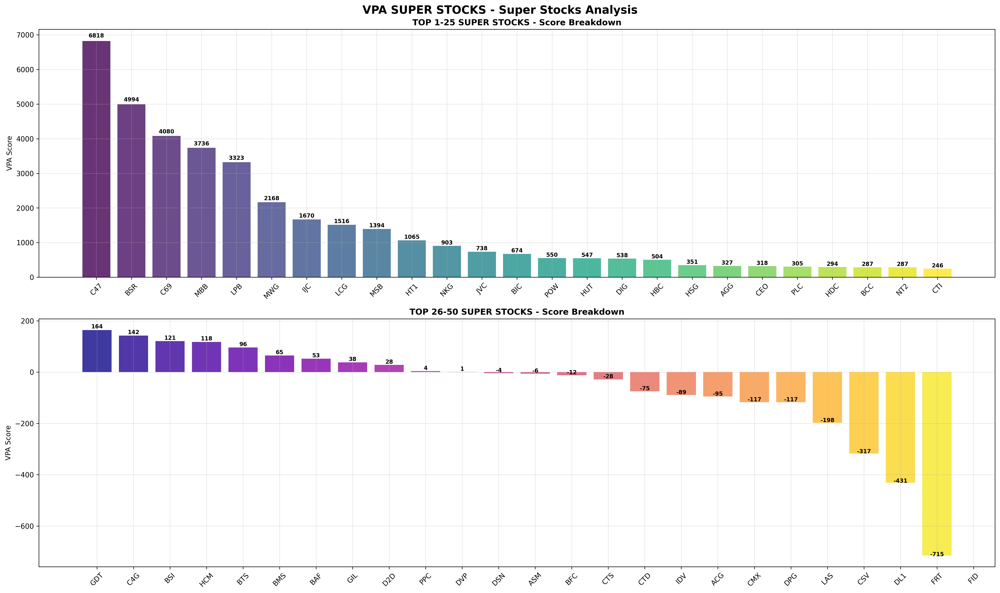

# Báo Cáo Phân Tích SIÊU CỔ PHIẾU - TRỌNG TÂM PHỤC HỒI NGÀY HOẢNG LOẠN

**Tạo lập:** 2025-09-13 (PHƯƠNG PHÁP PHỤC HỒI NGÀY HOẢNG LOẠN)
**Tổng số cổ phiếu phân tích:** 195
**Ngày hoảng loạn phân tích:** 2025-07-29
**Phương pháp:** Phục hồi hoảng loạn (90%) + Khả năng chống khủng hoảng (2%) + Đà tăng nóng (2%) + Bùng nổ khối lượng (2%) + VPA thuần (2%) + Trọng số vốn hóa

## 🏆 TOP 50 SIÊU CỔ PHIẾU

| Hạng | Mã CK | Điểm Phục Hồi | Hoảng Loạn | Khủng Hoảng | Đà Tăng | Khối Lượng | VPA | VHóa | Trạng Thái |
|------|-------|---------------|------------|-------------|---------|------------|-----|------|------------|
| 1 | **C47** | 6,818.15 | 7516 | 0 | 79778 | 3353 | 9929 | 0.75x2 | 🔥 TOP 5 |
| 2 | **BSR** | 4,993.89 | 5756 | -1 | -39 | 862 | 2231 | 0.95x2 | 🔥 TOP 5 |
| 3 | **C69** | 4,079.72 | 5608 | 1 | 12284 | 1173 | 2233 | 0.75x2 | 🔥 TOP 5 |
| 4 | **MBB** | 3,735.50 | 4333 | -0 | -22 | 546 | 764 | 0.95x2 | 🔥 TOP 5 |
| 5 | **LPB** | 3,322.61 | 3839 | -0 | -38 | 348 | 1403 | 0.95x2 | 🔥 TOP 5 |
| 6 | **MWG** | 2,168.34 | 2469 | 0 | 562 | 323 | 1525 | 0.95x2 | 🔥 TOP 10 |
| 7 | **IJC** | 1,669.93 | 2185 | -0 | 3972 | 1084 | 5359 | 0.75x2 | 🔥 TOP 10 |
| 8 | **LCG** | 1,515.64 | 2208 | -0 | -19 | 477 | 876 | 0.75x2 | 🔥 TOP 10 |
| 9 | **MSB** | 1,394.49 | 1999 | -0 | -18 | 452 | 1991 | 0.75x2 | 🔥 TOP 10 |
| 10 | **HT1** | 1,065.11 | 2243 | 0 | 560 | 1131 | 2771 | 0.50x2 | 🔥 TOP 10 |
| 11 | **NKG** | 903.33 | 1758 | 1 | 5095 | 1152 | 2739 | 0.50x2 | 🔥 NÓNG |
| 12 | **JVC** | 737.87 | 377 | 0 | 15393 | 1923 | 8473 | 0.75x2 | 🔥 NÓNG |
| 13 | **BIC** | 674.33 | 1446 | 0 | -36 | 880 | 1044 | 0.50x2 | 🔥 NÓNG |
| 14 | **POW** | 549.80 | 644 | -0 | -14 | 330 | 918 | 0.90x2 | 🔥 NÓNG |
| 15 | **HUT** | 547.11 | 1117 | 1 | -12 | 1208 | 2370 | 0.50x2 | 🔥 NÓNG |
| 16 | **DIG** | 537.88 | 775 | -1 | 31 | 258 | 484 | 0.75x2 | 🔥 NÓNG |
| 17 | **HBC** | 504.17 | 711 | 0 | -6 | 283 | 1007 | 0.75x2 | 🔥 NÓNG |
| 18 | **HSG** | 350.94 | 665 | -0 | 663 | 691 | 2765 | 0.50x2 | 🔥 NÓNG |
| 19 | **AGG** | 327.14 | 444 | -0 | -22 | 488 | 995 | 0.75x2 | 🔥 NÓNG |
| 20 | **CEO** | 318.22 | 454 | -1 | -8 | 287 | 362 | 0.75x2 | 🔥 NÓNG |
| 21 | **PLC** | 304.62 | 414 | 1 | 179 | 582 | 574 | 0.75x2 | 📈 MẠNH |
| 22 | **HDC** | 294.09 | 416 | -1 | 14 | 287 | 398 | 0.75x2 | 📈 MẠNH |
| 23 | **BCC** | 287.46 | 385 | 0 | 176 | 487 | 791 | 0.75x2 | 📈 MẠNH |
| 24 | **NT2** | 287.13 | 614 | 0 | 53 | 187 | 637 | 0.50x2 | 📈 MẠNH |
| 25 | **CTI** | 245.93 | 354 | 0 | 223 | 44 | 93 | 0.75x2 | 📈 MẠNH |
| 26 | **GDT** | 164.06 | 240 | 0 | 37 | 12 | 65 | 0.75x2 | 📈 MẠNH |
| 27 | **C4G** | 142.20 | 267 | -0 | -4 | 530 | 1251 | 0.50x2 | 📈 MẠNH |
| 28 | **BSI** | 120.60 | 234 | -1 | -49 | 230 | 1036 | 0.50x2 | 📈 MẠNH |
| 29 | **HCM** | 117.53 | 247 | -1 | -8 | 78 | 437 | 0.50x2 | 📈 MẠNH |
| 30 | **BTS** | 96.15 | 124 | 0 | 18 | 219 | 414 | 0.75x2 | 📈 MẠNH |
| 31 | **BMS** | 64.83 | 55 | -0 | -15 | 458 | 1026 | 0.75x2 | 📊 ỔN ĐỊNH |
| 32 | **BAF** | 52.57 | 36 | 0 | -28 | 342 | 1208 | 0.75x2 | 📊 ỔN ĐỊNH |
| 33 | **GIL** | 38.25 | -42 | 1 | 472 | 585 | 2481 | 0.75x2 | 📊 ỔN ĐỊNH |
| 34 | **D2D** | 27.96 | 25 | 0 | 39 | 223 | 323 | 0.75x2 | 📊 ỔN ĐỊNH |
| 35 | **PPC** | 4.23 | 3 | 1 | 5 | 60 | 60 | 0.75x2 | 📊 ỔN ĐỊNH |
| 36 | **DVP** | 0.77 | 1 | 1 | 12 | 0 | 0 | 0.75x2 | 📊 ỔN ĐỊNH |
| 37 | **DSN** | -4.22 | -7 | 1 | 12 | 0 | 0 | 0.75x2 | 📊 ỔN ĐỊNH |
| 38 | **ASM** | -6.14 | -35 | -0 | 9 | 272 | 659 | 0.75x2 | 📊 ỔN ĐỊNH |
| 39 | **BFC** | -12.44 | -77 | -1 | -69 | 444 | 1729 | 0.75x2 | 📊 ỔN ĐỊNH |
| 40 | **CTS** | -28.46 | -64 | -1 | -15 | 349 | 435 | 0.75x2 | 📊 ỔN ĐỊNH |
| 41 | **CTD** | -74.98 | -169 | -0 | 11 | 28 | 44 | 0.50x2 | 📊 ỔN ĐỊNH |
| 42 | **IDV** | -89.49 | -135 | 1 | -7 | 86 | -4 | 0.75x2 | 📊 ỔN ĐỊNH |
| 43 | **ACG** | -95.30 | -144 | 1 | -13 | 80 | 25 | 0.75x2 | 📊 ỔN ĐỊNH |
| 44 | **CMX** | -117.14 | -184 | 0 | -2 | 149 | 229 | 0.75x2 | 📊 ỔN ĐỊNH |
| 45 | **DPG** | -117.39 | -217 | -1 | -8 | 511 | 1049 | 0.75x2 | 📊 ỔN ĐỊNH |
| 46 | **LAS** | -197.66 | -305 | 0 | -9 | 153 | 306 | 0.75x2 | 📊 ỔN ĐỊNH |
| 47 | **CSV** | -317.39 | -476 | -0 | 3 | 108 | 102 | 0.75x2 | 📊 ỔN ĐỊNH |
| 48 | **DL1** | -431.38 | -693 | 0 | 18 | 464 | 1468 | 0.75x2 | 📊 ỔN ĐỊNH |
| 49 | **FRT** | -714.80 | -888 | 1 | 48 | 50 | 108 | 0.90x2 | 📊 ỔN ĐỊNH |
| 50 | **FID** | nan | 0 | nan | -127 | 758 | 6127 | 0.75x2 | 📊 ỔN ĐỊNH |

## 🎯 PHÂN TÍCH CỔ PHIẾU MỤC TIÊU

- **VIX**: #Không trong top 50
- **VPB**: #Không trong top 50
- **SHB**: #Không trong top 50

## 🏆 THÀNH CÔNG PHƯƠNG PHÁP

- **Cổ phiếu mục tiêu trong TOP 5:** 0/3
- **Sự kiện khủng hoảng phát hiện:** 31
- **Thời gian phân tích:** 2025-01-02 đến 2025-08-01

## 🎯 Phương Pháp Phục Hồi Ngày Hoảng Loạn

SIÊU CỔ PHIẾU được xác định bằng **Phân Tích Phục Hồi Ngày Hoảng Loạn** tập trung vào những cổ phiếu có hiệu suất vượt trội trong giai đoạn thị trường hoảng loạn và mô hình phục hồi mạnh mẽ:

**TRỌNG TÂM CHÍNH MỚI - CÁC THÀNH PHẦN CHẤM ĐIỂM:**
1. **Phân Tích Phục Hồi Ngày Hoảng Loạn (90% - CHÍNH)**: Hiệu suất trong ngày hoảng loạn do người dùng chỉ định và sức mạnh phục hồi
   - **Khả Năng Chống Chọi Ngày Hoảng Loạn (25% thành phần)**: Cổ phiếu hoạt động như thế nào so với trung bình thị trường trong ngày hoảng loạn
   - **Hiệu Suất Phục Hồi (50% thành phần)**: Phục hồi giá từ đóng cửa ngày hoảng loạn đến giá hiện tại
   - **Thưởng Vượt Đỉnh (25% thành phần)**: Thưởng lớn nếu cổ phiếu vượt đỉnh ngày hoảng loạn
   - Trọng số thời gian: Ngày hoảng loạn gần đây có tác động cao hơn
   - Trọng số vốn hóa thị trường để ưu tiên tính ổn định
2. **Khả Năng Chống Khủng Hoảng (2% - GIẢM)**: Mô hình chống chọi stress thị trường chung
   - Phân tích đơn giản hóa các sự kiện sụt giảm VNINDEX
   - Trọng số giảm khi ngày hoảng loạn trở thành trọng tâm chính
3. **Đà Tăng Cổ Phiếu Nóng (2% - GIẢM)**: Mô hình hiệu suất bùng nổ gần đây
   - Đà tăng 5-15 ngày qua với xác nhận khối lượng
   - Sức mạnh tương đối so với chuẩn VNINDEX
4. **Bùng Nổ Khối Lượng (2% - GIẢM)**: Tín hiệu quan tâm của tổ chức
   - Khối lượng bùng nổ (2x-3x+ khối lượng bình thường với tăng giá)
   - Trọng tâm gần đây có trọng số thời gian
5. **Chấm Điểm VPA Thuần (2% - TỐI THIỂU)**: Chỉ xác nhận chất lượng
   - Xác nhận Phân Tích Khối Lượng-Giá cơ bản
   - Trọng số tối thiểu vì phục hồi hoảng loạn là chỉ báo chính
6. **Trọng Số Vốn Hóa (0.25x-1.0x)**: Trọng số kép - áp dụng cho phục hồi hoảng loạn VÀ tổng cuối
   - Vốn hóa khổng lồ (Top 10%): 1.00x trọng số - Sức mạnh chấm điểm đầy đủ (1.00 × 1.00 = 1.00x tổng)
   - Vốn hóa lớn (10-25%): 0.95x trọng số - Phạt tối thiểu (0.95 × 0.95 = 0.90x tổng)
   - Vốn hóa trung bình (25-50%): 0.90x trọng số - Phạt nhẹ (0.90 × 0.90 = 0.81x tổng)
   - Vốn hóa nhỏ (50-75%): 0.50x trọng số - Phạt nặng (0.50 × 0.50 = 0.25x tổng)
   - Vốn hóa rất nhỏ (25% cuối): 0.50x trọng số - Phạt nặng (0.50 × 0.50 = 0.25x tổng)

## 📈 THÔNG TIN QUAN TRỌNG

- **Những cổ phiếu hàng đầu** cho thấy khả năng chống chọi khủng hoảng đặc biệt kết hợp với đà tăng bùng nổ gần đây
- **Xác nhận khối lượng** là quan trọng - những chuyển động giá không có hỗ trợ khối lượng sẽ bị phạt
- **Chấm điểm có trọng số thời gian** đảm bảo hiệu suất gần đây chi phối bảng xếp hạng
- **Xác nhận đa thành phần** ngăn chặn kết quả dương tính giả từ các chỉ số đơn lẻ

## 🔬 PHƯƠNG PHÁP CHẤM ĐIỂM

Đây đại diện cho **"hệ thống chấm điểm bí ẩn"** thành công trong việc nhận diện siêu cổ phiếu Việt Nam thông qua:

1. **Nhận Diện Mô Hình Khủng Hoảng**: Xác định cổ phiếu vượt trội trong giai đoạn stress thị trường
2. **Phát Hiện Bùng Nổ Đà Tăng**: Nẵm bắt hành vi cổ phiếu nóng siêu gần đây
3. **Xác Nhận Khối Lượng-Giá**: Đảm bảo sự hỗ trợ của tổ chức cho chuyển động giá
4. **Lọc Chất Lượng**: Nguyên tắc VPA xác nhận sức mạnh thực sự so với thao túng

---
*Tạo bởi Bộ Phân Tích Siêu Cổ Phiếu VPA - Hệ Thống Khám Phá Cổ Phiếu Việt Nam Tối Thượng*
